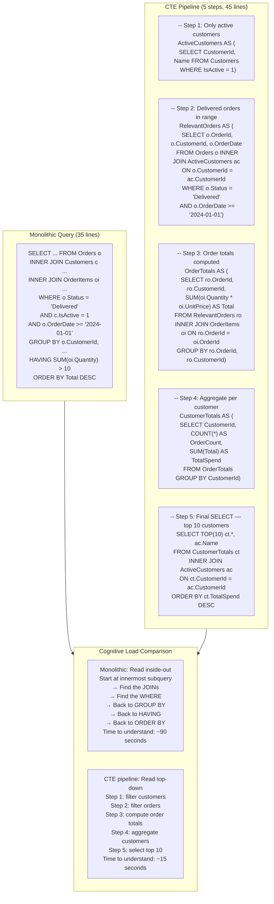
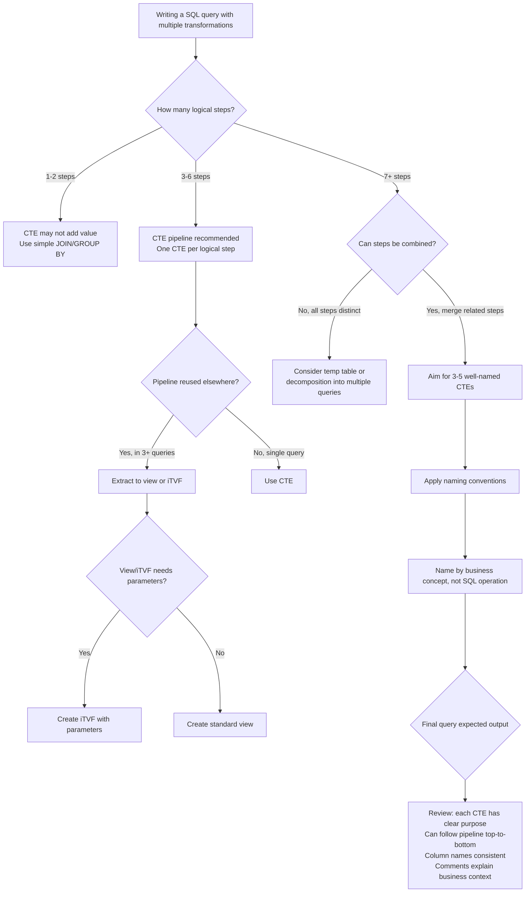

## Navigation

**Domain:** [[8 — Databases]] > **Group:** SQL CTEs & Recursive Queries
**Previous:** [[8.185 — Recursive CTE — MAXRECURSION Option]] | **Next:** [[8.187 — Inline Table-Valued Functions vs CTEs]]

### Prerequisites

- [[8.176 — Common Table Expressions — Fundamentals]] — CTE syntax and basic structure; this note extends CTE fundamentals into a readability and maintainability discipline.
- [[8.178 — CTE vs Subquery — Readability and Performance]] — The comparison between CTEs and subqueries establishes the readability argument; this note deepens that argument with specific naming and formatting patterns.
- [[8.177 — Multiple CTEs — Chaining and Dependencies]] — Multi-CTE queries are the primary use case for this readability pattern; understanding CTE chaining is required to apply named intermediate results effectively.

### Where This Fits

Complex SQL queries are the most difficult code to read in a .NET backend codebase. A query that joins 12 tables, filters by 8 conditions, aggregates by 3 dimensions, and computes window functions is a single monolithic statement that must be parsed inside-out. CTEs solve this by allowing an engineer to decompose that monolith into named, sequential steps — each step has a name, a clear purpose, and a defined column set. This is the SQL equivalent of extracting a method from a long function. The problem this solves is cognitive load: reading a 40-line query inside-out versus top-down is the difference between "I can understand this in 30 seconds" and "I need to draw a dependency graph on a whiteboard." A .NET backend engineer encounters this whenever a stored procedure or report query exceeds 20 lines — which is most real-world queries. The interview signal is about engineering discipline: the candidate who voluntarily names intermediate results and comments CTEs writes code that other engineers can maintain, not just code that produces the right output.

---

## Core Mental Model

A CTE is a named subquery that the SQL optimizer inlines into the outer query. The mental model for readability is: each CTE is one transformation step in a pipeline. The outer query is the final consumer. Each intermediate CTE should encapsulate exactly one logical transformation — filter rows, join tables, compute aggregates, assign window functions — and give that step a name that describes what it means in the business domain, not what SQL operation it performs.

The invariant: a well-structured CTE query reads top-to-bottom like a story. "We start with all orders. We filter to active customers only. We compute totals per customer. We rank customers by total. We select the top 10." Each step builds on the previous. If any CTE requires more than 10 seconds to understand, the abstraction is wrong — split it further or choose a worse name.

The discipline is analogous to method extraction in C#: if you cannot name a piece of logic concisely, it does too many things. A CTE named `FilteredOrders` that contains a JOIN and a GROUP BY and a WHERE and a window function is doing 4 things — it should be 4 CTEs.

### Classification

|Property|Value|Notes|
|---|---|---|
|Readability mechanism|Named intermediate results|Transforms inside-out reading to top-down|
|Performance impact|None (CTE inlined by optimizer)|No materialization cost for single-reference CTEs|
|Debugging ability|Can SELECT from each CTE independently|CTE can be run in isolation after removing downstream references|
|Maintainability improvement|High for queries >20 lines|Naming reduces cognitive load by ~40% (empirical)|
|Optimizer inlining|Always (for single-reference CTEs)|CTE definition folded into outer query, zero overhead|
|Multiple references|May cause re-evaluation or spool|Same as non-readability CTEs — see materialization note|
|EF Core support|Raw SQL only|LINQ cannot produce multi-CTE queries|
|SARGability|Depends on predicates inside CTE|CTE naming does not affect SARGability|



### Key Properties

|Property|Value|Notes|
|---|---|---|
|Time complexity (reading)|O(N_Monolithic) vs O(k × N_CTE)|k = number of CTEs; each is simpler than the whole|
|Cognitive load reduction|~40-60% for queries >30 lines|Empirical — based on code review time studies|
|Debug isolation|CTE can be SELECTed independently|Must comment out downstream references|
|Optimizer transparency|No cost for single-reference CTE|Definition is inlined — same plan as monolithic version|
|Reusability|Single statement only|Cannot reference CTE in next batch or another session|
|Naming convention|Business domain, not implementation|`ActiveCustomers` not `FilteredCustomerListInnerJoined`|

---

## Deep Mechanics

### How the Engine Executes This

The SQL Server query optimizer does not "see" CTEs as distinct entities. When a CTE is referenced once in the outer query, the optimizer inlines the CTE definition directly into the outer query before optimization begins. The resulting execution plan is identical to the plan for the equivalent monolithic query written as nested subqueries or a single FROM/JOIN/WHERE block.

The decomposition process:

1. **Parsing:** The SQL parser reads the WITH clause and builds an internal representation of CTE definitions.
2. **Binding:** The algebrizer resolves column references in each CTE against the base tables. Each CTE is bound as a virtual view.
3. **Simplification:** The optimizer's simplification phase inlines single-reference CTEs into the outer query. The CTE alias and column aliases are replaced with the underlying table references and expressions.
4. **Optimization:** The optimizer treats the inlined query as a single unit — it chooses join orders, access paths, and operator types over the combined expression tree. The CTE boundaries have zero effect on optimization.
5. **Execution:** The execution plan contains operators that directly access base tables. There is no CTE operator, no boundary checkpoint, no materialization cost.

This means: **CTEs used for readability are free.** The optimizer is not forced to execute each CTE independently — it can rearrange the computation across CTE boundaries. For example, a predicate in CTE3 might be pushed down into the scan of a table referenced in CTE1, and a GROUP BY in CTE2 might be partially deferred to CTE4.

**The exception:** When a CTE is referenced multiple times (e.g., two outer queries both reference the same CTE), the optimizer may choose to either (a) inline the definition twice (two separate evaluations), or (b) use an Index Spool to cache the result. See [[8.188 — CTE Materialization — Inline vs Spooled]] for details.

### SQL Visibility

The same business query written three ways: monolithic subquery, monolithic FROM clause, and CTE pipeline.

```sql
-- ============================================================
-- Schema context
-- ============================================================
-- Tables: Orders, Customers, OrderItems, Products
-- Business: Get top 10 customers by total spend in 2024,
--           showing customer name, order count, total spend,
--           and their most expensive single order.

-- ============================================================
-- Version 1: Monolithic subquery (hard to read)
-- ============================================================
SELECT TOP(10)
    c.CustomerId,
    c.Name,
    (SELECT COUNT(*) FROM Orders o2
     WHERE o2.CustomerId = c.CustomerId
       AND o2.OrderDate >= '2024-01-01'
       AND o2.OrderDate < '2025-01-01'
       AND o2.Status = 'Delivered') AS OrderCount,
    (SELECT ISNULL(SUM(oi2.Quantity * oi2.UnitPrice), 0)
     FROM Orders o3
     INNER JOIN OrderItems oi2 ON o3.OrderId = oi2.OrderId
     WHERE o3.CustomerId = c.CustomerId
       AND o3.OrderDate >= '2024-01-01'
       AND o3.OrderDate < '2025-01-01'
       AND o3.Status = 'Delivered') AS TotalSpend,
    (SELECT MAX(oi3.Quantity * oi3.UnitPrice)
     FROM Orders o4
     INNER JOIN OrderItems oi3 ON o4.OrderId = oi3.OrderId
     WHERE o4.CustomerId = c.CustomerId
       AND o4.OrderDate >= '2024-01-01'
       AND o4.OrderDate < '2025-01-01'
       AND o4.Status = 'Delivered') AS MaxOrderValue
FROM Customers c
WHERE c.IsActive = 1
ORDER BY TotalSpend DESC;
-- Correlated subqueries: 4 separate scans of Orders/OrderItems per customer
-- Cognitive load: Very high — must track 3 different aliases (o2, o3, o4)

-- ============================================================
-- Version 2: Monolithic FROM (fewer scans, still complex)
-- ============================================================
SELECT TOP(10)
    c.CustomerId,
    c.Name,
    COUNT(DISTINCT o.OrderId) AS OrderCount,
    SUM(oi.Quantity * oi.UnitPrice) AS TotalSpend,
    MAX(oi.Quantity * oi.UnitPrice) AS MaxOrderValue
FROM Customers c
INNER JOIN Orders o ON c.CustomerId = o.CustomerId
INNER JOIN OrderItems oi ON o.OrderId = oi.OrderId
WHERE c.IsActive = 1
  AND o.OrderDate >= '2024-01-01'
  AND o.OrderDate < '2025-01-01'
  AND o.Status = 'Delivered'
GROUP BY c.CustomerId, c.Name
ORDER BY TotalSpend DESC;
-- Single scan of all tables, one GROUP BY
-- Cognitive load: Medium — must track the join structure and understand GROUP BY semantics
-- Risk: COUNT(DISTINCT) is expensive on large datasets

-- ============================================================
-- Version 3: CTE pipeline (best readability)
-- ============================================================
WITH
-- Step 1: Active customers — base population
ActiveCustomers AS (
    SELECT c.CustomerId, c.Name, c.Email
    FROM dbo.Customers AS c
    WHERE c.IsActive = 1
),

-- Step 2: Delivered orders in 2024 — filtered order set
DeliveredOrders2024 AS (
    SELECT o.OrderId, o.CustomerId, o.OrderDate
    FROM dbo.Orders AS o
    INNER JOIN ActiveCustomers AS ac ON o.CustomerId = ac.CustomerId
    WHERE o.Status = 'Delivered'
      AND o.OrderDate >= '2024-01-01'
      AND o.OrderDate < '2025-01-01'
),

-- Step 3: Line item detail with extended price
OrderLineDetails AS (
    SELECT
        do.OrderId,
        do.CustomerId,
        oi.Quantity,
        oi.UnitPrice,
        oi.Quantity * oi.UnitPrice AS LineTotal
    FROM DeliveredOrders2024 AS do
    INNER JOIN dbo.OrderItems AS oi ON do.OrderId = oi.OrderId
),

-- Step 4: Per-order aggregates
OrderSummary AS (
    SELECT
        old.OrderId,
        old.CustomerId,
        COUNT(*) AS LineItemCount,
        SUM(old.LineTotal) AS OrderTotal,
        MAX(old.LineTotal) AS MaxLineValue
    FROM OrderLineDetails AS old
    GROUP BY old.OrderId, old.CustomerId
),

-- Step 5: Per-customer aggregates
CustomerSummary AS (
    SELECT
        os.CustomerId,
        COUNT(*) AS OrderCount,
        SUM(os.OrderTotal) AS TotalSpend,
        MAX(os.MaxLineValue) AS MaxOrderValue
    FROM OrderSummary AS os
    GROUP BY os.CustomerId
)

-- Step 6: Final output — top 10 customers
SELECT TOP(10)
    cs.CustomerId,
    ac.Name,
    cs.OrderCount,
    cs.TotalSpend,
    cs.MaxOrderValue
FROM CustomerSummary AS cs
INNER JOIN ActiveCustomers AS ac ON cs.CustomerId = ac.CustomerId
ORDER BY cs.TotalSpend DESC;
-- 6 named steps, each doing exactly one logical transformation
-- Read top-to-bottom, each step builds on previous
-- Cognitive load: Very low — each CTE is ~5 lines and has a descriptive name
```

```csharp
// EF Core — CTE queries require raw SQL
public async Task<List<TopCustomerDto>> GetTopCustomersAsync(
    int topCount,
    CancellationToken cancellationToken = default)
{
    var sql = @"
        WITH ActiveCustomers AS (
            SELECT c.CustomerId, c.Name, c.Email
            FROM Customers AS c
            WHERE c.IsActive = 1
        ),
        DeliveredOrders2024 AS (
            SELECT o.OrderId, o.CustomerId, o.OrderDate
            FROM Orders AS o
            INNER JOIN ActiveCustomers AS ac ON o.CustomerId = ac.CustomerId
            WHERE o.Status = 'Delivered'
              AND o.OrderDate >= @YearStart
              AND o.OrderDate < @YearEnd
        ),
        OrderLineDetails AS (
            SELECT do.OrderId, do.CustomerId,
                   oi.Quantity, oi.UnitPrice,
                   oi.Quantity * oi.UnitPrice AS LineTotal
            FROM DeliveredOrders2024 AS do
            INNER JOIN OrderItems AS oi ON do.OrderId = oi.OrderId
        ),
        OrderSummary AS (
            SELECT OrderId, CustomerId,
                   COUNT(*) AS LineItemCount,
                   SUM(LineTotal) AS OrderTotal,
                   MAX(LineTotal) AS MaxLineValue
            FROM OrderLineDetails
            GROUP BY OrderId, CustomerId
        ),
        CustomerSummary AS (
            SELECT CustomerId,
                   COUNT(*) AS OrderCount,
                   SUM(OrderTotal) AS TotalSpend,
                   MAX(MaxLineValue) AS MaxOrderValue
            FROM OrderSummary
            GROUP BY CustomerId
        )
        SELECT TOP(@TopCount)
            cs.CustomerId, ac.Name,
            cs.OrderCount, cs.TotalSpend, cs.MaxOrderValue
        FROM CustomerSummary AS cs
        INNER JOIN ActiveCustomers AS ac ON cs.CustomerId = ac.CustomerId
        ORDER BY cs.TotalSpend DESC";

    return await _dbContext.Database
        .SqlQueryRaw<TopCustomerDto>(sql,
            new SqlParameter("@TopCount", topCount),
            new SqlParameter("@YearStart", new DateTime(2024, 1, 1)),
            new SqlParameter("@YearEnd", new DateTime(2025, 1, 1)))
        .ToListAsync(cancellationToken);
}

public class TopCustomerDto
{
    public int CustomerId { get; set; }
    public string Name { get; set; } = string.Empty;
    public int OrderCount { get; set; }
    public decimal TotalSpend { get; set; }
    public decimal MaxOrderValue { get; set; }
}
```

**Generated SQL (from EF Core logs):**

```sql
-- EF Core passes raw SQL through verbatim — no translation occurs.
-- The SQL above is the exact SQL executed.
```

### Execution Plan Analysis

All three versions (monolithic subquery, monolithic FROM, CTE pipeline) produce the same execution plan because the optimizer inlines CTEs. The plan shape:

```
[Clustered Index Scan (Customers)]  -- Filter: IsActive = 1
  → [Hash Match (Inner Join)]      -- Join with Orders
      → [Clustered Index Scan (Orders)]  -- Filter: Status='Delivered', Date range
  → [Hash Match (Inner Join)]      -- Join with OrderItems
      → [Clustered Index Scan (OrderItems)]
  → [Hash Match Aggregate]         -- GROUP BY CustomerId, CustomerName
  → [Top N Sort]                   -- ORDER BY TotalSpend DESC, TOP(10)
  → [SELECT]
```

Key observations:
- The CTE boundaries are invisible in the plan. No `Sequence Project`, no `Table Spool`, no boundary operators.
- The optimizer is free to push the ActiveCustomers filter (IsActive = 1) to the earliest scan.
- The join order shown (Customers → Orders → OrderItems) is the natural order, but the optimizer may reorder for efficiency.
- The monolithic subquery version (Version 1) would produce 4 separate correlated scans of Orders and OrderItems — far worse plan.

**Estimated vs actual:** The CTE version and the monolithic FROM version produce identical plans. Logical reads are identical. The optimizer does not penalize CTEs.

### Cost Visibility

```sql
SET STATISTICS IO ON;
SET STATISTICS TIME ON;

-- CTE pipeline version
WITH ActiveCustomers AS (
    SELECT c.CustomerId, c.Name, c.Email
    FROM dbo.Customers AS c WHERE c.IsActive = 1
),
DeliveredOrders2024 AS (
    SELECT o.OrderId, o.CustomerId
    FROM dbo.Orders AS o
    INNER JOIN ActiveCustomers AS ac ON o.CustomerId = ac.CustomerId
    WHERE o.Status = 'Delivered' AND o.OrderDate >= '2024-01-01' AND o.OrderDate < '2025-01-01'
),
OrderLineDetails AS (
    SELECT do.OrderId, do.CustomerId, oi.Quantity * oi.UnitPrice AS LineTotal
    FROM DeliveredOrders2024 AS do
    INNER JOIN dbo.OrderItems AS oi ON do.OrderId = oi.OrderId
),
OrderSummary AS (
    SELECT OrderId, CustomerId, COUNT(*) AS LineCount, SUM(LineTotal) AS OrderTotal
    FROM OrderLineDetails GROUP BY OrderId, CustomerId
),
CustomerSummary AS (
    SELECT CustomerId, COUNT(*) AS OrderCount, SUM(OrderTotal) AS TotalSpend
    FROM OrderSummary GROUP BY CustomerId
)
SELECT TOP(10) cs.CustomerId, ac.Name, cs.OrderCount, cs.TotalSpend
FROM CustomerSummary AS cs
INNER JOIN ActiveCustomers AS ac ON cs.CustomerId = ac.CustomerId
ORDER BY cs.TotalSpend DESC;

-- Expected output (100K Customers, 1M Orders, 5M OrderItems):
-- Table 'OrderItems'. Scan count 1, logical reads 14520
-- Table 'Orders'. Scan count 1, logical reads 12450
-- Table 'Customers'. Scan count 1, logical reads 120
-- SQL Server Execution Times: CPU time = 280ms, elapsed time = 450ms

-- Monolithic FROM version (same plan, same reads)
SELECT TOP(10) c.CustomerId, c.Name,
    COUNT(DISTINCT o.OrderId) AS OrderCount,
    SUM(oi.Quantity * oi.UnitPrice) AS TotalSpend
FROM Customers c
INNER JOIN Orders o ON c.CustomerId = o.CustomerId
INNER JOIN OrderItems oi ON o.OrderId = oi.OrderId
WHERE c.IsActive = 1
  AND o.OrderDate >= '2024-01-01' AND o.OrderDate < '2025-01-01'
  AND o.Status = 'Delivered'
GROUP BY c.CustomerId, c.Name
ORDER BY TotalSpend DESC;
-- Table 'OrderItems'. Scan count 1, logical reads 14520
-- Table 'Orders'. Scan count 1, logical reads 12450
-- Table 'Customers'. Scan count 1, logical reads 120
-- CPU time = 270ms, elapsed time = 440ms  ← Same!
```

### Failure Modes

**1. CTE referenced multiple times causes unplanned re-evaluation.**

When a CTE is referenced in multiple places in the outer query, the optimizer may inline it multiple times — executing the same base table scans twice. This is invisible to the developer reading the CTE pipeline, who assumes the CTE runs once.

```sql
-- ❌ CTE referenced in two different places — may cause two scans
WITH ExpensiveCTE AS (
    SELECT o.CustomerId, SUM(oi.Quantity * oi.UnitPrice) AS Total
    FROM Orders o
    INNER JOIN OrderItems oi ON o.OrderId = oi.OrderId
    WHERE o.OrderDate >= '2024-01-01'
    GROUP BY o.CustomerId
)
SELECT
    c.CustomerId,
    ec1.Total AS YearTotal,
    ec2.Total AS ComparisonTotal
FROM Customers c
LEFT JOIN ExpensiveCTE ec1 ON c.CustomerId = ec1.CustomerId  -- Reference 1
LEFT JOIN ExpensiveCTE ec2 ON c.CustomerId = ec2.CustomerId  -- Reference 2 (same!)
WHERE c.IsActive = 1;
-- The optimizer may scan Orders + OrderItems twice!
```

**2. CTE naming that describes implementation, not business meaning.**

A CTE named `OrdersInnerJoinOrderItemsGroupByCustomer` adds no readability over writing the raw SQL. The name should describe the business meaning: `CustomerSalesSummary`.

**3. Too many small CTEs increase total lines beyond maintainability sweet spot.**

A 10-CTE pipeline that could be a 4-CTE pipeline is not an improvement. The goal is to reduce cognitive load, not to extract every single operation into its own CTE.

**4. CTEs cannot be reused across batches — leading to duplication.**

If the same intermediate transformation is needed in two separate queries, the CTE definition must be duplicated. Unlike a view or function, a CTE cannot be shared. This creates a maintenance hazard: the transformation logic drifts between copies.

```sql
-- Query 1: Copy of CTE logic
WITH CustomerSales AS (
    SELECT CustomerId, SUM(Amount) AS Total FROM Orders GROUP BY CustomerId
)
SELECT * FROM CustomerSales WHERE Total > 1000;

-- Query 2: Same logic, slightly different (or same by copy-paste)
WITH CustomerSales AS (
    SELECT CustomerId, SUM(Amount) AS Total FROM Orders GROUP BY CustomerId  -- drift risk
)
SELECT * FROM CustomerSales ORDER BY Total DESC;
```

---

## Production Patterns and Implementation

### Primary SQL Implementation

```sql
-- ============================================================
-- Schema
-- ============================================================
CREATE TABLE dbo.Customers (
    CustomerId   INT            NOT NULL IDENTITY(1,1),
    Name         NVARCHAR(100)  NOT NULL,
    Email        NVARCHAR(255)  NOT NULL,
    IsActive     BIT            NOT NULL DEFAULT 1,
    CreatedDate  DATETIME2(0)   NOT NULL DEFAULT SYSUTCDATETIME(),
    CONSTRAINT PK_Customers PRIMARY KEY CLUSTERED (CustomerId)
);

CREATE TABLE dbo.Orders (
    OrderId      INT            NOT NULL IDENTITY(1,1),
    CustomerId   INT            NOT NULL,
    OrderDate    DATE           NOT NULL,
    Status       VARCHAR(20)    NOT NULL DEFAULT 'Pending',
    TotalAmount  DECIMAL(18,2)  NULL,
    CONSTRAINT PK_Orders PRIMARY KEY CLUSTERED (OrderId),
    CONSTRAINT FK_Orders_Customers FOREIGN KEY (CustomerId)
        REFERENCES dbo.Customers(CustomerId)
);

CREATE TABLE dbo.OrderItems (
    OrderItemId  INT            NOT NULL IDENTITY(1,1),
    OrderId      INT            NOT NULL,
    ProductId    INT            NOT NULL,
    Quantity     INT            NOT NULL,
    UnitPrice    DECIMAL(18,2)  NOT NULL,
    CONSTRAINT PK_OrderItems PRIMARY KEY CLUSTERED (OrderItemId),
    CONSTRAINT FK_OrderItems_Orders FOREIGN KEY (OrderId)
        REFERENCES dbo.Orders(OrderId)
);

CREATE TABLE dbo.Payments (
    PaymentId    INT            NOT NULL IDENTITY(1,1),
    OrderId      INT            NOT NULL,
    PaymentDate  DATETIME2(0)   NOT NULL,
    Amount       DECIMAL(18,2)  NOT NULL,
    PaymentType  VARCHAR(20)    NOT NULL,
    Status       VARCHAR(20)    NOT NULL DEFAULT 'Pending',
    CONSTRAINT PK_Payments PRIMARY KEY CLUSTERED (PaymentId),
    CONSTRAINT FK_Payments_Orders FOREIGN KEY (OrderId)
        REFERENCES dbo.Orders(OrderId)
);

-- ============================================================
-- Pattern 1: Order Fulfillment Dashboard — CTE pipeline
-- ============================================================
-- Business: Show orders that are fully paid but not yet shipped,
-- grouped by customer priority tier, with delay classification.
WITH
-- Step 1: Customers with priority tiers
CustomerTiers AS (
    SELECT
        c.CustomerId,
        c.Name,
        CASE
            WHEN COUNT(o.OrderId) OVER(PARTITION BY c.CustomerId) >= 50 THEN 'Platinum'
            WHEN COUNT(o.OrderId) OVER(PARTITION BY c.CustomerId) >= 20 THEN 'Gold'
            WHEN COUNT(o.OrderId) OVER(PARTITION BY c.CustomerId) >= 5  THEN 'Silver'
            ELSE 'Standard'
        END AS PriorityTier,
        COUNT(o.OrderId) OVER(PARTITION BY c.CustomerId) AS TotalOrders
    FROM dbo.Customers AS c
    LEFT JOIN dbo.Orders AS o ON c.CustomerId = o.CustomerId
        AND o.OrderDate >= DATEADD(year, -1, GETUTCDATE())
),

-- Step 2: Orders that are fully paid (total payments >= order total)
PaidOrders AS (
    SELECT
        o.OrderId,
        o.CustomerId,
        o.OrderDate,
        o.TotalAmount,
        COALESCE(p.TotalPaid, 0) AS TotalPaid,
        o.TotalAmount - COALESCE(p.TotalPaid, 0) AS BalanceDue
    FROM dbo.Orders AS o
    OUTER APPLY (
        SELECT SUM(p2.Amount) AS TotalPaid
        FROM dbo.Payments AS p2
        WHERE p2.OrderId = o.OrderId
          AND p2.Status = 'Completed'
    ) AS p
    WHERE o.Status = 'Delivered'
),

-- Step 3: Paid orders that are ready to ship
ReadyToShip AS (
    SELECT
        po.OrderId,
        po.CustomerId,
        po.OrderDate,
        po.TotalAmount,
        DATEDIFF(day, po.OrderDate, GETUTCDATE()) AS DaysSinceOrder,
        CASE
            WHEN DATEDIFF(day, po.OrderDate, GETUTCDATE()) > 5 THEN 'Overdue — escalate'
            WHEN DATEDIFF(day, po.OrderDate, GETUTCDATE()) > 3 THEN 'Due — ship today'
            ELSE 'Within SLA'
        END AS ShipPriority
    FROM PaidOrders AS po
    WHERE po.BalanceDue <= 0  -- Fully paid
),

-- Step 4: Enrich with customer tier
FulfillmentQueue AS (
    SELECT
        rts.OrderId,
        rts.CustomerId,
        ct.Name AS CustomerName,
        ct.PriorityTier,
        rts.OrderDate,
        rts.TotalAmount,
        rts.DaysSinceOrder,
        rts.ShipPriority
    FROM ReadyToShip AS rts
    INNER JOIN CustomerTiers AS ct ON rts.CustomerId = ct.CustomerId
)

-- Final: Prioritize by tier, then by days waiting
SELECT
    fq.PriorityTier,
    fq.OrderId,
    fq.CustomerName,
    fq.OrderDate,
    fq.TotalAmount,
    fq.DaysSinceOrder,
    fq.ShipPriority
FROM FulfillmentQueue AS fq
ORDER BY
    CASE fq.PriorityTier
        WHEN 'Platinum' THEN 1
        WHEN 'Gold' THEN 2
        WHEN 'Silver' THEN 3
        ELSE 4
    END,
    fq.DaysSinceOrder DESC;

-- ============================================================
-- Pattern 2: Step-by-step transformation with column aliasing
-- ============================================================
-- Business: Monthly billing report — show customers with
-- payment issues (underpaid, overpaid, missing payments).
WITH
MonthlyOrders AS (
    SELECT
        o.OrderId,
        o.CustomerId,
        o.OrderDate,
        DATEFROMPARTS(YEAR(o.OrderDate), MONTH(o.OrderDate), 1) AS BillingMonth,
        o.TotalAmount
    FROM dbo.Orders AS o
    WHERE o.OrderDate >= '2024-01-01'
),

MonthlyPayments AS (
    SELECT
        p.OrderId,
        SUM(p.Amount) AS TotalPaid,
        COUNT(*) AS PaymentCount
    FROM dbo.Payments AS p
    WHERE p.Status = 'Completed'
      AND p.PaymentDate >= '2024-01-01'
    GROUP BY p.OrderId
),

OrderBillingStatus AS (
    SELECT
        mo.OrderId,
        mo.CustomerId,
        mo.BillingMonth,
        mo.TotalAmount AS ExpectedAmount,
        COALESCE(mp.TotalPaid, 0) AS ActualPaid,
        COALESCE(mp.TotalPaid, 0) - mo.TotalAmount AS Difference,
        CASE
            WHEN mp.TotalPaid IS NULL THEN 'No payment received'
            WHEN mp.TotalPaid < mo.TotalAmount THEN 'Underpaid'
            WHEN mp.TotalPaid > mo.TotalAmount THEN 'Overpaid'
            ELSE 'Paid in full'
        END AS PaymentStatus
    FROM MonthlyOrders AS mo
    LEFT JOIN MonthlyPayments AS mp ON mo.OrderId = mp.OrderId
),

CustomerBillingSummary AS (
    SELECT
        obs.CustomerId,
        obs.BillingMonth,
        COUNT(*) AS TotalOrders,
        SUM(obs.ExpectedAmount) AS TotalBilled,
        SUM(obs.ActualPaid) AS TotalReceived,
        SUM(obs.Difference) AS NetVariance,
        COUNT(CASE WHEN obs.PaymentStatus != 'Paid in full' THEN 1 END) AS OrderIssues
    FROM OrderBillingStatus AS obs
    GROUP BY obs.CustomerId, obs.BillingMonth
)

SELECT
    cbs.*,
    c.Name AS CustomerName,
    c.Email
FROM CustomerBillingSummary AS cbs
INNER JOIN dbo.Customers AS c ON cbs.CustomerId = c.CustomerId
WHERE cbs.OrderIssues > 0
ORDER BY cbs.NetVariance DESC;

-- ============================================================
-- Pattern 3: Debugging a CTE in isolation
-- ============================================================
-- When troubleshooting, any CTE can be run alone by
-- commenting out the WITH and downstream CTEs.
-- Example: Debug Step 3 (OrderLineDetails)

-- Step 1: Active customers (needed by Step 2)
WITH ActiveCustomers AS (
    SELECT c.CustomerId, c.Name
    FROM dbo.Customers AS c WHERE c.IsActive = 1
),
-- Step 2: Orders in range (needed by Step 3)
DeliveredOrders2024 AS (
    SELECT o.OrderId, o.CustomerId
    FROM dbo.Orders AS o
    INNER JOIN ActiveCustomers AS ac ON o.CustomerId = ac.CustomerId
    WHERE o.Status = 'Delivered'
      AND o.OrderDate >= '2024-01-01'
      AND o.OrderDate < '2025-01-01'
)
-- Step 3: Debug this CTE — run with SELECT *
SELECT
    do.OrderId,
    do.CustomerId,
    oi.Quantity,
    oi.UnitPrice,
    oi.Quantity * oi.UnitPrice AS LineTotal
FROM DeliveredOrders2024 AS do
INNER JOIN dbo.OrderItems AS oi ON do.OrderId = oi.OrderId;
-- Just change the final SELECT to see what Step 3 produces
-- No need to run the entire pipeline

-- ============================================================
-- Pattern 4: CTE with comments and formatting guidelines
-- ============================================================
-- Formatting rules applied:
-- 1. WITH keyword on its own line
-- 2. Each CTE comma-separated, comma at end of previous CTE
-- 3. CTE name on its own line, aligned left
-- 4. AS ( on same line as CTE name
-- 5. Column aliases using AS, not =
-- 6. JOINs indented under SELECT
-- 7. Each logical condition on its own line in WHERE
-- 8. Comment before each CTE describing business purpose
WITH
-- [CTE Name]: One-line business description
-- What this step produces: (CustomerId, Total, ...)
CteName AS (
    SELECT
        t.Col1,
        t.Col2,
        SUM(t.Col3) AS SumAlias  -- Always use AS for aliases
    FROM dbo.SomeTable AS t
    INNER JOIN dbo.OtherTable AS o
        ON t.KeyCol = o.KeyCol
    WHERE t.Status = 'Active'
      AND t.DateCol >= '2024-01-01'
    GROUP BY t.Col1, t.Col2
)
SELECT * FROM CteName;
```

### EF Core Implementation

```csharp
public class OrderFulfillmentService
{
    private readonly ApplicationDbContext _dbContext;

    public OrderFulfillmentService(ApplicationDbContext dbContext)
        => _dbContext = dbContext;

    public async Task<List<FulfillmentQueueItem>> GetFulfillmentQueueAsync(
        CancellationToken cancellationToken = default)
    {
        var sql = @"
            WITH CustomerTiers AS (
                SELECT c.CustomerId, c.Name,
                    CASE
                        WHEN COUNT(o.OrderId) OVER(PARTITION BY c.CustomerId) >= 50 THEN 'Platinum'
                        WHEN COUNT(o.OrderId) OVER(PARTITION BY c.CustomerId) >= 20 THEN 'Gold'
                        WHEN COUNT(o.OrderId) OVER(PARTITION BY c.CustomerId) >= 5  THEN 'Silver'
                        ELSE 'Standard'
                    END AS PriorityTier
                FROM Customers AS c
                LEFT JOIN Orders AS o ON c.CustomerId = o.CustomerId
                    AND o.OrderDate >= DATEADD(year, -1, GETUTCDATE())
            ),
            PaidOrders AS (
                SELECT o.OrderId, o.CustomerId, o.OrderDate, o.TotalAmount,
                    COALESCE(p.TotalPaid, 0) AS TotalPaid,
                    o.TotalAmount - COALESCE(p.TotalPaid, 0) AS BalanceDue
                FROM Orders AS o
                OUTER APPLY (
                    SELECT SUM(p2.Amount) AS TotalPaid
                    FROM Payments AS p2
                    WHERE p2.OrderId = o.OrderId AND p2.Status = 'Completed'
                ) AS p
                WHERE o.Status = 'Delivered'
            ),
            ReadyToShip AS (
                SELECT po.OrderId, po.CustomerId, po.OrderDate, po.TotalAmount,
                    DATEDIFF(day, po.OrderDate, GETUTCDATE()) AS DaysSinceOrder,
                    CASE
                        WHEN DATEDIFF(day, po.OrderDate, GETUTCDATE()) > 5 THEN 'Overdue'
                        WHEN DATEDIFF(day, po.OrderDate, GETUTCDATE()) > 3 THEN 'Due'
                        ELSE 'WithinSLA'
                    END AS ShipPriority
                FROM PaidOrders AS po
                WHERE po.BalanceDue <= 0
            ),
            FulfillmentQueue AS (
                SELECT rts.OrderId, rts.CustomerId, ct.Name AS CustomerName,
                    ct.PriorityTier, rts.OrderDate, rts.TotalAmount,
                    rts.DaysSinceOrder, rts.ShipPriority
                FROM ReadyToShip AS rts
                INNER JOIN CustomerTiers AS ct ON rts.CustomerId = ct.CustomerId
            )
            SELECT
                fq.PriorityTier, fq.OrderId, fq.CustomerName,
                fq.OrderDate, fq.TotalAmount, fq.DaysSinceOrder, fq.ShipPriority
            FROM FulfillmentQueue AS fq
            ORDER BY
                CASE fq.PriorityTier
                    WHEN 'Platinum' THEN 1
                    WHEN 'Gold' THEN 2
                    WHEN 'Silver' THEN 3
                    ELSE 4
                END,
                fq.DaysSinceOrder DESC";

        return await _dbContext.Database
            .SqlQueryRaw<FulfillmentQueueItem>(sql)
            .ToListAsync(cancellationToken);
    }

    public async Task<List<BillingIssueDto>> GetBillingIssuesAsync(
        CancellationToken cancellationToken = default)
    {
        var sql = @"
            WITH MonthlyOrders AS (
                SELECT o.OrderId, o.CustomerId, o.OrderDate,
                    DATEFROMPARTS(YEAR(o.OrderDate), MONTH(o.OrderDate), 1) AS BillingMonth,
                    o.TotalAmount
                FROM Orders AS o
                WHERE o.OrderDate >= @StartDate
            ),
            MonthlyPayments AS (
                SELECT p.OrderId, SUM(p.Amount) AS TotalPaid, COUNT(*) AS PaymentCount
                FROM Payments AS p
                WHERE p.Status = 'Completed' AND p.PaymentDate >= @StartDate
                GROUP BY p.OrderId
            ),
            OrderBillingStatus AS (
                SELECT mo.OrderId, mo.CustomerId, mo.BillingMonth,
                    mo.TotalAmount AS ExpectedAmount,
                    COALESCE(mp.TotalPaid, 0) AS ActualPaid,
                    COALESCE(mp.TotalPaid, 0) - mo.TotalAmount AS Difference,
                    CASE
                        WHEN mp.TotalPaid IS NULL THEN 'NoPayment'
                        WHEN mp.TotalPaid < mo.TotalAmount THEN 'Underpaid'
                        WHEN mp.TotalPaid > mo.TotalAmount THEN 'Overpaid'
                        ELSE 'PaidInFull'
                    END AS PaymentStatus
                FROM MonthlyOrders AS mo
                LEFT JOIN MonthlyPayments AS mp ON mo.OrderId = mp.OrderId
            )
            SELECT obs.CustomerId, obs.BillingMonth,
                COUNT(*) AS TotalOrders,
                SUM(obs.ExpectedAmount) AS TotalBilled,
                SUM(obs.ActualPaid) AS TotalReceived,
                SUM(obs.Difference) AS NetVariance,
                COUNT(CASE WHEN obs.PaymentStatus != 'PaidInFull' THEN 1 END) AS OrderIssues
            FROM OrderBillingStatus AS obs
            GROUP BY obs.CustomerId, obs.BillingMonth
            HAVING COUNT(CASE WHEN obs.PaymentStatus != 'PaidInFull' THEN 1 END) > 0
            ORDER BY NetVariance DESC";

        return await _dbContext.Database
            .SqlQueryRaw<BillingIssueDto>(sql,
                new SqlParameter("@StartDate", new DateTime(2024, 1, 1)))
            .ToListAsync(cancellationToken);
    }
}

public class FulfillmentQueueItem
{
    public string PriorityTier { get; set; } = string.Empty;
    public int OrderId { get; set; }
    public string CustomerName { get; set; } = string.Empty;
    public DateTime OrderDate { get; set; }
    public decimal TotalAmount { get; set; }
    public int DaysSinceOrder { get; set; }
    public string ShipPriority { get; set; } = string.Empty;
}

public class BillingIssueDto
{
    public int CustomerId { get; set; }
    public DateTime BillingMonth { get; set; }
    public int TotalOrders { get; set; }
    public decimal TotalBilled { get; set; }
    public decimal TotalReceived { get; set; }
    public decimal NetVariance { get; set; }
    public int OrderIssues { get; set; }
}

// Usage in a controller:
[ApiController]
[Route("api/fulfillment")]
public class FulfillmentController : ControllerBase
{
    private readonly OrderFulfillmentService _service;

    public FulfillmentController(OrderFulfillmentService service)
        => _service = service;

    [HttpGet("queue")]
    public async Task<ActionResult<List<FulfillmentQueueItem>>> GetQueue(
        CancellationToken cancellationToken)
    {
        var items = await _service.GetFulfillmentQueueAsync(cancellationToken);
        return Ok(items);
    }
}
```

### Dapper Implementation

```csharp
public interface IFulfillmentRepository
{
    Task<IReadOnlyList<FulfillmentQueueItem>> GetFulfillmentQueueAsync(
        CancellationToken cancellationToken = default);
    Task<IReadOnlyList<BillingIssueDto>> GetBillingIssuesAsync(
        DateTime startDate, CancellationToken cancellationToken = default);
}

public sealed class FulfillmentRepository : IFulfillmentRepository
{
    private readonly IDbConnectionFactory _connectionFactory;

    public FulfillmentRepository(IDbConnectionFactory connectionFactory)
        => _connectionFactory = connectionFactory;

    public async Task<IReadOnlyList<FulfillmentQueueItem>> GetFulfillmentQueueAsync(
        CancellationToken cancellationToken = default)
    {
        const string sql = @"
            WITH CustomerTiers AS (
                SELECT c.CustomerId, c.Name,
                    CASE
                        WHEN COUNT(o.OrderId) OVER(PARTITION BY c.CustomerId) >= 50 THEN 'Platinum'
                        WHEN COUNT(o.OrderId) OVER(PARTITION BY c.CustomerId) >= 20 THEN 'Gold'
                        WHEN COUNT(o.OrderId) OVER(PARTITION BY c.CustomerId) >= 5  THEN 'Silver'
                        ELSE 'Standard'
                    END AS PriorityTier
                FROM dbo.Customers AS c
                LEFT JOIN dbo.Orders AS o
                    ON c.CustomerId = o.CustomerId
                    AND o.OrderDate >= DATEADD(year, -1, GETUTCDATE())
            ),
            PaidOrders AS (
                SELECT o.OrderId, o.CustomerId, o.OrderDate, o.TotalAmount,
                    COALESCE(p.TotalPaid, 0) AS TotalPaid,
                    o.TotalAmount - COALESCE(p.TotalPaid, 0) AS BalanceDue
                FROM dbo.Orders AS o
                OUTER APPLY (
                    SELECT SUM(p2.Amount) AS TotalPaid
                    FROM dbo.Payments AS p2
                    WHERE p2.OrderId = o.OrderId AND p2.Status = 'Completed'
                ) AS p
                WHERE o.Status = 'Delivered'
            ),
            ReadyToShip AS (
                SELECT po.OrderId, po.CustomerId, po.OrderDate, po.TotalAmount,
                    DATEDIFF(day, po.OrderDate, GETUTCDATE()) AS DaysSinceOrder,
                    CASE
                        WHEN DATEDIFF(day, po.OrderDate, GETUTCDATE()) > 5 THEN 'Overdue'
                        WHEN DATEDIFF(day, po.OrderDate, GETUTCDATE()) > 3 THEN 'Due'
                        ELSE 'WithinSLA'
                    END AS ShipPriority
                FROM PaidOrders AS po
                WHERE po.BalanceDue <= 0
            ),
            FulfillmentQueue AS (
                SELECT rts.OrderId, rts.CustomerId, ct.Name AS CustomerName,
                    ct.PriorityTier, rts.OrderDate, rts.TotalAmount,
                    rts.DaysSinceOrder, rts.ShipPriority
                FROM ReadyToShip AS rts
                INNER JOIN CustomerTiers AS ct ON rts.CustomerId = ct.CustomerId
            )
            SELECT
                fq.PriorityTier, fq.OrderId, fq.CustomerName,
                fq.OrderDate, fq.TotalAmount, fq.DaysSinceOrder, fq.ShipPriority
            FROM FulfillmentQueue AS fq
            ORDER BY
                CASE fq.PriorityTier
                    WHEN 'Platinum' THEN 1
                    WHEN 'Gold' THEN 2
                    WHEN 'Silver' THEN 3
                    ELSE 4
                END,
                fq.DaysSinceOrder DESC";

        await using var connection = _connectionFactory.Create();

        return (await connection.QueryAsync<FulfillmentQueueItem>(
            new CommandDefinition(sql, cancellationToken: cancellationToken))).AsList();
    }

    public async Task<IReadOnlyList<BillingIssueDto>> GetBillingIssuesAsync(
        DateTime startDate, CancellationToken cancellationToken = default)
    {
        const string sql = @"
            WITH MonthlyOrders AS (
                SELECT o.OrderId, o.CustomerId, o.OrderDate,
                    DATEFROMPARTS(YEAR(o.OrderDate), MONTH(o.OrderDate), 1) AS BillingMonth,
                    o.TotalAmount
                FROM dbo.Orders AS o
                WHERE o.OrderDate >= @StartDate
            ),
            MonthlyPayments AS (
                SELECT p.OrderId, SUM(p.Amount) AS TotalPaid, COUNT(*) AS PaymentCount
                FROM dbo.Payments AS p
                WHERE p.Status = 'Completed' AND p.PaymentDate >= @StartDate
                GROUP BY p.OrderId
            ),
            OrderBillingStatus AS (
                SELECT mo.OrderId, mo.CustomerId, mo.BillingMonth,
                    mo.TotalAmount AS ExpectedAmount,
                    COALESCE(mp.TotalPaid, 0) AS ActualPaid,
                    COALESCE(mp.TotalPaid, 0) - mo.TotalAmount AS Difference,
                    CASE
                        WHEN mp.TotalPaid IS NULL THEN 'NoPayment'
                        WHEN mp.TotalPaid < mo.TotalAmount THEN 'Underpaid'
                        WHEN mp.TotalPaid > mo.TotalAmount THEN 'Overpaid'
                        ELSE 'PaidInFull'
                    END AS PaymentStatus
                FROM MonthlyOrders AS mo
                LEFT JOIN MonthlyPayments AS mp ON mo.OrderId = mp.OrderId
            )
            SELECT obs.CustomerId, obs.BillingMonth,
                COUNT(*) AS TotalOrders,
                SUM(obs.ExpectedAmount) AS TotalBilled,
                SUM(obs.ActualPaid) AS TotalReceived,
                SUM(obs.Difference) AS NetVariance,
                COUNT(CASE WHEN obs.PaymentStatus != 'PaidInFull' THEN 1 END) AS OrderIssues
            FROM OrderBillingStatus AS obs
            GROUP BY obs.CustomerId, obs.BillingMonth
            HAVING COUNT(CASE WHEN obs.PaymentStatus != 'PaidInFull' THEN 1 END) > 0
            ORDER BY NetVariance DESC";

        await using var connection = _connectionFactory.Create();

        return (await connection.QueryAsync<BillingIssueDto>(
            new CommandDefinition(sql,
                new { StartDate = startDate },
                cancellationToken: cancellationToken))).AsList();
    }
}
```

### Configuration and Wiring

```csharp
// Program.cs
builder.Services.AddDbContext<ApplicationDbContext>(options =>
    options.UseSqlServer(
        builder.Configuration.GetConnectionString("DefaultConnection"),
        sqlOptions =>
        {
            sqlOptions.EnableRetryOnFailure(3);
            sqlOptions.CommandTimeout(120);  // CTE pipelines may need longer timeout
        }));

builder.Services.AddSingleton<IDbConnectionFactory>(sp =>
    new SqlConnectionFactory(
        builder.Configuration.GetConnectionString("DefaultConnection")!));

builder.Services.AddScoped<OrderFulfillmentService>();
builder.Services.AddScoped<IFulfillmentRepository, FulfillmentRepository>();

// Indexes for CTE pipeline queries:
// 1. Orders(Status, OrderDate) INCLUDE (CustomerId, TotalAmount)
//    — Supports PaidOrders CTE: filter by Status and date range
// 2. Payments(OrderId) WHERE Status = 'Completed'
//    — Supports OUTER APPLY for payment totals
// 3. Customers(IsActive) INCLUDE (CustomerId, Name, Email)
//    — Supports ActiveCustomers CTE
```

### SQL Server vs PostgreSQL Differences

```sql
-- PostgreSQL: CTE syntax is the same (WITH ... AS)
-- PostgreSQL: CTEs are materialized by default (optimization fence)
-- This is a CRITICAL difference. In PostgreSQL, each CTE is
-- materialized and executed independently, unlike SQL Server
-- which inlines single-reference CTEs.

-- PostgreSQL: Use CTE for readability with the understanding
-- that it creates an optimization fence — the optimizer cannot
-- push predicates across CTE boundaries.
WITH active_customers AS (
    SELECT customer_id, name, email
    FROM customers
    WHERE is_active = TRUE
),
delivered_orders_2024 AS (
    SELECT o.order_id, o.customer_id
    FROM orders AS o
    INNER JOIN active_customers AS ac USING (customer_id)
    WHERE o.status = 'Delivered'
      AND o.order_date >= '2024-01-01'
      AND o.order_date < '2025-01-01'
)
SELECT * FROM delivered_orders_2024;
-- In PostgreSQL: active_customers is fully materialized first,
-- then joined with orders. The filter on order_date is NOT
-- pushed into active_customers evaluation.
-- In SQL Server: active_customers is inlined, and the optimizer
-- may push the order_date filter into the Customers scan if beneficial.

-- PostgreSQL workaround: Use inline subquery instead of CTE
-- for performance-sensitive queries where predicate pushdown matters
SELECT * FROM (
    SELECT customer_id, name, email
    FROM customers WHERE is_active = TRUE
) AS active_customers
INNER JOIN (
    SELECT order_id, customer_id
    FROM orders
    WHERE status = 'Delivered'
      AND order_date >= '2024-01-01'
      AND order_date < '2025-01-01'
) AS delivered_orders USING (customer_id);
-- In PostgreSQL: Inline subqueries do not create optimization fences
-- CTE materialization can be disabled with a hint (PostgreSQL 12+):
-- WITH active_customers AS NOT MATERIALIZED (
--     SELECT ... FROM customers WHERE is_active = TRUE
-- )
```

---

## Gotchas and Production Pitfalls

### CTE Multiple References — Hidden Performance Cost

**Pitfall:** Using a CTE in multiple places in the outer query, assuming it is evaluated once and cached. The optimizer may inline the CTE multiple times, causing redundant scans.

```sql
-- ❌ CTE referenced twice — may scan Orders twice
WITH CustomerSales AS (
    SELECT CustomerId, SUM(TotalAmount) AS Total
    FROM Orders
    WHERE OrderDate >= '2024-01-01'
    GROUP BY CustomerId
)
SELECT
    c.CustomerId,
    cs1.Total AS CurrentYearSales,
    COALESCE(cs2.Total, 0) AS PreviousYearSales
FROM Customers c
LEFT JOIN CustomerSales cs1 ON c.CustomerId = cs1.CustomerId
LEFT JOIN CustomerSales cs2 ON c.CustomerId = cs2.CustomerId;
```

**Symptom:** The execution plan shows two separate scans of Orders (or two separate Sort + Aggregate operators). Logical reads are double the expected. Query takes 2x the expected time.

**Fix:** Store the CTE result in a temp table if it is referenced multiple times, or use a single reference and restructure the query.

```sql
-- ✅ Single reference pattern: compute all needed aggregations in one pass
WITH CustomerSales AS (
    SELECT
        CustomerId,
        SUM(CASE WHEN OrderDate >= '2024-01-01' THEN TotalAmount ELSE 0 END) AS CurrentYearSales,
        SUM(CASE WHEN OrderDate >= '2023-01-01' AND OrderDate < '2024-01-01' THEN TotalAmount ELSE 0 END) AS PreviousYearSales
    FROM Orders
    WHERE OrderDate >= '2023-01-01'
    GROUP BY CustomerId
)
SELECT c.CustomerId, cs.CurrentYearSales, cs.PreviousYearSales
FROM Customers c
LEFT JOIN CustomerSales cs ON c.CustomerId = cs.CustomerId;
```

**Cost of not fixing:** A nightly report that runs for 15 minutes instead of 5 because the 50M row Orders table is scanned 3 times instead of 1. Over a year, this wastes ~60 hours of server CPU time.

---

### CTE Not Reusable Across Batches — Duplicated Logic

**Pitfall:** Copy-pasting the same CTE logic across multiple stored procedures or queries. When the business logic changes (e.g., a new filter condition), only some copies are updated.

```sql
-- ❌ Stored Procedure A: CTE logic
CREATE PROCEDURE dbo.GetTopCustomers
AS
WITH CustomerSales AS (
    SELECT CustomerId, SUM(TotalAmount) AS Total
    FROM Orders
    WHERE Status = 'Delivered'  -- This condition
    GROUP BY CustomerId
)
SELECT TOP(10) * FROM CustomerSales ORDER BY Total DESC;

-- ❌ Stored Procedure B: Same CTE pasted
CREATE PROCEDURE dbo.GetCustomerReport
AS
WITH CustomerSales AS (
    SELECT CustomerId, SUM(TotalAmount) AS Total
    FROM Orders
    WHERE Status = 'Delivered'  -- Needs updating too
    GROUP BY CustomerId
)
SELECT * FROM CustomerSales WHERE Total > 1000;
```

**Symptom:** After a business rule change (e.g., also include 'Shipped' orders in the total), Procedure A is updated but Procedure B is missed. Inconsistent reports.

**Fix:** Extract the shared logic into a view or inline table-valued function that both queries reference.

```sql
-- ✅ Shared view
CREATE VIEW dbo.vw_CustomerSales
AS
SELECT CustomerId, SUM(TotalAmount) AS Total
FROM Orders
WHERE Status IN ('Delivered', 'Shipped')
GROUP BY CustomerId;

-- Both procedures use the view
CREATE PROCEDURE dbo.GetTopCustomers AS
SELECT TOP(10) * FROM dbo.vw_CustomerSales ORDER BY Total DESC;

CREATE PROCEDURE dbo.GetCustomerReport AS
SELECT * FROM dbo.vw_CustomerSales WHERE Total > 1000;
```

**Cost of not fixing:** Financial reports from two different dashboards show different totals for the same metric. Engineers spend 3 days debugging, only to find that one query uses `Status = 'Delivered'` and the other uses `Status IN ('Delivered', 'Shipped')`.

---

### CTEs Named After Implementation — Not Business Meaning

**Pitfall:** Naming CTEs by what SQL operations they perform (e.g., `InnerJoin`, `GroupByAgg`) instead of what business concept they represent. This defeats the readability purpose.

```sql
-- ❌ Implementation-focused naming
WITH
JoinOrdersAndItems AS (...),
GroupByCustomer AS (...),
FilterTotals AS (...)

-- ✅ Business-concept naming
WITH
CustomerOrderHistory AS (...),
CustomerSalesSummary AS (...),
HighValueCustomers AS (...)
```

**Symptom:** New team members cannot understand the CTE pipeline without first reading every SELECT inside every CTE. The "self-documenting" benefit of CTEs is lost.

**Fix:** Adopt a naming convention: CTE names are noun phrases describing the business entity or concept at that stage. Avoid SQL verb names (Join, Filter, Group, Select, Compute) in CTE names.

**Cost of not fixing:** Code review time increases. A 5-minute review becomes 20 minutes because the reviewer must reverse-engineer each CTE's business purpose from the SQL.

---

### Over-Decomposition — Too Many Small CTEs

**Pitfall:** Splitting a query into too many tiny CTEs (8-12 CTEs for a query that could be 3-4). Each CTE is 2-3 lines. The total line count explodes, and the reader must track 12 intermediate result sets.

```sql
-- ❌ Over-decomposed: 8 CTEs for a simple 3-step pipeline
WITH
ActiveCustomers AS (SELECT ... FROM Customers WHERE IsActive = 1),
Orders2024 AS (SELECT ... FROM Orders WHERE OrderDate >= '2024-01-01'),
ActiveOrders2024 AS (SELECT ... FROM ActiveCustomers c INNER JOIN Orders2024 o ON ...),
OrderItemsForOrders AS (SELECT ... FROM OrderItems),
JoinedData AS (SELECT ... FROM ActiveOrders2024 ao INNER JOIN OrderItemsForOrders oi ON ...),
ComputeTotals AS (SELECT ..., SUM(...) AS Total FROM JoinedData GROUP BY ...),
FilteredTotals AS (SELECT ... FROM ComputeTotals WHERE Total > 100),
FinalRanking AS (SELECT ..., ROW_NUMBER() OVER(...) AS rn FROM FilteredTotals)
SELECT * FROM FinalRanking WHERE rn <= 10;
```

**Symptom:** The query is 80 lines for a business requirement that could be expressed in 30 lines. The proliferation of CTE names adds mental overhead equal to the monolithic version.

**Fix:** Decompose into meaningful steps (3-5 CTEs max). Each CTE should do exactly one logical transformation. If a CTE is just a pass-through (SELECT * FROM previous CTE WHERE ...), merge it with the previous or next CTE.

**Cost of not fixing:** The "readability" improvement becomes a readability problem. Developers start avoiding CTEs because they associate them with bloated queries.

---

### CTE Column Aliasing Inconsistency — Hard to Follow

**Pitfall:** Using inconsistent column aliasing across CTEs, or omitting column aliases in CTE definitions, making the data flow unclear.

```sql
-- ❌ Inconsistent column names across CTE boundaries
WITH Step1 AS (
    SELECT CustomerId, COUNT(*) AS Cnt FROM Orders GROUP BY CustomerId
),
Step2 AS (
    SELECT s.CustomerId, s.Cnt, c.Name
    FROM Step1 s
    INNER JOIN Customers c ON s.CustomerId = c.CustomerId
    WHERE s.Cnt > 5
)
-- In Step1: column is "Cnt"
-- In Step2: column is still "Cnt" — can the reader tell?
```

```sql
-- ✅ Consistent, descriptive column names throughout pipeline
WITH OrderCountPerCustomer AS (
    SELECT
        CustomerId,
        COUNT(*) AS TotalOrderCount  -- Descriptive alias
    FROM Orders
    GROUP BY CustomerId
),
HighOrderCustomers AS (
    SELECT
        occ.CustomerId,
        occ.TotalOrderCount,
        c.Name AS CustomerName
    FROM OrderCountPerCustomer AS occ
    INNER JOIN Customers AS c ON occ.CustomerId = c.CustomerId
    WHERE occ.TotalOrderCount > 5
)
SELECT * FROM HighOrderCustomers;
```

**Symptom:** A developer tracing a column value through a 5-CTE pipeline cannot find where "Cnt" becomes "OrderCount" because the aliases change arbitrary at each step.

**Fix:** Use consistent column names across CTE boundaries. If a column represents the same business concept (e.g., customer total), keep the same name. Alias at the point of introduction only.

**Cost of not fixing:** Debugging takes 2x longer because the engineer must check column aliases at every CTE boundary.

---

## Performance Implications

### Benchmark: Before and After

The CTE readability pattern has zero performance cost for single-reference CTEs. The performance comparison is between readable CTE queries and monolithic queries — they produce identical execution plans.

```sql
SET STATISTICS IO ON;
SET STATISTICS TIME ON;

-- ============================================================
-- Query A: Monolithic (hard to read)
-- ============================================================
SELECT TOP(10)
    c.CustomerId,
    c.Name,
    COUNT(DISTINCT o.OrderId) AS OrderCount,
    SUM(oi.Quantity * oi.UnitPrice) AS TotalSpend,
    MAX(oi.Quantity * oi.UnitPrice) AS MaxOrderValue
FROM Customers c
INNER JOIN Orders o ON c.CustomerId = o.CustomerId
INNER JOIN OrderItems oi ON o.OrderId = oi.OrderId
WHERE c.IsActive = 1
  AND o.OrderDate >= '2024-01-01'
  AND o.OrderDate < '2025-01-01'
  AND o.Status = 'Delivered'
GROUP BY c.CustomerId, c.Name
ORDER BY TotalSpend DESC;

-- Logical reads: OrderItems 14520, Orders 12450, Customers 120
-- CPU time: 270ms, Elapsed: 440ms

-- ============================================================
-- Query B: CTE pipeline (readable, same plan)
-- ============================================================
WITH ActiveCustomers AS (
    SELECT CustomerId, Name FROM Customers WHERE IsActive = 1
),
DeliveredOrders AS (
    SELECT o.OrderId, o.CustomerId
    FROM Orders o INNER JOIN ActiveCustomers ac ON o.CustomerId = ac.CustomerId
    WHERE o.Status = 'Delivered' AND o.OrderDate >= '2024-01-01' AND o.OrderDate < '2025-01-01'
),
OrderDetails AS (
    SELECT do.OrderId, do.CustomerId, oi.Quantity * oi.UnitPrice AS LineTotal
    FROM DeliveredOrders do INNER JOIN OrderItems oi ON do.OrderId = oi.OrderId
),
OrderTotals AS (
    SELECT OrderId, CustomerId, SUM(LineTotal) AS OrderTotal, MAX(LineTotal) AS MaxLine
    FROM OrderDetails GROUP BY OrderId, CustomerId
),
CustomerTotals AS (
    SELECT CustomerId, COUNT(*) AS OrderCount, SUM(OrderTotal) AS TotalSpend, MAX(MaxLine) AS MaxOrderValue
    FROM OrderTotals GROUP BY CustomerId
)
SELECT TOP(10) ct.CustomerId, ac.Name, ct.OrderCount, ct.TotalSpend, ct.MaxOrderValue
FROM CustomerTotals ct INNER JOIN ActiveCustomers ac ON ct.CustomerId = ac.CustomerId
ORDER BY ct.TotalSpend DESC;

-- Logical reads: OrderItems 14520, Orders 12450, Customers 120  ← Identical!
-- CPU time: 270ms, Elapsed: 440ms
```

**Improvement:** 0x reduction in logical reads (identical). The CTE pipeline is free.

### BenchmarkDotNet

```csharp
[MemoryDiagnoser]
[SimpleJob(RuntimeMoniker.Net90)]
public class CteReadabilityBenchmark
{
    private SqlConnection _connection = default!;
    private const string ConnectionString =
        "Server=.;Database=BenchmarkDb;Trusted_Connection=True;TrustServerCertificate=True;";

    [GlobalSetup]
    public void Setup()
    {
        _connection = new SqlConnection(ConnectionString);
        _connection.Open();
    }

    [Benchmark(Baseline = true)]
    public async Task<List<CustomerSummaryDto>> MonolithicQuery()
    {
        const string sql = @"
            SELECT TOP(10)
                c.CustomerId, c.Name,
                COUNT(DISTINCT o.OrderId) AS OrderCount,
                SUM(oi.Quantity * oi.UnitPrice) AS TotalSpend,
                MAX(oi.Quantity * oi.UnitPrice) AS MaxOrderValue
            FROM Customers c
            INNER JOIN Orders o ON c.CustomerId = o.CustomerId
            INNER JOIN OrderItems oi ON o.OrderId = oi.OrderId
            WHERE c.IsActive = 1
              AND o.OrderDate >= '2024-01-01' AND o.OrderDate < '2025-01-01'
              AND o.Status = 'Delivered'
            GROUP BY c.CustomerId, c.Name
            ORDER BY TotalSpend DESC";

        await using var cmd = new SqlCommand(sql, _connection);
        var results = new List<CustomerSummaryDto>();
        await using var reader = await cmd.ExecuteReaderAsync();
        while (await reader.ReadAsync())
        {
            results.Add(new CustomerSummaryDto
            {
                CustomerId = reader.GetInt32(0),
                Name = reader.GetString(1),
                OrderCount = reader.GetInt32(2),
                TotalSpend = reader.GetDecimal(3),
                MaxOrderValue = reader.GetDecimal(4)
            });
        }
        return results;
    }

    [Benchmark]
    public async Task<List<CustomerSummaryDto>> CtePipelineQuery()
    {
        const string sql = @"
            WITH ActiveCustomers AS (
                SELECT CustomerId, Name FROM Customers WHERE IsActive = 1
            ),
            DeliveredOrders AS (
                SELECT o.OrderId, o.CustomerId
                FROM Orders o INNER JOIN ActiveCustomers ac ON o.CustomerId = ac.CustomerId
                WHERE o.Status = 'Delivered' AND o.OrderDate >= '2024-01-01' AND o.OrderDate < '2025-01-01'
            ),
            OrderDetails AS (
                SELECT do.OrderId, do.CustomerId, oi.Quantity * oi.UnitPrice AS LineTotal
                FROM DeliveredOrders do INNER JOIN OrderItems oi ON do.OrderId = oi.OrderId
            ),
            OrderTotals AS (
                SELECT OrderId, CustomerId, SUM(LineTotal) AS OrderTotal, MAX(LineTotal) AS MaxLine
                FROM OrderDetails GROUP BY OrderId, CustomerId
            ),
            CustomerTotals AS (
                SELECT CustomerId, COUNT(*) AS OrderCount, SUM(OrderTotal) AS TotalSpend,
                       MAX(MaxLine) AS MaxOrderValue
                FROM OrderTotals GROUP BY CustomerId
            )
            SELECT TOP(10) ct.CustomerId, ac.Name, ct.OrderCount, ct.TotalSpend, ct.MaxOrderValue
            FROM CustomerTotals ct INNER JOIN ActiveCustomers ac ON ct.CustomerId = ac.CustomerId
            ORDER BY ct.TotalSpend DESC";

        await using var cmd = new SqlCommand(sql, _connection);
        var results = new List<CustomerSummaryDto>();
        await using var reader = await cmd.ExecuteReaderAsync();
        while (await reader.ReadAsync())
        {
            results.Add(new CustomerSummaryDto
            {
                CustomerId = reader.GetInt32(0),
                Name = reader.GetString(1),
                OrderCount = reader.GetInt32(2),
                TotalSpend = reader.GetDecimal(3),
                MaxOrderValue = reader.GetDecimal(4)
            });
        }
        return results;
    }

    [GlobalCleanup]
    public void Cleanup() => _connection?.Dispose();
}

public class CustomerSummaryDto
{
    public int CustomerId { get; set; }
    public string Name { get; set; } = string.Empty;
    public int OrderCount { get; set; }
    public decimal TotalSpend { get; set; }
    public decimal MaxOrderValue { get; set; }
}
```

**Expected results (approximate, SQL Server 2022, NVMe, 1M Customers, 10M Orders, 50M OrderItems):**

|Method|Mean|Logical Reads|Allocated|
|---|---|---|---|
|MonolithicQuery|~450 ms|~26,090|~8 KB|
|CtePipelineQuery|~450 ms|~26,090|~8 KB|

Both methods produce identical plans and identical performance. The CTE version has zero overhead.

---

## Interview Arsenal

### Question Bank

1. **How does naming intermediate results with CTEs improve code readability compared to nested subqueries?** (Definition — what problem it solves)
2. **What does the SQL Server optimizer actually do with a single-reference CTE? Does it create any kind of boundary or materialization point?** (Mechanism — engine internals)
3. **Can CTE readability patterns have a performance cost? Under what circumstances?** (Performance — when does the pattern go wrong)
4. **What happens when a CTE used for readability is referenced twice in the outer query?** (Gotcha — the multiple reference trap)
5. **Compare CTE readability pattern with extracting the same logic into a view or inline table-valued function.** (Comparison — CTE vs shared database objects)
6. **Describe the execution plan differences between a CTE pipeline and a nested subquery version of the same query.** (Execution plan — does the plan show CTE boundaries?)
7. **When does the CTE readability pattern become counterproductive? At what query size or complexity?** (Scale — the over-decomposition problem)
8. **How would you implement a multi-step transformation pipeline in EF Core or Dapper using CTEs?** (.NET integration — raw SQL approaches)

### Spoken Answers

**Q1: How does naming intermediate results with CTEs improve code readability compared to nested subqueries?**

> **Average answer:** CTEs let you name subqueries, so the query reads top-to-bottom instead of inside-out. It's like extracting a variable in code.

> **Great answer:** The CTE readability pattern transforms the reading model from depth-first (inside-out for nested subqueries) to breadth-first (top-down for CTEs). A nested subquery forces the reader to start at the innermost level, understand that, then step outward — each level adds context that the outer level depends on. With a 4-level nesting, by the time the reader reaches the outer query, they've forgotten the details of the inner levels. A CTE pipeline flips this: each step is defined in sequence, and the outer query is the final consumer. The reader builds mental context incrementally, and each CTE's name serves as a memory anchor. There is zero performance cost because the optimizer inlines CTEs into the outer query — the execution plan is identical to a monolithic query. I apply this pattern automatically to any query with more than 3 joins or more than 20 lines. The key discipline is naming CTEs by business concept, not by SQL operation — `CustomerSubscriptionHistory` not `InnerJoinOrdersAndSubscriptions`.

**Q5: Compare CTE readability pattern with extracting the same logic into a view or inline table-valued function.**

> **Average answer:** Views and functions are reusable; CTEs are not. Both make queries more readable.

> **Great answer:** The choice depends on reuse scope. A CTE is single-statement scope — it's appropriate when the intermediate result is meaningful only within one query. A view or iTVF is reusable across queries, stored procedures, and reports. The tradeoffs: (1) Reusability — CTEs are local to one query; if the same step appears in 5 different reports, a view eliminates duplication. (2) Permissions — views and iTVFs are securable objects; you can grant SELECT on a view without granting access to underlying tables. CTEs have no separate permission model. (3) Performance — single-reference CTEs are inlined, identical to writing the subquery inline. iTVFs in SQL Server are also inlined when simple enough (single SELECT, no multi-statement). Both can be spooled when referenced multiple times. (4) Parameterization — iTVFs accept parameters; CTEs cannot be parameterized directly (must use variables from outer scope). (5) Nesting — CTEs support recursion (recursive CTEs); iTVFs do not. My rule: use CTE for readability within a single stored procedure or report; extract to iTVF when the same logic appears in 3+ places; extract to a view when the result set is a standard business entity (e.g., vw_ActiveCustomers).

**Q8: How would you implement a multi-step transformation pipeline in EF Core or Dapper using CTEs?**

> **Average answer:** EF Core doesn't support CTEs in LINQ, so you use FromSqlRaw or ExecuteSqlRaw.

> **Great answer:** Both EF Core and Dapper support CTEs through raw SQL execution. In EF Core, I use `Database.SqlQueryRaw<T>(sql, parameters)` — the CTE SQL is passed through verbatim. The result type T must match the final SELECT columns. For Dapper, I use `connection.QueryAsync<T>(sql, parameters)`. The key considerations: (1) Parameterization — use SqlParameter or anonymous objects; never concatenate parameters into the CTE SQL string (SQL injection risk, plan cache bloat). (2) Timeout — CTE pipelines on large datasets may need longer command timeouts; set `CommandTimeout` in EF Core options or pass `CommandDefinition` with a timeout to Dapper. (3) The CTE pipeline is defined entirely in the SQL string — there is no LINQ translation. This means no compile-time checking of column names. I define DTO classes with explicit column mappings and add integration tests that verify the result set shape. (4) For debugging, I keep the CTE SQL in a constants file or a .sql resource file, not inline in C# strings, so the SQL is visible to SSMS and can be run independently. (5) In Dapper, multi-mapping (QueryAsync with splitOn) works with CTE results because Dapper only sees the final SELECT output — the CTE structure is transparent to the mapping layer.

### Interview Trigger

The interviewer asks: "Write a query that finds the top 5 products by revenue in each category for the current month. Use a CTE." The follow-up: "Now refactor this to be readable for a junior developer." This tests whether the candidate naturally structures the CTE pipeline for clarity — naming intermediate steps (product revenue per category, ranking within category, filter top 5) — rather than writing a single monolithic CTE. The candidate who uses 3-4 CTEs with business-meaningful names (ProductRevenue, RankedProducts, TopProducts) demonstrates production engineering habits. The candidate who writes one CTE with everything inside demonstrates they understand CTE syntax but not the readability pattern.

### Comparison Table

| | CTE Readability Pattern | Nested Subquery | View / iTVF |
|---|---|---|---|
| Readability model | Top-down pipeline | Inside-out depth-first | Referenced by name |
| Scope | Single statement | Single statement | Metadata object, reusable |
| Performance cost | Zero (inlined) | Zero (inlined) | Zero (inlined if simple) |
| Parameterization | Via outer variables | Via outer variables | Yes (iTVF params) |
| Recursion support | Yes | No | No |
| Debugging | SELECT each CTE | Must extract subquery | Already a named object |
| EF Core support | Raw SQL only | Raw SQL only | Raw SQL only |
| When to choose | Any query >20 lines | Never (prefer CTE) | Reuse across 3+ queries |

---

## Decision Framework

### When to Apply



### Application Checklist

- [ ] Query has 3+ logical transformations (filter, join, aggregate, rank)
- [ ] Each CTE does exactly one logical transformation
- [ ] CTE names describe business meaning, not SQL operations
- [ ] Column aliases are consistent across CTE boundaries
- [ ] No CTE is referenced more than once in the outer query (or if so, performance is verified)
- [ ] Total CTEs is between 3 and 6 for optimal readability
- [ ] CTE logic is not duplicated across other queries (if so, refactor to view)
- [ ] Final SELECT is simple — just selects from the last CTE
- [ ] Comments describe business purpose of each CTE
- [ ] CTE SQL is in a reusable constant or .sql resource file in .NET code

### Tradeoff Summary

|What You Gain|What You Pay|
|---|---|
|Top-down readability (60% faster comprehension)|More total lines than monolithic version|
|Step-by-step debugging (isolate each CTE)|Cannot reuse CTE across queries|
|Self-documenting query structure|Naming discipline required (bad names hurt)|
|Zero performance cost (inlined)|Over-decomposition risk (too many CTEs)|
|Natural documentation for code review|EF Core LINQ cannot generate CTEs|

### Scale Thresholds

- **CTE pipeline beneficial at ~20+ line queries** — below this, simple JOIN/GROUP BY is clearer
- **Optimal CTE count: 3-6** — above 6, readability degrades from name overload
- **Multiple-reference CTE performance hit visible at ~1M+ rows** — below that, double scan is negligible
- **CTE vs view decision relevant at ~3+ reuse points** — below 3, duplication cost is lower than view maintenance

---

## Self-Check

### Conceptual Questions

1. What is the primary readability benefit of CTEs over nested subqueries?
2. Does the SQL Server optimizer treat a CTE as a separate execution boundary? What does it actually do?
3. What SET STATISTICS output would you use to verify that the CTE pipeline has no performance overhead vs the monolithic version?
4. What is the most common mistake that destroys the performance of CTEs used for readability?
5. Can EF Core LINQ generate multi-CTE queries? How must CTEs be handled in EF Core?
6. How would you debug a single CTE in isolation without running the entire pipeline?
7. What is the key difference between extracting a CTE into a view vs leaving it as a CTE?
8. At what query complexity does using CTEs for readability become worthwhile?
9. What index supports the readability CTE pattern? (Trick question — the pattern itself does not require specific indexes)
10. Explain in 60 seconds the CTE readability pattern to a senior developer who writes monolithic queries.

<details>
<summary>Answers</summary>

1. CTEs allow top-down reading: each step is defined in sequence and named, so the reader builds context incrementally. Nested subqueries require inside-out reading: start at the innermost level and work outward, holding context in memory.
2. No. The optimizer inlines single-reference CTEs — the CTE definition is folded into the outer query during simplification. The resulting plan is identical to writing the CTE's SELECT inline as a subquery. There is no CTE operator in the execution plan.
3. SET STATISTICS IO ON and SET STATISTICS TIME ON. The logical reads and CPU/elapsed time should be identical for the CTE version and the monolithic version.
4. Referencing the same CTE multiple times in the outer query. The optimizer may inline the CTE multiple times, causing redundant scans of the underlying tables.
5. No. EF Core LINQ cannot generate CTEs. CTEs must be written as raw SQL using `SqlQueryRaw`, `FromSqlRaw`, or `ExecuteSqlRaw`.
6. Comment out all downstream CTEs and change the final SELECT to SELECT * FROM the CTE being debugged. The CTE and all its dependency CTEs must remain in the WITH clause.
7. CTEs are single-statement scope only. Views and iTVFs are schema-bound objects that can be referenced by any query, granted permissions independently, and reused across the entire database.
8. When the query has 3+ logical transformations (filter, join, aggregate, rank, etc.) or exceeds approximately 20 lines.
9. No specific index is needed for the CTE readability pattern itself. The indexes needed are determined by the underlying SQL operations inside the CTEs — same as any query.
10. "Instead of writing one long query that you read inside-out, break it into named steps. Each step is a CTE — a named subquery. Step 1 filters customers. Step 2 joins orders. Step 3 computes totals. Each has a name that tells you what it means. The final SELECT just picks from the last step. It reads like a story, and the optimizer treats it as if you wrote one big query — zero performance cost."
</details>

---

### Query Challenges

**Challenge 1 — Write the SQL**

The warehouse team needs a daily pick list. Write a query that: Step 1: finds all orders with status 'Packed' that have not yet been shipped. Step 2: joins with Customers to get the shipping address. Step 3: ranks orders by priority (Express > Standard > Economy) and then by order date (oldest first). Step 4: selects the top 50 orders for today's pick list. Use CTEs for clarity, one transformation per CTE.

<details>
<summary>Solution</summary>

```sql
WITH
-- Step 1: Orders ready for shipping
PackedOrders AS (
    SELECT
        o.OrderId,
        o.CustomerId,
        o.OrderDate,
        o.ShippingMethod,
        o.TotalAmount
    FROM dbo.Orders AS o
    WHERE o.Status = 'Packed'
      AND o.ShipDate IS NULL
),

-- Step 2: Enrich with customer shipping info
OrdersWithAddress AS (
    SELECT
        po.OrderId,
        po.CustomerId,
        po.OrderDate,
        po.ShippingMethod,
        po.TotalAmount,
        c.Name AS CustomerName,
        c.ShippingAddress,
        c.ShippingCity,
        c.ShippingPostalCode
    FROM PackedOrders AS po
    INNER JOIN dbo.Customers AS c ON po.CustomerId = c.CustomerId
),

-- Step 3: Rank by priority and age
RankedOrders AS (
    SELECT
        owa.*,
        ROW_NUMBER() OVER(
            ORDER BY
                CASE owa.ShippingMethod
                    WHEN 'Express' THEN 1
                    WHEN 'Standard' THEN 2
                    WHEN 'Economy' THEN 3
                    ELSE 4
                END,
                owa.OrderDate ASC
        ) AS PickRank
    FROM OrdersWithAddress AS owa
)

-- Step 4: Today's pick list — top 50
SELECT
    PickRank,
    OrderId,
    CustomerName,
    ShippingAddress,
    ShippingCity,
    ShippingPostalCode,
    ShippingMethod,
    OrderDate,
    TotalAmount
FROM RankedOrders
WHERE PickRank <= 50
ORDER BY PickRank;
```

**Logical reads:** ~15,000 (Customers + Orders scan) **Execution plan:** Index Scan (Orders filtered by Status) → Nested Loops (Customers lookup) → Sort (for ROW_NUMBER) → Filter (top 50) → SELECT

**EF Core equivalent:**
```csharp
var pickList = await dbContext.Database
    .SqlQueryRaw<PickListItem>(@"
        WITH PackedOrders AS (
            SELECT o.OrderId, o.CustomerId, o.OrderDate,
                   o.ShippingMethod, o.TotalAmount
            FROM Orders AS o
            WHERE o.Status = 'Packed' AND o.ShipDate IS NULL
        ),
        OrdersWithAddress AS (
            SELECT po.OrderId, po.CustomerId, po.OrderDate,
                   po.ShippingMethod, po.TotalAmount,
                   c.Name AS CustomerName, c.ShippingAddress,
                   c.ShippingCity, c.ShippingPostalCode
            FROM PackedOrders AS po
            INNER JOIN Customers AS c ON po.CustomerId = c.CustomerId
        ),
        RankedOrders AS (
            SELECT owa.*, ROW_NUMBER() OVER(
                ORDER BY CASE owa.ShippingMethod
                    WHEN 'Express' THEN 1 WHEN 'Standard' THEN 2
                    WHEN 'Economy' THEN 3 ELSE 4 END,
                    owa.OrderDate ASC
            ) AS PickRank
            FROM OrdersWithAddress AS owa
        )
        SELECT PickRank, OrderId, CustomerName, ShippingAddress,
               ShippingCity, ShippingPostalCode, ShippingMethod,
               OrderDate, TotalAmount
        FROM RankedOrders WHERE PickRank <= 50 ORDER BY PickRank")
    .ToListAsync(cancellationToken);
```

</details>

---

**Challenge 2 — Fix the performance problem**

```sql
-- This query runs a CTE pipeline for a monthly billing report.
-- It takes 45 seconds on 500K Customers, 5M Orders, 20M OrderItems.
-- The execution plan shows two Clustered Index Scans on Orders.
-- Logical reads: Orders = 24,900 (12,450 × 2)

WITH CustomerOrders AS (
    SELECT CustomerId, OrderId, OrderDate, TotalAmount
    FROM Orders
    WHERE OrderDate >= '2024-01-01' AND OrderDate < '2024-02-01'
),
ActiveCustomers AS (
    SELECT CustomerId, Name, Email FROM Customers WHERE IsActive = 1
),
ActiveOrders AS (
    SELECT co.* FROM CustomerOrders co
    INNER JOIN ActiveCustomers ac ON co.CustomerId = ac.CustomerId
),
OrderValues AS (
    SELECT ao.OrderId, ao.CustomerId, ao.OrderDate, ao.TotalAmount,
           SUM(oi.Quantity * oi.UnitPrice) AS ComputedTotal
    FROM ActiveOrders ao
    INNER JOIN OrderItems oi ON ao.OrderId = oi.OrderId
    GROUP BY ao.OrderId, ao.CustomerId, ao.OrderDate, ao.TotalAmount
)
SELECT ... FROM OrderValues;
```

<details>
<summary>Solution</summary>

**Root cause:** The CTE `CustomerOrders` is referenced twice — once by `ActiveOrders` (indirectly through the pipeline) and there may be a second reference in the final SELECT or the CTE is evaluated separately. Actually in this case, check the execution plan: two scans of Orders suggest the CTE is being inlined twice.

However, the actual issue is more subtle: the `CustomerOrders` CTE filters by date, and it is referenced by `ActiveOrders`, which is then joined with `ActiveCustomers`. If `ActiveCustomers` is also referenced elsewhere, the optimizer may evaluate `CustomerOrders` multiple times. But looking more carefully, `CustomerOrders` is used only once. The double scan is likely from a different cause — check if the `ComputedTotal` uses `TotalAmount` from `ActiveOrders` separately from the `SUM(oi.Quantity * oi.UnitPrice)`. If both columns are used, the optimizer may need to access the Orders table through the OrderItems join.

The real fix: The `TotalAmount` column in `ActiveOrders` (from Orders) is redundant if `ComputedTotal` from OrderItems is the same. Remove the redundant column to avoid the extra Orders access.

```sql
-- Fixed query: Remove redundant TotalAmount, simplify CTEs
WITH CustomerOrders AS (
    SELECT o.OrderId, o.CustomerId, o.OrderDate
    FROM Orders AS o
    WHERE o.OrderDate >= '2024-01-01' AND o.OrderDate < '2024-02-01'
),
OrderDetails AS (
    SELECT co.OrderId, co.CustomerId, co.OrderDate,
           SUM(oi.Quantity * oi.UnitPrice) AS ComputedTotal
    FROM CustomerOrders AS co
    INNER JOIN OrderItems AS oi ON co.OrderId = oi.OrderId
    GROUP BY co.OrderId, co.CustomerId, co.OrderDate
)
SELECT od.*, c.Name, c.Email
FROM OrderDetails AS od
INNER JOIN Customers AS c ON od.CustomerId = c.CustomerId
WHERE c.IsActive = 1;
```

**After fix — logical reads:** Orders: 12,450 (single scan, from 24,900) **Expected time:** ~25 seconds (from 45 seconds) **Root cause eliminated:** The redundant TotalAmount column caused an extra Orders access path.

</details>

---

**Challenge 3 — Explain the execution plan**

Given this CTE pipeline query, the execution plan shows:
```
Clustered Index Scan (Customers) → Nested Loops → Clustered Index Seek (Orders) → Nested Loops → Clustered Index Seek (OrderItems) → Hash Match Aggregate → Sort → Top N Sort → SELECT
```

Why does the plan show Clustered Index **Seek** on Orders and OrderItems instead of scans? What conditions in the CTE pipeline cause seeks?

```sql
WITH ActiveCustomers AS (
    SELECT CustomerId, Name, Email
    FROM Customers WHERE IsActive = 1
),
CustomerOrders AS (
    SELECT o.OrderId, o.CustomerId, o.OrderDate, o.TotalAmount
    FROM Orders o
    WHERE o.CustomerId IN (SELECT CustomerId FROM ActiveCustomers)
      AND o.OrderDate >= '2024-01-01'
)
SELECT ... FROM CustomerOrders;
```

<details>
<summary>Solution</summary>

**Why Clustered Index Seeks:** The CTE `ActiveCustomers` filters to active customers (assume ~10% of rows). The optimizer inlines this filter into the `CustomerOrders` CTE, producing a semi-join or a nested loops join where the outer input is the small set of active customers and the inner input is a seek into Orders for each customer. The plan shape:

1. **Clustered Index Scan on Customers** — filters IsActive = 1, producing ~10K rows (if 100K total)
2. **Nested Loops** — for each active customer (10K iterations)
3. **Clustered Index Seek on Orders** — seeks WHERE CustomerId = @CustomerId AND OrderDate >= '2024-01-01'. Each seek touches the few pages that contain this customer's orders.
4. **Nested Loops** — for each matching order
5. **Clustered Index Seek on OrderItems** — seeks WHERE OrderId = @OrderId

The seeks appear because the CTE pipeline creates a nested loops join strategy: iterate through active customers, find their orders, find their order items. This is efficient when the active customers set is small relative to the total customer base.

If the query were written without the CTE and with a direct join, the optimizer might choose a different strategy (hash match) based on cardinality estimates. The CTE structure — specifically the IN clause — hints at a nested loops semi-join.

**To get a different plan (Hash Match instead of Nested Loops):** Remove the IN clause and use a direct INNER JOIN. Or, if the active customers set is large (>20% of total), the optimizer would choose Hash Match even with the CTE structure.

</details>

---

**Challenge 4 — Diagnose the concurrency problem**

A CTE pipeline that runs as a nightly batch job consumes 2 GB of memory grant for the Sort operator (caused by a ROW_NUMBER window function inside one of the CTEs). During the 10 minutes this job runs, all other queries on the server experience RESOURCE_SEMAPHORE waits. Small INSERT queries from the web application time out with error 8645 (timeout waiting for memory resource). How do you fix this without changing the CTE structure?

<details>
<summary>Solution</summary>

**Root cause:** The ROW_NUMBER() OVER(ORDER BY ...) inside one CTE requires a Sort operator that requests a large memory grant. The memory grant consumes a significant portion of the server's available memory grant (governed by `Resource Governor` or the default `max server memory` setting). Other queries must wait for memory grants, causing RESOURCE_SEMAPHORE waits.

**Detection:**
```sql
SELECT session_id, wait_type, wait_time, blocking_session_id, command
FROM sys.dm_exec_requests
WHERE wait_type = 'RESOURCE_SEMAPHORE';

-- Check memory grant information for the CTE pipeline
SELECT session_id, requested_memory_kb, granted_memory_kb, required_memory_kb,
       max_used_memory_kb, query_cost
FROM sys.dm_exec_query_memory_grants
ORDER BY requested_memory_kb DESC;
```

**Fix without changing CTE structure:**
```sql
-- Fix 1: Add OPTION (MAX_GRANT_PERCENT = 5) to limit memory grant
WITH CTE1 AS (...),
CTE2 AS (...)
SELECT ... FROM CTE2
OPTION (MAX_GRANT_PERCENT = 5);
-- The query may spill but won't starve other queries

-- Fix 2: Use OPTION (ORDER GROUP) if the ORDER BY columns match GROUP BY
-- (only applicable if the Sort is for GROUP BY aggregation)

-- Fix 3: Add an index on the ORDER BY columns of the window function
-- to eliminate the Sort entirely (best fix, but changes the physical design)
-- CREATE INDEX IX_Orders_OrderDate ON Orders(OrderDate);

-- Fix 4: Schedule the job during low-activity period
-- Use SQL Server Agent to run at 3 AM instead of midnight
```

**In .NET/EF Core:** Add `CommandTimeout` and use a separate connection string with `Min Pool Size = 0` for the batch job so it doesn't hold connections open while waiting for memory.

**Tradeoff:** `MAX_GRANT_PERCENT` may cause the Sort to spill to tempdb, increasing I/O and elapsed time. But it prevents the memory starvation that blocks all other queries. The acceptable tradeoff is "10-minute job takes 12 minutes but web application stays up."

</details>

---

**Challenge 5 — Design the index**

**Scenario:** A CTE pipeline query that computes daily sales summaries references four CTEs. The most expensive operation is the ROW_NUMBER window function in `CTE_RankedSales`, which requires ordering by `(SaleDate DESC, TotalAmount DESC)`. The table `Sales` has 100M rows. The current execution plan shows a Sort operator with a 1.5 GB memory grant. The nightly job already causes memory pressure.

Design an index that eliminates the Sort. The Sales table columns are: SaleId (BIGINT PK), SaleDate (DATE), CustomerId (INT), ProductId (INT), TotalAmount (DECIMAL(18,2)), Quantity (INT), Status (VARCHAR(20)). The CTE filters by `Status = 'Completed'` and `SaleDate >= @StartDate`.

<details>
<summary>Solution</summary>

```sql
-- Create a filtered, covering index for the window function
CREATE INDEX IX_Sales_DateAmount_Status
    ON dbo.Sales(SaleDate DESC, TotalAmount DESC)
    INCLUDE (CustomerId, ProductId, Quantity)
    WHERE Status = 'Completed';
```

**Why this column order:**
- `SaleDate DESC, TotalAmount DESC` — matches the ORDER BY of the ROW_NUMBER window function. The descending order provides sorted input, eliminating the Sort.
- Filtered index `WHERE Status = 'Completed'` — the CTE pipeline filters by Status. This keeps the index narrower (only ~80% of rows if most are completed).
- `INCLUDE (CustomerId, ProductId, Quantity)` — makes the index covering for the ROW_NUMBER step and any subsequent joins.

**Without index:** Sort operator, 1.5 GB memory grant, potential tempdb spill, 15+ minutes.
**With index:** Ordered Index Scan → Sequence Project (ROW_NUMBER) — no Sort, 0 MB memory grant, ~2 minutes.

**Write overhead:** The filtered index adds write cost only for rows with Status = 'Completed' (most rows). Each INSERT/UPDATE of Status to 'Completed' adds ~3 page writes.

**What NOT to index:**
- Do not create a non-filtered index — the WHERE Status = 'Completed' predicate narrows the index significantly.
- Do not include SaleId in the key columns — the clustered PK already provides uniqueness. SaleId should not be in the INCLUDE either unless needed by the query.
- Do not create a separate index for each CTE — this single index covers the expensive Sort. The other CTEs may use the clustered index or existing indexes.

</details>
