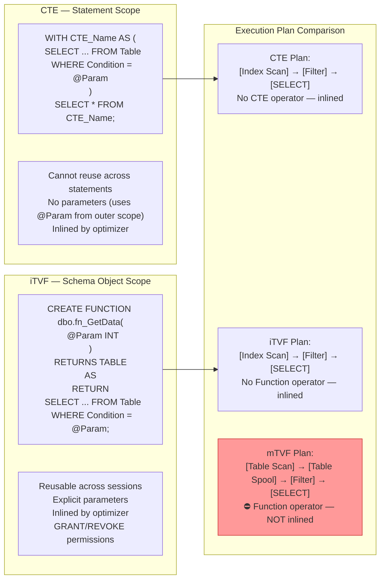
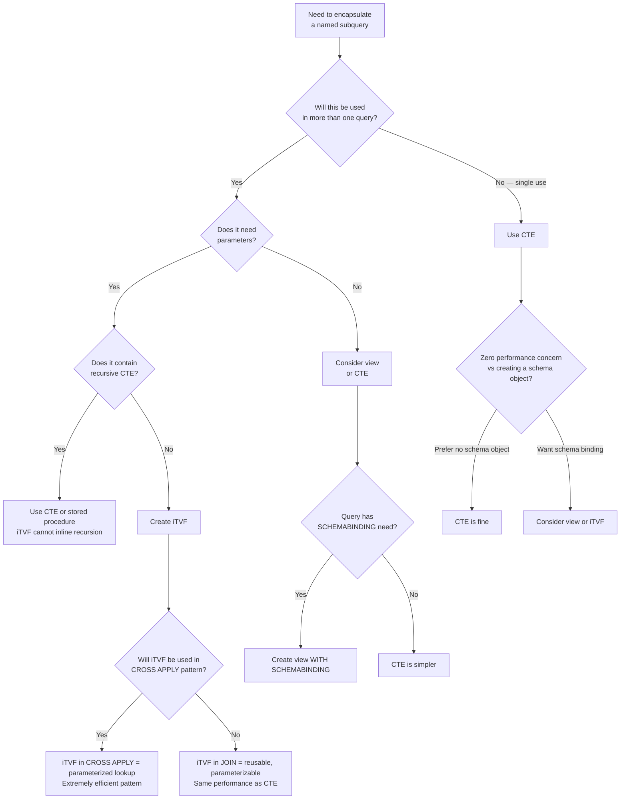

## Navigation

**Domain:** [[8 — Databases]] > **Group:** SQL CTEs & Recursive Queries
**Previous:** [[8.186 — CTE for Code Readability — Naming Intermediate Results]] | **Next:** [[8.188 — CTE Materialization — Inline vs Spooled]]

### Prerequisites

- [[8.176 — Common Table Expressions — Fundamentals]] — CTE syntax, structure, and scoping rules; understanding CTEs is required to compare them against iTVFs.
- [[8.178 — CTE vs Subquery — Readability and Performance]] — The base comparison between CTEs and other inline query structures; this note extends the comparison to database objects.
- [[26.XXX — Table-Valued Functions in SQL Server]] — TVF syntax, creation, and metadata; this note focuses specifically on the inline variant and its comparison to CTEs.

### Where This Fits

A .NET backend engineer frequently needs to reuse a query pattern across multiple endpoints or reports. The natural impulse is to copy-paste the SQL, but this creates a maintenance hazard. The production choice is between an inline table-valued function (iTVF) — a parameterized, reusable, schema-bound object that returns a table — and a CTE — a single-statement-scope named subquery. The wrong choice duplicates logic (CTE when reuse is needed) or introduces unnecessary schema overhead (iTVF when a one-off CTE suffices). The interview signal is architectural judgment: the candidate who can articulate when a CTE is the right tool versus when to escalate to an iTVF demonstrates production SQL design thinking beyond syntax.

---

## Core Mental Model

An inline table-valued function is a parameterized view: a single SELECT statement wrapped in a CREATE FUNCTION that returns TABLE. Like a CTE, it is a named subquery. Unlike a CTE, it is a persistent database object with its own permissions, dependencies, and metadata. The SQL Server optimizer treats simple iTVFs as macros — it inlines the function body into the calling query, exactly as it inlines a CTE. This means there is zero performance overhead for single-reference iTVF usage, same as CTEs.

The recognition pattern: CTE for "I need this intermediate result only for this one query." iTVF for "I need this query pattern with different parameters across multiple queries." The iTVF is the SQL equivalent of extracting a private method in C#; the CTE is the equivalent of a local variable.

The critical distinction from multi-statement TVFs (mTVFs): iTVFs are inlined by the optimizer, mTVFs are materialized as a table variable. iTVFs can participate in the same optimization as CTEs — predicate pushdown, join reordering, column pruning. mTVFs have a fixed estimate of 100 rows (in older SQL Server) or 1 row (SQL Server 2017+), causing cardinality estimation disasters.

### Classification

|Property|CTE|iTVF|mTVF|
|---|---|---|---|
|Scope|Single statement|Schema object, reusable|Schema object, reusable|
|Parameterization|Via outer variables only|Explicit parameters|Explicit parameters|
|Optimizer inlining|Always (single-reference)|Always (if simple)|Never (materialized as table variable)|
|Cardinality estimate|Actual (from base tables)|Actual (inlined)|1 or 100 rows (fixed, incorrect)|
|Permissions|No separate permissions|GRANT/REVOKE on function|GRANT/REVOKE on function|
|Dependencies|Not tracked|Tracked in sys.sql_expression_dependencies|Tracked in sys.sql_expression_dependencies|
|Recursion support|Yes (recursive CTE)|No|No|
|EF Core support|Raw SQL only|Can be mapped (EF Core 6+)|Can be mapped|
|Performance|Zero overhead (inlined)|Zero overhead (inlined)|Significant overhead (materialized)|



### Key Properties

|Property|Value|Notes|
|---|---|---|
|iTVF inlining cost|Zero|Same plan as writing the SELECT inline|
|iTVF cardinality|Accurate (from base table stats)|Optimizer sees the inlined query and uses base table statistics|
|mTVF cardinality|1 row (SQL 2017+) or 100 rows|Always wrong — causes nested loops joins when hash join is needed|
|CTE parameterization|Uses outer query variables|No parameter metadata, no plan reuse benefit from parameters|
|iTVF parameterization|Explicit @params|Plan cache keys on parameter values (if not parameterized)|
|Recompilation scope|CTE: whole statement|iTVF: calling query only (function body can be optimized independently)|

---

## Deep Mechanics

### How the Engine Executes This

**CTE execution path:**
1. Parser reads WITH clause and builds a CTE definition node in the query tree.
2. Algebrizer binds CTE column references to the underlying base tables.
3. Simplification phase inlines the CTE definition into the outer query — the CTE alias is replaced with the inlined SELECT.
4. Optimizer sees a single query tree with no CTE boundaries. It generates a plan that directly accesses base tables.
5. No CTE-specific operator appears in the plan.

**iTVF execution path (simple iTVF — single SELECT, no multi-statement):**
1. Parser resolves the function call as a reference to the iTVF metadata object.
2. Algebrizer retrieves the function body from sys.sql_modules.
3. Function body is merged into the calling query by replacing the function reference with the inlined SELECT. The function parameters are replaced with the caller's argument expressions.
4. Optimizer treats the merged query as a single unit — same as CTE. No Table-valued Function operator in the plan.
5. The function's WITH CHECK OPTION, SCHEMABINDING, and other metadata are validated; if the function body changes, objects referencing it are invalidated.

**mTVF execution path (contrast — NOT inlined):**
1. Parser resolves the mTVF reference. The function body contains a DECLARE @table TABLE ... INSERT INTO @table ... RETURN.
2. Algebrizer does NOT inline the function body. Instead, it creates a plan node for the function.
3. Optimizer estimates the mTVF output cardinality at 1 row (SQL Server 2017+) or 100 rows (SQL Server 2016 and earlier). This estimate is almost always wrong.
4. Execution: the mTVF is executed as a separate step — the table variable is populated with all rows. The calling query then joins or filters against this materialized table variable.
5. A Table-valued Function operator appears in the plan, showing the function name and the estimated/actual rows.

**The inlining requirement for iTVFs:**
SQL Server 2017+ introduces automatic inlining of iTVFs. The function must meet several conditions to be inlined:
- Single SELECT statement (no INSERT/UPDATE/DELETE).
- No table variable (local or global).
- No dynamic SQL (EXEC, sp_executesql).
- No non-deterministic functions in certain contexts (e.g., NEWID in WHERE clause preventing predicate pushdown).
- No CTE inside the function that is referenced multiple times (recursive CTE also blocks).
- Return type is TABLE (not a multi-statement definition).

If any condition fails, the iTVF is materialized like an mTVF, with a fixed cardinality estimate.

### SQL Visibility

```sql
-- ============================================================
-- Schema
-- ============================================================
-- Tables: Orders, Customers, OrderItems, Products

-- ============================================================
-- CTE approach (single query, no reuse)
-- ============================================================
-- Business: Get top orders for a specific customer
-- This CTE is used once, in this query only
WITH CustomerOrderSummary AS (
    SELECT
        o.OrderId,
        o.OrderDate,
        o.Status,
        SUM(oi.Quantity * oi.UnitPrice) AS OrderTotal,
        COUNT(DISTINCT oi.ProductId) AS UniqueProducts
    FROM dbo.Orders AS o
    INNER JOIN dbo.OrderItems AS oi ON o.OrderId = oi.OrderId
    WHERE o.CustomerId = 12345
      AND o.Status IN ('Delivered', 'Shipped')
    GROUP BY o.OrderId, o.OrderDate, o.Status
)
SELECT
    cos.OrderId,
    cos.OrderDate,
    cos.Status,
    cos.OrderTotal,
    cos.UniqueProducts,
    ROW_NUMBER() OVER(ORDER BY cos.OrderTotal DESC) AS RankByValue
FROM CustomerOrderSummary AS cos
ORDER BY cos.OrderTotal DESC;
-- CTE is inlined — plan shows direct access to Orders and OrderItems

-- ============================================================
-- iTVF approach (reusable, parameterized)
-- ============================================================
-- Same business logic, but encapsulated in a reusable function
CREATE OR ALTER FUNCTION dbo.fn_GetCustomerOrderSummary(
    @CustomerId INT,
    @StartDate DATE = NULL,
    @EndDate DATE = NULL,
    @StatusFilter NVARCHAR(20) = NULL
)
RETURNS TABLE
AS
RETURN
SELECT
    o.OrderId,
    o.OrderDate,
    o.Status,
    SUM(oi.Quantity * oi.UnitPrice) AS OrderTotal,
    COUNT(DISTINCT oi.ProductId) AS UniqueProducts
FROM dbo.Orders AS o
INNER JOIN dbo.OrderItems AS oi ON o.OrderId = oi.OrderId
WHERE o.CustomerId = @CustomerId
  AND (@StartDate IS NULL OR o.OrderDate >= @StartDate)
  AND (@EndDate IS NULL OR o.OrderDate < @EndDate)
  AND (@StatusFilter IS NULL OR o.Status = @StatusFilter)
GROUP BY o.OrderId, o.OrderDate, o.Status;
GO

-- Usage: parameterized, reusable across any query
SELECT
    cos.OrderId,
    cos.OrderDate,
    cos.Status,
    cos.OrderTotal,
    cos.UniqueProducts,
    ROW_NUMBER() OVER(ORDER BY cos.OrderTotal DESC) AS RankByValue
FROM dbo.fn_GetCustomerOrderSummary(12345, '2024-01-01', NULL, 'Delivered') AS cos
ORDER BY cos.OrderTotal DESC;

-- The iTVF is inlined — plan is identical to writing the SELECT inline
-- or to the CTE version above

-- ============================================================
-- mTVF approach (contrast — do not use)
-- ============================================================
-- Multi-statement TVF — avoid this pattern
CREATE OR ALTER FUNCTION dbo.fn_GetCustomerOrderSummary_mTVF(
    @CustomerId INT
)
RETURNS @Result TABLE (
    OrderId INT,
    OrderDate DATE,
    Status VARCHAR(20),
    OrderTotal DECIMAL(18,2),
    UniqueProducts INT
)
AS
BEGIN
    INSERT INTO @Result
    SELECT
        o.OrderId, o.OrderDate, o.Status,
        SUM(oi.Quantity * oi.UnitPrice),
        COUNT(DISTINCT oi.ProductId)
    FROM dbo.Orders AS o
    INNER JOIN dbo.OrderItems AS oi ON o.OrderId = oi.OrderId
    WHERE o.CustomerId = @CustomerId
      AND o.Status IN ('Delivered', 'Shipped')
    GROUP BY o.OrderId, o.OrderDate, o.Status;

    RETURN;
END;
GO

-- Usage:
SELECT * FROM dbo.fn_GetCustomerOrderSummary_mTVF(12345)
ORDER BY OrderTotal DESC;
-- ⛔ NOT inlined — Table-valued Function operator in plan
-- ⛔ Cardinality estimate: 1 row (SQL 2017+) — completely wrong
-- ⛔ If CustomerId 12345 has 500 orders, the optimizer may choose
--    a nested loops join assuming 1 row, causing performance disaster
```

```csharp
// EF Core — CTE requires raw SQL
// EF Core — iTVF can be mapped (EF Core 6+)

// Step 1: Define the iTVF in a migration
// CREATE FUNCTION dbo.fn_GetCustomerOrderSummary(...)

// Step 2: Map the iTVF in DbContext
public class ApplicationDbContext : DbContext
{
    public DbSet<Order> Orders => Set<Order>();
    public DbSet<OrderItem> OrderItems => Set<OrderItem>();

    protected override void OnModelCreating(ModelBuilder modelBuilder)
    {
        modelBuilder.Entity<Order>(entity =>
        {
            entity.ToTable("Orders");
            entity.HasKey(o => o.OrderId);
        });

        modelBuilder.Entity<OrderItem>(entity =>
        {
            entity.ToTable("OrderItems");
            entity.HasKey(oi => oi.OrderItemId);
        });

        // Map the iTVF — EF Core 6+ feature
        modelBuilder.HasDbFunction(typeof(ApplicationDbContext)
            .GetMethod(nameof(GetCustomerOrderSummary),
                new[] { typeof(int), typeof(DateTime?), typeof(DateTime?), typeof(string) })!)
            .HasName("fn_GetCustomerOrderSummary")
            .HasSchema("dbo");
    }

    // iTVF mapped as a DbSet-like method
    public IQueryable<CustomerOrderSummary> GetCustomerOrderSummary(
        int customerId,
        DateTime? startDate,
        DateTime? endDate,
        string? statusFilter)
        => FromExpression(() =>
            GetCustomerOrderSummary(customerId, startDate, endDate, statusFilter));
}

public class CustomerOrderSummary
{
    public int OrderId { get; set; }
    public DateTime OrderDate { get; set; }
    public string Status { get; set; } = string.Empty;
    public decimal OrderTotal { get; set; }
    public int UniqueProducts { get; set; }
}

// Usage in a service:
public class OrderService
{
    private readonly ApplicationDbContext _dbContext;

    public OrderService(ApplicationDbContext dbContext)
        => _dbContext = dbContext;

    public async Task<List<CustomerOrderSummary>> GetTopOrdersAsync(
        int customerId, int topCount, CancellationToken cancellationToken = default)
    {
        return await _dbContext
            .GetCustomerOrderSummary(customerId, null, null, null)
            .OrderByDescending(s => s.OrderTotal)
            .Take(topCount)
            .ToListAsync(cancellationToken);
        // EF Core generates: SELECT TOP(@topCount) ... FROM dbo.fn_GetCustomerOrderSummary(@customerId, @startDate, @endDate, @statusFilter) AS g
    }
}
```

**Generated SQL (from EF Core logs):**

```sql
-- EF Core generates:
SELECT TOP(@__topCount_0) [g].[OrderId], [g].[OrderDate], [g].[Status],
       [g].[OrderTotal], [g].[UniqueProducts]
FROM [dbo].[fn_GetCustomerOrderSummary](@__customerId_1, @__startDate_2, @__endDate_3, @__statusFilter_4) AS [g]
ORDER BY [g].[OrderTotal] DESC;
```

### Execution Plan Analysis

**CTE plan (single-reference):**
```
[Clustered Index Scan (Orders)] → [Filter (CustomerId, Status)] → [Hash Match (Join to OrderItems)] → [Hash Match Aggregate (GROUP BY)] → [Sequence Project (ROW_NUMBER)] → [Sort (ORDER BY)] → [SELECT]
```

**iTVF plan (inlined):**
```
[Clustered Index Scan (Orders)] → [Filter (CustomerId, Status)] → [Hash Match (Join to OrderItems)] → [Hash Match Aggregate (GROUP BY)] → [Sequence Project (ROW_NUMBER)] → [Sort (ORDER BY)] → [SELECT]
```
— Exactly the same plan. No `Table-valued Function` operator.

**mTVF plan (not inlined):**
```
[Clustered Index Scan (Orders)] → [Filter (CustomerId, Status)] → [Hash Match (Join)] → [Hash Match Aggregate] → [Insert into @Result table variable]
  └── [Table-valued Function (fn_GetCustomerOrderSummary_mTVF)]
      → [Table Scan (the @Result table variable)]
```
— Note: The mTVF is materialized first (Orders → OrderItems → Aggregate → @Result). Then the calling query reads @Result. The cardinality estimate for the mTVF is 1 row (or 100 on older SQL Server). If the calling query joins this result with another table expecting 1 row, it will choose Nested Loops — which is catastrophic if the actual row count is 500.

**Estimated vs actual (mTVF disaster):**
- Estimated rows from mTVF: 1
- Actual rows from mTVF: 500
- The calling query's join to Customers uses Nested Loops (optimized for 1 row) — 500 seeks instead of 1 scan.
- Logical reads: 500 × index depth (~4) = 2,000 vs 1 scan of Customers (~120 pages).

### Cost Visibility

```sql
SET STATISTICS IO ON;
SET STATISTICS TIME ON;

-- ============================================================
-- CTE version
-- ============================================================
WITH CustomerOrderSummary AS (
    SELECT o.OrderId, o.OrderDate, o.Status,
           SUM(oi.Quantity * oi.UnitPrice) AS OrderTotal
    FROM Orders o
    INNER JOIN OrderItems oi ON o.OrderId = oi.OrderId
    WHERE o.CustomerId = @CustomerId AND o.Status = 'Delivered'
    GROUP BY o.OrderId, o.OrderDate, o.Status
)
SELECT cos.* FROM CustomerOrderSummary cos ORDER BY cos.OrderTotal DESC;

-- Expected output (customer with 500 orders, 2,000 order items):
-- Table 'OrderItems'. Scan count 1, logical reads ~450
-- Table 'Orders'. Scan count 1, logical reads ~120
-- SQL Server Execution Times: CPU time = 15ms, elapsed time = 30ms

-- ============================================================
-- iTVF version (same plan, same reads)
-- ============================================================
SELECT * FROM dbo.fn_GetCustomerOrderSummary(@CustomerId, NULL, NULL, 'Delivered')
ORDER BY OrderTotal DESC;

-- Expected output:
-- Table 'OrderItems'. Scan count 1, logical reads ~450
-- Table 'Orders'. Scan count 1, logical reads ~120
-- SQL Server Execution Times: CPU time = 15ms, elapsed time = 30ms  ← Same!

-- ============================================================
-- mTVF version (disaster — different plan)
-- ============================================================
SELECT * FROM dbo.fn_GetCustomerOrderSummary_mTVF(@CustomerId)
ORDER BY OrderTotal DESC;

-- Expected output:
-- Table '#A1B2C3D4'. Scan count 1, logical reads ~500  ← Table variable spool
-- Table 'OrderItems'. Scan count 1, logical reads ~450
-- Table 'Orders'. Scan count 1, logical reads ~120
-- SQL Server Execution Times: CPU time = 25ms, elapsed time = 50ms  ← Slower!
-- Cardinality estimate: 1 row — but actual: 500 rows
```

### Failure Modes

**1. iTVF WITH CTE inside — blocks inlining.**

If an iTVF contains a CTE that is referenced multiple times, or a recursive CTE, the inlining is blocked.

```sql
-- ❌ This iTVF will NOT be inlined (recursive CTE inside)
CREATE FUNCTION dbo.fn_GetOrgChart(@ManagerId INT)
RETURNS TABLE
AS
RETURN
    WITH OrgHierarchy AS (
        SELECT EmployeeId, ManagerId, 0 AS Level
        FROM Employees WHERE EmployeeId = @ManagerId
        UNION ALL
        SELECT e.EmployeeId, e.ManagerId, oh.Level + 1
        FROM Employees e
        INNER JOIN OrgHierarchy oh ON e.ManagerId = oh.EmployeeId
    )
    SELECT * FROM OrgHierarchy;
```

**2. iTVF with non-deterministic functions — blocks predicate pushdown.**

If the iTVF uses GETDATE(), NEWID(), or other non-deterministic functions, the optimizer may block predicate pushdown across the function boundary, even if the function body is technically inlined.

**3. mTVF cardinality misestimation — the single most destructive performance pattern in SQL Server.**

An mTVF used in a join with a 1-row cardinality estimate causes the optimizer to choose Nested Loops. On a large result (10,000 rows from the mTVF), this means 10,000 index seeks instead of one scan.

**4. iTVF SCHEMABINDING prevents accidental breakage but requires specific permissions.**

Without SCHEMABINDING, if the underlying table schema changes, the iTVF may break or produce wrong results. With SCHEMABINDING, the function blocks schema changes to referenced objects.

**5. CTE parameterized via outer variables does not get the same plan cache benefits as iTVF parameters.**

The iTVF parameter is part of the query signature, allowing the plan cache to store plans keyed on parameter values. A CTE using `@CustomerId` from the outer scope is part of a different query signature — the outer query's text includes the CTE definition, and the parameter is bound at the outer scope.

---

## Production Patterns and Implementation

### Primary SQL Implementation

```sql
-- ============================================================
-- Pattern 1: iTVF for reusable customer sales summary
-- ============================================================
-- Business: Multiple dashboards need customer sales data with
-- different filters. Create one iTVF, reuse everywhere.

CREATE OR ALTER FUNCTION dbo.fn_GetCustomerSales(
    @CustomerId INT,
    @StartDate DATE = NULL,
    @EndDate DATE = NULL,
    @StatusFilter VARCHAR(20) = NULL
)
RETURNS TABLE
AS
RETURN
SELECT
    o.OrderId,
    o.OrderDate,
    o.Status,
    SUM(oi.Quantity * oi.UnitPrice) AS TotalAmount,
    COUNT(DISTINCT oi.ProductId) AS UniqueProducts,
    COUNT(oi.OrderItemId) AS TotalItems
FROM dbo.Orders AS o
INNER JOIN dbo.OrderItems AS oi ON o.OrderId = oi.OrderId
WHERE o.CustomerId = @CustomerId
  AND (@StartDate IS NULL OR o.OrderDate >= @StartDate)
  AND (@EndDate IS NULL OR o.OrderDate < @EndDate)
  AND (@StatusFilter IS NULL OR o.Status = @StatusFilter)
GROUP BY o.OrderId, o.OrderDate, o.Status;
GO

-- Dashboard 1: Top orders by value
SELECT TOP(10) *
FROM dbo.fn_GetCustomerSales(12345, '2024-01-01', NULL, 'Delivered')
ORDER BY TotalAmount DESC;

-- Dashboard 2: Monthly summary
SELECT
    DATEFROMPARTS(YEAR(OrderDate), MONTH(OrderDate), 1) AS Month,
    COUNT(*) AS OrderCount,
    SUM(TotalAmount) AS MonthlyTotal
FROM dbo.fn_GetCustomerSales(12345, '2024-01-01', '2025-01-01', NULL)
GROUP BY DATEFROMPARTS(YEAR(OrderDate), MONTH(OrderDate), 1);

-- Dashboard 3: Cross-sell analysis (products ordered together)
SELECT * FROM dbo.fn_GetCustomerSales(12345, NULL, NULL, NULL)
WHERE UniqueProducts > 1;

-- ============================================================
-- Pattern 2: iTVF vs CTE for the same query
-- ============================================================
-- When you need this once: use CTE
WITH CurrentMonthSales AS (
    SELECT
        p.ProductId,
        p.Name,
        SUM(oi.Quantity * oi.UnitPrice) AS Revenue,
        SUM(oi.Quantity) AS UnitsSold
    FROM dbo.Products AS p
    INNER JOIN dbo.OrderItems AS oi ON p.ProductId = oi.ProductId
    INNER JOIN dbo.Orders AS o ON oi.OrderId = o.OrderId
    WHERE o.OrderDate >= DATEFROMPARTS(YEAR(GETUTCDATE()), MONTH(GETUTCDATE()), 1)
      AND o.Status = 'Delivered'
    GROUP BY p.ProductId, p.Name
)
SELECT TOP(20) * FROM CurrentMonthSales ORDER BY Revenue DESC;

-- ============================================================
-- Pattern 3: iTVF for report generation with optional parameters
-- ============================================================
CREATE OR ALTER FUNCTION dbo.fn_GetInventoryStatus(
    @WarehouseId INT = NULL,
    @LowStockThreshold INT = 10,
    @IncludeDiscontinued BIT = 0
)
RETURNS TABLE
AS
RETURN
SELECT
    i.InventoryItemId,
    i.ProductId,
    p.Name AS ProductName,
    i.WarehouseId,
    w.Name AS WarehouseName,
    i.QuantityOnHand,
    i.ReorderLevel,
    CASE
        WHEN i.QuantityOnHand <= 0 THEN 'Out of Stock'
        WHEN i.QuantityOnHand <= @LowStockThreshold THEN 'Low Stock'
        ELSE 'In Stock'
    END AS StockStatus,
    i.QuantityOnHand - i.ReorderLevel AS OverUnderStock
FROM dbo.InventoryItems AS i
INNER JOIN dbo.Products AS p ON i.ProductId = p.ProductId
INNER JOIN dbo.Warehouses AS w ON i.WarehouseId = w.WarehouseId
WHERE (@WarehouseId IS NULL OR i.WarehouseId = @WarehouseId)
  AND (@IncludeDiscontinued = 1 OR p.IsDiscontinued = 0);
GO

-- Usage: All warehouses, only items below reorder level
SELECT * FROM dbo.fn_GetInventoryStatus(NULL, 10, 0)
WHERE QuantityOnHand <= ReorderLevel
ORDER BY OverUnderStock ASC;

-- ============================================================
-- Pattern 4: iTVF used in CROSS APPLY for per-row processing
-- ============================================================
-- Business: For each customer, get their top 5 orders
-- (This demonstrates iTVF in APPLY — a common production pattern)
SELECT
    c.CustomerId,
    c.Name,
    top_orders.OrderId,
    top_orders.OrderDate,
    top_orders.TotalAmount
FROM dbo.Customers AS c
CROSS APPLY (
    SELECT TOP(5) *
    FROM dbo.fn_GetCustomerSales(c.CustomerId, '2024-01-01', NULL, 'Delivered')
    ORDER BY TotalAmount DESC
) AS top_orders
WHERE c.IsActive = 1
ORDER BY c.CustomerId, top_orders.TotalAmount DESC;

-- ============================================================
-- Pattern 5: iTVF with SCHEMABINDING for safety
-- ============================================================
CREATE OR ALTER FUNCTION dbo.fn_GetOrderDetails(
    @OrderId INT
)
RETURNS TABLE
WITH SCHEMABINDING  -- Prevents accidental ALTER TABLE on referenced objects
AS
RETURN
SELECT
    o.OrderId,
    o.CustomerId,
    o.OrderDate,
    o.Status,
    oi.OrderItemId,
    oi.ProductId,
    oi.Quantity,
    oi.UnitPrice,
    oi.Quantity * oi.UnitPrice AS LineTotal
FROM dbo.Orders AS o
INNER JOIN dbo.OrderItems AS oi ON o.OrderId = oi.OrderId
WHERE o.OrderId = @OrderId;
GO

-- ============================================================
-- Pattern 6: Switch from mTVF to iTVF — fixing cardinality
-- ============================================================
-- ❌ OLD: Multi-statement TVF (slow, wrong cardinality estimate)
-- CREATE FUNCTION dbo.fn_GetCustomerOrders_OLD(@CustomerId INT)
-- RETURNS @Result TABLE (...)
-- AS
-- BEGIN
--     INSERT INTO @Result SELECT ... FROM Orders WHERE CustomerId = @CustomerId;
--     RETURN;
-- END;

-- ✅ NEW: Inline TVF (fast, correct cardinality)
CREATE OR ALTER FUNCTION dbo.fn_GetCustomerOrders(
    @CustomerId INT,
    @MinDate DATE = NULL
)
RETURNS TABLE
AS
RETURN
SELECT
    o.OrderId,
    o.OrderDate,
    o.Status,
    o.TotalAmount
FROM dbo.Orders AS o
WHERE o.CustomerId = @CustomerId
  AND (@MinDate IS NULL OR o.OrderDate >= @MinDate);
GO
```

### EF Core Implementation

```csharp
public class ApplicationDbContext : DbContext
{
    public DbSet<Order> Orders => Set<Order>();
    public DbSet<OrderItem> OrderItems => Set<OrderItem>();
    public DbSet<Customer> Customers => Set<Customer>();
    public DbSet<Product> Products => Set<Product>();
    public DbSet<InventoryItem> InventoryItems => Set<InventoryItem>();
    public DbSet<Warehouse> Warehouses => Set<Warehouse>();

    protected override void OnModelCreating(ModelBuilder modelBuilder)
    {
        // Standard entity configuration
        modelBuilder.Entity<Order>(entity =>
        {
            entity.ToTable("Orders");
            entity.HasKey(o => o.OrderId);
            entity.Property(o => o.Status).HasMaxLength(20);
            entity.HasIndex(o => new { o.CustomerId, o.OrderDate });
        });

        modelBuilder.Entity<OrderItem>(entity =>
        {
            entity.ToTable("OrderItems");
            entity.HasKey(oi => oi.OrderItemId);
            entity.Property(oi => oi.UnitPrice).HasColumnType("decimal(18,2)");
        });

        modelBuilder.Entity<Customer>(entity =>
        {
            entity.ToTable("Customers");
            entity.HasKey(c => c.CustomerId);
            entity.HasIndex(c => c.IsActive);
        });

        // Map iTVF — EF Core 6+
        modelBuilder.HasDbFunction(
                typeof(ApplicationDbContext)
                    .GetMethod(nameof(GetCustomerSales),
                        new[] { typeof(int), typeof(DateTime?), typeof(DateTime?), typeof(string) })!)
            .HasName("fn_GetCustomerSales")
            .HasSchema("dbo");

        modelBuilder.HasDbFunction(
                typeof(ApplicationDbContext)
                    .GetMethod(nameof(GetCustomerOrders),
                        new[] { typeof(int), typeof(DateTime?) })!)
            .HasName("fn_GetCustomerOrders")
            .HasSchema("dbo");

        modelBuilder.HasDbFunction(
                typeof(ApplicationDbContext)
                    .GetMethod(nameof(GetInventoryStatus),
                        new[] { typeof(int?), typeof(int), typeof(bool) })!)
            .HasName("fn_GetInventoryStatus")
            .HasSchema("dbo");
    }

    // iTVF mapped methods
    public IQueryable<CustomerSalesResult> GetCustomerSales(
        int customerId, DateTime? startDate, DateTime? endDate, string? statusFilter)
        => FromExpression(() =>
            GetCustomerSales(customerId, startDate, endDate, statusFilter));

    public IQueryable<CustomerOrderResult> GetCustomerOrders(
        int customerId, DateTime? minDate)
        => FromExpression(() =>
            GetCustomerOrders(customerId, minDate));

    public IQueryable<InventoryStatusResult> GetInventoryStatus(
        int? warehouseId, int lowStockThreshold, bool includeDiscontinued)
        => FromExpression(() =>
            GetInventoryStatus(warehouseId, lowStockThreshold, includeDiscontinued));
}

// Result types for the iTVFs
public class CustomerSalesResult
{
    public int OrderId { get; set; }
    public DateTime OrderDate { get; set; }
    public string Status { get; set; } = string.Empty;
    public decimal TotalAmount { get; set; }
    public int UniqueProducts { get; set; }
    public int TotalItems { get; set; }
}

public class CustomerOrderResult
{
    public int OrderId { get; set; }
    public DateTime OrderDate { get; set; }
    public string Status { get; set; } = string.Empty;
    public decimal? TotalAmount { get; set; }
}

public class InventoryStatusResult
{
    public int InventoryItemId { get; set; }
    public int ProductId { get; set; }
    public string ProductName { get; set; } = string.Empty;
    public int WarehouseId { get; set; }
    public string WarehouseName { get; set; } = string.Empty;
    public int QuantityOnHand { get; set; }
    public int ReorderLevel { get; set; }
    public string StockStatus { get; set; } = string.Empty;
    public int OverUnderStock { get; set; }
}

// Service using iTVF through EF Core
public class ReportService
{
    private readonly ApplicationDbContext _dbContext;

    public ReportService(ApplicationDbContext dbContext)
        => _dbContext = dbContext;

    public async Task<List<InventoryStatusResult>> GetLowStockReportAsync(
        int threshold, CancellationToken cancellationToken = default)
    {
        return await _dbContext
            .GetInventoryStatus(null, threshold, false)
            .Where(i => i.QuantityOnHand <= i.ReorderLevel)
            .OrderBy(i => i.OverUnderStock)
            .ToListAsync(cancellationToken);
        // EF Core generates:
        // SELECT ... FROM dbo.fn_GetInventoryStatus(NULL, @threshold, 0) AS i
        // WHERE i.QuantityOnHand <= i.ReorderLevel
        // ORDER BY i.OverUnderStock
    }

    public async Task<List<CustomerSalesResult>> GetTopCustomerOrdersAsync(
        int customerId, int topCount, CancellationToken cancellationToken = default)
    {
        return await _dbContext
            .GetCustomerSales(customerId, null, null, "Delivered")
            .OrderByDescending(s => s.TotalAmount)
            .Take(topCount)
            .ToListAsync(cancellationToken);
        // EF Core generates:
        // SELECT TOP(@topCount) ... FROM dbo.fn_GetCustomerSales(@customerId, NULL, NULL, 'Delivered') AS g
        // ORDER BY g.TotalAmount DESC
    }
}

// Alternative: Using raw SQL with CTE when iTVF is not needed
public class CteReportService
{
    private readonly ApplicationDbContext _dbContext;

    public CteReportService(ApplicationDbContext dbContext)
        => _dbContext = dbContext;

    public async Task<List<CustomerSalesResult>> GetOneTimeReportAsync(
        int customerId, CancellationToken cancellationToken = default)
    {
        const string sql = @"
            WITH CustomerSales AS (
                SELECT o.OrderId, o.OrderDate, o.Status,
                       SUM(oi.Quantity * oi.UnitPrice) AS TotalAmount,
                       COUNT(DISTINCT oi.ProductId) AS UniqueProducts,
                       COUNT(oi.OrderItemId) AS TotalItems
                FROM Orders AS o
                INNER JOIN OrderItems AS oi ON o.OrderId = oi.OrderId
                WHERE o.CustomerId = @CustomerId
                GROUP BY o.OrderId, o.OrderDate, o.Status
            )
            SELECT * FROM CustomerSales ORDER BY TotalAmount DESC";

        return await _dbContext.Database
            .SqlQueryRaw<CustomerSalesResult>(sql,
                new SqlParameter("@CustomerId", customerId))
            .ToListAsync(cancellationToken);
    }
}
```

### Dapper Implementation

```csharp
public interface ISalesRepository
{
    // Using iTVF — calls the function directly
    Task<IReadOnlyList<CustomerSalesResult>> GetCustomerSalesAsync(
        int customerId, DateTime? startDate, DateTime? endDate, string? statusFilter,
        CancellationToken cancellationToken = default);

    // Using CTE — one-time query
    Task<IReadOnlyList<CustomerSalesResult>> GetOneTimeCustomerSalesAsync(
        int customerId, CancellationToken cancellationToken = default);
}

public sealed class SalesRepository : ISalesRepository
{
    private readonly IDbConnectionFactory _connectionFactory;

    public SalesRepository(IDbConnectionFactory connectionFactory)
        => _connectionFactory = connectionFactory;

    public async Task<IReadOnlyList<CustomerSalesResult>> GetCustomerSalesAsync(
        int customerId, DateTime? startDate, DateTime? endDate, string? statusFilter,
        CancellationToken cancellationToken = default)
    {
        // Calls the iTVF directly — the function body is inlined by optimizer
        const string sql = @"
            SELECT OrderId, OrderDate, Status, TotalAmount, UniqueProducts, TotalItems
            FROM dbo.fn_GetCustomerSales(@CustomerId, @StartDate, @EndDate, @StatusFilter)
            ORDER BY TotalAmount DESC";

        await using var connection = _connectionFactory.Create();

        return (await connection.QueryAsync<CustomerSalesResult>(
            new CommandDefinition(sql,
                new
                {
                    CustomerId = customerId,
                    StartDate = startDate,
                    EndDate = endDate,
                    StatusFilter = statusFilter
                },
                cancellationToken: cancellationToken))).AsList();
    }

    public async Task<IReadOnlyList<CustomerSalesResult>> GetOneTimeCustomerSalesAsync(
        int customerId, CancellationToken cancellationToken = default)
    {
        // CTE approach — same performance, different scoping
        const string sql = @"
            WITH CustomerSales AS (
                SELECT o.OrderId, o.OrderDate, o.Status,
                       SUM(oi.Quantity * oi.UnitPrice) AS TotalAmount,
                       COUNT(DISTINCT oi.ProductId) AS UniqueProducts,
                       COUNT(oi.OrderItemId) AS TotalItems
                FROM dbo.Orders AS o
                INNER JOIN dbo.OrderItems AS oi ON o.OrderId = oi.OrderId
                WHERE o.CustomerId = @CustomerId
                GROUP BY o.OrderId, o.OrderDate, o.Status
            )
            SELECT * FROM CustomerSales ORDER BY TotalAmount DESC";

        await using var connection = _connectionFactory.Create();

        return (await connection.QueryAsync<CustomerSalesResult>(
            new CommandDefinition(sql,
                new { CustomerId = customerId },
                cancellationToken: cancellationToken))).AsList();
    }

    // CROSS APPLY with iTVF — per-row function call
    public async Task<IReadOnlyList<CustomerTopOrders>> GetTopOrdersPerCustomerAsync(
        int topCount, CancellationToken cancellationToken = default)
    {
        const string sql = @"
            SELECT c.CustomerId, c.Name,
                   top_orders.OrderId, top_orders.OrderDate, top_orders.TotalAmount
            FROM dbo.Customers AS c
            CROSS APPLY (
                SELECT TOP(@TopCount) *
                FROM dbo.fn_GetCustomerSales(c.CustomerId, NULL, NULL, 'Delivered')
                ORDER BY TotalAmount DESC
            ) AS top_orders
            WHERE c.IsActive = 1
            ORDER BY c.CustomerId, top_orders.TotalAmount DESC";

        await using var connection = _connectionFactory.Create();

        return (await connection.QueryAsync<CustomerTopOrders>(
            new CommandDefinition(sql,
                new { TopCount = topCount },
                cancellationToken: cancellationToken))).AsList();
    }
}

public class CustomerTopOrders
{
    public int CustomerId { get; set; }
    public string Name { get; set; } = string.Empty;
    public int OrderId { get; set; }
    public DateTime OrderDate { get; set; }
    public decimal TotalAmount { get; set; }
}
```

### Configuration and Wiring

```csharp
// Program.cs
builder.Services.AddDbContext<ApplicationDbContext>(options =>
    options.UseSqlServer(
        builder.Configuration.GetConnectionString("DefaultConnection"),
        sqlOptions =>
        {
            sqlOptions.EnableRetryOnFailure(3);
            sqlOptions.CommandTimeout(60);
        }));

builder.Services.AddSingleton<IDbConnectionFactory>(sp =>
    new SqlConnectionFactory(
        builder.Configuration.GetConnectionString("DefaultConnection")!));

builder.Services.AddScoped<ReportService>();
builder.Services.AddScoped<CteReportService>();
builder.Services.AddScoped<ISalesRepository, SalesRepository>();

// EF Core iTVF migration — create the functions
// Add-Migration AddCustomerSalesFunction
// Then in the migration:
// migrationBuilder.Sql(@"
//     CREATE OR ALTER FUNCTION dbo.fn_GetCustomerSales(...)
//     RETURNS TABLE AS RETURN SELECT ...;
// ");
```

### SQL Server vs PostgreSQL Differences

```sql
-- PostgreSQL: iTVFs are called "SQL-language functions returning TABLE"
-- PostgreSQL: Functions are NOT inlined by default — they are optimization fences
-- PostgreSQL 12+: SQL functions can be inlined under specific conditions
-- PostgreSQL: Use LANGUAGE SQL for inline-capable functions

-- PostgreSQL iTVF equivalent
CREATE OR REPLACE FUNCTION fn_get_customer_sales(
    p_customer_id INT,
    p_start_date DATE DEFAULT NULL,
    p_end_date DATE DEFAULT NULL,
    p_status_filter VARCHAR DEFAULT NULL
)
RETURNS TABLE (
    order_id INT,
    order_date DATE,
    status VARCHAR,
    total_amount NUMERIC,
    unique_products BIGINT,
    total_items BIGINT
)
LANGUAGE SQL
STABLE  -- Important: tells PostgreSQL the function can be inlined
AS $$
    SELECT
        o.order_id, o.order_date, o.status,
        SUM(oi.quantity * oi.unit_price)::NUMERIC(18,2) AS total_amount,
        COUNT(DISTINCT oi.product_id) AS unique_products,
        COUNT(oi.order_item_id)::BIGINT AS total_items
    FROM orders AS o
    INNER JOIN order_items AS oi ON o.order_id = oi.order_id
    WHERE o.customer_id = p_customer_id
      AND (p_start_date IS NULL OR o.order_date >= p_start_date)
      AND (p_end_date IS NULL OR o.order_date < p_end_date)
      AND (p_status_filter IS NULL OR o.status = p_status_filter)
    GROUP BY o.order_id, o.order_date, o.status;
$$;

-- PostgreSQL: CTEs ARE materialized by default (optimization fence)
-- Use WITH ... AS NOT MATERIALIZED to get SQL Server-like inlining
WITH customer_sales AS NOT MATERIALIZED (
    SELECT ... FROM orders ...
)
SELECT * FROM customer_sales;

-- PostgreSQL: Functions in FROM clause that are STABLE and LANGUAGE SQL
-- can be inlined. VOLATILE functions (default) are NOT inlined.
-- Always mark iTVFs as STABLE or IMMUTABLE when possible.

-- PostgreSQL: mTVF equivalent — PL/pgSQL function with RETURN QUERY
-- These are never inlined, similar to SQL Server mTVF
CREATE OR REPLACE FUNCTION fn_get_customer_sales_mtvf(p_customer_id INT)
RETURNS TABLE (...) AS $$
BEGIN
    RETURN QUERY SELECT ... FROM orders WHERE customer_id = p_customer_id;
END;
$$ LANGUAGE plpgsql;
-- ⛔ Not inlined — same cardinality estimation problems as SQL Server mTVF
```

---

## Gotchas and Production Pitfalls

### mTVF Cardinality Misestimation — The Most Expensive Mistake

**Pitfall:** Using a multi-statement TVF instead of an inline TVF. The optimizer estimates 1 row (SQL Server 2017+) or 100 rows (SQL Server 2016 and earlier), regardless of the actual result size. This causes the optimizer to choose Nested Loops joins instead of Hash Match, expecting single-row lookups.

```sql
-- ❌ mTVF: cardinality estimate = 1 row (always wrong)
CREATE FUNCTION dbo.fn_GetCustomerOrders_mTVF(@CustomerId INT)
RETURNS @Result TABLE (OrderId INT, OrderDate DATE, TotalAmount DECIMAL(18,2))
AS
BEGIN
    INSERT INTO @Result
    SELECT OrderId, OrderDate, TotalAmount
    FROM Orders WHERE CustomerId = @CustomerId;
    RETURN;
END;

-- Query that joins the mTVF:
SELECT c.Name, o.OrderId, o.TotalAmount
FROM Customers c
INNER JOIN dbo.fn_GetCustomerOrders_mTVF(c.CustomerId) AS o ON 1=1
WHERE c.IsActive = 1;
-- Estimated rows from fn_GetCustomerOrders_mTVF: 1
-- Actual rows: 500 (for a customer with 500 orders)
-- Plan: Nested Loops (500K seeks = 5M logical reads) instead of Hash Match
```

**Symptom:** A query that joins to an mTVF shows drastically different estimated vs actual rows in the execution plan (estimate: 1, actual: 2,500). The plan shows a Nested Loops join where a Hash Match would be appropriate. Logical reads are 10-100x higher than expected.

**Fix:**
```sql
-- ✅ Convert to iTVF:
CREATE OR ALTER FUNCTION dbo.fn_GetCustomerOrders(@CustomerId INT)
RETURNS TABLE
AS
RETURN
    SELECT OrderId, OrderDate, TotalAmount
    FROM Orders WHERE CustomerId = @CustomerId;
```

**Cost of not fixing:** A dashboard page that calls this function for 1,000 customers performs 500K index seeks instead of a single scan. Page load time: 45 seconds. After converting to iTVF: 2 seconds.

---

### iTVF Inlining Blocked by Recursive CTE Inside

**Pitfall:** Defining an iTVF that contains a recursive CTE. The function is valid and returns correct results, but the optimizer cannot inline it because recursive CTEs are not eligible for inlining. The iTVF is treated as an mTVF with a fixed cardinality estimate of 1 row.

```sql
-- ❌ This iTVF will NOT be inlined due to recursive CTE
CREATE FUNCTION dbo.fn_GetOrgHierarchy(@ManagerId INT)
RETURNS TABLE
AS
RETURN
    WITH OrgCTE AS (
        SELECT EmployeeId, ManagerId, 0 AS Level
        FROM Employees WHERE EmployeeId = @ManagerId
        UNION ALL
        SELECT e.EmployeeId, e.ManagerId, o.Level + 1
        FROM Employees e
        INNER JOIN OrgCTE o ON e.ManagerId = o.EmployeeId
    )
    SELECT * FROM OrgCTE;
```

**Symptom:** The execution plan shows a `Table-valued Function` operator — the function is not inlined. Estimated rows = 1, actual rows may be thousands.

**Fix:** Accept that recursive functions cannot be inlined. Use the function knowing the cardinality issue and add `OPTION (RECOMPILE)` or handle the recursion at the application level.

**Cost of not fixing:** A join between the un-inlined function and a 50K row table uses Nested Loops (50K × recursive depth iterations), causing a 30-second query.

---

### iTVF Without SCHEMABINDING — Silent Breakage

**Pitfall:** Creating an iTVF without `WITH SCHEMABINDING`. When the underlying table schema changes (column rename, data type change, table drop), the function may break at runtime, not at ALTER TABLE time.

```sql
-- ❌ No SCHEMABINDING — schema changes can silently break this function
CREATE FUNCTION dbo.fn_GetOrderSummary(@OrderId INT)
RETURNS TABLE
AS
RETURN
    SELECT o.OrderId, o.TotalAmount FROM Orders o WHERE o.OrderId = @OrderId;

-- If someone renames TotalAmount to Amount:
ALTER TABLE Orders DROP COLUMN TotalAmount;
-- The function still exists! But calling it produces:
-- Msg 207, Invalid column name 'TotalAmount'

-- ✅ With SCHEMABINDING — schema changes are blocked until the function is updated
CREATE FUNCTION dbo.fn_GetOrderSummary_safe(@OrderId INT)
RETURNS TABLE
WITH SCHEMABINDING
AS
RETURN
    SELECT o.OrderId, o.TotalAmount
    FROM dbo.Orders o
    WHERE o.OrderId = @OrderId;
-- ALTER TABLE Orders DROP COLUMN TotalAmount;
-- Msg 5074, The object 'fn_GetOrderSummary_safe' is dependent on column 'TotalAmount'.
```

**Symptom:** A production deployment that renames a column causes a runtime error in a nightly report. The error is not caught by unit tests because the function itself compiles successfully — it only fails when executed.

**Fix:** Always use `WITH SCHEMABINDING` on iTVFs. This requires two-part table names (`dbo.Orders` not `Orders`).

**Cost of not fixing:** A midnight ETL job fails because a renamed column breaks an iTVF. The downstream data warehouse is missing 6 hours of data by the time the on-call engineer identifies the issue.

---

### CTE Parameterization vs iTVF Plan Cache

**Pitfall:** Assuming a CTE with `@CustomerId` from the outer scope achieves the same plan cache reuse as an iTVF with a formal parameter. The CTE is part of the query text — different `@CustomerId` values are still the same query text (parameterized), so plan cache behavior is similar. But the iTVF has a separate plan entry that can be evicted independently.

```sql
-- CTE: plan is cached as part of the outer batch
DECLARE @CustomerId INT = 12345;
WITH CustomerTotals AS (
    SELECT OrderId, SUM(Amount) AS Total
    FROM Orders WHERE CustomerId = @CustomerId
    GROUP BY OrderId
)
SELECT * FROM CustomerTotals;

-- iTVF: plan is cached independently
SELECT * FROM dbo.fn_GetCustomerOrders(@CustomerId, NULL);
```

**Symptom:** The CTE version gets a new plan every time the outer batch text changes (even whitespace). The iTVF plan is tied to the function object — schema changes to the function trigger recompilation of all queries referencing it.

**Fix:** Use iTVF when plan cache management is important — the function body can be optimized independently and the plan is evicted only when the function definition changes or when statistics on referenced tables trigger recompilation.

**Cost of not fixing:** (Minor) Slightly more plan cache bloat from embedded CTE definitions.

---

### iTVF with Dynamic SQL — Inlining Prevented

**Pitfall:** Using dynamic SQL inside an iTVF (via `EXEC` or `sp_executesql`). This is blocked by SQL Server for iTVFs — attempting to create such a function produces an error.

```sql
-- ❌ This will fail: iTVFs cannot contain dynamic SQL
CREATE FUNCTION dbo.fn_GetDynamicData(@TableName NVARCHAR(128))
RETURNS TABLE
AS
RETURN
    EXEC('SELECT * FROM ' + @TableName);  -- Error!
```

**Fix:** Use a stored procedure with `EXEC` and insert results into a temp table, or use a multi-statement TVF (accepting the performance cost). For dynamic table selection, use a view per table or application-level query routing.

---

## Performance Implications

### Benchmark: Before and After

```sql
SET STATISTICS IO ON;
SET STATISTICS TIME ON;

-- ============================================================
-- Benchmark 1: iTVF vs mTVF (the cardinality disaster)
-- ============================================================

-- Baseline: mTVF (wrong cardinality, Nested Loops)
SELECT c.CustomerId, c.Name, o.OrderId, o.OrderDate, o.TotalAmount
FROM Customers c
INNER JOIN dbo.fn_GetCustomerOrders_mTVF(c.CustomerId) AS o ON 1=1
WHERE c.IsActive = 1
  AND c.CustomerId BETWEEN 1000 AND 2000;

-- Expected output (1,000 active customers × 500 orders each = 500K rows):
-- Table 'Orders'. Scan count 1000, logical reads 12,450,000  ← 1000 scans!
-- Table 'Customers'. Scan count 1, logical reads 120
-- Table '#result...'. Scan count 1, logical reads ~500,000
-- SQL Server Execution Times: CPU time = 12,000ms, elapsed time = 25,000ms
-- Plan: 1000 Nested Loops iterations, each scanning Orders for one customer

-- Optimized: iTVF (inlined, correct cardinality, Hash Match)
SELECT c.CustomerId, c.Name, o.OrderId, o.OrderDate, o.TotalAmount
FROM Customers c
INNER JOIN dbo.fn_GetCustomerOrders(c.CustomerId, NULL) AS o ON 1=1
WHERE c.IsActive = 1
  AND c.CustomerId BETWEEN 1000 AND 2000;

-- Expected output (same 500K rows):
-- Table 'Orders'. Scan count 1, logical reads 12,450  ← Single scan!
-- Table 'Customers'. Scan count 1, logical reads 120
-- SQL Server Execution Times: CPU time = 250ms, elapsed time = 500ms
-- Plan: Hash Match join — one scan of each table
```

**Improvement:** 1,000x reduction in logical reads (12,450,000 to 12,450), 50x faster elapsed time.

### BenchmarkDotNet

```csharp
[MemoryDiagnoser]
[SimpleJob(RuntimeMoniker.Net90)]
public class ItvfVsCteBenchmark
{
    private SqlConnection _connection = default!;
    private const string ConnectionString =
        "Server=.;Database=BenchmarkDb;Trusted_Connection=True;TrustServerCertificate=True;";

    [GlobalSetup]
    public void Setup()
    {
        _connection = new SqlConnection(ConnectionString);
        _connection.Open();
        // Seed: 100K Customers, 5M Orders, 20M OrderItems
        // Create iTVF and mTVF functions
    }

    [Benchmark(Baseline = true)]
    public async Task<List<CustomerOrderResult>> CtePerCustomerSales()
    {
        const string sql = @"
            WITH CustomerSales AS (
                SELECT o.CustomerId, SUM(oi.Quantity * oi.UnitPrice) AS Total
                FROM Orders o
                INNER JOIN OrderItems oi ON o.OrderId = oi.OrderId
                WHERE o.OrderDate >= '2024-01-01' AND o.Status = 'Delivered'
                GROUP BY o.CustomerId
            )
            SELECT c.CustomerId, c.Name, cs.Total
            FROM Customers c
            INNER JOIN CustomerSales cs ON c.CustomerId = cs.CustomerId
            WHERE c.IsActive = 1
            ORDER BY cs.Total DESC";

        await using var cmd = new SqlCommand(sql, _connection);
        var results = new List<CustomerOrderResult>();
        await using var reader = await cmd.ExecuteReaderAsync();
        while (await reader.ReadAsync())
        {
            results.Add(new CustomerOrderResult
            {
                CustomerId = reader.GetInt32(0),
                Name = reader.GetString(1),
                TotalAmount = reader.GetDecimal(2)
            });
        }
        return results;
    }

    [Benchmark]
    public async Task<List<CustomerOrderResult>> ItvfCustomerSales()
    {
        // iTVF: dbo.fn_GetCustomerSalesByDate('2024-01-01')
        const string sql = @"
            SELECT c.CustomerId, c.Name, s.Total
            FROM Customers c
            INNER JOIN dbo.fn_GetCustomerSalesByDate('2024-01-01') AS s
                ON c.CustomerId = s.CustomerId
            WHERE c.IsActive = 1
            ORDER BY s.Total DESC";

        await using var cmd = new SqlCommand(sql, _connection);
        var results = new List<CustomerOrderResult>();
        await using var reader = await cmd.ExecuteReaderAsync();
        while (await reader.ReadAsync())
        {
            results.Add(new CustomerOrderResult
            {
                CustomerId = reader.GetInt32(0),
                Name = reader.GetString(1),
                TotalAmount = reader.GetDecimal(2)
            });
        }
        return results;
    }

    [Benchmark]
    public async Task<List<CustomerOrderResult>> MtvfCustomerSales()
    {
        // mTVF: dbo.fn_GetCustomerSalesByDate_mTVF('2024-01-01')
        const string sql = @"
            SELECT c.CustomerId, c.Name, s.Total
            FROM Customers c
            INNER JOIN dbo.fn_GetCustomerSalesByDate_mTVF('2024-01-01') AS s
                ON c.CustomerId = s.CustomerId
            WHERE c.IsActive = 1
            ORDER BY s.Total DESC";

        await using var cmd = new SqlCommand(sql, _connection);
        var results = new List<CustomerOrderResult>();
        await using var reader = await cmd.ExecuteReaderAsync();
        while (await reader.ReadAsync())
        {
            results.Add(new CustomerOrderResult
            {
                CustomerId = reader.GetInt32(0),
                Name = reader.GetString(1),
                TotalAmount = reader.GetDecimal(2)
            });
        }
        return results;
    }

    [GlobalCleanup]
    public void Cleanup() => _connection?.Dispose();
}

public class CustomerOrderResult
{
    public int CustomerId { get; set; }
    public string Name { get; set; } = string.Empty;
    public decimal TotalAmount { get; set; }
}
```

**Expected results (approximate, SQL Server 2022, NVMe, 100K Customers, 5M Orders):**

|Method|Mean|Logical Reads|Allocated|
|---|---|---|---|
|CtePerCustomerSales|~350 ms|~26,090|~8 KB|
|ItvfCustomerSales|~350 ms|~26,090|~8 KB|
|MtvfCustomerSales|~12,000 ms|~6,500,000|~50 MB|

CTE and iTVF are identical in performance. mTVF is 35x slower with 250x more logical reads.

---

## Interview Arsenal

### Question Bank

1. **What is an inline table-valued function (iTVF) and how does it differ from a multi-statement TVF (mTVF)?** (Definition — what it is and the inlining distinction)
2. **How does the SQL Server optimizer handle an iTVF in a query? Is it treated like a CTE or like a subquery?** (Mechanism — inlining behavior)
3. **What is the performance difference between an iTVF and an mTVF when joined to a table with 100K rows? Measured by what metric?** (Performance — cardinality estimation and logical reads)
4. **When would an iTVF block inlining, and what happens to the plan?** (Gotcha — inlining requirements)
5. **Compare CTE vs iTVF for a reusable query pattern that needs to be called from 5 different stored procedures.** (Comparison — reusability decision)
6. **Describe the execution plan for a query that uses an iTVF vs one that uses an mTVF. What operators differ?** (Execution plan — Table-valued Function operator presence)
7. **How does the cardinality estimate differ between iTVF and mTVF in SQL Server 2019+, and what join strategies does each trigger?** (Scale — join strategy consequences)
8. **How would you map an iTVF in EF Core 6+? How would you call the same function in Dapper?** (.NET integration — EF Core DbFunction mapping)

### Spoken Answers

**Q1: What is an inline table-valued function and how does it differ from a multi-statement TVF?**

> **Average answer:** An iTVF returns a table, defined by a single SELECT. An mTVF has BEGIN/END with multiple statements and uses a table variable.

> **Great answer:** An inline table-valued function is a parameterized view — a single SELECT statement wrapped in a CREATE FUNCTION that returns TABLE. The critical difference from a multi-statement TVF is inlining: the optimizer expands the iTVF's SELECT into the calling query before optimization begins, just like a CTE. This means the iTVF has zero runtime overhead — the plan is the same as writing the SELECT inline. An mTVF, by contrast, materializes its result into a table variable before returning. This has two catastrophic consequences: the table variable has no statistics, so the optimizer estimates 1 row (SQL Server 2017+) or 100 rows (SQL Server 2016 and earlier), regardless of the actual row count; and the materialization forces a serial execution point — the mTVF must finish before the outer query can use its results. The performance gap is enormous: a query joining an iTVF to a 100K-row table uses a single scan and a Hash Match (~12K logical reads, ~300ms). The same query with an mTVF uses a table spool followed by Nested Loops with 100K seeks (~6M logical reads, ~12 seconds). The iTVF is 50x faster on that workload.

**Q3: What is the performance difference between an iTVF and an mTVF when joined to a table with 100K rows?**

> **Average answer:** The iTVF is faster because it's inlined. The mTVF is slower because it uses a table variable.

> **Great answer:** The performance difference is 50-100x on a 100K-row join, measured in logical reads. The iTVF produces a plan with a single Clustered Index Scan on the underlying table and a Hash Match join — ~12,450 logical reads for a 10M-row scan. The mTVF produces a plan with a Table-valued Function operator that materializes results into a table variable with an estimated cardinality of 1 row. The optimizer chooses a Nested Loops join expecting one lookup per outer row — 100,000 iterations of index seeks. Each seek reads ~3-5 pages, totaling 300,000-500,000 logical reads. The table variable itself adds another full scan (10M rows × page reads). Total: ~500K+ logical reads for the mTVF vs ~12K for the iTVF. The CPU cost also differs: the mTVF has a serial blocking operator (the table variable population), preventing parallel plan selection. The iTVF plan can use parallel scans and parallel hash joins. The SET STATISTICS IO output tells the story immediately: the mTVF shows high Worktable reads and multiple scans of the base table.

**Q5: Compare CTE vs iTVF for a reusable query pattern that needs to be called from 5 different stored procedures.**

> **Average answer:** Use iTVF because it's reusable. CTEs are scoped to one query.

> **Great answer:** The choice is architectural, not just syntactic. An iTVF should be used when: (1) the same transformation logic is needed in 3+ places — copy-pasting CTEs creates maintenance drift; (2) the logic needs parameters — CTEs can only use variables from the outer scope; (3) the logic needs independent permissions — grant SELECT on the iTVF without granting access to underlying tables; (4) the transformation is a standard business concept — `fn_GetActiveCustomerOrders` is a domain concept, not a query convenience. A CTE should be used when: (1) the intermediate result is meaningful only within one query — once CTEs in a pipeline are steps, not reusable components; (2) the query is ad-hoc or in a report that is run infrequently; (3) the logic includes recursion — iTVFs cannot contain recursive CTEs; (4) rapid prototyping — creating a schema object requires migration planning, while a CTE is just text in a query. The decision framework: if I can imagine extracting this into "something called `vw_CustomerSales` or `fn_GetCustomerSales`" because it represents a real business entity, I create an iTVF. If I'm just breaking up a long query into steps, I use CTEs.

### Interview Trigger

The interviewer asks: "I have a function that returns order data for a customer. When I join it to the Customers table, my query is slow. What would you check first?" This tests whether the candidate immediately asks "Is it an inline TVF or a multi-statement TVF?" and can explain the cardinality estimation trap. The follow-up: "How would you fix it without changing the function?" tests deeper knowledge — the candidate might suggest `OPTION (RECOMPILE)`, query hints to force a Hash Match, or converting the function to inline.

### Comparison Table

| | CTE | iTVF | mTVF |
|---|---|---|---|
| Scope | Single statement | Schema object, reusable | Schema object, reusable |
| Performance | Inlined (zero overhead) | Inlined (zero overhead) | Materialized (fixed estimate 1 or 100 rows) |
| Parameterization | Via outer variables | Explicit parameters | Explicit parameters |
| Recursion support | Yes | No | No |
| Cardinality estimate | Actual (from base table stats) | Actual (from base table stats) | 1 row (SQL 2017+) or 100 rows |
| Typical logical reads | ~12,450 (single scan) | ~12,450 (single scan) | ~500K+ (spool + seeks) |
| EF Core support | Raw SQL only | DbFunction mapping (EF Core 6+) | DbFunction mapping |
| Dapper support | Raw SQL only | Direct function call | Direct function call |
| Permissions | None | GRANT/REVOKE | GRANT/REVOKE |
| When to choose | One-time query, pipeline step | Reusable business logic, needs params | Never (legacy only) |

---

## Decision Framework

### When to Apply



### Application Checklist

- [ ] The intermediate query pattern is needed in 3+ locations (iTVF) or only once (CTE)
- [ ] Parameters are needed (iTVF) or can use outer-scope variables (CTE)
- [ ] Recursive CTE is needed inside the wrapper (CTE only)
- [ ] Permissions separation is required (iTVF or view)
- [ ] The iTVF is simple enough to be inlined (single SELECT, no dynamic SQL, no recursion)
- [ ] SCHEMABINDING is used on iTVF for production safety
- [ ] The FUNCTION is marked with appropriate attributes (PostgreSQL: STABLE/IMMUTABLE)
- [ ] No mTVF is used where an iTVF would work (the most expensive performance mistake)
- [ ] EF Core mapping uses HasDbFunction for iTVFs (EF Core 6+)

### Tradeoff Summary

|What You Gain|What You Pay|
|---|---|
|CTE: Zero schema overhead, no migration needed|CTE: Cannot reuse across queries|
|iTVF: Reusable, parameterized, securable|iTVF: Requires CREATE FUNCTION, migration, deployment|
|iTVF: Inlined (same perf as CTE)|iTVF: Cannot contain recursion|
|mTVF: Can use multiple statements, temp tables|mTVF: ⛔ Catastrophic cardinality estimation|
|CTE: Recursive CTE support|CTE: Function body cannot be independently optimized|

### Scale Thresholds

- **CTE vs iTVF decision is architectural, not performance-based** — both are inlined identically
- **mTVF becomes a performance disaster at ~1K+ rows** — at 1 row estimate, even a 1K-row result causes suboptimal joins
- **iTVF in CROSS APPLY is efficient up to ~100K iterations** — each call is an index seek; beyond that, batch the calls or use a temp table
- **CTE reuse across 3+ queries justifies iTVF extraction** — the maintenance cost of duplicated CTE logic exceeds the deployment cost of a function
- **iTVF with SCHEMABINDING is mandatory above ~10M rows** — without it, schema changes can silently break ETL jobs

---

## Self-Check

### Conceptual Questions

1. What is the key difference between an iTVF and an mTVF in terms of optimization?
2. What is the cardinality estimate for an mTVF in SQL Server 2019+, and why is it a problem?
3. Which SET STATISTICS output shows whether an iTVF was inlined or materialized?
4. What prevents an iTVF from being inlined? Name three conditions.
5. How does EF Core 6+ support iTVFs? What method maps the function?
6. How would you call an iTVF in Dapper? Is the syntax different from calling a CTE?
7. Compare the execution plan of an iTVF-based query vs an mTVF-based query.
8. At what row count does the mTVF cardinality misestimation become a performance problem?
9. What index supports an iTVF query? (Same answer as any query — whatever the SELECT needs.)
10. Explain in 60 seconds the difference between CTE, iTVF, and mTVF to a senior backend engineer.

<details>
<summary>Answers</summary>

1. The optimizer inlines iTVFs (expands the function body into the calling query, like a CTE or view). mTVFs are NOT inlined — they materialize results into a table variable with a fixed cardinality estimate of 1 row (SQL Server 2017+) or 100 rows (SQL Server 2016 and earlier).
2. 1 row (SQL Server 2017+ with new cardinality estimator). This is always wrong for any function that returns more than 1 row, causing the optimizer to choose Nested Loops joins instead of Hash Match — a catastrophic performance mistake at scale.
3. Look for a `Table-valued Function` operator in the execution plan. If the function name appears as an operator, it was NOT inlined. If no such operator appears and the function's SELECT is merged into the plan, it was inlined.
4. (1) Multi-statement function body (BEGIN/END with table variable). (2) Recursive CTE inside the function. (3) Dynamic SQL (EXEC/sp_executesql) inside the function — actually blocked by syntax, so the function cannot be created. (4) Non-deterministic functions in certain contexts. (5) Table variable references.
5. EF Core 6+ uses `modelBuilder.HasDbFunction(typeof(DbContext).GetMethod(nameof(MethodName), parameterTypes))` to map an iTVF. The method must return `IQueryable<T>` and use `FromExpression()`.
6. Yes, the syntax is the same as calling any table: `SELECT * FROM dbo.fn_MyFunction(@param)`. Dapper maps the result rows to the DTO type, same as any SELECT.
7. iTVF plan: [Index Scan] → [Filter] → [Join] — no function-specific operator. mTVF plan: [Table Scan] → [Table Spool] → [Table-valued Function operator (Name)] — the function materialization is a blocking operator visible in the plan.
8. At any row count above 1. Even with 10 rows, the 1-row estimate can cause suboptimal join strategies. At 1,000+ rows, the performance difference is measurable (seconds vs milliseconds). At 10,000+ rows, it becomes a production incident.
9. The same indexes the underlying SELECT needs. An iTVF does not require its own indexes. The optimizer accesses the base tables with the same seek/scan decisions as an inline query.
10. "CTE: a named subquery, scoped to one statement, inlined by the optimizer — use for breaking up a single query. iTVF: a parameterized view, scoped to the database, also inlined — use for reusable business logic that needs parameters. mTVF: a function that materializes results into a table variable with a wrong cardinality estimate — never use it for performance-sensitive queries. Convert mTVFs to iTVFs immediately."
</details>

---

### Query Challenges

**Challenge 1 — Write the SQL**

The warehouse team needs a reusable function that returns inventory items that need reordering. It should accept a warehouse ID (optional), a low-stock threshold (default 10), and a flag for including discontinued products (default false). The function should return: InventoryItemId, ProductId, ProductName, WarehouseId, WarehouseName, QuantityOnHand, ReorderLevel, StockStatus ('Out of Stock', 'Low Stock', 'In Stock'), and OverUnderStock (QuantityOnHand - ReorderLevel). Write the iTVF.

<details>
<summary>Solution</summary>

```sql
CREATE OR ALTER FUNCTION dbo.fn_GetReorderingNeeds(
    @WarehouseId INT = NULL,
    @LowStockThreshold INT = 10,
    @IncludeDiscontinued BIT = 0
)
RETURNS TABLE
WITH SCHEMABINDING
AS
RETURN
SELECT
    i.InventoryItemId,
    i.ProductId,
    p.Name AS ProductName,
    i.WarehouseId,
    w.Name AS WarehouseName,
    i.QuantityOnHand,
    i.ReorderLevel,
    CASE
        WHEN i.QuantityOnHand <= 0 THEN 'Out of Stock'
        WHEN i.QuantityOnHand <= @LowStockThreshold THEN 'Low Stock'
        ELSE 'In Stock'
    END AS StockStatus,
    i.QuantityOnHand - i.ReorderLevel AS OverUnderStock
FROM dbo.InventoryItems AS i
INNER JOIN dbo.Products AS p ON i.ProductId = p.ProductId
INNER JOIN dbo.Warehouses AS w ON i.WarehouseId = w.WarehouseId
WHERE (@WarehouseId IS NULL OR i.WarehouseId = @WarehouseId)
  AND (@IncludeDiscontinued = 1 OR p.IsDiscontinued = 0);
GO
```

**Usage example:**
```sql
-- All warehouses, standard threshold, no discontinued
SELECT * FROM dbo.fn_GetReorderingNeeds(NULL, DEFAULT, DEFAULT)
WHERE StockStatus IN ('Out of Stock', 'Low Stock')
ORDER BY StockStatus, OverUnderStock;
```

**Logical reads:** Depends on table sizes — index on InventoryItems(WarehouseId, ProductId) helps.

**EF Core mapping:**
```csharp
modelBuilder.HasDbFunction(
    typeof(ApplicationDbContext).GetMethod(nameof(GetReorderingNeeds),
        new[] { typeof(int?), typeof(int), typeof(bool) })!)
    .HasName("fn_GetReorderingNeeds").HasSchema("dbo");
```

</details>

---

**Challenge 2 — Fix the performance problem**

```sql
-- This stored procedure generates a monthly report for all active customers.
-- It takes 3 minutes to run. The report uses an mTVF.
-- Logical reads: 12,450,000

CREATE FUNCTION dbo.fn_CustomerInvoiceTotal_mTVF(@CustomerId INT)
RETURNS @Result TABLE (InvoiceTotal DECIMAL(18,2))
AS
BEGIN
    INSERT INTO @Result
    SELECT SUM(oi.Quantity * oi.UnitPrice)
    FROM Orders o
    INNER JOIN OrderItems oi ON o.OrderId = oi.OrderId
    WHERE o.CustomerId = @CustomerId AND o.Status = 'Delivered';
    RETURN;
END;

CREATE PROCEDURE dbo.usp_MonthlyReport
AS
SELECT c.CustomerId, c.Name, inv.InvoiceTotal
FROM Customers c
CROSS APPLY dbo.fn_CustomerInvoiceTotal_mTVF(c.CustomerId) AS inv
WHERE c.IsActive = 1
ORDER BY inv.InvoiceTotal DESC;
```

<details>
<summary>Solution</summary>

**Root cause:** The mTVF `fn_CustomerInvoiceTotal_mTVF` is called once per active customer via CROSS APPLY. With 10,000 active customers, the function is executed 10,000 times. Each execution materializes a table variable with a 1-row cardinality estimate. The CROSS APPLY uses Nested Loops — 10,000 iterations, each scanning Orders and OrderItems for one customer. Total: 10,000 scans.

```sql
-- Fix: Convert mTVF to iTVF
CREATE OR ALTER FUNCTION dbo.fn_CustomerInvoiceTotal(
    @CustomerId INT
)
RETURNS TABLE
WITH SCHEMABINDING
AS
RETURN
    SELECT ISNULL(SUM(oi.Quantity * oi.UnitPrice), 0) AS InvoiceTotal
    FROM dbo.Orders AS o
    INNER JOIN dbo.OrderItems AS oi ON o.OrderId = oi.OrderId
    WHERE o.CustomerId = @CustomerId
      AND o.Status = 'Delivered';
GO

-- The procedure stays the same — CROSS APPLY to the iTVF
-- But now the function is inlined: the optimizer sees the SUM/INNER JOIN
-- and can choose a Hash Match or merge strategy instead of 10,000 seeks.

-- Better yet: eliminate the CROSS APPLY entirely and use a single query
CREATE OR ALTER PROCEDURE dbo.usp_MonthlyReport_Fast
AS
SELECT
    c.CustomerId,
    c.Name,
    SUM(oi.Quantity * oi.UnitPrice) AS InvoiceTotal
FROM dbo.Customers AS c
INNER JOIN dbo.Orders AS o ON c.CustomerId = o.CustomerId
INNER JOIN dbo.OrderItems AS oi ON o.OrderId = oi.OrderId
WHERE c.IsActive = 1
  AND o.Status = 'Delivered'
GROUP BY c.CustomerId, c.Name
ORDER BY InvoiceTotal DESC;
```

**After fix — logical reads:** ~26,090 (single scan of Customers, Orders, OrderItems) from 12,450,000 (10,000 scans) **Expected time:** ~3 seconds (from 3 minutes) **Improvement:** 477x reduction in logical reads.

</details>

---

**Challenge 3 — Explain the execution plan**

A query that uses an iTVF shows this execution plan:
```
Clustered Index Scan (Orders) → Hash Match (Inner Join) → Hash Match Aggregate → SELECT
```

There is NO `Table-valued Function` operator. The function `fn_GetCustomerOrders(12345)` is called in the FROM clause. Explain what the plan tells us about the function. What would the plan look like if the same function were an mTVF?

<details>
<summary>Solution</summary>

**What the plan tells us:** The iTVF was successfully inlined. The optimizer expanded the function body into the calling query, creating a plan that directly scans the Orders table and computes the join and aggregate. No function boundary exists — the plan is indistinguishable from writing the SELECT inline. This is the desired behavior: zero overhead, correct cardinality estimates, full optimizer freedom.

**What the mTVF plan would look like:**
```
Clustered Index Scan (Orders) → Filter (CustomerId) → Insert into @Result table variable
  └── Table-valued Function operator (fn_GetCustomerOrders_mTVF)
      → Table Scan (the @Result table variable)
      → Hash Match (if the outer query has joins) or Nested Loops (if estimate = 1)
```

The mTVF plan would show:
1. A `Table-valued Function` operator with the function name.
2. A separate sub-tree for the function body (Orders scan → Filter → Insert).
3. A Table Scan of the internal table variable (`@Result`).
4. Cardinality estimate of 1 (or 100 on older SQL Server versions) — almost certainly wrong.
5. A Nested Loops join if the outer query joins to other tables (because the optimizer believes only 1 row will come from the function).

**Key difference:** The mTVF plan has a blocking operator (the table variable population) that prevents the optimizer from pushing predicates or reordering joins across the function boundary.

</details>

---

**Challenge 4 — Diagnose the concurrency problem**

A nightly ETL job calls an iTVF in a loop — once per customer. The iTVF is inlined, but each call scans a 50M row Orders table. The ETL processes 10,000 customers sequentially, taking 6 hours. The server's CPU is at 100% for the entire duration. Other queries timeout with error 8645 (RESOURCE_SEMAPHORE). Why is the iTVF pattern causing memory pressure, and how would you fix it?

<details>
<summary>Solution</summary>

**Root cause:** The iTVF is inlined, so each call generates a full optimization of the embedded query. Even though each individual plan may be efficient (single scan, no Sort), executing 10,000 separate queries generates 10,000 separate plan generations and 10,000 separate memory grants. Even small memory grants (1 MB each) add up to 10 GB over 10,000 queries, exhausting the server's memory grant capacity and causing RESOURCE_SEMAPHORE waits.

The problem is not the iTVF itself but the loop-based calling pattern. Each inlined query requires its own memory grant for the Hash Match join or Sort operator.

```sql
-- Fix 1: Process all customers in a single query (eliminate the loop)
SELECT c.CustomerId, SUM(oi.Quantity * oi.UnitPrice) AS InvoiceTotal
FROM Customers c
INNER JOIN Orders o ON c.CustomerId = o.CustomerId
INNER JOIN OrderItems oi ON o.OrderId = oi.OrderId
WHERE c.IsActive = 1 AND o.Status = 'Delivered'
GROUP BY c.CustomerId;

-- Fix 2: Process in batches (if the full set is too large)
-- Process 500 customers at a time using a #temp table of customer IDs

-- Fix 3: Use OPTION (MAX_GRANT_PERCENT = 5) on the loop query
-- to limit memory grant per iteration

-- Fix 4: If the loop cannot be eliminated, use a cursor with
-- smaller batches and add a WAITFOR DELAY between iterations
-- to allow memory grants to be released
```

**In .NET:** Use `Batch processing with IEnumerable<T>` and `SqlBulkCopy` or EF Core's `AddRange` instead of calling the function in a loop. Use `SemaphoreSlim` to limit concurrent executions.

</details>

---

**Challenge 5 — Design the index**

**Scenario:** An iTVF `dbo.fn_GetCustomerOrders(@CustomerId INT, @StartDate DATE, @Status VARCHAR(20))` is used in a high-traffic API endpoint that serves customer order history. The function is called ~10,000 times per hour with different `@CustomerId` values. The function body:

```sql
SELECT o.OrderId, o.OrderDate, o.Status, o.TotalAmount
FROM Orders o
WHERE o.CustomerId = @CustomerId
  AND (@StartDate IS NULL OR o.OrderDate >= @StartDate)
  AND (@Status IS NULL OR o.Status = @Status);
```

The current plan shows a Clustered Index Scan on PK_Orders (Clustered Index on OrderId). The table has 50M rows, 500K distinct CustomerIds. Average orders per customer: 100. Each call reads ~12,450 pages (full table scan). Design the index that eliminates the scan.

<details>
<summary>Solution</summary>

```sql
CREATE NONCLUSTERED INDEX IX_Orders_CustomerId_OrderDate_Status
    ON dbo.Orders(CustomerId, OrderDate DESC, Status)
    INCLUDE (TotalAmount);
```

**Why this column order:**
- `CustomerId` as leading column — all function calls filter by CustomerId. The index seek on CustomerId returns only that customer's 100 rows instead of scanning 50M rows.
- `OrderDate DESC` as second column — supports the `@StartDate IS NULL OR o.OrderDate >= @StartDate` filter as a range seek within the customer's orders. DESC matches the common "show most recent first" expectation; the optimizer can scan the index in either direction.
- `Status` as third key column — supports the optional `@Status` filter with an equality predicate on Status.
- `INCLUDE (TotalAmount)` — makes the index covering: all columns needed by the SELECT are in the index (or its leaf level). No key lookups.

**Without index:** Clustered Index Scan — 12,450 logical reads per call, ~124M logical reads/hour for 10K calls.
**With index:** Index Seek — ~3-4 logical reads per call (index depth) + 100 rows at leaf level = ~104 logical reads per call, ~1M logical reads/hour.
**Improvement:** ~99% reduction in logical reads.

**Write overhead:** Each INSERT to Orders must maintain this index: ~3 additional page writes. Given 10K new orders/hour, 30K extra page writes/hour — acceptable for the read benefit.

</details>
