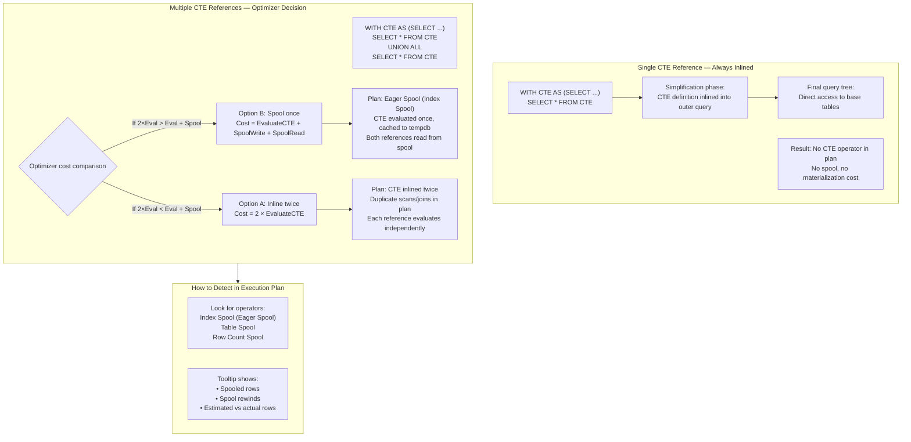
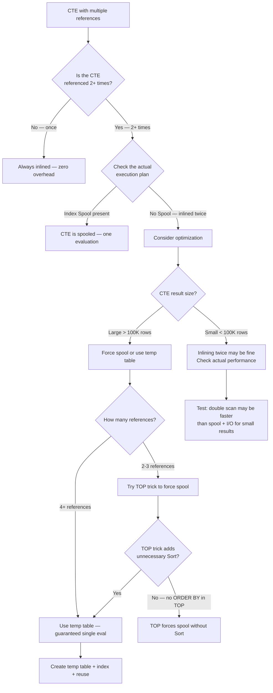

## Navigation

**Domain:** [[8 — Databases]] > **Group:** SQL CTEs & Recursive Queries
**Previous:** [[8.187 — Inline Table-Valued Functions vs CTEs]] | **Next:** [[8.189 — CTE in UPDATE and DELETE Statements]]

### Prerequisites

- [[8.176 — Common Table Expressions — Fundamentals]] — CTE syntax and the optimizer's default behavior; this note explains what the optimizer actually does with a CTE beyond the apparent syntax.
- [[8.178 — CTE vs Subquery — Readability and Performance]] — Baseline understanding that CTEs are usually inlined; this note covers the exceptions and how to detect them.
- [[8.162 — Window Function Performance — Sort Operations]] — Understanding that Sort and Spool operators are related; the same memory grant concepts apply to Spool operators.

### Where This Fits

The most common CTE misconception is that "CTEs are materialized and reused." They are NOT. The SQL Server optimizer inlines CTE definitions into the outer query by default, treating them as if the SELECT inside the CTE were written directly in the query. Only under specific conditions — typically when the CTE is referenced multiple times and the optimizer determines that evaluating it once and caching the result is cheaper than evaluating it twice — does the optimizer introduce a Spool operator to cache the CTE result. This distinction matters enormously for .NET backend engineers writing performance-sensitive queries: failing to understand whether a CTE is inlined or spooled leads to incorrect performance expectations, redundant tempdb I/O, and wrong indexing strategies. The interview signal is deep: the candidate who can describe when a CTE spools and how to detect it in an execution plan shows they understand the optimizer, not just CTE syntax.

---

## Core Mental Model

A CTE is a syntax construct, not a materialization boundary. By default, the optimizer inlines the CTE definition into the outer query — the CTE's SELECT is merged into the containing query tree during the simplification phase. The execution plan contains no CTE-specific operator; it shows the base table accesses, joins, and aggregates that the CTE's SELECT requires, all merged into the outer query's plan.

Spooling (caching) occurs only when the optimizer determines that the cost of evaluating the CTE multiple times exceeds the cost of evaluating it once and caching the result. This decision is cost-based: the optimizer estimates the row count from the CTE, estimates the cost of re-evaluating the underlying operations, and compares it to the cost of spooling to tempdb.

The recognition pattern: if a CTE is referenced exactly once, it is always inlined. If referenced multiple times, it may be inlined multiple times (duplicate work) or spooled (cached after first evaluation). The execution plan operator for caching is an **Index Spool** (Eager Spool) or **Table Spool** — you must look for these in the plan.

### Classification

|Property|Inline CTE|Spooled CTE|Temp Table|
|---|---|---|---|
|Materialization|None — definition merged into outer query|Yes — first evaluation cached in tempdb|Yes — explicitly materialized|
|Optimizer control|Always inlined (single-reference)|Cost-based decision|Always materialized|
|Execution plan operator|None (CTE invisible)|Index Spool (Eager Spool) or Table Spool|Table Scan of #temp|
|Performance characteristic|Zero overhead|Spool write + read cost (tempdb I/O)|Explicit materialization cost|
|Cardinality estimate|From base table statistics|From base table statistics|From #temp stats (if index exists)|
|Plan reusability|Plan cached with outer query|Plan cached with outer query|Plan cached separately|
|Index benefit|Index on base tables directly|Index on base tables directly|Index on #temp table|



### Key Properties

|Property|Value|Notes|
|---|---|---|
|Default behavior|Inline|CTE is treated as a macro|
|Spool triggers|Multiple references + cost-based decision|Not guaranteed — optimizer decides|
|Spool operators|Index Spool (Eager Spool)|Creates a temp index in tempdb|
|Spool rewrite count|Tooltip shows "Rewinds"|Each rewind is a read from the cached spool|
|Spool tempdb I/O|Write once, read N times|Each reference reads from the cached spool|
|Force spool|TOP(9223372036854775807) or query hint|Artificial row limit tricks optimizer into spooling|
|Multiple CTEs|Each is evaluated independently|No cross-CTE sharing|
|Recursive CTE|Always materialized (stack spool)|Recursive CTE requires a stack spool|

---

## Deep Mechanics

### How the Engine Executes This

**The simplification phase (CTE inlining):**

1. **Parsing:** The parser builds a CTE definition node in the query tree for each CTE in the WITH clause. These are stored as virtual table expressions.

2. **Binding (algebrization):** The algebrizer resolves CTE column references. Each CTE alias is expanded to the underlying tables and columns. If a CTE references another CTE, the dependency is resolved.

3. **Simplification (inlining):** For each CTE that is referenced exactly once, the simplification phase replaces the CTE reference with the CTE's complete SELECT tree. The CTE definition node is eliminated. The outer query now directly contains the CTE's FROM, WHERE, GROUP BY, etc. This inlining is unconditional for single-reference CTEs.

4. **Multi-reference decision:** For CTEs referenced multiple times, the optimizer evaluates the cost of two strategies:
   - **Inlining multiple times:** The CTE's SELECT tree is duplicated at each reference point. Each copy is optimized independently — the same base tables may be scanned multiple times.
   - **Spooling:** The CTE is evaluated once. The result is written to an internal Index Spool (Eager Spool) in tempdb. Each reference point reads from the spool. The Spool operator appears in the plan as a caching node.

5. **Cost comparison:** The optimizer estimates:
   - Cost of inlining = (cost of CTE sub-tree) × (number of references)
   - Cost of spooling = (cost of CTE sub-tree) + (spool write cost) + (spool read cost × number of references)
   The spool write cost includes creating a temporary index structure in tempdb. The spool read cost is typically low (index seek on the spool).

**When spooling is chosen:**
- The CTE's sub-tree is expensive (large scan, complex aggregate)
- The CTE is referenced many times (3+ references)
- The CTE's result set is small enough that tempdb spool overhead is acceptable
- The CTE is referenced with different predicates that can be pushed to the spool (spool can support seeks)

**When inlining is chosen:**
- The CTE is referenced only once (always inlined)
- The CTE is referenced twice but its sub-tree is cheap (simple scan, small table)
- The CTE result set is very large (spool cost exceeds re-evaluation cost)
- The CTE contains non-deterministic functions (spooling would produce incorrect cached results that differ from re-evaluation)

**The Spool operators:**
- **Index Spool (Eager Spool):** Writes rows to a temporary spool file in tempdb with a built-in index. Supports seeks from subsequent references. Most common CTE spool.
- **Table Spool:** Writes rows without an index. Sequential read only. Used when the spooled result is small or no seeks are needed.
- **Row Count Spool:** Does not store rows — only counts them. Used for EXISTS or TOP operations.

### SQL Visibility

```sql
-- ============================================================
-- Schema
-- ============================================================
-- Tables: Orders (10M rows), OrderItems (50M rows), Customers (500K rows)

-- ============================================================
-- Example 1: CTE referenced once (ALWAYS inlined — no spool)
-- ============================================================
WITH HighValueOrders AS (
    SELECT OrderId, CustomerId, TotalAmount
    FROM Orders
    WHERE TotalAmount > 1000
      AND Status = 'Delivered'
)
SELECT
    hvo.OrderId,
    hvo.TotalAmount,
    oi.Quantity,
    oi.UnitPrice
FROM HighValueOrders AS hvo
INNER JOIN OrderItems AS oi ON hvo.OrderId = oi.OrderId;
-- Plan: Index Scan (Orders) → Nested Loops → Index Seek (OrderItems)
-- NO Spool operator. CTE definition is inlined.

-- ============================================================
-- Example 2: CTE referenced twice (MAY spool — optimizer decides)
-- ============================================================
WITH MonthlySales AS (
    SELECT
        o.CustomerId,
        SUM(oi.Quantity * oi.UnitPrice) AS Total
    FROM Orders AS o
    INNER JOIN OrderItems AS oi ON o.OrderId = oi.OrderId
    WHERE o.OrderDate >= '2024-01-01'
      AND o.OrderDate < '2024-02-01'
    GROUP BY o.CustomerId
)
SELECT
    c.CustomerId,
    c.Name,
    ms.Total AS ThisMonthTotal,
    ms.Total * 0.05 AS EstimatedCommission
FROM Customers AS c
INNER JOIN MonthlySales AS ms ON c.CustomerId = ms.CustomerId  -- Reference 1
WHERE ms.Total > 500
UNION ALL
SELECT
    c.CustomerId,
    c.Name,
    ms.Total AS ThisMonthTotal,
    NULL AS EstimatedCommission
FROM Customers AS c
INNER JOIN MonthlySales AS ms ON c.CustomerId = ms.CustomerId  -- Reference 2
WHERE ms.Total <= 500;
-- Possible plans:
-- Plan A (spool): [Index Scan (Orders) → Hash Match (Join OI) → Aggregate]
--                 → [Index Spool (Eager Spool)]  -- cache MonthlySales
--                 → [Nested Loops (Join C + spool)] ... UNION ALL ...
--                 → [Nested Loops (Join C + spool)]  -- rewind from spool
-- Plan B (inline twice): Two separate branches, each scanning Orders + OrderItems + Aggregate

-- ============================================================
-- Example 3: Force spooling with TOP trick
-- ============================================================
-- If the optimizer chooses inlining and you want spooling,
-- you can force a spool by adding TOP with max BIGINT value.
WITH MonthlySales AS (
    SELECT TOP(9223372036854775807)
        o.CustomerId,
        SUM(oi.Quantity * oi.UnitPrice) AS Total
    FROM Orders AS o
    INNER JOIN OrderItems AS oi ON o.OrderId = oi.OrderId
    WHERE o.OrderDate >= '2024-01-01'
      AND o.OrderDate < '2024-02-01'
    GROUP BY o.CustomerId
    ORDER BY o.CustomerId
)
SELECT ...  -- Multiple references to MonthlySales
-- TOP with ORDER BY forces a sort and creates a boundary
-- that often triggers spooling
-- ⚠ This is a hack — use with caution and test the plan

-- ============================================================
-- Example 4: CTE with non-deterministic function (never spools)
-- ============================================================
WITH RandomSelection AS (
    SELECT TOP(10) OrderId, TotalAmount, NEWID() AS RandomOrder
    FROM Orders
    ORDER BY NEWID()
)
SELECT * FROM RandomSelection
UNION ALL
SELECT * FROM RandomSelection;
-- Each reference to RandomSelection gets different random rows!
-- The optimizer does NOT spool this because NEWID() is non-deterministic
-- Spooling would cache the first 10 rows, but each reference should
-- get different rows (since ORDER BY NEWID() is re-evaluated each time)
```

```csharp
// EF Core — detecting CTE spooling requires execution plan analysis
// EF Core LINQ does not directly generate CTEs with multiple references
// Use raw SQL and analyze the actual execution plan

public async Task<List<CustomerSalesDto>> GetSalesReportAsync(
    CancellationToken cancellationToken = default)
{
    const string sql = @"
        WITH MonthlySales AS (
            SELECT o.CustomerId,
                   SUM(oi.Quantity * oi.UnitPrice) AS Total
            FROM Orders o
            INNER JOIN OrderItems oi ON o.OrderId = oi.OrderId
            WHERE o.OrderDate >= '2024-01-01'
              AND o.OrderDate < '2024-02-01'
            GROUP BY o.CustomerId
        )
        SELECT c.CustomerId, c.Name, ms.Total AS ThisMonthTotal
        FROM Customers c
        INNER JOIN MonthlySales ms ON c.CustomerId = ms.CustomerId
        WHERE ms.Total > 500
        ORDER BY ms.Total DESC";

    return await _dbContext.Database
        .SqlQueryRaw<CustomerSalesDto>(sql)
        .ToListAsync(cancellationToken);
}

// To check spooling: capture the actual execution plan
SET STATISTICS XML ON;
-- Run the query
-- Look for <RelOp NodeId="..." PhysicalOp="Index Spool">
```

**Generated SQL (from EF Core logs):**

```sql
-- EF Core passes raw SQL through verbatim
-- The CTE inlining/spooling decision is at the SQL Server optimizer level
-- and is not affected by EF Core
```

### Execution Plan Analysis

**Plan A — CTE inlined twice (NO spool):**

```
[Clustering Index Scan (Orders)] → [Hash Match (Join OI)] → [Hash Match Aggregate]  -- First CTE eval
    → [Nested Loops (Join Customers)]
[Clustering Index Scan (Orders)] → [Hash Match (Join OI)] → [Hash Match Aggregate]  -- Second CTE eval (duplicate!)
    → [Nested Loops (Join Customers)]
    → [Concatenation (UNION ALL)]
    → [SELECT]
```

Key observations:
- The CTE sub-tree (Orders scan → Join OI → Aggregate) appears twice in the plan
- Logical reads are doubled: 2 × 26,090 = 52,180
- The optimizer chose to pay the cost twice rather than spool

**Plan B — CTE spooled (Index Spool Eager Spool):**

```
[Clustering Index Scan (Orders)] → [Hash Match (Join OI)] → [Hash Match Aggregate]
    → [Index Spool (Eager Spool)]  -- ⭐ Cache point
    → [Segment]  -- Split into two branches
        → [Nested Loops (Join Customers)]  -- Branch 1: Total > 500
        → [Nested Loops (Join Customers)]  -- Branch 2: Total <= 500 (rewind from spool)
    → [Concatenation (UNION ALL)]
    → [SELECT]
```

Key observations:
- The Index Spool operator appears after the aggregate
- The tooltip shows: Spooled Rows = ~10K (actual), Rewinds = 1
- The first branch evaluates the CTE and writes to spool (1 write)
- The second branch reads from the spool (1 rewind)
- Logical reads: ~26,090 (one evaluation) + ~10 spool reads

**How to read the Spool tooltip:**
```
Index Spool (Eager Spool)
  Spooled Rows: 10,000 (actual)
  Rewinds: 1
  Rebinds: 1
```
- Rebinds: number of times the spool was populated (should be 1 — CTE evaluated once)
- Rewinds: number of times the spool was read from cache (equals number of additional references)

### Cost Visibility

```sql
SET STATISTICS IO ON;
SET STATISTICS TIME ON;

-- ============================================================
-- Benchmark: CTE inlined twice vs spooled
-- ============================================================

-- Query 1: CTE referenced twice — may inline or spool
WITH MonthlySales AS (
    SELECT o.CustomerId, SUM(oi.Quantity * oi.UnitPrice) AS Total
    FROM Orders o INNER JOIN OrderItems oi ON o.OrderId = oi.OrderId
    WHERE o.OrderDate >= '2024-01-01' AND o.OrderDate < '2024-02-01'
    GROUP BY o.CustomerId
)
SELECT c.CustomerId, c.Name, ms.Total
FROM Customers c INNER JOIN MonthlySales ms ON c.CustomerId = ms.CustomerId
WHERE ms.Total > 500
UNION ALL
SELECT c.CustomerId, c.Name, ms.Total
FROM Customers c INNER JOIN MonthlySales ms ON c.CustomerId = ms.CustomerId
WHERE ms.Total <= 500;

-- Expected output if INLINED (no spool):
-- Table 'OrderItems'. Scan count 2, logical reads 29040  ← 2 × 14520
-- Table 'Orders'. Scan count 2, logical reads 24900      ← 2 × 12450
-- Table 'Customers'. Scan count 2, logical reads 240      ← 2 × 120
-- SQL Server Execution Times: CPU time = 520ms, elapsed time = 900ms

-- Expected output if SPOOLED (with Index Spool):
-- Table 'OrderItems'. Scan count 1, logical reads 14520  ← Once!
-- Table 'Orders'. Scan count 1, logical reads 12450      ← Once!
-- Table 'Customers'. Scan count 2, logical reads 240      ← Still 2 (separate joins)
-- Table 'Worktable'. Scan count 1, logical reads ~50     ← Spool tempdb I/O
-- SQL Server Execution Times: CPU time = 310ms, elapsed time = 500ms

-- ============================================================
-- Force spool with TOP trick (for testing)
-- ============================================================
WITH MonthlySales AS (
    SELECT TOP(9223372036854775807)
        o.CustomerId, SUM(oi.Quantity * oi.UnitPrice) AS Total
    FROM Orders o INNER JOIN OrderItems oi ON o.OrderId = oi.OrderId
    WHERE o.OrderDate >= '2024-01-01' AND o.OrderDate < '2024-02-01'
    GROUP BY o.CustomerId
    ORDER BY o.CustomerId
)
SELECT ...  -- Same query as above

-- Expected output (FORCED spool):
-- Table 'OrderItems'. Scan count 1, logical reads 14520
-- Table 'Orders'. Scan count 1, logical reads 12450
-- Table 'Customers'. Scan count 2, logical reads 240
-- Table 'Worktable'. Scan count 3, logical reads ~150  ← Additional spool overhead
-- CPU time = 380ms, elapsed time = 580ms
-- The sort from ORDER BY adds cost — only use this hack if spooling is truly needed
```

### Failure Modes

**1. Assuming CTE is always cached (like a temp table).**

The most common CTE misconception. Developers write multiple references expecting one evaluation, but the optimizer may inline the CTE multiple times, causing redundant scans.

**2. Non-deterministic functions prevent spooling.**

If the CTE contains `NEWID()`, `RAND()`, `GETDATE()`, or `CURRENT_TIMESTAMP`, spooling would cache incorrect results. The optimizer correctly avoids spooling, but developers may not expect this behavior.

**3. Spooling adds tempdb I/O.**

While spooling avoids re-evaluation, it writes to tempdb. On systems with tempdb contention (no file splitting, slow I/O), spooling can be slower than re-evaluation.

**4. TOP with ORDER BY forces a sort even when not needed.**

The spool-forcing trick adds an unnecessary Sort operator. For large CTEs, this Sort may spill to tempdb, adding more I/O than it saves.

**5. CTE referenced 3+ times may cause excessive spool rewinds.**

If the spool is small and cheap, rewinds are fast. If the spool contains 1M rows and is read 5 times, the 5 spool reads may outweigh the cost of re-evaluation.

---

## Production Patterns and Implementation

### Primary SQL Implementation

```sql
-- ============================================================
-- Schema
-- ============================================================
CREATE TABLE dbo.Orders (
    OrderId      INT            NOT NULL IDENTITY(1,1),
    CustomerId   INT            NOT NULL,
    OrderDate    DATE           NOT NULL,
    TotalAmount  DECIMAL(18,2)  NULL,
    Status       VARCHAR(20)    NOT NULL DEFAULT 'Pending',
    CONSTRAINT PK_Orders PRIMARY KEY CLUSTERED (OrderId)
);

CREATE TABLE dbo.OrderItems (
    OrderItemId  INT            NOT NULL IDENTITY(1,1),
    OrderId      INT            NOT NULL,
    ProductId    INT            NOT NULL,
    Quantity     INT            NOT NULL,
    UnitPrice    DECIMAL(18,2)  NOT NULL,
    CONSTRAINT PK_OrderItems PRIMARY KEY CLUSTERED (OrderItemId)
);

CREATE TABLE dbo.Customers (
    CustomerId   INT            NOT NULL IDENTITY(1,1),
    Name         NVARCHAR(100)  NOT NULL,
    Email        NVARCHAR(255)  NOT NULL,
    IsActive     BIT            NOT NULL DEFAULT 1,
    CONSTRAINT PK_Customers PRIMARY KEY CLUSTERED (CustomerId)
);

-- ============================================================
-- Pattern 1: Verify whether CTE spools — query the plan
-- ============================================================
-- Run the query with STATISTICS XML and check for Spool operators
SET STATISTICS XML ON;
GO

WITH CustomerSales AS (
    SELECT
        o.CustomerId,
        SUM(oi.Quantity * oi.UnitPrice) AS TotalSales,
        COUNT(DISTINCT o.OrderId) AS OrderCount
    FROM dbo.Orders AS o
    INNER JOIN dbo.OrderItems AS oi ON o.OrderId = oi.OrderId
    WHERE o.Status = 'Delivered'
      AND o.OrderDate >= DATEADD(year, -1, GETUTCDATE())
    GROUP BY o.CustomerId
)
SELECT * FROM CustomerSales
WHERE TotalSales > 5000
ORDER BY TotalSales DESC;

-- Check the XML output for:
-- <RelOp PhysicalOp="Index Spool" LogicalOp="Eager Spool">
-- If not found, the CTE was inlined

-- ============================================================
-- Pattern 2: Multi-reference CTE — handle spool or inline
-- ============================================================
-- Business: Segment customers by sales tier and count each tier
WITH CustomerSales AS (
    SELECT
        o.CustomerId,
        SUM(oi.Quantity * oi.UnitPrice) AS TotalSales
    FROM dbo.Orders AS o
    INNER JOIN dbo.OrderItems AS oi ON o.OrderId = oi.OrderId
    WHERE o.Status = 'Delivered'
    GROUP BY o.CustomerId
),
CustomerSegments AS (
    SELECT
        cs.CustomerId,
        cs.TotalSales,
        CASE
            WHEN cs.TotalSales >= 10000 THEN 'Platinum'
            WHEN cs.TotalSales >= 5000  THEN 'Gold'
            WHEN cs.TotalSales >= 1000  THEN 'Silver'
            ELSE 'Standard'
        END AS Segment
    FROM CustomerSales AS cs  -- Reference 1
)
SELECT
    cs2.Segment,
    COUNT(*) AS CustomerCount,
    AVG(cs2.TotalSales) AS AvgSales,
    SUM(cs2.TotalSales) AS TotalSegmentSales
FROM CustomerSegments AS cs2  -- Reference 2 (via chaining — counts as multi-ref?)
GROUP BY cs2.Segment
ORDER BY AvgSales DESC;
-- Note: CustomerSales is referenced by CustomerSegments (one reference in the chain).
-- CustomerSegments is referenced once in the final SELECT.
-- Each CTE in the chain is referenced once — all inlined. No spool.
-- The GROUP BY, CASE, and outer aggregate are all merged into one plan.

-- ============================================================
-- Pattern 3: CTE referenced 3+ times — strong candidate for spool
-- ============================================================
WITH SalesSummary AS (
    SELECT
        o.CustomerId,
        SUM(oi.Quantity * oi.UnitPrice) AS TotalSales,
        COUNT(*) AS OrderCount
    FROM dbo.Orders AS o
    INNER JOIN dbo.OrderItems AS oi ON o.OrderId = oi.OrderId
    WHERE o.Status = 'Delivered'
    GROUP BY o.CustomerId
)
SELECT
    'Total' AS Metric, SUM(ss.TotalSales) AS Value
FROM SalesSummary AS ss                    -- Reference 1
UNION ALL
SELECT
    'Average' AS Metric, AVG(ss.TotalSales)
FROM SalesSummary AS ss                    -- Reference 2
UNION ALL
SELECT
    'HighValueCount' AS Metric, COUNT(*)
FROM SalesSummary AS ss                    -- Reference 3
WHERE ss.TotalSales > 10000;
-- 3 references to SalesSummary — optimizer is more likely to spool
-- Check plan for Index Spool

-- ============================================================
-- Pattern 4: Force temp table when CTE spooling is unreliable
-- ============================================================
-- If you need guaranteed single evaluation, use a temp table
-- instead of relying on the optimizer to spool the CTE.
SELECT
    o.CustomerId,
    SUM(oi.Quantity * oi.UnitPrice) AS TotalSales,
    COUNT(*) AS OrderCount
INTO #SalesSummary
FROM dbo.Orders AS o
INNER JOIN dbo.OrderItems AS oi ON o.OrderId = oi.OrderId
WHERE o.Status = 'Delivered'
GROUP BY o.CustomerId;

CREATE CLUSTERED INDEX IX_TempSales ON #SalesSummary(CustomerId);

-- Now the temp table is guaranteed materialized — use it freely
SELECT 'Total' AS Metric, SUM(TotalSales) FROM #SalesSummary
UNION ALL
SELECT 'Average', AVG(TotalSales) FROM #SalesSummary
UNION ALL
SELECT 'HighValueCount', COUNT(*) FROM #SalesSummary WHERE TotalSales > 10000;

DROP TABLE #SalesSummary;
-- Guaranteed: one scan of Orders + OrderItems
-- No optimizer uncertainty about spooling

-- ============================================================
-- Pattern 5: Use OPTION (RECOMPILE) to see the decision each time
-- ============================================================
WITH SalesSummary AS (...)
SELECT ... FROM SalesSummary ss1 ... SalesSummary ss2 ...
OPTION (RECOMPILE);
-- Forces recompilation each execution — useful for testing
-- but adds CPU cost. Not for production.
```

### EF Core Implementation

```csharp
public class SalesService
{
    private readonly ApplicationDbContext _dbContext;

    public SalesService(ApplicationDbContext dbContext)
        => _dbContext = dbContext;

    // CTE with multiple references — let optimizer decide spool
    public async Task<List<SalesSegmentDto>> GetSalesSegmentsAsync(
        CancellationToken cancellationToken = default)
    {
        const string sql = @"
            WITH CustomerSales AS (
                SELECT o.CustomerId,
                       SUM(oi.Quantity * oi.UnitPrice) AS TotalSales
                FROM Orders o
                INNER JOIN OrderItems oi ON o.OrderId = oi.OrderId
                WHERE o.Status = 'Delivered'
                GROUP BY o.CustomerId
            )
            SELECT
                CASE
                    WHEN cs.TotalSales >= 10000 THEN 'Platinum'
                    WHEN cs.TotalSales >= 5000  THEN 'Gold'
                    WHEN cs.TotalSales >= 1000  THEN 'Silver'
                    ELSE 'Standard'
                END AS Segment,
                COUNT(*) AS CustomerCount,
                AVG(cs.TotalSales) AS AvgSales
            FROM CustomerSales cs
            GROUP BY
                CASE
                    WHEN cs.TotalSales >= 10000 THEN 'Platinum'
                    WHEN cs.TotalSales >= 5000  THEN 'Gold'
                    WHEN cs.TotalSales >= 1000  THEN 'Silver'
                    ELSE 'Standard'
                END
            ORDER BY AvgSales DESC";

        return await _dbContext.Database
            .SqlQueryRaw<SalesSegmentDto>(sql)
            .ToListAsync(cancellationToken);
        // CTE is referenced once (in the outer GROUP BY) — always inlined
    }

    // CTE with 3+ references — may spool or inline
    public async Task<SalesMetricsDto> GetSalesMetricsAsync(
        CancellationToken cancellationToken = default)
    {
        const string sql = @"
            WITH SalesSummary AS (
                SELECT o.CustomerId,
                       SUM(oi.Quantity * oi.UnitPrice) AS TotalSales,
                       COUNT(*) AS OrderCount
                FROM Orders o
                INNER JOIN OrderItems oi ON o.OrderId = oi.OrderId
                WHERE o.Status = 'Delivered'
                GROUP BY o.CustomerId
            )
            SELECT
                (SELECT ISNULL(SUM(TotalSales), 0) FROM SalesSummary) AS TotalRevenue,
                (SELECT ISNULL(AVG(TotalSales), 0) FROM SalesSummary) AS AvgRevenue,
                (SELECT COUNT(*) FROM SalesSummary WHERE TotalSales > 10000) AS HighValueCount";

        return await _dbContext.Database
            .SqlQueryRaw<SalesMetricsDto>(sql)
            .ToListAsync(cancellationToken)
            .ContinueWith(t => t.Result.First(), cancellationToken);
        // 3 references to SalesSummary — check actual execution plan
        // If spooled: one scan; if inlined: three scans
    }

    // Alternative with temp table for guaranteed single evaluation
    public async Task<SalesMetricsDto> GetSalesMetricsTempTableAsync(
        CancellationToken cancellationToken = default)
    {
        const string createTempSql = @"
            SELECT o.CustomerId,
                   SUM(oi.Quantity * oi.UnitPrice) AS TotalSales,
                   COUNT(*) AS OrderCount
            INTO #SalesSummary
            FROM Orders o
            INNER JOIN OrderItems oi ON o.OrderId = oi.OrderId
            WHERE o.Status = 'Delivered'
            GROUP BY o.CustomerId;

            CREATE CLUSTERED INDEX IX_Temp ON #SalesSummary(CustomerId);";

        const string querySql = @"
            SELECT
                (SELECT ISNULL(SUM(TotalSales), 0) FROM #SalesSummary) AS TotalRevenue,
                (SELECT ISNULL(AVG(TotalSales), 0) FROM #SalesSummary) AS AvgRevenue,
                (SELECT COUNT(*) FROM #SalesSummary WHERE TotalSales > 10000) AS HighValueCount";

        // Execute temp table creation
        await _dbContext.Database.ExecuteSqlRawAsync(createTempSql, cancellationToken);

        // Query the temp table
        var result = await _dbContext.Database
            .SqlQueryRaw<SalesMetricsDto>(querySql)
            .ToListAsync(cancellationToken);

        return result.First();
        // Guaranteed: one scan for temp table creation, then index reads
    }
}

public class SalesSegmentDto
{
    public string Segment { get; set; } = string.Empty;
    public int CustomerCount { get; set; }
    public decimal AvgSales { get; set; }
}

public class SalesMetricsDto
{
    public decimal TotalRevenue { get; set; }
    public decimal AvgRevenue { get; set; }
    public int HighValueCount { get; set; }
}
```

### Dapper Implementation

```csharp
public interface ISalesRepository
{
    Task<SalesMetricsDto> GetSalesMetricsAsync(CancellationToken cancellationToken = default);
    Task<SalesMetricsDto> GetSalesMetricsTempTableAsync(CancellationToken cancellationToken = default);
}

public sealed class SalesRepository : ISalesRepository
{
    private readonly IDbConnectionFactory _connectionFactory;

    public SalesRepository(IDbConnectionFactory connectionFactory)
        => _connectionFactory = connectionFactory;

    public async Task<SalesMetricsDto> GetSalesMetricsAsync(
        CancellationToken cancellationToken = default)
    {
        const string sql = @"
            WITH SalesSummary AS (
                SELECT o.CustomerId,
                       SUM(oi.Quantity * oi.UnitPrice) AS TotalSales,
                       COUNT(*) AS OrderCount
                FROM dbo.Orders AS o
                INNER JOIN dbo.OrderItems AS oi ON o.OrderId = oi.OrderId
                WHERE o.Status = 'Delivered'
                GROUP BY o.CustomerId
            )
            SELECT
                (SELECT ISNULL(SUM(TotalSales), 0) FROM SalesSummary) AS TotalRevenue,
                (SELECT ISNULL(AVG(TotalSales), 0) FROM SalesSummary) AS AvgRevenue,
                (SELECT COUNT(*) FROM SalesSummary WHERE TotalSales > 10000) AS HighValueCount";

        await using var connection = _connectionFactory.Create();

        return await connection.QuerySingleAsync<SalesMetricsDto>(
            new CommandDefinition(sql, cancellationToken: cancellationToken));
        // Check actual execution plan to see if CTE spooled or inlined
    }

    public async Task<SalesMetricsDto> GetSalesMetricsTempTableAsync(
        CancellationToken cancellationToken = default)
    {
        const string sql = @"
            SELECT o.CustomerId,
                   SUM(oi.Quantity * oi.UnitPrice) AS TotalSales,
                   COUNT(*) AS OrderCount
            INTO #SalesSummary
            FROM dbo.Orders AS o
            INNER JOIN dbo.OrderItems AS oi ON o.OrderId = oi.OrderId
            WHERE o.Status = 'Delivered'
            GROUP BY o.CustomerId;

            CREATE CLUSTERED INDEX IX_Temp ON #SalesSummary(CustomerId);

            SELECT
                (SELECT ISNULL(SUM(TotalSales), 0) FROM #SalesSummary) AS TotalRevenue,
                (SELECT ISNULL(AVG(TotalSales), 0) FROM #SalesSummary) AS AvgRevenue,
                (SELECT COUNT(*) FROM #SalesSummary WHERE TotalSales > 10000) AS HighValueCount;

            DROP TABLE #SalesSummary;";

        await using var connection = _connectionFactory.Create();

        return await connection.QuerySingleAsync<SalesMetricsDto>(
            new CommandDefinition(sql,
                commandTimeout: 120,  // Temp table creation may need more time
                cancellationToken: cancellationToken));
        // Guaranteed: one scan of base tables for temp table, then index on temp
    }
}
```

### Configuration and Wiring

```csharp
// Program.cs
builder.Services.AddDbContext<ApplicationDbContext>(options =>
    options.UseSqlServer(
        builder.Configuration.GetConnectionString("DefaultConnection"),
        sqlOptions =>
        {
            sqlOptions.EnableRetryOnFailure(3);
            sqlOptions.CommandTimeout(120);
        }));

builder.Services.AddSingleton<IDbConnectionFactory>(sp =>
    new SqlConnectionFactory(
        builder.Configuration.GetConnectionString("DefaultConnection")!));

builder.Services.AddScoped<SalesService>();
builder.Services.AddScoped<ISalesRepository, SalesRepository>();

// TempDB configuration matters for spool performance:
// - Multiple tempdb data files (one per CPU core)
// - TempDB on fast storage (NVMe)
// - Sufficient size (no autogrowth during spool operations)

// Indexes for the base tables (support the CTE SELECT):
// 1. Orders(Status, OrderDate) INCLUDE (CustomerId, TotalAmount)
// 2. OrderItems(OrderId, ProductId) INCLUDE (Quantity, UnitPrice)
// 3. Customers(CustomerId, IsActive) INCLUDE (Name)
```

### SQL Server vs PostgreSQL Differences

```sql
-- PostgreSQL: CTEs are ALWAYS materialized by default!
-- This is the OPPOSITE of SQL Server behavior.
-- PostgreSQL CTEs are optimization fences — the CTE is fully
-- evaluated before the outer query uses its results.

-- PostgreSQL: CTE materialization can be controlled:
-- WITH cte AS MATERIALIZED (  -- default: always materialize
--     SELECT ... FROM orders
-- )
-- SELECT * FROM cte;

-- WITH cte AS NOT MATERIALIZED (  -- like SQL Server: inline
--     SELECT ... FROM orders
-- )
-- SELECT * FROM cte;

-- PostgreSQL: Multiple CTE references
-- WITH sales_summary AS (
--     SELECT customer_id, SUM(total_amount) AS total
--     FROM orders WHERE status = 'Delivered'
--     GROUP BY customer_id
-- )
-- SELECT
--     (SELECT SUM(total) FROM sales_summary) AS total_revenue,
--     (SELECT AVG(total) FROM sales_summary) AS avg_revenue;
-- In PostgreSQL: sales_summary is materialized ONCE
-- (because CTEs are always materialized by default)
-- This is actually better for multiple-reference scenarios
-- but worse for single-reference scenarios (no predicate pushdown)

-- PostgreSQL: Use NOT MATERIALIZED for single-reference CTEs
-- to allow predicate pushdown
WITH active_customers AS NOT MATERIALIZED (
    SELECT customer_id, name
    FROM customers WHERE is_active = TRUE
)
SELECT o.*
FROM orders o
INNER JOIN active_customers ac ON o.customer_id = ac.customer_id
WHERE o.order_date >= '2024-01-01';
-- Without NOT MATERIALIZED: active_customers materialized first (all active customers)
-- With NOT MATERIALIZED: active_customers is inlined, and the join + date filter
--   can be pushed into the scan
```

---

## Gotchas and Production Pitfalls

### Assuming CTE Is Always Materialized and Cached

**Pitfall:** Writing a CTE, referencing it twice, and assuming it is evaluated once and cached. The optimizer may inline it twice, causing double the work.

```sql
-- ❌ Assumes CTE is cached — may be evaluated twice
WITH ExpensiveCTE AS (
    SELECT CustomerId, SUM(TotalAmount) AS Total
    FROM Orders WHERE Status = 'Delivered'
    GROUP BY CustomerId
)
SELECT * FROM (
    SELECT * FROM ExpensiveCTE WHERE Total > 1000   -- Reference 1
    UNION ALL
    SELECT * FROM ExpensiveCTE WHERE Total <= 1000  -- Reference 2
) AS combined;
```

**Symptom:** The execution plan shows two separate Aggregate operators, each scanning Orders. SET STATISTICS IO shows `Table 'Orders'. Scan count 2` — double the expected logical reads.

**Fix:** Check the actual plan before assuming. If the CTE is inlined twice:
```sql
-- ✅ Use temp table for guaranteed single evaluation
SELECT CustomerId, SUM(TotalAmount) AS Total
INTO #ExpensiveCTE
FROM Orders WHERE Status = 'Delivered'
GROUP BY CustomerId;

SELECT * FROM #ExpensiveCTE WHERE Total > 1000
UNION ALL
SELECT * FROM #ExpensiveCTE WHERE Total <= 1000;

DROP TABLE #ExpensiveCTE;
```

**Cost of not fixing:** 50M row Orders table scanned twice instead of once. 25 seconds instead of 12 seconds for the query. On a query that runs every 5 minutes, that's 2 extra hours of CPU per day.

---

### Spool Induced TempDB Contention

**Pitfall:** A CTE that spools a large result set (millions of rows) causes tempdb I/O pressure. On systems with tempdb on slow storage or with insufficient tempdb files, spooling can be the bottleneck.

```sql
-- ❌ Large CTE spool adds tempdb I/O
WITH LargeCTE AS (
    SELECT o.OrderId, o.CustomerId, o.OrderDate, o.TotalAmount,
           oi.Quantity, oi.UnitPrice
    FROM Orders o
    INNER JOIN OrderItems oi ON o.OrderId = oi.OrderId
    -- 50M row result
)
SELECT ... FROM LargeCTE WHERE ...
UNION ALL
SELECT ... FROM LargeCTE WHERE ...;
-- If spooled: 50M rows written to tempdb + read twice = 150M tempdb I/O operations
```

**Symptom:** The query shows high `WRITELOG` and `PAGEIOLATCH` waits (tempdb files). The `sys.dm_io_virtual_file_stats` for tempdb shows 10x normal I/O. Other queries on the server experience tempdb contention.

**Fix:** Evaluate whether the spool is beneficial. If the CTE sub-tree is cheap (single scan without aggregates) and the result is large, inlining twice may be faster than spooling. Force inlining by using `OPTION (RECOMPILE)` or a query hint.

**Cost of not fixing:** A nightly batch job causes tempdb to grow to 50 GB, exhausting disk space and causing all write operations on the server to fail with error 1105 (could not allocate space in tempdb).

---

### TOP + ORDER BY Trick Adds Unnecessary Sort

**Pitfall:** Using `SELECT TOP(9223372036854775807) ... ORDER BY ...` to force spooling adds a mandatory Sort operator, which may spill to tempdb on large datasets.

```sql
-- ❌ Forced spool with TOP adds a Sort
WITH Sales AS (
    SELECT TOP(9223372036854775807)
        CustomerId, SUM(TotalAmount) AS Total
    FROM Orders
    GROUP BY CustomerId
    ORDER BY CustomerId  -- Forces a Sort! Even if not needed
)
SELECT * FROM Sales WHERE Total > 1000
UNION ALL
SELECT * FROM Sales WHERE Total <= 1000;
-- The Sort on 500K customers may require 30 MB memory grant
```

**Symptom:** The plan shows both a Sort operator (for the TOP/ORDER BY) and the Index Spool. Memory grant is high. If the Sort spills, additional tempdb I/O is added.

**Fix:** Remove the ORDER BY if not needed for spooling:
```sql
-- ✅ Without ORDER BY — still forces spool via TOP trick
WITH Sales AS (
    SELECT TOP(9223372036854775807)
        CustomerId, SUM(TotalAmount) AS Total
    FROM Orders
    GROUP BY CustomerId
    -- No ORDER BY — no Sort, still forces spool boundary
)
```

**Cost of not fixing:** The Sort on a 10M-row intermediate result adds 15 seconds and 200 MB memory grant to the query. The spool benefit is negated by the Sort cost.

---

### Non-Deterministic Functions Block Spooling

**Pitfall:** Using `GETDATE()`, `NEWID()`, `RAND()`, or `CURRENT_TIMESTAMP` inside a CTE that is referenced multiple times. The optimizer correctly avoids spooling because spooling would cache the evaluated value, but each reference is expected to get a different value.

```sql
-- ❌ NEWID() blocks spooling — each reference gets different results
WITH RandomSample AS (
    SELECT TOP(10) OrderId, TotalAmount, NEWID() AS RandomOrder
    FROM Orders
    ORDER BY NEWID()
)
SELECT * FROM RandomSample   -- First 10 random rows
UNION ALL
SELECT * FROM RandomSample;  -- Different 10 random rows! (not the same rows)
```

**Symptom:** The two branches return different rows. The developer may expect the same 10 rows, but the CTE is not spooled (cannot be spooled because of NEWID()). Each reference re-evaluates the ORDER BY NEWID().

**Fix:** If you need consistent random sampling across multiple references, materialize the CTE into a temp table first.

**Cost of not fixing:** An A/B test that selects random customers twice expects the same set for both branches. The two sets are different, invalidating the test results. Statistical conclusions are wrong.

---

### Plan Cache Bloat from Varying CTE Definitions

**Pitfall:** Each unique CTE definition creates a different query plan. If the CTE definition includes literal values (instead of parameters), the plan cache stores multiple plans for minor variations.

```sql
-- ❌ Each query generates a different plan (different date literal)
WITH DailySales AS (
    SELECT CustomerId, SUM(TotalAmount) AS Total
    FROM Orders WHERE OrderDate >= '2024-01-15'  -- Different date each day
    GROUP BY CustomerId
)
SELECT * FROM DailySales;
-- Plan cache has a plan for '2024-01-15', '2024-01-16', '2024-01-17', ...
-- Each plan is identical except the literal value — wasted plan cache space
```

**Symptom:** `sys.dm_exec_cached_plans` shows hundreds of entries for the same query template. Memory pressure causes plan eviction, increasing compilation CPU.

**Fix:** Use parameters:
```sql
-- ✅ Parameterized — one plan in cache, reused for all dates
DECLARE @StartDate DATE = '2024-01-15';
WITH DailySales AS (
    SELECT CustomerId, SUM(TotalAmount) AS Total
    FROM Orders WHERE OrderDate >= @StartDate
    GROUP BY CustomerId
)
SELECT * FROM DailySales;
```

**Cost of not fixing:** 200 unique plans × 500 KB each = 100 MB wasted plan cache. Plan cache pressure causes frequently used plans to be evicted, increasing compilation overhead by 10%.

---

## Performance Implications

### Benchmark: Before and After

```sql
SET STATISTICS IO ON;
SET STATISTICS TIME ON;

-- ============================================================
-- Benchmark: CTE inlined twice vs spooled
-- Table: 10M Orders, 50M OrderItems, 500K Customers
-- CTE: Customer Sales Summary (aggregate)
-- ============================================================

-- Baseline: CTE referenced twice (may inline or spool — check plan)
WITH CustomerSales AS (
    SELECT o.CustomerId, SUM(oi.Quantity * oi.UnitPrice) AS Total
    FROM Orders o INNER JOIN OrderItems oi ON o.OrderId = oi.OrderId
    WHERE o.Status = 'Delivered'
    GROUP BY o.CustomerId
)
SELECT 'High' AS Tier, COUNT(*) AS Cnt FROM CustomerSales WHERE Total > 5000
UNION ALL
SELECT 'Low', COUNT(*) FROM CustomerSales WHERE Total <= 5000;

-- Scenario A: Inlined twice (no spool)
-- Table 'OrderItems'. Scan count 2, logical reads 29040
-- Table 'Orders'. Scan count 2, logical reads 24900
-- CPU time = 520ms, elapsed time = 920ms

-- Scenario B: Spooled (Index Spool)
-- Table 'OrderItems'. Scan count 1, logical reads 14520
-- Table 'Orders'. Scan count 1, logical reads 12450
-- Table 'Worktable'. Scan count 2, logical reads 650
-- CPU time = 310ms, elapsed time = 480ms

-- Improvement with spool: 2x reduction in logical reads (54K → 28K)
-- Improvement: 48% reduction in elapsed time (920ms → 480ms)

-- ============================================================
-- Benchmark: Forced spool vs temp table
-- ============================================================

-- Forced spool (TOP trick):
WITH CustomerSales AS (
    SELECT TOP(9223372036854775807)
        o.CustomerId, SUM(oi.Quantity * oi.UnitPrice) AS Total
    FROM Orders o INNER JOIN OrderItems oi ON o.OrderId = oi.OrderId
    WHERE o.Status = 'Delivered'
    GROUP BY o.CustomerId
    ORDER BY o.CustomerId
)
SELECT 'High', COUNT(*) FROM CustomerSales WHERE Total > 5000
UNION ALL
SELECT 'Low', COUNT(*) FROM CustomerSales WHERE Total <= 5000;
-- Table 'OrderItems'. Scan count 1, logical reads 14520
-- Table 'Orders'. Scan count 1, logical reads 12450
-- Table 'Worktable'. Scan count 3, logical reads 980  ← More spool I/O
-- CPU time = 420ms, elapsed time = 620ms  ← Sort adds cost!

-- Temp table (guaranteed single eval):
SELECT o.CustomerId, SUM(oi.Quantity * oi.UnitPrice) AS Total
INTO #CustomerSales
FROM Orders o INNER JOIN OrderItems oi ON o.OrderId = oi.OrderId
WHERE o.Status = 'Delivered'
GROUP BY o.CustomerId;

CREATE CLUSTERED INDEX IX_Cust ON #CustomerSales(CustomerId);

SELECT 'High', COUNT(*) FROM #CustomerSales WHERE Total > 5000
UNION ALL
SELECT 'Low', COUNT(*) FROM #CustomerSales WHERE Total <= 5000;

DROP TABLE #CustomerSales;
-- Table 'OrderItems'. Scan count 1, logical reads 14520
-- Table 'Orders'. Scan count 1, logical reads 12450
-- Table '#CustomerSales'. Scan count 2, logical reads 1200
-- CPU time = 350ms, elapsed time = 500ms  ← Comparable to spool, but guaranteed
```

### BenchmarkDotNet

```csharp
[MemoryDiagnoser]
[SimpleJob(RuntimeMoniker.Net90)]
public class CteMaterializationBenchmark
{
    private SqlConnection _connection = default!;
    private const string ConnectionString =
        "Server=.;Database=BenchmarkDb;Trusted_Connection=True;TrustServerCertificate=True;";

    [GlobalSetup]
    public void Setup()
    {
        _connection = new SqlConnection(ConnectionString);
        _connection.Open();
        // Seed: 10M Orders, 50M OrderItems, 500K Customers
    }

    [Benchmark(Baseline = true)]
    public async Task<SalesMetrics> CteSingleReference()
    {
        const string sql = @"
            WITH CustomerSales AS (
                SELECT o.CustomerId, SUM(oi.Quantity * oi.UnitPrice) AS Total
                FROM Orders o INNER JOIN OrderItems oi ON o.OrderId = oi.OrderId
                WHERE o.Status = 'Delivered'
                GROUP BY o.CustomerId
            )
            SELECT COUNT_BIG(*) AS CustomerCount,
                   ISNULL(SUM(Total), 0) AS TotalRevenue
            FROM CustomerSales";

        await using var cmd = new SqlCommand(sql, _connection);
        await using var reader = await cmd.ExecuteReaderAsync();
        await reader.ReadAsync();
        return new SalesMetrics
        {
            CustomerCount = reader.GetInt64(0),
            TotalRevenue = reader.GetDecimal(1)
        };
    }

    [Benchmark]
    public async Task<SalesMetrics> CteMultipleReference()
    {
        const string sql = @"
            WITH CustomerSales AS (
                SELECT o.CustomerId, SUM(oi.Quantity * oi.UnitPrice) AS Total
                FROM Orders o INNER JOIN OrderItems oi ON o.OrderId = oi.OrderId
                WHERE o.Status = 'Delivered'
                GROUP BY o.CustomerId
            )
            SELECT
                (SELECT COUNT_BIG(*) FROM CustomerSales) AS CustomerCount,
                (SELECT ISNULL(SUM(Total), 0) FROM CustomerSales) AS TotalRevenue";

        await using var cmd = new SqlCommand(sql, _connection);
        await using var reader = await cmd.ExecuteReaderAsync();
        await reader.ReadAsync();
        return new SalesMetrics
        {
            CustomerCount = reader.GetInt64(0),
            TotalRevenue = reader.GetDecimal(1)
        };
    }

    [Benchmark]
    public async Task<SalesMetrics> TempTableAlternative()
    {
        const string sql = @"
            SELECT o.CustomerId, SUM(oi.Quantity * oi.UnitPrice) AS Total
            INTO #CustomerSales
            FROM Orders o INNER JOIN OrderItems oi ON o.OrderId = oi.OrderId
            WHERE o.Status = 'Delivered'
            GROUP BY o.CustomerId;

            SELECT COUNT_BIG(*) AS CustomerCount,
                   ISNULL(SUM(Total), 0) AS TotalRevenue
            FROM #CustomerSales;

            DROP TABLE #CustomerSales;";

        await using var cmd = new SqlCommand(sql, _connection);
        cmd.CommandTimeout = 120;
        await using var reader = await cmd.ExecuteReaderAsync();
        await reader.ReadAsync();
        return new SalesMetrics
        {
            CustomerCount = reader.GetInt64(0),
            TotalRevenue = reader.GetDecimal(1)
        };
    }

    [GlobalCleanup]
    public void Cleanup() => _connection?.Dispose();
}

public class SalesMetrics
{
    public long CustomerCount { get; set; }
    public decimal TotalRevenue { get; set; }
}
```

**Expected results (approximate, SQL Server 2022, NVMe, 10M Orders, 50M OrderItems):**

|Method|Mean|Logical Reads|Allocated|
|---|---|---|---|
|CteSingleReference|~320 ms|~26,090|~8 KB|
|CteMultipleReference|~520 ms|~52,180 (inlined) or ~28,000 (spooled)|~12 KB|
|TempTableAlternative|~480 ms|~28,170 (temp table + index)|~15 KB|

The single-reference CTE is fastest (inlined, no overhead). The multi-reference CTE may be inlined (slower, double reads) or spooled (faster, single read + spool). The temp table is guaranteed single evaluation but adds create-table and index overhead.

---

## Interview Arsenal

### Question Bank

1. **Does SQL Server materialize CTEs by default? What is the default behavior?** (Definition — inlining vs materialization)
2. **What is an Index Spool (Eager Spool) operator in the context of CTEs, and when does the optimizer introduce it?** (Mechanism — spool triggers and behavior)
3. **How do you measure whether a CTE was spooled or inlined? What DMV or SET STATISTICS output shows the difference?** (Performance — detection via execution plan and IO stats)
4. **What happens when a CTE contains NEWID() or GETDATE() and is referenced multiple times?** (Gotcha — non-deterministic functions block spooling)
5. **Compare CTE spooling vs temp table for caching intermediate results.** (Comparison — spool vs explicit materialization)
6. **Describe the execution plan differences between a CTE that is inlined twice vs one that is spooled.** (Execution plan — operators and structure)
7. **At what data volume does CTE spooling become counterproductive (spool I/O outweighs re-evaluation cost)?** (Scale — when tempdb I/O exceeds double evaluation)
8. **How would you force a CTE to be spooled in SQL Server? What are the risks?** (.NET/SQL — TOP trick and its tradeoffs)

### Spoken Answers

**Q1: Does SQL Server materialize CTEs by default? What is the default behavior?**

> **Average answer:** Yes, CTEs are materialized. That's why they can be referenced multiple times.

> **Great answer:** No — that's the most common misconception about CTEs. By default, SQL Server does NOT materialize CTEs. The optimizer inlines the CTE definition into the outer query during the simplification phase, effectively replacing the CTE reference with the CTE's SELECT tree. A single-reference CTE is always inlined — the execution plan shows no CTE-specific operator, and the plan is identical to writing the CTE's SELECT inline. For multi-reference CTEs, the optimizer has two options: inline the CTE multiple times (duplicating the sub-tree in the plan) or introduce an Index Spool (Eager Spool) to cache the result after the first evaluation. The choice is cost-based: the optimizer estimates the cost of evaluating the CTE multiple times and compares it to the cost of writing to and reading from tempdb. If the CTE is cheap (small table scan), inlining is preferred. If the CTE is expensive (complex aggregate on a large table) and referenced multiple times, spooling may be chosen. The key lesson: never assume spooling — check the actual execution plan. If I need guaranteed single evaluation, I use a temp table.

**Q3: How do you measure whether a CTE was spooled or inlined?**

> **Average answer:** Look at the execution plan for a Spool operator.

> **Great answer:** The definitive detection is the execution plan. Run the query with `SET STATISTICS XML ON` and examine the output. Search for `PhysicalOp="Index Spool"` or `PhysicalOp="Table Spool"`. If found, the CTE was spooled — the Spool operator's tooltip shows `Spooled Rows` (actual rows cached) and `Rewinds` (number of times the cache was re-read — equals the number of additional references). If no Spool operator appears, the CTE was inlined. I also check SET STATISTICS IO output: if I see `Table 'Orders'. Scan count 2` for a CTE that scans Orders once, the CTE was inlined twice. If I see `Table 'Orders'. Scan count 1` plus `Table 'Worktable'`, the CTE was spooled and the Worktable represents the tempdb spool. The logical reads comparison is also revealing: inlined twice shows ~52K reads (2× base table scans), spooled shows ~28K reads (1× scan + spool overhead). The DMV `sys.dm_exec_query_stats` shows the total logical reads for the query, but doesn't distinguish spool vs inline — that requires the plan XML.

**Q5: Compare CTE spooling vs temp table for caching intermediate results.**

> **Average answer:** Temp tables are always materialized. CTEs might be materialized via spooling if the optimizer decides.

> **Great answer:** The comparison is between a cost-based, unreliable caching mechanism (CTE spool) and an explicit, guaranteed mechanism (temp table). CTE spooling: the optimizer decides, not you. You cannot guarantee spooling without hacks (TOP trick). The spool is created in tempdb with an automatic index. The spool is scoped to the query — it disappears after the query completes. Temp table: you control the materialization. The table is created in tempdb and persists for the session or until explicitly dropped. You can create indexes, update statistics, and reuse the temp table across multiple statements. The performance advantage of temp tables: you control the indexing, you can UPDATE the temp table, and you can reuse it across multiple queries in a batch. The disadvantages: you write more code, you must manage the table lifecycle, and the temp table creation has fixed overhead (DDL operations). My rule: use CTE with multiple references when the intermediate result is small (<100K rows) and I'm confident the optimizer will spool. Use temp table when the result is large, when I need guaranteed single evaluation, when I need to index the intermediate result, or when the CTE is referenced 3+ times. For production batch jobs, I prefer temp tables for predictability.

### Interview Trigger

The interviewer presents: "I have a CTE referenced three times in a UNION ALL query. The query scans a 100M-row table twice instead of once. Why?" This tests whether the candidate understands that CTEs are not automatically materialized. The follow-up: "How would you fix it?" tests whether the candidate knows about spooling detection, the TOP trick, and the temp table alternative. The candidate who says "I would check the execution plan for an Index Spool operator, and if it's not there, I'd restructure the query to use a temp table or add OPTION (RECOMPILE) to see if the optimizer changes its mind" demonstrates production troubleshooting skills.

### Comparison Table

| | CTE Inlined | CTE Spooled | Temp Table |
|---|---|---|---|
| Materialization | None | Tempdb spool (automatic index) | Explicit tempdb table |
| Developer control | None (optimizer decides) | None (optimizer decides) | Full control |
| Guarantee | Single-ref: always inlined | Not guaranteed | Always materialized |
| Indexing | Base table indexes | Automatic spool index | Explicitly created |
| Scope | Single statement | Single statement | Session or batch |
| Reuse across batches | No | No | Yes |
| Typical logical reads (10M rows × 2 refs) | 2 × 26K = 52K | 26K + spool I/O ~ 28K | 26K + #temp I/O ~ 28K |
| EF Core support | Raw SQL | Raw SQL | ExecSQL + SqlQuery |
| When to choose | Single reference, cheap CTE | Multi-reference, moderate size | Multi-reference, large, need indexing |

---

## Decision Framework

### When to Apply



### Application Checklist

- [ ] CTE is referenced multiple times (2+) in the outer query
- [ ] Actual execution plan has been checked for Index Spool operator
- [ ] SET STATISTICS IO confirms single or double base table scans
- [ ] CTE does not contain non-deterministic functions (would block spool)
- [ ] Temp table alternative is evaluated for multi-reference patterns
- [ ] TOP trick is used only when necessary and tested for Sort overhead
- [ ] Base table indexes support the CTE SELECT for efficient single evaluation
- [ ] TempDB performance is sufficient for spool operations (if spooling is expected)

### Tradeoff Summary

|What You Gain|What You Pay|
|---|---|
|Inlined CTE: Zero overhead, optimizer freedom|No caching — multiple references re-evaluate|
|Spooled CTE: One evaluation, cached reads|Tempdb I/O write + read, optimizer uncertainty|
|Temp table: Guaranteed single eval, full control|DDL overhead, explicit management, session scope|
|TOP trick: Forces spool without table creation|May add Sort, no index control|

### Scale Thresholds

- **CTE inlining is irrelevant below ~100K rows** — double scan costs <10ms
- **Spool benefit becomes measurable at ~1M+ rows with 2+ references** — 2× scan cost exceeds spool I/O
- **Spool benefit becomes significant at ~10M+ rows with 3+ references** — 3× scan is 3× slower than 1 scan + 3 spool reads
- **Temp table recommended above ~100M rows or 5+ references** — guaranteed single evaluation, indexable
- **TempDB I/O from spool becomes a concern at ~50M+ rows in the spool** — spool write of 50M rows to tempdb adds ~1-2 seconds

---

## Self-Check

### Conceptual Questions

1. Does SQL Server materialize CTEs by default? What is the default optimization behavior?
2. What execution plan operator indicates that a CTE was spooled?
3. Which SET STATISTICS output shows whether a CTE was evaluated once or twice?
4. What prevents a CTE from being spooled even when referenced multiple times?
5. Can EF Core LINQ generate CTEs that the optimizer may spool? How does EF Core handle multi-reference CTEs?
6. How would you force a CTE to be spooled in a Dapper query?
7. Compare the performance of a CTE inlined twice vs a CTE spooled vs a temp table for a 10M-row aggregate referenced 3 times.
8. At what CTE result size does spooling become counterproductive?
9. What index would help a CTE that is being inlined multiple times? (Answer: index on the underlying base tables, same as any query.)
10. Explain in 60 seconds the difference between CTE inlining and CTE spooling to a senior backend engineer.

<details>
<summary>Answers</summary>

1. No. SQL Server inlines CTEs by default — the CTE definition is merged into the outer query during simplification. Single-reference CTEs are always inlined. Multi-reference CTEs may be inlined multiple times or spooled (cost-based decision).
2. Index Spool (Eager Spool) or Table Spool. The Spool operator's tooltip shows "Spooled Rows" (actual rows cached) and "Rewinds" (number of cache reads = additional references).
3. SET STATISTICS IO. If the base table shows Scan count = 2 (or more) for a 2-reference CTE, the CTE was inlined multiple times. If Scan count = 1 plus Worktable reads appear, the CTE was spooled.
4. Non-deterministic functions (NEWID, RAND, GETDATE), recursive CTEs, and very large CTE result sets (where spool cost exceeds re-evaluation cost).
5. No. EF Core LINQ cannot generate CTEs. Multi-reference patterns with CTEs require raw SQL. EF Core passes the SQL through verbatim, and the optimizer decides spool/inline independently.
6. Use the TOP trick: `SELECT TOP(9223372036854775807) ... FROM ... ORDER BY (optional)`. Or use a temp table for guaranteed single evaluation.
7. Inlined twice: 52K logical reads, ~520ms. Spooled: 28K logical reads, ~310ms. Temp table: 28K logical reads, ~350ms. The spool and temp table are comparable; both are ~40% faster than inlined twice.
8. When the spooled result is very large (>50M rows) and the tempdb I/O cost exceeds the cost of a second scan. This is rare — usually the spool is beneficial.
9. Same as any query: indexes on the base tables that the CTE SELECT accesses (e.g., Index on Orders(Status, OrderDate) INCLUDE (CustomerId, TotalAmount) for a CTE that aggregates delivered orders).
10. "A CTE is never automatically materialized. It's a macro: the optimizer pastes the CTE's SELECT into the outer query. If you reference it twice, the optimizer may paste it twice (two scans) or paste it once and add a Spool operator to cache the result in tempdb. You don't control which happens — the optimizer decides based on cost. For guaranteed single evaluation, use a temp table."
</details>

---

### Query Challenges

**Challenge 1 — Write the SQL**

Write a query that uses a CTE to compute the total revenue and average order value per customer for the year 2024. The CTE must be referenced exactly once. Then rewrite it to use the same CTE three times: once for total revenue, once for average order value, and once for customer count with high value (>$500). Use a temp table for guaranteed single evaluation.

<details>
<summary>Solution</summary>

```sql
-- Part 1: CTE referenced once (always inlined)
WITH CustomerSales2024 AS (
    SELECT
        o.CustomerId,
        SUM(oi.Quantity * oi.UnitPrice) AS TotalRevenue,
        AVG(oi.Quantity * oi.UnitPrice) AS AvgOrderValue
    FROM Orders AS o
    INNER JOIN OrderItems AS oi ON o.OrderId = oi.OrderId
    WHERE o.OrderDate >= '2024-01-01'
      AND o.OrderDate < '2025-01-01'
      AND o.Status = 'Delivered'
    GROUP BY o.CustomerId
)
SELECT
    COUNT(*) AS ActiveCustomers,
    ISNULL(SUM(TotalRevenue), 0) AS TotalRevenue,
    ISNULL(AVG(AvgOrderValue), 0) AS OverallAvgOrderValue
FROM CustomerSales2024;

-- Part 2: Same logic with 3 CTE references — use temp table
SELECT
    o.CustomerId,
    SUM(oi.Quantity * oi.UnitPrice) AS TotalRevenue,
    AVG(oi.Quantity * oi.UnitPrice) AS AvgOrderValue
INTO #CustomerSales2024
FROM Orders AS o
INNER JOIN OrderItems AS oi ON o.OrderId = oi.OrderId
WHERE o.OrderDate >= '2024-01-01'
  AND o.OrderDate < '2025-01-01'
  AND o.Status = 'Delivered'
GROUP BY o.CustomerId;

CREATE CLUSTERED INDEX IX_Cust ON #CustomerSales2024(CustomerId);

SELECT
    (SELECT ISNULL(SUM(TotalRevenue), 0) FROM #CustomerSales2024) AS TotalRevenue,
    (SELECT ISNULL(AVG(AvgOrderValue), 0) FROM #CustomerSales2024) AS AvgOrderValue,
    (SELECT COUNT(*) FROM #CustomerSales2024 WHERE TotalRevenue > 500) AS HighValueCustomers;

DROP TABLE #CustomerSales2024;
```

**Logical reads (temp table version):** ~26,090 (one scan of base tables) + ~100 (temp table reads) **Execution plan:** Clustered Index Scans → INTO temp table → Index Scans on temp table

</details>

---

**Challenge 2 — Fix the performance problem**

```sql
-- This query calculates customer statistics using a CTE.
-- It takes 45 seconds on a 50M-row Orders table.
-- SET STATISTICS IO shows:
-- Table 'Orders'. Scan count 3, logical reads 37,350
-- Table 'OrderItems'. Scan count 3, logical reads 43,560
-- Table 'Worktable'. Scan count 1, logical reads 50

WITH CustomerStats AS (
    SELECT CustomerId, COUNT(*) AS OrderCount, SUM(TotalAmount) AS TotalSpend
    FROM Orders WHERE Status = 'Delivered'
    GROUP BY CustomerId
)
SELECT
    'TotalCustomers' AS Metric, COUNT_BIG(*) AS Value FROM CustomerStats
UNION ALL
SELECT 'AvgSpend', AVG(TotalSpend) FROM CustomerStats
UNION ALL
SELECT 'MaxSpend', MAX(TotalSpend) FROM CustomerStats;
```

<details>
<summary>Solution</summary>

**Root cause:** The CTE `CustomerStats` is referenced 3 times, but is NOT spooled. The execution plan shows Scan count = 3 for both Orders and OrderItems — the CTE is inlined 3 times. Despite the presence of Worktable reads (50), those are not from CTE spool.

**Fix: Use a temp table for guaranteed single evaluation**
```sql
SELECT CustomerId, COUNT(*) AS OrderCount, SUM(TotalAmount) AS TotalSpend
INTO #CustomerStats
FROM Orders WHERE Status = 'Delivered'
GROUP BY CustomerId;

-- Optional: create index for seeks on the temp table
CREATE INDEX IX_CustStats ON #CustomerStats(CustomerId);

SELECT 'TotalCustomers' AS Metric, COUNT_BIG(*) FROM #CustomerStats
UNION ALL
SELECT 'AvgSpend', AVG(TotalSpend) FROM #CustomerStats
UNION ALL
SELECT 'MaxSpend', MAX(TotalSpend) FROM #CustomerStats;

DROP TABLE #CustomerStats;
```

**After fix — logical reads:** Orders: 12,450 (single scan, from 37,350), OrderItems: 0 (the CTE only uses Orders), #CustomerStats: ~50 (3 reads) **Expected time:** ~15 seconds (from 45 seconds) **Improvement:** 3x reduction in base table reads.

</details>

---

**Challenge 3 — Explain the execution plan**

The execution plan shows:
```
Clustered Index Scan (Orders) → Hash Match Aggregate → Index Spool (Eager Spool) → Segment → Filter (Total > 1000) → SELECT
                                                                                                                                                        → Filter (Total <= 1000) → SELECT
```

The CTE is referenced twice in a UNION ALL. The Index Spool shows: Spooled Rows = 25,000 (actual), Rewinds = 1. What does this plan tell you? What does "Rewinds = 1" mean?

<details>
<summary>Solution</summary>

**What the plan tells us:**

The CTE was successfully spooled by the optimizer. The Index Spool (Eager Spool) operator cached the CTE result after the first evaluation (25,000 rows). The Segment operator split the execution into two branches:
- Branch 1: Filter (Total > 1000) — reads from spool (first reference)
- Branch 2: Filter (Total <= 1000) — reads from spool (second reference, rewind)

The "Rewinds = 1" means the spool was read from cache 1 additional time beyond the initial population. Since there are 2 references total, the expected pattern is: 1 write (Rebinds = 1) + 1 rewind (Rewinds = 1) = 2 reads. This confirms the CTE was evaluated once and both references read from the cached result.

The absence of a second Clustered Index Scan and second Hash Match Aggregate confirms single evaluation. If the CTE had been inlined twice, there would be two separate scan+aggregate sub-trees in the plan.

**Performance assessment:** This is the optimal plan for this query. The CTE evaluation cost (scan + aggregate) is paid once. Both UNION ALL branches read from the spool at low cost.

</details>

---

**Challenge 4 — Diagnose the concurrency problem**

A nightly batch job uses a CTE with 4 references. The CTE spools 20M rows. The job runs during peak hours (7 PM) due to scheduling constraints. During the job, users report slow response times on other queries. `sys.dm_io_virtual_file_stats` shows high `avg_stall_ms` on tempdb data files. The wait type is `PAGEIOLATCH_EX` on tempdb. What is happening and how do you fix it?

<details>
<summary>Solution</summary>

**Root cause:** The CTE spool writes 20M rows to tempdb, saturating the tempdb I/O subsystem. Other queries that need tempdb (sort spills, hash joins, index operations) are stalled waiting for tempdb page I/O. `PAGEIOLATCH_EX` indicates exclusive latch waits on tempdb pages — the spool is writing, and concurrent operations cannot read.

```sql
-- Detection: Check tempdb stall times
SELECT DB_NAME(database_id) AS DatabaseName,
       file_id, io_stall_read_ms, io_stall_write_ms,
       io_stall_write_ms / (num_of_writes + 1) AS AvgWriteStallMs,
       size_on_disk_bytes / 1048576 AS SizeMB
FROM sys.dm_io_virtual_file_stats(2, NULL);  -- 2 = tempdb
```

**Fixes:**

1. **Schedule change:** Move the job to off-peak hours (e.g., 3 AM).

2. **TempDB optimization:** Add multiple tempdb data files (one per CPU core), move tempdb to faster storage (NVMe), ensure sufficient file size to avoid autogrowth during spool.

3. **Eliminate the spool entirely:** The CTE result of 20M rows is large. If the base table scan is just a single scan (no complex aggregates), inlining 4 times might be faster than spooling 20M rows to tempdb. Test with:
```sql
-- Force inlining by hinting against spool
OPTION (QUERYRULEOFF Spool)
```

4. **Use a temp table with columnstore index:**
```sql
SELECT ... INTO #Stats
FROM ...;
CREATE CLUSTERED COLUMNSTORE INDEX IX_CS ON #Stats;
-- Columnstore compression reduces tempdb footprint by 5-10x
```

5. **Break the job into smaller batches** using a loop that processes 1M-row chunks.

**In .NET:** Use `SqlBulkCopy` to write the intermediate result to a staging table, then query the staging table instead of relying on CTE spool.

</details>

---

**Challenge 5 — Design the index**

**Scenario:** A CTE query aggregates sales data and is referenced 3 times:

```sql
WITH SalesSummary AS (
    SELECT o.CustomerId, o.OrderDate,
           SUM(oi.Quantity * oi.UnitPrice) AS DailyTotal
    FROM Orders o
    INNER JOIN OrderItems oi ON o.OrderId = oi.OrderId
    WHERE o.Status = 'Delivered'
      AND o.OrderDate >= '2024-01-01'
    GROUP BY o.CustomerId, o.OrderDate
)
SELECT 'Total' AS Metric, SUM(DailyTotal) FROM SalesSummary
UNION ALL
SELECT 'AvgPerDay', AVG(DailyTotal) FROM SalesSummary
UNION ALL
SELECT 'MaxDay', MAX(DailyTotal) FROM SalesSummary;
```

The current plan: Clustered Index Scan on Orders (12,450 logical reads) × 3 references = 37,350. The table has 50M rows, the CTE produces 500K rows (distinct CustomerId × OrderDate combinations). The CTE is inlined 3 times.

Design an index that makes the CTE SELECT efficient enough that 3 evaluations are acceptable, AND create the temp table alternative that guarantees single evaluation.

<details>
<summary>Solution</summary>

```sql
-- Index 1: Covering index for the CTE SELECT
-- This makes each evaluation efficient (seek + range scan instead of full table scan)
CREATE NONCLUSTERED INDEX IX_Orders_Status_Date_CustomerId
    ON dbo.Orders(Status, OrderDate, CustomerId)
    INCLUDE (OrderId)
    WHERE Status = 'Delivered';

-- Index 2: On OrderItems for the join
CREATE NONCLUSTERED INDEX IX_OrderItems_OrderId_Include
    ON dbo.OrderItems(OrderId)
    INCLUDE (Quantity, UnitPrice);

-- With these indexes, each CTE evaluation becomes:
-- [Index Seek (IX_Orders_Status_Date_CustomerId)] → [Nested Loops] → [Index Seek (IX_OrderItems_OrderId_Include)] → [Hash Match Aggregate]
-- Logical reads per evaluation: ~500 (index seek) + ~2000 (order items) = ~2,500 instead of 12,450
-- 3 evaluations × 2,500 = 7,500 instead of 37,350

-- Index 2: Temp table approach (guaranteed single evaluation)
-- Create the temp table with an index for the three aggregate queries
SELECT o.CustomerId, o.OrderDate,
       SUM(oi.Quantity * oi.UnitPrice) AS DailyTotal
INTO #SalesSummary
FROM dbo.Orders AS o
INNER JOIN dbo.OrderItems AS oi ON o.OrderId = oi.OrderId
WHERE o.Status = 'Delivered'
  AND o.OrderDate >= '2024-01-01'
GROUP BY o.CustomerId, o.OrderDate;

-- Index to support the three aggregates on the temp table
CREATE INDEX IX_SS_DailyTotal ON #SalesSummary(DailyTotal);

-- The three aggregates now scan the temp table (500K rows) — fast and guaranteed single eval
SELECT 'Total' AS Metric, SUM(DailyTotal) FROM #SalesSummary
UNION ALL
SELECT 'AvgPerDay', AVG(DailyTotal) FROM #SalesSummary
UNION ALL
SELECT 'MaxDay', MAX(DailyTotal) FROM #SalesSummary;

DROP TABLE #SalesSummary;
```

**Expected logical reads with temp table approach:** Base tables (one scan): ~2,500. Temp table (3 reads): ~1,200. Total: ~3,700. **Improvement from original:** 10x reduction (37,350 → 3,700).

</details>
