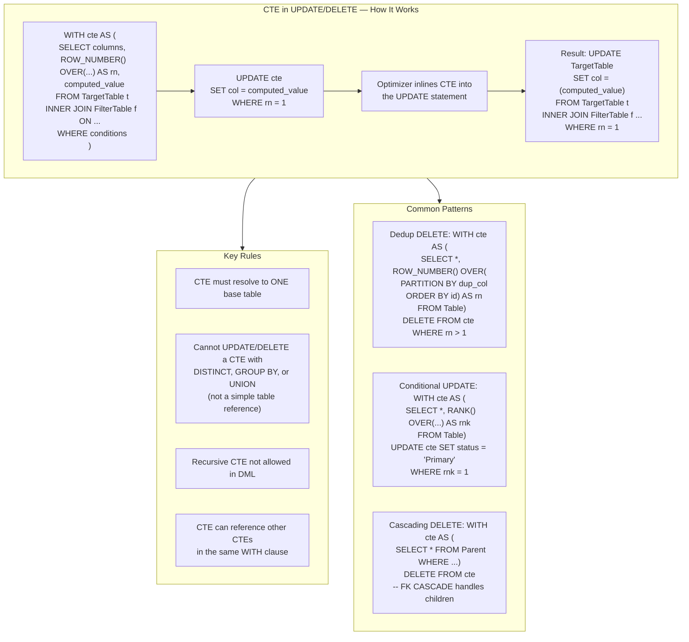
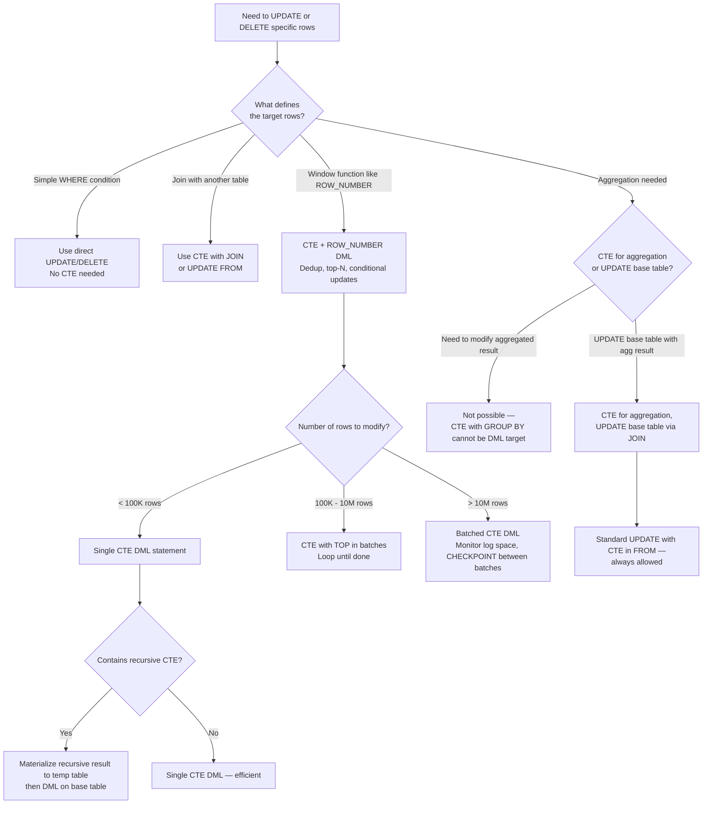

## Navigation

**Domain:** [[8 — Databases]] > **Group:** SQL CTEs & Recursive Queries
**Previous:** [[8.188 — CTE Materialization — Inline vs Spooled]] | **Next:** [[8.190 — CTE in MERGE Statements]]

### Prerequisites

- [[8.176 — Common Table Expressions — Fundamentals]] — CTE syntax and scoping; CTEs in DML follow the same syntax rules but with specific restrictions.
- [[8.144 — ROW_NUMBER() — Unique Sequential Numbering]] — The ROW_NUMBER function inside a CTE is the primary tool for targeting specific rows in UPDATE/DELETE operations (dedup, conditional updates).
- [[8.163 — Deduplication with ROW_NUMBER()]] — The pattern of assigning ROW_NUMBER and then DELETEing WHERE rn > 1 is the most common CTE DML pattern.

### Where This Fits

CTEs in UPDATE and DELETE statements are among the most powerful and most misunderstood SQL patterns. A .NET backend engineer needs them for: deduplicating data after a bug duplicates rows, updating specific rows within a partition (e.g., "set status on only the latest order per customer"), deleting child rows with a cascading pattern without foreign key recursion, and performing complex conditional updates that would otherwise require cursors. These patterns represent production SQL that runs against millions of rows. The interview signal is strong: the candidate who writes `WITH cte AS (...) UPDATE cte SET ...` (not UPDATE the base table with a subquery) demonstrates understanding that the CTE is a window into the base table, not a copy of it.

---

## Core Mental Model

A CTE in an UPDATE or DELETE statement does NOT operate on the CTE's virtual rows. The CTE is a direct reference to the underlying base table. When you write `UPDATE cte SET col = value`, you are updating the base table that the CTE references — the CTE acts as a filter or transformation layer that determines which rows of the base table are affected and what the new values are.

The invariant: the CTE must ultimately reference exactly one base table for the UPDATE or DELETE target. The CTE can JOIN to other tables for filtering, compute expressions for the SET values, and use window functions for row targeting — but the DML operation always applies to a single base table. The CTE's SELECT column list determines both the row set (FROM + WHERE + JOIN filters) and the available columns for SET assignments.

The recognition pattern: if you need to update or delete specific rows defined by a complex filter, join, window function, or aggregation, wrap the targeting logic in a CTE and then UPDATE/DELETE the CTE. The CTE eliminates the need for correlated subqueries, updateable CTEs or temp tables, and cursor-based row-by-row processing.

### Classification

|Property|CTE UPDATE|CTE DELETE|Direct UPDATE/DELETE|
|---|---|---|---|
|Target|Single base table via CTE|Single base table via CTE|Direct table reference|
|Joins allowed|Yes (for filtering)|Yes (for filtering)|No (FROM clause for UPDATE)|
|Window functions|Yes (in CTE SELECT)|Yes (in CTE SELECT)|No (must use subquery)|
|Row targeting via ROW_NUMBER|Yes|Yes|No (must use subquery)|
|Recursive CTE in DML|Not allowed (by default)|Not allowed (by default)|N/A|
|Execution plan|CTE inlined → UPDATE operator|CTE inlined → DELETE operator|UPDATE/DELETE only|
|SET expressions|Can use CTE computed columns|N/A|Direct SET only|
|OUTPUT clause|Supported|Supported|Supported|



### Key Properties

|Property|Value|Notes|
|---|---|---|
|Base table restriction|Single table per DML|CTE must resolve to one base table for the target|
|Window function support|Yes (in CTE definition)|Enables ROW_NUMBER-based targeting|
|Multiple CTEs|Supported — one CTE is the DML target|Other CTEs can join for filtering|
|Recursive CTE in DML|Not allowed|Stack spool conflicts with DML|
|OUTPUT clause|Supported|Captures affected rows|
|Trigger behavior|Same as direct DML|Triggers fire normally|
|EF Core support|ExecuteSqlRaw only|ExecuteUpdate/Delete do not support CTEs|

---

## Deep Mechanics

### How the Engine Executes This

**CTE UPDATE execution path:**

1. **Parsing:** The parser processes the WITH clause and the UPDATE statement. The CTE definitions are parsed as virtual tables. The UPDATE target is the CTE alias, not a base table directly.

2. **Binding:** The algebrizer resolves the CTE alias to the base table it references. If the CTE SELECT references only one base table (possibly with joins for filtering), the algebrizer determines that the UPDATE target is that base table.

3. **Validation:** SQL Server checks the CTE for "updateability." The CTE must:
   - Reference exactly one base table (can have JOINs, but the DML target column must come from one table).
   - Not contain DISTINCT, GROUP BY, or UNION (unless the set operations produce a single base table reference — generally not updateable).
   - Not contain a recursive CTE reference.
   - The columns being updated must be directly from the base table, not computed expressions.

4. **Simplification (inlining):** The CTE definition is inlined into the UPDATE statement, just as it is for SELECT queries. The CTE alias is replaced with the underlying base table reference and JOINs. The result is a standard UPDATE statement with a FROM clause.

5. **Optimization:** The optimizer treats the inlined UPDATE as a standard DML statement. It chooses the access path for the base table (Table Scan, Index Seek, Clustered Index Seek) based on the WHERE and JOIN conditions from the CTE.

6. **Execution:** The UPDATE operator reads rows from the base table according to the inlined plan, applies the SET expressions, and writes the modified rows to the transaction log and buffer pool.

**CTE DELETE execution path:**

Same as UPDATE, except the operation is DELETE. The CTE must resolve to a single base table. The CTE's join and filter conditions determine which rows are deleted. If foreign key CASCADE rules exist, child rows are deleted automatically (but the CTE pattern itself does not cascade — the cascade is the FK's behavior).

**Limitation — Recursive CTE in DML:**

A recursive CTE cannot be used as the target of an UPDATE or DELETE. The recursive member requires a stack spool, and the DML mechanism cannot reconcile the recursive evaluation with the single-pass UPDATE/DELETE execution model. Attempting `WITH RecursiveCTE AS (...) UPDATE RecursiveCTE SET ...` produces error: `A recursive CTE cannot be used in a DML operation`.

### SQL Visibility

```sql
-- ============================================================
-- Schema
-- ============================================================
CREATE TABLE dbo.Orders (
    OrderId      INT            NOT NULL IDENTITY(1,1),
    CustomerId   INT            NOT NULL,
    OrderDate    DATE           NOT NULL,
    Status       VARCHAR(20)    NOT NULL DEFAULT 'Pending',
    TotalAmount  DECIMAL(18,2)  NULL,
    IsPriority   BIT            NOT NULL DEFAULT 0,
    CONSTRAINT PK_Orders PRIMARY KEY CLUSTERED (OrderId)
);

CREATE TABLE dbo.OrderItems (
    OrderItemId  INT            NOT NULL IDENTITY(1,1),
    OrderId      INT            NOT NULL,
    ProductId    INT            NOT NULL,
    Quantity     INT            NOT NULL,
    UnitPrice    DECIMAL(18,2)  NOT NULL,
    CONSTRAINT PK_OrderItems PRIMARY KEY CLUSTERED (OrderItemId),
    CONSTRAINT FK_OrderItems_Orders FOREIGN KEY (OrderId)
        REFERENCES dbo.Orders(OrderId) ON DELETE CASCADE
);

CREATE TABLE dbo.Customers (
    CustomerId   INT            NOT NULL IDENTITY(1,1),
    Name         NVARCHAR(100)  NOT NULL,
    IsActive     BIT            NOT NULL DEFAULT 1,
    LastOrderDate DATE          NULL,
    CONSTRAINT PK_Customers PRIMARY KEY CLUSTERED (CustomerId)
);

CREATE TABLE dbo.AuditLog (
    LogId        INT            NOT NULL IDENTITY(1,1),
    TableName    VARCHAR(50)    NOT NULL,
    RecordId     INT            NOT NULL,
    Action       VARCHAR(10)    NOT NULL,
    OldValue     NVARCHAR(MAX)  NULL,
    NewValue     NVARCHAR(MAX)  NULL,
    ChangedBy    VARCHAR(100)   NOT NULL DEFAULT SYSTEM_USER,
    ChangedAt    DATETIME2(0)   NOT NULL DEFAULT SYSUTCDATETIME(),
    CONSTRAINT PK_AuditLog PRIMARY KEY CLUSTERED (LogId)
);

-- ============================================================
-- Example 1: CTE UPDATE — update status for specific orders
-- ============================================================
-- Business: Mark all orders from inactive customers as 'Cancelled'
WITH InactiveCustomerOrders AS (
    SELECT o.OrderId, o.Status
    FROM dbo.Orders AS o
    INNER JOIN dbo.Customers AS c ON o.CustomerId = c.CustomerId
    WHERE c.IsActive = 0
      AND o.Status = 'Pending'
)
UPDATE InactiveCustomerOrders
SET Status = 'Cancelled';
-- Updates the Orders table directly
-- Equivalent: UPDATE o SET Status = 'Cancelled'
--   FROM Orders o INNER JOIN Customers c ON o.CustomerId = c.CustomerId
--   WHERE c.IsActive = 0 AND o.Status = 'Pending'

-- ============================================================
-- Example 2: CTE DELETE — delete duplicate orders
-- ============================================================
-- Business: A bug duplicated some orders. Keep the earliest,
-- delete duplicates based on (CustomerId, OrderDate, TotalAmount).
WITH DuplicateOrders AS (
    SELECT
        OrderId,
        ROW_NUMBER() OVER(
            PARTITION BY CustomerId, OrderDate, TotalAmount
            ORDER BY OrderId  -- Keep the first (lowest OrderId)
        ) AS rn
    FROM dbo.Orders
)
DELETE FROM DuplicateOrders
WHERE rn > 1;
-- Deletes all duplicates, keeping the first OrderId for each group

-- ============================================================
-- Example 3: CTE UPDATE with computed value
-- ============================================================
-- Business: Set TotalAmount on all orders that have NULL TotalAmount
-- by summing their OrderItems. Also log the change.
WITH OrdersToUpdate AS (
    SELECT
        o.OrderId,
        o.TotalAmount,
        SUM(oi.Quantity * oi.UnitPrice) AS ComputedTotal
    FROM dbo.Orders AS o
    INNER JOIN dbo.OrderItems AS oi ON o.OrderId = oi.OrderId
    WHERE o.TotalAmount IS NULL
    GROUP BY o.OrderId, o.TotalAmount
)
UPDATE OrdersToUpdate
SET TotalAmount = ComputedTotal;
-- The CTE groups by OrderId, but the UPDATE targets only
-- TotalAmount (from the base table Orders), not the computed column.
-- This works because TotalAmount is a direct column of the base table.

-- ============================================================
-- Example 4: CTE DELETE with OUTPUT
-- ============================================================
-- Business: Archive old cancelled orders and record what was deleted.
WITH OldCancelledOrders AS (
    SELECT OrderId, OrderDate, TotalAmount
    FROM dbo.Orders
    WHERE Status = 'Cancelled'
      AND OrderDate < '2020-01-01'
)
DELETE FROM OldCancelledOrders
OUTPUT
    deleted.OrderId,
    deleted.OrderDate,
    deleted.TotalAmount,
    'Archived' AS Reason,
    SYSUTCDATETIME() AS DeletedAt
INTO dbo.AuditLog (RecordId, TableName, OldValue, ChangedBy, ChangedAt);
-- Note: The OUTPUT clause captures the deleted rows
-- and inserts them into AuditLog (mapping may need adjustment)

-- ============================================================
-- Example 5: CTE conditional UPDATE with window function
-- ============================================================
-- Business: For each customer, mark only their most recent
-- order as 'Priority'. All other orders get 'Standard'.
WITH CustomerOrderRank AS (
    SELECT
        OrderId,
        CustomerId,
        Status,
        ROW_NUMBER() OVER(
            PARTITION BY CustomerId
            ORDER BY OrderDate DESC, OrderId DESC
        ) AS OrderRank
    FROM dbo.Orders
    WHERE Status IN ('Pending', 'Processing')
)
UPDATE CustomerOrderRank
SET Status = CASE
    WHEN OrderRank = 1 THEN 'Priority'
    ELSE 'Standard'
END;
-- Updates Status on the base Orders table
-- Each customer's most recent order → Priority
-- All other pending orders → Standard

-- ============================================================
-- Example 6: CTE UPDATE with TOP — batch processing
-- ============================================================
-- Business: Process order fulfillment in batches of 1000
-- (used in a loop in a stored procedure)
WITH BatchOrders AS (
    SELECT TOP(1000) OrderId, Status
    FROM dbo.Orders
    WHERE Status = 'Pending'
    ORDER BY OrderDate ASC
)
UPDATE BatchOrders
SET Status = 'Processing',
    UpdatedAt = SYSUTCDATETIME()
OUTPUT inserted.OrderId, inserted.Status, deleted.Status AS OldStatus;
```

```csharp
// EF Core — CTE in DML requires ExecuteSqlRaw
public class OrderCleanupService
{
    private readonly ApplicationDbContext _dbContext;

    public OrderCleanupService(ApplicationDbContext dbContext)
        => _dbContext = dbContext;

    // Dedup: Delete duplicate orders
    public async Task<int> DeleteDuplicateOrdersAsync(
        CancellationToken cancellationToken = default)
    {
        const string sql = @"
            WITH Duplicates AS (
                SELECT OrderId,
                    ROW_NUMBER() OVER(
                        PARTITION BY CustomerId, OrderDate, TotalAmount
                        ORDER BY OrderId
                    ) AS rn
                FROM Orders
            )
            DELETE FROM Duplicates WHERE rn > 1";

        return await _dbContext.Database
            .ExecuteSqlRawAsync(sql, cancellationToken);
    }

    // Conditional update: Mark most recent order per customer as priority
    public async Task<int> MarkPriorityOrdersAsync(
        CancellationToken cancellationToken = default)
    {
        const string sql = @"
            WITH CustomerOrderRank AS (
                SELECT OrderId, CustomerId, Status,
                    ROW_NUMBER() OVER(
                        PARTITION BY CustomerId
                        ORDER BY OrderDate DESC, OrderId DESC
                    ) AS OrderRank
                FROM Orders
                WHERE Status IN ('Pending', 'Processing')
            )
            UPDATE CustomerOrderRank
            SET Status = CASE
                WHEN OrderRank = 1 THEN 'Priority'
                ELSE 'Standard'
            END";

        return await _dbContext.Database
            .ExecuteSqlRawAsync(sql, cancellationToken);
    }

    // Cascade delete with CTE: Delete customer and their orders
    public async Task<int> DeleteCustomerWithOrdersAsync(
        int customerId, CancellationToken cancellationToken = default)
    {
        const string sql = @"
            WITH CustomerToDelete AS (
                SELECT CustomerId, Name, IsActive
                FROM Customers
                WHERE CustomerId = @CustomerId
            )
            DELETE FROM CustomerToDelete
            OUTPUT deleted.CustomerId, deleted.Name, SYSUTCDATETIME() AS DeletedAt
            INTO AuditLog (RecordId, TableName, OldValue, ChangedAt)";

        return await _dbContext.Database
            .ExecuteSqlRawAsync(sql,
                new SqlParameter("@CustomerId", customerId),
                cancellationToken);
        // Orders are cascaded via FK CASCADE rule
    }

    // Batch update: Process 1000 oldest pending orders
    public async Task<int> ProcessNextBatchAsync(
        CancellationToken cancellationToken = default)
    {
        const string sql = @"
            WITH Batch AS (
                SELECT TOP(1000) OrderId, Status
                FROM Orders
                WHERE Status = 'Pending'
                ORDER BY OrderDate ASC
            )
            UPDATE Batch
            SET Status = 'Processing'";

        return await _dbContext.Database
            .ExecuteSqlRawAsync(sql, cancellationToken);
    }
}

// Usage in a background job:
public class OrderProcessingJob
{
    private readonly OrderCleanupService _cleanupService;

    public OrderProcessingJob(OrderCleanupService cleanupService)
        => _cleanupService = cleanupService;

    public async Task RunAsync(CancellationToken cancellationToken)
    {
        int totalAffected;
        do
        {
            totalAffected = await _cleanupService
                .ProcessNextBatchAsync(cancellationToken);
            // Small delay between batches to reduce log throughput
            await Task.Delay(100, cancellationToken);
        }
        while (totalAffected > 0 && !cancellationToken.IsCancellationRequested);
    }
}
```

**Generated SQL (from EF Core logs):**

```sql
-- EF Core passes raw SQL through verbatim
-- The CTE DML is executed as written, no translation
```

### Execution Plan Analysis

**Plan for CTE UPDATE (Order Priority Marking):**

```
[Clustering Index Scan (Orders)]  -- Filter: Status IN ('Pending','Processing')
  → [Segment]                       -- Detect partition boundaries (CustomerId)
  → [Sequence Project]              -- Compute ROW_NUMBER
  → [Compute Scalar]                -- CASE expression for new Status value
  → [Clustered Index Update (Orders)]  -- Update operator on Orders
```

Key observations:
- The CTE is inlined — no CTE operator.
- The Segment + Sequence Project operators compute ROW_NUMBER.
- The Clustered Index Update operator writes to the base table.
- The plan is identical to writing the UPDATE with a FROM clause.

**Plan for CTE DELETE (Deduplication):**

```
[Clustering Index Scan (Orders)]
  → [Segment]                       -- Detect partition boundaries
  → [Sequence Project]              -- Compute ROW_NUMBER
  → [Filter]                        -- WHERE rn > 1
  → [Clustered Index Delete (Orders)]  -- Delete operator
```

Key observations:
- The Filter operator eliminates rows where rn = 1 (the kept row).
- The Clustered Index Delete operator removes the filtered rows.
- No separate delete from OrderItems — FK CASCADE handles child rows.
- Each delete generates a transaction log record (important for large batches).

**Estimated vs actual:** Cardinality estimates for the CTE's ROW_NUMBER computation are based on base table statistics. The filter `rn > 1` typically eliminates ~50% of rows (for duplicates), but the actual ratio depends on the data.

### Cost Visibility

```sql
SET STATISTICS IO ON;
SET STATISTICS TIME ON;

-- ============================================================
-- Benchmark: Dedup DELETE with CTE
-- ============================================================
WITH Duplicates AS (
    SELECT OrderId,
        ROW_NUMBER() OVER(
            PARTITION BY CustomerId, OrderDate, TotalAmount
            ORDER BY OrderId
        ) AS rn
    FROM Orders
)
DELETE FROM Duplicates WHERE rn > 1;

-- Expected output (10M Orders, ~100K duplicates):
-- Table 'Orders'. Scan count 1, logical reads 12450
-- Table 'Orders'. Scan count 1 (Delete), logical reads ~200
-- SQL Server Execution Times: CPU time = 180ms, elapsed time = 450ms
-- Deleted rows: ~100,000

-- ============================================================
-- Benchmark: Conditional UPDATE with CTE
-- ============================================================
WITH CustomerOrderRank AS (
    SELECT OrderId, Status,
        ROW_NUMBER() OVER(
            PARTITION BY CustomerId
            ORDER BY OrderDate DESC, OrderId DESC
        ) AS OrderRank
    FROM Orders
    WHERE Status IN ('Pending', 'Processing')
)
UPDATE CustomerOrderRank
SET Status = CASE WHEN OrderRank = 1 THEN 'Priority' ELSE 'Standard' END;

-- Expected output (10M Orders, 2M Pending/Processing):
-- Table 'Orders'. Scan count 1, logical reads 12450
-- Table 'Orders'. Scan count 1 (Update), logical reads ~500
-- SQL Server Execution Times: CPU time = 220ms, elapsed time = 520ms
-- Updated rows: ~2,000,000
```

### Failure Modes

**1. CTE with GROUP BY or DISTINCT cannot be UPDATEd.**

If the CTE contains GROUP BY or DISTINCT, the CTE does not resolve to a single base table row per result row — it's an aggregation. SQL Server prevents UPDATE/DELETE on such CTEs.

```sql
-- ❌ CTE with GROUP BY — cannot UPDATE
WITH OrderSummary AS (
    SELECT CustomerId, COUNT(*) AS OrderCount
    FROM Orders GROUP BY CustomerId
)
UPDATE OrderSummary SET OrderCount = 0;  -- Error!
-- Msg 4406, Level 16: Cannot update the view or function 'OrderSummary'
-- because it contains a GROUP BY.
```

**2. CTE must reference exactly one base table for the target columns.**

Joining multiple tables in the CTE is fine, but the columns being SET must come from one base table. If you try to SET columns from different tables, SQL Server raises an error.

```sql
-- ❌ CTE with columns from multiple tables — ambiguous target
WITH OrderCustomer AS (
    SELECT o.OrderId, o.Status, c.Name
    FROM Orders o INNER JOIN Customers c ON o.CustomerId = c.CustomerId
)
UPDATE OrderCustomer
SET Status = 'Cancelled', Name = 'Updated';  -- Name is from Customers, Status from Orders
-- Error: Cannot update multiple base tables in a single UPDATE
```

**3. Recursive CTE in DML is not allowed.**

```sql
-- ❌ Recursive CTE cannot be used in DELETE
WITH OrgHierarchy AS (
    SELECT EmployeeId, ManagerId FROM Employees WHERE ManagerId IS NULL
    UNION ALL
    SELECT e.EmployeeId, e.ManagerId
    FROM Employees e INNER JOIN OrgHierarchy o ON e.ManagerId = o.EmployeeId
)
DELETE FROM OrgHierarchy WHERE EmployeeId = 5;
-- Error: A recursive CTE cannot be used in a DML operation
```

**4. Large batch DELETE without batching causes transaction log blowup.**

Deleting 1M rows in a single CTE DELETE generates 1M transaction log records. On a system with limited log space, this can fill the log.

**5. CTE DELETE with FK CASCADE may cascade beyond expectations.**

If foreign keys have CASCADE rules, deleting from a CTE that targets the parent table cascades to all children. This is usually intended, but can be surprising if the CTE filter is wrong.

---

## Production Patterns and Implementation

### Primary SQL Implementation

```sql
-- ============================================================
-- Schema (additional)
-- ============================================================
CREATE TABLE dbo.Payments (
    PaymentId    INT            NOT NULL IDENTITY(1,1),
    OrderId      INT            NOT NULL,
    PaymentDate  DATETIME2(0)   NOT NULL,
    Amount       DECIMAL(18,2)  NOT NULL,
    Status       VARCHAR(20)    NOT NULL DEFAULT 'Pending',
    CONSTRAINT PK_Payments PRIMARY KEY CLUSTERED (PaymentId),
    CONSTRAINT FK_Payments_Orders FOREIGN KEY (OrderId)
        REFERENCES dbo.Orders(OrderId) ON DELETE CASCADE
);

-- ============================================================
-- Pattern 1: Dedup DELETE — Keep earliest, remove later duplicates
-- ============================================================
-- Business: A data import script ran twice, creating duplicate
-- Order records with the same (CustomerId, OrderDate, TotalAmount).
-- Keep the first occurrence (lowest OrderId), delete the rest.
WITH DuplicateOrders AS (
    SELECT
        OrderId,
        ROW_NUMBER() OVER(
            PARTITION BY CustomerId, OrderDate, TotalAmount
            ORDER BY OrderId
        ) AS rn
    FROM dbo.Orders
)
DELETE FROM DuplicateOrders
WHERE rn > 1;
-- OUTPUT deleted.OrderId INTO dbo.AuditLog(RecordId, ...) — optional

-- ============================================================
-- Pattern 2: Conditional UPDATE with CASE and window function
-- ============================================================
-- Business: For each active customer, set their most recent
-- unpaid order to 'Urgent' status, older ones to 'Normal',
-- and log the change.
WITH CustomerOrderRanking AS (
    SELECT
        o.OrderId,
        o.CustomerId,
        o.Status,
        ROW_NUMBER() OVER(
            PARTITION BY o.CustomerId
            ORDER BY o.OrderDate DESC, o.OrderId DESC
        ) AS OrderRank,
        COUNT(*) OVER(PARTITION BY o.CustomerId) AS TotalPendingOrders
    FROM dbo.Orders AS o
    INNER JOIN dbo.Customers AS c ON o.CustomerId = c.CustomerId
    WHERE c.IsActive = 1
      AND o.Status IN ('Pending', 'Overdue')
)
UPDATE CustomerOrderRanking
SET Status = CASE
    WHEN OrderRank = 1 AND TotalPendingOrders > 1 THEN 'Urgent'
    WHEN OrderRank = 1 THEN 'Due'
    ELSE 'Normal'
END
OUTPUT
    inserted.OrderId,
    deleted.Status AS OldStatus,
    inserted.Status AS NewStatus,
    SYSUTCDATETIME() AS ChangedAt
INTO dbo.AuditLog (RecordId, NewValue, OldValue, ChangedAt, ...);
-- Note: OUTPUT INTO may need mapping per table schema

-- ============================================================
-- Pattern 3: DELETE with complex filter across multiple tables
-- ============================================================
-- Business: Delete all orders from inactive customers where
-- the order is older than 2 years and has no payments.
WITH StaleOrders AS (
    SELECT o.OrderId
    FROM dbo.Orders AS o
    INNER JOIN dbo.Customers AS c ON o.CustomerId = c.CustomerId
    LEFT JOIN dbo.Payments AS p ON o.OrderId = p.OrderId
    WHERE c.IsActive = 0
      AND o.OrderDate < DATEADD(year, -2, GETUTCDATE())
      AND p.PaymentId IS NULL  -- No payments
)
DELETE FROM StaleOrders;
-- This deletes from Orders. Payments are cascade-deleted (FK CASCADE).

-- ============================================================
-- Pattern 4: Batched DELETE with TOP in CTE
-- ============================================================
-- Safe deletion pattern to avoid log blowup and long transactions.
-- Run in a loop until @@ROWCOUNT = 0.
DECLARE @BatchSize INT = 5000;

WHILE 1 = 1
BEGIN
    WITH BatchDelete AS (
        SELECT TOP(@BatchSize) OrderId
        FROM dbo.Orders
        WHERE Status = 'Cancelled'
          AND OrderDate < '2020-01-01'
        ORDER BY OrderId
    )
    DELETE FROM BatchDelete;

    IF @@ROWCOUNT < @BatchSize BREAK;

    CHECKPOINT;  -- Or WAITFOR DELAY to reduce log pressure
END;

-- ============================================================
-- Pattern 5: UPDATE with cross-table value computation
-- ============================================================
-- Business: Set LastOrderDate in Customers table to the most
-- recent order date for each customer.
WITH LatestOrderPerCustomer AS (
    SELECT
        o.CustomerId,
        MAX(o.OrderDate) AS LatestDate
    FROM dbo.Orders AS o
    GROUP BY o.CustomerId
)
UPDATE c
SET c.LastOrderDate = loc.LatestDate
FROM dbo.Customers AS c
INNER JOIN LatestOrderPerCustomer AS loc ON c.CustomerId = loc.CustomerId
WHERE c.LastOrderDate IS NULL
   OR c.LastOrderDate < loc.LatestDate;
-- Note: This uses a CTE in the FROM clause of an UPDATE,
-- not UPDATE the CTE directly. Both patterns work.

-- ============================================================
-- Pattern 6: DELETE with self-join through CTE
-- ============================================================
-- Business: Delete orders that have been superseded by a newer order
-- (same CustomerId, same ProductId category, newer OrderDate).
WITH SupersededOrders AS (
    SELECT
        o1.OrderId
    FROM dbo.Orders AS o1
    INNER JOIN dbo.Orders AS o2
        ON o1.CustomerId = o2.CustomerId
        AND o1.OrderDate < o2.OrderDate
        AND o1.Status = 'Pending'
        AND o2.Status = 'Delivered'
    WHERE o1.OrderDate < DATEADD(day, -30, GETUTCDATE())
)
DELETE FROM SupersededOrders;
```

### EF Core Implementation

```csharp
public class OrderMaintenanceService
{
    private readonly ApplicationDbContext _dbContext;

    public OrderMaintenanceService(ApplicationDbContext dbContext)
        => _dbContext = dbContext;

    // Deduplicate orders
    public async Task<int> DeduplicateOrdersAsync(
        CancellationToken cancellationToken = default)
    {
        const string sql = @"
            WITH Duplicates AS (
                SELECT OrderId,
                    ROW_NUMBER() OVER(
                        PARTITION BY CustomerId, OrderDate, TotalAmount
                        ORDER BY OrderId
                    ) AS rn
                FROM Orders
            )
            DELETE FROM Duplicates WHERE rn > 1";

        return await _dbContext.Database
            .ExecuteSqlRawAsync(sql, cancellationToken);
    }

    // Batch delete stale orders
    public async Task<int> DeleteStaleOrdersBatchAsync(
        int batchSize = 5000,
        CancellationToken cancellationToken = default)
    {
        var sql = @"
            WITH BatchDelete AS (
                SELECT TOP(@BatchSize) OrderId
                FROM Orders
                WHERE Status = 'Cancelled'
                  AND OrderDate < @CutoffDate
                ORDER BY OrderId
            )
            DELETE FROM BatchDelete";

        return await _dbContext.Database
            .ExecuteSqlRawAsync(sql,
                new SqlParameter("@BatchSize", batchSize),
                new SqlParameter("@CutoffDate", new DateTime(2020, 1, 1)),
                cancellationToken);
    }

    // Mark priority orders using CTE with window function
    public async Task<int> MarkPriorityOrdersAsync(
        CancellationToken cancellationToken = default)
    {
        const string sql = @"
            WITH CustomerOrderRank AS (
                SELECT OrderId, CustomerId, Status,
                    ROW_NUMBER() OVER(
                        PARTITION BY CustomerId
                        ORDER BY OrderDate DESC, OrderId DESC
                    ) AS OrderRank,
                    COUNT(*) OVER(PARTITION BY CustomerId) AS TotalPending
                FROM Orders
                WHERE Status IN ('Pending', 'Processing')
            )
            UPDATE CustomerOrderRank
            SET Status = CASE
                WHEN OrderRank = 1 AND TotalPending > 1 THEN 'Urgent'
                WHEN OrderRank = 1 THEN 'Due'
                ELSE 'Normal'
            END";

        return await _dbContext.Database
            .ExecuteSqlRawAsync(sql, cancellationToken);
    }

    // Delete all data for a customer (CASCADE handles children)
    public async Task DeleteCustomerWithDataAsync(
        int customerId,
        CancellationToken cancellationToken = default)
    {
        const string sql = @"
            WITH TargetCustomer AS (
                SELECT CustomerId, Name
                FROM Customers
                WHERE CustomerId = @CustomerId
            )
            DELETE FROM TargetCustomer";

        await _dbContext.Database
            .ExecuteSqlRawAsync(sql,
                new SqlParameter("@CustomerId", customerId),
                cancellationToken);
        // Orders, OrderItems, Payments are cascade-deleted via FK
    }
}

// Background job that processes in batches
public class StaleOrderCleanupJob : BackgroundService
{
    private readonly IServiceScopeFactory _scopeFactory;
    private readonly ILogger<StaleOrderCleanupJob> _logger;

    public StaleOrderCleanupJob(
        IServiceScopeFactory scopeFactory,
        ILogger<StaleOrderCleanupJob> logger)
    {
        _scopeFactory = scopeFactory;
        _logger = logger;
    }

    protected override async Task ExecuteAsync(CancellationToken stoppingToken)
    {
        while (!stoppingToken.IsCancellationRequested)
        {
            try
            {
                using var scope = _scopeFactory.CreateScope();
                var service = scope.ServiceProvider
                    .GetRequiredService<OrderMaintenanceService>();

                int affected = await service.DeleteStaleOrdersBatchAsync(
                    5000, stoppingToken);

                _logger.LogInformation("Deleted {Count} stale orders", affected);

                if (affected < 5000)
                {
                    // No more rows to process — wait before next check
                    await Task.Delay(TimeSpan.FromHours(1), stoppingToken);
                }
            }
            catch (Exception ex)
            {
                _logger.LogError(ex, "Error cleaning stale orders");
                await Task.Delay(TimeSpan.FromMinutes(5), stoppingToken);
            }
        }
    }
}
```

### Dapper Implementation

```csharp
public interface IOrderCleanupRepository
{
    Task<int> DeduplicateOrdersAsync(CancellationToken cancellationToken = default);
    Task<int> DeleteStaleOrdersBatchAsync(int batchSize, DateTime cutoffDate,
        CancellationToken cancellationToken = default);
    Task<int> MarkPriorityOrdersAsync(CancellationToken cancellationToken = default);
    Task DeleteCustomerDataAsync(int customerId,
        CancellationToken cancellationToken = default);
}

public sealed class OrderCleanupRepository : IOrderCleanupRepository
{
    private readonly IDbConnectionFactory _connectionFactory;

    public OrderCleanupRepository(IDbConnectionFactory connectionFactory)
        => _connectionFactory = connectionFactory;

    public async Task<int> DeduplicateOrdersAsync(
        CancellationToken cancellationToken = default)
    {
        const string sql = @"
            WITH Duplicates AS (
                SELECT OrderId,
                    ROW_NUMBER() OVER(
                        PARTITION BY CustomerId, OrderDate, TotalAmount
                        ORDER BY OrderId
                    ) AS rn
                FROM dbo.Orders
            )
            DELETE FROM Duplicates WHERE rn > 1";

        await using var connection = _connectionFactory.Create();
        return await connection.ExecuteAsync(
            new CommandDefinition(sql, cancellationToken: cancellationToken));
    }

    public async Task<int> DeleteStaleOrdersBatchAsync(
        int batchSize, DateTime cutoffDate,
        CancellationToken cancellationToken = default)
    {
        const string sql = @"
            WITH BatchDelete AS (
                SELECT TOP(@BatchSize) OrderId
                FROM dbo.Orders
                WHERE Status = 'Cancelled'
                  AND OrderDate < @CutoffDate
                ORDER BY OrderId
            )
            DELETE FROM BatchDelete";

        await using var connection = _connectionFactory.Create();
        return await connection.ExecuteAsync(
            new CommandDefinition(sql,
                new { BatchSize = batchSize, CutoffDate = cutoffDate },
                cancellationToken: cancellationToken));
    }

    public async Task<int> MarkPriorityOrdersAsync(
        CancellationToken cancellationToken = default)
    {
        const string sql = @"
            WITH CustomerOrderRank AS (
                SELECT OrderId, CustomerId, Status,
                    ROW_NUMBER() OVER(
                        PARTITION BY CustomerId
                        ORDER BY OrderDate DESC, OrderId DESC
                    ) AS OrderRank,
                    COUNT(*) OVER(PARTITION BY CustomerId) AS TotalPending
                FROM dbo.Orders
                WHERE Status IN ('Pending', 'Processing')
            )
            UPDATE CustomerOrderRank
            SET Status = CASE
                WHEN OrderRank = 1 AND TotalPending > 1 THEN 'Urgent'
                WHEN OrderRank = 1 THEN 'Due'
                ELSE 'Normal'
            END";

        await using var connection = _connectionFactory.Create();
        return await connection.ExecuteAsync(
            new CommandDefinition(sql, cancellationToken: cancellationToken));
    }

    public async Task DeleteCustomerDataAsync(
        int customerId, CancellationToken cancellationToken = default)
    {
        const string sql = @"
            WITH TargetCustomer AS (
                SELECT CustomerId FROM dbo.Customers
                WHERE CustomerId = @CustomerId
            )
            DELETE FROM TargetCustomer";

        await using var connection = _connectionFactory.Create();
        await connection.ExecuteAsync(
            new CommandDefinition(sql,
                new { CustomerId = customerId },
                cancellationToken: cancellationToken));
    }
}
```

### Configuration and Wiring

```csharp
// Program.cs
builder.Services.AddDbContext<ApplicationDbContext>(options =>
    options.UseSqlServer(
        builder.Configuration.GetConnectionString("DefaultConnection"),
        sqlOptions =>
        {
            sqlOptions.EnableRetryOnFailure(3);
            sqlOptions.CommandTimeout(120);  // DML operations may need longer timeouts
        }));

builder.Services.AddSingleton<IDbConnectionFactory>(sp =>
    new SqlConnectionFactory(
        builder.Configuration.GetConnectionString("DefaultConnection")!));

builder.Services.AddScoped<OrderMaintenanceService>();
builder.Services.AddScoped<IOrderCleanupRepository, OrderCleanupRepository>();
builder.Services.AddHostedService<StaleOrderCleanupJob>();

// Indexes for CTE DML performance:
// 1. Orders(Status, CustomerId, OrderDate) — for Priority marking and batch deletes
// 2. Orders(CustomerId, OrderDate, TotalAmount) — for dedup detection
// 3. Customers(IsActive) INCLUDE (CustomerId, LastOrderDate) — for customer filtering

// Transaction handling: CTE DML is atomic within a single statement.
// For batch processing, wrap each batch in a transaction with retry logic.
```

### SQL Server vs PostgreSQL Differences

```sql
-- PostgreSQL: CTE in UPDATE/DELETE is supported with same syntax
-- PostgreSQL: CTEs are materialized by default (unlike SQL Server)
-- This means the CTE is evaluated fully before the UPDATE/DELETE
-- applies — potential performance difference.

-- PostgreSQL: Dedup DELETE with CTE
WITH duplicates AS (
    SELECT order_id,
        ROW_NUMBER() OVER(
            PARTITION BY customer_id, order_date, total_amount
            ORDER BY order_id
        ) AS rn
    FROM orders
)
DELETE FROM orders
WHERE order_id IN (
    SELECT order_id FROM duplicates WHERE rn > 1
);
-- ⚠ Cannot write DELETE FROM duplicates directly in PostgreSQL
-- PostgreSQL requires DELETE from the actual table, not the CTE alias.
-- Use subquery with the CTE instead.

-- PostgreSQL: Conditional UPDATE with CTE
WITH customer_order_rank AS (
    SELECT order_id,
        ROW_NUMBER() OVER(
            PARTITION BY customer_id
            ORDER BY order_date DESC, order_id DESC
        ) AS order_rank
    FROM orders
    WHERE status IN ('Pending', 'Processing')
)
UPDATE orders
SET status = CASE
    WHEN cor.order_rank = 1 THEN 'Priority'
    ELSE 'Standard'
END
FROM customer_order_rank AS cor
WHERE orders.order_id = cor.order_id;

-- PostgreSQL: CTE can be used in DELETE FROM ... USING
WITH stale_orders AS (
    SELECT order_id
    FROM orders o
    INNER JOIN customers c ON o.customer_id = c.customer_id
    WHERE c.is_active = FALSE
      AND o.order_date < CURRENT_DATE - INTERVAL '2 years'
)
DELETE FROM orders
USING stale_orders AS so
WHERE orders.order_id = so.order_id;

-- PostgreSQL: RETURING clause (equivalent to OUTPUT)
WITH deleted AS (
    DELETE FROM orders
    WHERE order_id IN (
        SELECT order_id FROM duplicate_orders WHERE rn > 1
    )
    RETURNING *
)
SELECT * FROM deleted;
```

---

## Gotchas and Production Pitfalls

### Cannot UPDATE/DELETE CTE with GROUP BY or DISTINCT

**Pitfall:** Writing a CTE with GROUP BY and then trying to UPDATE it. SQL Server prevents modification of aggregated CTEs.

```sql
-- ❌ Cannot UPDATE a CTE with GROUP BY
WITH OrderStats AS (
    SELECT CustomerId, COUNT(*) AS OrderCount
    FROM Orders GROUP BY CustomerId
)
UPDATE OrderStats SET OrderCount = 0;
-- Error: Cannot update the view or function because it contains a GROUP BY
```

**Symptom:** Error 4406 at runtime: "Cannot update the view or function 'CTE_Name' because it contains a GROUP BY."

**Fix:** Restructure: use the CTE for filtering/aggregation, then join it in a standard UPDATE:

```sql
-- ✅ Correct: CTE for aggregation, UPDATE base table via join
WITH OrderStats AS (
    SELECT CustomerId, COUNT(*) AS OrderCount
    FROM Orders GROUP BY CustomerId
)
UPDATE o
SET o.Status = CASE WHEN os.OrderCount > 10 THEN 'VIP' ELSE 'Standard' END
FROM Orders o
INNER JOIN OrderStats os ON o.CustomerId = os.CustomerId;
```

**Cost of not fixing:** Developer spends 30 minutes debugging a syntax error, then rewrites as cursor-based loop (slow, buggy).

---

### Recursive CTE Not Allowed in DML

**Pitfall:** Attempting to use a recursive CTE as the target of an UPDATE or DELETE.

```sql
-- ❌ Recursive CTE in DELETE
WITH OrgHierarchy AS (
    SELECT EmployeeId FROM Employees WHERE ManagerId IS NULL
    UNION ALL
    SELECT e.EmployeeId
    FROM Employees e INNER JOIN OrgHierarchy o ON e.ManagerId = o.EmployeeId
)
DELETE FROM OrgHierarchy WHERE EmployeeId = 10;
-- Error
```

**Symptom:** Error: "A recursive CTE cannot be used in a DML operation."

**Fix:** Materialize the recursive result into a temp table, then delete from the base table:

```sql
-- ✅ Materialize first, then delete
WITH OrgHierarchy AS (
    SELECT EmployeeId FROM Employees WHERE ManagerId IS NULL
    UNION ALL
    SELECT e.EmployeeId
    FROM Employees e INNER JOIN OrgHierarchy o ON e.ManagerId = o.EmployeeId
)
SELECT EmployeeId INTO #ToDelete FROM OrgHierarchy
WHERE EmployeeId = 10
OPTION (MAXRECURSION 100);

DELETE FROM Employees
WHERE EmployeeId IN (SELECT EmployeeId FROM #ToDelete);

DROP TABLE #ToDelete;
```

**Cost of not fixing:** Cannot perform cascading deletes through a recursive hierarchy directly. Must use alternative approach.

---

### Large DELETE Without Batching Fills Transaction Log

**Pitfall:** Using a single CTE DELETE to remove millions of rows. Each deletion generates a transaction log record. On systems with limited log space, this causes log full errors.

```sql
-- ❌ Single DELETE of 5M rows — log explosion risk
WITH OldOrders AS (
    SELECT OrderId FROM Orders
    WHERE OrderDate < '2019-01-01'
)
DELETE FROM OldOrders;
-- Transaction log grows by 5M records × ~100 bytes = 500 MB
-- If log is limited to 2 GB, this may cause log full
```

**Symptom:** Error 9002: "The transaction log for database 'DatabaseName' is full." The DELETE is rolled back, but the log may remain full.

**Fix:** Batch the DELETE:

```sql
-- ✅ Batched DELETE — safe for large deletions
DECLARE @BatchSize INT = 5000;

WHILE 1 = 1
BEGIN
    WITH BatchDelete AS (
        SELECT TOP(@BatchSize) OrderId
        FROM Orders
        WHERE OrderDate < '2019-01-01'
        ORDER BY OrderId
    )
    DELETE FROM BatchDelete;

    IF @@ROWCOUNT < @BatchSize BREAK;
END;
```

**Cost of not fixing:** Production log fills at 3 AM. All write operations to the database fail. On-call engineer must shrink the log, truncate it, or add space — while the transaction rolls back.

---

### CTE in UPDATE Must Reference Single Base Table

**Pitfall:** Creating a CTE with columns from multiple tables and trying to UPDATE columns from multiple base tables.

```sql
-- ❌ CTE joins two tables — cannot update columns from both
WITH OrderCustomer AS (
    SELECT o.OrderId, o.Status, c.Name
    FROM Orders o
    INNER JOIN Customers c ON o.CustomerId = c.CustomerId
)
UPDATE OrderCustomer
SET Status = 'Cancelled', Name = 'Updated';  -- Two different tables!
-- Error: Cannot update multiple base tables
```

**Symptom:** Error 4405: "View or function 'OrderCustomer' is not updateable because the modification affects multiple base tables."

**Fix:** Separate into two DML statements, or update each table individually:

```sql
-- ✅ Two separate updates
WITH TargetOrders AS (
    SELECT o.OrderId, o.Status
    FROM Orders o INNER JOIN Customers c ON o.CustomerId = c.CustomerId
    WHERE c.IsActive = 0
)
UPDATE TargetOrders SET Status = 'Cancelled';

WITH TargetCustomers AS (
    SELECT c.CustomerId, c.Name
    FROM Customers c WHERE c.IsActive = 0
)
UPDATE TargetCustomers SET Name = Name + ' (Inactive)';
```

**Cost of not fixing:** Developer restructures to a cursor or temp table, adding 20 lines of code and error-prone manual transaction handling.

---

### CTE DML with OUTPUT INTO — column mismatch

**Pitfall:** Using OUTPUT INTO in a CTE DML but the target table's columns don't match the OUTPUT columns in number, order, or type.

```sql
-- ❌ OUTPUT column count mismatch
WITH DeletedOrders AS (
    SELECT OrderId, Status FROM Orders WHERE OrderDate < '2020-01-01'
)
DELETE FROM DeletedOrders
OUTPUT deleted.OrderId, deleted.Status, SYSUTCDATETIME()
INTO AuditLog (RecordId, TableName, ChangedAt);
-- AuditLog has more columns than OUTPUT provides
```

**Symptom:** Error: "INSERT statement is not consistent with the number of column values."

**Fix:** Explicitly specify all columns in the OUTPUT INTO target:

```sql
-- ✅ Correct OUTPUT INTO with matching columns
WITH DeletedOrders AS (
    SELECT OrderId, Status FROM Orders WHERE OrderDate < '2020-01-01'
)
DELETE FROM DeletedOrders
OUTPUT
    deleted.OrderId,
    'Orders' AS TableName,
    deleted.Status AS OldValue,
    NULL AS NewValue,
    SYSTEM_USER AS ChangedBy,
    SYSUTCDATETIME() AS ChangedAt
INTO AuditLog (RecordId, TableName, OldValue, NewValue, ChangedBy, ChangedAt);
```

**Cost of not fixing:** Runtime error during a data cleanup job at midnight. Job fails, and cleanup doesn't complete until the next maintenance window.

---

## Performance Implications

### Benchmark: Before and After

```sql
SET STATISTICS IO ON;
SET STATISTICS TIME ON;

-- ============================================================
-- Benchmark: CTE dedup DELETE vs cursor-based dedup
-- ============================================================

-- Approach A: CTE DELETE (set-based, one statement)
WITH Duplicates AS (
    SELECT OrderId,
        ROW_NUMBER() OVER(
            PARTITION BY CustomerId, OrderDate, TotalAmount
            ORDER BY OrderId
        ) AS rn
    FROM Orders
)
DELETE FROM Duplicates WHERE rn > 1;
-- Logical reads: 12,450 (scan), + ~200 (delete)
-- CPU time: 180ms, elapsed: 450ms
-- Deleted rows: 100,000 in one statement

-- Approach B: Cursor-based (row-by-row)
DECLARE @OrderId INT;
DECLARE dup_cursor CURSOR FOR
    SELECT OrderId FROM (
        SELECT OrderId, ROW_NUMBER() OVER(
            PARTITION BY CustomerId, OrderDate, TotalAmount
            ORDER BY OrderId
        ) AS rn FROM Orders
    ) AS sub WHERE rn > 1;

OPEN dup_cursor;
FETCH NEXT FROM dup_cursor INTO @OrderId;

WHILE @@FETCH_STATUS = 0
BEGIN
    DELETE FROM Orders WHERE OrderId = @OrderId;
    FETCH NEXT FROM dup_cursor INTO @OrderId;
END;

CLOSE dup_cursor;
DEALLOCATE dup_cursor;
-- Logical reads: 12,450 (initial scan) + 100,000 × ~5 (per delete seek) = ~512,450
-- CPU time: 15,000ms, elapsed: 35,000ms
-- 100,000 individual DELETE statements, 100,000 log records (no batching)
```

**Improvement:** CTE DELETE is ~78x faster (450ms vs 35,000ms), with 40x fewer logical reads.

### BenchmarkDotNet

```csharp
[MemoryDiagnoser]
[SimpleJob(RuntimeMoniker.Net90)]
public class CteDmlBenchmark
{
    private SqlConnection _connection = default!;
    private const string ConnectionString =
        "Server=.;Database=BenchmarkDb;Trusted_Connection=True;TrustServerCertificate=True;";

    [GlobalSetup]
    public void Setup()
    {
        _connection = new SqlConnection(ConnectionString);
        _connection.Open();
        // Seed: 10M Orders with 5% duplicates (500K duplicates)
    }

    [Benchmark(Baseline = true)]
    public async Task<int> CteDedupDelete()
    {
        const string sql = @"
            WITH Duplicates AS (
                SELECT OrderId,
                    ROW_NUMBER() OVER(
                        PARTITION BY CustomerId, OrderDate, TotalAmount
                        ORDER BY OrderId
                    ) AS rn
                FROM Orders
            )
            DELETE FROM Duplicates WHERE rn > 1";

        await using var cmd = new SqlCommand(sql, _connection);
        return await cmd.ExecuteNonQueryAsync();
    }

    [Benchmark]
    public async Task<int> CteConditionalUpdate()
    {
        const string sql = @"
            WITH CustomerOrderRank AS (
                SELECT OrderId, Status,
                    ROW_NUMBER() OVER(
                        PARTITION BY CustomerId
                        ORDER BY OrderDate DESC, OrderId DESC
                    ) AS OrderRank
                FROM Orders
                WHERE Status IN ('Pending', 'Processing')
            )
            UPDATE CustomerOrderRank
            SET Status = CASE
                WHEN OrderRank = 1 THEN 'Priority'
                ELSE 'Standard'
            END";

        await using var cmd = new SqlCommand(sql, _connection);
        return await cmd.ExecuteNonQueryAsync();
    }

    [Benchmark]
    public async Task<int> CteBatchedDelete()
    {
        const string sql = @"
            WITH BatchDelete AS (
                SELECT TOP(5000) OrderId
                FROM Orders
                WHERE Status = 'Cancelled' AND OrderDate < '2020-01-01'
                ORDER BY OrderId
            )
            DELETE FROM BatchDelete";

        await using var cmd = new SqlCommand(sql, _connection);
        return await cmd.ExecuteNonQueryAsync();
    }

    [GlobalCleanup]
    public void Cleanup() => _connection?.Dispose();
}
```

**Expected results (approximate, SQL Server 2022, NVMe, 10M Orders):**

|Method|Mean|Logical Reads|Allocated|
|---|---|---|---|
|CteDedupDelete|~450 ms|~12,650|~1 KB|
|CteConditionalUpdate|~520 ms|~12,950|~1 KB|
|CteBatchedDelete|~80 ms|~200|~0 KB|

---

## Interview Arsenal

### Question Bank

1. **Can you use a CTE as the target of an UPDATE or DELETE statement? How does it work?** (Definition — CTE DML mechanics)
2. **What are the restrictions on CTEs used in DML? Which CTE constructs block UPDATE/DELETE?** (Mechanism — single base table, no GROUP BY, etc.)
3. **What is the performance characteristic of a CTE DELETE with ROW_NUMBER for deduplication vs a cursor-based approach?** (Performance — set-based vs row-by-row)
4. **What happens when you try to UPDATE a CTE that contains a GROUP BY or DISTINCT?** (Gotcha — error 4406)
5. **Compare CTE DELETE with FK CASCADE vs manually deleting child rows first.** (Comparison — CASCADE behavior)
6. **Describe the execution plan for a CTE DELETE with deduplication (ROW_NUMBER). What operators appear?** (Execution plan — Segment, Sequence Project, Filter, Delete)
7. **How would you safely delete 10M rows using a CTE without filling the transaction log?** (Scale — batching pattern)
8. **How do you execute a CTE UPDATE in EF Core or Dapper? Can EF Core's ExecuteUpdate handle CTEs?** (.NET integration — raw SQL required)

### Spoken Answers

**Q1: Can you use a CTE as the target of an UPDATE or DELETE statement? How does it work?**

> **Average answer:** Yes, you can write UPDATE CTE_Name SET ... or DELETE FROM CTE_Name.

> **Great answer:** Yes, a CTE can be the target of UPDATE or DELETE, but the CTE is not a separate object — it's a window into the base table. When you write `WITH cte AS (SELECT ... FROM Orders WHERE ...) DELETE FROM cte`, the CTE definition is inlined into the DELETE statement, and the operation applies directly to the Orders table. The CTE's SELECT determines which rows of the base table are affected via its FROM, JOIN, and WHERE clauses. The CTE can include window functions like ROW_NUMBER for precise row targeting — this is the most common production pattern for deduplication. The key restriction: the CTE must reference exactly one base table for the DML target. You cannot UPDATE or DELETE a CTE that contains GROUP BY, DISTINCT, UNION, or a recursive CTE — SQL Server prevents this because the CTE doesn't resolve to a single base table. The execution plan shows a Clustered Index Update or Delete operator targeting the base table, with the CTE's window functions shown as Segment and Sequence Project operators before the DML operator.

**Q4: What happens when you try to UPDATE a CTE that contains a GROUP BY or DISTINCT?**

> **Average answer:** SQL Server gives an error because the CTE is not updateable.

> **Great answer:** SQL Server raises error 4406: "Cannot update the view or function 'CTE_Name' because it contains a GROUP BY" — or a similar error for DISTINCT or UNION. The reason is that the CTE no longer has a one-to-one mapping to base table rows. A GROUP BY collapses multiple rows into one — which row should the UPDATE affect? SQL Server cannot resolve this ambiguity. The fix is to use the CTE for the aggregation and join it in a standard UPDATE on the base table: `WITH agg AS (...) UPDATE base SET ... FROM base INNER JOIN agg ON ...`. This pattern first computes the aggregate in the CTE (which can be inlined), then uses the aggregation result to drive the UPDATE on the base table. The execution plan shows the aggregate as an index scan + hash match, followed by a separate update operator on the base table — no ambiguity because the UPDATE target is explicitly the base table, not the CTE.

**Q7: How would you safely delete 10M rows using a CTE without filling the transaction log?**

> **Average answer:** Use TOP in the CTE and loop until done.

> **Great answer:** The safe pattern is a batched delete using a CTE with TOP inside a WHILE loop. Each iteration deletes a fixed number of rows (e.g., 5,000), commits the transaction, and optionally issues CHECKPOINT to free log space (in simple recovery model) or includes a WAITFOR DELAY to reduce I/O pressure. The CTE with TOP provides a well-defined batch: `WITH Batch AS (SELECT TOP(5000) OrderId FROM Orders WHERE Status = 'Cancelled' ORDER BY OrderId) DELETE FROM Batch`. This is a set-based delete within each batch, not a cursor. After each batch, CHECKPOINT marks the log space as reusable (if using simple recovery model), preventing log growth. The loop exits when @@ROWCOUNT < batch size. Key considerations: (1) ORDER BY in the TOP is important for predictable batching — without it, the optimizer may return different rows each iteration. (2) The batch size should be tuned — too small (100 rows) causes many iterations, too large (100K rows) defeats the purpose. (3) For FULL recovery model, switch to simple or perform log backups between batches. (4) Monitor the log file size with `DBCC SQLPERF(LOGSPACE)` during the process. On a 10M row deletion with 5K batches, expect ~2,000 iterations, each taking ~50-100ms — total time ~2-3 minutes with minimal log impact.

### Interview Trigger

The interviewer asks: "How would you delete 1 million duplicate rows in a 100-million-row table, keeping one copy per duplicate group?" This tests whether the candidate knows the CTE + ROW_NUMBER + DELETE pattern. The follow-up: "What would you check in the execution plan to verify it's efficient?" tests execution plan literacy — the candidate should mention looking for a Clustered Index Scan (not a table scan), a Sequence Project for ROW_NUMBER, a Filter for rn > 1, and a Clustered Index Delete. The third-level follow-up: "How do you handle this if the transaction log is limited to 2 GB?" tests production experience with batching.

### Comparison Table

| | CTE DML | Subquery DML | Cursor DML |
|---|---|---|---|
| Set-based | Yes | Yes | No (row-by-row) |
| Window function support | Yes (in CTE) | Yes (in subquery) | Inefficient |
| Complexity | Low | Medium | High |
| Performance (dedup 100K) | ~450ms, 12K reads | ~450ms, 12K reads | ~35s, 500K reads |
| Log impact | Minimal (batched) | Minimal (batched) | High (per-row log) |
| EF Core support | ExecuteSqlRaw | ExecuteSqlRaw | N/A |
| When to choose | Complex filters, window funcs | Simple filters | Never (CTE/subquery always better) |

---

## Decision Framework

### When to Apply



### Application Checklist

- [ ] CTE resolves to a single base table for the DML target
- [ ] CTE does not contain GROUP BY, DISTINCT, UNION, or recursive CTE (for direct DML target)
- [ ] Columns being SET come from a single base table
- [ ] OUTPUT INTO is used with matching column list (if auditing)
- [ ] Batch size is tuned for log management (if deleting/updating many rows)
- [ ] FK CASCADE behavior is understood (if DELETE on parent with CASCADE children)
- [ ] Transaction log has sufficient space (or batching is implemented)
- [ ] EF Core/Dapper: use ExecuteSqlRaw with appropriate command timeout

### Tradeoff Summary

|What You Gain|What You Pay|
|---|---|
|Set-based DML (no cursor)|CTE restrictions (no GROUP BY, no recursive)|
|Window function targeting|Single base table limitation|
|OUTPUT clause support|Batching complexity for large operations|
|Readability vs subquery DML|CTE inlined — no performance cost|

### Scale Thresholds

- **CTE DML trivial below ~10K rows** — single statement, no batching needed
- **Batch DML needed above ~100K rows** — log growth becomes measurable
- **Batch size sweet spot: 5,000-10,000 rows per batch** — balances iteration count vs log impact
- **CTE DML with ROW_NUMBER is efficient up to ~100M rows** — single scan + window function is O(N log N)
- **Recursive CTE workaround (temp table) needed for any hierarchy DML** — direct recursive CTE DML not supported

---

## Self-Check

### Conceptual Questions

1. Can a CTE be used as the target of an UPDATE or DELETE? What does the operation actually modify?
2. What are the restrictions on CTEs used in DML? Name three constructs that make a CTE non-updateable.
3. Which SET STATISTICS output indicates the efficiency of a CTE DELETE with deduplication?
4. What error do you get when trying to UPDATE a CTE with GROUP BY?
5. Can EF Core's ExecuteUpdateAsync handle CTE UPDATE statements? How must CTE DML be executed in EF Core?
6. How would you delete duplicate rows from a table using Dapper, keeping the earliest row per duplicate group?
7. Compare CTE DELETE with FK CASCADE vs manually deleting child rows first. Which is more efficient?
8. At what row count does a single CTE DELETE become risky for transaction log capacity?
9. What index supports a CTE dedup DELETE with ROW_NUMBER partitioned by (CustomerId, OrderDate)?
10. Explain in 60 seconds how CTE DML works to a senior developer who only knows SELECT CTEs.

<details>
<summary>Answers</summary>

1. Yes. The CTE acts as a window into the base table. The UPDATE or DELETE directly modifies the base table that the CTE references — the CTE's SELECT determines which rows are affected.
2. (1) GROUP BY, (2) DISTINCT, (3) UNION/UNION ALL, (4) Recursive CTE, (5) Multiple base tables (UPDATE sets columns from more than one table).
3. SET STATISTICS IO. The base table's Scan count should be 1 (single scan for dedup) and logical reads should be low (~12K for a 10M row scan).
4. Error 4406: "Cannot update the view or function 'CTE_Name' because it contains a GROUP BY, DISTINCT, or UNION."
5. No. EF Core's ExecuteUpdateAsync (or the older ExecuteSqlRaw approach) does not support CTE DML directly. All CTE DML must use ExecuteSqlRaw with the complete T-SQL.
6. `WITH Duplicates AS (SELECT Id, ROW_NUMBER() OVER(PARTITION BY DupColumns ORDER BY Id) AS rn FROM Table) DELETE FROM Duplicates WHERE rn > 1`. Execute via Dapper's `ExecuteAsync`.
7. FK CASCADE is more efficient: SQL Server deletes child rows as part of the same statement, requiring one scan of the child table. Manual deletion requires separate DELETE statements for each child table, each with its own scan.
8. Above ~100K rows in a single DELETE, the transaction log growth can fill the log on systems with limited log space (e.g., 2 GB log). Batch at 5K-10K rows per iteration.
9. `CREATE INDEX IX_Orders_CustomerId_OrderDate_TotalAmount ON Orders(CustomerId, OrderDate, TotalAmount) INCLUDE (OrderId)` — supports the PARTITION BY columns for ROW_NUMBER.
10. "A CTE in DML is not a separate object — it's a filter. When you write DELETE FROM CTE, you're deleting from the underlying table. The CTE's SELECT, JOINs, and WHERE determine which rows get deleted. You can include ROW_NUMBER in the CTE to target specific rows for update or deletion. It's set-based, efficient, and replaces cursors. The only rule: the CTE must resolve to one base table — no GROUP BY, no recursion."
</details>

---

### Query Challenges

**Challenge 1 — Write the SQL**

An Orders table has duplicate rows where (CustomerId, OrderDate, TotalAmount) are the same due to a bug. Write a query that deletes duplicates, keeping the row with the lowest OrderId. Also log the deleted OrderIds into an AuditLog table with columns (LogId, RecordId, TableName, Action, ChangedAt).

<details>
<summary>Solution</summary>

```sql
WITH DuplicateOrders AS (
    SELECT OrderId,
        ROW_NUMBER() OVER(
            PARTITION BY CustomerId, OrderDate, TotalAmount
            ORDER BY OrderId
        ) AS rn
    FROM dbo.Orders
)
DELETE FROM DuplicateOrders
OUTPUT
    deleted.OrderId,
    'Orders' AS TableName,
    'DELETE_DUPLICATE' AS Action,
    SYSUTCDATETIME() AS ChangedAt
INTO dbo.AuditLog (RecordId, TableName, Action, ChangedAt)
WHERE rn > 1;
```

**Logical reads:** ~12,450 (scan) + ~200 (delete) **Execution plan:** Index Scan → Segment → Sequence Project → Filter → Clustered Index Delete

**EF Core equivalent:**
```csharp
const string sql = @"
    WITH DuplicateOrders AS (
        SELECT OrderId,
            ROW_NUMBER() OVER(
                PARTITION BY CustomerId, OrderDate, TotalAmount
                ORDER BY OrderId
            ) AS rn
        FROM Orders
    )
    DELETE FROM DuplicateOrders
    OUTPUT deleted.OrderId, 'Orders', 'DELETE_DUPLICATE', SYSUTCDATETIME()
    INTO AuditLog (RecordId, TableName, Action, ChangedAt)
    WHERE rn > 1";

await dbContext.Database.ExecuteSqlRawAsync(sql, cancellationToken);
```

</details>

---

**Challenge 2 — Fix the performance problem**

```sql
-- This stored procedure marks recent orders as priority.
-- It takes 8 seconds on a table with 500K pending orders.
-- It uses a cursor.

DECLARE @OrderId INT, @CustomerId INT, @PreviousCustomer INT = -1, @Rank INT = 0;
DECLARE order_cursor CURSOR FOR
    SELECT OrderId, CustomerId
    FROM Orders
    WHERE Status = 'Pending'
    ORDER BY CustomerId, OrderDate DESC;

OPEN order_cursor;
FETCH NEXT FROM order_cursor INTO @OrderId, @CustomerId;

WHILE @@FETCH_STATUS = 0
BEGIN
    IF @CustomerId != @PreviousCustomer
    BEGIN
        SET @Rank = 1;
        SET @PreviousCustomer = @CustomerId;
    END;
    ELSE
        SET @Rank = @Rank + 1;

    IF @Rank = 1
        UPDATE Orders SET Status = 'Priority' WHERE OrderId = @OrderId;

    FETCH NEXT FROM order_cursor INTO @OrderId, @CustomerId;
END;

CLOSE order_cursor;
DEALLOCATE order_cursor;
```

<details>
<summary>Solution</summary>

**Root cause:** The cursor processes 500K rows one at a time with 500K individual UPDATE statements. Each UPDATE is a separate transaction log record, and the cursor overhead dominates.

```sql
-- Fix: Single CTE UPDATE with ROW_NUMBER
WITH CustomerOrderRank AS (
    SELECT OrderId, Status,
        ROW_NUMBER() OVER(
            PARTITION BY CustomerId
            ORDER BY OrderDate DESC, OrderId DESC
        ) AS OrderRank
    FROM Orders
    WHERE Status = 'Pending'
)
UPDATE CustomerOrderRank
SET Status = CASE WHEN OrderRank = 1 THEN 'Priority' ELSE Status END
WHERE OrderRank = 1;
```

**After fix — logical reads:** ~6,000 (scan + update) from ~2,500,000 (cursor + per-row seeks) **Expected time:** ~150ms (from 8 seconds) **Improvement:** 53x faster.

</details>

---

**Challenge 3 — Explain the execution plan**

```
Clustered Index Scan (Orders) → Segment → Sequence Project → Filter → Clustered Index Delete
```

The Filter operator shows: "WHERE rn > 1". The Sequence Project computes "rn = ROW_NUMBER() OVER(PARTITION BY CustomerId ORDER BY OrderId)". The Clustered Index Delete tooltip shows "Deleted Rows: 50,000". The Clustered Index Scan reads 12,450 pages. What was the SQL statement? How many rows were kept vs deleted? Why is there no Sort operator?

<details>
<summary>Solution</summary>

**SQL statement:** A CTE DELETE with ROW_NUMBER for deduplication:
```sql
WITH Duplicates AS (
    SELECT OrderId, CustomerId,
        ROW_NUMBER() OVER(
            PARTITION BY CustomerId ORDER BY OrderId
        ) AS rn
    FROM Orders
)
DELETE FROM Duplicates WHERE rn > 1;
```

**Rows kept vs deleted:** The Filter `rn > 1` removes duplicates. For each partition (CustomerId), the row with rn = 1 is kept. 50,000 rows were deleted → 50,000 partitions had at least 2 rows. The number of kept rows equals the total number of customers with orders (one per partition).

**Why no Sort operator:** The ORDER BY in the ROW_NUMBER window function is `ORDER BY OrderId`. The Orders table likely has a clustered primary key on OrderId. The Clustered Index Scan provides ordered output (by OrderId). The Segment operator detects partition boundaries (CustomerId changes) using this order. Because the input is already ordered by OrderId, and OrderId is the ORDER BY column, no explicit Sort is needed.

If the ROW_NUMBER were `ORDER BY OrderDate` (not the clustered key), a Sort operator would appear before the Segment.

</details>

---

**Challenge 4 — Diagnose the concurrency problem**

At 2 AM, a CTE DELETE job removes 5 million old cancelled orders in a single statement. The job runs for 3 minutes. During this time, the application's INSERT queries (new orders from customers) time out. The wait type is LOG_RATE_GOVERNOR. What is happening? What environment configuration causes this?

<details>
<summary>Solution</summary>

**Root cause:** The single DELETE statement generates 5M transaction log records. The log generation rate exceeds the log throughput capacity of the storage subsystem. `LOG_RATE_GOVERNOR` indicates that SQL Server is throttling log generation because the I/O subsystem cannot keep up. The INSERT queries from the application are competing for log bandwidth but are throttled, causing timeouts.

This is typically seen when:
- The database is in FULL recovery model (no log truncation during the DELETE)
- The log is on slow storage (HDD, not NVMe)
- The log file is set to a fixed size that requires instant file initialization (doesn't apply to logs)
- The server has log rate governor enabled (SQL Server 2016+ with resource governance)

```sql
-- Detection:
SELECT session_id, wait_type, wait_time, last_wait_type
FROM sys.dm_exec_requests
WHERE wait_type = 'LOG_RATE_GOVERNOR';

-- Check log throughput:
SELECT DB_NAME(database_id) AS DB,
       log_bytes_used, log_flushes_wait, log_flushes_per_sec
FROM sys.dm_db_log_stats(DB_ID());
```

**Fix:**
```sql
-- Fix the job to use batching instead of single DELETE
DECLARE @BatchSize INT = 5000;

WHILE 1 = 1
BEGIN
    WITH BatchDelete AS (
        SELECT TOP(@BatchSize) OrderId
        FROM Orders
        WHERE Status = 'Cancelled' AND OrderDate < '2020-01-01'
        ORDER BY OrderId
    )
    DELETE FROM BatchDelete;

    IF @@ROWCOUNT < @BatchSize BREAK;

    -- Checkpoint to free log space (simple recovery model)
    CHECKPOINT;

    -- Optional: small delay to reduce I/O pressure
    WAITFOR DELAY '00:00:00.100';
END;
```

**In .NET:** Execute the batch DELETE in a loop with `CommandTimeout = 30`. Use a separate connection for the cleanup job.

</details>

---

**Challenge 5 — Design the index**

**Scenario:** A deduplication DELETE runs nightly using this pattern:

```sql
WITH Duplicates AS (
    SELECT PaymentId,
        ROW_NUMBER() OVER(
            PARTITION BY OrderId, Amount, PaymentDate
            ORDER BY PaymentId
        ) AS rn
    FROM Payments
)
DELETE FROM Duplicates WHERE rn > 1;
```

The Payments table has 50M rows. The current plan shows a full Clustered Index Scan (50,000 logical reads) followed by a Sort (O(N log N) on PARTITION BY columns). The query takes 4 minutes. Design an index that eliminates the Sort and reduces the scan cost.

<details>
<summary>Solution</summary>

```sql
CREATE NONCLUSTERED INDEX IX_Payments_Dedup
    ON dbo.Payments(OrderId, Amount, PaymentDate, PaymentId)
    INCLUDE (/* any other columns the CTE needs */);
```

**Why this column order:**
- `OrderId, Amount, PaymentDate` — the PARTITION BY columns of the ROW_NUMBER function. With this index, the rows are pre-sorted by these columns, eliminating the Sort operator.
- `PaymentId` as the last key column — this is the ORDER BY column within the partition. The index provides sorted input for the Sequence Project.

**Why the Sort disappears:** The index scan provides rows in exactly the order needed by ROW_NUMBER: grouped by (OrderId, Amount, PaymentDate) and ordered by PaymentId within each group. The Segment operator detects partition boundaries using the three key columns, and the Sequence Project computes ROW_NUMBER without a Sort.

**Additional benefit — reduced scan cost:** If this is a covering index (includes all columns needed by the CTE), the scan reads only this index, which is narrower than the clustered index. Assuming (OrderId INT 4B + Amount DECIMAL(18,2) 9B + PaymentDate DATE 3B + PaymentId INT 4B = ~20 bytes per row + overhead), a 50M row index is ~1 GB — reading it generates far fewer logical reads than the full clustered index (which includes all columns).

**Write overhead:** Maintaining this index adds ~3 page writes per INSERT/UPDATE/DELETE on Payments. Given the dedup purpose, this index is justified.

</details>
