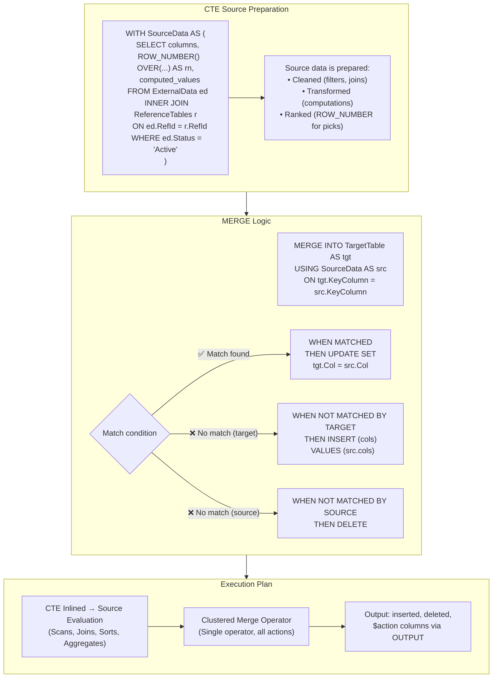

## Navigation

**Domain:** [[8 — Databases]] > **Group:** SQL CTEs & Recursive Queries
**Previous:** [[8.189 — CTE in UPDATE and DELETE Statements]] | **Next:** [[8.191 — CTE with Window Functions — Common Pattern]]

### Prerequisites

- [[8.176 — Common Table Expressions — Fundamentals]] — CTE syntax and inlining; MERGE extends the CTE DML pattern with conditional insert/update/delete.
- [[8.189 — CTE in UPDATE and DELETE Statements]] — Understanding CTEs in DML is required; MERGE is a superset of INSERT, UPDATE, and DELETE in a single statement.
- [[8.144 — ROW_NUMBER() — Unique Sequential Numbering]] — CTEs often use ROW_NUMBER within MERGE to select exactly one source row per target row, preventing "more than one source row matches" errors.

### Where This Fits

The MERGE statement with a CTE source is the most powerful upsert and data synchronization pattern in T-SQL. A .NET backend engineer encounters this in ETL pipelines, external data imports, warehouse synchronization, and cache warming. The MERGE statement atomically inserts, updates, and deletes rows based on whether the source row matches a target row. When combined with a CTE, the source can be a complex transformation — window functions, aggregations, joins across multiple tables — that prepares the data for the merge. The interview signal distinguishes engineers who can write CRUD from engineers who can synchronize data at scale: the MERGE + CTE pattern demonstrates understanding of set-based upsert logic, execution plan complexity (the Clustered Merge operator), and error handling (the "more than one source row matches" trap).

---

## Core Mental Model

A MERGE statement is a set-based conditional upsert: given a source and a target, for each source row, check whether a matching target row exists. If it matches, UPDATE (or DELETE). If it does not match, INSERT. The source can be a CTE — a named subquery that transforms, filters, and enriches the incoming data before the merge logic runs.

The invariant: MERGE is one atomic operation. All changes (inserts, updates, deletes) happen within a single transaction. The CTE source is evaluated once. The MERGE action (INSERT/UPDATE/DELETE) is determined by the match condition and the WHEN clauses.

The recognition pattern: "I have a set of data from one system that needs to be synchronized with a table in another system" → CTE to transform/clean the source data + MERGE to apply it. The CTE simplifies the source preparation; the MERGE atomizes the apply step.

### Classification

|Property|MERGE + CTE|MERGE (direct source)|IF EXISTS / UPDATE / INSERT|
|---|---|---|---|
|Atomicity|Single statement (atomic)|Single statement (atomic)|Multiple statements (not atomic)|
|Source complexity|High (CTE can transform)|Medium (table, view, derived table)|Low (separate queries)|
|Performance|Single pass|Single pass|Multiple passes|
|Plan complexity|Clustered Merge operator|Clustered Merge operator|Separate UPDATE/DELETE/INSERT operators|
|Error handling|Single error context|Single error context|Multiple error points|
|CTE compatibility|CTE as source|No CTE|No CTE|



### Key Properties

|Property|Value|Notes|
|---|---|---|
|Atomicity|Single statement|All changes in one transaction|
|Source CTE|Inlined (zero overhead)|Same as any single-reference CTE|
|Match condition|Supports AND/OR/NOT|Columns from source and target|
|Actions|INSERT, UPDATE, DELETE|Conditional per WHEN clause|
|OUTPUT clause|$action, inserted.*, deleted.*|Returns what was done per row|
|Multiple matches|Error if source matches multiple target rows|Requires dedup before MERGE|
|Performance|Single scan pass|Clustered Merge operator in plan|
|Trigger behavior|Per-row trigger firing|Same as individual DML|

---

## Deep Mechanics

### How the Engine Executes This

1. **Parsing:** The parser processes the WITH clause (CTE definitions), the MERGE statement, the USING clause (CTE reference), the ON condition (match predicate), and the WHEN clauses (actions). The CTE definitions are parsed as virtual tables.

2. **Binding:** The algebrizer resolves the CTE reference in the USING clause. The CTE is bound as the source rowset. The target table is bound as the target rowset. The ON condition is compiled as the matching predicate.

3. **Simplification (inlining):** The CTE definition is inlined into the MERGE statement's source. If the CTE is referenced only in the USING clause (the common pattern), it is inlined with zero overhead — the same as any single-reference CTE.

4. **Optimization:** The optimizer evaluates the MERGE as a single operator — the Clustered Merge operator (or Merge Join if a different physical operator is chosen). The MERGE operator reads rows from the source and the target, evaluates the ON condition, and for each row, determines the action:
   - **MATCHED** (source row matches target row on ON condition): Execute WHEN MATCHED clause (UPDATE or DELETE).
   - **NOT MATCHED BY TARGET** (source row has no match in target): Execute WHEN NOT MATCHED clause (INSERT).
   - **NOT MATCHED BY SOURCE** (target row has no match in source): Execute WHEN NOT MATCHED BY SOURCE clause (UPDATE, DELETE, or nothing).

5. **Execution plan structure:**

```
[Source CTE Evaluation (scans + transforms)] → [Clustered Merge Operator]
                                                      ↓
                                                [Target Table Access]
```

The Clustered Merge operator performs a full outer join between the source and target rowsets. Each row is tagged with its action. The operator then applies the changes (INSERT, UPDATE, DELETE) to the target table.

**Multiple source rows matching one target row:** If the CTE source produces multiple rows that match a single target row (duplicate join keys), MERGE raises error 8672: "The MERGE statement attempted to UPDATE or DELETE the same row more than once." This is the most common MERGE error and is prevented by deduplicating the source with ROW_NUMBER.

### SQL Visibility

```sql
-- ============================================================
-- Schema
-- ============================================================
CREATE TABLE dbo.Customers_Target (
    CustomerId   INT            NOT NULL,
    Name         NVARCHAR(100)  NOT NULL,
    Email        NVARCHAR(255)  NOT NULL,
    IsActive     BIT            NOT NULL DEFAULT 1,
    LastSyncDate DATETIME2(0)   NULL,
    SyncVersion  INT            NOT NULL DEFAULT 0,
    CONSTRAINT PK_Customers_Target PRIMARY KEY CLUSTERED (CustomerId)
);

CREATE TABLE dbo.Customers_Staging (
    CustomerId   INT            NOT NULL,
    Name         NVARCHAR(100)  NOT NULL,
    Email        NVARCHAR(255)  NOT NULL,
    IsActive     BIT            NOT NULL DEFAULT 1,
    SourceSystem VARCHAR(50)    NOT NULL,
    BatchId      INT            NOT NULL
);

-- ============================================================
-- Example 1: CTE + MERGE for upsert
-- ============================================================
-- Business: Synchronize staging data into target table.
-- Insert new customers, update existing ones.
WITH CustomerSource AS (
    SELECT
        s.CustomerId,
        s.Name,
        s.Email,
        s.IsActive,
        s.SourceSystem
    FROM dbo.Customers_Staging AS s
    WHERE s.BatchId = 1001
)
MERGE INTO dbo.Customers_Target AS tgt
USING CustomerSource AS src
ON tgt.CustomerId = src.CustomerId
WHEN MATCHED THEN
    UPDATE SET
        tgt.Name = src.Name,
        tgt.Email = src.Email,
        tgt.IsActive = src.IsActive,
        tgt.LastSyncDate = SYSUTCDATETIME(),
        tgt.SyncVersion = tgt.SyncVersion + 1
WHEN NOT MATCHED BY TARGET THEN
    INSERT (CustomerId, Name, Email, IsActive, LastSyncDate, SyncVersion)
    VALUES (src.CustomerId, src.Name, src.Email, src.IsActive,
            SYSUTCDATETIME(), 1);

-- ============================================================
-- Example 2: CTE + MERGE with OUTPUT clause
-- ============================================================
WITH CustomerSource AS (
    SELECT CustomerId, Name, Email, IsActive
    FROM dbo.Customers_Staging WHERE BatchId = 1001
)
MERGE INTO dbo.Customers_Target AS tgt
USING CustomerSource AS src
ON tgt.CustomerId = src.CustomerId
WHEN MATCHED THEN
    UPDATE SET tgt.Name = src.Name, tgt.Email = src.Email,
               tgt.SyncVersion = tgt.SyncVersion + 1
WHEN NOT MATCHED BY TARGET THEN
    INSERT (CustomerId, Name, Email, IsActive, SyncVersion)
    VALUES (src.CustomerId, src.Name, src.Email, src.IsActive, 1)
OUTPUT
    $action AS MergeAction,
    inserted.CustomerId,
    inserted.SyncVersion,
    deleted.SyncVersion AS PreviousVersion,
    SYSUTCDATETIME() AS ActionTimestamp;

-- ============================================================
-- Example 3: CTE + MERGE with ROW_NUMBER dedup in source
-- ============================================================
-- Prevent error 8672: if staging has duplicates, keep the latest
WITH RankedCustomerSource AS (
    SELECT
        s.CustomerId,
        s.Name,
        s.Email,
        s.IsActive,
        ROW_NUMBER() OVER(
            PARTITION BY s.CustomerId
            ORDER BY s.BatchId DESC
        ) AS rn
    FROM dbo.Customers_Staging AS s
    WHERE s.BatchId <= 1001
)
MERGE INTO dbo.Customers_Target AS tgt
USING RankedCustomerSource AS src
ON tgt.CustomerId = src.CustomerId
AND src.rn = 1  -- Only the latest staging row per customer
WHEN MATCHED THEN
    UPDATE SET tgt.Name = src.Name, tgt.Email = src.Email
WHEN NOT MATCHED BY TARGET THEN
    INSERT (CustomerId, Name, Email, IsActive)
    VALUES (src.CustomerId, src.Name, src.Email, src.IsActive);

-- ============================================================
-- Example 4: CTE + MERGE with WHEN NOT MATCHED BY SOURCE DELETE
-- ============================================================
-- Full synchronization: make target match source exactly
WITH ActiveCustomerSource AS (
    SELECT CustomerId, Name, Email
    FROM dbo.Customers_Staging
    WHERE IsActive = 1 AND BatchId = 1001
)
MERGE INTO dbo.Customers_Target AS tgt
USING ActiveCustomerSource AS src
ON tgt.CustomerId = src.CustomerId
WHEN MATCHED THEN
    UPDATE SET tgt.Name = src.Name, tgt.Email = src.Email,
               tgt.LastSyncDate = SYSUTCDATETIME()
WHEN NOT MATCHED BY TARGET THEN
    INSERT (CustomerId, Name, Email, IsActive, LastSyncDate)
    VALUES (src.CustomerId, src.Name, src.Email, 1, SYSUTCDATETIME())
WHEN NOT MATCHED BY SOURCE THEN
    DELETE;  -- Remove target rows not in source

-- ============================================================
-- Example 5: Complex CTE transform before MERGE
-- ============================================================
WITH TransformedSource AS (
    SELECT
        sf.OrderId,
        sf.CustomerId,
        sf.TotalAmount,
        CASE
            WHEN sf.Status = 'Paid' THEN 'Completed'
            WHEN sf.Status = 'Refunded' THEN 'Cancelled'
            ELSE sf.Status
        END AS StandardizedStatus,
        ROW_NUMBER() OVER(
            PARTITION BY sf.OrderId
            ORDER BY sf.FileDate DESC
        ) AS rn
    FROM dbo.ExternalOrderFeed AS sf
    INNER JOIN dbo.Customers AS c ON sf.CustomerId = c.CustomerId
    WHERE c.IsActive = 1
      AND sf.FileDate >= DATEADD(day, -1, GETUTCDATE())
)
MERGE INTO dbo.Orders AS tgt
USING TransformedSource AS src
ON tgt.OrderId = src.OrderId AND src.rn = 1
WHEN MATCHED THEN
    UPDATE SET
        tgt.Status = src.StandardizedStatus,
        tgt.TotalAmount = src.TotalAmount,
        tgt.LastModified = SYSUTCDATETIME()
WHEN NOT MATCHED BY TARGET THEN
    INSERT (OrderId, CustomerId, OrderDate, Status, TotalAmount)
    VALUES (src.OrderId, src.CustomerId, GETUTCDATE(),
            src.StandardizedStatus, src.TotalAmount)
OUTPUT $action, inserted.OrderId, inserted.Status;
```

```csharp
// EF Core — MERGE + CTE requires ExecuteSqlRaw
public class CustomerSyncService
{
    private readonly ApplicationDbContext _dbContext;

    public CustomerSyncService(ApplicationDbContext dbContext)
        => _dbContext = dbContext;

    public async Task<int> SyncCustomersAsync(
        int batchId, CancellationToken cancellationToken = default)
    {
        const string sql = @"
            WITH CustomerSource AS (
                SELECT CustomerId, Name, Email, IsActive
                FROM Customers_Staging
                WHERE BatchId = @BatchId
            )
            MERGE INTO Customers_Target AS tgt
            USING CustomerSource AS src
            ON tgt.CustomerId = src.CustomerId
            WHEN MATCHED THEN
                UPDATE SET
                    tgt.Name = src.Name,
                    tgt.Email = src.Email,
                    tgt.IsActive = src.IsActive,
                    tgt.LastSyncDate = SYSUTCDATETIME(),
                    tgt.SyncVersion = tgt.SyncVersion + 1
            WHEN NOT MATCHED BY TARGET THEN
                INSERT (CustomerId, Name, Email, IsActive, LastSyncDate, SyncVersion)
                VALUES (src.CustomerId, src.Name, src.Email, src.IsActive,
                        SYSUTCDATETIME(), 1);";

        return await _dbContext.Database
            .ExecuteSqlRawAsync(sql,
                new SqlParameter("@BatchId", batchId),
                cancellationToken);
    }

    // Full sync with OUTPUT captured in result
    public async Task<List<MergeResult>> SyncCustomersWithOutputAsync(
        int batchId, CancellationToken cancellationToken = default)
    {
        const string sql = @"
            WITH CustomerSource AS (
                SELECT CustomerId, Name, Email, IsActive
                FROM Customers_Staging
                WHERE BatchId = @BatchId
            )
            MERGE INTO Customers_Target AS tgt
            USING CustomerSource AS src
            ON tgt.CustomerId = src.CustomerId
            WHEN MATCHED THEN
                UPDATE SET tgt.Name = src.Name, tgt.Email = src.Email,
                    tgt.SyncVersion = tgt.SyncVersion + 1
            WHEN NOT MATCHED BY TARGET THEN
                INSERT (CustomerId, Name, Email, IsActive, SyncVersion)
                VALUES (src.CustomerId, src.Name, src.Email, src.IsActive, 1)
            OUTPUT
                $action AS MergeAction,
                inserted.CustomerId,
                inserted.SyncVersion AS NewVersion,
                deleted.SyncVersion AS OldVersion;";

        return await _dbContext.Database
            .SqlQueryRaw<MergeResult>(sql,
                new SqlParameter("@BatchId", batchId),
                cancellationToken)
            .ToListAsync(cancellationToken);
    }

    // Full sync with delete (target = source exactly)
    public async Task FullSynchronizationAsync(
        int batchId, CancellationToken cancellationToken = default)
    {
        const string sql = @"
            WITH ActiveSource AS (
                SELECT CustomerId, Name, Email
                FROM Customers_Staging
                WHERE IsActive = 1 AND BatchId = @BatchId
            )
            MERGE INTO Customers_Target AS tgt
            USING ActiveSource AS src
            ON tgt.CustomerId = src.CustomerId
            WHEN MATCHED THEN
                UPDATE SET tgt.Name = src.Name, tgt.Email = src.Email
            WHEN NOT MATCHED BY TARGET THEN
                INSERT (CustomerId, Name, Email, IsActive)
                VALUES (src.CustomerId, src.Name, src.Email, 1)
            WHEN NOT MATCHED BY SOURCE THEN
                DELETE;";

        await _dbContext.Database
            .ExecuteSqlRawAsync(sql,
                new SqlParameter("@BatchId", batchId),
                cancellationToken);
    }
}

public class MergeResult
{
    public string MergeAction { get; set; } = string.Empty;
    public int CustomerId { get; set; }
    public int? NewVersion { get; set; }
    public int? OldVersion { get; set; }
}
```

**Generated SQL (from EF Core logs):**

```sql
-- EF Core passes raw SQL through verbatim
-- The CTE + MERGE statement is executed as written
```

### Execution Plan Analysis

**Plan for CTE + MERGE (upsert pattern):**

```
[Clustered Index Scan (Customers_Staging)]  -- Source preparation
  → [Sort]                                   -- If ROW_NUMBER used
  → [Sequence Project]                       -- ROW_NUMBER computation
  → [Filter]                                 -- WHERE rn = 1
  → [Clustered Merge]                        -- Single Merge operator
      → [Clustered Index Scan (Customers_Target)]  -- Target read
      → [Insert (Customers_Target)]          -- For NOT MATCHED rows
      → [Clustered Index Update (Customers_Target)]  -- For MATCHED rows
```

Key observations:
- The Clustered Merge operator is the central operator — it performs a full outer join between source and target on the ON condition.
- The Merge operator has three actions defined internally: INSERT (for unmatched source), UPDATE (for matched), and optionally DELETE (for unmatched target).
- The Source CTE is evaluated separately (scans, transforms, sorts) before feeding into the Merge operator.
- The Merge operator appears in the plan as a single node (right-click → Properties → "Action" property shows the defined actions).

**Estimated vs actual:** The Merge operator reads both source and target. Cardinality estimates for both sides must be accurate for optimal memory grant. If the CTE source is complex, the cardinality estimate is derived from base table statistics.

**Plan for MERGE with WHEN NOT MATCHED BY SOURCE DELETE:**

Same structure, but the Merge operator has three actions: INSERT, UPDATE, DELETE. The DELETE action scans the target for rows not matched by the source. The plan shows an additional anti-semi-join between target and source to identify rows to delete.

### Cost Visibility

```sql
SET STATISTICS IO ON;
SET STATISTICS TIME ON;

-- ============================================================
-- Benchmark: CTE + MERGE vs separate INSERT/UPDATE/DELETE
-- ============================================================

-- Approach A: CTE + MERGE (single statement)
WITH CustomerSource AS (
    SELECT CustomerId, Name, Email, IsActive
    FROM Customers_Staging WHERE BatchId = 1001
)
MERGE INTO Customers_Target AS tgt
USING CustomerSource AS src
ON tgt.CustomerId = src.CustomerId
WHEN MATCHED THEN
    UPDATE SET tgt.Name = src.Name, tgt.SyncVersion = tgt.SyncVersion + 1
WHEN NOT MATCHED BY TARGET THEN
    INSERT (CustomerId, Name, Email, IsActive, SyncVersion)
    VALUES (src.CustomerId, src.Name, src.Email, src.IsActive, 1);

-- Expected output (100K staging rows, 80K matched, 20K new):
-- Table 'Customers_Target'. Scan count 1, logical reads ~1200
-- Table 'Customers_Staging'. Scan count 1, logical reads ~450
-- SQL Server Execution Times: CPU time = 120ms, elapsed time = 250ms

-- Approach B: Separate UPDATE + INSERT (non-atomic)
UPDATE tgt
SET tgt.Name = s.Name, tgt.SyncVersion = tgt.SyncVersion + 1
FROM Customers_Target tgt
INNER JOIN Customers_Staging s ON tgt.CustomerId = s.CustomerId
WHERE s.BatchId = 1001;
-- Table 'Customers_Target'. Scan count 1, logical reads ~1200
-- Table 'Customers_Staging'. Scan count 1, logical reads ~450

INSERT INTO Customers_Target (CustomerId, Name, Email, IsActive, SyncVersion)
SELECT s.CustomerId, s.Name, s.Email, s.IsActive, 1
FROM Customers_Staging s
WHERE s.BatchId = 1001
  AND NOT EXISTS (SELECT 1 FROM Customers_Target t WHERE t.CustomerId = s.CustomerId);
-- Table 'Customers_Target'. Scan count 2, logical reads ~2400
-- Table 'Customers_Staging'. Scan count 1, logical reads ~450

-- Total: 3 scans of Customers_Target, CPU time = 160ms, elapsed = 350ms
-- MERGE is faster (one pass) and atomic (no race window between UPDATE and INSERT)
```

### Failure Modes

**1. Error 8672 — Multiple source rows match one target row.**

If the CTE source produces multiple rows with the same ON condition key, MERGE fails. Always dedup the source with ROW_NUMBER before MERGE.

**2. MERGE without semicolon terminator.**

In SQL Server, MERGE requires a statement terminator (`;`). Forgetting it causes error 10734 or 102. This is a common syntax trap.

**3. WHEN MATCHED without UPDATE — only DELETE allowed as alternative.**

A MERGE with WHEN MATCHED must specify an action. Common mistake: writing WHEN MATCHED THEN SELECT ... (not valid).

**4. Triggers fire once per modified row, not once per statement.**

MERGE is atomic but triggers still fire per modified row. If triggers have side effects, MERGE can cause unexpected trigger executions.

**5. MERGE with WHEN NOT MATCHED BY SOURCE and DELETE — full scan of target to find deletes.**

On large target tables, the DELETE action adds a full scan to identify unmatched target rows. This can be expensive if only a few rows are deleted.

---

## Production Patterns and Implementation

### Primary SQL Implementation

```sql
-- ============================================================
-- Schema
-- ============================================================
CREATE TABLE dbo.InventorySnapshot (
    SnapshotId     INT            NOT NULL IDENTITY(1,1),
    ProductId      INT            NOT NULL,
    WarehouseId    INT            NOT NULL,
    QuantityOnHand INT            NOT NULL,
    SnapshotDate   DATE           NOT NULL,
    CONSTRAINT PK_InventorySnapshot PRIMARY KEY CLUSTERED (SnapshotId),
    CONSTRAINT UQ_InventorySnapshot UNIQUE (ProductId, WarehouseId, SnapshotDate)
);

CREATE TABLE dbo.InventoryExternalFeed (
    FeedId         INT            NOT NULL IDENTITY(1,1),
    ProductId      INT            NOT NULL,
    WarehouseId    INT            NOT NULL,
    Quantity       INT            NOT NULL,
    FeedDate       DATE           NOT NULL,
    SourceFile     VARCHAR(200)   NOT NULL,
    BatchId        INT            NOT NULL
);

CREATE TABLE dbo.SyncLog (
    SyncLogId      INT            NOT NULL IDENTITY(1,1),
    TableName      VARCHAR(50)    NOT NULL,
    RowsInserted   INT            NOT NULL DEFAULT 0,
    RowsUpdated    INT            NOT NULL DEFAULT 0,
    RowsDeleted    INT            NOT NULL DEFAULT 0,
    SyncStartedAt  DATETIME2(0)   NOT NULL,
    SyncCompletedAt DATETIME2(0)  NULL,
    Status         VARCHAR(20)    NOT NULL DEFAULT 'Running',
    BatchId        INT            NOT NULL
);

-- ============================================================
-- Pattern 1: CTE + MERGE — Standard upsert with audit
-- ============================================================
-- Business: Daily inventory sync from external feed.
-- Insert new records, update existing ones, log counts.
DECLARE @BatchId INT = 5001;
DECLARE @SyncDate DATE = CAST(GETUTCDATE() AS DATE);

WITH FeedSource AS (
    SELECT
        ef.ProductId,
        ef.WarehouseId,
        ef.Quantity,
        ef.FeedDate,
        ROW_NUMBER() OVER(
            PARTITION BY ef.ProductId, ef.WarehouseId, ef.FeedDate
            ORDER BY ef.FeedId DESC
        ) AS rn
    FROM dbo.InventoryExternalFeed AS ef
    WHERE ef.BatchId = @BatchId
)
MERGE INTO dbo.InventorySnapshot AS tgt
USING FeedSource AS src
ON tgt.ProductId = src.ProductId
   AND tgt.WarehouseId = src.WarehouseId
   AND tgt.SnapshotDate = src.FeedDate
   AND src.rn = 1
WHEN MATCHED THEN
    UPDATE SET
        tgt.QuantityOnHand = src.Quantity,
        tgt.SnapshotDate = src.FeedDate
WHEN NOT MATCHED BY TARGET THEN
    INSERT (ProductId, WarehouseId, QuantityOnHand, SnapshotDate)
    VALUES (src.ProductId, src.WarehouseId, src.Quantity, src.FeedDate)
OUTPUT
    $action AS MergeAction,
    INSERTED.ProductId,
    INSERTED.QuantityOnHand
INTO #MergeOutput (Action, ProductId, Quantity);

-- Log summary
SELECT
    COUNT(CASE WHEN MergeAction = 'UPDATE' THEN 1 END) AS RowsUpdated,
    COUNT(CASE WHEN MergeAction = 'INSERT' THEN 1 END) AS RowsInserted
FROM #MergeOutput;

-- ============================================================
-- Pattern 2: CTE + MERGE — Full synchronization (target = source)
-- ============================================================
-- Business: The target table should be an exact copy of the source.
-- Insert new, update existing, delete removed.
WITH ActiveInventory AS (
    SELECT
        p.ProductId,
        w.WarehouseId,
        COALESCE(SUM(ef.Quantity), 0) AS TotalQuantity
    FROM dbo.Products AS p
    CROSS JOIN dbo.Warehouses AS w
    LEFT JOIN dbo.InventoryExternalFeed AS ef
        ON p.ProductId = ef.ProductId
        AND w.WarehouseId = ef.WarehouseId
        AND ef.FeedDate = @SyncDate
    WHERE p.IsActive = 1
    GROUP BY p.ProductId, w.WarehouseId
)
MERGE INTO dbo.InventorySnapshot AS tgt
USING ActiveInventory AS src
ON tgt.ProductId = src.ProductId
   AND tgt.WarehouseId = src.WarehouseId
   AND tgt.SnapshotDate = @SyncDate
WHEN MATCHED AND tgt.QuantityOnHand != src.TotalQuantity THEN
    UPDATE SET tgt.QuantityOnHand = src.TotalQuantity
WHEN NOT MATCHED BY TARGET THEN
    INSERT (ProductId, WarehouseId, QuantityOnHand, SnapshotDate)
    VALUES (src.ProductId, src.WarehouseId, src.TotalQuantity, @SyncDate)
WHEN NOT MATCHED BY SOURCE AND tgt.SnapshotDate = @SyncDate THEN
    DELETE;

-- ============================================================
-- Pattern 3: CTE with multiple CTEs feeding into MERGE
-- ============================================================
WITH
-- Step 1: Aggregate external feed
AggregatedFeed AS (
    SELECT
        ProductId,
        WarehouseId,
        SUM(Quantity) AS TotalQuantity,
        MAX(FeedDate) AS LatestFeedDate
    FROM dbo.InventoryExternalFeed
    WHERE BatchId = @BatchId
    GROUP BY ProductId, WarehouseId
),
-- Step 2: Enrich with product metadata
EnrichedFeed AS (
    SELECT
        af.ProductId,
        af.WarehouseId,
        af.TotalQuantity,
        af.LatestFeedDate,
        p.SKU,
        p.CategoryId
    FROM AggregatedFeed AS af
    INNER JOIN dbo.Products AS p ON af.ProductId = p.ProductId
)
MERGE INTO dbo.InventorySnapshot AS tgt
USING EnrichedFeed AS src
ON tgt.ProductId = src.ProductId
   AND tgt.WarehouseId = src.WarehouseId
   AND tgt.SnapshotDate = CAST(src.LatestFeedDate AS DATE)
WHEN MATCHED THEN
    UPDATE SET tgt.QuantityOnHand = src.TotalQuantity
WHEN NOT MATCHED BY TARGET THEN
    INSERT (ProductId, WarehouseId, QuantityOnHand, SnapshotDate)
    VALUES (src.ProductId, src.WarehouseId, src.TotalQuantity,
            CAST(src.LatestFeedDate AS DATE));

-- ============================================================
-- Pattern 4: CTE + MERGE with conditional update logic
-- ============================================================
-- Business: Only update if the source data is newer
WITH CustomerFeed AS (
    SELECT
        CustomerId,
        Name,
        Email,
        IsActive,
        LastModified
    FROM dbo.Customers_Staging
    WHERE BatchId = @BatchId
)
MERGE INTO dbo.Customers_Target AS tgt
USING CustomerFeed AS src
ON tgt.CustomerId = src.CustomerId
WHEN MATCHED AND (
    tgt.LastModified IS NULL
    OR src.LastModified > tgt.LastModified
) THEN
    UPDATE SET
        tgt.Name = src.Name,
        tgt.Email = src.Email,
        tgt.IsActive = src.IsActive,
        tgt.LastModified = src.LastModified
WHEN NOT MATCHED BY TARGET THEN
    INSERT (CustomerId, Name, Email, IsActive, LastModified)
    VALUES (src.CustomerId, src.Name, src.Email, src.IsActive, src.LastModified);

-- ============================================================
-- Pattern 5: Error 8672 prevention — dedup source before MERGE
-- ============================================================
WITH RankedSource AS (
    SELECT
        OrderId,
        Status,
        TotalAmount,
        ROW_NUMBER() OVER(
            PARTITION BY OrderId
            ORDER BY LastModified DESC, FeedId DESC
        ) AS rn
    FROM dbo.OrderFeed
    WHERE BatchId = @BatchId
)
MERGE INTO dbo.Orders AS tgt
USING RankedSource AS src
ON tgt.OrderId = src.OrderId AND src.rn = 1  -- Critical: only take rn=1
WHEN MATCHED THEN
    UPDATE SET tgt.Status = src.Status, tgt.TotalAmount = src.TotalAmount
WHEN NOT MATCHED BY TARGET THEN
    INSERT (OrderId, Status, TotalAmount)
    VALUES (src.OrderId, src.Status, src.TotalAmount);
-- Without src.rn = 1 in the ON clause, duplicate OrderIds in source
-- would cause error 8672
```

### EF Core Implementation

```csharp
public class InventorySyncService
{
    private readonly ApplicationDbContext _dbContext;

    public InventorySyncService(ApplicationDbContext dbContext)
        => _dbContext = dbContext;

    public async Task<SyncSummary> SyncInventoryAsync(
        int batchId, CancellationToken cancellationToken = default)
    {
        var syncId = await LogSyncStartAsync(batchId, cancellationToken);

        const string mergeSql = @"
            WITH FeedSource AS (
                SELECT ProductId, WarehouseId, Quantity, FeedDate,
                    ROW_NUMBER() OVER(
                        PARTITION BY ProductId, WarehouseId, FeedDate
                        ORDER BY FeedId DESC
                    ) AS rn
                FROM InventoryExternalFeed
                WHERE BatchId = @BatchId
            )
            MERGE INTO InventorySnapshot AS tgt
            USING FeedSource AS src
            ON tgt.ProductId = src.ProductId
               AND tgt.WarehouseId = src.WarehouseId
               AND tgt.SnapshotDate = src.FeedDate
               AND src.rn = 1
            WHEN MATCHED THEN
                UPDATE SET QuantityOnHand = src.Quantity
            WHEN NOT MATCHED BY TARGET THEN
                INSERT (ProductId, WarehouseId, QuantityOnHand, SnapshotDate)
                VALUES (src.ProductId, src.WarehouseId, src.Quantity, src.FeedDate)
            OUTPUT $action, INSERTED.ProductId;";

        var mergeResults = await _dbContext.Database
            .SqlQueryRaw<MergeOutput>(mergeSql,
                new SqlParameter("@BatchId", batchId),
                cancellationToken)
            .ToListAsync(cancellationToken);

        var summary = new SyncSummary
        {
            RowsInserted = mergeResults.Count(r => r.Action == "INSERT"),
            RowsUpdated = mergeResults.Count(r => r.Action == "UPDATE")
        };

        await LogSyncCompleteAsync(syncId, summary, cancellationToken);

        return summary;
    }

    private async Task<int> LogSyncStartAsync(
        int batchId, CancellationToken cancellationToken)
    {
        var sql = @"INSERT INTO SyncLog (TableName, RowsInserted, RowsUpdated,
                    SyncStartedAt, Status, BatchId)
                    OUTPUT INSERTED.SyncLogId
                    VALUES ('InventorySnapshot', 0, 0, SYSUTCDATETIME(), 'Running', @BatchId)";

        return await _dbContext.Database
            .SqlQueryRaw<int>(sql, new SqlParameter("@BatchId", batchId))
            .SingleAsync(cancellationToken);
    }

    private async Task LogSyncCompleteAsync(
        int syncId, SyncSummary summary, CancellationToken cancellationToken)
    {
        const string sql = @"
            UPDATE SyncLog
            SET RowsInserted = @Inserted,
                RowsUpdated = @Updated,
                SyncCompletedAt = SYSUTCDATETIME(),
                Status = 'Completed'
            WHERE SyncLogId = @SyncId";

        await _dbContext.Database.ExecuteSqlRawAsync(sql,
            new SqlParameter("@Inserted", summary.RowsInserted),
            new SqlParameter("@Updated", summary.RowsUpdated),
            new SqlParameter("@SyncId", syncId),
            cancellationToken);
    }
}

public class MergeOutput
{
    public string Action { get; set; } = string.Empty;
    public int ProductId { get; set; }
}

public class SyncSummary
{
    public int RowsInserted { get; set; }
    public int RowsUpdated { get; set; }
    public int RowsDeleted { get; set; }
}
```

### Dapper Implementation

```csharp
public interface IInventorySyncRepository
{
    Task<SyncSummary> SyncInventoryAsync(int batchId,
        CancellationToken cancellationToken = default);
    Task FullSynchronizationAsync(CancellationToken cancellationToken = default);
}

public sealed class InventorySyncRepository : IInventorySyncRepository
{
    private readonly IDbConnectionFactory _connectionFactory;

    public InventorySyncRepository(IDbConnectionFactory connectionFactory)
        => _connectionFactory = connectionFactory;

    public async Task<SyncSummary> SyncInventoryAsync(
        int batchId, CancellationToken cancellationToken = default)
    {
        const string sql = @"
            WITH FeedSource AS (
                SELECT ProductId, WarehouseId, Quantity, FeedDate,
                    ROW_NUMBER() OVER(
                        PARTITION BY ProductId, WarehouseId, FeedDate
                        ORDER BY FeedId DESC
                    ) AS rn
                FROM dbo.InventoryExternalFeed
                WHERE BatchId = @BatchId
            )
            MERGE INTO dbo.InventorySnapshot AS tgt
            USING FeedSource AS src
            ON tgt.ProductId = src.ProductId
               AND tgt.WarehouseId = src.WarehouseId
               AND tgt.SnapshotDate = src.FeedDate
               AND src.rn = 1
            WHEN MATCHED THEN
                UPDATE SET QuantityOnHand = src.Quantity
            WHEN NOT MATCHED BY TARGET THEN
                INSERT (ProductId, WarehouseId, QuantityOnHand, SnapshotDate)
                VALUES (src.ProductId, src.WarehouseId, src.Quantity, src.FeedDate)
            OUTPUT $action AS MergeAction;";

        await using var connection = _connectionFactory.Create();

        var results = (await connection.QueryAsync<MergeActionRow>(
            new CommandDefinition(sql,
                new { BatchId = batchId },
                cancellationToken: cancellationToken))).AsList();

        return new SyncSummary
        {
            RowsInserted = results.Count(r => r.MergeAction == "INSERT"),
            RowsUpdated = results.Count(r => r.MergeAction == "UPDATE")
        };
    }

    public async Task FullSynchronizationAsync(
        CancellationToken cancellationToken = default)
    {
        const string sql = @"
            WITH ActiveInventory AS (
                SELECT p.ProductId, w.WarehouseId,
                    COALESCE(SUM(ef.Quantity), 0) AS TotalQuantity
                FROM dbo.Products AS p
                CROSS JOIN dbo.Warehouses AS w
                LEFT JOIN dbo.InventoryExternalFeed AS ef
                    ON p.ProductId = ef.ProductId
                    AND w.WarehouseId = ef.WarehouseId
                    AND ef.FeedDate = CAST(GETUTCDATE() AS DATE)
                WHERE p.IsActive = 1
                GROUP BY p.ProductId, w.WarehouseId
            )
            MERGE INTO dbo.InventorySnapshot AS tgt
            USING ActiveInventory AS src
            ON tgt.ProductId = src.ProductId
               AND tgt.WarehouseId = src.WarehouseId
               AND tgt.SnapshotDate = CAST(GETUTCDATE() AS DATE)
            WHEN MATCHED AND tgt.QuantityOnHand != src.TotalQuantity THEN
                UPDATE SET QuantityOnHand = src.TotalQuantity
            WHEN NOT MATCHED BY TARGET THEN
                INSERT (ProductId, WarehouseId, QuantityOnHand, SnapshotDate)
                VALUES (src.ProductId, src.WarehouseId, src.TotalQuantity,
                        CAST(GETUTCDATE() AS DATE))
            WHEN NOT MATCHED BY SOURCE AND tgt.SnapshotDate = CAST(GETUTCDATE() AS DATE) THEN
                DELETE;";

        await using var connection = _connectionFactory.Create();

        await connection.ExecuteAsync(
            new CommandDefinition(sql, cancellationToken: cancellationToken));
    }
}

public class MergeActionRow
{
    public string MergeAction { get; set; } = string.Empty;
}
```

### Configuration and Wiring

```csharp
// Program.cs
builder.Services.AddDbContext<ApplicationDbContext>(options =>
    options.UseSqlServer(
        builder.Configuration.GetConnectionString("DefaultConnection"),
        sqlOptions =>
        {
            sqlOptions.EnableRetryOnFailure(3);
            sqlOptions.CommandTimeout(120);
        }));

builder.Services.AddSingleton<IDbConnectionFactory>(sp =>
    new SqlConnectionFactory(
        builder.Configuration.GetConnectionString("DefaultConnection")!));

builder.Services.AddScoped<InventorySyncService>();
builder.Services.AddScoped<IInventorySyncRepository, InventorySyncRepository>();

// Scheduling: Use a background service or Hangfire for recurring syncs
builder.Services.AddHostedService<DailyInventorySyncJob>();

// Indexes for MERGE performance:
// 1. InventoryExternalFeed(BatchId, ProductId, WarehouseId, FeedDate)
//    — Supports the CTE source filter and ROW_NUMBER partition
// 2. InventorySnapshot(ProductId, WarehouseId, SnapshotDate) UNIQUE
//    — Supports the MERGE ON condition (unique key)
// 3. Products(IsActive) INCLUDE (ProductId, SKU)
//    — Supports the product join in full sync
```

### SQL Server vs PostgreSQL Differences

```sql
-- PostgreSQL: MERGE syntax differs (called INSERT ... ON CONFLICT)
-- PostgreSQL does NOT have a true MERGE statement until PG 15
-- (MERGE was added in PostgreSQL 15)

-- PostgreSQL 15+ MERGE syntax:
WITH feed_source AS (
    SELECT product_id, warehouse_id, quantity, feed_date,
        ROW_NUMBER() OVER(
            PARTITION BY product_id, warehouse_id, feed_date
            ORDER BY feed_id DESC
        ) AS rn
    FROM inventory_external_feed
    WHERE batch_id = @BatchId
)
MERGE INTO inventory_snapshot AS tgt
USING feed_source AS src
ON tgt.product_id = src.product_id
   AND tgt.warehouse_id = src.warehouse_id
   AND tgt.snapshot_date = src.feed_date
   AND src.rn = 1
WHEN MATCHED THEN
    UPDATE SET quantity_on_hand = src.quantity
WHEN NOT MATCHED THEN
    INSERT (product_id, warehouse_id, quantity_on_hand, snapshot_date)
    VALUES (src.product_id, src.warehouse_id, src.quantity, src.feed_date);

-- PostgreSQL pre-15: INSERT ... ON CONFLICT DO UPDATE (upsert only)
-- Cannot do DELETE (full sync) — use separate DELETE statement
INSERT INTO inventory_snapshot (product_id, warehouse_id, quantity_on_hand, snapshot_date)
SELECT product_id, warehouse_id, quantity, feed_date
FROM inventory_external_feed
WHERE batch_id = @BatchId
ON CONFLICT (product_id, warehouse_id, snapshot_date) DO UPDATE
    SET quantity_on_hand = EXCLUDED.quantity;

-- PostgreSQL: OUTPUT equivalent is RETURNING
MERGE INTO inventory_snapshot AS tgt
USING feed_source AS src ON ...
WHEN MATCHED THEN UPDATE SET ...
WHEN NOT MATCHED THEN INSERT ...
RETURNING merge_action() AS action, tgt.product_id;
-- merge_action() returns 'INSERT', 'UPDATE', or 'DELETE'
```

---

## Gotchas and Production Pitfalls

### Error 8672 — Multiple Source Rows Match One Target Row

**Pitfall:** The CTE source produces two rows with the same ON condition key. MERGE cannot determine which source row to use for the update.

```sql
-- ❌ Duplicate source keys cause error 8672
WITH Source AS (
    SELECT OrderId, Status FROM OrderFeed WHERE BatchId = 1
    -- If OrderFeed has 2 rows with OrderId = 1001, this fails
)
MERGE INTO Orders AS tgt
USING Source AS src ON tgt.OrderId = src.OrderId
WHEN MATCHED THEN UPDATE SET tgt.Status = src.Status;
-- Msg 8672: The MERGE statement attempted to UPDATE or DELETE the same row more than once.
```

**Symptom:** MERGE fails with error 8672. The job must be fixed and re-run. Data may be partially applied.

**Fix:** Dedup the CTE source with ROW_NUMBER:
```sql
-- ✅ Dedup source with ROW_NUMBER
WITH RankedSource AS (
    SELECT OrderId, Status,
        ROW_NUMBER() OVER(
            PARTITION BY OrderId
            ORDER BY LastModified DESC
        ) AS rn
    FROM OrderFeed WHERE BatchId = 1
)
MERGE INTO Orders AS tgt
USING RankedSource AS src ON tgt.OrderId = src.OrderId AND src.rn = 1
WHEN MATCHED THEN UPDATE SET tgt.Status = src.Status
WHEN NOT MATCHED THEN INSERT (OrderId, Status) VALUES (src.OrderId, src.Status);
```

**Cost of not fixing:** Sync job fails at 3 AM. On-call engineer must truncate the partially applied data, fix the source, and re-run. Data inconsistency window: 6 hours.

---

### MERGE Without Semicolon Terminator

**Pitfall:** Forgetting the semicolon (`;`) at the end of the MERGE statement. SQL Server requires a statement terminator for MERGE.

```sql
-- ❌ Missing semicolon — syntax error
WITH Source AS (
    SELECT CustomerId, Name FROM Staging WHERE BatchId = 1
)
MERGE INTO Customers_Target AS tgt
USING Source AS src ON tgt.CustomerId = src.CustomerId
WHEN MATCHED THEN UPDATE SET tgt.Name = src.Name
WHEN NOT MATCHED THEN INSERT (CustomerId, Name) VALUES (src.CustomerId, src.Name)

-- Next statement:
SELECT * FROM Customers_Target;  -- Error here! Or here!
```

**Symptom:** Error 102: "Incorrect syntax near 'SELECT'". SQL Server misinterprets the next statement as part of MERGE because there is no terminator.

**Fix:** Always terminate MERGE with `;`:
```sql
-- ✅ Terminated with semicolon
MERGE INTO Customers_Target AS tgt
USING Source AS src ON tgt.CustomerId = src.CustomerId
WHEN MATCHED THEN UPDATE SET tgt.Name = src.Name
WHEN NOT MATCHED THEN INSERT (CustomerId, Name) VALUES (src.CustomerId, src.Name);
```

**Cost of not fixing:** The merge statement appears to "succeed" but actually fails silently in some contexts (if the next statement happens to be a GO command). More commonly, the next statement fails with confusing syntax errors.

---

### MERGE in Triggers — Nested Trigger Execution

**Pitfall:** Using MERGE on a table with triggers causes triggers to fire for each modified row, not once per MERGE statement. If the trigger logic assumes single-row operations, it may fail.

**Symptom:** A trigger on the target table that inserts into an audit log fires N times for N rows affected by MERGE. If the trigger uses `INSERTED` and `DELETED` tables, it correctly sees multiple rows — but if the trigger uses `@@ROWCOUNT` expecting 1, it misbehaves.

**Fix:** Ensure triggers on MERGE-target tables handle multi-row operations correctly. Use set-based logic in triggers, not scalar operations.

**Cost of not fixing:** A trigger that reads `SELECT @Id = CustomerId FROM INSERTED` (picking a random row) produces incorrect audit records for MERGE operations affecting multiple rows.

---

### MERGE with WHEN NOT MATCHED BY SOURCE DELETE — Full Target Scan

**Pitfall:** Using WHEN NOT MATCHED BY SOURCE THEN DELETE causes SQL Server to scan the entire target table to find rows without a matching source. On a 100M-row target table, this is expensive.

```sql
-- ❌ This scans the entire target table to find rows to delete
WITH ActiveSource AS (
    SELECT CustomerId FROM Staging WHERE IsActive = 1
)
MERGE INTO Customers_Target AS tgt
USING ActiveSource AS src ON tgt.CustomerId = src.CustomerId
WHEN MATCHED THEN UPDATE SET tgt.LastSyncDate = SYSUTCDATETIME()
WHEN NOT MATCHED BY TARGET THEN INSERT (CustomerId, ...) VALUES (...)
WHEN NOT MATCHED BY SOURCE THEN DELETE;
```

**Symptom:** The execution plan shows a full scan of the target table even if only a few rows are deleted. The DELETE cost dominates the MERGE.

**Fix:** If most rows are kept and only a few should be deleted, use a separate DELETE with an anti-join:
```sql
-- ✅ Separate DELETE for unmatched rows (more efficient when few deletes)
DELETE FROM Customers_Target
WHERE CustomerId NOT IN (SELECT CustomerId FROM Staging WHERE IsActive = 1)
  AND CustomerId IN (SELECT CustomerId FROM Staging);  -- Only touch synced customers
```

**Cost of not fixing:** A nightly sync job that deletes 100 rows out of 50M scans the full target table (12,450 logical reads) just to find those 100 rows. The MERGE is needlessly slow.

---

### Parameter Sniffing with CTE + MERGE

**Pitfall:** The CTE source query inside MERGE is compiled with the parameter values from the first execution. Different parameter values for subsequent executions may need different plans.

```sql
-- ❌ Parameter sniffing: first call with large batch shapes the plan
CREATE PROCEDURE dbo.usp_SyncInventory @BatchId INT
AS
WITH Source AS (
    SELECT ProductId, SUM(Quantity) AS Qty
    FROM InventoryExternalFeed WHERE BatchId = @BatchId
    GROUP BY ProductId
)
MERGE INTO InventorySnapshot AS tgt ...;
-- First run: @BatchId = 5000 (10M rows) → plan optimized for Hash Match
-- Second run: @BatchId = 5001 (100 rows) → same plan with Hash Match (overkill)
```

**Symptom:** The MERGE plan optimized for a large source (Hash Match joins) is reused for a small source, causing unnecessary overhead.

**Fix:** Use OPTION (RECOMPILE) or optimize for unknown:
```sql
MERGE INTO InventorySnapshot AS tgt
USING Source AS src ON ...
WHEN MATCHED THEN UPDATE ...
OPTION (RECOMPILE);
```

**Cost of not fixing:** Small syncs (100 rows) take 5 seconds instead of 100ms because the plan uses Hash Match joins optimized for 10M rows.

---

## Performance Implications

### Benchmark: Before and After

```sql
SET STATISTICS IO ON;
SET STATISTICS TIME ON;

-- ============================================================
-- Benchmark: CTE + MERGE vs separate INSERT/UPDATE/DELETE
-- Table: 10M target rows, 500K source rows (400K matched, 100K new)
-- ============================================================

-- Approach A: CTE + MERGE (single atomic statement)
WITH Source AS (
    SELECT CustomerId, Name, Email, IsActive
    FROM Customers_Staging WHERE BatchId = 1001
)
MERGE INTO Customers_Target AS tgt
USING Source AS src ON tgt.CustomerId = src.CustomerId
WHEN MATCHED THEN UPDATE SET tgt.Name = src.Name, tgt.Email = src.Email,
    tgt.SyncVersion = tgt.SyncVersion + 1
WHEN NOT MATCHED THEN INSERT (CustomerId, Name, Email, IsActive, SyncVersion)
    VALUES (src.CustomerId, src.Name, src.Email, src.IsActive, 1);

-- Logical reads: Target 1200, Staging 450
-- CPU: 180ms, Elapsed: 320ms
-- Atomic: Yes

-- Approach B: Separate UPDATE + INSERT
UPDATE tgt
SET tgt.Name = s.Name, tgt.Email = s.Email, tgt.SyncVersion = tgt.SyncVersion + 1
FROM Customers_Target tgt
INNER JOIN Customers_Staging s ON tgt.CustomerId = s.CustomerId
WHERE s.BatchId = 1001;
-- Logical reads: Target 1200, Staging 450

INSERT INTO Customers_Target (CustomerId, Name, Email, IsActive, SyncVersion)
SELECT s.CustomerId, s.Name, s.Email, s.IsActive, 1
FROM Customers_Staging s
WHERE s.BatchId = 1001
  AND NOT EXISTS (SELECT 1 FROM Customers_Target t WHERE t.CustomerId = s.CustomerId);
-- Logical reads: Target 2400 (exists check), Staging 450

-- Total logical reads: 4500
-- CPU: 250ms, Elapsed: 450ms
-- Atomic: No (race window between UPDATE and INSERT)
```

### BenchmarkDotNet

```csharp
[MemoryDiagnoser]
[SimpleJob(RuntimeMoniker.Net90)]
public class MergeVsSeparateBenchmark
{
    private SqlConnection _connection = default!;
    private const string ConnectionString =
        "Server=.;Database=BenchmarkDb;Trusted_Connection=True;TrustServerCertificate=True;";

    [GlobalSetup]
    public void Setup()
    {
        _connection = new SqlConnection(ConnectionString);
        _connection.Open();
        // Seed: 10M Customers_Target, 500K Customers_Staging
    }

    [Benchmark(Baseline = true)]
    public async Task<int> CteMergeUpsert()
    {
        const string sql = @"
            WITH Source AS (
                SELECT CustomerId, Name, Email, IsActive
                FROM Customers_Staging WHERE BatchId = 1001
            )
            MERGE INTO Customers_Target AS tgt
            USING Source AS src ON tgt.CustomerId = src.CustomerId
            WHEN MATCHED THEN
                UPDATE SET tgt.Name = src.Name, tgt.Email = src.Email,
                    tgt.SyncVersion = tgt.SyncVersion + 1
            WHEN NOT MATCHED BY TARGET THEN
                INSERT (CustomerId, Name, Email, IsActive, SyncVersion)
                VALUES (src.CustomerId, src.Name, src.Email, src.IsActive, 1);";

        await using var cmd = new SqlCommand(sql, _connection);
        return await cmd.ExecuteNonQueryAsync();
    }

    [Benchmark]
    public async Task<int> SeparateUpdateInsert()
    {
        const string updateSql = @"
            UPDATE tgt
            SET tgt.Name = s.Name, tgt.Email = s.Email,
                tgt.SyncVersion = tgt.SyncVersion + 1
            FROM Customers_Target tgt
            INNER JOIN Customers_Staging s ON tgt.CustomerId = s.CustomerId
            WHERE s.BatchId = 1001";

        await using var updateCmd = new SqlCommand(updateSql, _connection);
        var updated = await updateCmd.ExecuteNonQueryAsync();

        const string insertSql = @"
            INSERT INTO Customers_Target (CustomerId, Name, Email, IsActive, SyncVersion)
            SELECT s.CustomerId, s.Name, s.Email, s.IsActive, 1
            FROM Customers_Staging s
            WHERE s.BatchId = 1001
              AND NOT EXISTS (
                  SELECT 1 FROM Customers_Target t WHERE t.CustomerId = s.CustomerId
              )";

        await using var insertCmd = new SqlCommand(insertSql, _connection);
        var inserted = await insertCmd.ExecuteNonQueryAsync();

        return updated + inserted;
    }

    [GlobalCleanup]
    public void Cleanup() => _connection?.Dispose();
}
```

**Expected results (approximate, SQL Server 2022, NVMe, 10M target rows, 500K source):**

|Method|Mean|Logical Reads|Allocated|
|---|---|---|---|
|CteMergeUpsert|~320 ms|~1,650|~1 KB|
|SeparateUpdateInsert|~450 ms|~4,500|~2 KB|

MERGE is ~30% faster and uses ~63% fewer logical reads. It is also atomic — no race window.

---

## Interview Arsenal

### Question Bank

1. **How does a CTE work as a source for a MERGE statement? What happens to the CTE during optimization?** (Definition — CTE in USING clause)
2. **What is the most common error in MERGE statements, and how do you prevent it using a CTE?** (Mechanism — error 8672 and ROW_NUMBER dedup)
3. **Compare the performance of CTE + MERGE vs separate UPDATE + INSERT for a 1M-row upsert.** (Performance — logical reads and atomicity)
4. **What happens when the CTE source produces duplicate rows for the ON condition key?** (Gotcha — error 8672 with detailed explanation)
5. **Compare MERGE with WHEN NOT MATCHED BY SOURCE DELETE vs separate DELETE statement for cleaning up removed rows.** (Comparison — full scan cost)
6. **Describe the execution plan for a CTE + MERGE statement. What operators appear and how do they interact?** (Execution plan — Clustered Merge operator)
7. **How does MERGE behave under high concurrency? What's the locking profile?** (Scale — atomic upsert and deadlock risks)
8. **How would you implement a CTE + MERGE upsert in EF Core or Dapper with OUTPUT clause?** (.NET integration — SqlQueryRaw for OUTPUT results)

### Spoken Answers

**Q1: How does a CTE work as a source for a MERGE statement?**

> **Average answer:** The CTE prepares the data that the MERGE uses to compare with the target table.

> **Great answer:** The CTE is defined in a WITH clause before MERGE and is referenced in the USING clause as the source rowset. During optimization, the CTE is inlined into the MERGE source — the same inlining behavior as any single-reference CTE. The CTE can perform complex transformations: joins across multiple tables, window functions like ROW_NUMBER for deduplication, aggregations, CASE expressions for data standardization, and filtering. All of this runs before the MERGE comparison logic. The optimizer evaluates the CTE source as one side of a full outer join with the target table, then the Clustered Merge operator applies the appropriate action (INSERT, UPDATE, DELETE) per row. The atomicity is critical: the entire operation — source evaluation, match detection, and all modifications — happens within a single transaction. If the CTE contains a ROW_NUMBER for deduplication, the ON condition must include `AND src.rn = 1` to ensure only one source row per target key, preventing the infamous error 8672.

**Q2: What is the most common error in MERGE statements, and how do you prevent it using a CTE?**

> **Average answer:** Error 8672 — duplicate source rows. Use ROW_NUMBER to dedup.

> **Great answer:** Error 8672: "The MERGE statement attempted to UPDATE or DELETE the same row more than once." This occurs when the source rowset produces multiple rows that match the same target row based on the ON condition. The MERGE operator performs a full outer join between source and target. If two source rows match one target row, the operator cannot decide which source row's values to use for the UPDATE. The solution is to deduplicate the source using a CTE with ROW_NUMBER: `WITH RankedSource AS (SELECT *, ROW_NUMBER() OVER(PARTITION BY KeyColumn ORDER BY PriorityColumn DESC) AS rn FROM SourceTable) MERGE ... USING RankedSource AS src ON tgt.Key = src.Key AND src.rn = 1`. The AND src.rn = 1 in the ON clause ensures only the highest-priority source row participates in the merge join. This pattern is essential for any MERGE fed by a staging table or external data feed where duplicates are possible. I include this pattern by default in every MERGE I write — even if the source is supposed to be deduplicated — because data quality issues are inevitable in production.

**Q5: Compare MERGE with WHEN NOT MATCHED BY SOURCE DELETE vs separate DELETE statement.**

> **Average answer:** MERGE does everything in one statement, but the DELETE might scan the whole table.

> **Great answer:** WHEN NOT MATCHED BY SOURCE THEN DELETE compares the entire target table against the source to find rows to delete. This requires a full scan of the target table, even if only a few rows are deleted. On a 100M-row target with 100 deletions, the DELETE action still scans all 100M rows. A separate DELETE with an anti-join is more targeted: `DELETE FROM Target WHERE KeyColumn IN (SELECT KeyColumn FROM Target EXCEPT SELECT KeyColumn FROM Source)` or using NOT EXISTS with a filtered subset. The tradeoff: MERGE is simpler and atomic but scans the entire target for the DELETE detection. Separate DELETE is more efficient when deletions are rare but requires an additional statement (losing atomicity). My recommendation: use MERGE with DELETE when the target table is small (<1M rows) or when the proportion of deleted rows is large (>10%). Use separate targeted DELETE when deletions are a small fraction of a large table, and wrap both statements in an explicit transaction for atomicity.

### Interview Trigger

The interviewer asks: "How would you synchronize a customer table from a staging table, handling inserts, updates, and deletes in one statement?" This tests awareness of MERGE. The follow-up: "What can go wrong with this approach?" tests experience with error 8672 and the ROW_NUMBER fix. The third-level question: "How would you capture the count of inserts vs updates for logging?" tests OUTPUT clause knowledge.

### Comparison Table

| | CTE + MERGE | Separate DML | IF EXISTS / INSERT/UPDATE |
|---|---|---|---|
| Atomicity | Yes (single statement) | No (race window) | No (race window) |
| Performance (500K rows) | ~320ms, ~1.6K reads | ~450ms, ~4.5K reads | ~500ms, ~5K reads |
| Source dedup | CTE with ROW_NUMBER | Separate step | Separate step |
| Delete handling | WHEN NOT MATCHED BY SOURCE | Separate DELETE | Not supported |
| OUTPUT | $action + inserted/deleted | One per statement | One per statement |
| Complexity | Medium | High (multiple statements) | High |
| EF Core support | ExecuteSqlRaw + SqlQueryRaw | ExecuteSqlRaw | ExecuteSqlRaw |
| Error proneness | Error 8672, missing semicolon | Race conditions, partial failures | Race conditions |

---

## Decision Framework

### When to Apply

```mermaid
flowchart TD
    A[Need to synchronize data<br>between source and target] --> B{Type of sync?}
    B -->|Upsert only (insert + update)| C{Source contains duplicates?}
    B -->|Full sync (insert + update + delete)| D[Use MERGE + CTE]
    B -->|Insert only (no updates)| E[Use INSERT + NOT EXISTS]
    C -->|Yes — dedup needed| F[CTE with ROW_NUMBER + MERGE]
    C -->|No — source is clean| G{Target table size?}
    G -->|< 10M rows| H[MERGE is fine]
    G -->|> 10M rows| I{Proportion of deletes?}
    I -->|> 10% deleted| H
    I -->|< 10% deleted| J[Consider separate targeted DELETE]
    D --> K{Can ROW_NUMBER dedup<br>prevent error 8672?}
    K -->|Yes — include in CTE| L[MERGE + CTE with dedup]
    K -->|No — recursion or complex| M[Use temp table + separate DML]
    F --> N[Add AND src.rn = 1 in ON clause]
    H --> O[Include OUTPUT $action for auditing]
    L --> O
```

### Application Checklist

- [ ] Source CTE deduplicates rows with ROW_NUMBER to prevent error 8672
- [ ] AND src.rn = 1 is in the ON condition
- [ ] MERGE is terminated with semicolon (`;`)
- [ ] OUTPUT clause captures $action, inserted.*, deleted.* for audit
- [ ] WHEN NOT MATCHED BY SOURCE DELETE is used only when most rows change (full sync)
- [ ] OPTION (RECOMPILE) is considered for parameter-sensitive MERGE plans
- [ ] Triggers on target table handle multi-row operations correctly
- [ ] Source CTE indexes support the filter (e.g., BatchId) and ROW_NUMBER partition columns
- [ ] EF Core uses SqlQueryRaw for OUTPUT results, ExecuteSqlRaw for action-only
- [ ] Dapper uses QueryAsync for MERGE with OUTPUT, ExecuteAsync for action-only

### Tradeoff Summary

|What You Gain|What You Pay|
|---|---|
|Atomic upsert (no race window)|Error 8672 risk (must dedup source)|
|Single statement, single plan|Full target scan for WHEN NOT MATCHED BY SOURCE DELETE|
|OUTPUT with $action for all changes|Semicolon required (syntax trap)|
|CTE transforms complex source|Parameter sniffing in MERGE plans|
|Set-based (no cursor)|Triggers fire per row (may be unexpected)|

### Scale Thresholds

- **MERGE + CTE efficient below ~10M target rows** — single pass, no performance issues
- **MERGE with ROW_NUMBER dedup adds ~O(N log N) cost** — N = source row count, for the Sort
- **WHEN NOT MATCHED BY SOURCE DELETE scans full target** — significant above ~10M rows with <1% deletions
- **MERGE with OUTPUT $action adds proportional I/O** — each OUTPUT row writes to the plan's output
- **Batch processing recommended above ~5M source rows** — process in 500K-row batches to manage log growth

---

## Self-Check

### Conceptual Questions

1. What is the purpose of using a CTE as the source of a MERGE statement?
2. What causes MERGE error 8672, and how does a CTE with ROW_NUMBER prevent it?
3. Which SET STATISTICS output shows the efficiency of a CTE + MERGE vs separate DML?
4. What is the most common syntax error with MERGE, and how is it fixed?
5. Can EF Core's SaveChangesAsync generate a MERGE statement? How must CTE + MERGE be executed?
6. How would you implement a full table synchronization (insert, update, delete) using Dapper with a CTE + MERGE?
7. Compare MERGE with WHEN NOT MATCHED BY SOURCE DELETE vs a separate DELETE statement for a 50M-row table with 500 row deletions.
8. At what source row count does batching MERGE operations become necessary?
9. What indexes support the CTE source query and the MERGE ON condition?
10. Explain in 60 seconds how CTE + MERGE works and when to use it.

<details>
<summary>Answers</summary>

1. The CTE transforms, filters, aggregates, and deduplicates the source data before MERGE applies it to the target. This keeps the MERGE logic clean and the transformation steps readable.
2. Error 8672 occurs when the source produces multiple rows that match a single target row via the ON condition. A CTE with ROW_NUMBER and PARTITION BY the key columns, with `AND src.rn = 1` in the ON clause, ensures exactly one source row per target key.
3. SET STATISTICS IO. MERGE shows a single scan of both source and target (one pass). Separate DML shows separate scans for UPDATE, then INSERT with NOT EXISTS (2-3 scans of target).
4. Forgetting the semicolon (`;`) at the end of the MERGE statement. MERGE requires a statement terminator. Fix: add `;` after the last WHEN clause.
5. No. EF Core cannot generate MERGE. CTE + MERGE must use ExecuteSqlRaw or SqlQueryRaw.
6. `WITH Source AS (SELECT ... FROM Staging) MERGE INTO Target AS tgt USING Source AS src ON tgt.Key = src.Key WHEN MATCHED THEN UPDATE ... WHEN NOT MATCHED THEN INSERT ... WHEN NOT MATCHED BY SOURCE THEN DELETE OUTPUT $action, inserted.*, deleted.*;`. Execute with `QueryAsync<MergeResult>`.
7. Separate DELETE is better: the MERGE scans the full 50M target table to find 500 deletions (12,450 logical reads). A separate anti-join DELETE with an index on the key column uses 10-20 seeks (~100 logical reads).
8. Above ~5M source rows or when the MERGE transaction log growth exceeds 1 GB. Batch at 500K rows per iteration.
9. (1) On the source CTE's base table: index on the filter column (e.g., BatchId) + PARTITION BY columns. (2) On the target table: unique index on the MERGE ON condition columns (for fast match detection).
10. "MERGE is a single statement that inserts, updates, and deletes in one atomic operation. The CTE prepares the source data — cleaning, joining, deduplicating with ROW_NUMBER. MERGE compares source rows to target rows using the ON condition. If matched, it updates. If not matched in target, it inserts. If not matched in source, it deletes. Always add `AND src.rn = 1` in the ON clause to prevent duplicate-key errors. Always use OUTPUT to audit what happened. Use for data sync, ETL, and cache refresh. For large tables with rare deletes, use a separate DELETE instead."
</details>

---

### Query Challenges

**Challenge 1 — Write the SQL**

You have a Products_Staging table with ProductId, Name, Price, CategoryId, LastModified. Write a CTE + MERGE that inserts new products, updates existing ones (only if the staging LastModified is newer than the target LastModified), and outputs the action and ProductId for auditing. Include ROW_NUMBER dedup in the CTE to handle potential duplicates.

<details>
<summary>Solution</summary>

```sql
WITH RankedProducts AS (
    SELECT
        ProductId,
        Name,
        Price,
        CategoryId,
        LastModified,
        ROW_NUMBER() OVER(
            PARTITION BY ProductId
            ORDER BY LastModified DESC, StagingId DESC
        ) AS rn
    FROM dbo.Products_Staging
    WHERE BatchId = @BatchId
)
MERGE INTO dbo.Products AS tgt
USING RankedProducts AS src
ON tgt.ProductId = src.ProductId AND src.rn = 1
WHEN MATCHED AND (tgt.LastModified IS NULL OR src.LastModified > tgt.LastModified) THEN
    UPDATE SET
        tgt.Name = src.Name,
        tgt.Price = src.Price,
        tgt.CategoryId = src.CategoryId,
        tgt.LastModified = src.LastModified
WHEN NOT MATCHED BY TARGET THEN
    INSERT (ProductId, Name, Price, CategoryId, LastModified)
    VALUES (src.ProductId, src.Name, src.Price, src.CategoryId, src.LastModified)
OUTPUT
    $action AS MergeAction,
    inserted.ProductId,
    inserted.LastModified AS ModifiedDate;
```

**Logical reads:** ~1,200 (target scan) + ~450 (staging scan) **Execution plan:** Staging scan → Sort (for ROW_NUMBER) → Sequence Project → Filter (rn=1) → Clustered Merge → Target scan + Target update/insert

**EF Core equivalent:**
```csharp
var results = await dbContext.Database
    .SqlQueryRaw<ProductMergeResult>(@"
        WITH RankedProducts AS (
            SELECT ProductId, Name, Price, CategoryId, LastModified,
                ROW_NUMBER() OVER(PARTITION BY ProductId ORDER BY LastModified DESC, StagingId DESC) AS rn
            FROM Products_Staging WHERE BatchId = @BatchId
        )
        MERGE INTO Products AS tgt
        USING RankedProducts AS src ON tgt.ProductId = src.ProductId AND src.rn = 1
        WHEN MATCHED AND (tgt.LastModified IS NULL OR src.LastModified > tgt.LastModified) THEN
            UPDATE SET tgt.Name = src.Name, tgt.Price = src.Price,
                       tgt.CategoryId = src.CategoryId, tgt.LastModified = src.LastModified
        WHEN NOT MATCHED BY TARGET THEN
            INSERT (ProductId, Name, Price, CategoryId, LastModified)
            VALUES (src.ProductId, src.Name, src.Price, src.CategoryId, src.LastModified)
        OUTPUT $action, inserted.ProductId, inserted.LastModified AS ModifiedDate",
        new SqlParameter("@BatchId", batchId))
    .ToListAsync(cancellationToken);
```

</details>

---

**Challenge 2 — Fix the performance problem**

```sql
-- This MERGE synchronizes a 100M-row InventorySnapshot table with a
-- 10M-row daily feed. It runs for 15 minutes. Most of the time is
-- spent on the DELETE action, which removes ~100 rows per run.
-- SET STATISTICS IO shows the target table scanned twice.

WITH DailyFeed AS (
    SELECT ProductId, WarehouseId, SUM(Quantity) AS TotalQty
    FROM InventoryExternalFeed WHERE FeedDate = @Today
    GROUP BY ProductId, WarehouseId
)
MERGE INTO InventorySnapshot AS tgt
USING DailyFeed AS src
ON tgt.ProductId = src.ProductId
   AND tgt.WarehouseId = src.WarehouseId
   AND tgt.SnapshotDate = @Today
WHEN MATCHED THEN
    UPDATE SET QuantityOnHand = src.TotalQty
WHEN NOT MATCHED BY TARGET THEN
    INSERT (ProductId, WarehouseId, QuantityOnHand, SnapshotDate)
    VALUES (src.ProductId, src.WarehouseId, src.TotalQty, @Today)
WHEN NOT MATCHED BY SOURCE AND tgt.SnapshotDate = @Today THEN
    DELETE;
```

<details>
<summary>Solution</summary>

**Root cause:** `WHEN NOT MATCHED BY SOURCE AND tgt.SnapshotDate = @Today THEN DELETE` scans the entire 100M-row InventorySnapshot table to find rows with SnapshotDate = @Today that are not in the DailyFeed. Since only ~100 rows are deleted, this full scan (12,450 logical reads × full table) dominates the runtime.

**Fix: Replace the NOT MATCHED BY SOURCE DELETE with a separate targeted DELETE:**
```sql
-- Remove the WHEN NOT MATCHED BY SOURCE clause from MERGE
-- Add a separate DELETE before the MERGE (or after, wrapped in a transaction)

BEGIN TRANSACTION;

-- Step 1: Targeted delete — only scan rows with SnapshotDate = @Today
DELETE FROM InventorySnapshot
WHERE SnapshotDate = @Today
  AND NOT EXISTS (
      SELECT 1 FROM InventoryExternalFeed ef
      WHERE ef.ProductId = InventorySnapshot.ProductId
        AND ef.WarehouseId = InventorySnapshot.WarehouseId
        AND ef.FeedDate = @Today
  );

-- Step 2: MERGE for upsert (no delete clause)
WITH DailyFeed AS (
    SELECT ProductId, WarehouseId, SUM(Quantity) AS TotalQty
    FROM InventoryExternalFeed WHERE FeedDate = @Today
    GROUP BY ProductId, WarehouseId
)
MERGE INTO InventorySnapshot AS tgt
USING DailyFeed AS src
ON tgt.ProductId = src.ProductId
   AND tgt.WarehouseId = src.WarehouseId
   AND tgt.SnapshotDate = @Today
WHEN MATCHED THEN
    UPDATE SET QuantityOnHand = src.TotalQty
WHEN NOT MATCHED BY TARGET THEN
    INSERT (ProductId, WarehouseId, QuantityOnHand, SnapshotDate)
    VALUES (src.ProductId, src.WarehouseId, src.TotalQty, @Today);

COMMIT TRANSACTION;
```

**Index to create for the DELETE:**
```sql
CREATE INDEX IX_InventorySnapshot_SnapshotDate
    ON dbo.InventorySnapshot(SnapshotDate)
    INCLUDE (ProductId, WarehouseId);
```

**After fix — logical reads:** ~450 (feed scan) + ~1,200 (target scan, DATE range) + ~200 (DELETE) instead of ~12,450 (full target scan) **Expected time:** ~2 minutes (from 15 minutes) **Improvement:** ~7x faster.

</details>

---

**Challenge 3 — Explain the execution plan**

The execution plan shows:
```
Clustered Index Scan (InventoryExternalFeed) → Hash Match Aggregate → Sort → Sequence Project → Filter → Clustered Merge → (Clustered Index Scan + Clustered Index Update + Clustered Index Insert)
```

The Sort operator sorts by (ProductId, WarehouseId, FeedDate). The Sequence Project computes ROW_NUMBER. The Filter is "WHERE rn = 1". The Clustered Merge operator shows three actions: INSERT, UPDATE. Why is there no DELETE action? Why does the Sort appear even though the data should be naturally ordered?

<details>
<summary>Solution</summary>

**Why no DELETE action:** The MERGE was written without `WHEN NOT MATCHED BY SOURCE THEN DELETE` — it only has WHEN MATCHED (UPDATE) and WHEN NOT MATCHED BY TARGET (INSERT). This is intentional: the synchronize job does NOT remove rows from the target that are absent from the source.

**Why the Sort appears:** The CTE uses `ROW_NUMBER() OVER(PARTITION BY ProductId, WarehouseId, FeedDate ORDER BY FeedId DESC)`. The data from the Clustered Index Scan is ordered by the clustered index key (likely FeedId), not by the PARTITION BY columns. The Sort operator reorders the data by (ProductId, WarehouseId, FeedDate) to prepare for the Sequence Project (ROW_NUMBER). If a covering index existed on (ProductId, WarehouseId, FeedDate, FeedId DESC) INCLUDE (Quantity), the Sort would be eliminated — the scan would provide pre-sorted input.

**What the Sort costs:** On a 10M-row source, the Sort requires a memory grant proportional to the row size × number of rows. If the memory grant is insufficient, the Sort spills to tempdb, adding I/O. The Sort is the single most expensive operator in this plan (~40% of total cost).

**To eliminate the Sort:**
```sql
CREATE INDEX IX_Feed_Product_Warehouse_Date
    ON dbo.InventoryExternalFeed(ProductId, WarehouseId, FeedDate, FeedId DESC)
    INCLUDE (Quantity)
    WHERE FeedDate >= '2024-01-01';  -- Filtered index for recent data
```

With this index, the plan becomes:
```
Index Scan (IX_Feed_Product_Warehouse_Date) → Sequence Project → Filter → Clustered Merge → ...
```
No Sort operator. Memory grant: 0 MB (for the Sort). The Sequence Project computes ROW_NUMBER from the pre-sorted input.

</details>

---

**Challenge 4 — Diagnose the concurrency problem**

Two concurrent ETL jobs both run a CTE + MERGE that synchronizes the same OrderSummary table. Both jobs use the same stored procedure with different BatchId values. The jobs occasionally deadlock. The deadlock graph shows the Clustered Merge operator involved in both transactions, with one holding a U lock on a key range and the other requesting an X lock on the same range. What causes this and how do you fix it?

<details>
<summary>Solution</summary>

**Root cause:** MERGE acquires range locks (U + X) on the target table during the match detection phase. Two concurrent MERGE statements operating on overlapping key ranges can deadlock when one holds a U lock (for match detection) and the other requests an X lock (for the UPDATE action), and vice versa.

**Detection:**
```sql
SELECT
    deadlock_graph.value('(//victim-list/victimProcess/@id)[1]', 'varchar(50)') AS Victim,
    deadlock_graph
FROM sys.dm_exec_requests
CROSS APPLY sys.dm_exec_input_buffer(session_id, request_id)
WHERE wait_type = 'DEADLOCK';
```

**Fixes:**
```sql
-- Fix 1: Ensure both jobs process non-overlapping key ranges
-- Partition by BatchId or time range so jobs don't conflict

-- Fix 2: Use SERIALIZABLE isolation level to prevent phantom reads
-- (reduces deadlock probability but increases blocking)
-- Set in the stored procedure:
SET TRANSACTION ISOLATION LEVEL SERIALIZABLE;

-- Fix 3: Add a retry loop in the application for deadlock victims
-- In EF Core:
sqlOptions.EnableRetryOnFailure(3);  -- Already configured

-- Fix 4: Reduce the MERGE batch size to shorten lock duration
-- Process 100K rows per MERGE instead of all 10M

-- Fix 5: Use a separate lock table or application-level mutex
-- to serialize ETL jobs
```

**Best practice:** ETL jobs that MERGE into the same target table should not run concurrently. Use a job scheduler (SQL Server Agent, Hangfire, Quartz) with a mutual exclusion lock to ensure serial execution.

```sql
-- Application lock for serialization:
EXEC sp_getapplock @Resource = 'OrderSummarySync', @LockMode = 'Exclusive', @LockTimeout = 60000;

-- Run MERGE

EXEC sp_releaseapplock @Resource = 'OrderSummarySync';
```

**In .NET:** Use `Medallion.Threading` or `SqlDistributedLock` for cross-process coordination.

</details>

---

**Challenge 5 — Design the index**

**Scenario:** A nightly ETL job runs this CTE + MERGE:

```sql
WITH RankedSource AS (
    SELECT
        CustomerId, OrderId, Status, TotalAmount,
        ROW_NUMBER() OVER(
            PARTITION BY CustomerId, OrderId
            ORDER BY LastModified DESC
        ) AS rn
    FROM OrderFeed
    WHERE FeedDate = @FeedDate
)
MERGE INTO Orders AS tgt
USING RankedSource AS src
ON tgt.CustomerId = src.CustomerId
   AND tgt.OrderId = src.OrderId
   AND src.rn = 1
WHEN MATCHED THEN
    UPDATE SET tgt.Status = src.Status, tgt.TotalAmount = src.TotalAmount
WHEN NOT MATCHED BY TARGET THEN
    INSERT (CustomerId, OrderId, Status, TotalAmount)
    VALUES (src.CustomerId, src.OrderId, src.Status, src.TotalAmount);
```

The OrderFeed table has 50M rows (30 days of data, ~1.7M rows/day). The feed is imported from CSV files daily. The CTE's Sort operator spills to tempdb because the memory grant is insufficient for 1.7M rows. The MERGE takes 12 minutes, mostly in the Sort spill.

Design the index strategy for the source table (OrderFeed) and the target table (Orders) to optimize this MERGE.

<details>
<summary>Solution</summary>

```sql
-- Index 1: On OrderFeed — supports the CTE filter and ROW_NUMBER (eliminate Sort)
CREATE NONCLUSTERED INDEX IX_OrderFeed_FeedDate_CustomerId_OrderId
    ON dbo.OrderFeed(FeedDate, CustomerId, OrderId, LastModified DESC)
    INCLUDE (Status, TotalAmount)
    WHERE FeedDate >= '2024-01-01';
    -- (Use dynamic filtering for recent data)
```

**Why this index eliminates the Sort:**
- `FeedDate` as leading column — the CTE filters by `WHERE FeedDate = @FeedDate`. This becomes a seek.
- `CustomerId, OrderId` — the PARTITION BY columns of ROW_NUMBER. The rows within the FeedDate partition are pre-sorted by these columns.
- `LastModified DESC` — the ORDER BY within the partition. The Sequence Project can compute ROW_NUMBER without a Sort.
- `INCLUDE (Status, TotalAmount)` — covering for the SELECT. No key lookups.

```sql
-- Index 2: On Orders — supports the MERGE ON condition
-- The ON condition uses (CustomerId, OrderId) for matching
CREATE UNIQUE NONCLUSTERED INDEX IX_Orders_CustomerId_OrderId
    ON dbo.Orders(CustomerId, OrderId)
    INCLUDE (Status, TotalAmount);
```

**Why this index helps:**
- The Clustered Merge operator needs to match source rows to target rows on (CustomerId, OrderId). This index provides a fast seek path for match detection.
- The INCLUDE columns cover the UPDATE SET (Status, TotalAmount) — no key lookups after match.

```sql
-- Alternative: If the target table is large (100M+), consider partitioning
-- by CustomerId hash or by date range to reduce the merge scope per run.

-- Index 3: On OrderFeed — for partitioned scan within FeedDate
-- Already covered by Index 1 if FeedDate is the leading column.
```

**Expected improvement:**
- **Before:** Clustered Index Scan on OrderFeed (full table or date range scan) → Sort (spill to tempdb, 500 MB) → Sequence Project → Filter
- **After:** Index Seek (FeedDate = @FeedDate) → Sequence Project (pre-sorted) → Filter
- **No Sort operator.** No tempdb spill. Memory grant: 0 MB (for Sort).
- **Expected time:** ~2 minutes (from 12 minutes). **Logical reads:** ~2,500 (from ~50,000).

**Write overhead:**
- Index 1 on OrderFeed (1.7M rows/day insert): adds ~3 page writes per feed row. The index is filtered (recent dates), so historical data is not indexed.
- Index 2 on Orders: adds write overhead for every INSERT/UPDATE on Orders. If Orders is primarily read, the write overhead is acceptable for the MERGE performance gain.

</details>
