## Navigation

**Domain:** [[8 — Databases]] > **Group:** SQL CTEs & Recursive Queries
**Previous:** [[8.190 — Derived Tables vs CTE — Scope and Reuse]] | **Next:** [[8.192 — EXCEPT — Set Difference]]

### Prerequisites

- [[8.141 — Window Functions — Concept and OVER Clause]] — CTE + window function is the dominant pattern for row-numbering, ranking, and running calculations; understanding frame specification, PARTITION BY, and ORDER BY within OVER is required.
- [[8.144 — ROW_NUMBER() — Unique Sequential Numbering]] — the most common window function used in CTE patterns for deduplication, pagination, and top-N per group.
- [[8.150 — LAG() — Accessing Previous Row Values]] — LAG/LEAD in CTEs enables difference calculations and period-over-period comparisons.
- [[8.108 — Derived Tables — Inline Views]] — CTEs are semantically equivalent to derived tables; the difference is readability and single-reference reuse in the same batch.

### Where This Fits

CTEs combined with window functions solve the fundamental SQL restriction: window functions cannot appear directly in the WHERE clause (they are evaluated after WHERE). A CTE wraps the window function calculation, then the outer query filters on the window function result. This pattern is required for every deduplication job, pagination endpoint, running-total report, and top-N-per-group query in production. When a .NET backend engineer needs to delete duplicates from a 50M-row table, return page 37 of search results, or compute a running balance for a financial report, the CTE + window function pattern is the solution. Misapplying it — filtering directly on ROW_NUMBER without a CTE — causes a syntax error. Not understanding that SQL Server inlines the CTE (the window function is not materialised separately) leads to mistaken assumptions about performance. The interview signal is high: this pattern tests whether a candidate understands the logical order of query execution — SELECT list expressions (including window functions) are evaluated before the WHERE clause is applied to the outer query.

---
## Core Mental Model

A CTE (Common Table Expression) is a named subquery that the optimiser inlines into the outer query at optimisation time — it is not a temporary table or a physical materialisation (unless you use a recursive CTE or an indexable CTE via a temp table hint). When you write `WITH cte AS (SELECT ..., ROW_NUMBER() OVER(...) AS rn FROM T) SELECT * FROM cte WHERE rn = 1`, the optimiser merges the CTE definition into the outer query and produces a single `Sequence Project (Compute Scalar)` operator that computes the window function, followed by a `Filter` operator that applies the `rn = 1` predicate. The critical invariant: **window functions are evaluated during the SELECT phase of logical query processing, before the WHERE clause of the outer query. By wrapping the window function in a CTE and filtering in the outer query, you circumvent the SQL restriction that window functions cannot be referenced in WHERE.** The optimiser does not execute the CTE first and then filter — it folds the entire expression into one plan. The same plan would result from using a derived table instead of a CTE.

### Classification

CTE + window function is a **query structuring pattern** rather than a new SQL capability. It belongs to the **expression optimisation** phase of query compilation. The optimiser can push predicates from the outer query into the CTE (predicate pushdown), can eliminate unused CTE columns (column pruning), and can reorder joins between the CTE and outer tables. The pattern is always SARGable in the outer WHERE when filtering on a computed column from the CTE — because the filter is applied as a residual predicate after the window function computation, not as a seek predicate on an index.

```mermaid
flowchart TD
    A[WITH cte AS &#40;...&#41;] --> B{Parser binds CTE name}
    B --> C[Algebrizer resolves CTE definition as inline view]
    C --> D[Optimiser inlines CTE into outer query body]
    D --> E[Logical plan: Scan → Window Aggregate → Filter]
    E --> F{What window function?}
    F -->|ROW_NUMBER&#40;&#41;| G[Sequence Project operator adding RowNumber column]
    F -->|LAG&#40;&#41;/LEAD&#40;&#41;| H[Sequence Project operator adding offset columns]
    F -->|SUM&#40;&#41; OVER&#40;&#41;| I[Window Aggregate operator for running total]
    F -->|RANK&#40;&#41;/DENSE_RANK&#40;&#41;| J[Sequence Project adding rank column]
    G --> K[Filter on rn = 1 for dedup / top-N per group]
    H --> L[Filter or outer expression using LAG result]
    I --> M[Outer SELECT for partitioned running total]
    K --> N[Index Scan → Sort &#40;if ORDER BY in OVER differs from index order&#41;]
    N --> O[Production plan shape]
    O --> P[If sorted index matches PARTITION BY + ORDER BY: no Sort operator]
    O --> Q[If index order differs: Sort operator before Sequence Project]
    P --> R[Logical reads: seek on partition key range + scan within partition]
    Q --> R
```



### Key Properties

|Property|Value|Notes|
|---|---|---|
|CTE materialisation|Not materialised (non-recursive)|Inlined by optimiser — same plan as derived table|
|Window function restriction|Cannot appear in WHERE|The CTE pattern is the standard workaround|
|SARGability of outer WHERE|Depends on predicate|Filter on window result = residual filter, not seek predicate|
|Sort requirement|Sorts needed if no matching index|Window ORDER BY causes Sort if index order mismatches|
|Execution plan operator|Sequence Project / Window Aggregate|Compute Scalar that adds windowed result as new column|
|CTE reuse (multiple references)|Can cause multiple evaluations|Non-recursive CTE referenced twice = two independent evaluations|
|Max nesting|No hard limit (practical: 3-5 levels)|Deeply nested CTEs degrade optimizer plan quality|

---
## Deep Mechanics

### How the Engine Executes This

1. **Parsing and binding** — The parser tokenises `WITH cte AS (...) SELECT ...`. It recognises the CTE keyword and binds the CTE name to its definition. The CTE definition is parsed as a SELECT statement and validated for column count and data types.

2. **Algebrization** — The query algebrizer resolves the CTE definition as an `Expr102` (derived table) node. It replaces every reference to the CTE name in the outer query with the CTE's internal query tree. At this point, the CTE is structurally identical to a derived table — the only difference is whether the text appears inline (`FROM (SELECT ...) AS cte`) or named (`WITH cte AS (...) SELECT ... FROM cte`).

3. **Optimisation and cost-based decisions** — The optimiser performs view expansion (inlining the CTE definition into the outer query). It then applies normal optimisation steps:
   - Predicate pushdown: if the outer query has `WHERE rn = 1`, the optimiser pushes other predicates (e.g., `OrderDate >= '2024-01-01'`) into the CTE definition as index seek predicates.
   - Column pruning: any CTE columns not referenced in the outer query are eliminated.
   - Join reordering: if the CTE joins to other tables, the optimiser reorders joins based on cardinality estimates.
   - Sort elimination: if the window function's `ORDER BY` matches an existing index order, the Sort operator is eliminated.

4. **Window function execution** — The storage engine reads rows in the order required by the window function's `ORDER BY` within each `PARTITION BY`. The Sequence Project operator computes the window function value for each row. For `ROW_NUMBER()`, it assigns sequential integers. For `SUM() OVER()`, it maintains a running sum accumulator.

5. **Filter application** — The outer query's `WHERE` clause is applied as a `Filter` operator after the Sequence Project. This is the key: the filter cannot be applied before the window function is computed, because the window function result must be known. This means every row in the partition must be read and numbered before any row can be filtered out.

6. **Sort requirement for ROW_NUMBER with no matching index** — If the CTE uses `ROW_NUMBER() OVER (PARTITION BY CustomerId ORDER BY OrderDate DESC)`, and there is no index on `(CustomerId, OrderDate DESC)`, the optimiser inserts a `Sort` operator before the Sequence Project. This sort can dominate the query cost (up to 70% of total cost on large partitions).

### SQL Visibility

```sql
-- ============================================================
-- Setup: Orders table with dedup scenario
-- ============================================================
CREATE TABLE dbo.Orders
(
    OrderId     INT            NOT NULL IDENTITY(1,1),
    CustomerId  INT            NOT NULL,
    OrderCode   VARCHAR(20)    NOT NULL,
    OrderDate   DATETIME2(0)   NOT NULL,
    TotalAmount DECIMAL(18,2)  NOT NULL,
    Status      VARCHAR(20)    NOT NULL DEFAULT 'Pending',
    Notes       VARCHAR(500)   NULL,
    CreatedAt   DATETIME2(0)   NOT NULL DEFAULT SYSUTCDATETIME(),
    CONSTRAINT PK_Orders PRIMARY KEY CLUSTERED (OrderId)
);

INSERT INTO dbo.Orders (CustomerId, OrderCode, OrderDate, TotalAmount, Status)
VALUES
    (1, 'ORD-001', '2024-01-15', 150.00, 'Shipped'),
    (1, 'ORD-002', '2024-02-20', 250.00, 'Shipped'),
    (1, 'ORD-003', '2024-03-10', 99.99, 'Pending'),
    (2, 'ORD-004', '2024-01-05', 500.00, 'Shipped'),
    (2, 'ORD-005', '2024-01-05', 500.00, 'Shipped'),   -- duplicate
    (2, 'ORD-006', '2024-04-01', 75.00, 'Cancelled'),
    (3, 'ORD-007', '2023-12-01', 1200.00, 'Shipped'),
    (3, 'ORD-008', '2024-05-15', 800.00, 'Pending'),
    (3, 'ORD-009', '2024-05-15', 800.00, 'Pending');    -- duplicate

-- ============================================================
-- Pattern 1: CTE + ROW_NUMBER for deduplication
-- ============================================================
WITH DedupCte AS
(
    SELECT
        OrderId,
        CustomerId,
        OrderCode,
        TotalAmount,
        OrderDate,
        ROW_NUMBER() OVER (
            PARTITION BY CustomerId, TotalAmount, OrderDate
            ORDER BY OrderId ASC
        ) AS rn
    FROM dbo.Orders
)
SELECT OrderId, CustomerId, OrderCode, TotalAmount, OrderDate
FROM DedupCte
WHERE rn = 1;   -- Filter on window function result

-- ============================================================
-- Pattern 2: CTE + ROW_NUMBER for pagination (keyset + offset)
-- ============================================================
WITH PaginatedCte AS
(
    SELECT
        OrderId,
        CustomerId,
        OrderCode,
        TotalAmount,
        OrderDate,
        ROW_NUMBER() OVER (
            ORDER BY OrderDate DESC, OrderId DESC
        ) AS rn
    FROM dbo.Orders
)
SELECT OrderId, CustomerId, OrderCode, TotalAmount, OrderDate
FROM PaginatedCte
WHERE rn BETWEEN 11 AND 20   -- Page 2, 10 items per page
ORDER BY rn;

-- ============================================================
-- Pattern 3: CTE + LAG for difference calculation
-- ============================================================
WITH OrderDiffsCte AS
(
    SELECT
        CustomerId,
        OrderId,
        OrderDate,
        TotalAmount,
        LAG(TotalAmount) OVER (
            PARTITION BY CustomerId
            ORDER BY OrderDate ASC
        ) AS PreviousOrderAmount,
        LAG(OrderDate) OVER (
            PARTITION BY CustomerId
            ORDER BY OrderDate ASC
        ) AS PreviousOrderDate
    FROM dbo.Orders
)
SELECT
    CustomerId,
    OrderId,
    OrderDate,
    TotalAmount,
    PreviousOrderAmount,
    TotalAmount - PreviousOrderAmount AS AmountDifference,
    DATEDIFF(DAY, PreviousOrderDate, OrderDate) AS DaysSinceLastOrder
FROM OrderDiffsCte
WHERE PreviousOrderAmount IS NOT NULL
ORDER BY CustomerId, OrderDate;

-- ============================================================
-- Pattern 4: CTE + window aggregate for percentages
-- ============================================================
WITH CategoryTotalsCte AS
(
    SELECT
        Status,
        COUNT(*) AS StatusCount,
        SUM(TotalAmount) AS StatusTotal,
        SUM(SUM(TotalAmount)) OVER () AS GrandTotal
    FROM dbo.Orders
    GROUP BY Status
)
SELECT
    Status,
    StatusCount,
    StatusTotal,
    GrandTotal,
    CAST(StatusTotal * 100.0 / NULLIF(GrandTotal, 0) AS DECIMAL(5,2)) AS PercentageOfTotal,
    CAST(COUNT(*) * 100.0 / SUM(COUNT(*)) OVER () AS DECIMAL(5,2)) AS CountPercentage
FROM CategoryTotalsCte
ORDER BY StatusTotal DESC;

-- ============================================================
-- Pattern 5: CTE + ranking for top-N per group
-- ============================================================
WITH RankedOrdersCte AS
(
    SELECT
        CustomerId,
        OrderId,
        OrderCode,
        TotalAmount,
        OrderDate,
        ROW_NUMBER() OVER (
            PARTITION BY CustomerId
            ORDER BY TotalAmount DESC, OrderDate DESC
        ) AS AmountRank
    FROM dbo.Orders
)
SELECT CustomerId, OrderId, OrderCode, TotalAmount, OrderDate, AmountRank
FROM RankedOrdersCte
WHERE AmountRank <= 2    -- Top 2 orders per customer by amount
ORDER BY CustomerId, AmountRank;

-- ============================================================
-- Pattern 6: CTE + running total
-- ============================================================
WITH RunningTotalCte AS
(
    SELECT
        OrderId,
        CustomerId,
        OrderDate,
        TotalAmount,
        SUM(TotalAmount) OVER (
            PARTITION BY CustomerId
            ORDER BY OrderDate ASC, OrderId ASC
            ROWS BETWEEN UNBOUNDED PRECEDING AND CURRENT ROW
        ) AS RunningTotal,
        SUM(TotalAmount) OVER (
            PARTITION BY CustomerId
        ) AS CustomerTotal
    FROM dbo.Orders
)
SELECT
    CustomerId,
    OrderId,
    OrderDate,
    TotalAmount,
    RunningTotal,
    CustomerTotal,
    CAST(RunningTotal * 100.0 / NULLIF(CustomerTotal, 0) AS DECIMAL(5,2)) AS PercentOfTotal
FROM RunningTotalCte
ORDER BY CustomerId, OrderDate, OrderId;

-- ============================================================
-- Pattern 7: Combining multiple window functions in CTE
-- ============================================================
WITH CombinedCte AS
(
    SELECT
        OrderId,
        CustomerId,
        OrderDate,
        TotalAmount,
        Status,
        ROW_NUMBER() OVER (
            PARTITION BY CustomerId
            ORDER BY OrderDate DESC, OrderId DESC
        ) AS rn,
        LAG(TotalAmount) OVER (
            PARTITION BY CustomerId
            ORDER BY OrderDate ASC, OrderId ASC
        ) AS PreviousAmount,
        SUM(TotalAmount) OVER (
            PARTITION BY CustomerId
            ORDER BY OrderDate ASC, OrderId ASC
            ROWS UNBOUNDED PRECEDING
        ) AS RunningTotal,
        AVG(TotalAmount) OVER (
            PARTITION BY CustomerId
        ) AS AvgOrderAmount
    FROM dbo.Orders
)
SELECT
    CustomerId,
    OrderId,
    OrderDate,
    TotalAmount,
    PreviousAmount,
    TotalAmount - ISNULL(PreviousAmount, 0) AS DiffFromPrevious,
    RunningTotal,
    AvgOrderAmount,
    CAST(TotalAmount * 100.0 / NULLIF(AvgOrderAmount, 0) AS DECIMAL(5,2)) AS PctOfAverage
FROM CombinedCte
WHERE rn <= 3   -- Last 3 orders per customer with all window calculations
ORDER BY CustomerId, OrderDate DESC;
```

```csharp
// EF Core — CTE with window functions requires raw SQL (EF Core cannot generate CTEs directly)
public class ApplicationDbContext : DbContext
{
    public DbSet<Order> Orders => Set<Order>();

    protected override void OnModelCreating(ModelBuilder modelBuilder)
    {
        modelBuilder.Entity<Order>(entity =>
        {
            entity.ToTable("Orders");
            entity.HasKey(o => o.OrderId);

            entity.Property(o => o.OrderCode)
                .HasMaxLength(20)
                .IsRequired()
                .IsUnicode(false);

            entity.Property(o => o.Status)
                .HasMaxLength(20)
                .IsRequired()
                .IsUnicode(false);

            entity.Property(o => o.TotalAmount)
                .HasColumnType("decimal(18,2)");

            entity.Property(o => o.OrderDate)
                .HasColumnType("datetime2(0)");
        });
    }
}

// EF Core cannot express CTE + window functions in LINQ — raw SQL required
// For simple pagination without CTE, EF Core uses Skip/Take (OFFSET/FETCH)
public async Task<List<Order>> GetOrdersPageAsync(
    int pageNumber,
    int pageSize,
    CancellationToken cancellationToken = default)
{
    return await dbContext.Orders
        .OrderByDescending(o => o.OrderDate)
        .ThenByDescending(o => o.OrderId)
        .Skip((pageNumber - 1) * pageSize)
        .Take(pageSize)
        .ToListAsync(cancellationToken);
    // Generated: ORDER BY [o].[OrderDate] DESC, [o].[OrderId] DESC
    //           OFFSET @__p_0 ROWS FETCH NEXT @__p_1 ROWS ONLY
    // This is equivalent to a CTE + ROW_NUMBER approach but without the CTE
}

// For complex CTE + window patterns, use FromSqlRaw
public async Task<IReadOnlyList<DedupedOrder>> GetDedupedOrdersAsync(
    CancellationToken cancellationToken = default)
{
    const string sql = @"
        WITH DedupCte AS
        (
            SELECT
                OrderId,
                CustomerId,
                OrderCode,
                TotalAmount,
                OrderDate,
                ROW_NUMBER() OVER (
                    PARTITION BY CustomerId, TotalAmount, OrderDate
                    ORDER BY OrderId ASC
                ) AS rn
            FROM dbo.Orders
        )
        SELECT OrderId, CustomerId, OrderCode, TotalAmount, OrderDate
        FROM DedupCte
        WHERE rn = 1";

    return await dbContext.Database
        .SqlQueryRaw<DedupedOrder>(sql)
        .ToListAsync(cancellationToken);
}

// For top-N per group with raw SQL
public async Task<IReadOnlyList<TopOrder>> GetTopOrdersPerCustomerAsync(
    int topN,
    CancellationToken cancellationToken = default)
{
    const string sql = @"
        WITH RankedOrdersCte AS
        (
            SELECT
                CustomerId,
                OrderId,
                OrderCode,
                TotalAmount,
                OrderDate,
                ROW_NUMBER() OVER (
                    PARTITION BY CustomerId
                    ORDER BY TotalAmount DESC, OrderDate DESC
                ) AS AmountRank
            FROM dbo.Orders
        )
        SELECT CustomerId, OrderId, OrderCode, TotalAmount, OrderDate
        FROM RankedOrdersCte
        WHERE AmountRank <= @TopN
        ORDER BY CustomerId, AmountRank";

    return await dbContext.Database
        .SqlQueryRaw<TopOrder>(sql, new SqlParameter("@TopN", topN))
        .ToListAsync(cancellationToken);
}
```

```csharp
// Dapper — full control for CTE + window function patterns
public sealed class OrderRepository
{
    private readonly IDbConnectionFactory _connectionFactory;

    public OrderRepository(IDbConnectionFactory connectionFactory)
        => _connectionFactory = connectionFactory;

    // Pattern: CTE + ROW_NUMBER for pagination
    public async Task<IReadOnlyList<Order>> GetOrdersPageAsync(
        int pageNumber,
        int pageSize,
        CancellationToken cancellationToken = default)
    {
        const string sql = @"
            WITH PaginatedCte AS
            (
                SELECT
                    OrderId,
                    CustomerId,
                    OrderCode,
                    TotalAmount,
                    OrderDate,
                    ROW_NUMBER() OVER (
                        ORDER BY OrderDate DESC, OrderId DESC
                    ) AS rn
                FROM dbo.Orders
            )
            SELECT OrderId, CustomerId, OrderCode, TotalAmount, OrderDate
            FROM PaginatedCte
            WHERE rn BETWEEN @StartRow AND @EndRow
            ORDER BY rn";

        var startRow = ((pageNumber - 1) * pageSize) + 1;
        var endRow = pageNumber * pageSize;

        await using var connection = _connectionFactory.Create();

        var results = await connection.QueryAsync<Order>(
            new CommandDefinition(sql,
                new { StartRow = startRow, EndRow = endRow },
                cancellationToken: cancellationToken));

        return results.AsList();
    }

    // Pattern: CTE + LAG for trend analysis
    public async Task<IReadOnlyList<OrderTrend>> GetOrderTrendsAsync(
        int customerId,
        CancellationToken cancellationToken = default)
    {
        const string sql = @"
            WITH OrderTrendCte AS
            (
                SELECT
                    OrderId,
                    OrderDate,
                    TotalAmount,
                    LAG(TotalAmount) OVER (
                        ORDER BY OrderDate ASC, OrderId ASC
                    ) AS PreviousAmount,
                    LAG(OrderDate) OVER (
                        ORDER BY OrderDate ASC, OrderId ASC
                    ) AS PreviousDate
                FROM dbo.Orders
                WHERE CustomerId = @CustomerId
            )
            SELECT
                OrderId,
                OrderDate,
                TotalAmount,
                PreviousAmount,
                TotalAmount - ISNULL(PreviousAmount, 0) AS AmountChange,
                DATEDIFF(DAY, PreviousDate, OrderDate) AS DaysSinceLast
            FROM OrderTrendCte
            ORDER BY OrderDate";

        await using var connection = _connectionFactory.Create();

        var results = await connection.QueryAsync<OrderTrend>(
            new CommandDefinition(sql,
                new { CustomerId = customerId },
                cancellationToken: cancellationToken));

        return results.AsList();
    }

    // Pattern: CTE + running total
    public async Task<IReadOnlyList<OrderRunningTotal>> GetRunningTotalsAsync(
        int customerId,
        CancellationToken cancellationToken = default)
    {
        const string sql = @"
            WITH RunningTotalCte AS
            (
                SELECT
                    OrderId,
                    OrderDate,
                    TotalAmount,
                    SUM(TotalAmount) OVER (
                        ORDER BY OrderDate ASC, OrderId ASC
                        ROWS BETWEEN UNBOUNDED PRECEDING AND CURRENT ROW
                    ) AS RunningTotal
                FROM dbo.Orders
                WHERE CustomerId = @CustomerId
            )
            SELECT OrderId, OrderDate, TotalAmount, RunningTotal
            FROM RunningTotalCte
            ORDER BY OrderDate, OrderId";

        await using var connection = _connectionFactory.Create();

        var results = await connection.QueryAsync<OrderRunningTotal>(
            new CommandDefinition(sql,
                new { CustomerId = customerId },
                cancellationToken: cancellationToken));

        return results.AsList();
    }

    // Pattern: Dedup with CTE + ROW_NUMBER — DELETE version
    public async Task<int> DeleteDuplicateOrdersAsync(
        CancellationToken cancellationToken = default)
    {
        const string sql = @"
            WITH DedupCte AS
            (
                SELECT
                    *,
                    ROW_NUMBER() OVER (
                        PARTITION BY CustomerId, TotalAmount, OrderDate
                        ORDER BY OrderId ASC
                    ) AS rn
                FROM dbo.Orders
            )
            DELETE FROM DedupCte
            WHERE rn > 1";

        await using var connection = _connectionFactory.Create();

        var rowsAffected = await connection.ExecuteAsync(
            new CommandDefinition(sql,
                cancellationToken: cancellationToken));

        return rowsAffected;
    }
}

// Result types
public sealed record DedupedOrder(
    int OrderId,
    int CustomerId,
    string OrderCode,
    decimal TotalAmount,
    DateTime OrderDate);

public sealed record OrderTrend(
    int OrderId,
    DateTime OrderDate,
    decimal TotalAmount,
    decimal? PreviousAmount,
    decimal AmountChange,
    int DaysSinceLast);

public sealed record OrderRunningTotal(
    int OrderId,
    DateTime OrderDate,
    decimal TotalAmount,
    decimal RunningTotal);
```

**Generated SQL (from EF Core logs for Skip/Take approach — not a true CTE):**

```sql
-- EF Core generates OFFSET/FETCH, not a CTE with ROW_NUMBER
exec sp_executesql N'SELECT [o].[OrderId], [o].[CustomerId], [o].[OrderCode],
    [o].[TotalAmount], [o].[OrderDate]
FROM [Orders] AS [o]
ORDER BY [o].[OrderDate] DESC, [o].[OrderId] DESC
OFFSET @__p_0 ROWS FETCH NEXT @__p_1 ROWS ONLY',
  N'@__p_0 int, @__p_1 int',
  @__p_0 = 10, @__p_1 = 10;
```

### Execution Plan Analysis

**For CTE + ROW_NUMBER dedup (Pattern 1):**

```
[Clustered Index Scan (PK_Orders)]
  All rows read
→ [Sort]
  Sort Key: CustomerId ASC, TotalAmount ASC, OrderDate ASC, OrderId ASC
  Cost: ~70% of total (if no matching index)
→ [Sequence Project]
  Adds Expr1004 = ROW_NUMBER() OVER (PARTITION BY ... ORDER BY ...)
→ [Filter]
  Predicate: rn = 1
→ [SELECT]
Estimated Cost: 100%  |  Logical Reads: ~N (full scan of Orders)
```

**With supporting index for sort elimination:**

```
[Index Scan (IX_Orders_Dedup)]
  Index: (CustomerId, TotalAmount, OrderDate) INCLUDE (OrderCode, Status)
  Reads rows in correct order — no Sort needed
→ [Sequence Project]
  Adds ROW_NUMBER() directly from ordered input
→ [Filter]
  Predicate: rn = 1
→ [SELECT]
Estimated Cost: ~30% saving  |  Logical Reads: same (still full scan, but no sort)
```

**Key observation:** The Filter on `rn = 1` still requires reading ALL rows — the Sequence Project must assign row numbers to every row in the partition before it can determine which one is `rn = 1`. The dedup pattern is efficient only when the number of rows per partition is small. For large partitions (e.g., 5M rows per customer), the sort dominates.

### Cost Visibility

```sql
SET STATISTICS IO ON;
SET STATISTICS TIME ON;

-- Dedup query (no supporting index)
WITH DedupCte AS
(
    SELECT
        OrderId,
        CustomerId,
        OrderCode,
        TotalAmount,
        OrderDate,
        ROW_NUMBER() OVER (
            PARTITION BY CustomerId, TotalAmount, OrderDate
            ORDER BY OrderId ASC
        ) AS rn
    FROM dbo.Orders
)
SELECT OrderId, CustomerId, OrderCode, TotalAmount, OrderDate
FROM DedupCte
WHERE rn = 1;

-- Expected output (on 50M Orders table with 5M customers):
-- Table 'Orders'. Scan count 1, logical reads 125000, physical reads 0
-- SQL Server Execution Times: CPU time = 3200ms, elapsed time = 4500ms

-- With supporting index:
-- Same data, but Sort eliminated:
-- Table 'Orders'. Scan count 1, logical reads 125000, physical reads 0
-- SQL Server Execution Times: CPU time = 1800ms, elapsed time = 2500ms
```

### Failure Modes

**CTE multiple references causing double evaluation:**
```sql
-- ❌ CTE referenced twice — may be evaluated twice
WITH ActiveOrdersCte AS (
    SELECT OrderId, CustomerId, TotalAmount
    FROM dbo.Orders
    WHERE Status = 'Shipped'
)
SELECT c1.CustomerId, c1.OrderTotal, c2.TotalOrders
FROM
    (SELECT CustomerId, SUM(TotalAmount) AS OrderTotal
     FROM ActiveOrdersCte GROUP BY CustomerId) c1
INNER JOIN
    (SELECT CustomerId, COUNT(*) AS TotalOrders
     FROM ActiveOrdersCte GROUP BY CustomerId) c2
    ON c1.CustomerId = c2.CustomerId;

-- The optimiser may evaluate the CTE twice (two scans of Orders)
-- CHECK: look for two identical scans in the execution plan

-- ✅ Fix: evaluate once into temp table
SELECT OrderId, CustomerId, TotalAmount
INTO #ActiveOrders
FROM dbo.Orders
WHERE Status = 'Shipped';
```

**Detection via DMVs:**
```sql
-- Find queries with high sort memory grant due to window function sorts
SELECT TOP 10
    qs.total_worker_time / qs.execution_count AS avg_cpu_ms,
    qs.total_logical_reads / qs.execution_count AS avg_logical_reads,
    qs.max_dop,
    SUBSTRING(st.text, (qs.statement_start_offset/2) + 1,
        ((CASE WHEN qs.statement_end_offset = -1
            THEN DATALENGTH(st.text)
            ELSE qs.statement_end_offset END
            - qs.statement_start_offset)/2) + 1) AS statement_text,
    qp.query_plan
FROM sys.dm_exec_query_stats qs
CROSS APPLY sys.dm_exec_sql_text(qs.sql_handle) st
CROSS APPLY sys.dm_exec_query_plan(qs.plan_handle) qp
WHERE qp.query_plan.exist(
    'declare namespace qp = "http://schemas.microsoft.com/sqlserver/2004/07/showplan";
     //qp:RelOp[qp:WindowSpool or qp:SequenceProject]') = 1
ORDER BY avg_logical_reads DESC;
```

---
## Production Patterns and Implementation

### Primary SQL Implementation

```sql
-- ============================================================
-- Schema for production patterns
-- ============================================================
CREATE TABLE dbo.Orders
(
    OrderId        INT            NOT NULL IDENTITY(1,1),
    CustomerId     INT            NOT NULL,
    OrderCode      VARCHAR(20)    NOT NULL,
    OrderDate      DATETIME2(0)   NOT NULL,
    TotalAmount    DECIMAL(18,2)  NOT NULL,
    DiscountAmount DECIMAL(18,2)  NOT NULL DEFAULT 0,
    TaxAmount      DECIMAL(18,2)  NOT NULL DEFAULT 0,
    Status         VARCHAR(20)    NOT NULL DEFAULT 'Pending',
    PaymentMethod  VARCHAR(20)    NULL,
    ShipCity       VARCHAR(100)   NULL,
    ShipState      VARCHAR(50)    NULL,
    CreatedAt      DATETIME2(0)   NOT NULL DEFAULT SYSUTCDATETIME(),
    CONSTRAINT PK_Orders PRIMARY KEY CLUSTERED (OrderId)
);

CREATE TABLE dbo.Payments
(
    PaymentId       INT            NOT NULL IDENTITY(1,1),
    OrderId         INT            NOT NULL,
    PaymentDate     DATETIME2(0)   NOT NULL,
    Amount          DECIMAL(18,2)  NOT NULL,
    PaymentType     VARCHAR(20)    NOT NULL,
    TransactionId   VARCHAR(50)    NULL,
    CONSTRAINT PK_Payments PRIMARY KEY CLUSTERED (PaymentId),
    CONSTRAINT FK_Payments_Orders FOREIGN KEY (OrderId)
        REFERENCES dbo.Orders(OrderId)
);

-- Supporting indexes
CREATE INDEX IX_Orders_CustomerId ON dbo.Orders (CustomerId)
    INCLUDE (OrderCode, TotalAmount, OrderDate, Status);

CREATE INDEX IX_Orders_OrderDate ON dbo.Orders (OrderDate DESC)
    INCLUDE (CustomerId, TotalAmount, Status);

-- Index for sort elimination on ROW_NUMBER OVER (PARTITION BY CustomerId ORDER BY OrderDate DESC)
CREATE INDEX IX_Orders_CustomerId_OrderDate ON dbo.Orders (CustomerId, OrderDate DESC)
    INCLUDE (OrderCode, TotalAmount, Status);

-- ============================================================
-- Pattern 1: Dedup — keep the first order per customer per day
-- ============================================================
WITH OrderDedupCte AS
(
    SELECT
        OrderId,
        CustomerId,
        OrderCode,
        TotalAmount,
        OrderDate,
        ROW_NUMBER() OVER (
            PARTITION BY CustomerId, CAST(OrderDate AS DATE)
            ORDER BY OrderId ASC
        ) AS rn
    FROM dbo.Orders
    WHERE Status != 'Cancelled'
)
DELETE FROM OrderDedupCte
WHERE rn > 1;

-- ============================================================
-- Pattern 2: Keyset pagination using CTE + ROW_NUMBER
-- ============================================================
-- Keyset pagination (seek method) — faster than OFFSET for deep pages
-- Page 1: no keyset cursor
DECLARE @LastSeenOrderDate DATETIME2(0) = NULL;
DECLARE @LastSeenOrderId INT = NULL;
DECLARE @PageSize INT = 10;

WITH KeysetCte AS
(
    SELECT
        OrderId,
        CustomerId,
        OrderCode,
        TotalAmount,
        OrderDate,
        ROW_NUMBER() OVER (
            ORDER BY OrderDate DESC, OrderId DESC
        ) AS rn
    FROM dbo.Orders
    WHERE
        (@LastSeenOrderDate IS NULL OR
         (OrderDate < @LastSeenOrderDate OR
          (OrderDate = @LastSeenOrderDate AND OrderId < @LastSeenOrderId)))
)
SELECT TOP (@PageSize)
    OrderId, CustomerId, OrderCode, TotalAmount, OrderDate, rn
FROM KeysetCte
ORDER BY OrderDate DESC, OrderId DESC;

-- ============================================================
-- Pattern 3: Period-over-period comparison with LAG
-- ============================================================
WITH MonthlySalesCte AS
(
    SELECT
        YEAR(OrderDate) AS OrderYear,
        MONTH(OrderDate) AS OrderMonth,
        COUNT(*) AS OrderCount,
        SUM(TotalAmount) AS TotalSales,
        SUM(DiscountAmount) AS TotalDiscounts
    FROM dbo.Orders
    WHERE Status = 'Shipped'
    GROUP BY YEAR(OrderDate), MONTH(OrderDate)
)
SELECT
    OrderYear,
    OrderMonth,
    TotalSales,
    LAG(TotalSales) OVER (ORDER BY OrderYear, OrderMonth) AS PreviousMonthSales,
    TotalSales - LAG(TotalSales) OVER (ORDER BY OrderYear, OrderMonth) AS MonthOverMonthChange,
    CAST(
        (TotalSales - LAG(TotalSales) OVER (ORDER BY OrderYear, OrderMonth))
        * 100.0 / NULLIF(LAG(TotalSales) OVER (ORDER BY OrderYear, OrderMonth), 0)
        AS DECIMAL(5,2)
    ) AS MoMPercent,
    LAG(TotalSales, 12) OVER (ORDER BY OrderYear, OrderMonth) AS SameMonthLastYear,
    CAST(
        (TotalSales - LAG(TotalSales, 12) OVER (ORDER BY OrderYear, OrderMonth))
        * 100.0 / NULLIF(LAG(TotalSales, 12) OVER (ORDER BY OrderYear, OrderMonth), 0)
        AS DECIMAL(5,2)
    ) AS YoYPercent
FROM MonthlySalesCte
ORDER BY OrderYear DESC, OrderMonth DESC;

-- ============================================================
-- Pattern 4: Running balance with payment detail
-- ============================================================
WITH OrderPaymentsCte AS
(
    SELECT
        o.OrderId,
        o.CustomerId,
        o.OrderDate,
        o.TotalAmount AS OrderTotal,
        p.PaymentDate,
        p.Amount AS PaymentAmount,
        p.PaymentType,
        ROW_NUMBER() OVER (
            PARTITION BY o.OrderId
            ORDER BY p.PaymentDate, p.PaymentId
        ) AS PaymentSeq,
        SUM(p.Amount) OVER (
            PARTITION BY o.OrderId
            ORDER BY p.PaymentDate, p.PaymentId
            ROWS BETWEEN UNBOUNDED PRECEDING AND CURRENT ROW
        ) AS CumulativePaid
    FROM dbo.Orders o
    INNER JOIN dbo.Payments p
        ON o.OrderId = p.OrderId
)
SELECT
    OrderId,
    CustomerId,
    OrderDate,
    OrderTotal,
    PaymentDate,
    PaymentAmount,
    PaymentType,
    CumulativePaid,
    OrderTotal - CumulativePaid AS RemainingBalance,
    CASE
        WHEN CumulativePaid >= OrderTotal THEN 'Paid'
        WHEN PaymentSeq = 1 THEN 'First Payment'
        ELSE 'Partial'
    END AS PaymentStatus
FROM OrderPaymentsCte
ORDER BY CustomerId, OrderDate, PaymentSeq;

-- ============================================================
-- Pattern 5: Status distribution percentages
-- ============================================================
WITH StatusDistCte AS
(
    SELECT
        Status,
        COUNT(*) AS OrderCount,
        SUM(TotalAmount) AS TotalAmount,
        COUNT(*) * 100.0 / SUM(COUNT(*)) OVER () AS PctByCount,
        SUM(TotalAmount) * 100.0 / SUM(SUM(TotalAmount)) OVER () AS PctByAmount
    FROM dbo.Orders
    GROUP BY Status
)
SELECT
    Status,
    OrderCount,
    TotalAmount,
    CAST(PctByCount AS DECIMAL(5,2)) AS PctByCount,
    CAST(PctByAmount AS DECIMAL(5,2)) AS PctByAmount,
    REPLICATE('|', CAST(PctByCount / 5 AS INT)) AS Histogram
FROM StatusDistCte
ORDER BY OrderCount DESC;

-- ============================================================
-- Pattern 6: Immediate ordered rows — LAG + LEAD with conditions
-- ============================================================
WITH PurchaseSequenceCte AS
(
    SELECT
        CustomerId,
        OrderId,
        OrderDate,
        TotalAmount,
        Status,
        LAG(OrderId) OVER (
            PARTITION BY CustomerId ORDER BY OrderDate, OrderId
        ) AS PrevOrderId,
        LAG(OrderDate) OVER (
            PARTITION BY CustomerId ORDER BY OrderDate, OrderId
        ) AS PrevOrderDate,
        LEAD(OrderId) OVER (
            PARTITION BY CustomerId ORDER BY OrderDate, OrderId
        ) AS NextOrderId,
        LEAD(OrderDate) OVER (
            PARTITION BY CustomerId ORDER BY OrderDate, OrderId
        ) AS NextOrderDate
    FROM dbo.Orders
)
SELECT
    CustomerId,
    OrderId,
    OrderDate,
    TotalAmount,
    PrevOrderId,
    PrevOrderDate,
    DATEDIFF(DAY, PrevOrderDate, OrderDate) AS DaysSincePrev,
    NextOrderId,
    NextOrderDate,
    DATEDIFF(DAY, OrderDate, NextOrderDate) AS DaysUntilNext
FROM PurchaseSequenceCte
WHERE PrevOrderId IS NOT NULL   -- Exclude first order per customer
ORDER BY CustomerId, OrderDate;

-- ============================================================
-- Pattern 7: Top-N per group with ties handling
-- ============================================================
WITH RankedOrdersCte AS
(
    SELECT
        CustomerId,
        OrderId,
        OrderCode,
        TotalAmount,
        OrderDate,
        RANK() OVER (
            PARTITION BY CustomerId
            ORDER BY TotalAmount DESC
        ) AS AmountRank,
        DENSE_RANK() OVER (
            PARTITION BY CustomerId
            ORDER BY TotalAmount DESC
        ) AS AmountDenseRank
    FROM dbo.Orders
)
SELECT CustomerId, OrderId, OrderCode, TotalAmount, OrderDate, AmountRank, AmountDenseRank
FROM RankedOrdersCte
WHERE AmountDenseRank <= 3    -- Top 3 distinct amounts per customer (includes ties)
ORDER BY CustomerId, TotalAmount DESC, OrderId;

-- ============================================================
-- Pattern 8: Moving average with CTE + AVG OVER
-- ============================================================
WITH DailySalesCte AS
(
    SELECT
        CAST(OrderDate AS DATE) AS SaleDate,
        SUM(TotalAmount) AS DailyTotal,
        COUNT(*) AS OrderCount
    FROM dbo.Orders
    WHERE Status = 'Shipped'
    GROUP BY CAST(OrderDate AS DATE)
)
SELECT
    SaleDate,
    DailyTotal,
    OrderCount,
    AVG(DailyTotal) OVER (
        ORDER BY SaleDate
        ROWS BETWEEN 6 PRECEDING AND CURRENT ROW
    ) AS SevenDayMovingAvgTotal,
    AVG(OrderCount) OVER (
        ORDER BY SaleDate
        ROWS BETWEEN 6 PRECEDING AND CURRENT ROW
    ) AS SevenDayMovingAvgCount,
    AVG(DailyTotal) OVER (
        ORDER BY SaleDate
        ROWS BETWEEN 29 PRECEDING AND CURRENT ROW
    ) AS ThirtyDayMovingAvg
FROM DailySalesCte
ORDER BY SaleDate DESC;
```

### EF Core Implementation

```csharp
// EF Core cannot generate CTE + window function SQL directly.
// All CTE + window patterns require raw SQL via FromSqlRaw or ExecuteSqlRaw.

public sealed class OrderService
{
    private readonly ApplicationDbContext _dbContext;

    public OrderService(ApplicationDbContext dbContext)
        => _dbContext = dbContext;

    // Pagination without CTE (EF Core native — OFFSET/FETCH)
    public async Task<PagedResult<Order>> GetOrdersPagedAsync(
        int pageNumber,
        int pageSize,
        CancellationToken cancellationToken = default)
    {
        var totalCount = await _dbContext.Orders.CountAsync(cancellationToken);

        var items = await _dbContext.Orders
            .OrderByDescending(o => o.OrderDate)
            .ThenByDescending(o => o.OrderId)
            .Skip((pageNumber - 1) * pageSize)
            .Take(pageSize)
            .AsSplitQuery()
            .ToListAsync(cancellationToken);

        return new PagedResult<Order>(items, totalCount, pageNumber, pageSize);
    }

    // Dedup with CTE (raw SQL required)
    public async Task<int> DeduplicateOrdersAsync(
        CancellationToken cancellationToken = default)
    {
        const string sql = @"
            WITH DedupCte AS
            (
                SELECT
                    OrderId,
                    ROW_NUMBER() OVER (
                        PARTITION BY CustomerId, TotalAmount, OrderDate
                        ORDER BY OrderId ASC
                    ) AS rn
                FROM dbo.Orders
            )
            DELETE FROM DedupCte
            WHERE rn > 1";

        return await _dbContext.Database
            .ExecuteSqlRawAsync(sql, cancellationToken);
    }

    // Top-N per group (raw SQL required)
    public async Task<IReadOnlyList<OrderDto>> GetTopOrdersPerCustomerAsync(
        int topN,
        CancellationToken cancellationToken = default)
    {
        const string sql = @"
            WITH RankedOrdersCte AS
            (
                SELECT
                    CustomerId,
                    OrderId,
                    OrderCode,
                    TotalAmount,
                    OrderDate,
                    ROW_NUMBER() OVER (
                        PARTITION BY CustomerId
                        ORDER BY TotalAmount DESC, OrderDate DESC
                    ) AS AmountRank
                FROM dbo.Orders
            )
            SELECT CustomerId, OrderId, OrderCode, TotalAmount, OrderDate
            FROM RankedOrdersCte
            WHERE AmountRank <= @TopN
            ORDER BY CustomerId, AmountRank";

        return await _dbContext.Database
            .SqlQueryRaw<OrderDto>(sql,
                new SqlParameter("@TopN", topN))
            .ToListAsync(cancellationToken);
    }

    // Running total (raw SQL required)
    public async Task<IReadOnlyList<RunningTotalDto>> GetRunningTotalsAsync(
        int customerId,
        CancellationToken cancellationToken = default)
    {
        const string sql = @"
            WITH RunningTotalCte AS
            (
                SELECT
                    OrderId,
                    OrderDate,
                    TotalAmount,
                    SUM(TotalAmount) OVER (
                        ORDER BY OrderDate ASC, OrderId ASC
                        ROWS BETWEEN UNBOUNDED PRECEDING AND CURRENT ROW
                    ) AS RunningTotal,
                    SUM(TotalAmount) OVER () AS GrandTotal
                FROM dbo.Orders
                WHERE CustomerId = @CustomerId
            )
            SELECT OrderId, OrderDate, TotalAmount, RunningTotal, GrandTotal
            FROM RunningTotalCte
            ORDER BY OrderDate, OrderId";

        return await _dbContext.Database
            .SqlQueryRaw<RunningTotalDto>(sql,
                new SqlParameter("@CustomerId", customerId))
            .ToListAsync(cancellationToken);
    }

    // Period-over-period LAG comparison (raw SQL)
    public async Task<IReadOnlyList<MonthlyComparisonDto>> GetMonthlyComparisonAsync(
        CancellationToken cancellationToken = default)
    {
        const string sql = @"
            WITH MonthlySalesCte AS
            (
                SELECT
                    YEAR(OrderDate) AS OrderYear,
                    MONTH(OrderDate) AS OrderMonth,
                    COUNT(*) AS OrderCount,
                    SUM(TotalAmount) AS TotalSales
                FROM dbo.Orders
                WHERE Status = 'Shipped'
                GROUP BY YEAR(OrderDate), MONTH(OrderDate)
            )
            SELECT
                OrderYear,
                OrderMonth,
                TotalSales,
                LAG(TotalSales) OVER (ORDER BY OrderYear, OrderMonth) AS PrevMonthSales,
                (TotalSales - LAG(TotalSales) OVER (ORDER BY OrderYear, OrderMonth))
                    * 100.0 / NULLIF(LAG(TotalSales) OVER (ORDER BY OrderYear, OrderMonth), 0)
                    AS MoMPercent
            FROM MonthlySalesCte
            ORDER BY OrderYear DESC, OrderMonth DESC";

        return await _dbContext.Database
            .SqlQueryRaw<MonthlyComparisonDto>(sql)
            .ToListAsync(cancellationToken);
    }
}

// DTO types
public sealed record OrderDto(
    int CustomerId,
    int OrderId,
    string OrderCode,
    decimal TotalAmount,
    DateTime OrderDate);

public sealed record RunningTotalDto(
    int OrderId,
    DateTime OrderDate,
    decimal TotalAmount,
    decimal RunningTotal,
    decimal GrandTotal);

public sealed record MonthlyComparisonDto(
    int OrderYear,
    int OrderMonth,
    decimal TotalSales,
    decimal? PrevMonthSales,
    decimal? MoMPercent);

public sealed class PagedResult<T>
{
    public IReadOnlyList<T> Items { get; }
    public int TotalCount { get; }
    public int PageNumber { get; }
    public int PageSize { get; }
    public int TotalPages => (int)Math.Ceiling((double)TotalCount / PageSize);

    public PagedResult(IReadOnlyList<T> items, int totalCount, int pageNumber, int pageSize)
    {
        Items = items;
        TotalCount = totalCount;
        PageNumber = pageNumber;
        PageSize = pageSize;
    }
}
```

### Dapper Implementation

```csharp
public sealed class OrderDapperRepository
{
    private readonly IDbConnectionFactory _connectionFactory;

    public OrderDapperRepository(IDbConnectionFactory connectionFactory)
        => _connectionFactory = connectionFactory;

    // Pattern: Dedup with CTE + ROW_NUMBER (SELECT version)
    public async Task<IReadOnlyList<OrderDto>> GetUniqueOrdersAsync(
        CancellationToken cancellationToken = default)
    {
        const string sql = @"
            WITH DedupCte AS
            (
                SELECT
                    CustomerId,
                    MAX(OrderId) AS OrderId,
                    MAX(OrderCode) AS OrderCode,
                    MAX(TotalAmount) AS TotalAmount,
                    MAX(OrderDate) AS OrderDate,
                    ROW_NUMBER() OVER (
                        PARTITION BY CustomerId, TotalAmount, OrderDate
                        ORDER BY OrderId DESC
                    ) AS rn
                FROM dbo.Orders
                GROUP BY CustomerId, TotalAmount, OrderDate
            )
            SELECT CustomerId, OrderId, OrderCode, TotalAmount, OrderDate
            FROM DedupCte
            WHERE rn = 1
            ORDER BY CustomerId, OrderDate";

        await using var connection = _connectionFactory.Create();

        return (await connection.QueryAsync<OrderDto>(
            new CommandDefinition(sql,
                cancellationToken: cancellationToken))).AsList();
    }

    // Pattern: CTE + LAG for difference calculation
    public async Task<IReadOnlyList<OrderDiffDto>> GetOrderDifferencesAsync(
        int customerId,
        CancellationToken cancellationToken = default)
    {
        const string sql = @"
            WITH OrderDiffCte AS
            (
                SELECT
                    OrderId,
                    OrderDate,
                    TotalAmount,
                    LAG(TotalAmount) OVER (
                        ORDER BY OrderDate ASC, OrderId ASC
                    ) AS PrevAmount,
                    LAG(OrderDate) OVER (
                        ORDER BY OrderDate ASC, OrderId ASC
                    ) AS PrevDate
                FROM dbo.Orders
                WHERE CustomerId = @CustomerId
            )
            SELECT
                OrderId,
                OrderDate,
                TotalAmount,
                ISNULL(PrevAmount, 0) AS PreviousAmount,
                TotalAmount - ISNULL(PrevAmount, 0) AS Difference,
                CASE
                    WHEN PrevAmount IS NULL THEN 0
                    ELSE DATEDIFF(DAY, PrevDate, OrderDate)
                END AS DaysSinceLastOrder
            FROM OrderDiffCte
            ORDER BY OrderDate";

        await using var connection = _connectionFactory.Create();

        return (await connection.QueryAsync<OrderDiffDto>(
            new CommandDefinition(sql,
                new { CustomerId = customerId },
                cancellationToken: cancellationToken))).AsList();
    }

    // Pattern: CTE + running total with multiple window aggregates
    public async Task<IReadOnlyList<OrderRunningDto>> GetRunningAnalyticsAsync(
        int customerId,
        CancellationToken cancellationToken = default)
    {
        const string sql = @"
            WITH RunningCte AS
            (
                SELECT
                    OrderId,
                    OrderDate,
                    TotalAmount,
                    SUM(TotalAmount) OVER (
                        ORDER BY OrderDate ASC, OrderId ASC
                        ROWS BETWEEN UNBOUNDED PRECEDING AND CURRENT ROW
                    ) AS RunningTotal,
                    AVG(TotalAmount) OVER (
                        ORDER BY OrderDate ASC, OrderId ASC
                        ROWS BETWEEN 2 PRECEDING AND CURRENT ROW
                    ) AS ThreeOrderMovingAvg,
                    COUNT(*) OVER (
                        ORDER BY OrderDate ASC, OrderId ASC
                        ROWS BETWEEN UNBOUNDED PRECEDING AND CURRENT ROW
                    ) AS RunningCount
                FROM dbo.Orders
                WHERE CustomerId = @CustomerId
            )
            SELECT
                OrderId,
                OrderDate,
                TotalAmount,
                RunningTotal,
                ThreeOrderMovingAvg,
                RunningCount,
                RunningTotal / NULLIF(RunningCount, 0) AS AverageOrderValue
            FROM RunningCte
            ORDER BY OrderDate";

        await using var connection = _connectionFactory.Create();

        return (await connection.QueryAsync<OrderRunningDto>(
            new CommandDefinition(sql,
                new { CustomerId = customerId },
                cancellationToken: cancellationToken))).AsList();
    }
}

// Result types
public sealed record OrderDto(
    int CustomerId,
    int OrderId,
    string OrderCode,
    decimal TotalAmount,
    DateTime OrderDate);

public sealed record OrderDiffDto(
    int OrderId,
    DateTime OrderDate,
    decimal TotalAmount,
    decimal PreviousAmount,
    decimal Difference,
    int DaysSinceLastOrder);

public sealed record OrderRunningDto(
    int OrderId,
    DateTime OrderDate,
    decimal TotalAmount,
    decimal RunningTotal,
    decimal ThreeOrderMovingAvg,
    long RunningCount,
    decimal AverageOrderValue);

public sealed record OrderTrendDto(
    int OrderId,
    DateTime OrderDate,
    decimal TotalAmount,
    decimal PrevAmount,
    decimal AmountDiff,
    int DaysSincePrev);
```

### Configuration and Wiring

```csharp
// Program.cs
builder.Services.AddDbContext<ApplicationDbContext>(options =>
    options.UseSqlServer(
        builder.Configuration.GetConnectionString("DefaultConnection"),
        sqlOptions =>
        {
            sqlOptions.EnableRetryOnFailure(3);
            sqlOptions.CommandTimeout(60);
            sqlOptions.UseQuerySplittingBehavior(QuerySplittingBehavior.SplitQuery);
        }));

builder.Services.AddSingleton<IDbConnectionFactory>(_ =>
    new SqlConnectionFactory(
        builder.Configuration.GetConnectionString("DefaultConnection")!));

builder.Services.AddScoped<OrderService>();
builder.Services.AddScoped<OrderDapperRepository>();
```

### SQL Server vs PostgreSQL Differences

```sql
-- PostgreSQL: CTE acts as an optimisation fence by default (materialised)
-- In PostgreSQL 12+, you can control this with MATERIALIZED / NOT MATERIALIZED

-- PostgreSQL: CTE will be materialised (default before PG12)
WITH DedupCte AS MATERIALIZED (
    SELECT
        *,
        ROW_NUMBER() OVER (
            PARTITION BY customer_id, total_amount, order_date
            ORDER BY order_id ASC
        ) AS rn
    FROM orders
)
SELECT * FROM DedupCte WHERE rn = 1;

-- PostgreSQL: CTE inlined (PG12+)
WITH DedupCte AS NOT MATERIALIZED (
    SELECT
        *,
        ROW_NUMBER() OVER (
            PARTITION BY customer_id, total_amount, order_date
            ORDER BY order_id ASC
        ) AS rn
    FROM orders
)
SELECT * FROM DedupCte WHERE rn = 1;
```

---
## Gotchas and Production Pitfalls

### Gotcha 1: CTE Does Not Materialise — Multiple References Cause Double Execution

**Pitfall:** The engineer assumes a CTE evaluated once and reused, like a temp table. They reference the same CTE twice in the outer query and expect one scan.

```sql
-- ❌ WRONG: The CTE is evaluated twice
WITH ExpensiveCte AS (
    SELECT o.CustomerId, o.OrderId, o.TotalAmount,
           oi.Quantity, oi.UnitPrice
    FROM dbo.Orders o
    INNER JOIN dbo.OrderItems oi ON o.OrderId = oi.OrderId
    WHERE o.OrderDate >= '2024-01-01'
)
SELECT c.CustomerId, c.TotalCount, d.TotalSpent
FROM (SELECT CustomerId, COUNT(*) AS TotalCount
      FROM ExpensiveCte GROUP BY CustomerId) c
INNER JOIN (SELECT CustomerId, SUM(TotalAmount) AS TotalSpent
            FROM ExpensiveCte GROUP BY CustomerId) d
    ON c.CustomerId = d.CustomerId;
```

**Symptom:** Execution plan shows two identical scans of `Orders` and `OrderItems` — double the logical reads, double the I/O.

**Fix:** Use a temp table to materialise once, or restructure to a single aggregate pass:

```sql
-- ✅ FIX: Single pass with multiple aggregates
WITH ExpensiveCte AS (
    SELECT CustomerId, TotalAmount
    FROM dbo.Orders
    WHERE OrderDate >= '2024-01-01'
)
SELECT CustomerId, COUNT(*) AS TotalCount, SUM(TotalAmount) AS TotalSpent
FROM ExpensiveCte
GROUP BY CustomerId;

-- ✅ FIX: Temp table for true reuse
SELECT CustomerId, OrderId, TotalAmount
INTO #ExpensiveWork
FROM dbo.Orders
WHERE OrderDate >= '2024-01-01';

SELECT CustomerId, COUNT(*) AS TotalCount
FROM #ExpensiveWork GROUP BY CustomerId;

SELECT CustomerId, SUM(TotalAmount) AS TotalSpent
FROM #ExpensiveWork GROUP BY CustomerId;
```

**Cost of not fixing:** Double scan of large tables — 120,000 logical reads instead of 60,000. Query time doubles for every additional CTE reference.

### Gotcha 2: Sorting in ROW_NUMBER with No Matching Index Causes Massive Sort Spill

**Pitfall:** Using `ROW_NUMBER() OVER (PARTITION BY CustomerId ORDER BY OrderDate DESC)` without an index on `(CustomerId, OrderDate DESC)`. The optimiser inserts a Sort operator that sorts all rows before numbering.

```sql
-- ❌ WRONG: No matching index — Sort on 50M rows
WITH RankedCte AS (
    SELECT *,
        ROW_NUMBER() OVER (
            PARTITION BY CustomerId
            ORDER BY OrderDate DESC
        ) AS rn
    FROM dbo.Orders
)
SELECT * FROM RankedCte WHERE rn <= 5;
```

**Symptom:** Sort warning (yellow triangle) in execution plan, high memory grant (2GB+), TempDB spill if memory insufficient. Query takes 30+ seconds on 50M rows.

**Fix:** Create the matching index:

```sql
-- ✅ FIX: Index that matches PARTITION BY and ORDER BY
CREATE INDEX IX_Orders_CustomerId_OrderDate
    ON dbo.Orders (CustomerId, OrderDate DESC)
    INCLUDE (OrderCode, TotalAmount, Status);
```

**Cost of not fixing:** 70% of query cost is Sort. Query that should take 2 seconds takes 30 seconds. TempDB I/O amplifies. Blocking and memory pressure affect concurrent workloads.

### Gotcha 3: Filtering in CTE Instead of Outer Query — Unnecessary Work

**Pitfall:** Applying filters inside the CTE that change the window function result semantics, or failing to push filters down that should be inside.

```sql
-- ❌ WRONG: Filter on Status inside CTE before window function
WITH OrderCte AS (
    SELECT *,
        ROW_NUMBER() OVER (
            PARTITION BY CustomerId
            ORDER BY OrderDate DESC
        ) AS rn
    FROM dbo.Orders
    WHERE Status = 'Shipped'   -- This removes rows BEFORE numbering
)
SELECT * FROM OrderCte WHERE rn <= 5;
-- Result: Top 5 shipped orders per customer, not top 5 orders overall
```

**Symptom:** Business logic error. If you intended the top 5 orders (including non-shipped), the filter inside the CTE silently excludes rows before numbering. The window function never sees the cancelled orders.

**Fix:** Place the Status filter in the outer query if it should not affect the numbering:

```sql
-- ✅ FIX: Filter outside preserves correct ranking
WITH OrderCte AS (
    SELECT *,
        ROW_NUMBER() OVER (
            PARTITION BY CustomerId
            ORDER BY OrderDate DESC
        ) AS rn
    FROM dbo.Orders   -- All orders numbered
)
SELECT * FROM OrderCte
WHERE rn <= 5 AND Status = 'Shipped';   -- Then filter
```

**Cost of not fixing:** Incorrect results in production — finance reports showing wrong numbers, executives making decisions on partial data.

### Gotcha 4: CTE Column Aliases Must Match Outer Reference

**Pitfall:** Forgetting that CTE columns can be aliased in the CTE definition header, and the outer query must reference the aliased name.

```sql
-- ❌ WRONG: Column alias mismatch
WITH RankedCte (CustId, OrdId, Amt, RankNum) AS (
    SELECT CustomerId, OrderId, TotalAmount,
        ROW_NUMBER() OVER (
            PARTITION BY CustomerId
            ORDER BY TotalAmount DESC
        ) AS rn
    FROM dbo.Orders
)
SELECT CustomerId, OrderId, TotalAmount, RankNum
FROM RankedCte
WHERE RankNum = 1;
-- Error: Invalid column name 'CustomerId'
```

**Symptom:** SQL Server error "Invalid column name". The outer query must use the aliased column names from the CTE header.

**Fix:** Use the aliased column names:

```sql
-- ✅ FIX: Use CTE header aliases
WITH RankedCte (CustId, OrdId, Amt, RankNum) AS (
    SELECT CustomerId, OrderId, TotalAmount,
        ROW_NUMBER() OVER (...)
    FROM dbo.Orders
)
SELECT CustId, OrdId, Amt, RankNum
FROM RankedCte WHERE RankNum = 1;
```

**Cost of not fixing:** Development time debugging what should be a simple query. Hard to spot in code review because the error message is clear but the cause is not obvious.

### Gotcha 5: EF Core Cannot Generate CTE + Window Function SQL

**Pitfall:** The engineer tries to use LINQ to express a CTE + window function pattern. EF Core does not support generating CTE SQL with window functions from LINQ expressions. There is no `Select` overload that produces `ROW_NUMBER() OVER`.

```csharp
// ❌ WRONG: This does NOT generate CTE + ROW_NUMBER
var result = await dbContext.Orders
    .Select(o => new {
        o.CustomerId,
        o.OrderId,
        Rank = dbContext.Orders
            .Where(inner => inner.CustomerId == o.CustomerId)
            .Count(inner => inner.TotalAmount > o.TotalAmount) + 1
    })
    .Where(x => x.Rank <= 5)
    .ToListAsync(cancellationToken);
```

**Symptom:** EF Core generates a correlated subquery or multiple queries. The SQL is non-sargable, does not use window functions, and performs poorly at scale.

**Fix:** Use raw SQL for CTE + window function patterns:

```csharp
// ✅ FIX: Raw SQL
var result = await dbContext.Database
    .SqlQueryRaw<OrderRankDto>(@"
        WITH RankedCte AS (...)
        SELECT ...")
    .ToListAsync(cancellationToken);
```

**Cost of not fixing:** The equivalent LINQ generates 5 correlated subqueries on a 50M row table, each scanning the table. Query that should take 500ms takes 30+ seconds. Application times out, users see errors.

### Gotcha 6: ORDER BY in Window Frame Affects Running Total Correctness

**Pitfall:** Using `SUM() OVER (PARTITION BY CustomerId)` without `ORDER BY` gives the total sum for each customer — not a running total. Engineers expect a running total without specifying `ROWS BETWEEN`.

```sql
-- ❌ WRONG: This gives the SAME total for every row in the partition
SELECT CustomerId, OrderId, TotalAmount,
    SUM(TotalAmount) OVER (PARTITION BY CustomerId) AS NotRunningTotal
FROM dbo.Orders;

-- ✅ FIX: Add ORDER BY with frame for running total
SELECT CustomerId, OrderId, TotalAmount,
    SUM(TotalAmount) OVER (
        PARTITION BY CustomerId
        ORDER BY OrderDate, OrderId
        ROWS BETWEEN UNBOUNDED PRECEDING AND CURRENT ROW
    ) AS RunningTotal
FROM dbo.Orders;
```

**Symptom:** Every row shows the same total per customer — confusing reports.

**Cost of not fixing:** Incorrect running totals in financial reports. Potential compliance issues.

### Gotcha 7: ROW_NUMBER vs RANK vs DENSE_RANK in CTE Outer Filter

**Pitfall:** Using `ROW_NUMBER` instead of `RANK` or `DENSE_RANK` when you need to include ties. `ROW_NUMBER` assigns unique sequential numbers even for equal values, so `WHERE rn <= 3` may arbitrarily exclude a tied row.

```sql
-- ❌ WRONG: ROW_NUMBER may exclude ties
WITH RankedCte AS (
    SELECT *,
        ROW_NUMBER() OVER (
            PARTITION BY CustomerId
            ORDER BY TotalAmount DESC
        ) AS rn
    FROM dbo.Orders
)
SELECT * FROM RankedCte WHERE rn <= 3;
-- If two orders have the same TotalAmount, one is arbitrarily excluded

-- ✅ FIX: Use DENSE_RANK for top-N distinct values with ties
WITH RankedCte AS (
    SELECT *,
        DENSE_RANK() OVER (
            PARTITION BY CustomerId
            ORDER BY TotalAmount DESC
        ) AS dr
    FROM dbo.Orders
)
SELECT * FROM RankedCte WHERE dr <= 3;
```

**Symptom:** "Missing" orders in top-N reports. Users may not notice because the data looks plausible — but it's wrong.

**Cost of not fixing:** Inaccurate rankings in customer-facing reports, bonus calculations, or fraud detection queries.

---
## Performance Implications

### Benchmark: Before and After

**Scenario:** Dedup with `ROW_NUMBER() OVER (PARTITION BY CustomerId, TotalAmount, OrderDate ORDER BY OrderId)` on 10M rows, 2M partitions (average 5 rows per partition).

```sql
-- Baseline: Without supporting index — Sort required
SET STATISTICS IO ON;
SET STATISTICS TIME ON;

WITH DedupCte AS (
    SELECT *,
        ROW_NUMBER() OVER (
            PARTITION BY CustomerId, TotalAmount, OrderDate
            ORDER BY OrderId ASC
        ) AS rn
    FROM dbo.Orders
)
SELECT OrderId FROM DedupCte WHERE rn = 1;

-- Expected:
-- Table 'Orders'. Scan count 1, logical reads 25000
-- SQL Server Execution Times: CPU time = 3200ms, elapsed time = 4500ms
-- Sort spill level: 2 (TempDB used)

-- Optimized: With supporting index (no sort needed)
-- Index: (CustomerId, TotalAmount, OrderDate) INCLUDE (OrderId, OrderCode, Status)
SET STATISTICS IO ON;

WITH DedupCte AS (
    SELECT *,
        ROW_NUMBER() OVER (
            PARTITION BY CustomerId, TotalAmount, OrderDate
            ORDER BY OrderId ASC
        ) AS rn
    FROM dbo.Orders WITH (INDEX(IX_Orders_Dedup))
)
SELECT OrderId FROM DedupCte WHERE rn = 1;

-- Expected:
-- Table 'Orders'. Scan count 1, logical reads 22000
-- SQL Server Execution Times: CPU time = 800ms, elapsed time = 1100ms
```

**Improvement:** 4x reduction in CPU time, from 3200ms to 800ms. Sort elimination is the dominant factor.

### BenchmarkDotNet

```csharp
[MemoryDiagnoser]
[SimpleJob(RuntimeMoniker.Net90)]
public class CteWindowFunctionBenchmark
{
    private IDbConnection _connection = null!;
    private const string ConnectionString = "Server=.;Database=BenchmarkDb;Trusted_Connection=true;TrustServerCertificate=true;";

    private const string SqlWithSort = @"
        WITH DedupCte AS (
            SELECT *,
                ROW_NUMBER() OVER (
                    PARTITION BY CustomerId, TotalAmount, OrderDate
                    ORDER BY OrderId ASC
                ) AS rn
            FROM dbo.Orders
        )
        SELECT OrderId FROM DedupCte WHERE rn = 1;";

    private const string SqlWithoutSort = @"
        WITH DedupCte AS (
            SELECT *,
                ROW_NUMBER() OVER (
                    PARTITION BY CustomerId, TotalAmount, OrderDate
                    ORDER BY OrderId ASC
                ) AS rn
            FROM dbo.Orders WITH (INDEX(IX_Orders_Dedup))
        )
        SELECT OrderId FROM DedupCte WHERE rn = 1;";

    [GlobalSetup]
    public void Setup()
    {
        _connection = new SqlConnection(ConnectionString);
        _connection.Open();

        // Create and seed test data
        using var cmd = _connection.CreateCommand();
        cmd.CommandText = @"
            IF NOT EXISTS (SELECT 1 FROM sys.tables WHERE name = 'Orders')
            BEGIN
                CREATE TABLE dbo.Orders (
                    OrderId INT IDENTITY(1,1) NOT NULL,
                    CustomerId INT NOT NULL,
                    OrderCode VARCHAR(20) NOT NULL,
                    OrderDate DATETIME2(0) NOT NULL,
                    TotalAmount DECIMAL(18,2) NOT NULL,
                    Status VARCHAR(20) NOT NULL DEFAULT 'Pending',
                    CONSTRAINT PK_Orders PRIMARY KEY CLUSTERED (OrderId)
                );

                WITH Numbers AS (
                    SELECT TOP 10000000 ROW_NUMBER() OVER (ORDER BY (SELECT NULL)) AS n
                    FROM sys.all_objects a CROSS JOIN sys.all_objects b
                )
                INSERT INTO dbo.Orders (CustomerId, OrderCode, OrderDate, TotalAmount, Status)
                SELECT
                    n % 2000000 + 1,
                    'ORD-' + RIGHT('0000000' + CAST(n AS VARCHAR(10)), 7),
                    DATEADD(DAY, n % 365, '2024-01-01'),
                    CAST(ROUND(RAND(CHECKSUM(NEWID())) * 1000, 2) AS DECIMAL(18,2)),
                    CASE WHEN n % 10 = 0 THEN 'Cancelled' ELSE 'Shipped' END
                FROM Numbers;

                CREATE INDEX IX_Orders_Dedup
                    ON dbo.Orders (CustomerId, TotalAmount, OrderDate)
                    INCLUDE (OrderId, OrderCode, Status);
            END";
        cmd.ExecuteNonQuery();
    }

    [GlobalCleanup]
    public void Cleanup()
    {
        _connection?.Dispose();
    }

    [Benchmark(Baseline = true)]
    public async Task<List<int>> WithSort()
    {
        var results = new List<int>();
        using var cmd = new SqlCommand(SqlWithSort, (SqlConnection)_connection);
        using var reader = await cmd.ExecuteReaderAsync();
        while (await reader.ReadAsync())
            results.Add(reader.GetInt32(0));
        return results;
    }

    [Benchmark]
    public async Task<List<int>> WithoutSort()
    {
        var results = new List<int>();
        using var cmd = new SqlCommand(SqlWithoutSort, (SqlConnection)_connection);
        using var reader = await cmd.ExecuteReaderAsync();
        while (await reader.ReadAsync())
            results.Add(reader.GetInt32(0));
        return results;
    }
}
```

**Expected results (approximate, SQL Server 2022, NVMe, 10M rows):**

|Method|Mean|Logical Reads|Allocated|
|---|---|---|---|
|WithSort|~4,500 ms|~25,000|~2 GB (sort spill)|
|WithoutSort|~1,100 ms|~22,000|~50 MB|

### Write Amplification

Creating the index for sort elimination adds write overhead:

|Operation|Without Index|With Index|Overhead|
|---|---|---|---|
|INSERT 1 row|~2 ms|~3 ms|+50% (one more index write)|
|UPDATE CustomerId|~3 ms|~5 ms|+66% (update index key)|
|DELETE 1 row|~2 ms|~3 ms|+50%|

---
## Interview Arsenal

### Question Bank

1. **What is the fundamental limitation of window functions that the CTE + window function pattern solves?**
2. **Does a non-recursive CTE materialise its results? How does SQL Server execute a CTE?**
3. **What is the performance implication of filtering on `rn = 1` in the outer query after a CTE + ROW_NUMBER? Does the optimiser push the filter into the window function?**
4. **What happens when a CTE used in a CTE + window function pattern is referenced multiple times in the outer query?**
5. **CTE + ROW_NUMBER for deduplication vs GROUP BY with MIN/MAX — which is better and why?**
6. **What execution plan operator(s) appear for a CTE + ROW_NUMBER query? What does adding a supporting index change in the plan?**
7. **How does a CTE + LAG query behave at 100M rows with 10K partitions per customer? What is the dominant cost?**
8. **How do EF Core and Dapper handle CTE + window function patterns? Can EF Core generate such SQL from LINQ?**

### Spoken Answers

**Q: Does a non-recursive CTE materialise its results? How does SQL Server execute a CTE?**

> **Average answer:** "A CTE creates a temporary result set that you can query. It's like a view that only exists for the duration of the query. It materialises the data temporarily."

> **Great answer:** "A non-recursive CTE does NOT materialise anything. SQL Server's query optimiser inlines the CTE definition into the outer query during the algebrization phase — it is structurally identical to a derived table. The execution plan shows no 'CTE Spool' or 'Table Scan on a temporary table' for a non-recursive CTE. You can verify this by looking at the plan XML: the CTE definition appears as a `RelOp` node nested within the outer query's `RelOp`, not as a separate plan operator. The optimiser can push predicates from the outer query into the CTE (predicate pushdown) and prune unused CTE columns (column pruning). However, if the CTE is referenced multiple times in the outer query, the optimiser may evaluate it multiple times — once per reference. This is the key difference from a temp table: a temp table is populated once and can be scanned multiple times without re-executing the source query. A CTE that appears twice in the outer query typically generates two independent scans of the underlying tables, doubling the logical reads. For expensive CTEs referenced multiple times, use `SELECT INTO #TempTable` instead."

**Q: CTE + ROW_NUMBER for deduplication vs GROUP BY with MIN/MAX — which is better and why?**

> **Average answer:** "They're different. GROUP BY is for aggregation, ROW_NUMBER is for ranking. For dedup, either works."

> **Great answer:** "For deduplication, the CTE + `ROW_NUMBER()` approach and the `GROUP BY` + `MIN`/`MAX` approach solve the same problem but have different performance profiles. The `ROW_NUMBER()` approach: `WITH cte AS (SELECT *, ROW_NUMBER() OVER (PARTITION BY dup_cols ORDER BY keep_col) AS rn FROM T) DELETE FROM cte WHERE rn > 1`. This requires a full scan plus a Sort (unless an index matches the PARTITION BY and ORDER BY), then adds a Sequence Project for ROW_NUMBER, then a Filter. The `GROUP BY` approach: `DELETE FROM T WHERE Id NOT IN (SELECT MIN(Id) FROM T GROUP BY dup_cols)`. This requires a scan with a Hash Match Aggregate or Stream Aggregate (if sorted), followed by an Anti Semi Join. Which is faster depends on the data distribution: `ROW_NUMBER()` is better when partitions are small and you have a supporting index (the sort is eliminated). `GROUP BY` with stream aggregate is better when data is already sorted by the dedup columns. For a 10M-row table with 2M partitions (5 rows each) and a matching index, `ROW_NUMBER()` can be faster because it's a single pass — read, number, filter. The `GROUP BY` approach requires two passes (one to find the MIN Id per group, one to delete). However, `ROW_NUMBER()` requires a sort if no matching index exists, which can dominate the cost. In practice, I benchmark both on the actual data distribution. The execution plan tells the story: look for Sort vs Hash Match, and check the actual rows per partition."

**Q: How does a CTE + LAG query behave at 100M rows with 10K partitions per customer? What is the dominant cost?**

> **Average answer:** "It will be slow because it needs to sort all 100M rows. Adding an index on customer and date would help."

> **Great answer:** "At 100M rows with 10K partitions (10K rows per customer average), the dominant cost is the Sort operator required by `LAG() OVER (PARTITION BY CustomerId ORDER BY OrderDate)`. Without an index on `(CustomerId, OrderDate)` that matches the PARTITION BY and ORDER BY, the optimiser must sort 100M rows. This sort: (1) requires a memory grant proportional to the data size — approximately 1.2GB for 100M rows of 8-byte decimal values plus row overhead. (2) If the memory grant exceeds available memory (which it will under concurrency), it spills to TempDB, causing physical I/O on every sort operation. (3) The sort cost scales O(n log n) — at this volume, that's approximately 100M * 27 comparisons = 2.7B comparisons. With an index on `(CustomerId, OrderDate) INCLUDE (TotalAmount)`, the sort is eliminated. The LAG operation then becomes a single sequential scan of the index in the correct order, with the Sequence Project operator simply reading the previous row's values from a buffer. A 2-row lookback buffer is all that is needed: `LAG(TotalAmount, 1)` reads the previous row's value; `LAG(TotalAmount, 3)` needs a 3-row buffer. The cost drops from ~30 seconds (with sort) to ~3 seconds (sequential scan + window function). The key insight for the interviewer is that `LAG()` does NOT need a self-join or a cursor — it reads the ordered stream and keeps a small buffer of previous values."

### Interview Trigger

If this topic appears in an interview, the initial question is usually "How would you delete duplicate rows from a large table?" The follow-up that separates junior from senior: "The CTE + ROW_NUMBER approach — does it read every row? Can you make it skip already-unique rows?" The deeper follow-up: "What is the difference between executing this CTE with and without an index on the PARTITION BY columns? Show me the execution plan difference in terms of operators." Senior engineers answer with the Sort vs no-Sort distinction, name the Sequence Project operator, and describe the memory grant needed for the sort. They also mention that `ROW_NUMBER()` over a unique column (OrderId) as the ORDER BY ensures deterministic dedup.

### Comparison Table

| | CTE + ROW_NUMBER | GROUP BY + MIN/MAX |
|---|---|---|
| What it does | Numbers rows per partition, keeps one | Aggregates to find keeper row per group |
| Performance profile | One pass, but Sort dominates without index | Two passes (aggregate + anti-join) |
| Sort requirement | Required if no matching index | Not required if stream aggregate possible |
| Flexibility | Can keep arbitrary row (first, last, nth) | Can only keep MIN/MAX aggregate reference |
| DELETE syntax | Direct `DELETE FROM CTE WHERE rn > 1` | Subquery or JOIN-based DELETE |
| EF Core support | Raw SQL only | GroupBy + Select + raw SQL for DELETE |
| Dapper support | Direct execution | Direct execution |

---
## Decision Framework

### When to Apply

```mermaid
flowchart TD
    A[Need to use window function result as a filter] --> B{What operation?}
    B -->|Assign row numbers per group| C[ROW_NUMBER&#40;&#41; in CTE]
    B -->|Access previous/next row| D[LAG/LEAD in CTE]
    B -->|Running total or cumulative| E[SUM/AVG OVER with frame]
    B -->|Find top-N per group| F[ROW_NUMBER/RANK/DENSE_RANK in CTE]
    B -->|Percentage of total| G[COUNT/SUM OVER&#40;&#41; in CTE]

    C --> H{Need to filter on row number?}
    H -->|Yes - dedup| I[WHERE rn = 1 in outer query]
    H -->|Yes - pagination| J[WHERE rn BETWEEN X AND Y]
    H -->|Yes - delete dupes| K[DELETE FROM CTE WHERE rn > 1]

    D --> L{Need to filter on LAG result?}
    L -->|Yes - exclude first row| M[WHERE prev_col IS NOT NULL]
    L -->|Yes - find big changes| N[WHERE diff > threshold]

    E --> O{Need running total?}
    O -->|Partitioned running total| P[SUM OVER PARTITION BY + ORDER BY + ROWS]

    F --> Q{Include ties?}
    Q -->|Yes, include ties| R[DENSE_RANK WHERE dr <= N]
    Q -->|No, arbitrary tiebreak| S[ROW_NUMBER WHERE rn <= N]
    Q -->|Include gaps in rank| T[RANK WHERE r <= N]

    I --> U[Production result: deduped rows, one per partition]
    J --> V[Production result: page of rows with total count]
    K --> W[Production result: duplicates deleted]
    M --> X[Production result: all rows except first per partition]
```



### Application Checklist

- [ ] The window function result must be filtered (WHERE, HAVING) — this is the only reason to use a CTE wrapper
- [ ] The table size and partition count justify an index on `(PARTITION BY columns, ORDER BY columns)` for sort elimination
- [ ] The index write overhead is acceptable for the workload (if creating a new index)
- [ ] The CTE is referenced only once (or the cost of multiple scans is acceptable)
- [ ] The window function type is correct: ROW_NUMBER for unique numbering, RANK/DENSE_RANK for ties
- [ ] The frame specification (ROWS BETWEEN) is explicit when needed for running totals
- [ ] The .NET data access layer uses raw SQL for this pattern (EF Core cannot generate it)

### Tradeoff Summary

|What You Gain|What You Pay|
|---|---|
|Ability to filter on window function results|Sort cost if no matching index|
|Cleaner SQL than derived table (CTE at top)|CTE referenced twice = double execution|
|Single-pass dedup with DELETE|Table scan always required (all rows read)|
|Running totals without cursors|Sort dominates for large unordered partitions|

### Scale Thresholds

- "Relevant at any row count — the CTE pattern is required whenever window functions need filtering, regardless of table size."
- "Sort becomes the dominant cost above ~1M rows per partition without a supporting index."
- "Critical when the window function ORDER BY does not match an existing index — above 10M rows the sort spills to TempDB."
- "Multiple CTE references become a performance problem above ~5M rows in each evaluation."

---
## Self-Check

### Conceptual Questions

1. Why can't you use a window function directly in a WHERE clause? What is the logical query processing order that causes this?
2. Does SQL Server materialise a non-recursive CTE? What actually happens in the execution plan?
3. What performance metric best reveals the cost of a CTE + ROW_NUMBER pattern when no supporting index exists?
4. What is the most common mistake when deleting duplicates with CTE + ROW_NUMBER — what determines which row is kept?
5. Can EF Core generate a CTE + ROW_NUMBER query from LINQ? What must you use instead?
6. How would you implement a CTE + LAG pattern in Dapper? Show the parameter handling.
7. CTE + ROW_NUMBER for top-N per group vs using RANK or DENSE_RANK — when should you use each?
8. At what table size does the CTE + window function pattern's Sort become a performance concern?
9. What index supports a CTE using `ROW_NUMBER() OVER (PARTITION BY CustomerId ORDER BY OrderDate DESC, OrderId DESC)`?
10. Explain the CTE + window function pattern to a senior interviewer in 60 seconds.

<details>
<summary>Answers</summary>

1. **Why window functions cannot be in WHERE:** Logical query processing order: FROM → WHERE → GROUP BY → HAVING → SELECT (window functions are evaluated in the SELECT phase). WHERE is evaluated before SELECT, so window functions are not available. A CTE wraps the window function in the SELECT list, and the outer query's WHERE sees it as a computed column — effectively deferring the filter to after the SELECT phase.
2. **CTE materialisation:** No. A non-recursive CTE is inlined by the optimiser — it becomes part of the outer query's query tree. The execution plan shows no separate operator for the CTE. You can verify by inspecting plan XML: the CTE definition appears inside the outer query's RelOp, not as a standalone operator.
3. **Best metric:** Look at `SET STATISTICS TIME ON` CPU time and the Sort operator's actual rows vs estimated rows in the plan. Also check `sys.dm_exec_query_stats` for `sort_warning` (1 = no spill, 2 = spilled to TempDB). High CPU + sort_warning = 2 means the sort dominates.
4. **Most common mistake:** Not specifying ORDER BY in the ROW_NUMBER's OVER clause — SQL Server does not guarantee which row gets rn = 1 without it. Always use `ORDER BY (column that identifies the keeper) ASC` to keep the first row, or `DESC` to keep the last.
5. **EF Core:** No. EF Core cannot generate CTE + ROW_NUMBER from LINQ. You must use `FromSqlRaw` or `ExecuteSqlRaw` with the raw T-SQL. For simple pagination, Skip/Take generates OFFSET/FETCH (not a CTE). For dedup or top-N, raw SQL is the only option.
6. **Dapper CTE + LAG:** Pass parameters normally and execute the raw SQL. Dapper has no special CTE support — it executes whatever SQL you provide. Show usage of `DynamicParameters` for optional filters and `CommandDefinition` with cancellation token.
7. **ROW_NUMBER vs RANK vs DENSE_RANK:** Use ROW_NUMBER when you must have exactly N rows per group (no ties). Use DENSE_RANK when you want the top N distinct ranked values including ties (e.g., top 3 sales amounts even if multiple orders share the same amount). Use RANK when you want to show gaps in ranking (e.g., rank 1, 1, 3).
8. **Sort concern threshold:** Above ~500K rows per partition without a matching index. Above ~10M total rows in the table, the Sort typically spills to TempDB unless a very large memory grant is available. The actual threshold depends on row width, memory pressure, and concurrent load.
9. **Supporting index:** `CREATE INDEX IX_Orders_CustomerId_OrderDate_OrderId ON dbo.Orders (CustomerId, OrderDate DESC, OrderId DESC) INCLUDE (TotalAmount, OrderCode, Status)`. The PARTITION BY column is first (CustomerId), then the ORDER BY columns (OrderDate DESC, OrderId DESC). INCLUDE columns are the ones referenced in the SELECT but not in the window function.
10. **60-second answer:** "Imagine you need the latest order per customer — a classic top-N-per-group problem. The window function `ROW_NUMBER() OVER (PARTITION BY CustomerId ORDER BY OrderDate DESC)` computes the rank, but you cannot write `WHERE ROW_NUMBER()... = 1` because window functions are evaluated during SELECT, after WHERE. A CTE wraps the ROW_NUMBER into a named subquery that the optimiser inlines — not materialised — into the outer query. The outer WHERE `rn = 1` then filters after the Sequence Project operator computes the row numbers. The key performance factor is whether the ORDER BY in the window function matches an index: without a matching index, SQL Server inserts a Sort that sorts the entire partition, which can dominate the query cost. With an index on (CustomerId, OrderDate DESC), the Sort is eliminated and the plan becomes a sequential scan with a Sequence Project."

</details>

---

### Query Challenges

**Challenge 1 — Write the SQL**

Your application has a `Shipments` table with columns `ShipmentId`, `CustomerId`, `ShipmentDate`, `TrackingCode`, and `ShipmentStatus`. Some customers have multiple shipments on the same date with different tracking codes — these are duplicates that should be consolidated. Write a CTE + ROW_NUMBER query that keeps only the most recent shipment (by ShipmentId) for each combination of CustomerId and ShipmentDate. Show the DELETE version.

<details>
<summary>Solution</summary>

```sql
WITH DuplicateShipmentsCte AS
(
    SELECT
        ShipmentId,
        CustomerId,
        ShipmentDate,
        TrackingCode,
        ShipmentStatus,
        ROW_NUMBER() OVER (
            PARTITION BY CustomerId, CAST(ShipmentDate AS DATE)
            ORDER BY ShipmentId DESC
        ) AS rn
    FROM dbo.Shipments
)
DELETE FROM DuplicateShipmentsCte
WHERE rn > 1;

-- To verify before deleting:
-- SELECT * FROM DuplicateShipmentsCte WHERE rn > 1;
```

**Logical reads:** Full scan of Shipments (~N reads based on table size)
**Execution plan:** `[Clustered Index Scan] → [Sort (if no matching index)] → [Sequence Project] → [Filter] → [DELETE]`
**EF Core equivalent:** Raw SQL required — `ExecuteSqlRawAsync(sql)`

</details>

---

**Challenge 2 — Fix the performance problem**

```sql
-- This query calculates year-over-year sales growth.
-- It runs in 18 seconds on a 60M row Orders table.
SET STATISTICS IO ON;

WITH YearlySalesCte AS
(
    SELECT
        YEAR(OrderDate) AS OrderYear,
        MONTH(OrderDate) AS OrderMonth,
        SUM(TotalAmount) AS MonthlySales
    FROM dbo.Orders
    WHERE Status = 'Shipped'
    GROUP BY YEAR(OrderDate), MONTH(OrderDate)
)
SELECT
    OrderYear,
    OrderMonth,
    MonthlySales,
    LAG(MonthlySales, 12) OVER (ORDER BY OrderYear, OrderMonth) AS SalesLastYear,
    (MonthlySales - LAG(MonthlySales, 12) OVER (ORDER BY OrderYear, OrderMonth))
        * 100.0 / NULLIF(LAG(MonthlySales, 12) OVER (ORDER BY OrderYear, OrderMonth), 0) AS YoYGrowth
FROM YearlySalesCte
ORDER BY OrderYear DESC, OrderMonth DESC;

-- SET STATISTICS IO:
-- Table 'Orders'. Scan count 1, logical reads 185000
-- SQL Server Execution Times: CPU time = 14500ms, elapsed time = 18000ms
```

Identify why it's slow and fix it.

<details>
<summary>Solution</summary>

**Root cause:** The aggregation `GROUP BY YEAR(OrderDate), MONTH(OrderDate)` is computed from a scan of 60M rows. The GROUP BY uses `YEAR()` and `MONTH()` functions on the OrderDate column — these are non-SARGable, but that's fine for the GROUP BY (it's not a WHERE filter). The real issue is that the scan reads all 60M rows. There is no filtered index on `(Status, OrderDate)` that could reduce the scan.

However, the biggest performance issue is that no index exists on `OrderDate` for the window function's `ORDER BY Year, Month`. The Yearly data is only 12 rows/year * N years, so the window function cost is negligible. The dominant cost is the 60M row scan and hash match aggregate.

**Fix:** Create a filtered index for the shipped orders:

```sql
CREATE INDEX IX_Orders_Shipped_OrderDate
    ON dbo.Orders (OrderDate)
    INCLUDE (TotalAmount)
    WHERE Status = 'Shipped';

-- Query with date range filter (if applicable):
WITH YearlySalesCte AS
(
    SELECT
        YEAR(OrderDate) AS OrderYear,
        MONTH(OrderDate) AS OrderMonth,
        SUM(TotalAmount) AS MonthlySales
    FROM dbo.Orders
    WHERE Status = 'Shipped'
      AND OrderDate >= '2020-01-01'   -- Add date range to reduce scan
    GROUP BY YEAR(OrderDate), MONTH(OrderDate)
)
SELECT ...;
```

**Index to create:**
```sql
CREATE INDEX IX_Orders_Shipped_OrderDate
    ON dbo.Orders (OrderDate)
    INCLUDE (TotalAmount)
    WHERE Status = 'Shipped';
```

**After fix — logical reads:** ~45,000 (from 185,000) — reading only shipped orders via filtered index.
**Execution plan:** `[Index Scan (IX_Orders_Shipped_OrderDate)] → [Hash Match Aggregate] → [Sort] → [Sequence Project] → [SELECT]`

</details>

---

**Challenge 3 — Explain the execution plan**

```sql
WITH RankedOrdersCte AS
(
    SELECT
        CustomerId,
        OrderId,
        OrderCode,
        TotalAmount,
        OrderDate,
        ROW_NUMBER() OVER (
            PARTITION BY CustomerId
            ORDER BY TotalAmount DESC, OrderDate DESC
        ) AS AmountRank
    FROM dbo.Orders
)
SELECT CustomerId, OrderId, TotalAmount, AmountRank
FROM RankedOrdersCte
WHERE AmountRank <= 5
ORDER BY CustomerId, AmountRank;
```

The execution plan shows:
```
[Clustered Index Scan (PK_Orders)] → [Sort] → [Sequence Project] → [Filter] → [SELECT]
```

Why does the Sort operator appear? What could eliminate it? What would the plan look like after the fix?

<details>
<summary>Solution</summary>

**Why Sort appears:** The window function needs rows ordered by `(CustomerId, TotalAmount DESC, OrderDate DESC)`. The Clustered Index Scan reads rows in `OrderId` order (since the PK is on `OrderId`). No index matches the required sort order, so the optimiser inserts a Sort operator that sorts all 60M rows by `(CustomerId, TotalAmount DESC, OrderDate DESC)` before the Sequence Project can compute ROW_NUMBER.

**To eliminate Sort:** Create an index that matches the PARTITION BY and ORDER BY:

```sql
CREATE INDEX IX_Orders_CustomerId_TotalAmount_OrderDate
    ON dbo.Orders (CustomerId, TotalAmount DESC, OrderDate DESC)
    INCLUDE (OrderCode);
```

**Plan after fix:**
```
[Index Scan (IX_Orders_CustomerId_TotalAmount_OrderDate)]
  → [Sequence Project]
    → [Filter] (WHERE AmountRank <= 5)
      → [SELECT]
```

The Sort is gone. The index provides rows in the exact order needed. The Sequence Project reads the ordered stream and assigns row numbers.

**Tradeoff:** The index adds write overhead on INSERT (one more index page per insert) and on UPDATE to TotalAmount (key column update). For a read-heavy workload with selective top-N queries, the tradeoff is worthwhile. For a write-heavy workload where most customers have few orders, the sort may be cheaper than maintaining the index.

</details>

---

**Challenge 4 — Diagnose the concurrency problem**

A nightly job runs a CTE + ROW_NUMBER DELETE dedup on a 200M row Orders table. The job runs for 45 minutes. During this time, application queries against the Orders table experience blocking. Users report timeouts on order lookup screens. The execution plan shows a Sort spilling to TempDB with 4GB of memory grant. The transaction isolation level is READ COMMITTED.

<details>
<summary>Solution</summary>

**Root cause:** The CTE + ROW_NUMBER query performs a full table scan and a Sort. The Sort spills to TempDB, which causes I/O contention. The DELETE operation holds locks on the rows being deleted (and possibly page locks during the scan). Because the transaction is READ COMMITTED, the scan acquires Sch-S (schema stability) locks and the DELETE acquires X (exclusive) locks on affected rows.

**Three problems:**
1. Sort spill — TempDB I/O contention with other queries
2. Lock duration — the DELETE holds locks for 45 minutes
3. Transaction size — deleting millions of rows in a single transaction generates a large log and long-held locks

**Detection query:**
```sql
SELECT
    session_id,
    wait_type,
    wait_time,
    blocking_session_id,
    resource_description
FROM sys.dm_exec_requests
WHERE blocking_session_id > 0;

-- Check TempDB usage
SELECT
    SUM(internal_objects_alloc_page_count) AS sort_spill_pages
FROM sys.dm_db_task_space_usage
WHERE session_id IN (SELECT session_id FROM sys.dm_exec_requests WHERE blocking_session_id > 0);
```

**Fix:**

```sql
-- 1. Add the supporting index to eliminate the Sort
CREATE INDEX IX_Orders_Dedup ON dbo.Orders (CustomerId, TotalAmount, OrderDate)
    INCLUDE (OrderId, OrderCode, Status);

-- 2. Batch the DELETE into smaller transactions
DECLARE @BatchSize INT = 10000;
DECLARE @RowsAffected INT = 1;

WHILE @RowsAffected > 0
BEGIN
    DELETE TOP (@BatchSize) o
    FROM dbo.Orders o
    WHERE EXISTS (
        SELECT 1
        FROM (
            SELECT OrderId,
                ROW_NUMBER() OVER (
                    PARTITION BY CustomerId, TotalAmount, OrderDate
                    ORDER BY OrderId
                ) AS rn
            FROM dbo.Orders
        ) d
        WHERE d.OrderId = o.OrderId AND d.rn > 1
    );

    SET @RowsAffected = @@ROWCOUNT;
    CHECKPOINT;  -- Force log flush per batch (not typical — use in maintenance window)
END;
```

**In .NET:**
```csharp
public async Task<int> BatchDeleteDupesAsync(
    int batchSize,
    CancellationToken cancellationToken = default)
{
    int totalDeleted = 0;
    int rowsAffected;

    do
    {
        rowsAffected = await _dbContext.Database
            .ExecuteSqlRawAsync(@"
                DELETE TOP (@BatchSize) o
                FROM dbo.Orders o
                WHERE EXISTS (
                    SELECT 1
                    FROM (
                        SELECT OrderId,
                            ROW_NUMBER() OVER (
                                PARTITION BY CustomerId, TotalAmount, OrderDate
                                ORDER BY OrderId
                            ) AS rn
                        FROM dbo.Orders
                    ) d
                    WHERE d.OrderId = o.OrderId AND d.rn > 1
                )",
                new SqlParameter("@BatchSize", batchSize),
                cancellationToken);

        totalDeleted += rowsAffected;
    } while (rowsAffected >= batchSize);

    return totalDeleted;
}
```

</details>

---

**Challenge 5 — Design the index**

**Scenario:** An e-commerce platform has a `Payments` table with 150M rows. Columns: `PaymentId (PK, INT, CLUSTERED)`, `OrderId (INT, FK)`, `PaymentDate (DATETIME2)`, `Amount (DECIMAL(18,2))`, `PaymentType (VARCHAR(20))`, `TransactionId (VARCHAR(50))`, `Status (VARCHAR(20))`.

The most performance-critical query computes a running total of payments per order, showing each payment with its cumulative paid amount. The query uses `SUM(Amount) OVER (PARTITION BY OrderId ORDER BY PaymentDate, PaymentId ROWS BETWEEN UNBOUNDED PRECEDING AND CURRENT ROW)`. This query runs thousands of times per hour when order details are viewed.

Design the optimal index strategy. Show CREATE INDEX statements and explain each choice.

<details>
<summary>Solution</summary>

```sql
-- Index 1: Supporting index for the running total window function
-- PARTITION BY OrderId → first key column
-- ORDER BY PaymentDate, PaymentId → next key columns, matching the ORDER BY
-- INCLUDE Amount (used in SUM) and any other columns in SELECT
CREATE INDEX IX_Payments_OrderId_PaymentDate_PaymentId
    ON dbo.Payments (OrderId, PaymentDate, PaymentId)
    INCLUDE (Amount, PaymentType, Status, TransactionId);
```

**Why this index:**
- `OrderId` first: matches the PARTITION BY, enabling the window function to process one order at a time
- `PaymentDate, PaymentId` next: matches the ORDER BY within the partition, eliminating the Sort operator
- `PaymentId` added to ORDER BY to guarantee deterministic ordering (multiple payments on same date)
- `Amount` included: the SUM uses this column; including it makes the index covering for the window function
- Other columns included to allow the index to be covering for the query

**Tradeoffs:**
- Write overhead: ~50% more on INSERT (one more B-tree insert per payment)
- UPDATE to Amount is expensive (key column in the window ORDER BY is PaymentDate/PaymentId, not Amount)
- Storage cost: the included columns add width to the index leaf pages

**What NOT to index:**
- Do NOT create a separate index on `PaymentId` alone (PK already covers this)
- Do NOT create an index on `PaymentType` alone — highly non-selective without OrderId filter

</details>
</details>
