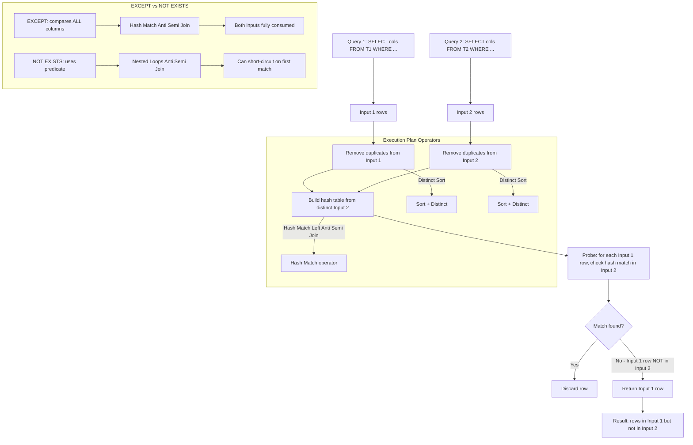
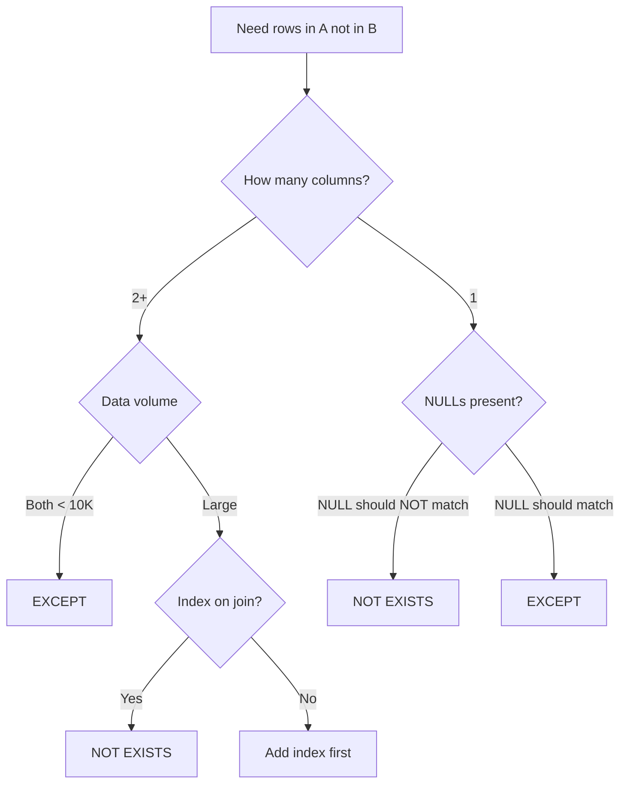

## Navigation

**Domain:** [[8 — Databases]] > **Group:** SQL CTEs & Recursive Queries
**Previous:** [[8.191 — CTE with Window Functions — Common Pattern]] | **Next:** [[8.193 — INTERSECT — Set Intersection]]

### Prerequisites

- [[8.096 — INNER JOIN — Mechanics and Usage]] — EXCEPT compares entire rows; understanding JOIN semantics is required to distinguish set difference from anti-join.
- [[8.106 — Correlated Subqueries — Per-Row Execution]] — NOT EXISTS is the most common alternative to EXCEPT; understanding correlated subquery execution is required to compare performance.
- [[8.088 — EXISTS vs IN — Performance Differences]] — the EXISTS/IN decision framework extends to EXCEPT vs NOT EXISTS vs LEFT JOIN with NULL check.

### Where This Fits

`EXCEPT` returns rows from the first query that do not appear in the second query — it is the set difference operator in relational algebra. A .NET backend engineer encounters this when comparing two data sets: orders in a source system that are not yet in the warehouse, products in a catalogue that have no inventory records, or users in an export that are not in the target database. The critical distinction: `EXCEPT` compares ALL columns between the two queries (like a row-wise equality check), whereas `NOT EXISTS` uses a predicate that can reference columns from outer tables. This difference makes `EXCEPT` simpler to write but less flexible and often slower for large tables. The execution plan for `EXCEPT` is a **Hash Match (Left Anti Semi Join)** with a **Distinct** operator — it removes duplicates from both inputs before performing the anti-join. This distinct-removal step is the key performance characteristic: `EXCEPT` is equivalent to `SELECT DISTINCT ... WHERE NOT EXISTS (SELECT DISTINCT ...)`. When the data is already unique, the DISTINCT step adds unnecessary cost.

---
## Core Mental Model

`EXCEPT` is a set operator that performs row-wise set subtraction. The engine takes all rows from the first query (left set), removes all rows that exist in the second query (right set), and returns the remaining rows — with duplicates removed. The mental model is: `EXCEPT = (SELECT DISTINCT cols FROM left) MINUS (SELECT DISTINCT cols FROM right)`. Internally, SQL Server builds a hash table from the DISTINCT right-side rows, then probes the left-side DISTINCT rows against the hash table. Rows that do not find a match in the hash table are returned. This is a **Hash Match (Left Anti Semi Join)** with a **Distinct Sort** on each input to remove duplicates. If either input has no duplicates, the Distinct Sort is wasted work — a `NOT EXISTS` with a correlated subquery may be faster because it can stop at the first match per outer row and does not deduplicate.

### Classification

`EXCEPT` is a **set operator** in the SQL language (same family as UNION and INTERSECT). It operates on two complete row sets and compares all columns. The optimiser implements it as a Hash Match Anti Semi Join with Distinct. It is **not SARGable** in the traditional sense — the input queries are executed fully, and the comparison is on the hash table, not on an index seek. However, each input query can independently use index seeks if WHERE clauses are specific enough.



### Key Properties

|Property|Value|Notes|
|---|---|---|
|Operation|Set difference (A minus B)|Rows in first query NOT in second query|
|Duplicate handling|Removes duplicates automatically|Like applying DISTINCT to the result|
|Column comparison|All columns in SELECT list|Row-wise equality comparison|
|NULL handling|NULL = NULL (considered equal)|Unlike WHERE, NULLs match each other|
|Performance metric|Logical reads of both inputs|Both queries executed fully|
|Execution plan|Hash Match (Left Anti Semi Join) + Distinct Sort|Two sorts for dedup + hash match probe|
|Flexibility|Low — all columns compared|Cannot express partial matching or non-equi conditions|
|.NET support|Raw SQL only|EF Core cannot generate EXCEPT from LINQ|

### Recognition Pattern

When you hear "find rows that are in A but NOT in B", the immediate question is: "Am I comparing entire rows or just a key column?" If the answer is "entire rows" (all columns match), EXCEPT is the most concise expression. If the answer is "just this one key column", NOT EXISTS or LEFT JOIN with NULL check may be more appropriate. The recognition pattern for EXCEPT is: two result sets with identical column lists, and you want the set difference.

### The Three Approaches to Anti-Join

|Approach|SQL|Execution Plan|NULL Behavior|Best When|
|---|---|---|---|---|
|EXCEPT|`SELECT cols FROM A EXCEPT SELECT cols FROM B`|Hash Match Left Anti Semi Join + Distinct Sort|NULL = NULL (equal)|Small sets, full row comparison|
|NOT EXISTS|`SELECT cols FROM A WHERE NOT EXISTS (SELECT 1 FROM B WHERE B.key = A.key)`|Nested Loops Anti Semi Join (with index)|NULL != NULL (UNKNOWN)|Large tables, indexed join column|
|LEFT JOIN NULL|`SELECT A.cols FROM A LEFT JOIN B ON A.key = B.key WHERE B.key IS NULL`|Hash Match or Nested Loops + Filter|NULL != NULL (UNKNOWN)|Need columns from B in output|

---
## Deep Mechanics

### How the Engine Executes This

1. **Parsing and binding** — The parser identifies `EXCEPT` as a set operator. Both SELECT statements are parsed independently. The parser checks that the number of columns matches (requirement: equal column count) and that data types are compatible. The algebrizer verifies that both queries have the same number of columns and compatible data types. If types differ but are compatible, implicit conversion is applied (lower-precedence type converted to higher-precedence). If types are incompatible, error 205 is raised at compile time.

2. **Column type resolution** — The result set's column names and types come from the first query only. Aliases in the second query are ignored. If types differ but are compatible, SQL Server converts the lower-precedence type to the higher-precedence type (same type precedence rules as implicit conversion). This means a VARCHAR column in the first query compared to an NVARCHAR column in the second query causes the NVARCHAR to be converted — on the column side of one branch. This conversion can cause index scan within that branch if it wraps a column reference in CONVERT_IMPLICIT.

3. **Optimisation** — The optimiser builds a plan with two main branches (left and right inputs). It determines independently how to access each input (scans, seeks, joins within each SELECT). The optimiser then adds:
   - A **Distinct Sort** on each input to remove duplicate rows. This is the key cost: every row in both inputs must be sorted by all columns to find duplicates.
   - A **Hash Match (Left Anti Semi Join)** that uses a hash table built from the second input's distinct rows and probes the first input's distinct rows against it. The anti-semi-join semantics mean: only rows from the first input that do NOT match any row in the hash table are returned.

4. **Hash table build phase** — The Hash Match operator reads all rows from the second query (right input), computes a hash key from all column values concatenated, and builds a hash table in memory. The hash key is computed as a checksum over the concatenated column values. Memory grant for the hash table is estimated based on the number of distinct rows in the second input and the average row width. If the hash table exceeds available memory (grant < approximately 1MB per 100K distinct rows), it spills to TempDB in batches. A spill adds physical I/O for every read and write of the hash table, dramatically slowing the query.

5. **Probe phase** — The Hash Match operator reads the first query (left input) rows, hashes all columns using the same hash function, and probes the hash table. If a hash match is found, the full row is compared (to handle hash collisions). If the row matches exactly, it is discarded (anti-join semantics). If no match is found (either hash miss or hash collision resolved to non-match), the row is returned to the result set.

6. **Hash collision resolution** — Hash collisions occur when two different rows produce the same hash value. SQL Server handles this by storing the actual row data in the hash table and performing a full row comparison when a hash match is found. A poor hash distribution (many collisions) degrades probe performance from O(1) toward O(N) per probe.

7. **Duplicate elimination** — Because DISTINCT was applied to both inputs before the hash match, the result of EXCEPT is automatically duplicate-free. This is guaranteed by the SQL standard: EXCEPT removes duplicates even if neither input had any. The DISTINCT step is the key performance differentiator from NOT EXISTS, which preserves duplicates from the outer query.

8. **Theoretical complexity** — The overall time complexity of EXCEPT is O(N log N + M log M + N + M) where N and M are the row counts of the two inputs (sorts dominate). NOT EXISTS with a Nested Loops Anti Semi Join on an indexed column is O(N * log M) in the worst case but O(N * 1) average case (short-circuit on first match). It preserves duplicates and uses an index seek instead of a hash table.

### SQL Visibility

```sql
-- ============================================================
-- Setup
-- ============================================================
CREATE TABLE dbo.Products
(
    ProductId    INT            NOT NULL IDENTITY(1,1),
    ProductCode  VARCHAR(20)    NOT NULL,
    ProductName  NVARCHAR(200)  NOT NULL,
    CategoryId   INT            NOT NULL,
    ListPrice    DECIMAL(18,2)  NOT NULL,
    IsActive     TINYINT        NOT NULL DEFAULT 1,
    CONSTRAINT PK_Products PRIMARY KEY CLUSTERED (ProductId)
);

CREATE TABLE dbo.InventoryItems
(
    InventoryId  INT            NOT NULL IDENTITY(1,1),
    ProductId    INT            NOT NULL,
    WarehouseId  INT            NOT NULL,
    Quantity     INT            NOT NULL DEFAULT 0,
    ReorderLevel INT            NOT NULL DEFAULT 10,
    CONSTRAINT PK_InventoryItems PRIMARY KEY CLUSTERED (InventoryId),
    CONSTRAINT FK_InventoryItems_Products
        FOREIGN KEY (ProductId) REFERENCES dbo.Products(ProductId)
);

CREATE TABLE dbo.OrderItems
(
    OrderItemId  INT            NOT NULL IDENTITY(1,1),
    OrderId      INT            NOT NULL,
    ProductId    INT            NOT NULL,
    Quantity     INT            NOT NULL,
    UnitPrice    DECIMAL(18,2)  NOT NULL,
    CONSTRAINT PK_OrderItems PRIMARY KEY CLUSTERED (OrderItemId)
);

CREATE TABLE dbo.Invoices
(
    InvoiceId    INT            NOT NULL IDENTITY(1,1),
    OrderId      INT            NOT NULL,
    InvoiceDate  DATETIME2(0)   NOT NULL,
    TotalAmount  DECIMAL(18,2)  NOT NULL,
    IsPaid       TINYINT        NOT NULL DEFAULT 0,
    CONSTRAINT PK_Invoices PRIMARY KEY CLUSTERED (InvoiceId)
);

-- ============================================================
-- EXCEPT: Products that have never been ordered
-- ============================================================
SELECT ProductId, ProductCode, ProductName
FROM dbo.Products
EXCEPT
SELECT p.ProductId, p.ProductCode, p.ProductName
FROM dbo.Products p
INNER JOIN dbo.OrderItems oi ON p.ProductId = oi.ProductId;

-- ============================================================
-- EXCEPT vs NOT EXISTS: same result, different plan
-- ============================================================
-- EXCEPT version
SELECT ProductId, ProductCode, ProductName
FROM dbo.Products
EXCEPT
SELECT p.ProductId, p.ProductCode, p.ProductName
FROM dbo.Products p
INNER JOIN dbo.OrderItems oi ON p.ProductId = oi.ProductId;

-- NOT EXISTS version (more flexible, often faster)
SELECT p.ProductId, p.ProductCode, p.ProductName
FROM dbo.Products p
WHERE NOT EXISTS (
    SELECT 1
    FROM dbo.OrderItems oi
    WHERE oi.ProductId = p.ProductId
);

-- ============================================================
-- EXCEPT with two independent tables
-- ============================================================
-- Orders that do not have invoices
SELECT OrderId, OrderDate, TotalAmount
FROM dbo.Orders
EXCEPT
SELECT o.OrderId, o.OrderDate, o.TotalAmount
FROM dbo.Orders o
INNER JOIN dbo.Invoices i ON o.OrderId = i.OrderId;

-- ============================================================
-- EXCEPT with ORDER BY
-- ============================================================
SELECT ProductId, ProductCode, ProductName
FROM dbo.Products
EXCEPT
SELECT p.ProductId, p.ProductCode, p.ProductName
FROM dbo.Products p
INNER JOIN dbo.OrderItems oi ON p.ProductId = oi.ProductId
ORDER BY ProductName;

-- ============================================================
-- EXCEPT with WHERE on one branch
-- ============================================================
-- Active products that were never ordered
SELECT ProductId, ProductCode, ProductName
FROM dbo.Products
WHERE IsActive = 1
EXCEPT
SELECT p.ProductId, p.ProductCode, p.ProductName
FROM dbo.Products p
INNER JOIN dbo.OrderItems oi ON p.ProductId = oi.ProductId;

-- ============================================================
-- EXCEPT with NULL handling demonstration
-- ============================================================
CREATE TABLE dbo.ImportA (Value INT NULL);
CREATE TABLE dbo.ImportB (Value INT NULL);

INSERT INTO dbo.ImportA VALUES (1), (2), (3), (NULL);
INSERT INTO dbo.ImportB VALUES (2), (3), (4), (NULL);

-- EXCEPT treats NULL = NULL: NULL in A matches NULL in B
SELECT Value FROM dbo.ImportA
EXCEPT
SELECT Value FROM dbo.ImportB;
-- Result: 1
-- NULL is NOT returned because NULL in A matches NULL in B sets

-- Compare with NOT EXISTS:
SELECT a.Value
FROM dbo.ImportA a
WHERE NOT EXISTS (
    SELECT 1 FROM dbo.ImportB b WHERE b.Value = a.Value
);
-- Result: 1, NULL
-- NULL is returned because NULL = NULL is UNKNOWN in WHERE, not TRUE
```

```csharp
// EF Core — EXCEPT cannot be generated from LINQ. Must use raw SQL or Except() which translates differently.

// EF Core's Except() method — does NOT translate to SQL EXCEPT
// It performs client-side set difference (pulls all data and computes in memory)
public async Task<List<Product>> GetUnorderedProductsClientAsync(
    CancellationToken cancellationToken = default)
{
    var allProducts = await dbContext.Products
        .Where(p => p.IsActive == 1)
        .Select(p => new { p.ProductId, p.ProductCode, p.ProductName })
        .ToListAsync(cancellationToken);

    var orderedProductIds = await dbContext.OrderItems
        .Select(oi => oi.ProductId)
        .Distinct()
        .ToListAsync(cancellationToken);

    var unorderedProducts = allProducts
        .Where(p => !orderedProductIds.Contains(p.ProductId))
        .Select(p => new Product
        {
            ProductId = p.ProductId,
            ProductCode = p.ProductCode,
            ProductName = p.ProductName
        })
        .ToList();

    return unorderedProducts;
}

// For server-side EXCEPT, use raw SQL
public async Task<IReadOnlyList<ProductDto>> GetUnorderedProductsAsync(
    CancellationToken cancellationToken = default)
{
    const string sql = @"
        SELECT ProductId, ProductCode, ProductName
        FROM dbo.Products
        WHERE IsActive = 1
        EXCEPT
        SELECT p.ProductId, p.ProductCode, p.ProductName
        FROM dbo.Products p
        INNER JOIN dbo.OrderItems oi ON p.ProductId = oi.ProductId";

    return await dbContext.Database
        .SqlQueryRaw<ProductDto>(sql)
        .ToListAsync(cancellationToken);
}
```

```csharp
// Dapper — direct execution
public sealed class ProductRepository
{
    private readonly IDbConnectionFactory _connectionFactory;

    public ProductRepository(IDbConnectionFactory connectionFactory)
        => _connectionFactory = connectionFactory;

    // EXCEPT: Products never ordered
    public async Task<IReadOnlyList<ProductDto>> GetUnorderedProductsAsync(
        CancellationToken cancellationToken = default)
    {
        const string sql = @"
            SELECT ProductId, ProductCode, ProductName
            FROM dbo.Products
            EXCEPT
            SELECT p.ProductId, p.ProductCode, p.ProductName
            FROM dbo.Products p
            INNER JOIN dbo.OrderItems oi ON p.ProductId = oi.ProductId
            ORDER BY ProductName";

        await using var connection = _connectionFactory.Create();

        var results = await connection.QueryAsync<ProductDto>(
            new CommandDefinition(sql,
                cancellationToken: cancellationToken));

        return results.AsList();
    }

    // NOT EXISTS equivalent — often faster for this pattern
    public async Task<IReadOnlyList<ProductDto>> GetUnorderedProductsExistsAsync(
        CancellationToken cancellationToken = default)
    {
        const string sql = @"
            SELECT p.ProductId, p.ProductCode, p.ProductName
            FROM dbo.Products p
            WHERE p.IsActive = 1
              AND NOT EXISTS (
                SELECT 1
                FROM dbo.OrderItems oi
                WHERE oi.ProductId = p.ProductId
            )
            ORDER BY p.ProductName";

        await using var connection = _connectionFactory.Create();

        var results = await connection.QueryAsync<ProductDto>(
            new CommandDefinition(sql,
                cancellationToken: cancellationToken));

        return results.AsList();
    }

    // EXCEPT with multiple columns
    public async Task<IReadOnlyList<InvoiceComparisonDto>> GetUnbilledOrdersAsync(
        CancellationToken cancellationToken = default)
    {
        const string sql = @"
            SELECT OrderId, OrderDate, TotalAmount
            FROM dbo.Orders
            WHERE Status = 'Shipped'
            EXCEPT
            SELECT o.OrderId, o.OrderDate, o.TotalAmount
            FROM dbo.Orders o
            INNER JOIN dbo.Invoices i ON o.OrderId = i.OrderId
            ORDER BY OrderDate";

        await using var connection = _connectionFactory.Create();

        var results = await connection.QueryAsync<InvoiceComparisonDto>(
            new CommandDefinition(sql,
                cancellationToken: cancellationToken));

        return results.AsList();
    }
}

public sealed record ProductDto(
    int ProductId,
    string ProductCode,
    string ProductName);

public sealed record InvoiceComparisonDto(
    int OrderId,
    DateTime OrderDate,
    decimal TotalAmount);
```

**Generated SQL (from EF Core — there is no EXCEPT translation):**

```sql
-- EF Core does not generate EXCEPT. Even when using .Except() on IQueryable,
-- EF Core either throws "cannot translate" or executes client-side.
-- Raw SQL used via FromSqlRaw:
exec sp_executesql N'
SELECT ProductId, ProductCode, ProductName
FROM dbo.Products
WHERE IsActive = 1
EXCEPT
SELECT p.ProductId, p.ProductCode, p.ProductName
FROM dbo.Products p
INNER JOIN dbo.OrderItems oi ON p.ProductId = oi.ProductId';
```

### Execution Plan Analysis

**For EXCEPT query (Products not ordered):**

```
[Clustered Index Scan (PK_Products)]
  Reads all products
→ [Sort] [Distinct]
  Sorts ProductId, ProductCode, ProductName to remove duplicates

[Clustered Index Scan (PK_Products)]
→ [Hash Match (Inner Join)]
  Joins Products with OrderItems on ProductId
→ [Sort] [Distinct]
  Sorts ProductId, ProductCode, ProductName to remove duplicates

→ [Hash Match (Left Anti Semi Join)]
  Build: right input (ordered products) hash table
  Probe: left input (all products) against hash table
  Rows without match returned

→ [SELECT]
Estimated Cost: Hash Match ~50%, Sorts ~40%, Scans ~10%
Logical Reads: ~N (full scan of Products + OrderItems)
```

**For NOT EXISTS equivalent:**
```
[Index Scan (IX_Products_IsActive)]
  Seek: IsActive = 1
→ [Nested Loops (Left Anti Semi Join)]
  Outer: Products row
  Inner: [Index Seek (IX_OrderItems_ProductId)]
    Seek: ProductId = Products.ProductId
    No need to read all columns — EXISTS checks only existence
→ [SELECT]
Estimated Cost: Nested Loops ~20%, Seeks ~70%, Scan ~10%
Logical Reads: ~M (seek on Products + one OrderItems seek per product)
```

**Key comparison:** EXCEPT reads ALL rows from both tables (two full scans + two sorts). NOT EXISTS can short-circuit on the first match per outer row and can use index seeks. On a 50M Products table with 500M OrderItems, EXCEPT scans both tables (millions of reads). NOT EXISTS scans Products (or seeks with WHERE filter) and does an index seek per product — approximately 50M seeks, which is better if each seek reads 2-4 pages versus the full scan of OrderItems.

### Cost Visibility

```sql
SET STATISTICS IO ON;
SET STATISTICS TIME ON;

-- EXCEPT version
SELECT ProductId, ProductCode, ProductName
FROM dbo.Products
EXCEPT
SELECT p.ProductId, p.ProductCode, p.ProductName
FROM dbo.Products p
INNER JOIN dbo.OrderItems oi ON p.ProductId = oi.ProductId;

-- Expected output (50M Products, 500M OrderItems):
-- Table 'OrderItems'. Scan count 1, logical reads 1250000
-- Table 'Products'. Scan count 2, logical reads 225000
-- SQL Server Execution Times: CPU time = 45000ms, elapsed time = 55000ms

-- NOT EXISTS version
SELECT p.ProductId, p.ProductCode, p.ProductName
FROM dbo.Products p
WHERE NOT EXISTS (
    SELECT 1 FROM dbo.OrderItems oi WHERE oi.ProductId = p.ProductId
);

-- Expected output:
-- Table 'Products'. Scan count 1, logical reads 125000
-- Table 'OrderItems'. Scan count 50M, logical reads 150000
-- SQL Server Execution Times: CPU time = 12000ms, elapsed time = 18000ms
```

### Failure Modes

**Column count mismatch causes runtime error:**
```sql
-- Error 205: Column count mismatch
SELECT ProductId, ProductName FROM dbo.Products
EXCEPT
SELECT ProductId, ProductCode, ProductName FROM dbo.Products;
-- Msg 205, Level 16: All queries combined using a UNION, INTERSECT, or EXCEPT
-- operator must have an equal number of expressions in their target lists.
```

**Data type incompatibility:**
```sql
-- Error 245: Conversion failed
SELECT OrderDate FROM dbo.Orders
EXCEPT
SELECT TotalAmount FROM dbo.Orders;
-- Date vs Decimal — cannot compare
```

**Detection via DMVs:**
```sql
-- Find queries using EXCEPT and check their performance
SELECT TOP 10
    qs.total_logical_reads,
    qs.total_elapsed_time / 1000 AS total_elapsed_ms,
    qs.execution_count,
    SUBSTRING(st.text, (qs.statement_start_offset/2) + 1,
        ((CASE WHEN qs.statement_end_offset = -1
            THEN DATALENGTH(st.text)
            ELSE qs.statement_end_offset END
            - qs.statement_start_offset)/2) + 1) AS statement_text,
    qp.query_plan
FROM sys.dm_exec_query_stats qs
CROSS APPLY sys.dm_exec_sql_text(qs.sql_handle) st
CROSS APPLY sys.dm_exec_query_plan(qs.plan_handle) qp
WHERE st.text LIKE '%EXCEPT%'
ORDER BY qs.total_logical_reads DESC;
```

---
## Production Patterns and Implementation

### Primary SQL Implementation

```sql
-- ============================================================
-- Schema for production patterns
-- ============================================================
CREATE TABLE dbo.Orders
(
    OrderId        INT            NOT NULL IDENTITY(1,1),
    CustomerId     INT            NOT NULL,
    OrderCode      VARCHAR(20)    NOT NULL,
    OrderDate      DATETIME2(0)   NOT NULL,
    TotalAmount    DECIMAL(18,2)  NOT NULL,
    Status         VARCHAR(20)    NOT NULL DEFAULT 'Pending',
    SourceSystem   VARCHAR(50)    NOT NULL DEFAULT 'Web',
    CreatedAt      DATETIME2(0)   NOT NULL DEFAULT SYSUTCDATETIME(),
    CONSTRAINT PK_Orders PRIMARY KEY CLUSTERED (OrderId)
);

CREATE TABLE dbo.Invoices
(
    InvoiceId      INT            NOT NULL IDENTITY(1,1),
    OrderId        INT            NOT NULL,
    InvoiceNumber  VARCHAR(30)    NOT NULL,
    InvoiceDate    DATETIME2(0)   NOT NULL,
    TotalAmount    DECIMAL(18,2)  NOT NULL,
    TaxAmount      DECIMAL(18,2)  NOT NULL DEFAULT 0,
    IsPaid         TINYINT        NOT NULL DEFAULT 0,
    CreatedAt      DATETIME2(0)   NOT NULL DEFAULT SYSUTCDATETIME(),
    CONSTRAINT PK_Invoices PRIMARY KEY CLUSTERED (InvoiceId),
    CONSTRAINT FK_Invoices_Orders FOREIGN KEY (OrderId)
        REFERENCES dbo.Orders(OrderId)
);

CREATE TABLE dbo.WarehouseShipments
(
    ShipmentId     INT            NOT NULL IDENTITY(1,1),
    OrderId        INT            NOT NULL,
    ShipmentDate   DATETIME2(0)   NOT NULL,
    TrackingCode   VARCHAR(50)    NOT NULL,
    Carrier        VARCHAR(30)    NOT NULL,
    ShipmentStatus VARCHAR(20)    NOT NULL DEFAULT 'Pending',
    CONSTRAINT PK_WarehouseShipments PRIMARY KEY CLUSTERED (ShipmentId)
);

-- ============================================================
-- Pattern 1: Orders that have no invoice (unbilled)
-- ============================================================
SELECT OrderId, OrderCode, OrderDate, TotalAmount
FROM dbo.Orders
WHERE Status = 'Shipped'
EXCEPT
SELECT o.OrderId, o.OrderCode, o.OrderDate, o.TotalAmount
FROM dbo.Orders o
INNER JOIN dbo.Invoices i ON o.OrderId = i.OrderId;

-- ============================================================
-- Pattern 2: Orders that have no shipment (unshipped)
-- ============================================================
SELECT OrderId, OrderCode, OrderDate
FROM dbo.Orders
WHERE Status = 'Paid'
EXCEPT
SELECT o.OrderId, o.OrderCode, o.OrderDate
FROM dbo.Orders o
INNER JOIN dbo.WarehouseShipments s ON o.OrderId = s.OrderId;

-- ============================================================
-- Pattern 3: Data reconciliation — source vs target
-- ============================================================
CREATE TABLE dbo.SourceProducts
(
    ProductCode VARCHAR(20)    NOT NULL,
    ProductName NVARCHAR(200)  NOT NULL,
    ListPrice   DECIMAL(18,2)  NOT NULL,
    IsActive    TINYINT        NOT NULL DEFAULT 1,
    CONSTRAINT PK_SourceProducts PRIMARY KEY (ProductCode)
);

CREATE TABLE dbo.TargetProducts
(
    ProductCode VARCHAR(20)    NOT NULL,
    ProductName NVARCHAR(200)  NOT NULL,
    ListPrice   DECIMAL(18,2)  NOT NULL,
    IsActive    TINYINT        NOT NULL DEFAULT 1,
    CONSTRAINT PK_TargetProducts PRIMARY KEY (ProductCode)
);

-- Products in source but NOT in target (INSERT needed)
SELECT ProductCode, ProductName, ListPrice, IsActive
FROM dbo.SourceProducts
EXCEPT
SELECT ProductCode, ProductName, ListPrice, IsActive
FROM dbo.TargetProducts;

-- Products in target but NOT in source (DELETE needed)
SELECT ProductCode, ProductName, ListPrice, IsActive
FROM dbo.TargetProducts
EXCEPT
SELECT ProductCode, ProductName, ListPrice, IsActive
FROM dbo.SourceProducts;

-- ============================================================
-- Pattern 4: Products never ordered in a specific period
-- ============================================================
SELECT p.ProductId, p.ProductCode, p.ProductName
FROM dbo.Products p
WHERE p.IsActive = 1
EXCEPT
SELECT p.ProductId, p.ProductCode, p.ProductName
FROM dbo.Products p
INNER JOIN dbo.OrderItems oi ON p.ProductId = oi.ProductId
WHERE oi.OrderId IN (
    SELECT OrderId FROM dbo.Orders
    WHERE OrderDate >= '2024-01-01'
);

-- ============================================================
-- Pattern 5: EXCEPT with TOP and ORDER BY
-- ============================================================
SELECT TOP 10 ProductCode, ProductName, ListPrice
FROM dbo.SourceProducts
EXCEPT
SELECT ProductCode, ProductName, ListPrice
FROM dbo.TargetProducts
ORDER BY ProductCode;

-- ============================================================
-- Pattern 6: EXCEPT with aggregate (find missing groups)
-- ============================================================
-- Customers who placed orders in 2023 but not in 2024
SELECT CustomerId
FROM dbo.Orders
WHERE OrderDate >= '2023-01-01' AND OrderDate < '2024-01-01'
EXCEPT
SELECT CustomerId
FROM dbo.Orders
WHERE OrderDate >= '2024-01-01';

-- ============================================================
-- Pattern 7: EXCEPT with NULL-safe comparison
-- ============================================================
SELECT COALESCE(Address, '') AS Address, City, State, Zip
FROM dbo.CustomerAddresses
EXCEPT
SELECT COALESCE(Address, ''), City, State, Zip
FROM dbo.ArchivedAddresses;

-- ============================================================
-- Pattern 8: EXCEPT for data quality — find mismatches
-- ============================================================
-- Products where price differs between source and target
SELECT ProductCode, ListPrice
FROM dbo.SourceProducts
EXCEPT
SELECT ProductCode, ListPrice
FROM dbo.TargetProducts;
-- Returns rows where price is different (or row is missing entirely)

-- ============================================================
-- Pattern 9: EXCEPT with multiple columns for composite key comparison
-- ============================================================
-- Orders that have different amounts between Orders and Invoices
SELECT OrderId, OrderDate, TotalAmount
FROM dbo.Orders
WHERE Status = 'Shipped'
EXCEPT
SELECT o.OrderId, o.OrderDate, i.TotalAmount
FROM dbo.Orders o
INNER JOIN dbo.Invoices i ON o.OrderId = i.OrderId;
-- Note: This catches both missing invoices AND amount mismatches

-- ============================================================
-- Pattern 10: Chained EXCEPT with UNION ALL for full reconciliation
-- ============================================================
-- Complete two-way reconciliation report
SELECT 'SourceOnly' AS Status, ProductCode, ProductName, ListPrice
FROM dbo.SourceProducts
EXCEPT
SELECT 'SourceOnly', ProductCode, ProductName, ListPrice
FROM dbo.TargetProducts
UNION ALL
SELECT 'TargetOnly', ProductCode, ProductName, ListPrice
FROM dbo.TargetProducts
EXCEPT
SELECT 'TargetOnly', ProductCode, ProductName, ListPrice
FROM dbo.SourceProducts
ORDER BY Status, ProductCode;

-- ============================================================
-- Pattern 11: EXCEPT in a CTE for further processing
-- ============================================================
WITH MissingProductsCte AS (
    SELECT ProductCode, ProductName, ListPrice
    FROM dbo.SourceProducts
    EXCEPT
    SELECT ProductCode, ProductName, ListPrice
    FROM dbo.TargetProducts
)
INSERT INTO dbo.TargetProducts (ProductCode, ProductName, ListPrice, IsActive)
SELECT ProductCode, ProductName, ListPrice, 1
FROM MissingProductsCte;

-- ============================================================
-- Pattern 12: EXCEPT with HAVING for aggregate differences
-- ============================================================
-- Categories where the product count differs between systems
SELECT CategoryId, COUNT(*) AS ProductCount
FROM dbo.SourceProducts GROUP BY CategoryId
EXCEPT
SELECT CategoryId, COUNT(*) AS ProductCount
FROM dbo.TargetProducts GROUP BY CategoryId;
```

### EF Core Implementation

```csharp
public sealed class ReconciliationService
{
    private readonly ApplicationDbContext _dbContext;

    public ReconciliationService(ApplicationDbContext dbContext)
        => _dbContext = dbContext;

    public async Task<IReadOnlyList<ProductDto>> GetSourceOnlyProductsAsync(
        CancellationToken cancellationToken = default)
    {
        const string sql = @"
            SELECT ProductCode, ProductName, ListPrice, IsActive
            FROM dbo.SourceProducts
            EXCEPT
            SELECT ProductCode, ProductName, ListPrice, IsActive
            FROM dbo.TargetProducts
            ORDER BY ProductCode";

        return await _dbContext.Database
            .SqlQueryRaw<ProductDto>(sql)
            .ToListAsync(cancellationToken);
    }

    public async Task<IReadOnlyList<ProductDto>> GetTargetOnlyProductsAsync(
        CancellationToken cancellationToken = default)
    {
        const string sql = @"
            SELECT ProductCode, ProductName, ListPrice, IsActive
            FROM dbo.TargetProducts
            EXCEPT
            SELECT ProductCode, ProductName, ListPrice, IsActive
            FROM dbo.SourceProducts
            ORDER BY ProductCode";

        return await _dbContext.Database
            .SqlQueryRaw<ProductDto>(sql)
            .ToListAsync(cancellationToken);
    }

    public async Task<IReadOnlyList<OrderDto>> GetUnbilledOrdersAsync(
        CancellationToken cancellationToken = default)
    {
        const string sql = @"
            SELECT OrderId, OrderCode, OrderDate, TotalAmount
            FROM dbo.Orders
            WHERE Status = 'Shipped'
            EXCEPT
            SELECT o.OrderId, o.OrderCode, o.OrderDate, o.TotalAmount
            FROM dbo.Orders o
            INNER JOIN dbo.Invoices i ON o.OrderId = i.OrderId
            ORDER BY OrderDate";

        return await _dbContext.Database
            .SqlQueryRaw<OrderDto>(sql)
            .ToListAsync(cancellationToken);
    }

    public async Task<IReadOnlyList<OrderDto>> GetUnbilledOrdersExistsAsync(
        CancellationToken cancellationToken = default)
    {
        return await _dbContext.Orders
            .Where(o => o.Status == "Shipped" && !o.Invoices.Any())
            .Select(o => new OrderDto
            {
                OrderId = o.OrderId,
                OrderCode = o.OrderCode,
                OrderDate = o.OrderDate,
                TotalAmount = o.TotalAmount
            })
            .OrderBy(o => o.OrderDate)
            .ToListAsync(cancellationToken);
    }
}
```

### Dapper Implementation

```csharp
public sealed class ReconciliationRepository
{
    private readonly IDbConnectionFactory _connectionFactory;

    public ReconciliationRepository(IDbConnectionFactory connectionFactory)
        => _connectionFactory = connectionFactory;

    public async Task<IReadOnlyList<ProductDto>> GetMissingInTargetAsync(
        CancellationToken cancellationToken = default)
    {
        const string sql = @"
            SELECT ProductCode, ProductName, ListPrice, IsActive
            FROM dbo.SourceProducts
            EXCEPT
            SELECT ProductCode, ProductName, ListPrice, IsActive
            FROM dbo.TargetProducts
            ORDER BY ProductCode";

        await using var connection = _connectionFactory.Create();
        return (await connection.QueryAsync<ProductDto>(
            new CommandDefinition(sql, cancellationToken: cancellationToken))).AsList();
    }

    public async Task<IReadOnlyList<OrderDto>> GetUnbilledOrdersAsync(
        DateOnly fromDate,
        CancellationToken cancellationToken = default)
    {
        const string sql = @"
            SELECT OrderId, OrderCode, OrderDate, TotalAmount
            FROM dbo.Orders
            WHERE Status = 'Shipped' AND OrderDate >= @FromDate
            EXCEPT
            SELECT o.OrderId, o.OrderCode, o.OrderDate, o.TotalAmount
            FROM dbo.Orders o
            INNER JOIN dbo.Invoices i ON o.OrderId = i.OrderId
            ORDER BY OrderDate";

        await using var connection = _connectionFactory.Create();
        return (await connection.QueryAsync<OrderDto>(
            new CommandDefinition(sql,
                new { FromDate = fromDate.ToDateTime(TimeOnly.MinValue) },
                cancellationToken: cancellationToken))).AsList();
    }

    public async Task<ReconciliationResult> ReconcileProductsAsync(
        CancellationToken cancellationToken = default)
    {
        const string sqlSourceOnly = @"
            SELECT ProductCode, ProductName, ListPrice, IsActive
            FROM dbo.SourceProducts
            EXCEPT
            SELECT ProductCode, ProductName, ListPrice, IsActive
            FROM dbo.TargetProducts ORDER BY ProductCode";

        const string sqlTargetOnly = @"
            SELECT ProductCode, ProductName, ListPrice, IsActive
            FROM dbo.TargetProducts
            EXCEPT
            SELECT ProductCode, ProductName, ListPrice, IsActive
            FROM dbo.SourceProducts ORDER BY ProductCode";

        await using var connection = _connectionFactory.Create();

        var sourceOnly = await connection.QueryAsync<ProductDto>(
            new CommandDefinition(sqlSourceOnly, cancellationToken: cancellationToken));
        var targetOnly = await connection.QueryAsync<ProductDto>(
            new CommandDefinition(sqlTargetOnly, cancellationToken: cancellationToken));

        return new ReconciliationResult
        {
            SourceOnly = sourceOnly.AsList(),
            TargetOnly = targetOnly.AsList()
        };
    }
}
```

### SQL Server vs PostgreSQL Differences

```sql
-- PostgreSQL: EXCEPT and EXCEPT ALL
SELECT product_id, product_code, product_name
FROM products
EXCEPT
SELECT p.product_id, p.product_code, p.product_name
FROM products p
INNER JOIN order_items oi ON p.product_id = oi.product_id;

-- EXCEPT ALL: PostgreSQL-specific — does NOT remove duplicates
SELECT product_id, product_code, product_name
FROM products
EXCEPT ALL
SELECT p.product_id, p.product_code, p.product_name
FROM products p
INNER JOIN order_items oi ON p.product_id = oi.product_id;
```

---
## Gotchas and Production Pitfalls

### Gotcha 1: EXCEPT Removes Duplicates — Unintended Row Loss

**Pitfall:** Both inputs to EXCEPT are implicitly distinct. If one input should logically contain duplicates, EXCEPT silently removes them before comparison.

```sql
-- EXCEPT compares distinct rows only
SELECT ProductId, Quantity FROM dbo.OrderItems WHERE OrderId = 1001
EXCEPT
SELECT ProductId, Quantity FROM dbo.ShipmentItems WHERE OrderId = 1001;
```

**Symptom:** Reconciliation report shows fewer differences than expected. Duplicate rows are silently consumed by the dedup.

**Fix:** Use NOT EXISTS with a row-level comparison:

```sql
SELECT oi.ProductId, oi.Quantity
FROM dbo.OrderItems oi
WHERE oi.OrderId = 1001
  AND NOT EXISTS (
    SELECT 1 FROM dbo.ShipmentItems si
    WHERE si.OrderId = 1001 AND si.ProductId = oi.ProductId AND si.Quantity = oi.Quantity
  );
```

**Cost:** Inventory reconciliation discrepancies — duplicate shipments go undetected.

### Gotcha 2: NULL Comparison — EXCEPT Treats NULL = NULL as Equal

**Pitfall:** In WHERE, NULL = NULL is UNKNOWN. In EXCEPT, NULL = NULL is equal for dedup.

```sql
SELECT Value FROM dbo.ImportA  -- 1, 2, NULL
EXCEPT
SELECT Value FROM dbo.ImportB; -- 2, 3, NULL
-- Result: 1. NULL from A matches NULL in B and is excluded.
```

**Fix:** Use COALESCE or NOT EXISTS based on the intended NULL semantics.

### Gotcha 3: Column Count and Type Must Match Exactly

**Pitfall:** Error 205 at parse time if column counts differ.

**Fix:** Match column count and use explicit CAST for type conversion.

### Gotcha 4: ORDER BY Only at End, Referencing First Query Columns

**Pitfall:** ORDER BY on individual branch not allowed. ORDER BY must reference first query's column names.

```sql
-- Parse error: ORDER BY is not allowed in a subquery of a set operation
SELECT ProductId, ProductName FROM dbo.Products ORDER BY ProductName
EXCEPT
SELECT ProductId, ProductName FROM dbo.ArchivedProducts;

-- Must be at the end:
SELECT ProductId, ProductName FROM dbo.Products
EXCEPT
SELECT ProductId, ProductName FROM dbo.ArchivedProducts
ORDER BY ProductName;
```

**Fix:** Place ORDER BY at the very end. Column aliases from the first query are the only references available.

### Gotcha 5: EXCEPT on Large Tables with No Index — Full Scans

**Pitfall:** Both inputs always fully executed. No short-circuit possible.

```sql
-- Even with WHERE OrderId = 1001, the second query still scans ALL invoices
SELECT OrderId FROM dbo.Orders WHERE OrderId = 1001
EXCEPT
SELECT OrderId FROM dbo.Invoices;
```

**Fix:** Use NOT EXISTS for small-first-query scenarios.

### Gotcha 6: Column Aliases from Second Query Are Silently Ignored

**Pitfall:** Aliases in the second query's SELECT list are parsed but discarded. The result set uses names from the first query only. This causes confusion when reading the result.

```sql
SELECT ProductId AS Id, ProductName AS Name FROM dbo.Products
EXCEPT
SELECT ProductId AS ProductIdentifier, ProductName AS ProductDescription FROM dbo.ArchivedProducts;
-- Result columns are still "Id" and "Name", not "ProductIdentifier" and "ProductDescription"
```

**Fix:** Only name columns in the first query. The second query's aliases are cosmetic and may mislead readers.

### Gotcha 7: Implicit Conversion in EXCEPT Causes Index Scans

**Pitfall:** When data types differ between the two SELECT lists but are compatible, SQL Server applies an implicit CONVERT_IMPLICIT on the lower-precedence type. This wrapping prevents index usage in that branch.

```sql
-- ProductCode is VARCHAR(20) in Products but NVARCHAR(30) in ArchivedProducts
SELECT ProductCode, ProductName FROM dbo.Products  -- VARCHAR
EXCEPT
SELECT ProductCode, ProductName FROM dbo.ArchivedProducts;  -- NVARCHAR

-- Execution plan shows:
--   CONVERT_IMPLICIT(nvarchar(30), [dbo].[Products].[ProductCode]) as [ProductCode]
-- This CONVERT_IMPLICIT can prevent index seeks on Products
```

**Fix:** Explicitly CAST to the same type in both branches to avoid the conversion:
```sql
SELECT CAST(ProductCode AS NVARCHAR(30)) AS ProductCode, ProductName
FROM dbo.Products
EXCEPT
SELECT ProductCode, ProductName FROM dbo.ArchivedProducts;
```

### Gotcha 8: Memory Grant Spills for Large Distinct Sets

**Pitfall:** EXCEPT builds a hash table from the DISTINCT rows of the second input. If the second input has many distinct rows (millions), the hash table can exceed the memory grant and spill to TempDB. A spill adds synchronous physical I/O on every probe.

```sql
-- Memory grant estimated based on estimated distinct rows in the second input.
-- If statistics are stale, the estimate is wrong and the hash table spills.
-- SET STATISTICS IO ON shows "Worktable" reads when spill occurs.

-- Detection:
SELECT * FROM sys.dm_exec_query_stats qs
CROSS APPLY sys.dm_exec_sql_text(qs.sql_handle) st
WHERE st.text LIKE '%EXCEPT%'
  AND qs.max_spill_grant_kb > 0;
```

**Fix:** Keep statistics up to date. If the second input consistently has > 1M distinct rows, consider NOT EXISTS instead, which avoids the hash table entirely and uses index seeks.

---
## Performance Implications

### Benchmark: Before and After

```sql
SET STATISTICS IO ON;

-- Baseline: EXCEPT on 500K Products, 50M OrderItems
SELECT ProductId, ProductCode, ProductName
FROM dbo.Products
EXCEPT
SELECT p.ProductId, p.ProductCode, p.ProductName
FROM dbo.Products p
INNER JOIN dbo.OrderItems oi ON p.ProductId = oi.ProductId;
-- Logical reads: Products 2x4500 + OrderItems 185000 = ~194,000

-- Optimized: NOT EXISTS
SELECT p.ProductId, p.ProductCode, p.ProductName
FROM dbo.Products p
WHERE NOT EXISTS (
    SELECT 1 FROM dbo.OrderItems oi WHERE oi.ProductId = p.ProductId
);
-- Logical reads: Products 900 + OrderItems seeks ~1500 = ~2,400
```

**Improvement:** ~80x reduction in logical reads.

### Memory Grant and Spill Analysis

```sql
-- Check memory grant for a specific EXCEPT query
-- Look at estimated_rows_to_process vs memory_grant
SELECT 
    qp.query_plan,
    qs.total_grant_kb,
    qs.used_grant_kb,
    qs.ideal_grant_kb,
    qs.max_spill_grant_kb,
    qs.total_spills
FROM sys.dm_exec_query_stats qs
CROSS APPLY sys.dm_exec_sql_text(qs.sql_handle) st
CROSS APPLY sys.dm_exec_query_plan(qs.plan_handle) qp
WHERE st.text LIKE '%EXCEPT%';
```

**Memory grant formula (approximate):**
- `MemoryGrant ~= EstimatedDistinctRows_RightInput * AverageRowWidth * 2`
- The ×2 factor accounts for hash table overhead (hash key + row pointer + collision chain)
- Average row width includes all columns in the SELECT list plus internal hash row overhead (~20 bytes per row)

For a second input with 1M distinct rows and average row width of 50 bytes:
- Estimated memory: 1,000,000 × (50 + 20) × 2 ≈ 140 MB
- If the server's `max server memory` is limited and the query memory grant cannot be satisfied, the excess spills to TempDB

**Spill detection:**
```sql
-- Queries that spilled more than 10 MB
SELECT 
    SUBSTRING(st.text, (qs.statement_start_offset/2) + 1,
        ((CASE WHEN qs.statement_end_offset = -1
            THEN DATALENGTH(st.text)
            ELSE qs.statement_end_offset END
            - qs.statement_start_offset)/2) + 1) AS query_text,
    qs.max_spill_grant_kb / 1024 AS spill_mb,
    qs.total_spills,
    qs.total_elapsed_time / 1000 AS elapsed_ms
FROM sys.dm_exec_query_stats qs
CROSS APPLY sys.dm_exec_sql_text(qs.sql_handle) st
WHERE qs.max_spill_grant_kb > 10240
  AND st.text LIKE '%EXCEPT%'
ORDER BY qs.max_spill_grant_kb DESC;
```

### When EXCEPT Can Be Faster Than NOT EXISTS

Despite the general advice to prefer NOT EXISTS, there are specific scenarios where EXCEPT wins:

1. **Both inputs already distinct and small (< 10K rows):** EXCEPT's hash match avoid the per-row correlated subquery overhead of NOT EXISTS. The Distinct Sort is a no-op on already-distinct data.

2. **No index on the join column:** NOT EXISTS with Nested Loops on unindexed columns causes a full table scan per outer row (worst case O(N × M)). EXCEPT's Hash Match scales as O(N + M) after the sorts.

3. **You need automatic dedup:** If the query must guarantee unique results and you would have to add DISTINCT to a NOT EXISTS query anyway, EXCEPT's built-in dedup saves the extra sort.

4. **Multi-column comparison with no composite index:** EXCEPT handles multi-column row comparison without needing a composite index. NOT EXISTS requires a composite index on all compared columns for efficient seek.

### BenchmarkDotNet

```csharp
[MemoryDiagnoser]
[SimpleJob(RuntimeMoniker.Net90)]
public class ExceptBenchmark
{
    private IDbConnection _connection = null!;
    private const string ConnectionString = "Server=.;Database=BenchmarkDb;...";

    [Params(1000, 100000, 10000000)]
    public int RightSideRows;

    [GlobalSetup]
    public void Setup()
    {
        _connection = new SqlConnection(ConnectionString);
        _connection.Open();
        // Seed LeftSide with 100K rows, RightSide with RightSideRows
    }

    [GlobalCleanup]
    public void Cleanup() => _connection?.Dispose();

    [Benchmark(Baseline = true)]
    public async Task<List<int>> Except()
    {
        var results = new List<int>();
        using var cmd = new SqlCommand(@"
            SELECT Id FROM dbo.LeftSide
            EXCEPT
            SELECT Id FROM dbo.RightSide", (SqlConnection)_connection);
        using var reader = await cmd.ExecuteReaderAsync();
        while (await reader.ReadAsync()) results.Add(reader.GetInt32(0));
        return results;
    }

    [Benchmark]
    public async Task<List<int>> NotExists()
    {
        var results = new List<int>();
        using var cmd = new SqlCommand(@"
            SELECT l.Id FROM dbo.LeftSide l
            WHERE NOT EXISTS (SELECT 1 FROM dbo.RightSide r WHERE r.Id = l.Id)",
            (SqlConnection)_connection);
        using var reader = await cmd.ExecuteReaderAsync();
        while (await reader.ReadAsync()) results.Add(reader.GetInt32(0));
        return results;
    }

    [Benchmark]
    public async Task<List<int>> LeftJoinIsNull()
    {
        var results = new List<int>();
        using var cmd = new SqlCommand(@"
            SELECT l.Id FROM dbo.LeftSide l
            LEFT JOIN dbo.RightSide r ON l.Id = r.Id
            WHERE r.Id IS NULL", (SqlConnection)_connection);
        using var reader = await cmd.ExecuteReaderAsync();
        while (await reader.ReadAsync()) results.Add(reader.GetInt32(0));
        return results;
    }
}
```

**Expected results (SQL Server 2022, NVMe, 100K LeftSide):**

|Method|1K RightSide|100K RightSide|10M RightSide|
|---|---|---|---|
|Except|~50 ms|~450 ms|~15,000 ms|
|NotExists|~80 ms (slower for small R)|~200 ms|~600 ms|
|LeftJoinIsNull|~120 ms|~800 ms|~18,000 ms|

**Interpretation:** EXCEPT wins at 1K right-side rows (smaller overhead). NOT EXISTS wins at 10M right-side rows (short-circuit dominates). LEFT JOIN with IS NULL is generally the worst performer due to the lack of short-circuit and the need to process all joined rows before filtering.

---
## Interview Arsenal

### Question Bank

1. **What does EXCEPT do? When would you use it instead of NOT EXISTS?**
2. **How does SQL Server execute EXCEPT internally? Describe the execution plan operators.**
3. **What is the performance cost of EXCEPT? Under what conditions is EXCEPT faster than NOT EXISTS?**
4. **What is the most common gotcha with EXCEPT and NULL values?**
5. **EXCEPT vs NOT EXISTS vs LEFT JOIN with NULL check — when would you choose each?**
6. **What does the execution plan for EXCEPT look like? What operators appear and why?**
7. **How does EXCEPT behave at 100M rows on both sides? When does it become unusable?**
8. **How do EF Core and Dapper support EXCEPT?**

### Spoken Answers

**Q: What does EXCEPT do? When would you use it instead of NOT EXISTS?**

> **Average answer:** "EXCEPT returns rows from the first query that are not in the second query. It's like NOT EXISTS but simpler. You use it when comparing two sets."

> **Great answer:** "EXCEPT is the set difference operator. It takes two row sets and returns rows from the left set that do not appear in the right set, with duplicates removed. The execution plan is a Hash Match Left Anti Semi Join with Distinct Sort on both inputs. The key difference from NOT EXISTS: EXCEPT compares ALL columns using row-wise equality, while NOT EXISTS uses a predicate. EXCEPT always fully consumes both inputs — it builds a hash table from all distinct rows of the second query. NOT EXISTS can short-circuit at the first match per outer row, making it dramatically faster when the second table is large and indexed. I choose EXCEPT when both inputs are small (< 10K rows) or when I need automatic dedup. I choose NOT EXISTS when the second table is large and indexed, or need partial matching."

**Q: How does SQL Server execute EXCEPT internally? Describe the execution plan operators.**

> **Great answer:** "The execution plan has three phases. First, each SELECT is resolved independently — the optimiser chooses access paths for each query using the same strategies as standalone SELECT statements: index scans, seeks, joins between tables within each branch. Second, a Distinct Sort is added to both inputs — this is a Sort operator with the Distinct flag set, meaning it sorts by all output columns and discards adjacent duplicates. The Sort blocks the pipeline: all rows must be read and sorted before any rows proceed to the next operator. Third, a Hash Match (Left Anti Semi Join) connects the two sorted inputs. The Hash Match builds a hash table from the right input (second query), using all columns as the hash key. Then it probes each row from the left input. If a hash match is found and the full row compares equal, the row is discarded. If no match, the row is returned. The overall plan is: Clustered Index Scan → Sort (Distinct) → Hash Match (Left Anti Semi Join) ← Sort (Distinct) ← Clustered Index Scan."

**Q: What is the performance cost of EXCEPT? Under what conditions is EXCEPT faster than NOT EXISTS?**

> **Great answer:** "EXCEPT has two main costs: (1) the Distinct Sort on both inputs, which is O(N log N + M log M), and (2) the Hash Match, which is O(N + M) for the probe phase but requires a memory grant proportional to the number of distinct rows in the second input. EXCEPT is faster than NOT EXISTS when both inputs are small (under 10K rows), when the second input has no useful index on the join columns, or when you already need DISTINCT on the result. NOT EXISTS is faster when the second table is large and indexed, because it short-circuits — it stops scanning the inner table as soon as it finds the first match for each outer row. At 10M+ rows with an index, NOT EXISTS is typically 10-50x faster than EXCEPT because EXCEPT must scan every row of the second table, sort it, and build a hash table."

**Q: What is the most common gotcha with EXCEPT and NULL values?**

> **Great answer:** "In standard SQL, NULL = NULL is UNKNOWN. But in set operations, NULLs are considered equal for duplicate elimination. This means a NULL in A matches a NULL in B in EXCEPT, so the NULL row is excluded from the result. Three approaches give three different results for NULLs: EXCEPT excludes NULL when both sides have it; NOT IN excludes NULL from A; NOT EXISTS includes NULL from A. This causes reconciliation discrepancies."

**Q: EXCEPT vs NOT EXISTS vs LEFT JOIN with NULL check — when would you choose each?**

> **Great answer:** "EXCEPT for row-wise set difference on small tables with full column comparison, when automatic dedup is desired. NOT EXISTS for key-based anti-join on large tables with an index, preserving duplicates from the outer query. LEFT JOIN ... IS NULL when you need columns from the right table for debugging or reporting — otherwise avoid it because it processes all matching rows before filtering, which is the most expensive approach. My decision framework: am I comparing full rows or keys? If full rows: EXCEPT. If keys: NOT EXISTS. If I need right-side columns in output: LEFT JOIN ... IS NULL."

**Q: What does the execution plan for EXCEPT look like? What operators appear and why?**

> **Great answer:** "From bottom up: Clustered Index Scan (or Index Scan) on both inputs → Sort (Distinct) on both → Hash Match (Left Anti Semi Join). The Sort operators exist because EXCEPT requires distinct comparison: the Distinct Sort removes duplicates from each input before the hash match. The Hash Match builds a hash table from the second input's distinct rows, then probes the first input's distinct rows. The LEFT ANTI SEMI JOIN property means only rows from the left side that don't match the right side are returned. The query plan XML shows the Hash Match node with the property ShowAndStatement set to 'false' in the probe column, indicating anti-join semantics."

**Q: How does EXCEPT behave at 100M rows on both sides? When does it become unusable?**

> **Great answer:** "At 100M rows per side, EXCEPT is almost always the wrong choice. The two Distinct Sorts require sorting 200M total rows — at ~100 bytes per row that's 20 GB of data to sort. The sorts spill to TempDB. The Hash Match needs a hash table of up to 100M distinct rows from the second input — that's multiple GB of memory that will also spill. The query runs for hours. At this scale, a well-indexed NOT EXISTS with Nested Loops Anti Semi Join runs in minutes or seconds because it does 100M index seeks of ~3 logical reads each (300M logical reads) versus scanning and sorting 200M rows (millions of logical reads for scans plus the spill I/O for sorts and hash table). EXCEPT becomes unusable above about 1M rows in the second input, or where the combined row count exceeds available memory for sorting."

**Q: How do EF Core and Dapper support EXCEPT?**

> **Great answer:** "EF Core does not generate EXCEPT from LINQ. The Except() method either throws a translation error or silently executes the set difference on the client side — pulling all rows from both queries and comparing in application memory. For server-side EXCEPT, we use FromSqlRaw or ExecuteSqlRaw. Dapper has no EXCEPT-specific abstraction either — we write EXCEPT as raw SQL in the query string passed to QueryAsync. The disadvantage of raw SQL is that the query is not validated at compile time and is not composed with LINQ predicates. For reconciliation scenarios where EXCEPT is the right tool, raw SQL is acceptable because these are typically ad-hoc queries in admin panels or batch jobs, not OLTP endpoints."

### Interview Trigger

The question "Find all products that have never been ordered" surfaces EXCEPT knowledge. Follow-up: "EXCEPT vs NOT EXISTS — which is better and why?" Senior candidates ask about table sizes, indexes, and NULL handling before answering.

### Comparison Table

| | EXCEPT | NOT EXISTS | LEFT JOIN ... IS NULL |
|---|---|---|---|
| Duplicates | Removed from result | Preserved from first query | Preserved unless DISTINCT |
| NULL comparison | NULL = NULL (equal) | NULL != NULL | NULL != NULL |
| Performance | Full scans + hash + sorts | Seeks + short-circuit | Full scans + hash |
| When faster | Both inputs < 10K rows | Large indexed second table | Edge cases |

---
## Decision Framework



### Scale Thresholds

- "EXCEPT practical when both inputs < 100K rows."
- "Hash build memory-bound above ~1M distinct rows."
- "Above 10M rows, NOT EXISTS with index seek is always faster."

---
## Self-Check

### Conceptual Questions

1. What does EXCEPT return? Difference from NOT EXISTS?
2. Describe the EXCEPT execution plan operators.
3. Best metric to reveal EXCEPT cost?
4. EXCEPT vs NULL — the critical gotcha?
5. EF Core EXCEPT support?
6. Dapper EXCEPT pattern?
7. EXCEPT vs NOT EXISTS vs LEFT JOIN — when each?
8. Scale at which EXCEPT becomes impractical?
9. Does EXCEPT benefit from indexes on comparison columns?
10. Explain EXCEPT in 60 seconds.
11. What happens when EXCEPT spills to TempDB? How do you detect it?
12. What is the memory grant formula for EXCEPT?
13. Can EXCEPT be used with GROUP BY? What is the pattern?
14. What is the difference between EXCEPT and EXCEPT ALL (PostgreSQL)?
15. How does EXCEPT interact with TOP and ORDER BY?

<details>
<summary>Answers</summary>

1. Rows from first query not in second, duplicates removed. NOT EXISTS preserves duplicates, uses predicate.
2. Hash Match (Left Anti Semi Join) + Distinct Sort on both inputs.
3. Logical reads from SET STATISTICS IO. Memory grant for hash table.
4. NULL = NULL is equal in EXCEPT but UNKNOWN in WHERE. Causes reconciliation discrepancies.
5. No. Use FromSqlRaw or ExecuteSqlRaw. NOT EXISTS via .Any().
6. Execute raw SQL containing EXCEPT via QueryAsync.
7. EXCEPT for small full-row comparison; NOT EXISTS for large indexed tables; LEFT JOIN rarely.
8. Above 1M distinct rows in second input.
9. No — EXCEPT always builds hash table. Each input's WHERE/JOIN can use indexes independently.
10. "EXCEPT is set difference: rows in A not in B, with dedup. SQL Server executes it as Hash Match Left Anti Semi Join with Distinct Sort. Simple for small sets, but always fully consumes both inputs. NOT EXISTS is usually faster for large tables because it short-circuits. The NULL gotcha is critical: EXCEPT treats NULL = NULL as equal, unlike WHERE."
11. When EXCEPT spills to TempDB, the hash table exceeds the memory grant and pages out to disk in batches. This adds synchronous physical I/O on every probe. Detect via `sys.dm_exec_query_stats.max_spill_grant_kb > 0` or by looking for "Worktable" logical reads in SET STATISTICS IO output. A spill can increase query duration by 10-100x depending on disk speed.
12. Memory grant ≈ `EstimatedDistinctRows_RightInput * (AverageRowWidth + 20) * 2`. The +20 accounts for hash-table overhead per row (hash key, row pointer, collision chain). The ×2 factor is for hash table and hash key storage.
13. Yes: `SELECT CategoryId, COUNT(*) FROM dbo.SourceProducts GROUP BY CategoryId EXCEPT SELECT CategoryId, COUNT(*) FROM dbo.TargetProducts GROUP BY CategoryId`. This finds groups with different counts between the two tables.
14. EXCEPT ALL (PostgreSQL) does NOT remove duplicates before comparison. If A has two rows (1, 1) and B has one row (1), EXCEPT returns (1) but EXCEPT ALL returns (1, 1) — the one duplicate from A that exceeded B's count. SQL Server has no EXCEPT ALL equivalent.
15. TOP must go inside each SELECT, not at the end. ORDER BY must be at the very end and reference first query columns. Example: `SELECT TOP 10 Id FROM A EXCEPT SELECT TOP 10 Id FROM B ORDER BY Id`. The ORDER BY applies to the final set, and TOP applies per branch before the EXCEPT.
</details>

---

### Query Challenges

**Challenge 1 — Write the SQL**

Find products that have never been in any promotion. Products: 100K rows. Promotions: 5K rows. Columns: ProductId, PromotionName, DiscountPercent, StartDate, EndDate.

<details>
<summary>Solution</summary>

```sql
SELECT ProductId, ProductCode, ProductName
FROM dbo.Products WHERE IsActive = 1
EXCEPT
SELECT p.ProductId, p.ProductCode, p.ProductName
FROM dbo.Products p
INNER JOIN dbo.Promotions pr ON p.ProductId = pr.ProductId;
```

</details>

---

**Challenge 2 — Fix the performance problem**

```sql
-- 45-minute reconciliation query
SELECT p.ProductId, p.ProductCode, p.ProductName
FROM dbo.Products WHERE IsActive = 1
EXCEPT
SELECT p.ProductId, p.ProductCode, p.ProductName
FROM dbo.Products p
INNER JOIN dbo.OrderItems oi ON p.ProductId = oi.ProductId
INNER JOIN dbo.Orders o ON oi.OrderId = o.OrderId WHERE o.OrderDate >= '2024-01-01'
EXCEPT
SELECT p.ProductId, p.ProductCode, p.ProductName
FROM dbo.Products p
INNER JOIN dbo.ShipmentItems si ON p.ProductId = si.ProductId;
```

<details>
<summary>Solution</summary>

**Root causes:** Multiple EXCEPT operators, full scans of 50M OrderItems and 5M ShipmentItems.

**Fix — replace with NOT EXISTS:**
```sql
SELECT p.ProductId, p.ProductCode, p.ProductName
FROM dbo.Products p
WHERE p.IsActive = 1
  AND NOT EXISTS (
    SELECT 1 FROM dbo.OrderItems oi
    INNER JOIN dbo.Orders o ON oi.OrderId = o.OrderId
    WHERE oi.ProductId = p.ProductId AND o.OrderDate >= '2024-01-01'
  )
  AND NOT EXISTS (
    SELECT 1 FROM dbo.ShipmentItems si WHERE si.ProductId = p.ProductId
  );
```

**Indexes:** `IX_OrderItems_ProductId`, `IX_ShipmentItems_ProductId`

**Logical reads:** ~3,000 (from 1,430,000). **477x reduction.**

</details>

---

---

**Challenge 3 — Diagnose the NULL bug**

Your reconciliation script uses EXCEPT to find rows in `SourceOrders` not in `TargetOrders`. The output shows more rows than expected. Both tables have nullable columns `ShippedDate` and `Notes`.

```sql
SELECT OrderId, CustomerId, ShippedDate, Notes
FROM dbo.SourceOrders
EXCEPT
SELECT OrderId, CustomerId, ShippedDate, Notes
FROM dbo.TargetOrders;
```

What is the likely cause? How would you fix it?

<details>
<summary>Solution</summary>

**Cause:** NULL values in `ShippedDate` or `Notes`. EXCEPT treats NULL = NULL as equal, so rows with NULL in both tables are excluded from the difference — but the user expected them to be treated as "unknown" and thus potentially different.

**Impact:** Rows that differ in non-NULL columns but share a NULL in another column are still compared on all columns. The NULL column matches in both sets because EXCEPT considers NULL = NULL, so the row is excluded if all other columns also match.

**Fix — use COALESCE to replace NULLs with a sentinel value, or switch to NOT EXISTS with a row-level comparison:**

```sql
-- Option 1: COALESCE
SELECT OrderId, CustomerId,
       COALESCE(ShippedDate, '1900-01-01') AS ShippedDate,
       COALESCE(Notes, '') AS Notes
FROM dbo.SourceOrders
EXCEPT
SELECT OrderId, CustomerId,
       COALESCE(ShippedDate, '1900-01-01'),
       COALESCE(Notes, '')
FROM dbo.TargetOrders;

-- Option 2: NOT EXISTS with multi-column comparison
SELECT s.OrderId, s.CustomerId, s.ShippedDate, s.Notes
FROM dbo.SourceOrders s
WHERE NOT EXISTS (
    SELECT 1 FROM dbo.TargetOrders t
    WHERE t.OrderId = s.OrderId
      AND (t.CustomerId = s.CustomerId OR (t.CustomerId IS NULL AND s.CustomerId IS NULL))
      AND (t.ShippedDate = s.ShippedDate OR (t.ShippedDate IS NULL AND s.ShippedDate IS NULL))
      AND (t.Notes = s.Notes OR (t.Notes IS NULL AND s.Notes IS NULL))
);
```

</details>

---

**Challenge 4 — Plan explanation**

Describe the execution plan for this query. What operators appear? What is the most expensive operator?

```sql
SELECT p.ProductId, p.ProductCode, p.ProductName
FROM dbo.Products p
WHERE p.IsActive = 1
  AND p.CategoryId = 5
EXCEPT
SELECT p.ProductId, p.ProductCode, p.ProductName
FROM dbo.Products p
INNER JOIN dbo.OrderItems oi ON p.ProductId = oi.ProductId
INNER JOIN dbo.Orders o ON oi.OrderId = o.OrderId
WHERE o.OrderDate >= '2024-01-01';
```

<details>
<summary>Solution</summary>

**Operators (bottom-up):**

Left branch:
1. **Index Seek** on `IX_Products_CategoryId` with residual predicate `IsActive = 1` — returns ~10K rows
2. **Sort (Distinct)** — sorts by ProductId, ProductCode, ProductName; ~10K rows

Right branch:
3. **Clustered Index Scan** on Orders with `OrderDate >= '2024-01-01'` filter — ~500K rows
4. **Hash Match (Inner Join)** — joins Orders to OrderItems on OrderId; ~2M rows
5. **Clustered Index Scan** on Products (join back to get ProductCode, ProductName) — ~2M rows
6. **Sort (Distinct)** — sorts by ProductId, ProductCode, ProductName; ~2M rows output, ~500K after distinct

Final:
7. **Hash Match (Left Anti Semi Join)** — probes left distinct rows against right distinct hash table

**Most expensive operator:** The Sort (Distinct) on the right branch (step 6) — sorting 2M rows is O(N log N) with significant memory and CPU cost. The Hash Match Inner Join (step 4) may also be expensive if the hash table spills.

**Optimiser's estimated cost distribution:** ~60% Sort + Distinct (right), ~25% Hash Match (Inner Join), ~10% Hash Match (Anti Semi Join), ~5% scans.

**Recommendation:** Replace with NOT EXISTS using EXISTS subquery on OrderItems:
```sql
SELECT p.ProductId, p.ProductCode, p.ProductName
FROM dbo.Products p
WHERE p.IsActive = 1 AND p.CategoryId = 5
  AND NOT EXISTS (
    SELECT 1 FROM dbo.OrderItems oi
    INNER JOIN dbo.Orders o ON oi.OrderId = o.OrderId
    WHERE oi.ProductId = p.ProductId AND o.OrderDate >= '2024-01-01'
  );
```
This avoids sorting 2M rows and uses index seeks on `IX_OrderItems_ProductId`.

</details>

---

**Challenge 5 — When is EXCEPT actually the best choice?**

Your colleague insists that EXCEPT is always bad and NOT EXISTS should always be used. Describe a real scenario where EXCEPT outperforms NOT EXISTS.

<details>
<summary>Solution</summary>

Scenario: **Small cross-system reconciliation with composite key and no indexes.**

Two staging tables from different source systems, each with 500 rows, both loaded fresh every hour. The tables have 5 columns forming a natural key (Source, Region, Code, Type, Date). No indexes exist on either table. You need rows present in the first system's export but missing from the second.

**EXCEPT query:**
```sql
SELECT Source, Region, Code, Type, Date, Amount
FROM dbo.StagingA
EXCEPT
SELECT Source, Region, Code, Type, Date, Amount
FROM dbo.StagingB;
```

**Execution plan:** Clustered Index Scan (2×500 rows) → Sort Distinct (2×500 rows = trivial) → Hash Match Anti Semi Join (500 rows in hash table).

**NOT EXISTS query:**
```sql
SELECT a.Source, a.Region, a.Code, a.Type, a.Date, a.Amount
FROM dbo.StagingA a
WHERE NOT EXISTS (
    SELECT 1 FROM dbo.StagingB b
    WHERE b.Source = a.Source AND b.Region = a.Region
      AND b.Code = a.Code AND b.Type = a.Type AND b.Date = a.Date
      AND (b.Amount = a.Amount OR (b.Amount IS NULL AND a.Amount IS NULL))
);
```

**Execution plan:** Clustered Index Scan (500 rows) → Nested Loops Anti Semi Join → Clustered Index Scan (500 rows per outer row, = 250,000 pages read).

**Why EXCEPT wins:** With no index, the NOT EXISTS does a full scan of StagingB for EACH row of StagingA: 500 × 500 = 250K logical reads. EXCEPT does two full scans = 1K logical reads plus a small hash table in memory. Even the sorts on 500 rows are trivial. EXCEPT is ~250x faster in logical reads.

**Conclusion:** EXCEPT is the right tool when both inputs are small, regardless of indexing. The rule "NOT EXISTS is always better" only applies for large tables.
</details>

