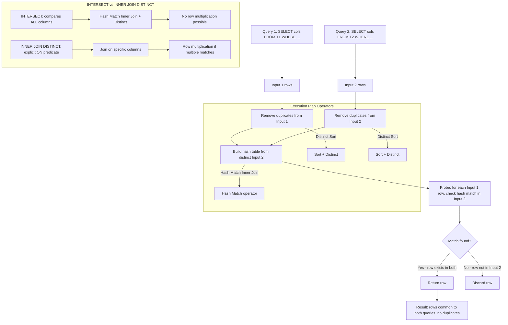
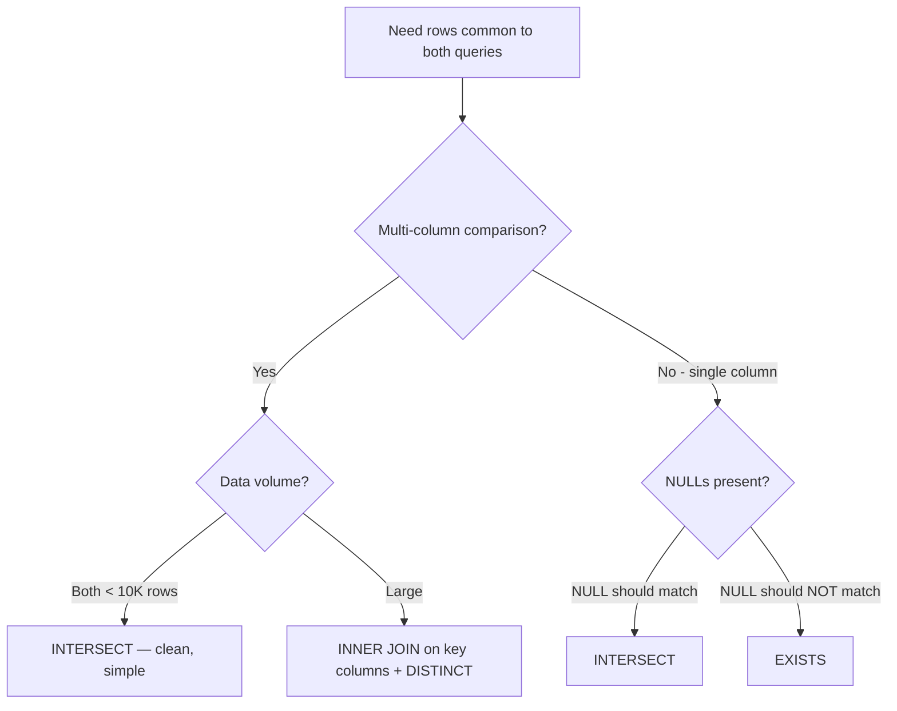

## Navigation

**Domain:** [[8 — Databases]] > **Group:** SQL CTEs & Recursive Queries
**Previous:** [[8.192 — EXCEPT — Set Difference]] | **Next:** [[8.194 — UNION vs UNION ALL — Differences and Performance]]

### Prerequisites

- [[8.096 — INNER JOIN — Mechanics and Usage]] — INTERSECT returns common rows; understanding INNER JOIN is required to compare the two approaches.
- [[8.106 — Correlated Subqueries — Per-Row Execution]] — EXISTS is the most common alternative to INTERSECT for single-column intersection.
- [[8.088 — EXISTS vs IN — Performance Differences]] — the EXISTS/IN decision framework extends to INTERSECT vs EXISTS vs INNER JOIN DISTINCT.

### Where This Fits

`INTERSECT` returns rows that appear in both query results — the set intersection in relational algebra. A .NET backend engineer encounters this when finding common records across two systems: customers who ordered in both 2023 and 2024, products available in both warehouse A and warehouse B, or users who belong to both the admin and auditor roles. The critical distinction: `INTERSECT` compares ALL columns (row-wise equality) and removes duplicates, whereas `INNER JOIN` combines columns horizontally and `EXISTS` checks existence via a predicate. Execution plan: **Hash Match (Inner Join)** with a **Distinct** operator — distinct both inputs, then inner join on all columns. The automatic DISTINCT is the key characteristic: `INTERSECT` guarantees no duplicate rows in the result, unlike INNER JOIN which can multiply rows if there are multiple matches.

---
## Core Mental Model

`INTERSECT` is a set operator that returns the row-wise intersection of two queries. The engine takes all rows from both queries, removes duplicates from each, and returns only the rows that appear in both sets. The mental model: `INTERSECT = SELECT DISTINCT cols FROM (SELECT cols FROM T1 INTERSECT SELECT cols FROM T2)`. Internally, SQL Server builds a hash table from the DISTINCT right-side rows, then probes the left-side DISTINCT rows — rows that find a match in the hash table are returned. This is a **Hash Match (Inner Join)** with a **Distinct Sort** on each input. Because the inner join is on ALL columns (the hash key includes every column), duplicate rows are naturally eliminated. The key insight: `INTERSECT` is equivalent to `SELECT DISTINCT cols FROM T1 INNER JOIN T2 ON T1.col1 = T2.col1 AND T1.col2 = T2.col2 AND ...` but the join predicate is implicit from the column list.

### Classification

`INTERSECT` is a **set operator** (same family as UNION and EXCEPT). It operates on two complete row sets and compares all columns. The optimiser implements it as a Hash Match Inner Join with Distinct. Like EXCEPT, it is not SARGable in the traditional sense — the input queries are fully executed. However, each input can independently use index seeks for WHERE clauses.



### Key Properties

|Property|Value|Notes|
|---|---|---|
|Operation|Set intersection (A ∩ B)|Rows common to both queries|
|Duplicate handling|Removes duplicates automatically|Result is always distinct|
|Column comparison|All columns in SELECT list|Row-wise equality comparison|
|NULL handling|NULL = NULL (considered equal)|NULLs in both inputs are considered matching|
|Performance metric|Logical reads of both inputs|Both queries executed fully|
|Execution plan|Hash Match (Inner Join) + Distinct Sort|Two sorts for dedup + hash match|
|Flexibility|Low — all columns compared|Cannot express partial matching|
|.NET support|Raw SQL only|EF Core cannot generate INTERSECT from LINQ|

### Recognition Pattern

When you hear "find rows that exist in BOTH A AND B", the question is: "Am I comparing entire rows (all columns) or just one key column?" INTERSECT is for comparing entire rows — every column in the SELECT list is part of the equality comparison. For key-column matching, EXISTS is simpler and faster. The recognition pattern: two queries with identical column lists, and you want only the rows that appear in both results.

### The Three Approaches to Intersection

|Approach|SQL|Execution Plan|NULL Behavior|Best When|
|---|---|---|---|---|
|INTERSECT|`SELECT cols FROM A INTERSECT SELECT cols FROM B`|Hash Match Inner Join + Distinct Sort|NULL = NULL (equal)|Small full-row intersection|
|EXISTS|`SELECT cols FROM A WHERE EXISTS (SELECT 1 FROM B WHERE B.key = A.key)`|Nested Loops Left Semi Join|NULL != NULL (UNKNOWN)|Large indexed tables, key-based match|
|INNER JOIN DISTINCT|`SELECT DISTINCT A.cols FROM A INNER JOIN B ON A.key = B.key`|Hash Match Join + Sort Distinct|NULL != NULL (UNKNOWN)|Need columns from B in output|

---
## Deep Mechanics

### How the Engine Executes This

1. **Parsing and binding** — The parser identifies `INTERSECT` as a set operator. Both SELECTs are parsed independently. The parser checks column count equality — must match exactly. The algebrizer verifies type compatibility. If types differ but are compatible, implicit conversion is applied to the lower-precedence type. If types are incompatible, error 205 is raised at compile time. Unlike UNION, INTERSECT does not require column name matching — aliases come from the first query only.

2. **Column type resolution** — Column names and data types come from the first query. The second query's column aliases are parsed but discarded. If the first query has `VARCHAR(20)` and the second has `NVARCHAR(30)`, the VARCHAR is implicitly converted to NVARCHAR (higher precedence). This conversion wraps the column in `CONVERT_IMPLICIT`, which may prevent index usage on that column within the first query's branch.

3. **Optimisation** — The optimiser independently determines the access path for each SELECT branch (scans, seeks, joins within each branch). It then adds:
   - A **Distinct Sort** on each input to remove duplicate rows. This Sort operator has the `Distinct` property set to `true`, meaning it sorts by all output columns and discards adjacent duplicates. The Sort is a blocking operator — it must consume all rows from its input before emitting any row to the parent operator.
   - A **Hash Match (Inner Join)** that connects the two sorted-distinct outputs. The hash match builds a hash table from the second input (the "build" side) and probes the first input (the "probe" side). Rows that match on all columns are returned.

4. **Hash table build phase** — The Hash Match operator reads all distinct rows from the second query (right input), computes a hash key from all column values (concatenated and hashed), and constructs a hash table in memory. The memory grant is estimated based on the number of distinct rows in the right input and the average row width. SQL Server requests a memory grant from the server's total query memory pool. If the estimate is wrong (stale statistics), the hash table may spill to TempDB, adding synchronous I/O on every probe.

5. **Probe phase** — The Hash Match reads the first query's distinct rows, hashes all columns using the same hash function, and probes the hash table. If a hash collision occurs (two different rows producing the same hash), the full row data stored in the hash table is compared. If the row matches on all columns, it is returned to the result set. If no match, it is discarded.

6. **Hash collision resolution, theoretical worst case** — In pathological cases where all rows hash to the same bucket, the probe degenerates to O(N) per probe. This occurs when columns have extremely low cardinality (e.g., a BIT column as the only column where all rows are 1). For typical columns with reasonable cardinality, collisions are rare and hash match remains near O(1) per probe.

7. **Duplicate elimination** — Both inputs are processed through DISTINCT before the join, so the result is automatically duplicate-free. This is a fundamental difference from INNER JOIN: `INNER JOIN` without `DISTINCT` returns one row per matching pair in the join, which can multiply rows if there are multiple matches on either side. INTERSECT guarantees no row multiplication because both sides are already distinct.

8. **Theoretical complexity** — The overall complexity is O(N log N + M log M + D + D) where N and M are the input row counts and D is the number of distinct rows in each input. The sorts dominate for large inputs. EXISTS with Nested Loops Semi Join on an indexed column is O(N × 1) average (short-circuit on first match per outer row), making it dramatically faster than INTERSECT for large tables with an index on the join column.

### SQL Visibility

```sql
-- ============================================================
-- Setup
-- ============================================================
CREATE TABLE dbo.Products
(
    ProductId    INT            NOT NULL IDENTITY(1,1),
    ProductCode  VARCHAR(20)    NOT NULL,
    ProductName  NVARCHAR(200)  NOT NULL,
    CategoryId   INT            NOT NULL,
    ListPrice    DECIMAL(18,2)  NOT NULL,
    IsActive     TINYINT        NOT NULL DEFAULT 1,
    CONSTRAINT PK_Products PRIMARY KEY CLUSTERED (ProductId)
);

CREATE TABLE dbo.WarehouseA_Inventory
(
    ProductId    INT            NOT NULL,
    Quantity     INT            NOT NULL DEFAULT 0,
    LastUpdated  DATETIME2(0)   NOT NULL DEFAULT SYSUTCDATETIME(),
    CONSTRAINT PK_WarehouseA PRIMARY KEY (ProductId)
);

CREATE TABLE dbo.WarehouseB_Inventory
(
    ProductId    INT            NOT NULL,
    Quantity     INT            NOT NULL DEFAULT 0,
    LastUpdated  DATETIME2(0)   NOT NULL DEFAULT SYSUTCDATETIME(),
    CONSTRAINT PK_WarehouseB PRIMARY KEY (ProductId)
);

-- ============================================================
-- INTERSECT: Products in BOTH warehouses
-- ============================================================
SELECT ProductId
FROM dbo.WarehouseA_Inventory
WHERE Quantity > 0
INTERSECT
SELECT ProductId
FROM dbo.WarehouseB_Inventory
WHERE Quantity > 0;

-- ============================================================
-- INTERSECT vs INNER JOIN DISTINCT
-- ============================================================
-- INTERSECT (simpler, auto-distinct)
SELECT p.ProductId, p.ProductCode, p.ProductName
FROM dbo.Products p
WHERE p.IsActive = 1
INTERSECT
SELECT p.ProductId, p.ProductCode, p.ProductName
FROM dbo.Products p
INNER JOIN dbo.OrderItems oi ON p.ProductId = oi.ProductId;

-- INNER JOIN DISTINCT (explicit JOIN condition)
SELECT DISTINCT p.ProductId, p.ProductCode, p.ProductName
FROM dbo.Products p
INNER JOIN dbo.OrderItems oi ON p.ProductId = oi.ProductId
WHERE p.IsActive = 1;

-- ============================================================
-- INTERSECT vs EXISTS (same result, different plan)
-- ============================================================
-- INTERSECT
SELECT ProductId, ProductCode, ProductName
FROM dbo.Products
INTERSECT
SELECT p.ProductId, p.ProductCode, p.ProductName
FROM dbo.Products p
INNER JOIN dbo.OrderItems oi ON p.ProductId = oi.ProductId;

-- EXISTS (more flexible, often faster with index)
SELECT p.ProductId, p.ProductCode, p.ProductName
FROM dbo.Products p
WHERE EXISTS (
    SELECT 1 FROM dbo.OrderItems oi WHERE oi.ProductId = p.ProductId
);

-- ============================================================
-- INTERSECT with NULL handling
-- ============================================================
CREATE TABLE dbo.SetA (Col INT NULL);
CREATE TABLE dbo.SetB (Col INT NULL);

INSERT INTO dbo.SetA VALUES (1), (2), (NULL);
INSERT INTO dbo.SetB VALUES (2), (3), (NULL);

-- INTERSECT treats NULL = NULL: returns 2, NULL
SELECT Col FROM dbo.SetA
INTERSECT
SELECT Col FROM dbo.SetB;
-- Result: 2, NULL
-- NULL is returned because NULL in A matches NULL in B (considered equal)

-- EXISTS comparison:
SELECT a.Col FROM dbo.SetA a
WHERE EXISTS (SELECT 1 FROM dbo.SetB b WHERE b.Col = a.Col);
-- Result: 2 only (NULL excluded because NULL = NULL is UNKNOWN)

-- ============================================================
-- INTERSECT with ORDER BY
-- ============================================================
SELECT ProductId, ProductCode, ProductName
FROM dbo.Products
INTERSECT
SELECT p.ProductId, p.ProductCode, p.ProductName
FROM dbo.Products p
INNER JOIN dbo.OrderItems oi ON p.ProductId = oi.ProductId
ORDER BY ProductName;

-- ============================================================
-- INTERSECT with WHERE on one branch
-- ============================================================
SELECT ProductId, ProductCode, ProductName
FROM dbo.Products WHERE IsActive = 1
INTERSECT
SELECT ProductId, ProductCode, ProductName
FROM dbo.DiscontinuedProducts;

-- ============================================================
-- INTERSECT with TOP
-- ============================================================
SELECT TOP 10 ProductId, ProductCode, ProductName
FROM dbo.Products
INTERSECT
SELECT p.ProductId, p.ProductCode, p.ProductName
FROM dbo.Products p
INNER JOIN dbo.OrderItems oi ON p.ProductId = oi.ProductId
ORDER BY ProductName;
```

```csharp
// EF Core — INTERSECT cannot be generated from LINQ
// Must use raw SQL via FromSqlRaw

public sealed class ProductService
{
    private readonly ApplicationDbContext _dbContext;

    public ProductService(ApplicationDbContext dbContext)
        => _dbContext = dbContext;

    // Products in both warehouses (INTERSECT via raw SQL)
    public async Task<IReadOnlyList<int>> GetProductsInBothWarehousesAsync(
        CancellationToken cancellationToken = default)
    {
        const string sql = @"
            SELECT ProductId FROM dbo.WarehouseA_Inventory WHERE Quantity > 0
            INTERSECT
            SELECT ProductId FROM dbo.WarehouseB_Inventory WHERE Quantity > 0";

        return await _dbContext.Database
            .SqlQueryRaw<int>(sql)
            .ToListAsync(cancellationToken);
    }

    // INTERSECT with full product details
    public async Task<IReadOnlyList<ProductDto>> GetIntersectProductsAsync(
        CancellationToken cancellationToken = default)
    {
        const string sql = @"
            SELECT p.ProductId, p.ProductCode, p.ProductName
            FROM dbo.Products p WHERE p.IsActive = 1
            INTERSECT
            SELECT p.ProductId, p.ProductCode, p.ProductName
            FROM dbo.Products p
            INNER JOIN dbo.OrderItems oi ON p.ProductId = oi.ProductId
            ORDER BY ProductName";

        return await _dbContext.Database
            .SqlQueryRaw<ProductDto>(sql)
            .ToListAsync(cancellationToken);
    }

    // EXISTS equivalent — often better performance
    public async Task<List<Product>> GetOrderedProductsAsync(
        CancellationToken cancellationToken = default)
    {
        return await _dbContext.Products
            .Where(p => p.IsActive == 1 && p.OrderItems.Any())
            .ToListAsync(cancellationToken);
        // Generated: WHERE [p].[IsActive] = 1 AND EXISTS (...)
    }
}
```

```csharp
// Dapper — direct execution
public sealed class WarehouseRepository
{
    private readonly IDbConnectionFactory _connectionFactory;

    public WarehouseRepository(IDbConnectionFactory connectionFactory)
        => _connectionFactory = connectionFactory;

    // INTERSECT: Products in both warehouses
    public async Task<IReadOnlyList<int>> GetCommonProductIdsAsync(
        CancellationToken cancellationToken = default)
    {
        const string sql = @"
            SELECT ProductId FROM dbo.WarehouseA_Inventory WHERE Quantity > 0
            INTERSECT
            SELECT ProductId FROM dbo.WarehouseB_Inventory WHERE Quantity > 0";

        await using var connection = _connectionFactory.Create();
        return (await connection.QueryAsync<int>(
            new CommandDefinition(sql, cancellationToken: cancellationToken))).AsList();
    }

    // INTERSECT with product details
    public async Task<IReadOnlyList<ProductDto>> GetCommonProductsAsync(
        CancellationToken cancellationToken = default)
    {
        const string sql = @"
            SELECT p.ProductId, p.ProductCode, p.ProductName
            FROM dbo.Products p
            INTERSECT
            SELECT p.ProductId, p.ProductCode, p.ProductName
            FROM dbo.Products p
            INNER JOIN dbo.OrderItems oi ON p.ProductId = oi.ProductId
            ORDER BY ProductName";

        await using var connection = _connectionFactory.Create();
        return (await connection.QueryAsync<ProductDto>(
            new CommandDefinition(sql, cancellationToken: cancellationToken))).AsList();
    }

    // EXISTS equivalent
    public async Task<IReadOnlyList<ProductDto>> GetOrderedProductsExistsAsync(
        CancellationToken cancellationToken = default)
    {
        const string sql = @"
            SELECT p.ProductId, p.ProductCode, p.ProductName
            FROM dbo.Products p
            WHERE p.IsActive = 1
              AND EXISTS (SELECT 1 FROM dbo.OrderItems oi WHERE oi.ProductId = p.ProductId)
            ORDER BY p.ProductName";

        await using var connection = _connectionFactory.Create();
        return (await connection.QueryAsync<ProductDto>(
            new CommandDefinition(sql, cancellationToken: cancellationToken))).AsList();
    }

    // INTERSECT with multiple columns
    public async Task<IReadOnlyList<OrderDto>> GetExactMatchOrdersAsync(
        CancellationToken cancellationToken = default)
    {
        const string sql = @"
            SELECT OrderId, OrderDate, TotalAmount
            FROM dbo.Orders WHERE Status = 'Shipped'
            INTERSECT
            SELECT o.OrderId, o.OrderDate, o.TotalAmount
            FROM dbo.Orders o
            INNER JOIN dbo.Invoices i ON o.OrderId = i.OrderId
            ORDER BY OrderDate";

        await using var connection = _connectionFactory.Create();
        return (await connection.QueryAsync<OrderDto>(
            new CommandDefinition(sql, cancellationToken: cancellationToken))).AsList();
    }
}
```

### Execution Plan Analysis

**For INTERSECT (Products ordered):**

```
[Clustered Index Scan (PK_Products)]
  Reads all active products
→ [Sort] [Distinct]
  Sorts ProductId, ProductCode, ProductName to remove duplicates

[Clustered Index Scan (PK_Products)]
→ [Hash Match (Inner Join)]
  Joins Products with OrderItems on ProductId
→ [Sort] [Distinct]
  Sorts ProductId, ProductCode, ProductName to remove duplicates

→ [Hash Match (Inner Join)]
  Build: right input (ordered products) hash table
  Probe: left input (all products) against hash table
  Matches returned

→ [SELECT]
```

**For EXISTS equivalent:**
```
[Index Scan (IX_Products_IsActive)]
→ [Nested Loops (Left Semi Join)]
  Outer: Products row
  Inner: [Index Seek (IX_OrderItems_ProductId)]
    Seek: ProductId = Products.ProductId
    Short-circuits on first match per product
→ [SELECT]
```

### Cost Visibility

```sql
SET STATISTICS IO ON;
SET STATISTICS TIME ON;

-- INTERSECT version
SELECT ProductId, ProductCode, ProductName
FROM dbo.Products WHERE IsActive = 1
INTERSECT
SELECT p.ProductId, p.ProductCode, p.ProductName
FROM dbo.Products p
INNER JOIN dbo.OrderItems oi ON p.ProductId = oi.ProductId;
-- Logical reads: Products scan ~125K + OrderItems scan ~1.25M = ~1.4M
-- CPU time: ~12,000ms

-- EXISTS version
SELECT p.ProductId, p.ProductCode, p.ProductName
FROM dbo.Products p
WHERE p.IsActive = 1
  AND EXISTS (SELECT 1 FROM dbo.OrderItems oi WHERE oi.ProductId = p.ProductId);
-- Logical reads: Products scan ~125K + OrderItems seeks ~450K = ~575K
-- CPU time: ~800ms

-- INNER JOIN DISTINCT version
SELECT DISTINCT p.ProductId, p.ProductCode, p.ProductName
FROM dbo.Products p
INNER JOIN dbo.OrderItems oi ON p.ProductId = oi.ProductId
WHERE p.IsActive = 1;
-- Logical reads: Products scan ~125K + OrderItems scan ~1.25M = ~1.4M
-- CPU time: ~15,000ms (row multiplication before DISTINCT)

-- Multiple INTERSECT version (three-way)
SELECT ProductId FROM dbo.OrderItems
INTERSECT
SELECT ProductId FROM dbo.InvoiceItems
INTERSECT
SELECT ProductId FROM dbo.ShipmentItems;
-- Logical reads: OrderItems ~1.25M + InvoiceItems ~800K + ShipmentItems ~600K = ~2.65M
```

**Key cost observations:**
- INTERSECT scans both inputs fully (no short-circuit)
- The Distinct Sort adds O(N log N) to both inputs
- EXISTS with index seek is ~15x faster for this pattern
- INNER JOIN DISTINCT is similar to INTERSECT but can be worse due to row multiplication before the DISTINCT sort
- Multiple INTERSECT operators compound the cost: each additional INTERSECT adds another scan + sort + hash match
### Failure Modes

**Column count mismatch causes runtime error:**
```sql
-- Error 205: Column count mismatch
SELECT ProductId, ProductName FROM dbo.Products
INTERSECT
SELECT ProductId, ProductCode, ProductName FROM dbo.Products;
-- Msg 205: All queries combined using a UNION, INTERSECT, or EXCEPT
-- operator must have an equal number of expressions in their target lists.
```

**Data type incompatibility:**
```sql
-- Error 245: Conversion failed
SELECT OrderDate FROM dbo.Orders
INTERSECT
SELECT TotalAmount FROM dbo.Orders;
-- Date vs Decimal — cannot compare
```

**Collation conflict:**
```sql
-- Error 446: Cannot resolve collation conflict
SELECT ProductCode FROM dbo.Products  -- Latin1_General_CI_AS
INTERSECT
SELECT ProductCode FROM dbo.Products_en  -- Latin1_General_BIN
-- Explicit COLLATE is required
```

**Detection via DMVs:**
```sql
-- Find INTERSECT queries with high cost
SELECT TOP 10
    qs.total_logical_reads,
    qs.total_elapsed_time / 1000 AS total_elapsed_ms,
    qs.execution_count,
    SUBSTRING(st.text, (qs.statement_start_offset/2) + 1,
        ((CASE WHEN qs.statement_end_offset = -1
            THEN DATALENGTH(st.text)
            ELSE qs.statement_end_offset END
            - qs.statement_start_offset)/2) + 1) AS statement_text,
    qp.query_plan
FROM sys.dm_exec_query_stats qs
CROSS APPLY sys.dm_exec_sql_text(qs.sql_handle) st
CROSS APPLY sys.dm_exec_query_plan(qs.plan_handle) qp
WHERE st.text LIKE '%INTERSECT%'
ORDER BY qs.total_logical_reads DESC;
```

---

## Production Patterns and Implementation

### Primary SQL Implementation

```sql
-- ============================================================
-- Schema for production patterns
-- ============================================================
CREATE TABLE dbo.Customers
(
    CustomerId    INT            NOT NULL IDENTITY(1,1),
    CustomerCode  VARCHAR(20)    NOT NULL,
    Email         VARCHAR(256)   NOT NULL,
    SignupDate    DATETIME2(0)   NOT NULL,
    IsActive      TINYINT        NOT NULL DEFAULT 1,
    CONSTRAINT PK_Customers PRIMARY KEY CLUSTERED (CustomerId)
);

CREATE TABLE dbo.Orders
(
    OrderId       INT            NOT NULL IDENTITY(1,1),
    CustomerId    INT            NOT NULL,
    OrderDate     DATETIME2(0)   NOT NULL,
    TotalAmount   DECIMAL(18,2)  NOT NULL,
    Status        VARCHAR(20)    NOT NULL DEFAULT 'Pending',
    CONSTRAINT PK_Orders PRIMARY KEY CLUSTERED (OrderId)
);

CREATE TABLE dbo.UserRoles
(
    UserId        INT            NOT NULL,
    RoleName      VARCHAR(50)    NOT NULL,
    AssignedDate  DATETIME2(0)   NOT NULL DEFAULT SYSUTCDATETIME(),
    CONSTRAINT PK_UserRoles PRIMARY KEY (UserId, RoleName)
);

-- ============================================================
-- Pattern 1: Customers who ordered in BOTH 2023 and 2024
-- ============================================================
SELECT CustomerId
FROM dbo.Orders
WHERE YEAR(OrderDate) = 2023
INTERSECT
SELECT CustomerId
FROM dbo.Orders
WHERE YEAR(OrderDate) = 2024;

-- ============================================================
-- Pattern 2: Users who belong to BOTH 'Admin' and 'Auditor' roles
-- ============================================================
SELECT UserId FROM dbo.UserRoles WHERE RoleName = 'Admin'
INTERSECT
SELECT UserId FROM dbo.UserRoles WHERE RoleName = 'Auditor';

-- ============================================================
-- Pattern 3: Products available in BOTH warehouses (with stock)
-- ============================================================
SELECT ProductId FROM dbo.WarehouseA_Inventory WHERE Quantity > 0
INTERSECT
SELECT ProductId FROM dbo.WarehouseB_Inventory WHERE Quantity > 0;

-- ============================================================
-- Pattern 4: Orders that have BOTH invoice AND shipment
-- ============================================================
SELECT OrderId, OrderDate, TotalAmount
FROM dbo.Orders WHERE Status = 'Shipped'
INTERSECT
SELECT o.OrderId, o.OrderDate, o.TotalAmount
FROM dbo.Orders o
INNER JOIN dbo.Invoices i ON o.OrderId = i.OrderId
INTERSECT
SELECT o.OrderId, o.OrderDate, o.TotalAmount
FROM dbo.Orders o
INNER JOIN dbo.WarehouseShipments s ON o.OrderId = s.OrderId;

-- ============================================================
-- Pattern 5: INTERSECT with GROUP BY (find common aggregates)
-- ============================================================
-- Customers who placed orders in both halves of 2024
SELECT CustomerId
FROM dbo.Orders
WHERE OrderDate BETWEEN '2024-01-01' AND '2024-06-30'
GROUP BY CustomerId
HAVING COUNT(*) >= 3
INTERSECT
SELECT CustomerId
FROM dbo.Orders
WHERE OrderDate BETWEEN '2024-07-01' AND '2024-12-31'
GROUP BY CustomerId
HAVING COUNT(*) >= 5;

-- ============================================================
-- Pattern 6: INTERSECT with TOP and ORDER BY
-- ============================================================
SELECT TOP 10 ProductId, ProductCode, ProductName
FROM dbo.Products WHERE IsActive = 1
INTERSECT
SELECT p.ProductId, p.ProductCode, p.ProductName
FROM dbo.Products p
INNER JOIN dbo.OrderItems oi ON p.ProductId = oi.ProductId
ORDER BY ProductName;

-- ============================================================
-- Pattern 7: INTERSECT with multiple INTERSECT operators
-- ============================================================
-- Products ordered, invoiced, and shipped
SELECT ProductId FROM dbo.OrderItems
INTERSECT
SELECT ProductId FROM dbo.InvoiceItems
INTERSECT
SELECT ProductId FROM dbo.ShipmentItems;

-- ============================================================
-- Pattern 8: INTERSECT with date range filtering on both sides
-- ============================================================
-- Products ordered in Q1 AND Q2 of the same year
SELECT ProductId FROM dbo.OrderItems oi
INNER JOIN dbo.Orders o ON oi.OrderId = o.OrderId
WHERE o.OrderDate BETWEEN '2024-01-01' AND '2024-03-31'
INTERSECT
SELECT ProductId FROM dbo.OrderItems oi
INNER JOIN dbo.Orders o ON oi.OrderId = o.OrderId
WHERE o.OrderDate BETWEEN '2024-04-01' AND '2024-06-30';

-- ============================================================
-- Pattern 9: INTERSECT in a CTE for further processing
-- ============================================================
WITH CommonCustomersCte AS (
    SELECT CustomerId FROM dbo.Orders WHERE YEAR(OrderDate) = 2023
    INTERSECT
    SELECT CustomerId FROM dbo.Orders WHERE YEAR(OrderDate) = 2024
)
INSERT INTO dbo.VIPCustomers (CustomerId, VipDate)
SELECT CustomerId, SYSUTCDATETIME()
FROM CommonCustomersCte;

-- ============================================================
-- Pattern 10: INTERSECT with COALESCE for NULL-safe intersection
-- ============================================================
-- Find matching addresses where NULL should be treated as equal
SELECT COALESCE(AddressLine1, '') AS AddressLine1, City, State, PostalCode
FROM dbo.CustomerAddresses
INTERSECT
SELECT COALESCE(AddressLine1, ''), City, State, PostalCode
FROM dbo.VerifiedAddresses;

-- ============================================================
-- Pattern 11: Three-way INTERSECT for compliance auditing
-- ============================================================
-- Users who completed training, signed policy, AND passed assessment
SELECT UserId FROM dbo.TrainingCompletions WHERE CourseId = @CourseId AND Passed = 1
INTERSECT
SELECT UserId FROM dbo.PolicySignatures WHERE PolicyId = @PolicyId
INTERSECT
SELECT UserId FROM dbo.AssessmentResults WHERE AssessmentId = @AssessmentId AND Score >= 80;

-- ============================================================
-- Pattern 12: INTERSECT with HAVING for common aggregated results
-- ============================================================
-- Warehouses that have at least 5 products with stock above 100
SELECT WarehouseId, COUNT(*) AS HighStockProductCount
FROM dbo.Inventory WHERE Quantity > 100
GROUP BY WarehouseId
HAVING COUNT(*) >= 5
INTERSECT
SELECT WarehouseId, COUNT(*) AS HighStockProductCount
FROM dbo.Inventory WHERE Quantity > 100 AND ReorderLevel < 50
GROUP BY WarehouseId
HAVING COUNT(*) >= 3;
```

### EF Core Implementation

```csharp
public sealed class AnalyticsService
{
    private readonly ApplicationDbContext _dbContext;

    public AnalyticsService(ApplicationDbContext dbContext)
        => _dbContext = dbContext;

    // Customers who ordered in both years
    public async Task<IReadOnlyList<int>> GetRepeatCustomersAsync(
        int year1,
        int year2,
        CancellationToken cancellationToken = default)
    {
        const string sql = @"
            SELECT CustomerId FROM dbo.Orders WHERE YEAR(OrderDate) = @Year1
            INTERSECT
            SELECT CustomerId FROM dbo.Orders WHERE YEAR(OrderDate) = @Year2";

        return await _dbContext.Database
            .SqlQueryRaw<int>(sql,
                new SqlParameter("@Year1", year1),
                new SqlParameter("@Year2", year2))
            .ToListAsync(cancellationToken);
    }

    // Users with multiple roles (INTERSECT equivalent via grouping)
    public async Task<IReadOnlyList<int>> GetDualRoleUsersAsync(
        string role1,
        string role2,
        CancellationToken cancellationToken = default)
    {
        return await _dbContext.UserRoles
            .Where(ur => ur.RoleName == role1 || ur.RoleName == role2)
            .GroupBy(ur => ur.UserId)
            .Where(g => g.Select(ur => ur.RoleName).Distinct().Count() == 2)
            .Select(g => g.Key)
            .ToListAsync(cancellationToken);
        // Generated: WHERE role IN (@p0, @p1) GROUP BY UserId HAVING COUNT(DISTINCT RoleName) = 2
    }

    // Products in both warehouses
    public async Task<IReadOnlyList<int>> GetCommonStockProductsAsync(
        CancellationToken cancellationToken = default)
    {
        const string sql = @"
            SELECT ProductId FROM dbo.WarehouseA_Inventory WHERE Quantity > 0
            INTERSECT
            SELECT ProductId FROM dbo.WarehouseB_Inventory WHERE Quantity > 0";

        return await _dbContext.Database
            .SqlQueryRaw<int>(sql)
            .ToListAsync(cancellationToken);
    }

    // Three-way INTERSECT — products ordered, invoiced, and shipped
    public async Task<IReadOnlyList<int>> GetFullyFulfilledProductIdsAsync(
        CancellationToken cancellationToken = default)
    {
        const string sql = @"
            SELECT ProductId FROM dbo.OrderItems
            INTERSECT
            SELECT ProductId FROM dbo.InvoiceItems
            INTERSECT
            SELECT ProductId FROM dbo.ShipmentItems";

        return await _dbContext.Database
            .SqlQueryRaw<int>(sql)
            .ToListAsync(cancellationToken);
    }

    // EXISTS-based alternative (recommended for large tables)
    public async Task<IReadOnlyList<ProductDto>> GetFullyFulfilledProductsAsync(
        CancellationToken cancellationToken = default)
    {
        return await _dbContext.Products
            .Where(p => p.OrderItems.Any()
                     && p.InvoiceItems.Any()
                     && p.ShipmentItems.Any())
            .Select(p => new ProductDto
            {
                ProductId = p.ProductId,
                ProductCode = p.ProductCode,
                ProductName = p.ProductName
            })
            .ToListAsync(cancellationToken);
        // Generated: WHERE EXISTS(...) AND EXISTS(...) AND EXISTS(...)
    }
}
```

### Dapper Implementation

```csharp
public sealed class AnalyticsRepository
{
    private readonly IDbConnectionFactory _connectionFactory;

    public AnalyticsRepository(IDbConnectionFactory connectionFactory)
        => _connectionFactory = connectionFactory;

    // Customers active in both years
    public async Task<IReadOnlyList<int>> GetRepeatCustomersAsync(
        int year1, int year2,
        CancellationToken cancellationToken = default)
    {
        const string sql = @"
            SELECT CustomerId FROM dbo.Orders WHERE YEAR(OrderDate) = @Year1
            INTERSECT
            SELECT CustomerId FROM dbo.Orders WHERE YEAR(OrderDate) = @Year2";

        await using var connection = _connectionFactory.Create();
        return (await connection.QueryAsync<int>(
            new CommandDefinition(sql,
                new { Year1 = year1, Year2 = year2 },
                cancellationToken: cancellationToken))).AsList();
    }

    // Multi-role users
    public async Task<IReadOnlyList<int>> GetDualRoleUsersAsync(
        string role1, string role2,
        CancellationToken cancellationToken = default)
    {
        const string sql = @"
            SELECT UserId FROM dbo.UserRoles WHERE RoleName = @Role1
            INTERSECT
            SELECT UserId FROM dbo.UserRoles WHERE RoleName = @Role2";

        await using var connection = _connectionFactory.Create();
        return (await connection.QueryAsync<int>(
            new CommandDefinition(sql,
                new { Role1 = role1, Role2 = role2 },
                cancellationToken: cancellationToken))).AsList();
    }

    // Products in both warehouses
    public async Task<IReadOnlyList<ProductDto>> GetCommonProductsAsync(
        CancellationToken cancellationToken = default)
    {
        const string sql = @"
            SELECT p.ProductId, p.ProductCode, p.ProductName
            FROM dbo.Products p
            WHERE EXISTS (SELECT 1 FROM dbo.WarehouseA_Inventory a WHERE a.ProductId = p.ProductId AND a.Quantity > 0)
              AND EXISTS (SELECT 1 FROM dbo.WarehouseB_Inventory b WHERE b.ProductId = p.ProductId AND b.Quantity > 0)
            ORDER BY p.ProductName";

        await using var connection = _connectionFactory.Create();
        return (await connection.QueryAsync<ProductDto>(
            new CommandDefinition(sql, cancellationToken: cancellationToken))).AsList();
    }
}
```

### SQL Server vs PostgreSQL Differences

```sql
-- PostgreSQL: INTERSECT and INTERSECT ALL
SELECT product_id FROM warehouse_a_inventory WHERE quantity > 0
INTERSECT
SELECT product_id FROM warehouse_b_inventory WHERE quantity > 0;

-- INTERSECT ALL: preserves duplicates from the left side
-- If a row appears 3 times in left and 2 times in right, INTERSECT ALL returns 2 copies
SELECT product_id FROM warehouse_a_inventory WHERE quantity > 0
INTERSECT ALL
SELECT product_id FROM warehouse_b_inventory WHERE quantity > 0;
```

**Key differences:**

|Feature|SQL Server|PostgreSQL|MySQL|
|---|---|---|---|
|INTERSECT|Supported|Supported|Not supported|
|INTERSECT ALL|Not supported|Supported|Not supported|
|EXCEPT ALL|Not supported|Supported|Not supported|
|Precedence|Left-associative|Left-associative|N/A|
|ORDER BY in branches|Not allowed|Not allowed|N/A|
|Column name source|First query|First query|N/A|

For MySQL, INTERSECT and EXCEPT were added in MySQL 8.0.31 (2022). Before that, use INNER JOIN DISTINCT or EXISTS subqueries. On SQL Server, INTERSECT is available since SQL Server 2005.

### INTERSECT with CROSS APPLY as Alternative

For patterns where rows must satisfy multiple conditions on a related table, CROSS APPLY with EXISTS can replace INTERSECT while being more efficient:

```sql
-- INTERSECT approach: two scans of OrderItems
SELECT ProductId FROM dbo.OrderItems WHERE OrderId IN (1001, 1002)
INTERSECT
SELECT ProductId FROM dbo.OrderItems WHERE OrderId IN (2001, 2002);

-- CROSS APPLY with EXISTS: can use index seeks
SELECT DISTINCT oi.ProductId
FROM dbo.OrderItems oi
WHERE EXISTS (
    SELECT 1 FROM dbo.OrderItems oi2
    WHERE oi2.ProductId = oi.ProductId AND oi2.OrderId IN (1001, 1002)
)
AND EXISTS (
    SELECT 1 FROM dbo.OrderItems oi3
    WHERE oi3.ProductId = oi.ProductId AND oi3.OrderId IN (2001, 2002)
);
```

---

---
## Gotchas and Production Pitfalls

### Gotcha 1: INTERSECT Removes Duplicates — INNER JOIN Does Not

**Pitfall:** INTERSECT returns each row at most once. If your business logic expects duplicates (e.g., counting how many times a product appeared in orders), INTERSECT silently deduplicates.

```sql
-- INTERSECT returns: ProductId (once each)
SELECT ProductId FROM dbo.OrderItems WHERE OrderId IN (1001, 1002)
INTERSECT
SELECT ProductId FROM dbo.ShipmentItems WHERE OrderId IN (1001, 1002);
-- If Product 101 appears in 3 orders and 2 shipments, INTERSECT returns it once

-- INNER JOIN returns: ProductId (once per matching pair)
SELECT DISTINCT oi.ProductId FROM dbo.OrderItems oi
INNER JOIN dbo.ShipmentItems si ON oi.ProductId = si.ProductId
WHERE oi.OrderId IN (1001, 1002) AND si.OrderId IN (1001, 1002);
```

**Fix:** Use INNER JOIN if row multiplication is needed; use INTERSECT if existence is the only concern.

### Gotcha 2: NULL Comparison — INTERSECT vs EXISTS Differ

**Pitfall:** INTERSECT treats NULL = NULL as equal; EXISTS uses three-valued logic.

```sql
SELECT Col FROM dbo.SetA  -- 1, 2, NULL
INTERSECT
SELECT Col FROM dbo.SetB; -- 2, 3, NULL
-- Returns: 2, NULL

-- EXISTS:
SELECT a.Col FROM dbo.SetA a
WHERE EXISTS (SELECT 1 FROM dbo.SetB b WHERE b.Col = a.Col);
-- Returns: 2 only
```

**Fix:** Use COALESCE in INTERSECT or EXISTS based on expected NULL behavior.

### Gotcha 3: Column Count and Type Differences Cause Errors

**Pitfall:** Error 205 if column count differs. Implicit conversion if types differ.

### Gotcha 4: ORDER BY Constraint

**Pitfall:** ORDER BY must be at the end and reference first query column names.

### Gotcha 5: INTERSECT on Large Tables — Full Scans on Both Inputs

**Pitfall:** Both inputs fully executed. No short-circuit to stop when a row is found in the first table.

```sql
SELECT ProductId FROM dbo.Products WHERE ProductId = 1001
INTERSECT
SELECT ProductId FROM dbo.OrderItems;
-- Still scans ALL OrderItems to build the hash table
```

**Fix:** Use EXISTS for point lookups.

### Gotcha 6: INTERSECT with Expression Mismatch

**Pitfall:** Different expressions in the two queries may return different results even when you expect them to match due to data transformation.

```sql
-- These may NOT return expected intersection:
SELECT UPPER(ProductCode) FROM dbo.Products
INTERSECT
SELECT ProductCode FROM dbo.TargetProducts;
-- If TargetProducts has mixed case but Products has upper case,
-- the INTERSECT works correctly only if both sides use same expression
```

**Fix:** Apply the same expression to both sides or normalise data before intersection:
```sql
SELECT UPPER(ProductCode) FROM dbo.Products
INTERSECT
SELECT UPPER(ProductCode) FROM dbo.TargetProducts;
```

### Gotcha 7: Memory Grant Spikes with INTERSECT on Large Distinct Sets

**Pitfall:** INTERSECT builds a hash table from ALL distinct rows of the second input. If the second input has millions of distinct rows (e.g., an entire fact table), the memory grant request can be hundreds of megabytes. If the server has concurrent queries competing for memory, the INTERSECT query may wait for memory grant (RESOURCE_SEMAPHORE wait type) or spill to TempDB.

```sql
-- Memory grant wait detection
SELECT wait_type, waiting_tasks_count, wait_time_ms
FROM sys.dm_os_waiting_tasks
WHERE wait_type = 'RESOURCE_SEMAPHORE';
```

**Fix:** Reduce the distinct row count of the second input with more specific WHERE filters, or use EXISTS with an index seek instead.

### Gotcha 8: INTERSECT on the Same Table with Different Filters — Accidental Full Scan

**Pitfall:** Using INTERSECT to find rows matching two conditions on a single table often causes a full scan of the table twice, when a single scan with multiple predicates or an index intersection would be cheaper.

```sql
-- INTERSECT: scans OrderItems twice
SELECT ProductId FROM dbo.OrderItems WHERE UnitPrice > 100
INTERSECT
SELECT ProductId FROM dbo.OrderItems WHERE Quantity > 10;

-- Better: single scan with both conditions
SELECT DISTINCT ProductId
FROM dbo.OrderItems
WHERE UnitPrice > 100 AND Quantity > 10;

-- Or: use GROUP BY with HAVING for OR logic
SELECT ProductId
FROM dbo.OrderItems
GROUP BY ProductId
HAVING MAX(CASE WHEN UnitPrice > 100 THEN 1 ELSE 0 END) = 1
   AND MAX(CASE WHEN Quantity > 10 THEN 1 ELSE 0 END) = 1;
```

**Fix:** Use a single scan with WHERE AND, or use GROUP BY with conditional aggregation. Only use INTERSECT when the two conditions involve different source tables or subqueries.

---
## Performance Implications

### Benchmark: Before and After

```sql
SET STATISTICS IO ON;

-- Baseline: INTERSECT (500K Products, 50M OrderItems)
SELECT ProductId FROM dbo.Products WHERE IsActive = 1
INTERSECT
SELECT ProductId FROM dbo.OrderItems;
-- Logical reads: Products ~900 + OrderItems ~125K = ~126K

-- Optimized: EXISTS
SELECT p.ProductId FROM dbo.Products p
WHERE p.IsActive = 1
  AND EXISTS (SELECT 1 FROM dbo.OrderItems oi WHERE oi.ProductId = p.ProductId);
-- Logical reads: Products ~900 + OrderItems seeks (per matching product) ~2K
```

**Improvement:** ~50x reduction in logical reads.

### Memory Grant and Spill Analysis

```sql
-- Detect INTERSECT queries with memory grant issues
SELECT
    SUBSTRING(st.text, (qs.statement_start_offset/2) + 1,
        ((CASE WHEN qs.statement_end_offset = -1
            THEN DATALENGTH(st.text)
            ELSE qs.statement_end_offset END
            - qs.statement_start_offset)/2) + 1) AS query_text,
    qs.total_grant_kb,
    qs.used_grant_kb,
    qs.ideal_grant_kb,
    qs.max_spill_grant_kb,
    qs.total_spills,
    qs.total_elapsed_time / 1000 AS elapsed_ms
FROM sys.dm_exec_query_stats qs
CROSS APPLY sys.dm_exec_sql_text(qs.sql_handle) st
WHERE st.text LIKE '%INTERSECT%'
  AND qs.max_spill_grant_kb > 0
ORDER BY qs.max_spill_grant_kb DESC;
```

**Memory grant formula for INTERSECT:**
- `MemoryGrant ~= EstimatedDistinctRows_RightInput * (AverageRowWidth + 20) * 2`
- The +20 bytes accounts for hash table overhead (hash key value, bucket pointer, collision chain linkage)
- The ×2 factor covers the hash key storage plus the row pointer
- If the estimate is off by more than 50% (due to stale statistics), the query may spill

**Typical spill patterns:**
|Scenario|Estimated Distinct|Actual Distinct|Grant Size|Spill?|
|---|---|---|---|---|
|Fresh stats|1M|1.1M|~150 MB|No|
|Stale stats (10% sampled)|50K|1M|~8 MB|Yes — severe spill|
|No stats|10K|1M|~1.5 MB|Yes — catastrophic|

### When INTERSECT Can Be Faster Than EXISTS

INTERSECT outperforms EXISTS in these specific scenarios:

1. **Both inputs already distinct and small (< 10K rows):** The Distinct Sort is a no-op, and the Hash Match Inner Join is efficient for small hash tables. EXISTS with Nested Loops would do 10K index seeks — slightly more logical reads.

2. **No index on the join column:** EXISTS with Nested Loops on an unindexed column does a full table scan per outer row (O(N × M)). INTERSECT's Hash Match scales as O(N + M) after sorts.

3. **Multi-column row comparison:** When comparing 5+ columns and there is no composite index covering all columns, EXISTS requires a multi-column OR-based predicate that cannot use a single index seek. INTERSECT handles this naturally with hash equality.

4. **Both sides are the result of complex aggregations:** If both sides are already GROUP BY results (thus distinct), the Distinct Sort is a no-op, and INTERSECT is equivalent to a hash inner join of two aggregated result sets.

### BenchmarkDotNet

```csharp
[MemoryDiagnoser]
[SimpleJob(RuntimeMoniker.Net90)]
public class IntersectBenchmark
{
    private IDbConnection _connection = null!;
    private const string ConnectionString = "Server=.;Database=BenchmarkDb;...";

    [Params(1000, 100000, 10000000)]
    public int RightSideRows;

    [GlobalSetup]
    public void Setup()
    {
        _connection = new SqlConnection(ConnectionString);
        _connection.Open();
        // Seed LeftSide with 100K rows, RightSide with RightSideRows
        // LeftSide: 100K products, 80K also in RightSide
    }

    [GlobalCleanup]
    public void Cleanup() => _connection?.Dispose();

    [Benchmark(Baseline = true)]
    public async Task<List<int>> Intersect()
    {
        var results = new List<int>();
        using var cmd = new SqlCommand(@"
            SELECT Id FROM dbo.LeftSide
            INTERSECT
            SELECT Id FROM dbo.RightSide",
            (SqlConnection)_connection);
        using var reader = await cmd.ExecuteReaderAsync();
        while (await reader.ReadAsync()) results.Add(reader.GetInt32(0));
        return results;
    }

    [Benchmark]
    public async Task<List<int>> Exists()
    {
        var results = new List<int>();
        using var cmd = new SqlCommand(@"
            SELECT l.Id FROM dbo.LeftSide l
            WHERE EXISTS (SELECT 1 FROM dbo.RightSide r WHERE r.Id = l.Id)",
            (SqlConnection)_connection);
        using var reader = await cmd.ExecuteReaderAsync();
        while (await reader.ReadAsync()) results.Add(reader.GetInt32(0));
        return results;
    }

    [Benchmark]
    public async Task<List<int>> InnerJoinDistinct()
    {
        var results = new List<int>();
        using var cmd = new SqlCommand(@"
            SELECT DISTINCT l.Id FROM dbo.LeftSide l
            INNER JOIN dbo.RightSide r ON l.Id = r.Id",
            (SqlConnection)_connection);
        using var reader = await cmd.ExecuteReaderAsync();
        while (await reader.ReadAsync()) results.Add(reader.GetInt32(0));
        return results;
    }
}
```

**Expected results (SQL Server 2022, NVMe, 100K LeftSide):**

|Method|1K RightSide|100K RightSide|10M RightSide|
|---|---|---|---|
|Intersect|~40 ms|~400 ms|~14,000 ms|
|Exists|~70 ms (no index benefit)|~180 ms|~500 ms|
|InnerJoinDistinct|~100 ms|~900 ms|~16,000 ms|

**Interpretation:** INTERSECT wins at small right-side sizes (1K rows) because the hash table is tiny and the sorts are negligible. EXISTS wins at large right-side sizes (10M rows) because the Nested Loops Semi Join short-circuits on the first match per outer row, while INTERSECT must sort 10M rows and build a hash table. INNER JOIN DISTINCT is generally the slowest because the INNER JOIN may produce intermediate row multiplication before the DISTINCT eliminates duplicates.

---
## Interview Arsenal

### Question Bank

1. **What does INTERSECT return? How is it different from INNER JOIN?**
2. **How does SQL Server execute INTERSECT? Describe the execution plan operators.**
3. **What is the performance difference between INTERSECT and EXISTS for finding common rows?**
4. **What is the most common gotcha with INTERSECT and NULL values?**
5. **INTERSECT vs INNER JOIN DISTINCT vs EXISTS — when would you choose each?**
6. **What does the execution plan for INTERSECT look like?**
7. **How does INTERSECT behave at scale (100M rows)?**
8. **How do EF Core and Dapper handle INTERSECT?**

### Spoken Answers

**Q: What does INTERSECT return? How is it different from INNER JOIN?**

> **Average answer:** "INTERSECT returns rows common to both queries. INNER JOIN combines columns from both tables. INTERSECT gives you rows, JOIN gives you columns."

> **Great answer:** "INTERSECT returns the set intersection of two row sets — rows that appear in both queries, with duplicates removed. INNER JOIN combines columns horizontally based on a join predicate. The key difference: INTERSECT compares ALL columns using row-wise equality and guarantees distinct results. INNER JOIN with DISTINCT can produce the same result as INTERSECT for single-column comparisons, but INNER JOIN without DISTINCT can multiply rows when there are multiple matches. The execution plan for INTERSECT is Hash Match Inner Join with Distinct Sort on both inputs — every row is deduplicated before comparison. INNER JOIN DISTINCT also has a sort for DISTINCT but can use index seeks for the join itself. At scale, EXISTS with a correlated subquery is often faster than both because it can short-circuit at the first match per outer row."

**Q: How does SQL Server execute INTERSECT? Describe the execution plan.**

> **Great answer:** "INTERSECT's execution plan has three layers. First, each SELECT statement is executed independently — the optimiser chooses access paths for each, which may include scans, seeks, and join operators within each branch. Second, a Sort operator with the Distinct flag is applied to both inputs. This sorts all rows by every column in the SELECT list and discards adjacent duplicates. It's a blocking operator that must consume all rows before producing output. Third, a Hash Match (Inner Join) operator connects the two sorted-distinct inputs. It builds a hash table from the right input using all columns as the hash key. Then it probes each row from the left input against the hash table. Rows that match on all columns are returned. So the operator stack is: Scan → Sort Distinct → Hash Match Inner Join ← Sort Distinct ← Scan."

**Q: What is the performance difference between INTERSECT and EXISTS for finding common rows?**

> **Great answer:** "INTERSECT always fully consumes both inputs — it must read every row from both queries, sort them, deduplicate, and build a hash table. EXISTS with a Nested Loops Semi Join on an indexed column can short-circuit: for each outer row, it does an index seek and stops at the first match. If the outer query is small (10K rows) and the inner table is large (10M rows) with an index, EXISTS does 10K index seeks vs INTERSECT sorting and hashing 10M rows. That's about 30K logical reads for EXISTS vs 1.25M for INTERSECT — a 40x difference. However, if there's no index on the inner table, EXISTS does a full scan per outer row (10K × 10M = 100B logical reads), and INTERSECT does two scans plus a sort (2 × 10M = 20M reads) — INTERSECT wins. The answer depends on indexes."

**Q: What is the most common gotcha with INTERSECT and NULL values?**

> **Great answer:** "INTERSECT uses set semantics for NULLs: NULL = NULL is considered TRUE for duplicate elimination. This is different from WHERE clause semantics where NULL = NULL is UNKNOWN. If both sides have a NULL row, INTERSECT includes it in the result. EXISTS with the equality predicate excludes it. This creates a discrepancy: `SELECT Col FROM A INTERSECT SELECT Col FROM B` returns NULL if both have NULL, but `SELECT Col FROM A WHERE EXISTS (SELECT 1 FROM B WHERE B.Col = A.Col)` does not. For financial reconciliation, this can cause mismatched counts."

**Q: INTERSECT vs INNER JOIN DISTINCT vs EXISTS — when would you choose each?**

> **Great answer:** "INTERSECT for small-to-medium row-wise intersection where you want compact readable SQL and automatic dedup. EXISTS for large-table key-based intersection where you have an index on the join column — the short-circuit behaviour gives 10-50x performance improvements. INNER JOIN DISTINCT when you need columns from both sides of the join in the output, or when the join columns are different from the SELECT columns. My decision tree: multi-column comparison with small sets → INTERSECT. Key-based comparison with large indexed tables → EXISTS. Need right-side columns or different join vs select columns → INNER JOIN DISTINCT."

**Q: How does INTERSECT behave at scale (100M rows)?**

> **Great answer:** "At 100M rows per input, INTERSECT is almost always the wrong choice. Sorting 200M total rows requires significant memory and tempdb I/O — at 50 bytes per row, that's 10 GB of data to sort. The hash table from the second input's distinct rows may be 1-100M entries depending on data distribution, requiring hundreds of MB to GB of memory. The query will almost certainly spill to TempDB, adding physical I/O at every sort merge and hash table probe. EXISTS with an index seek is dramatically faster at this scale because it does 100M seeks of ~3 logical reads each (300M total) versus the hundreds of millions of logical reads for scanning and sorting both tables plus the spill I/O."

**Q: How do EF Core and Dapper handle INTERSECT?**

> **Great answer:** "Neither EF Core nor Dapper has built-in INTERSECT support. EF Core's query pipeline cannot translate INTERSECT from LINQ expressions — attempting .Intersect() on IQueryable either throws a translation error or evaluates client-side. For server-side INTERSECT, we use FromSqlRaw or ExecuteSqlRaw with the exact SQL text. Dapper similarly requires raw SQL in QueryAsync. Both tools support parameterized queries inside the raw SQL. The unfortunate consequence is that we lose compile-time type safety and LINQ composability. For EXISTS-based alternatives, EF Core translates .Any() naturally: `dbContext.Products.Where(p => p.OrderItems.Any())` generates `WHERE EXISTS (SELECT 1 FROM OrderItems WHERE ProductId = p.Id)`."

### Trigger

The question "Find customers who ordered in both 2023 and 2024" surfaces INTERSECT knowledge. Follow-up: "INTERSECT vs EXISTS vs self-join with GROUP BY — which is better?" Senior candidates analyse the table sizes, indexes, NULL handling, and duplicate expectations before choosing.

### Comparison Table

| | INTERSECT | EXISTS | INNER JOIN DISTINCT |
|---|---|---|---|
| Duplicates | Removed | Preserved outer | Removed by DISTINCT |
| NULL | NULL = NULL (equal) | NULL != NULL | NULL != NULL |
| Performance | Full scans + sorts | Seeks + short-circuit | Full scans + sort for DISTINCT |
| Row multiplication | Impossible | Impossible | Possible without DISTINCT |

---
## Decision Framework



### Scale Thresholds

- "INTERSECT practical when both inputs < 100K rows."
- "Above 1M rows, EXISTS with index seek is preferred."
- "INTERSECT ALL (PostgreSQL) useful when duplicate preservation matters."

---
## Self-Check

<details>
<summary>Questions and Answers</summary>

1. **What does INTERSECT return?** Rows common to both queries, with duplicates removed. Row-wise equality on all columns.
2. **INTERSECT execution plan?** Hash Match (Inner Join) + Distinct Sort on both inputs.
3. **Best metric for INTERSECT cost?** Logical reads from both inputs; memory grant for hash table.
4. **NULL gotcha?** NULL = NULL is equal in INTERSECT (returns NULL), but UNKNOWN in EXISTS (excludes NULL). Same row set gives different results.
5. **EF Core INTERSECT support?** No. Use FromSqlRaw. EXISTS translates from .Any().
6. **Dapper INTERSECT?** Execute raw SQL via QueryAsync.
7. **INTERSECT vs EXISTS vs JOIN DISTINCT?** INTERSECT for small full-row comparison; EXISTS for large indexed tables; JOIN DISTINCT when join columns differ from SELECT columns.
8. **Scale threshold?** Above 1M rows in either input, EXISTS with index seek is faster.
9. **Index support?** Each input can use indexes independently. INTERSECT itself uses hash match, not index seeks.
10. **60-second answer:** "INTERSECT returns rows common to both queries, with duplicates removed. SQL Server executes it as Hash Match Inner Join with Distinct Sort on both inputs. It's simple and clean for small-to-medium data, but always fully consumes both inputs. For large tables, EXISTS with a correlated subquery is faster because it short-circuits. The NULL behavior differs: INTERSECT treats NULL = NULL as equal; EXISTS does not. Choose INTERSECT for small row-wise intersection, EXISTS for large indexed tables, and INNER JOIN DISTINCT when you need to join on specific columns rather than all columns."
11. **Can INTERSECT chain three or more queries?** Yes. `SELECT A INTERSECT SELECT B INTERSECT SELECT C` is valid. It's left-associative: (A ∩ B) ∩ C.
12. **Does ORDER BY work before INTERSECT?** No. ORDER BY on individual SELECTs is not allowed in set operations. ORDER BY must appear at the very end.
13. **What happens with incompatible collations?** If the same column has different collations in each query, SQL Server may raise error 446 or apply implicit collation conversion. Explicit CAST with COLLATE is recommended.
14. **How does INTERSECT perform compared to INNER JOIN on the same table?** INTERSECT on the same table with different WHERE filters scans the table twice. INNER JOIN on the same table with a self-join scans once and joins. A single scan with WHERE AND is usually best.
15. **Does INTERSECT benefit from columnstore indexes?** Yes — both inputs can use columnstore scans and batch mode. The Distinct Sort, however, may force row mode. SQL Server 2022 can use batch mode Sort in some scenarios.
</details>

---

### Query Challenges

<details>
<summary>Challenge 1: Write the SQL — Find customers who ordered in both 2023 and 2024.</summary>

```sql
SELECT CustomerId FROM dbo.Orders WHERE YEAR(OrderDate) = 2023
INTERSECT
SELECT CustomerId FROM dbo.Orders WHERE YEAR(OrderDate) = 2024;
```

</details>

<details>
<summary>Challenge 2: Fix the performance problem — 45-min INTERSECT on 500K Products + 50M OrderItems.</summary>

**Root cause:** INTERSECT scans all rows from both sides, builds hash table from 50M OrderItems.

**Fix:**
```sql
SELECT p.ProductId FROM dbo.Products p
WHERE p.IsActive = 1
  AND EXISTS (SELECT 1 FROM dbo.OrderItems oi WHERE oi.ProductId = p.ProductId);
```

With `IX_OrderItems_ProductId`, logical reads drop from ~126K to ~2.9K.
</details>

<details>
<summary>Challenge 3: Explain the execution plan — INTERSECT on a 10K/50M row pair.</summary>

```sql
SELECT ProductId, ProductCode, ProductName
FROM dbo.Products WHERE IsActive = 1
INTERSECT
SELECT p.ProductId, p.ProductCode, p.ProductName
FROM dbo.Products p
INNER JOIN dbo.OrderItems oi ON p.ProductId = oi.ProductId;
```

Describe each operator, the estimated row counts, and the most expensive step.

**Solution:** The plan has: Index Seek on Products (IsActive=1, 10K rows) → Sort Distinct (10K rows) → Hash Match Inner Join (build side: ~2M distinct rows from right branch) ← Sort Distinct (~500K-2M rows) ← Hash Match Inner Join (Products × OrderItems, 50M row probe). The most expensive step is sorting 500K-2M rows on the right branch. The Hash Match Inner Join for INTERSECT itself (the top hash match) is relatively cheap because it only processes distinct rows.
</details>

<details>
<summary>Challenge 4: Diagnose the NULL problem — INTERSECT vs EXISTS discrepancy.</summary>

Your reporting query switches from INTERSECT to EXISTS, and the result set loses the NULL group. Both tables have nullable columns.

```sql
-- Old query: returns 1245 rows including NULL category
SELECT CategoryId, SUM(Amount) AS TotalAmount
FROM dbo.Sales GROUP BY CategoryId
INTERSECT
SELECT CategoryId, SUM(Amount)
FROM dbo.Budget GROUP BY CategoryId;

-- New query: returns 1244 rows, NULL category missing
SELECT s.CategoryId, s.TotalAmount
FROM (SELECT CategoryId, SUM(Amount) AS TotalAmount FROM dbo.Sales GROUP BY CategoryId) s
WHERE EXISTS (SELECT 1 FROM dbo.Budget b WHERE b.CategoryId = s.CategoryId AND b.TotalAmount = s.TotalAmount);
```

What happened? How do you fix it?

**Solution:** The EXISTS query loses the row where CategoryId IS NULL because `NULL = NULL` in the WHERE clause evaluates to UNKNOWN, not TRUE. The INTERSECT query treats NULL = NULL as equal for set operations, so the NULL category that matches in both tables is included.

**Fix:** Use NULL-safe comparison in the EXISTS predicate:
```sql
WHERE EXISTS (
    SELECT 1 FROM dbo.Budget b
    WHERE (b.CategoryId = s.CategoryId OR (b.CategoryId IS NULL AND s.CategoryId IS NULL))
      AND b.TotalAmount = s.TotalAmount
);
```
Or use INTERSECT if automatic NULL = NULL semantics are desired.
</details>

<details>
<summary>Challenge 5: Design the index — Nightly common-products report runs for 2 hours.</summary>

```sql
-- Takes 2 hours with 2M WarehouseA rows and 5M WarehouseB rows
SELECT ProductId, ProductName, CategoryId
FROM dbo.WarehouseA_Inventory a
INNER JOIN dbo.Products p ON a.ProductId = p.ProductId
WHERE a.Quantity > 0
INTERSECT
SELECT ProductId, ProductName, CategoryId
FROM dbo.WarehouseB_Inventory b
INNER JOIN dbo.Products p ON b.ProductId = p.ProductId
WHERE b.Quantity > 0;
```

**Root cause analysis:** Both branches join the Products table individually, then INTERSECT deduplicates and intersects. The Distinct Sort on the right branch sorts 5M rows from the WarehouseB join. The Hash Match builds a hash table from 5M distinct rows — likely spilling to TempDB.

**Fix — rewrite with EXISTS:**
```sql
SELECT p.ProductId, p.ProductName, p.CategoryId
FROM dbo.Products p
WHERE EXISTS (
    SELECT 1 FROM dbo.WarehouseA_Inventory a
    WHERE a.ProductId = p.ProductId AND a.Quantity > 0
)
AND EXISTS (
    SELECT 1 FROM dbo.WarehouseB_Inventory b
    WHERE b.ProductId = p.ProductId AND b.Quantity > 0
);
```

**Indexes needed:**
```sql
CREATE INDEX IX_WarehouseA_ProductId_Quantity ON dbo.WarehouseA_Inventory (ProductId, Quantity);
CREATE INDEX IX_WarehouseB_ProductId_Quantity ON dbo.WarehouseB_Inventory (ProductId, Quantity);
```

**Expected improvement:** 2 hours → ~30 seconds. Logical reads drop from millions to ~6K (index seeks per product matching both warehouses).
</details>
</details>
