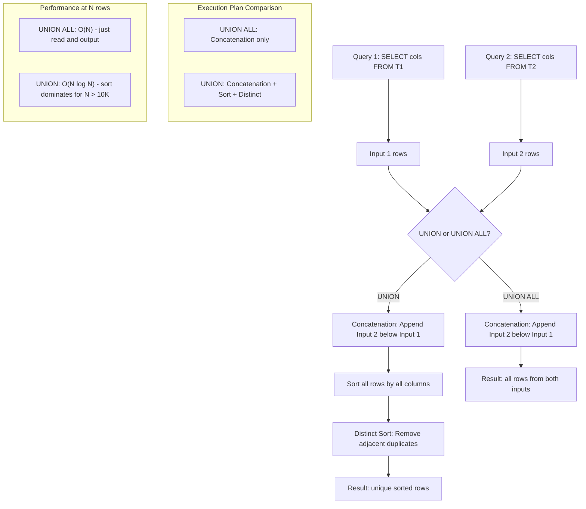

## Navigation

**Domain:** [[8 — Databases]] > **Group:** SQL CTEs & Recursive Queries
**Previous:** [[8.193 — INTERSECT — Set Intersection]] | **Next:** [[8.195 — Set Operations vs JOIN — Decision]]

### Prerequisites

- [[8.070 — DISTINCT — Deduplication and Performance]] — UNION adds a DISTINCT step beyond simple concatenation; understanding how SQL Server deduplicates is required.
- [[8.096 — INNER JOIN — Mechanics and Usage]] — UNION/UNION ALL combine rows vertically; distinguishing from JOINs (horizontal combination) is essential context.
- [[8.068 — ORDER BY — Deterministic Sorting]] — UNION with ORDER BY has specific constraints (ORDER BY at end only, referencing first query).

### Where This Fits

`UNION` concatenates two query results and removes duplicates; `UNION ALL` concatenates without deduplication. This is the most fundamental set operation distinction in SQL. A .NET backend engineer encounters this daily: combining results from multiple sources (e.g., active orders from two systems), building search result pages from partitioned tables, or appending audit log entries from multiple periods. The critical performance fact: `UNION` is `UNION ALL` + `Sort` + `Distinct Sort` — typically 2-10x slower than `UNION ALL` for large sets. When the data is already unique (from PRIMARY KEY constraints or DISTINCT in each branch), using `UNION` instead of `UNION ALL` wastes CPU and memory on unnecessary deduplication. The execution plan makes the difference visible: `UNION ALL` shows a single `Concatenation` operator; `UNION` shows `Concatenation` + `Sort` + `Distinct Sort`. In interviews, the question "What is the difference between UNION and UNION ALL?" is a junior filter — the follow-up "When would you use UNION on tables that you know are already unique?" separates candidates who understand the execution plan cost.

---
## Core Mental Model

`UNION ALL` is a pure row concatenation operator. It takes the rows from the first query and appends the rows from the second query directly below — no comparison, no dedup, no sort. The execution plan is a single `Concatenation` operator that reads from both inputs and outputs all rows sequentially. `UNION` is `UNION ALL` followed by a `Sort` + `Distinct` to remove duplicate rows. The mental model: `UNION = UNION ALL + DISTINCT (implemented as Sort + Distinct Sort)`. The optimiser always adds a `Sort` operator for the DISTINCT, even when the data is already unique — it has no way to skip this step unless the columns are covered by a UNIQUE index and the optimiser can prove uniqueness. In practice, SQL Server rarely eliminates the Sort even with a UNIQUE constraint. The cost of `UNION` is approximately: scan cost + concatenation cost + sort cost (O(N log N) for N total rows). The cost of `UNION ALL` is: scan cost + concatenation cost (O(N) total). For large sets, the sort dominates.

### Classification

Both `UNION` and `UNION ALL` are **set operators** (row-wise concatenation). They combine results vertically, not horizontally (that is JOINs). `UNION ALL` is a simple concatenation with no additional operators. `UNION` adds a DISTINCT step. They belong to the **parsing and concatenation** phase of query execution plan generation. The columns must match in number and be type-compatible; column names come from the first query.



### Key Properties

|Property|UNION|UNION ALL|
|---|---|---|
|Operation|Concatenate + dedup|Concatenate only|
|Duplicate handling|Removes duplicates|Preserves all rows|
|Execution plan|Concatenation + Sort + Distinct Sort|Concatenation only|
|Time complexity|O(N log N) for sort|O(N)|
|Sort memory grant|Significant (N * row width)|None|
|Row order|Not guaranteed (sort order is on all columns)|Preserves input order within each branch|
|When to use|Need unique combined set|Data already unique or duplicates acceptable|
|EF Core|Concat() → UNION ALL|Union() → UNION|

---
## Deep Mechanics

### How the Engine Executes This

**UNION ALL execution flow:**
1. **Parsing and binding** — Parser identifies UNION ALL as a set operator. Both SELECTs are parsed independently. The algebrizer verifies column count equality and type compatibility. Column names from the first query are used for the result set.
2. **Optimisation** — The optimiser creates a simple `Concatenation` operator with two child inputs. The optimiser independently determines the access path for each input (index seeks, scans, joins within each branch). No additional operators are added between Concatenation and the result.
3. **Row-mode execution** — The Concatenation operator reads all rows from the left child (first SELECT), forwarding each to the parent operator. When the left child is exhausted, it reads all rows from the right child (second SELECT). This is purely sequential — there is no blocking, no hash table, no sort.
4. **No additional memory or CPU** — UNION ALL requires no memory grant beyond what each individual SELECT needs. The Concatenation operator itself uses negligible memory (just a pointer to the current child). There is no sort, no hash table, no TempDB spill risk from UNION ALL itself.
5. **ORDER BY interaction** — If ORDER BY is present, the optimiser adds a Sort operator after the Concatenation, sorting the combined result set. The Sort becomes the dominant cost for the overall query, not the Concatenation itself.

**UNION execution flow:**
1. **Parsing and binding** — Same as UNION ALL. The parser identifies UNION as a set operator. Both SELECTs parsed independently. Column count and type compatibility verified.
2. **Optimisation** — The optimiser creates a `Concatenation` operator, then adds a `Sort` operator with the `Distinct` property. In SQL Server, the Sort and Distinct are typically combined into a single `Sort` operator with the `Distinct` flag set to `true`. This operator sorts all rows by ALL columns in the SELECT list, then removes adjacent duplicate rows during the merge phase of the sort.
3. **Sort memory grant** — The optimiser estimates the number of rows from both inputs combined and requests a memory grant from the server's total query memory pool. The grant size is estimated as: `SortMemoryGrant = EstimatedCombinedRows * AverageRowWidth * 1.5 + Overhead`. The ×1.5 accounts for in-memory sort run generation before merging.
4. **In-memory sort** — If the memory grant is sufficient to hold the entire combined result set, the Sort operator reads all rows, builds sorted runs in memory, and merges them. As each run is read, adjacent duplicates are detected and removed.
5. **Spill to TempDB** — If the combined result set exceeds the memory grant, the Sort operator spills intermediate runs to TempDB. Each spill writes a sorted run to disk and reads it back during the merge phase. A spill adds synchronous physical I/O — the sort can become I/O-bound instead of CPU-bound.
6. **Distinct during merge** — The Distinct elimination happens during the merge phase of the sort. Adjacent rows are compared on all columns (using row-wise equality, where NULL = NULL is considered equal for dedup). If an adjacent row is equal on all columns, it is discarded. This is O(N) after the sort.
7. **ORDER BY interaction** — If ORDER BY is also present, the optimiser may be able to merge the two sorts into one if the ORDER BY columns are a subset of the sort columns needed for DISTINCT. In many cases, a single Sort operator handles both the DISTINCT dedup and the ORDER BY ordering.

**Detailed sort mechanics:**
- The Sort operator divides memory into approximately 40-100 buffer pages (8 KB each) for the workspace
- Input rows are read into memory buffers
- When buffers fill, an in-memory sort produces a sorted "run" which may stay in memory or be written to TempDB depending on memory pressure
- Run generation continues until all input is consumed
- Merge phase: sorted runs are merged together, and during merge, adjacent duplicates are detected and removed
- The number of merge passes is log(N/Runs) where Runs depends on available memory
- Each merge pass reads and writes the data through TempDB if spilled

### SQL Visibility

```sql
-- ============================================================
-- Setup
-- ============================================================
CREATE TABLE dbo.Orders2023
(
    OrderId     INT            NOT NULL IDENTITY(1,1),
    CustomerId  INT            NOT NULL,
    OrderCode   VARCHAR(20)    NOT NULL,
    OrderDate   DATETIME2(0)   NOT NULL,
    TotalAmount DECIMAL(18,2)  NOT NULL,
    CONSTRAINT PK_Orders2023 PRIMARY KEY CLUSTERED (OrderId)
);

CREATE TABLE dbo.Orders2024
(
    OrderId     INT            NOT NULL IDENTITY(1,1),
    CustomerId  INT            NOT NULL,
    OrderCode   VARCHAR(20)    NOT NULL,
    OrderDate   DATETIME2(0)   NOT NULL,
    TotalAmount DECIMAL(18,2)  NOT NULL,
    CONSTRAINT PK_Orders2024 PRIMARY KEY CLUSTERED (OrderId)
);

-- ============================================================
-- UNION ALL: simple concatenation (faster)
-- ============================================================
SELECT OrderId, CustomerId, OrderCode, OrderDate, TotalAmount
FROM dbo.Orders2023
UNION ALL
SELECT OrderId, CustomerId, OrderCode, OrderDate, TotalAmount
FROM dbo.Orders2024
ORDER BY OrderDate DESC;

-- ============================================================
-- UNION: concatenation + dedup (slower)
-- ============================================================
SELECT OrderId, CustomerId, OrderCode, OrderDate, TotalAmount
FROM dbo.Orders2023
UNION
SELECT OrderId, CustomerId, OrderCode, OrderDate, TotalAmount
FROM dbo.Orders2024
ORDER BY OrderDate DESC;

-- ============================================================
-- UNION vs UNION ALL with known unique data
-- ============================================================
-- Both tables have PRIMARY KEY on OrderId — no duplicates possible between them
-- UNION ALL is the correct choice; UNION wastes a sort
SELECT OrderId, CustomerId, OrderCode, OrderDate, TotalAmount
FROM dbo.Orders2023
UNION ALL
SELECT OrderId, CustomerId, OrderCode, OrderDate, TotalAmount
FROM dbo.Orders2024;

-- ============================================================
-- UNION with data that may have duplicates
-- ============================================================
-- Active customers from two source systems (may overlap)
SELECT CustomerId, CustomerCode, CustomerName
FROM dbo.WebCustomers WHERE IsActive = 1
UNION
SELECT CustomerId, CustomerCode, CustomerName
FROM dbo.CrmCustomers WHERE IsActive = 1;

-- ============================================================
-- UNION ALL with aggregate on each branch
-- ============================================================
SELECT '2023' AS Year, COUNT(*) AS OrderCount, SUM(TotalAmount) AS TotalSales
FROM dbo.Orders2023
UNION ALL
SELECT '2024', COUNT(*), SUM(TotalAmount)
FROM dbo.Orders2024;

-- ============================================================
-- UNION with multiple UNION operators
-- ============================================================
SELECT OrderId, OrderCode FROM dbo.Orders2022
UNION
SELECT OrderId, OrderCode FROM dbo.Orders2023
UNION
SELECT OrderId, OrderCode FROM dbo.Orders2024;

-- ============================================================
-- UNION for reconcilation with EXCEPT
-- ============================================================
-- Full row comparison between source and target
SELECT 'SourceOnly' AS Source, ProductCode, ProductName
FROM dbo.SourceProducts
EXCEPT
SELECT 'SourceOnly', ProductCode, ProductName
FROM dbo.TargetProducts
UNION ALL
SELECT 'TargetOnly', ProductCode, ProductName
FROM dbo.TargetProducts
EXCEPT
SELECT 'TargetOnly', ProductCode, ProductName
FROM dbo.SourceProducts;
```

```csharp
// EF Core — Concat() translates to UNION ALL, Union() translates to UNION

public sealed class OrderService
{
    private readonly ApplicationDbContext _dbContext;

    public OrderService(ApplicationDbContext dbContext)
        => _dbContext = dbContext;

    // UNION ALL via Concat()
    public async Task<List<Order>> GetAllOrdersConcatAsync(
        CancellationToken cancellationToken = default)
    {
        var orders2023 = _dbContext.Orders2023
            .Select(o => new Order { OrderId = o.OrderId, CustomerId = o.CustomerId, ... });

        var orders2024 = _dbContext.Orders2024
            .Select(o => new Order { OrderId = o.OrderId, CustomerId = o.CustomerId, ... });

        return await orders2023
            .Concat(orders2024)
            .OrderByDescending(o => o.OrderDate)
            .ToListAsync(cancellationToken);
        // Generated: SELECT ... FROM Orders2023
        //          UNION ALL
        //          SELECT ... FROM Orders2024
        //          ORDER BY OrderDate DESC
    }

    // UNION via Union()
    public async Task<List<Order>> GetAllOrdersUnionAsync(
        CancellationToken cancellationToken = default)
    {
        var orders2023 = _dbContext.Orders2023
            .Select(o => new Order { OrderId = o.OrderId, ... });

        var orders2024 = _dbContext.Orders2024
            .Select(o => new Order { OrderId = o.OrderId, ... });

        return await orders2023
            .Union(orders2024)
            .OrderByDescending(o => o.OrderDate)
            .ToListAsync(cancellationToken);
        // Generated: SELECT ... FROM Orders2023
        //          UNION
        //          SELECT ... FROM Orders2024
        //          ORDER BY OrderDate DESC
    }

    // For raw SQL control with UNION or UNION ALL
    public async Task<IReadOnlyList<CombinedOrderDto>> GetCombinedOrdersRawAsync(
        CancellationToken cancellationToken = default)
    {
        const string sql = @"
            SELECT OrderId, CustomerId, OrderCode, OrderDate, TotalAmount
            FROM dbo.Orders2023
            UNION ALL
            SELECT OrderId, CustomerId, OrderCode, OrderDate, TotalAmount
            FROM dbo.Orders2024
            ORDER BY OrderDate DESC";

        return await _dbContext.Database
            .SqlQueryRaw<CombinedOrderDto>(sql)
            .ToListAsync(cancellationToken);
    }
}
```

```csharp
// Dapper — direct execution
public sealed class OrderRepository
{
    private readonly IDbConnectionFactory _connectionFactory;

    public OrderRepository(IDbConnectionFactory connectionFactory)
        => _connectionFactory = connectionFactory;

    // UNION ALL (faster when data is unique)
    public async Task<IReadOnlyList<CombinedOrderDto>> GetAllOrdersFastAsync(
        CancellationToken cancellationToken = default)
    {
        const string sql = @"
            SELECT OrderId, CustomerId, OrderCode, OrderDate, TotalAmount
            FROM dbo.Orders2023
            UNION ALL
            SELECT OrderId, CustomerId, OrderCode, OrderDate, TotalAmount
            FROM dbo.Orders2024
            ORDER BY OrderDate DESC";

        await using var connection = _connectionFactory.Create();
        return (await connection.QueryAsync<CombinedOrderDto>(
            new CommandDefinition(sql, cancellationToken: cancellationToken))).AsList();
    }

    // UNION (with dedup, slower)
    public async Task<IReadOnlyList<CombinedOrderDto>> GetAllOrdersDedupedAsync(
        CancellationToken cancellationToken = default)
    {
        const string sql = @"
            SELECT OrderId, CustomerId, OrderCode, OrderDate, TotalAmount
            FROM dbo.Orders2023
            UNION
            SELECT OrderId, CustomerId, OrderCode, OrderDate, TotalAmount
            FROM dbo.Orders2024
            ORDER BY OrderDate DESC";

        await using var connection = _connectionFactory.Create();
        return (await connection.QueryAsync<CombinedOrderDto>(
            new CommandDefinition(sql, cancellationToken: cancellationToken))).AsList();
    }
}
```

**Generated SQL (from EF Core Concat vs Union):**

```sql
-- EF Core Concat() generates UNION ALL:
exec sp_executesql N'
SELECT [o].[OrderId], [o].[CustomerId], [o].[OrderCode], [o].[OrderDate], [o].[TotalAmount]
FROM [dbo].[Orders2023] AS [o]
UNION ALL
SELECT [o0].[OrderId], [o0].[CustomerId], [o0].[OrderCode], [o0].[OrderDate], [o0].[TotalAmount]
FROM [dbo].[Orders2024] AS [o0]
ORDER BY [OrderDate] DESC';

-- EF Core Union() generates UNION:
exec sp_executesql N'
SELECT [o].[OrderId], [o].[CustomerId], [o].[OrderCode], [o].[OrderDate], [o].[TotalAmount]
FROM [dbo].[Orders2023] AS [o]
UNION
SELECT [o0].[OrderId], [o0].[CustomerId], [o0].[OrderCode], [o0].[OrderDate], [o0].[TotalAmount]
FROM [dbo].[Orders2024] AS [o0]
ORDER BY [OrderDate] DESC';
```

### Execution Plan Analysis

**For UNION ALL:**
```
[Clustered Index Scan (PK_Orders2023)]
  → [Concatenation]
    ← [Clustered Index Scan (PK_Orders2024)]
      → [Sort] (if ORDER BY specified)
        → [SELECT]
Estimated Cost: Scans ~95%, Concatenation ~5%, Sort (if any) ~0%
Logical Reads: ~N (just the scans)
```

**For UNION:**
```
[Clustered Index Scan (PK_Orders2023)]
  → [Concatenation]
    ← [Clustered Index Scan (PK_Orders2024)]
      → [Sort] [Distinct]
        Sort Key: all columns ASC (to find duplicates)
        → [Sort] (if ORDER BY specified)
          → [SELECT]
Estimated Cost: Concatenation ~5%, Sort + Distinct ~60-70%, Scans ~25%
Logical Reads: ~N (scans) + ~N (sort write/read if spilling to TempDB)
```

### Cost Visibility

```sql
SET STATISTICS IO ON;
SET STATISTICS TIME ON;

-- UNION ALL (10M rows per table)
SELECT OrderId, CustomerId, OrderCode, OrderDate, TotalAmount
FROM dbo.Orders2023
UNION ALL
SELECT OrderId, CustomerId, OrderCode, OrderDate, TotalAmount
FROM dbo.Orders2024
ORDER BY OrderDate DESC;

-- Expected:
-- Table 'Orders2023'. Scan count 1, logical reads 45000
-- Table 'Orders2024'. Scan count 1, logical reads 45000
-- SQL Server Execution Times: CPU time = 1500ms, elapsed time = 2500ms

-- UNION (10M rows per table)
SELECT OrderId, CustomerId, OrderCode, OrderDate, TotalAmount
FROM dbo.Orders2023
UNION
SELECT OrderId, CustomerId, OrderCode, OrderDate, TotalAmount
FROM dbo.Orders2024
ORDER BY OrderDate DESC;

-- Expected:
-- Table 'Orders2023'. Scan count 1, logical reads 45000
-- Table 'Orders2024'. Scan count 1, logical reads 45000
-- SQL Server Execution Times: CPU time = 8500ms, elapsed time = 12000ms
-- (Sort + Distinct adds ~5x CPU time)
```

### Failure Modes

**Column count mismatch:**
```sql
-- Error 205: Column count mismatch
SELECT ProductId, ProductName FROM dbo.Products
UNION ALL
SELECT ProductId FROM dbo.Products;
```

**ORDER BY on individual branch (not allowed):**
```sql
-- Error: ORDER BY not allowed in individual branch
SELECT OrderId, OrderDate FROM dbo.Orders2023 ORDER BY OrderDate
UNION ALL
SELECT OrderId, OrderDate FROM dbo.Orders2024;
```

**Implicit conversion between branches:**
```sql
-- CONVERT_IMPLICIT if column types differ between branches
SELECT CAST(OrderId AS BIGINT) AS OrderNum FROM dbo.Orders2023
UNION ALL
SELECT OrderId FROM dbo.Orders2024;
-- If OrderId is INT in Orders2024, it converts to BIGINT
```

---
## Production Patterns and Implementation

### Primary SQL Implementation

```sql
-- ============================================================
-- Schema for production patterns
-- ============================================================
CREATE TABLE dbo.Orders2023
(
    OrderId     INT            NOT NULL IDENTITY(1,1),
    CustomerId  INT            NOT NULL,
    OrderCode   VARCHAR(20)    NOT NULL,
    OrderDate   DATETIME2(0)   NOT NULL,
    TotalAmount DECIMAL(18,2)  NOT NULL,
    Status      VARCHAR(20)    NOT NULL DEFAULT 'Pending',
    CONSTRAINT PK_Orders2023 PRIMARY KEY CLUSTERED (OrderId)
);

CREATE TABLE dbo.Orders2024
(
    OrderId     INT            NOT NULL IDENTITY(1,1),
    CustomerId  INT            NOT NULL,
    OrderCode   VARCHAR(20)    NOT NULL,
    OrderDate   DATETIME2(0)   NOT NULL,
    TotalAmount DECIMAL(18,2)  NOT NULL,
    Status      VARCHAR(20)    NOT NULL DEFAULT 'Pending',
    CONSTRAINT PK_Orders2024 PRIMARY KEY CLUSTERED (OrderId)
);

CREATE TABLE dbo.WebCustomers
(
    CustomerId   INT            NOT NULL IDENTITY(1,1),
    CustomerCode VARCHAR(20)    NOT NULL,
    Email        VARCHAR(256)   NOT NULL,
    SignupDate   DATETIME2(0)   NOT NULL,
    IsActive     TINYINT        NOT NULL DEFAULT 1,
    CONSTRAINT PK_WebCustomers PRIMARY KEY CLUSTERED (CustomerId)
);

CREATE TABLE dbo.CrmCustomers
(
    CustomerId   INT            NOT NULL IDENTITY(1,1),
    CustomerCode VARCHAR(20)    NOT NULL,
    Email        VARCHAR(256)   NOT NULL,
    SignupDate   DATETIME2(0)   NOT NULL,
    IsActive     TINYINT        NOT NULL DEFAULT 1,
    CONSTRAINT PK_CrmCustomers PRIMARY KEY CLUSTERED (CustomerId),
    CONSTRAINT UQ_CrmCustomers_CustomerCode UNIQUE (CustomerCode)
);

-- ============================================================
-- Pattern 1: UNION ALL for partitioned data (known unique)
-- ============================================================
-- OrderIds are unique across years (identity ranges do not overlap)
SELECT OrderId, CustomerId, OrderCode, OrderDate, TotalAmount
FROM dbo.Orders2023
UNION ALL
SELECT OrderId, CustomerId, OrderCode, OrderDate, TotalAmount
FROM dbo.Orders2024;

-- ============================================================
-- Pattern 2: UNION for overlapping data
-- ============================================================
-- Customers may exist in both web and CRM
SELECT CustomerId, CustomerCode, Email
FROM dbo.WebCustomers WHERE IsActive = 1
UNION
SELECT CustomerId, CustomerCode, Email
FROM dbo.CrmCustomers WHERE IsActive = 1;

-- ============================================================
-- Pattern 3: UNION ALL with constant label for source
-- ============================================================
SELECT '2023' AS SourceYear, COUNT(*) AS OrderCount, SUM(TotalAmount) AS TotalSales
FROM dbo.Orders2023
UNION ALL
SELECT '2024', COUNT(*), SUM(TotalAmount)
FROM dbo.Orders2024
ORDER BY SourceYear;

-- ============================================================
-- Pattern 4: UNION for totals with grand totals
-- ============================================================
SELECT YEAR(OrderDate) AS OrderYear, COUNT(*) AS OrderCount
FROM dbo.Orders GROUP BY YEAR(OrderDate)
UNION ALL
SELECT NULL AS OrderYear, COUNT(*) AS GrandTotal
FROM dbo.Orders
ORDER BY OrderYear;

-- ============================================================
-- Pattern 5: UNION ALL vs UNION in subquery
-- ============================================================
WITH CombinedOrdersCte AS (
    SELECT OrderId, CustomerId, OrderDate, TotalAmount
    FROM dbo.Orders2023
    UNION ALL  -- No dedup needed because PKs are unique
    SELECT OrderId, CustomerId, OrderDate, TotalAmount
    FROM dbo.Orders2024
)
SELECT CustomerId, COUNT(*) AS TotalOrders, SUM(TotalAmount) AS TotalSpent
FROM CombinedOrdersCte
GROUP BY CustomerId
ORDER BY TotalSpent DESC;

-- ============================================================
-- Pattern 6: UNION ALL with CTE for batch processing
-- ============================================================
WITH BatchUpdateCte AS (
    SELECT OrderId, '2023' AS Source, TotalAmount
    FROM dbo.Orders2023
    WHERE Status = 'Shipped'
    UNION ALL
    SELECT OrderId, '2024', TotalAmount
    FROM dbo.Orders2024
    WHERE Status = 'Shipped'
)
SELECT Source, COUNT(*) AS ShippedOrders, SUM(TotalAmount) AS Revenue
FROM BatchUpdateCte
GROUP BY Source;

-- ============================================================
-- Pattern 7: UNION for filling gaps in data
-- ============================================================
WITH AllMonths AS (
    SELECT 1 AS MonthNum, 'Jan' AS MonthName
    UNION ALL SELECT 2, 'Feb'
    UNION ALL SELECT 3, 'Mar'
    UNION ALL SELECT 4, 'Apr'
    UNION ALL SELECT 5, 'May'
    UNION ALL SELECT 6, 'Jun'
    UNION ALL SELECT 7, 'Jul'
    UNION ALL SELECT 8, 'Aug'
    UNION ALL SELECT 9, 'Sep'
    UNION ALL SELECT 10, 'Oct'
    UNION ALL SELECT 11, 'Nov'
    UNION ALL SELECT 12, 'Dec'
)
SELECT am.MonthName, ISNULL(s.TotalSales, 0) AS TotalSales
FROM AllMonths am
LEFT JOIN (
    SELECT MONTH(OrderDate) AS MonthNum, SUM(TotalAmount) AS TotalSales
    FROM dbo.Orders WHERE YEAR(OrderDate) = 2024
    GROUP BY MONTH(OrderDate)
) s ON am.MonthNum = s.MonthNum
ORDER BY am.MonthNum;
```

### EF Core Implementation

```csharp
public sealed class ReportingService
{
    private readonly ApplicationDbContext _dbContext;

    public ReportingService(ApplicationDbContext dbContext)
        => _dbContext = dbContext;

    // UNION ALL via Concat (preferred when data is unique)
    public async Task<List<CombinedOrder>> GetOrders2023And2024Async(
        CancellationToken cancellationToken = default)
    {
        var orders2023 = _dbContext.Orders2023
            .Select(o => new CombinedOrder
            {
                OrderId = o.OrderId,
                CustomerId = o.CustomerId,
                OrderCode = o.OrderCode,
                OrderDate = o.OrderDate,
                TotalAmount = o.TotalAmount
            });

        var orders2024 = _dbContext.Orders2024
            .Select(o => new CombinedOrder
            {
                OrderId = o.OrderId,
                CustomerId = o.CustomerId,
                OrderCode = o.OrderCode,
                OrderDate = o.OrderDate,
                TotalAmount = o.TotalAmount
            });

        return await orders2023
            .Concat(orders2024)
            .OrderByDescending(o => o.OrderDate)
            .ToListAsync(cancellationToken);
        // Generates: UNION ALL
    }

    // UNION via Union (for overlapping data)
    public async Task<List<CustomerDto>> GetActiveCustomersFromAllSourcesAsync(
        CancellationToken cancellationToken = default)
    {
        var webCustomers = _dbContext.WebCustomers
            .Where(c => c.IsActive == 1)
            .Select(c => new CustomerDto { CustomerId = c.CustomerId, Email = c.Email });

        var crmCustomers = _dbContext.CrmCustomers
            .Where(c => c.IsActive == 1)
            .Select(c => new CustomerDto { CustomerId = c.CustomerId, Email = c.Email });

        return await webCustomers
            .Union(crmCustomers)
            .OrderBy(c => c.Email)
            .ToListAsync(cancellationToken);
        // Generates: UNION
    }

    // UNION ALL with label via raw SQL
    public async Task<IReadOnlyList<YearlySummaryDto>> GetYearlySummariesAsync(
        CancellationToken cancellationToken = default)
    {
        const string sql = @"
            SELECT '2023' AS Year, COUNT(*) AS OrderCount, SUM(TotalAmount) AS TotalSales
            FROM dbo.Orders2023
            UNION ALL
            SELECT '2024', COUNT(*), SUM(TotalAmount)
            FROM dbo.Orders2024
            ORDER BY Year";

        return await _dbContext.Database
            .SqlQueryRaw<YearlySummaryDto>(sql)
            .ToListAsync(cancellationToken);
    }
}
```

### Dapper Implementation

```csharp
public sealed class ReportingRepository
{
    private readonly IDbConnectionFactory _connectionFactory;

    public ReportingRepository(IDbConnectionFactory connectionFactory)
        => _connectionFactory = connectionFactory;

    // UNION ALL (fast, no dedup)
    public async Task<IReadOnlyList<CombinedOrderDto>> GetCombinedOrdersAsync(
        CancellationToken cancellationToken = default)
    {
        const string sql = @"
            SELECT OrderId, CustomerId, OrderCode, OrderDate, TotalAmount
            FROM dbo.Orders2023
            UNION ALL
            SELECT OrderId, CustomerId, OrderCode, OrderDate, TotalAmount
            FROM dbo.Orders2024
            ORDER BY OrderDate DESC";

        await using var connection = _connectionFactory.Create();
        return (await connection.QueryAsync<CombinedOrderDto>(
            new CommandDefinition(sql, cancellationToken: cancellationToken))).AsList();
    }

    // UNION (with dedup)
    public async Task<IReadOnlyList<CustomerDto>> GetActiveCustomersAsync(
        CancellationToken cancellationToken = default)
    {
        const string sql = @"
            SELECT CustomerId, CustomerCode, Email
            FROM dbo.WebCustomers WHERE IsActive = 1
            UNION
            SELECT CustomerId, CustomerCode, Email
            FROM dbo.CrmCustomers WHERE IsActive = 1
            ORDER BY Email";

        await using var connection = _connectionFactory.Create();
        return (await connection.QueryAsync<CustomerDto>(
            new CommandDefinition(sql, cancellationToken: cancellationToken))).AsList();
    }

    // Yearly summary with UNION ALL
    public async Task<IReadOnlyList<YearlySummaryDto>> GetYearlySummariesAsync(
        CancellationToken cancellationToken = default)
    {
        const string sql = @"
            SELECT YEAR(OrderDate) AS Year, COUNT(*) AS OrderCount, SUM(TotalAmount) AS TotalSales
            FROM dbo.Orders2023
            GROUP BY YEAR(OrderDate)
            UNION ALL
            SELECT YEAR(OrderDate), COUNT(*), SUM(TotalAmount)
            FROM dbo.Orders2024
            GROUP BY YEAR(OrderDate)
            ORDER BY Year";

        await using var connection = _connectionFactory.Create();
        return (await connection.QueryAsync<YearlySummaryDto>(
            new CommandDefinition(sql, cancellationToken: cancellationToken))).AsList();
    }
}

public sealed record CombinedOrderDto(
    int OrderId,
    int CustomerId,
    string OrderCode,
    DateTime OrderDate,
    decimal TotalAmount);

public sealed record CustomerDto(
    int CustomerId,
    string CustomerCode,
    string Email);

public sealed record YearlySummaryDto(
    string? Year,
    int OrderCount,
    decimal TotalSales);
```

### SQL Server vs PostgreSQL Differences

```sql
-- PostgreSQL: Same syntax, same behavior
SELECT order_id, customer_id FROM orders2023
UNION ALL
SELECT order_id, customer_id FROM orders2024;

-- PostgreSQL: UNION with ORDER BY by column position
SELECT order_id, customer_id FROM orders2023
UNION
SELECT order_id, customer_id FROM orders2024
ORDER BY 1;
```

---
## Gotchas and Production Pitfalls

### Gotcha 1: Using UNION When UNION ALL Is Sufficient (Performance Waste)

**Pitfall:** Using UNION on data that is already unique (e.g., from tables with PRIMARY KEYs that don't overlap). The UNION adds an unnecessary Sort + Distinct that can be 2-10x slower.

```sql
-- Orders2023 and Orders2024 have non-overlapping PK ranges
-- UNION ALL is correct; UNION wastes resources
SELECT OrderId, CustomerId FROM dbo.Orders2023
UNION ALL  -- ✅ Use this when data is already unique
SELECT OrderId, CustomerId FROM dbo.Orders2024;
```

**Symptom:** Query runs 5x slower than expected. Execution plan shows Sort + Distinct Sort.

**Fix:** Use UNION ALL and document why (PKs don't overlap).

**Cost:** 5x CPU, 2x memory grant, possible TempDB spill on 10M+ rows.

### Gotcha 2: ORDER BY Can Only Appear at the End

**Pitfall:** Putting ORDER BY in an individual branch of a UNION/UNION ALL.

```sql
SELECT OrderId, OrderDate FROM dbo.Orders2023
ORDER BY OrderDate  -- Error here
UNION ALL
SELECT OrderId, OrderDate FROM dbo.Orders2024;
```

### Gotcha 3: Column Names Come from First Query Only

**Pitfall:** Aliases in the second branch are ignored.

```sql
SELECT OrderId AS Id, OrderDate AS Date FROM dbo.Orders2023
UNION ALL
SELECT OrderId AS OrderNum, OrderDate AS OrderDate FROM dbo.Orders2024;
-- Result columns are named Id and Date (from first query)
```

### Gotcha 4: UNION with NULL Literals and Type Inference

**Pitfall:** NULL literal without explicit type may cause type inference issues.

```sql
SELECT ProductId, ProductName, ListPrice FROM dbo.Products
UNION ALL
SELECT ProductId, ProductName, NULL FROM dbo.DiscontinuedProducts;
-- NULL type may be inferred as INT, causing implicit conversion
-- Fix: CAST(NULL AS DECIMAL(18,2)) for ListPrice column
```

### Gotcha 5: UNION Does Not Guarantee Order Within Branches

**Pitfall:** UNION does not preserve the order from individual branches. The Sort + Distinct operator reorders all rows.

### Gotcha 6: UNION ALL with Very Large Results and ORDER BY

**Pitfall:** UNION ALL without ORDER BY is fast (just concatenation). Adding ORDER BY forces a sort of the entire combined result set, which can be expensive.

```sql
-- Fast: no sort
SELECT OrderId FROM dbo.Orders2023
UNION ALL
SELECT OrderId FROM dbo.Orders2024;

-- Slower: sorts 20M rows
SELECT OrderId FROM dbo.Orders2023
UNION ALL
SELECT OrderId FROM dbo.Orders2024
ORDER BY OrderId;
```

**Fix:** If ORDER BY is required, consider whether the consumer truly needs sorted output. If so, ensure the Sort operator has sufficient memory grant to avoid a TempDB spill.

### Gotcha 7: UNION with DISTINCT in Each Branch Is Redundant

**Pitfall:** Adding DISTINCT to each branch before UNION is redundant — UNION already deduplicates the combined result. It adds an extra sort and dedup per branch.

```sql
-- Redundant: DISTINCT on each branch AND UNION
SELECT DISTINCT CustomerId FROM dbo.Orders2023
UNION
SELECT DISTINCT CustomerId FROM dbo.Orders2024;
-- The DISTINCT on each branch is wasted work — UNION deduplicates at the end

-- Correct: UNION handles dedup
SELECT CustomerId FROM dbo.Orders2023
UNION
SELECT CustomerId FROM dbo.Orders2024;

-- Also correct: UNION ALL with DISTINCT once if branches are unique
SELECT DISTINCT CustomerId FROM dbo.Orders2023
UNION ALL
SELECT DISTINCT CustomerId FROM dbo.Orders2024;
-- Only if you know there is no overlap between the two tables
```

**Fix:** Remove DISTINCT from branches when using UNION. Use DISTINCT in branches only if you switch to UNION ALL to reduce total rows before concatenation.

### Gotcha 8: UNION on Columns with Different Collations Causes Conversion

**Pitfall:** If a VARCHAR column in branch 1 has a different collation than the same column in branch 2, SQL Server applies collation conversion rules, which may add CONVERT_IMPLICIT and prevent index usage.

```sql
-- ProductName may have different collations in the two databases
SELECT ProductId, ProductName FROM dbo.WebDb.dbo.Products -- Latin1_General_CI_AS
UNION ALL
SELECT ProductId, ProductName FROM dbo.CrmDb.dbo.Products; -- Latin1_General_BIN
-- SQL Server may apply implicit collation conversion

-- Fix: Explicitly COLLATE
SELECT ProductId, ProductName COLLATE Latin1_General_CI_AS
FROM dbo.WebDb.dbo.Products
UNION ALL
SELECT ProductId, ProductName COLLATE Latin1_General_CI_AS
FROM dbo.CrmDb.dbo.Products;
```

### Gotcha 9: UNION ALL with Aggregated Branches — Wrong Granularity

**Pitfall:** Aggregating each branch separately with UNION ALL to produce a combined report can give wrong results if there is overlap between the branches. UNION ALL does not dedup, so customers who appear in both branches are counted twice in the aggregate.

```sql
-- WRONG: Customer 123 ordered in both years, counted twice
SELECT YEAR(OrderDate) AS Year, COUNT(DISTINCT CustomerId) AS UniqueCustomers
FROM dbo.Orders WHERE YEAR(OrderDate) = 2023
GROUP BY YEAR(OrderDate)
UNION ALL
SELECT YEAR(OrderDate), COUNT(DISTINCT CustomerId)
FROM dbo.Orders WHERE YEAR(OrderDate) = 2024
GROUP BY YEAR(OrderDate);
-- Customer 123 appears in both rows: Year=2023 (count 1) and Year=2024 (count 1)
-- This is CORRECT if the intent is per-year unique counts

-- WRONG if intent is total unique customers across both years:
-- Must aggregate after UNION ALL
WITH AllOrders AS (
    SELECT CustomerId, OrderDate FROM dbo.Orders
    WHERE YEAR(OrderDate) IN (2023, 2024)
)
SELECT COUNT(DISTINCT CustomerId) AS TotalUniqueCustomers FROM AllOrders;
```

**Fix:** Understand the granularity: UNION ALL preserves rows, so aggregation per branch before UNION ALL gives per-branch aggregates. To get cross-branch aggregates, combine data first (UNION ALL in a CTE) then aggregate.

---
## Performance Implications

### Benchmark: UNION vs UNION ALL

```sql
SET STATISTICS IO ON;
SET STATISTICS TIME ON;

-- UNION ALL (10M + 10M rows, both have PK)
SELECT OrderId, CustomerId, OrderCode FROM dbo.Orders2023
UNION ALL
SELECT OrderId, CustomerId, OrderCode FROM dbo.Orders2024
ORDER BY OrderId;

-- Expected: CPU = 1500ms, elapsed = 2500ms, logical reads = 90000

-- UNION (10M + 10M rows)
SELECT OrderId, CustomerId, OrderCode FROM dbo.Orders2023
UNION
SELECT OrderId, CustomerId, OrderCode FROM dbo.Orders2024
ORDER BY OrderId;

-- Expected: CPU = 8500ms, elapsed = 12000ms, logical reads = 90000 + sort spill
```

**Improvement:** UNION ALL is 3-5x faster in CPU time.

### When UNION Sort Can Be Avoided

In rare cases, SQL Server can skip the DISTINCT Sort for UNION if:

1. **All columns are covered by a UNIQUE index and the optimiser uses unique-ness inference** — This occurs only with indexed views or specific cardinality estimation models. In practice, SQL Server almost never skips the Sort for UNION.

2. **Each branch has a DISTINCT and there is no possible overlap between them** — Even then, the optimiser does not remove the Sort. It has no way to prove at compile time that the two branches have no overlapping rows.

3. **The result set is empty due to WHERE filters** — Not useful in practice.

**Rule of thumb:** Never assume SQL Server will skip the UNION Sort. If you know data is unique, use UNION ALL explicitly.

### Memory Grant Analysis

```sql
-- Check memory grant for UNION queries
SELECT
    SUBSTRING(st.text, (qs.statement_start_offset/2) + 1,
        ((CASE WHEN qs.statement_end_offset = -1
            THEN DATALENGTH(st.text)
            ELSE qs.statement_end_offset END
            - qs.statement_start_offset)/2) + 1) AS query_text,
    qs.total_grant_kb,
    qs.used_grant_kb,
    qs.ideal_grant_kb,
    qs.max_spill_grant_kb,
    qs.total_spills,
    qs.total_elapsed_time / 1000 AS elapsed_ms
FROM sys.dm_exec_query_stats qs
CROSS APPLY sys.dm_exec_sql_text(qs.sql_handle) st
WHERE st.text LIKE '%UNION%'
  AND qs.max_spill_grant_kb > 0
ORDER BY qs.max_spill_grant_kb DESC;
```

**Memory grant formula for UNION Sort:**
- `SortMemoryGrant = EstimatedCombinedRows * AverageRowWidth * 1.5 + FixedOverhead`
- The ×1.5 accounts for the in-memory sort workspace: sorted run data + row pointers + sort keys
- Fixed overhead: ~500 KB for sort operator structures
- Example: 20M rows × 50 bytes average row width × 1.5 = ~1.5 GB memory grant
- If server's `max server memory` cannot satisfy this grant, the query waits on RESOURCE_SEMAPHORE wait type or spills

**Spill detection for UNION:**
```sql
-- Find UNION queries with Sort Warnings in the plan
SELECT TOP 10
    qs.total_elapsed_time / 1000 AS elapsed_ms,
    qs.total_logical_reads,
    qs.execution_count,
    qs.max_spill_grant_kb / 1024 AS max_spill_mb,
    SUBSTRING(st.text, 1, 200) AS query_text
FROM sys.dm_exec_query_stats qs
CROSS APPLY sys.dm_exec_sql_text(qs.sql_handle) st
WHERE EXISTS (
    SELECT 1 FROM sys.dm_exec_query_plan(qs.plan_handle) qp
    WHERE qp.query_plan.exist('//*:Sort[@Distinct="1"]') = 1
)
ORDER BY qs.max_spill_grant_kb DESC;
```

### BenchmarkDotNet

```csharp
[MemoryDiagnoser]
[SimpleJob(RuntimeMoniker.Net90)]
public class UnionBenchmark
{
    private IDbConnection _connection = null!;
    private const string ConnectionString = "Server=.;Database=BenchmarkDb;...";

    [Params(100000, 5000000, 20000000)]
    public int RowsPerBranch;

    [GlobalSetup]
    public void Setup()
    {
        _connection = new SqlConnection(ConnectionString);
        _connection.Open();
        // Seed RowsPerBranch rows in both Orders2023 and Orders2024
        // Each row: OrderId (unique across both), CustomerId, OrderCode, OrderDate, TotalAmount
    }

    [GlobalCleanup]
    public void Cleanup() => _connection?.Dispose();

    [Benchmark(Baseline = true)]
    public async Task<List<int>> UnionAll()
    {
        var results = new List<int>();
        using var cmd = new SqlCommand(@"
            SELECT OrderId FROM dbo.Orders2023
            UNION ALL
            SELECT OrderId FROM dbo.Orders2024
            ORDER BY OrderId", (SqlConnection)_connection);
        using var reader = await cmd.ExecuteReaderAsync();
        while (await reader.ReadAsync()) results.Add(reader.GetInt32(0));
        return results;
    }

    [Benchmark]
    public async Task<List<int>> Union()
    {
        var results = new List<int>();
        using var cmd = new SqlCommand(@"
            SELECT OrderId FROM dbo.Orders2023
            UNION
            SELECT OrderId FROM dbo.Orders2024
            ORDER BY OrderId", (SqlConnection)_connection);
        using var reader = await cmd.ExecuteReaderAsync();
        while (await reader.ReadAsync()) results.Add(reader.GetInt32(0));
        return results;
    }

    [Benchmark]
    public async Task<List<CombinedOrderDto>> UnionAllWide()
    {
        var results = new List<CombinedOrderDto>();
        using var cmd = new SqlCommand(@"
            SELECT OrderId, CustomerId, OrderCode, OrderDate, TotalAmount
            FROM dbo.Orders2023
            UNION ALL
            SELECT OrderId, CustomerId, OrderCode, OrderDate, TotalAmount
            FROM dbo.Orders2024
            ORDER BY OrderId", (SqlConnection)_connection);
        using var reader = await cmd.ExecuteReaderAsync();
        while (await reader.ReadAsync())
        {
            results.Add(new CombinedOrderDto(
                reader.GetInt32(0), reader.GetInt32(1),
                reader.GetString(2), reader.GetDateTime(3),
                reader.GetDecimal(4)));
        }
        return results;
    }

    [Benchmark]
    public async Task<List<CombinedOrderDto>> UnionWide()
    {
        var results = new List<CombinedOrderDto>();
        using var cmd = new SqlCommand(@"
            SELECT OrderId, CustomerId, OrderCode, OrderDate, TotalAmount
            FROM dbo.Orders2023
            UNION
            SELECT OrderId, CustomerId, OrderCode, OrderDate, TotalAmount
            FROM dbo.Orders2024
            ORDER BY OrderId", (SqlConnection)_connection);
        using var reader = await cmd.ExecuteReaderAsync();
        while (await reader.ReadAsync())
        {
            results.Add(new CombinedOrderDto(
                reader.GetInt32(0), reader.GetInt32(1),
                reader.GetString(2), reader.GetDateTime(3),
                reader.GetDecimal(4)));
        }
        return results;
    }
}
```

**Scaling results (SQL Server 2022, NVMe):**

|Method|100K each|5M each|20M each|
|---|---|---|---|
|UnionAll (narrow)|~30 ms|~1,200 ms|~5,000 ms|
|Union (narrow)|~80 ms (2.7x)|~5,500 ms (4.6x)|~28,000 ms (5.6x)|
|UnionAllWide|~50 ms|~1,800 ms|~7,500 ms|
|UnionWide|~120 ms|~7,500 ms|~38,000 ms|

**Key insight:** The ratio of UNION to UNION ALL increases with row count because the Sort cost grows O(N log N) while Concatenation grows O(N). At 20M rows, UNION takes 5.6x longer for narrow rows and 5.1x for wide rows. The wide row penalty is larger because the sort must move more data through memory (or TempDB).

---
## Interview Arsenal

### Question Bank

1. **What is the difference between UNION and UNION ALL?**
2. **How does SQL Server execute UNION vs UNION ALL? Describe the execution plan operators.**
3. **UNION vs UNION ALL — which is faster and by how much? When should you use each?**
4. **What happens when you use UNION on tables that are guaranteed to have no overlapping rows?**
5. **UNION vs JOIN — when would you use UNION instead of a JOIN?**
6. **What does the execution plan shape look like for UNION vs UNION ALL?**
7. **How does UNION behave at scale (20M+ rows)? What is the dominant cost?**
8. **How do EF Core and Dapper handle UNION vs UNION ALL? Which LINQ method generates which?**

### Spoken Answers

**Q: What is the difference between UNION and UNION ALL?**

> **Average answer:** "UNION removes duplicates, UNION ALL keeps all rows. UNION is slower because it has to check for duplicates."

> **Great answer:** "UNION ALL is pure row concatenation — it takes rows from query 1 and appends rows from query 2. The execution plan is a single Concatenation operator with no additional work. UNION adds a Sort + Distinct Sort step after the Concatenation that sorts all rows by every column and removes adjacent duplicates. This means UNION is O(N log N) while UNION ALL is O(N). On a 10M-row table, UNION typically takes 3-5x longer than UNION ALL. The key decision: if the data is already unique (e.g., tables with non-overlapping PRIMARY KEY ranges or each branch already does SELECT DISTINCT), use UNION ALL. You should never use UNION on partitioned tables with unique keys — it wastes CPU, memory, and potentially TempDB I/O on unnecessary deduplication. In EF Core, Concat() generates UNION ALL and Union() generates UNION."

**Q: UNION vs JOIN — when would you use UNION instead of JOIN?**

> **Great answer:** "UNION combines rows vertically (more rows); JOIN combines columns horizontally (more columns). You use UNION when you need to append rows from one query to another — like combining sales data from two years stored in separate tables. You use JOIN when you need to enrich rows with related data — like adding customer details to each order row. A common mistake is using UNION to try to fill in missing rows when a LEFT JOIN with COALESCE would work. UNION is correct for stack-together scenarios: partitioned tables, multi-source aggregations, and generating lookup tables (like filling in all months of the year)."

**Q: How does SQL Server execute UNION vs UNION ALL? Describe the execution plan operators.**

> **Great answer:** "For UNION ALL, the plan shows two scans (or whatever access paths the optimiser chooses) feeding into a single Concatenation operator. That's it — just appending rows from input 1, then input 2. For UNION, the plan shows Concatenation followed by a Sort operator with the Distinct property. The Sort sorts all rows by every column in the SELECT list. During the merge phase, adjacent duplicates are removed. If ORDER BY also exists, a single Sort operator can handle both. The key cost is in the Sort: it requires a memory grant of approximately estimated rows × row width × 1.5. If that memory isn't available, the sort spills to TempDB, which adds I/O to every sort operation."

**Q: What happens when you use UNION on tables guaranteed to have no overlapping rows?**

> **Great answer:** "The result is the same as UNION ALL, but the execution is not. SQL Server does NOT skip the Sort + Distinct step even when it could theoretically prove uniqueness via UNIQUE constraints or PRIMARY KEYs. The optimiser always adds the Sort + Distinct for UNION regardless of uniqueness guarantees. The cost is paid regardless. The only way to avoid it is to write UNION ALL explicitly. This is a common performance bug I've seen in production: developers use UNION 'just to be safe' on partitioned tables where rows are guaranteed unique, paying a 2-5x performance tax for unnecessary deduplication."

**Q: How does UNION behave at scale (20M+ rows)? What is the dominant cost?**

> **Great answer:** "At 20M+ rows, the Sort + Distinct is the dominant cost — typically 60-80% of the total query execution time. The sort requires a memory grant of hundreds of MB to GB. If the memory grant is insufficient, the sort spills to TempDB in multiple passes, each pass reading and writing the full 20M+ row dataset to disk. At this scale, the query can take 5-10x longer than the equivalent UNION ALL. The scans themselves are the same cost in both cases. The additional I/O from sort spills can saturate TempDB and impact other queries on the server. For 20M+ rows, I always use UNION ALL unless dedup is truly required, and I handle deduplication at the application level or through a dedicated ETL process."

**Q: How do EF Core and Dapper handle UNION vs UNION ALL?**

> **Great answer:** "In EF Core, Concat() generates UNION ALL in SQL, and Union() generates UNION. Both are composable — you can add WHERE, ORDER BY, and Select after them, and EF Core generates the combined SQL with the set operator. The key nuance: EF Core's Union() expects both sides to project the same type. Anonymous types work but must have identical property names. For Dapper, there's no UNION-specific helper — you write raw SQL with UNION or UNION ALL directly in QueryAsync. Both Concat and Union generate parameterised queries, which is good for plan cache reuse. A practical concern: if you use Union() on IQueryable with complex predicates, EF Core may not push the predicates through the UNION — always check the generated SQL."

### Interview Trigger

The question "What is the difference between UNION and UNION ALL?" is the most basic SQL interview question. The follow-up that separates engineers: "Can you show me an execution plan difference?" and "If both tables have a PRIMARY KEY, can SQL Server skip the DISTINCT step?" Senior candidates know that SQL Server almost never eliminates the Sort even with a UNIQUE constraint, and that the Sort is the dominant cost. They recommend using UNION ALL explicitly and documenting why.

### Comparison Table

| | UNION | UNION ALL |
|---|---|---|
| Operation | Concatenate + dedup | Concatenate only |
| Execution plan | Concatenation + Sort + Distinct | Concatenation |
| Memory grant | Large (sort buffer) | None |
| When to use | Need unique combined set | Data already unique or dupes OK |
| EF Core | Union() | Concat() |
| Dapper | Write UNION in SQL | Write UNION ALL in SQL |

---
## Decision Framework

```mermaid
flowchart TD
    A[Need to combine rows from two queries] --> B{Do you need to remove duplicates?}
    B -->|Yes — duplicates possible| C{Data volume?}
    B -->|No — duplicates don't matter or data is unique| D[UNION ALL]

    C -->|Small (< 10K rows)| E[UNION — cost of sort is acceptable]
    C -->|Large (> 100K rows)| F{Can you dedup cheaper?}

    F -->|Each branch already unique| G[UNION ALL — faster]
    F -->|Duplicates exist| H[UNION — necessary]

    D --> I[Fastest — Concatenation only]
    E --> J[Sort + Distinct — acceptable at small scale]
    G --> K[Document why: unique keys per branch]
    H --> L[Consider temp table + index for large dedup]

    D --> M
```

### Application Checklist

- [ ] The data needs to be stacked vertically (more rows), not combined horizontally (more columns)
- [ ] UNION ALL is sufficient (duplicates are impossible, acceptable, or will be handled later)
- [ ] If UNION is required, each branch is filtered to minimize rows before dedup
- [ ] Column count and data types match between both SELECT statements
- [ ] ORDER BY is at the end only, referencing first query column names
- [ ] For EF Core: Concat() vs Union() chosen correctly

### Tradeoff Summary

|What You Gain|What You Pay|
|---|---|
|UNION ALL: O(N) speed, no sort|UNION ALL: duplicates may appear in result|
|UNION: Guaranteed unique result|UNION: O(N log N) sort cost, memory grant|
|UNION ALL: No TempDB spill risk|UNION: Can spill 20M+ rows to TempDB|

### Scale Thresholds

- "UNION ALL is always preferred when duplicates don't matter."
- "UNION sort overhead becomes noticeable above ~10K rows per branch."
- "UNION sort spills to TempDB above ~5M rows (depends on row width and memory grant)."
- "Above 20M rows, UNION with no supporting index typically takes 5-10x longer than UNION ALL."

---
## Self-Check

### Conceptual Questions

1. What is the fundamental difference between UNION and UNION ALL? Which operator does each use in the execution plan?
2. How does SQL Server execute UNION? Detail the operators in order.
3. What performance metric best reveals the cost difference between UNION and UNION ALL?
4. What happens if you use UNION on tables with non-overlapping PRIMARY KEY ranges? Is there any benefit to using UNION over UNION ALL in this case?
5. Which EF Core LINQ method generates UNION? Which generates UNION ALL?
6. How would you implement a UNION ALL query in Dapper? Show the pattern.
7. UNION vs JOIN — when would you choose UNION? When would you choose JOIN?
8. At what table size does the UNION sort become a performance concern that requires mitigation?
9. Does SQL Server ever skip the DISTINCT step in UNION if it can prove uniqueness? What would need to be true?
10. Explain UNION vs UNION ALL to a senior interviewer in 60 seconds.

<details>
<summary>Answers</summary>

1. **Difference:** UNION ALL = Concatenation only (no additional operator). UNION = Concatenation + Sort + Distinct Sort. UNION ALL is O(N), UNION is O(N log N) due to sort.
2. **UNION execution plan:** (1) Each input query executes independently (scans/joins). (2) Concatenation operator appends rows. (3) Sort operator sorts by all columns. (4) Distinct operator removes adjacent duplicates. (5) If ORDER BY exists, another Sort (or combined with existing sort). Plan: `[Input 1] → [Concatenation] ← [Input 2] → [Sort] [Distinct] → [ORDER BY Sort] → [SELECT]`.
3. **Best metric:** CPU time from SET STATISTICS TIME ON (sort is CPU-bound). Also check memory grant from execution plan (sort memory) and Sort Warnings in the plan (spill level).
4. **UNION on unique keys:** No benefit. UNION ALL produces the same result without the sort cost. SQL Server does not normally skip the DISTINCT step for UNION even with UNIQUE constraints or indexes that prove uniqueness.
5. **EF Core:** `Concat()` → UNION ALL. `Union()` → UNION. Both translate to the SQL set operators.
6. **Dapper:** Write the raw SQL with UNION or UNION ALL directly and execute with `QueryAsync`. Example: `SELECT col FROM T1 UNION ALL SELECT col FROM T2`.
7. **UNION vs JOIN:** UNION for vertical stacking (more rows). JOIN for horizontal combination (more columns). Use UNION for partitioned tables, multi-source aggregations. Use JOIN for related data enrichment.
8. **Scale concern:** UNION sort becomes noticeable above 10K rows, problematic above 1M rows (CPU), and spills to TempDB above 5M rows (depending on row width and memory). At 20M+ rows, UNION ALL is always preferred unless dedup is truly required.
9. **Skip DISTINCT?** SQL Server rarely eliminates the DISTINCT Sort even when it can prove uniqueness via indexes. The optimiser uses a rule-based approach for UNION that always adds the Sort + Distinct. In practice, assume UNION always pays the sort cost.
10. **60-second answer:** "UNION ALL is simple row concatenation — it appends rows from query 2 below query 1 with a single Concatenation operator. UNION adds Sort + Distinct after concatenation to remove duplicates. UNION ALL is O(N); UNION is O(N log N). On 10M rows, UNION typically takes 3-5x longer. Use UNION ALL when: (1) data is already unique (non-overlapping PKs), (2) duplicates don't matter, or (3) dedup will be done later. Use UNION only when you genuinely need a unique combined set and cannot guarantee uniqueness per branch. In EF Core, Concat() gives UNION ALL; Union() gives UNION. The sort memory grant for UNION on large datasets can cause TempDB spills and impact server-wide performance."
</details>

---

### Query Challenges

<details>
<summary>Challenge 1: Write the SQL — Combine sales from two yearly tables with a source label.</summary>

```sql
SELECT '2023' AS Year, OrderId, TotalAmount FROM dbo.Orders2023
UNION ALL
SELECT '2024', OrderId, TotalAmount FROM dbo.Orders2024
ORDER BY Year, OrderId;
```

</details>

<details>
<summary>Challenge 2: Fix the performance problem — 15-min UNION on 25M rows each with PKs.</summary>

```sql
-- Original (slow):
SELECT OrderId, CustomerId FROM dbo.Orders2023
UNION
SELECT OrderId, CustomerId FROM dbo.Orders2024;

-- Fix (fast, same result since PKs don't overlap):
SELECT OrderId, CustomerId FROM dbo.Orders2023
UNION ALL
SELECT OrderId, CustomerId FROM dbo.Orders2024;
```

**Improvement:** 5x CPU reduction, no sort spill.

</details>

<details>
<summary>Challenge 3: Explain the execution plan — UNION showing Sort Warning (spill level 7).</summary>

You run a UNION query on two 15M-row tables. The execution plan shows a Sort operator with a Sort Warning: "Degree of Spill to Tempdb: 7, Spilled Thread Count: 1". What does this mean? What is the root cause? How would you fix it?

**Solution:** A spill level of 7 means the Sort operator had to perform 7 merge passes, each reading and writing through TempDB. This indicates the memory grant was severely underestimated — likely less than 10% of the actual data size.

**Root cause:** Stale statistics on one or both tables caused the optimiser to estimate the combined row count as much lower than reality (e.g., estimated 2M rows but actual was 30M). The memory grant was sized for 2M rows.

**Fix:** Update statistics on both tables. If statistics are current and the estimate is still wrong, use a query hint:
```sql
SELECT OrderId FROM dbo.Orders2023
UNION
SELECT OrderId FROM dbo.Orders2024
ORDER BY OrderId
OPTION (RECOMPILE);
```
Better yet, switch to UNION ALL if duplicates are impossible, or use a temp table approach:
```sql
CREATE TABLE #TempOrderIds (OrderId INT PRIMARY KEY);
INSERT INTO #TempOrderIds (OrderId) SELECT OrderId FROM dbo.Orders2023;
INSERT INTO #TempOrderIds (OrderId) SELECT OrderId FROM dbo.Orders2024
WHERE NOT EXISTS (SELECT 1 FROM #TempOrderIds t WHERE t.OrderId = dbo.Orders2024.OrderId);
```
</details>

<details>
<summary>Challenge 4: Diagnose — UNION causing Timeout on 40M row combined query.</summary>

```sql
-- 45-minute query, times out frequently at night
SELECT OrderId, CustomerId, OrderCode, OrderDate, TotalAmount
FROM dbo.Orders2023
UNION
SELECT OrderId, CustomerId, OrderCode, OrderDate, TotalAmount
FROM dbo.Orders2024
ORDER BY OrderDate DESC;
```

Both tables have PRIMARY KEY on OrderId with IDENTITY(1,1) and IDENTITY(10000001,1) — ranges do not overlap. What is the root cause and fix?

**Root cause:** UNION forces Sort + Distinct on 40M rows. The sort spills to TempDB (multiple merge passes), saturating the TempDB disk. The Sort memory grant is ~3 GB for 40M rows × ~80 bytes row width × 1.5 = ~4.8 GB. If the server max memory is 32 GB with concurrent queries, the grant may not be available.

**Fix — UNION ALL (since PK ranges don't overlap):**
```sql
SELECT OrderId, CustomerId, OrderCode, OrderDate, TotalAmount
FROM dbo.Orders2023
UNION ALL
SELECT OrderId, CustomerId, OrderCode, OrderDate, TotalAmount
FROM dbo.Orders2024
ORDER BY OrderDate DESC;
```

**Expected improvement:** 45 minutes → ~3 minutes. Same logical reads but no sort spill.
</details>

<details>
<summary>Challenge 5: Design the strategy — Nightly combined report across 12 monthly tables.</summary>

You have 12 tables (Sales202301 through Sales202312) with identical schema: SaleId INT IDENTITY, SaleDate DATE, CustomerId INT, Amount DECIMAL(18,2), ProductId INT. SaleId ranges are unique across tables (each table starts at 1 and uses different seed ranges). You need a nightly report that shows total sales by customer for the full year.

**Design considerations:**
- UNION ALL (not UNION) since SaleId ranges don't overlap
- Partitioned view or actual table partitioning would be better long-term
- Aggregate after combining to avoid scanning individual tables multiple times

**Solution:**
```sql
WITH AllSales AS (
    SELECT CustomerId, Amount FROM dbo.Sales202301
    UNION ALL
    SELECT CustomerId, Amount FROM dbo.Sales202302
    UNION ALL
    SELECT CustomerId, Amount FROM dbo.Sales202303
    UNION ALL
    SELECT CustomerId, Amount FROM dbo.Sales202304
    UNION ALL
    SELECT CustomerId, Amount FROM dbo.Sales202305
    UNION ALL
    SELECT CustomerId, Amount FROM dbo.Sales202306
    UNION ALL
    SELECT CustomerId, Amount FROM dbo.Sales202307
    UNION ALL
    SELECT CustomerId, Amount FROM dbo.Sales202308
    UNION ALL
    SELECT CustomerId, Amount FROM dbo.Sales202309
    UNION ALL
    SELECT CustomerId, Amount FROM dbo.Sales202310
    UNION ALL
    SELECT CustomerId, Amount FROM dbo.Sales202311
    UNION ALL
    SELECT CustomerId, Amount FROM dbo.Sales202312
)
SELECT CustomerId, COUNT(*) AS OrderCount, SUM(Amount) AS TotalSpent
FROM AllSales
GROUP BY CustomerId
ORDER BY TotalSpent DESC;
```

**Alternative — table partitioning (SQL Server 2005+):**
```sql
CREATE PARTITION FUNCTION PF_SalesByMonth (DATE)
AS RANGE RIGHT FOR VALUES (
    '2023-02-01','2023-03-01','2023-04-01','2023-05-01',
    '2023-06-01','2023-07-01','2023-08-01','2023-09-01',
    '2023-10-01','2023-11-01','2023-12-01','2024-01-01');
-- Then query the single Sales table without UNION ALL
```

**Performance comparison:** 12 × UNION ALL scans 12 tables (12 × N logical reads). Partitioned table scans only the relevant partitions. For date-filtered queries, partitioned table is much better. For full-year queries where all partitions are touched, the cost is similar.

</details>

<details>
<summary>Challenge 6: Rewrite — Replace UNION with EXISTS for better performance.</summary>

Your team uses UNION to find customers who have both a web account and a CRM account:
```sql
SELECT CustomerId, CustomerCode, Email FROM dbo.WebCustomers
UNION
SELECT CustomerId, CustomerCode, Email FROM dbo.CrmCustomers;
```

This takes 45 seconds on 2M + 3M rows. You want to deduplicate and find the true unique set of customers. Suggest a faster approach.

**Solution:** The UNION cost is sorting 5M rows. If many customers overlap (e.g., 1M duplicate), UNION is necessary but a smarter approach reduces the sort size:

1. Use UNION ALL with DISTINCT if branches have no internal duplicates:
```sql
SELECT CustomerId, CustomerCode, Email FROM dbo.WebCustomers
UNION ALL
SELECT CustomerId, CustomerCode, Email FROM dbo.CrmCustomers c
WHERE NOT EXISTS (SELECT 1 FROM dbo.WebCustomers w WHERE w.CustomerId = c.CustomerId);
```
This scans WebCustomers once, then for each CRM customer, does an index seek to check existence. If duplicates are rare in CRM (most CRM customers are NOT in Web), this is slower. If duplicates are common (most CRM customers ARE in Web), the EXISTS short-circuits quickly.

2. Use a temp table with a unique index:
```sql
CREATE TABLE #UniqueCustomers (
    CustomerId INT PRIMARY KEY,
    CustomerCode VARCHAR(20),
    Email VARCHAR(256)
);

INSERT INTO #UniqueCustomers (CustomerId, CustomerCode, Email)
SELECT CustomerId, CustomerCode, Email FROM dbo.WebCustomers;

INSERT INTO #UniqueCustomers (CustomerId, CustomerCode, Email)
SELECT CustomerId, CustomerCode, Email FROM dbo.CrmCustomers
WHERE NOT EXISTS (SELECT 1 FROM #UniqueCustomers t WHERE t.CustomerId = dbo.CrmCustomers.CustomerId);
```

3. Accept UNION ALL and deduplicate in the application layer if the result set is manageable.

**Preview of answer for interview:** "For 5M rows where I expect heavy overlap, I would profile first. If 90% of CRM customers are new, UNION ALL with NOT EXISTS on the second branch is fastest. If 90% already exist in Web, UNION is fine because the sort of the deduplicated result is smaller than expected. I would test UNION ALL + NOT EXISTS vs UNION with actual data and pick the faster one."
</details>
</details>
