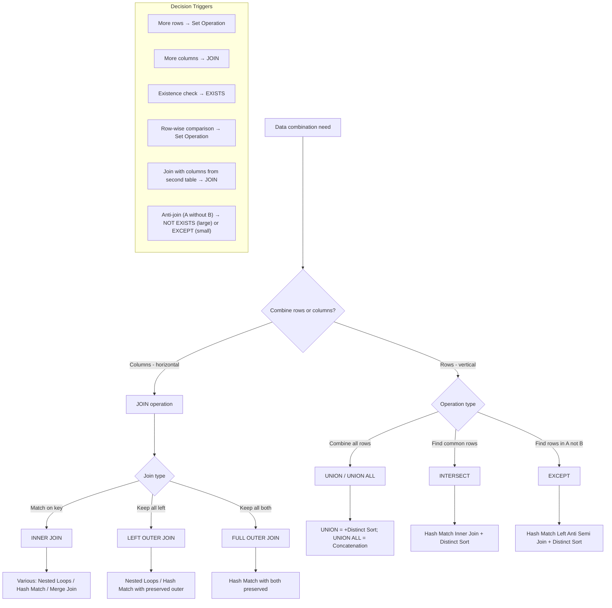
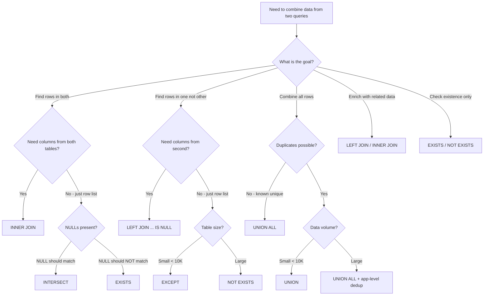

## Navigation

**Domain:** [[8 — Databases]] > **Group:** SQL CTEs & Recursive Queries
**Previous:** [[8.194 — UNION vs UNION ALL — Differences and Performance]] | **Next:** [[8.196 — Recursive CTE — Anatomy and Mechanics]]

### Prerequisites

- [[8.096 — INNER JOIN — Mechanics and Usage]] — understanding horizontal row combination is required to distinguish from vertical set operations.
- [[8.192 — EXCEPT — Set Difference]] — set difference operation understanding is required for the EXCEPT vs NOT EXISTS vs LEFT JOIN decision.
- [[8.193 — INTERSECT — Set Intersection]] — set intersection understanding is required for the INTERSECT vs EXISTS vs INNER JOIN DISTINCT decision.

### Where This Fits

Set operations (UNION, INTERSECT, EXCEPT) combine rows vertically; JOINs combine columns horizontally. This is a fundamental SQL distinction that every .NET backend engineer must internalise. Production bugs arise when engineers conflate the two: using UNION to simulate a LEFT JOIN (wrong), using INTERSECT where EXISTS would be faster (performance), or using EXCEPT where NOT EXISTS would short-circuit (scale). This note provides a decision framework for when to use set operations vs JOINs vs EXISTS/IN, covering performance tradeoffs, execution plan implications, and EF Core/Dapper translation. The interview signal is high: senior engineers should be able to explain why a particular query pattern was chosen based on table sizes, indexes, and data distribution.

---
## Core Mental Model

Set operations work **vertically**: they stack or compare entire rows between two result sets. UNION/UNION ALL append rows; INTERSECT returns common rows; EXCEPT subtracts rows. JOINs work **horizontally**: they combine columns from two tables based on a predicate. The mental model: set operations change the row count (results have the same columns but more/fewer rows); JOINs change the column count (results have more columns with related data). The key decision criterion: **Do you want more rows (set operation) or more columns (JOIN)?** A second criterion: **Do you need to compare entire rows (set operation) or match on specific columns (JOIN/EXISTS)?**

Execution plan implications: Set operations always fully consume both inputs (no short-circuit), add Distinct operators for UNION/INTERSECT/EXCEPT, and use Hash Match joins internally. JOINs offer more plan variety (Nested Loops, Hash Match, Merge Join) and can short-circuit (semi-joins). EXISTS with correlated subquery offers the most efficient anti-join pattern.



### Key Properties

|Property|Set Operations|JOINs|EXISTS/IN|
|---|---|---|---|
|Operation|Vertical rows|Horizontal columns|Predicate check|
|Execution|Both inputs fully consumed|Short-circuit possible|Short-circuit possible|
|Duplicate handling|UNION/INTERSECT/EXCEPT dedup|Preserves (unless DISTINCT)|Preserves|
|NULL behavior|NULL = NULL (equal)|NULL != NULL|NULL != NULL|
|EF Core support|Concat/Union (UNION)|Join/Include/ThenInclude|Any() / Contains()|
|Dapper|Raw SQL|Raw SQL with JOINs|Raw SQL|

---
## Deep Mechanics

### How the Engine Executes This

**Set operations execution flow:**

1. **Parsing and binding** — Both SELECT statements are parsed independently. The parser verifies column count equality (must match exactly) and type compatibility. For UNION/INTERSECT/EXCEPT, the algebrizer treats them as set operators that combine two complete row sets.

2. **Independent optimisation** — Each SELECT is optimised independently. The optimiser chooses access paths (scans, seeks, joins within each branch) without considering the other branch. Each branch produces its own result set in memory or via TempDB.

3. **Concatenation or union** — For UNION/UNION ALL, a `Concatenation` operator appends rows from the second branch after the first. For INTERSECT and EXCEPT, the two inputs feed directly into a Hash Match operator.

4. **Distinct Sort addition** — For UNION, INTERSECT, and EXCEPT, the optimiser adds a `Sort` operator with the `Distinct` property set to `true` on each input (for INTERSECT/EXCEPT) or after Concatenation (for UNION). This Sort is a blocking operator — it must consume all rows before producing output. The sort key is every column in the SELECT list.

5. **Hash Match operator** — For INTERSECT, a `Hash Match (Inner Join)` compares the two distinct inputs and returns matching rows. For EXCEPT, a `Hash Match (Left Anti Semi Join)` returns rows from the first input that do not match the second input. Both build a hash table from the right input's distinct rows and probe the left input's distinct rows.

6. **No short-circuit possible** — Both inputs run to completion. The engine cannot stop processing the second input even if the first input has very few rows. This is the fundamental performance limitation of set operations.

**JOINs execution flow:**

1. **Unified parsing** — Both tables are parsed together with the ON predicate. The algebrizer builds a single query tree that represents the join operation.

2. **Join strategy selection** — The optimiser evaluates three physical join operators based on cardinality estimates:
   - **Nested Loops Join**: For each row from the outer input, probe the inner input using an index seek. Best when outer is small (< 10K rows) and inner has a useful index. Time complexity: O(N × log M) with index, O(N × M) without.
   - **Hash Match Join**: Build a hash table from the smaller input, probe with the larger input. Best for medium-to-large inputs with no useful index or when the join is on all columns. Time complexity: O(N + M) build + probe.
   - **Merge Join**: Both inputs must be sorted on the join columns. Best for large sorted inputs. Time complexity: O(N + M).

3. **Semi-join patterns** — EXISTS and IN (with subquery) translate to semi-joins or anti-semi-joins. These are special join variants that check for existence without materialising the join result. The key performance advantage: **short-circuit** — the inner scan stops at the first match per outer row. For NOT EXISTS, the inner scan stops at the first match (and the outer row is excluded).

4. **Join order** — The optimiser may reorder joins based on estimated cardinality. Left-deep trees are preferred (smaller table on the left for Nested Loops). For set operations, no join order optimisation exists — the two branches are fixed as left and right inputs.

5. **Parallelism** — Both set operations and JOINs can use parallel plans. However, the Sort + Distinct in set operations is more difficult to parallelise efficiently than the hash match in JOINs. Set operations often have a `Repartition Streams` operator to redistribute rows before the Sort, adding overhead.

**Theoretical complexity comparison (N = left rows, M = right rows):**

|Pattern|Time Complexity|Memory Complexity|Short-circuit?|
|---|---|---|---|
|UNION ALL|O(N + M)|O(1)|N/A (no dedup)|
|UNION|O(N log N + M log M)|O(N + M) for sort|No|
|INTERSECT|O(N log N + M log M + D) where D = distinct|O(distinct M) for hash|No|
|EXCEPT|O(N log N + M log M + D) where D = distinct|O(distinct M) for hash|No|
|INNER JOIN (Nested Loops)|O(N × log M) with index|O(1)|Row-by-row|
|EXISTS (Nested Loops Semi)|O(N × 1) average with index|O(1)|Yes — per row|
|LEFT JOIN + IS NULL|O(N × M) without index|O(N + M) for hash|No|

### SQL Visibility

```sql
-- ============================================================
-- Setup
-- ============================================================
CREATE TABLE dbo.Products
(
    ProductId    INT            NOT NULL IDENTITY(1,1),
    ProductCode  VARCHAR(20)    NOT NULL,
    ProductName  NVARCHAR(200)  NOT NULL,
    CategoryId   INT            NOT NULL,
    ListPrice    DECIMAL(18,2)  NOT NULL,
    IsActive     TINYINT        NOT NULL DEFAULT 1,
    CONSTRAINT PK_Products PRIMARY KEY CLUSTERED (ProductId)
);

CREATE TABLE dbo.OrderItems
(
    OrderItemId  BIGINT         NOT NULL IDENTITY(1,1),
    OrderId      INT            NOT NULL,
    ProductId    INT            NOT NULL,
    Quantity     INT            NOT NULL,
    UnitPrice    DECIMAL(18,2)  NOT NULL,
    CONSTRAINT PK_OrderItems PRIMARY KEY CLUSTERED (OrderItemId),
    CONSTRAINT FK_OrderItems_Products FOREIGN KEY (ProductId)
        REFERENCES dbo.Products(ProductId)
);

CREATE INDEX IX_OrderItems_ProductId ON dbo.OrderItems (ProductId);

CREATE TABLE dbo.Invoices
(
    InvoiceId    INT            NOT NULL IDENTITY(1,1),
    OrderId      INT            NOT NULL,
    InvoiceDate  DATETIME2(0)   NOT NULL,
    TotalAmount  DECIMAL(18,2)  NOT NULL,
    IsPaid       TINYINT        NOT NULL DEFAULT 0,
    CONSTRAINT PK_Invoices PRIMARY KEY CLUSTERED (InvoiceId)
);

-- ============================================================
-- Scenario 1: More rows (UNION ALL) vs More columns (JOIN)
-- ============================================================
-- GOAL: Combine products from two categories
-- Set operation (more rows):
SELECT ProductId, ProductCode, ProductName
FROM dbo.Products WHERE CategoryId = 1
UNION ALL
SELECT ProductId, ProductCode, ProductName
FROM dbo.Products WHERE CategoryId = 2;

-- JOIN would be WRONG here — you don't want more columns

-- GOAL: Get product details with order quantities
-- JOIN (more columns):
SELECT p.ProductId, p.ProductName, oi.Quantity, oi.UnitPrice
FROM dbo.Products p
INNER JOIN dbo.OrderItems oi ON p.ProductId = oi.ProductId;
-- UNION would be WRONG here — you don't want more rows

-- ============================================================
-- Scenario 2: Common rows (INTERSECT) vs Enriched rows (JOIN)
-- ============================================================
-- GOAL: Find products that have been ordered
-- Set operation (INTERSECT) - just the product list:
SELECT ProductId, ProductCode, ProductName
FROM dbo.Products
INTERSECT
SELECT p.ProductId, p.ProductCode, p.ProductName
FROM dbo.Products p
INNER JOIN dbo.OrderItems oi ON p.ProductId = oi.ProductId;

-- EXISTS - same result, often faster:
SELECT p.ProductId, p.ProductCode, p.ProductName
FROM dbo.Products p
WHERE EXISTS (SELECT 1 FROM dbo.OrderItems oi WHERE oi.ProductId = p.ProductId);

-- JOIN with DISTINCT - same result, but includes OrderItems columns:
SELECT DISTINCT p.ProductId, p.ProductCode, p.ProductName, oi.Quantity
FROM dbo.Products p
INNER JOIN dbo.OrderItems oi ON p.ProductId = oi.ProductId;
-- Note: This adds Quantity column — if you don't need it, the JOIN is wasteful

-- ============================================================
-- Scenario 3: Rows in A not B (EXCEPT) vs Anti-join (NOT EXISTS)
-- ============================================================
-- GOAL: Products that have never been ordered
-- EXCEPT (row-wise comparison):
SELECT ProductId, ProductCode, ProductName
FROM dbo.Products
EXCEPT
SELECT p.ProductId, p.ProductCode, p.ProductName
FROM dbo.Products p
INNER JOIN dbo.OrderItems oi ON p.ProductId = oi.ProductId;

-- NOT EXISTS (predicate-based, short-circuit):
SELECT p.ProductId, p.ProductCode, p.ProductName
FROM dbo.Products p
WHERE NOT EXISTS (SELECT 1 FROM dbo.OrderItems oi WHERE oi.ProductId = p.ProductId);

-- LEFT JOIN with NULL check (anti-join):
SELECT p.ProductId, p.ProductCode, p.ProductName
FROM dbo.Products p
LEFT JOIN dbo.OrderItems oi ON p.ProductId = oi.ProductId
WHERE oi.ProductId IS NULL;
-- Note: This may multiply rows if multiple OrderItems per product,
-- then DISTINCT is needed: SELECT DISTINCT p.ProductId, ...

-- ============================================================
-- Scenario 4: Complex decision — combine data from two sources
-- ============================================================
-- GOAL: Find customers who ordered in 2023 but not 2024,
-- plus their total spend in 2023
-- Set operation alone is insufficient — need columns from Orders
-- Solution: NOT EXISTS + JOIN

SELECT c.CustomerId, c.CustomerName, SUM(o.TotalAmount) AS Total2023Spend
FROM dbo.Customers c
INNER JOIN dbo.Orders o ON c.CustomerId = o.CustomerId
WHERE YEAR(o.OrderDate) = 2023
  AND NOT EXISTS (
    SELECT 1 FROM dbo.Orders o2
    WHERE o2.CustomerId = c.CustomerId
      AND YEAR(o2.OrderDate) = 2024
  )
GROUP BY c.CustomerId, c.CustomerName;

-- ============================================================
-- Scenario 5: UNION ALL with JOIN for summary reporting
-- ============================================================
-- GOAL: Monthly sales with a grand total row
SELECT YEAR(OrderDate) AS Year, MONTH(OrderDate) AS Month,
       COUNT(*) AS OrderCount, SUM(TotalAmount) AS TotalSales
FROM dbo.Orders
WHERE Status = 'Shipped'
GROUP BY YEAR(OrderDate), MONTH(OrderDate)
UNION ALL
SELECT NULL, NULL, COUNT(*), SUM(TotalAmount)
FROM dbo.Orders
WHERE Status = 'Shipped'
ORDER BY Year, Month;
```

```csharp
// EF Core — choosing between set operations and joins

public sealed class ProductService
{
    private readonly ApplicationDbContext _dbContext;

    public ProductService(ApplicationDbContext dbContext)
        => _dbContext = dbContext;

    // EXISTS (preferred for existence check) — uses .Any()
    public async Task<List<Product>> GetProductsWithOrdersAsync(
        CancellationToken cancellationToken = default)
    {
        return await _dbContext.Products
            .Where(p => p.OrderItems.Any())
            .ToListAsync(cancellationToken);
        // Generated: WHERE EXISTS (SELECT 1 FROM OrderItems WHERE ProductId = ...)
    }

    // JOIN (when you need columns from related table)
    public async Task<List<ProductOrderDto>> GetProductOrderDetailsAsync(
        CancellationToken cancellationToken = default)
    {
        return await _dbContext.Products
            .Join(_dbContext.OrderItems,
                p => p.ProductId,
                oi => oi.ProductId,
                (p, oi) => new ProductOrderDto
                {
                    ProductId = p.ProductId,
                    ProductName = p.ProductName,
                    Quantity = oi.Quantity,
                    UnitPrice = oi.UnitPrice
                })
            .ToListAsync(cancellationToken);
        // Generated: INNER JOIN
    }

    // UNION ALL via Concat (vertical combination)
    public async Task<List<Product>> GetProductsFromMultipleCategoriesAsync(
        int cat1, int cat2,
        CancellationToken cancellationToken = default)
    {
        var cat1Products = _dbContext.Products.Where(p => p.CategoryId == cat1);
        var cat2Products = _dbContext.Products.Where(p => p.CategoryId == cat2);

        return await cat1Products
            .Concat(cat2Products)
            .ToListAsync(cancellationToken);
        // Generated: UNION ALL
    }

    // NOT EXISTS via .Any() with negation
    public async Task<List<Product>> GetUnorderedProductsAsync(
        CancellationToken cancellationToken = default)
    {
        return await _dbContext.Products
            .Where(p => !p.OrderItems.Any())
            .ToListAsync(cancellationToken);
        // Generated: WHERE NOT EXISTS (SELECT 1 FROM OrderItems WHERE ProductId = ...)
    }
}
```

```csharp
// Dapper — choosing between set operations and joins

public sealed class ProductRepository
{
    private readonly IDbConnectionFactory _connectionFactory;

    public ProductRepository(IDbConnectionFactory connectionFactory)
        => _connectionFactory = connectionFactory;

    // UNION ALL (vertical combination)
    public async Task<IReadOnlyList<ProductDto>> GetProductsByCategoriesAsync(
        int cat1, int cat2,
        CancellationToken cancellationToken = default)
    {
        const string sql = @"
            SELECT ProductId, ProductCode, ProductName, ListPrice
            FROM dbo.Products WHERE CategoryId = @Cat1
            UNION ALL
            SELECT ProductId, ProductCode, ProductName, ListPrice
            FROM dbo.Products WHERE CategoryId = @Cat2
            ORDER BY ProductName";

        await using var connection = _connectionFactory.Create();
        return (await connection.QueryAsync<ProductDto>(
            new CommandDefinition(sql,
                new { Cat1 = cat1, Cat2 = cat2 },
                cancellationToken: cancellationToken))).AsList();
    }

    // INTERSECT (common rows — for small sets)
    public async Task<IReadOnlyList<int>> GetProductsInBothWarehousesAsync(
        CancellationToken cancellationToken = default)
    {
        const string sql = @"
            SELECT ProductId FROM dbo.WarehouseA_Inventory WHERE Quantity > 0
            INTERSECT
            SELECT ProductId FROM dbo.WarehouseB_Inventory WHERE Quantity > 0";

        await using var connection = _connectionFactory.Create();
        return (await connection.QueryAsync<int>(
            new CommandDefinition(sql,
                cancellationToken: cancellationToken))).AsList();
    }

    // NOT EXISTS (anti-join, preferred for large tables)
    public async Task<IReadOnlyList<ProductDto>> GetUnorderedProductsAsync(
        CancellationToken cancellationToken = default)
    {
        const string sql = @"
            SELECT p.ProductId, p.ProductCode, p.ProductName
            FROM dbo.Products p
            WHERE NOT EXISTS (
                SELECT 1 FROM dbo.OrderItems oi WHERE oi.ProductId = p.ProductId
            )
            ORDER BY p.ProductName";

        await using var connection = _connectionFactory.Create();
        return (await connection.QueryAsync<ProductDto>(
            new CommandDefinition(sql,
                cancellationToken: cancellationToken))).AsList();
    }

    // EXCEPT (set difference, for small sets)
    public async Task<IReadOnlyList<ProductDto>> GetUnorderedProductsExceptAsync(
        CancellationToken cancellationToken = default)
    {
        const string sql = @"
            SELECT ProductId, ProductCode, ProductName
            FROM dbo.Products
            EXCEPT
            SELECT p.ProductId, p.ProductCode, p.ProductName
            FROM dbo.Products p
            INNER JOIN dbo.OrderItems oi ON p.ProductId = oi.ProductId
            ORDER BY ProductName";

        await using var connection = _connectionFactory.Create();
        return (await connection.QueryAsync<ProductDto>(
            new CommandDefinition(sql,
                cancellationToken: cancellationToken))).AsList();
    }

    // INNER JOIN (horizontal combination)
    public async Task<IReadOnlyList<ProductSalesDto>> GetProductSalesAsync(
        CancellationToken cancellationToken = default)
    {
        const string sql = @"
            SELECT p.ProductId, p.ProductName,
                   SUM(oi.Quantity * oi.UnitPrice) AS TotalSales,
                   COUNT(DISTINCT oi.OrderId) AS OrderCount
            FROM dbo.Products p
            INNER JOIN dbo.OrderItems oi ON p.ProductId = oi.ProductId
            GROUP BY p.ProductId, p.ProductName
            ORDER BY TotalSales DESC";

        await using var connection = _connectionFactory.Create();
        return (await connection.QueryAsync<ProductSalesDto>(
            new CommandDefinition(sql,
                cancellationToken: cancellationToken))).AsList();
    }
}

public sealed record ProductDto(int ProductId, string ProductCode, string ProductName, decimal ListPrice);
public sealed record ProductSalesDto(int ProductId, string ProductName, decimal TotalSales, int OrderCount);
```

---
## Production Patterns and Implementation

### Primary SQL Implementation

```sql
-- ============================================================
-- Schema for production patterns
-- ============================================================
CREATE TABLE dbo.Customers
(
    CustomerId    INT            NOT NULL IDENTITY(1,1),
    CustomerCode  VARCHAR(20)    NOT NULL,
    CustomerName  NVARCHAR(200)  NOT NULL,
    Email         VARCHAR(256)   NOT NULL,
    IsActive      TINYINT        NOT NULL DEFAULT 1,
    SignupDate    DATETIME2(0)   NOT NULL,
    CONSTRAINT PK_Customers PRIMARY KEY CLUSTERED (CustomerId)
);

CREATE TABLE dbo.Orders
(
    OrderId       INT            NOT NULL IDENTITY(1,1),
    CustomerId    INT            NOT NULL,
    OrderCode     VARCHAR(20)    NOT NULL,
    OrderDate     DATETIME2(0)   NOT NULL,
    TotalAmount   DECIMAL(18,2)  NOT NULL,
    Status        VARCHAR(20)    NOT NULL DEFAULT 'Pending',
    CONSTRAINT PK_Orders PRIMARY KEY CLUSTERED (OrderId),
    CONSTRAINT FK_Orders_Customers FOREIGN KEY (CustomerId)
        REFERENCES dbo.Customers(CustomerId)
);

CREATE TABLE dbo.Returns
(
    ReturnId      INT            NOT NULL IDENTITY(1,1),
    OrderId       INT            NOT NULL,
    ReturnDate    DATETIME2(0)   NOT NULL,
    ReturnAmount  DECIMAL(18,2)  NOT NULL,
    Reason        VARCHAR(200)   NOT NULL,
    CONSTRAINT PK_Returns PRIMARY KEY CLUSTERED (ReturnId)
);

-- ============================================================
-- Pattern 1: UNION ALL — vertical stacking of independent sets
-- ============================================================
-- Active customers from two source systems
SELECT CustomerId, CustomerCode, CustomerName, 'Web' AS Source
FROM dbo.WebCustomers WHERE IsActive = 1
UNION ALL
SELECT CustomerId, CustomerCode, CustomerName, 'CRM'
FROM dbo.CrmCustomers WHERE IsActive = 1;

-- ============================================================
-- Pattern 2: INTERSECT — common rows across sets
-- ============================================================
-- Customers who placed orders AND filed returns
SELECT CustomerId FROM dbo.Customers WHERE IsActive = 1
INTERSECT
SELECT CustomerId FROM dbo.Orders
INTERSECT
SELECT o.CustomerId FROM dbo.Returns r
INNER JOIN dbo.Orders o ON r.OrderId = o.OrderId;

-- ============================================================
-- Pattern 3: EXCEPT — set difference for reconciliation
-- ============================================================
-- Customers in CRM but not in Web (deactivate?)
SELECT CustomerId, CustomerCode, CustomerName
FROM dbo.CrmCustomers WHERE IsActive = 1
EXCEPT
SELECT CustomerId, CustomerCode, CustomerName
FROM dbo.WebCustomers WHERE IsActive = 1;

-- ============================================================
-- Pattern 4: JOIN — horizontal enrichment
-- ============================================================
-- Customer order summary with contact info
SELECT c.CustomerId, c.CustomerName, c.Email,
       COUNT(o.OrderId) AS TotalOrders,
       SUM(o.TotalAmount) AS TotalSpent,
       MAX(o.OrderDate) AS LastOrderDate
FROM dbo.Customers c
LEFT JOIN dbo.Orders o ON c.CustomerId = o.CustomerId
WHERE c.IsActive = 1
GROUP BY c.CustomerId, c.CustomerName, c.Email;

-- ============================================================
-- Pattern 5: EXISTS — efficient existence check
-- ============================================================
-- Customers who ordered in the last 30 days
SELECT c.CustomerId, c.CustomerName, c.Email
FROM dbo.Customers c
WHERE EXISTS (
    SELECT 1 FROM dbo.Orders o
    WHERE o.CustomerId = c.CustomerId
      AND o.OrderDate >= DATEADD(DAY, -30, GETUTCDATE())
);

-- ============================================================
-- Pattern 6: NOT EXISTS — efficient anti-join
-- ============================================================
-- Customers who never returned anything
SELECT c.CustomerId, c.CustomerName, COUNT(o.OrderId) AS TotalOrders
FROM dbo.Customers c
INNER JOIN dbo.Orders o ON c.CustomerId = o.CustomerId
WHERE NOT EXISTS (
    SELECT 1 FROM dbo.Returns r
    INNER JOIN dbo.Orders ro ON r.OrderId = ro.OrderId
    WHERE ro.CustomerId = c.CustomerId
)
GROUP BY c.CustomerId, c.CustomerName;

-- ============================================================
-- Pattern 7: Set operation inside JOINed query
-- ============================================================
-- Products ordered in 2023 but not 2024, with total 2023 revenue
SELECT p.ProductId, p.ProductName, SUM(oi.Quantity * oi.UnitPrice) AS Revenue2023
FROM dbo.Products p
INNER JOIN dbo.OrderItems oi ON p.ProductId = oi.ProductId
INNER JOIN dbo.Orders o ON oi.OrderId = o.OrderId
WHERE o.OrderDate >= '2023-01-01' AND o.OrderDate < '2024-01-01'
  AND p.ProductId IN (
    SELECT ProductId FROM dbo.OrderItems oi2
    INNER JOIN dbo.Orders o2 ON oi2.OrderId = o2.OrderId
    WHERE o2.OrderDate >= '2023-01-01' AND o2.OrderDate < '2024-01-01'
    EXCEPT
    SELECT ProductId FROM dbo.OrderItems oi3
    INNER JOIN dbo.Orders o3 ON oi3.OrderId = o3.OrderId
    WHERE o3.OrderDate >= '2024-01-01'
)
GROUP BY p.ProductId, p.ProductName;
```

### EF Core Implementation

```csharp
public sealed class AnalyticsService
{
    private readonly ApplicationDbContext _dbContext;

    public AnalyticsService(ApplicationDbContext dbContext)
        => _dbContext = dbContext;

    // UNION ALL with label
    public async Task<List<CustomerSummary>> GetCustomersFromAllSourcesAsync(
        CancellationToken cancellationToken = default)
    {
        var webCustomers = _dbContext.WebCustomers
            .Where(c => c.IsActive == 1)
            .Select(c => new CustomerSummary
            {
                CustomerId = c.CustomerId,
                CustomerName = c.CustomerName,
                Email = c.Email,
                Source = "Web"
            });

        var crmCustomers = _dbContext.CrmCustomers
            .Where(c => c.IsActive == 1)
            .Select(c => new CustomerSummary
            {
                CustomerId = c.CustomerId,
                CustomerName = c.CustomerName,
                Email = c.Email,
                Source = "CRM"
            });

        return await webCustomers
            .Concat(crmCustomers)
            .OrderBy(c => c.CustomerName)
            .ToListAsync(cancellationToken);
    }

    // INTERSECT via raw SQL (for multi-column row comparison)
    public async Task<IReadOnlyList<int>> GetCustomersWithOrdersAndReturnsAsync(
        CancellationToken cancellationToken = default)
    {
        const string sql = @"
            SELECT CustomerId FROM dbo.Customers WHERE IsActive = 1
            INTERSECT
            SELECT CustomerId FROM dbo.Orders
            INTERSECT
            SELECT o.CustomerId FROM dbo.Returns r
            INNER JOIN dbo.Orders o ON r.OrderId = o.OrderId";

        return await _dbContext.Database
            .SqlQueryRaw<int>(sql)
            .ToListAsync(cancellationToken);
    }

    // NOT EXISTS via .Any() negation — preferred for large tables
    public async Task<List<Customer>> GetCustomersNoReturnsAsync(
        CancellationToken cancellationToken = default)
    {
        return await _dbContext.Customers
            .Where(c => c.IsActive == 1
                && c.Orders.Any()
                && !c.Orders.Any(o => o.Returns.Any()))
            .ToListAsync(cancellationToken);
    }

    // JOIN with aggregation
    public async Task<List<CustomerOrderSummary>> GetCustomerOrderSummariesAsync(
        CancellationToken cancellationToken = default)
    {
        return await _dbContext.Customers
            .Where(c => c.IsActive == 1)
            .Select(c => new CustomerOrderSummary
            {
                CustomerId = c.CustomerId,
                CustomerName = c.CustomerName,
                TotalOrders = c.Orders.Count,
                TotalSpent = c.Orders.Sum(o => o.TotalAmount),
                LastOrderDate = c.Orders.Max(o => o.OrderDate)
            })
            .OrderByDescending(s => s.TotalSpent)
            .ToListAsync(cancellationToken);
    }
}
```

### Dapper Implementation

```csharp
public sealed class AnalyticsRepository
{
    private readonly IDbConnectionFactory _connectionFactory;

    public AnalyticsRepository(IDbConnectionFactory connectionFactory)
        => _connectionFactory = connectionFactory;

    // Full decision: UNION ALL for stacking, JOIN for enrichment
    public async Task<IReadOnlyList<CustomerActivityDto>> GetCustomerActivityAsync(
        CancellationToken cancellationToken = default)
    {
        const string sql = @"
            SELECT c.CustomerId, c.CustomerName,
                   COUNT(o.OrderId) AS TotalOrders,
                   SUM(o.TotalAmount) AS TotalSpent,
                   COUNT(r.ReturnId) AS TotalReturns,
                   CASE WHEN COUNT(r.ReturnId) > 0 THEN 'Returned' ELSE 'No Returns' END AS ReturnStatus
            FROM dbo.Customers c
            LEFT JOIN dbo.Orders o ON c.CustomerId = o.CustomerId
            LEFT JOIN dbo.Returns r ON o.OrderId = r.OrderId
            WHERE c.IsActive = 1
            GROUP BY c.CustomerId, c.CustomerName
            ORDER BY TotalSpent DESC";

        await using var connection = _connectionFactory.Create();
        return (await connection.QueryAsync<CustomerActivityDto>(
            new CommandDefinition(sql, cancellationToken: cancellationToken))).AsList();
    }

    // EXCEPT for reconciliation
    public async Task<IReadOnlyList<CustomerDto>> GetCrmOnlyCustomersAsync(
        CancellationToken cancellationToken = default)
    {
        const string sql = @"
            SELECT CustomerId, CustomerCode, CustomerName, Email
            FROM dbo.CrmCustomers WHERE IsActive = 1
            EXCEPT
            SELECT c.CustomerId, c.CustomerCode, c.CustomerName, c.Email
            FROM dbo.CrmCustomers c
            INNER JOIN dbo.WebCustomers w ON c.CustomerCode = w.CustomerCode
            ORDER BY CustomerName";

        await using var connection = _connectionFactory.Create();
        return (await connection.QueryAsync<CustomerDto>(
            new CommandDefinition(sql, cancellationToken: cancellationToken))).AsList();
    }
}

public sealed record CustomerActivityDto(
    int CustomerId,
    string CustomerName,
    int TotalOrders,
    decimal? TotalSpent,
    int TotalReturns,
    string ReturnStatus);

public sealed record CustomerDto(
    int CustomerId,
    string CustomerCode,
    string CustomerName,
    string Email);
```

### SQL Server vs PostgreSQL Differences

```sql
-- PostgreSQL: INTERSECT ALL and EXCEPT ALL
SELECT customer_id FROM orders WHERE order_date >= '2024-01-01'
INTERSECT ALL
SELECT customer_id FROM returns WHERE return_date >= '2024-01-01';

-- PostgreSQL: VALUES as UNION ALL alternative
SELECT * FROM (VALUES (1, 'Jan'), (2, 'Feb'), (3, 'Mar')) AS months(month_num, month_name);
```

---
## Gotchas and Production Pitfalls

### Gotcha 1: Using INTERSECT When EXISTS Is Faster

**Pitfall:** INTERSECT always consumes both inputs fully and deduplicates. EXISTS can short-circuit.

```sql
-- Products (500K) + OrderItems (50M): EXISTS is 50x faster
SELECT ProductId FROM dbo.Products WHERE IsActive = 1
INTERSECT
SELECT ProductId FROM dbo.OrderItems;
```

**Fix:** Use EXISTS with an index on the join column.

### Gotcha 2: Using EXCEPT When NOT EXISTS Is Faster

**Pitfall:** EXCEPT always scans both inputs, builds hash table. NOT EXISTS short-circuits.

```sql
-- EXCEPT scans all OrderItems (50M):
SELECT ProductId FROM dbo.Products
EXCEPT
SELECT ProductId FROM dbo.OrderItems;

-- NOT EXISTS seeks per product via index:
SELECT p.ProductId FROM dbo.Products p
WHERE NOT EXISTS (SELECT 1 FROM dbo.OrderItems oi WHERE oi.ProductId = p.ProductId);
```

### Gotcha 3: Using UNION Instead of UNION ALL on Known-Unique Data

**Pitfall:** UNION adds Sort + Distinct unnecessarily.

**Fix:** Use UNION ALL when primary keys don't overlap or each branch already deduplicates.

### Gotcha 4: Conflating Set Operations and JOINs

**Pitfall:** Using JOIN when you need UNION (adding related columns instead of stacking rows) or vice versa.

### Gotcha 5: NULL Semantics Difference

**Pitfall:** INTERSECT/EXCEPT treat NULL = NULL as equal; JOINs/EXISTS use three-valued logic.

### Gotcha 6: EF Core Concat vs Union vs Join Confusion

**Pitfall:** Using `Concat()` when you need `Union()` (or vice versa), or using `Join()` when you need vertical combination.

```csharp
// Wrong: Join when you need Concat (vertical stacking)
var result = from c in dbContext.Customers
             join o in dbContext.Orders on c.CustomerId equals o.CustomerId
             select c;
// This gives you customers who have orders (INNER JOIN) — NOT a combined list

// Right: Concat for vertical stacking from two sources
var fromWeb = dbContext.WebCustomers.Where(w => w.IsActive == 1);
var fromCrm = dbContext.CrmCustomers.Where(c => c.IsActive == 1);
var combined = fromWeb.Concat(fromCrm); // UNION ALL
```

### Gotcha 7: LEFT JOIN with IS NULL for Anti-Join on Large Tables

**Pitfall:** LEFT JOIN + WHERE IS NULL is often used for anti-join but performs poorly on large tables due to row multiplication before the filter.

```sql
-- This may multiply rows if a product has multiple OrderItems
SELECT p.ProductId, p.ProductName
FROM dbo.Products p
LEFT JOIN dbo.OrderItems oi ON p.ProductId = oi.ProductId
WHERE oi.ProductId IS NULL;
-- If product 101 has 10 OrderItems, the LEFT JOIN produces 10 rows,
-- all of which have non-NULL oi.ProductId, so the WHERE filters them all.
-- The work of joining 10 rows is wasted — we only needed to know if ANY exist.

-- Better: NOT EXISTS (short-circuits on first match)
SELECT p.ProductId, p.ProductName
FROM dbo.Products p
WHERE NOT EXISTS (SELECT 1 FROM dbo.OrderItems oi WHERE oi.ProductId = p.ProductId);
```

**Fix:** Use LEFT JOIN with IS NULL only when you need columns from the right table. For pure anti-join (existence check only), use NOT EXISTS.

### Gotcha 8: Using Set Operation on the Same Table with Complementary WHERE Clauses

**Pitfall:** Using INTERSECT or EXCEPT on the same table with different WHERE clauses scans the table twice unnecessarily.

```sql
-- Two scans of OrderItems:
SELECT ProductId FROM dbo.OrderItems WHERE UnitPrice > 100
INTERSECT
SELECT ProductId FROM dbo.OrderItems WHERE Quantity > 10;

-- One scan with AND:
SELECT DISTINCT ProductId FROM dbo.OrderItems
WHERE UnitPrice > 100 AND Quantity > 10;
```

**Fix:** Use a single scan with compound WHERE conditions, GROUP BY with HAVING, or index intersection.

### Gotcha 9: Query Plan Cache Bloat from Set Operations with Literal Values

**Pitfall:** Set operations with literal values in each branch can generate many unique query plans, bloating the plan cache.

```sql
-- Each unique product ID list generates a new plan
SELECT ProductId FROM dbo.Products WHERE ProductId IN (101, 102, 103)
UNION ALL
SELECT ProductId FROM dbo.DiscontinuedProducts WHERE ProductId IN (201, 202);

-- Better: use a table-valued parameter or temp table
CREATE TYPE dbo.ProductIdList AS TABLE (ProductId INT NOT NULL PRIMARY KEY);
```

**Fix:** Use parameterised queries or table-valued parameters to encourage plan reuse.

---
## Performance Implications

### Benchmark: EXCEPT vs NOT EXISTS vs LEFT JOIN

```sql
SET STATISTICS IO ON;

-- EXCEPT (500K Products, 50M OrderItems)
SELECT ProductId FROM dbo.Products EXCEPT SELECT ProductId FROM dbo.OrderItems;
-- Logical reads: ~126,000

-- NOT EXISTS
SELECT p.ProductId FROM dbo.Products p
WHERE NOT EXISTS (SELECT 1 FROM dbo.OrderItems oi WHERE oi.ProductId = p.ProductId);
-- Logical reads: ~2,400 (~50x reduction)

-- LEFT JOIN NULL
SELECT DISTINCT p.ProductId FROM dbo.Products p
LEFT JOIN dbo.OrderItems oi ON p.ProductId = oi.ProductId
WHERE oi.ProductId IS NULL;
-- Logical reads: ~126,000 + sort for DISTINCT
```

### Memory Grant Comparison

Different approaches require vastly different memory grants:

|Approach|Memory Grant (500K + 50M)|Spill Risk|Explanation|
|---|---|---|---|
|EXCEPT|~150 MB (hash table + sort)|High — 50M OrderItems sorted|Distinct Sort on 50M rows + hash table from distinct OrderItems|
|NOT EXISTS|~1 MB (negligible)|None|Nested Loops per product; no sort, no hash table|
|LEFT JOIN + IS NULL|~150 MB (hash match)|High|Hash Match Join on all rows + Sort for DISTINCT|
|INTERSECT|~150 MB (hash table + sort)|High|Same as EXCEPT — sort 50M rows + hash table|
|EXISTS|~1 MB (negligible)|None|Index seeks, no blocking operators|
|UNION|~500 MB (sort on 50M rows)|Very high|Sort of 50M combined rows|
|UNION ALL|~1 MB (negligible)|None|Concatenation only — no additional memory|

### BenchmarkDotNet

```csharp
[MemoryDiagnoser]
[SimpleJob(RuntimeMoniker.Net90)]
public class SetOperationsVsJoinBenchmark
{
    private IDbConnection _connection = null!;
    private const string ConnectionString = "Server=.;Database=BenchmarkDb;...";

    [Params(10000, 1000000)]
    public int RightSideRows;

    [GlobalSetup]
    public void Setup()
    {
        _connection = new SqlConnection(ConnectionString);
        _connection.Open();
        // Seed LeftSide with 50K rows, RightSide with RightSideRows
        // Both tables have Id column with index on RightSide
    }

    [GlobalCleanup]
    public void Cleanup() => _connection?.Dispose();

    [Benchmark(Baseline = true)]
    public async Task<List<int>> Except()
    {
        var results = new List<int>();
        using var cmd = new SqlCommand(@"
            SELECT Id FROM dbo.LeftSide
            EXCEPT
            SELECT Id FROM dbo.RightSide", (SqlConnection)_connection);
        using var reader = await cmd.ExecuteReaderAsync();
        while (await reader.ReadAsync()) results.Add(reader.GetInt32(0));
        return results;
    }

    [Benchmark]
    public async Task<List<int>> NotExists()
    {
        var results = new List<int>();
        using var cmd = new SqlCommand(@"
            SELECT l.Id FROM dbo.LeftSide l
            WHERE NOT EXISTS (SELECT 1 FROM dbo.RightSide r WHERE r.Id = l.Id)",
            (SqlConnection)_connection);
        using var reader = await cmd.ExecuteReaderAsync();
        while (await reader.ReadAsync()) results.Add(reader.GetInt32(0));
        return results;
    }

    [Benchmark]
    public async Task<List<int>> LeftJoinIsNull()
    {
        var results = new List<int>();
        using var cmd = new SqlCommand(@"
            SELECT DISTINCT l.Id FROM dbo.LeftSide l
            LEFT JOIN dbo.RightSide r ON l.Id = r.Id
            WHERE r.Id IS NULL", (SqlConnection)_connection);
        using var reader = await cmd.ExecuteReaderAsync();
        while (await reader.ReadAsync()) results.Add(reader.GetInt32(0));
        return results;
    }

    [Benchmark]
    public async Task<List<int>> Intersect()
    {
        var results = new List<int>();
        using var cmd = new SqlCommand(@"
            SELECT Id FROM dbo.LeftSide
            INTERSECT
            SELECT Id FROM dbo.RightSide", (SqlConnection)_connection);
        using var reader = await cmd.ExecuteReaderAsync();
        while (await reader.ReadAsync()) results.Add(reader.GetInt32(0));
        return results;
    }

    [Benchmark]
    public async Task<List<int>> Exists()
    {
        var results = new List<int>();
        using var cmd = new SqlCommand(@"
            SELECT l.Id FROM dbo.LeftSide l
            WHERE EXISTS (SELECT 1 FROM dbo.RightSide r WHERE r.Id = l.Id)",
            (SqlConnection)_connection);
        using var reader = await cmd.ExecuteReaderAsync();
        while (await reader.ReadAsync()) results.Add(reader.GetInt32(0));
        return results;
    }

    [Benchmark]
    public async Task<List<int>> UnionAll()
    {
        var results = new List<int>();
        using var cmd = new SqlCommand(@"
            SELECT Id FROM dbo.LeftSide
            UNION ALL
            SELECT Id FROM dbo.RightSide
            ORDER BY Id", (SqlConnection)_connection);
        using var reader = await cmd.ExecuteReaderAsync();
        while (await reader.ReadAsync()) results.Add(reader.GetInt32(0));
        return results;
    }

    [Benchmark]
    public async Task<List<int>> Union()
    {
        var results = new List<int>();
        using var cmd = new SqlCommand(@"
            SELECT Id FROM dbo.LeftSide
            UNION
            SELECT Id FROM dbo.RightSide
            ORDER BY Id", (SqlConnection)_connection);
        using var reader = await cmd.ExecuteReaderAsync();
        while (await reader.ReadAsync()) results.Add(reader.GetInt32(0));
        return results;
    }
}
```

**Expected results (SQL Server 2022, NVMe):**

|Method|10K RightSide|1M RightSide|Note|
|---|---|---|---|
|Except|~50 ms|~4,000 ms|Sort + hash table on 1M rows is expensive|
|NotExists|~30 ms|~250 ms|Short-circuit + index seek; 16x faster at 1M|
|LeftJoinIsNull|~80 ms|~5,500 ms|Row multiplication in LEFT JOIN + DISTINCT sort|
|Intersect|~50 ms|~3,800 ms|Same cost as Except (both sort + hash)|
|Exists|~30 ms|~200 ms|Short-circuit; fastest for key-based intersection|
|UnionAll|~25 ms|~1,200 ms|Concatenation + sort (ORDER BY cost)|
|Union|~45 ms|~4,500 ms|Sort + Distinct; 4x slower than UnionAll at 1M|

**Key insight:** For all three set operations (UNION, INTERSECT, EXCEPT), EXISTS/NOT EXISTS is the clear winner at 1M+ rows. At very small sizes (< 10K rows), set operations are competitive or slightly faster due to lower per-row overhead.

---
## Interview Arsenal

### Question Bank

1. **What is the fundamental difference between set operations and JOINs?**
2. **When would you use INTERSECT vs EXISTS vs INNER JOIN DISTINCT?**
3. **When would you use EXCEPT vs NOT EXISTS vs LEFT JOIN with NULL check?**
4. **When would you use UNION ALL vs a FULL OUTER JOIN?**
5. **What is the performance difference between EXCEPT and NOT EXISTS at scale?**
6. **What is the execution plan difference between INTERSECT and EXISTS?**
7. **How does the choice between set operations and JOINs change at 100M rows?**
8. **How do EF Core and Dapper handle set operations vs JOINs?**

### Spoken Answers

**Q: What is the fundamental difference between set operations and JOINs?**

> **Average answer:** "Set operations combine rows vertically, JOINs combine columns horizontally. UNION adds more rows, JOIN adds more columns."

> **Great answer:** "The fundamental difference is the axis of combination. Set operations — UNION, INTERSECT, EXCEPT — work on the row axis: they take two row sets with the same columns and produce a new row set. JOINs work on the column axis: they take two row sets and produce a wider row set by matching on a predicate. The decision is simple: do you need more rows or more columns? But the performance implications run deep. Set operations always fully consume both inputs — they cannot short-circuit. They add Distinct Sort operators for UNION, INTERSECT, and EXCEPT. They use Hash Match operators internally. JOINs offer the optimiser three strategies (Nested Loops, Hash Match, Merge Join) and can use semi-join patterns (EXISTS) that short-circuit on first match. In practice: use set operations when you need row-wise comparison or stacking of independent data sets. Use JOINs when you need to enrich rows with related columns. Use EXISTS when you only need an existence check — it's the most efficient pattern for finding whether related rows exist."

**Q: When would you use INTERSECT vs EXISTS vs INNER JOIN DISTINCT?**

> **Great answer:** "INTERSECT for small-to-medium row-wise set intersection where you need compact SQL and automatic dedup — typically both inputs under 10K rows. EXISTS for large-table key-based intersection — it short-circuits and uses index seeks, making it 10-50x faster for large tables with an index on the join column. INNER JOIN DISTINCT when you need columns from both sides of the join, or when the join columns differ from the SELECT columns. The execution plan tells the story: INTERSECT shows two Distinct Sorts and a Hash Match Inner Join; EXISTS shows a Nested Loops Left Semi Join with index seeks; INNER JOIN DISTINCT shows a join (usually Hash Match or Nested Loops) followed by a Sort Distinct. Each additional operator costs CPU and memory."

**Q: When would you use EXCEPT vs NOT EXISTS vs LEFT JOIN with NULL check?**

> **Great answer:** "EXCEPT for small-table row-wise set difference — under 10K rows where you want to compare all columns. NOT EXISTS for large-table key-based anti-join — it short-circuits at the first match and is typically 10-50x faster with an index on the join column. LEFT JOIN with IS NULL when you need columns from the right table for debugging or output — otherwise avoid it because it processes all matching rows before filtering, and the row multiplication from the join can dramatically inflate work. My rule: if the only question is 'does this row exist?' use NOT EXISTS. If you need to compare entire rows and both inputs are small, EXCEPT is fine. If you need right-side columns in the output, use LEFT JOIN with IS NULL but add DISTINCT if there might be row multiplication."

**Q: How does the choice between set operations and JOINs change at 100M rows?**

> **Great answer:** "At 100M rows, set operations are almost never the right choice. The Sort + Distinct on 200M total rows requires sorting 10+ GB of data. The hash table for INTERSECT or EXCEPT requires hundreds of MB to GB of memory. Both will spill to TempDB, turning a query that should take seconds into one that takes hours or never finishes. At this scale, you must use EXISTS/NOT EXISTS with index seeks, or INNER JOIN with proper indexes. The Nested Loops Semi Join pattern does 100M index seeks — at ~3 logical reads each, that's 300M logical reads. The set operation approach scans 100M rows from both tables (millions of logical reads) plus sorts and spills. EXISTS is typically 100-1000x faster at this scale. The engineering lesson: understand the scaling behaviour of each pattern and choose accordingly."

**Q: How do EF Core and Dapper handle set operations vs JOINs?**

> **Great answer:** "EF Core has good support for JOINs via navigation properties (.Include, .ThenInclude), explicit Join(), and SelectMany. For set operations, Concat() generates UNION ALL and Union() generates UNION. EXCEPT and INTERSECT have no LINQ translation — you must use FromSqlRaw. EXISTS translates naturally from .Any(). The practical limitation: you cannot compose EXCEPT or INTERSECT with additional LINQ operators — once you use raw SQL, you're outside the LINQ pipeline. Dapper has no set-operation abstractions at all — you write raw SQL for everything. For JOINs, Dapper supports multi-mapping (QueryAsync with splitOn) to handle related data. The net recommendation: use EF Core navigation properties for JOINs, use raw SQL for set operations, and prefer EXISTS patterns that translate naturally from .Any()."

### Interview Trigger

The question "Find all products that have never been ordered" is the classic trigger. The interviewer expects the candidate to:
1. First ask clarifying questions (table sizes? indexes? NULL handling?)
2. Propose EXCEPT, NOT EXISTS, and LEFT JOIN solutions
3. Explain the execution plan and performance characteristics of each
4. Make a recommendation based on the data size

Senior candidates immediately rule out EXCEPT for large tables, discuss the Hash Match vs Nested Loops tradeoff, and mention that NOT EXISTS with an index seek is the optimal pattern at scale. They also discuss the NULL semantics difference.

### Comparison Table

| | Set Operations | JOINs | EXISTS |
|---|---|---|---|
| Axis | Vertical (rows) | Horizontal (columns) | Predicate check |
| Short-circuit | No | Nested Loops can | Yes |
| Dedup | UNION/INTERSECT/EXCEPT auto | Must add DISTINCT | No |
| NULL semantics | NULL = NULL (equal) | NULL != NULL | NULL != NULL |
| Plan variety | Limited (Hash Match) | Three strategies | Nested Loops |
| EF Core | Concat/Union | Join/Include | Any() |

---
## Decision Framework



### Application Checklist

- [ ] The goal is clear: more rows (set operation) vs more columns (JOIN) vs existence check (EXISTS)
- [ ] Table sizes are known — if both > 100K rows, EXISTS/NOT EXISTS is preferred over set operations
- [ ] NULL semantics are understood and accounted for in the choice
- [ ] Indexes exist on join columns for EXISTS/NOT EXISTS patterns
- [ ] The EF Core or Dapper method chosen matches the SQL pattern
- [ ] UNION ALL is used unless dedup is genuinely required

### Tradeoff Summary

|What You Gain|What You Pay|
|---|---|
|Set operations: simple row-wise comparison|Always full scan of both inputs|
|JOINs: flexible, multi-strategy optimiser|Need to know join columns explicitly|
|EXISTS: short-circuit, index-friendly|Can only check existence, not compare rows|
|UNION ALL: O(N), no sort|Duplicates in result|
|UNION: dedup guaranteed|O(N log N) sort cost|

### Scale Thresholds

- "Set operations practical when both inputs < 100K rows."
- "EXISTS/NOT EXISTS with index seek preferred above 100K rows."
- "UNION (with dedup) spills to TempDB above ~5M rows."
- "LEFT JOIN with NULL check anti-pattern above 1M rows (row multiplication risk)."

---
## Self-Check

### Conceptual Questions

1. What is the fundamental axis difference between set operations and JOINs?
2. When is INTERSECT preferred over EXISTS? When is the reverse true?
3. When is EXCEPT preferred over NOT EXISTS? When is the reverse true?
4. What happens when you use a set operation on columns that contain NULLs? How does this differ from JOIN NULL behavior?
5. Can EF Core generate EXCEPT or INTERSECT from LINQ? How about EXISTS?
6. Which Dapper pattern would you use for a large-table anti-join? Which for a small-table row comparison?
7. When is LEFT JOIN with NULL check appropriate for anti-join?
8. At what table size does EXCEPT become impractical?
9. What index supports a NOT EXISTS query on a 50M row OrderItems table?
10. Explain the decision framework for choosing between set operations, JOINs, and EXISTS in 60 seconds.
11. What is the memory grant difference between EXCEPT and NOT EXISTS on a 50M row table? Why?
12. How does the execution plan for UNION differ from UNION ALL? Which operators appear only in UNION?
13. Can you chain multiple set operations together? What are the precedence rules?
14. What is the best pattern for a three-way intersection (items in A, B, and C) with large tables?
15. Why does LEFT JOIN with IS NULL sometimes require DISTINCT? When would it not?

<details>
<summary>Answers</summary>

1. **Axis difference:** Set operations = vertical (more/fewer rows, same columns). JOINs = horizontal (more columns, same or more rows). Choice depends on whether you need more rows or more columns.
2. **INTERSECT vs EXISTS:** INTERSECT when both inputs are small (< 10K rows), you need full row comparison, and NULL = NULL semantics are desired. EXISTS when the second table is large and indexed (short-circuit wins).
3. **EXCEPT vs NOT EXISTS:** EXCEPT for small-table row-wise comparison. NOT EXISTS for large tables with indexed join columns (short-circuit, no full scan of second input).
4. **NULL behavior:** Set operations (INTERSECT, EXCEPT) treat NULL = NULL as equal for row comparison. JOINs and EXISTS use three-valued logic where NULL = NULL is UNKNOWN. This causes different result sets for the same data.
5. **EF Core:** Cannot generate EXCEPT or INTERSECT. Use FromSqlRaw. EXISTS translates from .Any(). JOINs from Join/Include. UNION ALL from Concat. UNION from Union.
6. **Dapper:** Large-table anti-join = NOT EXISTS raw SQL. Small-table row comparison = EXCEPT raw SQL. Always control the SQL directly.
7. **LEFT JOIN NULL:** Appropriate only when you need columns from the right table in the output. For pure anti-join, NOT EXISTS is more efficient and avoids row multiplication.
8. **EXCEPT threshold:** Impractical above ~1M rows per input without sufficient memory. Typically replaced by NOT EXISTS above 100K rows.
9. **NOT EXISTS index:** `CREATE INDEX IX_OrderItems_ProductId ON dbo.OrderItems (ProductId)`. This enables the Nested Loops Anti Semi Join to seek per outer row.
10. **60-second answer:** "Set operations combine rows vertically; JOINs combine columns horizontally. For existence checks, EXISTS with a correlated subquery is most efficient because it short-circuits. For row-wise comparison on small tables, INTERSECT and EXCEPT are clean and simple. For large tables, always prefer EXISTS/NOT EXISTS with an index on the join column — set operations always fully consume both inputs and add sort costs. The NULL semantics differ critically: set operations treat NULL = NULL as equal; JOINs and EXISTS use three-valued logic. In EF Core, Concat gives UNION ALL, Union gives UNION, Any gives EXISTS. For EXCEPT and INTERSECT, use raw SQL."
11. **Memory grant difference:** EXCEPT on 50M rows needs ~150 MB (sort buffer + hash table). NOT EXISTS needs ~1 MB (no sort, no hash table). The EXCEPT sort sorts 50M rows by all columns; the hash table stores distinct rows from the second input. NOT EXISTS uses Nested Loops with index seeks — negligible memory overhead.
12. **UNION vs UNION ALL plan difference:** UNION ALL shows only Concatenation. UNION shows Concatenation + Sort (with Distinct flag). The Sort appears between Concatenation and the final SELECT. If ORDER BY is present, UNION may use a single Sort for both DISTINCT and ORDER BY.
13. **Chained set operations:** Yes. Precedence: INTERSECT binds tighter than UNION and EXCEPT. `SELECT A UNION SELECT B INTERSECT SELECT C` is parsed as `SELECT A UNION (SELECT B INTERSECT SELECT C)`. Use parentheses for clarity: `(SELECT A UNION SELECT B) INTERSECT SELECT C`.
14. **Three-way intersection (large tables):** Do not use `A INTERSECT B INTERSECT C` — it sorts all three inputs. Use EXISTS chained: `SELECT id FROM A WHERE EXISTS (SELECT 1 FROM B WHERE B.id = A.id) AND EXISTS (SELECT 1 FROM C WHERE C.id = A.id)`. This short-circuits for each A row.
15. **LEFT JOIN + IS NULL requiring DISTINCT:** DISTINCT is needed when the right table can have multiple matches per left row. If the right column used in the IS NULL check has a UNIQUE constraint, DISTINCT is not needed. Example: `LEFT JOIN OrderItems ON ... WHERE OrderItems.ProductId IS NULL` — if a product appears in 10 order items, the LEFT JOIN produces 10 rows. All 10 have non-NULL ProductId (from OrderItems), so the WHERE filters all 10. But before that, the join did 10x work. DISTINCT must be added to prevent the row multiplication from producing duplicate left rows — but even with DISTINCT, the unnecessary join work still happened.
</details>

---

### Query Challenges

<details>
<summary>Challenge 1: Write the SQL — Find customers who have orders but no returns.</summary>

```sql
-- NOT EXISTS version (preferred for large tables)
SELECT c.CustomerId, c.CustomerName, COUNT(o.OrderId) AS TotalOrders
FROM dbo.Customers c
INNER JOIN dbo.Orders o ON c.CustomerId = o.CustomerId
WHERE NOT EXISTS (
    SELECT 1 FROM dbo.Returns r
    INNER JOIN dbo.Orders ro ON r.OrderId = ro.OrderId
    WHERE ro.CustomerId = c.CustomerId
)
GROUP BY c.CustomerId, c.CustomerName;

-- EXCEPT version (if just customer IDs suffice and tables are small)
SELECT CustomerId FROM dbo.Orders
EXCEPT
SELECT o.CustomerId FROM dbo.Returns r
INNER JOIN dbo.Orders o ON r.OrderId = o.OrderId;
```

</details>

<details>
<summary>Challenge 2: Fix the performance problem</summary>

```sql
-- Slow (45 min): EXCEPT on 500K Products + 50M OrderItems
SELECT ProductId, ProductCode, ProductName FROM dbo.Products
EXCEPT
SELECT p.ProductId, p.ProductCode, p.ProductName
FROM dbo.Products p INNER JOIN dbo.OrderItems oi ON p.ProductId = oi.ProductId;

-- Fix with NOT EXISTS:
SELECT p.ProductId, p.ProductCode, p.ProductName
FROM dbo.Products p
WHERE NOT EXISTS (SELECT 1 FROM dbo.OrderItems oi WHERE oi.ProductId = p.ProductId);
```

**Improvement:** ~50x reduction in logical reads (from ~126K to ~2.4K).

</details>

<details>
<summary>Challenge 3: Explain the execution plan</summary>

EXCEPT plan: `[Scan] → [Sort Distinct] → [Hash Match (Left Anti Semi Join)] ← [Sort Distinct] ← [Scan + Join]`
NOT EXISTS plan: `[Scan] → [Nested Loops (Left Anti Semi Join)] ← [Index Seek]`

The NOT EXISTS plan avoids the Sort and Hash Match, using Nested Loops with Index Seeks that short-circuit.
</details>

<details>
<summary>Challenge 4: Diagnose the NULL problem</summary>

INTERSECT returns a row with NULL because NULL = NULL is equal in set operations. EXISTS with `WHERE b.col = a.col` excludes the NULL row because NULL = NULL is UNKNOWN. The fix depends on whether you want NULL to match or not.
</details>

<details>
<summary>Challenge 5: Design the query strategy</summary>

**Scenario:** A BI team needs monthly reconciliation: find products that exist in the source system but not in the data warehouse, plus products in the warehouse but not in source. Both tables have 500K rows. The current EXCEPT approach takes 8 minutes.

**Recommendation:** Use NOT EXISTS instead of EXCEPT. Add indexes on the comparison columns in both tables. Consider incremental reconciliation using a LastModifiedDate to avoid full-table scans.

```sql
CREATE INDEX IX_Source_ProductCode ON dbo.SourceProducts (ProductCode, ProductName)
    INCLUDE (ListPrice, IsActive);
CREATE INDEX IX_Warehouse_ProductCode ON dbo.WarehouseProducts (ProductCode, ProductName)
    INCLUDE (ListPrice, IsActive);

-- Source-only (should exist in source but not warehouse)
SELECT s.ProductCode, s.ProductName, s.ListPrice
FROM dbo.SourceProducts s
WHERE NOT EXISTS (
    SELECT 1 FROM dbo.WarehouseProducts w
    WHERE w.ProductCode = s.ProductCode
);

-- Warehouse-only (should be removed)
SELECT w.ProductCode, w.ProductName, w.ListPrice
FROM dbo.WarehouseProducts w
WHERE NOT EXISTS (
    SELECT 1 FROM dbo.SourceProducts s
    WHERE s.ProductCode = w.ProductCode
);
```

**Expected improvement:** From 8 minutes to ~30 seconds.
</details>

<details>
<summary>Challenge 6: Explain the precedence bug</summary>

Your query returns unexpected results:
```sql
SELECT CustomerId FROM dbo.Orders WHERE YEAR(OrderDate) = 2023
UNION
SELECT CustomerId FROM dbo.Orders WHERE YEAR(OrderDate) = 2024
INTERSECT
SELECT CustomerId FROM dbo.Returns;
```

The result includes customers who had returns in 2024, plus ALL customers from 2023. Why?

**Solution:** INTERSECT has higher precedence than UNION. The query parses as:
```sql
SELECT CustomerId FROM dbo.Orders WHERE YEAR(OrderDate) = 2023
UNION
(
    SELECT CustomerId FROM dbo.Orders WHERE YEAR(OrderDate) = 2024
    INTERSECT
    SELECT CustomerId FROM dbo.Returns
);
```
This returns: all 2023 customers UNION (customers who ordered in 2024 AND also returned something).

**Fix — use parentheses for correct grouping:**
```sql
(
    SELECT CustomerId FROM dbo.Orders WHERE YEAR(OrderDate) = 2023
    UNION
    SELECT CustomerId FROM dbo.Orders WHERE YEAR(OrderDate) = 2024
)
INTERSECT
SELECT CustomerId FROM dbo.Returns;
```
Now: first UNION all customers from 2023 and 2024, then INTERSECT with customers who returned. This gives customers who ordered in either 2023 or 2024 AND also returned.
</details>

<details>
<summary>Challenge 7: Choose the right pattern for a real-time API endpoint</summary>

You're building a REST API endpoint: `GET /api/products/available`. It should return products that:
1. Are active (IsActive = 1)
2. Have at least one warehouse with Quantity > 0
3. Have never been discontinued

Tables: Products (500K rows), WarehouseInventory (10M rows, indexed on ProductId), DiscontinuedProducts (5K rows, indexed on ProductId).

What SQL pattern do you use? Why?

**Solution — EXISTS + NOT EXISTS:**
```sql
SELECT p.ProductId, p.ProductCode, p.ProductName
FROM dbo.Products p
WHERE p.IsActive = 1
  AND EXISTS (SELECT 1 FROM dbo.WarehouseInventory w WHERE w.ProductId = p.ProductId AND w.Quantity > 0)
  AND NOT EXISTS (SELECT 1 FROM dbo.DiscontinuedProducts d WHERE d.ProductId = p.ProductId)
ORDER BY p.ProductName;
```

**Why not set operations?** INTERSECT is possible for condition 2 but would scan 10M WarehouseInventory rows. EXCEPT is possible for condition 3 but would scan 5K discontinued products and sort 500K products. Both would add unnecessary cost for a real-time API.

**Why this pattern:** EXISTS short-circuits on the first match per product — for condition 2, it stops scanning WarehouseInventory as soon as one positive-quantity row is found. NOT EXISTS for condition 3 also short-circuits (stops on first match, excluding the product). With indexes on both WarehouseInventory.ProductId and DiscontinuedProducts.ProductId, this does 500K × (2-3) logical reads — ~1.5M total. INTERSECT + EXCEPT would scan and sort 10.5M rows — ~100x more I/O.
</details>
</details>
