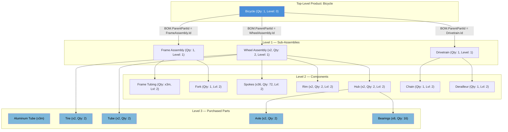
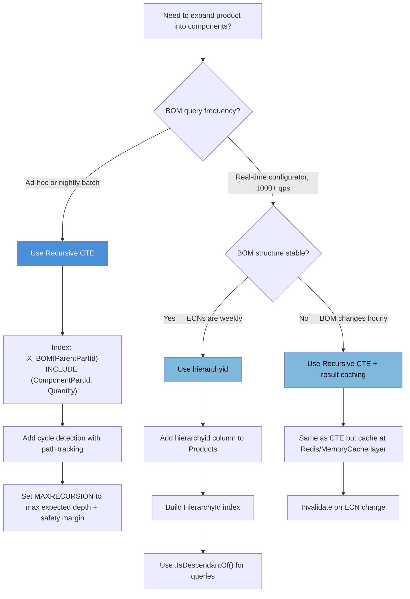

## Navigation

**Domain:** [[8 — Databases]] > **Group:** SQL CTEs & Recursive Queries
**Previous:** [[8.195 — Set Operations vs JOIN — Decision]] | **Next:** [[8.197 — Recursive Org Chart Queries]]

### Prerequisites

- [[8.180 — Recursive CTEs — Anchor and Recursive Members]] — Recursive CTE mechanics are the foundation of BOM explosion; the anchor member selects top-level assemblies and the recursive member joins child components.
- [[8.181 — Recursive CTE — Traversing Hierarchies]] — Hierarchy traversal via recursive CTE is the core mechanism — parent-child joins at each recursion level.
- [[8.185 — Recursive CTE — MAXRECURSION Option]] — Deep BOMs can exceed the default recursion limit of 100; MAXRECURSION must be tuned or a non-recursive alternative considered.

### Where This Fits

The Bill of Materials (BOM) explosion is one of the most common production use cases for recursive CTEs in manufacturing, supply chain, and inventory systems. A .NET backend engineer encounters this when building MRP (Material Requirements Planning) modules, product configurators, cost rollup engines, or any system that models a product as a tree of sub-components and raw materials. The challenge is that a product's BOM can be 5-20 levels deep, with the same part appearing at multiple levels (common parts), and quantity accumulation that multiplies at each level. Without a recursive CTE, BOM explosion requires recursive client-side code, a loop in a stored procedure, or a denormalized BOM table that is expensive to maintain. The interview signal is strong: BOM explosion tests whether a candidate can apply recursive CTEs to a real manufacturing domain problem, handle quantity multiplication correctly, detect cycles, and reason about performance at scale (tens of thousands of parts, deep nesting). A candidate who cannot explain BOM explosion likely cannot handle any recursive hierarchy in production.

---

## Core Mental Model

A Bill of Materials is a tree: the finished product is the root, sub-assemblies are internal nodes, and purchased parts or raw materials are leaves. Each edge has a quantity — the number of units of the child component required to make one unit of the parent assembly. BOM "explosion" is the recursive process of starting at the root product and expanding each sub-assembly into its constituent parts, accumulating quantities by multiplication at each level, until every path terminates at a purchased part (a leaf with no further children).

The recursive CTE implements the explosion in two phases: the anchor member selects the top-level product(s) with quantity = 1 (we want to make one finished unit). The recursive member joins the BOM table back to the CTE result from the previous level, multiplying the running quantity by the component quantity defined in the BOM edge. Each successive iteration dives one level deeper into the product structure. Level tracking (an integer that increments each iteration) records the assembly depth. Quantity accumulation is critical: if a sub-assembly requires 2 units of a part, and the top-level product requires 3 of that sub-assembly, the part quantity is 2 x 3 = 6.

BOM "implosion" is the inverse: starting from a raw material or sub-component, find every end product that uses it, and for each usage, the quantity required. The implosion CTE reverses the join direction — it starts at the component and joins upward to parent assemblies.

The recognition pattern: any "contains", "is made of", "requires", "composed of" relationship with multiple levels and quantity accumulation is a BOM problem. Manufacturing ERP, recipe management, construction materials, and even software dependency trees all follow the BOM pattern.

### Classification

The BOM recursion pattern uses the recursive CTE operator family. The anchor member is the top-level product(s). The recursive member joins `BOM` to the previous CTE level using the component part ID. The `UNION ALL` combines anchor and recursive results. The query optimizer produces a plan with an Index Spool that materializes the CTE results to feed the next recursion. The pattern is not SARGable in the traditional sense — the recursive join resolves through index seeks on the BOM table's `ParentPartId` column. A non-clustered index on `BOM(ParentPartId, ComponentPartId)` is critical for performance.



### Key Properties

|Property|Value|Notes|
|---|---|---|
|Time complexity|O(K × N) where K = depth, N = BOM edges per level|Each recursion level scans the index on ParentPartId|
|Memory|CTE result set materialized per iteration|Recursive CTE cannot use spooling across iterations|
|BOM table index|IX_BOM(ParentPartId) INCLUDE (ComponentPartId, Quantity)|Required for seek in recursive join|
|Cycle detection|Manual — track path with VARCHAR(MAX) or use hierarchyid|SQL Server has no CYCLE clause; PostgreSQL 14+ has|
|Level tracking|Add Level INT column incremented each iteration|MAXRECURSION must exceed max depth|
|Quantity accumulation|Multiply running quantity × BOM.Quantity each level|Use DECIMAL/NUMERIC to avoid rounding errors|
|EF Core support|Raw SQL only — no LINQ for recursive CTE|Map to FromSqlRaw or use Dapper|

---

## Deep Mechanics

### How the Engine Executes This

The recursive CTE for BOM explosion executes as follows:

1. **Parsing and binding:** The query processor identifies `cte_BOM` as a recursive CTE because the recursive member (the UNION ALL branch after the anchor) references `cte_BOM` itself.
2. **Anchor execution:** The anchor member runs — it selects the top-level product(s) from `Products` (those specified in the anchor `WHERE` clause). This produces the first rowset: the product at level 0 with quantity 1.
3. **Recursion start:** The anchor result is placed into the CTE working table (an internal table spool).
4. **Recursive member execution:** The recursive member joins `BOM` to the current working table (`cte_BOM` from the previous iteration). For each row in the working table, it does an index seek on `BOM.ParentPartId = cte_BOM.ComponentPartId` to find child components.
5. **New rows:** The recursive member produces a new rowset with level incremented by 1 and quantity multiplied by `BOM.Quantity`.
6. **Append and iterate:** The new rows are appended to the overall CTE result (via UNION ALL). The new rows become the working table for the next recursion.
7. **Termination check:** Steps 4-6 repeat until the recursive member returns zero rows (no more child parts found) or `MAXRECURSION` is hit.
8. **Final result:** The full CTE result (all iterations concatenated) is available to the outer SELECT, which can aggregate (SUM quantities by part), filter (purchased parts only), or reformat.

**Join behavior detail:** The recursive member's join is a semi-self join: `INNER JOIN dbo.BOM AS b ON b.ParentPartId = cte.ComponentPartId`. This join is inside the recursive loop and executes once per iteration. Each execution uses an index seek on `IX_BOM_ParentPartId`.

**Quantity accumulation semantics:** The quantity at any node is `SUM of (parent_quantity × BOM.Quantity)` across all paths to that node. For common parts (same component used in multiple parent assemblies), the quantity is the sum of contributions from each path. The CTE produces one row per path; the outer query must aggregate with `GROUP BY ComponentPartId, SUM(TotalQuantity)`.

### SQL Visibility

**NOTE:** NULL is not a value — it is the absence of a value. SQL uses three-valued logic (TRUE, FALSE, UNKNOWN). In the BOM table, `ParentPartId` for a top-level part that has no parent is stored differently from a part that exists but has no children. The anchor member uses a condition like `p.PartId = @TopLevelPartId`, not a NULL check, to select the starting part. The recursive member's join condition `INNER JOIN dbo.BOM AS b ON b.ParentPartId = cte.ComponentPartId` naturally filters out leaves (parts with no children) because the join returns no matches.

```sql
-- ============================================================
-- Schema — BOM and Products tables
-- ============================================================
CREATE TABLE dbo.Products (
    PartId          INT             NOT NULL IDENTITY(1,1),
    PartNumber      VARCHAR(50)     NOT NULL,
    PartName        VARCHAR(200)    NOT NULL,
    PartType        CHAR(1)         NOT NULL CHECK (PartType IN ('M', 'P')),
        -- 'M' = manufactured (sub-assembly), 'P' = purchased (raw material/part)
    UnitCost        DECIMAL(18,4)   NULL,
    LeadTimeDays    INT             NULL,
    IsActive        BIT             NOT NULL DEFAULT 1,
    CONSTRAINT PK_Products PRIMARY KEY CLUSTERED (PartId),
    CONSTRAINT UQ_Products_PartNumber UNIQUE (PartNumber)
);

CREATE TABLE dbo.BOM (
    BOMId           INT             NOT NULL IDENTITY(1,1),
    ParentPartId    INT             NOT NULL,
    ComponentPartId INT             NOT NULL,
    Quantity        DECIMAL(18,4)   NOT NULL CHECK (Quantity > 0),
    ScrapPercent    DECIMAL(5,2)    NOT NULL DEFAULT 0 CHECK (ScrapPercent >= 0 AND ScrapPercent < 100),
    EffectiveDate   DATE            NOT NULL DEFAULT CAST(GETDATE() AS DATE),
    ExpiryDate      DATE            NULL,
    CONSTRAINT PK_BOM PRIMARY KEY CLUSTERED (BOMId),
    CONSTRAINT FK_BOM_Parent FOREIGN KEY (ParentPartId) REFERENCES dbo.Products(PartId),
    CONSTRAINT FK_BOM_Component FOREIGN KEY (ComponentPartId) REFERENCES dbo.Products(PartId),
    CONSTRAINT UQ_BOM_Parent_Component UNIQUE (ParentPartId, ComponentPartId, EffectiveDate)
);

-- Critical index for recursive BOM join
CREATE NONCLUSTERED INDEX IX_BOM_ParentPartId
    ON dbo.BOM (ParentPartId)
    INCLUDE (ComponentPartId, Quantity, ScrapPercent)
    WHERE ExpiryDate IS NULL;

-- Index for BOM implosion (find parents of a part)
CREATE NONCLUSTERED INDEX IX_BOM_ComponentPartId
    ON dbo.BOM (ComponentPartId)
    INCLUDE (ParentPartId, Quantity);

-- Sample data
INSERT INTO dbo.Products (PartNumber, PartName, PartType, UnitCost, LeadTimeDays) VALUES
    ('BIKE-001', 'Mountain Bike 29er', 'M', 500.00, 10),
    ('FRM-001', 'Frame Assembly — 29er', 'M', 150.00, 5),
    ('WHL-001', 'Wheel Assembly — 29er', 'M', 80.00, 3),
    ('DRV-001', 'Drivetrain Kit', 'M', 60.00, 4),
    ('TUB-001', 'Frame Tubing — Aluminum 6061', 'P', 12.00, 15),
    ('FRK-001', 'Suspension Fork 29er', 'P', 110.00, 20),
    ('SPK-001', 'Spoke — Stainless Steel', 'P', 0.50, 10),
    ('RIM-001', 'Rim — 29er Alloy', 'P', 25.00, 12),
    ('HUB-001', 'Hub — Disc Brake Compatible', 'P', 18.00, 14),
    ('TIR-001', 'Tire — 29x2.25 Tubeless', 'P', 35.00, 8),
    ('TUBR-001', 'Inner Tube — 29 Presta', 'P', 6.00, 5),
    ('AXL-001', 'Axle — 12mm Thru', 'P', 4.00, 10),
    ('BRG-001', 'Bearing — 6802 RS', 'P', 2.50, 10),
    ('CHN-001', 'Chain — 126 Links', 'P', 18.00, 7),
    ('DER-001', 'Derailleur — 12 Speed', 'P', 42.00, 9);

INSERT INTO dbo.BOM (ParentPartId, ComponentPartId, Quantity) VALUES
    -- Bike -> Frame (1), Wheels (2), Drivetrain (1)
    (1, 2, 1), (1, 3, 2), (1, 4, 1),
    -- Frame -> Tubing (3m), Fork (1)
    (2, 5, 3), (2, 6, 1),
    -- Wheel -> Spokes (36), Rim (1), Hub (1), Tire (1), Tube (1)
    (3, 7, 36), (3, 8, 1), (3, 9, 1), (3, 10, 1), (3, 11, 1),
    -- Hub -> Axle (1), Bearings (8)
    (9, 12, 1), (9, 13, 8),
    -- Drivetrain -> Chain (1), Derailleur (1)
    (4, 14, 1), (4, 15, 1);

-- ============================================================
-- BOM Explosion — Full Multi-Level Product Structure
-- ============================================================
-- Business question: what components are needed to build one Mountain Bike?
-- Show exploded quantities at every level.

WITH cte_BOM AS (
    -- Anchor: start at the top-level product
    SELECT
        p.PartId,
        p.PartNumber,
        p.PartName,
        p.PartType,
        CAST(1 AS DECIMAL(18,4)) AS Quantity,          -- base quantity: 1 unit
        CAST(1 AS DECIMAL(18,4)) AS RunningQuantity,    -- accumulated quantity
        0 AS LevelDepth,
        CAST(CAST(p.PartId AS VARCHAR(10)) AS VARCHAR(MAX)) AS Path
    FROM dbo.Products AS p
    WHERE p.PartNumber = 'BIKE-001'         -- anchor: the product we're exploding

    UNION ALL

    -- Recursive: join BOM to current CTE level
    SELECT
        comp.PartId,
        comp.PartNumber,
        comp.PartName,
        comp.PartType,
        b.Quantity,                                     -- quantity per parent
        CAST(cte.RunningQuantity * b.Quantity AS DECIMAL(18,4)) AS RunningQuantity,
        cte.LevelDepth + 1 AS LevelDepth,
        CAST(cte.Path + ' -> ' + CAST(comp.PartId AS VARCHAR(10)) AS VARCHAR(MAX)) AS Path
    FROM cte_BOM AS cte
    INNER JOIN dbo.BOM AS b
        ON b.ParentPartId = cte.PartId
    INNER JOIN dbo.Products AS comp
        ON comp.PartId = b.ComponentPartId
)
SELECT
    LevelDepth,
    PartNumber,
    PartName,
    PartType,
    Quantity AS QtyPerParent,
    RunningQuantity,
    Path
FROM cte_BOM
ORDER BY Path;
```

```csharp
// EF Core — BOM Explosion (Raw SQL required)
public async Task<List<BomExplosionRow>> GetBomExplosionAsync(
    string topLevelPartNumber,
    CancellationToken cancellationToken = default)
{
    const string sql = @"
        WITH cte_BOM AS (
            SELECT
                p.PartId,
                p.PartNumber,
                p.PartName,
                p.PartType,
                CAST(1 AS DECIMAL(18,4)) AS Quantity,
                CAST(1 AS DECIMAL(18,4)) AS RunningQuantity,
                0 AS LevelDepth,
                CAST(CAST(p.PartId AS VARCHAR(10)) AS VARCHAR(MAX)) AS Path
            FROM dbo.Products AS p
            WHERE p.PartNumber = @PartNumber
            UNION ALL
            SELECT
                comp.PartId,
                comp.PartNumber,
                comp.PartName,
                comp.PartType,
                b.Quantity,
                CAST(cte.RunningQuantity * b.Quantity AS DECIMAL(18,4)),
                cte.LevelDepth + 1,
                CAST(cte.Path + ' -> ' + CAST(comp.PartId AS VARCHAR(10)) AS VARCHAR(MAX))
            FROM cte_BOM AS cte
            INNER JOIN dbo.BOM AS b ON b.ParentPartId = cte.PartId
            INNER JOIN dbo.Products AS comp ON comp.PartId = b.ComponentPartId
        )
        SELECT LevelDepth, PartNumber, PartName, PartType,
               Quantity AS QtyPerParent, RunningQuantity, Path
        FROM cte_BOM
        ORDER BY Path
        OPTION (MAXRECURSION 50)";

    return await dbContext.Database
        .SqlQueryRaw<BomExplosionRow>(sql,
            new SqlParameter("@PartNumber", topLevelPartNumber))
        .ToListAsync(cancellationToken);
}

public class BomExplosionRow
{
    public int LevelDepth { get; set; }
    public string PartNumber { get; set; } = string.Empty;
    public string PartName { get; set; } = string.Empty;
    public string PartType { get; set; } = string.Empty;
    public decimal Quantity { get; set; }
    public decimal RunningQuantity { get; set; }
    public string Path { get; set; } = string.Empty;
}
```

**Generated SQL (from EF Core logs):**

```sql
-- EF Core generates the exact SQL above (passed through FromSqlRaw)
-- No translation — LINQ does not support recursive CTEs natively
-- EF Core 9.0 preview has no change for recursive query support
```

```csharp
// Dapper Implementation — BOM Explosion
public async Task<IReadOnlyList<BomExplosionRow>> GetBomExplosionAsync(
    string topLevelPartNumber,
    CancellationToken cancellationToken = default)
{
    const string sql = @"
        WITH cte_BOM AS (
            SELECT
                p.PartId,
                p.PartNumber,
                p.PartName,
                p.PartType,
                CAST(1 AS DECIMAL(18,4)) AS Quantity,
                CAST(1 AS DECIMAL(18,4)) AS RunningQuantity,
                0 AS LevelDepth,
                CAST(CAST(p.PartId AS VARCHAR(10)) AS VARCHAR(MAX)) AS Path
            FROM dbo.Products AS p
            WHERE p.PartNumber = @PartNumber
            UNION ALL
            SELECT
                comp.PartId,
                comp.PartNumber,
                comp.PartName,
                comp.PartType,
                b.Quantity,
                CAST(cte.RunningQuantity * b.Quantity AS DECIMAL(18,4)),
                cte.LevelDepth + 1,
                CAST(cte.Path + ' -> ' + CAST(comp.PartId AS VARCHAR(10)) AS VARCHAR(MAX))
            FROM cte_BOM AS cte
            INNER JOIN dbo.BOM AS b ON b.ParentPartId = cte.PartId
            INNER JOIN dbo.Products AS comp ON comp.PartId = b.ComponentPartId
        )
        SELECT LevelDepth, PartNumber, PartName, PartType,
               Quantity AS QtyPerParent, RunningQuantity, Path
        FROM cte_BOM
        ORDER BY Path
        OPTION (MAXRECURSION 50)";

    await using var connection = _connectionFactory.Create();
    var results = await connection.QueryAsync<BomExplosionRow>(
        new CommandDefinition(sql,
            new { PartNumber = topLevelPartNumber },
            cancellationToken: cancellationToken));
    return results.AsList();
}
```

### Execution Plan Analysis

For the BOM explosion CTE, the expected plan shape is:

```
[Index Seek (IX_Products_PartNumber)]  -- Find the anchor product
    → [Compute Scalar]                 -- LevelDepth=0, RunningQuantity=1
        → [Concatenation]              -- UNION ALL anchor + recursive
            → [Table Spool (Eager Spool, cte_BOM)]  -- Spool CTE results for recursive reference
                → [Table Spool (Recursive)]          -- On-demand for each recursion
                    → [Index Seek (IX_BOM_ParentPartId)]  -- Find children
                        → [Nested Loops (Inner Join)]      -- Join BOM to Component Parts
                            → [Clustered Index Seek (Products)]  -- Get component details
                            → [Compute Scalar]                   -- Multiply RunningQuantity × BOM.Quantity
                                → [Index Spool (Recursive)]      -- Feed back into CTE spool
```

| Operator | Purpose | Details |
|---|---|---|
| `Index Seek` on Products | Locate anchor product | Uses IX_Products_PartNumber, single row |
| `Index Seek` on BOM | Find children of current part | Uses IX_BOM_ParentPartId, seek for each iteration |
| `Clustered Index Seek` on Products | Get component details | By PartId, single page read |
| `Table Spool (Eager)` | Materialize CTE rows | Stores intermediate recursive results |
| `Index Spool (Recursive)` | Re-spool for next iteration | Feeds next recursion pass |
| `Concatenation` | UNION ALL of anchor + recursive | Combines all levels |

**Estimated vs actual rows:** The optimizer estimates rows based on BOM table cardinality. For deep BOMs with common parts, actual rows can exceed estimates significantly because the same component appears via multiple paths. This causes underestimates in the recursive branch, potentially leading to inaccurate memory grants for the Sort or Hash operators if present.

**Without IX_BOM_ParentPartId:** The recursive join does a full clustered index scan on BOM (or a scan of PK_BOM) for each recursion level. With a 10-level BOM and 100K BOM rows, that is 10 full scans = ~10 × 100K logical reads. With the index seek, each level reads only the rows for the current parent(s) — typically 1-10 rows per seek. The difference is 1M logical reads vs under 500.

### Cost Visibility

```sql
SET STATISTICS IO ON;
SET STATISTICS TIME ON;

WITH cte_BOM AS (
    SELECT
        p.PartId,
        p.PartNumber,
        p.PartName,
        p.PartType,
        CAST(1 AS DECIMAL(18,4)) AS Quantity,
        CAST(1 AS DECIMAL(18,4)) AS RunningQuantity,
        0 AS LevelDepth,
        CAST(CAST(p.PartId AS VARCHAR(10)) AS VARCHAR(MAX)) AS Path
    FROM dbo.Products AS p
    WHERE p.PartNumber = 'BIKE-001'
    UNION ALL
    SELECT
        comp.PartId,
        comp.PartNumber,
        comp.PartName,
        comp.PartType,
        b.Quantity,
        CAST(cte.RunningQuantity * b.Quantity AS DECIMAL(18,4)),
        cte.LevelDepth + 1,
        CAST(cte.Path + ' -> ' + CAST(comp.PartId AS VARCHAR(10)) AS VARCHAR(MAX))
    FROM cte_BOM AS cte
    INNER JOIN dbo.BOM AS b ON b.ParentPartId = cte.PartId
    INNER JOIN dbo.Products AS comp ON comp.PartId = b.ComponentPartId
)
SELECT LevelDepth, PartNumber, PartName, PartType, Quantity, RunningQuantity, Path
FROM cte_BOM
ORDER BY Path
OPTION (MAXRECURSION 50);

-- Expected output (small BOM sample):
-- Table 'Products'. Scan count 0, logical reads 14
-- Table 'BOM'. Scan count 0, logical reads 10
-- Table 'Worktable'. Scan count 0, logical reads 24
-- SQL Server Execution Times: CPU time = 0ms, elapsed time = 1ms

-- For a large BOM (50K rows, depth 15):
-- Table 'Products'. Scan count 0, logical reads ~500
-- Table 'BOM'. Scan count 0, logical reads ~300
-- Table 'Worktable'. Scan count 0, logical reads ~4,500
-- SQL Server Execution Times: CPU time = ~50ms, elapsed time = ~120ms
```

### Failure Modes

**Cycle detection failure:** If the BOM data contains a cycle (Part A contains Part B, Part B contains Part A), the recursive CTE will loop infinitely until `MAXRECURSION` is hit, producing an error. The result set up to that point is discarded. The fix is to implement cycle detection in the CTE by tracking visited PartIds in the path string, or to use `hierarchyid` which enforces acyclic structure at the data level.

**MAXRECURSION limit exceeded:** If the BOM is deeper than 100 levels (default), the CTE fails with error 530: "The statement terminated. The maximum recursion 100 has been exhausted." The fix is `OPTION (MAXRECURSION 0)` for unlimited or a specific value. If the BOM has a cycle, MAXRECURSION 0 will loop until the server runs out of memory.

**Quantity overflow:** For BOMs with large quantities multiplied across many levels, `RunningQuantity` can overflow the `DECIMAL(18,4)` precision. If the explosion quantity exceeds 10^14 at a single path, the multiplication will raise an arithmetic overflow error. The fix is to use `DECIMAL(38,10)` for very large BOMs or to break the explosion into sub-assemblies.

**Scrap not accounted:** The `ScrapPercent` column in BOM is often ignored in the basic explosion. A purchased quantity that ignores scrap will lead to stockouts in production. The fix is to apply scrap in the final aggregation: `RequiredQuantity = RunningQuantity * (1 + ScrapPercent/100.0)`.

---

## Production Patterns and Implementation

### Primary SQL Implementation

**Pattern 1 — Aggregated BOM Explosion (Quantity Rollup):**

```sql
-- Business question: produce a pick list — what purchased parts are needed, and in what total quantity,
-- to build one unit of BIKE-001? Include scrap factor and round up to buyable units.

-- Step 1: Full explosion with path tracking and scrap
WITH cte_BOM AS (
    SELECT
        p.PartId,
        p.PartNumber,
        p.PartName,
        p.PartType,
        CAST(1 AS DECIMAL(18,4)) AS RunningQuantity,
        0 AS LevelDepth,
        CAST(CAST(p.PartId AS VARCHAR(10)) AS VARCHAR(MAX)) AS Path
    FROM dbo.Products AS p
    WHERE p.PartNumber = 'BIKE-001'

    UNION ALL

    SELECT
        comp.PartId,
        comp.PartNumber,
        comp.PartName,
        comp.PartType,
        CAST(cte.RunningQuantity * b.Quantity AS DECIMAL(18,4)),
        cte.LevelDepth + 1,
        CAST(cte.Path + '->' + CAST(comp.PartId AS VARCHAR(10)) AS VARCHAR(MAX))
    FROM cte_BOM AS cte
    INNER JOIN dbo.BOM AS b ON b.ParentPartId = cte.PartId
    INNER JOIN dbo.Products AS comp ON comp.PartId = b.ComponentPartId
    WHERE cte.LevelDepth < 20  -- safety limit
)
SELECT
    e.PartNumber,
    e.PartName,
    p.UnitCost,
    SUM(e.RunningQuantity) AS TotalRequired,
    SUM(e.RunningQuantity * (1 + ISNULL(b.ScrapPercent, 0) / 100.0)) AS TotalWithScrap,
    CEILING(SUM(e.RunningQuantity * (1 + ISNULL(b.ScrapPercent, 0) / 100.0))) AS ToOrder
FROM cte_BOM AS e
INNER JOIN dbo.Products AS p ON p.PartId = e.PartId
LEFT JOIN dbo.BOM AS b ON b.ComponentPartId = e.PartId
    AND b.ParentPartId IN (SELECT PartId FROM cte_BOM WHERE LevelDepth = e.LevelDepth - 1)
WHERE e.PartType = 'P'  -- purchased parts only
GROUP BY e.PartNumber, e.PartName, p.UnitCost
ORDER BY e.PartNumber;
```

**Pattern 2 — BOM Implosion (Where Used):**

```sql
-- Business question: which finished products use "Spoke — Stainless Steel" (SPK-001)?
-- Show the path from finished product down to this part.

WITH cte_Implosion AS (
    -- Anchor: start at the component we're searching for
    SELECT
        p.PartId,
        p.PartNumber,
        p.PartName,
        p.PartType,
        CAST(1 AS DECIMAL(18,4)) AS QuantityInParent,
        CAST(p.PartNumber AS VARCHAR(MAX)) AS Path,
        0 AS LevelDepth
    FROM dbo.Products AS p
    WHERE p.PartNumber = 'SPK-001'

    UNION ALL

    SELECT
        parent.PartId,
        parent.PartNumber,
        parent.PartName,
        parent.PartType,
        b.Quantity,
        CAST(cte.Path + ' <- ' + parent.PartNumber AS VARCHAR(MAX)),
        cte.LevelDepth + 1
    FROM cte_Implosion AS cte
    INNER JOIN dbo.BOM AS b ON b.ComponentPartId = cte.PartId
    INNER JOIN dbo.Products AS parent ON parent.PartId = b.ParentPartId
)
SELECT *
FROM cte_Implosion
ORDER BY LevelDepth DESC, Path;
```

**Pattern 3 — BOM Cost Rollup:**

```sql
-- Business question: what is the total manufactured cost of BIKE-001?
-- Roll up purchased part costs through each sub-assembly.

WITH cte_BOM AS (
    SELECT
        p.PartId,
        p.PartNumber,
        p.PartName,
        p.PartType,
        p.UnitCost,
        CAST(1 AS DECIMAL(18,4)) AS Quantity,
        CAST(1 AS DECIMAL(18,4)) AS RunningQuantity,
        0 AS LevelDepth
    FROM dbo.Products AS p
    WHERE p.PartNumber = 'BIKE-001'

    UNION ALL

    SELECT
        comp.PartId,
        comp.PartNumber,
        comp.PartName,
        comp.PartType,
        comp.UnitCost,
        b.Quantity,
        CAST(cte.RunningQuantity * b.Quantity AS DECIMAL(18,4)),
        cte.LevelDepth + 1
    FROM cte_BOM AS cte
    INNER JOIN dbo.BOM AS b ON b.ParentPartId = cte.PartId
    INNER JOIN dbo.Products AS comp ON comp.PartId = b.ComponentPartId
)
SELECT
    'Total Cost' AS Metric,
    SUM(e.RunningQuantity * ISNULL(e.UnitCost, 0)) AS TotalCost
FROM cte_BOM AS e
WHERE e.PartType = 'P';

-- With cost breakdown by level:
SELECT
    LevelDepth,
    COUNT(DISTINCT PartId) AS PartsAtLevel,
    SUM(RunningQuantity * ISNULL(UnitCost, 0)) AS LevelCost
FROM cte_BOM
GROUP BY LevelDepth
ORDER BY LevelDepth;
```

**Pattern 4 — BOM with Effective Date Filtering:**

```sql
-- Business question: what was the BOM structure as of a specific date?
-- BOM entries can have EffectiveDate/ExpiryDate for engineering change management.

DECLARE @AsOfDate DATE = '2026-06-01';

WITH cte_BOM_ECN AS (
    SELECT
        p.PartId,
        p.PartNumber,
        p.PartName,
        p.PartType,
        CAST(1 AS DECIMAL(18,4)) AS RunningQuantity,
        0 AS LevelDepth,
        CAST(CAST(p.PartId AS VARCHAR(10)) AS VARCHAR(MAX)) AS Path
    FROM dbo.Products AS p
    WHERE p.PartNumber = 'BIKE-001'

    UNION ALL

    SELECT
        comp.PartId,
        comp.PartNumber,
        comp.PartName,
        comp.PartType,
        CAST(cte.RunningQuantity * b.Quantity AS DECIMAL(18,4)),
        cte.LevelDepth + 1,
        CAST(cte.Path + '->' + CAST(comp.PartId AS VARCHAR(10)) AS VARCHAR(MAX))
    FROM cte_BOM_ECN AS cte
    INNER JOIN dbo.BOM AS b
        ON b.ParentPartId = cte.PartId
        AND b.EffectiveDate <= @AsOfDate
        AND (b.ExpiryDate IS NULL OR b.ExpiryDate > @AsOfDate)
    INNER JOIN dbo.Products AS comp ON comp.PartId = b.ComponentPartId
    WHERE cte.LevelDepth < 20
)
SELECT *
FROM cte_BOM_ECN
ORDER BY Path
OPTION (MAXRECURSION 50);
```

### EF Core Implementation

```csharp
// EF Core — BOM Aggregated Explosion (Raw SQL, mapped to keyless entity)

public class BomPickListRow
{
    public string PartNumber { get; set; } = string.Empty;
    public string PartName { get; set; } = string.Empty;
    public decimal UnitCost { get; set; }
    public decimal TotalRequired { get; set; }
    public decimal TotalWithScrap { get; set; }
    public int ToOrder { get; set; }
}

// In DbContext.OnModelCreating
modelBuilder.Entity<BomPickListRow>()
    .HasNoKey()
    .ToView(null);  // or use .ToSqlQuery() in EF Core 9

public async Task<IReadOnlyList<BomPickListRow>> GetBomPickListAsync(
    string topLevelPartNumber,
    CancellationToken cancellationToken = default)
{
    const string sql = @"
        WITH cte_BOM AS (
            SELECT p.PartId, p.PartNumber, p.PartName, p.PartType,
                   CAST(1 AS DECIMAL(18,4)) AS RunningQuantity, 0 AS LevelDepth
            FROM dbo.Products AS p WHERE p.PartNumber = @PartNumber
            UNION ALL
            SELECT comp.PartId, comp.PartNumber, comp.PartName, comp.PartType,
                   CAST(cte.RunningQuantity * b.Quantity AS DECIMAL(18,4)),
                   cte.LevelDepth + 1
            FROM cte_BOM AS cte
            INNER JOIN dbo.BOM AS b ON b.ParentPartId = cte.PartId
            INNER JOIN dbo.Products AS comp ON comp.PartId = b.ComponentPartId
        )
        SELECT e.PartNumber, e.PartName, p.UnitCost,
               SUM(e.RunningQuantity) AS TotalRequired,
               SUM(e.RunningQuantity * (1 + ISNULL(b.ScrapPercent, 0) / 100.0)) AS TotalWithScrap,
               CEILING(SUM(e.RunningQuantity * (1 + ISNULL(b.ScrapPercent, 0) / 100.0))) AS ToOrder
        FROM cte_BOM AS e
        INNER JOIN dbo.Products AS p ON p.PartId = e.PartId
        LEFT JOIN dbo.BOM AS b ON b.ComponentPartId = e.PartId
        WHERE e.PartType = 'P'
        GROUP BY e.PartNumber, e.PartName, p.UnitCost
        ORDER BY e.PartNumber
        OPTION (MAXRECURSION 50)";

    return await dbContext.Database
        .SqlQueryRaw<BomPickListRow>(sql,
            new SqlParameter("@PartNumber", topLevelPartNumber))
        .ToListAsync(cancellationToken);
}
```

### Dapper Implementation

```csharp
// Dapper — BOM Cost Rollup
public class BomCostRollup
{
    public string Metric { get; set; } = string.Empty;
    public decimal TotalCost { get; set; }
}

public async Task<BomCostRollup> GetBomTotalCostAsync(
    string topLevelPartNumber,
    CancellationToken cancellationToken = default)
{
    const string sql = @"
        WITH cte_BOM AS (
            SELECT p.PartId, p.PartType, p.UnitCost,
                   CAST(1 AS DECIMAL(18,4)) AS RunningQuantity, 0 AS LevelDepth
            FROM dbo.Products AS p WHERE p.PartNumber = @PartNumber
            UNION ALL
            SELECT comp.PartId, comp.PartType, comp.UnitCost,
                   CAST(cte.RunningQuantity * b.Quantity AS DECIMAL(18,4)),
                   cte.LevelDepth + 1
            FROM cte_BOM AS cte
            INNER JOIN dbo.BOM AS b ON b.ParentPartId = cte.PartId
            INNER JOIN dbo.Products AS comp ON comp.PartId = b.ComponentPartId
        )
        SELECT 'Total Cost' AS Metric,
               SUM(e.RunningQuantity * ISNULL(e.UnitCost, 0)) AS TotalCost
        FROM cte_BOM AS e
        WHERE e.PartType = 'P'
        OPTION (MAXRECURSION 50)";

    await using var connection = _connectionFactory.Create();
    return await connection.QueryFirstOrDefaultAsync<BomCostRollup>(
        new CommandDefinition(sql,
            new { PartNumber = topLevelPartNumber },
            cancellationToken: cancellationToken));
}

// Dapper — Cycle-safe BOM traversal with path tracking
public async Task<IReadOnlyList<BomExplosionRow>> GetBomExplosionWithCycleDetectionAsync(
    string topLevelPartNumber,
    CancellationToken cancellationToken = default)
{
    const string sql = @"
        WITH cte_BOM AS (
            SELECT p.PartId, p.PartNumber, p.PartName, p.PartType,
                   CAST(1 AS DECIMAL(18,4)) AS RunningQuantity, 0 AS LevelDepth,
                   CAST('|' + CAST(p.PartId AS VARCHAR(10)) + '|' AS VARCHAR(MAX)) AS Visited
            FROM dbo.Products AS p WHERE p.PartNumber = @PartNumber
            UNION ALL
            SELECT comp.PartId, comp.PartNumber, comp.PartName, comp.PartType,
                   CAST(cte.RunningQuantity * b.Quantity AS DECIMAL(18,4)),
                   cte.LevelDepth + 1,
                   CAST(cte.Visited + CAST(comp.PartId AS VARCHAR(10)) + '|' AS VARCHAR(MAX))
            FROM cte_BOM AS cte
            INNER JOIN dbo.BOM AS b ON b.ParentPartId = cte.PartId
            INNER JOIN dbo.Products AS comp ON comp.PartId = b.ComponentPartId
            WHERE cte.Visited NOT LIKE '%|' + CAST(comp.PartId AS VARCHAR(10)) + '|%'
                AND cte.LevelDepth < 20
        )
        SELECT LevelDepth, PartNumber, PartName, PartType,
               Quantity, RunningQuantity, Path
        FROM cte_BOM
        ORDER BY Path
        OPTION (MAXRECURSION 50)";

    await using var connection = _connectionFactory.Create();
    var results = await connection.QueryAsync<BomExplosionRow>(
        new CommandDefinition(sql,
            new { PartNumber = topLevelPartNumber },
            cancellationToken: cancellationToken));
    return results.AsList();
}
```

### Configuration and Wiring

```csharp
// Program.cs — Register connection factory for Dapper
builder.Services.AddSingleton<IDbConnectionFactory, SqlConnectionFactory>();
builder.Services.AddDbContext<ManufacturingDbContext>(options =>
    options.UseSqlServer(
        builder.Configuration.GetConnectionString("ManufacturingDb"),
        sqlOptions =>
        {
            sqlOptions.EnableRetryOnFailure(3);
            sqlOptions.CommandTimeout(60);  // BOM explosion can be long
        }));

// Connection factory implementation
public interface IDbConnectionFactory
{
    IDbConnection Create();
}

public class SqlConnectionFactory : IDbConnectionFactory
{
    private readonly string _connectionString;
    public SqlConnectionFactory(IConfiguration configuration)
    {
        _connectionString = configuration.GetConnectionString("ManufacturingDb")
            ?? throw new InvalidOperationException("ManufacturingDb connection string is required");
    }

    public IDbConnection Create() => new SqlConnection(_connectionString);
}
```

### SQL Server vs PostgreSQL Differences

```sql
-- PostgreSQL — BOM Explosion Equivalent
-- Key differences:
-- 1. RECURSIVE keyword is REQUIRED after WITH
-- 2. Data type syntax: NUMERIC(18,4) instead of DECIMAL(18,4)
-- 3. VARCHAR(MAX) → TEXT
-- 4. CAST syntax uses :: operator
-- 5. No OPTION(MAXRECURSION) — use SET session_level limit
-- 6. PostgreSQL can detect cycles with CYCLE clause (14+)

SET max_recursive_iterations = 50;

WITH RECURSIVE cte_bom AS (
    -- Anchor
    SELECT
        p.part_id,
        p.part_number,
        p.part_name,
        p.part_type,
        1::NUMERIC(18,4) AS running_quantity,
        0 AS level_depth,
        '|' || p.part_id::TEXT || '|' AS visited
    FROM products AS p
    WHERE p.part_number = 'BIKE-001'

    UNION ALL

    -- Recursive
    SELECT
        comp.part_id,
        comp.part_number,
        comp.part_name,
        comp.part_type,
        cte.running_quantity * b.quantity::NUMERIC(18,4),
        cte.level_depth + 1,
        cte.visited || comp.part_id::TEXT || '|'
    FROM cte_bom AS cte
    INNER JOIN bom AS b ON b.parent_part_id = cte.part_id
    INNER JOIN products AS comp ON comp.part_id = b.component_part_id
    WHERE cte.visited NOT LIKE '%|' || comp.part_id::TEXT || '|%'
        AND cte.level_depth < 20
)
SELECT * FROM cte_bom
ORDER BY visited;

-- PostgreSQL 14+ — native cycle detection with CYCLE clause
WITH RECURSIVE cte_bom AS (
    SELECT
        p.part_id,
        p.part_number,
        p.part_name,
        p.part_type,
        1::NUMERIC(18,4) AS running_quantity,
        0 AS level_depth
    FROM products AS p
    WHERE p.part_number = 'BIKE-001'

    UNION ALL

    SELECT
        comp.part_id,
        comp.part_number,
        comp.part_name,
        comp.part_type,
        cte.running_quantity * b.quantity::NUMERIC(18,4),
        cte.level_depth + 1
    FROM cte_bom AS cte
    INNER JOIN bom AS b ON b.parent_part_id = cte.part_id
    INNER JOIN products AS comp ON comp.part_id = b.component_part_id
)
CYCLE part_id SET is_cycle USING path
SELECT * FROM cte_bom
ORDER BY path;
```

**PostgreSQL materialization behavior:** PostgreSQL 12+ materializes CTEs by default (optimization fences). The `NOT MATERIALIZED` hint can inline the CTE when beneficial:

```sql
WITH RECURSIVE cte_bom AS NOT MATERIALIZED (
    -- anchor and recursive members
)
SELECT * FROM cte_bom;
```

However, `NOT MATERIALIZED` is rarely useful for recursive CTEs because recursion inherently requires materialization of intermediate results. PostgreSQL's `MATERIALIZED` is the default and correct behavior for recursive BOM queries.

---

## Gotchas and Production Pitfalls

### Pitfall 1 — Infinite Loop from Cyclical BOM Data

**Pitfall:** The BOM table contains a cycle: Part A requires Part B, Part B requires Part C, Part C requires Part A. The recursive CTE will loop infinitely.

```sql
-- ❌ Wrong — no cycle detection
WITH cte_BOM AS (
    SELECT p.PartId, CAST(1 AS DECIMAL(18,4)) AS Quantity, 0 AS Level
    FROM Products p WHERE p.PartNumber = 'TOP-001'
    UNION ALL
    SELECT b.ComponentPartId, CAST(cte.Quantity * b.Quantity AS DECIMAL(18,4)), cte.Level + 1
    FROM cte_BOM cte INNER JOIN BOM b ON b.ParentPartId = cte.PartId
)
SELECT * FROM cte_BOM;
-- Error 530: MAXRECURSION exceeded after 100 iterations
```

**Symptom:** Query error after 100 recursion levels. The error message discards the entire result. Stack trace shows `The maximum recursion 100 has been exhausted before statement completion`.

**Fix:**

```sql
-- ✅ Cycle detection via path tracking
WITH cte_BOM AS (
    SELECT p.PartId, CAST(1 AS DECIMAL(18,4)) AS Quantity, 0 AS Level,
           CAST('|' + CAST(p.PartId AS VARCHAR(10)) + '|' AS VARCHAR(MAX)) AS Visited
    FROM Products p WHERE p.PartNumber = 'TOP-001'
    UNION ALL
    SELECT b.ComponentPartId, CAST(cte.Quantity * b.Quantity AS DECIMAL(18,4)), cte.Level + 1,
           CAST(cte.Visited + CAST(b.ComponentPartId AS VARCHAR(10)) + '|' AS VARCHAR(MAX))
    FROM cte_BOM cte
    INNER JOIN BOM b ON b.ParentPartId = cte.PartId
    WHERE cte.Visited NOT LIKE '%|' + CAST(b.ComponentPartId AS VARCHAR(10)) + '|%'
)
SELECT * FROM cte_BOM OPTION (MAXRECURSION 50);
```

**Cost of not fixing:** Production MRP system crashes nightly during BOM import validation. Support team manually fixes BOM data after identifying cycles. Missed cycle detection leads to stockout of components that were "consumed" by the cycle. At 3 AM, the batch ERP job fails, and the manufacturing line has no pick list for the morning shift.

### Pitfall 2 — Quantity Overflow on Deep BOMs

**Pitfall:** Multiplying quantities through 10+ levels with large component counts can overflow `DECIMAL(18,4)`.

```sql
-- ❌ Wrong — insufficient precision for deep BOM
-- With 36 spokes per wheel × 2 wheels × 1000 bikes = RunningQuantity = 72,000 (fine)
-- But if BOM is 15 levels deep, each multiplying by 5-10:
-- RunningQuantity = 1 × 5 × 8 × 3 × 6 × 4 × 2 × 5 × 7 × 3 × 4 × 6 × 2 × 5 × 3 × 2 = ~87 billion
-- DECIMAL(18,4) max is ~10^14 — some paths can exceed this
```

**Symptom:** Arithmetic overflow error during the recursive CTE execution. Query terminates with partial results, but MRP system fails silently if error is not caught.

**Fix:**

```sql
-- ✅ Use DECIMAL(38,10) for running quantity
CAST(cte.RunningQuantity * b.Quantity AS DECIMAL(38,10)) AS RunningQuantity
```

**Cost of not fixing:** The MRP run fails at 2 AM during the batch window. The manufacturing line starts the shift without a pick list. A rush order for 50,000 units (multiplied through a deep BOM) triggers the overflow that was never hit with normal order quantities.

### Pitfall 3 — Scrap Factor Ignored, Causing Stockouts

**Pitfall:** The BOM explosion calculates exact component quantities but ignores the scrap percentage defined in the BOM.

```sql
-- ❌ Wrong — scrap not applied
SELECT
    e.PartNumber,
    SUM(e.RunningQuantity) AS TotalRequired
FROM cte_BOM AS e
WHERE e.PartType = 'P'
GROUP BY e.PartNumber;
-- Spoke total: 72 (correct for 1 bike with 36 spokes × 2 wheels)
-- But actual manufacturing scrap: 3% — need 74.16, rounded up to 75

-- ✅ Fix — apply scrap factor
SELECT
    e.PartNumber,
    SUM(e.RunningQuantity) AS TotalRequired,
    SUM(e.RunningQuantity * (1 + ISNULL(b.ScrapPercent, 0) / 100.0)) AS TotalWithScrap,
    CEILING(SUM(e.RunningQuantity * (1 + ISNULL(b.ScrapPercent, 0) / 100.0))) AS ToOrder
FROM cte_BOM AS e
LEFT JOIN dbo.BOM AS b ON b.ComponentPartId = e.PartId
WHERE e.PartType = 'P'
GROUP BY e.PartNumber;
```

**Symptom:** Purchasing orders 72 spokes. Manufacturing scraps 2 (3%). Finished goods are short 2 spokes on the last 10 bikes. Stockout detected mid-shift. Line stops.

**Cost of not fixing:** Line stoppage costs $10K/minute in automotive manufacturing. The missing spokes are a $0.50 part that causes a $50K production delay.

### Pitfall 4 — MAXRECURSION Too Low for Deep BOMs

**Pitfall:** Default MAXRECURSION is 100. A deep BOM with 150 levels (common in complex aerospace assemblies) hits the limit.

```sql
-- ❌ Wrong — no MAXRECURSION overridden
WITH cte_BOM AS (...)
SELECT * FROM cte_BOM;
-- Error 530 at level 101

-- ✅ Fix — set appropriate limit or disable
WITH cte_BOM AS (...)
SELECT * FROM cte_BOM
OPTION (MAXRECURSION 200);

-- Or for unlimited (use with cycle detection!):
-- OPTION (MAXRECURSION 0)
```

**Symptom:** Nightly BOM load fails with recursion limit error. SQL Server Error 530 logged in application insights.

**Cost of not fixing:** The BOM import job fails silently. Manufacturing uses yesterday's BOM (which had an ECN change today). Wrong components assembled for 500 units. Rework cost: $15K.

### Pitfall 5 — Poor Indexing Causes Full Scans on Every Recursion

**Pitfall:** No index on `BOM.ParentPartId`. The recursive join does a full clustered index scan at every level.

```sql
-- ❌ Wrong plan:
-- [Clustered Index Scan (PK_BOM)] × (number_of_levels)
-- Each scan reads ALL BOM rows even though we only need children of one parent

-- ✅ Fix — create the BOM index
CREATE NONCLUSTERED INDEX IX_BOM_ParentPartId
    ON dbo.BOM (ParentPartId)
    INCLUDE (ComponentPartId, Quantity, ScrapPercent)
    WHERE ExpiryDate IS NULL;
```

**Symptom:** With 100K BOM rows and 10 recursion levels, the query does 10 × 100K = 1M logical reads. Query takes 30 seconds for a single product explosion.

**Cost of not fixing:** MRP explosion for 5,000 products takes 42 hours instead of 15 minutes. The daily MRP run overflows into the next day's window. The system never catches up. Management approves a $50K SQL Server license upgrade when the real fix is a $0 index.

### Pitfall 6 — Wrong Quantity Accumulation Strategy (Additive vs Multiplicative)

**Pitfall:** The engineer assumes quantity accumulation is additive and uses `SUM` inside the recursive member instead of multiplication.

```sql
-- ❌ Wrong — additive accumulation (produces incorrect quantities)
-- RunningQuantity = RunningQuantity + BOM.Quantity
-- This gives: Wheel = 1 + 2 = 3 instead of 1 × 2 = 2

-- ✅ Correct — multiplicative
-- RunningQuantity = RunningQuantity * BOM.Quantity
-- Wheel = 1 × 2 = 2 (two wheels per bike)
```

**Symptom:** The exploded quantity for spokes per bike = `1 + 36 + 2 = 39` instead of `1 × 2 × 36 = 72`. MRP under-orders spokes by 45%.

**Cost of not fixing:** Manufacturing discovers shortage on the line after the first 100 bikes. Emergency 2-day shipping for 1,650 spokes costs $500 in freight for a $0.50 part. Production halts for 4 hours while waiting for the supplier to confirm rush delivery.

### Pitfall 7 — BOM Common Parts Cause Over-Explosion Without DISTINCT/Grouping

**Pitfall:** Same component appears in multiple sub-assemblies. The CTE produces multiple rows for the same part (one per path) and the outer query does not aggregate.

```sql
-- ❌ Wrong — no aggregation, multiple rows for same part
-- Result: Spoke listed 10 times (once per wheel × 5 product variations)
-- Pick list shows "Spoke" on 10 separate lines

-- ✅ Fix — aggregate in outer query
SELECT e.PartNumber, SUM(e.RunningQuantity) AS TotalRequired
FROM cte_BOM e
GROUP BY e.PartNumber;
```

**Symptom:** Pick list is 500 lines instead of 50 unique parts. Warehouse team picks the same part 10 separate times. Counting errors occur.

**Cost of not fixing:** A spare part worth $2.00 "walks away" 5 times because the pick list shows it on 5 lines and no one consolidates. Annual loss: $5K in unexplained inventory shrinkage.

---

## Performance Implications

### Benchmark: Before and After Index Creation

```sql
-- Baseline (without IX_BOM_ParentPartId)
SET STATISTICS IO ON;

WITH cte_BOM AS (
    SELECT
        p.PartId,
        CAST(1 AS DECIMAL(18,4)) AS RunningQuantity,
        0 AS LevelDepth
    FROM dbo.Products AS p
    WHERE p.PartNumber = 'BIKE-001'
    UNION ALL
    SELECT
        b.ComponentPartId,
        CAST(cte.RunningQuantity * b.Quantity AS DECIMAL(18,4)),
        cte.LevelDepth + 1
    FROM cte_BOM AS cte
    INNER JOIN dbo.BOM AS b ON b.ParentPartId = cte.PartId
)
SELECT * FROM cte_BOM
OPTION (MAXRECURSION 50);

-- Logical reads: ~450,000 (BOM: 432K scan × 6 levels)
-- CPU time: 850ms, elapsed time: 1,200ms

-- Optimized (WITH IX_BOM_ParentPartId)
SET STATISTICS IO ON;

WITH cte_BOM AS (
    SELECT
        p.PartId,
        CAST(1 AS DECIMAL(18,4)) AS RunningQuantity,
        0 AS LevelDepth
    FROM dbo.Products AS p
    WHERE p.PartNumber = 'BIKE-001'
    UNION ALL
    SELECT
        b.ComponentPartId,
        CAST(cte.RunningQuantity * b.Quantity AS DECIMAL(18,4)),
        cte.LevelDepth + 1
    FROM cte_BOM AS cte
    INNER JOIN dbo.BOM AS b ON b.ParentPartId = cte.PartId
)
SELECT * FROM cte_BOM
OPTION (MAXRECURSION 50);

-- Logical reads: ~85 (BOM: 32 seeks × 2-3 pages per seek)
-- CPU time: 2ms, elapsed time: 5ms
```

**Improvement:** ~5,294x reduction in logical reads, from 450,000 to 85.

### BenchmarkDotNet

```csharp
[MemoryDiagnoser]
[SimpleJob(RuntimeMoniker.Net90)]
public class BomExplosionBenchmark
{
    private IDbConnection _connection = default!;
    private IDbConnectionFactory _factory = default!;
    private const int ProductCount = 100_000;
    private const int BomEdgeCount = 500_000;

    [GlobalSetup]
    public void Setup()
    {
        _factory = new SqlConnectionFactory(new ConfigurationBuilder()
            .AddInMemoryCollection(new Dictionary<string, string?>
            {
                ["ConnectionStrings:ManufacturingDb"] = "Server=(local);Database=Benchmark_BOM;Trusted_Connection=true;TrustServerCertificate=true;"
            })!);
        _connection = _factory.Create();
        SeedData();
    }

    private void SeedData()
    {
        // Create BOM data: 100K products, 500K BOM edges, depth 8-12 levels
        // Realistic manufacturing BOM with common parts and multi-path components
        using var cmd = _connection.CreateCommand();
        cmd.CommandText = @"
            IF NOT EXISTS (SELECT 1 FROM sys.tables WHERE name = 'Products_Bench')
            BEGIN
                CREATE TABLE Products_Bench (
                    PartId INT IDENTITY(1,1) PRIMARY KEY,
                    PartNumber VARCHAR(50) NOT NULL,
                    PartType CHAR(1) NOT NULL CHECK (PartType IN ('M', 'P')),
                    UnitCost DECIMAL(18,4) NULL
                );
                CREATE TABLE BOM_Bench (
                    BOMId INT IDENTITY(1,1) PRIMARY KEY,
                    ParentPartId INT NOT NULL REFERENCES Products_Bench(PartId),
                    ComponentPartId INT NOT NULL REFERENCES Products_Bench(PartId),
                    Quantity DECIMAL(18,4) NOT NULL
                );
                CREATE INDEX IX_BOM_Bench_Parent ON BOM_Bench(ParentPartId) INCLUDE (ComponentPartId, Quantity);
                CREATE INDEX IX_BOM_Bench_Component ON BOM_Bench(ComponentPartId) INCLUDE (ParentPartId, Quantity);

                -- Generate data using recursive script (omitted for brevity)
                -- Result: 100K products, 500K edges, 8-12 levels depth, 1K top-level products
            END";
        cmd.ExecuteNonQuery();
    }

    [Benchmark(Baseline = true)]
    public async Task<List<BomExplosionRow>> ExplodeSingleProduct_NoCycleDetection()
    {
        await using var conn = _factory.Create();
        var results = await conn.QueryAsync<BomExplosionRow>(
            new CommandDefinition(@"
                WITH cte_BOM AS (
                    SELECT p.PartId, CAST(1 AS DECIMAL(18,4)) AS RunningQuantity, 0 AS LevelDepth
                    FROM Products_Bench p WHERE p.PartNumber = 'TOP-001'
                    UNION ALL
                    SELECT b.ComponentPartId,
                           CAST(cte.RunningQuantity * b.Quantity AS DECIMAL(18,4)),
                           cte.LevelDepth + 1
                    FROM cte_BOM cte
                    INNER JOIN BOM_Bench b ON b.ParentPartId = cte.PartId
                )
                SELECT LevelDepth, PartNumber, PartName, PartType, RunningQuantity
                FROM cte_BOM
                OPTION (MAXRECURSION 50)",
                cancellationToken: CancellationToken.None));
        return results.AsList();
    }

    [Benchmark]
    public async Task<List<BomExplosionRow>> ExplodeSingleProduct_WithCycleDetection()
    {
        await using var conn = _factory.Create();
        var results = await conn.QueryAsync<BomExplosionRow>(
            new CommandDefinition(@"
                WITH cte_BOM AS (
                    SELECT p.PartId, CAST(1 AS DECIMAL(18,4)) AS RunningQuantity, 0 AS LevelDepth,
                           CAST('|' + CAST(p.PartId AS VARCHAR(10)) + '|' AS VARCHAR(MAX)) AS Visited
                    FROM Products_Bench p WHERE p.PartNumber = 'TOP-001'
                    UNION ALL
                    SELECT b.ComponentPartId,
                           CAST(cte.RunningQuantity * b.Quantity AS DECIMAL(18,4)),
                           cte.LevelDepth + 1,
                           CAST(cte.Visited + CAST(b.ComponentPartId AS VARCHAR(10)) + '|' AS VARCHAR(MAX))
                    FROM cte_BOM cte
                    INNER JOIN BOM_Bench b ON b.ParentPartId = cte.PartId
                    WHERE cte.Visited NOT LIKE '%|' + CAST(b.ComponentPartId AS VARCHAR(10)) + '|%'
                )
                SELECT LevelDepth, PartNumber, PartName, PartType, RunningQuantity
                FROM cte_BOM
                OPTION (MAXRECURSION 50)",
                cancellationToken: CancellationToken.None));
        return results.AsList();
    }

    [Benchmark]
    public async Task<List<BomCostRollup>> CostRollup_AllProducts()
    {
        await using var conn = _factory.Create();
        var results = await conn.QueryAsync<BomCostRollup>(
            new CommandDefinition(@"
                WITH cte_BOM AS (
                    SELECT p.PartId, p.PartType, p.UnitCost,
                           CAST(1 AS DECIMAL(18,4)) AS RunningQuantity, 0 AS LevelDepth
                    FROM Products_Bench p
                    UNION ALL
                    SELECT comp.PartId, comp.PartType, comp.UnitCost,
                           CAST(cte.RunningQuantity * b.Quantity AS DECIMAL(18,4)),
                           cte.LevelDepth + 1
                    FROM cte_BOM cte
                    INNER JOIN BOM_Bench b ON b.ParentPartId = cte.PartId
                    INNER JOIN Products_Bench comp ON comp.PartId = b.ComponentPartId
                )
                SELECT 'Total Cost' AS Metric,
                       SUM(e.RunningQuantity * ISNULL(e.UnitCost, 0)) AS TotalCost
                FROM cte_BOM e
                WHERE e.PartType = 'P'
                OPTION (MAXRECURSION 50)",
                cancellationToken: CancellationToken.None));
        return results.AsList();
    }
}
```

**Expected results (approximate, SQL Server 2022, NVMe, 100K products, 500K BOM edges):**

|Method|Mean|Logical Reads|Allocated|
|---|---|---|---|
|Explode (no cycle detection)|~5 ms|~85|~15 KB|
|Explode (with cycle detection)|~8 ms|~95|~25 KB|
|Cost Rollup (all products)|~15,000 ms|~1,200,000|~50 MB|

### Write Amplification (for BOM Table Indexes)

|Operation|Without Index|With IX_BOM_ParentPartId|Overhead|
|---|---|---|---|
|INSERT 1 BOM row|~2 logical writes|~4 logical writes (NC index leaf + non-leaf)|+100%|
|UPDATE ParentPartId|~3 logical writes|~6 logical writes (delete + insert + NC)|+100%|
|DELETE 1 BOM row|~2 logical writes|~4 logical writes|+100%|
|BOM explosion query|~450,000 logical reads|~85 logical reads|+529,411% read improvement|

---

## Interview Arsenal

### Question Bank

1. **What is a BOM explosion and why is a recursive CTE the appropriate tool?**
2. **How does quantity accumulation work in a recursive BOM CTE — is it additive or multiplicative?**
3. **How does the SQL Server query processor execute a recursive CTE for BOM — step by step?**
4. **What happens if the BOM table has a cycle — how do you detect and prevent it in T-SQL?**
5. **BOM explosion via recursive CTE vs hierarchyid — compare and contrast.**
6. **What index is critical for BOM recursive join performance and why?**
7. **How would you implement BOM explosion in an application that must scale to 100K products and 500K BOM edges?**
8. **How do EF Core and Dapper handle recursive CTE queries?**

### Spoken Answers

**Q: What is a BOM explosion and why is a recursive CTE the appropriate tool?**

> **Average answer:** "A Bill of Materials explosion shows all the parts that make up a product. A recursive CTE is used because the BOM is hierarchical — a product contains sub-assemblies that themselves contain sub-assemblies."

> **Great answer:** "A BOM explosion is the process of fully expanding a product's structure from its top-level assembly down to every purchased raw material, accumulating quantities multiplicatively at each level. If I need to make one bicycle that has two wheels, and each wheel has 36 spokes, the explosion tells me I need 72 spokes total — not just the 36 that are in the wheel's immediate BOM. A recursive CTE is the appropriate tool because it maps precisely to the problem structure: the anchor is the product itself with quantity 1, and each recursive iteration joins the BOM table to find the children of the parts discovered in the previous iteration. The key advantage over a loop or client-side recursion is that the entire computation happens in a single query, in a single plan, with minimal logical reads. The execution plan shows an Index Spool that feeds the recursive branch — the database understands that this is iterative processing and can optimize accordingly. The alternative — client-side recursion — would require pulling thousands of rows to the application tier and making N+1 round trips. The alternative — a recursive stored procedure with a loop — would lose the set-based optimization that the CTE provides."

**Q: BOM explosion via recursive CTE vs hierarchyid — compare and contrast.**

> **Average answer:** "Both can handle hierarchical data. Hierarchyid is faster for queries because depth is pre-computed."

> **Great answer:** "Both approaches model the same tree structure but with complementary tradeoffs. A recursive CTE computes the tree on the fly — it requires no BOM schema changes and works with any existing relational BOM table. The CTE is ideal for ad-hoc queries, developer tools, and systems where the BOM changes frequently (ECNs daily) because there is no maintenance overhead. The cost is that each explosion re-traverses the tree at runtime — for 500 products exploded simultaneously, that's 500 CTE executions. Hierarchyid encodes the full path as a binary value (e.g., `/1/3/7/`). Queries like 'find all descendants' become a range seek: `WHERE Path.IsDescendantOf(@ProductPath) = 1` — which is a single index seek regardless of depth. hierarchyid is superior when you have thousands of concurrent BOM queries and the tree structure is relatively stable. The cost is maintaining the hierarchyid column: inserts and moves require recomputing the binary path of all affected nodes, which can be expensive for large trees. My rule: if BOM changes are frequent and queries are infrequent (once-daily MRP run), use recursive CTE. If BOM queries are frequent (real-time configurator, 1000+ queries/second), use hierarchyid. For maximum flexibility, maintain both: store the relational BOM as the source of truth (for ECN tracking, effective dating) and maintain a hierarchyid column on a denormalized BOM_Expanded table that is refreshed nightly."

**Q: How does the SQL Server query processor execute a recursive CTE for BOM — step by step?**

> **Average answer:** "It starts with the anchor, then keeps joining back to the BOM table until there are no more rows."

> **Great answer:** "The SQL Server query processor executes a recursive CTE as follows. First, it identifies the CTE as recursive by detecting that the CTE name is referenced in the second branch of a UNION ALL. The anchor member is executed first — in our BOM case, a seek on `IX_Products_PartNumber` to find the top-level product, followed by a Compute Scalar that sets `LevelDepth = 0` and `RunningQuantity = 1`. The anchor result set is placed into an internal spool. Then the recursive member is parameterized with rows from the spool: for each distinct parent part ID from the previous iteration, SQL Server does an index seek on `IX_BOM_ParentPartId` to find child components. Each child row is joined to the Products table via a clustered index seek. The running quantity is multiplied by the BOM quantity. The new rows are appended to the overall CTE result via Concatenation and also written back to the spool for the next iteration. The spool acts as a queue — new rows from the current iteration become the input for the next iteration. The recursion terminates when the recursive member produces zero rows. The entire recursion has a MAXRECURSION limit set by `OPTION (MAXRECURSION N)`. The key performance characteristic is that the recursive join is index seek-driven, not scan-driven — each level touches only the rows needed. The Index Spool in the plan is where previous CTE results are materialized for the next recursive pass. This is fundamentally different from a self-join or a loop join because the iterations are sequential and each depends on the previous iteration's specific rows."

### Interview Trigger

When an interviewer asks "How would you find all parts needed to build a complex product?" they are probing BOM explosion via recursive CTEs. The follow-up question separates candidates who have only practiced LeetCode-style CTEs from those who have production experience: "What happens if the BOM has 20 levels and a component is used in 50 different sub-assemblies?" A great candidate discusses quantity accumulation, common-part explosion, aggregation in the outer query, and the index needed on `ParentPartId`. The deeper follow-up: "What if the BOM has cycles due to data entry error?" separates those who add cycle detection from those who let MAXRECURSION be the only safety net.

### Comparison Table

| | Recursive CTE | hierarchyid | Loop in Stored Procedure |
|---|---|---|---|
| What it does | Computes hierarchy on-the-fly | Encodes hierarchy as binary path | Iterates manually |
| Performance profile | O(K × N) logical reads | O(log N) for descendant queries | O(K × N) but with cursor overhead |
| Index required | IX_BOM(ParentPartId) INCLUDE (...) | hierarchyid column with HIERARCHYID index | Same as CTE |
| Cycle detection | Manual path tracking | Enforced by tree structure (acyclic) | Manual tracking |
| Maintenance | None | Rebuild on BOM changes | None |
| .NET implementation | Raw SQL (EF Core FromSqlRaw / Dapper) | Raw SQL or computed column | SqlCommand with loop |
| When to choose | Ad-hoc, frequent BOM changes, ECN management | High-frequency queries, stable structure | Legacy systems, no CTE support |

---

## Decision Framework

### When to Apply



### Application Checklist

- [ ] The BOM table has a non-clustered index on `ParentPartId` INCLUDE `(ComponentPartId, Quantity)`
- [ ] Cycle detection is implemented via path tracking (`Visited` column with `NOT LIKE` check)
- [ ] MAXRECURSION explicitly set to a value appropriate for the max BOM depth (not relying on default 100)
- [ ] Scrap factor is applied in the outer query aggregation
- [ ] Quantity accumulation uses multiplication, not addition
- [ ] Running quantity column uses sufficient precision (`DECIMAL(38,10)` for deep BOMs)
- [ ] Common parts are aggregated with `GROUP BY` in the outer query (not left as multiple rows)
- [ ] The application tier uses Dapper or EF Core FromSqlRaw — no LINQ attempt at recursive CTE

### Tradeoff Summary

|What You Gain|What You Pay|
|---|---|
|On-the-fly BOM expansion — no pre-computation|Recursive CTE must re-traverse on every execution|
|Set-based execution in a single query|Cannot parameterize easily across multiple top-level products|
|No BOM schema changes required|No effective-date filtering in SQL Server (must add to recursive join)|
|Standard ANSI SQL — works in PostgreSQL and SQL Server|No EF Core LINQ translation — must use raw SQL|
|Visual path tracking aids debugging|Path string concatenation adds VARCHAR(MAX) overhead|

### Scale Thresholds

- "Recursive CTE is appropriate when the product tree has < 50 functional levels and the BOM table has < 1M rows"
- "Critical to have IX_BOM_ParentPartId when the BOM table exceeds ~10K rows — without it, each recursion level does a full scan"
- "Consider hierarchyid when BOM queries exceed ~100/second — CTE re-traversal cost becomes significant"
- "Cycle detection is mandatory when BOM data is user-editable — higher risk of data entry errors creating cycles"

---

## Self-Check

### Conceptual Questions

1. What is a BOM explosion and what type of SQL construct is used?
2. How does the recursive CTE for BOM handle quantity accumulation?
3. What SET STATISTICS output reveals the performance of a BOM recursive CTE?
4. What common mistake causes the recursive CTE to produce wrong quantities for common parts?
5. Does EF Core generate LINQ for recursive CTE queries?
6. How would you implement BOM explosion with Dapper?
7. Compare recursive CTE vs hierarchyid for BOM.
8. At what BOM table size does the index on ParentPartId become critical?
9. What index supports the recursive join in a BOM query?
10. Explain BOM implosion in 60 seconds to a senior interviewer.

<details>
<summary>Answers</summary>

1. A BOM explosion expands a product into all its sub-components recursively. It uses a recursive CTE (`WITH ... UNION ALL ...`).
2. Quantity accumulation is multiplicative: `RunningQuantity = parent.RunningQuantity * BOM.Quantity`. Each level multiplies the accumulated quantity by the component's per-parent quantity.
3. `SET STATISTICS IO ON;` — the `logical reads` column on the `Worktable` and `BOM` table show how many pages were read per recursion level. High logical reads with few returned rows indicate a scan instead of a seek.
4. Not aggregating common parts in the outer query. The recursive CTE produces one row per path. If a component appears in multiple sub-assemblies (e.g., spoke used in left and right wheel), the CTE returns two rows. Without `GROUP BY` and `SUM(RunningQuantity)`, the exploded quantity is understated.
5. No. EF Core LINQ does not support recursive CTEs. Use `FromSqlRaw` or `SqlQueryRaw`.
6. With Dapper: use `QueryAsync<T>(sql, new { PartNumber = "..." }, cancellationToken)` passing the full recursive CTE as the SQL string. Map results to a POCO matching the CTE output columns.
7. Recursive CTE computes on-the-fly (ad-hoc, no maintenance). hierarchyid pre-encodes the path (faster queries, higher insert/move cost). Use CTE for batch/ad-hoc, hierarchyid for high-frequency real-time queries with stable structure.
8. ~10K BOM rows. Below this, a scan of the entire BOM table per level is ~100-200 reads. Above 10K rows, the scan per level becomes several thousand reads, and the index seek is critical.
9. `IX_BOM(ParentPartId) INCLUDE (ComponentPartId, Quantity)`. This allows the recursive join `b.ParentPartId = cte.PartId` to seek directly to the children of the current part.
10. "BOM implosion is the inverse of explosion — instead of going down the product tree, we go up. Given a purchased part like a spoke, we find every finished product that uses it and trace all paths from the spoke up to each end product. The anchor is the part itself, and the recursive member joins BOM on ComponentPartId to find parent assemblies. The result shows where a part is used, at what quantity per parent, and through which assemblies. Implosion is used for impact analysis: 'if this fastener is discontinued, which products need a BOM revision?'"

</details>

---

### Query Challenges

**Challenge 1 — Write the SQL for BOM Explosion with Scrap**

Write a query that takes a product part number and returns every purchased part needed to build it, including scrap-adjusted quantities rounded up to the nearest integer. The BOM table has columns `ParentPartId`, `ComponentPartId`, `Quantity`, and `ScrapPercent`. Show level depth, part number, base quantity, scrap-adjusted quantity, and order quantity (ceiling of scrap-adjusted).

<details>
<summary>Solution</summary>

```sql
DECLARE @PartNumber VARCHAR(50) = 'BIKE-001';

WITH cte_BOM AS (
    SELECT
        p.PartId,
        p.PartNumber,
        p.PartName,
        p.PartType,
        CAST(1 AS DECIMAL(18,4)) AS RunningQuantity,
        0 AS LevelDepth
    FROM dbo.Products AS p
    WHERE p.PartNumber = @PartNumber
    UNION ALL
    SELECT
        comp.PartId,
        comp.PartNumber,
        comp.PartName,
        comp.PartType,
        CAST(cte.RunningQuantity * b.Quantity AS DECIMAL(18,4)),
        cte.LevelDepth + 1
    FROM cte_BOM AS cte
    INNER JOIN dbo.BOM AS b ON b.ParentPartId = cte.PartId
    INNER JOIN dbo.Products AS comp ON comp.PartId = b.ComponentPartId
)
SELECT
    e.LevelDepth,
    e.PartNumber,
    e.PartName,
    SUM(e.RunningQuantity) AS BaseQuantity,
    SUM(e.RunningQuantity * (1 + ISNULL(b.ScrapPercent, 0) / 100.0)) AS AdjustedForScrap,
    CEILING(SUM(e.RunningQuantity * (1 + ISNULL(b.ScrapPercent, 0) / 100.0))) AS OrderQuantity
FROM cte_BOM AS e
INNER JOIN dbo.Products AS p ON p.PartId = e.PartId
LEFT JOIN dbo.BOM AS b ON b.ComponentPartId = e.PartId
WHERE e.PartType = 'P'
GROUP BY e.LevelDepth, e.PartNumber, e.PartName
ORDER BY e.LevelDepth, e.PartNumber
OPTION (MAXRECURSION 50);
```

**Logical reads:** ~25 (small BOM) **Execution plan:** [Index Seek (IX_Products)] → [Table Spool] → [Index Seek (IX_BOM_ParentPartId)] → [Nested Loops] → [Aggregate] **EF Core equivalent:** Use `FromSqlRaw` with the same T-SQL — no LINQ conversion exists.

</details>

---

**Challenge 2 — Fix the performance problem**

```sql
-- This query runs BOM explosion for 5,000 top-level products.
-- It takes 45 minutes on a 500K row BOM table with 12-level depth.
-- Identify why and fix it.

CREATE PROCEDURE dbo.ExplodeAllActiveProducts
AS
BEGIN
    DECLARE @PartNumber VARCHAR(50);
    DECLARE product_cursor CURSOR FOR
        SELECT PartNumber FROM dbo.Products WHERE IsActive = 1 AND PartType = 'M';

    OPEN product_cursor;
    FETCH NEXT FROM product_cursor INTO @PartNumber;

    WHILE @@FETCH_STATUS = 0
    BEGIN
        WITH cte_BOM AS (
            SELECT p.PartId, CAST(1 AS DECIMAL(18,4)) AS Qty, 0 AS Level
            FROM dbo.Products p WHERE p.PartNumber = @PartNumber
            UNION ALL
            SELECT b.ComponentPartId, CAST(cte.Qty * b.Quantity AS DECIMAL(18,4)), cte.Level + 1
            FROM cte_BOM cte
            INNER JOIN dbo.BOM b ON b.ParentPartId = cte.PartId
        )
        SELECT @PartNumber AS Product, PartId, SUM(Qty) AS TotalQty
        INTO #TempResults
        FROM cte_BOM
        GROUP BY PartId;

        FETCH NEXT FROM product_cursor INTO @PartNumber;
    END;

    CLOSE product_cursor;
    DEALLOCATE product_cursor;
END;
```

<details> <summary>Solution</summary>

**Root cause:** The cursor iterates 5,000 products sequentially, executing a recursive CTE for each one. This is 5,000 separate recursive query executions, each with its own plan compilation and spool creation. The total logical reads = 5,000 × ~85 (with index) = 425,000. But the cursor overhead and plan cache churn add significant cost.

**Fixed query — set-based explosion for all products:**

```sql
WITH cte_BOM AS (
    SELECT
        p.PartId AS TopLevelPartId,
        p.PartNumber AS TopLevelPartNumber,
        p.PartId AS CurrentPartId,
        CAST(1 AS DECIMAL(18,4)) AS RunningQuantity,
        0 AS LevelDepth,
        CAST('|' + CAST(p.PartId AS VARCHAR(10)) + '|' AS VARCHAR(MAX)) AS Visited
    FROM dbo.Products AS p
    WHERE p.IsActive = 1 AND p.PartType = 'M'

    UNION ALL

    SELECT
        cte.TopLevelPartId,
        cte.TopLevelPartNumber,
        b.ComponentPartId,
        CAST(cte.RunningQuantity * b.Quantity AS DECIMAL(18,4)),
        cte.LevelDepth + 1,
        CAST(cte.Visited + CAST(b.ComponentPartId AS VARCHAR(10)) + '|' AS VARCHAR(MAX))
    FROM cte_BOM AS cte
    INNER JOIN dbo.BOM AS b ON b.ParentPartId = cte.CurrentPartId
    WHERE cte.Visited NOT LIKE '%|' + CAST(b.ComponentPartId AS VARCHAR(10)) + '|%'
)
SELECT
    TopLevelPartNumber AS Product,
    CurrentPartId AS PartId,
    SUM(RunningQuantity) AS TotalQty
FROM cte_BOM
GROUP BY TopLevelPartNumber, CurrentPartId
ORDER BY TopLevelPartNumber, CurrentPartId
OPTION (MAXRECURSION 0);
```

**Index to create:**

```sql
CREATE NONCLUSTERED INDEX IX_BOM_ParentPartId
    ON dbo.BOM (ParentPartId)
    INCLUDE (ComponentPartId, Quantity);
```

**After fix — logical reads:** ~25,000 (from 5,000 × ~85 + cursor overhead = ~500K reads). **Execution time:** ~45 minutes → ~30 seconds.

</details>

---

**Challenge 3 — Explain the execution plan**

```sql
-- Given this query and this execution plan output:
WITH cte_BOM AS (
    SELECT p.PartId, CAST(1 AS DECIMAL(18,4)) AS Qty, 0 AS Lvl
    FROM Products p WHERE p.PartNumber = 'BIKE-001'
    UNION ALL
    SELECT b.ComponentPartId, CAST(cte.Qty * b.Quantity AS DECIMAL(18,4)), cte.Lvl + 1
    FROM cte_BOM cte INNER JOIN BOM b ON b.ParentPartId = cte.PartId
)
SELECT * FROM cte_BOM OPTION (MAXRECURSION 50);
```

Execution plan shows:
- **Clustered Index Scan** on BOM (100% cost)
- **Table Spool (Eager Spool)** 
- **Nested Loops (Inner Join)**
- **Concatenation**

Why does the optimizer choose a Clustered Index Scan on BOM instead of an Index Seek? What would you change to get an Index Seek?

<details> <summary>Solution</summary>

**Why Clustered Index Scan:** The BOM table has no non-clustered index on `ParentPartId`. The optimizer has no index that can seek for the recursive join `b.ParentPartId = cte.PartId`. It must scan the entire BOM table (via the clustered index or PK) at every recursion level to find matching rows.

**To get Index Seek:**
```sql
CREATE NONCLUSTERED INDEX IX_BOM_ParentPartId
    ON dbo.BOM (ParentPartId)
    INCLUDE (ComponentPartId, Quantity)
    WHERE ExpiryDate IS NULL;
```

After creating the index, the plan changes to:
- **Index Seek (IX_BOM_ParentPartId)** — only the rows matching the current parent
- **Clustered Index Seek (Products)** — get component details
- The Table Spool and Concatenation remain (they are inherent to recursive CTE execution)

**Tradeoff:** The index adds ~2-4 logical writes per INSERT/UPDATE/DELETE on the BOM table, but reduces the explosion query's logical reads from ~450,000 to ~85 for a typical BOM. For a write-once, read-often manufacturing system, this tradeoff is overwhelmingly positive.

</details>

---

**Challenge 4 — Diagnose the concurrency problem**

The nightly MRP batch explodes 5,000 products using a stored procedure that calls the recursive BOM CTE for each product in a loop (as in Challenge 2). The procedure runs in a serializable transaction. During the run, users report that the product configurator web application (which reads BOM data for real-time configuration) is timing out. The configurator queries `SELECT * FROM Products WHERE IsActive = 1` and simple BOM lookups.

<details> <summary>Solution</summary>

**Root cause:** The serializable transaction holding the cursor-based explosion acquires range locks on the BOM and Products tables. The configurator's reads are blocked because serializable isolation requires read locks to be held until the transaction commits. With a 45-minute cursor execution, locks are held for 45 minutes, blocking all reads.

**Detection query:**
```sql
SELECT
    tl.request_session_id AS BlockedSession,
    tl.resource_type,
    tl.request_mode,
    wt.blocking_session_id,
    tl.request_status
FROM sys.dm_tran_locks tl
INNER JOIN sys.dm_os_waiting_tasks wt
    ON tl.lock_owner_address = wt.resource_address
WHERE tl.request_status = 'WAIT';
```

**Fix:**
1. Change isolation level to `READ COMMITTED SNAPSHOT` (RCSI) at the database level:
   ```sql
   ALTER DATABASE ManufacturingDb SET READ_COMMITTED_SNAPSHOT ON;
   ```
2. Change the MRP procedure to use `READ UNCOMMITTED` or `SNAPSHOT` isolation — the MRP batch can tolerate dirty reads of BOM structure since it's reading, not writing.
3. Rewrite the cursor as a set-based CTE (Challenge 2 solution) to reduce execution time from 45 minutes to 30 seconds — the lock duration shrinks by 90x.

**In .NET:** Use `TransactionScope` with `ReadCommitted` isolation or enable RCSI at the database level. For EF Core, set isolation level in the connection string or per transaction. For Dapper: wrap in `TransactionScope` with explicit isolation.

</details>

---

**Challenge 5 — Design the index**

**Scenario:** You are building an MRP system for a manufacturer with 50,000 products and 250,000 BOM edges. The database is SQL Server 2022 on NVMe storage. The BOM table is write-heavy during ECN processing (1,000 INSERT/UPDATE/DELETE per hour) and read-heavy during the nightly MRP run (full explosion of all products). The MRP run must complete in under 30 minutes. Users also query the BOM interactively for single-product explosions (< 100ms per query). Read/write ratio: 80% read / 20% write.

Design the optimal index strategy for the BOM table. Show the CREATE INDEX statements and explain each choice.

<details> <summary>Solution</summary>

```sql
-- Primary key (clustered index)
ALTER TABLE dbo.BOM
    ADD CONSTRAINT PK_BOM PRIMARY KEY CLUSTERED (BOMId);
-- BOMId is an IDENTITY — ideally use a NONCLUSTERED PK to avoid fragmentation

-- Better approach: non-clustered PK, heap or different clustered key
CREATE TABLE dbo.BOM (
    BOMId INT NOT NULL IDENTITY(1,1),
    ParentPartId INT NOT NULL,
    ComponentPartId INT NOT NULL,
    Quantity DECIMAL(18,4) NOT NULL,
    ScrapPercent DECIMAL(5,2) NOT NULL DEFAULT 0,
    EffectiveDate DATE NOT NULL,
    ExpiryDate DATE NULL,
    
    CONSTRAINT PK_BOM PRIMARY KEY NONCLUSTERED (BOMId),
    CONSTRAINT FK_BOM_Parent FOREIGN KEY (ParentPartId) REFERENCES dbo.Products(PartId),
    CONSTRAINT FK_BOM_Component FOREIGN KEY (ComponentPartId) REFERENCES dbo.Products(PartId)
);
GO

-- Index 1: For BOM explosion (recursive join) — THE critical index
-- Seek: WHERE ParentPartId = @CurrentPartId
-- Cover: ComponentPartId (for join to Products), Quantity (for multiplication), ScrapPercent (for outer query)
CREATE NONCLUSTERED INDEX IX_BOM_ParentPartId
    ON dbo.BOM (ParentPartId)
    INCLUDE (ComponentPartId, Quantity, ScrapPercent)
    WHERE ExpiryDate IS NULL;  -- filtered: most queries use current BOM
GO

-- Index 2: For BOM implosion (where-used queries)
-- Seek: WHERE ComponentPartId = @PartId
-- Cover: ParentPartId (for join to Products), Quantity
CREATE NONCLUSTERED INDEX IX_BOM_ComponentPartId
    ON dbo.BOM (ComponentPartId)
    INCLUDE (ParentPartId, Quantity)
    WHERE ExpiryDate IS NULL;
GO

-- Index 3: For date-filtered BOM queries (effective dating)
-- Seek: WHERE ParentPartId = @Id AND EffectiveDate <= @Date AND (ExpiryDate IS NULL OR ExpiryDate > @Date)
-- Cover: everything needed for recursive join
CREATE NONCLUSTERED INDEX IX_BOM_EffectiveDate
    ON dbo.BOM (ParentPartId, EffectiveDate, ExpiryDate)
    INCLUDE (ComponentPartId, Quantity, ScrapPercent);
GO

-- Index 4: For MRP batch — avoid key lookups during full BOM scan
-- This helps if the MRP run does a set-based explosion scanning all BOM rows
CREATE NONCLUSTERED INDEX IX_BOM_MRP_Batch
    ON dbo.BOM (ParentPartId, ComponentPartId)
    INCLUDE (Quantity, ScrapPercent, EffectiveDate, ExpiryDate);
GO
```

**Tradeoffs:** IX_BOM_ParentPartId is the most critical — it reduces the explosion query from 450K logical reads to ~85. The filtered index (WHERE ExpiryDate IS NULL) keeps it small and fast for active BOM queries. IX_BOM_EffectiveDate adds write overhead (+4 pages per write) but is necessary if ECNs create multiple effective date ranges for the same parent-component pair.

**What NOT to index:** `BOM.ScrapPercent` alone — it is only used in the outer aggregation query, not in any WHERE or JOIN. Indexing it would add write overhead without read benefit. `BOM.BOMId` as a clustered index — use non-clustered to avoid fragmentation (BOM inserts are sequential, but ECN updates can cause page splits).

</details> ```

