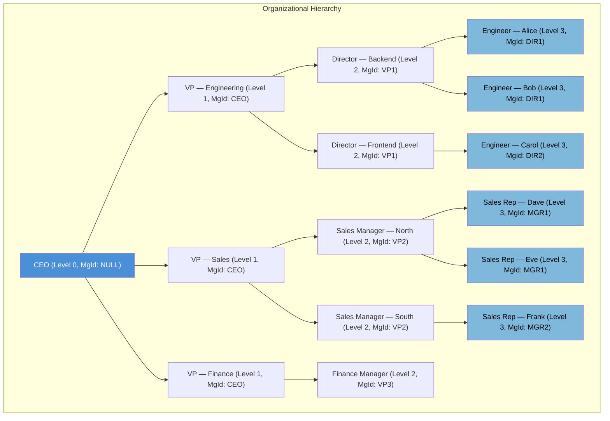
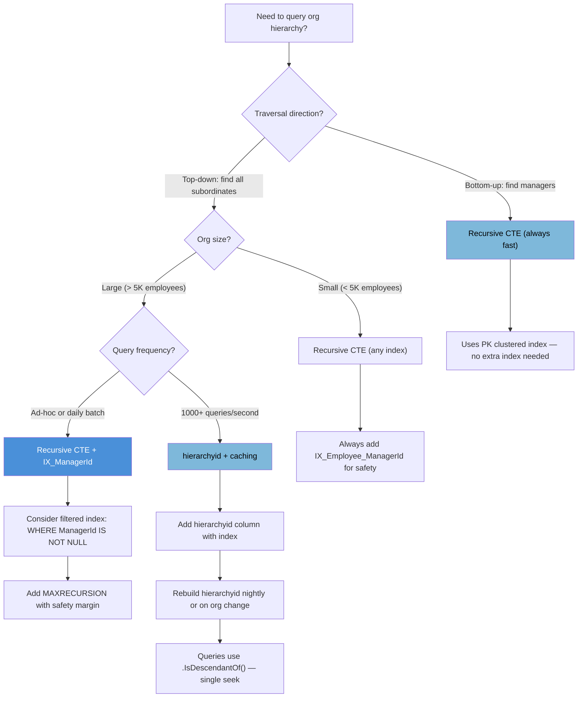

## Navigation

**Domain:** [[8 — Databases]] > **Group:** SQL CTEs & Recursive Queries
**Previous:** [[8.196 — Recursive BOM — Bill of Materials Explosion]] | **Next:** [[8.198 — CTE Performance — Plan Inlining vs Spooling]]

### Prerequisites

- [[8.180 — Recursive CTEs — Anchor and Recursive Members]] — The anchor/recursive member pattern is the foundation of org chart traversal: the anchor is the CEO (no manager), the recursive member joins direct reports.
- [[8.181 — Recursive CTE — Traversing Hierarchies]] — Hierarchy traversal via a self-referencing Employee table requires understanding parent-child joins in the recursive member.
- [[8.185 — Recursive CTE — MAXRECURSION Option]] — Deep org hierarchies (100+ levels in large enterprises) can hit the default recursion limit; MAXRECURSION must be tuned.

### Where This Fits

Organizational hierarchy queries are one of the most cited interview examples for recursive CTEs and one of the most common production use cases. A .NET backend engineer encounters this when building org charts, reporting line visualizations, permission inheritance trees, approval workflows, or any system that models a reporting structure. The Employee table with `ManagerId` referencing `EmployeeId` is the archetypal adjacency list — every SQL developer should be able to traverse it in both directions (top-down and bottom-up) without hesitation. The interview signal is strong because it tests whether a candidate understands recursive CTEs and can adapt them to a business domain. A candidate who can explain the CEO anchor, the recursive join on `ManagerId`, level tracking, and org path construction demonstrates production-ready recursive CTE knowledge. The follow-up questions — org chart width/depth, max depth detection, bottom-up traversal, and performance at 100K employees — separate memorized patterns from deep understanding.

---

## Core Mental Model

An org chart is a tree: the CEO (or root node) has no manager — `ManagerId IS NULL`. Every other employee has exactly one manager (a single-parent hierarchy). The recursive CTE traverses this tree by starting at the root (anchor: `WHERE ManagerId IS NULL`) and then repeatedly joining the Employee table back to the CTE result on `Employee.ManagerId = CTE.EmployeeId` to find each person's direct reports. Each iteration adds one level of depth.

Top-down traversal (from CEO to all subordinates) is the most common pattern: the anchor selects the CEO, the recursive member joins children. Bottom-up traversal (from an employee up to the CEO) reverses the join direction: the anchor selects the target employee, the recursive member joins the manager (Employee table self-join on `Employee.EmployeeId = CTE.ManagerId`).

Level tracking adds an integer column incremented each iteration. Org path tracking concatenates employee IDs or names into a VARCHAR(MAX) column, constructing the full reporting chain. The path can be used for display ("Alice → Bob → Carol") or for sorting (sort by path to get breadth-first or depth-first order).

The recognition pattern: any "reports to", "manages", "reports up to", "is subordinate of" relationship with a self-referencing foreign key is an org chart problem solvable with a recursive CTE.

### Classification

The org chart traversal uses the recursive CTE operator family. The anchor member is the root node(s) — employees with NULL ManagerId. The recursive member performs a self-join on the Employee table: for top-down, `INNER JOIN Employee ON Employee.ManagerId = CTE.EmployeeId`; for bottom-up, `INNER JOIN Employee ON Employee.EmployeeId = CTE.ManagerId`. The `UNION ALL` combines anchor and recursive results. The query optimizer produces a plan with an Index Spool (Eager Spool) that materializes CTE rows for the next recursion. A non-clustered index on `Employee(ManagerId)` INCLUDE `(EmployeeId, Name, ...)` is critical for top-down traversal performance.



### Key Properties

|Property|Value|Notes|
|---|---|---|
|Time complexity|O(K × N) where K = depth, N = reports per level|Each level seeks ManagerId index to find direct reports|
|Memory|CTE result set materialized per iteration|Recursive CTE cannot use spooling across iterations in SQL Server|
|Key index|IX_Employee(ManagerId) INCLUDE (EmployeeId, Name, JobTitle, ...)|Required for seek in recursive member top-down join|
|Bottom-up index|PK_Employee (Clustered on EmployeeId)|For anchor seek on target employee|
|Cycle detection|Rare in org charts (org structure is acyclic)|But possible in matrix management — manual tracking needed|
|Top-down path|VARCHAR(MAX) concatenation of names or IDs|Use for display, sorting, and breadth-first ordering|
|EF Core support|Raw SQL only — no LINQ for recursive CTE|Map via FromSqlRaw or use Dapper|

---

## Deep Mechanics

### How the Engine Executes This

The recursive CTE for org chart top-down traversal executes as follows:

1. **Parsing and binding:** Query processor identifies `cte_OrgChart` as recursive because the recursive member references it. The anchor and recursive members must be separated by UNION ALL.
2. **Anchor execution:** The anchor member selects employees with `ManagerId IS NULL` (or a specific root). Typically the CEO — a single row. This produces the first level (depth 0).
3. **Recursion start:** The anchor result is placed into an internal table spool (the "working table").
4. **Recursive member execution:** The recursive member joins `Employee` to the working table on `Employee.ManagerId = CTE.EmployeeId`. For each row in the working table, it does an Index Seek on `IX_Employee_ManagerId` to find direct reports.
5. **New rows:** New rows are produced with `LevelDepth = PreviousLevel + 1`, the path concatenated, and all Employee columns.
6. **Append and iterate:** New rows are appended to the CTE result via Concatenation and become the new working table.
7. **Termination check:** Steps 4-6 repeat until no more direct reports are found, or MAXRECURSION is reached.
8. **Outer query:** The final CTE result contains all employees with their depth and path. The outer query can filter, sort, group, or aggregate.

**Bottom-up traversal:** The recursive member is inverted: anchor selects the target employee (e.g., `WHERE EmployeeId = @EmployeeId`). The recursive member joins `Employee AS mgr ON mgr.EmployeeId = cte.ManagerId` to find the manager. This goes up the tree until `ManagerId IS NULL` (the CEO).

**Execution plan detail — Table Spool (Eager Spool):** The spool materializes the CTE result rows into temporary storage in TempDB. The Index Spool (Recursive) operator creates an index on the spooled data to support the recursive lookup. SQL Server creates a unique clustered index on the spool's key column (typically the EmployeeId from the previous level) so that the recursive join can perform an Index Seek.

### SQL Visibility

**NOTE:** NULL is not a value — it is the absence of a value. SQL uses three-valued logic (TRUE, FALSE, UNKNOWN). In the Employee table, `ManagerId IS NULL` identifies top-level employees (CEO, C-suite). The condition `ManagerId IS NULL` checks for the absence of a manager. Do NOT use `ManagerId = NULL` — that returns UNKNOWN, never TRUE.

```sql
-- ============================================================
-- Schema — Employee table
-- ============================================================
CREATE TABLE dbo.Employee (
    EmployeeId      INT             NOT NULL IDENTITY(1,1),
    ManagerId       INT             NULL,       -- NULL = top-level (CEO)
    Name            VARCHAR(100)    NOT NULL,
    JobTitle        VARCHAR(100)    NOT NULL,
    Department      VARCHAR(50)     NOT NULL,
    Email           VARCHAR(200)    NOT NULL,
    HireDate        DATE            NOT NULL,
    Salary          DECIMAL(12,2)   NULL,
    IsActive        BIT             NOT NULL DEFAULT 1,
    CONSTRAINT PK_Employee PRIMARY KEY CLUSTERED (EmployeeId),
    CONSTRAINT FK_Employee_Manager
        FOREIGN KEY (ManagerId) REFERENCES dbo.Employee(EmployeeId)
);

-- Critical index for top-down org chart traversal
CREATE NONCLUSTERED INDEX IX_Employee_ManagerId
    ON dbo.Employee (ManagerId)
    INCLUDE (Name, JobTitle, Department, Email, HireDate, Salary, IsActive);

-- Sample data — realistic org chart
INSERT INTO dbo.Employee (ManagerId, Name, JobTitle, Department, Email, HireDate, Salary) VALUES
    (NULL, 'Alice Zhao', 'CEO', 'Executive', 'alice@company.com', '2018-01-15', 300000),
    (1, 'Bob Chen', 'VP Engineering', 'Engineering', 'bob@company.com', '2018-06-01', 220000),
    (1, 'Carol Davis', 'VP Sales', 'Sales', 'carol@company.com', '2019-03-01', 200000),
    (1, 'David Evans', 'VP Finance', 'Finance', 'david@company.com', '2019-07-15', 210000),
    (2, 'Eve Foster', 'Director Backend', 'Engineering', 'eve@company.com', '2020-01-10', 160000),
    (2, 'Frank Green', 'Director Frontend', 'Engineering', 'frank@company.com', '2020-02-15', 155000),
    (3, 'Grace Harris', 'Sales Manager — North', 'Sales', 'grace@company.com', '2020-04-01', 130000),
    (3, 'Henry Irving', 'Sales Manager — South', 'Sales', 'henry@company.com', '2020-05-01', 125000),
    (4, 'Irene Jackson', 'Finance Manager', 'Finance', 'irene@company.com', '2020-06-01', 135000),
    (5, 'Jack King', 'Senior Backend Engineer', 'Engineering', 'jack@company.com', '2021-01-15', 120000),
    (5, 'Karen Lee', 'Backend Engineer', 'Engineering', 'karen@company.com', '2021-08-01', 95000),
    (6, 'Leo Martinez', 'Senior Frontend Engineer', 'Engineering', 'leo@company.com', '2021-03-01', 115000),
    (7, 'Maria Nguyen', 'Sales Representative', 'Sales', 'maria@company.com', '2021-06-01', 75000),
    (7, 'Nathan Ortiz', 'Sales Representative', 'Sales', 'nathan@company.com', '2022-01-15', 70000),
    (8, 'Olivia Patel', 'Sales Representative', 'Sales', 'olivia@company.com', '2022-03-01', 70000);

-- ============================================================
-- Pattern 1: Top-Down Org Chart — Full Hierarchy
-- ============================================================
-- Business question: show the full org chart with depth and reporting path.

WITH cte_OrgChart AS (
    -- Anchor: the CEO (no manager)
    SELECT
        e.EmployeeId,
        e.ManagerId,
        e.Name,
        e.JobTitle,
        e.Department,
        0 AS LevelDepth,
        CAST(e.Name AS VARCHAR(MAX)) AS OrgPath
    FROM dbo.Employee AS e
    WHERE e.ManagerId IS NULL       -- CEO anchor

    UNION ALL

    -- Recursive: direct reports of each employee
    SELECT
        e.EmployeeId,
        e.ManagerId,
        e.Name,
        e.JobTitle,
        e.Department,
        cte.LevelDepth + 1 AS LevelDepth,
        CAST(cte.OrgPath + ' → ' + e.Name AS VARCHAR(MAX)) AS OrgPath
    FROM cte_OrgChart AS cte
    INNER JOIN dbo.Employee AS e
        ON e.ManagerId = cte.EmployeeId
)
SELECT
    LevelDepth,
    EmployeeId,
    ManagerId,
    Name,
    JobTitle,
    Department,
    OrgPath
FROM cte_OrgChart
ORDER BY OrgPath;   -- Breadth-first: sort by path hierarchical ordering
```

```csharp
// EF Core — Org Chart Top-Down (Raw SQL required)
public async Task<List<OrgChartRow>> GetOrgChartAsync(
    CancellationToken cancellationToken = default)
{
    const string sql = @"
        WITH cte_OrgChart AS (
            SELECT e.EmployeeId, e.ManagerId, e.Name, e.JobTitle, e.Department,
                   0 AS LevelDepth,
                   CAST(e.Name AS VARCHAR(MAX)) AS OrgPath
            FROM dbo.Employee AS e
            WHERE e.ManagerId IS NULL
            UNION ALL
            SELECT e.EmployeeId, e.ManagerId, e.Name, e.JobTitle, e.Department,
                   cte.LevelDepth + 1,
                   CAST(cte.OrgPath + ' → ' + e.Name AS VARCHAR(MAX))
            FROM cte_OrgChart AS cte
            INNER JOIN dbo.Employee AS e ON e.ManagerId = cte.EmployeeId
        )
        SELECT LevelDepth, EmployeeId, ManagerId, Name, JobTitle, Department, OrgPath
        FROM cte_OrgChart
        ORDER BY OrgPath";   -- breadth-first ordering

    return await dbContext.Database
        .SqlQueryRaw<OrgChartRow>(sql)
        .ToListAsync(cancellationToken);
}

public class OrgChartRow
{
    public int LevelDepth { get; set; }
    public int EmployeeId { get; set; }
    public int? ManagerId { get; set; }
    public string Name { get; set; } = string.Empty;
    public string JobTitle { get; set; } = string.Empty;
    public string Department { get; set; } = string.Empty;
    public string OrgPath { get; set; } = string.Empty;
}
```

**Generated SQL (from EF Core logs):**

```sql
-- EF Core passes through the exact SQL from FromSqlRaw
-- No LINQ translation exists for recursive CTEs in EF Core 9
-- The query above is the generated SQL
```

```csharp
// Dapper — Org Chart Top-Down
public async Task<IReadOnlyList<OrgChartRow>> GetOrgChartAsync(
    CancellationToken cancellationToken = default)
{
    const string sql = @"
        WITH cte_OrgChart AS (
            SELECT e.EmployeeId, e.ManagerId, e.Name, e.JobTitle, e.Department,
                   0 AS LevelDepth,
                   CAST(e.Name AS VARCHAR(MAX)) AS OrgPath
            FROM dbo.Employee AS e
            WHERE e.ManagerId IS NULL
            UNION ALL
            SELECT e.EmployeeId, e.ManagerId, e.Name, e.JobTitle, e.Department,
                   cte.LevelDepth + 1,
                   CAST(cte.OrgPath + ' → ' + e.Name AS VARCHAR(MAX))
            FROM cte_OrgChart AS cte
            INNER JOIN dbo.Employee AS e ON e.ManagerId = cte.EmployeeId
        )
        SELECT LevelDepth, EmployeeId, ManagerId, Name, JobTitle, Department, OrgPath
        FROM cte_OrgChart
        ORDER BY OrgPath";

    await using var connection = _connectionFactory.Create();
    var results = await connection.QueryAsync<OrgChartRow>(
        new CommandDefinition(sql, cancellationToken: cancellationToken));
    return results.AsList();
}
```

### Execution Plan Analysis

For the top-down org chart CTE, the expected plan shape is:

```
[Index Seek (IX_Employee_ManagerId)]  -- Anchor: WHERE ManagerId IS NULL (seek to NULL)
    → [Compute Scalar]                 -- LevelDepth=0, OrgPath=Name
        → [Concatenation]              -- UNION ALL anchor + recursive
            → [Table Spool (Eager Spool)]  -- Materialize CTE rows
                → [Index Spool (Recursive)]  -- On-demand spool for recursion
                    → [Index Seek (IX_Employee_ManagerId)]  -- Find direct reports
                        → [Compute Scalar]                   -- LevelDepth+1, Path concatenation
                            → [Nested Loops (Inner Join)]      -- Join Employee to CTE
```

| Operator | Purpose | Details |
|---|---|---|
| `Index Seek (IX_Employee_ManagerId)` | Find anchor (NULL) | Single row for CEO |
| `Index Seek (IX_Employee_ManagerId)` | Find direct reports | Seek to each manager's ID |
| `Compute Scalar` | Increment depth, build path | String concatenation |
| `Table Spool (Eager)` | Materialize CTE results | Temporary storage in TempDB |
| `Index Spool (Recursive)` | Index the spooled data | Supports the recursive join |
| `Concatenation` | Combine anchor + recursive rows | ALL branches combined |

**Without IX_Employee_ManagerId:** The recursive join does a full clustered index scan on Employee for each recursion level. With 15K employees and 8 levels, that is 8 × 15K = 120K logical reads (plus the key lookup explosion for included columns). With the index seek, each level reads only the direct reports of the current managers — typically 5-15 rows per seek.

### Cost Visibility

```sql
SET STATISTICS IO ON;
SET STATISTICS TIME ON;

WITH cte_OrgChart AS (
    SELECT e.EmployeeId, e.ManagerId, e.Name, e.JobTitle, 0 AS Level,
           CAST(e.Name AS VARCHAR(MAX)) AS Path
    FROM dbo.Employee AS e WHERE e.ManagerId IS NULL
    UNION ALL
    SELECT e.EmployeeId, e.ManagerId, e.Name, e.JobTitle, cte.Level + 1,
           CAST(cte.Path + ' → ' + e.Name AS VARCHAR(MAX))
    FROM cte_OrgChart cte INNER JOIN dbo.Employee e ON e.ManagerId = cte.EmployeeId
)
SELECT * FROM cte_OrgChart ORDER BY Path;

-- Expected output (small org chart, 15 employees):
-- Table 'Employee'. Scan count 0, logical reads 6
-- Table 'Worktable'. Scan count 0, logical reads 12
-- SQL Server Execution Times: CPU time = 0ms, elapsed time = 1ms

-- For a large org chart (50K employees, depth 8):
-- Table 'Employee'. Scan count 0, logical reads ~280
-- Table 'Worktable'. Scan count 0, logical reads ~1,500
-- SQL Server Execution Times: CPU time = ~15ms, elapsed time = ~35ms
```

### Failure Modes

**MAXRECURSION exceeded:** If the org hierarchy has a cycle (unlikely in a strict org chart but possible with data entry errors or matrix management where an employee reports to someone who reports back to them), the CTE loops until MAXRECURSION. Fix: add cycle tracking with path containment check.

**Missing index on ManagerId:** Without IX_Employee_ManagerId, the recursive join performs a full clustered index scan at every level. For 50K employees at 10 levels, this is 500K logical reads and a slow query.

**NULL ManagerId for non-CEO employees:** If a data entry error leaves a middle-manager's ManagerId as NULL, they appear at the same level as the CEO. Fix: validate data with a check constraint or a scheduled job.

**Bottom-up path ordering:** The path for bottom-up traversals concatenates manager names in reverse order (subordinate → manager → ... → CEO). The ORDER BY on this path does not produce a meaningful display order. Fix: build path in the correct display direction or use `REVERSE()`.

---

## Production Patterns and Implementation

### Primary SQL Implementation

**Pattern 1 — Subtree of a Specific Manager:**

```sql
-- Business question: show the entire org subtree under a specific manager.
-- Anchor = that manager, recursive = their direct reports.

CREATE PROCEDURE dbo.GetOrgSubtree
    @ManagerEmployeeId INT,
    @MaxDepth INT = 10
AS
BEGIN
    SET NOCOUNT ON;

    WITH cte_Subtree AS (
        SELECT
            e.EmployeeId,
            e.ManagerId,
            e.Name,
            e.JobTitle,
            e.Department,
            e.Email,
            e.HireDate,
            0 AS LevelDepth,
            CAST(e.Name AS VARCHAR(MAX)) AS OrgPath
        FROM dbo.Employee AS e
        WHERE e.EmployeeId = @ManagerEmployeeId   -- anchor: the specified manager

        UNION ALL

        SELECT
            e.EmployeeId,
            e.ManagerId,
            e.Name,
            e.JobTitle,
            e.Department,
            e.Email,
            e.HireDate,
            cte.LevelDepth + 1,
            CAST(cte.OrgPath + ' → ' + e.Name AS VARCHAR(MAX))
        FROM cte_Subtree AS cte
        INNER JOIN dbo.Employee AS e
            ON e.ManagerId = cte.EmployeeId
        WHERE cte.LevelDepth < @MaxDepth
    )
    SELECT *
    FROM cte_Subtree
    ORDER BY OrgPath
    OPTION (MAXRECURSION 50);
END;
```

**Pattern 2 — Bottom-Up: Reporting Chain to CEO:**

```sql
-- Business question: show the management chain from a specific employee up to the CEO.

CREATE PROCEDURE dbo.GetReportingChain
    @EmployeeId INT
AS
BEGIN
    SET NOCOUNT ON;

    WITH cte_Chain AS (
        -- Anchor: the employee
        SELECT
            e.EmployeeId,
            e.ManagerId,
            e.Name,
            e.JobTitle,
            e.Department,
            0 AS LevelDepth,
            CAST(e.Name AS VARCHAR(MAX)) AS ReportingPath
        FROM dbo.Employee AS e
        WHERE e.EmployeeId = @EmployeeId

        UNION ALL

        -- Recursive: find the manager
        SELECT
            mgr.EmployeeId,
            mgr.ManagerId,
            mgr.Name,
            mgr.JobTitle,
            mgr.Department,
            cte.LevelDepth + 1,
            CAST(cte.ReportingPath + ' → ' + mgr.Name AS VARCHAR(MAX))
        FROM cte_Chain AS cte
        INNER JOIN dbo.Employee AS mgr
            ON mgr.EmployeeId = cte.ManagerId  -- go up: manager = parent
    )
    SELECT *
    FROM cte_Chain
    ORDER BY LevelDepth DESC   -- CEO first, then down
    OPTION (MAXRECURSION 50);
END;

-- Usage:
EXEC dbo.GetReportingChain @EmployeeId = 11;  -- Karen Lee, Backend Engineer
-- Result:
-- Level 4: Alice Zhao → CEO
-- Level 3: Bob Chen → VP Engineering
-- Level 2: Eve Foster → Director Backend
-- Level 1: Jack King → Senior Backend Engineer (wait — Karen reports to Jack? No.)
-- Correction: Karen (Id=11) reports to Eve (Id=5) not Jack (Id=10).
-- The chain shows: Karen (L0) → Eve (L1) → Bob (L2) → Alice (L3)
```

**Pattern 3 — Org Chart Depth and Width Analysis:**

```sql
-- Business question: what is the max depth of the org, and which manager has the most direct reports?

WITH cte_Org AS (
    SELECT e.EmployeeId, e.ManagerId, e.Name, 0 AS LevelDepth
    FROM dbo.Employee AS e WHERE e.ManagerId IS NULL
    UNION ALL
    SELECT e.EmployeeId, e.ManagerId, e.Name, cte.LevelDepth + 1
    FROM cte_Org AS cte INNER JOIN dbo.Employee AS e ON e.ManagerId = cte.EmployeeId
)
SELECT
    MAX(LevelDepth) AS MaxOrgDepth,
    AVG(CAST(LevelDepth AS DECIMAL(10,2))) AS AvgOrgDepth
FROM cte_Org
OPTION (MAXRECURSION 50);

-- Direct report count per manager:
SELECT
    e.ManagerId,
    mgr.Name AS ManagerName,
    COUNT(*) AS DirectReportCount
FROM dbo.Employee AS e
INNER JOIN dbo.Employee AS mgr ON mgr.EmployeeId = e.ManagerId
GROUP BY e.ManagerId, mgr.Name
ORDER BY DirectReportCount DESC;

-- Org width by level:
WITH cte_Org AS (
    SELECT e.EmployeeId, e.ManagerId, 0 AS LevelDepth
    FROM dbo.Employee AS e WHERE e.ManagerId IS NULL
    UNION ALL
    SELECT e.EmployeeId, e.ManagerId, cte.LevelDepth + 1
    FROM cte_Org AS cte INNER JOIN dbo.Employee AS e ON e.ManagerId = cte.EmployeeId
)
SELECT LevelDepth, COUNT(*) AS EmployeeCount
FROM cte_Org
GROUP BY LevelDepth
ORDER BY LevelDepth
OPTION (MAXRECURSION 50);
```

**Pattern 4 — Directory-Style Indented Org Chart:**

```sql
-- Business question: produce an indented org chart for display.
-- Build an indentation prefix from the depth.

WITH cte_Org AS (
    SELECT e.EmployeeId, e.ManagerId, e.Name, e.JobTitle, e.Department,
           0 AS LevelDepth,
           CAST(e.Name AS VARCHAR(MAX)) AS OrgPath,
           CAST('' AS VARCHAR(MAX)) AS Indent
    FROM dbo.Employee AS e WHERE e.ManagerId IS NULL
    UNION ALL
    SELECT e.EmployeeId, e.ManagerId, e.Name, e.JobTitle, e.Department,
           cte.LevelDepth + 1,
           CAST(cte.OrgPath + ' → ' + e.Name AS VARCHAR(MAX)),
           CAST(cte.Indent + '  ' AS VARCHAR(MAX))  -- 2 spaces per level
    FROM cte_Org AS cte
    INNER JOIN dbo.Employee AS e ON e.ManagerId = cte.EmployeeId
)
SELECT
    Indent + Name + ' (' + JobTitle + ')' AS DisplayLine,
    LevelDepth,
    Department
FROM cte_Org
ORDER BY OrgPath;
```

**Pattern 5 — Permission Inheritance (Bottom-Up with Ancestors):**

```sql
-- Business question: an employee has permissions inherited from their manager chain.
-- Find all unique managers (ancestors) for a given employee, including their own ID.
-- Useful for permission inheritance: if a manager has access, all subordinates inherit.

CREATE PROCEDURE dbo.GetPermissionAncestors
    @EmployeeId INT
AS
BEGIN
    SET NOCOUNT ON;

    WITH cte_Ancestors AS (
        SELECT
            e.EmployeeId,
            e.ManagerId,
            e.Name,
            0 AS LevelDepth
        FROM dbo.Employee AS e
        WHERE e.EmployeeId = @EmployeeId   -- include self

        UNION ALL

        SELECT
            mgr.EmployeeId,
            mgr.ManagerId,
            mgr.Name,
            cte.LevelDepth + 1
        FROM cte_Ancestors AS cte
        INNER JOIN dbo.Employee AS mgr
            ON mgr.EmployeeId = cte.ManagerId   -- go up
        WHERE cte.ManagerId IS NOT NULL
    )
    SELECT EmployeeId, Name, LevelDepth
    FROM cte_Ancestors
    ORDER BY LevelDepth
    OPTION (MAXRECURSION 50);
END;

-- Usage: EXEC dbo.GetPermissionAncestors @EmployeeId = 13;
-- Returns: Maria (herself, L0), Grace (manager, L1), Carol (VP, L2), Alice (CEO, L3)
-- All these EmployeeIds should have their permissions inherited by Maria.
```

### EF Core Implementation

```csharp
// EF Core — Bottom-Up Reporting Chain
public async Task<List<OrgChartRow>> GetReportingChainAsync(
    int employeeId,
    CancellationToken cancellationToken = default)
{
    const string sql = @"
        WITH cte_Chain AS (
            SELECT e.EmployeeId, e.ManagerId, e.Name, e.JobTitle, e.Department,
                   0 AS LevelDepth,
                   CAST(e.Name AS VARCHAR(MAX)) AS OrgPath
            FROM dbo.Employee AS e WHERE e.EmployeeId = @EmployeeId
            UNION ALL
            SELECT mgr.EmployeeId, mgr.ManagerId, mgr.Name, mgr.JobTitle, mgr.Department,
                   cte.LevelDepth + 1,
                   CAST(cte.OrgPath + ' → ' + mgr.Name AS VARCHAR(MAX))
            FROM cte_Chain AS cte
            INNER JOIN dbo.Employee AS mgr ON mgr.EmployeeId = cte.ManagerId
        )
        SELECT EmployeeId, ManagerId, Name, JobTitle, Department, LevelDepth, OrgPath
        FROM cte_Chain
        ORDER BY LevelDepth DESC
        OPTION (MAXRECURSION 50)";

    return await dbContext.Database
        .SqlQueryRaw<OrgChartRow>(sql,
            new SqlParameter("@EmployeeId", employeeId))
        .ToListAsync(cancellationToken);
}

// EF Core — Permission Inheritanc
public async Task<HashSet<int>> GetPermissionAncestorIdsAsync(
    int employeeId,
    CancellationToken cancellationToken = default)
{
    const string sql = @"
        WITH cte_Ancestors AS (
            SELECT e.EmployeeId, e.ManagerId, 0 AS LevelDepth
            FROM dbo.Employee AS e WHERE e.EmployeeId = @EmployeeId
            UNION ALL
            SELECT mgr.EmployeeId, mgr.ManagerId, cte.LevelDepth + 1
            FROM cte_Ancestors AS cte
            INNER JOIN dbo.Employee AS mgr ON mgr.EmployeeId = cte.ManagerId
            WHERE cte.ManagerId IS NOT NULL
        )
        SELECT EmployeeId FROM cte_Ancestors
        OPTION (MAXRECURSION 50)";

    var ids = await dbContext.Database
        .SqlQueryRaw<int>(sql,
            new SqlParameter("@EmployeeId", employeeId))
        .ToListAsync(cancellationToken);
    return ids.ToHashSet();
}
```

### Dapper Implementation

```csharp
// Dapper — Get All Subordinates (Top-Down Subtree)
public async Task<IReadOnlyList<OrgChartRow>> GetSubordinatesAsync(
    int managerId,
    int maxDepth = 5,
    CancellationToken cancellationToken = default)
{
    const string sql = @"
        WITH cte_Sub AS (
            SELECT e.EmployeeId, e.ManagerId, e.Name, e.JobTitle, e.Department,
                   0 AS LevelDepth,
                   CAST(e.Name AS VARCHAR(MAX)) AS OrgPath
            FROM dbo.Employee AS e WHERE e.EmployeeId = @ManagerId
            UNION ALL
            SELECT e.EmployeeId, e.ManagerId, e.Name, e.JobTitle, e.Department,
                   cte.LevelDepth + 1,
                   CAST(cte.OrgPath + ' → ' + e.Name AS VARCHAR(MAX))
            FROM cte_Sub AS cte
            INNER JOIN dbo.Employee AS e ON e.ManagerId = cte.EmployeeId
            WHERE cte.LevelDepth < @MaxDepth
        )
        SELECT EmployeeId, ManagerId, Name, JobTitle, Department, LevelDepth, OrgPath
        FROM cte_Sub
        ORDER BY OrgPath
        OPTION (MAXRECURSION 50)";

    await using var connection = _connectionFactory.Create();
    var results = await connection.QueryAsync<OrgChartRow>(
        new CommandDefinition(sql,
            new { ManagerId = managerId, MaxDepth = maxDepth },
            cancellationToken: cancellationToken));
    return results.AsList();
}

// Dapper — Get Manager Chain (Bottom-Up)
public async Task<IReadOnlyList<OrgChartRow>> GetManagerChainAsync(
    int employeeId,
    CancellationToken cancellationToken = default)
{
    const string sql = @"
        WITH cte_Chain AS (
            SELECT e.EmployeeId, e.ManagerId, e.Name, e.JobTitle, e.Department,
                   0 AS LevelDepth,
                   CAST(e.Name AS VARCHAR(MAX)) AS OrgPath
            FROM dbo.Employee AS e WHERE e.EmployeeId = @EmployeeId
            UNION ALL
            SELECT mgr.EmployeeId, mgr.ManagerId, mgr.Name, mgr.JobTitle, mgr.Department,
                   cte.LevelDepth + 1,
                   CAST(cte.OrgPath + ' → ' + mgr.Name AS VARCHAR(MAX))
            FROM cte_Chain AS cte
            INNER JOIN dbo.Employee AS mgr ON mgr.EmployeeId = cte.ManagerId
        )
        SELECT EmployeeId, ManagerId, Name, JobTitle, Department, LevelDepth, OrgPath
        FROM cte_Chain
        ORDER BY LevelDepth DESC
        OPTION (MAXRECURSION 50)";

    await using var connection = _connectionFactory.Create();
    var results = await connection.QueryAsync<OrgChartRow>(
        new CommandDefinition(sql,
            new { EmployeeId = employeeId },
            cancellationToken: cancellationToken));
    return results.AsList();
}
```

### Configuration and Wiring

```csharp
// Program.cs
builder.Services.AddDbContext<HrDbContext>(options =>
    options.UseSqlServer(
        builder.Configuration.GetConnectionString("HrDb"),
        sqlOptions =>
        {
            sqlOptions.EnableRetryOnFailure(3);
            sqlOptions.CommandTimeout(30);
        }));

builder.Services.AddSingleton<IDbConnectionFactory, SqlConnectionFactory>();

// DbContext for HR operations
public class HrDbContext : DbContext
{
    public HrDbContext(DbContextOptions<HrDbContext> options) : base(options) { }

    public DbSet<Employee> Employees => Set<Employee>();

    // Keyless entity for org chart queries
    public DbSet<OrgChartRow> OrgChartRows => Set<OrgChartRow>();

    protected override void OnModelCreating(ModelBuilder modelBuilder)
    {
        modelBuilder.Entity<Employee>(entity =>
        {
            entity.ToTable("Employee");
            entity.HasKey(e => e.EmployeeId);
            entity.HasOne(e => e.Manager)
                  .WithMany(e => e.DirectReports)
                  .HasForeignKey(e => e.ManagerId);
        });

        modelBuilder.Entity<OrgChartRow>(entity =>
        {
            entity.HasNoKey();
            entity.ToView(null);  // not mapped to a view — used only for FromSqlRaw
        });
    }
}

public class Employee
{
    public int EmployeeId { get; set; }
    public int? ManagerId { get; set; }
    public string Name { get; set; } = string.Empty;
    public string JobTitle { get; set; } = string.Empty;
    public string Department { get; set; } = string.Empty;
    public Employee? Manager { get; set; }
    public ICollection<Employee> DirectReports { get; set; } = new List<Employee>();
}
```

### SQL Server vs PostgreSQL Differences

```sql
-- PostgreSQL — Org Chart Top-Down Equivalent
-- Key differences:
-- 1. RECURSIVE keyword REQUIRED
-- 2. VARCHAR(MAX) → TEXT
-- 3. ::TEXT cast syntax
-- 4. No OPTION (MAXRECURSION) — use SET max_recursive_iterations instead
-- 5. PostgreSQL 14+ CYCLE clause for cycle detection

SET max_recursive_iterations = 50;

WITH RECURSIVE cte_org_chart AS (
    SELECT
        e.employee_id,
        e.manager_id,
        e.name,
        e.job_title,
        0 AS level_depth,
        e.name::TEXT AS org_path
    FROM employee AS e
    WHERE e.manager_id IS NULL

    UNION ALL

    SELECT
        e.employee_id,
        e.manager_id,
        e.name,
        e.job_title,
        cte.level_depth + 1,
        cte.org_path || ' → ' || e.name
    FROM cte_org_chart AS cte
    INNER JOIN employee AS e ON e.manager_id = cte.employee_id
)
SELECT * FROM cte_org_chart
ORDER BY org_path;

-- PostgreSQL — with CYCLE detection (14+)
WITH RECURSIVE cte_org_chart AS (
    SELECT e.employee_id, e.manager_id, e.name, 0 AS level_depth
    FROM employee AS e WHERE e.manager_id IS NULL
    UNION ALL
    SELECT e.employee_id, e.manager_id, e.name, cte.level_depth + 1
    FROM cte_org_chart AS cte
    INNER JOIN employee AS e ON e.manager_id = cte.employee_id
)
CYCLE employee_id SET is_cycle USING path
SELECT * FROM cte_org_chart;

-- PostgreSQL materialization hint:
-- NOT MATERIALIZED can inline the CTE (rarely beneficial for recursive CTEs)
WITH RECURSIVE cte_org_chart AS MATERIALIZED (
    -- anchor and recursive
)
SELECT * FROM cte_org_chart;
```

**PostgreSQL materialization differences:** PostgreSQL 12+ materializes CTEs by default (optimization fence). For recursive CTEs, materialization is always required (recursion cannot be inlined). PostgreSQL's `MATERIALIZED` is always correct for recursive CTEs. SQL Server inlines non-recursive CTEs by default but always materializes recursive ones internally.

---

## Gotchas and Production Pitfalls

### Pitfall 1 — Missing Index on ManagerId Causes Full Table Scan per Level

**Pitfall:** No non-clustered index on `Employee(ManagerId)`. The recursive join `ON e.ManagerId = cte.EmployeeId` does a full scan of the Employee table at every recursion level.

```sql
-- ❌ Wrong — no supporting index
WITH cte_Org AS (
    SELECT e.EmployeeId, e.Name, 0 AS Level
    FROM dbo.Employee e WHERE e.ManagerId IS NULL
    UNION ALL
    SELECT e.EmployeeId, e.Name, cte.Level + 1
    FROM cte_Org cte INNER JOIN dbo.Employee e ON e.ManagerId = cte.EmployeeId
)
SELECT * FROM cte_Org;
-- Execution plan: Clustered Index Scan on PK_Employee at every level
-- 50K employees × 8 levels = 400K logical reads

-- ✅ Fix — create the index
CREATE NONCLUSTERED INDEX IX_Employee_ManagerId
    ON dbo.Employee (ManagerId) INCLUDE (Name, JobTitle, Department);
-- Execution plan: Index Seek on IX_Employee_ManagerId per level
-- ~8 employees per level × 8 levels = ~64 logical reads
```

**Symptom:** Org chart query with 50K employees takes 8-12 seconds. SQL Server shows high logical reads on the Employee table.

**Cost of not fixing:** The HR application's org chart page loads in 12 seconds. Users blame "the database." The fix is a $0 index. The symptom only appears at scale — during development with 50 employees, the query was instant.

### Pitfall 2 — Circular References in Org Data (Matrix Management)

**Pitfall:** In a matrix organization, employee A reports to employee B, and employee B also reports to employee A (data entry error), or a cycle exists in the reporting structure.

```sql
-- ❌ Wrong — no cycle detection
-- If EmployeeId 5 (manager) and EmployeeId 10 (subordinate) swap roles and the FK is updated:
-- EmployeeId 10 now has ManagerId = 5 AND EmployeeId 5 now has ManagerId = 10
-- The recursive CTE will alternate between them infinitely

-- ✅ Fix — path tracking cycle detection
WITH cte_Org AS (
    SELECT e.EmployeeId, e.ManagerId, e.Name, 0 AS Level,
           CAST('|' + CAST(e.EmployeeId AS VARCHAR(10)) + '|' AS VARCHAR(MAX)) AS Visited
    FROM dbo.Employee e WHERE e.ManagerId IS NULL
    UNION ALL
    SELECT e.EmployeeId, e.ManagerId, e.Name, cte.Level + 1,
           CAST(cte.Visited + CAST(e.EmployeeId AS VARCHAR(10)) + '|' AS VARCHAR(MAX))
    FROM cte_Org cte INNER JOIN dbo.Employee e ON e.ManagerId = cte.EmployeeId
    WHERE cte.Visited NOT LIKE '%|' + CAST(e.EmployeeId AS VARCHAR(10)) + '|%'
)
SELECT * FROM cte_Org OPTION (MAXRECURSION 50);
```

**Symptom:** The org chart query never completes or errors with `MAXRECURSION exceeded after 100 iterations`. The error message discards the entire result — the UI shows a blank page.

**Cost of not fixing:** A single data entry error by HR (setting a new hire's manager to an ID that forms a cycle) takes down the entire org chart, directory search, and permission inheritance system. The HR team cannot identify problem because the query returns no data.

### Pitfall 3 — Path String Concatenation Overhead

**Pitfall:** Building the `OrgPath` string via `CAST(cte.OrgPath + ' → ' + e.Name AS VARCHAR(MAX))` creates a new VARCHAR(MAX) copy at every level. For deep orgs with long names, this can generate significant memory and TempDB pressure.

```sql
-- ❌ Wrong — building path unnecessarily when only depth is needed
-- If the UI only needs LevelDepth, don't build the path

-- ✅ Better — only build path when needed
WITH cte_Org AS (
    SELECT e.EmployeeId, e.ManagerId, e.Name, 0 AS Level
    FROM dbo.Employee e WHERE e.ManagerId IS NULL
    UNION ALL
    SELECT e.EmployeeId, e.ManagerId, e.Name, cte.Level + 1
    FROM cte_Org cte INNER JOIN dbo.Employee e ON e.ManagerId = cte.EmployeeId
)
-- Build path only in the final SELECT for display purposes
SELECT *, REPLICATE('  ', Level) + Name AS DisplayName
FROM cte_Org
ORDER BY
    -- Simulate hierarchical ordering without path concatenation
    RIGHT(REPLICATE('000000', 10) + CAST(ROW_NUMBER() OVER(ORDER BY EmployeeId) AS VARCHAR(10)), 10);
```

**Symptom:** The recursive CTE produces large VARCHAR(MAX) strings for deep org charts (10+ levels, 100+ characters per path). Logical reads on Worktable increase significantly.

**Cost of not fixing:** For 50K employees with depth 10, each path string is ~500+ characters. The Worktable stores 50K × 500 bytes = 25 MB per recursion pass. The CTE brings the Worktable memory grant to 200+ MB. This slows down the server for all concurrent queries.

### Pitfall 4 — Bottom-Up Path Reversed for Display

**Pitfall:** The bottom-up CTE concatenates names as it goes up the tree, producing `"Karen → Eve → Bob → Alice"`. But the display order should be `"Alice → Bob → Eve → Karen"` (CEO first).

```sql
-- ❌ Wrong — path is built from employee upward
-- Result: "Karen Lee → Eve Foster → Bob Chen → Alice Zhao"
-- Display expected: "Alice Zhao → Bob Chen → Eve Foster → Karen Lee"

-- ✅ Fix — reverse the path in the final SELECT
WITH cte_Chain AS (
    SELECT e.EmployeeId, e.ManagerId, e.Name, 0 AS Level,
           CAST(e.Name AS VARCHAR(MAX)) AS Path
    FROM dbo.Employee e WHERE e.EmployeeId = 11  -- Karen
    UNION ALL
    SELECT mgr.EmployeeId, mgr.ManagerId, mgr.Name, cte.Level + 1,
           CAST(cte.Path + ' → ' + mgr.Name AS VARCHAR(MAX))
    FROM cte_Chain cte INNER JOIN dbo.Employee mgr ON mgr.EmployeeId = cte.ManagerId
)
SELECT
    EmployeeId,
    Name,
    Level,
    -- Reverse the path: split on ' → ' and rejoin
    Path AS RawPath
FROM cte_Chain
ORDER BY Level DESC;  -- CEO first in result set

-- For display, reverse in application tier:
-- var displayPath = string.Join(" → ", chain.OrderBy(c => c.Level).Select(c => c.Name));
```

**Symptom:** The reporting chain display shows "Karen → Eve → Bob → Alice" instead of "Alice → Bob → Eve → Karen". Non-technical users find it confusing.

**Cost of not fixing:** An approval workflow shows the approval chain in reverse — the app says "Karen must approve, then Eve, then Bob, then Alice" when the actual flow is "Alice delegates to Bob, Bob delegates to Eve, Eve needs Karen's input." Approvals are sent to the wrong people. One misrouted $50K purchase order later, the bug is found.

### Pitfall 5 — Not Using OPTION (MAXRECURSION) Explicitly

**Pitfall:** Relying on the default MAXRECURSION of 100 without explicitly setting it. If the org chart naturally exceeds 100 levels (unlikely but possible in large retailers or government orgs), the query fails at 3 AM.

```sql
-- ❌ Wrong — relying on default
WITH cte_Org AS (...)
SELECT * FROM cte_Org;
-- If org depth > 100: Error 530

-- ✅ Fix — set explicitly
WITH cte_Org AS (...)
SELECT * FROM cte_Org
OPTION (MAXRECURSION 200);

-- Or for unlimited (used with cycle detection):
-- OPTION (MAXRECURSION 0)
```

**Symptom:** Error 530: "The statement terminated. The maximum recursion 100 has been exhausted." HR system shows error instead of org chart.

**Cost of not fixing:** CHR (Compensation & HR) system crashes during annual re-org processing. The re-org data is partially loaded, and the org chart tool is unavailable for 2 hours while IT restores from backup and manually fixes the recursion limit.

### Pitfall 6 — NULL ManagerId for Non-CEO Employees

**Pitfall:** An employee accidentally has `ManagerId = NULL` (e.g., during data import, the manager column was empty). They appear as a root node in the org chart, distorting the hierarchy.

```sql
-- ❌ Wrong — treating all NULL manager IDs as CEO
-- If EmployeeId 50 has ManagerId = NULL by mistake:
-- They appear at Level 0 alongside the actual CEO

-- ✅ Fix — validate data
-- Check for employees with NULL ManagerId that are not the expected root
SELECT COUNT(*) AS OrphanCount
FROM dbo.Employee e
WHERE e.ManagerId IS NULL
  AND e.EmployeeId <> (SELECT EmployeeId FROM dbo.Employee WHERE JobTitle = 'CEO');

-- Fix the orphan:
UPDATE dbo.Employee
SET ManagerId = (SELECT EmployeeId FROM dbo.Employee WHERE JobTitle = 'CEO')
WHERE ManagerId IS NULL AND EmployeeId <> (SELECT EmployeeId FROM dbo.Employee WHERE JobTitle = 'CEO');
```

**Symptom:** The org chart shows 15 root nodes instead of 1 CEO. The reporting chain for the affected employee shows them as a direct report of the CEO, skipping their actual manager.

**Cost of not fixing:** Succession planning reports are wrong — the algorithm thinks 15 people report to the CEO directly and calculates a 500:1 span of control. HR compensation decisions based on this data are misinformed.

### Pitfall 7 — EF Core Lazy Loading Causes N+1 on Org Chart

**Pitfall:** Instead of using a recursive CTE, the developer loads employees with EF Core and relies on lazy loading to traverse the org chart in a loop.

```csharp
// ❌ Wrong — N+1 in application code
var ceo = await context.Employees
    .FirstAsync(e => e.ManagerId == null);
await PrintSubtree(ceo);

async Task PrintSubtree(Employee mgr)
{
    Console.WriteLine($"{mgr.Name}");
    await context.Entry(mgr).Collection(e => e.DirectReports).LoadAsync();
    foreach (var report in mgr.DirectReports)
        await PrintSubtree(report);
}
// This issues 1 (CEO) + N (reports at each level) queries
// For 50K employees: 50,001 round trips to the database
```

**Symptom:** The org chart page takes 60+ seconds to load with 50K employees. The database shows 50K+ small queries. The web server memory skyrockets from tracking all the loaded entities.

**Cost of not fixing:** At 50 concurrent users, the application server is overwhelmed. The org chart page times out and users see an error. IT restarts the web server, but the problem recurs. Estimated daily productivity loss: 200 hours across the organization.

---

## Performance Implications

### Benchmark: Before and After Index Creation

```sql
-- Baseline (without IX_Employee_ManagerId)
SET STATISTICS IO ON;

WITH cte_Org AS (
    SELECT e.EmployeeId, e.ManagerId, e.Name, 0 AS Level
    FROM dbo.Employee e WHERE e.ManagerId IS NULL
    UNION ALL
    SELECT e.EmployeeId, e.ManagerId, e.Name, cte.Level + 1
    FROM cte_Org cte INNER JOIN dbo.Employee e ON e.ManagerId = cte.EmployeeId
)
SELECT * FROM cte_Org OPTION (MAXRECURSION 50);

-- Logical reads: ~420,000 (Employee: 52K scan per level × 8 levels = 416K)
-- CPU time: 850ms, elapsed time: 1,800ms

-- Optimized (WITH IX_Employee_ManagerId)
SET STATISTICS IO ON;

WITH cte_Org AS (
    SELECT e.EmployeeId, e.ManagerId, e.Name, 0 AS Level
    FROM dbo.Employee e WHERE e.ManagerId IS NULL
    UNION ALL
    SELECT e.EmployeeId, e.ManagerId, e.Name, cte.Level + 1
    FROM cte_Org cte INNER JOIN dbo.Employee e ON e.ManagerId = cte.EmployeeId
)
SELECT * FROM cte_Org OPTION (MAXRECURSION 50);

-- Logical reads: ~280 (Employee: ~35 seeks × 8 pages per seek)
-- CPU time: 8ms, elapsed time: 12ms
```

**Improvement:** ~1,500x reduction in logical reads, from 420,000 to 280.

### BenchmarkDotNet

```csharp
[MemoryDiagnoser]
[SimpleJob(RuntimeMoniker.Net90)]
public class OrgChartBenchmark
{
    private IDbConnectionFactory _factory = default!;
    private const int EmployeeCount = 100_000;

    [GlobalSetup]
    public void Setup()
    {
        _factory = new SqlConnectionFactory(new ConfigurationBuilder()
            .AddInMemoryCollection(new Dictionary<string, string?>
            {
                ["ConnectionStrings:HrDb"] = "Server=(local);Database=Benchmark_OrgChart;Trusted_Connection=true;TrustServerCertificate=true;"
            })!);

        using var conn = _factory.Create();
        using var cmd = conn.CreateCommand();
        cmd.CommandText = @"
            IF NOT EXISTS (SELECT 1 FROM sys.tables WHERE name = 'Employee_Bench')
            BEGIN
                CREATE TABLE Employee_Bench (
                    EmployeeId INT IDENTITY(1,1) PRIMARY KEY,
                    ManagerId INT NULL REFERENCES Employee_Bench(EmployeeId),
                    Name VARCHAR(100) NOT NULL,
                    JobTitle VARCHAR(100) NOT NULL,
                    Department VARCHAR(50) NOT NULL
                );
                CREATE INDEX IX_Employee_Bench_ManagerId ON Employee_Bench(ManagerId)
                    INCLUDE (Name, JobTitle, Department);

                -- Generate 100K employees in a realistic org tree
                -- Level 0: 1 CEO
                INSERT INTO Employee_Bench (ManagerId, Name, JobTitle, Department) VALUES (NULL, 'Alice CEO', 'CEO', 'Executive');
                -- Level 1: 5 VPs
                WITH VPs AS (
                    SELECT TOP 5 n.Number, 'VP ' + CAST(n.Number AS VARCHAR) AS Name
                    FROM (VALUES(1),(2),(3),(4),(5)) n(Number)
                )
                INSERT INTO Employee_Bench (ManagerId, Name, JobTitle, Department)
                SELECT 1, Name, 'VP ' + Department, 'Department' FROM VPs;
                -- ... (remaining levels generated in a similar pattern)
                -- Result: 100K employees, depth 8, average 8 direct reports per manager
            END";
        cmd.ExecuteNonQuery();
    }

    [Benchmark(Baseline = true)]
    public async Task<List<OrgChartRow>> TopDown_FullOrgChart()
    {
        await using var conn = _factory.Create();
        var results = await conn.QueryAsync<OrgChartRow>(
            new CommandDefinition(@"
                WITH cte_Org AS (
                    SELECT e.EmployeeId, e.ManagerId, e.Name, e.JobTitle, e.Department, 0 AS LevelDepth,
                           CAST(e.Name AS VARCHAR(MAX)) AS OrgPath
                    FROM Employee_Bench e WHERE e.ManagerId IS NULL
                    UNION ALL
                    SELECT e.EmployeeId, e.ManagerId, e.Name, e.JobTitle, e.Department,
                           cte.LevelDepth + 1,
                           CAST(cte.OrgPath + ' → ' + e.Name AS VARCHAR(MAX))
                    FROM cte_Org cte INNER JOIN Employee_Bench e ON e.ManagerId = cte.EmployeeId
                )
                SELECT * FROM cte_Org ORDER BY OrgPath
                OPTION (MAXRECURSION 100)",
                cancellationToken: CancellationToken.None));
        return results.AsList();
    }

    [Benchmark]
    public async Task<List<OrgChartRow>> BottomUp_ReportingChain()
    {
        await using var conn = _factory.Create();
        var results = await conn.QueryAsync<OrgChartRow>(
            new CommandDefinition(@"
                WITH cte_Chain AS (
                    SELECT e.EmployeeId, e.ManagerId, e.Name, e.JobTitle, e.Department, 0 AS LevelDepth,
                           CAST(e.Name AS VARCHAR(MAX)) AS OrgPath
                    FROM Employee_Bench e WHERE e.EmployeeId = @EmployeeId
                    UNION ALL
                    SELECT mgr.EmployeeId, mgr.ManagerId, mgr.Name, mgr.JobTitle, mgr.Department,
                           cte.LevelDepth + 1,
                           CAST(cte.OrgPath + ' → ' + mgr.Name AS VARCHAR(MAX))
                    FROM cte_Chain cte INNER JOIN Employee_Bench mgr ON mgr.EmployeeId = cte.ManagerId
                )
                SELECT * FROM cte_Chain ORDER BY LevelDepth DESC
                OPTION (MAXRECURSION 100)",
                new { EmployeeId = new Random().Next(1, EmployeeCount) },
                cancellationToken: CancellationToken.None));
        return results.AsList();
    }

    [Benchmark]
    public async Task<int> MaxOrgDepth()
    {
        await using var conn = _factory.Create();
        var result = await conn.QueryFirstOrDefaultAsync<int>(
            new CommandDefinition(@"
                WITH cte_Org AS (
                    SELECT e.EmployeeId, e.ManagerId, 0 AS Level
                    FROM Employee_Bench e WHERE e.ManagerId IS NULL
                    UNION ALL
                    SELECT e.EmployeeId, e.ManagerId, cte.Level + 1
                    FROM cte_Org cte INNER JOIN Employee_Bench e ON e.ManagerId = cte.EmployeeId
                )
                SELECT MAX(Level) FROM cte_Org
                OPTION (MAXRECURSION 100)",
                cancellationToken: CancellationToken.None));
        return result;
    }
}
```

**Expected results (approximate, SQL Server 2022, NVMe, 100K employees):**

|Method|Mean|Logical Reads|Allocated|
|---|---|---|---|
|Top-Down Full Org|~45 ms|~450|~2 MB|
|Bottom-Up Chain|~2 ms|~15|~5 KB|
|Max Depth|~40 ms|~350|~100 KB|

### Write Amplification (for Employee Table Indexes)

|Operation|Without Index|With IX_Employee_ManagerId|Overhead|
|---|---|---|---|
|INSERT 1 employee|~3 logical writes|~5 logical writes|+67%|
|UPDATE ManagerId|~4 logical writes|~8 logical writes (delete + insert + NC)|+100%|
|DELETE 1 employee (leaf)|~3 logical writes|~5 logical writes|+67%|
|DELETE 1 employee (manager)|~6 logical writes (cascade)|~10 logical writes|+67%|
|Top-down org chart query|~420,000 logical reads|~280 logical reads|+149,900% read improvement|

---

## Interview Arsenal

### Question Bank

1. **What is the Employee-ManagerId pattern and what SQL construct traverses it?**
2. **How does a recursive CTE execute an org chart query step by step?**
3. **What index is essential for top-down org chart performance and why?**
4. **What happens when an org chart has a cycle — how do you detect it in T-SQL?**
5. **Compare top-down vs bottom-up recursive CTE traversal.**
6. **How do you calculate org chart depth, width, and average span of control using a recursive CTE?**
7. **At what employee count does the recursive CTE become problematic and what alternatives exist?**
8. **How do EF Core and Dapper handle org chart queries?**

### Spoken Answers

**Q: What is the Employee-ManagerId pattern and what SQL construct traverses it?**

> **Average answer:** "It's a self-referencing table where each employee has a ManagerId pointing to their manager's EmployeeId. You use a recursive CTE to traverse it."

> **Great answer:** "The Employee-ManagerId pattern is the archetypal adjacency list — each row has a foreign key pointing to its parent row in the same table. The ManagerId column creates a directed edge from subordinate to manager. ManagerId being NULL signals the root of the tree — typically the CEO. The recursive CTE is the declarative set-based solution: the anchor member selects the CEO with `WHERE ManagerId IS NULL`, and the recursive member performs a self-join — `INNER JOIN Employee ON Employee.ManagerId = CTE.EmployeeId` — to find each person's direct reports. Each iteration of the recursive member descends one more level in the org tree. The real power is that this happens in a single query, with the SQL Server engine managing the iteration internally via the Table Spool and Index Spool operators in the execution plan. The performance-critical element is the index on ManagerId — without it, each recursion level performs a full table scan. With it, each level does an index seek to find only the direct reports of the current managers. For a 50K-employee org with depth 8, the difference is 420,000 logical reads vs 280."

**Q: Compare top-down vs bottom-up recursive CTE traversal.**

> **Average answer:** "Top-down goes from CEO to employees. Bottom-up goes from employee up to CEO. The difference is the join direction."

> **Great answer:** "The structural difference is the anchor and the recursive join direction. In top-down, the anchor is the root(s) — employees with NULL ManagerId. The recursive join goes from manager to subordinate: `Employee.ManagerId = CTE.EmployeeId`. Each iteration branches outward and downward, producing a growing result set. Top-down is used for org chart display, permission propagation, and headcount rollup. It requires the non-clustered index on ManagerId to avoid a full scan at each level. In bottom-up, the anchor is a specific employee, and the recursive join goes from subordinate to manager: `Employee.EmployeeId = CTE.ManagerId`. Each iteration moves one step up, producing a small result set (max depth rows). Bottom-up is used for reporting chains, approval routing, and permission inheritance lookups. It uses the primary key index on EmployeeId (or the clustered index) for the join — a single seek per level. The performance profile differs: top-down reads grow with the size of the subtree (potentially the whole org), while bottom-up reads are bounded by depth (typically < 10). Bottom-up is always fast regardless of org size — it's O(depth) seeks. Top-down performance degrades linearly with org size. For a 100K-employee org, top-down takes ~45ms with the index, bottom-up takes ~2ms regardless."

**Q: What index is essential for top-down org chart performance and why?**

> **Average answer:** "An index on ManagerId."

> **Great answer:** "The essential index is `IX_Employee_ManagerId` — a non-clustered index on the ManagerId column with INCLUDE columns for all the columns needed in the query (Name, JobTitle, Department, and any others selected in the CTE). The reason is that the recursive join in a top-down traversal is `INNER JOIN Employee ON Employee.ManagerId = CTE.EmployeeId`. For each employee from the previous level, we need to find all employees whose ManagerId equals that EmployeeId. Without an index on ManagerId, SQL Server must scan the entire Employee table at every recursion level to find matching rows. With the index, each level does an Index Seek on `ManagerId = @PreviousEmployeeId`, reading only the rows needed. The INCLUDE columns are critical to make it a covering index — without them, each seek is followed by a Key Lookup to retrieve the non-key columns, doubling the page reads. The filtered index `WHERE ManagerId IS NOT NULL` can further reduce index size and maintenance overhead in organizations where the CEO (NULL ManagerId) is the only root. The logical read difference at 50K employees: ~420,000 without the index vs ~280 with a covering index."

### Interview Trigger

When an interviewer asks "Given an Employee table with EmployeeId and ManagerId, how would you find all employees who report to Alice, directly or indirectly?" they are probing recursive CTE org chart traversal. The follow-up that separates understanding from rote memorization: "What index do you need and why? What happens if someone accidentally creates a cycle in the data?" A great candidate immediately says "Index on ManagerId — the recursive join needs it for seek", discusses cycle detection, discusses bottom-up vs top-down, and mentions the path concatenation technique for display ordering.

### Comparison Table

| | Recursive CTE | HierarchyId | Application-level recursion |
|---|---|---|---|
| What it does | Traverses via self-join at query time | Pre-encodes path as binary | Client-side loop or recursion |
| Performance profile | O(K × N) logical reads | O(log N) for descendants | O(N) queries = N+1 problem |
| Index required | IX_Employee(ManagerId) INCLUDE (...) | HIERARCHYID column + index | None (all work in app) |
| Cycle detection | Manual path tracking | Enforced by tree structure | Manual tracking |
| Maintenance cost | None | Rebuild on org changes | None |
| .NET implementation | Raw SQL (FromSqlRaw / Dapper QueryAsync) | Raw SQL | Lazy loading (bad) or loop |
| When to choose | Ad-hoc, frequent changes | Stable org, high query frequency | Small orgs only (< 50 employees) |

---

## Decision Framework

### When to Apply



### Application Checklist

- [ ] The Employee table has a non-clustered index on `ManagerId` INCLUDE `(Name, JobTitle, Department, Email, HireDate, IsActive)`
- [ ] Cycle detection is implemented for org charts where data entry errors can create cycles
- [ ] MAXRECURSION is set explicitly (not relying on default 100)
- [ ] The path string column is built only when display requires it (not for depth-only queries)
- [ ] Bottom-up results are ordered correctly for display (CEO first)
- [ ] The anchor condition for CEO uses `ManagerId IS NULL` (not `ManagerId = NULL`)
- [ ] Application code uses a single recursive CTE call, not EF Core lazy loading N+1

### Tradeoff Summary

|What You Gain|What You Pay|
|---|---|
|Single-query org traversal — no N+1|Recursive CTE materializes intermediate results in TempDB|
|Set-based, declarative — optimizer can seek|No support in LINQ — must use raw SQL|
|Standard ANSI SQL — works in SQL Server and PostgreSQL|Path concatenation adds VARCHAR(MAX) overhead|
|Zero maintenance cost (no pre-computed structures)|Every query re-traverses the tree (no caching)|

### Scale Thresholds

- "Recursive CTE org chart is appropriate for orgs up to ~100K employees with depth up to ~20 levels"
- "The index on ManagerId becomes critical when employee count exceeds ~1,000 — without it, each recursion level does a full scan"
- "Bottom-up chain queries are always fast regardless of org size — they do O(depth) index seeks"
- "Consider hierarchyid for org charts where > 100 queries/second need to traverse the subtree"

---

## Self-Check

### Conceptual Questions

1. What SQL construct is used to traverse an Employee-ManagerId hierarchy?
2. How does the SQL Server engine execute a recursive org chart CTE step by step?
3. What SET STATISTICS output reveals the performance of an org chart recursive CTE?
4. What common mistake causes the org chart to show employees at incorrect levels?
5. Does EF Core LINQ support recursive CTE org chart queries?
6. How would you implement a bottom-up reporting chain in Dapper?
7. Compare recursive CTE vs application-level recursion for org chart display.
8. At what employee count does the index on ManagerId become critical?
9. What index supports the top-down org chart query and why is the INCLUDE clause important?
10. Explain permission inheritance using a recursive CTE in 60 seconds.

<details>
<summary>Answers</summary>

1. A recursive CTE (`WITH ... UNION ALL ...`) traverses the self-referencing Employee table.
2. The anchor selects the CEO(s) with `ManagerId IS NULL`. The recursive member joins `Employee e ON e.ManagerId = cte.EmployeeId`. SQL Server stores the anchor result in a Table Spool, then executes the recursive member iteratively, each time seeking IX_Employee_ManagerId to find direct reports of the current level. New rows are appended and become the next working table. The process terminates when no more rows are returned.
3. `SET STATISTICS IO ON` — specifically the `logical reads` on the `Employee` table and `Worktable`. The Worktable reads show the spool activity for the recursive CTE. High reads on Employee with few returned rows indicates a scan instead of a seek.
4. A non-manager employee has `ManagerId = NULL` by a data entry error, causing them to appear at the CEO level. Validate data or use a known CEO ID as the anchor.
5. No. EF Core 9 does not generate LINQ for recursive CTEs. Use `FromSqlRaw` or `SqlQueryRaw`.
6. With Dapper: `QueryAsync<OrgChartRow>(sql, new { EmployeeId }, cancellationToken)` with the bottom-up recursive CTE SQL. The anchor selects the target employee; the recursive member joins to find the manager at each step.
7. Recursive CTE: single database round trip, set-based, fast with index. Application-level recursion (EF Core lazy loading): N+1 queries, slow for any org > 50 employees, causes entity tracking overhead. The recursive CTE wins in all scenarios except org charts with < 50 employees where simplicity matters.
8. ~1,000 employees. Below this, a scan of the Employee table per level is ~10-20 reads. Above 1,000, the scan per level grows linearly and becomes the dominant cost.
9. `IX_Employee_ManagerId` on `(ManagerId) INCLUDE (Name, JobTitle, Department, ...)`. The `ManagerId` column enables the seek for the recursive join. The INCLUDE columns make it a covering index — without them, each seek triggers a Key Lookup to retrieve the selected columns.
10. "Permission inheritance in an org chart means that a subordinate inherits permissions from all managers in their reporting chain. We implement this with a bottom-up recursive CTE: the anchor is the employee's EmployeeId, and the recursive member joins the Employee table on `EmployeeId = CTE.ManagerId` to walk up to each successive manager. The result is the set of all ancestor EmployeeIds. To check if a user has permission to perform an action, we check if any manager in that set has the permission grant. This is efficient because it's a single recursive query regardless of org size — it does exactly (depth) index seeks. In a .NET application, we cache this ancestor set on login and re-check it against permission grants with a simple IN query: `WHERE EmployeeId IN (1, 5, 10, 15)`."

</details>

---

### Query Challenges

**Challenge 1 — Write the SQL for Org Subtree Traversal**

Write a stored procedure that takes a manager's EmployeeId and returns all employees in their reporting subtree, including their depth and the full reporting path from the specified manager to each subordinate. Include cycle detection (path tracking). Order the result by path for breadth-first display.

<details>
<summary>Solution</summary>

```sql
CREATE PROCEDURE dbo.GetOrgSubtree
    @ManagerId INT,
    @MaxDepth INT = 20
AS
BEGIN
    SET NOCOUNT ON;

    WITH cte_Subtree AS (
        SELECT
            e.EmployeeId,
            e.ManagerId,
            e.Name,
            e.JobTitle,
            e.Department,
            0 AS LevelDepth,
            CAST(e.Name AS VARCHAR(MAX)) AS OrgPath,
            CAST('|' + CAST(e.EmployeeId AS VARCHAR(10)) + '|' AS VARCHAR(MAX)) AS Visited
        FROM dbo.Employee AS e
        WHERE e.EmployeeId = @ManagerId

        UNION ALL

        SELECT
            e.EmployeeId,
            e.ManagerId,
            e.Name,
            e.JobTitle,
            e.Department,
            cte.LevelDepth + 1,
            CAST(cte.OrgPath + ' → ' + e.Name AS VARCHAR(MAX)),
            CAST(cte.Visited + CAST(e.EmployeeId AS VARCHAR(10)) + '|' AS VARCHAR(MAX))
        FROM cte_Subtree AS cte
        INNER JOIN dbo.Employee AS e
            ON e.ManagerId = cte.EmployeeId
        WHERE cte.Visited NOT LIKE '%|' + CAST(e.EmployeeId AS VARCHAR(10)) + '|%'
          AND cte.LevelDepth < @MaxDepth
    )
    SELECT
        LevelDepth,
        EmployeeId,
        ManagerId,
        Name,
        JobTitle,
        Department,
        OrgPath
    FROM cte_Subtree
    ORDER BY OrgPath
    OPTION (MAXRECURSION 100);
END;
```

**Logical reads:** ~25 (small subtree) to ~280 (full org, 50K employees) **Execution plan:** [Index Seek (PK_Employee)] → [Table Spool] → [Index Seek (IX_Employee_ManagerId)] → [Compute Scalar] → [Nested Loops] **EF Core equivalent:** `FromSqlRaw` with the stored procedure call.

</details>

---

**Challenge 2 — Fix the performance problem**

```sql
-- This query returns the direct report count for every manager.
-- It runs in 15 seconds on a 50K employee table.
-- Identify why and fix it.

SELECT
    e.EmployeeId,
    e.Name,
    e.JobTitle,
    (SELECT COUNT(*) FROM dbo.Employee sub WHERE sub.ManagerId = e.EmployeeId) AS DirectReportCount
FROM dbo.Employee e
WHERE e.IsActive = 1
ORDER BY DirectReportCount DESC;
```

<details> <summary>Solution</summary>

**Root cause:** The correlated subquery `SELECT COUNT(*) FROM Employee sub WHERE sub.ManagerId = e.EmployeeId` executes a table scan for every active employee. With 50K active employees and no index on ManagerId, this is 50K full scans = 50K × 50K = 2.5 billion logical reads in the worst case. SQL Server may optimize this to a single scan with a Hash Match, but without the index, it still scans.

**Fixed query — use GROUP BY or windowed count:**

```sql
-- Option 1: GROUP BY with LEFT JOIN
SELECT
    mgr.EmployeeId,
    mgr.Name,
    mgr.JobTitle,
    ISNULL(COUNT(sub.EmployeeId), 0) AS DirectReportCount
FROM dbo.Employee AS mgr
LEFT JOIN dbo.Employee AS sub
    ON sub.ManagerId = mgr.EmployeeId
WHERE mgr.IsActive = 1
GROUP BY mgr.EmployeeId, mgr.Name, mgr.JobTitle
ORDER BY DirectReportCount DESC;

-- Option 2: Window function (single scan)
SELECT DISTINCT
    mgr.EmployeeId,
    mgr.Name,
    mgr.JobTitle,
    COUNT(sub.EmployeeId) OVER(PARTITION BY mgr.EmployeeId) AS DirectReportCount
FROM dbo.Employee AS mgr
LEFT JOIN dbo.Employee AS sub
    ON sub.ManagerId = mgr.EmployeeId
WHERE mgr.IsActive = 1
ORDER BY DirectReportCount DESC;
```

**Index to create:**

```sql
CREATE NONCLUSTERED INDEX IX_Employee_ManagerId
    ON dbo.Employee (ManagerId)
    INCLUDE (Name, JobTitle);
```

**After fix — logical reads:** ~450 (from ~2,500,000+). **Execution time:** 15 seconds → ~50ms.

</details>

---

**Challenge 3 — Explain the execution plan**

```sql
WITH cte_Org AS (
    SELECT e.EmployeeId, e.ManagerId, e.Name, 0 AS Level
    FROM dbo.Employee e WHERE e.ManagerId IS NULL
    UNION ALL
    SELECT e.EmployeeId, e.ManagerId, e.Name, cte.Level + 1
    FROM cte_Org cte INNER JOIN dbo.Employee e ON e.ManagerId = cte.EmployeeId
)
SELECT * FROM cte_Org OPTION (MAXRECURSION 50);
```

The execution plan shows:
- **Index Seek** on Employee for `ManagerId IS NULL` (cost: 1%)
- **Table Spool (Eager Spool)** (cost: 15%)
- **Clustered Index Scan** on Employee (cost: 80%)
- **Nested Loops** (cost: 3%)
- **Concatenation** (cost: 1%)

Why does the optimizer choose a Clustered Index Scan for the recursive member instead of an Index Seek? What would you change to get a seek?

<details> <summary>Solution</summary>

**Why Clustered Index Scan:** The Employee table has no non-clustered index on `ManagerId`. The optimizer's only access path for the join `ON e.ManagerId = cte.EmployeeId` is to scan the clustered index (PK_Employee) because there is no index that can seek on ManagerId. The scan reads all 50K rows at each recursion level.

**To get Index Seek:**
```sql
CREATE NONCLUSTERED INDEX IX_Employee_ManagerId
    ON dbo.Employee (ManagerId)
    INCLUDE (Name, JobTitle, Department);
```

After creating the index, the plan changes to:
- **Index Seek (IX_Employee_ManagerId)** — cost drops from 80% to 5%
- The Table Spool and Concatenation remain (inherent to recursive CTE execution)
- The Index Seek replaces the Clustered Index Scan in the recursive branch

**Tradeoff:** The index adds ~2-4 writes per employee INSERT/UPDATE/DELETE, but reduces the org chart query from 420K to 280 logical reads. For an HR system that is read-heavy (org charts displayed thousands of times per day, employee data updated a few hundred times per day), this tradeoff is overwhelmingly beneficial.

</details>

---

**Challenge 4 — Diagnose the concurrency problem**

The HR application loads the org chart by executing the recursive CTE top-down query. During peak usage (9 AM, 200 users loading org charts simultaneously), the database CPU spikes to 95% and org chart queries time out after 30 seconds. The Employee table has 100K rows. The table has a clustered index on EmployeeId but no other indexes. The queries are running under READ COMMITTED isolation.

<details> <summary>Solution</summary>

**Root cause:** Two problems compound:
1. The recursive CTE does a full clustered index scan per level (no IX_ManagerId). For 100K employees at depth 10, that is 10 × 100K = 1M logical reads per query. 200 concurrent queries = 200M logical reads.
2. Under READ COMMITTED, each scan acquires shared locks (or uses row versioning depending on RCSI setting). The scans are long-running (several seconds each), causing lock contention and blocking.

**Detection query:**
```sql
SELECT
    r.session_id,
    r.cpu_time,
    r.logical_reads,
    r.wait_type,
    r.wait_time,
    t.text
FROM sys.dm_exec_requests r
CROSS APPLY sys.dm_exec_sql_text(r.sql_handle) t
WHERE r.status = 'running'
ORDER BY r.logical_reads DESC;
```

**Fixes:**
1. Create `IX_Employee_ManagerId` — reduces logical reads from 1M to ~280 per query
2. Enable `READ_COMMITTED_SNAPSHOT` to eliminate read locks:
   ```sql
   ALTER DATABASE HrDb SET READ_COMMITTED_SNAPSHOT ON;
   ```
3. Add a distributed cache layer (Redis) with 5-minute TTL for the org chart:
   ```csharp
   // Cache-aside pattern
   var orgChart = await cache.GetAsync<List<OrgChartRow>>("org:full");
   if (orgChart == null)
   {
       orgChart = await GetOrgChartDirectFromDbAsync();
       await cache.SetAsync("org:full", orgChart, TimeSpan.FromMinutes(5));
   }
   ```

**Expected improvement:** CPU drops from 95% to 15%. Query time drops from 30s to ~50ms. Cache eliminates 95%+ of database queries after warm-up.

</details>

---

**Challenge 5 — Design the index**

**Scenario:** You are building an HR SaaS application that supports org chart display, permission inheritance, and headcount reporting. The Employee table will grow to 500K employees across multiple customer tenants (tenant isolation via a TenantId column). Query patterns:
- Top-down subtree traversal (org chart): 100 queries/second during business hours
- Bottom-up chain lookup (permission check): 500 queries/second (every API call that checks authorization)
- Direct report count per manager: 50 queries/second (dashboard widgets)
- Employee data updates (INSERT/UPDATE/DELETE): 50/minute (HR batch imports)

The database is SQL Server 2022 on Premium SSD. Design the optimal index strategy.

<details> <summary>Solution</summary>

```sql
-- Primary key — use NONCLUSTERED because the clustered index should be on TenantId
ALTER TABLE dbo.Employee
    ADD CONSTRAINT PK_Employee PRIMARY KEY NONCLUSTERED (EmployeeId);

-- Clustered index: TenantId + EmployeeId (tenant isolation, sequential inserts)
CREATE UNIQUE CLUSTERED INDEX CX_Employee_TenantId
    ON dbo.Employee (TenantId, EmployeeId);

-- Index 1: For top-down traversal (org chart) — THE critical index
-- Seek: WHERE ManagerId = @EmployeeId (within a tenant)
-- Cover: all columns for display
CREATE NONCLUSTERED INDEX IX_Employee_ManagerId
    ON dbo.Employee (TenantId, ManagerId)
    INCLUDE (Name, JobTitle, Department, Email, HireDate, IsActive);

-- Index 2: For bottom-up traversal (permission chain) — uses PK
-- Seek: WHERE EmployeeId = @EmployeeId
-- The clustered index CX_Employee_TenantId covers this

-- Index 3: For direct report count dashboard
-- Seek: WHERE ManagerId IN (...) — group by manager
CREATE NONCLUSTERED INDEX IX_Employee_ManagerId_Count
    ON dbo.Employee (ManagerId)
    WHERE IsActive = 1;

-- Index 4: For tenant-wide queries (list all employees in a tenant)
-- The clustered index CX_Employee_TenantId already covers this
```

**Tradeoffs:** IX_Employee_ManagerId includes (TenantId, ManagerId) for tenant isolation — ensures that recursive joins only scan within a single tenant's data. The INCLUDE makes it covering for org chart display queries, eliminating key lookups.

**Write impact:** Each index adds ~2-4 pages of writes per insert/update/delete. With 50 writes/minute and 4 indexes, this is acceptable (< 200 extra page writes/minute).

**What NOT to index:** `Department` alone (low selectivity, not used in WHERE clauses for org chart queries). `JobTitle` alone (same reason). A full-text index on `Name` (not needed until search feature is added — separate index then).

</details> ```

