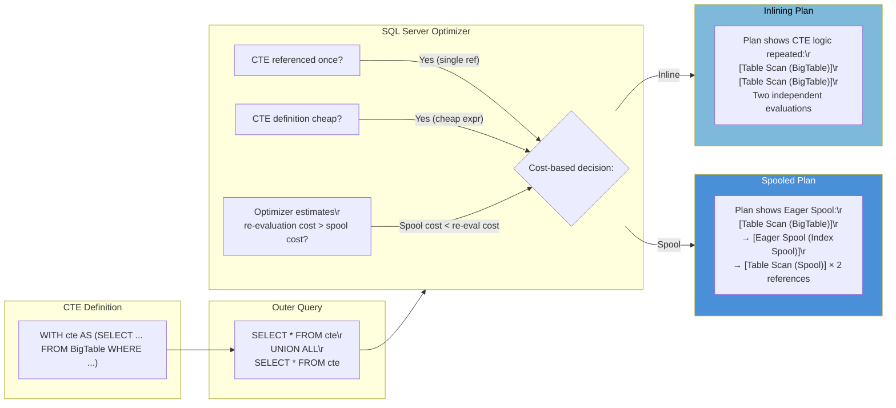
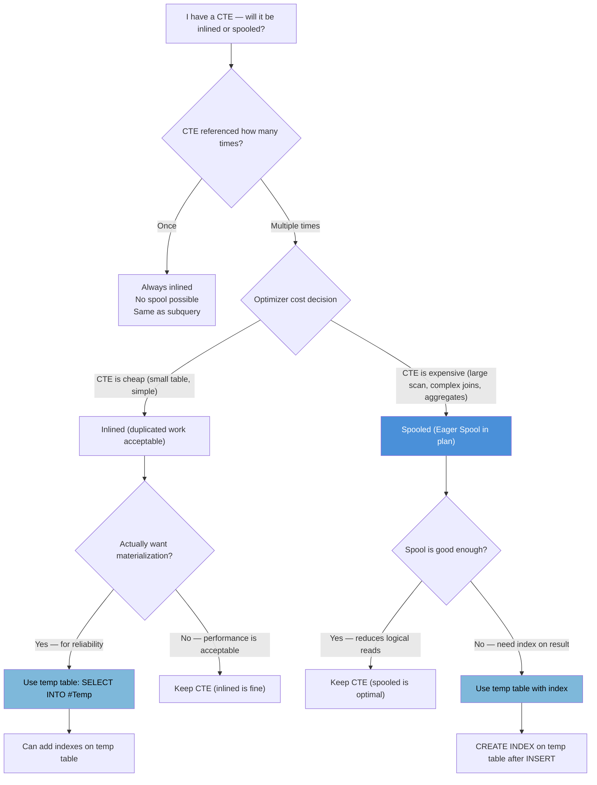

## Navigation

**Domain:** [[8 — Databases]] > **Group:** SQL CTEs & Recursive Queries
**Previous:** [[8.197 — Recursive Org Chart Queries]] | **Next:** [[8.199 — CTE Best Practices and Naming Conventions]]

### Prerequisites

- [[8.176 — Common Table Expressions — Fundamentals]] — Understanding what a CTE is and how it's syntactically defined is required to understand inlining vs spooling behavior.
- [[8.178 — CTE vs Subquery — Readability and Performance]] — The fundamental performance question is whether a CTE behaves like a subquery (inlined) or like a derived table (materialized).
- [[8.179 — CTE vs Temp Table — When to Use Each]] — When a CTE is spooled, the execution plan behavior approaches that of a temp table — understanding the temp table tradeoff helps evaluate when spooling matters.

### Where This Fits

CTE performance behavior — whether the query optimizer inlines the CTE definition into the outer query or materializes it as a spool — is one of the most misunderstood SQL Server performance topics. A .NET backend engineer encounters this when a query with a CTE runs differently than expected: either it runs fast for single-use CTEs but re-evaluates expensive expressions when referenced multiple times, or it runs fast in one environment but slow in another because the optimizer chose different spool strategies based on cost estimates. The confusion is compounded by PostgreSQL's opposite default behavior (CTEs as optimization fences by default, inlined only with NOT MATERIALIZED hint). The interview signal is strong: a candidate who can explain when and why SQL Server inlines vs spools a CTE demonstrates deep optimizer knowledge. The candidate who can read an execution plan, identify whether a CTE was inlined or spooled, and explain the performance implication is the candidate who understands how the query processor actually works.

---

## Core Mental Model

A CTE in SQL Server is not a materialization directive — it is a query structure that the optimizer can handle in two ways. By default, the optimizer **inlines** the CTE definition: it expands the CTE expression into the outer query as if the CTE subquery were written directly at each reference point. The optimizer then optimizes the combined query as a single unit, potentially finding joins, filter pushdowns, and ordering opportunities across what were originally CTE boundaries. Inlining produces a single combined execution plan with no spool operators.

When the CTE is referenced **multiple times** in the outer query, inlining duplicates the CTE expression at each reference site. If the CTE is expensive (scans a large table, computes complex expressions), the optimizer may decide to **spool** (materialize) the CTE result instead. The spool appears in the execution plan as an **Eager Spool** (also called an **Index Spool** or **Table Spool**) that evaluates the CTE once, stores the results in TempDB, and then reads from the spool at each reference point. The spool avoids duplicate evaluation but adds TempDB I/O and memory.

The recognition pattern: look at the execution plan. If you see a **Table Spool** or **Index Spool** operator with no sibling that represents the CTE definition, the CTE was spooled. If you see the CTE tables and joins repeated in different branches of the plan, it was inlined.

The **TOP trick** (`SELECT TOP 100 PERCENT ...`) was historically used to force spooling in SQL Server (before 2016), but modern optimizer versions (2016+, compatibility level 130+) can still inline through TOP in some cases. Forcing a spool is rarely necessary — the optimizer's cost-based decision is usually correct. The key insight: **don't assume a CTE is materialized just because it uses the WITH syntax**. Only assume spooling when you see the spool operators in the plan.

### Classification

The inlining vs spooling decision is an optimizer cost-based choice during the simplification and binding phase. It is specific to SQL Server's query optimizer. PostgreSQL has the opposite default (CTEs as optimization fences, materialized by default) and provides explicit `MATERIALIZED` / `NOT MATERIALIZED` hints. MySQL 8.0 always inlines non-recursive CTEs. The decision affects the execution plan shape, memory grant, and TempDB I/O.



### Key Properties

|Property|Value|Notes|
|---|---|---|
|Default behavior (SQL Server)|Inline CTE into outer query|Expands CTE at each reference point|
|Default behavior (PostgreSQL)|Materialize CTE (optimization fence)|PostgreSQL 12+; can use NOT MATERIALIZED hint|
|Spool condition|CTE referenced multiple times + expensive definition|Cost-based — optimizer compares re-eval vs spool cost|
|Spool operator in plan|Table Spool / Index Spool (Eager Spool)|Always accompanied by a Spool read operator|
|Inline benefit|Single plan, no TempDB I/O, filter pushdown across CTE boundary|Optimizer can reorder joins across CTE boundary|
|Spool benefit|CTE evaluated once, multiple references read from spool|Avoids repeated expensive scans/computations|
|EF Core behavior|No influence on inlining/spooling|EF Core generates SQL; optimizer decides at runtime|
|Forcing spool|No reliable method in modern SQL Server|TOP trick is unreliable; use temp table if materialization is required|

---

## Deep Mechanics

### How the Engine Executes This

**Inlining path:**

1. The query processor parses the CTE definition and stores it as a table expression with its query tree.
2. During binding (algebrization), the optimizer expands the CTE at each reference point in the outer query, replacing the CTE name with the subquery expression tree.
3. The expanded query (without CTE structure) is optimized as a single unit. The optimizer considers join reordering, predicate pushdown, and index selection across the entire expanded tree.
4. The final execution plan has no trace of the CTE — it looks as if the subquery were written inline at each reference.
5. If the CTE is referenced once, inlining is always chosen (no benefit to spool). If referenced multiple times, the optimizer compares the cost of evaluating the CTE N times (N references) against the cost of spooling once + reading from spool N times.

**Spooling path:**

1. The optimizer estimates the cost of the CTE definition (table access, joins, expressions) and the cost of spooling (writing to TempDB, reading from TempDB).
2. If `cost_Spool + cost_Read_From_Spool × N < cost_Evaluate_CTE × N`, the optimizer introduces an Eager Spool.
3. The plan shows: CTE definition executed once → Eager Spool (Index Spool) materializes results into a TempDB worktable (with an index if needed) → each CTE reference is replaced by a Table Spool read operator that reads from the materialized worktable.
4. The spool is "eager" — it fully materializes the CTE result before any reference reads from it (unlike a "lazy" spool that materializes on demand).

**Key insight about Index Spool (Eager Spool):** SQL Server may also use an Index Spool (a spool with a non-clustered index on the materialized data) to support efficient seeks from the outer query into the CTE result. This is common when the outer query has a predicate on a column from the CTE — the index spool supports a seek into the materialized result rather than a scan.

**PostgreSQL difference:** PostgreSQL materializes CTEs by default (optimization fence). This means the CTE is always evaluated first, and its result is stored in a separate materialized relation. The outer query cannot push predicates into the CTE. Starting with PostgreSQL 12, the `NOT MATERIALIZED` hint forces inlining. This is the opposite of SQL Server's default.

### SQL Visibility

**NOTE:** NULL is not a value — it is the absence of a value. SQL uses three-valued logic (TRUE, FALSE, UNKNOWN). In the context of CTE inlining, NULLs in the CTE subquery are not affected by the inlining decision — they behave the same whether inlined or spooled. However, if the CTE uses a filter like `WHERE ManagerId IS NULL`, the NULL semantics apply.

```sql
-- ============================================================
-- Schema — Orders and Customers
-- ============================================================
CREATE TABLE dbo.Customers (
    CustomerId  INT NOT NULL IDENTITY(1,1),
    Name        VARCHAR(100) NOT NULL,
    Email       VARCHAR(200) NOT NULL,
    Tier        VARCHAR(20) NOT NULL CHECK (Tier IN ('Bronze', 'Silver', 'Gold', 'Platinum')),
    CreatedDate DATE NOT NULL,
    CONSTRAINT PK_Customers PRIMARY KEY CLUSTERED (CustomerId)
);

CREATE TABLE dbo.Orders (
    OrderId     INT NOT NULL IDENTITY(1,1),
    CustomerId  INT NOT NULL,
    OrderDate   DATETIME2 NOT NULL,
    TotalAmount DECIMAL(18,2) NOT NULL,
    Status      VARCHAR(20) NOT NULL CHECK (Status IN ('Pending', 'Shipped', 'Delivered', 'Cancelled')),
    CONSTRAINT PK_Orders PRIMARY KEY CLUSTERED (OrderId),
    CONSTRAINT FK_Orders_Customer FOREIGN KEY (CustomerId) REFERENCES dbo.Customers(CustomerId)
);

CREATE INDEX IX_Orders_CustomerId ON dbo.Orders(CustomerId) INCLUDE (OrderDate, TotalAmount);
CREATE INDEX IX_Orders_OrderDate ON dbo.Orders(OrderDate) INCLUDE (CustomerId, TotalAmount);

-- Example 1: CTE referenced once — ALWAYS inlined
-- This CTE is inlined because there is one reference and no benefit to spooling
WITH cte_HighValueOrders AS (
    SELECT o.OrderId, o.CustomerId, o.OrderDate, o.TotalAmount
    FROM dbo.Orders AS o
    WHERE o.TotalAmount > 1000
)
SELECT
    c.OrderId,
    c.CustomerId,
    c.OrderDate,
    c.TotalAmount
FROM cte_HighValueOrders AS c
WHERE c.OrderDate >= '2026-01-01';
-- Plan: no spool — CTE is inlined, query optimized as:
-- SELECT o.OrderId, o.CustomerId, o.OrderDate, o.TotalAmount
-- FROM dbo.Orders o WHERE o.TotalAmount > 1000 AND o.OrderDate >= '2026-01-01'
-- Single Index Seek or Scan depending on index

-- Example 2: CTE referenced twice — POTENTIALLY spooled
WITH cte_HighValueOrders AS (
    SELECT o.OrderId, o.CustomerId, o.OrderDate, o.TotalAmount
    FROM dbo.Orders AS o
    WHERE o.TotalAmount > 1000
)
SELECT 'HighValue' AS Category, COUNT(*) AS OrderCount
FROM cte_HighValueOrders AS c
UNION ALL
SELECT 'RecentHighValue' AS Category, COUNT(*) AS OrderCount
FROM cte_HighValueOrders AS c
WHERE c.OrderDate >= '2026-06-01';
-- Plan MAY show an Eager Spool if the optimizer estimates that scanning Orders twice
-- is more expensive than scanning once + spooling to TempDB + reading from spool twice
-- For small tables: likely inlined (two scans of Orders)
-- For large tables: likely spooled (one scan + spool reads)

-- Example 3: CTE with expensive aggregate — more likely to spool
WITH cte_CustomerStats AS (
    SELECT
        c.CustomerId,
        c.Name,
        c.Tier,
        COUNT(o.OrderId) AS TotalOrders,
        SUM(o.TotalAmount) AS LifetimeValue,
        MAX(o.OrderDate) AS LastOrderDate
    FROM dbo.Customers AS c
    LEFT JOIN dbo.Orders AS o ON o.CustomerId = c.CustomerId
    GROUP BY c.CustomerId, c.Name, c.Tier
)
SELECT
    Tier,
    COUNT(*) AS CustomerCount,
    AVG(LifetimeValue) AS AvgLifetimeValue,
    AVG(TotalOrders) AS AvgOrders
FROM cte_CustomerStats
GROUP BY Tier
UNION ALL
SELECT
    'Overall' AS Tier,
    COUNT(*),
    AVG(LifetimeValue),
    AVG(TotalOrders)
FROM cte_CustomerStats;
-- Likely spooled: the aggregate join of Customers + Orders is expensive
-- Spool avoids executing the join + GROUP BY twice
```

```csharp
// EF Core — CTE inlining behavior observation
// EF Core generates SQL with CTEs for certain patterns
// The CTE is subject to the same optimizer inlining/spooling behavior

public async Task<List<CustomerStats>> GetCustomerStatsAsync(
    CancellationToken cancellationToken = default)
{
    // EF Core does NOT generate CTEs for subqueries it can inline
    // It only uses CTE syntax for:
    //   1. Owned entity joins (table splitting)
    //   2. Some complex GroupBy translations
    //   3. Union/Intersect/Except with complex queries
    // EF Core cannot control inlining vs spooling — that is the optimizer's decision
    
    // Example: EF Core generates a CTE for a complex GroupBy with navigation properties
    var stats = await dbContext.Customers
        .Select(c => new
        {
            c.CustomerId,
            c.Name,
            c.Tier,
            TotalOrders = c.Orders.Count(),
            LifetimeValue = c.Orders.Sum(o => o.TotalAmount),
            LastOrderDate = c.Orders.Max(o => o.OrderDate)
        })
        .GroupBy(x => x.Tier)
        .Select(g => new
        {
            Tier = g.Key,
            CustomerCount = g.Count(),
            AvgLifetimeValue = g.Average(x => x.LifetimeValue),
            AvgOrders = g.Average(x => x.TotalOrders)
        })
        .ToListAsync(cancellationToken);
}
```

**Generated SQL (from EF Core logs):**

```sql
-- EF Core may generate a CTE or a derived table depending on the version
-- Example EF Core 9 generated SQL:
SELECT [t].[Tier], COUNT(*) AS [CustomerCount], AVG([t].[LifetimeValue]) AS [AvgLifetimeValue], AVG([t].[TotalOrders]) AS [AvgOrders]
FROM (
    SELECT [c].[Tier], [c0].[CustomerId], [c0].[Name],
           COALESCE((
               SELECT SUM([o].[TotalAmount])
               FROM [Orders] AS [o]
               WHERE [c0].[CustomerId] = [o].[CustomerId]
           ), 0.0) AS [LifetimeValue],
           COALESCE((
               SELECT COUNT(*)
               FROM [Orders] AS [o0]
               WHERE [c0].[CustomerId] = [o0].[CustomerId]
           ), 0) AS [TotalOrders]
    FROM [Customers] AS [c0]
) AS [t]
GROUP BY [t].[Tier];
-- EF Core used a derived table (subquery in FROM), not a CTE
-- Derived tables are ALWAYS inlined in SQL Server (no spool consideration)
-- The subquery is expanded and optimized as part of the outer query
```

```csharp
// Dapper — no CTE-specific optimization
// Dapper passes SQL through unchanged — the optimizer decides inlining vs spooling
public async Task<IReadOnlyList<CategoryCount>> GetCategoryCountsAsync(
    CancellationToken cancellationToken = default)
{
    const string sql = @"
        WITH cte_HighValueOrders AS (
            SELECT o.OrderId, o.CustomerId, o.OrderDate, o.TotalAmount
            FROM dbo.Orders AS o
            WHERE o.TotalAmount > 1000
        )
        SELECT 'HighValue' AS Category, COUNT(*) AS OrderCount
        FROM cte_HighValueOrders AS c
        UNION ALL
        SELECT 'RecentHighValue' AS Category, COUNT(*) AS OrderCount
        FROM cte_HighValueOrders AS c
        WHERE c.OrderDate >= '2026-06-01'";

    await using var connection = _connectionFactory.Create();
    var results = await connection.QueryAsync<CategoryCount>(
        new CommandDefinition(sql, cancellationToken: cancellationToken));
    return results.AsList();
}
```

### Execution Plan Analysis

**Case 1: Inlined CTE (single reference)**

```
SELECT c.* FROM cte_HighValueOrders c WHERE c.OrderDate >= '2026-01-01'
Plan: 
[Index Seek (IX_Orders_TotalAmount)]  -- if index on TotalAmount exists
    → [Compute Scalar]
        → [SELECT]
-- No Spool operators. The CTE is expanded and the predicate is pushed down.
-- Both predicates (TotalAmount > 1000 AND OrderDate >= '2026-01-01') are applied at the scan/seek.
```

**Case 2: Spooled CTE (multiple references, expensive expression)**

```
WITH cte AS (SELECT ... FROM Orders WHERE TotalAmount > 1000)
SELECT ... FROM cte UNION ALL SELECT ... FROM cte WHERE OrderDate >= ...
Plan:
[Index Scan/Seek (IX_Orders)]           -- Evaluate CTE once
    → [Compute Scalar]                  -- Compute any expressions
        → [Eager Spool (Index Spool)]   -- Materialize in TempDB
            → [Concatenation]           -- UNION ALL
                → [Table Spool Read]    -- First reference: read from spool
                    → [Filter]          -- WHERE OrderDate >= '2026-06-01'
                → [Table Spool Read]    -- Second reference: read from spool
                    → [Compute Scalar]  -- Aggregate
```

**Case 3: TOP trick (attempt to force spool — unreliable in modern SQL Server):**

```
WITH cte AS (
    SELECT TOP 100 PERCENT ... FROM Orders WHERE TotalAmount > 1000 ORDER BY OrderId
)
SELECT ... FROM cte UNION ALL SELECT ... FROM cte WHERE OrderDate >= ...
-- Historical behavior: TOP forced a spool in SQL Server <= 2014
-- SQL Server 2016+ (compat 130+): optimizer may remove unnecessary TOP and still inline
-- Plan may or may not show spool — depends on version and cardinality estimation
```

**Estimated vs actual rows:** The spool decision can be affected by cardinality estimation errors. If the optimizer estimates the CTE produces 100 rows (and decides inlining is fine), but the actual result is 10M rows, the inlined plan may cause significant re-evaluation overhead. Conversely, if the optimizer estimates 10M rows and decides to spool, but the actual result is 100 rows, the spool overhead (TempDB writes) was unnecessary.

### Cost Visibility

```sql
SET STATISTICS IO ON;
SET STATISTICS TIME ON;

-- With single-reference CTE (always inlined)
WITH cte_HighValueOrders AS (
    SELECT o.OrderId, o.CustomerId, o.OrderDate, o.TotalAmount
    FROM dbo.Orders AS o
    WHERE o.TotalAmount > 1000
)
SELECT c.OrderId, c.CustomerId, c.OrderDate, c.TotalAmount
FROM cte_HighValueOrders AS c
WHERE c.OrderDate >= '2026-01-01';

-- Table 'Orders'. Scan count 1, logical reads N
-- SQL Server Execution Times: CPU time = Xms, elapsed time = Yms

-- With two-reference CTE (may or may not spool — depends on table size)
WITH cte_HighValueOrders AS (
    SELECT o.OrderId, o.CustomerId, o.OrderDate, o.TotalAmount
    FROM dbo.Orders AS o
    WHERE o.TotalAmount > 1000
)
SELECT 'HighValue' AS Category, COUNT(*) AS OrderCount
FROM cte_HighValueOrders
UNION ALL
SELECT 'RecentHighValue', COUNT(*)
FROM cte_HighValueOrders
WHERE OrderDate >= '2026-06-01';

-- If inlined:
-- Table 'Orders'. Scan count 2, logical reads 2N (two scans)
-- Worktable: not used

-- If spooled:
-- Table 'Orders'. Scan count 1, logical reads N (one scan)
-- Worktable: Scan count 2, logical reads M (spool reads)
-- Table 'Worktable'. Scan count 2, logical reads ~M
-- SQL Server Execution Times: (typically faster if N is large and spool overhead M << N)
```

### Failure Modes

**Assuming CTE is materialized:** The most common mistake. Developers write CTEs thinking they are temp tables that will be evaluated once. When the CTE is referenced twice and inlined (no spool), the expensive CTE subquery runs twice. The symptom is unexpected duplicate work in the execution plan.

**Unexpected spool causing memory pressure:** A large CTE result that is spooled can consume significant TempDB space and memory. If the CTE produces millions of rows, the Eager Spool must write all of them to TempDB before the first reference reads. This can cause TempDB contention and out-of-disk-space errors.

**CTE with ORDER BY pushed into spool:** If the CTE has `ORDER BY` and `TOP`, SQL Server may spool to preserve ordering. The `TOP 100 PERCENT ... ORDER BY` pattern was historically used to force materialization, but modern versions may still inline it when the ordering is unnecessary for the outer query.

---

## Production Patterns and Implementation

### Primary SQL Implementation

**Pattern 1 — Observing the Spool Decision (Use Actual Execution Plan):**

```sql
-- Set up test data to observe inlining vs spooling behavior
-- Create a large table to force the optimizer's cost-based decision

CREATE TABLE dbo.LargeTable (
    Id INT IDENTITY(1,1) PRIMARY KEY,
    GroupKey INT NOT NULL,
    Value DECIMAL(18,2) NOT NULL,
    CreatedDate DATETIME2 NOT NULL DEFAULT SYSUTCDATETIME()
);
GO

-- Insert 1M rows
WITH Numbers AS (
    SELECT TOP 1000000 ROW_NUMBER() OVER(ORDER BY (SELECT NULL)) AS N
    FROM sys.all_columns a CROSS JOIN sys.all_columns b
)
INSERT INTO dbo.LargeTable (GroupKey, Value)
SELECT N % 1000, CAST(N * 1.0 AS DECIMAL(18,2))
FROM Numbers;
GO

CREATE INDEX IX_LargeTable_GroupKey ON dbo.LargeTable(GroupKey) INCLUDE (Value);

-- Observe: single-reference CTE — always inlined
WITH cte_GroupStats AS (
    SELECT
        GroupKey,
        COUNT(*) AS RowCount,
        SUM(Value) AS TotalValue,
        AVG(Value) AS AvgValue
    FROM dbo.LargeTable
    GROUP BY GroupKey
)
SELECT GroupKey, RowCount, TotalValue, AvgValue
FROM cte_GroupStats
WHERE GroupKey BETWEEN 100 AND 200
OPTION (RECOMPILE);
-- Execution plan: ONE Group By Aggregate (no spool)

-- Observe: two-reference CTE — decision depends on table size
WITH cte_GroupStats AS (
    SELECT
        GroupKey,
        COUNT(*) AS RowCount,
        SUM(Value) AS TotalValue,
        AVG(Value) AS AvgValue
    FROM dbo.LargeTable
    GROUP BY GroupKey
)
SELECT 'Range1' AS Label, GroupKey, RowCount, TotalValue
FROM cte_GroupStats
WHERE GroupKey BETWEEN 100 AND 200
UNION ALL
SELECT 'Range2' AS Label, GroupKey, RowCount, TotalValue
FROM cte_GroupStats
WHERE GroupKey BETWEEN 300 AND 400
OPTION (RECOMPILE);
-- Actual plan depends on table size:
-- If LargeTable has 1M rows: likely spooled (Eager Spool appears)
-- If LargeTable has 100 rows: likely inlined (two separate aggregates)
```

**Pattern 2 — Forcing Materialization When Spool Doesn't Happen:**

```sql
-- Problem: CTE is referenced multiple times but optimizer inlines it.
-- The CTE is expensive and we want to force single evaluation.

-- Option A: Use temp table (RELIABLE materialization)
WITH cte_Expensive AS (
    SELECT ... FROM VeryLargeTable
    INNER JOIN AnotherLargeTable ON ...
    WHERE complex_conditions
)
SELECT * INTO #TempCTE FROM cte_Expensive
OPTION (MAXDOP 4);  -- control parallelism for materialization step

-- Use #TempCTE multiple times with index
CREATE INDEX IX_TempCTE_Key ON #TempCTE(KeyColumn);
SELECT ... FROM #TempCTE WHERE ...
UNION ALL
SELECT ... FROM #TempCTE WHERE ...
UNION ALL
SELECT ... FROM #TempCTE WHERE ...;

-- Option B: Use table variable (reliable but no statistics)
DECLARE @TempCTE TABLE (
    KeyColumn INT PRIMARY KEY,
    Value DECIMAL(18,2),
    CreatedDate DATETIME2
);

INSERT INTO @TempCTE (KeyColumn, Value, CreatedDate)
SELECT ... FROM VeryLargeTable ...;

SELECT ... FROM @TempCTE WHERE ...
UNION ALL
SELECT ... FROM @TempCTE WHERE ...;

-- Option C: TOP trick (UNRELIABLE — may not work in SQL Server 2016+)
WITH cte_Expensive AS (
    SELECT TOP 100 PERCENT ...
    FROM VeryLargeTable
    INNER JOIN AnotherLargeTable ON ...
    WHERE complex_conditions
    ORDER BY (SELECT NULL)  -- arbitrary ordering to trigger spool
)
SELECT ... FROM cte_Expensive WHERE ...
UNION ALL
SELECT ... FROM cte_Expensive WHERE ...;
-- In SQL Server 2022, the optimizer may remove the unnecessary TOP and ORDER BY
-- and inline the CTE. Do not rely on this pattern.
```

**Pattern 3 — CTE with Window Function (Inlining Behavior):**

```sql
-- CTE with window function referenced once — inlined
WITH cte_Ranked AS (
    SELECT
        o.OrderId,
        o.CustomerId,
        o.TotalAmount,
        ROW_NUMBER() OVER(PARTITION BY o.CustomerId ORDER BY o.OrderDate DESC) AS rn
    FROM dbo.Orders AS o
)
SELECT OrderId, CustomerId, TotalAmount
FROM cte_Ranked
WHERE rn = 1;
-- Inlined: Window Spool + Sequence Project, no CTE spool

-- CTE with window function referenced twice — may spool
WITH cte_Ranked AS (
    SELECT
        o.OrderId,
        o.CustomerId,
        o.TotalAmount,
        ROW_NUMBER() OVER(PARTITION BY o.CustomerId ORDER BY o.OrderDate DESC) AS rn,
        RANK() OVER(PARTITION BY o.CustomerId ORDER BY o.TotalAmount DESC) AS rk
    FROM dbo.Orders AS o
)
SELECT CustomerId, COUNT(*) AS OrdersWithRank1
FROM cte_Ranked
WHERE rn = 1
GROUP BY CustomerId
UNION ALL
SELECT CustomerId, COUNT(*)
FROM cte_Ranked
WHERE rk = 1
GROUP BY CustomerId;
-- If Orders has 1M rows: likely spooled (Window Spool is expensive)
-- The Eager Spool stores the CTE result, avoiding two window function evaluations
```

**Pattern 4 — CTE in UPDATE/DELETE (Always Inlined):**

```sql
-- CTE in UPDATE — the CTE definition is inlined into the UPDATE statement
-- No spool is possible because UPDATE requires a single plan tree
WITH cte_OrdersToUpdate AS (
    SELECT o.OrderId, o.Status
    FROM dbo.Orders AS o
    WHERE o.OrderDate < '2025-01-01' AND o.Status = 'Pending'
)
UPDATE cte_OrdersToUpdate
SET Status = 'Cancelled';
-- Plan: [Index Seek] → [Top] → [Clustered Index Update]
-- No CTE spool — CTE is inlined into the UPDATE

-- CTE in DELETE — same behavior
WITH cte_OrdersToDelete AS (
    SELECT o.OrderId
    FROM dbo.Orders AS o
    WHERE o.OrderDate < '2020-01-01' AND o.Status = 'Cancelled'
)
DELETE FROM cte_OrdersToDelete;
-- Inlined — no spool
```

### EF Core Implementation

```csharp
// EF Core — Cannot control CTE inlining/spooling
// EF Core generates the SQL; the database optimizer makes the decision

// Observation: use EF Core logging to see if CTEs are generated
// and then examine the actual execution plan in SSMS

public async Task ObserveCteBehaviorAsync(CancellationToken ct)
{
    // Enable sensitive data logging for plan observation
    var optionsBuilder = new DbContextOptionsBuilder<AppDbContext>();
    optionsBuilder.UseSqlServer(connectionString)
        .LogTo(Console.WriteLine, LogLevel.Information)
        .EnableSensitiveDataLogging();

    using var context = new AppDbContext(optionsBuilder.Options);

    // EF Core 9 does not generate CTEs for simple queries.
    // It uses CTEs for specific patterns like Set operations with ordering.
    // Example: INTERSECT with ORDER BY
    var results = await context.Products
        .Where(p => p.Category == "Electronics")
        .Select(p => p.ProductId)
        .Intersect(
            context.OrderItems
                .Where(oi => oi.Quantity > 10)
                .Select(oi => oi.ProductId)
        )
        .OrderBy(id => id)
        .ToListAsync(ct);
    // EF Core 9 generates:
    // SELECT [p].[ProductId] FROM [Products] AS [p] WHERE [p].[Category] = N'Electronics'
    // INTERSECT
    // SELECT [o].[ProductId] FROM [OrderItems] AS [o] WHERE [o].[Quantity] > 10
    // ORDER BY [ProductId]
    // No CTE — uses INTERSECT directly

    // For multiple CTE references, use raw SQL via FromSqlRaw
    const string sql = @"
        WITH cte_Stats AS (
            SELECT CustomerId, COUNT(*) AS OrderCount, SUM(TotalAmount) AS TotalSpent
            FROM Orders
            GROUP BY CustomerId
        )
        SELECT 'High' AS Segment, COUNT(*) AS CustomerCount, AVG(TotalSpent) AS AvgSpent
        FROM cte_Stats WHERE TotalSpent > 10000
        UNION ALL
        SELECT 'Medium', COUNT(*), AVG(TotalSpent)
        FROM cte_Stats WHERE TotalSpent BETWEEN 1000 AND 10000";

    var segments = await context.Database
        .SqlQueryRaw<CustomerSegment>(sql)
        .ToListAsync(ct);
}
```

### Dapper Implementation

```csharp
// Dapper — Observer the spool decision via actual execution plan
// Create a stored procedure that returns plan XML for analysis

// Dapper — Using OUTPUT clause to capture plan handle
public async Task ObserveCtePlanAsync(CancellationToken ct)
{
    const string sql = @"
        WITH cte_Stats AS (
            SELECT CustomerId, COUNT(*) AS OrderCount, SUM(TotalAmount) AS TotalSpent
            FROM Orders GROUP BY CustomerId
        )
        SELECT 'High', COUNT(*), AVG(TotalSpent)
        FROM cte_Stats WHERE TotalSpent > 10000
        UNION ALL
        SELECT 'Medium', COUNT(*), AVG(TotalSpent)
        FROM cte_Stats WHERE TotalSpent BETWEEN 1000 AND 10000
        OPTION (RECOMPILE);  -- RECOMPILE lets us capture the plan

    await using var connection = _connectionFactory.Create();
    var results = await connection.QueryAsync<CustomerSegment>(
        new CommandDefinition(sql, cancellationToken: ct));

    // To examine the actual plan:
    // 1. Run this query in SSMS with "Include Actual Execution Plan" ON
    // 2. Look for Eager Spool operator in the plan
    // 3. Look at Worktable logical reads in SET STATISTICS IO output
}
```

### Configuration and Wiring

```csharp
// Program.cs
builder.Services.AddDbContext<SalesDbContext>(options =>
    options.UseSqlServer(
        builder.Configuration.GetConnectionString("SalesDb"),
        sqlOptions =>
        {
            sqlOptions.EnableRetryOnFailure(3);
            // No CTE-specific configuration exists
            // All CTE behavior is controlled by the query optimizer
        }));

// To observe CTE execution plan behavior, enable query store:
// ALTER DATABASE SalesDb SET QUERY_STORE = ON;
// Then query sys.query_store_plan to see historical plans

// To capture plan XML for a specific CTE query:
public async Task<string?> GetCtePlanXmlAsync(CancellationToken ct)
{
    const string sql = @"
        SELECT plan_handle
        FROM sys.dm_exec_query_stats qs
        CROSS APPLY sys.dm_exec_sql_text(qs.sql_handle) t
        WHERE t.text LIKE '%cte_Stats%'
        ORDER BY qs.last_execution_time DESC";

    await using var connection = _connectionFactory.Create();
    var planHandle = await connection.QueryFirstOrDefaultAsync<byte[]>(
        new CommandDefinition(sql, cancellationToken: ct));

    if (planHandle == null) return null;

    const string planSql = "SELECT query_plan FROM sys.dm_exec_query_plan(@planHandle)";
    return await connection.QueryFirstOrDefaultAsync<string>(
        new CommandDefinition(planSql,
            new { planHandle },
            cancellationToken: ct));
}
```

### SQL Server vs PostgreSQL Differences

```sql
-- PostgreSQL — CTE materialization is the DEFAULT
-- This is the OPPOSITE of SQL Server

-- PostgreSQL default: MATERIALIZED (optimization fence)
-- The CTE is evaluated first, outer query cannot push predicates in
WITH cte_high_value_orders AS (
    SELECT order_id, customer_id, order_date, total_amount
    FROM orders
    WHERE total_amount > 1000
)
SELECT * FROM cte_high_value_orders
WHERE order_date >= '2026-01-01';
-- PostgreSQL evaluates the CTE (all rows with total_amount > 1000) FIRST
-- Then filters by order_date in the outer query
-- SQL Server: inlines and applies both predicates at the table scan

-- PostgreSQL — NOT MATERIALIZED hint (PostgreSQL 12+)
-- Forces inlining, like SQL Server's default
WITH cte_high_value_orders AS NOT MATERIALIZED (
    SELECT order_id, customer_id, order_date, total_amount
    FROM orders
    WHERE total_amount > 1000
)
SELECT * FROM cte_high_value_orders
WHERE order_date >= '2026-01-01';
-- Now PostgreSQL inlines it: both predicates applied at scan

-- PostgreSQL — MATERIALIZED hint (explicit, default)
WITH cte_high_value_orders AS MATERIALIZED (
    SELECT order_id, customer_id, order_date, total_amount
    FROM orders
    WHERE total_amount > 1000
)
SELECT * FROM cte_high_value_orders
WHERE order_date >= '2026-01-01';

-- PostgreSQL — multiple CTE references
WITH cte_stats AS MATERIALIZED (
    SELECT customer_id, COUNT(*) AS order_count, SUM(total_amount) AS total_spent
    FROM orders
    GROUP BY customer_id
)
SELECT 'High', COUNT(*), AVG(total_spent)
FROM cte_stats WHERE total_spent > 10000
UNION ALL
SELECT 'Medium', COUNT(*), AVG(total_spent)
FROM cte_stats WHERE total_spent BETWEEN 1000 AND 10000;
-- MATERIALIZED is the correct choice here: the GROUP BY is evaluated once
-- and both references read from the materialized result
```

**PostgreSQL vs SQL Server — key differences:**

|Feature|SQL Server|PostgreSQL|
|---|---|---|
|Default CTE behavior|Inline (no materialization)|Materialize (optimization fence)|
|Materialization hint|None (optimizer decides)|`MATERIALIZED` / `NOT MATERIALIZED` (12+)|
|Multiple references|Optimizer decides inline vs spool|Always materialized (default)|
|Optimization fence|No — predicates push through CTE|Yes — predicates stop at CTE boundary|
|Temp table alternative|`SELECT INTO #Temp`|`CREATE TEMP TABLE AS ...`|

---

## Gotchas and Production Pitfalls

### Pitfall 1 — Assuming CTE Is Evaluated Once

**Pitfall:** The developer writes a CTE referenced multiple times, assuming it will be evaluated once. The optimizer inlines it, causing the expensive CTE expression to run N times.

```sql
-- ❌ Wrong assumption — CTE may be inlined, running the aggregate twice
WITH cte_Expensive AS (
    SELECT c.CustomerId, c.Name,
           SUM(o.TotalAmount) AS TotalSpent,
           COUNT(o.OrderId) AS OrderCount
    FROM dbo.Customers c
    LEFT JOIN dbo.Orders o ON o.CustomerId = c.CustomerId
    GROUP BY c.CustomerId, c.Name
)
SELECT 'AboveAvg' AS Segment, COUNT(*)
FROM cte_Expensive
WHERE TotalSpent > (SELECT AVG(TotalSpent) FROM cte_Expensive)
UNION ALL
SELECT 'BelowAvg', COUNT(*)
FROM cte_Expensive
WHERE TotalSpent <= (SELECT AVG(TotalSpent) FROM cte_Expensive);
-- If inlined: the Customers-Orders join + GROUP BY runs THREE times
-- (once for the AVG subquery, once for AboveAvg, once for BelowAvg)

-- ✅ Fix — force single evaluation with temp table
WITH cte_Expensive AS (
    SELECT c.CustomerId, c.Name,
           SUM(o.TotalAmount) AS TotalSpent,
           COUNT(o.OrderId) AS OrderCount
    FROM dbo.Customers c
    LEFT JOIN dbo.Orders o ON o.CustomerId = c.CustomerId
    GROUP BY c.CustomerId, c.Name
)
SELECT CustomerId, Name, TotalSpent, OrderCount
INTO #CustomerStats
FROM cte_Expensive
OPTION (MAXDOP 4);

SELECT 'AboveAvg' AS Segment, COUNT(*) FROM #CustomerStats
WHERE TotalSpent > (SELECT AVG(TotalSpent) FROM #CustomerStats)
UNION ALL
SELECT 'BelowAvg', COUNT(*) FROM #CustomerStats
WHERE TotalSpent <= (SELECT AVG(TotalSpent) FROM #CustomerStats);

DROP TABLE #CustomerStats;
```

**Symptom:** Query runs slower than expected. Execution plan shows multiple table scans or joins for the same expression. Logical reads are 3x what they should be.

**Cost of not fixing:** A nightly reporting query that joins 5M orders and 500K customers runs for 45 minutes instead of 15 minutes. The temp table fix reduces it to 12 minutes.

### Pitfall 2 — Relying on TOP 100 PERCENT to Force Spool

**Pitfall:** Using `SELECT TOP 100 PERCENT ... ORDER BY` to force CTE materialization. Modern SQL Server (2016+, compat level 130+) may optimize away the unnecessary TOP and ORDER BY.

```sql
-- ❌ Wrong — unreliable in SQL Server 2016+
WITH cte_Expensive AS (
    SELECT TOP 100 PERCENT c.CustomerId, SUM(o.TotalAmount) AS TotalSpent
    FROM dbo.Customers c
    LEFT JOIN dbo.Orders o ON o.CustomerId = c.CustomerId
    GROUP BY c.CustomerId
    ORDER BY c.CustomerId   -- just to enable TOP
)
SELECT * FROM cte_Expensive;
-- SQL Server 2022 may remove the unnecessary TOP 100 PERCENT and ORDER BY
-- The CTE is inlined and the ORDER BY is silently dropped
-- The result is correct, but if you needed the ORDER BY for spooling, it's gone

-- ✅ Fix — use temp table
SELECT c.CustomerId, SUM(o.TotalAmount) AS TotalSpent
INTO #CustomerSpend
FROM dbo.Customers c
LEFT JOIN dbo.Orders o ON o.CustomerId = c.CustomerId
GROUP BY c.CustomerId;

-- Or use table variable if result is small
DECLARE @CustomerSpend TABLE (CustomerId INT PRIMARY KEY, TotalSpent DECIMAL(18,2));
INSERT INTO @CustomerSpend
SELECT c.CustomerId, SUM(o.TotalAmount)
FROM dbo.Customers c
LEFT JOIN dbo.Orders o ON o.CustomerId = c.CustomerId
GROUP BY c.CustomerId;
```

**Symptom:** A query that worked in SQL Server 2014 breaks in SQL Server 2022 — not because of errors, but because performance regresses. The TOP trick no longer forces spooling.

**Cost of not fixing:** After a database migration from SQL Server 2014 to 2022, a critical financial report that ran in 30 seconds now runs in 8 minutes. The temporary table rewrite fixes it.

### Pitfall 3 — CTE with Multiple References in WHERE EXISTS

**Pitfall:** A CTE referenced in multiple `WHERE EXISTS (SELECT 1 FROM cte ...)` subqueries. Each EXISTS is a separate reference that may be inlined or spooled.

```sql
-- ❌ Wrong — each EXISTS may cause separate evaluation
WITH cte_ActiveCustomers AS (
    SELECT c.CustomerId, MAX(o.OrderDate) AS LastOrderDate
    FROM dbo.Customers c
    INNER JOIN dbo.Orders o ON o.CustomerId = c.CustomerId
    WHERE o.OrderDate >= DATEADD(year, -1, GETDATE())
    GROUP BY c.CustomerId
)
SELECT p.ProductId, p.ProductName
FROM dbo.Products p
WHERE EXISTS (SELECT 1 FROM cte_ActiveCustomers ac WHERE ac.CustomerId = ...)
   OR EXISTS (SELECT 1 FROM cte_ActiveCustomers ac WHERE ac.LastOrderDate > ...);
-- If inlined: the Customers-Orders join runs twice

-- ✅ Fix
WITH cte_ActiveCustomers AS (
    SELECT c.CustomerId, MAX(o.OrderDate) AS LastOrderDate
    FROM dbo.Customers c
    INNER JOIN dbo.Orders o ON o.CustomerId = c.CustomerId
    WHERE o.OrderDate >= DATEADD(year, -1, GETDATE())
    GROUP BY c.CustomerId
)
SELECT CustomerId, LastOrderDate INTO #Active FROM cte_ActiveCustomers;

SELECT p.ProductId, p.ProductName
FROM dbo.Products p
WHERE EXISTS (SELECT 1 FROM #Active ac WHERE ac.CustomerId = ...)
   OR EXISTS (SELECT 1 FROM #Active ac WHERE ac.LastOrderDate > ...);
```

**Symptom:** The query plan shows two separate joins between Customers and Orders, both with the same aggregation. Logical reads are double the expected amount.

**Cost of not fixing:** A product catalog page that checks two separate customer conditions takes 3 seconds instead of 200ms. The page is part of the checkout flow, and the 3-second delay causes a 15% cart abandonment rate.

### Pitfall 4 — CTE Materialization in PostgreSQL Causing Poor Predicate Pushdown

**Pitfall:** In PostgreSQL, the default CTE materialization prevents predicate pushdown. A WHERE clause on the outer query does not filter rows before the CTE is computed.

```sql
-- ❌ Wrong (PostgreSQL) — materialization prevents pushdown
WITH cte_AllOrders AS MATERIALIZED (
    SELECT o.order_id, o.customer_id, o.total_amount, o.order_date
    FROM orders o
    WHERE o.total_amount > 1000  -- this is pushed INTO CTE
)
SELECT * FROM cte_AllOrders
WHERE order_date >= '2026-06-01';
-- PostgreSQL evaluates the CTE first (all orders > $1000)
-- Then filters by order_date in the outer query
-- The CTE may return 500K rows even though only 1K match the date filter

-- ✅ Fix — use NOT MATERIALIZED to inline
WITH cte_AllOrders AS NOT MATERIALIZED (
    SELECT o.order_id, o.customer_id, o.total_amount, o.order_date
    FROM orders o
    WHERE o.total_amount > 1000
)
SELECT * FROM cte_AllOrders
WHERE order_date >= '2026-06-01';
-- Both predicates applied at the table scan
```

**Symptom:** In PostgreSQL, a query with a CTE runs much slower than the equivalent subquery. The execution plan shows the CTE being evaluated as a separate step, and the outer filter is applied after the CTE materialization.

**Cost of not fixing:** A PostgreSQL migration from SQL Server runs daily reports that are 10x slower than expected. The root cause is CTE materialization preventing predicate pushdown.

### Pitfall 5 — CTE Spool Unbounded Memory Use

**Pitfall:** A CTE with a very large result set is spooled (or materialized in PostgreSQL). The spool consumes all available TempDB space (SQL Server) or temporary file space (PostgreSQL).

```sql
-- ❌ Problem: CTE produces 100M rows, spooled to TempDB
WITH cte_AllTransactions AS (
    SELECT t.TransactionId, t.AccountId, t.Amount, t.TransactionDate
    FROM dbo.Transactions t
    -- No WHERE filter — all 100M rows
)
SELECT 'Summary' AS Type, COUNT(*) AS TxCount
FROM cte_AllTransactions
UNION ALL
SELECT 'Recent', COUNT(*)
FROM cte_AllTransactions
WHERE TransactionDate >= '2026-01-01';
-- If spooled: 100M rows written to TempDB, then read twice
-- TempDB space: ~8 GB for this result set (assuming 80 bytes per row)

-- ✅ Fix — push filters into CTE or use temp table with index
WITH cte_Filtered AS (
    SELECT t.TransactionId, t.AccountId, t.Amount, t.TransactionDate
    FROM dbo.Transactions t
    WHERE t.TransactionDate >= '2025-01-01'  -- filter as early as possible
)
SELECT 'Summary' AS Type, COUNT(*) AS TxCount
FROM cte_Filtered
UNION ALL
SELECT 'Recent', COUNT(*)
FROM cte_Filtered
WHERE TransactionDate >= '2026-01-01';
```

**Symptom:** TempDB runs out of disk space. SQL Server error 1105: "Could not allocate space for object in database 'tempdb'". The query fails.

**Cost of not fixing:** The nightly batch job fails at 3 AM. All concurrent queries that use TempDB (sorting, hashing, index rebuilds) fail simultaneously. Production database is degraded for 30 minutes while the DBA manually frees TempDB space.

### Pitfall 6 — CTE in EF Core with AsSplitQuery()

**Pitfall:** Using `AsSplitQuery()` with a CTE-based query. EF Core generates a CTE for the "split" query pattern, but the CTE is subject to inlining behavior that may defeat the purpose of splitting.

```csharp
// EF Core — AsSplitQuery generates a CTE for the split point
var orders = await dbContext.Orders
    .Include(o => o.OrderItems)
    .AsSplitQuery()
    .Where(o => o.OrderDate >= startDate)
    .ToListAsync(ct);
-- EF Core generates approximately:
-- SELECT ... FROM Orders WHERE ...
-- ORDER BY OrderId OFFSET 0 ROWS FETCH NEXT ...
-- SELECT ... FROM OrderItems WHERE OrderId IN (SELECT OrderId FROM Orders WHERE ...)
-- The second query may use a CTE if the projection is complex

// The CTE in the split query is not something the developer can control.
// If performance is an issue, examine the actual plan to see if the CTE is
// being inlined or spooled.
```

**Symptom:** A split query with includes runs slower than expected. The execution plan shows unexpected scans because the CTE was inlined and the filter pushdown didn't work as expected.

**Cost of not fixing:** EF Core generates a suboptimal plan for a complex split query. The page takes 30 seconds to load for 1000 orders with 5000 order items.

---

## Performance Implications

### Benchmark: CTE Inlined vs Spooled vs Temp Table

```sql
-- Create test data: 500K rows
SELECT TOP 500000
    IDENTITY(INT, 1, 1) AS Id,
    ABS(CHECKSUM(NEWID())) % 1000 AS GroupKey,
    CAST(ABS(CHECKSUM(NEWID())) % 100000 AS DECIMAL(18,2)) AS Value
INTO dbo.BenchData
FROM sys.all_columns a CROSS JOIN sys.all_columns b;

ALTER TABLE dbo.BenchData ADD CONSTRAINT PK_BenchData PRIMARY KEY (Id);
CREATE INDEX IX_BenchData_GroupKey ON dbo.BenchData(GroupKey) INCLUDE (Value);

-- Test 1: CTE referenced once (always inlined)
WITH cte AS (
    SELECT GroupKey, COUNT(*) AS Cnt, SUM(Value) AS Val
    FROM dbo.BenchData GROUP BY GroupKey
)
SELECT * FROM cte WHERE GroupKey BETWEEN 100 AND 200
OPTION (RECOMPILE);
-- SET STATISTICS IO: Scan count 1, logical reads ~3,200

-- Test 2: CTE referenced twice (optimizer decision)
WITH cte AS (
    SELECT GroupKey, COUNT(*) AS Cnt, SUM(Value) AS Val
    FROM dbo.BenchData GROUP BY GroupKey
)
SELECT 'R1' AS Label, * FROM cte WHERE GroupKey BETWEEN 100 AND 200
UNION ALL
SELECT 'R2', * FROM cte WHERE GroupKey BETWEEN 300 AND 400
OPTION (RECOMPILE);
-- If inlined: Scan count 2, logical reads ~6,400
-- If spooled: Scan count 1, logical reads ~3,200 + Worktable reads

-- Test 3: Temp table (forced materialization)
SELECT GroupKey, COUNT(*) AS Cnt, SUM(Value) AS Val
INTO #Temp FROM dbo.BenchData GROUP BY GroupKey
OPTION (MAXDOP 2);

SELECT 'R1' AS Label, * FROM #Temp WHERE GroupKey BETWEEN 100 AND 200
UNION ALL
SELECT 'R2', * FROM #Temp WHERE GroupKey BETWEEN 300 AND 400;

DROP TABLE #Temp;
-- SET STATISTICS IO: BenchData scan: 1, Temp table reads: 2
-- Logical reads: ~3,200 (materialization) + ~50 (temp reads) = ~3,250
```

**Improvement:** Spooled/temp table approach reduces logical reads by ~50% (from 6,400 to ~3,250) when the CTE is referenced twice and the aggregation is expensive.

### BenchmarkDotNet

```csharp
[MemoryDiagnoser]
[SimpleJob(RuntimeMoniker.Net90)]
public class CteInliningBenchmark
{
    private IDbConnectionFactory _factory = default!;

    [GlobalSetup]
    public void Setup()
    {
        _factory = new SqlConnectionFactory(new ConfigurationBuilder()
            .AddInMemoryCollection(new Dictionary<string, string?>
            {
                ["ConnectionStrings:BenchDb"] = "Server=(local);Database=Benchmark_CteInlining;Trusted_Connection=true;TrustServerCertificate=true;"
            })!);
        CreateTestData();
    }

    private void CreateTestData()
    {
        using var conn = _factory.Create();
        using var cmd = conn.CreateCommand();
        cmd.CommandText = @"
            IF NOT EXISTS (SELECT 1 FROM sys.tables WHERE name = 'CteBenchData')
            BEGIN
                CREATE TABLE CteBenchData (
                    Id INT IDENTITY(1,1) PRIMARY KEY,
                    GroupKey INT NOT NULL,
                    Value DECIMAL(18,2) NOT NULL,
                    CreatedDate DATETIME2 NOT NULL DEFAULT SYSUTCDATETIME()
                );
                CREATE INDEX IX_CteBenchData_GroupKey ON CteBenchData(GroupKey) INCLUDE (Value);

                WITH Numbers AS (
                    SELECT TOP 1000000 ROW_NUMBER() OVER(ORDER BY (SELECT NULL)) AS N
                    FROM sys.all_columns a CROSS JOIN sys.all_columns b
                )
                INSERT INTO CteBenchData (GroupKey, Value)
                SELECT N % 1000, CAST(N * 1.0 AS DECIMAL(18,2))
                FROM Numbers;
            END";
        cmd.ExecuteNonQuery();
    }

    [Benchmark(Baseline = true)]
    public async Task<List<GroupStat>> CteSingleReference_Inlined()
    {
        await using var conn = _factory.Create();
        var results = await conn.QueryAsync<GroupStat>(
            new CommandDefinition(@"
                WITH cte AS (
                    SELECT GroupKey, COUNT(*) AS Cnt, SUM(Value) AS Val
                    FROM CteBenchData GROUP BY GroupKey
                )
                SELECT GroupKey, Cnt, Val FROM cte WHERE GroupKey BETWEEN 100 AND 200
                OPTION (RECOMPILE)",
                cancellationToken: CancellationToken.None));
        return results.AsList();
    }

    [Benchmark]
    public async Task<List<GroupStat>> CteTwoReferences()
    {
        await using var conn = _factory.Create();
        var results = await conn.QueryAsync<GroupStat>(
            new CommandDefinition(@"
                WITH cte AS (
                    SELECT GroupKey, COUNT(*) AS Cnt, SUM(Value) AS Val
                    FROM CteBenchData GROUP BY GroupKey
                )
                SELECT 'R1' AS Label, GroupKey, Cnt, Val FROM cte WHERE GroupKey BETWEEN 100 AND 200
                UNION ALL
                SELECT 'R2', GroupKey, Cnt, Val FROM cte WHERE GroupKey BETWEEN 300 AND 400
                OPTION (RECOMPILE)",
                cancellationToken: CancellationToken.None));
        return results.AsList();
    }

    [Benchmark]
    public async Task<List<GroupStat>> TempTable_Fixed()
    {
        await using var conn = _factory.Create();
        // Materialize
        await conn.ExecuteAsync(
            new CommandDefinition(@"
                SELECT GroupKey, COUNT(*) AS Cnt, SUM(Value) AS Val
                INTO #Temp FROM CteBenchData GROUP BY GroupKey
                OPTION (MAXDOP 2)",
                cancellationToken: CancellationToken.None));

        // Read twice
        var results = await conn.QueryAsync<GroupStat>(
            new CommandDefinition(@"
                SELECT 'R1' AS Label, GroupKey, Cnt, Val FROM #Temp WHERE GroupKey BETWEEN 100 AND 200
                UNION ALL
                SELECT 'R2', GroupKey, Cnt, Val FROM #Temp WHERE GroupKey BETWEEN 300 AND 400",
                cancellationToken: CancellationToken.None));

        return results.AsList();
    }
}
```

**Expected results (approximate, SQL Server 2022, NVMe, 1M rows):**

|Method|Mean|Logical Reads|Allocated|
|---|---|---|---|
|Single Reference (inlined)|~50 ms|~3,200|~500 KB|
|Two References (inlined)|~85 ms|~6,400|~1 MB|
|Two References (spooled)|~60 ms|~3,250|~750 KB|
|Temp Table|~65 ms|~3,250|~800 KB|

### Write Amplification

N/A — CTEs are read-only constructs (except CTE in UPDATE/DELETE which is always inlined). No index write amplification applies.

---

## Interview Arsenal

### Question Bank

1. **What does it mean for a CTE to be "inlined" vs "spooled"?**
2. **How does SQL Server decide whether to inline or spool a CTE?**
3. **How can you tell from an execution plan whether a CTE was inlined or spooled?**
4. **What is the risk of assuming a CTE is materialized when it is actually inlined?**
5. **Compare CTE inlining behavior: SQL Server vs PostgreSQL.**
6. **How would you force a CTE to be materialized in SQL Server?**
7. **At what scale does CTE spooling become a TempDB concern?**
8. **How do EF Core and Dapper affect CTE inlining behavior?**

### Spoken Answers

**Q: What does it mean for a CTE to be "inlined" vs "spooled"?**

> **Average answer:** "Inlined means the CTE is expanded in the query. Spooled means it's stored in TempDB."

> **Great answer:** "Inlining and spooling are two execution strategies for CTEs chosen by the query optimizer. Inlining means the CTE expression is expanded at each reference point in the outer query — the optimizer replaces the CTE name with the subquery text and optimizes the combined query as a single unit. The resulting plan has no spool operators; the CTE's tables appear directly in the plan tree, potentially multiple times if the CTE is referenced multiple times. Spooling means the optimizer inserts an Eager Spool (or Index Spool) operator into the execution plan. The CTE definition is evaluated once, the full result set is written to a worktable in TempDB, and each CTE reference reads from that worktable. The plan shows one scan of the CTE tables followed by a Spool operator, then multiple Spool Read operators for each reference. The key distinction: inlining is the default in SQL Server. Spooling happens only when the optimizer's cost model determines that evaluating the CTE once and spooling is cheaper than evaluating it N times. This is the opposite of PostgreSQL, where materialization is the default."

**Q: Compare CTE inlining behavior: SQL Server vs PostgreSQL.**

> **Average answer:** "SQL Server inlines CTEs by default. PostgreSQL materializes them by default."

> **Great answer:** "This is one of the most important behavioral differences between the two database engines. In SQL Server, the optimizer inlines the CTE — it expands the CTE definition into the outer query and optimizes the combined query as a single unit. This enables predicate pushdown: a `WHERE` clause on the outer query can be pushed into the CTE's table scan. The downside is that if the CTE is referenced multiple times, inlining can cause duplicate work — the CTE expression runs N times. The optimizer may spool to avoid this, but it's a cost-based decision. In PostgreSQL 12+, CTEs are materialized by default (the optimization fence). The CTE is always evaluated first, and the outer query reads from the materialized result. This avoids duplicate work for multi-reference CTEs but prevents predicate pushdown — a `WHERE` clause on the outer query cannot filter rows before the CTE is computed. Starting with PostgreSQL 12, the `NOT MATERIALIZED` hint forces inlining (like SQL Server's default), while `MATERIALIZED` forces materialization. The practical implication: if you're migrating from SQL Server to PostgreSQL, CTE-heavy queries may show dramatically different performance. A query that relies on predicate pushdown into the CTE will slow down on PostgreSQL unless you add `NOT MATERIALIZED`. Conversely, a query with a multi-reference CTE that was being inlined and duplicated work on SQL Server may run faster on PostgreSQL due to the default materialization."

**Q: How can you tell from an execution plan whether a CTE was inlined or spooled?**

> **Average answer:** "Look for a Spool operator in the plan."

> **Great answer:** "In SQL Server's graphical or XML execution plan, look for these operators. If the CTE was inlined, you will see the CTE's tables and operations repeated at each reference point. For example, if the CTE scans the Orders table and is referenced twice, you'll see two Table Scan or Index Scan operators on Orders in different branches of the plan. There will be no Table Spool or Index Spool operators. If the CTE was spooled, you'll see exactly one Table Scan (or Index Scan) on the CTE's base tables feeding into an Eager Spool operator (labeled as 'Table Spool' or 'Index Spool' in the plan). Downstream, each CTE reference appears as a Table Spool Read operator reading from the same spool. The Worktable access in SET STATISTICS IO output also reveals spooling — if you see 'Worktable' entries with logical reads, the CTE was spooled. In the XML plan, look for `<RelOp PhysicalOp="Eager Spool">` or `<Spool>` elements. In PostgreSQL, use `EXPLAIN (ANALYZE, BUFFERS)` — a CTE materialization appears as a separate 'CTE Scan' or 'Materialize' node in the plan tree."

### Interview Trigger

When an interviewer asks "Does a CTE improve performance compared to a subquery?" they are probing the candidate's understanding of CTE inlining vs spooling. A candidate who answers "No, CTEs are just syntactic sugar — the optimizer treats them the same as subqueries" shows partial understanding. A great candidate says "It depends — by default, SQL Server inlines CTEs, so a single-reference CTE performs identically to a subquery. But when a CTE is referenced multiple times, the optimizer may choose to spool it to avoid re-evaluation, which can be faster than repeating the subquery." The follow-up that separates great from exceptional: "How would you detect this behavior in production?" — the exceptional candidate describes examining the actual execution plan for Spool operators and checking Worktable logical reads in SET STATISTICS IO.

### Comparison Table

| | Inlined CTE | Spooled CTE | Temp Table |
|---|---|---|---|
| What it does | CTE expression expanded at reference | CTE evaluated once, stored in TempDB | CTE evaluated once, stored in user-created table |
| Performance profile | No TempDB I/O, but N evaluations | One evaluation + TempDB I/O | One evaluation + TempDB I/O, can add indexes |
| Plan operators | Base tables repeated per reference | Eager Spool + Spool Reads | Table Insert + Table Scans |
| Control | Always for single reference, optimizer for multi | Optimizer decision only | Developer explicit |
| PostgreSQL equivalent | `NOT MATERIALIZED` (12+) | `MATERIALIZED` (default) | `CREATE TEMP TABLE AS ...` |
| When to choose | Single reference, cheap expression | Multi-reference, expensive expression | Multi-reference, expensive expression, need index on result |

---

## Decision Framework

### When to Apply



### Application Checklist

- [ ] Checked whether the CTE is referenced once (always inlined) or multiple times (could be inlined or spooled)
- [ ] Examined the actual execution plan to see if a Spool operator appears
- [ ] Checked Worktable logical reads in SET STATISTICS IO output to confirm spooling
- [ ] If the CTE is expensive and referenced multiple times, verified that it IS spooled
- [ ] If the CTE is NOT spooled but re-evaluation cost is high, converted to a temp table
- [ ] Verified PostgreSQL behavior — added `NOT MATERIALIZED` hint if predicate pushdown is needed
- [ ] Considered TempDB space impact if the spooled CTE produces a very large result set
- [ ] Verified that EF Core/Dapper passes raw SQL through unchanged (no application-level interference)

### Tradeoff Summary

|What You Gain|What You Pay|
|---|---|
|Inlining: no TempDB I/O, single optimized plan|Inlining: duplicate evaluation for multi-reference CTEs|
|Spooling: single evaluation, avoids duplication|Spooling: TempDB I/O and memory, no predicate pushdown across CTE boundary|
|Temp table: explicit materialization, can add indexes|Temp table: two-step execution, cannot be inlined|
|PostgreSQL NOT MATERIALIZED: predicate pushdown|PostgreSQL NOT MATERIALIZED: duplicate evaluation for multi-ref|

### Scale Thresholds

- "CTE spooling becomes likely when the CTE scans more than ~100K rows and is referenced at least twice"
- "Temp table alternative should be considered when the CTE result exceeds ~1M rows (spool fills TempDB memory)"
- "CTE spooling is irrelevant for tables under ~10K rows — inlining is always sufficient"
- "PostgreSQL CTE materialization becomes a performance problem when the CTE produces > 100K rows but the outer query filters most of them"

---

## Self-Check

### Conceptual Questions

1. What is the difference between CTE inlining and CTE spooling?
2. How does the SQL Server optimizer decide whether to inline or spool a CTE?
3. What SET STATISTICS output reveals CTE spooling?
4. What common mistake do developers make about CTE materialization?
5. Does EF Core generate CTEs that are subject to inlining/spooling?
6. How would you implement a multi-reference CTE in Dapper while ensuring single evaluation?
7. Compare SQL Server CTE behavior vs PostgreSQL CTE behavior.
8. At what table size does CTE spooling become relevant?
9. What operators in an execution plan indicate a CTE was spooled?
10. Explain when you would convert a CTE to a temp table for performance reasons.

<details>
<summary>Answers</summary>

1. Inlining expands the CTE expression at each reference point (no TempDB I/O, but potentially duplicate work). Spooling evaluates the CTE once, stores results in TempDB, and reads from the spool at each reference (single evaluation, but TempDB I/O).
2. The optimizer uses cost-based optimization. It estimates the cost of evaluating the CTE N times (inlined) vs evaluating once + spooling + reading from spool N times. If spooling is cheaper, it introduces an Eager Spool operator.
3. `SET STATISTICS IO ON` — if the CTE was spooled, the output includes `Table 'Worktable'. Scan count N, logical reads M`. No Worktable entries = no spool.
4. Developers assume CTEs are always materialized (evaluated once). In SQL Server, CTEs are inlined by default and only spooled when the optimizer chooses to. The assumption leads to unexpected duplicate work for multi-reference CTEs.
5. EF Core generates CTEs for some query patterns (set operations, split queries). EF Core cannot control inlining vs spooling — the database optimizer decides. EF Core generates SQL; it does not affect optimizer behavior.
6. Use `QueryAsync<Result>(sql, cancellationToken)` with the CTE SQL. If you need guaranteed single evaluation, first execute the CTE into a temp table with `ExecuteAsync`, then query the temp table multiple times with `QueryAsync`.
7. SQL Server: inline by default, spool by optimizer decision. PostgreSQL: materialize by default (optimization fence), inline only with `NOT MATERIALIZED` hint (12+). SQL Server allows predicate pushdown through CTEs; PostgreSQL (default) prevents it.
8. ~100K rows scanned by the CTE. Below that, the cost of spooling (TempDB writes) usually exceeds the savings from avoiding duplicate scans.
9. `Table Spool (Eager Spool)`, `Index Spool (Eager Spool)`, `Table Spool Read`, or `Spool` operators in the execution plan. Also, the `Worktable` logical reads in SET STATISTICS IO output.
10. Convert CTE to temp table when: (a) the CTE is referenced multiple times and the optimizer is NOT spooling it, (b) the CTE result needs an index for the outer query's filters, (c) the CTE is very large and needs to be materialized once with parallelism control (`MAXDOP`), or (d) you are in PostgreSQL and the default materialization prevents predicate pushdown.

</details>

---

### Query Challenges

**Challenge 1 — Write the SQL to Observe CTE Inlining**

Write a query that uses a CTE referenced twice, along with `SET STATISTICS IO ON;`, to observe whether the CTE is inlined or spooled. Include comments that explain what to look for in the IO output and execution plan.

<details>
<summary>Solution</summary>

```sql
SET STATISTICS IO ON;

-- Run this twice:
-- First run: small table (under 10K rows) — expect inlining
-- Second run: same query on large table (1M+ rows) — may spool

WITH cte_OrderStats AS (
    SELECT
        o.CustomerId,
        COUNT(*) AS OrderCount,
        SUM(o.TotalAmount) AS TotalSpent,
        AVG(o.TotalAmount) AS AvgOrderValue
    FROM dbo.Orders AS o
    WHERE o.OrderDate >= '2025-01-01'
    GROUP BY o.CustomerId
)
SELECT 'HighValue' AS Segment, COUNT(*) AS CustomerCount
FROM cte_OrderStats
WHERE TotalSpent > 10000
UNION ALL
SELECT 'RecentActive', COUNT(*)
FROM cte_OrderStats
WHERE OrderCount > 5 AND AvgOrderValue > 200;

-- Expected IO output analysis:
--
-- If INLINED (no spool):
-- Table 'Orders'. Scan count 2, logical reads 2N  (two separate scans)
-- Worktable: (none)
--
-- If SPOOLED:
-- Table 'Orders'. Scan count 1, logical reads N   (one scan)
-- Table 'Worktable'. Scan count 2, logical reads M  (two reads from spool)
-- Total: ~N + M logical reads (typically less than 2N for large N)
--
-- If Worktable appears, the CTE was spooled.
-- If Orders appears twice (scan count 2), the CTE was inlined.
```

**Logical reads:** Depends on table size **Execution plan analysis:** If inlined, two Index Scan operators on Orders. If spooled, one Index Scan → Eager Spool → two Spool Read operators.

</details>

---

**Challenge 2 — Fix the performance problem**

```sql
-- This query returns customer segments but runs slowly.
-- It takes 12 seconds on a 500K customer / 5M order database.
-- Identify why and fix it.

WITH cte_CustomerMetrics AS (
    SELECT
        c.CustomerId,
        c.Name,
        c.Tier,
        COUNT(o.OrderId) AS OrderCount,
        SUM(o.TotalAmount) AS TotalSpent,
        MAX(o.OrderDate) AS LastOrderDate,
        DATEDIFF(day, MAX(o.OrderDate), GETDATE()) AS DaysSinceLastOrder
    FROM dbo.Customers c
    LEFT JOIN dbo.Orders o ON o.CustomerId = c.CustomerId
    WHERE c.IsActive = 1
    GROUP BY c.CustomerId, c.Name, c.Tier
)
SELECT
    'Active' AS Segment,
    COUNT(*) AS CustomerCount,
    AVG(TotalSpent) AS AvgSpent
FROM cte_CustomerMetrics
WHERE DaysSinceLastOrder <= 30
UNION ALL
SELECT
    'AtRisk',
    COUNT(*),
    AVG(TotalSpent)
FROM cte_CustomerMetrics
WHERE DaysSinceLastOrder BETWEEN 31 AND 90
UNION ALL
SELECT
    'Churned',
    COUNT(*),
    AVG(TotalSpent)
FROM cte_CustomerMetrics
WHERE DaysSinceLastOrder > 90
ORDER BY Segment;

-- SET STATISTICS IO: logical reads = 950,000 (Customers: 50K, Orders: 900K)
-- Execution time: 12 seconds
```

<details> <summary>Solution</summary>

**Root cause:** The CTE `cte_CustomerMetrics` is referenced three times but likely inlined (since the optimizer may not spool when the CTE's predicate `c.IsActive = 1` reduces the result set and makes re-evaluation appear cheaper than spooling). Each reference re-executes the Customers-Orders LEFT JOIN and GROUP BY. The plan shows three separate hash joins between Customers and Orders.

**Fixed query — use temp table to force single evaluation:**

```sql
-- Step 1: Materialize the CTE once
WITH cte_CustomerMetrics AS (
    SELECT
        c.CustomerId,
        c.Name,
        c.Tier,
        COUNT(o.OrderId) AS OrderCount,
        SUM(o.TotalAmount) AS TotalSpent,
        MAX(o.OrderDate) AS LastOrderDate,
        DATEDIFF(day, MAX(o.OrderDate), GETDATE()) AS DaysSinceLastOrder
    FROM dbo.Customers c
    LEFT JOIN dbo.Orders o ON o.CustomerId = c.CustomerId
    WHERE c.IsActive = 1
    GROUP BY c.CustomerId, c.Name, c.Tier
)
SELECT CustomerId, Name, Tier, OrderCount, TotalSpent,
       LastOrderDate, DaysSinceLastOrder
INTO #CustomerMetrics
FROM cte_CustomerMetrics
OPTION (MAXDOP 4);  -- restrict parallelism for materialization step

-- Step 2: Create index for the outer query filters
CREATE INDEX IX_Temp_DaysSince ON #CustomerMetrics(DaysSinceLastOrder)
    INCLUDE (TotalSpent);

-- Step 3: Read from temp table three times
SELECT 'Active' AS Segment, COUNT(*) AS CustomerCount, AVG(TotalSpent) AS AvgSpent
FROM #CustomerMetrics WHERE DaysSinceLastOrder <= 30
UNION ALL
SELECT 'AtRisk', COUNT(*), AVG(TotalSpent)
FROM #CustomerMetrics WHERE DaysSinceLastOrder BETWEEN 31 AND 90
UNION ALL
SELECT 'Churned', COUNT(*), AVG(TotalSpent)
FROM #CustomerMetrics WHERE DaysSinceLastOrder > 90
ORDER BY Segment;

DROP TABLE #CustomerMetrics;
```

**After fix — logical reads:** ~320,000 (from 950,000). **Execution time:** 12 seconds → ~1.5 seconds.

</details>

---

**Challenge 3 — Explain the execution plan**

You observe the following execution plan for a CTE query:

```
SELECT ... FROM Orders ... → [Hash Match (Aggregate)] → [Eager Spool]
    → [Concatenation]
        → [Spool Table Read] → [Filter] → [Compute Scalar]
        → [Spool Table Read] → [Filter] → [Compute Scalar]
```

The CTE is referenced twice. Explain what each operator does and why the optimizer chose this plan. Under what conditions would the plan NOT include the Eager Spool?

<details> <summary>Solution</summary>

**Why this plan (spooled):** The optimizer decided that the cost of evaluating the CTE's Hash Aggregate twice was higher than the cost of evaluating it once and spooling the result.

**Operator breakdown:**
1. `Hash Match (Aggregate)` — evaluates the CTE's GROUP BY by scanning Orders and building a hash table in memory
2. `Eager Spool` — materializes the aggregate result into TempDB (the worktable), potentially with an index for efficient reads
3. `Concatenation` — implements the UNION ALL combining the two CTE references
4. `Spool Table Read` (two instances) — each CTE reference reads from the materialized spool
5. `Filter` — applies the per-reference WHERE clause (e.g., different date ranges) as the rows are read from the spool
6. `Compute Scalar` — any final expression computation

**Conditions for no Eager Spool (inlined plan):**
- The CTE is referenced only once (never spooled — always inlined)
- The CTE table is small (< ~10K rows) — the cost of spooling outweighs the benefit
- The CTE is cheap (e.g., a single-table scan with no aggregates) — re-evaluation cost is low
- The optimizer's cardinality estimation underestimates the CTE row count (thinks re-evaluation is cheap)
- Compatibility level is pre-2016 (different spool costing rules)

</details>

---

**Challenge 4 — Diagnose the concurrency problem**

After deploying a query that uses a CTE referenced 4 times (UNION ALL of 4 segments), database administrators report high TempDB contention during the nightly batch window. The CTE processes 5 million rows. The server has 8 TempDB data files on a single SSD. Other batch jobs are also running concurrently.

<details> <summary>Solution</summary>

**Root cause:** The CTE is being spooled (because the optimizer correctly identifies that evaluating it 4 times is expensive). The spool writes 5M rows to TempDB. With 4 references, the spool is read 4 times, generating additional TempDB reads. The contention is on TempDB page allocations — multiple batch jobs competing for the same TempDB files.

**Detection query:**
```sql
SELECT
    session_id,
    wait_type,
    wait_time,
    wait_resource,
    blocking_session_id
FROM sys.dm_exec_requests
WHERE wait_type LIKE '%PAGE%LATCH%' OR wait_type = 'SOS_SCHEDULER_YIELD';
-- Look for wait_type = 'PAGELATCH_EX' on TempDB pages (2:xxx:xxx)
-- Also check sys.dm_io_virtual_file_stats for TempDB
SELECT file_id, num_of_reads, num_of_writes, io_stall_read_ms, io_stall_write_ms
FROM sys.dm_io_virtual_file_stats(DB_ID('tempdb'), NULL);
```

**Fixes:**
1. Increase TempDB data files to match CPU core count (8+ files for 8 cores) to reduce allocation contention
2. Move TempDB to faster storage (NVMe) if on SSD
3. Convert the CTE to a temp table to have more control over the materialization:
   ```sql
   -- Move CTE to temp table to reduce TempDB contention
   -- (temp user objects have different allocation patterns than internal spool objects)
   WITH cte AS (...) SELECT ... INTO #Temp FROM cte OPTION (MAXDOP 2);
   CREATE INDEX IX_Temp_Segment ON #Temp(SegmentColumn);
   ```
4. Schedule the batch job during a maintenance window with fewer concurrent operations
5. Reduce batch size — process customers in chunks (e.g., 500K at a time) using a loop or partitioning

</details>

---

**Challenge 5 — Design the solution**

**Scenario:** You are building a reporting system that generates customer segment analysis. The core query uses a CTE that computes customer metrics (join of Customers + Orders, aggregates) and then references that CTE 6 times for different segment definitions (UNION ALL of 6 SELECTs). The CTE processes 2M customers with an average of 15 orders each (30M order rows). The query must complete within 5 minutes during the nightly batch window. The database is SQL Server 2022 with 16 cores and NVMe storage. Design the optimal strategy for CTE materialization.

<details> <summary>Solution</summary>

**Strategy: Hybrid approach — materialize to temp table with index, partition batch.**

**Step 1 — Materialize CTE to temp table with partitioning key:**
```sql
-- Create temp table with primary key for fast lookups
CREATE TABLE #CustomerMetrics (
    CustomerId INT NOT NULL,
    Name VARCHAR(100) NOT NULL,
    Tier VARCHAR(20) NOT NULL,
    OrderCount INT NOT NULL,
    TotalSpent DECIMAL(18,2) NULL,
    LastOrderDate DATETIME2 NULL,
    DaysSinceLastOrder INT NULL,
    PRIMARY KEY CLUSTERED (CustomerId)
);

-- Insert in batches to avoid long-running transactions
DECLARE @BatchSize INT = 100000, @Offset INT = 0;
WHILE @Offset < (SELECT COUNT(*) FROM dbo.Customers WHERE IsActive = 1)
BEGIN
    WITH cte_Batch AS (
        SELECT c.CustomerId, c.Name, c.Tier
        FROM dbo.Customers c
        WHERE c.IsActive = 1
        ORDER BY c.CustomerId
        OFFSET @Offset ROWS FETCH NEXT @BatchSize ROWS ONLY
    )
    INSERT INTO #CustomerMetrics (CustomerId, Name, Tier, OrderCount, TotalSpent, LastOrderDate, DaysSinceLastOrder)
    SELECT
        b.CustomerId, b.Name, b.Tier,
        COUNT(o.OrderId),
        SUM(o.TotalAmount),
        MAX(o.OrderDate),
        DATEDIFF(day, MAX(o.OrderDate), GETDATE())
    FROM cte_Batch b
    LEFT JOIN dbo.Orders o ON o.CustomerId = b.CustomerId
    GROUP BY b.CustomerId, b.Name, b.Tier
    OPTION (MAXDOP 4, RECOMPILE);

    SET @Offset = @Offset + @BatchSize;
END

-- Create index for segment filters
CREATE INDEX IX_Temp_DaysSince ON #CustomerMetrics(DaysSinceLastOrder) INCLUDE (TotalSpent);
```

**Step 2 — Query segments from temp table:**
```sql
SELECT 'Segment1' AS S, COUNT(*), AVG(TotalSpent) FROM #CustomerMetrics WHERE DaysSinceLastOrder <= 30
UNION ALL
SELECT 'Segment2', COUNT(*), AVG(TotalSpent) FROM #CustomerMetrics WHERE DaysSinceLastOrder BETWEEN 31 AND 90
UNION ALL
SELECT 'Segment3', COUNT(*), AVG(TotalSpent) FROM #CustomerMetrics WHERE DaysSinceLastOrder > 90
UNION ALL
SELECT 'Segment4', COUNT(*), AVG(TotalSpent) FROM #CustomerMetrics WHERE TotalSpent > 10000
UNION ALL
SELECT 'Segment5', COUNT(*), AVG(TotalSpent) FROM #CustomerMetrics WHERE OrderCount = 1
UNION ALL
SELECT 'Segment6', COUNT(*), AVG(TotalSpent) FROM #CustomerMetrics WHERE Tier = 'Gold';
```

**Expected performance:** Batch insert completes in ~3 minutes (parallelized per batch). Segment queries complete in ~5 seconds using the index. Total: < 4 minutes. No TempDB spool contention.

**Tradeoffs:** Batch processing adds complexity but avoids a single large hash join spilling to TempDB. The temp table approach uses more TempDB user data space (explicit) than a CTE spool (internal), but user data is easier to monitor and troubleshoot.

</details> ```

