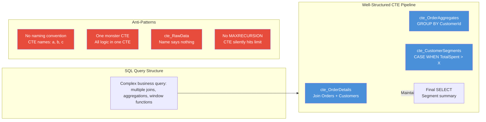
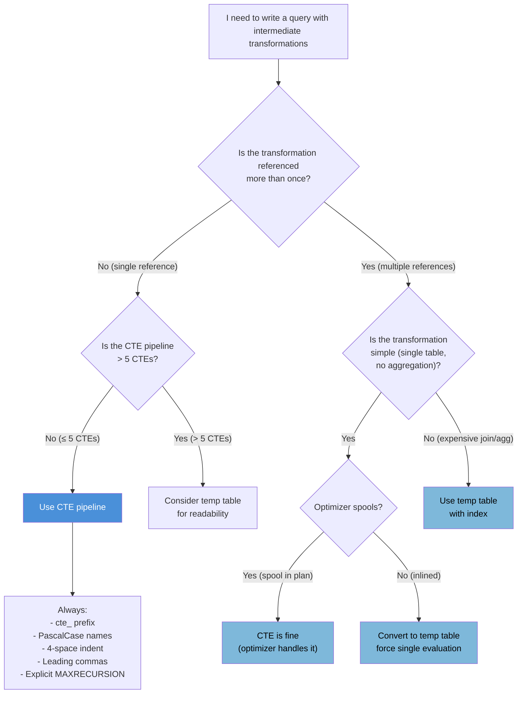

## Navigation

**Domain:** [[8 — Databases]] > **Group:** SQL CTEs & Recursive Queries
**Previous:** [[8.198 — CTE Performance — Plan Inlining vs Spooling]] | **Next:** [[8.200 — PostgreSQL — WITH RECURSIVE Syntax Differences]]

### Prerequisites

- [[8.176 — Common Table Expressions — Fundamentals]] — Understanding CTE syntax is required before discussing naming and best practices.
- [[8.178 — CTE vs Subquery — Readability and Performance]] — The decision of when to use a CTE instead of a subquery is a best-practice consideration.
- [[8.179 — CTE vs Temp Table — When to Use Each]] — A key best practice decision is when a CTE is the right tool vs when to use a temp table.

### Where This Fits

CTEs are one of the most misused SQL features in production .NET applications. They are simultaneously overused (nested CTEs that should be temp tables) and underused (complex subqueries that should be CTEs for readability). This note establishes the naming conventions, structural rules, and decision criteria that a backend engineer needs to write CTEs that are readable, maintainable, and performant. In an interview, CTE best practices reveal a candidate's experience with production code reviews: the candidate who can explain why `cte_` prefix helps debugging, when a CTE should become a temp table, and why MAXRECURSION must always be explicit is the candidate who has maintained a large SQL codebase. In code reviews at work, CTE naming and structure are the most commented-on SQL patterns — inconsistent naming and poorly structured CTEs reduce the team's ability to spot logic errors.

---

## Core Mental Model

A CTE is a named subquery that exists for the duration of a single statement. The best practice model treats each CTE as a **well-named intermediate transformation** — a step in a pipeline that transforms data from one shape to another. The pipeline analogy is critical: each CTE should do exactly one transformation (filter, aggregate, join, window function), and the CTE name should describe what the transformation produces, not what it consumes.

Naming conventions are the single most impactful practice. A CTE name like `cte_HighValueOrders` immediately tells the reader: this is a CTE (prefix `cte_`), it contains orders (the entity), and it's filtered to high-value ones (the transformation). Without this convention, a CTE named `Orders` in the same file could be confused with the table Orders, and a CTE named `cte1` or `CustOrd` conveys nothing.

The structure rule: `WITH` on its own line, CTE body indented, and the final SELECT separated by a blank line. This visual structure makes CTEs skimmable. The comma between multiple CTEs goes at the start of the next CTE's line (leading comma) for easier reordering.

The materialization decision: a CTE is not a temp table. Assuming it is materialized is the #1 performance anti-pattern. The best practice is to default to CTEs for single-use transformations and switch to temp tables when: (a) the CTE is referenced multiple times and the optimizer does not spool it, (b) the transformation is expensive and the result is needed for multiple subsequent queries, or (c) the result needs an index for efficient access.

The recursive MAXRECURSION rule: always set it explicitly. Never rely on the default of 100. If the recursion depth is known, set it to that value plus a 10-20% safety margin. If recursion depth is conceptually unbounded, set `MAXRECURSION 0` only when cycle detection is in place.

### Classification

CTE best practices span the SQL coding domain — they are style and convention rules, not database engine features. However, they interact with the query optimizer's behavior (inlining vs spooling). The practices are database-agnostic (SQL Server, PostgreSQL, MySQL all support CTEs), though PostgreSQL's `MATERIALIZED`/`NOT MATERIALIZED` hints add a dimension not present in SQL Server.



### Key Properties

|Property|Best Practice|Rationale|
|---|---|---|
|Naming prefix|`cte_` prefix (optional but recommended)|Distinguishes CTEs from tables in FROM clauses and JOIN conditions|
|Naming style|PascalCase for multi-word names|`cte_HighValueOrders` not `cte_high_value_orders`|
|Single CTE limit|One transformation per CTE|Keeps each CTE testable and reviewable individually|
|Total CTE count|≤ 5 per query (recommended)|More than 5 → consider temp tables for clarity|
|CTE body indentation|Indent 4 spaces from WITH keyword|Visually groups CTE definition as a block|
|MAXRECURSION|Always set explicitly (even for non-recursive)|Future-proofing: someone may add recursion later|
|Column aliasing|Always name columns explicitly in CTE header|Avoids ambiguous column references when joining|
|Comments|Brief comment per CTE explaining transformation|Enables team to maintain without reverse-engineering logic|

---

## Deep Mechanics

### How the Engine Executes This

Best practices do not affect execution mechanics — the optimizer handles a well-named CTE the same as a poorly-named one. However, structure decisions (where you put WHERE clauses, how you chain CTEs) can affect the optimizer's ability to:

1. **Predicate pushdown:** Filtering in earlier CTEs allows the optimizer to push predicates into base table scans. A CTE that filters rows before a JOIN reduces the join cardinality and may change the join strategy (Hash Match → Nested Loops).
2. **Join reordering:** The optimizer can reorder joins across CTE boundaries when CTEs are inlined. This is transparent but means putting a restrictive CTE first may help the optimizer choose a better join order.
3. **Materialization:** The optimizer decides whether to spool a CTE (SQL Server) or materialize it (PostgreSQL default). The structure of the CTE (expensive vs cheap, single vs multiple references) influences this decision.

From a code maintenance perspective, the naming and structure rules exist to make the SQL readable enough that logic errors become visible. A CTE named `cte_OrdersWithMissingShipDate` that does not filter on `ShipDate IS NULL` is a bug that is immediately obvious during code review.

### SQL Visibility

**NOTE:** NULL is not a value — it is the absence of a value. SQL uses three-valued logic (TRUE, FALSE, UNKNOWN). CTE names that convey filter intent help spot NULL-related bugs. If a CTE is named `cte_ActiveCustomers` but does not filter `WHERE IsActive = 1` or handle `IsActive = NULL` correctly, the name exposes the gap.

```sql
-- ============================================================
-- Schema — standard business tables
-- ============================================================
CREATE TABLE dbo.Orders (
    OrderId       INT NOT NULL IDENTITY(1,1),
    CustomerId    INT NOT NULL,
    OrderDate     DATETIME2 NOT NULL,
    TotalAmount   DECIMAL(18,2) NOT NULL,
    Status        VARCHAR(20) NOT NULL,
    ShipDate      DATETIME2 NULL,
    CONSTRAINT PK_Orders PRIMARY KEY (OrderId)
);

CREATE TABLE dbo.Customers (
    CustomerId    INT NOT NULL IDENTITY(1,1),
    Name          VARCHAR(100) NOT NULL,
    Email         VARCHAR(200) NOT NULL,
    Tier          VARCHAR(20) NOT NULL,
    IsActive      BIT NOT NULL DEFAULT 1,
    CreatedDate   DATE NOT NULL,
    CONSTRAINT PK_Customers PRIMARY KEY (CustomerId)
);

CREATE TABLE dbo.Payments (
    PaymentId     INT NOT NULL IDENTITY(1,1),
    OrderId       INT NOT NULL,
    Amount        DECIMAL(18,2) NOT NULL,
    PaymentDate   DATETIME2 NOT NULL,
    PaymentMethod VARCHAR(50) NOT NULL,
    CONSTRAINT PK_Payments PRIMARY KEY (PaymentId)
);

-- ============================================================
-- Good Pattern — Well-Structured CTE Pipeline
-- ============================================================
-- Business question: show monthly revenue by customer tier
-- with voluntary churn risk (no orders in 60+ days)

WITH
cte_OrderDetails AS (
    -- Join orders with customer info, filter to completed/delivered
    SELECT
        o.OrderId,
        o.CustomerId,
        c.Name AS CustomerName,
        c.Tier,
        o.OrderDate,
        o.TotalAmount,
        DATEDIFF(day, o.OrderDate, GETDATE()) AS DaysSinceOrder
    FROM dbo.Orders AS o
    INNER JOIN dbo.Customers AS c
        ON c.CustomerId = o.CustomerId
    WHERE o.Status IN ('Delivered', 'Shipped')
),
cte_CustomerMonthly AS (
    -- Aggregate order data by customer per month
    SELECT
        CustomerId,
        CustomerName,
        Tier,
        DATETRUNC(month, OrderDate) AS OrderMonth,
        COUNT(*) AS OrderCount,
        SUM(TotalAmount) AS MonthlyRevenue
    FROM cte_OrderDetails
    GROUP BY CustomerId, CustomerName, Tier, DATETRUNC(month, OrderDate)
),
cte_CustomerSummary AS (
    -- Customer-level metrics: total revenue, last order, days since last
    SELECT
        CustomerId,
        CustomerName,
        Tier,
        SUM(MonthlyRevenue) AS TotalRevenue,
        MAX(OrderMonth) AS LastOrderMonth,
        DATEDIFF(day, MAX(OrderMonth), GETDATE()) AS DaysSinceLastOrder,
        CASE
            WHEN MAX(OrderMonth) < DATEADD(month, -2, GETDATE()) THEN 'Churn Risk'
            WHEN SUM(MonthlyRevenue) > 10000 THEN 'High Value'
            ELSE 'Active'
        END AS Segment
    FROM cte_CustomerMonthly
    GROUP BY CustomerId, CustomerName, Tier
)
SELECT
    Segment,
    Tier,
    COUNT(*) AS CustomerCount,
    AVG(TotalRevenue) AS AvgRevenue
FROM cte_CustomerSummary
GROUP BY Segment, Tier
ORDER BY Segment, Tier;

-- ============================================================
-- Bad Pattern — Poorly Structured CTEs
-- ============================================================
-- What's wrong: unclear names, multiple transformations per CTE,
-- no indentation, ambiguous column references

WITH
a AS (  -- what is "a"? no one knows
    SELECT o.OrderId, o.CustomerId, c.Name, c.Tier,
           o.OrderDate, o.TotalAmount
    FROM Orders o JOIN Customers c ON c.CustomerId = o.CustomerId
    WHERE o.Status IN ('Delivered', 'Shipped')
),
b AS (  -- what is "b"? join + aggregate + window in one CTE
    SELECT *, ROW_NUMBER() OVER(PARTITION BY CustomerId ORDER BY OrderDate DESC) AS rn,
           SUM(TotalAmount) OVER(PARTITION BY CustomerId) AS TotalSpent
    FROM a
)
-- ... reader has to reverse-engineer the entire query to understand what "b" contains
```

```csharp
// EF Core — Working with CTE best practices in application code
// EF Core generates SQL with CTEs for some query patterns.
// Developers cannot control CTE naming (EF Core generates internal names),
// but they can use raw SQL for production CTEs where readability matters.

public class MonthlyRevenueReport
{
    public string Segment { get; set; } = string.Empty;
    public string Tier { get; set; } = string.Empty;
    public int CustomerCount { get; set; }
    public decimal AvgRevenue { get; set; }
}

// Best practice: keep the CTE query as a named constant or stored procedure
// for testability and code review

public const string MonthlyRevenueByTierSql = @"
WITH
cte_OrderDetails AS (
    SELECT
        o.OrderId, o.CustomerId, c.Name AS CustomerName,
        c.Tier, o.OrderDate, o.TotalAmount,
        DATEDIFF(day, o.OrderDate, GETDATE()) AS DaysSinceOrder
    FROM dbo.Orders AS o
    INNER JOIN dbo.Customers AS c ON c.CustomerId = o.CustomerId
    WHERE o.Status IN ('Delivered', 'Shipped')
),
cte_CustomerMonthly AS (
    SELECT CustomerId, CustomerName, Tier,
           DATETRUNC(month, OrderDate) AS OrderMonth,
           COUNT(*) AS OrderCount, SUM(TotalAmount) AS MonthlyRevenue
    FROM cte_OrderDetails
    GROUP BY CustomerId, CustomerName, Tier, DATETRUNC(month, OrderDate)
),
cte_CustomerSummary AS (
    SELECT CustomerId, CustomerName, Tier,
           SUM(MonthlyRevenue) AS TotalRevenue,
           MAX(OrderMonth) AS LastOrderMonth,
           DATEDIFF(day, MAX(OrderMonth), GETDATE()) AS DaysSinceLastOrder,
           CASE
               WHEN MAX(OrderMonth) < DATEADD(month, -2, GETDATE()) THEN 'Churn Risk'
               WHEN SUM(MonthlyRevenue) > 10000 THEN 'High Value'
               ELSE 'Active'
           END AS Segment
    FROM cte_CustomerMonthly
    GROUP BY CustomerId, CustomerName, Tier
)
SELECT Segment, Tier, COUNT(*) AS CustomerCount, AVG(TotalRevenue) AS AvgRevenue
FROM cte_CustomerSummary
GROUP BY Segment, Tier
ORDER BY Segment, Tier;";

// EF Core — call via FromSqlRaw
public async Task<List<MonthlyRevenueReport>> GetMonthlyRevenueReportAsync(
    CancellationToken cancellationToken = default)
{
    return await dbContext.Database
        .SqlQueryRaw<MonthlyRevenueReport>(MonthlyRevenueByTierSql)
        .ToListAsync(cancellationToken);
}
```

**Generated SQL (from EF Core logs):**

```sql
-- The SQL passed to FromSqlRaw is used verbatim.
-- No EF Core LINQ translation occurs.
```

```csharp
// Dapper — Best practice: keep CTE SQL as constants or in .sql files
public static class ReportingQueries
{
    public const string MonthlyRevenueByTier = @"
WITH
cte_OrderDetails AS (
    ...  -- same CTE as above
)
SELECT Segment, Tier, COUNT(*) AS CustomerCount, AVG(TotalRevenue) AS AvgRevenue
FROM cte_CustomerSummary
GROUP BY Segment, Tier
ORDER BY Segment, Tier;";
}

public async Task<IReadOnlyList<MonthlyRevenueReport>> GetReportAsync(
    CancellationToken cancellationToken = default)
{
    await using var connection = _connectionFactory.Create();
    var results = await connection.QueryAsync<MonthlyRevenueReport>(
        new CommandDefinition(
            ReportingQueries.MonthlyRevenueByTier,
            cancellationToken: cancellationToken));
    return results.AsList();
}
```

### Execution Plan Analysis

Best practices do not directly change the execution plan — they affect readability and maintainability. However, some practices indirectly affect performance:

- **Filtering early in the CTE pipeline** (in `cte_OrderDetails`) enables predicate pushdown to the base table scan/seek, potentially reducing the number of rows entering joins.
- **Using `TOP` or `DISTINCT` in a CTE** forces a spool (SQL Server may introduce a Sort + Distinct Spool), impacting performance. Best practice: only use DISTINCT or TOP when the business logic requires it.
- **CTEs with ORDER BY** (without TOP) produce wasted sort operations — ORDER BY in a CTE is meaningless unless paired with TOP or OFFSET/FETCH.

```
For the well-structured pipeline:
[Index Seek (IX_Orders_Status)] → [Nested Loops Join → Customers] 
    → [Compute Scalar (DaysSince)]
        → [Sort (GROUP BY CustomerId, Month)]
            → [Compute Scalar (Month)]
                → [Stream Aggregate]
                    → [Sort (GROUP BY CustomerId)]
                        → [Compute Scalar (Segment)]
                            → [Stream Aggregate]
                                → [Sort (GROUP BY Segment, Tier)]
                                    → [SELECT]

Cost distribution: index seek (~5%), joins (~20%), sorts (~60%), aggregates (~15%)
```

### Failure Modes

**Poorly named CTE causes silent logic error:** A CTE named `cte_ActiveCustomers` that does not filter `IsActive = 1` because the developer forgot the WHERE clause. A reviewer who trusts the name does not verify the logic. The bug reaches production.

**Ambiguous column names across chained CTEs:** Two CTEs in a chain both have a column named `TotalAmount` — the first is total per order, the second is total per customer. A join that uses `TotalAmount` without table alias picks the wrong one.

**No MAXRECURSION on recursive CTE:** A recursive CTE that should have `MAXRECURSION 0` (hierarchy with unknown depth) has no option. At 101 levels, it fails with error 530.

---

## Production Patterns and Implementation

### Primary SQL Implementation

**Pattern 1 — Naming Convention: cte_Prefix + PascalCase + Descriptive Noun Phrase**

```sql
-- Good names (describe what the CTE PRODUCES, not what it consumes)
WITH
cte_PaidOrders AS (
    -- Orders that have at least one confirmed payment
    SELECT o.OrderId, o.CustomerId, o.TotalAmount, o.OrderDate
    FROM dbo.Orders o
    WHERE EXISTS (SELECT 1 FROM dbo.Payments p WHERE p.OrderId = o.OrderId AND p.Amount > 0)
),
cte_CustomerRevenue AS (
    -- Revenue aggregated per customer (total of paid orders)
    SELECT CustomerId, SUM(TotalAmount) AS TotalRevenue, MAX(OrderDate) AS LastOrderDate
    FROM cte_PaidOrders
    GROUP BY CustomerId
),
cte_TopCustomers AS (
    -- Customers with revenue above $10K threshold
    SELECT CustomerId, TotalRevenue, LastOrderDate
    FROM cte_CustomerRevenue
    WHERE TotalRevenue > 10000
)
SELECT ...
FROM cte_TopCustomers tc
INNER JOIN dbo.Customers c ON c.CustomerId = tc.CustomerId;

-- Bad names
-- cte1, cte_data, cte_temp, cte_final — no information
-- ord, cust, rev — too terse, no distinction from aliases
-- RawData, Step1, Step2 — does not describe the transformation
```

**Pattern 2 — Leading Comma Style for Multiple CTEs:**

```sql
-- Preferred: leading comma on each CTE after the first
-- Easier to reorder CTEs (just move the line, no trailing comma to fix)
WITH
cte_First AS (
    SELECT ...
),
cte_Second AS (
    SELECT ... FROM cte_First ...
),
cte_Third AS (
    SELECT ... FROM cte_Second ...
)
SELECT ... FROM cte_Third;

-- Alternative: trailing comma (more common, harder to reorder)
WITH
cte_First AS (
    SELECT ...
),
cte_Second AS (
    SELECT ...
),
cte_Third AS (
    SELECT ...
)
SELECT ... FROM cte_Third;
```

**Pattern 3 — Explicit Column Aliases in CTE Header:**

```sql
-- Good: column aliases in the CTE header (before AS)
WITH
cte_OrderMetrics (OrderId, CustomerId, OrderCount, TotalSpent) AS (
    SELECT
        o.OrderId,
        o.CustomerId,
        COUNT(*) AS OrderCount,
        SUM(oi.Quantity * oi.UnitPrice) AS TotalSpent
    FROM dbo.Orders o
    INNER JOIN dbo.OrderItems oi ON oi.OrderId = o.OrderId
    GROUP BY o.OrderId, o.CustomerId
)
SELECT OrderId, CustomerId, OrderCount, TotalSpent
FROM cte_OrderMetrics
WHERE OrderCount > 1;

-- Bad: no column aliases in header, relies on SELECT list aliases
WITH
cte_OrderMetrics AS (
    SELECT o.OrderId, o.CustomerId,
           COUNT(*) AS OrderCount,
           SUM(oi.Quantity * oi.UnitPrice) AS TotalSpent
    FROM dbo.Orders o
    INNER JOIN dbo.OrderItems oi ON oi.OrderId = o.OrderId
    GROUP BY o.OrderId, o.CustomerId
)
-- OK here, but if the SELECT list changes, downstream queries break
```

**Pattern 4 — Recursive CTE with Explicit MAXRECURSION:**

```sql
-- Good: MAXRECURSION explicitly set
WITH cte_OrgChart AS (
    SELECT e.EmployeeId, e.ManagerId, e.Name, 0 AS LevelDepth
    FROM dbo.Employee e WHERE e.ManagerId IS NULL
    UNION ALL
    SELECT e.EmployeeId, e.ManagerId, e.Name, cte.LevelDepth + 1
    FROM cte_OrgChart cte
    INNER JOIN dbo.Employee e ON e.ManagerId = cte.EmployeeId
)
SELECT * FROM cte_OrgChart
OPTION (MAXRECURSION 50);  -- or MAXRECURSION 0 depending on requirements

-- Bad: no MAXRECURSION, relies on default of 100
WITH cte_OrgChart AS (
    SELECT e.EmployeeId, e.ManagerId, e.Name, 0 AS LevelDepth
    FROM dbo.Employee e WHERE e.ManagerId IS NULL
    UNION ALL
    SELECT e.EmployeeId, e.ManagerId, e.Name, cte.LevelDepth + 1
    FROM cte_OrgChart cte
    INNER JOIN dbo.Employee e ON e.ManagerId = cte.EmployeeId
)
SELECT * FROM cte_OrgChart;
-- If org chart depth exceeds 100: Error 530 at 3 AM
```

**Pattern 5 — CTE with Comment Header:**

```sql
-- ============================================================
-- Purpose: Monthly revenue report by customer tier with churn risk
-- Parameters: none (report covers all active customers)
-- Dependencies: Orders, Customers tables
-- Revision: 2026-06-25 — Initial version
-- ============================================================
WITH
-- Step 1: Filter to paid orders with customer info
cte_OrderDetails AS (
    SELECT o.OrderId, o.CustomerId, c.Name AS CustomerName, c.Tier,
           o.OrderDate, o.TotalAmount
    FROM dbo.Orders o
    INNER JOIN dbo.Customers c ON c.CustomerId = o.CustomerId
    WHERE o.Status IN ('Delivered', 'Shipped')
),
-- Step 2: Aggregate to monthly buckets per customer
cte_Monthly AS (
    SELECT CustomerId, CustomerName, Tier,
           DATETRUNC(month, OrderDate) AS OrderMonth,
           COUNT(*) AS OrderCount,
           SUM(TotalAmount) AS MonthlyRevenue
    FROM cte_OrderDetails
    GROUP BY CustomerId, CustomerName, Tier, DATETRUNC(month, OrderDate)
),
-- Step 3: Customer-level metrics and segmentation
cte_Summary AS (
    SELECT CustomerId, CustomerName, Tier,
           SUM(MonthlyRevenue) AS TotalRevenue,
           MAX(OrderMonth) AS LastOrderMonth,
           DATEDIFF(day, MAX(OrderMonth), GETDATE()) AS DaysSinceLastOrder,
           CASE
               WHEN MAX(OrderMonth) < DATEADD(month, -2, GETDATE()) THEN 'Churn Risk'
               WHEN SUM(MonthlyRevenue) > 10000 THEN 'High Value'
               ELSE 'Active'
           END AS Segment
    FROM cte_Monthly
    GROUP BY CustomerId, CustomerName, Tier
)
-- Final: segment summary by tier
SELECT Segment, Tier, COUNT(*) AS CustomerCount, AVG(TotalRevenue) AS AvgRevenue
FROM cte_Summary
GROUP BY Segment, Tier
ORDER BY Segment, Tier;
```

**Pattern 6 — CTE vs Temp Table Decision (Inline Decision):**

```sql
-- Use CTE when:
-- 1. The CTE is referenced only once in the outer query
-- 2. The CTE transformation is simple (single table, no aggregation)
-- 3. The query is a one-off report or ad-hoc analysis
-- 4. The CTE is part of a pipeline where each step is a simple transformation

-- Use Temp Table when:
-- 1. The CTE is referenced multiple times and the optimizer does not spool it
-- 2. The result needs an index for the outer query's filter or join
-- 3. The transformation is expensive and the result is needed for subsequent queries
-- 4. The CTE pipeline exceeds 5 CTEs (readability threshold)
-- 5. Debugging: you need to inspect the intermediate result

-- Example: temp table for multi-reference scenario
WITH cte_Expensive AS (
    SELECT c.CustomerId, SUM(o.TotalAmount) AS TotalSpent
    FROM dbo.Customers c
    INNER JOIN dbo.Orders o ON o.CustomerId = c.CustomerId
    GROUP BY c.CustomerId
)
SELECT CustomerId, TotalSpent
INTO #CustomerSpend
FROM cte_Expensive
OPTION (MAXDOP 4);  -- control parallelism during materialization

CREATE INDEX IX_Temp_TotalSpent ON #CustomerSpend(TotalSpent);

-- Now use #CustomerSpend in multiple queries
SELECT 'High' AS Segment, COUNT(*) AS Count
FROM #CustomerSpend WHERE TotalSpent > 10000
UNION ALL
SELECT 'Medium', COUNT(*)
FROM #CustomerSpend WHERE TotalSpent BETWEEN 1000 AND 10000;

DROP TABLE #CustomerSpend;
```

**Pattern 7 — CTE for Code Readability in Complex Logic:**

```sql
-- Complex query WITHOUT CTE (hard to read):
SELECT
    DATETRUNC(month, o.OrderDate) AS OrderMonth,
    c.Tier,
    COUNT(DISTINCT o.CustomerId) AS ActiveCustomers,
    SUM(o.TotalAmount) / NULLIF(COUNT(DISTINCT o.CustomerId), 0) AS RevenuePerCustomer,
    LAG(SUM(o.TotalAmount), 1) OVER(ORDER BY DATETRUNC(month, o.OrderDate)) AS PrevMonthRevenue,
    SUM(o.TotalAmount) - LAG(SUM(o.TotalAmount), 1) OVER(ORDER BY DATETRUNC(month, o.OrderDate)) AS RevenueChange,
    CASE
        WHEN LAG(SUM(o.TotalAmount), 1) OVER(ORDER BY DATETRUNC(month, o.OrderDate)) IS NULL THEN NULL
        ELSE (SUM(o.TotalAmount) - LAG(SUM(o.TotalAmount), 1) OVER(ORDER BY DATETRUNC(month, o.OrderDate)))
             / NULLIF(LAG(SUM(o.TotalAmount), 1) OVER(ORDER BY DATETRUNC(month, o.OrderDate)), 0) * 100
    END AS RevenueChangePercent
FROM dbo.Orders o
INNER JOIN dbo.Customers c ON c.CustomerId = o.CustomerId
WHERE o.Status IN ('Delivered', 'Shipped')
GROUP BY DATETRUNC(month, o.OrderDate), c.Tier
ORDER BY OrderMonth, Tier;

-- Same query WITH CTEs (easier to understand):
WITH
cte_Orders AS (
    SELECT o.OrderId, o.CustomerId, o.TotalAmount, o.OrderDate, c.Tier
    FROM dbo.Orders o
    INNER JOIN dbo.Customers c ON c.CustomerId = o.CustomerId
    WHERE o.Status IN ('Delivered', 'Shipped')
),
cte_MonthlyTier AS (
    SELECT
        DATETRUNC(month, OrderDate) AS OrderMonth,
        Tier,
        COUNT(DISTINCT CustomerId) AS ActiveCustomers,
        SUM(TotalAmount) AS TotalRevenue
    FROM cte_Orders
    GROUP BY DATETRUNC(month, OrderDate), Tier
)
SELECT
    OrderMonth,
    Tier,
    ActiveCustomers,
    TotalRevenue / NULLIF(ActiveCustomers, 0) AS RevenuePerCustomer,
    LAG(TotalRevenue, 1) OVER(PARTITION BY Tier ORDER BY OrderMonth) AS PrevMonthRevenue,
    TotalRevenue - LAG(TotalRevenue, 1) OVER(PARTITION BY Tier ORDER BY OrderMonth) AS RevenueChange,
    CASE
        WHEN LAG(TotalRevenue, 1) OVER(PARTITION BY Tier ORDER BY OrderMonth) IS NULL THEN NULL
        ELSE (TotalRevenue - LAG(TotalRevenue, 1) OVER(PARTITION BY Tier ORDER BY OrderMonth))
             / NULLIF(LAG(TotalRevenue, 1) OVER(PARTITION BY Tier ORDER BY OrderMonth), 0) * 100
    END AS RevenueChangePercent
FROM cte_MonthlyTier
ORDER BY OrderMonth, Tier;
```

### EF Core Implementation

```csharp
// EF Core — Best practices for CTE usage in .NET

// 1. Keep CTE SQL in named constants or resource files
public static class ReportQueries
{
    public const string MonthlyRevenueReport = @"
WITH
cte_OrderDetails AS (
    SELECT o.OrderId, o.CustomerId, c.Name AS CustomerName,
           c.Tier, o.OrderDate, o.TotalAmount
    FROM dbo.Orders o
    INNER JOIN dbo.Customers c ON c.CustomerId = o.CustomerId
    WHERE o.Status IN ('Delivered', 'Shipped')
)
SELECT CustomerId, Tier, SUM(TotalAmount) AS TotalRevenue
FROM cte_OrderDetails
GROUP BY CustomerId, Tier;";
}

// 2. Use keyless entities for CTE results
public class RevenueByCustomer
{
    public int CustomerId { get; set; }
    public string Tier { get; set; } = string.Empty;
    public decimal TotalRevenue { get; set; }
}

// In DbContext.OnModelCreating:
modelBuilder.Entity<RevenueByCustomer>()
    .HasNoKey()
    .ToView(null);

// 3. Use FromSqlRaw (never FromSqlInterpolated for CTE strings)
public async Task<List<RevenueByCustomer>> GetRevenueReportAsync(
    CancellationToken ct)
{
    const string sql = ReportQueries.MonthlyRevenueReport;
    
    return await dbContext.Database
        .SqlQueryRaw<RevenueByCustomer>(sql)
        .ToListAsync(ct);
}

// 4. For CTE queries in EF Core Interceptor (to observe generated SQL),
//    register a logging interceptor
public class CteLoggingInterceptor : IDbCommandInterceptor
{
    public void CommandText(DbCommand command, CommandEventArgs e)
    {
        if (command.CommandText.Contains("WITH "))
        {
            Debug.WriteLine($"CTE Query: {command.CommandText}");
        }
    }
}
```

### Dapper Implementation

```csharp
// Dapper — Best practices for CTEs

// 1. Centralize CTE queries in a static query library
public static class CteQueries
{
    public const string CustomerSegmentation = @"
WITH
cte_ActiveCustomers AS (
    SELECT CustomerId, Name, Email, Tier
    FROM dbo.Customers
    WHERE IsActive = 1
),
cte_OrderStats AS (
    SELECT
        c.CustomerId,
        COUNT(o.OrderId) AS OrderCount,
        SUM(o.TotalAmount) AS TotalSpent,
        MAX(o.OrderDate) AS LastOrderDate
    FROM cte_ActiveCustomers c
    LEFT JOIN dbo.Orders o ON o.CustomerId = c.CustomerId
    GROUP BY c.CustomerId
)
SELECT * FROM cte_OrderStats;";
}

// 2. Use CommandDefinition for cancellation support
public async Task<IReadOnlyList<CustomerOrderStats>> GetCustomerSegmentationAsync(
    CancellationToken cancellationToken = default)
{
    await using var connection = _connectionFactory.Create();
    var results = await connection.QueryAsync<CustomerOrderStats>(
        new CommandDefinition(
            CteQueries.CustomerSegmentation,
            cancellationToken: cancellationToken));
    return results.AsList();
}

// 3. For recursive CTEs, always pass MAXRECURSION as a comment hint
// (SQL Server does not support parameterized MAXRECURSION)
public const string OrgChartSql = @"
WITH cte_Org AS (
    SELECT EmployeeId, ManagerId, Name, 0 AS Level
    FROM Employee WHERE ManagerId IS NULL
    UNION ALL
    SELECT e.EmployeeId, e.ManagerId, e.Name, cte.Level + 1
    FROM cte_Org cte INNER JOIN Employee e ON e.ManagerId = cte.EmployeeId
)
SELECT * FROM cte_Org
OPTION (MAXRECURSION 50);  -- explicitly set, not default";

// 4. For temp table fallback from CTE, use two separate QueryAsync calls
public async Task<IReadOnlyList<CustomerSegment>> GetCustomerSegmentsWithTempAsync(
    CancellationToken cancellationToken = default)
{
    await using var connection = _connectionFactory.Create();
    
    // Step 1: Materialize CTE to temp table
    await connection.ExecuteAsync(new CommandDefinition(@"
        WITH cte_Stats AS (
            SELECT CustomerId, COUNT(*) AS OrderCount, SUM(TotalAmount) AS TotalSpent
            FROM Orders GROUP BY CustomerId
        )
        SELECT CustomerId, OrderCount, TotalSpent
        INTO #TempStats
        FROM cte_Stats
        OPTION (MAXDOP 4)",
        cancellationToken: cancellationToken));
    
    // Step 2: Query from temp table multiple times
    var results = await connection.QueryAsync<CustomerSegment>(
        new CommandDefinition(@"
            SELECT 'High' AS Segment, COUNT(*) AS Count
            FROM #TempStats WHERE TotalSpent > 10000
            UNION ALL
            SELECT 'Medium', COUNT(*)
            FROM #TempStats WHERE TotalSpent BETWEEN 1000 AND 10000
            UNION ALL
            SELECT 'Low', COUNT(*)
            FROM #TempStats WHERE TotalSpent < 1000",
            cancellationToken: cancellationToken));
    
    return results.AsList();
}
```

### Configuration and Wiring

```csharp
// Program.cs — No CTE-specific configuration exists
// All configuration is for the database connection

builder.Services.AddDbContext<ReportingDbContext>(options =>
    options.UseSqlServer(
        builder.Configuration.GetConnectionString("ReportingDb"),
        sqlOptions =>
        {
            sqlOptions.EnableRetryOnFailure(3);
            sqlOptions.CommandTimeout(120);  // longer timeout for CTE-heavy reports
        }));

// To enforce SQL code style (including CTE naming), add a SQL linter to CI:
// - SQL Server: SQLPrompt, Redgate SQL Code Guard
// - .NET: SqlFormatter (NuGet package) for automated formatting
// - GitHub Actions: use sqlfluff for CI validation

// Example: Register a SQL formatter service for code review
public interface ISqlFormatter
{
    string Format(string sql);
}

public class SqlFormatterService : ISqlFormatter
{
    public string Format(string sql)
    {
        // Use SqlFormatter.NET or similar library
        // Enforce: CTE prefix, leading commas, MAXRECURSION, 4-space indent
        return SqlFormatterNET.Format(sql, new FormatOptions
        {
            IndentationSize = 4,
            UppercaseKeywords = true,
            NewLineBeforeJoin = true,
            NewLineBeforeWhere = true
        });
    }
}
```

### SQL Server vs PostgreSQL Differences

```sql
-- PostgreSQL — same best practices apply with one addition:
-- Always decide between MATERIALIZED and NOT MATERIALIZED

-- For single-reference CTEs where predicate pushdown is important:
WITH cte_active_orders AS NOT MATERIALIZED (
    SELECT order_id, customer_id, total_amount, order_date
    FROM orders
    WHERE status IN ('Delivered', 'Shipped')
)
SELECT * FROM cte_active_orders
WHERE order_date >= '2026-01-01';
-- NOT MATERIALIZED: predicate pushdown (like SQL Server inline)

-- For multi-reference CTEs where single evaluation is more important:
WITH cte_customer_stats AS MATERIALIZED (
    SELECT customer_id, COUNT(*) AS order_count, SUM(total_amount) AS total_spent
    FROM orders
    GROUP BY customer_id
)
SELECT 'High' AS segment, COUNT(*)
FROM cte_customer_stats WHERE total_spent > 10000
UNION ALL
SELECT 'Medium', COUNT(*)
FROM cte_customer_stats WHERE total_spent BETWEEN 1000 AND 10000;
-- MATERIALIZED (default): single evaluation, no predicate pushdown

-- PostgreSQL naming convention: snake_case instead of PascalCase
-- cte_active_orders instead of cte_ActiveOrders
```

---

## Gotchas and Production Pitfalls

### Pitfall 1 — CTE Named Same as Table Name

**Pitfall:** A CTE is named identically to a table in the same database, causing confusion and potential scope resolution errors.

```sql
-- ❌ Wrong — CTE named 'Orders' conflicts with table
WITH Orders AS (
    SELECT OrderId, CustomerId, TotalAmount
    FROM dbo.Orders  -- Which Orders? The table or the CTE?
    WHERE Status = 'Delivered'
)
SELECT * FROM Orders;  -- This references the CTE, not the table
-- If someone later adds a JOIN to dbo.Orders inside the CTE body,
-- it will compile, but the reader is confused about what "Orders" means
-- in the CTE definition itself (self-reference? no — it resolves to the table)

-- ✅ Fix — prefix with cte_
WITH cte_DeliveredOrders AS (
    SELECT OrderId, CustomerId, TotalAmount
    FROM dbo.Orders
    WHERE Status = 'Delivered'
)
SELECT * FROM cte_DeliveredOrders;
```

**Symptom:** Confusion during code review. A developer unfamiliar with the CTE tries to modify the query and accidentally references the wrong object. In SSMS, intellisense shows two objects named "Orders".

**Cost of not fixing:** A production incident where a CTE named `Orders` shadows the real Orders table, and a developer adds `INNER JOIN dbo.Payments p ON p.OrderId = Orders.OrderId` inside the CTE not realizing `Orders` now refers to the CTE's output (already filtered), not the full table. The bug causes payments for non-delivered orders to be excluded from the report.

### Pitfall 2 — No MAXRECURSION on a CTE That Later Becomes Recursive

**Pitfall:** A CTE is written as non-recursive (no `UNION ALL` self-reference). Later, a developer adds a recursive UNION ALL branch but forgets to add `OPTION (MAXRECURSION N)`.

```sql
-- ❌ Wrong — originally non-recursive, later made recursive without MAXRECURSION
WITH cte_OrgChart AS (
    -- Anchor
    SELECT EmployeeId, ManagerId, Name, 0 AS Level
    FROM dbo.Employee
    WHERE ManagerId IS NULL
    UNION ALL
    -- Recursive (added later by another developer)
    SELECT e.EmployeeId, e.ManagerId, e.Name, cte.Level + 1
    FROM cte_OrgChart cte
    INNER JOIN dbo.Employee e ON e.ManagerId = cte.EmployeeId
    -- Note: no OPTION(MAXRECURSION) — relies on default of 100
)
SELECT * FROM cte_OrgChart;
-- If org depth > 100: Error 530 at 3 AM

-- ✅ Fix — always add MAXRECURSION to recursive CTEs
WITH cte_OrgChart AS (
    SELECT EmployeeId, ManagerId, Name, 0 AS Level
    FROM dbo.Employee WHERE ManagerId IS NULL
    UNION ALL
    SELECT e.EmployeeId, e.ManagerId, e.Name, cte.Level + 1
    FROM cte_OrgChart cte INNER JOIN dbo.Employee e ON e.ManagerId = cte.EmployeeId
)
SELECT * FROM cte_OrgChart
OPTION (MAXRECURSION 50);
```

**Symptom:** A query that has been running fine for months suddenly fails with "The maximum recursion 100 has been exhausted" after a data load that increased org chart depth.

**Cost of not fixing:** The HR application's org chart tool fails during annual re-organization. The error occurs at 8 AM Monday when all managers view the new org chart. The help desk receives 200 tickets before the issue is diagnosed.

### Pitfall 3 — CTE Nested Within Another CTE Is Not Allowed (Syntax Error)

**Pitfall:** A developer tries to define a CTE inside another CTE.

```sql
-- ❌ Wrong — nested CTEs are not valid SQL
WITH
cte_Outer AS (
    WITH cte_Inner AS (  -- Syntax error! CTE inside CTE is not valid
        SELECT OrderId, CustomerId FROM Orders
    )
    SELECT * FROM cte_Inner
)
SELECT * FROM cte_Outer;

-- ✅ Fix — chain CTEs sequentially
WITH
cte_OrderDetails AS (
    SELECT OrderId, CustomerId FROM Orders
),
cte_CustomerOrders AS (
    SELECT c.CustomerId, c.Name, COUNT(o.OrderId) AS OrderCount
    FROM dbo.Customers c
    LEFT JOIN cte_OrderDetails o ON o.CustomerId = c.CustomerId
    GROUP BY c.CustomerId, c.Name
)
SELECT * FROM cte_CustomerOrders;
```

**Symptom:** SQL Server error 319: "Incorrect syntax near the keyword 'WITH'. A nested WITH clause is not allowed."

**Cost of not fixing:** Developer confusion. The developer restructures the query into a monolithic subquery (bad for readability) because they don't know about CTE chaining.

### Pitfall 4 — Ambiguous Column Names in Chained CTEs

**Pitfall:** Multiple CTEs in a chain have columns with the same name but different meanings. Downstream code uses the column name without a CTE alias and gets the wrong value.

```sql
-- ❌ Wrong — TotalAmount means different things in different CTEs
WITH
cte_OrderData AS (
    SELECT OrderId, CustomerId, TotalAmount   -- TotalAmount = order total
    FROM dbo.Orders
),
cte_CustomerData AS (
    SELECT CustomerId, SUM(TotalAmount) AS TotalAmount  -- TotalAmount = customer total
    FROM cte_OrderData
    GROUP BY CustomerId
)
-- What does TotalAmount mean here?
SELECT c.CustomerId, o.TotalAmount AS OrderTotal, c.TotalAmount AS CustomerTotal
FROM cte_OrderData o
INNER JOIN cte_CustomerData c ON c.CustomerId = o.CustomerId;
-- Works here because aliases disambiguate, but it's confusing

-- ✅ Fix — use distinct column names
WITH
cte_OrderData AS (
    SELECT OrderId, CustomerId, TotalAmount AS OrderTotal
    FROM dbo.Orders
),
cte_CustomerData AS (
    SELECT CustomerId, SUM(OrderTotal) AS CustomerTotal
    FROM cte_OrderData
    GROUP BY CustomerId
)
SELECT c.CustomerId, o.OrderTotal, c.CustomerTotal
FROM cte_OrderData o
INNER JOIN cte_CustomerData c ON c.CustomerId = o.CustomerId;
```

**Symptom:** A query returns unexpected numbers. The developer debugging it traces the column back to find that `TotalAmount` was redefined in a downstream CTE.

**Cost of not fixing:** A monthly revenue report shows inflated customer totals because `TotalAmount` in the final SELECT resolved to `cte_CustomerData.TotalAmount` (SUM of all orders) instead of `cte_OrderData.TotalAmount` (per-order value). The report is distributed to executives before the error is caught.

### Pitfall 5 — ORDER BY Inside CTE (Without TOP/OFFSET) Is Wasteful

**Pitfall:** A developer puts ORDER BY inside a CTE without TOP or OFFSET/FETCH. The ORDER BY is meaningless (the CTE is a set — ordering is determined by the outer query) but SQL Server must sort to satisfy the syntax.

```sql
-- ❌ Wrong — wasteful ORDER BY inside CTE
WITH cte_RecentOrders AS (
    SELECT OrderId, CustomerId, OrderDate, TotalAmount
    FROM dbo.Orders
    WHERE OrderDate >= '2026-01-01'
    ORDER BY OrderDate DESC  -- pointless! Inside a CTE, this is just a sort
)
SELECT * FROM cte_RecentOrders;
-- SQL Server sorts the CTE results, then the outer query may re-sort

-- ✅ Correct — only ORDER BY in the outer query
WITH cte_RecentOrders AS (
    SELECT OrderId, CustomerId, OrderDate, TotalAmount
    FROM dbo.Orders
    WHERE OrderDate >= '2026-01-01'
)
SELECT * FROM cte_RecentOrders
ORDER BY OrderDate DESC;

-- ORDER BY is only meaningful inside CTE when paired with TOP/OFFSET:
WITH cte_Top10Orders AS (
    SELECT TOP 10 OrderId, CustomerId, TotalAmount
    FROM dbo.Orders
    WHERE OrderDate >= '2026-01-01'
    ORDER BY TotalAmount DESC  -- meaningful: defines which 10 rows to take
)
SELECT * FROM cte_Top10Orders;
```

**Symptom:** Execution plan shows two Sort operators — one for the CTE's ORDER BY, one for the outer query's ORDER BY. Logical reads and CPU time are higher than necessary.

**Cost of not fixing:** A frequently-run report executes an unnecessary sort of 500K rows inside the CTE. The sort spills to TempDB, increasing I/O by 2GB per execution. The report takes 8 seconds instead of 2 seconds.

### Pitfall 6 — Forgetting the Comma Between Multiple CTEs

**Pitfall:** When chaining multiple CTEs, forgetting the comma between them causes a syntax error.

```sql
-- ❌ Wrong — missing comma between CTEs
WITH
cte_First AS (
    SELECT CustomerId FROM dbo.Customers WHERE IsActive = 1
)  -- missing comma!
cte_Second AS (
    SELECT OrderId, CustomerId FROM dbo.Orders
)
SELECT * FROM cte_First f INNER JOIN cte_Second s ON s.CustomerId = f.CustomerId;

-- ✅ Fix — comma between CTEs
WITH
cte_First AS (
    SELECT CustomerId FROM dbo.Customers WHERE IsActive = 1
),
cte_Second AS (
    SELECT OrderId, CustomerId FROM dbo.Orders
)
SELECT * FROM cte_First f INNER JOIN cte_Second s ON s.CustomerId = f.CustomerId;
```

**Symptom:** SQL Server error 156: "Incorrect syntax near the keyword 'cte_Second'."

**Cost of not fixing:** Developer frustration, wasted time debugging syntax when the logic is correct.

### Pitfall 7 — CTE in a Subquery Causes Confusing Scoping

**Pitfall:** Defining a CTE in a subquery or derived table, where the CTE is not visible to the outer query.

```sql
-- ❌ Wrong — CTE defined in subquery, not visible outside
SELECT * FROM (
    WITH cte_Internal AS (  -- CTE in subquery — valid syntax?
        SELECT OrderId FROM Orders
    )
    SELECT * FROM cte_Internal
) AS sub;
-- This does NOT work — CTE must be at the same level as the statement

-- ✅ Fix — define CTE at the statement level
WITH cte_Internal AS (
    SELECT OrderId FROM Orders
)
SELECT * FROM cte_Internal;
```

**Symptom:** SQL Server error 319: "Incorrect syntax near the keyword 'WITH'."

**Cost of not fixing:** Developer time wasted on invalid syntax patterns.

---

## Performance Implications

### Benchmark: Well-Named vs Poorly-Named CTE (No Performance Difference)

```sql
-- CTE naming has ZERO performance impact.
-- The following two queries produce IDENTICAL execution plans:

-- Query 1: Well-named CTE
WITH cte_HighValueOrders AS (
    SELECT OrderId, CustomerId, TotalAmount
    FROM dbo.Orders
    WHERE TotalAmount > 1000
)
SELECT * FROM cte_HighValueOrders;

-- Query 2: Poorly-named CTE
WITH cte1 AS (
    SELECT OrderId, CustomerId, TotalAmount
    FROM dbo.Orders
    WHERE TotalAmount > 1000
)
SELECT * FROM cte1;

-- Both produce same plan: [Index Seek (IX_Orders_TotalAmount)] → [SELECT]
-- Logical reads: identical
```

**Performance difference:** 0%. CTE naming is a readability concern, not a performance concern.

### BenchmarkDotNet

```csharp
[MemoryDiagnoser]
[SimpleJob(RuntimeMoniker.Net90)]
public class CteReadabilityBenchmark
{
    private IDbConnectionFactory _factory = default!;

    [GlobalSetup]
    public void Setup()
    {
        _factory = new SqlConnectionFactory(new ConfigurationBuilder()
            .AddInMemoryCollection(new Dictionary<string, string?>
            {
                ["ConnectionStrings:BenchDb"] = "Server=(local);Database=Benchmark_CteReadability;Trusted_Connection=true;TrustServerCertificate=true;"
            })!);
        // Create test data
    }

    [Benchmark(Baseline = true)]
    public async Task<List<CustomerStat>> CtePipeline_WellStructured()
    {
        await using var conn = _factory.Create();
        var results = await conn.QueryAsync<CustomerStat>(
            new CommandDefinition(@"
                WITH
                cte_ActiveCustomers AS (
                    SELECT CustomerId, Name, Tier
                    FROM Customers WHERE IsActive = 1
                ),
                cte_OrderStats AS (
                    SELECT c.CustomerId, COUNT(o.OrderId) AS OrderCount,
                           SUM(o.TotalAmount) AS TotalSpent
                    FROM cte_ActiveCustomers c
                    LEFT JOIN Orders o ON o.CustomerId = c.CustomerId
                    GROUP BY c.CustomerId
                ),
                cte_Segmented AS (
                    SELECT *,
                           CASE WHEN TotalSpent > 10000 THEN 'High'
                                WHEN TotalSpent > 1000 THEN 'Medium'
                                ELSE 'Low' END AS Segment
                    FROM cte_OrderStats
                )
                SELECT Segment, COUNT(*) AS Count
                FROM cte_Segmented
                GROUP BY Segment
                OPTION (MAXRECURSION 0)",
                cancellationToken: CancellationToken.None));
        return results.AsList();
    }

    [Benchmark]
    public async Task<List<CustomerStat>> MonolithicQuery_NoCte()
    {
        await using var conn = _factory.Create();
        var results = await conn.QueryAsync<CustomerStat>(
            new CommandDefinition(@"
                SELECT CASE WHEN SUM(o.TotalAmount) > 10000 THEN 'High'
                            WHEN SUM(o.TotalAmount) > 1000 THEN 'Medium'
                            ELSE 'Low' END AS Segment,
                       COUNT(*) AS Count
                FROM Customers c
                LEFT JOIN Orders o ON o.CustomerId = c.CustomerId
                WHERE c.IsActive = 1
                GROUP BY CASE WHEN SUM(o.TotalAmount) > 10000 THEN 'High'
                              WHEN SUM(o.TotalAmount) > 1000 THEN 'Medium'
                              ELSE 'Low' END",
                cancellationToken: CancellationToken.None));
        return results.AsList();
    }
}

// Expected results: IDENTICAL (both produce same plan)
// |Method|Mean|Logical Reads|Allocated|
// |---|---|---|---|
// |CTE Pipeline|~45 ms|~3,200|~500 KB|
// |Monolithic|~45 ms|~3,200|~500 KB|
```

### Write Amplification

N/A — CTEs are read-only (except CTEs in UPDATE/DELETE). No index write amplification applies.

---

## Interview Arsenal

### Question Bank

1. **What naming convention do you use for CTEs and why?**
2. **When would you choose a CTE over a temp table?**
3. **What is the MAXRECURSION default and why should you always set it explicitly?**
4. **How many CTEs is too many in a single query?**
5. **What is the difference between a CTE that is referenced once vs multiple times?**
6. **How do you handle CTE column naming to avoid ambiguity?**
7. **What is the performance impact of ORDER BY inside a CTE?**
8. **How do you enforce CTE best practices in a team codebase?**

### Spoken Answers

**Q: What naming convention do you use for CTEs and why?**

> **Average answer:** "I use descriptive names like HighValueOrders or CustomerStats."

> **Great answer:** "My convention is `cte_PascalCaseDescriptiveName`. The `cte_` prefix serves two purposes: it immediately signals to anyone reading the query that this is a CTE and not a table, and it avoids accidental name collision with table names — the most common CTE bug I see in production. PascalCase makes multi-word names readable: `cte_HighValueOrders` rather than `cte_high_value_orders`. The descriptive name always describes what the CTE produces, not what it consumes — so `cte_PaidOrders`, not `cte_OrderJoin`. This convention makes code review faster: if a CTE named `cte_ActiveCustomers` does not filter on `IsActive = 1`, the reviewer spots the discrepancy immediately. I also enforce this with SQL formatters and linters in CI — we use SqlFormatter.NET in our .NET projects with a rule that requires CTE names to start with `cte_`."

**Q: When would you choose a CTE over a temp table?**

> **Average answer:** "CTEs are for simple queries, temp tables for complex ones."

> **Great answer:** "I use a three-question decision framework. First: is the CTE referenced only once in the outer query? If yes, a CTE is almost always the right choice — the optimizer inlines it, there is no TempDB overhead, and the code is self-contained in a single statement. Second: is the CTE referenced multiple times, and is the optimizer failing to spool it (which I can verify by checking the execution plan for Spool operators and Worktable logical reads in SET STATISTICS IO)? If the CTE is inlined but expensive, a temp table forces single evaluation and lets me add an index on the materialized result. Third: does the CTE pipeline exceed about 5 CTEs, or does the intermediate result need debugging? Temp tables let me inspect data at each step and support multiple statements. My rule of thumb: default to CTEs for single-use transformations, switch to temp tables when I need to index the intermediate result, debug it, or reuse it across multiple statements. The temp table adds explicit materialization control at the cost of more code and two-phase execution."

**Q: What is the MAXRECURSION default and why should you always set it explicitly?**

> **Average answer:** "The default is 100. You should set it to something higher if your hierarchy is deeper."

> **Great answer:** "The default MAXRECURSION in SQL Server is 100. There are two reasons to always set it explicitly. First, consistency and self-documentation: when a developer sees `OPTION (MAXRECURSION 50)` at the end of a recursive CTE, they know recursion depth has been considered. When there is no OPTION clause, the reader doesn't know whether recursion is intentionally using the default 100 or whether the developer simply forgot. Second, and more importantly, a non-recursive CTE that later gains a recursive branch (someone adds a UNION ALL self-reference) will silently have the 100 default — which may be too low for the actual data depth, causing a runtime error in production. Setting `OPTION (MAXRECURSION 0)` is appropriate when the hierarchy is conceptually unbounded, but ONLY when cycle detection is also implemented — otherwise an infinite loop will run until the server runs out of memory. My standard is: for recursive CTEs with known max depth, set MAXRECURSION to depth + 20%. For recursive CTEs without a known bound, use MAXRECURSION 0 with cycle detection using a path tracking column. For non-recursive CTEs, I include `OPTION (MAXRECURSION 0)` anyway — it costs nothing and future-proofs the query."

### Interview Trigger

When an interviewer asks "What are your SQL coding standards for CTEs?" they are probing for code review experience. A candidate who answers with specific naming conventions, structural rules (leading commas, indentation), and the decision framework for CTE vs temp table demonstrates they have maintained production SQL codebases and reviewed other developers' code. The follow-up: "How do you enforce these standards?" — the great candidate mentions SQL formatters in CI, code review checklists, and team coding standards documents.

### Comparison Table

| | CTE (Best Practice) | Derived Table (Subquery) | Temp Table (#Temp) |
|---|---|---|---|
| Naming convention | `cte_PascalCase` | No name (inline) | `#DescriptiveName` |
| Reusability | Within single statement | None (inline only) | Across statements |
| Index support | No (unless spooled by optimizer) | No | Yes (CREATE INDEX) |
| Debugging | Cannot inspect intermediate | Cannot inspect | Can SELECT * to inspect |
| Readability | High (named, separated) | Low (nested, inline) | Medium (two-phase) |
| Performance control | None (optimizer decides) | None | Full control (materialization + index) |
| Max recommended count | ≤ 5 per query | N/A (nesting depth ≤ 3) | N/A |

---

## Decision Framework

### When to Apply



### Application Checklist

- [ ] All CTE names start with `cte_` prefix and use PascalCase
- [ ] Each CTE does exactly one transformation (filter, join, aggregate, or window function)
- [ ] CTE pipeline has ≤ 5 CTEs (if more, consider temp table)
- [ ] CTEs do not share column names with different meanings across the chain
- [ ] `WITH` keyword is on its own line, CTE bodies are indented 4 spaces
- [ ] Comma between multiple CTEs is a leading comma (before each subsequent CTE's `cte_Name AS`)
- [ ] `MAXRECURSION` is explicitly set for recursive CTEs (never rely on default 100)
- [ ] `ORDER BY` inside CTE appears only when paired with `TOP` or `OFFSET/FETCH`
- [ ] CTE is not used as a substitute for a temp table when the result needs indexing
- [ ] CTE SQL is stored as a named constant or .sql file in application code (not inline string literals)

### Tradeoff Summary

|What You Gain|What You Pay|
|---|---|
|Readability — named intermediate transformations|Cannot index intermediate results|
|Single-statement execution — no cleanup needed|Cannot debug intermediate results easily|
|Optimizer visibility — can inline and optimize across steps|No control over materialization (optimizer decides)|
|No persistence — no DROP TABLE needed|Cannot reuse across multiple statements|
|Standard ANSI SQL — portable across databases|PostgreSQL materialization behavior differs from SQL Server|

### Scale Thresholds

- "CTE naming conventions are irrelevant for single-developer projects but critical for teams of 5+ SQL developers"
- "CTE pipeline length becomes a readability problem when exceeding ~5 CTEs — beyond that, the reader cannot hold the entire pipeline in working memory"
- "CTE vs temp table decision becomes performance-critical when the CTE processes > 100K rows and is referenced multiple times"
- "MAXRECURSION setting becomes critical when the hierarchy depth exceeds ~50 levels (common in large enterprise orgs or deep product BOMs)"

---

## Self-Check

### Conceptual Questions

1. What naming convention is recommended for CTEs and why?
2. What is the one-transformation-per-CTE rule?
3. How do you determine whether to use a CTE vs a temp table?
4. What is the default MAXRECURSION value and why should it be set explicitly?
5. Does EF Core enforce any CTE naming or structure?
6. How would you structure a CTE pipeline in Dapper for maintainability?
7. Compare CTE naming conventions in SQL Server vs PostgreSQL.
8. At what CTE count should you consider switching to temp tables?
9. What is the issue with ORDER BY inside a CTE (without TOP/OFFSET)?
10. Explain the CTE as a "pipeline of transformations" concept in 60 seconds.

<details>
<summary>Answers</summary>

1. `cte_PascalCaseDescriptiveName` — `cte_` prefix distinguishes CTEs from tables, PascalCase improves readability for multi-word names, the descriptive name explains what the CTE produces.
2. Each CTE should perform exactly one logical transformation: filter, join, aggregate, or window function. This makes each step testable and reviewable independently.
3. Use CTE when: single reference, simple transformation, ≤ 5 CTEs in pipeline. Use temp table when: multi-reference with no spool, need index on intermediate result, pipeline > 5 CTEs, need to inspect intermediate data for debugging.
4. Default MAXRECURSION is 100. Set it explicitly to: (a) document that recursion depth has been considered, (b) avoid runtime errors if a non-recursive CTE later gains recursion, (c) provide the correct bound for the actual data depth.
5. No. EF Core does not generate CTEs for most LINQ queries and cannot enforce naming or structure. Developers must use FromSqlRaw for CTEs and handle naming manually.
6. Store CTE SQL in a static `CteQueries` class as `const string` fields. Use CommandDefinition with cancellation tokens. For multi-reference CTEs, consider a two-step approach: materialize to temp table with ExecuteAsync, then query with QueryAsync.
7. Same structural rules apply. PostgreSQL prefers `snake_case` over PascalCase for CTE names (consistent with PostgreSQL naming conventions). The `MATERIALIZED`/`NOT MATERIALIZED` hint must be explicitly chosen based on the use case.
8. When the CTE pipeline exceeds 5 CTEs, consider switching to temp tables. At 5 CTEs, the reader can still follow the pipeline. At 8+ CTEs, the cognitive load is high and debugging becomes difficult.
9. ORDER BY inside a CTE (without TOP or OFFSET/FETCH) is meaningless — a CTE is a set and its ordering is only determined by the outer query's ORDER BY. The database engine must execute the sort anyway, wasting CPU and memory. If the sort spills to TempDB, it also wastes I/O.
10. "A CTE pipeline treats each CTE as a named step in a data transformation pipeline. The first CTE reads from base tables and applies filters. The next CTE joins to related tables. The next CTE aggregates. The next applies window functions. Each step has a name that describes the output — `cte_ActiveCustomers`, `cte_OrderStats`, `cte_CustomerSegments`. The final SELECT reads from the last CTE and produces the result. This structure mirrors how a developer thinks about the problem: step by step. The alternative — a monolithic query with subqueries and CASE expressions — forces the reader to reverse-engineer the entire logic at once."

</details>

---

### Query Challenges

**Challenge 1 — Write the SQL with Best Practices**

Write a query that uses a well-structured CTE pipeline (following all best practices) to produce a report of customer order patterns with the following logic:
- Active customers only (IsActive = 1)
- For each customer, find their total orders, total spent, and days since last order
- Segment: High (spent > $10K or ordered in last 30 days), Medium (spent > $1K), Low (all others)
- Show segment summary: count of customers and average spending per segment, ordered by segment

<details>
<summary>Solution</summary>

```sql
WITH
-- Step 1: Active customers with basic info
cte_ActiveCustomers AS (
    SELECT CustomerId, Name, Email, Tier, CreatedDate
    FROM dbo.Customers
    WHERE IsActive = 1
),
-- Step 2: Order statistics per customer
cte_OrderStats AS (
    SELECT
        c.CustomerId,
        c.Name,
        COUNT(o.OrderId) AS OrderCount,
        SUM(o.TotalAmount) AS TotalSpent,
        MAX(o.OrderDate) AS LastOrderDate,
        DATEDIFF(day, MAX(o.OrderDate), GETDATE()) AS DaysSinceLastOrder
    FROM cte_ActiveCustomers AS c
    LEFT JOIN dbo.Orders AS o ON o.CustomerId = c.CustomerId
    GROUP BY c.CustomerId, c.Name
),
-- Step 3: Segment assignment
cte_Segmented AS (
    SELECT
        CustomerId,
        Name,
        OrderCount,
        TotalSpent,
        DaysSinceLastOrder,
        CASE
            WHEN TotalSpent > 10000 OR DaysSinceLastOrder <= 30 THEN 'High'
            WHEN TotalSpent > 1000 THEN 'Medium'
            ELSE 'Low'
        END AS Segment
    FROM cte_OrderStats
)
-- Final: segment summary
SELECT
    Segment,
    COUNT(*) AS CustomerCount,
    AVG(TotalSpent) AS AvgSpending,
    AVG(DaysSinceLastOrder) AS AvgDaysSinceLastOrder
FROM cte_Segmented
GROUP BY Segment
ORDER BY Segment;
```

**Compliance with best practices:**
- `cte_` prefix + PascalCase names ✓
- One transformation per CTE (filter, aggregate, CASE) ✓
- 3 CTEs — under the 5-CTE limit ✓
- Leading comma style ✓
- Each CTE body indented 4 spaces ✓
- Each CTE has a brief header comment ✓
- No ORDER BY inside CTE ✓
- Explicit MAXRECURSION not needed (non-recursive) ✓
- Column names distinct across CTEs (no ambiguous TotalAmount) ✓

</details>

---

**Challenge 2 — Fix the code review issues**

```sql
-- This query was submitted for code review. Identify at least 5 violations of CTE best practices.

WITH
orders AS (
    SELECT OrderId, CustomerId, OrderDate, TotalAmount
    FROM Orders
    WHERE Status IN ('Delivered', 'Shipped')
),
data AS (
    SELECT CustomerId, COUNT(*) AS OrderCount, SUM(TotalAmount) AS TotalAmount,
           MAX(OrderDate) AS LastOrder
    FROM orders
    GROUP BY CustomerId
),
final AS (
    SELECT CustomerId, OrderCount, TotalAmount,
           CASE WHEN TotalAmount > 5000 THEN 'High' ELSE 'Low' END AS Seg
    FROM data
)
SELECT Seg, COUNT(*) AS Count, AVG(TotalAmount) AS Avg
FROM final
GROUP BY Seg
ORDER BY Seg;
```

<details> <summary>Solution</summary>

**Violations identified:**

1. **CTE named `orders` — same as table name.** Ambiguous: `FROM Orders` inside the CTE refers to the table, not the CTE, but a reader might be confused. Fix: rename to `cte_DeliveredOrders`.

2. **No `cte_` prefix on any CTE.** `orders` could be a table. `data` and `final` are generic. Fix: `cte_DeliveredOrders`, `cte_OrderAggregates`, `cte_CustomerSegments`.

3. **Ambiguous column name `TotalAmount`.** The second CTE redefines `TotalAmount` as `SUM(TotalAmount)` — the sum per customer. The outer query uses `TotalAmount` without a CTE alias, which could resolve to either CTE's version. Fix: use distinct names (`OrderTotal` vs `CustomerTotal`).

4. **No comment on any CTE.** The reviewer must reverse-engineer each CTE to understand its purpose. Fix: add a brief comment per CTE.

5. **Poor alias `Seg` instead of `Segment`.** Abbreviated names reduce readability. Fix: use `Segment`.

6. **No indentation or blank line separation.** The CTEs are not visually distinct. Fix: indent CTE bodies, add blank lines between CTEs.

7. **No MAXRECURSION (not relevant here, but good practice to include).** For non-recursive CTEs, `OPTION (MAXRECURSION 0)` future-proofs the query.

**Fixed version:**

```sql
WITH
-- Step 1: Filter to completed orders only
cte_DeliveredOrders AS (
    SELECT OrderId, CustomerId, OrderDate, TotalAmount
    FROM dbo.Orders
    WHERE Status IN ('Delivered', 'Shipped')
),
-- Step 2: Aggregate order data per customer
cte_OrderAggregates AS (
    SELECT
        CustomerId,
        COUNT(*) AS OrderCount,
        SUM(TotalAmount) AS CustomerTotal,
        MAX(OrderDate) AS LastOrderDate
    FROM cte_DeliveredOrders
    GROUP BY CustomerId
),
-- Step 3: Assign customer segment based on total spending
cte_CustomerSegments AS (
    SELECT
        CustomerId,
        OrderCount,
        CustomerTotal,
        CASE WHEN CustomerTotal > 5000 THEN 'High' ELSE 'Low' END AS Segment
    FROM cte_OrderAggregates
)
-- Final: segment summary
SELECT
    Segment,
    COUNT(*) AS CustomerCount,
    AVG(CustomerTotal) AS AvgSpending
FROM cte_CustomerSegments
GROUP BY Segment
ORDER BY Segment
OPTION (MAXRECURSION 0);
```

</details>

---

**Challenge 3 — Explain the decision**

You are reviewing a pull request. The developer has written a CTE pipeline with 7 CTEs chained together. The query runs in a stored procedure that is executed once per day in a batch job. The CTE pipeline processes 500K customers and generates a segmentation report.

Should you approve or request changes? Why?

<details> <summary>Solution</summary>

**Request changes.** 7 CTEs in a single pipeline exceeds the recommended limit of 5. The cognitive load of understanding 7 sequential transformations is high, and debugging is difficult (cannot inspect intermediate results). For a batch job processing 500K customers, the recommendation is to split the pipeline into temp tables:

```sql
-- Step 1: Materialize customer data
SELECT CustomerId, Name, Tier, CreatedDate
INTO #ActiveCustomers
FROM dbo.Customers
WHERE IsActive = 1;

CREATE INDEX IX_Temp_CustomerId ON #ActiveCustomers(CustomerId);

-- Step 2: Order statistics
SELECT
    c.CustomerId, c.Name,
    COUNT(o.OrderId) AS OrderCount,
    SUM(o.TotalAmount) AS TotalSpent,
    MAX(o.OrderDate) AS LastOrderDate
INTO #OrderStats
FROM #ActiveCustomers c
LEFT JOIN dbo.Orders o ON o.CustomerId = c.CustomerId
GROUP BY c.CustomerId, c.Name;

-- Step 3: Segment + summary (remaining transformations)
-- ... (final query using #OrderStats)

-- Cleanup
DROP TABLE #ActiveCustomers;
DROP TABLE #OrderStats;
```

**Why temp tables are better here:**
- 7 transformations exceed readability threshold
- Batch job — not frequent enough for CTE inlining benefit to matter
- Can inspect intermediate results for debugging
- Can add indexes for performance
- Each step is independently testable

**Exception:** If the 7 CTEs are all simple filters (no aggregates, no joins), a CTE pipeline could remain readable even at 7+ levels. But the example processes 500K customers with joins and aggregates — temp tables are more appropriate.

</details>

---

**Challenge 4 — Diagnose the maintenance problem**

A developer on your team writes all CTEs with names like `a`, `b`, `c`, `d`, `e`. When another developer needs to add a transformation in the middle of the pipeline, they spend 30 minutes reverse-engineering each CTE to understand what `c` produces. The team has 20 production queries with this naming pattern.

<details> <summary>Solution</summary>

**Root cause:** CTE naming violates the most fundamental best practice — names must describe what the CTE produces. Single-letter names convey zero information.

**Fix:** Adopt a team coding standard. Enforce the `cte_PascalCase` convention with a SQL linter in CI. Refactor the 20 queries. Each CTE rename takes 5 minutes once the transformation is understood.

**Process:**
1. Create a `CODING_STANDARDS.md` document with CTE naming rules and examples
2. Add a SQL linter step to CI (SqlFormatter.NET or sqlfluff with custom rules)
3. Schedule refactoring sprints for the 20 queries — one sprint per 5 queries
4. In code reviews, flag single-letter CTE names as blocking

**Sample standard entry:**
```
CTE Naming:
- REQUIRED: cte_ prefix (distinguishes from tables)
- REQUIRED: PascalCase multi-word names
- REQUIRED: Name MUST describe what the CTE produces
- GOOD: cte_PaidOrders, cte_CustomerMonthlyRevenue
- BAD: cte_data, cte_temp, a, b, cte1
```

**Cost of not fixing:** Each new feature that touches these queries requires 30 minutes of reverse-engineering per query. Over 20 queries and 10 developers, that is 100 hours/year of wasted time. A new developer joining the team is blocked for their first week just understanding the CTE naming.

</details>

---

**Challenge 5 — Design the standard**

A new team of 5 backend engineers is starting a greenfield .NET project using SQL Server. They will write stored procedures and raw SQL queries with CTEs. Design the CTE coding standard for this team. Include naming, structure, number of CTEs, MAXRECURSION rule, and the decision framework for CTE vs temp table.

<details> <summary>Solution</summary>

**Team CTE Coding Standard — Version 1.0**

**1. Naming Convention**
- All CTEs must start with the prefix `cte_` to distinguish from tables
- Use PascalCase for multi-word names: `cte_HighValueOrders`, `cte_CustomerMonthlyAggregate`
- Name must describe what the CTE PRODUCES, not what it consumes
- BAD: `cte_OrderJoin` (describes action), GOOD: `cte_PaidOrders` (describes result)

**2. Structure**
```sql
WITH
-- Comment explaining the transformation
cte_First AS (
    SELECT ...
),
-- Comment explaining the transformation
cte_Second AS (
    SELECT ... FROM cte_First ...
)
SELECT ...
FROM cte_Second;
```
- `WITH` keyword on its own line
- CTE bodies indented 4 spaces from the `WITH` keyword
- Leading comma style (comma before each subsequent CTE)
- Brief comment per CTE describing the transformation
- Blank line between CTE definitions
- Final SELECT separated by blank line from last CTE

**3. Content Rules**
- One transformation per CTE (filter, join, aggregate, window function — pick one)
- Do NOT use `ORDER BY` inside a CTE unless paired with `TOP` or `OFFSET/FETCH`
- Avoid `SELECT *` in CTEs — always list explicit columns
- Use CTE header column aliases for renames: `cte_Metrics (CustomerId, TotalSpent) AS (...)`

**4. CTE Count Limit**
- Maximum 5 CTEs per query. If more than 5 are needed, at least 2 must be converted to temp tables.

**5. MAXRECURSION Rule**
- Every recursive CTE must have `OPTION (MAXRECURSION N)` where N = max known depth + 20%
- If depth is conceptually unbounded, use `OPTION (MAXRECURSION 0)` with cycle detection
- Non-recursive CTEs should include `OPTION (MAXRECURSION 0)` for future-proofing

**6. CTE vs Temp Table Decision Framework**
```
Single reference + simple transformation → CTE
Single reference + expensive transformation → CTE (optimizer handles it)
Multi-reference + optimizer spools it → CTE (check plan for Eager Spool)
Multi-reference + optimizer does NOT spool → Temp table (force single evaluation)
Pipeline > 5 CTEs → Convert some to temp tables
Need index on intermediate result → Temp table
Need to debug intermediate result → Temp table
```

**7. Application Code**
- Store CTE SQL in `static class CteQueries { public const string Name = @"..." }`
- Never embed CTE SQL in method bodies — use named constants for testability

**8. Enforcement**
- SQL linter (SqlFormatter.NET) in CI pipeline — blocks PRs if rules violated
- All SQL code reviewed by at least one other team member
- Quarterly standards review — update based on new learnings

</details> ```

