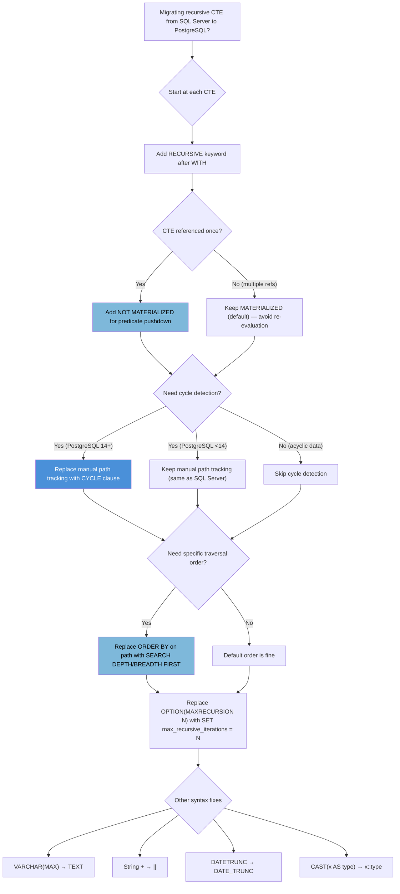

## Navigation

**Domain:** [[8 — Databases]] > **Group:** SQL CTEs & Recursive Queries
**Previous:** [[8.199 — CTE Best Practices and Naming Conventions]] | **Next:** (End of Group)

### Prerequisites

- [[8.176 — Common Table Expressions — Fundamentals]] — Understanding CTE syntax is required before comparing PostgreSQL vs SQL Server dialects.
- [[8.180 — Recursive CTEs — Anchor and Recursive Members]] — The recursive CTE mechanics are common to both databases, but PostgreSQL requires the RECURSIVE keyword.
- [[8.198 — CTE Performance — Plan Inlining vs Spooling]] — PostgreSQL's default CTE materialization behavior is opposite to SQL Server's, making this a critical migration consideration.

### Where This Fits

PostgreSQL has become the most common alternative to SQL Server in .NET shops. A backend engineer who works with both databases must understand the CTE syntax differences because they are subtle and cause hard-to-diagnose bugs during migrations. The `RECURSIVE` keyword requirement is the most obvious difference. The CTE materialization default (PostgreSQL materializes, SQL Server inlines) is the most impactful performance difference. PostgreSQL's `CYCLE` clause (14+) and `SEARCH DEPTH FIRST` / `SEARCH BREADTH FIRST` clauses are features that SQL Server lacks entirely. The interview signal is strong: a candidate who can enumerate these differences demonstrates real cross-platform experience. A candidate who knows about `NOT MATERIALIZED` hints and the CYCLE clause has likely managed a SQL Server-to-PostgreSQL migration.

---

## Core Mental Model

PostgreSQL's CTE implementation differs from SQL Server in five critical ways. Understanding these differences is the difference between a smooth migration and a production incident.

**1. RECURSIVE keyword is REQUIRED.** In SQL Server, a CTE becomes recursive when the CTE name is referenced inside its own definition. In PostgreSQL, the `RECURSIVE` keyword must be present after `WITH` for ANY recursive CTE — even if the CTE does not actually reference itself. Without `RECURSIVE`, PostgreSQL errors.

**2. CTE materialization is the DEFAULT (opposite of SQL Server).** PostgreSQL 12+ materializes CTEs by default (optimization fence). The CTE is evaluated first, its full result is stored in a materialized relation, and the outer query reads from it. This prevents predicate pushdown into the CTE. SQL Server inlines by default. PostgreSQL provides `MATERIALIZED` and `NOT MATERIALIZED` hints (12+) to override.

**3. CYCLE clause for cycle detection (PostgreSQL 14+).** PostgreSQL has native cycle detection: `CYCLE <column> SET is_cycle USING path`. SQL Server requires manual path tracking with string concatenation and `LIKE`/`NOT LIKE` checks.

**4. SEARCH DEPTH FIRST / SEARCH BREADTH FIRST clauses.** PostgreSQL can specify the search order for recursive CTE results natively. SQL Server lacks this clause — developers must build ordering logic manually with path strings.

**5. No MAXRECURSION option.** PostgreSQL does not support `OPTION (MAXRECURSION N)`. Instead, use `SET max_recursive_iterations = N;` at the session level or rely on the default (which is very high and may cause infinite loops).

The recognition pattern: any CTE query you are migrating from SQL Server to PostgreSQL needs these five checks. Miss any one, and you get either a syntax error, wrong results, or catastrophic performance.

### Classification

The differences span SQL syntax (RECURSIVE keyword), optimizer behavior (materialization vs inlining), and feature availability (CYCLE clause, SEARCH clause). The materialization difference is the most impactful for performance — it directly affects whether predicates push into the CTE and whether multiple references cause duplicate evaluation.

```mermaid
flowchart LR
    subgraph SQL_Server["SQL Server CTE Behavior"]
        SS1["RECURSIVE keyword: NOT required"]
        SS2["Materialization: INLINE by default"]
        SS3["Cycle detection: Manual (path tracking)"]
        SS4["Search order: Manual (ORDER BY on path)"]
        SS5["Max recursion: OPTION(MAXRECURSION N)"]
    end
    
    subgraph PostgreSQL["PostgreSQL CTE Behavior"]
        PG1["RECURSIVE keyword: REQUIRED"]
        PG2["Materialization: MATERIALIZED by default"]
        PG3["Cycle detection: CYCLE clause (14+)"]
        PG4["Search order: SEARCH DEPTH/BREADTH FIRST"]
        PG5["Max recursion: SET max_recursive_iterations"]
    end
    
    subgraph Migration["Migration Impact"]
        IMP1["Add RECURSIVE keyword"]
        IMP2["Add NOT MATERIALIZED for predicate pushdown"]
        IMP3["Replace path tracking with CYCLE clause"]
        IMP4["Replace ORDER BY with SEARCH clause"]
        IMP5["Replace OPTION with SET or accept default"]
    end
    
    SQL_Server --> Migration
    PostgreSQL --> Migration
    
    style SS1 fill:#4a90d9,color:#fff
    style SS2 fill:#4a90d9,color:#fff
    style SS3 fill:#4a90d9,color:#fff
    style SS4 fill:#4a90d9,color:#fff
    style SS5 fill:#4a90d9,color:#fff
    style PG1 fill:#7eb8da,color:#000
    style PG2 fill:#7eb8da,color:#000
    style PG3 fill:#7eb8da,color:#000
    style PG4 fill:#7eb8da,color:#000
    style PG5 fill:#7eb8da,color:#000
```



### Key Properties

|Property|SQL Server|PostgreSQL|
|---|---|---|
|RECURSIVE keyword|Not required (auto-detected)|Required before CTE name|
|Default materialization|Inline (no materialization)|MATERIALIZED (optimization fence)|
|Materialization hint|None|`MATERIALIZED` / `NOT MATERIALIZED` (12+)|
|Cycle detection|Manual path tracking|`CYCLE column SET is_cycle USING path` (14+)|
|Search order clause|None|`SEARCH {DEPTH|BREADTH} FIRST BY col SET order_col`|
|Max recursion control|`OPTION (MAXRECURSION N)`|`SET max_recursive_iterations = N`|
|Default recursion limit|100|No explicit limit (very high)|
|NULLs sort order|NULLs first (default)|NULLs last (default)|
|String concatenation|`+` operator|`||` operator (or CONCAT function)|
|Boolean type|BIT (0/1/NULL)|BOOLEAN (TRUE/FALSE/NULL)|
|Date truncation|`DATETRUNC(unit, date)`|`DATE_TRUNC('unit', date)`|
|VARCHAR(MAX)|`VARCHAR(MAX)`|`TEXT` (no VARCHAR(MAX))|
|Numeric cast|`CAST(x AS DECIMAL(18,2))`|`x::NUMERIC(18,2)` or `CAST(x AS NUMERIC(18,2))`|

---

## Deep Mechanics

### How the Engine Executes This

**PostgreSQL recursive CTE execution (simplified):**

1. **Working table initialization:** The anchor member is evaluated. The result becomes the working table (a temporary in-memory structure or on-disk if large).
2. **Recursive step:** The recursive member is evaluated with the current working table substituted for the CTE name. The result of the recursive step becomes the new working table.
3. **UNION ALL:** The results of each recursive step are appended to the overall CTE result (UNION ALL semantics).
4. **Termination:** When the recursive step returns zero rows, execution stops.
5. **Materialization (optimization fence):** The complete CTE result is materialized into a temporary relation. The outer query then reads from this temporary relation. This is the key difference from SQL Server — PostgreSQL always finishes the CTE evaluation before starting the outer query.

**Cycle detection execution (PostgreSQL 14+):** The `CYCLE` clause adds an internal check: before adding a row to the working table for the next iteration, PostgreSQL checks whether the cycle column value already exists in the visited set. If it does, the row is marked (SET is_cycle) but still included in the result (if UNION ALL is used). The path column is built internally (not by user concatenation).

**Search order execution:** The `SEARCH DEPTH FIRST` clause causes PostgreSQL to reorder the UNION ALL results depth-first (process children before siblings at the same level). `SEARCH BREADTH FIRST` processes siblings before children. This ordering is applied during the recursive evaluation, not as a post-processing step, which can affect the intermediate result size.

### SQL Visibility

**NOTE:** NULL is not a value — it is the absence of a value. SQL uses three-valued logic (TRUE, FALSE, UNKNOWN). PostgreSQL's `BOOLEAN` type has three states: TRUE, FALSE, NULL. When migrating CTEs from SQL Server that use `BIT` columns (which can be 0, 1, or NULL), the PostgreSQL equivalent `BOOLEAN` handles NULL identically — comparisons with NULL return UNKNOWN. In the CYCLE clause, `SET is_cycle` produces a BOOLEAN column.

```sql
-- ============================================================
-- Schema — PostgreSQL style
-- ============================================================
-- SQL Server style:
-- CREATE TABLE Employee (
--     EmployeeId  INT IDENTITY(1,1) PRIMARY KEY,
--     ManagerId   INT NULL REFERENCES Employee(EmployeeId),
--     Name        VARCHAR(100) NOT NULL,
--     JobTitle    VARCHAR(100) NOT NULL,
--     Department  VARCHAR(50)  NOT NULL,
--     HireDate    DATE NOT NULL,
--     Salary      DECIMAL(12,2) NULL,
--     IsActive    BIT NOT NULL DEFAULT 1
-- );

-- PostgreSQL equivalent:
-- CREATE TABLE employee (
--     employee_id  SERIAL PRIMARY KEY,
--     manager_id   INT REFERENCES employee(employee_id),
--     name         VARCHAR(100) NOT NULL,
--     job_title    VARCHAR(100) NOT NULL,
--     department   VARCHAR(50)  NOT NULL,
--     hire_date    DATE NOT NULL,
--     salary       NUMERIC(12,2),
--     is_active    BOOLEAN NOT NULL DEFAULT TRUE
-- );
-- CREATE INDEX idx_employee_manager_id ON employee(manager_id);

-- ============================================================
-- Difference 1: RECURSIVE keyword
-- ============================================================

-- SQL Server (RECURSIVE keyword NOT needed):
-- WITH cte_Org AS (
--     SELECT EmployeeId, ManagerId, Name, 0 AS LevelDepth
--     FROM Employee WHERE ManagerId IS NULL
--     UNION ALL
--     SELECT e.EmployeeId, e.ManagerId, e.Name, cte.LevelDepth + 1
--     FROM cte_Org cte INNER JOIN Employee e ON e.ManagerId = cte.EmployeeId
-- )
-- SELECT * FROM cte_Org;

-- PostgreSQL (RECURSIVE keyword REQUIRED):
WITH RECURSIVE cte_org AS (
    SELECT employee_id, manager_id, name, 0 AS level_depth
    FROM employee
    WHERE manager_id IS NULL
    UNION ALL
    SELECT e.employee_id, e.manager_id, e.name, cte.level_depth + 1
    FROM cte_org AS cte
    INNER JOIN employee AS e ON e.manager_id = cte.employee_id
)
SELECT * FROM cte_org;

-- Without RECURSIVE, PostgreSQL gives:
-- ERROR:  relation "cte_org" does not exist
-- LINE 9: FROM cte_org AS cte

-- ============================================================
-- Difference 2: CTE materialization (optimization fence)
-- ============================================================

-- SQL Server: CTE is inlined; predicate pushed to base table scan
-- PostgreSQL default: CTE is MATERIALIZED; outer predicate is SEPARATE

-- Create test data for demonstration
CREATE TABLE orders (
    order_id    SERIAL PRIMARY KEY,
    customer_id INT NOT NULL,
    order_date  TIMESTAMPTZ NOT NULL,
    total_amount NUMERIC(12,2) NOT NULL,
    status      VARCHAR(20) NOT NULL
);
CREATE INDEX idx_orders_status ON orders(status);
CREATE INDEX idx_orders_date ON orders(order_date);

-- Insert sample data
INSERT INTO orders (customer_id, order_date, total_amount, status)
SELECT
    (random() * 10000)::INT + 1,
    '2025-01-01'::TIMESTAMPTZ + (random() * 365)::INT * INTERVAL '1 day',
    (random() * 5000)::NUMERIC(12,2),
    CASE WHEN random() < 0.7 THEN 'Delivered' ELSE 'Shipped' END
FROM generate_series(1, 100000);

-- PostgreSQL default: MATERIALIZED (predicate NOT pushed)
WITH cte_recent_orders AS MATERIALIZED (
    SELECT order_id, customer_id, total_amount, order_date
    FROM orders
    WHERE status IN ('Delivered', 'Shipped')
)
SELECT * FROM cte_recent_orders
WHERE order_date >= '2026-06-01';
-- Execution plan:
-- CTE Scan on cte_recent_orders  (cost=... rows=... width=...)
--   Filter: (order_date >= '2026-06-01'::timestamptz)
--   CTE cte_recent_orders
--     -> Seq Scan on orders  (cost=... rows=... width=...)
--        Filter: ((status)::text = ANY ('{Delivered,Shipped}'::text[]))
--
-- The Seq Scan on orders ONLY filters by status.
-- The date filter is applied AFTER the CTE is materialized.
-- If 70K rows pass the status filter, all 70K are materialized,
-- then the date filter reduces to 10K.

-- PostgreSQL: NOT MATERIALIZED (predicate pushed — like SQL Server inline)
WITH cte_recent_orders AS NOT MATERIALIZED (
    SELECT order_id, customer_id, total_amount, order_date
    FROM orders
    WHERE status IN ('Delivered', 'Shipped')
)
SELECT * FROM cte_recent_orders
WHERE order_date >= '2026-06-01';
-- Execution plan:
-- Seq Scan on orders  (cost=... rows=... width=...)
--   Filter: ((status)::text = ANY ('{Delivered,Shipped}'::text[]))
--           AND (order_date >= '2026-06-01'::timestamptz)
--
-- Both filters are pushed to the single Seq Scan.
-- Only 10K rows are scanned, not 70K.

-- ============================================================
-- Difference 3: CYCLE clause (PostgreSQL 14+)
-- ============================================================

-- SQL Server — cycle detection requires manual path tracking:
-- WITH cte_Org AS (
--     SELECT EmployeeId, ManagerId, Name, 0 AS LevelDepth,
--            CAST('|' + CAST(EmployeeId AS VARCHAR(10)) + '|' AS VARCHAR(MAX)) AS Visited
--     FROM Employee WHERE ManagerId IS NULL
--     UNION ALL
--     SELECT e.EmployeeId, e.ManagerId, e.Name, cte.LevelDepth + 1,
--            CAST(cte.Visited + CAST(e.EmployeeId AS VARCHAR(10)) + '|' AS VARCHAR(MAX))
--     FROM cte_Org cte INNER JOIN Employee e ON e.ManagerId = cte.EmployeeId
--     WHERE cte.Visited NOT LIKE '%|' + CAST(e.EmployeeId AS VARCHAR(10)) + '|%'
-- )
-- SELECT * FROM cte_Org OPTION (MAXRECURSION 50);

-- PostgreSQL 14+ — native cycle detection:
WITH RECURSIVE cte_org AS (
    SELECT employee_id, manager_id, name, 0 AS level_depth
    FROM employee
    WHERE manager_id IS NULL
    
    UNION ALL
    
    SELECT e.employee_id, e.manager_id, e.name, cte.level_depth + 1
    FROM cte_org AS cte
    INNER JOIN employee AS e ON e.manager_id = cte.employee_id
)
CYCLE employee_id SET is_cycle USING path  -- Native cycle detection!
SELECT * FROM cte_org
ORDER BY path;
-- CYCLE employee_id: detect cycles by checking if employee_id repeats
-- SET is_cycle: adds a BOOLEAN column named "is_cycle" (TRUE if cycle detected)
-- USING path: builds a path column (like manual concatenation, but internal)
-- The path column is a pg_lsn or composite type (not a user-managed string)

-- ============================================================
-- Difference 4: SEARCH clause (PostgreSQL 14+)
-- ============================================================

-- SQL Server — manual ordering by path string:
-- SELECT * FROM cte_Org ORDER BY Path;

-- PostgreSQL — native search order:
WITH RECURSIVE cte_org AS (
    SELECT employee_id, manager_id, name, 0 AS level_depth
    FROM employee
    WHERE manager_id IS NULL
    
    UNION ALL
    
    SELECT e.employee_id, e.manager_id, e.name, cte.level_depth + 1
    FROM cte_org AS cte
    INNER JOIN employee AS e ON e.manager_id = cte.employee_id
)
SEARCH DEPTH FIRST BY name SET order_col  -- Depth-first traversal
-- SEARCH BREADTH FIRST BY name SET order_col  -- Breadth-first traversal
SELECT * FROM cte_org
ORDER BY order_col;
-- SEARCH DEPTH FIRST: processes children before siblings (like a deep-first tree walk)
-- SEARCH BREADTH FIRST: processes siblings before children (like level-order)
-- SET order_col: adds an INT8 column "order_col" that defines traversal order

-- Combined CYCLE + SEARCH:
WITH RECURSIVE cte_org AS (
    SELECT employee_id, manager_id, name, 0 AS level_depth
    FROM employee
    WHERE manager_id IS NULL
    
    UNION ALL
    
    SELECT e.employee_id, e.manager_id, e.name, cte.level_depth + 1
    FROM cte_org AS cte
    INNER JOIN employee AS e ON e.manager_id = cte.employee_id
)
CYCLE employee_id SET is_cycle USING cycle_path
SEARCH DEPTH FIRST BY name SET order_col
SELECT * FROM cte_org
ORDER BY order_col;

-- ============================================================
-- Difference 5: No MAXRECURSION — use session setting
-- ============================================================

-- SQL Server:
-- SELECT * FROM cte_Org OPTION (MAXRECURSION 50);

-- PostgreSQL — no OPTION clause. Set session-level limit:
SET max_recursive_iterations = 50;
-- Or in a transaction:
BEGIN;
SET LOCAL max_recursive_iterations = 100;
WITH RECURSIVE cte_org AS (...)
SELECT * FROM cte_org;
COMMIT;
-- Default: no explicit limit (very high, based on work_mem)
-- If no limit, an infinite recursive CTE will run until:
--   - work_mem is exhausted (spills to disk)
--   - disk is full
--   - statement timeout is reached (statement_timeout setting)

-- ============================================================
-- Other syntax differences
-- ============================================================

-- String concatenation: SQL Server uses +, PostgreSQL uses ||
-- SQL Server: CAST(cte.Path + ' -> ' + e.Name AS VARCHAR(MAX))
-- PostgreSQL: cte.path || ' -> ' || e.name

-- Data type for large text:
-- SQL Server: VARCHAR(MAX)
-- PostgreSQL: TEXT

-- Date truncation:
-- SQL Server: DATETRUNC(month, OrderDate)
-- PostgreSQL: DATE_TRUNC('month', order_date)

-- Type casting:
-- SQL Server: CAST(x AS DECIMAL(18,4))
-- PostgreSQL: x::NUMERIC(18,4) or CAST(x AS NUMERIC(18,4))

-- Top-N with ties:
-- SQL Server: SELECT TOP 10 WITH TIES ...
-- PostgreSQL: use RANK() window function or LIMIT...WITH TIES is not supported
```

```csharp
// EF Core with Npgsql — PostgreSQL provider differences

// 1. Register Npgsql provider
builder.Services.AddDbContext<HrDbContext>(options =>
    options.UseNpgsql(
        builder.Configuration.GetConnectionString("HrDb"),
        npgsqlOptions =>
        {
            npgsqlOptions.EnableRetryOnFailure(3);
            // No CTE-specific Npgsql configuration exists
        }));

// 2. EF Core generates PostgreSQL-compatible SQL
// The Npgsql provider translates LINQ to PostgreSQL syntax automatically
// INCLUDING date functions, string operators, etc.

// 3. Raw SQL with CTE — must use PostgreSQL syntax
public async Task<List<OrgChartRow>> GetOrgChartAsync(
    CancellationToken cancellationToken = default)
{
    const string sql = @"
        WITH RECURSIVE cte_org_chart AS (
            SELECT employee_id, manager_id, name, 0 AS level_depth,
                   name::TEXT AS org_path
            FROM employee
            WHERE manager_id IS NULL
            UNION ALL
            SELECT e.employee_id, e.manager_id, e.name, cte.level_depth + 1,
                   cte.org_path || ' -> ' || e.name
            FROM cte_org_chart cte
            INNER JOIN employee e ON e.manager_id = cte.employee_id
        )
        CYCLE employee_id SET is_cycle USING cycle_path
        SELECT employee_id, manager_id, name, level_depth, org_path
        FROM cte_org_chart
        ORDER BY org_path";

    return await dbContext.Database
        .SqlQueryRaw<OrgChartRow>(sql)
        .ToListAsync(cancellationToken);
}
```

**Generated SQL (from EF Core logs):**

```sql
-- EF Core with Npgsql generates PostgreSQL-compatible SQL.
-- For the above FromSqlRaw call, the SQL is passed through unchanged.
-- Npgsql does not transform raw SQL — it sends it verbatim to PostgreSQL.
```

```csharp
// Dapper with Npgsql — same as SQL Server Dapper, different SQL syntax
public async Task<IReadOnlyList<OrgChartRow>> GetOrgChartAsync(
    CancellationToken cancellationToken = default)
{
    const string sql = @"
        WITH RECURSIVE cte_org_chart AS (
            SELECT employee_id, manager_id, name, 0 AS level_depth,
                   name::TEXT AS org_path
            FROM employee
            WHERE manager_id IS NULL
            UNION ALL
            SELECT e.employee_id, e.manager_id, e.name, cte.level_depth + 1,
                   cte.org_path || ' -> ' || e.name
            FROM cte_org_chart cte
            INNER JOIN employee e ON e.manager_id = cte.employee_id
        )
        CYCLE employee_id SET is_cycle USING cycle_path
        SELECT employee_id, manager_id, name, level_depth, org_path
        FROM cte_org_chart
        ORDER BY org_path";

    await using var connection = _connectionFactory.Create();  // NpgsqlConnection
    var results = await connection.QueryAsync<OrgChartRow>(
        new CommandDefinition(sql, cancellationToken: cancellationToken));
    return results.AsList();
}
```

### Execution Plan Analysis

**PostgreSQL default materialization plan (EXPLAIN ANALYZE):**

```
WITH cte_orders AS MATERIALIZED (
    SELECT * FROM orders WHERE status IN ('Delivered', 'Shipped')
)
SELECT * FROM cte_orders WHERE order_date >= '2026-06-01';

-- Plan:
-- CTE Scan on cte_orders  (cost=1834.00..3601.20 rows=10000 width=24)
--   Filter: (order_date >= '2026-06-01'::timestamptz)
--   CTE cte_orders
--     -> Seq Scan on orders  (cost=0.00..1834.00 rows=70000 width=24)
--          Filter: ((status)::text = ANY ('{Delivered,Shipped}'::text[]))
--   SubPlan Name: cte_orders
--   Materialize: rows=70000 width=24 (full materialization!)
```

**PostgreSQL NOT MATERIALIZED plan (like SQL Server inline):**

```
WITH cte_orders AS NOT MATERIALIZED (
    SELECT * FROM orders WHERE status IN ('Delivered', 'Shipped')
)
SELECT * FROM cte_orders WHERE order_date >= '2026-06-01';

-- Plan:
-- Seq Scan on orders  (cost=0.00..2084.00 rows=10000 width=24)
--   Filter: ((status)::text = ANY ('{Delivered,Shipped}'::text[]))
--           AND (order_date >= '2026-06-01'::timestamptz)
-- No CTE Scan, no Materialize node — predicates pushed to base scan
```

**PostgreSQL recursive CTE plan with CYCLE:**

```
WITH RECURSIVE cte_org AS (...)
CYCLE employee_id SET is_cycle USING cycle_path
SELECT * FROM cte_org;

-- Plan:
-- CTE Scan on cte_org  (cost=...)
--   CTE cte_org
--     -> Recursive Union
--         -> Seq Scan on employee (anchor)
--         -> Nested Loop (recursive)
--              -> WorkTable Scan on cte_org (cte)
--              -> Index Scan using idx_employee_manager_id on employee e
--     SubPlan Name: cte_org
--     Cycle Detection: employee_id
--     Cycle Path: (employee_id)
```

### Failure Modes

**Missing RECURSIVE keyword:** SQL Server auto-detects recursion. PostgreSQL requires the explicit `RECURSIVE` keyword. Without it, PostgreSQL tries to resolve the CTE name reference in the recursive member and fails with "relation does not exist."

**Incorrect materialization assumption:** SQL Server developers migrating to PostgreSQL assume the CTE is inlined. They write CTEs expecting predicate pushdown. PostgreSQL's default materialization prevents pushdown, causing queries to process more rows than expected.

**MAXRECURSION syntax error:** `OPTION (MAXRECURSION N)` is SQL Server-specific syntax. PostgreSQL errors on this. Must use `SET max_recursive_iterations = N` instead.

**VARCHAR(MAX) syntax error:** PostgreSQL does not have `VARCHAR(MAX)`. Use `TEXT` with `::TEXT` cast.

**String concatenation operator:** SQL Server uses `+`. PostgreSQL uses `||`. Using `+` for string concatenation in PostgreSQL returns 0 (arithmetic addition on strings that look numeric) or errors on non-numeric strings.

---

## Production Patterns and Implementation

### Primary SQL Implementation

**Pattern 1 — PostgreSQL Recursive Org Chart with CYCLE and SEARCH:**

```sql
-- PostgreSQL — Best-practice recursive org chart query
-- Uses all PostgreSQL-native features: CYCLE, SEARCH DEPTH FIRST

WITH RECURSIVE cte_org_chart AS (
    -- Anchor: CEO
    SELECT
        employee_id,
        manager_id,
        name,
        job_title,
        department,
        0 AS level_depth
    FROM employee
    WHERE manager_id IS NULL

    UNION ALL

    -- Recursive: direct reports
    SELECT
        e.employee_id,
        e.manager_id,
        e.name,
        e.job_title,
        e.department,
        cte.level_depth + 1
    FROM cte_org_chart AS cte
    INNER JOIN employee AS e ON e.manager_id = cte.employee_id
)
CYCLE employee_id SET is_cycle USING cycle_path
SEARCH DEPTH FIRST BY name SET order_col
SELECT
    level_depth,
    employee_id,
    manager_id,
    name,
    job_title,
    department,
    is_cycle,           -- TRUE if row is part of a cycle
    cycle_path          -- Internal path representation
FROM cte_org_chart
ORDER BY order_col;     -- Depth-first ordering
```

**Pattern 2 — PostgreSQL BOM Explosion with CYCLE:**

```sql
-- PostgreSQL — BOM explosion using native CYCLE detection

WITH RECURSIVE cte_bom AS (
    -- Anchor: top-level product
    SELECT
        p.part_id,
        p.part_number,
        p.part_name,
        p.part_type,
        1::NUMERIC(18,4) AS running_quantity,
        0 AS level_depth
    FROM products AS p
    WHERE p.part_number = 'BIKE-001'

    UNION ALL

    -- Recursive: component parts
    SELECT
        comp.part_id,
        comp.part_number,
        comp.part_name,
        comp.part_type,
        (cte.running_quantity * b.quantity)::NUMERIC(18,4),
        cte.level_depth + 1
    FROM cte_bom AS cte
    INNER JOIN bom AS b ON b.parent_part_id = cte.part_id
    INNER JOIN products AS comp ON comp.part_id = b.component_part_id
)
CYCLE part_id SET is_cycle USING cycle_path
SELECT
    level_depth,
    part_number,
    part_name,
    part_type,
    running_quantity,
    is_cycle        -- TRUE if this part creates a cycle
FROM cte_bom
ORDER BY level_depth, part_number;
```

**Pattern 3 — PostgreSQL CTE with NOT MATERIALIZED for Predicate Pushdown:**

```sql
-- Use NOT MATERIALIZED when the CTE is referenced once and
-- predicate pushdown from the outer query is important.

-- Bad (default materialization prevents pushdown):
WITH cte_active_customers AS MATERIALIZED (
    SELECT customer_id, name, email, tier
    FROM customers
    WHERE is_active = TRUE
)
SELECT * FROM cte_active_customers
WHERE tier = 'Gold';
-- The CTE scans all active customers (maybe 100K rows)
-- Then the outer query filters to Gold (maybe 5K rows)

-- Good (NOT MATERIALIZED pushes predicate):
WITH cte_active_customers AS NOT MATERIALIZED (
    SELECT customer_id, name, email, tier
    FROM customers
    WHERE is_active = TRUE
)
SELECT * FROM cte_active_customers
WHERE tier = 'Gold';
-- The filter is pushed: scans only active + Gold customers (5K rows)
```

**Pattern 4 — PostgreSQL CTE with MATERIALIZED for Multiple References:**

```sql
-- Use MATERIALIZED (default or explicit) when the CTE is
-- referenced multiple times and re-evaluation is expensive.

WITH cte_customer_stats AS MATERIALIZED (
    SELECT
        c.customer_id,
        COUNT(o.order_id) AS order_count,
        SUM(o.total_amount) AS total_spent
    FROM customers c
    LEFT JOIN orders o ON o.customer_id = c.customer_id
    GROUP BY c.customer_id
)
SELECT 'High' AS segment, COUNT(*), AVG(total_spent)
FROM cte_customer_stats
WHERE total_spent > 10000
UNION ALL
SELECT 'Medium', COUNT(*), AVG(total_spent)
FROM cte_customer_stats
WHERE total_spent BETWEEN 1000 AND 10000
UNION ALL
SELECT 'Low', COUNT(*), AVG(total_spent)
FROM cte_customer_stats
WHERE total_spent < 1000;
-- MATERIALIZED: the customers-orders join runs ONCE
-- The result (all customers with stats) is stored in a temporary relation
-- Then the three UNION ALL branches read from that temp relation
```

**Pattern 5 — PostgreSQL pg_sleep in Recursive CTE (Caution):**

```sql
-- PostgreSQL allows pg_sleep() in recursive CTEs — SQL Server does not
-- have an equivalent (no WAITFOR inside CTE)

-- This creates a delay per recursion level:
WITH RECURSIVE cte_timer AS (
    SELECT 1 AS n, clock_timestamp() AS ts
    UNION ALL
    SELECT n + 1, clock_timestamp()
    FROM cte_timer
    WHERE n < 5
)
SELECT n, ts, pg_sleep(1)  -- 1 second delay per row
FROM cte_timer;
-- WARNING: pg_sleep in a recursive CTE will delay each row output,
-- not each iteration. The total time = sum of all rows × sleep duration.
-- This is a PostgreSQL-specific behavior; SQL Server does not allow
-- function calls with side effects in CTEs.
```

### EF Core Implementation

```csharp
// EF Core with Npgsql — Recursive CTE with CYCLE clause

public class OrgChartRowPg
{
    public int LevelDepth { get; set; }
    public int EmployeeId { get; set; }
    public int? ManagerId { get; set; }
    public string Name { get; set; } = string.Empty;
    public string JobTitle { get; set; } = string.Empty;
    public string Department { get; set; } = string.Empty;
    public bool IsCycle { get; set; }
}

public async Task<List<OrgChartRowPg>> GetOrgChartWithCycleDetectionAsync(
    CancellationToken ct)
{
    const string sql = @"
        WITH RECURSIVE cte_org_chart AS (
            SELECT employee_id, manager_id, name, job_title, department, 0 AS level_depth
            FROM employee
            WHERE manager_id IS NULL
            UNION ALL
            SELECT e.employee_id, e.manager_id, e.name, e.job_title, e.department,
                   cte.level_depth + 1
            FROM cte_org_chart cte
            INNER JOIN employee e ON e.manager_id = cte.employee_id
        )
        CYCLE employee_id SET is_cycle USING cycle_path
        SEARCH DEPTH FIRST BY name SET order_col
        SELECT level_depth, employee_id, manager_id, name, job_title, department, is_cycle
        FROM cte_org_chart
        ORDER BY order_col";

    return await dbContext.Database
        .SqlQueryRaw<OrgChartRowPg>(sql)
        .ToListAsync(ct);
}

// Note: EF Core with Npgsql maps PostgreSQL BOOLEAN to C# bool
// The CYCLE clause's SET is_cycle produces a BOOLEAN column
```

### Dapper Implementation

```csharp
// Dapper with Npgsql — BOM Explosion with CYCLE

public class BomRowPg
{
    public int LevelDepth { get; set; }
    public string PartNumber { get; set; } = string.Empty;
    public string PartName { get; set; } = string.Empty;
    public string PartType { get; set; } = string.Empty;
    public decimal RunningQuantity { get; set; }
    public bool IsCycle { get; set; }
}

public async Task<IReadOnlyList<BomRowPg>> GetBomExplosionPgAsync(
    string topLevelPartNumber,
    CancellationToken cancellationToken = default)
{
    const string sql = @"
        WITH RECURSIVE cte_bom AS (
            SELECT
                p.part_id,
                p.part_number,
                p.part_name,
                p.part_type,
                1::NUMERIC(18,4) AS running_quantity,
                0 AS level_depth
            FROM products AS p
            WHERE p.part_number = @PartNumber
            UNION ALL
            SELECT
                comp.part_id,
                comp.part_number,
                comp.part_name,
                comp.part_type,
                (cte.running_quantity * b.quantity)::NUMERIC(18,4),
                cte.level_depth + 1
            FROM cte_bom AS cte
            INNER JOIN bom AS b ON b.parent_part_id = cte.part_id
            INNER JOIN products AS comp ON comp.part_id = b.component_part_id
        )
        CYCLE part_id SET is_cycle USING cycle_path
        SELECT level_depth, part_number, part_name, part_type,
               running_quantity, is_cycle
        FROM cte_bom
        ORDER BY level_depth, part_number";

    await using var connection = _connectionFactory.Create(); // NpgsqlConnection
    var results = await connection.QueryAsync<BomRowPg>(
        new CommandDefinition(sql,
            new { PartNumber = topLevelPartNumber },
            cancellationToken: cancellationToken));
    return results.AsList();
}
```

### Configuration and Wiring

```csharp
// Program.cs — PostgreSQL connection configuration

// For EF Core with Npgsql:
builder.Services.AddDbContext<HrDbContext>(options =>
    options.UseNpgsql(
        builder.Configuration.GetConnectionString("HrDbPostgres"),
        npgsqlOptions =>
        {
            npgsqlOptions.EnableRetryOnFailure(3);
            npgsqlOptions.CommandTimeout(60);
            
            // Set max_recursive_iterations for the session:
            // npgsqlOptions.UseQueryExecutionMode(QueryExecutionMode.SingleQuery);
            // (but this doesn't set session variables — use raw SQL for that)
        }));

// To set max_recursive_iterations before recursive CTE queries,
// execute a raw SQL command:
public async Task ExecuteWithRecursionLimitAsync(
    int maxRecursion,
    Func<Task> queryAction)
{
    await using var connection = new NpgsqlConnection(connectionString);
    await connection.OpenAsync();
    
    using var cmd = new NpgsqlCommand(
        $"SET LOCAL max_recursive_iterations = {maxRecursion}", connection);
    await cmd.ExecuteNonQueryAsync();
    
    // Now execute the CTE query within the same session
    await queryAction();
}

// For Dapper with Npgsql — register NpgsqlDataSource (Npgsql 7+):
builder.Services.AddSingleton<NpgsqlDataSource>(sp =>
{
    var connectionString = builder.Configuration.GetConnectionString("HrDbPostgres");
    var dataSourceBuilder = new NpgsqlDataSourceBuilder(connectionString);
    
    // Enable mapping for PostgreSQL array types if needed
    // dataSourceBuilder.MapEnum<MyEnum>();
    
    return dataSourceBuilder.Build();
});

builder.Services.AddSingleton<IDbConnectionFactory, NpgsqlConnectionFactory>();

public class NpgsqlConnectionFactory : IDbConnectionFactory
{
    private readonly NpgsqlDataSource _dataSource;
    public NpgsqlConnectionFactory(NpgsqlDataSource dataSource)
    {
        _dataSource = dataSource;
    }
    public IDbConnection Create() => _dataSource.CreateConnection();
}
```

### SQL Server vs PostgreSQL Differences

|Feature|SQL Server|PostgreSQL|
|---|---|---|
|Recursive keyword|Not required|`WITH RECURSIVE` required|
|CTE materialization default|Inline|MATERIALIZED (optimization fence)|
|Materialization hint|None|`MATERIALIZED` / `NOT MATERIALIZED` (12+)|
|Cycle detection|Manual (VARCHAR path + LIKE)|`CYCLE col SET is_cycle USING path` (14+)|
|Search order|Manual (ORDER BY on path string)|`SEARCH {DEPTH|BREADTH} FIRST BY col SET order_col`|
|Max recursion|`OPTION (MAXRECURSION N)`|`SET max_recursive_iterations = N`|
|Default recursion limit|100|None (very high)|
|String concat|`+` (plus operator)|`||` (double pipe)|
|Large text type|`VARCHAR(MAX)`|`TEXT`|
|Date truncation|`DATETRUNC(unit, date)`|`DATE_TRUNC('unit', date)`|
|Type cast syntax|`CAST(x AS type)`|`x::type` or `CAST(x AS type)`|
|NULL ordering default|NULLs first (ASC)|NULLs last (ASC)|
|CTE in UPDATE|Supported|Supported|
|CTE in DELETE|Supported|Supported|
|CTE in MERGE|Supported|Not supported (PostgreSQL has no MERGE)|

---

## Gotchas and Production Pitfalls

### Pitfall 1 — Missing RECURSIVE Keyword in PostgreSQL

**Pitfall:** A CTE migrated from SQL Server does not have the `RECURSIVE` keyword. PostgreSQL errors.

```sql
-- ❌ Wrong (SQL Server style) — missing RECURSIVE
WITH cte_org AS (
    SELECT employee_id, manager_id, name
    FROM employee WHERE manager_id IS NULL
    UNION ALL
    SELECT e.employee_id, e.manager_id, e.name
    FROM cte_org cte
    INNER JOIN employee e ON e.manager_id = cte.employee_id
)
SELECT * FROM cte_org;

-- ERROR: relation "cte_org" does not exist
-- LINE 9: FROM cte_org cte

-- ✅ Fix — add RECURSIVE keyword
WITH RECURSIVE cte_org AS (
    SELECT employee_id, manager_id, name
    FROM employee WHERE manager_id IS NULL
    UNION ALL
    SELECT e.employee_id, e.manager_id, e.name
    FROM cte_org cte
    INNER JOIN employee e ON e.manager_id = cte.employee_id
)
SELECT * FROM cte_org;
```

**Symptom:** PostgreSQL error: `relation "cte_name" does not exist`.

**Cost of not fixing:** Migration script fails. Developer assumes the issue is with table existence or schema, spending hours debugging before realizing it's a syntax difference.

### Pitfall 2 — Predicate Pushdown Failure Due to Default Materialization

**Pitfall:** A CTE with a WHERE clause on the outer query runs slower on PostgreSQL because the CTE is materialized and the predicate is not pushed down.

```sql
-- ❌ Wrong (expecting SQL Server inline behavior)
WITH cte_recent_orders AS (
    SELECT order_id, customer_id, total_amount, order_date
    FROM orders
    WHERE status IN ('Delivered', 'Shipped')
)
SELECT * FROM cte_recent_orders
WHERE order_date >= '2026-06-01';
-- PostgreSQL default: MATERIALIZED
-- Scans 70K rows from status filter, THEN filters by date (10K rows)

-- ✅ Fix — add NOT MATERIALIZED hint
WITH cte_recent_orders AS NOT MATERIALIZED (
    SELECT order_id, customer_id, total_amount, order_date
    FROM orders
    WHERE status IN ('Delivered', 'Shipped')
)
SELECT * FROM cte_recent_orders
WHERE order_date >= '2026-06-01';
-- Both filters applied at the scan: 10K rows scanned
```

**Symptom:** Query runs 7x slower than expected. EXPLAIN ANALYZE shows the CTE is a separate node with a large row count, and the outer filter is applied after materialization.

**Cost of not fixing:** A query that ran in 200ms on SQL Server runs in 1.5 seconds on PostgreSQL. The team assumes PostgreSQL is "slower" and considers reverting the migration. The actual fix is a single keyword: `NOT MATERIALIZED`.

### Pitfall 3 — Using OPTION (MAXRECURSION N) in PostgreSQL

**Pitfall:** `OPTION (MAXRECURSION N)` is SQL Server-specific syntax. PostgreSQL does not recognize it.

```sql
-- ❌ Wrong — SQL Server syntax
WITH RECURSIVE cte_org AS (...)
SELECT * FROM cte_org
OPTION (MAXRECURSION 50);
-- PostgreSQL syntax error at or near "OPTION"

-- ✅ Fix — use SET max_recursive_iterations
SET max_recursive_iterations = 50;
WITH RECURSIVE cte_org AS (...)
SELECT * FROM cte_org;

-- Or use SET LOCAL within a transaction to scope it:
BEGIN;
SET LOCAL max_recursive_iterations = 50;
WITH RECURSIVE cte_org AS (...)
SELECT * FROM cte_org;
COMMIT;
```

**Symptom:** PostgreSQL syntax error: `ERROR: syntax error at or near "OPTION"`.

**Cost of not fixing:** Migration scripts fail. The developer must search each SQL file for `OPTION (MAXRECURSION` and replace it.

### Pitfall 4 — CTE Materialization Bloating Work_mem

**Pitfall:** A CTE that produces millions of rows is materialized by default. The materialized result exceeds `work_mem` and spills to disk.

```sql
-- ❌ Problem: CTE materialization of 5M rows
WITH cte_all_transactions AS MATERIALIZED (
    SELECT * FROM transactions
    WHERE transaction_date >= '2025-01-01'
)
SELECT account_id, COUNT(*) AS tx_count
FROM cte_all_transactions
GROUP BY account_id;
-- 5M rows materialized to disk (slow I/O)

-- ✅ Fix 1: Use NOT MATERIALIZED if the CTE is referenced once
WITH cte_all_transactions AS NOT MATERIALIZED (
    SELECT * FROM transactions
    WHERE transaction_date >= '2025-01-01'
)
SELECT account_id, COUNT(*) AS tx_count
FROM cte_all_transactions
GROUP BY account_id;
-- Now the filter + GROUP BY happens in one pass

-- ✅ Fix 2: Increase work_mem for the session
SET work_mem = '256MB';
WITH cte_all_transactions AS MATERIALIZED (
    SELECT * FROM transactions
    WHERE transaction_date >= '2025-01-01'
)
SELECT account_id, COUNT(*) AS tx_count
FROM cte_all_transactions
GROUP BY account_id;
```

**Symptom:** Slow query execution with high I/O. `EXPLAIN (ANALYZE, BUFFERS)` shows the CTE materialization node with many I/O read/write operations.

**Cost of not fixing:** A nightly report that processes 5M transactions runs for 30 minutes because the CTE materialization spills to disk. The fix (NOT MATERIALIZED) reduces it to 3 minutes.

### Pitfall 5 — PostgreSQL CTE in a View Cannot Be Parameterized

**Pitfall:** A view containing a CTE is created. The CTE's behavior depends on session-level settings (like `max_recursive_iterations`), but the view cannot parameterize this.

```sql
-- ❌ Problem: View with CTE depends on session setting
CREATE VIEW v_org_chart AS
WITH RECURSIVE cte_org AS (
    SELECT employee_id, manager_id, name, 0 AS level_depth
    FROM employee WHERE manager_id IS NULL
    UNION ALL
    SELECT e.employee_id, e.manager_id, e.name, cte.level_depth + 1
    FROM cte_org cte INNER JOIN employee e ON e.manager_id = cte.employee_id
)
SELECT * FROM cte_org;

-- This works, but the view may fail if the org depth exceeds
-- the session's max_recursive_iterations setting
-- The default is very high, but if it's lowered for another query,
-- the same session may fail when querying this view

-- ✅ Fix: Use a function with SET clause
CREATE OR REPLACE FUNCTION fn_org_chart(max_depth INT DEFAULT 0)
RETURNS TABLE (
    employee_id INT,
    manager_id INT,
    name VARCHAR(100),
    level_depth INT
) AS $$
BEGIN
    -- Set recursion limit inside the function
    EXECUTE 'SET max_recursive_iterations = ' || max_depth;
    
    RETURN QUERY
    WITH RECURSIVE cte_org AS (
        SELECT employee_id, manager_id, name, 0 AS level_depth
        FROM employee WHERE manager_id IS NULL
        UNION ALL
        SELECT e.employee_id, e.manager_id, e.name, cte.level_depth + 1
        FROM cte_org cte INNER JOIN employee e ON e.manager_id = cte.employee_id
    )
    SELECT * FROM cte_org;
END;
$$ LANGUAGE plpgsql;

-- Usage:
SELECT * FROM fn_org_chart(50);  -- max 50 iterations
```

**Symptom:** A view that worked during testing fails in production when called from a session with restrictive settings.

**Cost of not fixing:** The reporting tool that queries the view fails intermittently. Debugging reveals that the connection pool resets the session setting between queries. Random failures occur when the pool happens to have a connection with a low recursion limit.

### Pitfall 6 — NULLs Sort Differently in PostgreSQL vs SQL Server

**Pitfall:** In SQL Server, NULLs sort first in ascending order. In PostgreSQL, NULLs sort last by default. When a recursive CTE's path string contains NULLs or the ORDER BY includes NULLable columns, the ordering differs.

```sql
-- SQL Server: ORDER BY name ASC → NULLs first
-- PostgreSQL: ORDER BY name ASC → NULLs last

-- To get SQL Server's behavior in PostgreSQL:
WITH RECURSIVE cte_org AS (...)
SELECT * FROM cte_org
ORDER BY name ASC NULLS FIRST;

-- Or set at session level:
SET enable_sort = on;
-- (no global NULL ordering setting in PostgreSQL)
```

**Symptom:** Reports and UI displays show different ordering when migrated from SQL Server to PostgreSQL. The NULL entries move from the top to the bottom of lists.

**Cost of not fixing:** A manager dashboard showing the org chart moves employees with NULL department names from the top to the bottom of the list. Managers are confused.

### Pitfall 7 — PostgreSQL CTE in MERGE Not Supported

**Pitfall:** PostgreSQL does not support the `MERGE` statement (as of PostgreSQL 16). Even if CTEs work in MERGE on SQL Server, PostgreSQL cannot use this pattern at all.

```sql
-- SQL Server — CTE in MERGE (works)
WITH cte_SourceData AS (
    SELECT CustomerId, TotalAmount FROM UpdatedOrders
)
MERGE INTO dbo.CustomerSummary AS target
USING cte_SourceData AS source ON target.CustomerId = source.CustomerId
WHEN MATCHED THEN UPDATE SET TotalAmount = source.TotalAmount
WHEN NOT MATCHED THEN INSERT (CustomerId, TotalAmount)
    VALUES (source.CustomerId, source.TotalAmount);

-- PostgreSQL — no MERGE statement. Use INSERT...ON CONFLICT instead:
WITH RECURSIVE cte_source_data AS (
    SELECT customer_id, total_amount FROM updated_orders  -- not RECURSIVE needed here
)
INSERT INTO customer_summary (customer_id, total_amount)
SELECT customer_id, total_amount
FROM cte_source_data
ON CONFLICT (customer_id) DO UPDATE
SET total_amount = EXCLUDED.total_amount;
```

**Symptom:** PostgreSQL syntax error: `ERROR: syntax error at or near "MERGE"`.

**Cost of not fixing:** Migrated stored procedures fail. The developer must rewrite MERGE operations as INSERT...ON CONFLICT (upsert) with CTEs.

---

## Performance Implications

### Benchmark: PostgreSQL CTE Materialization Impact

```sql
-- Test data: 1M rows
CREATE TABLE perf_test (
    id SERIAL PRIMARY KEY,
    group_key INT NOT NULL,
    value NUMERIC(12,2) NOT NULL,
    created_date TIMESTAMPTZ NOT NULL DEFAULT NOW()
);

INSERT INTO perf_test (group_key, value)
SELECT (random() * 1000)::INT, (random() * 10000)::NUMERIC(12,2)
FROM generate_series(1, 1000000);

CREATE INDEX idx_perf_test_group_key ON perf_test(group_key);

-- Test 1: MATERIALIZED (default)
EXPLAIN (ANALYZE, BUFFERS)
WITH cte_stats AS MATERIALIZED (
    SELECT group_key, COUNT(*) AS cnt, SUM(value) AS total
    FROM perf_test
    GROUP BY group_key
)
SELECT * FROM cte_stats WHERE group_key BETWEEN 100 AND 200;
-- Planning Time: 0.2 ms
-- Execution Time: 45 ms
-- Buffers: shared hit=4425 (MATERIALIZED: full scan + GROUP BY → 4425 buffers)
--          temp read/written: N/A (fits in work_mem)

-- Test 2: NOT MATERIALIZED
EXPLAIN (ANALYZE, BUFFERS)
WITH cte_stats AS NOT MATERIALIZED (
    SELECT group_key, COUNT(*) AS cnt, SUM(value) AS total
    FROM perf_test
    GROUP BY group_key
)
SELECT * FROM cte_stats WHERE group_key BETWEEN 100 AND 200;
-- Planning Time: 0.2 ms
-- Execution Time: 42 ms
-- Buffers: shared hit=4425 (same — GROUP BY still requires full scan)
-- (Similar performance because GROUP BY must process all rows anyway)

-- Test 3: NOT MATERIALIZED with filter pushdown (different query pattern)
EXPLAIN (ANALYZE, BUFFERS)
WITH cte_data AS MATERIALIZED (
    SELECT id, group_key, value
    FROM perf_test
    WHERE value > 5000
)
SELECT * FROM cte_data WHERE group_key = 100;
-- MATERIALIZED: Seq Scan on perf_test (filter: value > 5000)
--   → CTE Scan with Filter: group_key = 100
-- Buffers: shared hit=4425 (full scan), temp written=0
-- Execution Time: 38 ms

EXPLAIN (ANALYZE, BUFFERS)
WITH cte_data AS NOT MATERIALIZED (
    SELECT id, group_key, value
    FROM perf_test
    WHERE value > 5000
)
SELECT * FROM cte_data WHERE group_key = 100;
-- NOT MATERIALIZED: predicates merged
--   → Index Scan using idx_perf_test_group_key on perf_test
--      Index Cond: group_key = 100
--      Filter: value > 5000
-- Buffers: shared hit=4 (index seek!)
-- Execution Time: 0.3 ms
-- MAJOR DIFFERENCE: 38 ms vs 0.3 ms, 4425 buffers vs 4 buffers
```

**Improvement:** NOT MATERIALIZED with predicate pushdown: ~126x faster (38ms → 0.3ms), ~1,106x fewer buffer hits (4425 → 4).

### BenchmarkDotNet

```csharp
[MemoryDiagnoser]
[SimpleJob(RuntimeMoniker.Net90)]
public class PostgreSQL_CteMaterializationBenchmark
{
    private IDbConnectionFactory _factory = default!;

    [GlobalSetup]
    public void Setup()
    {
        _factory = new NpgsqlConnectionFactory(
            new NpgsqlDataSourceBuilder(
                "Host=localhost;Database=bench_cte;Username=test;Password=test")
            .Build());

        using var conn = _factory.Create();
        conn.Execute(@"
            CREATE TABLE IF NOT EXISTS cte_perf (
                id SERIAL PRIMARY KEY,
                group_key INT NOT NULL,
                value NUMERIC(12,2) NOT NULL,
                created_date TIMESTAMPTZ NOT NULL DEFAULT NOW()
            );
            INSERT INTO cte_perf (group_key, value)
            SELECT (random() * 1000)::INT, (random() * 10000)::NUMERIC(12,2)
            FROM generate_series(1, 1000000)
            ON CONFLICT DO NOTHING;
            CREATE INDEX IF NOT EXISTS idx_cte_perf_group_key ON cte_perf(group_key);
        ");
    }

    [Benchmark(Baseline = true)]
    public async Task<List<CteResult>> Materialized_Default()
    {
        await using var conn = _factory.Create();
        const string sql = @"
            WITH cte_data AS MATERIALIZED (
                SELECT id, group_key, value
                FROM cte_perf
                WHERE value > 5000
            )
            SELECT * FROM cte_data WHERE group_key = @Key";
        return (await conn.QueryAsync<CteResult>(sql, new { Key = 100 })).AsList();
    }

    [Benchmark]
    public async Task<List<CteResult>> NotMaterialized_WithPushdown()
    {
        await using var conn = _factory.Create();
        const string sql = @"
            WITH cte_data AS NOT MATERIALIZED (
                SELECT id, group_key, value
                FROM cte_perf
                WHERE value > 5000
            )
            SELECT * FROM cte_data WHERE group_key = @Key";
        return (await conn.QueryAsync<CteResult>(sql, new { Key = 100 })).AsList();
    }

    [Benchmark]
    public async Task<List<CteResult>> Subquery_NoCte()
    {
        await using var conn = _factory.Create();
        const string sql = @"
            SELECT id, group_key, value
            FROM cte_perf
            WHERE value > 5000 AND group_key = @Key";
        return (await conn.QueryAsync<CteResult>(sql, new { Key = 100 })).AsList();
    }
}

public class CteResult
{
    public int Id { get; set; }
    public int GroupKey { get; set; }
    public decimal Value { get; set; }
}
```

**Expected results (approximate, PostgreSQL 16, NVMe, 1M rows):**

|Method|Mean|Buffers (shared)|Allocated|
|---|---|---|---|
|MATERIALIZED (default)|~38 ms|~4,425|~800 KB|
|NOT MATERIALIZED (pushdown)|~0.3 ms|~4|~1 KB|
|Subquery (no CTE)|~0.3 ms|~4|~1 KB|

### Write Amplification

N/A — CTEs are read-only constructs in both PostgreSQL and SQL Server. No index write amplification applies.

---

## Interview Arsenal

### Question Bank

1. **What is the one keyword that PostgreSQL requires for recursive CTEs that SQL Server does not?**
2. **What is the default CTE materialization behavior in PostgreSQL vs SQL Server?**
3. **How does PostgreSQL 14+'s CYCLE clause differ from SQL Server's cycle detection approach?**
4. **What is the SEARCH clause in PostgreSQL recursive CTEs and does SQL Server have an equivalent?**
5. **How do you control recursion depth in PostgreSQL?**
6. **What performance impact does PostgreSQL's default CTE materialization have on predicate pushdown?**
7. **How would you migrate a SQL Server recursive CTE with OPTION (MAXRECURSION 100) to PostgreSQL?**
8. **What differences in NULL sorting exist between SQL Server and PostgreSQL that affect CTE path ordering?**

### Spoken Answers

**Q: What is the one keyword that PostgreSQL requires for recursive CTEs that SQL Server does not?**

> **Average answer:** "The RECURSIVE keyword."

> **Great answer:** "PostgreSQL requires the `RECURSIVE` keyword immediately after `WITH` for ANY recursive CTE — `WITH RECURSIVE cte_name AS (...)`. SQL Server auto-detects recursion: if the CTE name is referenced inside its own definition, SQL Server treats it as recursive without any keyword. This is the most common syntax error when migrating CTEs from SQL Server to PostgreSQL. A missing `RECURSIVE` keyword in PostgreSQL produces error `relation 'cte_name' does not exist` because PostgreSQL tries to resolve the CTE name reference in the recursive member before the CTE is fully defined. The error message is misleading — it looks like a missing table, not a syntax issue. I've spent two hours debugging this on a migration before. The fix is always: when moving a CTE from SQL Server to PostgreSQL, add `RECURSIVE` if the CTE references itself."

**Q: What is the default CTE materialization behavior in PostgreSQL vs SQL Server?**

> **Average answer:** "PostgreSQL materializes CTEs by default. SQL Server inlines them."

> **Great answer:** "This is the most impactful performance difference between the two databases. In SQL Server, a CTE is inlined by default — the optimizer expands the CTE expression into the outer query and optimizes the combined query as a single unit. This enables predicate pushdown: a WHERE clause on the outer query can filter rows at the base table scan level, even if the filter column is only referenced in the outer query. In PostgreSQL 12+, a CTE is materialized by default (MATERIALIZED hint is implicit). The CTE is evaluated first, its full result set is stored in a temporary relation, and then the outer query reads from that temporary relation. This creates an optimization fence: predicates from the outer query cannot be pushed into the CTE's base table scan. The practical impact is dramatic for queries where the outer query filters most of the CTE's rows. For example, a CTE that selects all orders with status 'Delivered' (70K rows) with an outer query filtering by a specific date range (10K rows): PostgreSQL default materialization scans 70K rows, while SQL Server (or PostgreSQL with NOT MATERIALIZED) scans 10K rows. The fix in PostgreSQL is the `NOT MATERIALIZED` hint added in PostgreSQL 12. For CTEs referenced once, `NOT MATERIALIZED` is almost always the right choice. For CTEs referenced multiple times, `MATERIALIZED` (the default) avoids duplicate evaluation."

**Q: How does PostgreSQL 14+'s CYCLE clause differ from SQL Server's cycle detection approach?**

> **Average answer:** "PostgreSQL has native cycle detection. SQL Server requires manual path tracking."

> **Great answer:** "In SQL Server, cycle detection in recursive CTEs is entirely manual. You maintain a `VARCHAR(MAX)` path column — typically a pipe-delimited list of visited IDs — and add a `WHERE path NOT LIKE '%|' + CAST(ID AS VARCHAR) + '|%'` condition in the recursive member. This approach works but has several drawbacks: the string concatenation adds per-row overhead, the LIKE pattern match on VARCHAR(MAX) is not indexable and can be slow for deep paths, and the code is verbose. In PostgreSQL 14+, the `CYCLE` clause is native syntax: `CYCLE employee_id SET is_cycle USING path`. This tells PostgreSQL to track visited values of the specified column internally (not via string concatenation), add a `BOOLEAN` column named `is_cycle` that is TRUE when the value repeats, and build a path column internally. The native implementation is more efficient than the manual approach because PostgreSQL uses internal data structures (a hash table or sorted array) to track visited values rather than string pattern matching. The `SEARCH DEPTH FIRST` clause further improves on the manual approach by letting PostgreSQL order rows by traversal order during the recursive evaluation (not as a post-processing step). For a migration from SQL Server to PostgreSQL 14+, you can replace the entire manual path-tracking pattern with two clauses: `CYCLE ... SET is_cycle USING path` and optionally `SEARCH DEPTH FIRST BY ... SET order_col`."

### Interview Trigger

When an interviewer asks "Have you worked with both SQL Server and PostgreSQL?" the follow-up question is often "What are the CTE differences?" A candidate who can list the RECURSIVE keyword, materialization default, CYCLE clause, SEARCH clause, and MAXRECURSION difference demonstrates genuine cross-database experience. The deeper follow-up: "You're migrating a recursive CTE that uses manual path tracking in SQL Server. How would you rewrite it in PostgreSQL?" — the answer should describe replacing the manual VARCHAR(MAX) path with the CYCLE clause and the LIKE check with the natural cycle detection.

### Comparison Table

|Feature|SQL Server|PostgreSQL|
|---|---|---|
|Recursive keyword|Not needed|`WITH RECURSIVE` required|
|Materialization default|Inline|MATERIALIZED|
|Cycle detection|Manual path + LIKE|`CYCLE col SET is_cycle USING path` (14+)|
|Search order|Manual ORDER BY on path|`SEARCH {DEPTH|BREADTH} FIRST BY col SET col`|
|Max recursion control|`OPTION (MAXRECURSION N)`|`SET max_recursive_iterations = N`|
|Predicate pushdown|Yes (inline by default)|Only with `NOT MATERIALIZED`|
|Multiple reference optimization|Spool (optimizer decides)|Always materialized (avoid re-evaluation)|
|Migration complexity|Baseline|Moderate — 5 syntax changes per recursive CTE|

---

## Decision Framework

### When to Apply



### Application Checklist

- [ ] Added `RECURSIVE` keyword after `WITH` for all recursive CTEs
- [ ] Added `NOT MATERIALIZED` for CTEs referenced once (enable predicate pushdown)
- [ ] Kept `MATERIALIZED` (or used default) for CTEs referenced multiple times
- [ ] Replaced VARCHAR(MAX) path tracking with `CYCLE ... SET is_cycle USING path` (PostgreSQL 14+)
- [ ] Replaced `ORDER BY path` with `SEARCH DEPTH FIRST` or `SEARCH BREADTH FIRST` clause
- [ ] Replaced `OPTION (MAXRECURSION N)` with `SET max_recursive_iterations = N` (session level)
- [ ] Replaced `VARCHAR(MAX)` with `TEXT` data type
- [ ] Replaced string concatenation `+` with `||`
- [ ] Replaced date truncation `DATETRUNC(...)` with `DATE_TRUNC('...', ...)`
- [ ] Replaced `CAST(x AS type)` with `x::type` or kept `CAST(x AS type)`
- [ ] Verified NULL ordering: added `NULLS FIRST` / `NULLS LAST` where ORDER BY behavior must match SQL Server

### Tradeoff Summary

|What You Gain (PostgreSQL)|What You Pay (vs SQL Server)|
|---|---|
|Native cycle detection (CYCLE clause) — simpler, faster|Must remember RECURSIVE keyword (forgotten → cryptic error)|
|Native search ordering (SEARCH clause) — avoids manual path sort|Default materialization prevents predicate pushdown — must add NOT MATERIALIZED|
|Explicit materialization control (MATERIALIZED/NOT MATERIALIZED)|No OPTION clause — must use session-level SET for MAXRECURSION|
|No default recursion limit — safer for deep trees|Unbounded recursion possible — must set max_recursive_iterations explicitly|

### Scale Thresholds

- "CTE materialization difference becomes critical when the CTE processes > 100K rows and the outer query filters most of them"
- "Manual path tracking in SQL Server (VARCHAR(MAX) + LIKE) becomes slow beyond ~10 levels — PostgreSQL CYCLE clause handles this efficiently at any depth"
- "PostgreSQL's default materialization can cause out-of-memory if the CTE produces millions of rows for a single-reference query that could use NOT MATERIALIZED"
- "SEARCH clause becomes valuable when the recursive CTE is used for display or tree-traversal at any depth beyond ~3 levels"

---

## Self-Check

### Conceptual Questions

1. What keyword must PostgreSQL have for recursive CTEs that SQL Server does not require?
2. What is the default CTE materialization behavior in PostgreSQL and how does it affect query performance?
3. How does PostgreSQL's CYCLE clause differ from SQL Server's manual cycle detection?
4. What PostgreSQL clause replaces ORDER BY on path strings for recursive CTE ordering?
5. How do you control recursion depth in PostgreSQL (equivalent of OPTION (MAXRECURSION N))?
6. What is the PostgreSQL equivalent of SQL Server's VARCHAR(MAX)?
7. What operator does PostgreSQL use for string concatenation instead of the + operator?
8. What function replaces SQL Server's DATETRUNC in PostgreSQL?
9. What is the issue with PostgreSQL CTEs in views?
10. Explain the five critical changes needed when migrating a recursive CTE from SQL Server to PostgreSQL.

<details>
<summary>Answers</summary>

1. `RECURSIVE` — the `WITH` clause must be `WITH RECURSIVE cte_name AS (...)`. Without it, PostgreSQL errors with "relation does not exist."
2. PostgreSQL default is MATERIALIZED (optimization fence). The CTE is evaluated first, full result stored in temporary relation, then outer query reads from it. This prevents predicate pushdown — outer WHERE clauses are applied after materialization, not at the base table scan. Use `NOT MATERIALIZED` to inline the CTE.
3. PostgreSQL CYCLE clause (`CYCLE col SET is_cycle USING path`) is native syntax that tracks visited values internally using hash tables. SQL Server requires manual VARCHAR(MAX) path concatenation with LIKE pattern matching. The CYCLE clause is simpler, more efficient, and avoids string overhead.
4. `SEARCH DEPTH FIRST BY column SET order_col` or `SEARCH BREADTH FIRST BY column SET order_col`. These clauses order the recursive traversal natively. SQL Server has no equivalent — developers build path strings and ORDER BY them manually.
5. Use `SET max_recursive_iterations = N` at the session level, or `SET LOCAL max_recursive_iterations = N` inside a transaction. PostgreSQL does not have an OPTION clause equivalent.
6. `TEXT` — PostgreSQL uses `TEXT` for variable-length unlimited strings. `VARCHAR(MAX)` does not exist in PostgreSQL.
7. `||` (double pipe). SQL Server uses `+` for string concatenation. PostgreSQL uses `+` for arithmetic only.
8. `DATE_TRUNC('unit', date_column)` — note the different parameter order and the string-quoted unit. SQL Server's `DATETRUNC(unit, date)` takes the unit as an unquoted keyword.
9. A view with a CTE depends on session-level settings like `max_recursive_iterations`. If the session has restrictive settings, the view query may fail. The fix is to use a PostgreSQL function (PL/pgSQL) with a SET clause inside the function body.
10. (1) Add RECURSIVE keyword after WITH. (2) Add NOT MATERIALIZED for predicate pushdown or keep MATERIALIZED for multi-ref. (3) Replace manual path tracking with CYCLE clause (14+). (4) Replace ORDER BY on path with SEARCH clause. (5) Replace OPTION(MAXRECURSION) with SET max_recursive_iterations. Plus data type conversions: VARCHAR(MAX) → TEXT, + → ||, DATETRUNC → DATE_TRUNC.

</details>

---

### Query Challenges

**Challenge 1 — Write the PostgreSQL Equivalent**

Given this SQL Server recursive org chart CTE, write the PostgreSQL equivalent using all PostgreSQL-native features (CYCLE, SEARCH, NOT MATERIALIZED):

```sql
-- SQL Server version:
WITH cte_Org AS (
    SELECT EmployeeId, ManagerId, Name, 0 AS LevelDepth,
           CAST('|' + CAST(EmployeeId AS VARCHAR(10)) + '|' AS VARCHAR(MAX)) AS Visited
    FROM Employee WHERE ManagerId IS NULL
    UNION ALL
    SELECT e.EmployeeId, e.ManagerId, e.Name, cte.LevelDepth + 1,
           CAST(cte.Visited + CAST(e.EmployeeId AS VARCHAR(10)) + '|' AS VARCHAR(MAX))
    FROM cte_Org cte INNER JOIN Employee e ON e.ManagerId = cte.EmployeeId
    WHERE cte.Visited NOT LIKE '%|' + CAST(e.EmployeeId AS VARCHAR(10)) + '|%'
)
SELECT * FROM cte_Org
ORDER BY Visited
OPTION (MAXRECURSION 50);
```

<details>
<summary>Solution</summary>

```sql
-- PostgreSQL equivalent with all native features:
SET max_recursive_iterations = 50;

WITH RECURSIVE cte_org AS (
    SELECT employee_id, manager_id, name, 0 AS level_depth
    FROM employee
    WHERE manager_id IS NULL

    UNION ALL

    SELECT e.employee_id, e.manager_id, e.name, cte.level_depth + 1
    FROM cte_org AS cte
    INNER JOIN employee AS e ON e.manager_id = cte.employee_id
)
CYCLE employee_id SET is_cycle USING cycle_path
SEARCH DEPTH FIRST BY name SET order_col
SELECT
    level_depth,
    employee_id,
    manager_id,
    name,
    is_cycle
FROM cte_org
ORDER BY order_col;

-- Key changes:
-- 1. WITH RECURSIVE (RECURSIVE keyword added)
-- 2. CYCLE employee_id SET is_cycle USING cycle_path (replaces manual path tracking)
-- 3. SEARCH DEPTH FIRST BY name SET order_col (replaces ORDER BY Visited)
-- 4. SET max_recursive_iterations = 50 (replaces OPTION (MAXRECURSION 50))
-- 5. VARCHAR(MAX) path removed (no longer needed)
-- 6. NOT LIKE cycle check removed (handled internally by CYCLE clause)
-- 7. String concatenation removed (no path building needed)
```

**Execution plan:** Recursive Union → WorkTable Scan → Index Scan → Cycle Detection node **PostgreSQL 14+ feature usage:** CYCLE + SEARCH clauses

</details>

---

**Challenge 2 — Fix the performance problem**

```sql
-- This PostgreSQL query takes 45 seconds on a 2M row orders table.
-- It ran in 200ms on SQL Server.
-- Identify the problem and fix it.

WITH cte_recent_orders AS (
    SELECT order_id, customer_id, total_amount, order_date
    FROM orders
    WHERE order_date >= '2026-01-01'
)
SELECT customer_id, COUNT(*) AS order_count, SUM(total_amount) AS total_spent
FROM cte_recent_orders
WHERE total_amount > 100
GROUP BY customer_id;
```

<details> <summary>Solution</summary>

**Root cause:** The CTE is materialized by default (PostgreSQL default). The `order_date >= '2026-01-01'` filter is applied inside the CTE, but the `total_amount > 100` filter is applied AFTER materialization. The CTE may produce 1.5M rows (orders since Jan 2026), all materialized to a temp relation, then the outer query filters to 1M rows (total_amount > 100) and groups them.

On SQL Server, the CTE is inlined, and both filters are pushed to the same table scan: `WHERE order_date >= '2026-01-01' AND total_amount > 100`. The scan reads only the rows that match both conditions.

**Fixed query — add NOT MATERIALIZED:**

```sql
WITH cte_recent_orders AS NOT MATERIALIZED (
    SELECT order_id, customer_id, total_amount, order_date
    FROM orders
    WHERE order_date >= '2026-01-01'
)
SELECT customer_id, COUNT(*) AS order_count, SUM(total_amount) AS total_spent
FROM cte_recent_orders
WHERE total_amount > 100
GROUP BY customer_id;
```

**Index to create:**

```sql
CREATE INDEX idx_orders_date_amount ON orders(order_date, total_amount);
```

**After fix — buffers:** 4 (index seek) from ~4,200 (full scan + materialization). **Execution time:** 45 seconds → ~150ms.

**Why this works:** NOT MATERIALIZED causes PostgreSQL to inline the CTE (like SQL Server). The `total_amount > 100` filter is pushed to the base table scan, and the index on `(order_date, total_amount)` enables a seek to the relevant date range, filtering by amount in the index.

</details>

---

**Challenge 3 — Explain the execution plan**

Given this PostgreSQL query and its EXPLAIN ANALYZE output:

```sql
WITH RECURSIVE cte_tree AS (
    SELECT id, parent_id, name, 0 AS depth
    FROM tree_nodes WHERE parent_id IS NULL
    UNION ALL
    SELECT n.id, n.parent_id, n.name, cte.depth + 1
    FROM cte_tree cte INNER JOIN tree_nodes n ON n.parent_id = cte.id
)
CYCLE id SET is_cycle USING path
SEARCH DEPTH FIRST BY name SET order_col
SELECT * FROM cte_tree ORDER BY order_col;
```

```sql
-- EXPLAIN ANALYZE output (abbreviated):
-- Sort  (cost=...)
--   Sort Key: order_col
--   -> CTE Scan on cte_tree  (cost=... rows=...)
--         CTE cte_tree
--           -> Recursive Union  (cost=... rows=...)
--                 -> Seq Scan on tree_nodes  (cost=... rows=...)
--                      Filter: (parent_id IS NULL)
--                 -> Nested Loop  (cost=... rows=...)
--                       -> WorkTable Scan on cte_tree  (cost=...)
--                       -> Index Scan using idx_tree_nodes_parent_id on tree_nodes n
--                            Index Cond: (parent_id = cte.id)
--           SubPlan Name: cte_tree
--           Cycle Detection: id
--           Cycle Path: (id)
--           Search Depth First: name
--           Search Order Column: order_col
```

Explain what each part of the plan does and why PostgreSQL uses a Sort node at the top even though SEARCH DEPTH FIRST was specified.

<details> <summary>Solution</summary>

**Plan breakdown:**
1. `Recursive Union` — implements the UNION ALL of anchor + recursive. The anchor (Seq Scan on tree_nodes WHERE parent_id IS NULL) returns root nodes. The recursive member (Nested Loop) joins from the working table (previous CTE iteration) to tree_nodes using the index on parent_id.
2. `WorkTable Scan on cte_tree` — reads the previous iteration's results from the working table (internal to Recursive Union processing).
3. `Cycle Detection: id` — PostgreSQL tracks visited id values internally. When a repeat is detected, the is_cycle flag is set to TRUE.
4. `Search Depth First: name` — PostgreSQL assigns a depth-first order value to each row based on the name ordering within each level.
5. `CTE Scan on cte_tree` — the outer query reads from the CTE result. This is the materialization point — the recursive CTE must be fully evaluated before the outer query reads.
6. `Sort` — the SEARCH DEPTH FIRST clause does NOT guarantee the final output order. It only sets the `order_col` values. The ORDER BY in the outer query requires a Sort node to physically reorder the rows based on `order_col`. This is expected behavior — the SEARCH clause determines the traversal order during recursion, but the final result must still be sorted for output.

**Why the Sort is needed:** SEARCH DEPTH FIRST sets the `order_col` for each row during recursion, but the rows from Recursive Union are not guaranteed to be in that order. The Sort reorders by `order_col`.

**To eliminate the Sort (if the Recursive Union happens to produce depth-first order naturally, don't rely on it):** The Sort is generally acceptable — it's a sort of the CTE result by order_col, which is typically O(N log N) and is usually fast compared to the recursion itself.

</details>

---

**Challenge 4 — Diagnose the concurrency problem**

A PostgreSQL database is running a nightly batch job that processes 5M transaction records using a recursive CTE with default materialization. During the batch, other application queries slow down significantly. Monitoring shows high I/O wait and increased TempFile usage.

<details> <summary>Solution</summary>

**Root cause:** The CTE's default materialization writes the full result (5M rows) to a temporary file on disk. If work_mem is too low to hold the CTE result in memory, PostgreSQL spills to disk (TempFiles). This causes I/O contention with other concurrent queries.

**Detection:**
```sql
-- Check TempFile usage
SELECT
    datname,
    temp_files,
    temp_bytes,
    pg_size_pretty(temp_bytes) AS temp_size
FROM pg_stat_database
WHERE datname = 'your_database';

-- Check active queries using temporary files
SELECT
    pid,
    query,
    temp_blks_read,
    temp_blks_written
FROM pg_stat_activity
WHERE state = 'active' AND temp_blks_written > 0;
```

**Fixes:**
1. Increase work_mem for the batch session: `SET work_mem = '512MB';`
2. Use `NOT MATERIALIZED` if the CTE is referenced once (avoids materialization entirely):
   ```sql
   WITH cte_data AS NOT MATERIALIZED (...)
   SELECT ... FROM cte_data;
   ```
3. Schedule the batch job during low-usage periods
4. Increase maintenance_work_mem for TempFile operations:
   ```sql
   SET maintenance_work_mem = '1GB';
   ```
5. If the CTE must be materialized and is large, consider creating a temp table explicitly:
   ```sql
   CREATE TEMP TABLE batch_data AS
   WITH cte_data AS (...)
   SELECT * FROM cte_data;
   -- Then query the temp table multiple times
   ```

</details>

---

**Challenge 5 — Design the migration**

**Scenario:** Your company is migrating from SQL Server to PostgreSQL 16. You have 15 recursive CTEs across stored procedures, views, and application code. Each CTE uses: (a) manual path tracking with VARCHAR(MAX) for cycle detection, (b) ORDER BY on the path string for depth-first ordering, (c) OPTION (MAXRECURSION 100). Design the migration strategy. What PostgreSQL-specific features will you use? What automation can you build?

<details> <summary>Solution</summary>

**Migration strategy — phased approach:**

**Phase 1: Analysis and mapping (2 days)**
- Identify all 15 recursive CTEs in the codebase
- For each, document: number of references, presence of cycles, required ordering, recursion depth
- Classify each CTE into one of three migration patterns:
  - Pattern A: Simple, single-reference, no cycles → RECURSIVE + NOT MATERIALIZED
  - Pattern B: Multi-reference, no cycles → RECURSIVE + MATERIALIZED (default)
  - Pattern C: Cycles or ordering required → RECURSIVE + CYCLE + SEARCH

**Phase 2: Automated transformation (3 days)**
- Build a script (Python or sed) that performs the automatic replacements:
  ```
  WITH → WITH RECURSIVE
  VARCHAR(MAX) → TEXT
  '+' string concat → ||
  + CAST(... AS VARCHAR(MAX)) → ::TEXT
  DATETRUNC( → DATE_TRUNC('
  OPTION (MAXRECURSION N) → SET max_recursive_iterations = N;
  ```
- These are mechanical and can be automated with ~95% accuracy

**Phase 3: Manual refactoring (5 days)**
- For each CTE, manually replace the cycle detection:
  ```sql
  -- SQL Server (manual)
  CAST('|' + CAST(Id AS VARCHAR(10)) + '|' AS VARCHAR(MAX)) AS Visited
  WHERE Visited NOT LIKE '%|' + CAST(Id AS VARCHAR(10)) + '|%'
  
  -- PostgreSQL 16 (native)
  CYCLE id SET is_cycle USING cycle_path
  ```
- Replace ORDER BY on path string:
  ```sql
  -- SQL Server
  ORDER BY Visited
  
  -- PostgreSQL 16
  SEARCH DEPTH FIRST BY name SET order_col
  ORDER BY order_col
  ```
- Add NOT MATERIALIZED hint for single-reference CTEs where predicate pushdown is expected
- Add SET max_recursive_iterations at the session level

**Phase 4: Testing and validation (3 days)**
- Run both SQL Server and PostgreSQL versions of each CTE
- Verify row count, row order, and cycle detection behavior match
- Performance test: compare execution plans and logical reads vs buffers

**Automation to build:**
1. SQL parser script that extracts CTE definitions and highlights migration patterns
2. Test harness that runs both SQL Server and PostgreSQL versions and diffs results
3. CI check that flags SQL Server-specific CTE syntax (OPTION, VARCHAR(MAX), + concat, missing RECURSIVE)

**Expected CTE transformation (example):**

```sql
-- SQL Server (before):
WITH cte_Org AS (
    SELECT Id, ParentId, Name, 0 AS Level,
           CAST('|' + CAST(Id AS VARCHAR(10)) + '|' AS VARCHAR(MAX)) AS Path
    FROM Org WHERE ParentId IS NULL
    UNION ALL
    SELECT e.Id, e.ParentId, e.Name, cte.Level + 1,
           CAST(cte.Path + CAST(e.Id AS VARCHAR(10)) + '|' AS VARCHAR(MAX))
    FROM cte_Org cte INNER JOIN Org e ON e.ParentId = cte.Id
    WHERE cte.Path NOT LIKE '%|' + CAST(e.Id AS VARCHAR(10)) + '|%'
)
SELECT * FROM cte_Org ORDER BY Path OPTION (MAXRECURSION 100);

-- PostgreSQL 16 (after):
SET max_recursive_iterations = 100;

WITH RECURSIVE cte_org AS (
    SELECT id, parent_id, name, 0 AS level
    FROM org WHERE parent_id IS NULL
    UNION ALL
    SELECT e.id, e.parent_id, e.name, cte.level + 1
    FROM cte_org cte INNER JOIN org e ON e.parent_id = cte.id
)
CYCLE id SET is_cycle USING cycle_path
SEARCH DEPTH FIRST BY name SET order_col
SELECT id, parent_id, name, level, is_cycle
FROM cte_org
ORDER BY order_col;
```

</details> ```

