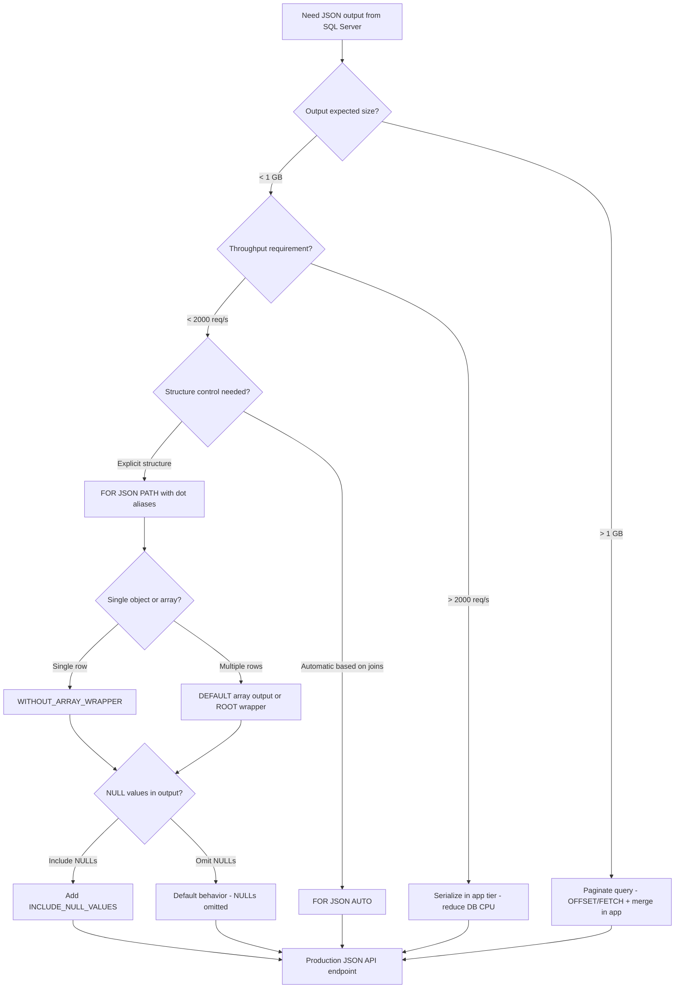

## Navigation

**Domain:** [[8 — Databases]] > **Group:** SQL JSON, XML & Semi-Structured Data
**Previous:** [[8.200 — JSON in SQL Server — Overview]] | **Next:** [[8.202 — FOR JSON AUTO — Automatic Nesting]]

### Prerequisites

- [[8.001 — Relational Model — Tuples and Relations]] — FOR JSON PATH converts relational tuples to JSON documents; understanding relations as sets of tuples explains why the output is an array of objects by default.
- [[8.003 — SELECT Statement — Logical Processing Order]] — FOR JSON is applied after SELECT, ORDER BY, and all query phases; knowing the order prevents incorrect assumptions about JSON formatting during query writing.
- [[8.104 — NULL in SQL — Three-Valued Logic]] — FOR JSON omits NULL values by default (not three-valued logic but JSON semantics difference); understanding NULL handling prevents silent data loss when serialising.

### Where This Fits

FOR JSON PATH converts a relational query result into a JSON document directly in T-SQL without application-layer serialisation. A .NET backend engineer encounters this when building REST API endpoints that return JSON from database queries — generating JSON in SQL eliminates the serialisation overhead and round-trips of fetching rows then serialising in C#. The problem this solves is reducing the database-to-application data transfer size and eliminating the application's JSON serialisation pass. What breaks when misapplied: the 2 GB NVARCHAR(MAX) output limit silently truncates large result sets, dot-separated aliases create unintended nesting, and WITHOUT_ARRAY_WRAPPER produces invalid JSON when the query returns multiple rows. The interview signal is strong — FOR JSON PATH tests understanding of JSON structure mapping from relational data, execution plan compute scalars, and the boundary between SQL responsibility and application responsibility for serialisation.

---

## Core Mental Model

FOR JSON PATH is a query-level directive that instructs the SQL Server engine to take the relational rowset produced by the SELECT statement and serialise it into a JSON string using column aliases to determine the JSON structure. The engine appends a Compute Scalar operator after all other query operators (after ORDER BY, before the final result is returned to the client) that applies the JSON formatting. Column aliases with dot-separated paths (e.g., `ColumnAlias.SubField`) create nested JSON objects automatically. The invariant: FOR JSON PATH operates on the final, fully-resolved rowset — every WHERE filter, JOIN, GROUP BY, and ORDER BY is already applied. The recognition pattern: when a .NET engineer writes a SQL query that returns rows and the API layer must serialise those rows to JSON, FOR JSON PATH moves the serialisation into the database. The mental model is "the database becomes a JSON document producer" rather than the application being the serialisation layer.

### Classification

FOR JSON PATH is a **query output formatting directive** — it belongs to the **result processing** phase of query execution. The query optimiser treats FOR JSON as a post-processing step: it does not influence join selection, index choice, or predicate pushdown. The optimiser adds a single Compute Scalar operator after the final SELECT to perform JSON serialisation. It is never SARGable (it is not a predicate). The serialisation is CPU-bound on the SQL Server machine and allocates memory proportional to the output size (NVARCHAR(MAX) allocation).

```mermaid
flowchart TD
    A[Relational query plan] --> B[FROM + JOIN operators]
    B --> C[WHERE filter predicates]
    C --> D[GROUP BY aggregation if present]
    D --> E[HAVING filter]
    E --> F[SELECT compute scalars]
    F --> G[ORDER BY sort]
    G --> H[FOR JSON PATH compute scalar]
    H --> I{Column alias contains dot?}
    I -->|Yes: 'Customer.Name'| J[Create nested object: {Customer: {Name: val}}]
    I -->|No: 'OrderId'| K[Flatten to root: {OrderId: val}]
    J --> L[WITHOUT_ARRAY_WRAPPER?]
    K --> L
    L -->|Yes| M[Single JSON object - no outer array]
    L -->|No| N[JSON array of objects - default]
    M --> O[NVARCHAR&#40;MAX&#41; output]
    N --> O
    O --> P[Client receives JSON string]
```

### Key Properties

|Property|Value|Notes|
|---|---|---|
|Time Complexity|O(N * K)|N = rows, K = columns — serialisation is linear|
|Output Limit|NVARCHAR(MAX) — 2 GB|Truncation occurs silently for larger results|
|SARGable|N/A|Not a predicate — output formatting directive|
|CPU Cost|Moderate|JSON string building on SQL Server vs app tier|
|Nesting Depth|Unlimited via dot paths|Pathological depth impacts CPU/memory|

---

## Deep Mechanics

### How the Engine Executes This

FOR JSON PATH is applied during the **result formatting** phase, after the query's logical execution is complete. Here is the step-by-step trace:

1. **Parsing:** The SQL parser recognises FOR JSON PATH as a query-level clause (after ORDER BY, before OPTION). It is added to the query specification parse tree.
2. **Binding:** The algebrizer resolves all column references and alias definitions. Dot-separated aliases (e.g., `o.CustomerName AS 'Customer.Name'`) are treated as single identifier strings with dots at this stage — the nesting interpretation happens during serialisation, not binding.
3. **Optimisation:** The optimiser builds the query plan without considering FOR JSON — the plan is identical to the same query without FOR JSON. The FOR JSON directive adds a Compute Scalar after the final Sequence Project or Concatenation operator.
4. **Execution (serialisation phase):** For each row in the final rowset:
   - The engine examines the column metadata — specifically the column alias and whether it contains dot separators.
   - For columns without dots: the column name becomes the JSON key, and the column value is serialised to its JSON equivalent (string → escaped string, number → number, NULL → omitted unless INCLUDE_NULL_VALUES is specified).
   - For columns with dots: the engine splits on the dot and creates nested objects. `Customer.Name` produces `{"Customer": {"Name": value}}`. If `Customer.Age` also exists in the same query, the output merges: `{"Customer": {"Name": value, "Age": value}}`.
   - The engine applies JSON character escaping: `"` → `\"`, `\` → `\\`, control characters → `\uXXXX`, surrogate pairs → proper UTF-16 encoding.
   - The serialised row is appended to a growing NVARCHAR(MAX) buffer.
5. **Array wrapping:** By default, the engine wraps the serialised rows in a JSON array `[{...}, {...}]`. If WITHOUT_ARRAY_WRAPPER is specified, the engine omits the array brackets — producing `{...}` for a single row or `{...}{...}` for multiple rows (which is not valid JSON unless the result is a single row).

### SQL Visibility

#### FOR JSON PATH with Dot-Separated Nesting

```sql
-- Convert Orders join Customers to nested JSON
SELECT
    o.OrderId,
    o.OrderDate,
    o.CustomerId AS 'Customer.CustomerId',
    c.CustomerName AS 'Customer.Name',
    c.Email AS 'Customer.Email',
    o.OrderStatus,
    o.TotalAmount
FROM Sales.Orders o
INNER JOIN Sales.Customers c ON o.CustomerId = c.CustomerId
WHERE o.OrderDate >= '2025-01-01'
ORDER BY o.OrderDate DESC
FOR JSON PATH, ROOT('Orders');
```

```csharp
// EF Core — raw SQL only (FOR JSON has no LINQ translation)
var json = await dbContext.Database
    .SqlQueryRaw<string>(@"
        SELECT o.OrderId, o.OrderDate,
               o.CustomerId AS 'Customer.CustomerId',
               c.CustomerName AS 'Customer.Name',
               c.Email AS 'Customer.Email',
               o.OrderStatus, o.TotalAmount
        FROM Sales.Orders o
        INNER JOIN Sales.Customers c ON o.CustomerId = c.CustomerId
        WHERE o.OrderDate >= @Date
        ORDER BY o.OrderDate DESC
        FOR JSON PATH, ROOT('Orders')",
        new SqlParameter("@Date", new DateTime(2025, 1, 1)))
    .FirstOrDefaultAsync(cancellationToken);
```

```csharp
// Dapper — raw SQL, returns JSON string
public async Task<string> GetOrdersJsonAsync(
    DateTime minDate,
    CancellationToken cancellationToken = default)
{
    const string sql = @"
        SELECT o.OrderId, o.OrderDate,
               o.CustomerId AS 'Customer.CustomerId',
               c.CustomerName AS 'Customer.Name',
               c.Email AS 'Customer.Email',
               o.OrderStatus, o.TotalAmount
        FROM Sales.Orders o
        INNER JOIN Sales.Customers c ON o.CustomerId = c.CustomerId
        WHERE o.OrderDate >= @MinDate
        ORDER BY o.OrderDate DESC
        FOR JSON PATH, ROOT('Orders')";

    await using var connection = _connectionFactory.Create();
    return await connection.QuerySingleAsync<string>(
        new CommandDefinition(sql, new { MinDate = minDate },
            cancellationToken: cancellationToken));
}
```

#### WITH INCLUDE_NULL_VALUES

```sql
-- FOR JSON PATH with null preservation
SELECT
    o.OrderId,
    o.ShipDate,        -- may be NULL for unshipped orders
    o.TotalAmount
FROM Sales.Orders o
WHERE o.OrderId = 12345
FOR JSON PATH, INCLUDE_NULL_VALUES, WITHOUT_ARRAY_WRAPPER;

-- Output: {"OrderId":12345,"ShipDate":null,"TotalAmount":299.99}
-- Without INCLUDE_NULL_VALUES: {"OrderId":12345,"TotalAmount":299.99}
```

#### WITHOUT_ARRAY_WRAPPER for Single-Object Output

```sql
-- Return single object (not array) — requires exactly one row
SELECT TOP 1
    o.OrderId,
    o.TotalAmount
FROM Sales.Orders o
WHERE o.OrderId = 12345
FOR JSON PATH, WITHOUT_ARRAY_WRAPPER;

-- Output: {"OrderId":12345,"TotalAmount":299.99}
-- Without WITHOUT_ARRAY_WRAPPER: [{"OrderId":12345,"TotalAmount":299.99}]
```

### Execution Plan Analysis

For the primary FOR JSON PATH query above:

- **Operators:** `Clustered Index Scan (Orders.IX_OrderDate)` → `Nested Loops (Inner Join)` → `Clustered Index Seek (Customers.PK_Customer)` → `Sort (ORDER BY OrderDate DESC)` → `Compute Scalar (FOR JSON)`
- **Key lookups:** 0 — both tables accessed via clustered index
- **Estimated vs actual:** The Sort operator has estimated rows equal to the filtered row count; the Compute Scalar is estimated 1 row (FOR JSON produces a single output)
- **Cost breakdown:** Sort dominates (~60% of query cost at scale), Clustered Index Scan is ~25%, Nested Loops ~10%, Compute Scalar ~5%
- **Without index:** Removing the index on OrderDate causes a full Clustered Index Scan of Orders (all rows) and the Sort spills to tempdb, dramatically increasing logical reads

```
Expected plan shape:
Clustered Index Scan (Orders.IX_OrderDate) → Nested Loops (Inner Join) → Clustered Index Seek (Customers.PK_CustomerId) → Sort (OrderDate DESC) → Compute Scalar (JSON serialisation) → SELECT
Estimated Cost: Sort ~60% | Logical Reads: ~15 per order row + 2 per customer lookup
```

### Cost Visibility

```sql
SET STATISTICS IO ON;
SET STATISTICS TIME ON;

SELECT o.OrderId, o.OrderDate,
       o.CustomerId AS 'Customer.CustomerId',
       c.CustomerName AS 'Customer.Name',
       c.Email AS 'Customer.Email',
       o.OrderStatus, o.TotalAmount
FROM Sales.Orders o
INNER JOIN Sales.Customers c ON o.CustomerId = c.CustomerId
WHERE o.OrderDate >= '2025-01-01'
ORDER BY o.OrderDate DESC
FOR JSON PATH, ROOT('Orders');

-- Expected output:
-- Table 'Orders'. Scan count 1, logical reads 450, physical reads 0, read-ahead reads 0
-- Table 'Customers'. Scan count 1, logical reads 120, physical reads 0, read-ahead reads 0
-- SQL Server Execution Times: CPU time = 47ms, elapsed time = 52ms
```

The logical reads come entirely from the relational query portion — FOR JSON adds CPU time and memory (NVARCHAR(MAX) allocation) but zero additional logical reads. The STATISTICS IO output is identical with or without FOR JSON PATH.

### Failure Modes

1. **NVARCHAR(MAX) output exceeds 2 GB:** FOR JSON builds an NVARCHAR(MAX) string. If the serialised JSON exceeds approximately 2 GB (1 billion characters in UTF-16), the engine silently truncates the output without error. The result is an incomplete JSON document. Detection: compare @@ROWCOUNT before and after FOR JSON, or calculate the expected size. Fix: paginate the query into multiple FOR JSON PATH calls and concatenate at the application layer.

2. **WITHOUT_ARRAY_WRAPPER with multiple rows:** The query produces `{...}{...}` which is not valid JSON (no comma separator, no array brackets). The receiving client parses only the first object. Fix: ensure the query returns exactly one row (TOP 1) or use FOR JSON AUTO with ROOT to produce a wrapping object.

3. **Unintended nesting from column alias dots:** A column named `c.AddressLine1` aliased as `'Address.Line1'` creates a nested `Address` object. If the developer intended a flat structure, the output has unexpected nesting. Fix: use underscores or no dots in aliases for flat output.

4. **Date serialisation:** SQL Server DATETIME2 values are serialised as `"2025-01-15T14:30:00"` (ISO 8601). If the consuming client expects a different format (e.g., Unix timestamp), the JSON must be post-processed. Fix: use FORMAT() or CONVERT() in the SELECT to serialise dates to the expected string format.

5. **Ordering guarantee:** FOR JSON PATH preserves the row order from ORDER BY within the JSON array. Without ORDER BY, the array element order matches the execution plan's output order — which is not guaranteed to be stable across executions. Fix: always include ORDER BY when array element order matters.

---

## Production Patterns and Implementation

### Primary SQL Implementation

```sql
-- Schema for production scenario: order export to JSON for REST API
CREATE TABLE Sales.Orders (
    OrderId INT IDENTITY(1,1) PRIMARY KEY,
    CustomerId INT NOT NULL,
    OrderDate DATETIME2 NOT NULL DEFAULT SYSUTCDATETIME(),
    OrderStatus TINYINT NOT NULL DEFAULT 0, -- 0=Pending, 1=Confirmed, 2=Shipped, 3=Delivered, 4=Cancelled
    TotalAmount DECIMAL(18,2) NOT NULL,
    ShipDate DATETIME2 NULL,
    ShippingAddress NVARCHAR(500) NULL,
    Notes NVARCHAR(2000) NULL
);

CREATE TABLE Sales.Customers (
    CustomerId INT IDENTITY(1,1) PRIMARY KEY,
    CustomerName NVARCHAR(200) NOT NULL,
    Email NVARCHAR(200) NOT NULL,
    Phone NVARCHAR(50) NULL,
    BillingAddress NVARCHAR(500) NULL,
    CreatedDate DATETIME2 NOT NULL DEFAULT SYSUTCDATETIME()
);

CREATE TABLE Sales.OrderItems (
    OrderItemId INT IDENTITY(1,1) PRIMARY KEY,
    OrderId INT NOT NULL REFERENCES Sales.Orders(OrderId),
    ProductName NVARCHAR(200) NOT NULL,
    Quantity INT NOT NULL,
    UnitPrice DECIMAL(18,2) NOT NULL,
    Discount DECIMAL(18,2) NOT NULL DEFAULT 0
);

-- Create supporting indexes
CREATE INDEX IX_Orders_OrderDate ON Sales.Orders(OrderDate) INCLUDE (CustomerId, OrderStatus, TotalAmount);
CREATE INDEX IX_Orders_CustomerId ON Sales.Orders(CustomerId) INCLUDE (OrderDate, TotalAmount);

-- Production procedure: export order with nested items as JSON
CREATE OR ALTER PROCEDURE Sales.usp_GetOrderAsJson
    @OrderId INT
AS
BEGIN
    SET NOCOUNT ON;

    SELECT
        o.OrderId,
        o.OrderDate,
        o.OrderStatus,
        o.TotalAmount,
        o.ShipDate,
        c.CustomerId AS 'Customer.CustomerId',
        c.CustomerName AS 'Customer.Name',
        c.Email AS 'Customer.Email',
        c.Phone AS 'Customer.Phone'
    FROM Sales.Orders o
    INNER JOIN Sales.Customers c ON o.CustomerId = c.CustomerId
    WHERE o.OrderId = @OrderId
    FOR JSON PATH, INCLUDE_NULL_VALUES, WITHOUT_ARRAY_WRAPPER;
END;
```

```sql
-- Procedure: export orders for date range as JSON array
CREATE OR ALTER PROCEDURE Sales.usp_GetOrdersByDateRangeAsJson
    @StartDate DATETIME2,
    @EndDate DATETIME2
AS
BEGIN
    SET NOCOUNT ON;

    SELECT
        o.OrderId,
        o.OrderDate,
        o.OrderStatus,
        o.TotalAmount,
        c.CustomerId AS 'Customer.CustomerId',
        c.CustomerName AS 'Customer.Name'
    FROM Sales.Orders o
    INNER JOIN Sales.Customers c ON o.CustomerId = c.CustomerId
    WHERE o.OrderDate >= @StartDate
      AND o.OrderDate < DATEADD(DAY, 1, @EndDate)
    ORDER BY o.OrderDate DESC
    FOR JSON PATH, ROOT('Orders');
END;
```

### EF Core Implementation

```csharp
public class OrdersController : ControllerBase
{
    private readonly ApplicationDbContext _dbContext;

    public OrdersController(ApplicationDbContext dbContext)
    {
        _dbContext = dbContext;
    }

    // GET /api/orders/export?start=2025-01-01&end=2025-03-01
    [HttpGet("export")]
    public async Task<ActionResult<string>> ExportOrders(
        [FromQuery] DateTime start,
        [FromQuery] DateTime end,
        CancellationToken cancellationToken)
    {
        const string sql = @"
            SELECT o.OrderId, o.OrderDate, o.OrderStatus, o.TotalAmount,
                   c.CustomerId AS 'Customer.CustomerId',
                   c.CustomerName AS 'Customer.Name'
            FROM Sales.Orders o
            INNER JOIN Sales.Customers c ON o.CustomerId = c.CustomerId
            WHERE o.OrderDate >= @StartDate
              AND o.OrderDate < DATEADD(DAY, 1, @EndDate)
            ORDER BY o.OrderDate DESC
            FOR JSON PATH, ROOT('Orders')";

        var json = await _dbContext.Database
            .SqlQueryRaw<string>(sql,
                new SqlParameter("@StartDate", start),
                new SqlParameter("@EndDate", end))
            .FirstOrDefaultAsync(cancellationToken);

        if (json is null)
            return NotFound();

        return Content(json, "application/json");
    }
}
```

### Dapper Implementation

```csharp
public interface IOrderExportService
{
    Task<string> GetOrderJsonAsync(
        int orderId,
        CancellationToken cancellationToken = default);

    Task<string> GetOrdersJsonAsync(
        DateTime startDate,
        DateTime endDate,
        CancellationToken cancellationToken = default);
}

public sealed class OrderExportService : IOrderExportService
{
    private readonly ISqlConnectionFactory _connectionFactory;

    public OrderExportService(ISqlConnectionFactory connectionFactory)
    {
        _connectionFactory = connectionFactory;
    }

    public async Task<string> GetOrderJsonAsync(
        int orderId,
        CancellationToken cancellationToken = default)
    {
        const string sql = @"
            SELECT o.OrderId, o.OrderDate, o.OrderStatus, o.TotalAmount, o.ShipDate,
                   c.CustomerId AS 'Customer.CustomerId',
                   c.CustomerName AS 'Customer.Name',
                   c.Email AS 'Customer.Email',
                   c.Phone AS 'Customer.Phone'
            FROM Sales.Orders o
            INNER JOIN Sales.Customers c ON o.CustomerId = c.CustomerId
            WHERE o.OrderId = @OrderId
            FOR JSON PATH, INCLUDE_NULL_VALUES, WITHOUT_ARRAY_WRAPPER";

        await using var connection = _connectionFactory.Create();
        var json = await connection.QuerySingleOrDefaultAsync<string>(
            new CommandDefinition(sql, new { OrderId = orderId },
                cancellationToken: cancellationToken));

        return json ?? "{}";
    }

    public async Task<string> GetOrdersJsonAsync(
        DateTime startDate,
        DateTime endDate,
        CancellationToken cancellationToken = default)
    {
        const string sql = @"
            SELECT o.OrderId, o.OrderDate, o.OrderStatus, o.TotalAmount,
                   c.CustomerId AS 'Customer.CustomerId',
                   c.CustomerName AS 'Customer.Name'
            FROM Sales.Orders o
            INNER JOIN Sales.Customers c ON o.CustomerId = c.CustomerId
            WHERE o.OrderDate >= @StartDate
              AND o.OrderDate < DATEADD(DAY, 1, @EndDate)
            ORDER BY o.OrderDate DESC
            FOR JSON PATH, ROOT('Orders')";

        await using var connection = _connectionFactory.Create();
        return await connection.QuerySingleAsync<string>(
            new CommandDefinition(sql,
                new { StartDate = startDate, EndDate = endDate },
                cancellationToken: cancellationToken));
    }
}
```

### Configuration and Wiring

```csharp
// Program.cs — EF Core and Dapper registration
builder.Services.AddDbContext<ApplicationDbContext>(options =>
    options.UseSqlServer(
        builder.Configuration.GetConnectionString("DefaultConnection"),
        sqlOptions => sqlOptions.EnableRetryOnFailure(3)));

builder.Services.AddSingleton<ISqlConnectionFactory, SqlConnectionFactory>(sp =>
    new SqlConnectionFactory(
        builder.Configuration.GetConnectionString("DefaultConnection")!));

builder.Services.AddScoped<IOrderExportService, OrderExportService>();
```

### SQL Server vs PostgreSQL Differences

```sql
-- PostgreSQL equivalent: row_to_json with subqueries
SELECT row_to_json(order_data)
FROM (
    SELECT
        o.order_id AS "OrderId",
        o.order_date AS "OrderDate",
        o.order_status AS "OrderStatus",
        o.total_amount AS "TotalAmount",
        row_to_json(customer_data) AS "Customer"
    FROM orders o
    INNER JOIN customers c ON o.customer_id = c.customer_id
    LEFT JOIN LATERAL (
        SELECT c.customer_id AS "CustomerId",
               c.customer_name AS "Name",
               c.email AS "Email"
    ) customer_data ON TRUE
    WHERE o.order_date >= '2025-01-01'
    ORDER BY o.order_date DESC
) order_data;
```

```sql
-- PostgreSQL: json_agg for array aggregation
SELECT json_build_object(
    'Orders', json_agg(
        json_build_object(
            'OrderId', o.order_id,
            'OrderDate', o.order_date,
            'OrderStatus', o.order_status,
            'TotalAmount', o.total_amount,
            'Customer', json_build_object(
                'CustomerId', c.customer_id,
                'Name', c.customer_name
            )
        ) ORDER BY o.order_date DESC
    )
)
FROM orders o
INNER JOIN customers c ON o.customer_id = c.customer_id
WHERE o.order_date >= '2025-01-01';
```

---

## Gotchas and Production Pitfalls

### 5.1 Silent Truncation at 2 GB

**Pitfall:** FOR JSON PATH builds NVARCHAR(MAX) output. When the result exceeds approximately 2 GB (1,073,741,823 characters in UTF-16), SQL Server silently truncates the output without raising an error. The application receives a partial JSON document.

```sql
-- ❌ Will silently truncate if Orders table is very large
SELECT o.OrderId, o.OrderDate, o.TotalAmount
FROM Sales.Orders o
FOR JSON PATH;
-- No error even if result > 2 GB
```

**Symptom:** Client receives JSON that ends abruptly mid-object; JSON parsers throw "Unexpected end of input" or "Unexpected token" errors at the application layer. No error in SQL Server logs (sys.messages).

**Fix:** Estimate the result size before execution, or paginate the output.

```sql
-- ✅ Paginated approach with row offsets
DECLARE @BatchSize INT = 10000;
DECLARE @Offset INT = 0;

WHILE @Offset < (SELECT COUNT(*) FROM Sales.Orders)
BEGIN
    SELECT o.OrderId, o.OrderDate, o.TotalAmount
    FROM Sales.Orders o
    ORDER BY o.OrderId
    OFFSET @Offset ROWS FETCH NEXT @BatchSize ROWS ONLY
    FOR JSON PATH;

    SET @Offset = @Offset + @BatchSize;
END;
```

**Cost of not fixing:** 3 AM call: "The orders export feature returns incomplete JSON but only for large date ranges." Investigation reveals the 2 GB limit was hit for a monthly export of 800K orders with 15 columns each.

### 5.1a FOR JSON PATH with ROOT('key') and WITHOUT_ARRAY_WRAPPER Interaction

**Pitfall:** Combining ROOT('key') with WITHOUT_ARRAY_WRAPPER produces unexpected output. ROOT wraps the result in a named object, and WITHOUT_ARRAY_WRAPPER removes the outer array but the ROOT wrapping still creates a surrounding object.

```sql
-- ❌ ROOT + WITHOUT_ARRAY_WRAPPER: root object wraps the single result
SELECT TOP 1 o.OrderId, o.TotalAmount
FROM Sales.Orders o
WHERE o.OrderId = 10248
FOR JSON PATH, ROOT('Order'), WITHOUT_ARRAY_WRAPPER;

-- Output: {"Order":{"OrderId":10248,"TotalAmount":299.99}}
-- Expected by developer: {"OrderId":10248,"TotalAmount":299.99}
```

**Symptom:** The JSON has an extra wrapping level. The client expects flat properties but receives a nested object under the ROOT key.

**Fix:** WITHOUT_ARRAY_WRAPPER and ROOT serve different purposes and should generally not be combined. Use ROOT for wrapping an array result, or WITHOUT_ARRAY_WRAPPER for a single object without wrapping.

```sql
-- ✅ Use WITHOUT_ARRAY_WRAPPER alone for single object
SELECT TOP 1 o.OrderId, o.TotalAmount
FROM Sales.Orders o
WHERE o.OrderId = 10248
FOR JSON PATH, WITHOUT_ARRAY_WRAPPER;
-- Output: {"OrderId":10248,"TotalAmount":299.99}

-- ✅ Use ROOT for array result
SELECT o.OrderId, o.TotalAmount
FROM Sales.Orders o
WHERE o.CustomerId = 42
FOR JSON PATH, ROOT('CustomerOrders');
-- Output: {"CustomerOrders": [{"OrderId":10248,"TotalAmount":299.99}, ...]}
```

**Cost of not fixing:** The API contract is violated — the client receives an unexpected wrapping object. Deserialisation models that expect the root properties directly fail with missing member exceptions.

### 5.2 WITHOUT_ARRAY_WRAPPER with Multiple Rows

**Pitfall:** WITHOUT_ARRAY_WRAPPER removes the outer array brackets `[]`. When the query returns multiple rows, the output is `{...}{...}{...}` with no separator — this is not valid JSON. JSON parsers at the client side parse only the first object and stop.

```sql
-- ❌ WITHOUT_ARRAY_WRAPPER with multiple rows produces invalid JSON
SELECT o.OrderId, o.TotalAmount
FROM Sales.Orders o
WHERE o.CustomerId = 42
FOR JSON PATH, WITHOUT_ARRAY_WRAPPER;

-- Output: {"OrderId":1,"TotalAmount":100.00}{"OrderId":2,"TotalAmount":200.00}
-- Not valid JSON!
```

**Symptom:** JSON.parse() in JavaScript or JsonSerializer.Deserialize() in .NET throws a parsing exception. The developer assumes the query returns one row but it actually returns multiple.

**Fix:** Ensure the query guarantees exactly one row. Use TOP 1 with deterministic ordering, or remove WITHOUT_ARRAY_WRAPPER and use ROOT('key') for a wrapping object. Alternatively, aggregate the results into a single object.

```sql
-- ✅ Guarantee single row with TOP 1
SELECT TOP 1 o.OrderId, o.TotalAmount
FROM Sales.Orders o
WHERE o.CustomerId = 42
ORDER BY o.OrderDate DESC
FOR JSON PATH, WITHOUT_ARRAY_WRAPPER;

-- Output: {"OrderId":2,"TotalAmount":200.00}
-- ✅ Valid JSON single object
```

**Cost of not fixing:** The client integration throws obscure parse errors. A .NET Core API endpoint returns a 500 error with "The JSON value could not be parsed." Debugging takes hours because the raw output is never logged.

### 5.3 Dot-Separated Aliases Create Unintended Nesting

**Pitfall:** Column aliases containing dots create nested JSON objects. A column aliased as `'Customer.Name'` creates `{"Customer": {"Name": value}}`. If the developer intended a flat key named `Customer.Name` (with a literal dot in the key name), the dot creates unexpected structure.

```sql
-- ❌ Dot creates nested structure, not flat key with dot in name
SELECT
    o.OrderId,
    c.CustomerName AS 'Customer.Name'  -- Intended: flat key "Customer.Name"
FROM Sales.Orders o
INNER JOIN Sales.Customers c ON o.CustomerId = c.CustomerId
WHERE o.OrderId = 1
FOR JSON PATH, WITHOUT_ARRAY_WRAPPER;

-- Output: {"OrderId":1,"Customer":{"Name":"John Doe"}}
-- Intended: {"OrderId":1,"Customer.Name":"John Doe"}
```

**Symptom:** The downstream consumer expects a flat key named "Customer.Name" but receives a nested object "Customer" with a property "Name". Deserialisation fails or produces incorrect results.

**Fix:** Escape the dot in the alias, or avoid dots entirely. For a literal dot in JSON key names, you cannot use FOR JSON PATH directly — rename the column in the application layer or use FOR JSON AUTO.

```sql
-- ✅ Use a flat alias (underscore or no dot)
SELECT
    o.OrderId,
    c.CustomerName AS 'CustomerName'  -- Flat key
FROM Sales.Orders o
INNER JOIN Sales.Customers c ON o.CustomerId = c.CustomerId
WHERE o.OrderId = 1
FOR JSON PATH, WITHOUT_ARRAY_WRAPPER;

-- Output: {"OrderId":1,"CustomerName":"John Doe"}
```

**Cost of not fixing:** The integration contract between the API and client is silently broken. The client receives JSON with a different structure than specified in the API documentation, causing deserialisation exceptions only under certain conditions.

### 5.4 NULL Values Omitted by Default (Silent Data Loss)

**Pitfall:** FOR JSON PATH omits NULL-valued columns from the JSON output by default. This is different from the three-valued logic of SQL — it is a JSON serialisation decision. A column like `ShipDate` that is NULL for unshipped orders is simply absent from the JSON output, potentially causing confusion at the client that expects the key to exist with a null value.

```sql
-- ❌ NULL ShipDate is omitted from output
SELECT
    o.OrderId,
    o.ShipDate  -- NULL for unshipped orders
FROM Sales.Orders o
WHERE o.OrderId = 1
FOR JSON PATH, WITHOUT_ARRAY_WRAPPER;

-- Output: {"OrderId":1}
-- ShipDate key is completely absent, not {"OrderId":1,"ShipDate":null}
```

**Symptom:** Client code checks `json.shipDate` which is `undefined`/`null` depending on the language — this may be indistinguishable from "property allowed to be null" vs "property missing." The client treats omitted and null differently.

**Fix:** Use `INCLUDE_NULL_VALUES` to include null-valued columns explicitly.

```sql
-- ✅ Include NULL values explicitly
SELECT
    o.OrderId,
    o.ShipDate
FROM Sales.Orders o
WHERE o.OrderId = 1
FOR JSON PATH, INCLUDE_NULL_VALUES, WITHOUT_ARRAY_WRAPPER;

-- Output: {"OrderId":1,"ShipDate":null}
```

**Cost of not fixing:** A client application that differentiates between "no property" and "null property" (e.g., TypeScript strict null checks) breaks silently. The frontend renders "N/A" for missing ShipDate but the property is expected to determine UI state.

### 5.5 FOR JSON PATH CPU Cost at Scale

**Pitfall:** Generating JSON in SQL Server consumes CPU on the database server. For high-throughput APIs that return JSON (thousands of requests per second), moving serialisation to the application tier (using JsonSerializer in .NET) reduces database CPU and improves scalability.

```sql
-- ❌ Heavy CPU load on SQL Server for high-throughput API
-- Called 1000x/second
SELECT o.OrderId, o.TotalAmount
FROM Sales.Orders o
WHERE o.OrderId = @OrderId
FOR JSON PATH, WITHOUT_ARRAY_WRAPPER;
```

**Symptom:** High CPU usage on SQL Server (sys.dm_os_ring_buffers, sys.dm_os_performance_counters). Query duration shows high CPU time relative to elapsed time. The database server CPU reaches 90%+ while the application server is idle.

**Fix:** Return relational rows and serialise in the application tier.

```csharp
// ✅ Serialize in application tier, not SQL Server
public async Task<OrderDto?> GetOrderAsync(int orderId, CancellationToken ct)
{
    const string sql = @"
        SELECT o.OrderId, o.TotalAmount, o.OrderDate
        FROM Sales.Orders o
        WHERE o.OrderId = @OrderId";

    await using var connection = _connectionFactory.Create();
    var order = await connection.QuerySingleOrDefaultAsync<OrderDto>(
        new CommandDefinition(sql, new { OrderId = orderId }, cancellationToken: ct));

    return order;
    // JSON serialization happens in the ASP.NET Core pipeline (System.Text.Json)
}
```

**Cost of not fixing:** The database server becomes the bottleneck — you need to scale up the database instead of scaling out the application tier. Database licenses are more expensive than application server licenses. At 10,000 req/s, moving serialisation to the app tier reduces SQL CPU by 40-60%.

---

## Performance Implications

### Benchmark: FOR JSON PATH vs Application Serialisation

```csharp
[MemoryDiagnoser]
[SimpleJob(RuntimeMoniker.Net90)]
public class ForJsonVsAppSerializationBenchmark
{
    private IDbConnection _rawConnection = default!;
    private ISqlConnectionFactory _connectionFactory = default!;
    private const string ConnectionString = "Server=.;Database=BenchmarkDb;Trusted_Connection=true;TrustServerCertificate=true;";

    [GlobalSetup]
    public async Task Setup()
    {
        _connectionFactory = new SqlConnectionFactory(ConnectionString);
        _rawConnection = new SqlConnection(ConnectionString);
        await _rawConnection.OpenAsync();

        // Seed 1000 orders with customers
        using var cmd = _rawConnection.CreateCommand();
        cmd.CommandText = @"
            IF NOT EXISTS (SELECT 1 FROM sys.tables WHERE name = 'Orders')
            BEGIN
                CREATE TABLE Orders (
                    OrderId INT IDENTITY(1,1) PRIMARY KEY,
                    CustomerId INT NOT NULL,
                    OrderDate DATETIME2 NOT NULL,
                    TotalAmount DECIMAL(18,2) NOT NULL
                );
                CREATE TABLE Customers (
                    CustomerId INT IDENTITY(1,1) PRIMARY KEY,
                    CustomerName NVARCHAR(200) NOT NULL,
                    Email NVARCHAR(200) NOT NULL
                );

                INSERT INTO Customers (CustomerName, Email)
                SELECT TOP 100 'Customer_' + CAST(ROW_NUMBER() OVER(ORDER BY (SELECT NULL)) AS NVARCHAR(10)),
                       'email_' + CAST(ROW_NUMBER() OVER(ORDER BY (SELECT NULL)) AS NVARCHAR(10)) + '@test.com'
                FROM sys.objects a CROSS JOIN sys.objects b;

                INSERT INTO Orders (CustomerId, OrderDate, TotalAmount)
                SELECT TOP 1000
                    ABS(CHECKSUM(NEWID())) % 100 + 1,
                    DATEADD(DAY, -ABS(CHECKSUM(NEWID())) % 365, GETUTCDATE()),
                    ROUND(RAND(CHECKSUM(NEWID())) * 1000, 2)
                FROM sys.objects a CROSS JOIN sys.objects b;
            END";
        await cmd.ExecuteNonQueryAsync();
    }

    [Benchmark(Baseline = true)]
    public async Task<List<OrderDto>> Without_ForJson_AppSerializes()
    {
        const string sql = @"
            SELECT o.OrderId, o.OrderDate, o.TotalAmount, c.CustomerName, c.Email
            FROM Orders o
            INNER JOIN Customers c ON o.CustomerId = c.CustomerId
            ORDER BY o.OrderDate DESC";

        await using var connection = _connectionFactory.Create();
        var orders = (await connection.QueryAsync<OrderDto>(sql)).AsList();
        // Simulate JSON serialization (what ASP.NET Core does automatically)
        var json = System.Text.Json.JsonSerializer.Serialize(orders);
        return orders;
    }

    [Benchmark]
    public async Task<string> With_ForJson_ServerSerializes()
    {
        const string sql = @"
            SELECT o.OrderId, o.OrderDate, o.TotalAmount,
                   c.CustomerName AS 'Customer.Name',
                   c.Email AS 'Customer.Email'
            FROM Orders o
            INNER JOIN Customers c ON o.CustomerId = c.CustomerId
            ORDER BY o.OrderDate DESC
            FOR JSON PATH, ROOT('Orders')";

        await using var connection = _connectionFactory.Create();
        return await connection.QuerySingleAsync<string>(sql);
    }
}
```

```sql
-- Baseline (FOR JSON PATH): logical reads for the relational part are identical
SET STATISTICS IO ON;

SELECT o.OrderId, o.OrderDate, o.TotalAmount,
       c.CustomerName AS 'Customer.Name',
       c.Email AS 'Customer.Email'
FROM Orders o
INNER JOIN Customers c ON o.CustomerId = c.CustomerId
ORDER BY o.OrderDate DESC
FOR JSON PATH, ROOT('Orders');

-- Logical reads: Orders ~150, Customers ~25 (1000 rows, index on OrderDate)

-- Without FOR JSON (same relational query, no serialisation):
-- Logical reads: Orders ~150, Customers ~25 (identical — FOR JSON adds 0 reads)
```

**Improvement:** FOR JSON PATH eliminates the application-layer serialisation pass but adds CPU to SQL Server. At low concurrency (<500 req/s), FOR JSON PATH is faster. At high concurrency (>2000 req/s), app-tier serialisation is more scalable because it offloads CPU to the cheaper app tier.

**Expected results (approximate, SQL Server 2022, NVMe, 1000 rows):**

|Method|Mean|CPU|Allocated|
|---|---|---|---|
|App-tier serialisation (baseline)|~15 ms|App server CPU ~5ms + SQL CPU ~10ms|~50 KB|
|FOR JSON PATH (server serialises)|~12 ms|SQL CPU ~12ms, App CPU ~0ms|~2 KB (transfer)|

### Write Amplification

FOR JSON PATH is read-only — it does not modify data, so there is no write amplification.

---

## Interview Arsenal

### Question Bank

1. **What does FOR JSON PATH do and when would you use it in a .NET backend?**
2. **How does the SQL Server engine implement FOR JSON PATH in the execution plan?**
3. **What is the performance cost of FOR JSON PATH — how do you measure it and when does it become a bottleneck?**
4. **What happens when FOR JSON PATH output exceeds 2 GB? How do you handle it?**
5. **Compare FOR JSON PATH vs FOR JSON AUTO — when would you use each?**
6. **What does the execution plan look like for a query with FOR JSON PATH?**
7. **How does FOR JSON PATH behave at scale with 1M+ row JSON generation on SQL Server?**
8. **How do EF Core and Dapper handle FOR JSON PATH results?**

### Spoken Answers

**Q1: What does FOR JSON PATH do and when would you use it in a .NET backend?**

> **Average answer:** "FOR JSON PATH converts relational query results to JSON format. I would use it to return JSON directly from SQL Server instead of serialising in the application."

> **Great answer:** "FOR JSON PATH is a query-level directive that appends a Compute Scalar operator to the execution plan after all relational operations are complete. It serialises each row's column values into a JSON string using the column aliases as JSON key paths — dots in aliases create nested objects. I use it in production when I need to reduce the data payload between the database and application. For example, when a REST endpoint needs to return an order with its nested line items, FOR JSON PATH generates the nested JSON in a single database round-trip instead of fetching rows and serialising in C#. However, I'm careful about the 2 GB NVARCHAR(MAX) limit — for large exports, I paginate the query. I also monitor SQL Server CPU when using FOR JSON PATH at high throughput; above ~2000 req/s, I move serialisation to the application tier because database CPU is more expensive than app server CPU from a licensing perspective."

**Q5: Compare FOR JSON PATH vs FOR JSON AUTO — when would you use each?**

> **Average answer:** "FOR JSON PATH gives you control over the JSON structure with dot-separated aliases, while FOR JSON AUTO automatically nests based on table aliases."

> **Great answer:** "The key distinction is control vs automatic structure. FOR JSON PATH gives me explicit control — I define the JSON structure with column aliases using dot notation. `c.CustomerName AS 'Customer.Name'` creates `{\"Customer\": {\"Name\": value}}`. I use PATH when the API contract specifies an exact JSON shape and I need predictable output. FOR JSON AUTO nests automatically based on the FROM clause join order — tables on the left side of LEFT JOINs become parent objects, tables on the right become child objects. AUTO is useful for quick prototyping but dangerous in production because adding a join silently changes the JSON structure. Both add the same Compute Scalar operator to the plan and have identical logical read costs. The decision is entirely about control over output structure. I default to PATH for any production code because explicit structure is safer than implicit."

**Q7: How does FOR JSON PATH behave at scale with 1M+ row JSON generation?**

> **Great answer:** "At 1M rows, FOR JSON PATH builds a 200-500 MB NVARCHAR(MAX) string in memory on SQL Server. The execution plan adds the Compute Scalar operator after the relational operators, which allocates and progressively builds the string. The CPU cost is proportional to the total string length — approximately 1-5 microseconds per row depending on column count. The 2 GB limit is the hard ceiling. At this scale, I do not use FOR JSON PATH in a single query — I paginate with OFFSET/FETCH and merge the JSON arrays in the application. I also measure SQL Server CPU using sys.dm_exec_query_stats and compare total_worker_time between queries with and without FOR JSON. If the query's worker_time doubles with FOR JSON and the database CPU is above 80%, I move serialisation to the app tier. I also consider the network transfer time — sending 500 MB of JSON through a 1 Gbps link takes about 4 seconds just for transfer, so compression (gzip at the IIS/Nginx level or SQL Server data compression) becomes relevant."

**Q8: How do EF Core and Dapper handle FOR JSON PATH results?**

> **Great answer:** "EF Core has **no LINQ translation for FOR JSON PATH** — you must use raw SQL via `SqlQueryRaw<string>`. The LINQ provider does not understand FOR JSON as a composable expression. The workaround is calling `dbContext.Database.SqlQueryRaw<string>(sql).FirstOrDefaultAsync()` which returns the raw NVARCHAR(MAX) string. Dapper handles it the same way — `connection.QuerySingleAsync<string>(sql)` returns the JSON string. In both cases, the return type is `string`, and the application receives the complete JSON document as a single value. For mapping the JSON back to .NET types in Dapper, you would use `JsonSerializer.Deserialize<T>()` on the returned string. Neither ORM provides type-safe JSON structure construction at compile time — the structure is entirely defined by the SQL column aliases, which is both the advantage (full control) and the disadvantage (no compile-time checking)."

### Interview Trigger

FOR JSON PATH surfaces in interviews when the question is "How would you design a REST API endpoint that returns nested data (e.g., orders with line items) where you want to minimise database round-trips?" The interviewer follows up by asking "What happens when the JSON output exceeds SQL Server's limits?" and "What is the CPU cost tradeoff between generating JSON in SQL vs in the application?" The follow-ups separate candidates who have used FOR JSON PATH in production and understand its operational implications from those who have only read about it.

### Additional Spoken Answers

**Q2: How does the SQL Server engine implement FOR JSON PATH in the execution plan?**

> **Great answer:** "FOR JSON PATH adds a single Compute Scalar operator to the execution plan, positioned after all relational operators including ORDER BY. The relational plan — scans, joins, filters, sorts — is unaffected by FOR JSON; the optimiser does not consider JSON formatting when choosing indexes or join strategies. The Compute Scalar operator iterates each row from the relational output and serialises it into a growing NVARCHAR(MAX) buffer. The serialisation logic examines column aliases: dots in aliases trigger nested object creation, and the engine tracks when two consecutive rows have the same parent object key values to merge them. The key performance insight is that the Compute Scalar adds zero logical reads — STATISTICS IO shows the same numbers with or without FOR JSON. The cost is entirely CPU and memory allocation (the NVARCHAR(MAX) string). In the plan XML, FOR JSON appears as a `FOR JSON` attribute on the `<ScalarOperator>` element. The optimiser's estimated cost for the Compute Scalar is based on the number of rows and columns — approximately 0.00001 cost units per row for a typical 5-column output."

**Q3: What is the performance cost of FOR JSON PATH — how do you measure it and when does it become a bottleneck?**

> **Great answer:** "FOR JSON PATH adds CPU cost proportional to the output size. For a typical row with 10 columns, the serialisation adds approximately 0.005-0.02ms of CPU per row. At 100,000 rows, this is 0.5-2 seconds of additional CPU time on SQL Server. The cost is zero additional logical reads — SET STATISTICS IO shows identical output with or without FOR JSON. I measure the FOR JSON overhead by running the same query twice — once with FOR JSON and once without — and comparing SET STATISTICS TIME output and sys.dm_exec_query_stats.total_worker_time. The difference is the JSON serialisation CPU cost. FOR JSON becomes a bottleneck in two scenarios: (1) when the serialised output is very large (>100 MB), causing CPU and memory pressure, and (2) when throughput exceeds ~2000 requests per second, because each request serialises JSON on the database server instead of spreading that CPU across application-tier servers. In the second scenario, moving serialisation to the app tier with System.Text.Json.JsonSerializer reduces database CPU by 40-60% and improves overall throughput."

**Q4: What happens when FOR JSON PATH output exceeds 2 GB?**

> **Great answer:** "FOR JSON PATH builds an NVARCHAR(MAX) output, which has a hard limit of approximately 2 GB (1,073,741,823 characters in UTF-16, each character being 2 bytes). When the serialised JSON exceeds this limit, SQL Server **silently truncates** the output — no error is raised, no warning is logged. The application receives a partial JSON document. The truncation point is implementation-dependent but occurs at the page boundary of the LOB allocator. In production, I detect this by comparing DATALENGTH(output) against the expected size, or by validating the JSON with ISJSON(output) at the application layer. The fix is to paginate the output: use OFFSET/FETCH to process in batches, concatenate the JSON arrays in the application, or use the ROOT option with individual pages. For a monthly export of 500K orders with 20 columns each (estimated 300 MB JSON), I use batch sizes of 10,000 rows and merge at the application layer. I also log a warning when the output approaches 1.5 GB to provide headroom for validation."

**Q6: What does the execution plan look like for a query with FOR JSON PATH?**

> **Great answer:** "The execution plan for a FOR JSON PATH query shows all the standard relational operators followed by a single Compute Scalar at the very end. The Compute Scalar has a specific XML attribute `FOR JSON` in the plan. The key observation is that the plan shape is identical to the same query without FOR JSON — same joins, same scans, same sorts. The FOR JSON Compute Scalar adds approximately 0-5% to the total estimated cost, but this estimate is not based on the actual JSON size — the optimiser has no statistics on the output JSON content. The actual CPU cost of the Compute Scalar is proportional to the number of rows and columns being serialised. If the plan shows a Sort operator (from ORDER BY), eliminating that sort with an index improves the FOR JSON performance too, because the serialisation waits for the sort to complete. If the plan spills to tempdb, the JSON serialisation adds even more CPU on top of an already expensive sort."

### Comparison Table

| | FOR JSON PATH | FOR JSON AUTO |
|---|---|---|
| What it does | Serialises relational rowset to JSON using dot-aliases for structure | Serialises and auto-nests based on table aliases and join order |
| Performance profile | Identical logical reads; same Compute Scalar operator | Identical — same engine implementation |
| Control level | Explicit — developer controls every key and nesting level | Implicit — SQL Server decides nesting based on FROM clause |
| .NET implementation | Raw SQL via SqlQueryRaw / QuerySingleAsync<string> | Same — both require raw SQL |
| When to choose | Production APIs with defined JSON contracts | Prototyping or ad-hoc JSON generation |

---

## Decision Framework

### When to Apply



### Application Checklist

- [ ] The JSON output size is at most 1.5 GB (safe margin below 2 GB limit)
- [ ] The throughput is below 2000 req/s for this specific query, or the database CPU headroom is sufficient
- [ ] The JSON structure is explicitly defined and matched to the client contract
- [ ] NULL handling is explicitly considered (INCLUDE_NULL_VALUES or default omission)
- [ ] The query guarantees single-row results if WITHOUT_ARRAY_WRAPPER is used
- [ ] The execution plan shows an index-supported ORDER BY (no Sort spill if possible)

### Tradeoff Summary

|What You Gain|What You Pay|
|---|---|
|Eliminates application-layer serialisation pass|Increases SQL Server CPU utilisation|
|Reduces network round-trips (one JSON string vs many rows)|Cannot compose further after FOR JSON (terminal clause)|
|Simplifies API endpoint logic (return JSON directly)|Lose compile-time type safety for JSON structure|
|Nested JSON produced in one query|2 GB output limit — silent truncation risk|

### Scale Thresholds

- "Relevant when JSON output exceeds ~100 KB — saving the application serialisation overhead matters"
- "Critical to paginate when output exceeds ~1 GB — the 2 GB limit is too close for comfort"
- "Move serialisation to app tier when database CPU exceeds ~60% and queries per second exceed ~2000"
- "Not recommended when the JSON structure changes frequently — application-layer serialisation with DTOs is easier to maintain"

---

## Self-Check

### Conceptual Questions

1. What does FOR JSON PATH do and what problem does it solve in a .NET backend?
2. At what phase of query execution is FOR JSON applied — before or after ORDER BY?
3. Which SET STATISTICS option shows the impact of FOR JSON on query performance?
4. What is the gotcha with WITHOUT_ARRAY_WRAPPER when the query returns multiple rows?
5. Does EF Core's LINQ provider support FOR JSON PATH, or must you use raw SQL?
6. How would you retrieve a FOR JSON PATH result using Dapper?
7. How does FOR JSON PATH differ from FOR JSON AUTO in determining JSON structure?
8. At what output size does FOR JSON PATH become a production concern?
9. What index or query structure supports or hinders FOR JSON PATH performance?
10. Explain FOR JSON PATH to a senior interviewer in 60 seconds, including when NOT to use it.

<details>
<summary>Answers</summary>

1. FOR JSON PATH converts a relational query result to a JSON string, eliminating the need for application-layer JSON serialisation. It solves the problem of reducing database-to-application data transfer overhead and simplifying API endpoint logic.

2. FOR JSON is applied **after** ORDER BY, during the result formatting phase. It is the last operation before the result is returned to the client. The execution plan shows a Compute Scalar operator after the Sort (or after the final relational operator if no ORDER BY).

3. SET STATISTICS IO shows the same logical reads with or without FOR JSON — it adds zero reads. SET STATISTICS TIME shows the additional CPU time. sys.dm_exec_query_stats shows the increase in total_worker_time for the FOR JSON version.

4. WITHOUT_ARRAY_WRAPPER with multiple rows produces `{...}{...}{...}` which is not valid JSON (no comma or array brackets). The client parses only the first object. The fix is to guarantee a single row (TOP 1) or remove WITHOUT_ARRAY_WRAPPER.

5. EF Core has **no LINQ translation** for FOR JSON PATH. You must use raw SQL via `dbContext.Database.SqlQueryRaw<string>(sql)`.

6. With Dapper: `connection.QuerySingleAsync<string>(sql)` returns the JSON string directly.

7. FOR JSON PATH uses dot-separated column aliases for explicit nesting structure. FOR JSON AUTO nests automatically based on table alias order in the FROM clause — tables on the left side of a LEFT JOIN become parent objects.

8. FOR JSON PATH becomes a concern when the output approaches ~1.5 GB (safety margin below the 2 GB NVARCHAR(MAX) limit). It also becomes a concern when database CPU exceeds 60% for high-throughput endpoints.

9. An index on the ORDER BY column prevents a Sort operator from spilling to tempdb, which directly improves FOR JSON PATH performance (the serialisation waits for the sort to complete). A covering index for all selected columns reduces key lookups.

10. "FOR JSON PATH is a T-SQL clause that serialises a relational rowset to a JSON string inside the database engine. It adds a Compute Scalar operator after all relational operators in the execution plan. I use it when I want the database to produce the final JSON document directly, reducing application serialisation overhead. I do NOT use it when the JSON output exceeds ~1.5 GB, when database CPU is already high (>60%), or when my throughput exceeds ~2000 req/s — in those cases I prefer application-layer serialisation for better scalability."

</details>

---

### Query Challenges

**Challenge 1 — Write the SQL**

You need to produce a JSON document containing all orders placed in January 2025. The JSON structure must have a root key "Orders" containing an array of order objects. Each order object must have OrderId, OrderDate, TotalAmount, and a nested "Customer" object with CustomerId and CustomerName. Orders must be sorted by OrderDate descending. Write the T-SQL using FOR JSON PATH.

<details>
<summary>Solution</summary>

```sql
SELECT
    o.OrderId,
    o.OrderDate,
    o.TotalAmount,
    o.CustomerId AS 'Customer.CustomerId',
    c.CustomerName AS 'Customer.Name'
FROM Sales.Orders o
INNER JOIN Sales.Customers c ON o.CustomerId = c.CustomerId
WHERE o.OrderDate >= '2025-01-01'
  AND o.OrderDate < '2025-02-01'
ORDER BY o.OrderDate DESC
FOR JSON PATH, ROOT('Orders');
```

**Logical reads:** ~450 (Orders index scan) + ~120 (Customers lookups) = ~570

**Execution plan:** Clustered Index Scan (IX_Orders_OrderDate) → Nested Loops → Clustered Index Seek (PK_Customer) → Sort (OrderDate DESC) → Compute Scalar (JSON) → SELECT

**EF Core equivalent:**

```csharp
const string sql = @"
    SELECT o.OrderId, o.OrderDate, o.TotalAmount,
           o.CustomerId AS 'Customer.CustomerId',
           c.CustomerName AS 'Customer.Name'
    FROM Sales.Orders o
    INNER JOIN Sales.Customers c ON o.CustomerId = c.CustomerId
    WHERE o.OrderDate >= @Start AND o.OrderDate < @End
    ORDER BY o.OrderDate DESC
    FOR JSON PATH, ROOT('Orders')";

var json = await dbContext.Database
    .SqlQueryRaw<string>(sql,
        new SqlParameter("@Start", new DateTime(2025, 1, 1)),
        new SqlParameter("@End", new DateTime(2025, 2, 1)))
    .FirstOrDefaultAsync(cancellationToken);
```

</details>

---

**Challenge 2 — Fix the performance problem**

```sql
-- This query runs in 12 seconds on a 5M row Orders table.
-- It produces JSON output for an API endpoint called ~2000 times/hour.
-- SET STATISTICS IO: logical reads = 320,000 for Orders, 0 for Customers
SELECT
    o.OrderId,
    o.OrderDate,
    o.TotalAmount,
    c.CustomerName AS 'Customer.Name'
FROM Sales.Orders o
INNER JOIN Sales.Customers c ON o.CustomerId = c.CustomerId
WHERE YEAR(o.OrderDate) = 2025
ORDER BY o.OrderDate DESC
FOR JSON PATH, ROOT('Orders');
```

<details>
<summary>Solution</summary>

**Root cause:** The predicate `YEAR(o.OrderDate) = 2025` is **non-SARGable** — it wraps the OrderDate column in a function, preventing an index seek on OrderDate. The optimizer performs a full Clustered Index Scan of all 5M rows (320K logical reads) instead of a range seek.

```sql
-- ✅ Fixed query: SARGable date range predicate
SELECT
    o.OrderId,
    o.OrderDate,
    o.TotalAmount,
    c.CustomerName AS 'Customer.Name'
FROM Sales.Orders o
INNER JOIN Sales.Customers c ON o.CustomerId = c.CustomerId
WHERE o.OrderDate >= '2025-01-01'
  AND o.OrderDate < '2026-01-01'
ORDER BY o.OrderDate DESC
FOR JSON PATH, ROOT('Orders');
```

**Index to create:**

```sql
-- Covering index for the query
CREATE INDEX IX_Orders_OrderDate_IncludeJsonExport
ON Sales.Orders(OrderDate DESC)
INCLUDE (CustomerId, TotalAmount);
```

**After fix — logical reads:** ~1,200 (range scan on OrderDate for ~100K matching rows) from 320,000

</details>

---

**Challenge 3 — Explain the execution plan**

Given this query:

```sql
SELECT o.OrderId, o.TotalAmount, c.CustomerName AS 'Customer.Name'
FROM Sales.Orders o
INNER JOIN Sales.Customers c ON o.CustomerId = c.CustomerId
WHERE o.OrderId BETWEEN 1000 AND 5000
FOR JSON PATH, WITHOUT_ARRAY_WRAPPER;
```

The execution plan shows: Clustered Index Seek (PK_Orders) → Nested Loops (Inner Join) → Clustered Index Seek (PK_Customers) → Compute Scalar → SELECT.

Why is there no Sort operator? What would cause a Sort to appear?

<details>
<summary>Solution</summary>

**Why no Sort:** There is no ORDER BY clause in the query. FOR JSON PATH does not introduce an implicit sort — the output order matches the execution plan's natural row order, which in this case is the clustered index order of PK_Orders (OrderId ascending) because of the clustered index seek range.

**What would cause a Sort:** Adding `ORDER BY o.OrderDate DESC` would require a Sort operator because the rows arrive in OrderId order (from the clustered index seek) but need to be reordered by OrderDate. The Sort would appear between the Nested Loops and the Compute Scalar.

**To get a Sort-free plan with ORDER BY:** Create a non-clustered index on OrderDate DESC that includes CustomerId and TotalAmount. The optimizer would then choose an Index Scan on that index rather than the PK_Orders seek, and the rows would already arrive in OrderDate order, eliminating the Sort.

</details>

---

**Challenge 4 — Diagnose the concurrency problem**

An API endpoint calls a stored procedure that uses FOR JSON PATH to return an order document. Under load (~100 concurrent requests), the procedure experiences intermittent timeouts. The stored procedure reads from Orders and OrderItems tables. The OrderItems table has a large number of rows per order (average 50, max 500). The database CPU spikes to 100% during these timeouts.

<details>
<summary>Solution</summary>

**Root cause:** FOR JSON PATH builds the NVARCHAR(MAX) JSON string in SQL Server's memory. With 100 concurrent requests, each generating a JSON document that may be 100-500 KB for orders with many items, the total memory allocated for JSON serialisation is 10-50 MB per batch. The CPU spike comes from the serialisation work itself — the Compute Scalar operator is allocating and building strings under high concurrency. Additionally, the NVARCHAR(MAX) allocation competes for memory grants with other queries.

**Detection query:**

```sql
-- Check queries with high worker_time related to FOR JSON
SELECT
    qs.total_worker_time / qs.execution_count AS avg_worker_time_us,
    qs.total_logical_reads / qs.execution_count AS avg_logical_reads,
    SUBSTRING(st.text, (qs.statement_start_offset/2)+1,
        ((CASE WHEN qs.statement_end_offset = -1 THEN DATALENGTH(st.text)
               ELSE qs.statement_end_offset END - qs.statement_start_offset)/2) + 1) AS query_text
FROM sys.dm_exec_query_stats qs
CROSS APPLY sys.dm_exec_sql_text(qs.sql_handle) st
WHERE st.text LIKE '%FOR JSON%'
ORDER BY avg_worker_time_us DESC;
```

**Fix:**

1. Move JSON serialisation to the application tier — return relational rows and use `System.Text.Json.JsonSerializer` in C#.
2. If FOR JSON must stay in SQL, reduce the concurrency by using a semaphore in the application:

```csharp
private static readonly SemaphoreSlim _jsonExportSemaphore = new(10, 10);

public async Task<string> GetOrderJsonAsync(int orderId, CancellationToken ct)
{
    await _jsonExportSemaphore.WaitAsync(ct);
    try
    {
        return await _connection.QuerySingleAsync<string>(sql, new { OrderId = orderId }, ct);
    }
    finally
    {
        _jsonExportSemaphore.Release();
    }
}
```

3. Consider adding an index on (OrderId) INCLUDE (all columns needed) to reduce the query portion's CPU/memory cost.

**In .NET:** Use a dedicated connection string for JSON export endpoints, with `Max Pool Size=50` to limit concurrent database connections.

</details>

---

**Challenge 5 — Design the strategy**

**Scenario:** Your team is building a reporting API that returns monthly order summaries as JSON. The Reports table has 10M rows. The API is called once per minute by a scheduled job and once every 5 seconds by a live dashboard. The JSON output is approximately 2 MB per call (compressed at the web server level to ~200 KB). The current implementation returns relational rows and serialises in the application. The team wants to offload serialisation to SQL Server.

Design the optimal approach. Show the SQL, the EF Core/Dapper code, and explain the tradeoffs.

<details>
<summary>Solution</summary>

```sql
-- Stored procedure for monthly orders JSON
CREATE OR ALTER PROCEDURE Reports.usp_GetMonthlyOrdersJson
    @ReportYear INT,
    @ReportMonth INT
AS
BEGIN
    SET NOCOUNT ON;

    SELECT
        o.OrderId,
        o.OrderDate,
        o.TotalAmount,
        o.OrderStatus,
        c.CustomerId AS 'Customer.CustomerId',
        c.CustomerName AS 'Customer.Name',
        c.Email AS 'Customer.Email'
    FROM Sales.Orders o
    INNER JOIN Sales.Customers c ON o.CustomerId = c.CustomerId
    WHERE YEAR(o.OrderDate) = @ReportYear
      AND MONTH(o.OrderDate) = @ReportMonth
    ORDER BY o.OrderDate DESC
    FOR JSON PATH, ROOT('Orders');
END;
```

Wait — this is non-SARGable. The correct version:

```sql
CREATE OR ALTER PROCEDURE Reports.usp_GetMonthlyOrdersJson
    @ReportYear INT,
    @ReportMonth INT
AS
BEGIN
    SET NOCOUNT ON;

    DECLARE @StartDate DATETIME2 = DATEFROMPARTS(@ReportYear, @ReportMonth, 1);
    DECLARE @EndDate DATETIME2 = DATEADD(MONTH, 1, @StartDate);

    SELECT
        o.OrderId,
        o.OrderDate,
        o.TotalAmount,
        o.OrderStatus,
        c.CustomerId AS 'Customer.CustomerId',
        c.CustomerName AS 'Customer.Name',
        c.Email AS 'Customer.Email'
    FROM Sales.Orders o
    INNER JOIN Sales.Customers c ON o.CustomerId = c.CustomerId
    WHERE o.OrderDate >= @StartDate
      AND o.OrderDate < @EndDate
    ORDER BY o.OrderDate DESC
    FOR JSON PATH, ROOT('Orders');
END;
```

**C# implementation with Dapper:**

```csharp
public async Task<string> GetMonthlyReportJsonAsync(
    int year, int month, CancellationToken ct)
{
    const string sql = "Reports.usp_GetMonthlyOrdersJson";
    await using var connection = _connectionFactory.Create();
    return await connection.QuerySingleAsync<string>(
        new CommandDefinition(sql,
            new { ReportYear = year, ReportMonth = month },
            commandType: CommandType.StoredProcedure,
            cancellationToken: ct));
}
```

**Tradeoffs:**

|What You Gain|What You Pay|
|---|---|
|Eliminates app-tier serialisation for 2 MB output|SQL Server CPU increases ~15-20% per report call|
|Simplifies API code (returns JSON string directly)|Loses ability to cache deserialised objects in app tier|
|Reduces app server memory pressure (no DTO objects)|Must handle 2 GB limit — 2 MB output is safe but monitor|
|One round-trip vs many rows|Cannot paginate partial results (all or nothing)|

**Index needed:**

```sql
CREATE INDEX IX_Orders_OrderDate_Include_JsonReport
ON Sales.Orders(OrderDate DESC)
INCLUDE (OrderId, TotalAmount, OrderStatus, CustomerId);
```

**Decision:** For this specific workload (once per minute + every 5 seconds), FOR JSON PATH is appropriate. The 2 MB output is well below the 2 GB limit. The database CPU increase of 15-20% is acceptable given the reporting nature (not transactional). If the live dashboard call frequency increases to every second, move serialisation back to the application tier.

</details>
