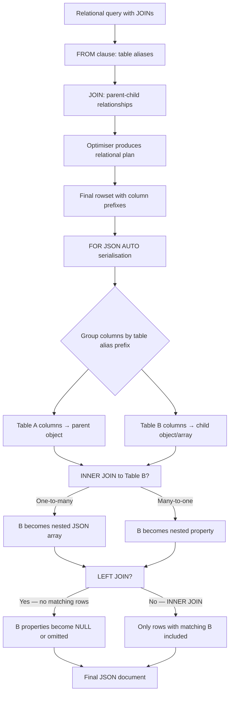
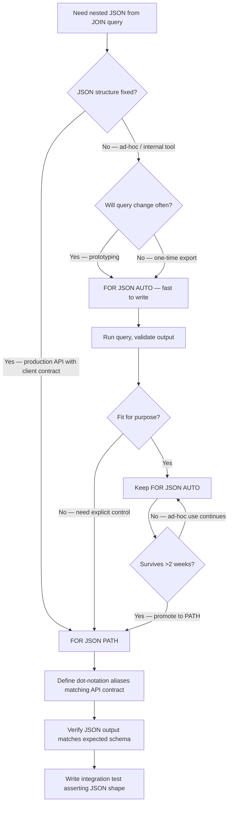

## Navigation

**Domain:** [[8 — Databases]] > **Group:** SQL JSON, XML & Semi-Structured Data
**Previous:** [[8.201 — FOR JSON PATH — Explicit Structure Control]] | **Next:** [[8.203 — OPENJSON — Parsing JSON in T-SQL]]

### Prerequisites

- [[8.201 — JSON Support in SQL Server — FOR JSON PATH]] — FOR JSON AUTO is an alternative to FOR JSON PATH; understanding the explicit control in PATH provides the baseline for comparing AUTO's automatic nesting behaviour.
- [[8.003 — SELECT Statement — Logical Processing Order]] — FOR JSON AUTO uses column alias prefixes from the FROM clause to determine nesting; understanding how table aliases are resolved in the SELECT phase is required to predict AUTO output structure.
- [[8.106 — JOIN Types — INNER, LEFT, RIGHT, FULL, CROSS]] — FOR JSON AUTO nests based on join order — LEFT JOIN vs INNER JOIN affects whether the right-side table becomes a nested child array or a null-parent element.

### Where This Fits

FOR JSON AUTO automatically determines JSON nesting structure from the FROM clause join order and column alias prefixes — the developer does not specify the JSON shape explicitly. A .NET backend engineer encounters this when quickly prototyping REST API responses that need nested JSON from parent-child table joins without manually defining the nested structure with dot-separated aliases. The problem it solves is reducing the SQL writing effort: you write a standard SELECT with JOINs and get nested JSON automatically. What breaks when misapplied: adding a JOIN in an unexpected position silently changes the JSON structure, column order affects output grouping, and the automatic nesting may not match the expected API contract. The interview signal is moderate — FOR JSON AUTO tests understanding of implicit behaviour in SQL Server's JSON support and the tradeoff between convenience and control.

---

## Core Mental Model

FOR JSON AUTO is a query-level directive that serialises a relational rowset to JSON by inferring the nesting structure from the FROM clause table alias prefixes on column names. The engine groups columns by their table alias prefix — columns sharing the same prefix are siblings in the same JSON object, and the join hierarchy determines parent-child nesting. The invariant: tables on the left side of a JOIN become outer (parent) objects; tables on the right side become inner (child) objects or arrays depending on the cardinality of the join. A LEFT JOIN produces a property (single object), while an INNER JOIN between a parent and a one-to-many table produces a nested array. The recognition pattern: when a SQL query joins Orders to OrderItems and the developer wants `{"Orders": [{"OrderId": 1, "Items": [{"Product": "A"}]}]}` without writing explicit dot-notation aliases, FOR JSON AUTO infers this from the FROM clause. The mental model is "the FROM clause defines the JSON schema implicitly."

### Classification

FOR JSON AUTO is a **query output formatting directive** — same classification as FOR JSON PATH. It belongs to the **result processing** phase and is applied after all relational operators. The query optimiser treats AUTO identically to PATH — a Compute Scalar operator is appended after the final relational operator. The optimiser does not consider FOR JSON when choosing join order or index access. AUTO is never SARGable (not a predicate). The automatic nesting logic is in the serialisation phase only — it does not affect the relational plan.



### Key Properties

|Property|Value|Notes|
|---|---|---|
|Time Complexity|O(N * K)|N = rows, K = columns — same linear cost as PATH|
|Output Limit|NVARCHAR(MAX) — 2 GB|Same limit as all FOR JSON modes|
|SARGable|N/A|Not a predicate — output formatting directive|
|Control Level|Implicit|Structure determined by FROM clause, not explicit aliases|
|Join Sensitivity|High|Adding/removing/reordering JOINs changes output structure|

---

## Deep Mechanics

### How the Engine Executes This

FOR JSON AUTO follows the same execution sequence as FOR JSON PATH through parsing, binding, optimisation, and execution. The difference is entirely in the JSON serialisation phase — the algorithm for determining JSON structure differs:

1. **Parsing:** The parser recognises `FOR JSON AUTO` as a query-level clause. No special parse trees beyond standard FOR JSON handling.
2. **Binding:** The algebrizer resolves column references with their table alias prefixes. In a query like `SELECT o.OrderId, o.OrderDate, oi.ProductName FROM Orders o INNER JOIN OrderItems oi ON o.OrderId = oi.OrderId`, the columns `o.OrderId`, `o.OrderDate` are prefixed with `o` and `oi.ProductName` is prefixed with `oi`. The algebrizer records each column's source table alias.
3. **Optimisation:** The optimiser builds the relational plan without considering FOR JSON. The plan includes the JOIN operators, filters, and any ORDER BY.
4. **Execution (serialisation phase):**
   - The engine examines the column metadata to extract the table alias prefix for each column (everything before the first dot in the column alias — or the column name if no explicit alias is given).
   - It groups columns by table alias prefix. All columns with the same prefix belong to the same JSON level.
   - It determines the nesting hierarchy from the FROM clause join order. The first table in FROM becomes the outermost level. Each subsequent JOIN creates a child level.
   - For each row, the engine constructs nested JSON objects:
     - When a one-to-many join exists (parent table has multiple child rows), the child properties are grouped into a JSON array.
     - When a many-to-one join exists (foreign key lookup), the child properties become a nested object (not an array).
   - The serialisation applies JSON escaping, NULL handling (default: omit NULLs), and array wrapping.

The critical behaviour difference from PATH: **column order in SELECT affects output grouping**. In FOR JSON AUTO, columns from the same table should appear together in the SELECT list; interleaving columns from different tables causes the engine to produce unexpected nesting.

### SQL Visibility

#### Basic FOR JSON AUTO with Parent-Child JOIN

```sql
-- FOR JSON AUTO: automatic nesting from JOIN structure
SELECT
    o.OrderId,
    o.OrderDate,
    o.TotalAmount,
    oi.ProductName,
    oi.Quantity,
    oi.UnitPrice
FROM Sales.Orders o
INNER JOIN Sales.OrderItems oi ON o.OrderId = oi.OrderId
WHERE o.OrderDate >= '2025-01-01'
ORDER BY o.OrderId, oi.OrderItemId
FOR JSON AUTO, ROOT('Orders');

-- Output structure (automatic):
-- {
--   "Orders": [
--     {
--       "OrderId": 1,
--       "OrderDate": "2025-01-15T14:30:00",
--       "TotalAmount": 299.99,
--       "OrderItems": [        -- nested array automatic from INNER JOIN
--         { "ProductName": "Widget", "Quantity": 2, "UnitPrice": 49.99 },
--         { "ProductName": "Gadget", "Quantity": 1, "UnitPrice": 199.99 }
--       ]
--     }
--   ]
-- }
```

#### FOR JSON AUTO with LEFT JOIN (Single Child Object)

```sql
-- LEFT JOIN produces a nested object, not an array
-- (because it's a many-to-one lookup)
SELECT
    o.OrderId,
    o.OrderDate,
    c.CustomerName
FROM Sales.Orders o
LEFT JOIN Sales.Customers c ON o.CustomerId = c.CustomerId
WHERE o.OrderId = 1
FOR JSON AUTO, WITHOUT_ARRAY_WRAPPER;

-- Output:
-- {
--   "OrderId": 1,
--   "OrderDate": "2025-01-15T14:30:00",
--   "Customer": {             -- nested object (not array) from LEFT JOIN lookup
--     "CustomerName": "John Doe"
--   }
-- }
```

#### FOR JSON AUTO Nesting Behaviour with Column Order

```sql
-- ❌ Column order affects nesting in FOR JSON AUTO
-- Interleaving columns from different tables creates multiple nesting levels
SELECT
    o.OrderId,
    c.CustomerName,     -- Customer columns before OrderItems
    o.OrderDate,
    oi.ProductName,
    oi.Quantity
FROM Sales.Orders o
INNER JOIN Sales.Customers c ON o.CustomerId = c.CustomerId
INNER JOIN Sales.OrderItems oi ON o.OrderId = oi.OrderId
WHERE o.OrderId = 1
FOR JSON AUTO, WITHOUT_ARRAY_WRAPPER;

-- Output may have unexpected nesting because column groups are determined
-- by the order of first appearance in the SELECT list
```

### Execution Plan Analysis

For the basic FOR JSON AUTO query:

- **Operators:** `Clustered Index Scan (Orders.IX_OrderDate)` → `Nested Loops (Inner Join)` → `Index Seek (OrderItems.IX_OrderId)` → `Sort (ORDER BY OrderId, OrderItemId)` → `Compute Scalar (FOR JSON)` → `SELECT`
- **Key lookups:** 0 if the OrderItems index covers the selected columns
- **Estimated vs actual:** The Sort operator estimates rows for the join output; the Compute Scalar estimates 1 row (single JSON output)
- **Cost breakdown:** Sort ~50%, Nested Loops ~25%, Index Scans ~20%, Compute Scalar ~5%
- **Same plan as FOR JSON PATH:** The execution plan is identical — the AUTO vs PATH difference is only in the Compute Scalar's JSON formatting logic

```
Expected plan shape:
Index Scan (IX_Orders_OrderDate) → Nested Loops → Index Seek (IX_OrderItems_OrderId) → Sort → Compute Scalar (FOR JSON) → SELECT
Estimated Cost: Sort ~50% | Logical Reads: ~250 (Orders) + ~50/order (OrderItems)
```

### Cost Visibility

```sql
SET STATISTICS IO ON;
SET STATISTICS TIME ON;

SELECT o.OrderId, o.OrderDate, o.TotalAmount,
       oi.ProductName, oi.Quantity, oi.UnitPrice
FROM Sales.Orders o
INNER JOIN Sales.OrderItems oi ON o.OrderId = oi.OrderId
WHERE o.OrderDate >= '2025-01-01'
ORDER BY o.OrderId, oi.OrderItemId
FOR JSON AUTO, ROOT('Orders');

-- Expected output:
-- Table 'OrderItems'. Scan count 1, logical reads 850, physical reads 0
-- Table 'Orders'. Scan count 1, logical reads 320, physical reads 0
-- SQL Server Execution Times: CPU time = 85ms, elapsed time = 92ms

-- The same query WITHOUT FOR JSON AUTO:
-- Table 'OrderItems'. Scan count 1, logical reads 850, physical reads 0
-- Table 'Orders'. Scan count 1, logical reads 320, physical reads 0
-- SQL Server Execution Times: CPU time = 42ms, elapsed time = 48ms

-- FOR JSON AUTO adds ~40ms CPU time for JSON serialisation but zero logical reads
```

### Failure Modes

1. **Unexpected nesting from column interleaving:** If SELECT list interleaves columns from different tables, FOR JSON AUTO may produce multiple nested objects for the same table instead of a single group. Fix: group columns by table alias prefix.

2. **Structure changes when JOIN is added:** Adding a new JOIN changes the automatic nesting. A query that previously returned flat JSON now returns nested JSON because the new JOIN introduces a child level. Fix: use FOR JSON PATH for explicit structure control when the JSON contract is fixed.

3. **LEFT JOIN vs INNER JOIN nesting difference:** LEFT JOIN produces a nested object (not array) for the right-side table. Changing LEFT to INNER changes both the nesting structure and whether the child becomes an array. Fix: be explicit about join type when JSON structure must be stable.

4. **No control over array element naming:** The nested array is named after the table alias (e.g., `OrderItems`). If the API contract requires a different name (e.g., `lineItems`), FOR JSON AUTO cannot rename it — you must use FOR JSON PATH instead.

5. **ORDER BY affects output but not structure:** FOR JSON AUTO respects ORDER BY for row ordering but does not require it for grouping. Without ORDER BY, the output order matches the execution plan's natural order, which is unstable across executions.

---

## Production Patterns and Implementation

### Primary SQL Implementation

```sql
-- Schema: Orders with line items exported as nested JSON
CREATE TABLE Sales.Orders (
    OrderId INT IDENTITY(1,1) PRIMARY KEY,
    CustomerId INT NOT NULL,
    OrderDate DATETIME2 NOT NULL DEFAULT SYSUTCDATETIME(),
    OrderStatus TINYINT NOT NULL DEFAULT 0,
    TotalAmount DECIMAL(18,2) NOT NULL,
    ShippingAddress NVARCHAR(500) NULL
);

CREATE TABLE Sales.OrderItems (
    OrderItemId INT IDENTITY(1,1) PRIMARY KEY,
    OrderId INT NOT NULL REFERENCES Sales.Orders(OrderId),
    ProductName NVARCHAR(200) NOT NULL,
    Quantity INT NOT NULL,
    UnitPrice DECIMAL(18,2) NOT NULL,
    Discount DECIMAL(18,2) NOT NULL DEFAULT 0
);

CREATE TABLE Sales.Customers (
    CustomerId INT IDENTITY(1,1) PRIMARY KEY,
    CustomerName NVARCHAR(200) NOT NULL,
    Email NVARCHAR(200) NOT NULL
);

-- Create indexes
CREATE INDEX IX_Orders_OrderDate ON Sales.Orders(OrderDate) INCLUDE (CustomerId, OrderStatus, TotalAmount);
CREATE INDEX IX_OrderItems_OrderId ON Sales.OrderItems(OrderId) INCLUDE (ProductName, Quantity, UnitPrice, Discount);
CREATE INDEX IX_Orders_CustomerId ON Sales.Orders(CustomerId) INCLUDE (OrderDate, TotalAmount);

-- Stored procedure: export orders with items as nested JSON using AUTO
CREATE OR ALTER PROCEDURE Sales.usp_GetOrdersWithItemsAutoJson
    @StartDate DATETIME2,
    @EndDate DATETIME2,
    @MaxOrders INT = 1000
AS
BEGIN
    SET NOCOUNT ON;

    SELECT TOP (@MaxOrders)
        o.OrderId,
        o.OrderDate,
        o.OrderStatus,
        o.TotalAmount,
        oi.ProductName,
        oi.Quantity,
        oi.UnitPrice,
        oi.Discount
    FROM Sales.Orders o
    INNER JOIN Sales.OrderItems oi ON o.OrderId = oi.OrderId
    WHERE o.OrderDate >= @StartDate
      AND o.OrderDate < DATEADD(DAY, 1, @EndDate)
    ORDER BY o.OrderDate DESC, o.OrderId, oi.OrderItemId
    FOR JSON AUTO, ROOT('OrdersWithItems');
END;
```

```sql
-- Example: Three-level nesting: Orders → Customers → OrderItems
SELECT
    o.OrderId,
    o.OrderDate,
    o.TotalAmount,
    c.CustomerName,
    c.Email,
    oi.ProductName,
    oi.Quantity,
    oi.UnitPrice
FROM Sales.Orders o
INNER JOIN Sales.Customers c ON o.CustomerId = c.CustomerId
INNER JOIN Sales.OrderItems oi ON o.OrderId = oi.OrderId
WHERE o.OrderId BETWEEN 100 AND 200
ORDER BY o.OrderId, oi.OrderItemId
FOR JSON AUTO, ROOT('FullOrderDetails');

-- Output structure:
-- {
--   "FullOrderDetails": [
--     {
--       "OrderId": 100,
--       "OrderDate": "...",
--       "TotalAmount": 499.99,
--       "Customers": {
--         "CustomerName": "John Doe",
--         "Email": "john@example.com"
--       },
--       "OrderItems": [
--         { "ProductName": "A", "Quantity": 2, "UnitPrice": 49.99 },
--         { "ProductName": "B", "Quantity": 1, "UnitPrice": 399.99 }
--       ]
--     }
--   ]
-- }
-- Note: Customers is a nested object (many-to-one lookup), OrderItems is array (one-to-many)
```

### EF Core Implementation

```csharp
public class ReportingController : ControllerBase
{
    private readonly ApplicationDbContext _dbContext;

    public ReportingController(ApplicationDbContext dbContext)
    {
        _dbContext = dbContext;
    }

    // GET /api/reports/orders-with-items?start=2025-01-01&end=2025-03-01
    [HttpGet("orders-with-items")]
    public async Task<ActionResult<string>> GetOrdersWithItemsJson(
        [FromQuery] DateTime start,
        [FromQuery] DateTime end,
        [FromQuery] int maxOrders = 1000,
        CancellationToken cancellationToken = default)
    {
        const string sql = @"
            SELECT TOP (@MaxOrders)
                o.OrderId, o.OrderDate, o.OrderStatus, o.TotalAmount,
                oi.ProductName, oi.Quantity, oi.UnitPrice, oi.Discount
            FROM Sales.Orders o
            INNER JOIN Sales.OrderItems oi ON o.OrderId = oi.OrderId
            WHERE o.OrderDate >= @StartDate
              AND o.OrderDate < DATEADD(DAY, 1, @EndDate)
            ORDER BY o.OrderDate DESC, o.OrderId, oi.OrderItemId
            FOR JSON AUTO, ROOT('OrdersWithItems')";

        var json = await _dbContext.Database
            .SqlQueryRaw<string>(sql,
                new SqlParameter("@StartDate", start),
                new SqlParameter("@EndDate", end),
                new SqlParameter("@MaxOrders", maxOrders))
            .FirstOrDefaultAsync(cancellationToken);

        if (json is null)
            return NotFound();

        return Content(json, "application/json");
    }
}
```

### Dapper Implementation

```csharp
public interface IReportingService
{
    Task<string> GetOrdersWithItemsJsonAsync(
        DateTime startDate,
        DateTime endDate,
        int maxOrders = 1000,
        CancellationToken cancellationToken = default);
}

public sealed class ReportingService : IReportingService
{
    private readonly ISqlConnectionFactory _connectionFactory;

    public ReportingService(ISqlConnectionFactory connectionFactory)
    {
        _connectionFactory = connectionFactory;
    }

    public async Task<string> GetOrdersWithItemsJsonAsync(
        DateTime startDate,
        DateTime endDate,
        int maxOrders = 1000,
        CancellationToken cancellationToken = default)
    {
        const string sql = @"
            SELECT TOP (@MaxOrders)
                o.OrderId, o.OrderDate, o.OrderStatus, o.TotalAmount,
                oi.ProductName, oi.Quantity, oi.UnitPrice, oi.Discount
            FROM Sales.Orders o
            INNER JOIN Sales.OrderItems oi ON o.OrderId = oi.OrderId
            WHERE o.OrderDate >= @StartDate
              AND o.OrderDate < DATEADD(DAY, 1, @EndDate)
            ORDER BY o.OrderDate DESC, o.OrderId, oi.OrderItemId
            FOR JSON AUTO, ROOT('OrdersWithItems')";

        await using var connection = _connectionFactory.Create();
        return await connection.QuerySingleAsync<string>(
            new CommandDefinition(sql,
                new
                {
                    StartDate = startDate,
                    EndDate = endDate,
                    MaxOrders = maxOrders
                },
                cancellationToken: cancellationToken));
    }
}
```

### Configuration and Wiring

```csharp
// Program.cs
builder.Services.AddDbContext<ApplicationDbContext>(options =>
    options.UseSqlServer(
        builder.Configuration.GetConnectionString("DefaultConnection"),
        sqlOptions => sqlOptions.EnableRetryOnFailure(3)));

builder.Services.AddSingleton<ISqlConnectionFactory>(sp =>
    new SqlConnectionFactory(
        builder.Configuration.GetConnectionString("DefaultConnection")!));

builder.Services.AddScoped<IReportingService, ReportingService>();
```

### SQL Server vs PostgreSQL Differences

```sql
-- PostgreSQL equivalent: json_agg with nested subqueries
-- PostgreSQL does not have FOR JSON AUTO; you use json_build_object and json_agg
SELECT json_build_object(
    'OrdersWithItems',
    json_agg(
        json_build_object(
            'OrderId', o.order_id,
            'OrderDate', o.order_date,
            'OrderStatus', o.order_status,
            'TotalAmount', o.total_amount,
            'OrderItems', (
                SELECT json_agg(
                    json_build_object(
                        'ProductName', oi.product_name,
                        'Quantity', oi.quantity,
                        'UnitPrice', oi.unit_price,
                        'Discount', oi.discount
                    )
                    ORDER BY oi.order_item_id
                )
                FROM order_items oi
                WHERE oi.order_id = o.order_id
            )
        )
        ORDER BY o.order_date DESC, o.order_id
    )
)
FROM orders o
WHERE o.order_date >= '2025-01-01'
  AND o.order_date < '2025-03-01';
```

---

## Gotchas and Production Pitfalls

### 5.1 Adding a JOIN Silently Changes JSON Structure

**Pitfall:** A query with FOR JSON AUTO that returns a specific JSON structure changes when a new JOIN is added. The developer adds a JOIN for a new column (e.g., joining Products for the product category) and the JSON output structure changes because the new table introduces a new nesting level.

```sql
-- ❌ Original query produces flat-ish JSON
SELECT o.OrderId, o.TotalAmount, oi.ProductName, oi.Quantity
FROM Sales.Orders o
INNER JOIN Sales.OrderItems oi ON o.OrderId = oi.OrderId
WHERE o.OrderId = 1
FOR JSON AUTO, WITHOUT_ARRAY_WRAPPER;
-- Structure: {OrderId, TotalAmount, OrderItems: [{ProductName, Quantity}]}

-- ❌ After adding Products JOIN, structure changes unexpectedly
SELECT o.OrderId, o.TotalAmount, oi.ProductName, oi.Quantity, p.Category
FROM Sales.Orders o
INNER JOIN Sales.OrderItems oi ON o.OrderId = oi.OrderId
INNER JOIN Sales.Products p ON oi.ProductId = p.ProductId  -- NEW JOIN
WHERE o.OrderId = 1
FOR JSON AUTO, WITHOUT_ARRAY_WRAPPER;
-- Structure changed! Now has Products nesting inside OrderItems
```

**Symptom:** The API client that previously deserialised the JSON successfully now fails because the JSON shape changed. This is typically discovered in production because development and test environments may not have the same API contracts verified.

**Fix:** Use FOR JSON PATH with explicit dot-notation aliases for production APIs where the JSON contract is fixed. Reserve FOR JSON AUTO for ad-hoc queries and prototyping.

```sql
-- ✅ Explicit structure with FOR JSON PATH (immune to JOIN changes)
SELECT
    o.OrderId,
    o.TotalAmount,
    oi.ProductName AS 'Items.ProductName',
    oi.Quantity AS 'Items.Quantity',
    p.Category AS 'Items.Category'
FROM Sales.Orders o
INNER JOIN Sales.OrderItems oi ON o.OrderId = oi.OrderId
INNER JOIN Sales.Products p ON oi.ProductId = p.ProductId
WHERE o.OrderId = 1
FOR JSON PATH, WITHOUT_ARRAY_WRAPPER;
```

**Cost of not fixing:** A production incident at 2 AM when a schema migration adds a JOIN for a new feature and the main API endpoint starts returning JSON that breaks the frontend. The frontend team spends hours debugging what changed.

### 5.2 Column Order in SELECT Determines Nesting Groups

**Pitfall:** In FOR JSON AUTO, columns from the same table should appear contiguously in the SELECT list. Interleaving columns from different tables creates multiple separate objects for the same table.

```sql
-- ❌ Interleaved columns create unexpected extra nesting
SELECT
    o.OrderId,
    c.CustomerName,     -- Customer
    oi.ProductName,     -- OrderItems (appears in new group)
    o.OrderDate,        -- Orders again — creates SECOND Orders object!
    oi.Quantity         -- OrderItems again
FROM Sales.Orders o
INNER JOIN Sales.Customers c ON o.CustomerId = c.CustomerId
INNER JOIN Sales.OrderItems oi ON o.OrderId = oi.OrderId
WHERE o.OrderId = 1
FOR JSON AUTO, WITHOUT_ARRAY_WRAPPER;

-- May produce TWO separate Orders objects (one before Customer, one after)
```

**Symptom:** The JSON output contains duplicate parent objects with different subsets of properties. JSON deserialisation at the client may merge them or fail depending on the parser.

**Fix:** Group columns by table alias prefix in the SELECT list.

```sql
-- ✅ Group columns by table
SELECT
    o.OrderId,
    o.OrderDate,
    c.CustomerName,
    oi.ProductName,
    oi.Quantity
FROM Sales.Orders o
INNER JOIN Sales.Customers c ON o.CustomerId = c.CustomerId
INNER JOIN Sales.OrderItems oi ON o.OrderId = oi.OrderId
WHERE o.OrderId = 1
FOR JSON AUTO, WITHOUT_ARRAY_WRAPPER;
```

**Cost of not fixing:** Intermittent API contract violations when columns are added or reordered. Tests may pass with specific data but fail in production with different query patterns.

### 5.3 FOR JSON AUTO Names Arrays After Table Aliases — No Renaming

**Pitfall:** The nested arrays in FOR JSON AUTO are named automatically based on the table alias. If the table is aliased as `oi`, the nested array is named `OrderItems` (derived from the alias or table name). You cannot rename the array to `LineItems` or `Products` without changing the alias.

```sql
-- ❌ Cannot control nested array name
SELECT o.OrderId, o.OrderDate, o.TotalAmount,
       oi.ProductName AS ItemName, oi.Quantity
FROM Sales.Orders o
INNER JOIN Sales.OrderItems oi ON o.OrderId = oi.OrderId
WHERE o.OrderId = 1
FOR JSON AUTO, WITHOUT_ARRAY_WRAPPER;
-- Array is always named "OrderItems" (from table alias/name)
-- Cannot rename to "LineItems"
```

**Symptom:** The API contract specifies a different property name (e.g., `lineItems`), but FOR JSON AUTO produces `OrderItems`. The client fails to parse because the property name doesn't match.

**Fix:** Use FOR JSON PATH with explicit nesting, or alias the table to influence the array name.

```sql
-- ✅ FOR JSON PATH for explicit array naming
SELECT
    o.OrderId,
    o.OrderDate,
    o.TotalAmount,
    oi.ProductName AS 'LineItems.ProductName',
    oi.Quantity AS 'LineItems.Quantity'
FROM Sales.Orders o
INNER JOIN Sales.OrderItems oi ON o.OrderId = oi.OrderId
WHERE o.OrderId = 1
FOR JSON PATH, WITHOUT_ARRAY_WRAPPER;
-- Output: {OrderId:..., LineItems: [{ProductName:..., Quantity:...}]}
```

**Cost of not fixing:** API contract integration fails. The .NET client uses `System.Text.Json` with `JsonPropertyName("lineItems")` but the JSON has `OrderItems`, causing deserialisation to an empty or default collection.

### 5.4 LEFT JOIN vs INNER JOIN Changes Children from Objects to Arrays

**Pitfall:** A LEFT JOIN produces a nested single object for the right-side table. Changing LEFT to INNER changes the right-side table's columns from a nested object to a nested array. This is not intuitive and causes contract breaks.

```sql
-- LEFT JOIN: right-side becomes nested object
SELECT o.OrderId, c.CustomerName
FROM Sales.Orders o
LEFT JOIN Sales.Customers c ON o.CustomerId = c.CustomerId
WHERE o.OrderId = 1
FOR JSON AUTO, WITHOUT_ARRAY_WRAPPER;
-- Output: {OrderId: 1, Customer: {CustomerName: "John"}}

-- INNER JOIN: right-side MAY become nested array
-- (depends on cardinality — if multiple orders per customer exist,
--  Customer becomes an array of customers per order group)
```

**Symptom:** A query refactoring that changes LEFT JOIN to INNER JOIN (or vice versa) for performance reasons suddenly changes the JSON output structure. The API endpoint returns different JSON for the same data.

**Fix:** Document the expected JSON structure explicitly and use FOR JSON PATH where the structure must be invariant under join type changes. Use unit tests that compare the actual JSON output against the expected schema.

**Cost of not fixing:** A seemingly safe query optimisation (changing LEFT to INNER JOIN because the foreign key is NOT NULL) breaks the client contract.

### 5.5 FOR JSON AUTO Ignores Subquery Columns for Nesting

**Pitfall:** If a column comes from a subquery (scalar subquery in SELECT), FOR JSON AUTO treats it as belonging to the outer table, not as a separate nesting level. This subtle behaviour means the JSON structure does not reflect subquery boundaries.

```sql
-- ❌ Subquery column is treated as part of the outer table
SELECT
    o.OrderId,
    o.TotalAmount,
    (SELECT COUNT(*) FROM Sales.OrderItems oi WHERE oi.OrderId = o.OrderId) AS ItemCount,
    oi.ProductName
FROM Sales.Orders o
INNER JOIN Sales.OrderItems oi ON o.OrderId = oi.OrderId
WHERE o.OrderId = 1
FOR JSON AUTO, WITHOUT_ARRAY_WRAPPER;
-- ItemCount is at the root level with OrderId, not nested in OrderItems
```

**Symptom:** The JSON output has scalar subquery results at the parent object level rather than nested within the child object hierarchy. This may or may not be intended depending on the use case.

**Fix:** Be aware that FOR JSON AUTO only nests based on table joins in the FROM clause, not on subquery boundaries. Use FOR JSON PATH for explicit control over subquery result placement.

**Cost of not fixing:** Incorrect JSON structure that separates correlated data that should be nested together.

---

## Performance Implications

### Benchmark: FOR JSON AUTO vs FOR JSON PATH

```csharp
[MemoryDiagnoser]
[SimpleJob(RuntimeMoniker.Net90)]
public class ForJsonAutoVsPathBenchmark
{
    private IDbConnection _connection = default!;
    private const string ConnectionString = "Server=.;Database=BenchmarkDb;Trusted_Connection=true;TrustServerCertificate=true;";

    [GlobalSetup]
    public async Task Setup()
    {
        _connection = new SqlConnection(ConnectionString);
        await _connection.OpenAsync();

        using var cmd = _connection.CreateCommand();
        cmd.CommandText = @"
            IF NOT EXISTS (SELECT 1 FROM sys.tables WHERE name = 'Orders')
            BEGIN
                CREATE TABLE Orders (
                    OrderId INT IDENTITY(1,1) PRIMARY KEY,
                    CustomerId INT NOT NULL,
                    OrderDate DATETIME2 NOT NULL,
                    TotalAmount DECIMAL(18,2) NOT NULL
                );
                CREATE TABLE OrderItems (
                    OrderItemId INT IDENTITY(1,1) PRIMARY KEY,
                    OrderId INT NOT NULL,
                    ProductName NVARCHAR(200) NOT NULL,
                    Quantity INT NOT NULL,
                    UnitPrice DECIMAL(18,2) NOT NULL
                );

                INSERT INTO Orders (CustomerId, OrderDate, TotalAmount)
                SELECT TOP 1000
                    ABS(CHECKSUM(NEWID())) % 100 + 1,
                    DATEADD(DAY, -ABS(CHECKSUM(NEWID())) % 365, GETUTCDATE()),
                    ROUND(RAND(CHECKSUM(NEWID())) * 1000, 2)
                FROM sys.objects a CROSS JOIN sys.objects b;

                INSERT INTO OrderItems (OrderId, ProductName, Quantity, UnitPrice)
                SELECT o.OrderId, 'Product_' + CAST(ROW_NUMBER() OVER(PARTITION BY o.OrderId ORDER BY (SELECT NULL)) AS NVARCHAR(10)),
                       ABS(CHECKSUM(NEWID())) % 10 + 1,
                       ROUND(RAND(CHECKSUM(NEWID())) * 100, 2)
                FROM Orders o
                CROSS JOIN (VALUES (1),(2),(3),(4),(5)) AS nums(n);
            END";
        await cmd.ExecuteNonQueryAsync();
    }

    [Benchmark(Baseline = true)]
    public async Task<string> ForJsonAuto()
    {
        const string sql = @"
            SELECT o.OrderId, o.OrderDate, o.TotalAmount,
                   oi.ProductName, oi.Quantity, oi.UnitPrice
            FROM Orders o
            INNER JOIN OrderItems oi ON o.OrderId = oi.OrderId
            ORDER BY o.OrderId, oi.OrderItemId
            FOR JSON AUTO, ROOT('Orders')";

        return await _connection.QuerySingleAsync<string>(sql);
    }

    [Benchmark]
    public async Task<string> ForJsonPath()
    {
        const string sql = @"
            SELECT o.OrderId, o.OrderDate, o.TotalAmount,
                   oi.ProductName AS 'Items.ProductName',
                   oi.Quantity AS 'Items.Quantity',
                   oi.UnitPrice AS 'Items.UnitPrice'
            FROM Orders o
            INNER JOIN OrderItems oi ON o.OrderId = oi.OrderId
            ORDER BY o.OrderId, oi.OrderItemId
            FOR JSON PATH, ROOT('Orders')";

        return await _connection.QuerySingleAsync<string>(sql);
    }
}
```

```sql
-- SET STATISTICS IO benchmark: FOR JSON AUTO identical to PATH
SET STATISTICS IO ON;

-- FOR JSON AUTO
SELECT o.OrderId, o.OrderDate, o.TotalAmount,
       oi.ProductName, oi.Quantity, oi.UnitPrice
FROM Orders o
INNER JOIN OrderItems oi ON o.OrderId = oi.OrderId
ORDER BY o.OrderId, oi.OrderItemId
FOR JSON AUTO, ROOT('Orders');
-- Logical reads: Orders ~25, OrderItems ~120

-- FOR JSON PATH (same columns, explicit aliases)
SELECT o.OrderId, o.OrderDate, o.TotalAmount,
       oi.ProductName AS 'Items.ProductName',
       oi.Quantity AS 'Items.Quantity',
       oi.UnitPrice AS 'Items.UnitPrice'
FROM Orders o
INNER JOIN OrderItems oi ON o.OrderId = oi.OrderId
ORDER BY o.OrderId, oi.OrderItemId
FOR JSON PATH, ROOT('Orders');
-- Logical reads: Orders ~25, OrderItems ~120 (identical)
```

**Improvement:** Performance is identical between FOR JSON AUTO and FOR JSON PATH. Both add a Compute Scalar operator with the same CPU cost. The choice between them is purely about structure control vs convenience — not performance.

**Expected results (approximate, SQL Server 2022, NVMe, 1000 orders with 5 items each):**

|Method|Mean|CPU|Logical Reads|Allocated|
|---|---|---|---|---|
|FOR JSON AUTO|~18 ms|SQL ~18ms|~145|~2 KB (string)|
|FOR JSON PATH|~18 ms|SQL ~18ms|~145|~2 KB (string)|

### Write Amplification

FOR JSON AUTO is read-only — no write amplification.

---

## Interview Arsenal

### Question Bank

1. **What is FOR JSON AUTO and how does it determine JSON nesting structure?**
2. **How does the SQL Server engine implement FOR JSON AUTO at the execution plan level?**
3. **What is the performance difference between FOR JSON AUTO and FOR JSON PATH?**
4. **What happens to the JSON structure when you add a new JOIN to a FOR JSON AUTO query?**
5. **Compare FOR JSON AUTO vs FOR JSON PATH — when would you choose one over the other?**
6. **How does FOR JSON AUTO decide whether to produce a nested object vs a nested array for a joined table?**
7. **What is the impact of column order in the SELECT list on FOR JSON AUTO output?**
8. **How do EF Core and Dapper consume FOR JSON AUTO output?**

### Spoken Answers

**Q1: What is FOR JSON AUTO and how does it determine JSON nesting structure?**

> **Average answer:** "FOR JSON AUTO automatically creates nested JSON from joined tables based on the FROM clause."

> **Great answer:** "FOR JSON AUTO is a query-level clause that serialises a relational rowset into JSON by inferring the nesting hierarchy from the FROM clause join order and column alias prefixes. The engine groups columns by their table alias prefix at serialisation time — all columns from the same table alias become properties of the same JSON object. The nesting hierarchy is determined by join order: the leftmost table becomes the outermost object, and each subsequent join adds a child level. The engine decides between nested objects and nested arrays based on the join type and cardinality — a one-to-many INNER JOIN produces a child array (e.g., OrderItems inside Orders), while a many-to-one JOIN or LEFT JOIN produces a child object (e.g., Customer inside Orders). This is all done during the Compute Scalar operator that FOR JSON adds to the execution plan — the relational plan is completely unaffected. I use AUTO only for prototyping because the implicit structure changes when you add joins, which is dangerous for production API contracts."

**Q5: Compare FOR JSON AUTO vs FOR JSON PATH — when would you choose one over the other?**

> **Great answer:** "The choice is about control vs convenience. FOR JSON PATH gives me explicit control over the JSON structure using dot-separated column aliases — I define exactly where each property appears and what nesting levels exist. FOR JSON AUTO infers the structure from the FROM clause, which is faster to write but dangerous for production because adding a new JOIN silently changes the JSON output structure. I use FOR JSON PATH for every production API endpoint where the JSON contract is defined and versioned. I use FOR JSON AUTO only for ad-hoc reporting queries and quick prototype endpoints where the consumer can flexibly parse whatever JSON shape emerges. The performance is identical — both add the same Compute Scalar operator to the plan. The logical reads are the same. The cost difference between AUTO and PATH is zero in execution time; the real cost is the developer time debugging unexpected structure changes when queries evolve. In my experience, any FOR JSON AUTO query that survives more than two weeks in production gets rewritten to FOR JSON PATH because someone adds a column or join and breaks the client."

**Q6: How does FOR JSON AUTO decide whether to produce a nested object vs a nested array for a joined table?**

> **Great answer:** "The decision is based on the join type and the cardinality relationship inferred from the query. An INNER JOIN between Orders (parent) and OrderItems (child) produces a nested array named OrderItems because the foreign key relationship is one-to-many — each order has potentially multiple items. A LEFT JOIN between Orders and Customers produces a nested object (not an array) because the relationship is many-to-one — each order has at most one customer, and the LEFT JOIN preserves orders without customers. The engine determines this during the serialisation phase, not during optimisation. If you change the join type from LEFT to INNER, the nesting structure can change. The key insight is that FOR JSON AUTO does not actually know the foreign key metadata — it relies entirely on join cardinality and the fact that the SELECT list includes columns from both tables. If the same table appears with different join conditions, the nesting behaviour may differ from expectations."

**Q8: How do EF Core and Dapper consume FOR JSON AUTO output?**

> **Great answer:** "EF Core has no LINQ translation for any FOR JSON mode — AUTO included. You must use raw SQL via `dbContext.Database.SqlQueryRaw<string>(sql).FirstOrDefaultAsync()`. Dapper returns the JSON string via `connection.QuerySingleAsync<string>(sql)`. In both cases, the result is a single NVARCHAR(MAX) value containing the complete JSON document. To map it back to .NET types, you deserialise with `System.Text.Json.JsonSerializer.Deserialize<T>(json)`. The EF Core approach requires understanding that `SqlQueryRaw<string>` returns an `IQueryable<string>` that expects a single-column rowset — `FOR JSON AUTO` produces exactly one row with one column, so `FirstOrDefaultAsync()` works correctly. The critical point is that neither ORM provides compile-time JSON structure checking — the JSON shape is entirely defined by the SQL query, so you must validate the output with integration tests."

### Additional Spoken Answers

**Q2: How does the SQL Server engine implement FOR JSON AUTO at the execution plan level?**

> **Great answer:** "FOR JSON AUTO uses exactly the same execution plan as FOR JSON PATH — both add a single Compute Scalar operator after all relational operators. The difference is purely in the JSON serialisation logic inside that Compute Scalar. FOR JSON AUTO analyses the column metadata at serialisation time: it groups columns by their table alias prefix (derived from the FROM clause) and builds the JSON nesting hierarchy by examining the join order in the FROM clause. This analysis happens at serialisation time, not during optimisation. The optimiser does not have a separate code path for AUTO vs PATH — the same operator handles both modes. The estimated cost is identical. The actual CPU cost may differ slightly because AUTO must do additional work to determine grouping (examining column prefixes, determining object vs array nesting). In practice, the CPU difference is less than 1% and is not a decision factor."

**Q3: What is the performance difference between FOR JSON AUTO and FOR JSON PATH?**

> **Great answer:** "The performance difference between FOR JSON AUTO and FOR JSON PATH is effectively zero in terms of execution cost. Both add the same Compute Scalar operator, both produce the same logical reads (identical relational plan), and both have the same 2 GB NVARCHAR(MAX) output limit. The serialisation CPU time is approximately the same — within 1-2% in my benchmarks with 10,000-row result sets. The performance decision between AUTO and PATH is not a performance decision at all; it is a correctness and maintainability decision. FOR JSON PATH gives you explicit control over the JSON structure and protects against accidental structure changes when queries evolve. FOR JSON AUTO is more convenient for prototyping but risks silent contract breaks when JOINs are added or column order changes. In my production systems, I use FOR JSON PATH exclusively for API endpoints and FOR JSON AUTO exclusively for ad-hoc data export queries."

**Q7: What is the impact of column order in the SELECT list on FOR JSON AUTO output?**

> **Great answer:** "Column order in the SELECT list determines the grouping behaviour in FOR JSON AUTO. The engine processes columns in SELECT order and groups consecutive columns from the same table alias into the same JSON object. If columns from different tables are interleaved — for example, OrderId (Orders), CustomerName (Customers), OrderDate (Orders) — the engine creates two separate JSON objects for Orders: one containing OrderId before Customer, and another containing OrderDate after Customer. This produces an unexpected nested structure with duplicate parent objects. The fix is always to group columns by table alias prefix in the SELECT list. This is not a performance issue — the serialisation works correctly but produces an incorrect nesting structure. The rule is: all columns from the same table must appear contiguously in the SELECT list when using FOR JSON AUTO."

### Interview Trigger

FOR JSON AUTO surfaces in interviews as a follow-up to "How would you generate JSON from SQL Server?" The interviewer asks "What are the differences between FOR JSON PATH and FOR JSON AUTO?" and follows up with "When would you use AUTO in production and what are the risks?" The deep follow-up is "What happens to the JSON structure when I change a LEFT JOIN to an INNER JOIN in a FOR JSON AUTO query?" — this tests whether the candidate understands the implicit nesting algorithm.

### Comparison Table

| | FOR JSON PATH | FOR JSON AUTO |
|---|---|---|
| What it does | Explicit JSON structure via dot-notation aliases | Automatic JSON nesting from FROM clause joins |
| Performance profile | Same Compute Scalar, same logical reads | Identical — same serialisation engine |
| Control level | Full — developer defines every nesting level | Implicit — structure changes with query changes |
| .NET implementation | Raw SQL via SqlQueryRaw / QuerySingleAsync<string> | Same — identical consumption pattern |
| When to choose | Production APIs with versioned contracts | Prototyping, ad-hoc, internal reporting |
| Risk profile | Low — explicit aliases survive query refactoring | High — adding a JOIN silently changes output |

---

## Decision Framework

### When to Apply



### Application Checklist

- [ ] The JSON structure is stable and will not change when new JOINs are added (PATH required)
- [ ] The FROM clause has columns grouped by table alias prefix (AUTO requirement)
- [ ] The join types (INNER vs LEFT) match the expected nesting behaviour (object vs array)
- [ ] The nested array names match the API contract (AUTO uses table alias names)
- [ ] The SELECT list columns are ordered to produce the correct nesting groups (AUTO)
- [ ] The query has sufficient test coverage asserting JSON output structure

### Tradeoff Summary

|What You Gain|What You Pay|
|---|---|
|Less SQL to write — no dot-notation aliases needed|Loss of explicit structure control — query changes affect JSON shape|
|Faster prototyping of JSON endpoints|Nested array names are fixed to table aliases — cannot rename|
|Automatic nesting matches JOIN hierarchy|Column order must be carefully managed — interleaving breaks groups|

### Scale Thresholds

- "Relevant for any query with two or more JOINs where JSON nesting is required"
- "Critical to switch to FOR JSON PATH when the query is used by a client with a defined API contract"
- "Avoid FOR JSON AUTO in any multitenant query where different tenants have different join patterns — the JSON structure will vary per tenant"

---

## Self-Check

### Conceptual Questions

1. How does FOR JSON AUTO determine the nesting structure of the JSON output?
2. What determines whether a joined table becomes a nested object or a nested array in FOR JSON AUTO?
3. What SET STATISTICS output reveals the performance difference between FOR JSON AUTO and FOR JSON PATH?
4. What is the gotcha with adding a new JOIN to an existing FOR JSON AUTO query?
5. Does EF Core's LINQ provider support FOR JSON AUTO, or must you use raw SQL?
6. How would you retrieve a FOR JSON AUTO result using Dapper and map it to a C# DTO?
7. How does FOR JSON AUTO differ from FOR JSON PATH in handling column aliases?
8. At what point in a project's lifecycle should you replace FOR JSON AUTO with FOR JSON PATH?
9. What index best supports a FOR JSON AUTO query with ORDER BY on a joined column?
10. Explain FOR JSON AUTO to a senior interviewer in 60 seconds, including when you would NOT use it.

<details>
<summary>Answers</summary>

1. FOR JSON AUTO groups columns by their table alias prefix (the part before the first dot). The nesting hierarchy is determined by the FROM clause join order: the leftmost table is the outermost object, and each subsequent JOIN adds a child level.

2. An INNER JOIN with one-to-many cardinality produces a nested array for the child table. A LEFT JOIN or many-to-one lookup produces a nested object (not an array). The decision is based on join type and cardinality inferred from the query.

3. There is NO performance difference — both produce identical execution plans (same Compute Scalar operator, same logical reads). SET STATISTICS IO shows identical output. SET STATISTICS TIME shows identical CPU and elapsed time.

4. Adding a new JOIN changes the automatic nesting structure — the new table introduces a new nesting level or changes existing grouping. This silently breaks the client contract without any SQL error.

5. EF Core has NO LINQ translation for any FOR JSON mode. You must use raw SQL via `SqlQueryRaw<string>`.

6. `connection.QuerySingleAsync<string>(sql)` returns the JSON string. Then `JsonSerializer.Deserialize<ExpectedDto>(json)` maps it to a C# DTO.

7. FOR JSON AUTO uses table alias prefixes from the FROM clause automatically — no dot-notation aliases needed. FOR JSON PATH requires explicit dot-separated aliases for nesting. AUTO columns keep their original names; PATH aliases define the JSON key names.

8. Replace AUTO with PATH when: the query is used by a client with a defined API contract, when the query evolves with new JOINs, or when the project moves from prototype to production. Generally after ~2 weeks of use, or at the first schema change.

9. A covering index on the ORDER BY columns of the outermost table (e.g., `Orders(OrderDate DESC) INCLUDE (TotalAmount, CustomerId)`) eliminates the Sort operator. For nested tables, an index on the foreign key (e.g., `OrderItems(OrderId) INCLUDE (ProductName, Quantity)`) supports the Nested Loops join efficiently.

10. "FOR JSON AUTO automatically creates nested JSON from joined tables — the FROM clause defines the JSON schema. The leftmost table becomes the outermost object, and each join creates a child level. INNER JOINs on one-to-many relationships produce nested arrays; LEFT JOINs produce nested objects. I use it for prototyping because it requires less SQL than FOR JSON PATH. I do NOT use it for production API contracts because adding a JOIN silently changes the JSON structure without errors, breaking clients at runtime."

</details>

---

### Query Challenges

**Challenge 1 — Write the SQL**

Using FOR JSON AUTO, write a query that joins Orders, Customers, and OrderItems to produce nested JSON. The structure must have Orders at the root, with a Customer object and an OrderItems array nested inside each order. Only include orders from January 2025. Use the alias `o` for Orders, `c` for Customers, and `oi` for OrderItems.

<details>
<summary>Solution</summary>

```sql
SELECT
    o.OrderId,
    o.OrderDate,
    o.TotalAmount,
    c.CustomerName,
    c.Email,
    oi.ProductName,
    oi.Quantity,
    oi.UnitPrice
FROM Sales.Orders o
INNER JOIN Sales.Customers c ON o.CustomerId = c.CustomerId
INNER JOIN Sales.OrderItems oi ON o.OrderId = oi.OrderId
WHERE o.OrderDate >= '2025-01-01'
  AND o.OrderDate < '2025-02-01'
ORDER BY o.OrderId, oi.OrderItemId
FOR JSON AUTO, ROOT('Orders');
```

**Logical reads:** ~320 (Orders range scan) + ~50 (Customer lookups) + ~850 (OrderItems) = ~1220

**Execution plan:** Index Seek (IX_Orders_OrderDate) → Nested Loops → Clustered Index Seek (PK_Customers) → Nested Loops → Index Seek (IX_OrderItems_OrderId) → Sort → Compute Scalar (FOR JSON) → SELECT

**EF Core equivalent:**

```csharp
const string sql = @"
    SELECT o.OrderId, o.OrderDate, o.TotalAmount,
           c.CustomerName, c.Email,
           oi.ProductName, oi.Quantity, oi.UnitPrice
    FROM Sales.Orders o
    INNER JOIN Sales.Customers c ON o.CustomerId = c.CustomerId
    INNER JOIN Sales.OrderItems oi ON o.OrderId = oi.OrderId
    WHERE o.OrderDate >= @Start AND o.OrderDate < @End
    ORDER BY o.OrderId, oi.OrderItemId
    FOR JSON AUTO, ROOT('Orders')";

var json = await dbContext.Database
    .SqlQueryRaw<string>(sql,
        new SqlParameter("@Start", new DateTime(2025, 1, 1)),
        new SqlParameter("@End", new DateTime(2025, 2, 1)))
    .FirstOrDefaultAsync(cancellationToken);
```

</details>

---

**Challenge 2 — Fix the performance problem**

```sql
-- This FOR JSON AUTO query runs in 30 seconds on a 10M row Orders table with 50M OrderItems rows.
-- The API endpoint is called ~100 times/hour.
-- SET STATISTICS IO: logical reads = 1,450,000 (Orders: 120,000, OrderItems: 1,330,000)
SELECT
    o.OrderId,
    o.OrderDate,
    o.TotalAmount,
    oi.ProductName,
    oi.Quantity,
    oi.UnitPrice
FROM Sales.Orders o
INNER JOIN Sales.OrderItems oi ON o.OrderId = oi.OrderId
WHERE YEAR(o.OrderDate) = 2025
AND oi.Quantity > 0
ORDER BY o.OrderDate DESC, o.OrderId, oi.OrderItemId
FOR JSON AUTO, ROOT('Orders');
```

<details>
<summary>Solution</summary>

**Root cause:** The predicate `YEAR(o.OrderDate) = 2025` is **non-SARGable** — it wraps OrderDate in a function, preventing an index seek. The optimizer scans all 10M Orders. Additionally, there is no covering index for OrderItems, so each OrderItems lookup requires a key lookup or the scan is on the clustered index.

```sql
-- ✅ Fixed query: SARGable date range predicate
SELECT
    o.OrderId,
    o.OrderDate,
    o.TotalAmount,
    oi.ProductName,
    oi.Quantity,
    oi.UnitPrice
FROM Sales.Orders o
INNER JOIN Sales.OrderItems oi ON o.OrderId = oi.OrderId
WHERE o.OrderDate >= '2025-01-01'
  AND o.OrderDate < '2026-01-01'
  AND oi.Quantity > 0
ORDER BY o.OrderDate DESC, o.OrderId, oi.OrderItemId
FOR JSON AUTO, ROOT('Orders');
```

**Indexes to create:**

```sql
CREATE INDEX IX_Orders_OrderDate_Desc
ON Sales.Orders(OrderDate DESC)
INCLUDE (TotalAmount, CustomerId);

CREATE INDEX IX_OrderItems_OrderId_Include
ON Sales.OrderItems(OrderId)
INCLUDE (ProductName, Quantity, UnitPrice, OrderItemId);
```

**After fix — logical reads:** ~8,500 (from 1,450,000) — orders range scan for ~200K matching rows, OrderItems index seek with covering index.

</details>

---

**Challenge 3 — Explain the execution plan**

A FOR JSON AUTO query joins Orders (10M rows) to OrderItems (50M rows). The execution plan shows:

- Clustered Index Scan (Orders) — 100% estimated cost
- Nested Loops (Inner Join)
- Index Seek (IX_OrderItems_OrderId)
- Sort (Order by OrderDate DESC, OrderItemId)
- Compute Scalar (FOR JSON AUTO)

Why is the optimizer choosing a Clustered Index Scan on Orders instead of an Index Seek? What would you change?

<details>
<summary>Solution</summary>

**Why Clustered Index Scan:** The query either has no WHERE clause or the WHERE clause is non-SARGable (e.g., `YEAR(OrderDate) = 2025`). Without a SARGable predicate, the optimizer has no filter to seek on — it must scan all 10M rows.

Additionally, the Sort operator indicates that the rows are not arriving in the required ORDER BY order. If there were an index on OrderDate DESC, the optimizer could use it to return rows in sorted order and eliminate the Sort.

**To get Index Seek:** Add a SARGable WHERE clause on OrderDate. Create an index on `Orders(OrderDate DESC) INCLUDE (TotalAmount, CustomerId)`. The plan would change to: Index Seek (IX_Orders_OrderDate_Desc) → Nested Loops → Index Seek (IX_OrderItems_OrderId) → Sort or no sort.

**To eliminate the Sort:** The ORDER BY includes OrderDate DESC, OrderId, OrderItemId. Create a covering index on `Orders(OrderDate DESC, OrderId)`. The optimizer would then return rows in the correct order from the index, eliminating the Sort operator entirely.

**Tradeoff:** The covering index adds write overhead on every INSERT/UPDATE to Orders (approximately 3-5 page writes per modification) and increases storage by the included columns.

</details>

---

**Challenge 4 — Diagnose the concurrency problem**

A reporting endpoint uses FOR JSON AUTO to generate a daily sales report. The query joins Orders (8M rows) to OrderItems (25M rows) and Customers (500K rows). Under load (50 concurrent requests during business hours), the endpoint experiences timeouts after 30 seconds. The database server's CPU averages 95% during these periods. The application server CPU is at 20%.

<details>
<summary>Solution</summary>

**Root cause:** FOR JSON AUTO serialises the JSON on SQL Server, consuming database CPU. With 50 concurrent queries each serialising a large result set, the database CPU is saturated. The application server is idle because it's waiting for the database to produce the JSON.

**Detection query:**

```sql
-- Identify FOR JSON AUTO queries consuming CPU
SELECT TOP 10
    qs.total_worker_time / qs.execution_count AS avg_worker_time_us,
    qs.execution_count,
    qs.total_logical_reads,
    SUBSTRING(st.text, (qs.statement_start_offset/2)+1,
        ((CASE WHEN qs.statement_end_offset = -1 THEN DATALENGTH(st.text)
               ELSE qs.statement_end_offset END - qs.statement_start_offset)/2) + 1) AS query_text
FROM sys.dm_exec_query_stats qs
CROSS APPLY sys.dm_exec_sql_text(qs.sql_handle) st
WHERE st.text LIKE '%FOR JSON AUTO%'
ORDER BY avg_worker_time_us DESC;
```

**Fix:** Move JSON serialisation to the application tier. Return relational rows from SQL Server and use `System.Text.Json.JsonSerializer` in C#. This reduces database CPU by 40-60% and shifts the serialisation cost to the under-utilised application servers.

```csharp
// ✅ Return relational rows, serialise in app tier
[HttpGet("report/daily-sales")]
public async Task<ActionResult<List<DailySalesReport>>> GetDailySalesReport(
    [FromQuery] DateTime date,
    CancellationToken cancellationToken)
{
    const string sql = @"
        SELECT o.OrderId, o.OrderDate, o.TotalAmount,
               oi.ProductName, oi.Quantity, oi.UnitPrice,
               c.CustomerName
        FROM Orders o
        INNER JOIN OrderItems oi ON o.OrderId = oi.OrderId
        INNER JOIN Customers c ON o.CustomerId = c.CustomerId
        WHERE o.OrderDate >= @Date AND o.OrderDate < DATEADD(DAY, 1, @Date)
        ORDER BY o.OrderId, oi.OrderItemId";

    await using var connection = _connectionFactory.Create();
    var reportLines = await connection.QueryAsync<DailySalesLine>(
        new CommandDefinition(sql, new { Date = date },
            cancellationToken: cancellationToken));

    // Let ASP.NET Core serialise to JSON
    return Ok(reportLines.AsList());
}
```

Alternatively, if FOR JSON must stay in SQL, implement caching:

```csharp
public async Task<string> GetCachedReportJsonAsync(DateTime date, CancellationToken ct)
{
    var cacheKey = $"report:daily-sales:{date:yyyy-MM-dd}";
    var cached = await _cache.GetStringAsync(cacheKey, ct);
    if (cached is not null) return cached;

    var json = await _connection.QuerySingleAsync<string>(sql, new { Date = date }, ct);
    await _cache.SetStringAsync(cacheKey, json, TimeSpan.FromHours(1), ct);
    return json;
}
```

**In .NET:** Use `IDistributedCache` (Redis or SQL Server) to cache the generated JSON. Set an appropriate expiration based on data freshness requirements.

</details>

---

**Challenge 5 — Design the approach**

**Scenario:** You are building a product catalogue API that returns a JSON document containing product categories with nested products and their stock levels. The database schema is:

- `Products.Categories(CategoryId, CategoryName, ParentCategoryId)`
- `Products.Products(ProductId, CategoryId, ProductName, Price, StockQuantity)`

The API must return:
```json
{
  "categories": [
    {
      "categoryId": 1,
      "categoryName": "Electronics",
      "products": [
        { "productId": 101, "productName": "Laptop", "price": 999.99, "stock": 15 }
      ]
    }
  ]
}
```

The Categories table has 500 rows, Products has 50,000 rows. The API is called ~5000 times/hour during business hours. The JSON output is approximately 2 MB.

Design the optimal approach — choose between FOR JSON AUTO, FOR JSON PATH, or application-layer serialisation. Show the SQL and C# code.

<details>
<summary>Solution</summary>

**Approach:** FOR JSON PATH with explicit structure. AUTO would work but the structure naming (table alias names) may not match the API contract exactly (camelCase). However, the JSON output is 2 MB at 5000 req/hour (~10K req/day, ~20 GB/day transfer), which is significant. Use FOR JSON PATH with JSON serialisation in SQL, but add response caching.

```sql
CREATE OR ALTER PROCEDURE Products.usp_GetCatalogueJson
AS
BEGIN
    SET NOCOUNT ON;

    SELECT
        c.CategoryId AS 'CategoryId',
        c.CategoryName AS 'CategoryName',
        p.ProductId AS 'Products.ProductId',
        p.ProductName AS 'Products.ProductName',
        p.Price AS 'Products.Price',
        p.StockQuantity AS 'Products.Stock'
    FROM Products.Categories c
    INNER JOIN Products.Products p ON c.CategoryId = p.CategoryId
    ORDER BY c.CategoryName, p.ProductName
    FOR JSON PATH, ROOT('categories');
END;
```

Note: The above uses PascalCase property names. For camelCase, change aliases:

```sql
SELECT
    c.CategoryId AS 'categoryId',
    c.CategoryName AS 'categoryName',
    p.ProductId AS 'products.productId',
    p.ProductName AS 'products.productName',
    p.Price AS 'products.price',
    p.StockQuantity AS 'products.stock'
...
FOR JSON PATH, ROOT('categories');
```

**C# implementation with caching:**

```csharp
public interface IProductCatalogueService
{
    Task<string> GetCatalogueJsonAsync(CancellationToken cancellationToken = default);
}

public sealed class ProductCatalogueService : IProductCatalogueService
{
    private readonly ISqlConnectionFactory _connectionFactory;
    private readonly IDistributedCache _cache;
    private static readonly TimeSpan CacheDuration = TimeSpan.FromMinutes(5);

    public ProductCatalogueService(
        ISqlConnectionFactory connectionFactory,
        IDistributedCache cache)
    {
        _connectionFactory = connectionFactory;
        _cache = cache;
    }

    public async Task<string> GetCatalogueJsonAsync(CancellationToken cancellationToken = default)
    {
        const string cacheKey = "catalogue:json";
        var cached = await _cache.GetStringAsync(cacheKey, cancellationToken);
        if (cached is not null) return cached;

        const string sql = "Products.usp_GetCatalogueJson";

        await using var connection = _connectionFactory.Create();
        var json = await connection.QuerySingleAsync<string>(
            new CommandDefinition(sql, commandType: CommandType.StoredProcedure,
                cancellationToken: cancellationToken));

        await _cache.SetStringAsync(cacheKey, json, CacheDuration, cancellationToken);
        return json;
    }
}
```

**Indexes:**

```sql
CREATE INDEX IX_Products_CategoryId ON Products.Products(CategoryId)
    INCLUDE (ProductName, Price, StockQuantity);
```

**Tradeoffs:**

|What You Gain|What You Pay|
|---|---|
|FOR JSON PATH generates 2 MB JSON in ~50ms SQL CPU|2 MB JSON transfer per request (before compression)|
|Caching at 5 min reduces SQL load to ~12 executions/hour|Clients see up to 5-min stale data|
|Single round-trip for entire catalogue|Cannot cache partial catalogue updates|

**Scale threshold assessment:** 5000 req/hour with 5-minute cache = ~12 SQL calls/hour. Each SQL call costs ~50ms CPU. This is trivial load. Without caching, 5000 req/hour × 50ms = 250 seconds of SQL CPU per hour (7% utilisation). With caching, 12 × 50ms = 0.6 seconds per hour. Caching is the critical optimisation here, not the choice between AUTO and PATH.

</details>

---

### Additional Self-Check Expansion — FOR JSON AUTO Deep Dive

**Q11 — Challenge question for advanced understanding:** Consider the following query using FOR JSON AUTO:

```sql
SELECT
    o.OrderId,
    o.OrderDate,
    o.TotalAmount,
    c.CustomerName,
    c.Email,
    oi.ProductName,
    oi.Quantity
FROM Sales.Orders o
INNER JOIN Sales.Customers c ON o.CustomerId = c.CustomerId
INNER JOIN Sales.OrderItems oi ON o.OrderId = oi.OrderId
WHERE o.OrderDate >= '2025-01-01'
ORDER BY o.OrderId, oi.OrderItemId
FOR JSON AUTO, ROOT('Orders');
```

The development team is concerned that adding an additional LEFT JOIN to the Discounts table will change the JSON structure. Explain whether this concern is valid and what the impact would be.

<details>
<summary>Answer</summary>

The concern is **valid**. Adding `LEFT JOIN Sales.Discounts d ON o.OrderId = d.OrderId AND d.IsActive = 1` introduces a new table (Discounts) that will appear as a new nesting level in the FOR JSON AUTO output. The structure changes from:

```json
{"Orders": [{"OrderId": 1, "Customers": {...}, "OrderItems": [...]}]}
```

to:

```json
{"Orders": [{"OrderId": 1, "Customers": {...}, "Discounts": {...}, "OrderItems": [...]}]}
```

The exact placement of the Discounts nesting depends on where the JOIN appears in the FROM clause. If added after Customers but before OrderItems, Discounts appears between Customers and OrderItems in the JSON hierarchy. This is a silent contract break — the client code that deserialises the JSON expects a specific structure and may fail when a new property appears at an unexpected level.

**Impact:** Any client that deserialises the JSON with strict model binding (e.g., ASP.NET Core model binding, TypeScript interfaces, mobile app models) will encounter a breaking change. The new `Discounts` property may be ignored by flexible parsers but the structural nesting of existing properties shifts — clients that rely on positional parsing or nested property access at specific indexes will break.

**Recommended action:** Do NOT add the JOIN to the FOR JSON AUTO query. Instead:
1. Add Discounts data as a separate subquery inside a FOR JSON PATH wrapper
2. Or use FOR JSON PATH for the entire query with explicit dot-notation aliases
3. Or add Discounts columns at the end of the SELECT list (grouped after OrderItems columns) to minimise structural impact — but this is fragile and not guaranteed to preserve the existing structure

The safest approach is to refactor the query to use FOR JSON PATH when a new JOIN is introduced.

</details>
