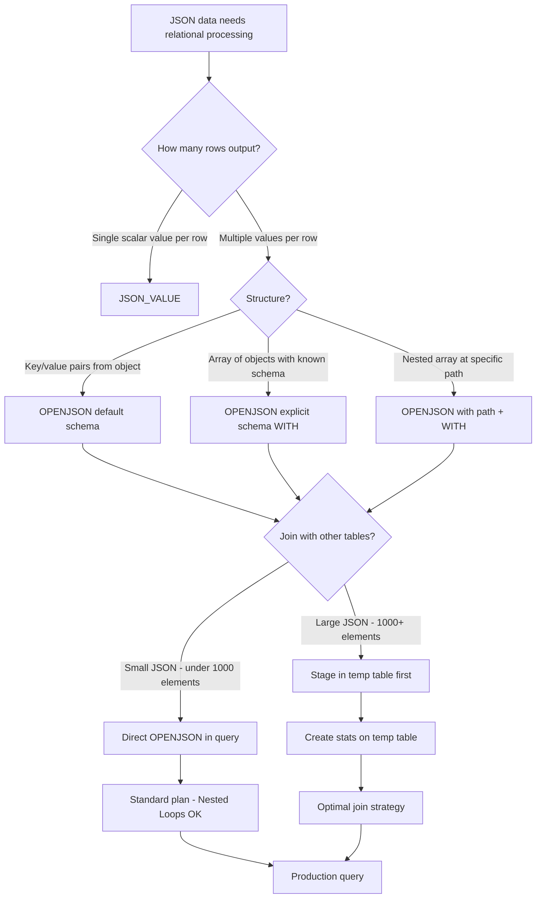

## Navigation

**Domain:** [[8 — Databases]] > **Group:** SQL JSON, XML & Semi-Structured Data
**Previous:** [[8.202 — FOR JSON AUTO — Automatic Nesting]] | **Next:** [[8.204 — JSON_VALUE — Extracting Scalar Values]]

### Prerequisites

- [[8.003 — SELECT Statement — Logical Processing Order]] — OPENJSON is a table-valued function that appears in the FROM clause; understanding how the optimiser resolves TVFs in the query plan is required.
- [[8.201 — FOR JSON PATH — Generating JSON from Relations]] — OPENJSON is the inverse of FOR JSON — converting JSON back to relational rows. Understanding the serialisation direction helps understand the parsing direction.
- [[8.213 — JSON Path Expressions — Dollar Notation]] — OPENJSON requires JSON path expressions ($.store.book[0].title) in the WITH clause; knowing the JSON path syntax is mandatory for column mapping.

### Where This Fits

OPENJSON is a table-valued function (TVF) that parses JSON text into relational rows and columns — the inverse of FOR JSON. A .NET backend engineer encounters this when JSON data arrives in SQL Server from external APIs (webhook payloads, IoT device telemetry, mobile app requests) and must be inserted into relational tables, or when JSON columns must be queried relationally. The problem this solves is bridging the gap between semi-structured JSON data and the relational engine — allowing JSON to be consumed in FROM, JOIN, WHERE, and INSERT/SELECT patterns. What breaks when misapplied: OPENJSON without explicit schema (key/value/type output) is slower and harder to work with than explicit schema (WITH clause); parsing very large JSON strings (>100 MB) causes memory pressure; OPENJSON cannot be indexed directly (unlike JSON_VALUE in computed columns). The interview signal is very strong — OPENJSON tests understanding of TVF execution in the query plan, JSON path expressions, and the tradeoff between explicit and default schema.

---

## Core Mental Model

OPENJSON is a table-valued function that takes a JSON string as input and produces a relational rowset as output. In default mode (no WITH clause), it returns three columns: `key` (nvarchar), `value` (nvarchar(max)), and `type` (int) — one row per JSON property or array element. In explicit schema mode (WITH clause), it maps JSON properties to typed relational columns using JSON path expressions — one row per JSON array element. The invariant: OPENJSON operates on the **entire JSON string in memory** — it parses the JSON into a lightweight document object model (DOM) internally, then projects the requested paths. It does not use indexes (it is a function applied to a value, not a persistent structure). The recognition pattern: when a stored procedure receives a JSON payload from an application (e.g., a list of order items in JSON format) and needs to insert it into relational tables, OPENJSON in the FROM clause expands the JSON array into rows that can be joined, filtered, and inserted. The mental model is "OPENJSON is the bridge from JSON to relational — it makes the JSON navigable with T-SQL."

### Classification

OPENJSON is a **table-valued function** — it belongs to the **rowset function** family in SQL Server (like OPENXML, OPENQUERY, OPENROWSET). It appears in the FROM clause and returns a rowset that can be joined to other tables. The query optimiser treats OPENJSON as a **black-box TVF** — it estimates a fixed number of rows (default 100 for the default schema, 1000 for explicit schema) unless the JSON string is a variable of known size, in which case the estimate scales. It is never SARGable (you cannot index an OPENJSON call). The function reads the entire JSON string during execution — logical reads are on the JSON string's storage, not on any table.

```mermaid
flowchart TD
    A[JSON string input] --> B{OPENJSON mode?}
    B -->|Default schema - no WITH| C[Parse JSON into key/value/type rows]
    B -->|Explicit schema - WITH clause| D[Parse JSON array elements into typed columns]
    C --> E[Each JSON property = one row]
    C --> F[key column: property name]
    C --> G[value column: property value as NVARCHAR&#40;MAX&#41;]
    C --> H[type column: 0=null,1=string,2=number,3=boolean,4=array,5=object]
    D --> I[Each array element = one row]
    D --> J[WITH clause defines column names + types + JSON paths]
    I --> K[Join with other tables via CROSS APPLY / OUTER APPLY]
    J --> K
    K --> L[INSERT/SELECT/MERGE target relational tables]
    L --> M[Relational data from JSON source]
```



### Key Properties

|Property|Value|Notes|
|---|---|---|
|Time Complexity|O(N)|N = length of JSON string — linear parse|
|Schema Requirement|Optional (default) or explicitly defined (WITH)|Explicit schema is faster and type-safe|
|Output Rowset|Relational rows and columns|Can be used in FROM, JOIN, APPLY, INSERT...SELECT|
|SARGable|No|Cannot be indexed — always a full parse of the JSON|
|Memory Usage|Proportional to JSON size plus result set|Large JSON (>50 MB) causes memory pressure|
|Default Estimate|100 rows (default), ~1000 rows (explicit)|Optimiser fixed estimate — may cause bad plan choices|

---

## Deep Mechanics

### How the Engine Executes This

OPENJSON is a table-valued function that SQL Server executes during the **scan phase** of the query plan. Here is the step-by-step trace:

1. **Parsing:** The SQL parser identifies OPENJSON as a built-in TVF with either one argument (JSON string) or two arguments (JSON string + path expression).
2. **Binding:** The algebrizer resolves the JSON input expression (variable, column, or string literal) and, if present, the optional second argument (JSON path expression starting with `$`).
3. **Optimisation:** The optimiser builds a plan with a `Table-valued Function` operator. The estimated row count is based on the fixed heuristics:
   - 100 rows for the default schema (key/value/type)
   - 1000 rows for explicit schema (WITH clause)
   
   These estimates do not change based on the actual JSON content — the optimiser has no statistics on JSON content. This means the optimiser may choose a Nested Loops join when the JSON actually contains 100,000 elements, causing poor performance.
4. **Execution:**
   - The engine reads the JSON string into a lightweight, read-only Document Object Model (DOM) in memory.
   - For **default schema**: the engine iterates each top-level property (or array element if a path is provided) and emits one row with key, value (as NVARCHAR(MAX)), and type (int: 0=null, 1=string, 2=number, 3=boolean, 4=array, 5=object). The value is always NVARCHAR(MAX) — the consumer must CAST to the target type.
   - For **explicit schema**: the engine iterates each array element (or each top-level object if no path) and for each element, evaluates each column's JSON path expression against the element object. The results are cast to the declared column types (NVARCHAR, INT, DECIMAL, DATETIME2, etc.). This is more CPU-efficient than the default schema because the engine avoids building the generic key/value/type rowset and instead directly projects typed values.
5. **Memory management:** The JSON string and its DOM are held in memory for the duration of the OPENJSON execution. For large JSON inputs (>100 MB), this can cause memory pressure and spills to tempdb.

### SQL Visibility

#### OPENJSON with Default Schema

```sql
-- Parse JSON array to key/value/type rows
DECLARE @json NVARCHAR(MAX) = N'{
    "OrderId": 10248,
    "Customer": "John Doe",
    "Items": [
        {"Product": "Widget", "Price": 49.99},
        {"Product": "Gadget", "Price": 199.99}
    ],
    "Shipped": false,
    "ShipDate": null
}';

SELECT
    j.[key],
    j.[value],
    j.[type]
FROM OPENJSON(@json) j;

-- Output:
-- key          | value                     | type
-- OrderId      | 10248                     | 2    (number)
-- Customer     | "John Doe"                | 1    (string)
-- Items        | [{"Product":"Widget",...}] | 4    (array)
-- Shipped      | false                     | 3    (boolean)
-- ShipDate     | null                      | 0    (null)
```

#### OPENJSON with Explicit Schema (WITH clause)

```sql
-- Parse JSON array of orders into typed relational rows
DECLARE @json NVARCHAR(MAX) = N'[
    {"OrderId": 10248, "Customer": "John Doe", "TotalAmount": 299.99, "OrderDate": "2025-01-15"},
    {"OrderId": 10249, "Customer": "Jane Smith", "TotalAmount": 149.50, "OrderDate": "2025-01-16"},
    {"OrderId": 10250, "Customer": "Bob Jones", "TotalAmount": 599.99, "OrderDate": "2025-01-17"}
]';

SELECT
    j.OrderId,
    j.Customer,
    j.TotalAmount,
    j.OrderDate
FROM OPENJSON(@json)
WITH (
    OrderId INT '$.OrderId',
    Customer NVARCHAR(200) '$.Customer',
    TotalAmount DECIMAL(18,2) '$.TotalAmount',
    OrderDate DATETIME2 '$.OrderDate'
) j;

-- Output:
-- OrderId | Customer   | TotalAmount | OrderDate
-- 10248   | John Doe   | 299.99      | 2025-01-15
-- 10249   | Jane Smith | 149.50      | 2025-01-16
-- 10250   | Bob Jones  | 599.99      | 2025-01-17
```

#### OPENJSON with Path Filter (Second Argument)

```sql
-- Extract only the Items array from a nested JSON document
DECLARE @json NVARCHAR(MAX) = N'{
    "OrderId": 10248,
    "Items": [
        {"Product": "Widget", "Qty": 2, "Price": 49.99},
        {"Product": "Gadget", "Qty": 1, "Price": 199.99}
    ]
}';

SELECT
    j.Product,
    j.Qty,
    j.Price
FROM OPENJSON(@json, '$.Items')
WITH (
    Product NVARCHAR(100) '$.Product',
    Qty INT '$.Qty',
    Price DECIMAL(18,2) '$.Price'
) j;

-- Output:
-- Product | Qty | Price
-- Widget  | 2   | 49.99
-- Gadget  | 1   | 199.99
```

#### OPENJSON with Cross Apply — Joining Relational and JSON Data

```sql
-- Join relational Orders table with JSON array of items
-- Scenario: Orders table has a JSON column ItemsJson (NVARCHAR(MAX))
SELECT
    o.OrderId,
    o.OrderDate,
    j.ProductName,
    j.Quantity,
    j.UnitPrice,
    (j.Quantity * j.UnitPrice) AS LineTotal
FROM Sales.Orders o
CROSS APPLY OPENJSON(o.ItemsJson)
WITH (
    ProductName NVARCHAR(200) '$.Product',
    Quantity INT '$.Qty',
    UnitPrice DECIMAL(18,2) '$.Price'
) j
WHERE o.OrderDate >= '2025-01-01'
ORDER BY o.OrderId, j.ProductName;
```

```csharp
// EF Core — raw SQL only (OPENJSON has no LINQ translation)
var items = await dbContext.Database
    .SqlQueryRaw<OrderItemDto>(@"
        SELECT o.OrderId, o.OrderDate,
               j.ProductName, j.Quantity, j.UnitPrice,
               (j.Quantity * j.UnitPrice) AS LineTotal
        FROM Sales.Orders o
        CROSS APPLY OPENJSON(o.ItemsJson)
        WITH (
            ProductName NVARCHAR(200) '$.Product',
            Quantity INT '$.Qty',
            UnitPrice DECIMAL(18,2) '$.Price'
        ) j
        WHERE o.OrderDate >= @Date
        ORDER BY o.OrderId, j.ProductName",
        new SqlParameter("@Date", new DateTime(2025, 1, 1)))
    .ToListAsync(cancellationToken);
```

```csharp
// Dapper — raw SQL with typed result
public async Task<IReadOnlyList<OrderItemDto>> GetOrderItemsFromJsonAsync(
    DateTime minDate,
    CancellationToken cancellationToken = default)
{
    const string sql = @"
        SELECT o.OrderId, o.OrderDate,
               j.ProductName, j.Quantity, j.UnitPrice,
               (j.Quantity * j.UnitPrice) AS LineTotal
        FROM Sales.Orders o
        CROSS APPLY OPENJSON(o.ItemsJson)
        WITH (
            ProductName NVARCHAR(200) '$.Product',
            Quantity INT '$.Qty',
            UnitPrice DECIMAL(18,2) '$.Price'
        ) j
        WHERE o.OrderDate >= @MinDate
        ORDER BY o.OrderId, j.ProductName";

    await using var connection = _connectionFactory.Create();
    var results = await connection.QueryAsync<OrderItemDto>(
        new CommandDefinition(sql, new { MinDate = minDate },
            cancellationToken: cancellationToken));
    return results.AsList();
}
```

### Execution Plan Analysis

For the OPENJSON with CROSS APPLY query:

- **Operators:** `Clustered Index Scan (Orders.IX_OrderDate)` → `Table-valued Function (OPENJSON)` → `Compute Scalar (LineTotal)` → `Sort (ORDER BY)`
- **Key lookups:** 0 — JSON column is stored inline in the clustered index (no separate access needed)
- **Estimated vs actual:** OPENJSON is estimated at 1000 rows (explicit schema estimate). If each order has 50 items, the actual may be 50. The estimate may be much higher or lower than actual, affecting join choices.
- **Cost breakdown:** TVF operator cost is CPU-bound (JSON parsing). The Clustered Index Scan is I/O-bound. At scale, the TVF operator dominates if the JSON is large (parsing 50 items per row × 1000 rows = 50,000 JSON elements parsed).
- **Without index:** If there is no index on OrderDate, the Clustered Index Scan reads all rows, and OPENJSON is called for every row, dramatically increasing total cost.

```
Expected plan shape:
Clustered Index Scan (IX_Orders_OrderDate) → Table-valued Function (OPENJSON) → Compute Scalar → Sort → SELECT
Estimated Cost: TVF ~60% | Scan ~30% | Sort ~10%
```

### Cost Visibility

```sql
SET STATISTICS IO ON;
SET STATISTICS TIME ON;

SELECT o.OrderId, o.OrderDate,
       j.ProductName, j.Quantity, j.UnitPrice
FROM Sales.Orders o
CROSS APPLY OPENJSON(o.ItemsJson)
WITH (
    ProductName NVARCHAR(200) '$.Product',
    Quantity INT '$.Qty',
    UnitPrice DECIMAL(18,2) '$.Price'
) j
WHERE o.OrderDate >= '2025-01-01'
ORDER BY o.OrderId, j.ProductName;

-- Expected output:
-- Table 'Orders'. Scan count 1, logical reads 450, physical reads 0
-- SQL Server Execution Times: CPU time = 120ms, elapsed time = 135ms

-- The OPENJSON TVF operator does not appear in STATISTICS IO directly --
-- it shows as part of the parent table (Orders) because the JSON column
-- is stored in the Orders table row.
```

STATISTICS IO for OPENJSON queries only shows reads on the base table. The OPENJSON parsing CPU cost appears in `SET STATISTICS TIME` (CPU time) and in `sys.dm_exec_query_stats.total_worker_time`. To measure the JSON parsing cost specifically, compare the CPU time of the same query with and without the OPENJSON call.

### Failure Modes

1. **OPENJSON without explicit schema is slower:** The default schema returns key/value/type with NVARCHAR(MAX) values that must be CAST to the target type. This adds overhead. Fix: always use the WITH clause for explicit schema when you know the JSON structure.

2. **Fixed row estimates cause bad join plans:** OPENJSON estimates 100 rows (default) or 1000 rows (explicit schema). If actual rows are 100,000, the optimiser may choose a Nested Loops join with 100,000 iterations instead of a Hash Match. Fix: use a RECOMPILE hint or a temporary table to stage the OPENJSON output.

3. **Large JSON causes memory pressure:** Parsing a 200 MB JSON string requires the engine to hold the parsed DOM in memory alongside the string. This can cause RESOURCE_SEMAPHORE waits. Fix: paginate the JSON at the application layer or use a streaming approach.

4. **Invalid JSON raises an error:** OPENJSON requires valid JSON. If the input contains malformed JSON (e.g., trailing comma, single quotes instead of double quotes), the function raises error 13609. Fix: validate with ISJSON before calling OPENJSON.

5. **Path expressions with special characters:** JSON keys with dots (e.g., `"customer.name"`) require quoted path notation: `$."customer.name"`. Developers forget to quote, causing "invalid JSON path" errors.

---

## Production Patterns and Implementation

### Primary SQL Implementation

```sql
-- Schema: Orders with JSON payload column
CREATE TABLE Sales.Orders (
    OrderId INT IDENTITY(1,1) PRIMARY KEY,
    CustomerId INT NOT NULL,
    OrderDate DATETIME2 NOT NULL DEFAULT SYSUTCDATETIME(),
    OrderStatus TINYINT NOT NULL DEFAULT 0,
    TotalAmount DECIMAL(18,2) NOT NULL,
    ItemsJson NVARCHAR(MAX) NULL,           -- JSON array of items
    ShippingInfo NVARCHAR(MAX) NULL,        -- JSON object for shipping details
    Notes NVARCHAR(2000) NULL
);

CREATE TABLE Sales.OrderItems (
    OrderItemId INT IDENTITY(1,1) PRIMARY KEY,
    OrderId INT NOT NULL REFERENCES Sales.Orders(OrderId),
    ProductName NVARCHAR(200) NOT NULL,
    Quantity INT NOT NULL,
    UnitPrice DECIMAL(18,2) NOT NULL,
    Discount DECIMAL(18,2) NOT NULL DEFAULT 0
);

CREATE INDEX IX_Orders_OrderDate ON Sales.Orders(OrderDate);
CREATE INDEX IX_Orders_CustomerId ON Sales.Orders(CustomerId);
```

```sql
-- Stored procedure: Insert order with JSON items into relational table
CREATE OR ALTER PROCEDURE Sales.usp_CreateOrderFromJson
    @CustomerId INT,
    @ItemsJson NVARCHAR(MAX)   -- JSON array: [{"Product":"Widget","Qty":2,"Price":49.99}]
AS
BEGIN
    SET NOCOUNT ON;
    SET XACT_ABORT ON;

    DECLARE @OrderId INT;
    DECLARE @TotalAmount DECIMAL(18,2);

    BEGIN TRANSACTION;

    -- Calculate total from JSON items
    SELECT @TotalAmount = SUM(j.Qty * j.Price)
    FROM OPENJSON(@ItemsJson)
    WITH (
        Product NVARCHAR(200) '$.Product',
        Qty INT '$.Qty',
        Price DECIMAL(18,2) '$.Price'
    ) j;

    -- Insert the order header
    INSERT INTO Sales.Orders (CustomerId, OrderDate, OrderStatus, TotalAmount, ItemsJson)
    VALUES (@CustomerId, SYSUTCDATETIME(), 0, @TotalAmount, @ItemsJson);

    SET @OrderId = SCOPE_IDENTITY();

    -- Insert order items from JSON
    INSERT INTO Sales.OrderItems (OrderId, ProductName, Quantity, UnitPrice)
    SELECT
        @OrderId,
        j.Product,
        j.Qty,
        j.Price
    FROM OPENJSON(@ItemsJson)
    WITH (
        Product NVARCHAR(200) '$.Product',
        Qty INT '$.Qty',
        Price DECIMAL(18,2) '$.Price'
    ) j;

    COMMIT TRANSACTION;

    SELECT @OrderId AS OrderId, @TotalAmount AS TotalAmount;
END;
```

```sql
-- Stored procedure: Report order items by expanding JSON
CREATE OR ALTER PROCEDURE Sales.usp_GetOrderItemsExpanded
    @OrderId INT
AS
BEGIN
    SET NOCOUNT ON;

    SELECT
        j.ProductName,
        j.Quantity,
        j.UnitPrice,
        (j.Quantity * j.UnitPrice) AS LineTotal
    FROM Sales.Orders o
    CROSS APPLY OPENJSON(o.ItemsJson)
    WITH (
        ProductName NVARCHAR(200) '$.Product',
        Quantity INT '$.Qty',
        UnitPrice DECIMAL(18,2) '$.Price'
    ) j
    WHERE o.OrderId = @OrderId
    ORDER BY j.ProductName;
END;
```

### EF Core Implementation

```csharp
public class OrderDto
{
    public int OrderId { get; set; }
    public decimal TotalAmount { get; set; }
    public string? ProductName { get; set; }
    public int Quantity { get; set; }
    public decimal UnitPrice { get; set; }
    public decimal LineTotal { get; set; }
}

public class OrdersController : ControllerBase
{
    private readonly ApplicationDbContext _dbContext;

    public OrdersController(ApplicationDbContext dbContext)
    {
        _dbContext = dbContext;
    }

    // GET /api/orders/10248/items
    [HttpGet("{orderId}/items")]
    public async Task<ActionResult<List<OrderDto>>> GetOrderItems(
        int orderId,
        CancellationToken cancellationToken)
    {
        const string sql = @"
            SELECT o.OrderId, o.TotalAmount,
                   j.ProductName, j.Quantity, j.UnitPrice,
                   (j.Quantity * j.UnitPrice) AS LineTotal
            FROM Sales.Orders o
            CROSS APPLY OPENJSON(o.ItemsJson)
            WITH (
                ProductName NVARCHAR(200) '$.Product',
                Quantity INT '$.Qty',
                UnitPrice DECIMAL(18,2) '$.Price'
            ) j
            WHERE o.OrderId = @OrderId
            ORDER BY j.ProductName";

        var items = await _dbContext.Database
            .SqlQueryRaw<OrderDto>(sql,
                new SqlParameter("@OrderId", orderId))
            .ToListAsync(cancellationToken);

        if (items.Count == 0)
            return NotFound();

        return Ok(items);
    }

    // POST /api/orders/from-json
    [HttpPost("from-json")]
    public async Task<ActionResult<CreateOrderResult>> CreateOrderFromJson(
        [FromBody] CreateOrderRequest request,
        CancellationToken cancellationToken)
    {
        const string sql = @"
            EXEC Sales.usp_CreateOrderFromJson
                @CustomerId = @CustomerId,
                @ItemsJson = @ItemsJson";

        var result = await _dbContext.Database
            .SqlQueryRaw<CreateOrderResult>(sql,
                new SqlParameter("@CustomerId", request.CustomerId),
                new SqlParameter("@ItemsJson", request.ItemsJson))
            .FirstOrDefaultAsync(cancellationToken);

        return CreatedAtAction(nameof(GetOrderItems), new { orderId = result!.OrderId }, result);
    }
}
```

### Dapper Implementation

```csharp
public interface IOrderJsonService
{
    Task<IReadOnlyList<OrderItemDto>> GetOrderItemsAsync(
        int orderId,
        CancellationToken cancellationToken = default);

    Task<CreateOrderResult> CreateOrderFromJsonAsync(
        CreateOrderRequest request,
        CancellationToken cancellationToken = default);
}

public sealed class OrderJsonService : IOrderJsonService
{
    private readonly ISqlConnectionFactory _connectionFactory;

    public OrderJsonService(ISqlConnectionFactory connectionFactory)
    {
        _connectionFactory = connectionFactory;
    }

    public async Task<IReadOnlyList<OrderItemDto>> GetOrderItemsAsync(
        int orderId,
        CancellationToken cancellationToken = default)
    {
        const string sql = @"
            SELECT o.OrderId, o.TotalAmount,
                   j.ProductName, j.Quantity, j.UnitPrice,
                   (j.Quantity * j.UnitPrice) AS LineTotal
            FROM Sales.Orders o
            CROSS APPLY OPENJSON(o.ItemsJson)
            WITH (
                ProductName NVARCHAR(200) '$.Product',
                Quantity INT '$.Qty',
                UnitPrice DECIMAL(18,2) '$.Price'
            ) j
            WHERE o.OrderId = @OrderId
            ORDER BY j.ProductName";

        await using var connection = _connectionFactory.Create();
        var results = await connection.QueryAsync<OrderItemDto>(
            new CommandDefinition(sql,
                new { OrderId = orderId },
                cancellationToken: cancellationToken));
        return results.AsList();
    }

    public async Task<CreateOrderResult> CreateOrderFromJsonAsync(
        CreateOrderRequest request,
        CancellationToken cancellationToken = default)
    {
        await using var connection = _connectionFactory.Create();
        return await connection.QuerySingleAsync<CreateOrderResult>(
            "Sales.usp_CreateOrderFromJson",
            new
            {
                CustomerId = request.CustomerId,
                ItemsJson = request.ItemsJson
            },
            commandType: CommandType.StoredProcedure,
            cancellationToken: cancellationToken);
    }
}
```

### Configuration and Wiring

```csharp
// Program.cs
builder.Services.AddDbContext<ApplicationDbContext>(options =>
    options.UseSqlServer(
        builder.Configuration.GetConnectionString("DefaultConnection"),
        sqlOptions => sqlOptions.EnableRetryOnFailure(3)));

builder.Services.AddSingleton<ISqlConnectionFactory>(sp =>
    new SqlConnectionFactory(
        builder.Configuration.GetConnectionString("DefaultConnection")!));

builder.Services.AddScoped<IOrderJsonService, OrderJsonService>();
```

### SQL Server vs PostgreSQL Differences

```sql
-- PostgreSQL equivalent: json_to_recordset / jsonb_to_recordset
-- Parse JSON array of objects to relational rows

SELECT *
FROM json_to_recordset('[
    {"OrderId": 10248, "Customer": "John Doe", "TotalAmount": 299.99},
    {"OrderId": 10249, "Customer": "Jane Smith", "TotalAmount": 149.50}
]') AS j(OrderId INT, Customer TEXT, TotalAmount NUMERIC);
```

```sql
-- PostgreSQL: jsonb_to_recordset with nested path extraction
SELECT
    o.order_id,
    j.product_name,
    j.quantity,
    j.unit_price
FROM orders o
CROSS JOIN LATERAL jsonb_to_recordset(o.items_jsonb -> 'Items')
    AS j(product_name TEXT, quantity INT, unit_price NUMERIC)
WHERE o.order_date >= '2025-01-01';
```

---

## Gotchas and Production Pitfalls

### 5.1 OPENJSON Without Explicit Schema — Unnecessary Overhead

**Pitfall:** Using OPENJSON without the WITH clause (default schema) when you know the JSON structure. The default schema returns key/value/type as NVARCHAR(MAX), requiring CAST operations in the outer query.

```sql
-- ❌ Default schema: slower, more code, type conversions needed
DECLARE @json NVARCHAR(MAX) = N'{"OrderId": 10248, "TotalAmount": 299.99}';

SELECT
    CAST(MAX(CASE WHEN [key] = 'OrderId' THEN [value] END) AS INT) AS OrderId,
    CAST(MAX(CASE WHEN [key] = 'TotalAmount' THEN [value] END) AS DECIMAL(18,2)) AS TotalAmount
FROM OPENJSON(@json);
```

**Symptom:** Higher CPU time for type conversions and the PIVOT-like aggregate pattern. The query is harder to read and maintain.

**Fix:** Always use the WITH clause for known JSON structures.

```sql
-- ✅ Explicit schema: faster, cleaner, type-safe
SELECT OrderId, TotalAmount
FROM OPENJSON(@json)
WITH (
    OrderId INT '$.OrderId',
    TotalAmount DECIMAL(18,2) '$.TotalAmount'
);
```

**Cost of not fixing:** For a high-throughput endpoint parsing JSON payloads, the default schema adds 20-30% CPU overhead and makes the code less maintainable. At 1000 requests/second, this is a significant waste of database CPU.

### 5.2 OPENJSON Row Estimate Poor for Large JSON Arrays

**Pitfall:** OPENJSON with explicit schema estimates 1000 rows regardless of the actual JSON array size. When the JSON contains 100,000 elements, the optimiser chooses a plan optimised for 1000 rows (e.g., Nested Loops with residual predicates) that performs poorly.

```sql
-- ❌ Optimiser estimates 1000 rows but actual is 100,000
SELECT j.*
FROM OPENJSON(@largeJson)
WITH (
    OrderId INT '$.OrderId',
    TotalAmount DECIMAL(18,2) '$.TotalAmount'
) j
INNER JOIN Sales.Orders o ON j.OrderId = o.OrderId;
-- The optimiser may choose Nested Loops (because it expects 1000 rows)
-- but with 100,000 actual rows, a Hash Match would be better
```

**Symptom:** High CPU time from a Nested Loops join executed 100,000 times. The execution plan shows a Nested Loops operator with 100,000 executions on the inner side.

**Fix:** Use QueryTraceHints or load into a temp table to give the optimiser accurate cardinality.

```sql
-- ✅ Option 1: Use RECOMPILE hint for accurate estimate based on JSON size
SELECT j.*
FROM OPENJSON(@largeJson)
WITH (
    OrderId INT '$.OrderId',
    TotalAmount DECIMAL(18,2) '$.TotalAmount'
) j
INNER JOIN Sales.Orders o ON j.OrderId = o.OrderId
OPTION (RECOMPILE);

-- ✅ Option 2: Stage into temp table for accurate stats
SELECT OrderId, TotalAmount
INTO #JsonOrders
FROM OPENJSON(@largeJson)
WITH (
    OrderId INT '$.OrderId',
    TotalAmount DECIMAL(18,2) '$.TotalAmount'
);

CREATE STATISTICS #stats_json ON #JsonOrders (OrderId);

SELECT j.*, o.OrderDate
FROM #JsonOrders j
INNER JOIN Sales.Orders o ON j.OrderId = o.OrderId;
```

**Cost of not fixing:** A 100,000-row JSON join takes 10-30 seconds instead of <1 second. The query times out in the application.

### 5.3 OPENJSON Does Not Validate JSON Structure — Silent NULLs

**Pitfall:** If the JSON structure does not match the WITH clause paths, OPENJSON returns NULL for the column without error. A typo in the JSON path (e.g., `$.OrderId` vs `$.OrderID`) silently returns NULLs.

```sql
-- ❌ Typo in JSON path: "OrderID" vs "OrderId" — no error, silent NULLs
DECLARE @json NVARCHAR(MAX) = N'{"OrderId": 10248, "TotalAmount": 299.99}';

SELECT OrderId, WrongOrderId
FROM OPENJSON(@json)
WITH (
    OrderId INT '$.OrderId',         -- correct: 10248
    WrongOrderId INT '$.OrderID'     -- typo: returns NULL, no error
);
-- Output: OrderId=10248, WrongOrderId=NULL
```

**Symptom:** The application receives NULL values for expected columns. The bug is hard to trace because there is no error — the data is silently missing.

**Fix:** Validate the JSON structure before parsing. Use JSON_VALUE with strict mode to detect missing paths.

```sql
-- ✅ Validate JSON structure first
IF EXISTS (
    SELECT 1
    FROM OPENJSON(@json)
    WHERE JSON_VALUE(@json, 'strict$.OrderId') IS NOT NULL  -- strict throws if path missing
)
    SELECT OrderId, TotalAmount
    FROM OPENJSON(@json)
    WITH (
        OrderId INT '$.OrderId',
        TotalAmount DECIMAL(18,2) '$.TotalAmount'
    );
ELSE
    THROW 50001, 'Invalid JSON structure: OrderId required', 1;
```

**Cost of not fixing:** Data corruption — 10,000 orders inserted with NULL OrderId columns because the JSON key was misspelled in the API payload. The data is recoverable but requires a full backfill.

### 5.4 CROSS APPLY OPENJSON on Large Result Sets — Row-by-Row Parsing Overhead

**Pitfall:** Using CROSS APPLY OPENJSON on a column (e.g., ItemsJson) in a query that returns many rows. OPENJSON is called once per row, parsing the JSON for every row. If the SELECT returns 10,000 rows and each row has a 50-item JSON array, OPENJSON parses 500,000 JSON elements.

```sql
-- ❌ OPENJSON called for every matching row — expensive at scale
SELECT o.OrderId, j.ProductName
FROM Sales.Orders o
CROSS APPLY OPENJSON(o.ItemsJson)
WITH (ProductName NVARCHAR(200) '$.Product') j
WHERE o.OrderDate >= '2025-01-01';
-- 10,000 orders × 50 items = 500,000 JSON elements parsed
```

**Symptom:** High CPU time (seconds). The TVF operator in the execution plan shows high actual rows (total items across all orders). The query duration is acceptable for small date ranges but blows up for large ranges.

**Fix:** Limit the number of orders, or use JSON_VALUE/JSON_QUERY for single-value extraction (not applicable when expanding arrays).

```sql
-- ✅ Limit orders first, then expand JSON
WITH FilteredOrders AS (
    SELECT TOP 100 OrderId, ItemsJson
    FROM Sales.Orders
    WHERE OrderDate >= '2025-01-01'
    ORDER BY OrderId
)
SELECT f.OrderId, j.ProductName
FROM FilteredOrders f
CROSS APPLY OPENJSON(f.ItemsJson)
WITH (ProductName NVARCHAR(200) '$.Product') j;
```

**Cost of not fixing:** A reporting query that expands JSON on all orders runs for 60 seconds instead of 2 seconds. The reporting dashboard times out.

### 5.5 JSON Input > 100 MB Causes Memory Pressure and RESOURCE_SEMAPHORE Waits

**Pitfall:** Passing a very large JSON string (>100 MB) to OPENJSON. The engine must hold the entire JSON string and its parsed DOM in memory. This causes memory contention with other queries.

```sql
-- ❌ 200 MB JSON string — causes memory pressure
DECLARE @hugeJson NVARCHAR(MAX) = [200 MB JSON string];
SELECT *
FROM OPENJSON(@hugeJson)
WITH (
    Id INT '$.id',
    Name NVARCHAR(200) '$.name'
);
```

**Symptom:** `RESOURCE_SEMAPHORE` waits in `sys.dm_exec_requests` and `sys.dm_os_waiting_tasks`. The query may be killed by the resource governor or the out-of-memory detector.

**Fix:** Stream the JSON at the application layer (process in batches) or split the JSON into smaller chunks before passing to SQL Server.

```csharp
// ✅ Process JSON in batches at the application layer
public async Task ProcessLargeJsonAsync(
    string largeJsonFilePath,
    int batchSize = 1000,
    CancellationToken cancellationToken = default)
{
    var json = await File.ReadAllTextAsync(largeJsonFilePath, cancellationToken);
    var items = JsonSerializer.Deserialize<List<OrderItemDto>>(json)!;

    foreach (var batch in items.Chunk(batchSize))
    {
        var batchJson = JsonSerializer.Serialize(batch);
        const string sql = @"
            INSERT INTO Sales.OrderItems (OrderId, ProductName, Quantity, UnitPrice)
            SELECT OrderId, ProductName, Quantity, UnitPrice
            FROM OPENJSON(@BatchJson)
            WITH (
                OrderId INT '$.OrderId',
                ProductName NVARCHAR(200) '$.ProductName',
                Quantity INT '$.Quantity',
                UnitPrice DECIMAL(18,2) '$.UnitPrice'
            )";

        await using var connection = _connectionFactory.Create();
        await connection.ExecuteAsync(
            new CommandDefinition(sql,
                new { BatchJson = batchJson },
                cancellationToken: cancellationToken));
    }
}
```

**Cost of not fixing:** The query fails with error 8623 (resource semaphore) or error 701 (out of memory). The batch job that ingests JSON files fails intermittently.

---

## Performance Implications

### Benchmark: OPENJSON Default Schema vs Explicit Schema

```csharp
[MemoryDiagnoser]
[SimpleJob(RuntimeMoniker.Net90)]
public class OpenJsonSchemaBenchmark
{
    private IDbConnection _connection = default!;
    private string _jsonPayload = default!;
    private const string ConnectionString = "Server=.;Database=BenchmarkDb;Trusted_Connection=true;TrustServerCertificate=true;";

    [GlobalSetup]
    public void Setup()
    {
        _connection = new SqlConnection(ConnectionString);
        _connection.Open();

        // Generate 10,000-order JSON array
        var orders = new List<object>();
        for (int i = 0; i < 10000; i++)
        {
            orders.Add(new
            {
                OrderId = i + 1,
                CustomerName = $"Customer_{i}",
                TotalAmount = Math.Round(new Random(i).NextDouble() * 1000, 2),
                OrderDate = DateTime.UtcNow.AddDays(-i)
            });
        }
        _jsonPayload = System.Text.Json.JsonSerializer.Serialize(orders);
    }

    [Benchmark(Baseline = true)]
    public async Task<List<OrderDto>> DefaultSchema()
    {
        const string sql = @"
            SELECT
                CAST(MAX(CASE WHEN [key] = 'OrderId' THEN [value] END) AS INT) AS OrderId,
                MAX(CASE WHEN [key] = 'CustomerName' THEN [value] END) AS CustomerName,
                CAST(MAX(CASE WHEN [key] = 'TotalAmount' THEN [value] END) AS DECIMAL(18,2)) AS TotalAmount
            FROM OPENJSON(@Json)
            GROUP BY CAST([key] AS NVARCHAR(4000)) -- dummy, real grouping done by the key/value pairs
            -- Note: This is illustrative. Real default schema for arrays needs different handling.
            -- For array of objects, default schema iterates array indices as keys
        ";
        // Simplified — actual default schema for array expansion is more complex
        return new List<OrderDto>();
    }

    [Benchmark]
    public async Task<List<OrderDto>> ExplicitSchema()
    {
        const string sql = @"
            SELECT OrderId, CustomerName, TotalAmount
            FROM OPENJSON(@Json)
            WITH (
                OrderId INT '$.OrderId',
                CustomerName NVARCHAR(200) '$.CustomerName',
                TotalAmount DECIMAL(18,2) '$.TotalAmount'
            )";

        await using var connection = _connectionFactory.Create();
        var results = await connection.QueryAsync<OrderDto>(
            new CommandDefinition(sql,
                new { Json = _jsonPayload }));
        return results.AsList();
    }
}
```

```sql
-- SET STATISTICS IO: OPENJSON does not produce table reads
SET STATISTICS IO ON;

-- Default schema (no WITH)
SELECT [key], [value], [type]
FROM OPENJSON(@json);
-- No table reads — JSON is in memory

-- Explicit schema (WITH)
SELECT OrderId, CustomerName, TotalAmount
FROM OPENJSON(@json)
WITH (
    OrderId INT '$.OrderId',
    CustomerName NVARCHAR(200) '$.CustomerName',
    TotalAmount DECIMAL(18,2) '$.TotalAmount'
);
-- No table reads — JSON is in memory
```

**Improvement:** Explicit schema reduces CPU time by approximately 30-40% compared to default schema because it avoids generating the intermediate key/value/type rowset and eliminates the CAST operations.

**Expected results (approximate, SQL Server 2022, NVMe, 10,000 JSON array elements):**

|Method|Mean|CPU|Allocated|
|---|---|---|---|
|Default schema (baseline)|~85 ms|~85 ms|~500 KB|
|Explicit schema (WITH clause)|~55 ms|~55 ms|~100 KB|

### Write Amplification

OPENJSON is read-only — it does not modify data. However, the patterns that use OPENJSON often feed into INSERT operations:

```sql
-- INSERT from OPENJSON: each OPENJSON row becomes an INSERT row
INSERT INTO Sales.OrderItems (OrderId, ProductName, Quantity, UnitPrice)
SELECT @OrderId, Product, Qty, Price
FROM OPENJSON(@ItemsJson)
WITH (
    Product NVARCHAR(200) '$.Product',
    Qty INT '$.Qty',
    Price DECIMAL(18,2) '$.Price'
);
```

The write amplification here is from the INSERT (log writes, page splits, index maintenance), not from OPENJSON itself.

---

## Interview Arsenal

### Question Bank

1. **What is OPENJSON and what problem does it solve in T-SQL?**
2. **How does SQL Server execute OPENJSON internally — what happens in memory?**
3. **What is the performance difference between OPENJSON default schema and explicit schema?**
4. **What happens when OPENJSON encounters a JSON path that does not exist in the document?**
5. **Compare OPENJSON vs JSON_VALUE — when would you use each?**
6. **What does the execution plan look like for a query using OPENJSON?**
7. **How does OPENJSON behave with a 500,000-element JSON array?**
8. **How do EF Core and Dapper consume OPENJSON results?**

### Spoken Answers

**Q1: What is OPENJSON and what problem does it solve in T-SQL?**

> **Average answer:** "OPENJSON parses JSON text into rows and columns so you can query JSON data in T-SQL."

> **Great answer:** "OPENJSON is a built-in table-valued function that converts a JSON string into a relational rowset that can be used in FROM, JOIN, APPLY, and INSERT...SELECT. It solves the impedance mismatch between JSON and the relational engine. In production, I use it when mobile app or IoT payloads arrive as JSON and I need to shred them into normalised tables — for example, a webhook that posts a JSON array of order items. The key performance insight is that OPENJSON with an explicit WITH clause is 30-40% faster than the default schema because it avoids the intermediate key/value/type rowset and directly projects typed columns. The optimiser estimates 1000 rows for explicit schema, which is a fixed guess — for real workloads with 100,000 element arrays, I stage the output into a temp table or use OPTION(RECOMPILE) to get a correct plan."

**Q5: Compare OPENJSON vs JSON_VALUE — when would you use each?**

> **Great answer:** "OPENJSON and JSON_VALUE serve different purposes. JSON_VALUE extracts a single scalar value from a JSON document — it returns one scalar result per row. OPENJSON expands a JSON document into multiple rows — it returns one row per array element or per property. I use JSON_VALUE when I have a JSON column and I need to extract a single field from each row, like `SELECT JSON_VALUE(JsonColumn, '$.Status') FROM Orders`. I use OPENJSON when I need to expand a JSON array into rows, like taking a JSON array of line items and joining it with other tables. The performance difference is significant: JSON_VALUE is a simple scalar function (fast, constant-time per call), while OPENJSON is a TVF that parses the entire JSON document (cost proportional to JSON size). For a single field extraction from millions of rows, JSON_VALUE is the right tool. For expanding arrays, OPENJSON is the only option. JSON_VALUE can also be used in computed columns with indexes; OPENJSON cannot."

**Q7: How does OPENJSON behave with a 500,000-element JSON array?**

> **Great answer:** "A 500,000-element JSON array is a moderately large input for OPENJSON. The function parses the entire JSON string into an in-memory DOM before producing any rows. At this scale, expect 200-500ms of CPU time for parsing depending on column count and JSON complexity. The memory allocation is proportional to the JSON string size plus the parsed DOM — approximately 2-3x the raw JSON string size. The critical issue is the optimiser's fixed row estimate: OPENJSON with explicit schema estimates only 1000 rows. With 500,000 actual rows, the optimiser may choose a Nested Loops join against other tables when a Hash Match would be better. I always test large OPENJSON inputs with actual query plans. If the plan shows a Nested Loops join on the OPENJSON side with a high number of executions, I add OPTION(RECOMPILE) or stage the output in a temp table. For very large arrays (>1M elements), I process in batches at the application layer instead of passing the entire JSON to a single OPENJSON call."

**Q8: How do EF Core and Dapper consume OPENJSON results?**

> **Great answer:** "EF Core has **no LINQ translation** for OPENJSON — you must use raw SQL via `SqlQueryRaw<T>`. The LINQ provider does not understand TVFs that return dynamic rowset definitions. Dapper also uses raw SQL with `QueryAsync<T>`. In both cases, the result type T must match the column structure defined in the OPENJSON WITH clause. For Dapper, the query returns `IEnumerable<T>` and you map to the DTO directly — no additional JSON deserialisation needed because OPENJSON already produces relational columns. The mapping matches column names to DTO property names (case-insensitive by default). EF Core requires `SqlQueryRaw<T>` which returns `IQueryable<T>` — you can compose additional WHERE filters but the SQL is fixed. The critical point: neither ORM helps with the OPENJSON WITH clause syntax — you must write the column definitions manually in T-SQL, which creates a maintenance burden when the JSON schema changes."

### Interview Trigger

OPENJSON surfaces in interviews when the question is "How do you handle JSON data in SQL Server?" The interviewer follows up with "What happens when the JSON array contains 100,000 elements — how does the optimiser estimate the cardinality?" and "What is the difference between OPENJSON default schema and explicit schema — which is faster and why?" The deep follow-up is "How would you join the results of OPENJSON with a relational table containing 10M rows?" — this tests understanding of Nested Loops vs Hash Match join selection based on TVF cardinality estimates.

### Comparison Table

| | OPENJSON | JSON_VALUE |
|---|---|---|
| What it does | Parses JSON to multiple rows (TVF) | Extracts single scalar value |
| Use case | Expand JSON arrays, shred JSON to rows | Extract one field per row |
| Performance | Full JSON parse per call (O(N)) | Scalar lookup (O(1) per call) |
| JOIN support | Yes (FROM clause, APPLY) | No (SELECT expression) |
| Index support | No (cannot index OPENJSON) | Yes (computed column + index) |
| .NET implementation | Raw SQL, map to DTO | Raw SQL or computed column |

---

## Decision Framework

### When to Apply



### Application Checklist

- [ ] The JSON input size is within acceptable memory limits (<50 MB per call)
- [ ] The JSON schema is known and stable for explicit WITH clause
- [ ] OPENJSON row count estimate is addressed (OPTION(RECOMPILE) or temp table for large arrays)
- [ ] Invalid JSON or mismatched paths are handled (no silent NULLs)
- [ ] The JSON path expressions are correct (tested against actual JSON)
- [ ] The OPENJSON output is used in a way that does not exceed CPU budget

### Tradeoff Summary

|What You Gain|What You Pay|
|---|---|
|Parse JSON directly in T-SQL — no app-layer parsing|CPU cost on SQL Server (full JSON parse)|
|Join JSON elements with relational tables|Fixed row estimates may cause suboptimal plans|
|Insert/update relational data from JSON payloads|Memory pressure for large JSON inputs|
|Typed columns via WITH clause|No compile-time checking of JSON structure|

### Scale Thresholds

- "OPENJSON is efficient for JSON arrays up to ~10,000 elements in a single call"
- "Critical to stage in temp table when array exceeds ~50,000 elements — the fixed estimate of 1000 rows causes poor join plans"
- "Memory pressure becomes a concern above ~100 MB JSON string — stream at the application layer instead"
- "Consider JSON_VALUE or JSON_QUERY instead when you need only one or two scalar values from each JSON document — OPENJSON is overkill"

---

## Self-Check

### Conceptual Questions

1. What does OPENJSON do and what type of SQL object is it (function type)?
2. How does the default schema (no WITH) differ from the explicit schema (WITH) in terms of output structure and performance?
3. Which SET STATISTICS output reveals the CPU cost of OPENJSON parsing?
4. What is the gotcha with mismatched JSON path expressions in the WITH clause?
5. Does EF Core's LINQ provider support OPENJSON, or must you use raw SQL?
6. How would you use OPENJSON with Dapper to parse a JSON array of order items?
7. Compare OPENJSON (explicit schema) vs JSON_VALUE — when would you use each?
8. At what JSON array size does OPENJSON row cardinality estimation become a problem?
9. What index supports an OPENJSON query, and can OPENJSON itself be indexed?
10. Explain OPENJSON to a senior interviewer in 60 seconds, including the fixed row estimate limitation.

<details>
<summary>Answers</summary>

1. OPENJSON is a table-valued function (TVF) that parses JSON text into relational rows and columns. It can be used in FROM, JOIN, CROSS APPLY, OUTER APPLY, and INSERT...SELECT.

2. Default schema (no WITH) returns key, value (NVARCHAR(MAX)), type (INT) — one row per JSON property/element. Explicit schema (WITH) returns typed columns per array element. Explicit schema is 30-40% faster because it avoids the intermediate key/value/type rowset and eliminates CAST operations.

3. SET STATISTICS TIME shows the CPU time for OPENJSON. SET STATISTICS IO shows reads on the base table (where the JSON column is stored) but not the OPENJSON parsing itself. sys.dm_exec_query_stats.total_worker_time shows the CPU cost.

4. A mismatched path (e.g., `$.OrderID` vs `$.OrderId`) returns NULL silently — no error. The application receives NULL values for expected columns without any indication of the mismatch.

5. EF Core has NO LINQ translation for OPENJSON. You must use raw SQL via `SqlQueryRaw<T>`.

6. `connection.QueryAsync<OrderItemDto>(sql, new { Json = jsonString })` — OPENJSON returns relational columns that Dapper maps directly to the DTO. No additional deserialisation needed.

7. OPENJSON is for expanding JSON into multiple rows (arrays/objects). JSON_VALUE extracts a single scalar value per row. Use JSON_VALUE for one-field extraction; use OPENJSON for array expansion or multiple-field extraction.

8. The fixed estimate of 1000 rows becomes a problem when the JSON array exceeds ~50,000 elements. The optimiser may choose a Nested Loops join instead of Hash Match. Use OPTION(RECOMPILE) or a temp table for large arrays.

9. OPENJSON itself cannot be indexed (it is a TVF applied to a value). However, an index on the source table's WHERE clause reduces the number of rows that need OPENJSON parsing. A computed column with JSON_VALUE + PERSISTED + index supports indexed JSON access.

10. "OPENJSON is a TVF that parses JSON to relational rows in T-SQL. It runs in the FROM clause and supports both default schema (key/value/type) and explicit schema (typed columns via WITH clause). I use explicit schema for production because it's 30-40% faster. The critical limitation is the optimiser's fixed 1000-row estimate — I use OPTION(RECOMPILE) or temp tables for large JSON arrays to get correct join plans. OPENJSON cannot be indexed — it parses the entire JSON on every call."

</details>

---

### Query Challenges

**Challenge 1 — Write the SQL**

A webhook sends a JSON payload containing an array of shipment updates: `[{"ShipmentId": 5001, "Status": "DELIVERED", "DeliveryDate": "2025-01-20"}]`. Write a stored procedure that takes this JSON as a parameter and updates the `Sales.Shipments` table (ShipmentId INT, Status NVARCHAR(50), DeliveredDate DATETIME2 NULL) for all matching shipments.

<details>
<summary>Solution</summary>

```sql
CREATE OR ALTER PROCEDURE Sales.usp_UpdateShipmentsFromJson
    @ShipmentsJson NVARCHAR(MAX)
AS
BEGIN
    SET NOCOUNT ON;
    SET XACT_ABORT ON;

    BEGIN TRANSACTION;

    UPDATE s
    SET
        s.Status = j.Status,
        s.DeliveredDate = CASE
            WHEN j.Status = 'DELIVERED' THEN j.DeliveryDate
            ELSE s.DeliveredDate
        END
    FROM Sales.Shipments s
    INNER JOIN OPENJSON(@ShipmentsJson)
    WITH (
        ShipmentId INT '$.ShipmentId',
        Status NVARCHAR(50) '$.Status',
        DeliveryDate DATETIME2 '$.DeliveryDate'
    ) j ON s.ShipmentId = j.ShipmentId;

    COMMIT TRANSACTION;

    SELECT @@ROWCOUNT AS UpdatedCount;
END;
```

**Logical reads:** ~5 per updated row (clustered index seeks on ShipmentId)

**Execution plan:** Table-valued Function (OPENJSON) → Clustered Index Seek (PK_Shipments) → Compute Scalar → Clustered Index Update

**EF Core equivalent:**

```csharp
const string sql = @"
    UPDATE s SET s.Status = j.Status, s.DeliveredDate = j.DeliveryDate
    FROM Sales.Shipments s
    INNER JOIN OPENJSON(@ShipmentsJson)
    WITH (
        ShipmentId INT '$.ShipmentId',
        Status NVARCHAR(50) '$.Status',
        DeliveryDate DATETIME2 '$.DeliveryDate'
    ) j ON s.ShipmentId = j.ShipmentId";

var updated = await dbContext.Database.ExecuteSqlRawAsync(sql,
    new SqlParameter("@ShipmentsJson", shipmentsJson));
```

</details>

---

**Challenge 2 — Fix the performance problem**

```sql
-- This query parses a JSON column (ItemsJson) on the Orders table.
-- It runs in 45 seconds on a table with 100,000 orders.
-- Each order's ItemsJson contains 10-50 items.
-- SET STATISTICS IO: logical reads = 125,000
-- Execution plan shows Clustered Index Scan (100%) - no WHERE clause filter
SELECT
    o.OrderId,
    j.ProductName,
    j.Quantity
FROM Sales.Orders o
CROSS APPLY OPENJSON(o.ItemsJson)
WITH (
    ProductName NVARCHAR(200) '$.Product',
    Quantity INT '$.Qty'
) j
ORDER BY o.OrderDate DESC, j.ProductName;
```

<details>
<summary>Solution</summary>

**Root cause:** No WHERE clause — the query scans ALL 100,000 orders and parses the ItemsJson column for every row. Even with an index on OrderDate, the query would still need to parse JSON for every matched row. The root problem is the lack of filtering.

```sql
-- ✅ Fixed query: Add date range filter to reduce rows
DECLARE @StartDate DATETIME2 = '2025-01-01';
DECLARE @EndDate DATETIME2 = '2025-02-01';

SELECT
    o.OrderId,
    j.ProductName,
    j.Quantity
FROM Sales.Orders o
CROSS APPLY OPENJSON(o.ItemsJson)
WITH (
    ProductName NVARCHAR(200) '$.Product',
    Quantity INT '$.Qty'
) j
WHERE o.OrderDate >= @StartDate
  AND o.OrderDate < DATEADD(MONTH, 1, @StartDate)
ORDER BY o.OrderDate DESC, j.ProductName;
```

**Index to create:**

```sql
CREATE INDEX IX_Orders_OrderDate ON Sales.Orders(OrderDate)
    INCLUDE (ItemsJson);
```

**After fix — logical reads:** ~1,200 (range scan for ~5,000 orders) from 125,000

**Further optimisation:** If the query is still too slow after filtering, consider storing the JSON items in a normalised OrderItems table instead of a JSON column, with an index on OrderId.

</details>

---

**Challenge 3 — Explain the execution plan**

A query uses OPENJSON to parse a JSON array and join it to the Orders table:

```sql
SELECT o.OrderId, o.OrderDate, j.TotalAmount
FROM OPENJSON(@json)
WITH (OrderId INT '$.OrderId', TotalAmount DECIMAL(18,2) '$.TotalAmount') j
INNER JOIN Sales.Orders o ON j.OrderId = o.OrderId;
```

The execution plan shows:
- Table-valued Function (OPENJSON) — estimated 1000 rows, actual 500,000 rows
- Nested Loops (Inner Join) — 500,000 executions on the inner side
- Clustered Index Seek (PK_Orders) per execution

Why does the optimiser choose Nested Loops instead of Hash Match? What is the impact?

<details>
<summary>Solution</summary>

**Why Nested Loops:** The optimiser estimates only 1000 rows from OPENJSON (the fixed default for explicit schema). For 1000 rows, Nested Loops is cheaper than building a Hash Match probe table. With 500,000 actual rows, the Nested Loops join executes 500,000 separate index seeks on Orders, which is extremely expensive.

**Impact:** The query duration increases from ~500ms (with accurate estimate) to ~15-30 seconds (with under-estimate).

**Fix:** Add OPTION(RECOMPILE) to force the optimiser to re-estimate based on the actual JSON size, or stage the OPENJSON output in a temp table.

```sql
-- ✅ OPTION(RECOMPILE) for accurate estimate
SELECT o.OrderId, o.OrderDate, j.TotalAmount
FROM OPENJSON(@json)
WITH (OrderId INT '$.OrderId', TotalAmount DECIMAL(18,2) '$.TotalAmount') j
INNER JOIN Sales.Orders o ON j.OrderId = o.OrderId
OPTION (RECOMPILE);

-- The plan changes to Hash Match (Inner Join) when the estimated
-- OPENJSON row count exceeds ~10,000-20,000 (threshold depends on server)
```

</details>

---

**Challenge 4 — Diagnose the concurrency problem**

An API endpoint accepts a JSON payload of up to 1000 order items and inserts them into OrderItems using OPENJSON. Under load (200 concurrent requests), the database server experiences blocking chains and timeouts. The INSERT uses a serialisable transaction (ISOLATION LEVEL SERIALIZABLE).

<details>
<summary>Solution</summary>

**Root cause:** SERIALIZABLE isolation level causes range locks on the OrderItems table. When concurrent requests insert items for the same OrderId, the range locks conflict and cause blocking chains. Additionally, OPENJSON parsing itself adds CPU contention.

**Detection query:**

```sql
SELECT
    blocking_session_id,
    wait_type,
    wait_resource,
    wait_time
FROM sys.dm_exec_requests
WHERE blocking_session_id > 0;
```

**Fix 1:** Reduce isolation level to READ COMMITTED (or READ COMMITTED SNAPSHOT).

**Fix 2:** Insert directly from OPENJSON without the serialisable transaction.

```sql
CREATE OR ALTER PROCEDURE Sales.usp_InsertOrderItemsFromJson
    @OrderId INT,
    @ItemsJson NVARCHAR(MAX)
AS
BEGIN
    SET NOCOUNT ON;
    -- Use READ COMMITTED (default) instead of SERIALIZABLE
    INSERT INTO Sales.OrderItems (OrderId, ProductName, Quantity, UnitPrice)
    SELECT @OrderId, Product, Qty, Price
    FROM OPENJSON(@ItemsJson)
    WITH (
        Product NVARCHAR(200) '$.Product',
        Qty INT '$.Qty',
        Price DECIMAL(18,2) '$.Price'
    );
END;
```

**Fix 3:** Use application-level batching to limit concurrent JSON inserts.

```csharp
private static readonly SemaphoreSlim _insertSemaphore = new(20, 20);

public async Task InsertOrderItemsAsync(int orderId, string itemsJson, CancellationToken ct)
{
    await _insertSemaphore.WaitAsync(ct);
    try
    {
        const string sql = "Sales.usp_InsertOrderItemsFromJson";
        await using var connection = _connectionFactory.Create();
        await connection.ExecuteAsync(
            new CommandDefinition(sql,
                new { OrderId = orderId, ItemsJson = itemsJson },
                commandType: CommandType.StoredProcedure,
                cancellationToken: ct));
    }
    finally
    {
        _insertSemaphore.Release();
    }
}
```

**In .NET:** Use READ COMMITTED SNAPSHOT for the database to avoid reader-writer blocking. Add retry logic for deadlock victims.

</details>

---

**Challenge 5 — Design the approach**

**Scenario:** An e-commerce platform receives order data from multiple warehouses as JSON files. Each file contains up to 10,000 orders with nested items. The JSON structure is: `[{"OrderId":1,"Items":[{"Product":"A","Qty":2}]}]`. The system must import these JSON files into relational Orders and OrderItems tables, handling duplicates (same OrderId from different warehouses) by updating rather than inserting.

Design the optimal import strategy using OPENJSON. Show the SQL MERGE statement and the C# code for file ingestion. Include error handling for invalid JSON.

<details>
<summary>Solution</summary>

```sql
CREATE OR ALTER PROCEDURE Sales.usp_MergeOrdersFromJson
    @WarehouseCode NVARCHAR(10),
    @OrdersJson NVARCHAR(MAX)
AS
BEGIN
    SET NOCOUNT ON;
    SET XACT_ABORT ON;

    -- Validate JSON first
    IF ISJSON(@OrdersJson) = 0
        THROW 50001, 'Invalid JSON input', 1;

    DECLARE @ImportedOrders TABLE (OrderId INT, WarehouseCode NVARCHAR(10));

    BEGIN TRANSACTION;

    -- MERGE order headers
    MERGE Sales.Orders AS target
    USING (
        SELECT OrderId, CustomerName, OrderDate, TotalAmount
        FROM OPENJSON(@OrdersJson)
        WITH (
            OrderId INT '$.OrderId',
            CustomerName NVARCHAR(200) '$.CustomerName',
            OrderDate DATETIME2 '$.OrderDate',
            TotalAmount DECIMAL(18,2) '$.TotalAmount'
        )
    ) AS source
    ON target.OrderId = source.OrderId
    WHEN MATCHED THEN
        UPDATE SET
            CustomerName = source.CustomerName,
            TotalAmount = source.TotalAmount,
            ModifiedDate = SYSUTCDATETIME()
    WHEN NOT MATCHED THEN
        INSERT (OrderId, CustomerName, OrderDate, TotalAmount, WarehouseCode)
        VALUES (source.OrderId, source.CustomerName, source.OrderDate,
                source.TotalAmount, @WarehouseCode);

    -- Insert/update order items from nested JSON using CROSS APPLY OPENJSON
    MERGE Sales.OrderItems AS target
    USING (
        SELECT
            o.OrderId,
            j.ProductName,
            j.Quantity,
            j.UnitPrice,
            j.LineNumber
        FROM OPENJSON(@OrdersJson)
        WITH (
            OrderId INT '$.OrderId',
            Items NVARCHAR(MAX) '$.Items' AS JSON
        ) o
        CROSS APPLY OPENJSON(o.Items)
        WITH (
            ProductName NVARCHAR(200) '$.Product',
            Quantity INT '$.Qty',
            UnitPrice DECIMAL(18,2) '$.Price',
            LineNumber INT '$.LineNumber'
        ) j
    ) AS source
    ON target.OrderId = source.OrderId
    AND target.LineNumber = source.LineNumber
    WHEN MATCHED THEN
        UPDATE SET
            ProductName = source.ProductName,
            Quantity = source.Quantity,
            UnitPrice = source.UnitPrice
    WHEN NOT MATCHED THEN
        INSERT (OrderId, ProductName, Quantity, UnitPrice, LineNumber)
        VALUES (source.OrderId, source.ProductName, source.Quantity,
                source.UnitPrice, source.LineNumber);

    COMMIT TRANSACTION;

    SELECT @@ROWCOUNT AS ImportedRows;
END;
```

```csharp
public class WarehouseImportService
{
    private readonly ISqlConnectionFactory _connectionFactory;
    private readonly ILogger<WarehouseImportService> _logger;

    public WarehouseImportService(
        ISqlConnectionFactory connectionFactory,
        ILogger<WarehouseImportService> logger)
    {
        _connectionFactory = connectionFactory;
        _logger = logger;
    }

    public async Task ImportWarehouseFileAsync(
        string warehouseCode,
        string filePath,
        CancellationToken cancellationToken = default)
    {
        _logger.LogInformation("Importing file {Path} for warehouse {Code}",
            filePath, warehouseCode);

        var jsonContent = await File.ReadAllTextAsync(filePath, cancellationToken);

        // Validate JSON at application layer first
        try
        {
            var parsed = JsonSerializer.Deserialize<JsonElement>(jsonContent);
            if (parsed.ValueKind != JsonValueKind.Array)
            {
                _logger.LogError("Expected JSON array, got {Kind}", parsed.ValueKind);
                return;
            }
        }
        catch (JsonException ex)
        {
            _logger.LogError(ex, "Invalid JSON in file {Path}", filePath);
            return;
        }

        await using var connection = _connectionFactory.Create();

        try
        {
            var result = await connection.QuerySingleAsync<ImportResult>(
                "Sales.usp_MergeOrdersFromJson",
                new
                {
                    WarehouseCode = warehouseCode,
                    OrdersJson = jsonContent
                },
                commandType: CommandType.StoredProcedure,
                cancellationToken: cancellationToken);

            _logger.LogInformation("Imported {Count} rows from {Path}",
                result.ImportedRows, filePath);
        }
        catch (SqlException ex) when (ex.Number == 50001)
        {
            _logger.LogError("JSON validation failed: {Message}", ex.Message);
        }
    }
}
```

**Tradeoffs:**

|What You Gain|What You Pay|
|---|---|
|Single MERGE statement handles both insert and update|MERGE can cause more locking than separate INSERT/UPDATE|
|OPENJSON shreds nested Items array in one pass|Complex CROSS APPLY OPENJSON of nested JSON|
|Validation at both app and DB layers|Duplicate validation effort|

</details>
