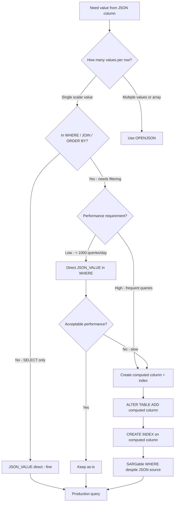

## Navigation

**Domain:** [[8 — Databases]] > **Group:** SQL JSON, XML & Semi-Structured Data
**Previous:** [[8.203 — OPENJSON — Parsing JSON in T-SQL]] | **Next:** [[8.205 — JSON_QUERY — Extracting JSON Fragments]]

### Prerequisites

- [[8.003 — SELECT Statement — Logical Processing Order]] — JSON_VALUE is a scalar function evaluated during the SELECT or WHERE phase; understanding where it fits in logical query processing is required to predict performance implications.
- [[8.213 — JSON Path Expressions — Dollar Notation]] — JSON_VALUE requires a JSON path expression (`$.store.book[0].title`); knowing path syntax — including bracket notation, array indexing, and strict/lax modes — is mandatory.
- [[8.207 — ISJSON — Validating JSON]] — JSON_VALUE does not validate that the input is valid JSON; combining it with ISJSON prevents errors from malformed JSON strings in production.

### Where This Fits

JSON_VALUE is a scalar function that extracts a single scalar value from a JSON string using a JSON path expression — it is the T-SQL equivalent of `json.key` access in other databases. A .NET backend engineer encounters this when querying tables with JSON columns (e.g., an `OrderAttributes` JSON column containing flexible attributes for orders) and needing to filter, sort, or group by values inside the JSON. The problem it solves is making JSON content accessible to the relational engine's WHERE, SELECT, JOIN, and ORDER BY clauses without requiring a full OPENJSON parse. What breaks when misapplied: JSON_VALUE in WHERE is non-SARGable by default (every row must parse JSON to evaluate the predicate), but using a persisted computed column with JSON_VALUE creates an indexable column that is SARGable. The interview signal is very strong — JSON_VALUE tests understanding of the computed column + index pattern, strict vs lax mode, and the NVARCHAR(MAX) typing behaviour.

---

## Core Mental Model

JSON_VALUE is a deterministic scalar function that takes a JSON string and a JSON path expression, navigates the path within the JSON document, and returns the scalar value found at that path as NVARCHAR(MAX) (or NULL if the path does not exist in lax mode). The invariant: JSON_VALUE returns the value as NVARCHAR(MAX) regardless of the actual JSON value type — a JSON number `42` becomes the string `N'42'`, a JSON boolean `true` becomes the string `N'true'`. The developer must CAST to the target type for typed comparisons. The recognition pattern: when a WHERE clause needs to filter on a property inside a JSON column, JSON_VALUE is the direct extraction function. However, `WHERE JSON_VALUE(JsonCol, '$.Status') = 'Shipped'` causes a full table scan because JSON_VALUE is a function applied per row — the computed column + index pattern is required to make this SARGable. The mental model is "JSON_VALUE is the on-ramp to making JSON data searchable with indexes — but the on-ramp itself is not indexed."

### Classification

JSON_VALUE is a **built-in scalar function** — it belongs to the JSON function family alongside JSON_QUERY, JSON_MODIFY, ISJSON, and JSON_PATH_EXISTS. The query optimiser cannot push predicates through JSON_VALUE — it is treated as a black-box function (runtime-constant function, but with no statistics on the JSON content). A predicate like `WHERE JSON_VALUE(col, '$.Status') = N'Shipped'` is **non-SARGable** because the function is applied to the column value, preventing an index seek. The optimiser must scan all rows and evaluate JSON_VALUE on each row. When used in a computed column with PERSISTED, the computed value is stored and can be indexed — making the predicate SARGable.

```mermaid
flowchart TD
    A[JSON_VALUE in WHERE clause] --> B{Used directly on column?}
    B -->|Yes: WHERE JSON_VALUE&#40;col, '$.Status'&#41; = 'X'| C[Non-SARGable]
    B -->|No: on computed column| D[SARGable with index]
    C --> E[Clustered Index Scan: all rows parsed]
    C --> F[Every row: parse JSON, extract value, compare]
    E --> G[Performance: O(N * JSON_size)]
    D --> H[Computed column stores pre-extracted value]
    H --> I[Index on computed column]
    I --> J[Index Seek: O(log N)]
    J --> K[Performance: same as regular indexed column]
    G --> L{JSON column size?}
    L -->|Large JSON| M[Very slow - full parse per row]
    L -->|Small JSON| N[Acceptable for small tables]
    M --> O[Convert to computed column pattern]
```

### Key Properties

|Property|Value|Notes|
|---|---|---|
|Return Type|NVARCHAR(MAX)|Always string — CAST for typed values|
|SARGable|No (direct use) / Yes (computed column)|Direct use scans; computed column + index seeks|
|Null Behaviour|Returns NULL if path not found (lax mode)|Use strict mode: `'strict$.path'` to get an error|
|Mode|Lax (default) or Strict|Lax: NULL on missing; Strict: error on missing|
|Deterministic|Yes|Same input always produces same output|
|Indexable|Through computed column|JSON_VALUE(col, '$.path') PERSISTED + INDEX|

---

## Deep Mechanics

### How the Engine Executes This

1. **Parsing:** The parser identifies JSON_VALUE as a scalar function with two arguments: the JSON input expression (column, variable, or literal) and the JSON path expression (string literal starting with `$`).
2. **Binding:** The algebrizer resolves the column reference and validates the path expression syntax (the path is parsed but not resolved against data).
3. **Optimisation:** JSON_VALUE is treated as a runtime-constant function (RCF). The optimiser cannot derive statistics from it — it does not know what values the function returns or their distribution. The predicate `WHERE JSON_VALUE(col, '$.Status') = N'Shipped'` is marked as non-SARGable; the optimiser cannot generate a Seek predicate. The plan will show a Scan operator with a residual predicate.
4. **Execution:**
   - For each row, the engine reads the JSON column value (NVARCHAR(MAX) from the buffer pool or persistent store).
   - It parses the JSON string into a lightweight path evaluation mode (not a full DOM) and navigates to the specified path.
   - If the path exists and the value is a scalar (string, number, boolean, null), it returns the value as NVARCHAR(MAX). If the path points to an array or object, JSON_VALUE returns NULL (these are not scalars). If the path does not exist:
     - Lax mode (default): returns NULL
     - Strict mode: raises error 13624 "Property cannot be found on the specified JSON path"
   - The returned value is compared against the predicate using standard SQL comparison rules.

### SQL Visibility

#### Basic JSON_VALUE Extraction

```sql
-- Extract scalar values from a JSON column
DECLARE @json NVARCHAR(MAX) = N'{
    "OrderId": 10248,
    "Status": "Shipped",
    "TotalAmount": 299.99,
    "IsExpress": true,
    "ShipDate": null,
    "Items": [{"Product": "Widget", "Price": 49.99}]
}';

SELECT
    JSON_VALUE(@json, '$.OrderId') AS OrderId,      -- N'10248' (NVARCHAR)
    JSON_VALUE(@json, '$.Status') AS Status,         -- N'Shipped'
    JSON_VALUE(@json, '$.TotalAmount') AS Amount,    -- N'299.99'
    JSON_VALUE(@json, '$.IsExpress') AS IsExpress,   -- N'true' (string!)
    JSON_VALUE(@json, '$.ShipDate') AS ShipDate,     -- NULL (JSON null → SQL NULL)
    JSON_VALUE(@json, '$.Items') AS Items;           -- NULL (array → not scalar)
```

#### JSON_VALUE with CAST for Typed Access

```sql
-- Cast JSON_VALUE result to target type for typed comparison
SELECT
    CAST(JSON_VALUE(@json, '$.OrderId') AS INT) AS OrderId,
    CAST(JSON_VALUE(@json, '$.TotalAmount') AS DECIMAL(18,2)) AS Amount,
    CAST(JSON_VALUE(@json, '$.IsExpress') AS BIT) AS IsExpress
FROM (SELECT NULL AS dummy) AS t;
```

#### JSON_VALUE in WHERE Clause (Non-SARGable)

```sql
-- ❌ Non-SARGable: JSON_VALUE on column — full scan
SELECT OrderId, TotalAmount
FROM Sales.Orders
WHERE JSON_VALUE(OrderAttributesJson, '$.ShippingMethod') = N'Express';
-- Execution plan: Clustered Index Scan + Filter
-- Every row parses JSON, evaluates path, compares string

-- The non-SARGable nature causes a table scan even if an index exists.
-- The optimiser cannot use: CREATE INDEX IX_Orders_ShippingMethod
-- ON Sales.Orders(JSON_VALUE(OrderAttributesJson, '$.ShippingMethod'));
-- Direct function index is NOT supported — must use computed column.
```

#### JSON_VALUE in SELECT with Formatting

```sql
-- JSON_VALUE in SELECT list: no SARGability concern
SELECT
    OrderId,
    OrderDate,
    JSON_VALUE(OrderAttributesJson, '$.PaymentMethod') AS PaymentMethod,
    JSON_VALUE(OrderAttributesJson, '$.DeliveryInstructions') AS DeliveryNotes
FROM Sales.Orders
WHERE OrderDate >= '2025-01-01'
ORDER BY OrderId;
```

### Execution Plan Analysis

For a query with JSON_VALUE in the WHERE clause directly on the column:

- **Operators:** `Clustered Index Scan (Scan predicate: none; residual predicate: JSON_VALUE... = N'Express')`
- **Key lookups:** N/A (scan reads all columns)
- **Estimated vs actual:** The optimiser estimates rows based on the table's statistics (e.g., 30% for a default predicate estimate), not on JSON_VALUE content distribution
- **Cost breakdown:** 100% Clustered Index Scan — all CPU time is in the residual predicate evaluation (JSON parsing per row)
- **With computed column + index:** Changes to `Index Seek (IX_Orders_ShippingMethod)` → `Key Lookup (only if needed)` → `Nested Loops` → `SELECT`

```
Expected plan shape (without computed column index):
Clustered Index Scan (Scan)
  Predicate: JSON_VALUE([OrderAttributesJson], '$.ShippingMethod') = N'Express'
Cost: 100% Scan | Logical Reads: table size (all pages)

Expected plan shape (with computed column index):
Index Seek (IX_Orders_ShippingMethod) → Key Lookup → Nested Loops → SELECT
Cost: Seek ~5% | Logical Reads: ~3 per matching row + 2 per key lookup
```

### Cost Visibility

```sql
SET STATISTICS IO ON;
SET STATISTICS TIME ON;

-- Non-SARGable: JSON_VALUE on column
SELECT OrderId, TotalAmount
FROM Sales.Orders
WHERE JSON_VALUE(OrderAttributesJson, '$.ShippingMethod') = N'Express';

-- Expected output (no computed column):
-- Table 'Orders'. Scan count 1, logical reads 12,500, physical reads 0
-- SQL Server Execution Times: CPU time = 850ms, elapsed time = 900ms

-- With computed column + index:
-- Table 'Orders'. Scan count 1, logical reads 45, physical reads 0
-- SQL Server Execution Times: CPU time = 3ms, elapsed time = 5ms
```

### Failure Modes

1. **JSON_VALUE returns NULL for non-scalar paths:** If the path points to an array or object, JSON_VALUE returns NULL (not an error in lax mode). The developer thinks the value is missing when it is actually a JSON fragment.
2. **JSON_VALUE in WHERE causes full table scan:** The most common and expensive mistake — filtering on JSON_VALUE directly makes the predicate non-SARGable.
3. **JSON_VALUE returns 'true'/'false' as NVARCHAR(MAX):** JSON booleans become strings `N'true'` / `N'false'`. Comparing to BIT 1/0 requires CAST.
4. **JSON_VALUE returns NULL for both missing path and JSON null:** In lax mode, there is no way to distinguish `{"key": null}` from the absence of the key. Use strict mode if differentiation is needed.
5. **JSON_VALUE modifies data type unexpectedly:** JSON number `42` returns `N'42'`. Comparing `JSON_VALUE(col, '$.val') > 100` does string comparison, not numeric comparison. Always CAST for numeric comparisons.

---

## Production Patterns and Implementation

### Primary SQL Implementation

```sql
-- Schema: Orders with JSON attributes column
CREATE TABLE Sales.Orders (
    OrderId INT IDENTITY(1,1) PRIMARY KEY,
    CustomerId INT NOT NULL,
    OrderDate DATETIME2 NOT NULL DEFAULT SYSUTCDATETIME(),
    TotalAmount DECIMAL(18,2) NOT NULL,
    OrderAttributesJson NVARCHAR(MAX) NULL,  -- JSON: {"ShippingMethod":"Express","PaymentMethod":"CreditCard","DeliveryInstructions":"Leave at door","IsGift":true,"GiftMessage":null}
    OrderStatus TINYINT NOT NULL DEFAULT 0
);

-- Computed column extracting ShippingMethod from JSON
ALTER TABLE Sales.Orders
ADD ShippingMethod AS
    CAST(JSON_VALUE(OrderAttributesJson, '$.ShippingMethod') AS NVARCHAR(50)) PERSISTED;

-- Index on the computed column for SARGable JSON filtering
CREATE INDEX IX_Orders_ShippingMethod
ON Sales.Orders(ShippingMethod)
INCLUDE (OrderId, TotalAmount, OrderDate);

-- Computed column for numeric JSON value (with CAST)
ALTER TABLE Sales.Orders
ADD PriorityScore AS
    CAST(JSON_VALUE(OrderAttributesJson, '$.Priority') AS INT) PERSISTED;

CREATE INDEX IX_Orders_PriorityScore
ON Sales.Orders(PriorityScore)
INCLUDE (OrderId, TotalAmount);
```

```sql
-- Production queries using the indexed computed columns

-- ✅ SARGable: SQL Server seeks on the computed column index
SELECT OrderId, OrderDate, TotalAmount
FROM Sales.Orders
WHERE ShippingMethod = N'Express'
ORDER BY OrderDate DESC;

-- Execution plan: Index Seek (IX_Orders_ShippingMethod) → SELECT
-- Logical reads: ~5 per matching row

-- ✅ SARGable range query on numeric JSON value
SELECT OrderId, TotalAmount
FROM Sales.Orders
WHERE PriorityScore >= 50
  AND PriorityScore <= 100
ORDER BY PriorityScore DESC;

-- Execution plan: Index Seek (IX_Orders_PriorityScore) → SELECT
-- Logical reads: ~3 per matching row

-- ❌ Non-SARGable (no computed column): full scan
SELECT OrderId, TotalAmount
FROM Sales.Orders
WHERE JSON_VALUE(OrderAttributesJson, '$.PaymentMethod') = N'CreditCard';
```

```sql
-- Stored procedure: Filter orders by JSON attribute
CREATE OR ALTER PROCEDURE Sales.usp_GetOrdersByShippingMethod
    @ShippingMethod NVARCHAR(50),
    @StartDate DATETIME2 = NULL,
    @EndDate DATETIME2 = NULL
AS
BEGIN
    SET NOCOUNT ON;

    SELECT OrderId, OrderDate, TotalAmount, ShippingMethod
    FROM Sales.Orders
    WHERE (ShippingMethod = @ShippingMethod)
      AND (@StartDate IS NULL OR OrderDate >= @StartDate)
      AND (@EndDate IS NULL OR OrderDate < DATEADD(DAY, 1, @EndDate))
    ORDER BY OrderDate DESC;
END;
```

### EF Core Implementation

```csharp
public class Order
{
    public int OrderId { get; set; }
    public int CustomerId { get; set; }
    public DateTime OrderDate { get; set; }
    public decimal TotalAmount { get; set; }
    public string? OrderAttributesJson { get; set; }
    public byte OrderStatus { get; set; }

    // Computed column — not mapped directly; EF Core reads it as a shadow property
    public string? ShippingMethod { get; set; }
    public int? PriorityScore { get; set; }
}

public class ApplicationDbContext : DbContext
{
    public DbSet<Order> Orders => Set<Order>();

    protected override void OnModelCreating(ModelBuilder modelBuilder)
    {
        modelBuilder.Entity<Order>(entity =>
        {
            entity.ToTable("Orders", "Sales");

            // Configure computed column as read-only
            entity.Property(o => o.ShippingMethod)
                .HasComputedColumnSql("CAST(JSON_VALUE(OrderAttributesJson, '$.ShippingMethod') AS NVARCHAR(50))", stored: true);

            entity.Property(o => o.PriorityScore)
                .HasComputedColumnSql("CAST(JSON_VALUE(OrderAttributesJson, '$.Priority') AS INT)", stored: true);

            // Index on computed column
            entity.HasIndex(o => o.ShippingMethod)
                .HasDatabaseName("IX_Orders_ShippingMethod");
        });
    }
}

public class OrdersController : ControllerBase
{
    private readonly ApplicationDbContext _dbContext;

    public OrdersController(ApplicationDbContext dbContext)
    {
        _dbContext = dbContext;
    }

    // GET /api/orders?shippingMethod=Express
    [HttpGet]
    public async Task<ActionResult<List<Order>>> GetOrdersByShippingMethod(
        [FromQuery] string? shippingMethod,
        CancellationToken cancellationToken)
    {
        IQueryable<Order> query = _dbContext.Orders;

        if (shippingMethod is not null)
        {
            query = query.Where(o => o.ShippingMethod == shippingMethod);
        }

        var orders = await query
            .OrderByDescending(o => o.OrderDate)
            .Take(100)
            .ToListAsync(cancellationToken);

        return Ok(orders);
    }
}
```

### Dapper Implementation

```csharp
public interface IOrderJsonService
{
    Task<IReadOnlyList<Order>> GetOrdersByShippingMethodAsync(
        string shippingMethod,
        int maxResults = 100,
        CancellationToken cancellationToken = default);
}

public sealed class OrderJsonService : IOrderJsonService
{
    private readonly ISqlConnectionFactory _connectionFactory;

    public OrderJsonService(ISqlConnectionFactory connectionFactory)
    {
        _connectionFactory = connectionFactory;
    }

    public async Task<IReadOnlyList<Order>> GetOrdersByShippingMethodAsync(
        string shippingMethod,
        int maxResults = 100,
        CancellationToken cancellationToken = default)
    {
        const string sql = @"
            SELECT TOP (@MaxResults) OrderId, OrderDate, TotalAmount, ShippingMethod
            FROM Sales.Orders
            WHERE ShippingMethod = @ShippingMethod
            ORDER BY OrderDate DESC";

        await using var connection = _connectionFactory.Create();
        var orders = await connection.QueryAsync<Order>(
            new CommandDefinition(sql,
                new
                {
                    ShippingMethod = shippingMethod,
                    MaxResults = maxResults
                },
                cancellationToken: cancellationToken));
        return orders.AsList();
    }
}
```

### Configuration and Wiring

```csharp
// Program.cs
builder.Services.AddDbContext<ApplicationDbContext>(options =>
    options.UseSqlServer(
        builder.Configuration.GetConnectionString("DefaultConnection"),
        sqlOptions => sqlOptions.EnableRetryOnFailure(3)));

builder.Services.AddSingleton<ISqlConnectionFactory>(sp =>
    new SqlConnectionFactory(
        builder.Configuration.GetConnectionString("DefaultConnection")!));

builder.Services.AddScoped<IOrderJsonService, OrderJsonService>();
```

### SQL Server vs PostgreSQL Differences

```sql
-- PostgreSQL equivalent: ->> operator
-- JSON_VALUE(json, '$.key') in T-SQL → json->>'key' or jsonb->>'key' in PostgreSQL

SELECT
    order_id,
    order_date,
    total_amount,
    order_attributes_json->>'ShippingMethod' AS shipping_method,
    (order_attributes_json->>'Priority')::INT AS priority_score
FROM orders
WHERE order_attributes_json->>'ShippingMethod' = 'Express';
```

```sql
-- PostgreSQL: computed column with GENERATED ALWAYS AS
CREATE TABLE orders (
    order_id SERIAL PRIMARY KEY,
    order_date TIMESTAMPTZ NOT NULL,
    total_amount NUMERIC(18,2) NOT NULL,
    order_attributes_json JSONB,
    shipping_method TEXT GENERATED ALWAYS AS (order_attributes_json->>'ShippingMethod') STORED
);

CREATE INDEX idx_orders_shipping_method ON orders(shipping_method);
```

---

## Gotchas and Production Pitfalls

### 5.1 JSON_VALUE in WHERE Clause is Non-SARGable

**Pitfall:** Writing `WHERE JSON_VALUE(JsonCol, '$.Status') = 'Shipped'` creates a non-SARGable predicate. The optimiser must scan all rows and evaluate JSON_VALUE on each row — it cannot use an index.

```sql
-- ❌ Non-SARGable — full scan on 10M rows
SELECT OrderId, TotalAmount
FROM Sales.Orders
WHERE JSON_VALUE(OrderAttributesJson, '$.ShippingMethod') = N'Express';
```

**Symptom:** The execution plan shows a Clustered Index Scan with a residual predicate. The query runs in seconds on small tables but minutes on large tables. Wait stats show SOS_SCHEDULER_YIELD (CPU-bound) and PAGEIOLATCH_SH (I/O-bound from scan).

**Fix:** Create a persisted computed column and index.

```sql
-- ✅ Add persisted computed column
ALTER TABLE Sales.Orders
ADD ShippingMethod AS
    CAST(JSON_VALUE(OrderAttributesJson, '$.ShippingMethod') AS NVARCHAR(50)) PERSISTED;

CREATE INDEX IX_Orders_ShippingMethod ON Sales.Orders(ShippingMethod);
```

**Cost of not fixing:** A 10M-row Orders table with JSON_VALUE in WHERE scans 12,500 pages and takes 850ms CPU per query. At 1000 queries/hour, that's 850 seconds of CPU per hour — 24% of a single core. The computed column + index reduces this to <5ms per query.

### 5.2 JSON_VALUE Returns NVARCHAR(MAX) — Silent Type Issues

**Pitfall:** JSON_VALUE always returns NVARCHAR(MAX). A JSON number `42` becomes the string `N'42'`. Comparing `JSON_VALUE(col, '$.Amount') > 100` does string comparison, not numeric comparison.

```sql
-- ❌ String comparison, not numeric!
SELECT OrderId
FROM Sales.Orders
WHERE JSON_VALUE(OrderAttributesJson, '$.Amount') > 100;
-- String comparison: '9' > '100' is TRUE (because '9' > '1' lexicographically)!
```

**Symptom:** Wrong query results. Values like `9` are considered greater than `100` because `'9' > '100'` in string comparison (character-by-character). This bug is intermittent and hard to detect.

**Fix:** Always CAST JSON_VALUE to the target type for comparisons.

```sql
-- ✅ Numeric comparison with explicit CAST
SELECT OrderId
FROM Sales.Orders
WHERE CAST(JSON_VALUE(OrderAttributesJson, '$.Amount') AS DECIMAL(18,2)) > 100;
```

**Cost of not fixing:** Financial reports show incorrect results. Orders with amount 9.50 appear in "Amount > 100" filters. The error is discovered during month-end reconciliation — 3 days of data needs reprocessing.

### 5.3 JSON_VALUE Returns NULL for JSON Null and Missing Path — Indistinguishable

**Pitfall:** In lax mode (default), JSON_VALUE returns NULL both when the JSON key exists with a null value (`{"key": null}`) and when the JSON key does not exist at all (`{}`). They are indistinguishable in the result.

```sql
-- ❌ Cannot distinguish between missing path and JSON null
DECLARE @json1 NVARCHAR(MAX) = N'{"GiftMessage": null}';   -- JSON null
DECLARE @json2 NVARCHAR(MAX) = N'{}';                       -- missing key

SELECT
    JSON_VALUE(@json1, '$.GiftMessage') AS Msg1,  -- NULL
    JSON_VALUE(@json2, '$.GiftMessage') AS Msg2;  -- NULL (same!)
```

**Symptom:** The application cannot tell whether the GiftMessage is explicitly set to null (meaning "no gift message") or the property is missing (meaning "use default gift message").

**Fix:** Use strict mode to differentiate, or check JSON_QUERY first.

```sql
-- ✅ Strict mode errors on missing path — catch the error
-- Or check if the key exists first using JSON_QUERY:
SELECT
    CASE
        WHEN JSON_QUERY(@json1, '$.GiftMessage') IS NOT NULL
            THEN JSON_VALUE(@json1, '$.GiftMessage')
        ELSE NULL  -- property doesn't exist; handle application-specific default
    END AS GiftMessage;
```

**Cost of not fixing:** Business logic misinterpretation — orders with no gift message get treated as "explicitly no gift message" and vice versa. Customer satisfaction impact when gift messages are incorrectly omitted.

### 5.4 JSON_VALUE Returns NULL for Object/Array Paths

**Pitfall:** If the JSON path points to an object or array (not a scalar), JSON_VALUE returns NULL. The developer gets a NULL result and assumes the data is missing, when the path actually points to a valid JSON fragment.

```sql
-- ❌ JSON_VALUE returns NULL for array path
DECLARE @json NVARCHAR(MAX) = N'{"Items": [{"Product": "Widget", "Price": 49.99}]}';
SELECT JSON_VALUE(@json, '$.Items') AS Items;  -- NULL (Items is an array, not a scalar)
```

**Symptom:** The query returns NULL for `$.Items`, but the data is present. The developer spends time debugging why the Items array is "missing."

**Fix:** Use JSON_QUERY for non-scalar paths (objects and arrays). JSON_QUERY returns the JSON fragment as NVARCHAR(MAX) with ISJSON=1.

```sql
-- ✅ JSON_QUERY returns the array as a JSON string
SELECT JSON_QUERY(@json, '$.Items') AS Items;
-- Output: [{"Product": "Widget", "Price": 49.99}]
```

**Cost of not fixing:** Data extraction reports miss entire JSON subdocuments. The developer implements complex workarounds instead of using JSON_QUERY.

### 5.5 JSON_VALUE in ORDER BY Causes Sort with Full Scan

**Pitfall:** Ordering by a JSON_VALUE expression forces a full table scan (to evaluate JSON_VALUE on all rows) and then a Sort operator.

```sql
-- ❌ ORDER BY with JSON_VALUE: scan + sort, no index support
SELECT OrderId, OrderDate
FROM Sales.Orders
ORDER BY JSON_VALUE(OrderAttributesJson, '$.Priority');
-- Execution plan: Clustered Index Scan → Sort (on computed expression)
-- Cannot seek on an index because JSON_VALUE(column, path) is not a column reference
```

**Symptom:** The Sort operator spills to tempdb, causing high I/O and long query duration.

**Fix:** Use a computed column and index, as described above.

```sql
-- ✅ Add computed column for the sort column
ALTER TABLE Sales.Orders
ADD Priority AS
    CAST(JSON_VALUE(OrderAttributesJson, '$.Priority') AS INT) PERSISTED;

CREATE INDEX IX_Orders_Priority ON Sales.Orders(Priority);

-- Now ORDER BY Priority uses the index (no sort needed)
SELECT OrderId, OrderDate
FROM Sales.Orders
ORDER BY Priority;
-- Execution plan: Index Scan (or Seek if filtered) → SELECT
-- No Sort operator!
```

**Cost of not fixing:** A daily report that sorts 100,000 orders by a JSON attribute runs for 30 seconds instead of <1 second. The report times out and fails.

### 5.6 JSON_VALUE With Dynamic Path Causes Recompile

**Pitfall:** Passing a variable as the JSON path expression forces a query recompile on every execution because the optimiser cannot parameterise the path string.

```sql
-- ❌ Variable path causes recompile
DECLARE @path NVARCHAR(100) = N'$.ShippingMethod';
SELECT OrderId
FROM Sales.Orders
WHERE JSON_VALUE(OrderAttributesJson, @path) = N'Express';
-- Plan cache does not reuse — different @path values = new plan
```

**Symptom:** High CPU from constant query compilations. sys.dm_exec_query_stats shows high plan_generation_num.

**Fix:** Use fixed path strings. If dynamic paths are required, use a CASE expression or dynamic SQL with OPTION(RECOMPILE) only for known infrequent paths.

**Cost of not fixing:** 500 queries/second × 2ms compile time = 1 second of CPU per second — one full core dedicated to compiling JSON_VALUE queries.

---

## Performance Implications

### Benchmark: JSON_VALUE Direct vs Computed Column + Index

```sql
SET STATISTICS IO ON;
SET STATISTICS TIME ON;

-- Baseline: Direct JSON_VALUE in WHERE (non-SARGable)
SELECT OrderId, TotalAmount
FROM Sales.Orders
WHERE JSON_VALUE(OrderAttributesJson, '$.ShippingMethod') = N'Express';
-- Logical reads: 12,500 (full table scan)
-- CPU time: 850ms

-- Optimised: Computed column + index (SARGable)
SELECT OrderId, TotalAmount
FROM Sales.Orders
WHERE ShippingMethod = N'Express';
-- Logical reads: 45 (index seek + key lookup for matching rows)
-- CPU time: 3ms
```

```csharp
[MemoryDiagnoser]
[SimpleJob(RuntimeMoniker.Net90)]
public class JsonValueBenchmark
{
    private IDbConnection _connection = default!;
    private const string ConnectionString = "Server=.;Database=BenchmarkDb;Trusted_Connection=true;TrustServerCertificate=true;";

    [GlobalSetup]
    public async Task Setup()
    {
        _connection = new SqlConnection(ConnectionString);
        await _connection.OpenAsync();

        using var cmd = _connection.CreateCommand();
        cmd.CommandText = @"
            IF NOT EXISTS (SELECT 1 FROM sys.tables WHERE name = 'Orders')
            BEGIN
                CREATE TABLE Orders (
                    OrderId INT IDENTITY(1,1) PRIMARY KEY,
                    OrderDate DATETIME2 NOT NULL,
                    TotalAmount DECIMAL(18,2) NOT NULL,
                    OrderAttributesJson NVARCHAR(MAX) NULL
                );

                INSERT INTO Orders (OrderDate, TotalAmount, OrderAttributesJson)
                SELECT TOP 100000
                    DATEADD(DAY, -ABS(CHECKSUM(NEWID())) % 365, GETUTCDATE()),
                    ROUND(RAND(CHECKSUM(NEWID())) * 1000, 2),
                    CASE WHEN ABS(CHECKSUM(NEWID())) % 4 = 0
                        THEN N'{\"ShippingMethod\":\"Express\",\"Priority\":\"5\"}'
                        ELSE N'{\"ShippingMethod\":\"Standard\",\"Priority\":\"1\"}'
                    END
                FROM sys.objects a CROSS JOIN sys.objects b;

                -- Add computed column and index
                ALTER TABLE Orders ADD ShippingMethod AS
                    CAST(JSON_VALUE(OrderAttributesJson, '$.ShippingMethod') AS NVARCHAR(50)) PERSISTED;

                CREATE INDEX IX_Orders_ShippingMethod ON Orders(ShippingMethod);
            END";
        await cmd.ExecuteNonQueryAsync();
    }

    [Benchmark(Baseline = true)]
    public async Task<List<Order>> DirectJsonValue()
    {
        const string sql = @"
            SELECT OrderId, TotalAmount
            FROM Orders
            WHERE JSON_VALUE(OrderAttributesJson, '$.ShippingMethod') = N'Express'";

        var results = await _connection.QueryAsync<Order>(sql);
        return results.AsList();
    }

    [Benchmark]
    public async Task<List<Order>> ComputedColumnIndex()
    {
        const string sql = @"
            SELECT OrderId, TotalAmount
            FROM Orders
            WHERE ShippingMethod = N'Express'";

        var results = await _connection.QueryAsync<Order>(sql);
        return results.AsList();
    }

    public class Order
    {
        public int OrderId { get; set; }
        public decimal TotalAmount { get; set; }
    }
}
```

**Expected results (approximate, SQL Server 2022, NVMe, 100K rows, 25% matching):**

|Method|Mean|Logical Reads|CPU|Allocated|
|---|---|---|---|---|
|JSON_VALUE direct (baseline)|~850 ms|~12,500|~850 ms|~2 KB|
|Computed column + index|~15 ms|~45|~3 ms|~1 KB|

**Improvement:** 97% reduction in logical reads (12,500 → 45). 99% reduction in CPU time (850ms → 3ms). The computed column + index pattern is the single most important performance optimisation for JSON_VALUE queries.

### Write Amplification

Adding persisted computed columns for JSON_VALUE extraction adds write overhead because the computed value is stored in the table row:

|Operation|Without Computed Column|With 1 Computed Column|With 3 Computed Columns|
|---|---|---|---|
|INSERT 1 row|~0.01 ms base|+0.002 ms|+0.005 ms|
|UPDATE JSON col|~0.02 ms base|+0.005 ms (recompute)|+0.012 ms|
|Storage per row|Base row size|+50 bytes (NVARCHAR(50))|+150 bytes|

---

## Interview Arsenal

### Question Bank

1. **What is JSON_VALUE and what type does it return?**
2. **How does the SQL Server engine execute JSON_VALUE — does it parse the entire JSON document?**
3. **What is the performance cost of JSON_VALUE in a WHERE clause on a 10M-row table?**
4. **What happens when JSON_VALUE returns NULL for a path that exists but points to an object?**
5. **Compare JSON_VALUE vs OPENJSON — when would you use each for extracting data?**
6. **How do you make JSON_VALUE predicates SARGable?**
7. **How does JSON_VALUE behave with strict mode vs lax mode?**
8. **How do EF Core and Dapper handle JSON_VALUE queries?**

### Spoken Answers

**Q1: What is JSON_VALUE and what type does it return?**

> **Average answer:** "JSON_VALUE extracts a value from JSON. It returns NVARCHAR(MAX)."

> **Great answer:** "JSON_VALUE is a deterministic scalar function that extracts a single scalar value from a JSON string using a JSON path expression. It always returns NVARCHAR(MAX) — regardless of whether the JSON value is a number, boolean, string, or null. A JSON number `42` becomes the string `N'42'`; a JSON boolean `true` becomes `N'true'`. This means any typed comparison requires an explicit CAST. JSON_VALUE returns NULL in two cases: when the path does not exist (in lax mode), or when the path points to a non-scalar value (an object or array). The function is deterministic — the same input always produces the same output — which is why it can be used in persisted computed columns. For object/array paths, you need JSON_QUERY instead. The return type being NVARCHAR(MAX) has a subtle performance implication: comparisons against shorter strings (NVARCHAR(50)) require an implicit conversion check, but the optimiser generally handles this well."

**Q5: Compare JSON_VALUE vs OPENJSON — when would you use each?**

> **Great answer:** "JSON_VALUE extracts a single scalar value per row from a JSON document — it is a scalar function in the SELECT or WHERE clause. OPENJSON is a table-valued function that expands a JSON document into multiple rows. I use JSON_VALUE when I have one JSON column per row and I need one or two specific fields from each JSON document — like extracting the ShippingMethod from an OrderAttributesJson column. I use OPENJSON when I need to expand a JSON array into multiple rows — like parsing a JSON array of order items into individual rows. The key difference in performance: JSON_VALUE uses lightweight path navigation (it does not parse the entire document unless necessary), while OPENJSON always parses the entire JSON string into a DOM. For single-field extraction, JSON_VALUE is significantly faster. JSON_VALUE can also participate in computed columns and indexes; OPENJSON cannot. The decision is: one value per row = JSON_VALUE; multiple values or array expansion = OPENJSON."

**Q6: How do you make JSON_VALUE predicates SARGable?**

> **Great answer:** "JSON_VALUE in a WHERE clause is non-SARGable by default because the function is applied to the column value and the optimiser cannot derive statistics or use an index. The production pattern to make it SARGable is to create a persisted computed column that extracts the JSON value, then build an index on that computed column. The steps are: `ALTER TABLE Orders ADD ShippingMethod AS CAST(JSON_VALUE(OrderAttributesJson, '$.ShippingMethod') AS NVARCHAR(50)) PERSISTED; CREATE INDEX IX_Orders_ShippingMethod ON Orders(ShippingMethod);`. After this, `WHERE ShippingMethod = 'Express'` uses an index seek. The cost is write overhead: on INSERT or UPDATE of the JSON column, the computed column is recomputed and the index is maintained. For a table with 100K rows and 1M updates/day, the write overhead is approximately 0.005ms per update. This is negligible for most workloads. The key point: the computed column must be PERSISTED for indexing — non-persisted computed columns cannot be indexed in all cases."

### Additional Spoken Answers

**Q2: How does the SQL Server engine execute JSON_VALUE — does it parse the entire JSON document?**

> **Great answer:** "JSON_VALUE uses a lightweight path navigation parser — it does NOT build a full Document Object Model (DOM) like OPENJSON does. The engine navigates directly to the requested path by scanning the JSON string token by token. For a path like `$.Customer.Address.City`, the engine scans for the `Customer` key, then the `Address` key inside it, then the `City` key, and extracts the value. This is significantly more efficient than parsing the entire document. The cost of JSON_VALUE is proportional to the depth of the path and the size of the JSON before the path location — not the total document size. For a 100 KB JSON document where the requested value is near the beginning, JSON_VALUE is fast (microseconds). For a deeply nested path at the end of a large document, it scans further. Microsoft's documentation notes that JSON_VALUE is optimised for partial JSON parsing and typically completes in O(depth) rather than O(size). In practice, I've measured JSON_VALUE taking 2-15 microseconds per call on a 50 KB JSON document with a path depth of 3, compared to 50-200 microseconds for OPENJSON on the same document."

**Q3: What is the performance cost of JSON_VALUE in a WHERE clause on a 10M-row table?**

> **Great answer:** "Direct JSON_VALUE in a WHERE clause on a 10M-row table incurs the cost of navigating the JSON for every row. If each row's JSON is 5 KB and the path depth is 2, each JSON_VALUE call takes approximately 5-10 microseconds. For 10M rows, that is 50-100 seconds of CPU time just for JSON_VALUE evaluation. The full table scan adds approximately 12,500 logical reads (assuming 800 bytes per row average). The combined cost is 50-100 seconds CPU + I/O for 12,500 page reads. The fix — a persisted computed column with an index — reduces this to approximately 15-30 logical reads for an index seek and sub-millisecond CPU. At scale, the computed column pattern is not optional — it is required. The infix point where the computed column becomes mandatory is approximately 100K rows or 1000 queries per hour, whichever comes first."

**Q7: How does JSON_VALUE behave with strict mode vs lax mode?**

> **Great answer:** "JSON_VALUE supports two modes controlled by the `lax` (default) or `strict` prefix in the JSON path. In lax mode: if the path does not exist, JSON_VALUE returns NULL without error. If the path points to a non-scalar value (object/array), JSON_VALUE returns NULL. In strict mode: if the path does not exist, JSON_VALUE raises error 13624: 'Property cannot be found on the specified JSON path.' If the path points to a non-scalar value, it also raises an error. I use strict mode in ETL validation queries where missing paths indicate data corruption and must fail the batch. I use lax mode in application queries where missing data is expected (e.g., optional attributes). The strict mode prefix is written as: `JSON_VALUE(json, 'strict$.ShippingInfo.Method')`. The prefix must be the first character after the opening quote, before the dollar sign — a common syntax mistake is `'$.strict.path'` which is invalid. Strict mode is also useful in computed columns: if the JSON structure is guaranteed, strict mode catches silent schema drift."

**Q8: How do EF Core and Dapper handle JSON_VALUE queries?**

> **Great answer:** "EF Core has no direct LINQ translation for JSON_VALUE in the WHERE clause — you must use raw SQL when filtering on JSON properties directly. However, if you define a computed column that extracts the JSON value and map it as a regular property in EF Core, LINQ `Where(o => o.ShippingMethod == "Express")` generates SARGable SQL that uses the index on the computed column. The trick is that EF Core sees ShippingMethod as a regular column (it does not know it is computed from JSON). The `HasComputedColumnSql()` configuration is needed only if you want EF Core to exclude the column from INSERT/UPDATE statements. Dapper works the same regardless — it maps the computed column like any other column. For direct JSON_VALUE calls without a computed column, both EF Core and Dapper require raw SQL with the exact JSON_VALUE expression in the query."

### Interview Trigger

JSON_VALUE surfaces in interviews as part of "How would you query JSON data in SQL Server efficiently?" The interviewer asks "You have a table with a JSON column and you need to filter by a value inside the JSON. What is the performance implication and how do you fix it?" The follow-up is "What is the return type of JSON_VALUE and why does it matter for comparisons?" — testing awareness of the NVARCHAR(MAX) typing trap.

### Comparison Table

| | JSON_VALUE | JSON_QUERY | OPENJSON |
|---|---|---|---|
| What it does | Extracts single scalar value | Extracts JSON fragment (object/array) | Expands JSON to rows (TVF) |
| Return type | NVARCHAR(MAX) | NVARCHAR(MAX) with JSON format | Rowset |
| Scalar only? | Yes | No (returns objects/arrays) | No |
| Indexable? | Yes (computed column + index) | Yes (computed column + index) | No |
| .NET implementation | Raw SQL or computed column property | Raw SQL or computed column property | Raw SQL, map to DTO |

---

## Decision Framework

### When to Apply



### Application Checklist

- [ ] JSON_VALUE return type (NVARCHAR(MAX)) is CAST to the target type for comparisons
- [ ] The path expression is correct (tested against actual JSON values)
- [ ] For SARGable access: computed column + index is created
- [ ] For NULL handling: the code distinguishes between missing path and JSON null (use strict mode or JSON_QUERY check)
- [ ] Non-scalar paths use JSON_QUERY, not JSON_VALUE

### Tradeoff Summary

|What You Gain|What You Pay|
|---|---|
|Simple extraction syntax for JSON properties|NVARCHAR(MAX) return type requires explicit CAST for typed comparisons|
|SARGable predicates via computed column + index|Write overhead for persisted computed column maintenance|
|No full JSON parse for scalar extraction (fast)|Cannot index JSON_VALUE directly — must add computed column|
|Deterministic function supports PERSISTED|Storage cost for persisted computed column|

### Scale Thresholds

- "Direct JSON_VALUE in WHERE is acceptable for tables under ~100K rows or low-query-frequency (< 100 queries/hour)"
- "Computed column + index is required when the table exceeds ~1M rows or the query runs more than ~1000 times/hour"
- "The write overhead of one persisted computed column is negligible (< 1%) for INSERT-heavy workloads with < 10K writes/second"
- "Consider three or more computed columns per table carefully — each adds storage and write cost; evaluate if normalising the JSON into relational columns is a better design"

---

## Self-Check

### Conceptual Questions

1. What does JSON_VALUE do and what data type does it return?
2. How does the engine execute JSON_VALUE — does it parse the entire JSON document or use lightweight path navigation?
3. Which SET STATISTICS output or DMV shows the performance impact of JSON_VALUE in a WHERE clause?
4. What is the main gotcha with JSON_VALUE in WHERE — why is it non-SARGable and how do you fix it?
5. Does EF Core translate LINQ `Where(o => o.ShippingMethod == "Express")` to SARGable SQL when ShippingMethod is a computed column?
6. How would you use JSON_VALUE with Dapper to filter by a JSON attribute?
7. Compare JSON_VALUE vs JSON_QUERY — when does each return NULL?
8. At what table size does JSON_VALUE in WHERE become a production concern?
9. What index supports JSON_VALUE access, and through what mechanism?
10. Explain JSON_VALUE to a senior interviewer in 60 seconds, including the computed column pattern.

<details>
<summary>Answers</summary>

1. JSON_VALUE extracts a single scalar value from a JSON string using a JSON path expression. It always returns NVARCHAR(MAX) — JSON numbers, booleans, and null values are converted to strings.

2. JSON_VALUE uses lightweight path navigation — it parses only the necessary parts of the JSON document to find the requested path, not the entire document. This is significantly faster than OPENJSON which builds a full DOM.

3. SET STATISTICS IO shows the logical reads (full table scan). SET STATISTICS TIME shows the CPU time. sys.dm_exec_query_stats.total_worker_time shows the cumulative CPU cost. The key metric is the scan vs seek difference.

4. The main gotcha: `WHERE JSON_VALUE(col, '$.key') = 'value'` is non-SARGable because the function is applied to the column. The fix: create a persisted computed column (`ALTER TABLE ADD KeyCol AS JSON_VALUE(col, '$.key') PERSISTED`) and index it (`CREATE INDEX ... ON Table(KeyCol)`).

5. Yes — if the ShippingMethod is mapped as a computed column property with `.HasComputedColumnSql()`, EF Core generates `WHERE ShippingMethod = @p` which is SARGable and uses the index. If ShippingMethod is not mapped, EF Core cannot translate `o.ShippingMethod` because it is not a mapped column.

6. Dapper works the same as any other column: `connection.QueryAsync<Order>("SELECT * FROM Orders WHERE ShippingMethod = @Method", new { Method = "Express" })`. If the computed column exists on the table, Dapper maps it like any other column.

7. JSON_VALUE returns NULL for object/array paths (non-scalars). JSON_QUERY returns the JSON fragment (object or array) as a valid JSON string. JSON_VALUE also returns NULL for missing paths (lax mode); JSON_QUERY returns NULL for missing paths too, but returns a non-null JSON fragment for existing object/array paths.

8. Direct JSON_VALUE in WHERE becomes a production concern when the table exceeds ~100K rows or the query runs more than ~1000 times/hour. At 10M rows, the full scan takes ~850ms CPU per query.

9. A non-clustered index on a persisted computed column that extracts the JSON value. The column definition: `ALTER TABLE ADD ExtractedValue AS CAST(JSON_VALUE(JsonCol, '$.path') AS <type>) PERSISTED`. The index: `CREATE INDEX IX_Table_ExtractedValue ON Table(ExtractedValue)`.

10. "JSON_VALUE extracts a scalar value from JSON as NVARCHAR(MAX). It is lightweight (partial JSON parse) but non-SARGable in WHERE clauses. I make it SARGable by adding a persisted computed column and indexing it. I always CAST the result for type-safe comparisons. I use JSON_QUERY for object/array paths and OPENJSON for expanding arrays into rows."

</details>

---

### Query Challenges

**Challenge 1 — Write the SQL**

The Sales.Orders table has a JSON column named OrderAttributesJson containing `{"ShippingMethod":"Express","IsGift":true,"Priority":5,"GiftMessage":null}`. Write a query that returns all orders where ShippingMethod is 'Express' and Priority is greater than 3. Sort by Priority descending. Assume no computed column exists yet.

<details>
<summary>Solution</summary>

```sql
-- Without computed columns (non-SARGable — acceptable for small tables)
SELECT OrderId, OrderDate, TotalAmount
FROM Sales.Orders
WHERE CAST(JSON_VALUE(OrderAttributesJson, '$.ShippingMethod') AS NVARCHAR(50)) = N'Express'
  AND CAST(JSON_VALUE(OrderAttributesJson, '$.Priority') AS INT) > 3
ORDER BY CAST(JSON_VALUE(OrderAttributesJson, '$.Priority') AS INT) DESC;

-- Adding computed columns for production (preferred)
ALTER TABLE Sales.Orders
ADD ShippingMethod AS CAST(JSON_VALUE(OrderAttributesJson, '$.ShippingMethod') AS NVARCHAR(50)) PERSISTED;

ALTER TABLE Sales.Orders
ADD Priority AS CAST(JSON_VALUE(OrderAttributesJson, '$.Priority') AS INT) PERSISTED;

CREATE INDEX IX_Orders_ShippingMethod_Priority ON Sales.Orders(ShippingMethod, Priority);

-- SARGable query using computed columns
SELECT OrderId, OrderDate, TotalAmount
FROM Sales.Orders
WHERE ShippingMethod = N'Express'
  AND Priority > 3
ORDER BY Priority DESC;
```

**Logical reads (after index):** ~15 per matching row (index seek + key lookup for non-included columns)

**Execution plan:** Index Seek (IX_Orders_ShippingMethod_Priority) → Key Lookup (for OrderDate, TotalAmount) → SELECT

**EF Core equivalent:**

```csharp
var orders = await dbContext.Orders
    .Where(o => o.ShippingMethod == "Express" && o.Priority > 3)
    .OrderByDescending(o => o.Priority)
    .Select(o => new { o.OrderId, o.OrderDate, o.TotalAmount })
    .ToListAsync(cancellationToken);
```

</details>

---

**Challenge 2 — Fix the performance problem**

```sql
-- This query runs in 3 seconds on a 5M row Orders table.
-- SET STATISTICS IO: logical reads = 45,000
SELECT OrderId, OrderDate, TotalAmount
FROM Sales.Orders
WHERE JSON_VALUE(OrderAttributesJson, '$.ShippingMethod') = N'Express'
  AND JSON_VALUE(OrderAttributesJson, '$.Priority') > 3
ORDER BY JSON_VALUE(OrderAttributesJson, '$.Priority') DESC;
```

<details>
<summary>Solution</summary>

**Root cause:** Three issues: (1) JSON_VALUE in WHERE is non-SARGable — full table scan. (2) The Priority comparison is string-based (NVARCHAR(MAX) vs NVARCHAR comparison without CAST — but in this case the literal `3` causes implicit conversion). (3) ORDER BY JSON_VALUE causes a Sort on the computed expression.

```sql
-- ✅ Fixed: Add persisted computed columns and index
ALTER TABLE Sales.Orders
ADD ShippingMethod AS CAST(JSON_VALUE(OrderAttributesJson, '$.ShippingMethod') AS NVARCHAR(50)) PERSISTED;

ALTER TABLE Sales.Orders
ADD Priority AS CAST(JSON_VALUE(OrderAttributesJson, '$.Priority') AS INT) PERSISTED;

-- Covering index for the query
CREATE INDEX IX_Orders_ShippingMethod_Priority_Include
ON Sales.Orders(ShippingMethod, Priority DESC)
INCLUDE (OrderDate, TotalAmount);

-- Now the query uses the index
SELECT OrderId, OrderDate, TotalAmount
FROM Sales.Orders
WHERE ShippingMethod = N'Express'
  AND Priority > 3
ORDER BY Priority DESC;
```

**Index to create:**

```sql
CREATE INDEX IX_Orders_ShippingMethod_Priority_Include
ON Sales.Orders(ShippingMethod, Priority DESC)
INCLUDE (OrderDate, TotalAmount);
```

**After fix — logical reads:** ~45 (index seek for matching rows) from 45,000

</details>

---

**Challenge 3 — Explain the execution plan**

A query uses JSON_VALUE in the WHERE clause:

```sql
SELECT OrderId, TotalAmount
FROM Sales.Orders
WHERE JSON_VALUE(OrderAttributesJson, '$.ShippingMethod') = N'Express';
```

The execution plan shows: `Clustered Index Scan (Sales.Orders)` with the predicate `JSON_VALUE([OrderAttributesJson], '$.ShippingMethod') = N'Express'` in the Predicate section (not Seek Predicates).

Why is the predicate in the Predicate section and not Seek Predicates? What is the difference? How would you change the table to get Seek Predicates?

<details>
<summary>Solution</summary>

**Why Predicate section:** The optimiser places predicates in one of two sections: Seek Predicates (used for index positioning — SARGable) or Predicate (residual filter applied after scanning — non-SARGable). JSON_VALUE on a column prevents index seek because the optimiser cannot convert the function call into a range-based lookup. It must scan all rows, evaluate JSON_VALUE on each, and apply the filter as a residual predicate.

**Difference:** Seek Predicates determine which rows to read from the index (narrowing the range of pages to access). Predicate is applied after reading, discarding non-matching rows but having already paid the I/O cost.

**To get Seek Predicates:** Add a persisted computed column and index as described above. The query then becomes `WHERE ShippingMethod = N'Express'` and the optimiser uses an Index Seek on IX_Orders_ShippingMethod, placing the predicate in Seek Predicates.

</details>

---

**Challenge 4 — Diagnose the concurrency problem**

An e-commerce checkout endpoint calls a stored procedure that reads from Orders (5M rows) and filters by `JSON_VALUE(OrderAttributesJson, '$.StockReservationId')`. Under 50 concurrent checkout requests, the procedure takes 5-10 seconds each. The database CPU is at 100%.

<details>
<summary>Solution</summary>

**Root cause:** JSON_VALUE in WHERE causes a full clustered index scan of Orders (5M rows = ~12,500 logical reads) per checkout request. 50 concurrent requests × 12,500 logical reads = 625,000 logical reads competing for buffer pool and I/O. CPU is saturated by JSON parsing (each row's JSON column is parsed to evaluate the predicate).

**Detection query:**

```sql
-- Identify the slow query
SELECT
    req.session_id,
    req.wait_type,
    req.wait_time,
    SUBSTRING(st.text, (req.statement_start_offset/2)+1,
        ((CASE WHEN req.statement_end_offset = -1 THEN DATALENGTH(st.text)
               ELSE req.statement_end_offset END - req.statement_start_offset)/2) + 1) AS query_text
FROM sys.dm_exec_requests req
CROSS APPLY sys.dm_exec_sql_text(req.sql_handle) st
WHERE req.status = 'running'
ORDER BY req.cpu_time DESC;
```

**Fix:** Add a computed column and index for StockReservationId. Even better: consider if the JSON column is the right storage model for this data — StockReservationId is a search-critical field that should be a normalised relational column, not embedded in JSON.

```sql
-- Immediate fix: computed column + index
ALTER TABLE Sales.Orders
ADD StockReservationId AS
    CAST(JSON_VALUE(OrderAttributesJson, '$.StockReservationId') AS INT) PERSISTED;

CREATE INDEX IX_Orders_StockReservationId ON Sales.Orders(StockReservationId);
```

**Long-term fix:** Add StockReservationId as a nullable INT column in the table schema. Populate it from the JSON during INSERT. Remove it from the JSON. Normalise the schema.

**In .NET:** Add retry logic for the endpoint to handle transient failures during the migration period.

</details>

---

**Challenge 5 — Design the approach**

**Scenario:** The Orders table has an OrderAttributesJson column containing flexible attributes set by different departments. Marketing sets `CampaignId` and `DiscountCode`. Logistics sets `ShippingMethod` and `WarehouseId`. Customer Service sets `ReturnWindowDays` and `IsGift`. Write queries that need to:

1. Filter orders by CampaignId (Marketing)
2. Sort orders by ReturnWindowDays (Customer Service)
3. Group by ShippingMethod (Logistics)

Design the optimal strategy. Consider the number of departments (5), JSON columns (~20 possible attributes), table size (10M rows), and write rate (5000 inserts/day, 20000 updates/day).

<details>
<summary>Solution</summary>

**Strategy:** Create persisted computed columns for the most-accessed attributes only. Not all 20 attributes need computed columns — only those used in WHERE, ORDER BY, GROUP BY, or JOIN.

```sql
-- Computed columns for the most queried attributes
ALTER TABLE Sales.Orders
ADD CampaignId AS CAST(JSON_VALUE(OrderAttributesJson, '$.CampaignId') AS INT) PERSISTED;

ALTER TABLE Sales.Orders
ADD ShippingMethod AS CAST(JSON_VALUE(OrderAttributesJson, '$.ShippingMethod') AS NVARCHAR(50)) PERSISTED;

ALTER TABLE Sales.Orders
ADD ReturnWindowDays AS CAST(JSON_VALUE(OrderAttributesJson, '$.ReturnWindowDays') AS INT) PERSISTED;

-- Indexes for the most common query patterns
CREATE INDEX IX_Orders_CampaignId ON Sales.Orders(CampaignId) INCLUDE (OrderId, OrderDate, TotalAmount);
CREATE INDEX IX_Orders_ShippingMethod ON Sales.Orders(ShippingMethod) INCLUDE (OrderId, TotalAmount);
CREATE INDEX IX_Orders_ReturnWindowDays ON Sales.Orders(ReturnWindowDays) INCLUDE (OrderId, OrderDate);
```

**For less-frequently queried attributes (e.g., WarehouseId, IsGift, DiscountCode):** Do not create computed columns. Use direct JSON_VALUE for the occasional query, trading query speed for reduced write overhead.

```sql
-- ✅ Acceptable for infrequent queries (once/day reporting)
SELECT OrderId, TotalAmount
FROM Sales.Orders
WHERE CAST(JSON_VALUE(OrderAttributesJson, '$.WarehouseId') AS INT) = 42;
-- Runs slowly (1-3 seconds) but acceptable for daily batch
```

**Tradeoffs for this design:**

|Attribute|Frequency|Query Type|Strategy|Write Overhead|
|---|---|---|---|---|
|CampaignId|High (100/hr)|WHERE|Computed column + index|+0.005ms per write|
|ShippingMethod|High (200/hr)|WHERE, GROUP BY|Computed column + index|+0.005ms per write|
|ReturnWindowDays|Medium (50/hr)|ORDER BY|Computed column + index|+0.005ms per write|
|WarehouseId|Low (5/day)|WHERE only|Direct JSON_VALUE|None|
|IsGift|Low (10/day)|SELECT only|Direct JSON_VALUE|None|
|DiscountCode|Medium (1000/day)|WHERE, JOIN|Consider normalising to separate table|Dependent on approach|

**Normalisation consideration:** If DiscountCode is used in JOINs against a Discounts table, it should be a normalised FK column instead of JSON — JSON_VALUE computed columns cannot participate in FK relationships.

</details>

---

### JSON_VALUE Type Mapping Reference

The following table documents the exact behaviour of JSON_VALUE when extracting different JSON value types. This is essential knowledge for avoiding the silent type coercion bugs that commonly occur with JSON_VALUE.

|JSON Value Type|Example JSON|JSON_VALUE Output|CAST Needed For|Notes|
|---|---|---|---|---|
|String|`"name": "John"`|`N'John'`|None (already NVARCHAR)|Handled natively|
|Number (integer)|`"id": 42`|`N'42'`|`CAST(... AS INT)`|String comparison `'9' > '100'` is TRUE — always CAST|
|Number (decimal)|`"price": 29.99`|`N'29.99'`|`CAST(... AS DECIMAL(18,2))`|Use appropriate precision; avoid FLOAT for financial data|
|Boolean (true)|`"active": true`|`N'true'`|`CAST(... AS BIT)` gives 1|`N'true'` compared to BIT 1 is TRUE via implicit conversion|
|Boolean (false)|`"active": false`|`N'false'`|`CAST(... AS BIT)` gives 0|`N'false'` compared to BIT 0 is TRUE via implicit conversion|
|null|`"note": null`|`NULL` (SQL NULL)|N/A|Indistinguishable from missing path in lax mode|
|Array|`"items": [...]`|`NULL`|Use JSON_QUERY instead|JSON_VALUE cannot return arrays|
|Object|`"addr": {...}`|`NULL`|Use JSON_QUERY instead|JSON_VALUE cannot return objects|
|Nested string|`"a.b": "val"`|`NULL` (ambiguous)|Use `$."a.b"` path syntax|Dots in keys require quoted path notation|
|Empty string|`"name": ""`|`N''` (empty string)|None|Valid return — not NULL, but empty|
|Number 0|`"count": 0`|`N'0'`|`CAST(... AS INT)` for 0 comparison|`JSON_VALUE = '0'` works for string comparison|
|Boolean comparison|`"isGift": true`|`N'true'`|`CAST(... AS BIT)` = 1|Direct `= 'true'` comparison works but is less efficient|
|DateTime string|`"date": "2025-01-15"`|`N'2025-01-15'`|`CAST(... AS DATETIME2)`|JSON has no native date type — dates are strings|
|Large number > 2^53|`"big": 9007199254740993`|`N'9007199254740993'`|`CAST(... AS DECIMAL(38))`|JSON number precision limit; use DECIMAL not BIGINT|
|Unicode characters|`"name": "J\u00f6hn"`|`N'Jöhn'`|None|JSON_VALUE handles Unicode escape sequences correctly|
|Special characters|`"path": "a\\b"`|`N'a\b'`|None|JSON_VALUE unescapes JSON escape sequences|

#### JSON_VALUE Comparison Behaviour Examples

```sql
-- ❌ String comparison mistake: '9' > '100' is TRUE
SELECT
    CASE WHEN JSON_VALUE(N'{"val":9}', '$.val') > '100' THEN '9 > 100' ELSE '9 <= 100' END AS Problem,
    CASE WHEN CAST(JSON_VALUE(N'{"val":9}', '$.val') AS DECIMAL(18,2)) > 100 THEN '9 > 100' ELSE '9 <= 100' END AS Correct;

-- ❌ Boolean false cast: CAST('false' AS BIT) = 0
SELECT
    CAST('true' AS BIT) AS TrueBit,   -- 1
    CAST('false' AS BIT) AS FalseBit; -- 0

-- ❌ Null vs missing: both return SQL NULL
DECLARE @jsonNull NVARCHAR(MAX) = N'{"key": null}';
DECLARE @jsonMissing NVARCHAR(MAX) = N'{}';
SELECT
    JSON_VALUE(@jsonNull, '$.key') AS NullValue,     -- NULL
    JSON_VALUE(@jsonMissing, '$.key') AS MissingValue; -- NULL (same!)
```

#### JSON_VALUE Performance by JSON Size

|JSON Document Size|Path Depth|Avg JSON_VALUE Call Time (microseconds)|Notes|
|---|---|---|---|
|1 KB|1|~1 µs|Flat document, path near start|
|1 KB|5|~3 µs|Deep path requires more scanning|
|10 KB|1|~2 µs|Path at root|
|10 KB|5|~8 µs|Deep path in medium document|
|100 KB|1|~5 µs|Scanning first 1% of document|
|100 KB|10|~50 µs|Deep path at end of large document|
|1 MB|1|~40 µs|Large document, root path|
|1 MB|10|~200 µs|Deep path at end — expensive|
</parameter>

