## Navigation

**Domain:** [[8 — Databases]] > **Group:** SQL JSON, XML & Semi-Structured Data
**Previous:** [[8.204 — JSON_VALUE — Extracting Scalar Values]] | **Next:** [[8.206 — JSON_MODIFY — Updating JSON Fields]]

### Prerequisites

- [[8.201 — FOR JSON PATH — Generating JSON from Relations]] — JSON_QUERY is the inverse extraction function to FOR JSON; understanding how JSON is produced helps understand how it is consumed via JSON_QUERY for nested fragments.
- [[8.204 — JSON_VALUE — Extracting Scalar Values]] — JSON_QUERY and JSON_VALUE are sibling functions with exactly opposite purposes: JSON_VALUE for scalars, JSON_QUERY for objects/arrays. Understanding the distinction is critical to using the right function.
- [[8.213 — JSON Path Expressions — Dollar Notation]] — JSON_QUERY uses the same JSON path syntax as JSON_VALUE; understanding path expressions including array indexes and quoted keys is required.

### Where This Fits

JSON_QUERY is a scalar function that extracts a JSON fragment (object or array) from a JSON string — the complement to JSON_VALUE which extracts only scalar values. A .NET backend engineer encounters this when a JSON column contains nested subdocuments (e.g., an `OrderAttributesJson` column containing `{"ShippingInfo": {"Address": {...}, "Method": "Express"}}`) and the application needs to extract the entire nested object for further processing or pass-through. The problem it solves is extracting intact JSON subdocuments without forcing the developer to use OPENJSON for expanding nested structures they just want to pass through. What breaks when misapplied: using JSON_VALUE on an object/array path returns NULL (silent data loss), using JSON_QUERY on a scalar path returns NULL (opposite direction), and forgetting to CAST the return value leaves the fragment as NVARCHAR(MAX) with ISJSON=1 but no further type safety. The interview signal is moderate — JSON_QUERY tests understanding of the JSON_VALUE/JSON_QUERY distinction and the function's role in computed columns for indexing JSON fragments.

---

## Core Mental Model

JSON_QUERY is a deterministic scalar function that takes a JSON string and a JSON path expression, navigates the path, and returns the JSON fragment found at that path — but only if the path points to a JSON object (`{...}`) or array (`[...]`). If the path points to a scalar (string, number, boolean, null) or does not exist, JSON_QUERY returns NULL (lax mode) or raises an error (strict mode). The invariant: JSON_QUERY returns strings that are themselves valid JSON (ISJSON returns 1) — every result from JSON_QUERY can be passed to another JSON function. The recognition pattern: when a SELECT statement needs to extract a nested JSON subdocument from a JSON column and preserve its JSON structure for the client or for further JSON processing, JSON_QUERY is the function that keeps the JSON intact instead of converting it to a flat NVARCHAR string. The mental model is "JSON_QUERY preserves the JSON-ness of the extracted fragment; JSON_VALUE destroys it by converting to a plain string."

### Classification

JSON_QUERY is a **built-in scalar function** in the JSON function family. Like JSON_VALUE, it is treated as a runtime-constant function by the optimiser. A predicate like `WHERE JSON_QUERY(col, '$.Address') IS NOT NULL` is non-SARGable (requires a scan). JSON_QUERY can be used in persisted computed columns and indexed through the same pattern as JSON_VALUE. The function is deterministic, meaning it produces the same output for the same input every time, which is required for indexing.

```mermaid
flowchart TD
    A[JSON_QUERY&#40;json, path&#41;] --> B{Navigate JSON path}
    B --> C{Path target type?}
    C -->|Object| D[Return JSON object as NVARCHAR&#40;MAX&#41;]
    C -->|Array| E[Return JSON array as NVARCHAR&#40;MAX&#41;]
    C -->|Scalar &#40;string/number/bool/null&#41;| F[Return NULL]
    C -->|Path does not exist| G{Mode?}
    G -->|Lax &#40;default&#41;| H[Return NULL]
    G -->|Strict| I[Error 13624]
    D --> J[ISJSON&#40;result&#41; = 1 always]
    E --> J
    F --> K[Use JSON_VALUE instead]
    H --> K
    I --> L[Fix path or handle error]
    J --> M[Result can feed another JSON function]
    M --> N[JSON_VALUE on nested property]
    M --> O[JSON_QUERY on deeper path]
    M --> P[OPENJSON to expand to rows]
```



### Key Properties

|Property|Value|Notes|
|---|---|---|
|Return Type|NVARCHAR(MAX)|Valid JSON (ISJSON = 1) for object/array paths|
|Returns NULL|Scalar paths, missing paths (lax mode)|See JSON_VALUE for scalar extraction|
|SARGable|No (direct) / Yes (computed column + index)|Same pattern as JSON_VALUE|
|ISJSON guarantee|Yes — output is always valid JSON|Can safely pass result to other JSON functions|
|Deterministic|Yes|Supports persisted computed columns and indexing|

---

## Deep Mechanics

### How the Engine Executes This

JSON_QUERY execution follows the same internal path as JSON_VALUE during parsing, binding, and optimisation. The execution phase differs in the value extraction logic:

1. **Parsing:** The parser identifies JSON_QUERY(json_expr, path_expr) as a scalar function with two arguments.
2. **Binding:** The algebrizer resolves the column reference and validates the path expression syntax.
3. **Optimisation:** JSON_QUERY is treated as a runtime-constant function. No statistics are available. Predicates using JSON_QUERY in WHERE are non-SARGable.
4. **Execution:** For each row, the engine navigates the JSON to the specified path. If the value at that path is a JSON object (`{...}`) or array (`[...]`), the engine serialises that sub-fragment back to a JSON string and returns it as NVARCHAR(MAX). The engine does not parse the entire JSON document — it navigates directly to the path using a lightweight parser. For scalar values at the path, JSON_QUERY returns NULL. For missing paths:
   - Lax mode (default): returns NULL
   - Strict mode: raises error 13624

### SQL Visibility

#### JSON_QUERY Extracting Nested Objects

```sql
-- Extract a nested JSON object from a JSON column
DECLARE @json NVARCHAR(MAX) = N'{
    "OrderId": 10248,
    "Customer": {
        "Name": "John Doe",
        "Email": "john@example.com",
        "Address": {
            "Street": "123 Main St",
            "City": "Seattle",
            "Zip": "98101"
        }
    },
    "Items": [
        {"Product": "Widget", "Price": 49.99},
        {"Product": "Gadget", "Price": 199.99}
    ],
    "Status": "Shipped"
}';

SELECT
    JSON_QUERY(@json, '$.Customer') AS CustomerObject,     -- Returns full Customer object
    JSON_QUERY(@json, '$.Customer.Address') AS AddressObject,  -- Returns nested Address object
    JSON_QUERY(@json, '$.Items') AS ItemsArray,             -- Returns Items array
    JSON_QUERY(@json, '$.OrderId') AS OrderIdScalar,        -- NULL (scalar path)
    JSON_QUERY(@json, '$.Status') AS StatusScalar;          -- NULL (scalar path)
```

#### JSON_QUERY vs JSON_VALUE Comparison

```sql
-- Contrast JSON_QUERY and JSON_VALUE on the same paths
DECLARE @json NVARCHAR(MAX) = N'{
    "Name": "John",
    "Address": {"City": "Seattle"},
    "Scores": [95, 87, 92],
    "IsActive": true
}';

SELECT
    -- JSON_QUERY (returns JSON fragments)
    JSON_QUERY(@json, '$.Name') AS Q_Name,      -- NULL (scalar)
    JSON_QUERY(@json, '$.Address') AS Q_Address, -- {"City": "Seattle"}
    JSON_QUERY(@json, '$.Scores') AS Q_Scores,   -- [95, 87, 92]
    JSON_QUERY(@json, '$.IsActive') AS Q_Active, -- NULL (scalar)
    JSON_QUERY(@json, '$.Missing') AS Q_Missing, -- NULL (lax, missing path)

    -- JSON_VALUE (returns scalar strings)
    JSON_VALUE(@json, '$.Name') AS V_Name,       -- 'John'
    JSON_VALUE(@json, '$.Address') AS V_Address, -- NULL (object path)
    JSON_VALUE(@json, '$.Scores') AS V_Scores,   -- NULL (array path)
    JSON_VALUE(@json, '$.IsActive') AS V_Active, -- 'true'  (boolean → string)
    JSON_VALUE(@json, '$.Missing') AS V_Missing; -- NULL (lax, missing path)
```

#### JSON_QUERY in SELECT with FOR JSON Subquery

```sql
-- JSON_QUERY can receive the result of a FOR JSON subquery
-- This is the standard pattern for nested JSON generation
SELECT
    o.OrderId,
    o.OrderDate,
    JSON_QUERY((
        SELECT
            oi.ProductName,
            oi.Quantity,
            oi.UnitPrice
        FROM Sales.OrderItems oi
        WHERE oi.OrderId = o.OrderId
        FOR JSON PATH
    )) AS Items
FROM Sales.Orders o
WHERE o.OrderDate >= '2025-01-01'
FOR JSON PATH, ROOT('Orders');

-- JSON_QUERY wraps the subquery result so it's treated as JSON
-- (not escaped as a string) in the outer FOR JSON output
```

#### JSON_QUERY in Computed Column

```sql
-- Extract JSON fragment into a computed column
ALTER TABLE Sales.Orders
ADD CustomerJson AS
    JSON_QUERY(OrderAttributesJson, '$.Customer') PERSISTED;

-- The computed column stores the Customer JSON fragment
-- Index it for WHERE clauses checking IS NOT NULL
CREATE INDEX IX_Orders_HasCustomerJson
ON Sales.Orders(CustomerJson)
WHERE CustomerJson IS NOT NULL;
```

### Execution Plan Analysis

For a query using JSON_QUERY in SELECT (not WHERE):

- **Operators:** Same plan as the base query — JSON_QUERY adds a Compute Scalar operator after the index/table access.
- **Key lookups:** Depends on the base query's column selection
- **Cost breakdown:** JSON_QUERY in SELECT adds ~1-5% CPU cost compared to the same query without JSON_QUERY. The cost is proportional to the depth of the path and the size of the extracted fragment.

For a query using JSON_QUERY in WHERE (non-SARGable):

- **Operators:** `Clustered Index Scan` with residual predicate `JSON_QUERY(...) IS NOT NULL`
- **Cost breakdown:** 100% Scan — all rows must be read and evaluated

```
Expected plan shape (JSON_QUERY in SELECT):
Index Scan/Seek → Compute Scalar (JSON_QUERY) → SELECT
Cost: JSON_QUERY Compute Scalar ~2-5%

Expected plan shape (JSON_QUERY in WHERE — non-SARGable):
Clustered Index Scan (residual predicate: JSON_QUERY(...) IS NOT NULL)
Cost: 100% Scan
```

### Cost Visibility

```sql
SET STATISTICS IO ON;
SET STATISTICS TIME ON;

-- JSON_QUERY in SELECT: minimal overhead
SELECT
    OrderId,
    JSON_QUERY(OrderAttributesJson, '$.Customer') AS Customer
FROM Sales.Orders
WHERE OrderId = 10248;

-- Expected output:
-- Table 'Orders'. Scan count 1, logical reads 3, physical reads 0
-- SQL Server Execution Times: CPU time = 1ms, elapsed time = 1ms

-- JSON_QUERY in WHERE: full scan
SELECT OrderId
FROM Sales.Orders
WHERE JSON_QUERY(OrderAttributesJson, '$.Customer') IS NOT NULL;

-- Expected output:
-- Table 'Orders'. Scan count 1, logical reads 12,500, physical reads 0
-- SQL Server Execution Times: CPU time = 350ms, elapsed time = 380ms
```

### Failure Modes

1. **JSON_QUERY returns NULL for scalar paths:** The most common mistake — using JSON_QUERY where JSON_VALUE is needed. A scalar value at the path returns NULL from JSON_QUERY, leading the developer to believe the data is missing.
2. **JSON_QUERY in WHERE is non-SARGable:** `WHERE JSON_QUERY(col, '$.obj') IS NOT NULL` scans all rows, same as JSON_VALUE.
3. **JSON_QUERY output size is the full fragment size:** Extracting a large JSON fragment (e.g., a 50 KB nested object) allocates NVARCHAR(MAX) memory for each row.
4. **JSON_QUERY with strict mode errors on missing paths:** A path that may not exist in all rows causes query failure when strict mode is used.
5. **JSON_QUERY on a column that is not valid JSON:** Calling JSON_QUERY on an invalid JSON string returns NULL in lax mode (no error); only JSON_VALUE with strict mode or ISJSON detects invalid JSON.

---

## Production Patterns and Implementation

### Primary SQL Implementation

```sql
-- Schema: Orders with nested JSON fragments
CREATE TABLE Sales.Orders (
    OrderId INT IDENTITY(1,1) PRIMARY KEY,
    CustomerId INT NOT NULL,
    OrderDate DATETIME2 NOT NULL DEFAULT SYSUTCDATETIME(),
    TotalAmount DECIMAL(18,2) NOT NULL,
    OrderAttributesJson NVARCHAR(MAX) NULL,
    -- JSON structure of OrderAttributesJson:
    -- {
    --   "Customer": {
    --     "Name": "John Doe",
    --     "Email": "john@example.com",
    --     "Address": {"Street":"123 Main","City":"Seattle","Zip":"98101"}
    --   },
    --   "Items": [
    --     {"Product":"Widget","Qty":2,"Price":49.99},
    --     {"Product":"Gadget","Qty":1,"Price":199.99}
    --   ],
    --   "ShippingMethod": "Express",
    --   "Priority": 5,
    --   "GiftMessage": null
    -- }
);

-- Computed column extracting the Customer JSON fragment
ALTER TABLE Sales.Orders
ADD CustomerJson AS
    JSON_QUERY(OrderAttributesJson, '$.Customer') PERSISTED;

CREATE INDEX IX_Orders_CustomerJson
ON Sales.Orders(CustomerJson)
WHERE CustomerJson IS NOT NULL;
```

```sql
-- Production query: extract Customer object and expand Items array
SELECT
    o.OrderId,
    o.OrderDate,
    o.TotalAmount,
    JSON_QUERY(o.OrderAttributesJson, '$.Customer') AS CustomerObject,
    JSON_VALUE(o.OrderAttributesJson, '$.ShippingMethod') AS ShippingMethod
FROM Sales.Orders o
WHERE o.OrderDate >= '2025-01-01'
  AND JSON_QUERY(o.OrderAttributesJson, '$.Customer') IS NOT NULL
ORDER BY o.OrderId;
```

```sql
-- Stored procedure: return order with nested JSON fragments
CREATE OR ALTER PROCEDURE Sales.usp_GetOrderWithJsonFragments
    @OrderId INT
AS
BEGIN
    SET NOCOUNT ON;

    SELECT
        o.OrderId,
        o.OrderDate,
        o.TotalAmount,
        JSON_QUERY(o.OrderAttributesJson, '$.Customer') AS CustomerJson,
        JSON_QUERY(o.OrderAttributesJson, '$.Items') AS ItemsJson,
        JSON_VALUE(o.OrderAttributesJson, '$.ShippingMethod') AS ShippingMethod,
        JSON_VALUE(o.OrderAttributesJson, '$.Priority') AS Priority
    FROM Sales.Orders o
    WHERE o.OrderId = @OrderId;
END;
```

```sql
-- Using JSON_QUERY with FOR JSON subquery for nested output
-- This is the standard pattern for producing nested JSON with FOR JSON PATH
SELECT
    o.OrderId,
    o.OrderDate,
    o.TotalAmount,
    JSON_QUERY((
        SELECT
            oi.ProductName,
            oi.Quantity,
            oi.UnitPrice
        FROM Sales.OrderItems oi
        WHERE oi.OrderId = o.OrderId
        FOR JSON PATH
    )) AS Items
FROM Sales.Orders o
WHERE o.OrderDate >= '2025-01-01'
FOR JSON PATH, ROOT('Orders');
```

### EF Core Implementation

```csharp
public class OrderWithFragmentsDto
{
    public int OrderId { get; set; }
    public DateTime OrderDate { get; set; }
    public decimal TotalAmount { get; set; }
    public string? CustomerJson { get; set; }
    public string? ItemsJson { get; set; }
    public string? ShippingMethod { get; set; }
    public int? Priority { get; set; }
}

public class OrdersController : ControllerBase
{
    private readonly ApplicationDbContext _dbContext;

    public OrdersController(ApplicationDbContext dbContext)
    {
        _dbContext = dbContext;
    }

    [HttpGet("{orderId}/fragments")]
    public async Task<ActionResult<OrderWithFragmentsDto>> GetOrderFragments(
        int orderId,
        CancellationToken cancellationToken)
    {
        const string sql = @"
            SELECT
                o.OrderId, o.OrderDate, o.TotalAmount,
                JSON_QUERY(o.OrderAttributesJson, '$.Customer') AS CustomerJson,
                JSON_QUERY(o.OrderAttributesJson, '$.Items') AS ItemsJson,
                JSON_VALUE(o.OrderAttributesJson, '$.ShippingMethod') AS ShippingMethod,
                CAST(JSON_VALUE(o.OrderAttributesJson, '$.Priority') AS INT) AS Priority
            FROM Sales.Orders o
            WHERE o.OrderId = @OrderId";

        var result = await _dbContext.Database
            .SqlQueryRaw<OrderWithFragmentsDto>(sql,
                new SqlParameter("@OrderId", orderId))
            .FirstOrDefaultAsync(cancellationToken);

        if (result is null)
            return NotFound();

        return Ok(result);
    }
}
```

### Dapper Implementation

```csharp
public interface IOrderFragmentService
{
    Task<OrderWithFragmentsDto?> GetOrderFragmentsAsync(
        int orderId,
        CancellationToken cancellationToken = default);

    Task<string> GetOrdersWithNestedItemsJsonAsync(
        DateTime startDate,
        DateTime endDate,
        CancellationToken cancellationToken = default);
}

public sealed class OrderFragmentService : IOrderFragmentService
{
    private readonly ISqlConnectionFactory _connectionFactory;

    public OrderFragmentService(ISqlConnectionFactory connectionFactory)
    {
        _connectionFactory = connectionFactory;
    }

    public async Task<OrderWithFragmentsDto?> GetOrderFragmentsAsync(
        int orderId,
        CancellationToken cancellationToken = default)
    {
        const string sql = @"
            SELECT
                o.OrderId, o.OrderDate, o.TotalAmount,
                JSON_QUERY(o.OrderAttributesJson, '$.Customer') AS CustomerJson,
                JSON_QUERY(o.OrderAttributesJson, '$.Items') AS ItemsJson,
                JSON_VALUE(o.OrderAttributesJson, '$.ShippingMethod') AS ShippingMethod,
                CAST(JSON_VALUE(o.OrderAttributesJson, '$.Priority') AS INT) AS Priority
            FROM Sales.Orders o
            WHERE o.OrderId = @OrderId";

        await using var connection = _connectionFactory.Create();
        return await connection.QuerySingleOrDefaultAsync<OrderWithFragmentsDto>(
            new CommandDefinition(sql,
                new { OrderId = orderId },
                cancellationToken: cancellationToken));
    }

    public async Task<string> GetOrdersWithNestedItemsJsonAsync(
        DateTime startDate,
        DateTime endDate,
        CancellationToken cancellationToken = default)
    {
        const string sql = @"
            SELECT
                o.OrderId, o.OrderDate, o.TotalAmount,
                JSON_QUERY((
                    SELECT oi.ProductName, oi.Quantity, oi.UnitPrice
                    FROM Sales.OrderItems oi
                    WHERE oi.OrderId = o.OrderId
                    FOR JSON PATH
                )) AS Items
            FROM Sales.Orders o
            WHERE o.OrderDate >= @StartDate
              AND o.OrderDate < DATEADD(DAY, 1, @EndDate)
            FOR JSON PATH, ROOT('Orders')";

        await using var connection = _connectionFactory.Create();
        return await connection.QuerySingleAsync<string>(
            new CommandDefinition(sql,
                new { StartDate = startDate, EndDate = endDate },
                cancellationToken: cancellationToken));
    }
}
```

### Configuration and Wiring

```csharp
// Program.cs
builder.Services.AddDbContext<ApplicationDbContext>(options =>
    options.UseSqlServer(
        builder.Configuration.GetConnectionString("DefaultConnection"),
        sqlOptions => sqlOptions.EnableRetryOnFailure(3)));

builder.Services.AddSingleton<ISqlConnectionFactory>(sp =>
    new SqlConnectionFactory(
        builder.Configuration.GetConnectionString("DefaultConnection")!));

builder.Services.AddScoped<IOrderFragmentService, OrderFragmentService>();
```

### SQL Server vs PostgreSQL Differences

```sql
-- PostgreSQL equivalent: -> operator (returns JSON)
-- JSON_QUERY(json, '$.path') → json->'key' or jsonb->'key'

SELECT
    order_id,
    order_attributes_jsonb->'Customer' AS customer_json,
    order_attributes_jsonb->'Items' AS items_json,
    order_attributes_jsonb->>'ShippingMethod' AS shipping_method  -- ->> for text
FROM orders
WHERE order_date >= '2025-01-01';
```

```sql
-- PostgreSQL: -> preserves JSON structure (like JSON_QUERY)
-- ->> returns text (like JSON_VALUE)
-- Note: PostgreSQL uses -> for JSON object/array access,
-- not a separate function name.
```

---

## Gotchas and Production Pitfalls

### 5.1 Using JSON_QUERY on Scalar Paths — Always Returns NULL

**Pitfall:** JSON_QUERY returns NULL when the path points to a scalar value (string, number, boolean, null). Developers who do not understand the JSON_VALUE/JSON_QUERY distinction waste hours debugging why valid data appears as NULL.

```sql
-- ❌ JSON_QUERY on scalar path returns NULL
DECLARE @json NVARCHAR(MAX) = N'{"Name": "John", "Age": 30, "IsActive": true}';

SELECT
    JSON_QUERY(@json, '$.Name') AS Name,       -- NULL (string is scalar)
    JSON_QUERY(@json, '$.Age') AS Age,          -- NULL (number is scalar)
    JSON_QUERY(@json, '$.IsActive') AS Active;  -- NULL (boolean is scalar)
-- All return NULL even though the data exists!
```

**Symptom:** The application receives NULL for expected values. The developer suspects data corruption or incorrect JSON path syntax.

**Fix:** Use JSON_VALUE for scalar extraction, JSON_QUERY only for object/array paths.

```sql
-- ✅ JSON_VALUE for scalars, JSON_QUERY for objects/arrays
SELECT
    JSON_VALUE(@json, '$.Name') AS Name,        -- 'John'
    CAST(JSON_VALUE(@json, '$.Age') AS INT) AS Age,  -- 30
    CAST(JSON_VALUE(@json, '$.IsActive') AS BIT) AS Active;  -- 1
```

**Cost of not fixing:** Hours of debugging time. The developer may implement complex workarounds (like wrapping JSON_QUERY with ISNULL checks) that mask the real issue.

### 5.2 JSON_QUERY in WHERE is Non-SARGable

**Pitfall:** Using JSON_QUERY in a WHERE clause (e.g., `WHERE JSON_QUERY(col, '$.Customer') IS NOT NULL`) causes a full table scan. There is no way to index the JSON_QUERY function directly.

```sql
-- ❌ Non-SARGable — full table scan
SELECT OrderId
FROM Sales.Orders
WHERE JSON_QUERY(OrderAttributesJson, '$.Customer') IS NOT NULL;
-- Execution plan: Clustered Index Scan with residual predicate
```

**Symptom:** The query is slow on large tables. Wait stats show PAGEIOLATCH_SH and SOS_SCHEDULER_YIELD.

**Fix:** Create a persisted computed column with JSON_QUERY and index the IS NOT NULL condition with a filtered index.

```sql
-- ✅ Add persisted computed column
ALTER TABLE Sales.Orders
ADD CustomerJson AS JSON_QUERY(OrderAttributesJson, '$.Customer') PERSISTED;

-- Filtered index for IS NOT NULL queries
CREATE INDEX IX_Orders_HasCustomerJson
ON Sales.Orders(CustomerJson)
WHERE CustomerJson IS NOT NULL;

-- Now SARGable: uses the filtered index
SELECT OrderId FROM Sales.Orders WHERE CustomerJson IS NOT NULL;
```

**Cost of not fixing:** A daily job that checks for orders with missing customer JSON takes 30 seconds on 10M rows instead of <1 second.

### 5.3 JSON_QUERY with FOR JSON Subquery — Must Use JSON_QUERY, Not JSON_VALUE

**Pitfall:** When embedding a FOR JSON subquery inside another FOR JSON query, the subquery result must be wrapped with JSON_QUERY. Using JSON_VALUE escapes the JSON as a plain string (with escaped quotes).

```sql
-- ❌ JSON_VALUE on FOR JSON subquery — JSON escaped as string
SELECT
    o.OrderId,
    JSON_VALUE((
        SELECT oi.ProductName, oi.Quantity
        FROM Sales.OrderItems oi
        WHERE oi.OrderId = o.OrderId
        FOR JSON PATH
    ), '$') AS Items
FROM Sales.Orders o
WHERE o.OrderId = 1
FOR JSON PATH, WITHOUT_ARRAY_WRAPPER;
-- Output items as escaped string: "Items": "[{\"ProductName\":\"Widget\"}]"
-- NOT valid JSON for the Items property
```

**Symptom:** The nested JSON is returned as a string (escaped quotes) instead of as a proper JSON sub-object. The client receives `"Items": "[{\"ProductName\":\"Widget\"}]"` instead of `"Items": [{"ProductName":"Widget"}]`.

**Fix:** Wrap the subquery with JSON_QUERY.

```sql
-- ✅ JSON_QUERY on FOR JSON subquery — proper JSON nesting
SELECT
    o.OrderId,
    JSON_QUERY((
        SELECT oi.ProductName, oi.Quantity
        FROM Sales.OrderItems oi
        WHERE oi.OrderId = o.OrderId
        FOR JSON PATH
    )) AS Items
FROM Sales.Orders o
WHERE o.OrderId = 1
FOR JSON PATH, WITHOUT_ARRAY_WRAPPER;
-- Output items as proper JSON array: "Items": [{"ProductName":"Widget"}]
```

**Cost of not fixing:** The API returns incorrectly formatted JSON. The frontend fails to parse nested objects. Every developer who forgets JSON_QUERY in this pattern introduces a bug.

### 5.4 JSON_QUERY on Invalid JSON Returns NULL

**Pitfall:** If the JSON string is not valid JSON, JSON_QUERY returns NULL in lax mode with no warning. The developer does not realise the source data is corrupted.

```sql
-- ❌ Invalid JSON - JSON_QUERY returns NULL silently
DECLARE @badJson NVARCHAR(MAX) = N'{Customer: "John"}';  -- Missing quotes around key

SELECT
    ISJSON(@badJson) AS IsValid,           -- 0 (invalid)
    JSON_QUERY(@badJson, '$') AS Root;     -- NULL (no error, just NULL)
```

**Symptom:** The query returns NULL for every JSON_QUERY call on corrupted data, but no error is raised. Data quality issues go undetected.

**Fix:** Validate JSON with ISJSON before calling JSON functions.

```sql
-- ✅ Validate first, handle invalid JSON
SELECT
    CASE
        WHEN ISJSON(OrderAttributesJson) = 1
            THEN JSON_QUERY(OrderAttributesJson, '$.Customer')
        ELSE NULL  -- or log the bad row
    END AS CustomerJson
FROM Sales.Orders;
```

**Cost of not fixing:** Data corruption goes undetected for weeks. Incomplete customer data is served to the frontend without any error logging.

### 5.5 JSON_QUERY Extracts Large Fragments — Memory Pressure

**Pitfall:** Extracting a large JSON fragment (e.g., 100 KB of nested data) per row and using it in a SELECT that returns thousands of rows causes significant memory allocation.

```sql
-- ❌ Large fragment extraction per row — memory pressure
SELECT
    OrderId,
    JSON_QUERY(OrderAttributesJson, '$.FullHistory') AS FullHistory
FROM Sales.Orders
WHERE OrderDate >= '2025-01-01';
-- Each FullHistory fragment is ~50 KB × 10,000 rows = 500 MB of JSON strings
```

**Symptom:** High memory grant, RESOURCE_SEMAPHORE waits, query spills to tempdb.

**Fix:** Only extract the fragment when needed (application-side conditional) or paginate the result set.

```csharp
// ✅ Only request the large fragment when explicitly needed
[HttpGet("{orderId}/history")]
public async Task<ActionResult<string>> GetOrderHistory(
    int orderId,
    CancellationToken cancellationToken)
{
    const string sql = @"
        SELECT JSON_QUERY(OrderAttributesJson, '$.FullHistory') AS FullHistory
        FROM Sales.Orders
        WHERE OrderId = @OrderId";

    await using var connection = _connectionFactory.Create();
    var history = await connection.QuerySingleOrDefaultAsync<string>(
        new CommandDefinition(sql, new { OrderId = orderId },
            cancellationToken: cancellationToken));

    if (history is null) return NotFound();
    return Content(history, "application/json");
}
```

**Cost of not fixing:** A listing endpoint that includes a large JSON fragment in every row causes 500 MB+ memory allocation per query. The SQL Server runs out of memory grant and the query fails under concurrency.

---

## Performance Implications

### Benchmark: JSON_QUERY in SELECT vs Computed Column Access

```csharp
[MemoryDiagnoser]
[SimpleJob(RuntimeMoniker.Net90)]
public class JsonQueryBenchmark
{
    private IDbConnection _connection = default!;
    private const string ConnectionString = "Server=.;Database=BenchmarkDb;Trusted_Connection=true;TrustServerCertificate=true;";

    [GlobalSetup]
    public async Task Setup()
    {
        _connection = new SqlConnection(ConnectionString);
        await _connection.OpenAsync();

        using var cmd = _connection.CreateCommand();
        cmd.CommandText = @"
            IF NOT EXISTS (SELECT 1 FROM sys.tables WHERE name = 'Orders')
            BEGIN
                CREATE TABLE Orders (
                    OrderId INT IDENTITY(1,1) PRIMARY KEY,
                    OrderDate DATETIME2 NOT NULL,
                    TotalAmount DECIMAL(18,2) NOT NULL,
                    OrderAttributesJson NVARCHAR(MAX) NULL
                );

                INSERT INTO Orders (OrderDate, TotalAmount, OrderAttributesJson)
                SELECT TOP 100000
                    DATEADD(DAY, -ABS(CHECKSUM(NEWID())) % 365, GETUTCDATE()),
                    ROUND(RAND(CHECKSUM(NEWID())) * 1000, 2),
                    N'{\"Customer\":{\"Name\":\"Customer_' + CAST(ROW_NUMBER() OVER(ORDER BY (SELECT NULL)) AS NVARCHAR(10)) + N'\",\"Email\":\"test@test.com\"},\"Items\":[{\"Product\":\"Widget\",\"Price\":49.99}],\"ShippingMethod\":\"Express\"}'
                FROM sys.objects a CROSS JOIN sys.objects b;
            END";
        await cmd.ExecuteNonQueryAsync();
    }

    [Benchmark(Baseline = true)]
    public async Task<List<OrderDto>> DirectJsonQuery()
    {
        const string sql = @"
            SELECT OrderId, OrderDate, TotalAmount,
                   JSON_QUERY(OrderAttributesJson, '$.Customer') AS CustomerJson
            FROM Orders
            ORDER BY OrderId";

        var results = (await _connection.QueryAsync<OrderDto>(sql)).AsList();
        return results;
    }

    [Benchmark]
    public async Task<List<OrderDto>> ComputedColumn()
    {
        const string sql = @"
            SELECT OrderId, OrderDate, TotalAmount, CustomerJson
            FROM Orders
            ORDER BY OrderId";

        var results = (await _connection.QueryAsync<OrderDto>(sql)).AsList();
        return results;
    }
}
```

```sql
-- SET STATISTICS IO: JSON_QUERY in SELECT adds compute scalar overhead
SET STATISTICS IO ON;
SET STATISTICS TIME ON;

-- Direct JSON_QUERY
SELECT OrderId, JSON_QUERY(OrderAttributesJson, '$.Customer') AS Customer
FROM Sales.Orders
WHERE OrderId BETWEEN 1 AND 1000;
-- CPU time: ~15ms (includes JSON navigation per row)

-- Computed column (pre-extracted value stored)
SELECT OrderId, CustomerJson
FROM Sales.Orders
WHERE OrderId BETWEEN 1 AND 1000;
-- CPU time: ~2ms (just reads the stored NVARCHAR(MAX) value)
```

**Expected results (approximate, SQL Server 2022, NVMe, 100K rows):**

|Method|Mean|CPU|Logical Reads|Allocated|
|---|---|---|---|---|
|Direct JSON_QUERY (baseline)|~180 ms|~170 ms|~2,500|~8 MB|
|Computed column (pre-extracted)|~95 ms|~95 ms|~2,500|~8 MB|

**Improvement:** Computed column reduces CPU by approximately 45% because the JSON navigation is done once during write (INSERT/UPDATE) instead of on every read. Storage cost increases by the size of the extracted fragment. Logical reads are the same because both access the same table pages (the computed column is stored inline in the row).

### Write Amplification

|Operation|Without Computed Column|With JSON_QUERY Computed Column|
|---|---|---|
|INSERT 1 row (500B JSON)|~0.02 ms|+0.003 ms (compute)|
|UPDATE JSON col|~0.03 ms|+0.005 ms (recompute)|
|Storage per row|Base + JSON|+ CustomerJson (~80 bytes avg)|

---

## Interview Arsenal

### Question Bank

1. **What is JSON_QUERY and how does it differ from JSON_VALUE?**
2. **How does the SQL Server engine execute JSON_QUERY — what is the internal navigation algorithm?**
3. **What is the performance implication of JSON_QUERY in SELECT vs in WHERE?**
4. **Why does JSON_QUERY return NULL for a scalar path and what mistake does this cause?**
5. **Compare JSON_QUERY vs JSON_VALUE — when must you use JSON_QUERY instead of JSON_VALUE?**
6. **How does JSON_QUERY enable the FOR JSON subquery pattern for nested JSON generation?**
7. **Can JSON_QUERY be indexed, and through what mechanism?**
8. **How do EF Core and Dapper handle JSON_QUERY results?**

### Spoken Answers

**Q1: What is JSON_QUERY and how does it differ from JSON_VALUE?**

> **Average answer:** "JSON_QUERY extracts JSON objects or arrays from a JSON string. It's like JSON_VALUE but for objects instead of scalars."

> **Great answer:** "JSON_QUERY extracts a JSON subdocument — an object or array — as a valid JSON string (ISJSON returns 1). JSON_VALUE extracts a single scalar value as an NVARCHAR(MAX) string. The critical difference: JSON_VALUE on an object/array path returns NULL, and JSON_QUERY on a scalar path returns NULL. They are complementary: use JSON_QUERY when you need to preserve the JSON structure of the extracted fragment, use JSON_VALUE when you need the scalar value. In production, I use JSON_QUERY most frequently in the FOR JSON subquery pattern: `JSON_QUERY((SELECT ... FOR JSON PATH))` wraps a subquery-generated JSON so the outer FOR JSON treats it as embedded JSON rather than escaping it as a string. Without JSON_QUERY, the subquery result is escaped with `\"`, breaking the JSON nesting. This pattern is essential for generating nested JSON documents from relational data with arbitrary depth."

**Q5: Compare JSON_QUERY vs JSON_VALUE — when must you use JSON_QUERY instead of JSON_VALUE?**

> **Great answer:** "JSON_QUERY is required when the JSON path points to an object (`{...}`) or array (`[...]`). JSON_VALUE returns NULL for these paths. JSON_QUERY is also required when wrapping FOR JSON subquery results to prevent the inner JSON from being escaped as a string. The practical rule: if you need the extracted value to be valid JSON that can be passed to another JSON function or embedded in FOR JSON output, use JSON_QUERY. If you need a plain scalar value for WHERE, JOIN, or display, use JSON_VALUE. If you're unsure whether the path points to a scalar or object, check the JSON schema — or use a CASE expression that tries JSON_VALUE first and falls back to JSON_QUERY. The cost of guessing wrong is a silent NULL return, which is the most common debugging trap with these functions."

**Q6: How does JSON_QUERY enable the FOR JSON subquery pattern for nested JSON generation?**

> **Great answer:** "The FOR JSON subquery pattern is: `SELECT JSON_QUERY((SELECT ... FOR JSON PATH)) AS Items FROM ... FOR JSON PATH`. Without JSON_QUERY, the subquery result is treated as a scalar NVARCHAR — it gets escaped with backslash-quotes in the outer FOR JSON output. With JSON_QUERY, the engine recognises the subquery result as already-formatted JSON and embeds it directly without escaping. This is the standard mechanism in SQL Server for producing deeply nested JSON documents from relational data. Each nesting level requires its own subquery wrapped in JSON_QUERY. The pattern is essential for REST API responses that return orders with nested items, categories with nested products, or any parent-child-grandchild hierarchy. Execution plan-wise, each subquery is executed via a separate SQL statement — the number of subqueries equals the nesting depth, so performance at high nesting depths (6+) becomes a concern due to the N+1 pattern."

**Q2: How does the SQL Server engine execute JSON_QUERY — what is the internal navigation algorithm?**

> **Great answer:** "JSON_QUERY uses the same lightweight path navigation engine as JSON_VALUE. It does not build a full DOM — it navigates directly to the requested path by scanning the JSON string token by token. The key difference from JSON_VALUE is in the extraction phase: when JSON_QUERY finds an object `{...}` or array `[...]` at the path, it extracts the complete sub-fragment as a valid JSON string. This extraction requires the engine to track brace/bracket nesting to know where the sub-fragment ends. For example, for path `$.Customer.Address`, JSON_QUERY navigates to the Address key, then scans forward from the opening `{` counting brace depth until the matching closing `}`, and returns the complete substring including the braces. This is more CPU-intensive than JSON_VALUE's scalar extraction because the engine must parse the sub-fragment boundaries. For small objects (< 1 KB), the cost is negligible. For large objects (> 10 KB), the extraction cost is proportional to the fragment size. In computed column scenarios, this extraction cost is paid once at write time rather than at read time, which is a significant advantage for large fragments."

**Q3: What is the performance implication of JSON_QUERY in SELECT vs in WHERE?**

> **Great answer:** "JSON_QUERY in SELECT is a Compute Scalar operator with cost proportional to the fragment size. For a 1 KB fragment extracted from a 10 KB JSON document, the cost is approximately 2-10 microseconds per row. At 10,000 rows, this is 20-100ms of additional CPU — acceptable for most workloads. JSON_QUERY in WHERE — for example, `WHERE JSON_QUERY(col, '$.Customer') IS NOT NULL` — is non-SARGable and causes a full table scan. The WHERE use case is significantly more expensive because every row's JSON must be parsed to check if the fragment exists. The fix is a computed column with a filtered index. The SELECT cost is linear in the number of rows returned and the fragment size; the WHERE cost is linear in the total table size regardless of how many rows match. At 1M rows with a 5% match rate, JSON_QUERY in WHERE scans 1M rows (cost: full scan + JSON navigation for all rows) while the computed column + filtered index seeks only the 50K matching rows (cost: index seek + I/O for matching rows)."

**Q7: Can JSON_QUERY be indexed, and through what mechanism?**

> **Great answer:** "JSON_QUERY cannot be indexed directly — you cannot write `CREATE INDEX ON Table(JSON_QUERY(col, '$.path'))`. However, you can use the persisted computed column pattern: `ALTER TABLE ADD Fragment AS JSON_QUERY(JsonCol, '$.path') PERSISTED; CREATE INDEX IX_Fragment ON Table(Fragment)`. The key requirement is PERSISTED — the computed column value is physically stored in the row, and the index is a standard B-tree index on that stored value. For JSON_QUERY, the persisted column stores the extracted JSON fragment as NVARCHAR(MAX). The index works for equality and IS NULL/IS NOT NULL predicates but is not useful for LIKE or range queries on JSON content (the stored value is a JSON string, not individual fields within it). The filtered index variant (`WHERE Fragment IS NOT NULL`) is particularly useful for finding rows that have a specific JSON subdocument. The write overhead is the storage cost of the fragment plus index maintenance on INSERT/UPDATE/DELETE."

### Interview Trigger

JSON_QUERY surfaces in interviews when the question is "How do you generate nested JSON in SQL Server?" The interviewer asks "What is the FOR JSON subquery pattern and why does it require JSON_QUERY?" The follow-up is "What happens if you use JSON_VALUE instead of JSON_QUERY in the FOR JSON subquery pattern?" — testing understanding of the JSON escaping distinction.

### Comparison Table

| | JSON_QUERY | JSON_VALUE | OPENJSON |
|---|---|---|---|
| What it does | Extracts JSON fragment (object/array) | Extracts scalar value | Expands JSON to rows |
| Returns for object path | Valid JSON fragment | NULL | N/A (TVF produces rows) |
| Returns for scalar path | NULL | NVARCHAR(MAX) value | N/A (TVF produces rows) |
| FOR JSON subquery pattern | Required (prevents escaping) | Wrong (escapes as string) | N/A (cannot be used directly) |
| Indexable? | Yes (computed column + index) | Yes (computed column + index) | No |
| .NET implementation | Raw SQL, map string property | Raw SQL, map typed property | Raw SQL, map to DTO |

---

## Decision Framework

### When to Apply

```mermaid
flowchart TD
    A[Need value from JSON path] --> B{Path target is?}
    B -->|Object { } or Array [ ]| C[JSON_QUERY required]
    B -->|Scalar value| D[JSON_VALUE required]
    B -->|Unknown - mixed schema| E[Use CASE or check with ISJSON]
    C --> F{Usage pattern?}
    F -->|FOR JSON subquery nesting| G[JSON_QUERY &#40;SELECT ... FOR JSON PATH&#41;]
    F -->|Extract for client| H[JSON_QUERY - return as NVARCHAR&#40;MAX&#41;]
    F -->|Extract for computed column| I[ADD PERSISTED computed column]
    F -->|Filter in WHERE clause| J[Non-SARGable - use computed column]
    I --> K[INDEX on computed column]
    J --> K
    D --> L{Usage pattern?}
    L -->|Display / pass through| M[JSON_VALUE direct]
    L -->|Filter in WHERE| N[Non-SARGable - use computed column]
    N --> O[ADD PERSISTED computed column + INDEX]
    G --> P[Final JSON output]
    H --> P
    M --> P
    O --> P
```

### Application Checklist

- [ ] JSON_QUERY is used for object/array paths, JSON_VALUE for scalar paths
- [ ] FOR JSON subquery results are wrapped with JSON_QUERY (not JSON_VALUE)
- [ ] Computed columns with JSON_QUERY are PERSISTED and indexed for WHERE clauses
- [ ] The extracted JSON fragment size is within acceptable limits (not extracting 100 KB fragments for 10,000 rows)
- [ ] ISJSON validation is used when JSON source data quality is uncertain

### Tradeoff Summary

|What You Gain|What You Pay|
|---|---|
|Extract JSON subdocuments intact (no escaping)|JSON_QUERY on scalar paths returns NULL silently|
|FOR JSON subquery pattern for nested JSON|Per-row JSON navigation cost in SELECT|
|Computed column + index for JSON fragments|Write overhead and storage for persisted computed columns|

### Scale Thresholds

- "Direct JSON_QUERY in SELECT is acceptable for any table size — the cost is per-row JSON navigation, linear in row count"
- "Computed column with JSON_QUERY becomes beneficial when the same fragment is queried more than ~1000 times/hour — the read-time savings offset the write-time cost"
- "Avoid extracting large JSON fragments (>10 KB) in queries returning more than ~1000 rows — memory allocation becomes significant"

---

## Self-Check

### Conceptual Questions

1. What does JSON_QUERY return for a path pointing to a JSON object vs a scalar value?
2. How does the SQL Server engine implement JSON_QUERY internally — which path navigation approach?
3. What is the main gotcha when using JSON_QUERY on scalar JSON values?
4. Why must FOR JSON subquery results be wrapped with JSON_QUERY instead of JSON_VALUE?
5. What is the performance implication of JSON_QUERY in WHERE (IS NOT NULL check)?
6. How would you make JSON_QUERY predicates SARGable?
7. Compare JSON_QUERY vs JSON_VALUE — when does each return NULL?
8. What is the FOR JSON subquery pattern and why is JSON_QUERY essential for it?
9. How do EF Core and Dapper consume JSON_QUERY results?
10. Explain JSON_QUERY to a senior interviewer in 60 seconds, including the FOR JSON subquery pattern.

<details>
<summary>Answers</summary>

1. JSON_QUERY returns a valid JSON string (NVARCHAR(MAX) with ISJSON=1) for object/array paths. For scalar paths (string, number, boolean, null), it returns NULL.

2. JSON_QUERY uses lightweight path navigation — it navigates directly to the path in the JSON structure without fully parsing the document. It extracts the sub-fragment as a valid JSON string.

3. The main gotcha: JSON_QUERY returns NULL for scalar paths, leading the developer to believe the data is missing. The fix is to use JSON_VALUE for scalar extraction.

4. Without JSON_QUERY, the FOR JSON subquery result is treated as a plain string and escaped with backslash-quotes in the outer FOR JSON output. JSON_QUERY tells the engine that the subquery result is already valid JSON and should be embedded directly.

5. `WHERE JSON_QUERY(col, '$.path') IS NOT NULL` is non-SARGable — it causes a full table scan. The fix is a persisted computed column with a filtered index.

6. By creating a persisted computed column: `ALTER TABLE ADD Fragment AS JSON_QUERY(JsonCol, '$.path') PERSISTED; CREATE INDEX IX_Fragment ON Table(Fragment) WHERE Fragment IS NOT NULL;`

7. JSON_QUERY returns NULL for scalar paths and missing paths (lax mode). JSON_VALUE returns NULL for object/array paths and missing paths (lax mode). They are complementary opposites.

8. The FOR JSON subquery pattern: `SELECT JSON_QUERY((SELECT ... FROM Child WHERE ParentId = Parent.Id FOR JSON PATH)) AS Children FROM Parent FOR JSON PATH`. JSON_QUERY is essential because it prevents the inner JSON from being escaped as a string.

9. EF Core: `SqlQueryRaw<T>` returns the JSON fragment as a string property. Dapper: `QueryAsync<T>` maps the JSON fragment to a string property. Both require the application to deserialise the fragment further if needed (e.g., `JsonSerializer.Deserialize<CustomerDto>(result.CustomerJson)`).

10. "JSON_QUERY extracts JSON objects and arrays from a JSON string without converting them to escaped text. Its primary production use is the FOR JSON subquery pattern: wrapping a subquery's JSON output so the outer FOR JSON embeds it as a proper object, not an escaped string. Using JSON_VALUE instead escapes the inner JSON with backslash-quotes, breaking the structure. JSON_QUERY returns NULL for scalar paths — use JSON_VALUE for those."

</details>

---

### Query Challenges

**Challenge 1 — Write the SQL**

The Sales.Orders table has an OrderAttributesJson column. Each order's JSON contains a `ShippingInfo` object with nested fields: `{"ShippingInfo":{"Method":"Express","Cost":15.99,"Address":{"Street":"123 Main","City":"Seattle"}}}`. Write a query that extracts:

1. The entire ShippingInfo object as a JSON fragment
2. The nested Address object as a JSON fragment
3. The ShippingMethod as a scalar value
4. The ShippingCost as a decimal value

Return these alongside OrderId and OrderDate for orders placed in January 2025.

<details>
<summary>Solution</summary>

```sql
SELECT
    o.OrderId,
    o.OrderDate,
    JSON_QUERY(o.OrderAttributesJson, '$.ShippingInfo') AS ShippingInfoJson,
    JSON_QUERY(o.OrderAttributesJson, '$.ShippingInfo.Address') AS ShippingAddressJson,
    JSON_VALUE(o.OrderAttributesJson, '$.ShippingInfo.Method') AS ShippingMethod,
    CAST(JSON_VALUE(o.OrderAttributesJson, '$.ShippingInfo.Cost') AS DECIMAL(18,2)) AS ShippingCost
FROM Sales.Orders o
WHERE o.OrderDate >= '2025-01-01'
  AND o.OrderDate < '2025-02-01'
ORDER BY o.OrderId;
```

**Logical reads:** ~450 (range scan on OrderDate)

**Execution plan:** Index Seek → Compute Scalar (JSON_VALUE, JSON_QUERY, CAST) → SELECT

**EF Core equivalent:**

```csharp
var orders = await dbContext.Database
    .SqlQueryRaw<OrderShippingDto>(@"
        SELECT o.OrderId, o.OrderDate,
               JSON_QUERY(o.OrderAttributesJson, '$.ShippingInfo') AS ShippingInfoJson,
               JSON_QUERY(o.OrderAttributesJson, '$.ShippingInfo.Address') AS ShippingAddressJson,
               JSON_VALUE(o.OrderAttributesJson, '$.ShippingInfo.Method') AS ShippingMethod,
               CAST(JSON_VALUE(o.OrderAttributesJson, '$.ShippingInfo.Cost') AS DECIMAL(18,2)) AS ShippingCost
        FROM Sales.Orders o
        WHERE o.OrderDate >= @Start AND o.OrderDate < @End
        ORDER BY o.OrderId",
        new SqlParameter("@Start", new DateTime(2025, 1, 1)),
        new SqlParameter("@End", new DateTime(2025, 2, 1)))
    .ToListAsync(cancellationToken);
```

</details>

---

**Challenge 2 — Fix the performance problem**

```sql
-- This query is used by a reporting dashboard to find orders with incomplete shipping info.
-- It runs in 8 seconds on a 5M row Orders table.
-- SET STATISTICS IO: logical reads = 45,000
SELECT OrderId, OrderDate, TotalAmount
FROM Sales.Orders
WHERE JSON_QUERY(OrderAttributesJson, '$.ShippingInfo') IS NULL
  AND OrderDate >= '2025-01-01';
```

<details>
<summary>Solution</summary>

**Root cause:** JSON_QUERY in WHERE is non-SARGable. The optimiser must scan all rows and parse the JSON to evaluate `IS NULL`. Additionally, the JSON_QUERY filter is applied before the OrderDate filter — or, in a scan, both are residual predicates on every row.

```sql
-- ✅ Fixed: Add computed column + filtered index
ALTER TABLE Sales.Orders
ADD ShippingInfoJson AS JSON_QUERY(OrderAttributesJson, '$.ShippingInfo') PERSISTED;

-- Filtered index for rows missing shipping info
CREATE INDEX IX_Orders_MissingShippingInfo
ON Sales.Orders(OrderDate DESC)
INCLUDE (TotalAmount)
WHERE ShippingInfoJson IS NULL;

-- Now the query seeks on the filtered index
SELECT OrderId, OrderDate, TotalAmount
FROM Sales.Orders
WHERE ShippingInfoJson IS NULL
  AND OrderDate >= '2025-01-01';
```

**Index to create:**

```sql
CREATE INDEX IX_Orders_MissingShippingInfo
ON Sales.Orders(OrderDate DESC)
INCLUDE (TotalAmount)
WHERE ShippingInfoJson IS NULL;
```

**After fix — logical reads:** ~15 (index seek on the filtered index for matching rows in the date range) from 45,000

</details>

---

**Challenge 3 — Explain the execution plan**

```sql
SELECT o.OrderId, o.OrderDate,
       JSON_QUERY((
           SELECT oi.ProductName, oi.Quantity
           FROM Sales.OrderItems oi
           WHERE oi.OrderId = o.OrderId
           FOR JSON PATH
       )) AS Items
FROM Sales.Orders o
WHERE o.OrderDate >= '2025-01-01'
FOR JSON PATH, ROOT('Orders');
```

The execution plan shows two separate query plans: one outer (Orders scan) and one inner (OrderItems seek per Order). Why does the plan have two parts? What is the performance implication and how would you optimise it?

<details>
<summary>Solution</summary>

**Why two parts:** The FOR JSON subquery pattern with JSON_QUERY creates a correlated subquery for each order. The outer query scans Orders, and for each matching order, a separate query is executed against OrderItems. This is the SQL Server equivalent of an N+1 query pattern — not in the application code, but inside the SQL execution.

**Plan shape:**
- Outer: Clustered Index Scan (Orders) → Compute Scalar (JSON_QUERY on subquery result)
- Inner (per execution): Clustered Index Seek (OrderItems by OrderId) → FOR JSON PATH → serialised result

**Performance implication:** For 10,000 orders with an average of 5 items each, the inner query executes 10,000 times. Each execution requires a seek on OrderItems. The total cost is: outer scan + (10,000 × inner seek cost).

**Optimisation:** Ensure OrderItems has a covering index on OrderId.

```sql
CREATE INDEX IX_OrderItems_OrderId_Include
ON Sales.OrderItems(OrderId)
INCLUDE (ProductName, Quantity, OrderItemId);
```

This reduces each inner seek to ~2-3 logical reads. For deep nesting (3+ levels), consider whether FOR JSON subquery depth is acceptable or whether application-layer nesting would be more efficient.

</details>

---

**Challenge 4 — Diagnose the concurrency problem**

An API endpoint returns order summaries with a nested JSON fragment extracted by JSON_QUERY. Under load (100 concurrent requests), the endpoint experiences high memory usage on SQL Server (RESOURCE_SEMAPHORE waits). Each order's JSON column is ~50 KB, and each response includes `JSON_QUERY(OrderAttributesJson, '$.FullHistory')` which extracts a ~30 KB fragment. The endpoint returns up to 500 orders per page.

<details>
<summary>Solution</summary>

**Root cause:** 100 concurrent requests × 500 orders × 30 KB JSON_QUERY = 1.5 GB of memory allocation for the extracted fragments. The memory grant required for these queries exceeds the available memory, causing RESOURCE_SEMAPHORE waits and query throttling.

**Detection query:**

```sql
SELECT
    session_id,
    grant_time,
    requested_memory_kb / 1024 AS requested_memory_mb,
    granted_memory_kb / 1024 AS granted_memory_mb,
    required_memory_kb / 1024 AS required_memory_mb
FROM sys.dm_exec_query_memory_grants
WHERE session_id > 50;
```

**Fix:** Do not extract large JSON fragments in listing queries. Return the fragment only for single-order detail endpoints.

```sql
-- ✅ For listing: return only scalar fields, no large JSON fragments
SELECT OrderId, OrderDate, TotalAmount,
       JSON_VALUE(OrderAttributesJson, '$.ShippingMethod') AS ShippingMethod
FROM Sales.Orders
WHERE OrderDate >= '2025-01-01'
ORDER BY OrderId
OFFSET 0 ROWS FETCH NEXT 500 ROWS ONLY;

-- For detail: include the large JSON fragment
SELECT OrderId, OrderDate, TotalAmount,
       JSON_QUERY(OrderAttributesJson, '$.FullHistory') AS FullHistory
FROM Sales.Orders
WHERE OrderId = @OrderId;
```

**Alternative fix:** If the large fragment must be included in listings, consider storing it separately in a table with lazy loading.

```csharp
// C# service: separate detail endpoint for full history
[HttpGet("{orderId}/full-history")]
public async Task<ActionResult<string>> GetFullHistory(
    int orderId, CancellationToken ct)
{
    const string sql = @"
        SELECT JSON_QUERY(OrderAttributesJson, '$.FullHistory')
        FROM Sales.Orders WHERE OrderId = @OrderId";

    await using var connection = _connectionFactory.Create();
    var history = await connection.QuerySingleOrDefaultAsync<string>(
        new CommandDefinition(sql, new { OrderId = orderId },
            cancellationToken: ct));
    return history is not null ? Content(history, "application/json") : NotFound();
}
```

</details>

---

**Challenge 5 — Design the approach**

**Scenario:** An inventory management system stores product configurations as JSON. Each product has a `ProductAttributesJson` column containing nested configuration data:

```json
{
    "Dimensions": {"Weight": 2.5, "Length": 30, "Width": 20, "Height": 15},
    "Materials": [{"Name": "Steel", "Percentage": 60}, {"Name": "Plastic", "Percentage": 40}],
    "Certifications": {"ISO9001": true, "CE": false},
    "SupplierInfo": {"Name": "Acme Corp", "Country": "CN", "LeadTimeDays": 45}
}
```

The system needs queries that:

1. Extract the entire Dimensions object for product display
2. Filter products by weight (WHERE dimension weight > 5)
3. Sort products by lead time days
4. Count products with ISO9001 certification

Design the optimal strategy: which fields should use computed columns, which should use JSON_QUERY vs JSON_VALUE, and which should remain as direct JSON access?

<details>
<summary>Solution</summary>

**Strategy:** Create computed columns for the most-queried fields (Weight, LeadTimeDays, ISO9001) and use direct JSON_QUERY for the display-only Dimensions object.

```sql
-- Computed columns for filtered/sorted fields
ALTER TABLE Inventory.Products
ADD ProductWeight AS
    CAST(JSON_VALUE(ProductAttributesJson, '$.Dimensions.Weight') AS DECIMAL(10,2)) PERSISTED;

ALTER TABLE Inventory.Products
ADD LeadTimeDays AS
    CAST(JSON_VALUE(ProductAttributesJson, '$.SupplierInfo.LeadTimeDays') AS INT) PERSISTED;

ALTER TABLE Inventory.Products
ADD HasISO9001 AS
    CAST(JSON_VALUE(ProductAttributesJson, '$.Certifications.ISO9001') AS BIT) PERSISTED;

-- Indexes for query patterns
CREATE INDEX IX_Products_Weight ON Inventory.Products(ProductWeight)
    INCLUDE (ProductId, ProductName);

CREATE INDEX IX_Products_LeadTime ON Inventory.Products(LeadTimeDays)
    INCLUDE (ProductId, ProductName);

CREATE INDEX IX_Products_HasISO9001 ON Inventory.Products(HasISO9001)
    INCLUDE (ProductId, ProductName)
    WHERE HasISO9001 = 1;
```

```sql
-- Query 1: Display product with Dimensions object (direct JSON_QUERY — occasional use)
SELECT
    p.ProductId,
    p.ProductName,
    JSON_QUERY(p.ProductAttributesJson, '$.Dimensions') AS Dimensions
FROM Inventory.Products p
WHERE p.ProductId = @ProductId;

-- Query 2: Filter by weight (SARGable via computed column)
SELECT ProductId, ProductName, ProductWeight
FROM Inventory.Products
WHERE ProductWeight > 5
ORDER BY ProductWeight;

-- Query 3: Sort by lead time (SARGable via computed column)
SELECT ProductId, ProductName, LeadTimeDays
FROM Inventory.Products
ORDER BY LeadTimeDays;

-- Query 4: Count ISO9001 certifications (SARGable via computed column)
SELECT COUNT_BIG(*) AS CertifiedCount
FROM Inventory.Products
WHERE HasISO9001 = 1;
```

**Tradeoffs:**

|Strategy|Gain|Cost|
|---|---|---|
|3 computed columns|SARGable WHERE/ORDER BY/GROUP BY|+3 columns storage, ~0.015ms write overhead per update|
|Direct JSON_QUERY for Dimensions|No write overhead, less schema change|Read-time JSON navigation each query|
|Filtered index on HasISO9001|Efficient count queries|Index maintenance only for ISO9001 products|

**Normalisation consideration:** If SupplierInfo is frequently queried by country or supplier name, consider normalising into a Supplier table. If Dimensions fields are used in calculations (e.g., volumetric weight pricing), computed columns are justified. If certifications grow to many fields, a separate ProductCertifications table is more maintainable than JSON.

</details>

---

### JSON_QUERY Path Behaviour Reference

The following table documents exactly what JSON_QUERY returns for every possible JSON path target. This is essential for avoiding the silent NULL return trap that occurs when JSON_QUERY is applied to scalar values.

|Path Target Type|Example JSON|JSON_QUERY Result|JSON_VALUE Result|Correct Function|
|---|---|---|---|---|
|Empty object|`"obj": {}`|`N'{}'`|`NULL`|JSON_QUERY|
|Non-empty object|`"addr": {"city":"Sea"}`|`N'{"city":"Sea"}'`|`NULL`|JSON_QUERY|
|Empty array|`"items": []`|`N'[]'`|`NULL`|JSON_QUERY|
|Non-empty array|`"scores": [1,2,3]`|`N'[1,2,3]'`|`NULL`|JSON_QUERY|
|Deeply nested fragment|`"a":{"b":{"c":1}}`|`N'{"b":{"c":1}}'`|`NULL`|JSON_QUERY for `$.a`|
|String|`"name": "John"`|`NULL`|`N'John'`|JSON_VALUE|
|Number|`"age": 30`|`NULL`|`N'30'`|JSON_VALUE|
|Boolean true|`"ok": true`|`NULL`|`N'true'`|JSON_VALUE|
|Boolean false|`"ok": false`|`NULL`|`N'false'`|JSON_VALUE|
|null value|`"note": null`|`NULL`|`NULL` (SQL NULL)|Both return NULL; use ISJSON to validate|
|Mixed array|`"mix": [1,"a",{}]`|`N'[1,"a",{}]'`|`NULL`|JSON_QUERY for array root|
|Array of objects|`"items":[{"p":"A"}]`|`N'[{"p":"A"}]'`|`NULL`|JSON_QUERY for items, OPENJSON to expand|
|Non-existent path (lax)|`{}` for `$.missing`|`NULL`|`NULL`|Both return NULL; strict mode throws error|
|Non-existent path (strict)|`{}` for `strict$.missing`|Error 13624|Error 13624|Both throw; use TRY/CATCH|
|Root document|`{"a":1}` for `$`|`N'{"a":1}'`|`NULL`|JSON_QUERY for `$` returns full document|
|Array element|`[1,2,3]` for `$[0]`|`NULL` (scalar 1)|`N'1'`|JSON_VALUE for scalar element|
|Array element object|`[{"a":1}]` for `$[0]`|`N'{"a":1}'`|`NULL`|JSON_QUERY for `$[0]` returns the object|

#### JSON_QUERY Fragment Size Impact on Performance

|Fragment Size|Extraction Time (JSON_QUERY)|Computed Column Read Time|Storage Cost (PERSISTED)|Notes|
|---|---|---|---|---|
|< 100 bytes|~1 µs|~0.5 µs|+100 bytes|Negligible difference|
|1 KB|~5 µs|~1 µs|+1 KB|Computed column starts to show read benefit|
|10 KB|~25 µs|~5 µs|+10 KB|Read-time saving: 5x|
|100 KB|~200 µs|~40 µs|+100 KB|Significant read-time saving; storage cost may justify normalisation|
|1 MB|~2 ms|~400 µs|+1 MB|Strongly consider normalisation; fragment should not be this large|

#### JSON_QUERY with FOR JSON Subquery — Depth Performance

```sql
-- Nesting depth 2: Orders → Items (2 subqueries)
SELECT
    o.OrderId,
    JSON_QUERY((
        SELECT oi.ProductName, oi.Quantity
        FROM Sales.OrderItems oi WHERE oi.OrderId = o.OrderId
        FOR JSON PATH
    )) AS Items
FROM Sales.Orders o
WHERE o.OrderDate >= '2025-01-01'
FOR JSON PATH, ROOT('Orders');
-- ~N queries: 1 outer (Orders) + per-order (OrderItems)

-- Nesting depth 3: Categories → Products → StockLevels
SELECT
    c.CategoryId,
    c.CategoryName,
    JSON_QUERY((
        SELECT p.ProductId, p.ProductName,
               JSON_QUERY((
                   SELECT sl.WarehouseCode, sl.Quantity
                   FROM Inventory.StockLevels sl WHERE sl.ProductId = p.ProductId
                   FOR JSON PATH
               )) AS StockLevels
        FROM Products.Products p WHERE p.CategoryId = c.CategoryId
        FOR JSON PATH
    )) AS Products
FROM Products.Categories c
FOR JSON PATH, ROOT('Categories');
-- ~N² queries: 1 outer (Categories) + per-category (Products) + per-product (StockLevels)
-- For 100 categories × 50 products = 5001 queries
```

The execution plan for depth-3 nesting shows 5001 separate query executions. At this depth, consider whether SQL Server is the right place for this JSON generation, or whether application-layer serialisation with eager-loaded EF Core queries would be more efficient.

