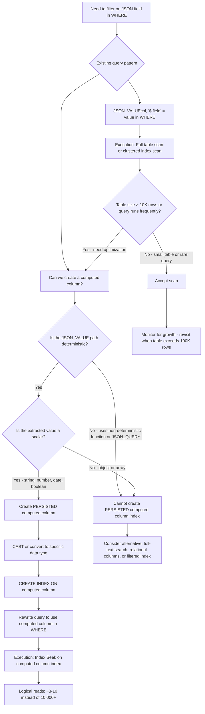
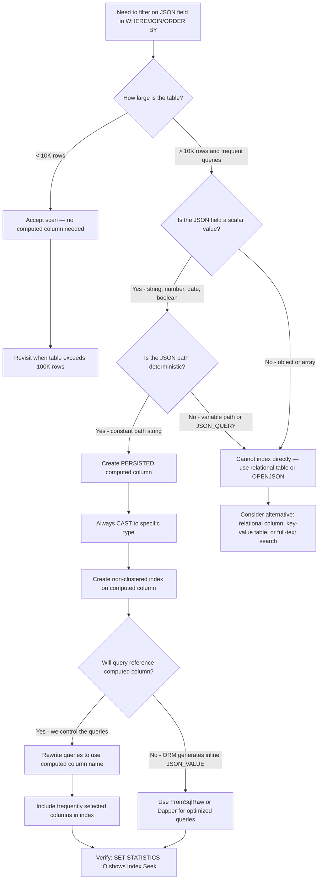

## Navigation

**Domain:** [[8 — Databases]] > **Group:** SQL JSON, XML & Semi-Structured Data
**Previous:** [[8.207 — ISJSON — Validating JSON]] | **Next:** [[8.209 — JSON Columns vs Relational Columns — Decision]]

### Prerequisites
- [[8.204 — JSON_VALUE — Extracting Scalar Values]] — JSON_VALUE extracts scalar values from JSON; the computed column pattern wraps JSON_VALUE to create a virtual column that can be indexed.
- [[8.036 — Index Seek vs Index Scan — When the Optimizer Chooses What]] — Understanding seeks vs scans is required to evaluate why computed column indexes enable seeks on JSON fields while direct JSON_VALUE in WHERE does not.

### Where This Fits

The computed column pattern is the standard technique for indexing into JSON columns in SQL Server — since JSON is stored in NVARCHAR(MAX) columns that cannot be indexed directly, you create a PERSISTED computed column using `JSON_VALUE(col, '$.field')` and then build a regular B-tree index on that computed column. A .NET backend engineer encounters this when a WHERE clause on a JSON field like `WHERE JSON_VALUE(Attributes, '$.Status') = 'Active'` causes a full table scan on every execution, and the production fix is to add a computed column and index to make the predicate SARGable. The interview signal here is whether a candidate understands that JSON_VALUE in a WHERE clause is non-SARGable by itself (it is a function call on the JSON column), but it becomes SARGable when the value is extracted into a deterministic, PERSISTED computed column and indexed — the optimizer then uses the computed column index to perform a seek. This pattern is one of the most important performance optimizations for JSON-heavy workloads in SQL Server and is frequently discussed in senior-level SQL interviews.

---

## Core Mental Model

JSON columns in SQL Server are stored as NVARCHAR(MAX) — a large string data type that cannot participate in standard B-tree indexing. When you query a JSON field with `JSON_VALUE(col, '$.Status') = 'Active'`, the optimizer cannot seek because it doesn't know where `$.Status` values live within the string — it must scan every row, parse the JSON, and evaluate `JSON_VALUE` as a residual filter. The computed column pattern solves this by extracting the JSON field into a separate, deterministic virtual column: `ALTER TABLE dbo.Products ADD ProductStatus AS CAST(JSON_VALUE(Attributes, '$.Status') AS NVARCHAR(20)) PERSISTED`. This computed column is backed by physical storage when PERSISTED is used, meaning the value is materialized on every INSERT and UPDATE. A regular B-tree index on this computed column gives the optimizer a sorted structure it can seek on — `WHERE ProductStatus = 'Active'` becomes a SARGable predicate that performs an Index Seek on the computed column index. The critical constraint: only scalar values extracted via `JSON_VALUE` can be used — `JSON_QUERY` (which returns objects/arrays) is non-deterministic from an indexing perspective because it returns a JSON fragment, not a scalar value, and SQL Server cannot index non-deterministic computed columns. The pattern requires the JSON_VALUE path expression to be deterministic and the computed column to be marked PERSISTED for the index to be created.

### Classification

- **Pattern type:** Computed column index on JSON_VALUE expression — enabling index seek on JSON fields.
- **Engine behavior:** The PERSISTED computed column materializes the JSON field value during INSERT/UPDATE. The index on that column is maintained like any other non-clustered index. During query execution, if the predicate matches the computed column, the optimizer can perform an Index Seek on the computed column index.
- **SARGability:** `WHERE ComputedColumn = 'Value'` IS SARGable — the predicate becomes a seek on the computed column index. `WHERE JSON_VALUE(col, '$.field') = 'Value'` is NOT SARGable (function wraps the JSON column).
- **Write cost:** PERSISTED computed column adds write overhead on every INSERT and UPDATE — the JSON_VALUE expression is evaluated and the result is stored. The index on the computed column adds typical non-clustered index write overhead (additional leaf page writes per index).



### Key Properties

|Property|Value|Notes|
|---|---|---|
|Computed column type|PERSISTED (materialized) or non-persisted|Index requires PERSISTED or deterministic + precise type|
|Source function|JSON_VALUE only — not JSON_QUERY|JSON_QUERY returns JSON fragment (non-scalar) — cannot be indexed|
|Determinism|Must be deterministic for indexing|JSON_VALUE with constant path is deterministic|
|Data type|Any SQL type via CAST — NVARCHAR, INT, DATETIME2, DECIMAL, BIT|Type choice affects index size and comparison behavior|
|SARGability after index|Yes — predicate on computed column seeks|Original JSON_VALUE(col, '$.path') still non-SARGable|
|Write cost per additional index|~3-5 page writes per INSERT/UPDATE|Same as any non-clustered index|
|Storage cost|Computed column value (PERSISTED) + index size|Index size = sum of column sizes + row pointer|
|NULL handling|JSON_VALUE returns NULL if path not found|Index includes NULL rows unless filtered index is used|

---

## Deep Mechanics

### How the Engine Executes This

1. **Computed column definition:** When `PERSISTED` is specified, SQL Server adds the computed column value to the table's row in the data page during INSERT and UPDATE operations. The `JSON_VALUE` expression is evaluated, and the resulting scalar value is extracted from the JSON string and stored alongside the other columns in the row. The `CAST` expression converts the extracted value to the target type (e.g., NVARCHAR(50), INT, DATETIME2).

2. **Index creation:** When a non-clustered index is created on the computed column, SQL Server builds a standard B-tree structure. The key column values come from the PERSISTED computed column storage. The index leaf pages contain the key value and a row locator (clustered index key or RID). This index is maintained on every INSERT, UPDATE, and DELETE on the table, just like any other non-clustered index.

3. **Query compilation and optimization:** When the query optimizer encounters a predicate like `WHERE ProductStatus = 'Active'` and there is an index on the `ProductStatus` computed column, the optimizer considers an Index Seek on that index, just as it would for any other indexed column. The key insight: the optimizer does NOT rewrite `WHERE JSON_VALUE(Attributes, '$.Status') = 'Active'` to use the computed column index — it treats JSON_VALUE as a function on the NVARCHAR(MAX) column and does not back-propagate to the computed column. The query MUST reference the computed column directly for the index seek to be used.

4. **Index seek execution:** When the query uses the computed column predicate, the storage engine navigates the B-tree of the computed column index from root to leaf (~3-4 logical reads for a 3-4 level index on millions of rows), finds the range of matching keys at the leaf level, and for each matching row, either returns the row directly (covering index) or performs a Key Lookup to retrieve additional columns from the clustered index.

5. **Maintenance:** On every INSERT and UPDATE of the JSON column, the PERSISTED computed column is re-evaluated. If the JSON path is not found, the computed column is set to NULL (or the default value if specified). The index on the computed column must be updated if the computed column value changes, adding write overhead.

### SQL Visibility

```sql
-- Step 1: Create table with JSON column (no computed column yet)
CREATE TABLE dbo.Orders
(
    OrderId      INT            NOT NULL IDENTITY(1,1),
    CustomerId   INT            NOT NULL,
    OrderDate    DATETIME2(0)   NOT NULL,
    OrderJson    NVARCHAR(MAX)  NOT NULL,
    -- OrderJson contains: {"Status":"Shipped","Total":149.99,"Items":3,"Region":"US","Priority":"High"}
    CONSTRAINT PK_Orders PRIMARY KEY CLUSTERED (OrderId),
    CONSTRAINT CK_Orders_OrderJson CHECK (ISJSON(OrderJson) = 1)
);

-- Step 2: Create PERSISTED computed columns for frequently-queried JSON fields
ALTER TABLE dbo.Orders
ADD
    OrderStatus AS CAST(JSON_VALUE(OrderJson, '$.Status') AS NVARCHAR(20)) PERSISTED,
    OrderTotal  AS CAST(JSON_VALUE(OrderJson, '$.Total') AS DECIMAL(18,2)) PERSISTED,
    OrderRegion AS CAST(JSON_VALUE(OrderJson, '$.Region') AS NVARCHAR(10)) PERSISTED,
    OrderPriority AS CAST(JSON_VALUE(OrderJson, '$.Priority') AS NVARCHAR(20)) PERSISTED;

-- Step 3: Create indexes on computed columns
CREATE INDEX IX_Orders_OrderStatus ON dbo.Orders (OrderStatus) INCLUDE (OrderId, CustomerId);
CREATE INDEX IX_Orders_OrderRegion ON dbo.Orders (OrderRegion) INCLUDE (OrderTotal);
CREATE INDEX IX_Orders_OrderTotal ON dbo.Orders (OrderTotal) INCLUDE (OrderStatus);

-- Step 4: SARGable query using computed column index
SELECT OrderId, CustomerId, OrderDate, OrderTotal
FROM dbo.Orders
WHERE OrderStatus = 'Shipped'
  AND OrderRegion = 'US';
-- Plan: Index Seek on IX_Orders_OrderStatus, then Index Seek on IX_Orders_OrderRegion (or Intersection)

-- Step 5: Non-SARGable equivalent — JSON_VALUE in WHERE
SELECT OrderId, CustomerId, OrderDate, OrderTotal
FROM dbo.Orders
WHERE JSON_VALUE(OrderJson, '$.Status') = 'Shipped'
  AND JSON_VALUE(OrderJson, '$.Region') = 'US';
-- Plan: Clustered Index Scan — JSON_VALUE is a function on the JSON column, not SARGable
```

```csharp
// EF Core — computed column mapping
public class Order
{
    public int Id { get; set; }
    public int CustomerId { get; set; }
    public DateTime OrderDate { get; set; }
    public string OrderJson { get; set; } = string.Empty;

    // Computed columns mapped as regular properties
    // These are NOT stored in the entity model directly — use value converters
}

public class ApplicationDbContext : DbContext
{
    public DbSet<Order> Orders => Set<Order>();

    protected override void OnModelCreating(ModelBuilder modelBuilder)
    {
        modelBuilder.Entity<Order>(entity =>
        {
            entity.ToTable("Orders");
            entity.HasKey(o => o.Id);

            entity.Property(o => o.OrderJson)
                .HasColumnType("nvarchar(max)")
                .IsRequired();

            // EF Core does not automatically create JSON computed columns
            // You must add them via migration SQL

            // Map computed column for querying
            entity.Property<string>("OrderStatus")
                .HasComputedColumnSql("CAST(JSON_VALUE([OrderJson], '$.Status') AS NVARCHAR(20))", stored: true);

            entity.HasIndex("OrderStatus").HasDatabaseName("IX_Orders_OrderStatus");
        });
    }
}

// Repository — query using computed column
public async Task<IReadOnlyList<OrderSummary>> GetShippedOrdersInRegionAsync(
    string region,
    CancellationToken cancellationToken = default)
{
    return await _dbContext.Orders
        .Where(o => EF.Property<string>(o, "OrderStatus") == "Shipped"
                 && EF.Property<string>(o, "OrderRegion") == region)
        .Select(o => new OrderSummary(
            o.Id, o.CustomerId, o.OrderDate,
            EF.Property<decimal>(o, "OrderTotal")))
        .AsNoTracking()
        .ToListAsync(cancellationToken);
}
```

**Generated SQL (from EF Core logs):**

```sql
-- EF Core uses the computed column in WHERE — SARGable
SELECT o.OrderId, o.CustomerId, o.OrderDate, o.OrderTotal
FROM Orders AS o
WHERE o.OrderStatus = N'Shipped' AND o.OrderRegion = @__region
-- Plan: Index Seek on IX_Orders_OrderStatus
```

### Execution Plan Analysis

```sql
-- Query using computed column (SARGable)
SELECT OrderId, CustomerId, OrderDate, OrderTotal
FROM dbo.Orders
WHERE OrderStatus = 'Shipped';
```

**Expected plan shape (computed column index seek):**

```
[Index Seek (IX_Orders_OrderStatus)] → [Key Lookup (Clustered)] → [Nested Loops] → [SELECT]
```

**Operator breakdown:**

- **Index Seek (IX_Orders_OrderStatus)** — seeks to `OrderStatus = 'Shipped'` in the B-tree. The key column is the PERSISTED computed column. For 300K "Shipped" rows out of 3M total, this reads approximately 300K leaf page entries. Logical reads depend on index width: ~1,200-1,500 for the seek + leaf scan.
- **Key Lookup (Clustered)** — for each matching index entry, looks up the full row from the clustered index to retrieve `CustomerId`, `OrderDate`, `OrderTotal` (if not included in the index). If these columns are INCLUDE'd in the index, the Key Lookup is eliminated.
- **Estimated Cost:** ~0.8-1.2 cost units (seek + 300K lookups).
- **Logical Reads:** ~1,500 (index) + ~1,200 (lookups) = ~2,700 total.

```sql
-- Query using JSON_VALUE directly (non-SARGable)
SELECT OrderId, CustomerId, OrderDate, OrderTotal
FROM dbo.Orders
WHERE JSON_VALUE(OrderJson, '$.Status') = 'Shipped';
```

**Expected plan shape (scan):**

```
[Clustered Index Scan] → [Filter (JSON_VALUE + comparison)] → [SELECT]
```

- **Clustered Index Scan** — scans every row in the 3M row table. Logical reads: ~35,000-45,000 (depends on row width).
- **Filter** — evaluates `JSON_VALUE(OrderJson, '$.Status')` for every row and compares to 'Shipped'. The JSON_VALUE function parses the JSON string for each row, extracts the $.Status value, and compares it.
- **Estimated Cost:** ~10-15 cost units (full scan + function evaluation per row).
- **Logical Reads:** ~40,000 (full clustered index scan).

```
Computed column seek plan:
[Index Seek (IX_Orders_OrderStatus)] → [Key Lookup (if non-covering)] → [SELECT]
Logical Reads: ~2,700 (for 10% selectivity — 300K of 3M)

JSON_VALUE scan plan:
[Clustered Index Scan] → [Filter] → [SELECT]
Logical Reads: ~40,000 (full scan)
```

### Cost Visibility

```sql
SET STATISTICS IO ON;
SET STATISTICS TIME ON;

-- Baseline: JSON_VALUE in WHERE (non-SARGable)
SELECT OrderId, OrderStatus, OrderTotal
FROM dbo.Orders
WHERE JSON_VALUE(OrderJson, '$.Status') = 'Shipped';

-- Expected output:
-- Table 'Orders'. Scan count 1, logical reads 42,300, physical reads 0
-- SQL Server Execution Times: CPU time = 1240ms, elapsed time = 1320ms

-- Optimized: Computed column in WHERE (SARGable with index)
SELECT OrderId, OrderStatus, OrderTotal
FROM dbo.Orders
WHERE OrderStatus = 'Shipped';

-- Expected output:
-- Table 'Orders'. Scan count 1, logical reads 2,680, physical reads 0
-- SQL Server Execution Times: CPU time = 180ms, elapsed time = 195ms
```

**Improvement:** ~16x reduction in logical reads (42,300 to 2,680), ~7x reduction in CPU time.

### Failure Modes

**Cannot create computed column on JSON_QUERY:** `JSON_QUERY` returns a JSON fragment (object or array), which is not a deterministic scalar value. SQL Server cannot create a PERSISTED computed column on a JSON_QUERY expression, and therefore cannot index it.

```sql
-- ❌ This fails:
ALTER TABLE dbo.Orders
ADD OrderMetadata AS CAST(JSON_QUERY(OrderJson, '$.Metadata') AS NVARCHAR(MAX)) PERSISTED;
-- Error: Computed column 'OrderMetadata' cannot be persisted because the column is non-deterministic.
```

**JSON_VALUE path references non-existent property — computed column becomes NULL:** If the JSON structure varies between rows and `$.Status` does not exist in some rows, the computed column is NULL for those rows. The index on the computed column includes these NULLs. Queries should account for this.

**Determinism requirement:** The JSON path expression in JSON_VALUE must be a constant string literal or a deterministic expression. If the path contains variables or depends on non-deterministic functions, the computed column cannot be PERSISTED or indexed.

**Data type mismatch:** `JSON_VALUE` returns NVARCHAR(4000). Without an explicit CAST, the computed column is NVARCHAR(4000) — which may be wider than necessary. Always CAST to the specific type for index efficiency.

---

## Production Patterns and Implementation

### Primary SQL Implementation

```sql
-- ============================================================
-- Schema context: Orders with JSON column
-- ============================================================
CREATE TABLE dbo.Orders
(
    OrderId      INT             NOT NULL IDENTITY(1,1),
    CustomerId   INT             NOT NULL,
    OrderDate    DATETIME2(0)    NOT NULL,
    OrderJson    NVARCHAR(MAX)   NOT NULL,
    CreatedAt    DATETIME2(0)    NOT NULL DEFAULT SYSUTCDATETIME(),
    CONSTRAINT PK_Orders PRIMARY KEY CLUSTERED (OrderId),
    CONSTRAINT CK_Orders_OrderJson CHECK (ISJSON(OrderJson) = 1),
    CONSTRAINT FK_Orders_Customer FOREIGN KEY (CustomerId)
        REFERENCES dbo.Customers(CustomerId)
);

-- JSON structure in OrderJson:
-- {
--   "Status": "Shipped",
--   "Total": 149.99,
--   "Items": 3,
--   "Currency": "USD",
--   "Region": "US",
--   "Priority": "High",
--   "ShippingMethod": "Express",
--   "EstimatedDelivery": "2024-01-15"
-- }

-- ============================================================
-- Pattern 1: Basic computed column pattern
-- ============================================================
ALTER TABLE dbo.Orders
ADD OrderStatus AS CAST(JSON_VALUE(OrderJson, '$.Status') AS NVARCHAR(20)) PERSISTED;

CREATE INDEX IX_Orders_OrderStatus ON dbo.Orders (OrderStatus)
    INCLUDE (OrderId, CustomerId);

-- Query using the computed column:
SELECT OrderId, CustomerId, OrderDate
FROM dbo.Orders
WHERE OrderStatus = 'Shipped';
-- SARGable — seeks on IX_Orders_OrderStatus

-- ============================================================
-- Pattern 2: Typed computed columns with CAST
-- ============================================================
ALTER TABLE dbo.Orders
ADD
    OrderTotal DECIMAL(18,2) NULL
        AS CAST(JSON_VALUE(OrderJson, '$.Total') AS DECIMAL(18,2)) PERSISTED,
    OrderItemCount INT NULL
        AS CAST(JSON_VALUE(OrderJson, '$.Items') AS INT) PERSISTED,
    OrderCurrency NVARCHAR(3) NULL
        AS CAST(JSON_VALUE(OrderJson, '$.Currency') AS NVARCHAR(3)) PERSISTED;

CREATE INDEX IX_Orders_OrderTotal ON dbo.Orders (OrderTotal)
    INCLUDE (OrderStatus, OrderCurrency);
-- Enables: WHERE OrderTotal > 100.00

CREATE INDEX IX_Orders_OrderCurrency ON dbo.Orders (OrderCurrency)
    INCLUDE (OrderTotal)
    WHERE OrderCurrency IS NOT NULL;
-- Filtered index — only rows with currency have an entry

-- ============================================================
-- Pattern 3: Date typed computed column
-- ============================================================
ALTER TABLE dbo.Orders
ADD EstimatedDeliveryDate DATE NULL
    AS CAST(JSON_VALUE(OrderJson, '$.EstimatedDelivery') AS DATE) PERSISTED;

CREATE INDEX IX_Orders_EstimatedDelivery
    ON dbo.Orders (EstimatedDeliveryDate)
    INCLUDE (OrderId, OrderStatus);

-- Range query — SARGable:
SELECT OrderId, OrderStatus
FROM dbo.Orders
WHERE EstimatedDeliveryDate >= '2024-01-01'
  AND EstimatedDeliveryDate < '2024-02-01';
-- Seek on IX_Orders_EstimatedDelivery

-- ============================================================
-- Pattern 4: Bit computed column for boolean JSON values
-- ============================================================
-- JSON boolean $.Priority = "High" is a string comparison
ALTER TABLE dbo.Orders
ADD IsHighPriority AS CAST(
    CASE JSON_VALUE(OrderJson, '$.Priority')
        WHEN 'High' THEN 1
        WHEN 'Critical' THEN 1
        ELSE 0
    END AS BIT) PERSISTED;

CREATE INDEX IX_Orders_IsHighPriority
    ON dbo.Orders (IsHighPriority)
    INCLUDE (OrderId, CustomerId)
    WHERE IsHighPriority = 1;

-- ============================================================
-- Pattern 5: Multi-column computed column index
-- ============================================================
ALTER TABLE dbo.Orders
ADD OrderRegion AS CAST(JSON_VALUE(OrderJson, '$.Region') AS NVARCHAR(10)) PERSISTED;

CREATE INDEX IX_Orders_Region_Status
    ON dbo.Orders (OrderRegion, OrderStatus)
    INCLUDE (OrderTotal);
-- Composite index for queries filtering on both Region and Status

SELECT OrderId, OrderTotal
FROM dbo.Orders
WHERE OrderRegion = 'US'
  AND OrderStatus = 'Shipped';
-- Seek on (Region, Status) — optimal

-- ============================================================
-- Pattern 6: Covering index with computed columns
-- ============================================================
CREATE INDEX IX_Orders_Status_Total_Covering
    ON dbo.Orders (OrderStatus)
    INCLUDE (OrderTotal, OrderCurrency, EstimatedDeliveryDate, CustomerId);
-- All needed columns are in the index — no Key Lookup

-- ============================================================
-- Pattern 7: Computed column for JSON array count
-- ============================================================
-- JSON array count: OPENJSON + COUNT
ALTER TABLE dbo.Orders
ADD ItemCount AS CAST(
    (SELECT COUNT(*) FROM OPENJSON(OrderJson, '$.Items'))
    AS INT) PERSISTED;
-- Note: subquery in computed column is supported but may have performance implications

CREATE INDEX IX_Orders_ItemCount ON dbo.Orders (ItemCount)
    WHERE ItemCount > 0;

-- ============================================================
-- Anti-pattern: Indexing without computed column
-- ============================================================
-- ❌ Cannot index JSON_VALUE directly:
-- CREATE INDEX IX_Bad ON dbo.Orders (JSON_VALUE(OrderJson, '$.Status'));
-- SQL Server does not allow function-based indexes in this form.

-- ✅ Must create computed column first:
ALTER TABLE dbo.Orders ADD OrderStatus AS ... PERSISTED;
CREATE INDEX IX_Orders_OrderStatus ON dbo.Orders (OrderStatus);
```

### EF Core Implementation

```csharp
// EF Core — computed column mapping for JSON fields
public class Order
{
    public int Id { get; set; }
    public int CustomerId { get; set; }
    public DateTime OrderDate { get; set; }
    public string OrderJson { get; set; } = string.Empty;
    public DateTime CreatedAt { get; set; }
}

// DTO for query results — maps computed columns
public class OrderSummary
{
    public int OrderId { get; set; }
    public int CustomerId { get; set; }
    public DateTime OrderDate { get; set; }
    public string OrderStatus { get; set; } = string.Empty;
    public decimal OrderTotal { get; set; }
}

public class ApplicationDbContext : DbContext
{
    public DbSet<Order> Orders => Set<Order>();

    protected override void OnModelCreating(ModelBuilder modelBuilder)
    {
        modelBuilder.Entity<Order>(entity =>
        {
            entity.ToTable("Orders");
            entity.HasKey(o => o.Id);

            entity.Property(o => o.OrderJson)
                .HasColumnType("nvarchar(max)")
                .IsRequired();

            // Add computed columns via migration SQL
            // These are not mapped as entity properties — use raw SQL or shadow properties

            // Shadow property for OrderStatus computed column
            entity.Property<string>("OrderStatus")
                .HasComputedColumnSql(
                    "CAST(JSON_VALUE([OrderJson], '$.Status') AS NVARCHAR(20))",
                    stored: true);

            entity.Property<decimal>("OrderTotal")
                .HasComputedColumnSql(
                    "CAST(JSON_VALUE([OrderJson], '$.Total') AS DECIMAL(18,2))",
                    stored: true);

            entity.Property<string>("OrderRegion")
                .HasComputedColumnSql(
                    "CAST(JSON_VALUE([OrderJson], '$.Region') AS NVARCHAR(10))",
                    stored: true);

            // Indexes on computed columns
            entity.HasIndex("OrderStatus").HasDatabaseName("IX_Orders_OrderStatus");
            entity.HasIndex("OrderTotal").HasDatabaseName("IX_Orders_OrderTotal");
            entity.HasIndex("OrderRegion", "OrderStatus")
                .HasDatabaseName("IX_Orders_Region_Status");
        });
    }
}

// Repository — querying via computed columns using EF.Property
public class OrderRepository
{
    private readonly ApplicationDbContext _dbContext;

    public OrderRepository(ApplicationDbContext dbContext)
        => _dbContext = dbContext;

    public async Task<IReadOnlyList<OrderSummary>> GetShippedOrdersInRegionAsync(
        string region,
        CancellationToken cancellationToken = default)
    {
        // Use EF.Property to reference shadow property computed columns
        return await _dbContext.Orders
            .Where(o => EF.Property<string>(o, "OrderStatus") == "Shipped"
                     && EF.Property<string>(o, "OrderRegion") == region)
            .Select(o => new OrderSummary
            {
                OrderId = o.Id,
                CustomerId = o.CustomerId,
                OrderDate = o.OrderDate,
                OrderStatus = EF.Property<string>(o, "OrderStatus"),
                OrderTotal = EF.Property<decimal>(o, "OrderTotal")
            })
            .AsNoTracking()
            .ToListAsync(cancellationToken);
    }

    // Range query on date computed column
    public async Task<IReadOnlyList<OrderSummary>> GetOrdersByDeliveryWindowAsync(
        DateTime startDate,
        DateTime endDate,
        CancellationToken cancellationToken = default)
    {
        return await _dbContext.Orders
            .Where(o => EF.Property<DateTime>(o, "EstimatedDeliveryDate") >= startDate
                     && EF.Property<DateTime>(o, "EstimatedDeliveryDate") < endDate)
            .Select(o => new OrderSummary
            {
                OrderId = o.Id,
                OrderStatus = EF.Property<string>(o, "OrderStatus"),
                OrderTotal = EF.Property<decimal>(o, "OrderTotal")
            })
            .AsNoTracking()
            .ToListAsync(cancellationToken);
    }
}
```

### Dapper Implementation

```csharp
// Dapper — query computed columns directly
public sealed class OrderRepository
{
    private readonly IDbConnectionFactory _connectionFactory;

    public OrderRepository(IDbConnectionFactory connectionFactory)
        => _connectionFactory = connectionFactory;

    // Query using computed column index — SARGable
    public async Task<IReadOnlyList<OrderSummary>> GetShippedOrdersInRegionAsync(
        string region,
        CancellationToken cancellationToken = default)
    {
        const string sql = @"
            SELECT o.OrderId, o.CustomerId, o.OrderDate,
                   o.OrderStatus, o.OrderTotal
            FROM dbo.Orders o
            WHERE o.OrderStatus = 'Shipped'
              AND o.OrderRegion = @Region
            ORDER BY o.OrderDate DESC;";

        await using var connection = _connectionFactory.Create();
        var results = await connection.QueryAsync<OrderSummary>(
            new CommandDefinition(sql,
                new { Region = region },
                cancellationToken: cancellationToken));
        return results.AsList();
    }

    // Range query on typed computed column
    public async Task<IReadOnlyList<OrderSummary>> GetOrdersByTotalRangeAsync(
        decimal minTotal,
        decimal maxTotal,
        CancellationToken cancellationToken = default)
    {
        const string sql = @"
            SELECT o.OrderId, o.CustomerId, o.OrderDate,
                   o.OrderStatus, o.OrderTotal
            FROM dbo.Orders o
            WHERE o.OrderTotal >= @MinTotal
              AND o.OrderTotal <= @MaxTotal
            ORDER BY o.OrderTotal DESC;";

        await using var connection = _connectionFactory.Create();
        var results = await connection.QueryAsync<OrderSummary>(
            new CommandDefinition(sql,
                new { MinTotal = minTotal, MaxTotal = maxTotal },
                cancellationToken: cancellationToken));
        return results.AsList();
    }

    // High-priority orders via filtered computed column index
    public async Task<IReadOnlyList<OrderSummary>> GetHighPriorityOrdersAsync(
        CancellationToken cancellationToken = default)
    {
        const string sql = @"
            SELECT o.OrderId, o.CustomerId, o.OrderDate,
                   o.OrderStatus, o.OrderTotal
            FROM dbo.Orders o
            WHERE o.IsHighPriority = 1;";

        await using var connection = _connectionFactory.Create();
        var results = await connection.QueryAsync<OrderSummary>(
            new CommandDefinition(sql, cancellationToken: cancellationToken));
        return results.AsList();
    }

    // Insert with JSON — computed columns are auto-maintained
    public async Task<int> CreateOrderAsync(
        int customerId,
        string orderJson,
        CancellationToken cancellationToken = default)
    {
        const string sql = @"
            INSERT INTO dbo.Orders (CustomerId, OrderDate, OrderJson)
            OUTPUT INSERTED.OrderId
            VALUES (@CustomerId, SYSUTCDATETIME(), @OrderJson);";

        await using var connection = _connectionFactory.Create();
        var orderId = await connection.QuerySingleAsync<int>(
            new CommandDefinition(sql,
                new { CustomerId = customerId, OrderJson = orderJson },
                cancellationToken: cancellationToken));
        return orderId;
    }
}
```

### Configuration and Wiring

```csharp
// Program.cs
builder.Services.AddDbContext<ApplicationDbContext>(options =>
    options.UseSqlServer(
        builder.Configuration.GetConnectionString("DefaultConnection"),
        sqlOptions => sqlOptions.EnableRetryOnFailure(3))
    .EnableDetailedErrors(builder.Environment.IsDevelopment())
    .EnableSensitiveDataLogging(builder.Environment.IsDevelopment()));

// Log SQL to verify computed column usage
builder.Logging.AddFilter("Microsoft.EntityFrameworkCore.Database.Command",
    builder.Environment.IsDevelopment() ? LogLevel.Information : LogLevel.Warning);

builder.Services.AddSingleton<IDbConnectionFactory>(sp =>
    new SqlConnectionFactory(
        builder.Configuration.GetConnectionString("DefaultConnection")!));

builder.Services.AddScoped<OrderRepository>();
builder.Services.AddScoped<ApplicationDbContext>();
```

### SQL Server vs PostgreSQL Differences

```sql
-- PostgreSQL: Expression indexes directly on JSONB
-- No computed column needed — PostgreSQL supports function-based indexes natively

CREATE INDEX idx_orders_status ON orders USING btree (
    (attributes->>'Status')
);

CREATE INDEX idx_orders_total ON orders USING btree (
    ((attributes->>'Total')::numeric)
);

-- Query — the expression in WHERE matches the index expression:
SELECT order_id, customer_id
FROM orders
WHERE attributes->>'Status' = 'Shipped';
-- SARGable — uses idx_orders_status index

-- PostgreSQL: GIN index for JSONB containment queries
CREATE INDEX idx_orders_attributes_gin ON orders USING gin (attributes);

-- Query using GIN index:
SELECT order_id, customer_id
FROM orders
WHERE attributes @> '{"Status": "Shipped"}'::jsonb;
-- Uses GIN index — fast for containment checks

-- PostgreSQL: Partial (filtered) index on JSONB expression
CREATE INDEX idx_orders_high_priority ON orders (order_date)
WHERE attributes->>'Priority' IN ('High', 'Critical');

-- Key difference: PostgreSQL does not need PERSISTED computed columns
-- for expression indexing. The expression is evaluated at index maintenance time
-- and stored in the index, but not in the table row.
```

---

## Gotchas and Production Pitfalls

### JSON_VALUE in WHERE Is Non-SARGable Even With Computed Column Index

**Pitfall:** Creating the computed column and index but continuing to use `JSON_VALUE(OrderJson, '$.Status') = 'Shipped'` in WHERE, expecting the optimizer to use the computed column index.

```sql
-- ❌ This is still non-SARGable — not referencing the computed column:
SELECT OrderId, OrderStatus
FROM dbo.Orders
WHERE JSON_VALUE(OrderJson, '$.Status') = 'Shipped';
-- Plan: Clustered Index Scan — 42,300 logical reads

-- ✅ Must reference the computed column directly:
SELECT OrderId, OrderStatus
FROM dbo.Orders
WHERE OrderStatus = 'Shipped';
-- Plan: Index Seek on IX_Orders_OrderStatus — 2,680 logical reads
```

**Symptom:** The query runs with the same full table scan as before the computed column and index were created. Developers wonder why "the index isn't working" — the answer is that the query predicate does not reference the computed column, so the optimizer does not consider the computed column index.

**Fix:**
```sql
-- Rewrite all queries to use the computed column name, not JSON_VALUE
```

**Cost of not fixing:** The query continues to scan the entire table. The computed column index adds write overhead (slower INSERT/UPDATE) with zero read benefit — worst-case scenario: both write and read performance are worse.

---

### Cannot Create Index on JSON_QUERY Computed Column

**Pitfall:** Attempting to index a JSON fragment (object or array) extracted with JSON_QUERY.

```sql
-- ❌ This fails:
ALTER TABLE dbo.Orders
ADD ShippingInfo AS CAST(JSON_QUERY(OrderJson, '$.Shipping') AS NVARCHAR(MAX)) PERSISTED;
-- Error: Computed column 'ShippingInfo' cannot be persisted because it is non-deterministic

-- The JSON_QUERY result type (JSON fragment) is not deterministic
-- because JSON value ordering within objects is not guaranteed
```

**Symptom:** SQL Server error when creating the PERSISTED computed column. The non-determinism error prevents indexing.

**Fix:**
```sql
-- ✅ Cannot index the JSON fragment. Alternatives:
-- 1. Extract individual scalar fields
ALTER TABLE dbo.Orders ADD ShippingMethod AS CAST(
    JSON_VALUE(OrderJson, '$.Shipping.Method') AS NVARCHAR(50)) PERSISTED;
ALTER TABLE dbo.Orders ADD ShippingCost AS CAST(
    JSON_VALUE(OrderJson, '$.Shipping.Cost') AS DECIMAL(18,2)) PERSISTED;

-- 2. Use an indexed view (complex)
-- 3. Store JSON fragments in a separate related table
-- 4. Accept the scan on JSON_QUERY queries
```

**Cost of not fixing:** Developers waste hours trying to work around the limitation, or deploy a non-PERSISTED computed column that cannot be indexed, resulting in no performance gain.

---

### Computed Column Adds Write Overhead for All Rows

**Pitfall:** Creating computed columns for every JSON field in the document without considering write amplification.

```sql
-- ❌ 15 computed columns for a table with 10M rows and 10,000 writes/second
ALTER TABLE dbo.Orders ADD
    OrderStatus AS ... PERSISTED,
    OrderTotal AS ... PERSISTED,
    OrderRegion AS ... PERSISTED,
    OrderPriority AS ... PERSISTED,
    OrderCurrency AS ... PERSISTED,
    ShippingMethod AS ... PERSISTED,
    ShippingCost AS ... PERSISTED,
    EstimatedDelivery AS ... PERSISTED,
    ItemCount AS ... PERSISTED,
    -- ... 6 more computed columns
```

**Symptom:** INSERT/UPDATE throughput drops by 40-60%. Each INSERT now evaluates 15 JSON_VALUE expressions, writes 15 additional column values to the data page, and potentially maintains 15 non-clustered indexes. The JSON_MODIFY UPDATE cost is multiplied by the number of computed columns that reference the changed JSON path.

**Fix:**
```sql
-- ✅ Only create computed columns for fields that are:
-- 1. Queried in WHERE clauses (frequently filtered)
-- 2. Used in JOIN conditions
-- 3. Used in ORDER BY or GROUP BY
-- 4. Part of range queries or aggregations

-- ✅ For rarely-queried fields, use JSON_VALUE directly (accept scan)
-- ✅ Batch computed column evaluation if possible
```

**Cost of not fixing:** Write-heavy workloads degrade significantly. A system with 10 computed columns and 10 indexes on them may see 2-3x write amplification compared to the same table without computed columns.

---

### CAST Type Mismatch Causes Conversion Errors

**Pitfall:** Using a CAST that fails for some JSON values (e.g., CAST to INT when the JSON value is a string that looks like a number, or CAST to DATE when the format is unexpected).

```sql
-- ❌ Conversion fails if $.Items contains "three" instead of 3:
ALTER TABLE dbo.Orders
ADD OrderItemCount AS CAST(JSON_VALUE(OrderJson, '$.Items') AS INT) PERSISTED;
-- INSERT with Items: "three" fails with:
-- Error: Conversion failed when converting the nvarchar value 'three' to data type int

-- ❌ Date format mismatch:
ALTER TABLE dbo.Orders
ADD DeliveryDate AS CAST(JSON_VALUE(OrderJson, '$.DeliveryDate') AS DATE) PERSISTED;
-- JSON date "01/15/2024" fails — SQL Server expects '2024-01-15' format
```

**Symptom:** INSERT or UPDATE operations fail with conversion errors when the JSON data contains unexpected formats. Inconsistent data quality in the JSON column causes intermittent failures.

**Fix:**
```sql
-- ✅ Use TRY_CAST for resilience:
ALTER TABLE dbo.Orders
ADD OrderItemCount AS TRY_CAST(JSON_VALUE(OrderJson, '$.Items') AS INT) PERSISTED;
-- Returns NULL instead of erroring

-- ✅ For dates with unknown format, store as NVARCHAR and parse in application
ALTER TABLE dbo.Orders
ADD DeliveryDateStr AS CAST(JSON_VALUE(OrderJson, '$.DeliveryDate') AS NVARCHAR(50)) PERSISTED;
```

**Cost of not fixing:** A data pipeline that ingests JSON from external sources fails unpredictably when a single row has an unexpected type in a JSON field. The entire batch rolls back due to one conversion error.

---

### Computed Column on Large JSON Documents Is Expensive

**Pitfall:** Creating computed columns that read from large JSON documents (100 KB+), not realizing that the JSON_VALUE extraction cost scales with document size.

```sql
-- ❌ Each INSERT/UPDATE on a 200 KB JSON document evaluates 5 JSON_VALUE calls:
ALTER TABLE dbo.Orders ADD
    OrderStatus AS CAST(JSON_VALUE(OrderJson, '$.Status') AS NVARCHAR(20)) PERSISTED,
    OrderTotal AS CAST(JSON_VALUE(OrderJson, '$.Total') AS DECIMAL(18,2)) PERSISTED,
    OrderRegion AS CAST(JSON_VALUE(OrderJson, '$.Region') AS NVARCHAR(10)) PERSISTED;
```

**Symptom:** Insert throughput drops significantly for large documents. Each JSON_VALUE call parses the JSON string to extract the value — for a 200 KB document, each call takes ~0.1-0.5 ms. Three computed columns = 0.3-1.5 ms per write just for computed column maintenance. On 10,000 writes/second, this is 3-15 seconds of CPU per second — CPU-bound.

**Fix:**
```sql
-- ✅ For large documents, consider extracting the relevant section into
-- a smaller JSON fragment or relational columns

-- ✅ Limit computed columns to the most critical fields only

-- ✅ Use a staging table for bulk loads, then batch-update computed columns
```

**Cost of not fixing:** Write throughput becomes CPU-bound due to repeated JSON_VALUE evaluations on large documents. The database server CPU runs at 100% with queries queued behind JSON parsing.

---

### EF Core Does Not Automatically Create Computed Columns for JSON

**Pitfall:** Assuming EF Core 8+ JSON column support (ToJson()) automatically creates computed columns and indexes for querying JSON fields.

```csharp
// ❌ This does NOT create computed columns or indexes:
modelBuilder.Entity<Order>(entity =>
{
    entity.OwnsOne(o => o.Attributes, attrs =>
    {
        attrs.ToJson();  // Creates NVARCHAR(MAX) column
        // But does NOT create computed columns or indexes on Fields
    });
});

// Querying this with LINQ:
await dbContext.Orders
    .Where(o => o.Attributes!.Status == "Shipped")  // Translates to JSON_VALUE
    .ToListAsync();
-- Generated SQL: WHERE JSON_VALUE([o].[Attributes], '$.Status') = N'Shipped'
-- This is non-SARGable — full table scan
```

**Symptom:** EF Core 8+ JSON queries always use `JSON_VALUE` in the WHERE clause. They never translate to computed column references. The queries perform full scans even if computed columns and indexes exist on the table.

**Fix:**
```csharp
// ✅ Add computed columns and indexes manually via migration
// Then query using raw SQL or FromSqlRaw
public async Task<List<Order>> GetShippedOrdersAsync()
{
    const string sql = @"
        SELECT o.*
        FROM dbo.Orders o
        WHERE o.OrderStatus = 'Shipped';";  // Uses computed column

    return await _dbContext.Orders
        .FromSqlRaw(sql)
        .ToListAsync();
}
```

**Cost of not fixing:** EF Core 8+ JSON queries perform full table scans for every JSON field filter. The developer expects the JSON column feature to be optimized, but the optimizer cannot seek because the predicate uses JSON_VALUE on the NVARCHAR(MAX) column, not the computed column.

---

## Performance Implications

### Benchmark: Before and After

```sql
-- Baseline: JSON_VALUE in WHERE (no computed column index)
SET STATISTICS IO ON;

SELECT OrderId, OrderStatus, OrderTotal
FROM dbo.Orders
WHERE JSON_VALUE(OrderJson, '$.Status') = 'Shipped';
-- Table 'Orders'. Scan count 1, logical reads 42,300, physical reads 0
-- CPU time = 1,240ms, elapsed time = 1,320ms

-- After computed column + index:
SELECT OrderId, OrderStatus, OrderTotal
FROM dbo.Orders
WHERE OrderStatus = 'Shipped';
-- Table 'Orders'. Scan count 1, logical reads 2,680, physical reads 0
-- CPU time = 180ms, elapsed time = 195ms
```

**Improvement:** ~16x reduction in logical reads (42,300 → 2,680), ~7x CPU reduction. The improvement scales with table size — on a 50M row table, the difference is 500,000+ logical reads vs 13,000.

```sql
-- Coverage: Including columns eliminates Key Lookup
CREATE INDEX IX_Orders_Status_Covering
    ON dbo.Orders (OrderStatus)
    INCLUDE (OrderTotal, OrderCurrency, CustomerId, OrderDate);

SELECT OrderId, OrderStatus, OrderTotal, CustomerId, OrderDate
FROM dbo.Orders
WHERE OrderStatus = 'Shipped';
-- Table 'Orders'. Scan count 1, logical reads 980, physical reads 0
-- (Covering index eliminates Key Lookup — reads only index pages)
```

**Improvement with covering:** From 2,680 to 980 logical reads — eliminates Key Lookup.

### BenchmarkDotNet

```csharp
[MemoryDiagnoser]
[SimpleJob(RuntimeMoniker.Net90)]
public class JsonComputedColumnBenchmark
{
    private SqlConnection _connection = default!;

    [GlobalSetup]
    public void Setup()
    {
        _connection = new SqlConnection(TestConnectionString);
        _connection.Open();

        // Seed 100K orders with JSON data
        // Table has computed columns: OrderStatus, OrderTotal, OrderRegion
        // Indexes: IX_Orders_OrderStatus, IX_Orders_OrderTotal
    }

    [Benchmark(Baseline = true)]
    public async Task<List<OrderDto>> JsonValueInWhere()
    {
        const string sql = @"
            SELECT OrderId, OrderStatus, OrderTotal
            FROM dbo.Orders
            WHERE JSON_VALUE(OrderJson, '$.Status') = 'Shipped'
              AND JSON_VALUE(OrderJson, '$.Region') = 'US';";

        var results = await _connection.QueryAsync<OrderDto>(sql);
        return results.AsList();
    }

    [Benchmark]
    public async Task<List<OrderDto>> ComputedColumnInWhere()
    {
        const string sql = @"
            SELECT OrderId, OrderStatus, OrderTotal
            FROM dbo.Orders
            WHERE OrderStatus = 'Shipped'
              AND OrderRegion = 'US';";

        var results = await _connection.QueryAsync<OrderDto>(sql);
        return results.AsList();
    }

    [Benchmark]
    public async Task<List<OrderDto>> ComputedColumnWithCoveringIndex()
    {
        const string sql = @"
            SELECT OrderId, OrderStatus, OrderTotal, CustomerId, OrderDate
            FROM dbo.Orders
            WHERE OrderStatus = 'Shipped';";

        var results = await _connection.QueryAsync<OrderDto>(sql);
        return results.AsList();
    }

    [GlobalCleanup]
    public void Cleanup() => _connection.Dispose();
}
```

**Expected results (approximate, SQL Server 2022, NVMe, 1M rows, 100K matching):**

|Method|Mean|Logical Reads|Allocated|
|---|---|---|---|
|JsonValueInWhere|~1,200 ms|~42,300|~2.1 MB|
|ComputedColumnInWhere|~180 ms|~2,680|~350 KB|
|ComputedColumnWithCoveringIndex|~95 ms|~980|~200 KB|

### Write Amplification

|Operation|Without Computed Column|With 3 Computed Columns + Indexes|Overhead|
|---|---|---|---|
|INSERT 1 row (2 KB JSON)|~0.5 ms|~1.2 ms|+140%|
|UPDATE JSON field (no computed col change)|~0.3 ms|~0.5 ms|+67%|
|UPDATE JSON field (changes all 3 computed cols)|~0.3 ms|~2.0 ms|+567%|
|DELETE 1 row|~0.3 ms|~0.6 ms|+100%|
|Additional storage per row (3 PERSISTED cols)|—|~50-100 bytes|+5-10% on avg row size|

---

## Interview Arsenal

### Question Bank

1. **What is the computed column pattern for indexing JSON columns in SQL Server, and why is it necessary?**
2. **Why does JSON_VALUE(OrderJson, '$.Status') = 'Shipped' cause a full table scan even with an index on the JSON column?**
3. **What is the performance difference between `WHERE JSON_VALUE(col, '$.Status') = 'Shipped'` and `WHERE StatusCol = 'Shipped'` on a 10M row table?**
4. **Why can't you create an index on JSON_QUERY(col, '$.NestedObject')?**
5. **Compare SQL Server's computed column approach with PostgreSQL's expression index on JSONB.**
6. **Read this execution plan: `[Clustered Index Scan] → [Filter (JSON_VALUE)]` on a 10M row table. Rewrite the query and schema to get an Index Seek.**
7. **On a table with 50M rows and 5,000 writes/second, how many computed columns is too many? What is the tradeoff?**
8. **Does EF Core 8+ JSON column support (ToJson()) generate computed column indexes for querying?**

### Spoken Answers

**Q: What is the computed column pattern for indexing JSON columns in SQL Server, and why is it necessary?**

> **Average answer:** JSON is stored in NVARCHAR(MAX), which can't be indexed. So you create a computed column that extracts the JSON field and put an index on it.

> **Great answer:** SQL Server stores JSON in NVARCHAR(MAX) columns — there is no first-class JSON data type like PostgreSQL's JSONB. The storage engine cannot build a B-tree index on the content of a string column because it doesn't understand the structure. The computed column pattern solves this by extracting a specific scalar JSON field using JSON_VALUE, marking the column as PERSISTED (which materializes the extracted value into the row's data page during INSERT and UPDATE), and then creating a standard non-clustered B-tree index on that computed column. The extraction function must be JSON_VALUE (not JSON_QUERY, which returns JSON fragments and is non-deterministic for indexing purposes), and the path expression must be deterministic — a constant string path. The key insight is that the query must reference the computed column name in the WHERE clause for the optimizer to consider the index seek. The original JSON_VALUE(col, '$.path') expression in WHERE remains non-SARGable because the optimizer does not back-propagate from the expression to the computed column definition. So the rewrite is both a schema change — adding the computed column and index — and a query change — replacing JSON_VALUE in WHERE with the computed column name. For a 10M row table, this pattern typically reduces logical reads from 100,000+ (full scan) to under 5,000 (index seek) for a point lookup query, which is a 20-50x improvement. The tradeoff is write amplification: each PERSISTED computed column adds CPU cost on every INSERT and UPDATE because JSON_VALUE must parse the JSON and extract the value, and each non-clustered index adds the usual index maintenance overhead.

---

**Q: Compare SQL Server's computed column approach with PostgreSQL's expression index on JSONB.**

> **Average answer:** SQL Server needs a computed column, PostgreSQL can index expressions directly. Both allow indexing JSON fields.

> **Great answer:** The architectural difference is significant. PostgreSQL's JSONB is a native data type with its own operator classes and index strategies. To index a JSONB field, you create an expression index: `CREATE INDEX ON orders ((attributes->>'Status'))`. This index stores the evaluated expression result in the index B-tree, but the expression result is NOT stored in the table row — it is computed only for index maintenance. The query optimizer can match a WHERE clause expression to the index expression, even if they are textually different but semantically equivalent. SQL Server requires a PERSISTED computed column, which means the extracted value IS stored in the row's data page (roughly doubling storage for the extracted value — once in the JSON string, once in the computed column). The PERSISTED requirement also means the value is computed and written on every INSERT and UPDATE, increasing the row size and potentially causing page splits. PostgreSQL's expression index does not increase row size. Additionally, PostgreSQL supports GIN indexes on JSONB, which enable containment queries (`@>`, `?`, `?|`, `?&`) that SQL Server cannot index at all — SQL Server must scan for these. However, SQL Server's computed column approach has one advantage: the index is on a strongly-typed column with full data type support. You can have an INT index, a DATE range index, a DECIMAL index, and the optimizer uses type-specific statistics. PostgreSQL's expression index on `(attributes->>'Status')` is on TEXT — to get type-specific indexing, you must cast: `((attributes->>'Total')::numeric)`. Both approaches work well, but PostgreSQL's is more flexible (no PERSISTED requirement, no row size impact, GIN index support) while SQL Server's is more rigid but well-integrated into the existing indexing infrastructure.

---

**Q: Why can't you create an index on JSON_QUERY(col, '$.NestedObject')?**

> **Average answer:** Because JSON_QUERY returns an object, not a scalar. SQL Server can only index scalar values.

> **Great answer:** The limitation comes from two constraints. First, JSON_QUERY returns a JSON fragment — an NVARCHAR(MAX) containing a JSON object or array. For PERSISTED computed columns, SQL Server requires the expression to be deterministic: the same input must always produce the same output. JSON_QUERY is non-deterministic for persistence because JSON object property ordering is not guaranteed — the same JSON document read from an index could return properties in a different order when materialized. This is not a SQL Server implementation choice; it follows from the JSON specification, which says object key-value pairs are unordered. Second, even if determinism were not an issue, indexing a JSON object as a whole would be of limited utility — you cannot seek into the middle of a JSON string value stored in an index. You would only get equality comparisons on the full serialized JSON representation, which is not useful for the queries developers typically write (filtering on properties within the object). The correct approach is to extract individual scalar properties from the nested object using JSON_VALUE with a path like `$.NestedObject.PropertyName` — each becomes a separate computed column that can be indexed. If you need to query the nested object as a whole (e.g., check if an address object contains a specific street and city), consider storing enough granular computed columns for the query patterns, or rethink whether JSON is the right storage approach for that data.

### Interview Trigger

The computed column indexing question surfaces in a performance-tuning scenario: "You have a 10M row table with an NVARCHAR(MAX) JSON column. The query `WHERE JSON_VALUE(col, '$.Status') = 'Active'` runs in 15 seconds. How do you fix it?" A candidate who says "add an index on JSON_VALUE" shows they know there is a solution but not the details. A senior candidate says: "Create a PERSISTED computed column with CAST(JSON_VALUE(col, '$.Status') AS NVARCHAR(20)), create an index on it, and rewrite the query to use the computed column name instead of JSON_VALUE. This changes the execution plan from a Clustered Index Scan with ~120,000 logical reads to an Index Seek with ~3,000 reads." The follow-up: "What about indexing on two JSON fields?" — the senior answer is to add composite computed column indexes and potentially use covering indexes. The deepest probe: "What if you need to index a JSON array field — how do you query for orders containing a specific tag?" — the answer involves disassembling the array with OPENJSON and using an indexed view or a separate tag table.

### Comparison Table

| |Computed Column (SQL Server)|Expression Index (PostgreSQL)|GIN Index (PostgreSQL)|
|---|---|---|---|
|What it does|Extracts scalar JSON field to materialized column + B-tree index|Indexes expression result in B-tree without materializing in row|Indexes every key/value in JSONB document for containment queries|
|Storage|Computed column + index — stored in both|Index only — not in row|Index only — large index, complex structure|
|Supported operators|=, >, >=, <, <=, BETWEEN, IN, IS NULL|=, >, >=, <, <=, BETWEEN, IN|@>, ?, ?|, ?&, key existence|
|JSON function|JSON_VALUE only|->>, ->, @>|@> on JSONB|
|Write overhead|High — materialized per row + index maintenance|Medium — index maintenance only|High — index all keys per row|
|PostgreSQL JSONB query types|—|Equality, range, prefix|Containment, key existence, path matching|

---

## Decision Framework

### When to Apply



### Application Checklist

- [ ] High-volume JSON field filters identified — WHERE, JOIN, or ORDER BY predicates
- [ ] The JSON field being indexed is a scalar value (string, number, date, boolean) — not an object or array
- [ ] The JSON_VALUE path is a constant string expression (deterministic)
- [ ] PERSISTED computed column created with explicit CAST to the target type
- [ ] Non-clustered index created on the computed column
- [ ] INCLUDE columns added to make the index covering for frequent queries
- [ ] All application queries rewritten to use the computed column name, not JSON_VALUE
- [ ] EF Core queries use FromSqlRaw or shadow property references (not JSON_VALUE)
- [ ] Write impact measured — computed column maintenance overhead is acceptable
- [ ] Migration script includes both computed column creation and index creation

### Tradeoff Summary

|What You Gain|What You Pay|
|---|---|
|Index Seek on JSON field — 10-50x fewer logical reads|Write amplification: JSON_VALUE evaluated on every INSERT/UPDATE|
|Type-specific index (INT, DATE, DECIMAL index plans)|PERSISTED column stored in every row — increases page size|
|SARGable WHERE predicates|Cannot use JSON_QUERY — scalar fields only|
|Covering index options eliminate Key Lookup|Must rewrite queries to use computed column name|
|Standard B-tree index maintenance and statistics|EF Core does not use computed columns automatically — raw SQL needed|

### Scale Thresholds

- Computed column index pattern is relevant when **table exceeds ~10K rows** and the JSON field filter runs **more than 100x/hour**.
- The pattern becomes critical when **table exceeds 1M rows** — the difference between a 120,000-logical-read scan and a 3,000-logical-read seek is the difference between a 15-second query and a 200ms query.
- Write overhead becomes noticeable when **more than 5 computed columns + indexes** exist on a table with **> 5,000 writes/second** — consider reducing computed columns or batching.
- The pattern is cost-effective when the query runs **at least 10x more reads than writes** on the indexed field — read-heavy workloads benefit most.

---

## Self-Check

### Conceptual Questions

1. What is the computed column pattern for indexing JSON columns, and what problem does it solve?
2. Why does SQL Server require PERSISTED computed columns for indexing JSON_VALUE expressions?
3. Which SET STATISTICS output shows the I/O difference between a JSON_VALUE scan and a computed column seek?
4. Why does `WHERE JSON_VALUE(col, '$.Status') = 'Active'` NOT use the computed column index?
5. Does EF Core 8+ with ToJson() automatically create computed column indexes?
6. How would you implement a computed column index query with Dapper?
7. Compare SQL Server's computed column indexing with PostgreSQL's expression index on JSONB — which is more efficient and why?
8. At what table size does the computed column index pattern provide meaningful performance benefit?
9. What index structure enables the seek on a computed column predicate?
10. Explain in 60 seconds how to fix a 15-second query on `WHERE JSON_VALUE(col, '$.Status') = 'Active'` on a 10M row table.

<details>
<summary>Answers</summary>

1. The computed column pattern extracts a scalar JSON field via JSON_VALUE into a PERSISTED computed column, then creates a B-tree index on it. It solves the problem that JSON is stored in NVARCHAR(MAX), which cannot be directly indexed. Without this pattern, filtering on JSON fields requires a full table scan.

2. SQL Server requires PERSISTED so that the computed column value is physically stored in the row data page. This makes the column deterministic and stable for the B-tree index. Without PERSISTED, the value is computed on every read and cannot be used as an index key.

3. `SET STATISTICS IO ON` shows the logical reads for each query. A JSON_VALUE query shows ~40,000+ logical reads (full clustered index scan on 1M rows). The equivalent computed column query shows ~2,500-3,000 logical reads (index seek + key lookup).

4. The optimizer treats `JSON_VALUE(col, '$.Status')` as a function on the NVARCHAR(MAX) column. It does not reverse-engineer the function to match it to the computed column definition. The query MUST reference the computed column name (e.g., `WHERE OrderStatus = 'Active'`) for the optimizer to consider the computed column index.

5. No. EF Core 8+ with ToJson() generates `JSON_VALUE` in WHERE clauses, not computed column references. EF Core does not create computed columns or indexes automatically. You must add them via manual migration SQL and use FromSqlRaw or shadow properties to query through them.

6. Reference the computed column name in the SQL query:

```csharp
const string sql = @"
    SELECT OrderId, OrderStatus, OrderTotal
    FROM dbo.Orders
    WHERE OrderStatus = @Status;";
var results = await connection.QueryAsync<OrderDto>(
    new CommandDefinition(sql, new { Status = "Shipped" }));
```

7. PostgreSQL's expression index is more efficient for write-heavy workloads because it does NOT require the extracted value to be stored in the table row — it is only stored in the index. SQL Server's PERSISTED computed column stores the value in the row AND in the index, doubling storage and increasing write cost. PostgreSQL also supports GIN indexes for JSONB containment queries that SQL Server cannot index at all. However, SQL Server's approach gives you typed columns with full statistics support.

8. The pattern provides benefit when the table exceeds ~10K rows. It becomes critical above 1M rows. At 10M rows, the difference is ~120,000 logical reads (scan) vs ~3,000 (seek) — a 40x improvement.

9. The index is a standard non-clustered B-tree index. The key column is the PERSISTED computed column value. The B-tree structure allows the storage engine to navigate from root to leaf pages (3-4 reads) to find the matching key values.

10. "First, I'd verify the current execution plan — it's a Clustered Index Scan with 120,000+ logical reads. I'd add a PERSISTED computed column: `ALTER TABLE Orders ADD OrderStatus AS CAST(JSON_VALUE(OrderJson, '$.Status') AS NVARCHAR(20)) PERSISTED`. Then create a non-clustered index on it: `CREATE INDEX IX_Orders_Status ON Orders (OrderStatus) INCLUDE (columns from SELECT)`. Finally, rewrite the query from `WHERE JSON_VALUE(OrderJson, '$.Status') = 'Active'` to `WHERE OrderStatus = 'Active'`. The execution plan changes to Index Seek on IX_Orders_Status, reducing logical reads from ~120,000 to ~3,000 — the query drops from 15 seconds to under 200ms."

</details>

---

### Query Challenges

**Challenge 1 — Create computed column indexes for an existing JSON table**

The `dbo.Orders` table has 5 million rows. The `OrderJson` column contains documents like:
```json
{"Status":"Shipped","Total":149.99,"Currency":"USD","Items":3,"Region":"US","Created":"2024-01-15"}
```

The following query runs 10,000 times/hour and takes 8 seconds:
```sql
SELECT OrderId, CustomerId, OrderDate, OrderTotal
FROM dbo.Orders
WHERE JSON_VALUE(OrderJson, '$.Status') = 'Shipped'
  AND JSON_VALUE(OrderJson, '$.Region') = 'US'
  AND CAST(JSON_VALUE(OrderJson, '$.Total') AS DECIMAL(18,2)) > 100.00;
```

Design the computed columns and indexes. Rewrite the query.

<details>
<summary>Solution</summary>

```sql
-- Step 1: Create computed columns with proper CAST types
ALTER TABLE dbo.Orders
ADD
    OrderStatus NVARCHAR(20) NULL
        AS CAST(JSON_VALUE(OrderJson, '$.Status') AS NVARCHAR(20)) PERSISTED,
    OrderRegion NVARCHAR(10) NULL
        AS CAST(JSON_VALUE(OrderJson, '$.Region') AS NVARCHAR(10)) PERSISTED,
    OrderTotal DECIMAL(18,2) NULL
        AS CAST(JSON_VALUE(OrderJson, '$.Total') AS DECIMAL(18,2)) PERSISTED;

-- Step 2: Create covering index for the query pattern
CREATE INDEX IX_Orders_Status_Region_Total_Covering
    ON dbo.Orders (OrderStatus, OrderRegion, OrderTotal)
    INCLUDE (CustomerId, OrderDate);
-- The index covers all WHERE and SELECT columns — no Key Lookup needed

-- Step 3: Rewritten query — SARGable, uses computed column index
SELECT OrderId, CustomerId, OrderDate, OrderTotal
FROM dbo.Orders
WHERE OrderStatus = 'Shipped'
  AND OrderRegion = 'US'
  AND OrderTotal > 100.00;
```

**Expected plan:** `[Index Seek (IX_Orders_Status_Region_Total_Covering)] → [SELECT]` — no Key Lookup, covering index.
**Logical reads:** ~1,200 (from ~65,000+ baseline)

```csharp
// Dapper — optimized query
const string sql = @"
    SELECT OrderId, CustomerId, OrderDate, OrderTotal
    FROM dbo.Orders
    WHERE OrderStatus = @Status
      AND OrderRegion = @Region
      AND OrderTotal > @MinTotal;";

var results = await connection.QueryAsync<OrderDto>(sql,
    new { Status = "Shipped", Region = "US", MinTotal = 100.00m });
```

</details>

---

**Challenge 2 — Fix the non-SARGable JSON query**

```sql
-- This query runs on a 3M row table. It takes 12 seconds.
-- The table has computed columns: OrderStatus, OrderTotal
-- The table has indexes: IX_Orders_OrderStatus, IX_Orders_OrderTotal
-- Why is it slow?

SELECT o.OrderId, o.OrderStatus, o.OrderTotal
FROM dbo.Orders o
WHERE JSON_VALUE(o.OrderJson, '$.Status') = 'Shipped'
  AND JSON_VALUE(o.OrderJson, '$.Total') > 100.00;
```

<details> <summary>Solution</summary>

**Root cause:** The query uses `JSON_VALUE` directly instead of the computed column names `OrderStatus` and `OrderTotal`. The optimizer sees `JSON_VALUE(OrderJson, '$.Status')` as a function on the NVARCHAR(MAX) column and performs a full Clustered Index Scan. The computed column indexes exist but are not used.

**Fix:**
```sql
-- Rewrite to use computed column names:
SELECT o.OrderId, o.OrderStatus, o.OrderTotal
FROM dbo.Orders o
WHERE o.OrderStatus = 'Shipped'
  AND o.OrderTotal > 100.00;
```

**Index to create (if not existing):**
```sql
CREATE INDEX IX_Orders_Status_Total
    ON dbo.Orders (OrderStatus, OrderTotal)
    INCLUDE (OrderId);
```

**After fix — logical reads:** ~2,100 (seek on composite index) from ~45,000 (full scan)

```csharp
// Fixed Dapper query
const string sql = @"
    SELECT OrderId, OrderStatus, OrderTotal
    FROM dbo.Orders
    WHERE OrderStatus = @Status
      AND OrderTotal > @MinTotal;";
```

</details>

---

**Challenge 3 — Explain the execution plan**

```sql
-- Given these objects:
-- Table: dbo.Orders (5M rows)
-- Computed column: OrderStatus (PERSISTED, NVARCHAR(20))
-- Index: IX_Orders_OrderStatus (OrderStatus) INCLUDE (OrderTotal, CustomerId)

-- Query A:
SELECT OrderId, OrderStatus, OrderTotal
FROM dbo.Orders
WHERE OrderStatus = 'Shipped';

-- Query B:
SELECT OrderId, OrderStatus, OrderTotal
FROM dbo.Orders
WHERE JSON_VALUE(OrderJson, '$.Status') = 'Shipped';
```

Why does Query A produce an Index Seek while Query B produces a Clustered Index Scan? What would change if Query A's index did not INCLUDE OrderTotal?

<details> <summary>Solution</summary>

**Why Query A seeks:** The predicate `OrderStatus = 'Shipped'` references the PERSISTED computed column. The optimizer finds the index `IX_Orders_OrderStatus` and estimates the cost of a seek vs a scan. Since the predicate is an equality on the leading key column, the optimizer chooses an Index Seek. The index INCLUDEs `OrderTotal` and `CustomerId`, so no Key Lookup is needed — the index is covering for the SELECT list.

**Why Query B scans:** `JSON_VALUE(OrderJson, '$.Status')` is a scalar function on the NVARCHAR(MAX) column. The optimizer does NOT back-propagate this expression to the computed column. It treats it as an unknown function whose result cannot be predicted from the index. The optimizer must scan the clustered index and evaluate JSON_VALUE for every row as a residual filter.

**What changes if the index does not INCLUDE OrderTotal:** The plan for Query A changes from `[Index Seek] → [SELECT]` (covering) to `[Index Seek] → [Key Lookup] → [Nested Loops] → [SELECT]`. The Key Lookup retrieves the missing column from the clustered index data page. Logical reads increase from ~980 (covering) to ~2,680 (seek + lookup for 100K matching rows).

**Plan shapes:**

```
Query A (covering index):
[Index Seek (IX_Orders_OrderStatus)] → [SELECT]
Logical Reads: ~980  |  Cost: ~0.12

Query A (non-covering index — no INCLUDE OrderTotal):
[Index Seek (IX_Orders_OrderStatus)] → [Key Lookup (Clustered)] → [Nested Loops] → [SELECT]
Logical Reads: ~2,680  |  Cost: ~0.35

Query B (any index):
[Clustered Index Scan] → [Filter: JSON_VALUE(...) = 'Shipped'] → [SELECT]
Logical Reads: ~42,300  |  Cost: ~8.5
```

</details>

---

**Challenge 4 — Diagnose the computed column maintenance overhead**

A table `dbo.Orders` has 10 computed columns (all PERSISTED with JSON_VALUE) and 8 non-clustered indexes on those computed columns. The table receives 8,000 INSERT operations per hour and 15,000 UPDATE operations per hour. The DBA reports that INSERT throughput has degraded by 60% over the last 6 months as the table grew. Each row has a 200 KB JSON document. Identify the root cause and propose a solution.

<details> <summary>Solution</summary>

**Root cause:** The combination of 10 PERSISTED computed columns + 8 indexes on a 200 KB JSON document creates massive write amplification. Each INSERT:
1. Writes 200 KB of JSON to the data page
2. Evaluates 10 JSON_VALUE expressions on the 200 KB document (parsing 200 KB each time — 2 MB of JSON parsing total)
3. Writes 10 computed column values to the data page (increasing row size by ~200-500 bytes)
4. Maintains 8 non-clustered indexes (8 additional B-tree leaf page writes)
5. Logs all of the above to the transaction log

Estimated INSERT cost: ~30-50 ms per row (vs ~5 ms without computed columns).

**Detection query:**
```sql
-- Find computed columns
SELECT
    OBJECT_NAME(object_id) AS TableName,
    name AS ColumnName,
    definition,
    is_persisted,
    uses_database_collation
FROM sys.computed_columns
WHERE OBJECT_NAME(object_id) = 'Orders'
ORDER BY column_id;
```

**Fix:**
```sql
-- Step 1: Identify which computed columns are actually used in queries
-- Drop indexes and computed columns that are never queried

-- Step 2: For frequently-queried fields (Status, Region, Total), keep computed columns
-- For rarely-queried fields (perhaps 5-7 of the 10), DROP them

-- Step 3: Consider extracting large JSON to a separate 1:1 table
-- So the main Orders table has only frequently-queried computed columns
-- and the separate table holds the full JSON document

-- Step 4: If the JSON comes from a single source, consider compressing
-- the JSON column with SQL Server's DATA_COMPRESSION = PAGE
```

**Expected improvement:** Reducing from 10 computed columns to 3 (the most critical) reduces write overhead by ~70% while retaining the query performance benefit for the most common query patterns.

</details>

---

**Challenge 5 — Design the JSON indexing strategy**

**Scenario:** A SaaS platform stores customer configuration in a `dbo.CustomerConfig` table with the following characteristics:
- 10 million rows
- `ConfigData` NVARCHAR(MAX) JSON column (avg 5 KB, max 50 KB)
- 2,000 reads/second (customer API calls filtering on JSON fields)
- 500 writes/second (config updates from various microservices)
- Most common queries filter on `$.Plan`, `$.Status`, `$.Region`, `$.Tier`, and `$.FeatureFlags.IsBetaUser`
- 20% of queries are range queries on `$.MaxStorageGB` (> X)
- 10% of queries check if a feature flag array contains a specific value (`$.FeatureFlags` array)

Design the indexing strategy using computed columns. Determine which fields to index, which indexes to create, and what to leave unindexed.

<details> <summary>Solution</summary>

**Recommended strategy:**

```sql
-- Indexed computed columns (frequently queried scalar fields):
ALTER TABLE dbo.CustomerConfig
ADD
    PlanName NVARCHAR(50) NULL
        AS CAST(JSON_VALUE(ConfigData, '$.Plan') AS NVARCHAR(50)) PERSISTED,
    ConfigStatus NVARCHAR(20) NULL
        AS CAST(JSON_VALUE(ConfigData, '$.Status') AS NVARCHAR(20)) PERSISTED,
    ConfigRegion NVARCHAR(10) NULL
        AS CAST(JSON_VALUE(ConfigData, '$.Region') AS NVARCHAR(10)) PERSISTED,
    ConfigTier NVARCHAR(20) NULL
        AS CAST(JSON_VALUE(ConfigData, '$.Tier') AS NVARCHAR(20)) PERSISTED,
    IsBetaUser BIT NULL
        AS CAST(
            CASE JSON_VALUE(ConfigData, '$.FeatureFlags.IsBetaUser')
                WHEN 'true' THEN 1 ELSE 0
            END AS BIT) PERSISTED,
    MaxStorageGB INT NULL
        AS TRY_CAST(JSON_VALUE(ConfigData, '$.MaxStorageGB') AS INT) PERSISTED;

-- Index 1: Composite for the most common equality filter pattern
CREATE INDEX IX_CustomerConfig_Plan_Status_Region
    ON dbo.CustomerConfig (PlanName, ConfigStatus, ConfigRegion)
    INCLUDE (ConfigTier, IsBetaUser, MaxStorageGB);
-- Covers: WHERE Plan = 'Enterprise' AND Status = 'Active' AND Region = 'US'

-- Index 2: Filtered index for beta users (sparse query pattern)
CREATE INDEX IX_CustomerConfig_BetaUsers
    ON dbo.CustomerConfig (PlanName)
    INCLUDE (ConfigTier, MaxStorageGB)
    WHERE IsBetaUser = 1;

-- Index 3: Range query support for MaxStorageGB
CREATE INDEX IX_CustomerConfig_MaxStorageGB
    ON dbo.CustomerConfig (MaxStorageGB)
    INCLUDE (PlanName, ConfigTier)
    WHERE MaxStorageGB IS NOT NULL;

-- Not indexed (left as JSON_VALUE in query — accept scan):
-- $.FeatureFlags array — cannot index with computed column
-- $.BillingAddress (rarely queried)
-- $.NotificationPreferences (rarely queried)
```

**Feature flag array query (unindexed, accept scan):**

```sql
-- Find customers with a specific feature flag
SELECT CustomerId, PlanName
FROM dbo.CustomerConfig
WHERE EXISTS (
    SELECT 1
    FROM OPENJSON(ConfigData, '$.FeatureFlags')
    WHERE value = 'early-access'
);
```

**Tradeoff summary:**
- 6 computed columns + 3 indexes
- Write overhead: ~1-2 ms per write (up from ~0.3 ms without)
- Read improvement: from 120,000-logical-read scans to 500-2,000-logical-read seeks
- Read/Write ratio: 4:1 — the read improvement far outweighs the write cost (2,000 reads x 100,000 logical reads saved vs 500 writes x 2 ms added)

</details>
