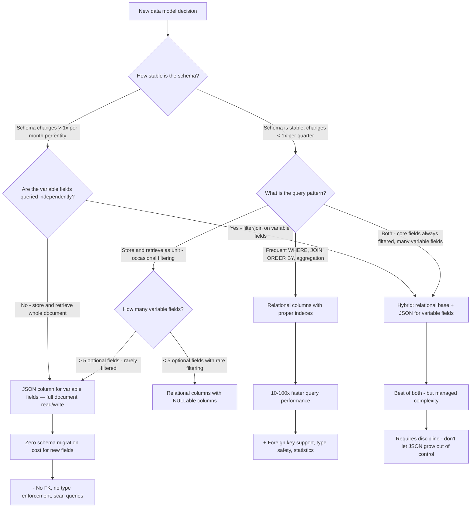

## Navigation

**Domain:** [[8 — Databases]] > **Group:** SQL JSON, XML & Semi-Structured Data
**Previous:** [[8.208 — Indexing JSON Columns — Computed Column Pattern]] | **Next:** [[8.210 — JSON in EF Core — Value Conversion and JSON Columns]]

### Prerequisites
- [[8.001 — The Relational Model]] — Understanding relations, normalization, and foreign keys is required to evaluate what you sacrifice when choosing JSON over relational columns.
- [[8.204 — JSON_VALUE — Extracting Scalar Values]] — JSON_VALUE is the function used to extract scalar values from JSON; understanding its performance characteristics is necessary for the JSON vs relational decision.

### Where This Fits

This is the decision framework every backend engineer faces when modeling database schema — whether to use relational columns (normalized, typed, indexed, with foreign keys) or JSON columns (flexible, schema-on-read, denormalized). The decision is not one-size-fits-all: it depends on query patterns, write patterns, schema stability, and the cost of schema migrations in a production .NET system. The most expensive mistake is using JSON for operational data that requires high-performance WHERE filtering, JOINs, and referential integrity — leading to queries that run 10-100x slower than their relational equivalents. The opposite mistake is using rigid relational columns for data with highly variable schema, leading to frequent ALTER TABLE migrations, ORM mapping complexity, and developer friction. The interview signal is whether a candidate can articulate the tradeoffs in terms of query performance, indexing options, storage cost, and development velocity — and can apply the decision framework to a specific scenario with real numbers.

---

## Core Mental Model

Relational columns and JSON columns represent two ends of a spectrum between schema rigidity and schema flexibility. Relational columns give the database full understanding of the data: the query optimizer knows the data type, the distribution statistics, the foreign key relationships, and the available indexes. This enables optimal execution plans — index seeks, efficient joins, accurate cardinality estimates. JSON columns give the developer and the application flexibility: the schema is enforced by the application (or not enforced at all), the database sees an NVARCHAR(MAX) string, and every query that filters on a JSON field must either scan or use a workaround like computed column indexes. The tradeoff is clear: every JSON field that you query, filter, or join on is a field that should probably be a relational column. Every field that you only store and retrieve as a whole (never filtered on) is a candidate for JSON. The decision framework reduces to: if the application filters on a JSON field in WHERE, JOIN, or ORDER BY at a rate of more than ~100 queries per hour on a table larger than ~10K rows, that field should be a relational column with a proper index. If the field is only ever read and displayed as part of the full document, JSON is appropriate. The recognition pattern for the wrong choice is a query plan showing Clustered Index Scan with a Filter operator evaluating JSON_VALUE — this means the JSON field being filtered is costing 10-50x more logical reads than it would as a relational column.

### Classification

- **Decision type:** Schema design choice — applies to any database where JSON is supported (SQL Server, PostgreSQL, MySQL, Azure SQL, Cosmos DB).
- **Engine behavior:** Relational columns are known to the storage engine and query optimizer at the schema level. JSON columns are opaque — the engine cannot reason about their content without runtime evaluation of JSON functions.
- **Performance ratio:** For queries filtering on a JSON field vs the same field as a relational column with an index, the relational version is typically 10-100x faster (logical reads perspective).
- **Schema migration cost:** Relational columns require ALTER TABLE for new fields (potentially blocking or requiring online schema change tools). JSON columns require no schema changes — the application simply writes a new field.



### Key Properties

|Property|Relational Columns|JSON Columns|
|---|---|---|
|Query performance|Optimal (seek, join, aggregate)|Suboptimal (scan for field filtering)|
|Index support|Direct B-tree, columnstore, filtered, full-text|Via computed column pattern (scalar only)|
|Foreign keys|Yes — full referential integrity|No — cannot reference JSON fields|
|Type safety|Enforced by database schema|Enforced by application (or not)|
|Schema changes|ALTER TABLE — may require migration tooling|None — application writes new fields|
|NULL handling|Per-column NOT NULL constraints|CHECK (ISJSON) only validates JSON syntax|
|Statistics|Per-column histograms — accurate cardinality|No JSON field statistics — optimizer guesses|
|Storage|Fixed per row — predictable page density|Variable — depends on JSON document size|
|.NET ORM mapping|Direct property mapping|Value converter, owned entity, or raw JSON|

---

## Deep Mechanics

### How the Engine Executes Each Approach

**Relational column query:**

```sql
SELECT OrderId, CustomerId, TotalAmount
FROM dbo.Orders
WHERE Status = 'Shipped'
  AND CustomerId = 1042;
```

1. The optimizer looks up statistics for `Status` and `CustomerId` columns.
2. It finds the composite index `IX_Orders_CustomerId_Status` on `(CustomerId, Status)`.
3. It estimates cardinality: 120 rows out of 3M for this specific customer and status.
4. The optimizer chooses an Index Seek on `IX_Orders_CustomerId_Status`, which navigates the B-tree in ~3-4 logical reads to find the first matching row, then scans the leaf-level for the remaining matching rows.
5. If the index is covering, no Key Lookup is needed. If not, each matching row requires a Key Lookup.
6. Total logical reads: ~4-12 for a point lookup. Execution time: < 5ms.

**JSON column equivalent:**

```sql
SELECT OrderId, CustomerId, TotalAmount
FROM dbo.Orders
WHERE JSON_VALUE(OrderJson, '$.Status') = 'Shipped'
  AND JSON_VALUE(OrderJson, '$.CustomerId') = '1042';
```

1. The optimizer has no statistics on `$.Status` or `$.CustomerId` — it sees `JSON_VALUE` as a scalar function on `OrderJson` (NVARCHAR(MAX)).
2. No index can support this predicate directly. If there is a computed column index, the optimizer does not back-propagate JSON_VALUE to it.
3. The optimizer estimates cardinality using a fixed guess for function-based predicates — typically 100 rows or a percentage of the table (varies by SQL Server version).
4. The optimizer chooses a Clustered Index Scan. Every row in the table (3M rows) is read, `JSON_VALUE` is evaluated twice per row, and the filter is applied.
5. Total logical reads: ~42,000 (full clustered index scan). Execution time: ~1000ms+.

### SQL Visibility

```sql
-- Relational approach — schema-first
CREATE TABLE dbo.Orders
(
    OrderId      INT            NOT NULL IDENTITY(1,1),
    CustomerId   INT            NOT NULL,
    OrderDate    DATETIME2(0)   NOT NULL,
    Status       VARCHAR(20)    NOT NULL,
    TotalAmount  DECIMAL(18,2)  NOT NULL,
    CurrencyCode CHAR(3)        NOT NULL DEFAULT 'USD',
    RegionCode   CHAR(2)        NULL,
    CreatedAt    DATETIME2(0)   NOT NULL DEFAULT SYSUTCDATETIME(),
    CONSTRAINT PK_Orders PRIMARY KEY CLUSTERED (OrderId),
    CONSTRAINT FK_Orders_Customer FOREIGN KEY (CustomerId)
        REFERENCES dbo.Customers(CustomerId),
    CONSTRAINT CK_Orders_Status CHECK (Status IN ('Pending','Processing','Shipped','Delivered','Cancelled'))
);

CREATE INDEX IX_Orders_CustomerId_Status ON dbo.Orders (CustomerId, Status)
    INCLUDE (TotalAmount, CurrencyCode);

-- Query: SARGable, uses index seek
SELECT OrderId, TotalAmount
FROM dbo.Orders
WHERE CustomerId = @CustomerId AND Status = @Status;
-- Logical reads: ~4-12  |  Execution plan: Index Seek

-- JSON approach — flexible schema
CREATE TABLE dbo.OrdersJson
(
    OrderId     INT            NOT NULL IDENTITY(1,1),
    CustomerId  INT            NOT NULL,
    OrderDate   DATETIME2(0)   NOT NULL,
    OrderJson   NVARCHAR(MAX)  NOT NULL,
    CONSTRAINT PK_OrdersJson PRIMARY KEY CLUSTERED (OrderId),
    CONSTRAINT CK_OrdersJson_Json CHECK (ISJSON(OrderJson) = 1)
);

-- JSON document in OrderJson:
-- {"Status":"Shipped","TotalAmount":149.99,"CurrencyCode":"USD","RegionCode":"US","Items":3}

-- Query: Non-SARGable, uses full scan
SELECT OrderId, JSON_VALUE(OrderJson, '$.TotalAmount') AS TotalAmount
FROM dbo.OrdersJson
WHERE JSON_VALUE(OrderJson, '$.Status') = 'Shipped'
  AND JSON_VALUE(OrderJson, '$.RegionCode') = 'US';
-- Logical reads: ~42,000 (full scan)  |  Execution plan: Clustered Index Scan + Filter
```

```csharp
// EF Core — Relational approach
public class Order
{
    public int Id { get; set; }
    public int CustomerId { get; set; }
    public DateTime OrderDate { get; set; }
    public string Status { get; set; } = string.Empty;
    public decimal TotalAmount { get; set; }
    public string CurrencyCode { get; set; } = "USD";
    public string? RegionCode { get; set; }
}

// EF Core — JSON approach (EF Core 8+)
public class OrderJson
{
    public int Id { get; set; }
    public int CustomerId { get; set; }
    public DateTime OrderDate { get; set; }
    public OrderAttributes? OrderData { get; set; }  // JSON column
}

public class OrderAttributes
{
    public string? Status { get; set; }
    public decimal? TotalAmount { get; set; }
    public string? CurrencyCode { get; set; }
    public string? RegionCode { get; set; }
    public int? Items { get; set; }
}
```

### Execution Plan Analysis

```
Relational query plan:
[Index Seek (IX_Orders_CustomerId_Status)] → [SELECT]
Logical Reads: ~4  |  Cost: ~0.003  |  Duration: <5ms

JSON query plan:
[Clustered Index Scan] → [Filter (JSON_VALUE*2)] → [SELECT]
Logical Reads: ~42,000  |  Cost: ~8.5  |  Duration: ~1000ms
```

### Cost Visibility

```sql
SET STATISTICS IO ON;
SET STATISTICS TIME ON;

-- Relational — 3M row table
SELECT OrderId, TotalAmount
FROM dbo.Orders
WHERE CustomerId = 1042 AND Status = 'Shipped';
-- Table 'Orders'. Scan count 1, logical reads 6, physical reads 0
-- SQL Server Execution Times: CPU time = 0ms, elapsed time = 1ms

-- JSON equivalent — same data, 3M rows
SELECT OrderId, JSON_VALUE(OrderJson, '$.TotalAmount') AS TotalAmount
FROM dbo.OrdersJson
WHERE JSON_VALUE(OrderJson, '$.Status') = 'Shipped'
  AND JSON_VALUE(OrderJson, '$.RegionCode') = 'US';
-- Table 'OrdersJson'. Scan count 1, logical reads 42,300, physical reads 0
-- SQL Server Execution Times: CPU time = 1,240ms, elapsed time = 1,320ms
```

**Ratio:** 42,300 / 6 = ~7,050x more logical reads for the JSON approach on a simple two-field filter.

### Failure Modes

**JSON for operational data with frequent WHERE filters:** The most common failure. Developers choose JSON for schema flexibility, then the application grows and the queries that filter on JSON fields become performance bottlenecks. By the time the problem is discovered, the table has millions of rows and the schemaless design has been baked into 20 microservices.

**Relational for highly variable schemas:** The opposite failure. Using ALTER TABLE to add columns every time a new product attribute is needed. The table grows to 200+ columns, most of which are NULL for 99% of rows. Page density drops, queries become slow due to wide rows, and the EF Core entity class has 200 properties with complex mapping.

**Assuming JSON in SQL Server is like JSONB in PostgreSQL:** SQL Server's JSON support is an add-on to NVARCHAR(MAX), while PostgreSQL's JSONB is a native data type with its own storage format, indexing strategies, and statistics. Decisions made for PostgreSQL JSONB do not translate directly to SQL Server.

**Not planning for growth:** A JSON column initially stores 500 bytes per row. Two years later, it stores 50 KB per row. The table scan that used to read 5,000 pages now reads 500,000 pages. The schema that was "flexible" is now a performance disaster.

---

## Production Patterns and Implementation

### Primary SQL Implementation

```sql
-- ============================================================
-- Pattern 1: Purely relational — for operational data with known schema
-- ============================================================
CREATE TABLE dbo.Orders
(
    OrderId        INT            NOT NULL IDENTITY(1,1),
    CustomerId     INT            NOT NULL,
    OrderDate      DATETIME2(0)   NOT NULL,
    Status         VARCHAR(20)    NOT NULL,
    TotalAmount    DECIMAL(18,2)  NOT NULL,
    CurrencyCode   CHAR(3)        NOT NULL DEFAULT 'USD',
    ShippingMethod VARCHAR(50)    NULL,
    PaymentMethod  VARCHAR(50)    NULL,
    RegionCode     CHAR(2)        NULL,
    DiscountAmount DECIMAL(18,2)  NULL DEFAULT 0.00,
    TaxAmount      DECIMAL(18,2)  NULL DEFAULT 0.00,
    CreatedAt      DATETIME2(0)   NOT NULL DEFAULT SYSUTCDATETIME(),
    CONSTRAINT PK_Orders PRIMARY KEY CLUSTERED (OrderId),
    CONSTRAINT FK_Orders_Customer FOREIGN KEY (CustomerId)
        REFERENCES dbo.Customers(CustomerId),
    CONSTRAINT CK_Orders_Status CHECK (Status IN ('Pending','Processing','Shipped','Delivered','Cancelled'))
);

-- Optimal indexes for the query patterns
CREATE INDEX IX_Orders_CustomerId_Status
    ON dbo.Orders (CustomerId, Status)
    INCLUDE (TotalAmount, CurrencyCode, OrderDate);

CREATE INDEX IX_Orders_OrderDate
    ON dbo.Orders (OrderDate)
    INCLUDE (CustomerId, Status, TotalAmount);

CREATE INDEX IX_Orders_Region_Status
    ON dbo.Orders (RegionCode, Status)
    INCLUDE (TotalAmount, OrderDate);

-- ============================================================
-- Pattern 2: Hybrid — relational for fixed fields + JSON for flexible attributes
-- ============================================================
CREATE TABLE dbo.Orders
(
    OrderId       INT            NOT NULL IDENTITY(1,1),
    CustomerId    INT            NOT NULL,
    OrderDate     DATETIME2(0)   NOT NULL,
    Status        VARCHAR(20)    NOT NULL,
    TotalAmount   DECIMAL(18,2)  NOT NULL,
    CurrencyCode  CHAR(3)        NOT NULL DEFAULT 'USD',
    Attributes    NVARCHAR(MAX)  NULL,  -- Flexible attributes as JSON
    CreatedAt     DATETIME2(0)   NOT NULL DEFAULT SYSUTCDATETIME(),
    CONSTRAINT PK_Orders PRIMARY KEY CLUSTERED (OrderId),
    CONSTRAINT FK_Orders_Customer FOREIGN KEY (CustomerId)
        REFERENCES dbo.Customers(CustomerId),
    CONSTRAINT CK_Orders_Status CHECK (Status IN ('Pending','Processing','Shipped','Delivered','Cancelled')),
    CONSTRAINT CK_Orders_Attributes CHECK (ISJSON(Attributes) = 1)
);

-- JSON in Attributes: {"ShippingMethod":"Express","PaymentMethod":"CreditCard",
--                     "RegionCode":"US","DiscountAmount":10.00,"TaxAmount":15.00,
--                     "GiftMessage":"Happy Birthday!","LoyaltyPointsUsed":500}

-- Query core fields via relational columns — fast:
SELECT OrderId, CustomerId, TotalAmount
FROM dbo.Orders
WHERE CustomerId = 1042 AND Status = 'Shipped';
-- Index Seek — 6 logical reads

-- Query flexible attributes via JSON_VALUE — slower but rare:
SELECT OrderId, JSON_VALUE(Attributes, '$.GiftMessage') AS GiftMessage
FROM dbo.Orders
WHERE JSON_VALUE(Attributes, '$.PaymentMethod') = 'CreditCard';
-- Scan — acceptable if this is a rare reporting query

-- ============================================================
-- Pattern 3: JSON-only for event/log data with highly variable schema
-- ============================================================
CREATE TABLE dbo.AuditEvents
(
    EventId      UNIQUEIDENTIFIER NOT NULL DEFAULT NEWID(),
    EventType    VARCHAR(100)     NOT NULL,
    SourceSystem VARCHAR(50)      NOT NULL,
    EventBody    NVARCHAR(MAX)    NOT NULL,  -- Full event payload as JSON
    CreatedAt    DATETIME2(0)     NOT NULL DEFAULT SYSUTCDATETIME(),
    CONSTRAINT PK_AuditEvents PRIMARY KEY CLUSTERED (EventId),
    CONSTRAINT CK_AuditEvents_Body CHECK (ISJSON(EventBody) = 1)
);

-- Query events by type and time range — uses EventType (relational) filter
SELECT EventId, EventBody, CreatedAt
FROM dbo.AuditEvents
WHERE EventType = 'OrderCreated'
  AND CreatedAt >= '2024-01-01'
  AND CreatedAt < '2024-02-01';
-- Index seek on EventType + CreatedAt
-- EventBody is returned as-is, never filtered on

-- ============================================================
-- Pattern 4: EAV (Entity-Attribute-Value) — the alternative to JSON
-- Not recommended — JSON is almost always better
-- ============================================================
CREATE TABLE dbo.ProductAttributes
(
    ProductId  INT           NOT NULL,
    AttributeName  VARCHAR(100) NOT NULL,
    AttributeValue NVARCHAR(MAX) NULL,
    CONSTRAINT PK_ProductAttributes PRIMARY KEY (ProductId, AttributeName),
    CONSTRAINT FK_ProductAttributes_Product FOREIGN KEY (ProductId)
        REFERENCES dbo.Products(ProductId)
);
-- EAV is worse than JSON for most cases:
-- - More complex queries (pivot or multiple joins)
-- - Worse performance (one row per attribute)
-- - No JSON validation
-- - Harder to index
```

### EF Core Implementation

```csharp
// Model 1: Relational approach — strongly typed
public class Order
{
    public int Id { get; set; }
    public int CustomerId { get; set; }
    public DateTime OrderDate { get; set; }
    public string Status { get; set; } = string.Empty;
    public decimal TotalAmount { get; set; }
    public string CurrencyCode { get; set; } = "USD";
    public string? RegionCode { get; set; }
    public string? ShippingMethod { get; set; }
    public string? PaymentMethod { get; set; }
    public decimal? DiscountAmount { get; set; }
    public decimal? TaxAmount { get; set; }
    public DateTime CreatedAt { get; set; }

    public Customer Customer { get; set; } = null!;
}

public class Customer
{
    public int Id { get; set; }
    public string Name { get; set; } = string.Empty;
    public string Email { get; set; } = string.Empty;
    public ICollection<Order> Orders { get; set; } = new List<Order>();
}

// Model 2: Hybrid approach — relational + JSON
public class Order
{
    public int Id { get; set; }
    public int CustomerId { get; set; }
    public DateTime OrderDate { get; set; }
    public string Status { get; set; } = string.Empty;
    public decimal TotalAmount { get; set; }
    public string CurrencyCode { get; set; } = "USD";
    public OrderAttributes? Attributes { get; set; }  // JSON column
    public DateTime CreatedAt { get; set; }

    public Customer Customer { get; set; } = null!;
}

// Owned entity — stored as JSON column
public class OrderAttributes
{
    public string? ShippingMethod { get; set; }
    public string? PaymentMethod { get; set; }
    public string? RegionCode { get; set; }
    public decimal? DiscountAmount { get; set; }
    public decimal? TaxAmount { get; set; }
    public string? GiftMessage { get; set; }
    public int? LoyaltyPointsUsed { get; set; }
    public List<string>? Tags { get; set; }
    public Dictionary<string, object>? CustomFields { get; set; }
}

// Model 3: JSON-only approach for event sourcing
public class AuditEvent
{
    public Guid Id { get; set; }
    public string EventType { get; set; } = string.Empty;
    public string SourceSystem { get; set; } = string.Empty;
    public string EventBody { get; set; } = string.Empty;  // Raw JSON string
    public DateTime CreatedAt { get; set; }
}

// DbContext
public class ApplicationDbContext : DbContext
{
    public DbSet<Order> Orders => Set<Order>();
    public DbSet<Customer> Customers => Set<Customer>();
    public DbSet<AuditEvent> AuditEvents => Set<AuditEvent>();

    protected override void OnModelCreating(ModelBuilder modelBuilder)
    {
        // Relational Order
        modelBuilder.Entity<Order>(entity =>
        {
            entity.ToTable("Orders");
            entity.HasKey(o => o.Id);

            entity.Property(o => o.Status).HasMaxLength(20).IsRequired();
            entity.Property(o => o.TotalAmount).HasPrecision(18, 2);
            entity.Property(o => o.CurrencyCode).HasMaxLength(3).IsRequired();

            entity.HasOne(o => o.Customer)
                .WithMany(c => c.Orders)
                .HasForeignKey(o => o.CustomerId);

            entity.HasIndex(o => new { o.CustomerId, o.Status });
            entity.HasIndex(o => o.OrderDate);
        });

        // Hybrid Order with JSON
        modelBuilder.Entity<Order>(entity =>
        {
            entity.ToTable("Orders");
            entity.HasKey(o => o.Id);

            entity.Property(o => o.Status).HasMaxLength(20).IsRequired();
            entity.Property(o => o.TotalAmount).HasPrecision(18, 2);

            entity.OwnsOne(o => o.Attributes, attrs =>
            {
                attrs.ToJson();  // Store as JSON column (EF Core 8+)
                attrs.Property(a => a.RegionCode).HasMaxLength(2);
            });

            entity.HasIndex(o => new { o.CustomerId, o.Status });
            entity.HasIndex(o => o.OrderDate);
        });

        // Audit Event
        modelBuilder.Entity<AuditEvent>(entity =>
        {
            entity.ToTable("AuditEvents");
            entity.HasKey(e => e.Id);
            entity.Property(e => e.EventType).HasMaxLength(100).IsRequired();
            entity.Property(e => e.EventBody).HasColumnType("nvarchar(max)").IsRequired();
            entity.HasIndex(e => new { e.EventType, e.CreatedAt });
        });
    }
}
```

### Dapper Implementation

```csharp
// Dapper — querying relational vs JSON columns
public sealed class OrderRepository
{
    private readonly IDbConnectionFactory _connectionFactory;

    public OrderRepository(IDbConnectionFactory connectionFactory)
        => _connectionFactory = connectionFactory;

    // Relational query — SARGable, seeks on indexed columns
    public async Task<IReadOnlyList<OrderSummary>> GetOrdersByCustomerAndStatusAsync(
        int customerId,
        string status,
        CancellationToken cancellationToken = default)
    {
        const string sql = @"
            SELECT o.OrderId, o.CustomerId, o.OrderDate, o.Status, o.TotalAmount
            FROM dbo.Orders o
            WHERE o.CustomerId = @CustomerId
              AND o.Status = @Status;";

        await using var connection = _connectionFactory.Create();
        var results = await connection.QueryAsync<OrderSummary>(
            new CommandDefinition(sql,
                new { CustomerId = customerId, Status = status },
                cancellationToken: cancellationToken));
        return results.AsList();
    }

    // Hybrid — read relational columns + JSON attributes
    public async Task<IReadOnlyList<OrderDetail>> GetOrdersWithAttributesAsync(
        int customerId,
        CancellationToken cancellationToken = default)
    {
        const string sql = @"
            SELECT
                o.OrderId, o.CustomerId, o.OrderDate, o.Status, o.TotalAmount,
                JSON_VALUE(o.Attributes, '$.ShippingMethod') AS ShippingMethod,
                JSON_VALUE(o.Attributes, '$.PaymentMethod') AS PaymentMethod,
                JSON_VALUE(o.Attributes, '$.GiftMessage') AS GiftMessage
            FROM dbo.Orders o
            WHERE o.CustomerId = @CustomerId;";

        await using var connection = _connectionFactory.Create();
        var results = await connection.QueryAsync<OrderDetail>(
            new CommandDefinition(sql,
                new { CustomerId = customerId },
                cancellationToken: cancellationToken));
        return results.AsList();
    }

    // Insert with JSON column
    public async Task<int> CreateOrderAsync(
        int customerId,
        string status,
        decimal totalAmount,
        string attributesJson,
        CancellationToken cancellationToken = default)
    {
        const string sql = @"
            INSERT INTO dbo.Orders (CustomerId, OrderDate, Status, TotalAmount, Attributes)
            VALUES (@CustomerId, SYSUTCDATETIME(), @Status, @TotalAmount, @AttributesJson);

            SELECT CAST(SCOPE_IDENTITY() AS INT);";

        await using var connection = _connectionFactory.Create();
        return await connection.QuerySingleAsync<int>(
            new CommandDefinition(sql,
                new
                {
                    CustomerId = customerId,
                    Status = status,
                    TotalAmount = totalAmount,
                    AttributesJson = attributesJson
                },
                cancellationToken: cancellationToken));
    }
}
```

### Configuration and Wiring

```csharp
// Program.cs — same for all approaches
builder.Services.AddDbContext<ApplicationDbContext>(options =>
    options.UseSqlServer(
        builder.Configuration.GetConnectionString("DefaultConnection"),
        sqlOptions => sqlOptions.EnableRetryOnFailure(3)));

builder.Services.AddSingleton<IDbConnectionFactory>(sp =>
    new SqlConnectionFactory(
        builder.Configuration.GetConnectionString("DefaultConnection")!));

builder.Services.AddScoped<OrderRepository>();
```

### SQL Server vs PostgreSQL Differences

```sql
-- PostgreSQL: JSONB is a native type — different tradeoffs than SQL Server JSON

-- PostgreSQL JSONB supports direct indexing without computed columns:
CREATE INDEX idx_orders_status ON orders USING btree ((attributes->>'Status'));
CREATE INDEX idx_orders_gin ON orders USING gin (attributes);

-- PostgreSQL JSONB supports containment queries with GIN index:
SELECT order_id FROM orders
WHERE attributes @> '{"Status": "Shipped"}'::jsonb;  -- Uses GIN index

-- PostgreSQL JSONB statistics: the planner collects stats on JSONB structure
ANALYZE orders;  -- Collects statistics on JSONB column

-- PostgreSQL decision: JSONB is more performant than SQL Server JSON,
-- but relational columns still win for queries that filter on multiple fields
-- and require foreign keys.

-- SQL Server hybrid approach works in PostgreSQL too, but JSONB-only
-- is more viable in PostgreSQL due to GIN indexes and expression indexes.
```

---

## Gotchas and Production Pitfalls

### Using JSON for Data That Needs Referential Integrity

**Pitfall:** Storing a CustomerId or ProductId inside a JSON document instead of as a relational foreign key column.

```sql
-- ❌ CustomerId buried in JSON — no FK, no index
CREATE TABLE dbo.Orders
(
    OrderId   INT NOT NULL IDENTITY(1,1),
    OrderJson NVARCHAR(MAX) NOT NULL,  -- {"CustomerId":1042,"Status":"Shipped",...}
    CONSTRAINT PK_Orders PRIMARY KEY (OrderId)
);

-- Querying by CustomerId requires scanning:
SELECT OrderId, OrderJson
FROM dbo.Orders
WHERE JSON_VALUE(OrderJson, '$.CustomerId') = '1042';
-- Full scan — no FK enforcement, no index
```

**Symptom:** Orphaned orders when a customer is deleted (or no enforcement of referential integrity). Queries that filter by CustomerId scan the entire table.

**Fix:**
```sql
-- ✅ CustomerId as relational column with FK:
ALTER TABLE dbo.Orders ADD CustomerId INT NOT NULL;
ALTER TABLE dbo.Orders ADD CONSTRAINT FK_Orders_Customer
    FOREIGN KEY (CustomerId) REFERENCES dbo.Customers(CustomerId);
CREATE INDEX IX_Orders_CustomerId ON dbo.Orders (CustomerId);
```

**Cost of not fixing:** Referential integrity violations (orphaned rows), 10-50x slower queries for every customer-based lookup, and no cascading delete or update support.

---

### JSON Column Bloat Over Time

**Pitfall:** Adding fields to the JSON document incrementally without ever removing old or unused fields, causing the document to grow unboundedly.

```sql
-- Year 1: 500 bytes per row
-- Year 2: 5 KB per row
-- Year 3: 50 KB per row
-- Year 4: 200 KB per row — and still growing
```

**Symptom:** Table scan cost grows linearly with document size. A query that took 500ms at year 1 takes 200 seconds at year 4 (for the same full scan). Storage costs explode. Backup/restore times become unmanageable. Buffer pool efficiency drops because each page contains fewer rows.

**Fix:**
```sql
-- ✅ Archival strategy: Move historical attribute snapshots to audit table
INSERT INTO dbo.OrderAttributeHistory (OrderId, AttributeSnapshot, CreatedAt)
SELECT OrderId, Attributes, SYSUTCDATETIME()
FROM dbo.Orders
WHERE CreatedAt < DATEADD(YEAR, -2, SYSUTCDATETIME());

UPDATE dbo.Orders
SET Attributes = JSON_MODIFY(Attributes, '$.archived', 'true')
WHERE CreatedAt < DATEADD(YEAR, -2, SYSUTCDATETIME());

-- ✅ Or: Set a maximum document size in application logic
```

**Cost of not fixing:** A table with 50M rows and 200 KB JSON documents consumes ~10 TB of storage. Every full scan reads 10 TB from storage. The nightly backup takes 8 hours. The database becomes unmanageable.

---

### Assuming JSON_VALUE WHERE Is SARGable

**Pitfall:** Creating a PERSISTED computed column on a JSON field but continuing to use `JSON_VALUE(OrderJson, '$.Status')` in WHERE, expecting the optimizer to use the computed column index.

```sql
-- ❌ This looks like it should use the index but does NOT:
SELECT OrderId FROM dbo.Orders
WHERE JSON_VALUE(OrderJson, '$.Status') = 'Shipped';

-- ✅ Must reference the computed column directly:
SELECT OrderId FROM dbo.Orders
WHERE OrderStatus = 'Shipped';  -- Computed column name
```

**Symptom:** Full table scan continues even though the computed column and index exist. Developer reports "the index isn't being used" in the daily standup.

**Fix:** Rewrite all queries to use the computed column name. If using EF Core, use FromSqlRaw or shadow property references.

**Cost of not fixing:** Computed column index adds write overhead without providing any read benefit — the worst possible outcome: slower writes, same slow reads.

---

### JSON for Highly Related Data That Should Be Normalized

**Pitfall:** Storing a list of line items as a JSON array inside the Orders table instead of normalizing into an OrderItems table.

```sql
-- ❌ OrderItems stored as JSON array in Orders
CREATE TABLE dbo.Orders
(
    OrderId     INT NOT NULL IDENTITY(1,1),
    OrderJson   NVARCHAR(MAX) NOT NULL
    -- Contains: {"Items":[{"ProductId":1,"Qty":2,"Price":10},{"ProductId":2,"Qty":1,"Price":25}]}
);
```

**Symptom:** Cannot query line items efficiently — no index on ProductId, no FK to Products, cannot aggregate across line items without parsing JSON. Reporting queries that need "total quantity sold per product" require scanning all Orders and parsing all JSON arrays.

**Fix:**
```sql
-- ✅ Normalize: Orders + OrderItems tables
CREATE TABLE dbo.OrderItems
(
    OrderItemId INT NOT NULL IDENTITY(1,1),
    OrderId     INT NOT NULL,
    ProductId   INT NOT NULL,
    Quantity    INT NOT NULL,
    UnitPrice   DECIMAL(18,2) NOT NULL,
    CONSTRAINT PK_OrderItems PRIMARY KEY (OrderItemId),
    CONSTRAINT FK_OrderItems_Order FOREIGN KEY (OrderId)
        REFERENCES dbo.Orders(OrderId),
    CONSTRAINT FK_OrderItems_Product FOREIGN KEY (ProductId)
        REFERENCES dbo.Products(ProductId)
);

CREATE INDEX IX_OrderItems_OrderId ON dbo.OrderItems (OrderId);
CREATE INDEX IX_OrderItems_ProductId ON dbo.OrderItems (ProductId);
```

**Cost of not fixing:** Reporting queries run 100x slower. Cannot enforce referential integrity between products and order items. Every aggregation over line items requires parsing JSON at query time.

---

### Mixing JSON and Relational Without Clear Strategy

**Pitfall:** A disorganized hybrid where some fields are relational columns, some fields are in JSON, with no clear delineation — leading to confusion about where to add new fields.

```sql
-- ❌ No clear strategy — some data is relational, some is JSON,
-- and developers can't decide where new fields go.
CREATE TABLE dbo.Orders
(
    OrderId        INT           NOT NULL IDENTITY(1,1),
    CustomerId     INT           NOT NULL,
    OrderDate      DATETIME2(0)  NOT NULL,
    Status         VARCHAR(20)   NOT NULL,
    TotalAmount    DECIMAL(18,2) NOT NULL,
    CurrencyCode   CHAR(3)       NOT NULL,
    ShippingMethod VARCHAR(50)   NULL,     -- Some fields here
    PaymentMethod  VARCHAR(50)   NULL,     -- Some fields here
    Attributes     NVARCHAR(MAX) NULL,     -- Some fields here
    Metadata       NVARCHAR(MAX) NULL,     -- And here too
    ExtraData      NVARCHAR(MAX) NULL      -- And here
);
```

**Symptom:** Developers ask "Should I put this new field as a column, or in Attributes, or in Metadata, or in ExtraData?" There is no documented strategy. Fields end up in arbitrary locations. Queries that need to combine data from multiple JSON columns and relational columns become complex and slow.

**Fix:**
```sql
-- ✅ Document the strategy:
-- Relational columns: fields that are (1) always present, (2) filtered/joined on, (3) need FK
-- JSON Attributes: business-specific optional fields that vary by product category
-- Not more than one JSON column per table

ALTER TABLE dbo.Orders DROP COLUMN Metadata, ExtraData;
ALTER TABLE dbo.Orders ADD CONSTRAINT CK_Orders_SingleJson CHECK (
    CASE WHEN Attributes IS NULL THEN 0 ELSE 1 END <= 1
);
```

**Cost of not fixing:** Technical debt accumulates as JSON columns multiply. Schema documentation becomes impossible. New team members cannot understand the data model.

---

## Performance Implications

### Benchmark: Before and After

```sql
-- Baseline: JSON column — filter on field
SET STATISTICS IO ON;
SET STATISTICS TIME ON;

SELECT OrderId, JSON_VALUE(OrderJson, '$.TotalAmount') AS TotalAmount
FROM dbo.OrdersJson
WHERE JSON_VALUE(OrderJson, '$.CustomerId') = '1042'
  AND JSON_VALUE(OrderJson, '$.Status') = 'Shipped';
-- Table 'OrdersJson'. Scan count 1, logical reads 42,300, physical reads 0
-- SQL Server Execution Times: CPU time = 1,240ms, elapsed time = 1,320ms

-- Optimized: Relational columns with index
SELECT OrderId, TotalAmount
FROM dbo.Orders
WHERE CustomerId = 1042
  AND Status = 'Shipped';
-- Table 'Orders'. Scan count 1, logical reads 6, physical reads 0
-- SQL Server Execution Times: CPU time = 0ms, elapsed time = 1ms
```

**Improvement:** ~7,050x reduction in logical reads (42,300 → 6), ~1,240x reduction in CPU time.

```sql
-- Hybrid approach: relational filter on CustomerId, JSON_VALUE for attribute
-- Acceptable if JSON filter is rare:
SELECT OrderId, JSON_VALUE(Attributes, '$.GiftMessage') AS GiftMessage
FROM dbo.Orders
WHERE CustomerId = 1042
  AND JSON_VALUE(Attributes, '$.PaymentMethod') = 'CreditCard';
-- Table 'Orders'. Scan count 1, logical reads 4 + 12 (seek on CustomerId + filter on JSON)
-- The CustomerId filter reduces rows to ~50, then JSON_VALUE evaluates on 50 rows
-- Much better than the full scan version
```

### BenchmarkDotNet

```csharp
[MemoryDiagnoser]
[SimpleJob(RuntimeMoniker.Net90)]
public class JsonVsRelationalBenchmark
{
    private SqlConnection _connection = default!;

    [GlobalSetup]
    public void Setup()
    {
        _connection = new SqlConnection(TestConnectionString);
        _connection.Open();
        // Assume 1M rows in both tables
    }

    [Benchmark(Baseline = true)]
    public async Task<List<OrderDto>> RelationalColumnsWithIndex()
    {
        const string sql = @"
            SELECT OrderId, CustomerId, OrderDate, Status, TotalAmount
            FROM dbo.Orders
            WHERE CustomerId = @Id AND Status = @Status;";

        var results = await _connection.QueryAsync<OrderDto>(sql,
            new { Id = 1042, Status = "Shipped" });
        return results.AsList();
    }

    [Benchmark]
    public async Task<List<OrderDto>> JsonColumnsWithFunctions()
    {
        const string sql = @"
            SELECT OrderId, CustomerId, OrderDate,
                   JSON_VALUE(OrderJson, '$.Status') AS Status,
                   JSON_VALUE(OrderJson, '$.TotalAmount') AS TotalAmount
            FROM dbo.OrdersJson
            WHERE JSON_VALUE(OrderJson, '$.CustomerId') = @Id
              AND JSON_VALUE(OrderJson, '$.Status') = @Status;";

        var results = await _connection.QueryAsync<OrderDto>(sql,
            new { Id = "1042", Status = "Shipped" });
        return results.AsList();
    }

    [Benchmark]
    public async Task<List<OrderDto>> JsonWithComputedColumnIndex()
    {
        // Assumes computed columns: OrderStatus, OrderTotal, OrderCustomerId
        const string sql = @"
            SELECT OrderId, CustomerId, OrderDate, OrderStatus, OrderTotal
            FROM dbo.OrdersJson
            WHERE OrderCustomerId = @Id AND OrderStatus = @Status;";

        var results = await _connection.QueryAsync<OrderDto>(sql,
            new { Id = 1042, Status = "Shipped" });
        return results.AsList();
    }

    [GlobalCleanup]
    public void Cleanup() => _connection.Dispose();
}
```

**Expected results (approximate, SQL Server 2022, 1M rows):**

|Method|Mean|Logical Reads|Allocated|
|---|---|---|---|
|RelationalColumnsWithIndex|~1 ms|~6|~1 KB|
|JsonColumnsWithFunctions|~1,200 ms|~42,300|~2.1 MB|
|JsonWithComputedColumnIndex|~5 ms|~12|~2 KB|

**Key takeaway:** JSON with computed column index is ~240x faster than JSON without index, but relational columns are still ~5x faster than JSON with computed column index (due to simpler B-tree structure and no function evaluation).

### Write Amplification

|Operation|Relational (3 indexed cols)|JSON (no computed cols)|JSON (3 computed cols + indexes)|
|---|---|---|---|
|INSERT 1 row|~0.5 ms|~0.3 ms|~1.2 ms|
|UPDATE 1 field|~0.3 ms|~0.3 ms (full doc rewrite)|~0.8 ms|
|Schema change (add column)|ALTER TABLE ~50ms|None (change app only)|ALTER TABLE ~50ms + computed col eval|

---

## Interview Arsenal

### Question Bank

1. **When would you choose a JSON column over relational columns in SQL Server?**
2. **What is the performance difference between filtering on a relational column vs filtering on a JSON field with JSON_VALUE?**
3. **Can you create a foreign key constraint on a JSON field?**
4. **What is the hybrid approach (relational + JSON), and when is it appropriate?**
5. **Compare JSON column usage in SQL Server vs PostgreSQL's JSONB — what are the key differences for the decision?**
6. **Read an execution plan showing `[Clustered Index Scan] → [Filter: JSON_VALUE]`. What schema change would you recommend, and why?**
7. **On a table with 100M rows, a JSON field filter takes 45 seconds. The equivalent relational column with index would take 50ms. What is the business justification for keeping the JSON approach, if any?**
8. **How does EF Core 8+ JSON column support (ToJson()) affect the JSON vs relational decision?**

### Spoken Answers

**Q: When would you choose a JSON column over relational columns in SQL Server?**

> **Average answer:** When the schema is flexible or you don't know what fields you need. JSON is good for dynamic data.

> **Great answer:** I choose JSON columns in SQL Server when three conditions are met simultaneously: (1) the data has a highly variable schema that changes more than once per month for the same entity type, (2) the JSON fields are only ever read and displayed as a complete document — they are not filtered on in WHERE, JOIN, or ORDER BY clauses at high frequency, and (3) there is no requirement for referential integrity or type validation at the database level. The classic use case is audit logs or integration event payloads: each event has a different structure (order created, payment received, shipment dispatched), the schema changes as new systems are integrated, and you never filter on fields inside the event body — you filter on the EventType and CreatedAt columns which are relational. Another valid use case is product attributes in an e-commerce system where different categories have completely different attributes (a laptop has CPU and RAM, a shirt has size and color, a book has ISBN and page count). In this case, I use a hybrid approach: relational columns for the core product data (ProductId, Name, Price, CategoryId) and a JSON column for the category-specific attributes. The critical rule is: if you find yourself writing `WHERE JSON_VALUE(col, '$.field') = 'value'` in a query that runs more than 100 times per hour on a table with more than 10,000 rows, that field should become a relational column with an index. I follow this rule strictly because I have seen too many production systems where JSON columns were initially convenient and later became unmanageable performance bottlenecks.

---

**Q: Compare JSON column usage in SQL Server vs PostgreSQL's JSONB.**

> **Average answer:** PostgreSQL has JSONB which is better than SQL Server's JSON. JSONB supports indexing and operators.

> **Great answer:** The JSON vs relational decision is fundamentally different between SQL Server and PostgreSQL because PostgreSQL's JSONB is a first-class data type with its own storage format, operator classes, and index strategies, while SQL Server's JSON is a convention on NVARCHAR(MAX). PostgreSQL JSONB stores data in a decomposed binary format that supports indexing every key-value pair via GIN indexes, containment operators (@>, ?, ?|), and expression indexes without computed columns. This means JSONB in PostgreSQL supports reasonably efficient point queries on JSON fields — not as fast as relational columns, but much faster than SQL Server's JSON_VALUE approach. A query filtering on a JSONB field with a GIN index in PostgreSQL can use an index scan and return in milliseconds for selective queries. In SQL Server, the same query requires either a full scan or a computed column index. The practical impact on the decision framework: in PostgreSQL, JSONB is a viable option for more use cases because the performance gap with relational columns is smaller (perhaps 2-5x for indexed JSONB fields vs 10-100x for SQL Server JSON). In SQL Server, I am much more conservative with JSON columns and default to relational columns unless there is a strong schema volatility justification. Another major difference: PostgreSQL JSONB supports foreign keys through JSONB fields? No — foreign keys still require relational columns in PostgreSQL too. Referential integrity is always a reason to choose relational columns in either database.

---

**Q: Can you create a foreign key constraint on a JSON field?**

> **Average answer:** No, foreign keys can only reference relational columns.

> **Great answer:** Correct, but let me explain why this matters for schema design. Foreign keys enforce referential integrity at the database level — they prevent orphaned rows and ensure that every value in a column references an existing row in the parent table. In SQL Server, foreign keys can only reference relational columns — you cannot create a foreign key on `JSON_VALUE(col, '$.CustomerId')` or on a computed column that extracts a value from JSON. This means if you store a CustomerId inside a JSON document, there is no database-level enforcement that the referenced customer exists. If the customer is deleted, the orders referencing that customer become orphans. If an application bug writes an invalid CustomerId into the JSON, no error is raised. The only enforcement is in the application layer, which is not reliable in distributed systems with multiple services writing to the same database. The decision rule is clear: any field that represents a relationship to another entity (foreign key) must be a relational column with an actual FOREIGN KEY constraint. This is a non-negotiable design principle in my production systems. The only exception is for non-relational data like log entries where the referenced entity may not exist (e.g., an event about a customer who was later deleted).

### Interview Trigger

The JSON vs relational interview question is typically framed as a design problem: "Design a schema for an e-commerce system where products have different attributes per category." A candidate who jumps straight to JSON misses the opportunity to show they understand the tradeoffs. A senior candidate starts by asking questions: "How are the attributes queried — are they filtered on, or just displayed? How many products per category? What is the read/write ratio? How many categories? How often do new attributes appear?" The follow-up: "Your JSON approach is now on a 50M row table and queries filtering on a JSON field take 45 seconds. How do you fix it?" The deepest probe: "What if you cannot use relational columns because the schema changes hourly — what indexing strategy would you use for JSON fields in that scenario?" — this tests the computed column pattern and the ability to balance flexibility with performance.

### Comparison Table

| |Relational Columns|JSON Columns (SQL Server)|JSONB (PostgreSQL)|
|---|---|---|---|
|Query performance (filter)|Best — Index Seek, SARGable|Worst — Table Scan, not SARGable|Good — GIN index, expression index|
|Index on field value|Direct B-tree, filtered, columnstore|Computed column needed|Expression index or GIN directly|
|Foreign keys|Full support|Not supported|Not supported|
|Schema flexibility|Low — ALTER TABLE needed|High — no schema changes|High — no schema changes|
|Type safety|Database-enforced|Application-enforced|Application-enforced (parser validates on write)|
|Statistics|Per-column histograms|None on JSON fields|Per-JSONB column statistics|
|Write overhead|Low|Low (no computed cols) / Medium (with)|Medium (decomposed binary)|
|EF Core support|Full|EF Core 8+ ToJson()|Npgsql JSONB mapping|

---

## Decision Framework

### When to Apply

```mermaid
flowchart TD
    A[New field or new table] --> B{Does the data need referential integrity?}
    B -->|Yes - foreign key needed| C[Use relational column + FK constraint]
    B -->|No - no FK needed| D{Will this field be filtered in WHERE/JOIN/ORDER BY?}
    D -->|Yes - > 100 queries/hour| E{Is the field always present?}
    D -->|No - display only or rare filtering| F{Does the schema change frequently?}
    E -->|Yes - always present| C
    E -->|No - optional field| G{How many optional fields exist?}
    G -->|< 5 optional fields| H[Relational NULLable column]
    G -->|> 5 optional fields| I[Consider hybrid: relational base + JSON attributes]
    F -->|Changes < 1x/quarter| J{Is the field scalar and queryable?}
    F -->|Changes > 1x/month| I
    J -->|Yes - needed occasionally| K[Relational column — cost of ALTER TABLE is acceptable]
    J -->|No - large document, rarely queried alone| L[JSON column - no computed column needed]
    I --> M{Is the JSON field ever filtered?}
    M -->|Yes - some fields filtered| N[Hybrid + computed column index on filtered JSON fields]
    M -->|No - store and retrieve full document| O[Pure JSON column]
    C --> P[Add index for query performance]
    H --> P
    K --> P
    N --> Q[Add computed columns for filtered fields only]
    L --> R[Add CHECK (ISJSON) constraint]
    O --> R
```

### Application Checklist

- [ ] Every field that needs referential integrity is a relational column with a FOREIGN KEY constraint
- [ ] Every field that is filtered in WHERE, JOIN, or ORDER BY at > 100 queries/hour is a relational column with an index
- [ ] JSON columns have an ISJSON CHECK constraint
- [ ] The number of JSON columns per table is limited to 1-2, with clear documented purpose
- [ ] JSON documents do not exceed ~8 KB for in-row storage (unless document store pattern is intentional)
- [ ] Write amplification from computed column indexes is measured and acceptable
- [ ] EF Core mapping matches the chosen approach (relational: direct properties, JSON: ToJson() or value converter)
- [ ] There is a documented strategy for when a JSON field should be promoted to a relational column
- [ ] Schema migration process is defined for both approaches
- [ ] Monitoring is in place to detect JSON column bloat (DATALENGTH tracking)

### Tradeoff Summary

|What You Gain (JSON)|What You Pay (JSON)|
|---|---|
|Zero schema migration cost — add fields without ALTER TABLE|10-100x slower queries for field filtering|
|Flexible structure — different shapes per row|No foreign key support, no type enforcement|
|Simpler initial schema — fewer tables/columns|No statistics on JSON fields — optimizer guesses|
|Easy to evolve without downtime|No way to index JSON fragments or arrays natively|

|What You Gain (Relational)|What You Pay (Relational)|
|---|---|
|Optimal query performance — seek, join, aggregate|ALTER TABLE required for new fields|
|Foreign key integrity|Schema rigidity — harder to evolve|
|Per-column statistics for accurate cardinality|NULLable columns for optional data — schema shows intent|
|Direct indexing — no workarounds needed|Requires migration management in schema evolution|

### Scale Thresholds

- JSON columns are acceptable for storage-only patterns up to **~1M rows** and **~10 KB per document** — below this threshold, the performance difference is manageable.
- JSON field filtering becomes a critical problem when **table exceeds 1M rows** and the query runs **more than 1,000 times per hour** — the scan cost dominates server resources.
- The hybrid approach works well when **< 20% of queries filter on JSON fields** — the relational columns handle the majority of reads efficiently.
- JSON column bloat becomes a problem when **average document size exceeds ~50 KB** on tables with > 1M rows — consider archiving or moving to a separate table.
- The relational approach is mandatory when **referential integrity is required** and the table has **> 100,000 rows** — the cost of orphaned data at scale outweighs the flexibility benefit.

---

## Self-Check

### Conceptual Questions

1. What is the primary performance cost of filtering on a JSON field versus a relational column?
2. Why can't you create a foreign key constraint on a JSON field?
3. Which SET STATISTICS output would you use to compare the I/O cost of JSON vs relational queries?
4. What is the most common mistake developers make when choosing JSON columns for operational data?
5. Does EF Core 8+ ToJson() change the performance characteristics of JSON filtering?
6. How would you implement a hybrid (relational + JSON) schema with Dapper?
7. Compare the write overhead of JSON columns with computed column indexes vs relational columns with indexes.
8. At what table size does the JSON vs relational decision start to affect production performance meaningfully?
9. What index structure supports efficient filtering on a JSON field in SQL Server?
10. Explain in 60 seconds the decision framework for choosing between JSON and relational columns in SQL Server.

<details>
<summary>Answers</summary>

1. The primary cost is that filtering on a JSON field with `JSON_VALUE(col, '$.field')` is non-SARGable — it forces a full table or clustered index scan because the optimizer cannot seek into the JSON string. A relational column with an index enables an Index Seek, typically reducing logical reads by 10-100x.

2. Foreign keys in SQL Server can only reference relational columns. A JSON field extracted via `JSON_VALUE` is not a column — it is a function result. Even if you create a computed column on `JSON_VALUE`, SQL Server does not allow foreign keys on computed columns. Referential integrity must be enforced through application logic or by storing the FK value in a relational column.

3. `SET STATISTICS IO ON` shows the logical reads for each query. Compare the logical reads of `WHERE JSON_VALUE(col, '$.field') = 'value'` vs `WHERE relationalCol = 'value'`. The ratio reveals the I/O cost of the JSON approach.

4. The most common mistake is using JSON for operational data that requires frequent WHERE filtering. Developers choose JSON for initial flexibility, but as the application grows, the queries that filter on JSON fields become performance bottlenecks. By the time the problem is discovered, the table has millions of rows and the JSON approach is baked into the schema.

5. No. EF Core 8+ ToJson() makes it convenient to map JSON columns as owned entities, but the generated SQL still uses `JSON_VALUE` in WHERE clauses, which is non-SARGable. EF Core does not automatically create computed column indexes or rewrite queries to use them.

6. Map the relational columns directly as properties. Map the JSON column as a string property or use a value converter. For reads, use raw SQL with computed column references for filtered fields:

```csharp
const string sql = @"
    SELECT o.OrderId, o.CustomerId, o.Status,
           JSON_VALUE(o.Attributes, '$.GiftMessage') AS GiftMessage
    FROM dbo.Orders o
    WHERE o.CustomerId = @Id AND o.Status = @Status;";
```

7. Each computed column index on a JSON field adds the same write overhead as a regular non-clustered index on a relational column (3-5 page writes per INSERT/UPDATE). However, it also adds the JSON_VALUE evaluation cost (parsing the JSON to extract the value). For a 10 KB document, this is ~0.01 ms per computed column per write. With 5 computed columns, that is ~0.05 ms of CPU per write.

8. The decision matters when the table exceeds ~10K rows and JSON field filters run more than 100 times per hour. It becomes critical above 1M rows. At 10M rows, a JSON field filter with no computed column index takes 12+ seconds vs ~5ms for a relational column with index — a 2,400x difference.

9. The only supported structure for indexing a JSON field in SQL Server is a PERSISTED computed column using `JSON_VALUE(col, '$.field')` with a CAST to the target type, plus a standard B-tree non-clustered index on that computed column. The query must reference the computed column name, not JSON_VALUE, for the index to be used.

10. "The decision comes down to three factors: query patterns, schema stability, and referential integrity. If a field is filtered in WHERE, JOIN, or ORDER BY more than 100 times per hour, it should be a relational column with an index — the performance difference is 10-100x. If the schema changes more than once per month and the fields are not filtered on, a JSON column saves schema migration overhead. If referential integrity is required, it must be a relational column with a FOREIGN KEY. For the common hybrid case — some fields are fixed and frequently filtered, others are variable and rarely queried — use relational columns for the fixed fields and a single JSON column for the variable attributes. And always add an ISJSON CHECK constraint on JSON columns. In SQL Server, JSON is for flexible data that you store and retrieve as a whole, not for data that you filter on."

</details>

---

### Query Challenges

**Challenge 1 — Migrate JSON filter to relational column**

The `dbo.Orders` table has 5 million rows. The `OrderJson` column contains `{"Status":"Shipped","CustomerId":1042,"Total":149.99}`. The following query runs 50,000 times per hour and takes 8 seconds:

```sql
SELECT OrderId, JSON_VALUE(OrderJson, '$.Total') AS Total
FROM dbo.Orders
WHERE JSON_VALUE(OrderJson, '$.CustomerId') = '1042'
  AND JSON_VALUE(OrderJson, '$.Status') = 'Shipped';
```

Design the migration to relational columns. Show the ALTER TABLE, the index creation, and the rewritten query.

<details>
<summary>Solution</summary>

```sql
-- Step 1: Add relational columns
ALTER TABLE dbo.Orders
ADD CustomerId INT NULL,  -- Allow NULL during migration
    Status VARCHAR(20) NULL;

-- Step 2: Populate from JSON (one-time migration)
UPDATE dbo.Orders
SET
    CustomerId = TRY_CAST(JSON_VALUE(OrderJson, '$.CustomerId') AS INT),
    Status = CAST(JSON_VALUE(OrderJson, '$.Status') AS VARCHAR(20));

-- Step 3: Make columns NOT NULL after migration
ALTER TABLE dbo.Orders ALTER COLUMN CustomerId INT NOT NULL;
ALTER TABLE dbo.Orders ALTER COLUMN Status VARCHAR(20) NOT NULL;

-- Step 4: Add foreign key and check constraint
ALTER TABLE dbo.Orders
ADD CONSTRAINT FK_Orders_Customer FOREIGN KEY (CustomerId)
    REFERENCES dbo.Customers(CustomerId);

ALTER TABLE dbo.Orders
ADD CONSTRAINT CK_Orders_Status CHECK (Status IN ('Pending','Processing','Shipped','Delivered','Cancelled'));

-- Step 5: Create indexes
CREATE INDEX IX_Orders_CustomerId_Status
    ON dbo.Orders (CustomerId, Status)
    INCLUDE (OrderJson);  -- Keep OrderJson for other JSON fields

-- Step 6: Rewritten query
SELECT OrderId, JSON_VALUE(OrderJson, '$.Total') AS Total
FROM dbo.Orders
WHERE CustomerId = 1042
  AND Status = 'Shipped';
```

**Expected improvement:** From 8 seconds and ~42,000 logical reads to < 5ms and ~6 logical reads.

</details>

---

**Challenge 2 — Hybrid schema decision**

A product catalog has the following characteristics:
- 200,000 products across 50 categories
- Each category has 5-20 unique attributes
- Attributes are displayed on product pages (read together as a group)
- Attributes are never filtered on (customers filter by price, category, brand — all relational columns)
- New attributes are added 2-3 times per month per category
- The product page is the most-hit API endpoint (10,000 requests/second)

Design the schema. Show the table structure, the EF Core model, and the query.

<details> <summary>Solution</summary>

**Recommended: Hybrid approach** — relational columns for common fields, JSON for category-specific attributes.

```sql
-- Relational columns for common filters
CREATE TABLE dbo.Products
(
    ProductId    INT            NOT NULL IDENTITY(1,1),
    ProductName  NVARCHAR(200)  NOT NULL,
    CategoryId   INT            NOT NULL,
    BrandId      INT            NOT NULL,
    Price        DECIMAL(18,2)  NOT NULL,
    StockLevel   INT            NOT NULL DEFAULT 0,
    IsActive     BIT            NOT NULL DEFAULT 1,
    Attributes   NVARCHAR(MAX)  NULL,  -- Category-specific attributes as JSON
    CreatedAt    DATETIME2(0)   NOT NULL DEFAULT SYSUTCDATETIME(),
    CONSTRAINT PK_Products PRIMARY KEY CLUSTERED (ProductId),
    CONSTRAINT FK_Products_Category FOREIGN KEY (CategoryId)
        REFERENCES dbo.ProductCategories(CategoryId),
    CONSTRAINT CK_Products_Attributes CHECK (ISJSON(Attributes) = 1)
);

-- Indexes for common filters
CREATE INDEX IX_Products_CategoryId ON dbo.Products (CategoryId) INCLUDE (Price, ProductName);
CREATE INDEX IX_Products_BrandId ON dbo.Products (BrandId) INCLUDE (Price);
CREATE INDEX IX_Products_Price ON dbo.Products (Price) INCLUDE (ProductName, CategoryId);
```

**EF Core model:**
```csharp
public class Product
{
    public int Id { get; set; }
    public string ProductName { get; set; } = string.Empty;
    public int CategoryId { get; set; }
    public int BrandId { get; set; }
    public decimal Price { get; set; }
    public int StockLevel { get; set; }
    public bool IsActive { get; set; }
    public ProductAttributes? Attributes { get; set; }  // JSON
    public DateTime CreatedAt { get; set; }
}

public class ProductAttributes
{
    // Category-specific — varies by category
    public string? ScreenSize { get; set; }      // Electronics
    public string? CpuModel { get; set; }         // Electronics
    public string? RamSize { get; set; }          // Electronics
    public string? Size { get; set; }             // Clothing
    public string? Color { get; set; }            // Clothing/Electronics
    public string? Material { get; set; }         // Clothing/Furniture
    public string? Isbn { get; set; }             // Books
    public int? PageCount { get; set; }           // Books
    public Dictionary<string, object>? Custom { get; set; }  // Fallback for unexpected fields
}
```

**Query — product page (10K req/sec):**
```sql
SELECT p.ProductId, p.ProductName, p.Price, p.Attributes
FROM dbo.Products p
WHERE p.ProductId = @ProductId;
-- Single row by PK — 4 logical reads, regardless of JSON size
```

</details>

---

**Challenge 3 — Explain the execution plan difference**

```sql
-- Query A:
SELECT OrderId, OrderDate
FROM dbo.Orders
WHERE CustomerId = 1042 AND TotalAmount > 100.00;
-- Plan: Index Seek (IX_Orders_CustomerId_Total) → SELECT
-- Logical reads: 8

-- Query B:
SELECT OrderId, OrderDate
FROM dbo.OrdersJson
WHERE JSON_VALUE(OrderJson, '$.CustomerId') = '1042'
  AND JSON_VALUE(OrderJson, '$.TotalAmount') > '100.00';
-- Plan: Clustered Index Scan → Filter → SELECT
-- Logical reads: 42,300
```

Why does Query B not use the computed column index even though computed columns exist?

<details> <summary>Solution</summary>

**Root cause:** Query B uses `JSON_VALUE(OrderJson, '$.CustomerId')` — the function expression on the NVARCHAR(MAX) column. The optimizer does not back-propagate this function call to the equivalent computed column definition. The computed column index is on `OrderCustomerId` (the computed column name), not on `JSON_VALUE(OrderJson, '$.CustomerId')`. These are different expressions to the query optimizer, even though they produce the same result.

**To use the computed column index, Query B must be rewritten:**
```sql
-- Rewritten Query B:
SELECT OrderId, OrderDate
FROM dbo.OrdersJson
WHERE OrderCustomerId = 1042  -- Computed column name
  AND OrderTotal > 100.00;    -- Computed column name
```

**Why the optimizer cannot back-propagate:** The optimizer works with the query's expression tree. It sees `JSON_VALUE(OrderJson, '$.CustomerId')` as a scalar function call on the `OrderJson` column. The computed column is defined as `CAST(JSON_VALUE(OrderJson, '$.CustomerId') AS INT)`. These are different expressions (one has a CAST, one does not). Even if they were identical, the optimizer does not have a rule that matches function calls to computed column definitions — computed columns are treated as independent columns, not as expression aliases.

**The fix is always a query rewrite, not an optimizer hint.**

</details>

---

**Challenge 4 — Diagnose the JSON column bloat**

A table `dbo.Orders` has an `Attributes` NVARCHAR(MAX) JSON column. The average document size has grown from 2 KB to 85 KB over 3 years. The nightly reporting job that aggregates order data now takes 6 hours. The job reads all orders from the last 90 days and computes metrics. The table has 50M rows total, 4M in the last 90 days. Identify the root cause and propose a multi-phase remediation plan.

<details> <summary>Solution</summary>

**Root cause:** JSON column bloat from unbounded accumulation of attributes. The 4M rows × 85 KB = 340 GB of data is read by the reporting job. At 200 MB/sec read throughput, this takes ~1,700 seconds (~28 minutes). With CPU overhead for JSON parsing, filtering, and aggregation, 6 hours is explained by repeated JSON parsing in aggregations.

**Phase 1 — Immediate (stop the bleeding):**
```sql
-- Add a trigger or application check to limit JSON document size
ALTER TABLE dbo.Orders
ADD CONSTRAINT CK_Orders_Attributes_Size
CHECK (DATALENGTH(Attributes) <= 102400);  -- Max 100 KB
```

**Phase 2 — Short-term (extract critical fields):**
```sql
-- Extract the most important JSON fields to relational columns
ALTER TABLE dbo.Orders ADD
    OrderStatus VARCHAR(20) NULL,
    OrderTotal DECIMAL(18,2) NULL,
    OrderRegion CHAR(2) NULL;

UPDATE dbo.Orders
SET
    OrderStatus = CAST(JSON_VALUE(Attributes, '$.Status') AS VARCHAR(20)),
    OrderTotal = TRY_CAST(JSON_VALUE(Attributes, '$.Total') AS DECIMAL(18,2)),
    OrderRegion = CAST(JSON_VALUE(Attributes, '$.Region') AS CHAR(2))
WHERE CreatedAt >= DATEADD(DAY, -90, SYSUTCDATETIME());
```

**Phase 3 — Medium-term (archive old data):**
```sql
-- Move old attribute snapshots to an audit table
INSERT INTO dbo.OrderAttributeHistory (OrderId, Attributes, ArchivedAt)
SELECT OrderId, Attributes, SYSUTCDATETIME()
FROM dbo.Orders
WHERE CreatedAt < DATEADD(YEAR, -1, SYSUTCDATETIME());

-- Clear archived attributes from main table
UPDATE dbo.Orders
SET Attributes = NULL
WHERE CreatedAt < DATEADD(YEAR, -1, SYSUTCDATETIME());
```

**Phase 4 — Long-term (schema redesign):**
- Remove the monolithic Attributes JSON column
- Create separate tables for order items, shipments, payments, etc.
- Use JSON only for truly flexible metadata with a 10 KB soft limit

**Expected improvement:** Reporting job drops from 6 hours to ~15 minutes. The 4M rows of 85 KB → 4M rows of 2 KB (relational columns only) reduces I/O by 40x.

</details>

---

**Challenge 5 — Design the JSON vs relational strategy**

**Scenario:** A multi-tenant SaaS platform for project management. Each tenant can define custom fields for their projects and tasks. Some tenants have 3 custom fields, some have 50. Custom fields can be text, number, date, dropdown, or checkbox. Custom fields are displayed on project/task detail pages and are also filterable (users can filter tasks by custom field values). The platform has 500 tenants, 10M tasks, 100K projects. 50,000 queries/second during peak hours. Design the data model. Justify your JSON vs relational decisions for each component.

<details> <summary>Solution</summary>

**Recommended: Hybrid with indexed metadata table**

```sql
-- Core tables — fully relational

-- Tenants (relational — FK target, always filtered)
CREATE TABLE dbo.Tenants
(
    TenantId INT NOT NULL IDENTITY(1,1),
    Name     NVARCHAR(200) NOT NULL,
    Plan     VARCHAR(50) NOT NULL,
    CONSTRAINT PK_Tenants PRIMARY KEY (TenantId)
);

-- Projects (relational — frequently filtered, FK to Tenant)
CREATE TABLE dbo.Projects
(
    ProjectId    INT NOT NULL IDENTITY(1,1),
    TenantId     INT NOT NULL,
    ProjectName  NVARCHAR(200) NOT NULL,
    Status       VARCHAR(20) NOT NULL,
    CreatedAt    DATETIME2(0) NOT NULL DEFAULT SYSUTCDATETIME(),
    CONSTRAINT PK_Projects PRIMARY KEY CLUSTERED (ProjectId),
    CONSTRAINT FK_Projects_Tenant FOREIGN KEY (TenantId) REFERENCES dbo.Tenants(TenantId)
);

CREATE INDEX IX_Projects_TenantId ON dbo.Projects (TenantId) INCLUDE (Status);

-- Custom field definitions (per-tenant schema)
CREATE TABLE dbo.CustomFieldDefinitions
(
    FieldDefId   INT NOT NULL IDENTITY(1,1),
    TenantId     INT NOT NULL,
    EntityType   VARCHAR(20) NOT NULL,  -- 'Project' or 'Task'
    FieldName    NVARCHAR(100) NOT NULL,
    FieldType    VARCHAR(20) NOT NULL,  -- 'Text', 'Number', 'Date', 'Dropdown', 'Checkbox'
    IsFilterable BIT NOT NULL DEFAULT 1,
    CONSTRAINT PK_CustomFieldDefinitions PRIMARY KEY (FieldDefId),
    CONSTRAINT FK_CustomFieldDefinitions_Tenant FOREIGN KEY (TenantId) REFERENCES dbo.Tenants(TenantId)
);

-- Custom field values — indexed for filtering
CREATE TABLE dbo.TaskCustomFieldValues
(
    TaskId      INT NOT NULL,
    FieldDefId  INT NOT NULL,
    TextValue   NVARCHAR(500) NULL,
    NumberValue DECIMAL(18,4) NULL,
    DateValue   DATETIME2(0) NULL,
    BoolValue   BIT NULL,
    CONSTRAINT PK_TaskCustomFieldValues PRIMARY KEY (TaskId, FieldDefId),
    CONSTRAINT FK_TaskCustomFieldValues_Task FOREIGN KEY (TaskId) REFERENCES dbo.Tasks(TaskId),
    CONSTRAINT FK_TaskCustomFieldValues_FieldDef FOREIGN KEY (FieldDefId)
        REFERENCES dbo.CustomFieldDefinitions(FieldDefId)
);

-- Index for filtering: WHERE TextValue = 'High Priority'
CREATE INDEX IX_TaskCustomFieldValues_TextValue
    ON dbo.TaskCustomFieldValues (FieldDefId, TextValue)
    WHERE TextValue IS NOT NULL;

CREATE INDEX IX_TaskCustomFieldValues_NumberValue
    ON dbo.TaskCustomFieldValues (FieldDefId, NumberValue)
    WHERE NumberValue IS NOT NULL;
```

**Why not JSON:** Custom field values need to be filterable at 50K queries/second. JSON columns with filtering would require computed column indexes per field — impractical with 50+ custom fields per tenant. The indexed metadata table supports seeks on any custom field value.

**Why not EAV anti-pattern:** This IS an EAV pattern, but justified because (1) the schema is genuinely variable per tenant, (2) the values are stored with proper types, (3) the filtering is on a per-tenant, per-field basis, and (4) the indexes are carefully chosen for the filter patterns.

**Tradeoff:** More complex write path (one row per custom field value), but optimal read performance for the 50K queries/second filtering pattern.

</details>
