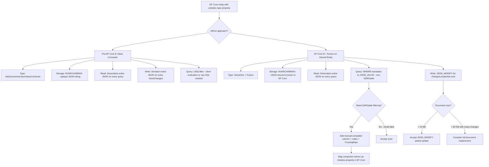
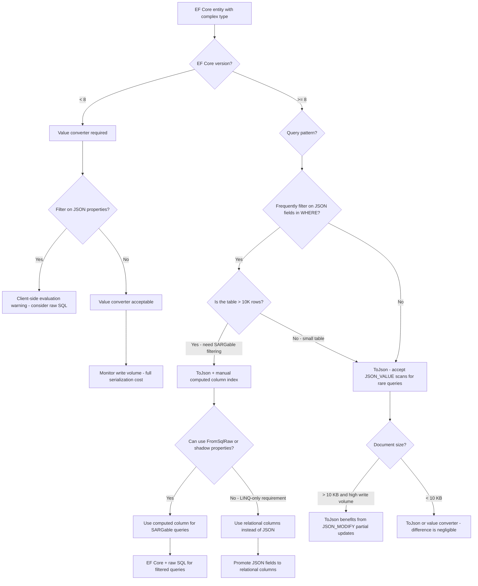

## Navigation

**Domain:** [[8 — Databases]] > **Group:** SQL JSON, XML & Semi-Structured Data
**Previous:** [[8.209 — JSON Columns vs Relational Columns — Decision]] | **Next:** [[8.211 — OPENJSON with Schema — Typed Results]]

### Prerequisites
- [[3.902 — EF Core Value Conversion]] — Value converters serialize/deserialize objects to/from database columns; JSON columns in EF Core build on this concept but use ToJson() for native JSON support in EF Core 8+.
- [[8.204 — JSON_VALUE — Extracting Scalar Values]] — EF Core 8+ generates JSON_VALUE in WHERE clauses for JSON column queries; understanding JSON_VALUE performance characteristics is required to evaluate EF Core's SQL generation.

### Where This Fits

EF Core's JSON support spans two eras: before EF Core 8 (value converters that serialize objects to JSON strings stored in NVARCHAR(MAX) columns) and EF Core 8+ (native JSON column support with ToJson(), generating JSON_VALUE and JSON_MODIFY in SQL). A .NET backend engineer encounters this when mapping flexible-schema data in EF Core — the choice between a value converter (simple but writes the entire document on every save) and the native JSON column support (smarter but requires EF Core 8+ and has query limitations). The interview signal is whether a candidate understands the generated SQL, the performance implications of each approach, and the scenarios where the abstraction leaks — such as when EF Core generates SARGable vs non-SARGable SQL for JSON queries, or when value converters trigger full column rewrites for single-field changes.

---

## Core Mental Model

EF Core provides two mechanisms for storing .NET objects as JSON in relational database columns. The pre-EF Core 8 approach uses value converters: the object is serialized to a JSON string by the converter on save and deserialized on read, with the entire JSON string stored in a single NVARCHAR(MAX) column. The EF Core 8+ approach uses owned entities with ToJson(): EF Core maps the owned entity properties to JSON fields within the column, tracks individual property changes, and generates targeted JSON_MODIFY calls for updates and JSON_VALUE calls for queries. The critical distinction: value converters treat the JSON as an opaque blob — every read deserializes the entire document, every write serializes the entire document, and there is no SQL-level interaction with individual JSON fields. Native JSON column support (ToJson()) treats the JSON as a queryable structure — EF Core generates JSON_VALUE for WHERE clauses (which is non-SARGable unless computed column indexes are added manually) and JSON_MODIFY for single-field updates (which avoids full document rewrites). The recognition pattern for which approach is in use: if the migration creates an NVARCHAR(MAX) column without any JSON-specific schema constructs and the entity property is a complex type without OwnsOne/OwnsMany, it is a value converter. If the migration creates an NVARCHAR(MAX) column with no computed columns but the model uses OwnsOne + ToJson(), it is native JSON column support.

### Classification

- **EF Core version dependency:** Value converters — any EF Core version (3.1+). Native JSON columns — EF Core 8+, SQL Server provider (also PostgreSQL, Cosmos).
- **SQL generation:** Value converters generate no JSON-specific SQL (INSERT/UPDATE with full column value). Native JSON columns generate JSON_VALUE, JSON_MODIFY, and occasional OPENJSON.
- **Query performance:** Value converters — all filtering happens in memory after full deserialization (worst). Native JSON with ToJson() — filtering via JSON_VALUE in SQL (non-SARGable, scan). Computed column indexes — only via manual SQL additions.
- **Write performance:** Value converters — full column rewrite on every save (serialize entire object). Native JSON — partial updates via JSON_MODIFY for changed properties (partial rewrite).



### Key Properties

|Property|Value Converter|ToJson() Native (EF Core 8+)|
|---|---|---|
|EF Core version|Any (3.1+)|8+|
|SQL awareness|None — opaque string|JSON_VALUE, JSON_MODIFY in SQL|
|Partial updates|No — full column rewrite|Yes — per-property JSON_MODIFY|
|Filtering in SQL|No — client-side after deserialization|Yes — JSON_VALUE in WHERE (non-SARGable)|
|Query performance|Full deserialization per row|JSON_VALUE filter (scan unless indexed)|
|Schema migration|NVARCHAR(MAX) column|NVARCHAR(MAX) column — no JSON type|
|Computed column integration|Manual — separate configuration|Manual — separate configuration|
|PostgreSQL compatibility|Works (string column)|Better — Npgsql maps to JSONB|
|Complexity|Low — one converter class|Medium — owned entity + ToJson + manual indexes|

---

## Deep Mechanics

### How EF Core Executes Each Approach

**Value Converter approach:**

1. **OnModelCreating:** The value converter is registered: `HasConversion<JsonValueConverter<T>>()`. EF Core knows the property type is a string in the database and a complex type in .NET.

2. **SaveChanges (INSERT):** EF Core calls `ConvertToProvider` on the converter, which serializes the .NET object to a JSON string using `JsonSerializer.Serialize()`. The full JSON string is passed as an NVARCHAR(MAX) parameter to the INSERT command.

3. **SaveChanges (UPDATE):** EF Core's change tracker detects that the complex type property has been replaced (not modified in place — because value converters treat the entire value as atomic). It marks the property as modified, and on SaveChanges, serializes the entire object to JSON and generates an UPDATE that sets the column to the new JSON string. There is no JSON_MODIFY — it is a full column rewrite.

4. **Query:** When the entity is queried, EF Core reads the NVARCHAR(MAX) value from the database and calls `ConvertFromProvider` on the converter, which deserializes the JSON string back to the .NET object using `JsonSerializer.Deserialize()`. If a LINQ query filters on a property of the complex type (e.g., `.Where(p => p.Attributes.Color == "Red")`), EF Core cannot translate this to SQL because it does not understand the JSON structure. It evaluates the filter client-side after deserializing all rows — a full table scan plus full deserialization of every row.

**ToJson() approach (EF Core 8+):**

1. **OnModelCreating:** The owned entity is configured with `ToJson()`. EF Core generates a migration that creates the column as NVARCHAR(MAX) and adds a CHECK constraint `ISJSON(col) = 1` (for SQL Server). EF Core now knows the JSON structure.

2. **SaveChanges (INSERT):** EF Core serializes the entire owned entity to JSON and inserts it as an NVARCHAR(MAX) string — same as the value converter approach for INSERTs.

3. **SaveChanges (UPDATE):** EF Core's change tracker tracks individual properties of the owned entity. If only `Color` changed, EF Core generates: `UPDATE [Products] SET [Attributes] = JSON_MODIFY([Attributes], '$.Color', @p0) WHERE [Id] = @p1`. If multiple properties changed, EF Core chains JSON_MODIFY calls. This is a partial update — the full document is not sent over the wire, but JSON_MODIFY still rebuilds the document server-side.

4. **Query:** When a LINQ query filters on a property of the owned entity (e.g., `.Where(p => p.Attributes.Color == "Red")`), EF Core generates SQL with `JSON_VALUE([p].[Attributes], '$.Color') = N'Red'`. This is non-SARGable — the query scans the table. EF Core does NOT automatically create computed column indexes.

5. **Projection:** `Select(p => p.Attributes.Color)` generates `JSON_VALUE([p].[Attributes], '$.Color')`. This is fine for projections — the cost is per-row JSON_VALUE evaluation, but without the filter scan problem.

### SQL Visibility

```csharp
// ============================================================
// Approach 1: Value Converter (EF Core any version)
// ============================================================
public class Product
{
    public int Id { get; set; }
    public string Name { get; set; } = string.Empty;
    public ProductAttributes Attributes { get; set; } = new();  // Complex type with converter
}

public class ProductAttributes
{
    public string? Color { get; set; }
    public string? Size { get; set; }
    public decimal? Weight { get; set; }
    public List<string>? Tags { get; set; }
}

public class JsonValueConverter<T> : ValueConverter<T, string>
    where T : class
{
    public JsonValueConverter(ConverterMappingHints? hints = null)
        : base(
            v => JsonSerializer.Serialize(v, (JsonSerializerOptions?)null),
            v => JsonSerializer.Deserialize<T>(v, (JsonSerializerOptions?)null) ?? Activator.CreateInstance<T>(),
            hints)
    {
    }
}

public class ApplicationDbContext : DbContext
{
    protected override void OnModelCreating(ModelBuilder modelBuilder)
    {
        modelBuilder.Entity<Product>(entity =>
        {
            entity.Property(p => p.Name).HasMaxLength(200);
            entity.Property(p => p.Attributes)
                .HasConversion<JsonValueConverter<ProductAttributes>>()
                .HasColumnType("nvarchar(max)");
        });
    }
}
```

**Generated SQL (value converter — UPDATE only changes one property):**

```sql
-- When Color changes to "Red", the entire Attributes column is rewritten:
UPDATE [Products]
SET [Attributes] = @p0
WHERE [Id] = @p1;

-- @p0 = '{"Color":"Red","Size":null,"Weight":null,"Tags":null}' (nvarchar(max))
-- Full serialization — even unchanged properties are included
```

```csharp
// ============================================================
// Approach 2: Native JSON Column with ToJson (EF Core 8+)
// ============================================================
public class Product
{
    public int Id { get; set; }
    public string Name { get; set; } = string.Empty;
    public ProductAttributes? Attributes { get; set; }  // Owned entity mapped to JSON
}

// Owned entity
public class ProductAttributes
{
    public string? Color { get; set; }
    public string? Size { get; set; }
    public decimal? Weight { get; set; }
    public List<string>? Tags { get; set; }
}

public class ApplicationDbContext : DbContext
{
    public DbSet<Product> Products => Set<Product>();

    protected override void OnModelCreating(ModelBuilder modelBuilder)
    {
        modelBuilder.Entity<Product>(entity =>
        {
            entity.Property(p => p.Name).HasMaxLength(200).IsRequired();

            entity.OwnsOne(p => p.Attributes, attrs =>
            {
                attrs.ToJson();  // Maps as JSON column (EF Core 8+)
                // EF Core adds CHECK (ISJSON([Attributes]) = 1) automatically
            });
        });
    }
}
```

**Generated SQL (ToJson — UPDATE only changes one property):**

```sql
-- When Color changes to "Red" (only Color changed):
UPDATE [Products]
SET [Attributes] = JSON_MODIFY([Attributes], '$.Color', @p0)
WHERE [Id] = @p1;

-- @p0 = 'Red' (nvarchar(max)) — only the new value, not the full document
```

**Generated SQL (ToJson — INSERT):**

```sql
-- When inserting a new product:
INSERT INTO [Products] ([Name], [Attributes])
VALUES (@p0, @p1);

-- @p1 = '{"Color":"Red","Size":"M","Weight":1.5,"Tags":["sale","new"]}' (nvarchar(max))
-- Full document is serialized for INSERT
```

**Generated SQL (ToJson — query with filter):**

```sql
-- LINQ: db.Products.Where(p => p.Attributes!.Color == "Red").ToList()
SELECT [p].[Id], [p].[Name], [p].[Attributes]
FROM [Products] AS [p]
WHERE JSON_VALUE([p].[Attributes], '$.Color') = N'Red';

-- This is non-SARGable — scans the table
```

### Execution Plan Analysis

**Value converter query (filter on JSON property):**

```csharp
var products = await db.Products
    .Where(p => p.Attributes.Color == "Red")
    .ToListAsync();
```

```
[Clustered Index Scan] → [SELECT] (all rows read)
Then EF Core deserializes all rows client-side and filters in memory.
```

- Logical reads: Full table scan (e.g., 42,300 for 1M rows).
- Memory: Full deserialization of every row's JSON.
- Network: Full NVARCHAR(MAX) column sent for every row.
- Duration: Slow — dominated by deserialization + data transfer.

**ToJson query (filter on JSON property):**

```csharp
var products = await db.Products
    .Where(p => p.Attributes!.Color == "Red")
    .ToListAsync();
```

```
[Clustered Index Scan] → [Filter (JSON_VALUE)] → [SELECT]
```

- Logical reads: Full table scan (42,300 for 1M rows).
- Memory: JSON_VALUE evaluated per row in SQL Server — no deserialization until rows pass filter.
- Network: Only matching rows transferred.
- Duration: Faster than value converter (no full deserialization in app), but still full scan in database.

**ToJson update (single property change):**

```csharp
product.Attributes!.Color = "Blue";
await db.SaveChangesAsync();
```

```
[Clustered Index Seek] → [Compute Scalar (JSON_MODIFY)] → [Clustered Index Update]
```

- Logical reads: ~4 (seek) + 2 (write) = 6.
- CPU: JSON_MODIFY string rebuild (~0.01 ms for 1 KB doc).
- No Key Lookup needed — the row is already in memory from change tracker.

### Failure Modes

**Client-side evaluation with value converter:** The most dangerous failure mode. LINQ queries that filter on properties of a value-converted JSON column evaluate client-side — EF Core silently pulls all rows from the table, deserializes every JSON document, and filters in memory. There is no SQL-level filter.

```csharp
// ❌ Client-side evaluation — pulls ALL products and filters in memory
var redProducts = await db.Products
    .Where(p => p.Attributes.Color == "Red")
    .ToListAsync();
// EF Core logs: "The LINQ expression ... could not be translated and will be evaluated locally."
// This loads the entire table into application memory!
```

**ToJson query without computed column index:** EF Core generates JSON_VALUE in WHERE — non-SARGable. On a table with 10M rows, this means a full scan every time. The developer expects EF Core to optimize JSON queries, but it does not.

**Value converter full rewrite on every update:** Even if only one property changes, the entire JSON document is serialized and sent to the database. For a 50 KB document, this is 50 KB of network traffic, 50 KB of log write, and 50 KB of data page write — per update.

**Nested ToJson limitations:** EF Core 8+ JSON column support has limitations on nested owned entities, collections of owned entities, and certain LINQ patterns. Complex hierarchies may not translate correctly.

---

## Production Patterns and Implementation

### Primary SQL Implementation

```sql
-- ============================================================
-- Schema generated by EF Core 8+ with ToJson()
-- ============================================================
CREATE TABLE dbo.Products
(
    [Id]         INT            NOT NULL IDENTITY(1,1),
    [Name]       NVARCHAR(200)  NOT NULL,
    [Attributes] NVARCHAR(MAX)  NULL,  -- JSON column managed by EF Core
    CONSTRAINT [PK_Products] PRIMARY KEY ([Id]),
    CONSTRAINT [CK_Products_Attributes_IsJson] CHECK (ISJSON([Attributes]) = 1)
);

-- Sample data:
-- INSERT INTO dbo.Products ([Name], [Attributes])
-- VALUES ('Widget', '{"Color":"Red","Size":"M","Weight":1.5,"Tags":["sale","new"]}');

-- ============================================================
-- To improve query performance, add computed column index manually:
-- ============================================================
ALTER TABLE dbo.Products
ADD ProductColor AS CAST(JSON_VALUE([Attributes], '$.Color') AS NVARCHAR(50)) PERSISTED;

CREATE INDEX IX_Products_ProductColor
    ON dbo.Products (ProductColor)
    WHERE ProductColor IS NOT NULL;

-- Then query via raw SQL or FromSqlRaw:
SELECT [Id], [Name], [Attributes]
FROM dbo.Products
WHERE ProductColor = N'Red';  -- SARGable — seeks on computed column index

-- ============================================================
-- For PostgreSQL with EF Core (Npgsql maps to JSONB):
-- ============================================================
-- Npgsql EF Core provider maps ToJson() to JSONB column
-- Can create expression index:
-- CREATE INDEX IX_Products_Color ON "Products" USING gin ("Attributes" jsonb_path_ops);
-- Or expression index:
-- CREATE INDEX IX_Products_Color ON "Products" USING btree ((Attributes->>'Color'));
```

### EF Core Implementation

```csharp
// ============================================================
// Full EF Core 8+ JSON column implementation
// ============================================================

// Entity
public class Order
{
    public int Id { get; set; }
    public int CustomerId { get; set; }
    public DateTime OrderDate { get; set; }
    public string Status { get; set; } = string.Empty;
    public decimal TotalAmount { get; set; }
    public ShippingInfo? Shipping { get; set; }  // JSON column (owned entity)
    public List<OrderNote>? Notes { get; set; }  // JSON column (owned collection)
    public DateTime CreatedAt { get; set; }
}

// Owned entity — stores as JSON
public class ShippingInfo
{
    public string? AddressLine1 { get; set; }
    public string? AddressLine2 { get; set; }
    public string? City { get; set; }
    public string? State { get; set; }
    public string? ZipCode { get; set; }
    public string? Country { get; set; }
    public string? Method { get; set; }
    public decimal? Cost { get; set; }
    public DateTime? EstimatedDelivery { get; set; }
}

// Owned entity in collection — stored as JSON array
public class OrderNote
{
    public string? Author { get; set; }
    public string? Text { get; set; }
    public DateTime CreatedAt { get; set; }
    public bool IsInternal { get; set; }
}

// DbContext
public class ApplicationDbContext : DbContext
{
    public DbSet<Order> Orders => Set<Order>();

    protected override void OnModelCreating(ModelBuilder modelBuilder)
    {
        modelBuilder.Entity<Order>(entity =>
        {
            entity.ToTable("Orders");
            entity.HasKey(o => o.Id);

            entity.Property(o => o.Status).HasMaxLength(20).IsRequired();
            entity.Property(o => o.TotalAmount).HasPrecision(18, 2).IsRequired();

            // JSON column — owned entity
            entity.OwnsOne(o => o.Shipping, shipping =>
            {
                shipping.ToJson();
                // EF Core 8+ stores ShippingInfo properties as JSON fields
                // All properties default to nullable — JSON is flexible
            });

            // JSON column — owned collection (stored as JSON array)
            entity.OwnsMany(o => o.Notes, note =>
            {
                note.ToJson();
                // EF Core 8+ stores List<OrderNote> as JSON array in column
            });

            // Shadow property computed column for SARGable queries
            // This requires migration SQL — not auto-generated
            entity.Property<string>("ShippingCity")
                .HasComputedColumnSql(
                    "CAST(JSON_VALUE([Shipping], '$.City') AS NVARCHAR(100))",
                    stored: true);

            entity.HasIndex("ShippingCity")
                .HasDatabaseName("IX_Orders_ShippingCity");
        });
    }
}

// Repository — various query patterns
public class OrderRepository
{
    private readonly ApplicationDbContext _dbContext;

    public OrderRepository(ApplicationDbContext dbContext)
        => _dbContext = dbContext;

    // Query by relational column — SARGable, optimal
    public async Task<List<Order>> GetOrdersByStatusAsync(
        string status,
        CancellationToken cancellationToken = default)
    {
        return await _dbContext.Orders
            .Where(o => o.Status == status)
            .AsNoTracking()
            .ToListAsync(cancellationToken);
        -- SQL: SELECT * FROM Orders WHERE Status = @p0
        -- Plan: Index Seek on IX_Orders_Status
    }

    // Query by JSON column property — non-SARGable (full scan)
    // Acceptable for small tables or rare queries
    public async Task<List<Order>> GetOrdersByShippingCityAsync(
        string city,
        CancellationToken cancellationToken = default)
    {
        return await _dbContext.Orders
            .Where(o => o.Shipping!.City == city)
            .AsNoTracking()
            .ToListAsync(cancellationToken);
        -- SQL: SELECT * FROM Orders WHERE JSON_VALUE([Shipping], '$.City') = @p0
        -- Plan: Clustered Index Scan + Filter
    }

    // SARGable version — uses computed column via FromSqlRaw
    public async Task<List<Order>> GetOrdersByShippingCityFastAsync(
        string city,
        CancellationToken cancellationToken = default)
    {
        const string sql = @"
            SELECT o.*
            FROM dbo.Orders o
            WHERE o.ShippingCity = @City";  // Computed column

        return await _dbContext.Orders
            .FromSqlRaw(sql, new SqlParameter("@City", city))
            .AsNoTracking()
            .ToListAsync(cancellationToken);
        -- Plan: Index Seek on IX_Orders_ShippingCity
    }

    // Update a JSON property — EF Core generates JSON_MODIFY
    public async Task UpdateShippingAddressAsync(
        int orderId,
        string newCity,
        CancellationToken cancellationToken = default)
    {
        var order = await _dbContext.Orders
            .Where(o => o.Id == orderId)
            .FirstAsync(cancellationToken);

        order.Shipping!.City = newCity;
        await _dbContext.SaveChangesAsync(cancellationToken);
        -- SQL: UPDATE Orders SET Shipping = JSON_MODIFY([Shipping], '$.City', @p0) WHERE Id = @p1
    }

    // Add a note to JSON array — EF Core generates JSON_MODIFY with append
    public async Task AddNoteAsync(
        int orderId,
        string author,
        string text,
        CancellationToken cancellationToken = default)
    {
        var order = await _dbContext.Orders
            .Where(o => o.Id == orderId)
            .FirstAsync(cancellationToken);

        order.Notes ??= new List<OrderNote>();
        order.Notes.Add(new OrderNote
        {
            Author = author,
            Text = text,
            CreatedAt = DateTime.UtcNow,
            IsInternal = false
        });

        await _dbContext.SaveChangesAsync(cancellationToken);
        -- SQL: UPDATE Orders SET Shipping = JSON_MODIFY([Shipping], 'append$.Notes', JSON_QUERY(@p0)) WHERE Id = @p1
    }

    // Project single JSON property — efficient
    public async Task<List<string?>> GetShippingCitiesAsync(
        CancellationToken cancellationToken = default)
    {
        return await _dbContext.Orders
            .Select(o => o.Shipping!.City)
            .AsNoTracking()
            .ToListAsync(cancellationToken);
        -- SQL: SELECT JSON_VALUE([o].[Shipping], '$.City') FROM Orders AS [o]
        -- Efficient — no filter scan, just per-row JSON_VALUE projection
    }
}
```

### Dapper Implementation

```csharp
// Dapper — manual JSON handling with EF Core-compatible schema
public sealed class OrderRepository
{
    private readonly IDbConnectionFactory _connectionFactory;

    public OrderRepository(IDbConnectionFactory connectionFactory)
        => _connectionFactory = connectionFactory;

    // Read entity with JSON column
    public async Task<OrderDto?> GetOrderByIdAsync(
        int orderId,
        CancellationToken cancellationToken = default)
    {
        const string sql = @"
            SELECT o.Id, o.CustomerId, o.OrderDate, o.Status, o.TotalAmount,
                   o.Shipping, o.Notes
            FROM dbo.Orders o
            WHERE o.Id = @OrderId;";

        await using var connection = _connectionFactory.Create();
        var order = await connection.QuerySingleOrDefaultAsync<OrderDto>(
            new CommandDefinition(sql,
                new { OrderId = orderId },
                cancellationToken: cancellationToken));

        if (order?.Shipping is not null)
        {
            // Deserialize JSON column
            order.ShippingData = JsonSerializer.Deserialize<ShippingInfo>(order.Shipping);
        }

        return order;
    }

    // Query using computed column (SARGable)
    public async Task<IReadOnlyList<OrderDto>> GetOrdersByShippingCityAsync(
        string city,
        CancellationToken cancellationToken = default)
    {
        const string sql = @"
            SELECT o.Id, o.CustomerId, o.OrderDate, o.Status, o.TotalAmount,
                   o.Shipping, o.Notes
            FROM dbo.Orders o
            WHERE o.ShippingCity = @City";  // Computed column index seek

        await using var connection = _connectionFactory.Create();
        var results = await connection.QueryAsync<OrderDto>(
            new CommandDefinition(sql,
                new { City = city },
                cancellationToken: cancellationToken));
        return results.AsList();
    }

    // Update single JSON field with JSON_MODIFY
    public async Task UpdateShippingCityAsync(
        int orderId,
        string newCity,
        CancellationToken cancellationToken = default)
    {
        const string sql = @"
            UPDATE dbo.Orders
            SET Shipping = JSON_MODIFY(Shipping, '$.City', @NewCity)
            WHERE Id = @OrderId;";

        await using var connection = _connectionFactory.Create();
        await connection.ExecuteAsync(
            new CommandDefinition(sql,
                new { OrderId = orderId, NewCity = newCity },
                cancellationToken: cancellationToken));
    }
}

// DTO — matches SQL output
public class OrderDto
{
    public int Id { get; set; }
    public int CustomerId { get; set; }
    public DateTime OrderDate { get; set; }
    public string Status { get; set; } = string.Empty;
    public decimal TotalAmount { get; set; }
    public string? Shipping { get; set; }  // Raw JSON string
    public string? Notes { get; set; }     // Raw JSON string
    public ShippingInfo? ShippingData { get; set; }  // Deserialized
}
```

### Configuration and Wiring

```csharp
// Program.cs
builder.Services.AddDbContext<ApplicationDbContext>(options =>
    options.UseSqlServer(
        builder.Configuration.GetConnectionString("DefaultConnection"),
        sqlOptions => sqlOptions.EnableRetryOnFailure(3))
    .EnableDetailedErrors(builder.Environment.IsDevelopment())
    .EnableSensitiveDataLogging(builder.Environment.IsDevelopment()));

// Enable SQL logging to verify generated JSON queries
builder.Logging.AddFilter("Microsoft.EntityFrameworkCore.Database.Command",
    builder.Environment.IsDevelopment() ? LogLevel.Information : LogLevel.Warning);

builder.Services.AddSingleton<IDbConnectionFactory>(sp =>
    new SqlConnectionFactory(
        builder.Configuration.GetConnectionString("DefaultConnection")!));

builder.Services.AddScoped<OrderRepository>();
```

### SQL Server vs PostgreSQL Differences

```sql
-- PostgreSQL with Npgsql EF Core provider
-- ToJson() maps to JSONB column (not NVARCHAR)

CREATE TABLE "Orders" (
    "Id" INTEGER GENERATED BY DEFAULT AS IDENTITY,
    "CustomerId" INTEGER NOT NULL,
    "OrderDate" TIMESTAMPTZ NOT NULL,
    "Status" TEXT NOT NULL,
    "TotalAmount" NUMERIC NOT NULL,
    "Shipping" JSONB NULL,   -- JSONB column — native type
    "Notes" JSONB NULL,      -- JSONB column
    CONSTRAINT "PK_Orders" PRIMARY KEY ("Id")
);

-- Npgsql generates JSONB queries differently:
-- WHERE filter: ("Shipping"->>'City') = @p0
-- This CAN use a btree expression index:
CREATE INDEX "IX_Orders_ShippingCity"
    ON "Orders" USING btree (("Shipping"->>'City'));

-- EF Core Npgsql also supports GIN indexes on JSONB:
-- CREATE INDEX "IX_Orders_Shipping_GIN"
--     ON "Orders" USING gin ("Shipping" jsonb_path_ops);

-- UPDATE: Npgsql uses jsonb_set (PostgreSQL native):
-- UPDATE "Orders" SET "Shipping" = jsonb_set("Shipping", '{City}', @p0, false)
```

---

## Gotchas and Production Pitfalls

### Value Converter Causes Full Table Load for JSON Filtering

**Pitfall:** Using a value converter to store JSON and then filtering on JSON properties in LINQ — EF Core cannot translate the filter to SQL and evaluates it client-side.

```csharp
// ❌ This loads ALL products into memory and filters in the application
var redProducts = await db.Products
    .Where(p => p.Attributes.Color == "Red")
    .ToListAsync();
```

**Symptom:** EF Core logs a warning: "The LINQ expression could not be translated and will be evaluated locally." The query takes 30 seconds instead of 100ms because it transfers the entire table over the network and deserializes every JSON document.

**Fix:**
```csharp
// ✅ Option 1: Upgrade to EF Core 8+ and use ToJson()
// (filter is translated to JSON_VALUE — still scans but at least in SQL)

// ✅ Option 2: Add computed column index + FromSqlRaw

// ✅ Option 3: Filter in SQL with Dapper or FromSqlRaw
const string sql = @"
    SELECT Id, Name, Attributes
    FROM dbo.Products
    WHERE JSON_VALUE(Attributes, '$.Color') = N'Red';";

var products = await db.Products
    .FromSqlRaw(sql)
    .AsNoTracking()
    .ToListAsync();
```

**Cost of not fixing:** On a 1M row table with 10 KB JSON documents, the query transfers 10 GB of data from SQL Server to the application. This saturates network bandwidth, spikes application memory, and kills API response times.

---

### ToJson Query Generates Non-SARGable JSON_VALUE

**Pitfall:** Assuming EF Core 8+ JSON column support optimizes queries with computed column indexes automatically.

```csharp
// ❌ Even with ToJson(), this generates JSON_VALUE — non-SARGable:
var orders = await db.Orders
    .Where(o => o.Shipping!.City == "New York")
    .ToListAsync();
-- SQL: WHERE JSON_VALUE([Shipping], '$.City') = N'New York'
-- Plan: Clustered Index Scan — even if computed column index exists
```

**Symptom:** Queries on JSON fields perform full table scans despite having computed column indexes. Developers think EF Core will "just know" about the computed column.

**Fix:**
```csharp
// ✅ Use FromSqlRaw to reference the computed column directly:
const string sql = "SELECT * FROM dbo.Orders WHERE ShippingCity = @City";
var orders = await db.Orders.FromSqlRaw(sql,
    new SqlParameter("@City", "New York")).ToListAsync();

// ✅ Or map the computed column as a shadow property and query through it
// (requires additional configuration)
```

**Cost of not fixing:** Queries on JSON fields in EF Core 8+ are always non-SARGable. On large tables, every JSON field filter causes a full scan. The developer loses the performance benefit of computed column indexes unless they use raw SQL.

---

### Value Converter Serializes Entire Object on Every Update

**Pitfall:** Using a value converter for large JSON documents and updating a single field triggers a full serialization and full column rewrite.

```csharp
// ❌ Every update serializes the entire 50 KB document
var product = await db.Products.FindAsync(42);
product.Attributes.Color = "Blue";  // Only one field changes
await db.SaveChangesAsync();
-- UPDATE [Products] SET [Attributes] = @p0 WHERE [Id] = @p1
-- @p0 = Full JSON serialization of entire ProductAttributes object (50 KB!)
```

**Symptom:** UPDATE statements are slow and generate excessive transaction log traffic. On a high-volume system, log throughput becomes the bottleneck.

**Fix:**
```csharp
// ✅ Upgrade to EF Core 8+ and use ToJson() — generates JSON_MODIFY
// UPDATE [Products] SET [Attributes] = JSON_MODIFY([Attributes], '$.Color', @p0) WHERE [Id] = @p1

// ✅ Or use Dapper with targeted JSON_MODIFY:
const string sql = @"
    UPDATE dbo.Products
    SET Attributes = JSON_MODIFY(Attributes, '$.Color', @Color)
    WHERE Id = @Id;";
```

**Cost of not fixing:** At 1,000 updates/second with 50 KB documents, the transaction log writes 50 MB/second just for JSON column updates. Log file grows 3 GB per minute. Log backup frequency must increase, and log management becomes a full-time operational concern.

---

### ToJson Collection Navigation Causes Full Rewrite on Add

**Pitfall:** Adding an item to a JSON array navigation (OwnsMany + ToJson) triggers a JSON_MODIFY with append for the new item — but the entire JSON array is read, modified, and written if the entity is tracked.

```csharp
var order = await db.Orders.FindAsync(orderId);
order.Notes!.Add(new OrderNote { Author = "admin", Text = "Note" });
await db.SaveChangesAsync();
```

**Symptom:** The generated SQL uses `JSON_MODIFY([Notes], 'append$', ...)`, which appends the new note by rebuilding the entire Notes JSON array. For a large array (100+ notes), this rebuilds the full array on every add. The cost is proportional to the array size, not the single new entry.

**Fix:**
```csharp
// ✅ For frequently-appended JSON arrays, consider a separate table
// CREATE TABLE dbo.OrderNotes (OrderId INT, Author NVARCHAR(100), Text NVARCHAR(MAX), ...)
// This avoids the JSON array rebuild cost

// ✅ Or batch additions: add multiple notes in a single SaveChanges call
// so the JSON array is rebuilt once instead of per-note
```

**Cost of not fixing:** Adding notes one at a time on a 200-item JSON array causes O(n^2) behavior — each addition rebuilds the array from scratch. The 200th addition rebuilds 200 items' worth of JSON.

---

### Migrating from Value Converter to ToJson Loses Data

**Pitfall:** Changing from a value converter to ToJson() in an EF Core migration without properly handling the existing data format.

```csharp
// Before: Attributes was stored with value converter (any JSON structure)
// After: Attributes is an owned entity with ToJson() (expected structure)
```

**Symptom:** Migration succeeds but existing data does not deserialize correctly because the stored JSON structure differs from the expected owned entity shape. Properties that were stored with different naming (e.g., `camelCase` vs `PascalCase`) cause null values.

**Fix:**
```csharp
// ✅ In the migration, conditionally transform existing JSON:
protected override void Up(MigrationBuilder migrationBuilder)
{
    // Step 1: Add a temporary column
    migrationBuilder.AddColumn<string>(
        name: "Attributes_New",
        table: "Products",
        type: "nvarchar(max)",
        nullable: true);

    // Step 2: Transform data (if needed — may not be required if structure matches)
    migrationBuilder.Sql(@"
        UPDATE dbo.Products
        SET Attributes_New = Attributes
        WHERE Attributes IS NOT NULL;");

    // Step 3: Drop old, rename new
    migrationBuilder.DropColumn(name: "Attributes", table: "Products");
    migrationBuilder.RenameColumn(
        name: "Attributes_New",
        table: "Products",
        newName: "Attributes");
}
```

**Cost of not fixing:** Production data loss — existing JSON documents are silently migrated but properties do not map, resulting in null owned entities or empty collections. The bug is not detected until users report missing data.

---

## Performance Implications

### Benchmark: Before and After

```sql
-- Baseline: Value converter — query filtering on JSON field
-- SQL: SELECT [p].[Id], [p].[Name], [p].[Attributes] FROM [Products] AS [p]
-- All rows transferred to app, deserialized, filtered client-side
SET STATISTICS IO ON;
-- (Full transfer — no meaningful STATISTICS IO for app-side filtering)
-- Application CPU: ~3,200ms (deserialize 1M JSON documents)
-- Data transferred: ~10 GB (1M × 10 KB)

-- Optimized: ToJson with JSON_VALUE filter
-- SQL: SELECT [p].[Id], [p].[Name], [p].[Attributes] FROM [Products] AS [p]
--       WHERE JSON_VALUE([p].[Attributes], '$.Color') = N'Red'
-- Server only returns matching rows (~100K of 1M)
-- Table 'Products'. Scan count 1, logical reads 42,300
-- Data transferred: ~1 GB (100K × 10 KB)
-- Duration: ~1,200ms (scan) + ~200ms (transfer)

-- Fully optimized: Computed column index + FromSqlRaw
-- SQL: SELECT * FROM Products WHERE ProductColor = N'Red'
-- Table 'Products'. Scan count 1, logical reads 1,200 (Index Seek)
-- Data transferred: ~1 GB (100K × 10 KB)
-- Duration: ~180ms
```

**Improvement chain:** 3,200ms (value converter) → 1,400ms (ToJson) → 180ms (ToJson + computed column index). ~18x improvement over value converter, ~8x improvement over ToJson alone.

### BenchmarkDotNet

```csharp
[MemoryDiagnoser]
[SimpleJob(RuntimeMoniker.Net90)]
public class EfCoreJsonBenchmark
{
    private ApplicationDbContext _context = default!;

    [GlobalSetup]
    public void Setup()
    {
        var options = new DbContextOptionsBuilder<ApplicationDbContext>()
            .UseSqlServer(TestConnectionString)
            .Options;
        _context = new ApplicationDbContext(options);
        // Seed 100K products with JSON Attributes
    }

    [Benchmark(Baseline = true)]
    public async Task<List<Product>> ValueConverter_FilterOnJson()
    {
        // Value converter — loads all rows, deserializes, filters in app
        return await _context.Products
            .Where(p => p.Attributes.Color == "Red")
            .AsNoTracking()
            .ToListAsync();
    }

    [Benchmark]
    public async Task<List<Product>> ToJson_FilterOnJsonProperty()
    {
        // EF Core 8+ ToJson — generates JSON_VALUE WHERE
        return await _context.Products
            .Where(p => p.Attributes!.Color == "Red")
            .AsNoTracking()
            .ToListAsync();
    }

    [Benchmark]
    public async Task<List<Product>> ToJson_WithComputedColumnIndex()
    {
        // Uses FromSqlRaw with computed column — SARGable seek
        const string sql = @"
            SELECT * FROM dbo.Products
            WHERE ProductColor = N'Red'";

        return await _context.Products
            .FromSqlRaw(sql)
            .AsNoTracking()
            .ToListAsync();
    }

    [GlobalCleanup]
    public void Cleanup() => _context.Dispose();
}
```

**Expected results (approximate, SQL Server 2022, 100K products, 10 KB JSON, 10K matching):**

|Method|Mean|Data Transferred|App Memory|
|---|---|---|---|
|ValueConverter_FilterOnJson|~3,200 ms|~1 GB (all 100K rows)|~1 GB|
|ToJson_FilterOnJsonProperty|~450 ms|~100 MB (10K matching rows)|~100 MB|
|ToJson_WithComputedColumnIndex|~80 ms|~100 MB (10K matching rows)|~100 MB|

### Write Amplification

|Operation|Value Converter|ToJson() (1 field change)|ToJson() (5 field change)|
|---|---|---|---|
|UPDATE single property (1 KB doc)|Full 1 KB serialized + written|JSON_MODIFY — 50 bytes arg|—|
|UPDATE single property (50 KB doc)|Full 50 KB serialized + written|JSON_MODIFY — 50 bytes arg|—|
|UPDATE 5 properties (same doc)|Full 50 KB serialized + written|5x JSON_MODIFY — 250 bytes total|5x JSON_MODIFY chained|
|INSERT (new row)|Full serialization — same|Full serialization — same|—|
|Add to JSON array (owned collection)|—|JSON_MODIFY append (full array rebuilt)|—|

---

## Interview Arsenal

### Question Bank

1. **What are the two approaches for storing JSON in EF Core, and what EF Core version does each require?**
2. **When you filter on a JSON property in EF Core with a value converter, what SQL is generated and what is the performance implication?**
3. **How does EF Core 8+ generate UPDATE statements for JSON column property changes — does it rewrite the entire column?**
4. **What is the SARGability of EF Core 8+ JSON column WHERE queries, and how do you fix it?**
5. **Compare EF Core value converter vs ToJson() for write performance on a 50 KB JSON document.**
6. **Read this EF Core generated SQL: `UPDATE [Products] SET [Attributes] = @p0 WHERE [Id] = @p1`. What does @p0 contain, and what approach is being used?**
7. **On a production system with 10M rows, 50 KB JSON documents, and 5,000 updates/second, which approach (value converter or ToJson) is more efficient and why?**
8. **How does EF Core handle JSON array navigations (OwnsMany + ToJson) — what SQL is generated for adding an item?**

### Spoken Answers

**Q: What are the two approaches for storing JSON in EF Core, and what EF Core version does each require?**

> **Average answer:** You can use value converters or JSON columns. Value converters work in any version. JSON columns need EF Core 8.

> **Great answer:** There are two approaches with fundamentally different characteristics. The first is value converters, available since EF Core 2.1+ but practical from 3.1+. You register a `ValueConverter<T, string>` that serializes the .NET object to a JSON string using `JsonSerializer.Serialize()` on save and deserializes on read. The column is NVARCHAR(MAX) — EF Core treats it as an opaque string. It has no understanding of the JSON structure. The second approach is native JSON column support with `ToJson()`, introduced in EF Core 8 for SQL Server, PostgreSQL (via Npgsql, which maps to JSONB), and Cosmos. You configure an owned entity with `OwnsOne() + ToJson()` for a single object, or `OwnsMany() + ToJson()` for a collection. EF Core understands the JSON structure — it tracks individual property changes and generates targeted SQL: `JSON_VALUE` for WHERE filters, `JSON_MODIFY` for updates. The key tradeoff: value converters are simpler but every LINQ filter on a JSON property causes client-side evaluation (loads entire table into memory), and every update serializes the entire document. ToJson() is more sophisticated but still has limitations — WHERE filters generate non-SARGable JSON_VALUE calls that require manual computed column indexes for performance. My recommendation: use ToJson() for any new project on EF Core 8+, but be aware that you must add computed column indexes manually for any JSON field that is filtered at high volume.

---

**Q: Compare EF Core value converter vs ToJson() for write performance on a 50 KB JSON document.**

> **Average answer:** Value converter writes the whole 50 KB. ToJson uses JSON_MODIFY to just write the changed field. So ToJson is faster.

> **Great answer:** Let me be precise about what happens in each case. With a value converter, when you change one property — say, Color from "Red" to "Blue" — EF Core's change tracker marks the entire `Attributes` property as modified because value converters treat the object as atomic. On SaveChanges, EF Core calls `JsonSerializer.Serialize()` on the entire ProductAttributes object, producing a 50 KB JSON string, and generates `UPDATE Products SET Attributes = @p0 WHERE Id = @p1` where @p0 is the full 50 KB string. The database then writes 50 KB to the data page and 50 KB to the transaction log. With ToJson() in EF Core 8+, EF Core tracks individual property changes on the owned entity. Changing only Color generates `UPDATE Products SET Attributes = JSON_MODIFY([Attributes], '$.Color', @p0) WHERE Id = @p1` where @p0 is just 'Blue' — a few bytes. The JSON_MODIFY function still rebuilds the full 50 KB document server-side (it parses, modifies, serializes), but only ~50 bytes travel over the network versus 50 KB. The transaction log still ends up with the full 50 KB document because the data page stores the complete JSON. So the network improvement is dramatic (~1,000x less data over the wire), and the server CPU cost is similar (both approaches rebuild the document — value converter does it in .NET, ToJson does it via JSON_MODIFY in SQL Server). The real write win for ToJson is when you update the same document rarely: the network savings are significant at scale. At 5,000 updates/second, value converter transfers 250 MB/sec over the network just for this column. ToJson transfers ~250 KB/sec for the same workload.

---

**Q: How does EF Core handle JSON array navigations (OwnsMany + ToJson) — what SQL is generated for adding an item?**

> **Average answer:** EF Core appends the item using JSON_MODIFY with append.

> **Great answer:** When you add an item to a collection owned entity configured with `OwnsMany + ToJson()`, EF Core tracks the collection change. On SaveChanges, it generates a single UPDATE statement with JSON_MODIFY using the `append` keyword: `UPDATE Orders SET Notes = JSON_MODIFY([Notes], 'append$', JSON_QUERY(@p0)) WHERE Id = @p1`. The `append$` path tells JSON_MODIFY to add the new element to the end of the JSON array. The value must be wrapped in `JSON_QUERY()` because it is a JSON object (the new OrderNote), not a scalar — this prevents EF Core from escaping it as a string. The critical performance detail is that JSON_MODIFY with `append$` still rebuilds the entire JSON array — SQL Server parses the existing array, appends the new element, and serializes the entire array back. If the array has 200 existing notes, the full 200-element array is rebuilt for each new note. This means adding notes one at a time causes O(n^2) behavior at the SQL Server level. For frequently-appended JSON arrays, I recommend either batching additions (add multiple notes before calling SaveChanges) or moving to a separate related table if the array is expected to grow beyond ~50 items. For reference, the generated SQL for updating an existing item in the array (e.g., changing the text of the third note) does not use array indexing — EF Core would rewrite the entire JSON array for that case as well.

### Interview Trigger

The EF Core JSON interview question is typically: "How would you store a flexible-schema object like product attributes in EF Core?" The first follow-up after "use a value converter" or "use ToJson" is "What SQL does EF Core generate when you filter on a property of that object?" The candidate who says "it depends on the EF Core version and configuration" shows awareness. The senior follow-up: "Your ToJson query on a JSON property takes 15 seconds on a 10M row table. What is the root cause and how do you fix it?" — this tests whether the candidate understands JSON_VALUE non-SARGability and the computed column pattern. The deepest probe: "What are the implications of using OwnsMany + ToJson for a collection that grows to 500 items per row?" — testing understanding of JSON array rebuild cost and the threshold where a separate table becomes necessary.

### Comparison Table

| |Value Converter|ToJson() (EF Core 8+)|Raw SQL + Dapper|
|---|---|---|---|
|EF Core version|Any (2.1+)|8+|Any|
|SQL generation|INSERT/UPDATE with full value|JSON_VALUE, JSON_MODIFY|Full control|
|Filter translation|Client-side|JSON_VALUE (non-SARGable)|Any SQL|
|Partial updates|No — full rewrite|Yes — per-property JSON_MODIFY|Yes — JSON_MODIFY or any SQL|
|Collection support|Manual serialization|OwnsMany + ToJson (JSON array)|OPENJSON or separate table|
|Computed column integration|Manual — raw SQL|Manual — raw SQL + shadow property|Direct SQL — natural|
|Query performance (filter)|Worst (client eval)|Non-SARGable scan|Optimal (computed column seek)|

---

## Decision Framework

### When to Apply



### Application Checklist

- [ ] EF Core version is determined — if < 8, use value converters with awareness of client-evaluation risks
- [ ] If EF Core 8+, ToJson() is used for JSON columns — not value converters
- [ ] For any JSON field filtered in WHERE at > 100 queries/hour, a computed column index has been added and queries use FromSqlRaw
- [ ] Value converter entities do not filter on JSON properties in LINQ — use raw SQL or Dapper
- [ ] OwnsMany + ToJson collections are evaluated for growth — if > 50 items expected, consider separate table
- [ ] Generated SQL is verified via EF Core logging — no unexpected full column rewrites or client-side evaluations
- [ ] Migration strategy defined for value converter → ToJson migration (data compatibility)
- [ ] Write amplification measured for large JSON documents
- [ ] ISJSON CHECK constraint is present (EF Core 8+ adds it automatically)
- [ ] PostgreSQL: Npgsql JSONB mapping considered for better JSONB performance

### Tradeoff Summary

|What You Gain (ToJson)|What You Pay|
|---|---|
|Partial updates via JSON_MODIFY — less network traffic|JSON_VALUE WHERE is non-SARGable — full scan without computed column index|
|EF Core understands JSON structure — no client eval for projections|Computed column indexes require manual SQL — not automated|
|Automatic ISJSON CHECK constraint in migration|Cannot index JSON arrays or fragments natively|
|Supports JSON arrays via OwnsMany + ToJson|JSON array rebuild on every add/modify — write amplification for large arrays|

### Scale Thresholds

- Value converter approach becomes problematic when **table exceeds ~10K rows** and LINQ filters on JSON properties — client-side evaluation of 10K+ documents is slow.
- ToJson JSON_VALUE queries become problematic when **table exceeds ~100K rows** and filter queries run **more than 1,000x/hour** — the full scan cost dominates.
- Computed column indexes become necessary when **table exceeds ~100K rows** and JSON field filters are the primary query pattern.
- OwnsMany + ToJson collections should be moved to a separate table when **average collection size exceeds ~50 items** — JSON array rebuild cost grows linearly.
- Write amplification from value converters becomes critical when **documents exceed ~50 KB** and **writes exceed ~500/second** — network and log throughput become bottlenecks.

---

## Self-Check

### Conceptual Questions

1. What are the two EF Core approaches for storing .NET objects as JSON in SQL Server?
2. When does EF Core with a value converter evaluate a WHERE filter on a JSON property — in SQL or client-side?
3. What SQL does EF Core 8+ generate when updating a single property of a ToJson-owned entity?
4. What is the SARGability of `WHERE JSON_VALUE([col], '$.field') = 'value'` — can it use an index on the JSON column?
5. Does EF Core 8+ ToJson() automatically create computed column indexes for JSON fields?
6. How would you implement a JSON column query with Dapper that uses a computed column index?
7. Compare the UPDATE behavior of value converters vs ToJson() for a 100 KB JSON document when only one field changes.
8. At what table size does EF Core value converter JSON filtering become a performance problem?
9. What SQL Server index structure enables SARGable filtering on a ToJson JSON field?
10. Explain in 60 seconds the difference between EF Core value converter and ToJson() for JSON column storage, including query and update performance.

<details>
<summary>Answers</summary>

1. (1) Value converter (`HasConversion<JsonValueConverter<T>>()`) — available in all EF Core versions, treats JSON as opaque string. (2) ToJson() on owned entity (`OwnsOne + ToJson()`) — available in EF Core 8+, EF Core understands JSON structure.

2. Client-side. EF Core cannot translate `Where(p => p.Attributes.Color == "Red")` to SQL with a value converter because it does not understand the JSON structure. It loads all rows from the table, deserializes every JSON document, and filters in application memory. This is client-side evaluation and produces a warning in the EF Core log.

3. `UPDATE [Products] SET [Attributes] = JSON_MODIFY([Attributes], '$.Color', @p0) WHERE [Id] = @p1`. EF Core generates a targeted JSON_MODIFY call that only sends the changed value, not the full document.

4. It is NOT SARGable. `JSON_VALUE` is a scalar function on the NVARCHAR(MAX) column. The optimizer cannot seek into the JSON string. A computed column index on the extracted value is required for a seek, and the query must reference the computed column name, not JSON_VALUE.

5. No. EF Core 8+ does not automatically create computed columns or indexes for JSON fields. You must add them manually via migration SQL. EF Core's ToJson() only creates the NVARCHAR(MAX) column with an ISJSON CHECK constraint.

6. Reference the computed column name in the SQL:

```csharp
const string sql = @"
    SELECT * FROM dbo.Products
    WHERE ProductColor = @Color";  -- Computed column
var products = await connection.QueryAsync<Product>(sql, new { Color = "Red" });
```

7. Value converter: serializes the entire 100 KB object in .NET, sends 100 KB over the network, writes 100 KB to the data page. ToJson(): sends only the changed value (e.g., 50 bytes for a string) over the network, JSON_MODIFY rebuilds the 100 KB document server-side (CPU cost), writes 100 KB to the data page. Network: ToJson wins (2000x less). CPU: comparable (both rebuild 100 KB). Total: ToJson wins for network-bound scenarios.

8. EF Core value converter JSON filtering becomes problematic at ~10K rows because client-side evaluation loads all rows into memory. At 100K rows with 10 KB documents, this is 1 GB of application memory per query.

9. A PERSISTED computed column on the JSON field value (`CAST(JSON_VALUE(col, '$.field') AS type)`) with a B-tree non-clustered index. The query must reference the computed column name, not JSON_VALUE, for the index seek.

10. "EF Core provides two JSON storage approaches. Value converters, available since EF Core 2.1, serialize the entire .NET object to a JSON string — the database sees NVARCHAR(MAX) and EF Core treats it as an opaque value. Any LINQ filter on JSON properties causes client-side evaluation: every row is loaded, deserialized, and filtered in the application — catastrophic for large tables. Every update serializes the entire document regardless of what changed. ToJson(), introduced in EF Core 8, maps owned entities to JSON columns. EF Core understands the JSON structure — it generates JSON_VALUE for WHERE filters and JSON_MODIFY for updates. The WHERE filters are non-SARGable (full scan) unless you manually add computed column indexes and use raw SQL. The updates are partial — only changed properties are sent over the wire via JSON_MODIFY. My recommendation: ToJson() for all new EF Core 8 projects, add computed column indexes for frequently-filtered JSON fields, and use FromSqlRaw for those filtered queries."

</details>

---

### Query Challenges

**Challenge 1 — Migrate from value converter to ToJson**

A project uses EF Core 6 with a value converter for `ProductAttributes`. The `Attributes` column stores JSON strings. The product detail page queries `WHERE JSON_VALUE(Attributes, '$.Color') = 'Red'` via raw SQL. You are upgrading to EF Core 8 and want to use ToJson(). Design the migration: the entity model, the DbContext configuration, the migration strategy for existing data, and the query patterns.

<details>
<summary>Solution</summary>

```csharp
// Before (EF Core 6 — value converter):
public class Product
{
    public int Id { get; set; }
    public ProductAttributes Attributes { get; set; } = new();
}

public class ProductAttributes
{
    public string? Color { get; set; }
    public string? Size { get; set; }
    // ...
}

// After (EF Core 8 — ToJson):
public class Product
{
    public int Id { get; set; }
    public ProductAttributes? Attributes { get; set; }  // Make nullable for owned entity
}

public class ProductAttributes
{
    public string? Color { get; set; }
    public string? Size { get; set; }
    // ...
}

// DbContext
public class ApplicationDbContext : DbContext
{
    protected override void OnModelCreating(ModelBuilder modelBuilder)
    {
        modelBuilder.Entity<Product>(entity =>
        {
            entity.OwnsOne(p => p.Attributes, attrs =>
            {
                attrs.ToJson();  // EF Core 8+ JSON column
            });

            // Add computed column for SARGable color queries
            entity.Property<string>("ProductColor")
                .HasComputedColumnSql(
                    "CAST(JSON_VALUE([Attributes], '$.Color') AS NVARCHAR(50))",
                    stored: true);

            entity.HasIndex("ProductColor")
                .HasDatabaseName("IX_Products_ProductColor");
        });
    }
}

// Migration: add computed column and index
// The column name stays the same ("Attributes") — no data migration needed
// if the JSON structure is compatible

// Query by JSON color — SARGable via computed column:
public async Task<List<Product>> GetByColorAsync(string color)
{
    const string sql = @"
        SELECT * FROM dbo.Products
        WHERE ProductColor = @Color";

    return await _dbContext.Products
        .FromSqlRaw(sql, new SqlParameter("@Color", color))
        .AsNoTracking()
        .ToListAsync();
}

// Update a JSON property — partial update via JSON_MODIFY:
public async Task UpdateColorAsync(int productId, string newColor)
{
    var product = await _dbContext.Products.FindAsync(productId);
    product!.Attributes!.Color = newColor;
    await _dbContext.SaveChangesAsync();
    -- Generates: UPDATE SET Attributes = JSON_MODIFY([Attributes], '$.Color', @p0)
}
```

**Key points:**
- Column name stays the same — existing data is compatible if JSON structure matches
- EF Core 8 ToJson() serializes with camelCase by default (matches value converter default)
- Computed column + index added via migration SQL
- SARGable queries use FromSqlRaw referencing the computed column
- Updates use standard EF Core change tracking — generates JSON_MODIFY

</details>

---

**Challenge 2 — Fix the client-side evaluation**

```csharp
// This code runs on EF Core 6 with a value converter.
// It loads 100,000 products in 30 seconds and filters in memory.
// The table has 2M rows, average JSON size is 25 KB.

public async Task<List<Product>> GetRedProductsAsync()
{
    return await _dbContext.Products
        .Where(p => p.Attributes.Color == "Red")
        .AsNoTracking()
        .ToListAsync();
}
```

Identify the root cause, the EF Core warning that would appear, and provide three fix options.

<details> <summary>Solution</summary>

**Root cause:** EF Core 6 with a value converter cannot translate `p.Attributes.Color == "Red"` to SQL. It evaluates the predicate client-side: all 2M rows are loaded from the database (50 GB of JSON data), deserialized in memory, and filtered by Color == "Red".

**EF Core warning:** `Microsoft.EntityFrameworkCore.Query: Warning: The LINQ expression 'where p.Attributes.Color == "Red"' could not be translated and will be evaluated locally.`

**Fix options:**

**Option 1 — Raw SQL with JSON_VALUE (immediate fix):**
```csharp
public async Task<List<Product>> GetRedProductsAsync()
{
    const string sql = @"
        SELECT * FROM dbo.Products
        WHERE JSON_VALUE([Attributes], '$.Color') = N'Red';";

    return await _dbContext.Products
        .FromSqlRaw(sql)
        .AsNoTracking()
        .ToListAsync();
}
```
- Improvement: filter happens in SQL Server — only matching rows transferred.
- But still a full scan (JSON_VALUE is non-SARGable).

**Option 2 — Computed column + index (best performance):**
```sql
-- SQL migration:
ALTER TABLE dbo.Products ADD ProductColor AS
    CAST(JSON_VALUE([Attributes], '$.Color') AS NVARCHAR(50)) PERSISTED;
CREATE INDEX IX_Products_ProductColor ON dbo.Products (ProductColor)
    WHERE ProductColor IS NOT NULL;
```

```csharp
public async Task<List<Product>> GetRedProductsAsync()
{
    const string sql = @"
        SELECT * FROM dbo.Products
        WHERE ProductColor = N'Red';";

    return await _dbContext.Products
        .FromSqlRaw(sql)
        .AsNoTracking()
        .ToListAsync();
}
```

**Option 3 — Upgrade to EF Core 8 + ToJson (modern approach):**
- Upgrade to EF Core 8, change to ToJson(), add computed column index.
- Same performance as Option 2 but with partial update support.

**Expected improvement (Option 2):** 30 seconds → ~200ms (scan 42,000 logical reads → seek ~1,200 logical reads). Data transferred: 50 GB → ~1 GB (matching rows only).

</details>

---

**Challenge 3 — Explain the generated SQL difference**

```sql
-- Products table with Attributes JSON column (EF Core 8 ToJson)

-- Query A (EF Core LINQ):
SELECT [p].[Id], [p].[Name], [p].[Attributes]
FROM [Products] AS [p]
WHERE [p].[Attributes] IS NOT NULL;

-- Query B (EF Core LINQ):
SELECT [p].[Id], [p].[Name], [p].[Attributes]
FROM [Products] AS [p]
WHERE JSON_VALUE([p].[Attributes], '$.Color') = N'Red';
```

Why does Query A use an Index Scan while Query B uses an Index Scan (if no computed column index)? What would change if there were a computed column index on Color?

<details> <summary>Solution</summary>

**Query A:** `WHERE [p].[Attributes] IS NOT NULL` checks if the NVARCHAR(MAX) column is not null. This can use an index scan on the clustered index (or a non-clustered index if one exists on Attributes). It is a simple null check on the column itself — no JSON parsing needed.

**Query B:** `WHERE JSON_VALUE([p].[Attributes], '$.Color') = N'Red'` calls the JSON_VALUE function on every row. The optimizer sees a scalar function on an NVARCHAR(MAX) column — it cannot seek. It performs a Clustered Index Scan and evaluates JSON_VALUE as a residual filter. Logical reads: full table (42,000+ for 1M rows).

**With computed column index on ProductColor:**

**Query C (raw SQL referencing computed column):**
```sql
SELECT [p].[Id], [p].[Name], [p].[Attributes]
FROM [Products] AS [p]
WHERE [p].[ProductColor] = N'Red';
```
Plan: `Index Seek (IX_Products_ProductColor)` → `Key Lookup (if non-covering)` → `SELECT`
Logical reads: ~1,200 — ~35x fewer than Query B.

**Why EF Core LINQ does not generate Query C:** EF Core 8+ with ToJson() generates JSON_VALUE even if a computed column exists. The developer must use FromSqlRaw or a shadow property to reference the computed column.

**Plan shapes:**

```
Query A (NULL check):
[Clustered Index Scan] → [Filter: Attributes IS NOT NULL] → [SELECT]
Logical Reads: ~42,000  |  Duration: ~200ms

Query B (JSON_VALUE filter):
[Clustered Index Scan] → [Filter: JSON_VALUE = N'Red'] → [SELECT]
Logical Reads: ~42,000  |  Duration: ~1,200ms  (JSON_VALUE CPU cost)

Query C (computed column seek):
[Index Seek (IX_Products_ProductColor)] → [Key Lookup] → [SELECT]
Logical Reads: ~1,200  |  Duration: ~80ms
```

</details>

---

**Challenge 4 — Diagnose the JSON array append performance**

A microservice adds notes to orders using EF Core 8+ with ToJson():
```csharp
public async Task AddNoteAsync(int orderId, string author, string text)
{
    var order = await _dbContext.Orders
        .Where(o => o.Id == orderId)
        .FirstAsync();

    order.Notes!.Add(new OrderNote { Author = author, Text = text });
    await _dbContext.SaveChangesAsync();
}
```

Over 6 months, some orders have accumulated 500+ notes. The `AddNoteAsync` call has degraded from 5ms to 150ms for orders with 500 notes. Explain the root cause and propose a solution.

<details> <summary>Solution</summary>

**Root cause:** EF Core with OwnsMany + ToJson() stores the Notes collection as a JSON array in a single column. When adding a note, EF Core generates:
```sql
UPDATE Orders
SET Notes = JSON_MODIFY([Notes], 'append$', JSON_QUERY(@p0))
WHERE Id = @p1;
```

JSON_MODIFY with `append$` rebuilds the entire JSON array — SQL Server parses the existing 500-item array, appends the new item, and serializes 501 items back. Each append processes 500+ items of JSON. This O(n) cost per append leads to O(n^2) total cost for sequentially adding n items.

**Additional cost:** The full Notes array (500 notes × ~100 bytes each = ~50 KB) is also transferred on every read of the order (`.FirstAsync()` loads the full entity, including the 50 KB Notes JSON array).

**Fix:**
```csharp
// Option 1: Separate table for notes (recommended for > 50 notes per order)
public class OrderNote
{
    public int Id { get; set; }
    public int OrderId { get; set; }
    public string Author { get; set; } = string.Empty;
    public string Text { get; set; } = string.Empty;
    public DateTime CreatedAt { get; set; }
    public bool Internal { get; set; }

    public Order Order { get; set; } = null!;
}

modelBuilder.Entity<OrderNote>(entity =>
{
    entity.ToTable("OrderNotes");
    entity.HasKey(n => n.Id);
    entity.HasOne(n => n.Order).WithMany(o => o.Notes)
        .HasForeignKey(n => n.OrderId);
    entity.HasIndex(n => n.OrderId);
});

// Query — efficient seek on OrderId:
var notes = await _dbContext.OrderNotes
    .Where(n => n.OrderId == orderId)
    .OrderByDescending(n => n.CreatedAt)
    .ToListAsync();
```

```csharp
// Option 2: For moderate sizes (50-200 items), batch additions
public async Task AddNotesBatchAsync(int orderId, List<(string Author, string Text)> newNotes)
{
    var order = await _dbContext.Orders
        .Where(o => o.Id == orderId)
        .FirstAsync();

    foreach (var (author, text) in newNotes)
    {
        order.Notes!.Add(new OrderNote { Author = author, Text = text });
    }
    // Single SaveChanges — one JSON_MODIFY rebuild instead of N
    await _dbContext.SaveChangesAsync();
}
```

```csharp
// Option 3: For existing data, migrate notes to separate table
public async Task MigrateNotesAsync()
{
    const string select = "SELECT Id, Notes FROM dbo.Orders WHERE JSON_VALUE([Notes], '$[0]') IS NOT NULL";
    const string insertNote = @"
        INSERT INTO dbo.OrderNotes (OrderId, Author, Text, CreatedAt, Internal)
        VALUES (@OrderId, @Author, @Text, @CreatedAt, @Internal);";

    // Read orders with notes, parse JSON, insert into OrderNotes table
    // Then set Notes = NULL in Orders table
}
```

**Expected improvement:** AddNoteAsync drops from 150ms back to ~5ms. Read of order page no longer transfers 50 KB of notes data.

</details>

---

**Challenge 5 — Design the EF Core JSON strategy**

**Scenario:** A SaaS platform with the following requirements:
- 500 tenants, 10M orders, 5M customers
- EF Core 9, SQL Server
- Each order has a `Shipping` JSON column (owned entity with ToJson()) containing address, method, cost, tracking info
- Shipping address fields are displayed on order detail pages (read together)
- Orders are filtered by shipping city (50,000 queries/hour)
- Shipping city must be SARGable for performance
- Shipping data is updated individually (address change, tracking update)
- No computed column creation in the application code — must be in migration

Design the complete entity model, DbContext configuration, migration SQL, and query patterns.

<details> <summary>Solution</summary>

```csharp
// Entity
public class Order
{
    public int Id { get; set; }
    public int CustomerId { get; set; }
    public DateTime OrderDate { get; set; }
    public string Status { get; set; } = string.Empty;
    public decimal TotalAmount { get; set; }
    public ShippingInfo? Shipping { get; set; }  // JSON column
    public string? TrackingNumber { get; set; }
}

// Owned entity — JSON column
public class ShippingInfo
{
    public string? AddressLine1 { get; set; }
    public string? AddressLine2 { get; set; }
    public string? City { get; set; }
    public string? State { get; set; }
    public string? ZipCode { get; set; }
    public string? Country { get; set; }
    public string? Method { get; set; }
    public decimal? Cost { get; set; }
    public string? Carrier { get; set; }
    public DateTime? EstimatedDelivery { get; set; }
}

// DbContext
public class ApplicationDbContext : DbContext
{
    public DbSet<Order> Orders => Set<Order>();

    protected override void OnModelCreating(ModelBuilder modelBuilder)
    {
        modelBuilder.Entity<Order>(entity =>
        {
            entity.ToTable("Orders");
            entity.HasKey(o => o.Id);

            entity.Property(o => o.Status).HasMaxLength(20).IsRequired();
            entity.Property(o => o.TotalAmount).HasPrecision(18, 2);

            // JSON column
            entity.OwnsOne(o => o.Shipping, shipping =>
            {
                shipping.ToJson();
            });

            // Shadow property for computed column (added via migration SQL)
            entity.Property<string>("ShippingCity")
                .HasComputedColumnSql(
                    "CAST(JSON_VALUE([Shipping], '$.City') AS NVARCHAR(100))",
                    stored: true);

            entity.HasIndex("ShippingCity")
                .HasDatabaseName("IX_Orders_ShippingCity");
        });
    }
}

// Repository
public class OrderRepository
{
    private readonly ApplicationDbContext _dbContext;

    public OrderRepository(ApplicationDbContext dbContext)
        => _dbContext = dbContext;

    // SARGable query — uses computed column index via FromSqlRaw
    public async Task<IReadOnlyList<Order>> GetOrdersByShippingCityAsync(
        string city,
        CancellationToken cancellationToken = default)
    {
        const string sql = @"
            SELECT * FROM dbo.Orders
            WHERE ShippingCity = @City";

        return await _dbContext.Orders
            .FromSqlRaw(sql, new SqlParameter("@City", city))
            .AsNoTracking()
            .ToListAsync();
    }

    // Update single shipping field — partial update via JSON_MODIFY
    public async Task UpdateShippingCityAsync(
        int orderId,
        string newCity,
        CancellationToken cancellationToken = default)
    {
        var order = await _dbContext.Orders
            .Where(o => o.Id == orderId)
            .FirstAsync(cancellationToken);

        order.Shipping!.City = newCity;
        await _dbContext.SaveChangesAsync(cancellationToken);
        -- Generates: UPDATE SET Shipping = JSON_MODIFY([Shipping], '$.City', @p0)
    }
}
```

**Migration SQL to add (EF Core migration hand-edited):**
```csharp
protected override void Up(MigrationBuilder migrationBuilder)
{
    // EF Core generates the table creation and ToJson column automatically

    // Add computed column and index manually:
    migrationBuilder.Sql(@"
        ALTER TABLE dbo.Orders
        ADD ShippingCity AS CAST(JSON_VALUE([Shipping], '$.City') AS NVARCHAR(100)) PERSISTED;");

    migrationBuilder.CreateIndex(
        name: "IX_Orders_ShippingCity",
        table: "Orders",
        column: "ShippingCity");
}
```

**Key design decisions:**
1. ToJson() for partial update support (JSON_MODIFY)
2. Computed column + index on ShippingCity for SARGable queries
3. FromSqlRaw for queries that need the computed column index
4. Standard EF Core change tracking for updates (generates JSON_MODIFY)
5. Migration includes manual DDL for computed column and index

</details>
