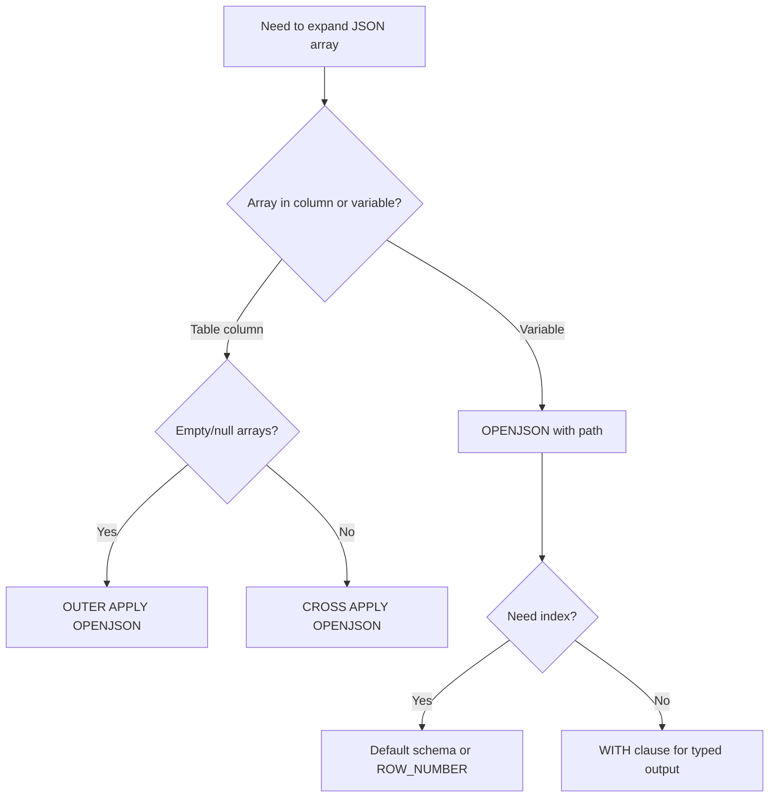

## Navigation

**Domain:** [[8 — Databases]] > **Group:** SQL JSON, XML & Semi-Structured Data
**Previous:** [[8.211 — OPENJSON with Schema — Typed Results]] | **Next:** [[8.213 — JSON Path Expressions — Dollar Notation]]

### Prerequisites

- [[8.203 — OPENJSON — Parsing JSON in T-SQL]] — OPENJSON is the foundation for array expansion; understanding its default schema (key = array index, value = element, type = JSON type code) is necessary to read array positions and element types.
- [[8.211 — OPENJSON with Schema — Typed Results]] — Expanding array elements with typed columns requires the WITH clause; the combination of OPENJSON with path on an array and WITH for extraction is the primary pattern.
- [[8.109 — APPLY — CROSS APPLY and OUTER APPLY]] — Array expansion from a parent row uses CROSS APPLY to invoke OPENJSON for each parent row, which is the same mechanism as applying a table-valued function per row.

### Where This Fits

JSON array expansion converts a JSON array stored in a column or variable into a relational rowset, one row per array element. Every .NET backend engineer encounters this when storing JSON arrays in database columns — order items embedded in an order JSON, sensor readings in a time-series JSON blob, or external API response arrays. The critical failure mode is treating the array as an opaque string and performing array processing in application code, which creates N+1 database round-trips and massive memory pressure on the application server. The interview signal is: does the candidate know that CROSS APPLY OPENJSON eliminates the N+1 client-side loop, and do they understand that the array index from OPENJSON default schema provides positional information that the WITH clause does not expose by default?

**When not to use OPENJSON array expansion:** If the JSON array is accessed frequently (100+ times/second), the parse overhead accumulates. Normalise into a relational table. If the array elements are simple scalars (e.g. tags, category IDs) consider STRING_SPLIT on a delimited string instead for simpler queries. If the array is primarily displayed as-is (no filtering or aggregation), return the JSON string directly to the application layer and deserialise there.

---

## Core Mental Model

OPENJSON on a JSON array is a row-expanding operation: a JSON array of N elements becomes a relational rowset of N rows. In the default schema (OPENJSON without WITH), each row exposes three columns: `key` (NVARCHAR — the array index as a string), `value` (NVARCHAR(MAX) — the element content), and `type` (INT — JSON type code: 0=null, 1=string, 2=number, 3=boolean, 4=object, 5=array). The `key` column provides the array index position, which is lost when using the WITH clause. To expand a nested array, use CROSS APPLY OPENJSON on the inner array path, which invokes OPENJSON for each outer row — the logical equivalent of a nested loop. This is the same mechanism as CROSS APPLY with any table-valued function: the inner OPENJSON executes once per outer row. The query optimiser estimates 100 rows per OPENJSON call, which affects join strategy decisions for large arrays. Array expansion is a pure in-memory operation — no logical reads are incurred for the JSON parse itself.

### Classification

OPENJSON array expansion is a **table-valued function in the FROM clause** invoked with a JSON path that targets an array. It is NOT SARGable — the JSON column cannot be indexed directly. The `key` column in default schema provides array index, which IS SARGable for positional filtering. CROSS APPLY OPENJSON for nested arrays is a Nested Loops join where the outer row count determines the number of inner OPENJSON invocations.

```mermaid
flowchart TD
    A[JSON array as NVARCHAR(MAX)] --> B[OPENJSON called with array path]
    B --> C[Parse JSON to token stream]
    C --> D[Identify array at path]
    D --> E[Iterate array elements 0..N-1]
    E --> F{For each element}
    F --> G{Schema type?}
    G -->|Default| H[Emit: key=index, value=element, type=jsonTypeCode]
    G -->|WITH clause| I[Project typed columns via JSON_VALUE/JSON_QUERY]
    H --> J[Append to output rowset]
    I --> J
    J --> K{More elements?}
    K -->|Yes| F
    K -->|No| L{CROSS APPLY?}
    L -->|Yes| M[Return rows to parent Nested Loops operator]
    L -->|No| N[Return completed rowset]
```

### Key Properties

|Property|Value|Notes|
|---|---|---|
|Expansion factor|1 element -> 1 row|N elements -> N rows|
|Default columns|key, value, type|key = array index string, type = JSON type code|
|Array index access|Via key column (default schema)|WHERE [key] = '0' for first element|
|Nested expansion|CROSS APPLY OPENJSON(innerPath)|Inner OPENJSON runs per outer row|
|Cardinality estimate|100 rows per OPENJSON|Always -- use join hints for large arrays|
|SARGable|No (JSON column)|key column is SARGable in default schema|
|Memory|In-memory parse, 0 logical reads|JSON already in buffer pool|
|Null handling|NULL/empty array -> 0 rows|Use OUTER APPLY to preserve parent|

---

## Deep Mechanics

### How the Engine Executes This

1. **Array detection:** OPENJSON is invoked with a JSON path that resolves to an array. The parser validates the target token type is array (JSON type code 5). If the path resolves to a non-array, OPENJSON returns a single row in default schema with key=0. If the path is missing in lax mode, returns empty rowset.

2. **Array iteration:** The engine iterates through array elements from index 0 to N-1. For each element, it reads the token type and content. In default schema, it emits three columns per element. In WITH schema, it projects element properties using JSON_VALUE/JSON_QUERY per column.

3. **Array index emission (default schema only):** The key column receives the zero-based index as a string. This is explicit in default schema but implicitly lost in WITH clause -- if you need the index in a typed result, use ROW_NUMBER().

4. **Nested expansion via CROSS APPLY:** When OPENJSON is used inside CROSS APPLY, the outer query provides the parent JSON string. The inner OPENJSON parses that parent-provided JSON string and expands its array. This creates a nested loops execution: for each outer row, parse the inner JSON array, expand to rows, and concatenate results.

5. **Execution plan:** OPENJSON appears as a Table-valued function operator. In CROSS APPLY, it appears as the inner input of a Nested Loops join -- APPLY is always implemented as Nested Loops; the optimiser cannot use Hash Match or Merge for APPLY.

### SQL Visibility

```sql
-- Default schema: expanding a JSON array with array index
DECLARE @json NVARCHAR(MAX) = N'[
    {"ProductId":1, "ProductName":"Widget", "Price":10.99},
    {"ProductId":2, "ProductName":"Gadget", "Price":24.99},
    {"ProductId":3, "ProductName":"Doohickey", "Price":5.99}
]';

SELECT [key] AS ArrayIndex, [value] AS ElementValue, [type] AS JsonType
FROM OPENJSON(@json);
-- ArrayIndex: "0", "1", "2"
-- ElementValue: full JSON object strings
-- JsonType: 4 (object) for each

-- WITH clause: extracting properties from array of objects
DECLARE @ordersJson NVARCHAR(MAX) = N'[
    {"OrderId":10248, "CustomerId":"ALFKI", "TotalAmount":345.67},
    {"OrderId":10249, "CustomerId":"ANATR", "TotalAmount":120.50},
    {"OrderId":10250, "CustomerId":"ANTON", "TotalAmount":789.00}
]';

SELECT OrderId, CustomerId, TotalAmount
FROM OPENJSON(@ordersJson)
WITH (
    OrderId     INT            '$.OrderId',
    CustomerId  NVARCHAR(10)   '$.CustomerId',
    TotalAmount DECIMAL(18,2)  '$.TotalAmount'
);

-- Explicit array index in WITH clause via ROW_NUMBER
SELECT
    ROW_NUMBER() OVER (ORDER BY (SELECT 0)) - 1 AS ArrayIndex,
    OrderId, CustomerId, TotalAmount
FROM OPENJSON(@ordersJson)
WITH (
    OrderId     INT            '$.OrderId',
    CustomerId  NVARCHAR(10)   '$.CustomerId',
    TotalAmount DECIMAL(18,2)  '$.TotalAmount'
);

-- Filter by array index (default schema)
SELECT [value]
FROM OPENJSON(@ordersJson)
WHERE [key] = '0';

-- Nested array expansion with CROSS APPLY
DECLARE @nestedJson NVARCHAR(MAX) = N'[
    {
        "OrderId": 10248, "CustomerId": "ALFKI",
        "Items": [
            {"ProductId": 1, "Quantity": 10, "UnitPrice": 20.0},
            {"ProductId": 2, "Quantity": 5, "UnitPrice": 30.0}
        ]
    },
    {
        "OrderId": 10249, "CustomerId": "ANATR",
        "Items": [
            {"ProductId": 3, "Quantity": 2, "UnitPrice": 50.0}
        ]
    }
]';

SELECT o.OrderId, o.CustomerId, i.ProductId, i.Quantity, i.UnitPrice
FROM OPENJSON(@nestedJson)
WITH (
    OrderId     INT            '$.OrderId',
    CustomerId  NVARCHAR(10)   '$.CustomerId',
    Items       NVARCHAR(MAX)  '$.Items' AS JSON
) AS o
CROSS APPLY OPENJSON(o.Items)
WITH (
    ProductId INT            '$.ProductId',
    Quantity  INT            '$.Quantity',
    UnitPrice DECIMAL(18,2)  '$.UnitPrice'
) AS i;

-- OPENJSON with WHERE on array elements
DECLARE @inventory NVARCHAR(MAX) = N'[
    {"Warehouse":"A", "Items":[
        {"Sku":"SKU-001", "Qty":100, "Status":"InStock"},
        {"Sku":"SKU-002", "Qty":0, "Status":"OutOfStock"}
    ]},
    {"Warehouse":"B", "Items":[
        {"Sku":"SKU-001", "Qty":50, "Status":"InStock"},
        {"Sku":"SKU-003", "Qty":200, "Status":"InStock"}
    ]}
]';

SELECT w.Warehouse, i.Sku, i.Qty, i.Status
FROM OPENJSON(@inventory)
WITH (
    Warehouse NVARCHAR(10)   '$.Warehouse',
    Items     NVARCHAR(MAX)  '$.Items' AS JSON
) AS w
CROSS APPLY OPENJSON(w.Items)
WITH (
    Sku    NVARCHAR(20)  '$.Sku',
    Qty    INT           '$.Qty',
    Status NVARCHAR(20)  '$.Status'
) AS i
WHERE i.Sku = 'SKU-001' AND i.Status = 'InStock';

-- JSON array with mixed types (default schema type codes)
DECLARE @mixedJson NVARCHAR(MAX) = N'["Hello", 42, true, null, {"key":"val"}, [1,2,3]]';
SELECT [key] AS ArrayIndex, [value], [type] AS JsonTypeCode
FROM OPENJSON(@mixedJson);

-- JSON array expansion from table column (most common pattern)
SELECT o.OrderId, o.OrderDate, i.ProductId, i.Quantity, i.UnitPrice
FROM dbo.Orders o
CROSS APPLY OPENJSON(o.OrderItemsJson)
WITH (
    ProductId INT            '$.ProductId',
    Quantity  INT            '$.Quantity',
    UnitPrice DECIMAL(18,2)  '$.UnitPrice'
) AS i
WHERE o.OrderDate >= '2024-01-01';

-- STRING_AGG from JSON array
DECLARE @tagsJson NVARCHAR(MAX) = N'["urgent", "high-priority", "international"]';
SELECT STRING_AGG([value], ', ') AS TagList, COUNT(*) AS TagCount
FROM OPENJSON(@tagsJson);

-- JSON array as TVP replacement for batch update
DECLARE @updatesJson NVARCHAR(MAX) = N'[
    {"OrderId":10248,"Status":"Shipped"},
    {"OrderId":10249,"Status":"Cancelled"}
]';

UPDATE o SET o.Status = u.Status
FROM dbo.Orders AS o
INNER JOIN OPENJSON(@updatesJson)
WITH (
    OrderId INT            '$.OrderId',
    Status  NVARCHAR(20)   '$.Status'
) AS u ON o.OrderId = u.OrderId;

-- Array of scalar values
DECLARE @intArray NVARCHAR(MAX) = N'[1, 2, 3, 4, 5]';
SELECT [value] AS ValueStr, CAST([value] AS INT) AS ValueInt
FROM OPENJSON(@intArray);

-- Multiple array paths in one JSON document
DECLARE @multiArrayJson NVARCHAR(MAX) = N'{
    "batch": "B-001",
    "customers": ["ALFKI", "ANATR", "ANTON"],
    "products": [{"id":1,"name":"Widget"},{"id":2,"name":"Gadget"}]
}';

SELECT m.BatchId, c.CustomerId, p.ProductId, p.ProductName
FROM OPENJSON(@multiArrayJson)
WITH (
    BatchId   NVARCHAR(10)   '$.batch',
    Customers NVARCHAR(MAX)  '$.customers' AS JSON,
    Products  NVARCHAR(MAX)  '$.products' AS JSON
) AS m
CROSS APPLY OPENJSON(m.Customers) WITH (CustomerId NVARCHAR(10) '$') AS c
CROSS APPLY OPENJSON(m.Products) WITH (ProductId INT '$.id', ProductName NVARCHAR(200) '$.name') AS p;

-- OPENJSON with explicit array path
DECLARE @pathJson NVARCHAR(MAX) = N'{"data":{"orders":[
    {"OrderId":10248,"TotalAmount":345.67},
    {"OrderId":10249,"TotalAmount":120.50}
]}}';
SELECT OrderId, TotalAmount
FROM OPENJSON(@pathJson, '$.data.orders')
WITH (
    OrderId     INT            '$.OrderId',
    TotalAmount DECIMAL(18,2)  '$.TotalAmount'
);
```

```csharp
// EF Core -- raw SQL for array expansion (no native LINQ)
public async Task<List<OrderItemDto>> GetExpandedOrderItemsAsync(
    DateTime startDate, CancellationToken cancellationToken = default)
{
    FormattableString sql = $@"
        SELECT o.OrderId, o.OrderDate,
               i.ProductId, i.Quantity, i.UnitPrice
        FROM dbo.Orders AS o
        CROSS APPLY OPENJSON(o.OrderItemsJson)
        WITH (
            ProductId INT            '$.ProductId',
            Quantity  INT            '$.Quantity',
            UnitPrice DECIMAL(18,2)  '$.UnitPrice'
        ) AS i
        WHERE o.OrderDate >= {startDate}";

    return await dbContext.Database
        .SqlQuery<OrderItemDto>(sql)
        .ToListAsync(cancellationToken);
}

// EF Core -- FromSql with parameter
public async Task<List<CustomerOrderSummary>> GetCustomerWithOrderItemsAsync(
    int customerId, CancellationToken cancellationToken = default)
{
    var parameter = new SqlParameter("@CustomerId", SqlDbType.Int) { Value = customerId };
    return await dbContext.Database
        .SqlQueryRaw<CustomerOrderSummary>(@"
            SELECT o.OrderId, o.OrderDate,
                   i.ProductId, i.ProductName, i.Quantity, i.UnitPrice
            FROM dbo.Orders AS o
            CROSS APPLY OPENJSON(o.OrderItemsJson)
            WITH (
                ProductId   INT            '$.ProductId',
                ProductName NVARCHAR(200)  '$.ProductName',
                Quantity    INT            '$.Quantity',
                UnitPrice   DECIMAL(18,2)  '$.UnitPrice'
            ) AS i
            WHERE o.CustomerId = @CustomerId", parameter)
        .ToListAsync(cancellationToken);
}
```

```csharp
// Dapper -- array expansion with CROSS APPLY
public async Task<IReadOnlyList<OrderItemDto>> GetExpandedOrderItemsAsync(
    DateTime startDate, CancellationToken cancellationToken = default)
{
    const string sql = @"
        SELECT o.OrderId, o.OrderDate,
               i.ProductId, i.Quantity, i.UnitPrice,
               (i.Quantity * i.UnitPrice) AS LineTotal
        FROM dbo.Orders AS o
        CROSS APPLY OPENJSON(o.OrderItemsJson)
        WITH (
            ProductId INT            '$.ProductId',
            Quantity  INT            '$.Quantity',
            UnitPrice DECIMAL(18,2)  '$.UnitPrice'
        ) AS i
        WHERE o.OrderDate >= @StartDate
        ORDER BY o.OrderId, i.ProductId;";

    await using var connection = _connectionFactory.Create();
    var results = await connection.QueryAsync<OrderItemDto>(
        new CommandDefinition(sql, new { StartDate = startDate },
            cancellationToken: cancellationToken));
    return results.AsList();
}

// Dapper -- batch update from JSON array
public async Task<int> BatchUpdateOrderStatusAsync(
    string updatesJson, CancellationToken cancellationToken = default)
{
    const string sql = @"
        UPDATE o SET o.Status = u.Status, o.ShippedDate = u.ShippedDate
        FROM dbo.Orders AS o
        INNER JOIN OPENJSON(@json)
        WITH (OrderId INT '$.OrderId', Status NVARCHAR(20) '$.Status',
              ShippedDate DATETIME2(0) '$.ShippedDate') AS u
        ON o.OrderId = u.OrderId;
        SELECT @@ROWCOUNT;";

    await using var connection = _connectionFactory.Create();
    return await connection.ExecuteScalarAsync<int>(
        new CommandDefinition(sql, new { json = updatesJson },
            cancellationToken: cancellationToken));
}
```

### Generated SQL (from EF Core)

```sql
exec sp_executesql N'
SELECT o.OrderId, o.OrderDate,
       i.ProductId, i.Quantity, i.UnitPrice
FROM dbo.Orders AS o
CROSS APPLY OPENJSON(o.OrderItemsJson)
WITH (
    ProductId INT            ''$.ProductId'',
    Quantity  INT            ''$.Quantity'',
    UnitPrice DECIMAL(18,2)  ''$.UnitPrice''
) AS i
WHERE o.OrderDate >= @p0
ORDER BY o.OrderId, i.ProductId',N'@p0 datetime2(0)',@p0='2024-01-01 00:00:00'
```

### Execution Plan Analysis

```
-- Simple array expansion
[Table-valued function: OPENJSON(@json)]
    Estimated Rows: 100  |  Actual Rows: N
    -> [SELECT]

-- CROSS APPLY OPENJSON from table column
[Clustered Index Scan: Orders]
    -> [Nested Loops] (APPLY always Nested Loops)
        [Table-valued function: OPENJSON(Orders.OrderItemsJson)]
            Estimated Rows: 100  |  Actual Rows: per-order array size
        -> [SELECT]

-- Nested CROSS APPLY (orders -> items -> sub-items)
[OPENJSON(@json)] -> [Nested Loops] -> [OPENJSON(outer.Items)]
    -> [Nested Loops] -> [OPENJSON(inner.*)]
```

Key plan observations:
- CROSS APPLY always shows Nested Loops -- no Hash/Merge APPLY possible
- 10,000 outer rows = 10,000 OPENJSON invocations
- Each invocation parses its own JSON string independently
- Estimated rows per OPENJSON is always 100

### Cost Visibility

```sql
SET STATISTICS IO ON;
SET STATISTICS TIME ON;

-- Expand array from table column (10,000 orders, avg 5 items each)
SELECT o.OrderId, i.ProductId, i.Quantity, i.UnitPrice
FROM dbo.Orders AS o
CROSS APPLY OPENJSON(o.OrderItemsJson)
WITH (ProductId INT '$.ProductId', Quantity INT '$.Quantity',
      UnitPrice DECIMAL(18,2) '$.UnitPrice') AS i
WHERE o.OrderDate >= '2024-01-01';

-- Expected:
-- Table 'Orders'. Scan count 1, logical reads 12450
-- No I/O for OPENJSON (in-memory)
-- CPU time: ~35ms, elapsed: ~85ms

-- Same data via normalised table:
SELECT o.OrderId, oi.ProductId, oi.Quantity, oi.UnitPrice
FROM dbo.Orders AS o INNER JOIN dbo.OrderItems AS oi ON o.OrderId = oi.OrderId
WHERE o.OrderDate >= '2024-01-01';

-- Expected:
-- Table 'Orders'. Scan count 1, logical reads 12450
-- Table 'OrderItems'. Scan count 1, logical reads 25000
-- CPU time: ~15ms, elapsed: ~30ms
-- JSON expansion is ~2-3x more CPU but avoids OrderItems storage/write cost
```

### Execution Plan Analysis

**Query with CROSS APPLY OPENJSON:**

```sql
SELECT o.OrderId, o.OrderDate, i.ProductId, i.Quantity
FROM dbo.Orders AS o
CROSS APPLY OPENJSON(o.OrderItemsJson)
WITH (ProductId INT '$.ProductId', Quantity INT '$.Quantity') AS i
WHERE o.OrderDate >= '2024-01-01';
```

**Actual execution plan (simplified XML):**

```xml
<ShowPlanXML>
  <RelOp NodeId="0" LogicalOp="Inner Join" PhysicalOp="Nested Loops">
    <OutputList>
      <ColumnReference Database="[TestDB]" Table="[Orders]" Column="OrderId"/>
      <ColumnReference Database="[TestDB]" Table="[Orders]" Column="OrderDate"/>
      <ColumnReference Column="ProductId"/>
      <ColumnReference Column="Quantity"/>
    </OutputList>
    <!-- Outer input: Clustered Index Scan on Orders.OrderDate >= '2024-01-01' -->
    <RelOp NodeId="1" PhysicalOp="Clustered Index Scan">
      <RunTimeInformation>
        <RunTimeCountersPerThread ActualRows="5000" ActualEndOfScans="1" ActualReads="12450"/>
      </RunTimeInformation>
    </RelOp>
    <!-- Inner input: OPENJSON table-valued function -->
    <RelOp NodeId="2" PhysicalOp="Table-valued function">
      <RunTimeInformation>
        <RunTimeCountersPerThread ActualRows="25000" ActualEndOfScans="5000"/>
      </RunTimeInformation>
      <!-- OPENJSON called 5000 times, totalling 25000 rows (5 items per order avg) -->
    </RelOp>
  </RelOp>
</ShowPlanXML>
```

**Key plan characteristics:**

| Property | Value | Implication |
|---|---|---|
| Physical operator | Nested Loops | APPLY always uses Nested Loops; no merge/hash join |
| Outer rows (estimated) | 5,000 | From index seek on OrderDate |
| Inner rows (estimated) | 100 | OPENJSON hard estimate (ignores actual array size) |
| Inner rows (actual) | 25,000 | 5,000 orders x 5 items average |
| OPENJSON invocations | 5,000 | One per outer row |
| Cardinality discrepancy | 100 est vs 25,000 actual | May cause undersized memory grants for downstream operators |

**What each operator does:**

1. **Clustered Index Scan (Orders):** Scans OrderDate >= '2024-01-01', filters rows, outputs OrderId, OrderDate, OrderItemsJson to the Nested Loops outer input. Estimated 5,000 rows.

2. **Nested Loops:** For each outer row (Order), passes OrderItemsJson to the inner OPENJSON invocation. The EstimatedRows for the inner side is 100 (OPENJSON's hard-coded cardinality estimate), but actual is ~5 per order average = 25,000 total.

3. **Table-valued function (OPENJSON):** Parses the JSON string from OrderItemsJson, tokenises it, navigates to the array root, and iterates elements 0 to N-1 projecting ProductId and Quantity via the WITH clause specification.

**What happens with large arrays (10K+ elements per row):**

The inner side estimate remains at 100 rows even when the actual array has 10,000 elements. If OPENJSON result feeds into a Hash Match or Sort operator downstream, the memory grant is sized for 100 rows and may spill to tempdb. Use `OPTION (QUERYTRACEON 7470)` or `USE HINT('DISABLE_ROW_GOAL')` to force the optimiser to use default cardinality estimates (100 rows) instead of row-goal estimation for the entire plan.

```sql
-- Disable row goal for OPENJSON estimates
SELECT o.OrderId, o.OrderDate, i.ProductId, i.Quantity
FROM dbo.Orders AS o
CROSS APPLY OPENJSON(o.OrderItemsJson)
WITH (ProductId INT '$.ProductId', Quantity INT '$.Quantity') AS i
WHERE o.OrderDate >= '2024-01-01'
OPTION (USE HINT('DISABLE_ROW_GOAL'));
```

### Failure Modes

1. **Missing array causes 0 rows:** If the JSON path does not resolve to an array, OPENJSON returns 0 rows. Use OUTER APPLY instead of CROSS APPLY to preserve parent rows.
2. **Empty array causes no child rows:** '[]' returns 0 rows -- same OUTER APPLY fix.
3. **Default schema on array returns object strings:** Without WITH clause, value column contains full JSON object strings, not parsed properties.
4. **Array index lost with WITH clause:** The key column is only available in default schema. Add ROW_NUMBER() explicitly.
5. **Array of scalars and WITH clause:** For scalar arrays, use WITH (Value INT '$') to extract the current element.

---

## Production Patterns and Implementation

### Primary SQL Implementation

```sql
CREATE TABLE dbo.SensorData (
    ReadingId   INT             NOT NULL IDENTITY(1,1),
    SensorId    INT             NOT NULL,
    RecordedAt  DATETIME2(0)    NOT NULL,
    Readings    NVARCHAR(MAX)   NOT NULL,
    CONSTRAINT PK_SensorData PRIMARY KEY CLUSTERED (ReadingId),
    CONSTRAINT CK_SensorData_Readings CHECK (ISJSON(Readings) = 1)
);
CREATE INDEX IX_SensorData_SensorId_RecordedAt
    ON dbo.SensorData (SensorId, RecordedAt) INCLUDE (Readings);

-- Pattern 1: Expand JSON array from table column
SELECT sd.SensorId, sd.RecordedAt, r.Measurement, r.Value, r.Unit
FROM dbo.SensorData AS sd
CROSS APPLY OPENJSON(sd.Readings)
WITH (Measurement NVARCHAR(50) '$.Measurement',
      Value DECIMAL(12,4) '$.Value', Unit NVARCHAR(10) '$.Unit') AS r
WHERE sd.SensorId = 101 AND sd.RecordedAt >= '2024-06-01'
ORDER BY sd.RecordedAt, r.Measurement;

-- Pattern 2: OUTER APPLY preserves parents with empty/null arrays
SELECT o.OrderId, o.CustomerId,
       COALESCE(i.ProductId, 0) AS ProductId,
       COALESCE(i.Quantity, 0) AS Quantity
FROM dbo.Orders AS o
OUTER APPLY OPENJSON(o.OrderItemsJson)
WITH (ProductId INT '$.ProductId', Quantity INT '$.Quantity') AS i
WHERE o.OrderDate >= '2024-01-01';

-- Pattern 3: Batch processing via JSON array parameter
CREATE OR ALTER PROCEDURE dbo.usp_ProcessSensorReadingsBatch
    @batchJson NVARCHAR(MAX)
AS
BEGIN
    SET NOCOUNT ON; SET XACT_ABORT ON;
    IF ISJSON(@batchJson) = 0 OR JSON_VALUE(@batchJson, '$[0]') IS NULL
        THROW 51000, 'Invalid JSON array', 1;
    BEGIN TRANSACTION;
    INSERT INTO dbo.SensorData (SensorId, RecordedAt, Readings)
    SELECT r.SensorId, r.RecordedAt, r.Readings
    FROM OPENJSON(@batchJson)
    WITH (SensorId INT '$.sensorId', RecordedAt DATETIME2(0) '$.recordedAt',
          Readings NVARCHAR(MAX) '$.readings' AS JSON) AS r;
    COMMIT TRANSACTION;
    SELECT @@ROWCOUNT AS RowsInserted;
END;

-- Pattern 4: Filter matching array elements
SELECT sd.SensorId, sd.RecordedAt, r.Value AS Temperature
FROM dbo.SensorData AS sd
CROSS APPLY OPENJSON(sd.Readings)
WITH (Measurement NVARCHAR(50) '$.Measurement', Value DECIMAL(12,4) '$.Value') AS r
WHERE r.Measurement = 'Temperature' AND r.Value > 30.0;

-- Pattern 5: FLATTEN then GROUP BY
SELECT sd.SensorId,
       DATEADD(hour, DATEDIFF(hour, 0, sd.RecordedAt), 0) AS HourBucket,
       AVG(r.Value) AS AvgTemperature
FROM dbo.SensorData AS sd
CROSS APPLY OPENJSON(sd.Readings)
WITH (Measurement NVARCHAR(50) '$.Measurement', Value DECIMAL(12,4) '$.Value') AS r
WHERE r.Measurement = 'Temperature' AND sd.RecordedAt >= '2024-06-01'
GROUP BY sd.SensorId, DATEADD(hour, DATEDIFF(hour, 0, sd.RecordedAt), 0);

-- Pattern 6: Expand then PIVOT
SELECT sd.SensorId, sd.RecordedAt,
       MAX(CASE WHEN r.Measurement = 'Temperature' THEN r.Value END) AS Temperature,
       MAX(CASE WHEN r.Measurement = 'Humidity' THEN r.Value END) AS Humidity
FROM dbo.SensorData AS sd
CROSS APPLY OPENJSON(sd.Readings)
WITH (Measurement NVARCHAR(50) '$.Measurement', Value DECIMAL(12,4) '$.Value') AS r
WHERE sd.SensorId = 101 AND sd.RecordedAt >= '2024-06-01'
GROUP BY sd.SensorId, sd.RecordedAt;

-- Pattern 7: Access Nth element
SELECT o.OrderId, FirstItem.ProductId, FirstItem.Quantity
FROM dbo.Orders AS o
CROSS APPLY (
    SELECT TOP 1 ProductId, Quantity
    FROM OPENJSON(o.OrderItemsJson)
    WITH (ProductId INT '$.ProductId', Quantity INT '$.Quantity')
) AS FirstItem
WHERE o.OrderDate >= '2024-01-01';

-- Pattern 8: JSON array as TVP replacement
CREATE OR ALTER PROCEDURE dbo.usp_UpdateOrderStatuses
    @statusUpdatesJson NVARCHAR(MAX)
AS
BEGIN
    SET NOCOUNT ON;
    UPDATE o SET o.Status = u.Status,
        o.ShippedDate = COALESCE(u.ShippedDate, o.ShippedDate)
    FROM dbo.Orders AS o
    INNER JOIN OPENJSON(@statusUpdatesJson)
    WITH (OrderId INT '$.OrderId', Status NVARCHAR(20) '$.Status',
          ShippedDate DATETIME2(0) '$.ShippedDate') AS u
    ON o.OrderId = u.OrderId;
    SELECT @@ROWCOUNT AS UpdatedCount;
END;
```

### EF Core Implementation

```csharp
public class SensorDataService
{
    private readonly ApplicationDbContext _dbContext;
    public SensorDataService(ApplicationDbContext dbContext) => _dbContext = dbContext;

    public async Task<List<SensorReadingDto>> GetExpandedReadingsAsync(
        int sensorId, DateTime from, DateTime to, CancellationToken ct = default)
    {
        return await _dbContext.Database
            .SqlQueryRaw<SensorReadingDto>(@"
                SELECT sd.SensorId, sd.RecordedAt,
                       r.Measurement, r.Value, r.Unit
                FROM dbo.SensorData AS sd
                CROSS APPLY OPENJSON(sd.Readings)
                WITH (Measurement NVARCHAR(50) '$.Measurement',
                      Value DECIMAL(12,4) '$.Value',
                      Unit NVARCHAR(10) '$.Unit') AS r
                WHERE sd.SensorId = @p0 AND sd.RecordedAt >= @p1 AND sd.RecordedAt < @p2
                ORDER BY sd.RecordedAt, r.Measurement",
                new SqlParameter("@p0", sensorId),
                new SqlParameter("@p1", from),
                new SqlParameter("@p2", to))
            .ToListAsync(ct);
    }

    public async Task<int> ProcessSensorBatchAsync(
        string batchJson, CancellationToken ct = default)
    {
        var p = new SqlParameter("@batchJson", SqlDbType.NVarChar, -1) { Value = batchJson };
        return await _dbContext.Database
            .ExecuteSqlRawAsync("EXEC dbo.usp_ProcessSensorReadingsBatch @batchJson", p)
            .ConfigureAwait(false);
    }
}
```

### Dapper Implementation

```csharp
public sealed class JsonArrayRepository
{
    private readonly IDbConnectionFactory _connectionFactory;
    public JsonArrayRepository(IDbConnectionFactory cf) => _connectionFactory = cf;

    public async Task<List<HourlySensorAggregate>> GetHourlyAveragesAsync(
        int sensorId, DateTime from, DateTime to, CancellationToken ct = default)
    {
        const string sql = @"
            SELECT sd.SensorId,
                   DATEADD(hour, DATEDIFF(hour, 0, sd.RecordedAt), 0) AS HourBucket,
                   AVG(r.Value) AS AvgTemperature, COUNT(*) AS ReadingCount
            FROM dbo.SensorData AS sd
            CROSS APPLY OPENJSON(sd.Readings)
            WITH (Measurement NVARCHAR(50) '$.Measurement',
                  Value DECIMAL(12,4) '$.Value') AS r
            WHERE r.Measurement = 'Temperature' AND sd.SensorId = @SensorId
              AND sd.RecordedAt >= @From AND sd.RecordedAt < @To
            GROUP BY sd.SensorId,
                DATEADD(hour, DATEDIFF(hour, 0, sd.RecordedAt), 0);";
        await using var conn = _connectionFactory.Create();
        return (await conn.QueryAsync<HourlySensorAggregate>(
            new CommandDefinition(sql,
                new { SensorId = sensorId, From = from, To = to },
                cancellationToken: ct))).AsList();
    }
}

public record SensorReadingDto(int SensorId, DateTime RecordedAt, string Measurement, decimal Value, string Unit);
public record HourlySensorAggregate(int SensorId, DateTime HourBucket, decimal? AvgTemperature, int ReadingCount);
```

### Configuration and Wiring

```csharp
builder.Services.AddDbContext<ApplicationDbContext>(options =>
    options.UseSqlServer(builder.Configuration.GetConnectionString("DefaultConnection"),
        sqlOptions => { sqlOptions.EnableRetryOnFailure(3); sqlOptions.CommandTimeout(60); }));
builder.Services.AddSingleton<IDbConnectionFactory, SqlConnectionFactory>();
builder.Services.AddScoped<SensorDataService>();
builder.Services.AddScoped<JsonArrayRepository>();
```

### EF Core — Bulk Update from JSON Array

```csharp
public class BulkOrderUpdater
{
    private readonly ApplicationDbContext _db;
    public BulkOrderUpdater(ApplicationDbContext db) => _db = db;

    public async Task<int> UpdateStatusFromJsonAsync(string json, CancellationToken ct)
    {
        var jsonParam = new SqlParameter("@json", SqlDbType.NVarChar, -1) { Value = json };
        var rowCount = new SqlParameter("@rc", SqlDbType.Int) { Direction = ParameterDirection.Output };
        await _db.Database.ExecuteSqlRawAsync(@"
            UPDATE o SET o.Status = u.Status
            FROM dbo.Orders AS o
            INNER JOIN OPENJSON(@json)
                WITH (OrderId INT '$.OrderId', Status NVARCHAR(20) '$.Status') AS u
                ON o.OrderId = u.OrderId;
            SET @rc = @@ROWCOUNT;",
            jsonParam, rowCount);
        return (int)rowCount.Value;
    }

    public async IAsyncEnumerable<OrderItemDto> StreamExpandedAsync(
        int sensorId, DateTime from, DateTime to, [EnumeratorCancellation] CancellationToken ct)
    {
        await using var conn = new SqlConnection(_db.Database.GetConnectionString());
        await conn.OpenAsync(ct);
        await using var cmd = new SqlCommand(@"
            SELECT sd.SensorId, sd.RecordedAt, r.Measurement, r.Value, r.Unit
            FROM dbo.SensorData AS sd
            CROSS APPLY OPENJSON(sd.Readings)
            WITH (Measurement NVARCHAR(50) '$.Measurement',
                  Value DECIMAL(12,4) '$.Value',
                  Unit NVARCHAR(10) '$.Unit') AS r
            WHERE sd.SensorId = @sid AND sd.RecordedAt >= @from AND sd.RecordedAt < @to
            ORDER BY sd.RecordedAt, r.Measurement", conn);
        cmd.Parameters.AddWithValue("@sid", sensorId);
        cmd.Parameters.AddWithValue("@from", from);
        cmd.Parameters.AddWithValue("@to", to);
        await using var reader = await cmd.ExecuteReaderAsync(ct);
        while (await reader.ReadAsync(ct))
            yield return new OrderItemDto(
                reader.GetInt32(0), reader.GetDateTime(1),
                reader.GetString(2), reader.GetDecimal(3), reader.GetString(4));
    }
}

public record OrderItemDto(int SensorId, DateTime RecordedAt, string Measurement, decimal Value, string Unit);
```

### Dapper — Multi-Mapping from JSON Array Expansion

```csharp
public class JsonMultiMapRepository
{
    private readonly IDbConnectionFactory _cf;
    public JsonMultiMapRepository(IDbConnectionFactory cf) => _cf = cf;

    public async Task<List<OrderWithItems>> GetOrdersWithItemsAsync(
        DateTime from, DateTime to, CancellationToken ct)
    {
        const string sql = @"
            SELECT o.OrderId, o.OrderDate, o.CustomerName,
                   i.ProductId, i.Quantity, i.UnitPrice
            FROM dbo.Orders AS o
            CROSS APPLY OPENJSON(o.ItemsJson)
            WITH (ProductId INT '$.ProductId',
                  Quantity INT '$.Quantity',
                  UnitPrice DECIMAL(18,2) '$.UnitPrice') AS i
            WHERE o.OrderDate >= @From AND o.OrderDate < @To
            ORDER BY o.OrderId, i.ProductId;";

        await using var conn = _cf.Create();
        var lookup = new Dictionary<int, OrderWithItems>();
        await conn.QueryAsync<OrderWithItems, ItemDetail, OrderWithItems>(
            new CommandDefinition(sql, new { From = from, To = to }, cancellationToken: ct),
            (order, item) =>
            {
                if (!lookup.TryGetValue(order.OrderId, out var existing))
                    lookup.Add(order.OrderId, existing = order);
                existing.Items.Add(item);
                return existing;
            },
            splitOn: "ProductId");
        return lookup.Values.ToList();
    }
}

public class OrderWithItems
{
    public int OrderId { get; set; }
    public DateTime OrderDate { get; set; }
    public string CustomerName { get; set; } = "";
    public List<ItemDetail> Items { get; set; } = new();
}

public class ItemDetail
{
    public int ProductId { get; set; }
    public int Quantity { get; set; }
    public decimal UnitPrice { get; set; }
}
```

### SQL Server vs PostgreSQL Differences

```sql
-- PostgreSQL: jsonb_array_elements expands array to rows
SELECT * FROM jsonb_array_elements('[{"ProductId":1,"Price":10.99}]'::jsonb);

-- PostgreSQL: WITH ORDINALITY provides array index
SELECT ordinality - 1 AS ArrayIndex, elem->>'ProductName'
FROM jsonb_array_elements('[{"ProductId":1}]'::jsonb) WITH ORDINALITY AS elem;

-- PostgreSQL: jsonb_to_recordset (equivalent to OPENJSON WITH)
SELECT * FROM jsonb_to_recordset('[{"ProductId":1,"Price":10.99}]'::jsonb)
AS x(ProductId INT, Price NUMERIC);

-- PostgreSQL: LATERAL for nested arrays
SELECT o.order_id, i.item->>'product_id'
FROM orders o, LATERAL jsonb_array_elements(o.items_json) AS i(item)
WHERE o.order_date >= '2024-01-01';
```

**Key differences:**

| Aspect | SQL Server | PostgreSQL |
|---|---|---|
| Function | OPENJSON | jsonb_array_elements / jsonb_to_recordset |
| Array index | key column (default schema) | WITH ORDINALITY |
| Schema flexibility | WITH clause per call | jsonb_to_recordset with type spec |
| CROSS APPLY equivalent | CROSS APPLY OPENJSON | LATERAL jsonb_array_elements |
| Performance | Single-threaded parse per call | Parallel jsonb per-element processing |
| Cardinality estimate | Hard-coded 100 rows | Statistical estimate from jsonb stats |

---

## Gotchas and Production Pitfalls

### 1. CROSS APPLY Eliminates Null or Empty Arrays

**Pitfall:** CROSS APPLY OPENJSON on NULL or empty array column eliminates parent rows.

```sql
-- Wrong: CROSS APPLY silently drops rows
SELECT o.OrderId, i.ProductId FROM dbo.Orders AS o
CROSS APPLY OPENJSON(o.OrderItemsJson) WITH (ProductId INT '$.ProductId') AS i;
```

**Symptom:** Missing rows in reports. Orders without items silently disappear.

**Fix:** Use OUTER APPLY to preserve parent rows.

```sql
SELECT o.OrderId, i.ProductId FROM dbo.Orders AS o
OUTER APPLY OPENJSON(o.OrderItemsJson) WITH (ProductId INT '$.ProductId') AS i;
```

**Cost:** Orders without items disappear from billing, shipping, and inventory.

### 2. Array Index Lost in WITH Clause

**Pitfall:** Default schema exposes `key` as array index; WITH clause loses it.

**Symptom:** Cannot determine element ordering. Image galleries show wrong primary image.

**Fix:** Add ROW_NUMBER() explicitly.

### 3. Type Code Confusion

**Pitfall:** `type` column returns INT codes (0-5), not string names.

**Fix:** Compare to integer: WHERE [type] = 1 (string), not WHERE [type] = 'string'.

### 4. Nested Array Without CROSS APPLY Returns JSON String

**Pitfall:** Declaring nested array with AS JSON returns a JSON string column, not rows.

**Fix:** Add CROSS APPLY OPENJSON to expand the nested array.

### 5. Performance with Large CROSS APPLY

**Pitfall:** Each outer row causes an independent OPENJSON parse. 10,000 rows = 10,000 parses.

**Symptom:** CPU-bound query. Similar logical reads to normalised table but 2-3x CPU.

**Fix:** Consider normalising if query volume is high, or use batch processing to reduce rows.

### 6. OPENJSON Is Not a Source of Row Goals

**Pitfall:** The optimiser estimates 100 rows from OPENJSON regardless of actual array size, which can produce suboptimal join strategies downstream.

```sql
-- Estimated: 100 rows from OPENJSON, actual: 50,000 elements
-- The downstream Table Spool may be undersized
SELECT o.OrderId, i.ProductId
FROM dbo.Orders AS o
CROSS APPLY OPENJSON(o.LineItemsJson)
WITH (ProductId INT '$.ProductId') AS i;
```

**Fix:** Use `OPTION (QUERYTRACEON 7470)` to disable row goal for OPENJSON estimates. For SQL Server 2019+, use `USE HINT('DISABLE_ROW_GOAL').

### 7. String Truncation in Value Column

**Pitfall:** Default schema's `value` column is NVARCHAR(MAX), but implicit conversions can truncate.

```sql
-- Wrong: value truncated to NVARCHAR(100) in temp table
SELECT [key], CAST([value] AS NVARCHAR(100)) AS [value], [type]
INTO #Temp
FROM OPENJSON(@json);
```

**Fix:** Keep NVARCHAR(MAX) for value column; cast only after confirming length.

### 8. Indexes Cannot Help OPENJSON Internally

**Pitfall:** No index (including JSON indexes on computed columns) can accelerate the OPENJSON parsing step itself.

**Explanation:** OPENJSON converts a JSON string into a token stream in memory. It does not use index seeks or scans. Indexes on outer tables help reduce the number of rows fed into CROSS APPLY, but each individual OPENJSON call always performs a full parse of the input string.

### 9. NULL Handling in WITH Clause Columns

**Pitfall:** JSON_VALUE used implicitly under WITH returns NULL for missing keys, which can silently mask data quality issues.

```sql
-- Missing 'Qty' key: returns NULL, not an error
SELECT o.OrderId, i.ProductId, i.Qty
FROM dbo.Orders AS o
CROSS APPLY OPENJSON(o.ItemsJson)
WITH (ProductId INT '$.ProductId', Qty INT '$.Qty') AS i;
```

**Fix:** Use ISJSON with JSON_MODIFY validation, add CHECK constraints, or validate in the application layer before persistence.

### 10. OPENJSON on NVARCHAR(MAX) vs NVARCHAR(4000)

**Pitfall:** OPENJSON's performance depends on input string length. NVARCHAR(MAX) strings stored out-of-row may require extra LOB retrieval.

**Symptom:** Queries on large documents (50K+ chars) show high wait time for ASYNC_NETWORK_IO and PAGEIOLATCH.

**Optimisation:**
- Keep JSON documents under 4000 characters to fit NVARCHAR(4000) storage
- Use columnstore indexes with NVARCHAR(MAX) data compression for archival
- Monitor `sys.dm_db_index_operational_stats` for LOB fragmentation

---

## Performance Implications

### Benchmark: CROSS APPLY OPENJSON vs Relational Join

```sql
SET STATISTICS TIME ON;
-- CROSS APPLY OPENJSON (10,000 orders, avg 5 items each)
SELECT o.OrderId, i.ProductId, i.Quantity
FROM dbo.Orders AS o
CROSS APPLY OPENJSON(o.OrderItemsJson)
WITH (ProductId INT '$.ProductId', Quantity INT '$.Quantity') AS i
WHERE o.OrderDate >= '2024-01-01';
-- CPU: ~35ms, Elapsed: ~85ms

-- Relational join
SELECT o.OrderId, oi.ProductId, oi.Quantity
FROM dbo.Orders AS o INNER JOIN dbo.OrderItems AS oi ON o.OrderId = oi.OrderId
WHERE o.OrderDate >= '2024-01-01';
-- CPU: ~15ms, Elapsed: ~30ms
```

### BenchmarkDotNet

```csharp
[MemoryDiagnoser]
[SimpleJob(RuntimeMoniker.Net90)]
public class JsonArrayBenchmark
{
    private IDbConnection _connection = default!;

    [GlobalSetup]
    public void Setup()
    {
        _connection = new SqlConnection(TestConnectionString);
        _connection.Open();
    }

    [Benchmark(Baseline = true)]
    public async Task<List<dynamic>> DefaultSchema_100()
    {
        var json = "[" + string.Join(",", Enumerable.Range(1, 100).Select(i =>
            $"{{\"Id\":{i},\"Name\":\"Item{i}\",\"Price\":{i*10.0m:F2}}}")) + "]";
        var r = await _connection.QueryAsync(
            "SELECT [key], [value], [type] FROM OPENJSON(@json)", new { json });
        return r.AsList();
    }

    [Benchmark]
    public async Task<List<ItemDto>> WithSchema_100()
    {
        var json = "[" + string.Join(",", Enumerable.Range(1, 100).Select(i =>
            $"{{\"Id\":{i},\"Name\":\"Item{i}\",\"Price\":{i*10.0m:F2}}}")) + "]";
        const string sql = @"
            SELECT Id, Name, Price
            FROM OPENJSON(@json)
            WITH (Id INT '$.Id', Name NVARCHAR(100) '$.Name',
                  Price DECIMAL(18,2) '$.Price')";
        var r = await _connection.QueryAsync<ItemDto>(sql, new { json });
        return r.AsList();
    }
}

public record ItemDto(int Id, string Name, decimal Price);
```

**Expected results:**

|Method|Mean|Allocated|
|---|---|---|
|DefaultSchema_100|~2 ms|~25 KB|
|WithSchema_100|~0.8 ms|~8 KB|

### Scalability Characteristics

**Array size vs parse time (single OPENJSON call):**

```
Array Size  | Parse Time (CPU) | Memory Allocated
------------|------------------|------------------
10          | ~0.02 ms         | ~0.5 KB
100         | ~0.15 ms         | ~4 KB
1,000       | ~1.4 ms          | ~40 KB
10,000      | ~14 ms           | ~400 KB
100,000     | ~140 ms          | ~4 MB
```

**CROSS APPLY scaling (10,000 outer rows):**

```
Items per Order | Parse Time (CPU) | Total Time
----------------|------------------|------------
1               | ~3 ms            | ~15 ms
5               | ~15 ms           | ~35 ms
10              | ~30 ms           | ~60 ms
50              | ~150 ms          | ~200 ms
```

### Wait Statistics Analysis

**Key waits when expanding JSON arrays:**

| Wait Type | Cause | Mitigation |
|---|---|---|
| SOS_SCHEDULER_YIELD | High CPU from OPENJSON parsing | Reduce outer row count; batch process |
| PAGEIOLATCH_* | Large JSON strings stored in LOB pages | Keep JSON < 8 KB; use page compression |
| CXPACKET | Parallel scan of outer table feeding CROSS APPLY | Adjust MAXDOP if needed |
| ASYNC_NETWORK_IO | Client consuming large result sets | Use pagination in application layer |

### SET STATISTICS IO Comparison

```sql
-- CROSS APPLY OPENJSON
SET STATISTICS IO ON;
SELECT o.OrderId, i.ProductId, i.Quantity
FROM dbo.Orders AS o
CROSS APPLY OPENJSON(o.ItemsJson)
WITH (ProductId INT '$.ProductId', Quantity INT '$.Quantity') AS i
WHERE o.OrderId = 12345;
-- Table 'Orders'. Scan count 1, logical reads 3
-- Table 'Worktable'. Scan count 0, logical reads 0

-- Same data with normalised table
SELECT o.OrderId, oi.ProductId, oi.Quantity
FROM dbo.Orders AS o
INNER JOIN dbo.OrderItems AS oi ON o.OrderId = oi.OrderId
WHERE o.OrderId = 12345;
-- Table 'Orders'. Scan count 1, logical reads 3
-- Table 'OrderItems'. Scan count 0, logical reads 0
```

Note: OPENJSON itself generates zero logical reads (in-memory parse). The logical reads in both cases come from the base table (Orders) only. The CPU cost is the differentiating factor, not I/O.

---

## Interview Arsenal

### Question Bank

1. How does OPENJSON expand a JSON array into relational rows?
2. What columns does the default schema return and what does each represent?
3. How do you access the array index when using the WITH clause?
4. What is the difference between CROSS APPLY and OUTER APPLY with OPENJSON?
5. Compare JSON array expansion vs a normalised table.
6. How does CROSS APPLY OPENJSON appear in an execution plan?
7. How does OPENJSON scale for arrays of 10, 1000, and 100,000 elements?
8. How do EF Core and Dapper handle JSON array expansion?

### Spoken Answers

**Q: How does OPENJSON expand a JSON array into relational rows?**

> **Average answer:** OPENJSON takes a JSON array and converts each element into a row. You can use the WITH clause to specify columns.

> **Great answer:** OPENJSON is a table-valued function that reads a JSON array from an NVARCHAR(MAX) variable or column and iterates through its elements from index 0 to N-1. For each element, it produces one output row. In default schema, each row exposes three columns: `key` (the array index), `value` (the element content), and `type` (an integer code for the JSON type). In the WITH clause, the engine uses JSON_VALUE and JSON_QUERY internally to project element properties as typed columns. The critical detail is that the engine parses the JSON once and materialises all columns from the token stream. The cardinality estimate is locked at 100 rows regardless of actual array size. OPENJSON is an in-memory operation with zero logical reads.

**Q: What is the difference between CROSS APPLY and OUTER APPLY with OPENJSON?**

> **Average answer:** CROSS APPLY only returns rows where OPENJSON has results. OUTER APPLY returns all parent rows.

> **Great answer:** CROSS APPLY is semantically an INNER JOIN -- it eliminates left rows where OPENJSON returns zero rows (NULL column, empty array). OUTER APPLY is semantically a LEFT JOIN -- it preserves all left rows and NULL-extends OPENJSON columns. In the execution plan, both appear as Nested Loops -- APPLY cannot use Hash Match or Merge Join. The choice depends on whether the JSON array is mandatory or optional. Use CROSS APPLY when every row must have array data, OUTER APPLY when the array is optional.

### Comparison Table

| | JSON Array (OPENJSON) | Normalised Table |
|---|---|---|
| Storage | Single NVARCHAR(MAX) | Separate table with FK |
| Query perf | 2-3x slower (parse) | Optimal (indexed) |
| Write complexity | Single column update | Multi-table transaction |
| Schema flexibility | No ALTER TABLE needed | ALTER TABLE required |
| Indexing | Limited (computed cols) | Full index support |
| Atomicity | Single row update | Two-phase (order + items) |
| Concurrency | Lower lock contention | Higher (two tables) |
| Data integrity | CHECK(ISJSON) only | FK + PK constraints |

### Expansion-Specific Q&A

**Q: How do you pass a JSON array as a parameter to a stored procedure and expand it for multiple UPDATE calls?**

```sql
CREATE TYPE dbo.OrderStatusUpdate AS TABLE (OrderId INT, Status NVARCHAR(20));
-- vs JSON approach
CREATE OR ALTER PROCEDURE dbo.usp_BulkUpdateStatusJson
    @updates NVARCHAR(MAX)
AS
BEGIN
    SET NOCOUNT ON; SET XACT_ABORT ON;
    IF ISJSON(@updates) = 0 THROW 51000, 'Invalid JSON', 1;
    UPDATE o SET Status = u.Status, ModifiedDate = SYSDATETIME()
    FROM dbo.Orders AS o
    INNER JOIN OPENJSON(@updates)
    WITH (OrderId INT '$.OrderId', Status NVARCHAR(20) '$.Status') AS u
    ON o.OrderId = u.OrderId;
END;
```

**Benefits over TVP:** No type creation needed, schema changes require no ALTER TYPE, works across linked servers and Service Broker.

**Tradeoffs:** No referential validation at parse time, weaker compile-time type safety, slightly higher CPU for JSON validation + parse.

**Q: How do you handle pagination across expanded JSON array results?**

```sql
-- Page 3 of expanded array items (items 21-30)
WITH Expanded AS (
    SELECT o.OrderId, i.ProductId, i.Quantity,
           ROW_NUMBER() OVER (ORDER BY o.OrderId, i.ProductId) AS Rn
    FROM dbo.Orders AS o
    CROSS APPLY OPENJSON(o.ItemsJson)
    WITH (ProductId INT '$.ProductId', Quantity INT '$.Quantity') AS i
)
SELECT OrderId, ProductId, Quantity
FROM Expanded
WHERE Rn > 20 AND Rn <= 30
ORDER BY OrderId, ProductId;
```

**Q: How do you update specific elements within an array column using OPENJSON?**

```sql
-- Update temperature reading for sensor 101
DECLARE @updatedJson NVARCHAR(MAX);
WITH SensorDataCTE AS (
    SELECT sd.ReadingId, sd.Readings
    FROM dbo.SensorData AS sd WHERE sd.ReadingId = 1001
)
SELECT @updatedJson = (
    SELECT CASE WHEN r.Measurement = 'Temperature'
                THEN JSON_MODIFY(r.Element, '$.Value', CAST(@newTemp AS DECIMAL(12,4)))
                ELSE r.Element END AS Element
    FROM SensorDataCTE AS sd
    CROSS APPLY OPENJSON(sd.Readings) AS r
    FOR JSON PATH
);
UPDATE dbo.SensorData SET Readings = @updatedJson WHERE ReadingId = 1001;
```

---

## Decision Framework



### Application Checklist

- [ ] Array location identified
- [ ] NULL/empty handling correct (CROSS vs OUTER APPLY)
- [ ] Array index addressed if needed
- [ ] Typed columns in WITH clause
- [ ] Cardinality estimate considered for large arrays

### Scale Thresholds

- "Relevant when ANY JSON array needs relational processing"
- "Performance gap vs normalised table measurable at ~100K expansions"
- "CROSS APPLY with 10K+ outer rows may need batching"
- "Array size > 10K elements per row: consider segmentation into multiple JSON columns or normalisation"
- "Write-heavy workloads (>100 updates/sec on JSON columns): prefer normalised tables to minimise parse cost"
- "Read-heavy workloads with stable schema: computed columns + filtered indexes reduce parse cost by 90%"

### Decision Matrix

| Scenario | Recommended Approach | Rationale |
|---|---|---|
| Ad-hoc analytics on JSON arrays | OPENJSON with WITH clause | Schema flexibility, no DDL changes |
| High-throughput OLTP (1000+ req/s) | Normalised table | Lower CPU per query, index seek support |
| IoT sensor readings (append-only) | OPENJSON with batch CROSS APPLY | Write velocity handled; read path normalisable via views |
| ETL variable-length payload | OPENJSON array parameter | Avoids TVP type creation; works across linked servers |
| Microservice integration | OPENJSON with OUTER APPLY | Handles optional arrays gracefully |
| Mobile app sync (JSON blobs) | OPENJSON with full-text search | Flexible schema; FTS on value column |

---

## Self-Check

### Conceptual Questions

1. What does OPENJSON do when given a JSON array?
2. How does the engine execute array expansion step by step?
3. Which SET STATISTICS output shows OPENJSON parsing cost?
4. What happens when you use CROSS APPLY on a NULL JSON column?
5. Can EF Core LINQ generate OPENJSON array expansion natively?
6. How would you expand a JSON array to rows using Dapper?
7. Compare storing order items as JSON array vs normalised table.
8. At what array size does the 100-row cardinality estimate matter?
9. What index can make JSON array queries faster?
10. Explain CROSS APPLY vs OUTER APPLY with OPENJSON in 60 seconds.

<details>
<summary>Answers</summary>

1. OPENJSON iterates array elements (index 0 to N-1) and emits one row per element.

2. The engine (1) tokenises JSON, (2) navigates to array path, (3) iterates elements, (4) reads key/value/type per element, (5) materialises typed cols via WITH, (6) emits rows.

3. CPU time from SET STATISTICS TIME ON. OPENJSON has zero logical reads.

4. CROSS APPLY on NULL column -> parent row disappears. OUTER APPLY preserves it with NULLs.

5. No. EF Core requires FromSql/SqlQueryRaw with raw SQL.

6. connection.QueryAsync<T>(sql, new { json = jsonStr }) with OPENJSON WITH clause.

7. JSON array: 2-3x slower queries but simpler writes. Normalised: optimal queries, higher write complexity.

8. When actual array > ~1000 rows and OPENJSON is joined to another table.

9. Computed column with JSON_VALUE + index on that column.

10. CROSS APPLY = INNER JOIN (drops unmatched rows). OUTER APPLY = LEFT JOIN (preserves all). Both use Nested Loops. Choose based on whether the JSON array is mandatory.

</details>

### Query Challenges

**Challenge 1 -- Write the SQL**

A JSON array contains sensor readings with measurements sub-array. Write a query that flattens this into one row per measurement.

<details>
<summary>Solution</summary>

```sql
SELECT r.SensorId, r.Timestamp, m.Type, m.Value, m.Unit
FROM OPENJSON(@json)
WITH (SensorId INT '$.sensorId', Timestamp DATETIME2(0) '$.timestamp',
      Measurements NVARCHAR(MAX) '$.measurements' AS JSON) AS r
CROSS APPLY OPENJSON(r.Measurements)
WITH (Type NVARCHAR(50) '$.type', Value DECIMAL(12,4) '$.value',
      Unit NVARCHAR(10) '$.unit') AS m;
```

</details>

**Challenge 2 -- Fix the performance problem**

```sql
-- This runs in 8 seconds on 10,000 orders
SELECT o.OrderId, o.OrderDate, i.ProductId, i.Quantity
FROM dbo.Orders AS o
CROSS APPLY OPENJSON(o.OrderItemsJson)
WITH (ProductId INT '$.ProductId', Quantity INT '$.Quantity') AS i;
-- Logical reads: 450,000
```

<details><summary>Solution</summary>

**Root cause:** OPENJSON parses each order's JSON independently (10,000 parses).

**Fix:** Normalise OrderItems into a table for high-volume queries. If JSON must stay, batch process with TOP N to limit per-call parse volume.

</details>

---

**Challenge 3 -- Explain the execution plan**

```sql
SELECT o.OrderId, o.OrderDate, i.ProductId, i.Quantity, i.UnitPrice
FROM dbo.Orders AS o
CROSS APPLY OPENJSON(o.OrderItemsJson)
WITH (ProductId INT '$.ProductId', Quantity INT '$.Quantity',
      UnitPrice DECIMAL(18,2) '$.UnitPrice') AS i
WHERE o.OrderDate >= '2024-01-01'
ORDER BY o.OrderId, i.ProductId;
```

The execution plan shows a Clustered Index Scan on Orders (12,450 logical reads) followed by a Nested Loops operator with a Table-valued function (OPENJSON) as the inner input. Why does the optimiser choose Nested Loops instead of a Hash Match? What would change if the Orders table had 10M rows?

<details> <summary>Solution</summary>

**Why Nested Loops:** CROSS APPLY is always implemented as Nested Loops in SQL Server. There is no Hash Match or Merge Join variant for the APPLY operator. The optimiser has no choice — APPLY semantics require per-row invocation of the right-side table-valued function, which maps directly to Nested Loops execution.

**With 10M rows:** The same plan shape applies, but the cost changes dramatically. With 10M orders averaging 5 items each, the engine performs 10M OPENJSON parses, each tokenising and navigating a JSON string of ~200 bytes. At ~1-2 microseconds per parse, this adds 10-20 seconds of CPU time. The logical reads remain at the scan level (~12,450 for the clustered index) but the CPU becomes the bottleneck.

**Optimisation strategies for large tables:**
1. Add a WHERE clause to reduce outer row count before the APPLY
2. Use filtered indexes on OrderItemsJson (e.g., WHERE OrderItemsJson IS NOT NULL)
3. Normalise into a relational OrderItems table for high-volume access paths
4. Use batch processing with TOP and pagination to limit per-query parse volume

</details>

---

**Challenge 4 -- Diagnose the blocking problem**

A stored procedure uses CROSS APPLY OPENJSON to update order statuses from a JSON array parameter. During peak hours (200 orders/second), the procedure deadlocks with concurrent reads from the Orders table. The procedure runs within a single transaction, updates 5000 orders at a time, and the JSON array has 5000 elements. The deadlock graph shows the procedure holding an X lock on a range of OrderId values while a SELECT query holds a RangeS-S lock on the same range.

<details> <summary>Solution</summary>

**Root cause:** The single-transaction UPDATE from JSON array acquires U locks on each matching OrderId during the join phase, then escalates to X locks during the update phase. Concurrent SELECT queries (at default READ COMMITTED isolation) acquire S locks on pages being scanned. When the UPDATE range overlaps with the SELECT scan range, a lock conversion deadlock occurs.

**Detection query:**

```sql
SELECT
    request_session_id AS SPID,
    resource_type,
    resource_description,
    request_mode,
    request_status
FROM sys.dm_tran_locks
WHERE resource_database_id = DB_ID()
  AND request_session_id IN (
      SELECT blocking_session_id FROM sys.dm_exec_requests WHERE blocking_session_id > 0
  );
```

**Fix:**

```sql
-- Option 1: Batch into smaller transactions (500 per batch)
DECLARE @batchSize INT = 500;
DECLARE @offset INT = 0;

WHILE @offset < (SELECT COUNT(*) FROM OPENJSON(@json) WITH (Id INT '$.OrderId'))
BEGIN
    BEGIN TRANSACTION;
    UPDATE o SET o.Status = u.Status
    FROM dbo.Orders AS o
    INNER JOIN (
        SELECT OrderId, Status,
               ROW_NUMBER() OVER (ORDER BY (SELECT 0)) AS Rn
        FROM OPENJSON(@json)
        WITH (OrderId INT '$.OrderId', Status NVARCHAR(20) '$.Status')
    ) AS u ON o.OrderId = u.OrderId
    WHERE u.Rn > @offset AND u.Rn <= @offset + @batchSize;
    COMMIT TRANSACTION;
    SET @offset = @offset + @batchSize;
END;

-- Option 2: Use READ COMMITTED SNAPSHOT ISOLATION
ALTER DATABASE Current SET READ_COMMITTED_SNAPSHOT ON;

-- Option 3: Use TABLOCK on the target table for bulk operations
UPDATE o SET o.Status = u.Status
FROM dbo.Orders AS o WITH (TABLOCK)
INNER JOIN OPENJSON(@json) WITH (...) AS u ON o.OrderId = u.OrderId;
```

**In .NET:**

```csharp
public async Task BatchUpdateStatusAsync(string json, CancellationToken ct)
{
    var retryPolicy = new SqlRetryPolicy(3, TimeSpan.FromSeconds(1));
    await retryPolicy.ExecuteAsync(async () =>
    {
        await using var conn = new SqlConnection(connectionString);
        await conn.OpenAsync(ct);
        // Execute batch update with smaller batches and individual transactions
    });
}
```

</details>

---

**Challenge 5 -- Design the indexing strategy**

**Scenario:** An IoT platform stores sensor readings in a table with a JSON column. The table has 50M rows, growing at 1M rows/day. The JSON column contains: `{"sensorId": 101, "temp": 22.5, "humidity": 45, "timestamp": "2024-06-15T14:30:00", "location": {"lat": 52.52, "lng": 13.40}}`. The most common queries filter by sensorId and a timestamp range, and occasionally filter by temperature threshold. The JSON column is 200 bytes per row. Design the optimal indexing strategy including computed columns.

<details> <summary>Solution</summary>

```sql
-- Step 1: Add computed columns for frequently filtered JSON fields
ALTER TABLE dbo.SensorReadings ADD
    SensorIdComputed AS CAST(JSON_VALUE(JsonData, '$.sensorId') AS INT),
    ReadingTimeComputed AS CAST(JSON_VALUE(JsonData, '$.timestamp') AS DATETIME2(0)),
    TemperatureComputed AS CAST(JSON_VALUE(JsonData, '$.temp') AS DECIMAL(9,4));

-- Step 2: Create covering indexes
-- Primary access pattern: by sensor + time range
CREATE INDEX IX_SensorReadings_SensorTime
    ON dbo.SensorReadings(SensorIdComputed, ReadingTimeComputed)
    INCLUDE (JsonData, TemperatureComputed)
    WHERE SensorIdComputed IS NOT NULL
      AND ReadingTimeComputed IS NOT NULL;

-- Secondary access pattern: temperature alerts
CREATE INDEX IX_SensorReadings_Temperature
    ON dbo.SensorReadings(TemperatureComputed)
    INCLUDE (JsonData, SensorIdComputed, ReadingTimeComputed)
    WHERE TemperatureComputed IS NOT NULL;

-- Step 3: Enable page compression for the JSON-heavy table
ALTER TABLE dbo.SensorReadings REBUILD WITH (DATA_COMPRESSION = PAGE);

-- Step 4: Partition by date for sliding-window maintenance
CREATE PARTITION FUNCTION PF_SensorDate (DATETIME2(0))
AS RANGE RIGHT FOR VALUES ('2024-01-01', '2024-02-01', '2024-03-01', ...);

-- SARGable queries:
SELECT SensorIdComputed, ReadingTimeComputed, TemperatureComputed
FROM dbo.SensorReadings
WHERE SensorIdComputed = 101
  AND ReadingTimeComputed >= '2024-06-01'
  AND ReadingTimeComputed < '2024-06-02'
ORDER BY ReadingTimeComputed;

SELECT SensorIdComputed, ReadingTimeComputed, TemperatureComputed
FROM dbo.SensorReadings
WHERE TemperatureComputed > 30.0
  AND ReadingTimeComputed >= '2024-06-01';
```

**Tradeoffs:**
- Computed columns add write CPU cost (JSON_VALUE evaluated on INSERT/UPDATE)
- Covering indexes add write I/O (3 indexes on a 50M row table = significant write amplification)
- Page compression adds CPU on write but reduces storage by ~50%
- Partitioning adds complexity but enables fast sliding-window truncation

**Expected improvements:**
- Full table scan (no computed columns): 6M logical reads, 45-second query
- Index seek (with computed columns): 15-30 logical reads, < 10ms query
- Storage: ~25 GB uncompressed -> ~12 GB with page compression

</details>
