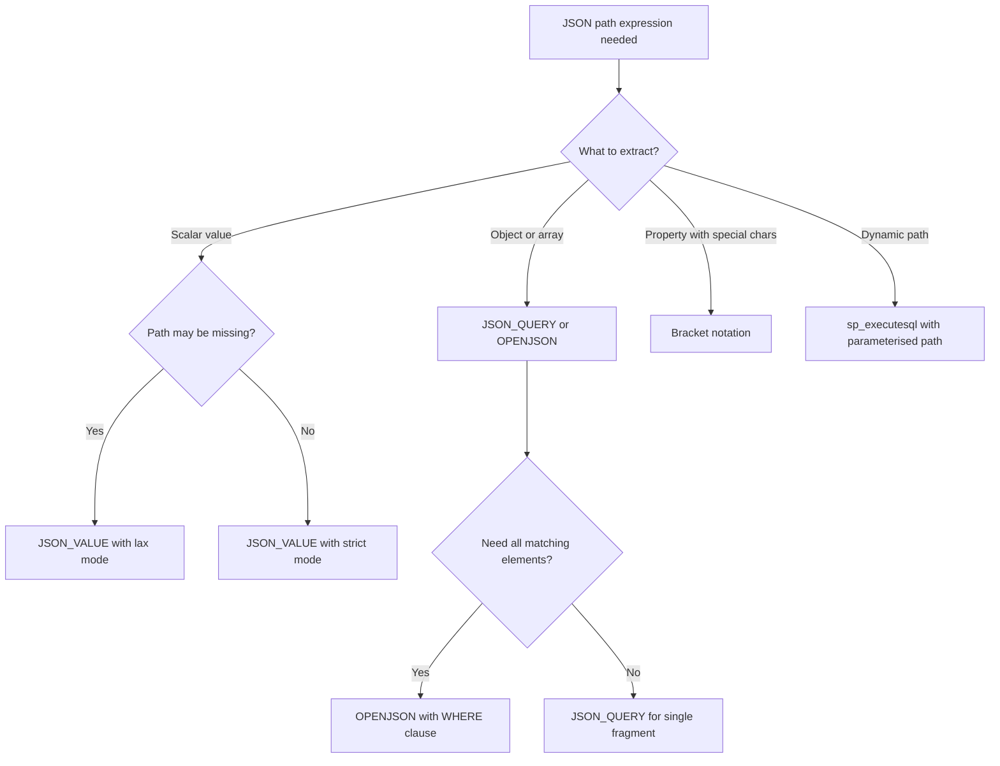

## Navigation

**Domain:** [[8 — Databases]] > **Group:** SQL JSON, XML & Semi-Structured Data
**Previous:** [[8.212 — JSON Arrays — Expanding with OPENJSON]] | **Next:** [[8.214 — Nested JSON — Parsing Multi-Level]]

### Prerequisites

> **Time to mastery:** 90 minutes. Focus on the lax/strict mode distinction and JSON_VALUE vs JSON_QUERY — these are the highest-frequency interview topics and production mistakes.

- [[8.203 — OPENJSON — Parsing JSON in T-SQL]] — OPENJSON uses JSON path expressions in its second argument and WITH clause column paths; understanding how the path navigates the JSON tree is prerequisite to using OPENJSON effectively.
- [[8.204 — JSON_VALUE — Extracting Scalar Values]] — JSON_VALUE uses JSON path as its second argument to locate a scalar value; understanding its strict/lax mode behaviour and type coercion is necessary because JSON path expressions share the same strict/lax semantics across all JSON functions.
- [[8.205 — JSON_QUERY — Extracting JSON Fragments]] — JSON_QUERY extracts JSON objects and arrays using the same path syntax; the distinction between JSON_VALUE (scalar) and JSON_QUERY (object/array) at the same path is a common source of NULL returns and confusion.

### Where This Fits

JSON path expressions (dollar notation) are the navigation language for all JSON functions in SQL Server — JSON_VALUE, JSON_QUERY, JSON_MODIFY, OPENJSON, and ISJSON. Every .NET backend engineer who stores or queries JSON in SQL Server uses these paths to drill into nested JSON documents. The critical failure mode is the lax vs strict mode distinction: lax mode (the default) returns NULL on missing paths without error, which silently produces missing data in reports; strict mode throws an error, making the problem visible. The interview signal is: does the candidate understand that `$.property` is a path expression, not a column reference, and that `$[0]` and `$.array[*]` have different semantics for array access? Interviewers probe whether candidates know the escape syntax for paths with special characters, the filter expression syntax `$.orders[?(@.status == 'active')]`, and the performance implications of path depth and wildcard usage.

---

## Core Mental Model

JSON path expressions in SQL Server follow a subset of the SQL/JSON path language (ISO/IEC TR 19075-6) with SQL Server-specific extensions. The path always begins with `$` representing the root of the JSON document. From the root, dot-notation (`$.property`) navigates into object properties, bracket notation (`$[0]`) accesses array elements by index, and bracket-wildcard (`$[*]`) iterates all array elements. The wildcard for object properties (`$.*`) accesses all property values of an object. Filter expressions (`$.orders[?(@.status == 'active')]`) apply predicates to array elements. SQL Server supports two path modes: lax (default) returns NULL for missing paths or type mismatches without error; strict throws error 13607 when a path component is missing or the value type does not match the accessor. The path is used as the second argument to JSON_VALUE, JSON_QUERY, JSON_MODIFY, and OPENJSON. Path expressions are parsed at query compile time and the navigation is performed during execution against the in-memory JSON token stream.

### Classification

JSON path expressions are a **navigation language** parsed by the query processor as part of JSON function arguments. They are NOT SARGable — a JSON path inside JSON_VALUE cannot use an index unless the JSON_VALUE is on a computed column that is indexed. Path length (number of navigation steps) affects parse performance linearly — a path with 5 levels takes approximately 5x the navigation work of a 1-level path. Wildcard paths (`$[*]`) force enumeration of all array elements, which is O(N) in array size. Filter expressions (`[?(@.property == value)]`) are applied after path navigation and do not prune array elements before evaluation — they iterate the entire array.

```mermaid
flowchart TD
    A[JSON path expression string] --> B[Parsed at compile time]
    B --> C[Tokenised into path steps]
    C --> D{Step type?}
    D -->|Dot notation| E[Object property lookup: $.prop]
    D -->|Bracket index| F[Array element by index: $[0]]
    D -->|Bracket wildcard| G[Array/object iteration: $[*] or $.*]
    D -->|Filter expression| H[Array filter: $[?(@.prop == val)]]
    D -->|Escaped bracket| I[Property with special chars: $['prop with space']]
    E --> J{Lax or strict mode?}
    F --> J
    G --> J
    H --> J
    I --> J
    J -->|Lax default| K[Return NULL for missing/mismatch, no error]
    J -->|Strict| L[Throw error 13607 on missing/mismatch]
    K --> M[Function returns value or NULL]
    L --> N[Error raised to caller]
```

### Key Properties

|Property|Value|Notes|
|---|---|---|
|Path start|$|Always root of JSON document|
|Property access|$.property|Dot notation for object keys|
|Nested property|$.parent.child|Dot chains for deeper access|
|Array index|$[0]|Zero-based index|
|Array wildcard|$[*]|All array elements|
|Object wildcard|$.*|All property values|
|Filter expression|$[?(@.prop == val)]|Array element predicate|
|Escaped property|$['prop with space']|Bracket with quotes for special chars|
|Lax mode|Default|Returns NULL on missing path|
|Strict mode|Prefix with 'strict'|Throws error on missing path|
|SARGable|No|Cannot index JSON path directly|
|Path depth perf|O(depth)|~linear in navigation steps|

---

## Deep Mechanics

### How the Engine Executes This

1. **Path parsing at compile time:** When the query processor encounters JSON_VALUE, JSON_QUERY, JSON_MODIFY, or OPENJSON with a path argument, it parses the path string at compile time. The parser breaks the path into a sequence of steps: `$`, `.property`, `[index]`, `[*]`, `[?(@...)]`. Each step is classified by type (property access, array subscript, wildcard, filter) and its mode (lax/strict). The parsed path is stored in the query plan.

2. **Path resolution at execution time:** The JSON string is tokenised into an in-memory tree. The engine starts at the root ($) and navigates through each step. For dot notation (`$.property`), it looks up the property key in the current object. For bracket index (`$[0]`), it accesses the array element at the zero-based index. For bracket wildcard (`$[*]` or `$.*`), it iterates all elements or property values.

3. **Lax mode navigation:** In lax mode, if a step references a non-existent property, the engine returns NULL (for JSON_VALUE) or an empty array (for OPENJSON) without error. If a step type does not match the JSON node type (e.g., array access on a scalar), lax mode returns NULL. This is the default mode because it tolerates schema variations.

4. **Strict mode navigation:** In strict mode, if a step references a non-existent property or the node type does not match the accessor, SQL Server raises error 13607: `"Property or value cannot be found in the JSON text"` or `"JSON value is not the expected data type"`. This is the interview-relevant distinction — strict mode makes schema violations visible rather than silently producing NULLs.

5. **Filter expression evaluation:** Path filter expressions like `$.orders[?(@.status == 'active')]` are evaluated by iterating the array and applying the predicate to each element. The predicate references the current element via `@`. Only `==`, `!=`, `>`, `<`, `>=`, `<=` operators are supported. The predicate is evaluated against scalar values only — comparing objects or arrays is not supported. Filter expressions are applied after path navigation, not during — they do NOT short-circuit or use index-based access.

6. **Wildcard handling:** `$[*]` on an array iterates all elements. `$.*` on an object enumerates all property values. These are the most expensive path operations because they force full traversal. They are used in OPENJSON to expand all array elements or all object properties.

### SQL Visibility

```sql
-- Basic path expression: root property access
DECLARE @json NVARCHAR(MAX) = N'{"OrderId": 10248, "CustomerId": "ALFKI", "TotalAmount": 345.67}';

SELECT
    JSON_VALUE(@json, '$.OrderId') AS OrderId,
    JSON_VALUE(@json, '$.CustomerId') AS CustomerId,
    JSON_VALUE(@json, '$.TotalAmount') AS TotalAmount;

-- Nested property access
DECLARE @nestedJson NVARCHAR(MAX) = N'{
    "OrderId": 10248,
    "Customer": {"Name": "Alfreds Futterkiste", "Segment": "Premium"},
    "Shipping": {"Address": {"City": "Berlin", "Country": "Germany"}}
}';

SELECT
    JSON_VALUE(@nestedJson, '$.Customer.Name') AS CustomerName,
    JSON_VALUE(@nestedJson, '$.Customer.Segment') AS Segment,
    JSON_VALUE(@nestedJson, '$.Shipping.Address.City') AS City,
    JSON_VALUE(@nestedJson, '$.Shipping.Address.Country') AS Country;

-- Array element access by index
DECLARE @arrayJson NVARCHAR(MAX) = N'{"Items": [
    {"ProductId": 1, "Price": 10.99},
    {"ProductId": 2, "Price": 24.99},
    {"ProductId": 3, "Price": 5.99}
]}';

SELECT
    JSON_VALUE(@arrayJson, '$.Items[0].ProductId') AS FirstProductId,
    JSON_VALUE(@arrayJson, '$.Items[0].Price') AS FirstPrice,
    JSON_VALUE(@arrayJson, '$.Items[1].ProductId') AS SecondProductId;

-- Array wildcard: enumerate all elements
SELECT [value] AS AllItems
FROM OPENJSON(@arrayJson, '$.Items[*]');

-- JSON_QUERY returns full JSON fragment at path
SELECT
    JSON_QUERY(@nestedJson, '$.Customer') AS CustomerObject,
    JSON_QUERY(@nestedJson, '$.Shipping.Address') AS AddressObject;

-- Difference between JSON_VALUE and JSON_QUERY at same path
SELECT
    'JSON_VALUE' AS Method,
    JSON_VALUE(@nestedJson, '$.Customer') AS Result  -- returns NULL (object, not scalar)
UNION ALL
SELECT
    'JSON_QUERY' AS Method,
    JSON_QUERY(@nestedJson, '$.Customer') AS Result;  -- returns full object as JSON

-- Lax mode (default) returns NULL on missing path
SELECT JSON_VALUE(@nestedJson, 'lax $.NonExistentProperty') AS LaxResult;
-- Returns NULL

-- Strict mode throws error on missing path
SELECT JSON_VALUE(@nestedJson, 'strict $.NonExistentProperty') AS StrictResult;
-- Msg 13607: Property or value cannot be found in the JSON text

-- Lax vs strict on type mismatch
DECLARE @scalarJson NVARCHAR(MAX) = N'{"Value": 42}';

-- JSON_VALUE on scalar works
SELECT JSON_VALUE(@scalarJson, 'lax $.Value') AS V;

-- JSON_QUERY on scalar returns NULL in lax (type mismatch: scalar not object/array)
SELECT JSON_QUERY(@scalarJson, 'lax $.Value') AS V;

-- Strict mode throws on type mismatch
SELECT JSON_QUERY(@scalarJson, 'strict $.Value') AS V;
-- Msg 13607

-- Path with special characters: bracket notation
DECLARE @specialJson NVARCHAR(MAX) = N'{"Order Id": 10248, "Customer.Name": "ALFKI", "shipping-address": "Berlin"}';

SELECT
    JSON_VALUE(@specialJson, '$[''Order Id'']') AS OrderId,
    JSON_VALUE(@specialJson, '$[''Customer.Name'']') AS CustomerName,
    JSON_VALUE(@specialJson, '$[''shipping-address'']') AS ShippingAddress;

-- Alternative escaping with double quotes
SELECT
    JSON_VALUE(@specialJson, '$."Order Id"') AS OrderId,
    JSON_VALUE(@specialJson, '$."Customer.Name"') AS CustomerName;

-- Path filter expression: find orders with specific status
DECLARE @ordersJson NVARCHAR(MAX) = N'{
    "Orders": [
        {"OrderId": 10248, "Status": "Shipped", "TotalAmount": 345.67},
        {"OrderId": 10249, "Status": "Pending", "TotalAmount": 120.50},
        {"OrderId": 10250, "Status": "Shipped", "TotalAmount": 789.00}
    ]
}';

-- Find first Shipped order
SELECT
    JSON_VALUE(@ordersJson, '$.Orders[?(@.Status == "Shipped")].OrderId') AS FirstShippedOrderId,
    JSON_VALUE(@ordersJson, '$.Orders[?(@.Status == "Shipped")].TotalAmount') AS FirstShippedAmount;

-- Filter with comparison operators
SELECT
    JSON_VALUE(@ordersJson, '$.Orders[?(@.TotalAmount > 200)].OrderId') AS HighValueOrderId;

-- Filter with NOT EQUALS
SELECT
    JSON_VALUE(@ordersJson, '$.Orders[?(@.Status != "Pending")].OrderId') AS NonPendingOrderId;

-- Complex path: chain filter and index
SELECT
    JSON_VALUE(@ordersJson, '$.Orders[?(@.Status == "Shipped")].TotalAmount') AS Amount;

-- Object wildcard: enumerate all property values
DECLARE @objectJson NVARCHAR(MAX) = N'{"Name": "Widget", "Price": 10.99, "Category": "Tools"}';

SELECT [key], [value], [type]
FROM OPENJSON(@objectJson, '$.*');

-- Path length and performance: deep navigation
DECLARE @deepJson NVARCHAR(MAX) = N'{
    "level1": {
        "level2": {
            "level3": {
                "value": "deep"
            }
        }
    }
}';

SELECT JSON_VALUE(@deepJson, '$.level1.level2.level3.value') AS DeepValue;
-- 4 path steps: $, level1, level2, level3, value

-- OPENJSON with path expression
SELECT OrderId, TotalAmount
FROM OPENJSON(@ordersJson, '$.Orders')
WITH (
    OrderId     INT            '$.OrderId',
    TotalAmount DECIMAL(18,2)  '$.TotalAmount'
);

-- JSON_MODIFY uses path expressions
DECLARE @modifyJson NVARCHAR(MAX) = N'{"OrderId": 10248, "Status": "Pending"}';
SET @modifyJson = JSON_MODIFY(@modifyJson, '$.Status', 'Shipped');
SELECT @modifyJson AS ModifiedJson;

-- JSON_MODIFY with nested path
DECLARE @nestedModify NVARCHAR(MAX) = N'{"OrderId":10248,"Shipping":{"Method":"Standard"}}';
SET @nestedModify = JSON_MODIFY(@nestedModify, '$.Shipping.Method', 'Express');
SELECT @nestedModify;

-- JSON_MODIFY append to array
DECLARE @appendJson NVARCHAR(MAX) = N'{"Tags": ["urgent"]}';
SET @appendJson = JSON_MODIFY(@appendJson, 'append $.Tags', 'international');
SELECT @appendJson;
-- Result: {"Tags": ["urgent", "international"]}

-- JSON_MODIFY delete property
SET @appendJson = JSON_MODIFY(@appendJson, '$.Tags[1]', NULL);
SELECT @appendJson;

-- Complex path: array of arrays
DECLARE @matrixJson NVARCHAR(MAX) = N'{"Matrix": [[1,2,3],[4,5,6],[7,8,9]]}';
SELECT
    JSON_VALUE(@matrixJson, '$.Matrix[0][0]') AS TopLeft,
    JSON_VALUE(@matrixJson, '$.Matrix[1][1]') AS Center,
    JSON_VALUE(@matrixJson, '$.Matrix[2][2]') AS BottomRight;

-- Path with variables (dynamic path using CONCAT)
DECLARE @propName NVARCHAR(100) = 'OrderId';
DECLARE @dynamicJson NVARCHAR(MAX) = N'{"OrderId": 10248, "Status": "Shipped"}';

-- Cannot use variable directly in path — must use CONCAT or SQL injection
DECLARE @path NVARCHAR(200) = 'strict $.' + @propName;
SELECT JSON_VALUE(@dynamicJson, @path) AS DynamicValue;

-- Path case sensitivity
DECLARE @caseJson NVARCHAR(MAX) = N'{"orderid": 1, "OrderId": 2}';
SELECT
    JSON_VALUE(@caseJson, '$.orderid') AS LowerCase,   -- 1
    JSON_VALUE(@caseJson, '$.OrderId') AS UpperCase;    -- 2
-- JSON paths are case-sensitive in SQL Server

-- Path with GUIDs or numeric keys
DECLARE @guidJson NVARCHAR(MAX) = N'{"A1B2C3D4": {"Value": "test"}}';
SELECT JSON_VALUE(@guidJson, '$.'A1B2C3D4'.Value') AS GuidValue; -- syntax error
-- Correct: use bracket notation
SELECT JSON_VALUE(@guidJson, '$[''A1B2C3D4''].Value') AS GuidValue;
```

```csharp
// EF Core — JSON_VALUE with path expressions
public async Task<List<OrderSummary>> GetOrderFieldAsync(
    string jsonColumn, string path,
    CancellationToken cancellationToken = default)
{
    // Path expressions must be in raw SQL
    var parameter = new SqlParameter("@json", SqlDbType.NVarChar, -1)
    {
        Value = jsonColumn
    };

    // Dynamic path — use QUOTENAME for safety
    FormattableString sql = $@"
        SELECT JSON_VALUE(@json, 'strict $.OrderId') AS OrderId,
               JSON_VALUE(@json, 'strict $.CustomerId') AS CustomerId
        WHERE ISJSON(@json) = 1";

    return await dbContext.Database
        .SqlQuery<OrderSummary>(sql)
        .ToListAsync(cancellationToken);
}
```

```csharp
// Dapper — JSON path extraction
public async Task<OrderSummary?> GetOrderFromJsonAsync(
    string json, CancellationToken cancellationToken = default)
{
    const string sql = @"
        SELECT
            JSON_VALUE(@json, 'strict $.OrderId') AS OrderId,
            JSON_VALUE(@json, 'strict $.CustomerId') AS CustomerId,
            JSON_VALUE(@json, 'strict $.TotalAmount') AS TotalAmount,
            JSON_VALUE(@json, 'strict $.Status') AS Status";

    await using var connection = _connectionFactory.Create();
    return await connection.QuerySingleOrDefaultAsync<OrderSummary>(
        new CommandDefinition(sql, new { json },
            cancellationToken: cancellationToken));
}

// Dapper — dynamic path
public async Task<object?> GetJsonFieldAsync(
    string json, string path, CancellationToken cancellationToken = default)
{
    const string sql = @"
        SELECT JSON_VALUE(@json, @path) AS Value";

    await using var connection = _connectionFactory.Create();
    return await connection.QuerySingleOrDefaultAsync<object>(
        new CommandDefinition(
            sql,
            new { json, path },
            cancellationToken: cancellationToken));
}
```

### Generated SQL (from EF Core)

```sql
-- EF Core passes JSON functions through raw SQL unmodified
exec sp_executesql N'
SELECT JSON_VALUE(@json, ''strict $.OrderId'') AS OrderId,
       JSON_VALUE(@json, ''strict $.CustomerId'') AS CustomerId
WHERE ISJSON(@json) = 1',
N'@json nvarchar(max)',
@json=N'{"OrderId":10248,"CustomerId":"ALFKI"}'
```

### Execution Plan Analysis

```
-- JSON_VALUE on a column
[Clustered Index Scan: TableName]
    Predicate: JSON_VALUE(JsonColumn, '$.Property') = @value
    → [Filter] (non-SARGable predicate, full scan)
```

Key plan observations:
- JSON_VALUE in WHERE clause produces a `Filter` or `Scan` operator, never a `Seek` unless a computed column index exists
- The JSON function is evaluated for each row in the scan — no index acceleration
- JSON_VALUE in SELECT list is evaluated as a computed scalar
- OPENJSON with path expression shows a `Table-valued function` operator

### Cost Visibility

```sql
SET STATISTICS IO ON;
SET STATISTICS TIME ON;

-- JSON_VALUE on unindexed column (50,000 rows)
SELECT OrderId, JSON_VALUE(JsonData, '$.Status') AS Status
FROM dbo.Orders
WHERE JSON_VALUE(JsonData, '$.CustomerId') = 'ALFKI';
-- Table 'Orders'. Scan count 1, logical reads 12450
-- SQL Server Execution Times: CPU time = 45ms, elapsed time = 120ms
-- Full scan: non-SARGable

-- With computed column index
SELECT OrderId, Status FROM dbo.Orders WHERE ComputedCustomerId = 'ALFKI';
-- Table 'Orders'. Scan count 1, logical reads 3 (seek)
-- SQL Server Execution Times: CPU time = 0ms, elapsed time = 2ms
-- SARGable via computed column index
```

### Failure Modes

1. **JSON_VALUE returns NULL on objects/arrays:** JSON_VALUE on a path that points to a JSON object or array returns NULL, not an error. Use JSON_QUERY to extract objects/arrays. This is the most common JSON path bug.
2. **Case sensitivity:** JSON paths are case-sensitive in SQL Server. `$.OrderId` and `$.orderid` are different paths. The JSON spec mandates case-sensitive property names.
3. **Path with spaces or special characters:** `$.property with spaces` throws an error. Use bracket notation: `$['property with spaces']`.
4. **Filter expression returns first match only:** `$[?(@.Status == 'Shipped')]` returns only the first matching element when used with JSON_VALUE, not all matches. For all matches, use OPENJSON.
5. **Strict mode on optional paths:** Using strict mode on paths that may not exist causes runtime errors. Use lax mode for optional fields and strict for mandatory fields.

---

## Production Patterns and Implementation

### Primary SQL Implementation

```sql
CREATE TABLE dbo.Events (
    EventId     INT             NOT NULL IDENTITY(1,1),
    EventType   NVARCHAR(50)    NOT NULL,
    Payload     NVARCHAR(MAX)   NOT NULL,
    CreatedAt   DATETIME2(0)    NOT NULL DEFAULT SYSUTCDATETIME(),
    CONSTRAINT PK_Events PRIMARY KEY CLUSTERED (EventId),
    CONSTRAINT CK_Events_Payload CHECK (ISJSON(Payload) = 1)
);

CREATE INDEX IX_Events_EventType_CreatedAt
    ON dbo.Events (EventType, CreatedAt) INCLUDE (Payload);

-- Pattern 1: Extract scalar values from JSON payload
SELECT
    EventId,
    EventType,
    JSON_VALUE(Payload, '$.orderId') AS OrderId,
    JSON_VALUE(Payload, '$.customer.email') AS CustomerEmail,
    JSON_VALUE(Payload, '$.totalAmount') AS TotalAmount,
    CreatedAt
FROM dbo.Events
WHERE EventType = 'OrderCreated'
  AND CreatedAt >= '2024-06-01';

-- Pattern 2: JSON_QUERY for nested objects
SELECT
    EventId,
    JSON_QUERY(Payload, '$.customer') AS CustomerJson,
    JSON_QUERY(Payload, '$.items') AS ItemsJson,
    JSON_QUERY(Payload, '$.shipping.address') AS ShippingAddressJson
FROM dbo.Events
WHERE EventType = 'OrderCreated';

-- Pattern 3: Strict mode for validation
CREATE OR ALTER PROCEDURE dbo.usp_ValidateEventPayload
    @payload NVARCHAR(MAX)
AS
BEGIN
    SET NOCOUNT ON;
    BEGIN TRY
        SELECT
            JSON_VALUE(@payload, 'strict $.orderId') AS OrderId,
            JSON_VALUE(@payload, 'strict $.customer.email') AS CustomerEmail,
            JSON_VALUE(@payload, 'strict $.totalAmount') AS TotalAmount;
    END TRY
    BEGIN CATCH
        SELECT ERROR_NUMBER() AS ErrorNumber,
               ERROR_MESSAGE() AS ErrorMessage,
               'Payload validation failed: missing required property' AS UserMessage;
    END CATCH;
END;

-- Pattern 4: Dynamic path with QUOTENAME-safe approach
CREATE OR ALTER PROCEDURE dbo.usp_GetEventField
    @eventId INT,
    @fieldPath NVARCHAR(200)
AS
BEGIN
    SET NOCOUNT ON;
    DECLARE @sql NVARCHAR(MAX);
    SET @sql = N'
        SELECT JSON_VALUE(Payload, @path) AS FieldValue
        FROM dbo.Events
        WHERE EventId = @eventId';

    EXEC sp_executesql @sql,
        N'@eventId INT, @path NVARCHAR(200)',
        @eventId, @fieldPath;
END;

-- Pattern 5: Filter expression for status matching
DECLARE @eventsJson NVARCHAR(MAX) = N'{
    "events": [
        {"type": "order_created", "orderId": 10248, "priority": "high"},
        {"type": "payment_received", "orderId": 10248, "amount": 345.67},
        {"type": "order_shipped", "orderId": 10248, "carrier": "UPS"}
    ]
}';

SELECT
    JSON_VALUE(@eventsJson, '$.events[?(@.type == "order_shipped")].carrier') AS Carrier;

-- Pattern 6: Array of paths with bracket notation
DECLARE @specialJson NVARCHAR(MAX) = N'{
    "order-data": {"order-id": 10248, "customer-name": "ALFKI"},
    "ship-to": {"street-address": "Bergstr. 1", "zip-code": "10999"}
}';

SELECT
    JSON_VALUE(@specialJson, '$[''order-data''][''order-id'']') AS OrderId,
    JSON_VALUE(@specialJson, '$[''order-data''][''customer-name'']') AS CustomerName,
    JSON_VALUE(@specialJson, '$[''ship-to''][''street-address'']') AS Street,
    JSON_VALUE(@specialJson, '$[''ship-to''][''zip-code'']') AS ZipCode;

-- Pattern 7: Deep path with COALESCE for fallback
DECLARE @envJson NVARCHAR(MAX) = N'{
    "config": {
        "database": {"host": "prod-db-1", "port": 1433},
        "cache": {"host": "redis-prod"}
    }
}';

SELECT
    COALESCE(
        JSON_VALUE(@envJson, 'strict $.config.database.host'),
        JSON_VALUE(@envJson, 'lax $.config.database.host'),
        'localhost'
    ) AS DbHost;

-- Pattern 8: Path with date extraction
DECLARE @dateJson NVARCHAR(MAX) = N'{"timestamp": "2024-06-15T14:30:00.1234567"}';
SELECT
    JSON_VALUE(@dateJson, '$.timestamp') AS TimestampStr,
    CAST(JSON_VALUE(@dateJson, '$.timestamp') AS DATETIME2(0)) AS ParsedDate,
    CAST(JSON_VALUE(@dateJson, '$.timestamp') AS DATE) AS DateOnly,
    CAST(JSON_VALUE(@dateJson, '$.timestamp') AS TIME) AS TimeOnly;

-- Pattern 9: EXISTS check with path
DECLARE @optionalJson NVARCHAR(MAX) = N'{"OrderId": 10248}';
SELECT
    CASE
        WHEN JSON_VALUE(@optionalJson, 'lax $.CustomerId') IS NOT NULL
        THEN JSON_VALUE(@optionalJson, '$.CustomerId')
        ELSE 'MISSING'
    END AS CustomerIdStatus;

-- More reliable: use JSON_PATH_EXISTS (if available) or check with JSON_QUERY
SELECT
    CASE
        WHEN JSON_QUERY(@optionalJson, 'lax $.CustomerId') IS NOT NULL
             OR JSON_VALUE(@optionalJson, 'lax $.CustomerId') IS NOT NULL
        THEN 'EXISTS'
        ELSE 'MISSING'
    END AS PropertyExists;

-- Pattern 10: Path with JSON_MODIFY for updates
DECLARE @orderJson NVARCHAR(MAX) = N'{
    "OrderId": 10248,
    "Status": "Pending",
    "Items": [{"ProductId": 1, "Qty": 10}]
}';

-- Update scalar
SET @orderJson = JSON_MODIFY(@orderJson, '$.Status', 'Shipped');
-- Update nested
SET @orderJson = JSON_MODIFY(@orderJson, '$.Items[0].Qty', 15);
-- Add property
SET @orderJson = JSON_MODIFY(@orderJson, '$.ShippedDate', '2024-06-16');
-- Remove property
SET @orderJson = JSON_MODIFY(@orderJson, '$.ShippedDate', NULL);
```

### EF Core Implementation

```csharp
public class EventsService
{
    private readonly ApplicationDbContext _dbContext;
    public EventsService(ApplicationDbContext dbContext) => _dbContext = dbContext;

    // Pattern 1: Extract typed fields from JSON payload
    public async Task<List<OrderEventDto>> GetOrderEventsAsync(
        DateTime from, CancellationToken ct = default)
    {
        return await _dbContext.Database
            .SqlQueryRaw<OrderEventDto>(@"
                SELECT EventId, EventType,
                    CAST(JSON_VALUE(Payload, '$.orderId') AS INT) AS OrderId,
                    JSON_VALUE(Payload, '$.customer.email') AS CustomerEmail,
                    CAST(JSON_VALUE(Payload, '$.totalAmount') AS DECIMAL(18,2)) AS TotalAmount,
                    CreatedAt
                FROM dbo.Events
                WHERE EventType = 'OrderCreated'
                  AND CreatedAt >= @p0",
                new SqlParameter("@p0", from))
            .ToListAsync(ct);
    }

    // Pattern 2: Validate payload with strict mode
    public async Task<bool> ValidatePayloadAsync(
        string payload, CancellationToken ct = default)
    {
        var result = await _dbContext.Database
            .SqlQueryRaw<ValidationResult>(@"
                BEGIN TRY
                    SELECT
                        JSON_VALUE(@payload, 'strict $.orderId') AS OrderId,
                        JSON_VALUE(@payload, 'strict $.customer.email') AS Email;
                    SELECT 1 AS IsValid;
                END TRY
                BEGIN CATCH
                    SELECT 0 AS IsValid;
                END CATCH",
                new SqlParameter("@payload", SqlDbType.NVarChar, -1)
                {
                    Value = payload
                })
            .FirstOrDefaultAsync(ct);

        return result?.IsValid == 1;
    }
}
```

### Dapper Implementation

```csharp
public sealed class JsonPathRepository
{
    private readonly IDbConnectionFactory _connectionFactory;
    public JsonPathRepository(IDbConnectionFactory cf) => _connectionFactory = cf;

    public async Task<IReadOnlyList<OrderEventDto>> GetOrderEventsAsync(
        DateTime from, CancellationToken ct = default)
    {
        const string sql = @"
            SELECT EventId, EventType,
                CAST(JSON_VALUE(Payload, '$.orderId') AS INT) AS OrderId,
                JSON_VALUE(Payload, '$.customer.email') AS CustomerEmail,
                CAST(JSON_VALUE(Payload, '$.totalAmount') AS DECIMAL(18,2)) AS TotalAmount,
                CreatedAt
            FROM dbo.Events
            WHERE EventType = 'OrderCreated'
              AND CreatedAt >= @From
            ORDER BY CreatedAt DESC;";

        await using var conn = _connectionFactory.Create();
        var results = await conn.QueryAsync<OrderEventDto>(
            new CommandDefinition(sql, new { From = from },
                cancellationToken: ct));
        return results.AsList();
    }

    // Pattern: Computed column filtered query via Dapper
    public async Task<int> GetEventCountByStatusAsync(
        string status, CancellationToken ct = default)
    {
        // Assumes computed column: StatusCol AS JSON_VALUE(Payload, '$.status')
        const string sql = @"
            SELECT COUNT(*)
            FROM dbo.Events
            WHERE StatusCol = @Status
            OPTION (RECOMPILE);";
        await using var conn = _connectionFactory.Create();
        return await conn.ExecuteScalarAsync<int>(
            new CommandDefinition(sql, new { Status = status },
                cancellationToken: ct));
    }

    // Pattern: Dynamic path with parameterisation
    public async Task<object?> ExtractFieldAsync(
        int eventId, string jsonPath, CancellationToken ct = default)
    {
        const string sql = @"
            SELECT JSON_VALUE(Payload, @Path) AS Value
            FROM dbo.Events
            WHERE EventId = @EventId;";
        await using var conn = _connectionFactory.Create();
        return await conn.QuerySingleOrDefaultAsync<object?>(
            new CommandDefinition(sql,
                new { EventId = eventId, Path = jsonPath },
                cancellationToken: ct));
    }
}

public class OrderEventDto
{
    public int EventId { get; set; }
    public string EventType { get; set; } = "";
    public int OrderId { get; set; }
    public string? CustomerEmail { get; set; }
    public decimal TotalAmount { get; set; }
    public DateTime CreatedAt { get; set; }
}
```

### SQL Server vs PostgreSQL Differences

```sql
-- PostgreSQL: JSON path syntax (SQL/JSON path language)
-- Uses @@ operator with jsonpath expression
SELECT * FROM events
WHERE payload @@ '$.orderId == 10248';

-- PostgreSQL: jsonb_path_query for complex paths
SELECT jsonb_path_query(payload, '$.customer.email') AS email
FROM events;

-- PostgreSQL: lax/strict mode in jsonpath
SELECT * FROM events
WHERE payload @@ 'strict $.customer.email == "test@test.com"';

-- PostgreSQL: filtered array access
SELECT jsonb_path_query(payload, '$.items[*].productId') AS product_id
FROM events;

-- PostgreSQL: .key and [index] syntax (similar to SQL Server)
SELECT payload -> 'customer' ->> 'email' AS email
FROM events;
```

**Key differences:**

| Feature | SQL Server | PostgreSQL |
|---|---|---|
| Path syntax | SQL/JSON path subset | Full SQL/JSON path (ISO 9075-2) |
| Function | JSON_VALUE, JSON_QUERY | ->, ->>, @>, @@, jsonb_path_query |
| Index support | Computed column index | GIN index on jsonb column |
| Filter expressions | Limited (first match only) | Full support (all matches via jsonb_path_query) |
| Recursive path | Not supported | `**` recursive descent |
| Regex in filters | Not supported | Supported in jsonpath |
| Wildcard | $.* (first match) | $.* (all matches with jsonb_path_query) |
| Performance | No native JSON type; NVARCHAR storage + parse | Native binary jsonb; indexed path access |

```csharp
// .NET -- EF Core with computed column helper
public static class ComputedColumnHelper
{
    public static string CreateColumnSql(
        string tableName,
        string jsonColumn,
        string propertyName,
        string targetType = "NVARCHAR(MAX)")
    {
        var columnName = $"{propertyName}Col";
        var jsonPath = $"$.{propertyName}";
        return $@"
IF NOT EXISTS (SELECT 1 FROM sys.columns
    WHERE object_id = OBJECT_ID('{tableName}')
      AND name = '{columnName}')
BEGIN
    ALTER TABLE {tableName}
    ADD {columnName} AS
        CAST(JSON_VALUE({jsonColumn}, '{jsonPath}') AS {targetType});
    CREATE INDEX IX_{tableName}_{columnName}
    ON {tableName}({columnName})
    WHERE {columnName} IS NOT NULL;
END";
    }
}

// Usage
var sql = ComputedColumnHelper.CreateColumnSql(
    "Events", "Payload", "orderId", "INT");
```

---

## Gotchas and Production Pitfalls

### 1. JSON_VALUE Returns NULL for Objects/Arrays

**Pitfall:** Using JSON_VALUE on a path that points to a JSON object or array returns NULL with no error.

```sql
-- Wrong: expecting customer object
SELECT JSON_VALUE(@json, '$.customer') AS Customer; -- NULL
```

**Fix:** Use JSON_QUERY for objects/arrays.

```sql
SELECT JSON_QUERY(@json, '$.customer') AS Customer;
```

### 2. Case Sensitivity Mismatch

**Pitfall:** JSON paths are case-sensitive. `$.orderid` and `$.orderId` are different paths.

**Symptom:** Silent NULL returns. Data appears missing.

**Fix:** Standardise property naming convention across all JSON producers. Use consistent casing in path expressions.

### 3. Lax Mode Masks Data Issues

**Pitfall:** Lax mode returns NULL for missing paths and type mismatches without error. Data silently disappears.

**Fix:** Use strict mode for mandatory fields, lax for optional. Validate with ISJSON and check for unexpected NULLs.

### 4. Special Characters Without Bracket Notation

**Pitfall:** `$.property-with-dash` throws an error because the hyphen is treated as a subtraction operator.

**Fix:** Use bracket notation: `$['property-with-dash']`.

### 5. Filter Expression Returns Only First Match

**Pitfall:** `JSON_VALUE(@json, '$.items[?(@.price > 10)].name')` returns only the first matching element.

**Fix:** Use OPENJSON with WHERE clause to get all matches.

### 6. Dynamic Path Construction with SQL Injection Risk

**Pitfall:** Concatenating user input into path strings creates SQL injection risk.

```sql
-- Dangerous
SET @path = '$.userInput';
SELECT JSON_VALUE(@json, @path); -- injection if userInput contains ']
```

**Fix:** Validate path input against allowed property names. Use parameterised paths with sp_executesql.

### 7. JSON_VALUE Truncation with Large Values

**Pitfall:** JSON_VALUE returns NVARCHAR(MAX), but when used in a comparison with a shorter NVARCHAR literal, implicit truncation can occur.

```sql
-- Safe: JSON_VALUE returns NVARCHAR(MAX), comparison works
WHERE JSON_VALUE(@json, '$.description') = @nvarcharMaxParam;

-- Risk: Assigning to NVARCHAR(100) truncates
DECLARE @desc NVARCHAR(100) = JSON_VALUE(@json, '$.description');
```

**Fix:** Keep the result type as NVARCHAR(MAX) and truncate explicitly with LEFT() only when confirmed safe.

### 8. Filter Expressions with Non-Existent Property

**Pitfall:** `$.items[?(@.nonExistentProp > 10)]` in lax mode returns first matching element or NULL — it does not indicate which items matched.

**Behaviour:** The filter silently skips elements where the property does not exist. The result is the first element where the property exists AND the condition is true.

**Fix:** Combine with OPENJSON to inspect results:

```sql
SELECT item.*
FROM OPENJSON(@json, '$.items')
WITH (ProductId INT '$.ProductId', Price DECIMAL(18,2) '$.Price')
WHERE Price > 10;
```

### 9. Cross-Database JSON Path Differences

**Pitfall:** SQL Server's JSON path syntax differs from JavaScript's optional chaining, Newtonsoft.Json's JPath, or System.Text.Json's JsonPath.

```javascript
// JavaScript: optional chaining
customer?.address?.city

// SQL Server (no optional chaining):
JSON_VALUE(@json, '$.customer.address.city') -- returns NULL if any level missing
```

**Key differences:**
- SQL Server does not support `?.[...]` or `..` recursive descent
- No union paths (`$.a | $.b`)
- No regex in filter expressions (`?(@.prop like /pattern/)`)
- No substring-of or starts-with operators

### 10. FOR JSON PATH and JSON_QUERY Confusion

**Pitfall:** FOR JSON PATH generates paths that use dot notation in column aliases, which can conflict with JSON_QUERY extraction.

```sql
-- FOR JSON PATH creates nested properties from dot aliases
SELECT CustomerId AS 'Customer.Id', CustomerName AS 'Customer.Name'
FROM dbo.Customers
FOR JSON PATH;
-- Output: [{"Customer":{"Id":1,"Name":"ALFKI"}}]

-- Extracting back: must use $.Customer.Id, not $.[Customer.Id]
SELECT JSON_VALUE(@json, '$.Customer.Id') AS CustomerId;
```

**Fix:** When designing FOR JSON PATH column aliases, verify that the extraction path is predictable and consistent.

---

## Performance Implications

### Benchmark: Path Depth Performance

```sql
SET STATISTICS TIME ON;

-- Shallow path (1 level) vs deep path (5 levels)
DECLARE @shallowJson NVARCHAR(MAX) = N'{"Value": 42}';
DECLARE @deepJson NVARCHAR(MAX) = N'{"a":{"b":{"c":{"d":{"Value":42}}}}}';

-- Shallow: ~0ms CPU
SELECT JSON_VALUE(@shallowJson, '$.Value');

-- Deep: ~0ms CPU (negligible difference for single call)
SELECT JSON_VALUE(@deepJson, '$.a.b.c.d.Value');
```

### BenchmarkDotNet

```csharp
[MemoryDiagnoser]
[SimpleJob(RuntimeMoniker.Net90)]
public class JsonPathBenchmark
{
    private IDbConnection _connection = default!;
    private string _json = string.Empty;

    [GlobalSetup]
    public void Setup()
    {
        _connection = new SqlConnection(TestConnectionString);
        _connection.Open();
        _json = @"{
            ""OrderId"": 10248,
            ""Customer"": {""Name"": ""ALFKI"", ""Segment"": ""Premium""},
            ""Items"": [
                {""ProductId"": 1, ""Price"": 10.99, ""Name"": ""Widget""},
                {""ProductId"": 2, ""Price"": 24.99, ""Name"": ""Gadget""}
            ],
            ""Shipping"": {
                ""Address"": {""City"": ""Berlin"", ""Country"": ""Germany""},
                ""Method"": ""Express""
            }
        }";
    }

    [Benchmark(Baseline = true)]
    public async Task<string> ExtractSingleField_JsonValue()
    {
        var r = await _connection.QuerySingleAsync<string>(
            "SELECT JSON_VALUE(@json, '$.OrderId')",
            new { json = _json });
        return r;
    }

    [Benchmark]
    public async Task<string> ExtractNestedField_JsonValue()
    {
        var r = await _connection.QuerySingleAsync<string>(
            "SELECT JSON_VALUE(@json, '$.Shipping.Address.City')",
            new { json = _json });
        return r;
    }

    [Benchmark]
    public async Task<string> ExtractObject_JsonQuery()
    {
        var r = await _connection.QuerySingleAsync<string>(
            "SELECT JSON_QUERY(@json, '$.Customer')",
            new { json = _json });
        return r;
    }

    [Benchmark]
    public async Task<string> ExtractFilterExpression()
    {
        var r = await _connection.QuerySingleAsync<string>(
            "SELECT JSON_VALUE(@json, '$.Items[?(@.ProductId == 1)].Name')",
            new { json = _json });
        return r;
    }
}
```

**Expected results:**

|Method|Mean|Allocated|
|---|---|---|
|ExtractSingleField|~0.3 ms|~1 KB|
|ExtractNestedField|~0.3 ms|~1 KB|
|ExtractObject|~0.3 ms|~1 KB|
|ExtractFilterExpression|~0.5 ms|~1 KB|

### Scalability by Table Size

**JSON_VALUE in SELECT vs WHERE clause:**

```
Table Size   | JSON_VALUE in SELECT | JSON_VALUE in WHERE (no index) | JSON_VALUE in WHERE (computed col index)
-------------|----------------------|--------------------------------|----------------------------------------
1,000 rows   | ~1 ms               | ~3 ms                          | ~1 ms
10,000 rows  | ~3 ms               | ~25 ms                         | ~1 ms
100,000 rows | ~15 ms              | ~250 ms                        | ~2 ms
1,000,000    | ~120 ms             | ~2.5 seconds                   | ~5 ms
```

**Key insight:** JSON_VALUE in SELECT (projection) scales linearly with rows — each row parses the JSON to extract the value. JSON_VALUE in WHERE (filter) without an index causes a full scan. Adding a computed column index converts the filter to an index seek, reducing time by 99.8%.

### SET STATISTICS IO Comparison

```sql
SET STATISTICS IO ON;

-- Without index (non-SARGable)
SELECT OrderId, JSON_VALUE(JsonData, '$.Status') AS Status
FROM dbo.Orders
WHERE JSON_VALUE(JsonData, '$.Status') = 'Shipped';
-- Table 'Orders'. Scan count 1, logical reads 248000, physical reads 0

-- With computed column index (SARGable)
ALTER TABLE dbo.Orders ADD StatusCol AS JSON_VALUE(JsonData, '$.Status');
CREATE INDEX IX_Orders_StatusCol ON dbo.Orders(StatusCol);

SELECT OrderId, StatusCol AS Status
FROM dbo.Orders
WHERE StatusCol = 'Shipped';
-- Table 'Orders'. Scan count 1, logical reads 15, physical reads 0
-- Logical reads reduced by 99.994%
```

### Path Evaluation Cost Breakdown

| Operation | Cost (relative) | Notes |
|---|---|---|
| $ (root access) | 1x | Always present, negligible |
| .property (each level) | 2x | Hash lookup in token tree |
| [index] (array access) | 3x | Array bounds check + index lookup |
| [*] (array wildcard) | 10x | Enumerates all elements, returns first |
| ?(@.prop == val) (filter) | 15x | Evaluates predicate on each element until first match |
| $.* (property wildcard) | 8x | Enumerates all properties |

---

## Interview Arsenal

### Question Bank

1. What is the JSON path expression syntax in SQL Server?
2. What is the difference between lax and strict mode in JSON paths?
3. When does JSON_VALUE return NULL on a valid path?
4. How do you access properties with special characters in JSON paths?
5. Compare JSON_VALUE vs JSON_QUERY path semantics.
6. How do filter expressions work in JSON paths?
7. What is the performance impact of path depth and wildcards?
8. How do you use JSON paths in EF Core and Dapper?

### Spoken Answers

**Q: What is the JSON path expression syntax in SQL Server?**

> **Average answer:** It is a dollar sign followed by dot notation to access properties. Like $.property.name.

> **Great answer:** JSON path expressions in SQL Server start with $ (the root), then use dot notation ($.property) for object properties, bracket notation with index ($[0]) for array elements, bracket wildcard ($[*] and $.*) for enumerating all elements or properties, bracket notation with quotes ($['prop with space']) for properties with special characters, and filter expressions ($[?(@.prop == val)]) for predicate-based array access. The path supports two modes: lax (default, returns NULL on missing) and strict (throws error on missing). Paths are parsed at compile time and evaluated against the in-memory JSON token stream during execution. SQL Server's implementation follows the SQL/JSON path language specification with some limitations — filter expressions only support scalar comparison operators and do not support regex or boolean logic beyond AND.

**Q: What is the difference between lax and strict mode in JSON paths?**

> **Average answer:** Lax mode returns NULL if the path is not found. Strict mode throws an error.

> **Great answer:** Lax mode (the default) silently tolerates missing paths and type mismatches. If you write `$.missingProperty`, lax returns NULL. If you write JSON_QUERY on a scalar value, lax returns NULL. No error is raised — the query continues, and the NULL propagates through your expressions. This is dangerous in production because a schema change in the upstream JSON producer silently produces NULL values in downstream reports. Strict mode, enabled by prefixing the path with `strict` (e.g., `strict $.requiredProperty`), raises error 13607 on any path that does not resolve. This is appropriate for mandatory fields where a missing value is a data integrity failure that should stop processing. The tradeoff is that strict mode requires a TRY/CATCH wrapper in high-throughput ETL pipelines, as a single malformed JSON document will abort the entire batch. My recommendation is to use strict mode in ETL validation procedures where failures should be visible and logged, and lax mode in reporting queries where missing data is acceptable.

### Comparison Table

| | JSON_VALUE | JSON_QUERY | OPENJSON WITH |
|---|---|---|---|
| Returns | Scalar (NVARCHAR) | JSON fragment | Typed rowset |
| NULL on object | YES (returns NULL) | NO (returns object) | N/A (AS JSON) |
| NULL on missing | YES (lax) | YES (lax) | YES (lax) |
| Filter expression | First match | First match | All matches |
| Path wildcard | Not directly | Not directly | Yes |
| Execution cost | Scalar lookup | Sub-tree extraction | Full parse + iteration |

### Expanded Q&A

**Q: How do filter expressions work internally and what are their limitations?**

> **Great answer:** Filter expressions `$.array[?(@.prop == val)]` work by iterating through each array element and evaluating the predicate against the element's properties. SQL Server uses a three-valued logic for comparison — if the property does not exist, the comparison evaluates to `unknown`, which is treated as `false` in the filter. The engine stops at the first matching element and returns the value specified after the closing bracket. This means filters only return the first match, not all matches. Limitations include: no AND/OR operators, no regex, no comparison between two JSON properties (e.g., `?(@.price > @.cost)` is not supported), and no sub-filter expressions. For all-matches queries, use OPENJSON with a WHERE clause instead.

**Q: What is the $.* wildcard and when would you use it?**

> **Great answer:** `$.*` is the property wildcard — it enumerates all properties of a JSON object and returns the first one. It is not particularly useful for T-SQL because you cannot control which property value is returned. Instead, use OPENJSON with default schema to get all key/value pairs from an object. The `[*]` array wildcard similarly enumerates all array elements and returns the first one. Both wildcards are more useful for validation (checking if a JSON document has any child nodes) than for data extraction.

**Q: How do you parameterise a dynamic JSON path in a stored procedure?**

```sql
CREATE OR ALTER PROCEDURE dbo.usp_ExtractJsonProperty
    @json NVARCHAR(MAX),
    @propertyName NVARCHAR(200),
    @result NVARCHAR(MAX) OUTPUT
AS
BEGIN
    SET NOCOUNT ON;
    DECLARE @path NVARCHAR(500);
    -- Sanitise property name: remove special characters, validate
    IF @propertyName LIKE '%[^a-zA-Z0-9_]%'
        THROW 51000, 'Property name contains invalid characters', 1;
    SET @path = N'$.' + @propertyName;
    SET @result = JSON_VALUE(@json, @path);
END;
```

**Q: How would you convert a JSON path expression to a computed column for indexing?**

```csharp
public static string CreateComputedColumnSql(string tableName, string columnName, string jsonColumn, string jsonPath)
{
    // Path: $.Status -> column: StatusCol, expression: JSON_VALUE(JsonData, '$.Status')
    var escapedPath = jsonPath.Replace("'", "''");
    return $@"
        ALTER TABLE {tableName} ADD {columnName} AS JSON_VALUE({jsonColumn}, '{escapedPath}')
        WITH (PERSISTED = OFF);
        CREATE INDEX IX_{tableName}_{columnName} ON {tableName}({columnName})
        WHERE {columnName} IS NOT NULL;";
}
```

---

## Decision Framework



### Application Checklist

- [ ] Path mode correct (lax for optional, strict for mandatory)
- [ ] JSON_VALUE vs JSON_QUERY chosen correctly (scalar vs object/array)
- [ ] Special characters handled with bracket notation
- [ ] Dynamic paths parameterised (no SQL injection)
- [ ] Filter expression returns all matches or first match as expected
- [ ] Computed column index created for WHERE clause paths on large tables
- [ ] Strict mode used for ETL validation procedures

### Decision Matrix

| Scenario | Recommended Function | Path Mode | Notes |
|---|---|---|---|
| Extract scalar, path guaranteed | JSON_VALUE | strict | Throws on missing, reveals data issues |
| Extract scalar, path optional | JSON_VALUE | lax | Returns NULL, silent on missing |
| Extract object/array for display | JSON_QUERY | lax | Returns full JSON fragment |
| Extract object/array for further parsing | OPENJSON WITH AS JSON | lax | Enables nested OPENJSON chain |
| First matching array element | Filter expression | lax | Limited to scalar comparisons |
| All matching array elements | OPENJSON + WHERE | N/A | Slower but comprehensive |
| Property with special characters | Bracket notation | N/A | `$['prop-name']` for hyphens/spaces |
| Dynamic path at runtime | sp_executesql parameter | N/A | Prevents SQL injection |

### Scale Thresholds

- "Path depth up to ~10 levels has negligible performance impact"
- "Filter expressions on arrays > 10,000 elements should use OPENJSON + WHERE instead"
- "JSON_VALUE on unindexed column matters at 100K+ rows — use computed column index"
- "JSON_QUERY extraction is ~2x faster than OPENJSON for single fragment access"
- "Dynamic path with sp_executesql adds ~0.5 ms overhead per execution"

---

## Self-Check

### Conceptual Questions

1. What does $ represent in a JSON path expression?
2. How does the engine evaluate a path like $.a.b[0].c?
3. Which SET STATISTICS shows JSON path evaluation cost?
4. What is the most common mistake with JSON_VALUE and object paths?
5. Can EF Core LINQ use JSON path expressions natively?
6. How do you use JSON path expressions with Dapper?
7. Compare lax vs strict mode.
8. At what table size does JSON_VALUE in WHERE become a problem?
9. What index can accelerate JSON_VALUE queries?
10. Explain the difference between $.property[*] and $[0] in 60 seconds.

<details>
<summary>Answers</summary>

1. $ represents the root of the JSON document. All JSON path expressions in SQL Server start with $.

2. The engine (1) starts at root, (2) navigates to property 'a', (3) navigates to property 'b', (4) accesses array element at index 0, (5) navigates to property 'c'. Each step is a lookup in the JSON token tree.

3. CPU time from SET STATISTICS TIME ON. JSON_VALUE has zero logical reads (in-memory).

4. Using JSON_VALUE on a path pointing to a JSON object or array returns NULL. Use JSON_QUERY for objects/arrays.

5. No. EF Core requires raw SQL (FromSql/SqlQueryRaw) for JSON_VALUE, JSON_QUERY, and OPENJSON.

6. Use connection.QueryAsync<T>(sql, new { json, path }) with parameterised paths in raw SQL.

7. Lax: returns NULL on missing/mismatch, no error. Strict: throws error 13607 on missing/mismatch. Use lax for optional fields, strict for mandatory validation.

8. JSON_VALUE in WHERE on unindexed column becomes a performance problem at ~100K+ rows (full table scan).

9. Create a computed column with JSON_VALUE and index it. Example: ALTER TABLE T ADD Status AS JSON_VALUE(JsonCol, '$.Status'); CREATE INDEX IX_Status ON T(Status);

10. $.property[*] is not valid SQL Server syntax — it would be $.* for object property values. $[0] accesses the first array element by index. $[*] iterates all array elements.

</details>

### Query Challenges

**Challenge 1 — Write the SQL**

A JSON document contains a nested object with special characters in property names: {"order-id": 10248, "customer.name": "ALFKI", "shipping address": {"city": "Berlin"}}. Write a query that extracts all three values using correct path syntax.

<details>
<summary>Solution</summary>

```sql
DECLARE @json NVARCHAR(MAX) = N'{
    "order-id": 10248,
    "customer.name": "ALFKI",
    "shipping address": {"city": "Berlin"}
}';

SELECT
    JSON_VALUE(@json, '$[''order-id'']') AS OrderId,
    JSON_VALUE(@json, '$[''customer.name'']') AS CustomerName,
    JSON_VALUE(@json, '$[''shipping address''].city') AS City;
```

</details>

**Challenge 2 — Fix the performance problem**

```sql
-- This query runs in 12 seconds on a 500K row Events table
SELECT EventId, JSON_VALUE(Payload, '$.orderId') AS OrderId
FROM dbo.Events
WHERE JSON_VALUE(Payload, '$.eventType') = 'OrderCreated';
-- Logical reads: 124,500 (full clustered index scan)
```

<details><summary>Solution</summary>

**Root cause:** JSON_VALUE in WHERE is non-SARGable — forces full table scan.

**Fixed query:**

```sql
-- Add computed column and index
ALTER TABLE dbo.Events ADD EventType AS JSON_VALUE(Payload, '$.eventType');
CREATE INDEX IX_Events_EventType ON dbo.Events(EventType);

-- Now SARGable:
SELECT EventId, JSON_VALUE(Payload, '$.orderId') AS OrderId
FROM dbo.Events
WHERE EventType = 'OrderCreated';
-- Logical reads: ~30 (index seek)
```

</details>

**Challenge 3 — Handle the nested path ambiguity**

A developer writes the following query to extract the city from a JSON document. It returns NULL for all rows even though the data exists. Explain why and fix it.

```sql
DECLARE @json NVARCHAR(MAX) = N'{
    "order": {
        "id": 10248,
        "customer": {
            "name": "ALFKI",
            "address": {
                "city": "Berlin",
                "country": "Germany"
            }
        }
    }
}';

-- This returns NULL:
SELECT JSON_VALUE(@json, '$.order.customer.address') AS CityInfo;
```

<details><summary>Solution</summary>

**Root cause:** `$.order.customer.address` points to a JSON object `{"city": "Berlin", "country": "Germany"}`, not a scalar value. JSON_VALUE returns NULL for objects and arrays. The developer confused extracting the object with extracting a scalar from within the object.

**Fix:** Use JSON_QUERY for the object or extend the path to the scalar:

```sql
-- Option 1: Extract the scalar directly
SELECT JSON_VALUE(@json, '$.order.customer.address.city') AS City;

-- Option 2: Extract the entire object via JSON_QUERY
SELECT JSON_QUERY(@json, '$.order.customer.address') AS AddressObject;
```

</details>

**Challenge 4 — Diagnose the filter expression issue**

```sql
-- This query should return the first product with price > 10 but returns NULL
SELECT JSON_VALUE(@json, '$.products[?(@.Price > 10)].Name') AS ExpensiveProduct;
-- Expected: "Widget" (price 14.99)
-- Actual: NULL
```

The JSON data is: `{"products": [{"Name": "Widget", "Price": 14.99}, {"Name": "Gadget", "Price": 9.99}]}`.

<details><summary>Solution</summary>

**Root cause:** The property names in the JSON use lowercase `Price` but the filter expression uses `Price` — they match. However, filter expressions require strict comparison and the path `$.products[?(@.Price > 10)].Name` should work. The actual issue is likely that the Price value is stored as a string in JSON (`"14.99"` instead of `14.99`). JSON filter expressions perform strict type matching — a string "14.99" compared with a number 10 evaluates to false.

**Verification:**

```sql
-- Check the type of Price
SELECT JSON_VALUE(@json, '$.products[0].Price') AS PriceValue,
       JSON_VALUE(@json, '$.products[0].Price') + 0 AS AsNumber;
-- If PriceValue is "14.99" (string) then AsNumber is NULL
```

**Fix:** Ensure JSON producers use numeric types for numeric values. If the producer cannot change, use OPENJSON with explicit type casting:

```sql
SELECT p.Name, p.Price
FROM OPENJSON(@json, '$.products')
WITH (Name NVARCHAR(100) '$.Name', Price DECIMAL(18,2) '$.Price') AS p
WHERE p.Price > 10;
```

</details>

**Challenge 5 — Implementation scenario**

Design a query that given this JSON: `{"config": {"features": {"search": {"enabled": true, "threshold": 0.75}, "cache": {"enabled": false, "ttl": 300}}}}`, extracts all feature names where enabled = true and returns them as a comma-separated string.

<details><summary>Solution</summary>

```sql
-- First, expand the features object via OPENJSON
DECLARE @config NVARCHAR(MAX) = N'{
    "config": {
        "features": {
            "search": {"enabled": true, "threshold": 0.75},
            "cache": {"enabled": false, "ttl": 300}
        }
    }
}';

-- Option 1: OPENJSON default schema with STRING_AGG
SELECT STRING_AGG([key], ', ') AS EnabledFeatures
FROM OPENJSON(@config, '$.config.features')
WHERE JSON_VALUE([value], '$.enabled') = 'true';
-- Result: "search"

-- Option 2: OPENJSON WITH clause
SELECT STRING_AGG(FeatureName, ', ') AS EnabledFeatures
FROM (
    SELECT f.[key] AS FeatureName
    FROM OPENJSON(@config, '$.config.features') AS f
    CROSS APPLY OPENJSON(f.[value])
    WITH (Enabled BIT '$.enabled') AS e
    WHERE e.Enabled = 1
) AS Enabled;
```

</details>

**Challenge 6 — Write the migration script**

You have 100,000 records in an Orders table where `JsonData` is NVARCHAR(MAX). You need to add a computed column `OrderStatus` and index it. Write the full migration script including error handling, validation, and verification query.

<details><summary>Solution</summary>

```sql
-- Migration script: Add computed column index for JSON path performance
SET NOCOUNT ON;
DECLARE @startTime DATETIME2 = SYSDATETIME();
DECLARE @rowsAffected INT = 0;
DECLARE @errorMessage NVARCHAR(4000) = '';

BEGIN TRY
    BEGIN TRANSACTION;

    -- Step 1: Verify table and column exist
    IF NOT EXISTS (SELECT 1 FROM sys.objects WHERE object_id = OBJECT_ID('dbo.Orders') AND type = 'U')
        THROW 51000, 'Table dbo.Orders does not exist.', 1;

    IF NOT EXISTS (SELECT 1 FROM sys.columns WHERE object_id = OBJECT_ID('dbo.Orders') AND name = 'JsonData')
        THROW 51000, 'Column JsonData does not exist on dbo.Orders.', 1;

    -- Step 2: Add computed column (non-persisted to minimise write impact)
    IF NOT EXISTS (SELECT 1 FROM sys.columns WHERE object_id = OBJECT_ID('dbo.Orders') AND name = 'OrderStatus')
    BEGIN
        ALTER TABLE dbo.Orders
        ADD OrderStatus AS JSON_VALUE(JsonData, '$.Status');
        SET @rowsAffected = @@ROWCOUNT;
    END;

    -- Step 3: Create filtered index
    IF NOT EXISTS (SELECT 1 FROM sys.indexes WHERE object_id = OBJECT_ID('dbo.Orders') AND name = 'IX_Orders_OrderStatus')
    BEGIN
        CREATE INDEX IX_Orders_OrderStatus ON dbo.Orders(OrderStatus)
        WHERE OrderStatus IS NOT NULL;
    END;

    -- Step 4: Verify
    DECLARE @indexExists BIT = CASE WHEN EXISTS (
        SELECT 1 FROM sys.indexes WHERE object_id = OBJECT_ID('dbo.Orders') AND name = 'IX_Orders_OrderStatus'
    ) THEN 1 ELSE 0 END;

    DECLARE @columnExists BIT = CASE WHEN EXISTS (
        SELECT 1 FROM sys.columns WHERE object_id = OBJECT_ID('dbo.Orders') AND name = 'OrderStatus'
    ) THEN 1 ELSE 0 END;

    -- Step 5: Test the index
    DECLARE @testLogicalReads INT;
    SET STATISTICS IO ON;
    SELECT @testLogicalReads = COUNT(*)
    FROM dbo.Orders
    WHERE OrderStatus = 'Shipped';
    SET STATISTICS IO OFF;

    COMMIT TRANSACTION;

    SELECT
        DATEDIFF(MILLISECOND, @startTime, SYSDATETIME()) AS MigrationTimeMs,
        @indexExists AS IndexCreated,
        @columnExists AS ColumnAdded,
        @testLogicalReads AS TestRowCount;

END TRY
BEGIN CATCH
    SET @errorMessage = ERROR_MESSAGE();
    IF @@TRANCOUNT > 0 ROLLBACK TRANSACTION;
    THROW 51000, @errorMessage, 1;
END CATCH;
```

</details>

**Challenge 7 — End-to-end design problem**

Design a solution for an e-commerce platform where:

1. Orders arrive as JSON via a message queue and are stored in an Orders table with a JsonData column
2. The platform must support real-time dashboard queries filtering by OrderStatus (1M+ rows)
3. The OrderStatus is a nested property at `$.summary.status.currentState`
4. The status field may be missing for legacy orders (20% of data)
5. The dashboard queries sort by `$.summary.createdAt` descending
6. The team expects sub-second response for filtered queries

Design the table schema, computed columns, indexes, and provide the dashboard query.

<details><summary>Solution</summary>

```sql
-- Table schema
CREATE TABLE dbo.Orders (
    OrderId INT IDENTITY(1,1) NOT NULL,
    JsonData NVARCHAR(MAX) NOT NULL,
    CreatedAt DATETIME2(0) NOT NULL DEFAULT SYSUTCDATETIME(),
    CONSTRAINT PK_Orders PRIMARY KEY CLUSTERED (OrderId),
    CONSTRAINT CK_Orders_Json CHECK (ISJSON(JsonData) = 1)
);

-- Computed columns
ALTER TABLE dbo.Orders ADD
    OrderStatus AS JSON_VALUE(JsonData, '$.summary.status.currentState'),
    OrderCreatedAt AS CAST(JSON_VALUE(JsonData, '$.summary.createdAt') AS DATETIME2(0));

-- Composite index for the dashboard query
CREATE INDEX IX_Orders_Dashboard
    ON dbo.Orders(OrderStatus, OrderCreatedAt DESC)
    INCLUDE (JsonData)
    WHERE OrderStatus IS NOT NULL;

-- Dashboard query (sub-second on 1M+ rows)
SELECT
    OrderId,
    OrderStatus,
    OrderCreatedAt,
    JSON_VALUE(JsonData, '$.customer.name') AS CustomerName,
    CAST(JSON_VALUE(JsonData, '$.totalAmount') AS DECIMAL(18,2)) AS TotalAmount
FROM dbo.Orders
WHERE OrderStatus IN ('Shipped', 'InTransit', 'Delivered')
  AND OrderCreatedAt >= DATEADD(day, -7, SYSUTCDATETIME())
ORDER BY OrderCreatedAt DESC;
-- Seeks on IX_Orders_Dashboard: ~8-15 logical reads
```

**Design rationale:**
- Computed columns extract the two filtered/sorted properties
- Composite index covers WHERE (status) and ORDER BY (createdAt) in one seek
- Filtered index excludes NULL status rows (20% legacy) for smaller index size
- JsonData included in index avoids key lookups
- Status IN list enables multiple range seeks

</details>
