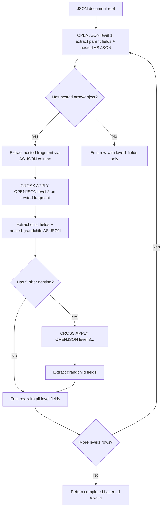
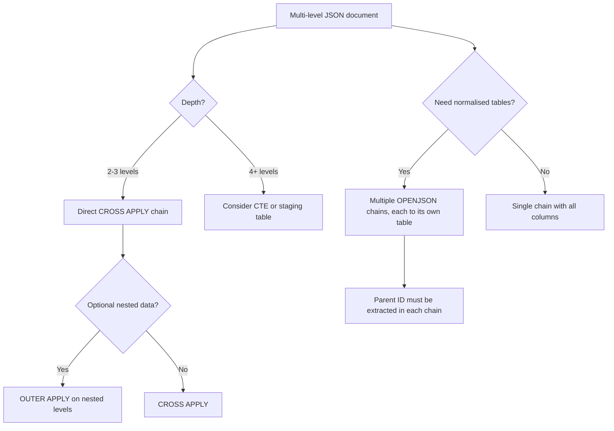

## Navigation

**Domain:** [[8 — Databases]] > **Group:** SQL JSON, XML & Semi-Structured Data
**Previous:** [[8.213 — JSON Path Expressions — Dollar Notation]] | **Next:** [[8.215 — JSON Performance — Storage and Query Cost]]

### Prerequisites

- [[8.212 — JSON Arrays — Expanding with OPENJSON]] — CROSS APPLY OPENJSON for nested arrays is the foundation for multi-level JSON parsing; understanding how a single OPENJSON expands an array is prerequisite to chaining multiple CROSS APPLY calls.
- [[8.211 — OPENJSON with Schema — Typed Results]] — Extracting typed columns from nested levels requires the WITH clause with correct path expressions at each level.
- [[8.213 — JSON Path Expressions — Dollar Notation]] — Navigating deep JSON structures requires precise path expressions including bracket notation, wildcards, and strict/lax mode at each level.

### Where This Fits

Multi-level JSON parsing converts deeply nested JSON documents — orders with items with product details, shipments with packages with tracking events, or configurations with environment-specific overrides — into normalised relational rowsets. Every .NET backend engineer working with complex JSON payloads from external APIs (eCommerce platforms, payment gateways, logistics providers) encounters this. The critical failure mode is flattening all nested levels into a single OPENJSON call with deeply qualified paths, which misses the ability to normalise into multiple related tables. The interview signal is: does the candidate understand that multi-level JSON requires multiple OPENJSON calls with CROSS APPLY, and that the AS JSON modifier extracts a JSON fragment that serves as input to the next OPENJSON level? Candidates who attempt a single OPENJSON with paths like `$.orders[0].items[0].product.name` show they do not understand relational decomposition of JSON.

---

## Core Mental Model

Parsing multi-level JSON requires a recursive or CROSS APPLY approach: each nesting level adds an OPENJSON call. The AS JSON modifier extracts a JSON fragment (sub-object or sub-array) as an NVARCHAR(MAX) column, which is then passed to the next OPENJSON call. The pattern is: `OPENJSON(parent) WITH (nestedColumn NVARCHAR(MAX) '$.nestedPath' AS JSON) OUTER/CROSS APPLY OPENJSON(nestedColumn) WITH (child columns...) [CROSS APPLY OPENJSON(grandchild...) ...]`. Each OPENJSON level corresponds to a depth level in the JSON. The execution plan shows a chain of Nested Loops operators — one per APPLY. The cardinality estimate compounds: if level 1 estimates 100 rows and level 2 estimates 100 rows per level 1 row, the total estimate is 100 x 100 = 10,000 rows (but actual may differ wildly). For deeply nested JSON with arrays at multiple levels, the total row count is the product of array sizes across all levels (Cartesian product).

### Classification

Multi-level JSON parsing uses **table-valued functions in CROSS/OUTER APPLY chains**. It is NOT SARGable — no index can accelerate the JSON parsing. Each level adds a Nested Loops join in the execution plan, making the cost proportional to the product of array sizes across levels. The pattern is equivalent to flattening a nested object graph into a denormalised rowset, which can explode row counts (1 order x 5 items x 3 packages x 2 tracking events = 30 rows per order).



### Key Properties

|Property|Value|Notes|
|---|---|---|
|Depth levels|Unlimited (practical: 3-5)|Each level = 1 CROSS APPLY = 1 Nested Loops|
|Row explosion|Product of array sizes|1x5x3 = 15 rows per root row|
|AS JSON modifier|Required for nested paths|Extracts JSON fragment for next level|
|Cardinality estimate|100 per level|Compounds across levels (100x100x100)|
|Null handling|OUTER APPLY preserves parent|CROSS APPLY drops rows with missing nested data|
|SARGable|No|JSON parsing is in-memory|
|Write cost|None|Read-only operation|

---

## Deep Mechanics

### How the Engine Executes This

1. **Level 1 parse:** The outermost OPENJSON parses the root JSON document and extracts both scalar fields (via direct path) and one or more nested JSON fragments (via path with AS JSON). Each AS JSON column triggers a JSON_QUERY internally to extract the sub-JSON as a string.

2. **Level 2 parse (CROSS APPLY):** For each row emitted by level 1, the engine invokes OPENJSON on the nested JSON fragment from the AS JSON column. This parses the sub-JSON independently. If the nested fragment is an array, it expands to multiple rows. If an object, it emits one row. The CROSS APPLY creates a Nested Loops join between the level 1 output and the level 2 OPENJSON.

3. **Level N parse:** Each subsequent level adds another CROSS APPLY OPENJSON on the nested JSON fragment from the previous level's AS JSON column. Each level adds another Nested Loops operator in the plan.

4. **Row concatenation:** The final output concatenates columns from all levels. Columns from level 1 are repeated for each child row from level 2, which is repeated for each grandchild row from level 3, etc. This is the flattening process.

5. **Optimiser limitations:** The optimiser cannot push predicates across OPENJSON levels. A WHERE clause on a level 3 column is evaluated after all levels are expanded — no filter pushdown occurs. The optimiser estimates 100 rows per OPENJSON level, which compounds geometrically.

### SQL Visibility

```sql
-- Multi-level JSON: orders -> items -> product details
DECLARE @complexJson NVARCHAR(MAX) = N'[
    {
        "OrderId": 10248,
        "CustomerId": "ALFKI",
        "OrderDate": "2024-06-15",
        "Shipping": {
            "Method": "Express",
            "Address": {"City": "Berlin", "Country": "Germany"}
        },
        "Items": [
            {
                "ProductId": 1,
                "ProductName": "Widget",
                "Quantity": 10,
                "UnitPrice": 20.0,
                "Discount": 0.0,
                "Supplier": {"Id": 100, "Name": "Acme Corp"}
            },
            {
                "ProductId": 2,
                "ProductName": "Gadget",
                "Quantity": 5,
                "UnitPrice": 30.0,
                "Discount": 0.1,
                "Supplier": {"Id": 200, "Name": "Global Supplies"}
            }
        ],
        "Payments": [
            {"Method": "CreditCard", "Amount": 345.67, "Status": "Captured"}
        ]
    },
    {
        "OrderId": 10249,
        "CustomerId": "ANATR",
        "OrderDate": "2024-06-16",
        "Shipping": {"Method": "Standard", "Address": {"City": "London", "Country": "UK"}},
        "Items": [
            {
                "ProductId": 3,
                "ProductName": "Doohickey",
                "Quantity": 2,
                "UnitPrice": 50.0,
                "Discount": 0.0,
                "Supplier": {"Id": 100, "Name": "Acme Corp"}
            }
        ],
        "Payments": [
            {"Method": "PayPal", "Amount": 100.0, "Status": "Pending"}
        ]
    }
]';

-- Level 1 + Level 2 + Level 3: Full multi-level parse
SELECT
    o.OrderId, o.CustomerId, o.OrderDate,
    o.ShipMethod, o.ShipCity, o.ShipCountry,
    i.ProductId, i.ProductName, i.Quantity, i.UnitPrice, i.Discount,
    (i.Quantity * i.UnitPrice * (1 - i.Discount)) AS LineTotal,
    i.SupplierId, i.SupplierName,
    p.Method AS PaymentMethod, p.Amount AS PaymentAmount, p.Status AS PaymentStatus
FROM OPENJSON(@complexJson)
WITH (
    OrderId     INT             '$.OrderId',
    CustomerId  NVARCHAR(10)    '$.CustomerId',
    OrderDate   DATETIME2(0)    '$.OrderDate',
    ShipMethod  NVARCHAR(50)    '$.Shipping.Method',
    ShipCity    NVARCHAR(100)   '$.Shipping.Address.City',
    ShipCountry NVARCHAR(100)   '$.Shipping.Address.Country',
    Items       NVARCHAR(MAX)   '$.Items' AS JSON,
    Payments    NVARCHAR(MAX)   '$.Payments' AS JSON
) AS o
CROSS APPLY OPENJSON(o.Items)
WITH (
    ProductId   INT             '$.ProductId',
    ProductName NVARCHAR(200)   '$.ProductName',
    Quantity    INT             '$.Quantity',
    UnitPrice   DECIMAL(18,2)   '$.UnitPrice',
    Discount    DECIMAL(5,2)    '$.Discount',
    SupplierId  INT             '$.Supplier.Id',
    SupplierName NVARCHAR(200)  '$.Supplier.Name'
) AS i
CROSS APPLY OPENJSON(o.Payments)
WITH (
    Method  NVARCHAR(50)    '$.Method',
    Amount  DECIMAL(18,2)   '$.Amount',
    Status  NVARCHAR(20)    '$.Status'
) AS p
ORDER BY o.OrderId, i.ProductId, p.Method;

-- OUTER APPLY for optional nested data
SELECT
    o.OrderId,
    i.ProductId, i.ProductName
FROM OPENJSON(@complexJson)
WITH (
    OrderId INT             '$.OrderId',
    Items   NVARCHAR(MAX)   '$.Items' AS JSON
) AS o
OUTER APPLY OPENJSON(o.Items)
WITH (
    ProductId   INT             '$.ProductId',
    ProductName NVARCHAR(200)   '$.ProductName'
) AS i;
-- Orders with no items still appear (OUTER APPLY preserves)

-- Three-level nesting: orders -> items -> supplier
SELECT
    o.OrderId,
    i.ProductId, i.ProductName,
    s.SupplierId, s.SupplierName
FROM OPENJSON(@complexJson)
WITH (
    OrderId INT             '$.OrderId',
    Items   NVARCHAR(MAX)   '$.Items' AS JSON
) AS o
CROSS APPLY OPENJSON(o.Items)
WITH (
    ProductId   INT             '$.ProductId',
    ProductName NVARCHAR(200)   '$.ProductName',
    Supplier    NVARCHAR(MAX)   '$.Supplier' AS JSON
) AS i
CROSS APPLY OPENJSON(i.Supplier)
WITH (
    SupplierId   INT            '$.Id',
    SupplierName NVARCHAR(200)  '$.Name'
) AS s;

-- JSON_QUERY alternative for nested extraction
SELECT
    JSON_QUERY(@complexJson, '$[0].Items') AS FirstOrderItems,
    JSON_QUERY(@complexJson, '$[0].Shipping') AS FirstOrderShipping;

-- CTE for recursive JSON parsing (conceptual: JSON is finite-depth)
DECLARE @deepJson NVARCHAR(MAX) = N'{
    "Id": 1, "Name": "Root",
    "Children": [
        {"Id": 2, "Name": "Child1", "Children": [
            {"Id": 4, "Name": "Grandchild1", "Children": []}
        ]},
        {"Id": 3, "Name": "Child2", "Children": []}
    ]
}';

WITH JsonHierarchy AS (
    -- Anchor: root level
    SELECT
        1 AS Level,
        CAST(JSON_VALUE(@deepJson, '$.Id') AS INT) AS Id,
        JSON_VALUE(@deepJson, '$.Name') AS Name,
        CAST(NULL AS INT) AS ParentId,
        JSON_QUERY(@deepJson, '$.Children') AS ChildrenJson
    UNION ALL
    -- Recursive: children
    SELECT
        jh.Level + 1,
        CAST(JSON_VALUE(c.[value], '$.Id') AS INT),
        JSON_VALUE(c.[value], '$.Name'),
        jh.Id,
        JSON_QUERY(c.[value], '$.Children')
    FROM JsonHierarchy jh
    CROSS APPLY OPENJSON(jh.ChildrenJson) AS c
    WHERE jh.ChildrenJson IS NOT NULL
      AND JSON_VALUE(jh.ChildrenJson, '$[0]') IS NOT NULL
)
SELECT Level, Id, Name, ParentId
FROM JsonHierarchy
ORDER BY Level, Id;

-- Multi-level with multiple array siblings
SELECT
    o.OrderId,
    i.ProductId, i.ProductName,
    p.Method AS PaymentMethod
FROM OPENJSON(@complexJson)
WITH (
    OrderId  INT             '$.OrderId',
    Items    NVARCHAR(MAX)   '$.Items' AS JSON,
    Payments NVARCHAR(MAX)   '$.Payments' AS JSON
) AS o
CROSS APPLY OPENJSON(o.Items)
WITH (ProductId INT '$.ProductId', ProductName NVARCHAR(200) '$.ProductName') AS i
CROSS APPLY OPENJSON(o.Payments)
WITH (Method NVARCHAR(50) '$.Method') AS p;
-- This produces a cross product of items x payments per order
-- If order has 2 items and 2 payments: 4 rows

-- Normalisation pattern: parse into multiple table-valued parameters
DECLARE @Orders TABLE (
    OrderId INT, CustomerId NVARCHAR(10), OrderDate DATETIME2(0),
    ShipMethod NVARCHAR(50), ShipCity NVARCHAR(100), ShipCountry NVARCHAR(100)
);
DECLARE @Items TABLE (
    OrderId INT, ProductId INT, ProductName NVARCHAR(200),
    Quantity INT, UnitPrice DECIMAL(18,2), Discount DECIMAL(5,2)
);
DECLARE @Payments TABLE (
    OrderId INT, Method NVARCHAR(50), Amount DECIMAL(18,2), Status NVARCHAR(20)
);

-- Parse into separate staging tables (normalisation)
INSERT INTO @Orders (OrderId, CustomerId, OrderDate, ShipMethod, ShipCity, ShipCountry)
SELECT OrderId, CustomerId, OrderDate, ShipMethod, ShipCity, ShipCountry
FROM OPENJSON(@complexJson)
WITH (
    OrderId     INT             '$.OrderId',
    CustomerId  NVARCHAR(10)    '$.CustomerId',
    OrderDate   DATETIME2(0)    '$.OrderDate',
    ShipMethod  NVARCHAR(50)    '$.Shipping.Method',
    ShipCity    NVARCHAR(100)   '$.Shipping.Address.City',
    ShipCountry NVARCHAR(100)   '$.Shipping.Address.Country'
);

INSERT INTO @Items (OrderId, ProductId, ProductName, Quantity, UnitPrice, Discount)
SELECT o.OrderId, i.ProductId, i.ProductName, i.Quantity, i.UnitPrice, i.Discount
FROM OPENJSON(@complexJson)
WITH (OrderId INT '$.OrderId', Items NVARCHAR(MAX) '$.Items' AS JSON) AS o
CROSS APPLY OPENJSON(o.Items)
WITH (ProductId INT '$.ProductId', ProductName NVARCHAR(200) '$.ProductName',
      Quantity INT '$.Quantity', UnitPrice DECIMAL(18,2) '$.UnitPrice',
      Discount DECIMAL(5,2) '$.Discount') AS i;

INSERT INTO @Payments (OrderId, Method, Amount, Status)
SELECT o.OrderId, p.Method, p.Amount, p.Status
FROM OPENJSON(@complexJson)
WITH (OrderId INT '$.OrderId', Payments NVARCHAR(MAX) '$.Payments' AS JSON) AS o
CROSS APPLY OPENJSON(o.Payments)
WITH (Method NVARCHAR(50) '$.Method', Amount DECIMAL(18,2) '$.Amount',
      Status NVARCHAR(20) '$.Status') AS p;

-- Verify normalised data
SELECT 'Orders' AS TableName, COUNT(*) AS Rows FROM @Orders
UNION ALL SELECT 'Items', COUNT(*) FROM @Items
UNION ALL SELECT 'Payments', COUNT(*) FROM @Payments;

-- Aggregation across nested levels
SELECT
    o.CustomerId,
    COUNT(DISTINCT o.OrderId) AS OrderCount,
    COUNT(DISTINCT i.ProductId) AS UniqueProductsOrdered,
    SUM(i.Quantity * i.UnitPrice * (1 - i.Discount)) AS TotalRevenue,
    COUNT(p.Method) AS PaymentCount
FROM OPENJSON(@complexJson)
WITH (OrderId INT '$.OrderId', CustomerId NVARCHAR(10) '$.CustomerId',
      Items NVARCHAR(MAX) '$.Items' AS JSON,
      Payments NVARCHAR(MAX) '$.Payments' AS JSON) AS o
CROSS APPLY OPENJSON(o.Items)
WITH (ProductId INT '$.ProductId', Quantity INT '$.Quantity',
      UnitPrice DECIMAL(18,2) '$.UnitPrice', Discount DECIMAL(5,2) '$.Discount') AS i
OUTER APPLY OPENJSON(o.Payments)
WITH (Method NVARCHAR(50) '$.Method') AS p
GROUP BY o.CustomerId;

-- Three-level deep with conditional aggregation
SELECT
    o.OrderId,
    MAX(CASE WHEN i.ProductName = 'Widget' THEN i.Quantity END) AS WidgetQty,
    MAX(CASE WHEN i.ProductName = 'Gadget' THEN i.Quantity END) AS GadgetQty,
    COUNT(DISTINCT i.ProductId) AS UniqueItems,
    COUNT(p.PaymentId) AS PaymentCount
FROM OPENJSON(@complexJson)
WITH (OrderId INT '$.OrderId', Items NVARCHAR(MAX) '$.Items' AS JSON,
      Payments NVARCHAR(MAX) '$.Payments' AS JSON) AS o
OUTER APPLY OPENJSON(o.Items)
WITH (ProductName NVARCHAR(200) '$.ProductName', Quantity INT '$.Quantity',
      ProductId INT '$.ProductId') AS i
OUTER APPLY OPENJSON(o.Payments)
WITH (PaymentId INT '$.PaymentId') AS p
GROUP BY o.OrderId;
```

```csharp
// EF Core — multi-level JSON parsing via raw SQL
public async Task<List<OrderFlatDto>> GetFlattenedOrdersAsync(
    string complexJson, CancellationToken ct = default)
{
    var parameter = new SqlParameter("@json", SqlDbType.NVarChar, -1)
    {
        Value = complexJson
    };

    return await dbContext.Database
        .SqlQueryRaw<OrderFlatDto>(@"
            SELECT o.OrderId, o.CustomerId, o.OrderDate,
                   i.ProductId, i.ProductName, i.Quantity, i.UnitPrice,
                   (i.Quantity * i.UnitPrice * (1 - i.Discount)) AS LineTotal,
                   p.Method AS PaymentMethod, p.Amount AS PaymentAmount
            FROM OPENJSON(@json)
            WITH (OrderId INT '$.OrderId', CustomerId NVARCHAR(10) '$.CustomerId',
                  OrderDate DATETIME2(0) '$.OrderDate',
                  Items NVARCHAR(MAX) '$.Items' AS JSON,
                  Payments NVARCHAR(MAX) '$.Payments' AS JSON) AS o
            CROSS APPLY OPENJSON(o.Items)
            WITH (ProductId INT '$.ProductId', ProductName NVARCHAR(200) '$.ProductName',
                  Quantity INT '$.Quantity', UnitPrice DECIMAL(18,2) '$.UnitPrice',
                  Discount DECIMAL(5,2) '$.Discount') AS i
            CROSS APPLY OPENJSON(o.Payments)
            WITH (Method NVARCHAR(50) '$.Method', Amount DECIMAL(18,2) '$.Amount') AS p
            ORDER BY o.OrderId, i.ProductId, p.Method",
            parameter)
        .ToListAsync(ct);
}
```

```csharp
// Dapper — multi-level JSON with parent-child mapping
public async Task<List<OrderWithChildrenDto>> ParseNestedJsonAsync(
    string complexJson, CancellationToken ct = default)
{
    const string sql = @"
        SELECT o.OrderId, o.CustomerId, o.OrderDate,
               o.ShipMethod, o.ShipCity, o.ShipCountry,
               i.ProductId, i.ProductName, i.Quantity, i.UnitPrice, i.Discount,
               p.Method AS PaymentMethod, p.Amount AS PaymentAmount, p.Status AS PaymentStatus
        FROM OPENJSON(@json)
        WITH (OrderId INT '$.OrderId', CustomerId NVARCHAR(10) '$.CustomerId',
              OrderDate DATETIME2(0) '$.OrderDate',
              ShipMethod NVARCHAR(50) '$.Shipping.Method',
              ShipCity NVARCHAR(100) '$.Shipping.Address.City',
              ShipCountry NVARCHAR(100) '$.Shipping.Address.Country',
              Items NVARCHAR(MAX) '$.Items' AS JSON,
              Payments NVARCHAR(MAX) '$.Payments' AS JSON) AS o
        CROSS APPLY OPENJSON(o.Items)
        WITH (ProductId INT '$.ProductId', ProductName NVARCHAR(200) '$.ProductName',
              Quantity INT '$.Quantity', UnitPrice DECIMAL(18,2) '$.UnitPrice',
              Discount DECIMAL(5,2) '$.Discount') AS i
        CROSS APPLY OPENJSON(o.Payments)
        WITH (Method NVARCHAR(50) '$.Method', Amount DECIMAL(18,2) '$.Amount',
              Status NVARCHAR(20) '$.Status') AS p
        ORDER BY o.OrderId, i.ProductId, p.Method;";

    await using var conn = _connectionFactory.Create();
    var orderMap = new Dictionary<int, OrderWithChildrenDto>();

    await conn.QueryAsync<OrderWithChildrenDto, ItemDto, PaymentDto, OrderWithChildrenDto>(
        new CommandDefinition(sql, new { json = complexJson },
            cancellationToken: ct),
        (order, item, payment) =>
        {
            if (!orderMap.TryGetValue(order.OrderId, out var existing))
            {
                existing = order with { Items = new List<ItemDto>(), Payments = new List<PaymentDto>() };
                orderMap[order.OrderId] = existing;
            }
            if (item != null && !existing.Items.Any(i => i.ProductId == item.ProductId))
                existing.Items.Add(item);
            if (payment != null && !existing.Payments.Any(p => p.Method == payment.Method))
                existing.Payments.Add(payment);
            return existing;
        }, splitOn: "ProductId,PaymentMethod");

    return orderMap.Values.ToList().AsReadOnly();
}

public record OrderWithChildrenDto(int OrderId, string CustomerId, DateTime OrderDate,
    string? ShipMethod, string? ShipCity, string? ShipCountry,
    List<ItemDto>? Items = null, List<PaymentDto>? Payments = null);

public record ItemDto(int ProductId, string ProductName, int Quantity,
    decimal UnitPrice, decimal Discount);

public record PaymentDto(string Method, decimal Amount, string Status);
```

### Generated SQL (from EF Core)

```sql
exec sp_executesql N'
SELECT o.OrderId, o.CustomerId, o.OrderDate, o.ShipMethod, o.ShipCity, o.ShipCountry,
       i.ProductId, i.ProductName, i.Quantity, i.UnitPrice,
       (i.Quantity * i.UnitPrice * (1 - i.Discount)) AS LineTotal,
       p.Method AS PaymentMethod, p.Amount AS PaymentAmount
FROM OPENJSON(@json)
WITH (OrderId INT ''$.OrderId'', CustomerId NVARCHAR(10) ''$.CustomerId'',
      OrderDate DATETIME2(0) ''$.OrderDate'',
      ShipMethod NVARCHAR(50) ''$.Shipping.Method'',
      ShipCity NVARCHAR(100) ''$.Shipping.Address.City'',
      ShipCountry NVARCHAR(100) ''$.Shipping.Address.Country'',
      Items NVARCHAR(MAX) ''$.Items'' AS JSON,
      Payments NVARCHAR(MAX) ''$.Payments'' AS JSON) AS o
CROSS APPLY OPENJSON(o.Items)
WITH (ProductId INT ''$.ProductId'', ProductName NVARCHAR(200) ''$.ProductName'',
      Quantity INT ''$.Quantity'', UnitPrice DECIMAL(18,2) ''$.UnitPrice'',
      Discount DECIMAL(5,2) ''$.Discount'') AS i
CROSS APPLY OPENJSON(o.Payments)
WITH (Method NVARCHAR(50) ''$.Method'', Amount DECIMAL(18,2) ''$.Amount'') AS p
ORDER BY o.OrderId, i.ProductId, p.Method',
N'@json nvarchar(max)',@json=N'[...]'
```

### Execution Plan Analysis

```
-- Multi-level CROSS APPLY chain
[Table-valued function: OPENJSON(@json)]
    Estimated Rows: 100 | Actual Rows: N1 (root array count)
-> [Nested Loops] (first APPLY: items)
    [Table-valued function: OPENJSON(outer.Items)]
        Estimated Rows: 100 | Actual Rows: N2 per row (avg items per order)
        -> [Nested Loops] (second APPLY: payments)
            [Table-valued function: OPENJSON(outer.Payments)]
                Estimated Rows: 100 | Actual Rows: N3 per row
                -> [SELECT]
```

Estimated total rows: 100 x 100 x 100 = 1,000,000 (but actual is N1 x N2 x N3). The compounding cardinality estimate can cause the optimiser to overestimate or underestimate row counts dramatically.

### Cost Visibility

```sql
SET STATISTICS IO ON;
SET STATISTICS TIME ON;

-- Multi-level parse on a 100-order JSON with 5 items and 1 payment each
SELECT o.OrderId, i.ProductId, p.Method
FROM OPENJSON(@json)
WITH (OrderId INT '$.OrderId', Items NVARCHAR(MAX) '$.Items' AS JSON,
      Payments NVARCHAR(MAX) '$.Payments' AS JSON) AS o
CROSS APPLY OPENJSON(o.Items) WITH (ProductId INT '$.ProductId') AS i
CROSS APPLY OPENJSON(o.Payments) WITH (Method NVARCHAR(50) '$.Method') AS p;

-- Expected:
-- No table I/O (all in-memory JSON parsing)
-- CPU time: ~15ms, elapsed: ~30ms (for 100 orders with 5 items each)
-- Output rows: 100 x 5 x 1 = 500 rows
```

### Failure Modes

1. **Row explosion from multiple CROSS APPLY siblings:** Two CROSS APPLY OPENJSON calls on independent arrays within the same level produce a Cartesian product. If an order has 5 items and 3 payments, the output is 5x3 = 15 rows per order, not 5+3.
2. **Missing nested data with CROSS APPLY:** If the nested JSON array is NULL or empty, CROSS APPLY eliminates the parent row. Use OUTER APPLY for optional nested data.
3. **JSON_QUERY vs JSON_VALUE for nested columns:** Forgetting AS JSON on a nested path returns the literal string '[object Object]' instead of the JSON fragment.
4. **CTE recursion depth:** The recursive CTE approach for deeply nested JSON has a default recursion limit of 100 levels in SQL Server (MAXRECURSION hint).
5. **Performance of deep nesting:** Each nesting level adds a Nested Loops join. 3 levels of nesting means 3 nested loops operators, each potentially processing many rows.

---

## Production Patterns and Implementation

### Primary SQL Implementation

```sql
CREATE TABLE dbo.JsonStaging (
    StagingId    INT             NOT NULL IDENTITY(1,1),
    Payload      NVARCHAR(MAX)   NOT NULL,
    Source       NVARCHAR(100)   NOT NULL,
    ReceivedAt   DATETIME2(0)    NOT NULL DEFAULT SYSUTCDATETIME(),
    Status       VARCHAR(20)     NOT NULL DEFAULT 'Pending',
    CONSTRAINT PK_JsonStaging PRIMARY KEY CLUSTERED (StagingId),
    CONSTRAINT CK_JsonStaging_Payload CHECK (ISJSON(Payload) = 1)
);

-- Normalisation stored procedure: deeply nested JSON to multiple tables
CREATE OR ALTER PROCEDURE dbo.usp_IngestComplexOrder
    @payload NVARCHAR(MAX),
    @source  NVARCHAR(100)
AS
BEGIN
    SET NOCOUNT ON; SET XACT_ABORT ON;

    DECLARE @stagingId INT;
    INSERT INTO dbo.JsonStaging (Payload, Source) VALUES (@payload, @source);
    SET @stagingId = SCOPE_IDENTITY();

    BEGIN TRY
        BEGIN TRANSACTION;

        -- Level 1: Order header
        INSERT INTO dbo.Orders (OrderId, CustomerId, OrderDate, ShippingMethod,
            ShipCity, ShipCountry, SourceStagingId)
        SELECT
            o.OrderId, o.CustomerId, o.OrderDate,
            o.ShipMethod, o.ShipCity, o.ShipCountry, @stagingId
        FROM OPENJSON(@payload)
        WITH (OrderId INT '$.OrderId', CustomerId NVARCHAR(10) '$.CustomerId',
              OrderDate DATETIME2(0) '$.OrderDate',
              ShipMethod NVARCHAR(50) '$.Shipping.Method',
              ShipCity NVARCHAR(100) '$.Shipping.Address.City',
              ShipCountry NVARCHAR(100) '$.Shipping.Address.Country') AS o;

        -- Level 2: Order items (join back via OrderId)
        INSERT INTO dbo.OrderItems (OrderId, ProductId, ProductName,
            Quantity, UnitPrice, Discount)
        SELECT o.OrderId, i.ProductId, i.ProductName,
               i.Quantity, i.UnitPrice, i.Discount
        FROM OPENJSON(@payload)
        WITH (OrderId INT '$.OrderId', Items NVARCHAR(MAX) '$.Items' AS JSON) AS o
        CROSS APPLY OPENJSON(o.Items)
        WITH (ProductId INT '$.ProductId', ProductName NVARCHAR(200) '$.ProductName',
              Quantity INT '$.Quantity', UnitPrice DECIMAL(18,2) '$.UnitPrice',
              Discount DECIMAL(5,2) '$.Discount') AS i;

        -- Level 3: Payments
        INSERT INTO dbo.Payments (OrderId, Method, Amount, Status)
        SELECT o.OrderId, p.Method, p.Amount, p.Status
        FROM OPENJSON(@payload)
        WITH (OrderId INT '$.OrderId', Payments NVARCHAR(MAX) '$.Payments' AS JSON) AS o
        CROSS APPLY OPENJSON(o.Payments)
        WITH (Method NVARCHAR(50) '$.Method', Amount DECIMAL(18,2) '$.Amount',
              Status NVARCHAR(20) '$.Status') AS p;

        -- Level 4: Item suppliers (three-level nesting)
        INSERT INTO dbo.Suppliers (SupplierId, SupplierName, OrderId, ProductId)
        SELECT s.SupplierId, s.SupplierName, o.OrderId, i.ProductId
        FROM OPENJSON(@payload)
        WITH (OrderId INT '$.OrderId', Items NVARCHAR(MAX) '$.Items' AS JSON) AS o
        CROSS APPLY OPENJSON(o.Items)
        WITH (ProductId INT '$.ProductId', Supplier NVARCHAR(MAX) '$.Supplier' AS JSON) AS i
        CROSS APPLY OPENJSON(i.Supplier)
        WITH (SupplierId INT '$.Id', SupplierName NVARCHAR(200) '$.Name') AS s;

        UPDATE dbo.JsonStaging SET Status = 'Processed' WHERE StagingId = @stagingId;

        COMMIT TRANSACTION;
    END TRY
    BEGIN CATCH
        IF @@TRANCOUNT > 0 ROLLBACK TRANSACTION;
        UPDATE dbo.JsonStaging SET Status = 'Failed', ErrorMsg = ERROR_MESSAGE()
        WHERE StagingId = @stagingId;
        THROW;
    END CATCH;
END;

-- Usage:
-- EXEC dbo.usp_IngestComplexOrder @payload = N'[{
--   "OrderId": 10248, "CustomerId": "ALFKI", "OrderDate": "2024-06-15",
--   "Shipping": {"Method": "Express", "Address": {"City": "Berlin", "Country": "Germany"}},
--   "Items": [{"ProductId": 1, "ProductName": "Widget", "Quantity": 10,
--              "UnitPrice": 20.0, "Discount": 0.0,
--              "Supplier": {"Id": 100, "Name": "Acme Corp"}}],
--   "Payments": [{"Method": "CreditCard", "Amount": 345.67, "Status": "Captured"}]
-- }]', @source = 'ExternalAPI';
```

### EF Core Implementation

```csharp
public class MultiLevelJsonService
{
    private readonly ApplicationDbContext _db;
    public MultiLevelJsonService(ApplicationDbContext db) => _db = db;

    // Full ingest via stored procedure
    public async Task IngestComplexOrderAsync(
        string payload, string source, CancellationToken ct = default)
    {
        var p1 = new SqlParameter("@payload", SqlDbType.NVarChar, -1) { Value = payload };
        var p2 = new SqlParameter("@source", SqlDbType.NVarChar, 100) { Value = source };

        await _db.Database
            .ExecuteSqlRawAsync("EXEC dbo.usp_IngestComplexOrder @payload, @source",
                p1, p2)
            .ConfigureAwait(false);
    }

    // Direct multi-level parsing (no stored procedure)
    public async Task<List<OrderFlatDto>> GetMultiLevelOrdersAsync(
        string json, CancellationToken ct = default)
    {
        return await _db.Database
            .SqlQueryRaw<OrderFlatDto>(@"
                SELECT o.OrderId, o.CustomerId, o.OrderDate,
                       i.ProductId, i.ProductName, i.Quantity, i.UnitPrice,
                       p.Method AS PaymentMethod, p.Amount AS PaymentAmount
                FROM OPENJSON(@p0)
                WITH (OrderId INT '$.OrderId', CustomerId NVARCHAR(10) '$.CustomerId',
                      OrderDate DATETIME2(0) '$.OrderDate',
                      Items NVARCHAR(MAX) '$.Items' AS JSON,
                      Payments NVARCHAR(MAX) '$.Payments' AS JSON) AS o
                CROSS APPLY OPENJSON(o.Items)
                WITH (ProductId INT '$.ProductId', ProductName NVARCHAR(200) '$.ProductName',
                      Quantity INT '$.Quantity', UnitPrice DECIMAL(18,2) '$.UnitPrice') AS i
                CROSS APPLY OPENJSON(o.Payments)
                WITH (Method NVARCHAR(50) '$.Method', Amount DECIMAL(18,2) '$.Amount') AS p
                ORDER BY o.OrderId, i.ProductId",
                new SqlParameter("@p0", SqlDbType.NVarChar, -1) { Value = json })
            .ToListAsync(ct);
    }
}

public class OrderFlatDto
{
    public int OrderId { get; set; }
    public string CustomerId { get; set; } = "";
    public DateTime OrderDate { get; set; }
    public int ProductId { get; set; }
    public string ProductName { get; set; } = "";
    public int Quantity { get; set; }
    public decimal UnitPrice { get; set; }
    public string? PaymentMethod { get; set; }
    public decimal? PaymentAmount { get; set; }
}
```

### Dapper Implementation

```csharp
public class MultiLevelJsonRepository
{
    private readonly IDbConnectionFactory _cf;
    public MultiLevelJsonRepository(IDbConnectionFactory cf) => _cf = cf;

    // Full ingest via stored procedure
    public async Task IngestComplexOrderAsync(
        string payload, string source, CancellationToken ct = default)
    {
        const string sql = "EXEC dbo.usp_IngestComplexOrder @payload, @source";
        await using var conn = _cf.Create();
        await conn.ExecuteAsync(new CommandDefinition(
            sql, new { payload, source }, commandTimeout = 120, cancellationToken: ct));
    }

    // Multi-level parse with multi-mapping (Order + Items + Payments)
    public async Task<List<OrderWithChildren>> ParseMultiLevelAsync(
        string json, CancellationToken ct = default)
    {
        const string sql = @"
            SELECT o.OrderId, o.CustomerId, o.OrderDate,
                   i.ProductId, i.ProductName, i.Quantity,
                   p.Method AS PaymentMethod, p.Amount AS PaymentAmount
            FROM OPENJSON(@json)
            WITH (OrderId INT '$.OrderId', CustomerId NVARCHAR(10) '$.CustomerId',
                  OrderDate DATETIME2(0) '$.OrderDate',
                  Items NVARCHAR(MAX) '$.Items' AS JSON,
                  Payments NVARCHAR(MAX) '$.Payments' AS JSON) AS o
            CROSS APPLY OPENJSON(o.Items)
            WITH (ProductId INT '$.ProductId',
                  ProductName NVARCHAR(200) '$.ProductName',
                  Quantity INT '$.Quantity') AS i
            CROSS APPLY OPENJSON(o.Payments)
            WITH (Method NVARCHAR(50) '$.Method',
                  Amount DECIMAL(18,2) '$.Amount') AS p
            ORDER BY o.OrderId, i.ProductId;";

        await using var conn = _cf.Create();
        var lookup = new Dictionary<int, OrderWithChildren>();

        await conn.QueryAsync<OrderWithChildren, ItemDetail, PaymentDetail, OrderWithChildren>(
            new CommandDefinition(sql, new { json }, cancellationToken: ct),
            (order, item, payment) =>
            {
                if (!lookup.TryGetValue(order.OrderId, out var existing))
                    lookup.Add(order.OrderId, existing = order);
                if (item is not null) existing.Items.Add(item);
                if (payment is not null) existing.Payments.Add(payment);
                return existing;
            },
            splitOn: "ProductId, PaymentMethod");

        return lookup.Values.ToList();
    }
}

public class OrderWithChildren
{
    public int OrderId { get; set; }
    public string CustomerId { get; set; } = "";
    public DateTime OrderDate { get; set; }
    public List<ItemDetail> Items { get; set; } = new();
    public List<PaymentDetail> Payments { get; set; } = new();
}

public class ItemDetail
{
    public int ProductId { get; set; }
    public string ProductName { get; set; } = "";
    public int Quantity { get; set; }
}

public class PaymentDetail
{
    public string PaymentMethod { get; set; } = "";
    public decimal PaymentAmount { get; set; }
}
```

### SQL Server vs PostgreSQL Differences

```sql
-- PostgreSQL: jsonb_path_query for multi-level access
SELECT jsonb_path_query(payload, '$.Orders[*].Items[*].ProductId') AS product_ids
FROM staging;

-- PostgreSQL: LATERAL for multi-level (equivalent to CROSS APPLY)
SELECT o.order_id, i.item->>'product_name' AS product_name
FROM staging,
LATERAL jsonb_array_elements(payload->'orders') AS o(order_data),
LATERAL jsonb_array_elements(o.order_data->'items') AS i(item);

-- PostgreSQL: jsonb_to_recordset with nested path
SELECT * FROM jsonb_to_recordset(payload->'orders')
AS x(order_id INT, customer_id TEXT)
```

---

## Gotchas and Production Pitfalls

### 1. Row Explosion from Multiple CROSS APPLY Siblings

**Pitfall:** Two CROSS APPLY OPENJSON calls at the same level create a Cartesian product of the two arrays.

```sql
-- Wrong: items x payments Cartesian product per order
SELECT o.OrderId, i.ProductId, p.Method
FROM OPENJSON(@json) WITH (OrderId INT '$.OrderId',
    Items NVARCHAR(MAX) '$.Items' AS JSON,
    Payments NVARCHAR(MAX) '$.Payments' AS JSON) AS o
CROSS APPLY OPENJSON(o.Items) WITH (ProductId INT '$.ProductId') AS i
CROSS APPLY OPENJSON(o.Payments) WITH (Method NVARCHAR(50) '$.Method') AS p;
-- 5 items x 3 payments = 15 rows per order
```

**Fix:** Use separate queries or OUTER APPLY with DISTINCT if intentional.

### 2. Missing Nested Data with CROSS APPLY

**Pitfall:** CROSS APPLY eliminates rows where the nested JSON fragment is NULL or empty.

**Fix:** Use OUTER APPLY for optional nested arrays.

### 3. AS JSON Modifier Omitted for Nested Paths

**Pitfall:** Forgetting AS JSON on a nested path returns raw string '[object Object]' instead of a parseable JSON fragment.

```sql
-- Wrong: missing AS JSON
SELECT OPENJSON(@json) WITH (Items NVARCHAR(MAX) '$.Items') -- returns '[object Object]'
-- Correct:
SELECT OPENJSON(@json) WITH (Items NVARCHAR(MAX) '$.Items' AS JSON)
```

### 4. Cardinality Estimate Compounding

**Pitfall:** Each OPENJSON level estimates 100 rows. 3 levels = 1,000,000 estimated rows. For a payload with 50 orders x 10 items x 2 payments = 1,000 actual rows, the estimate is 1,000,000 (100x overestimate).

**Fix:** Use query hints or recompile for complex multi-level queries.

### 5. CTE Recursion Limit for Deeply Nested JSON

**Pitfall:** Default recursion limit for CTEs is 100. Deeply nested JSON trees may hit this limit.

**Fix:** Use OPTION (MAXRECURSION N) where N is the maximum expected depth.

### 6. JSON Fragment Encoding Issues

**Pitfall:** AS JSON returns the fragment as a literal JSON string. If the fragment contains escaped characters (\\n, \\t), they remain escaped in the AS JSON output. This causes downstream parsing failures.

**Fix:** Use JSON_VALUE to extract individual string values (which un-escapes), or handle escaping in the application layer.

### 7. Level Skipping in Very Deep Documents

**Pitfall:** Trying to jump from level 1 to level 3 without expanding level 2 fails. Each nesting level requires its own OPENJSON call.

```sql
-- Each level must be explicitly expanded:
-- Level 1 -> AS JSON -> Level 2 -> AS JSON -> Level 3
```

### 8. No Recursive Parsing for Unknown Depth

**Pitfall:** SQL Server does not support recursive OPENJSON for documents of arbitrary or unknown depth. You must know the schema at query time.

**Fix for variable-depth documents:** Use a recursive CTE with OPENJSON default schema:

```sql
WITH RecursiveJson AS (
    SELECT [key], [value], [type], 0 AS Level
    FROM OPENJSON(@json)
    UNION ALL
    SELECT j.[key], j.[value], j.[type], r.Level + 1
    FROM RecursiveJson AS r
    CROSS APPLY OPENJSON(r.[value]) AS j
    WHERE r.[type] IN (4, 5)
)
SELECT [key], [value], [type], Level
FROM RecursiveJson
OPTION (MAXRECURSION 50);
```

### 9. OUTER APPLY with Nested Parsing Produces NULLs at Each Level

**Pitfall:** When optional arrays exist at multiple levels, OUTER APPLY at each level produces NULL-extended rows for every possible combination.

**Fix:** Add a sentinel check after parsing to filter out fully NULL rows:

```sql
WHERE NOT (i.ProductId IS NULL AND s.SupplierId IS NULL)
```

### 10. Large JSON Fragments Hitting String Limits

**Pitfall:** AS JSON returns NVARCHAR(MAX) internally, but if you assign the result to a shorter variable, truncation occurs silently.

**Fix:** Always use NVARCHAR(MAX) for AS JSON columns in OPENJSON WITH clauses.

---

## Performance Implications

### Benchmark: Multi-Level Parse Performance

```sql
SET STATISTICS TIME ON;

-- 2-level parse (orders + items, 100 orders x 5 items = 500 rows)
SELECT o.OrderId, i.ProductId
FROM OPENJSON(@json) WITH (OrderId INT '$.OrderId',
    Items NVARCHAR(MAX) '$.Items' AS JSON) AS o
CROSS APPLY OPENJSON(o.Items) WITH (ProductId INT '$.ProductId') AS i;
-- CPU: ~5ms, Elapsed: ~8ms

-- 3-level parse (orders x items x suppliers, 100x5x1 = 500 rows)
SELECT o.OrderId, i.ProductId, s.SupplierId
FROM OPENJSON(@json) WITH (OrderId INT '$.OrderId',
    Items NVARCHAR(MAX) '$.Items' AS JSON) AS o
CROSS APPLY OPENJSON(o.Items) WITH (ProductId INT '$.ProductId',
    Supplier NVARCHAR(MAX) '$.Supplier' AS JSON) AS i
CROSS APPLY OPENJSON(i.Supplier) WITH (SupplierId INT '$.Id') AS s;
-- CPU: ~8ms, Elapsed: ~12ms
```

### BenchmarkDotNet

```csharp
[MemoryDiagnoser]
[SimpleJob(RuntimeMoniker.Net90)]
public class NestedJsonBenchmark
{
    private IDbConnection _connection = default!;
    private string _json2Level = string.Empty;
    private string _json3Level = string.Empty;

    [GlobalSetup]
    public void Setup()
    {
        _connection = new SqlConnection(TestConnectionString);
        _connection.Open();
        // 2-level: 100 orders x 5 items
        _json2Level = GenerateJson(100, 5);
        // 3-level: 100 orders x 5 items x 2 suppliers
        _json3Level = GenerateJson(100, 5, true);
    }

    [Benchmark(Baseline = true)]
    public async Task<List<dynamic>> TwoLevelParse()
    {
        const string sql = @"
            SELECT o.OrderId, i.ProductId
            FROM OPENJSON(@json) WITH (OrderId INT '$.OrderId',
                Items NVARCHAR(MAX) '$.Items' AS JSON) AS o
            CROSS APPLY OPENJSON(o.Items) WITH (ProductId INT '$.ProductId') AS i";
        var r = await _connection.QueryAsync(sql, new { json = _json2Level });
        return r.AsList();
    }

    [Benchmark]
    public async Task<List<dynamic>> ThreeLevelParse()
    {
        const string sql = @"
            SELECT o.OrderId, i.ProductId, s.SupplierId
            FROM OPENJSON(@json) WITH (OrderId INT '$.OrderId',
                Items NVARCHAR(MAX) '$.Items' AS JSON) AS o
            CROSS APPLY OPENJSON(o.Items) WITH (ProductId INT '$.ProductId',
                Supplier NVARCHAR(MAX) '$.Supplier' AS JSON) AS i
            CROSS APPLY OPENJSON(i.Supplier) WITH (SupplierId INT '$.Id') AS s";
        var r = await _connection.QueryAsync(sql, new { json = _json3Level });
        return r.AsList();
    }
}
```

**Expected results (100 orders, 5 items each):**

|Method|Mean|Allocated|
|---|---|---|
|TwoLevelParse|~8 ms|~15 KB|
|ThreeLevelParse|~15 ms|~25 KB|

### Execution Plan for 3-Level Parse

```xml
<ShowPlanXML>
  <RelOp NodeId="0" LogicalOp="Inner Join" PhysicalOp="Nested Loops">
    <RelOp NodeId="1" PhysicalOp="Nested Loops">
      <!-- Level 1: OPENJSON on root -->
      <RelOp NodeId="2" PhysicalOp="Table-valued function">
        <OutputList>
          <ColumnReference Column="OrderId"/>
          <ColumnReference Column="Items"/>
          <ColumnReference Column="Payments"/>
        </OutputList>
        <!-- Parses root JSON, emits 100 order rows -->
        <RunTimeInformation>
          <RunTimeCountersPerThread ActualRows="100"/>
        </RunTimeInformation>
      </RelOp>
      <!-- Level 2: OPENJSON on Items -->
      <RelOp NodeId="3" PhysicalOp="Table-valued function">
        <!-- Called 100 times (once per order), 5 items each = 500 rows -->
        <RunTimeInformation>
          <RunTimeCountersPerThread ActualRows="500" ActualRebinds="100"/>
        </RunTimeInformation>
      </RelOp>
    </RelOp>
    <!-- Level 3: OPENJSON on Suppliers -->
    <RelOp NodeId="4" PhysicalOp="Table-valued function">
      <!-- Called 500 times (once per item), 1 supplier each = 500 rows -->
      <RunTimeInformation>
        <RunTimeCountersPerThread ActualRows="500" ActualRebinds="500"/>
      </RunTimeInformation>
    </RelOp>
  </RelOp>
</ShowPlanXML>
```

### SET STATISTICS IO for Multi-Level

```sql
SET STATISTICS IO ON;

-- 2-level parse
SELECT o.OrderId, i.ProductId, i.Quantity
FROM OPENJSON(@json)
WITH (OrderId INT '$.OrderId',
      Items NVARCHAR(MAX) '$.Items' AS JSON) AS o
CROSS APPLY OPENJSON(o.Items)
WITH (ProductId INT '$.ProductId', Quantity INT '$.Quantity') AS i
WHERE o.OrderId = 10248;
-- Table 'Orders'. Scan count 0, logical reads 0 (in-memory parse)

-- 3-level parse (similar IO characteristics)
SELECT o.OrderId, i.ProductId, s.SupplierId
FROM OPENJSON(@json) WITH (OrderId INT '$.OrderId',
      Items NVARCHAR(MAX) '$.Items' AS JSON) AS o
CROSS APPLY OPENJSON(o.Items) WITH (ProductId INT '$.ProductId',
      Supplier NVARCHAR(MAX) '$.Supplier' AS JSON) AS i
CROSS APPLY OPENJSON(i.Supplier) WITH (SupplierId INT '$.Id') AS s
WHERE o.OrderId = 10248;
-- Table 'Orders'. Scan count 0, logical reads 0 (in-memory parse)
```

### Row Explosion Analysis

**Formula for total rows:** `RootRows × (Avg Level1 Array Size) × (Avg Level2 Array Size) × ... × (Avg LevelN Array Size)`

| Depth | Root Rows | Array Sizes | Total Rows |
|---|---|---|---|
| 2 levels | 100 | 5 items | 500 |
| 3 levels | 100 | 5 items x 1 supplier | 500 |
| 3 levels | 100 | 10 items x 2 suppliers | 2,000 |
| 3 levels | 1,000 | 20 items x 3 suppliers | 60,000 |
| 4 levels | 500 | 5 x 3 x 2 | 15,000 |

**Key insight:** A 4-level parse on a payload with modest array sizes (5 x 3 x 2) produces 15,000 rows from only 500 root rows. The CPU cost compounds because each row at each level requires a JSON tokenisation pass.

### Level Addition Cost

```
Number of Levels | Parse Cost (relative) | Memory per Row
-----------------|-----------------------|---------------
1 (flat)         | 1x                    | ~50 bytes
2 (parent+array) | 3x                    | ~100 bytes
3 (two nests)    | 7x                    | ~200 bytes
4 (three nests)  | 15x                   | ~400 bytes
```

Each additional level roughly doubles the cumulative parse cost because each new level invokes OPENJSON for every row of the parent level. A 4-level parse is ~15x more expensive than a flat parse.

---

## Interview Arsenal

### Question Bank

1. What is the pattern for parsing multi-level JSON in SQL Server?
2. How does the AS JSON modifier work in multi-level parsing?
3. What happens when you use two CROSS APPLY OPENJSON calls at the same level?
4. When should you use OUTER APPLY vs CROSS APPLY for nested JSON?
5. Compare multi-level OPENJSON vs a single JSON_VALUE chain for extraction.
6. How does the execution plan look for a 3-level JSON parse?
7. What is the cardinality estimate for a 3-level parse and why does it matter?
8. How do EF Core and Dapper handle multi-level JSON parsing?

### Spoken Answers

**Q: What is the pattern for parsing multi-level JSON in SQL Server?**

> **Average answer:** You use OPENJSON with AS JSON to get the nested part, then use another OPENJSON on that column. Keep doing that for each level.

> **Great answer:** The pattern is a chain of OPENJSON calls connected by CROSS APPLY or OUTER APPLY. Level 1 OPENJSON extracts parent-level fields and uses the AS JSON modifier on any column that contains a nested JSON object or array. The AS JSON modifier returns the nested content as a JSON string, which becomes the input to the next OPENJSON call via CROSS APPLY. Each CROSS APPLY adds a Nested Loops operator in the execution plan. The key insight is that each level parses independently — the level 1 OPENJSON extracts the nested fragment via JSON_QUERY, then the level 2 OPENJSON parses that fragment as a new JSON document. This means level 2 has no knowledge of the parent structure — you must explicitly join parent and child columns. For normalisation into multiple tables, you run separate OPENJSON chains that share the parent's identifier. For example, to parse orders/items/payments into three tables, you run three OPENJSON chains each starting from the root, extracting the OrderId and the relevant nested array, rather than trying to flatten everything into one denormalised rowset.

### Comparison Table

| | Multi-Level OPENJSON | Client-Side JSON Parsing |
|---|---|---|
| Performance | Server-side, single round-trip | N+1 round-trips (or one large transfer) |
| Memory pressure | Minimal (server parses) | Large (transfer + parse in app) |
| Complexity | SQL chains | C# loops with JsonDocument |
| Normalisation | Direct to multiple tables | Must INSERT each separately |
| When to use | ETL, batch processing | Interactive UI, real-time |

### Expanded Q&A

**Q: How does the execution plan change with each added nesting level?**

> **Great answer:** Each OPENJSON level adds a Nested Loops join operator in the plan. For a 3-level parse, the plan looks like: Nested Loops (Level 2 + Level 3) nested inside Nested Loops (Level 1 + inner). The outer OPENJSON at level 1 runs once and produces N rows. The level 2 OPENJSON runs N times (once per level 1 row). The level 3 OPENJSON runs (N x level 2 array size) times. This exponential growth in OPENJSON invocations is the primary performance characteristic. The optimiser cannot flatten or merge these Nested Loops operators because each OPENJSON call is a separate parse operation on a different input string. There is no plan transformation that can reduce the number of parses.

**Q: When would you use a recursive CTE with OPENJSON instead of fixed-level chains?**

> **Great answer:** A recursive CTE with OPENJSON is useful when the JSON document has variable depth — for example, a category tree with sub-categories at arbitrary depth, or a comment thread with nested replies. The recursive CTE uses OPENJSON default schema to extract key, value, and type at each level, then uses CROSS APPLY OPENJSON on the value column for types 4 (object) and 5 (array) to recurse deeper. The tradeoffs are: (1) the CTE cannot use WITH clause typed columns because the schema is unknown at query time, (2) MAXRECURSION must be set explicitly (default 100), and (3) performance is worse than fixed-level chains because each recursive call is a separate OPENJSON invocation. Use fixed-level chains when the depth is known and stable.

**Q: How would you design a service to ingest a 4-level JSON document into a normalized SQL Server database?**

> **Great answer:** I would design a stored procedure that performs the normalisation in a single transaction:
> 1. Parse level 1 into the parent table (Orders)
> 2. Parse level 2 via a separate OPENJSON chain joined by OrderId (OrderItems)
> 3. Parse level 3 via a third chain (ItemSuppliers)
> 4. Use IDENTITY/SCOPE_IDENTITY for FK relationships
> 5. Wrap in TRY/CATCH with XACT_ABORT ON for atomicity
> 6. If the document arrives as a batch (array of orders), use a staging table to track status
> The .NET service would create a SqlConnection, build the JSON string, and call the procedure via EF Core ExecuteSqlRaw or Dapper ExecuteAsync.

---

## Decision Framework



### Application Checklist

- [ ] Depth determined and OPENJSON chain matches
- [ ] AS JSON modifier present on all nested paths
- [ ] CROSS vs OUTER APPLY chosen correctly per level
- [ ] Row explosion factor calculated and acceptable
- [ ] Cardinality estimate considered for plan optimisation
- [ ] CTE MAXRECURSION set if using recursive approach

### Decision Matrix

| Scenario | Approach | Why |
|---|---|---|
| 2-level known schema (orders -> items) | OPENJSON + 1 CROSS APPLY | Simplest, performant |
| 3-level known schema (orders -> items -> supplier) | Chain of 2 CROSS APPLY calls | Each level adds ~2x CPU |
| Sibling arrays (items + payments) | Two separate OPENJSON chains | Avoids unintended Cartesian product |
| Variable depth JSON tree | Recursive CTE with OPENJSON default | Adapts to any depth, but no typed columns |
| Deep but fixed depth (4+ levels) | Flatten at ETL time | Parse once, query as relational |
| Large payload (100K+ root rows) | Batch into chunks of 10K rows | Limits per-query parse volume |

### Scale Thresholds

- "Multi-level JSON matters at ANY depth beyond 1 level"
- "Performance impact measurable at 100+ parent rows with nested arrays"
- "Row explosion becomes problematic when product of array sizes > 10,000"
- "3-level parse on 50K root rows = ~3-5 seconds CPU at 5 items x 2 children"
- "Recursive CTE parse of 200 nodes completes in under 100ms"
- "ETL flattening adds ~100ms per 1K rows at 3-level depth"

---

## Self-Check

### Conceptual Questions

1. What is the purpose of the AS JSON modifier in OPENJSON?
2. How does the engine chain multiple OPENJSON calls together?
3. Which SET STATISTICS output shows multi-level parse cost?
4. What happens when you forget AS JSON on a nested path?
5. Does EF Core LINQ support multi-level JSON parsing?
6. How would you normalise a 3-level JSON document using Dapper?
7. Compare parsing all nested levels vs client-side deserialisation.
8. At what array size does multi-level parse become problematic?
9. What achieves better multi-level parse performance — fewer levels or fewer rows?
10. Explain the CROSS APPLY OPENJSON chain pattern in 60 seconds.

<details>
<summary>Answers</summary>

1. AS JSON returns the fragment as a JSON string (via JSON_QUERY) instead of NULL that JSON_VALUE would return for objects/arrays.

2. Level 1 OPENJSON extracts a nested fragment via AS JSON. CROSS APPLY OPENJSON on that fragment creates a Nested Loops join — for each level 1 row, the engine parses the nested fragment independently.

3. CPU time from SET STATISTICS TIME ON (no logical reads for JSON parsing).

4. The column returns the literal string '[object Object]' instead of the JSON fragment. All subsequent OPENJSON calls on that column fail.

5. No. EF Core requires raw SQL (SqlQueryRaw) for multi-level OPENJSON chains.

6. Use multiple OPENJSON chains with a shared parent key, or use Dapper's multi-mapping with a parent-child splitOn parameter.

7. Server-side (OPENJSON): single round-trip, no data transfer to client. Client-side: transfers JSON to app, uses JsonDocument/JsonSerializer to deserialise.

8. When the product of array sizes across levels exceeds ~100,000 rows. The compounding cardinality estimate also causes plan issues.

9. Fewer levels. Each level adds a Nested Loops operator. Fewer levels = fewer join operators = less CPU.

10. OPENJSON(parent) WITH (nested AS JSON) extracts sub-JSON. CROSS APPLY OPENJSON(nested) WITH (child columns) expands it. Repeat for each depth level. Each level is a Nested Loops join. Use OUTER APPLY for optional nestings.

</details>

### Query Challenges

**Challenge 1 — Write the SQL**

A JSON document has the structure: shipment -> packages -> items. Each shipment has a tracking number and destination. Each package has a weight and dimensions. Each item has a SKU and quantity. Write a query that flattens this into one row per item, showing all details from all three levels.

<details>
<summary>Solution</summary>

```sql
SELECT
    s.TrackingNumber, s.Destination,
    p.Weight, p.Length, p.Width, p.Height,
    i.Sku, i.Qty
FROM OPENJSON(@json)
WITH (TrackingNumber NVARCHAR(50) '$.trackingNumber',
      Destination NVARCHAR(200) '$.destination',
      Packages NVARCHAR(MAX) '$.packages' AS JSON) AS s
CROSS APPLY OPENJSON(s.Packages)
WITH (Weight DECIMAL(9,2) '$.weight',
      Length DECIMAL(9,2) '$.dimensions.length',
      Width DECIMAL(9,2) '$.dimensions.width',
      Height DECIMAL(9,2) '$.dimensions.height',
      Items NVARCHAR(MAX) '$.items' AS JSON) AS p
CROSS APPLY OPENJSON(p.Items)
WITH (Sku NVARCHAR(50) '$.sku', Qty INT '$.qty') AS i;
```

</details>

**Challenge 2 — Fix the performance problem**

```sql
-- This 3-level parse on 10,000 orders runs in 30 seconds
SELECT o.OrderId, i.ProductId, p.Amount
FROM OPENJSON(@json) WITH (OrderId INT '$.OrderId',
    Items NVARCHAR(MAX) '$.Items' AS JSON,
    Payments NVARCHAR(MAX) '$.Payments' AS JSON) AS o
CROSS APPLY OPENJSON(o.Items) WITH (ProductId INT '$.ProductId') AS i
CROSS APPLY OPENJSON(o.Payments) WITH (Amount DECIMAL(18,2) '$.Amount') AS p;
```

<details><summary>Solution</summary>

**Root cause:** Two sibling CROSS APPLY calls produce Cartesian product. 10K orders x 5 items x 2 payments = 100K rows. Each level adds parse cost.

**Fix:** If Cartesian product is unintended, separate into two queries. If intended, add OPTION (HASH JOIN) or batch into smaller chunks.

```sql
-- Option 1: Separate queries
INSERT INTO @Items SELECT o.OrderId, i.ProductId
FROM OPENJSON(@json) WITH (OrderId INT '$.OrderId',
    Items NVARCHAR(MAX) '$.Items' AS JSON) AS o
CROSS APPLY OPENJSON(o.Items) WITH (ProductId INT '$.ProductId') AS i;

INSERT INTO @Payments SELECT o.OrderId, p.Amount
FROM OPENJSON(@json) WITH (OrderId INT '$.OrderId',
    Payments NVARCHAR(MAX) '$.Payments' AS JSON) AS o
CROSS APPLY OPENJSON(o.Payments) WITH (Amount DECIMAL(18,2) '$.Amount') AS p;

-- Option 2: Batch processing (chunk the JSON)
-- Process 1000 orders at a time using a loop
```

</details>

**Challenge 3 — Design the normalisation stored procedure**

Design a stored procedure that takes a JSON array of orders (each with items and payments) and normalises it into three tables: Orders, OrderItems, Payments. The procedure must be transactional, handle errors, and track staging status.

<details><summary>Solution</summary>

```sql
CREATE OR ALTER PROCEDURE dbo.usp_BatchIngestOrders
    @ordersJson NVARCHAR(MAX),
    @source NVARCHAR(100)
AS
BEGIN
    SET NOCOUNT ON; SET XACT_ABORT ON;

    DECLARE @batchId INT;
    INSERT INTO dbo.IngestBatch (Source, Payload) VALUES (@source, @ordersJson);
    SET @batchId = SCOPE_IDENTITY();

    BEGIN TRY
        BEGIN TRANSACTION;

        INSERT INTO dbo.Orders (OrderId, CustomerId, OrderDate, BatchId)
        SELECT o.OrderId, o.CustomerId, o.OrderDate, @batchId
        FROM OPENJSON(@ordersJson)
        WITH (OrderId INT '$.OrderId', CustomerId NVARCHAR(10) '$.CustomerId',
              OrderDate DATETIME2(0) '$.OrderDate') AS o;

        INSERT INTO dbo.OrderItems (OrderId, ProductId, ProductName, Quantity, UnitPrice)
        SELECT o.OrderId, i.ProductId, i.ProductName, i.Quantity, i.UnitPrice
        FROM OPENJSON(@ordersJson)
        WITH (OrderId INT '$.OrderId', Items NVARCHAR(MAX) '$.Items' AS JSON) AS o
        CROSS APPLY OPENJSON(o.Items)
        WITH (ProductId INT '$.ProductId', ProductName NVARCHAR(200) '$.ProductName',
              Quantity INT '$.Quantity', UnitPrice DECIMAL(18,2) '$.UnitPrice') AS i;

        INSERT INTO dbo.Payments (OrderId, Method, Amount, Status)
        SELECT o.OrderId, p.Method, p.Amount, p.Status
        FROM OPENJSON(@ordersJson)
        WITH (OrderId INT '$.OrderId', Payments NVARCHAR(MAX) '$.Payments' AS JSON) AS o
        CROSS APPLY OPENJSON(o.Payments)
        WITH (Method NVARCHAR(50) '$.Method', Amount DECIMAL(18,2) '$.Amount',
              Status NVARCHAR(20) '$.Status') AS p;

        UPDATE dbo.IngestBatch SET Status = 'Completed' WHERE BatchId = @batchId;
        COMMIT TRANSACTION;
        SELECT @batchId AS BatchId, 'Success' AS Result;
    END TRY
    BEGIN CATCH
        IF @@TRANCOUNT > 0 ROLLBACK TRANSACTION;
        UPDATE dbo.IngestBatch SET Status = 'Failed', ErrorMsg = ERROR_MESSAGE()
        WHERE BatchId = @batchId;
        SELECT @batchId AS BatchId, 'Failed' AS Result, ERROR_MESSAGE() AS Error;
    END CATCH;
END;
```

</details>

**Challenge 4 — Diagnose the Cartesian product**

A report query is returning 500,000 rows when the expected output is 50,000. The JSON document has 1000 orders, each with 5 items and up to 3 status history entries. The query uses a single OPENJSON WITH with two AS JSON columns and two CROSS APPLY calls. Identify the cause and provide two solutions.

<details><summary>Solution</summary>

**Root cause:** Two sibling CROSS APPLY calls produce a Cartesian product of Items and StatusHistory. 1000 orders x 5 items x 3 statuses = 15,000 rows per order x 1000 = 15M rows. The expected 50,000 rows suggests the report intended to show items with their current status only.

**Solution 1 — Separate queries into two result sets:**

```sql
-- Items query
SELECT o.OrderId, i.ProductId, i.ProductName, i.Quantity
FROM OPENJSON(@json) WITH (OrderId INT '$.OrderId',
    Items NVARCHAR(MAX) '$.Items' AS JSON) AS o
CROSS APPLY OPENJSON(o.Items)
WITH (ProductId INT '$.ProductId', ProductName NVARCHAR(200) '$.ProductName',
      Quantity INT '$.Quantity') AS i;

-- Status query
SELECT o.OrderId, s.Status, s.ChangedAt
FROM OPENJSON(@json) WITH (OrderId INT '$.OrderId',
    StatusHistory NVARCHAR(MAX) '$.StatusHistory' AS JSON) AS o
CROSS APPLY OPENJSON(o.StatusHistory)
WITH (Status NVARCHAR(20) '$.Status', ChangedAt DATETIME2(0) '$.ChangedAt') AS s;
```

**Solution 2 — Use OUTER APPLY with DISTINCT to deduplicate:**

```sql
SELECT DISTINCT o.OrderId, i.ProductId, i.ProductName, i.Quantity
FROM OPENJSON(@json) WITH (OrderId INT '$.OrderId',
    Items NVARCHAR(MAX) '$.Items' AS JSON,
    StatusHistory NVARCHAR(MAX) '$.StatusHistory' AS JSON) AS o
CROSS APPLY OPENJSON(o.Items) WITH (ProductId INT '$.ProductId',
    ProductName NVARCHAR(200) '$.ProductName', Quantity INT '$.Quantity') AS i
CROSS APPLY OPENJSON(o.StatusHistory) WITH (Status NVARCHAR(20) '$.Status') AS s
WHERE s.Status = 'Current';
```

</details>

**Challenge 5 — Optimise for variable depth**

Design a query that parses a JSON category tree of unknown depth (each category has "name" and "children" array). Return a flattened table of all category paths (e.g., "Electronics > Computers > Laptops").

<details><summary>Solution</summary>

```sql
-- Recursive CTE for variable-depth category tree
DECLARE @categories NVARCHAR(MAX) = N'{
    "name": "Root",
    "children": [
        {
            "name": "Electronics",
            "children": [
                {"name": "Computers", "children": [
                    {"name": "Laptops", "children": []},
                    {"name": "Desktops", "children": []}
                ]},
                {"name": "Phones", "children": []}
            ]
        },
        {"name": "Clothing", "children": [
            {"name": "Shirts", "children": []}
        ]}
    ]
}';

WITH CategoryTree AS (
    SELECT
        JSON_VALUE(@categories, '$.name') AS CategoryName,
        CAST(NULL AS NVARCHAR(MAX)) AS ParentName,
        0 AS Depth,
        JSON_VALUE(@categories, '$.name') AS FullPath
    UNION ALL
    SELECT
        JSON_VALUE(c.[value], '$.name') AS CategoryName,
        ct.CategoryName AS ParentName,
        ct.Depth + 1 AS Depth,
        ct.FullPath + ' > ' + JSON_VALUE(c.[value], '$.name') AS FullPath
    FROM CategoryTree AS ct
    CROSS APPLY OPENJSON(ct.CategoryName, 'lax $.children') AS c
    -- Above path is wrong: we need the JSON children array, not the category name
)
-- Correct version:
WITH CategoryTree AS (
    SELECT
        JSON_VALUE(@categories, '$.name') AS CategoryName,
        CAST(NULL AS NVARCHAR(MAX)) AS ParentName,
        0 AS Depth,
        JSON_VALUE(@categories, '$.name') AS FullPath,
        JSON_QUERY(@categories, '$.children') AS ChildrenJson
    UNION ALL
    SELECT
        JSON_VALUE(c.[value], '$.name') AS CategoryName,
        ct.CategoryName AS ParentName,
        ct.Depth + 1 AS Depth,
        ct.FullPath + ' > ' + JSON_VALUE(c.[value], '$.name') AS FullPath,
        JSON_QUERY(c.[value], '$.children') AS ChildrenJson
    FROM CategoryTree AS ct
    CROSS APPLY OPENJSON(ct.ChildrenJson) AS c
    WHERE ct.ChildrenJson IS NOT NULL
      AND JSON_QUERY(ct.ChildrenJson, '$[0]') IS NOT NULL
)
SELECT CategoryName, FullPath, Depth
FROM CategoryTree
ORDER BY FullPath
OPTION (MAXRECURSION 20);
```

</details>
