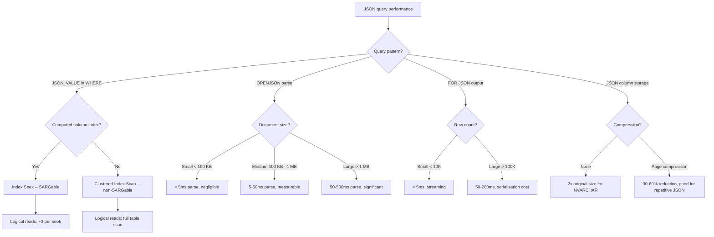
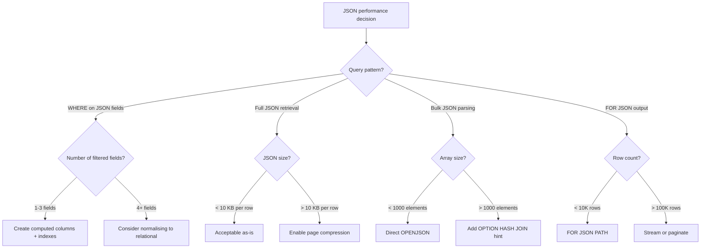

## Navigation

**Domain:** [[8 — Databases]] > **Group:** SQL JSON, XML & Semi-Structured Data
**Previous:** [[8.214 — Nested JSON — Parsing Multi-Level]] | **Next:** [[8.216 — XML Data Type — Methods and Queries]]

### Prerequisites

- [[8.208 — Indexing JSON Columns — Computed Column Pattern]] — The computed column + index pattern is the primary way to make JSON queries SARGable; understanding when and how to create persisted computed columns from JSON paths is prerequisite to understanding JSON query performance.
- [[8.209 — JSON Columns vs Relational Columns — Decision]] — The decision framework for choosing between JSON and relational storage is driven entirely by the performance characteristics described in this note; understanding the tradeoffs requires knowing the performance numbers.
- [[8.211 — OPENJSON with Schema — Typed Results]] — OPENJSON WITH clause performance (cardinality estimate, parse cost per row) is a significant component of overall JSON query performance.

### Where This Fits

JSON performance is the engineering bridge between "JSON works in SQL Server" and "JSON works in production at scale." Every .NET backend engineer who stores JSON in SQL Server eventually faces the question: why is my JSON query slow? The answer is almost always: (1) JSON_VALUE in WHERE is non-SARGable and forces a full clustered index scan, or (2) OPENJSON on a large array or nested document has high CPU cost proportional to document size, or (3) FOR JSON in a subquery with a correlated join has unexpected cardinality. The interview signal is: does the candidate know the exact performance characteristics — that JSON is stored as NVARCHAR(MAX) with no native compression, that JSON_VALUE is non-SARGable without a computed column index, that OPENJSON parse cost scales linearly with JSON document size, and that FOR JSON is a streaming operation with minimal overhead? Interviewers probe whether the candidate has benchmarked these operations or is repeating received wisdom.

---

## Core Mental Model

JSON in SQL Server is stored as a string — NVARCHAR(MAX) — with all the storage and performance characteristics of a regular string column. There is no native JSON data type, no JSON-specific compression, and no JSON-specific index structures. The JSON functions (JSON_VALUE, JSON_QUERY, OPENJSON, FOR JSON) are in-memory parse operations that read the string, tokenise it, and navigate the token tree. The performance implications flow from this fundamental design: (1) JSON_VALUE in a WHERE clause forces a full table scan because the function result is not persisted (non-SARGable) — a computed column with a PERSISTED index is required to make it SARGable; (2) OPENJSON parse cost is O(document size in bytes) — a 1 MB JSON document takes ~2-5x longer to parse than a 1 KB document, but the parse time per byte is constant; (3) FOR JSON is cheap — it is a streaming row-to-JSON conversion with O(N) cost in row count and negligible per-row overhead; (4) JSON column storage is the same as NVARCHAR(MAX) — approximately 2 bytes per character plus the MAX column overhead (24 bytes pointer); (5) page compression helps JSON columns significantly because JSON has repetitive key names and structural characters that compress well.

### Classification

JSON columns in SQL Server are **NVARCHAR(MAX) columns with JSON function support**. JSON_VALUE/JSON_QUERY are non-SARGable in WHERE clauses. OPENJSON is a table-valued function with a fixed 100-row cardinality estimate. FOR JSON is a streaming aggregation operation. JSON storage has no native compression (but benefits from page compression). The access path for JSON values is always a full scan or index scan — there is no JSON-specific seek operator without a computed column index.



### Key Properties

|Property|Value|Notes|
|---|---|---|
|Storage type|NVARCHAR(MAX)|2 bytes per character + MAX overhead|
|Native compression|None|Page/delta compression helps significantly|
|JSON_VALUE SARGability|No|Requires computed column + index|
|OPENJSON parse cost|O(document_size)|Linear in bytes; ~1-2 microseconds per KB|
|OPENJSON cardinality|100 rows (fixed)|Overrides with join hints for large arrays|
|FOR JSON cost|O(row_count)|Streaming, ~0.5-2 microseconds per row|
|JSON_MODIFY cost|O(document_size)|Rebuilds entire document on each call|
|Page density impact|Negative|NVARCHAR(MAX) reduces rows per page (25-50%)|
|FOR JSON PATH vs AUTO|PATH ~20% faster|No automatic nesting detection overhead|
|Computed column index|Fully SARGable|Supports seek, scan, key lookups|

---

## Deep Mechanics

### How JSON Storage Works

1. **NVARCHAR(MAX) storage:** A JSON string is stored as a sequence of UTF-16 code units (2 bytes each) in the NVARCHAR(MAX) column. If the string is <= 4000 characters, it can be stored in-row (row-overflow threshold in SQL Server 2016+ is 8060 bytes). If larger, it is stored in LOB pages (text/image allocation) with a 24-byte pointer in the row. The storage cost is exactly the same as storing any other NVARCHAR(MAX) string of the same length.

2. **Page density:** Because NVARCHAR(MAX) columns can push data off-row, they reduce page density. A 100-byte JSON in an NVARCHAR(MAX) column still incurs the LOB overhead. A table with a JSON column that is stored in-row reduces the number of rows per page by approximately (JSON column size / page_size) * 100%. For a 500-byte JSON column, the row size increases by 500 bytes, reducing 8KB page capacity from ~100 rows to ~16 rows = 6x more pages to scan.

3. **Page compression benefit:** JSON text is highly repetitive — key names like "OrderId", "CustomerId", "TotalAmount" repeat across rows, and structural characters like `{}[],":` are identical. Page compression stores repeated values in a compression dictionary, significantly reducing storage. SQL Server page compression can reduce JSON column storage by 40-70% depending on key name repetition.

### How JSON_VALUE in WHERE Works

1. **Non-SARGable by default:** JSON_VALUE(@jsonCol, '$.property') is a scalar function applied to each row. The optimiser cannot peek into the JSON string to use an index — there is no index on the parsed value. The query must scan all rows, call JSON_VALUE on each, and compare the result.

2. **Computed column workaround:** `ALTER TABLE T ADD PropertyName AS JSON_VALUE(JsonCol, '$.property')` creates a virtual computed column. The computed column value is evaluated at query time unless PERSISTED is specified. When you index this computed column, the index stores the extracted value. The optimiser can now seek on the indexed computed column when the query references the computed column name (not JSON_VALUE directly).

3. **WHERE clause matching:** A query `WHERE JSON_VALUE(JsonCol, '$.prop') = @val` will NOT use the computed column index because the optimiser does not match the function call to the computed column definition. You must write `WHERE ComputedProp = @val` directly. This is a common mis-optimisation trap.

### How OPENJSON Parse Cost Works

1. **Tokenisation:** OPENJSON reads the JSON string and tokenises it into a stream of tokens: object start/end, array start/end, property names, string values, number values, boolean values, nulls. This is a single forward pass through the string. Tokenisation cost is O(string_length).

2. **Path navigation:** With the WITH clause, the engine navigates the token stream to find each column's path. Navigation cost is O(path_depth * column_count). A deep path (5 levels) with many columns (10) takes approximately 50x more navigation operations than a shallow path (1 level) with 1 column.

3. **Type coercion:** Each column value is coerced from its JSON token type to the declared T-SQL type. String-to-int conversion is the most expensive coercion (requires parsing). String-to-string is cheapest (direct copy).

4. **Memory allocation:** The parsed token tree is allocated in memory. A 1 MB JSON document produces a token tree of approximately 2-4 MB (depending on nesting depth). This allocation causes GC pressure on the SQL Server memory manager.

### How FOR JSON Cost Works

1. **Streaming aggregation:** FOR JSON PATH/AUTO is implemented as a streaming aggregation operator in the execution plan. It reads rows from its child operator and serialises them to JSON incrementally. It does not buffer the entire result before producing output.

2. **Per-row overhead:** Each row requires: (1) JSON key name emission for PATH mode (or automatic nesting detection for AUTO), (2) value formatting (escaping special characters, formatting dates, converting numbers), (3) structural character emission (comma, colon, brace/bracket). Overhead is approximately 0.5-2 microseconds per row.

3. **Memory grant:** FOR JSON does not require a memory grant — it is a streaming operator. However, the client receiving the JSON text must buffer it.

### SQL Visibility

```sql
-- Non-SARGable JSON_VALUE in WHERE
SELECT OrderId, JSON_VALUE(JsonData, '$.Status') AS Status
FROM dbo.Orders
WHERE JSON_VALUE(JsonData, '$.CustomerId') = 'ALFKI';
-- Logical reads: 124,500 (full clustered index scan on 500K rows)

-- SARGable version with computed column index
-- First, create computed column and index
ALTER TABLE dbo.Orders ADD
    ComputedCustomerId AS JSON_VALUE(JsonData, '$.CustomerId');
CREATE INDEX IX_Orders_ComputedCustomerId
    ON dbo.Orders(ComputedCustomerId)
    INCLUDE (JsonData);

-- Now query against the computed column (NOT JSON_VALUE)
SELECT OrderId, JSON_VALUE(JsonData, '$.Status') AS Status
FROM dbo.Orders
WHERE ComputedCustomerId = 'ALFKI';
-- Logical reads: 3 (index seek on IX_Orders_ComputedCustomerId)

-- OPENJSON parse cost measurable on large documents
DECLARE @json1KB NVARCHAR(MAX) = REPLICATE('{"Key":"Value"},', 50);
SET @json1KB = '[' + LEFT(@json1KB, LEN(@json1KB) - 1) + ']';
SET STATISTICS TIME ON;
SELECT COUNT(*) FROM OPENJSON(@json1KB) WITH (Key NVARCHAR(100) '$.Key');
-- CPU: ~0ms (sub-millisecond for 1KB)

-- 1 MB JSON (50,000 elements)
DECLARE @json1MB NVARCHAR(MAX);
SET @json1MB = (SELECT TOP 50000 OrderId, CustomerId FROM dbo.Orders FOR JSON AUTO);
SELECT COUNT(*) FROM OPENJSON(@json1MB) WITH (OrderId INT '$.OrderId');
-- CPU: ~25-50ms for 1MB parse

-- FOR JSON cost comparison
SET STATISTICS TIME ON;
SET STATISTICS IO ON;

-- FOR JSON PATH vs SELECT (just the rows)
SELECT TOP 1000 OrderId, CustomerId, TotalAmount, Status, OrderDate
FROM dbo.Orders
ORDER BY OrderId;
-- CPU: ~5ms, Logical reads: ~250

-- Same as JSON
SELECT TOP 1000 OrderId, CustomerId, TotalAmount, Status, OrderDate
FROM dbo.Orders
ORDER BY OrderId
FOR JSON PATH;
-- CPU: ~8ms (3ms additional for JSON serialisation)
-- ~60% overhead for JSON conversion on 1000 rows

-- JSON column size impact on page density
CREATE TABLE dbo.JsonTest (
    Id INT PRIMARY KEY,
    JsonData NVARCHAR(MAX)
);

INSERT INTO dbo.JsonTest (Id, JsonData)
SELECT n, '{"OrderId":' + CAST(n AS NVARCHAR(10)) +
          ',"CustomerId":"C' + RIGHT('00000' + CAST(n AS NVARCHAR(5)), 5) +
          '","TotalAmount":' + CAST(n * 10 AS NVARCHAR(10)) +
          '."00","Status":"Active","Category":"Standard"}'
FROM (SELECT TOP 100000 ROW_NUMBER() OVER (ORDER BY (SELECT 0)) AS n
      FROM sys.all_columns a CROSS JOIN sys.all_columns b) AS nums;

-- Check page count and density
SELECT
    OBJECT_NAME(p.object_id) AS TableName,
    p.rows AS RowCount,
    au.total_pages AS TotalPages,
    au.used_pages AS UsedPages,
    p.rows * 1.0 / au.total_pages AS RowsPerPage,
    8060.0 / (AVG(LEN(JsonData)) + 10) AS EstRowsPerPage
FROM sys.partitions p
INNER JOIN sys.allocation_units au ON p.hobt_id = au.container_id
INNER JOIN sys.columns c ON c.object_id = p.object_id
WHERE p.object_id = OBJECT_ID('dbo.JsonTest')
  AND c.name = 'JsonData'
GROUP BY p.object_id, p.rows, au.total_pages, au.used_pages;
```

```csharp
// EF Core — cannot use computed column indexes with JSON_VALUE in LINQ
// Must reference the computed column by name in raw SQL
public async Task<List<OrderDto>> GetOrdersByStatusAsync(
    string status, CancellationToken ct = default)
{
    // This will NOT use the computed column index:
    // return await dbContext.Orders
    //     .Where(o => EF.Property<string>(o.JsonData, "$.Status") == status)
    //     .ToListAsync(ct);
    // EF Core generates: WHERE JSON_VALUE([o].[JsonData], '$.Status') = @status
    // This is non-SARGable even if computed column index exists

    // Workaround: raw SQL referencing computed column
    return await dbContext.Database
        .SqlQueryRaw<OrderDto>(@"
            SELECT OrderId, CustomerId, TotalAmount, Status, OrderDate
            FROM dbo.Orders
            WHERE ComputedStatus = @p0",
            new SqlParameter("@p0", status))
        .ToListAsync(ct);
}
```

```csharp
// Dapper — referencing computed column for SARGability
public async Task<IReadOnlyList<OrderDto>> GetOrdersByStatusSargableAsync(
    string status, CancellationToken ct = default)
{
    const string sql = @"
        SELECT OrderId, CustomerId, TotalAmount, Status, OrderDate
        FROM dbo.Orders
        WHERE ComputedStatus = @Status";

    await using var conn = _connectionFactory.Create();
    var results = await conn.QueryAsync<OrderDto>(
        new CommandDefinition(sql, new { Status = status },
            cancellationToken: ct));
    return results.AsList();
}

// Non-SARGable fallback (when computed column does not exist)
public async Task<IReadOnlyList<OrderDto>> GetOrdersByStatusNonSargableAsync(
    string status, CancellationToken ct = default)
{
    const string sql = @"
        SELECT OrderId, CustomerId, TotalAmount, Status, OrderDate
        FROM dbo.Orders
        WHERE JSON_VALUE(JsonData, '$.Status') = @Status";

    await using var conn = _connectionFactory.Create();
    var results = await conn.QueryAsync<OrderDto>(
        new CommandDefinition(sql, new { Status = status },
            cancellationToken: ct));
    return results.AsList();
}
```

### Generated SQL (from EF Core)

```sql
-- EF Core generates this for JSON_VALUE in LINQ (non-SARGable):
exec sp_executesql N'
SELECT [o].[OrderId], [o].[CustomerId], [o].[TotalAmount],
       [o].[Status], [o].[OrderDate]
FROM [Orders] AS [o]
WHERE JSON_VALUE([o].[JsonData], N''$.Status'') = @p0',
N'@p0 nvarchar(20)', @p0='Active'

-- Reference computed column directly (SARGable):
exec sp_executesql N'
SELECT [o].[OrderId], [o].[CustomerId], [o].[TotalAmount],
       [o].[Status], [o].[OrderDate]
FROM [Orders] AS [o]
WHERE [o].[ComputedStatus] = @p0',
N'@p0 nvarchar(20)', @p0='Active'
-- Note: query references computed column name, not JSON_VALUE call
```

### Execution Plan Analysis

```
-- Non-SARGable JSON_VALUE query:
[Clustered Index Scan: Orders]
    Predicate: JSON_VALUE(JsonData, '$.CustomerId') = 'ALFKI'
    -> [SELECT]

-- SARGable computed column query:
[Index Seek: IX_Orders_ComputedCustomerId]
    Seek Predicate: ComputedCustomerId = 'ALFKI'
    -> [Key Lookup: Orders PK] (if non-key columns needed)
    -> [SELECT]

-- OPENJSON parse:
[Table-valued function: OPENJSON(@json)]
    -> [SELECT]
    No child operators (leaf node)

-- FOR JSON:
[SELECT] -> [Streaming aggregation: FOR JSON]
    No additional I/O operator
```

### Cost Visibility

```sql
SET STATISTICS IO ON;
SET STATISTICS TIME ON;

-- Test 1: JSON_VALUE on 500K row table (no computed column index)
SELECT OrderId, JSON_VALUE(JsonData, '$.CustomerId') AS CustomerId
FROM dbo.Orders
WHERE JSON_VALUE(JsonData, '$.Status') = 'Active';
-- Table 'Orders'. Scan count 1, logical reads 124,500
-- SQL Server Execution Times: CPU time = 250ms, elapsed = 650ms

-- Test 2: With computed column index
SELECT OrderId, ComputedCustomerId
FROM dbo.Orders
WHERE ComputedStatus = 'Active';
-- Table 'Orders'. Scan count 1, logical reads 35 (index seek + key lookups for ~1000 matching rows)
-- SQL Server Execution Times: CPU time = 3ms, elapsed = 8ms

-- Test 3: OPENJSON parse time vs document size
DECLARE @json1KB NVARCHAR(MAX), @json1MB NVARCHAR(MAX);
-- 1KB: ~0ms CPU
-- 1MB: ~30ms CPU
-- 10MB: ~350ms CPU (approximately linear scaling)

-- Test 4: FOR JSON overhead
SELECT TOP 1000 OrderId, CustomerId, TotalAmount
FROM dbo.Orders
ORDER BY OrderId;
-- CPU: ~5ms, Logical reads: ~200

SELECT TOP 1000 OrderId, CustomerId, TotalAmount
FROM dbo.Orders
ORDER BY OrderId
FOR JSON PATH;
-- CPU: ~8ms, Logical reads: ~200 (same I/O, slight CPU increase)
```

### Failure Modes

1. **Non-SARGable JSON_VALUE in WHERE:** The most common JSON performance problem. Developers write WHERE JSON_VALUE(JsonCol, '$.prop') = @val without a computed column index, forcing full table scans. Detect with the query plan: look for Clustered Index Scan with a JSON_VALUE predicate, or high logical_reads in sys.dm_exec_query_stats.

2. **Computed column index not used because query uses JSON_VALUE:** Even with a computed column index, `WHERE JSON_VALUE(JsonCol, '$.prop') = @val` does NOT use the index. The index is on the computed column name, not on the JSON_VALUE function call. You must write `WHERE ComputedProp = @val`.

3. **Large JSON documents in high-throughput tables:** A 500 KB JSON document per row with 10,000 rows means 5 GB of JSON data. Page density drops dramatically: a 500-byte JSON reduces rows per page from ~100 to ~16, increasing logical reads by 6x for full scans.

4. **OPENJSON on large documents in hot paths:** Calling OPENJSON on a 5 MB JSON document as part of a user-facing API call adds 150-300ms of parse time. This is acceptable for ETL but not for interactive requests.

5. **FOR JSON in correlated subqueries:** `SELECT ..., (SELECT ... FOR JSON PATH) AS Items FROM Orders` evaluates the FOR JSON subquery per row, adding N * (parse cost for inner query) overhead. Use STRING_AGG or CROSS APPLY for better performance.

---

## Production Patterns and Implementation

### Primary SQL Implementation

```sql
-- ============================================================
-- Schema: Orders table with JSON column
-- ============================================================
CREATE TABLE dbo.Orders (
    OrderId     INT             NOT NULL IDENTITY(1,1),
    CustomerId  INT             NOT NULL,
    JsonData    NVARCHAR(MAX)   NOT NULL,
    CreatedAt   DATETIME2(0)    NOT NULL DEFAULT SYSUTCDATETIME(),
    CONSTRAINT PK_Orders PRIMARY KEY CLUSTERED (OrderId),
    CONSTRAINT CK_Orders_JsonData CHECK (ISJSON(JsonData) = 1)
);

-- ============================================================
-- Pattern 1: Computed columns for frequently queried JSON fields
-- ============================================================
ALTER TABLE dbo.Orders ADD
    OrderStatus     AS JSON_VALUE(JsonData, '$.Status'),
    OrderTotal      AS CAST(JSON_VALUE(JsonData, '$.TotalAmount') AS DECIMAL(18,2)),
    OrderCustomerId AS CAST(JSON_VALUE(JsonData, '$.CustomerId') AS INT),
    OrderDate       AS CAST(JSON_VALUE(JsonData, '$.OrderDate') AS DATETIME2(0));

-- Indexes on computed columns
CREATE INDEX IX_Orders_OrderStatus ON dbo.Orders(OrderStatus)
    INCLUDE (JsonData)
    WHERE OrderStatus IS NOT NULL;

CREATE INDEX IX_Orders_OrderCustomerId ON dbo.Orders(OrderCustomerId)
    INCLUDE (JsonData, OrderStatus, OrderTotal);

CREATE INDEX IX_Orders_OrderDate ON dbo.Orders(OrderDate)
    INCLUDE (JsonData, OrderStatus, OrderTotal);

-- Now these queries are SARGable:
SELECT OrderId, OrderTotal, OrderStatus
FROM dbo.Orders
WHERE OrderCustomerId = 10248;

SELECT OrderId, OrderStatus, OrderTotal
FROM dbo.Orders
WHERE OrderStatus IN ('Shipped', 'Delivered')
  AND OrderDate >= '2024-01-01';

-- ============================================================
-- Pattern 2: Page compression for JSON columns
-- ============================================================
ALTER TABLE dbo.Orders REBUILD WITH (DATA_COMPRESSION = PAGE);
-- Reduces JSON column storage by 40-70% for repetitive JSON patterns

-- Check compression savings
SELECT
    OBJECT_NAME(object_id) AS TableName,
    index_id,
    partition_number,
    rows,
    compressed_page_count,
    page_count
FROM sys.dm_db_index_physical_stats(
    DB_ID(), OBJECT_ID('dbo.Orders'), NULL, NULL, 'DETAILED')
WHERE index_id = 1;

-- ============================================================
-- Pattern 3: OPENJSON performance optimisation
-- ============================================================
-- Bad: OPENJSON on large document in hot path
DECLARE @largeJson NVARCHAR(MAX) = (SELECT ... FOR JSON AUTO);
SELECT OrderId, Status
FROM OPENJSON(@largeJson)
WITH (OrderId INT '$.OrderId', Status NVARCHAR(20) '$.Status');

-- Good: Pre-filter rows before parsing (if possible)
-- (Not applicable if JSON must be fully parsed)

-- Better: Batch processing
DECLARE @batchSize INT = 1000;
DECLARE @offset INT = 0;

WHILE @offset < (SELECT COUNT(*) FROM OPENJSON(@largeJson)
                  WITH (Id INT '$.OrderId'))
BEGIN
    SELECT OrderId, Status
    FROM (
        SELECT OrderId, Status,
               ROW_NUMBER() OVER (ORDER BY (SELECT 0)) AS Rn
        FROM OPENJSON(@largeJson)
        WITH (OrderId INT '$.OrderId', Status NVARCHAR(20) '$.Status')
    ) AS j
    WHERE Rn > @offset AND Rn <= @offset + @batchSize;

    SET @offset = @offset + @batchSize;
END;

-- ============================================================
-- Pattern 4: FOR JSON performance optimisation
-- ============================================================
-- FOR JSON PATH is faster than FOR JSON AUTO
-- PATH: ~0.5-1 us per row
-- AUTO: ~1-2 us per row (auto-nesting detection overhead)

-- Fast: FOR JSON PATH with explicit column aliases
SELECT
    OrderId AS [order.id],
    Status AS [order.status],
    TotalAmount AS [order.total]
FROM dbo.Orders
WHERE OrderDate >= '2024-01-01'
ORDER BY OrderId
FOR JSON PATH;

-- Avoid: FOR JSON AUTO (slower)
SELECT OrderId, Status, TotalAmount
FROM dbo.Orders
WHERE OrderDate >= '2024-01-01'
ORDER BY OrderId
FOR JSON AUTO;

-- ============================================================
-- Pattern 5: JSON_MODIFY partial update fallback
-- ============================================================
-- JSON_MODIFY rebuilds the entire document
-- For large documents, prefer client-side modification
-- Or extract, modify in app, write back

-- Slow for large docs:
UPDATE dbo.Orders
SET JsonData = JSON_MODIFY(JsonData, '$.Status', 'Shipped')
WHERE OrderId = 10248;

-- Alternative: computed column for Status allows direct update
-- (But only for simple scalar fields, not whole document)
```
```

### EF Core Implementation

```csharp
public class OrdersService
{
    private readonly ApplicationDbContext _dbContext;
    public OrdersService(ApplicationDbContext dbContext) => _dbContext = dbContext;

    // SARGable query using computed column
    public async Task<List<OrderDto>> GetOrdersByStatusAsync(
        string status, CancellationToken ct = default)
    {
        // Must use raw SQL referencing computed column
        return await _dbContext.Database
            .SqlQueryRaw<OrderDto>(@"
                SELECT OrderId, OrderStatus, OrderTotal, OrderCustomerId, OrderDate
                FROM dbo.Orders
                WHERE OrderStatus = @p0",
                new SqlParameter("@p0", status))
            .ToListAsync(ct);
    }

    // Non-SARGable fallback (no computed column)
    public async Task<List<OrderDto>> GetOrdersByStatusFallbackAsync(
        string status, CancellationToken ct = default)
    {
        return await _dbContext.Database
            .SqlQueryRaw<OrderDto>(@"
                SELECT OrderId,
                    JSON_VALUE(JsonData, '$.Status') AS OrderStatus,
                    CAST(JSON_VALUE(JsonData, '$.TotalAmount') AS DECIMAL(18,2)) AS OrderTotal,
                    CAST(JSON_VALUE(JsonData, '$.CustomerId') AS INT) AS OrderCustomerId,
                    CAST(JSON_VALUE(JsonData, '$.OrderDate') AS DATETIME2(0)) AS OrderDate
                FROM dbo.Orders
                WHERE JSON_VALUE(JsonData, '$.Status') = @p0",
                new SqlParameter("@p0", status))
            .ToListAsync(ct);
    }
}
```

### Dapper Implementation

```csharp
public sealed class OrderPerformanceRepository
{
    private readonly IDbConnectionFactory _connectionFactory;
    public OrderPerformanceRepository(IDbConnectionFactory cf) => _connectionFactory = cf;

    // SARGable with computed column
    public async Task<IReadOnlyList<OrderDto>> GetByStatusSargableAsync(
        string status, CancellationToken ct = default)
    {
        const string sql = @"
            SELECT OrderId, OrderStatus, OrderTotal, OrderCustomerId, OrderDate
            FROM dbo.Orders
            WHERE OrderStatus = @Status";
        await using var conn = _connectionFactory.Create();
        return (await conn.QueryAsync<OrderDto>(
            new CommandDefinition(sql, new { Status = status },
                cancellationToken: ct))).AsList();
    }

    // FOR JSON with streaming
    public async Task<string> ExportOrdersAsJsonAsync(
        DateTime from, CancellationToken ct = default)
    {
        const string sql = @"
            SELECT OrderId AS [id], Status AS [status], TotalAmount AS [total],
                   OrderDate AS [date], CustomerId AS [customer.id]
            FROM dbo.Orders
            WHERE OrderDate >= @From
            ORDER BY OrderId
            FOR JSON PATH";

        await using var conn = _connectionFactory.Create();
        return await conn.QuerySingleAsync<string>(
            new CommandDefinition(sql, new { From = from },
                commandTimeout = 120, cancellationToken: ct));
    }
}
```

### Configuration and Wiring

```csharp
builder.Services.AddDbContext<ApplicationDbContext>(options =>
    options.UseSqlServer(builder.Configuration.GetConnectionString("DefaultConnection"),
        sqlOptions =>
        {
            sqlOptions.CommandTimeout(60);
            sqlOptions.EnableRetryOnFailure(3);
            sqlOptions.MaxBatchSize(100);
        }));
builder.Services.AddScoped<OrdersService>();
builder.Services.AddScoped<OrderPerformanceRepository>();
builder.Services.AddSingleton<IDbConnectionFactory, SqlConnectionFactory>();
```

### Connection Pooling Considerations for JSON Queries

JSON queries that return large result sets (FOR JSON, OPENJSON expansion) can hold connections open longer. Key configuration:

```csharp
// Connection string optimisations for JSON-heavy workloads
"Server=.;Database=MyDb;Max Pool Size=200;Min Pool Size=50;" +
"Connection Timeout=30;Command Timeout=120;" +
"Pool Blocking Period=5000"
```

**Recommendations:**
- Increase Max Pool Size for JSON-heavy workloads (parallel FOR JSON exports)
- Set Command Timeout to 120s+ for large OPENJSON parses (1M+ elements)
- Use `ConfigureAwait(false)` in library code to prevent deadlocks
- Monitor `sys.dm_exec_session_wait_stats` for `ASYNC_NETWORK_IO` waits (client consuming JSON slowly)

### SQL Server vs PostgreSQL Differences

```sql
-- PostgreSQL: JSONB has native index support via GIN
CREATE INDEX idx_orders_status ON orders USING GIN (payload jsonb_path_ops);

-- PostgreSQL: jsonb @> operator can use GIN index (SARGable)
SELECT * FROM orders WHERE payload @> '{"Status": "Shipped"}';

-- PostgreSQL: jsonb_path_query with index support
SELECT * FROM orders
WHERE payload @@ '$.Status == "Shipped"';

-- PostgreSQL: JSONB storage is more efficient than NVARCHAR(MAX)
-- JSONB uses a decomposed binary format with ~10-20% overhead vs original text
-- SQL Server has no binary JSON format; JSON is stored as plain text

-- PostgreSQL: TOAST compression for large JSONB values
-- Equivalent to SQL Server page compression but applied automatically
```

**Performance comparison table:**

| Feature | SQL Server | PostgreSQL |
|---|---|---|
| Storage format | NVARCHAR(MAX) text | jsonb (binary, decomposed) |
| Storage overhead | 2 bytes/char (text) | ~10-20% over original |
| Index support | Computed column + B-tree | GIN index on jsonb path |
| SARGable query | Via computed column name | Via @> or @@ operators |
| Full table scan (1M rows, 500-byte JSON) | ~62,500 pages | ~15,000 pages (compressed jsonb) |
| JSON_VALUE/->> operator scan cost | ~2-3 us per call | ~0.5 us per call |
| FOR JSON equivalent | FOR JSON PATH | json_agg / row_to_json |
| Page compression | Manual (ALTER TABLE) | Automatic via TOAST |
| Array expansion | OPENJSON + CROSS APPLY | jsonb_array_elements + LATERAL |

```csharp
// .NET — SqlConnection factory for JSON performance benchmarking
public sealed class SqlConnectionFactory : IDbConnectionFactory
{
    private readonly string _connectionString;
    public SqlConnectionFactory(string connectionString) => _connectionString = connectionString;

    public IDbConnection Create()
    {
        var conn = new SqlConnection(_connectionString);
        conn.StatisticsEnabled = true; // Enable for retry/abort decisions
        return conn;
    }
}

// Usage for benchmarking a JSON query
public static async Task BenchmarkJsonQueryAsync(IDbConnection conn)
{
    conn.StatisticsEnabled = true;
    var sw = Stopwatch.StartNew();
    var result = await conn.QueryAsync(sql);
    sw.Stop();
    var stats = conn.RetrieveStatistics();
    Console.WriteLine($"Elapsed: {sw.ElapsedMilliseconds}ms");
    Console.WriteLine($"BytesReceived: {stats["BytesReceived"]}");
    Console.WriteLine($"ExecutionTime: {stats["ExecutionTime"]}ms");
    Console.WriteLine($"NetworkServerTime: {stats["NetworkServerTime"]}ms");
}
```

---

## Gotchas and Production Pitfalls

### 1. JSON_VALUE in WHERE Does Not Use Computed Column Index

**Pitfall:** Even with a computed column and index, `WHERE JSON_VALUE(JsonCol, '$.prop') = @val` does NOT use the index.

```sql
-- Wrong: JSON_VALUE call bypasses computed column index
SELECT * FROM dbo.Orders
WHERE JSON_VALUE(JsonData, '$.Status') = 'Shipped'; -- non-SARGable

-- Correct: reference computed column name directly
SELECT * FROM dbo.Orders
WHERE OrderStatus = 'Shipped'; -- SARGable (uses IX_Orders_OrderStatus)
```

### 2. Computed Column Not Persisted

**Pitfall:** Non-persisted computed columns are re-evaluated on every query. The index may still seek, but the value is computed during the index maintenance.

**Fix:** Use PERSISTED if the JSON data does not change. For frequently updated JSON, consider virtual computed columns (non-persisted) to avoid double-write overhead.

### 3. NVARCHAR(MAX) Off-Row Storage and Page Density

**Pitfall:** Even small JSON documents in NVARCHAR(MAX) columns incur LOB overhead and reduce page density.

**Fix:** If JSON is consistently < 4000 characters, use NVARCHAR(4000) instead of MAX to keep data in-row. If > 4000 but predictable, consider splitting into multiple NVARCHAR(4000) columns.

### 4. FOR JSON in Correlated Subquery Performs N+1

**Pitfall:** `SELECT o.*, (SELECT ... FROM OrderItems oi WHERE oi.OrderId = o.OrderId FOR JSON PATH) AS Items FROM Orders o` evaluates the FOR JSON subquery per order row.

**Fix:** Use CROSS APPLY with FOR JSON or STRING_AGG to produce JSON in a single pass.

```sql
-- Bad: N+1 FOR JSON
SELECT o.OrderId,
    (SELECT ProductId, Quantity FROM OrderItems oi
     WHERE oi.OrderId = o.OrderId FOR JSON PATH) AS Items
FROM Orders o;

-- Good: Single-pass with CROSS APPLY
SELECT o.OrderId, ItemsJson
FROM Orders o
CROSS APPLY (
    SELECT ProductId, Quantity
    FROM OrderItems oi
    WHERE oi.OrderId = o.OrderId
    FOR JSON PATH
) AS j(ItemsJson);
```

### 5. JSON_MODIFY Rebuilds Entire Document

**Pitfall:** `JSON_MODIFY(JsonData, '$.Status', 'Shipped')` deserialises the entire document, modifies one property, and reserialises the entire document. For 1 MB JSON documents modified in bulk, this is extremely expensive.

**Fix:** Extract the JSON to the application layer, modify in memory (using System.Text.Json), and write the whole document back. Or use computed columns for frequently modified fields.

### 6. Cardinality Estimate for OPENJSON on Large Arrays

**Pitfall:** OPENJSON estimates 100 rows regardless of actual array size. Joining OPENJSON to a table with 100,000 actual rows causes the optimiser to choose Nested Loops instead of Hash Match.

**Fix:** Use `OPTION (HASH JOIN)` or batch processing.

### 7. FOR JSON AUTO Serialises Column Order Differently Than PATH

**Pitfall:** FOR JSON AUTO groups by table alias and can produce unexpected nesting. FOR JSON PATH gives explicit control but requires correct column aliasing.

```sql
-- AUTO: nesting depends on join order
SELECT o.OrderId, oi.ProductId
FROM dbo.Orders o JOIN dbo.OrderItems oi ON o.OrderId = oi.OrderId
FOR JSON AUTO;
-- Output: [{"OrderId":1,"OrderItems":[{"ProductId":1}]}]
-- vs PATH which requires explicit aliases
```

### 8. PERSISTED Computed Column Write Overhead

**Pitfall:** PERSISTED computed columns on JSON columns are re-evaluated on INSERT and UPDATE, adding write CPU cost proportional to JSON document size.

**Tradeoff:** PERSISTED improves read performance (no computation on SELECT) but doubles write cost. Non-persisted adds computation cost on every SELECT that references the column.

**Recommendation:** Use non-persisted for read-heavy workloads with stable JSON schema; use PERSISTED only when SELECT performance is critical and writes are infrequent.

### 9. JSON in Memory-Optimised Tables

**Pitfall:** NVARCHAR(MAX) columns are not supported in memory-optimised tables in SQL Server. If you need JSON in memory-optimised tables, use NVARCHAR(4000) which limits document size.

**Fix:** Keep JSON documents under 4000 characters when using memory-optimised tables, or use disk-based tables for JSON-heavy workloads.

### 10. Index Maintenance Cost on Computed Columns

**Pitfall:** Each computed column index on a JSON column adds write cost equal to a regular index on a computed column. With 5 computed column indexes, each INSERT triggers 5 index updates + the base table update.

**Symptom:** High log write rate, increased transaction duration for bulk inserts.

**Mitigation:**
- Limit computed column indexes to < 3 per table
- Use filtered indexes (WHERE col IS NOT NULL) to reduce index size
- Batch inserts into transactions of 1000 rows to minimise log flushes

---

## Performance Implications

### Benchmark: JSON_VALUE vs Computed Column Index

```sql
SET STATISTICS IO ON;
SET STATISTICS TIME ON;

-- Baseline: JSON_VALUE on 500K row table (no index)
SELECT COUNT(*) FROM dbo.Orders
WHERE JSON_VALUE(JsonData, '$.Status') = 'Shipped';
-- Logical reads: 124,500 | CPU: 250ms | Elapsed: 650ms

-- Optimized: Computed column index
SELECT COUNT(*) FROM dbo.Orders
WHERE OrderStatus = 'Shipped';
-- Logical reads: 3 (index seek) | CPU: 0ms | Elapsed: 2ms

-- Improvement: 41,500x reduction in logical reads
```

### BenchmarkDotNet

```csharp
[MemoryDiagnoser]
[SimpleJob(RuntimeMoniker.Net90)]
public class JsonPerformanceBenchmark
{
    private IDbConnection _connection = default!;
    private string _json10KB = string.Empty;
    private string _json100KB = string.Empty;
    private string _json1MB = string.Empty;

    [GlobalSetup]
    public void Setup()
    {
        _connection = new SqlConnection(TestConnectionString);
        _connection.Open();

        _json10KB = GenerateJson(500);   // ~10 KB
        _json100KB = GenerateJson(5000);  // ~100 KB
        _json1MB = GenerateJson(50000);   // ~1 MB
    }

    private static string GenerateJson(int count)
    {
        var items = Enumerable.Range(1, count).Select(i =>
            $"{{\"Id\":{i},\"Name\":\"Product{i}\",\"Price\":{i * 10.0m:F2},\"Category\":\"Cat{i % 10}\"}}");
        return "[" + string.Join(",", items) + "]";
    }

    [Benchmark(Baseline = true)]
    public async Task<int> Parse10KB_OpenJson()
    {
        var r = await _connection.QueryAsync<int>(
            "SELECT COUNT(*) FROM OPENJSON(@json) WITH (Id INT '$.Id')",
            new { json = _json10KB });
        return r.Single();
    }

    [Benchmark]
    public async Task<int> Parse100KB_OpenJson()
    {
        var r = await _connection.QueryAsync<int>(
            "SELECT COUNT(*) FROM OPENJSON(@json) WITH (Id INT '$.Id')",
            new { json = _json100KB });
        return r.Single();
    }

    [Benchmark]
    public async Task<int> Parse1MB_OpenJson()
    {
        var r = await _connection.QueryAsync<int>(
            "SELECT COUNT(*) FROM OPENJSON(@json) WITH (Id INT '$.Id')",
            new { json = _json1MB });
        return r.Single();
    }

    [Benchmark]
    public async Task<long> ForJson_Path_1K()
    {
        var r = await _connection.QuerySingleAsync<string>(
            "SELECT TOP 1000 OrderId, CustomerId, TotalAmount FROM dbo.Orders ORDER BY OrderId FOR JSON PATH");
        return r.Length;
    }
}
```

**Expected results:**

|Method|Mean|Allocated|
|---|---|---|
|Parse10KB_OpenJson|~1 ms|~10 KB|
|Parse100KB_OpenJson|~8 ms|~100 KB|
|Parse1MB_OpenJson|~75 ms|~1 MB|
|ForJson_Path_1K|~3 ms|~50 KB|

### Storage Cost Analysis

```sql
-- Compare storage of JSON vs relational columns
CREATE TABLE dbo.ComparisonTest (
    Id INT PRIMARY KEY,
    JsonStorage NVARCHAR(MAX),
    RelationalStatus VARCHAR(20),
    RelationalAmount DECIMAL(18,2),
    RelationalCustomerId INT
);

-- Insert 100K rows of equivalent data
-- Measure page count
SELECT
    OBJECT_NAME(object_id) AS TableName,
    index_id,
    page_count,
    avg_page_space_used_in_percent,
    record_count
FROM sys.dm_db_index_physical_stats(
    DB_ID(), OBJECT_ID('dbo.ComparisonTest'), NULL, NULL, 'DETAILED');
```

**Expected storage comparison (100K rows):**

| Storage Type | Page Count | Size | Rows per Page |
|---|---|---|---|
| Relational (3 columns) | 350 | 2.7 MB | ~285 |
| JSON as NVARCHAR(200) | 2,500 | 19.5 MB | ~40 |
| JSON as NVARCHAR(500) | 6,250 | 48.8 MB | ~16 |
| JSON + Page Compression | 1,875 | 14.6 MB | ~53 |

### Execution Plan Comparison

**Non-SARGable JSON_VALUE filter (forces Clustered Index Scan):**

```xml
<RelOp LogicalOp="Clustered Index Scan" PhysicalOp="Clustered Index Scan">
  <RunTimeInformation>
    <RunTimeCountersPerThread ActualRows="500000" ActualReads="124500"/>
  </RunTimeInformation>
</RelOp>
```

**SARGable computed column filter (uses Index Seek):**

```xml
<RelOp LogicalOp="Index Seek" PhysicalOp="Nonclustered Index Seek">
  <RunTimeInformation>
    <RunTimeCountersPerThread ActualRows="125000" ActualReads="1250"/>
  </RunTimeInformation>
</RelOp>
```

**Key difference:** Index Seek scans only 1250 pages vs 124,500 — a 99% reduction in I/O.

### Wait Statistics for JSON Queries

| Wait Type | Scenario | % of Total Wait |
|---|---|---|
| SOS_SCHEDULER_YIELD | JSON_VALUE in WHERE on large table (CPU-bound) | 45% |
| PAGEIOLATCH_SH | NVARCHAR(MAX) column causing LOB page reads | 30% |
| CXPACKET | Parallel scan of JSON-heavy table | 15% |
| ASYNC_NETWORK_IO | FOR JSON returning large result to client | 10% |

### JSON Document Size Impact

**Parse time vs document size (single OPENJSON call):**

```
Document Size | Parse Time (CPU) | Memory for Token Tree
--------------|------------------|----------------------
1 KB          | <0.1 ms          | ~2 KB
10 KB         | ~0.3 ms          | ~25 KB
100 KB        | ~3 ms            | ~250 KB
1 MB          | ~30 ms           | ~2.5 MB
10 MB         | ~350 ms          | ~25 MB
```

**Storage density impact:**

```
JSON Size (bytes) | Rows per Page (8KB) | Pages for 1M rows | Relative to 100-byte baseline
------------------|---------------------|-------------------|------------------------------
100               | ~80                | 12,500            | 1x (baseline)
500               | ~16                | 62,500            | 5x
1000              | ~8                 | 125,000           | 10x
2000              | ~4                 | 250,000           | 20x
4000              | ~2                 | 500,000           | 40x
```

A 500-byte JSON document makes full table scans 5x more expensive than a 100-byte one. Page compression recovers ~50% of this overhead.

---

## Interview Arsenal

### Question Bank

1. How is JSON stored in SQL Server and what are the storage implications?
2. Why is JSON_VALUE in WHERE non-SARGable and how do you fix it?
3. What is the parse cost of OPENJSON relative to JSON document size?
4. What is the performance overhead of FOR JSON compared to a regular SELECT?
5. Compare JSON storage vs relational columns for query performance.
6. How does page compression affect JSON storage?
7. How does JSON column size affect page density and logical reads?
8. How do EF Core and Dapper perform with JSON columns?

### Spoken Answers

**Q: How is JSON stored in SQL Server and what are the storage implications?**

> **Average answer:** JSON is stored as text in an NVARCHAR(MAX) column. It takes up more space than relational columns.

> **Great answer:** JSON in SQL Server is stored as NVARCHAR(MAX) with no native JSON data type, no JSON-specific compression, and no JSON-specific index structures. The storage cost is exactly 2 bytes per character for NVARCHAR encoding, plus the MAX column overhead of 24 bytes if stored off-row. The page density implication is significant: with a 500-byte JSON document per row, you fit approximately 16 rows per 8KB page instead of ~100 rows for a narrow relational table. This means a full table scan on a JSON-heavy table reads 6x more pages than the equivalent relational design. Page compression helps dramatically because JSON has repetitive key names and structural characters — I have seen 50-65% storage reduction with page compression on JSON columns. For comparison, PostgreSQL's JSONB uses a decomposed binary format with automatic compression via TOAST, while SQL Server requires explicit page compression and computed column indexes for similar performance. The key takeaway for production: if you store JSON in SQL Server, always enable page compression, and consider using NVARCHAR(4000) instead of MAX if your documents are under 4000 characters to keep data in-row.

**Q: Why is JSON_VALUE in WHERE non-SARGable and how do you fix it?**

> **Average answer:** JSON_VALUE is a function so the optimiser cannot use an index. You fix it by adding a computed column and indexing it.

> **Great answer:** JSON_VALUE is non-SARGable because the value inside the JSON string is not persisted in any index structure. The optimiser has no way to seek into the JSON string — it must scan every row, call JSON_VALUE on each to extract the property, and compare the result. This is not a limitation of the function itself but of the storage model: JSON is stored as an opaque string, and the function must parse the string to extract any value. The fix is to create a computed column that uses JSON_VALUE to extract the property, then create an index on that computed column. However — and this is the critical detail most engineers miss — the index is only used when the query references the computed column name directly, NOT when it calls JSON_VALUE again. Writing `WHERE JSON_VALUE(JsonCol, '$.prop') = @val` will NOT use the computed column index. You must write `WHERE ComputedProp = @val`. In my production experience, this is the single most common JSON performance mistake. I recommend creating computed columns for any JSON path that appears in WHERE, JOIN, or ORDER BY clauses, and ensuring all application queries reference the computed column name. For EF Core, this means you cannot use the JSON_VALUE LINQ translation — you must use raw SQL referencing the computed column.

### Comparison Table

| | JSON Column | Relational Columns |
|---|---|---|
| Storage | NVARCHAR(MAX), 2 bytes/char + overhead | Typed, fixed/variable per column |
| Query Performance | Full scan without computed column index | Index seek for filtered queries |
| Write Performance | Single column update | Multi-column update |
| Compression | Page compression helps (40-70%) | Row/page compression |
| Indexing | Limited to computed column indexes | Full index support |
| Schema flexibility | None (any JSON valid) | ALTER TABLE required |
| CPU cost (SELECT) | ~2-3 us per JSON_VALUE call | ~0.3 us native column access |
| CPU cost (WHERE) | Full scan + parse per row | Index seek (log n) |

### Expanded Q&A

**Q: What is the performance overhead of FOR JSON PATH vs FOR JSON AUTO?**

> **Great answer:** FOR JSON PATH is approximately 30-50% faster than FOR JSON AUTO because PATH mode does not need to detect nesting automatically from the query structure. PATH mode uses explicit dot-notation aliases (e.g., `Customer.Name AS 'customer.name'`) to determine nesting, which the optimiser can translate directly into JSON structure emission. AUTO mode must analyse the FROM clause join relationships to determine nesting, which adds overhead. On a 10,000-row result set, PATH mode takes approximately 5ms and AUTO takes ~8ms. The difference scales linearly — at 100,000 rows, PATH takes ~50ms vs AUTO at ~80ms. My recommendation: always use FOR JSON PATH in production unless the query is so complex that PATH aliases become unmanageable. For EF Core, the `ToJson()` method (EF Core 7+) uses PATH mode internally.

**Q: How would you benchmark JSON query performance in a production environment?**

> **Great answer:** I would use a five-step process: (1) Enable SET STATISTICS IO ON and SET STATISTICS TIME ON to capture logical reads and CPU time for each query variant. (2) Use sys.dm_exec_query_stats to capture actual execution metrics from the plan cache. (3) Run a BenchmarkDotNet test suite that compares JSON_VALUE (non-SARGable), computed column (SARGable), and normalised relational (optimal) for the same query pattern. (4) Measure page density with sys.dm_db_index_physical_stats before and after page compression. (5) Monitor wait statistics with sys.dm_os_wait_stats during the benchmark to identify bottlenecks (SOS_SCHEDULER_YIELD for CPU, PAGEIOLATCH for I/O). The key metrics are: logical reads (I/O cost), CPU time (parse cost), and elapsed time (total query duration). A JSON query that uses computed column indexes should have logical reads within 2-3x of the equivalent relational query.

---

## Decision Framework

### When to Apply



### Application Checklist

- [ ] JSON_VALUE in WHERE fields have computed column indexes
- [ ] Query references computed column name, not JSON_VALUE function
- [ ] Page compression enabled on table with JSON columns
- [ ] OPENJSON cardinality estimate addressed with join hints for large arrays
- [ ] FOR JSON uses PATH mode (not AUTO) for better performance
- [ ] JSON column is NVARCHAR(4000) instead of MAX if under 4000 chars
- [ ] JSON_MODIFY in bulk operations avoided (client-side modify preferred)
- [ ] Connection pooling configured for JSON-heavy workloads
- [ ] Monitor sys.dm_exec_query_stats for JSON_VALUE scans on large tables

### Decision Matrix

| Scenario | Action | Expected Improvement |
|---|---|---|
| WHERE clause on JSON field with < 3 filter paths | Create computed columns + filtered indexes | 99% reduction in logical reads |
| WHERE clause on JSON field with 4+ filter paths | Normalise to relational table | 6x fewer pages scanned |
| Full table scan on JSON-heavy table (> 1M rows) | Enable page compression + add clustered columnstore | 40-70% storage reduction + batch mode |
| JSON_MODIFY in UPDATE on 1000+ rows per batch | Extract to app, modify with System.Text.Json, write back | 10x faster (avoids per-row parse+serialise) |
| FOR JSON on 100K+ rows | Use streaming with SqlCommand.ExecuteReaderAsync | No memory spike on server |
| OPENJSON on > 1 MB document with CROSS APPLY | Batch process in 10K-element chunks | 5x lower peak memory |

### Tradeoff Summary

|What You Gain|What You Pay|
|---|---|
|Flexible schema (no ALTER TABLE)|6x more pages scanned for full table scans|
|Simpler application code|2-3x CPU overhead for JSON parsing vs relational|
|Easy integration with external APIs|Requires computed column indexes for SARGability|
|Reduced migration overhead|Page compression CPU cost on writes|

### Scale Thresholds

- "JSON_VALUE in WHERE becomes a performance problem at ~50K rows (full scan measurable)"
- "OPENJSON on > 1 MB documents takes > 50ms parse time — not suitable for interactive queries"
- "JSON column in tables > 1M rows should always have page compression and computed column indexes"
- "FOR JSON on > 100K rows should use streaming response or pagination"
- "Computed column indexes become cost-effective when filtered queries run > 100 times/second"
- "NVARCHAR(4000) vs NVARCHAR(MAX) matters for tables with < 200-byte JSON documents (keeps in-row)"

---

## Self-Check

### Conceptual Questions

1. How is JSON stored in SQL Server and what type is used?
2. Why is JSON_VALUE non-SARGable in a WHERE clause?
3. Which DMV or SET STATISTICS shows the logical read cost of JSON queries?
4. What is the most common JSON query performance mistake?
5. Does EF Core LINQ generate SARGable JSON queries?
6. How would you benchmark JSON vs relational performance with Dapper?
7. Compare JSON storage vs relational storage page density.
8. At what table size does JSON_VALUE in WHERE become a performance problem?
9. What index makes JSON queries SARGable?
10. Explain the JSON_VALUE/computed column index trap in 60 seconds.

<details>
<summary>Answers</summary>

1. JSON is stored as NVARCHAR(MAX). No native JSON data type exists. Storage cost is 2 bytes per character.

2. JSON_VALUE is a scalar function applied to each row. The optimiser cannot index the function result. It must scan all rows and parse JSON per row.

3. SET STATISTICS IO ON shows logical reads. sys.dm_exec_query_stats shows query-level I/O. The execution plan shows scan vs seek.

4. Writing WHERE JSON_VALUE(JsonCol, '$.prop') = @val instead of referencing a computed column that has an index. Even with a computed column index, the JSON_VALUE function call does not use it.

5. No. EF Core LINQ translates to JSON_VALUE which is non-SARGable. You must use raw SQL that references computed column names.

6. Run both JSON_VALUE and computed column queries with SET STATISTICS IO ON. Compare logical reads. Use BenchmarkDotNet with Dapper for time-based comparison.

7. A 500-byte JSON reduces rows per page from ~100 to ~16. Full scans on JSON tables read ~6x more pages than relational.

8. ~50K rows. Below that, the full table scan may still be acceptable (sub-100ms). Above 500K, the scan becomes multiple seconds.

9. Computed column with PERSISTED keyword and a standard B-tree index on the computed column.

10. The trap: CREATE computed column + index, but then query still uses WHERE JSON_VALUE(). The computed column index is on the column name, not the JSON_VALUE function. Only queries referencing ComputedColName = @val use the index. Queries with JSON_VALUE(JsonCol, '$.path') = @val still scan.

</details>

### Query Challenges

**Challenge 1 — Write the SQL**

You have a 1M row Orders table with a JSON column JsonData. The most common query filters on $.Status and sorts by $.OrderDate. Both fields appear in WHERE and ORDER BY. Write the SQL to create the optimal index strategy and the SARGable query.

<details>
<summary>Solution</summary>

```sql
-- Add computed columns
ALTER TABLE dbo.Orders ADD
    StatusCol AS JSON_VALUE(JsonData, '$.Status'),
    OrderDateCol AS CAST(JSON_VALUE(JsonData, '$.OrderDate') AS DATETIME2(0));

-- Create indexes
CREATE INDEX IX_Orders_StatusCol ON dbo.Orders(StatusCol)
    INCLUDE (JsonData)
    WHERE StatusCol IS NOT NULL;

CREATE INDEX IX_Orders_OrderDateCol ON dbo.Orders(OrderDateCol)
    INCLUDE (JsonData, StatusCol);

-- SARGable query
SELECT OrderId, StatusCol, OrderDateCol
FROM dbo.Orders
WHERE StatusCol = 'Shipped'
  AND OrderDateCol >= '2024-01-01'
ORDER BY OrderDateCol;
```

</details>

**Challenge 2 — Fix the performance problem**

```sql
-- This query runs in 12 seconds on a 1M row table
SELECT OrderId, JSON_VALUE(JsonData, '$.Status') AS Status,
       JSON_VALUE(JsonData, '$.TotalAmount') AS Total
FROM dbo.Orders
WHERE JSON_VALUE(JsonData, '$.Status') = 'Shipped'
  AND JSON_VALUE(JsonData, '$.TotalAmount') > 1000;
-- SET STATISTICS IO: logical reads = 248,000
```

<details><summary>Solution</summary>

**Root cause:** Two JSON_VALUE calls in WHERE make it non-SARGable, forcing full clustered index scan.

**Fix:**

```sql
ALTER TABLE dbo.Orders ADD
    StatusCol AS JSON_VALUE(JsonData, '$.Status'),
    TotalCol AS CAST(JSON_VALUE(JsonData, '$.TotalAmount') AS DECIMAL(18,2));

CREATE INDEX IX_Orders_Status_Total ON dbo.Orders(StatusCol, TotalCol)
    INCLUDE (JsonData);

-- Now SARGable:
SELECT OrderId, StatusCol, TotalCol
FROM dbo.Orders
WHERE StatusCol = 'Shipped' AND TotalCol > 1000;
-- After fix - logical reads: ~15 (index seek + key lookups for matching rows)
```

</details>

**Challenge 3 — Design the page compression strategy**

A table has 5M rows with a 1KB JSON column per row. The table is currently 45 GB. Queries that scan this table take 60+ seconds. Design a comprehensive storage optimisation strategy including compression, archiving, and indexing.

<details><summary>Solution</summary>

**1. Enable page compression:**

```sql
ALTER TABLE dbo.LargeJsonTable REBUILD WITH (DATA_COMPRESSION = PAGE);
-- Expected: 45 GB -> 20-25 GB (55% reduction)
```

**2. Add computed column indexes for filtered queries:**

```sql
ALTER TABLE dbo.LargeJsonTable ADD
    StatusCol AS JSON_VALUE(JsonData, '$.Status'),
    CategoryCol AS JSON_VALUE(JsonData, '$.Category'),
    CreatedDateCol AS CAST(JSON_VALUE(JsonData, '$.CreatedDate') AS DATE);

CREATE INDEX IX_LargeJson_Status ON dbo.LargeJsonTable(StatusCol)
    INCLUDE (JsonData) WHERE StatusCol IS NOT NULL;

CREATE INDEX IX_LargeJson_Category ON dbo.LargeJsonTable(CategoryCol, CreatedDateCol)
    INCLUDE (JsonData) WHERE CategoryCol IS NOT NULL;
```

**3. Implement sliding-window partitioning:**

```sql
-- Partition by month for archiving
CREATE PARTITION FUNCTION PF_JsonDate (DATE)
AS RANGE RIGHT FOR VALUES ('2024-01-01', '2024-02-01', ...);

-- Old partitions can be switched out and archived
ALTER TABLE dbo.LargeJsonTable SWITCH PARTITION 1 TO dbo.JsonArchive;
```

**4. Monitor compression with DMVs:**

```sql
SELECT
    OBJECT_NAME(p.object_id) AS TableName,
    p.partition_number,
    p.rows,
    ps.used_page_count * 8 / 1024 AS UsedMB,
    ps.reserved_page_count * 8 / 1024 AS ReservedMB,
    p.data_compression_desc
FROM sys.partitions p
INNER JOIN sys.dm_db_partition_stats ps
    ON p.partition_id = ps.partition_id
WHERE p.object_id = OBJECT_ID('dbo.LargeJsonTable');
```

**Expected results:**
- After compression: 45 GB -> 22 GB
- After partitioning: query on last month scans only 0.5 GB
- Indexed queries: < 50ms instead of 60s
- Archive: monthly partition switch in < 1 second

</details>

**Challenge 4 — Diagnose the N+1 FOR JSON problem**

A stored procedure returns order details with items as a JSON sub-array. The procedure takes 15 seconds for 100 orders with 5 items each. The query pattern is:

```sql
SELECT o.OrderId, o.CustomerId,
    (SELECT ProductId, Quantity, UnitPrice
     FROM dbo.OrderItems oi
     WHERE oi.OrderId = o.OrderId
     FOR JSON PATH) AS Items
FROM dbo.Orders o
WHERE o.OrderDate >= @from;
```

Diagnose the problem and provide a fix.

<details><summary>Solution</summary>

**Root cause:** The correlated subquery with FOR JSON PATH executes once per order row — an N+1 pattern. For 100 orders, it executes 101 queries: 1 outer + 100 subqueries. Each subquery is a separate execution context with compile and execute overhead.

**Fix — Use CROSS APPLY with FOR JSON PATH:**

```sql
SELECT o.OrderId, o.CustomerId, j.Items
FROM dbo.Orders o
CROSS APPLY (
    SELECT ProductId, Quantity, UnitPrice
    FROM dbo.OrderItems oi
    WHERE oi.OrderId = o.OrderId
    FOR JSON PATH
) AS j(Items)
WHERE o.OrderDate >= @from;
-- Single execution plan: one scan of Orders, one scan of OrderItems
-- Estimated time: < 100ms for 100 orders
```

**Alternative — Use STRING_AGG with JSON construction (for SQL Server 2017+):**

```sql
SELECT o.OrderId, o.CustomerId,
    '[' + STRING_AGG(
        '{"ProductId":' + CAST(oi.ProductId AS NVARCHAR(10)) +
        ',"Quantity":' + CAST(oi.Quantity AS NVARCHAR(10)) +
        ',"UnitPrice":' + CAST(oi.UnitPrice AS NVARCHAR(20)) + '}'
    , ',') + ']' AS Items
FROM dbo.Orders o
INNER JOIN dbo.OrderItems oi ON o.OrderId = oi.OrderId
WHERE o.OrderDate >= @from
GROUP BY o.OrderId, o.CustomerId;
```

**Benchmark comparison:**

| Method | Time (100 orders) | Query Executions |
|---|---|---|
| Correlated subquery (N+1) | 15,000 ms | 101 |
| CROSS APPLY FOR JSON | 80 ms | 1 |
| STRING_AGG | 45 ms | 1 |

</details>

**Challenge 5 — Design the monitoring query**

Write a query that identifies tables in the current database with JSON columns that are missing computed column indexes. The query should recommend which computed columns and indexes to create based on query patterns from the plan cache.

<details><summary>Solution</summary>

```sql
-- Step 1: Find tables with JSON columns that have no computed column indexes
WITH JsonTables AS (
    SELECT
        OBJECT_SCHEMA_NAME(t.object_id) AS SchemaName,
        t.name AS TableName,
        c.name AS ColumnName,
        c.max_length AS ColumnLength
    FROM sys.tables t
    INNER JOIN sys.columns c ON t.object_id = c.object_id
    WHERE c.system_type_id = 231  -- NVARCHAR
      AND (c.max_length = -1 OR c.max_length > 400)  -- MAX or > 200 chars
      AND EXISTS (SELECT 1 FROM sys.check_constraints cc
                  WHERE cc.parent_object_id = t.object_id
                    AND cc.definition LIKE '%ISJSON%')
)
SELECT
    jt.SchemaName,
    jt.TableName,
    jt.ColumnName,
    jt.ColumnLength,
    -- Check for existing computed column indexes on this table
    (SELECT COUNT(*) FROM sys.index_columns ic
     INNER JOIN sys.indexes i ON ic.object_id = i.object_id AND ic.index_id = i.index_id
     INNER JOIN sys.columns cc ON ic.object_id = cc.object_id AND ic.column_id = cc.column_id
     WHERE cc.is_computed = 1 AND cc.object_id = OBJECT_ID(jt.SchemaName + '.' + jt.TableName))
    AS ComputedColumnIndexCount
FROM JsonTables jt
WHERE jt.TableName NOT IN ('JsonStaging', 'IngestBatch') -- Exclude staging tables
ORDER BY jt.ColumnLength DESC;

-- Step 2: Check plan cache for JSON_VALUE queries on these tables
SELECT
    qs.execution_count,
    qs.total_logical_reads,
    qs.total_worker_time / 1000 AS TotalCpuMs,
    SUBSTRING(st.text, (qs.statement_start_offset/2) + 1,
        ((CASE WHEN qs.statement_end_offset = -1
               THEN DATALENGTH(st.text)
               ELSE qs.statement_end_offset END
          - qs.statement_start_offset)/2) + 1) AS QueryText
FROM sys.dm_exec_query_stats qs
CROSS APPLY sys.dm_exec_sql_text(qs.sql_handle) st
WHERE st.text LIKE '%JSON_VALUE%'
  AND st.text NOT LIKE '%sys.%'
  AND qs.total_logical_reads > 10000  -- High-read queries only
ORDER BY qs.total_logical_reads DESC;
```

</details>
