## Navigation

**Domain:** [[8 — Databases]] > **Group:** SQL JSON, XML & Semi-Structured Data
**Previous:** [[8.215 — JSON in SQL Server — ISJSON, JSON_VALUE, JSON_QUERY, JSON_MODIFY]] | **Next:** [[8.217 — FOR XML — Producing XML Output]]

### Prerequisites

- [[8.071 — XML Data Type Fundamentals]] — understanding the XML data type storage format, encoding, and schema binding is required to reason about XML method performance.
- [[8.093 — Implicit Conversion — Silent Performance Killer]] — XML method misuse often causes implicit conversions between XML and NVARCHAR, defeating index usage.
- [[8.120 — CROSS APPLY — Row-by-Row Processing]] — the `.nodes()` method combined with CROSS APPLY is the primary pattern for shredding XML into relational rows.

### Where This Fits

SQL Server's XML data type and its five methods (.value, .query, .exist, .nodes, .modify) provide native XPath/XQuery processing inside T-SQL, eliminating the need to extract XML to the application layer for querying. A .NET backend engineer encounters these when integrating with legacy SOAP services, processing XML-based ETL feeds, querying XML configuration columns in enterprise databases, or maintaining government/healthcare systems that mandate XML document storage. When these methods are misapplied — using .value() on 50KB XML fragments with unindexed path expressions — a single query can consume 10 seconds of CPU shredding XML nodes. The interview signal is moderate: it tests whether a candidate understands that XML methods are CPU-bound, index-supported only via XML indexes, and that .nodes() with CROSS APPLY is the correct row-splitting pattern.

---
## Core Mental Model

The XML data type stores the XML document as a parsed tokenized tree (essentially a post-order traversal of the XML DOM) in a binary format called the XML Binary Large Object. Each XML method is a built-in table-valued or scalar function that operates on this parsed tree without re-parsing the document. The `.value()` method evaluates an XPath expression against the tree and returns a typed SQL scalar. The `.query()` method returns an XML fragment (untyped XML). The `.exist()` method returns a BIT indicating whether the XPath matches any node. The `.nodes()` method shreds the XML into a rowset — each matching node becomes a row in a pseudo-table that you join with CROSS APPLY. The `.modify()` method performs in-place updates on the XML tree using XML DML (insert, replace value of, delete). The critical invariant: **XML methods operate on the parsed in-memory XML tree, not on a text string. Once parsed, the tree is cached in the buffer pool as part of the XML binary large object. Re-parsing only occurs if the XML is cast from NVARCHAR or if the binary format version changes.** Without XML indexes, all XML methods require a table scan (read every row's XML column) and an in-memory tree walk. With a primary XML index, the XML is shredded into a persisted node table that supports index seeks for path expressions.

### Classification

XML methods belong to the **XQuery/XPath expression evaluation** subsystem of the SQL Server relational engine. They are classified as **table-valued functions** (.nodes()) and **scalar functions** (.value(), .query(), .exist(), .modify()). The query optimiser treats these as **black-box operators** — it cannot push predicates into the XML method evaluation or estimate the number of XML nodes a path expression will match. The cardinality estimate for .nodes() is always a fixed estimate (default 10,000 rows, or 1 for single-node matches), which can cause bad join order choices. XML methods are **not SARGable** in the traditional sense — the filter happens inside the method, not on a B-tree index path. However, XML indexes can transform a .exist() or .value() predicate into a seek on the XML node table.

```mermaid
flowchart TD
    A[XML Column in Row] --> B{Is XML already parsed?}
    B -->|Yes - binary XML in buffer| C[Use parsed XML tree in-memory]
    B -->|No - NVARCHAR cast| D[Parse XML string into binary tree]
    D --> E[Store binary XML token stream]
    C --> F{XML method called}
    F -->|.value&#40;&#41; path, type| G[Walk XML tree matching XPath]
    G --> H[Extract text content at matched node]
    H --> I[Cast to target SQL type]
    F -->|.query&#40;&#41; path| J[Walk XML tree matching XPath]
    J --> K[Serialize matched subtree as XML]
    F -->|.exist&#40;&#41; path| L[Walk XML tree matching XPath]
    L --> M[Return 1 if match found, else 0]
    F -->|.nodes&#40;&#41; path| N[Walk XML tree matching XPath]
    N --> O[Emit one row per matched node as XML reference]
    O --> P[CROSS APPLY expands to N rows]
    F -->|.modify&#40;&#41; DML| Q[Parse XML DML statement]
    Q --> R[Insert/replace/delete nodes in XML tree]
    R --> S[Mark binary XML as dirty for re-persist]
    G --> T{Primary XML index exists?}
    T -->|Yes| U[Seek into node table instead of tree walk]
    T -->|No| V[Full tree walk - O&#40;n&#41; where n = nodes in document]
```



### Key Properties

|Property|Value|Notes|
|---|---|---|
|XML parsing cost|O(n) where n = XML size|Parsed once, cached in binary format|
|.value() cardinality|1 row per invocation|Returns scalar per row of outer table|
|.nodes() cardinality|1 row per matched node|Optimiser default estimate: 10,000 rows|
|XML index seek|O(log n) node table B-tree|Primary XML index shreds XML to node table|
|SARGable|No (without XML index)|Filter inside XML method cannot use relational index|
|Write cost|High for .modify()|In-place modify marks XML dirty, full binary rewrite on commit|
|Memory pressure|High for large XML|Parsed tree held in memory for method duration|

---
## Deep Mechanics

### How the Engine Executes This

1. **XML parsing and tokenisation** — When an XML value is loaded (from storage or from an NVARCHAR cast), the SQL Server XML parser tokenises the document into a binary tree structure. Each element, attribute, text node, namespace, and processing instruction becomes a token with a unique node ID, parent reference, sibling reference, and value. The parsed binary format is ~30-60% larger than the original text but eliminates re-parsing on subsequent method calls.

2. **XPath compilation** — The XPath expression is compiled into an internal navigation plan. Simple paths like `/root/element` become a linear traversal from root to target. Predicate paths like `/root/element[@attr='val']` add a filter node to the navigation plan. Wildcard paths like `//element` become a recursive descendant scan.

3. **Tree navigation for .value()** — The navigator walks the parsed tree following the compiled XPath plan. At each node, it checks the tag name, attribute values, and namespace. When the target node is found, the text content at that node is extracted. SQL Server then casts this text value to the requested SQL type (e.g., `INT`, `VARCHAR`, `DECIMAL`). The cast is implicit — if the text cannot be cast, the query fails at runtime.

4. **Tree navigation for .nodes()** — Each matching node becomes a row in the pseudo-table. The pseudo-table column is a reference to the matched node in the original XML tree — it is NOT a copy. When you further query the pseudo-table with .value() or .query(), the navigation continues from the referenced node, not from the root. This is critical: .nodes() does not copy XML content; it creates lightweight node references.

5. **CROSS APPLY semantics** — `SELECT ... FROM T CROSS APPLY T.XmlColumn.nodes('//element') AS X(c)` is processed as: for each row in T, evaluate .nodes() on that row's XML column, emitting one row per matched node. This is a nested loops join between the relational table and the XML nodes function.

6. **Primary XML index access** — If a primary XML index exists, the optimiser may choose to seek into the node table (a persisted relational table of node IDs, parent IDs, tag names, values, and paths) instead of walking the parsed tree. The node table is a clustered table keyed on the base table's PK + node path hash + node ID. An XPath like `/root/element` becomes a seek on the path hash column.

7. **Binary serialisation on write** — When .modify() changes the XML, the in-memory tree is updated, and the binary XML is marked dirty. On transaction commit (or when the XML value is read again), the entire binary XML is re-serialised. There is no partial page update for XML columns — the entire value is rewritten.

### SQL Visibility

```sql
-- ============================================================
-- Setup: Orders with XML order notes
-- ============================================================
CREATE TABLE dbo.Orders
(
    OrderId      INT            NOT NULL IDENTITY(1,1),
    CustomerId   INT            NOT NULL,
    OrderCode    VARCHAR(20)    NOT NULL,
    OrderDate    DATETIME2(0)   NOT NULL,
    OrderNotes   XML            NULL,  -- XML configuration/notes
    CONSTRAINT PK_Orders PRIMARY KEY CLUSTERED (OrderId)
);

INSERT INTO dbo.Orders (CustomerId, OrderCode, OrderDate, OrderNotes)
VALUES
    (1, 'ORD-001', '2024-01-15',
     N'<OrderInfo>
        <ShipTo><Name>Alice</Name><City>Seattle</City><State>WA</State></ShipTo>
        <Items>
          <Item SKU="A100" Qty="2" Price="49.99"/>
          <Item SKU="B200" Qty="1" Price="29.99"/>
        </Items>
        <Notes>Rush delivery requested</Notes>
       </OrderInfo>'),
    (2, 'ORD-002', '2024-02-20',
     N'<OrderInfo>
        <ShipTo><Name>Bob</Name><City>Portland</City><State>OR</State></ShipTo>
        <Items>
          <Item SKU="C300" Qty="5" Price="9.99"/>
        </Items>
       </OrderInfo>');

-- ============================================================
-- Pattern 1: .value() — extract scalar values
-- ============================================================
SELECT
    OrderId,
    OrderCode,
    OrderNotes.value('(/OrderInfo/ShipTo/City/text())[1]', 'NVARCHAR(100)') AS ShipCity,
    OrderNotes.value('(/OrderInfo/ShipTo/State/text())[1]', 'NVARCHAR(10)') AS ShipState,
    OrderNotes.value('(/OrderInfo/Notes/text())[1]', 'NVARCHAR(500)') AS OrderNote,
    OrderNotes.value('count(/OrderInfo/Items/Item)', 'INT') AS ItemCount,
    OrderNotes.value('sum(/OrderInfo/Items/Item/@Price * Item/@Qty)', 'DECIMAL(18,2)') AS CalculatedTotal
FROM dbo.Orders
WHERE OrderNotes.exist('/OrderInfo/ShipTo[State="WA"]') = 1;

-- ============================================================
-- Pattern 2: .query() — return XML fragments
-- ============================================================
SELECT
    OrderId,
    OrderCode,
    OrderNotes.query('/OrderInfo/Items') AS ItemsXml,
    OrderNotes.query(
        'for $item in /OrderInfo/Items/Item
         where $item/@Qty > 1
         return $item'
    ) AS BulkItemsXml
FROM dbo.Orders
WHERE OrderNotes.exist('/OrderInfo/Items/Item[@Qty > 1]') = 1;

-- ============================================================
-- Pattern 3: .exist() — boolean XPath match
-- ============================================================
SELECT OrderId, OrderCode, OrderDate
FROM dbo.Orders
WHERE OrderNotes.exist('/OrderInfo/ShipTo[City="Seattle"]') = 1
  AND OrderNotes.exist('/OrderInfo/Items/Item[@SKU="A100"]') = 1;

-- ============================================================
-- Pattern 4: .nodes() + CROSS APPLY — shred XML to rows
-- ============================================================
SELECT
    o.OrderId,
    o.OrderCode,
    Item.value('@SKU', 'VARCHAR(20)') AS SKU,
    Item.value('@Qty', 'INT') AS Quantity,
    Item.value('@Price', 'DECIMAL(18,2)') AS Price,
    Item.value('@Qty', 'INT') * Item.value('@Price', 'DECIMAL(18,2)') AS LineTotal
FROM dbo.Orders o
CROSS APPLY o.OrderNotes.nodes('/OrderInfo/Items/Item') AS X(Item)
WHERE o.OrderId = 1;

-- ============================================================
-- Pattern 5: .modify() — insert, replace, delete
-- ============================================================
-- Insert a new item into order notes
UPDATE dbo.Orders
SET OrderNotes.modify('
    insert <Item SKU="D400" Qty="3" Price="14.99"/>
    as last into (/OrderInfo/Items)[1]')
WHERE OrderId = 1;

-- Replace the price of an existing item
UPDATE dbo.Orders
SET OrderNotes.modify('
    replace value of (/OrderInfo/Items/Item[@SKU="A100"]/@Price)[1]
    with 44.99')
WHERE OrderId = 1;

-- Delete an item
UPDATE dbo.Orders
SET OrderNotes.modify('
    delete /OrderInfo/Items/Item[@SKU="B200"]')
WHERE OrderId = 1;
```

```csharp
// EF Core — XML methods require raw SQL. EF Core has no LINQ translation for XML methods.

public record OrderItemDto(
    int OrderId,
    string OrderCode,
    string SKU,
    int Quantity,
    decimal Price,
    decimal LineTotal);

public sealed class OrderRepository
{
    private readonly ApplicationDbContext _dbContext;

    public OrderRepository(ApplicationDbContext dbContext)
        => _dbContext = dbContext;

    // Shred XML items using .nodes() + CROSS APPLY
    public async Task<IReadOnlyList<OrderItemDto>> GetOrderItemsAsync(
        int orderId,
        CancellationToken cancellationToken = default)
    {
        const string sql = @"
            SELECT
                o.OrderId,
                o.OrderCode,
                Item.value('@SKU', 'VARCHAR(20)') AS SKU,
                Item.value('@Qty', 'INT') AS Quantity,
                Item.value('@Price', 'DECIMAL(18,2)') AS Price,
                Item.value('@Qty', 'INT') * Item.value('@Price', 'DECIMAL(18,2)') AS LineTotal
            FROM dbo.Orders o
            CROSS APPLY o.OrderNotes.nodes('/OrderInfo/Items/Item') AS X(Item)
            WHERE o.OrderId = @OrderId";

        return await _dbContext.Database
            .SqlQueryRaw<OrderItemDto>(sql,
                new SqlParameter("@OrderId", orderId))
            .ToListAsync(cancellationToken);
    }

    // Check if order has notes matching a condition with .exist()
    public async Task<List<int>> GetOrdersWithRushNotesAsync(
        CancellationToken cancellationToken = default)
    {
        const string sql = @"
            SELECT OrderId
            FROM dbo.Orders
            WHERE OrderNotes.exist('/OrderInfo/Notes[contains(text(), "Rush")]') = 1";

        return await _dbContext.Database
            .SqlQueryRaw<int>(sql)
            .ToListAsync(cancellationToken);
    }

    // Update XML using .modify()
    public async Task UpdateItemPriceAsync(
        int orderId,
        string sku,
        decimal newPrice,
        CancellationToken cancellationToken = default)
    {
        const string sql = @"
            UPDATE dbo.Orders
            SET OrderNotes.modify('
                replace value of (/OrderInfo/Items/Item[@SKU=sql:variable(""@SKU"")]/@Price)[1]
                with sql:variable(""@NewPrice"")')
            WHERE OrderId = @OrderId";

        await _dbContext.Database
            .ExecuteSqlRawAsync(sql,
                new SqlParameter("@OrderId", orderId),
                new SqlParameter("@SKU", sku),
                new SqlParameter("@NewPrice", newPrice))
            .ConfigureAwait(false);
    }
}
```

```csharp
// Dapper — full control for XML methods
public sealed class OrderDapperRepository
{
    private readonly IDbConnectionFactory _connectionFactory;

    public OrderDapperRepository(IDbConnectionFactory connectionFactory)
        => _connectionFactory = connectionFactory;

    // .nodes() shredding
    public async Task<IReadOnlyList<OrderItemDto>> GetOrderItemsAsync(
        int orderId,
        CancellationToken cancellationToken = default)
    {
        const string sql = @"
            SELECT
                o.OrderId,
                o.OrderCode,
                Item.value('@SKU', 'VARCHAR(20)') AS SKU,
                Item.value('@Qty', 'INT') AS Quantity,
                Item.value('@Price', 'DECIMAL(18,2)') AS Price,
                Item.value('@Qty', 'INT') * Item.value('@Price', 'DECIMAL(18,2)') AS LineTotal
            FROM dbo.Orders o
            CROSS APPLY o.OrderNotes.nodes('/OrderInfo/Items/Item') AS X(Item)
            WHERE o.OrderId = @OrderId";

        await using var connection = _connectionFactory.Create();

        var results = await connection.QueryAsync<OrderItemDto>(
            new CommandDefinition(sql,
                new { OrderId = orderId },
                cancellationToken: cancellationToken));

        return results.AsList();
    }

    // .exist() filter
    public async Task<IReadOnlyList<OrderSummary>> GetOrdersByStateAsync(
        string state,
        CancellationToken cancellationToken = default)
    {
        const string sql = @"
            SELECT OrderId, OrderCode, OrderDate,
                OrderNotes.value('(/OrderInfo/ShipTo/City/text())[1]', 'NVARCHAR(100)') AS ShipCity
            FROM dbo.Orders
            WHERE OrderNotes.exist('/OrderInfo/ShipTo[State=sql:variable(""@State"")]') = 1";

        await using var connection = _connectionFactory.Create();

        var results = await connection.QueryAsync<OrderSummary>(
            new CommandDefinition(sql,
                new { State = state },
                cancellationToken: cancellationToken));

        return results.AsList();
    }

    // .query() for XML fragments
    public async Task<string?> GetOrderItemsXmlAsync(
        int orderId,
        CancellationToken cancellationToken = default)
    {
        const string sql = @"
            SELECT OrderNotes.query('/OrderInfo/Items') AS ItemsXml
            FROM dbo.Orders
            WHERE OrderId = @OrderId";

        await using var connection = _connectionFactory.Create();

        return await connection.QuerySingleOrDefaultAsync<string>(
            new CommandDefinition(sql,
                new { OrderId = orderId },
                cancellationToken: cancellationToken));
    }
}

public sealed record OrderSummary(
    int OrderId,
    string OrderCode,
    DateTime OrderDate,
    string? ShipCity);
```

**Generated SQL (from EF Core logs when using raw SQL):** — EF Core passes the raw SQL verbatim, no XML method translation occurs.

### Execution Plan Analysis

**For .nodes() + CROSS APPLY (Pattern 4):**

```
[Clustered Index Seek (PK_Orders)]   -- WHERE OrderId = 1
  Single row, 1 logical read
→ [Table-Valued Function (XML Reader)]
  Evaluates .nodes('/OrderInfo/Items/Item')
  Estimated Rows: 10,000 (default), Actual: 2 (for this data)
→ [Nested Loops (Inner Join)]
  Each CROSS APPLY row drives XML method evaluation
→ [Compute Scalar]   -- Item.value() calls
  Extracts @SKU, @Qty, @Price, computes LineTotal
→ [SELECT]
Estimated Cost: 100% | Logical Reads: ~3 (base table) + CPU (XML tree walk)
```

**For .exist() filter without XML index:**

```
[Clustered Index Scan (PK_Orders)]
  No useful index — must read every row
→ [Filter]
  Predicate: OrderNotes.exist(...) = 1
  XML tree walk per row — O(n) per document
Estimated Cost: table scan + CPU per row
Estimated vs Actual rows: 10% matching (optimiser has no XML method stats)
```

**For .exist() with primary XML index:**

```
[Index Seek (Primary XML Index — node table)]
  Seek on path hash for '/OrderInfo/ShipTo/State'
  Filter: text value = 'WA'
→ [Lookup in base table (PK_Orders)]
  Fetch non-XML columns
Estimated Cost: seek dominates | Logical Reads: small (proportional to matches)
```

The primary XML index transforms an XML table scan + tree walk into an index seek on the shredded node table. The node table is keyed on `(base_table_PK, path_hash, node_id)`. The path hash is a 16-byte hash of the XPath — the seek can locate all nodes matching `/OrderInfo/ShipTo/State` in O(log n) page reads.

### Cost Visibility

```sql
SET STATISTICS IO ON;
SET STATISTICS TIME ON;

-- Query: .exist() filter without XML index
SELECT OrderId, OrderCode
FROM dbo.Orders
WHERE OrderNotes.exist('/OrderInfo/ShipTo[State="WA"]') = 1;

-- Expected output (on 1M row Orders table, average XML size 2KB):
-- Table 'Orders'. Scan count 1, logical reads 4500, physical reads 0
-- SQL Server Execution Times: CPU time = 3200ms, elapsed time = 4500ms
-- Note: CPU time > elapsed time indicates parallelism skew

-- Same query WITH primary XML index:
-- Table 'xml_node_table_#478935729'. Scan count 1, logical reads 45
-- Table 'Orders'. Scan count 1, logical reads 15
-- SQL Server Execution Times: CPU time = 45ms, elapsed time = 50ms
-- Improvement: logical reads from 4500 to 60, CPU from 3200ms to 45ms
```

### Failure Modes

**.nodes() cardinality estimate mismatch:**
```sql
-- The optimiser estimates 10,000 nodes per .nodes() call
-- If actual is 2, it may choose a bad join order with downstream joins

-- Detection: look at estimated vs actual rows in the Table-Valued Function operator
-- Fix: use OPTION (RECOMPILE) or OPTION (OPTIMIZE FOR UNKNOWN)
SELECT ...
FROM dbo.Orders o
CROSS APPLY o.OrderNotes.nodes('/OrderInfo/Items/Item') AS X(Item)
INNER JOIN dbo.Products p ON Item.value('@SKU', 'VARCHAR(20)') = p.SKU
OPTION (RECOMPILE);
```

**.value() implicit conversion failure:**
```sql
-- ❌ If XML text is '49.99' but target type is INT, query fails at runtime
-- ❌ If XML has empty element, .value() returns NULL which may not be expected
-- ✅ Always use TRY_CAST or handle NULLs:
SELECT
    OrderNotes.value('(/OrderInfo/Items/Item[1]/@Price)[1]', 'VARCHAR(20)') AS PriceStr,
    TRY_CAST(OrderNotes.value('(/OrderInfo/Items/Item[1]/@Price)[1]', 'VARCHAR(20)') AS DECIMAL(18,2)) AS PriceNum
FROM dbo.Orders;
```

**Detection DMV — find XML method heavy queries:**
```sql
SELECT TOP 10
    qs.total_worker_time / qs.execution_count AS avg_cpu_ms,
    qs.total_logical_reads / qs.execution_count AS avg_logical_reads,
    SUBSTRING(st.text, (qs.statement_start_offset/2) + 1,
        ((CASE WHEN qs.statement_end_offset = -1
            THEN DATALENGTH(st.text)
            ELSE qs.statement_end_offset END
            - qs.statement_start_offset)/2) + 1) AS statement_text
FROM sys.dm_exec_query_stats qs
CROSS APPLY sys.dm_exec_sql_text(qs.sql_handle) st
WHERE st.text LIKE '%.value(%' OR st.text LIKE '%.nodes(%' OR st.text LIKE '%.exist(%'
ORDER BY avg_cpu_ms DESC;
```

---
## Production Patterns and Implementation

### Primary SQL Implementation

```sql
-- ============================================================
-- Schema: Orders with XML shipment instructions
-- ============================================================
CREATE TABLE dbo.Orders
(
    OrderId          INT            NOT NULL IDENTITY(1,1),
    CustomerId       INT            NOT NULL,
    OrderCode        VARCHAR(20)    NOT NULL,
    OrderDate        DATETIME2(0)   NOT NULL,
    TotalAmount      DECIMAL(18,2)  NOT NULL,
    ShipmentXml      XML            NULL,  -- <Shipment>... instructions
    OrderNotesXml    XML            NULL,  -- <Notes>... order level notes
    CONSTRAINT PK_Orders PRIMARY KEY CLUSTERED (OrderId)
);

CREATE INDEX IX_Orders_CustomerId ON dbo.Orders (CustomerId)
    INCLUDE (OrderCode, OrderDate, TotalAmount);

-- Primary XML index (requires clustered PK on base table)
CREATE PRIMARY XML INDEX PXML_Orders_ShipmentXml
    ON dbo.Orders (ShipmentXml);

-- Secondary XML indexes for path/value/property queries
CREATE XML INDEX IXML_Orders_ShipmentXml_Path
    ON dbo.Orders (ShipmentXml)
    USING XML INDEX PXML_Orders_ShipmentXml FOR PATH;

-- ============================================================
-- Pattern 1: XML configuration-driven shipping logic
-- ============================================================
-- Query: find all orders shipping to West Coast with express delivery
SELECT
    o.OrderId,
    o.OrderCode,
    o.OrderDate,
    Shipment.value('(Shipping/Method/text())[1]', 'VARCHAR(50)') AS ShippingMethod,
    Shipment.value('(Shipping/Carrier/text())[1]', 'VARCHAR(50)') AS Carrier,
    Shipment.value('(Shipping/Tracking/text())[1]', 'VARCHAR(50)') AS TrackingNumber,
    Shipment.value('(Address/City/text())[1]', 'NVARCHAR(100)') AS ShipCity,
    Shipment.value('(Address/State/text())[1]', 'NVARCHAR(10)') AS ShipState,
    Shipment.value('(Address/Zip/text())[1]', 'NVARCHAR(10)') AS ShipZip,
    Shipment.exist('//SpecialInstructions[contains(text(), "Fragile")]') AS HasFragileWarning
FROM dbo.Orders o
CROSS APPLY o.ShipmentXml.nodes('/Shipment') AS X(Shipment)
WHERE Shipment.value('(Address/State/text())[1]', 'NVARCHAR(10)') IN ('WA', 'OR', 'CA')
  AND Shipment.exist('Shipping/Method[text()="Express"]') = 1;

-- ============================================================
-- Pattern 2: .nodes() shredding for analytics
-- ============================================================
-- Shred all line items from all orders for a date range
SELECT
    o.OrderId,
    o.OrderCode,
    o.OrderDate,
    Item.value('@SKU', 'VARCHAR(20)') AS SKU,
    Item.value('@Qty', 'INT') AS Quantity,
    Item.value('@Price', 'DECIMAL(18,2)') AS Price,
    Item.value('@Qty', 'INT') * Item.value('@Price', 'DECIMAL(18,2)') AS LineTotal,
    ROW_NUMBER() OVER (
        PARTITION BY o.OrderId
        ORDER BY Item.value('@SKU', 'VARCHAR(20)')
    ) AS LineNumber
FROM dbo.Orders o
CROSS APPLY o.ShipmentXml.nodes('//Item') AS X(Item)
WHERE o.OrderDate >= '2024-01-01'
  AND o.OrderDate < '2024-04-01'
ORDER BY o.OrderDate, o.OrderId, LineNumber;

-- ============================================================
-- Pattern 3: XML aggregation — build summary from XML
-- ============================================================
SELECT
    Shipment.value('(Address/State/text())[1]', 'NVARCHAR(10)') AS ShipState,
    COUNT(*) AS OrderCount,
    SUM(o.TotalAmount) AS TotalAmount,
    SUM(Shipment.value('count(//Item)', 'INT')) AS TotalItems,
    SUM(Shipment.value('sum(//Item/@Qty * //Item/@Price)', 'DECIMAL(18,2)')) AS CalculatedTotal
FROM dbo.Orders o
CROSS APPLY o.ShipmentXml.nodes('/Shipment') AS X(Shipment)
WHERE o.OrderDate >= '2024-01-01'
GROUP BY Shipment.value('(Address/State/text())[1]', 'NVARCHAR(10)')
ORDER BY TotalAmount DESC;

-- ============================================================
-- Pattern 4: .modify() — in-place XML update
-- ============================================================
-- Add a tracking event to shipment history
UPDATE dbo.Orders
SET ShipmentXml.modify('
    insert <TrackingEvent Date="{current-dateTime()}" Status="InTransit" Location="DistributionCenter"/>
    as last into (/Shipment/TrackingHistory)[1]')
WHERE OrderId = 1001;

-- Update item price in XML
UPDATE dbo.Orders
SET ShipmentXml.modify('
    replace value of (/Shipment/Items/Item[@SKU=sql:variable("@SKU")]/@Price)[1]
    with sql:variable("@NewPrice")')
WHERE OrderId = 1001;

-- ============================================================
-- Pattern 5: .query() for XML fragment retrieval
-- ============================================================
SELECT
    OrderId,
    ShipmentXml.query(
        '<ShippingSummary>
           <Carrier>{/Shipment/Shipping/Carrier/text()}</Carrier>
           <Method>{/Shipment/Shipping/Method/text()}</Method>
           <ItemCount>{count(/Shipment/Items/Item)}</ItemCount>
           <TotalWeight>{sum(/Shipment/Items/Item/@Weight)}</TotalWeight>
         </ShippingSummary>'
    ) AS ShippingSummaryXml
FROM dbo.Orders
WHERE OrderId = 1001;

-- ============================================================
-- Pattern 6: .exist() + .value() for selective extraction
-- ============================================================
-- Find orders with fragile items, extract item details
SELECT
    o.OrderId,
    o.OrderCode,
    o.OrderDate,
    Shipment.value('(Address/City/text())[1]', 'NVARCHAR(100)') AS ShipCity,
    Shipment.value('(Address/State/text())[1]', 'NVARCHAR(10)') AS ShipState
FROM dbo.Orders o
CROSS APPLY o.ShipmentXml.nodes('/Shipment') AS X(Shipment)
WHERE Shipment.exist('//Item[@Fragile="true"]') = 1
OPTION (RECOMPILE);
```

### EF Core Implementation

```csharp
// EF Core — all XML methods require raw SQL via FromSqlRaw/ExecuteSqlRaw

public sealed class OrderXmlService
{
    private readonly ApplicationDbContext _dbContext;

    public OrderXmlService(ApplicationDbContext dbContext)
        => _dbContext = dbContext;

    // Shred XML items
    public async Task<IReadOnlyList<XmlItemDto>> GetShreddedItemsAsync(
        DateTime fromDate,
        DateTime toDate,
        CancellationToken cancellationToken = default)
    {
        const string sql = @"
            SELECT
                o.OrderId,
                o.OrderCode,
                o.OrderDate,
                Item.value('@SKU', 'VARCHAR(20)') AS SKU,
                Item.value('@Qty', 'INT') AS Quantity,
                Item.value('@Price', 'DECIMAL(18,2)') AS Price,
                CAST(Item.value('@Qty', 'INT') * Item.value('@Price', 'DECIMAL(18,2)') AS DECIMAL(18,2)) AS LineTotal
            FROM dbo.Orders o
            CROSS APPLY o.ShipmentXml.nodes('//Item') AS X(Item)
            WHERE o.OrderDate >= @FromDate AND o.OrderDate < @ToDate
            ORDER BY o.OrderDate, o.OrderId";

        return await _dbContext.Database
            .SqlQueryRaw<XmlItemDto>(sql,
                new SqlParameter("@FromDate", fromDate),
                new SqlParameter("@ToDate", toDate))
            .ToListAsync(cancellationToken);
    }

    // Exact match with .exist()
    public async Task<List<int>> GetExpressOrdersToStateAsync(
        string state,
        CancellationToken cancellationToken = default)
    {
        const string sql = @"
            SELECT o.OrderId
            FROM dbo.Orders o
            WHERE o.ShipmentXml.exist(
                '/Shipment[Shipping/Method=""Express"" and Address/State=sql:variable(""@State"")]') = 1";

        return await _dbContext.Database
            .SqlQueryRaw<int>(sql,
                new SqlParameter("@State", state))
            .ToListAsync(cancellationToken);
    }

    // Update XML with .modify()
    public async Task AddTrackingEventAsync(
        int orderId,
        string status,
        string location,
        CancellationToken cancellationToken = default)
    {
        const string sql = @"
            UPDATE dbo.Orders
            SET ShipmentXml.modify('
                insert <TrackingEvent Status={sql:variable(""@Status"")}
                                       Location={sql:variable(""@Location"")}
                                       Date="{current-dateTime()}"/>
                as last into (/Shipment/TrackingHistory)[1]')
            WHERE OrderId = @OrderId";

        await _dbContext.Database
            .ExecuteSqlRawAsync(sql,
                new SqlParameter("@OrderId", orderId),
                new SqlParameter("@Status", status),
                new SqlParameter("@Location", location))
            .ConfigureAwait(false);
    }
}

// DTOs
public sealed record XmlItemDto(
    int OrderId,
    string OrderCode,
    DateTime OrderDate,
    string SKU,
    int Quantity,
    decimal Price,
    decimal LineTotal);
```

### Dapper Implementation

```csharp
public sealed class XmlDapperRepository
{
    private readonly IDbConnectionFactory _connectionFactory;

    public XmlDapperRepository(IDbConnectionFactory connectionFactory)
        => _connectionFactory = connectionFactory;

    // .nodes() shredding with multi-result
    public async Task<(IReadOnlyList<OrderDto> Orders, IReadOnlyList<ItemDto> Items)>
        GetOrdersWithItemsAsync(
            DateTime fromDate,
            DateTime toDate,
            CancellationToken cancellationToken = default)
    {
        const string sql = @"
            SELECT
                o.OrderId, o.OrderCode, o.OrderDate, o.TotalAmount,
                Shipment.value('(Address/City/text())[1]', 'NVARCHAR(100)') AS ShipCity,
                Shipment.value('(Address/State/text())[1]', 'NVARCHAR(10)') AS ShipState,
                Item.value('@SKU', 'VARCHAR(20)') AS SKU,
                Item.value('@Qty', 'INT') AS Quantity,
                Item.value('@Price', 'DECIMAL(18,2)') AS Price
            FROM dbo.Orders o
            CROSS APPLY o.ShipmentXml.nodes('/Shipment') AS X(Shipment)
            CROSS APPLY o.ShipmentXml.nodes('//Item') AS Y(Item)
            WHERE o.OrderDate >= @FromDate AND o.OrderDate < @ToDate
            ORDER BY o.OrderId, SKU";

        await using var connection = _connectionFactory.Create();

        var rows = (await connection.QueryAsync<OrderItemFlatRow>(
            new CommandDefinition(sql,
                new { FromDate = fromDate, ToDate = toDate },
                cancellationToken: cancellationToken))).AsList();

        var orders = rows
            .GroupBy(r => r.OrderId)
            .Select(g => new OrderDto(
                g.Key, g.First().OrderCode, g.First().OrderDate,
                g.First().TotalAmount, g.First().ShipCity, g.First().ShipState))
            .ToList();

        var items = rows
            .Select(r => new ItemDto(r.OrderId, r.SKU, r.Quantity, r.Price))
            .ToList();

        return (orders, items);
    }

    // XML configuration column with .value()
    public async Task<XmlConfigDto?> GetOrderConfigAsync(
        int orderId,
        CancellationToken cancellationToken = default)
    {
        const string sql = @"
            SELECT
                OrderId,
                OrderCode,
                OrderNotesXml.value('(/Notes/Priority/text())[1]', 'VARCHAR(20)') AS Priority,
                OrderNotesXml.value('(/Notes/Department/text())[1]', 'VARCHAR(50)') AS Department,
                OrderNotesXml.value('(/Notes/Requester/text())[1]', 'NVARCHAR(200)') AS Requester,
                OrderNotesXml.value('(/Notes/Justification/text())[1]', 'NVARCHAR(1000)') AS Justification,
                OrderNotesXml.exist('/Notes[RequiresApproval="true"]') AS RequiresApproval
            FROM dbo.Orders
            WHERE OrderId = @OrderId";

        await using var connection = _connectionFactory.Create();

        return await connection.QuerySingleOrDefaultAsync<XmlConfigDto>(
            new CommandDefinition(sql,
                new { OrderId = orderId },
                cancellationToken: cancellationToken));
    }
}

// Helper types
public sealed record OrderItemFlatRow(
    int OrderId, string OrderCode, DateTime OrderDate, decimal TotalAmount,
    string? ShipCity, string? ShipState,
    string SKU, int Quantity, decimal Price);

public sealed record OrderDto(
    int OrderId, string OrderCode, DateTime OrderDate, decimal TotalAmount,
    string? ShipCity, string? ShipState);

public sealed record ItemDto(int OrderId, string SKU, int Quantity, decimal Price);

public sealed record XmlConfigDto(
    int OrderId, string OrderCode, string? Priority, string? Department,
    string? Requester, string? Justification, bool RequiresApproval);
```

### Configuration and Wiring

```csharp
// Program.cs
builder.Services.AddDbContext<ApplicationDbContext>(options =>
    options.UseSqlServer(
        connectionString,
        sqlOptions => sqlOptions.EnableRetryOnFailure(3)));

builder.Services.AddScoped<OrderXmlService>();
builder.Services.AddScoped<XmlDapperRepository>();
```

### SQL Server vs PostgreSQL Differences

PostgreSQL does not have an XML data type with XPath methods. For XML processing in PostgreSQL, use `xmltype` with XPath functions or convert XML to JSONB:

```sql
-- PostgreSQL: XML to JSONB conversion for querying
SELECT
    order_id,
    xml_data::text::jsonb AS order_json
FROM orders;

-- PostgreSQL XPath (limited compared to SQL Server)
SELECT
    order_id,
    (xpath('/OrderInfo/ShipTo/City/text()', xml_data))[1]::text AS ship_city
FROM orders;
```

---
## Gotchas and Production Pitfalls

### 1. .nodes() Cardinality Estimate Mismatch

**Pitfall:** The optimiser estimates 10,000 rows per .nodes() call regardless of actual node count. When actual nodes are 2 and the optimiser estimates 10,000, it allocates excessive memory grants and chooses hash joins over nested loops, causing spills.

```sql
-- ❌ Estimated 10,000 rows for .nodes(), actual 2
SELECT ...
FROM dbo.Orders o
CROSS APPLY o.ShipmentXml.nodes('//Item') AS X(Item)
INNER JOIN dbo.Products p ON Item.value('@SKU', 'VARCHAR(20)') = p.SKU;
```

**Symptom:** Excessive memory grant (e.g., 4GB granted for 10MB data), hash join spill to TempDB.

**Fix:**
```sql
-- ✅ Use OPTION (RECOMPILE) for accurate estimates
SELECT ...
FROM dbo.Orders o
CROSS APPLY o.ShipmentXml.nodes('//Item') AS X(Item)
INNER JOIN dbo.Products p ON Item.value('@SKU', 'VARCHAR(20)') = p.SKU
OPTION (RECOMPILE);
```

**Cost of not fixing:** 10-second queries on 1M rows due to hash join spills, blocking other queries with excessive memory grants.

### 2. .value() Without text() Causes Implicit Conversion

**Pitfall:** Writing `.value('(/root/element)[1]', 'INT')` without `/text()` forces SQL Server to extract the element node (with its subtree) and then cast. With `/text()`, it extracts only the text node, which is cheaper.

```sql
-- ❌ Without /text() — extracts full element node, then casts
OrderNotes.value('(/OrderInfo/ShipTo/City)[1]', 'NVARCHAR(100)')

-- ✅ With /text() — extracts text node only, cheaper cast
OrderNotes.value('(/OrderInfo/ShipTo/City/text())[1]', 'NVARCHAR(100)')
```

**Symptom:** Higher CPU per .value() call, ~20% overhead on large XML documents.

**Cost of not fixing:** 20% extra CPU on every .value() call across millions of rows — can add seconds per query.

### 3. .modify() Causes Full XML Rewrite

**Pitfall:** Every .modify() call — even a single attribute update — rewrites the entire XML binary. There is no partial page update. On large XML documents (100KB+), this causes log write amplification.

**Symptom:** Transaction log growth proportional to XML size per update. UPDATE on a row with 500KB XML generates 500KB log write even for a single attribute change.

**Fix:** Extract frequently-updated values from XML into relational columns. Only store static or append-only data in XML.

```sql
-- ✅ Extract mutable values to relational columns
ALTER TABLE dbo.Orders ADD
    ShipStatus VARCHAR(20) NULL,
    TrackingNumber VARCHAR(50) NULL;

-- Update relational column instead of XML
UPDATE dbo.Orders SET ShipStatus = 'InTransit', TrackingNumber = '1Z999AA10123456784'
WHERE OrderId = 1001;
```

**Cost of not fixing:** Log growth of 500MB/minute under update-heavy workloads, causing log backup delays and disk space pressure.

### 4. XPath Wildcard // Causes Full Document Walk

**Pitfall:** Using `//Item` (descendant axis) instead of `/Shipment/Items/Item` (child axis) forces a full recursive scan of every node in the document. On a 50KB XML with thousands of nodes, this is noticeable. On a 500KB XML, it dominates.

```sql
-- ❌ Descendant axis — scans entire tree
ShipmentXml.value('(//Tracking/text())[1]', 'VARCHAR(50)')

-- ✅ Child axis — navigates directly
ShipmentXml.value('(/Shipment/Shipping/Tracking/text())[1]', 'VARCHAR(50)')
```

**Symptom:** CPU proportional to total node count instead of path depth. 500KB XML with 5000 nodes scanned for every .value() call.

**Cost of not fixing:** 10x CPU overhead on XML queries with deep documents.

### 5. Missing Primary XML Index Causes Table Scan

**Pitfall:** Running .exist() or .value() with a selective predicate on a table with a million rows. Without a primary XML index, every row's XML must be parsed and walked. The table scan reads all rows, and the XML tree walk adds CPU per row.

**Symptom:** Query shows Clustered Index Scan with high CPU (not I/O). SET STATISTICS TIME shows high CPU time relative to elapsed time.

**Fix:** Create a primary XML index and a secondary PATH index:

```sql
CREATE PRIMARY XML INDEX PXML_Orders_ShipmentXml
    ON dbo.Orders (ShipmentXml);

CREATE XML INDEX IXML_Orders_ShipmentXml_Path
    ON dbo.Orders (ShipmentXml)
    USING XML INDEX PXML_Orders_ShipmentXml FOR PATH;
```

**Cost of not fixing:** 45-second queries on 500K rows with 2KB XML each. After XML index: 200ms.

### 6. sql:variable() Required for Parameterised XPath

**Pitfall:** Building XPath by concatenating parameter values creates a new query plan per distinct value, pollutes the plan cache, and exposes SQL injection if the parameter comes from user input.

```sql
-- ❌ String concatenation — new plan per distinct SKU
SET @xpath = '/Shipment/Items/Item[@SKU="' + @SKU + '"]/@Price';
SELECT @price = ShipmentXml.value(@xpath, 'DECIMAL(18,2)');

-- ✅ Use sql:variable() — parameterised, cached plan
SELECT @price = ShipmentXml.value(
    '(/Shipment/Items/Item[@SKU=sql:variable("@SKU")]/@Price)[1]',
    'DECIMAL(18,2)');
```

**Symptom:** Plan cache bloat with thousands of XML method plans. Reduced plan cache efficiency for other queries.

**Cost of not fixing:** Plan cache pressure causing recompilations for all queries, 5-10% CPU overhead from constant plan recompilation.

---
## Performance Implications

### Benchmark: Before and After XML Index

```sql
-- Baseline (no XML index): .exist() query
SET STATISTICS IO ON;
SELECT OrderId, OrderCode
FROM dbo.Orders
WHERE OrderNotes.exist('/OrderInfo/ShipTo[State="WA"]') = 1;
-- Logical reads: 4500 (table scan), CPU: 3200ms

-- With primary XML index + secondary PATH index:
-- Logical reads: 60 (node table seek + base table lookup)
-- CPU: 45ms

-- Improvement: 75x reduction in logical reads, 71x CPU reduction
```

### BenchmarkDotNet

```csharp
[MemoryDiagnoser]
[SimpleJob(RuntimeMoniker.Net90)]
public class XmlMethodBenchmark
{
    private IDbConnection _connection = default!;
    private const string ConnectionString = "Server=.;Database=BenchmarkDb;Trusted_Connection=true;TrustServerCertificate=true;";

    [GlobalSetup]
    public void Setup()
    {
        _connection = new SqlConnection(ConnectionString);
        _connection.Open();

        using var cmd = _connection.CreateCommand();
        cmd.CommandText = @"
            IF NOT EXISTS (SELECT 1 FROM sys.tables WHERE name = 'Orders')
            BEGIN
                CREATE TABLE dbo.Orders (
                    OrderId INT IDENTITY(1,1) NOT NULL,
                    CustomerId INT NOT NULL,
                    OrderCode VARCHAR(20) NOT NULL,
                    OrderDate DATETIME2(0) NOT NULL,
                    OrderNotes XML NULL,
                    CONSTRAINT PK_Orders PRIMARY KEY CLUSTERED (OrderId)
                );

                WITH Numbers AS (
                    SELECT TOP 100000 ROW_NUMBER() OVER (ORDER BY (SELECT NULL)) AS n
                    FROM sys.all_objects a CROSS JOIN sys.all_objects b
                )
                INSERT INTO dbo.Orders (CustomerId, OrderCode, OrderDate, OrderNotes)
                SELECT
                    n % 1000 + 1,
                    'ORD-' + RIGHT('0000000' + CAST(n AS VARCHAR(10)), 7),
                    DATEADD(DAY, n % 365, '2024-01-01'),
                    N'<OrderInfo><ShipTo><City>City' + CAST(n % 50 AS VARCHAR(10)) +
                    N'</City><State>' + CASE WHEN n % 10 = 0 THEN 'WA' ELSE 'OR' END +
                    N'</State></ShipTo><Items>' +
                    CASE n % 3
                        WHEN 0 THEN N'<Item SKU=""A100"" Qty=""2"" Price=""49.99""/>'
                        WHEN 1 THEN N'<Item SKU=""B200"" Qty=""1"" Price=""29.99""/><Item SKU=""C300"" Qty=""3"" Price=""9.99""/>'
                        ELSE N'<Item SKU=""D400"" Qty=""5"" Price=""14.99""/>'
                    END +
                    N'</Items></OrderInfo>'
                FROM Numbers;

                CREATE PRIMARY XML INDEX PXML_Orders_OrderNotes
                    ON dbo.Orders (OrderNotes);

                CREATE XML INDEX IXML_Orders_OrderNotes_Path
                    ON dbo.Orders (OrderNotes)
                    USING XML INDEX PXML_Orders_OrderNotes FOR PATH;
            END";
        cmd.ExecuteNonQuery();
    }

    [GlobalCleanup]
    public void Cleanup()
    {
        _connection?.Dispose();
    }

    [Benchmark(Baseline = true)]
    public async Task<List<int>> WithoutXmlIndex()
    {
        const string sql = @"
            SELECT o.OrderId FROM dbo.Orders o
            WHERE o.OrderNotes.exist('/OrderInfo/ShipTo[State=""WA""]') = 1
            OPTION (TABLE HINT(o, NO_XML_INDEX));";

        var results = new List<int>();
        using var cmd = new SqlCommand(sql, (SqlConnection)_connection);
        using var reader = await cmd.ExecuteReaderAsync();
        while (await reader.ReadAsync())
            results.Add(reader.GetInt32(0));
        return results;
    }

    [Benchmark]
    public async Task<List<int>> WithXmlIndex()
    {
        const string sql = @"
            SELECT o.OrderId FROM dbo.Orders o
            WHERE o.OrderNotes.exist('/OrderInfo/ShipTo[State=""WA""]') = 1;";

        var results = new List<int>();
        using var cmd = new SqlCommand(sql, (SqlConnection)_connection);
        using var reader = await cmd.ExecuteReaderAsync();
        while (await reader.ReadAsync())
            results.Add(reader.GetInt32(0));
        return results;
    }
}
```

**Expected results (approximate, SQL Server 2022, NVMe, 100K rows, 2KB avg XML):**

|Method|Mean|Logical Reads|Allocated|
|---|---|---|---|
|WithoutXmlIndex|~4,500 ms|~4,500|~500 MB|
|WithXmlIndex|~50 ms|~60|~2 MB|

### Write Amplification

XML indexes add significant write overhead on INSERT/UPDATE/DELETE:

|Operation|Without XML Index|With Primary XML Index|With Primary + Secondary|
|---|---|---|---|
|INSERT 1 row (~2KB XML)|~3 ms|~15 ms|~25 ms|
|UPDATE XML column|~5 ms|~25 ms|~40 ms|
|DELETE 1 row|~2 ms|~10 ms|~18 ms|

The primary XML index shreds every XML insert into approximately (node count) rows in the node table. A 2KB XML with 30 nodes generates 30 node table rows and 30+ index writes.

---
## Interview Arsenal

### Question Bank

1. **What are the five XML data type methods in SQL Server and what does each do?**
2. **How does SQL Server store the XML data type internally? What is the binary format and why is it not plain text?**
3. **What is the performance difference between .value() with and without /text()? Why?**
4. **Why does .nodes() have a fixed cardinality estimate of 10,000 rows and what problems does this cause?**
5. **.exist() with an XML index vs without — what changes in the execution plan and why?**
6. **What does .modify() do to the transaction log compared to updating a relational column?**
7. **How does SQL Server handle namespace-qualified XPath queries? Show WITH XMLNAMESPACES.**
8. **How do EF Core and Dapper handle XML methods? Can EF Core translate LINQ to XML method calls?**

### Spoken Answers

**Q: What are the five XML data type methods in SQL Server and what does each do?**

> **Average answer:** "There's .value() to extract a value, .query() to return XML, .exist() to check if something exists, .nodes() to split XML into rows, and .modify() to change the XML."

> **Great answer:** "SQL Server provides five XML methods. .value() evaluates an XPath expression and returns a typed SQL scalar — it requires a target type like 'INT' or 'NVARCHAR(100)', and the text content at the matched node is implicitly cast to that type. .query() returns an untyped XML fragment, either the nodes matching an XPath or a constructed XML using FLWOR expressions. .exist() returns a BIT — 1 if the XPath matches at least one node, 0 if not, NULL if the XML column itself is NULL. .nodes() is a table-valued function that shreds nodes matching an XPath into a rowset — each node becomes a row, and you join it with CROSS APPLY. The returned pseudo-column is a reference to the matched node within the original XML tree, not a copy. .modify() performs XML DML operations — insert, replace value of, delete — directly on the stored XML. The key performance insight is that SQL Server stores XML as a parsed binary token tree (the XML Binary Large Object), not as text. All methods operate on this pre-parsed tree without re-parsing. A .value() call on a parsed 2KB document takes approximately 0.01ms of CPU. Without the binary format, parsing from text on every access would cost ~0.5ms per call."

**Q: .exist() with an XML index vs without — what changes in the execution plan and why?**

> **Average answer:** "With an XML index, the query is faster because it can use the index."

> **Great answer:** "Without an XML index, .exist() causes a Clustered Index Scan — every row's XML column is loaded from storage into memory, and the parsed tree is walked node-by-node to evaluate the XPath. The plan shows a Table Scan followed by a Filter with the .exist() predicate. The cost is entirely CPU-bound because XML tree navigation is in-memory node iteration. With a primary XML index, SQL Server creates an internal node table that persists each XML node as a relational row with columns for base table PK, path hash, node ID, parent ID, tag name, and value. The secondary PATH index stores the path hash in a B-tree. When you write .exist('/OrderInfo/ShipTo[State="WA"]'), the optimizer generates an Index Seek on the secondary PATH index for path hash matching '/OrderInfo/ShipTo/State', then filters on the value 'WA', then uses the base table PK to lookup the original row via a Clustered Index Seek. The plan changes from full scan + tree walk to Index Seek + Key Lookup. This reduces logical reads from a full table scan (say 4,500 for a 500K row table) to a few dozen index seek reads. The tradeoff is significant write amplification: the primary XML index stores approximately N rows in the node table for an N-node XML document, and all those rows must be inserted/updated/deleted on every XML modification."

**Q: Why does .nodes() have a fixed cardinality estimate of 10,000 rows and what problems does this cause?**

> **Average answer:** "SQL Server doesn't know how many XML nodes match the XPath, so it guesses. This can cause bad join choices."

> **Great answer:** "The .nodes() table-valued function uses a fixed cardinality estimate of 10,000 rows regardless of the XML document size or XPath selectivity. This is because the optimiser doesn't maintain statistics on XML node distributions — there are no XML node histograms or density statistics. When the actual node count differs significantly from 10,000, two problems occur. If actual is much smaller (e.g., 2 items per order), the optimiser allocates a massive memory grant (for a hash join it expects 10,000 rows but gets 2), wasting memory that could serve other concurrent queries. If actual is much larger (e.g., 50,000 items per order aggregated across orders), the optimiser may choose Nested Loops when Hash Match would be better, causing slow execution. The fix is OPTION (RECOMPILE), which re-estimates cardinality based on the actual parameter values and XML structure at compile time. Another approach is to use a temp table to stage the shredded data: SELECT ... INTO #Shredded FROM ... CROSS APPLY .nodes() — then add statistics to the temp table and proceed with the join."

### Interview Trigger

If XML arises in an interview, it is usually framed as: "Describe the five XML methods and when you would use each." The follow-up that separates mid from senior: "Explain the difference between a primary XML index and a secondary XML index, and describe the execution plan difference for .exist() with and without each." The deeper follow-up: "What is the node table that the primary XML index creates? How does it store the path hierarchy?" Senior engineers describe the shredding process, the path encoding, and the write amplification cost.

### Comparison Table

| | SQL Server XML | JSON (SQL Server) |
|---|---|---|
| Storage format | Parsed binary token tree | NVARCHAR text (no native binary) |
| Indexing | Primary + Secondary XML indexes | Computed column + standard index |
| Methods | .value, .query, .exist, .nodes, .modify | JSON_VALUE, JSON_QUERY, JSON_MODIFY, OPENJSON |
| XPath vs JSON Path | XPath (axes, predicates, wildcards) | JSON path ($.store.book[0].title) |
| Performance | Indexed = fast, unindexed = CPU-heavy | Indexed via computed column only |
| Write cost | High (full binary rewrite on .modify) | Low (NVARCHAR text update) |

---
## Decision Framework

### When to Apply

```mermaid
flowchart TD
    A[Need to query semi-structured data in SQL Server] --> B{Data format}
    B -->|Native XML columns| C{Read or write heavy?}
    B -->|Can choose format| D{Use JSON instead}
    
    D --> E[JSON: simpler syntax, lighter weight, fewer features]
    D --> F[XML: XPath, XML indexes, schema validation, SOAP compatibility]
    
    C -->|Read-heavy queries| G{Query pattern}
    C -->|Write-heavy updates| H[Consider extracting to relational columns]
    
    G -->|Filter by XML element value| I[.exist&#40;&#41; + secondary PATH index]
    G -->|Extract scalar from XML| J[.value&#40;&#41; + primary XML index if filtering]
    G -->|Convert XML to relational rows| K[.nodes&#40;&#41; + CROSS APPLY]
    G -->|Return XML fragment| L[.query&#40;&#41;]
    G -->|Update XML in place| M[.modify&#40;&#41;]
    
    I --> N[Plan: XML Index Seek + Key Lookup]
    K --> O[Estimated 10K rows - use OPTION RECOMPILE for accuracy]
    M --> P[Full XML binary rewrite - expensive for large docs]
    
    H --> Q[Only .modify&#40;&#41; if append-only or rare updates]
    Q --> R[Use relational columns for frequently updated fields]
```



### Application Checklist

- [ ] XML data type is the correct choice (SOAP, XSD schema, XPath needed) over JSON
- [ ] Table has a clustered primary key (required for XML indexes)
- [ ] Read frequency justifies XML index write overhead (read > write ratio > 5:1)
- [ ] XPath expressions use child axis (/) not descendant axis (//) for performance
- [ ] .value() calls use /text() when extracting leaf values
- [ ] sql:variable() is used for parameterised XPath (no string concatenation)
- [ ] .nodes() query uses OPTION (RECOMPILE) or temp table staging for accurate cardinality
- [ ] EF Core raw SQL is planned (no XML LINQ translation exists)
- [ ] Transaction log impact of .modify() on large XML is assessed

### Tradeoff Summary

|What You Gain|What You Pay|
|---|---|
|Native XPath/XQuery in T-SQL|XML index write amplification (node table per PK)|
|XML index seeks for .exist()|Primary XML index requires clustered PK|
|Typed XML with XSD schema binding|Full XML binary rewrite on every .modify()|
|No re-parsing (binary storage)|~30-60% larger storage than text XML|
|Schema enforcement with XML Schema Collections|Schema change requires ALTER XML SCHEMA COLLECTION|

### Scale Thresholds

- "XML methods become CPU-bound above ~100K rows without XML indexes — table scan + tree walk dominates."
- "XML indexes become beneficial above ~10K rows with frequent .exist() or .value() queries."
- "XML index write maintenance becomes noticeable above ~1000 rows inserted/second."
- ".modify() on XML > 100KB under high concurrency causes transaction log contention."
- ".nodes() cardinality estimate mismatch becomes a join performance problem above ~1M rows."

---
## Self-Check

### Conceptual Questions

1. What are the five XML data type methods and what does each return?
2. How does SQL Server store the XML data type internally — is it text or binary?
3. What SET STATISTICS output best reveals XML method CPU cost?
4. What common XPath mistake causes a full document walk instead of a targeted path?
5. Can EF Core translate LINQ queries to XML method calls?
6. How would you pass a T-SQL variable into an XPath expression in .value()?
7. What is the difference between .query() and .value() when extracting XML content?
8. At what table size does the lack of a primary XML index become a performance problem?
9. What index supports an .exist() path query and what B-tree structure does it use?
10. Explain the performance difference between .nodes() with 2 actual nodes vs the optimiser's estimate of 10,000.

<details>
<summary>Answers</summary>

1. **Five XML methods:** .value(XPath, SQLType) returns typed scalar; .query(XPath) returns untyped XML fragment; .exist(XPath) returns BIT (1/0/NULL); .nodes(XPath) returns table-valued rowset of node references; .modify(XML_DML) performs in-place insert/replace/delete and returns void.
2. **Internal storage:** Binary format called XML Binary Large Object — a parsed token tree with node IDs, parent/child pointers, and tag/value tokens. Not plain NVARCHAR. The binary is ~30-60% larger than text but avoids re-parsing.
3. **CPU cost visibility:** SET STATISTICS TIME ON shows CPU time which dominates for XML methods (tree walk is CPU-bound, not I/O-bound). SET STATISTICS IO shows logical reads for the base table scan but does not capture XML tree walk cost.
4. **Common mistake:** Using descendant axis `//element` instead of child path `/root/element`. The descendant axis walks every node in the document tree, while child axis navigates directly.
5. **EF Core translation:** No. EF Core has no LINQ translation for .value(), .exist(), .nodes(), .query(), or .modify(). All XML methods require FromSqlRaw or ExecuteSqlRaw.
6. **T-SQL variable in XPath:** Use sql:variable("@VarName") inside the XPath expression. Never concatenate string values — it causes plan cache pollution and SQL injection risk.
7. **.query() vs .value():** .query() returns an untyped XML fragment containing the matched subtree. .value() extracts the text content at the matched node and casts to a specific SQL type. .query() can construct new XML using FLWOR; .value() cannot.
8. **Scale threshold:** Above ~10K rows with frequent .exist() queries, the table scan + tree walk becomes measurable. Above ~100K rows, it becomes a performance problem (seconds per query).
9. **XML index structure:** The primary XML index creates an internal node table (system table) with columns: base table PK, path_hash (16-byte hash of normalized XPath), node_id, parent_id, tag_name, value, and hierarchy level. The secondary PATH index is a B-tree on path_hash that enables index seeks for path-based .exist() and .value() queries.
10. **Cardinality mismatch:** The optimiser estimates 10,000 rows per .nodes() call. When actual is 2, memory grant is ~5000x larger than needed (4GB granted vs 800KB needed). This wastes memory and may cause hash join spills. OPTION (RECOMPILE) adjusts the estimate based on actual compilation-time context.

</details>

---

### Query Challenges

**Challenge 1 — Write the SQL**

Your application stores customer preference configurations as XML in a `UserAccounts` table with a `PreferencesXml` column. Each XML document has the structure `<Preferences><Theme>Dark</Theme><Language>en-US</Language><Notifications><Email>true</Email><SMS>false</SMS></Notifications></Preferences>`. Write a query using .nodes() to shred all preferences into rows with columns AccountId, PreferenceKey, and PreferenceValue.

<details>
<summary>Solution</summary>

```sql
-- Shred all preferences to key-value rows
SELECT
    ua.AccountId,
    PrefNode.value('local-name(.)', 'NVARCHAR(100)') AS PreferenceKey,
    PrefNode.value('text()[1]', 'NVARCHAR(500)') AS PreferenceValue
FROM dbo.UserAccounts ua
CROSS APPLY ua.PreferencesXml.nodes('/Preferences/*') AS X(PrefNode)
UNION ALL
SELECT
    ua.AccountId,
    'Notifications.' + PrefNode.value('local-name(.)', 'NVARCHAR(100)'),
    PrefNode.value('text()[1]', 'NVARCHAR(500)')
FROM dbo.UserAccounts ua
CROSS APPLY ua.PreferencesXml.nodes('/Preferences/Notifications/*') AS X(PrefNode)
ORDER BY AccountId, PreferenceKey;
```

**Logical reads:** Full scan of UserAccounts + CPU for XML tree walk
**Execution plan:** Clustered Index Scan → Table-Valued Function (.nodes()) → Compute Scalar
**EF Core equivalent:** Raw SQL via FromSqlRaw

</details>

---

**Challenge 2 — Fix the performance problem**

```sql
-- This query extracts XML shipment data for a monthly report.
-- It runs in 30 seconds on a 200K row Orders table with 3KB avg XML.
SET STATISTICS IO ON;

SELECT
    o.OrderId,
    o.OrderCode,
    o.OrderNotesXml.value('(/Notes/Priority/text())[1]', 'VARCHAR(20)') AS Priority
FROM dbo.Orders o
WHERE o.OrderNotesXml.exist('/Notes[Department="Fulfillment"]') = 1;

-- SET STATISTICS IO:
-- Table 'Orders'. Scan count 1, logical reads 4500
-- SQL Server Execution Times: CPU time = 28000ms, elapsed time = 30000ms
```

Identify why it's slow and fix it.

<details>
<summary>Solution</summary>

**Root cause:** No primary XML index. The query does a full table scan (4,500 logical reads) plus a full XML tree walk on every row (28,000ms CPU). The .exist() predicate requires walking each XML document to check for Department="Fulfillment".

**Index to create:**

```sql
-- Primary XML index shreds XML to node table
CREATE PRIMARY XML INDEX PXML_Orders_OrderNotesXml
    ON dbo.Orders (OrderNotesXml);

-- Secondary PATH index enables index seek for path-based .exist()
CREATE XML INDEX IXML_Orders_OrderNotesXml_Path
    ON dbo.Orders (OrderNotesXml)
    USING XML INDEX PXML_Orders_OrderNotesXml FOR PATH;
```

**After fix — logical reads:** ~45 (node table seek) + ~15 (base table lookups) = ~60 total (from 4,500).
**Execution plan:** Index Seek (secondary PATH index) → Nested Loops → Clustered Index Seek → Compute Scalar.

</details>

---

**Challenge 3 — Explain the execution plan**

```sql
SELECT
    o.OrderId,
    o.OrderCode,
    Item.value('@SKU', 'VARCHAR(20)') AS SKU,
    Item.value('@Qty', 'INT') AS Quantity
FROM dbo.Orders o
CROSS APPLY o.ShipmentXml.nodes('/Shipment/Items/Item') AS X(Item)
WHERE o.OrderDate >= '2024-01-01';
```

The execution plan shows:
```
[Clustered Index Scan] → [Nested Loops] → [Table-Valued Function] → [Compute Scalar]
```
Estimated rows for Table-Valued Function: 10,000. Actual rows: 3.

Why does the optimiser estimate 10,000 rows? What problems does this cause? How would you fix it?

<details>
<summary>Solution</summary>

**Why 10,000:** The .nodes() table-valued function has a fixed cardinality estimate because SQL Server does not maintain statistics on XML node distributions. The optimiser cannot know how many `<Item>` nodes exist per XML document.

**Problems caused:** (1) Excessive memory grant — if the query joins to other tables, the optimiser expects 10,000 rows per order, requesting a large hash join memory grant. (2) Wrong join order — Nested Loops may be chosen (expecting many rows from the inner side) when Hash Match would be better for small inner sets. (3) Row estimates propagate to downstream operators, causing inaccurate sort memory grants and spill estimates.

**Fix:**

```sql
-- Option 1: OPTION (RECOMPILE) for accurate per-execution estimates
SELECT ...
OPTION (RECOMPILE);

-- Option 2: Temp table staging with manual statistics
SELECT o.OrderId, o.OrderCode, Item.query('.') AS ItemXml
INTO #ShreddedItems
FROM dbo.Orders o
CROSS APPLY o.ShipmentXml.nodes('/Shipment/Items/Item') AS X(Item)
WHERE o.OrderDate >= '2024-01-01';

CREATE STATISTICS stat_items ON #ShreddedItems (OrderId);

SELECT OrderId, OrderCode,
    ItemXml.value('@SKU', 'VARCHAR(20)') AS SKU,
    ItemXml.value('@Qty', 'INT') AS Quantity
FROM #ShreddedItems;
```

</details>

---

**Challenge 4 — Diagnose the concurrency problem**

A .modify() update query runs every 5 seconds on a table with 200K rows, each containing an XML column with 150KB of shipment history. The transaction log grows 500MB every 10 minutes. Log backups run every 30 minutes and are growing from 1GB to 8GB per backup. Application queries against the same table experience occasional timeout errors.

<details>
<summary>Solution</summary>

**Root cause:** Every .modify() call rewrites the entire 150KB XML binary even if only a single attribute changed. The full XML is written to the transaction log as part of the UPDATE operation. At 200K rows with updates every 5 seconds, approximately 30KB/sec of meaningful change generates 30MB/sec of log traffic (200x amplification).

**Detection query:**

```sql
SELECT
    COUNT(*) AS log_growth_events,
    SUM(transaction_log_bytes_used) AS total_log_bytes
FROM sys.dm_tran_database_transactions
WHERE database_id = DB_ID();
```

**Fix:**

```sql
-- Extract frequently-updated fields to relational columns
ALTER TABLE dbo.Orders ADD
    TrackingStatus VARCHAR(50) NULL,
    LastTrackingEventDateTime DATETIME2(0) NULL;

-- Update relational columns instead of XML
UPDATE dbo.Orders
SET TrackingStatus = @Status,
    LastTrackingEventDateTime = SYSUTCDATETIME()
WHERE OrderId = @OrderId;

-- Only use .modify() for append-only XML history (infrequent adds)
-- For frequent updates, store mutable data in relational columns,
-- keep XML only for immutable audit history.
```

**In .NET:**
```csharp
// Update relational columns — no XML method
public async Task UpdateTrackingStatusAsync(
    int orderId, string status, CancellationToken ct = default)
{
    const string sql = @"
        UPDATE dbo.Orders
        SET TrackingStatus = @Status,
            LastTrackingEventDateTime = SYSUTCDATETIME()
        WHERE OrderId = @OrderId";

    await _dbContext.Database
        .ExecuteSqlRawAsync(sql,
            new SqlParameter("@OrderId", orderId),
            new SqlParameter("@Status", status), ct)
        .ConfigureAwait(false);
}
```

</details>

---

**Challenge 5 — Design the XML index**

**Scenario:** An e-commerce system stores order shipment instructions as XML in a `ShipmentXml` column (average 10KB, max 50KB). The table has 5M rows. The most frequent queries are:
- Find all orders shipping to a specific state: `.exist('/Shipment/Address[State="XX"]')` — runs 50K times/day
- Extract carrier and tracking: `.value('(/Shipment/Shipping/Carrier/text())[1]', ...)` — runs 100K times/day
- Shred all items for a batch report: `.nodes('/Shipment/Items/Item')` — runs 4 times/day

Design the XML index strategy.

<details>
<summary>Solution</summary>

```sql
-- Primary XML index (required before secondary indexes)
CREATE PRIMARY XML INDEX PXML_Orders_ShipmentXml
    ON dbo.Orders (ShipmentXml);

-- Secondary PATH index: supports .exist('/Shipment/Address[State="XX"]')
-- and .value('(/Shipment/Shipping/Carrier/text())[1]', ...)
-- Optimises path-based queries with full path specification
CREATE XML INDEX IXML_Orders_ShipmentXml_Path
    ON dbo.Orders (ShipmentXml)
    USING XML INDEX PXML_Orders_ShipmentXml FOR PATH;

-- Secondary VALUE index: supports .exist() with wildcards or unknown paths
-- Not needed here (queries use full paths) but added for completeness
-- CREATE XML INDEX IXML_Orders_ShipmentXml_Value
--     ON dbo.Orders (ShipmentXml)
--     USING XML INDEX PXML_Orders_ShipmentXml FOR VALUE;

-- Secondary PROPERTY index: supports .value() on single path within PK scope
-- Not created — the PATH index already covers the .value() patterns here
```

**Why this strategy:**
- Primary: required for any secondary XML index; shreds XML to node table
- PATH index: the state-filter query is an .exist() with full path `/Shipment/Address/State` — PATH index enables O(log n) seek on path hash
- The .nodes() batch report (4x/day) does not benefit from XML indexes (it still shreds via tree walk) but the index doesn't hurt it either

**Tradeoffs:**
- Write overhead: INSERT of 10KB XML (~100 nodes) adds ~100 rows to node table + B-tree updates on PATH index
- Storage: node table is approximately 2-3x the XML size
- For 5M rows with 10KB XML: node table ~100-150GB additional storage

**What NOT to index:**
- No VALUE index needed — no wildcard or unknown path queries
- No PROPERTY index needed — .value() is secondary to .exist() and already covered by PATH

</details>
</details>
