## Navigation

**Domain:** [[8 — Databases]] > **Group:** SQL JSON, XML & Semi-Structured Data
**Previous:** [[8.216 — XML Data Type — Methods and Queries]] | **Next:** [[8.218 — XML Indexes — Primary and Secondary]]

### Prerequisites

- [[8.216 — XML Data Type — Methods and Queries]] — understanding XML methods provides the receiving side of FOR XML (query XML) that complements FOR XML (produce XML).
- [[8.071 — XML Data Type Fundamentals]] — knowing what the XML data type is and how SQL Server stores it helps reason about the TYPE directive.
- [[8.160 — Concatenation Patterns — STRING_AGG vs XML PATH]] — FOR XML PATH('') is the classic concatenation hack — understanding this pattern is required for legacy code maintenance.

### Where This Fits

FOR XML is SQL Server's native mechanism for converting relational rowsets into hierarchical XML documents. A .NET backend engineer encounters FOR XML when building XML feeds for legacy SOAP API integrations, generating sitemaps XML, producing XHTML reports directly from SQL, or maintaining ETL processes that output XML files. The PATH mode is the most common (element-centric control), while AUTO mode provides automatic nesting based on join order. FOR XML EXPLICIT is rarely used today but appears in legacy code. The critical skill is controlling element vs attribute placement, handling NULL elements with XSINIL, and avoiding the common performance trap of FOR XML EXPLICIT (which generates confusing, wide query plans). The interview signal is low-to-moderate: it tests whether a candidate knows that FOR XML PATH is the modern default, that TYPE returns XML type instead of NVARCHAR, and that the `FOR XML PATH('')` string concatenation pattern is a legacy anti-pattern with NVARCHAR(MAX) truncation risks.

---
## Core Mental Model

FOR XML is a query-level directive that instructs the SQL Server query processor to serialize the output rowset as an XML document instead of a tabular result set. The four modes (RAW, AUTO, PATH, EXPLICIT) differ in how much control you have over the XML structure. RAW produces one `<row>` element per output row with attributes by default. AUTO produces automatic nesting based on the order of tables in the FROM clause and join conditions — each table becomes an element level, with child tables nested inside parent rows. PATH gives the most control: column aliases become XPath-like paths (e.g., `Customer/@Id` for attribute, `Customer/Name` for element, `data()` for flat value). EXPLICIT requires a universal table with tag/parent metadata columns — it is overly complex and never the right choice for new development. The critical invariant: **FOR XML is applied after the relational query is fully executed — it is a serialisation step in the plan that transforms the relational rowset to XML text (or XML type if TYPE is specified). The FOR XML processing adds a Compute Scalar operator and a Sequence Project (or emit) in the execution plan, but does not change the underlying access methods (seeks, scans, joins) of the relational query.**

### Classification

FOR XML is a **result format directive** in the T-SQL language, similar to `FOR JSON` or `FOR BROWSE`. It belongs to the **result serialisation** phase of query execution — after all relational operators (scans, joins, aggregations, ordering) complete, the FOR XML serialiser converts the final rowset into XML. It is not a clause that affects query optimisation (the optimiser does not change access methods based on FOR XML mode). SARGability of the underlying query predicates is unaffected by FOR XML. The TYPE directive changes the serialiser output from `NVARCHAR(MAX)` to `XML` type but does not change execution significantly.

```mermaid
flowchart TD
    A[SQL Query with FOR XML] --> B[Parser recognises FOR XML directive]
    B --> C[Query optimiser plans relational operators]
    C --> D[Relational execution: scans, joins, sorts]
    D --> E[rowset produced in TempDB worktable]
    E --> F{XML mode}
    F -->|RAW| G[Emit one &#60;row&#62; element per row]
    F -->|AUTO| H[Nest elements based on table order in FROM]
    F -->|PATH| I[Column aliases define XPath structure]
    F -->|EXPLICIT| J[Tag/Parent columns define hierarchy]
    G --> K{TYPE directive?}
    H --> K
    I --> K
    J --> K
    K -->|No TYPE| L[Serialize to NVARCHAR&#40;MAX&#41;]
    K -->|TYPE| M[Serialize to XML type]
    L --> N[Client receives XML string]
    M --> O[Client receives XML type &#40;preserves typed XML&#41;]
    G --> P{ROOT specified?}
    H --> P
    I --> P
    P -->|Yes| Q[Wrap XML in &#60;root&#62;&#60;/root&#62;]
    P -->|No| R[Return XML fragment]
```



### Key Properties

|Property|Value|Notes|
|---|---|---|
|Output format|NVARCHAR(MAX) or XML|TYPE directive returns XML type|
|Serialisation timing|After relational execution|Relational plan unaffected by FOR XML|
|RAW default|Attribute-centric `<row attr="val"/>`|Use ELEMENTS for element-centric|
|AUTO nesting|Based on FROM clause table order|Joins determine hierarchy|
|PATH control|Column alias = XPath expression|`@attr` = attribute, `element` = element|
|EXPLICIT complexity|Very high|Requires tag/parent universal table|
|XSINIL|Includes NULL elements|`ELEMENTS XSINIL` — without it, NULL elements omitted|
|TYPE directive|Returns XML type|Required for .query(), .value() chaining|

---
## Deep Mechanics

### How the Engine Executes This

1. **Query compilation** — The parser recognises `FOR XML RAW | AUTO | PATH | EXPLICIT` as a top-level query directive. The query tree includes a `FOR XML` node that wraps the relational query tree. The optimiser compiles the relational portion normally — FOR XML does not introduce new access paths or join strategies.

2. **Relational rowset production** — The relational operators execute normally: scans, joins, filters, sorts, aggregations. The output rowset is produced in a worktable in TempDB (if sorting is required) or streamed directly to the FOR XML serialiser.

3. **XML element tagging** — The serialiser receives the rowset and begins emitting XML. In RAW mode: each row becomes `<row col1="val1" col2="val2"/>` (attribute by default). With `ELEMENTS`, each column becomes a child element: `<row><col1>val1</col1><col2>val2</col2></row>`. In AUTO mode: the serialiser tracks which table each column came from and opens/closes XML elements as the table changes. In PATH mode: the column alias is interpreted as an XPath expression — `@attr` produces an attribute, `name/element` produces nested elements.

4. **Hierarchy control (AUTO vs PATH)** — In AUTO, the hierarchy is determined by the FROM clause table order and join conditions. Changing table order changes the XML nesting. In PATH, you control every aspect of the XML shape through column aliasing, which is far more maintainable.

5. **TYPE directive** — Without TYPE, the serialiser produces an `NVARCHAR(MAX)` string. With TYPE, it produces an `XML` type instance. The XML type goes through the XML parser to validate well-formedness, then is stored in the binary XML format. The TYPE directive adds a small CPU overhead for parsing, but enables further XQuery processing on the server.

6. **XSINIL element inclusion** — When `ELEMENTS XSINIL` is specified, columns with NULL values produce `<element xsi:nil="true"/>` instead of being omitted. This is critical for schema-validated XML where every element must appear.

7. **String concatenation via PATH('')** — The pattern `SELECT ... FROM T FOR XML PATH('')` produces a single row with a concatenated string because each row is wrapped in an empty-named element. This is the classic T-SQL string concatenation hack — it relies on the serialiser concatenating all row outputs with no outer element wrapping. SQL Server 2017+ added `STRING_AGG` as the recommended replacement.

### SQL Visibility

```sql
-- ============================================================
-- Setup: Orders and OrderItems
-- ============================================================
CREATE TABLE dbo.Orders
(
    OrderId      INT            NOT NULL IDENTITY(1,1),
    CustomerId   INT            NOT NULL,
    OrderCode    VARCHAR(20)    NOT NULL,
    OrderDate    DATETIME2(0)   NOT NULL,
    TotalAmount  DECIMAL(18,2)  NOT NULL,
    Status       VARCHAR(20)    NOT NULL DEFAULT 'Pending',
    CONSTRAINT PK_Orders PRIMARY KEY CLUSTERED (OrderId)
);

CREATE TABLE dbo.OrderItems
(
    OrderItemId  INT            NOT NULL IDENTITY(1,1),
    OrderId      INT            NOT NULL,
    SKU          VARCHAR(20)    NOT NULL,
    Quantity     INT            NOT NULL,
    UnitPrice    DECIMAL(18,2)  NOT NULL,
    CONSTRAINT PK_OrderItems PRIMARY KEY CLUSTERED (OrderItemId),
    CONSTRAINT FK_OrderItems_Orders FOREIGN KEY (OrderId)
        REFERENCES dbo.Orders(OrderId)
);

CREATE INDEX IX_OrderItems_OrderId ON dbo.OrderItems (OrderId)
    INCLUDE (SKU, Quantity, UnitPrice);

INSERT INTO dbo.Orders (CustomerId, OrderCode, OrderDate, TotalAmount, Status)
VALUES (1, 'ORD-001', '2024-01-15', 129.97, 'Shipped'),
       (1, 'ORD-002', '2024-02-20', 49.95, 'Pending');

INSERT INTO dbo.OrderItems (OrderId, SKU, Quantity, UnitPrice)
VALUES (1, 'A100', 2, 49.99), (1, 'B200', 1, 29.99),
       (2, 'C300', 5, 9.99);

-- ============================================================
-- Mode 1: FOR XML RAW — row-centric, attribute default
-- ============================================================
SELECT OrderId, CustomerId, OrderCode, TotalAmount
FROM dbo.Orders
WHERE CustomerId = 1
FOR XML RAW;
-- <row OrderId="1" CustomerId="1" OrderCode="ORD-001" TotalAmount="129.97"/>
-- <row OrderId="2" CustomerId="1" OrderCode="ORD-002" TotalAmount="49.95"/>

-- RAW with ELEMENTS
SELECT OrderId, CustomerId, OrderCode, TotalAmount
FROM dbo.Orders
WHERE CustomerId = 1
FOR XML RAW, ELEMENTS;
-- <row>
--   <OrderId>1</OrderId><CustomerId>1</CustomerId>
--   <OrderCode>ORD-001</OrderCode><TotalAmount>129.97</TotalAmount>
-- </row>
-- <row>
--   <OrderId>2</OrderId><CustomerId>1</CustomerId>
--   <OrderCode>ORD-002</OrderCode><TotalAmount>49.95</TotalAmount>
-- </row>

-- RAW with ROOT
SELECT OrderId, CustomerId, OrderCode, TotalAmount
FROM dbo.Orders
WHERE CustomerId = 1
FOR XML RAW('Order'), ROOT('Orders'), ELEMENTS;
-- <Orders>
--   <Order>...</Order>
--   <Order>...</Order>
-- </Orders>

-- ============================================================
-- Mode 2: FOR XML AUTO — automatic nesting
-- ============================================================
SELECT o.OrderId, o.OrderCode, o.OrderDate,
       oi.SKU, oi.Quantity, oi.UnitPrice
FROM dbo.Orders o
INNER JOIN dbo.OrderItems oi ON o.OrderId = oi.OrderId
WHERE o.CustomerId = 1
FOR XML AUTO, ROOT('Orders');
-- <Orders>
--   <o OrderId="1" OrderCode="ORD-001" OrderDate="2024-01-15">
--     <oi SKU="A100" Quantity="2" UnitPrice="49.99"/>
--     <oi SKU="B200" Quantity="1" UnitPrice="29.99"/>
--   </o>
--   <o OrderId="2" OrderCode="ORD-002" OrderDate="2024-02-20">
--     <oi SKU="C300" Quantity="5" UnitPrice="9.99"/>
--   </o>
-- </Orders>
-- Note: AUTO uses table aliases as element names. Changing table order changes nesting.

-- AUTO with ELEMENTS
SELECT o.OrderId, o.OrderCode,
       oi.SKU, oi.Quantity, oi.UnitPrice
FROM dbo.Orders o
INNER JOIN dbo.OrderItems oi ON o.OrderId = oi.OrderId
WHERE o.CustomerId = 1
FOR XML AUTO, ELEMENTS, ROOT('Orders');

-- ============================================================
-- Mode 3: FOR XML PATH — full control (MOST COMMON)
-- ============================================================
SELECT
    OrderId AS "Order/@Id",           -- attribute
    OrderCode AS "Order/Code",         -- element
    OrderDate AS "Order/Date",         -- element
    TotalAmount AS "Order/Total",      -- element
    'data()' AS "Order/Comment()"      -- comment
FROM dbo.Orders
WHERE CustomerId = 1
FOR XML PATH(''), ROOT('Orders');
-- <Orders>
--   <Order Id="1">
--     <Code>ORD-001</Code><Date>2024-01-15</Date>
--     <Total>129.97</Total>
--   </Order>
--   <Order Id="2">
--     <Code>ORD-002</Code><Date>2024-02-20</Date>
--     <Total>49.95</Total>
--   </Order>
-- </Orders>

-- PATH with nested elements and attributes
SELECT
    o.OrderId AS "@Id",
    o.OrderCode AS "Code",
    o.OrderDate AS "Date",
    o.TotalAmount AS "Total",
    (SELECT
         oi.SKU AS "@SKU",
         oi.Quantity AS "Qty",
         oi.UnitPrice AS "Price"
     FROM dbo.OrderItems oi
     WHERE oi.OrderId = o.OrderId
     FOR XML PATH('Item'), TYPE) AS "Items"
FROM dbo.Orders o
WHERE o.CustomerId = 1
FOR XML PATH('Order'), ROOT('Orders');
-- <Orders>
--   <Order Id="1">
--     <Code>ORD-001</Code><Date>2024-01-15</Date><Total>129.97</Total>
--     <Items>
--       <Item SKU="A100"><Qty>2</Qty><Price>49.99</Price></Item>
--       <Item SKU="B200"><Qty>1</Qty><Price>29.99</Price></Item>
--     </Items>
--   </Order>
--   <Order Id="2">
--     <Code>ORD-002</Code><Date>2024-02-20</Date><Total>49.95</Total>
--     <Items>
--       <Item SKU="C300"><Qty>5</Qty><Price>9.99</Price></Item>
--     </Items>
--   </Order>
-- </Orders>

-- ============================================================
-- Mode 4: FOR XML EXPLICIT — legacy, rarely needed
-- ============================================================
-- Requires universal table with Tag, Parent columns
SELECT
    1 AS Tag,
    NULL AS Parent,
    OrderId AS [Order!1!OrderId],
    OrderCode AS [Order!1!OrderCode],
    NULL AS [Item!2!SKU],
    NULL AS [Item!2!Quantity]
FROM dbo.Orders WHERE CustomerId = 1
UNION ALL
SELECT
    2 AS Tag,
    1 AS Parent,
    o.OrderId,
    NULL,
    oi.SKU,
    oi.Quantity
FROM dbo.Orders o
INNER JOIN dbo.OrderItems oi ON o.OrderId = oi.OrderId
WHERE o.CustomerId = 1
ORDER BY [Order!1!OrderId], [Item!2!SKU]
FOR XML EXPLICIT;
-- <Order OrderId="1" OrderCode="ORD-001">
--   <Item SKU="A100" Quantity="2"/>
--   <Item SKU="B200" Quantity="1"/>
-- </Order>
-- <Order OrderId="2" OrderCode="ORD-002">
--   <Item SKU="C300" Quantity="5"/>
-- </Order>

-- ============================================================
-- Pattern: String concatenation with FOR XML PATH('')
-- ============================================================
-- Classic hack — use STRING_AGG for new development
SELECT STUFF((
    SELECT ', ' + OrderCode
    FROM dbo.Orders
    WHERE CustomerId = 1
    ORDER BY OrderDate
    FOR XML PATH('')
), 1, 2, '') AS OrderCodeList;
-- Result: "ORD-001, ORD-002"

-- ============================================================
-- Pattern: XSINIL for NULL elements
-- ============================================================
-- Without XSINIL: NULL values produce no element
SELECT
    OrderId,
    NULL AS NullValue
FROM dbo.Orders
WHERE OrderId = 1
FOR XML PATH('Order'), ELEMENTS;
-- <Order><OrderId>1</OrderId></Order>

-- With XSINIL: NULL values emit xsi:nil="true"
SELECT
    OrderId,
    NULL AS NullValue
FROM dbo.Orders
WHERE OrderId = 1
FOR XML PATH('Order'), ELEMENTS XSINIL;
-- <Order xmlns:xsi="http://www.w3.org/2001/XMLSchema-instance">
--   <OrderId>1</OrderId>
--   <NullValue xsi:nil="true"/>
-- </Order>

-- ============================================================
-- Pattern: TYPE directive for XML type output
-- ============================================================
-- Without TYPE: returns NVARCHAR(MAX)
SELECT OrderId, OrderCode
FROM dbo.Orders
WHERE CustomerId = 1
FOR XML PATH('Order'), ROOT('Orders');
-- Result type: NVARCHAR(MAX)

-- With TYPE: returns XML — enables method chaining
SELECT (
    SELECT OrderId, OrderCode
    FROM dbo.Orders
    WHERE CustomerId = 1
    FOR XML PATH('Order'), ROOT('Orders'), TYPE
).value('(/Orders/Order[1]/OrderCode/text())[1]', 'VARCHAR(20)') AS FirstOrderCode;
-- Result type: XML (parsed binary)
```

```csharp
// EF Core — FOR XML requires raw SQL. No LINQ translation.
public sealed class OrderXmlService
{
    private readonly ApplicationDbContext _dbContext;

    public OrderXmlService(ApplicationDbContext dbContext)
        => _dbContext = dbContext;

    // Generate XML via FOR XML PATH, return XML type
    public async Task<string?> GetOrdersXmlAsync(
        int customerId,
        CancellationToken cancellationToken = default)
    {
        const string sql = @"
            SELECT (
                SELECT
                    o.OrderId AS ""@Id"",
                    o.OrderCode AS ""Code"",
                    o.OrderDate AS ""Date"",
                    o.TotalAmount AS ""Total"",
                    (SELECT
                         oi.SKU AS ""@SKU"",
                         oi.Quantity AS ""Qty"",
                         oi.UnitPrice AS ""Price""
                     FROM dbo.OrderItems oi
                     WHERE oi.OrderId = o.OrderId
                     FOR XML PATH('Item'), TYPE) AS ""Items""
                FROM dbo.Orders o
                WHERE o.CustomerId = @CustomerId
                FOR XML PATH('Order'), ROOT('Orders'), TYPE
            ).cast(NVARCHAR(MAX) AS NVARCHAR(MAX)) AS XmlOutput";

        return await _dbContext.Database
            .SqlQueryRaw<string>(sql,
                new SqlParameter("@CustomerId", customerId))
            .FirstOrDefaultAsync(cancellationToken);
    }

    // Get concatenated order codes (legacy pattern)
    public async Task<string?> GetOrderCodesConcatAsync(
        int customerId,
        CancellationToken cancellationToken = default)
    {
        const string sql = @"
            SELECT STUFF((
                SELECT ', ' + OrderCode
                FROM dbo.Orders
                WHERE CustomerId = @CustomerId
                ORDER BY OrderDate
                FOR XML PATH('')
            ), 1, 2, '') AS OrderCodeList";

        return await _dbContext.Database
            .SqlQueryRaw<string>(sql,
                new SqlParameter("@CustomerId", customerId))
            .FirstOrDefaultAsync(cancellationToken);
    }
}
```

```csharp
// Dapper — raw SQL for FOR XML
public sealed class OrderXmlDapperRepository
{
    private readonly IDbConnectionFactory _connectionFactory;

    public OrderXmlDapperRepository(IDbConnectionFactory connectionFactory)
        => _connectionFactory = connectionFactory;

    // Generate nested XML with FOR XML PATH + TYPE
    public async Task<string?> GetOrdersXmlAsync(
        int customerId,
        CancellationToken cancellationToken = default)
    {
        const string sql = @"
            SELECT CAST((
                SELECT
                    o.OrderId AS ""@Id"",
                    o.OrderCode AS ""Code"",
                    o.OrderDate AS ""Date"",
                    o.TotalAmount AS ""Total"",
                    (SELECT
                         oi.SKU AS ""@SKU"",
                         oi.Quantity AS ""Qty"",
                         oi.UnitPrice AS ""Price""
                     FROM dbo.OrderItems oi
                     WHERE oi.OrderId = o.OrderId
                     FOR XML PATH('Item'), TYPE) AS ""Items""
                FROM dbo.Orders o
                WHERE o.CustomerId = @CustomerId
                FOR XML PATH('Order'), ROOT('Orders'), TYPE
            ) AS NVARCHAR(MAX)) AS XmlOutput";

        await using var connection = _connectionFactory.Create();

        return await connection.QuerySingleOrDefaultAsync<string>(
            new CommandDefinition(sql,
                new { CustomerId = customerId },
                cancellationToken: cancellationToken));
    }

    // FOR XML with RETURN XML via OUTPUT clause
    public async Task<int> InsertOrderWithXmlReturnAsync(
        int customerId,
        string orderCode,
        CancellationToken cancellationToken = default)
    {
        const string sql = @"
            DECLARE @OutputXml XML;

            INSERT INTO dbo.Orders (CustomerId, OrderCode, OrderDate, TotalAmount, Status)
            OUTPUT inserted.OrderId AS ""@Id"",
                   inserted.OrderCode AS ""Code"",
                   inserted.OrderDate AS ""Date""
            FOR XML PATH('NewOrder'), TYPE
            INTO @OutputXml

            SELECT @CustomerId, @OrderCode, SYSUTCDATETIME(), 0, 'Pending';

            SELECT @OutputXml;";

        await using var connection = _connectionFactory.Create();

        var xmlResult = await connection.QuerySingleOrDefaultAsync<string>(
            new CommandDefinition(sql,
                new { CustomerId = customerId, OrderCode = orderCode },
                cancellationToken: cancellationToken));

        return 0;
    }
}
```

### Generated SQL (from EF Core logs)

EF Core does not generate FOR XML — it is always raw SQL.

### Execution Plan Analysis

**For a simple FOR XML PATH query:**

```
[Clustered Index Scan (PK_Orders)]
  Reads rows filtered by CustomerId
→ [Compute Scalar]
  Evaluates column expressions and XPath aliases
→ [Sequence Project / FOR XML]
  Serialises rowset to XML string (NVARCHAR(MAX))
→ [SELECT]
Estimated Cost: 100% | Logical Reads: ~N (depends on underlying query)
```

**Key insight:** The `[Sequence Project / FOR XML]` operator does not appear in all plan formats (some plan XML shows it as a `UDX` — user-defined function — operator). The query cost is dominated by the relational portion, not the XML serialisation. The serialisation cost is proportional to the output row count and XML depth.

**For FOR XML with subquery (nested PATH):**

```
[Clustered Index Scan (PK_Orders)] → [Nested Loops]
  → [Index Seek (IX_OrderItems_OrderId)] for each order
  → [Sequence Project / FOR XML] for the subquery (Items)
→ [Compute Scalar] for the outer column aliases
→ [Sequence Project / FOR XML] for the outer query
→ [SELECT]
```

Each nested FOR XML with TYPE produces a separate XML serialisation. The subquery FOR XML is executed first (for each order), then the outer FOR XML wraps all results.

### Cost Visibility

```sql
SET STATISTICS IO ON;
SET STATISTICS TIME ON;

-- FOR XML PATH with nested TYPE subquery
SELECT (
    SELECT
        o.OrderId AS "@Id",
        o.OrderCode AS "Code",
        (SELECT oi.SKU AS "@SKU", oi.Quantity AS "Qty"
         FROM dbo.OrderItems oi
         WHERE oi.OrderId = o.OrderId
         FOR XML PATH('Item'), TYPE) AS "Items"
    FROM dbo.Orders o
    WHERE o.CustomerId = 1
    FOR XML PATH('Order'), ROOT('Orders'), TYPE
);

-- Expected output (on 50K Orders with 2 items each):
-- Table 'Orders'. Scan count 1, logical reads 180
-- Table 'OrderItems'. Scan count 1, logical reads 45
-- SQL Server Execution Times: CPU time = 15ms, elapsed time = 20ms
```

### Failure Modes

**FOR XML PATH('') string concatenation truncation:**
```sql
-- ❌ NVARCHAR(MAX) works, but NVARCHAR(4000) truncates
-- The concatenated result is built in a variable-sized buffer.
-- With PATH(''), each row's output is appended. If total exceeds 8000 bytes
-- without (MAX), the result is silently truncated at 8000 bytes.

-- ✅ Always use NVARCHAR(MAX) target variable
DECLARE @result NVARCHAR(MAX);
SET @result = STUFF((
    SELECT ', ' + OrderCode
    FROM dbo.Orders
    ORDER BY OrderDate
    FOR XML PATH('')
), 1, 2, '');

-- ✅ Better: use STRING_AGG (SQL Server 2017+)
SELECT STRING_AGG(OrderCode, ', ') WITHIN GROUP (ORDER BY OrderDate)
FROM dbo.Orders;
```

**EXPLICIT mode complexity:**
```sql
-- ❌ EXPLICIT mode requires maintaining Tag/Parent columns manually
-- Adding a new element level requires recalculating the entire universal table

-- ✅ Use nested PATH with TYPE subqueries instead
-- The nested PATH approach is simpler, more maintainable, and performs identically
```

**Detection DMV — find FOR XML heavy queries:**
```sql
SELECT TOP 10
    qs.total_worker_time / qs.execution_count AS avg_cpu_ms,
    qs.total_logical_reads / qs.execution_count AS avg_logical_reads,
    qs.execution_count,
    SUBSTRING(st.text, (qs.statement_start_offset/2) + 1,
        ((CASE WHEN qs.statement_end_offset = -1
            THEN DATALENGTH(st.text)
            ELSE qs.statement_end_offset END
            - qs.statement_start_offset)/2) + 1) AS statement_text
FROM sys.dm_exec_query_stats qs
CROSS APPLY sys.dm_exec_sql_text(qs.sql_handle) st
WHERE st.text LIKE '%FOR XML%'
ORDER BY avg_cpu_ms DESC;
```

---
## Production Patterns and Implementation

### Primary SQL Implementation

```sql
-- ============================================================
-- Schema: Orders with XML export support
-- ============================================================
CREATE TABLE dbo.Orders
(
    OrderId         INT            NOT NULL IDENTITY(1,1),
    CustomerId      INT            NOT NULL,
    OrderCode       VARCHAR(20)    NOT NULL,
    OrderDate       DATETIME2(0)   NOT NULL,
    TotalAmount     DECIMAL(18,2)  NOT NULL,
    DiscountAmount  DECIMAL(18,2)  NOT NULL DEFAULT 0,
    TaxAmount       DECIMAL(18,2)  NOT NULL DEFAULT 0,
    Status          VARCHAR(20)    NOT NULL DEFAULT 'Pending',
    ShipCity        VARCHAR(100)   NULL,
    ShipState       VARCHAR(50)    NULL,
    CreatedAt       DATETIME2(0)   NOT NULL DEFAULT SYSUTCDATETIME(),
    CONSTRAINT PK_Orders PRIMARY KEY CLUSTERED (OrderId)
);

CREATE TABLE dbo.OrderItems
(
    OrderItemId  INT            NOT NULL IDENTITY(1,1),
    OrderId      INT            NOT NULL,
    SKU          VARCHAR(20)    NOT NULL,
    ProductName  NVARCHAR(200)  NOT NULL,
    Quantity     INT            NOT NULL,
    UnitPrice    DECIMAL(18,2)  NOT NULL,
    CONSTRAINT PK_OrderItems PRIMARY KEY CLUSTERED (OrderItemId),
    CONSTRAINT FK_OrderItems_Orders FOREIGN KEY (OrderId)
        REFERENCES dbo.Orders(OrderId)
);

CREATE INDEX IX_OrderItems_OrderId ON dbo.OrderItems (OrderId)
    INCLUDE (SKU, ProductName, Quantity, UnitPrice);

-- ============================================================
-- Pattern 1: Customer order export with nested items
-- ============================================================
SELECT
    o.OrderId AS "@OrderId",
    o.OrderCode AS "Code",
    FORMAT(o.OrderDate, 'yyyy-MM-ddTHH:mm:ss') AS "Date",
    o.TotalAmount AS "Total",
    o.DiscountAmount AS "Discount",
    o.TaxAmount AS "Tax",
    o.ShipCity AS "Shipping/City",
    o.ShipState AS "Shipping/State",
    (
        SELECT
            oi.SKU AS "@SKU",
            oi.ProductName AS "Name",
            oi.Quantity AS "Quantity",
            oi.UnitPrice AS "UnitPrice",
            oi.Quantity * oi.UnitPrice AS "LineTotal"
        FROM dbo.OrderItems oi
        WHERE oi.OrderId = o.OrderId
        ORDER BY oi.SKU
        FOR XML PATH('Item'), TYPE
    ) AS "Items"
FROM dbo.Orders o
WHERE o.OrderDate >= '2024-01-01'
  AND o.OrderDate < '2024-04-01'
ORDER BY o.OrderDate, o.OrderId
FOR XML PATH('Order'), ROOT('OrderExport'), TYPE;

-- ============================================================
-- Pattern 2: Summary XML report with aggregations
-- ============================================================
SELECT
    'MonthlySummary' AS "@ReportType",
    FORMAT(SYSDATETIME(), 'yyyy-MM-dd') AS "@GeneratedDate",
    (
        SELECT
            YEAR(o.OrderDate) AS "@Year",
            MONTH(o.OrderDate) AS "@Month",
            COUNT(*) AS "OrderCount",
            SUM(o.TotalAmount) AS "TotalSales",
            AVG(o.TotalAmount) AS "AvgOrderValue",
            SUM(o.DiscountAmount) AS "TotalDiscounts",
            SUM(o.TaxAmount) AS "TotalTax",
            (
                SELECT
                    oi.SKU AS "@SKU",
                    SUM(oi.Quantity) AS "TotalQty",
                    SUM(oi.Quantity * oi.UnitPrice) AS "TotalSales"
                FROM dbo.OrderItems oi
                INNER JOIN dbo.Orders o2 ON oi.OrderId = o2.OrderId
                WHERE YEAR(o2.OrderDate) = YEAR(o.OrderDate)
                  AND MONTH(o2.OrderDate) = MONTH(o.OrderDate)
                GROUP BY oi.SKU
                ORDER BY SUM(oi.Quantity * oi.UnitPrice) DESC
                FOR XML PATH('TopProduct'), TYPE
            ) AS "TopProducts"
        FROM dbo.Orders o
        WHERE o.Status = 'Shipped'
        GROUP BY YEAR(o.OrderDate), MONTH(o.OrderDate)
        ORDER BY YEAR(o.OrderDate) DESC, MONTH(o.OrderDate) DESC
        FOR XML PATH('Month'), TYPE
    ) AS "MonthlyData"
FOR XML PATH('Report'), TYPE;

-- ============================================================
-- Pattern 3: XML export with BINARY BASE64 for binary data
-- ============================================================
-- If OrderItems had a binary column (e.g., image):
SELECT
    OrderItemId AS "@Id",
    SKU AS "SKU",
    Quantity AS "Qty",
    -- BinaryImage AS "Image" -- implicitly BASE64 encoded with FOR XML
FROM dbo.OrderItems
WHERE OrderId = 1
FOR XML PATH('Item'), ROOT('Items'), BINARY BASE64;

-- ============================================================
-- Pattern 4: XML with namespace declaration
-- ============================================================
WITH XMLNAMESPACES (
    'http://example.com/orders' AS ord,
    'http://www.w3.org/2001/XMLSchema-instance' AS xsi
)
SELECT
    OrderId AS "ord:OrderId",
    OrderCode AS "ord:Code",
    OrderDate AS "ord:Date",
    TotalAmount AS "ord:Total",
    NULL AS "ord:Notes"
FROM dbo.Orders
WHERE CustomerId = 1
FOR XML PATH('ord:Order'), ROOT('ord:Orders'), ELEMENTS XSINIL;
-- <ord:Orders xmlns:ord="http://example.com/orders"
--              xmlns:xsi="http://www.w3.org/2001/XMLSchema-instance">
--   <ord:Order>
--     <ord:OrderId>1</ord:OrderId>
--     <ord:Code>ORD-001</ord:Code>
--     <ord:Notes xsi:nil="true"/>
--   </ord:Order>
-- </ord:Orders>

-- ============================================================
-- Pattern 5: Conditional XML structure with CASE
-- ============================================================
SELECT
    OrderId AS "@Id",
    OrderCode AS "Code",
    CASE WHEN Status = 'Shipped'
        THEN 'ShippedOn:' + FORMAT(OrderDate, 'yyyy-MM-dd')
        ELSE NULL
    END AS "ShippingInfo/@StatusDetail",
    CASE WHEN Status = 'Shipped'
        THEN OrderDate
        ELSE NULL
    END AS "ShippingInfo/ShippedDate"
FROM dbo.Orders
WHERE CustomerId = 1
FOR XML PATH('Order'), ROOT('Orders');

-- ============================================================
-- Pattern 6: XML from dynamic SQL
-- ============================================================
DECLARE @sql NVARCHAR(MAX) = N'
    SELECT OrderId AS "@Id", OrderCode AS "Code"
    FROM dbo.Orders
    WHERE CustomerId = @CustomerId
    FOR XML PATH(''Order''), ROOT(''Orders''), TYPE';

DECLARE @xml XML;
EXEC sp_executesql @sql,
    N'@CustomerId INT',
    @CustomerId = 1,
    @xml = @xml OUTPUT;

SELECT @xml;
```

### EF Core Implementation

```csharp
// EF Core — all FOR XML is raw SQL
public sealed class XmlExportService
{
    private readonly ApplicationDbContext _dbContext;

    public XmlExportService(ApplicationDbContext dbContext)
        => _dbContext = dbContext;

    // Export orders with nested items to XML
    public async Task<string?> ExportOrdersToXmlAsync(
        DateTime fromDate,
        DateTime toDate,
        CancellationToken cancellationToken = default)
    {
        const string sql = @"
            SELECT CAST((
                SELECT
                    o.OrderId AS ""@OrderId"",
                    o.OrderCode AS ""Code"",
                    FORMAT(o.OrderDate, 'yyyy-MM-ddTHH:mm:ss') AS ""Date"",
                    o.TotalAmount AS ""Total"",
                    o.ShipCity AS ""Shipping/City"",
                    o.ShipState AS ""Shipping/State"",
                    (
                        SELECT
                            oi.SKU AS ""@SKU"",
                            oi.ProductName AS ""Name"",
                            oi.Quantity AS ""Quantity"",
                            oi.UnitPrice AS ""UnitPrice"",
                            oi.Quantity * oi.UnitPrice AS ""LineTotal""
                        FROM dbo.OrderItems oi
                        WHERE oi.OrderId = o.OrderId
                        ORDER BY oi.SKU
                        FOR XML PATH('Item'), TYPE
                    ) AS ""Items""
                FROM dbo.Orders o
                WHERE o.OrderDate >= @FromDate AND o.OrderDate < @ToDate
                ORDER BY o.OrderDate, o.OrderId
                FOR XML PATH('Order'), ROOT('OrderExport'), TYPE
            ) AS NVARCHAR(MAX)) AS XmlOutput";

        return await _dbContext.Database
            .SqlQueryRaw<string>(sql,
                new SqlParameter("@FromDate", fromDate),
                new SqlParameter("@ToDate", toDate))
            .FirstOrDefaultAsync(cancellationToken);
    }

    // Export monthly summary XML report
    public async Task<string?> ExportMonthlySummaryAsync(
        CancellationToken cancellationToken = default)
    {
        const string sql = @"
            SELECT CAST((
                SELECT
                    'MonthlySummary' AS ""@ReportType"",
                    FORMAT(SYSDATETIME(), 'yyyy-MM-dd') AS ""@GeneratedDate"",
                    (
                        SELECT
                            YEAR(o.OrderDate) AS ""@Year"",
                            MONTH(o.OrderDate) AS ""@Month"",
                            COUNT(*) AS ""OrderCount"",
                            SUM(o.TotalAmount) AS ""TotalSales""
                        FROM dbo.Orders o
                        WHERE o.Status = 'Shipped'
                        GROUP BY YEAR(o.OrderDate), MONTH(o.OrderDate)
                        ORDER BY YEAR(o.OrderDate) DESC, MONTH(o.OrderDate) DESC
                        FOR XML PATH('Month'), TYPE
                    ) AS ""MonthlyData""
                FOR XML PATH('Report'), TYPE
            ) AS NVARCHAR(MAX)) AS XmlOutput";

        return await _dbContext.Database
            .SqlQueryRaw<string>(sql)
            .FirstOrDefaultAsync(cancellationToken);
    }
}
```

### Dapper Implementation

```csharp
public sealed class XmlDapperExportRepository
{
    private readonly IDbConnectionFactory _connectionFactory;

    public XmlDapperExportRepository(IDbConnectionFactory connectionFactory)
        => _connectionFactory = connectionFactory;

    public async Task<string?> ExportOrdersAsync(
        DateTime fromDate,
        DateTime toDate,
        CancellationToken cancellationToken = default)
    {
        const string sql = @"
            SELECT CAST((
                SELECT
                    o.OrderId AS ""@OrderId"",
                    o.OrderCode AS ""Code"",
                    FORMAT(o.OrderDate, 'yyyy-MM-ddTHH:mm:ss') AS ""Date"",
                    o.TotalAmount AS ""Total"",
                    (
                        SELECT
                            oi.SKU AS ""@SKU"",
                            oi.ProductName AS ""Name"",
                            oi.Quantity AS ""Quantity"",
                            oi.UnitPrice AS ""UnitPrice""
                        FROM dbo.OrderItems oi
                        WHERE oi.OrderId = o.OrderId
                        FOR XML PATH('Item'), TYPE
                    ) AS ""Items""
                FROM dbo.Orders o
                WHERE o.OrderDate >= @FromDate AND o.OrderDate < @ToDate
                ORDER BY o.OrderDate, o.OrderId
                FOR XML PATH('Order'), ROOT('OrderExport'), TYPE
            ) AS NVARCHAR(MAX)) AS XmlOutput";

        await using var connection = _connectionFactory.Create();

        return await connection.QuerySingleOrDefaultAsync<string>(
            new CommandDefinition(sql,
                new { FromDate = fromDate, ToDate = toDate },
                cancellationToken: cancellationToken));
    }
}
```

### Configuration and Wiring

```csharp
// Program.cs
builder.Services.AddDbContext<ApplicationDbContext>(options =>
    options.UseSqlServer(
        connectionString,
        sqlOptions => sqlOptions.EnableRetryOnFailure(3)));

builder.Services.AddScoped<XmlExportService>();
builder.Services.AddScoped<XmlDapperExportRepository>();
```

### SQL Server vs PostgreSQL Differences

PostgreSQL uses `XMLAGG` (aggregate function), `XMLELEMENT`, `XMLATTRIBUTES`, and `XMLFOREST` instead of FOR XML:

```sql
-- PostgreSQL equivalent of FOR XML PATH
SELECT XMLELEMENT(name "Orders",
    XMLAGG(
        XMLELEMENT(name "Order",
            XMLATTRIBUTES(o.OrderId AS "OrderId"),
            XMLELEMENT(name "Code", o.OrderCode),
            XMLELEMENT(name "Date", o.OrderDate)
        )
        ORDER BY o.OrderDate
    )
)
FROM dbo.Orders o
WHERE o.CustomerId = 1;
```

---
## Gotchas and Production Pitfalls

### 1. FOR XML PATH('') String Concatenation Truncation

**Pitfall:** The classic `FOR XML PATH('')` concatenation pattern silently truncates when the result exceeds 8000 characters if the variable or context is not NVARCHAR(MAX).

```sql
-- ❌ Silent truncation at 8000 bytes
DECLARE @list VARCHAR(8000);
SET @list = STUFF((
    SELECT ', ' + OrderCode
    FROM dbo.Orders
    FOR XML PATH('')
), 1, 2, '');
-- If result > 8000 chars, it is truncated without error

-- ✅ MAX type prevents truncation
DECLARE @list NVARCHAR(MAX);
SET @list = STUFF((
    SELECT ', ' + OrderCode
    FROM dbo.Orders
    FOR XML PATH('')
), 1, 2, '');

-- ✅ Modern: STRING_AGG (preferred)
SELECT STRING_AGG(OrderCode, ', ') WITHIN GROUP (ORDER BY OrderCode)
FROM dbo.Orders;
```

**Symptom:** Application receives truncated concatenated strings. Bug manifests silently — no error raised.

**Cost of not fixing:** Data corruption in reports, concatenated IDs missing some entries, unreliable output.

### 2. XML Entity Encoding of Special Characters

**Pitfall:** FOR XML automatically encodes special characters (`<`, `>`, `&`, `'`, `"`) as XML entities. If you are building XML that will be consumed as text, the encoded output may cause issues at the consumer.

```sql
-- FOR XML encodes < and > as &lt; and &gt;
SELECT '<test>' AS Value
FOR XML PATH('Item');
-- <Item><Value>&lt;test&gt;</Value></Item>

-- To get the raw text, you need to CAST to NVARCHAR
SELECT CAST((SELECT '<test>' AS Value FOR XML PATH('Item')) AS NVARCHAR(MAX));
-- Returns the XML-encoded string, not the raw '<test>'
```

**Symptom:** Applications that parse the XML output may double-encode or mis-interpret the entity references.

**Cost of not fixing:** Corrupted XML output in downstream systems, especially in ETL pipelines that pipe SQL XML output directly into XML files.

### 3. AUTO Mode Nesting Changes with Table Order

**Pitfall:** FOR XML AUTO determines nesting based on the order of tables in the FROM clause. Changing the FROM clause order changes the XML hierarchy silently.

```sql
-- ❌ Table order: OrderItems then Orders
SELECT oi.SKU, oi.Quantity, o.OrderCode
FROM dbo.OrderItems oi
INNER JOIN dbo.Orders o ON oi.OrderId = o.OrderId
WHERE o.CustomerId = 1
FOR XML AUTO, ROOT('Data');
-- <Data>
--   <oi SKU="A100" Quantity="2">
--     <o OrderCode="ORD-001"/>
--   </oi>
-- </Data>

-- ✅ Table order: Orders then OrderItems
SELECT o.OrderCode, oi.SKU, oi.Quantity
FROM dbo.Orders o
INNER JOIN dbo.OrderItems oi ON o.OrderId = oi.OrderId
WHERE o.CustomerId = 1
FOR XML AUTO, ROOT('Data');
-- <Data>
--   <o OrderCode="ORD-001">
--     <oi SKU="A100" Quantity="2"/>
--   </o>
-- </Data>
```

**Symptom:** XML schema validation fails because the hierarchy changed after a query refactor.

**Cost of not fixing:** Production XML schema violations requiring data re-export; the bug is subtle and often caught late.

### 4. NULL Element Omission Without XSINIL

**Pitfall:** Without `ELEMENTS XSINIL`, NULL values in ELEMENTS mode produce no XML element at all. Downstream XSD-validated systems expecting the element will fail schema validation.

```sql
-- ❌ NULL omitted — element missing from output
SELECT
    OrderId,
    NULL AS Notes
FROM dbo.Orders
WHERE OrderId = 1
FOR XML PATH('Order'), ELEMENTS;
-- <Order><OrderId>1</OrderId></Order>  -- Notes element is missing

-- ✅ XSINIL includes NULL elements with xsi:nil="true"
SELECT
    OrderId,
    NULL AS Notes
FROM dbo.Orders
WHERE OrderId = 1
FOR XML PATH('Order'), ELEMENTS XSINIL;
-- <Order xmlns:xsi="..."><OrderId>1</OrderId><Notes xsi:nil="true"/></Order>
```

**Symptom:** XML consumer schema validation fails with "Element 'Notes' is expected but not found."

**Cost of not fixing:** ETL pipeline failures, XML import jobs aborting with schema errors.

### 5. FOR XML EXPLICIT Complexity and Maintenance

**Pitfall:** EXPLICIT mode requires a universal table with Tag and Parent columns. Adding a new element level requires modifying every UNION ALL branch. It is the most error-prone and least maintainable FOR XML mode.

```sql
-- ❌ EXPLICIT: one UNION ALL branch per hierarchy level
SELECT 1 AS Tag, NULL AS Parent,
    OrderId AS [Order!1!OrderId],
    NULL AS [Item!2!SKU]
FROM dbo.Orders
UNION ALL
SELECT 2, 1,
    o.OrderId,
    oi.SKU
FROM dbo.Orders o JOIN dbo.OrderItems oi ON o.OrderId = oi.OrderId
ORDER BY [Order!1!OrderId], [Item!2!SKU]
FOR XML EXPLICIT;

-- ✅ Equivalent nested PATH is simpler and maintainable
SELECT
    o.OrderId AS "@OrderId",
    (SELECT oi.SKU AS "@SKU"
     FROM dbo.OrderItems oi
     WHERE oi.OrderId = o.OrderId
     FOR XML PATH('Item'), TYPE) AS "Items"
FROM dbo.Orders o
WHERE o.CustomerId = 1
FOR XML PATH('Order'), ROOT('Orders');
```

**Symptom:** Long, brittle queries that break when columns are added or removed.

**Cost of not fixing:** Maintenance overhead, bug-prone schema changes, developer time waste.

### 6. TYPE Directive Missing in Nested Subqueries

**Pitfall:** Nested FOR XML subqueries without the TYPE directive return NVARCHAR(MAX), which gets XML-escaped when embedded in the outer XML output.

```sql
-- ❌ Missing TYPE — subquery result is NVARCHAR, gets encoded
SELECT
    o.OrderId AS "@Id",
    (SELECT oi.SKU
     FROM dbo.OrderItems oi
     WHERE oi.OrderId = o.OrderId
     FOR XML PATH('Item')) AS "Items"
FROM dbo.Orders o
WHERE o.CustomerId = 1
FOR XML PATH('Order'), ROOT('Orders');
-- Items contains XML-escaped text, not nested XML elements

-- ✅ With TYPE — subquery result is XML, properly nested
SELECT
    o.OrderId AS "@Id",
    (SELECT oi.SKU
     FROM dbo.OrderItems oi
     WHERE oi.OrderId = o.OrderId
     FOR XML PATH('Item'), TYPE) AS "Items"
FROM dbo.Orders o
WHERE o.CustomerId = 1
FOR XML PATH('Order'), ROOT('Orders');
```

**Symptom:** Nested XML appears as encoded text (`&lt;Item&gt;...`) instead of proper XML elements.

**Cost of not fixing:** Downstream XML parsers receive malformed XML — the escaped text is not valid XML inside the outer document.

---
## Performance Implications

### Benchmark: FOR XML PATH vs EXPLICIT

```sql
-- Baseline: FOR XML EXPLICIT (complex query)
SET STATISTICS IO ON;
SELECT ... FROM dbo.Orders ... FOR XML EXPLICIT;
-- Logical reads: 450
-- CPU time: 250ms (due to complex UNION ALL + sorting)

-- Optimised: FOR XML PATH with nested TYPE subqueries
SELECT ... FROM dbo.Orders ... FOR XML PATH ... TYPE;
-- Logical reads: 450 (same relational reads)
-- CPU time: 120ms (simpler plan, no UNION ALL)

-- Improvement: 2x CPU reduction, same logical reads
```

### BenchmarkDotNet

```csharp
[MemoryDiagnoser]
[SimpleJob(RuntimeMoniker.Net90)]
public class ForXmlBenchmark
{
    private IDbConnection _connection = default!;
    private const string ConnectionString = "Server=.;Database=BenchmarkDb;Trusted_Connection=true;TrustServerCertificate=true;";

    [GlobalSetup]
    public void Setup()
    {
        _connection = new SqlConnection(ConnectionString);
        _connection.Open();

        using var cmd = _connection.CreateCommand();
        cmd.CommandText = @"
            IF NOT EXISTS (SELECT 1 FROM sys.tables WHERE name = 'Orders')
            BEGIN
                CREATE TABLE dbo.Orders (
                    OrderId INT IDENTITY(1,1) NOT NULL,
                    CustomerId INT NOT NULL,
                    OrderCode VARCHAR(20) NOT NULL,
                    OrderDate DATETIME2(0) NOT NULL,
                    TotalAmount DECIMAL(18,2) NOT NULL,
                    Status VARCHAR(20) NOT NULL DEFAULT 'Pending',
                    CONSTRAINT PK_Orders PRIMARY KEY CLUSTERED (OrderId)
                );
                CREATE TABLE dbo.OrderItems (
                    OrderItemId INT IDENTITY(1,1) NOT NULL,
                    OrderId INT NOT NULL,
                    SKU VARCHAR(20) NOT NULL,
                    Quantity INT NOT NULL,
                    UnitPrice DECIMAL(18,2) NOT NULL,
                    CONSTRAINT PK_OrderItems PRIMARY KEY CLUSTERED (OrderItemId),
                    CONSTRAINT FK_OrderItems_Orders FOREIGN KEY (OrderId) REFERENCES dbo.Orders(OrderId)
                );

                WITH Numbers AS (
                    SELECT TOP 50000 ROW_NUMBER() OVER (ORDER BY (SELECT NULL)) AS n
                    FROM sys.all_objects a CROSS JOIN sys.all_objects b
                )
                INSERT INTO dbo.Orders (CustomerId, OrderCode, OrderDate, TotalAmount, Status)
                SELECT n % 1000 + 1, 'ORD-' + RIGHT('0000000' + CAST(n AS VARCHAR(10)), 7),
                    DATEADD(DAY, n % 365, '2024-01-01'),
                    CAST(ROUND(RAND(CHECKSUM(NEWID())) * 1000, 2) AS DECIMAL(18,2)),
                    CASE WHEN n % 10 = 0 THEN 'Cancelled' ELSE 'Shipped' END
                FROM Numbers;

                INSERT INTO dbo.OrderItems (OrderId, SKU, Quantity, UnitPrice)
                SELECT o.OrderId, 'SKU-' + RIGHT('0000' + CAST(o.OrderId % 100 AS VARCHAR(4)), 4),
                    1 + ABS(CHECKSUM(NEWID())) % 10,
                    CAST(ROUND(RAND(CHECKSUM(NEWID())) * 100 + 5, 2) AS DECIMAL(18,2))
                FROM dbo.Orders o
                CROSS JOIN (SELECT 1 AS i UNION SELECT 2) x;

                CREATE INDEX IX_OrderItems_OrderId ON dbo.OrderItems (OrderId)
                    INCLUDE (SKU, Quantity, UnitPrice);
            END";
        cmd.ExecuteNonQuery();
    }

    [GlobalCleanup]
    public void Cleanup()
    {
        _connection?.Dispose();
    }

    [Benchmark(Baseline = true)]
    public async Task<string?> ForXmlExplicit()
    {
        const string sql = @"
            SELECT CAST((
                SELECT 1 AS Tag, NULL AS Parent,
                    OrderId AS [Order!1!OrderId],
                    OrderCode AS [Order!1!OrderCode],
                    NULL AS [Item!2!SKU],
                    NULL AS [Item!2!Quantity]
                FROM dbo.Orders WHERE CustomerId = 1
                UNION ALL
                SELECT 2, 1, o.OrderId, NULL, oi.SKU, oi.Quantity
                FROM dbo.Orders o
                INNER JOIN dbo.OrderItems oi ON o.OrderId = oi.OrderId
                WHERE o.CustomerId = 1
                ORDER BY [Order!1!OrderId], [Item!2!SKU]
                FOR XML EXPLICIT
            ) AS NVARCHAR(MAX)) AS XmlOutput";

        using var cmd = new SqlCommand(sql, (SqlConnection)_connection);
        return (string?)await cmd.ExecuteScalarAsync();
    }

    [Benchmark]
    public async Task<string?> ForXmlPathNested()
    {
        const string sql = @"
            SELECT CAST((
                SELECT
                    o.OrderId AS ""@Id"",
                    o.OrderCode AS ""Code"",
                    (SELECT oi.SKU AS ""@SKU"", oi.Quantity AS ""Qty""
                     FROM dbo.OrderItems oi
                     WHERE oi.OrderId = o.OrderId
                     FOR XML PATH('Item'), TYPE) AS ""Items""
                FROM dbo.Orders o
                WHERE o.CustomerId = 1
                FOR XML PATH('Order'), ROOT('Orders'), TYPE
            ) AS NVARCHAR(MAX)) AS XmlOutput";

        using var cmd = new SqlCommand(sql, (SqlConnection)_connection);
        return (string?)await cmd.ExecuteScalarAsync();
    }
}
```

**Expected results (approximate, SQL Server 2022, NVMe, 50K orders with 2 items each):**

|Method|Mean|Logical Reads|Allocated|
|---|---|---|---|
|ForXmlExplicit|~280 ms|~450|~150 KB|
|ForXmlPathNested|~110 ms|~450|~90 KB|

### Write Amplification

FOR XML is read-only — no write amplification. The performance cost is CPU for XML serialisation.

---
## Interview Arsenal

### Question Bank

1. **What are the four FOR XML modes and when should each be used?**
2. **How does FOR XML AUTO determine the XML nesting hierarchy? What happens if you change the table order in FROM?**
3. **What does the TYPE directive do and why is it critical for nested FOR XML subqueries?**
4. **What happens when a NULL value is encountered in FOR XML with ELEMENTS vs ELEMENTS XSINIL?**
5. **FOR XML PATH vs FOR XML EXPLICIT — when would you choose one over the other?**
6. **How did FOR XML PATH('') become the classic string concatenation technique and what is its modern replacement?**
7. **Does FOR XML affect the execution plan of the underlying relational query? What operators appear?**
8. **How do EF Core and Dapper handle FOR XML queries?**

### Spoken Answers

**Q: What are the four FOR XML modes and when should each be used?**

> **Average answer:** "RAW gives one row per output row, AUTO nests automatically, PATH gives control, and EXPLICIT is complex. PATH is the most common."

> **Great answer:** "RAW is the simplest — each row becomes a `<row>` element with columns as attributes by default. It's useful for quick-and-dirty XML output where XML structure is not important. AUTO automatically nests elements based on the table order in the FROM clause — each table becomes an element level, with child tables nested inside parent rows. However, changing table order changes the hierarchy, which makes AUTO fragile for schema-validated XML. PATH is the most commonly used mode in production — column aliases like `Customer/@Id` become XPath-style expressions that give precise control over attributes, elements, nesting, and even comments. It handles the vast majority of XML production needs. EXPLICIT requires a universal table with Tag (element level) and Parent (parent level) columns — it is complex, error-prone, and I would never use it for new development. Nested PATH with the TYPE directive is always a better choice. The sequence is: start with PATH for new work, use RAW for prototyping, avoid EXPLICIT entirely, and use AUTO only if the FROM clause table order naturally matches the desired output hierarchy and won't change."

**Q: What does the TYPE directive do and why is it critical for nested FOR XML subqueries?**

> **Average answer:** "TYPE returns XML type instead of text. Without it, nested subqueries get encoded as text."

> **Great answer:** "FOR XML without TYPE returns an NVARCHAR(MAX) string containing the XML serialisation. When you use this NVARCHAR as a column value in an outer FOR XML query, the string gets XML-entity-encoded — `<Item>` becomes `&lt;Item&gt;`, and the output is broken XML. With TYPE, the subquery returns an XML type instance that the outer FOR XML serialiser embeds as proper XML elements, not encoded text. The TYPE directive also ensures the XML is well-formed (parsed and validated). A common mistake is omitting TYPE from the inner subquery, which produces escaped text instead of nested elements. This is the number one bug I see in production FOR XML code. Additionally, the TYPE directive adds a small parsing overhead (the NVARCHAR output from the serialiser is fed to the XML parser), so for very large XML outputs with deep nesting, avoid unnecessary TYPE conversions."

**Q: FOR XML PATH vs FOR XML EXPLICIT — when would you choose one over the other?**

> **Average answer:** "PATH is simpler and should be used most of the time. EXPLICIT is only needed for very complex XML structures."

> **Great answer:** "I would never choose EXPLICIT for new development. PATH with nested TYPE subqueries can express any XML structure that EXPLICIT can, with far less code and far fewer bugs. EXPLICIT requires a universal table with Tag, Parent, and column-level metadata — every element level gets a unique Tag number, each column references its parent via Parent, and the ORDER BY must sort the output in document order. Adding a new element level requires modifying every UNION ALL branch. PATH, on the other hand, uses simple column aliases and nested SELECT subqueries with FOR XML PATH and TYPE. The only scenario where EXPLICIT might technically be needed is when you need to output the same column at multiple levels of the hierarchy with different names — but even this can be done in PATH with multiple column aliases or CASE expressions. EXPLICIT survives in legacy codebases from the SQL Server 2000 era. If I encounter it in production, I refactor it to nested PATH for maintainability. The performance is similar — both require serialisation — but PATH generates simpler execution plans without the complex Tag/Parent sorting."

### Interview Trigger

FOR XML appears in interviews when discussing string concatenation or XML generation. The initial question is usually: "How have you generated XML from SQL Server?" The follow-up: "What happens with nested FOR XML subqueries and the TYPE directive?" The deeper question: "Explain the FOR XML PATH('') concatenation hack and why it can truncate." Senior engineers immediately mention the TYPE directive requirement for nesting, the NVARCHAR(MAX) truncation risk, and the STRING_AGG modern replacement.

### Comparison Table

| | FOR XML PATH | FOR XML EXPLICIT |
|---|---|---|
| Complexity | Simple — column aliases define XML shape | Complex — Tag/Parent universal table |
| Maintainability | High — adding levels = adding subqueries | Low — every level requires UNION ALL changes |
| Performance | Good — simple serialisation | Good — comparable to PATH for simple cases |
| Readability | High — XML structure visible in SELECT | Very low — universal table obscures structure |
| Nested elements | WITH TYPE subquery | UNION ALL with matching Tag/Parent |
| When to use | Default for all new development | Never — refactor legacy EXPLICIT to PATH |

---
## Decision Framework

### When to Apply

```mermaid
flowchart TD
    A[Need to produce XML from SQL Server] --> B{XML structure complexity}
    B -->|Simple flat output| C[FOR XML RAW with ELEMENTS]
    B -->|Auto-nesting based on joins| D[FOR XML AUTO]
    B -->|Full control / production| E[FOR XML PATH with nested TYPE subqueries]
    B -->|Legacy code with EXPLICIT| F[Refactor to PATH]
    
    C --> G{NULL handling needed?}
    E --> G
    G -->|NULL elements must appear| H[Use ELEMENTS XSINIL]
    G -->|NULL elements can be omitted| I[ELEMENTS without XSINIL]
    
    E --> J{XML output type}
    J -->|Further XQuery processing| K[Use TYPE directive]
    J -->|Consumed as string| L[CAST to NVARCHAR&#40;MAX&#41;]
    
    C --> M{String concatenation?}
    M -->|Legacy hack| N[FOR XML PATH&#40;''&#41; - use STRING_AGG instead]
    M -->|Modern approach| O[STRING_AGG with WITHIN GROUP]
    
    H --> P[Production: XSD-validated XML with complete element set]
    I --> Q[Production: Compact XML, elements omitted for NULLs]
    K --> R[Production: Can be assigned to XML variable, further queried]
```



### Application Checklist

- [ ] FOR XML PATH is the default choice — not EXPLICIT
- [ ] Nested FOR XML subqueries use the TYPE directive
- [ ] NULL handling is specified (ELEMENTS vs ELEMENTS XSINIL)
- [ ] ROOT element is specified for top-level document wrapping
- [ ] String concatenation use STRING_AGG, not FOR XML PATH('')
- [ ] Result type matches consumer expectation (XML type vs NVARCHAR)
- [ ] FOR XML AUTO table order matches desired XML nesting
- [ ] Special characters are properly XML-encoded (automatic, but verify consumer)
- [ ] EF Core/Dapper uses raw SQL (no LINQ translation exists)

### Tradeoff Summary

|What You Gain|What You Pay|
|---|---|
|Native XML serialisation in T-SQL|No LINQ translation — raw SQL only|
|Element/attribute control with PATH aliases|TYPE adds small parse overhead|
|Auto-nesting with AUTO mode|AUTO fragile — table order changes hierarchy|
|Well-formed XML guaranteed|Entity encoding transparent — cannot disable|

### Scale Thresholds

- "FOR XML serialisation CPU cost is proportional to output size — measurable above ~10MB of XML output."
- "Nested TYPE subqueries increase serialisation overhead by ~5-10% per nesting level."
- "EXPLICIT mode becomes unmanageable above ~4 hierarchy levels — refactor to PATH."
- "FOR XML PATH('') concatenation should be replaced with STRING_AGG above ~1000 concatenated values."

---
## Self-Check

### Conceptual Questions

1. What are the four FOR XML modes and which one gives the most control?
2. How does FOR XML AUTO determine the nesting hierarchy?
3. What is the difference between FOR XML with and without the TYPE directive?
4. What happens to NULL values in FOR XML with ELEMENTS vs ELEMENTS XSINIL?
5. Can EF Core generate FOR XML queries from LINQ?
6. How would you produce a nested XML document (orders with items) using FOR XML?
7. What is the difference between FOR XML PATH and FOR XML RAW?
8. At what output size does FOR XML serialisation CPU cost become noticeable?
9. What index or execution plan change does FOR XML introduce?
10. Explain the FOR XML PATH('') string concatenation hack and its modern replacement.

<details>
<summary>Answers</summary>

1. **Four modes:** RAW (row-centric, attribute default), AUTO (automatic nesting by table order), PATH (column alias = XPath control, most common for production), EXPLICIT (Tag/Parent universal table, legacy only). PATH gives the most control.
2. **AUTO nesting:** Based on the order of tables in the FROM clause and the join conditions between them. The first table becomes the outermost element, joined tables become nested elements. Changing table order changes XML hierarchy.
3. **TYPE directive:** Without TYPE, FOR XML returns NVARCHAR(MAX) containing XML text. With TYPE, it returns the XML data type (parsed binary). TYPE is required for nested subqueries — without it, the inner XML gets entity-encoded.
4. **NULL handling:** With ELEMENTS (without XSINIL), NULL columns produce no XML element. With ELEMENTS XSINIL, NULL columns produce `<element xsi:nil="true"/>`.
5. **EF Core:** No. FOR XML has no LINQ translation. All FOR XML queries require FromSqlRaw or ExecuteSqlRaw.
6. **Nested XML:** Use a parent SELECT with FOR XML PATH, and a nested SELECT with FOR XML PATH and the TYPE directive for child elements. Example shown in Pattern 1 of Section 4.
7. **PATH vs RAW:** RAW produces one `<row>` element per row (attribute default). PATH gives full control with XPath-like column aliases for attributes, elements, nesting, and comments.
8. **Scale threshold:** FOR XML CPU cost becomes noticeable above ~10MB of XML output. Each character of output requires serialisation time proportional to the XML depth.
9. **Execution plan:** FOR XML adds a `Sequence Project / FOR XML` or `UDX` (user-defined) operator after the relational operators. It does not change the underlying access methods.
10. **PATH('') hack:** `SELECT ... FROM T FOR XML PATH('')` produces a single concatenated row because each row is wrapped in an empty-named element, and the serialiser concatenates them. Modern replacement: `STRING_AGG` with `WITHIN GROUP (ORDER BY ...)` (SQL Server 2017+).

</details>

---

### Query Challenges

**Challenge 1 — Write the SQL**

Generate an XML invoice document from the `Orders` and `OrderItems` tables. Each invoice should have attributes for OrderId and OrderCode, elements for Date and Total, a Shipping section with City and State, and a nested Items section where each Item has SKU attribute and Quantity/Price child elements. Wrap all invoices in an `<Invoices>` root element.

<details>
<summary>Solution</summary>

```sql
SELECT
    o.OrderId AS "@OrderId",
    o.OrderCode AS "@OrderCode",
    FORMAT(o.OrderDate, 'yyyy-MM-dd') AS "Date",
    o.TotalAmount AS "Total",
    o.ShipCity AS "Shipping/City",
    o.ShipState AS "Shipping/State",
    (
        SELECT
            oi.SKU AS "@SKU",
            oi.Quantity AS "Quantity",
            oi.UnitPrice AS "UnitPrice",
            oi.Quantity * oi.UnitPrice AS "LineTotal"
        FROM dbo.OrderItems oi
        WHERE oi.OrderId = o.OrderId
        FOR XML PATH('Item'), TYPE
    ) AS "Items"
FROM dbo.Orders o
WHERE o.OrderDate >= '2024-01-01'
ORDER BY o.OrderDate, o.OrderId
FOR XML PATH('Invoice'), ROOT('Invoices');
```

**Logical reads:** Clustered Index Scan + Index Seek per order (nested loop for items)
**Execution plan:** Clustered Index Scan → Nested Loops → Index Seek → Sequence Project (FOR XML)
**EF Core equivalent:** Raw SQL only

</details>

---

**Challenge 2 — Fix the performance problem**

```sql
-- This query generates an XML report with nested items.
-- It runs in 45 seconds on 200K orders.
SET STATISTICS IO ON;

SELECT
    o.OrderId AS "@OrderId",
    o.OrderCode AS "@OrderCode",
    (SELECT oi.SKU, oi.Quantity, oi.UnitPrice
     FROM dbo.OrderItems oi
     WHERE oi.OrderId = o.OrderId
     FOR XML PATH('Item')) AS "Items"
FROM dbo.Orders o
WHERE o.OrderDate >= '2024-01-01'
ORDER BY o.OrderDate, o.OrderId
FOR XML PATH('Order'), ROOT('Orders'), TYPE;

-- SET STATISTICS IO:
-- Table 'Orders'. Scan count 1, logical reads 185000
-- Table 'OrderItems'. Scan count 1, logical reads 280000
-- SQL Server Execution Times: CPU time = 38000ms, elapsed time = 45000ms
```

Identify the problems and fix them.

<details>
<summary>Solution</summary>

**Problems:**
1. Missing TYPE directive on the inner FOR XML — the Items subquery returns NVARCHAR instead of XML, so the outer query gets escaped text, not proper XML elements.
2. No index on OrderItems(OrderId) — the subquery scans OrderItems for each Order (280K logical reads). With an index, this becomes a seek.
3. No index on Orders(OrderDate) — the date range filter scans all rows.

**Fix:**

```sql
-- Add missing indexes
CREATE INDEX IX_Orders_OrderDate ON dbo.Orders (OrderDate)
    INCLUDE (OrderId, OrderCode, TotalAmount, ShipCity, ShipState);

CREATE INDEX IX_OrderItems_OrderId ON dbo.OrderItems (OrderId)
    INCLUDE (SKU, Quantity, UnitPrice);

-- Fixed query with TYPE directive
SELECT
    o.OrderId AS "@OrderId",
    o.OrderCode AS "@OrderCode",
    FORMAT(o.OrderDate, 'yyyy-MM-dd') AS "@Date",
    (SELECT
         oi.SKU AS "@SKU",
         oi.Quantity AS "Quantity",
         oi.UnitPrice AS "UnitPrice"
     FROM dbo.OrderItems oi
     WHERE oi.OrderId = o.OrderId
     FOR XML PATH('Item'), TYPE) AS "Items"
FROM dbo.Orders o
WHERE o.OrderDate >= '2024-01-01'
ORDER BY o.OrderDate, o.OrderId
FOR XML PATH('Order'), ROOT('Orders');
```

**After fix — logical reads:** ~2,500 (index seek on OrderDate + index seek per OrderItems) from 465,000.
**Execution plan:** Index Seek (IX_Orders_OrderDate) → Nested Loops → Index Seek (IX_OrderItems_OrderId) → Sequence Project (FOR XML).

</details>

---

**Challenge 3 — Explain the execution plan**

```sql
SELECT
    o.OrderId AS "@Id",
    o.OrderCode AS "Code",
    (SELECT oi.SKU AS "@SKU", oi.Quantity AS "Qty"
     FROM dbo.OrderItems oi
     WHERE oi.OrderId = o.OrderId
     FOR XML PATH('Item'), TYPE) AS "Items"
FROM dbo.Orders o
WHERE o.CustomerId = 1
FOR XML PATH('Order'), ROOT('Orders'), TYPE;
```

The execution plan shows:
```
[Clustered Index Scan (PK_Orders)] → [Nested Loops] → [Index Seek (IX_OrderItems_OrderId)]
  → [Sequence Project (FOR XML)] → [Compute Scalar] → [Sequence Project (FOR XML)]
```

Why are there two Sequence Project (FOR XML) operators? What does each do?

<details>
<summary>Solution</summary>

**Why two Sequence Project operators:** The first Sequence Project (FOR XML) serialises the inner subquery — the one that produces `<Item>` elements for each order's items. This runs once per order (driven by the Nested Loops join). Because the inner subquery uses TYPE, it produces an XML type instance. The Compute Scalar then assigns this XML result to the outer row's "Items" column alias. The second Sequence Project (FOR XML) serialises the outer query — wrapping all orders into `<Order>` elements and then into the `<Orders>` root. Each Sequence Project corresponds to one FOR XML clause in the query.

The relational portion (scans + nested loops) is identical to what you'd see without FOR XML — the FOR XML operators are purely serialisation steps added on top of the relational rowset.

</details>

---

**Challenge 4 — Diagnose the concurrency problem**

A nightly batch job generates a 200MB XML file using nested FOR XML PATH queries with TYPE directives. The job runs at midnight and takes 15 minutes. During this time, the TempDB data file grows from 10GB to 25GB, causing I/O contention with other jobs. The XML output is streamed to the application layer and written to disk. The TempDB growth is attributed to sort operations required by ORDER BY in both the parent and nested queries.

<details>
<summary>Solution</summary>

**Root cause:** Each FOR XML query requires a sort to order rows in document order when ORDER BY is specified. The nested subquery also has an ORDER BY. These sorts spill to TempDB because of the data volume (200MB output, but the intermediate rowset is much larger — potentially several GB of relational data and XML fragments).

**Detection query:**
```sql
SELECT
    session_id,
    SUM(internal_objects_alloc_page_count) AS sort_pages,
    SUM(internal_objects_dealloc_page_count) AS dealloc_pages
FROM sys.dm_db_task_space_usage
WHERE session_id IN (SELECT session_id FROM sys.dm_exec_requests WHERE status = 'running')
GROUP BY session_id;
```

**Fix:**

```sql
-- 1. Add covering indexes to eliminate sorts
CREATE INDEX IX_Orders_OrderDate_OrderId ON dbo.Orders (OrderDate, OrderId)
    INCLUDE (OrderCode, TotalAmount, ShipCity, ShipState);

CREATE INDEX IX_OrderItems_OrderId_SKU ON dbo.OrderItems (OrderId, SKU)
    INCLUDE (Quantity, UnitPrice);

-- 2. Process in batches to limit TempDB usage
DECLARE @BatchSize INT = 50000;
DECLARE @Offset INT = 0;
DECLARE @MaxId INT = (SELECT MAX(OrderId) FROM dbo.Orders);

WHILE @Offset < @MaxId
BEGIN
    SELECT CAST((
        SELECT ... FROM dbo.Orders o
        WHERE o.OrderId > @Offset AND o.OrderId <= @Offset + @BatchSize
        ORDER BY o.OrderId
        FOR XML PATH('Order'), ROOT('OrdersBatch'), TYPE
    ) AS NVARCHAR(MAX)) AS BatchXml;
    
    SET @Offset = @Offset + @BatchSize;
END;

-- 3. Alternatively, use OPTION (OPTIMIZE FOR UNKNOWN) to reduce memory grant
```

**In .NET:**
```csharp
public async IAsyncEnumerable<string> ExportOrdersBatchedAsync(
    int batchSize, [EnumeratorCancellation] CancellationToken ct = default)
{
    int offset = 0;
    bool hasMore = true;
    
    while (hasMore)
    {
        var sql = $@"
            SELECT CAST((
                SELECT ... FROM dbo.Orders o
                WHERE o.OrderId > @Offset AND o.OrderId <= @Offset + @BatchSize
                ORDER BY o.OrderId
                FOR XML PATH('Order'), ROOT('OrdersBatch'), TYPE
            ) AS NVARCHAR(MAX)) AS XmlOutput";

        await using var connection = _connectionFactory.Create();
        var batch = await connection.QuerySingleOrDefaultAsync<string>(
            new CommandDefinition(sql,
                new { Offset = offset, BatchSize = batchSize },
                cancellationToken: ct));
        
        if (batch == null) hasMore = false;
        else yield return batch;
        
        offset += batchSize;
    }
}
```

</details>

---

**Challenge 5 — Design the XML export strategy**

**Scenario:** An e-commerce platform needs to export all orders (5M rows, 15M order items) as XML for a third-party logistics provider. The XML schema requires: `<Orders>` root containing `<Order>` elements (attributes: OrderId, OrderCode, Date, Status), each containing `<Items>` (nested `<Item>` elements with SKU, Qty, Price) and `<Shipping>` (City, State, Method). The export must run weekly and complete within 2 hours. The XML output is ~5GB. The application uses EF Core with SQL Server.

<details>
<summary>Solution</summary>

**Strategy:**

```sql
-- 1. Create covering indexes for the export query
CREATE INDEX IX_Orders_Export ON dbo.Orders (OrderDate, OrderId)
    INCLUDE (OrderCode, TotalAmount, Status, ShipCity, ShipState, ShipMethod);

CREATE INDEX IX_OrderItems_Export ON dbo.OrderItems (OrderId, SKU)
    INCLUDE (Quantity, UnitPrice);

-- 2. Batch processing — export in chunks by OrderId range
-- Each batch produces a self-contained XML fragment
-- Use OUTPUT parameter or result set per batch
DECLARE @MinOrderId INT = 1, @MaxOrderId INT;
DECLARE @BatchSize INT = 100000;
DECLARE @XmlOutput XML;

WHILE @MinOrderId IS NOT NULL
BEGIN
    SELECT @MaxOrderId = @MinOrderId + @BatchSize - 1;
    
    SELECT @XmlOutput = (
        SELECT
            o.OrderId AS "@OrderId",
            o.OrderCode AS "@OrderCode",
            FORMAT(o.OrderDate, 'yyyy-MM-ddTHH:mm:ss') AS "@Date",
            o.Status AS "@Status",
            (
                SELECT
                    oi.SKU AS "@SKU",
                    oi.Quantity AS "Qty",
                    oi.UnitPrice AS "Price"
                FROM dbo.OrderItems oi
                WHERE oi.OrderId = o.OrderId
                ORDER BY oi.SKU
                FOR XML PATH('Item'), TYPE
            ) AS "Items",
            (
                SELECT
                    o.ShipCity AS "City",
                    o.ShipState AS "State",
                    o.ShipMethod AS "Method"
                FOR XML PATH('Shipping'), TYPE
            ) AS "Shipping"
        FROM dbo.Orders o
        WHERE o.OrderId >= @MinOrderId AND o.OrderId <= @MaxOrderId
        ORDER BY o.OrderId
        FOR XML PATH('Order'), TYPE
    );
    
    -- Output batch XML (streamed to application)
    SELECT @XmlOutput AS BatchXml;
    
    SELECT @MinOrderId = MIN(OrderId)
    FROM dbo.Orders
    WHERE OrderId > @MaxOrderId;
END;
```

**Why this strategy:**
- Indexed ORDER BY eliminates sorts — the clustered index on OrderId provides order
- Batch processing limits TempDB usage per batch
- Nested subqueries with TYPE produce proper nested XML
- Streaming in the application writes each batch to file

**Tradeoffs:**
- Application must concatenate batch XML files into one document (or the consumer accepts multi-document)
- Each batch re-executes the subquery for items — index seeks per order avoid item scans

**What NOT to do:**
- Do NOT try to export all 5M orders in a single FOR XML query — it will exhaust TempDB
- Do NOT use FOR XML EXPLICIT — immensely complex at this scale
- Do NOT process row-by-row (cursor) — index-based batch is optimal

</details>
</details>
