## Navigation

**Domain:** [[8 — Databases]] > **Group:** SQL JSON, XML & Semi-Structured Data
**Previous:** [[8.217 — FOR XML — Producing XML Output]] | **Next:** [[8.219 — XPath in SQL Server — Querying XML]]

### Prerequisites

- [[8.216 — XML Data Type — Methods and Queries]] — XML indexes exist to accelerate .exist(), .value(), and .nodes() methods; understanding the methods is required to choose the right secondary index type.
- [[8.071 — XML Data Type Fundamentals]] — the internal binary XML storage format and the shredding process are core to understanding how the primary XML index node table works.
- [[8.496 — Index Fundamentals]] — general B-tree index concepts (key columns, included columns, page splits) apply to the node table structure of XML indexes.

### Where This Fits

XML indexes are the performance acceleration layer for XML data type queries in SQL Server. The primary XML index shreds each XML column's document tree into an internal node table — a relational table where each row represents one node (element, attribute, text, namespace, processing instruction). Secondary XML indexes (PATH, VALUE, PROPERTY) are B-tree indexes on the node table columns, each optimising a different XML query pattern. A .NET backend engineer needs XML indexes when the application stores XML configuration in an Orders table and queries it with .exist() or .value() — without XML indexes, every query requires a full table scan plus XML tree walk. At scale (500K+ rows, 5KB+ XML per row), unindexed XML queries take 10-60 seconds; with XML indexes, the same queries take 10-50ms. The interview signal is moderate: understanding the shredding model, the three secondary index types, and the write amplification cost distinguishes engineers who grasp the internals from those who only know that "XML indexes make things faster."

---
## Core Mental Model

The primary XML index is not a B-tree on the XML column itself — it is a **shredding mechanism** that decomposes each XML document into a relational node table stored in the same filegroup as the base table. For each XML column value, the indexer creates one row per XML node (element start, element end, attribute, text value, namespace, comment, processing instruction), producing approximately N rows per N-node XML document. This node table has columns for the base table's clustering key, the path hash (a 16-byte hash of the normalised XPath from root to this node), the node's ordinal position, its parent's ordinal, the tag name, the node type, and the text value. The clustering key of the node table is `(base_table_PK, path_hash, node_ordinal)`. This design enables indexed XPath evaluation: instead of walking the XML tree in memory (O(n) tree traversal per row), the query processor can seek into the node table's B-tree on the path hash column to find all nodes matching a given XPath. Secondary XML indexes are nonclustered B-tree indexes on the node table — PATH indexes the path hash for faster .exist() and .value() with full paths, VALUE indexes the value + path hash for .value() wildcards, and PROPERTY indexes the PK + path hash for single-document .value() lookups. The critical invariant: **XML indexes are never covering — they direct the query to the matching nodes, but the original XML value is still on the base table. An XML index seek returns the base table PK, which is then used to fetch the full row (and its XML) via a key lookup.**

### Classification

XML indexes are **specialised secondary indexes** on the XML data type. They belong to the **indexing engine** but use a unique shredding approach rather than a direct B-tree on the column value. The primary XML index is a **clustered index on the node table** (not on the base table). Secondary XML indexes are **nonclustered indexes on the node table**. XML indexes are **never SARGable in the traditional relational sense** — they accelerate XPath evaluation, not relational predicates. However, an XPath used in .exist() with a secondary PATH index can be considered "SARGable" for XML: the path hash seek replaces the full tree walk.

```mermaid
flowchart TD
    A[Base Table with XML Column] --> B{Create primary XML index?}
    B -->|Yes| C[SQL Server creates internal node table]
    B -->|No| D[Every XML query = full scan + tree walk]
    
    C --> E[Node table: one row per XML node]
    E --> F[Columns: base PK, path hash, node ID, parent ID, tag, type, value]
    E --> G[Clustered on &#40;base_PK, path_hash, node_ordinal&#41;]
    
    G --> H{Create secondary XML indexes?}
    H -->|PATH index| I[B-tree on path_hash]
    H -->|VALUE index| J[B-tree on &#40;value, path_hash&#41;]
    H -->|PROPERTY index| K[B-tree on &#40;base_PK, path_hash&#41;]
    
    I --> L[Optimises .exist&#40;&#41; and .value&#40;&#41; with full paths]
    J --> M[Optimises .value&#40;&#41; with wildcards or partial paths]
    K --> N[Optimises .value&#40;&#41; extracting multiple values from single document]
    
    L --> O[Execution plan: Index Seek on PATH index]
    M --> P[Execution plan: Index Seek on VALUE index]
    N --> Q[Execution plan: Index Seek on PROPERTY index]
    
    O --> R[Key Lookup to base table for full row]
    P --> R
    Q --> R
    
    D --> S[Plan: Clustered Index Scan + Filter - tree walk per row]
```



### Key Properties

|Property|Value|Notes|
|---|---|---|
|Primary XML index|Clustered index on internal node table|Shreds one row per XML node per base row|
|PATH secondary|B-tree on path_hash|Best for .exist() with full XPath|
|VALUE secondary|B-tree on (value, path_hash)|Best for .value() wildcard or unknown path|
|PROPERTY secondary|B-tree on (base_PK, path_hash)|Best for multiple .value() from same XML|
|Node table rows per XML|~1.5-2x the element/attribute count|Text nodes also get rows|
|Write amplification|High — INSERT ~N rows per XML|Proportional to XML document size|
|Space overhead|~2-3x the original XML size|Node table + secondary indexes|
|Cardinality estimation|Fixed estimate for .nodes()|No XML node distribution stats|

---
## Deep Mechanics

### How the Engine Executes This

1. **Primary XML index creation** — When `CREATE PRIMARY XML INDEX` is executed, SQL Server creates an internal table (visible in `sys.internal_tables` with name format `xml_...`) that stores one row per XML node per document. The table structure:
   - `pk1`, `pk2`, ... : the base table's clustering key columns (to link back to the base row)
   - `id` : unique node identifier within the document
   - `parent_id` : node identifier of the parent node
   - `path_hash` : 16-byte hash of the normalised XPath from the document root to this node's tag or attribute
   - `node_type` : 1=element, 2=attribute, 3=text, 4=namespace, 7=processing instruction, 8=comment
   - `tag_name` : the element or attribute name
   - `value` : the text content (for text nodes, attribute values)
   - `level` : depth from root (0 = document root)

2. **Node table population** — On INSERT of an XML value, the primary XML index shreds the document immediately. Each element, attribute, text node, namespace, and PI gets a row. The shredding is recursive: the parser walks the XML tree, assigns node IDs in document order, computes path hashes, and inserts all rows into the node table. For a document with 50 elements and 10 attributes, approximately 80-100 rows are inserted (including text nodes and namespace declarations).

3. **Path hash computation** — The path hash is a deterministic hash of the canonical XPath. For example, both `/OrderInfo/ShipTo/City/text()` and `//City/text()` that resolve to the same element produce the same path hash. This enables the secondary PATH index to find nodes by path regardless of how the XPath is expressed.

4. **Secondary PATH index seek** — When a query uses `.exist('/OrderInfo/ShipTo[City="Seattle"]')`, the optimiser generates a seek on the secondary PATH index: `path_hash = HASH('/OrderInfo/ShipTo/City') AND value = N'Seattle'`. The B-tree seek locates the path hash immediately, then scans within the matching page range for the value. The returned column includes the base table PK, which is used for the key lookup.

5. **Secondary VALUE index seek** — For `.value('(//Price)[1]', 'DECIMAL(18,2)')` where the path is a wildcard, the VALUE index is used: `value = CAST(target_value AS NVARCHAR) AND path_hash LIKE HASH('/.../Price')`. The VALUE index orders by value first, then path_hash — this enables seeks on the value when the full path is unknown.

6. **Secondary PROPERTY index seek** — For multiple .value() calls on the same document (e.g., extracting City, State, Zip all from the same XML row), the PROPERTY index is used: `base_PK = @key AND path_hash IN (HASH('/root/City'), HASH('/root/State'), HASH('/root/Zip'))`. This returns all matching nodes for a single document in one seek, avoiding multiple round trips.

7. **Key lookup** — All XML index seeks result in a key lookup to the base table's clustered index to retrieve the full row (including the XML column). The XML index itself only stores the node metadata, not the source XML. Exception: if the query only checks .exist() (BIT result), the key lookup may be avoided because the existence is determined purely from the node table.

8. **Write path** — On INSERT/UPDATE/DELETE of the base row, the primary XML index node table is modified:
   - INSERT: all nodes of the XML document are inserted into the node table
   - UPDATE of XML column: existing node rows are deleted, new nodes are inserted (no in-place update of node rows)
   - DELETE of base row: all node rows for that base PK are deleted
   - UPDATE of non-XML columns in the clustering key: the node table's clustering key must be updated (cascade)

### SQL Visibility

```sql
-- ============================================================
-- Setup: Orders with XML column
-- ============================================================
CREATE TABLE dbo.Orders
(
    OrderId      INT            NOT NULL IDENTITY(1,1),
    CustomerId   INT            NOT NULL,
    OrderCode    VARCHAR(20)    NOT NULL,
    OrderDate    DATETIME2(0)   NOT NULL,
    ShipmentXml  XML            NULL,  -- <Shipment> instructions
    NotesXml     XML            NULL,  -- <Notes> configuration
    CONSTRAINT PK_Orders PRIMARY KEY CLUSTERED (OrderId)
);

-- Create primary XML index
CREATE PRIMARY XML INDEX PXML_Orders_ShipmentXml
    ON dbo.Orders (ShipmentXml);

-- Create secondary XML indexes
CREATE XML INDEX IXML_Orders_ShipmentXml_Path
    ON dbo.Orders (ShipmentXml)
    USING XML INDEX PXML_Orders_ShipmentXml FOR PATH;

CREATE XML INDEX IXML_Orders_ShipmentXml_Value
    ON dbo.Orders (ShipmentXml)
    USING XML INDEX PXML_Orders_ShipmentXml FOR VALUE;

CREATE XML INDEX IXML_Orders_ShipmentXml_Property
    ON dbo.Orders (ShipmentXml)
    USING XML INDEX PXML_Orders_ShipmentXml FOR PROPERTY;

-- ============================================================
-- Viewing the internal node table (system table)
-- ============================================================
SELECT
    it.name AS internal_table_name,
    it.internal_type_desc,
    ic.column_id,
    ic.name AS column_name,
    tp.name AS data_type
FROM sys.internal_tables it
INNER JOIN sys.indexes i ON it.object_id = i.object_id
INNER JOIN sys.index_columns ic ON i.object_id = ic.object_id AND i.index_id = ic.index_id
INNER JOIN sys.types tp ON ic.user_type_id = tp.user_type_id
WHERE it.parent_id = OBJECT_ID('dbo.Orders')
  AND it.name LIKE '%xml%'
ORDER BY it.name, ic.column_id;

-- ============================================================
-- .exist() query utilizing secondary PATH index
-- ============================================================
-- Without XML index (hint to force table scan):
SELECT OrderId, OrderCode
FROM dbo.Orders
WHERE ShipmentXml.exist('/Shipment/Address[State="WA"]') = 1
OPTION (TABLE HINT(Orders, NO_XML_INDEX));
-- Plan: Clustered Index Scan + Filter (tree walk per row)

-- With XML index (default, optimizer chooses):
SELECT OrderId, OrderCode
FROM dbo.Orders
WHERE ShipmentXml.exist('/Shipment/Address[State="WA"]') = 1;
-- Plan: Index Seek (secondary PATH) + Nested Loops + Clustered Index Seek

-- ============================================================
-- .value() query utilizing secondary PROPERTY index
-- ============================================================
SELECT
    OrderId,
    OrderCode,
    ShipmentXml.value('(/Shipment/Address/City/text())[1]', 'NVARCHAR(100)') AS City,
    ShipmentXml.value('(/Shipment/Address/State/text())[1]', 'NVARCHAR(10)') AS State,
    ShipmentXml.value('(/Shipment/Address/Zip/text())[1]', 'NVARCHAR(10)') AS Zip
FROM dbo.Orders
WHERE OrderId = 1001;
-- Plan: Clustered Index Seek + Index Seek (PROPERTY) for all three values in one seek

-- ============================================================
-- .nodes() query — XML indexes do not significantly help
-- ============================================================
-- .nodes() still walks the tree regardless of XML indexes
SELECT
    o.OrderId,
    Item.value('@SKU', 'VARCHAR(20)') AS SKU,
    Item.value('@Qty', 'INT') AS Quantity
FROM dbo.Orders o
CROSS APPLY o.ShipmentXml.nodes('/Shipment/Items/Item') AS X(Item);

-- ============================================================
-- View XML index space usage
-- ============================================================
SELECT
    OBJECT_NAME(i.object_id) AS table_name,
    i.name AS index_name,
    i.type_desc,
    SUM(ps.reserved_page_count) * 8 AS reserved_kb,
    SUM(ps.used_page_count) * 8 AS used_kb
FROM sys.indexes i
INNER JOIN sys.dm_db_partition_stats ps
    ON i.object_id = ps.object_id AND i.index_id = ps.index_id
WHERE i.object_id = OBJECT_ID('dbo.Orders')
   OR i.object_id IN (
       SELECT it.object_id
       FROM sys.internal_tables it
       WHERE it.parent_id = OBJECT_ID('dbo.Orders')
         AND it.name LIKE '%xml%'
   )
GROUP BY i.object_id, i.name, i.type_desc
ORDER BY i.type_desc, i.name;
```

```csharp
// EF Core — XML indexes are database-side. No EF Core configuration needed.
// EF Core just issues the CREATE XML INDEX as raw SQL during migration.

public sealed class MigrationHelper
{
    private readonly ApplicationDbContext _dbContext;

    public MigrationHelper(ApplicationDbContext dbContext)
        => _dbContext = dbContext;

    public async Task CreateXmlIndexesAsync(CancellationToken ct = default)
    {
        const string sql = @"
            CREATE PRIMARY XML INDEX PXML_Orders_ShipmentXml
                ON dbo.Orders (ShipmentXml);
            CREATE XML INDEX IXML_Orders_ShipmentXml_Path
                ON dbo.Orders (ShipmentXml)
                USING XML INDEX PXML_Orders_ShipmentXml FOR PATH;
            CREATE XML INDEX IXML_Orders_ShipmentXml_Value
                ON dbo.Orders (ShipmentXml)
                USING XML INDEX PXML_Orders_ShipmentXml FOR VALUE;";

        await _dbContext.Database
            .ExecuteSqlRawAsync(sql, ct)
            .ConfigureAwait(false);
    }
}
```

```csharp
// Dapper — XML indexes are schema objects, not queried directly
public sealed class DatabaseMaintenance
{
    private readonly IDbConnectionFactory _connectionFactory;

    public DatabaseMaintenance(IDbConnectionFactory connectionFactory)
        => _connectionFactory = connectionFactory;

    public async Task CheckXmlIndexFragmentationAsync(CancellationToken ct = default)
    {
        const string sql = @"
            SELECT
                OBJECT_NAME(it.parent_id) AS table_name,
                it.name AS internal_table_name,
                i.name AS index_name,
                ips.avg_fragmentation_in_percent,
                ips.page_count
            FROM sys.internal_tables it
            INNER JOIN sys.indexes i
                ON it.object_id = i.object_id
            INNER JOIN sys.dm_db_index_physical_stats(
                DB_ID(), NULL, NULL, NULL, 'LIMITED') ips
                ON it.object_id = ips.object_id
                AND i.index_id = ips.index_id
            WHERE it.name LIKE '%xml%'
            ORDER BY ips.avg_fragmentation_in_percent DESC;";

        await using var connection = _connectionFactory.Create();
        var results = await connection.QueryAsync(sql, ct);
        // Process fragmentation results
    }

    public async Task RebuildXmlIndexesAsync(CancellationToken ct = default)
    {
        // ALTER INDEX ... REBUILD for XML indexes
        await using var connection = _connectionFactory.Create();

        const string sql = @"
            ALTER INDEX PXML_Orders_ShipmentXml
                ON dbo.Orders REBUILD;
            ALTER INDEX IXML_Orders_ShipmentXml_Path
                ON dbo.Orders REBUILD;";

        await connection.ExecuteAsync(
            new CommandDefinition(sql, cancellationToken: ct));
    }
}
```

### Execution Plan Analysis

**For .exist() without XML index:**

```
[Clustered Index Scan (PK_Orders)]
  All rows read — no seek predicate possible
→ [Filter]
  Predicate: ShipmentXml.exist('/Shipment/Address[State="WA"]') = 1
  XML tree walk per row — CPU-bound
Estimated Cost: 100% | Logical Reads: ~N (full scan)
Estimated vs Actual: Optimiser cannot estimate XML exist selectivity
```

**For .exist() with secondary PATH index:**

```
[Index Seek (IXML_Orders_ShipmentXml_Path)]
  Seek on path_hash = HASH('/Shipment/Address/State')
  Predicate: value = N'WA'
  Estimated rows: proportional to matching XML nodes
→ [Nested Loops (Inner Join)]
  Join on base table PK between node table and base table
→ [Clustered Index Seek (PK_Orders)]
  Key Lookup: retrieve the full row for each matching PK
→ [Compute Scalar]
  Evaluate remaining columns
→ [SELECT]
Estimated Cost: Seek dominates (cheap) | Logical Reads: ~M (matches only)
```

**Key operators:**
- `Index Seek (XML PATH)`: B-tree seek on path_hash column of secondary XML PATH index
- `Key Lookup`: clustered index seek to fetch full base table row for each match
- The plan is analogous to a nonclustered index seek + key lookup in a relational index

### Cost Visibility

```sql
SET STATISTICS IO ON;
SET STATISTICS TIME ON;

-- Without XML index (NO_XML_INDEX hint)
SELECT OrderId, OrderCode
FROM dbo.Orders
WHERE ShipmentXml.exist('/Shipment/Address[State="WA"]') = 1
OPTION (TABLE HINT(Orders, NO_XML_INDEX));

-- Expected output (1M rows, 5KB XML each, ~10% match rate):
-- Table 'Orders'. Scan count 1, logical reads 125000
-- SQL Server Execution Times: CPU time = 28000ms, elapsed time = 30000ms

-- With XML indexes (default):
SELECT OrderId, OrderCode
FROM dbo.Orders
WHERE ShipmentXml.exist('/Shipment/Address[State="WA"]') = 1;

-- Expected output:
-- Table 'xml_node_table_#478935729'. Scan count 1, logical reads 45
-- Table 'Orders'. Scan count 1, logical reads 1500  (100K matches * key lookups)
-- SQL Server Execution Times: CPU time = 250ms, elapsed time = 300ms
```

### Failure Modes

**XML index fragmentation:**
```sql
-- XML node tables fragment as nodes are inserted and deleted
-- Fragmentation can degrade PATH index seek performance

-- Check fragmentation
SELECT
    it.name AS internal_table,
    i.name AS index_name,
    ips.avg_fragmentation_in_percent,
    ips.page_count
FROM sys.internal_tables it
INNER JOIN sys.indexes i ON it.object_id = i.object_id
CROSS APPLY sys.dm_db_index_physical_stats(
    DB_ID(), it.object_id, i.index_id, NULL, 'LIMITED') ips
WHERE it.name LIKE '%xml%'
  AND ips.avg_fragmentation_in_percent > 30;
```

**Excessive memory grant from unindexed XML queries:**
```sql
-- Without XML index, .exist() uses a Filter operator with no cardinality estimate
-- The optimiser may allocate memory grant based on table cardinality
-- With XML index, the node table seek provides accurate row estimates

-- Detection: look for queries with high memory grant from Filter (XML) operator
SELECT TOP 10
    qs.query_hash,
    qs.total_grant_kb / qs.execution_count AS avg_grant_kb,
    qs.total_worker_time / qs.execution_count AS avg_cpu_ms,
    qs.total_logical_reads / qs.execution_count AS avg_logical_reads
FROM sys.dm_exec_query_stats qs
ORDER BY avg_grant_kb DESC;
```

---
## Production Patterns and Implementation

### Primary SQL Implementation

```sql
-- ============================================================
-- Schema: Orders with multiple XML columns
-- ============================================================
CREATE TABLE dbo.Orders
(
    OrderId          INT            NOT NULL IDENTITY(1,1),
    CustomerId       INT            NOT NULL,
    OrderCode        VARCHAR(20)    NOT NULL,
    OrderDate        DATETIME2(0)   NOT NULL,
    TotalAmount      DECIMAL(18,2)  NOT NULL,
    ShipmentXml      XML            NULL,  -- <Shipment> structure
    NotesXml         XML            NULL,  -- <Notes> configuration
    ConfigXml        XML            NULL,  -- <Config> extensible settings
    CONSTRAINT PK_Orders PRIMARY KEY CLUSTERED (OrderId)
);

-- ============================================================
-- Pattern 1: Complete XML index creation
-- ============================================================
-- Primary XML indexes (one per XML column)
CREATE PRIMARY XML INDEX PXML_Orders_ShipmentXml
    ON dbo.Orders (ShipmentXml)
    WITH (PAD_INDEX = OFF, SORT_IN_TEMPDB = ON);

CREATE PRIMARY XML INDEX PXML_Orders_NotesXml
    ON dbo.Orders (NotesXml);

-- Secondary PATH index: for .exist('/Shipment/Address[State="WA"]')
CREATE XML INDEX IXML_Orders_ShipmentXml_Path
    ON dbo.Orders (ShipmentXml)
    USING XML INDEX PXML_Orders_ShipmentXml FOR PATH;

-- Secondary VALUE index: for .value('(//Price)[1]', ...) with wildcard
CREATE XML INDEX IXML_Orders_ShipmentXml_Value
    ON dbo.Orders (ShipmentXml)
    USING XML INDEX PXML_Orders_ShipmentXml FOR VALUE;

-- Secondary PROPERTY index: for multiple .value() on same document
CREATE XML INDEX IXML_Orders_ShipmentXml_Property
    ON dbo.Orders (ShipmentXml)
    USING XML INDEX PXML_Orders_ShipmentXml FOR PROPERTY;

-- ============================================================
-- Pattern 2: .exist() query accelerated by PATH index
-- ============================================================
SELECT
    o.OrderId,
    o.OrderCode,
    o.OrderDate,
    o.TotalAmount
FROM dbo.Orders o
WHERE o.ShipmentXml.exist('/Shipment[Shipping/Method="Express"]') = 1
  AND o.OrderDate >= '2024-01-01'
ORDER BY o.OrderDate;

-- ============================================================
-- Pattern 3: .value() query accelerated by PROPERTY index
-- ============================================================
SELECT
    o.OrderId,
    o.OrderCode,
    o.ShipmentXml.value('(/Shipment/Address/City/text())[1]', 'NVARCHAR(100)') AS City,
    o.ShipmentXml.value('(/Shipment/Address/State/text())[1]', 'NVARCHAR(10)') AS State,
    o.ShipmentXml.value('(/Shipment/Address/Zip/text())[1]', 'NVARCHAR(10)') AS Zip,
    o.ShipmentXml.value('(/Shipment/Shipping/Carrier/text())[1]', 'VARCHAR(50)') AS Carrier,
    o.ShipmentXml.value('(/Shipment/Shipping/Method/text())[1]', 'VARCHAR(20)') AS Method
FROM dbo.Orders o
WHERE o.OrderId = 1001;

-- ============================================================
-- Pattern 4: Indexed vs unindexed performance comparison
-- ============================================================
-- Enable actual execution plan and statistics
SET STATISTICS IO ON;
SET STATISTICS TIME ON;

-- Unindexed version (hint forces table scan)
SELECT COUNT_BIG(*) AS MatchCount
FROM dbo.Orders
WHERE ShipmentXml.exist('/Shipment/Address[State="WA"]') = 1
OPTION (TABLE HINT(Orders, NO_XML_INDEX));
-- Logical reads: 125000, CPU: 28s

-- Indexed version (default)
SELECT COUNT_BIG(*) AS MatchCount
FROM dbo.Orders
WHERE ShipmentXml.exist('/Shipment/Address[State="WA"]') = 1;
-- Logical reads: 45 (node table) + 1500 (key lookups for matches), CPU: 250ms

-- ============================================================
-- Pattern 5: XML index maintenance
-- ============================================================
-- Rebuild primary XML index
ALTER INDEX PXML_Orders_ShipmentXml ON dbo.Orders REBUILD
    WITH (SORT_IN_TEMPDB = ON, ONLINE = ON);

-- Reorganize secondary XML index
ALTER INDEX IXML_Orders_ShipmentXml_Path ON dbo.Orders REORGANIZE;

-- Check XML index fragmentation (nodes table internal)
SELECT
    it.name AS internal_table,
    i.index_id,
    i.name AS index_name,
    ips.avg_fragmentation_in_percent,
    ips.page_count,
    ips.avg_page_space_used_in_percent
FROM sys.internal_tables it
INNER JOIN sys.indexes i ON it.object_id = i.object_id
CROSS APPLY sys.dm_db_index_physical_stats(
    DB_ID(), it.object_id, i.index_id, NULL, 'LIMITED') ips
WHERE it.parent_id = OBJECT_ID('dbo.Orders')
  AND it.name LIKE '%xml%'
ORDER BY ips.avg_fragmentation_in_percent DESC;

-- ============================================================
-- Pattern 6: Dropping XML indexes
-- ============================================================
-- Must drop secondary before primary
DROP INDEX IXML_Orders_ShipmentXml_Property ON dbo.Orders;
DROP INDEX IXML_Orders_ShipmentXml_Value ON dbo.Orders;
DROP INDEX IXML_Orders_ShipmentXml_Path ON dbo.Orders;
DROP INDEX PXML_Orders_ShipmentXml ON dbo.Orders;
```

### EF Core Implementation

```csharp
// EF Core migrations — XML indexes defined in migration classes
public partial class AddXmlIndexes : Migration
{
    protected override void Up(MigrationBuilder migrationBuilder)
    {
        migrationBuilder.Sql(@"
            CREATE PRIMARY XML INDEX PXML_Orders_ShipmentXml
                ON dbo.Orders (ShipmentXml)
                WITH (SORT_IN_TEMPDB = ON)");

        migrationBuilder.Sql(@"
            CREATE XML INDEX IXML_Orders_ShipmentXml_Path
                ON dbo.Orders (ShipmentXml)
                USING XML INDEX PXML_Orders_ShipmentXml FOR PATH");

        migrationBuilder.Sql(@"
            CREATE XML INDEX IXML_Orders_ShipmentXml_Value
                ON dbo.Orders (ShipmentXml)
                USING XML INDEX PXML_Orders_ShipmentXml FOR VALUE");
    }

    protected override void Down(MigrationBuilder migrationBuilder)
    {
        migrationBuilder.Sql("DROP INDEX IXML_Orders_ShipmentXml_Value ON dbo.Orders");
        migrationBuilder.Sql("DROP INDEX IXML_Orders_ShipmentXml_Path ON dbo.Orders");
        migrationBuilder.Sql("DROP INDEX PXML_Orders_ShipmentXml ON dbo.Orders");
    }
}

// EF Core service using raw SQL with XML indexes
public sealed class OrderXmlQueryService
{
    private readonly ApplicationDbContext _dbContext;

    public OrderXmlQueryService(ApplicationDbContext dbContext)
        => _dbContext = dbContext;

    // This query benefits from the PATH index
    public async Task<List<OrderSummary>> GetExpressOrdersAsync(
        DateTime fromDate,
        CancellationToken cancellationToken = default)
    {
        const string sql = @"
            SELECT o.OrderId, o.OrderCode, o.OrderDate, o.TotalAmount
            FROM dbo.Orders o
            WHERE o.ShipmentXml.exist('/Shipment[Shipping/Method=""Express""]') = 1
              AND o.OrderDate >= @FromDate
            ORDER BY o.OrderDate";

        return await _dbContext.Database
            .SqlQueryRaw<OrderSummary>(sql,
                new SqlParameter("@FromDate", fromDate))
            .ToListAsync(cancellationToken);
    }
}

public sealed record OrderSummary(
    int OrderId,
    string OrderCode,
    DateTime OrderDate,
    decimal TotalAmount);
```

### Dapper Implementation

```csharp
public sealed class OrderXmlIndexQueryRepository
{
    private readonly IDbConnectionFactory _connectionFactory;

    public OrderXmlIndexQueryRepository(IDbConnectionFactory connectionFactory)
        => _connectionFactory = connectionFactory;

    // Query that benefits from PATH index
    public async Task<IReadOnlyList<OrderShippingInfo>> GetOrdersByStateAsync(
        string state,
        CancellationToken cancellationToken = default)
    {
        const string sql = @"
            SELECT
                o.OrderId,
                o.OrderCode,
                o.ShipmentXml.value('(/Shipment/Address/City/text())[1]', 'NVARCHAR(100)') AS City,
                o.ShipmentXml.value('(/Shipment/Address/Zip/text())[1]', 'NVARCHAR(10)') AS Zip,
                o.ShipmentXml.value('(/Shipment/Shipping/Carrier/text())[1]', 'VARCHAR(50)') AS Carrier
            FROM dbo.Orders o
            WHERE o.ShipmentXml.exist('/Shipment/Address[State=sql:variable(""@State"")]') = 1
            ORDER BY o.OrderId";

        await using var connection = _connectionFactory.Create();

        var results = await connection.QueryAsync<OrderShippingInfo>(
            new CommandDefinition(sql,
                new { State = state },
                cancellationToken: cancellationToken));

        return results.AsList();
    }
}

public sealed record OrderShippingInfo(
    int OrderId,
    string OrderCode,
    string? City,
    string? Zip,
    string? Carrier);
```

### Configuration and Wiring

```csharp
// Program.cs — no special config for XML indexes
builder.Services.AddDbContext<ApplicationDbContext>(options =>
    options.UseSqlServer(
        connectionString,
        sqlOptions => sqlOptions.EnableRetryOnFailure(3)));

builder.Services.AddScoped<OrderXmlQueryService>();
builder.Services.AddScoped<OrderXmlIndexQueryRepository>();
builder.Services.AddScoped<DatabaseMaintenance>();
```

### SQL Server vs PostgreSQL Differences

PostgreSQL does not have XML indexes. XML processing is done via XPath functions or conversion to JSONB for indexing:

```sql
-- PostgreSQL: convert XML to JSONB for GIN indexing
CREATE TABLE orders (
    order_id INT PRIMARY KEY,
    shipment_xml XML
);

-- Convert to JSONB and create GIN index
ALTER TABLE orders ADD COLUMN shipment_jsonb JSONB
    GENERATED ALWAYS AS (shipment_xml::TEXT::JSONB) STORED;

CREATE INDEX idx_orders_shipment_gin ON orders USING GIN (shipment_jsonb jsonb_path_ops);
```

---
## Gotchas and Production Pitfalls

### 1. Primary XML Index Build Time on Large Tables

**Pitfall:** Creating the primary XML index on a table with millions of rows and large XML documents can take hours. The index builds in a single transaction, holding schema modification (Sch-M) locks that block all access.

```sql
-- ❌ This can take hours on 5M rows with 50KB XML each
CREATE PRIMARY XML INDEX PXML_Orders_ShipmentXml
    ON dbo.Orders (ShipmentXml);
-- Blocks all reads and writes during build

-- ✅ Use SORT_IN_TEMPDB and ONLINE mode if possible
CREATE PRIMARY XML INDEX PXML_Orders_ShipmentXml
    ON dbo.Orders (ShipmentXml)
    WITH (SORT_IN_TEMPDB = ON, ONLINE = ON);
```

**Symptom:** Application timeouts during index creation, blocking chain with Sch-M lock wait type.

**Cost of not fixing:** Production downtime during index maintenance window longer than scheduled.

### 2. Secondary XML Indexes Require Primary Index First

**Pitfall:** Trying to create a secondary XML index without a primary XML index. The syntax `USING XML INDEX PXML_...` requires the primary index to exist.

```sql
-- ❌ Fails: 'Cannot create secondary XML index because primary XML index does not exist'
CREATE XML INDEX IXML_Orders_ShipmentXml_Path
    ON dbo.Orders (ShipmentXml)
    USING XML INDEX PXML_Orders_ShipmentXml FOR PATH;

-- ✅ Create primary first
CREATE PRIMARY XML INDEX PXML_Orders_ShipmentXml ON dbo.Orders (ShipmentXml);
CREATE XML INDEX IXML_Orders_ShipmentXml_Path ON dbo.Orders (ShipmentXml)
    USING XML INDEX PXML_Orders_ShipmentXml FOR PATH;
```

**Symptom:** Error 701: "Primary XML index does not exist on table 'Orders'."

**Cost of not fixing:** Migration scripts fail, deployment halts.

### 3. .nodes() Does Not Benefit from XML Indexes

**Pitfall:** Engineers create XML indexes believing they will accelerate .nodes() shredding. The .nodes() method returns node references within the parsed XML tree — it always walks the tree regardless of indexes.

```sql
-- ❌ XML indexes do not help .nodes() — still tree walk
SELECT Item.value('@SKU', 'VARCHAR(20)')
FROM dbo.Orders o
CROSS APPLY o.ShipmentXml.nodes('/Shipment/Items/Item') AS X(Item);

-- The node table stores shredding results, but .nodes() does not query it
-- It uses the parsed in-memory XML tree
```

**Symptom:** XML indexes created with expectation of .nodes() acceleration show no improvement.

**Cost of not fixing:** Wasted storage (node table 2-3x XML size), wasted write overhead for no .nodes() benefit.

### 4. XML Index Write Amplification Under High Insert Rates

**Pitfall:** Each INSERT of an XML row with a primary XML index inserts approximately N rows into the node table (where N = number of XML nodes). Under high insert rates (1000+ rows/second), the node table insert rate (100,000+ node rows/second) causes page splits, log growth, and contention.

**Symptom:** INSERT performance degrades as the node table grows. Wait stats show PAGELATCH_EX on node table pages. Transaction log grows ~2-3x the XML data volume.

**Fix:** For high-write workloads, consider splitting mutable data to relational columns and keeping only infrequently-modified XML in the XML column.

```sql
-- ✅ Extract frequently updated fields from XML to relational columns
ALTER TABLE dbo.Orders ADD
    ShipStatus VARCHAR(20) NULL,
    TrackingNumber VARCHAR(50) NULL;

-- Update relational column instead of XML
UPDATE dbo.Orders SET ShipStatus = 'InTransit' WHERE OrderId = 1001;
```

**Cost of not fixing:** Write throughput limited by node table page latch contention. 500 inserts/second becomes the bottleneck where the relational table could handle 5000 inserts/second.

### 5. Choosing the Wrong Secondary XML Index Type

**Pitfall:** Creating all three secondary XML indexes (PATH, VALUE, PROPERTY) when only PATH is needed. Each additional secondary index adds write overhead and storage cost.

```sql
-- ❌ Over-indexing: all three secondary indexes
CREATE XML INDEX IX_Orders_Xml_Path ON ... FOR PATH;
CREATE XML INDEX IX_Orders_Xml_Value ON ... FOR VALUE;   -- unnecessary
CREATE XML INDEX IX_Orders_Xml_Property ON ... FOR PROPERTY;  -- unnecessary

-- ✅ Only create what matches the query pattern:
-- PATH for .exist('full/path')
-- VALUE for .value('//wildcard') or .exist with unknown paths
-- PROPERTY for multiple .value() on the same document from same row
```

**Symptom:** INSERT performance 3x slower than necessary due to maintaining three secondary indexes.

**Cost of not fixing:** Unnecessary write amplification (3x instead of 1x for secondary indexes), wasted storage.

### 6. XML Index Fragmentation from Frequent Inserts

**Pitfall:** The node table uses `(base_PK, path_hash, node_ordinal)` as its clustering key. With sequential base PK inserts (IDENTITY), the node table inserts are sequential. But DELETE + INSERT patterns (e.g., updating XML by deleting old nodes and inserting new) cause fragmentation at the node_ordinal level.

**Symptom:** Avg_fragmentation_in_percent > 50% on XML node table indexes. PATH index seeks become slower due to page fragmentation (more pages to read for same row count).

**Fix:** Regular maintenance rebuild during low-load periods:

```sql
-- Rebuild primary XML index during maintenance window
ALTER INDEX PXML_Orders_ShipmentXml ON dbo.Orders REBUILD
    WITH (SORT_IN_TEMPDB = ON);
```

**Cost of not fixing:** PATH index seeks that should read 3 pages instead read 20 pages due to fragmentation. Gradual performance degradation over months.

---
## Performance Implications

### Benchmark: Before and After XML Index

```sql
-- Baseline (NO_XML_INDEX hint)
SET STATISTICS IO ON;
SELECT COUNT_BIG(*)
FROM dbo.Orders
WHERE ShipmentXml.exist('/Shipment[Shipping/Method="Express"]') = 1
OPTION (TABLE HINT(Orders, NO_XML_INDEX));
-- Logical reads: 125000, CPU: 28000ms

-- With primary XML + secondary PATH index
SELECT COUNT_BIG(*)
FROM dbo.Orders
WHERE ShipmentXml.exist('/Shipment[Shipping/Method="Express"]') = 1;
-- Logical reads: 45 (node table), CPU: 250ms

-- Improvement: ~2500x reduction in logical reads, ~112x CPU reduction
```

### BenchmarkDotNet

```csharp
[MemoryDiagnoser]
[SimpleJob(RuntimeMoniker.Net90)]
public class XmlIndexBenchmark
{
    private IDbConnection _connection = default!;
    private const string ConnectionString = "Server=.;Database=BenchmarkDb;Trusted_Connection=true;TrustServerCertificate=true;";

    [GlobalSetup]
    public void Setup()
    {
        _connection = new SqlConnection(ConnectionString);
        _connection.Open();

        using var cmd = _connection.CreateCommand();
        cmd.CommandText = @"
            IF NOT EXISTS (SELECT 1 FROM sys.tables WHERE name = 'Orders')
            BEGIN
                CREATE TABLE dbo.Orders (
                    OrderId INT IDENTITY(1,1) NOT NULL,
                    CustomerId INT NOT NULL,
                    OrderCode VARCHAR(20) NOT NULL,
                    OrderDate DATETIME2(0) NOT NULL,
                    TotalAmount DECIMAL(18,2) NOT NULL,
                    ShipmentXml XML NULL,
                    CONSTRAINT PK_Orders PRIMARY KEY CLUSTERED (OrderId)
                );

                WITH Numbers AS (
                    SELECT TOP 100000 ROW_NUMBER() OVER (ORDER BY (SELECT NULL)) AS n
                    FROM sys.all_objects a CROSS JOIN sys.all_objects b
                )
                INSERT INTO dbo.Orders (CustomerId, OrderCode, OrderDate, TotalAmount, ShipmentXml)
                SELECT
                    n % 1000 + 1,
                    'ORD-' + RIGHT('0000000' + CAST(n AS VARCHAR(10)), 7),
                    DATEADD(DAY, n % 365, '2024-01-01'),
                    CAST(ROUND(RAND(CHECKSUM(NEWID())) * 1000, 2) AS DECIMAL(18,2)),
                    N'<Shipment><Address><City>City' + CAST(n % 50 AS VARCHAR(10)) +
                    N'</City><State>' + CASE WHEN n % 5 = 0 THEN 'WA' ELSE 'OR' END +
                    N'</State></Address><Shipping><Method>' +
                    CASE WHEN n % 10 = 0 THEN 'Express' ELSE 'Standard' END +
                    N'</Method><Carrier>UPS</Carrier></Shipping></Shipment>'
                FROM Numbers;

                CREATE PRIMARY XML INDEX PXML_Orders_ShipmentXml
                    ON dbo.Orders (ShipmentXml)
                    WITH (SORT_IN_TEMPDB = ON);

                CREATE XML INDEX IXML_Orders_ShipmentXml_Path
                    ON dbo.Orders (ShipmentXml)
                    USING XML INDEX PXML_Orders_ShipmentXml FOR PATH;
            END";
        cmd.ExecuteNonQuery();
    }

    [GlobalCleanup]
    public void Cleanup()
    {
        _connection?.Dispose();
    }

    [Benchmark(Baseline = true)]
    public async Task<long> WithoutXmlIndex()
    {
        const string sql = @"
            SELECT COUNT_BIG(*)
            FROM dbo.Orders
            WHERE ShipmentXml.exist('/Shipment[Shipping/Method=""Express""]') = 1
            OPTION (TABLE HINT(Orders, NO_XML_INDEX));";

        using var cmd = new SqlCommand(sql, (SqlConnection)_connection);
        return (long)(await cmd.ExecuteScalarAsync())!;
    }

    [Benchmark]
    public async Task<long> WithXmlIndex()
    {
        const string sql = @"
            SELECT COUNT_BIG(*)
            FROM dbo.Orders
            WHERE ShipmentXml.exist('/Shipment[Shipping/Method=""Express""]') = 1;";

        using var cmd = new SqlCommand(sql, (SqlConnection)_connection);
        return (long)(await cmd.ExecuteScalarAsync())!;
    }
}
```

**Expected results (approximate, SQL Server 2022, NVMe, 100K rows, 1KB avg XML):**

|Method|Mean|Logical Reads|Allocated|
|---|---|---|---|
|WithoutXmlIndex|~4,200 ms|~4,500|~200 MB|
|WithXmlIndex|~30 ms|~45|~500 KB|

### Write Amplification

|Operation|Without XML Index|With Primary XML Index|With Primary + 1 Secondary|With Primary + 3 Secondary|
|---|---|---|---|---|
|INSERT 1 row (~2KB XML, ~30 nodes)|~3 ms|~15 ms|~25 ms|~40 ms|
|UPDATE XML column|~5 ms|~25 ms|~35 ms|~55 ms|
|DELETE 1 row|~2 ms|~10 ms|~15 ms|~25 ms|

The primary XML index adds approximately 1 row to the node table per XML node. For a 2KB XML with 30 nodes:
- 30 node table rows inserted
- 30 entries in the secondary PATH index B-tree
- 30 entries in VALUE and PROPERTY indexes if they exist

---
## Interview Arsenal

### Question Bank

1. **What is a primary XML index and what does it store internally?**
2. **What are the three types of secondary XML indexes and what query pattern does each optimise?**
3. **Does .nodes() benefit from XML indexes? Why or why not?**
4. **What is the write amplification cost of XML indexes — how many node table rows per XML document?**
5. **How does the execution plan differ between .exist() with and without an XML index?**
6. **What is the path hash used in secondary XML indexes and how is it computed?**
7. **At what table size and query frequency do XML indexes become beneficial vs a cost?**
8. **How do EF Core and Dapper interact with XML indexes?**

### Spoken Answers

**Q: What is a primary XML index and what does it store internally?**

> **Average answer:** "It's an index on XML columns that makes queries faster. It shreds the XML into a table."

> **Great answer:** "The primary XML index is not a traditional B-tree on the column value. It creates an internal node table — a relational table stored in the same filegroup as the base table — where each row represents one node from the XML document tree. For a document with 30 elements, 10 attributes, and various text nodes, approximately 60-80 rows are created. Each row stores: the base table's clustering key (for the link back), a 16-byte path hash (deterministic hash of the normalised XPath), the node's ordinal position, the parent node's ordinal, the tag name, the node type (element, attribute, text, namespace), and the text value. The node table is clustered on `(base_PK, path_hash, node_ordinal)`. This design enables XPath evaluation via index seeks: instead of walking the in-memory XML tree (O(n) traversal), the query engine can seek into the node table on path_hash to find matching nodes in O(log n) page reads. The tradeoff is significant write amplification: inserting one 2KB XML document with 30 nodes generates approximately 60 rows in the node table and 60 entries in each secondary XML index B-tree."

**Q: What are the three types of secondary XML indexes and what query pattern does each optimise?**

> **Average answer:** "PATH for paths, VALUE for values, PROPERTY for properties. PATH is most common."

> **Great answer:** "Secondary XML indexes are nonclustered B-tree indexes on the internal node table created by the primary XML index. PATH index: keyed on `(path_hash, value)` — this is the most commonly used secondary index. It optimises .exist() and .value() queries that specify a full XPath, like `.exist('/Shipment/Address[State="WA"]')`. The seek looks up the path hash for `/Shipment/Address/State`, then scans for the value. VALUE index: keyed on `(value, path_hash)` — this optimises queries where the path is unknown or uses wildcards, like `.value('(//Price)[1]', 'DECIMAL(18,2)')`. Because value is the leading key column, the engine can seek on the value first, then filter by path. PROPERTY index: keyed on `(base_PK, path_hash)` — this optimises queries that extract multiple values from the same XML document, like `SELECT XmlCol.value('/root/A'), XmlCol.value('/root/B'), XmlCol.value('/root/C') FROM T WHERE PK = 1`. The PROPERTY index returns all matching nodes for a single document in one index seek, avoiding three separate seeks. The rule of thumb: if your queries use full XPaths, create PATH. If they use wildcards, add VALUE. If they extract multiple values from the same document, add PROPERTY. Most production workloads only need PATH."

**Q: Does .nodes() benefit from XML indexes?**

> **Average answer:** "I think .nodes() is faster with XML indexes."

> **Great answer:** "No, .nodes() does NOT benefit from XML indexes. The .nodes() method returns references to nodes within the parsed in-memory XML tree — it walks the tree using the node hierarchy regardless of whether XML indexes exist. The internal node table that the primary XML index creates stores the shredded nodes as relational rows, but .nodes() does not query this table. It operates on the parsed XML binary directly. You can verify this by checking the execution plan: .nodes() always shows a Table-Valued Function (XML Reader) operator, never an Index Seek on the node table. XML indexes only accelerate .exist() (boolean existence check) and .value() (scalar extraction) by enabling the optimiser to replace the tree walk with a B-tree seek. For .nodes(), the shredding cost is the tree walk itself — indexes do not help."

### Interview Trigger

XML indexes appear in interviews when discussing "How do you index XML data in SQL Server?" The follow-up: "Explain the difference between PATH, VALUE, and PROPERTY secondary indexes." The deeper question: "What is the internal node table structure and why does path_hash not guarantee uniqueness?" Senior engineers describe the node table columns, the path_hash purpose (deterministic hash for seeks), and the write amplification cost.

### Comparison Table

| | Primary XML Index | Secondary PATH Index | Secondary VALUE Index | Secondary PROPERTY Index |
|---|---|---|---|---|
| Purpose | Shred XML to node table | Accelerate path-based .exist/.value | Accelerate wildcard .exist/.value | Accelerate multi-value extraction |
| Key structure | Clustered (base_PK, path_hash, ordinal) | (path_hash, value) | (value, path_hash) | (base_PK, path_hash) |
| Optimised query | All XML methods (enabler) | .exist('full/path') | .value('//wildcard') | .value() multi on same doc |
| .nodes() benefit | None | None | None | None |
| Write cost | ~N rows per XML doc | +N index entries | +N index entries | +N index entries |

---
## Decision Framework

### When to Apply

```mermaid
flowchart TD
    A[Have XML column with frequent queries] --> B{How frequent are XML queries?}
    B -->|Rare queries or small table < 10K rows| C[No XML index needed - tree walk is fast enough]
    B -->|Frequent .exist&#40;&#41; or .value&#40;&#41;| D{What query pattern?}
    
    D -->|.exist&#40;&#41; with full path| E[Primary XML + secondary PATH index]
    D -->|.value&#40;&#41; with full path| F[Primary XML + secondary PATH index]
    D -->|.value&#40;&#41; with wildcard or partial path| G[Primary XML + secondary VALUE index]
    D -->|Multiple .value&#40;&#41; from same document| H[Primary XML + secondary PROPERTY index]
    D -->|Mix of patterns| I[Primary + PATH + VALUE if wildcards + PROPERTY if multi-value]
    
    E --> J{Write frequency?}
    F --> J
    G --> J
    H --> J
    
    J -->|High write > 500 inserts/sec| K[Consider extracting XML to relational columns]
    J -->|Low write < 100 inserts/sec| L[XML indexes are safe - acceptable overhead]
    J -->|Medium| M[Monitor node table fragmentation and rebuild monthly]
    
    K --> N[Tradeoff: lose XPath queryability but gain write throughput]
    L --> O[Production: .exist&#40;&#41; in 30ms instead of 30s]
```



### Application Checklist

- [ ] Table has a clustered primary key (required for primary XML index)
- [ ] Primary XML index created before any secondary XML indexes
- [ ] Secondary XML index type matches the query pattern (PATH for full paths)
- [ ] .nodes() performance expectations are realistic (indexes do not help)
- [ ] Write throughput has been assessed (node table rows per insert)
- [ ] XML index build time has been tested on production-scale data
- [ ] Fragmentation monitoring is in place for node table indexes
- [ ] Migration scripts drop secondary indexes before primary index

### Tradeoff Summary

|What You Gain|What You Pay|
|---|---|
|XML index seek instead of table scan + tree walk|~2-3x storage for node table + secondary indexes|
|.exist() queries in 50ms instead of 30s|~N rows per XML node inserted to node table|
|Predictable XML query performance|Index build time proportional to XML data volume|
|Multiple secondary index options for query patterns|Fragmentation management overhead|

### Scale Thresholds

- "Primary XML index becomes beneficial above ~10K rows with frequent .exist() queries."
- "XML index write overhead becomes noticeable above ~100 XML inserts/second with 10KB+ XML."
- "Node table fragmentation requires rebuild above ~1M row changes per month."
- "Secondary XML indexes add ~50% storage overhead per index over the primary XML index size."
- "XML index build on 5M rows with 50KB XML may require several hours and free space equal to the node table (2-3x XML size)."

---
## Self-Check

### Conceptual Questions

1. What is the internal structure created by a primary XML index?
2. What are the three secondary XML index types and what is each keyed on?
3. Does .nodes() benefit from XML indexes? Explain.
4. What is the path hash and how is it used in secondary PATH index seeks?
5. Can EF Core create XML indexes through its migration model?
6. How would you check the fragmentation of an XML index's internal node table?
7. What is the difference between PATH and VALUE secondary XML indexes?
8. At what table size do XML indexes become beneficial for .exist() queries?
9. What index type supports an .exist('/root/element[@attr="val"]') query?
10. Explain the key lookup that follows an XML index seek — what is fetched and why?

<details>
<summary>Answers</summary>

1. **Internal structure:** An internal node table (system table in the same filegroup) where each row represents one XML node (element, attribute, text, namespace, PI). Columns: base table clustering key, path_hash, node_id, parent_id, tag_name, node_type, value, level. Clustered on (base_PK, path_hash, node_ordinal).
2. **Three secondary types:** PATH: keyed on (path_hash, value) for path-based .exist()/.value(). VALUE: keyed on (value, path_hash) for wildcard/partial path queries. PROPERTY: keyed on (base_PK, path_hash) for multi-value extraction from the same document.
3. **.nodes() and XML indexes:** No. .nodes() returns node references within the parsed in-memory XML tree — it always walks the tree. The execution plan shows Table-Valued Function (XML Reader), never an Index Seek on the node table.
4. **Path hash:** A 16-byte deterministic hash of the normalised XPath from document root to node. The secondary PATH index uses it as the leading key column. Both `/root/element/text()` and `//element/text()` (when they resolve to the same path) produce the same hash.
5. **EF Core and XML indexes:** EF Core migrations support raw SQL via migrationBuilder.Sql(). There is no dedicated XML index method in EF Core's fluent API. You write CREATE XML INDEX statements as raw SQL in migration files.
6. **Fragmentation check:** Query sys.dm_db_index_physical_stats on the internal node table object IDs (look them up via sys.internal_tables where parent_id = base table object_id and name LIKE '%xml%').
7. **PATH vs VALUE:** PATH is ordered by path_hash first, then value — optimises "find nodes at this path with this value." VALUE is ordered by value first, then path_hash — optimises "find this value anywhere in the document" (wildcard paths).
8. **Benefit threshold:** XML indexes become measurably beneficial above ~10K rows. They become critical (seconds-to-minutes improvement) above ~500K rows with frequent .exist() queries.
9. **Index for .exist() with attribute predicate:** Secondary PATH index. The XPath `/root/element[@attr="val"]` can be decomposed into a seek on path_hash for `/root/element/@attr` with value = "val".
10. **Key lookup:** After the XML index seek returns matching node rows, the engine extracts the base table PK from those rows. It then performs a Clustered Index Seek (key lookup) on the base table to retrieve the full row — including the XML column. This is necessary because the XML index only stores node metadata, not the source XML.

</details>

---

### Query Challenges

**Challenge 1 — Write the SQL**

Your `Orders` table has an XML column `ConfigXml` with structure `<Config><Region>NA</Region><Priority>High</Priority><Notifications><Email>true</Email><SMS>false</SMS></Notifications></Config>`. The most frequent query is filtering by Region with .exist(). Create the appropriate XML indexes and write the query that finds all orders where Region = 'NA' with Priority = 'High', returning OrderId and OrderCode.

<details>
<summary>Solution</summary>

```sql
-- Create XML indexes
CREATE PRIMARY XML INDEX PXML_Orders_ConfigXml
    ON dbo.Orders (ConfigXml);

CREATE XML INDEX IXML_Orders_ConfigXml_Path
    ON dbo.Orders (ConfigXml)
    USING XML INDEX PXML_Orders_ConfigXml FOR PATH;

-- Query accelerated by PATH index
SELECT OrderId, OrderCode
FROM dbo.Orders
WHERE ConfigXml.exist('/Config[Region="NA" and Priority="High"]') = 1
OPTION (RECOMPILE);

-- Execution plan with PATH index:
-- Index Seek (IXML_Orders_ConfigXml_Path) on path_hash '/Config/Region'
-- Filter: value = 'NA' AND exists matching '/Config/Priority' = 'High'
-- Key Lookup: fetch OrderId, OrderCode from base table
```

**Logical reads:** ~M (proportional to matches) instead of full table scan.
**EF Core equivalent:** Raw SQL via FromSqlRaw.

</details>

---

**Challenge 2 — Fix the performance problem**

```sql
-- This query extracts shipping information from XML.
-- It runs in 60 seconds on a 2M row table with 8KB XML per row.
SET STATISTICS IO ON;

SELECT
    o.OrderId,
    o.OrderCode,
    o.ShipmentXml.value('(/Shipment/Address/City/text())[1]', 'NVARCHAR(100)') AS City,
    o.ShipmentXml.value('(/Shipment/Address/State/text())[1]', 'NVARCHAR(10)') AS State,
    o.ShipmentXml.value('(/Shipment/Shipping/Carrier/text())[1]', 'VARCHAR(50)') AS Carrier
FROM dbo.Orders o
WHERE o.ShipmentXml.exist('/Shipment[Shipping/Carrier="UPS"]') = 1
  AND o.OrderDate >= '2024-01-01';

-- SET STATISTICS IO:
-- Table 'Orders'. Scan count 1, logical reads 185000
-- SQL Server Execution Times: CPU time = 55000ms, elapsed time = 60000ms
```

Identify why it's slow and fix it.

<details>
<summary>Solution</summary>

**Root cause:** No primary or secondary XML indexes. The query performs:
1. Full table scan (185K logical reads)
2. XML tree walk per row for the .exist() predicate (CPU: 55s)
3. Three additional .value() tree walks per matching row

**Index to create:**

```sql
-- Primary XML index
CREATE PRIMARY XML INDEX PXML_Orders_ShipmentXml
    ON dbo.Orders (ShipmentXml)
    WITH (SORT_IN_TEMPDB = ON);

-- Secondary PATH index for .exist('/Shipment/Shipping/Carrier')
CREATE XML INDEX IXML_Orders_ShipmentXml_Path
    ON dbo.Orders (ShipmentXml)
    USING XML INDEX PXML_Orders_ShipmentXml FOR PATH;

-- Secondary PROPERTY index for the three .value() calls on same document
CREATE XML INDEX IXML_Orders_ShipmentXml_Property
    ON dbo.Orders (ShipmentXml)
    USING XML INDEX PXML_Orders_ShipmentXml FOR PROPERTY;
```

**After fix — logical reads:** ~450 (node table) + ~1500 (key lookups) = ~1950 from 185,000.
**Execution plan:** Index Seek (PATH on Shipment/Shipping/Carrier = 'UPS') + Index Seek (PROPERTY for all 3 .value() in one seek) + Key Lookup.

</details>

---

**Challenge 3 — Explain the execution plan**

```sql
SELECT
    o.OrderId,
    o.ShipmentXml.value('(/Shipment/Address/City/text())[1]', 'NVARCHAR(100)') AS City,
    o.ShipmentXml.value('(/Shipment/Address/State/text())[1]', 'NVARCHAR(10)') AS State
FROM dbo.Orders o
WHERE o.ShipmentXml.exist('/Shipment[Shipping/Carrier="UPS"]') = 1;
```

With a secondary PROPERTY index, the plan shows:
```
[Index Seek (IXML_Orders_ShipmentXml_Property)] → [Nested Loops] → [Clustered Index Seek]
```

Without the PROPERTY index, the plan shows:
```
[Index Seek (IXML_Orders_ShipmentXml_Path)] → [Nested Loops] → [Clustered Index Seek] → [Compute Scalar]
    → [Index Seek (IXML_Orders_ShipmentXml_Path)] → [Nested Loops] → [Clustered Index Seek] → [Compute Scalar]
```

Why does the PROPERTY index eliminate the second Index Seek + Key Lookup?

<details>
<summary>Solution</summary>

**Without PROPERTY index:**
The PATH index seek on `/Shipment/Shipping/Carrier` finds rows where Carrier = 'UPS'. For each matching row, the engine must evaluate two .value() calls: one for City and one for State. Without a PROPERTY index, each .value() requires a separate tree walk (or PATH index seek if matching paths exist in the PATH index). This results in two additional seeks — one for `/Shipment/Address/City` and one for `/Shipment/Address/State` — each followed by a key lookup. The plan shows three total seeks per matching row.

**With PROPERTY index:**
The PROPERTY index is keyed on `(base_PK, path_hash)`. When the engine needs to evaluate three .value() calls on the same document, it can issue a single seek on the PROPERTY index with `base_PK = @id AND path_hash IN (HASH('/Shipment/Address/City'), HASH('/Shipment/Address/State'))`. This single seek returns both value results. The plan shows one PROPERTY index seek followed by one key lookup.

**Tradeoff:** PROPERTY index adds write overhead (one B-tree entry per path per document) but eliminates redundant seeks when multiple .value() calls target the same XML document.

</details>

---

**Challenge 4 — Diagnose the concurrency problem**

An application inserts 200 orders/second into an Orders table with a primary XML index and three secondary XML indexes (PATH, VALUE, PROPERTY). The average XML size is 10KB (~100 nodes). After 30 minutes of operation, INSERT latency increases from 15ms to 200ms. The wait statistics show PAGELATCH_EX on the node table pages.

<details>
<summary>Solution</summary>

**Root cause:** Each INSERT creates approximately 200 rows in the node table (for 100 XML nodes with text and attribute children). With 200 inserts/second, this generates 40,000 node table row inserts/second across four indexes (1 primary + 3 secondary). The node table's clustered key `(base_PK, path_hash, node_ordinal)` causes page splits and page latch contention at the right-most leaf (since base_PK is sequential IDENTITY). The secondary indexes also experience latch contention.

**Detection query:**
```sql
SELECT
    wait_type,
    wait_time_ms,
    waiting_tasks_count,
    max_wait_time_ms
FROM sys.dm_os_wait_stats
WHERE wait_type LIKE '%LATCH%'
ORDER BY wait_time_ms DESC;
```

**Fix options:**

```sql
-- Option 1: Reduce secondary indexes to only what's needed
-- Likely only PATH index is needed, not all three
DROP INDEX IXML_Orders_ShipmentXml_Value ON dbo.Orders;
DROP INDEX IXML_Orders_ShipmentXml_Property ON dbo.Orders;

-- Option 2: Extract frequently-inserted mutable data to relational columns
ALTER TABLE dbo.Orders ADD
    ShipCarrier VARCHAR(50) NULL,
    ShipMethod VARCHAR(20) NULL;

-- Batch inserts to reduce index maintenance overhead
INSERT INTO dbo.Orders (CustomerId, OrderCode, OrderDate, TotalAmount, ShipmentXml)
SELECT * FROM @BatchTable;  -- Single statement for batch insert

-- Option 3: Consider removing XML indexes entirely and using
-- computed columns for the most frequent query predicates
ALTER TABLE dbo.Orders ADD
    ShipState AS ShipmentXml.value('(/Shipment/Address/State/text())[1]', 'NVARCHAR(10)') PERSISTED;

CREATE INDEX IX_Orders_ShipState ON dbo.Orders (ShipState);
```

**In .NET:** Batch inserts with SqlBulkCopy or table-valued parameters maintain node table efficiency.

</details>

---

**Challenge 5 — Design the XML index strategy**

**Scenario:** An order management system stores shipment instructions as XML in a `ShipmentXml` column (average 5KB, ~60 nodes per document). The table has 10M rows. Query patterns:
- 200K .exist() calls/day: `ShipmentXml.exist('/Shipment[Shipping/Carrier="UPS"]')` — each checks a different carrier
- 50K .value() calls/day: `ShipmentXml.value('(/Shipment/Address/City/text())[1]', 'NVARCHAR(100)')` — extracting multiple address fields per call
- 10 .nodes() calls/day: batch reports shredding all items
- INSERT rate: 5000 new orders/hour (peak), each with ShipmentXml

Design the optimal XML index strategy. Show CREATE INDEX statements.

<details>
<summary>Solution</summary>

```sql
-- Primary XML index (required)
CREATE PRIMARY XML INDEX PXML_Orders_ShipmentXml
    ON dbo.Orders (ShipmentXml)
    WITH (SORT_IN_TEMPDB = ON);

-- Secondary PATH index: for .exist('/Shipment[Shipping/Carrier="UPS"]') pattern
-- The .exist() call with full path /Shipment/Shipping/Carrier matches PATH index perfectly
CREATE XML INDEX IXML_Orders_ShipmentXml_Path
    ON dbo.Orders (ShipmentXml)
    USING XML INDEX PXML_Orders_ShipmentXml FOR PATH;

-- Secondary PROPERTY index: for the 50K .value() calls/day extracting City, State, Zip
-- Multiple .value() calls on same document benefit from single PROPERTY index seek
CREATE XML INDEX IXML_Orders_ShipmentXml_Property
    ON dbo.Orders (ShipmentXml)
    USING XML INDEX PXML_Orders_ShipmentXml FOR PROPERTY;
```

**Why this strategy:**
- PATH index covers the 200K .exist() calls/day — transforms from table scan + tree walk to B-tree seek
- PROPERTY index covers the 50K .value() calls/day — groups all extractions into one seek per document
- No VALUE index needed — the .exist() call uses a full path, not a wildcard
- .nodes() (10/day) does not benefit from indexes — no index created for it

**Tradeoffs:**
- Write overhead: 5000 inserts/hour = ~83 inserts/min = ~1.4 inserts/sec. At 60 nodes per XML, that's ~84 node table rows per insert, ~120/sec total. This is well within acceptable range.
- Storage: Node table = ~2x XML size = ~10GB for 10M rows. PATH index = ~1GB. PROPERTY index = ~1GB. Total ~12GB additional storage.

**What NOT to index:**
- No VALUE index — no wildcard or partial path queries
- No secondary indexes on NotesXml column (if exists) — not in the query workload

</details>
</details>
