## Navigation

**Domain:** [[8 — Databases]] > **Group:** SQL JSON, XML & Semi-Structured Data
**Previous:** [[8.218 — XML Indexes — Primary and Secondary]] | **Next:** [[8.220 — PostgreSQL JSONB — Operators and Indexes]]

### Prerequisites

- [[8.216 — XML Data Type — Methods and Queries]] — XPath is the expression language used inside all XML methods; knowing the method signatures is required to understand XPath context.
- [[8.071 — XML Data Type Fundamentals]] — the binary XML tree structure determines how XPath navigation operators (/, //, ., ..) translate to node traversal.
- [[8.218 — XML Indexes — Primary and Secondary]] — XML indexes accelerate XPath evaluation by replacing tree walks with B-tree seeks on the path hash.

### Where This Fits

XPath is the navigation and filtering language used by all SQL Server XML methods (.value, .query, .exist, .nodes). It provides path-based access to elements, attributes, and text content within XML documents, with support for predicates (filters), axes (child, descendant, parent, attribute), wildcards, and XPath functions. A .NET backend engineer writes XPath whenever querying XML columns in SQL Server — filtering orders by Shipping/State, extracting item SKUs via .nodes(), or checking configuration flags with .exist(). The critical distinction is between the child axis (`/root/element` — direct children, O(1) navigation) and the descendant axis (`//element` — recursive search, O(n) tree walk). Senior engineers know that XPath wildcards cause full document scans, that the path hash used by XML indexes normalises both forms to the same hash, and that XPath predicates like `[@attr='val']` are evaluated as filters during tree walk. The interview signal is moderate: it tests whether a candidate knows XPath syntax, the performance implications of axis choice, and namespace handling.

---
## Core Mental Model

XPath is a path expression language that models XML documents as tree structures. An XPath expression evaluates to one of four types: a node-set (sequence of nodes), a string, a number, or a boolean. In SQL Server XML methods, the XPath is evaluated against the parsed binary XML tree — each step in the path corresponds to a navigation operation from the current context node to the matching child/descendant/parent/sibling nodes. The simplest path `/root/element` navigates from the document root to the `<root>` child element, then to the `<element>` child. A predicate `[@attr='val']` filters the current node-set to only those nodes where the attribute `attr` equals `val`. The descendant axis `//element` recursively searches all descendants from the current node — this is the most expensive path form because it visits every node in the subtree. SQL Server's XML index system normalises both `/root/element` and `//element` (when the latter resolves to the same node) to the same path hash, enabling index seeks for both forms. The critical invariant: **Every XPath evaluation starts from the current context node. In .value() and .exist(), the context is the document root of the XML column's value. In .nodes(), the context is the node reference returned by the shredding operation. The XPath is evaluated against the parsed in-memory tree, not against a serialised text representation.**

### Classification

XPath within SQL Server is the query language for the XML data type. It is an **expression language** evaluated by the **XQuery/XPath engine** component of SQL Server's relational engine. The XPath expressions used in .value(), .query(), .exist(), and .nodes() are compiled at query optimisation time (if the path is a literal string) or at runtime (if the path is a variable). Literal XPath strings benefit from XML index seeks because the path hash can be computed at compile time. Variable XPath strings require runtime path hash computation and may not use XML indexes efficiently. XPath predicates are **not SARGable in the traditional relational sense** — a predicate like `[@attr='val']` is evaluated during the XML tree walk, not as a B-tree seek on a relational index. However, with XML indexes, the predicate can be evaluated as a seek on the secondary PATH index's value column.

```mermaid
flowchart TD
    A[XPath Expression] --> B{What XML method?}
    B -->|.value&#40;&#41;| C[Context: document root]
    B -->|.query&#40;&#41;| D[Context: document root]
    B -->|.exist&#40;&#41;| E[Context: document root]
    B -->|.nodes&#40;&#41;| F[Context: document root - returns node references]
    
    F --> G[CROSS APPLY provides each node reference as context for further XPath]
    G --> H[Item.value&#40;'@SKU'&#41; - context is the &#60;Item&#62; node reference]
    
    C --> I{XPath axis used}
    E --> I
    
    I -->|/root/element - child axis| J[Navigate to named child - O&#40;1&#41; step]
    I -->|//element - descendant axis| K[Recursive search all descendants - O&#40;n&#41; per step]
    I -->|. - self axis| L[Current node]
    I -->|.. - parent axis| M[Parent node]
    I -->|@attr - attribute axis| N[Access attribute of current node]
    
    J --> O{Predicate filter?}
    K --> O
    L --> O
    M --> O
    N --> O
    
    O -->|[@attr='val']| P[Filter node-set to nodes with matching attribute]
    O -->|[position&#40;&#41;=1]| Q[Filter to first node in document order]
    O -->|[child/element]| R[Filter to nodes having matching child]
    O -->|[text&#40;&#41;='val']| S[Filter to nodes with matching text content]
    
    P --> T{XML index available?}
    Q --> T
    R --> T
    S --> T
    
    T -->|Yes - PATH index| U[Index Seek on path_hash + value]
    T -->|No index| V[Full tree walk from context node]
    
    U --> W[Result: matching node IDs returned via B-tree seek]
    V --> X[Result: matching nodes found via tree traversal]
```

### Key Properties

|Property|Value|Notes|
|---|---|---|
|Child axis /|O(d) where d = depth|Navigates directly to named child nodes|
|Descendant axis //|O(n) where n = nodes in subtree|Recursive search — visits every node|
|Attribute axis @|O(1) if current node known|Access attribute of context node|
|Predicate [@attr='val']|Filters node-set|Evaluated as tree walk filter|
|Wildcard *|Matches any child element|Causes wider scan than named path|
|Path hash normalisation|Same hash for /root/e and //e|Enables XML index seeks for both forms|
|Namespace handling|WITH XMLNAMESPACES required|Default namespace needs explicit binding|
|Function calls|name(), position(), count(), string-length()|Evaluated during tree walk|

---
## Deep Mechanics

### How the Engine Executes This

1. **XPath parsing and compilation** — The XPath expression (a string literal in the T-SQL query) is parsed into an internal navigation tree. Each step in the path becomes a node in the navigation plan: `/root/element[@attr='val']` becomes three steps — (a) navigate to root child, (b) navigate to element child, (c) filter by predicate. Literal XPath strings are compiled at query optimisation time; the path hash is computed during compilation.

2. **Context node resolution** — For top-level XML methods (.value, .query, .exist), the context node is the document root of the XML column value. The parser creates a virtual "root" node that represents the document itself (not the document element). For .nodes() results, the context node is the shredding reference point — each row returned by .nodes() carries a lightweight reference to the matched node.

3. **Step evaluation (child axis)** — For `/root/element`, the engine locates the root element (the document element) by scanning the document's children. From there, it scans the root element's children for matching tag name "element". In the parsed binary XML tree, children are linked via a sibling chain — the engine follows the first-child pointer, then walks siblings.

4. **Step evaluation (descendant axis)** — For `//element`, the engine performs a depth-first recursive scan of all descendants from the context node. For each descendant node, it checks the tag name. This is the most expensive navigation form because every node in the subtree is visited.

5. **Predicate evaluation** — Predicates `[@attr='val']` or `[child/element]` are evaluated as filters on the current node-set. For each node in the set, the predicate expression is evaluated. If the predicate is an attribute comparison, the attribute value is extracted and compared. Predicates can be nested, chained with `and`/`or`, and combined with XPath functions.

6. **Path hash for indexed evaluation** — When a secondary PATH index exists, the optimiser computes the path hash at compile time (for literal XPath). The index seek uses: `path_hash = HASH('normalised_path') AND value = 'predicate_value'`. The node table returns the base table PKs of matching nodes, and a key lookup retrieves the full base table rows.

7. **FLWOR expressions in .query()** — Beyond simple XPath, the .query() method supports FLWOR (For, Let, Where, Order by, Return) — XQuery expressions that can construct new XML, join nodes, and compute aggregates. FLWOR is compiled into a more complex internal plan that may involve sorting and iteration.

8. **Namespace resolution** — Default and prefixed namespaces are resolved at compile time via the WITH XMLNAMESPACES clause. The namespace URI is stored in the binary XML tree and matched during path evaluation. Without correct namespace binding, `[State="WA"]` may match zero nodes if the `State` element is in a namespace.

### SQL Visibility

```sql
-- ============================================================
-- Setup: Orders with XML shipment data
-- ============================================================
CREATE TABLE dbo.Orders
(
    OrderId      INT            NOT NULL IDENTITY(1,1),
    CustomerId   INT            NOT NULL,
    OrderCode    VARCHAR(20)    NOT NULL,
    OrderDate    DATETIME2(0)   NOT NULL,
    ShipmentXml  XML            NULL,
    CONSTRAINT PK_Orders PRIMARY KEY CLUSTERED (OrderId)
);

INSERT INTO dbo.Orders (CustomerId, OrderCode, OrderDate, ShipmentXml)
VALUES
    (1, 'ORD-001', '2024-01-15', N'
        <Shipment Priority="High">
            <Shipping><Carrier>UPS</Carrier><Method>Express</Method><Cost>25.00</Cost></Shipping>
            <Address>
                <City>Seattle</City><State>WA</State><Zip>98101</Zip>
                <Contact><Name>Alice</Name><Phone>206-555-0100</Phone></Contact>
            </Address>
            <Items>
                <Item SKU="A100" Qty="2" Price="49.99"/>
                <Item SKU="B200" Qty="1" Price="29.99"/>
            </Items>
            <Notes>Fragile: Handle with care</Notes>
        </Shipment>'),
    (2, 'ORD-002', '2024-02-20', N'
        <Shipment Priority="Normal">
            <Shipping><Carrier>FedEx</Carrier><Method>Ground</Method><Cost>12.50</Cost></Shipping>
            <Address>
                <City>Portland</City><State>OR</State><Zip>97201</Zip>
            </Address>
            <Items>
                <Item SKU="C300" Qty="5" Price="9.99"/>
            </Items>
        </Shipment>');

-- ============================================================
-- Basic XPath: Child axis (/)
-- ============================================================
-- Navigate from root to Shipping/Carrier
SELECT
    OrderId,
    ShipmentXml.value('(/Shipment/Shipping/Carrier/text())[1]', 'VARCHAR(50)') AS Carrier
FROM dbo.Orders;

-- ============================================================
-- XPath with attribute access (@)
-- ============================================================
SELECT
    OrderId,
    ShipmentXml.value('(/Shipment/@Priority)[1]', 'VARCHAR(20)') AS Priority,
    ShipmentXml.value('(/Shipment/Items/Item/@SKU)[1]', 'VARCHAR(20)') AS FirstSKU
FROM dbo.Orders;

-- ============================================================
-- XPath with predicate filter
-- ============================================================
-- Filter by attribute value
SELECT OrderId, OrderCode
FROM dbo.Orders
WHERE ShipmentXml.exist('/Shipment[@Priority="High"]') = 1;

-- Filter by child element value
SELECT OrderId, OrderCode
FROM dbo.Orders
WHERE ShipmentXml.exist('/Shipment/Address[State="WA"]') = 1;

-- Filter by existence of child
SELECT OrderId, OrderCode
FROM dbo.Orders
WHERE ShipmentXml.exist('/Shipment/Address[Contact]') = 1;

-- Multiple predicates with AND
SELECT OrderId, OrderCode
FROM dbo.Orders
WHERE ShipmentXml.exist('/Shipment[Shipping/Carrier="UPS" and Address/State="WA"]') = 1;

-- ============================================================
-- Descendant axis (//)
-- ============================================================
-- Find State element anywhere in document
SELECT
    OrderId,
    ShipmentXml.value('(//State/text())[1]', 'NVARCHAR(10)') AS AnyState
FROM dbo.Orders;

-- Find all Item elements regardless of depth
SELECT
    OrderId,
    Item.value('@SKU', 'VARCHAR(20)') AS SKU
FROM dbo.Orders o
CROSS APPLY o.ShipmentXml.nodes('//Item') AS X(Item);

-- ============================================================
-- XPath wildcard (*)
-- ============================================================
-- Match any child of Shipping
SELECT
    OrderId,
    ShipmentXml.value('(/Shipment/Shipping/*/text())[1]', 'VARCHAR(100)') AS FirstChildValue
FROM dbo.Orders;

-- ============================================================
-- XPath position() and index
-- ============================================================
-- First item
SELECT
    OrderId,
    ShipmentXml.value('(/Shipment/Items/Item[1]/@SKU)', 'VARCHAR(20)') AS FirstSKU,
    ShipmentXml.value('(/Shipment/Items/Item[last()]/@SKU)', 'VARCHAR(20)') AS LastSKU,
    ShipmentXml.value('count(/Shipment/Items/Item)', 'INT') AS ItemCount
FROM dbo.Orders;

-- Items with quantity > 1
SELECT
    OrderId,
    Item.value('@SKU', 'VARCHAR(20)') AS SKU,
    Item.value('@Qty', 'INT') AS Qty
FROM dbo.Orders o
CROSS APPLY o.ShipmentXml.nodes('/Shipment/Items/Item[@Qty > 1]') AS X(Item);

-- ============================================================
-- XPath functions in predicates
-- ============================================================
-- string-length(): find carriers with short names
SELECT OrderId, OrderCode
FROM dbo.Orders
WHERE ShipmentXml.exist('/Shipment/Shipping/Carrier[string-length(text()) < 4]') = 1;

-- contains(): find cities containing "Port"
SELECT OrderId, OrderCode
FROM dbo.Orders
WHERE ShipmentXml.exist('/Shipment/Address/City[contains(text(), "Port")]') = 1;

-- name(): get element names dynamically
SELECT
    OrderId,
    ShipmentXml.value('local-name(/Shipment/*[1])', 'VARCHAR(50)') AS FirstChildName,
    ShipmentXml.value('name(/Shipment/@Priority)', 'VARCHAR(50)') AS AttrName
FROM dbo.Orders;

-- ============================================================
-- FLWOR in .query()
-- ============================================================
-- Construct a summary XML from items
SELECT
    OrderId,
    ShipmentXml.query('
        <ItemSummary>
            <TotalItems>{count(/Shipment/Items/Item)}</TotalItems>
            <TotalValue>{sum(/Shipment/Items/Item/@Price * /Shipment/Items/Item/@Qty)}</TotalValue>
            {
                for $item in /Shipment/Items/Item
                where $item/@Qty > 1
                order by $item/@SKU
                return <BulkItem SKU="{$item/@SKU}" Qty="{$item/@Qty}"/>
            }
        </ItemSummary>
    ') AS SummaryXml
FROM dbo.Orders;

-- ============================================================
-- Self and Parent axes
-- ============================================================
-- . (self) and .. (parent) within .nodes() context
SELECT
    o.OrderId,
    Item.value('(.//text())[1]', 'VARCHAR(50)') AS ItemText,  -- self descendant text
    Item.value('../@Priority', 'VARCHAR(20)') AS ParentPriority,    -- parent's attribute
    Item.value('../../Shipping/Carrier/text())[1]', 'VARCHAR(50)') AS Carrier  -- grandparent sibling
FROM dbo.Orders o
CROSS APPLY o.ShipmentXml.nodes('/Shipment/Items/Item') AS X(Item);

-- ============================================================
-- Namespace handling
-- ============================================================
-- XML with namespaces
DECLARE @NamespacedXml XML = N'
    <ord:Order xmlns:ord="http://example.com/orders"
               xmlns:ship="http://example.com/shipping">
        <ord:OrderId>1001</ord:OrderId>
        <ship:Shipment>
            <ship:Carrier>UPS</ship:Carrier>
        </ship:Shipment>
    </ord:Order>';

-- Without namespace declaration — no match
SELECT @NamespacedXml.value('(/Order/Shipment/Carrier/text())[1]', 'VARCHAR(20)') AS WithoutNS;
-- NULL — no match

-- WITH XMLNAMESPACES — correct resolution
WITH XMLNAMESPACES (
    'http://example.com/orders' AS ord,
    'http://example.com/shipping' AS ship
)
SELECT @NamespacedXml.value('(/ord:Order/ship:Shipment/ship:Carrier/text())[1]', 'VARCHAR(20)') AS WithNS;
-- Returns: UPS

-- Default namespace
WITH XMLNAMESPACES (DEFAULT 'http://example.com/orders')
SELECT @NamespacedXml.value('(/Order/ord:OrderId/text())[1]', 'INT') AS DefaultNS;
-- Note: ord:OrderId is explicitly prefixed because DEFAULT applies to unprefixed elements only
```

```csharp
// EF Core — XPath queries require raw SQL
public sealed class OrderXPathService
{
    private readonly ApplicationDbContext _dbContext;

    public OrderXPathService(ApplicationDbContext dbContext)
        => _dbContext = dbContext;

    // XPath with predicate filter (uses .exist())
    public async Task<List<int>> GetOrdersByStateAsync(
        string state,
        CancellationToken cancellationToken = default)
    {
        const string sql = @"
            SELECT o.OrderId
            FROM dbo.Orders o
            WHERE o.ShipmentXml.exist('/Shipment/Address[State=sql:variable(""@State"")]') = 1";

        return await _dbContext.Database
            .SqlQueryRaw<int>(sql,
                new SqlParameter("@State", state))
            .ToListAsync(cancellationToken);
    }

    // XPath with namespace
    public async Task<string?> GetCarrierWithNamespaceAsync(
        int orderId,
        CancellationToken cancellationToken = default)
    {
        const string sql = @"
            WITH XMLNAMESPACES (
                'http://example.com/orders' AS ord,
                'http://example.com/shipping' AS ship
            )
            SELECT ShipmentXml.value('(/ord:Order/ship:Shipment/ship:Carrier/text())[1]', 'VARCHAR(50)') AS Carrier
            FROM dbo.Orders
            WHERE OrderId = @OrderId";

        return await _dbContext.Database
            .SqlQueryRaw<string>(sql,
                new SqlParameter("@OrderId", orderId))
            .FirstOrDefaultAsync(cancellationToken);
    }

    // FLWOR in .query()
    public async Task<string?> GetItemSummaryXmlAsync(
        int orderId,
        CancellationToken cancellationToken = default)
    {
        const string sql = @"
            SELECT ShipmentXml.query('
                <ItemSummary>
                    <TotalItems>{count(/Shipment/Items/Item)}</TotalItems>
                    <TotalValue>{sum(/Shipment/Items/Item/@Price * /Shipment/Items/Item/@Qty)}</TotalValue>
                    { for $item in /Shipment/Items/Item where $item/@Qty > 1
                      return <BulkItem SKU=""{$item/@SKU}"" Qty=""{$item/@Qty}""/> }
                </ItemSummary>
            ') AS SummaryXml
            FROM dbo.Orders
            WHERE OrderId = @OrderId";

        return await _dbContext.Database
            .SqlQueryRaw<string>(sql,
                new SqlParameter("@OrderId", orderId))
            .FirstOrDefaultAsync(cancellationToken);
    }
}
```

```csharp
// Dapper — raw SQL for XPath queries
public sealed class OrderXPathDapperRepository
{
    private readonly IDbConnectionFactory _connectionFactory;

    public OrderXPathDapperRepository(IDbConnectionFactory connectionFactory)
        => _connectionFactory = connectionFactory;

    // XPath with sql:variable for parameterised predicate
    public async Task<IReadOnlyList<OrderAddressInfo>> GetOrdersByStateAsync(
        string state,
        CancellationToken cancellationToken = default)
    {
        const string sql = @"
            SELECT
                o.OrderId, o.OrderCode,
                o.ShipmentXml.value('(/Shipment/Address/City/text())[1]', 'NVARCHAR(100)') AS City,
                o.ShipmentXml.value('(/Shipment/Address/Zip/text())[1]', 'NVARCHAR(10)') AS Zip,
                o.ShipmentXml.value('(/Shipment/@Priority)[1]', 'VARCHAR(20)') AS Priority
            FROM dbo.Orders o
            WHERE o.ShipmentXml.exist('/Shipment/Address[State=sql:variable(""@State"")]') = 1
            ORDER BY o.OrderId";

        await using var connection = _connectionFactory.Create();

        var results = await connection.QueryAsync<OrderAddressInfo>(
            new CommandDefinition(sql,
                new { State = state },
                cancellationToken: cancellationToken));

        return results.AsList();
    }

    // XPath with descendant axis and wildcard
    public async Task<IReadOnlyList<XmlNodeInfo>> GetWildcardResultsAsync(
        int orderId,
        CancellationToken cancellationToken = default)
    {
        const string sql = @"
            SELECT
                o.OrderId,
                Node.value('local-name(.)', 'NVARCHAR(50)') AS NodeName,
                Node.value('text()[1]', 'NVARCHAR(500)') AS NodeValue,
                Node.value('../@Priority', 'VARCHAR(20)') AS ParentPriority
            FROM dbo.Orders o
            CROSS APPLY o.ShipmentXml.nodes('//*') AS X(Node)
            WHERE o.OrderId = @OrderId";

        await using var connection = _connectionFactory.Create();

        var results = await connection.QueryAsync<XmlNodeInfo>(
            new CommandDefinition(sql,
                new { OrderId = orderId },
                cancellationToken: cancellationToken));

        return results.AsList();
    }
}

public sealed record OrderAddressInfo(
    int OrderId, string OrderCode,
    string? City, string? Zip, string? Priority);

public sealed record XmlNodeInfo(
    int OrderId, string NodeName, string? NodeValue, string? ParentPriority);
```

### Generated SQL (from EF Core logs for raw XPath queries)

EF Core passes the XPath SQL verbatim — no translation occurs.

### Execution Plan Analysis

**For .exist() with typed XPath predicate:**

```
[Clustered Index Scan (PK_Orders)]
  1M rows scanned
→ [Filter]
  Predicate: ShipmentXml.exist('/Shipment/Address[State="WA"]') = 1
  Cost: 100% (tree walk per row)
Estimated vs Actual: Optimiser cannot estimate XPath selectivity
```

**For .exist() with PATH index:**

```
[Index Seek (IXML_Orders_ShipmentXml_Path)]
  Seek: path_hash = HASH('/Shipment/Address/State'), value = N'WA'
  Estimated rows: statistical guess from B-tree histogram
→ [Nested Loops]
→ [Clustered Index Seek (PK_Orders)]
  Key Lookup: fetch full row for each matching PK
Estimated Cost: ~M key lookups | Logical Reads: ~M * 3
```

**For descendant axis //Item with .nodes():**

```
[Clustered Index Seek (PK_Orders)]
→ [Table-Valued Function (XML Reader)]
  .nodes('//Item') — recursive descendant scan of entire tree
  Always tree walk, never index seek (even with XML indexes)
→ [Compute Scalar]
  @SKU, @Qty, @Price extraction via XPath from context node
```

### Cost Visibility

```sql
SET STATISTICS IO ON;
SET STATISTICS TIME ON;

-- XPath with child axis (/)
SELECT COUNT_BIG(*)
FROM dbo.Orders
WHERE ShipmentXml.exist('/Shipment[Shipping/Carrier="UPS"]') = 1;

-- Expected output (1M rows, 10% match):
-- Without XML index: CPU = 28000ms, logical reads = 125000
-- With PATH index: CPU = 200ms, logical reads = 45 (node table) + 1500 (key lookups)

-- XPath with descendant axis (//)
SELECT COUNT_BIG(*)
FROM dbo.Orders
WHERE ShipmentXml.exist('//Carrier[text()="UPS"]') = 1;

-- Same data: CPU = 35000ms (slower than / due to recursive search)
-- With PATH index: same performance as / because path hash normalises to the same value
```

### Failure Modes

**Descendant axis performance on large documents:**
```sql
-- ❌ //Item walks entire document tree — O(n) per row where n = node count
-- On a 50KB XML with 5000 nodes, this is ~5000 comparisons per document

-- ✅ /Shipment/Items/Item navigates directly — O(d) where d = depth (3 steps)
-- On same document, this is 3 comparisons per document

-- With XML index, both normalise to same path hash, so the difference only
-- matters for unindexed queries or within .nodes() context where indexes
-- are not used.
```

**Predicate order and selectivity:**
```sql
-- ❌ Less selective predicate first: walks many nodes before filtering
.exist('/Shipment/Items/Item[@Price > 0 and @SKU="A100"]')
-- Evaluates @Price > 0 for ALL items, then checks @SKU

-- ✅ More selective predicate first
.exist('/Shipment/Items/Item[@SKU="A100" and @Price > 0]')
-- Filter by @SKU first (selective), then @Price > 0 on subset
-- Performance difference is small for small documents but measurable
-- for documents with thousands of items
```

**Detection DMV — XPath-heavy queries:**
```sql
SELECT TOP 10
    qs.total_worker_time / qs.execution_count AS avg_cpu_ms,
    SUBSTRING(st.text, (qs.statement_start_offset/2) + 1,
        ((CASE WHEN qs.statement_end_offset = -1
            THEN DATALENGTH(st.text)
            ELSE qs.statement_end_offset END
            - qs.statement_start_offset)/2) + 1) AS statement_text
FROM sys.dm_exec_query_stats qs
CROSS APPLY sys.dm_exec_sql_text(qs.sql_handle) st
WHERE st.text LIKE '%://%' OR st.text LIKE '%.exist(%'
ORDER BY avg_cpu_ms DESC;
```

---
## Production Patterns and Implementation

### Primary SQL Implementation

```sql
-- ============================================================
-- Schema: Orders with XML for shipping and notes
-- ============================================================
CREATE TABLE dbo.Orders
(
    OrderId          INT            NOT NULL IDENTITY(1,1),
    CustomerId       INT            NOT NULL,
    OrderCode        VARCHAR(20)    NOT NULL,
    OrderDate        DATETIME2(0)   NOT NULL,
    TotalAmount      DECIMAL(18,2)  NOT NULL,
    ShipmentXml      XML            NULL,
    NotesXml         XML            NULL,
    CONSTRAINT PK_Orders PRIMARY KEY CLUSTERED (OrderId)
);

CREATE INDEX IX_Orders_CustomerId ON dbo.Orders (CustomerId)
    INCLUDE (OrderCode, OrderDate, TotalAmount);

-- XML indexes
CREATE PRIMARY XML INDEX PXML_Orders_ShipmentXml ON dbo.Orders (ShipmentXml);
CREATE XML INDEX IXML_Orders_ShipmentXml_Path ON dbo.Orders (ShipmentXml)
    USING XML INDEX PXML_Orders_ShipmentXml FOR PATH;

-- ============================================================
-- Pattern 1: XPath with compound predicates
-- ============================================================
-- Find express shipments to West Coast with high-value items
SELECT
    o.OrderId,
    o.OrderCode,
    o.ShipmentXml.value('(/Shipment/@Priority)[1]', 'VARCHAR(20)') AS Priority,
    o.ShipmentXml.value('(/Shipment/Address/City/text())[1]', 'NVARCHAR(100)') AS City,
    o.ShipmentXml.value('(/Shipment/Address/State/text())[1]', 'NVARCHAR(10)') AS State,
    o.ShipmentXml.value('(/Shipment/Shipping/Carrier/text())[1]', 'VARCHAR(50)') AS Carrier
FROM dbo.Orders o
WHERE o.ShipmentXml.exist(
    '/Shipment[
        Shipping/Method="Express"
        and Address/State=("WA","OR","CA")
        and Items/Item/@Price > 50
    ]') = 1
ORDER BY o.OrderDate DESC;

-- ============================================================
-- Pattern 2: XPath with namespace binding
-- ============================================================
-- Process XML with namespaces
WITH XMLNAMESPACES (
    'http://example.com/shipping' AS ship,
    'http://example.com/common' AS com
)
SELECT
    OrderId,
    ShipmentXml.value('(/ship:Shipment/ship:Shipping/ship:Carrier/text())[1]', 'VARCHAR(50)') AS Carrier,
    ShipmentXml.value('(/ship:Shipment/ship:Address/com:City/text())[1]', 'NVARCHAR(100)') AS City,
    ShipmentXml.exist('/ship:Shipment/ship:Address[com:State="WA"]') AS IsWA
FROM dbo.Orders;

-- ============================================================
-- Pattern 3: XPath with calculated expressions
-- ============================================================
-- Compute item totals from XML
SELECT
    o.OrderId,
    o.OrderCode,
    o.ShipmentXml.value('sum(/Shipment/Items/Item/@Qty)', 'INT') AS TotalQty,
    o.ShipmentXml.value('sum(/Shipment/Items/Item/@Price * /Shipment/Items/Item/@Qty)', 'DECIMAL(18,2)') AS CalculatedItemsTotal,
    o.ShipmentXml.value('count(/Shipment/Items/Item)', 'INT') AS ItemCount,
    o.ShipmentXml.value('min(/Shipment/Items/Item/@Price)', 'DECIMAL(18,2)') AS MinPrice,
    o.ShipmentXml.value('max(/Shipment/Items/Item/@Price)', 'DECIMAL(18,2)') AS MaxPrice
FROM dbo.Orders o
WHERE o.ShipmentXml.exist('/Shipment/Items') = 1;

-- ============================================================
-- Pattern 4: .nodes() with XPath in context
-- ============================================================
-- Shred items and compute line totals within the XPath context
SELECT
    o.OrderId,
    o.OrderCode,
    Item.value('@SKU', 'VARCHAR(20)') AS SKU,
    Item.value('@Qty', 'INT') AS Qty,
    Item.value('@Price', 'DECIMAL(18,2)') AS Price,
    Item.value('@Qty * @Price', 'DECIMAL(18,2)') AS LineTotal,
    Item.value('../../Shipping/Carrier/text())[1]', 'VARCHAR(50)') AS OrderCarrier,
    Item.value('../../@Priority', 'VARCHAR(20)') AS OrderPriority
FROM dbo.Orders o
CROSS APPLY o.ShipmentXml.nodes('/Shipment/Items/Item') AS X(Item);

-- ============================================================
-- Pattern 5: XPath with FLWOR in .query()
-- ============================================================
-- Generate summary XML with computed transformations
SELECT
    OrderId,
    ShipmentXml.query('
        <ShipmentAnalysis>
            <Destination>
                <City>{/Shipment/Address/City/text()}</City>
                <State>{/Shipment/Address/State/text()}</State>
            </Destination>
            <ShippingCost>{/Shipment/Shipping/Cost/text()}</ShippingCost>
            <ItemAnalysis>
                <TotalValue>{sum(/Shipment/Items/Item/@Price * /Shipment/Items/Item/@Qty)}</TotalValue>
                <HeavyItems>{
                    for $item in /Shipment/Items/Item
                    where $item/@Qty >= 3
                    return <Heavy SKU="{$item/@SKU}" Qty="{$item/@Qty}"/>
                }</HeavyItems>
            </ItemAnalysis>
        </ShipmentAnalysis>
    ') AS AnalysisXml
FROM dbo.Orders
WHERE ShipmentXml.exist('/Shipment[Items/Item/@Qty >= 3]') = 1;

-- ============================================================
-- Pattern 6: XPath with sql:variable() for parameterised access
-- ============================================================
DECLARE @TargetSKU VARCHAR(20) = 'A100';
DECLARE @MinQty INT = 2;

SELECT
    o.OrderId,
    o.OrderCode,
    Item.value('@Qty', 'INT') AS Qty,
    Item.value('@Price', 'DECIMAL(18,2)') AS Price
FROM dbo.Orders o
CROSS APPLY o.ShipmentXml.nodes(
    '/Shipment/Items/Item[@SKU=sql:variable("@TargetSKU") and @Qty >= sql:variable("@MinQty")]'
) AS X(Item);

-- ============================================================
-- Pattern 7: XPath functions — position, last, count
-- ============================================================
SELECT
    OrderId,
    ShipmentXml.value('(/Shipment/Items/Item[position()=last()]/@SKU)', 'VARCHAR(20)') AS LastItemSKU,
    ShipmentXml.value('(/Shipment/Items/Item[position() < 3]/@SKU)[1]', 'VARCHAR(20)') AS FirstOrSecondSKU,
    ShipmentXml.value('count(/Shipment/Items/Item[@Qty > 1])', 'INT') AS BulkItemCount
FROM dbo.Orders;

-- ============================================================
-- Pattern 8: XPath data() vs text()
-- ============================================================
-- text() returns only text nodes (direct children)
-- data() returns the typed value of the node (including child text concatenation)
-- For simple elements, both return the same value
-- For elements with child elements, data() concatenates descendant text

SELECT
    ShipmentXml.value('(/Shipment/Notes/text())[1]', 'NVARCHAR(500)') AS NotesText,
    ShipmentXml.value('(/Shipment/Notes/data())[1]', 'NVARCHAR(500)') AS NotesData
FROM dbo.Orders
WHERE ShipmentXml.exist('/Shipment/Notes') = 1;
```

### EF Core Implementation

```csharp
// EF Core — all XPath queries are raw SQL
public sealed class OrderXPathQueryService
{
    private readonly ApplicationDbContext _dbContext;

    public OrderXPathQueryService(ApplicationDbContext dbContext)
        => _dbContext = dbContext;

    // XPath with multiple predicates
    public async Task<List<OrderBrief>> GetExpressWestCoastOrdersAsync(
        CancellationToken cancellationToken = default)
    {
        const string sql = @"
            SELECT
                o.OrderId,
                o.OrderCode,
                o.ShipmentXml.value('(/Shipment/Address/City/text())[1]', 'NVARCHAR(100)') AS City,
                o.ShipmentXml.value('(/Shipment/Address/State/text())[1]', 'NVARCHAR(10)') AS State
            FROM dbo.Orders o
            WHERE o.ShipmentXml.exist(
                '/Shipment[Shipping/Method=""Express"" and Address/State=(""WA"",""OR"",""CA"")]'
            ) = 1
            ORDER BY o.OrderDate DESC";

        return await _dbContext.Database
            .SqlQueryRaw<OrderBrief>(sql)
            .ToListAsync(cancellationToken);
    }

    // XPath with FLWOR query
    public async Task<string?> GetItemAnalysisXmlAsync(
        int orderId,
        CancellationToken cancellationToken = default)
    {
        const string sql = @"
            SELECT ShipmentXml.query('
                <ItemAnalysis>
                    <TotalItems>{count(/Shipment/Items/Item)}</TotalItems>
                    <TotalValue>{sum(/Shipment/Items/Item/@Price * /Shipment/Items/Item/@Qty)}</TotalValue>
                    { for $item in /Shipment/Items/Item
                      where $item/@Qty > 1
                      return <BulkItem SKU=""{$item/@SKU}"" Qty=""{$item/@Qty}""/> }
                </ItemAnalysis>
            ') AS AnalysisXml
            FROM dbo.Orders
            WHERE OrderId = @OrderId";

        return await _dbContext.Database
            .SqlQueryRaw<string>(sql,
                new SqlParameter("@OrderId", orderId))
            .FirstOrDefaultAsync(cancellationToken);
    }
}

public sealed record OrderBrief(int OrderId, string OrderCode, string? City, string? State);
```

### Dapper Implementation

```csharp
public sealed class OrderXPathDapperRepository
{
    private readonly IDbConnectionFactory _connectionFactory;

    public OrderXPathDapperRepository(IDbConnectionFactory connectionFactory)
        => _connectionFactory = connectionFactory;

    // XPath with sql:variable for parameterised predicates
    public async Task<IReadOnlyList<ItemDto>> GetItemsBySkuAsync(
        string sku,
        int minQty,
        CancellationToken cancellationToken = default)
    {
        const string sql = @"
            SELECT
                o.OrderId, o.OrderCode,
                Item.value('@SKU', 'VARCHAR(20)') AS SKU,
                Item.value('@Qty', 'INT') AS Qty,
                Item.value('@Price', 'DECIMAL(18,2)') AS Price
            FROM dbo.Orders o
            CROSS APPLY o.ShipmentXml.nodes(
                '/Shipment/Items/Item[@SKU=sql:variable(""@SKU"") and @Qty >= sql:variable(""@MinQty"")]'
            ) AS X(Item)
            ORDER BY o.OrderId";

        await using var connection = _connectionFactory.Create();

        var results = await connection.QueryAsync<ItemDto>(
            new CommandDefinition(sql,
                new { SKU = sku, MinQty = minQty },
                cancellationToken: cancellationToken));

        return results.AsList();
    }

    // XPath with namespace
    public async Task<string?> GetNamespacedValueAsync(
        int orderId,
        CancellationToken cancellationToken = default)
    {
        const string sql = @"
            WITH XMLNAMESPACES (
                'http://example.com/shipping' AS ship
            )
            SELECT ShipmentXml.value('(/ship:Shipment/ship:Shipping/ship:Carrier/text())[1]', 'VARCHAR(50)') AS Carrier
            FROM dbo.Orders
            WHERE OrderId = @OrderId";

        await using var connection = _connectionFactory.Create();

        return await connection.QuerySingleOrDefaultAsync<string>(
            new CommandDefinition(sql,
                new { OrderId = orderId },
                cancellationToken: cancellationToken));
    }
}

public sealed record ItemDto(int OrderId, string OrderCode, string SKU, int Qty, decimal Price);
```

### Configuration and Wiring

```csharp
// Program.cs
builder.Services.AddDbContext<ApplicationDbContext>(options =>
    options.UseSqlServer(
        connectionString,
        sqlOptions => sqlOptions.EnableRetryOnFailure(3)));

builder.Services.AddScoped<OrderXPathService>();
builder.Services.AddScoped<OrderXPathQueryService>();
builder.Services.AddScoped<OrderXPathDapperRepository>();
```

### SQL Server vs PostgreSQL Differences

PostgreSQL uses a different XPath function syntax (no XML data type methods):

```sql
-- PostgreSQL XPath functions
SELECT
    order_id,
    (xpath('/Shipment/Shipping/Carrier/text()', shipment_xml))[1]::TEXT AS carrier,
    (xpath('/Shipment/Address/State/text()', shipment_xml))[1]::TEXT AS state
FROM orders
WHERE (xpath('/Shipment/Address/State/text()', shipment_xml))[1]::TEXT = 'WA';

-- PostgreSQL also supports XPath boolean with exists
SELECT order_id
FROM orders
WHERE EXISTS (
    SELECT 1
    FROM unnest(xpath('/Shipment/Address/State/text()', shipment_xml)) AS state
    WHERE state::TEXT = 'WA'
);
```

---
## Gotchas and Production Pitfalls

### 1. Descendant Axis // Causes Full Tree Walk

**Pitfall:** Using `//ElementName` instead of `/Root/Path/ElementName` forces a full recursive scan of every node in the XML document. On a 50KB document with 5000 nodes, each `//` expression visits all 5000 nodes.

```sql
-- ❌ Descendant axis — recursive search of entire document
ShipmentXml.value('(//Carrier/text())[1]', 'VARCHAR(50)')

-- ✅ Child axis — direct navigation to specific element
ShipmentXml.value('(/Shipment/Shipping/Carrier/text())[1]', 'VARCHAR(50)')
```

**Symptom:** CPU proportional to total node count, not path depth. With XML indexes, the path hash normalises both forms, so indexed queries are not affected. But unindexed queries and .nodes() contexts (where indexes are not used) are 10-100x slower.

**Cost of not fixing:** 10x CPU overhead on unindexed XML queries with large documents.

### 2. Missing text() Causes Element Extraction Instead of Value

**Pitfall:** Writing `.value('/root/element', 'NVARCHAR(100)')` without `/text()` returns the element node's string value, which includes the text of all descendant text nodes concatenated. With `/text()`, only the direct text node is returned.

```sql
-- ❌ Without /text() — returns concatenated descendant text
NotesXml.value('(/Notes)[1]', 'NVARCHAR(500)')
-- If <Notes>Please <B>handle</B> with care</Notes>, returns "Please handle with care"

-- ✅ With /text() — returns only direct text node
NotesXml.value('(/Notes/text())[1]', 'NVARCHAR(500)')
-- Returns "Please " (only the direct text node before <B>)
```

**Symptom:** Unexpected values that include child element text. The CPU cost is also ~20% higher without /text() because the engine must collect all descendant text.

**Cost of not fixing:** Incorrect data extraction, 20% extra CPU.

### 3. XPath Predicate Order Affects Filter Efficiency

**Pitfall:** The order of predicates in an XPath expression matters. More selective predicates should come first to reduce the node-set before evaluating less selective predicates.

```sql
-- ❌ Less selective first: evaluates @Price > 0 for all items
.exist('/Shipment/Items/Item[@Price > 0 and @SKU="A100"]')

-- ✅ More selective first: filters by @SKU first (rare), then @Price > 0
.exist('/Shipment/Items/Item[@SKU="A100" and @Price > 0]')
```

**Symptom:** XPath evaluation visits more nodes than necessary. With XML indexes, the path hash seek handles the predicate efficiently regardless of order. But without indexes, predicate order matters for large documents.

**Cost of not fixing:** Additional CPU on unindexed large XML documents (1000s of items).

### 4. Namespace Resolution Failure Causes Silent No-Match

**Pitfall:** Querying XML with namespaces without declaring them in WITH XMLNAMESPACES causes the XPath to match zero nodes — silently. No error is raised.

```sql
-- ❌ XML has namespaces, but XPath does not reference them
-- Returns NULL/ no rows — silently
SELECT NotesXml.value('(/Order/Shipment/Carrier/text())[1]', 'VARCHAR(50)')
FROM dbo.Orders;

-- ✅ Correct namespace declaration
WITH XMLNAMESPACES ('http://example.com/orders' AS ord)
SELECT NotesXml.value('(/ord:Order/ord:Shipment/ord:Carrier/text())[1]', 'VARCHAR(50)')
FROM dbo.Orders;
```

**Symptom:** Queries that used to return data suddenly return nothing after XML schema change or data migration. Debugging is difficult because no error is raised.

**Cost of not fixing:** Silent data loss in reports, hours of debugging time.

### 5. Wildcard * in Path Position Causes Full Scan

**Pitfall:** Using `/*/ElementName` matches any intermediate element, causing the engine to scan all child elements at that level.

```sql
-- ❌ Wildcard in path
ShipmentXml.value('(/*/Carrier/text())[1]', 'VARCHAR(50)')
-- Scans all top-level children for matching grandchild

-- ✅ Full path
ShipmentXml.value('(/Shipment/Shipping/Carrier/text())[1]', 'VARCHAR(50)')
```

**Symptom:** More nodes evaluated than necessary. On a document with 10 top-level children, the wildcard inspects all 10, while the full path navigates directly.

**Cost of not fixing:** 10x CPU on multi-root documents.

### 6. sql:variable() vs String Concatenation in XPath

**Pitfall:** Building XPath by concatenating string values instead of using `sql:variable()` causes plan cache bloat and SQL injection risk.

```sql
-- ❌ String concatenation — new plan per distinct SKU value
DECLARE @xpath NVARCHAR(200) = '/Shipment/Items/Item[@SKU="' + @SKU + '"]';
SELECT @result = ShipmentXml.value(@xpath, '...');

-- ✅ sql:variable() — parameterised, plan reuse
SELECT @result = ShipmentXml.value(
    '(/Shipment/Items/Item[@SKU=sql:variable("@SKU")])[1]', '...');
```

**Symptom:** Plan cache contains thousands of variants of the same query (one per distinct SKU), consuming memory and causing frequent plan recompilation.

**Cost of not fixing:** Plan cache pressure reducing hit rate for all queries, 5-10% CPU overhead from recompilation.

---
## Performance Implications

### Benchmark: Child Axis vs Descendant Axis

```sql
-- Baseline: child axis (/)
SET STATISTICS IO ON;
SELECT COUNT_BIG(*)
FROM dbo.Orders
WHERE ShipmentXml.exist('/Shipment[Shipping/Carrier="UPS"]') = 1
OPTION (TABLE HINT(Orders, NO_XML_INDEX));
-- Logical reads: 125000, CPU: 28000ms

-- Descendant axis (//)
SELECT COUNT_BIG(*)
FROM dbo.Orders
WHERE ShipmentXml.exist('//Carrier[text()="UPS"]') = 1
OPTION (TABLE HINT(Orders, NO_XML_INDEX));
-- Logical reads: 125000, CPU: 35000ms (worse due to recursive search)

-- With PATH index (both normalise to same path hash):
SELECT COUNT_BIG(*)
FROM dbo.Orders
WHERE ShipmentXml.exist('/Shipment[Shipping/Carrier="UPS"]') = 1;
-- Logical reads: 45 (node table), CPU: 250ms (same for both / and //)
```

### BenchmarkDotNet

```csharp
[MemoryDiagnoser]
[SimpleJob(RuntimeMoniker.Net90)]
public class XPathBenchmark
{
    private IDbConnection _connection = default!;
    private const string ConnectionString = "Server=.;Database=BenchmarkDb;Trusted_Connection=true;TrustServerCertificate=true;";

    [GlobalSetup]
    public void Setup()
    {
        _connection = new SqlConnection(ConnectionString);
        _connection.Open();

        using var cmd = _connection.CreateCommand();
        cmd.CommandText = @"
            IF NOT EXISTS (SELECT 1 FROM sys.tables WHERE name = 'Orders')
            BEGIN
                CREATE TABLE dbo.Orders (
                    OrderId INT IDENTITY(1,1) NOT NULL,
                    CustomerId INT NOT NULL,
                    OrderCode VARCHAR(20) NOT NULL,
                    OrderDate DATETIME2(0) NOT NULL,
                    ShipmentXml XML NULL,
                    CONSTRAINT PK_Orders PRIMARY KEY CLUSTERED (OrderId)
                );

                WITH Numbers AS (
                    SELECT TOP 50000 ROW_NUMBER() OVER (ORDER BY (SELECT NULL)) AS n
                    FROM sys.all_objects a CROSS JOIN sys.all_objects b
                )
                INSERT INTO dbo.Orders (CustomerId, OrderCode, OrderDate, ShipmentXml)
                SELECT n % 1000 + 1, 'ORD-' + RIGHT('0000000' + CAST(n AS VARCHAR(10)), 7),
                    DATEADD(DAY, n % 365, '2024-01-01'),
                    N'<Shipment><Shipping><Carrier>' +
                    CASE WHEN n % 3 = 0 THEN 'UPS' WHEN n % 3 = 1 THEN 'FedEx' ELSE 'USPS' END +
                    N'</Carrier><Method>Express</Method></Shipping>' +
                    CASE WHEN n % 10 = 0 THEN
                        N'<Extra><Data><Carrier>Inner</Carrier></Data></Extra>' ELSE ''
                    END + N'</Shipment>'
                FROM Numbers;

                CREATE PRIMARY XML INDEX PXML_Orders_ShipmentXml
                    ON dbo.Orders (ShipmentXml) WITH (SORT_IN_TEMPDB = ON);
                CREATE XML INDEX IXML_Orders_ShipmentXml_Path
                    ON dbo.Orders (ShipmentXml)
                    USING XML INDEX PXML_Orders_ShipmentXml FOR PATH;
            END";
        cmd.ExecuteNonQuery();
    }

    [GlobalCleanup]
    public void Cleanup()
    {
        _connection?.Dispose();
    }

    [Benchmark(Baseline = true)]
    public async Task<long> ChildAxisUnindexed()
    {
        const string sql = @"
            SELECT COUNT_BIG(*) FROM dbo.Orders
            WHERE ShipmentXml.exist('/Shipment[Shipping/Carrier=""UPS""]') = 1
            OPTION (TABLE HINT(Orders, NO_XML_INDEX));";

        using var cmd = new SqlCommand(sql, (SqlConnection)_connection);
        return (long)(await cmd.ExecuteScalarAsync())!;
    }

    [Benchmark]
    public async Task<long> DescendantAxisUnindexed()
    {
        const string sql = @"
            SELECT COUNT_BIG(*) FROM dbo.Orders
            WHERE ShipmentXml.exist('//Carrier[text()=""UPS""]') = 1
            OPTION (TABLE HINT(Orders, NO_XML_INDEX));";

        using var cmd = new SqlCommand(sql, (SqlConnection)_connection);
        return (long)(await cmd.ExecuteScalarAsync())!;
    }

    [Benchmark]
    public async Task<long> IndexedXPath()
    {
        const string sql = @"
            SELECT COUNT_BIG(*) FROM dbo.Orders
            WHERE ShipmentXml.exist('/Shipment[Shipping/Carrier=""UPS""]') = 1;";

        using var cmd = new SqlCommand(sql, (SqlConnection)_connection);
        return (long)(await cmd.ExecuteScalarAsync())!;
    }
}
```

**Expected results (approximate, SQL Server 2022, NVMe, 50K rows):**

|Method|Mean|Logical Reads|Allocated|
|---|---|---|---|
|ChildAxisUnindexed|~18,000 ms|~4,500|~500 MB|
|DescendantAxisUnindexed|~22,000 ms|~4,500|~550 MB|
|IndexedXPath|~25 ms|~45|~300 KB|

### Write Amplification

XPath queries are read-only — no write amplification.

---
## Interview Arsenal

### Question Bank

1. **What is the difference between the child axis (/) and descendant axis (//) in XPath?**
2. **How does SQL Server evaluate an XPath predicate like [@attr='val']?**
3. **What is the performance difference between .value() with /text() vs without?**
4. **What happens when XPath is used on namespaced XML without WITH XMLNAMESPACES?**
5. **XPath vs JSON path — what are the key differences in syntax and capability?**
6. **How does the path hash in XML indexes normalise /root/element and //element?**
7. **What is the purpose of sql:variable() in XPath and why should it be used over string concatenation?**
8. **How does the .nodes() context affect XPath evaluation — what is the context node?**

### Spoken Answers

**Q: What is the difference between the child axis (/) and descendant axis (//) in XPath?**

> **Average answer:** "Child axis goes to direct children, descendant axis goes to all descendants. Descendant is slower."

> **Great answer:** "The child axis `/` navigates only to immediate children of the context node. For `/Shipment/Shipping/Carrier`, the engine locates the `<Shipment>` child of the document root, then its `<Shipping>` child, then its `<Carrier>` child — this is O(d) where d is the document depth (typically 3-5). Each step is a direct lookup by tag name among the children, using the sibling chain in the binary XML tree. The descendant axis `//` performs a depth-first recursive search of all descendants. For `//Carrier`, the engine visits every single node in the XML document, checks if its tag name is 'Carrier', and collects matches. This is O(n) where n is the total node count in the document. On a 50KB document with 5000 nodes, a child axis path takes 3-5 comparisons; a descendant axis takes 5000 comparisons — a 1000x difference. However, when a secondary PATH XML index exists, both forms normalise to the same path hash. The index seek uses the hash, not the tree walk, so the axis choice does not matter for indexed .exist() or .value() queries. For .nodes(), which always walks the tree regardless of indexes, the child axis is dramatically faster than descendant."

**Q: XPath vs JSON path — what are the key differences in syntax and capability?**

> **Average answer:** "XPath uses slashes, JSON path uses dots and brackets. JSON path is simpler."

> **Great answer:** "XPath is a W3C standard with far more capabilities than JSON path. In SQL Server: XPath supports axes (child, descendant, parent, attribute, self), predicates with comparison operators and functions, wildcards (*), namespace handling, and XQuery FLWOR expressions for iteration and construction. JSON path in SQL Server is limited: `$.store.book[0].title` — it supports array indexing, wildcards, and a limited set of functions (`strict`, `lax` modes). JSON path cannot filter by value in path alone (requires JSON_VALUE in a WHERE clause), has no axes, no namespace support, and no FLWOR. Performance-wise: JSON path evaluation is faster than unindexed XPath because JSON is stored as NVARCHAR (simple string parsing) while XML is a parsed binary tree (tree walk). But XPath with XML indexes outperforms JSON with computed column indexes because the XML index enables B-tree seeks on the path hash. The ecosystem difference: XPath is the language for the XML data type's .value(), .query(), .exist(), .nodes(), and .modify() methods. JSON uses the simpler OPENJSON, JSON_VALUE, JSON_QUERY, JSON_MODIFY functions with JSON path strings."

**Q: What is the purpose of sql:variable() in XPath and why should it be used over string concatenation?**

> **Average answer:** "It's how you pass T-SQL variables into XPath. String concatenation can cause SQL injection."

> **Great answer:** "sql:variable() is an XQuery extension function that SQL Server provides to reference T-SQL variables and parameters inside XPath expressions. When you write `[@SKU=sql:variable("@SKU")]`, the XPath expression is compiled with a placeholder for the variable. The query plan is cached with this placeholder, and the variable value is supplied at execution time. This enables plan reuse: the same compiled XPath plan works for any SKU value. When you use string concatenation to build the XPath, every distinct SKU value produces a different XPath string, and the query optimiser compiles a new plan for each one. This causes plan cache pollution — thousands of near-identical plans consuming memory. Additionally, string concatenation introduces SQL injection risk if the variable value comes from user input. In a web application, if a user can control the SKU parameter and the XPath is built by concatenation, they can inject arbitrary XPath expressions, potentially exploring the entire XML document. sql:variable() parameterises the XPath, eliminating both the performance problem (plan reuse) and the security risk (no injection vector)."

### Interview Trigger

XPath questions surface when discussing "How do you query XML in SQL Server?" The follow-up: "What is the performance difference between / and // and why?" The deeper question: "How does the path hash normalisation work in XML indexes — do /root/element and //element produce the same hash?" Senior engineers explain that the path hash is computed from the normalised canonical path, so both forms that resolve to the same node produce the same hash, enabling index seeks for both.

### Comparison Table

| | XPath (SQL Server) | JSON Path (SQL Server) |
|---|---|---|
| Syntax | `/root/element[@attr='val']` | `$.root.element` |
| Axes | Child, descendant, parent, attribute, self | None (dot notation only) |
| Predicates | `[@attr='val']`, `[position()<3]` | No predicate in path |
| Wildcards | `*`, `//` | `[*]` (array wildcard) |
| Functions | name(), position(), count(), string-length() | Limited (strict/lax) |
| Namespace | WITH XMLNAMESPACES required | No namespace support |
| FLWOR | Yes (iteration + construction) | No |
| Performance (indexed) | XML index seek (path hash B-tree) | Computed column + B-tree |
| Performance (unindexed) | Tree walk (CPU-bound) | NVARCHAR parse (CPU-bound) |

---
## Decision Framework

### When to Apply

```mermaid
flowchart TD
    A[Need to extract/filter XML data] --> B{Do you know the exact path?}
    B -->|Yes| C[Use child axis / with full path]
    B -->|No - unknown structure| D[Use descendant axis // or wildcard *]
    
    C --> E{XML index available?}
    D --> F{Query is frequent?}
    
    E -->|Yes| G[PATH index accelerates .exist&#40;&#41; and .value&#40;&#41;]
    E -->|No| H[Tree walk - axis choice matters for performance]
    
    F -->|Frequent| I[Consider creating XML indexes]
    F -->|One-time or rare| J[Use // with caution, add OPTION RECOMPILE]
    
    G --> K{Namespace present?}
    H --> K
    
    K -->|Yes| L[Add WITH XMLNAMESPACES with correct URIs]
    K -->|No| M[Simple XPath without prefix]
    
    L --> N{Need parameter?}
    M --> N
    
    N -->|Yes - T-SQL variable| O[Use sql:variable&#40;&#41; - never concatenate]
    N -->|No| P[Literal XPath is best for plan reuse]
    
    O --> Q[Production: parameterised, indexed, namespaced XPath]
    P --> Q
```



### Application Checklist

- [ ] XPath uses child axis (/) not descendant (//) for targeted navigation
- [ ] .value() calls use /text() when extracting leaf text content
- [ ] Predicates order: selective predicates first
- [ ] Namespace handling via WITH XMLNAMESPACES — never omit for namespaced XML
- [ ] sql:variable() used for parameterised XPath (no string concatenation)
- [ ] FLWOR expressions in .query() used only when XML construction is needed
- [ ] XML indexes exist for frequent XPath queries (PATH index for full paths)
- [ ] .nodes() XPath uses child axis when structure is known
- [ ] EF Core/Dapper uses raw SQL for all XPath queries

### Tradeoff Summary

|What You Gain|What You Pay|
|---|---|
|Powerful XML navigation and filtering|XPath compilation cost (compile-time for literals, runtime for variables)|
|Namespace-aware path resolution|WITH XMLNAMESPACES clutter in queries|
|FLWOR for XML construction|Complex syntax — harder to read and maintain|
|Path hash normalisation (indexed)|No stats on node distributions for cardinality|

### Scale Thresholds

- "Unindexed XPath with child axis is acceptable up to ~10K rows with small XML (< 5KB)."
- "Descendant axis (//) without XML index becomes problematic above ~1KB XML with 100+ nodes."
- "XML index PATH seeks make XPath performance independent of both table size and XML size — always O(log n) node table seeks."
- "FLWOR expressions with iteration (for $item in /path) can be expensive for large node-sets (> 10,000 nodes)."

---
## Self-Check

### Conceptual Questions

1. What is the difference between the child axis (/) and descendant axis (//) in XPath?
2. What does the `/text()` step do in an XPath and why is it important in .value()?
3. What SET STATISTICS output best reveals the CPU cost of XPath tree walks?
4. What common mistake causes XPath to silently return NULL on namespaced XML?
5. Can EF Core translate LINQ queries containing XPath expressions?
6. How would you pass a T-SQL variable as a predicate value in an XPath expression?
7. What is the difference between XPath and JSON path in terms of query capability?
8. At what XML document size does the descendant axis become measurably slower than child axis?
9. What XML index type accelerates .exist() with full XPath?
10. Explain how sql:variable() helps with plan cache reuse.

<details>
<summary>Answers</summary>

1. **Child (/) vs descendant (//):** Child axis navigates only to immediate children — O(d) where d = depth. Descendant axis performs recursive depth-first search of all descendants — O(n) where n = total node count. // is 100-1000x slower on large documents without XML indexes.
2. **/text():** Returns only the direct text node children of an element. Without /text(), .value() returns the element node's string value (all descendant text concatenated). /text() is faster (~20% CPU reduction) and more precise.
3. **CPU cost visibility:** SET STATISTICS TIME ON shows CPU time. XPath tree walk is CPU-bound. Look for high CPU time relative to elapsed time and logical reads.
4. **Common namespace mistake:** Querying XML with namespaces without declaring them in WITH XMLNAMESPACES. The XPath matches zero nodes silently — no error, no rows returned.
5. **EF Core:** No. EF Core does not translate LINQ to XPath expressions. All XPath queries require FromSqlRaw or ExecuteSqlRaw.
6. **T-SQL variable in XPath:** Use sql:variable("@VarName") inside the XPath predicate. For example: `[@SKU=sql:variable("@SKU")]`.
7. **XPath vs JSON path:** XPath supports axes, predicates, wildcards, namespaces, functions (name(), position(), count()), and FLWOR iteration. JSON path is simpler ($.store.book[0].title) with no predicate, no axes, and no iteration.
8. **Document size threshold:** Above ~100 nodes or ~5KB XML, descendant axis becomes measurably slower than child axis for unindexed queries. With XML indexes, both normalise to the same path hash — no difference.
9. **XML index for .exist():** Secondary PATH index (keyed on path_hash, value) accelerates .exist() with full path XPath.
10. **sql:variable() plan reuse:** sql:variable() creates a parameterised XPath expression. The compiled plan is cached and reused for any variable value. String concatenation creates a new plan per distinct value, polluting the plan cache.

</details>

---

### Query Challenges

**Challenge 1 — Write the SQL**

Your `Orders` table has a `ShipmentXml` column. Write a query using .nodes() and XPath that extracts each Item's SKU, Qty, Price, and the parent Shipment's Priority attribute and Shipping/Carrier value. The query should return one row per Item.

<details>
<summary>Solution</summary>

```sql
SELECT
    o.OrderId,
    o.OrderCode,
    Item.value('@SKU', 'VARCHAR(20)') AS SKU,
    Item.value('@Qty', 'INT') AS Quantity,
    Item.value('@Price', 'DECIMAL(18,2)') AS UnitPrice,
    Item.value('.. /@Priority', 'VARCHAR(20)') AS ShipmentPriority,
    Item.value('../../Shipping/Carrier/text())[1]', 'VARCHAR(50)') AS Carrier
FROM dbo.Orders o
CROSS APPLY o.ShipmentXml.nodes('/Shipment/Items/Item') AS X(Item);
```

**Logical reads:** Full scan (if no WHERE) + .nodes() tree walk
**Execution plan:** Clustered Index Scan → Table-Valued Function (.nodes()) → Compute Scalar
**EF Core equivalent:** Raw SQL via FromSqlRaw

</details>

---

**Challenge 2 — Fix the performance problem**

```sql
-- This query extracts carriers from XML using descendant axis.
-- It runs in 45 seconds on 500K rows with 10KB XML per row.
SET STATISTICS IO ON;

SELECT o.OrderId, o.OrderCode,
    ShipmentXml.value('(//Carrier/text())[1]', 'VARCHAR(50)') AS Carrier
FROM dbo.Orders o
WHERE ShipmentXml.exist('//Carrier[text()="UPS"]') = 1;

-- SET STATISTICS IO:
-- Table 'Orders'. Scan count 1, logical reads 185000
-- SQL Server Execution Times: CPU time = 42000ms, elapsed time = 45000ms
```

Identify why it's slow and fix it.

<details>
<summary>Solution</summary>

**Root cause:** Descendant axis `//Carrier` in both the .value() and .exist() calls performs recursive tree walks on every row. No XML indexes exist, so the tree walk is O(n) per document.

**Fix:**

```sql
-- Option 1: Replace // with full child axis path
SELECT o.OrderId, o.OrderCode,
    ShipmentXml.value('(/Shipment/Shipping/Carrier/text())[1]', 'VARCHAR(50)') AS Carrier
FROM dbo.Orders o
WHERE ShipmentXml.exist('/Shipment[Shipping/Carrier="UPS"]') = 1;

-- Option 2: Create XML indexes (makes axis choice irrelevant)
CREATE PRIMARY XML INDEX PXML_Orders_ShipmentXml ON dbo.Orders (ShipmentXml);

CREATE XML INDEX IXML_Orders_ShipmentXml_Path ON dbo.Orders (ShipmentXml)
    USING XML INDEX PXML_Orders_ShipmentXml FOR PATH;

-- With indexes, the / or // choice does not matter — path hash normalisation
-- enables index seek for both forms
```

**After fix (child axis, no index):** CPU: ~12000ms (from 42000ms) — 3.5x improvement from axis change alone.
**After fix (with PATH index):** CPU: ~150ms — 280x improvement.

</details>

---

**Challenge 3 — Explain the execution plan**

```sql
SELECT
    o.OrderId,
    Item.value('@SKU', 'VARCHAR(20)') AS SKU,
    Item.value('@Qty', 'INT') AS Qty,
    Item.value('../../Shipping/Carrier/text())[1]', 'VARCHAR(50)') AS Carrier
FROM dbo.Orders o
CROSS APPLY o.ShipmentXml.nodes('/Shipment/Items/Item') AS X(Item)
WHERE o.CustomerId = 100;
```

The execution plan shows:
```
[Index Seek (IX_Orders_CustomerId)] → [Nested Loops] → [Table-Valued Function (XML Reader)]
  → [Compute Scalar] → [Compute Scalar]
```

Why is there no XML index seek even though a PATH XML index exists? How does .nodes() access the XML tree?

<details>
<summary>Solution</summary>

**Why no XML index seek:** The .nodes() method does not use XML indexes. It returns references to nodes within the parsed in-memory XML tree — the node table created by the primary XML index is not queried by .nodes(). The execution plan shows "Table-Valued Function (XML Reader)" which operates on the parsed binary XML, not on the node table.

**How .nodes() accesses the XML tree:** .nodes() receives the parsed binary XML value from the base table row. It walks the tree from the root, matching the XPath `/Shipment/Items/Item` by navigating child nodes. Each matching node becomes a lightweight reference (a pointer into the tree) that the subsequent .value() calls use as their context. The subsequent `Item.value('@SKU')` navigates from the Item reference node to its attribute — this is a single step in the tree, not a full path evaluation.

**XML index interaction:** XML indexes only accelerate .exist() and .value() when they appear in the WHERE clause or SELECT list with full path expressions. .nodes() always does a tree walk. If you need indexed access to XML nodes, use .value() with a WHERE predicate, not .nodes().

</details>

---

**Challenge 4 — Diagnose the concurrency problem**

A nightly batch job queries XML data using .exist() with `//Carrier` (descendant axis) on a table with no XML indexes. The query runs for 30 minutes, consuming 100% CPU on all 8 cores. During this time, application queries on the same table experience I/O latency spikes and CPU starvation. The execution plan shows parallel scan of the clustered index with high CPU cost per row.

<details>
<summary>Solution</summary>

**Root cause:** The descendant axis `//Carrier` causes a full tree walk for each of 2M rows. The parallel scan distributes rows across 8 threads, but each thread still pays the full O(n) tree walk cost per row. CPU is saturated, starving other queries.

**Detection query:**
```sql
SELECT
    r.session_id,
    r.cpu_time,
    r.total_elapsed_time,
    r.logical_reads,
    r.granted_query_memory,
    t.text
FROM sys.dm_exec_requests r
CROSS APPLY sys.dm_exec_sql_text(r.sql_handle) t
WHERE r.status = 'running'
ORDER BY r.cpu_time DESC;
```

**Fix:**

```sql
-- 1. Immediate: rewrite to child axis
SELECT COUNT_BIG(*)
FROM dbo.Orders
WHERE ShipmentXml.exist('/Shipment[Shipping/Carrier="UPS"]') = 1;

-- 2. Permanent: create XML indexes
CREATE PRIMARY XML INDEX PXML_Orders_ShipmentXml ON dbo.Orders (ShipmentXml);

CREATE XML INDEX IXML_Orders_ShipmentXml_Path ON dbo.Orders (ShipmentXml)
    USING XML INDEX PXML_Orders_ShipmentXml FOR PATH;

-- 3. After index: the query uses index seek instead of parallel scan
-- Adding MAXDOP 1 hint to reduce resource consumption from parallelism
SELECT COUNT_BIG(*)
FROM dbo.Orders
WHERE ShipmentXml.exist('/Shipment[Shipping/Carrier="UPS"]') = 1
OPTION (MAXDOP 1);
```

**In .NET:** Schedule the batch job during low-activity window, or process in smaller batches with index support.

</details>

---

**Challenge 5 — Design the XPath query strategy**

**Scenario:** An order management system stores shipment data as XML in a `ShipmentXml` column. The XML has namespaces:
```xml
<ship:Shipment xmlns:ship="http://example.com/shipping"
               xmlns:addr="http://example.com/address">
    <ship:Shipping>
        <ship:Carrier>UPS</ship:Carrier>
    </ship:Shipping>
    <addr:Address>
        <addr:State>WA</addr:State>
    </addr:Address>
</ship:Shipment>
```

The application needs to:
- Find all shipments to WA state (100K queries/day) — use .exist() with namespaces
- Extract Carrier and State for matching orders (100K queries/day) — use .value() with namespaces
- All queries must be efficient on a 5M row table

Design the XPath query strategy including namespace handling and index recommendations.

<details>
<summary>Solution</summary>

**Index strategy:**

```sql
-- Primary XML index
CREATE PRIMARY XML INDEX PXML_Orders_ShipmentXml
    ON dbo.Orders (ShipmentXml)
    WITH (SORT_IN_TEMPDB = ON);

-- Secondary PATH index for exist/value queries
CREATE XML INDEX IXML_Orders_ShipmentXml_Path
    ON dbo.Orders (ShipmentXml)
    USING XML INDEX PXML_Orders_ShipmentXml FOR PATH;

-- Secondary PROPERTY index for multi-value extraction from same document
CREATE XML INDEX IXML_Orders_ShipmentXml_Property
    ON dbo.Orders (ShipmentXml)
    USING XML INDEX PXML_Orders_ShipmentXml FOR PROPERTY;
```

**Query with namespaces:**

```sql
WITH XMLNAMESPACES (
    'http://example.com/shipping' AS ship,
    'http://example.com/address' AS addr
)
SELECT
    o.OrderId,
    o.OrderCode,
    o.ShipmentXml.value('(/ship:Shipment/ship:Shipping/ship:Carrier/text())[1]', 'VARCHAR(50)') AS Carrier,
    o.ShipmentXml.value('(/ship:Shipment/addr:Address/addr:State/text())[1]', 'NVARCHAR(10)') AS State
FROM dbo.Orders o
WHERE o.ShipmentXml.exist('/ship:Shipment/addr:Address[addr:State="WA"]') = 1
ORDER BY o.OrderId;
```

**Why this works:**
- WITH XMLNAMESPACES binds prefixes at query compile time — the path hash is computed correctly
- Full child axis paths: `/ship:Shipment/.../ship:Carrier` — direct navigation, no recursion
- PATH index seek on path_hash for the .exist() predicate
- PROPERTY index seek for the two .value() calls in a single seek (same document)
- sql:variable() not needed here (literal state in predicate, but could be parameterised)

**Performance expectation:** With indexes, query runs in ~50ms for 100K matches (index seek + key lookups). Without indexes, ~60 seconds (full table scan + tree walk per row).

</details>
</details>
