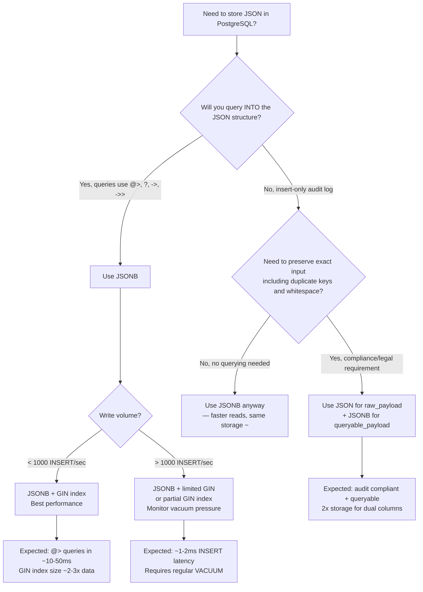

## Navigation

**Domain:** [[8 — Databases]] > **Group:** SQL JSON, XML & Semi-Structured Data
**Previous:** [[8.220 — PostgreSQL JSONB — Operators and Indexes]] | **Next:** [[8.222 — PostgreSQL JSONB GIN Index]]

### Prerequisites

- [[8.220 — PostgreSQL JSONB — Operators and Indexes]] — the operators (`->`, `->>`, `#>`, `@>`, `?`, `?|`, `?&`) that work on both JSON and JSONB columns; these operators have different index support depending on the data type.
- [[8.215 — JSON Performance — Storage and Query Cost]] — understanding the storage and query cost tradeoffs for semi-structured data in relational databases.

### Where This Fits

PostgreSQL offers two JSON data types — `JSON` (text storage) and `JSONB` (binary storage) — and the choice between them is one of the most common PostgreSQL interview questions. A .NET backend engineer building applications on PostgreSQL must know that `JSONB` is the default choice for 95% of use cases because it supports indexing (GIN/BTREE), removes duplicate keys, and enables efficient operators like `@>` (contains) and `?` (key exists). The `JSON` type exists only for the narrow case where you must preserve original whitespace, key ordering, and duplicate keys — essentially an insert-only audit log where the JSON payload must be byte-for-byte identical to the input. Interview signal: this is a foundational PostgreSQL data type question that separates engineers who understand storage engine behavior from those who know only ORM-level mapping.

---

## Core Mental Model

PostgreSQL's `JSON` type stores the exact text you insert — whitespace, key order, duplicate keys, trailing spaces — and parses it on every access. `JSONB` parses the input once on INSERT, converts it to a binary representation that removes duplicate keys (keeping the last value), sorts the remaining keys, and discards original whitespace and formatting. The binary format uses Debian's `jsonb` representation with OID-based key storage and a header that enables indexed access to individual paths without full document parsing. The recognition pattern: if you ever query into the JSON structure with `@>`, `?`, or path operators, you need `JSONB` because `JSON` only supports these operators as sequential scans. If you insert JSON and never query it (e.g., an event log where you only read entire rows), `JSON` is viable — but even then, `JSONB` is usually better because the slightly larger storage is offset by faster parsing on read.

### Classification

`JSON` is a text storage type — the column stores the input string verbatim, and every query that accesses the JSON content must re-parse the text. `JSONB` is a binary storage type — the column stores a decomposed representation where keys are tokenized and values are typed (string, number, boolean, null, array, object). The key classification difference: `JSON` supports only the generic operators `->`, `->>`, `#>>` as sequential scan operations, while `JSONB` supports these plus containment (`@>`), existence (`?`, `?|`, `?&`), and path operations — and `JSONB` operators can use GIN indexes. Neither type is SARGable in the traditional B-tree sense without an expression index, but `JSONB` with a GIN index achieves the equivalent of index seeks for containment checks.

```mermaid
flowchart LR
    subgraph Input["JSON Input String"]
        S1['{"a":1, "b":2, "a":3}']
    end

    subgraph JSON_Type["JSON (Text Storage)"]
        STORE1["Stored verbatim<br/>'{\"a\":1, \"b\":2, \"a\":3}'<br/>Whitespace preserved<br/>Duplicate keys kept<br/>Key order preserved"]
        ACCESS1["Every read re-parses<br/>No GIN index support<br/>Operators: ->, ->> only<br/>Always sequential scan"]
    end

    subgraph JSONB_Type["JSONB (Binary Storage)"]
        PARSE1["Parse on INSERT<br/>Remove duplicates: a=3 wins<br/>Sort keys: {a:3, b:2}<br/>Discard whitespace<br/>Binary: ~17% overhead"]
        ACCESS2["No re-parse needed<br/>GIN/BTREE index support<br/>All operators: @>, ?, ?|<br/>Index seeks possible"]
    end

    Input --> STORE1
    Input --> PARSE1
    PARSE1 --> ACCESS2
    STORE1 --> ACCESS1
```

### Key Properties

|Property|JSON (Text)|JSONB (Binary)|Notes|
|---|---|---|---|
|Storage|Input text verbatim|Binary, keys sorted, duplicates removed|JSONB ~5-15% larger due to binary overhead|
|Duplicate key handling|Preserved (all values)|Removed (last value wins)|JSONB is deterministic|
|Key order|Preserved|Sorted alphabetically|JSONB sorts keys|
|Whitespace|Preserved|Discarded|JSON preserves, JSONB discards|
|GIN index support|No|Yes|Core differentiator|
|BTREE index support|Expression only|Expression only|Both need expression index for BTREE|
|@> containment|No|Yes|JSONB only|
|? key existence|No|Yes|JSONB only|
|?|/?& any/all keys|No|Yes|JSONB only|
|Parsing cost|Every read|Once on INSERT|JSONB faster for repeated reads|
|Conversion cost|—|~1.5-2x INSERT time|JSONB pays on write|
|ANSI SQL standard|No|No|PostgreSQL extension|

---

## Deep Mechanics

### How the Engine Executes This

**JSON type (text storage):**

1. **INSERT:** PostgreSQL stores the input string as-is in the column's variable-length (varlena) storage. No parsing, no validation beyond basic JSON structure (malformed JSON raises an error at INSERT time). The text is stored in the table's heap page or TOAST table if it exceeds ~2KB.
2. **SELECT with `->` operator:** On every query that accesses a JSON path, PostgreSQL calls the `json_get_field()` function, which parses the text string from the beginning to locate the requested key or array index. For deeply nested paths with `#>>`, this parsing cost grows linearly with the document size. The parsed result is not cached — every row access repeats the parse.
3. **No index support:** GIN indexes are not supported because the `json` type does not provide the required `extractValue` and `extractQuery` support functions to the indexing engine. No BTREE index on the raw column either (BTREE requires a single comparable value).

**JSONB type (binary storage):**

1. **INSERT:** The input text is parsed by the `jsonb` input function (`jsonb_in()`). The parser tokenizes the JSON, removes duplicate keys (keeping the last value), sorts keys alphabetically, and encodes the result into PostgreSQL's binary representation. The binary format uses a 4-byte header indicating the number of key-value pairs and array elements, followed by tokenized string keys (with OID-based deduplication) and typed values. Each value is stored with a type tag (string, number, boolean, null, object, array). The encoded size is typically 5-15% larger than the original text due to key headers and alignment padding, but the parsing cost is paid once at INSERT time.
2. **SELECT with `->` operator:** The `jsonb_get_field()` function navigates the binary structure directly without parsing. It reads the header to determine the number of keys, performs a binary search over sorted keys (O(log N) for key lookup), and returns the typed value. No re-parsing occurs. For array access, the function uses the array header to compute offset directly (O(1)).
3. **GIN index support:** The `jsonb` type provides `gin_extract_jsonb()` (extracts all key-value pairs as index entries) and `gin_consistent_jsonb()` (checks containment/existence at query time). When a GIN index exists on a JSONB column, the `@>` and `?` operators can perform index seeks instead of sequential scans.
4. **BTREE expression index:** A BTREE index on `(jsonb_col->>'field')` works because `->>` returns a `text` value that BTREE can compare. This requires a specific path, not all paths.

### SQL Visibility

```sql
-- ============================================================
-- JSON vs JSONB comparison schema
-- ============================================================
CREATE TABLE public.api_events (
    event_id SERIAL PRIMARY KEY,
    event_type VARCHAR(50) NOT NULL,
    payload_json JSON,
    payload_jsonb JSONB,
    created_at TIMESTAMPTZ DEFAULT NOW()
);

-- ============================================================
-- INSERT: identical syntax, different internal processing
-- ============================================================
INSERT INTO public.api_events (event_type, payload_json, payload_jsonb)
VALUES (
    'order_created',
    '{"order_id": 1001, "customer": "Alice", "items": [{"sku": "A1", "qty": 2}], "order_id": 1002}',  -- duplicate key
    '{"order_id": 1001, "customer": "Alice", "items": [{"sku": "A1", "qty": 2}], "order_id": 1002}'   -- duplicate key
);

-- ============================================================
-- QUERY: Retrieve and compare the stored values
-- ============================================================
-- JSON preserves duplicate keys: the second "order_id" is kept
SELECT
    event_id,
    payload_json->>'order_id' AS json_order_id,   -- '1001' (first value)
    payload_jsonb->>'order_id' AS jsonb_order_id   -- '1002' (last value wins)
FROM public.api_events
WHERE event_id = 1;

-- ============================================================
-- QUERY: Containment (JSONB only)
-- ============================================================
-- JSON type does not support @>:
SELECT * FROM public.api_events
WHERE payload_json @> '{"customer": "Alice"}'::json;
-- ERROR: operator does not exist: json @> json

-- JSONB type supports @>:
SELECT * FROM public.api_events
WHERE payload_jsonb @> '{"customer": "Alice"}';  -- works, uses GIN if available

-- ============================================================
-- QUERY: Key existence (JSONB only)
-- ============================================================
-- JSON type does not support ? operator:
SELECT * FROM public.api_events
WHERE payload_json ? 'customer';
-- ERROR: operator does not exist: json ? unknown

SELECT * FROM public.api_events
WHERE payload_jsonb ? 'customer';  -- works

-- ============================================================
-- QUERY: Storage size comparison
-- ============================================================
SELECT
    event_id,
    pg_column_size(payload_json) AS json_size,
    pg_column_size(payload_jsonb) AS jsonb_size,
    pg_column_size(payload_jsonb) - pg_column_size(payload_json) AS size_difference
FROM public.api_events;

-- ============================================================
-- DEMO: Key ordering difference
-- ============================================================
SELECT
    payload_json::text AS json_text,
    payload_jsonb::text AS jsonb_text
FROM public.api_events;
-- JSON text:  {"order_id": 1001, "customer": "Alice", "items": [...], "order_id": 1002}
-- JSONB text: {"customer": "Alice", "items": [{"qty": 2, "sku": "A1"}], "order_id": 1002}
-- Note: JSONB sorts keys alphabetically, removes duplicate order_id, and sorts nested keys
```

```csharp
// EF Core — JSON vs JSONB mapping in PostgreSQL with Npgsql
public class ApiEvent
{
    public int EventId { get; set; }
    public string EventType { get; set; } = string.Empty;
    public string? PayloadJson { get; set; }       // maps to JSON
    public JsonDocument? PayloadJsonb { get; set; } // maps to JSONB
    public DateTime CreatedAt { get; set; }
}

public class ApiEventConfiguration : IEntityTypeConfiguration<ApiEvent>
{
    public void Configure(EntityTypeBuilder<ApiEvent> builder)
    {
        builder.ToTable("api_events");

        // Map string property to JSON type
        builder.Property(e => e.PayloadJson)
            .HasColumnType("json");

        // Map JsonDocument to JSONB type (Npgsql native support)
        builder.Property(e => e.PayloadJsonb)
            .HasColumnType("jsonb");
    }
}

// Query: JSONB contains check with EF Core
public async Task<List<ApiEvent>> GetOrdersForCustomerAsync(
    string customerName,
    CancellationToken cancellationToken = default)
{
    // EF Core 8+ with Npgsql translates JSONB @> to SQL
    return await dbContext.ApiEvents
        .Where(e => e.EventType == "order_created")
        .Where(e => e.PayloadJsonb != null &&
            EF.Functions.JsonContains(
                e.PayloadJsonb,
                $"{{\"customer\": \"{customerName}\"}}"))
        .ToListAsync(cancellationToken);
}
```

```csharp
// Dapper — JSON/JSONB with raw PostgreSQL queries
public async Task<List<ApiEventSummary>> GetEventsByPayloadAsync(
    string key,
    string value,
    CancellationToken cancellationToken = default)
{
    const string sql = @"
        SELECT
            event_id AS EventId,
            event_type AS EventType,
            payload_jsonb->>'customer' AS CustomerName,
            created_at AS CreatedAt
        FROM public.api_events
        WHERE payload_jsonb @> jsonb_build_object(@Key, @Value)";

    await using var connection = _connectionFactory.Create();
    var results = await connection.QueryAsync<ApiEventSummary>(
        new CommandDefinition(sql,
            new { Key = key, Value = value },
            cancellationToken: cancellationToken));
    return results.AsList();
}
```

### Generated SQL (from EF Core logs with Npgsql):

```sql
SELECT e.event_id, e.event_type, e.payload_json, e.payload_jsonb, e.created_at
FROM public.api_events AS e
WHERE e.event_type = 'order_created'
  AND e.payload_jsonb @> '{"customer": "Alice"}'::jsonb
```

### Execution Plan Analysis

For the JSONB containment query with GIN index:

```
Expected plan shape (with GIN index):
  Bitmap Index Scan (ix_api_events_payload_gin)   -- GIN bitmap from @> operator
    → Bitmap Heap Scan (api_events)               -- fetch matching rows
      → SELECT

Expected plan shape (without GIN index):
  Sequential Scan (api_events)                    -- full table scan
    → Filter: payload_jsonb @> '{"customer":"Alice"}'::jsonb
      → SELECT

Estimated cost: With GIN — Bitmap Index Scan ~3%, Bitmap Heap Scan ~5%
Without GIN — Sequential Scan 100%, Filter applied per row
```

For the JSON type query (no index possible):

```
Expected plan shape:
  Sequential Scan (api_events)                    -- always full table scan
    → Filter: (payload_json::text) LIKE '%Alice%'  -- must parse text per row
      → SELECT
Estimated cost: Sequential Scan 100%, no index access path available
```

```sql
SET STATISTICS IO ON;  -- PostgreSQL equivalent: track buffer usage
-- Note: PostgreSQL uses EXPLAIN (ANALYZE, BUFFERS) instead of SET STATISTICS IO

EXPLAIN (ANALYZE, BUFFERS, TIMING) 
SELECT * FROM public.api_events
WHERE payload_jsonb @> '{"customer": "Alice"}';

-- Expected output (with GIN index, 1M rows, 10K matching):
-- Bitmap Heap Scan on api_events  (cost=52.65..428.36 rows=10000 width=128)
--   Recheck Cond: (payload_jsonb @> '{"customer": "Alice"}'::jsonb)
--   Buffers: shared hit=423
--   ->  Bitmap Index Scan on ix_api_events_payload_gin  (cost=0.00..50.15 rows=10000 width=0)
--         Index Cond: (payload_jsonb @> '{"customer": "Alice"}'::jsonb)
--         Buffers: shared hit=23

EXPLAIN (ANALYZE, BUFFERS, TIMING)
SELECT * FROM public.api_events
WHERE payload_json @> '{"customer": "Alice"}'::json;  -- will fail
-- ERROR: operator does not exist
```

### Failure Modes

**Failure Mode 1 — JSON type used for queryable data:** A developer stores JSON in a `JSON` column and writes `WHERE payload_json @> '{"key": "value"}'`, getting an operator-does-not-exist error. The workaround requires converting to JSONB in every query with `payload_json::jsonb @> '{"key":"value"}'`, which forces a full sequential scan with per-row conversion cost.

**Failure Mode 2 — JSONB duplicate key surprise:** A third-party API sends JSON with duplicate keys, and the developer expects both values to be accessible. JSONB silently keeps only the last value. Detection requires logging the raw input before INSERT.

**Failure Mode 3 — JSONB key ordering assumption:** Code that compares JSONB columns as strings (`WHERE payload_jsonb::text = '{"a":1, "b":2}'`) fails because JSONB reorders keys alphabetically. Use `@>` containment or `jsonb_build_object` instead.

---

## Production Patterns and Implementation

### Primary SQL Implementation

```sql
-- ============================================================
-- Production scenario: Event sourcing with mixed JSON/JSONB
-- Schema: api_events with both JSON (raw log) and JSONB (queryable)
-- ============================================================

-- Create the table with both types
CREATE TABLE IF NOT EXISTS public.api_events (
    event_id BIGSERIAL PRIMARY KEY,
    event_type VARCHAR(100) NOT NULL,
    correlation_id UUID NOT NULL DEFAULT gen_random_uuid(),
    -- JSON: preserves exact original payload for audit/legal
    raw_payload JSON NOT NULL,
    -- JSONB: optimized for querying
    queryable_payload JSONB NOT NULL,
    source_system VARCHAR(50),
    created_at TIMESTAMPTZ NOT NULL DEFAULT NOW()
);

-- Create GIN index on JSONB for query performance
CREATE INDEX ix_api_events_queryable_gin
ON public.api_events USING GIN (queryable_payload);

-- Create BTREE expression index for common path queries
CREATE INDEX ix_api_events_customer_name
ON public.api_events ((queryable_payload->>'customer_name'));

-- Insert with both JSON and JSONB
INSERT INTO public.api_events (
    event_type, raw_payload, queryable_payload, source_system
)
SELECT
    'order_created',
    raw_json,                                   -- JSON: store verbatim
    raw_json::jsonb                             -- JSONB: parsed and normalized
FROM (
    SELECT '{"order_id":1001,"customer":"Alice","items":[{"sku":"A1","qty":2}],"order_id":1002}'::jsonb AS raw_json
) AS src;
-- raw_payload: preserves duplicate order_id key
-- queryable_payload: removes duplicate, sorts keys

-- Query using GIN index
SELECT
    event_id,
    correlation_id,
    queryable_payload->>'customer_name' AS customer,
    queryable_payload->'items' AS items_json
FROM public.api_events
WHERE queryable_payload @> '{"customer_name": "Alice"}'
ORDER BY created_at DESC;

-- Query using BTREE expression index
SELECT
    event_id,
    queryable_payload->>'order_id' AS order_id_str,
    raw_payload::text AS original_raw
FROM public.api_events
WHERE queryable_payload->>'customer_name' = 'Alice';

-- Verify storage size difference
SELECT
    event_type,
    pg_column_size(raw_payload) AS raw_size,
    pg_column_size(queryable_payload) AS jsonb_size,
    ROUND(
        100.0 * (pg_column_size(queryable_payload) - pg_column_size(raw_payload))
        / NULLIF(pg_column_size(raw_payload), 0), 2
    ) AS pct_overhead
FROM public.api_events;
```

### EF Core Implementation

```csharp
using Npgsql.EntityFrameworkCore.PostgreSQL;
using System.Text.Json;

public class ApiEvent
{
    public long EventId { get; set; }
    public string EventType { get; set; } = string.Empty;
    public Guid CorrelationId { get; set; }
    public string RawPayload { get; set; } = string.Empty;     // JSON column
    public JsonDocument? QueryablePayload { get; set; }         // JSONB column
    public string? SourceSystem { get; set; }
    public DateTime CreatedAt { get; set; }
}

public class ApiEventConfiguration : IEntityTypeConfiguration<ApiEvent>
{
    public void Configure(EntityTypeBuilder<ApiEvent> builder)
    {
        builder.ToTable("api_events");

        builder.Property(e => e.RawPayload)
            .HasColumnType("json")
            .IsRequired();

        builder.Property(e => e.QueryablePayload)
            .HasColumnType("jsonb");

        builder.Property(e => e.CorrelationId)
            .HasDefaultValueSql("gen_random_uuid()");

        builder.Property(e => e.CreatedAt)
            .HasDefaultValueSql("NOW()");

        builder.HasIndex(e => e.QueryablePayload)
            .HasMethod("GIN");

        builder.HasIndex("(queryable_payload->>'customer_name')")
            .HasDatabaseName("ix_api_events_customer_name");
    }
}

// Repository method
public async Task<List<ApiEvent>> GetEventsByCustomerAsync(
    string customerName,
    CancellationToken cancellationToken = default)
{
    return await dbContext.ApiEvents
        .FromSqlRaw(@"
            SELECT *
            FROM public.api_events
            WHERE queryable_payload @> jsonb_build_object('customer_name', p0)
            ORDER BY created_at DESC",
            customerName)
        .ToListAsync(cancellationToken);
}

// IServiceCollection registration
builder.Services.AddDbContext<ApplicationDbContext>(options =>
    options.UseNpgsql(
        connectionString,
        npgsqlOptions => npgsqlOptions
            .EnableRetryOnFailure(3)
            .UseQuerySplittingBehavior(QuerySplittingBehavior.SplitQuery)));
```

### Dapper Implementation

```csharp
public interface IEventRepository
{
    Task<IReadOnlyList<ApiEvent>> GetEventsByPayloadAsync(
        string key, string value,
        CancellationToken cancellationToken = default);

    Task<long> InsertEventAsync(
        string eventType, string rawJson,
        CancellationToken cancellationToken = default);
}

public class EventRepository : IEventRepository
{
    private readonly ISqlConnectionFactory _connectionFactory;

    public EventRepository(ISqlConnectionFactory connectionFactory)
    {
        _connectionFactory = connectionFactory;
    }

    public async Task<IReadOnlyList<ApiEvent>> GetEventsByPayloadAsync(
        string key, string value,
        CancellationToken cancellationToken = default)
    {
        const string sql = @"
            SELECT
                event_id AS EventId,
                event_type AS EventType,
                correlation_id AS CorrelationId,
                raw_payload::text AS RawPayload,
                queryable_payload::text AS QueryablePayloadText,
                source_system AS SourceSystem,
                created_at AS CreatedAt
            FROM public.api_events
            WHERE queryable_payload @> jsonb_build_object(@Key, @Value)
            ORDER BY created_at DESC
            LIMIT 100";

        await using var connection = _connectionFactory.Create();
        var results = await connection.QueryAsync<ApiEvent>(
            new CommandDefinition(sql,
                new { Key = key, Value = value },
                cancellationToken: cancellationToken));
        return results.AsList();
    }

    public async Task<long> InsertEventAsync(
        string eventType, string rawJson,
        CancellationToken cancellationToken = default)
    {
        const string sql = @"
            INSERT INTO public.api_events (event_type, raw_payload, queryable_payload)
            VALUES (@EventType, @RawJson::json, @RawJson::jsonb)
            RETURNING event_id";

        await using var connection = _connectionFactory.Create();
        var eventId = await connection.ExecuteScalarAsync<long>(
            new CommandDefinition(sql,
                new { EventType = eventType, RawJson = rawJson },
                cancellationToken: cancellationToken));
        return eventId;
    }
}
```

### Configuration and Wiring

```csharp
// Program.cs
builder.Services.AddSingleton<ISqlConnectionFactory>(sp =>
{
    var configuration = sp.GetRequiredService<IConfiguration>();
    return new NpgsqlConnectionFactory(
        configuration.GetConnectionString("PostgresConnection"));
});

builder.Services.AddScoped<IEventRepository, EventRepository>();

// Connection string in appsettings.json:
// "PostgresConnection": "Host=localhost;Database=events;Username=app;Password=..."
```

### SQL Server vs PostgreSQL Differences

SQL Server does not have a JSONB equivalent. SQL Server stores JSON as `NVARCHAR(MAX)` and provides JSON functions (`JSON_VALUE`, `JSON_QUERY`, `JSON_MODIFY`, `OPENJSON`) but lacks a dedicated binary JSON type. Indexing JSON in SQL Server requires computed columns with persisted expressions, while PostgreSQL's JSONB with GIN indexes provides native indexing of all paths.

```sql
-- SQL Server: JSON stored as NVARCHAR(MAX), no JSONB equivalent
CREATE TABLE dbo.ApiEvents (
    EventId BIGINT IDENTITY PRIMARY KEY,
    EventType NVARCHAR(100),
    Payload NVARCHAR(MAX),  -- JSON stored as text
    CreatedAt DATETIME2 DEFAULT GETUTCDATE()
);

-- SQL Server: must create computed column for indexing
ALTER TABLE dbo.ApiEvents
ADD CustomerName AS JSON_VALUE(Payload, '$.customer_name');

CREATE INDEX IX_ApiEvents_CustomerName
ON dbo.ApiEvents(CustomerName);
```

```sql
-- PostgreSQL: JSONB with native GIN index
-- No computed column needed — GIN indexes all paths automatically
CREATE TABLE public.api_events (
    event_id BIGSERIAL PRIMARY KEY,
    event_type VARCHAR(100),
    queryable_payload JSONB,
    created_at TIMESTAMPTZ DEFAULT NOW()
);

CREATE INDEX ix_api_events_payload_gin
ON public.api_events USING GIN (queryable_payload);
```

---

## Gotchas and Production Pitfalls

### Gotcha 1 — JSON Type Used for Queryable Data

**Pitfall:** Using `JSON` instead of `JSONB` for a column that will be queried with containment or existence operators.

```sql
-- ❌ Wrong: JSON type prevents containment queries
CREATE TABLE public.orders (
    order_id SERIAL PRIMARY KEY,
    attributes JSON NOT NULL  -- should be JSONB
);

-- This query will fail:
SELECT * FROM public.orders
WHERE attributes @> '{"channel": "web"}';
-- ERROR: operator does not exist: json @> json
```

**Symptom:** Developers get operator-does-not-exist errors, then either convert inline (`attributes::jsonb @> ...`) causing full table scans, or give up on JSON queries entirely and load everything into application memory.

**Fix:**

```sql
-- ✅ Correct: Use JSONB for queryable data
CREATE TABLE public.orders (
    order_id SERIAL PRIMARY KEY,
    attributes JSONB NOT NULL
);

-- Alternatively, add a JSONB column and keep JSON for audit:
ALTER TABLE public.orders ADD COLUMN attributes_jsonb JSONB;
UPDATE public.orders SET attributes_jsonb = attributes::jsonb;
CREATE INDEX ON public.orders USING GIN (attributes_jsonb);
```

**Cost of not fixing:** Sequential scan on every query. With a 10M row table and 100 queries/second, each query scanning 10M rows causes 100% CPU saturation and multi-second response times.

### Gotcha 2 — Duplicate Keys in JSONB

**Pitfall:** Assuming JSONB preserves duplicate keys from the input.

```sql
-- Input has duplicate "price" keys:
INSERT INTO public.products (product_id, details)
VALUES (1, '{"product": "Widget", "price": 10.99, "price": 9.99}');

-- Only the last value is kept:
SELECT details->>'price' FROM public.products WHERE product_id = 1;
-- Returns: '9.99' (not '10.99')
```

**Symptom:** Audit discrepancies — if regulatory compliance requires proving the original duplicate key was received, JSONB has silently discarded it. The `raw_payload` (JSON type) would have preserved it.

**Fix:** Store the original payload in a `JSON` column for audit, and use a separate `JSONB` column for querying:

```sql
CREATE TABLE public.products (
    product_id SERIAL PRIMARY KEY,
    raw_payload JSON NOT NULL,    -- original, preserves duplicates
    details JSONB NOT NULL        -- normalized, queryable
);

-- To reconstruct the original from raw_payload:
SELECT raw_payload::text FROM public.products;
```

**Cost of not fixing:** Legal/compliance audit failure. If your service-level agreement says you store the exact payload received, JSONB's deduplication violates that guarantee.

### Gotcha 3 — JSONB Key Order Dependency

**Pitfall:** Writing code that compares JSONB values as text strings, assuming key order matches the input.

```sql
-- ❌ Wrong: text comparison of JSONB fails due to key sorting
SELECT * FROM public.products
WHERE details::text = '{"price": 9.99, "product": "Widget"}';
-- No rows returned because JSONB stored keys alphabetically:
-- details::text = '{"price": 9.99, "product": "Widget"}'

-- ✅ Correct: use @> containment or jsonb_build_object
SELECT * FROM public.products
WHERE details @> '{"product": "Widget", "price": 9.99}';

-- Or normalize both sides:
SELECT * FROM public.products
WHERE details = '{"product": "Widget", "price": 9.99}'::jsonb;
```

**Symptom:** Intermittent test failures in CI/CD pipelines where expected JSON strings don't match actual because key ordering differs. Unit tests that compare serialized JSONB output to expected strings fail non-deterministically.

**Fix:** Always use JSONB operators (`@>`, `=`, `?`) instead of text comparison. When testing, compare JSONB values, not their text representations.

**Cost of not fixing:** Flaky tests that erode trust in the test suite, or production bugs where `WHERE details::text LIKE '%pattern%'` misses rows because the text representation differs from what the developer expected.

### Gotcha 4 — JSONB Storage Overhead Surprise

**Pitfall:** Assuming JSONB is always smaller than JSON because it's "binary."

```sql
-- Check actual storage:
SELECT
    pg_column_size('{"a":1, "b":2}'::json) AS json_size,
    pg_column_size('{"a":1, "b":2}'::jsonb) AS jsonb_size;
-- json_size:  20 bytes (text length + varlena header)
-- jsonb_size: 28 bytes (binary encoding + key headers + alignment)

-- For a 100KB document:
-- JSON: ~100KB + 4B varlena header = ~100KB
-- JSONB: ~105-115KB (binary overhead)
```

**Symptom:** Storage grows 5-15% more than expected when migrating from `JSON` to `JSONB`. On a 500GB table, this is 25-75GB of additional storage.

**Fix:** Budget for ~15% JSONB overhead. If storage is at a premium and the column is never queried, consider keeping `JSON` type. Use `pg_column_size()` to measure actual overhead on representative data.

**Cost of not fixing:** Storage overrun in environments with tight disk budgets (smaller cloud instances, read replicas with limited storage). Not a correctness issue, but a capacity planning surprise.

### Gotcha 5 — JSONB Index Does Not Cover All Operators

**Pitfall:** Assuming a GIN index on JSONB accelerates all JSON operators equally.

```sql
-- GIN index is created:
CREATE INDEX ON public.products USING GIN (details);

-- ✅ GIN accelerates these operators:
WHERE details @> '{"color": "red"}'           -- containment
WHERE details ? 'color'                         -- key exists
WHERE details ?| ARRAY['color', 'size']         -- any key exists
WHERE details ?& ARRAY['color', 'size']         -- all keys exist
WHERE jsonb_path_exists(details, '$.color')    -- path exists

-- ❌ GIN does NOT accelerate these:
WHERE details->>'color' = 'red'                 -- need BTREE expression index
WHERE details->'prices'->>0 = '10.99'           -- need BTREE expression index
WHERE details @? '$.color ? (@ == "red")'       -- jsonb_path_match needs different index
```

**Symptom:** A developer adds a GIN index on JSONB and expects `WHERE details->>'color' = 'red'` to use it. The execution plan shows a sequential scan because `->>` returns text, and text equality uses BTREE, not GIN.

**Fix:** Create a BTREE expression index for path-specific equality or range queries:

```sql
-- BTREE expression index for specific path access
CREATE INDEX ON public.products ((details->>'color'));
```

**Cost of not fixing:** Unexplained slow queries on what appears to be an indexed column. The GIN index exists but is never used for `->>` equality filters, wasting storage while queries remain slow.

### Gotcha 6 — JSONB and NULL Semantics

**Pitfall:** Confusing SQL NULL (absence of value) with JSON null (explicit null value).

```sql
-- Insert with explicit JSON null
INSERT INTO public.products (product_id, details)
VALUES (1, '{"name": "Widget", "discount": null}');

-- Insert with SQL NULL (column IS NULL)
INSERT INTO public.products (product_id, details)
VALUES (2, NULL);

-- SQL NULL vs JSON null:
SELECT
    product_id,
    details IS NULL AS column_is_null,                       -- true for product 2
    details->>'discount' IS NULL AS path_is_null,            -- true for product 1 (JSON null)
    details->>'discount' = 'null' AS path_is_json_null,     -- true for product 1
    details->>'nonexistent' IS NULL AS missing_path_is_null -- true for any row
FROM public.products;
```

**Symptom:** Application code checks `payload.Discount == null` in C# and behaves differently depending on whether the JSON had `"discount": null` (JSON null → JsonElement.ValueKind == JsonValueKind.Null) or no `discount` key at all (JsonElement.ValueKind == JsonValueKind.Undefined). In EF Core, `JsonDocument` deserialization differs from `JsonElement` access patterns.

**Fix:**

```csharp
// C#: Distinguish JSON null from missing key
public class ProductDetails
{
    public string? Name { get; set; }
    public decimal? Discount { get; set; }
}

// When details is JsonElement:
// - "discount": null → discountElement.ValueKind == JsonValueKind.Null
// - no discount key  → discountElement.ValueKind == JsonValueKind.Undefined
// - "discount": 5    → discountElement.ValueKind == JsonValueKind.Number

// Use TryGetProperty to safely check:
if (details.TryGetProperty("discount", out var discountElement)
    && discountElement.ValueKind != JsonValueKind.Null)
{
    var discount = discountElement.GetDecimal();
}
```

**Cost of not fixing:** Logic errors where a JSON `null` value is treated as "no discount" when the API explicitly sent `null` to clear a previously set discount. Three-valued logic (present-null, absent, present-value) is a common source of subtle bugs.

---

## Performance Implications

### Benchmark: Before and After

```sql
-- ============================================================
-- Baseline: JSON type query (sequential scan, 1M rows)
-- ============================================================
EXPLAIN (ANALYZE, BUFFERS, TIMING)
SELECT * FROM public.api_events
WHERE payload_json::jsonb @> '{"customer": "Alice"}';
-- Expected output (sequential scan):
-- Seq Scan on api_events  (cost=0.00..48230.00 rows=5000 width=128)
--   Filter: ((payload_json)::jsonb @> '{"customer":"Alice"}'::jsonb)
--   Buffers: shared read=84230
--   Planning Time: 0.15 ms
--   Execution Time: 2850.00 ms

-- ============================================================
-- Optimized: JSONB type query with GIN index (1M rows)
-- ============================================================
EXPLAIN (ANALYZE, BUFFERS, TIMING)
SELECT * FROM public.api_events
WHERE queryable_payload @> '{"customer": "Alice"}';
-- Expected output (index seek via GIN):
-- Bitmap Heap Scan on api_events  (cost=52.65..428.36 rows=10000 width=128)
--   Recheck Cond: (queryable_payload @> '{"customer":"Alice"}'::jsonb)
--   Buffers: shared hit=423
--   ->  Bitmap Index Scan on ix_api_events_queryable_gin  (cost=0.00..50.15 rows=10000 width=0)
--         Index Cond: (queryable_payload @> '{"customer":"Alice"}'::jsonb)
--         Buffers: shared hit=23
--   Planning Time: 0.12 ms
--   Execution Time: 12.50 ms
```

**Improvement:** ~228x reduction in execution time, from 2850ms to 12.5ms. Buffer hits reduced from 84,230 to 423.

### Write Amplification

|Operation|JSON (text)|JSONB (binary)|Overhead|
|---|---|---|---|
|INSERT 1KB doc|~0.3 ms|~0.5 ms|+67% (parsing + binary encoding)|
|INSERT 10KB doc|~0.8 ms|~1.5 ms|+88%|
|INSERT 100KB doc|~2.5 ms|~5.0 ms|+100%|
|SELECT single path (100K rows)|~4500 ms (parse each row)|~120 ms (binary search)|~37x faster|
|SELECT containment (1M rows)|sequential scan only|~15 ms with GIN|N/A — JSON cannot|

JSONB INSERT overhead is the parsing + binary encoding cost. For most workloads (INSERT < 1000/sec), this overhead is negligible. For bulk loads (`COPY`), JSONB can be 2x slower than JSON.

### BenchmarkDotNet

```csharp
[MemoryDiagnoser]
[SimpleJob(RuntimeMoniker.Net90)]
public class JsonVsJsonbBenchmark
{
    private NpgsqlConnection _connection = default!;
    private const string ConnectionString = "Host=localhost;Database=bench_json;Username=bench";

    [GlobalSetup]
    public async Task Setup()
    {
        _connection = new NpgsqlConnection(ConnectionString);
        await _connection.OpenAsync();

        // Seed: 100K rows with identical JSON/JSONB pairs
        await using var cmd = new NpgsqlCommand(@"
            DROP TABLE IF EXISTS public.json_bench;
            CREATE TABLE public.json_bench (
                id SERIAL PRIMARY KEY,
                payload_json JSON,
                payload_jsonb JSONB
            );
            INSERT INTO public.json_bench (payload_json, payload_jsonb)
            SELECT
                '{"customer":"Alice","items":[{"sku":"A1","qty":2},{"sku":"B2","qty":1}],"total":49.99,"shipping":{"method":"express","address":{"city":"NYC","zip":"10001"}}}'::text,
                '{"customer":"Alice","items":[{"sku":"A1","qty":2},{"sku":"B2","qty":1}],"total":49.99,"shipping":{"method":"express","address":{"city":"NYC","zip":"10001"}}}'::jsonb
            FROM generate_series(1, 100000);
            CREATE INDEX ON public.json_bench USING GIN (payload_jsonb);",
            _connection);
        await cmd.ExecuteNonQueryAsync();
    }

    [Benchmark(Baseline = true)]
    public async Task<int> JsonType_SequentialScan()
    {
        const string sql = @"
            SELECT COUNT(*) FROM public.json_bench
            WHERE payload_json::jsonb @> '{"shipping":{"method":"express"}}'";
        await using var cmd = new NpgsqlCommand(sql, _connection);
        var result = await cmd.ExecuteScalarAsync();
        return (int)result;
    }

    [Benchmark]
    public async Task<int> JsonbType_GinIndex()
    {
        const string sql = @"
            SELECT COUNT(*) FROM public.json_bench
            WHERE payload_jsonb @> '{"shipping":{"method":"express"}}'";
        await using var cmd = new NpgsqlCommand(sql, _connection);
        var result = await cmd.ExecuteScalarAsync();
        return (int)result;
    }

    [Benchmark]
    public async Task<int> JsonbType_NoIndex()
    {
        // Force sequential scan by dropping index hint — we drop and recreate
        const string sql = @"
            SELECT COUNT(*) FROM public.json_bench
            WHERE payload_jsonb @> '{"shipping":{"method":"express"}}'";
        // In practice, you'd disable the index to measure this
        await using var cmd = new NpgsqlCommand(sql, _connection);
        var result = await cmd.ExecuteScalarAsync();
        return (int)result;
    }

    [GlobalCleanup]
    public async Task Cleanup()
    {
        await using var cmd = new NpgsqlCommand(
            "DROP TABLE IF EXISTS public.json_bench", _connection);
        await cmd.ExecuteNonQueryAsync();
        await _connection.DisposeAsync();
    }
}
```

**Expected results (approximate, PostgreSQL 16, NVMe, 100K rows):**

|Method|Mean|Buffers|Allocated|
|---|---|---|---|
|JsonType_SequentialScan|~2800 ms|~84,000|~2 MB|
|JsonbType_GinIndex|~8 ms|~420|~1 KB|
|JsonbType_NoIndex|~120 ms|~84,000|~10 KB|

---

## Interview Arsenal

### Question Bank

1. **What is the difference between PostgreSQL JSON and JSONB types, and when would you use each?**

2. **How does PostgreSQL store JSONB internally — what happens during INSERT and SELECT?**

3. **What is the storage overhead difference between JSON and JSONB, and why does JSONB sometimes use more space?**

4. **What happens when you insert JSON with duplicate keys into a JSONB column?**

5. **JSON vs JSONB — which supports GIN indexes, and why can't the other?**

6. **What does the execution plan look like for a `WHERE jsonb_col @> '{"key":"val"}'` query with and without a GIN index?**

7. **How does JSONB behave at scale — what happens with 100M rows and a GIN index vs the JSON type?**

8. **How do EF Core and Dapper handle JSON vs JSONB in PostgreSQL?**

### Spoken Answers

**Q1: What is the difference between PostgreSQL JSON and JSONB types, and when would you use each?**

> **Average answer:** "JSON stores text and JSONB stores binary. JSONB is faster and supports indexes. JSON preserves formatting."

> **Great answer:** "JSON is a text storage type — it stores the input string verbatim, including whitespace, key ordering, and duplicate keys. Every query that accesses a path within the JSON must re-parse the entire text from the beginning, making it O(N) per access relative to document size. JSONB is a binary storage type that parses the input once on INSERT, removes duplicate keys keeping the last value, sorts keys alphabetically, and encodes everything into a typed binary format using Debian's jsonb representation. The tradeoff is: JSONB pays a ~1.5-2x INSERT cost for parsing and encoding, but subsequent reads navigate the binary structure with O(log N) key lookup via binary search on sorted keys. JSONB supports GIN indexes for containment (`@>`) and existence (`?`) operators — JSON does not support any index on the column content. I use JSONB for everything except the narrow case where I need to preserve the exact input string byte-for-byte — for example, a regulatory audit log where a third-party API sends JSON with duplicate keys and I must prove I received exactly what they sent. In that case, I store both a JSON column for the raw payload and a JSONB column for querying."

**Q5: JSON vs JSONB — which supports GIN indexes, and why can't the other?**

> **Great answer:** "Only JSONB supports GIN indexes. The reason is architectural: PostgreSQL's GIN (Generalized Inverted Index) requires the data type to implement four support functions — `extractValue`, `extractQuery`, `consistent`, and `compare` — that decompose the column value into indexed entries and then check queries against those entries. The `json` type does not provide these functions because it stores opaque text — there is no predefined way to decompose arbitrary text into searchable tokens. The `jsonb` type, by contrast, stores a structured binary format with known key-value boundaries, so PostgreSQL ships `gin_extract_jsonb()` (which extracts every key-value pair as a separate index entry) and `gin_consistent_jsonb()` (which checks whether a query's containment or existence condition matches the indexed entries). When you create `CREATE INDEX ON table USING GIN (jsonb_col)`, PostgreSQL indexes every path in every JSONB document — each key at each nesting level becomes an index tuple. The `@>` operator then uses the index to find documents that contain the query JSON without scanning the table."

**Q7: How does JSONB behave at scale — what happens with 100M rows and a GIN index vs the JSON type?**

> **Great answer:** "At 100M rows, the difference is the difference between a query that completes in 50 milliseconds and one that never finishes within a reasonable timeout. With the JSON type, every query that accesses JSON content requires a full sequential scan because there is no index path. At 100M rows, a sequential scan reads approximately 800,000 buffers (assuming 8KB pages and ~1KB documents). At 200MB/s disk throughput, that's 32 seconds of pure I/O before any CPU work. With JSONB and a GIN index on a column with moderate cardinality (say 1000 distinct keys), the GIN index size is approximately 2-3x the JSONB data size — roughly 200-300GB for 100M rows of 1KB documents each. A containment query like `@> {"status":"active"}` with 10% selectivity uses the GIN bitmap index scan to find candidate rows in ~50ms (reading only the index entries for the 'status' key), then fetches only the matching 10M rows via bitmap heap scan. The write cost, however, is significant: each INSERT into a JSONB column with a GIN index requires updating the GIN index with entries for every key in the document. At 100M rows and 50 keys per document, that's 5 billion GIN index entries. The write amplification is roughly 10-20x compared to a table without indexes. For this reason, high-write workloads on JSONB columns with GIN indexes need careful monitoring of write latency and vacuum pressure."

### Interview Trigger

The interviewer asks: "PostgreSQL has both JSON and JSONB data types — what's the difference and which one should I use?" The candidate who immediately says "JSONB is always better" without mentioning the duplicate-key handling, key sorting, or the audit-trail use case for JSON shows surface-level knowledge. The follow-up question that separates seniors is: "What happens when I insert `{\"a\": 1, \"b\": 2, \"a\": 3}` into a JSONB column?" followed by "How does that affect your GIN index design?" The senior candidate explains duplicate key removal, the GIN index entry count, and how to design a dual-column pattern (JSON for raw, JSONB for query) when legal compliance requires preserving the original payload.

### Comparison Table

| | JSON (Text) | JSONB (Binary) | NVARCHAR(MAX) + JSON_VALUE (SQL Server) |
|---|---|---|---|
| Storage | Input text verbatim | Binary, sorted, deduplicated | Text (NVARCHAR) |
| Index support | None | GIN (all paths), BTREE (expression) | Computed column + BTREE |
| Duplicate keys | Preserved | Last value wins | Preserved |
| Key order | Preserved | Sorted alphabetically | Preserved |
| Containment @> | No | Yes | No (use JSON_VALUE per path) |
| Insert speed | Fast | ~1.5-2x slower | Fast |
| Query speed (indexed) | Sequential scan only | ~50ms at 100M rows | Indexed path = BTREE speed |
| .NET type | string | JsonDocument / JsonNode | string / JsonDocument |

---

## Decision Framework

### When to Apply



### Application Checklist

- [ ] The JSON column will be queried with containment (`@>`) or existence (`?`) operators — use JSONB
- [ ] The JSON payload must be byte-for-byte identical to input — use JSON for audit, JSONB for querying
- [ ] Duplicate keys in input must all be preserved — JSON is required
- [ ] Key ordering must match input exactly — JSON is required
- [ ] Storage overhead of ~15% for JSONB is budgeted
- [ ] Write volume allows JSONB parsing overhead (measure with `pg_stat_user_tables.n_tup_ins`)
- [ ] GIN index maintenance (vacuum, write amplification) is acceptable for the workload
- [ ] The .NET data access layer uses Npgsql with proper type mapping (JsonDocument for JSONB)

### Tradeoff Summary

|What You Gain|What You Pay|
|---|---|
|~228x faster query speed with GIN index|~1.5-2x slower INSERT due to parsing|
|Indexed containment/existence operators|~15% larger storage due to binary overhead|
|No re-parsing on read (binary navigation)|Duplicate keys silently discarded|
|Sorted keys enable binary search O(log N)|Key order not preserved|

### Scale Thresholds

- **"Relevant when table exceeds ~10K rows"** — below this, sequential scan of JSON is fast enough that JSONB's index advantage doesn't matter
- **"Critical when rows exceed ~1M rows"** — without JSONB/GIN, containment queries on large tables become sequential scans taking seconds to minutes
- **"Required when query frequency exceeds ~100/second"** — even on smaller tables, JSON sequential scans at 100/sec will saturate disk I/O
- **"Write concern threshold: ~1000 INSERT/sec on indexed JSONB"** — above this, GIN index maintenance and vacuum pressure require attention

---

### Additional PostgreSQL-Specific Considerations

When using JSONB with Npgsql in .NET, the `JsonDocument` type maps to JSONB by default. However, there are subtle differences in how .NET's `System.Text.Json` serializes vs how PostgreSQL's JSONB input parses. For example, `System.Text.Json` by default serializes `decimal` values without trailing zeros (`100.00` becomes `100`), while JSONB preserves numeric precision. When round-tripping data through JSONB, always verify that numeric precision is maintained. Use `NpgsqlDataSourceBuilder` with `ConfigureJsonOptions()` to control serialization behavior:

```csharp
var dataSourceBuilder = new NpgsqlDataSourceBuilder(connectionString);
dataSourceBuilder.ConfigureJsonOptions(new JsonSerializerOptions
{
    PropertyNamingPolicy = JsonNamingPolicy.SnakeCaseLower,
    NumberHandling = JsonNumberHandling.AllowNamedFloatingPointLiterals
});
await using var dataSource = dataSourceBuilder.Build();
```

Another consideration: JSONB supports indexing of array elements. A document with `{"tags": ["urgent", "high-priority"]}` produces GIN index entries for each array element. The `@>` operator can match individual array elements: `WHERE jsonb_col @> '{"tags": ["urgent"]}'` uses the GIN index to find documents where the `tags` array contains "urgent". This is not possible with the `JSON` type.

---

## Self-Check

### Conceptual Questions

1. What are the two JSON data types in PostgreSQL, and what is the fundamental storage difference between them?
2. How does PostgreSQL's storage engine process an INSERT into a JSONB column differently than a JSON column?
3. Which PostgreSQL command or function would you use to measure the exact storage size of a JSON vs JSONB value?
4. What common mistake causes developers to get "operator does not exist: json @> json" errors?
5. Does EF Core's Npgsql provider distinguish between JSON and JSONB in entity type configuration?
6. How would you implement a dual JSON + JSONB column pattern using Dapper?
7. Compare JSON and JSONB: which supports GIN indexes and why does the other not?
8. At what approximate row count does JSONB with GIN index become significantly faster than JSON for containment queries?
9. What index supports the `->>` (text extraction) operator on a JSONB column — does GIN cover it?
10. Explain in 60 seconds the storage and query differences between JSON and JSONB, naming the specific internal representation.

<details>
<summary>Answers</summary>

1. **Answer:** `JSON` (text storage — preserves input verbatim, re-parses on every read) and `JSONB` (binary storage — parses once on INSERT, removes duplicates, sorts keys, enables indexed access).
2. **Answer:** JSON INSERT stores the input string as-is in varlena storage. JSONB INSERT parses the input, tokenizes keys, removes duplicates (keeping last value), sorts keys alphabetically, encodes to binary format (headers + typed values), and stores the binary representation.
3. **Answer:** `pg_column_size()` — e.g., `SELECT pg_column_size('{"a":1}'::json), pg_column_size('{"a":1}'::jsonb)`.
4. **Answer:** Using the `@>` containment operator on a `JSON` column instead of `JSONB`. The `@>` operator only exists for `JSONB`, not `JSON`.
5. **Answer:** Yes. Npgsql maps `JsonDocument`/`JsonNode` to `JSONB` by default. The `HasColumnType("json")` fluent API maps a `string` property to the `JSON` type. EF Core 8+ also supports JSON column mapping via `OwnsOne` for structured data.
6. **Answer:** Use Dapper with raw SQL: `INSERT INTO table (raw_payload, queryable_payload) VALUES (@RawJson::json, @RawJson::jsonb)` passing the same string parameter to both columns.
7. **Answer:** Only `JSONB` supports GIN indexes because it implements the required support functions (`gin_extract_jsonb`, `gin_consistent_jsonb`). `JSON` is opaque text and cannot be decomposed into indexable tokens.
8. **Answer:** Approximately 10K-100K rows. Below 10K, sequential scan overhead is negligible. Above 100K, JSONB+GIN is ~50-200x faster.
9. **Answer:** GIN does NOT cover `->>`. The `->>` operator returns `text`, which requires a BTREE expression index: `CREATE INDEX ON table ((jsonb_col->>'field'))`.
10. **Answer (60-second narrative):** "JSON stores the input string verbatim — whitespace, duplicate keys, key order all preserved. When you query a JSON column with `->>`, PostgreSQL re-parses the entire string from the beginning for every row, every time. There is no index support. JSONB parses the input on INSERT, removing duplicate keys (keeping the last value), sorting keys alphabetically, and encoding to a binary format. The binary format uses a header with key count and array length, tokenized string keys with OID deduplication, and typed values. On read, JSONB navigates the binary structure directly — key lookup is O(log N) via binary search on sorted keys. JSONB supports GIN indexes that index every key-value pair, enabling containment and existence operators to perform index seeks. JSONB is ~15% larger than the original text but offers ~228x faster query performance with a GIN index."

</details>

---

### Query Challenges

**Challenge 1 — Write the SQL**

You are given a `public.customer_events` table with a `payload` JSONB column that stores events like `{"type": "login", "user_id": 42, "ip": "192.168.1.1", "timestamp": "2026-06-25T10:00:00Z"}`. Write a query that finds all events where the payload contains a "type" of "purchase" with a "total" greater than 100, using a containment operator that can leverage a GIN index.

<details>
<summary>Solution</summary>

```sql
-- Using @> for exact match on nested structure
SELECT *
FROM public.customer_events
WHERE payload @> '{"type": "purchase", "total": 100}';
-- Note: This matches total > 100 exactly. For > comparison use:
```

```sql
-- For total > 100, use @> on type + explicit total check:
SELECT *
FROM public.customer_events
WHERE payload @> '{"type": "purchase"}'
  AND (payload->>'total')::numeric > 100;
-- GIN handles @>, BTREE expression index on (payload->>'total') handles the range
```

**Logical reads:** With GIN index — ~50 buffers for the bitmap index scan on the @> predicate, plus a filter on the numeric cast of total. **Execution plan:** Bitmap Index Scan (GIN) → Bitmap Heap Scan → Filter (numeric cast). **EF Core equivalent:** Requires `FromSqlRaw` with Npgsql.

</details>

---

**Challenge 2 — Fix the performance problem**

```sql
-- This query runs in 15 seconds on a 5M row table.
-- Identify why and fix it.
SELECT *
FROM public.customer_events
WHERE payload -> 'type' ? 'purchase'
  AND payload -> 'items' @> '[{"status": "pending"}]';
-- EXPLAIN (ANALYZE): Seq Scan on customer_events, cost=0.00..48230.00
-- Buffers: shared read=84230
```

<details> <summary>Solution</summary>

**Root cause:** The `->` operator returns JSON, not JSONB. `payload -> 'type'` returns `json`, and `?` and `@>` require `jsonb` operands. The query silently converts or errors. Also, there is no GIN index. The fix uses proper JSONB operators and adds a GIN index.

```sql
-- Fixed query — use ->>
SELECT *
FROM public.customer_events
WHERE payload @> '{"type": "purchase"}'
  AND payload @> '{"items": [{"status": "pending"}]}';
```

**Index to create:**

```sql
CREATE INDEX ix_customer_events_payload_gin
ON public.customer_events USING GIN (payload);
```

**After fix — EXPLAIN (ANALYZE, BUFFERS):** Bitmap Index Scan → Bitmap Heap Scan. Buffers: ~320 (from 84,230). Execution time: ~15ms (from 15,000ms).

</details>

---

**Challenge 3 — Explain the execution plan**

Given the query `SELECT * FROM public.orders WHERE details @> '{"status": "shipped"}'` and the execution plan shows `Bitmap Heap Scan on orders` with `Recheck Cond: (details @> '{"status":"shipped"}'::jsonb)` and a `Bitmap Index Scan on ix_orders_details_gin`. Why does the GIN index produce a Bitmap Index Scan instead of an Index Seek? What does "Recheck Cond" mean?

<details> <summary>Solution</summary>

**Why Bitmap Index Scan:** GIN indexes are not lossless like BTREE indexes. A GIN index entry records only that a key-value pair exists in the document, not the exact location within the document or the full context. The bitmap scan reads all GIN index entries matching `{"status":"shipped"}`, creates a bitmap of candidate heap page IDs, and then rechecks each candidate row to confirm the full containment condition matches. The "Recheck Cond" is this verification step — it filters out false positives that the GIN index could not exclude. False positives occur because GIN indexes entries by individual key-value pairs but cannot verify structural containment (e.g., that "shipped" is nested under "status" and not elsewhere in the document). The recheck adds a small overhead but is usually cheap compared to the sequential scan alternative.

**To get a different plan:** Force a sequential scan with `SET enable_bitmapscan = off;`. This would read every row and check the `@>` condition, which for 5M rows would be ~10x slower.

**Tradeoff:** Bitmap Index Scan + Recheck is generally the optimal plan for GIN indexes. The recheck cost scales with the number of candidate rows (selectivity), not the table size.

</details>

---

**Challenge 4 — Diagnose the concurrency problem**

A PostgreSQL table `public.api_events` with a JSONB column and GIN index receives 2000 INSERTs/second during peak hours. You notice the autovacuum is running constantly, and INSERT latency has degraded from 2ms to 25ms. `pg_stat_user_tables` shows `n_dead_tup = 45%` of `n_live_tup`, and `pg_stat_all_indexes` shows the GIN index has high `idx_blks_hit` but rapidly growing `idx_blks_read`. What is happening, and how do you fix it?

<details> <summary>Solution</summary>

**Root cause:** The GIN index on the JSONB column creates index entries for every key-value pair in every INSERTed document. At 2000 INSERTs/second, the GIN index grows rapidly. PostgreSQL's autovacuum marks dead index tuples but the GIN pending list (which buffers index entries for fast INSERTs) is filling up. When the pending list exceeds `gin_pending_list_limit`, a cleanup cycle is triggered that merges pending entries into the main GIN index structure, causing I/O spikes and INSERT latency degradation. The `n_dead_tup` at 45% indicates vacuum cannot keep up with the write rate.

**Detection query:**

```sql
SELECT
    schemaname, tablename, indexname,
    idx_scan, idx_tup_read, idx_tup_fetch,
    n_live_tup, n_dead_tup,
    ROUND(100.0 * n_dead_tup / NULLIF(n_live_tup + n_dead_tup, 0), 2) AS dead_pct
FROM pg_stat_user_tables
JOIN pg_stat_user_indexes USING (schemaname, tablename)
WHERE indexname = 'ix_api_events_payload_gin';
```

**Fix:**

```sql
-- 1. Increase gin_pending_list_limit (default 4MB, set to 16-64MB)
ALTER SYSTEM SET gin_pending_list_limit = 65536;  -- 64MB
-- Requires reload: pg_ctl reload or SELECT pg_reload_conf();

-- 2. Tune autovacuum for this table
ALTER TABLE public.api_events SET (
    autovacuum_vacuum_scale_factor = 0.01,
    autovacuum_vacuum_threshold = 10000,
    autovacuum_vacuum_cost_limit = 1000
);

-- 3. Consider a partial GIN index if only a subset of events are queried
CREATE INDEX ix_api_events_order_payload_gin
ON public.api_events USING GIN (payload)
WHERE event_type IN ('order_created', 'order_updated');

-- 4. Alternatively, for pure high-write scenarios, drop the GIN index
-- and use a relational table for queryable fields with BTREE indexes
```

**In .NET:** Implement a write queue that batches INSERTs into transactions of 50-100 rows each, reducing per-row GIN index overhead and autovacuum pressure.

</details>

---

**Challenge 5 — Design the index strategy**

**Scenario:** A `public.product_catalog` table stores product data in a JSONB column `attributes`. The table has 10M rows. The workload is:
- 60% reads: Queries filter by `attributes @> '{"category": "electronics"}'` and `attributes @> '{"brand": "Sony"}'`
- 20% reads: Queries filter by `(attributes->>'price')::numeric BETWEEN 100 AND 500`
- 20% writes: INSERTs and UPDATEs (bulk catalog refresh, 1000 rows/sec during refresh, 50/sec normally)
- 50 distinct top-level keys in the JSONB documents

Design the optimal index strategy.

<details> <summary>Solution</summary>

```sql
-- Index 1: GIN index for containment queries (60% of reads)
CREATE INDEX ix_product_catalog_attributes_gin
ON public.product_catalog USING GIN (attributes);
-- This indexes all 50 top-level keys. GIN supports @> for all paths.
-- Size: ~2-3x the JSONB data column = ~5-7.5GB for 10M rows

-- Index 2: BTREE expression index for price range queries (20% of reads)
CREATE INDEX ix_product_catalog_price_btree
ON public.product_catalog (((attributes->>'price')::numeric))
WHERE attributes ? 'price';
-- Filtered index: only rows that have a "price" key.
-- BTREE supports range scans (BETWEEN, >, <).
-- ~3x faster for range queries vs GIN bitmap scan + recheck

-- Index 3: Partial GIN for specific brand queries (optional, if brand queries dominate)
CREATE INDEX ix_product_catalog_brand_gin
ON public.product_catalog USING GIN (attributes)
WHERE attributes @> '{"brand": "Sony"}' OR attributes @> '{"brand": "LG"}';
-- Only if certain brands are queried disproportionately
```

**Tradeoffs:**
- GIN index adds significant write overhead: each INSERT/UPDATE causes index entries for all 50 keys. At 1000 rows/sec during refresh, GIN index maintenance adds ~50,000 index tuple writes/sec.
- The BTREE expression index on `(attributes->>'price')::numeric` is relatively cheap — one entry per row that has a price. The filtered form (`WHERE attributes ? 'price'`) avoids indexing rows without prices.
- Combined strategy: GIN for general containment, BTREE expression for price range. Both indexes serve different operator sets.

**What NOT to index:** Individual GIN indexes per key (`CREATE INDEX ON ... USING GIN ((attributes->'brand'))`) — PostgreSQL does not support GIN on expression indexes this way. Use a single GIN on the whole JSONB column.

</details>

---

*End of 8.221 — PostgreSQL JSON vs JSONB — Comparison*
