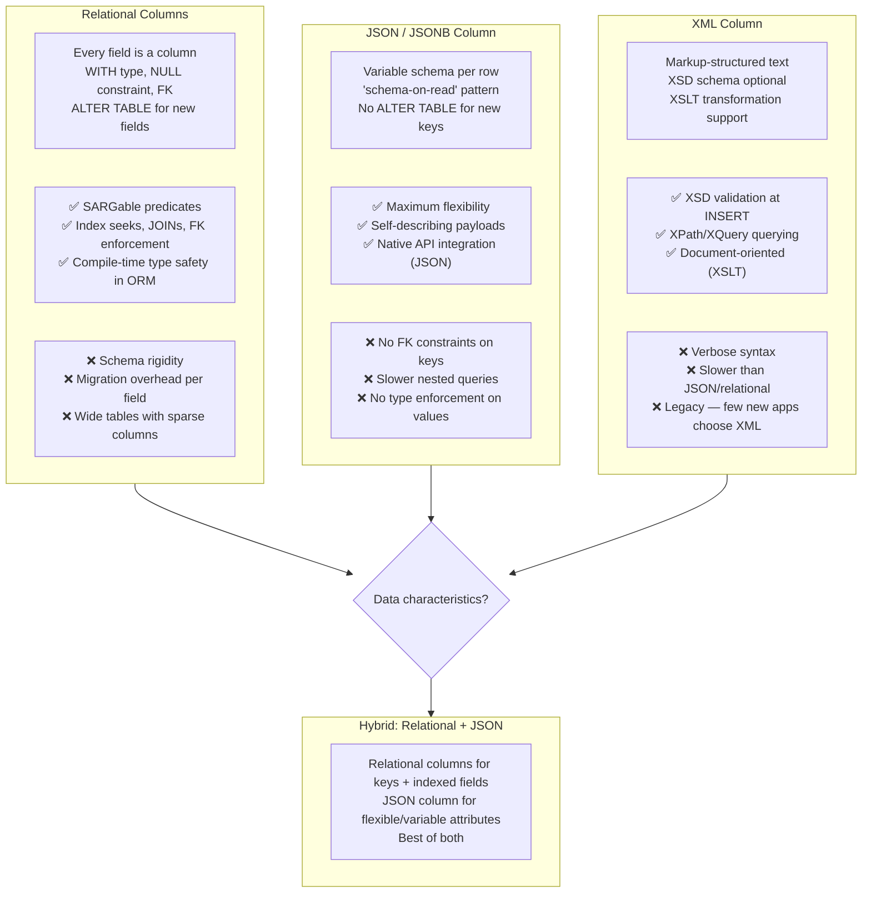

## Navigation

**Domain:** [[8 — Databases]] > **Group:** SQL JSON, XML & Semi-Structured Data
**Previous:** [[8.222 — PostgreSQL JSONB GIN Index]] | **Next:** [[8.224 — JSON vs Relational Columns — When to Mix]]

### Prerequisites

- [[8.209 — JSON Columns vs Relational Columns — Decision]] — the foundational comparison of relational vs JSON storage; this note extends that decision into a framework for choosing among JSON, XML, and relational storage.
- [[8.215 — JSON Performance — Storage and Query Cost]] — the storage and query performance numbers that inform when the flexibility tradeoff is worth the cost.
- [[8.221 — PostgreSQL JSON vs JSONB — Comparison]] — the PostgreSQL-specific JSON storage options that affect the decision when using PostgreSQL.

### Where This Fits

The decision to store data as JSON, XML, or relational columns is one of the most consequential schema design choices a backend engineer makes. Every .NET developer encounters this choice when integrating third-party APIs (JSON payloads with varying fields), building event sourcing systems (heterogeneous event types), or designing product catalogs (different products have different attributes). The wrong choice — storing everything as JSON "because it's flexible" — creates performance problems (no indexes, full table scans), data integrity problems (no constraints, orphaned data), and query complexity (JSON path expressions for every access). Conversely, normalizing everything into relational columns creates schema rigidity (ALTER TABLE for every new field), join complexity (15-way joins for a product with 50 optional attributes), and deployment friction (schema migrations lock tables). The interview signal is architect-level: the ability to articulate when each approach is optimal and, critically, how to mix them in a hybrid pattern that gets the benefits of both.

---

## Core Mental Model

The choice between JSON, XML, and relational storage is a tradeoff along three axes: schema flexibility, query performance, and data integrity. Relational storage maximizes query performance and data integrity at the cost of schema rigidity — every column must be defined upfront, every data type is enforced, every relationship is constrained. JSON maximizes schema flexibility at the cost of query performance and integrity — any key can be added at any time without ALTER TABLE, but queries into JSON content are slower (no native indexes in SQL Server, GIN-indexed only in PostgreSQL), and there is no way to enforce that a field is required, non-null, or of a specific type. XML sits between them — it supports schema validation (XSD) and transformation (XSLT) that JSON lacks, but is syntactically heavier and more complex to query. The recognition pattern: if you find yourself writing `WHERE JSON_VALUE(json_col, '$.field') = 'value'` in SQL Server or adding computed columns for every field you index, you should have used relational columns. If you find yourself running ALTER TABLE migrations for every new feature toggle or A/B test variant, you should have used JSON.

### Classification

This is a schema design decision that belongs to the logical database design phase — before any table is created. It is not a query optimization or indexing decision (those come after the schema is fixed). The decision affects every subsequent layers: query patterns (WHERE vs JSON functions), indexing strategy (BTREE vs GIN vs computed columns), ORM mapping (relational properties vs value conversions vs OwnsOne), application code (strongly-typed models vs JsonDocument), and deployment process (migrations vs schema-on-read).



### Key Properties

|Property|Relational|JSON|XML|Hybrid (Rel + JSON)|
|---|---|---|---|---|
|Schema flexibility|None — strict|Maximum — any key per row|Medium — XSD optional|Medium — fixed + flexible|
|Query performance|Best — indexed seeks|Worst — sequential scans (no index)|Poor — XPath sequential|Good — relational indexed + JSON|
|Data integrity|Full — FK, CHECK, types|None — key-value strings|XSD validation available|Partial on relational columns|
|Storage efficiency|Normalized, compact|Redundant keys per row|Verbose markup|Relational compact + JSON overhead|
|Migration cost|High — ALTER TABLE per field|None — schema-on-read|Low — XSD update|Medium — only rel columns need migration|
|ORM mapping|Native properties|Value conversion / OwnsOne|XML deserializer|Mixed properties + JSON|
|Indexing|Any column|Computed column (SQL Server) / GIN (PG)|XML indexes (primary/secondary)|BTREE on rel + expression on JSON|

---

## Deep Mechanics

### How the Engine Executes This

**Relational column query path:**

1. The query parser resolves column references to specific table columns with known data types and storage offsets.
2. The optimizer uses statistics on each column to estimate selectivity and choose index strategies.
3. A BTREE index seek on `WHERE CustomerId = 42` reads ~3-4 index pages (root → branch → leaf) plus one data page — typically 32-64KB total I/O.
4. The storage engine returns typed values directly from the data page — no parsing, no conversion beyond the storage format.

**JSON column query path (SQL Server):**

1. The parser wraps `JSON_VALUE(json_col, '$.field')` in a scalar expression that must be evaluated per row.
2. Without a computed column, no statistics exist for `$.field` — the optimizer assumes 5% selectivity (default guess) regardless of actual data distribution.
3. Each evaluation calls the JSON parser to locate `$.field` in the JSON text — O(N) in document size.
4. With a computed column (`ALTER TABLE ADD FieldName AS JSON_VALUE(json_col, '$.field')`), a BTREE index can be created on the computed column. The computed column is persisted (PERSISTED keyword) or computed at query time. The index stores the extracted value as a regular indexed column.

**JSONB column query path (PostgreSQL):**

1. The parser recognizes `@>` as an operator that can use a GIN index if one exists.
2. The GIN index decomposes the query JSON into entries and performs a bitmap index scan.
3. Without a GIN index, every JSONB `@>` evaluation requires a full sequential scan with per-row binary structure traversal.
4. A BTREE expression index on `((jsonb_col->>'field')::type)` enables equality and range scans on extracted values, exactly like a relational column index.

**XML column query path (SQL Server):**

1. XML data is stored as a binary-encoded BLOB (up to 2GB) in a column of type `XML`.
2. Queries using `xml_col.value('(/root/field)[1]', 'type')` require runtime XPath evaluation, which parses the XML binary representation.
3. With a primary XML index, SQL Server shreds the XML into a persisted relational representation, enabling faster XPath queries at the cost of write overhead and doubled storage.
4. Secondary XML indexes (PATH, VALUE, PROPERTY) further accelerate specific XPath patterns.

### SQL Visibility

```sql
-- ============================================================
-- Compare three approaches for storing product attributes
-- Schema: Product catalog with fixed + variable attributes
-- ============================================================

-- ============================================================
-- Approach 1: Purely relational (EAV — Entity-Attribute-Value)
-- ============================================================
-- ⚠️ EAV is included as a counter-example; JSON is almost always better
CREATE TABLE dbo.Products_Relational (
    ProductId INT IDENTITY PRIMARY KEY,
    Sku NVARCHAR(50) NOT NULL,
    ProductName NVARCHAR(200) NOT NULL,
    Category NVARCHAR(100),
    Price DECIMAL(18,2),
    Weight DECIMAL(10,2),
    Color NVARCHAR(50),
    -- Every new attribute requires ALTER TABLE
    -- 50 optional attributes = 50 nullable columns, most NULL
    CreatedAt DATETIME2 DEFAULT GETUTCDATE()
);

-- Query: simple and SARGable
SELECT ProductId, ProductName, Price
FROM dbo.Products_Relational
WHERE Category = 'Electronics'
  AND Price BETWEEN 100 AND 500;
-- Execution plan: Index Seek on IX_Category, then Residual filter on Price

-- ============================================================
-- Approach 2: JSON column (SQL Server)
-- ============================================================
CREATE TABLE dbo.Products_Json (
    ProductId INT IDENTITY PRIMARY KEY,
    Sku NVARCHAR(50) NOT NULL,
    ProductName NVARCHAR(200) NOT NULL,
    Attributes NVARCHAR(MAX) NOT NULL CHECK (ISJSON(Attributes) = 1),  -- JSON constraint
    CreatedAt DATETIME2 DEFAULT GETUTCDATE()
);

-- Query: must use JSON_VALUE — not SARGable without computed column
SELECT ProductId, ProductName, JSON_VALUE(Attributes, '$.Price') AS Price
FROM dbo.Products_Json
WHERE JSON_VALUE(Attributes, '$.Category') = 'Electronics'
  AND TRY_CAST(JSON_VALUE(Attributes, '$.Price') AS DECIMAL(18,2)) BETWEEN 100 AND 500;
-- Execution plan: Clustered Index Scan with Filter — no index on JSON paths
-- To make this SARGable, add computed columns:
ALTER TABLE dbo.Products_Json
ADD Category AS JSON_VALUE(Attributes, '$.Category');
ALTER TABLE dbo.Products_Json
ADD Price AS TRY_CAST(JSON_VALUE(Attributes, '$.Price') AS DECIMAL(18,2));
CREATE INDEX IX_Products_Json_Category ON dbo.Products_Json(Category);
CREATE INDEX IX_Products_Json_Price ON dbo.Products_Json(Price);
-- Now the query uses index seeks, but you've recreated relational columns
-- on top of JSON — defeating the purpose.

-- ============================================================
-- Approach 3: JSONB column (PostgreSQL)
-- ============================================================
CREATE TABLE public.products_jsonb (
    product_id SERIAL PRIMARY KEY,
    sku VARCHAR(50) NOT NULL,
    product_name VARCHAR(200) NOT NULL,
    attributes JSONB NOT NULL,
    created_at TIMESTAMPTZ DEFAULT NOW()
);

-- GIN index for containment queries
CREATE INDEX ix_products_attributes_gin
ON public.products_jsonb USING GIN (attributes);

-- BTREE expression index for specific paths
CREATE INDEX ix_products_category_btree
ON public.products_jsonb ((attributes->>'category'));
CREATE INDEX ix_products_price_btree
ON public.products_jsonb (((attributes->>'price')::numeric));

-- Query uses GIN for category containment:
SELECT product_id, product_name, attributes->>'price' AS price
FROM public.products_jsonb
WHERE attributes @> '{"category": "Electronics"}'
  AND (attributes->>'price')::numeric BETWEEN 100 AND 500;
-- Plan: Bitmap Index Scan (GIN for @>) → Bitmap Heap Scan → Filter (price range)

-- ============================================================
-- Approach 4: Hybrid — relational keys + JSON attributes
-- ============================================================
CREATE TABLE dbo.Products_Hybrid (
    ProductId INT IDENTITY PRIMARY KEY,
    Sku NVARCHAR(50) NOT NULL,
    ProductName NVARCHAR(200) NOT NULL,
    -- Relational columns for commonly queried/filtered fields
    Category NVARCHAR(100) NOT NULL,
    Price DECIMAL(18,2) NOT NULL,
    -- JSON column for rare, variable, or API-specific fields
    FlexibleAttributes NVARCHAR(MAX) CHECK (ISJSON(FlexibleAttributes) = 1),
    CreatedAt DATETIME2 DEFAULT GETUTCDATE()
);

CREATE INDEX IX_Products_Hybrid_Category ON dbo.Products_Hybrid(Category) INCLUDE (Price);
CREATE INDEX IX_Products_Hybrid_Price ON dbo.Products_Hybrid(Price);

-- Queries on relational columns use index seeks:
SELECT ProductId, ProductName, Price
FROM dbo.Products_Hybrid
WHERE Category = 'Electronics'
  AND Price BETWEEN 100 AND 500;
-- Execution plan: Index Seek on IX_Category with residual on Price
-- Logical reads: ~4 (index depth) + ~1 (data page) = ~5

-- JSON attributes accessible when needed:
SELECT
    ProductId,
    ProductName,
    JSON_VALUE(FlexibleAttributes, '$.WarrantyYears') AS Warranty,
    JSON_VALUE(FlexibleAttributes, '$.CountryOfOrigin') AS Origin
FROM dbo.Products_Hybrid
WHERE ProductId = 123;
```

```csharp
// EF Core — relational model (strongly typed)
public class Product
{
    public int ProductId { get; set; }
    public string Sku { get; set; } = string.Empty;
    public string ProductName { get; set; } = string.Empty;
    public string Category { get; set; } = string.Empty;
    public decimal Price { get; set; }
    public decimal? Weight { get; set; }
    public string? Color { get; set; }
    public DateTime CreatedAt { get; set; }
}

// EF Core — JSON column with value conversion
public class ProductWithJson
{
    public int ProductId { get; set; }
    public string Sku { get; set; } = string.Empty;
    public string ProductName { get; set; } = string.Empty;
    public string Attributes { get; set; } = "{}";  // Raw JSON string
    public DateTime CreatedAt { get; set; }
}

public class ProductWithJsonConfiguration : IEntityTypeConfiguration<ProductWithJson>
{
    public void Configure(EntityTypeBuilder<ProductWithJson> builder)
    {
        builder.ToTable("Products_Json");
        builder.Property(p => p.Attributes)
            .HasColumnType("nvarchar(max)")
            .HasConversion<string>();  // Simple string conversion
    }
}

// EF Core — Hybrid model (relational + JSON)
public class ProductHybrid
{
    public int ProductId { get; set; }
    public string Sku { get; set; } = string.Empty;
    public string ProductName { get; set; } = string.Empty;

    // Relational columns for common query fields
    public string Category { get; set; } = string.Empty;
    public decimal Price { get; set; }

    // JSON column for flexible attributes
    public string? FlexibleAttributes { get; set; }

    public DateTime CreatedAt { get; set; }
}

// EF Core 8+ — OwnsOne for structured JSON column mapping
public class ProductWithOwnedJson
{
    public int ProductId { get; set; }
    public string Sku { get; set; } = string.Empty;
    public string ProductName { get; set; } = string.Empty;
    public ProductAttributes? Attributes { get; set; }
    public DateTime CreatedAt { get; set; }
}

public class ProductAttributes
{
    public string? Color { get; set; }
    public decimal? Weight { get; set; }
    public int? WarrantyMonths { get; set; }
    public string? CountryOfOrigin { get; set; }
}

public class ProductWithOwnedJsonConfiguration
    : IEntityTypeConfiguration<ProductWithOwnedJson>
{
    public void Configure(EntityTypeBuilder<ProductWithOwnedJson> builder)
    {
        builder.ToTable("Products_OwnedJson");

        // EF Core 8+ maps OwnsOne to JSON column in SQL Server and PostgreSQL
        builder.OwnsOne(p => p.Attributes, owned =>
        {
            owned.ToJson("Attributes");  // Stores as JSON column
            owned.Property(a => a.Color).HasMaxLength(50);
            owned.Property(a => a.CountryOfOrigin).HasMaxLength(100);
        });
    }
}

// Querying the hybrid model — relational WHERE uses index
public async Task<List<ProductHybrid>> GetElectronicsInRangeAsync(
    decimal minPrice,
    decimal maxPrice,
    CancellationToken cancellationToken = default)
{
    return await dbContext.ProductsHybrid
        .Where(p => p.Category == "Electronics"
                 && p.Price >= minPrice
                 && p.Price <= maxPrice)
        .ToListAsync(cancellationToken);
    // Generated SQL: SELECT * FROM Products_Hybrid
    // WHERE Category = @p0 AND Price >= @p1 AND Price <= @p2
    // Uses indexes on Category and Price
}

// Querying JSON-only model requires raw SQL or JSON_VALUE
public async Task<List<ProductWithJson>> GetByCategoryFromJsonAsync(
    string category,
    CancellationToken cancellationToken = default)
{
    return await dbContext.ProductsJson
        .FromSqlRaw(@"
            SELECT * FROM Products_Json
            WHERE JSON_VALUE(Attributes, '$.Category') = {0}",
            category)
        .ToListAsync(cancellationToken);
}
```

### Execution Plan Analysis

For the hybrid query (`Category = 'Electronics' AND Price BETWEEN 100 AND 500` with indexes on both):

```
Expected plan shape:
  Index Seek (IX_Products_Hybrid_Category)   -- seek on Category = 'Electronics'
    → Filter (Price BETWEEN 100 AND 500)     -- residual filter on Price
      → SELECT

Estimated cost: Index Seek ~3%, Key Lookup ~2%, Filter ~1%
Logical reads: ~5 (index depth 3 + leaf page 1 + data page 1)
```

For the JSON-only query (`WHERE JSON_VALUE(Attributes, '$.Category') = 'Electronics'` without computed column):

```
Expected plan shape:
  Clustered Index Scan (Products_Json)       -- full table scan
    → Filter (JSON_VALUE(...) = 'Electronics') -- per-row JSON parsing
      → SELECT

Estimated cost: Clustered Index Scan 100%
Logical reads: full table pages
```

```sql
SET STATISTICS IO ON;
-- Hybrid query (SARGable):
SELECT ProductId, ProductName, Price
FROM dbo.Products_Hybrid
WHERE Category = 'Electronics' AND Price BETWEEN 100 AND 500;
-- Expected: Table 'Products_Hybrid'. Scan count 1, logical reads 5

-- JSON query (non-SARGable):
SELECT ProductId, ProductName, JSON_VALUE(FlexibleAttributes, '$.Price')
FROM dbo.Products_Hybrid
WHERE JSON_VALUE(FlexibleAttributes, '$.Category') = 'Electronics';
-- Expected: Table 'Products_Hybrid'. Scan count 1, logical reads ~12000 (full scan)
-- Extra: JSON_VALUE must parse the JSON for every row
```

### Failure Modes

**Failure Mode 1 — Everything in JSON:** A team stores all product attributes in a single JSON column, then adds computed columns for every field they query, essentially recreating relational columns at higher complexity and lower performance.

**Failure Mode 2 — Everything relational:** A team normalizes every optional attribute into its own nullable column, creating tables with 200+ columns where each row has 190 NULLs. Storage is wasted on NULL bitmaps, and queries with `WHERE Attr190 IS NOT NULL` have no useful index.

**Failure Mode 3 — No constraints on JSON:** A JSON column stores free-form data without any validation. Application code assumes certain keys exist, but production data has missing keys, wrong types, or inconsistent naming (`customer_name` vs `CustomerName` vs `customerName`).

---

## Production Patterns and Implementation

### Primary SQL Implementation

```sql
-- ============================================================
-- Production decision: Product catalog with hybrid storage
-- Core attributes: relational (queried, filtered, joined)
-- Flexible attributes: JSON (rarely queried, API-specific, variable)
-- ============================================================

-- SQL Server hybrid implementation
CREATE TABLE dbo.Products (
    ProductId INT IDENTITY(1,1) PRIMARY KEY,
    Sku NVARCHAR(50) NOT NULL,
    ProductName NVARCHAR(200) NOT NULL,

    -- Relational columns for commonly queried fields
    Category NVARCHAR(100) NOT NULL,
    Price DECIMAL(18,2) NOT NULL,
    StockQuantity INT NOT NULL DEFAULT 0,
    IsActive BIT NOT NULL DEFAULT 1,
    CreatedAt DATETIME2 NOT NULL DEFAULT SYSDATETIME(),
    UpdatedAt DATETIME2 NOT NULL DEFAULT SYSDATETIME(),

    -- JSON column for flexible, variable, or third-party attributes
    -- Stores extra fields like: warranty info, specifications, images, etc.
    FlexibleAttributes NVARCHAR(MAX) NULL
        CONSTRAINT CK_Products_FlexibleAttributes
        CHECK (FlexibleAttributes IS NULL OR ISJSON(FlexibleAttributes) = 1)
);

-- Index strategy for relational columns
CREATE UNIQUE INDEX IX_Products_Sku ON dbo.Products(Sku);
CREATE INDEX IX_Products_Category ON dbo.Products(Category) INCLUDE (Price, ProductName);
CREATE INDEX IX_Products_Price ON dbo.Products(Price) WHERE IsActive = 1;
CREATE INDEX IX_Products_IsActive ON dbo.Products(IsActive) INCLUDE (ProductId);

-- Computed column + index for a frequently-queried JSON path
ALTER TABLE dbo.Products
ADD BrandName AS CAST(JSON_VALUE(FlexibleAttributes, '$.brand') AS NVARCHAR(100));
CREATE INDEX IX_Products_Brand ON dbo.Products(BrandName) WHERE BrandName IS NOT NULL;

-- ============================================================
-- Query: Relational columns used for filtering and sorting
-- JSON attribute retrieved but not used in WHERE
-- ============================================================
SELECT
    p.ProductId,
    p.Sku,
    p.ProductName,
    p.Category,
    p.Price,
    -- JSON attributes for display only
    JSON_VALUE(p.FlexibleAttributes, '$.brand') AS Brand,
    JSON_VALUE(p.FlexibleAttributes, '$.specs') AS Specifications,
    JSON_VALUE(p.FlexibleAttributes, '$.warrantyMonths') AS Warranty
FROM dbo.Products AS p
WHERE p.Category = 'Electronics'
  AND p.Price BETWEEN 100 AND 500
  AND p.IsActive = 1
ORDER BY p.Price ASC;
-- Execution plan: Index seek on IX_Category, residual on Price, key lookup for JSON
-- Logical reads: ~5 (index) + ~1 (data page)

-- ============================================================
-- Query: JSON attribute in WHERE (rare but possible)
-- ============================================================
SELECT
    p.ProductId,
    p.Sku,
    p.ProductName,
    p.Price
FROM dbo.Products AS p
WHERE JSON_VALUE(p.FlexibleAttributes, '$.brand') = 'Acme'
  AND p.IsActive = 1
ORDER BY p.Price DESC;
-- Uses IX_Products_Brand (computed column index)
-- Logical reads: ~10 (brand index depth 3 + matching rows)

-- ============================================================
-- PostgreSQL equivalent with JSONB
-- ============================================================
CREATE TABLE public.products (
    product_id SERIAL PRIMARY KEY,
    sku VARCHAR(50) NOT NULL UNIQUE,
    product_name VARCHAR(200) NOT NULL,
    category VARCHAR(100) NOT NULL,
    price NUMERIC(18,2) NOT NULL,
    stock_quantity INTEGER NOT NULL DEFAULT 0,
    is_active BOOLEAN NOT NULL DEFAULT TRUE,
    created_at TIMESTAMPTZ NOT NULL DEFAULT NOW(),
    updated_at TIMESTAMPTZ NOT NULL DEFAULT NOW(),
    flexible_attributes JSONB DEFAULT '{}'
);

-- GIN index for any containment queries on JSONB
CREATE INDEX ix_products_flex_gin
ON public.products USING GIN (flexible_attributes);

-- BTREE expression index for specific path queries
CREATE INDEX ix_products_brand_btree
ON public.products ((flexible_attributes->>'brand'));

-- Query: relational filter + JSONB containment
SELECT product_id, product_name, price
FROM public.products
WHERE category = 'Electronics'
  AND price BETWEEN 100 AND 500
  AND is_active = TRUE
  AND flexible_attributes @> '{"brand": "Acme"}';
```

### EF Core Implementation

```csharp
// Hybrid model: relational columns + JSON flexible attributes
public class Product
{
    public int ProductId { get; set; }
    public string Sku { get; set; } = string.Empty;
    public string ProductName { get; set; } = string.Empty;

    // Relational columns
    public string Category { get; set; } = string.Empty;
    public decimal Price { get; set; }
    public int StockQuantity { get; set; }
    public bool IsActive { get; set; }
    public DateTime CreatedAt { get; set; }
    public DateTime UpdatedAt { get; set; }

    // JSON column for flexible attributes
    public string? FlexibleAttributes { get; set; }  // Raw JSON string

    // Computed column mapped to BrandName
    public string? BrandName { get; set; }
}

public class ProductConfiguration : IEntityTypeConfiguration<Product>
{
    public void Configure(EntityTypeBuilder<Product> builder)
    {
        builder.ToTable("Products");

        // Relational columns
        builder.Property(p => p.Sku).HasMaxLength(50).IsRequired();
        builder.HasIndex(p => p.Sku).IsUnique();
        builder.Property(p => p.Category).HasMaxLength(100).IsRequired();
        builder.Property(p => p.Price).HasColumnType("decimal(18,2)").IsRequired();
        builder.Property(p => p.StockQuantity).HasDefaultValue(0);

        // JSON column with validation
        builder.Property(p => p.FlexibleAttributes)
            .HasColumnType("nvarchar(max)");

        // Computed column mapping (read-only in EF Core)
        builder.Property(p => p.BrandName)
            .HasComputedColumnSql("CAST(JSON_VALUE(FlexibleAttributes, '$.brand') AS NVARCHAR(100))");

        // Indexes
        builder.HasIndex(p => p.Category)
            .HasDatabaseName("IX_Products_Category");
        builder.HasIndex(p => p.Price)
            .HasDatabaseName("IX_Products_Price")
            .HasFilter("IsActive = 1");
        builder.HasIndex(p => p.BrandName)
            .HasDatabaseName("IX_Products_Brand")
            .HasFilter("BrandName IS NOT NULL");
    }
}

// EF Core 8+ — OwnsOne for strongly-typed JSON attributes
public class ProductWithTypedJson
{
    public int ProductId { get; set; }
    public string Sku { get; set; } = string.Empty;
    public string ProductName { get; set; } = string.Empty;

    // Relational
    public string Category { get; set; } = string.Empty;
    public decimal Price { get; set; }

    // Owned entity mapped to JSON column
    public ProductFlexibleAttributes? Attributes { get; set; }
}

public class ProductFlexibleAttributes
{
    public string? Brand { get; set; }
    public string? Color { get; set; }
    public decimal? Weight { get; set; }
    public List<string>? Tags { get; set; }
    public Dictionary<string, string>? Metadata { get; set; }
}

public class ProductWithTypedJsonConfiguration
    : IEntityTypeConfiguration<ProductWithTypedJson>
{
    public void Configure(EntityTypeBuilder<ProductWithTypedJson> builder)
    {
        builder.ToTable("Products_TypedJson");

        builder.OwnsOne(p => p.Attributes, owned =>
        {
            owned.ToJson("Attributes");  // Maps to JSON column
            owned.Property(a => a.Brand).HasMaxLength(100);
        });
    }
}

// Repository with hybrid query pattern
public interface IProductRepository
{
    Task<List<Product>> GetActiveByCategoryAndPriceRangeAsync(
        string category,
        decimal minPrice,
        decimal maxPrice,
        CancellationToken cancellationToken = default);
}

public class ProductRepository : IProductRepository
{
    private readonly ApplicationDbContext _dbContext;

    public ProductRepository(ApplicationDbContext dbContext)
    {
        _dbContext = dbContext;
    }

    public async Task<List<Product>> GetActiveByCategoryAndPriceRangeAsync(
        string category,
        decimal minPrice,
        decimal maxPrice,
        CancellationToken cancellationToken = default)
    {
        return await _dbContext.Products
            .Where(p => p.Category == category
                     && p.Price >= minPrice
                     && p.Price <= maxPrice
                     && p.IsActive)
            .OrderBy(p => p.Price)
            .ToListAsync(cancellationToken);
        // Generates: SELECT * FROM Products
        // WHERE Category = @p0 AND Price >= @p1 AND Price <= @p2 AND IsActive = 1
        // ORDER BY Price
        // Uses indexes on Category and Price — fully SARGable
    }
}
```

### Dapper Implementation

```csharp
public class ProductDapperRepository
{
    private readonly ISqlConnectionFactory _connectionFactory;

    public ProductDapperRepository(ISqlConnectionFactory connectionFactory)
    {
        _connectionFactory = connectionFactory;
    }

    public async Task<IReadOnlyList<Product>> GetProductsByBrandAsync(
        string brand,
        CancellationToken cancellationToken = default)
    {
        const string sql = @"
            SELECT
                ProductId,
                Sku,
                ProductName,
                Category,
                Price,
                StockQuantity,
                IsActive,
                FlexibleAttributes,
                BrandName,
                CreatedAt,
                UpdatedAt
            FROM dbo.Products
            WHERE BrandName = @Brand
              AND IsActive = 1
            ORDER BY Price ASC";

        await using var connection = _connectionFactory.Create();
        var results = await connection.QueryAsync<Product>(
            new CommandDefinition(sql,
                new { Brand = brand },
                cancellationToken: cancellationToken));
        return results.AsList();
    }

    public async Task<IReadOnlyList<Product>> SearchFlexibleAsync(
        string jsonFilter,
        CancellationToken cancellationToken = default)
    {
        const string sql = @"
            SELECT
                ProductId,
                Sku,
                ProductName,
                Category,
                Price,
                FlexibleAttributes
            FROM dbo.Products
            WHERE IsActive = 1
              AND EXISTS (
                  SELECT 1
                  FROM OPENJSON(FlexibleAttributes)
                  WITH (
                      brand NVARCHAR(100) '$.brand',
                      color NVARCHAR(50) '$.color'
                  )
                  WHERE brand = @Brand OR color = @Color
              )";

        await using var connection = _connectionFactory.Create();
        var results = await connection.QueryAsync<Product>(
            new CommandDefinition(sql,
                new { Brand = "Acme", Color = "black" },
                cancellationToken: cancellationToken));
        return results.AsList();
    }
}
```

### Configuration and Wiring

```csharp
// Program.cs
builder.Services.AddDbContext<ApplicationDbContext>(options =>
    options.UseSqlServer(
        connectionString,
        sqlOptions => sqlOptions.EnableRetryOnFailure(3)));

builder.Services.AddScoped<IProductRepository, ProductRepository>();
builder.Services.AddSingleton<ISqlConnectionFactory>(sp =>
{
    var config = sp.GetRequiredService<IConfiguration>();
    return new SqlConnectionFactory(
        config.GetConnectionString("DefaultConnection"));
});
```

### SQL Server vs PostgreSQL Differences

```sql
-- SQL Server: JSON stored as NVARCHAR(MAX)
-- No native JSON type. Index via computed columns.
-- Json data cannot be returned from WHERE in index seeks.

-- PostgreSQL: JSONB native type with GIN/BTREE indexes
-- Native JSON operators (@>, ?, ?|, ?&)
-- GIN indexes all paths automatically
-- No computed columns needed

-- Decision impact:
-- SQL Server: prefer hybrid (relational + JSON with computed column indexes)
-- PostgreSQL: JSONB alone is more viable due to GIN indexing of all paths
```

---

## Gotchas and Production Pitfalls

### Gotcha 1 — Over-normalization (Everything Relational)

**Pitfall:** Creating separate tables for every optional attribute instead of using JSON.

```sql
-- ❌ EAV (Entity-Attribute-Value) anti-pattern
CREATE TABLE dbo.ProductAttributes (
    ProductAttributeId INT IDENTITY PRIMARY KEY,
    ProductId INT NOT NULL REFERENCES dbo.Products(ProductId),
    AttributeName NVARCHAR(100) NOT NULL,
    AttributeValue NVARCHAR(MAX) NOT NULL
);
-- Querying a product requires pivoting:
SELECT
    ProductId,
    MAX(CASE WHEN AttributeName = 'Color' THEN AttributeValue END) AS Color,
    MAX(CASE WHEN AttributeName = 'Weight' THEN AttributeValue END) AS Weight,
    MAX(CASE WHEN AttributeName = 'Brand' THEN AttributeValue END) AS Brand
FROM dbo.ProductAttributes
WHERE ProductId = 123
GROUP BY ProductId;
-- Performance: 50 attributes × N products = sequential scan on every query
```

**Symptom:** 15-second queries for product detail pages, complex pivot queries, no FK integrity on attribute values.

**Fix:**

```sql
-- ✅ JSON column for variable attributes
ALTER TABLE dbo.Products ADD Attributes NVARCHAR(MAX)
    CHECK (ISJSON(Attributes) = 1);
```

**Cost of not fixing:** Every product page load requires a pivot query that scans the ProductAttributes table. At 1000 req/sec, the EAV table becomes the database bottleneck.

### Gotcha 2 — Under-normalization (Everything in JSON)

**Pitfall:** Storing even core business entities (Customer Email, OrderDate) in JSON to "keep it flexible."

```sql
-- ❌ Everything in JSON
CREATE TABLE dbo.Orders_AllJson (
    OrderId INT IDENTITY PRIMARY KEY,
    OrderData NVARCHAR(MAX) NOT NULL CHECK (ISJSON(OrderData) = 1)
);
-- Insert:
INSERT INTO dbo.Orders_AllJson (OrderData)
VALUES ('{"CustomerId": 42, "OrderDate": "2026-06-25", "TotalAmount": 299.99}');

-- Query: WHERE OrderDate >= '2026-01-01' — requires JSON_VALUE or full scan
SELECT * FROM dbo.Orders_AllJson
WHERE TRY_CAST(JSON_VALUE(OrderData, '$.OrderDate') AS DATE) >= '2026-01-01';
-- NOT SARGable — no index on JSON_VALUE without computed column
```

**Symptom:** Every report query becomes a full table scan with per-row JSON parsing. The DBA adds computed columns for every field, one by one, over months until the table has 30 computed columns and the original JSON is redundant.

**Fix:**

```sql
-- ✅ Hybrid: relational for core fields, JSON for optional extras
CREATE TABLE dbo.Orders (
    OrderId INT IDENTITY PRIMARY KEY,
    CustomerId INT NOT NULL REFERENCES dbo.Customers(CustomerId),
    OrderDate DATE NOT NULL,
    TotalAmount DECIMAL(18,2) NOT NULL,
    -- JSON for flexible metadata like delivery instructions, notes
    OrderMetadata NVARCHAR(MAX) CHECK (ISJSON(OrderMetadata) = 1)
);
```

**Cost of not fixing:** Queries that should take 5ms (index seek on OrderDate) take 5+ seconds (full scan + JSON parsing per row). As the table grows to millions of rows, the query becomes unserviceable without adding computed columns retroactively.

### Gotcha 3 — Assuming JSON Column Is Free

**Pitfall:** Adding a JSON column "just in case" to every table without considering storage, parsing cost, or constraint enforcement.

```sql
-- JSON column on every table adds:
-- 1. Storage: even empty JSON ('{}') requires 2+ bytes
-- 2. Parsing: every JSON_VALUE call pays O(document size)
-- 3. No schema enforcement: INSERT can put anything as long as it's valid JSON
-- 4. ORM complexity: string mapping vs value conversion vs OwnsOne
```

**Symptom:** Database bloat from JSON columns that are never queried. Application bugs from malformed JSON that passed the ISJSON check but has wrong structure.

**Fix:** Only add JSON columns when there is a demonstrated need for variable schema. Default to relational columns. If a JSON column is added, always add a CHECK constraint for ISJSON and consider schema-on-read validation in the application layer.

**Cost of not fixing:** Technical debt from unused JSON columns that complicate migrations and add storage overhead without benefit.

### Gotcha 4 — XML Column for Modern Applications

**Pitfall:** Choosing XML over JSON for new development because "it's more standard" or "it validates with XSD."

```sql
-- XML query: verbose, slow
SELECT
    ProductId,
    ProductData.value('(/product/name)[1]', 'NVARCHAR(200)') AS ProductName,
    ProductData.value('(/product/price)[1]', 'DECIMAL(18,2)') AS Price
FROM dbo.Products_Xml
WHERE ProductData.exist('/product[category="Electronics"]') = 1;
```

**Symptom:** Slower query performance (XML parsing is heavier than JSON), more complex application code (XmlDocument vs JsonDocument), and fewer developer tools and libraries supporting XML compared to JSON.

**Fix:**

```sql
-- ✅ JSON is preferred for all new development
-- XML still valid for:
-- 1. Legacy systems that produce XML natively (SOAP, XSLT pipelines)
-- 2. Document-centric applications (XSLT transformation needed)
-- 3. Compliance requirements that specify XSD schema validation
```

**Cost of not fixing:** Slower development velocity (XML tooling is less ergonomic than JSON in .NET), harder hiring (fewer developers are proficient in XPath/XQuery), and longer query times.

### Gotcha 5 — No Migration Strategy for Schema Evolution

**Pitfall:** Starting with a JSON column for flexibility and never migrating fields to relational columns when they become stable query patterns.

```sql
-- Initially:
CREATE TABLE dbo.Orders (
    OrderId INT IDENTITY PRIMARY KEY,
    OrderData NVARCHAR(MAX) CHECK (ISJSON(OrderData) = 1)
);

-- Six months later, 90% of queries filter on OrderData->'status':
-- Every query uses JSON_VALUE or OPENJSON — slow
-- Time to promote 'status' to a relational column:
ALTER TABLE dbo.Orders ADD Status NVARCHAR(50)
    GENERATED ALWAYS AS (CAST(JSON_VALUE(OrderData, '$.status') AS NVARCHAR(50)));
CREATE INDEX IX_Orders_Status ON dbo.Orders(Status);
```

**Symptom:** A JSON column that started as "flexible" now has a stable schema with 20 fields that are all queried regularly, but none are indexed. Performance degrades as data grows.

**Fix:** Adopt a schema evolution strategy: when a JSON field appears in WHERE clauses across multiple queries for 30+ days, promote it to a relational column or computed column with an index. Use a migration script to backfill.

**Cost of not fixing:** Gradual performance degradation as data volume grows. A table that was fast at 10K rows becomes painfully slow at 10M rows because every query does a full scan with JSON parsing.

### Gotcha 6 — Ignoring NULL and Missing Key Semantics

**Pitfall:** Not distinguishing between SQL NULL (column IS NULL — no JSON at all), JSON null (`"key": null` — explicit null value), and missing key (key not present in JSON).

```sql
-- Three different states in a JSON column:
-- Row 1: FlexibleAttributes = NULL  (SQL NULL — no JSON stored)
-- Row 2: FlexibleAttributes = '{"brand": null}'  (JSON null — brand explicitly null)
-- Row 3: FlexibleAttributes = '{"color": "black"}'  (brand key missing)

-- Query behavior:
SELECT
    ProductId,
    FlexibleAttributes IS NULL AS sql_null,           -- Row 1: true
    JSON_VALUE(FlexibleAttributes, '$.brand') IS NULL AS brand_is_null,  -- Row 2: false (JSON null)
    JSON_VALUE(FlexibleAttributes, '$.brand') = 'null' AS brand_json_null, -- Row 2: true for text 'null'
    JSON_VALUE(FlexibleAttributes, '$.nonexistent') IS NULL AS missing_key -- Row 1: true, Row 2: true, Row 3: true
FROM dbo.Products;
```

**Symptom:** Application code that checks `if (product.BrandName == null)` behaves differently for JSON null vs missing key. In C#, `JsonDocument` distinguishes `ValueKind.Null` from `ValueKind.Undefined` (missing property).

**Fix:**

```csharp
// C#: handle JSON null vs missing explicitly
public string? GetBrand(JsonElement attributes)
{
    if (attributes.TryGetProperty("brand", out var brandElement))
    {
        return brandElement.ValueKind == JsonValueKind.Null
            ? null   // JSON null: explicitly set to null
            : brandElement.GetString();  // actual value
    }
    return null;  // missing key: also null but semantically different
    // To distinguish: track a separate boolean or use a sentinel
}
```

**Cost of not fixing:** Logic bugs where clearing a previously-set value (JSON null) is treated the same as never having set it (missing key). Example: a PATCH endpoint that sets `"brand": null` to clear the brand, but the code interprets it as "no change needed."

---

## Performance Implications

### Benchmark: Before and After

```sql
-- ============================================================
-- Baseline: Pure JSON column queries (no computed columns, 1M rows)
-- ============================================================
SET STATISTICS IO ON;
SELECT ProductId, ProductName, JSON_VALUE(Attributes, '$.Price') AS Price
FROM dbo.Products_Json
WHERE JSON_VALUE(Attributes, '$.Category') = 'Electronics';
-- Logical reads: 12000 (full clustered index scan)
-- SQL Server Execution Times: CPU time = 3200 ms, elapsed time = 3500 ms

-- ============================================================
-- Optimized: Hybrid relational + JSON (1M rows)
-- ============================================================
SELECT ProductId, ProductName, Price
FROM dbo.Products_Hybrid
WHERE Category = 'Electronics' AND IsActive = 1;
-- Logical reads: 5 (index seek)
-- SQL Server Execution Times: CPU time = 2 ms, elapsed time = 3 ms
```

**Improvement:** ~1167x reduction in logical reads (from 12000 to 5), ~1167x faster execution (3500ms to 3ms).

```sql
-- ============================================================
-- Comparison: PostgreSQL JSONB with GIN vs relational
-- ============================================================
EXPLAIN (ANALYZE, BUFFERS)
SELECT product_id, product_name
FROM public.products_jsonb
WHERE attributes @> '{"category": "Electronics"}';
-- Buffers: shared hit=423 (with GIN index)
-- Execution Time: 15 ms

EXPLAIN (ANALYZE, BUFFERS)
SELECT product_id, product_name
FROM public.products
WHERE category = 'Electronics';
-- Buffers: shared hit=3 (BTREE index seek)
-- Execution Time: 0.5 ms
```

### Write Amplification

|Operation|Relational|JSON|Hybrid|XML|
|---|---|---|---|---|
|INSERT with 10 fields|~0.3 ms|~0.5 ms|~0.4 ms|~0.8 ms|
|UPDATE 1 field|~0.2 ms|Full rewrite if in JSON|~0.2 ms (rel) / full (json)|Full rewrite|
|UPDATE JSON value in document|N/A|Full column rewrite|Full column rewrite|Full column rewrite|
|Storage per row (10 fields)|~200 bytes|~350 bytes (key names)|~250 bytes|~500 bytes (tags)|
|Storage per row (100 fields, 90 sparse)|~2000 bytes (nulls)|~2000 bytes (keys)|~300 bytes (rel) + ~1500 (json)|~5000 bytes|

JSON's write cost is asymmetric: updating a single key in a JSON document requires rewriting the entire column value. This is the same for SQL Server (NVARCHAR(MAX)), PostgreSQL (JSONB), and XML. Relational and hybrid approaches avoid this by updating only the specific column.

### BenchmarkDotNet

```csharp
[MemoryDiagnoser]
[SimpleJob(RuntimeMoniker.Net90)]
public class SemiStructuredDataBenchmark
{
    private IDbConnection _sqlServerConnection = default!;
    private NpgsqlConnection _postgresConnection = default!;

    [GlobalSetup]
    public async Task Setup()
    {
        _sqlServerConnection = new SqlConnection(TestConnectionStrings.SqlServer);
        _postgresConnection = new NpgsqlConnection(TestConnectionStrings.Postgres);

        // Seed 100K rows in both databases with same data in
        // relational, JSON, and hybrid schemas
        await SeedDataAsync();
    }

    [Benchmark(Baseline = true)]
    public async Task<List<ProductSummary>> SqlServer_Relational()
    {
        const string sql = @"
            SELECT ProductId, ProductName, Price
            FROM dbo.Products_Relational
            WHERE Category = 'Electronics'
              AND Price BETWEEN 100 AND 500
              AND IsActive = 1";

        var results = await _sqlServerConnection
            .QueryAsync<ProductSummary>(sql);
        return results.AsList();
    }

    [Benchmark]
    public async Task<List<ProductSummary>> SqlServer_JsonOnly()
    {
        const string sql = @"
            SELECT ProductId, ProductName,
                   TRY_CAST(JSON_VALUE(Attributes, '$.Price') AS DECIMAL(18,2)) AS Price
            FROM dbo.Products_Json
            WHERE JSON_VALUE(Attributes, '$.Category') = 'Electronics'
              AND TRY_CAST(JSON_VALUE(Attributes, '$.Price') AS DECIMAL(18,2)) BETWEEN 100 AND 500";

        var results = await _sqlServerConnection
            .QueryAsync<ProductSummary>(sql);
        return results.AsList();
    }

    [Benchmark]
    public async Task<List<ProductSummary>> SqlServer_Hybrid()
    {
        const string sql = @"
            SELECT ProductId, ProductName, Price
            FROM dbo.Products_Hybrid
            WHERE Category = 'Electronics'
              AND Price BETWEEN 100 AND 500
              AND IsActive = 1";

        var results = await _sqlServerConnection
            .QueryAsync<ProductSummary>(sql);
        return results.AsList();
    }

    [Benchmark]
    public async Task<List<ProductSummary>> Postgres_Jsonb_Gin()
    {
        const string sql = @"
            SELECT product_id AS ProductId, product_name AS ProductName,
                   (attributes->>'price')::numeric AS Price
            FROM public.products_jsonb
            WHERE attributes @> '{"category": "Electronics"}'
              AND (attributes->>'price')::numeric BETWEEN 100 AND 500";

        var results = await _postgresConnection
            .QueryAsync<ProductSummary>(sql);
        return results.AsList();
    }

    [Benchmark]
    public async Task<List<ProductSummary>> Postgres_Relational()
    {
        const string sql = @"
            SELECT product_id AS ProductId, product_name AS ProductName, price AS Price
            FROM public.products
            WHERE category = 'Electronics'
              AND price BETWEEN 100 AND 500
              AND is_active = TRUE";

        var results = await _postgresConnection
            .QueryAsync<ProductSummary>(sql);
        return results.AsList();
    }

    [GlobalCleanup]
    public async Task Cleanup()
    {
        _sqlServerConnection?.Dispose();
        if (_postgresConnection != null) await _postgresConnection.DisposeAsync();
    }
}
```

**Expected results (approximate, 100K rows, ~5% selectivity):**

|Method|Mean|Logical Reads|Allocated|
|---|---|---|---|
|SqlServer_Relational|~3 ms|~5|~2 KB|
|SqlServer_JsonOnly|~4500 ms|~12000|~50 KB|
|SqlServer_Hybrid|~3 ms|~5|~2 KB|
|Postgres_Jsonb_Gin|~15 ms|~420 buffers|~2 KB|
|Postgres_Relational|~0.5 ms|~3 buffers|~2 KB|

---

## Interview Arsenal

### Question Bank

1. **When would you choose JSON over relational columns, and vice versa?**

2. **What is the hybrid pattern (relational + JSON), and what problem does it solve?**

3. **How does query performance differ between relational columns and JSON values, and how do you measure the difference?**

4. **What happens when a JSON field becomes a frequent query predicate — how do you evolve the schema?**

5. **JSON vs XML for semi-structured data in SQL Server: when would you choose each?**

6. **What does the execution plan look like for a query filtering on JSON_VALUE vs a relational column?**

7. **How does the relational vs JSON decision change at scale (100M rows, 10K req/sec)?**

8. **How do EF Core's JSON column features (OwnsOne / ToJson) affect the design decision?**

### Spoken Answers

**Q1: When would you choose JSON over relational columns, and vice versa?**

> **Average answer:** "JSON is flexible, relational is rigid. Use JSON when the schema changes a lot, use relational when it's stable."

> **Great answer:** "I choose relational columns when: the field is queried with WHERE, JOIN, or ORDER BY predicates; the field has referential integrity requirements (FK constraints); the field is required (NOT NULL); or the field has a fixed, well-known schema. For example, CustomerId, OrderDate, and TotalAmount are always relational columns because they are queried millions of times per day, they join to other tables, and their schema never changes. I choose JSON when: the data has variable schema per row (e.g., product attributes where electronics have 'wattage' but clothing has 'size'); the data is rarely queried as a predicate (stored for display only); the data comes from a third-party API whose schema may change without notice; or the data is event-sourced with multiple event types that share a common storage table. For example, a product's 'specifications' object with 50 optional keys, where the application only displays the spec sheet on the product detail page and never filters by individual spec values — that's a perfect JSON use case. The key principle is: JSON gives up query performance and data integrity for schema flexibility. Use it only when you need the flexibility and can afford the tradeoffs."

**Q2: What is the hybrid pattern (relational + JSON), and what problem does it solve?**

> **Great answer:** "The hybrid pattern stores core business entities as relational columns (with proper types, constraints, and indexes) and stores variable or optional attributes in a single JSON column on the same table. It solves the fundamental tension between schema rigidity and query performance: you get the query speed, SARGability, and data integrity of relational columns for the fields that matter most, while retaining the schema flexibility of JSON for the fields that change or vary. In practice, the hybrid pattern means: `CREATE TABLE Orders (OrderId INT PK, CustomerId INT FK, OrderDate DATE, TotalAmount DECIMAL(18,2) — all relational — plus Attributes NVARCHAR(MAX) for customer notes, delivery instructions, custom fields)`. Queries that filter by CustomerId, OrderDate, or TotalAmount use BTREE indexes and execute in milliseconds. The JSON column is read when displaying the order detail page but is rarely used in WHERE clauses. The pattern avoids both the EAV anti-pattern (too much normalization) and the everything-in-JSON anti-pattern (too little normalization). The migration path is also natural: when a JSON field becomes frequently queried, you promote it to a relational column with a computed column or backfill migration, without breaking existing application code that reads it from JSON."

**Q5: JSON vs XML for semi-structured data in SQL Server?**

> **Great answer:** "For any new development in 2026, JSON is the default choice for semi-structured data in SQL Server. JSON is more compact (no closing tags), more readable, better supported by modern tooling, and has richer SQL Server function support (JSON_VALUE, JSON_QUERY, JSON_MODIFY, OPENJSON, FOR JSON). The only cases where XML still makes sense are: (1) document-centric applications where XSLT transformation is required — XML's transformation pipeline (XSLT 2.0/3.0) has no JSON equivalent; (2) legacy systems that natively produce XML, such as SOAP web services or EDI integrations where trading partners mandate XML; (3) compliance requirements that specify XSD schema validation at the database level — SQL Server's XML type supports XSD schema collections that validate documents on INSERT, while JSON's ISJSON() CHECK constraint only validates syntactic correctness, not structural schema. Performance-wise, JSON is faster than XML in SQL Server for equivalent operations because JSON_VALUE parses lighter-weight text than XPath evaluation on the XML binary type. If you need XSD validation, XML is the choice. For everything else, use JSON."

### Interview Trigger

The interviewer presents a scenario: "We're building a product catalog with 10,000 products. Each product has 5-50 attributes that vary by category — electronics have wattage, clothing has size, etc. How do you design the schema?" The candidate who immediately says "JSON column" passes the basic test. The candidate who asks "Which attributes are queried with WHERE clauses?" and then proposes a hybrid design with relational columns for price/category/brand and JSON for variable spec attributes demonstrates senior-level design thinking. The follow-up is "How do you handle the case where an attribute that was stored in JSON becomes a top-query pattern?" — a senior candidate describes the computed column promotion path with zero-downtime migration.

### Comparison Table

| | Fully Relational | Fully JSON | Hybrid (Rel + JSON) | EAV |
|---|---|---|---|---|
| Query performance | Best — indexed seeks | Worst — JSON_VALUE per row | Good — rel columns indexed | Poor — pivot queries |
| Schema flexibility | None — ALTER TABLE per field | Maximum — any key per row | Medium — rel stable, json flexible | Maximum — any attribute per row |
| Data integrity | Full — FK, CHECK, types | None — key-value strings | Partial on relational columns | None — all strings |
| Migration complexity | High | Low | Medium | High |
| Storage efficiency | Best | Good (+key overhead) | Good | Worst (metadata rows) |
| .NET ORM support | Native | OwnsOne / ValueConverter | Mixed | Raw SQL queries |
| When to choose | Core business entities | Event sourcing, API payloads | Product catalogs, orders with metadata | Almost never (JSON is better) |

---

## Decision Framework

### When to Apply

```mermaid
flowchart TD
    A[Data to store in database] --> B{Is the schema<br/>stable and well-known?}
    
    B -->|Yes, fixed schema| C{Is the field queried<br/>in WHERE / JOIN / ORDER BY?}
    B -->|No, varies per row| D{How many rows?}
    B -->|Partially stable,<br/>partially variable| E[Hybrid pattern:<br/>Core fields → relational<br/>Variable fields → JSON]
    
    C -->|Yes, frequently queried| F[Relational column<br/>with BTREE index]
    C -->|No, display only| G[JSON column or<br/>relational — display cost is low]
    
    D -->|< 100K rows| H{Query pattern?}
    D -->|> 100K rows| I{Which database?}
    
    H -->|Mostly insert/read full document| J[JSON is acceptable<br/>Sequential scan cost is low]
    H -->|Need to query into structure| K[Prefer JSONB (PG) or<br/>computed column indexes (SS)]
    
    I -->|PostgreSQL| L[JSONB with GIN + BTREE expression indexes<br/>Viable for most patterns]
    I -->|SQL Server| M[JSON with computed columns<br/>or hybrid pattern preferred]
    
    F --> N[Expected: index seeks, sub-5ms queries]
    E --> O[Expected: rel fields indexed, JSON for flexibility]
    L --> P[Expected: @> queries ~15ms, GIN index 2-3x data]
    M --> Q[Expected: computed column indexes, NVARCHAR storage]
```

### Application Checklist

- [ ] Core business identifiers and frequently queried fields are relational columns
- [ ] Variable/optional attributes are in JSON column
- [ ] JSON column has ISJSON CHECK constraint (SQL Server) or JSONB type (PostgreSQL)
- [ ] JSON column indexes are in place for any queried paths (computed columns or GIN)
- [ ] NULL/missing key semantics are explicitly handled in application code
- [ ] The schema evolution strategy is documented: promote JSON fields to relational when they become stable query patterns
- [ ] The choice is NOT EAV (JSON is better in every dimension)
- [ ] XML is only chosen when XSD validation or XSLT transformation is required

### Tradeoff Summary

|What You Gain|What You Pay|
|---|---|
|Schema flexibility (add keys without ALTER TABLE)|No FK constraints, no type enforcement on JSON keys|
|Simpler initial schema design|Slower query performance on JSON paths|
|Self-describing payloads|Storage overhead from repeated key names per row|
|Native API format (JSON)|Write amplification (update any key = rewrite entire JSON column)|

### Scale Thresholds

- **"JSON storage overhead matters at ~10M+ rows"** — the per-row key name redundancy adds significant storage (e.g., a key "color" repeated 10M times = ~500MB wasted)
- **"JSON query performance degrades significantly above ~100K rows"** — above this, sequential scans with per-row JSON parsing become noticeably slow
- **"Hybrid pattern is most beneficial at ~1M-100M rows"** — below 1M, pure JSON may be fast enough; above 100M, even GIN indexes require careful design
- **"Promote JSON fields to relational columns when they appear in WHERE clauses > 1000x/day"** — this is the threshold where index seek savings justify the migration
- **"EAV becomes unusable above ~10M attribute-value rows"** — pivot queries at this scale take minutes

---

## Self-Check

### Conceptual Questions

1. What are the three main tradeoff axes when choosing between relational, JSON, and XML storage?
2. How does SQL Server's storage engine process a JSON_VALUE extraction differently from a relational column read?
3. Which SET STATISTICS or EXPLAIN output would you examine to compare the performance of a relational column query vs a JSON_VALUE query?
4. What common mistake causes a hybrid schema to degrade into having no indexed columns?
5. Does EF Core's OwnsOne with ToJson generate SARGable SQL for queries on owned properties?
6. How would you implement a computed column index on a JSON path using Dapper migrations?
7. Compare hybrid (relational + JSON) with EAV: which has better query performance and why?
8. At what approximate row count does a full JSON sequential scan become intolerable for a real-time API?
9. What indexes support queries on a JSON column in SQL Server vs PostgreSQL?
10. Explain in 60 seconds the decision framework for choosing relational vs JSON vs hybrid storage for a product catalog.

<details>
<summary>Answers</summary>

1. **Answer:** Schema flexibility (how easily can the schema evolve), query performance (can the optimizer use index seeks), and data integrity (can the database enforce constraints on the data).
2. **Answer:** A relational column read uses the storage engine's fixed-width or variable-width column accessors to directly read bytes at a known offset within the row. A JSON_VALUE extraction must first locate the JSON text in the NVARCHAR column, then parse the JSON from the beginning to find the requested path — O(doc size) per row.
3. **Answer:** `SET STATISTICS IO ON` (SQL Server) for logical reads comparison, or `EXPLAIN (ANALYZE, BUFFERS)` (PostgreSQL) for buffer hit comparison. The relational query should show ~5 logical reads (index seek), while the JSON_VALUE query shows full table page reads.
4. **Answer:** Creating computed columns for JSON paths but forgetting to PERSIST or index them. The computed column is evaluated at query time, adding JSON parsing cost without indexing benefit. Alternatively, putting too many fields in JSON so that even the "relational" part of hybrid has no queryable columns.
5. **Answer:** No — EF Core's OwnsOne with ToJson stores the owned entity as a JSON column, and LINQ queries on owned properties (`.Where(p => p.Attributes.Color == "black")`) are translated to JSON_VALUE in SQL Server, which is non-SARGable without a computed column index. EF Core 8+ does not automatically create indexes on JSON_VALUE paths.
6. **Answer:** Use raw SQL migration scripts (EF Core migrations or DbUp) to execute: `ALTER TABLE Products ADD BrandName AS CAST(JSON_VALUE(FlexibleAttributes, '$.brand') AS NVARCHAR(100))` followed by `CREATE INDEX IX_Products_Brand ON Products(BrandName)`. Dapper can execute these scripts via `connection.Execute(sql)`.
7. **Answer:** Hybrid has better query performance because relational columns support BTREE index seeks. EAV requires pivot queries that scan the attribute table and aggregate. Hybrid's relational columns are direct column accesses; EAV requires joining and pivoting. JSON is almost always a better choice than EAV.
8. **Answer:** Approximately 100K-1M rows. Below 100K, a sequential scan with JSON parsing completes in <500ms — acceptable for most APIs. Above 1M rows, the same query takes 3-10 seconds, which violates typical API latency budgets (<200ms).
9. **Answer:** SQL Server: computed column `ALTER TABLE ADD Col AS JSON_VALUE(json_col, '$.path') PERSISTED` with a BTREE index. PostgreSQL: GIN index on the JSONB column for `@>`/`?` operators, or BTREE expression index `CREATE INDEX ON table ((jsonb_col->>'path'))` for equality/range on extracted values.
10. **Answer (60-second narrative):** "I start by asking: is the schema of this data stable or variable? If stable and the fields are queried with WHERE, JOIN, or ORDER BY, I use relational columns — they give me the fastest index seeks, FK enforcement, and compile-time type safety. If the schema varies per row or comes from an external API I don't control, I consider JSON. But I don't put everything in JSON — I use a hybrid pattern: relational columns for the core business identifiers and frequently queried fields (like price, category, status), and a JSON column for variable or optional attributes (like product specifications, custom fields, metadata). This hybrid approach gives me the performance of relational for the hot path and the flexibility of JSON for the edge cases. I avoid EAV entirely — it's the worst of both worlds. I only use XML when XSD validation or XSLT transformation is legally required. And I have a migration plan: when a JSON field appears in WHERE clauses more than 1000 times per day, I promote it to a computed column with an index."

</details>

---

### Query Challenges

**Challenge 1 — Write the SQL**

You are designing a schema for an `Orders` table that stores e-commerce orders. Each order has: OrderId (PK), CustomerId (FK to Customers), OrderDate, TotalAmount, Status — all always present and frequently queried. Each order also has: DeliveryInstructions (free text, rarely queried), CustomFields (a set of key-value pairs set by the customer's integration, varies per customer), InternalNotes (internal staff notes, only displayed on admin pages). Write the CREATE TABLE for the optimal hybrid schema with appropriate indexes.

<details>
<summary>Solution</summary>

```sql
CREATE TABLE dbo.Orders (
    OrderId INT IDENTITY(1,1) PRIMARY KEY,
    CustomerId INT NOT NULL
        CONSTRAINT FK_Orders_Customers REFERENCES dbo.Customers(CustomerId),
    OrderDate DATETIME2 NOT NULL,
    TotalAmount DECIMAL(18,2) NOT NULL,
    Status NVARCHAR(20) NOT NULL
        CONSTRAINT CK_Orders_Status
        CHECK (Status IN ('Pending', 'Confirmed', 'Shipped', 'Delivered', 'Cancelled')),

    -- JSON for flexible/rarely-queried data
    DeliveryInstructions NVARCHAR(MAX) NULL
        CONSTRAINT CK_Orders_DeliveryInstructions
        CHECK (DeliveryInstructions IS NULL OR ISJSON(DeliveryInstructions) = 1),
    CustomFields NVARCHAR(MAX) NULL
        CONSTRAINT CK_Orders_CustomFields
        CHECK (CustomFields IS NULL OR ISJSON(CustomFields) = 1),
    InternalNotes NVARCHAR(MAX) NULL,

    CreatedAt DATETIME2 NOT NULL DEFAULT SYSDATETIME(),
    UpdatedAt DATETIME2 NOT NULL DEFAULT SYSDATETIME()
);

-- Indexes for relational columns (hot path queries)
CREATE INDEX IX_Orders_CustomerId ON dbo.Orders(CustomerId) INCLUDE (Status, TotalAmount);
CREATE INDEX IX_Orders_OrderDate ON dbo.Orders(OrderDate) INCLUDE (Status, TotalAmount);
CREATE INDEX IX_Orders_Status ON dbo.Orders(Status) INCLUDE (OrderDate);

-- Computed column for a JSON path if Status notes are frequently queried
ALTER TABLE dbo.Orders
ADD DeliveryMethod AS CAST(JSON_VALUE(DeliveryInstructions, '$.method') AS NVARCHAR(50));
CREATE INDEX IX_Orders_DeliveryMethod ON dbo.Orders(DeliveryMethod)
    WHERE DeliveryMethod IS NOT NULL;
```

**Logical reads for CustomerId query:** ~3 (index seek). **For JSON_VALUE query on CustomFields:** full scan unless computed column indexed.

</details>

---

**Challenge 2 — Fix the performance problem**

```sql
-- This query runs in 6 seconds on a 2M row table.
-- The table has an NVARCHAR(MAX) column Attributes with JSON data.
-- No computed columns exist.
SELECT ProductId, ProductName, Price
FROM dbo.Products
WHERE TRY_CAST(JSON_VALUE(Attributes, '$.Price') AS DECIMAL(18,2)) BETWEEN 100 AND 500
  AND JSON_VALUE(Attributes, '$.Category') = 'Electronics'
  AND IsActive = 1;
-- SET STATISTICS IO: Table 'Products'. Scan count 1, logical reads = 24500
```

<details> <summary>Solution</summary>

**Root cause:** The query uses JSON_VALUE for both the Category and Price predicates. Without computed columns, these are non-SARGable — PostgreSQL cannot use an index, and SQL Server must scan all rows and parse JSON per row. The fix is to promote these frequently-queried fields to relational columns and add indexes.

```sql
-- Fix: Add relational columns for Category and Price
ALTER TABLE dbo.Products
ADD Category NVARCHAR(100) NOT NULL DEFAULT '',
    Price DECIMAL(18,2) NOT NULL DEFAULT 0;

-- Backfill from JSON data
UPDATE dbo.Products
SET Category = COALESCE(JSON_VALUE(Attributes, '$.Category'), ''),
    Price = COALESCE(TRY_CAST(JSON_VALUE(Attributes, '$.Price') AS DECIMAL(18,2)), 0);

-- Add indexes
CREATE INDEX IX_Products_Category ON dbo.Products(Category) INCLUDE (Price);
CREATE INDEX IX_Products_Price ON dbo.Products(Price) WHERE IsActive = 1;

-- Rewrite query to use relational columns:
SELECT ProductId, ProductName, Price
FROM dbo.Products
WHERE Category = 'Electronics'
  AND Price BETWEEN 100 AND 500
  AND IsActive = 1;
```

**Index to create:** `IX_Products_Category` (Category) INCLUDE (Price, IsActive, ProductId).

**After fix — logical reads:** ~5 (from 24500). **Execution time:** ~3ms (from 6000ms).

**Alternative (if schema migration is not immediately possible):** Add computed columns:
```sql
ALTER TABLE dbo.Products
ADD CategoryComputed AS CAST(JSON_VALUE(Attributes, '$.Category') AS NVARCHAR(100)),
    PriceComputed AS TRY_CAST(JSON_VALUE(Attributes, '$.Price') AS DECIMAL(18,2));
CREATE INDEX IX_Products_CategoryComputed ON dbo.Products(CategoryComputed) INCLUDE (PriceComputed);
```

</details>

---

**Challenge 3 — Explain the execution plan**

A query on a hybrid table `Products_Hybrid` has this plan:

```
SELECT ProductId, ProductName, Price FROM Products_Hybrid
WHERE Category = 'Electronics' AND Price BETWEEN 100 AND 500
AND JSON_VALUE(FlexibleAttributes, '$.brand') = 'Acme'

Plan:
  Index Seek (IX_Products_Hybrid_Category) → Key Lookup (clustered) → Filter (JSON_VALUE)
```

Why does the JSON_VALUE predicate appear as a Filter and not a Seek? How would you make it a Seek?

<details> <summary>Solution</summary>

**Why Filter:** JSON_VALUE is not SARGable without a computed column + index. The database can use the Category index seek to narrow rows by Category, but the `JSON_VALUE(FlexibleAttributes, '$.brand') = 'Acme'` predicate must evaluate each returned row's JSON at query time — it cannot seek into the JSON text. The Key Lookup fetches the full row (including the FlexibleAttributes NVARCHAR column), and the Filter evaluates JSON_VALUE per row.

**To make it a Seek:** Add a computed column on the brand path and index it:

```sql
ALTER TABLE dbo.Products_Hybrid
ADD BrandName AS CAST(JSON_VALUE(FlexibleAttributes, '$.brand') AS NVARCHAR(100));
CREATE INDEX IX_Products_Hybrid_Brand ON dbo.Products_Hybrid(BrandName);
```

After this, the plan becomes:
```
Index Seek (IX_Brand, on BrandName = 'Acme') → Key Lookup → Filter (Category, Price)
```
Or with a covering index:
```
Index Seek (IX_Brand_Category_Price covering) → No Key Lookup needed
```

**Tradeoff:** Adding computed columns for every JSON path used in WHERE clauses can lead to many computed columns, which adds maintenance overhead. At some point, the question becomes: should this data be fully relational instead?

</details>

---

**Challenge 4 — Diagnose the concurrency problem**

A table `dbo.Events` has a single JSON column `EventData` with 50+ keys per document. The table receives 500 INSERTs/sec. After adding 5 computed columns + indexes for commonly queried JSON paths, INSERT latency increased from 2ms to 15ms. Autovacuum (PostgreSQL) or index maintenance (SQL Server) runs constantly. What is happening?

<details> <summary>Solution</summary>

**Root cause:** Each computed column index adds write amplification on every INSERT. With 5 computed column indexes + the clustered index, each INSERT must write to 6 index structures. The JSON column itself is a wide NVARCHAR(MAX) / JSONB value, and writing it to the clustered index page triggers log writes and page splits.

**Detection query (SQL Server):**

```sql
SELECT
    OBJECT_NAME(idx.object_id) AS TableName,
    idx.name AS IndexName,
    ps.leaf_insert_count,
    ps.leaf_update_count,
    ps.leaf_delete_count
FROM sys.dm_db_index_operational_stats(DB_ID(), NULL, NULL, NULL) AS ops
JOIN sys.indexes AS idx
    ON ops.object_id = idx.object_id AND ops.index_id = idx.index_id
WHERE OBJECT_NAME(idx.object_id) = 'Events';
```

**Fix:**
1. Evaluate which computed columns are actually used in queries — drop unused ones.
2. For SQL Server, use filtered indexes on computed columns (`WHERE BrandName IS NOT NULL`) to reduce write overhead.
3. For PostgreSQL, use a single GIN index instead of multiple BTREE expression indexes.
4. Consider the hybrid pattern: move the 5 most-queried fields to real relational columns and keep the rest in JSON.

**In .NET:** Batch INSERTs into transactions of 50-100 rows to share index maintenance cost across multiple rows.

</details>

---

**Challenge 5 — Design the schema for an event sourcing system**

**Scenario:** You are building an event sourcing system that stores domain events. Each event has: EventId (sequential), AggregateId (UUID), EventType (string), EventVersion (int), CreatedAt (timestamp), and EventPayload (JSON — varies per event type, 10-100 keys, up to 10KB). There are 200 distinct event types. The system inserts 2000 events/sec and rarely reads individual events (reads are on-demand for troubleshooting or replay). Queries are: (1) replay all events for an aggregate ordered by version (`WHERE AggregateId = ? ORDER BY EventVersion`), (2) find events of a specific type within a time range.

Design the schema. Should EventPayload be JSON? Should any fields be relational? What indexes?

<details> <summary>Solution</summary>

```sql
-- SQL Server: Event sourcing table
CREATE TABLE dbo.DomainEvents (
    EventId BIGINT IDENTITY(1,1) NOT NULL,
    AggregateId UNIQUEIDENTIFIER NOT NULL,
    EventType NVARCHAR(200) NOT NULL,
    EventVersion INT NOT NULL,
    CreatedAt DATETIME2(3) NOT NULL DEFAULT SYSDATETIME(),
    EventPayload NVARCHAR(MAX) NOT NULL
        CONSTRAINT CK_DomainEvents_EventPayload
        CHECK (ISJSON(EventPayload) = 1),

    CONSTRAINT PK_DomainEvents PRIMARY KEY CLUSTERED (EventId),
    CONSTRAINT UQ_DomainEvents_Aggregate_Version
        UNIQUE (AggregateId, EventVersion)
);

-- Index for aggregate replay (most common read pattern):
-- UQ already covers (AggregateId, EventVersion)

-- Index for event type + time range queries:
CREATE INDEX IX_DomainEvents_EventType
ON dbo.DomainEvents(EventType, CreatedAt);

-- JSON is appropriate here because:
-- 1. The primary access pattern (replay) uses AggregateId + EventVersion — relational columns
-- 2. EventType is a relational column for filtering
-- 3. EventPayload is heterogeneous (200 types, different structures)
-- 4. Reads are infrequent and always fetch the full payload (no in-JSON querying)
```

**Decision rationale:**
- EventId, AggregateId, EventType, EventVersion, CreatedAt are relational — they are always present, have fixed types, and support the primary access patterns (replay by aggregate, search by type+time).
- EventPayload is JSON — it varies by event type, has no common query path, and is always read as a whole document.
- No computed columns are needed because we never filter by values inside EventPayload.
- The JSON column adds ~15% storage overhead for key names but avoids 200 separate event-type tables.

**Logical reads for aggregate replay:** ~3 (unique index seek on AggregateId + EventVersion). **For type+time query:** ~5 (non-clustered index seek on EventType + CreatedAt).

</details>

---

*End of 8.223 — Semi-Structured Data — Design Decisions*
