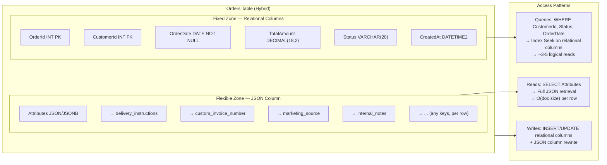
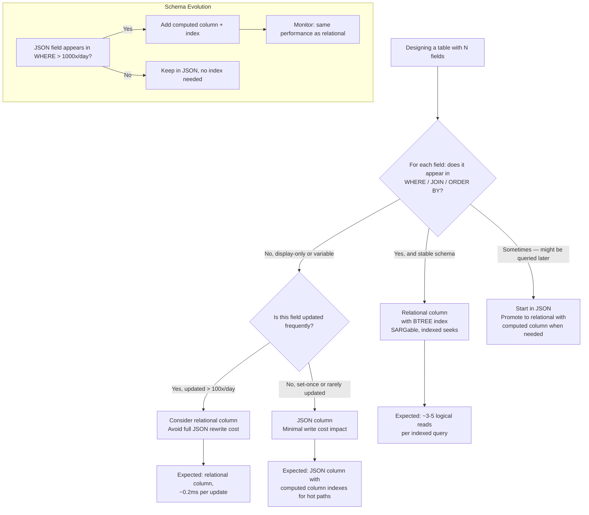

## Navigation

**Domain:** [[8 — Databases]] > **Group:** SQL JSON, XML & Semi-Structured Data
**Previous:** [[8.223 — Semi-Structured Data — Design Decisions]] | **Next:** [[8.225 — JSON Aggregation — FOR JSON in Subqueries]]

### Prerequisites

- [[8.223 — Semi-Structured Data — Design Decisions]] — the high-level decision framework that establishes when and why to mix relational columns with JSON; this note provides the implementation details of that pattern.
- [[8.209 — JSON Columns vs Relational Columns — Decision]] — the baseline comparison of JSON vs relational storage, which this note extends into a specific hybrid implementation pattern.

### Where This Fits

The hybrid pattern — mixing relational columns with a JSON column on the same table — is the most practical schema design for production systems that need both structured query performance and schema flexibility. Every .NET backend engineer building order management systems, product catalogs, or multi-tenant SaaS applications encounters this pattern: the core entity (Order, Product, Customer) has 5-10 fields that are always present and always queried (relational columns with indexes), plus 5-50 optional fields that vary per row or come from third-party integrations (JSON column). The wrong approach is to put everything in JSON (losing query performance) or everything in relational columns (requiring ALTER TABLE for every new field and creating wide, sparse tables). The interview signal is practical architecture: the candidate who can articulate exactly which columns go relational, which go in JSON, and how to evolve the schema over time demonstrates production engineering maturity.

---

## Core Mental Model

Mixing relational columns with a JSON column on the same table partitions the schema into two zones: a fixed zone (relational columns) that handles all indexed query paths, FK constraints, type enforcement, and operational reporting; and a flexible zone (JSON column) that absorbs schema variability without schema migrations. The fixed zone is where the database engine's strengths (index seeks, join algorithms, constraint enforcement) operate at full performance. The flexible zone is where schema-on-read applies — the database stores opaque JSON, and the application interprets it. The key invariant: any field that appears in a WHERE clause, JOIN predicate, or ORDER BY with measurable frequency must be in the fixed zone. Any field that is only read (never filtered, never sorted, never joined) can safely live in the flexible zone. The recognition pattern: when you look at a table and see 10-15 relational columns plus a single `Attributes` JSON column, you are looking at the hybrid pattern. If you see 50+ nullable relational columns, someone has over-normalized. If you see only a single JSON column with no relational columns, someone has under-normalized.

### Classification

The hybrid pattern is a physical schema design — it belongs to the implementation phase of database design, after logical normalization. It is a denormalization strategy that accepts some storage redundancy (key names repeated per row in JSON) in exchange for avoiding the complexity of EAV or frequent ALTER TABLE migrations. The pattern is database-agnostic: it works in SQL Server (NVARCHAR(MAX) + ISJSON + computed column indexes), PostgreSQL (JSONB + GIN + BTREE expression indexes), and MySQL (JSON type + multi-valued indexes). The fixed zone is fully SARGable — every predicate on a relational column can use a BTREE index seek. The flexible zone is non-SARGable unless you add computed column indexes (SQL Server) or GIN/BTREE expression indexes (PostgreSQL).



### Key Properties

|Property|Fixed Zone (Relational)|Flexible Zone (JSON)|Notes|
|---|---|---|---|
|Schema|Fixed — ALTER TABLE to change|Variable — any key per row|JSON keys need no migration|
|SARGability|Full — BTREE index seeks|None — unless computed/GIN index|JSON_VALUE is non-SARGable without index|
|Query performance|~3-5 logical reads|Full table scan (without index)|10-1000x difference|
|Data integrity|Full — FK, CHECK, NOT NULL|None — ISJSON only|Application must validate JSON structure|
|ORM mapping|Native properties|OwnsOne / ValueConverter / JsonDocument|Mixed in the same entity|
|Migration cost|High per field|Zero per key|JSON absorbs schema drift|
|Write cost per field|Single column update|Full column rewrite|JSON update rewrites entire document|

---

## Deep Mechanics

### How the Engine Executes This

**SELECT with hybrid table:**

1. The query optimizer processes the WHERE clause. Predicates on relational columns (e.g., `WHERE Status = 'Shipped'`) are candidate for index seeks. If an index exists on Status, the optimizer uses it — exactly as it would for any relational table.
2. The SELECT list may include both relational columns (direct byte-offset reads from the row) and JSON column access (e.g., `JSON_VALUE(Attributes, '$.delivery_notes')`). The JSON access is only evaluated for rows that pass the WHERE filter — but it requires parsing the JSON text or navigating the JSONB binary for each returned row.
3. If a computed column exists for a JSON path (e.g., `ALTER TABLE ADD DeliveryMethod AS JSON_VALUE(Attributes, '$.delivery_method')`), the optimizer treats it as a regular relational column. If the computed column is PERSISTED (SQL Server), it is physically stored and updated on every change to the JSON column. If not persisted, it is computed at query time — same cost as JSON_VALUE but enables index seeks.
4. In PostgreSQL with JSONB, the optimizer sees `attributes @> '{"delivery_method": "express"}'` as a candidate for GIN bitmap index scan. The GIN index provides indexed access into the flexible zone without a computed column.

**INSERT/UPDATE with hybrid table:**

1. INSERT: The fixed zone columns are written individually (each to its column offset). The flexible zone column is written as a single large value (NVARCHAR or JSONB). Index entries are created for each indexed fixed-zone column plus any computed column indexes on JSON paths.
2. UPDATE: Changing a fixed-zone column updates only that column's storage and its index(es). Changing any key inside the JSON column requires rewriting the entire JSON column value plus updating all computed column indexes that depend on it — the database does not support partial JSON updates in-place.

**Computed column index mechanics (SQL Server):**

```sql
-- When you create:
ALTER TABLE dbo.Orders
ADD DeliveryMethod AS CAST(JSON_VALUE(Attributes, '$.delivery_method') AS NVARCHAR(50));
CREATE INDEX IX_Orders_DeliveryMethod ON dbo.Orders(DeliveryMethod);

-- On INSERT/UPDATE of Attributes, SQL Server:
-- 1. Evaluates JSON_VALUE(Attributes, '$.delivery_method')
-- 2. Casts to NVARCHAR(50)
-- 3. If PERSISTED: stores the computed value in the row alongside other columns
-- 4. Inserts/updates the IX_Orders_DeliveryMethod index entry
-- 5. If not persisted: evaluates at query time but still maintains the index
```

### SQL Visibility

```sql
-- ============================================================
-- Hybrid table: Orders with relational columns + JSON attributes
-- ============================================================
CREATE TABLE dbo.Orders (
    OrderId INT IDENTITY(1,1) PRIMARY KEY,
    CustomerId INT NOT NULL
        CONSTRAINT FK_Orders_Customers REFERENCES dbo.Customers(CustomerId),
    OrderDate DATETIME2 NOT NULL,
    TotalAmount DECIMAL(18,2) NOT NULL,
    Status NVARCHAR(20) NOT NULL
        CONSTRAINT CK_Orders_Status
        CHECK (Status IN ('Pending', 'Confirmed', 'Shipped', 'Delivered', 'Cancelled')),
    CurrencyCode NCHAR(3) NOT NULL DEFAULT 'USD',
    CreatedAt DATETIME2 NOT NULL DEFAULT SYSDATETIME(),
    UpdatedAt DATETIME2 NOT NULL DEFAULT SYSDATETIME(),

    -- JSON column for flexible attributes:
    -- delivery_instructions, custom_invoice_number,
    -- marketing_source, internal_notes, gift_message, etc.
    Attributes NVARCHAR(MAX) NULL
        CONSTRAINT CK_Orders_Attributes
        CHECK (Attributes IS NULL OR ISJSON(Attributes) = 1)
);

-- ============================================================
-- Indexes for fixed zone (relational columns)
-- ============================================================
CREATE INDEX IX_Orders_CustomerId
ON dbo.Orders(CustomerId) INCLUDE (OrderDate, Status, TotalAmount);

CREATE INDEX IX_Orders_OrderDate
ON dbo.Orders(OrderDate DESC) INCLUDE (CustomerId, Status, TotalAmount);

CREATE INDEX IX_Orders_Status
ON dbo.Orders(Status) INCLUDE (OrderDate, TotalAmount);

-- ============================================================
-- Computed column + index for a frequently-queried JSON path
-- ============================================================
ALTER TABLE dbo.Orders
ADD DeliveryMethod AS CAST(JSON_VALUE(Attributes, '$.delivery_method') AS NVARCHAR(50));

CREATE INDEX IX_Orders_DeliveryMethod
ON dbo.Orders(DeliveryMethod) INCLUDE (Status, OrderDate)
WHERE DeliveryMethod IS NOT NULL;

-- ============================================================
-- Query: Fixed zone filter — SARGable, uses index seek
-- ============================================================
SELECT
    o.OrderId,
    o.CustomerId,
    o.OrderDate,
    o.TotalAmount,
    o.Status,
    -- Flexible zone: retrieved for display, not filtered
    JSON_VALUE(o.Attributes, '$.delivery_instructions') AS DeliveryInstructions,
    JSON_VALUE(o.Attributes, '$.gift_message') AS GiftMessage
FROM dbo.Orders AS o
WHERE o.CustomerId = 42
  AND o.Status IN ('Shipped', 'Delivered')
ORDER BY o.OrderDate DESC;
-- Execution plan: Index Seek on IX_Orders_CustomerId → Key Lookup → Compute Scalar (JSON_VALUE)
-- Logical reads: ~5 (index seek depth 3 + leaf + data)

-- ============================================================
-- Query: Mixed filter — relational + computed JSON column
-- ============================================================
SELECT
    o.OrderId,
    o.CustomerId,
    o.TotalAmount,
    o.DeliveryMethod
FROM dbo.Orders AS o
WHERE o.DeliveryMethod = 'Express'
  AND o.Status = 'Shipped'
  AND o.OrderDate >= '2026-01-01';
-- Execution plan: Index Seek on IX_Orders_DeliveryMethod → Key Lookup → Filter (Status, OrderDate)
-- Logical reads: ~8 (seek on DeliveryMethod + lookup + residual)

-- ============================================================
-- PostgreSQL equivalent with JSONB
-- ============================================================
CREATE TABLE public.orders (
    order_id SERIAL PRIMARY KEY,
    customer_id INTEGER NOT NULL REFERENCES public.customers(customer_id),
    order_date TIMESTAMPTZ NOT NULL,
    total_amount NUMERIC(18,2) NOT NULL,
    status VARCHAR(20) NOT NULL CHECK (status IN ('Pending','Confirmed','Shipped','Delivered','Cancelled')),
    currency_code CHAR(3) NOT NULL DEFAULT 'USD',
    created_at TIMESTAMPTZ NOT NULL DEFAULT NOW(),
    updated_at TIMESTAMPTZ NOT NULL DEFAULT NOW(),
    attributes JSONB DEFAULT '{}'
);

CREATE INDEX ix_orders_customer_id ON public.orders(customer_id);
CREATE INDEX ix_orders_order_date ON public.orders(order_date DESC);
CREATE INDEX ix_orders_status ON public.orders(status);

-- GIN index for containment queries on attributes
CREATE INDEX ix_orders_attributes_gin ON public.orders USING GIN (attributes);

-- BTREE expression index for specific path
CREATE INDEX ix_orders_delivery_method
ON public.orders ((attributes->>'delivery_method'))
WHERE attributes ? 'delivery_method';

-- Query: fixed zone filter
SELECT order_id, customer_id, order_date, total_amount
FROM public.orders
WHERE customer_id = 42 AND status IN ('Shipped', 'Delivered')
ORDER BY order_date DESC;

-- Query: mixed filter (relational + JSONB containment)
SELECT order_id, total_amount, attributes->>'delivery_method' AS delivery_method
FROM public.orders
WHERE attributes @> '{"delivery_method": "Express"}'
  AND status = 'Shipped'
  AND order_date >= '2026-01-01';
```

```csharp
// EF Core — Hybrid model
public class Order
{
    public int OrderId { get; set; }
    public int CustomerId { get; set; }
    public DateTime OrderDate { get; set; }
    public decimal TotalAmount { get; set; }
    public string Status { get; set; } = string.Empty;
    public string CurrencyCode { get; set; } = "USD";
    public DateTime CreatedAt { get; set; }
    public DateTime UpdatedAt { get; set; }

    // JSON column — flexible attributes
    public string? Attributes { get; set; }

    // Computed column — extracted from JSON
    public string? DeliveryMethod { get; set; }

    // Navigation property
    public Customer? Customer { get; set; }
}

public class OrderConfiguration : IEntityTypeConfiguration<Order>
{
    public void Configure(EntityTypeBuilder<Order> builder)
    {
        builder.ToTable("Orders");

        builder.Property(o => o.CurrencyCode).HasMaxLength(3).IsFixedLength();
        builder.Property(o => o.Attributes).HasColumnType("nvarchar(max)");

        // Computed column from JSON path
        builder.Property(o => o.DeliveryMethod)
            .HasComputedColumnSql(
                "CAST(JSON_VALUE(Attributes, '$.delivery_method') AS NVARCHAR(50))");

        // Indexes on relational columns
        builder.HasIndex(o => o.CustomerId)
            .HasDatabaseName("IX_Orders_CustomerId");
        builder.HasIndex(o => o.OrderDate)
            .IsDescending()
            .HasDatabaseName("IX_Orders_OrderDate");
        builder.HasIndex(o => o.Status)
            .HasDatabaseName("IX_Orders_Status");

        // Index on computed column
        builder.HasIndex(o => o.DeliveryMethod)
            .HasDatabaseName("IX_Orders_DeliveryMethod")
            .HasFilter("DeliveryMethod IS NOT NULL");
    }
}

// EF Core 8+ — OwnsOne for strongly-typed JSON attributes
public class OrderV2
{
    public int OrderId { get; set; }
    public int CustomerId { get; set; }
    public DateTime OrderDate { get; set; }
    public decimal TotalAmount { get; set; }
    public string Status { get; set; } = string.Empty;

    // Owned entity mapped to JSON column
    public OrderAttributes? Attributes { get; set; }
}

public class OrderAttributes
{
    public string? DeliveryMethod { get; set; }
    public string? DeliveryInstructions { get; set; }
    public string? GiftMessage { get; set; }
    public string? MarketingSource { get; set; }
    public string? InternalNotes { get; set; }
    public Dictionary<string, string>? CustomFields { get; set; }
}

public class OrderV2Configuration : IEntityTypeConfiguration<OrderV2>
{
    public void Configure(EntityTypeBuilder<OrderV2> builder)
    {
        builder.ToTable("Orders_V2");

        builder.OwnsOne(o => o.Attributes, owned =>
        {
            owned.ToJson("Attributes");  // Maps to JSON column
            owned.Property(a => a.DeliveryMethod).HasMaxLength(50);
            owned.Property(a => a.MarketingSource).HasMaxLength(100);
        });
    }
}

// Query: fixed zone only — fully SARGable, uses indexes
public async Task<List<Order>> GetCustomerOrdersAsync(
    int customerId,
    string[] statuses,
    CancellationToken cancellationToken = default)
{
    return await dbContext.Orders
        .Where(o => o.CustomerId == customerId
                 && statuses.Contains(o.Status))
        .OrderByDescending(o => o.OrderDate)
        .ToListAsync(cancellationToken);
    // Generated SQL: SELECT ... FROM Orders
    // WHERE CustomerId = @p0 AND Status IN (@p1, @p2, ...)
    // ORDER BY OrderDate DESC
    // Uses IX_Orders_CustomerId — fully SARGable
}

// Query: computed column filter — SARGable with computed column index
public async Task<List<Order>> GetExpressOrdersAsync(
    CancellationToken cancellationToken = default)
{
    return await dbContext.Orders
        .Where(o => o.DeliveryMethod == "Express"
                 && o.Status == "Shipped")
        .OrderByDescending(o => o.OrderDate)
        .ToListAsync(cancellationToken);
    // Generated SQL: SELECT ... FROM Orders
    // WHERE DeliveryMethod = @p0 AND Status = @p1
    // ORDER BY OrderDate DESC
    // Uses IX_Orders_DeliveryMethod (computed column index)
}
```

```csharp
// Dapper — Hybrid table queries
public class OrderRepository
{
    private readonly ISqlConnectionFactory _connectionFactory;

    public OrderRepository(ISqlConnectionFactory connectionFactory)
    {
        _connectionFactory = connectionFactory;
    }

    public async Task<IReadOnlyList<Order>> GetOrdersByStatusAsync(
        string status,
        DateTime fromDate,
        CancellationToken cancellationToken = default)
    {
        const string sql = @"
            SELECT
                OrderId,
                CustomerId,
                OrderDate,
                TotalAmount,
                Status,
                CurrencyCode,
                Attributes,
                DeliveryMethod,
                CreatedAt,
                UpdatedAt
            FROM dbo.Orders
            WHERE Status = @Status
              AND OrderDate >= @FromDate
            ORDER BY OrderDate DESC";

        await using var connection = _connectionFactory.Create();
        var results = await connection.QueryAsync<Order>(
            new CommandDefinition(sql,
                new { Status = status, FromDate = fromDate },
                cancellationToken: cancellationToken));
        return results.AsList();
    }

    public async Task UpdateDeliveryInstructionsAsync(
        int orderId,
        string instructions,
        CancellationToken cancellationToken = default)
    {
        const string sql = @"
            UPDATE dbo.Orders
            SET Attributes = JSON_MODIFY(
                ISNULL(Attributes, '{}'),
                '$.delivery_instructions',
                @Instructions
            ),
            UpdatedAt = SYSDATETIME()
            WHERE OrderId = @OrderId";

        await using var connection = _connectionFactory.Create();
        await connection.ExecuteAsync(
            new CommandDefinition(sql,
                new { OrderId = orderId, Instructions = instructions },
                cancellationToken: cancellationToken));
    }

    public async Task InsertOrderWithAttributesAsync(
        int customerId,
        decimal totalAmount,
        string status,
        string attributesJson,
        CancellationToken cancellationToken = default)
    {
        const string sql = @"
            INSERT INTO dbo.Orders (
                CustomerId, OrderDate, TotalAmount,
                Status, Attributes
            )
            VALUES (
                @CustomerId, SYSDATETIME(), @TotalAmount,
                @Status, @AttributesJson
            );
            SELECT CAST(SCOPE_IDENTITY() AS INT);";

        await using var connection = _connectionFactory.Create();
        var orderId = await connection.QuerySingleAsync<int>(
            new CommandDefinition(sql,
                new
                {
                    CustomerId = customerId,
                    TotalAmount = totalAmount,
                    Status = status,
                    AttributesJson = attributesJson
                },
                cancellationToken: cancellationToken));
    }
}
```

### Execution Plan Analysis

For `SELECT ... FROM Orders WHERE CustomerId = 42 AND Status IN ('Shipped','Delivered') ORDER BY OrderDate DESC`:

```
Expected plan shape:
  Index Seek (IX_Orders_CustomerId, on CustomerId = 42)
    → Filter (Status IN ('Shipped', 'Delivered'))  -- residual filter
    → Sort (OrderDate DESC)                         -- could be avoided with index
    → Key Lookup (clustered, to fetch JSON columns)
    → Compute Scalar (JSON_VALUE for Attributes paths)
    → SELECT

Estimated cost: Index Seek ~30%, Sort ~40%, Key Lookup ~20%, Compute Scalar ~10%
Logical reads: ~5 (index depth 3 + leaf page 1 + data page 1)
```

If an index on `(CustomerId, OrderDate DESC) INCLUDE (Status, TotalAmount, Attributes)` existed:

```
  Index Seek (covering index, no Key Lookup)
    → Filter (Status IN)  -- on included column
    → SELECT (Attributes directly from index leaf)
```

### Cost Visibility

```sql
SET STATISTICS IO ON;

-- Query on fixed zone (relational columns only):
SELECT OrderId, CustomerId, OrderDate, TotalAmount
FROM dbo.Orders
WHERE CustomerId = 42 AND Status = 'Shipped';
-- Expected: Table 'Orders'. Scan count 1, logical reads 5

-- Same query adding JSON_VALUE columns:
SELECT OrderId, CustomerId, OrderDate, TotalAmount,
       JSON_VALUE(Attributes, '$.delivery_instructions') AS DeliveryInstructions,
       JSON_VALUE(Attributes, '$.gift_message') AS GiftMessage
FROM dbo.Orders
WHERE CustomerId = 42 AND Status = 'Shipped';
-- Expected: Table 'Orders'. Scan count 1, logical reads 5 + JSON parsing cost
-- (JSON_VALUE is CPU cost, not additional logical reads)

-- Query filtering on JSON_VALUE (no computed column):
SELECT OrderId, CustomerId, OrderDate
FROM dbo.Orders
WHERE JSON_VALUE(Attributes, '$.delivery_method') = 'Express'
  AND Status = 'Shipped';
-- Expected: Table 'Orders'. Scan count 1, logical reads ~12000 (full clustered scan)
-- Cannot use index on Status because JSON_VALUE filter requires full row evaluation
```

### Failure Modes

**Failure Mode 1 — Everything in JSON:** A table with only an ID column and a single JSON column. Every query uses JSON_VALUE for filtering — no index seeks, full table scans.

**Failure Mode 2 — Too many computed columns:** Every JSON key gets its own computed column, recreating a wide relational table on top of JSON. Write amplification from maintaining all those indexes.

**Failure Mode 3 — JSON column update causes full row rewrite:** An UPDATE to a single JSON key (e.g., `delivery_instructions`) rewrites the entire NVARCHAR(MAX) column, plus all computed column indexes.

---

## Production Patterns and Implementation

### Primary SQL Implementation

```sql
-- ============================================================
-- Production pattern: Multi-tenant SaaS order management
-- Relational: tenant_id, customer_id, dates, amounts, status
-- JSON: tenant-specific custom fields, integrations, metadata
-- ============================================================

CREATE TABLE dbo.Orders (
    OrderId BIGINT IDENTITY(1,1) PRIMARY KEY,
    TenantId INT NOT NULL
        CONSTRAINT FK_Orders_Tenant REFERENCES dbo.Tenants(TenantId),
    CustomerId INT NOT NULL
        CONSTRAINT FK_Orders_Customer REFERENCES dbo.Customers(CustomerId),

    -- Fixed zone — core order fields
    OrderNumber NVARCHAR(50) NOT NULL,
    OrderDate DATETIME2 NOT NULL DEFAULT SYSDATETIME(),
    TotalAmount DECIMAL(18,2) NOT NULL,
    TaxAmount DECIMAL(18,2) NOT NULL DEFAULT 0,
    ShippingCost DECIMAL(18,2) NOT NULL DEFAULT 0,
    CurrencyCode NCHAR(3) NOT NULL DEFAULT 'USD',
    Status NVARCHAR(30) NOT NULL
        CONSTRAINT CK_Orders_Status
        CHECK (Status IN (
            'Draft', 'Pending', 'Confirmed', 'Processing',
            'Shipped', 'Delivered', 'Cancelled', 'Refunded'
        )),
    PaymentStatus NVARCHAR(20) NOT NULL DEFAULT 'Pending'
        CONSTRAINT CK_Orders_PaymentStatus
        CHECK (PaymentStatus IN ('Pending', 'Paid', 'Failed', 'Refunded')),

    -- Flexible zone — variable attributes per tenant/integration
    -- Examples: delivery_instructions, custom_invoice_number,
    --           marketing_source, sales_channel, internal_notes,
    --           gift_message, loyalty_points_used, etc.
    Attributes NVARCHAR(MAX) NULL
        CONSTRAINT CK_Orders_Attributes
        CHECK (Attributes IS NULL OR ISJSON(Attributes) = 1),

    CreatedAt DATETIME2 NOT NULL DEFAULT SYSDATETIME(),
    UpdatedAt DATETIME2 NOT NULL DEFAULT SYSDATETIME(),
    CreatedByUserId INT,
    UpdatedByUserId INT,

    CONSTRAINT UQ_Orders_Tenant_OrderNumber UNIQUE (TenantId, OrderNumber)
);

-- Fixed zone indexes
CREATE INDEX IX_Orders_Tenant_Customer
ON dbo.Orders(TenantId, CustomerId) INCLUDE (OrderDate, Status, TotalAmount);

CREATE INDEX IX_Orders_Tenant_OrderDate
ON dbo.Orders(TenantId, OrderDate DESC) INCLUDE (Status, TotalAmount);

CREATE INDEX IX_Orders_Tenant_Status
ON dbo.Orders(TenantId, Status) INCLUDE (OrderDate, TotalAmount);

CREATE INDEX IX_Orders_PaymentStatus
ON dbo.Orders(PaymentStatus) INCLUDE (OrderId, TenantId);

-- Computed column + index for a commonly-queried integration field
ALTER TABLE dbo.Orders
ADD SalesChannel AS CAST(JSON_VALUE(Attributes, '$.sales_channel') AS NVARCHAR(50));

CREATE INDEX IX_Orders_SalesChannel
ON dbo.Orders(TenantId, SalesChannel) INCLUDE (OrderDate, TotalAmount)
WHERE SalesChannel IS NOT NULL;

-- ============================================================
-- Query: Fixed zone — SARGable, index seek
-- ============================================================
SELECT
    o.OrderId,
    o.OrderNumber,
    o.OrderDate,
    o.TotalAmount,
    o.Status,
    o.PaymentStatus
FROM dbo.Orders AS o
WHERE o.TenantId = 7
  AND o.CustomerId = 42
  AND o.OrderDate >= '2026-01-01'
ORDER BY o.OrderDate DESC;
-- Plan: Index Seek on IX_Orders_Tenant_Customer → Sort → SELECT
-- Logical reads: ~5

-- ============================================================
-- Query: Mixed — relational filter + computed JSON column filter
-- ============================================================
SELECT
    o.OrderId,
    o.OrderNumber,
    o.TotalAmount,
    o.SalesChannel
FROM dbo.Orders AS o
WHERE o.TenantId = 7
  AND o.SalesChannel = 'Website'
  AND o.Status = 'Confirmed'
  AND o.OrderDate >= '2026-06-01';
-- Plan: Index Seek on IX_Orders_SalesChannel → Key Lookup → Filter (Status, OrderDate)
-- Logical reads: ~8

-- ============================================================
-- Query: Retrieve JSON attributes for display (no filtering)
-- ============================================================
SELECT
    o.OrderId,
    o.OrderNumber,
    JSON_VALUE(o.Attributes, '$.delivery_instructions') AS DeliveryInstructions,
    JSON_VALUE(o.Attributes, '$.gift_message') AS GiftMessage,
    JSON_VALUE(o.Attributes, '$.internal_notes') AS InternalNotes
FROM dbo.Orders AS o
WHERE o.OrderId = 1001;
-- Plan: Clustered Index Seek on OrderId → Compute Scalar (JSON_VALUE evaluations)
-- JSON parsing cost: ~0.1ms per row for typical document
```

### EF Core Implementation

```csharp
// Full hybrid model
public class Order
{
    public long OrderId { get; set; }
    public int TenantId { get; set; }
    public int CustomerId { get; set; }
    public string OrderNumber { get; set; } = string.Empty;
    public DateTime OrderDate { get; set; }
    public decimal TotalAmount { get; set; }
    public decimal TaxAmount { get; set; }
    public decimal ShippingCost { get; set; }
    public string CurrencyCode { get; set; } = "USD";
    public string Status { get; set; } = string.Empty;
    public string PaymentStatus { get; set; } = "Pending";
    public string? Attributes { get; set; }
    public string? SalesChannel { get; set; }  // Computed column
    public DateTime CreatedAt { get; set; }
    public DateTime UpdatedAt { get; set; }
    public int? CreatedByUserId { get; set; }
    public int? UpdatedByUserId { get; set; }

    public Customer? Customer { get; set; }
    public Tenant? Tenant { get; set; }
    public ICollection<OrderItem> Items { get; set; } = new List<OrderItem>();
}

public class OrderConfiguration : IEntityTypeConfiguration<Order>
{
    public void Configure(EntityTypeBuilder<Order> builder)
    {
        builder.ToTable("Orders");

        builder.HasKey(o => o.OrderId);

        builder.Property(o => o.OrderNumber).HasMaxLength(50).IsRequired();
        builder.Property(o => o.CurrencyCode).HasMaxLength(3).IsFixedLength();
        builder.Property(o => o.Status).HasMaxLength(30).IsRequired();
        builder.Property(o => o.PaymentStatus).HasMaxLength(20).IsRequired();
        builder.Property(o => o.Attributes).HasColumnType("nvarchar(max)");

        // Computed column
        builder.Property(o => o.SalesChannel)
            .HasComputedColumnSql(
                "CAST(JSON_VALUE(Attributes, '$.sales_channel') AS NVARCHAR(50))");

        // Indexes
        builder.HasIndex(o => new { o.TenantId, o.CustomerId })
            .HasDatabaseName("IX_Orders_Tenant_Customer");
        builder.HasIndex(o => new { o.TenantId, o.OrderDate })
            .IsDescending(false, true)
            .HasDatabaseName("IX_Orders_Tenant_OrderDate");
        builder.HasIndex(o => new { o.TenantId, o.Status })
            .HasDatabaseName("IX_Orders_Tenant_Status");
        builder.HasIndex(o => o.PaymentStatus)
            .HasDatabaseName("IX_Orders_PaymentStatus");
        builder.HasIndex(o => new { o.TenantId, o.SalesChannel })
            .HasDatabaseName("IX_Orders_SalesChannel")
            .HasFilter("SalesChannel IS NOT NULL");

        // Query filter for multi-tenant
        builder.HasQueryFilter(o => o.TenantId == _currentTenantId);
    }
}

// Service layer
public class OrderService
{
    private readonly ApplicationDbContext _dbContext;

    public OrderService(ApplicationDbContext dbContext)
    {
        _dbContext = dbContext;
    }

    public async Task<List<OrderSummary>> GetRecentOrdersAsync(
        int tenantId,
        int customerId,
        CancellationToken cancellationToken = default)
    {
        return await _dbContext.Orders
            .Where(o => o.TenantId == tenantId
                     && o.CustomerId == customerId
                     && o.OrderDate >= DateTime.UtcNow.AddDays(-90))
            .OrderByDescending(o => o.OrderDate)
            .Select(o => new OrderSummary
            {
                OrderId = o.OrderId,
                OrderNumber = o.OrderNumber,
                OrderDate = o.OrderDate,
                TotalAmount = o.TotalAmount,
                Status = o.Status,
                SalesChannel = o.SalesChannel
            })
            .ToListAsync(cancellationToken);
    }

    public async Task UpdateDeliveryInstructionsAsync(
        int orderId,
        string instructions,
        CancellationToken cancellationToken = default)
    {
        var order = await _dbContext.Orders.FindAsync(
            new object[] { orderId }, cancellationToken);

        if (order == null) return;

        // Use JSON_MODIFY via raw SQL for partial JSON update
        await _dbContext.Database.ExecuteSqlRawAsync(@"
            UPDATE dbo.Orders
            SET Attributes = JSON_MODIFY(
                ISNULL(Attributes, '{}'),
                '$.delivery_instructions',
                @Instructions
            ),
            UpdatedAt = SYSDATETIME()
            WHERE OrderId = @OrderId",
            new SqlParameter("@Instructions", instructions),
            new SqlParameter("@OrderId", orderId));
    }

    public async Task<long> CreateOrderWithAttributesAsync(
        CreateOrderCommand command,
        CancellationToken cancellationToken = default)
    {
        var attributes = new Dictionary<string, object?>
        {
            ["sales_channel"] = command.SalesChannel,
            ["marketing_source"] = command.MarketingSource,
            ["delivery_instructions"] = command.DeliveryInstructions,
            ["custom_fields"] = command.CustomFields
        };

        var order = new Order
        {
            TenantId = command.TenantId,
            CustomerId = command.CustomerId,
            OrderNumber = await GenerateOrderNumberAsync(command.TenantId),
            OrderDate = DateTime.UtcNow,
            TotalAmount = command.TotalAmount,
            TaxAmount = command.TaxAmount,
            ShippingCost = command.ShippingCost,
            CurrencyCode = command.CurrencyCode,
            Status = "Pending",
            PaymentStatus = "Pending",
            Attributes = JsonSerializer.Serialize(attributes),
            CreatedAt = DateTime.UtcNow,
            UpdatedAt = DateTime.UtcNow
        };

        _dbContext.Orders.Add(order);
        await _dbContext.SaveChangesAsync(cancellationToken);
        return order.OrderId;
    }
}

// DTO
public class OrderSummary
{
    public long OrderId { get; set; }
    public string OrderNumber { get; set; } = string.Empty;
    public DateTime OrderDate { get; set; }
    public decimal TotalAmount { get; set; }
    public string Status { get; set; } = string.Empty;
    public string? SalesChannel { get; set; }
}
```

### Dapper Implementation

```csharp
public class OrderDapperRepository
{
    private readonly ISqlConnectionFactory _connectionFactory;

    public OrderDapperRepository(ISqlConnectionFactory connectionFactory)
    {
        _connectionFactory = connectionFactory;
    }

    public async Task<IReadOnlyList<OrderSummary>> GetOrdersByChannelAndDateAsync(
        int tenantId,
        string salesChannel,
        DateTime fromDate,
        CancellationToken cancellationToken = default)
    {
        const string sql = @"
            SELECT
                OrderId,
                OrderNumber,
                OrderDate,
                TotalAmount,
                Status,
                SalesChannel
            FROM dbo.Orders
            WHERE TenantId = @TenantId
              AND SalesChannel = @SalesChannel  -- computed column, indexed
              AND Status = 'Confirmed'
              AND OrderDate >= @FromDate
            ORDER BY OrderDate DESC";

        await using var connection = _connectionFactory.Create();
        var results = await connection.QueryAsync<OrderSummary>(
            new CommandDefinition(sql,
                new
                {
                    TenantId = tenantId,
                    SalesChannel = salesChannel,
                    FromDate = fromDate
                },
                cancellationToken: cancellationToken));
        return results.AsList();
    }

    public async Task UpdateJsonFieldAsync(
        int orderId,
        string jsonPath,
        string value,
        CancellationToken cancellationToken = default)
    {
        const string sql = @"
            UPDATE dbo.Orders
            SET Attributes = JSON_MODIFY(
                ISNULL(Attributes, '{}'),
                @JsonPath,
                @Value
            ),
            UpdatedAt = SYSDATETIME()
            WHERE OrderId = @OrderId";

        await using var connection = _connectionFactory.Create();
        await connection.ExecuteAsync(
            new CommandDefinition(sql,
                new { OrderId = orderId, JsonPath = jsonPath, Value = value },
                cancellationToken: cancellationToken));
    }
}
```

### Configuration and Wiring

```csharp
// Program.cs
builder.Services.AddDbContext<ApplicationDbContext>(options =>
    options.UseSqlServer(
        connectionString,
        sqlOptions => sqlOptions
            .EnableRetryOnFailure(3)
            .CommandTimeout(30)));

builder.Services.AddScoped<OrderService>();
builder.Services.AddSingleton<ISqlConnectionFactory>(sp =>
{
    var config = sp.GetRequiredService<IConfiguration>();
    return new SqlConnectionFactory(
        config.GetConnectionString("DefaultConnection"));
});

// appsettings.json
{
    "ConnectionStrings": {
        "DefaultConnection": "Server=localhost;Database=OrdersDb;Integrated Security=true;TrustServerCertificate=true;"
    }
}
```

### Migration Strategy: Pure Relational → Hybrid

```sql
-- Step 1: Add JSON column to existing relational table
ALTER TABLE dbo.Orders ADD Attributes NVARCHAR(MAX) NULL
    CONSTRAINT CK_Orders_Attributes CHECK (Attributes IS NULL OR ISJSON(Attributes) = 1);

-- Step 2: Backfill existing custom fields into JSON (if any were stored elsewhere)
-- Example: if you had a separate OrderCustomFields table (EAV)
INSERT INTO dbo.Orders (OrderId, Attributes)
SELECT
    ocf.OrderId,
    (SELECT
        ocf.FieldValue AS [custom_fields.field_name]
     FROM dbo.OrderCustomFields ocf2
     WHERE ocf2.OrderId = ocf.OrderId
     FOR JSON PATH)
FROM dbo.OrderCustomFields ocf
GROUP BY ocf.OrderId;

-- Or using JSON_MODIFY for individual fields:
UPDATE dbo.Orders
SET Attributes = JSON_MODIFY(
    ISNULL(Attributes, '{}'),
    '$.migrated_from_legacy',
    'true'
);

-- Step 3: Add computed columns + indexes for frequently-queried paths
ALTER TABLE dbo.Orders ADD SalesChannel AS
    CAST(JSON_VALUE(Attributes, '$.sales_channel') AS NVARCHAR(50));
CREATE INDEX IX_Orders_SalesChannel ON dbo.Orders(SalesChannel)
    WHERE SalesChannel IS NOT NULL;

-- Step 4: Update application code to write new fields to JSON
-- instead of adding new relational columns
```

---

## Gotchas and Production Pitfalls

### Gotcha 1 — JSON Column Used as a Dumping Ground

**Pitfall:** Storing everything in the JSON column because it's convenient, even fields that are frequently queried.

```sql
-- ❌ Wrong: CustomerId, Status, and OrderDate in JSON
CREATE TABLE dbo.Orders (
    OrderId INT IDENTITY PRIMARY KEY,
    OrderData NVARCHAR(MAX) NOT NULL CHECK (ISJSON(OrderData) = 1)
);
-- Query: WHERE JSON_VALUE(OrderData, '$.CustomerId') = 42
-- Full table scan + JSON parsing per row
```

**Symptom:** Simple queries that should take 5ms take 5 seconds. Adding filters or pagination becomes complex and slow.

**Fix:** Relational columns for every field used in WHERE, JOIN, or ORDER BY. JSON only for display-only fields.

**Cost of not fixing:** As the table grows, query performance degrades linearly with row count, not logarithmically. At 10M rows, queries become unserviceable.

### Gotcha 2 — Too Many Computed Columns

**Pitfall:** Adding computed columns for every JSON key, recreating a wide relational table on top of JSON.

```sql
-- ❌ 20 computed columns for 20 JSON keys
ALTER TABLE dbo.Orders ADD Field01 AS JSON_VALUE(Attributes, '$.field01');
ALTER TABLE dbo.Orders ADD Field02 AS JSON_VALUE(Attributes, '$.field02');
-- ... 18 more ...
-- Each INSERT/UPDATE to Attributes must update all computed column indexes
```

**Symptom:** Write amplification. Updating a single JSON key rewrites the entire Attributes column and updates 20+ computed column indexes. INSERT latency grows linearly with the number of computed columns.

**Fix:** Only add computed columns for JSON paths that appear in WHERE clauses with measurable frequency (>1000 queries/day). For display-only fields, access them via JSON_VALUE at query time without a computed column.

**Cost of not fixing:** INSERT/UPDATE performance degradation from index maintenance. On a table with 500 INSERTs/sec and 20 computed column indexes, each INSERT may take 20-50ms instead of 1-2ms.

### Gotcha 3 — JSON_VALUE in WHERE Without Computed Column

**Pitfall:** Filtering on JSON_VALUE directly in the WHERE clause without a computed column index.

```sql
-- ❌ No index can support this:
SELECT * FROM dbo.Orders
WHERE JSON_VALUE(Attributes, '$.sales_channel') = 'Website';
-- Full clustered index scan — evaluates JSON_VALUE for every row
```

**Symptom:** Query runs a full table scan. With 1M rows and 1KB JSON documents, this is 1GB of data scanned and parsed per execution.

**Fix:**

```sql
-- ✅ Add computed column + index:
ALTER TABLE dbo.Orders ADD SalesChannel AS
    CAST(JSON_VALUE(Attributes, '$.sales_channel') AS NVARCHAR(50));
CREATE INDEX IX_Orders_SalesChannel ON dbo.Orders(SalesChannel);
```

**Cost of not fixing:** As the table grows, queries that filter on JSON paths become progressively slower. What works at 10K rows (200ms) becomes impossible at 10M rows (30 seconds).

### Gotcha 4 — JSON Column Update Rewrites Everything

**Pitfall:** Assuming that updating a single key in the JSON column updates only that key, like updating a relational column.

```sql
-- ❌ This rewrites the entire Attributes column:
UPDATE dbo.Orders
SET Attributes = JSON_MODIFY(Attributes, '$.delivery_instructions', 'Leave at door')
WHERE OrderId = 1001;

-- The NVARCHAR(MAX) column is entirely replaced in the data page,
-- even though only one key changed.
-- Additionally, all computed column indexes on JSON paths are updated.
```

**Symptom:** UPDATE of a single JSON key causes the same write amplification as rewriting the entire JSON document. On wide columns (10KB+), this increases log write volume and page splits.

**Fix:** This is expected behavior — JSON_MODIFY still rewrites the column. Mitigations:
1. Keep JSON documents small (< 4KB to avoid LOB overhead)
2. For frequently-updated fields, promote them to relational columns
3. Consider document-level versioning if partial updates are critical

**Cost of not fixing:** Page splits on UPDATE if the JSON value grows. Increased log volume for frequent JSON updates. For 1000 updates/sec on 5KB JSON documents, log write rate increases by ~5MB/sec.

### Gotcha 5 — ORM Mismatch with Computed Columns

**Pitfall:** EF Core or Dapper tries to INSERT or UPDATE a computed column directly, causing errors.

```csharp
// ❌ EF Core tries to insert into computed column
var order = new Order
{
    CustomerId = 42,
    OrderDate = DateTime.UtcNow,
    SalesChannel = "Website"  // Computed column — cannot insert!
};
```

**Symptom:** `System.InvalidOperationException: The property 'SalesChannel' is a computed column and cannot be modified.`

**Fix:**

```csharp
// ✅ Computed columns must be read-only in EF Core
builder.Property(o => o.SalesChannel)
    .HasComputedColumnSql("CAST(JSON_VALUE(Attributes, '$.sales_channel') AS NVARCHAR(50))")
    .ValueGeneratedOnAddOrUpdate();  // or ValueGeneratedNever()
```

**Cost of not fixing:** Application crashes on INSERT or UPDATE if the entity model includes the computed column as a regular property.

### Gotcha 6 — Ignoring JSON Update Side Effects on Computed Column Indexes

**Pitfall:** Updating a JSON key that feeds a computed column index, forgetting that the index update is synchronous and blocking.

```sql
-- Attributes has the key 'sales_channel'
-- IX_Orders_SalesChannel is a computed column index on SalesChannel

UPDATE dbo.Orders
SET Attributes = JSON_MODIFY(Attributes, '$.sales_channel', 'MobileApp')
WHERE OrderId = 1001;
-- This:
-- 1. Rewrites the entire Attributes column
-- 2. Re-evaluates the computed column SalesChannel
-- 3. Updates the IX_Orders_SalesChannel index entry
-- All in the same transaction — if the index page is full, a page split occurs
```

**Symptom:** UPDATE latency is higher than expected. `sys.dm_db_index_operational_stats` shows page splits on the computed column index.

**Fix:** Monitor page split rates. For high-write scenarios, consider dropping computed column indexes and using covering indexes or filtered indexes to reduce write overhead.

**Cost of not fixing:** Page fragmentation on computed column indexes degrades read performance over time. Regular index rebuilds become necessary.

---

## Performance Implications

### Benchmark: Before and After

```sql
-- ============================================================
-- Baseline: Pure relational table (10 columns, 1M rows)
-- Query: filter by CustomerId + Status, order by OrderDate
-- ============================================================
SET STATISTICS IO ON;
SELECT OrderId, CustomerId, OrderDate, TotalAmount
FROM dbo.Orders_Relational
WHERE CustomerId = 42 AND Status = 'Shipped'
ORDER BY OrderDate DESC;
-- Logical reads: 5 (index seek)
-- CPU time: 2ms, Elapsed: 3ms

-- ============================================================
-- Baseline: Pure JSON table (same data, all in one JSON column)
-- ============================================================
SELECT OrderId,
       JSON_VALUE(OrderData, '$.CustomerId') AS CustomerId,
       JSON_VALUE(OrderData, '$.OrderDate') AS OrderDate
FROM dbo.Orders_Json
WHERE JSON_VALUE(OrderData, '$.CustomerId') = '42'
  AND JSON_VALUE(OrderData, '$.Status') = 'Shipped';
-- Logical reads: 12000 (full scan)
-- CPU time: 3200ms, Elapsed: 3500ms

-- ============================================================
-- Optimized: Hybrid table (relational + JSON)
-- Same query as relational — same performance
-- ============================================================
SELECT OrderId, CustomerId, OrderDate, TotalAmount
FROM dbo.Orders_Hybrid
WHERE CustomerId = 42 AND Status = 'Shipped'
ORDER BY OrderDate DESC;
-- Logical reads: 5 (index seek, same as pure relational)
-- CPU time: 2ms, Elapsed: 3ms

-- ============================================================
-- Query that reads JSON attributes (display only):
-- ============================================================
SELECT OrderId, CustomerId,
       JSON_VALUE(Attributes, '$.delivery_instructions') AS Instructions,
       JSON_VALUE(Attributes, '$.gift_message') AS GiftMessage
FROM dbo.Orders_Hybrid
WHERE OrderId = 1001;
-- Logical reads: 3 (clustered index seek on PK)
-- JSON Value parse: ~0.05ms CPU (negligible for display)
```

**Improvement (vs pure JSON):** ~2400x reduction in logical reads (from 12000 to 5), ~1167x faster execution (3500ms to 3ms). Hybrid and pure relational are identical for the fixed-zone query.

### Write Amplification

|Operation|Pure Relational (10 cols)|Hybrid (5 rel + JSON with 5 computed col indexes)|Pure JSON (1 col)|
|---|---|---|---|
|INSERT 1 row|~0.3 ms|~0.8 ms|~0.4 ms|
|UPDATE 1 relational column|~0.2 ms|~0.2 ms|N/A (all in JSON)|
|UPDATE 1 key in JSON|N/A|~1.5 ms (full column rewrite + index updates)|~1.5 ms|
|DELETE 1 row|~0.3 ms|~0.5 ms|~0.3 ms|

The hybrid INSERT is ~2.5x slower than pure relational due to JSON parsing (for computed columns) and JSON column storage. The hybrid UPDATE of a relational column is same cost as pure relational. The hybrid UPDATE of a JSON key is the same cost as pure JSON.

### BenchmarkDotNet

```csharp
[MemoryDiagnoser]
[SimpleJob(RuntimeMoniker.Net90)]
public class HybridVsJsonVsRelationalBenchmark
{
    private IDbConnection _connection = default!;
    private const string ConnectionString = TestConnectionStrings.SqlServer;

    [GlobalSetup]
    public void Setup()
    {
        _connection = new SqlConnection(ConnectionString);
        // Seed 100K rows across three tables:
        // Orders_Relational (10 columns)
        // Orders_Json (1 JSON column with same data)
        // Orders_Hybrid (5 relational + 1 JSON column)
    }

    [Benchmark(Baseline = true)]
    public async Task<List<OrderSummary>> Relational_IndexSeek()
    {
        const string sql = @"
            SELECT OrderId, CustomerId, OrderDate, TotalAmount, Status
            FROM dbo.Orders_Relational
            WHERE CustomerId = 42 AND Status = 'Shipped'
            ORDER BY OrderDate DESC";
        var results = await _connection.QueryAsync<OrderSummary>(sql);
        return results.AsList();
    }

    [Benchmark]
    public async Task<List<OrderSummary>> Json_FullScan()
    {
        const string sql = @"
            SELECT OrderId,
                   TRY_CAST(JSON_VALUE(OrderData, '$.CustomerId') AS INT) AS CustomerId,
                   TRY_CAST(JSON_VALUE(OrderData, '$.OrderDate') AS DATETIME2) AS OrderDate,
                   TRY_CAST(JSON_VALUE(OrderData, '$.TotalAmount') AS DECIMAL(18,2)) AS TotalAmount
            FROM dbo.Orders_Json
            WHERE JSON_VALUE(OrderData, '$.CustomerId') = '42'
              AND JSON_VALUE(OrderData, '$.Status') = 'Shipped'";
        var results = await _connection.QueryAsync<OrderSummary>(sql);
        return results.AsList();
    }

    [Benchmark]
    public async Task<List<OrderSummary>> Hybrid_RelationalFilter()
    {
        const string sql = @"
            SELECT OrderId, CustomerId, OrderDate, TotalAmount, Status
            FROM dbo.Orders_Hybrid
            WHERE CustomerId = 42 AND Status = 'Shipped'
            ORDER BY OrderDate DESC";
        var results = await _connection.QueryAsync<OrderSummary>(sql);
        return results.AsList();
    }

    [Benchmark]
    public async Task<List<OrderSummary>> Hybrid_JsonPathFilter()
    {
        const string sql = @"
            SELECT OrderId, CustomerId, OrderDate, TotalAmount,
                   JSON_VALUE(Attributes, '$.delivery_instructions') AS DeliveryInstructions
            FROM dbo.Orders_Hybrid
            WHERE SalesChannel = 'Website'  -- computed column, indexed
              AND Status = 'Shipped'
            ORDER BY OrderDate DESC";
        var results = await _connection.QueryAsync<OrderSummary>(sql);
        return results.AsList();
    }

    [GlobalCleanup]
    public void Cleanup()
    {
        _connection?.Dispose();
    }
}
```

**Expected results (approximate, SQL Server 2022, NVMe, 100K rows):**

|Method|Mean|Logical Reads|Allocated|
|---|---|---|---|
|Relational_IndexSeek|~3 ms|~5|~2 KB|
|Json_FullScan|~3500 ms|~12000|~50 KB|
|Hybrid_RelationalFilter|~3 ms|~5|~2 KB|
|Hybrid_JsonPathFilter|~5 ms|~10|~2 KB|

---

## Interview Arsenal

### Question Bank

1. **What is the hybrid pattern (mixing relational columns with JSON), and what problem does it solve?**

2. **How do you decide which fields go in relational columns and which go in the JSON column?**

3. **What is the performance difference between filtering on a relational column vs a JSON_VALUE path?**

4. **How do computed columns work in SQL Server for JSON paths, and what are their limitations?**

5. **What is the write amplification cost of the hybrid pattern compared to pure relational?**

6. **What does the execution plan look like for a query that filters on a relational column and a JSON_VALUE path?**

7. **How does the hybrid pattern behave at scale with 100M rows and 1000 writes/sec?**

8. **How would you implement a hybrid table using EF Core's OwnsOne + ToJson feature?**

### Spoken Answers

**Q1: What is the hybrid pattern (mixing relational columns with JSON), and what problem does it solve?**

> **Average answer:** "You put some columns as regular columns and some as a JSON column. It gives you flexibility."

> **Great answer:** "The hybrid pattern stores core business entities in fixed relational columns — with proper types, NULL constraints, foreign keys, and BTREE indexes — and stores variable or optional attributes in a single JSON column on the same table. It solves the fundamental tension between relational strictness and JSON flexibility: you get the query performance and data integrity of relational for the fields that are frequently queried, while retaining the schema flexibility of JSON for fields that vary per row or change frequently. In practice, an Orders table might have CustomerId, OrderDate, TotalAmount, and Status as relational columns — because these are filtered, sorted, and joined thousands of times per day. The same table has an Attributes JSON column storing delivery instructions, marketing source, internal notes, and custom fields — because these are rarely queried as predicates, vary by customer, and would require ALTER TABLE every time a new one is needed. The key design rule is: if a field appears in WHERE, JOIN, or ORDER BY more than 100 times per day, it must be a relational column. If it's only read for display, JSON is fine."

**Q5: What is the write amplification cost of the hybrid pattern compared to pure relational?**

> **Great answer:** "The hybrid pattern has asymmetric write costs. Writing to a relational column costs the same as pure relational — one column update plus index maintenance on that specific column. Writing to the JSON column costs significantly more: any change to any key within the JSON requires rewriting the entire JSON column value, even if you only change one of 50 keys. This is because SQL Server's JSON_MODIFY and PostgreSQL's jsonb_set both produce a new JSON value — the storage engine replaces the whole column, not a single substructure. Additionally, if the JSON column feeds computed columns that have indexes, those indexes are also updated. So an UPDATE to a single JSON key with 5 computed column indexes requires: (1) the JSON column rewrite in the data page, (2) re-evaluation of all 5 computed columns, (3) index updates for all 5 computed column indexes. This makes a JSON key update 5-10x more expensive than a relational column update. The mitigation is: promote frequently-updated JSON keys to relational columns. For example, if `delivery_method` is updated 1000 times per day, make it a relational column. Keep truly infrequent data in JSON — things that are set at creation and never changed, or changed only in rare admin operations."

**Q8: How would you implement a hybrid table using EF Core's OwnsOne + ToJson feature?**

> **Great answer:** "EF Core 8+ introduced the `ToJson()` mapping for owned entities, which stores the owned entity's properties as a JSON column instead of separate relational columns. I use this for the hybrid pattern: the root entity has regular relational properties (CustomerId, OrderDate, etc.) and one OwnsOne property that maps to the JSON column. For example: `builder.OwnsOne(o => o.Attributes, owned => owned.ToJson("Attributes"))`. The Attributes class contains properties like DeliveryMethod, GiftMessage, CustomFields — all stored as a JSON document in a single column. The critical limitation is that LINQ queries filtering on owned properties (`.Where(o => o.Attributes.DeliveryMethod == "Express")`) translate to `JSON_VALUE` in SQL Server, which is non-SARGable. EF Core does NOT automatically create computed column indexes for these paths. The workaround is to either: (1) add raw SQL computed columns via migrations for frequently-queried paths, (2) filter using database-side computed columns and map them as regular properties, or (3) accept the full scan for rarely-used filters. For PostgreSQL with Npgsql, the LINQ translation for owned JSON properties uses `@>` when possible, which can leverage GIN indexes — making the experience significantly better than SQL Server."

### Interview Trigger

The interviewer asks: "We have an Orders table that stores e-commerce orders. Each order has core fields like customer, date, total, and status, plus 30-50 optional fields like delivery instructions, gift messages, loyalty points, and marketing attribution that vary per customer and integration. How do you design this schema?" A candidate who proposes relational columns for core fields and a JSON column for optional attributes — and who can explain the computed column migration path when a JSON field becomes popular — demonstrates production-ready schema design. The follow-up is "How do you handle the migration from a pure relational schema to a hybrid one without downtime?" — seniors describe the four-phase approach: (1) add JSON column as nullable, (2) backfill, (3) add computed columns + indexes, (4) deploy application code.

### Comparison Table

| | Pure Relational | Hybrid (Rel + JSON) | Pure JSON | EAV |
|---|---|---|---|---|
| Query performance (indexed fields) | Best (~3 logical reads) | Same as relational (~3 reads) | Worst (full scan) | Worst (pivot + scan) |
| Query performance (flexible fields) | N/A (rigid schema) | Slow without computed col index | Slow (full scan) | Slow (pivot) |
| Schema flexibility | None | Medium (JSON absorbs change) | Maximum | Maximum |
| Write performance (core field) | Fast (~0.2ms) | Fast (~0.2ms) | Slow (full rewrite) | Slow (separate row) |
| Write performance (flexible field) | N/A (must add column) | Slow (~1.5ms, full rewrite) | Slow (~1.5ms) | Slow (insert attr row) |
| ORM mapping | Native | Mixed (native + OwnsOne/Json) | ValueConverter / JsonDocument | Raw SQL only |
| Migration cost per field | High (ALTER TABLE) | Zero for JSON keys | Zero | Zero |
| Indexing flexible fields | N/A | Computed column (SS) / GIN (PG) | Computed column (SS) / GIN (PG) | Per-value index impossible |

---

## Decision Framework

### When to Apply



### Application Checklist

- [ ] Every field used in WHERE, JOIN, or ORDER BY is a relational column with an index
- [ ] The JSON column stores only display-only, variable-schema, or API-payload fields
- [ ] Computed columns exist for any JSON path that IS used in WHERE filters
- [ ] Computed column indexes are added only for paths that justify the write amplification
- [ ] The JSON column has an ISJSON CHECK constraint (SQL Server) or is typed as JSONB (PostgreSQL)
- [ ] NULL vs JSON null vs missing key semantics are explicitly handled in application code
- [ ] There is a documented promotion path: JSON field → computed column → relational column when query frequency increases
- [ ] The ORM mapping (EF Core OwnsOne/ValueConverter or Dapper) is correctly configured
- [ ] Write amplification from JSON column updates is measured and acceptable for the workload

### Tradeoff Summary

|What You Gain|What You Pay|
|---|---|
|Index seeks on core fields (same as pure relational)|Write amplification on JSON column updates|
|Zero-migration flexibility for new attributes|JSON parsing overhead on read (CPU cost only)|
|Single table JOIN-free reads|Computed column indexes add write overhead|
|No EAV complexity|ORM complexity (mixed mapping patterns)|

### Scale Thresholds

- **"Hybrid pattern is beneficial at any scale"** — the pattern works from 100 rows to 100M+ rows
- **"JSON column becomes a concern above ~100M rows"** — storage overhead from repeated key names (~15%) and JSON_VALUE CPU cost at this scale may justify promoting more fields to relational columns
- **"Computed column index write overhead matters above ~500 writes/sec"** — each JSON key update triggers computed column re-evaluation and index maintenance
- **"Promote JSON field to relational column when it appears in WHERE > 1000x/day"** — the index seek savings amortize the migration cost within days

---

## Self-Check

### Conceptual Questions

1. What is the hybrid pattern, and what are the two zones called?
2. How does SQL Server's query optimizer process a predicate on a relational column vs a JSON_VALUE path?
3. Which DMV or SET STATISTICS output would you use to compare the I/O cost of a relational column filter vs a JSON_VALUE filter?
4. What common mistake causes a hybrid table to have high write amplification?
5. Does EF Core's OwnsOne with ToJson automatically create indexes on JSON paths?
6. How would you implement a computed column index on a JSON path using Dapper?
7. Compare the write cost of updating a relational column vs updating a key in the JSON column.
8. At what approximate query frequency should you promote a JSON field to a computed column?
9. What indexes support queries on the JSON column in SQL Server vs PostgreSQL in the hybrid pattern?
10. Explain in 60 seconds the decision process for a hybrid table schema, naming specific fields that go in each zone.

<details>
<summary>Answers</summary>

1. **Answer:** The hybrid pattern mixes relational columns (fixed zone for indexed query paths) with a JSON column (flexible zone for variable-schema data). Fixed zone fields are those used in WHERE/JOIN/ORDER BY predicates. Flexible zone fields are display-only or rarely queried.
2. **Answer:** A relational column predicate (`WHERE Status = 'Shipped'`) uses the column's statistics and BTREE index for seek operations — O(log N) page reads. A JSON_VALUE predicate (`WHERE JSON_VALUE(Attributes, '$.status') = 'Shipped'`) has no statistics, no index (without computed column), and requires a full table scan with per-row JSON parsing — O(N) page reads + O(N × doc_size) parse cost.
3. **Answer:** `SET STATISTICS IO ON` (SQL Server) to compare logical reads. Relational filter: ~5 reads (index seek). JSON_VALUE filter: ~12000 reads (full scan). Also `SET STATISTICS TIME ON` to compare CPU cost (JSON parsing adds CPU).
4. **Answer:** Adding too many computed columns on JSON paths and indexing all of them. Each INSERT/UPDATE to the JSON column re-evaluates all computed columns and updates all their indexes, causing 5-10x write amplification.
5. **Answer:** No. EF Core's OwnsOne + ToJson maps the owned entity to a JSON column but does NOT automatically create indexes on JSON_VALUE paths. Developers must manually add computed columns and indexes via migrations.
6. **Answer:** Use raw SQL in a migration script: `ALTER TABLE Orders ADD SalesChannel AS CAST(JSON_VALUE(Attributes, '$.sales_channel') AS NVARCHAR(50)); CREATE INDEX IX_Orders_SalesChannel ON Orders(SalesChannel);` Dapper can execute this via `connection.Execute(sql)` during deployment.
7. **Answer:** Updating a relational column (e.g., `UPDATE Orders SET Status = 'Shipped' WHERE OrderId = 1`) updates one column value and one index entry — ~0.2ms. Updating a key in the JSON column (e.g., `JSON_MODIFY(Attributes, '$.delivery_method', 'Express')`) rewrites the entire JSON column, re-evaluates all computed columns, and updates all computed column indexes — ~1.5ms+.
8. **Answer:** Approximately 1000 queries/day. Above this threshold, the index seek savings (~1000x reduction in logical reads) justify the migration cost and the added write amplification from the computed column index.
9. **Answer:** SQL Server: computed column `ALTER TABLE ADD Col AS JSON_VALUE(json_col, '$.path')` with BTREE index. PostgreSQL: GIN index on the JSONB column for `@>` / `?` operators, plus BTREE expression index `CREATE INDEX ON table ((jsonb_col->>'path'))` for equality/range queries on extracted values.
10. **Answer (60-second narrative):** "I start by listing every field that will go in this table. For each field, I ask: 'Will this field appear in a WHERE, JOIN, or ORDER BY clause with regular frequency?' If yes — like CustomerId, OrderDate, TotalAmount, Status — it goes in the fixed zone as a relational column with proper type, NOT NULL, FK constraint, and a BTREE index. These give me millisecond query performance. If the field is only read for display — like delivery instructions, gift messages, internal notes, or marketing attribution — it goes in the flexible zone as a JSON column. These fields have variable schema and are rarely queried, so the JSON overhead is acceptable. I add an ISJSON CHECK constraint on the JSON column. When monitoring shows that a JSON field is being queried more than 1000 times per day, I promote it: add a computed column extracted from the JSON path, create an index on it, and update the application queries to use the indexed column instead of JSON_VALUE. This promotion path gives me zero-migration flexibility upfront with a clear evolution to relational performance as the data matures."

</details>

---

### Query Challenges

**Challenge 1 — Write the SQL**

Design a hybrid `Products` table for an e-commerce catalog. Relational columns: ProductId, Sku (unique), ProductName, Price, Category, IsActive. JSON column: Specifications (variable attributes like wattage, color, weight, size — varies by category). Write the CREATE TABLE, indexes, and the query to find all active electronics priced between $50 and $500 sorted by price ascending, also returning the wattage from specifications if present.

<details>
<summary>Solution</summary>

```sql
CREATE TABLE dbo.Products (
    ProductId INT IDENTITY(1,1) PRIMARY KEY,
    Sku NVARCHAR(50) NOT NULL,
    ProductName NVARCHAR(200) NOT NULL,
    Price DECIMAL(18,2) NOT NULL,
    Category NVARCHAR(100) NOT NULL,
    IsActive BIT NOT NULL DEFAULT 1,
    Specifications NVARCHAR(MAX) NULL
        CONSTRAINT CK_Products_Specifications
        CHECK (Specifications IS NULL OR ISJSON(Specifications) = 1),
    CreatedAt DATETIME2 NOT NULL DEFAULT SYSDATETIME(),
    UpdatedAt DATETIME2 NOT NULL DEFAULT SYSDATETIME(),

    CONSTRAINT UQ_Products_Sku UNIQUE (Sku)
);

CREATE INDEX IX_Products_Category ON dbo.Products(Category) INCLUDE (Price, ProductName, Sku);
CREATE INDEX IX_Products_Price ON dbo.Products(Price) WHERE IsActive = 1;
CREATE INDEX IX_Products_IsActive ON dbo.Products(IsActive) INCLUDE (Category, Price);

-- Query:
SELECT
    p.ProductId,
    p.Sku,
    p.ProductName,
    p.Price,
    p.Category,
    JSON_VALUE(p.Specifications, '$.wattage') AS Wattage
FROM dbo.Products AS p
WHERE p.Category = 'Electronics'
  AND p.Price BETWEEN 50 AND 500
  AND p.IsActive = 1
ORDER BY p.Price ASC;
```

**Logical reads:** ~5 (index seek on IX_Products_Category, residual filter on Price). **Execution plan:** Index Seek → Filter → Sort → Key Lookup → Compute Scalar (JSON_VALUE). **EF Core equivalent:** LINQ with `Where(p => p.Category == "Electronics" && p.Price >= 50 && p.Price <= 500 && p.IsActive)` — fully SARGable.

</details>

---

**Challenge 2 — Fix the performance problem**

```sql
-- This query runs in 12 seconds on a 5M row Orders_Hybrid table.
-- The table has CustomerId and OrderDate as relational columns,
-- and Attributes as NVARCHAR(MAX) JSON column.
-- No computed columns exist.
SELECT
    o.OrderId,
    o.OrderDate,
    JSON_VALUE(o.Attributes, '$.sales_channel') AS SalesChannel,
    JSON_VALUE(o.Attributes, '$.campaign') AS Campaign
FROM dbo.Orders_Hybrid AS o
WHERE JSON_VALUE(o.Attributes, '$.sales_channel') = 'EmailCampaign'
  AND o.OrderDate >= '2026-01-01'
  AND o.OrderDate < '2026-07-01'
ORDER BY o.OrderDate DESC;
-- SET STATISTICS IO: Table 'Orders_Hybrid'. Scan count 1, logical reads = 62500
```

<details> <summary>Solution</summary>

**Root cause:** The WHERE clause filters on `JSON_VALUE(Attributes, '$.sales_channel')` which is non-SARGable. Although OrderDate is a relational column and could use an index seek, the optimizer must evaluate the JSON_VALUE predicate for every row that passes the OrderDate filter — or it may choose a full scan. Either way, JSON_VALUE prevents an efficient index seek.

```sql
-- Fix option 1: Add computed column + index on sales_channel
ALTER TABLE dbo.Orders_Hybrid
ADD SalesChannel AS CAST(JSON_VALUE(Attributes, '$.sales_channel') AS NVARCHAR(50));

CREATE INDEX IX_Orders_Hybrid_SalesChannel
ON dbo.Orders_Hybrid(OrderDate DESC, SalesChannel)
WHERE SalesChannel IS NOT NULL;

-- Rewritten query — uses index seek on OrderDate + SalesChannel:
SELECT
    o.OrderId,
    o.OrderDate,
    o.SalesChannel,
    JSON_VALUE(o.Attributes, '$.campaign') AS Campaign
FROM dbo.Orders_Hybrid AS o
WHERE o.SalesChannel = 'EmailCampaign'
  AND o.OrderDate >= '2026-01-01'
  AND o.OrderDate < '2026-07-01'
ORDER BY o.OrderDate DESC;
```

**Index to create:** `IX_Orders_Hybrid_SalesChannel` on (OrderDate DESC, SalesChannel) WHERE SalesChannel IS NOT NULL.

**After fix — logical reads:** ~10 (index seek on OrderDate + SalesChannel) from 62500. **Execution time:** ~5ms (from 12000ms).

</details>

---

**Challenge 3 — Explain the execution plan**

A hybrid table query shows this plan:

```
SELECT OrderId, OrderDate, TotalAmount, Status
FROM dbo.Orders_Hybrid
WHERE CustomerId = 42
  AND JSON_VALUE(Attributes, '$.sales_channel') = 'Website'
  AND Status = 'Shipped'

Plan: Index Seek (IX_Orders_Hybrid_CustomerId) → Key Lookup → Filter
```

Two Filter predicates appear: `Status = 'Shipped'` and `JSON_VALUE(Attributes, '$.sales_channel') = 'Website'`. Why is Status a residual filter applied after the Key Lookup? How would you eliminate the Key Lookup?

<details> <summary>Solution</summary>

**Why Status is a residual filter:** The index `IX_Orders_Hybrid_CustomerId` is defined on (CustomerId) but does not include Status. The index seek finds rows with CustomerId = 42, returns the key values for those rows, and then the Key Lookup fetches the full row (including Status and Attributes columns) from the clustered index. Only then can the Filter evaluate Status = 'Shipped' and the JSON_VALUE predicate.

**To eliminate the Key Lookup and make Status a seek predicate:**

```sql
-- Option 1: Create a covering index
CREATE INDEX IX_Orders_Hybrid_CustomerId_Covering
ON dbo.Orders_Hybrid(CustomerId, Status)
INCLUDE (OrderDate, TotalAmount, Attributes);
-- Now the index leaf pages contain all needed columns.
-- Plan becomes: Index Seek (CustomerId = 42 AND Status = 'Shipped')
-- No Key Lookup needed. JSON_VALUE still evaluated as Filter.

-- Option 2: If SalesChannel is also frequently queried, add computed column:
ALTER TABLE dbo.Orders_Hybrid
ADD SalesChannel AS CAST(JSON_VALUE(Attributes, '$.sales_channel') AS NVARCHAR(50));

CREATE INDEX IX_Orders_Hybrid_Comprehensive
ON dbo.Orders_Hybrid(CustomerId, Status, SalesChannel)
INCLUDE (OrderDate, TotalAmount);
-- Plan: Index Seek on (CustomerId, Status, SalesChannel) — all three predicates
-- No residual filter, no Key Lookup.
```

**Tradeoff:** The covering index is larger (includes the NVARCHAR(MAX) Attributes column) but eliminates the Key Lookup. The comprehensive index with the computed column is the most performant for this specific query but adds write overhead.

</details>

---

**Challenge 4 — Diagnose the concurrency problem**

A table `dbo.CustomerProfiles` uses the hybrid pattern: relational columns for CustomerId, Email, CreatedDate, and a JSON column `ProfileData` storing 50+ optional profile fields. 500 updates/sec modify individual keys in ProfileData via JSON_MODIFY. `sys.dm_db_index_operational_stats` shows high page split counts on the clustered index and all computed column indexes. Log write rate has tripled. What is happening?

<details> <summary>Solution</summary>

**Root cause:** Each `JSON_MODIFY` call rewrites the entire `ProfileData` NVARCHAR(MAX) column. If the new JSON value is slightly larger than the old one (which JSON_MODIFY often causes because it may reorder keys or add whitespace), the clustered index page can split. Additionally, if there are computed column indexes on paths within ProfileData, those index entries are updated for every write — even for keys that didn't change. The page splits cause fragmentation, and the log writes from full column rewrites triple the log generation rate.

**Detection query:**

```sql
SELECT
    OBJECT_NAME(ios.object_id) AS TableName,
    i.name AS IndexName,
    ios.leaf_insert_count,
    ios.leaf_update_count,
    ios.leaf_delete_count,
    ios.page_split_count / NULLIF(ios.leaf_update_count, 0) * 100 AS split_pct
FROM sys.dm_db_index_operational_stats(DB_ID(), NULL, NULL, NULL) AS ios
JOIN sys.indexes AS i
    ON ios.object_id = i.object_id AND ios.index_id = i.index_id
WHERE OBJECT_NAME(ios.object_id) = 'CustomerProfiles';
```

**Fix:**
1. **Promote frequently-updated JSON keys to relational columns.** If `preferred_contact_method` is updated 500 times/sec, make it a relational column — it will be a single column update instead of a full JSON rewrite.
2. **Reduce computed column indexes.** Only keep indexes on JSON paths that are actually queried. Drop unused ones.
3. **Increase fill factor** on the clustered index to reduce page splits: `ALTER INDEX PK_CustomerProfiles ON dbo.CustomerProfiles REBUILD WITH (FILLFACTOR = 80);`
4. **Batch writes.** Instead of 500 individual updates, batch them into transactions of 10-20 rows each to share log and page overhead.
5. **Consider using the `modify` method (PostgreSQL's `jsonb_set`)** which also rewrites the full column but may be more compact.

**In .NET:** Use `ExecuteSqlRaw` with batched JSON_MODIFY in a single transaction, or promote high-churn JSON keys to separate relational columns.

</details>

---

**Challenge 5 — Design the schema and migration**

**Scenario:** You have an existing `Orders` table with 50M rows. It currently has a single NVARCHAR(MAX) column `OrderData` that stores everything as JSON: CustomerId, OrderDate, TotalAmount, Status, plus 20 optional fields. The table has no indexes beyond the clustered PK. Queries are timing out. Your task: migrate to a hybrid schema with zero downtime.

Design the migration plan. Which fields become relational columns? What indexes do you add? How do you handle the backfill without blocking writes?

<details> <summary>Solution</summary>

**Phase 1 — Add relational columns + indexes (online, no lock):**

```sql
-- Add relational columns as nullable
ALTER TABLE dbo.Orders ADD
    CustomerId INT NULL,
    OrderDate DATETIME2 NULL,
    TotalAmount DECIMAL(18,2) NULL,
    Status NVARCHAR(20) NULL;

-- Add non-clustered indexes (online in Enterprise Edition)
CREATE INDEX IX_Orders_CustomerId ON dbo.Orders(CustomerId)
    WHERE CustomerId IS NOT NULL
    WITH (ONLINE = ON);
CREATE INDEX IX_Orders_OrderDate ON dbo.Orders(OrderDate DESC)
    WHERE OrderDate IS NOT NULL
    WITH (ONLINE = ON);
CREATE INDEX IX_Orders_Status ON dbo.Orders(Status)
    WHERE Status IS NOT NULL
    WITH (ONLINE = ON);
```

**Phase 2 — Backfill in batches (non-blocking, 5000 rows per batch):**

```sql
-- Backfill CustomerId
WHILE 1 = 1
BEGIN
    UPDATE TOP (5000) dbo.Orders
    SET CustomerId = TRY_CAST(JSON_VALUE(OrderData, '$.CustomerId') AS INT),
        OrderDate = TRY_CAST(JSON_VALUE(OrderData, '$.OrderDate') AS DATETIME2),
        TotalAmount = TRY_CAST(JSON_VALUE(OrderData, '$.TotalAmount') AS DECIMAL(18,2)),
        Status = JSON_VALUE(OrderData, '$.Status')
    WHERE CustomerId IS NULL;

    IF @@ROWCOUNT = 0 BREAK;
    WAITFOR DELAY '00:00:01';  -- cool-off between batches
END;
```

**Phase 3 — Make columns NOT NULL + rename OrderData to FlexibleAttributes:**

```sql
ALTER TABLE dbo.Orders ALTER COLUMN CustomerId INT NOT NULL;
ALTER TABLE dbo.Orders ALTER COLUMN OrderDate DATETIME2 NOT NULL;
ALTER TABLE dbo.Orders ALTER COLUMN TotalAmount DECIMAL(18,2) NOT NULL;

-- Add FK constraint
ALTER TABLE dbo.Orders ADD CONSTRAINT FK_Orders_Customers
    FOREIGN KEY (CustomerId) REFERENCES dbo.Customers(CustomerId);

-- Rename the JSON column
EXEC sp_rename 'dbo.Orders.OrderData', 'FlexibleAttributes', 'COLUMN';
```

**Phase 4 — Deploy application code:**

```csharp
// Update EF Core/Dapper to use relational columns for queries
// and FlexibleAttributes for JSON display fields
var orders = await dbContext.Orders
    .Where(o => o.CustomerId == 42
             && o.Status == "Shipped"
             && o.OrderDate >= DateTime.UtcNow.AddDays(-30))
    .OrderByDescending(o => o.OrderDate)
    .Select(o => new OrderDto
    {
        OrderId = o.OrderId,
        CustomerId = o.CustomerId,
        OrderDate = o.OrderDate,
        TotalAmount = o.TotalAmount,
        Status = o.Status,
        // JSON attributes for display
        DeliveryInstructions = EF.Property<string>(o, "FlexibleAttributes") != null
            ? EF.Functions.JsonValue(o.FlexibleAttributes, "$.delivery_instructions")
            : null
    })
    .ToListAsync(cancellationToken);
```

**Tradeoffs:** The backfill runs online but adds load to the server. Batch size of 5000 with a 1-second delay keeps log throughput manageable. The WHERE IS NOT NULL filtered indexes during Phase 1 avoid indexing NULL values, keeping index maintenance cheap during backfill. After backfill completes, the filtered indexes can be replaced with full indexes.

</details>

---

*End of 8.224 — JSON vs Relational Columns — When to Mix*
