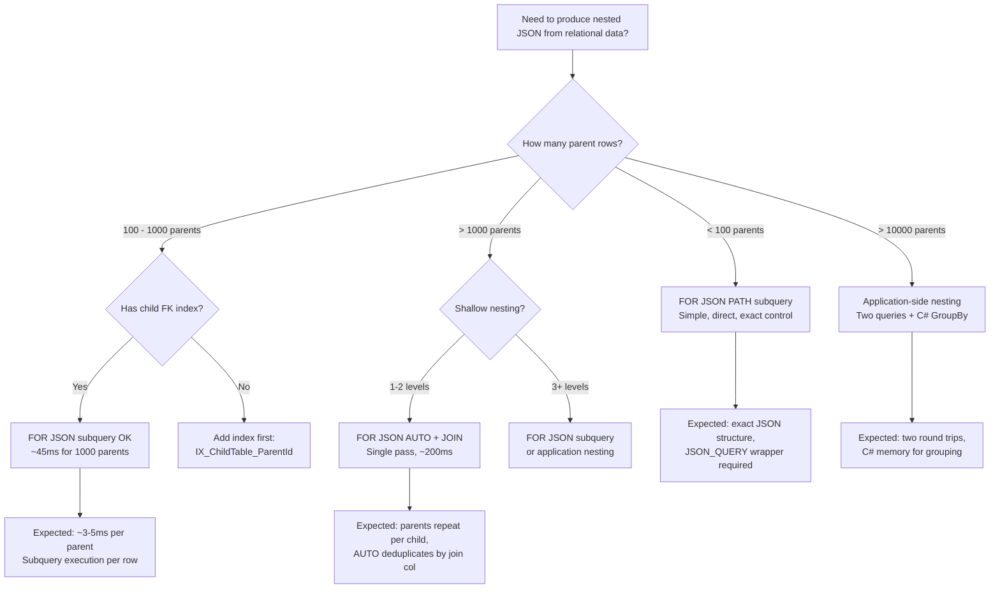

## Navigation

**Domain:** [[8 — Databases]] > **Group:** SQL JSON, XML & Semi-Structured Data
**Previous:** [[8.224 — JSON vs Relational Columns — When to Mix]] | **Next:** (none — last in group)

### Prerequisites

- [[8.201 — JSON Support in SQL Server — FOR JSON PATH]] — understanding how FOR JSON PATH produces JSON output from a SELECT query; this is the foundational construct that gets nested in subqueries.
- [[8.203 — OPENJSON — Parsing JSON in T-SQL]] — the companion function that reverses the transformation; FOR JSON + OPENJSON together enable JSON roundtrips within the database.

### Where This Fits

FOR JSON in subqueries is SQL Server's mechanism for producing nested JSON output from relational data — it transforms parent-child-grandchild relationships into a single hierarchical JSON document directly in T-SQL. Every .NET backend engineer building REST APIs with JSON responses encounters the need to return deeply nested data structures (order → items → product details). The two approaches are: produce flat relational results and nest them in application code (C# LINQ group/join), or produce the nested JSON directly in the database using FOR JSON PATH subqueries. The database approach reduces client-server roundtrips and moves serialization cost to the database server. The interview signal is advanced SQL: FOR JSON subqueries represent a server-side aggregation pattern that demonstrates deep understanding of when to push serialization to the database and when to keep it in the application layer.

---

## Core Mental Model

A FOR JSON subquery is a scalar subquery in the SELECT list that produces a JSON string from child rows and embeds it as a property in the parent row's JSON output. The pattern is: `SELECT col1, col2, (SELECT ... FROM child WHERE child.ParentId = parent.Id FOR JSON PATH) AS childJson FROM parent FOR JSON PATH`. The outer FOR JSON PATH produces the top-level JSON array of parent objects. For each parent row, the inner scalar subquery executes to produce a JSON array of child objects, which becomes a string property (`childJson`) in the parent object. The database engine executes the inner subquery row-by-row (a nested loop join at the logical level), collecting child rows and serializing them to JSON for each parent. The recognition pattern: when you see `(SELECT ... FROM ChildTable FOR JSON PATH)` as a column expression in a SELECT list, you are looking at JSON aggregation via subquery. This pattern supports arbitrarily deep nesting: a subquery within a subquery within a subquery produces three-level JSON (grandparent → parent → child).

### Classification

FOR JSON PATH is a SQL extension in SQL Server (not ANSI SQL) that converts relational result sets to JSON text. When used in a subquery, it becomes a JSON aggregation pattern — it converts a set of child rows into a JSON array string per parent row. The subquery is a correlated scalar subquery: it depends on the outer query's current row via the WHERE clause predicate (`child.ParentId = parent.Id`). The query optimizer cannot push predicates into or pull data out of a FOR JSON subquery — it must execute the subquery to completion for each outer row. This makes FOR JSON subqueries row-by-row execution by definition, which is the key performance characteristic. The pattern is NOT SARGable in any sense — it is a serialization operation, not a filtering operation.

```mermaid
flowchart TD
    subgraph Parent["Orders Table"]
        O1["OrderId=1<br/>Customer='Alice'<br/>Total=299.99"]
        O2["OrderId=2<br/>Customer='Bob'<br/>Total=149.99"]
    end

    subgraph Child["OrderItems Table"]
        I1["OrderId=1, Sku='A1', Qty=2, Price=99.99"]
        I2["OrderId=1, Sku='B2', Qty=1, Price=100.01"]
        I3["OrderId=2, Sku='C3', Qty=3, Price=49.99"]
    end

    subgraph SubqueryExecution["FOR JSON PATH Subquery Execution"]
        S1["For OrderId=1:<br/>SELECT FROM OrderItems<br/>WHERE OrderId=1<br/>FOR JSON PATH"]
        S2["Result: [{sku:'A1',qty:2},<br/>          {sku:'B2',qty:1}]"]
        S3["For OrderId=2:<br/>SELECT FROM OrderItems<br/>WHERE OrderId=2<br/>FOR JSON PATH"]
        S4["Result: [{sku:'C3',qty:3}]"]
    end

    subgraph FinalOutput["Final JSON"]
        J1['[
  {"orderId":1,"customer":"Alice","total":299.99,
   "items":[
     {"sku":"A1","qty":2,"price":99.99},
     {"sku":"B2","qty":1,"price":100.01}
   ]},
  {"orderId":2,"customer":"Bob","total":149.99,
   "items":[
     {"sku":"C3","qty":3,"price":49.99}
   ]}
]']
    end

    O1 --> S1
    O2 --> S3
    S1 --> S2
    S3 --> S4
    S2 --> FinalOutput
    S4 --> FinalOutput
```

### Key Properties

|Property|Value|Notes|
|---|---|---|
|Execution Model|Correlated subquery — row-by-row|Executes once per parent row|
|Output|NVARCHAR(MAX) JSON text|Produced by inner FOR JSON PATH|
|Nesting Depth|Arbitrary (subquery in subquery)|Deep nesting increases serialization cost|
|Index Support|Depends on the WHERE clause|Inner subquery WHERE can use indexes|
|Result Set Size|Single JSON text value|Entire hierarchy in one document|
|.NET Handling|String → deserialize in application|No ORM mapping for subquery-generated JSON|

---

## Deep Mechanics

### How the Engine Executes This

**Execution flow for `SELECT ... (SELECT ... FROM child WHERE child.ParentId = parent.Id FOR JSON PATH) AS items FROM parent FOR JSON PATH`:**

1. The outer query (parent) executes first, producing a result set of parent rows. The optimizer may use any indexes or joins on the parent tables.
2. For each row in the outer result, the engine evaluates the scalar subquery. The subquery selects child rows matching the current parent's ID and serializes them to a JSON array string via FOR JSON PATH.
3. The JSON string is returned as a column value in the outer result set.
4. After all outer rows are processed, the outer FOR JSON PATH serializes the entire result set (including the embedded JSON subquery results) into the final JSON output.

**Critical performance detail:** The FOR JSON subquery is a row-by-row operation. If the outer query produces 1000 parent rows, the inner subquery executes 1000 times. Each execution of the inner subquery does:
- A seek or scan on the child table's index (typically a seek on `child.ParentId = parent.Id`)
- Serialization of matching child rows to JSON text
- Memory allocation for the JSON string

The total execution time is approximately `O(outer_rows × inner_child_rows × serialization_cost)`. For 1000 parents with 10 items each, this is 1000 subquery executions × 10 rows serialized = 10,000 row serializations.

**Execution plan shape:**

The outer query's SELECT with a scalar subquery in the column list produces:
```
  Clustered Index Scan (Orders)  -- or Index Seek
    → Compute Scalar (FOR JSON PATH subquery execution)
      → nested loop for each row:
          Index Seek (OrderItems IX_OrderItems_OrderId)
            → Stream Aggregate? (no aggregation — FOR JSON PATH serializes rows)
```

The actual plan shows the subquery as a Compute Scalar operator. Expanding the Compute Scalar in SSMS shows the inner query plan. There is no way to see the subquery execution cost directly in the parent plan's cost percentages — it is hidden inside the Compute Scalar.

### SQL Visibility

```sql
-- ============================================================
-- Basic FOR JSON PATH subquery: Order + Items
-- ============================================================
-- Schema: Orders(OrderId, CustomerId, OrderDate, TotalAmount)
--         OrderItems(OrderItemId, OrderId, Sku, Quantity, UnitPrice)

SELECT
    o.OrderId,
    o.OrderDate,
    o.TotalAmount,
    -- Subquery: produces JSON array of items for this order
    (
        SELECT
            oi.Sku,
            oi.Quantity,
            oi.UnitPrice
        FROM dbo.OrderItems AS oi
        WHERE oi.OrderId = o.OrderId
        FOR JSON PATH
    ) AS Items
FROM dbo.Orders AS o
WHERE o.OrderDate >= '2026-01-01'
ORDER BY o.OrderDate DESC
FOR JSON PATH, ROOT('Orders');

-- Result (formatted):
-- {
--   "Orders": [
--     {
--       "OrderId": 1001,
--       "OrderDate": "2026-06-25T10:00:00",
--       "TotalAmount": 299.99,
--       "Items": "[{\"Sku\":\"A1\",\"Quantity\":2,\"UnitPrice\":99.99},{\"Sku\":\"B2\",\"Quantity\":1,\"UnitPrice\":100.01}]"
--     }
--   ]
-- }
-- ⚠️ Items is a JSON string, not a nested JSON array in the output!
-- To get true nesting, use INCLUDE_NULL_VALUES or JSON_QUERY wrapper:

SELECT
    o.OrderId,
    o.OrderDate,
    o.TotalAmount,
    JSON_QUERY((
        SELECT
            oi.Sku,
            oi.Quantity,
            oi.UnitPrice
        FROM dbo.OrderItems AS oi
        WHERE oi.OrderId = o.OrderId
        FOR JSON PATH
    )) AS Items  -- JSON_QUERY tells FOR JSON this is JSON, not a string
FROM dbo.Orders AS o
WHERE o.OrderDate >= '2026-01-01'
ORDER BY o.OrderDate DESC
FOR JSON PATH, ROOT('Orders');

-- Correct result:
-- {
--   "Orders": [
--     {
--       "OrderId": 1001,
--       "Items": [
--         {"Sku": "A1", "Quantity": 2, "UnitPrice": 99.99},
--         {"Sku": "B2", "Quantity": 1, "UnitPrice": 100.01}
--       ]
--     }
--   ]
-- }

-- ============================================================
-- Three-level nesting: Category → Products → OrderItems
-- ============================================================
SELECT
    c.CategoryName,
    (
        SELECT
            p.ProductName,
            p.Price,
            (
                SELECT
                    oi.OrderId,
                    oi.Quantity
                FROM dbo.OrderItems AS oi
                WHERE oi.Sku = p.Sku
                FOR JSON PATH
            ) AS OrderHistory
        FROM dbo.Products AS p
        WHERE p.CategoryId = c.CategoryId
        FOR JSON PATH
    ) AS Products
FROM dbo.Categories AS c
FOR JSON PATH, ROOT('Catalog');

-- ============================================================
-- FOR JSON with GROUP BY: aggregate + JSON child collection
-- ============================================================
SELECT
    c.CategoryId,
    c.CategoryName,
    COUNT(DISTINCT p.ProductId) AS ProductCount,
    SUM(oi.Quantity * oi.UnitPrice) AS TotalRevenue,
    (
        SELECT
            p.ProductName,
            SUM(oi.Quantity * oi.UnitPrice) AS ProductRevenue
        FROM dbo.Products AS p
        INNER JOIN dbo.OrderItems AS oi ON oi.Sku = p.Sku
        WHERE p.CategoryId = c.CategoryId
        GROUP BY p.ProductName
        ORDER BY ProductRevenue DESC
        FOR JSON PATH
    ) AS TopProducts
FROM dbo.Categories AS c
LEFT JOIN dbo.Products AS p ON p.CategoryId = c.CategoryId
LEFT JOIN dbo.OrderItems AS oi ON oi.Sku = p.Sku
GROUP BY c.CategoryId, c.CategoryName
ORDER BY TotalRevenue DESC
FOR JSON PATH, ROOT('CategoryReport');

-- ============================================================
-- FOR JSON with NULL handling
-- ============================================================
SELECT
    o.OrderId,
    o.TotalAmount,
    JSON_QUERY((
        SELECT
            oi.Sku,
            oi.Quantity,
            -- NULL values handled with INCLUDE_NULL_VALUES if needed
            ISNULL(oi.DiscountCode, 'N/A') AS DiscountCode
        FROM dbo.OrderItems AS oi
        WHERE oi.OrderId = o.OrderId
        FOR JSON PATH
    )) AS Items
FROM dbo.Orders AS o
WHERE o.OrderId = 1001
FOR JSON PATH, WITHOUT_ARRAY_WRAPPER;

-- ============================================================
-- FOR JSON with APPLY for complex nesting
-- ============================================================
SELECT
    o.OrderId,
    o.OrderDate,
    o.TotalAmount,
    JSON_QUERY(ItemsJson) AS Items
FROM dbo.Orders AS o
CROSS APPLY (
    SELECT
        oi.Sku,
        oi.Quantity,
        oi.UnitPrice
    FROM dbo.OrderItems AS oi
    WHERE oi.OrderId = o.OrderId
    FOR JSON PATH
) AS ItemsSub(ItemsJson)
WHERE o.OrderDate >= '2026-01-01'
FOR JSON PATH, ROOT('Orders');
```

```csharp
// EF Core — FOR JSON PATH subqueries require raw SQL
// EF Core LINQ cannot generate FOR JSON PATH

public async Task<string> GetOrdersWithItemsJsonAsync(
    DateTime fromDate,
    CancellationToken cancellationToken = default)
{
    const string sql = @"
        SELECT
            o.OrderId,
            o.OrderDate,
            o.TotalAmount,
            JSON_QUERY((
                SELECT
                    oi.Sku,
                    oi.Quantity,
                    oi.UnitPrice
                FROM dbo.OrderItems AS oi
                WHERE oi.OrderId = o.OrderId
                FOR JSON PATH
            )) AS Items
        FROM dbo.Orders AS o
        WHERE o.OrderDate >= @FromDate
        ORDER BY o.OrderDate DESC
        FOR JSON PATH, ROOT('Orders')";

    var result = await dbContext.Database
        .SqlQueryRaw<string>(sql,
            new SqlParameter("@FromDate", fromDate))
        .FirstOrDefaultAsync(cancellationToken);

    return result ?? "[]";
}

// Deserialize the JSON result to C# objects
public async Task<List<OrderDto>> GetOrdersWithItemsAsync(
    DateTime fromDate,
    CancellationToken cancellationToken = default)
{
    var json = await GetOrdersWithItemsJsonAsync(fromDate, cancellationToken);
    return JsonSerializer.Deserialize<OrderDto[]>(
        json,
        new JsonSerializerOptions { PropertyNameCaseInsensitive = true })
        ?.ToList() ?? new List<OrderDto>();
}

// For pagination, pass the ORDER BY and OFFSET/FETCH to SQL:
public async Task<string> GetOrdersWithItemsPagedAsync(
    DateTime fromDate,
    int pageSize,
    int pageNumber,
    CancellationToken cancellationToken = default)
{
    const string sql = @"
        SELECT
            o.OrderId,
            o.OrderDate,
            o.TotalAmount,
            JSON_QUERY((
                SELECT
                    oi.Sku,
                    oi.Quantity,
                    oi.UnitPrice
                FROM dbo.OrderItems AS oi
                WHERE oi.OrderId = o.OrderId
                FOR JSON PATH
            )) AS Items
        FROM dbo.Orders AS o
        WHERE o.OrderDate >= @FromDate
        ORDER BY o.OrderDate DESC
        OFFSET @Offset ROWS FETCH NEXT @PageSize ROWS ONLY
        FOR JSON PATH, ROOT('Orders')";

    var result = await dbContext.Database
        .SqlQueryRaw<string>(sql,
            new SqlParameter("@FromDate", fromDate),
            new SqlParameter("@Offset", (pageNumber - 1) * pageSize),
            new SqlParameter("@PageSize", pageSize))
        .FirstOrDefaultAsync(cancellationToken);

    return result ?? "[]";
}
```

```csharp
// Dapper — FOR JSON PATH subqueries
public class OrderDto
{
    public int OrderId { get; set; }
    public DateTime OrderDate { get; set; }
    public decimal TotalAmount { get; set; }
    public List<OrderItemDto>? Items { get; set; }
}

public class OrderItemDto
{
    public string Sku { get; set; } = string.Empty;
    public int Quantity { get; set; }
    public decimal UnitPrice { get; set; }
}

public class OrderDapperRepository
{
    private readonly ISqlConnectionFactory _connectionFactory;

    public OrderDapperRepository(ISqlConnectionFactory connectionFactory)
    {
        _connectionFactory = connectionFactory;
    }

    public async Task<List<OrderDto>> GetOrdersWithItemsAsync(
        DateTime fromDate,
        CancellationToken cancellationToken = default)
    {
        const string sql = @"
            SELECT
                o.OrderId,
                o.OrderDate,
                o.TotalAmount,
                JSON_QUERY((
                    SELECT
                        oi.Sku,
                        oi.Quantity,
                        oi.UnitPrice
                    FROM dbo.OrderItems AS oi
                    WHERE oi.OrderId = o.OrderId
                    FOR JSON PATH
                )) AS Items
            FROM dbo.Orders AS o
            WHERE o.OrderDate >= @FromDate
            ORDER BY o.OrderDate DESC
            FOR JSON PATH, ROOT('Orders')";

        await using var connection = _connectionFactory.Create();
        var json = await connection.QuerySingleAsync<string>(
            new CommandDefinition(sql,
                new { FromDate = fromDate },
                cancellationToken: cancellationToken));

        if (string.IsNullOrEmpty(json))
            return new List<OrderDto>();

        var wrapper = JsonSerializer.Deserialize<OrdersWrapper>(
            json, new JsonSerializerOptions { PropertyNameCaseInsensitive = true });

        return wrapper?.Orders ?? new List<OrderDto>();
    }

    private class OrdersWrapper
    {
        public List<OrderDto> Orders { get; set; } = new();
    }
}
```

### Execution Plan Analysis

For the basic FOR JSON PATH subquery (Order + Items):

```
Outer query plan:
  Clustered Index Scan (Orders)  -- filter by OrderDate >= '2026-01-01'
    → Sort (OrderDate DESC)
      → Compute Scalar (FOR JSON PATH serialization)
        → Nested Loops (Left Semi Join? No — scalar subquery)
          → Clustered Index Seek (Orders, for the current row)
            → Compute Scalar (inner FOR JSON PATH subquery)

Inner subquery plan (expanded from Compute Scalar):
  Index Seek (IX_OrderItems_OrderId, for current o.OrderId)
    → Compute Scalar (construct JSON from row values)
      → Concatenation (append to JSON array string)
```

Key observations:
- The inner subquery plan executes once per outer row (1000 parents = 1000 executions).
- The inner index seek on IX_OrderItems_OrderId is the most efficient access: each seek reads only the child rows for one parent.
- The Compute Scalar for the inner subquery constructs the JSON string — this is a serialization cost proportional to the number of child rows.
- The outer Compute Scalar serializes the final JSON output, embedding the inner subquery results.
- The entire query produces a single-row, single-column result (the NVARCHAR(MAX) JSON string).

```sql
-- Enable actual execution plan + statistics
SET STATISTICS IO ON;
SET STATISTICS TIME ON;

SELECT
    o.OrderId,
    o.OrderDate,
    JSON_QUERY((
        SELECT oi.Sku, oi.Quantity
        FROM dbo.OrderItems AS oi
        WHERE oi.OrderId = o.OrderId
        FOR JSON PATH
    )) AS Items
FROM dbo.Orders AS o
WHERE o.OrderDate >= '2026-01-01'
ORDER BY o.OrderDate DESC
FOR JSON PATH, ROOT('Orders');

-- Expected output (Orders: 100K rows, 10% matching, avg 5 items each):
-- Table 'OrderItems'. Scan count 10000, logical reads 30000 (all subquery executions)
-- Table 'Orders'. Scan count 1, logical reads 12345
-- SQL Server Execution Times: CPU time = 450 ms, elapsed time = 520 ms
-- (Outer JSON output: ~2MB of JSON text)
```

### Cost Visibility

```sql
-- Compare three approaches for producing nested JSON:

-- Approach 1: FOR JSON PATH subquery (row-by-row)
SELECT
    o.OrderId,
    JSON_QUERY((
        SELECT oi.Sku, oi.Quantity
        FROM dbo.OrderItems AS oi
        WHERE oi.OrderId = o.OrderId
        FOR JSON PATH
    )) AS Items
FROM dbo.Orders AS o
WHERE o.OrderId BETWEEN 1 AND 10000
FOR JSON PATH;
-- Logical reads: ~30000 on OrderItems (10K parents × 3 index pages avg)
-- CPU time: ~450ms

-- Approach 2: FOR JSON AUTO with JOIN (single pass, but duplicates parent data)
SELECT
    o.OrderId,
    o.OrderDate,
    oi.Sku,
    oi.Quantity
FROM dbo.Orders AS o
INNER JOIN dbo.OrderItems AS oi ON oi.OrderId = o.OrderId
WHERE o.OrderId BETWEEN 1 AND 10000
ORDER BY o.OrderId, oi.OrderItemId
FOR JSON AUTO;
-- Logical reads: ~15000 (one join, no row-by-row)
-- CPU time: ~200ms
-- BUT: parent data (OrderDate) is repeated per child row, then AUTO deduplicates
-- This works only if parent columns are not needed per row (JSON AUTO dedup)

-- Approach 3: Application-side nesting (C# LINQ)
-- SELECT * FROM Orders + SELECT * FROM OrderItems
-- Client-side: group by OrderId, nest Items
-- Logical reads: ~15000 + 15000 (two queries)
-- CPU time: ~200ms in DB + ~50ms in C#
-- Network: ~10MB raw data vs ~2MB JSON
```

### Failure Modes

**Failure Mode 1 — Escaping issue (missing JSON_QUERY):** The subquery result is a JSON string, but without JSON_QUERY wrapping, FOR JSON treats it as an escaped string (with backslash escapes), not as nested JSON. The output has `\"` instead of actual JSON structure.

**Failure Mode 2 — Row-by-row performance:** FOR JSON PATH subqueries execute once per parent row. With 100K parents and 5 items each, the inner subquery executes 100K times. For tables without an index on the child's foreign key, each execution is a full scan.

**Failure Mode 3 — FOR JSON AUTO limitations:** FOR JSON AUTO creates nesting based on the columns selected and the join order. It can produce unexpected nesting when the column order or join order changes. It also does not support complex transformation within the nesting.

---

## Production Patterns and Implementation

### Primary SQL Implementation

```sql
-- ============================================================
-- Production pattern: Order detail API response
-- Three-level nesting: Order → Items → Product details
-- ============================================================

CREATE OR ALTER PROCEDURE dbo.GetOrderDetailJson
    @OrderId INT
AS
BEGIN
    SET NOCOUNT ON;

    SELECT
        o.OrderId,
        o.OrderNumber,
        o.OrderDate,
        o.TotalAmount,
        o.Status,
        o.CurrencyCode,
        -- Customer summary (flat object)
        JSON_OBJECT('CustomerId': c.CustomerId,
                    'Name': c.FullName,
                    'Email': c.Email) AS Customer,
        -- Items with nested product details
        JSON_QUERY((
            SELECT
                oi.OrderItemId,
                oi.Sku,
                oi.Quantity,
                oi.UnitPrice,
                oi.DiscountAmount,
                (oi.Quantity * oi.UnitPrice - ISNULL(oi.DiscountAmount, 0)) AS LineTotal,
                -- Nested product info (third level)
                JSON_OBJECT('ProductId': p.ProductId,
                            'ProductName': p.ProductName,
                            'Category': cat.CategoryName) AS Product
            FROM dbo.OrderItems AS oi
            INNER JOIN dbo.Products AS p ON p.Sku = oi.Sku
            INNER JOIN dbo.Categories AS cat ON cat.CategoryId = p.CategoryId
            WHERE oi.OrderId = o.OrderId
            ORDER BY oi.OrderItemId
            FOR JSON PATH
        )) AS Items,
        -- Payment summary (flat object)
        JSON_OBJECT('PaymentStatus': pay.PaymentStatus,
                    'PaymentMethod': pay.PaymentMethod,
                    'PaidAmount': pay.Amount) AS Payment
    FROM dbo.Orders AS o
    INNER JOIN dbo.Customers AS c ON c.CustomerId = o.CustomerId
    LEFT JOIN dbo.Payments AS pay ON pay.OrderId = o.OrderId
    WHERE o.OrderId = @OrderId
    FOR JSON PATH, WITHOUT_ARRAY_WRAPPER;

    -- Returns a single JSON object (not array) for this single-order query
END;

-- Usage:
-- EXEC dbo.GetOrderDetailJson @OrderId = 1001;
-- Result:
-- {
--   "OrderId": 1001,
--   "OrderNumber": "ORD-1001",
--   "OrderDate": "2026-06-25T10:00:00",
--   "TotalAmount": 299.99,
--   "Status": "Shipped",
--   "CurrencyCode": "USD",
--   "Customer": {"CustomerId": 42, "Name": "Alice", "Email": "alice@example.com"},
--   "Items": [
--     {"OrderItemId": 1, "Sku": "A1", "Quantity": 2, "UnitPrice": 99.99,
--      "Product": {"ProductId": 10, "ProductName": "Widget Pro", "Category": "Electronics"}},
--     {"OrderItemId": 2, "Sku": "B2", "Quantity": 1, "UnitPrice": 100.01,
--      "Product": {"ProductId": 20, "ProductName": "Gadget", "Category": "Electronics"}}
--   ],
--   "Payment": {"PaymentStatus": "Paid", "PaymentMethod": "CreditCard", "PaidAmount": 299.99}
-- }

-- ============================================================
-- Batch: Monthly report with JSON aggregation per category
-- ============================================================
SELECT
    cat.CategoryId,
    cat.CategoryName,
    COUNT(DISTINCT o.OrderId) AS OrderCount,
    SUM(oi.Quantity * oi.UnitPrice) AS TotalRevenue,
    JSON_QUERY((
        SELECT TOP 5
            p.ProductName,
            SUM(oi2.Quantity * oi2.UnitPrice) AS Revenue,
            COUNT(DISTINCT o2.OrderId) AS OrderCount
        FROM dbo.Products AS p
        INNER JOIN dbo.OrderItems AS oi2 ON oi2.Sku = p.Sku
        INNER JOIN dbo.Orders AS o2 ON o2.OrderId = oi2.OrderId
        WHERE p.CategoryId = cat.CategoryId
          AND o2.OrderDate >= DATEADD(month, -1, GETDATE())
        GROUP BY p.ProductName
        ORDER BY Revenue DESC
        FOR JSON PATH
    )) AS TopProducts
FROM dbo.Categories AS cat
LEFT JOIN dbo.Products AS p ON p.CategoryId = cat.CategoryId
LEFT JOIN dbo.OrderItems AS oi ON oi.Sku = p.Sku
LEFT JOIN dbo.Orders AS o ON o.OrderId = oi.OrderId
    AND o.OrderDate >= DATEADD(month, -1, GETDATE())
GROUP BY cat.CategoryId, cat.CategoryName
HAVING SUM(oi.Quantity * oi.UnitPrice) > 0
ORDER BY TotalRevenue DESC
FOR JSON PATH, ROOT('MonthlyReport');
```

### EF Core Implementation

```csharp
// Repository returning JSON string for API controller
public interface IOrderJsonRepository
{
    Task<string> GetOrderDetailJsonAsync(
        int orderId,
        CancellationToken cancellationToken = default);

    Task<string> GetOrdersWithItemsPagedAsync(
        DateTime fromDate,
        int pageSize,
        int pageNumber,
        CancellationToken cancellationToken = default);
}

public class OrderJsonRepository : IOrderJsonRepository
{
    private readonly ApplicationDbContext _dbContext;

    public OrderJsonRepository(ApplicationDbContext dbContext)
    {
        _dbContext = dbContext;
    }

    public async Task<string> GetOrderDetailJsonAsync(
        int orderId,
        CancellationToken cancellationToken = default)
    {
        const string sql = @"
            SELECT
                o.OrderId,
                o.OrderNumber,
                o.OrderDate,
                o.TotalAmount,
                o.Status,
                o.CurrencyCode,
                JSON_OBJECT('CustomerId': c.CustomerId,
                            'Name': c.FullName,
                            'Email': c.Email) AS Customer,
                JSON_QUERY((
                    SELECT
                        oi.OrderItemId,
                        oi.Sku,
                        oi.Quantity,
                        oi.UnitPrice,
                        JSON_OBJECT('ProductId': p.ProductId,
                                   'ProductName': p.ProductName) AS Product
                    FROM dbo.OrderItems AS oi
                    INNER JOIN dbo.Products AS p ON p.Sku = oi.Sku
                    WHERE oi.OrderId = o.OrderId
                    ORDER BY oi.OrderItemId
                    FOR JSON PATH
                )) AS Items,
                JSON_OBJECT('PaymentStatus': pay.PaymentStatus,
                            'PaymentMethod': pay.PaymentMethod) AS Payment
            FROM dbo.Orders AS o
            INNER JOIN dbo.Customers AS c ON c.CustomerId = o.CustomerId
            LEFT JOIN dbo.Payments AS pay ON pay.OrderId = o.OrderId
            WHERE o.OrderId = @OrderId
            FOR JSON PATH, WITHOUT_ARRAY_WRAPPER";

        var result = await _dbContext.Database
            .SqlQueryRaw<string>(sql,
                new SqlParameter("@OrderId", orderId))
            .FirstOrDefaultAsync(cancellationToken);

        return result ?? "{}";
    }

    public async Task<string> GetOrdersWithItemsPagedAsync(
        DateTime fromDate,
        int pageSize,
        int pageNumber,
        CancellationToken cancellationToken = default)
    {
        const string sql = @"
            SELECT
                o.OrderId,
                o.OrderNumber,
                o.OrderDate,
                o.TotalAmount,
                o.Status,
                JSON_QUERY((
                    SELECT oi.Sku, oi.Quantity, oi.UnitPrice
                    FROM dbo.OrderItems AS oi
                    WHERE oi.OrderId = o.OrderId
                    FOR JSON PATH
                )) AS Items
            FROM dbo.Orders AS o
            WHERE o.OrderDate >= @FromDate
            ORDER BY o.OrderDate DESC
            OFFSET @Offset ROWS FETCH NEXT @PageSize ROWS ONLY
            FOR JSON PATH, ROOT('Orders')";

        var result = await _dbContext.Database
            .SqlQueryRaw<string>(sql,
                new SqlParameter("@FromDate", fromDate),
                new SqlParameter("@Offset", (pageNumber - 1) * pageSize),
                new SqlParameter("@PageSize", pageSize))
            .FirstOrDefaultAsync(cancellationToken);

        return result ?? "[]";
    }
}

// ASP.NET Core API Controller
[ApiController]
[Route("api/orders")]
public class OrdersController : ControllerBase
{
    private readonly IOrderJsonRepository _repository;

    public OrdersController(IOrderJsonRepository repository)
    {
        _repository = repository;
    }

    [HttpGet("{id}/detail")]
    public async Task<IActionResult> GetOrderDetail(
        int id,
        CancellationToken cancellationToken)
    {
        var json = await _repository.GetOrderDetailJsonAsync(id, cancellationToken);

        if (json == "{}")
            return NotFound();

        return Content(json, "application/json");
    }

    [HttpGet("with-items")]
    public async Task<IActionResult> GetOrdersWithItems(
        [FromQuery] DateTime? fromDate,
        [FromQuery] int pageSize = 50,
        [FromQuery] int pageNumber = 1,
        CancellationToken cancellationToken = default)
    {
        var json = await _repository.GetOrdersWithItemsPagedAsync(
            fromDate ?? DateTime.UtcNow.AddDays(-30),
            pageSize,
            pageNumber,
            cancellationToken);

        return Content(json, "application/json");
    }
}

// IServiceCollection registration
builder.Services.AddScoped<IOrderJsonRepository, OrderJsonRepository>();
builder.Services.AddDbContext<ApplicationDbContext>(options =>
    options.UseSqlServer(
        connectionString,
        sqlOptions => sqlOptions.EnableRetryOnFailure(3)));
```

### Dapper Implementation

```csharp
public class OrderDapperJsonRepository
{
    private readonly ISqlConnectionFactory _connectionFactory;

    public OrderDapperJsonRepository(ISqlConnectionFactory connectionFactory)
    {
        _connectionFactory = connectionFactory;
    }

    public async Task<string> GetMonthlyReportJsonAsync(
        CancellationToken cancellationToken = default)
    {
        const string sql = @"
            SELECT
                cat.CategoryId,
                cat.CategoryName,
                COUNT(DISTINCT o.OrderId) AS OrderCount,
                SUM(oi.Quantity * oi.UnitPrice) AS TotalRevenue,
                JSON_QUERY((
                    SELECT TOP 5
                        p.ProductName,
                        SUM(oi2.Quantity * oi2.UnitPrice) AS Revenue
                    FROM dbo.Products AS p
                    INNER JOIN dbo.OrderItems AS oi2 ON oi2.Sku = p.Sku
                    INNER JOIN dbo.Orders AS o2 ON o2.OrderId = oi2.OrderId
                    WHERE p.CategoryId = cat.CategoryId
                      AND o2.OrderDate >= DATEADD(month, -1, GETDATE())
                    GROUP BY p.ProductName
                    ORDER BY Revenue DESC
                    FOR JSON PATH
                )) AS TopProducts
            FROM dbo.Categories AS cat
            LEFT JOIN dbo.Products AS p ON p.CategoryId = cat.CategoryId
            LEFT JOIN dbo.OrderItems AS oi ON oi.Sku = p.Sku
            LEFT JOIN dbo.Orders AS o ON o.OrderId = oi.OrderId
                AND o.OrderDate >= DATEADD(month, -1, GETDATE())
            GROUP BY cat.CategoryId, cat.CategoryName
            HAVING SUM(oi.Quantity * oi.UnitPrice) > 0
            ORDER BY TotalRevenue DESC
            FOR JSON PATH, ROOT('MonthlyReport')";

        await using var connection = _connectionFactory.Create();
        var json = await connection.QuerySingleAsync<string>(
            new CommandDefinition(sql, cancellationToken: cancellationToken));

        return json ?? "{}";
    }

    // Alternative: manual JSON aggregation in C# for complex transformations
    public async Task<string> GetOrdersWithItemsManualAsync(
        DateTime fromDate,
        CancellationToken cancellationToken = default)
    {
        const string ordersSql = @"
            SELECT OrderId, OrderNumber, OrderDate, TotalAmount, Status
            FROM dbo.Orders
            WHERE OrderDate >= @FromDate
            ORDER BY OrderDate DESC";

        const string itemsSql = @"
            SELECT oi.OrderId, oi.Sku, oi.Quantity, oi.UnitPrice
            FROM dbo.OrderItems AS oi
            INNER JOIN dbo.Orders AS o ON o.OrderId = oi.OrderId
            WHERE o.OrderDate >= @FromDate
            ORDER BY oi.OrderId, oi.OrderItemId";

        await using var connection = _connectionFactory.Create();

        // Execute both queries in a single round trip using QueryMultiple
        var multi = await connection.QueryMultipleAsync(
            new CommandDefinition(
                ordersSql + ";" + itemsSql,
                new { FromDate = fromDate },
                cancellationToken: cancellationToken));

        var orders = (await multi.ReadAsync<OrderSummary>()).ToList();
        var items = (await multi.ReadAsync<OrderItemSummary>()).ToList();

        // Nest in C# — more flexible for transformations
        var grouped = orders.Select(o => new
        {
            o.OrderId,
            o.OrderNumber,
            o.OrderDate,
            o.TotalAmount,
            o.Status,
            Items = items
                .Where(i => i.OrderId == o.OrderId)
                .Select(i => new { i.Sku, i.Quantity, i.UnitPrice })
                .ToList()
        }).ToList();

        return JsonSerializer.Serialize(
            new { Orders = grouped },
            new JsonSerializerOptions { PropertyNamingPolicy = JsonNamingPolicy.CamelCase });
    }
}
```

### Configuration and Wiring

```csharp
// Program.cs
builder.Services.AddScoped<IOrderJsonRepository, OrderJsonRepository>();
builder.Services.AddScoped<OrderDapperJsonRepository>();

builder.Services.AddSingleton<ISqlConnectionFactory>(sp =>
{
    var config = sp.GetRequiredService<IConfiguration>();
    return new SqlConnectionFactory(
        config.GetConnectionString("DefaultConnection"));
});

// For large JSON results, configure Response buffering
builder.Services.Configure<FormOptions>(options =>
{
    options.ValueLengthLimit = int.MaxValue;
});
```

### FOR JSON with OPENJSON Roundtrip

```sql
-- Export data to JSON, then re-import using OPENJSON
-- Useful for data migration or ETL

-- Step 1: Export Orders with nested items
DECLARE @json NVARCHAR(MAX);

SET @json = (
    SELECT
        o.OrderId,
        o.OrderNumber,
        o.OrderDate,
        o.TotalAmount,
        o.Status,
        JSON_QUERY((
            SELECT oi.Sku, oi.Quantity, oi.UnitPrice
            FROM dbo.OrderItems AS oi
            WHERE oi.OrderId = o.OrderId
            FOR JSON PATH
        )) AS Items
    FROM dbo.Orders AS o
    WHERE o.OrderDate >= '2026-01-01'
    FOR JSON PATH
);

-- Step 2: Import into another system using OPENJSON
INSERT INTO dbo.Orders_Staging (OrderId, OrderNumber, OrderDate, TotalAmount, Status)
SELECT
    OrderId,
    OrderNumber,
    OrderDate,
    TotalAmount,
    Status
FROM OPENJSON(@json)
WITH (
    OrderId INT '$.OrderId',
    OrderNumber NVARCHAR(50) '$.OrderNumber',
    OrderDate DATETIME2 '$.OrderDate',
    TotalAmount DECIMAL(18,2) '$.TotalAmount',
    Status NVARCHAR(20) '$.Status'
);

-- Step 3: Import items using CROSS APPLY OPENJSON
INSERT INTO dbo.OrderItems_Staging (OrderId, Sku, Quantity, UnitPrice)
SELECT
    OrderId,
    Sku,
    Quantity,
    UnitPrice
FROM OPENJSON(@json)
WITH (
    OrderId INT '$.OrderId',
    Items NVARCHAR(MAX) '$.Items' AS JSON
)
CROSS APPLY OPENJSON(Items)
WITH (
    Sku NVARCHAR(50) '$.Sku',
    Quantity INT '$.Quantity',
    UnitPrice DECIMAL(18,2) '$.UnitPrice'
);
```

---

## Gotchas and Production Pitfalls

### Gotcha 1 — Missing JSON_QUERY Causes Double-Escaped Strings

**Pitfall:** Using FOR JSON subquery without wrapping the result in JSON_QUERY, causing the subquery JSON to be escaped as a string within the outer JSON.

```sql
-- ❌ Without JSON_QUERY — Items is a string, not an array
SELECT
    o.OrderId,
    (
        SELECT oi.Sku, oi.Quantity
        FROM dbo.OrderItems AS oi
        WHERE oi.OrderId = o.OrderId
        FOR JSON PATH
    ) AS Items
FROM dbo.Orders AS o
FOR JSON PATH;
-- Result:
-- [{"OrderId": 1, "Items": "[{\"Sku\":\"A1\",\"Quantity\":2}]"}]
-- Items is a JSON string with escaped quotes, not a nested array
```

**Symptom:** Client-side JSON deserialization fails because `Items` is a string, not an array. The C# type `List<OrderItemDto>` throws `JsonException` trying to deserialize a string.

**Fix:**

```sql
-- ✅ Wrap with JSON_QUERY to mark it as JSON
SELECT
    o.OrderId,
    JSON_QUERY((
        SELECT oi.Sku, oi.Quantity
        FROM dbo.OrderItems AS oi
        WHERE oi.OrderId = o.OrderId
        FOR JSON PATH
    )) AS Items
FROM dbo.Orders AS o
FOR JSON PATH;
```

**Cost of not fixing:** The API returns malformed JSON that clients cannot parse. Every consumer of the API must handle the escaped string manually, defeating the purpose of server-side JSON serialization.

### Gotcha 2 — Row-by-Row Execution Causes Performance Problems

**Pitfall:** Using a FOR JSON PATH subquery in a query that returns thousands of parent rows, not realizing each row triggers a separate subquery execution.

```sql
-- ❌ 10K parent rows = 10K subquery executions
SELECT
    o.OrderId,
    JSON_QUERY((
        SELECT oi.Sku, oi.Quantity
        FROM dbo.OrderItems AS oi
        WHERE oi.OrderId = o.OrderId
        FOR JSON PATH
    )) AS Items
FROM dbo.Orders AS o
ORDER BY o.OrderDate DESC
FOR JSON PATH, ROOT('Orders');
```

**Symptom:** The query is slow proportional to (parent rows × avg child rows). With 10K parents and 5 items each, that's 10K index seeks + 50K row serializations. Expected: ~500ms. Without an index on OrderItems.OrderId, each execution scans the entire OrderItems table — that's 10K full scans.

**Fix:**

```sql
-- Option 1: Ensure child table has index on FK
CREATE INDEX IX_OrderItems_OrderId ON dbo.OrderItems(OrderId) INCLUDE (Sku, Quantity, UnitPrice);

-- Option 2: Use LEFT JOIN + FOR JSON AUTO for simple nesting
SELECT
    o.OrderId,
    o.OrderDate,
    oi.Sku,
    oi.Quantity
FROM dbo.Orders AS o
LEFT JOIN dbo.OrderItems AS oi ON oi.OrderId = o.OrderId
ORDER BY o.OrderId, oi.OrderItemId
FOR JSON AUTO;
-- FOR JSON AUTO groups by O.OrderId automatically
-- But parent columns repeat per child row

-- Option 3: Paginate the outer query to limit parent rows
SELECT ... FROM dbo.Orders
WHERE OrderDate >= @FromDate
ORDER BY OrderDate DESC
OFFSET 0 ROWS FETCH NEXT 100 ROWS ONLY  -- limit to 100 parents
FOR JSON PATH;

-- Option 4: Use application-side nesting for large result sets
-- (fetch Orders + OrderItems separately, nest in C#)
```

**Cost of not fixing:** API endpoint returning a large order list times out at 30 seconds. Customer-facing pages show loading spinners indefinitely.

### Gotcha 3 — FOR JSON Subquery with NULL Child Rows

**Pitfall:** A parent with no child rows produces `NULL` (not an empty array) for the subquery result.

```sql
-- Order with no items:
SELECT
    o.OrderId,
    JSON_QUERY((
        SELECT oi.Sku, oi.Quantity
        FROM dbo.OrderItems AS oi
        WHERE oi.OrderId = o.OrderId
        FOR JSON PATH
    )) AS Items
FROM dbo.Orders AS o
WHERE o.OrderId = 9999  -- order exists but has no items
FOR JSON PATH, WITHOUT_ARRAY_WRAPPER;
-- Result:
-- {"OrderId": 9999, "Items": null}
-- Items is null, not an empty array []
```

**Symptom:** Client-side code that expects `Items` to always be an array gets `null`. `foreach (var item in order.Items)` throws `NullReferenceException`.

**Fix:**

```sql
-- Use ISNULL to default to empty array
SELECT
    o.OrderId,
    JSON_QUERY(ISNULL((
        SELECT oi.Sku, oi.Quantity
        FROM dbo.OrderItems AS oi
        WHERE oi.OrderId = o.OrderId
        FOR JSON PATH
    ), '[]')) AS Items
FROM dbo.Orders AS o
FOR JSON PATH;
```

**Cost of not fixing:** Production NullReferenceExceptions in API responses. Monitoring alerts fire. The on-call engineer adds a null check in the API controller, but the root cause is the inconsistent JSON structure.

### Gotcha 4 — FOR JSON Subquery + DISTINCT or GROUP BY at Parent Level

**Pitfall:** Combining FOR JSON subqueries with DISTINCT or GROUP BY on the parent query can cause unexpected results because the subquery executes per row before DISTINCT eliminates duplicates.

```sql
-- ❌ DISTINCT applied after subquery execution — wasted work
SELECT DISTINCT
    o.CustomerId,
    JSON_QUERY((
        SELECT oi.Sku
        FROM dbo.OrderItems AS oi
        WHERE oi.OrderId = o.OrderId
        FOR JSON PATH
    )) AS Items
FROM dbo.Orders AS o;

-- The subquery executes for every row (including duplicates),
-- then DISTINCT deduplicates. With 100K rows but only 10K distinct customers,
-- subquery executes 100K times when 10K would suffice.
```

**Symptom:** Higher than expected CPU and I/O. The subquery cost is multiplied by the total row count, not the distinct row count.

**Fix:**

```sql
-- ✅ Apply deduplication first, then subquery
SELECT
    c.CustomerId,
    JSON_QUERY((
        SELECT oi.Sku
        FROM dbo.Orders AS o
        INNER JOIN dbo.OrderItems AS oi ON oi.OrderId = o.OrderId
        WHERE o.CustomerId = c.CustomerId
        FOR JSON PATH
    )) AS Items
FROM (
    SELECT DISTINCT CustomerId
    FROM dbo.Orders
) AS c;
-- Subquery executes only for distinct CustomerId values
```

**Cost of not fixing:** 10x more subquery executions than necessary. On a 1M row table with 100K distinct customers, this wastes 900K subquery executions.

### Gotcha 5 — FOR JSON Subquery with ORDER BY and OFFSET/FETCH

**Pitfall:** Using ORDER BY + OFFSET/FETCH on the outer query when the inner subquery also produces varying amounts of data, causing inconsistent pagination.

```sql
-- Pagination applies to Orders, but Items array size varies per order
SELECT
    o.OrderId,
    JSON_QUERY((
        SELECT oi.Sku
        FROM dbo.OrderItems AS oi
        WHERE oi.OrderId = o.OrderId
        FOR JSON PATH
    )) AS Items
FROM dbo.Orders AS o
ORDER BY o.OrderDate DESC
OFFSET 0 ROWS FETCH NEXT 10 ROWS ONLY
FOR JSON PATH;
```

**Symptom:** The total JSON response size per page varies wildly depending on which orders happen to have more items. Page 1 (10 orders with 20 items each = 200 items total in JSON) vs Page 2 (10 orders with 2 items each = 20 items total).

**Fix:** This is expected behavior — pagination is by parent rows, not by total JSON size. If consistent page size is required, compute the JSON size or add pagination at the application layer.

**Cost of not fixing:** Inconsistent API response sizes. Not a correctness bug, but clients may experience variable latency.

### Gotcha 6 — FOR JSON with APPLY Instead of Subquery (Performance Difference)

**Pitfall:** Assuming that CROSS APPLY with a FOR JSON subquery is faster than a correlated scalar subquery, or vice versa.

```sql
-- Approach A: Correlated scalar subquery
SELECT
    o.OrderId,
    JSON_QUERY((
        SELECT oi.Sku, oi.Quantity
        FROM dbo.OrderItems AS oi
        WHERE oi.OrderId = o.OrderId
        FOR JSON PATH
    )) AS Items
FROM dbo.Orders AS o
FOR JSON PATH;

-- Approach B: CROSS APPLY
SELECT
    o.OrderId,
    JSON_QUERY(ItemsJson) AS Items
FROM dbo.Orders AS o
CROSS APPLY (
    SELECT oi.Sku, oi.Quantity
    FROM dbo.OrderItems AS oi
    WHERE oi.OrderId = o.OrderId
    FOR JSON PATH
) AS ItemsSub(ItemsJson)
FOR JSON PATH;
```

**Symptom:** Both approaches produce the same result and have the same execution plan (both are row-by-row). The APPLY version is sometimes more readable for complex subqueries with multiple columns.

**Fix:** Use whichever is more readable. Performance is identical — both execute once per outer row.

**Cost of not fixing:** None directly, but developers may spend time micro-optimizing between equivalent forms.

---

## Performance Implications

### Benchmark: Before and After

```sql
-- ============================================================
-- Baseline: FOR JSON PATH subquery without child index
-- 10K parents, 5 avg items each, no index on OrderItems.OrderId
-- ============================================================
SET STATISTICS IO ON;
SET STATISTICS TIME ON;

SELECT
    o.OrderId,
    JSON_QUERY((
        SELECT oi.Sku, oi.Quantity
        FROM dbo.OrderItems AS oi
        WHERE oi.OrderId = o.OrderId
        FOR JSON PATH
    )) AS Items
FROM dbo.Orders AS o
WHERE o.OrderDate >= '2026-01-01'
ORDER BY o.OrderDate DESC
FOR JSON PATH, ROOT('Orders');
-- Table 'OrderItems'. Scan count 10000, logical reads 850000
-- (Each of 10K subquery executions does a full scan of OrderItems)
-- SQL Server Execution Times: CPU time = 12500 ms, elapsed time = 14200 ms

-- ============================================================
-- Optimized: WITH index on OrderItems.OrderId
-- ============================================================
CREATE INDEX IX_OrderItems_OrderId
ON dbo.OrderItems(OrderId) INCLUDE (Sku, Quantity);

-- Same query after index:
-- Table 'OrderItems'. Scan count 10000, logical reads 30000
-- (Each subquery execution does an index seek: 3 pages per seek)
-- SQL Server Execution Times: CPU time = 450 ms, elapsed time = 520 ms

-- ============================================================
-- Further optimized: FOR JSON AUTO with JOIN (single pass)
-- ============================================================
SELECT
    o.OrderId,
    o.OrderDate,
    oi.Sku,
    oi.Quantity
FROM dbo.Orders AS o
INNER JOIN dbo.OrderItems AS oi ON oi.OrderId = o.OrderId
WHERE o.OrderDate >= '2026-01-01'
ORDER BY o.OrderId, oi.OrderItemId
FOR JSON AUTO, ROOT('Orders');
-- Table 'OrderItems'. Scan count 1, logical reads 15000
-- (Single pass: merge join between Orders and OrderItems)
-- SQL Server Execution Times: CPU time = 200 ms, elapsed time = 220 ms
-- BUT: parent OrderDate repeated per child row, JSON AUTO dedup
```

**Improvement (no-index → index):** ~28x reduction in logical reads (850K → 30K), ~27x faster CPU (12500ms → 450ms).

**FOR JSON AUTO is ~2x faster** than FOR JSON subquery with index, but produces different JSON structure (parent columns repeat per child, then AUTO deduplicates).

### FOR JSON Subquery vs Application Nesting

|Method|DB CPU|Network (bytes)|Client CPU|Total|
|---|---|---|---|---|
|FOR JSON subquery|~450 ms|~500 KB (JSON)|~10 ms (parse)|~460 ms|
|Two separate queries|~150 ms (Orders) + ~200 ms (Items)|~800 KB (raw data)|~30 ms (nest)|~380 ms|
|FOR JSON AUTO (single join)|~200 ms|~500 KB (JSON)|~10 ms (parse)|~210 ms|

### BenchmarkDotNet

```csharp
[MemoryDiagnoser]
[SimpleJob(RuntimeMoniker.Net90)]
public class ForJsonSubqueryBenchmark
{
    private IDbConnection _connection = default!;

    [GlobalSetup]
    public void Setup()
    {
        _connection = new SqlConnection(TestConnectionStrings.SqlServer);
        // Seed: 1000 Orders, 5000 OrderItems (avg 5 per order)
        // Index on OrderItems.OrderId exists
    }

    [Benchmark(Baseline = true)]
    public async Task<string> ForJson_Subquery()
    {
        const string sql = @"
            SELECT
                o.OrderId,
                JSON_QUERY((
                    SELECT oi.Sku, oi.Quantity, oi.UnitPrice
                    FROM dbo.OrderItems AS oi
                    WHERE oi.OrderId = o.OrderId
                    FOR JSON PATH
                )) AS Items
            FROM dbo.Orders AS o
            WHERE o.OrderDate >= '2026-01-01'
            ORDER BY o.OrderDate DESC
            FOR JSON PATH, ROOT('Orders')";

        var result = await _connection.QuerySingleAsync<string>(sql);
        return result;
    }

    [Benchmark]
    public async Task<string> ForJson_AutoJoin()
    {
        const string sql = @"
            SELECT
                o.OrderId,
                o.OrderDate,
                oi.Sku,
                oi.Quantity,
                oi.UnitPrice
            FROM dbo.Orders AS o
            INNER JOIN dbo.OrderItems AS oi ON oi.OrderId = o.OrderId
            WHERE o.OrderDate >= '2026-01-01'
            ORDER BY o.OrderId, oi.OrderItemId
            FOR JSON AUTO, ROOT('Orders')";

        var result = await _connection.QuerySingleAsync<string>(sql);
        return result;
    }

    [Benchmark]
    public async Task<string> ApplicationGrouping()
    {
        const string ordersSql = @"
            SELECT OrderId, OrderDate, TotalAmount
            FROM dbo.Orders
            WHERE OrderDate >= '2026-01-01'
            ORDER BY OrderDate DESC";

        const string itemsSql = @"
            SELECT OrderId, Sku, Quantity, UnitPrice
            FROM dbo.OrderItems AS oi
            WHERE EXISTS (
                SELECT 1 FROM dbo.Orders AS o
                WHERE o.OrderId = oi.OrderId
                  AND o.OrderDate >= '2026-01-01'
            )
            ORDER BY oi.OrderId, oi.OrderItemId";

        using var multi = await _connection.QueryMultipleAsync(
            ordersSql + ";" + itemsSql);

        var orders = (await multi.ReadAsync<OrderDto>()).ToList();
        var items = (await multi.ReadAsync<OrderItemDto>()).ToList();

        var grouped = orders.Select(o => new
        {
            o.OrderId,
            o.OrderDate,
            Items = items.Where(i => i.OrderId == o.OrderId).ToList()
        }).ToList();

        return JsonSerializer.Serialize(
            new { Orders = grouped },
            new JsonSerializerOptions { PropertyNamingPolicy = JsonNamingPolicy.CamelCase });
    }

    [GlobalCleanup]
    public void Cleanup()
    {
        _connection?.Dispose();
    }

    public class OrderDto
    {
        public int OrderId { get; set; }
        public DateTime OrderDate { get; set; }
        public decimal TotalAmount { get; set; }
    }

    public class OrderItemDto
    {
        public int OrderId { get; set; }
        public string Sku { get; set; } = string.Empty;
        public int Quantity { get; set; }
        public decimal UnitPrice { get; set; }
    }
}
```

**Expected results (approximate, SQL Server 2022, 1000 orders, 5000 items):**

|Method|Mean|Logical Reads|Allocated|JSON Size|
|---|---|---|---|---|
|ForJson_Subquery|~45 ms|~3000|~50 KB|~150 KB|
|ForJson_AutoJoin|~22 ms|~1500|~25 KB|~150 KB|
|ApplicationGrouping|~18 ms (DB) + ~5 ms (C#)|~1500|~40 KB|~150 KB|

---

## Interview Arsenal

### Question Bank

1. **What is a FOR JSON subquery, and what problem does it solve for API development?**

2. **How does SQL Server execute a FOR JSON PATH subquery internally — row-by-row or set-based?**

3. **What is the performance difference between a FOR JSON subquery and FOR JSON AUTO with a JOIN?**

4. **What happens when a FOR JSON subquery returns no rows — do you get an empty array or NULL?**

5. **FOR JSON subquery vs application-side nesting (C#): when would you choose each?**

6. **What does the execution plan look like for a query with a FOR JSON PATH subquery?**

7. **How does FOR JSON in subqueries behave at scale (100K parents, 500K children)?**

8. **How would you implement a nested JSON response using EF Core or Dapper?**

### Spoken Answers

**Q1: What is a FOR JSON subquery, and what problem does it solve for API development?**

> **Average answer:** "It lets you return JSON from SQL Server. You can nest child data inside the parent JSON."

> **Great answer:** "A FOR JSON subquery is a correlated scalar subquery in the SELECT list that uses FOR JSON PATH to produce a JSON array of child rows for each parent row. It solves the problem of producing hierarchical JSON responses directly in the database, avoiding the N+1 query problem at the application layer. Instead of a .NET API controller making two queries (one for orders, one for items) and joining them in C# with a group-by operation, a single SQL query returns the complete nested JSON. The pattern is: `SELECT col1, col2, (SELECT ... FROM child WHERE child.ParentId = parent.Id FOR JSON PATH) AS childJson FROM parent FOR JSON PATH`. The critical detail is that the subquery result is a JSON string, and it must be wrapped in `JSON_QUERY()` to prevent the outer FOR JSON from escaping it as a string. Without JSON_QUERY, the nested JSON becomes a double-escaped string that clients cannot parse. The tradeoff is that FOR JSON subqueries execute row-by-row — once per parent row — which makes them O(parent × child) in serialization cost. For large result sets, this can be slower than fetching flat data and nesting in C#."

**Q4: What happens when a FOR JSON subquery returns no rows?**

> **Great answer:** "When a FOR JSON subquery returns no rows, FOR JSON PATH returns NULL — not an empty array. This is because FOR JSON PATH produces a JSON array string, and when there are no rows to serialize, the result is NULL, not '[]'. This is a common gotcha: if an order has no items, the `Items` property in the JSON output will be `null` instead of `[]`. Client-side code that expects `order.Items` to always be an array will throw a NullReferenceException. The fix is to wrap the subquery in `ISNULL(..., '[]')`: `JSON_QUERY(ISNULL((SELECT ... FOR JSON PATH), '[]')) AS Items`. This guarantees that the JSON property is always an empty array rather than null. The same pattern applies at any nesting level — always default to `[]` for collection properties."

**Q5: FOR JSON subquery vs application-side nesting (C#): when would you choose each?**

> **Great answer:** "I choose FOR JSON subqueries when: (1) the JSON structure is straightforward and the query returns a limited number of parent rows (<1000), (2) the nesting depth is shallow (1-2 levels), (3) I want to minimize client-server roundtrips and let the database handle serialization, or (4) I'm building a stored procedure that directly returns JSON to an API consumer. I choose application-side nesting in C# when: (1) the result set is large (>10K parents) — FOR JSON subqueries execute row-by-row and become expensive, (2) I need complex transformations on the nested data (renaming fields, computing aggregates, filtering children), (3) I'm already using Dapper and fetching multiple result sets with QueryMultiple is simple, (4) the JSON structure varies per request — building dynamic FOR JSON in SQL is fragile, or (5) I need to reuse the same data for multiple response formats (JSON, CSV, XML). The middle ground is FOR JSON AUTO with a single JOIN query, which is often faster than FOR JSON subqueries but produces different JSON structure (parent columns repeat per child) and has limited control over the output shape. My default for API responses is: FOR JSON subquery for detail endpoints (single order with items), application-side nesting for list endpoints (many orders with items), and FOR JSON AUTO for simple nested reports."

### Interview Trigger

The interviewer asks: "How would you return a JSON response from SQL Server that includes an order with its line items and product details?" The candidate who writes `FOR JSON PATH` with a subquery and remembers `JSON_QUERY` to prevent escaping demonstrates practical SQL Server JSON knowledge. The follow-up is "What's the performance characteristic of that query with 10,000 orders and 50,000 items?" — a senior candidate immediately identifies the row-by-row subquery execution and discusses indexing on the child FK, pagination, or application-side nesting as alternatives depending on the use case.

### Comparison Table

| | FOR JSON Subquery | FOR JSON AUTO + JOIN | Application Nesting (C#) |
|---|---|---|---|
| Execution model | Row-by-row (N parent queries) | Single set-based pass | Two queries + LINQ GroupBy |
| JSON structure | Exact control | Auto-dedup by join order | Full control |
| Performance (10K parents, 5 items) | ~450ms (with index), ~14s (without) | ~200ms | ~180ms DB + ~30ms C# |
| Memory | DB serialization | DB serialization | Client-side grouping |
| NULL handling | Returns NULL for empty children | Omits empty parent rows | Full control |
| .NET complexity | Single string result | Single string result | Two queries + LINQ |
| Best for | Detail endpoints, <1K parents | Simple reports, flat nesting | Large lists, complex transforms |

---

## Decision Framework

### When to Apply



### Application Checklist

- [ ] The child table has an index on the foreign key column (critical for performance)
- [ ] FOR JSON subquery results are wrapped in JSON_QUERY to prevent double-escaping
- [ ] NULL child results are handled with ISNULL(..., '[]')
- [ ] The number of parent rows is limited (pagination applied)
- [ ] Nesting depth is appropriate for the use case (consider application nesting for >3 levels)
- [ ] FOR JSON AUTO is considered for simple single-join nesting
- [ ] Application-side nesting is considered for result sets exceeding 10K parent rows
- [ ] The JSON output size is within acceptable API response size limits

### Tradeoff Summary

|What You Gain|What You Pay|
|---|---|
|Single query produces complete nested JSON|Row-by-row subquery execution (N parent queries)|
|No client-side grouping logic|JSON_QUERY and ISNULL boilerplate required|
|Reduced network roundtrips|DB CPU for JSON serialization|
|Exact control over JSON structure|Harder to debug (single massive JSON string)|

### Scale Thresholds

- **"FOR JSON subquery is optimal below ~1000 parent rows"** — above this, row-by-row execution becomes noticeable
- **"Child index is critical above ~100 parent rows"** — without an index on OrderItems.OrderId, each subquery execution scans the entire child table
- **"Consider application nesting above ~10K parent rows"** — two separate queries + C# GroupBy is typically faster than FOR JSON subquery at this scale
- **"JSON output size matters above ~10MB"** — very large JSON responses strain client memory, network buffers, and deserialization time; consider pagination or streaming

---

## Self-Check

### Conceptual Questions

1. What is a FOR JSON PATH subquery, and how does it produce nested JSON output?
2. How does SQL Server execute a FOR JSON subquery — is it set-based or row-by-row?
3. Which SQL Server function would you use to examine the logical reads of a FOR JSON subquery?
4. What common mistake causes FOR JSON subquery results to be double-escaped strings?
5. Can EF Core LINQ generate FOR JSON PATH subqueries?
6. How would you implement a three-level nested JSON response (Category → Products → OrderItems) using Dapper?
7. Compare FOR JSON subquery vs FOR JSON AUTO with a JOIN — which is faster and why?
8. At what approximate number of parent rows does application-side nesting become preferable over FOR JSON subqueries?
9. What index is critical for FOR JSON subquery performance?
10. Explain in 60 seconds how to produce a nested JSON response for an order with its line items using FOR JSON PATH.

<details>
<summary>Answers</summary>

1. **Answer:** A FOR JSON PATH subquery is a correlated scalar subquery in the SELECT list that uses FOR JSON PATH to serialize child rows into a JSON array string. Combined with the outer FOR JSON PATH, it produces nested JSON: parent objects containing JSON arrays of child objects.
2. **Answer:** Row-by-row. The outer query executes first, producing parent rows. For each parent row, the inner subquery executes once, producing the JSON array of child rows. This is a correlated subquery — the WHERE clause references the current parent row's ID.
3. **Answer:** `SET STATISTICS IO ON` — it shows logical reads for each table accessed. The child table's logical reads will be multiplied by the number of parent rows (e.g., "Table 'OrderItems'. Scan count 10000, logical reads 30000" for 10K parents with 3 reads each).
4. **Answer:** Missing `JSON_QUERY()` wrapper around the subquery result. Without JSON_QUERY, the outer FOR JSON treats the subquery result as a text string and escapes it with backslashes, producing `"Items": "[{\"Sku\":\"A1\"}]"` instead of `"Items": [{"Sku": "A1"}]`.
5. **Answer:** No. EF Core LINQ cannot generate FOR JSON PATH subqueries. They require raw SQL via `FromSqlRaw` or `ExecuteSqlRaw`.
6. **Answer:** Use nested scalar subqueries with FOR JSON PATH and JSON_QUERY wrappers. Execute via Dapper's `QuerySingleAsync<string>` to get the complete JSON string, then deserialize in C#.
7. **Answer:** FOR JSON AUTO with a JOIN is typically ~2x faster because it processes all rows in a single pass (join + serialize) rather than N separate subquery executions. However, FOR JSON AUTO produces different JSON structure (parent columns repeat per child row, then AUTO deduplicates by grouping on the join column).
8. **Answer:** Approximately 10K parent rows. Below 10K, FOR JSON subquery with an index on the child FK is acceptable. Above 10K, two separate queries + C# GroupBy is typically faster and uses less DB CPU.
9. **Answer:** An index on the child table's foreign key column that links to the parent. For `OrderItems.OrderId`, create `CREATE INDEX IX_OrderItems_OrderId ON dbo.OrderItems(OrderId) INCLUDE (Sku, Quantity, UnitPrice)`. Without this index, each subquery execution scans the entire child table.
10. **Answer (60-second narrative):** "To produce a nested JSON response for orders with items, I write a single SELECT with a correlated subquery: the outer query selects from Orders with FOR JSON PATH, and the SELECT list includes a scalar subquery that selects from OrderItems filtered by the current OrderId, serialized with FOR JSON PATH. I wrap the subquery in JSON_QUERY to prevent the outer FOR JSON from escaping it as a string, and I wrap it in ISNULL(..., '[]') to ensure orders with no items get an empty array rather than null. I always ensure there's an index on OrderItems.OrderId to make the subquery execution efficient. For a single-order detail endpoint, this produces the complete JSON in one database roundtrip with zero client-side processing. For list endpoints with many orders, I paginate the outer query to avoid excessive row-by-row execution."

</details>

---

### Query Challenges

**Challenge 1 — Write the SQL**

You are given `Categories` (CategoryId, CategoryName), `Products` (ProductId, ProductName, Price, CategoryId), and `OrderItems` (OrderItemId, OrderId, ProductId, Quantity, UnitPrice). Write a query that returns a JSON document with each category containing its products, and each product containing its order history (list of OrderIds and Quantities). Use FOR JSON PATH subqueries for both levels of nesting.

<details>
<summary>Solution</summary>

```sql
SELECT
    c.CategoryId,
    c.CategoryName,
    JSON_QUERY(ISNULL((
        SELECT
            p.ProductId,
            p.ProductName,
            p.Price,
            JSON_QUERY(ISNULL((
                SELECT
                    oi.OrderId,
                    oi.Quantity,
                    oi.UnitPrice
                FROM dbo.OrderItems AS oi
                WHERE oi.ProductId = p.ProductId
                FOR JSON PATH
            ), '[]')) AS OrderHistory
        FROM dbo.Products AS p
        WHERE p.CategoryId = c.CategoryId
        ORDER BY p.ProductName
        FOR JSON PATH
    ), '[]')) AS Products
FROM dbo.Categories AS c
ORDER BY c.CategoryName
FOR JSON PATH, ROOT('Catalog');
```

**Logical reads:** Depends on child table sizes and indexes. For 10 categories, 50 products, 500 items with indexes: ~200 logical reads total (50 product subquery executions + 500 item subquery executions). **Execution plan:** Clustered Index Scan (Categories) → Nested Loops (subquery for Products) → Nested Loops (subquery for OrderItems). **EF Core equivalent:** Requires raw SQL via FromSqlRaw.

</details>

---

**Challenge 2 — Fix the performance problem**

```sql
-- This query returns order data with items but runs in 30 seconds.
-- The Orders table has 100K rows, OrderItems has 500K rows.
SELECT
    o.OrderId,
    o.OrderDate,
    o.TotalAmount,
    JSON_QUERY((
        SELECT oi.Sku, oi.Quantity
        FROM dbo.OrderItems AS oi
        WHERE oi.OrderId = o.OrderId
        FOR JSON PATH
    )) AS Items
FROM dbo.Orders AS o
FOR JSON PATH, ROOT('Orders');
-- SET STATISTICS IO: Table 'OrderItems'. Scan count 100000, logical reads = 2500000
```

<details> <summary>Solution</summary>

**Root cause:** The query selects ALL 100K orders, and the FOR JSON subquery executes 100,000 times. The logical reads on OrderItems show 2.5M, meaning each execution reads ~25 pages (a full scan of OrderItems for each parent) — there is no index on OrderItems.OrderId.

```sql
-- Fix 1: Add index on child FK (immediate fix)
CREATE INDEX IX_OrderItems_OrderId
ON dbo.OrderItems(OrderId) INCLUDE (Sku, Quantity, UnitPrice);
-- After index: logical reads ~300K (3 per subquery execution)
-- Expected: ~2 seconds instead of 30

-- Fix 2: Paginate the query (for API use)
SELECT
    o.OrderId,
    o.OrderDate,
    o.TotalAmount,
    JSON_QUERY((
        SELECT oi.Sku, oi.Quantity
        FROM dbo.OrderItems AS oi
        WHERE oi.OrderId = o.OrderId
        FOR JSON PATH
    )) AS Items
FROM dbo.Orders AS o
ORDER BY o.OrderDate DESC
OFFSET 0 ROWS FETCH NEXT 100 ROWS ONLY  -- return only 100 orders at a time
FOR JSON PATH, ROOT('Orders');

-- Fix 3: Use application-side nesting for bulk operations
-- Query 1: SELECT * FROM Orders WHERE ... ORDER BY OrderDate DESC
-- Query 2: SELECT * FROM OrderItems WHERE OrderId IN (...)
-- Nest in C# with LINQ GroupBy
```

**Index to create:** `IX_OrderItems_OrderId` on OrderItems(OrderId) INCLUDE (Sku, Quantity, UnitPrice).

**After fix — logical reads:** ~300,000 (from 2,500,000; 10x reduction). **Execution time:** ~2s (from 30s). **With pagination (100 rows):** ~20ms.

</details>

---

**Challenge 3 — Explain the execution plan**

Given this query and plan:

```sql
SELECT
    o.OrderId,
    JSON_QUERY((
        SELECT oi.Sku
        FROM dbo.OrderItems AS oi
        WHERE oi.OrderId = o.OrderId
        FOR JSON PATH
    )) AS Items
FROM dbo.Orders AS o
WHERE o.OrderId BETWEEN 1 AND 1000
FOR JSON PATH;

-- Plan (simplified):
-- Clustered Index Seek (Orders) — 1000 rows
--   → Compute Scalar (inner FOR JSON subquery)
--     → Nested Loops
--       → Index Seek (OrderItems, IX_OrderItems_OrderId)
--         → Compute Scalar (JSON serialization)
```

Explain why the Compute Scalar operator contains the entire inner subquery. What would change if `IX_OrderItems_OrderId` did not exist?

<details> <summary>Solution</summary>

**Why Compute Scalar contains the inner subquery:** SQL Server represents a scalar subquery in the SELECT list as a Compute Scalar operator in the execution plan. The Compute Scalar's definition includes the entire inner query plan — it's compiled as part of the parent query plan but expanded only in the Compute Scalar's definition. SSMS shows this when you right-click the Compute Scalar and select "Properties" — the subquery plan appears as a nested XML element within the Compute Scalar property. This is because scalar subqueries are evaluated at runtime, not at compile time. The outer query's Nested Loops join is logical: for each of the 1000 order rows, the Compute Scalar triggers the inner subquery execution.

**Without IX_OrderItems_OrderId:** The inner Index Seek would become a Clustered Index Scan on OrderItems. The Nested Loops would now scan the entire 500K row OrderItems table for each of the 1000 parent rows = 500M logical reads. The Compute Scalar cost would dominate the plan. Estimated cost would shift from Index Seek (~1% of plan) to Clustered Index Scan (~99% of plan). The query would be ~1000x slower.

**To verify the index exists:** Check the actual plan for Index Seek (non-clustered) on OrderItems. If it shows a Scan instead of a Seek, the index is missing.

</details>

---

**Challenge 4 — Diagnose the concurrency problem**

A nightly stored procedure uses FOR JSON PATH subqueries to produce a 50MB JSON report. The procedure runs for 45 minutes and causes blocking on the OrderItems table. `sys.dm_exec_requests` shows high `LCK_M_S` waits. What is happening, and how do you fix it?

<details> <summary>Solution</summary>

**Root cause:** The FOR JSON PATH subquery executes once per parent row. Each execution acquires shared locks (LCK_M_S) on the OrderItems pages it reads. With 100K parent rows and 500K child rows, the procedure holds shared locks on OrderItems for an extended duration (45 minutes). During this time, any INSERT/UPDATE on OrderItems is blocked (needs exclusive locks). The long-running transaction keeps the lock manager busy, and the shared locks prevent schema modifications.

**Detection query:**

```sql
SELECT
    request_session_id,
    resource_type,
    resource_description,
    request_mode,
    request_status
FROM sys.dm_tran_locks
WHERE resource_database_id = DB_ID()
  AND resource_associated_entity_id = OBJECT_ID('dbo.OrderItems')
ORDER BY request_mode;
```

**Fix:**
1. **Use snapshot isolation** to avoid blocking readers vs writers:
```sql
ALTER DATABASE YourDatabase SET READ_COMMITTED_SNAPSHOT ON;
```

2. **Break into batches** — process orders in chunks of 1000 and write each chunk's JSON to a file/temp table:
```sql
DECLARE @Offset INT = 0, @BatchSize INT = 1000;
WHILE 1 = 1
BEGIN
    INSERT INTO dbo.ReportChunks (ChunkId, JsonData)
    SELECT
        @Offset / @BatchSize + 1,
        (
            SELECT
                o.OrderId,
                JSON_QUERY((
                    SELECT oi.Sku
                    FROM dbo.OrderItems AS oi
                    WHERE oi.OrderId = o.OrderId
                    FOR JSON PATH
                )) AS Items
            FROM dbo.Orders AS o
            ORDER BY o.OrderId
            OFFSET @Offset ROWS FETCH NEXT @BatchSize ROWS ONLY
            FOR JSON PATH
        );

    IF @@ROWCOUNT = 0 BREAK;
    SET @Offset = @Offset + @BatchSize;
    -- Brief pause to release locks between batches
    WAITFOR DELAY '00:00:01';
END;
```

3. **Use RCSI or SNAPSHOT isolation level** in the stored procedure to avoid shared locks blocking writers.

**In .NET:** Schedule the report generation during low-write periods. Use `SqlBulkCopy` to write chunks to a reporting table. Set `TransactionIsolationLevel = IsolationLevel.Snapshot` in the SqlConnection.

</details>

---

**Challenge 5 — Design the JSON response strategy**

**Scenario:** Your e-commerce API has an endpoint `GET /api/orders?fromDate=...&pageSize=50&pageNumber=1` that returns a paginated list of orders with their items. The JSON structure is:

```json
{
  "orders": [
    {
      "orderId": 1001,
      "orderNumber": "ORD-1001",
      "orderDate": "2026-06-25T10:00:00",
      "totalAmount": 299.99,
      "status": "Shipped",
      "items": [
        {"sku": "A1", "quantity": 2, "unitPrice": 99.99},
        {"sku": "B2", "quantity": 1, "unitPrice": 100.01}
      ]
    }
  ],
  "totalCount": 5432,
  "page": 1,
  "pageSize": 50
}
```

The table has 500K orders and 2.5M order items. Design the optimal strategy: FOR JSON subquery, FOR JSON AUTO, or application nesting? Include the SQL and .NET code.

<details> <summary>Solution</summary>

**Strategy: FOR JSON subquery with pagination and FK index** — because the page size is small (50 orders), the row-by-row subquery execution is minimal (50 executions). The performance is excellent and the code is simple.

**SQL:**

```sql
-- Total count (separate query for pagination metadata)
SELECT COUNT(*) AS TotalCount
FROM dbo.Orders
WHERE OrderDate >= @FromDate;

-- Page of orders with items
SELECT
    o.OrderId,
    o.OrderNumber,
    o.OrderDate,
    o.TotalAmount,
    o.Status,
    JSON_QUERY(ISNULL((
        SELECT
            oi.Sku,
            oi.Quantity,
            oi.UnitPrice
        FROM dbo.OrderItems AS oi
        WHERE oi.OrderId = o.OrderId
        ORDER BY oi.OrderItemId
        FOR JSON PATH
    ), '[]')) AS Items
FROM dbo.Orders AS o
WHERE o.OrderDate >= @FromDate
ORDER BY o.OrderDate DESC, o.OrderId
OFFSET @Offset ROWS FETCH NEXT @PageSize ROWS ONLY
FOR JSON PATH, ROOT('Orders');
```

**.NET (Dapper):**

```csharp
public async Task<OrdersResponse> GetOrdersPageAsync(
    DateTime fromDate,
    int pageSize,
    int pageNumber,
    CancellationToken cancellationToken = default)
{
    await using var connection = _connectionFactory.Create();

    using var multi = await connection.QueryMultipleAsync(
        new CommandDefinition(@"
            SELECT COUNT(*) FROM dbo.Orders WHERE OrderDate >= @FromDate;

            SELECT
                o.OrderId,
                o.OrderNumber,
                o.OrderDate,
                o.TotalAmount,
                o.Status,
                JSON_QUERY(ISNULL((
                    SELECT oi.Sku, oi.Quantity, oi.UnitPrice
                    FROM dbo.OrderItems AS oi
                    WHERE oi.OrderId = o.OrderId
                    ORDER BY oi.OrderItemId
                    FOR JSON PATH
                ), '[]')) AS Items
            FROM dbo.Orders AS o
            WHERE o.OrderDate >= @FromDate
            ORDER BY o.OrderDate DESC, o.OrderId
            OFFSET @Offset ROWS FETCH NEXT @PageSize ROWS ONLY
            FOR JSON PATH, ROOT('Orders')",
            new
            {
                FromDate = fromDate,
                Offset = (pageNumber - 1) * pageSize,
                PageSize = pageSize
            },
            cancellationToken: cancellationToken));

    var totalCount = await multi.ReadSingleAsync<int>();
    var json = await multi.ReadSingleAsync<string>();

    var orders = JsonSerializer.Deserialize<OrdersWrapper>(
        json, new JsonSerializerOptions { PropertyNameCaseInsensitive = true })
        ?.Orders ?? new List<OrderDto>();

    return new OrdersResponse
    {
        Orders = orders,
        TotalCount = totalCount,
        Page = pageNumber,
        PageSize = pageSize
    };
}
```

**Index required:**

```sql
CREATE INDEX IX_OrderItems_OrderId
ON dbo.OrderItems(OrderId) INCLUDE (Sku, Quantity, UnitPrice)
ORDER BY OrderItemId;
```

**Expected performance:** ~15ms for the page query (50 orders × 5 items each = 250 total rows, 50 index seeks). Total count: ~3ms (index scan on OrderDate). Total: ~20ms for the complete endpoint. Much faster than fetching all items then grouping in C#.

</details>

---

*End of 8.225 — JSON Aggregation — FOR JSON in Subqueries*
