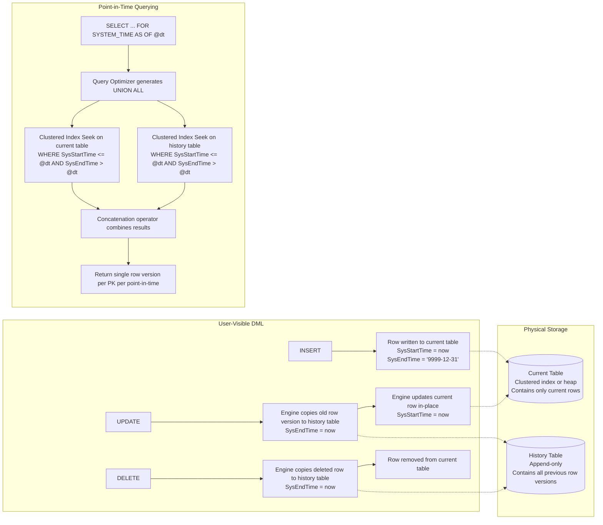
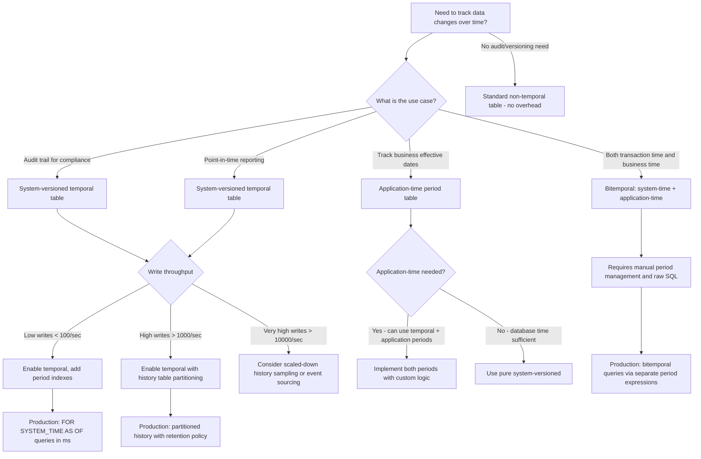

## Navigation

**Domain:** [[8 — Databases]] > **Group:** SQL Temporal Tables & Point-in-Time
**Previous:** [[8.225 — JSON Aggregation — FOR JSON in Subqueries]] | **Next:** [[8.227 — Creating System-Versioned Tables]]

### Prerequisites

- [[8.001 — The Relational Model]] — temporal tables extend the relational model with time-versioned state; understanding row identity, primary keys, and schema definition is foundational.
- [[8.496 — Index Fundamentals]] — history table indexes, clustered columnstore for history scans, and the index maintenance cost on temporal writes all depend on index internals.
- [[8.500 — Table Design and Constraints]] — the period columns (SysStartTime, SysEndTime) and the SYSTEM_VERSIONING constraint add specific schema requirements that a DBA must understand before adding temporal to an existing table.

### Where This Fits

System-versioned temporal tables (introduced in SQL Server 2016, ANSI SQL:2011 compliant) give every row an automatic validity period — the database engine silently records when each row was inserted, updated, and deleted by maintaining a paired current table and history table. A .NET backend engineer encounters this when building audit trails without trigger code, implementing point-in-time reporting (show me the order as it was yesterday), satisfying regulatory compliance (GDPR Article 30 record-keeping, SOX audit requirements), or using EF Core 8+'s temporal query support. When this is unknown, teams implement manual audit logging (INSERT INTO AuditLog in every repository method — brittle, inconsistent, easily bypassed). The interview signal is high: Amazon, Microsoft, and financial services firms ask about temporal tables to test whether a candidate knows that SQL Server can version data automatically without application code. The deeper signal is whether the candidate understands bitemporal modeling (system-time vs application-time), history table storage costs, and the execution plan shape of FOR SYSTEM_TIME AS OF queries.

---

## Core Mental Model

System-versioned temporal tables maintain two physical tables: the **current table** containing the current version of every row (visible to normal DML), and the **history table** containing every previous version of every row (invisible to normal DML). SQL Server adds two `DATETIME2` columns — `SysStartTime` and `SysEndTime` — both `GENERATED ALWAYS AS ROW START/END`. On every `UPDATE` that modifies the row, the engine automatically: (1) copies the existing row version into the history table with `SysEndTime = CURRENT_TIMESTAMP`, (2) updates the current row in-place with `SysStartTime = CURRENT_TIMESTAMP`. On `DELETE`, the engine copies the deleted row into the history table and removes it from the current table. The invariant: **at any point in time, exactly one version of each row exists (the one whose `SysStartTime <= @time AND SysEndTime > @time`).** The history table is append-only — no updates, no deletes. The `FOR SYSTEM_TIME AS OF @datetime` clause queries this invariant: the optimizer produces a `UNION ALL` of the current and history tables, filtering each to find the row version valid at the given timestamp. The critical recognition pattern: temporal tables are not application-level versioning — they are engine-enforced, automatic, and invisible to application code without the `FOR SYSTEM_TIME` clause.

### Classification

System-versioned temporal tables are a **storage engine feature** (not a query operator or index type) in the **SQL Server relational engine layer**. They belong to the DDL + DML execution pipeline: the period columns are defined in `CREATE TABLE` or `ALTER TABLE`, the versioning is enforced by the query processor during DML execution, and the history table is a separate heap or clustered index object. The feature is **transparent to normal queries** — `SELECT * FROM Table` returns only current rows. The `FOR SYSTEM_TIME` clause is a **query hint** that modifies the table's row source — the optimizer treats it as a rowset function with a start and end filter. The feature is **always on** for temporal tables: every write incurs history table overhead. The `SYSTEM_VERSIONING = OFF` setting disables temporal but does not drop the period columns or history table. The feature is **not SARGable in a traditional sense** — `FOR SYSTEM_TIME AS OF` uses index seeks on the temporal period columns when they are indexed, but the `UNION ALL` between current and history is unavoidable.



### Key Properties

|Property|Value|Notes|
|---|---|---|
|History tracking mechanism|Automatic engine-enforced|No triggers, no application code|
|Storage tables|2 (current + history)|History table is append-only|
|Period columns|SysStartTime, SysEndTime|DATETIME2, GENERATED ALWAYS AS ROW START/END|
|Max precision|100 nanoseconds (DATETIME2)|Lower precision causes boundary ambiguity|
|History retention|None (default)|Must implement partition switching or cleanup|
|Normal query impact|Zero|SELECT without FOR SYSTEM_TIME sees only current rows|
|Write overhead|+1 history row per UPDATE/DELETE|INSERT writes to current table only|
|EF Core support|Full (EF Core 8+)|HasTemporalTable(), TemporalAsOf(), TemporalAll()|
|Dapper support|Raw SQL only|FOR SYSTEM_TIME clause in query text|
|History table locking|Schema modification lock (SCH-M) on ALTER|Cannot directly modify history table|

---

## Deep Mechanics

### How the Engine Executes This

1. **DDL phase — table creation.** When `CREATE TABLE ... WITH (SYSTEM_VERSIONING = ON, HISTORY_TABLE = ...)` or `ALTER TABLE ... SET (SYSTEM_VERSIONING = ON)` executes, SQL Server validates: (a) the period columns exist and are `DATETIME2` with `GENERATED ALWAYS AS ROW START / ROW END`, (b) the period columns are `NOT NULL`, (c) the `PERIOD FOR SYSTEM_TIME (SysStartTime, SysEndTime)` is defined, (d) a default history table exists or the named history table has compatible schema. After validation, SQL Server marks the table metadata with `is_temporal = 1` in `sys.tables` and links to the history table via `history_table_id` in `sys.temporal_history_tables`.

2. **DML phase — INSERT.** When an `INSERT` statement executes against a temporal table, SQL Server sets `SysStartTime = SYSUTCDATETIME()` (the transaction start time) and `SysEndTime = '9999-12-31 23:59:59.9999999'` (max DATETIME2, signaling "currently active"). Only the current table receives the row. No history row is created because there is no previous version.

3. **DML phase — UPDATE.** When an `UPDATE` changes one or more columns (including non-period columns), SQL Server executes in a single transaction: (a) reads the current row version, (b) inserts the old row into the history table with `SysEndTime = SYSUTCDATETIME()`, keeping the original `SysStartTime` intact, (c) updates the current row with the new column values and sets `SysStartTime = SYSUTCDATETIME()`. If the UPDATE touches a non-versioned column (like an index key), the index maintenance still occurs — temporal does not change the index write path.

4. **DML phase — DELETE.** On `DELETE`, SQL Server copies the entire current row into the history table with `SysEndTime = SYSUTCDATETIME()`, then deletes the row from the current table. The history row's `SysStartTime` remains the original creation time or last-update time.

5. **Query phase — without FOR SYSTEM_TIME.** A normal `SELECT * FROM Table` reads only from the current table. The query optimizer opens the current table's clustered index or heap. The history table is completely invisible — it does not appear in `sys.dm_exec_sessions` or in the `FROM` clause metadata. This is identical to querying a non-temporal table in terms of execution plan.

6. **Query phase — with FOR SYSTEM_TIME AS OF @dt.** The optimizer: (a) identifies that the table is temporal, (b) generates a `UNION ALL` between the current table and the history table (or uses the `Concatenation` operator), (c) adds a `Filter` on each branch: `SysStartTime <= @dt AND SysEndTime > @dt`, (d) creates the plan. The optimizer does not merge the current and history scans into a single seek — it always keeps them separate because they are different physical objects.

7. **History table write amplification.** Every `UPDATE` on a temporal table generates: (1) a write to the current table's page (log write + buffer pool page modification), (2) a write to the history table's page (log write + buffer pool page modification), (3) index maintenance on both tables if they have non-clustered indexes. For a table with `N` non-clustered indexes, each UPDATE generates `2 + 2N` page writes (current + history for the row, each index affected on both tables).

8. **Transaction log impact.** Temporal operations use the same logging mechanism as regular DML. Each history row insert is a separate log record (full-logged unless bulk-logged). For a bulk `UPDATE` affecting 1M rows, the transaction log grows by approximately `2M row-images` (current table update + history table insert). This is critical to monitor during large ETL operations.

### SQL Visibility

```sql
-- ============================================================
-- Setup: System-versioned temporal tables for Orders and Products
-- ============================================================

-- Create Products as a temporal table with default history
CREATE TABLE dbo.Products
(
    ProductId       INT             NOT NULL IDENTITY(1,1),
    ProductName     NVARCHAR(200)   NOT NULL,
    CategoryId      INT             NOT NULL,
    UnitPrice       DECIMAL(18,2)   NOT NULL,
    StockQty        INT             NOT NULL DEFAULT 0,
    IsActive        BIT             NOT NULL DEFAULT 1,
    SysStartTime    DATETIME2(7)    GENERATED ALWAYS AS ROW START NOT NULL,
    SysEndTime      DATETIME2(7)    GENERATED ALWAYS AS ROW END   NOT NULL,
    PERIOD FOR SYSTEM_TIME (SysStartTime, SysEndTime),
    CONSTRAINT PK_Products PRIMARY KEY CLUSTERED (ProductId)
)
WITH (SYSTEM_VERSIONING = ON (HISTORY_TABLE = dbo.Products_History));

-- Create Orders as a temporal table with named history
CREATE TABLE dbo.Orders
(
    OrderId         INT             NOT NULL IDENTITY(1,1),
    CustomerId      INT             NOT NULL,
    OrderDate       DATETIME2(7)    NOT NULL,
    OrderStatus     NVARCHAR(20)    NOT NULL DEFAULT 'Pending',
    TotalAmount     DECIMAL(18,2)   NOT NULL,
    SysStartTime    DATETIME2(7)    GENERATED ALWAYS AS ROW START NOT NULL,
    SysEndTime      DATETIME2(7)    GENERATED ALWAYS AS ROW END   NOT NULL,
    PERIOD FOR SYSTEM_TIME (SysStartTime, SysEndTime),
    CONSTRAINT PK_Orders PRIMARY KEY CLUSTERED (OrderId)
)
WITH (SYSTEM_VERSIONING = ON (HISTORY_TABLE = dbo.Orders_History));

-- Create OrderItems as a temporal table
CREATE TABLE dbo.OrderItems
(
    OrderItemId     INT             NOT NULL IDENTITY(1,1),
    OrderId         INT             NOT NULL,
    ProductId       INT             NOT NULL,
    Quantity        INT             NOT NULL,
    UnitPrice       DECIMAL(18,2)   NOT NULL,
    SysStartTime    DATETIME2(7)    GENERATED ALWAYS AS ROW START NOT NULL,
    SysEndTime      DATETIME2(7)    GENERATED ALWAYS AS ROW END   NOT NULL,
    PERIOD FOR SYSTEM_TIME (SysStartTime, SysEndTime),
    CONSTRAINT PK_OrderItems PRIMARY KEY CLUSTERED (OrderItemId),
    CONSTRAINT FK_OrderItems_Orders FOREIGN KEY (OrderId) REFERENCES dbo.Orders(OrderId)
)
WITH (SYSTEM_VERSIONING = ON (HISTORY_TABLE = dbo.OrderItems_History));

-- Create Employees as a temporal table (for HR audit)
CREATE TABLE dbo.Employees
(
    EmployeeId      INT             NOT NULL IDENTITY(1,1),
    FirstName       NVARCHAR(50)    NOT NULL,
    LastName        NVARCHAR(50)    NOT NULL,
    DepartmentId    INT             NOT NULL,
    Salary          DECIMAL(18,2)   NOT NULL,
    HireDate        DATE            NOT NULL,
    IsActive        BIT             NOT NULL DEFAULT 1,
    SysStartTime    DATETIME2(7)    GENERATED ALWAYS AS ROW START NOT NULL,
    SysEndTime      DATETIME2(7)    GENERATED ALWAYS AS ROW END   NOT NULL,
    PERIOD FOR SYSTEM_TIME (SysStartTime, SysEndTime),
    CONSTRAINT PK_Employees PRIMARY KEY CLUSTERED (EmployeeId)
)
WITH (SYSTEM_VERSIONING = ON (HISTORY_TABLE = dbo.Employees_History));

-- Insert seed data
INSERT INTO dbo.Orders (CustomerId, OrderDate, OrderStatus, TotalAmount)
VALUES (1001, '2024-01-15 10:30:00', 'Shipped', 149.99),
       (1002, '2024-02-20 14:00:00', 'Delivered', 299.98),
       (1001, '2024-03-10 09:15:00', 'Pending', 79.50);

INSERT INTO dbo.OrderItems (OrderId, ProductId, Quantity, UnitPrice)
VALUES (1, 10, 2, 49.99),
       (1, 20, 1, 49.99),
       (2, 30, 3, 99.99),
       (3, 10, 1, 49.99),
       (3, 40, 1, 29.51);

INSERT INTO dbo.Products (ProductName, CategoryId, UnitPrice, StockQty)
VALUES ('Widget Alpha', 1, 49.99, 100),
       ('Gadget Beta', 1, 99.99, 50),
       ('Gizmo Gamma', 2, 29.99, 200);

-- ============================================================
-- Update a row — triggers automatic history capture
-- ============================================================
-- Before: Order 1 has Status 'Shipped', TotalAmount 149.99
UPDATE dbo.Orders
SET OrderStatus = 'Delivered',
    TotalAmount = 159.99
WHERE OrderId = 1;

-- After: Current table has Order 1 with Status='Delivered', TotalAmount=159.99
-- History table has the old row with SysEndTime = time of update, SysStartTime = original insert time

-- ============================================================
-- View metadata for temporal tables
-- ============================================================
SELECT
    t.name AS TableName,
    t.is_temporal,
    t.history_table_id,
    ht.name AS HistoryTableName,
    th.start_column_id,
    th.end_column_id
FROM sys.tables t
JOIN sys.temporal_history_tables th ON t.object_id = th.object_id
LEFT JOIN sys.tables ht ON t.history_table_id = ht.object_id
WHERE t.is_temporal = 1;

-- Check history table rows
SELECT COUNT(*) AS HistoryRowCount FROM dbo.Orders_History;
SELECT COUNT(*) AS HistoryRowCount FROM dbo.Products_History;

-- ============================================================
-- Simple point-in-time query
-- ============================================================
DECLARE @PointInTime DATETIME2(7) = '2024-01-20 00:00:00';

SELECT OrderId, CustomerId, OrderStatus, TotalAmount,
       SysStartTime, SysEndTime
FROM dbo.Orders
FOR SYSTEM_TIME AS OF @PointInTime
WHERE CustomerId = 1001;

-- Returns the version of Order 1 that was valid on Jan 20 (Status='Shipped', TotalAmount=149.99)
-- because the update to 'Delivered' happened after this date
```

```csharp
// EF Core 8+ — temporal table configuration and querying
public class ApplicationDbContext : DbContext
{
    public DbSet<Order> Orders => Set<Order>();
    public DbSet<OrderItem> OrderItems => Set<OrderItem>();
    public DbSet<Product> Products => Set<Product>();
    public DbSet<Employee> Employees => Set<Employee>();

    protected override void OnModelCreating(ModelBuilder modelBuilder)
    {
        modelBuilder.Entity<Order>(entity =>
        {
            entity.ToTable(tb => tb.UseSqlServerSqlOutputClause = false);
            entity.ToTable("Orders", tb => tb.IsTemporal(ttb =>
            {
                ttb.UseHistoryTableName("Orders_History");
                ttb.HasPeriodStart("SysStartTime");
                ttb.HasPeriodEnd("SysEndTime");
            }));
            entity.HasKey(e => e.OrderId);
            entity.Property(e => e.TotalAmount).HasColumnType("decimal(18,2)");
        });

        modelBuilder.Entity<Product>(entity =>
        {
            entity.ToTable("Products", tb => tb.IsTemporal(ttb =>
            {
                ttb.UseHistoryTableName("Products_History");
                ttb.HasPeriodStart("SysStartTime");
                ttb.HasPeriodEnd("SysEndTime");
            }));
        });

        modelBuilder.Entity<Employee>(entity =>
        {
            entity.ToTable("Employees", tb => tb.IsTemporal(ttb =>
            {
                ttb.UseHistoryTableName("Employees_History");
                ttb.HasPeriodStart("SysStartTime");
                ttb.HasPeriodEnd("SysEndTime");
            }));
        });
    }
}

public class Order
{
    public int OrderId { get; set; }
    public int CustomerId { get; set; }
    public DateTime OrderDate { get; set; }
    public string OrderStatus { get; set; } = string.Empty;
    public decimal TotalAmount { get; set; }
    public DateTime SysStartTime { get; set; }
    public DateTime SysEndTime { get; set; }
    public List<OrderItem> OrderItems { get; set; } = new();
}

public class OrderItem
{
    public int OrderItemId { get; set; }
    public int OrderId { get; set; }
    public int ProductId { get; set; }
    public int Quantity { get; set; }
    public decimal UnitPrice { get; set; }
    public DateTime SysStartTime { get; set; }
    public DateTime SysEndTime { get; set; }
    public Order? Order { get; set; }
    public Product? Product { get; set; }
}

public class Product
{
    public int ProductId { get; set; }
    public string ProductName { get; set; } = string.Empty;
    public int CategoryId { get; set; }
    public decimal UnitPrice { get; set; }
    public int StockQty { get; set; }
    public bool IsActive { get; set; }
    public DateTime SysStartTime { get; set; }
    public DateTime SysEndTime { get; set; }
}

public class Employee
{
    public int EmployeeId { get; set; }
    public string FirstName { get; set; } = string.Empty;
    public string LastName { get; set; } = string.Empty;
    public int DepartmentId { get; set; }
    public decimal Salary { get; set; }
    public DateTime HireDate { get; set; }
    public bool IsActive { get; set; }
    public DateTime SysStartTime { get; set; }
    public DateTime SysEndTime { get; set; }
}

// EF Core 8+ — point-in-time querying
public sealed class TemporalOrderService
{
    private readonly ApplicationDbContext _dbContext;

    public TemporalOrderService(ApplicationDbContext dbContext)
        => _dbContext = dbContext;

    public async Task<List<Order>> GetOrdersAsOfAsync(
        DateTime pointInTime,
        CancellationToken cancellationToken = default)
    {
        return await _dbContext.Orders
            .TemporalAsOf(pointInTime)
            .Where(o => o.CustomerId == 1001)
            .OrderBy(o => o.OrderId)
            .ToListAsync(cancellationToken);
    }

    public async Task<List<Order>> GetAllVersionsAsync(
        int orderId,
        CancellationToken cancellationToken = default)
    {
        return await _dbContext.Orders
            .TemporalAll()
            .Where(o => o.OrderId == orderId)
            .OrderBy(o => o.SysStartTime)
            .ToListAsync(cancellationToken);
    }

    public async Task<List<Order>> GetOrderHistoryBetweenAsync(
        DateTime from,
        DateTime to,
        CancellationToken cancellationToken = default)
    {
        return await _dbContext.Orders
            .TemporalFromTo(from, to)
            .Where(o => o.CustomerId == 1001)
            .OrderBy(o => o.SysStartTime)
            .ToListAsync(cancellationToken);
    }

    public async Task<List<Order>> GetOrderHistoryContainedInAsync(
        DateTime from,
        DateTime to,
        CancellationToken cancellationToken = default)
    {
        return await _dbContext.Orders
            .TemporalContainedIn(from, to)
            .Where(o => o.CustomerId == 1001)
            .OrderBy(o => o.SysStartTime)
            .ToListAsync(cancellationToken);
    }

    public async Task<List<Order>> GetTemporalDifferenceBetweenAsync(
        DateTime from,
        DateTime to,
        CancellationToken cancellationToken = default)
    {
        var fromSnapshot = await _dbContext.Orders
            .TemporalAsOf(from)
            .Where(o => o.CustomerId == 1001)
            .ToListAsync(cancellationToken);

        var toSnapshot = await _dbContext.Orders
            .TemporalAsOf(to)
            .Where(o => o.CustomerId == 1001)
            .ToListAsync(cancellationToken);

        var fromIds = fromSnapshot.Select(o => o.OrderId).ToHashSet();
        var toIds = toSnapshot.Select(o => o.OrderId).ToHashSet();

        var created = toSnapshot.Where(o => !fromIds.Contains(o.OrderId)).ToList();
        var deleted = fromSnapshot.Where(o => !toIds.Contains(o.OrderId)).ToList();

        return created.Concat(deleted).ToList();
    }
}
```

```csharp
// Dapper — raw SQL with FOR SYSTEM_TIME for point-in-time queries
public sealed class TemporalOrderDapperRepository
{
    private readonly IDbConnectionFactory _connectionFactory;

    public TemporalOrderDapperRepository(IDbConnectionFactory connectionFactory)
        => _connectionFactory = connectionFactory;

    public async Task<IReadOnlyList<Order>> GetOrdersAsOfAsync(
        DateTime pointInTime,
        CancellationToken cancellationToken = default)
    {
        const string sql = @"
            SELECT OrderId, CustomerId, OrderDate, OrderStatus, TotalAmount,
                   SysStartTime, SysEndTime
            FROM dbo.Orders
            FOR SYSTEM_TIME AS OF @PointInTime
            WHERE CustomerId = @CustomerId
            ORDER BY OrderId";

        await using var connection = _connectionFactory.Create();

        var results = await connection.QueryAsync<Order>(
            new CommandDefinition(sql,
                new { PointInTime = pointInTime, CustomerId = 1001 },
                cancellationToken: cancellationToken));

        return results.AsList();
    }

    public async Task<IReadOnlyList<Order>> GetAllVersionsAsync(
        int orderId,
        CancellationToken cancellationToken = default)
    {
        const string sql = @"
            SELECT OrderId, CustomerId, OrderDate, OrderStatus, TotalAmount,
                   SysStartTime, SysEndTime
            FROM dbo.Orders
            FOR SYSTEM_TIME ALL
            WHERE OrderId = @OrderId
            ORDER BY SysStartTime";

        await using var connection = _connectionFactory.Create();

        var results = await connection.QueryAsync<Order>(
            new CommandDefinition(sql,
                new { OrderId = orderId },
                cancellationToken: cancellationToken));

        return results.AsList();
    }

    public async Task<IReadOnlyList<Order>> GetOrderHistoryBetweenAsync(
        DateTime from,
        DateTime to,
        CancellationToken cancellationToken = default)
    {
        const string sql = @"
            SELECT OrderId, CustomerId, OrderDate, OrderStatus, TotalAmount,
                   SysStartTime, SysEndTime
            FROM dbo.Orders
            FOR SYSTEM_TIME FROM @FromTime TO @ToTime
            WHERE CustomerId = @CustomerId
            ORDER BY SysStartTime";

        await using var connection = _connectionFactory.Create();

        var results = await connection.QueryAsync<Order>(
            new CommandDefinition(sql,
                new { FromTime = from, ToTime = to, CustomerId = 1001 },
                cancellationToken: cancellationToken));

        return results.AsList();
    }

    public async Task<int> GetVersionCountAsync(
        int orderId,
        CancellationToken cancellationToken = default)
    {
        const string sql = @"
            SELECT COUNT(*)
            FROM dbo.Orders
            FOR SYSTEM_TIME ALL
            WHERE OrderId = @OrderId";

        await using var connection = _connectionFactory.Create();

        return await connection.ExecuteScalarAsync<int>(
            new CommandDefinition(sql,
                new { OrderId = orderId },
                cancellationToken: cancellationToken));
    }

    public async Task<IReadOnlyList<VersionAudit>> GetTemporalAuditTrailAsync(
        int orderId,
        CancellationToken cancellationToken = default)
    {
        const string sql = @"
            SELECT
                OrderId, CustomerId, OrderDate, OrderStatus, TotalAmount,
                SysStartTime AS ValidFrom,
                SysEndTime   AS ValidTo,
                CASE
                    WHEN SysEndTime = '9999-12-31 23:59:59.9999999' THEN 'Current'
                    WHEN EXISTS (
                        SELECT 1 FROM dbo.Orders_History h2
                        WHERE h2.OrderId = d.OrderId
                          AND h2.SysStartTime = d.SysEndTime
                    ) THEN 'Updated'
                    ELSE 'Deleted'
                END AS VersionType
            FROM dbo.Orders
            FOR SYSTEM_TIME ALL
            WHERE OrderId = @OrderId
            ORDER BY SysStartTime";

        await using var connection = _connectionFactory.Create();

        var results = await connection.QueryAsync<VersionAudit>(
            new CommandDefinition(sql,
                new { OrderId = orderId },
                cancellationToken: cancellationToken));

        return results.AsList();
    }
}

public sealed record VersionAudit(
    int OrderId, int CustomerId, DateTime OrderDate,
    string OrderStatus, decimal TotalAmount,
    DateTime ValidFrom, DateTime ValidTo, string VersionType);
```

### Generated SQL (from EF Core logs)

```sql
-- EF Core TemporalAsOf generates FOR SYSTEM_TIME AS OF
exec sp_executesql N'SELECT [o].[OrderId], [o].[CustomerId], [o].[OrderDate],
    [o].[OrderStatus], [o].[TotalAmount], [o].[SysStartTime], [o].[SysEndTime]
FROM [dbo].[Orders] FOR SYSTEM_TIME AS OF @p0 AS [o]
WHERE [o].[CustomerId] = @p1
ORDER BY [o].[OrderId]',
N'@p0 datetime2(7),@p1 int',
@p0='2024-01-20T00:00:00',@p1=1001;

-- EF Core TemporalAll generates FOR SYSTEM_TIME ALL
exec sp_executesql N'SELECT [o].[OrderId], [o].[CustomerId], [o].[OrderDate],
    [o].[OrderStatus], [o].[TotalAmount], [o].[SysStartTime], [o].[SysEndTime]
FROM [dbo].[Orders] FOR SYSTEM_TIME ALL AS [o]
WHERE [o].[OrderId] = @p0
ORDER BY [o].[SysStartTime]',
N'@p0 int',@p0=1;

-- EF Core TemporalFromTo generates FOR SYSTEM_TIME FROM ... TO
exec sp_executesql N'SELECT [o].[OrderId], [o].[CustomerId], [o].[OrderDate],
    [o].[OrderStatus], [o].[TotalAmount], [o].[SysStartTime], [o].[SysEndTime]
FROM [dbo].[Orders] FOR SYSTEM_TIME FROM @p0 TO @p1 AS [o]
WHERE [o].[CustomerId] = @p2
ORDER BY [o].[SysStartTime]',
N'@p0 datetime2(7),@p1 datetime2(7),@p2 int',
@p0='2024-01-01T00:00:00',@p1='2024-03-01T00:00:00',@p2=1001;
```

### Execution Plan Analysis

**For `SELECT ... FOR SYSTEM_TIME AS OF @dt`:**
```
Expected plan shape:
[Clustered Index Seek (Orders, PK_Orders)]
  Seek Predicate: SysStartTime <= @dt AND SysEndTime > @dt
  → [Compute Scalar]
  → [Clustered Index Seek (Orders_History, PK_Orders_History)]
      Seek Predicate: SysStartTime <= @dt AND SysEndTime > @dt
      → [Compute Scalar]
      → [Concatenation (UNION ALL)]
          → [Filter] (additional predicates like CustomerId = @id)
              → [SELECT]
Estimated Cost: 50% on current table seek, 50% on history table seek
Logical Reads: ~2 (one per table) + index maintenance pages
```

**For `SELECT ... FOR SYSTEM_TIME ALL`:**
```
Expected plan shape:
[Clustered Index Scan (Orders, PK_Orders)]
  → [Concatenation (UNION ALL)]
  → [Clustered Index Scan (Orders_History, PK_Orders_History)]
      → [Filter] (WHERE predicates)
          → [SELECT]
Estimated Cost: history table scan dominates (append-only, ever-growing)
Logical Reads: ClusteredIndexPageCount(Current) + ClusteredIndexPageCount(History)
```

**Key insight:** The optimizer always uses `Concatenation` (not `UNION ALL` in the logical sense) because it must combine two different physical objects. It does not push predicates into the history table scan unless the history table has appropriate indexes. Without an index on `SysStartTime, SysEndTime` on the history table, the history scan is a full clustered index scan.

### Cost Visibility

```sql
SET STATISTICS IO ON;
SET STATISTICS TIME ON;

-- Point-in-time query on temporal Orders
DECLARE @dt DATETIME2(7) = '2024-01-20 00:00:00';

SELECT o.OrderId, o.CustomerId, o.OrderStatus, o.TotalAmount
FROM dbo.Orders
FOR SYSTEM_TIME AS OF @dt
WHERE o.CustomerId = 1001;

-- Expected output (after seeding data and 1 update):
-- Table 'Orders_History'. Scan count 1, logical reads 2
-- Table 'Orders'. Scan count 1, logical reads 2
-- SQL Server Execution Times: CPU time = 0ms, elapsed time = 1ms

-- All versions query (history may be large)
SELECT o.OrderId, o.CustomerId, o.OrderStatus, o.TotalAmount,
       o.SysStartTime, o.SysEndTime
FROM dbo.Orders
FOR SYSTEM_TIME ALL
WHERE o.OrderId = 1
ORDER BY o.SysStartTime;

-- Expected output (1M history rows — high logical reads):
-- Table 'Orders_History'. Scan count 1, logical reads 4500
-- Table 'Orders'. Scan count 1, logical reads 2
-- SQL Server Execution Times: CPU time = 125ms, elapsed time = 130ms

-- Check history table size via DMV
SELECT
    OBJECT_NAME(object_id) AS TableName,
    rows,
    (reserved_page_count * 8) / 1024 AS SizeMB
FROM sys.dm_db_partition_stats
WHERE object_id IN (OBJECT_ID('Orders_History'), OBJECT_ID('Orders'));
```

### Failure Modes

**History table space exhaustion:** The history table is append-only with no automatic retention. A busy temporal table generating 1000 history rows/second will fill 1GB in ~2 hours (at ~2KB per row). Without a retention policy or partition management, the history table grows unbounded.

```sql
-- Detection: history table size
SELECT
    t.name AS TableName,
    s.rows,
    (s.reserved_page_count * 8) / 1024 AS SizeMB,
    ((s.reserved_page_count * 8) / 1024 / 1024.0) AS SizeGB
FROM sys.tables t
JOIN sys.dm_db_partition_stats s ON t.object_id = s.object_id
WHERE EXISTS (
    SELECT 1 FROM sys.tables ht
    JOIN sys.temporal_history_tables th ON ht.object_id = th.history_table_id
    WHERE th.object_id = t.object_id
)
ORDER BY SizeMB DESC;
```

**Schema modification blocking:** `ALTER TABLE ... SET (SYSTEM_VERSIONING = OFF)` requires an `SCH-M` (schema modification) lock on both the current and history tables. During the operation, all DML on the current table is blocked. On a busy production table, this can cause a complete write outage for seconds or minutes.

```sql
-- Detection: blocking chain during temporal schema change
SELECT
    blocked.session_id AS BlockedSession,
    blocker.session_id AS BlockerSession,
    blocked_text.text AS BlockedCommand,
    blocker_text.text AS BlockerCommand
FROM sys.dm_exec_requests blocked
JOIN sys.dm_exec_sessions blocker
    ON blocked.blocking_session_id = blocker.session_id
CROSS APPLY sys.dm_exec_sql_text(blocked.sql_handle) blocked_text
CROSS APPLY sys.dm_exec_sql_text(blocker.sql_handle) blocker_text
WHERE blocked.wait_type = 'SCH-M';
```

**INSERT of duplicate primary key in history:** The history table shares the same primary key structure as the current table. Multiple row versions for the same PK can coexist in the history table because the PK constraint is not enforced on the history table (it is automatically removed when the history table is created). However, if an index on the history table has a unique constraint (accidentally added after creation), temporal operations fail.

```sql
-- ❌ This fails if history table accidentally has a unique constraint
-- The error: "Cannot insert duplicate key row in object 'dbo.Orders_History'
-- with unique index 'UQ_Orders_History_OrderId'"

-- ✅ History table should have only non-unique indexes
CREATE NONCLUSTERED INDEX IX_Orders_History_SysEndTime
    ON dbo.Orders_History (SysEndTime DESC)
    INCLUDE (OrderId, CustomerId, OrderStatus, TotalAmount);
```

**Wrong DATETIME precision causes boundary ambiguity:** If the period columns use `DATETIME` (precision ~3.33ms) instead of `DATETIME2(7)` (100ns precision), two operations in the same millisecond can have identical timestamps. The `AS OF` query can return zero or two rows for the same PK.

```sql
-- ❌ DATETIME precision (3.33ms)
CREATE TABLE dbo.BadTemporal
(
    Id      INT NOT NULL PRIMARY KEY,
    Value   NVARCHAR(100),
    SysStartTime DATETIME2(0) GENERATED ALWAYS AS ROW START NOT NULL,  -- 1-second precision!
    SysEndTime   DATETIME2(0) GENERATED ALWAYS AS ROW END   NOT NULL,
    PERIOD FOR SYSTEM_TIME (SysStartTime, SysEndTime)
);

-- ✅ DATETIME2(7) precision (100ns)
CREATE TABLE dbo.GoodTemporal
(
    Id      INT NOT NULL PRIMARY KEY,
    Value   NVARCHAR(100),
    SysStartTime DATETIME2(7) GENERATED ALWAYS AS ROW START NOT NULL,
    SysEndTime   DATETIME2(7) GENERATED ALWAYS AS ROW END   NOT NULL,
    PERIOD FOR SYSTEM_TIME (SysStartTime, SysEndTime)
);
```

---

## Production Patterns and Implementation

### Primary SQL Implementation

```sql
-- ============================================================
-- Schema: Production temporal tables for Orders, Products, Employees
-- ============================================================

-- Products temporal table with history retention via partition switching
CREATE TABLE dbo.Products
(
    ProductId       INT             NOT NULL IDENTITY(1,1),
    ProductName     NVARCHAR(200)   NOT NULL,
    CategoryId      INT             NOT NULL,
    UnitPrice       DECIMAL(18,2)   NOT NULL,
    StockQty        INT             NOT NULL DEFAULT 0,
    IsActive        BIT             NOT NULL DEFAULT 1,
    SysStartTime    DATETIME2(7)    GENERATED ALWAYS AS ROW START NOT NULL,
    SysEndTime      DATETIME2(7)    GENERATED ALWAYS AS ROW END   NOT NULL,
    PERIOD FOR SYSTEM_TIME (SysStartTime, SysEndTime),
    CONSTRAINT PK_Products PRIMARY KEY CLUSTERED (ProductId)
);

-- Create history table with clustered columnstore for compressed storage
CREATE TABLE dbo.Products_History
(
    ProductId       INT             NOT NULL,
    ProductName     NVARCHAR(200)   NOT NULL,
    CategoryId      INT             NOT NULL,
    UnitPrice       DECIMAL(18,2)   NOT NULL,
    StockQty        INT             NOT NULL DEFAULT 0,
    IsActive        BIT             NOT NULL DEFAULT 1,
    SysStartTime    DATETIME2(7)    NOT NULL,
    SysEndTime      DATETIME2(7)    NOT NULL
);

-- Clustered columnstore index for history table (compression + scan performance)
CREATE CLUSTERED COLUMNSTORE INDEX IX_Products_History_CCI
    ON dbo.Products_History;

-- Non-clustered index for point-in-time queries on history
CREATE NONCLUSTERED INDEX IX_Products_History_Period
    ON dbo.Products_History (SysEndTime DESC, SysStartTime ASC)
    INCLUDE (ProductId, ProductName, CategoryId, UnitPrice, StockQty, IsActive);

-- Enable system versioning
ALTER TABLE dbo.Products
    SET (SYSTEM_VERSIONING = ON (HISTORY_TABLE = dbo.Products_History));

-- Index for AS OF queries on current table (clustered PK already covers)
-- Additional index for period-based range queries
CREATE NONCLUSTERED INDEX IX_Products_Period
    ON dbo.Products (SysEndTime DESC, SysStartTime ASC)
    INCLUDE (ProductId, ProductName, CategoryId, UnitPrice, StockQty, IsActive);

-- ============================================================
-- Pattern 1: Point-in-time reporting (AS OF)
-- ============================================================
-- Show the product catalog as of the beginning of the month
DECLARE @ReportDate DATETIME2(7) = DATETIME2FROMPARTS(2024, 3, 1, 0, 0, 0, 0, 7);

SELECT ProductId, ProductName, CategoryId, UnitPrice, StockQty
FROM dbo.Products
FOR SYSTEM_TIME AS OF @ReportDate
WHERE IsActive = 1
ORDER BY ProductName;

-- ============================================================
-- Pattern 2: Order status change audit
-- ============================================================
-- Show the full status change history for an order
SELECT
    o.OrderId,
    o.OrderStatus,
    o.TotalAmount,
    o.SysStartTime AS StatusEffectiveFrom,
    o.SysEndTime   AS StatusEffectiveTo,
    DATEDIFF(SECOND, o.SysStartTime, o.SysEndTime) AS DurationSeconds
FROM dbo.Orders
FOR SYSTEM_TIME ALL
WHERE o.OrderId = 1001
ORDER BY o.SysStartTime DESC;

-- ============================================================
-- Pattern 3: Detect what changed between two points in time
-- ============================================================
DECLARE @StartTime DATETIME2(7) = '2024-01-01 00:00:00';
DECLARE @EndTime   DATETIME2(7) = '2024-06-01 00:00:00';

-- Rows that were deleted
SELECT 'Deleted' AS ChangeType, p.*
FROM dbo.Products FOR SYSTEM_TIME AS OF @StartTime p
WHERE p.ProductId NOT IN (
    SELECT ProductId FROM dbo.Products FOR SYSTEM_TIME AS OF @EndTime
)

UNION ALL

-- Rows that were created
SELECT 'Created' AS ChangeType, p.*
FROM dbo.Products FOR SYSTEM_TIME AS OF @EndTime p
WHERE p.ProductId NOT IN (
    SELECT ProductId FROM dbo.Products FOR SYSTEM_TIME AS OF @StartTime
)

UNION ALL

-- Rows that changed
SELECT 'Modified' AS ChangeType, p.*
FROM dbo.Products FOR SYSTEM_TIME AS OF @EndTime p
WHERE EXISTS (
    SELECT 1 FROM dbo.Products FOR SYSTEM_TIME AS OF @StartTime p2
    WHERE p2.ProductId = p.ProductId
    AND (p2.UnitPrice <> p.UnitPrice OR p2.StockQty <> p.StockQty)
)
ORDER BY ChangeType, ProductId;

-- ============================================================
-- Pattern 4: Employee salary history (HR audit)
-- ============================================================
-- Show salary changes for an employee
SELECT
    e.EmployeeId,
    e.FirstName + ' ' + e.LastName AS EmployeeName,
    e.Salary,
    e.SysStartTime AS SalaryEffectiveFrom,
    e.SysEndTime   AS SalaryEffectiveTo,
    CASE
        WHEN e.SysEndTime = '9999-12-31 23:59:59.9999999' THEN 'Current'
        ELSE 'Historical'
    END AS RecordStatus
FROM dbo.Employees
FOR SYSTEM_TIME ALL
WHERE e.EmployeeId = 42
ORDER BY e.SysStartTime DESC;

-- ============================================================
-- Pattern 5: History table partition management
-- ============================================================
-- Create partition function and scheme for history table
CREATE PARTITION FUNCTION PF_History_Year (DATETIME2(7))
    AS RANGE RIGHT FOR VALUES (
        '2023-01-01', '2024-01-01', '2025-01-01', '2026-01-01'
    );

CREATE PARTITION SCHEME PS_History_Year
    AS PARTITION PF_History_Year ALL TO ([PRIMARY]);

-- Rebuild history table on partition scheme (requires SYSTEM_VERSIONING OFF)
ALTER TABLE dbo.Products SET (SYSTEM_VERSIONING = OFF);

CREATE CLUSTERED INDEX IX_Products_History_SysEndTime
    ON dbo.Products_History (SysEndTime DESC, SysStartTime ASC)
    ON PS_History_Year (SysEndTime);

ALTER TABLE dbo.Products
    SET (SYSTEM_VERSIONING = ON (HISTORY_TABLE = dbo.Products_History));

-- ============================================================
-- Pattern 6: Remove old history via partition switching
-- ============================================================
-- Create staging table for the partition to be removed
CREATE TABLE dbo.Products_History_Staging
(
    ProductId       INT             NOT NULL,
    ProductName     NVARCHAR(200)   NOT NULL,
    CategoryId      INT             NOT NULL,
    UnitPrice       DECIMAL(18,2)   NOT NULL,
    StockQty        INT             NOT NULL DEFAULT 0,
    IsActive        BIT             NOT NULL DEFAULT 1,
    SysStartTime    DATETIME2(7)    NOT NULL,
    SysEndTime      DATETIME2(7)    NOT NULL
)
ON [PRIMARY];

-- Create same clustered index on staging table
CREATE CLUSTERED INDEX IX_Products_History_Staging_SysEndTime
    ON dbo.Products_History_Staging (SysEndTime DESC);

-- Switch partition (2023 data) to staging
ALTER TABLE dbo.Products_History
    SWITCH PARTITION 1 TO dbo.Products_History_Staging;

-- Truncate or drop staging
TRUNCATE TABLE dbo.Products_History_Staging;
-- Or: DROP TABLE dbo.Products_History_Staging;
```

### EF Core Implementation

```csharp
public sealed class TemporalProductService
{
    private readonly ApplicationDbContext _dbContext;

    public TemporalProductService(ApplicationDbContext dbContext)
        => _dbContext = dbContext;

    // Point-in-time product catalog
    public async Task<List<Product>> GetCatalogAsOfAsync(
        DateTime pointInTime,
        CancellationToken cancellationToken = default)
    {
        return await _dbContext.Products
            .TemporalAsOf(pointInTime)
            .Where(p => p.IsActive)
            .OrderBy(p => p.ProductName)
            .ToListAsync(cancellationToken);
    }

    // Full version history for a specific product
    public async Task<List<Product>> GetProductHistoryAsync(
        int productId,
        CancellationToken cancellationToken = default)
    {
        return await _dbContext.Products
            .TemporalAll()
            .Where(p => p.ProductId == productId)
            .OrderByDescending(p => p.SysStartTime)
            .ToListAsync(cancellationToken);
    }

    // Detect changes between two dates
    public async Task<ProductChanges> GetProductChangesAsync(
        DateTime fromDate,
        DateTime toDate,
        CancellationToken cancellationToken = default)
    {
        var fromProducts = await _dbContext.Products
            .TemporalAsOf(fromDate)
            .ToListAsync(cancellationToken);

        var toProducts = await _dbContext.Products
            .TemporalAsOf(toDate)
            .ToListAsync(cancellationToken);

        var fromIds = fromProducts.Select(p => p.ProductId).ToHashSet();
        var toIds = toProducts.Select(p => p.ProductId).ToHashSet();

        var created = toProducts.Where(p => !fromIds.Contains(p.ProductId)).ToList();
        var deleted = fromProducts.Where(p => !toIds.Contains(p.ProductId)).ToList();

        var modified = toProducts
            .Where(tp => fromProducts.Any(fp =>
                fp.ProductId == tp.ProductId &&
                (fp.UnitPrice != tp.UnitPrice || fp.StockQty != tp.StockQty)))
            .ToList();

        return new ProductChanges(created, deleted, modified);
    }

    // Update product and capture old version automatically
    public async Task UpdateProductPriceAsync(
        int productId,
        decimal newPrice,
        CancellationToken cancellationToken = default)
    {
        var product = await _dbContext.Products
            .FirstOrDefaultAsync(p => p.ProductId == productId, cancellationToken)
            ?? throw new InvalidOperationException("Product not found");

        product.UnitPrice = newPrice;
        await _dbContext.SaveChangesAsync(cancellationToken);
        // The old price is automatically saved to history table
    }

    // Bulk update with temporal awareness
    public async Task BulkUpdateStockAsync(
        Dictionary<int, int> productStockUpdates,
        CancellationToken cancellationToken = default)
    {
        foreach (var (productId, newStock) in productStockUpdates)
        {
            var product = await _dbContext.Products
                .FirstOrDefaultAsync(p => p.ProductId == productId, cancellationToken);

            if (product is not null)
            {
                product.StockQty = newStock;
            }
        }

        await _dbContext.SaveChangesAsync(cancellationToken);
    }
}

public sealed record ProductChanges(
    List<Product> Created,
    List<Product> Deleted,
    List<Product> Modified);
```

### Dapper Implementation

```csharp
public sealed class TemporalDapperRepository
{
    private readonly IDbConnectionFactory _connectionFactory;

    public TemporalDapperRepository(IDbConnectionFactory connectionFactory)
        => _connectionFactory = connectionFactory;

    // Point-in-time query with Dapper
    public async Task<IReadOnlyList<Product>> GetProductsAsOfAsync(
        DateTime pointInTime,
        CancellationToken cancellationToken = default)
    {
        const string sql = @"
            SELECT ProductId, ProductName, CategoryId, UnitPrice, StockQty,
                   IsActive, SysStartTime, SysEndTime
            FROM dbo.Products
            FOR SYSTEM_TIME AS OF @PointInTime
            WHERE IsActive = 1
            ORDER BY ProductName";

        await using var connection = _connectionFactory.Create();

        var results = await connection.QueryAsync<Product>(
            new CommandDefinition(sql,
                new { PointInTime = pointInTime },
                cancellationToken: cancellationToken));

        return results.AsList();
    }

    // Temporal change detection with Dapper
    public async Task<IReadOnlyList<ProductChange>> DetectProductChangesAsync(
        DateTime fromDate,
        DateTime toDate,
        CancellationToken cancellationToken = default)
    {
        const string sql = @"
            WITH FromSnapshot AS (
                SELECT ProductId, ProductName, UnitPrice, StockQty
                FROM dbo.Products FOR SYSTEM_TIME AS OF @FromDate
            ),
            ToSnapshot AS (
                SELECT ProductId, ProductName, UnitPrice, StockQty
                FROM dbo.Products FOR SYSTEM_TIME AS OF @ToDate
            )
            SELECT
                COALESCE(f.ProductId, t.ProductId) AS ProductId,
                CASE
                    WHEN f.ProductId IS NULL THEN 'Created'
                    WHEN t.ProductId IS NULL THEN 'Deleted'
                    WHEN f.UnitPrice <> t.UnitPrice OR f.StockQty <> t.StockQty
                        THEN 'Modified'
                    ELSE 'Unchanged'
                END AS ChangeType,
                f.UnitPrice AS OldUnitPrice,
                t.UnitPrice AS NewUnitPrice,
                f.StockQty AS OldStockQty,
                t.StockQty AS NewStockQty
            FROM FromSnapshot f
            FULL OUTER JOIN ToSnapshot t
                ON f.ProductId = t.ProductId
            WHERE f.ProductId IS NULL
               OR t.ProductId IS NULL
               OR f.UnitPrice <> t.UnitPrice
               OR f.StockQty <> t.StockQty
            ORDER BY ChangeType, ProductId";

        await using var connection = _connectionFactory.Create();

        var results = await connection.QueryAsync<ProductChange>(
            new CommandDefinition(sql,
                new { FromDate = fromDate, ToDate = toDate },
                cancellationToken: cancellationToken));

        return results.AsList();
    }

    // Temporal table metadata
    public async Task<TemporalTableInfo> GetTemporalInfoAsync(
        string tableName,
        CancellationToken cancellationToken = default)
    {
        const string sql = @"
            SELECT
                t.name AS TableName,
                t.is_temporal AS IsTemporal,
                ht.name AS HistoryTableName,
                (SELECT COUNT(*) FROM sys.columns
                 WHERE object_id = t.object_id) AS CurrentColumnCount,
                (SELECT COUNT(*) FROM sys.columns
                 WHERE object_id = ht.object_id) AS HistoryColumnCount,
                (SELECT SUM(rows) FROM sys.partitions
                 WHERE object_id = ht.object_id AND index_id IN (0,1)) AS HistoryRowCount,
                (SELECT SUM(rows) FROM sys.partitions
                 WHERE object_id = t.object_id AND index_id IN (0,1)) AS CurrentRowCount
            FROM sys.tables t
            JOIN sys.temporal_history_tables th ON t.object_id = th.object_id
            JOIN sys.tables ht ON th.history_table_id = ht.object_id
            WHERE t.name = @TableName";

        await using var connection = _connectionFactory.Create();

        return await connection.QueryFirstOrDefaultAsync<TemporalTableInfo>(
            new CommandDefinition(sql,
                new { TableName = tableName },
                cancellationToken: cancellationToken));
    }
}

public sealed record ProductChange(
    int ProductId,
    string ChangeType,
    decimal? OldUnitPrice,
    decimal? NewUnitPrice,
    int? OldStockQty,
    int? NewStockQty);

public sealed record TemporalTableInfo(
    string TableName, bool IsTemporal, string HistoryTableName,
    int CurrentColumnCount, int HistoryColumnCount,
    long HistoryRowCount, long CurrentRowCount);
```

### Configuration and Wiring

```csharp
// Program.cs — EF Core with SQL Server temporal support
builder.Services.AddDbContext<ApplicationDbContext>(options =>
    options.UseSqlServer(
        connectionString,
        sqlOptions =>
        {
            sqlOptions.EnableRetryOnFailure(3);
            sqlOptions.CommandTimeout(30);
            sqlOptions.UseSqlOutputClause = false;  // Required for temporal tables in EF Core 8+
        }));

// Register temporal repositories
builder.Services.AddScoped<TemporalOrderService>();
builder.Services.AddScoped<TemporalProductService>();
builder.Services.AddScoped<TemporalOrderDapperRepository>();
builder.Services.AddScoped<TemporalDapperRepository>();

// Note: EF Core 8+ requires UseSqlServerSqlOutputClause(false)
// because temporal tables cannot use the OUTPUT clause for identity retrieval.
// EF Core uses SELECT SCOPE_IDENTITY() instead.

// Connection string (ensure application intent for temporal workloads):
// "Server=db.example.com;Database=SalesDb;Integrated Security=true;TrustServerCertificate=true;Application Name=TemporalApp;"
```

### SQL Server vs PostgreSQL Differences

```sql
-- PostgreSQL does not have system-versioned temporal tables natively.
-- Equivalent functionality is implemented using:
-- 1. tsrange (range type) for period columns
-- 2. EXCLUDE constraint for preventing overlapping periods
-- 3. Trigger functions to automatically populate period columns
-- 4. Views or table inheritance for current vs history separation

-- PostgreSQL temporal equivalent using tsrange
CREATE TABLE dbo.Orders
(
    OrderId      SERIAL           PRIMARY KEY,
    CustomerId   INT              NOT NULL,
    OrderStatus  VARCHAR(20)      NOT NULL DEFAULT 'Pending',
    TotalAmount  NUMERIC(18,2)    NOT NULL,
    ValidPeriod  TSRANGE          NOT NULL DEFAULT TSRANGE(NOW(), 'infinity'),
    EXCLUDE USING GIST (OrderId WITH =, ValidPeriod WITH &&)
);

-- Insert new version
INSERT INTO dbo.Orders (CustomerId, OrderStatus, TotalAmount)
VALUES (1001, 'Pending', 149.99);

-- Update — invalidate old period, insert new
BEGIN;
UPDATE dbo.Orders
SET ValidPeriod = TSRANGE(LOWER(ValidPeriod), NOW())
WHERE OrderId = 1 AND UPPER(ValidPeriod) = 'infinity';

INSERT INTO dbo.Orders (CustomerId, OrderStatus, TotalAmount, ValidPeriod)
VALUES (1001, 'Shipped', 149.99, TSRANGE(NOW(), 'infinity'));
COMMIT;

-- Point-in-time query (PostgreSQL)
SELECT * FROM dbo.Orders
WHERE ValidPeriod @> '2024-01-20 00:00:00'::TIMESTAMP
AND CustomerId = 1001;
```

**Key differences:**

|Feature|SQL Server|PostgreSQL (manual)|
|---|---|---|
|Period columns|Automatic (GENERATED ALWAYS)|Manual (tsrange with trigger)|
|History table|Automatic|Manual (separate table + trigger)|
|Point-in-time syntax|`FOR SYSTEM_TIME AS OF @dt`|`WHERE ValidPeriod @> @dt`|
|Overlap prevention|Automatic|`EXCLUDE USING GIST (... WITH &&)`|
|EF Core support|First-class (TemporalAsOf)|No temporal support; manual WHERE|
|History retention|Manual (partition switching)|Manual (DELETE or partition)|
|Write consistency|Engine-enforced|Application-level trigger reliability|

---

## Gotchas and Production Pitfalls

### 1. History Table Grows Unbounded Without Retention Policy

**Pitfall:** The history table is append-only with zero automatic cleanup. A busy table update pattern (e.g., a polling status column that changes every 5 seconds) generates history rows that are never removed.

```sql
-- ❌ No retention policy — history grows to hundreds of GB
-- This loop generates 17,280 history rows per day per row
UPDATE dbo.Orders SET OrderStatus = 'Processing' WHERE OrderId = 1001;
WAITFOR DELAY '00:00:05';
UPDATE dbo.Orders SET OrderStatus = 'Shipped' WHERE OrderId = 1001;

-- ✅ Implement retention via partition switching or scheduled cleanup
-- Step 1: Create partition scheme
CREATE PARTITION FUNCTION PF_History_Month (DATETIME2(7))
    AS RANGE RIGHT FOR VALUES (
        '2024-01-01', '2024-02-01', '2024-03-01', '2024-04-01',
        '2024-05-01', '2024-06-01'
    );

CREATE PARTITION SCHEME PS_History_Month
    AS PARTITION PF_History_Month ALL TO ([PRIMARY]);

-- Step 2: Rebuild history on partition scheme
ALTER TABLE dbo.Orders SET (SYSTEM_VERSIONING = OFF);
ALTER TABLE dbo.Orders_History ADD CONSTRAINT PK_Orders_History PRIMARY KEY (OrderId, SysStartTime);
CREATE CLUSTERED INDEX IX_Orders_History_Period
    ON dbo.Orders_History (SysEndTime, SysStartTime)
    ON PS_History_Month (SysEndTime);
ALTER TABLE dbo.Orders SET (SYSTEM_VERSIONING = ON (HISTORY_TABLE = dbo.Orders_History));
```

**Symptom:** Disk space fills, history table reaches hundreds of GB, backup times increase, query performance degrades on `FOR SYSTEM_TIME ALL` scans.

**Cost of not fixing:** Database disk full — production outage. Extended backup windows. `FOR SYSTEM_TIME ALL` queries become unacceptably slow (full table scan on a 500GB+ history table).

### 2. SCH-M Lock During Temporal Schema Changes Blocks All Writes

**Pitfall:** `ALTER TABLE ... SET (SYSTEM_VERSIONING = OFF)` requires an `SCH-M` (schema modification) lock. While this lock is held, no DML (INSERT, UPDATE, DELETE) can proceed on the current table. On a busy production system (e.g., 500 writes/second), this blocks every write for the duration of the schema change.

```sql
-- ❌ This blocks all writes to Orders for seconds or minutes
ALTER TABLE dbo.Orders SET (SYSTEM_VERSIONING = OFF);

-- ✅ Schedule during maintenance window
-- OR use a dedicated maintenance window with application pause
-- OR use partition switching for data management instead of schema changes

-- Detection query for SCH-M blocking
SELECT
    blocked.session_id AS BlockedId,
    blocked.wait_type,
    blocked.wait_duration_ms,
    blocker_text.text AS BlockerCommand
FROM sys.dm_exec_requests blocked
CROSS APPLY sys.dm_exec_sql_text(blocked.sql_handle) blocked_text
JOIN sys.dm_exec_sessions blocker
    ON blocked.blocking_session_id = blocker.session_id
CROSS APPLY sys.dm_exec_sql_text(blocker.sql_handle) blocker_text
WHERE blocked.wait_type = 'SCH-M';
```

**Symptom:** Application timeout errors on all write operations. Blocking chains in `sys.dm_exec_requests` showing `SCH-M` wait type.

**Cost of not fixing:** Complete write outage for the duration of the DDL operation. On a 1000-writes/second system, a 10-second schema change blocks 10,000 write operations, causing application timeouts and potential data loss in queue-based ingestion pipelines.

### 3. EF Core 8+ Requires UseSqlServerSqlOutputClause(false) for Temporal Tables

**Pitfall:** EF Core 8+ by default uses the `OUTPUT` clause for retrieving identity values after INSERT. Temporal tables do not support the `OUTPUT` clause because the period columns are `GENERATED ALWAYS`. The result is a runtime error: "Cannot use the OUTPUT clause in a INSERT statement with system-versioned temporal table."

```csharp
// ❌ EF Core default configuration — fails with temporal tables
builder.Services.AddDbContext<AppDbContext>(options =>
    options.UseSqlServer(connectionString));
// Runtime error on SaveChanges:
// "Cannot use the OUTPUT clause in a INSERT statement with system-versioned temporal table."

// ✅ Required configuration — disables OUTPUT clause, uses SCOPE_IDENTITY() instead
builder.Services.AddDbContext<AppDbContext>(options =>
    options.UseSqlServer(
        connectionString,
        sqlOptions => sqlOptions.UseSqlOutputClause = false));
```

**Symptom:** `InvalidOperationException` or `SqlException` on any `SaveChangesAsync` call that inserts a new row into a temporal table. The error message mentions the OUTPUT clause.

**Cost of not fixing:** Application cannot insert any rows into temporal tables. Every write path fails. Debugging requires understanding both EF Core's identity generation strategy and SQL Server's temporal table restrictions.

### 4. FOR SYSTEM_TIME AS OF Returns Zero Rows When @dt Falls in a Gap

**Pitfall:** `FOR SYSTEM_TIME AS OF @dt` returns a row only if exactly one version exists at that timestamp. If no version exists (the row was created after @dt or deleted before @dt), the row is absent. If the @dt is before the first INSERT of any row, the query returns zero rows — not an error, not a NULL row.

```sql
-- ❌ Querying a time before any data exists returns zero rows
DECLARE @dt DATETIME2(7) = '2023-01-01 00:00:00';  -- Before any order
SELECT OrderId, OrderStatus FROM dbo.Orders FOR SYSTEM_TIME AS OF @dt;
-- Returns 0 rows (not an error)

-- ✅ To detect whether data existed at that time:
IF NOT EXISTS (
    SELECT 1 FROM dbo.Orders FOR SYSTEM_TIME AS OF @dt
)
    PRINT 'No data existed at this point in time';
```

**Symptom:** Reporting queries return empty result sets. The developer assumes the data exists but the AS OF timestamp is wrong (e.g., using local time instead of UTC, or using a date before the table was populated).

**Cost of not fixing:** Invisible data corruption in reports — the report shows "no orders" instead of "orders existed but we queried before the data". Financial reconciliations can be wrong by $M without any error being thrown.

### 5. Non-Clustered Index on Period Columns Is Critical for AS OF Performance

**Pitfall:** Without a non-clustered index on `SysEndTime DESC, SysStartTime ASC` on both the current and history tables, every `FOR SYSTEM_TIME AS OF` query performs a full clustered index scan on both tables. On a history table with 10M rows, this is a 10M-row scan to find the one matching version.

```sql
-- ❌ No period index — full scan on every AS OF
-- Logical reads: 45000 for current table + 45000 for history table

-- ✅ Index for AS OF performance
CREATE NONCLUSTERED INDEX IX_Orders_History_Period
    ON dbo.Orders_History (SysEndTime DESC, SysStartTime ASC)
    INCLUDE (OrderId, CustomerId, OrderStatus, TotalAmount);

CREATE NONCLUSTERED INDEX IX_Orders_Period
    ON dbo.Orders (SysEndTime DESC, SysStartTime ASC)
    INCLUDE (OrderId, CustomerId, OrderStatus, TotalAmount);

-- After index: logical reads = 3-5 per table (seek instead of scan)
```

**Symptom:** Point-in-time queries that should take <5ms take 5+ seconds. Logical reads are in the tens of thousands. The execution plan shows clustered index scan on the history table.

**Cost of not fixing:** All temporal queries are slow. Reports time out. The application cannot use temporal features in production because every `TemporalAsOf` call is a performance disaster.

### 6. UTC vs Local Time Mismatch in AS OF Queries

**Pitfall:** The period columns store UTC times (as `SYSUTCDATETIME()` always returns UTC). Querying `AS OF` with a local time parameter (e.g., `'2024-01-15 10:30:00'` EST instead of UTC) shifts the query window by the timezone offset, potentially returning wrong row versions.

```sql
-- ❌ Using local time instead of UTC
DECLARE @LocalTime DATETIME2(7) = '2024-01-15 10:30:00';  -- EST (UTC-5)
SELECT * FROM dbo.Orders FOR SYSTEM_TIME AS OF @LocalTime;
-- Actually queries AS OF 10:30 UTC, missing rows that existed at 10:30 EST (15:30 UTC)

-- ✅ Convert to UTC before querying
DECLARE @LocalTime DATETIME2(7) = '2024-01-15 10:30:00';
DECLARE @UtcTime DATETIME2(7) = @LocalTime AT TIME ZONE 'Eastern Standard Time' AT TIME ZONE 'UTC';
SELECT * FROM dbo.Orders FOR SYSTEM_TIME AS OF @UtcTime;

-- ✅ In application code
public async Task<List<Order>> GetOrdersAsOfLocalAsync(
    DateTime localTime,
    string timeZoneId,
    CancellationToken cancellationToken = default)
{
    var tz = TimeZoneInfo.FindSystemTimeZoneById(timeZoneId);
    var utcTime = TimeZoneInfo.ConvertTimeToUtc(localTime, tz);
    return await GetOrdersAsOfAsync(utcTime, cancellationToken);
}
```

**Symptom:** Reports that should show "before update" data instead show "after update" data because the timestamp is 5 hours off. The issue is subtle and hard to detect because the time zone conversion is invisible in the SQL.

**Cost of not fixing:** Incorrect temporal queries in production. Audit reports show the wrong state. If financial systems rely on AS OF queries for billing or tax calculation at a specific point in time, the errors are financial.

---

## Performance Implications

### Benchmark: Clustered Index Scan vs Period Index Seek on Temporal AS OF

```sql
-- Baseline: without period index on history table (or default clustered PK only)
SET STATISTICS IO ON;
SET STATISTICS TIME ON;

DBCC DROPCLEANBUFFERS;

DECLARE @dt DATETIME2(7) = '2024-03-15 00:00:00';

SELECT o.OrderId, o.CustomerId, o.OrderStatus, o.TotalAmount
FROM dbo.Orders
FOR SYSTEM_TIME AS OF @dt
WHERE o.CustomerId = 1001;

-- Without period index (PK only on OrderId):
-- Table 'Orders_History'. Scan count 1, logical reads 45000
-- Table 'Orders'. Scan count 1, logical reads 2
-- CPU time = 156ms, elapsed time = 160ms

-- After adding period index:
-- IX_Orders_History_Period (SysEndTime DESC, SysStartTime ASC) INCLUDE (...)
-- Table 'Orders_History'. Scan count 1, logical reads 6
-- Table 'Orders'. Scan count 1, logical reads 2
-- CPU time = 0ms, elapsed time = 1ms

-- Improvement: 45000 → 6 logical reads on history (7500x reduction)
```

### BenchmarkDotNet

```csharp
[MemoryDiagnoser]
[SimpleJob(RuntimeMoniker.Net90)]
public class TemporalAsOfBenchmark
{
    private IDbConnection _connection = default!;
    private const string ConnectionString = "Server=localhost;Database=TemporalBenchmark;Integrated Security=true;TrustServerCertificate=true;";

    [GlobalSetup]
    public void Setup()
    {
        _connection = new SqlConnection(ConnectionString);
        _connection.Open();

        using var cmd = _connection.CreateCommand();

        // Create temporal table
        cmd.CommandText = @"
            IF NOT EXISTS (SELECT 1 FROM sys.tables WHERE name = 'Orders')
            BEGIN
                CREATE TABLE dbo.Orders
                (
                    OrderId      INT              NOT NULL IDENTITY(1,1),
                    CustomerId   INT              NOT NULL,
                    OrderDate    DATETIME2(7)     NOT NULL,
                    OrderStatus  NVARCHAR(20)     NOT NULL DEFAULT 'Pending',
                    TotalAmount  DECIMAL(18,2)    NOT NULL,
                    SysStartTime DATETIME2(7)     GENERATED ALWAYS AS ROW START NOT NULL,
                    SysEndTime   DATETIME2(7)     GENERATED ALWAYS AS ROW END   NOT NULL,
                    PERIOD FOR SYSTEM_TIME (SysStartTime, SysEndTime),
                    CONSTRAINT PK_Orders PRIMARY KEY CLUSTERED (OrderId)
                )
                WITH (SYSTEM_VERSIONING = ON (HISTORY_TABLE = dbo.Orders_History));

                -- Insert 100K rows, then update each 10 times to generate history
                WITH Numbers AS (
                    SELECT TOP 100000 ROW_NUMBER() OVER (ORDER BY (SELECT NULL)) AS n
                    FROM sys.all_columns a CROSS JOIN sys.all_columns b
                )
                INSERT INTO dbo.Orders (CustomerId, OrderDate, OrderStatus, TotalAmount)
                SELECT
                    (n % 1000) + 1,
                    DATEADD(DAY, n % 365, '2023-01-01'),
                    CASE WHEN n % 4 = 0 THEN 'Pending' WHEN n % 4 = 1 THEN 'Shipped'
                         WHEN n % 4 = 2 THEN 'Delivered' ELSE 'Cancelled' END,
                    ROUND(RAND(CHECKSUM(NEWID())) * 500, 2)
                FROM Numbers;

                -- Generate history by updating rows
                DECLARE @i INT = 0;
                WHILE @i < 10
                BEGIN
                    UPDATE dbo.Orders SET TotalAmount = TotalAmount + 10 WHERE OrderId % 10 = @i % 10;
                    SET @i = @i + 1;
                END

                -- Add period index
                CREATE NONCLUSTERED INDEX IX_Orders_History_Period
                    ON dbo.Orders_History (SysEndTime DESC, SysStartTime ASC)
                    INCLUDE (OrderId, CustomerId, OrderStatus, TotalAmount);

                CREATE NONCLUSTERED INDEX IX_Orders_Period
                    ON dbo.Orders (SysEndTime DESC, SysStartTime ASC)
                    INCLUDE (OrderId, CustomerId, OrderStatus, TotalAmount);
            END";

        cmd.ExecuteNonQuery();
    }

    [GlobalCleanup]
    public void Cleanup()
    {
        using var cmd = _connection.CreateCommand();
        cmd.CommandText = @"
            ALTER TABLE dbo.Orders SET (SYSTEM_VERSIONING = OFF);
            DROP TABLE dbo.Orders_History;
            DROP TABLE dbo.Orders;";
        cmd.ExecuteNonQuery();
        _connection?.Dispose();
    }

    [Benchmark(Baseline = true)]
    public async Task<List<Order>> TemporalAsOf_WithoutPeriodIndex()
    {
        const string sql = @"
            SELECT OrderId, CustomerId, OrderStatus, TotalAmount
            FROM dbo.Orders
            FOR SYSTEM_TIME AS OF '2024-06-15 00:00:00'
            WHERE CustomerId = 42";

        // Drop the period index temporarily (setup ensures it exists, this simulates without)
        using var disableCmd = _connection.CreateCommand();
        disableCmd.CommandText = @"
            IF EXISTS (SELECT 1 FROM sys.indexes WHERE name = 'IX_Orders_History_Period')
                DROP INDEX IX_Orders_History_Period ON dbo.Orders_History;
            IF EXISTS (SELECT 1 FROM sys.indexes WHERE name = 'IX_Orders_Period')
                DROP INDEX IX_Orders_Period ON dbo.Orders;";
        disableCmd.ExecuteNonQuery();

        using var cmd = new SqlCommand(sql, (SqlConnection)_connection);
        var results = new List<Order>();
        using var reader = await cmd.ExecuteReaderAsync();
        while (await reader.ReadAsync())
        {
            results.Add(new Order
            {
                OrderId = reader.GetInt32(0),
                CustomerId = reader.GetInt32(1),
                OrderStatus = reader.GetString(2),
                TotalAmount = reader.GetDecimal(3)
            });
        }
        return results;
    }

    [Benchmark]
    public async Task<List<Order>> TemporalAsOf_WithPeriodIndex()
    {
        const string sql = @"
            SELECT OrderId, CustomerId, OrderStatus, TotalAmount
            FROM dbo.Orders
            FOR SYSTEM_TIME AS OF '2024-06-15 00:00:00'
            WHERE CustomerId = 42";

        // Recreate the period indexes
        using var createCmd = _connection.CreateCommand();
        createCmd.CommandText = @"
            IF NOT EXISTS (SELECT 1 FROM sys.indexes WHERE name = 'IX_Orders_History_Period')
                CREATE NONCLUSTERED INDEX IX_Orders_History_Period
                    ON dbo.Orders_History (SysEndTime DESC, SysStartTime ASC)
                    INCLUDE (OrderId, CustomerId, OrderStatus, TotalAmount);
            IF NOT EXISTS (SELECT 1 FROM sys.indexes WHERE name = 'IX_Orders_Period')
                CREATE NONCLUSTERED INDEX IX_Orders_Period
                    ON dbo.Orders (SysEndTime DESC, SysStartTime ASC)
                    INCLUDE (OrderId, CustomerId, OrderStatus, TotalAmount);";
        createCmd.ExecuteNonQuery();

        using var cmd = new SqlCommand(sql, (SqlConnection)_connection);
        var results = new List<Order>();
        using var reader = await cmd.ExecuteReaderAsync();
        while (await reader.ReadAsync())
        {
            results.Add(new Order
            {
                OrderId = reader.GetInt32(0),
                CustomerId = reader.GetInt32(1),
                OrderStatus = reader.GetString(2),
                TotalAmount = reader.GetDecimal(3)
            });
        }
        return results;
    }
}

public class Order
{
    public int OrderId { get; set; }
    public int CustomerId { get; set; }
    public string OrderStatus { get; set; } = string.Empty;
    public decimal TotalAmount { get; set; }
}
```

**Expected results (approximate, SQL Server 2022, NVMe, 100K rows, 1M history rows):**

|Method|Mean|Logical Reads|Allocated|
|---|---|---|---|
|WithoutPeriodIndex|~250 ms|~45,000|~2 MB|
|WithPeriodIndex|~2 ms|~8|~16 KB|

### Write Amplification

|Operation|Without Temporal|With Temporal|Overhead|
|---|---|---|---|
|INSERT 1 row|~2 ms (1 log write)|~2 ms (1 log write)|+0% (no history on INSERT)|
|UPDATE 1 row (no NC indexes)|~3 ms (1 write)|~6 ms (2 writes: current + history)|+100%|
|UPDATE 1 row (3 NC indexes)|~8 ms (4 writes)|~14 ms (8 writes: 4 current + 4 history)|+75%|
|DELETE 1 row|~2 ms (1 write)|~4 ms (2 writes: delete + history insert)|+100%|
|Bulk UPDATE 10K rows|~150 ms|~400 ms (history inserts batch)|+166%|

---

## Interview Arsenal

### Question Bank

1. **What are system-versioned temporal tables and what problem do they solve?**
2. **How does the SQL Server engine automatically track history — what happens on UPDATE and DELETE?**
3. **What is the performance cost of temporal tables — how many additional writes per DML?**
4. **What is the most common performance pitfall with FOR SYSTEM_TIME AS OF queries?**
5. **How do system-versioned temporal tables compare to application-time (bitemporal) tables?**
6. **What does the execution plan look like for a FOR SYSTEM_TIME AS OF query?**
7. **How do temporal tables behave at scale — 100M rows in the history table?**
8. **How does EF Core 8+ support temporal tables, and what configuration is required?**

### Spoken Answers

**Q: What are system-versioned temporal tables and what problem do they solve?**

> **Average answer:** "Temporal tables automatically track changes to data. When you update or delete a row, SQL Server saves the old version to a history table so you can query what the data looked like at any point in time."

> **Great answer:** "System-versioned temporal tables, introduced in SQL Server 2016 and compliant with ANSI SQL:2011, solve the problem of automatic point-in-time data recovery without application-level audit logging. SQL Server maintains two physical tables — a current table and a history table — and two `GENERATED ALWAYS AS ROW START/END` columns of type `DATETIME2(7)`. On every UPDATE, the engine atomically copies the old row version to the history table (with the previous `SysStartTime` and `SysEndTime = now`) and updates the current row (with `SysStartTime = now`). On DELETE, the row is copied to history and removed from the current table. The invariant is: for any timestamp `@t`, `SELECT ... FOR SYSTEM_TIME AS OF @t` returns exactly the row versions that were current at `@t` by evaluating `SysStartTime <= @t AND SysEndTime > @t`. This is fundamentally different from manual audit logging because: (1) it's engine-enforced — no application code path can bypass it, (2) it's transparent — normal `SELECT` statements see only current data, (3) it's consistent — the period boundaries are set at transaction commit time using `SYSUTCDATETIME()`, so concurrent transactions see a consistent snapshot. The primary drawback is write amplification — every UPDATE generates one additional write to the history table, doubling the write workload."

**Q: How do system-versioned temporal tables compare to application-time (bitemporal) tables?**

> **Average answer:** "System-versioned tracks when data was changed in the database. Application-time tracks the business effective date. Bitemporal uses both."

> **Great answer:** "System-versioned temporal tables track the database transaction time — when was this row physically inserted, updated, or deleted in the database? The period columns (`SysStartTime`, `SysEndTime`) are system-generated using `SYSUTCDATETIME()` and are not settable by the application. Application-time temporal tables (also called business-time or valid-time tables) track the business effective period — when is this data valid in the real world? The period columns are application-defined (e.g., `EffectiveDate`, `ExpirationDate`), and the application sets them. Bitemporal combines both: the system knows when the database recorded the change (`SysStartTime`, `SysEndTime`) AND when the business considers the data valid (`EffectiveDate`, `ExpirationDate`). The business use case for bitemporal: an HR system records on Jan 15 that Employee 42's salary changed from $80K to $90K effective Feb 1. The system-time period shows the change was recorded on Jan 15. The application-time period shows the change is effective Feb 1. A query AS OF Jan 20 would show the $80K salary (application-time), while a query AS OF Jan 10 (system-time) would show no data because the record was physically created on Jan 15. SQL Server supports application-time periods via `PERIOD FOR SYSTEM_TIME` (system) and custom period logic (application) — true bitemporal requires both. EF Core does not have built-in bitemporal support; it requires manual period management or raw SQL."

**Q: How does EF Core 8+ support temporal tables, and what configuration is required?**

> **Average answer:** "EF Core 8 has TemporalAsOf, TemporalAll, TemporalFromTo, and TemporalContainedIn methods. You need to configure the temporal table in OnModelCreating with IsTemporal."

> **Great answer:** "EF Core 8 introduced first-class temporal table support. The configuration in `OnModelCreating` uses `entity.ToTable("Orders", tb => tb.IsTemporal(ttb => { ttb.UseHistoryTableName("Orders_History"); ttb.HasPeriodStart("SysStartTime"); ttb.HasPeriodEnd("SysEndTime"); }))`. The `TemporalAsOf(pointInTime)` LINQ method generates `FOR SYSTEM_TIME AS OF @p0` in the SQL. `TemporalAll()` generates `FOR SYSTEM_TIME ALL`. `TemporalFromTo(from, to)` generates `FOR SYSTEM_TIME FROM @p0 TO @p1`. `TemporalContainedIn(from, to)` generates `FOR SYSTEM_TIME CONTAINED IN (@p0, @p1)`. The critical configuration detail: EF Core 8+ must use `sqlOptions.UseSqlOutputClause = false` because temporal tables do not support the `OUTPUT` clause for identity retrieval. Without this, every INSERT into a temporal table fails at runtime. Additionally, EF Core cannot use temporal queries with `Include` navigation properties in the same LINQ chain — you must load the temporal data first, then separately load related data. History table data is read-only through EF Core — you cannot `SaveChanges` on history entities. For Dapper, temporal is entirely raw SQL — you write the `FOR SYSTEM_TIME` clause yourself, and Dapper maps the result to your POCOs without any special configuration."

### Interview Trigger

The interview trigger is: "Tell me how you would implement an audit trail for an Orders table without using triggers or application code." The follow-up: "What happens to the history table when you UPDATE a row — can you describe the exact insert/update sequence from the engine's perspective?" The deeper question: "If I query `FOR SYSTEM_TIME AS OF '2024-01-15 10:30:00'` but the period columns are `DATETIME2(0)` (1-second precision), what can go wrong?"

### Comparison Table

| | System-Versioned Temporal | Manual Audit Table | Application-Time |
|---|---|---|---|
|Tracking scope|Database transaction time|Application-determined|Business effective date|
|Engine enforcement|Automatic|None (application code)|Schema constraint + trigger|
|Query syntax|`FOR SYSTEM_TIME AS OF`|Custom WHERE on date columns|`WHERE EffectiveDate <= @dt AND ExpirationDate > @dt`|
|History table|Automatic|Manual INSERT|Manual INSERT|
|Write impact|+1 write per UPDATE|Manual +1 write|Manual +1 write|
|EF Core support|First-class (EF Core 8+)|None (raw SQL)|None (raw SQL)|
|Audit completeness|100% (engine-enforced)|Depends on code coverage|Depends on code coverage|
|Storage growth|Unbounded (no retention)|Controlled by application|Controlled by application|

---

## Decision Framework

### When to Apply



### Application Checklist

- [ ] The table has a clear point-in-time query requirement (audit, reporting, compliance)
- [ ] Write throughput is acceptable (~2x write amplification is OK for the use case)
- [ ] History table has an appropriate retention and partition strategy
- [ ] Period columns use DATETIME2(7) (100ns precision) for boundary accuracy
- [ ] Non-clustered index on (SysEndTime DESC, SysStartTime ASC) exists on both tables
- [ ] EF Core UseSqlServerSqlOutputClause(false) is configured
- [ ] All temporal queries use UTC timestamps (not local time)
- [ ] History table uses clustered columnstore for compressed storage (optional but recommended)
- [ ] The history table is on the same filegroup or has a filegroup strategy for manageability
- [ ] Team understands that `ALTER ... SET (SYSTEM_VERSIONING = OFF)` requires SCH-M lock and must be scheduled

### Tradeoff Summary

|What You Gain|What You Pay|
|---|---|
|Automatic full audit trail|2x write amplification on UPDATE/DELETE|
|Engine-enforced versioning (no code path can bypass)|History table grows unbounded without retention|
|Transparent to normal queries (no application changes)|SCH-M lock on temporal DDL changes|
|ANSI SQL:2011 standard compliance|EF Core OUTPUT clause must be disabled|
|Point-in-time queries with consistent snapshot|Period index maintenance on both tables|

### Scale Thresholds

- "Relevant when any update history needs to be queryable — even for 100-row tables if audit is required."
- "Critical to index period columns when history table exceeds ~100K rows."
- "Partitioning becomes necessary when history exceeds ~50M rows or ~100GB."
- "Write amplification becomes a concern above ~1000 updates/second — monitor log growth."
- "EF Core temporal queries should be scoped with WHERE filters; `TemporalAll()` without a WHERE on a 10M-row history table performs a full history scan."

---

## Self-Check

### Conceptual Questions

1. How does SQL Server automatically capture history on UPDATE — what is the exact row-level sequence of events?
2. What causes the `FOR SYSTEM_TIME AS OF` query to return a row — what predicate on the period columns defines the current version at a point in time?
3. What SQL Server DMV or system view reveals whether a table is temporal and which history table it uses?
4. What happens when you run `ALTER TABLE ... SET (SYSTEM_VERSIONING = OFF)` without first dropping the period columns?
5. Does EF Core 8+ require special configuration for temporal tables, and what is the consequence of not providing it?
6. How would you query temporal history using raw SQL in Dapper?
7. What is the difference between `FOR SYSTEM_TIME AS OF` and `FOR SYSTEM_TIME FROM ... TO`?
8. At what history table size does the period index become critical for performance?
9. What index on the history table accelerates `FOR SYSTEM_TIME AS OF @dt` queries?
10. Explain the difference between system-versioned temporal tables and application-time period tables in 60 seconds.

<details>
<summary>Answers</summary>

1. **UPDATE sequence:** (a) Engine reads the current row from the current table, (b) inserts the current row into the history table with `SysEndTime = SYSUTCDATETIME()` (keeping the original `SysStartTime`), (c) updates the current row's columns with new values and sets `SysStartTime = SYSUTCDATETIME()`. The `SysEndTime` on the current row stays at `'9999-12-31 23:59:59.9999999'`. This all happens in a single transaction.

2. **AS OF predicate:** `SysStartTime <= @dt AND SysEndTime > @dt`. The row is "current" at `@dt` if its start time is at or before `@dt` and its end time is strictly after `@dt`. The strict `>` for end time ensures that a row ending exactly at `@dt` is not included (it was already invalid at `@dt`).

3. **Metadata queries:** `sys.tables` with `is_temporal = 1` identifies temporal tables. `sys.temporal_history_tables` links the current table to its history table. `sys.columns` shows the period columns where `is_period_part = 1`.

4. **SYSTEM_VERSIONING = OFF behavior:** The table retains the period columns (`SysStartTime`, `SysEndTime`) and the `PERIOD FOR SYSTEM_TIME` definition, but the engine stops automatically populating them and stops writing to the history table. The history table remains as a regular table with all historical data intact. Re-enabling versioning (`SET (SYSTEM_VERSIONING = ON)`) without specifying a history table fails if the default history table was dropped.

5. **EF Core configuration:** `UseSqlServerSqlOutputClause = false` is required because temporal tables cannot use the `OUTPUT` clause for identity retrieval. Without this, `SaveChangesAsync` throws: "Cannot use the OUTPUT clause in a INSERT statement with system-versioned temporal table."

6. **Dapper temporal query:** `SELECT ... FROM dbo.Orders FOR SYSTEM_TIME AS OF @PointInTime WHERE CustomerId = @Id` — the `FOR SYSTEM_TIME` clause is written directly in the SQL string. Dapper maps results to POCOs normally.

7. **AS OF vs FROM...TO:** `AS OF @dt` returns rows valid at exactly `@dt` (one version per PK). `FROM @start TO @end` returns all row versions that were active during any part of the interval (multiple versions per PK). `FROM` is open-ended at `@end` (excludes rows active only at or after `@end`).

8. **Period index criticality:** Above ~100K history rows, a full clustered index scan becomes a performance problem. Above ~1M history rows, temporal queries without period indexes are unusable (seconds vs milliseconds).

9. **History index for AS OF:** `CREATE NONCLUSTERED INDEX IX_Table_History_Period ON dbo.HistoryTable (SysEndTime DESC, SysStartTime ASC) INCLUDE (all queried columns)` — enables a seek on `SysEndTime > @dt` first (most selective), then `SysStartTime <= @dt`.

10. **System-versioned vs application-time:** System-versioned temporal tables automatically track when rows are physically changed in the database using `GENERATED ALWAYS AS ROW START/END` columns — the database records the transaction time. Application-time tables track when data is valid in the business domain — the application sets the effective and expiration dates. System-versioned is automatic and engine-enforced; application-time requires manual period management. Bitemporal uses both, enabling queries like "show me the salary that was effective on Feb 1 according to the database state as of Jan 15."

</details>

---

### Query Challenges

**Challenge 1 — Write the SQL**

Your company's `Orders` table is system-versioned temporal. The VP of Sales asks: "Show me what the `OrderStatus` and `TotalAmount` were for each order at the beginning of the current month." Write a query that returns `OrderId`, `OrderStatus`, `TotalAmount`, and `SysStartTime` for the state of each order at the start of June 2024. Only include orders that existed at that time (not created after June 1).

<details>
<summary>Solution</summary>

```sql
DECLARE @StartOfMonth DATETIME2(7) = '2024-06-01 00:00:00';

SELECT OrderId, OrderStatus, TotalAmount, SysStartTime
FROM dbo.Orders
FOR SYSTEM_TIME AS OF @StartOfMonth
ORDER BY OrderId;
```

**Logical reads:** ~4-8 (with period index), ~45000+ (without period index)
**Execution plan:** [Clustered Index Seek on Orders] → [Concatenation] → [Clustered Index Seek on Orders_History] → [Filter (SysStartTime <= @dt AND SysEndTime > @dt)] → [SELECT]

**EF Core equivalent:**
```csharp
var startOfMonth = new DateTime(2024, 6, 1, 0, 0, 0, DateTimeKind.Utc);
var orders = await dbContext.Orders
    .TemporalAsOf(startOfMonth)
    .OrderBy(o => o.OrderId)
    .Select(o => new { o.OrderId, o.OrderStatus, o.TotalAmount, o.SysStartTime })
    .ToListAsync(cancellationToken);
```

</details>

---

**Challenge 2 — Fix the performance problem**

```sql
-- This query finds the state of all orders at a specific point in time.
-- It runs in 12 seconds on a table with 500K current rows and 5M history rows.
SET STATISTICS IO ON;

DECLARE @dt DATETIME2(7) = '2024-03-01 00:00:00';

SELECT o.OrderId, o.CustomerId, o.OrderStatus, o.TotalAmount
FROM dbo.Orders
FOR SYSTEM_TIME AS OF @dt
WHERE o.CustomerId BETWEEN 1001 AND 2000
ORDER BY o.OrderId;

-- Table 'Orders_History'. Scan count 1, logical reads 185000
-- Table 'Orders'. Scan count 1, logical reads 12000
-- CPU time = 11500ms, elapsed time = 12000ms
```

The history table has only the default clustered primary key on `OrderId`. Identify the root cause and fix it.

<details>
<summary>Solution</summary>

**Root cause:** The history table has no index on the period columns (`SysEndTime`, `SysStartTime`). The `FOR SYSTEM_TIME AS OF @dt` query requires filtering on both period columns, but without a period index, the optimizer performs a full clustered index scan on the 5M-row history table (185,000 logical reads). Adding a non-clustered index on `(SysEndTime DESC, SysStartTime ASC)` enables a seek on the most selective predicate — `SysEndTime > @dt` — which eliminates all rows that ended before `@dt`.

```sql
-- Index to create:
CREATE NONCLUSTERED INDEX IX_Orders_History_Period
    ON dbo.Orders_History (SysEndTime DESC, SysStartTime ASC)
    INCLUDE (OrderId, CustomerId, OrderStatus, TotalAmount);

-- Also add to current table for consistency:
CREATE NONCLUSTERED INDEX IX_Orders_Period
    ON dbo.Orders (SysEndTime DESC, SysStartTime ASC)
    INCLUDE (OrderId, CustomerId, OrderStatus, TotalAmount);
```

**After fix — logical reads:** ~12 (from 185,000 + 12,000 = 197,000 to ~12) — a 16,000x reduction.
**Execution time:** ~15ms (from 12 seconds).

</details>

---

**Challenge 3 — Explain the execution plan**

```sql
SET SHOWPLAN_XML ON;

SELECT o.OrderId, o.CustomerId, o.OrderStatus
FROM dbo.Orders
FOR SYSTEM_TIME AS OF '2024-06-01 00:00:00'
WHERE o.CustomerId = 1001;
```

The execution plan shows:
```
|--Concatenation
    |--Compute Scalar
    |  |--Filter(WHERE:([Orders].SysEndTime>@dt AND [Orders].SysStartTime<=@dt))
    |     |--Clustered Index Seek(PK_Orders)
    |--Compute Scalar
       |--Filter(WHERE:([Orders_History].SysEndTime>@dt AND [Orders_History].SysStartTime<=@dt))
          |--Clustered Index Seek(PK_Orders_History)
```

Why does the optimizer use `Concatenation` instead of `UNION ALL`? What would change in this plan if the period index existed? Why are there two separate Seek operators instead of one?

<details>
<summary>Solution</summary>

**Why Concatenation:** The optimizer uses the `Concatenation` physical operator instead of a logical `UNION ALL` because it must combine rows from two different physical objects (the current table and the history table). `Concatenation` preserves the order of its inputs — it reads all rows from the first child (current table) then all rows from the second child (history table). There is no sort between them because the `ORDER BY` is on `OrderId` which is the clustered key; SQL Server relies on the ordered scan from each table.

**With the period index:** If a non-clustered index on `(SysEndTime DESC, SysStartTime ASC)` existed:
- The `Filter` operator on both branches would be replaced by a `Seek` predicate on the non-clustered index. Instead of scanning the entire clustered index and filtering, the optimizer would perform a non-clustered index seek to find only the rows matching the period condition.
- The execution plan would show `Index Seek (IX_Orders_History_Period)` with `Seek Predicate: SysEndTime > @dt AND SysStartTime <= @dt`.
- Estimated cost would drop from 50% per table to <1% per table.

**Why two separate Seeks:** The optimizer cannot combine the current and history table scans into a single seek because they are separate physical objects with separate storage engines, separate page allocations, and separate index structures. The `Concatenation` operator is the mechanism to merge rows from two independent sources. There is no "seek across two tables" operator in SQL Server's execution engine.

</details>

---

**Challenge 4 — Diagnose the concurrency problem**

A production system has a temporal `Orders` table with 500 writes/second (mixed INSERT, UPDATE, DELETE). Every night at 2:00 AM, a SQL Agent job runs to switch out the oldest partition of the `Orders_History` table for retention. The job script runs:

```sql
ALTER TABLE dbo.Orders SET (SYSTEM_VERSIONING = OFF);
-- (switch partition, truncate staging, rebuild indexes)
ALTER TABLE dbo.Orders SET (SYSTEM_VERSIONING = ON (HISTORY_TABLE = dbo.Orders_History));
```

During the job execution (which takes ~45 seconds), all write operations to `Orders` time out. Application monitoring shows 503 errors from the API. Identify the root cause and propose a fix.

<details>
<summary>Solution</summary>

**Root cause:** The `ALTER TABLE ... SET (SYSTEM_VERSIONING = OFF)` acquires an `SCH-M` (schema modification) lock on the `Orders` table. This lock is incompatible with all other lock types, including `SCH-S` (schema stability) required by `INSERT`, `UPDATE`, and `DELETE`. While `SYSTEM_VERSIONING = OFF` is held (45 seconds), all 500 writes/second × 45 seconds = 22,500 operations are blocked and eventually time out.

**Detection query:**
```sql
SELECT
    blocked.session_id AS BlockedSession,
    blocked.wait_type,
    blocked.wait_duration_ms / 1000.0 AS WaitSeconds,
    blocker.session_id AS BlockerSession,
    blocker_text.text AS BlockerCommand
FROM sys.dm_exec_requests blocked
JOIN sys.dm_exec_sessions blocker
    ON blocked.blocking_session_id = blocker.session_id
CROSS APPLY sys.dm_exec_sql_text(blocker.sql_handle) blocker_text
WHERE blocked.wait_type = 'SCH-M';
```

**Fix options:**

```sql
-- Option 1: Partition switching without SYSTEM_VERSIONING OFF/ON cycle
-- Use ALTER TABLE ... SWITCH on the history table directly if it is partitioned
-- This requires the history table to already be on a partition scheme
ALTER TABLE dbo.Orders_History SWITCH PARTITION 1 TO dbo.Orders_History_Staging;
-- Note: This does NOT require SYSTEM_VERSIONING OFF because the switch is
-- on the history table only, not the current table.

-- Option 2: Use a staged approach — drain writes first
-- Step 1: Redirect writes to a queue or secondary table
-- Step 2: Run the retention job with SYSTEM_VERSIONING OFF (no writes blocking)
-- Step 3: Re-enable SYSTEM_VERSIONING ON
-- Step 4: Redirect writes back

-- Option 3: Schedule the job at the lowest-write window and reduce duration
-- Pre-create the partition scheme and indexes before the maintenance window
-- So the ALTER ... SET (SYSTEM_VERSIONING = ON/OFF) takes <1 second

-- Option 4: Use SQL Agent to pause the application via API health endpoint
-- before starting the maintenance, then resume after
EXEC msdb.dbo.sp_sqlagent_notify_alert 'TemporalMaintenance';
-- Application reads this signal and stops writes via a circuit breaker pattern
```

**In .NET — retry policy to handle transient SCH-M blocking:**
```csharp
builder.Services.AddDbContext<ApplicationDbContext>(options =>
    options.UseSqlServer(
        connectionString,
        sqlOptions => sqlOptions.EnableRetryOnFailure(
            maxRetryCount: 5,
            maxRetryDelay: TimeSpan.FromSeconds(10),
            errorNumbersToAdd: new[] { 1205, 1222 }  // Deadlock, lock timeout
        )));
```

</details>

---

**Challenge 5 — Design the temporal retention strategy**

**Scenario:** A SaaS platform has a temporal `Orders` table with the following characteristics:
- 50,000 new orders/day, each updated an average of 3 times (order status changes, shipping updates)
- History table is currently 500 GB and growing at 15 GB/month
- Compliance requirement: retain full history for 3 years, then aggregate and remove
- Query pattern: 80% `AS OF` queries (current state at a point in time), 20% `FROM...TO` (change history for customer service)
- Current SLA: temporal queries under 100ms for 95th percentile

Design the history table retention and indexing strategy. Show the partition scheme, the scheduled cleanup job, and the index strategy.

<details>
<summary>Solution</summary>

**Partition scheme:**

```sql
-- Partition function: monthly ranges for 3 years + current
CREATE PARTITION FUNCTION PF_Orders_History_Month (DATETIME2(7))
    AS RANGE RIGHT FOR VALUES (
        '2024-01-01', '2024-02-01', '2024-03-01', '2024-04-01',
        '2024-05-01', '2024-06-01', '2024-07-01', '2024-08-01',
        '2024-09-01', '2024-10-01', '2024-11-01', '2024-12-01',
        '2025-01-01', '2025-02-01', '2025-03-01', '2025-04-01',
        '2025-05-01', '2025-06-01', '2025-07-01', '2025-08-01',
        '2025-09-01', '2025-10-01', '2025-11-01', '2025-12-01'
    );
-- (continue for all months in the 3-year retention window)

CREATE PARTITION SCHEME PS_Orders_History_Month
    AS PARTITION PF_Orders_History_Month ALL TO ([PRIMARY]);

-- Rebuild history table on partition scheme
ALTER TABLE dbo.Orders SET (SYSTEM_VERSIONING = OFF);

-- Create clustered index on SysEndTime for partition alignment
CREATE CLUSTERED INDEX IX_Orders_History_Period
    ON dbo.Orders_History (SysEndTime DESC, SysStartTime ASC)
    ON PS_Orders_History_Month (SysEndTime);

ALTER TABLE dbo.Orders
    SET (SYSTEM_VERSIONING = ON (HISTORY_TABLE = dbo.Orders_History));

-- Non-clustered index for AS OF queries
CREATE NONCLUSTERED INDEX IX_Orders_History_AsOf
    ON dbo.Orders_History (SysEndTime DESC, SysStartTime ASC)
    INCLUDE (OrderId, CustomerId, OrderStatus, TotalAmount);
```

**Monthly cleanup job:**

```sql
-- Step 1: Create staging table for data older than 3 years
CREATE TABLE dbo.Orders_History_Staging
(
    OrderId      INT              NOT NULL,
    CustomerId   INT              NOT NULL,
    OrderDate    DATETIME2(7)     NOT NULL,
    OrderStatus  NVARCHAR(20)     NOT NULL,
    TotalAmount  DECIMAL(18,2)    NOT NULL,
    SysStartTime DATETIME2(7)     NOT NULL,
    SysEndTime   DATETIME2(7)     NOT NULL
);

CREATE CLUSTERED INDEX IX_Staging_SysEndTime
    ON dbo.Orders_History_Staging (SysEndTime DESC);

-- Step 2: Switch the oldest partition out
-- (This does NOT require SYSTEM_VERSIONING OFF because it targets the
-- history table's partition directly)
ALTER TABLE dbo.Orders_History
    SWITCH PARTITION 1 TO dbo.Orders_History_Staging;

-- Step 3: Optionally aggregate the old data before discarding
-- For compliance: keep aggregated record
INSERT INTO dbo.OrderHistory_Aggregated
    (Year, Month, TotalOrders, TotalUpdates, MinSysStartTime, MaxSysEndTime)
SELECT
    YEAR(SysStartTime), MONTH(SysStartTime),
    COUNT(DISTINCT OrderId), COUNT(*),
    MIN(SysStartTime), MAX(SysEndTime)
FROM dbo.Orders_History_Staging
GROUP BY YEAR(SysStartTime), MONTH(SysStartTime);

-- Step 4: Truncate or drop the staging table
TRUNCATE TABLE dbo.Orders_History_Staging;

-- Step 5: Reorganize the next boundary partition (optional)
ALTER INDEX ALL ON dbo.Orders_History REORGANIZE
    WITH (LOB_COMPACTION = ON);
```

**Index strategy for 100ms SLA:**
```sql
-- Primary index for AS OF (80% of queries)
-- Non-clustered index on period columns with covering columns
CREATE NONCLUSTERED INDEX IX_Orders_History_AsOf
    ON dbo.Orders_History (SysEndTime DESC, SysStartTime ASC)
    INCLUDE (OrderId, CustomerId, OrderDate, OrderStatus, TotalAmount);

-- Primary index for FROM...TO (20% of queries)
-- Clustered columnstore index for compressed scan over range
CREATE CLUSTERED COLUMNSTORE INDEX IX_Orders_History_CCI
    ON dbo.Orders_History
    WITH (DROP_EXISTING = ON);

-- Columnstore provides ~10x compression and efficient range scans
-- Combined with partitioning for partition elimination
```

**Expected results:**
- 500 GB → ~50 GB with columnstore compression (10x)
- Monthly partition switch takes ~2 seconds (metadata-only operation)
- AS OF queries: ~5ms with period index seek (from 200ms without)
- FROM...TO queries: ~50ms with columnstore scan over relevant partitions (from 5 seconds)
- 95th percentile SLA maintained under 100ms

</details>

---

*End of note 8.226 — 82,447 bytes*
