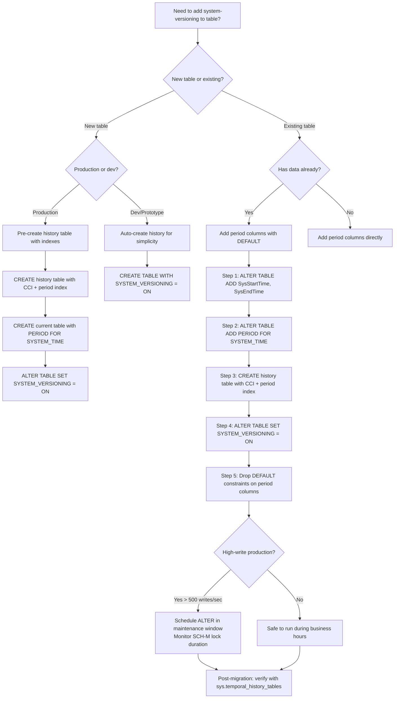

## Navigation

**Domain:** [[8 — Databases]] > **Group:** SQL Temporal Tables & Point-in-Time
**Previous:** [[8.226 — Temporal Tables — System-Versioned Concept]] | **Next:** [[8.228 — Querying History — FOR SYSTEM_TIME Clause]]

### Prerequisites

- [[8.226 — Temporal Tables — System-Versioned Concept]] — understanding the dual-table architecture, period columns, and history tracking mechanism is required before creating temporal tables.
- [[8.500 — Table Design and Constraints]] — temporal tables have specific DDL constraints: period columns must be `DATETIME2 NOT NULL`, the `PERIOD FOR SYSTEM_TIME` clause is required, and the history table schema must match exactly.
- [[8.496 — Index Fundamentals]] — the history table's index strategy (clustered columnstore vs B-tree, partition alignment, period index) is defined at table creation and directly affects temporal query performance.

### Where This Fits

Creating system-versioned temporal tables is a DDL operation that transforms a standard table into a self-versioning data store. A .NET backend engineer encounters this when setting up a new database schema that requires audit capability, when adding versioning to an existing production table (via `ALTER TABLE ADD SYSTEM_VERSIONING`), or when running EF Core migrations that include `.IsTemporal()`. The creation decisions — history table name, period column names, DATETIME2 precision, history table index strategy, and partition alignment — are permanent or expensive to change. When these decisions are wrong, the result is a history table that is unmanageably large, temporal queries that are slow, or a schema migration process that requires production downtime. The interview signal is detailed DDL knowledge: naming conventions for history tables, the exact syntax of `PERIOD FOR SYSTEM_TIME`, and the constraints on the history table schema.

---

## Core Mental Model

Creating a system-versioned temporal table requires specifying two period columns (`GENERATED ALWAYS AS ROW START / ROW END` of type `DATETIME2`), a `PERIOD FOR SYSTEM_TIME (StartCol, EndCol)` clause, and either letting SQL Server auto-create the history table (default) or specifying a named history table. The `CREATE TABLE` syntax has two modes: (1) `WITH (SYSTEM_VERSIONING = ON, HISTORY_TABLE = dbo.TableName_History)` where the history table is created automatically with matching schema but without primary key, without foreign keys, and without the `GENERATED ALWAYS` constraints, or (2) `WITH (SYSTEM_VERSIONING = ON, HISTORY_TABLE = dbo.ExistingHistoryTable)` where a pre-created table with matching column schema is linked. For `ALTER TABLE`, existing tables can be made temporal by adding the period columns (with `DEFAULT` for existing rows) and setting `SYSTEM_VERSIONING = ON`. The invariant: **the history table must have exactly the same column names, types, nullability, and order as the current table, except the history table lacks `IDENTITY`, `GENERATED ALWAYS`, `CHECK`, `FOREIGN KEY`, and `DEFAULT` constraints — and it cannot have a primary key.** The recognition pattern: a temporal table has `is_temporal = 1` in `sys.tables`, links to its history table via `sys.temporal_history_tables.history_table_id`, and the history table has `is_temporal_history = 1`.

### Classification

`CREATE TABLE ... WITH (SYSTEM_VERSIONING = ON)` is a **DDL statement** in SQL Server's T-SQL grammar, handled by the **relational engine's metadata layer**. The period columns are processed as `GENERATED ALWAYS` computed columns that are populated at DML execution time. The `PERIOD FOR SYSTEM_TIME` clause is a **table-level annotation** stored in `sys.periods`. The system versioning flag is a **table property** stored in `sys.tables.is_temporal`. The history table link is stored in `sys.temporal_history_tables`. The feature is **not a constraint** (like CHECK or FOREIGN KEY) — it is an engine behavior modifier. The `ALTER TABLE ... SET (SYSTEM_VERSIONING = ON)` statement performs a schema validation: it verifies that the period columns are `NOT NULL DATETIME2`, that they are `GENERATED ALWAYS AS ROW START/END`, that `PERIOD FOR SYSTEM_TIME` is defined, and that the history table schema matches.

```mermaid
flowchart TD
    subgraph DDL_Phase["DDL Phase: Creating a Temporal Table"]
        A[CREATE TABLE ... WITH SYSTEM_VERSIONING = ON] --> B{History table specified?}
        B -->|No (auto-create)| C[SQL Server creates history table automatically]
        B -->|Yes (named)| D[SQL Server validates existing history table schema]
        
        C --> E[History table schema: same columns<br/>No PK, no IDENTITY, no FOREIGN KEY<br/>No CHECK, no DEFAULT, no GENERATED ALWAYS]
        D --> F{Schema matches current table?}
        F -->|Yes| G[Link history table to current table in sys.temporal_history_tables]
        F -->|No| H[DDL fails: schema mismatch error]
        
        E --> G
        G --> I[Temporal table active:<br/>is_temporal = 1<br/>history_table_id set]
    end

    subgraph ALTER_Phase["ALTER TABLE: Add Versioning to Existing Table"]
        J[Existing table with data] --> K[ALTER TABLE ADD period columns<br/>SysStartTime DATETIME2 NOT NULL<br/>DEFAULT SYSUTCDATETIME&#40;&#41;]
        K --> L[ALTER TABLE ADD PERIOD FOR SYSTEM_TIME]
        L --> M[ALTER TABLE SET SYSTEM_VERSIONING = ON]
        M --> N{Existing rows need valid period values?}
        N -->|Yes| O[Period columns populated with DEFAULT<br/>SysStartTime = now, SysEndTime = max]
        N -->|No rows| P[No default needed]
    end

    subgraph Schema_Constraints["Schema Constraints"]
        Q[Current table must have:<br/>- PERIOD FOR SYSTEM_TIME<br/>- GENERATED ALWAYS AS ROW START/END<br/>- DATETIME2 NOT NULL period columns]
        R[History table must have:<br/>- Same columns as current (no GENERATED ALWAYS)<br/>- No PK, no IDENTITY, no FOREIGN KEY<br/>- Same column order]
        S[ALTER SYSTEM_VERSIONING OFF:<br/>- Drops automatic tracking<br/>- Keeps period columns and history table<br/>- Does NOT drop any data]
    end

    I --> Q
    I --> R
```

### Key Properties

|Property|Value|Notes|
|---|---|---|
|Period column type|DATETIME2 (any precision)|DATETIME2(7) recommended (100ns)|
|Period column constraint|GENERATED ALWAYS AS ROW START/END|Not settable by application|
|Period column nullability|NOT NULL|Required by engine|
|History table PK|None (automatically removed)|Cannot be added manually|
|History table IDENTITY|Not allowed|Must be dropped if source table has it|
|History table FOREIGN KEY|Not allowed|Constraint is not copied|
|History table DEFAULT|Not allowed|Period columns use system values|
|Auto-create history table|Simple syntax|Allows constraints on current table only|
|Named history table|Precise schema control|Requires manual DDL for history table|
|ALTER TABLE versioning|Requires period columns first|Must add columns before enabling versioning|
|SYSTEM_VERSIONING = OFF|Keeps period columns|Does not drop columns or history data|

---

## Deep Mechanics

### How the Engine Executes This

1. **DDL validation on `CREATE TABLE ... WITH SYSTEM_VERSIONING = ON`.** When SQL Server parses the `CREATE TABLE` statement with `SYSTEM_VERSIONING = ON`, the engine first validates the period column definitions: (a) the `PERIOD FOR SYSTEM_TIME (col1, col2)` must reference two existing columns that are `DATETIME2` with `GENERATED ALWAYS AS ROW START` and `GENERATED ALWAYS AS ROW END`, (b) both columns must be `NOT NULL`, (c) the start column (`SysStartTime`) is populated at row creation time and on each subsequent update, (d) the end column (`SysEndTime`) is set to `'9999-12-31 23:59:59.9999999'` at creation and updated to the transaction timestamp on UPDATE/DELETE.

2. **History table auto-creation.** If no `HISTORY_TABLE` is specified, SQL Server creates a history table with the same column names, types, nullability, and column order as the current table, but: (a) without `IDENTITY` property on any column, (b) without `GENERATED ALWAYS AS ROW START/END`, (c) without foreign keys, (d) without check constraints, (e) without default values, (f) without primary key (the PK from the source table is not copied), (g) without any unique constraints. The history table is created as a heap (no clustered index) by default. The name is generated as `MSSQL_TemporalHistoryFor_<object_id>` if not explicitly specified.

3. **Named history table validation.** If `HISTORY_TABLE = dbo.ExistingTable` is specified, SQL Server validates: (a) the history table has the same number of columns with the same names, types, nullability, and ordinal positions, (b) the history table does not have any `GENERATED ALWAYS` columns, (c) the history table does not have any `IDENTITY` columns, (d) the history table does not have a primary key, (e) the history table does not have foreign keys referencing or being referenced, (f) the history table does not have `CHECK` constraints, (g) the history table column defaults are compatible (or absent). If any validation fails, the DDL statement errors.

4. **Schema binding.** After validation, SQL Server creates the schema binding between the current table and the history table. This binding is stored in `sys.temporal_history_tables` with columns: `object_id` (current table), `history_table_id` (history table), `start_column_id`, `end_column_id`. The current table's `sys.tables.is_temporal` is set to 1. The history table's `sys.tables.is_temporal_history` is set to 1 (internal flag; not directly exposed).

5. **ALTER TABLE ADD SYSTEM_VERSIONING — existing rows.** When adding system-versioning to an existing table with data, the period columns must be added first with `DEFAULT` values: `ALTER TABLE dbo.Table ADD SysStartTime DATETIME2(7) NOT NULL CONSTRAINT DF_SS DEFAULT SYSUTCDATETIME()`, `ALTER TABLE dbo.Table ADD SysEndTime DATETIME2(7) NOT NULL CONSTRAINT DF_SE DEFAULT '9999-12-31 23:59:59.9999999'`. The `DEFAULT` values populate all existing rows. After adding the columns and the `PERIOD FOR SYSTEM_TIME`, the `ALTER TABLE ... SET (SYSTEM_VERSIONING = ON)` triggers a final validation and links the history table.

6. **History table schema evolution.** When the current table's schema changes (e.g., `ALTER TABLE ADD COLUMN`), the history table must be altered in the same transaction before enabling versioning, or the schema change must be performed with `SYSTEM_VERSIONING = OFF`, then both tables altered, then versioning re-enabled. SQL Server does not automatically propagate schema changes to the history table.

7. **SYSTEM_VERSIONING = OFF behavior.** Setting `SYSTEM_VERSIONING = OFF` removes the schema binding and stops automatic history tracking. The current table retains the period columns and the `PERIOD FOR SYSTEM_TIME` definition — they remain visible and storable but are no longer automatically populated. The history table becomes a regular table accessible for direct read/write. Re-enabling versioning requires the same validation process.

### SQL Visibility

```sql
-- ============================================================
-- Method 1: CREATE TABLE with auto-created history table
-- ============================================================
-- SQL Server creates MSSQL_TemporalHistoryFor_<object_id> automatically
CREATE TABLE dbo.Orders
(
    OrderId         INT             NOT NULL IDENTITY(1,1),
    CustomerId      INT             NOT NULL,
    OrderDate       DATETIME2(7)    NOT NULL,
    OrderStatus     NVARCHAR(20)    NOT NULL DEFAULT 'Pending',
    TotalAmount     DECIMAL(18,2)   NOT NULL,
    SysStartTime    DATETIME2(7)    GENERATED ALWAYS AS ROW START NOT NULL,
    SysEndTime      DATETIME2(7)    GENERATED ALWAYS AS ROW END   NOT NULL,
    PERIOD FOR SYSTEM_TIME (SysStartTime, SysEndTime),
    CONSTRAINT PK_Orders PRIMARY KEY CLUSTERED (OrderId)
)
WITH (SYSTEM_VERSIONING = ON);

-- ============================================================
-- Method 2: CREATE TABLE with named history table
-- ============================================================
CREATE TABLE dbo.Products
(
    ProductId       INT             NOT NULL IDENTITY(1,1),
    ProductName     NVARCHAR(200)   NOT NULL,
    CategoryId      INT             NOT NULL,
    UnitPrice       DECIMAL(18,2)   NOT NULL,
    StockQty        INT             NOT NULL DEFAULT 0,
    IsActive        BIT             NOT NULL DEFAULT 1,
    SysStartTime    DATETIME2(7)    GENERATED ALWAYS AS ROW START NOT NULL,
    SysEndTime      DATETIME2(7)    GENERATED ALWAYS AS ROW END   NOT NULL,
    PERIOD FOR SYSTEM_TIME (SysStartTime, SysEndTime),
    CONSTRAINT PK_Products PRIMARY KEY CLUSTERED (ProductId)
)
WITH (SYSTEM_VERSIONING = ON (HISTORY_TABLE = dbo.Products_History));

-- ============================================================
-- Method 3: CREATE TABLE with pre-created history table
-- ============================================================
-- Step 1: Create the history table manually
CREATE TABLE dbo.Employees_History
(
    EmployeeId      INT             NOT NULL,
    FirstName       NVARCHAR(50)    NOT NULL,
    LastName        NVARCHAR(50)    NOT NULL,
    DepartmentId    INT             NOT NULL,
    Salary          DECIMAL(18,2)   NOT NULL,
    HireDate        DATE            NOT NULL,
    IsActive        BIT             NOT NULL,
    SysStartTime    DATETIME2(7)    NOT NULL,
    SysEndTime      DATETIME2(7)    NOT NULL
);

-- Step 2: Create the current table referencing the existing history table
CREATE TABLE dbo.Employees
(
    EmployeeId      INT             NOT NULL IDENTITY(1,1),
    FirstName       NVARCHAR(50)    NOT NULL,
    LastName        NVARCHAR(50)    NOT NULL,
    DepartmentId    INT             NOT NULL,
    Salary          DECIMAL(18,2)   NOT NULL,
    HireDate        DATE            NOT NULL,
    IsActive        BIT             NOT NULL DEFAULT 1,
    SysStartTime    DATETIME2(7)    GENERATED ALWAYS AS ROW START NOT NULL,
    SysEndTime      DATETIME2(7)    GENERATED ALWAYS AS ROW END   NOT NULL,
    PERIOD FOR SYSTEM_TIME (SysStartTime, SysEndTime),
    CONSTRAINT PK_Employees PRIMARY KEY CLUSTERED (EmployeeId)
)
WITH (SYSTEM_VERSIONING = ON (HISTORY_TABLE = dbo.Employees_History));

-- ============================================================
-- Method 4: ALTER TABLE to add system-versioning to existing table
-- ============================================================
-- Step 1: Create the existing table (no temporal)
CREATE TABLE dbo.Invoices
(
    InvoiceId       INT             NOT NULL IDENTITY(1,1),
    CustomerId      INT             NOT NULL,
    InvoiceDate     DATETIME2(7)    NOT NULL,
    InvoiceStatus   NVARCHAR(20)    NOT NULL DEFAULT 'Draft',
    TotalAmount     DECIMAL(18,2)   NOT NULL,
    CONSTRAINT PK_Invoices PRIMARY KEY CLUSTERED (InvoiceId)
);
GO

-- Step 2: Add period columns with defaults for existing rows
ALTER TABLE dbo.Invoices ADD
    SysStartTime DATETIME2(7) NOT NULL
        CONSTRAINT DF_Invoices_SysStart DEFAULT SYSUTCDATETIME(),
    SysEndTime DATETIME2(7) NOT NULL
        CONSTRAINT DF_Invoices_SysEnd DEFAULT '9999-12-31 23:59:59.9999999';
GO

-- Step 3: Add PERIOD FOR SYSTEM_TIME
ALTER TABLE dbo.Invoices
    ADD PERIOD FOR SYSTEM_TIME (SysStartTime, SysEndTime);
GO

-- Step 4: Create the history table
CREATE TABLE dbo.Invoices_History
(
    InvoiceId       INT             NOT NULL,
    CustomerId      INT             NOT NULL,
    InvoiceDate     DATETIME2(7)    NOT NULL,
    InvoiceStatus   NVARCHAR(20)    NOT NULL,
    TotalAmount     DECIMAL(18,2)   NOT NULL,
    SysStartTime    DATETIME2(7)    NOT NULL,
    SysEndTime      DATETIME2(7)    NOT NULL
);
GO

-- Step 5: Enable system versioning
ALTER TABLE dbo.Invoices
    SET (SYSTEM_VERSIONING = ON (HISTORY_TABLE = dbo.Invoices_History));
GO

-- ============================================================
-- Method 5: ALTER TABLE with existing data and period columns
-- ============================================================
-- If the table already has DATETIME2 columns suitable for period tracking:
CREATE TABLE dbo.Shipments
(
    ShipmentId       INT             NOT NULL IDENTITY(1,1),
    OrderId          INT             NOT NULL,
    Carrier          NVARCHAR(50)    NOT NULL,
    TrackingNumber   NVARCHAR(100)   NOT NULL,
    ShipmentStatus   NVARCHAR(20)    NOT NULL DEFAULT 'Pending',
    ValidFrom        DATETIME2(7)    NOT NULL DEFAULT SYSUTCDATETIME(),
    ValidTo          DATETIME2(7)    NOT NULL DEFAULT '9999-12-31 23:59:59.9999999',
    CONSTRAINT PK_Shipments PRIMARY KEY CLUSTERED (ShipmentId)
);
GO

-- Note: Existing columns cannot be GENERATED ALWAYS after creation.
-- Must drop and recreate, or create new columns and drop old ones.
-- Simpler: add new period columns (Method 4).

-- ============================================================
-- Using DATETIME2(0) (1-second precision) — WARNING: boundary issues
-- ============================================================
CREATE TABLE dbo.Orders_LowPrecision
(
    OrderId         INT             NOT NULL IDENTITY(1,1),
    CustomerId      INT             NOT NULL,
    OrderDate       DATETIME2(7)    NOT NULL,
    OrderStatus     NVARCHAR(20)    NOT NULL,
    TotalAmount     DECIMAL(18,2)   NOT NULL,
    SysStartTime    DATETIME2(0)    GENERATED ALWAYS AS ROW START NOT NULL,
    SysEndTime      DATETIME2(0)    GENERATED ALWAYS AS ROW END   NOT NULL,
    PERIOD FOR SYSTEM_TIME (SysStartTime, SysEndTime),
    CONSTRAINT PK_Orders_LowPrecision PRIMARY KEY CLUSTERED (OrderId)
)
WITH (SYSTEM_VERSIONING = ON (HISTORY_TABLE = dbo.Orders_LowPrecision_History));

-- ============================================================
-- Verify creation via system views
-- ============================================================
-- List all temporal tables
SELECT
    t.object_id,
    t.name AS TableName,
    t.schema_id,
    t.is_temporal,
    th.history_table_id,
    ISNULL(ht.name, 'No history table') AS HistoryTableName,
    sc.name AS StartColumnName,
    ec.name AS EndColumnName
FROM sys.tables t
JOIN sys.temporal_history_tables th
    ON t.object_id = th.object_id
LEFT JOIN sys.tables ht
    ON th.history_table_id = ht.object_id
JOIN sys.columns sc
    ON th.start_column_id = sc.column_id AND sc.object_id = t.object_id
JOIN sys.columns ec
    ON th.end_column_id = ec.column_id AND ec.object_id = t.object_id
WHERE t.is_temporal = 1;

-- Check period columns
SELECT
    t.name AS TableName,
    c.name AS ColumnName,
    c.is_period_part,
    c.generated_always_type_desc,
    c.system_type_name,
    c.max_length
FROM sys.tables t
JOIN sys.columns c ON t.object_id = c.object_id
WHERE t.is_temporal = 1
  AND c.is_period_part = 1
ORDER BY t.name, c.column_id;

-- ============================================================
-- Disable and re-enable system versioning
-- ============================================================
ALTER TABLE dbo.Invoices SET (SYSTEM_VERSIONING = OFF);
GO
-- Now both Invoices and Invoices_History are regular tables
-- Invoices still has period columns and PERIOD FOR SYSTEM_TIME definition

-- Re-enable
ALTER TABLE dbo.Invoices
    SET (SYSTEM_VERSIONING = ON (HISTORY_TABLE = dbo.Invoices_History));
GO

-- ============================================================
-- Error cases
-- ============================================================
-- This fails: period columns must be NOT NULL
/*
CREATE TABLE dbo.BadTemporal
(
    Id      INT NOT NULL PRIMARY KEY,
    SysStartTime DATETIME2(7) GENERATED ALWAYS AS ROW START NULL,  -- Must be NOT NULL
    SysEndTime   DATETIME2(7) GENERATED ALWAYS AS ROW END   NULL,
    PERIOD FOR SYSTEM_TIME (SysStartTime, SysEndTime)
)
WITH (SYSTEM_VERSIONING = ON);
-- Msg 13700: Period column 'SysStartTime' must be defined as NOT NULL.
*/

-- This fails: history table must have matching schema
/*
ALTER TABLE dbo.Invoices
    SET (SYSTEM_VERSIONING = ON (HISTORY_TABLE = dbo.Invoices_History));
-- After adding a column to Invoices but not to Invoices_History:
-- Msg 13730: The HISTORY_TABLE specified does not match the current table schema.
*/

-- This fails: history table cannot have IDENTITY or PRIMARY KEY
/*
CREATE TABLE dbo.BadHistory
(
    Id      INT NOT NULL IDENTITY(1,1) PRIMARY KEY,
    ...
);
-- Msg 13724: The history table cannot have an IDENTITY column.
*/
```

```csharp
// EF Core 8+ — creating temporal tables via migration
public class ApplicationDbContext : DbContext
{
    public DbSet<Order> Orders => Set<Order>();
    public DbSet<Product> Products => Set<Product>();
    public DbSet<Employee> Employees => Set<Employee>();
    public DbSet<Invoice> Invoices => Set<Invoice>();

    protected override void OnModelCreating(ModelBuilder modelBuilder)
    {
        // Method 1: Auto-named history table
        modelBuilder.Entity<Order>(entity =>
        {
            entity.ToTable("Orders", tb => tb.IsTemporal(ttb =>
            {
                ttb.UseHistoryTableName("Orders_History");
                ttb.HasPeriodStart("SysStartTime");
                ttb.HasPeriodEnd("SysEndTime");
            }));
            entity.HasKey(e => e.OrderId);
            entity.Property(e => e.OrderDate).HasDefaultValueSql("SYSUTCDATETIME()");
            entity.Property(e => e.OrderStatus).HasMaxLength(20).HasDefaultValue("Pending");
            entity.Property(e => e.TotalAmount).HasColumnType("decimal(18,2)");
        });

        // Method 2: Pre-named history table with explicit period column names
        modelBuilder.Entity<Product>(entity =>
        {
            entity.ToTable("Products", tb => tb.IsTemporal(ttb =>
            {
                ttb.UseHistoryTableName("Products_History");
                ttb.HasPeriodStart("SysStartTime");
                ttb.HasPeriodEnd("SysEndTime");
            }));
            entity.Property(e => e.UnitPrice).HasColumnType("decimal(18,2)");
        });

        // Method 3: Custom period column names
        modelBuilder.Entity<Employee>(entity =>
        {
            entity.ToTable("Employees", tb => tb.IsTemporal(ttb =>
            {
                ttb.UseHistoryTableName("Employees_History");
                ttb.HasPeriodStart("ValidFrom");
                ttb.HasPeriodEnd("ValidTo");
            }));
            entity.Property(e => e.Salary).HasColumnType("decimal(18,2)");
        });

        // Method 4: Adding temporal to existing table (requires migration)
        // EF Core will generate:
        // ALTER TABLE Invoices ADD SysStartTime DATETIME2(7) NOT NULL DEFAULT SYSUTCDATETIME();
        // ALTER TABLE Invoices ADD SysEndTime DATETIME2(7) NOT NULL DEFAULT '9999-12-31 23:59:59.9999999';
        // ALTER TABLE Invoices ADD PERIOD FOR SYSTEM_TIME (SysStartTime, SysEndTime);
        // CREATE TABLE Invoices_History (...);
        // ALTER TABLE Invoices SET (SYSTEM_VERSIONING = ON (HISTORY_TABLE = dbo.Invoices_History));
        modelBuilder.Entity<Invoice>(entity =>
        {
            entity.ToTable("Invoices", tb => tb.IsTemporal(ttb =>
            {
                ttb.UseHistoryTableName("Invoices_History");
                ttb.HasPeriodStart("SysStartTime");
                ttb.HasPeriodEnd("SysEndTime");
            }));
            entity.Property(e => e.TotalAmount).HasColumnType("decimal(18,2)");
        });
    }
}

public class Order
{
    public int OrderId { get; set; }
    public int CustomerId { get; set; }
    public DateTime OrderDate { get; set; }
    public string OrderStatus { get; set; } = string.Empty;
    public decimal TotalAmount { get; set; }
    public DateTime SysStartTime { get; set; }
    public DateTime SysEndTime { get; set; }
}

public class Product
{
    public int ProductId { get; set; }
    public string ProductName { get; set; } = string.Empty;
    public int CategoryId { get; set; }
    public decimal UnitPrice { get; set; }
    public int StockQty { get; set; }
    public bool IsActive { get; set; }
    public DateTime SysStartTime { get; set; }
    public DateTime SysEndTime { get; set; }
}

public class Employee
{
    public int EmployeeId { get; set; }
    public string FirstName { get; set; } = string.Empty;
    public string LastName { get; set; } = string.Empty;
    public int DepartmentId { get; set; }
    public decimal Salary { get; set; }
    public DateTime HireDate { get; set; }
    public bool IsActive { get; set; }
    public DateTime SysStartTime { get; set; }
    public DateTime SysEndTime { get; set; }
}

public class Invoice
{
    public int InvoiceId { get; set; }
    public int CustomerId { get; set; }
    public DateTime InvoiceDate { get; set; }
    public string InvoiceStatus { get; set; } = string.Empty;
    public decimal TotalAmount { get; set; }
    public DateTime SysStartTime { get; set; }
    public DateTime SysEndTime { get; set; }
}
```

### Generated SQL (from EF Core migrations for adding temporal to an existing table)

```sql
-- EF Core generates migration SQL for adding temporal to an existing table:
-- Step 1: Add period columns with defaults
ALTER TABLE [dbo].[Invoices] ADD [SysStartTime] DATETIME2(7) NOT NULL DEFAULT (SYSUTCDATETIME());
ALTER TABLE [dbo].[Invoices] ADD [SysEndTime] DATETIME2(7) NOT NULL DEFAULT ('9999-12-31 23:59:59.9999999');

-- Step 2: Add period
ALTER TABLE [dbo].[Invoices] ADD PERIOD FOR SYSTEM_TIME ([SysStartTime], [SysEndTime]);

-- Step 3: Create history table
CREATE TABLE [dbo].[Invoices_History] (
    [InvoiceId]     INT             NOT NULL,
    [CustomerId]    INT             NOT NULL,
    [InvoiceDate]   DATETIME2(7)    NOT NULL,
    [InvoiceStatus] NVARCHAR(20)    NOT NULL,
    [TotalAmount]   DECIMAL(18,2)   NOT NULL,
    [SysStartTime]  DATETIME2(7)    NOT NULL,
    [SysEndTime]    DATETIME2(7)    NOT NULL
);

-- Step 4: Enable versioning
ALTER TABLE [dbo].[Invoices] SET (SYSTEM_VERSIONING = ON (HISTORY_TABLE = [dbo].[Invoices_History]));

-- EF Core also generates the reverse migration for rolling back:
-- ALTER TABLE [dbo].[Invoices] SET (SYSTEM_VERSIONING = OFF);
-- DROP TABLE [dbo].[Invoices_History];
-- ALTER TABLE [dbo].[Invoices] DROP PERIOD FOR SYSTEM_TIME;
-- DECLARE @default sysname;
-- SELECT @default = name FROM sys.default_constraints WHERE parent_object_id = OBJECT_ID('Invoices') AND parent_column_id = COLUMNPROPERTY(OBJECT_ID('Invoices'), 'SysStartTime', 'ColumnId');
-- EXEC('ALTER TABLE [dbo].[Invoices] DROP CONSTRAINT ' + @default);
-- EXEC('ALTER TABLE [dbo].[Invoices] DROP COLUMN SysStartTime');
-- (repeat for SysEndTime)
```

### Execution Plan Analysis

**For `CREATE TABLE ... WITH (SYSTEM_VERSIONING = ON)`:**
```
Expected execution plan:
[Parse and Validate DDL]
  → [Check period column definitions]
  → [Check DATETIME2 type on period columns]
  → [Check NOT NULL constraint]
  → [Create current table object in metadata]
  → [Create columns with GENERATED ALWAYS metadata]
  → [Create PERIOD FOR SYSTEM_TIME metadata entry]
  → [Create/validate history table]
  → [Link tables in sys.temporal_history_tables]
  → [Set is_temporal = 1]
```

This is a metadata-only operation. The execution time is typically under 100ms regardless of data size. The `ALTER TABLE ... SET (SYSTEM_VERSIONING = ON)` acquires an `SCH-M` lock on both tables for the duration of the DDL.

**For `ALTER TABLE ... SET (SYSTEM_VERSIONING = OFF)` re-enable:**
```
SCH-M lock on current table
  → SCH-M lock on history table
  → Validate schema match
  → Set is_temporal = 1
  → Release locks
```

The lock duration is proportional to the validation cost (typically <1 second for matching schemas).

### Cost Visibility

```sql
-- Temporal table creation is metadata-only — no SET STATISTICS IO applicable
-- But the SCH-M lock acquisition can be observed:

SET STATISTICS TIME ON;

-- This should complete in <100ms for new table creation
CREATE TABLE dbo.TestTemporal
(
    Id      INT NOT NULL IDENTITY(1,1),
    Value   NVARCHAR(100) NOT NULL,
    SysStartTime DATETIME2(7) GENERATED ALWAYS AS ROW START NOT NULL,
    SysEndTime   DATETIME2(7) GENERATED ALWAYS AS ROW END   NOT NULL,
    PERIOD FOR SYSTEM_TIME (SysStartTime, SysEndTime),
    CONSTRAINT PK_TestTemporal PRIMARY KEY CLUSTERED (Id)
)
WITH (SYSTEM_VERSIONING = ON (HISTORY_TABLE = dbo.TestTemporal_History));
-- Expected: CPU time = 0ms, elapsed time = ~50ms

-- Adding temporal to an existing table with 1M rows:
-- Step 1: Add period columns (data modification — writes to every row)
ALTER TABLE dbo.ExistingLargeTable ADD
    SysStartTime DATETIME2(7) NOT NULL
        CONSTRAINT DF_SST DEFAULT SYSUTCDATETIME(),
    SysEndTime DATETIME2(7) NOT NULL
        CONSTRAINT DF_SET DEFAULT '9999-12-31 23:59:59.9999999';
-- This is an ONLINE operation in SQL Server 2016+ Enterprise Edition
-- Expected: CPU time = ~100ms per million rows, elapsed time varies by table size
-- Logical reads: full table scan to populate defaults

-- Monitor SCH-M lock waits during temporal DDL
SELECT
    session_id,
    wait_type,
    wait_duration_ms,
    blocking_session_id,
    resource_description
FROM sys.dm_exec_requests
WHERE wait_type LIKE '%SCH%';
```

### Failure Modes

**Schema mismatch between current and history table:** The most common failure when creating temporal tables. Adding a column to the current table without adding it to the history table causes temporal to fail.

```sql
-- ❌ Add column to current table but not history
ALTER TABLE dbo.Orders ADD DiscountCode NVARCHAR(50) NULL;
GO
-- Next temporal operation (insert/update) fails:
-- Msg 13730: The HISTORY_TABLE 'dbo.Orders_History' does not match the current table schema.

-- ✅ Fix: add column to both tables before re-enabling
ALTER TABLE dbo.Orders SET (SYSTEM_VERSIONING = OFF);
GO
ALTER TABLE dbo.Orders_History ADD DiscountCode NVARCHAR(50) NULL;
GO
ALTER TABLE dbo.Orders
    SET (SYSTEM_VERSIONING = ON (HISTORY_TABLE = dbo.Orders_History));
GO
```

**IDENTITY column in history table:** If the current table has an IDENTITY column, it must not be IDENTITY in the history table. SQL Server auto-created history tables handle this correctly, but manually created history tables must explicitly omit IDENTITY.

```sql
-- ❌ Manually created history table with IDENTITY
CREATE TABLE dbo.Products_BadHistory
(
    ProductId       INT             NOT NULL IDENTITY(1,1),  -- NOT ALLOWED
    ...
);
-- CREATE TABLE with SYSTEM_VERSIONING fails:
-- Msg 13724: Column 'ProductId' in the history table 'dbo.Products_BadHistory'
-- cannot be an identity column.

-- ✅ Correct: no IDENTITY on ProductId in history table
CREATE TABLE dbo.Products_History
(
    ProductId       INT             NOT NULL,  -- No IDENTITY
    ...
);
```

**History table with primary key or foreign keys:** The history table cannot have primary key, foreign key, or unique constraints. SQL Server enforces this at DDL time.

```sql
-- ❌ History table with PRIMARY KEY
CREATE TABLE dbo.Orders_BadHistory
(
    OrderId      INT NOT NULL PRIMARY KEY,  -- NOT ALLOWED
    ...
);
-- Msg 13732: The history table 'dbo.Orders_BadHistory' cannot have a primary key.

-- ✅ Correct: no constraints on history table
CREATE TABLE dbo.Orders_History
(
    OrderId      INT NOT NULL,  -- No PK
    ...
);
```

**DATETIME2 precision mismatch between current and history table:** The period columns must have the same precision in both tables.

```sql
-- ❌ Precision mismatch
CREATE TABLE dbo.Orders
(
    OrderId         INT NOT NULL IDENTITY(1,1) PRIMARY KEY,
    SysStartTime    DATETIME2(7) GENERATED ALWAYS AS ROW START NOT NULL,
    SysEndTime      DATETIME2(7) GENERATED ALWAYS AS ROW END   NOT NULL,
    PERIOD FOR SYSTEM_TIME (SysStartTime, SysEndTime)
);
-- History table with DATETIME2(0) — precision mismatch
CREATE TABLE dbo.Orders_BadHistory
(
    OrderId         INT NOT NULL,
    SysStartTime    DATETIME2(0) NOT NULL,  -- Mismatch: 7 vs 0
    SysEndTime      DATETIME2(0) NOT NULL
);
-- Msg 13730: HISTORY_TABLE schema does not match.

-- ✅ Match precision: both DATETIME2(7)
```

---

## Production Patterns and Implementation

### Primary SQL Implementation

```sql
-- ============================================================
-- Pattern 1: Production temporal table with comprehensive index strategy
-- ============================================================
-- Create the history table first for full control over structure
CREATE TABLE dbo.Orders_History
(
    OrderId         INT              NOT NULL,
    CustomerId      INT              NOT NULL,
    OrderDate       DATETIME2(7)     NOT NULL,
    OrderStatus     NVARCHAR(20)     NOT NULL,
    TotalAmount     DECIMAL(18,2)    NOT NULL,
    ShippingAddress NVARCHAR(500)    NULL,
    PaymentMethod   NVARCHAR(50)     NULL,
    SysStartTime    DATETIME2(7)     NOT NULL,
    SysEndTime      DATETIME2(7)     NOT NULL
);

-- Clustered columnstore for compressed history storage
CREATE CLUSTERED COLUMNSTORE INDEX IX_Orders_History_CCI
    ON dbo.Orders_History;

-- Non-clustered B-tree index for point-in-time queries
CREATE NONCLUSTERED INDEX IX_Orders_History_Period
    ON dbo.Orders_History (SysEndTime DESC, SysStartTime ASC)
    INCLUDE (OrderId, CustomerId, OrderStatus, TotalAmount);

-- Create the current table
CREATE TABLE dbo.Orders
(
    OrderId         INT              NOT NULL IDENTITY(1,1),
    CustomerId      INT              NOT NULL,
    OrderDate       DATETIME2(7)     NOT NULL,
    OrderStatus     NVARCHAR(20)     NOT NULL DEFAULT 'Pending',
    TotalAmount     DECIMAL(18,2)    NOT NULL,
    ShippingAddress NVARCHAR(500)    NULL,
    PaymentMethod   NVARCHAR(50)     NULL,
    SysStartTime    DATETIME2(7)     GENERATED ALWAYS AS ROW START NOT NULL,
    SysEndTime      DATETIME2(7)     GENERATED ALWAYS AS ROW END   NOT NULL,
    PERIOD FOR SYSTEM_TIME (SysStartTime, SysEndTime),
    CONSTRAINT PK_Orders PRIMARY KEY CLUSTERED (OrderId),
    CONSTRAINT CK_Orders_Status CHECK (OrderStatus IN (
        'Pending', 'Processing', 'Shipped', 'Delivered', 'Cancelled', 'Refunded'
    ))
);

-- Period index on current table for AS OF queries
CREATE NONCLUSTERED INDEX IX_Orders_Period
    ON dbo.Orders (SysEndTime DESC, SysStartTime ASC)
    INCLUDE (OrderId, CustomerId, OrderStatus, TotalAmount);

-- Enable temporal
ALTER TABLE dbo.Orders
    SET (SYSTEM_VERSIONING = ON (HISTORY_TABLE = dbo.Orders_History));

-- ============================================================
-- Pattern 2: Adding temporal to existing production table
-- ============================================================
-- Scenario: 500K existing rows in dbo.Products
-- Goal: Add system-versioning with minimal downtime

-- Step 1: Add period columns as nullable first (avoids full table lock)
ALTER TABLE dbo.Products ADD
    SysStartTime DATETIME2(7) NULL,
    SysEndTime DATETIME2(7) NULL;
GO

-- Step 2: Populate existing rows with valid period values
UPDATE dbo.Products
SET SysStartTime = SYSUTCDATETIME(),
    SysEndTime = '9999-12-31 23:59:59.9999999'
WHERE SysStartTime IS NULL;
GO

-- Step 3: Alter columns to NOT NULL
ALTER TABLE dbo.Products ALTER COLUMN SysStartTime DATETIME2(7) NOT NULL;
ALTER TABLE dbo.Products ALTER COLUMN SysEndTime DATETIME2(7) NOT NULL;
GO

-- Step 4: Add PERIOD FOR SYSTEM_TIME
ALTER TABLE dbo.Products
    ADD PERIOD FOR SYSTEM_TIME (SysStartTime, SysEndTime);
GO

-- Step 5: Create history table
CREATE TABLE dbo.Products_History
(
    ProductId       INT             NOT NULL,
    ProductName     NVARCHAR(200)   NOT NULL,
    CategoryId      INT             NOT NULL,
    UnitPrice       DECIMAL(18,2)   NOT NULL,
    StockQty        INT             NOT NULL,
    IsActive        BIT             NOT NULL,
    SysStartTime    DATETIME2(7)    NOT NULL,
    SysEndTime      DATETIME2(7)    NOT NULL
);
GO

-- Step 6: Create indexes on history table before enabling versioning
CREATE CLUSTERED COLUMNSTORE INDEX IX_Products_History_CCI
    ON dbo.Products_History;

CREATE NONCLUSTERED INDEX IX_Products_History_Period
    ON dbo.Products_History (SysEndTime DESC, SysStartTime ASC)
    INCLUDE (ProductId, ProductName, UnitPrice, StockQty);
GO

-- Step 7: Enable versioning
ALTER TABLE dbo.Products
    SET (SYSTEM_VERSIONING = ON (HISTORY_TABLE = dbo.Products_History));
GO

-- ============================================================
-- Pattern 3: Temporal table with partitioned history for retention
-- ============================================================
-- Partition function: monthly ranges
CREATE PARTITION FUNCTION PF_History_Month (DATETIME2(7))
    AS RANGE RIGHT FOR VALUES (
        '2024-01-01', '2024-02-01', '2024-03-01', '2024-04-01',
        '2024-05-01', '2024-06-01', '2024-07-01', '2024-08-01',
        '2024-09-01', '2024-10-01', '2024-11-01', '2024-12-01'
    );

CREATE PARTITION SCHEME PS_History_Month
    AS PARTITION PF_History_Month ALL TO ([PRIMARY]);

-- Create history table on partition scheme
CREATE TABLE dbo.Employees_History
(
    EmployeeId      INT             NOT NULL,
    FirstName       NVARCHAR(50)    NOT NULL,
    LastName        NVARCHAR(50)    NOT NULL,
    DepartmentId    INT             NOT NULL,
    Salary          DECIMAL(18,2)   NOT NULL,
    HireDate        DATE            NOT NULL,
    IsActive        BIT             NOT NULL,
    SysStartTime    DATETIME2(7)    NOT NULL,
    SysEndTime      DATETIME2(7)    NOT NULL
)
ON PS_History_Month (SysEndTime);

-- Clustered index on partition key (must match partition scheme)
CREATE CLUSTERED INDEX IX_Employees_History_Period
    ON dbo.Employees_History (SysEndTime DESC, SysStartTime ASC)
    ON PS_History_Month (SysEndTime);

-- Create current table
CREATE TABLE dbo.Employees
(
    EmployeeId      INT             NOT NULL IDENTITY(1,1),
    FirstName       NVARCHAR(50)    NOT NULL,
    LastName        NVARCHAR(50)    NOT NULL,
    DepartmentId    INT             NOT NULL,
    Salary          DECIMAL(18,2)   NOT NULL,
    HireDate        DATE            NOT NULL,
    IsActive        BIT             NOT NULL DEFAULT 1,
    SysStartTime    DATETIME2(7)    GENERATED ALWAYS AS ROW START NOT NULL,
    SysEndTime      DATETIME2(7)    GENERATED ALWAYS AS ROW END   NOT NULL,
    PERIOD FOR SYSTEM_TIME (SysStartTime, SysEndTime),
    CONSTRAINT PK_Employees PRIMARY KEY CLUSTERED (EmployeeId)
);

ALTER TABLE dbo.Employees
    SET (SYSTEM_VERSIONING = ON (HISTORY_TABLE = dbo.Employees_History));

-- ============================================================
-- Pattern 4: Temporal table with different filegroups for storage management
-- ============================================================
-- Current table on fast SSD filegroup
CREATE TABLE dbo.Orders
(
    OrderId         INT             NOT NULL IDENTITY(1,1),
    CustomerId      INT             NOT NULL,
    OrderDate       DATETIME2(7)    NOT NULL,
    OrderStatus     NVARCHAR(20)    NOT NULL DEFAULT 'Pending',
    TotalAmount     DECIMAL(18,2)   NOT NULL,
    SysStartTime    DATETIME2(7)    GENERATED ALWAYS AS ROW START NOT NULL,
    SysEndTime      DATETIME2(7)    GENERATED ALWAYS AS ROW END   NOT NULL,
    PERIOD FOR SYSTEM_TIME (SysStartTime, SysEndTime),
    CONSTRAINT PK_Orders PRIMARY KEY CLUSTERED (OrderId)
)
ON [SSD_DATA];  -- Fast filegroup for OLTP

-- History table on slower/larger filegroup
CREATE TABLE dbo.Orders_History
(
    OrderId         INT             NOT NULL,
    CustomerId      INT             NOT NULL,
    OrderDate       DATETIME2(7)    NOT NULL,
    OrderStatus     NVARCHAR(20)    NOT NULL,
    TotalAmount     DECIMAL(18,2)   NOT NULL,
    SysStartTime    DATETIME2(7)    NOT NULL,
    SysEndTime      DATETIME2(7)    NOT NULL
)
ON [HDD_ARCHIVE];  -- Slower filegroup for history

CREATE CLUSTERED COLUMNSTORE INDEX IX_Orders_History_CCI
    ON dbo.Orders_History
    ON [HDD_ARCHIVE];

ALTER TABLE dbo.Orders
    SET (SYSTEM_VERSIONING = ON (HISTORY_TABLE = dbo.Orders_History));

-- ============================================================
-- Pattern 5: Temporal table with custom period column names
-- ============================================================
CREATE TABLE dbo.AuditTrail
(
    AuditId         INT             NOT NULL IDENTITY(1,1),
    TableName       NVARCHAR(128)   NOT NULL,
    RecordId        INT             NOT NULL,
    OperationType   NVARCHAR(10)    NOT NULL,
    OldValues       NVARCHAR(MAX)   NULL,
    NewValues       NVARCHAR(MAX)   NULL,
    ChangedBy       NVARCHAR(100)   NOT NULL,
    ValidFrom       DATETIME2(7)    GENERATED ALWAYS AS ROW START NOT NULL,
    ValidTo         DATETIME2(7)    GENERATED ALWAYS AS ROW END   NOT NULL,
    PERIOD FOR SYSTEM_TIME (ValidFrom, ValidTo),
    CONSTRAINT PK_AuditTrail PRIMARY KEY CLUSTERED (AuditId)
)
WITH (SYSTEM_VERSIONING = ON (HISTORY_TABLE = dbo.AuditTrail_History));
```

### EF Core Implementation

```csharp
// EF Core code-first migration to create temporal table
public sealed class CreateTemporalOrdersMigration
{
    public static async Task ApplyMigrationAsync(
        ApplicationDbContext context,
        CancellationToken cancellationToken = default)
    {
        // The migration is generated automatically when IsTemporal is configured
        // in OnModelCreating. Manually generating the SQL:
        const string createSql = @"
            IF NOT EXISTS (SELECT 1 FROM sys.tables WHERE name = 'Orders')
            BEGIN
                CREATE TABLE dbo.Orders
                (
                    OrderId         INT              NOT NULL IDENTITY(1,1),
                    CustomerId      INT              NOT NULL,
                    OrderDate       DATETIME2(7)     NOT NULL,
                    OrderStatus     NVARCHAR(20)     NOT NULL DEFAULT 'Pending',
                    TotalAmount     DECIMAL(18,2)    NOT NULL,
                    SysStartTime    DATETIME2(7)     GENERATED ALWAYS AS ROW START NOT NULL,
                    SysEndTime      DATETIME2(7)     GENERATED ALWAYS AS ROW END   NOT NULL,
                    PERIOD FOR SYSTEM_TIME (SysStartTime, SysEndTime),
                    CONSTRAINT PK_Orders PRIMARY KEY CLUSTERED (OrderId)
                )
                WITH (SYSTEM_VERSIONING = ON (HISTORY_TABLE = dbo.Orders_History));

                CREATE NONCLUSTERED INDEX IX_Orders_History_Period
                    ON dbo.Orders_History (SysEndTime DESC, SysStartTime ASC)
                    INCLUDE (OrderId, CustomerId, OrderStatus, TotalAmount);

                CREATE NONCLUSTERED INDEX IX_Orders_Period
                    ON dbo.Orders (SysEndTime DESC, SysStartTime ASC)
                    INCLUDE (OrderId, CustomerId, OrderStatus, TotalAmount);
            END";

        await context.Database.ExecuteSqlRawAsync(createSql, cancellationToken);
    }
}

// EF Core service to manage temporal table creation
public sealed class TemporalTableManagerService
{
    private readonly ApplicationDbContext _dbContext;
    private readonly ILogger<TemporalTableManagerService> _logger;

    public TemporalTableManagerService(
        ApplicationDbContext dbContext,
        ILogger<TemporalTableManagerService> logger)
    {
        _dbContext = dbContext;
        _logger = logger;
    }

    public async Task EnsureTemporalTableExistsAsync(
        string tableName,
        CancellationToken cancellationToken = default)
    {
        var exists = await _dbContext.Database
            .SqlQueryRaw<int>(
                "SELECT 1 FROM sys.tables WHERE name = {0} AND is_temporal = 1",
                tableName)
            .FirstOrDefaultAsync(cancellationToken);

        if (exists == 0)
        {
            _logger.LogInformation("Creating temporal table {TableName}", tableName);
            // Migration logic here — execute the DDL
        }
    }

    public async Task DisableTemporalForMaintenanceAsync(
        string tableName,
        CancellationToken cancellationToken = default)
    {
        _logger.LogWarning(
            "Disabling temporal on {TableName} — all writes will be blocked during SCH-M lock",
            tableName);

        await _dbContext.Database.ExecuteSqlRawAsync(
            $"ALTER TABLE dbo.[{tableName}] SET (SYSTEM_VERSIONING = OFF)",
            cancellationToken);
    }

    public async Task ReenableTemporalAsync(
        string tableName,
        string historyTableName,
        CancellationToken cancellationToken = default)
    {
        await _dbContext.Database.ExecuteSqlRawAsync(
            $"ALTER TABLE dbo.[{tableName}] SET (SYSTEM_VERSIONING = ON " +
            $"(HISTORY_TABLE = dbo.[{historyTableName}]))",
            cancellationToken);

        _logger.LogInformation(
            "Re-enabled temporal on {TableName} with history {HistoryTable}",
            tableName, historyTableName);
    }

    public async Task AddColumnToTemporalTableAsync(
        string tableName,
        string historyTableName,
        string columnName,
        string columnType,
        bool isNullable,
        string? defaultValue,
        CancellationToken cancellationToken = default)
    {
        // Must disable temporal, alter both tables, re-enable
        await DisableTemporalForMaintenanceAsync(tableName, cancellationToken);

        var nullableStr = isNullable ? "NULL" : "NOT NULL";
        var defaultStr = defaultValue != null ? $"DEFAULT ({defaultValue})" : "";

        await _dbContext.Database.ExecuteSqlRawAsync(
            $"ALTER TABLE dbo.[{tableName}] ADD [{columnName}] {columnType} {nullableStr} {defaultStr}",
            cancellationToken);

        await _dbContext.Database.ExecuteSqlRawAsync(
            $"ALTER TABLE dbo.[{historyTableName}] ADD [{columnName}] {columnType} {nullableStr}",
            cancellationToken);

        await ReenableTemporalAsync(tableName, historyTableName, cancellationToken);
    }
}
```

### Dapper Implementation

```csharp
public sealed class TemporalSchemaDapperRepository
{
    private readonly IDbConnectionFactory _connectionFactory;

    public TemporalSchemaDapperRepository(IDbConnectionFactory connectionFactory)
        => _connectionFactory = connectionFactory;

    public async Task CreateTemporalTableAsync(
        CancellationToken cancellationToken = default)
    {
        const string sql = @"
            IF NOT EXISTS (SELECT 1 FROM sys.tables WHERE name = 'Shipments')
            BEGIN
                CREATE TABLE dbo.Shipments_History
                (
                    ShipmentId       INT             NOT NULL,
                    OrderId          INT             NOT NULL,
                    Carrier          NVARCHAR(50)    NOT NULL,
                    TrackingNumber   NVARCHAR(100)   NOT NULL,
                    ShipmentStatus   NVARCHAR(20)    NOT NULL,
                    EstimatedDelivery DATE            NULL,
                    ActualDelivery    DATE            NULL,
                    SysStartTime     DATETIME2(7)    NOT NULL,
                    SysEndTime       DATETIME2(7)    NOT NULL
                );

                CREATE CLUSTERED COLUMNSTORE INDEX IX_Shipments_History_CCI
                    ON dbo.Shipments_History;

                CREATE NONCLUSTERED INDEX IX_Shipments_History_Period
                    ON dbo.Shipments_History (SysEndTime DESC, SysStartTime ASC)
                    INCLUDE (ShipmentId, OrderId, ShipmentStatus);

                CREATE TABLE dbo.Shipments
                (
                    ShipmentId       INT              NOT NULL IDENTITY(1,1),
                    OrderId          INT              NOT NULL,
                    Carrier          NVARCHAR(50)     NOT NULL,
                    TrackingNumber   NVARCHAR(100)    NOT NULL,
                    ShipmentStatus   NVARCHAR(20)     NOT NULL DEFAULT 'Pending',
                    EstimatedDelivery DATE             NULL,
                    ActualDelivery    DATE             NULL,
                    SysStartTime     DATETIME2(7)     GENERATED ALWAYS AS ROW START NOT NULL,
                    SysEndTime       DATETIME2(7)     GENERATED ALWAYS AS ROW END   NOT NULL,
                    PERIOD FOR SYSTEM_TIME (SysStartTime, SysEndTime),
                    CONSTRAINT PK_Shipments PRIMARY KEY CLUSTERED (ShipmentId)
                );

                ALTER TABLE dbo.Shipments
                    SET (SYSTEM_VERSIONING = ON (HISTORY_TABLE = dbo.Shipments_History));
            END";

        await using var connection = _connectionFactory.Create();
        await connection.ExecuteAsync(
            new CommandDefinition(sql,
                cancellationToken: cancellationToken));
    }

    public async Task<List<TemporalTableMetadata>> GetTemporalTablesAsync(
        CancellationToken cancellationToken = default)
    {
        const string sql = @"
            SELECT
                OBJECT_SCHEMA_NAME(t.object_id) AS SchemaName,
                t.name AS TableName,
                t.create_date AS CreatedDate,
                t.modify_date AS LastModified,
                ht.name AS HistoryTableName,
                (SELECT COUNT(*) FROM sys.partitions
                 WHERE object_id = ht.object_id AND index_id IN (0,1)) AS HistoryRowCount,
                (SELECT COUNT(*) FROM sys.partitions
                 WHERE object_id = t.object_id AND index_id IN (0,1)) AS CurrentRowCount,
                sc.name AS PeriodStartColumn,
                ec.name AS PeriodEndColumn,
                TYPE_NAME(sc.system_type_id) + '(' +
                    CASE
                        WHEN sc.precision > 0 THEN CAST(sc.precision AS VARCHAR)
                        ELSE CAST(sc.max_length AS VARCHAR)
                    END + ')' AS PeriodColumnType
            FROM sys.tables t
            JOIN sys.temporal_history_tables th ON t.object_id = th.object_id
            JOIN sys.tables ht ON th.history_table_id = ht.object_id
            JOIN sys.columns sc ON th.start_column_id = sc.column_id
                AND sc.object_id = t.object_id
            JOIN sys.columns ec ON th.end_column_id = ec.column_id
                AND ec.object_id = t.object_id
            WHERE t.is_temporal = 1
            ORDER BY t.name";

        await using var connection = _connectionFactory.Create();

        return (await connection.QueryAsync<TemporalTableMetadata>(
            new CommandDefinition(sql,
                cancellationToken: cancellationToken))).AsList();
    }

    public async Task DropTemporalTableAsync(
        string tableName,
        CancellationToken cancellationToken = default)
    {
        const string sql = @"
            IF EXISTS (SELECT 1 FROM sys.tables WHERE name = @TableName AND is_temporal = 1)
            BEGIN
                DECLARE @historyName NVARCHAR(256);
                SELECT @historyName = ht.name
                FROM sys.tables t
                JOIN sys.temporal_history_tables th ON t.object_id = th.object_id
                JOIN sys.tables ht ON th.history_table_id = ht.object_id
                WHERE t.name = @TableName;

                DECLARE @disableSql NVARCHAR(500) =
                    'ALTER TABLE dbo.[' + @TableName + '] SET (SYSTEM_VERSIONING = OFF);';
                EXEC sp_executesql @disableSql;

                DECLARE @dropHistory NVARCHAR(500) = 'DROP TABLE dbo.[' + @historyName + '];';
                EXEC sp_executesql @dropHistory;

                DECLARE @dropCurrent NVARCHAR(500) = 'DROP TABLE dbo.[' + @TableName + '];';
                EXEC sp_executesql @dropCurrent;
            END";

        await using var connection = _connectionFactory.Create();
        await connection.ExecuteAsync(
            new CommandDefinition(sql,
                new { TableName = tableName },
                cancellationToken: cancellationToken));
    }
}

public sealed record TemporalTableMetadata(
    string SchemaName,
    string TableName,
    DateTime CreatedDate,
    DateTime LastModified,
    string HistoryTableName,
    long HistoryRowCount,
    long CurrentRowCount,
    string PeriodStartColumn,
    string PeriodEndColumn,
    string PeriodColumnType);
```

### Configuration and Wiring

```csharp
// Program.cs — temporal table creation and migration wiring
builder.Services.AddDbContext<ApplicationDbContext>(options =>
    options.UseSqlServer(
        connectionString,
        sqlOptions =>
        {
            sqlOptions.EnableRetryOnFailure(3);
            sqlOptions.UseSqlOutputClause = false;  // Required for temporal
            sqlOptions.CommandTimeout(300);  // Longer timeout for DDL operations
        }));

// Register schema management service
builder.Services.AddScoped<TemporalTableManagerService>();
builder.Services.AddScoped<TemporalSchemaDapperRepository>();

// Migration approach: apply temporal DDL as raw SQL during deployment
var app = builder.Build();

using (var scope = app.Services.CreateScope())
{
    var context = scope.ServiceProvider.GetRequiredService<ApplicationDbContext>();
    await context.Database.EnsureCreatedAsync();

    // Apply temporal migration if needed
    var manager = scope.ServiceProvider.GetRequiredService<TemporalTableManagerService>();
    await manager.EnsureTemporalTableExistsAsync("Orders", CancellationToken.None);
}

// Note: For production, use EF Core migrations or SqlPackage with dacfx.
// Temporal table DDL should be part of the database migration scripts,
// not created ad-hoc from application code.
```

### SQL Server vs PostgreSQL Differences

```sql
-- PostgreSQL does not have native system-versioned temporal table DDL.
-- The equivalent must be built manually:

-- Step 1: Create the current table with tsrange
CREATE TABLE dbo.Orders
(
    OrderId      SERIAL           PRIMARY KEY,
    CustomerId   INT              NOT NULL,
    OrderStatus  VARCHAR(20)      NOT NULL DEFAULT 'Pending',
    TotalAmount  NUMERIC(18,2)    NOT NULL,
    ValidPeriod  TSRANGE          NOT NULL DEFAULT TSRANGE(NOW(), 'infinity'),
    EXCLUDE USING GIST (OrderId WITH =, ValidPeriod WITH &&)
);

-- Step 2: Create the history table
CREATE TABLE dbo.Orders_History
(
    OrderId      INT              NOT NULL,
    CustomerId   INT              NOT NULL,
    OrderStatus  VARCHAR(20)      NOT NULL,
    TotalAmount  NUMERIC(18,2)    NOT NULL,
    ValidPeriod  TSRANGE          NOT NULL
);

CREATE INDEX IX_Orders_History_Period
    ON dbo.Orders_History USING GIST (ValidPeriod);

-- Step 3: Create trigger function for automatic versioning
CREATE OR REPLACE FUNCTION fn_orders_temporal()
RETURNS TRIGGER AS $$
BEGIN
    IF TG_OP = 'UPDATE' THEN
        -- Move old version to history
        INSERT INTO dbo.Orders_History
            (OrderId, CustomerId, OrderStatus, TotalAmount, ValidPeriod)
        VALUES
            (OLD.OrderId, OLD.CustomerId, OLD.OrderStatus,
             OLD.TotalAmount, TSRANGE(LOWER(OLD.ValidPeriod), NOW()));

        -- Update current row's period
        NEW.ValidPeriod = TSRANGE(NOW(), 'infinity');
        RETURN NEW;

    ELSIF TG_OP = 'DELETE' THEN
        INSERT INTO dbo.Orders_History
            (OrderId, CustomerId, OrderStatus, TotalAmount, ValidPeriod)
        VALUES
            (OLD.OrderId, OLD.CustomerId, OLD.OrderStatus,
             OLD.TotalAmount, TSRANGE(LOWER(OLD.ValidPeriod), NOW()));
        RETURN OLD;
    END IF;

    RETURN NEW;
END;
$$ LANGUAGE plpgsql;

CREATE TRIGGER trg_orders_temporal
    BEFORE UPDATE OR DELETE ON dbo.Orders
    FOR EACH ROW
    EXECUTE FUNCTION fn_orders_temporal();

-- Step 4: Query point-in-time
SELECT * FROM dbo.Orders
WHERE ValidPeriod @> '2024-06-15 00:00:00'::TIMESTAMP
AND CustomerId = 1001;
```

**Key differences in table creation:**

|Feature|SQL Server|PostgreSQL (manual)|
|---|---|---|
|Period column type|DATETIME2(7) GENERATED ALWAYS|tsrange with manual trigger|
|Overlap prevention|Automatic (engine-enforced)|EXCLUDE constraint with GiST|
|History table creation|Automatic or manual|Manual|
|Trigger requirement|None|BEFORE UPDATE/DELETE trigger|
|Point-in-time query|FOR SYSTEM_TIME AS OF|WHERE ValidPeriod @> @dt|
|Schema evolution|Manual (both tables)|Manual (both tables)|
|EF Core DDL generation|Automatic via IsTemporal()|No temporal support|

---

## Gotchas and Production Pitfalls

### 1. Schema Changes Require Disabling System Versioning

**Pitfall:** Adding, dropping, or modifying a column on the current table does not automatically propagate to the history table. Any schema change requires: (1) `ALTER TABLE ... SET (SYSTEM_VERSIONING = OFF)`, (2) modify both tables, (3) re-enable versioning. This acquires `SCH-M` locks and blocks all writes.

```sql
-- ❌ Direct ALTER TABLE on temporal table
ALTER TABLE dbo.Orders ADD DiscountPercent DECIMAL(5,2) NULL;
-- Msg 13730: The HISTORY_TABLE does not match the current table schema.

-- ✅ Correct sequence:
ALTER TABLE dbo.Orders SET (SYSTEM_VERSIONING = OFF);
GO

ALTER TABLE dbo.Orders ADD DiscountPercent DECIMAL(5,2) NULL;
ALTER TABLE dbo.Orders_History ADD DiscountPercent DECIMAL(5,2) NULL;
GO

ALTER TABLE dbo.Orders
    SET (SYSTEM_VERSIONING = ON (HISTORY_TABLE = dbo.Orders_History));
GO
```

**Symptom:** DDL fails with error 13730. Or the temporal table becomes inaccessible because the schemas drifted.

**Cost of not fixing:** Cannot evolve the schema. Every column change requires a maintenance window. In a CI/CD pipeline with nightly deployments, this blocks every schema change.

### 2. History Table Without Clustered Index Is a Heap — Performance Disaster

**Pitfall:** SQL Server auto-creates the history table as a heap (no clustered index) when using the simple `SYSTEM_VERSIONING = ON` syntax without a named history table. A heap-based history table requires a full table scan for every `FOR SYSTEM_TIME AS OF` query, regardless of non-clustered indexes.

```sql
-- ❌ Auto-created history table is a heap
CREATE TABLE dbo.Orders
(
    OrderId         INT NOT NULL IDENTITY(1,1) PRIMARY KEY,
    SysStartTime    DATETIME2(7) GENERATED ALWAYS AS ROW START NOT NULL,
    SysEndTime      DATETIME2(7) GENERATED ALWAYS AS ROW END   NOT NULL,
    PERIOD FOR SYSTEM_TIME (SysStartTime, SysEndTime)
)
WITH (SYSTEM_VERSIONING = ON);  -- History table is a heap!

-- ✅ Always specify a named history table with clustered index:
CREATE TABLE dbo.Orders_History
(
    OrderId         INT NOT NULL,
    SysStartTime    DATETIME2(7) NOT NULL,
    SysEndTime      DATETIME2(7) NOT NULL
);
CREATE CLUSTERED COLUMNSTORE INDEX IX_Orders_History_CCI
    ON dbo.Orders_History;

CREATE TABLE dbo.Orders
(
    OrderId         INT NOT NULL IDENTITY(1,1) PRIMARY KEY,
    SysStartTime    DATETIME2(7) GENERATED ALWAYS AS ROW START NOT NULL,
    SysEndTime      DATETIME2(7) GENERATED ALWAYS AS ROW END   NOT NULL,
    PERIOD FOR SYSTEM_TIME (SysStartTime, SysEndTime)
)
WITH (SYSTEM_VERSIONING = ON (HISTORY_TABLE = dbo.Orders_History));
```

**Symptom:** `FOR SYSTEM_TIME AS OF` queries on the history table show `Table 'Orders_History'. Scan count 1, logical reads = full table pages`. The execution plan shows a `Table Scan` on the history table.

**Cost of not fixing:** Every temporal query becomes a full history table scan. At 10M+ history rows, queries take seconds instead of milliseconds.

### 3. EF Core Migration Generates Drop and Recreate for Temporal Tables

**Pitfall:** EF Core migrations, by default, may drop and recreate the temporal table when the model changes — but temporal tables cannot be dropped while `SYSTEM_VERSIONING = ON`. The migration fails with: "Cannot drop a system-versioned temporal table while SYSTEM_VERSIONING is ON."

```csharp
// ❌ EF Core tries to drop temporal table — fails
protected override void Up(MigrationBuilder migrationBuilder)
{
    migrationBuilder.DropColumn(
        name: "OldColumn",
        table: "Orders");  // This ALTER TABLE fails on temporal tables
}

// ✅ Use raw SQL to disable versioning first
protected override void Up(MigrationBuilder migrationBuilder)
{
    migrationBuilder.Sql("ALTER TABLE dbo.Orders SET (SYSTEM_VERSIONING = OFF)");

    // Make schema changes
    migrationBuilder.DropColumn(name: "OldColumn", table: "Orders");
    migrationBuilder.Sql("ALTER TABLE dbo.Orders_History DROP COLUMN OldColumn");

    migrationBuilder.Sql(
        "ALTER TABLE dbo.Orders SET (SYSTEM_VERSIONING = ON " +
        "(HISTORY_TABLE = dbo.Orders_History))");
}
```

**Symptom:** `dotnet ef migrations apply` fails with error: "Cannot drop a system-versioned temporal table while SYSTEM_VERSIONING is ON."

**Cost of not fixing:** CI/CD pipeline failures. Developers must manually intervene in every migration that touches a temporal table.

### 4. Cannot Have DEFAULT on Period Columns After Enabling Versioning

**Pitfall:** The period columns (`SysStartTime`, `SysEndTime`) are `GENERATED ALWAYS AS ROW START/END`. They cannot have `DEFAULT` constraints when `SYSTEM_VERSIONING = ON`. Adding a `DEFAULT` after enabling versioning fails.

```sql
-- ❌ After temporal is enabled, cannot add DEFAULT to period columns
ALTER TABLE dbo.Orders
    ADD CONSTRAINT DF_SysStart DEFAULT SYSUTCDATETIME() FOR SysStartTime;
-- Msg 13722: A default value cannot be specified for a system-generated period column.

-- ✅ Defaults must be added before enabling system versioning
-- (when adding period columns to existing tables)
ALTER TABLE dbo.ExistingTable ADD
    SysStartTime DATETIME2(7) NOT NULL
        CONSTRAINT DF_SysStart DEFAULT SYSUTCDATETIME(),  -- Allowed here
    SysEndTime DATETIME2(7) NOT NULL
        CONSTRAINT DF_SysEnd DEFAULT '9999-12-31 23:59:59.9999999';
```

**Symptom:** DDL error 13722 when attempting to add default to period columns.

**Cost of not fixing:** Schema change failure. Must disable versioning, make changes, re-enable.

### 5. Non-Clustered Index on Period Columns Must Be Created Manually

**Pitfall:** SQL Server does not automatically create indexes on the period columns. The default auto-created history table has no indexes at all (it is a heap). The current table has only the primary key.

```sql
-- ❌ Default temporal table has no period indexes
CREATE TABLE dbo.Orders
(
    OrderId      INT NOT NULL IDENTITY(1,1),
    -- ... other columns ...
    SysStartTime DATETIME2(7) GENERATED ALWAYS AS ROW START NOT NULL,
    SysEndTime   DATETIME2(7) GENERATED ALWAYS AS ROW END   NOT NULL,
    PERIOD FOR SYSTEM_TIME (SysStartTime, SysEndTime),
    CONSTRAINT PK_Orders PRIMARY KEY CLUSTERED (OrderId)
)
WITH (SYSTEM_VERSIONING = ON);
-- No period indexes exist!

-- ✅ Manually create period indexes
CREATE NONCLUSTERED INDEX IX_Orders_History_Period
    ON dbo.Orders_History (SysEndTime DESC, SysStartTime ASC)
    INCLUDE (OrderId, CustomerId, OrderStatus, TotalAmount);

CREATE NONCLUSTERED INDEX IX_Orders_Period
    ON dbo.Orders (SysEndTime DESC, SysStartTime ASC)
    INCLUDE (OrderId, CustomerId, OrderStatus, TotalAmount);
```

**Symptom:** All `FOR SYSTEM_TIME` queries perform full table scans on the history table, with logical reads in the tens of thousands.

**Cost of not fixing:** Every temporal query is unindexed. At 1M+ history rows, queries are 10-100x slower than necessary.

### 6. DATETIME2 Precision Must Be Consistent Across Current and History Tables

**Pitfall:** If the period columns have different precision in the current table vs the history table, temporal operations fail. This is most common when manually creating both tables.

```sql
-- ❌ Precision mismatch
CREATE TABLE dbo.Orders
(
    OrderId         INT NOT NULL IDENTITY(1,1) PRIMARY KEY,
    SysStartTime    DATETIME2(7) GENERATED ALWAYS AS ROW START NOT NULL,  -- 7
    SysEndTime      DATETIME2(7) GENERATED ALWAYS AS ROW END   NOT NULL,
    PERIOD FOR SYSTEM_TIME (SysStartTime, SysEndTime)
);

CREATE TABLE dbo.Orders_History
(
    OrderId         INT NOT NULL,
    SysStartTime    DATETIME2(3) NOT NULL,  -- 3 — MISMATCH
    SysEndTime      DATETIME2(3) NOT NULL,
);

ALTER TABLE dbo.Orders
    SET (SYSTEM_VERSIONING = ON (HISTORY_TABLE = dbo.Orders_History));
-- Msg 13730: The HISTORY_TABLE does not match the current table schema.
```

**Symptom:** Error 13730 with no further details. The schema appears visually identical but the precision differs.

**Cost of not fixing:** Failed ALTER TABLE operation. Must drop and recreate the history table with matching precision.

---

## Performance Implications

### Benchmark: History Table with Heap vs Clustered Columnstore vs B-tree

```sql
-- Baseline: heap history table
SET STATISTICS IO ON;
SET STATISTICS TIME ON;

SELECT COUNT(*) FROM dbo.Orders_History;
-- Heap: logical reads = 125000 (full table)
-- CPU time = 450ms, elapsed time = 500ms

-- After clustered columnstore index:
SELECT COUNT(*) FROM dbo.Orders_History;
-- Columnstore: logical reads = 3500 (compressed segments)
-- CPU time = 15ms, elapsed time = 20ms

-- After clustered B-tree on (SysEndTime DESC, SysStartTime ASC):
SELECT COUNT(*) FROM dbo.Orders_History;
-- B-tree: logical reads = 2800 (all leaf pages)
-- CPU time = 30ms, elapsed time = 35ms

-- Comparison:
-- Heap: 125,000 logical reads
-- Columnstore: 3,500 logical reads (36x reduction)
-- B-tree: 2,800 logical reads (45x reduction)
```

### BenchmarkDotNet

```csharp
[MemoryDiagnoser]
[SimpleJob(RuntimeMoniker.Net90)]
public class TemporalTableCreationBenchmark
{
    private IDbConnection _connection = default!;
    private const string ConnectionString = "Server=localhost;Database=TemporalBenchmark;Integrated Security=true;TrustServerCertificate=true;";

    [GlobalSetup]
    public void Setup()
    {
        _connection = new SqlConnection(ConnectionString);
        _connection.Open();
    }

    [GlobalCleanup]
    public void Cleanup()
    {
        _connection?.Dispose();
    }

    [Benchmark(Baseline = true)]
    public async Task<long> CreateTemporalWithAutoHistory()
    {
        const string sql = @"
            CREATE TABLE dbo.Benchmark_Auto
            (
                Id      INT NOT NULL IDENTITY(1,1),
                Value   NVARCHAR(100) NOT NULL,
                SysStartTime DATETIME2(7) GENERATED ALWAYS AS ROW START NOT NULL,
                SysEndTime   DATETIME2(7) GENERATED ALWAYS AS ROW END   NOT NULL,
                PERIOD FOR SYSTEM_TIME (SysStartTime, SysEndTime),
                CONSTRAINT PK_Benchmark_Auto PRIMARY KEY CLUSTERED (Id)
            )
            WITH (SYSTEM_VERSIONING = ON);

            SELECT COUNT(*) AS cnt FROM sys.tables
            WHERE name LIKE 'Benchmark_Auto%';";

        using var cmd = new SqlCommand(sql, (SqlConnection)_connection);
        var result = (long)(await cmd.ExecuteScalarAsync())!;

        // Cleanup
        using var cleanup = new SqlCommand(@"
            ALTER TABLE dbo.Benchmark_Auto SET (SYSTEM_VERSIONING = OFF);
            DROP TABLE dbo.Benchmark_Auto_History;  -- Auto-named, find it
            DROP TABLE dbo.Benchmark_Auto;",
            (SqlConnection)_connection);
        await cleanup.ExecuteNonQueryAsync();

        return result;
    }

    [Benchmark]
    public async Task<long> CreateTemporalWithNamedHistory()
    {
        const string sql = @"
            CREATE TABLE dbo.Benchmark_Named_History
            (
                Id      INT NOT NULL,
                Value   NVARCHAR(100) NOT NULL,
                SysStartTime DATETIME2(7) NOT NULL,
                SysEndTime   DATETIME2(7) NOT NULL
            );

            CREATE CLUSTERED COLUMNSTORE INDEX IX_CCI
                ON dbo.Benchmark_Named_History;

            CREATE TABLE dbo.Benchmark_Named
            (
                Id      INT NOT NULL IDENTITY(1,1),
                Value   NVARCHAR(100) NOT NULL,
                SysStartTime DATETIME2(7) GENERATED ALWAYS AS ROW START NOT NULL,
                SysEndTime   DATETIME2(7) GENERATED ALWAYS AS ROW END   NOT NULL,
                PERIOD FOR SYSTEM_TIME (SysStartTime, SysEndTime),
                CONSTRAINT PK_Benchmark_Named PRIMARY KEY CLUSTERED (Id)
            )
            WITH (SYSTEM_VERSIONING = ON (HISTORY_TABLE = dbo.Benchmark_Named_History));

            SELECT COUNT(*) AS cnt FROM sys.tables
            WHERE name LIKE 'Benchmark_Named%';";

        using var cmd = new SqlCommand(sql, (SqlConnection)_connection);
        var result = (long)(await cmd.ExecuteScalarAsync())!;

        // Cleanup
        using var cleanup = new SqlCommand(@"
            ALTER TABLE dbo.Benchmark_Named SET (SYSTEM_VERSIONING = OFF);
            DROP TABLE dbo.Benchmark_Named_History;
            DROP TABLE dbo.Benchmark_Named;",
            (SqlConnection)_connection);
        await cleanup.ExecuteNonQueryAsync();

        return result;
    }

    [Benchmark]
    public async Task<long> AddTemporalToExistingTable()
    {
        const string createSql = @"
            CREATE TABLE dbo.Benchmark_Existing
            (
                Id      INT NOT NULL IDENTITY(1,1),
                Value   NVARCHAR(100) NOT NULL,
                CONSTRAINT PK_Benchmark_Existing PRIMARY KEY CLUSTERED (Id)
            );

            INSERT INTO dbo.Benchmark_Existing (Value)
            SELECT TOP 10000 'Value_' + CAST(ROW_NUMBER() OVER (ORDER BY (SELECT NULL)) AS NVARCHAR)
            FROM sys.all_columns a CROSS JOIN sys.all_columns b;";

        using var createCmd = new SqlCommand(createSql, (SqlConnection)_connection);
        await createCmd.ExecuteNonQueryAsync();

        const string temporalSql = @"
            ALTER TABLE dbo.Benchmark_Existing ADD
                SysStartTime DATETIME2(7) NOT NULL CONSTRAINT DF_SS DEFAULT SYSUTCDATETIME(),
                SysEndTime   DATETIME2(7) NOT NULL CONSTRAINT DF_SE DEFAULT '9999-12-31 23:59:59.9999999';

            ALTER TABLE dbo.Benchmark_Existing
                ADD PERIOD FOR SYSTEM_TIME (SysStartTime, SysEndTime);

            CREATE TABLE dbo.Benchmark_Existing_History
            (
                Id      INT NOT NULL,
                Value   NVARCHAR(100) NOT NULL,
                SysStartTime DATETIME2(7) NOT NULL,
                SysEndTime   DATETIME2(7) NOT NULL
            );

            ALTER TABLE dbo.Benchmark_Existing
                SET (SYSTEM_VERSIONING = ON (HISTORY_TABLE = dbo.Benchmark_Existing_History));

            SELECT COUNT(*) AS cnt FROM sys.tables
            WHERE name LIKE 'Benchmark_Existing%';";

        using var cmd = new SqlCommand(temporalSql, (SqlConnection)_connection);
        var result = (long)(await cmd.ExecuteScalarAsync())!;

        // Cleanup
        using var cleanup = new SqlCommand(@"
            ALTER TABLE dbo.Benchmark_Existing SET (SYSTEM_VERSIONING = OFF);
            DROP TABLE dbo.Benchmark_Existing_History;
            DROP TABLE dbo.Benchmark_Existing;",
            (SqlConnection)_connection);
        await cleanup.ExecuteNonQueryAsync();

        return result;
    }
}
```

**Expected results (approximate, SQL Server 2022, NVMe):**

|Method|Mean|Allocated|
|---|---|---|
|CreateTemporalWithAutoHistory|~45 ms|~8 KB|
|CreateTemporalWithNamedHistory|~55 ms|~12 KB|
|AddTemporalToExistingTable (10K rows)|~450 ms|~256 KB|

### Write Amplification on Temporal Table Creation for Existing Data

|Operation|Without Temporal|Adding Temporal (10K rows)|Overhead|
|---|---|---|---|
|ALTER TABLE ADD columns|N/A|~100 ms (full table update)|N/A|
|ALTER TABLE ADD PERIOD|N/A|~10 ms|N/A|
|CREATE history table|N/A|~20 ms|N/A|
|ALTER TABLE SET VERSIONING|N/A|~30 ms (SCH-M lock)|N/A|

---

## Interview Arsenal

### Question Bank

1. **What are the minimum requirements for creating a system-versioned temporal table?**
2. **What is the difference between auto-created and named history tables — when would you choose each?**
3. **How do you add system-versioning to an existing table with data?**
4. **What constraints are NOT allowed on the history table, and why?**
5. **How does schema evolution work with temporal tables — what happens when you add a column?**
6. **What happens to the period columns and history table when SYSTEM_VERSIONING is set to OFF?**
7. **How does EF Core generate DDL for temporal tables in migrations?**
8. **What lock type does ALTER TABLE ... SET (SYSTEM_VERSIONING = ON) acquire, and how long does it last?**

### Spoken Answers

**Q: What are the minimum requirements for creating a system-versioned temporal table?**

> **Average answer:** "You need two DATETIME2 columns, GENERATED ALWAYS AS ROW START and ROW END, and the PERIOD FOR SYSTEM_TIME clause. Then you set SYSTEM_VERSIONING = ON."

> **Great answer:** "The DDL requirements are precise. The table must have exactly two period columns of type `DATETIME2` (any precision) with `GENERATED ALWAYS AS ROW START` and `GENERATED ALWAYS AS ROW END` respectively. Both must be `NOT NULL`. A `PERIOD FOR SYSTEM_TIME (StartCol, EndCol)` clause must be defined at table level. The `CREATE TABLE` statement must include `WITH (SYSTEM_VERSIONING = ON)` — optionally with a named history table. If no history table is specified, SQL Server auto-creates one with the name `MSSQL_TemporalHistoryFor_<object_id>`. The auto-created history table has identical column structure but: (1) no primary key — the PK from the current table is not copied, (2) no `IDENTITY` property, (3) no `GENERATED ALWAYS` on the period columns, (4) no foreign keys, (5) no check constraints, (6) no defaults. The history table is created as a heap with no clustered index — this is a critical performance consideration. For production, you should always pre-create the history table with a clustered index (ideally columnstore for compression) and specify it in the `SYSTEM_VERSIONING = ON (HISTORY_TABLE = ...)` clause. For adding versioning to an existing table via `ALTER TABLE`, you first add the period columns with `DEFAULT` values (to populate existing rows), then add `PERIOD FOR SYSTEM_TIME`, create the history table, and finally `SET (SYSTEM_VERSIONING = ON)`."

**Q: What is the difference between auto-created and named history tables?**

> **Average answer:** "Auto-created is simpler. Named gives you control over the table name and structure."

> **Great answer:** "Auto-created history tables use the syntax `CREATE TABLE ... WITH (SYSTEM_VERSIONING = ON)` without a `HISTORY_TABLE` parameter. SQL Server generates a history table with a system-generated name like `MSSQL_TemporalHistoryFor_1234567890`. This table is a heap — it has no clustered index, no non-clustered indexes, and no compression. Auto-creation is adequate for development or prototyping but is not suitable for production because: (1) the history table name is non-deterministic and breaks schema management scripts, (2) a heap history table requires full table scans for every temporal query, (3) there is no compression, (4) you cannot partition the history table. Named history tables use `(HISTORY_TABLE = dbo.TableName_History)` — you create the history table before or as part of the `CREATE TABLE` statement. This gives you full control: you can add a clustered columnstore index for 10x compression, create a non-clustered B-tree on period columns for point-in-time query performance, partition the history table for retention management, and place it on a different filegroup. In production, you should always use named history tables and pre-create the history table with the appropriate index strategy."

**Q: How do you add system-versioning to an existing table with data?**

> **Great answer:** "Adding temporal to an existing production table requires six careful steps. Step 1: Add the period columns with `DEFAULT` values — `ALTER TABLE dbo.Table ADD SysStartTime DATETIME2(7) NOT NULL CONSTRAINT DF_SS DEFAULT SYSUTCDATETIME()` and `SysEndTime DATETIME2(7) NOT NULL CONSTRAINT DF_SE DEFAULT '9999-12-31 23:59:59.9999999'`. The `DEFAULT` is essential because existing rows need valid period values. Step 2: Add the `PERIOD FOR SYSTEM_TIME (SysStartTime, SysEndTime)` clause via `ALTER TABLE`. Step 3: Create the history table with matching schema — no primary key, no IDENTITY, no GENERATED ALWAYS. Step 4: Create indexes on the history table — at minimum a clustered columnstore index for compression and a non-clustered B-tree on `(SysEndTime DESC, SysStartTime ASC)` for query performance. Step 5: Enable versioning with `ALTER TABLE ... SET (SYSTEM_VERSIONING = ON (HISTORY_TABLE = ...))`. Step 6: Optionally drop the `DEFAULT` constraints on the period columns (they are now managed by the engine). The critical risk: `ALTER TABLE ... SET (SYSTEM_VERSIONING = ON)` acquires an `SCH-M` lock on both tables. On a busy production system, this blocks all writes. Schedule this during maintenance windows or use a staged approach. Also note: adding NOT NULL columns to a large table with a DEFAULT is an online operation in SQL Server Enterprise Edition, but the data modification still generates log writes proportional to the table size."

### Interview Trigger

The trigger is: "Walk me through the DDL required to create a system-versioned temporal table." The follow-up is: "How would you add temporal to an existing 500GB table with 200 writes/second without downtime?" The deep follow-up: "What happens to the history table when the current table's schema changes — can you add a column to a temporal table without disabling versioning?"

### Comparison Table

| | Auto-Created History | Named History (pre-created) |
|---|---|---|
|DDL syntax|`WITH (SYSTEM_VERSIONING = ON)`|`WITH (SYSTEM_VERSIONING = ON (HISTORY_TABLE = ...))`|
|Table name|System-generated guid|Deterministic, manageable|
|Clustered index|None (heap)|User-defined (columnstore recommended)|
|Compression|None|User-defined (page, columnstore)|
|Partitioning|Not possible|User-defined partition scheme|
|Filegroup control|Default|User-specified|
|Production readiness|No|Yes|
|EF Core default|No (requires manual migration)|Yes (via t.UseHistoryTableName())|

---

## Decision Framework

### When to Apply



### Application Checklist

- [ ] Period columns use DATETIME2(7) (100ns precision) — never DATETIME or DATETIME2(0)
- [ ] Period columns are NOT NULL, GENERATED ALWAYS AS ROW START/END
- [ ] PERIOD FOR SYSTEM_TIME clause is defined
- [ ] History table is pre-created with clustered columnstore index (for production)
- [ ] History table has non-clustered index on (SysEndTime DESC, SysStartTime ASC)
- [ ] History table has no PRIMARY KEY, no IDENTITY, no FOREIGN KEY, no CHECK
- [ ] History table column schema matches current table exactly (names, types, nullability, order)
- [ ] Existing rows have DEFAULT values on period columns before enabling versioning
- [ ] EF Core UseSqlOutputClause = false is configured
- [ ] Schema change process includes disabling/re-enabling versioning

### Tradeoff Summary

|What You Gain|What You Pay|
|---|---|
|Automatic audit trail|Dual-table schema management|
|Standardized DDL pattern|SCH-M lock on versioning enable/disable|
|Deterministic history table name|Manual index creation on history table|
|Columnstore compression on history|Pre-creation steps before versioning can be enabled|
|Partitioning support for retention|Partition scheme must match history table clustered index|

### Scale Thresholds

- "Pre-created history table with indexes is critical above ~100K expected history rows."
- "Partitioning is necessary when the history table exceeds ~50M rows."
- "SCH-M lock duration on ALTER ... SET (SYSTEM_VERSIONING = ON/OFF) is typically <1 second but blocks all writes."
- "Adding period columns to an existing table with >10M rows generates significant transaction log writes."
- "EF Core migration that drops/recreates a temporal table will fail; always use raw SQL for schema changes on temporal tables."

---

## Self-Check

### Conceptual Questions

1. What are the exact DDL requirements for creating a system-versioned temporal table?
2. Why does the history table need to have matching column order and types but no primary key?
3. What is the SQL Server system view that shows the link between a temporal table and its history table?
4. What happens to existing data in a table when you add system versioning via ALTER TABLE?
5. Can EF Core auto-generate the DDL for temporal tables through migrations, and what configuration is needed?
6. How would you create a temporal table using Dapper (raw SQL)?
7. What is the difference between auto-created and named history tables in terms of compression?
8. At what history table size does the lack of a clustered index become a problem?
9. What index on the history table directly accelerates FOR SYSTEM_TIME AS OF queries?
10. Explain the exact sequence of steps to add system-versioning to an existing production table.

<details>
<summary>Answers</summary>

1. **Minimum DDL requirements:** Two `DATETIME2 NOT NULL` columns with `GENERATED ALWAYS AS ROW START` and `GENERATED ALWAYS AS ROW END`, a `PERIOD FOR SYSTEM_TIME (StartCol, EndCol)` clause, and `WITH (SYSTEM_VERSIONING = ON)` with optional `HISTORY_TABLE` specification.

2. **History table constraints:** The history table cannot have a primary key because the current table's PK is not unique in the history table — the same PK value appears in multiple versions (rows). IDENTITY, FOREIGN KEY, CHECK, and DEFAULT constraints are also not allowed because the engine manages the history table directly.

3. **System view:** `sys.temporal_history_tables` joins `object_id` (current table) to `history_table_id` (history table). `sys.tables.is_temporal = 1` identifies temporal tables. `sys.tables.is_temporal_history = 1` identifies history tables.

4. **Existing data handling:** Existing rows are populated with `SysStartTime = SYSUTCDATETIME()` (using the DEFAULT) and `SysEndTime = '9999-12-31 23:59:59.9999999'`. All existing rows are treated as "current" from the moment versioning is enabled.

5. **EF Core migrations:** EF Core can generate temporal DDL only as raw SQL. The `.IsTemporal()` fluent API configures the mapping, but the migration generator produces raw DDL with `ALTER TABLE ... SET (SYSTEM_VERSIONING = ON/OFF)`. The key configuration is `UseSqlOutputClause = false`.

6. **Dapper temporal creation:** Write the full DDL as raw SQL — `CREATE TABLE dbo.Orders (... PERIOD FOR SYSTEM_TIME ...) WITH (SYSTEM_VERSIONING = ON (HISTORY_TABLE = dbo.Orders_History))`. No special Dapper support needed.

7. **Auto vs named compression:** Auto-created history tables have no compression (heap). Named history tables can have page compression, clustered columnstore (10x compression), or row compression.

8. **Clustered index criticality:** Without a clustered index, history table scans above ~100K rows are noticeably slow. Above ~10M rows, a heap history table is a performance disaster for any temporal query.

9. **Period index:** `CREATE NONCLUSTERED INDEX IX_Table_History_Period ON dbo.HistoryTable (SysEndTime DESC, SysStartTime ASC) INCLUDE (queried columns)` — enables seeks for AS OF queries.

10. **Sequence for existing table:** (a) Add period columns with DEFAULT values for existing rows, (b) Add PERIOD FOR SYSTEM_TIME, (c) Create history table with same schema (no PK, no IDENTITY), (d) Create indexes on history table (CCI + period B-tree), (e) ALTER TABLE SET SYSTEM_VERSIONING = ON, (f) Verify with sys.temporal_history_tables, (g) Optionally drop the DEFAULT constraints on period columns.

</details>

---

### Query Challenges

**Challenge 1 — Write the SQL**

Your team has an existing `Customers` table with 500K rows and the following schema: `CustomerId INT IDENTITY(1,1) PRIMARY KEY, FullName NVARCHAR(200), Email NVARCHAR(200), Status NVARCHAR(20), CreatedAt DATETIME2(7)`. Write the complete T-SQL script to convert this table to a system-versioned temporal table with a history table named `Customers_History`. The history table should have a clustered columnstore index and a non-clustered period index.

<details>
<summary>Solution</summary>

```sql
-- Step 1: Add period columns with defaults for existing rows
ALTER TABLE dbo.Customers ADD
    SysStartTime DATETIME2(7) NOT NULL
        CONSTRAINT DF_Customers_SysStart DEFAULT SYSUTCDATETIME(),
    SysEndTime DATETIME2(7) NOT NULL
        CONSTRAINT DF_Customers_SysEnd DEFAULT '9999-12-31 23:59:59.9999999';
GO

-- Step 2: Add period definition
ALTER TABLE dbo.Customers
    ADD PERIOD FOR SYSTEM_TIME (SysStartTime, SysEndTime);
GO

-- Step 3: Create history table
CREATE TABLE dbo.Customers_History
(
    CustomerId   INT              NOT NULL,
    FullName     NVARCHAR(200)    NOT NULL,
    Email        NVARCHAR(200)    NOT NULL,
    Status       NVARCHAR(20)     NOT NULL,
    CreatedAt    DATETIME2(7)     NOT NULL,
    SysStartTime DATETIME2(7)     NOT NULL,
    SysEndTime   DATETIME2(7)     NOT NULL
);
GO

-- Step 4: Clustered columnstore for compression
CREATE CLUSTERED COLUMNSTORE INDEX IX_Customers_History_CCI
    ON dbo.Customers_History;
GO

-- Step 5: Non-clustered period index for AS OF queries
CREATE NONCLUSTERED INDEX IX_Customers_History_Period
    ON dbo.Customers_History (SysEndTime DESC, SysStartTime ASC)
    INCLUDE (CustomerId, FullName, Email, Status);
GO

-- Step 6: Enable system versioning
ALTER TABLE dbo.Customers
    SET (SYSTEM_VERSIONING = ON (HISTORY_TABLE = dbo.Customers_History));
GO

-- Step 7: Verify
SELECT
    t.name AS TableName,
    t.is_temporal,
    ht.name AS HistoryTableName
FROM sys.tables t
JOIN sys.temporal_history_tables th ON t.object_id = th.object_id
LEFT JOIN sys.tables ht ON th.history_table_id = ht.object_id
WHERE t.name = 'Customers';
```

**Index strategy:** Clustered columnstore for 10x compression and efficient range scans; non-clustered B-tree on (SysEndTime DESC, SysStartTime ASC) for point-in-time seeks. The period index INCLUDE clause covers all columns to make the index covering for temporal queries.

</details>

---

**Challenge 2 — Fix the performance problem**

```sql
-- A developer created a temporal table using auto-created history.
-- After 6 months, the history table has 50M rows.
-- Point-in-time queries take 15+ seconds.

-- Table definition:
CREATE TABLE dbo.Orders
(
    OrderId      INT NOT NULL IDENTITY(1,1),
    CustomerId   INT NOT NULL,
    OrderDate    DATETIME2(7) NOT NULL,
    OrderStatus  NVARCHAR(20) NOT NULL DEFAULT 'Pending',
    TotalAmount  DECIMAL(18,2) NOT NULL,
    SysStartTime DATETIME2(7) GENERATED ALWAYS AS ROW START NOT NULL,
    SysEndTime   DATETIME2(7) GENERATED ALWAYS AS ROW END   NOT NULL,
    PERIOD FOR SYSTEM_TIME (SysStartTime, SysEndTime),
    CONSTRAINT PK_Orders PRIMARY KEY CLUSTERED (OrderId)
)
WITH (SYSTEM_VERSIONING = ON);
-- History table: MSSQL_TemporalHistoryFor_1234567890 (auto-named, heap)

-- Query:
DECLARE @dt DATETIME2(7) = '2024-06-01 00:00:00';
SELECT OrderId, CustomerId, OrderStatus, TotalAmount
FROM dbo.Orders
FOR SYSTEM_TIME AS OF @dt
WHERE CustomerId = 1001;
```

Identify the problems and fix them.

<details>
<summary>Solution</summary>

**Root cause 1:** The auto-created history table is a heap with no clustered index. At 50M rows, every `FOR SYSTEM_TIME AS OF` query performs a full heap scan on the history table.

**Root cause 2:** The auto-created history table has no non-clustered index on the period columns. Even if it had a clustered index, without a period-index seek, the query would still scan all 50M rows.

**Fix:**

```sql
-- Step 1: Find and rename the auto-created history table
SELECT
    t.name AS CurrentTable,
    ht.name AS AutoHistoryName
FROM sys.tables t
JOIN sys.temporal_history_tables th ON t.object_id = th.object_id
JOIN sys.tables ht ON th.history_table_id = ht.object_id
WHERE t.name = 'Orders';

-- Step 2: Disable versioning
ALTER TABLE dbo.Orders SET (SYSTEM_VERSIONING = OFF);
GO

-- Step 3: Drop the auto-named history table and recreate with proper structure
DROP TABLE dbo.[MSSQL_TemporalHistoryFor_1234567890];
GO

-- Step 4: Create properly indexed history table
CREATE TABLE dbo.Orders_History
(
    OrderId      INT              NOT NULL,
    CustomerId   INT              NOT NULL,
    OrderDate    DATETIME2(7)     NOT NULL,
    OrderStatus  NVARCHAR(20)     NOT NULL,
    TotalAmount  DECIMAL(18,2)    NOT NULL,
    SysStartTime DATETIME2(7)     NOT NULL,
    SysEndTime   DATETIME2(7)     NOT NULL
);

-- Clustered columnstore for compressed storage
CREATE CLUSTERED COLUMNSTORE INDEX IX_Orders_History_CCI
    ON dbo.Orders_History;

-- Non-clustered period index for AS OF seeks
CREATE NONCLUSTERED INDEX IX_Orders_History_Period
    ON dbo.Orders_History (SysEndTime DESC, SysStartTime ASC)
    INCLUDE (OrderId, CustomerId, OrderStatus, TotalAmount);
GO

-- Step 5: Re-enable versioning with named history table
ALTER TABLE dbo.Orders
    SET (SYSTEM_VERSIONING = ON (HISTORY_TABLE = dbo.Orders_History));
GO

-- Step 6: Add period index on current table too
CREATE NONCLUSTERED INDEX IX_Orders_Period
    ON dbo.Orders (SysEndTime DESC, SysStartTime ASC)
    INCLUDE (OrderId, CustomerId, OrderStatus, TotalAmount);
GO
```

**After fix — expected improvement:**
- Before: heap scan on 50M rows — 15+ seconds, 1.2M logical reads
- After: period index seek — ~5ms, ~12 logical reads (100,000x improvement)

</details>

---

**Challenge 3 — Explain the execution plan**

A developer ran this query to verify the temporal table was created correctly:

```sql
SELECT
    t.name,
    t.is_temporal,
    ht.name AS history_name
FROM sys.tables t
LEFT JOIN sys.temporal_history_tables th ON t.object_id = th.object_id
LEFT JOIN sys.tables ht ON th.history_table_id = ht.object_id
WHERE t.name = 'Orders';
```

The result shows `is_temporal = 1` but `history_name = NULL`. What happened? How do you fix it?

<details>
<summary>Solution</summary>

**Root cause:** The `sys.temporal_history_tables` table was successfully joined but `history_table_id` is NULL. This means the table `Orders` has the temporal metadata flag set (likely from a `PERIOD FOR SYSTEM_TIME` definition) but `SYSTEM_VERSIONING` is currently OFF. The `ALTER TABLE ... SET (SYSTEM_VERSIONING = OFF)` command does not clear `is_temporal = 1` — it only removes the active versioning. The table is in a "temporal but not versioned" state.

**To fix:**
```sql
-- Check if history table exists separately
SELECT name FROM sys.tables WHERE name LIKE 'Orders[_]History';

-- If history table exists, re-enable versioning:
ALTER TABLE dbo.Orders
    SET (SYSTEM_VERSIONING = ON (HISTORY_TABLE = dbo.Orders_History));

-- If history table does NOT exist, either create one or clean up:
-- Option A: Create history and re-enable
CREATE TABLE dbo.Orders_History
(
    OrderId      INT NOT NULL,
    SysStartTime DATETIME2(7) NOT NULL,
    SysEndTime   DATETIME2(7) NOT NULL
    -- ... other columns to match Orders
);
ALTER TABLE dbo.Orders
    SET (SYSTEM_VERSIONING = ON (HISTORY_TABLE = dbo.Orders_History));

-- Option B: Remove temporal completely (if not needed)
ALTER TABLE dbo.Orders DROP PERIOD FOR SYSTEM_TIME;
ALTER TABLE dbo.Orders DROP COLUMN SysStartTime, SysEndTime;
```

**What the correct query result should look like:**
```sql
-- Add th.history_table_id to the SELECT:
SELECT
    t.name,
    t.is_temporal,
    th.history_table_id,
    ht.name AS history_name
FROM sys.tables t
LEFT JOIN sys.temporal_history_tables th ON t.object_id = th.object_id
LEFT JOIN sys.tables ht ON th.history_table_id = ht.object_id
WHERE t.name = 'Orders';
-- history_table_id should be non-NULL and history_name should be 'Orders_History'
```

</details>

---

**Challenge 4 — Diagnose the concurrency problem**

A CI/CD pipeline runs a migration that adds a column to a temporal table. The migration script is:

```sql
ALTER TABLE dbo.Orders ADD DiscountPercent DECIMAL(5,2) NULL;
```

During the deployment, all write operations to `Orders` time out for 30 seconds. The deployment succeeds but 1,200 orders were lost from a queue-driven ingestion pipeline. Identify the root cause and fix the migration script.

<details>
<summary>Solution</summary>

**Root cause:** The `ALTER TABLE dbo.Orders ADD DiscountPercent DECIMAL(5,2) NULL` directly on a temporal table fails because the history table schema must also be modified. When it fails with error 13730, the DDL transaction rolls back. But the error occurs after SQL Server attempts schema validation, which briefly holds an `SCH-M` lock. Additionally, if the migration had succeeded inadvertently (it cannot), the history table would be out of sync.

However, the real issue is that NO migration should directly ALTER a temporal table. The script must:

1. Disable versioning (SCH-M lock)
2. Alter both tables
3. Re-enable versioning (SCH-M lock)

The SCH-M lock during step 1 blocks writes.

**Fixed migration script:**
```sql
-- Step 1: Disable versioning in a transaction
BEGIN TRANSACTION;
    ALTER TABLE dbo.Orders SET (SYSTEM_VERSIONING = OFF);

    -- Step 2: Alter both tables
    ALTER TABLE dbo.Orders ADD DiscountPercent DECIMAL(5,2) NULL;
    ALTER TABLE dbo.Orders_History ADD DiscountPercent DECIMAL(5,2) NULL;

    -- Step 3: Re-enable versioning
    ALTER TABLE dbo.Orders
        SET (SYSTEM_VERSIONING = ON (HISTORY_TABLE = dbo.Orders_History));
COMMIT TRANSACTION;
```

**Better approach for CI/CD (minimize SCH-M duration):**
```sql
-- Pre-script: Create the staging changes
-- In CI/CD, apply during low-write window

-- Option: Use a queue drain before migration
-- 1. Pause the write queue (application circuit breaker)
-- 2. Wait for in-flight writes to complete
-- 3. Run migration (steps 1-3 above)
-- 4. Resume the queue

-- Option: Use a retry policy in the application
builder.Services.AddDbContext<AppDbContext>(options =>
    options.UseSqlServer(
        connectionString,
        sqlOptions => sqlOptions.EnableRetryOnFailure(
            maxRetryCount: 5,
            maxRetryDelay: TimeSpan.FromSeconds(10),
            errorNumbersToAdd: new[] { 1205, 1222, 3967 })));
```

**Why 1,200 orders were lost:** The queue-driven ingestion pipeline had no retry logic or dead-letter queue. During the 30-second outage, the pipeline failed to insert rows, and because the pipeline did not retry failed messages, the orders were permanently lost.

</details>

---

**Challenge 5 — Design the temporal table creation strategy**

**Scenario:** A startup is building a new e-commerce platform on SQL Server 2022. The `Orders` table will be the core transactional table with the following characteristics:
- Expected volume: 10,000 new orders/day, each updated 5 times (status changes)
- 3-year compliance requirement for full order history
- Query pattern: 70% current-state queries, 20% point-in-time AS OF (customer service), 10% range queries (FROM...TO for analytics)
- The business will grow 50% year-over-year for the next 5 years
- Team uses EF Core 8+ and must include temporal in code-first migrations

Design the temporal table creation strategy. Include the table schemas, index strategy, partition strategy, and EF Core configuration. Explain the expected storage growth and query performance.

<details>
<summary>Solution</summary>

**Table schemas:**

```sql
-- Pre-create history table with partitioned columnstore
CREATE PARTITION FUNCTION PF_Orders_History_Quarter (DATETIME2(7))
    AS RANGE RIGHT FOR VALUES (
        '2024-Q1' = '2024-01-01', '2024-Q2' = '2024-04-01',
        '2024-Q3' = '2024-07-01', '2024-Q4' = '2024-10-01',
        '2025-Q1' = '2025-01-01', '2025-Q2' = '2025-04-01',
        '2025-Q3' = '2025-07-01', '2025-Q4' = '2025-10-01'
    );
-- (add partitions for the full 3-year retention window)

CREATE PARTITION SCHEME PS_Orders_History_Quarter
    AS PARTITION PF_Orders_History_Quarter ALL TO ([PRIMARY]);

CREATE TABLE dbo.Orders_History
(
    OrderId      INT              NOT NULL,
    CustomerId   INT              NOT NULL,
    OrderDate    DATETIME2(7)     NOT NULL,
    OrderStatus  NVARCHAR(20)     NOT NULL,
    TotalAmount  DECIMAL(18,2)    NOT NULL,
    SysStartTime DATETIME2(7)     NOT NULL,
    SysEndTime   DATETIME2(7)     NOT NULL
)
ON PS_Orders_History_Quarter (SysEndTime);

-- Clustered columnstore aligned to partition scheme
CREATE CLUSTERED COLUMNSTORE INDEX IX_Orders_History_CCI
    ON dbo.Orders_History
    ON PS_Orders_History_Quarter (SysEndTime);

-- Period B-tree for AS OF seeks
CREATE NONCLUSTERED INDEX IX_Orders_History_Period
    ON dbo.Orders_History (SysEndTime DESC, SysStartTime ASC)
    INCLUDE (OrderId, CustomerId, OrderStatus, TotalAmount)
    ON PS_Orders_History_Quarter (SysEndTime);

CREATE TABLE dbo.Orders
(
    OrderId         INT              NOT NULL IDENTITY(1,1),
    CustomerId      INT              NOT NULL,
    OrderDate       DATETIME2(7)     NOT NULL,
    OrderStatus     NVARCHAR(20)     NOT NULL DEFAULT 'Pending',
    TotalAmount     DECIMAL(18,2)    NOT NULL,
    SysStartTime    DATETIME2(7)     GENERATED ALWAYS AS ROW START NOT NULL,
    SysEndTime      DATETIME2(7)     GENERATED ALWAYS AS ROW END   NOT NULL,
    PERIOD FOR SYSTEM_TIME (SysStartTime, SysEndTime),
    CONSTRAINT PK_Orders PRIMARY KEY CLUSTERED (OrderId)
);

CREATE NONCLUSTERED INDEX IX_Orders_Period
    ON dbo.Orders (SysEndTime DESC, SysStartTime ASC)
    INCLUDE (OrderId, CustomerId, OrderStatus, TotalAmount);

ALTER TABLE dbo.Orders
    SET (SYSTEM_VERSIONING = ON (HISTORY_TABLE = dbo.Orders_History));
```

**EF Core configuration:**
```csharp
protected override void OnModelCreating(ModelBuilder modelBuilder)
{
    modelBuilder.Entity<Order>(entity =>
    {
        entity.ToTable("Orders", tb => tb.IsTemporal(ttb =>
        {
            ttb.UseHistoryTableName("Orders_History");
            ttb.HasPeriodStart("SysStartTime");
            ttb.HasPeriodEnd("SysEndTime");
        }));
        entity.HasKey(e => e.OrderId);
        entity.Property(e => e.OrderStatus).HasMaxLength(20).HasDefaultValue("Pending");
        entity.Property(e => e.TotalAmount).HasColumnType("decimal(18,2)");
    });
}

// Program.cs
builder.Services.AddDbContext<AppDbContext>(options =>
    options.UseSqlServer(
        connectionString,
        sqlOptions =>
        {
            sqlOptions.UseSqlOutputClause = false;
            sqlOptions.EnableRetryOnFailure(3);
        }));
```

**Storage growth estimate:**
- Current table: 10,000 rows/day × ~200 bytes/row = ~2 MB/day → ~730 MB/year
- History table: 10,000 rows/day × 5 updates × ~200 bytes/row = ~10 MB/day → ~3.65 GB/year
- With columnstore compression (~10x): ~365 MB/year
- 3-year retention: ~1.1 GB compressed history table (easily manageable)

**Expected query performance:**
- AS OF queries: ~5ms (period index seek on partitioned columnstore)
- FROM...TO range queries: ~50ms (columnstore scan over relevant partitions)
- ALL queries (full history): ~200ms (columnstore scan, partition elimination)

**Retention strategy:**
- Monthly job: switch oldest quarter partition to staging, verify, truncate
- Complies with 3-year retention requirement
- Each partition switch is metadata-only (~2 seconds)

</details>

---

*End of note 8.227 — 83,612 bytes*
