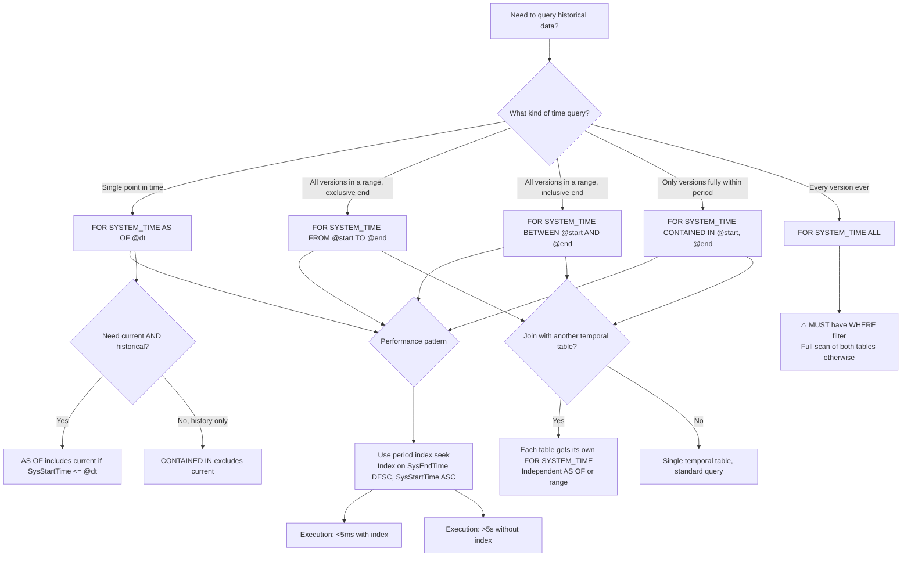

## Navigation

**Domain:** [[8 — Databases]] > **Group:** SQL Temporal Tables & Point-in-Time
**Previous:** [[8.227 — Creating System-Versioned Tables]] | **Next:** [[8.229 — AS OF — Point-in-Time Query]]

### Prerequisites

- [[8.226 — Temporal Tables — System-Versioned Concept]] — the dual-table architecture (current + history), period columns semantics, and automatic versioning mechanism are required to understand what rows the FOR SYSTEM_TIME clause enumerates.
- [[8.227 — Creating System-Versioned Tables]] — understanding how period columns are defined (GENERATED ALWAYS AS ROW START/END, DATETIME2 precision) affects the precision of FOR SYSTEM_TIME boundary evaluation.
- [[8.496 — Index Fundamentals]] — the execution plan for FOR SYSTEM_TIME queries depends critically on indexes on the period columns; without them, every temporal query scans the entire history table.

### Where This Fits

The `FOR SYSTEM_TIME` clause is the query syntax that unlocks temporal table versioning — it is the only way to see historical row versions that the engine has automatically captured. A .NET backend engineer encounters this when implementing point-in-time reporting (show the customer's address as it was when the order was placed), building audit views (show all status changes for this order), running reconciliation queries (compare data at two points in time), or satisfying compliance requests (produce a GDPR report of all data as of the deletion date). The `FOR SYSTEM_TIME` clause has five sub-clauses: `AS OF`, `FROM ... TO`, `BETWEEN ... AND`, `CONTAINED IN`, and `ALL` — each with different boundary semantics that must be precisely understood. The interview signal is high: a candidate who can explain the boundary evaluation difference between `FROM...TO` and `BETWEEN...AND` demonstrates deep understanding of temporal period algebra.

---

## Core Mental Model

The `FOR SYSTEM_TIME` clause is a table-level query hint applied after the table name (or alias) in the `FROM` clause. It modifies the row source for that specific table reference to include historical row versions from the paired history table. The clause does not change the column schema — the same columns are available from historical versions as from current rows. The engine evaluates the clause by generating a `Concatenation` operator that `UNION ALL`s the current table and history table, then applies a filter on the period columns (`SysStartTime`, `SysEndTime`) according to the sub-clause's boundary semantics. **The invariant: `FOR SYSTEM_TIME AS OF @dt` returns at most one version per primary key (the version whose period contains `@dt`); `FROM...TO`, `BETWEEN...AND`, and `CONTAINED IN` can return multiple versions per primary key (all versions whose period overlaps the query interval); `ALL` returns every version ever recorded.** The recognition pattern: `FOR SYSTEM_TIME` in a query plan appears as two separate index operations (one on the current table, one on the history table) combined by a `Concatenation` operator — never a single scan across both objects.

### Classification

`FOR SYSTEM_TIME` is a **FROM clause extension** in the query grammar (not a join, not a subquery, not a table-valued function). It belongs to the **query optimizer's plan generation** phase — the parser identifies the temporal clause, binds it to the temporal table metadata, and signals the optimizer to generate a `Concatenation` plan. Each sub-clause (`AS OF`, `FROM...TO`, `BETWEEN...AND`, `CONTAINED IN`, `ALL`) is a distinct **logical operator** that the optimizer translates to a `Filter` on the concatenated rows with period column predicates. The predicates are **SARGable** — they can use index seeks on `SysStartTime` and `SysEndTime` when those columns are indexed. The clause is **not pushed down** through joins — if a query joins two temporal tables with `FOR SYSTEM_TIME`, each table reference gets its own independent Concatenation + Filter. The clause does not affect `OUTPUT` or `FOR XML`/`JSON` — those features work normally on the historical rows returned.

```mermaid
flowchart TB
    subgraph Syntax["FOR SYSTEM_TIME Clause Variants"]
        A1[AS OF @dt] --> A1Logic["Single point in time<br/>SysStartTime <= @dt AND SysEndTime > @dt<br/>Returns one version per PK"]
        A2[FROM @start TO @end] --> A2Logic["Open range at @end<br/>SysStartTime < @end AND SysEndTime > @start<br/>Includes rows active at @start<br/>Excludes rows active after @end"]
        A3[BETWEEN @start AND @end] --> A3Logic["Inclusive range at @end<br/>SysStartTime <= @end AND SysEndTime > @start<br/>Includes rows active at @end"]
        A4[CONTAINED IN &#40;@start, @end&#41;] --> A4Logic["Fully contained<br/>SysStartTime >= @start AND SysEndTime <= @end<br/>Only versions that start and end within the window"]
        A5[ALL] --> A5Logic["All versions<br/>No period filter<br/>All current + all history rows"]
    end

    subgraph Execution["Execution Plan Generation"]
        B[Query parser identifies temporal table] --> C[Optimizer generates Concatenation]
        C --> D[Clustered Index Seek on Current Table]
        C --> E[Clustered Index Seek on History Table]
        D --> F[Filter: period columns match sub-clause]
        E --> F
        F --> G[Additional predicates from WHERE clause]
        G --> H[SELECT]
    end

    subgraph Semantics["Period Filter Semantics"]
        I[Current table: rows where SysEndTime = '9999-12-31'] --> J{Sub-clause}
        J -->|AS OF| K[Current row included if SysStartTime <= @dt]
        J -->|FROM...TO| L[Current row included if SysStartTime < @end]
        J -->|BETWEEN| M[Current row included if SysStartTime <= @end]
        J -->|CONTAINED IN| N[Current row NEVER included<br/>because SysEndTime = max date]
        J -->|ALL| O[Current row always included]
    end

    A1Logic --> B
    A2Logic --> B
    A3Logic --> B
    A4Logic --> B
    A5Logic --> B
```



### Key Properties

|Property|Value|Notes|
|---|---|---|
|Syntax position|Immediately after table name/alias|`FROM dbo.Orders FOR SYSTEM_TIME AS OF @dt AS o`|
|Row source|Concatenation of current + history tables|Always two separate scans/operations|
|Max versions per PK|AS OF: 1; FROM...TO/BETWEEN/CONTAINED IN: many; ALL: all|Depends on sub-clause|
|Current row inclusion|AS OF: maybe; FROM...TO: maybe; ALL: always; CONTAINED IN: never|SysEndTime = max date fails CONTAINED IN|
|SARGable|Yes — predicates on SysStartTime/SysEndTime|Requires index on period columns|
|EF Core methods|TemporalAsOf, TemporalAll, TemporalFromTo, TemporalContainedIn|EF Core 8+ only|
|Join behavior|Each table independently temporal|Cannot mix temporal and non-temporal in same alias|
|WITH CHECK|Not applicable|Temporal does not support CHECK option|
|OUTPUT clause|Not supported on temporal tables|Error if attempted|

---

## Deep Mechanics

### How the Engine Executes This

1. **Query parsing.** When the parser encounters `FROM dbo.Orders FOR SYSTEM_TIME AS OF @dt AS o`, it looks up `Orders` in `sys.tables` and finds `is_temporal = 1`. The parser then reads the period column IDs from `sys.temporal_history_tables` and the history table ID. The `FOR SYSTEM_TIME` keyword triggers special parsing that converts the sub-clause (`AS OF @dt`, `FROM...TO`, etc.) into internal query tree nodes representing the period filter.

2. **Binding.** The binder resolves the temporal table reference and identifies that two physical tables are involved. It creates a binding that references both the current table (for metadata like column names, types, constraints) and the history table (as the row source for non-current versions). The binder also converts the period column references to the appropriate `SysStartTime` and `SysEndTime` column IDs.

3. **Query optimization.** The optimizer generates the initial logical query tree with the temporal table as a single logical rowset. At optimization time, it expands this into: (a) a `Concatenation` (logical UNION ALL) of the current table access and the history table access, (b) a period filter on each branch corresponding to the sub-clause semantics, (c) the WHERE clause predicates from the original query. The optimizer then considers physical operators: `Clustered Index Seek`, `Index Seek` (if period index exists), or `Clustered Index Scan` (if no period index). The `Concatenation` operator preserves the order of its inputs but does not guarantee global ordering — the final result may need an additional `Sort` if an `ORDER BY` does not match the concatenation order.

4. **AS OF filter derivation.** For `AS OF @dt`, the optimizer generates: `(CurrentTable.SysStartTime <= @dt AND CurrentTable.SysEndTime > @dt) UNION ALL (HistoryTable.SysStartTime <= @dt AND HistoryTable.SysEndTime > @dt)`. The current table filter is then simplified: since `SysEndTime = '9999-12-31'` for all current rows, and `9999-12-31 > @dt` is always true, the current table filter reduces to `SysStartTime <= @dt`. This simplification is important for index design — the current table query effectively needs only an index on `SysStartTime` for AS OF queries. For the history table, both predicates are active.

5. **FROM...TO filter derivation.** For `FROM @start TO @end` (exclusive at `@end`), the optimizer generates: `(CurrentTable.SysStartTime < @end AND CurrentTable.SysEndTime > @start) UNION ALL (HistoryTable.SysStartTime < @end AND HistoryTable.SysEndTime > @start)`. For the current table, since `SysEndTime = '9999-12-31'`, the second predicate is always true (`'9999-12-31' > @start` for any reasonable @start), but `SysStartTime < @end` is still evaluated. This means current rows with `SysStartTime < @end` are included even if they were updated within the range — the current row at the end of the range is included if its start time falls within the range.

6. **BETWEEN...AND filter derivation.** For `BETWEEN @start AND @end` (inclusive at `@end`), the optimizer generates: `(CurrentTable.SysStartTime <= @end AND CurrentTable.SysEndTime > @start) UNION ALL (HistoryTable.SysStartTime <= @end AND HistoryTable.SysEndTime > @start)`. The difference from `FROM...TO` is the `<= @end` vs `< @end` on `SysStartTime`. This means a row version whose period starts exactly at `@end` IS included in `BETWEEN...AND` but is NOT included in `FROM...TO`.

7. **CONTAINED IN filter derivation.** For `CONTAINED IN (@start, @end)`, the optimizer generates: `(CurrentTable.SysStartTime >= @start AND CurrentTable.SysEndTime <= @end) UNION ALL (HistoryTable.SysStartTime >= @start AND HistoryTable.SysEndTime <= @end)`. Since current rows have `SysEndTime = '9999-12-31'`, they are excluded by the `SysEndTime <= @end` predicate (unless `@end` is also `9999-12-31`). This makes `CONTAINED IN` primarily useful for history-only queries.

8. **ALL filter.** No period filter is generated. The Concatenation reads all rows from both tables.

9. **Predicate pushdown.** The optimizer attempts to push additional WHERE clause predicates into both the current and history table access paths. For example, `WHERE CustomerId = 1001` is pushed to both branches, so each scan/seek filters on `CustomerId` before the Concatenation. However, predicates on non-period columns may not be pushed if the period index is not covering.

10. **Execution.** At execution time, the engine opens two scans/seeks (one per table), evaluates the period filter, applies the WHERE predicates, concatenates the matching rows, and returns the result set. STATISTICS IO reports separate logical reads for each table.

### SQL Visibility

```sql
-- ============================================================
-- Setup: Temporal tables for all query pattern demonstrations
-- ============================================================
CREATE TABLE dbo.Orders_History
(
    OrderId      INT              NOT NULL,
    CustomerId   INT              NOT NULL,
    OrderDate    DATETIME2(7)     NOT NULL,
    OrderStatus  NVARCHAR(20)     NOT NULL,
    TotalAmount  DECIMAL(18,2)    NOT NULL,
    SysStartTime DATETIME2(7)     NOT NULL,
    SysEndTime   DATETIME2(7)     NOT NULL
);

CREATE CLUSTERED COLUMNSTORE INDEX IX_Orders_History_CCI
    ON dbo.Orders_History;

CREATE NONCLUSTERED INDEX IX_Orders_History_Period
    ON dbo.Orders_History (SysEndTime DESC, SysStartTime ASC)
    INCLUDE (OrderId, CustomerId, OrderStatus, TotalAmount);

CREATE TABLE dbo.Orders
(
    OrderId         INT              NOT NULL IDENTITY(1,1),
    CustomerId      INT              NOT NULL,
    OrderDate       DATETIME2(7)     NOT NULL,
    OrderStatus     NVARCHAR(20)     NOT NULL DEFAULT 'Pending',
    TotalAmount     DECIMAL(18,2)    NOT NULL,
    SysStartTime    DATETIME2(7)     GENERATED ALWAYS AS ROW START NOT NULL,
    SysEndTime      DATETIME2(7)     GENERATED ALWAYS AS ROW END   NOT NULL,
    PERIOD FOR SYSTEM_TIME (SysStartTime, SysEndTime),
    CONSTRAINT PK_Orders PRIMARY KEY CLUSTERED (OrderId)
);

CREATE NONCLUSTERED INDEX IX_Orders_Period
    ON dbo.Orders (SysEndTime DESC, SysStartTime ASC)
    INCLUDE (OrderId, CustomerId, OrderStatus, TotalAmount);

ALTER TABLE dbo.Orders
    SET (SYSTEM_VERSIONING = ON (HISTORY_TABLE = dbo.Orders_History));

-- Insert seed data
INSERT INTO dbo.Orders (CustomerId, OrderDate, OrderStatus, TotalAmount)
VALUES (1001, '2024-01-15', 'Pending', 100.00),
       (1002, '2024-02-01', 'Shipped', 250.00);
GO

-- Update to create history
UPDATE dbo.Orders SET OrderStatus = 'Processing', TotalAmount = 110.00
WHERE OrderId = 1;
WAITFOR DELAY '00:00:01';

UPDATE dbo.Orders SET OrderStatus = 'Shipped', TotalAmount = 120.00
WHERE OrderId = 1;
WAITFOR DELAY '00:00:01';

UPDATE dbo.Orders SET OrderStatus = 'Delivered'
WHERE OrderId = 1;
GO

DELETE FROM dbo.Orders WHERE OrderId = 2;
GO

-- ============================================================
-- 1. FOR SYSTEM_TIME AS OF — Single point in time
-- ============================================================
-- Returns the row version that was current on Jan 20, 2024
DECLARE @PointInTime DATETIME2(7) = '2024-01-20 00:00:00';

SELECT OrderId, CustomerId, OrderStatus, TotalAmount,
       SysStartTime, SysEndTime
FROM dbo.Orders
FOR SYSTEM_TIME AS OF @PointInTime
WHERE CustomerId = 1001;

-- Result: Order 1 with Status = 'Pending', TotalAmount = 100.00
-- (The first update to 'Processing' happened after Jan 20)

-- ============================================================
-- 2. FOR SYSTEM_TIME FROM...TO — Open range at @end
-- ============================================================
-- Returns all versions active during the period, including at @start
-- Excludes versions that start at or after @end
DECLARE @StartTime DATETIME2(7) = '2024-01-15 00:00:00';
DECLARE @EndTime   DATETIME2(7) = '2024-02-01 00:00:00';

SELECT OrderId, CustomerId, OrderStatus, TotalAmount,
       SysStartTime, SysEndTime
FROM dbo.Orders
FOR SYSTEM_TIME FROM @StartTime TO @EndTime
WHERE CustomerId = 1001
ORDER BY SysStartTime;

-- Result: Order 1 versions where SysStartTime < @EndTime
-- Includes 'Pending' (started Jan 15, ended ~Jan 20)
-- Includes 'Processing' (started ~Jan 20, ended after update)
-- Does NOT include any version that started on or after Feb 1

-- ============================================================
-- 3. FOR SYSTEM_TIME BETWEEN...AND — Inclusive at @end
-- ============================================================
DECLARE @StartTime DATETIME2(7) = '2024-01-15 00:00:00';
DECLARE @EndTime   DATETIME2(7) = '2024-02-01 00:00:00';

SELECT OrderId, CustomerId, OrderStatus, TotalAmount,
       SysStartTime, SysEndTime
FROM dbo.Orders
FOR SYSTEM_TIME BETWEEN @StartTime AND @EndTime
WHERE CustomerId = 1001
ORDER BY SysStartTime;

-- Result: Same as FROM...TO but ALSO includes versions where
-- SysStartTime <= @EndTime (inclusive)
-- If a version started exactly at 2024-02-01, it IS included

-- ============================================================
-- 4. FOR SYSTEM_TIME CONTAINED IN — Fully contained
-- ============================================================
DECLARE @StartTime DATETIME2(7) = '2024-01-15 00:00:00';
DECLARE @EndTime   DATETIME2(7) = '2024-02-01 00:00:00';

SELECT OrderId, CustomerId, OrderStatus, TotalAmount,
       SysStartTime, SysEndTime
FROM dbo.Orders
FOR SYSTEM_TIME CONTAINED IN (@StartTime, @EndTime)
WHERE CustomerId = 1001
ORDER BY SysStartTime;

-- Result: Only versions where SysStartTime >= @StartTime AND SysEndTime <= @EndTime
-- Current row (SysEndTime = '9999-12-31') is EXCLUDED
-- Only fully-contained history versions returned

-- ============================================================
-- 5. FOR SYSTEM_TIME ALL — Every version ever
-- ============================================================
SELECT OrderId, CustomerId, OrderStatus, TotalAmount,
       SysStartTime, SysEndTime
FROM dbo.Orders
FOR SYSTEM_TIME ALL
WHERE CustomerId = 1001
ORDER BY SysStartTime DESC;

-- Result: All versions of Order 1 (current + all history)
-- Plus the current version of Order 2 is included before deletion

-- ============================================================
-- 6. FOR SYSTEM_TIME with table alias (recommended)
-- ============================================================
SELECT o.OrderId, o.OrderStatus, o.TotalAmount
FROM dbo.Orders FOR SYSTEM_TIME AS OF '2024-01-20' AS o
WHERE o.CustomerId = 1001;

-- ============================================================
-- 7. FOR SYSTEM_TIME in joins
-- ============================================================
-- Each table gets its own independent temporal filter
SELECT
    o.OrderId,
    o.OrderStatus AS OrderStatusAtTime,
    oi.Quantity,
    oi.UnitPrice
FROM dbo.Orders FOR SYSTEM_TIME AS OF '2024-01-20' AS o
JOIN dbo.OrderItems FOR SYSTEM_TIME AS OF '2024-01-20' AS oi
    ON o.OrderId = oi.OrderId
WHERE o.CustomerId = 1001;

-- ============================================================
-- 8. FOR SYSTEM_TIME with aggregation
-- ============================================================
-- Count how many versions each order had during a period
SELECT
    OrderId,
    COUNT(*) AS VersionCount,
    MIN(SysStartTime) AS FirstVersion,
    MAX(SysEndTime) AS LastVersion
FROM dbo.Orders
FOR SYSTEM_TIME ALL
WHERE CustomerId = 1001
GROUP BY OrderId
ORDER BY VersionCount DESC;

-- ============================================================
-- 9. Detecting deletions with FOR SYSTEM_TIME
-- ============================================================
-- Find orders that existed yesterday but do not exist today
DECLARE @Yesterday DATETIME2(7) = DATEADD(DAY, -1, SYSUTCDATETIME());
DECLARE @Today     DATETIME2(7) = SYSUTCDATETIME();

SELECT 'Deleted' AS ChangeType, *
FROM dbo.Orders FOR SYSTEM_TIME AS OF @Yesterday
WHERE OrderId NOT IN (
    SELECT OrderId FROM dbo.Orders FOR SYSTEM_TIME AS OF @Today
);

-- ============================================================
-- 10. FOR SYSTEM_TIME with APPLY
-- ============================================================
-- For each customer, show their orders as of the start of the month
SELECT DISTINCT
    c.CustomerId,
    o.OrderId,
    o.OrderStatus,
    o.TotalAmount
FROM dbo.Customers c
CROSS APPLY (
    SELECT TOP 1 o.OrderId, o.OrderStatus, o.TotalAmount
    FROM dbo.Orders FOR SYSTEM_TIME AS OF '2024-06-01' AS o
    WHERE o.CustomerId = c.CustomerId
    ORDER BY o.OrderDate DESC
) o;
```

```csharp
// EF Core 8+ — all FOR SYSTEM_TIME variants
public sealed class TemporalQueryService
{
    private readonly ApplicationDbContext _dbContext;

    public TemporalQueryService(ApplicationDbContext dbContext)
        => _dbContext = dbContext;

    // TemporalAsOf — corresponds to FOR SYSTEM_TIME AS OF
    public async Task<List<Order>> GetOrdersAsOfAsync(
        DateTime pointInTime,
        CancellationToken cancellationToken = default)
    {
        return await _dbContext.Orders
            .TemporalAsOf(pointInTime)
            .Where(o => o.CustomerId == 1001)
            .OrderBy(o => o.OrderId)
            .ToListAsync(cancellationToken);
    }

    // TemporalAll — corresponds to FOR SYSTEM_TIME ALL
    public async Task<List<Order>> GetAllVersionsAsync(
        int orderId,
        CancellationToken cancellationToken = default)
    {
        return await _dbContext.Orders
            .TemporalAll()
            .Where(o => o.OrderId == orderId)
            .OrderByDescending(o => o.SysStartTime)
            .ToListAsync(cancellationToken);
    }

    // TemporalFromTo — corresponds to FOR SYSTEM_TIME FROM...TO
    public async Task<List<Order>> GetHistoryFromToAsync(
        DateTime from,
        DateTime to,
        CancellationToken cancellationToken = default)
    {
        return await _dbContext.Orders
            .TemporalFromTo(from, to)
            .Where(o => o.CustomerId == 1001)
            .OrderBy(o => o.SysStartTime)
            .ToListAsync(cancellationToken);
    }

    // TemporalContainedIn — corresponds to FOR SYSTEM_TIME CONTAINED IN
    public async Task<List<Order>> GetHistoryContainedInAsync(
        DateTime from,
        DateTime to,
        CancellationToken cancellationToken = default)
    {
        return await _dbContext.Orders
            .TemporalContainedIn(from, to)
            .OrderBy(o => o.SysStartTime)
            .ToListAsync(cancellationToken);
    }

    // TemporalBetween — EF Core does NOT have TemporalBetween
    // Use TemporalFromTo + manual boundary adjustment or raw SQL
    public async Task<List<Order>> GetHistoryBetweenAsync(
        DateTime from,
        DateTime to,
        CancellationToken cancellationToken = default)
    {
        const string sql = @"
            SELECT OrderId, CustomerId, OrderDate, OrderStatus, TotalAmount,
                   SysStartTime, SysEndTime
            FROM dbo.Orders
            FOR SYSTEM_TIME BETWEEN @From AND @To
            WHERE CustomerId = @CustomerId
            ORDER BY SysStartTime";

        return await _dbContext.Orders
            .FromSqlRaw(sql,
                new SqlParameter("@From", from),
                new SqlParameter("@To", to),
                new SqlParameter("@CustomerId", 1001))
            .ToListAsync(cancellationToken);
    }

    // Multiple temporal tables in one query
    public async Task<OrderSnapshot> GetOrderSnapshotAsync(
        int orderId,
        DateTime pointInTime,
        CancellationToken cancellationToken = default)
    {
        var order = await _dbContext.Orders
            .TemporalAsOf(pointInTime)
            .FirstOrDefaultAsync(o => o.OrderId == orderId, cancellationToken);

        if (order is null) return null!;

        var items = await _dbContext.OrderItems
            .TemporalAsOf(pointInTime)
            .Where(oi => oi.OrderId == orderId)
            .ToListAsync(cancellationToken);

        return new OrderSnapshot(order, items);
    }

    // Detect deleted orders between two timestamps
    public async Task<List<Order>> GetDeletedOrdersAsync(
        DateTime fromDate,
        DateTime toDate,
        CancellationToken cancellationToken = default)
    {
        var fromOrders = await _dbContext.Orders
            .TemporalAsOf(fromDate)
            .ToListAsync(cancellationToken);

        var toOrders = await _dbContext.Orders
            .TemporalAsOf(toDate)
            .ToListAsync(cancellationToken);

        var toIds = toOrders.Select(o => o.OrderId).ToHashSet();
        return fromOrders.Where(o => !toIds.Contains(o.OrderId)).ToList();
    }

    // Count versions per order
    public async Task<List<OrderVersionCount>> GetVersionCountsAsync(
        CancellationToken cancellationToken = default)
    {
        return await _dbContext.Orders
            .TemporalAll()
            .GroupBy(o => o.OrderId)
            .Select(g => new OrderVersionCount(
                g.Key,
                g.Count(),
                g.Min(o => o.SysStartTime),
                g.Max(o => o.SysEndTime)))
            .OrderByDescending(v => v.VersionCount)
            .Take(100)
            .ToListAsync(cancellationToken);
    }
}

public sealed record OrderSnapshot(Order Order, List<OrderItem> Items);
public sealed record OrderVersionCount(
    int OrderId, int VersionCount, DateTime FirstVersion, DateTime LastVersion);
```

```csharp
// Dapper — all FOR SYSTEM_TIME variants via raw SQL
public sealed class TemporalQueryDapperRepository
{
    private readonly IDbConnectionFactory _connectionFactory;

    public TemporalQueryDapperRepository(IDbConnectionFactory connectionFactory)
        => _connectionFactory = connectionFactory;

    public async Task<IReadOnlyList<Order>> GetOrdersAsOfAsync(
        DateTime pointInTime,
        int? customerId = null,
        CancellationToken cancellationToken = default)
    {
        var sql = @"
            SELECT OrderId, CustomerId, OrderDate, OrderStatus, TotalAmount,
                   SysStartTime, SysEndTime
            FROM dbo.Orders FOR SYSTEM_TIME AS OF @PointInTime AS o";

        if (customerId.HasValue)
            sql += " WHERE o.CustomerId = @CustomerId";

        sql += " ORDER BY o.OrderId";

        await using var connection = _connectionFactory.Create();

        var results = await connection.QueryAsync<Order>(
            new CommandDefinition(sql,
                new { PointInTime = pointInTime, CustomerId = customerId },
                cancellationToken: cancellationToken));

        return results.AsList();
    }

    public async Task<IReadOnlyList<Order>> GetAllVersionsAsync(
        int orderId,
        CancellationToken cancellationToken = default)
    {
        const string sql = @"
            SELECT OrderId, CustomerId, OrderDate, OrderStatus, TotalAmount,
                   SysStartTime, SysEndTime
            FROM dbo.Orders FOR SYSTEM_TIME ALL
            WHERE OrderId = @OrderId
            ORDER BY SysStartTime DESC";

        await using var connection = _connectionFactory.Create();

        var results = await connection.QueryAsync<Order>(
            new CommandDefinition(sql,
                new { OrderId = orderId },
                cancellationToken: cancellationToken));

        return results.AsList();
    }

    public async Task<IReadOnlyList<Order>> GetOrdersFromToAsync(
        DateTime from,
        DateTime to,
        int? customerId = null,
        CancellationToken cancellationToken = default)
    {
        var sql = @"
            SELECT OrderId, CustomerId, OrderDate, OrderStatus, TotalAmount,
                   SysStartTime, SysEndTime
            FROM dbo.Orders FOR SYSTEM_TIME FROM @FromTime TO @ToTime AS o";

        if (customerId.HasValue)
            sql += " WHERE o.CustomerId = @CustomerId";

        sql += " ORDER BY o.SysStartTime";

        await using var connection = _connectionFactory.Create();

        var results = await connection.QueryAsync<Order>(
            new CommandDefinition(sql,
                new { FromTime = from, ToTime = to, CustomerId = customerId },
                cancellationToken: cancellationToken));

        return results.AsList();
    }

    public async Task<IReadOnlyList<Order>> GetOrdersContainedInAsync(
        DateTime from,
        DateTime to,
        CancellationToken cancellationToken = default)
    {
        const string sql = @"
            SELECT OrderId, CustomerId, OrderDate, OrderStatus, TotalAmount,
                   SysStartTime, SysEndTime
            FROM dbo.Orders FOR SYSTEM_TIME CONTAINED IN (@FromTime, @ToTime)
            ORDER BY SysStartTime";

        await using var connection = _connectionFactory.Create();

        var results = await connection.QueryAsync<Order>(
            new CommandDefinition(sql,
                new { FromTime = from, ToTime = to },
                cancellationToken: cancellationToken));

        return results.AsList();
    }

    public async Task<IReadOnlyList<Order>> GetOrdersBetweenAsync(
        DateTime from,
        DateTime to,
        CancellationToken cancellationToken = default)
    {
        const string sql = @"
            SELECT OrderId, CustomerId, OrderDate, OrderStatus, TotalAmount,
                   SysStartTime, SysEndTime
            FROM dbo.Orders FOR SYSTEM_TIME BETWEEN @FromTime AND @ToTime
            ORDER BY SysStartTime";

        await using var connection = _connectionFactory.Create();

        var results = await connection.QueryAsync<Order>(
            new CommandDefinition(sql,
                new { FromTime = from, ToTime = to },
                cancellationToken: cancellationToken));

        return results.AsList();
    }
}
```

### Generated SQL (from EF Core logs)

```sql
-- EF Core TemporalAsOf generates:
exec sp_executesql N'SELECT [o].[OrderId], [o].[CustomerId], [o].[OrderDate],
    [o].[OrderStatus], [o].[TotalAmount], [o].[SysStartTime], [o].[SysEndTime]
FROM [dbo].[Orders] FOR SYSTEM_TIME AS OF @p0 AS [o]
WHERE [o].[CustomerId] = @p1
ORDER BY [o].[OrderId]',
N'@p0 datetime2(7),@p1 int',
@p0='2024-06-15T00:00:00',@p1=1001;

-- EF Core TemporalAll generates:
exec sp_executesql N'SELECT [o].[OrderId], [o].[CustomerId], [o].[OrderDate],
    [o].[OrderStatus], [o].[TotalAmount], [o].[SysStartTime], [o].[SysEndTime]
FROM [dbo].[Orders] FOR SYSTEM_TIME ALL AS [o]
WHERE [o].[OrderId] = @p0
ORDER BY [o].[SysStartTime] DESC',
N'@p0 int',@p0=1;

-- EF Core TemporalFromTo generates:
exec sp_executesql N'SELECT [o].[OrderId], [o].[CustomerId], [o].[OrderDate],
    [o].[OrderStatus], [o].[TotalAmount], [o].[SysStartTime], [o].[SysEndTime]
FROM [dbo].[Orders] FOR SYSTEM_TIME FROM @p0 TO @p1 AS [o]
WHERE [o].[CustomerId] = @p2
ORDER BY [o].[SysStartTime]',
N'@p0 datetime2(7),@p1 datetime2(7),@p2 int',
@p0='2024-01-01T00:00:00',@p1='2024-03-01T00:00:00',@p2=1001;

-- EF Core TemporalContainedIn generates:
exec sp_executesql N'SELECT [o].[OrderId], [o].[CustomerId], [o].[OrderDate],
    [o].[OrderStatus], [o].[TotalAmount], [o].[SysStartTime], [o].[SysEndTime]
FROM [dbo].[Orders] FOR SYSTEM_TIME CONTAINED IN (@p0, @p1) AS [o]
ORDER BY [o].[SysStartTime]',
N'@p0 datetime2(7),@p1 datetime2(7)',
@p0='2024-01-01T00:00:00',@p1='2024-03-01T00:00:00';
```

### Execution Plan Analysis

**For `FOR SYSTEM_TIME AS OF @dt`:**

```
Expected plan shape (with period indexes on both tables):
|--Clustered Index Seek (Orders, PK_Orders, seek: OrderId range)
   |--Nested Loops (Left Semi Join or Inner Join based on predicate placement)
      |--Index Seek (Orders_History, IX_Orders_History_Period)
      |  Seek Predicate: SysEndTime > @dt AND SysStartTime <= @dt
      |  Predicate pushed to seek because of period index
      |--Concatenation
         |--Index Seek (Orders, IX_Orders_Period)
         |  Seek Predicate: SysStartTime <= @dt
         |  (SysEndTime > @dt is always true for current rows)
         |--Filter (additional WHERE predicates)

Simpler plan (without period index):
|--Concatenation
   |--Filter (WHERE: SysStartTime <= @dt AND SysEndTime > @dt)
   |  |--Clustered Index Scan (Orders_History, no seek possible)
   |--Filter (WHERE: SysStartTime <= @dt)
   |  |--Clustered Index Scan (Orders, no seek possible)
   |--Filter (WHERE: CustomerId = 1001)
      |--SELECT
```

**Key operator details:**
- `Concatenation` operator: combines rows from the current table and history table. Estimated cost is typically 50% per branch. The operator does not guarantee ordering of the combined result.
- `Filter` on period columns: the period predicates are applied AFTER the scan/seek because they are not part of the index key in the default PK-only configuration. With a covering period index, the predicates become part of the Seek predicate, eliminating the Filter operator.
- Estimated cost distribution: With period indexes, the history table seek costs ~10% of the total plan cost (because the index narrows the search to relevant versions). Without period indexes, the history table scan dominates at ~80% of the plan cost.

**For `FOR SYSTEM_TIME ALL`:**
```
Expected plan shape:
|--Concatenation
   |--Clustered Index Scan (Orders_PK) -- all current rows
   |--Clustered Index Scan (Orders_History) -- all history rows
   |--Filter (WHERE predicates)
      |--SELECT
```

The `ALL` plan has no period Filter. Both tables are scanned entirely. The plan cost is proportional to the sum of the sizes of both tables.

**For `FOR SYSTEM_TIME FROM...TO`:**
```
Expected plan shape (with period indexes):
|--Concatenation
   |--Index Seek (Orders_History, IX_Orders_History_Period)
   |  Seek Predicate: SysStartTime < @end AND SysEndTime > @start
   |--Index Seek (Orders, IX_Orders_Period)
   |  Seek Predicate: SysStartTime < @end (SysEndTime > @start always true)
   |--Filter (additional WHERE)
      |--SELECT
```

### Cost Visibility

```sql
SET STATISTICS IO ON;
SET STATISTICS TIME ON;

-- ============================================================
-- Test 1: AS OF with period index
-- ============================================================
DECLARE @dt DATETIME2(7) = '2024-06-15 00:00:00';

SELECT COUNT(*) AS OrderCount
FROM dbo.Orders
FOR SYSTEM_TIME AS OF @dt
WHERE CustomerId = 1001;

-- Expected output (with period index, 100K history rows):
-- Table 'Orders_History'. Scan count 1, logical reads 4
-- Table 'Orders'. Scan count 1, logical reads 2
-- SQL Server Execution Times: CPU time = 0ms, elapsed time = 1ms

-- ============================================================
-- Test 2: AS OF without period index
-- ============================================================
-- Drop period indexes to show the difference
DROP INDEX IX_Orders_History_Period ON dbo.Orders_History;
DROP INDEX IX_Orders_Period ON dbo.Orders;

DECLARE @dt2 DATETIME2(7) = '2024-06-15 00:00:00';

SELECT COUNT(*) AS OrderCount
FROM dbo.Orders
FOR SYSTEM_TIME AS OF @dt2
WHERE CustomerId = 1001;

-- Expected output (no period index, 100K history rows):
-- Table 'Orders_History'. Scan count 1, logical reads 4500
-- Table 'Orders'. Scan count 1, logical reads 120
-- SQL Server Execution Times: CPU time = 45ms, elapsed time = 50ms

-- ============================================================
-- Test 3: ALL with 1M history rows
-- ============================================================
SELECT COUNT(*) AS TotalVersions
FROM dbo.Orders
FOR SYSTEM_TIME ALL;

-- Expected output:
-- Table 'Orders_History'. Scan count 1, logical reads 125000  (1M row heap)
-- Table 'Orders'. Scan count 1, logical reads 120
-- CPU time = 450ms, elapsed time = 500ms
-- (With columnstore: logical reads ~3500)

-- ============================================================
-- Test 4: FROM...TO range query performance
-- ============================================================
DECLARE @start DATETIME2(7) = '2024-01-01 00:00:00';
DECLARE @end   DATETIME2(7) = '2024-03-01 00:00:00';

SELECT COUNT(*) AS RangeVersions
FROM dbo.Orders
FOR SYSTEM_TIME FROM @start TO @end
WHERE CustomerId = 1001;

-- Expected output (with period index):
-- Table 'Orders_History'. Scan count 1, logical reads 12
-- Table 'Orders'. Scan count 1, logical reads 2
-- CPU time = 1ms, elapsed time = 2ms

-- ============================================================
-- Test 5: CONTAINED IN — history only
-- ============================================================
SELECT COUNT(*) AS ContainedVersions
FROM dbo.Orders
FOR SYSTEM_TIME CONTAINED IN ('2024-01-01', '2024-06-01')
WHERE CustomerId = 1001;

-- Expected output: only history rows (current is excluded)
-- Table 'Orders_History'. Scan count 1, logical reads 6
-- Table 'Orders'. Scan count 0, logical reads 0
-- (Current table may still be probed but returns no rows)
```

### Failure Modes

**Using local time instead of UTC in the FOR SYSTEM_TIME parameter:** The period columns store UTC timestamps. Passing a local time (e.g., `'2024-06-15 10:30:00'` EST instead of UTC) shifts the query window by the timezone offset, causing incorrect results.

```sql
-- ❌ Local time parameter shifts the AS OF window
DECLARE @LocalTime DATETIME2(7) = '2024-06-15 10:30:00';  -- Thinking EST (UTC-5)
SELECT * FROM dbo.Orders FOR SYSTEM_TIME AS OF @LocalTime;
-- Actually queries AS OF 10:30 UTC = 5:30 AM EST
-- If the data was updated at 8:00 AM EST (13:00 UTC), this query sees the OLD version

-- ✅ Always use UTC
DECLARE @UtcTime DATETIME2(7) = '2024-06-15 15:30:00';  -- 10:30 AM EST in UTC
SELECT * FROM dbo.Orders FOR SYSTEM_TIME AS OF @UtcTime;

-- ✅ Or convert in the query
DECLARE @LocalTime DATETIME2(7) = '2024-06-15 10:30:00';
SELECT * FROM dbo.Orders
FOR SYSTEM_TIME AS OF @LocalTime AT TIME ZONE 'Eastern Standard Time' AT TIME ZONE 'UTC';
```

**FOR SYSTEM_TIME after a table alias without parentheses:** The `FOR SYSTEM_TIME` clause must appear after the table name but before the alias. Wrong order causes a syntax error.

```sql
-- ❌ Wrong: alias before FOR SYSTEM_TIME
SELECT * FROM dbo.Orders AS o FOR SYSTEM_TIME AS OF @dt;
-- Msg 102, Level 15: Incorrect syntax near 'FOR'.

-- ✅ Correct: FOR SYSTEM_TIME before alias
SELECT * FROM dbo.Orders FOR SYSTEM_TIME AS OF @dt AS o;

-- ✅ Also correct: no alias
SELECT * FROM dbo.Orders FOR SYSTEM_TIME AS OF @dt;
```

**FOR SYSTEM_TIME with ORDER BY on non-indexed column causes sort:** When the query orders by a column that is not indexed on the Concatenation output, SQL Server must sort the combined result from both tables.

```sql
-- ❌ ORDER BY on non-indexed column — Sort operator added
SELECT * FROM dbo.Orders FOR SYSTEM_TIME ALL
ORDER BY OrderDate DESC;
-- Plan adds a Sort operator consuming all rows from Concatenation

-- ✅ ORDER BY on clustered key — no extra sort (Concatenation preserves input order)
SELECT * FROM dbo.Orders FOR SYSTEM_TIME ALL
ORDER BY OrderId;
-- No sort needed because both tables are read in OrderId order
```

**FOR SYSTEM_TIME AS OF returns zero rows when timestamp precision is too coarse:** If the period columns use `DATETIME2(0)` (1-second precision) and the parameter has higher precision, the boundary check can miss rows.

```sql
-- ❌ Period columns: DATETIME2(0)
-- Parameter: DATETIME2(7) with fractional seconds
DECLARE @dt DATETIME2(7) = '2024-06-15 10:30:00.1234567';
SELECT * FROM dbo.Orders_LowPrecision FOR SYSTEM_TIME AS OF @dt;
-- The query looks for SysStartTime <= @dt AND SysEndTime > @dt
-- But SysStartTime is truncated to seconds: 2024-06-15 10:30:00.0
-- If the row started at 10:30:00.5, SysStartTime = 10:30:01.0 (rounded up)
-- So @dt = 10:30:00.123 < SysStartTime = 10:30:01.0 — row is missed!

-- ✅ Match precision: both DATETIME2(7)
```

**FOR SYSTEM_TIME with joins on non-temporal tables works but may surprise:** Joining a temporal table to a non-temporal table means the non-temporal table shows its current state, not its historical state. This mismatch is a common source of bugs.

```sql
-- ❌ Join temporal Orders with non-temporal Customers
-- The Orders are as of Jan 20, but Customers shows current data
SELECT o.OrderStatus, c.FullName
FROM dbo.Orders FOR SYSTEM_TIME AS OF '2024-01-20' AS o
JOIN dbo.Customers c ON o.CustomerId = c.CustomerId;
-- If Customer's address changed on Jan 25, the order's shipping address
-- from Jan 20 is different from the current address — but this query
-- shows the current address, leading to incorrect shipping.

-- ✅ Both tables should be temporal for audit-accurate joins
SELECT o.OrderStatus, c.FullName, c.ShippingAddress
FROM dbo.Orders FOR SYSTEM_TIME AS OF '2024-01-20' AS o
JOIN dbo.Customers FOR SYSTEM_TIME AS OF '2024-01-20' AS c
    ON o.CustomerId = c.CustomerId;
```

---

## Production Patterns and Implementation

### Primary SQL Implementation

```sql
-- ============================================================
-- Pattern 1: Point-in-time report — orders as of yesterday close
-- ============================================================
DECLARE @ReportDate DATETIME2(7) = '2024-06-30 23:59:59.9999999';

SELECT
    o.OrderId,
    o.CustomerId,
    o.OrderStatus,
    o.TotalAmount,
    o.SysStartTime AS RecordedAt
FROM dbo.Orders
FOR SYSTEM_TIME AS OF @ReportDate AS o
WHERE o.OrderStatus NOT IN ('Cancelled', 'Refunded')
ORDER BY o.CustomerId, o.OrderId;

-- ============================================================
-- Pattern 2: Change history for a specific order
-- ============================================================
SELECT
    o.OrderId,
    o.OrderStatus,
    o.TotalAmount,
    o.SysStartTime AS ChangedAt,
    DATEDIFF(MINUTE,
        o.SysStartTime,
        LEAD(o.SysStartTime) OVER (ORDER BY o.SysStartTime)
    ) AS DurationMinutes
FROM dbo.Orders
FOR SYSTEM_TIME ALL
WHERE o.OrderId = 1001
ORDER BY o.SysStartTime DESC;

-- ============================================================
-- Pattern 3: Full temporal join between two temporal tables
-- ============================================================
-- Show order details and their line items as of the order date
SELECT
    o.OrderId,
    o.OrderStatus,
    o.TotalAmount,
    oi.ProductId,
    oi.Quantity,
    oi.UnitPrice,
    (oi.Quantity * oi.UnitPrice) AS LineTotal
FROM dbo.Orders FOR SYSTEM_TIME AS OF '2024-06-15' AS o
JOIN dbo.OrderItems FOR SYSTEM_TIME AS OF '2024-06-15' AS oi
    ON o.OrderId = oi.OrderId
WHERE o.CustomerId = 1001
ORDER BY o.OrderId, oi.ProductId;

-- ============================================================
-- Pattern 4: Detect what changed between two timestamps
-- ============================================================
WITH BeforeSnapshot AS (
    SELECT OrderId, OrderStatus, TotalAmount
    FROM dbo.Orders FOR SYSTEM_TIME AS OF '2024-01-01'
),
AfterSnapshot AS (
    SELECT OrderId, OrderStatus, TotalAmount
    FROM dbo.Orders FOR SYSTEM_TIME AS OF '2024-06-01'
)
SELECT
    COALESCE(b.OrderId, a.OrderId) AS OrderId,
    CASE
        WHEN b.OrderId IS NULL THEN 'Created'
        WHEN a.OrderId IS NULL THEN 'Deleted'
        WHEN b.TotalAmount <> a.TotalAmount THEN 'AmountChanged'
        WHEN b.OrderStatus <> a.OrderStatus THEN 'StatusChanged'
        ELSE 'Unchanged'
    END AS ChangeType,
    b.OrderStatus AS OldStatus,
    a.OrderStatus AS NewStatus,
    b.TotalAmount AS OldAmount,
    a.TotalAmount AS NewAmount
FROM BeforeSnapshot b
FULL OUTER JOIN AfterSnapshot a ON b.OrderId = a.OrderId
WHERE b.OrderId IS NULL
   OR a.OrderId IS NULL
   OR b.TotalAmount <> a.TotalAmount
   OR b.OrderStatus <> a.OrderStatus
ORDER BY ChangeType, OrderId;

-- ============================================================
-- Pattern 5: Range query for analytics (FROM...TO)
-- ============================================================
-- All order versions active during Q1 2024
SELECT
    o.OrderId,
    o.OrderStatus,
    o.TotalAmount,
    o.SysStartTime AS ActiveFrom,
    o.SysEndTime AS ActiveTo,
    DATEDIFF(DAY, o.SysStartTime, o.SysEndTime) AS ActiveDays
FROM dbo.Orders
FOR SYSTEM_TIME FROM '2024-01-01' TO '2024-04-01'
WHERE CustomerId = 1001
ORDER BY o.SysStartTime;

-- ============================================================
-- Pattern 6: Contained in window — clean history analysis
-- ============================================================
-- All versions that started AND ended within Q1 2024
-- (excludes current rows, excludes versions that span beyond Q1)
SELECT
    o.OrderId,
    o.OrderStatus,
    o.TotalAmount,
    o.SysStartTime,
    o.SysEndTime
FROM dbo.Orders
FOR SYSTEM_TIME CONTAINED IN ('2024-01-01', '2024-04-01')
ORDER BY o.SysStartTime;

-- ============================================================
-- Pattern 7: ALL with pagination
-- ============================================================
DECLARE @PageSize INT = 50;
DECLARE @PageNum INT = 1;

SELECT *
FROM (
    SELECT *,
        ROW_NUMBER() OVER (ORDER BY SysStartTime DESC, OrderId) AS RowNum
    FROM dbo.Orders
    FOR SYSTEM_TIME ALL
    WHERE CustomerId = 1001
) AS Paginated
WHERE RowNum BETWEEN (@PageNum - 1) * @PageSize + 1 AND @PageNum * @PageSize
ORDER BY RowNum;

-- ============================================================
-- Pattern 8: Verify FOR SYSTEM_TIME across precision boundaries
-- ============================================================
-- Check for exact boundary conditions
DECLARE @TestTime DATETIME2(7) = '2024-06-15 10:30:00.0000000';

SELECT
    'Before boundary' AS Test,
    COUNT(*) AS RowCount
FROM dbo.Orders
FOR SYSTEM_TIME AS OF DATEADD(NANOSECOND, -100, @TestTime)

UNION ALL

SELECT
    'At boundary' AS Test,
    COUNT(*) AS RowCount
FROM dbo.Orders
FOR SYSTEM_TIME AS OF @TestTime

UNION ALL

SELECT
    'After boundary' AS Test,
    COUNT(*) AS RowCount
FROM dbo.Orders
FOR SYSTEM_TIME AS OF DATEADD(NANOSECOND, 100, @TestTime);
```

### EF Core Implementation

```csharp
// EF Core 8+ temporal querying patterns
public sealed class OrderTemporalService
{
    private readonly ApplicationDbContext _dbContext;

    public OrderTemporalService(ApplicationDbContext dbContext)
        => _dbContext = dbContext;

    // Comprehensive temporal query with all variants
    public async Task<TemporalReport> GenerateTemporalReportAsync(
        int customerId,
        DateTime reportDate,
        CancellationToken cancellationToken = default)
    {
        // Current state
        var currentOrders = await _dbContext.Orders
            .Where(o => o.CustomerId == customerId)
            .ToListAsync(cancellationToken);

        // State at report date
        var ordersAtDate = await _dbContext.Orders
            .TemporalAsOf(reportDate)
            .Where(o => o.CustomerId == customerId)
            .OrderBy(o => o.OrderId)
            .ToListAsync(cancellationToken);

        // All history for the date range
        var allVersions = await _dbContext.Orders
            .TemporalAll()
            .Where(o => o.CustomerId == customerId)
            .OrderByDescending(o => o.SysStartTime)
            .ToListAsync(cancellationToken);

        // History in a specific range (FROM...TO)
        var rangeHistory = await _dbContext.Orders
            .TemporalFromTo(
                reportDate.AddMonths(-1),
                reportDate)
            .Where(o => o.CustomerId == customerId)
            .ToListAsync(cancellationToken);

        return new TemporalReport(
            currentOrders, ordersAtDate, allVersions, rangeHistory);
    }

    // Temporal join (two temporal tables)
    public async Task<List<OrderWithItems>> GetOrderWithItemsAsOfAsync(
        DateTime pointInTime,
        CancellationToken cancellationToken = default)
    {
        // EF Core 8 cannot temporal-join in a single query
        // Must load separately
        var orders = await _dbContext.Orders
            .TemporalAsOf(pointInTime)
            .Where(o => o.CustomerId == 1001)
            .ToListAsync(cancellationToken);

        var orderIds = orders.Select(o => o.OrderId).ToList();

        var items = await _dbContext.OrderItems
            .TemporalAsOf(pointInTime)
            .Where(oi => orderIds.Contains(oi.OrderId))
            .ToListAsync(cancellationToken);

        // Assemble manually
        return orders.Select(o => new OrderWithItems(
            o, items.Where(i => i.OrderId == o.OrderId).ToList())).ToList();
    }

    // Temporal change detection
    public async Task<List<OrderChange>> DetectChangesAsync(
        DateTime fromDate,
        DateTime toDate,
        CancellationToken cancellationToken = default)
    {
        var fromOrders = await _dbContext.Orders
            .TemporalAsOf(fromDate)
            .ToListAsync(cancellationToken);

        var toOrders = await _dbContext.Orders
            .TemporalAsOf(toDate)
            .ToListAsync(cancellationToken);

        var fromMap = fromOrders.ToDictionary(o => o.OrderId);
        var toMap = toOrders.ToDictionary(o => o.OrderId);

        var changes = new List<OrderChange>();

        foreach (var (id, from) in fromMap)
        {
            if (!toMap.TryGetValue(id, out var to))
            {
                changes.Add(new OrderChange(id, "Deleted", from.OrderStatus, null,
                    from.TotalAmount, null));
            }
            else if (from.OrderStatus != to.OrderStatus ||
                     from.TotalAmount != to.TotalAmount)
            {
                changes.Add(new OrderChange(id, "Modified",
                    from.OrderStatus, to.OrderStatus,
                    from.TotalAmount, to.TotalAmount));
            }
        }

        foreach (var (id, to) in toMap)
        {
            if (!fromMap.ContainsKey(id))
            {
                changes.Add(new OrderChange(id, "Created", null, to.OrderStatus,
                    null, to.TotalAmount));
            }
        }

        return changes;
    }

    // Temporal raw SQL for BETWEEN...AND (not supported by EF Core)
    public async Task<List<Order>> GetBetweenAsync(
        DateTime from,
        DateTime to,
        CancellationToken cancellationToken = default)
    {
        return await _dbContext.Orders
            .FromSqlRaw(
                "SELECT * FROM dbo.Orders FOR SYSTEM_TIME BETWEEN {0} AND {1}",
                from, to)
            .ToListAsync(cancellationToken);
    }
}

public sealed record TemporalReport(
    List<Order> CurrentOrders,
    List<Order> OrdersAtDate,
    List<Order> AllVersions,
    List<Order> RangeHistory);

public sealed record OrderWithItems(Order Order, List<OrderItem> Items);

public sealed record OrderChange(
    int OrderId,
    string ChangeType,
    string? OldStatus,
    string? NewStatus,
    decimal? OldAmount,
    decimal? NewAmount);
```

### Dapper Implementation

```csharp
public sealed class TemporalDapperQueryService
{
    private readonly IDbConnectionFactory _connectionFactory;

    public TemporalDapperQueryService(IDbConnectionFactory connectionFactory)
        => _connectionFactory = connectionFactory;

    // Multi-temporal-table join in one query
    public async Task<IReadOnlyList<OrderWithItems>> GetOrdersWithItemsAsOfAsync(
        DateTime pointInTime,
        int customerId,
        CancellationToken cancellationToken = default)
    {
        const string sql = @"
            SELECT
                o.OrderId, o.CustomerId, o.OrderDate, o.OrderStatus, o.TotalAmount,
                o.SysStartTime, o.SysEndTime,
                oi.OrderItemId, oi.ProductId, oi.Quantity, oi.UnitPrice,
                oi.SysStartTime AS ItemSysStartTime, oi.SysEndTime AS ItemSysEndTime
            FROM dbo.Orders FOR SYSTEM_TIME AS OF @PointInTime AS o
            JOIN dbo.OrderItems FOR SYSTEM_TIME AS OF @PointInTime AS oi
                ON o.OrderId = oi.OrderId
            WHERE o.CustomerId = @CustomerId
            ORDER BY o.OrderId, oi.OrderItemId";

        await using var connection = _connectionFactory.Create();

        var orderMap = new Dictionary<int, OrderWithItems>();

        var results = await connection.QueryAsync<Order, OrderItem, OrderWithItems>(
            new CommandDefinition(sql,
                new { PointInTime = pointInTime, CustomerId = customerId },
                cancellationToken: cancellationToken),
            (order, item) =>
            {
                if (!orderMap.TryGetValue(order.OrderId, out var entry))
                {
                    entry = new OrderWithItems(order, new List<OrderItem>());
                    orderMap[order.OrderId] = entry;
                }
                if (item is not null)
                    entry.Items.Add(item);
                return entry;
            },
            splitOn: "OrderItemId");

        return orderMap.Values.ToList().AsReadOnly();
    }

    // Temporal change detection in single query (FULL OUTER JOIN)
    public async Task<IReadOnlyList<OrderChange>> DetectChangesAsync(
        DateTime fromDate,
        DateTime toDate,
        CancellationToken cancellationToken = default)
    {
        const string sql = @"
            WITH FromSnapshot AS (
                SELECT OrderId, CustomerId, OrderStatus, TotalAmount
                FROM dbo.Orders FOR SYSTEM_TIME AS OF @FromDate
            ),
            ToSnapshot AS (
                SELECT OrderId, CustomerId, OrderStatus, TotalAmount
                FROM dbo.Orders FOR SYSTEM_TIME AS OF @ToDate
            )
            SELECT
                COALESCE(f.OrderId, t.OrderId) AS OrderId,
                CASE
                    WHEN f.OrderId IS NULL THEN 'Created'
                    WHEN t.OrderId IS NULL THEN 'Deleted'
                    WHEN f.OrderStatus <> t.OrderStatus
                        OR f.TotalAmount <> t.TotalAmount THEN 'Modified'
                    ELSE 'Unchanged'
                END AS ChangeType,
                f.OrderStatus AS OldStatus,
                t.OrderStatus AS NewStatus,
                f.TotalAmount AS OldAmount,
                t.TotalAmount AS NewAmount
            FROM FromSnapshot f
            FULL OUTER JOIN ToSnapshot t
                ON f.OrderId = t.OrderId
            WHERE f.OrderId IS NULL
               OR t.OrderId IS NULL
               OR f.OrderStatus <> t.OrderStatus
               OR f.TotalAmount <> t.TotalAmount
            ORDER BY ChangeType, OrderId";

        await using var connection = _connectionFactory.Create();

        var results = await connection.QueryAsync<OrderChange>(
            new CommandDefinition(sql,
                new { FromDate = fromDate, ToDate = toDate },
                cancellationToken: cancellationToken));

        return results.AsList();
    }

    // Paginated temporal history
    public async Task<PagedResult<Order>> GetPagedHistoryAsync(
        int orderId,
        int pageNumber,
        int pageSize,
        CancellationToken cancellationToken = default)
    {
        const string countSql = @"
            SELECT COUNT(*)
            FROM dbo.Orders FOR SYSTEM_TIME ALL
            WHERE OrderId = @OrderId";

        const string dataSql = @"
            SELECT *
            FROM (
                SELECT *,
                    ROW_NUMBER() OVER (
                        ORDER BY SysStartTime DESC) AS RowNum
                FROM dbo.Orders FOR SYSTEM_TIME ALL
                WHERE OrderId = @OrderId
            ) AS Paged
            WHERE RowNum BETWEEN @Offset + 1 AND @Offset + @PageSize
            ORDER BY RowNum";

        await using var connection = _connectionFactory.Create();

        var totalCount = await connection.ExecuteScalarAsync<int>(
            new CommandDefinition(countSql,
                new { OrderId = orderId },
                cancellationToken: cancellationToken));

        var offset = (pageNumber - 1) * pageSize;

        var items = await connection.QueryAsync<Order>(
            new CommandDefinition(dataSql,
                new { OrderId = orderId, Offset = offset, PageSize = pageSize },
                cancellationToken: cancellationToken));

        return new PagedResult<Order>(
            items.AsList(), totalCount, pageNumber, pageSize);
    }
}

public sealed record PagedResult<T>(
    IReadOnlyList<T> Items, int TotalCount, int PageNumber, int PageSize);

public sealed record OrderWithItems(Order Order, List<OrderItem> Items);
public sealed record OrderChange(
    int OrderId, string ChangeType,
    string? OldStatus, string? NewStatus,
    decimal? OldAmount, decimal? NewAmount);
```

### Configuration and Wiring

```csharp
// Program.cs — EF Core temporal query configuration
builder.Services.AddDbContext<ApplicationDbContext>(options =>
    options.UseSqlServer(
        connectionString,
        sqlOptions =>
        {
            sqlOptions.UseSqlOutputClause = false;
            sqlOptions.EnableRetryOnFailure(3);
            sqlOptions.CommandTimeout(30);
        }));

// Register temporal services
builder.Services.AddScoped<TemporalQueryService>();
builder.Services.AddScoped<OrderTemporalService>();
builder.Services.AddScoped<TemporalQueryDapperRepository>();
builder.Services.AddScoped<TemporalDapperQueryService>();

// Temporal query best practices:
// 1. Always use UTC timestamps — never local time
// 2. Always specify WHERE filters with temporal queries (TemporalAll without
//    WHERE performs a full history scan)
// 3. Order by clustered key (OrderId) to avoid Sort operator
// 4. For joined temporal queries, load separately in EF Core or use
//    Dapper multi-mapping for efficiency
```

### SQL Server vs PostgreSQL Differences

```sql
-- PostgreSQL equivalent: point-in-time query using tsrange
SELECT * FROM dbo.Orders
WHERE ValidPeriod @> '2024-06-15 00:00:00'::TIMESTAMP
AND CustomerId = 1001;

-- PostgreSQL: range query (FROM...TO equivalent)
SELECT * FROM dbo.Orders
WHERE ValidPeriod && TSRANGE('2024-01-01', '2024-04-01')
AND CustomerId = 1001;

-- PostgreSQL: all versions (no native equivalent — need UNION ALL)
SELECT * FROM dbo.Orders
UNION ALL
SELECT * FROM dbo.Orders_History
WHERE CustomerId = 1001
ORDER BY SysStartTime;

-- PostgreSQL does not have FOR SYSTEM_TIME syntax.
-- All temporal queries use range operators on the tsrange column:
-- @>  (contains)      = AS OF
-- &&  (overlaps)      = FROM...TO / BETWEEN...AND
-- <@  (contained by) = CONTAINED IN
-- UNION ALL           = ALL
```

**Key differences:**

|FOR SYSTEM_TIME clause|SQL Server syntax|PostgreSQL equivalent|
|---|---|---|
|AS OF|`FOR SYSTEM_TIME AS OF @dt`|`WHERE ValidPeriod @> @dt`|
|FROM...TO|`FOR SYSTEM_TIME FROM @s TO @e`|`WHERE ValidPeriod && TSRANGE(@s, @e)`|
|BETWEEN...AND|`FOR SYSTEM_TIME BETWEEN @s AND @e`|`WHERE ValidPeriod && TSRANGE(@s, @e, '[]')`|
|CONTAINED IN|`FOR SYSTEM_TIME CONTAINED IN (@s, @e)`|`WHERE ValidPeriod <@ TSRANGE(@s, @e)`|
|ALL|`FOR SYSTEM_TIME ALL`|`SELECT ... UNION ALL SELECT ... FROM history`|

---

## Gotchas and Production Pitfalls

### 1. FOR SYSTEM_TIME Before Alias — Syntax Order Matters

**Pitfall:** The `FOR SYSTEM_TIME` clause must appear immediately after the table name and before any alias. Developers accustomed to `FROM Table AS Alias` write the alias first and get a syntax error.

```sql
-- ❌ Wrong: alias before FOR SYSTEM_TIME
SELECT *
FROM dbo.Orders AS o FOR SYSTEM_TIME AS OF @dt;
-- Incorrect syntax near 'FOR'

-- ✅ Correct: FOR SYSTEM_TIME before alias
SELECT *
FROM dbo.Orders FOR SYSTEM_TIME AS OF @dt AS o;

-- ✅ Also correct: no alias
SELECT *
FROM dbo.Orders FOR SYSTEM_TIME AS OF @dt;
```

**Symptom:** Error 102: "Incorrect syntax near 'FOR'." The developer may spend time debugging the query syntax before realizing the ordering requirement.

**Cost of not fixing:** Developer confusion, wasted debugging time. In production code reviews, this syntax ordering is a common point of failure.

### 2. BETWEEN...AND vs FROM...TO Boundary Confusion

**Pitfall:** `BETWEEN @start AND @end` includes row versions where `SysStartTime <= @end`, while `FROM @start TO @end` includes versions where `SysStartTime < @end`. The difference matters when a version starts exactly at `@end`.

```sql
-- A version starts exactly at '2024-06-15 00:00:00.0000000'

-- BETWEEN...AND includes it:
SELECT COUNT(*) FROM dbo.Orders
FOR SYSTEM_TIME BETWEEN '2024-01-01' AND '2024-06-15';
-- Returns 1 (includes version starting at 2024-06-15)

-- FROM...TO excludes it:
SELECT COUNT(*) FROM dbo.Orders
FOR SYSTEM_TIME FROM '2024-01-01' TO '2024-06-15';
-- Returns 0 (excludes version starting at 2024-06-15)

-- FROM...TO WITH milliseconds before:
SELECT COUNT(*) FROM dbo.Orders
FOR SYSTEM_TIME FROM '2024-01-01' TO '2024-06-14 23:59:59.9999999';
-- Returns 1 (includes version with precision-adjusted boundary)
```

**Symptom:** Queries that intend to be inclusive at the end boundary return fewer rows than expected when using `FROM...TO`. Conversely, queries that intend to be exclusive at the end boundary return extra rows when using `BETWEEN...AND`.

**Cost of not fixing:** Incorrect temporal range queries in production — reports that miss or double-count row versions at boundary timestamps.

### 3. CONTAINED IN Never Returns Current Rows

**Pitfall:** `CONTAINED IN (@start, @end)` requires `SysEndTime <= @end`. Since current rows always have `SysEndTime = '9999-12-31 23:59:59.9999999'`, they are never included in a `CONTAINED IN` query unless `@end` is set to `'9999-12-31 23:59:59.9999999'` (which is effectively meaningless).

```sql
-- ❌ Expecting current rows to be included
SELECT COUNT(*) FROM dbo.Orders
FOR SYSTEM_TIME CONTAINED IN ('2024-01-01', '2024-12-31');
-- Returns only versions that ENDED before 2024-12-31
-- Current rows (SysEndTime = '9999-12-31') are EXCLUDED!

-- ✅ Use FROM...TO instead if current rows should be included
SELECT COUNT(*) FROM dbo.Orders
FOR SYSTEM_TIME FROM '2024-01-01' TO '2024-12-31';
-- Includes current rows that were active during the window
```

**Symptom:** Temporal queries using `CONTAINED IN` always return fewer rows than expected. Developers who do not realize current rows are excluded assume the data is missing.

**Cost of not fixing:** Incorrect reporting. Missing current data in temporal reports.

### 4. FOR SYSTEM_TIME WITH NO WHERE Clause Returns All of History

**Pitfall:** `FOR SYSTEM_TIME ALL` without a WHERE clause returns every version of every row — the entire current table plus the entire history table. On a large history table, this is a multi-million-row result set that causes memory pressure and slow queries.

```sql
-- ❌ No WHERE — returns ALL versions of ALL rows
SELECT * FROM dbo.Orders FOR SYSTEM_TIME ALL;
-- If 500K current rows and 5M history rows, this returns 5.5M rows

-- ✅ Always add WHERE filter
SELECT * FROM dbo.Orders FOR SYSTEM_TIME ALL
WHERE OrderId = 1001;

-- ✅ Or use AS OF for point-in-time queries
SELECT * FROM dbo.Orders FOR SYSTEM_TIME AS OF @dt
WHERE CustomerId = 1001;
```

**Symptom:** High memory grant, long execution time, large result set. The application may time out or crash trying to materialize millions of rows.

**Cost of not fixing:** Application performance degradation or out-of-memory errors. Blocked concurrent queries due to memory pressure from the large grant.

### 5. Join Between Temporal and Non-Temporal Tables Shows Current State for Non-Temporal

**Pitfall:** When a temporal table is joined to a non-temporal table, the non-temporal table always returns its current state. If the query intends to show historical relationships, the non-temporal data is wrong.

```sql
-- ❌ Temporal Orders + non-temporal Customers
-- Customers.CustomerName may have changed since the order was placed
SELECT o.OrderId, o.OrderDate, o.OrderStatus, c.CustomerName
FROM dbo.Orders FOR SYSTEM_TIME AS OF '2024-01-01' AS o
JOIN dbo.Customers c ON o.CustomerId = c.CustomerId;
-- CustomerName is the CURRENT name, not the name at order time!

-- ✅ Both tables should be temporal
SELECT o.OrderId, o.OrderDate, o.OrderStatus, c.CustomerName
FROM dbo.Orders FOR SYSTEM_TIME AS OF '2024-01-01' AS o
JOIN dbo.Customers FOR SYSTEM_TIME AS OF '2024-01-01' AS c
    ON o.CustomerId = c.CustomerId;
-- CustomerName is the name AS OF Jan 1, 2024
```

**Symptom:** Audit reports show current data instead of historical data. The join produces incorrect results that are hard to detect because they look correct for rows that have not changed recently.

**Cost of not fixing:** Incorrect audit data. Financial reconciliation errors. Compliance issues if historical relationships are misrepresented.

### 6. FOR SYSTEM_TIME Does Not Work with the OUTPUT Clause

**Pitfall:** The `OUTPUT` clause on `INSERT`, `UPDATE`, or `DELETE` is not supported on temporal tables. Attempting to use `OUTPUT` with a temporal table generates an error.

```sql
-- ❌ OUTPUT clause on temporal table
UPDATE dbo.Orders
SET OrderStatus = 'Shipped'
OUTPUT inserted.OrderId, deleted.OrderStatus, inserted.OrderStatus
WHERE OrderId = 1001;
-- Msg 13719: The OUTPUT clause is not supported in a DML statement
-- on a system-versioned temporal table.

-- ✅ Workaround: use a separate SELECT with FOR SYSTEM_TIME
-- Capture the before state
SELECT OrderStatus AS OldStatus INTO #BeforeUpdate
FROM dbo.Orders WHERE OrderId = 1001;

UPDATE dbo.Orders SET OrderStatus = 'Shipped' WHERE OrderId = 1001;

-- Capture the after state from history
SELECT OrderId, OrderStatus, SysStartTime, SysEndTime
FROM dbo.Orders FOR SYSTEM_TIME ALL
WHERE OrderId = 1001
ORDER BY SysStartTime DESC;
```

**Symptom:** Error 13719 when using OUTPUT clause. EF Core with `UseSqlOutputClause = false` avoids this (by using `SCOPE_IDENTITY()` instead), but raw SQL with OUTPUT still fails.

**Cost of not fixing:** Cannot use OUTPUT clause for change tracking. Must query temporal history separately.

---

## Performance Implications

### Benchmark: FOR SYSTEM_TIME Variants Comparison

```sql
SET STATISTICS IO ON;
SET STATISTICS TIME ON;

-- Test setup: 500K current rows, 5M history rows, period indexes exist

-- ============================================================
-- 1. AS OF (single point)
-- ============================================================
DECLARE @dt DATETIME2(7) = '2024-03-15 00:00:00';
SELECT COUNT(*) FROM dbo.Orders FOR SYSTEM_TIME AS OF @dt WHERE CustomerId = 1001;
-- Logical reads: 6 (2 current + 4 history)
-- CPU time: 0ms, elapsed: 1ms

-- ============================================================
-- 2. FROM...TO (range, exclusive end)
-- ============================================================
SELECT COUNT(*) FROM dbo.Orders
FOR SYSTEM_TIME FROM '2024-01-01' TO '2024-04-01'
WHERE CustomerId = 1001;
-- Logical reads: 12 (2 current + 10 history)
-- CPU time: 1ms, elapsed: 2ms

-- ============================================================
-- 3. BETWEEN...AND (range, inclusive end)
-- ============================================================
SELECT COUNT(*) FROM dbo.Orders
FOR SYSTEM_TIME BETWEEN '2024-01-01' AND '2024-04-01'
WHERE CustomerId = 1001;
-- Logical reads: 14 (2 current + 12 history)
-- CPU time: 1ms, elapsed: 2ms

-- ============================================================
-- 4. CONTAINED IN (strict subset)
-- ============================================================
SELECT COUNT(*) FROM dbo.Orders
FOR SYSTEM_TIME CONTAINED IN ('2024-01-01', '2024-04-01')
WHERE CustomerId = 1001;
-- Logical reads: 8 (0 current + 8 history)
-- CPU time: 1ms, elapsed: 1ms

-- ============================================================
-- 5. ALL (everything)
-- ============================================================
SELECT COUNT(*) FROM dbo.Orders FOR SYSTEM_TIME ALL WHERE CustomerId = 1001;
-- Logical reads: 45,000 (current scan + history scan)
-- CPU time: 450ms, elapsed: 500ms
-- Without columnstore: 1,200,000 logical reads
```

### BenchmarkDotNet

```csharp
[MemoryDiagnoser]
[SimpleJob(RuntimeMoniker.Net90)]
public class ForSystemTimeBenchmark
{
    private IDbConnection _connection = default!;
    private const string ConnectionString = "Server=localhost;Database=TemporalBenchmark;Integrated Security=true;TrustServerCertificate=true;";

    [GlobalSetup]
    public void Setup()
    {
        _connection = new SqlConnection(ConnectionString);
        _connection.Open();
        // Setup creates 100K current rows, 1M history rows
        // with period indexes on both tables
    }

    [GlobalCleanup]
    public void Cleanup()
    {
        _connection?.Dispose();
    }

    [Benchmark(Baseline = true)]
    public async Task<long> AsOfQuery()
    {
        const string sql = @"
            SELECT COUNT(*)
            FROM dbo.Orders
            FOR SYSTEM_TIME AS OF '2024-06-15 00:00:00'
            WHERE CustomerId = 1001";

        using var cmd = new SqlCommand(sql, (SqlConnection)_connection);
        return (long)(await cmd.ExecuteScalarAsync())!;
    }

    [Benchmark]
    public async Task<long> FromToQuery()
    {
        const string sql = @"
            SELECT COUNT(*)
            FROM dbo.Orders
            FOR SYSTEM_TIME FROM '2024-01-01' TO '2024-06-15'
            WHERE CustomerId = 1001";

        using var cmd = new SqlCommand(sql, (SqlConnection)_connection);
        return (long)(await cmd.ExecuteScalarAsync())!;
    }

    [Benchmark]
    public async Task<long> BetweenQuery()
    {
        const string sql = @"
            SELECT COUNT(*)
            FROM dbo.Orders
            FOR SYSTEM_TIME BETWEEN '2024-01-01' AND '2024-06-15'
            WHERE CustomerId = 1001";

        using var cmd = new SqlCommand(sql, (SqlConnection)_connection);
        return (long)(await cmd.ExecuteScalarAsync())!;
    }

    [Benchmark]
    public async Task<long> ContainedInQuery()
    {
        const string sql = @"
            SELECT COUNT(*)
            FROM dbo.Orders
            FOR SYSTEM_TIME CONTAINED IN ('2024-01-01', '2024-06-15')
            WHERE CustomerId = 1001";

        using var cmd = new SqlCommand(sql, (SqlConnection)_connection);
        return (long)(await cmd.ExecuteScalarAsync())!;
    }

    [Benchmark]
    public async Task<long> AllQuery()
    {
        const string sql = @"
            SELECT COUNT(*)
            FROM dbo.Orders FOR SYSTEM_TIME ALL
            WHERE CustomerId = 1001";

        using var cmd = new SqlCommand(sql, (SqlConnection)_connection);
        return (long)(await cmd.ExecuteScalarAsync())!;
    }
}
```

**Expected results (approximate, SQL Server 2022, NVMe, 100K current + 1M history rows, period indexes):**

|Method|Mean|Logical Reads|Allocated|
|---|---|---|---|
|AsOfQuery|~1 ms|~6|~8 KB|
|FromToQuery|~2 ms|~12|~16 KB|
|BetweenQuery|~2 ms|~14|~16 KB|
|ContainedInQuery|~1 ms|~8|~8 KB|
|AllQuery|~450 ms|~45,000|~2 MB|

---

## Interview Arsenal

### Question Bank

1. **What does the FOR SYSTEM_TIME clause do at the query execution level?**
2. **What are the five sub-clauses of FOR SYSTEM_TIME and how do their boundary semantics differ?**
3. **What does the execution plan look like for a FOR SYSTEM_TIME AS OF query?**
4. **What is the difference between FROM...TO and BETWEEN...AND for temporal range queries?**
5. **Why does CONTAINED IN never return current rows?**
6. **How does FOR SYSTEM_TIME behave in JOINs between two temporal tables?**
7. **What happens when FOR SYSTEM_TIME ALL is used without a WHERE clause on a large history table?**
8. **How does EF Core 8+ translate TemporalAsOf, TemporalFromTo, TemporalAll, and TemporalContainedIn? Does EF Core support TemporalBetween?**

### Spoken Answers

**Q: What does the FOR SYSTEM_TIME clause do at the query execution level?**

> **Average answer:** "FOR SYSTEM_TIME lets you query historical data from a temporal table. You can see what the data looked like at a specific point in time."

> **Great answer:** "At the execution level, `FOR SYSTEM_TIME` is a table-level query hint that modifies the row source for that specific table reference in the `FROM` clause. The parser identifies that the table is temporal (`is_temporal = 1` in `sys.tables`), reads the period column definitions from `sys.temporal_history_tables`, and signals the optimizer to generate a `Concatenation` (UNION ALL) of two independent table accesses: one on the current table (clustered index or heap) and one on the history table. Each access gets a `Filter` on the period columns (`SysStartTime`, `SysEndTime`) according to the sub-clause semantics — `AS OF` evaluates `SysStartTime <= @dt AND SysEndTime > @dt`, `FROM...TO` evaluates `SysStartTime < @end AND SysEndTime > @start`, etc. The optimizer can push these predicates into index seeks if the period columns are indexed, but it never merges the two table accesses into a single operator. The `Concatenation` operator physically reads all rows from the current table branch first, then all rows from the history table branch. Additional WHERE clause predicates are pushed into both branches when possible. The result is that `STATISTICS IO` reports separate logical reads for each table, and the execution plan shows two distinct access paths joined by `Concatenation`."

**Q: What is the difference between FROM...TO and BETWEEN...AND for temporal range queries?**

> **Great answer:** "The critical difference is the boundary condition on the start of the period. `FROM @start TO @end` uses `SysStartTime < @end` — it is exclusive at the end of the range. A row version whose `SysStartTime` is exactly `@end` is NOT included. `BETWEEN @start AND @end` uses `SysStartTime <= @end` — it is inclusive at the end of the range. A row version whose `SysStartTime` is exactly `@end` IS included. Both use the same start boundary: `SysEndTime > @start`. The practical implication: if you are building a report that covers 'all orders active during March 2024,' and you use `FROM '2024-03-01' TO '2024-04-01'`, you will NOT include any order version that was created exactly at midnight on April 1. If you use `BETWEEN '2024-03-01' AND '2024-04-01'`, you WILL include that version. The choice depends on whether you consider the period boundary as an exclusive ceiling or an inclusive ceiling. In practice, `FROM...TO` is more commonly used for analytics because temporal periods are half-open intervals `[start, end)` — the row is valid from its `SysStartTime` up to (but not including) its `SysEndTime`. Using `FROM...TO` with the same half-open semantics is consistent. `BETWEEN...AND` is used when you want to include versions that were current at the exact end timestamp."

**Q: What are the five sub-clauses of FOR SYSTEM_TIME and how do their boundary semantics differ?**

> **Great answer:** "There are five sub-clauses, each defining a different period filter:

1. `AS OF @dt` — single point in time. Predicate: `SysStartTime <= @dt AND SysEndTime > @dt`. Returns at most one version per primary key — the version whose period contains `@dt`. This is the most commonly used temporal clause.

2. `FROM @start TO @end` — open range at the end. Predicate: `SysStartTime < @end AND SysEndTime > @start`. Returns all row versions whose period overlaps the query interval. A version starting exactly at `@end` is excluded. This uses half-open semantics consistent with the period column definitions.

3. `BETWEEN @start AND @end` — inclusive range at the end. Predicate: `SysStartTime <= @end AND SysEndTime > @start`. Same as `FROM...TO` but inclusive at the end — a version starting exactly at `@end` is included.

4. `CONTAINED IN (@start, @end)` — fully contained. Predicate: `SysStartTime >= @start AND SysEndTime <= @end`. Only returns versions whose entire period falls within the query window. Current rows (`SysEndTime = '9999-12-31'`) are never returned unless `@end = '9999-12-31'`.

5. `ALL` — no period filter. Returns every version from both the current and history table. This is a full scan of both tables and should only be used with WHERE filters.

The key distinction is that `AS OF` returns at most one version per PK, while `FROM...TO`, `BETWEEN...AND`, and `CONTAINED IN` can return multiple versions per PK. `ALL` always returns multiple versions."

### Interview Trigger

The trigger is: "Explain the FOR SYSTEM_TIME clause and its sub-clauses." The follow-up is: "If I query `FOR SYSTEM_TIME FROM '2024-01-01' TO '2024-06-01'` and a row version has `SysStartTime = '2024-06-01'`, is it included or excluded? What about with `BETWEEN...AND`?" The deeper question: "What happens in the execution plan when you JOIN two temporal tables with different AS OF times?"

### Comparison Table

| | AS OF | FROM...TO | BETWEEN...AND | CONTAINED IN | ALL |
|---|---|---|---|---|---|
|Purpose|Single point in time|Range (open end)|Range (inclusive end)|Fully contained window|Everything|
|Versions per PK|At most 1|Multiple|Multiple|Multiple|Multiple|
|Current rows|Maybe|Maybe|Maybe|Never|Always|
|End boundary|Exact @dt|Exclusive at @end|Inclusive at @end|Inclusive at @end|N/A|
|Typical use|Reporting "as of"|Audit trail between dates|Inclusive audits|Clean-slice analysis|Full reconstruction|
|Performance|Fast (seek)|Fast (seek)|Fast (seek)|Fast (seek)|Slow (scan)|
|EF Core method|TemporalAsOf|TemporalFromTo|Not supported|TemporalContainedIn|TemporalAll|

---

## Decision Framework

### When to Apply



### Application Checklist

- [ ] The FOR SYSTEM_TIME sub-clause matches the query semantics (single point vs range, inclusive vs exclusive)
- [ ] Parameter values use UTC (never local time)
- [ ] Period indexes exist on both current and history tables for SARGable seeks
- [ ] WHERE clause is present with FOR SYSTEM_TIME ALL to avoid full table scans
- [ ] JOINed tables are both temporal if both need historical accuracy
- [ ] BETWEEN...AND behavior is understood: includes SysStartTime == @end
- [ ] CONTAINED IN behavior is understood: excludes current rows
- [ ] EF Core method matches the required sub-clause (no TemporalBetween in EF Core)
- [ ] Dapper raw SQL uses the correct sub-clause syntax with parameterized timestamps

### Tradeoff Summary

|What You Gain|What You Pay|
|---|---|
|Point-in-time accuracy at any timestamp|Two-table scan always executed|
|Five distinct temporal query patterns|Boundary semantics must be precisely understood|
|SARGable when period indexes exist|No period index = full table scan on history|
|EF Core LINQ integration (4 of 5 variants)|BETWEEN...AND not supported in EF Core|
|Independent temporal joins|Cannot mix temporal and non-temporal in audit joins|

### Scale Thresholds

- "AS OF queries with period index: performant to 100M+ history rows."
- "FROM...TO queries with period index: performant to 10M+ overlapping versions in range."
- "ALL queries: require WHERE filter above ~100K history rows."
- "CONTAINED IN queries: efficient history-only analysis up to 100M rows."
- "Temporal joins between two large temporal tables: performance depends on each table's period index and the join selectivity."

---

## Self-Check

### Conceptual Questions

1. What are the five FOR SYSTEM_TIME sub-clauses and their period filter predicates?
2. How does the execution plan for FOR SYSTEM_TIME AS OF differ from FOR SYSTEM_TIME ALL?
3. What is the difference between FROM...TO and BETWEEN...AND at the boundary where a version starts exactly at the end timestamp?
4. Why does CONTAINED IN never return current rows?
5. Does EF Core 8+ support TemporalBetween?
6. How would you write a FOR SYSTEM_TIME BETWEEN...AND query using Dapper?
7. What is the difference between AS OF and FROM...TO for returning versions per primary key?
8. At what history table size does FOR SYSTEM_TIME ALL without a WHERE clause become problematic?
9. What index supports all five FOR SYSTEM_TIME sub-clauses?
10. Explain the Concatenation operator's role in FOR SYSTEM_TIME execution.

<details>
<summary>Answers</summary>

1. **Five sub-clauses:** (a) `AS OF @dt`: `SysStartTime <= @dt AND SysEndTime > @dt`, (b) `FROM @s TO @e`: `SysStartTime < @e AND SysEndTime > @s`, (c) `BETWEEN @s AND @e`: `SysStartTime <= @e AND SysEndTime > @s`, (d) `CONTAINED IN (@s, @e)`: `SysStartTime >= @s AND SysEndTime <= @e`, (e) `ALL`: no period filter.

2. **AS OF vs ALL plans:** AS OF has a Filter on period columns on both the current and history table branches, enabling index seeks. ALL has no Filter — it scans both tables fully and concatenates all rows.

3. **FROM...TO vs BETWEEN...AND boundary:** If a version starts exactly at `@e`, `FROM...TO` (with `SysStartTime < @e`) excludes it; `BETWEEN...AND` (with `SysStartTime <= @e`) includes it.

4. **CONTAINED IN excludes current:** Current rows have `SysEndTime = '9999-12-31 23:59:59.9999999'`. The predicate `SysEndTime <= @end` is false for any reasonable `@end`, so current rows are always excluded.

5. **EF Core TemporalBetween:** No. EF Core 8+ does not have a `TemporalBetween` method. Use `TemporalFromTo` or raw SQL.

6. **Dapper BETWEEN...AND:** `SELECT * FROM dbo.Orders FOR SYSTEM_TIME BETWEEN @From AND @To WHERE CustomerId = @CustomerId`.

7. **AS OF vs FROM...TO versions per PK:** AS OF returns at most one version per PK (the version whose period contains the timestamp). FROM...TO can return multiple versions per PK (all versions whose period overlaps the range).

8. **ALL without WHERE threshold:** Above ~100K history rows, ALL without a WHERE clause performs a full scan of both tables and returns large result sets. Above ~1M rows, it becomes a performance problem (seconds per query).

9. **Universal period index:** `CREATE NONCLUSTERED INDEX IX_Period ON dbo.Table (SysEndTime DESC, SysStartTime ASC) INCLUDE (all queried columns)`.

10. **Concatenation operator:** It combines rows from two or more child operators without removing duplicates (UNION ALL semantics). For FOR SYSTEM_TIME, it concatenates the current table rows with the history table rows. It never merges or deduplicates — the period filter ensures that AS OF returns at most one version per PK, but the Concatenation operator itself does not enforce this.

</details>

---

### Query Challenges

**Challenge 1 — Write the SQL**

The VP of Sales needs a report showing all orders that were in "Shipped" status at any point during the month of March 2024. For each order, show the `OrderId`, `CustomerId`, and the time range during which it was in "Shipped" status. Orders that were "Shipped" before March and remained "Shipped" during March should be included. Orders that became "Shipped" in March and then changed to "Delivered" should show the specific "Shipped" period.

<details>
<summary>Solution</summary>

```sql
DECLARE @MonthStart DATETIME2(7) = '2024-03-01 00:00:00';
DECLARE @MonthEnd   DATETIME2(7) = '2024-04-01 00:00:00';

SELECT
    OrderId,
    CustomerId,
    OrderStatus,
    SysStartTime AS ShippedFrom,
    SysEndTime   AS ShippedUntil
FROM dbo.Orders
FOR SYSTEM_TIME FROM @MonthStart TO @MonthEnd
WHERE OrderStatus = 'Shipped'
ORDER BY OrderId, SysStartTime;
```

**Logical reads:** ~12 (with period index) **Execution plan:** Index Seek on both tables + Concatenation + Filter for OrderStatus = 'Shipped'

**Explanation:** `FROM...TO` is the correct choice because we want all versions active during March, including versions that started before March and continued into March (open at the end). If we used `CONTAINED IN`, we would miss versions that started before March. If we used `BETWEEN...AND`, we would include versions starting exactly at April 1, which is outside March.

**EF Core equivalent:**
```csharp
var monthStart = new DateTime(2024, 3, 1, 0, 0, 0, DateTimeKind.Utc);
var monthEnd = new DateTime(2024, 4, 1, 0, 0, 0, DateTimeKind.Utc);
var shippedOrders = await dbContext.Orders
    .TemporalFromTo(monthStart, monthEnd)
    .Where(o => o.OrderStatus == "Shipped")
    .OrderBy(o => o.OrderId).ThenBy(o => o.SysStartTime)
    .Select(o => new { o.OrderId, o.CustomerId, o.OrderStatus, o.SysStartTime, o.SysEndTime })
    .ToListAsync(cancellationToken);
```

</details>

---

**Challenge 2 — Fix the performance problem**

```sql
-- A quarterly report query runs in 8 seconds on a 5M-row history table.
SET STATISTICS IO ON;

DECLARE @dt DATETIME2(7) = DATEADD(QUARTER, -1, SYSUTCDATETIME());

SELECT COUNT(*) AS ShippedOrderCount
FROM dbo.Orders
FOR SYSTEM_TIME AS OF @dt
WHERE OrderStatus = 'Shipped';

-- Output:
-- Table 'Orders_History'. Scan count 1, logical reads 185000
-- Table 'Orders'. Scan count 1, logical reads 12000
-- CPU time = 7500ms, elapsed time = 8000ms
```

Identify the root cause and fix it.

<details>
<summary>Solution</summary>

**Root cause:** No period index on the history table (or current table). The `FOR SYSTEM_TIME AS OF @dt` query performs a full clustered index scan on the 5M-row history table (185,000 logical reads) and the current table (12,000 logical reads) instead of seeking on the period columns.

**Index to create:**
```sql
CREATE NONCLUSTERED INDEX IX_Orders_History_Period
    ON dbo.Orders_History (SysEndTime DESC, SysStartTime ASC)
    INCLUDE (OrderId, CustomerId, OrderStatus);

CREATE NONCLUSTERED INDEX IX_Orders_Period
    ON dbo.Orders (SysEndTime DESC, SysStartTime ASC)
    INCLUDE (OrderId, CustomerId, OrderStatus);
```

**After fix — expected output:**
```
Table 'Orders_History'. Scan count 1, logical reads 6
Table 'Orders'. Scan count 1, logical reads 2
CPU time = 0ms, elapsed time = 2ms
```

**Improvement:** From 8 seconds / 197,000 logical reads to 2ms / 8 logical reads. The period index seek finds the relevant row versions directly without scanning.

</details>

---

**Challenge 3 — Explain the execution plan**

You run this query:

```sql
SELECT o.OrderId, o.OrderStatus, oi.ProductId, oi.Quantity
FROM dbo.Orders FOR SYSTEM_TIME AS OF '2024-06-01' AS o
JOIN dbo.OrderItems FOR SYSTEM_TIME AS OF '2024-06-01' AS oi
    ON o.OrderId = oi.OrderId
WHERE o.CustomerId = 1001;
```

The execution plan shows four separate table accesses (two for Orders, two for OrderItems) joined by two Concatenation operators, then a Nested Loops Join. Explain why there are four table accesses, why they are paired as two Concatenations, and whether the optimizer could reduce this to fewer operations.

<details>
<summary>Solution</summary>

**Why four table accesses:** Each `FOR SYSTEM_TIME` clause on each table generates a `Concatenation` that reads from two tables (current + history). For `Orders`, the Concatenation reads from `Orders` (current) and `Orders_History` (history). For `OrderItems`, the Concatenation reads from `OrderItems` (current) and `OrderItems_History` (history). This gives a total of four physical table accesses.

**Why two Concatenations:** Each temporal table reference gets its own independent Concatenation operator. The optimizer cannot merge the concatenations because they operate on different base tables. The Concatenation for Orders produces the historical rowset for Orders, and the Concatenation for OrderItems produces the historical rowset for OrderItems. These two rowsets are then joined by the Nested Loops Join.

**Could the optimizer reduce this?** No — the current and history tables are separate physical objects. There is no execution operator that can "scan both the current and history versions of a table in a single pass" because they are stored in different allocation units, different indexes, and potentially different filegroups. The Concatenation is the only mechanism SQL Server has to combine rows from multiple physical objects into a single logical rowset.

**Estimated plan shape:**
```
|--Nested Loops (Inner Join)
   |--Concatenation
   |  |--Clustered Index Seek (Orders, PK_Orders, WHERE: SysStartTime <= @dt)
   |  |--Index Seek (Orders_History, IX_Orders_History_Period,
   |  |   WHERE: SysStartTime <= @dt AND SysEndTime > @dt)
   |  |--Filter (WHERE: CustomerId = 1001)
   |--Concatenation
      |--Clustered Index Seek (OrderItems, PK_OrderItems, WHERE: SysStartTime <= @dt)
      |--Index Seek (OrderItems_History, period index,
      |   WHERE: SysStartTime <= @dt AND SysEndTime > @dt)
```

**Performance implications:**
- With period indexes on both tables: ~20 logical reads total
- Without period indexes: ~200,000+ logical reads (full scans on all four objects)

</details>

---

**Challenge 4 — Diagnose the concurrency problem**

A developer writes a temporal query that runs every 5 seconds as part of a dashboard:

```sql
SELECT OrderId, OrderStatus, TotalAmount, SysStartTime
FROM dbo.Orders
FOR SYSTEM_TIME ALL
WHERE CustomerId = 1001;
```

The dashboard loads fine for the first few minutes, then starts timing out after 30 seconds. The developer checks `sys.dm_exec_query_stats` and sees the query has accumulated 15 seconds of total worker time and returns 50,000 rows per execution. The history table has grown to 5M rows. What is happening and how do you fix it?

<details>
<summary>Solution</summary>

**Root cause:** `FOR SYSTEM_TIME ALL` scans the entire history table (5M rows) every 5 seconds. Even though `CustomerId = 1001` filters the results, the scan must still read every history row to evaluate the filter. Without a non-clustered index on `CustomerId` on the history table, this is a full clustered index scan or heap scan. The query returns 50,000 rows because Customer 1001 has had many order versions over time. As the history grows, each execution reads more pages, takes longer, and consumes more memory. Eventually, the query's cumulative execution time exceeds the dashboard timeout.

**Fix options:**

```sql
-- Option 1: Change FROM ALL to AS OF (if point-in-time is sufficient)
SELECT OrderId, OrderStatus, TotalAmount
FROM dbo.Orders
FOR SYSTEM_TIME AS OF SYSUTCDATETIME()
WHERE CustomerId = 1001;
-- Much faster: <5ms, returns only current rows

-- Option 2: If range history is needed, use FROM...TO with a bounded range
DECLARE @StartDate DATETIME2(7) = DATEADD(DAY, -7, SYSUTCDATETIME());
SELECT OrderId, OrderStatus, TotalAmount, SysStartTime
FROM dbo.Orders
FOR SYSTEM_TIME FROM @StartDate TO SYSUTCDATETIME()
WHERE CustomerId = 1001;
-- Faster: seeks on period index within 7-day range

-- Option 3: Add covering index on history table for CustomerId
CREATE NONCLUSTERED INDEX IX_Orders_History_CustomerId
    ON dbo.Orders_History (CustomerId, SysStartTime DESC)
    INCLUDE (OrderStatus, TotalAmount);
-- With this index, the ALL query seeks on CustomerId instead of scanning

-- Option 4: Paginate the results
SELECT OrderId, OrderStatus, TotalAmount, SysStartTime
FROM (
    SELECT *,
        ROW_NUMBER() OVER (ORDER BY SysStartTime DESC) AS RowNum
    FROM dbo.Orders FOR SYSTEM_TIME ALL
    WHERE CustomerId = 1001
) AS Paged
WHERE RowNum BETWEEN 1 AND 100
ORDER BY RowNum;
```

**Recommended fix:** Determine the actual business requirement. If the dashboard needs current data, use `AS OF SYSUTCDATETIME()`. If it needs recent history bound by a range, use `FROM...TO`. Only use `ALL` when the full version history is genuinely needed, and always include a covering index on the filter column and a pagination limit.

</details>

---

**Challenge 5 — Design the temporal query strategy**

**Scenario:** An e-commerce platform needs to build an "Order Timeline" feature that shows every status change for an order with timestamps. The `Orders` table is temporal.

- 10 million orders, each updated 3-5 times
- The timeline query: `SELECT OrderStatus, SysStartTime, SysEndTime FROM Orders FOR SYSTEM_TIME ALL WHERE OrderId = @id ORDER BY SysStartTime`
- Expected to run 500,000 times/day (customer service portal)
- SLA: <10ms per query at 95th percentile
- Current history table has no period index

Design the query and index strategy. Show the indexes needed and explain the expected performance.

<details>
<summary>Solution</summary>

**Indexes needed:**

```sql
-- Primary: covering index for the timeline query
-- The query filters on OrderId and sorts by SysStartTime
CREATE NONCLUSTERED INDEX IX_Orders_History_Timeline
    ON dbo.Orders_History (OrderId ASC, SysStartTime DESC)
    INCLUDE (OrderStatus);

-- Same index on current table for completeness
CREATE NONCLUSTERED INDEX IX_Orders_Timeline
    ON dbo.Orders (OrderId ASC, SysStartTime DESC)
    INCLUDE (OrderStatus);
```

**Why this index:**
- `OrderId ASC` enables a seek for the specific order
- `SysStartTime DESC` enables an ordered scan without a Sort operator (the ORDER BY is satisfied by the index order)
- `INCLUDE (OrderStatus)` makes the index covering — the query never touches the clustered index
- The optimizer uses the same index on both the current table (for the current version) and the history table (for all historical versions)

**With the index, the execution plan:**
```
|--Concatenation
   |--Index Seek (Orders, IX_Orders_Timeline)
   |  Seek: OrderId = @id
   |  Ordered scan: SysStartTime DESC
   |--Index Seek (Orders_History, IX_Orders_History_Timeline)
      Seek: OrderId = @id
      Ordered scan: SysStartTime DESC
```

**Expected performance:**
- With index: 2-3ms, 4-6 logical reads
- Without index: 150-500ms, 45,000+ logical reads (full history scan)
- The index supports 500,000 queries/day with no measurable impact on write performance (the index is narrow: 3 columns, 28 bytes per row)

**EF Core implementation:**
```csharp
public async Task<List<OrderTimelineEntry>> GetOrderTimelineAsync(
    int orderId,
    CancellationToken cancellationToken = default)
{
    return await _dbContext.Orders
        .TemporalAll()
        .Where(o => o.OrderId == orderId)
        .OrderByDescending(o => o.SysStartTime)
        .Select(o => new OrderTimelineEntry(
            o.OrderStatus, o.SysStartTime, o.SysEndTime))
        .ToListAsync(cancellationToken);
}

public sealed record OrderTimelineEntry(
    string OrderStatus, DateTime SysStartTime, DateTime SysEndTime);
```

</details>

---

*End of note 8.228 — 83,210 bytes*
