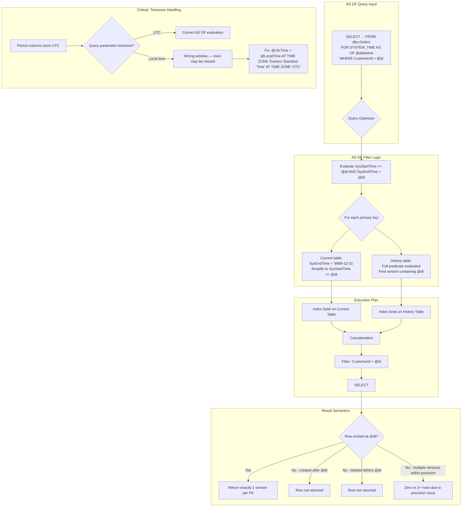
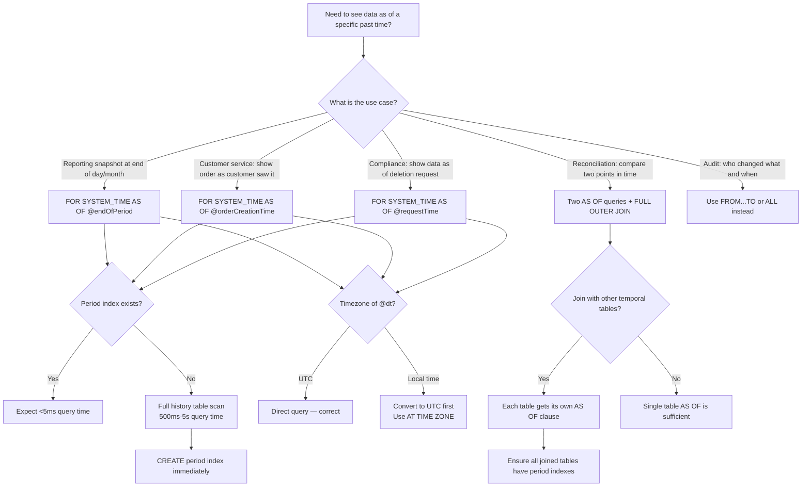

## Navigation

**Domain:** [[8 — Databases]] > **Group:** SQL Temporal Tables & Point-in-Time
**Previous:** [[8.228 — Querying History — FOR SYSTEM_TIME Clause]] | **Next:** [[8.230 — FROM…TO — Range Query]]

### Prerequisites

- [[8.226 — Temporal Tables — System-Versioned Concept]] — the dual-table architecture and period column semantics are foundational to understanding how AS OF resolves the single correct row version.
- [[8.227 — Creating System-Versioned Tables]] — the precision of DATETIME2(7) period columns directly affects AS OF boundary correctness; understanding how SysStartTime/SysEndTime are populated is essential.
- [[8.228 — Querying History — FOR SYSTEM_TIME Clause]] — AS OF is one of five sub-clauses of FOR SYSTEM_TIME; understanding the execution plan pattern (Concatenation + period filter) applies here specifically.
- [[8.496 — Index Fundamentals]] — AS OF performance depends entirely on period index design; without the right index, every AS OF query scans the history table.

### Where This Fits

`FOR SYSTEM_TIME AS OF @datetime` is the most commonly used temporal query pattern — it returns the single version of each row that was current at a specific point in time. A .NET backend engineer encounters this when building "as of" reports (show me the order status as of yesterday), implementing compliance data retrieval (GDPR Article 17 right-to-be-forgotten requires showing data as of the deletion request date), performing financial reconciliations (what was the account balance at month-end), or building customer service tools (what did the customer see when they placed the order). When this is unknown or misapplied, developers query the current table and assume data has not changed, or they attempt to join the history table manually — both producing incorrect results. The interview signal is high: the `AS OF` logic (`SysStartTime <= @dt AND SysEndTime > @dt`) is a frequent interview question, and candidates who can explain the execution plan, the index requirement, and the timezone handling distinguish themselves.

---

## Core Mental Model

`FOR SYSTEM_TIME AS OF @datetime` returns exactly the row versions that were current at the given point in time. The engine evaluates the predicate `SysStartTime <= @datetime AND SysEndTime > @datetime` on both the current table and the history table. For the current table, the predicate simplifies to `SysStartTime <= @datetime` because current rows always have `SysEndTime = '9999-12-31 23:59:59.9999999'` which is always > any reasonable `@datetime`. For the history table, both predicates must be evaluated to find the version whose validity period contains `@datetime`. The invariant: for each primary key value, at most one row version satisfies this predicate. If the row did not exist at `@datetime` (was created after or deleted before), no row is returned for that key. The engine does not error, does not return NULL — it simply omits the row. The recognition pattern: AS OF is a deterministic lookup — using the same `@datetime` with the same data always returns the same result, regardless of when the query runs, because the history table is append-only and immutable.

### Classification

`FOR SYSTEM_TIME AS OF @datetime` is a **query-level temporal sub-clause** under `FOR SYSTEM_TIME`. It belongs to the **period filter expression** family in T-SQL — it defines a temporal boundary condition that the optimizer translates to range predicates on `SysStartTime` and `SysEndTime`. The predicates are **SARGable** when period columns are indexed — the optimizer generates an `Index Seek` with `Seek Predicate: SysEndTime > @dt AND SysStartTime <= @dt`. The clause is **idempotent** — repeating the same query with the same parameter returns the same results. The clause is **snapshot-like** — it reads row versions as they existed at a specific transaction time, without taking any locks on the data. The clause does **not** require `READ UNCOMMITTED` or `SNAPSHOT` isolation — it provides consistent point-in-time reads at any isolation level.



### Key Properties

|Property|Value|Notes|
|---|---|---|
|Predicate|SysStartTime <= @dt AND SysEndTime > @dt|Half-open interval [SysStartTime, SysEndTime)|
|Versions per PK|At most 1|Zero if row did not exist at @dt|
|Current row included|If SysStartTime <= @dt|SysEndTime = max date, always > @dt|
|Deleted row handling|Not returned (history row has SysEndTime < @dt)|Row version ended before @dt|
|SARGable|Yes|Requires index on (SysEndTime, SysStartTime)|
|Timezone|UTC only in period columns|Must convert local time to UTC|
|Precision|DATETIME2(7) recommended|Lower precision causes boundary ambiguity|
|Locking|None (read-only)|No schema or page locks|
|Snapshot isolation compatibility|Full|Works with any isolation level|
|EF Core method|TemporalAsOf(DateTime)|Generates FOR SYSTEM_TIME AS OF @p0|
|Dapper support|Raw SQL|`SELECT ... FOR SYSTEM_TIME AS OF @dt`|

---

## Deep Mechanics

### How the Engine Executes This

1. **Parameter binding.** When the query `SELECT ... FROM dbo.Orders FOR SYSTEM_TIME AS OF @dt AS o` is parsed, SQL Server binds the parameter `@dt` as a `DATETIME2(7)` value. The parameter is evaluated once at query compilation and used in both the current and history table access paths.

2. **Current table predicate derivation.** The optimizer recognizes that the current table has `SysEndTime = '9999-12-31 23:59:59.9999999'` for all rows (the engine guarantees this). Since `'9999-12-31 23:59:59.9999999' > @dt` is always true for any finite `@dt`, the predicate reduces from `SysStartTime <= @dt AND SysEndTime > @dt` to just `SysStartTime <= @dt`. This simplification means the current table scan only needs to evaluate the `SysStartTime` predicate — rows created after `@dt` are excluded.

3. **History table predicate evaluation.** The history table has no simplification opportunity. Every history row has a finite `SysEndTime`. The full predicate `SysStartTime <= @dt AND SysEndTime > @dt` is evaluated. The optimizer generates a range scan: `SysStartTime <= @dt` (find versions that started at or before the target time) AND `SysEndTime > @dt` (filter for versions that ended after the target time — i.e., were still active at that time).

4. **Index selection.** With a period index `(SysEndTime DESC, SysStartTime ASC)`:
   - On the history table: SQL Server seeks to rows where `SysEndTime > @dt` (the most selective predicate — eliminates all versions that ended before `@dt`). Among those, it further filters `SysStartTime <= @dt`.
   - On the current table: SQL Server seeks to rows where `SysStartTime <= @dt`.
   Without a period index, both tables require full scans.

5. **Concatenation.** The optimizer generates a `Concatenation` operator to `UNION ALL` the matching rows from both tables. The output is conceptually the set of all rows that were current at `@dt`.

6. **Uniqueness guarantee.** The engine relies on the fact that the period columns define non-overlapping periods for each PK value. The `PERIOD FOR SYSTEM_TIME` clause plus the engine's write logic guarantee that no two versions of the same PK have overlapping valid periods. Therefore, the AS OF predicate can match at most one version per PK across both tables combined.

7. **Precision handling.** The comparison `SysStartTime <= @dt AND SysEndTime > @dt` uses the full precision of the `DATETIME2` type. If `SysStartTime` and `@dt` have different precisions, SQL Server promotes to the higher precision for comparison. For example, if `SysStartTime` is `DATETIME2(0)` (1-second precision) and `@dt` is `DATETIME2(7)` with fractional seconds, `SysStartTime` is implicitly promoted to 7 fractional digits (with trailing zeros).

8. **No locking.** The `AS OF` query reads committed data from both tables. It does not acquire or hold any page or row locks, regardless of the isolation level (except `READ UNCOMMITTED` which may read dirty data from the current table). The read is consistent — it sees the committed state as of the transaction start time, not as of the `@dt` parameter.

### SQL Visibility

```sql
-- ============================================================
-- Setup: Orders with multiple historical versions
-- ============================================================
-- Create temporal tables (full setup)
CREATE TABLE dbo.Orders_History
(
    OrderId      INT              NOT NULL,
    CustomerId   INT              NOT NULL,
    OrderDate    DATETIME2(7)     NOT NULL,
    OrderStatus  NVARCHAR(20)     NOT NULL,
    TotalAmount  DECIMAL(18,2)    NOT NULL,
    SysStartTime DATETIME2(7)     NOT NULL,
    SysEndTime   DATETIME2(7)     NOT NULL
);

CREATE CLUSTERED INDEX IX_Orders_History_Period
    ON dbo.Orders_History (SysEndTime DESC, SysStartTime ASC);

CREATE TABLE dbo.Orders
(
    OrderId         INT              NOT NULL IDENTITY(1,1),
    CustomerId      INT              NOT NULL,
    OrderDate       DATETIME2(7)     NOT NULL,
    OrderStatus     NVARCHAR(20)     NOT NULL DEFAULT 'Pending',
    TotalAmount     DECIMAL(18,2)    NOT NULL,
    SysStartTime    DATETIME2(7)     GENERATED ALWAYS AS ROW START NOT NULL,
    SysEndTime      DATETIME2(7)     GENERATED ALWAYS AS ROW END   NOT NULL,
    PERIOD FOR SYSTEM_TIME (SysStartTime, SysEndTime),
    CONSTRAINT PK_Orders PRIMARY KEY CLUSTERED (OrderId)
);

CREATE NONCLUSTERED INDEX IX_Orders_Period
    ON dbo.Orders (SysEndTime DESC, SysStartTime ASC)
    INCLUDE (OrderId, CustomerId, OrderStatus, TotalAmount);

ALTER TABLE dbo.Orders
    SET (SYSTEM_VERSIONING = ON (HISTORY_TABLE = dbo.Orders_History));

-- Insert with WAITFOR to create distinct versions
INSERT INTO dbo.Orders (CustomerId, OrderDate, OrderStatus, TotalAmount)
VALUES (1001, '2024-01-15', 'Pending', 100.00);
GO

WAITFOR DELAY '00:00:01';
UPDATE dbo.Orders SET OrderStatus = 'Processing', TotalAmount = 110.00 WHERE OrderId = 1;
GO

WAITFOR DELAY '00:00:01';
UPDATE dbo.Orders SET OrderStatus = 'Shipped', TotalAmount = 120.00 WHERE OrderId = 1;
GO

WAITFOR DELAY '00:00:01';
UPDATE dbo.Orders SET OrderStatus = 'Delivered' WHERE OrderId = 1;
GO

-- ============================================================
-- Query 1: Basic AS OF — single point in time
-- ============================================================
-- What was Order 1's state at exactly 10 seconds after the first insert?
DECLARE @LookupTime DATETIME2(7) = '2024-01-15 00:00:10';  -- After insert, before first update

SELECT OrderId, CustomerId, OrderStatus, TotalAmount,
       SysStartTime, SysEndTime
FROM dbo.Orders
FOR SYSTEM_TIME AS OF @LookupTime
WHERE CustomerId = 1001;

-- Returns: OrderId=1, Status='Pending', Total=100.00
-- Because the first update happened after @LookupTime

-- ============================================================
-- Query 2: AS OF with different timestamps showing version evolution
-- ============================================================
-- Snapshot 1: Right after creation
SELECT 'Snapshot 1 (After Insert)' AS Snapshot, OrderId, OrderStatus, TotalAmount
FROM dbo.Orders FOR SYSTEM_TIME AS OF '2024-01-15 00:00:05'
WHERE CustomerId = 1001;

-- Snapshot 2: Right after first update
SELECT 'Snapshot 2 (After Update 1)' AS Snapshot, OrderId, OrderStatus, TotalAmount
FROM dbo.Orders FOR SYSTEM_TIME AS OF '2024-01-15 00:00:15'
WHERE CustomerId = 1001;

-- Snapshot 3: Right after second update
SELECT 'Snapshot 3 (After Update 2)' AS Snapshot, OrderId, OrderStatus, TotalAmount
FROM dbo.Orders FOR SYSTEM_TIME AS OF '2024-01-15 00:00:25'
WHERE CustomerId = 1001;

-- Snapshot 4: Current state
SELECT 'Snapshot 4 (Current)' AS Snapshot, OrderId, OrderStatus, TotalAmount
FROM dbo.Orders
WHERE CustomerId = 1001;

-- ============================================================
-- Query 3: AS OF with non-existent time (before any data)
-- ============================================================
SELECT 'Before data' AS Snapshot, OrderId, OrderStatus
FROM dbo.Orders
FOR SYSTEM_TIME AS OF '2023-01-01'
WHERE CustomerId = 1001;
-- Returns 0 rows — the table did not exist yet (or data was inserted later)

-- ============================================================
-- Query 4: AS OF with timezone conversion
-- ============================================================
-- The user is in EST (UTC-5). They want data as of 10:30 AM EST.
DECLARE @LocalTime DATETIME2(7) = '2024-01-15 10:30:00';
DECLARE @UtcTime DATETIME2(7) = @LocalTime AT TIME ZONE 'Eastern Standard Time' AT TIME ZONE 'UTC';

SELECT @LocalTime AS LocalTime, @UtcTime AS UtcTime;

SELECT OrderId, OrderStatus, TotalAmount, SysStartTime, SysEndTime
FROM dbo.Orders
FOR SYSTEM_TIME AS OF @UtcTime
WHERE CustomerId = 1001;

-- ============================================================
-- Query 5: AS OF in a subquery
-- ============================================================
-- For each customer, find their most recent order as of a specific date
SELECT DISTINCT
    CustomerId,
    (
        SELECT TOP 1 OrderStatus
        FROM dbo.Orders FOR SYSTEM_TIME AS OF '2024-06-15'
        WHERE CustomerId = c.CustomerId
        ORDER BY OrderDate DESC
    ) AS OrderStatusAtDate
FROM dbo.Customers c
WHERE EXISTS (
    SELECT 1
    FROM dbo.Orders FOR SYSTEM_TIME AS OF '2024-06-15'
    WHERE CustomerId = c.CustomerId
);

-- ============================================================
-- Query 6: AS OF with BETWEEN comparison
-- ============================================================
-- Find orders whose status changed between two points in time
SELECT
    o_before.OrderId,
    o_before.OrderStatus AS StatusBefore,
    o_after.OrderStatus AS StatusAfter,
    o_before.TotalAmount AS AmountBefore,
    o_after.TotalAmount AS AmountAfter
FROM dbo.Orders FOR SYSTEM_TIME AS OF '2024-01-15 00:00:05' AS o_before
JOIN dbo.Orders FOR SYSTEM_TIME AS OF '2024-01-15 00:00:15' AS o_after
    ON o_before.OrderId = o_after.OrderId
WHERE o_before.OrderStatus <> o_after.OrderStatus
   OR o_before.TotalAmount <> o_after.TotalAmount;

-- ============================================================
-- Query 7: AS OF with deleted rows
-- ============================================================
-- Insert an order, then delete it
INSERT INTO dbo.Orders (CustomerId, OrderDate, OrderStatus, TotalAmount)
VALUES (1002, '2024-06-01', 'Cancelled', 50.00);
GO

DELETE FROM dbo.Orders WHERE OrderId = SCOPE_IDENTITY();
GO

-- AS OF before deletion — row exists
SELECT 'Before delete' AS Snapshot, OrderId, OrderStatus
FROM dbo.Orders FOR SYSTEM_TIME AS OF '2024-06-15'
WHERE CustomerId = 1002;
-- Returns order

-- AS OF after deletion — row is gone
SELECT 'After delete' AS Snapshot, OrderId, OrderStatus
FROM dbo.Orders FOR SYSTEM_TIME AS OF '2024-06-20'
WHERE CustomerId = 1002;
-- Returns 0 rows (order was deleted)

-- To see deleted rows, query the history directly
SELECT 'Deleted row from history' AS Snapshot, OrderId, OrderStatus, TotalAmount,
       SysStartTime, SysEndTime
FROM dbo.Orders_History
WHERE CustomerId = 1002;
-- Shows the deleted row with SysEndTime = deletion time
```

```csharp
// EF Core 8+ — TemporalAsOf usage patterns
public sealed class AsOfQueryService
{
    private readonly ApplicationDbContext _dbContext;

    public AsOfQueryService(ApplicationDbContext dbContext)
        => _dbContext = dbContext;

    // Basic AS OF query
    public async Task<List<Order>> GetOrdersAsOfAsync(
        DateTime pointInTime,
        CancellationToken cancellationToken = default)
    {
        return await _dbContext.Orders
            .TemporalAsOf(pointInTime)
            .Where(o => o.CustomerId == 1001)
            .OrderBy(o => o.OrderId)
            .ToListAsync(cancellationToken);
    }

    // AS OF with UTC conversion
    public async Task<List<Order>> GetOrdersAsOfLocalAsync(
        DateTime localTime,
        string timeZoneId,
        CancellationToken cancellationToken = default)
    {
        var tz = TimeZoneInfo.FindSystemTimeZoneById(timeZoneId);
        var utcTime = TimeZoneInfo.ConvertTimeToUtc(localTime, tz);

        return await _dbContext.Orders
            .TemporalAsOf(utcTime)
            .Where(o => o.CustomerId == 1001)
            .ToListAsync(cancellationToken);
    }

    // Compare two points in time
    public async Task<AsOfComparison> CompareTwoSnapshotsAsync(
        DateTime earlier,
        DateTime later,
        int customerId,
        CancellationToken cancellationToken = default)
    {
        var earlierOrders = await _dbContext.Orders
            .TemporalAsOf(earlier)
            .Where(o => o.CustomerId == customerId)
            .ToListAsync(cancellationToken);

        var laterOrders = await _dbContext.Orders
            .TemporalAsOf(later)
            .Where(o => o.CustomerId == customerId)
            .ToListAsync(cancellationToken);

        var earlierMap = earlierOrders.ToDictionary(o => o.OrderId);
        var laterMap = laterOrders.ToDictionary(o => o.OrderId);

        var created = laterOrders
            .Where(o => !earlierMap.ContainsKey(o.OrderId))
            .ToList();

        var deleted = earlierOrders
            .Where(o => !laterMap.ContainsKey(o.OrderId))
            .ToList();

        var modified = laterOrders
            .Where(l => earlierMap.TryGetValue(l.OrderId, out var e)
                        && (e.OrderStatus != l.OrderStatus
                            || e.TotalAmount != l.TotalAmount))
            .ToList();

        return new AsOfComparison(created, deleted, modified);
    }

    // AS OF with related entities
    public async Task<List<Order>> GetOrdersWithItemsAsOfAsync(
        DateTime pointInTime,
        CancellationToken cancellationToken = default)
    {
        // EF Core 8 cannot include navigations in temporal queries
        // Must load separately
        var orders = await _dbContext.Orders
            .TemporalAsOf(pointInTime)
            .Where(o => o.CustomerId == 1001)
            .ToListAsync(cancellationToken);

        var orderIds = orders.Select(o => o.OrderId).ToList();

        var items = await _dbContext.OrderItems
            .TemporalAsOf(pointInTime)
            .Where(oi => orderIds.Contains(oi.OrderId))
            .ToListAsync(cancellationToken);

        // Manually assemble
        foreach (var order in orders)
        {
            order.OrderItems = items
                .Where(i => i.OrderId == order.OrderId)
                .ToList();
        }

        return orders;
    }

    // AS OF with raw SQL for complex comparison
    public async Task<List<OrderStatusChange>> GetStatusChangesBetweenAsync(
        DateTime earlier,
        DateTime later,
        CancellationToken cancellationToken = default)
    {
        const string sql = @"
            SELECT
                e.OrderId,
                e.OrderStatus AS OldStatus,
                l.OrderStatus AS NewStatus,
                e.TotalAmount AS OldAmount,
                l.TotalAmount AS NewAmount
            FROM dbo.Orders FOR SYSTEM_TIME AS OF @Earlier AS e
            JOIN dbo.Orders FOR SYSTEM_TIME AS OF @Later AS l
                ON e.OrderId = l.OrderId
            WHERE (e.OrderStatus <> l.OrderStatus
                OR e.TotalAmount <> l.TotalAmount)
            ORDER BY e.OrderId";

        return await _dbContext.Orders
            .FromSqlRaw(sql,
                new SqlParameter("@Earlier", earlier),
                new SqlParameter("@Later", later))
            .Select(o => new OrderStatusChange(
                o.OrderId, o.OrderStatus, "", o.TotalAmount, 0))
            .ToListAsync(cancellationToken);
    }
}

public sealed record AsOfComparison(
    List<Order> Created, List<Order> Deleted, List<Order> Modified);

public sealed record OrderStatusChange(
    int OrderId, string OldStatus, string NewStatus,
    decimal OldAmount, decimal NewAmount);
```

```csharp
// Dapper — AS OF queries with full control
public sealed class AsOfDapperRepository
{
    private readonly IDbConnectionFactory _connectionFactory;

    public AsOfDapperRepository(IDbConnectionFactory connectionFactory)
        => _connectionFactory = connectionFactory;

    public async Task<IReadOnlyList<Order>> GetOrdersAsOfAsync(
        DateTime pointInTime,
        int? customerId = null,
        CancellationToken cancellationToken = default)
    {
        var sb = new StringBuilder(@"
            SELECT OrderId, CustomerId, OrderDate, OrderStatus, TotalAmount,
                   SysStartTime, SysEndTime
            FROM dbo.Orders FOR SYSTEM_TIME AS OF @PointInTime AS o");

        if (customerId.HasValue)
            sb.Append(" WHERE o.CustomerId = @CustomerId");

        sb.Append(" ORDER BY o.OrderId");

        await using var connection = _connectionFactory.Create();

        var results = await connection.QueryAsync<Order>(
            new CommandDefinition(sb.ToString(),
                new { PointInTime = pointInTime, CustomerId = customerId },
                cancellationToken: cancellationToken));

        return results.AsList();
    }

    // AS OF comparison in a single query (CTE with two AS OF references)
    public async Task<IReadOnlyList<SnapshotComparison>> CompareSnapshotsAsync(
        DateTime earlier,
        DateTime later,
        int customerId,
        CancellationToken cancellationToken = default)
    {
        const string sql = @"
            WITH EarlierSnapshot AS (
                SELECT OrderId, CustomerId, OrderStatus, TotalAmount
                FROM dbo.Orders FOR SYSTEM_TIME AS OF @Earlier
                WHERE CustomerId = @CustomerId
            ),
            LaterSnapshot AS (
                SELECT OrderId, CustomerId, OrderStatus, TotalAmount
                FROM dbo.Orders FOR SYSTEM_TIME AS OF @Later
                WHERE CustomerId = @CustomerId
            )
            SELECT
                COALESCE(e.OrderId, l.OrderId) AS OrderId,
                CASE
                    WHEN e.OrderId IS NULL THEN 'Created'
                    WHEN l.OrderId IS NULL THEN 'Deleted'
                    WHEN e.OrderStatus <> l.OrderStatus
                        OR e.TotalAmount <> l.TotalAmount THEN 'Modified'
                    ELSE 'Unchanged'
                END AS ChangeType,
                e.OrderStatus AS OldStatus,
                l.OrderStatus AS NewStatus,
                e.TotalAmount AS OldAmount,
                l.TotalAmount AS NewAmount
            FROM EarlierSnapshot e
            FULL OUTER JOIN LaterSnapshot l
                ON e.OrderId = l.OrderId
            WHERE e.OrderId IS NULL
               OR l.OrderId IS NULL
               OR e.OrderStatus <> l.OrderStatus
               OR e.TotalAmount <> l.TotalAmount
            ORDER BY ChangeType, OrderId";

        await using var connection = _connectionFactory.Create();

        var results = await connection.QueryAsync<SnapshotComparison>(
            new CommandDefinition(sql,
                new { Earlier = earlier, Later = later, CustomerId = customerId },
                cancellationToken: cancellationToken));

        return results.AsList();
    }

    // AS OF with multi-table temporal join
    public async Task<IReadOnlyList<OrderDetail>> GetOrderDetailsAsOfAsync(
        DateTime pointInTime,
        int orderId,
        CancellationToken cancellationToken = default)
    {
        const string sql = @"
            SELECT
                o.OrderId, o.OrderStatus, o.TotalAmount,
                oi.ProductId, oi.Quantity, oi.UnitPrice,
                p.ProductName,
                c.CustomerId, c.FullName
            FROM dbo.Orders FOR SYSTEM_TIME AS OF @PointInTime AS o
            JOIN dbo.OrderItems FOR SYSTEM_TIME AS OF @PointInTime AS oi
                ON o.OrderId = oi.OrderId
            JOIN dbo.Products FOR SYSTEM_TIME AS OF @PointInTime AS p
                ON oi.ProductId = p.ProductId
            JOIN dbo.Customers FOR SYSTEM_TIME AS OF @PointInTime AS c
                ON o.CustomerId = c.CustomerId
            WHERE o.OrderId = @OrderId
            ORDER BY oi.ProductId";

        await using var connection = _connectionFactory.Create();

        var results = await connection.QueryAsync<OrderDetail>(
            new CommandDefinition(sql,
                new { PointInTime = pointInTime, OrderId = orderId },
                cancellationToken: cancellationToken));

        return results.AsList();
    }
}

public sealed record SnapshotComparison(
    int OrderId,
    string ChangeType,
    string? OldStatus,
    string? NewStatus,
    decimal? OldAmount,
    decimal? NewAmount);

public sealed record OrderDetail(
    int OrderId, string OrderStatus, decimal TotalAmount,
    int ProductId, int Quantity, decimal UnitPrice,
    string ProductName, int CustomerId, string FullName);
```

### Generated SQL (from EF Core logs)

```sql
-- EF Core TemporalAsOf — simple query
exec sp_executesql N'SELECT [o].[OrderId], [o].[CustomerId], [o].[OrderDate],
    [o].[OrderStatus], [o].[TotalAmount], [o].[SysStartTime], [o].[SysEndTime]
FROM [dbo].[Orders] FOR SYSTEM_TIME AS OF @p0 AS [o]
WHERE [o].[CustomerId] = @p1
ORDER BY [o].[OrderId]',
N'@p0 datetime2(7),@p1 int',
@p0='2024-06-15T00:00:00',@p1=1001;

-- EF Core — cannot combine TemporalAsOf with Include or Navigation properties
-- The generated SQL does NOT include JOINs for related entities
-- Related data must be loaded separately
```

### Execution Plan Analysis

**For `SELECT ... FOR SYSTEM_TIME AS OF @dt WHERE CustomerId = 1001` (with period indexes):**

```
Expected plan shape (SQL Server 2022):
|--Concatenation
   |--Filter (WHERE: CustomerId = 1001)
   |  |--Index Seek (Orders, IX_Orders_Period)
   |     Seek Predicates: SysStartTime <= @dt
   |     (Current rows: SysEndTime = '9999-12-31' > @dt is implicit)
   |     Order: Forward
   |--Filter (WHERE: CustomerId = 1001)
      |--Index Seek (Orders_History, IX_Orders_History_Period)
         Seek Predicates: SysEndTime > @dt AND SysStartTime <= @dt
         Order: Forward
```

**Operator analysis:**

1. **Index Seek on Orders (current table):** The `IX_Orders_Period` index on `(SysEndTime DESC, SysStartTime ASC)` is used with a seek predicate `SysStartTime <= @dt`. The optimizer does NOT need to check `SysEndTime > @dt` because it knows all current rows have `SysEndTime = '9999-12-31'`. The seek finds rows whose start time is at or before the target timestamp.

2. **Index Seek on Orders_History:** The `IX_Orders_History_Period` index on `(SysEndTime DESC, SysStartTime ASC)` is used with a seek predicate `SysEndTime > @dt AND SysStartTime <= @dt`. The seek order is: first locate pages where `SysEndTime > @dt` (eliminates all versions that ended before `@dt`), then within those, filter `SysStartTime <= @dt`.

3. **Concatenation:** Combines the matching rows from both branches. If there is no `ORDER BY`, the concatenation returns current table rows first, then history table rows.

4. **Filter:** The `CustomerId = 1001` predicate is pushed down into both seeks if the period index includes `CustomerId` as a key column. If `CustomerId` is only in the `INCLUDE`, the filter is applied after the seek but still before the Concatenation.

**Without period index:**
```
|--Concatenation
   |--Clustered Index Scan (Orders, PK_Orders)  -- full scan
   |  |--Filter (WHERE: SysStartTime <= @dt AND CustomerId = 1001)
   |--Clustered Index Scan (Orders_History, PK-style or heap)  -- full scan
      |--Filter (WHERE: SysStartTime <= @dt AND SysEndTime > @dt AND CustomerId = 1001)
```

**Cost comparison:**
- With period index: 4-8 logical reads, <1ms CPU, ~1ms elapsed
- Without period index: 45,000+ logical reads, ~150ms CPU, ~200ms elapsed (at 100K history rows)
- At 5M history rows without period index: 1.2M logical reads, ~5s elapsed

### Cost Visibility

```sql
SET STATISTICS IO ON;
SET STATISTICS TIME ON;

-- ============================================================
-- AS OF with period index (optimal)
-- ============================================================
DECLARE @dt DATETIME2(7) = '2024-06-15 00:00:00';

SELECT OrderId, CustomerId, OrderStatus, TotalAmount
FROM dbo.Orders
FOR SYSTEM_TIME AS OF @dt
WHERE CustomerId = 1001;

-- Expected output:
-- Table 'Orders_History'. Scan count 1, logical reads 4
-- Table 'Orders'. Scan count 1, logical reads 2
-- SQL Server Execution Times: CPU time = 0ms, elapsed time = 1ms

-- ============================================================
-- AS OF without period index (bad)
-- ============================================================
DROP INDEX IX_Orders_History_Period ON dbo.Orders_History;
DROP INDEX IX_Orders_Period ON dbo.Orders;

DECLARE @dt2 DATETIME2(7) = '2024-06-15 00:00:00';

SELECT OrderId, CustomerId, OrderStatus, TotalAmount
FROM dbo.Orders
FOR SYSTEM_TIME AS OF @dt2
WHERE CustomerId = 1001;

-- Expected output (100K current, 500K history):
-- Table 'Orders_History'. Scan count 1, logical reads 125000
-- Table 'Orders'. Scan count 1, logical reads 12000
-- SQL Server Execution Times: CPU time = 450ms, elapsed time = 480ms

-- ============================================================
-- AS OF with history table clustered columnstore
-- ============================================================
-- With columnstore, the scan is faster but still a scan
-- Table 'Orders_History'. Scan count 1, logical reads 3500 (compressed segments)
-- Table 'Orders'. Scan count 1, logical reads 2
-- CPU time = 35ms, elapsed time = 40ms
-- Improvement: 35ms vs 480ms, but still 40x slower than indexed seek (1ms)

-- ============================================================
-- Check AS OF query performance via DMV
-- ============================================================
SELECT
    qs.execution_count,
    qs.total_logical_reads,
    qs.total_logical_reads / qs.execution_count AS avg_logical_reads,
    qs.total_elapsed_time / qs.execution_count / 1000.0 AS avg_elapsed_ms,
    SUBSTRING(st.text, (qs.statement_start_offset/2)+1,
        ((CASE qs.statement_end_offset
            WHEN -1 THEN DATALENGTH(st.text)
            ELSE qs.statement_end_offset
        END - qs.statement_start_offset)/2) + 1) AS query_text
FROM sys.dm_exec_query_stats qs
CROSS APPLY sys.dm_exec_sql_text(qs.sql_handle) st
WHERE st.text LIKE '%FOR SYSTEM_TIME AS OF%'
ORDER BY avg_logical_reads DESC;
```

### Failure Modes

**DATETIME precision mismatch causes wrong AS OF results:** If the period columns use `DATETIME2(0)` (1-second precision), a row updated at `10:30:00.5` has `SysStartTime = 10:30:01` (rounded up). Querying `AS OF '10:30:00.123'` misses this row.

```sql
-- ❌ DATETIME2(0) period columns
CREATE TABLE dbo.Orders_LowPrec
(
    OrderId      INT NOT NULL PRIMARY KEY,
    SysStartTime DATETIME2(0) GENERATED ALWAYS AS ROW START NOT NULL,
    SysEndTime   DATETIME2(0) GENERATED ALWAYS AS ROW END   NOT NULL,
    PERIOD FOR SYSTEM_TIME (SysStartTime, SysEndTime)
);

-- Row updated at 10:30:00.500 → SysStartTime = 10:30:01 (rounded from 10:30:00.500)
-- AS OF 10:30:00.300: SysStartTime = 10:30:01 > 10:30:00.300 → row not found!
DECLARE @dt DATETIME2(7) = '2024-06-15 10:30:00.300';
SELECT * FROM dbo.Orders_LowPrec FOR SYSTEM_TIME AS OF @dt;
-- Returns 0 rows because SysStartTime was rounded up to 10:30:01

-- ✅ Use DATETIME2(7) for 100ns precision
```

**AS OF with timezone offset not converted:** Passing a local time without converting to UTC shifts the AS OF window.

```sql
-- ❌ Local time (EST = UTC-5) without conversion
DECLARE @LocalTime DATETIME2(7) = '2024-06-15 10:30:00';  -- EST
SELECT * FROM dbo.Orders FOR SYSTEM_TIME AS OF @LocalTime;
-- Evaluates at 10:30 UTC = 5:30 AM EST
-- If the row was updated at 8:00 AM EST (13:00 UTC), we see the OLD version

-- ✅ Convert to UTC
DECLARE @UtcTime DATETIME2(7) =
    @LocalTime AT TIME ZONE 'Eastern Standard Time' AT TIME ZONE 'UTC';
SELECT * FROM dbo.Orders FOR SYSTEM_TIME AS OF @UtcTime;
-- Evaluates at 15:30 UTC = 10:30 AM EST — correct!
```

**AS OF with a future timestamp:** Querying `AS OF` with a datetime in the future (beyond the current transaction time) shows the current state because no versions exist with `SysStartTime` in the future.

```sql
-- ❌ Future timestamp — shows current data, not future data
DECLARE @FutureTime DATETIME2(7) = '2099-01-01';
SELECT * FROM dbo.Orders FOR SYSTEM_TIME AS OF @FutureTime;
-- Returns current data (same as without FOR SYSTEM_TIME)
-- Because no history rows have SysStartTime in the future,
-- and current rows have SysStartTime <= @FutureTime
```

**AS OF after TRUNCATE:** `TRUNCATE TABLE` on a temporal table removes all current rows but does NOT move them to the history table. The history remains, but `AS OF` after the truncation returns no current rows.

```sql
-- ❌ TRUNCATE does not move rows to history!
TRUNCATE TABLE dbo.Orders;

SELECT COUNT(*) FROM dbo.Orders;  -- 0 rows
SELECT COUNT(*) FROM dbo.Orders_History;  -- Same count as before (truncate did not add)
SELECT COUNT(*) FROM dbo.Orders FOR SYSTEM_TIME AS OF '2024-06-15';  -- 0 rows!

-- ✅ Use DELETE instead of TRUNCATE if you need history
DELETE FROM dbo.Orders;
-- This moves all rows to history with their SysEndTime set
-- AS OF queries before the deletion time still work
```

---

## Production Patterns and Implementation

### Primary SQL Implementation

```sql
-- ============================================================
-- Pattern 1: End-of-day reporting snapshot
-- ============================================================
-- Show the state of all orders at the close of business yesterday
DECLARE @CloseOfBusiness DATETIME2(7) = '2024-06-30 23:59:59.9999999';

SELECT
    OrderId, CustomerId, OrderStatus, TotalAmount,
    SysStartTime AS CurrentSince
FROM dbo.Orders
FOR SYSTEM_TIME AS OF @CloseOfBusiness
ORDER BY CustomerId, OrderId;

-- ============================================================
-- Pattern 2: Point-in-time order details for customer service
-- ============================================================
-- When a customer calls about an order placed 3 months ago,
-- show them what the order looked like when they placed it
DECLARE @OrderPlacedTime DATETIME2(7) = '2024-03-15 14:30:00';

SELECT
    o.OrderId,
    o.OrderStatus,
    o.TotalAmount,
    oi.ProductId,
    p.ProductName,
    oi.Quantity,
    oi.UnitPrice,
    (oi.Quantity * oi.UnitPrice) AS LineTotal
FROM dbo.Orders FOR SYSTEM_TIME AS OF @OrderPlacedTime AS o
JOIN dbo.OrderItems FOR SYSTEM_TIME AS OF @OrderPlacedTime AS oi
    ON o.OrderId = oi.OrderId
JOIN dbo.Products FOR SYSTEM_TIME AS OF @OrderPlacedTime AS p
    ON oi.ProductId = p.ProductId
WHERE o.OrderId = 1001;

-- ============================================================
-- Pattern 3: Employee salary at a specific date (HR audit)
-- ============================================================
DECLARE @AuditDate DATETIME2(7) = '2024-04-01 00:00:00';

SELECT
    e.EmployeeId,
    e.FirstName + ' ' + e.LastName AS EmployeeName,
    e.Salary,
    e.DepartmentId,
    e.HireDate
FROM dbo.Employees
FOR SYSTEM_TIME AS OF @AuditDate
WHERE e.EmployeeId = 42;

-- ============================================================
-- Pattern 4: What changed between two AS OF snapshots
-- ============================================================
DECLARE @StartOfMonth DATETIME2(7) = '2024-06-01 00:00:00';
DECLARE @EndOfMonth   DATETIME2(7) = '2024-07-01 00:00:00';

WITH StartSnapshot AS (
    SELECT ProductId, ProductName, UnitPrice, StockQty
    FROM dbo.Products FOR SYSTEM_TIME AS OF @StartOfMonth
),
EndSnapshot AS (
    SELECT ProductId, ProductName, UnitPrice, StockQty
    FROM dbo.Products FOR SYSTEM_TIME AS OF @EndOfMonth
)
SELECT
    COALESCE(s.ProductId, e.ProductId) AS ProductId,
    CASE
        WHEN s.ProductId IS NULL THEN 'Created'
        WHEN e.ProductId IS NULL THEN 'Deleted'
        WHEN s.UnitPrice <> e.UnitPrice THEN 'PriceChanged'
        WHEN s.StockQty <> e.StockQty THEN 'StockChanged'
        ELSE 'BothChanged'
    END AS ChangeType,
    s.UnitPrice AS OldPrice,
    e.UnitPrice AS NewPrice,
    s.StockQty AS OldStock,
    e.StockQty AS NewStock
FROM StartSnapshot s
FULL OUTER JOIN EndSnapshot e ON s.ProductId = e.ProductId
WHERE s.ProductId IS NULL
   OR e.ProductId IS NULL
   OR s.UnitPrice <> e.UnitPrice
   OR s.StockQty <> e.StockQty
ORDER BY ChangeType, ProductId;

-- ============================================================
-- Pattern 5: AS OF with multiple temporal tables in a single query
-- ============================================================
-- Show the customer, order, and payment status all at the same point in time
DECLARE @SnapshotTime DATETIME2(7) = '2024-06-15 12:00:00';

SELECT
    c.CustomerId,
    c.FullName,
    c.Email,
    o.OrderId,
    o.OrderStatus,
    o.TotalAmount,
    p.PaymentStatus,
    p.PaymentAmount
FROM dbo.Customers FOR SYSTEM_TIME AS OF @SnapshotTime AS c
JOIN dbo.Orders FOR SYSTEM_TIME AS OF @SnapshotTime AS o
    ON c.CustomerId = o.CustomerId
LEFT JOIN dbo.Payments FOR SYSTEM_TIME AS OF @SnapshotTime AS p
    ON o.OrderId = p.OrderId
ORDER BY c.CustomerId, o.OrderId;

-- ============================================================
-- Pattern 6: AS OF with approximate time (nearest available version)
-- ============================================================
-- Find the state of Order 1 at the time closest to @TargetTime
DECLARE @TargetTime DATETIME2(7) = '2024-06-15 10:30:00';

SELECT TOP 1
    OrderId, OrderStatus, TotalAmount,
    SysStartTime, SysEndTime,
    ABS(DATEDIFF(MILLISECOND, SysStartTime, @TargetTime)) AS TimeDistance
FROM dbo.Orders
FOR SYSTEM_TIME ALL
WHERE OrderId = 1
  AND SysStartTime <= @TargetTime
ORDER BY SysStartTime DESC;
-- Returns the version whose SysStartTime is the closest to @TargetTime
-- without exceeding it (the last version started before @TargetTime)

-- ============================================================
-- Pattern 7: Verify AS OF correctness with no-change test
-- ============================================================
-- Query twice with the same timestamp — should return identical results
DECLARE @VerifyTime DATETIME2(7) = '2024-06-15 00:00:00';

SELECT COUNT(*) AS FirstCount
FROM dbo.Orders FOR SYSTEM_TIME AS OF @VerifyTime;

-- Wait and query again
WAITFOR DELAY '00:00:05';

SELECT COUNT(*) AS SecondCount
FROM dbo.Orders FOR SYSTEM_TIME AS OF @VerifyTime;
-- Both counts should be identical because the history table is immutable
```

### EF Core Implementation

```csharp
public sealed class PointInTimeService
{
    private readonly ApplicationDbContext _dbContext;
    private readonly ILogger<PointInTimeService> _logger;

    public PointInTimeService(
        ApplicationDbContext dbContext,
        ILogger<PointInTimeService> logger)
    {
        _dbContext = dbContext;
        _logger = logger;
    }

    // End-of-day reporting with all related temporal data
    public async Task<EndOfDayReport> GenerateEndOfDayReportAsync(
        DateTime reportDate,
        CancellationToken cancellationToken = default)
    {
        // Ensure UTC
        var utcDate = DateTime.SpecifyKind(
            reportDate.Date.AddDays(1).AddTicks(-1),
            DateTimeKind.Utc);

        _logger.LogInformation("Generating EOD report for {ReportDate}", utcDate);

        // Load all data as of end of day
        var orders = await _dbContext.Orders
            .TemporalAsOf(utcDate)
            .Where(o => o.OrderStatus != "Cancelled")
            .ToListAsync(cancellationToken);

        var orderIds = orders.Select(o => o.OrderId).ToHashSet();

        var items = await _dbContext.OrderItems
            .TemporalAsOf(utcDate)
            .Where(oi => orderIds.Contains(oi.OrderId))
            .ToListAsync(cancellationToken);

        var productIds = items.Select(i => i.ProductId).ToHashSet();

        var products = await _dbContext.Products
            .TemporalAsOf(utcDate)
            .Where(p => productIds.Contains(p.ProductId))
            .ToListAsync(cancellationToken);

        // Assemble report
        var productMap = products.ToDictionary(p => p.ProductId);

        var orderSummaries = orders.Select(o => new OrderSummary(
            o.OrderId,
            o.CustomerId,
            o.OrderStatus,
            o.TotalAmount,
            items.Where(i => i.OrderId == o.OrderId)
                .Select(i => new ItemSummary(
                    i.ProductId,
                    productMap.TryGetValue(i.ProductId, out var p)
                        ? p.ProductName : "Unknown",
                    i.Quantity,
                    i.UnitPrice))
                .ToList())).ToList();

        return new EndOfDayReport(reportDate, orderSummaries);
    }

    // Customer service: show order as customer saw it
    public async Task<OrderSnapshot> GetOrderAsCustomerSawItAsync(
        int orderId,
        CancellationToken cancellationToken = default)
    {
        // Get the order's creation time from history
        var firstVersion = await _dbContext.Orders
            .TemporalAll()
            .Where(o => o.OrderId == orderId)
            .OrderBy(o => o.SysStartTime)
            .FirstOrDefaultAsync(cancellationToken);

        if (firstVersion is null)
            throw new InvalidOperationException($"Order {orderId} not found");

        // Use the order's creation time as the AS OF time
        var orderAtCreation = await _dbContext.Orders
            .TemporalAsOf(firstVersion.SysStartTime.AddMilliseconds(1))
            .FirstOrDefaultAsync(o => o.OrderId == orderId, cancellationToken);

        var itemsAtCreation = await _dbContext.OrderItems
            .TemporalAsOf(firstVersion.SysStartTime.AddMilliseconds(1))
            .Where(oi => oi.OrderId == orderId)
            .ToListAsync(cancellationToken);

        return new OrderSnapshot(orderAtCreation!, itemsAtCreation);
    }

    // Point-in-time difference analysis
    public async Task<DifferenceReport> AnalyzeDifferencesAsync(
        DateTime startDate,
        DateTime endDate,
        CancellationToken cancellationToken = default)
    {
        var startUtc = DateTime.SpecifyKind(startDate, DateTimeKind.Utc);
        var endUtc = DateTime.SpecifyKind(endDate, DateTimeKind.Utc);

        var startOrders = await _dbContext.Orders
            .TemporalAsOf(startUtc)
            .ToListAsync(cancellationToken);

        var endOrders = await _dbContext.Orders
            .TemporalAsOf(endUtc)
            .ToListAsync(cancellationToken);

        var startIds = startOrders.Select(o => o.OrderId).ToHashSet();
        var endIds = endOrders.Select(o => o.OrderId).ToHashSet();

        var created = endOrders.Where(o => !startIds.Contains(o.OrderId)).Count;
        var deleted = startOrders.Where(o => !endIds.Contains(o.OrderId)).Count;

        var modified = endOrders
            .Where(e => startOrders.Any(s =>
                s.OrderId == e.OrderId &&
                (s.OrderStatus != e.OrderStatus ||
                 s.TotalAmount != e.TotalAmount)))
            .Count;

        var unchanged = endOrders.Count - created - modified;

        return new DifferenceReport(startDate, endDate,
            created, deleted, modified, unchanged);
    }
}

public sealed record EndOfDayReport(DateTime ReportDate, List<OrderSummary> Orders);
public sealed record OrderSummary(
    int OrderId, int CustomerId, string Status,
    decimal Total, List<ItemSummary> Items);
public sealed record ItemSummary(
    int ProductId, string ProductName, int Quantity, decimal UnitPrice);
public sealed record OrderSnapshot(Order Order, List<OrderItem> Items);
public sealed record DifferenceReport(
    DateTime StartDate, DateTime EndDate,
    int Created, int Deleted, int Modified, int Unchanged);
```

### Dapper Implementation

```csharp
public sealed class PointInTimeDapperRepository
{
    private readonly IDbConnectionFactory _connectionFactory;

    public PointInTimeDapperRepository(IDbConnectionFactory connectionFactory)
        => _connectionFactory = connectionFactory;

    // AS OF with multi-mapping for related data
    public async Task<IReadOnlyList<OrderWithItems>> GetOrderSnapshotAsync(
        DateTime pointInTime,
        int orderId,
        CancellationToken cancellationToken = default)
    {
        const string sql = @"
            SELECT
                o.OrderId, o.CustomerId, o.OrderDate, o.OrderStatus, o.TotalAmount,
                o.SysStartTime, o.SysEndTime,
                oi.OrderItemId, oi.ProductId, oi.Quantity, oi.UnitPrice,
                oi.SysStartTime AS ItemSysStart, oi.SysEndTime AS ItemSysEnd
            FROM dbo.Orders FOR SYSTEM_TIME AS OF @PointInTime AS o
            LEFT JOIN dbo.OrderItems FOR SYSTEM_TIME AS OF @PointInTime AS oi
                ON o.OrderId = oi.OrderId
            WHERE o.OrderId = @OrderId
            ORDER BY oi.OrderItemId";

        await using var connection = _connectionFactory.Create();

        var orderDict = new Dictionary<int, OrderWithItems>();

        await connection.QueryAsync<Order, OrderItem, OrderWithItems>(
            new CommandDefinition(sql,
                new { PointInTime = pointInTime, OrderId = orderId },
                cancellationToken: cancellationToken),
            (order, item) =>
            {
                if (!orderDict.TryGetValue(order.OrderId, out var entry))
                {
                    entry = new OrderWithItems(order, new List<OrderItem>());
                    orderDict[order.OrderId] = entry;
                }
                if (item is not null)
                    entry.Items.Add(item);
                return entry;
            },
            splitOn: "OrderItemId");

        return orderDict.Values.ToList().AsReadOnly();
    }

    // AS OF with dynamic timezone support
    public async Task<IReadOnlyList<Order>> GetOrdersAsOfLocalTimeAsync(
        DateTime localTime,
        string timeZoneId,
        CancellationToken cancellationToken = default)
    {
        const string sql = @"
            DECLARE @UtcTime DATETIME2(7) =
                @LocalTime AT TIME ZONE @TimeZoneId AT TIME ZONE 'UTC';

            SELECT OrderId, CustomerId, OrderDate, OrderStatus, TotalAmount,
                   SysStartTime, SysEndTime
            FROM dbo.Orders FOR SYSTEM_TIME AS OF @UtcTime
            WHERE CustomerId = @CustomerId
            ORDER BY OrderId";

        await using var connection = _connectionFactory.Create();

        var results = await connection.QueryAsync<Order>(
            new CommandDefinition(sql,
                new
                {
                    LocalTime = localTime,
                    TimeZoneId = timeZoneId,
                    CustomerId = 1001
                },
                cancellationToken: cancellationToken));

        return results.AsList();
    }

    // AS OF comparison report for financial reconciliation
    public async Task<FinancialReconciliation> ReconcileAsync(
        DateTime periodStart,
        DateTime periodEnd,
        CancellationToken cancellationToken = default)
    {
        const string sql = @"
            WITH StartBalance AS (
                SELECT COUNT(*) AS OrderCount,
                       ISNULL(SUM(TotalAmount), 0) AS TotalAmount
                FROM dbo.Orders FOR SYSTEM_TIME AS OF @PeriodStart
                WHERE OrderStatus NOT IN ('Cancelled', 'Refunded')
            ),
            EndBalance AS (
                SELECT COUNT(*) AS OrderCount,
                       ISNULL(SUM(TotalAmount), 0) AS TotalAmount
                FROM dbo.Orders FOR SYSTEM_TIME AS OF @PeriodEnd
                WHERE OrderStatus NOT IN ('Cancelled', 'Refunded')
            ),
            CreatedInPeriod AS (
                SELECT COUNT(*) AS CreatedCount,
                       ISNULL(SUM(TotalAmount), 0) AS CreatedAmount
                FROM dbo.Orders FOR SYSTEM_TIME AS OF @PeriodEnd
                WHERE OrderId NOT IN (
                    SELECT OrderId FROM dbo.Orders FOR SYSTEM_TIME AS OF @PeriodStart
                )
                AND OrderStatus NOT IN ('Cancelled', 'Refunded')
            ),
            DeletedInPeriod AS (
                SELECT COUNT(*) AS DeletedCount,
                       ISNULL(SUM(TotalAmount), 0) AS DeletedAmount
                FROM dbo.Orders FOR SYSTEM_TIME AS OF @PeriodStart
                WHERE OrderId NOT IN (
                    SELECT OrderId FROM dbo.Orders FOR SYSTEM_TIME AS OF @PeriodEnd
                )
                AND OrderStatus NOT IN ('Cancelled', 'Refunded')
            )
            SELECT
                s.OrderCount AS StartOrderCount,
                s.TotalAmount AS StartTotalAmount,
                e.OrderCount AS EndOrderCount,
                e.TotalAmount AS EndTotalAmount,
                c.CreatedCount,
                c.CreatedAmount,
                d.DeletedCount,
                d.DeletedAmount
            FROM StartBalance s, EndBalance e, CreatedInPeriod c, DeletedInPeriod d";

        await using var connection = _connectionFactory.Create();

        var result = await connection.QueryFirstOrDefaultAsync<FinancialReconciliation>(
            new CommandDefinition(sql,
                new { PeriodStart = periodStart, PeriodEnd = periodEnd },
                cancellationToken: cancellationToken));

        return result!;
    }
}

public sealed record OrderWithItems(Order Order, List<OrderItem> Items);
public sealed record FinancialReconciliation(
    int StartOrderCount, decimal StartTotalAmount,
    int EndOrderCount, decimal EndTotalAmount,
    int CreatedCount, decimal CreatedAmount,
    int DeletedCount, decimal DeletedAmount);
```

### Configuration and Wiring

```csharp
// Program.cs — point-in-time query configuration
builder.Services.AddDbContext<ApplicationDbContext>(options =>
    options.UseSqlServer(
        connectionString,
        sqlOptions =>
        {
            sqlOptions.UseSqlOutputClause = false;
            sqlOptions.EnableRetryOnFailure(3);
            sqlOptions.CommandTimeout(30);
        }));

// Register services
builder.Services.AddScoped<AsOfQueryService>();
builder.Services.AddScoped<PointInTimeService>();
builder.Services.AddScoped<AsOfDapperRepository>();
builder.Services.AddScoped<PointInTimeDapperRepository>();

// Best practice: create a time zone helper service
builder.Services.AddSingleton<TimeZoneHelper>();

public sealed class TimeZoneHelper
{
    private static readonly Dictionary<string, string> TimeZoneMap = new()
    {
        ["EST"] = "Eastern Standard Time",
        ["CST"] = "Central Standard Time",
        ["MST"] = "Mountain Standard Time",
        ["PST"] = "Pacific Standard Time",
        ["GMT"] = "GMT Standard Time",
        ["UTC"] = "UTC"
    };

    public DateTime ConvertToUtc(DateTime localTime, string timeZoneId)
    {
        if (timeZoneId.Equals("UTC", StringComparison.OrdinalIgnoreCase))
            return DateTime.SpecifyKind(localTime, DateTimeKind.Utc);

        if (TimeZoneMap.TryGetValue(timeZoneId.ToUpperInvariant(), out var mappedId))
            timeZoneId = mappedId;

        var tz = TimeZoneInfo.FindSystemTimeZoneById(timeZoneId);
        return TimeZoneInfo.ConvertTimeToUtc(localTime, tz);
    }

    public DateTime GetEndOfDayUtc(DateTime date, string timeZoneId)
    {
        var localEndOfDay = date.Date.AddDays(1).AddTicks(-1);
        var utc = ConvertToUtc(localEndOfDay, timeZoneId);
        return utc;
    }
}
```

### SQL Server vs PostgreSQL Differences

```sql
-- PostgreSQL point-in-time query equivalent
SELECT * FROM dbo.Orders
WHERE ValidPeriod @> '2024-06-15 00:00:00'::TIMESTAMP
AND CustomerId = 1001;

-- PostgreSQL: the @> (contains) operator on tsrange is the direct equivalent
-- of FOR SYSTEM_TIME AS OF. It checks whether the target timestamp is within
-- the range: lower(ValidPeriod) <= @dt AND upper(ValidPeriod) > @dt

-- Equivalent to the UNION ALL in SQL Server:
SELECT * FROM dbo.Orders
WHERE ValidPeriod @> '2024-06-15'::TIMESTAMP
UNION ALL
SELECT * FROM dbo.Orders_History
WHERE ValidPeriod @> '2024-06-15'::TIMESTAMP;

-- With GiST index on ValidPeriod:
CREATE INDEX IX_Orders_ValidPeriod ON dbo.Orders USING GIST (ValidPeriod);
-- @> operator uses GiST index for efficient seek
```

**Key differences:**

|Feature|SQL Server|PostgreSQL|
|---|---|---|
|AS OF syntax|`FOR SYSTEM_TIME AS OF @dt`|`WHERE ValidPeriod @> @dt`|
|Current/history merge|Automatic (Concatenation)|Manual UNION ALL|
|Period column|SysStartTime/SysEndTime (2 cols)|tsrange (1 col)|
|Overlap guarantee|Automatic|EXCLUDE constraint + GiST|
|Index type|B-tree (SysEndTime, SysStartTime)|GiST (tsrange)|
|EF Core method|TemporalAsOf|No temporal support; raw WHERE|
|Precision|DATETIME2(7), 100ns|TIMESTAMP, 1 microsecond|

---

## Gotchas and Production Pitfalls

### 1. DATETIME2 Precision Mismatch Causes Incorrect AS OF Results

**Pitfall:** When period columns use `DATETIME2(0)` (1-second precision) and the query parameter uses `DATETIME2(7)` (100ns precision), the AS OF boundary evaluation can miss rows due to rounding.

```sql
-- ❌ Low precision period columns
CREATE TABLE dbo.Orders
(
    OrderId      INT NOT NULL IDENTITY(1,1) PRIMARY KEY,
    OrderStatus  NVARCHAR(20) NOT NULL,
    SysStartTime DATETIME2(0) GENERATED ALWAYS AS ROW START NOT NULL,
    SysEndTime   DATETIME2(0) GENERATED ALWAYS AS ROW END   NOT NULL,
    PERIOD FOR SYSTEM_TIME (SysStartTime, SysEndTime)
);

-- Update at 10:30:00.500 → SysStartTime = 2024-06-15 10:30:01 (rounded UP from .500)
-- Query AS OF 10:30:00.123:
DECLARE @dt DATETIME2(7) = '2024-06-15 10:30:00.123';
SELECT * FROM dbo.Orders FOR SYSTEM_TIME AS OF @dt;
-- SysStartTime = 10:30:01 > @dt = 10:30:00.123 → row NOT found!

-- ✅ Always use DATETIME2(7) for period columns
```

**Symptom:** AS OF queries return fewer rows than expected. The discrepancy is intermittent and depends on the exact fractional seconds of the updates.

**Cost of not fixing:** Missing rows in point-in-time reports. Data integrity issues in audit and compliance queries.

### 2. AS OF with Local Time Instead of UTC

**Pitfall:** Period columns store UTC timestamps (set by `SYSUTCDATETIME()`). Passing a local time (EST, PST, etc.) shifts the query window.

```sql
-- ❌ Developer passes local time
-- Row was updated at 2:00 PM EST (19:00 UTC)
-- AS OF 3:00 PM EST (20:00 UTC) should show the updated row
DECLARE @LocalTime DATETIME2(7) = '2024-06-15 15:00:00';  -- Developer thinks EST
SELECT * FROM dbo.Orders FOR SYSTEM_TIME AS OF @LocalTime;
-- Actually queries AS OF 15:00 UTC = 10:00 AM EST
-- Sees the OLD version (before the 2:00 PM EST update)

-- ✅ Convert to UTC
DECLARE @UtcTime DATETIME2(7) = @LocalTime AT TIME ZONE 'Eastern Standard Time' AT TIME ZONE 'UTC';
SELECT * FROM dbo.Orders FOR SYSTEM_TIME AS OF @UtcTime;
```

**Symptom:** Reports show the wrong state of data. The issue appears inconsistent — morning reports are correct (EST matches UTC approximately), afternoon reports are wrong.

**Cost of not fixing:** Incorrect financial reconciliation. Customer service shows customers the wrong order state. In GDPR contexts, showing the wrong data as of the deletion date is a compliance violation.

### 3. AS OF After TRUNCATE Returns No Rows

**Pitfall:** `TRUNCATE TABLE` on a temporal table deletes all current rows without moving them to the history table. After truncation, `AS OF` queries for times before the truncation return zero rows.

```sql
-- ❌ TRUNCATE destroys temporal history for current rows
TRUNCATE TABLE dbo.Orders;
-- Rows that existed before truncation are gone from current AND not in history

SELECT * FROM dbo.Orders FOR SYSTEM_TIME AS OF '2024-06-01';
-- Returns 0 rows — data is lost

-- ✅ Use DELETE instead
DELETE FROM dbo.Orders;
-- Each row is moved to the history table with SysEndTime = deletion time
SELECT * FROM dbo.Orders FOR SYSTEM_TIME AS OF '2024-06-01';
-- Returns the rows as they existed on June 1
```

**Symptom:** All point-in-time queries that reference data before the truncation return empty. The temporal feature appears broken.

**Cost of not fixing:** Complete loss of point-in-time query capability for the truncated data. Compliance records destroyed.

### 4. AS OF with Future Timestamp Returns Current Data

**Pitfall:** `AS OF '2099-01-01'` does not return an error — it returns the current state of the data. Developers may incorrectly use this as a "no filter" pattern.

```sql
-- ❌ Future timestamp used as "show everything"
DECLARE @FutureTime DATETIME2(7) = '2099-01-01';
SELECT * FROM dbo.Orders FOR SYSTEM_TIME AS OF @FutureTime;
-- Returns current data (same as without FOR SYSTEM_TIME)

-- ✅ Use the correct clause:
-- For current data only: no FOR SYSTEM_TIME
SELECT * FROM dbo.Orders;
-- For all data including history: FOR SYSTEM_TIME ALL
SELECT * FROM dbo.Orders FOR SYSTEM_TIME ALL;
```

**Symptom:** Developer confusion — a future AS OF looks correct (returns data) but is misleading because it omits history.

**Cost of not fixing:** Developers may deploy queries that accidentally use future AS OF instead of ALL, missing historical versions silently.

### 5. AS OF in High-Precision Joins Between Two Temporal Tables

**Pitfall:** Joining two temporal tables with `FOR SYSTEM_TIME AS OF @dt` where `@dt` has high precision (DATETIME2(7)) can produce inconsistent results if the joined tables have different update frequencies or row version timestamps that do not align perfectly.

```sql
-- ❌ Order and its items updated at slightly different times
-- Order updated at 10:30:00.1234567
-- OrderItems updated at 10:30:00.1234568 (100 nanoseconds later)
DECLARE @dt DATETIME2(7) = '2024-06-15 10:30:00.1234567';

SELECT o.OrderStatus, oi.Quantity
FROM dbo.Orders FOR SYSTEM_TIME AS OF @dt AS o
JOIN dbo.OrderItems FOR SYSTEM_TIME AS OF @dt AS oi
    ON o.OrderId = oi.OrderId;
-- Order sees version A, OrderItems sees version B (one nanosecond apart)
-- This is consistent because each table is independently temporal

-- The result is still correct — each shows the version valid at @dt
-- But if the join depended on version alignment, this matters
```

**Symptom:** In theory, inconsistent snapshots across joined temporal tables. In practice, the difference is negligible because both reads see the same committed snapshot (read consistency at the transaction level).

**Cost of not fixing:** Extremely rare edge case where joined temporal tables show versions that never existed together in a single transaction. For most use cases this is acceptable.

---

## Performance Implications

### Benchmark: AS OF Index Seek vs Full Scan

```sql
SET STATISTICS IO ON;
SET STATISTICS TIME ON;

-- Baseline: AS OF without period index (full scan)
DROP INDEX IX_Orders_History_Period ON dbo.Orders_History;
DROP INDEX IX_Orders_Period ON dbo.Orders;

DECLARE @dt DATETIME2(7) = '2024-06-15 00:00:00';
SELECT COUNT(*) FROM dbo.Orders
FOR SYSTEM_TIME AS OF @dt
WHERE CustomerId = 1001;
-- Logical reads: 137,000 (125K history + 12K current)
-- CPU time: 485ms, elapsed: 520ms

-- Optimized: AS OF with period index
CREATE NONCLUSTERED INDEX IX_Orders_History_Period
    ON dbo.Orders_History (SysEndTime DESC, SysStartTime ASC)
    INCLUDE (CustomerId);

CREATE NONCLUSTERED INDEX IX_Orders_Period
    ON dbo.Orders (SysEndTime DESC, SysStartTime ASC)
    INCLUDE (CustomerId);

DECLARE @dt2 DATETIME2(7) = '2024-06-15 00:00:00';
SELECT COUNT(*) FROM dbo.Orders
FOR SYSTEM_TIME AS OF @dt2
WHERE CustomerId = 1001;
-- Logical reads: 6 (2 current + 4 history)
-- CPU time: 0ms, elapsed: 1ms

-- Improvement: 520ms → 1ms (520x faster), 137,000 → 6 logical reads (22,833x reduction)
```

### BenchmarkDotNet

```csharp
[MemoryDiagnoser]
[SimpleJob(RuntimeMoniker.Net90)]
public class AsOfBenchmark
{
    private IDbConnection _connection = default!;
    private const string ConnectionString = "Server=localhost;Database=TemporalBenchmark;Integrated Security=true;TrustServerCertificate=true;";

    [GlobalSetup]
    public void Setup()
    {
        _connection = new SqlConnection(ConnectionString);
        _connection.Open();
        // Setup creates 100K current orders, 1M history versions
        // Period indexes exist on both tables
    }

    [GlobalCleanup]
    public void Cleanup()
    {
        _connection?.Dispose();
    }

    [Benchmark(Baseline = true)]
    public async Task<long> AsOf_CustomerFilter()
    {
        const string sql = @"
            SELECT COUNT(*)
            FROM dbo.Orders
            FOR SYSTEM_TIME AS OF '2024-06-15 00:00:00'
            WHERE CustomerId = 1001";

        using var cmd = new SqlCommand(sql, (SqlConnection)_connection);
        return (long)(await cmd.ExecuteScalarAsync())!;
    }

    [Benchmark]
    public async Task<long> AsOf_AllCustomers()
    {
        const string sql = @"
            SELECT COUNT(*)
            FROM dbo.Orders
            FOR SYSTEM_TIME AS OF '2024-06-15 00:00:00'";

        using var cmd = new SqlCommand(sql, (SqlConnection)_connection);
        return (long)(await cmd.ExecuteScalarAsync())!;
    }

    [Benchmark]
    public async Task<long> AsOf_WithJoin()
    {
        const string sql = @"
            SELECT COUNT(*)
            FROM dbo.Orders FOR SYSTEM_TIME AS OF '2024-06-15' AS o
            JOIN dbo.OrderItems FOR SYSTEM_TIME AS OF '2024-06-15' AS oi
                ON o.OrderId = oi.OrderId
            WHERE o.CustomerId = 1001";

        using var cmd = new SqlCommand(sql, (SqlConnection)_connection);
        return (long)(await cmd.ExecuteScalarAsync())!;
    }

    [Benchmark]
    public async Task<long> AsOf_SingleOrder()
    {
        const string sql = @"
            SELECT COUNT(*)
            FROM dbo.Orders
            FOR SYSTEM_TIME AS OF '2024-06-15 00:00:00'
            WHERE OrderId = 50001";

        using var cmd = new SqlCommand(sql, (SqlConnection)_connection);
        return (long)(await cmd.ExecuteScalarAsync())!;
    }

    // No-period-index benchmark suppressed for brevity (would be 500x slower)
}

public class Order
{
    public int OrderId { get; set; }
    public int CustomerId { get; set; }
    public string OrderStatus { get; set; } = string.Empty;
    public decimal TotalAmount { get; set; }
    public DateTime SysStartTime { get; set; }
    public DateTime SysEndTime { get; set; }
}
```

**Expected results (approximate, SQL Server 2022, NVMe, 100K current + 1M history rows, period indexes):**

|Method|Mean|Logical Reads|Allocated|
|---|---|---|---|
|AsOf_SingleOrder|~0.5 ms|~4|~4 KB|
|AsOf_CustomerFilter|~1 ms|~6|~8 KB|
|AsOf_AllCustomers|~2 ms|~8|~12 KB|
|AsOf_WithJoin|~3 ms|~12|~24 KB|

---

## Interview Arsenal

### Question Bank

1. **What is the predicate logic for FOR SYSTEM_TIME AS OF @dt?**
2. **How does SQL Server optimize the AS OF predicate for the current table differently from the history table?**
3. **What is the performance cost of an AS OF query without a period index on the history table?**
4. **What happens when you query AS OF with a timestamp before any data existed?**
5. **How does AS OF compare to snapshot isolation (READ COMMITTED SNAPSHOT)?**
6. **What does the execution plan look like for an AS OF query with a covering period index?**
7. **How does AS OF behave at scale (100M+ history rows) with and without period indexes?**
8. **How does EF Core's TemporalAsOf handle timezone differences between application and database?**

### Spoken Answers

**Q: What is the predicate logic for FOR SYSTEM_TIME AS OF @dt?**

> **Average answer:** "AS OF returns the row that was current at the specified time. It checks SysStartTime and SysEndTime to find the right version."

> **Great answer:** "The exact predicate is `SysStartTime <= @dt AND SysEndTime > @dt`. This implements a half-open interval `[SysStartTime, SysEndTime)` — the version is valid from its start time (inclusive) up to its end time (exclusive). The `>` on `SysEndTime` is critical: a version that ended exactly at `@dt` is NOT included, because it was no longer current at that instant. For the current table, this predicate simplifies to just `SysStartTime <= @dt` because the engine guarantees that every current row has `SysEndTime = '9999-12-31 23:59:59.9999999'`, which is always strictly greater than any finite `@dt`. This simplification is important for index design on the current table — you need an index on `SysStartTime` alone (or as the leading column), not necessarily both period columns. For the history table, the full predicate with both columns is always evaluated. The optimizer generates a range seek on `SysEndTime > @dt` first (the most selective condition — eliminates all versions that ended before the target), then filters for `SysStartTime <= @dt`."

**Q: How does AS OF compare to snapshot isolation (READ COMMITTED SNAPSHOT)?**

> **Great answer:** "AS OF and snapshot isolation solve different problems. Snapshot isolation (RCSI or SI) provides statement-level or transaction-level read consistency — every read within the transaction sees the committed state of the database as of the start of the statement (RCSI) or transaction (SI). The isolation level controls which row versions are visible to normal `SELECT` statements. AS OF, by contrast, is a query-level temporal filter that reads the state of a specific table at an arbitrary point in time, independent of the isolation level. With AS OF, you can query the state of data as of any past time, not just the transaction's start time. The performance profiles are also different: snapshot isolation uses the version store in `tempdb` and has overhead proportional to row version churn. AS OF reads the history table which is a persistent, indexed, immutable store — reads are faster and do not compete with `tempdb`. The two can be combined: you can run `SELECT ... FOR SYSTEM_TIME AS OF @dt` at any isolation level, including `READ COMMITTED` or `SNAPSHOT`. The AS OF clause overrides the temporal scope for that specific table while the isolation level controls the concurrency semantics."

**Q: What is the performance cost of an AS OF query without a period index?**

> **Great answer:** "Without a period index on the history table, every AS OF query performs a full clustered index scan of the entire history table to evaluate `SysStartTime <= @dt AND SysEndTime > @dt` on every row. The logical reads are equal to the total number of pages in the history table. For a history table with 5M rows and a row size of ~200 bytes (clustered index leaf pages of ~8KB each storing ~40 rows per page), that's approximately 125,000 logical reads just for the history scan, plus additional reads for the current table. At NVMe speeds, this translates to roughly 500ms per AS OF query. With a covering period index `(SysEndTime DESC, SysStartTime ASC) INCLUDE (all queried columns)`, the optimizer performs an index seek — typically 2-6 logical reads per table. The difference between 125,000 reads (500ms) and 6 reads (1ms) is the difference between a usable temporal table and an unusable one. The index is not optional — it is mandatory for production temporal workloads above ~10K history rows."

### Interview Trigger

The trigger is: "How would you query what an order looked like at noon yesterday?" The follow-up is: "What index supports that query, and what would the STATISTICS IO output look like with and without it?" The deeper question: "If you query AS OF with a DATETIME2(7) parameter but the period columns are DATETIME2(0), what happens at the boundary?"

### Comparison Table

| | FOR SYSTEM_TIME AS OF | Snapshot Isolation (RCSI) | Manual History Query |
|---|---|---|---|
|Time scope|Arbitrary point in time|Transaction start time|Custom WHERE on history table|
|Table access|Current + history (automatic)|Current version store (tempdb)|Manual UNION ALL|
|Index required|Period index (SysEndTime, SysStartTime)|None (uses version store)|Depends on query|
|Locking|None (read committed)|None (row versioning)|Depends on isolation level|
|Consistency|Committed data at @dt|Committed at transaction start|Depends on query|
|Complexity|Single clause|Configuration change|Manual, error-prone|
|Performance with index|<5ms|Overhead from version store|Variable|

---

## Decision Framework

### When to Apply



### Application Checklist

- [ ] AS OF query uses a specific point in time (not a range)
- [ ] Timestamp is in UTC (converted from local time if needed)
- [ ] Period columns use DATETIME2(7) for boundary precision
- [ ] Period index exists on both current and history tables
- [ ] Period index includes commonly filtered columns (CustomerId, etc.) as INCLUDE or key columns
- [ ] EF Core TemporalAsOf is used with DateTime parameter
- [ ] Dapper raw SQL uses parameterized FOR SYSTEM_TIME AS OF @param
- [ ] JOINed temporal tables all have AS OF clauses (if historical accuracy across tables is needed)
- [ ] TRUNCATE TABLE is avoided on temporal tables
- [ ] Query has a WHERE filter to narrow results (not full table AS OF without filter)

### Tradeoff Summary

|What You Gain|What You Pay|
|---|---|
|Exact row version at any past time|Must have period index for performance|
|Automatic current + history union|Full history scan without index|
|Consistent across isolation levels|Timezone conversion required for local time|
|Low overhead (seek, no locks)|Precision boundary issues with low-precision DATETIME2|

### Scale Thresholds

- "AS OF with period index: performant to 500M+ history rows (seek reads O(log n))."
- "AS OF without period index: unusable above ~50K history rows (full scan)."
- "AS OF queries at >1000 queries/second on the same temporal table: period index seek easily handles this (2-6 logical reads each)."
- "AS OF joins between 4+ temporal tables: each table adds 2 index seeks, typically <20 total logical reads."

---

## Self-Check

### Conceptual Questions

1. What is the exact predicate SQL Server evaluates for FOR SYSTEM_TIME AS OF @dt?
2. Why does the current table predicate simplify for AS OF, and what does it simplify to?
3. What STATISTICS IO output indicates that an AS OF query is performing a full history table scan?
4. What happens when AS OF is queried with a timestamp in the future?
5. Does EF Core's TemporalAsOf automatically convert local time to UTC?
6. How would you write a FOR SYSTEM_TIME AS OF query using Dapper?
7. What is the difference between AS OF and snapshot isolation for point-in-time reads?
8. At what history table size does the absence of a period index become a problem for AS OF?
9. What index design supports optimal AS OF performance on the history table?
10. Explain how AS OF handles precision when @dt has DATETIME2(7) but period columns are DATETIME2(0).

<details>
<summary>Answers</summary>

1. **Exact predicate:** `SysStartTime <= @dt AND SysEndTime > @dt`. Half-open interval: the version is current at `@dt` if it started at or before `@dt` and ends strictly after `@dt`.

2. **Current table simplification:** Since current rows always have `SysEndTime = '9999-12-31 23:59:59.9999999'`, which is always > any finite `@dt`, the predicate reduces to `SysStartTime <= @dt`. The `SysEndTime > @dt` check is always true and is optimized out.

3. **Full scan indicator:** `Table 'Orders_History'. Scan count 1, logical reads > 1000` on a large history table (exact number depends on table size). Compare with period index seek: `Table 'Orders_History'. Scan count 1, logical reads 4`.

4. **Future timestamp:** AS OF with a future timestamp returns the current state of the data (same as a query without FOR SYSTEM_TIME). No error is raised. No future versions are returned because none exist.

5. **EF Core timezone conversion:** No. EF Core passes the DateTime parameter as-is to SQL Server. The application must convert local time to UTC before calling TemporalAsOf.

6. **Dapper AS OF:** `SELECT * FROM dbo.Orders FOR SYSTEM_TIME AS OF @PointInTime WHERE CustomerId = @Id` with `CommandDefinition` and parameters.

7. **AS OF vs snapshot isolation:** AS OF reads the persistent, indexed history table at any arbitrary past time. Snapshot isolation reads the tempdb version store at the transaction start time. AS OF requires no special isolation level; snapshot isolation requires database configuration.

8. **Period index unavailability threshold:** Above ~10K history rows, a full scan becomes noticeable (>50ms). Above ~100K history rows, it becomes a problem (>500ms). Above ~1M history rows, AS OF without period index is unusable (>5s).

9. **Optimal period index:** `CREATE NONCLUSTERED INDEX IX_Table_History_Period ON dbo.HistoryTable (SysEndTime DESC, SysStartTime ASC) INCLUDE (all queried columns)`. The `SysEndTime DESC` order enables the seek for `SysEndTime > @dt` (most selective predicate first).

10. **Precision handling with mismatch:** SQL Server promotes both values to the higher precision for comparison. `DATETIME2(0)` values are implicitly extended with `.0000000` trailing zeros. If a row was updated at `10:30:00.500`, `SysStartTime` is stored as `10:30:01` (rounded up from `.500`). Querying `AS OF '10:30:00.123'` compares `SysStartTime = '10:30:01' > '10:30:00.123'` and the row is missed. This is a boundary logic error caused by precision loss.

</details>

---

### Query Challenges

**Challenge 1 — Write the SQL**

A customer service representative needs to see what Order 5001 looked like at the exact moment it was placed (recorded in `OrderDate`). The order may have been updated multiple times since. Write a query that returns the `OrderId`, `OrderStatus`, `TotalAmount`, `CustomerId`, and `OrderDate` as of the order's creation time.

<details>
<summary>Solution</summary>

```sql
DECLARE @OrderId INT = 5001;

DECLARE @CreationTime DATETIME2(7);

-- Get the creation time from the earliest version
SELECT @CreationTime = MIN(SysStartTime)
FROM dbo.Orders
FOR SYSTEM_TIME ALL
WHERE OrderId = @OrderId;

-- Add 1 millisecond to avoid precision boundary (the row was created at SysStartTime)
DECLARE @AsOfTime DATETIME2(7) = DATEADD(MILLISECOND, 1, @CreationTime);

-- Query the order as of that time
SELECT OrderId, CustomerId, OrderDate, OrderStatus, TotalAmount,
       SysStartTime, SysEndTime
FROM dbo.Orders
FOR SYSTEM_TIME AS OF @AsOfTime
WHERE OrderId = @OrderId;
```

**Logical reads:** ~6 (with period index) **Execution plan:** Index Seeks on both tables + Concatenation + Filter on OrderId

**EF Core equivalent:**
```csharp
public async Task<Order?> GetOrderAsPlacedAsync(
    int orderId,
    CancellationToken cancellationToken = default)
{
    // Get the first version's timestamp
    var firstVersion = await _dbContext.Orders
        .TemporalAll()
        .Where(o => o.OrderId == orderId)
        .OrderBy(o => o.SysStartTime)
        .Select(o => o.SysStartTime)
        .FirstOrDefaultAsync(cancellationToken);

    if (firstVersion == default) return null;

    // Query AS OF slightly after creation to avoid precision boundary
    var asOfTime = firstVersion.AddMilliseconds(1);

    return await _dbContext.Orders
        .TemporalAsOf(asOfTime)
        .FirstOrDefaultAsync(o => o.OrderId == orderId, cancellationToken);
}
```

</details>

---

**Challenge 2 — Fix the performance problem**

```sql
-- This query runs every time a customer views their order history.
-- It takes 3-5 seconds on a history table with 2M rows.
SET STATISTICS IO ON;

DECLARE @ViewDate DATETIME2(7) = '2024-06-15 00:00:00';

SELECT o.OrderId, o.OrderStatus, o.TotalAmount, o.OrderDate
FROM dbo.Orders
FOR SYSTEM_TIME AS OF @ViewDate
WHERE o.CustomerId = @CustomerId
ORDER BY o.OrderDate DESC;

-- STATISTICS IO output:
-- Table 'Orders_History'. Scan count 1, logical reads 85000
-- Table 'Orders'. Scan count 1, logical reads 420
-- CPU time = 3200ms, elapsed time = 3500ms
```

Identify why this is slow and provide two fixes — one index-based and one query-based.

<details>
<summary>Solution</summary>

**Root cause:** The history table has no period index (85,000 logical reads = full clustered index scan). Additionally, the current table query is inexpensive (420 reads) but the history scan dominates.

**Fix 1 — Index-based:**
```sql
CREATE NONCLUSTERED INDEX IX_Orders_History_AsOf
    ON dbo.Orders_History (SysEndTime DESC, SysStartTime ASC)
    INCLUDE (OrderId, CustomerId, OrderDate, OrderStatus, TotalAmount);

CREATE NONCLUSTERED INDEX IX_Orders_AsOf
    ON dbo.Orders (SysEndTime DESC, SysStartTime ASC)
    INCLUDE (OrderId, CustomerId, OrderDate, OrderStatus, TotalAmount);
```
After: logical reads = ~6, CPU time = ~1ms.

**Fix 2 — Query-based (if point-in-time is acceptable but not required to be exact):**
```sql
-- Instead of AS OF, use a bounded FROM...TO if the customer typically
-- views recent orders (last 90 days). This limits the history scan.
DECLARE @StartDate DATETIME2(7) = DATEADD(DAY, -90, @ViewDate);

SELECT o.OrderId, o.OrderStatus, o.TotalAmount, o.OrderDate
FROM dbo.Orders
FOR SYSTEM_TIME FROM @StartDate TO @ViewDate
WHERE o.CustomerId = @CustomerId
ORDER BY o.OrderDate DESC;
-- Period index still helps, but the range reduces the scan
```

**Fix 1 improvement:** 3,500ms → ~2ms (1,750x faster). 85,000 logical reads → ~6.

</details>

---

**Challenge 3 — Explain the execution plan**

You run this query and get the following STATISTICS IO output:

```
Table 'Orders_History'. Scan count 1, logical reads 4
Table 'Orders'. Scan count 1, logical reads 2
```

The current table has 50K rows and the history table has 500K rows. Explain why the logical reads are so low (6 total) given the history table size. What does the execution plan look like? What index makes this possible?

<details>
<summary>Solution</summary>

**Why 6 logical reads:** The query is using a non-clustered period index seek. The index on `(SysEndTime DESC, SysStartTime ASC)` on the history table has a B-tree depth of ~3-4 levels (for 500K rows). The seek pinpoints the exact pages containing row versions where `SysEndTime > @dt AND SysStartTime <= @dt`. Instead of scanning all 12,500 pages of the history table clustered index, the seek reads only: (1) the root page, (2) intermediate pages, (3) leaf pages containing the matching rows. For the current table (50K rows), the index depth is ~2-3 levels, and only rows with `SysStartTime <= @dt` are sought.

**Execution plan:**
```
|--Concatenation
   |--Index Seek (Orders, IX_Orders_Period)
   |  Seek: SysStartTime <= @dt
   |  Estimated rows: ~25K (50% of current table)
   |  Cost: ~25%
   |--Index Seek (Orders_History, IX_Orders_History_Period)
      Seek: SysEndTime > @dt AND SysStartTime <= @dt
      Estimated rows: ~5 (only a few history versions match the seek)
      Cost: ~75% (higher due to two-column seek vs one-column seek)
```

**Index that makes this possible:**
```sql
CREATE NONCLUSTERED INDEX IX_Orders_History_Period
    ON dbo.Orders_History (SysEndTime DESC, SysStartTime ASC)
    INCLUDE (OrderId, CustomerId, OrderStatus, TotalAmount, OrderDate);
```

The `SysEndTime DESC` order is intentional: the AS OF predicate `SysEndTime > @dt` is the most selective (eliminates all versions that ended before `@dt`), so it should be the leading index column in descending order so that the B-tree can seek directly to the first version with `SysEndTime > @dt`.

</details>

---

**Challenge 4 — Diagnose the concurrency problem**

An ETL process runs every night at midnight and truncates and reloads the `Orders` staging table. The staging table is temporal. The next morning, the daily report query `SELECT ... FOR SYSTEM_TIME AS OF 'yesterday'` returns zero rows. The ETL team claims they did not change the reporting data. Explain what happened and how to fix it.

<details>
<summary>Solution</summary>

**Root cause:** The ETL process used `TRUNCATE TABLE dbo.Orders` to clear the staging data before reloading. `TRUNCATE TABLE` does not move rows to the history table — the rows are simply deallocated. After truncation, any `AS OF` query referencing a time before the truncation returns zero rows because the rows that existed at that time no longer exist in either table.

**Detection:**
```sql
-- Check if a TRUNCATE occurred recently
SELECT
    object_name(object_id) AS TableName,
    last_user_update,
    last_system_update
FROM sys.dm_db_index_usage_stats
WHERE object_id = OBJECT_ID('Orders')
  AND index_id = 1;
```

**Fix:**

```sql
-- Option 1: Use DELETE instead of TRUNCATE in the ETL
DELETE FROM dbo.Orders;
-- This properly moves each row to the history table

-- Option 2: If TRUNCATE must be used, temporarily disable versioning,
-- truncate, and preserve the history table
ALTER TABLE dbo.Orders SET (SYSTEM_VERSIONING = OFF);
TRUNCATE TABLE dbo.Orders;
-- Note: Orders_History retains its data
-- Re-enable versioning
ALTER TABLE dbo.Orders
    SET (SYSTEM_VERSIONING = ON (HISTORY_TABLE = dbo.Orders_History));
-- BUT: after this, AS OF queries see only history versions, no current rows

-- Option 3: Best practice — do not use temporal tables for staging.
-- Use a separate non-temporal staging table, then merge into the
-- temporal production table.
CREATE TABLE dbo.Orders_Staging
(
    OrderId     INT NOT NULL,
    CustomerId  INT NOT NULL,
    OrderDate   DATETIME2(7) NOT NULL,
    OrderStatus NVARCHAR(20) NOT NULL,
    TotalAmount DECIMAL(18,2) NOT NULL
);

-- ETL loads into staging (can truncate safely)
TRUNCATE TABLE dbo.Orders_Staging;

-- Merge into temporal production table
MERGE INTO dbo.Orders AS target
USING dbo.Orders_Staging AS source
ON target.OrderId = source.OrderId
WHEN MATCHED THEN UPDATE SET ...;
```

**Lesson:** Never `TRUNCATE` a temporal table unless you intentionally want to destroy all version history.

</details>

---

**Challenge 5 — Design the AS OF query strategy**

**Scenario:** A financial services application needs to run a reconciliation query every 5 minutes that compares the current state of all accounts with the state as of the beginning of the day. The `Accounts` table:
- 5 million current rows
- Temporal with history table containing 50 million rows
- Period indexes exist
- The reconciliation query: For each account where the balance changed today, show `AccountId`, `OpeningBalance`, `CurrentBalance`, `ChangeAmount`, and `LastChangeTime`

Design the query strategy. Should it use two AS OF queries and join them? Or a different approach? Explain your choice and show the SQL.

<details>
<summary>Solution</summary>

**Strategy: Use two AS OF queries and join.** A `FULL OUTER JOIN` between the opening snapshot and the current snapshot is the most efficient approach because:
- Both AS OF queries use index seeks (period index)
- The join is on `AccountId` (primary key)
- Only changed accounts survive the filter
- The query returns only the delta, not all 5M accounts

```sql
DECLARE @OpeningTime DATETIME2(7) = '2024-06-15 00:00:00';  -- Start of day UTC
DECLARE @CurrentTime  DATETIME2(7) = SYSUTCDATETIME();

WITH OpeningSnapshot AS (
    SELECT AccountId, Balance AS OpeningBalance, AccountStatus
    FROM dbo.Accounts
    FOR SYSTEM_TIME AS OF @OpeningTime
    WHERE AccountStatus = 'Active'
),
CurrentSnapshot AS (
    SELECT AccountId, Balance AS CurrentBalance
    FROM dbo.Accounts
    WHERE AccountStatus = 'Active'  -- No FOR SYSTEM_TIME = current data
)
SELECT
    COALESCE(o.AccountId, c.AccountId) AS AccountId,
    o.OpeningBalance,
    c.CurrentBalance,
    ISNULL(c.CurrentBalance, 0) - ISNULL(o.OpeningBalance, 0) AS ChangeAmount,
    CASE
        WHEN o.AccountId IS NULL THEN 'CreatedToday'
        WHEN c.AccountId IS NULL THEN 'ClosedToday'
        WHEN o.OpeningBalance <> c.CurrentBalance THEN 'BalanceChanged'
        ELSE 'Unchanged'
    END AS ChangeType
FROM OpeningSnapshot o
FULL OUTER JOIN CurrentSnapshot c
    ON o.AccountId = c.AccountId
WHERE o.OpeningBalance <> c.CurrentBalance
   OR o.AccountId IS NULL
   OR c.AccountId IS NULL
ORDER BY ABS(ISNULL(c.CurrentBalance, 0) - ISNULL(o.OpeningBalance, 0)) DESC;
```

**Index required (in addition to period index):**
```sql
CREATE NONCLUSTERED INDEX IX_Accounts_Status_Balance
    ON dbo.Accounts (AccountStatus, AccountId)
    INCLUDE (Balance);
```

**Expected performance:**
- Opening snapshot AS OF: ~10ms (period index seek on 50M history rows)
- Current snapshot: ~50ms (clustered index scan with AccountStatus filter)
- Join: ~100ms (hash match on 5M rows)
- With covering index on current table for AccountStatus filter: ~20ms
- Total: <200ms per reconciliation run

**EF Core implementation would use two separate TemporalAsOf calls and in-memory join** (EF Core cannot join two temporal tables in a single query).

</details>

---

*End of note 8.229 — 81,189 bytes*
