## Navigation

**Domain:** [[8 — Databases]] > **Group:** SQL Temporal Tables & Point-in-Time
**Previous:** [[8.229 — AS OF — Point-in-Time Query]] | **Next:** [[8.231 — BETWEEN…AND — Inclusive Range]]

### Prerequisites

- [[8.226 — Temporal Tables — System-Versioned Concept]] — the period column semantics (SysStartTime is inclusive, SysEndTime is exclusive) define half-open intervals, which directly determine FROM...TO boundary behavior.
- [[8.228 — Querying History — FOR SYSTEM_TIME Clause]] — FROM...TO is one of five sub-clauses of FOR SYSTEM_TIME; the Concatenation + Filter execution pattern applies specifically with range predicates.
- [[8.229 — AS OF — Point-in-Time Query]] — AS OF returns the single version at a point in time; FROM...TO returns multiple versions overlapping a range. Understanding the difference is essential for choosing the right clause.
- [[8.496 — Index Fundamentals]] — FROM...TO performance requires a range scan on the period index; the B-tree structure on (SysEndTime DESC, SysStartTime ASC) directly supports the overlapping range predicate.

### Where This Fits

`FOR SYSTEM_TIME FROM @start TO @end` returns all row versions that were active at any point during the time interval (excluding the end boundary). A .NET backend engineer encounters this when building audit trail views (show every status change for this order between two dates), implementing change data capture for ETL (send all versions created in the last hour to the data warehouse), detecting data drift between two points in time for reconciliation, or analyzing version density (how many changes happened per day). The clause is the temporal equivalent of a range scan on an index — it seeks to the first version in the range and scans forward until the end boundary. The interview signal is moderate: candidates who can explain why `FROM...TO` uses `SysStartTime < @end AND SysEndTime > @start` (the overlap condition) rather than `SysStartTime BETWEEN @start AND @end` demonstrate a deeper understanding of temporal period algebra.

---

## Core Mental Model

`FOR SYSTEM_TIME FROM @start TO @end` returns every row version whose validity period overlaps the query interval `[@start, @end)` — that is, any version that was current at some point between `@start` and `@end` (including at `@start`, excluding at `@end`). The engine evaluates the overlap predicate: `SysStartTime < @end AND SysEndTime > @start`. This is the definition of two time intervals overlapping: interval A `[SysStartTime, SysEndTime)` overlaps interval B `[@start, @end)` if A starts before B ends AND A ends after B starts. A single row can appear multiple times in the result if it had multiple versions within the range. The recognition pattern: FROM...TO is used when you need to see all changes that occurred during a period, not just the state at the boundaries. Unlike AS OF which returns at most one version per PK, FROM...TO can return many versions per PK.

### Classification

`FOR SYSTEM_TIME FROM @start TO @end` is a **temporal range query** under the `FOR SYSTEM_TIME` clause family. It belongs to the **period overlap evaluation** category — the predicate `SysStartTime < @end AND SysEndTime > @start` implements Allen's interval algebra "overlaps" relation. The predicate is **SARGable** when the period index exists: the optimizer generates a range scan seeking to the first version where `SysEndTime > @start` and scanning until `SysStartTime >= @end`. The end boundary is **exclusive** (`< @end`, not `<= @end`), consistent with the half-open semantics of the period columns. The clause differs from `BETWEEN...AND` only in the exclusivity of the end boundary. The clause is **not idempotent** in the sense that a version that starts exactly at `@end` is excluded, so a query `FROM '2024-01-01' TO '2024-06-15'` and `FROM '2024-01-01' TO '2024-06-15 00:00:00.0000001'` may return different results.

```mermaid
flowchart TB
    subgraph Intervals["Interval Overlap Logic"]
        A[Version V: [SysStartTime, SysEndTime&#41;] --> B{Overlap condition}
        C[Query Q: [@start, @end&#41;] --> B
        B -->|SysStartTime < @end AND SysEndTime > @start| D[V overlaps Q → included]
        B -->|SysStartTime >= @end| E[V starts after Q ends → excluded]
        B -->|SysEndTime <= @start| F[V ended before Q starts → excluded]
    end

    subgraph Cases["Overlap Case Examples"]
        G["V: [Jan 1, Jan 10&#41;<br/>Q: [Jan 5, Jan 15&#41;"] -->|SysStartTime=Jan1 < Jan15 AND SysEndTime=Jan10 > Jan5| H[Included]
        I["V: [Jan 10, Jan 20&#41;<br/>Q: [Jan 5, Jan 10&#41;"] -->|SysStartTime=Jan10 >= Jan10| J[Excluded]
        K["V: [Jan 5, Jan 10&#41;<br/>Q: [Jan 5, Jan 10&#41;"] -->|SysStartTime=Jan5 < Jan10 AND SysEndTime=Jan10 > Jan5| L[Included]
        M["V: [Jan 1, Feb 1&#41;<br/>Q: [Jan 15, Jan 20&#41;"] -->|SysStartTime=Jan1 < Jan20 AND SysEndTime=Feb1 > Jan15| N[Included]
    end

    subgraph Execution["Execution Plan"]
        O[FROM @start TO @end] --> P[Index Seek on History<br/>Seek: SysEndTime > @start AND SysStartTime < @end]
        O --> Q[Index Seek on Current<br/>Seek: SysStartTime < @end]
        P --> R[Range scan: versions overlapping range]
        Q --> S[Current rows with SysStartTime < @end]
        R --> T[Concatenation]
        S --> T
        T --> U[Filter: additional WHERE predicates]
        U --> V[SELECT]
    end

    subgraph Comparison["Comparison with Other Clauses"]
        W["FROM...TO<br/>Excludes SysStartTime = @end"] --> X["Returns versions overlapping [@start, @end&#41;"]
        Y["BETWEEN...AND<br/>Includes SysStartTime = @end"] --> X
        Z["CONTAINED IN<br/>Requires full containment"] --> X
    end
```

### Key Properties

|Property|Value|Notes|
|---|---|---|
|Predicate|SysStartTime < @end AND SysEndTime > @start|Standard interval overlap|
|End boundary|Exclusive (`< @end`)|Version starting at exactly @end is excluded|
|Start boundary|Inclusive (`> @start`)|Version active at @start is included|
|Versions per PK|Zero to many|All versions overlapping the range|
|Current row inclusion|If SysStartTime < @end|Current rows have SysEndTime = max date > @start always|
|SARGable|Yes|Requires period index for range seek|
|EF Core method|TemporalFromTo(DateTime from, DateTime to)|Generates FOR SYSTEM_TIME FROM @p0 TO @p1|
|Dapper support|Raw SQL|`SELECT ... FOR SYSTEM_TIME FROM @start TO @end`|
|Typical use|Audit trails, change history, ETL delta detection||

---

## Deep Mechanics

### How the Engine Executes This

1. **Predicate derivation.** The parser converts `FROM @start TO @end` into the logical predicate `SysStartTime < @end AND SysEndTime > @start`. This is the overlap condition for half-open intervals `[SysStartTime, SysEndTime)` and `[@start, @end)`.

2. **Current table predicate simplification.** For the current table, `SysEndTime = '9999-12-31 23:59:59.9999999'`. Since this is always > any finite `@start`, the predicate `SysEndTime > @start` is always true and is eliminated. The current table predicate simplifies to `SysStartTime < @end`. This means current rows that started before `@end` are included, regardless of when they started.

3. **History table predicate evaluation.** The history table requires the full predicate `SysStartTime < @end AND SysEndTime > @start`. The optimizer generates a range seek: find the first version where `SysEndTime > @start` (the overlapping start condition), then scan forward while `SysStartTime < @end` (the overlapping end condition).

4. **Index seek optimization.** With the period index `(SysEndTime DESC, SysStartTime ASC)`:
   - The seek can start at the first index entry where `SysEndTime > @start`. Because the index is ordered by `SysEndTime DESC`, the seek finds the first version that ended after `@start`.
   - The scan continues reading forward (in `SysEndTime DESC` order) while evaluating `SysStartTime < @end` as a residual predicate.
   - Without the period index, a full scan of the history table is required.

5. **Range scan characteristics.** Unlike AS OF which is a point seek, FROM...TO performs a range scan. The number of logical reads is proportional to the number of row versions in the range, not just the depth of the B-tree. A narrow range (1 hour) reads few pages; a wide range (1 year) reads many pages.

6. **Current row inclusion.** Current rows that satisfy `SysStartTime < @end` are included even if they were updated during the range. This means a row that was created before `@start` and updated once during the range appears twice: once as the current version (if `SysStartTime < @end`) and once as the historical version.

7. **Deleted row visibility.** If a row was deleted within the range, its final history version has `SysEndTime = deletion_time`. If `SysEndTime > @start`, this version is included in the result. The deleted version shows the row as it existed just before deletion.

8. **Concatenation with range.** The Concatenation operator combines the current table range scan and the history table range scan. If `ORDER BY` is specified (e.g., `ORDER BY SysStartTime`), the optimizer may add a Sort operator after the Concatenation, or it may leverage the ordered index outputs.

### SQL Visibility

```sql
-- ============================================================
-- Setup: Orders with multiple versions for range query demos
-- ============================================================
CREATE TABLE dbo.Orders_History
(
    OrderId      INT              NOT NULL,
    CustomerId   INT              NOT NULL,
    OrderDate    DATETIME2(7)     NOT NULL,
    OrderStatus  NVARCHAR(20)     NOT NULL,
    TotalAmount  DECIMAL(18,2)    NOT NULL,
    SysStartTime DATETIME2(7)     NOT NULL,
    SysEndTime   DATETIME2(7)     NOT NULL
);

CREATE NONCLUSTERED INDEX IX_Orders_History_Period
    ON dbo.Orders_History (SysEndTime DESC, SysStartTime ASC)
    INCLUDE (OrderId, CustomerId, OrderStatus, TotalAmount);

CREATE TABLE dbo.Orders
(
    OrderId         INT              NOT NULL IDENTITY(1,1),
    CustomerId      INT              NOT NULL,
    OrderDate       DATETIME2(7)     NOT NULL,
    OrderStatus     NVARCHAR(20)     NOT NULL DEFAULT 'Pending',
    TotalAmount     DECIMAL(18,2)    NOT NULL,
    SysStartTime    DATETIME2(7)     GENERATED ALWAYS AS ROW START NOT NULL,
    SysEndTime      DATETIME2(7)     GENERATED ALWAYS AS ROW END   NOT NULL,
    PERIOD FOR SYSTEM_TIME (SysStartTime, SysEndTime),
    CONSTRAINT PK_Orders PRIMARY KEY CLUSTERED (OrderId)
);

CREATE NONCLUSTERED INDEX IX_Orders_Period
    ON dbo.Orders (SysEndTime DESC, SysStartTime ASC)
    INCLUDE (OrderId, CustomerId, OrderStatus, TotalAmount);

ALTER TABLE dbo.Orders
    SET (SYSTEM_VERSIONING = ON (HISTORY_TABLE = dbo.Orders_History));

-- Seed data with version history
INSERT INTO dbo.Orders (CustomerId, OrderDate, OrderStatus, TotalAmount)
VALUES (1001, '2024-01-15', 'Pending', 100.00);
WAITFOR DELAY '00:00:01';

UPDATE dbo.Orders SET OrderStatus = 'Processing', TotalAmount = 110.00 WHERE OrderId = 1;
WAITFOR DELAY '00:00:01';

UPDATE dbo.Orders SET OrderStatus = 'Shipped', TotalAmount = 120.00 WHERE OrderId = 1;
WAITFOR DELAY '00:00:01';

UPDATE dbo.Orders SET OrderStatus = 'Delivered' WHERE OrderId = 1;
GO

INSERT INTO dbo.Orders (CustomerId, OrderDate, OrderStatus, TotalAmount)
VALUES (1001, '2024-03-01', 'Pending', 200.00);
WAITFOR DELAY '00:00:01';

UPDATE dbo.Orders SET OrderStatus = 'Shipped', TotalAmount = 210.00 WHERE OrderId = 2;
GO

-- ============================================================
-- Query 1: Basic FROM...TO — all versions in a range
-- ============================================================
-- All order versions active during January 2024
SELECT OrderId, CustomerId, OrderStatus, TotalAmount,
       SysStartTime, SysEndTime
FROM dbo.Orders
FOR SYSTEM_TIME FROM '2024-01-01' TO '2024-02-01'
WHERE CustomerId = 1001
ORDER BY OrderId, SysStartTime;

-- Returns: Order 1 Pending, Processing, Shipped versions
-- (Order 2 created in March is excluded)

-- ============================================================
-- Query 2: FROM...TO with specific order (full change history)
-- ============================================================
-- Show when Order 1 was in each status
SELECT
    OrderId,
    OrderStatus,
    TotalAmount,
    SysStartTime AS StatusStart,
    SysEndTime AS StatusEnd,
    DATEDIFF(SECOND, SysStartTime, SysEndTime) AS DurationSeconds
FROM dbo.Orders
FOR SYSTEM_TIME FROM '2024-01-01' TO '2024-12-31'
WHERE OrderId = 1
ORDER BY SysStartTime;

-- ============================================================
-- Query 3: FROM...TO to detect changes in a period
-- ============================================================
-- How many times did each order change in March 2024?
SELECT
    OrderId,
    COUNT(*) AS ChangeCount,
    MIN(SysStartTime) AS FirstChange,
    MAX(SysEndTime) AS LastChange
FROM dbo.Orders
FOR SYSTEM_TIME FROM '2024-03-01' TO '2024-04-01'
WHERE CustomerId = 1001
GROUP BY OrderId
ORDER BY ChangeCount DESC;

-- ============================================================
-- Query 4: FROM...TO with current rows included
-- ============================================================
-- Current rows with SysStartTime < @end are included
-- This means a row that was created before the range and is still current
-- appears as one row (the current version)
SELECT
    OrderId,
    OrderStatus,
    TotalAmount,
    SysStartTime,
    SysEndTime,
    CASE
        WHEN SysEndTime = '9999-12-31 23:59:59.9999999' THEN 'Current'
        ELSE 'Historical'
    END AS VersionType
FROM dbo.Orders
FOR SYSTEM_TIME FROM '2024-01-01' TO '2024-07-01'
WHERE CustomerId = 1001
ORDER BY OrderId, SysStartTime;

-- ============================================================
-- Query 5: FROM...TO vs AS OF comparison
-- ============================================================
-- AS OF returns 1 version per PK:
SELECT 'AS OF' AS QueryType, OrderId, OrderStatus, TotalAmount, SysStartTime
FROM dbo.Orders FOR SYSTEM_TIME AS OF '2024-01-20'
WHERE CustomerId = 1001;

-- FROM...TO returns multiple versions per PK:
SELECT 'FROM...TO' AS QueryType, OrderId, OrderStatus, TotalAmount, SysStartTime
FROM dbo.Orders FOR SYSTEM_TIME FROM '2024-01-01' TO '2024-02-01'
WHERE CustomerId = 1001
ORDER BY OrderId, SysStartTime;

-- ============================================================
-- Query 6: FROM...TO for ETL delta extraction
-- ============================================================
-- Extract all order versions created/modified in the last hour
DECLARE @FromTime DATETIME2(7) = DATEADD(HOUR, -1, SYSUTCDATETIME());
DECLARE @ToTime   DATETIME2(7) = SYSUTCDATETIME();

SELECT OrderId, CustomerId, OrderStatus, TotalAmount,
       SysStartTime, SysEndTime
FROM dbo.Orders
FOR SYSTEM_TIME FROM @FromTime TO @ToTime
ORDER BY SysStartTime;

-- ============================================================
-- Query 7: FROM...TO with aggregation per day
-- ============================================================
-- How many version changes happened per day in Q1 2024?
SELECT
    CAST(SysStartTime AS DATE) AS ChangeDate,
    COUNT(*) AS VersionCount,
    COUNT(DISTINCT OrderId) AS OrdersAffected
FROM dbo.Orders
FOR SYSTEM_TIME FROM '2024-01-01' TO '2024-04-01'
GROUP BY CAST(SysStartTime AS DATE)
ORDER BY ChangeDate;

-- ============================================================
-- Query 8: FROM...TO boundary edge cases
-- ============================================================
-- Boundary test: version exactly at @end
-- Create a version that starts exactly at the boundary
INSERT INTO dbo.Orders (CustomerId, OrderDate, OrderStatus, TotalAmount)
VALUES (1002, '2024-06-15', 'Pending', 50.00);
-- SysStartTime = transaction time (let's call this 2024-06-15 10:00:00 exactly)

-- Query FROM '2024-06-01' TO '2024-06-15 10:00:00'
SELECT 'FROM...TO (excludes exact @end)' AS Test, OrderId, OrderStatus
FROM dbo.Orders
FOR SYSTEM_TIME FROM '2024-06-01' TO '2024-06-15 10:00:00'
WHERE CustomerId = 1002;
-- Excludes the new order because SysStartTime = @end, and predicate is SysStartTime < @end

-- Query FROM '2024-06-01' TO '2024-06-15 10:00:00.0000001'
SELECT 'FROM...TO (includes after precision increase)' AS Test, OrderId, OrderStatus
FROM dbo.Orders
FOR SYSTEM_TIME FROM '2024-06-01' TO '2024-06-15 10:00:00.0000001'
WHERE CustomerId = 1002;
-- Includes the new order because SysStartTime < @end now
```

```csharp
// EF Core 8+ — TemporalFromTo pattern
public sealed class RangeQueryService
{
    private readonly ApplicationDbContext _dbContext;

    public RangeQueryService(ApplicationDbContext dbContext)
        => _dbContext = dbContext;

    // Basic FROM...TO query
    public async Task<List<Order>> GetOrdersFromToAsync(
        DateTime from,
        DateTime to,
        CancellationToken cancellationToken = default)
    {
        return await _dbContext.Orders
            .TemporalFromTo(from, to)
            .Where(o => o.CustomerId == 1001)
            .OrderBy(o => o.OrderId).ThenBy(o => o.SysStartTime)
            .ToListAsync(cancellationToken);
    }

    // ETL delta extraction
    public async Task<List<Order>> GetDeltaSinceAsync(
        DateTime since,
        CancellationToken cancellationToken = default)
    {
        var now = DateTime.UtcNow;
        return await _dbContext.Orders
            .TemporalFromTo(since, now)
            .OrderBy(o => o.SysStartTime)
            .ToListAsync(cancellationToken);
    }

    // Change count by day
    public async Task<List<DailyChangeCount>> GetDailyChangesAsync(
        DateTime from,
        DateTime to,
        CancellationToken cancellationToken = default)
    {
        var orders = await _dbContext.Orders
            .TemporalFromTo(from, to)
            .ToListAsync(cancellationToken);

        return orders
            .GroupBy(o => o.SysStartTime.Date)
            .Select(g => new DailyChangeCount(
                g.Key,
                g.Count(),
                g.Select(o => o.OrderId).Distinct().Count()))
            .OrderBy(d => d.Date)
            .ToList();
    }

    // Full change history for an order
    public async Task<List<OrderVersion>> GetOrderHistoryAsync(
        int orderId,
        DateTime? from = null,
        DateTime? to = null,
        CancellationToken cancellationToken = default)
    {
        from ??= DateTime.MinValue;
        to ??= DateTime.MaxValue;

        var versions = await _dbContext.Orders
            .TemporalFromTo(from.Value, to.Value)
            .Where(o => o.OrderId == orderId)
            .OrderBy(o => o.SysStartTime)
            .ToListAsync(cancellationToken);

        return versions.Select((v, i) => new OrderVersion(
            v.OrderId,
            v.OrderStatus,
            v.TotalAmount,
            v.SysStartTime,
            v.SysEndTime,
            i == 0 ? TimeSpan.Zero
                : v.SysStartTime - versions[i - 1].SysStartTime))
            .ToList();
    }

    // TemporalFromTo with raw SQL for BETWEEN...AND (not in EF Core)
    public async Task<List<Order>> GetOrdersBetweenInclusiveAsync(
        DateTime from,
        DateTime to,
        CancellationToken cancellationToken = default)
    {
        const string sql = @"
            SELECT OrderId, CustomerId, OrderDate, OrderStatus, TotalAmount,
                   SysStartTime, SysEndTime
            FROM dbo.Orders
            FOR SYSTEM_TIME BETWEEN @From AND @To
            WHERE CustomerId = @CustomerId
            ORDER BY OrderId, SysStartTime";

        return await _dbContext.Orders
            .FromSqlRaw(sql,
                new SqlParameter("@From", from),
                new SqlParameter("@To", to),
                new SqlParameter("@CustomerId", 1001))
            .ToListAsync(cancellationToken);
    }
}

public sealed record DailyChangeCount(
    DateTime Date, int VersionCount, int OrdersAffected);

public sealed record OrderVersion(
    int OrderId, string OrderStatus, decimal TotalAmount,
    DateTime SysStartTime, DateTime SysEndTime,
    TimeSpan TimeSincePreviousVersion);
```

```csharp
// Dapper — FROM...TO range queries
public sealed class RangeQueryDapperRepository
{
    private readonly IDbConnectionFactory _connectionFactory;

    public RangeQueryDapperRepository(IDbConnectionFactory connectionFactory)
        => _connectionFactory = connectionFactory;

    public async Task<IReadOnlyList<Order>> GetOrdersFromToAsync(
        DateTime from,
        DateTime to,
        int? customerId = null,
        CancellationToken cancellationToken = default)
    {
        var sb = new StringBuilder(@"
            SELECT OrderId, CustomerId, OrderDate, OrderStatus, TotalAmount,
                   SysStartTime, SysEndTime
            FROM dbo.Orders FOR SYSTEM_TIME FROM @FromTime TO @ToTime AS o");

        if (customerId.HasValue)
            sb.Append(" WHERE o.CustomerId = @CustomerId");

        sb.Append(" ORDER BY o.OrderId, o.SysStartTime");

        await using var connection = _connectionFactory.Create();

        var results = await connection.QueryAsync<Order>(
            new CommandDefinition(sb.ToString(),
                new { FromTime = from, ToTime = to, CustomerId = customerId },
                cancellationToken: cancellationToken));

        return results.AsList();
    }

    // ETL delta — extract all changes in the last N minutes
    public async Task<IReadOnlyList<OrderDelta>> GetDeltaExtractAsync(
        int sinceMinutes,
        CancellationToken cancellationToken = default)
    {
        const string sql = @"
            DECLARE @FromTime DATETIME2(7) = DATEADD(MINUTE, -@SinceMinutes, SYSUTCDATETIME());
            DECLARE @ToTime DATETIME2(7) = SYSUTCDATETIME();

            SELECT
                o.OrderId,
                o.CustomerId,
                o.OrderStatus,
                o.TotalAmount,
                o.SysStartTime AS VersionStartTime,
                o.SysEndTime AS VersionEndTime,
                CASE
                    WHEN EXISTS (
                        SELECT 1 FROM dbo.Orders_History h
                        WHERE h.OrderId = o.OrderId
                        AND h.SysEndTime = o.SysStartTime
                    ) THEN 'Update'
                    WHEN o.SysEndTime = '9999-12-31 23:59:59.9999999'
                         AND NOT EXISTS (
                            SELECT 1 FROM dbo.Orders_History h
                            WHERE h.OrderId = o.OrderId
                              AND h.SysEndTime = o.SysStartTime
                         ) THEN 'Insert'
                    ELSE 'Version'
                END AS ChangeType
            FROM dbo.Orders FOR SYSTEM_TIME FROM @FromTime TO @ToTime AS o
            ORDER BY o.SysStartTime";

        await using var connection = _connectionFactory.Create();

        var results = await connection.QueryAsync<OrderDelta>(
            new CommandDefinition(sql,
                new { SinceMinutes = sinceMinutes },
                cancellationToken: cancellationToken));

        return results.AsList();
    }

    // FROM...TO with histogram aggregation
    public async Task<IReadOnlyList<ChangeHistogram>> GetChangeHistogramAsync(
        DateTime from,
        DateTime to,
        string interval = 'day',
        CancellationToken cancellationToken = default)
    {
        var datePart = interval switch
        {
            "hour" => "hour",
            "day" => "day",
            "week" => "week",
            "month" => "month",
            _ => "day"
        };

        var sql = $@"
            SELECT
                DATEADD({datePart},
                    DATEDIFF({datePart}, 0, o.SysStartTime), 0) AS BucketStart,
                COUNT(*) AS VersionCount,
                COUNT(DISTINCT o.OrderId) AS OrdersAffected,
                COUNT(DISTINCT o.CustomerId) AS CustomersAffected
            FROM dbo.Orders FOR SYSTEM_TIME FROM @FromTime TO @ToTime AS o
            GROUP BY DATEADD({datePart},
                DATEDIFF({datePart}, 0, o.SysStartTime), 0)
            ORDER BY BucketStart";

        await using var connection = _connectionFactory.Create();

        var results = await connection.QueryAsync<ChangeHistogram>(
            new CommandDefinition(sql,
                new { FromTime = from, ToTime = to },
                cancellationToken: cancellationToken));

        return results.AsList();
    }
}

public sealed record OrderDelta(
    int OrderId, int CustomerId, string OrderStatus,
    decimal TotalAmount, DateTime VersionStartTime,
    DateTime VersionEndTime, string ChangeType);

public sealed record ChangeHistogram(
    DateTime BucketStart, int VersionCount,
    int OrdersAffected, int CustomersAffected);
```

### Generated SQL (from EF Core logs)

```sql
-- EF Core TemporalFromTo generates:
exec sp_executesql N'SELECT [o].[OrderId], [o].[CustomerId], [o].[OrderDate],
    [o].[OrderStatus], [o].[TotalAmount], [o].[SysStartTime], [o].[SysEndTime]
FROM [dbo].[Orders] FOR SYSTEM_TIME FROM @p0 TO @p1 AS [o]
WHERE [o].[CustomerId] = @p2
ORDER BY [o].[OrderId], [o].[SysStartTime]',
N'@p0 datetime2(7),@p1 datetime2(7),@p2 int',
@p0='2024-01-01T00:00:00',@p1='2024-04-01T00:00:00',@p2=1001;
```

### Execution Plan Analysis

**For `SELECT ... FOR SYSTEM_TIME FROM @start TO @end WHERE CustomerId = 1001`:**

```
Expected plan shape (with period indexes):
|--Concatenation
   |--Filter (WHERE: CustomerId = 1001)
   |  |--Index Seek (Orders, IX_Orders_Period)
   |     Seek Predicates: SysStartTime < @end
   |     Predicate: SysEndTime > @start (implicitly true for current rows)
   |     Scan direction: Forward by SysEndTime DESC, SysStartTime ASC
   |     Estimated rows: current rows with SysStartTime < @end
   |     Cost: ~20%
   |--Filter (WHERE: CustomerId = 1001)
      |--Index Seek (Orders_History, IX_Orders_History_Period)
         Seek Predicates: SysEndTime > @start
         Residual Predicate: SysStartTime < @end
         Scan direction: Forward by SysEndTime DESC, SysStartTime ASC
         Estimated rows: history rows where period overlaps [@start, @end)
         Cost: ~80% (proportional to range width)
```

**Key operator details:**

1. **Index Seek on history:** The seek starts at the first index entry where `SysEndTime > @start`. Because the index is `(SysEndTime DESC, SysStartTime ASC)`, the index is ordered with the most recent `SysEndTime` first. The seek finds the first (oldest) entry where `SysEndTime` exceeds `@start` — this is the first version that was still active at or after `@start`. From there, the scan reads forward (towards older `SysEndTime` values) while checking `SysStartTime < @end` as a residual predicate.

2. **Index Seek on current table:** The optimizer simplifies `SysEndTime > @start` to `true` (always), leaving only `SysStartTime < @end`. The seek finds current rows that started before `@end`. Note: current rows with `SysStartTime < @end` are included even if they were created before `@start`.

3. **Range scan width:** Unlike AS OF which is a point seek (constant time), FROM...TO performs a range scan proportional to the width of the query range and the density of versions within it. A 1-hour range on a table with 10 versions/hour reads ~10 index entries; a 1-year range reads many more.

**Without period index:**
```
|--Concatenation
   |--Clustered Index Scan (Orders) -- full scan
   |  |--Filter (WHERE: SysStartTime < @end AND CustomerId = 1001)
   |--Clustered Index Scan (Orders_History) -- full scan
      |--Filter (WHERE: SysStartTime < @end AND SysEndTime > @start AND CustomerId = 1001)
```

### Cost Visibility

```sql
SET STATISTICS IO ON;
SET STATISTICS TIME ON;

-- ============================================================
-- FROM...TO with period index (1-hour range, 100K history rows)
-- ============================================================
DECLARE @start DATETIME2(7) = DATEADD(HOUR, -1, SYSUTCDATETIME());
DECLARE @end   DATETIME2(7) = SYSUTCDATETIME();

SELECT COUNT(*) AS Changes
FROM dbo.Orders
FOR SYSTEM_TIME FROM @start TO @end
WHERE CustomerId = 1001;

-- Expected output:
-- Table 'Orders_History'. Scan count 1, logical reads 12
-- Table 'Orders'. Scan count 1, logical reads 2
-- CPU time = 1ms, elapsed time = 2ms

-- ============================================================
-- FROM...TO with period index (3-month range)
-- ============================================================
DECLARE @start2 DATETIME2(7) = '2024-01-01';
DECLARE @end2   DATETIME2(7) = '2024-04-01';

SELECT COUNT(*) AS Changes
FROM dbo.Orders
FOR SYSTEM_TIME FROM @start2 TO @end2
WHERE CustomerId = 1001;

-- Expected output (proportional to versions in 3 months):
-- Table 'Orders_History'. Scan count 1, logical reads 45
-- Table 'Orders'. Scan count 1, logical reads 2
-- CPU time = 5ms, elapsed time = 8ms

-- ============================================================
-- FROM...TO without period index (full scan)
-- ============================================================
DROP INDEX IX_Orders_History_Period ON dbo.Orders_History;
DROP INDEX IX_Orders_Period ON dbo.Orders;

DECLARE @start3 DATETIME2(7) = '2024-01-01';
DECLARE @end3   DATETIME2(7) = '2024-04-01';

SELECT COUNT(*) AS Changes
FROM dbo.Orders
FOR SYSTEM_TIME FROM @start3 TO @end3;

-- Expected output:
-- Table 'Orders_History'. Scan count 1, logical reads 125000
-- Table 'Orders'. Scan count 1, logical reads 12000
-- CPU time = 480ms, elapsed time = 520ms
```

### Failure Modes

**FROM...TO with @start > @end (inverted boundaries):** The query runs without error but returns zero rows because no version can have `SysEndTime > @start` when `@start > @end` (the overlap condition is impossible).

```sql
-- ❌ @start > @end
SELECT COUNT(*) FROM dbo.Orders
FOR SYSTEM_TIME FROM '2024-06-01' TO '2024-01-01';
-- Returns 0 — no errors, just empty result

-- ✅ Validate parameters before query
IF @start >= @end
    THROW 50000, '@start must be before @end for FROM...TO', 1;
```

**FROM...TO with extremely wide range (@start far in past, @end far in future):** This effectively becomes `ALL` but with the overhead of the range predicate evaluation.

```sql
-- ❌ Effectively queries all of history
SELECT COUNT(*) FROM dbo.Orders
FOR SYSTEM_TIME FROM '1900-01-01' TO '9999-12-31';
-- This is essentially FOR SYSTEM_TIME ALL with extra predicate overhead

-- ✅ Use ALL explicitly
SELECT COUNT(*) FROM dbo.Orders FOR SYSTEM_TIME ALL;
```

**FROM...TO with no WHERE clause on a large history table:** Returns all versions overlapping the range, which could be millions of rows.

```sql
-- ❌ No WHERE — returns all versions for all orders in range
SELECT * FROM dbo.Orders
FOR SYSTEM_TIME FROM '2024-01-01' TO '2024-12-31';
-- Could return millions of rows (all versions of all orders in the year)

-- ✅ Add WHERE filter
SELECT * FROM dbo.Orders
FOR SYSTEM_TIME FROM '2024-01-01' TO '2024-12-31'
WHERE CustomerId = 1001;
```

**FROM...TO precision mismatch with DATETIME2(0) period columns:** The exclusive end boundary `SysStartTime < @end` is affected by precision rounding — a version with `SysStartTime` rounded up from `.500` to `01` may be excluded when it should be included.

```sql
-- ❌ Low precision period columns cause boundary ambiguity
-- Version updated at .500 seconds, SysStartTime rounded to :01
-- Query FROM '2024-01-01' TO '2024-06-15 10:30:00.700'
-- SysStartTime = 10:30:01 < 10:30:00.700? NO — excluded incorrectly!

-- ✅ DATETIME2(7) avoids this
```

---

## Production Patterns and Implementation

### Primary SQL Implementation

```sql
-- ============================================================
-- Pattern 1: Order status change audit trail
-- ============================================================
-- Show every status change for Order 1 with duration
SELECT
    OrderId,
    OrderStatus,
    TotalAmount,
    SysStartTime AS ChangedAt,
    LEAD(OrderStatus) OVER (ORDER BY SysStartTime) AS NextStatus,
    DATEDIFF(MINUTE, SysStartTime,
        LEAD(SysStartTime) OVER (ORDER BY SysStartTime)) AS DurationMinutes
FROM dbo.Orders
FOR SYSTEM_TIME FROM '2024-01-01' TO '2024-12-31'
WHERE OrderId = 1
ORDER BY SysStartTime;

-- ============================================================
-- Pattern 2: ETL delta — extract last hour's changes
-- ============================================================
DECLARE @DeltaFrom DATETIME2(7) = DATEADD(HOUR, -1, SYSUTCDATETIME());
DECLARE @DeltaTo   DATETIME2(7) = SYSUTCDATETIME();

SELECT
    OrderId,
    CustomerId,
    OrderStatus,
    TotalAmount,
    SysStartTime,
    SysEndTime,
    CASE
        WHEN SysEndTime = '9999-12-31 23:59:59.9999999' THEN 'Active'
        ELSE 'Historical'
    END AS RowStatus
FROM dbo.Orders
FOR SYSTEM_TIME FROM @DeltaFrom TO @DeltaTo
ORDER BY SysStartTime;

-- ============================================================
-- Pattern 3: Detect all rows that existed at any point during a period
-- ============================================================
-- For compliance: which orders existed during the audit period?
SELECT DISTINCT
    OrderId,
    MIN(SysStartTime) AS EarliestVersion,
    MAX(SysEndTime) AS LatestVersion
FROM dbo.Orders
FOR SYSTEM_TIME FROM '2024-04-01' TO '2024-04-30'
GROUP BY OrderId
ORDER BY OrderId;

-- ============================================================
-- Pattern 4: FROM...TO with 15-minute window for real-time monitoring
-- ============================================================
-- Monitor for high-value order changes in the last 15 minutes
DECLARE @MonitorFrom DATETIME2(7) = DATEADD(MINUTE, -15, SYSUTCDATETIME());

SELECT
    OrderId,
    CustomerId,
    OrderStatus,
    TotalAmount,
    SysStartTime,
    CASE
        WHEN TotalAmount - LAG(TotalAmount) OVER (
            PARTITION BY OrderId ORDER BY SysStartTime
        ) > 100 THEN 'LargeChange'
        ELSE 'Normal'
    END AS ChangeSeverity
FROM dbo.Orders
FOR SYSTEM_TIME FROM @MonitorFrom TO SYSUTCDATETIME()
WHERE CustomerId = 1001
ORDER BY SysStartTime DESC;

-- ============================================================
-- Pattern 5: FROM...TO for Slowly Changing Dimension (SCD Type 2) export
-- ============================================================
-- Export product dimension changes for the data warehouse
SELECT
    ProductId,
    ProductName,
    CategoryId,
    UnitPrice,
    StockQty,
    IsActive,
    SysStartTime AS ValidFrom,
    SysEndTime AS ValidTo,
    CASE
        WHEN SysEndTime = '9999-12-31 23:59:59.9999999'
        THEN 1 ELSE 0
    END AS IsCurrent
FROM dbo.Products
FOR SYSTEM_TIME FROM '2024-01-01' TO '2024-07-01'
ORDER BY ProductId, ValidFrom;

-- ============================================================
-- Pattern 6: FROM...TO with pagination over a large range
-- ============================================================
DECLARE @RangeFrom DATETIME2(7) = '2024-01-01';
DECLARE @RangeTo   DATETIME2(7) = '2024-07-01';
DECLARE @PageSize INT = 100;
DECLARE @PageNum  INT = 1;

WITH OrderedVersions AS (
    SELECT *,
        ROW_NUMBER() OVER (
            PARTITION BY OrderId
            ORDER BY SysStartTime DESC
        ) AS VersionNum
    FROM dbo.Orders
    FOR SYSTEM_TIME FROM @RangeFrom TO @RangeTo
    WHERE CustomerId = 1001
)
SELECT *
FROM OrderedVersions
WHERE VersionNum = 1  -- Latest version of each order in the range
ORDER BY SysStartTime DESC
OFFSET (@PageNum - 1) * @PageSize ROWS
FETCH NEXT @PageSize ROWS ONLY;

-- ============================================================
-- Pattern 7: FROM...TO with stock price history
-- ============================================================
-- Track product price changes over time
SELECT
    ProductId,
    UnitPrice AS CurrentPrice,
    SysStartTime AS PriceEffective,
    LAG(UnitPrice) OVER (PARTITION BY ProductId ORDER BY SysStartTime) AS PreviousPrice,
    UnitPrice - LAG(UnitPrice) OVER (PARTITION BY ProductId ORDER BY SysStartTime) AS PriceChange
FROM dbo.Products
FOR SYSTEM_TIME FROM '2024-01-01' TO '2024-07-01'
WHERE ProductId IN (10, 20, 30)
ORDER BY ProductId, SysStartTime;

-- ============================================================
-- Pattern 8: FROM...TO for version count analytics
-- ============================================================
-- Analyze version density by department (via Employee temporal table)
SELECT
    e.DepartmentId,
    COUNT(*) AS VersionCount,
    COUNT(DISTINCT e.EmployeeId) AS EmployeesChanged,
    COUNT(*) / NULLIF(COUNT(DISTINCT e.EmployeeId), 0) AS AvgVersionsPerEmployee
FROM dbo.Employees
FOR SYSTEM_TIME FROM '2024-01-01' TO '2024-07-01'
GROUP BY e.DepartmentId
ORDER BY VersionCount DESC;
```

### EF Core Implementation

```csharp
public sealed class RangeAnalysisService
{
    private readonly ApplicationDbContext _dbContext;
    private readonly ILogger<RangeAnalysisService> _logger;

    public RangeAnalysisService(
        ApplicationDbContext dbContext,
        ILogger<RangeAnalysisService> logger)
    {
        _dbContext = dbContext;
        _logger = logger;
    }

    // Full audit trail for a specific order
    public async Task<List<OrderAuditEntry>> GetOrderAuditTrailAsync(
        int orderId,
        DateTime from,
        DateTime to,
        CancellationToken cancellationToken = default)
    {
        var versions = await _dbContext.Orders
            .TemporalFromTo(from, to)
            .Where(o => o.OrderId == orderId)
            .OrderBy(o => o.SysStartTime)
            .ToListAsync(cancellationToken);

        var auditEntries = new List<OrderAuditEntry>();
        Order? previous = null;

        foreach (var version in versions)
        {
            var changes = new List<string>();

            if (previous is not null)
            {
                if (previous.OrderStatus != version.OrderStatus)
                    changes.Add($"Status: {previous.OrderStatus} → {version.OrderStatus}");
                if (previous.TotalAmount != version.TotalAmount)
                    changes.Add($"Amount: ${previous.TotalAmount} → ${version.TotalAmount}");
            }
            else
            {
                changes.Add("Order created");
            }

            auditEntries.Add(new OrderAuditEntry(
                version.OrderId,
                version.OrderStatus,
                version.TotalAmount,
                version.SysStartTime,
                version.SysEndTime,
                string.Join("; ", changes)));

            previous = version;
        }

        return auditEntries;
    }

    // ETL delta: get all changes since a specific timestamp
    public async Task<DeltaResult> GetDeltaChangesAsync(
        DateTime since,
        CancellationToken cancellationToken = default)
    {
        var now = DateTime.UtcNow;

        var versions = await _dbContext.Orders
            .TemporalFromTo(since, now)
            .OrderBy(o => o.SysStartTime)
            .ToListAsync(cancellationToken);

        var inserted = new List<Order>();
        var updated = new List<(Order Old, Order New)>();
        var deleted = new List<Order>();

        // Group by OrderId to detect insert vs update vs delete
        var grouped = versions
            .GroupBy(o => o.OrderId)
            .ToList();

        foreach (var group in grouped)
        {
            var ordered = group.OrderBy(o => o.SysStartTime).ToList();

            if (ordered.Count == 1 && ordered[0].SysStartTime >= since)
            {
                // Single version starting after since = new insert
                inserted.Add(ordered[0]);
            }
            else
            {
                for (int i = 0; i < ordered.Count - 1; i++)
                {
                    updated.Add((ordered[i], ordered[i + 1]));
                }
            }
        }

        // Detect deletes: orders that existed at `since` but not at `now`
        var ordersAtSince = await _dbContext.Orders
            .TemporalAsOf(since)
            .Select(o => o.OrderId)
            .ToListAsync(cancellationToken);

        var ordersAtNow = await _dbContext.Orders
            .Select(o => o.OrderId)
            .ToListAsync(cancellationToken);

        var deletedIds = ordersAtSince.Except(ordersAtNow).ToHashSet();

        var deletedOrders = versions
            .Where(v => deletedIds.Contains(v.OrderId))
            .GroupBy(v => v.OrderId)
            .Select(g => g.OrderByDescending(v => v.SysStartTime).First())
            .ToList();

        return new DeltaResult(
            inserted,
            updated.Select(u => u.New).ToList(),
            deletedOrders,
            versions.Count);
    }

    // Histogram of changes by time bucket
    public async Task<List<ChangeBucket>> GetChangeBucketsAsync(
        DateTime from,
        DateTime to,
        TimeSpan bucketSize,
        CancellationToken cancellationToken = default)
    {
        var versions = await _dbContext.Orders
            .TemporalFromTo(from, to)
            .ToListAsync(cancellationToken);

        return versions
            .GroupBy(v => new DateTime(
                ((long)v.SysStartTime.Ticks / bucketSize.Ticks) * bucketSize.Ticks))
            .Select(g => new ChangeBucket(g.Key, g.Key.Add(bucketSize), g.Count()))
            .OrderBy(b => b.BucketStart)
            .ToList();
    }
}

public sealed record OrderAuditEntry(
    int OrderId, string OrderStatus, decimal TotalAmount,
    DateTime SysStartTime, DateTime SysEndTime, string Changes);

public sealed record DeltaResult(
    List<Order> Inserted, List<Order> Updated,
    List<Order> Deleted, int TotalVersionCount);

public sealed record ChangeBucket(
    DateTime BucketStart, DateTime BucketEnd, int Count);
```

### Dapper Implementation

```csharp
public sealed class RangeDapperService
{
    private readonly IDbConnectionFactory _connectionFactory;

    public RangeDapperService(IDbConnectionFactory connectionFactory)
        => _connectionFactory = connectionFactory;

    // FROM...TO with multi-table temporal join
    public async Task<IReadOnlyList<OrderHistoryDetail>> GetOrderHistoryWithDetailsAsync(
        DateTime from,
        DateTime to,
        int customerId,
        CancellationToken cancellationToken = default)
    {
        const string sql = @"
            SELECT
                o.OrderId, o.CustomerId, o.OrderDate, o.OrderStatus, o.TotalAmount,
                o.SysStartTime, o.SysEndTime,
                oi.OrderItemId, oi.ProductId, oi.Quantity, oi.UnitPrice,
                p.ProductName,
                c.FullName AS CustomerName
            FROM dbo.Orders FOR SYSTEM_TIME FROM @FromTime TO @ToTime AS o
            JOIN dbo.OrderItems FOR SYSTEM_TIME FROM @FromTime TO @ToTime AS oi
                ON o.OrderId = oi.OrderId
            JOIN dbo.Products FOR SYSTEM_TIME FROM @FromTime TO @ToTime AS p
                ON oi.ProductId = p.ProductId
            JOIN dbo.Customers FOR SYSTEM_TIME FROM @FromTime TO @ToTime AS c
                ON o.CustomerId = c.CustomerId
            WHERE o.CustomerId = @CustomerId
            ORDER BY o.SysStartTime, oi.OrderItemId";

        await using var connection = _connectionFactory.Create();

        var results = await connection.QueryAsync<OrderHistoryDetail>(
            new CommandDefinition(sql,
                new { FromTime = from, ToTime = to, CustomerId = customerId },
                cancellationToken: cancellationToken));

        return results.AsList();
    }

    // FROM...TO with window functions for change analysis
    public async Task<IReadOnlyList<OrderChangeAnalysis>> GetChangeAnalysisAsync(
        DateTime from,
        DateTime to,
        CancellationToken cancellationToken = default)
    {
        const string sql = @"
            WITH OrderedVersions AS (
                SELECT
                    OrderId, CustomerId, OrderStatus, TotalAmount,
                    SysStartTime, SysEndTime,
                    LAG(OrderStatus) OVER (
                        PARTITION BY OrderId ORDER BY SysStartTime
                    ) AS PrevStatus,
                    LAG(TotalAmount) OVER (
                        PARTITION BY OrderId ORDER BY SysStartTime
                    ) AS PrevAmount
                FROM dbo.Orders
                FOR SYSTEM_TIME FROM @FromTime TO @ToTime
            )
            SELECT
                OrderId,
                CustomerId,
                OrderStatus,
                TotalAmount,
                SysStartTime,
                SysEndTime,
                CASE
                    WHEN PrevStatus IS NULL THEN 'Created'
                    WHEN OrderStatus <> PrevStatus THEN 'StatusChanged'
                    WHEN TotalAmount <> PrevAmount THEN 'AmountChanged'
                    ELSE 'OtherChange'
                END AS ChangeType,
                CASE
                    WHEN PrevStatus IS NOT NULL AND OrderStatus <> PrevStatus
                    THEN PrevStatus + ' → ' + OrderStatus
                    ELSE NULL
                END AS StatusTransition,
                CASE
                    WHEN PrevAmount IS NOT NULL AND TotalAmount <> PrevAmount
                    THEN TotalAmount - PrevAmount
                    ELSE 0
                END AS AmountDelta
            FROM OrderedVersions
            WHERE PrevStatus IS NULL  -- New rows
               OR OrderStatus <> PrevStatus
               OR TotalAmount <> PrevAmount
            ORDER BY SysStartTime DESC";

        await using var connection = _connectionFactory.Create();

        var results = await connection.QueryAsync<OrderChangeAnalysis>(
            new CommandDefinition(sql,
                new { FromTime = from, ToTime = to },
                cancellationToken: cancellationToken));

        return results.AsList();
    }

    // FROM...TO for bulk analytics export
    public async Task ExportChangesToFileAsync(
        DateTime from,
        DateTime to,
        string filePath,
        CancellationToken cancellationToken = default)
    {
        const string sql = @"
            SELECT
                o.OrderId,
                o.CustomerId,
                o.OrderStatus,
                o.TotalAmount,
                o.SysStartTime,
                o.SysEndTime,
                DATEDIFF(SECOND, o.SysStartTime, o.SysEndTime) AS DurationSeconds
            FROM dbo.Orders
            FOR SYSTEM_TIME FROM @FromTime TO @ToTime AS o
            ORDER BY o.SysStartTime";

        await using var connection = _connectionFactory.Create();

        using var reader = await connection.ExecuteReaderAsync(
            new CommandDefinition(sql,
                new { FromTime = from, ToTime = to },
                cancellationToken: cancellationToken));

        await using var writer = new StreamWriter(filePath);

        // Write CSV header
        writer.WriteLine("OrderId,CustomerId,OrderStatus,TotalAmount,SysStartTime,SysEndTime,DurationSeconds");

        while (await reader.ReadAsync(cancellationToken))
        {
            await writer.WriteLineAsync(
                $"{reader.GetInt32(0)},{reader.GetInt32(1)}," +
                $"\"{reader.GetString(2)}\",{reader.GetDecimal(3)}," +
                $"{reader.GetDateTime(4):O},{reader.GetDateTime(5):O}," +
                $"{reader.GetInt64(6)}");
        }
    }
}

public sealed record OrderHistoryDetail(
    int OrderId, int CustomerId, DateTime OrderDate,
    string OrderStatus, decimal TotalAmount,
    DateTime SysStartTime, DateTime SysEndTime,
    int OrderItemId, int ProductId, int Quantity, decimal UnitPrice,
    string ProductName, string CustomerName);

public sealed record OrderChangeAnalysis(
    int OrderId, int CustomerId, string OrderStatus,
    decimal TotalAmount, DateTime SysStartTime, DateTime SysEndTime,
    string ChangeType, string? StatusTransition, decimal AmountDelta);
```

### Configuration and Wiring

```csharp
// Program.cs — range query configuration
builder.Services.AddDbContext<ApplicationDbContext>(options =>
    options.UseSqlServer(
        connectionString,
        sqlOptions =>
        {
            sqlOptions.UseSqlOutputClause = false;
            sqlOptions.EnableRetryOnFailure(3);
            sqlOptions.CommandTimeout(120);  // Longer timeout for wide range queries
        }));

// Register services
builder.Services.AddScoped<RangeQueryService>();
builder.Services.AddScoped<RangeAnalysisService>();
builder.Services.AddScoped<RangeQueryDapperRepository>();
builder.Services.AddScoped<RangeDapperService>();

// Range query best practices:
// 1. Always bound the range — avoid FROM '1900-01-01' TO '9999-12-31'
// 2. Use ORDER BY SysStartTime to control output order
// 3. Add WHERE filters to limit rows when range is wide
// 4. Period index is critical for range scan performance
```

### SQL Server vs PostgreSQL Differences

```sql
-- PostgreSQL range query equivalent using tsrange && (overlaps) operator
SELECT * FROM dbo.Orders
WHERE ValidPeriod && TSRANGE('2024-01-01', '2024-04-01')
AND CustomerId = 1001
ORDER BY OrderId;

-- PostgreSQL: the && operator checks if two ranges overlap
-- This is the direct equivalent of FROM...TO's overlap predicate

-- PostgreSQL with explicit UNION ALL (for main + history):
SELECT * FROM dbo.Orders
WHERE ValidPeriod && TSRANGE('2024-01-01', '2024-04-01')
UNION ALL
SELECT * FROM dbo.Orders_History
WHERE ValidPeriod && TSRANGE('2024-01-01', '2024-04-01')
ORDER BY OrderId;

-- GiST index on tsrange accelerates && operator:
CREATE INDEX IX_Orders_ValidPeriod ON dbo.Orders USING GIST (ValidPeriod);
```

**Key differences:**

|Feature|SQL Server|PostgreSQL|
|---|---|---|
|Range overlap syntax|`FOR SYSTEM_TIME FROM @s TO @e`|`WHERE ValidPeriod && TSRANGE(@s, @e)`|
|Operator semantics|`SysStartTime < @e AND SysEndTime > @s`|`&&` (overlaps) — same semantics|
|Exclusive end|Yes (`< @e`)|Yes (default `TSRANGE` is `[)` exclusive)|
|History inclusion|Automatic (Concatenation)|Manual `UNION ALL`|
|Index type|B-tree (SysEndTime DESC, SysStartTime ASC)|GiST (tsrange)|

---

## Gotchas and Production Pitfalls

### 1. FROM...TO and BETWEEN...AND Boundary Confusion

**Pitfall:** Developers often confuse `FROM...TO` (exclusive at `@end`) with `BETWEEN...AND` (inclusive at `@end`). A version starting exactly at `@end` is excluded by `FROM...TO` but included by `BETWEEN...AND`.

```sql
-- ❌ Developer expects inclusive end boundary
-- Version V starts exactly at '2024-06-15 10:30:00.0000000'
SELECT COUNT(*) FROM dbo.Orders
FOR SYSTEM_TIME FROM '2024-01-01' TO '2024-06-15 10:30:00.0000000'
WHERE OrderId = 1;
-- Result: 0 — V is excluded because SysStartTime = @end, not < @end

-- ✅ Use BETWEEN for inclusive end (if that's the intent)
SELECT COUNT(*) FROM dbo.Orders
FOR SYSTEM_TIME BETWEEN '2024-01-01' AND '2024-06-15 10:30:00.0000000'
WHERE OrderId = 1;
-- Result: 1 — V is included because SysStartTime <= @end

-- ✅ Or adjust the end boundary by 100ns
SELECT COUNT(*) FROM dbo.Orders
FOR SYSTEM_TIME FROM '2024-01-01' TO '2024-06-15 10:30:00.0000001'
WHERE OrderId = 1;
-- Result: 1 — V is included because SysStartTime < @end now
```

**Symptom:** Range queries consistently miss the last possible version in the range. Reports show gaps at boundary timestamps.

**Cost of not fixing:** Off-by-one errors in temporal range queries. Audit reports that miss the last version before a checkpoint.

### 2. FROM...TO with Wide Range Causes Full History Scan

**Pitfall:** Using `FROM '1900-01-01' TO '9999-12-31'` (or similarly unbounded ranges) defeats the purpose of the range predicate — the optimizer cannot narrow the scan effectively and reads almost the entire history.

```sql
-- ❌ Unbounded range — effectively scans all history
SELECT COUNT(*) FROM dbo.Orders
FOR SYSTEM_TIME FROM '1900-01-01' TO '9999-12-31'
WHERE CustomerId = 1001;

-- ✅ Use a bounded range
DECLARE @StartDate DATETIME2(7) = DATEADD(YEAR, -1, SYSUTCDATETIME());
SELECT COUNT(*) FROM dbo.Orders
FOR SYSTEM_TIME FROM @StartDate TO SYSUTCDATETIME()
WHERE CustomerId = 1001;

-- ✅ Or use ALL if the entire history is needed
SELECT COUNT(*) FROM dbo.Orders FOR SYSTEM_TIME ALL
WHERE CustomerId = 1001;
```

**Symptom:** FROM...TO queries with unbounded ranges perform as poorly as (or worse than) ALL queries, with higher logical reads due to the additional filter evaluation.

**Cost of not fixing:** Slow range queries that scan the entire history table, defeating the benefit of the period index.

### 3. FROM...TO Returns Current Rows with SysStartTime < @end

**Pitfall:** Current rows (with `SysEndTime = '9999-12-31'`) are included in FROM...TO if they have `SysStartTime < @end`. This means a row that was created before `@start` and has remained unchanged is still included, even though no change occurred during the range.

```sql
-- ❌ Current row created 2023-01-01, no changes in 2024
-- FROM '2024-01-01' TO '2024-07-01' includes this row
SELECT OrderId, OrderStatus, TotalAmount
FROM dbo.Orders
FOR SYSTEM_TIME FROM '2024-01-01' TO '2024-07-01'
WHERE OrderId = 5000;  -- Created 2023, unchanged
-- Returns the current row (because SysStartTime = 2023-01-01 < 2024-07-01)

-- ✅ To see only versions that CHANGED within the range:
-- Exclude the "original" version if it started before the range
SELECT OrderId, OrderStatus, TotalAmount, SysStartTime
FROM dbo.Orders_History
WHERE SysStartTime >= '2024-01-01' AND SysStartTime < '2024-07-01'
AND OrderId = 5000
UNION ALL
SELECT OrderId, OrderStatus, TotalAmount, SysStartTime
FROM dbo.Orders
WHERE SysStartTime >= '2024-01-01'
AND SysStartTime < '2024-07-01'
AND OrderId = 5000;
-- Only shows rows whose version started within the range
```

**Symptom:** FROM...TO returns more rows than expected. The "extra" rows are current rows that existed before the range but did not change during it.

**Cost of not fixing:** Inflated change counts. ETL deltas may include unchanged rows. If the goal is "what changed in this period," FROM...TO over-reports.

### 4. FROM...TO with Multiple Temporal Table Joins Causes Cross-Product of Versions

**Pitfall:** When two temporal tables are joined with `FROM...TO`, each table independently returns all versions in the range. The join then matches every version of the order against every version of its items, potentially creating a cross-product.

```sql
-- ❌ Order has 3 versions, OrderItems have 2 versions in range
-- Join produces 6 rows (3 × 2) instead of 5 actual change events
SELECT o.OrderStatus, oi.Quantity, o.SysStartTime
FROM dbo.Orders FOR SYSTEM_TIME FROM '2024-01-01' TO '2024-04-01' AS o
JOIN dbo.OrderItems FOR SYSTEM_TIME FROM '2024-01-01' TO '2024-04-01' AS oi
    ON o.OrderId = oi.OrderId
WHERE o.OrderId = 1
ORDER BY o.SysStartTime, oi.SysStartTime;

-- ✅ Better: load separately and assemble in application
-- Or use AS OF joins aligned on timestamps
```

**Symptom:** JOIN results with multiple temporal tables produce many more rows than expected. The cross-product of versions inflates the result set.

**Cost of not fixing:** Bloated result sets, incorrect analytics (counting a change event multiple times).

### 5. FROM...TO with CLOCK Skew Between Application and Database

**Pitfall:** If the application server and database server have clock skew (time difference), the `@start` and `@end` parameters may not align with the database's `SYSUTCDATETIME()` that populates the period columns.

```sql
-- ❌ Application server is 5 seconds ahead of database server
-- Application sends @start = '2024-06-15 10:30:05' (app time)
-- Database period columns use '2024-06-15 10:30:00' (DB time, 5 seconds behind)
-- The range query "last 1 minute" misses versions created in the last 55-60 seconds

-- ✅ Use database time for the range
DECLARE @DbNow DATETIME2(7) = SYSUTCDATETIME();
DECLARE @RangeStart DATETIME2(7) = DATEADD(MINUTE, -5, @DbNow);

SELECT * FROM dbo.Orders
FOR SYSTEM_TIME FROM @RangeStart TO @DbNow;
```

**Symptom:** ETL delta queries consistently miss recent changes. The gap corresponds to the clock skew between servers.

**Cost of not fixing:** Data loss in ETL pipelines. Changes not propagated to data warehouse.

---

## Performance Implications

### Benchmark: FROM...TO Range Width vs Logical Reads

```sql
SET STATISTICS IO ON;
SET STATISTICS TIME ON;

-- Range width: 1 hour
DECLARE @h1 DATETIME2(7) = DATEADD(HOUR, -1, SYSUTCDATETIME());
DECLARE @h2 DATETIME2(7) = SYSUTCDATETIME();
SELECT COUNT(*) FROM dbo.Orders
FOR SYSTEM_TIME FROM @h1 TO @h2 WHERE CustomerId = 1001;
-- Logical reads: 12 (2 current + 10 history)
-- Time: 2ms

-- Range width: 1 day
DECLARE @d1 DATETIME2(7) = DATEADD(DAY, -1, SYSUTCDATETIME());
DECLARE @d2 DATETIME2(7) = SYSUTCDATETIME();
SELECT COUNT(*) FROM dbo.Orders
FOR SYSTEM_TIME FROM @d1 TO @d2 WHERE CustomerId = 1001;
-- Logical reads: 28
-- Time: 4ms

-- Range width: 1 month
DECLARE @m1 DATETIME2(7) = DATEADD(MONTH, -1, SYSUTCDATETIME());
DECLARE @m2 DATETIME2(7) = SYSUTCDATETIME();
SELECT COUNT(*) FROM dbo.Orders
FOR SYSTEM_TIME FROM @m1 TO @m2 WHERE CustomerId = 1001;
-- Logical reads: 85
-- Time: 8ms

-- Range width: 1 year
DECLARE @y1 DATETIME2(7) = DATEADD(YEAR, -1, SYSUTCDATETIME());
DECLARE @y2 DATETIME2(7) = SYSUTCDATETIME();
SELECT COUNT(*) FROM dbo.Orders
FOR SYSTEM_TIME FROM @y1 TO @y2 WHERE CustomerId = 1001;
-- Logical reads: 420
-- Time: 35ms
```

### BenchmarkDotNet

```csharp
[MemoryDiagnoser]
[SimpleJob(RuntimeMoniker.Net90)]
public class FromToBenchmark
{
    private IDbConnection _connection = default!;
    private const string ConnectionString = "Server=localhost;Database=TemporalBenchmark;Integrated Security=true;TrustServerCertificate=true;";

    [GlobalSetup]
    public void Setup()
    {
        _connection = new SqlConnection(ConnectionString);
        _connection.Open();
        // 100K current rows, 1M history rows, period indexes exist
    }

    [GlobalCleanup]
    public void Cleanup()
    {
        _connection?.Dispose();
    }

    [Benchmark(Baseline = true)]
    public async Task<long> FromTo_NarrowRange()
    {
        const string sql = @"
            DECLARE @From DATETIME2(7) = DATEADD(HOUR, -1, SYSUTCDATETIME());
            DECLARE @To   DATETIME2(7) = SYSUTCDATETIME();
            SELECT COUNT(*) FROM dbo.Orders
            FOR SYSTEM_TIME FROM @From TO @To
            WHERE CustomerId = 1001";

        using var cmd = new SqlCommand(sql, (SqlConnection)_connection);
        return (long)(await cmd.ExecuteScalarAsync())!;
    }

    [Benchmark]
    public async Task<long> FromTo_MediumRange()
    {
        const string sql = @"
            DECLARE @From DATETIME2(7) = DATEADD(DAY, -7, SYSUTCDATETIME());
            DECLARE @To   DATETIME2(7) = SYSUTCDATETIME();
            SELECT COUNT(*) FROM dbo.Orders
            FOR SYSTEM_TIME FROM @From TO @To
            WHERE CustomerId = 1001";

        using var cmd = new SqlCommand(sql, (SqlConnection)_connection);
        return (long)(await cmd.ExecuteScalarAsync())!;
    }

    [Benchmark]
    public async Task<long> FromTo_WideRange()
    {
        const string sql = @"
            DECLARE @From DATETIME2(7) = DATEADD(YEAR, -1, SYSUTCDATETIME());
            DECLARE @To   DATETIME2(7) = SYSUTCDATETIME();
            SELECT COUNT(*) FROM dbo.Orders
            FOR SYSTEM_TIME FROM @From TO @To
            WHERE CustomerId = 1001";

        using var cmd = new SqlCommand(sql, (SqlConnection)_connection);
        return (long)(await cmd.ExecuteScalarAsync())!;
    }

    [Benchmark]
    public async Task<long> FromTo_AllHistory()
    {
        const string sql = @"
            SELECT COUNT(*) FROM dbo.Orders FOR SYSTEM_TIME ALL
            WHERE CustomerId = 1001";

        using var cmd = new SqlCommand(sql, (SqlConnection)_connection);
        return (long)(await cmd.ExecuteScalarAsync())!;
    }
}
```

**Expected results (approximate, SQL Server 2022, NVMe, period indexes):**

|Method|Mean|Logical Reads|Allocated|
|---|---|---|---|
|FromTo_NarrowRange (1h)|~2 ms|~12|~8 KB|
|FromTo_MediumRange (7d)|~5 ms|~35|~16 KB|
|FromTo_WideRange (1y)|~35 ms|~420|~64 KB|
|FromTo_AllHistory|~500 ms|~45,000|~2 MB|

---

## Interview Arsenal

### Question Bank

1. **What is the overlap predicate for FOR SYSTEM_TIME FROM @start TO @end?**
2. **How does FROM...TO differ from BETWEEN...AND at the @end boundary?**
3. **Why does FROM...TO include current rows that have SysStartTime < @end?**
4. **How does the optimizer use the period index for a FROM...TO range scan?**
5. **What happens to the logical reads as the FROM...TO range width increases?**
6. **How does FROM...TO behave when @start > @end (inverted boundaries)?**
7. **How does EF Core's TemporalFromTo compare to TemporalAsOf for querying history?**
8. **What is the difference between FROM...TO and CONTAINED IN for range queries?**

### Spoken Answers

**Q: What is the overlap predicate for FOR SYSTEM_TIME FROM @start TO @end?**

> **Average answer:** "FROM...TO returns all versions that were active during the time period between @start and @end."

> **Great answer:** "The exact overlap predicate is `SysStartTime < @end AND SysEndTime > @start`. This is the standard interval overlap test for half-open intervals. A version V with period `[V.Start, V.End)` overlaps query interval Q `[Q.Start, Q.End)` if and only if V starts before Q ends AND V ends after Q starts. This is the Allen interval algebra 'overlaps' relation. The end boundary is exclusive — `SysStartTime < @end`, not `<=`. This means a version that starts exactly at `@end` is not included. The start boundary is inclusive — `SysEndTime > @start` means a version that ends exactly at `@start` is not included either (because the half-open interval `[V.Start, V.End)` excludes `V.End`). A version that is active at `@start` IS included (because `SysEndTime > @start` is true). For the current table, `SysEndTime = '9999-12-31'`, so the predicate simplifies to just `SysStartTime < @end`. This means every current row whose start time is before the end of the query range is included, even if that row existed long before `@start` and never changed during the range."

**Q: How does FROM...TO differ from BETWEEN...AND at the @end boundary?**

> **Great answer:** "The difference is exactly one character in the predicate. `FROM @start TO @end` uses `SysStartTime < @end` (exclusive). `BETWEEN @start AND @end` uses `SysStartTime <= @end` (inclusive). If a row version has `SysStartTime` exactly equal to `@end`, FROM...TO excludes it and BETWEEN...AND includes it. This matters when the end boundary falls exactly on a version start time. For example, if a daily ETL job runs at midnight and queries `FROM '2024-06-15 00:00:00' TO '2024-06-16 00:00:00'`, it will NOT include any version that started at exactly midnight on June 16. This is actually consistent behavior: temporal periods are half-open intervals `[SysStartTime, SysEndTime)`, and `FROM...TO` uses the same half-open semantics — the query interval is `[@start, @end)`. BETWEEN...AND makes the query interval `[@start, @end]`, which is inconsistent with the period semantics. In practice, I use `FROM...TO` for most range queries because it aligns with the temporal model. I use `BETWEEN...AND` only when I specifically need to include the version at the boundary."

**Q: How does FROM...TO differ from CONTAINED IN for range queries?**

> **Great answer:** "FROM...TO and CONTAINED IN answer different questions. FROM...TO asks: 'which row versions were active at any point during this interval?' It uses the overlap predicate `SysStartTime < @end AND SysEndTime > @start`. A version that starts before `@start` and ends after `@end` is included — it was active during the entire interval. A version that starts in the middle of the interval is also included. CONTAINED IN asks: 'which row versions started AND ended entirely within this interval?' It uses the containment predicate `SysStartTime >= @start AND SysEndTime <= @end`. A version that started before `@start` is excluded, even if it was active during the interval. A current row (with `SysEndTime = '9999-12-31'`) is always excluded from CONTAINED IN because its end time never satisfies `SysEndTime <= @end` for any reasonable `@end`. So FROM...TO is for 'what was happening during this period' while CONTAINED IN is for 'what versions are fully captured by this period' — typically used for analyzing historical data only, excluding current rows."

### Interview Trigger

The trigger is: "What query would you use to see every change to an order between two dates?" The follow-up is: "What is the predicate the database evaluates, and why does it include current rows that did not change during the period?" The deeper question: "If I use FROM...TO with @start = @end, what happens?"

### Comparison Table

| | FROM...TO | BETWEEN...AND | CONTAINED IN | AS OF |
|---|---|---|---|---|
|Predicate|`SysStartTime < @e AND SysEndTime > @s`|`SysStartTime <= @e AND SysEndTime > @s`|`SysStartTime >= @s AND SysEndTime <= @e`|`SysStartTime <= @dt AND SysEndTime > @dt`|
|End boundary|Exclusive `<`|Inclusive `<=`|Inclusive `<=`|Exact point|
|Current rows|Included if `SysStartTime < @e`|Included if `SysStartTime <= @e`|Never|If `SysStartTime <= @dt`|
|Versions per PK|Many|Many|Many|At most 1|
|EF Core method|TemporalFromTo|Not supported|TemporalContainedIn|TemporalAsOf|
|Use case|Changes in period|Inclusive end range|History-only analysis|Single point in time|

---

## Decision Framework

### When to Apply

```mermaid
flowchart TD
    A[Need to query temporal data over a range?] --> B{What are you asking?}
    B -->|Show me all versions active during this period| C[FOR SYSTEM_TIME FROM @s TO @e]
    B -->|Show me all versions including boundary at @e| D[FOR SYSTEM_TIME BETWEEN @s AND @e]
    B -->|Show me only versions fully inside this period| E[FOR SYSTEM_TIME CONTAINED IN &#40;@s, @e&#41;]
    B -->|Show me the state at a single point| F[FOR SYSTEM_TIME AS OF @dt]
    
    C --> G{Range width}
    G -->|Narrow &#40;hours&#41;| H[Fast seek, few logical reads]
    G -->|Wide &#40;months/years&#41;| I[Range scan, proportional to range size]
    G -->|Unbounded &#40;full table&#41;| J[Use ALL instead — same performance]
    
    C --> K{Include unchanged current rows?}
    K -->|Yes| L[FROM...TO is correct — includes them]
    K -->|No| M[Filter: WHERE SysStartTime >= @start]
    
    D --> N{EF Core?}
    N -->|Yes| O[Use raw SQL — no TemporalBetween]
    N -->|No| P[T-SQL BETWEEN...AND works]
    
    C --> Q{Join multiple temporal tables?}
    Q -->|Yes| R[Each table independent — cross-product risk]
    Q -->|No| S[Single table range query — straightforward]
```



### Application Checklist

- [ ] FROM...TO is the correct clause (overlap query, not point-in-time)
- [ ] @end boundary is exclusive — versions starting at @end are excluded
- [ ] @start < @end — validated before query execution
- [ ] Range is bounded (not `'1900-01-01' TO '9999-12-31'`)
- [ ] Period index exists on both tables for range seek
- [ ] WHERE clause filters are present to limit result set
- [ ] EF Core TemporalFromTo is used for FROM...TO; raw SQL for BETWEEN...AND
- [ ] Application understands that current rows with SysStartTime < @end are included
- [ ] Timezone: @start and @end are in UTC
- [ ] Precision: DATETIME2(7) period columns to avoid boundary rounding

### Tradeoff Summary

|What You Gain|What You Pay|
|---|---|
|All versions overlapping a time range|Range scan cost proportional to range width|
|Current and historical versions combined|Current rows with SysStartTime < @end always included|
|SARGable with period index|Full scan without period index|
|Consistent half-open interval semantics|Boundary exclusivity often confused with BETWEEN|

### Scale Thresholds

- "FROM...TO with period index: performant up to any range width, but logical reads scale with the number of versions in the range."
- "FROM...TO without period index: unusable above ~50K history rows regardless of range width."
- "Range width matters: 1-hour range on a busy table (100 versions) = ~12 logical reads; 1-year range (100K versions) = ~1,500 logical reads."
- "FROM...TO at >100 queries/second on wide ranges: ensure the read workload does not overwhelm the storage subsystem. Caching the result of frequently-run range queries is recommended."

---

## Self-Check

### Conceptual Questions

1. What is the exact predicate for FOR SYSTEM_TIME FROM @start TO @end?
2. How does the current table predicate simplify for FROM...TO?
3. What is the difference between FROM...TO and BETWEEN...AND at the @end boundary?
4. Why are current rows with SysStartTime < @end included in FROM...TO?
5. Does EF Core support TemporalBetween?
6. How would you write a FROM...TO query using Dapper with parameterized dates?
7. What is the difference between FROM...TO and CONTAINED IN for returning current rows?
8. At what range width does a FROM...TO query without a period index become problematic?
9. What index seek order does the optimizer use for FROM...TO on the history table?
10. Explain the relationship between FROM...TO's overlap predicate and Allen's interval algebra.

<details>
<summary>Answers</summary>

1. **Exact predicate:** `SysStartTime < @end AND SysEndTime > @start`. This is the standard interval overlap condition for half-open intervals `[start, end)`.

2. **Current table simplification:** Since current rows have `SysEndTime = '9999-12-31'`, `SysEndTime > @start` is always true. The predicate reduces to `SysStartTime < @end`.

3. **@end boundary:** FROM...TO uses `< @end` (exclusive). BETWEEN...AND uses `<= @end` (inclusive). A version starting exactly at `@end` is excluded by FROM...TO but included by BETWEEN...AND.

4. **Current rows included:** Because `SysStartTime < @end` is the only predicate for current rows. A row created in 2023 with `SysStartTime = '2023-01-01'` satisfies `SysStartTime < '2024-06-01'` and is included even though it never changed during the range.

5. **EF Core TemporalBetween:** No. EF Core 8+ does not have a `TemporalBetween` method. Use `TemporalFromTo` or raw SQL.

6. **Dapper FROM...TO:** `SELECT * FROM dbo.Orders FOR SYSTEM_TIME FROM @FromTime TO @ToTime WHERE CustomerId = @CustomerId ORDER BY SysStartTime`.

7. **FROM...TO vs CONTAINED IN for current rows:** FROM...TO includes current rows (if `SysStartTime < @end`). CONTAINED IN never includes current rows because `SysEndTime = '9999-12-31'` never satisfies `SysEndTime <= @end`.

8. **Range width with no index:** Even a narrow range (1 hour) requires a full history scan without a period index. The problem is not the range width — it is the absence of the index. Above ~50K history rows, any FROM...TO without a period index is slow.

9. **Index seek order:** With index `(SysEndTime DESC, SysStartTime ASC)`, the seek starts at the first entry where `SysEndTime > @start` (the overlapping condition on the leading column), then scans forward (descending SysEndTime) while evaluating `SysStartTime < @end` as a residual predicate.

10. **Allen's interval algebra:** The FROM...TO predicate implements the "overlaps" relation from Allen's interval algebra: interval A overlaps interval B if A starts before B ends AND A ends after B starts. The half-open semantics `[start, end)` ensure that two consecutive intervals `[1, 10)` and `[10, 20)` do not overlap because the first ends at 10 (exclusive) and the second starts at 10 (inclusive).

</details>

---

### Query Challenges

**Challenge 1 — Write the SQL**

A compliance officer needs a report of every change made to Order 5001 between February 1, 2024 and March 1, 2024. For each version, show the `OrderStatus`, `TotalAmount`, `SysStartTime` (when the change took effect), and `SysEndTime` (when it was superseded). Also calculate how long each version was active in hours.

<details>
<summary>Solution</summary>

```sql
DECLARE @FromTime DATETIME2(7) = '2024-02-01 00:00:00';
DECLARE @ToTime   DATETIME2(7) = '2024-03-01 00:00:00';

SELECT
    OrderId,
    OrderStatus,
    TotalAmount,
    SysStartTime AS EffectiveFrom,
    SysEndTime   AS EffectiveTo,
    DATEDIFF(HOUR, SysStartTime,
        CASE
            WHEN SysEndTime = '9999-12-31 23:59:59.9999999'
                THEN SYSUTCDATETIME()
            ELSE SysEndTime
        END
    ) AS ActiveHours
FROM dbo.Orders
FOR SYSTEM_TIME FROM @FromTime TO @ToTime
WHERE OrderId = 5001
ORDER BY SysStartTime;
```

**Logical reads:** ~8-12 (with period index) **Execution plan:** Index Seek on both tables + Concatenation + Filter on OrderId

**EF Core equivalent:**
```csharp
public async Task<List<OrderVersion>> GetOrderVersionsAsync(
    int orderId, DateTime from, DateTime to,
    CancellationToken cancellationToken = default)
{
    return await _dbContext.Orders
        .TemporalFromTo(from, to)
        .Where(o => o.OrderId == orderId)
        .OrderBy(o => o.SysStartTime)
        .Select(o => new OrderVersion(
            o.OrderId, o.OrderStatus, o.TotalAmount,
            o.SysStartTime, o.SysEndTime,
            o.SysEndTime == DateTime.MaxValue
                ? (int)(DateTime.UtcNow - o.SysStartTime).TotalHours
                : (int)(o.SysEndTime - o.SysStartTime).TotalHours))
        .ToListAsync(cancellationToken);
}
```

</details>

---

**Challenge 2 — Fix the performance problem**

```sql
-- A nightly ETL job extracts all order changes in the last 24 hours.
-- It runs in 12 seconds on a history table with 3M rows.
SET STATISTICS IO ON;

DECLARE @FromTime DATETIME2(7) = DATEADD(DAY, -1, SYSUTCDATETIME());
DECLARE @ToTime   DATETIME2(7) = SYSUTCDATETIME();

SELECT OrderId, CustomerId, OrderStatus, TotalAmount,
       SysStartTime, SysEndTime
FROM dbo.Orders
FOR SYSTEM_TIME FROM @FromTime TO @ToTime
ORDER BY SysStartTime;

-- STATISTICS IO output:
-- Table 'Orders_History'. Scan count 1, logical reads 95000
-- Table 'Orders'. Scan count 1, logical reads 120
-- CPU time = 11500ms, elapsed time = 12000ms
```

Identify the root cause and fix it.

<details>
<summary>Solution</summary>

**Root cause:** The history table has no period index. The `FROM...TO` query performs a full clustered index scan on 3M history rows (95,000 logical reads) to evaluate the overlap predicate. Even though the range is only 24 hours, without a period index, the engine must scan all 3M rows.

**Fix — create period index:**
```sql
CREATE NONCLUSTERED INDEX IX_Orders_History_Period
    ON dbo.Orders_History (SysEndTime DESC, SysStartTime ASC)
    INCLUDE (OrderId, CustomerId, OrderStatus, TotalAmount);
```

**Expected improvement:**
- Before: 95,000 logical reads, 12 seconds
- After: ~8-15 logical reads (range scan on 24 hours of history), ~5ms
- Improvement: ~2,400x faster

**Additional improvement for ETL — use a watermark pattern:**
```sql
-- Instead of querying the last 24 hours, track the last extraction time
DECLARE @LastExtractTime DATETIME2(7) = '2024-06-14 23:00:00'; -- From watermark table
DECLARE @CurrentExtractTime DATETIME2(7) = SYSUTCDATETIME();

SELECT OrderId, CustomerId, OrderStatus, TotalAmount,
       SysStartTime, SysEndTime
FROM dbo.Orders
FOR SYSTEM_TIME FROM @LastExtractTime TO @CurrentExtractTime
ORDER BY SysStartTime;

-- Update watermark
UPDATE dbo.ETLWatermark SET LastExtractTime = @CurrentExtractTime;
-- This way, the range is even narrower and the extraction is incremental
```

</details>

---

**Challenge 3 — Explain the execution plan**

The following query returns all versions for a specific order:

```sql
SELECT OrderId, OrderStatus, TotalAmount, SysStartTime, SysEndTime
FROM dbo.Orders
FOR SYSTEM_TIME FROM '2024-01-01' TO '2024-12-31'
WHERE OrderId = 5001
ORDER BY SysStartTime;
```

The execution plan shows:
```
|--Sort (ORDER BY: SysStartTime ASC)
   |--Concatenation
      |--Index Seek (Orders, IX_Orders_Period)
      |  Seek: SysStartTime < '2024-12-31'
      |  Predicate: OrderId = 5001
      |--Index Seek (Orders_History, IX_Orders_History_Period)
         Seek: SysEndTime > '2024-01-01'
         Predicate: SysStartTime < '2024-12-31' AND OrderId = 5001
```

Why is there a Sort operator? Could it be eliminated? What would happen if the ORDER BY were on `SysStartTime DESC` instead?

<details>
<summary>Solution</summary>

**Why Sort exists:** The Concatenation operator preserves the order of its inputs — it outputs all rows from the first child (current table) in their index order, then all rows from the second child (history table) in their index order. The current table's period index is ordered by `(SysEndTime DESC, SysStartTime ASC)`. The history table's period index is ordered by `(SysEndTime DESC, SysStartTime ASC)`. The required output order is `SysStartTime ASC`. Neither input produces rows in `SysStartTime ASC` order (both produce in `SysStartTime ASC` within each `SysEndTime DESC` group, but not globally). Therefore, the optimizer adds a Sort operator.

**Could Sort be eliminated?** Yes, by removing the `ORDER BY SysStartTime ASC` if the caller does not need ordered results. Or by changing the index definition. However, removing ORDER BY is the practical solution.

**What about ORDER BY SysStartTime DESC?** This would also require a Sort. The Concatenation outputs current-table rows first, then history-table rows. Within each, rows are in `SysStartTime ASC` order (within the `SysEndTime DESC` index). Neither matches `SysStartTime DESC` order.

**To eliminate Sort without removing ORDER BY:** Could create a covering index ordered by `(SysStartTime ASC)` on the history table and adjust the current table query. But this is usually not worth the maintenance cost for a single Sort operator unless the result set is very large (>100K rows). For OrderId = 5001 (typically 3-10 versions), the Sort is negligible.

**Plan cost breakdown:**
- Index Seeks: ~10% (few rows for a single OrderId)
- Sort: ~5% (sorting 3-10 rows is trivial)
- Concatenation: ~85% (overhead of combining two operators)

**Recommendation:** Keep the ORDER BY for readability. The Sort on a small result set adds microseconds.

</details>

---

**Challenge 4 — Diagnose the concurrency problem**

An application uses FROM...TO to poll for changes every 30 seconds:

```csharp
public async Task<List<Order>> PollForChangesAsync(
    CancellationToken cancellationToken = default)
{
    var from = DateTime.UtcNow.AddSeconds(-35);  // 5-second overlap for safety
    var to = DateTime.UtcNow;

    return await _dbContext.Orders
        .TemporalFromTo(from, to)
        .ToListAsync(cancellationToken);
}
```

After running for 24 hours, the `Orders_History` table has grown by 30%. The query now takes 500ms instead of 5ms. Explain why this is happening and fix it.

<details>
<summary>Solution</summary>

**Root cause:** The query returns ALL order versions for ALL customers in the last 35 seconds, not just the versions relevant to the polling application. Each execution returns a growing number of rows as the system processes more orders. The 30-second polling interval means the result set accumulates every version of every order change. After 24 hours, the 35-second window may contain thousands of versions from tens of thousands of orders. Additionally, EF Core materializes all results into memory, causing memory pressure and GC overhead.

**Also:** The overlapping window (`-35` seconds for a 30-second interval) means each poll re-reads versions from the previous poll's window, causing duplicate processing.

**Fix:**

```sql
-- Option 1: Use a watermark table to track the last seen version
CREATE TABLE dbo.ChangeTrackingWatermark
(
    TableName NVARCHAR(128) NOT NULL PRIMARY KEY,
    LastSysStartTime DATETIME2(7) NOT NULL
);

-- Query: get only versions AFTER the watermark
DECLARE @LastTime DATETIME2(7) = (SELECT LastSysStartTime FROM ChangeTrackingWatermark WHERE TableName = 'Orders');

SELECT OrderId, CustomerId, OrderStatus, TotalAmount, SysStartTime, SysEndTime
FROM dbo.Orders
FOR SYSTEM_TIME FROM @LastTime TO SYSUTCDATETIME()
-- Filter to only NEW versions (those that started after the watermark)
WHERE SysStartTime > @LastTime
ORDER BY SysStartTime;
```

```csharp
// Option 2: Use a polling query with a watermark
public sealed class ChangePoller
{
    private readonly IDbConnectionFactory _connectionFactory;
    private DateTime _lastPollTime = DateTime.MinValue;

    public async Task<IReadOnlyList<Order>> PollForChangesAsync(
        CancellationToken cancellationToken = default)
    {
        var now = DateTime.UtcNow;

        const string sql = @"
            SELECT OrderId, CustomerId, OrderStatus, TotalAmount,
                   SysStartTime, SysEndTime
            FROM dbo.Orders
            FOR SYSTEM_TIME FROM @LastPollTime TO @CurrentTime
            WHERE SysStartTime > @LastPollTime  -- Only new versions
            ORDER BY SysStartTime";

        await using var connection = _connectionFactory.Create();

        var results = await connection.QueryAsync<Order>(
            new CommandDefinition(sql,
                new { LastPollTime = _lastPollTime, CurrentTime = now },
                cancellationToken: cancellationToken));

        _lastPollTime = now;

        return results.AsList();
    }
}
```

**Additional improvement:** Add a filter to only poll for specific customers or order IDs relevant to the application, rather than all orders. Or use SQL Server Change Tracking (not temporal) if the goal is simple change detection without version history.

</details>

---

**Challenge 5 — Design the temporal range query strategy**

**Scenario:** A SaaS platform needs to provide customers with a "Version History" feature showing every change to their data. Each customer has their own data in shared temporal tables (Orders, Products, Invoices). The requirements:
- Customers can view history for any date range (1 day to 5 years)
- 10,000 customers, average 500 orders each
- History table: 50 million rows, growing at 2M/month
- Target response time: <500ms for any range
- Each query returns versions for a single customer and a single entity (e.g., order history)

Design the indexing and query strategy. Show the indexes, the query patterns, and the expected performance.

<details>
<summary>Solution</summary>

**Index strategy:**

```sql
-- Primary period index (covers range predicate)
CREATE NONCLUSTERED INDEX IX_Orders_History_Period
    ON dbo.Orders_History (SysEndTime DESC, SysStartTime ASC)
    INCLUDE (OrderId, CustomerId, OrderStatus, TotalAmount)
    WHERE CustomerId IS NOT NULL;  -- Filtered index for space efficiency

-- Customer-specific index for the version history query pattern
CREATE NONCLUSTERED INDEX IX_Orders_History_CustomerId_Period
    ON dbo.Orders_History (CustomerId, SysStartTime DESC)
    INCLUDE (OrderId, OrderStatus, TotalAmount, SysEndTime);

-- Same index on current table
CREATE NONCLUSTERED INDEX IX_Orders_CustomerId_Period
    ON dbo.Orders (CustomerId, SysStartTime DESC)
    INCLUDE (OrderId, OrderStatus, TotalAmount, SysEndTime);
```

**Query pattern:**

```sql
-- Version history for a specific customer's order
DECLARE @CustomerId INT = 1001;
DECLARE @OrderId    INT = 5001;
DECLARE @FromTime   DATETIME2(7) = '2023-01-01';
DECLARE @ToTime     DATETIME2(7) = '2024-07-01';

SELECT
    OrderId, OrderStatus, TotalAmount,
    SysStartTime AS ValidFrom,
    SysEndTime   AS ValidTo,
    CASE
        WHEN SysEndTime = '9999-12-31 23:59:59.9999999' THEN 1
        ELSE 0
    END AS IsCurrent
FROM dbo.Orders
FOR SYSTEM_TIME FROM @FromTime TO @ToTime
WHERE CustomerId = @CustomerId
  AND OrderId = @OrderId
ORDER BY SysStartTime DESC;
```

**Expected performance with indexes:**
- `IX_Orders_History_CustomerId_Period` seeks on `CustomerId = 1001` first (eliminates 99.98% of rows), then within that, scans `SysStartTime DESC` for the range.
- Logical reads: ~6-10 (narrow seek by CustomerId + OrderId)
- Execution time: <5ms

**Without customer index (using only period index):**
- Seeks on `SysEndTime > @FromTime` — cannot filter by CustomerId without a scan
- Logical reads: proportional to the number of versions in the time range (could be 100K+ for a 1-year range on a busy system)
- Execution time: 50-500ms depending on range width

**Pagination for long ranges:**
```sql
-- For wide ranges with many versions, paginate:
DECLARE @Offset INT = 0, @PageSize INT = 50;

SELECT *
FROM (
    SELECT *,
        ROW_NUMBER() OVER (
            ORDER BY SysStartTime DESC
        ) AS RowNum
    FROM dbo.Orders
    FOR SYSTEM_TIME FROM @FromTime TO @ToTime
    WHERE CustomerId = @CustomerId AND OrderId = @OrderId
) AS Paged
WHERE RowNum BETWEEN @Offset + 1 AND @Offset + @PageSize
ORDER BY RowNum;
```

**Caching strategy for frequently-accessed orders:** Cache the version history in Redis or application memory with a 5-minute TTL. The index supports fast lookups for cache misses.

**Expected SLA:** 95th percentile <50ms for any customer/order/range combination with the CustomerId + Period index.

</details>

---

*End of note 8.230 — 82,335 bytes*
