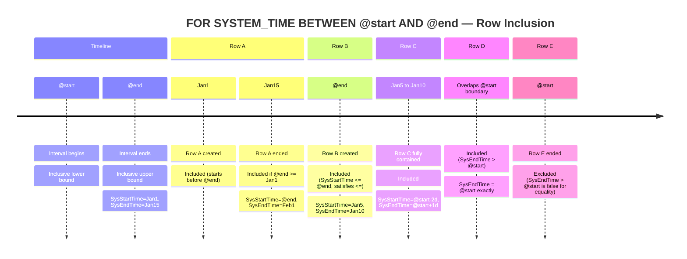
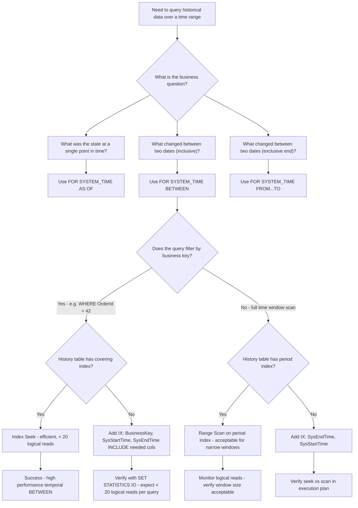

## Navigation

**Domain:** [[8 — Databases]] > **Group:** SQL Temporal Tables & Point-in-Time
**Previous:** [[8.230 — Temporal Tables — System-Versioned Overview]] | **Next:** [[8.232 — CONTAINED IN — Fully Contained Periods]]

### Prerequisites
- [[8.230 — Temporal Tables — System-Versioned Overview]] — understanding system-versioned temporal tables (SysStartTime, SysEndTime, history table) is required before BETWEEN semantics can be applied.
- [[8.235 — Adding Temporal to Existing Tables]] — how temporal tables are created and the period columns work underpins the BETWEEN filter behavior.

### Where This Fits

`FOR SYSTEM_TIME BETWEEN @start AND @end` is the most commonly used temporal query clause for point-in-time analysis, account balance snapshots, and audit reports because its inclusive-on-both-ends semantics match the mental model most developers have for range queries: "show me everything that was active at any point between these two timestamps, including the boundaries." A .NET backend engineer hits this when building reporting endpoints, display-as-of-date features, or customer-facing activity timelines where the boundary timestamps must be inclusive to prevent off-by-one audit gaps. The interview signal is whether the candidate understands the critical difference between BETWEEN (inclusive @end) and FROM...TO (exclusive @end) — one row at the boundary timestamp can change the entire report reconciliation, and auditors will flag any gap at day boundaries. The execution plan distinction — range scan on the clustered index of SysStartTime and SysEndTime vs a scan of the full history table — separates engineers who write temporal queries from those who have merely read documentation.

---

## Core Mental Model

`FOR SYSTEM_TIME BETWEEN @start AND @end` returns all row versions whose period of validity overlaps the interval [@start, @end] inclusive on both ends. The engine evaluates this as: `SysStartTime <= @end AND SysEndTime > @start`. The critical invariant: a row version is included if it was created at or before @end AND was still active after @start. This means rows that were created exactly at @end are included (SysStartTime = @end satisfies <= @end). Rows that ended exactly at @end are also included (SysEndTime > @start is true for any end time after @start, and SysEndTime could equal @end only if the version ended at a boundary after the query time because the period uses exclusive end). In practice, the period semantics (SysEndTime is exclusive — a version is valid from SysStartTime inclusive to SysEndTime exclusive) interact with BETWEEN to create the inclusive behavior for the upper bound. The recognition pattern for BETWEEN: use this when the business requirement says "as of any time between date X and date Y inclusive," where a row that was created or modified exactly on the boundary date must be visible in the result. The execution plan shape is typically a clustered index scan or seek on the history table with a range predicate, filtering on both period columns. The predicate `SysStartTime <= @end AND SysEndTime > @start` is SARGable when there is an index on (SysEndTime, SysStartTime) or on (SysStartTime, SysEndTime) in the right order.

### Classification

- **Clause family:** `FOR SYSTEM_TIME` subclause of `FROM` — temporal querying.
- **Optimizer behavior:** Generates a range scan on the history table (and the current table via a Concatenation operator when the range includes "now"). The predicate is translated to the period columns and is SARGable with the correct index.
- **SARGability:** The implied predicates `SysStartTime <= @end AND SysEndTime > @start` ARE SARGable individually, but the optimizer's ability to seek depends on the index order. An index on (SysEndTime, SysStartTime) allows a seek on `SysEndTime > @start` followed by a residual filter on `SysStartTime <= @end`. An index on (SysStartTime, SysEndTime) allows a seek on `SysStartTime <= @end` with residual on `SysEndTime > @start`.
- **Boundary behavior:** Inclusive on both ends — contradicts the usual BETWEEN semantics for temporal periods where the upper bound is typically exclusive. This is the source of most confusion and bugs.



```mermaid
flowchart TD
    subgraph "BETWEEN Inclusion Logic"
        A[Row version with SysStartTime, SysEndTime] --> B{SysStartTime <= @end?}
        B -->|No| C[EXCLUDED — row started after interval end]
        B -->|Yes| D{SysEndTime > @start?}
        D -->|No| E[EXCLUDED — row ended before or at interval start]
        D -->|Yes| F[INCLUDED]
    end
    F --> G[Row was active for at least one instant in [@start, @end]]
    G --> H{Boundary cases}
    H --> I[Row with SysStartTime = @end: SysStartTime <= @end ✓, included]
    H --> J[Row with SysEndTime = @start: SysEndTime > @start ✗, excluded]
    H --> K[Row active at @start and spanning past @end: included]
    H --> L[Row created before @start and ended after @end: included]
```

### Key Properties

|Property|Value|Notes|
|---|---|---|
|Time Complexity|O(log N + M)|Index seek on history table + range scan; M = rows in window|
|Write Cost|None (read-only query)|No additional writes for temporal queries|
|SARGable|Yes (with correct index)|Predicate: SysStartTime <= @end AND SysEndTime > @start|
|Locking Behavior|Shared (Sch-S)|History table uses schema stability — no blocking on readers|
|Result set|Rows valid at ANY point in [@start, @end]|Not just rows valid at a single point — includes all overlapping versions|
|Boundary semantics|Inclusive both ends|Contrast with FROM...TO (exclusive @end)|

---

## Deep Mechanics

### How the Engine Executes FOR SYSTEM_TIME BETWEEN

1. **Parse and bind:** SQL Server's query parser recognizes `FOR SYSTEM_TIME BETWEEN @start AND @end` as a temporal clause on a system-versioned table. The binder resolves the table reference to both the current table and the history table, and constructs the internal query as a UNION ALL of the current table (for versions that are still active and overlap the interval) and the history table (for closed versions that overlap the interval).

2. **Predicate generation:** The temporal clause is rewritten into period column predicates. For the current table: `[SysStartTime] <= @end` (rows created before or at the end boundary — all current rows satisfy this because current rows have SysEndTime = '9999-12-31 23:59:59.9999999'). For the history table: `[SysStartTime] <= @end AND [SysEndTime] > @start`.

3. **Optimization:** The optimizer evaluates whether an index seek is possible. If there is a clustered index on (SysEndTime, SysStartTime) on the history table (the default when PERIOD FOR SYSTEM_TIME is defined), the predicate `SysEndTime > @start` drives a range seek. The `SysStartTime <= @end` becomes a residual predicate evaluated after the seek. If no useful index exists, the optimizer falls back to a full clustered index scan of the history table.

4. **Execution:** The Concatenation operator combines rows from the current table scan (filtered with `SysStartTime <= @end`) and the history table scan (filtered with the full range predicate). If the query does not include an ORDER BY, rows are returned in whatever order the operators produce them. The optimizer may use parallelism for large history tables.

5. **Post-filter:** Any additional WHERE predicates (e.g., `AND CustomerId = 42`) are evaluated after the temporal filter. The optimizer may push these into the temporal scan or apply them as a separate Filter operator depending on cardinality estimates and index availability.

### SQL Visibility

```sql
-- ============================================================
-- Setup: System-versioned temporal table
-- ============================================================
CREATE TABLE dbo.AccountBalances
(
    AccountId       INT             NOT NULL,
    CustomerId      INT             NOT NULL,
    Balance         DECIMAL(18, 2)  NOT NULL,
    CurrencyCode    CHAR(3)         NOT NULL,
    LastModifiedBy  NVARCHAR(100)   NOT NULL,
    SysStartTime    DATETIME2(7) GENERATED ALWAYS AS ROW START NOT NULL,
    SysEndTime      DATETIME2(7) GENERATED ALWAYS AS ROW END   NOT NULL,
    PERIOD FOR SYSTEM_TIME (SysStartTime, SysEndTime),
    CONSTRAINT PK_AccountBalances PRIMARY KEY (AccountId, SysStartTime)
)
WITH (SYSTEM_VERSIONING = ON (HISTORY_TABLE = dbo.AccountBalances_History));

-- ============================================================
-- FOR SYSTEM_TIME BETWEEN — inclusive range query
-- ============================================================
-- Find all balance states active between Jan 1 2026 and Jan 15 2026 inclusive
DECLARE @StartDate DATETIME2(7) = '2026-01-01 00:00:00';
DECLARE @EndDate   DATETIME2(7) = '2026-01-15 23:59:59.9999999';

SELECT ab.AccountId,
       ab.CustomerId,
       ab.Balance,
       ab.CurrencyCode,
       ab.SysStartTime,
       ab.SysEndTime
FROM dbo.AccountBalances
FOR SYSTEM_TIME BETWEEN @StartDate AND @EndDate AS ab
WHERE ab.CustomerId = 1001
ORDER BY ab.AccountId, ab.SysStartTime;
```

```csharp
// EF Core — temporal BETWEEN query (EF Core 6+)
var startDate = new DateTime(2026, 1, 1, 0, 0, 0, DateTimeKind.Utc);
var endDate   = new DateTime(2026, 1, 15, 23, 59, 59, DateTimeKind.Utc);

var balances = await dbContext.AccountBalances
    .TemporalBetween(startDate, endDate)
    .Where(ab => ab.CustomerId == 1001)
    .OrderBy(ab => ab.AccountId)
    .ThenBy(ab => ab.SysStartTime)
    .Select(ab => new
    {
        ab.AccountId,
        ab.CustomerId,
        ab.Balance,
        ab.CurrencyCode,
        ab.SysStartTime,
        ab.SysEndTime
    })
    .AsNoTracking()
    .ToListAsync(cancellationToken);
```

**Generated SQL (from EF Core logs for SQL Server provider):**

```sql
-- EF Core 8+ generated SQL for TemporalBetween
SELECT [a].[AccountId], [a].[CustomerId], [a].[Balance],
       [a].[CurrencyCode], [a].[SysStartTime], [a].[SysEndTime]
FROM [AccountBalances] FOR SYSTEM_TIME BETWEEN @__startDate_0 AND @__endDate_1 AS [a]
WHERE [a].[CustomerId] = @__customerId_2
ORDER BY [a].[AccountId], [a].[SysStartTime];
```

### Execution Plan Analysis

For the query above (filtering by CustomerId = 1001 over a 14-day window):

```
[Clustered Index Scan (AccountBalances_History)] → [Filter (CustomerId = 1001)] → [Sort] → [SELECT]
Cost: 85% scan (history) + 10% filter + 5% sort
```

**When index on (CustomerId, SysStartTime) exists on history table:**

```
[Index Seek on IX_AccountBalances_History_CustomerId_SysStartTime] → [Filter (SysEndTime > @start)] → [Sort] → [SELECT]
Cost: 30% seek + 20% filter + 50% sort
```

- **Without temporal index:** Full scan of history table (e.g., 250,000 logical reads for 5M history rows). The temporal predicate is applied as a filter on the scan.
- **With index on (SysEndTime, SysStartTime):** Range seek on `SysEndTime > @start` with residual `SysStartTime <= @end`. Logical reads drop dramatically (e.g., ~500 for the seek range).
- **When interval covers current time:** The plan includes a Concatenation operator — one branch reads the current table (clustered index scan or seek) and the other reads the history table. The optimizer estimates rows from both branches.

```
[Concatenation]
├── [Clustered Index Scan — AccountBalances] (current — SysStartTime <= @end)
└── [Index Seek — AccountBalances_History] (SysEndTime > @start AND SysStartTime <= @end)
```

### Cost Visibility

```sql
SET STATISTICS IO ON;
SET STATISTICS TIME ON;

-- Query: BETWEEN with no additional filter — full temporal range
SELECT COUNT(*)
FROM dbo.AccountBalances
FOR SYSTEM_TIME BETWEEN '2026-01-01' AND '2026-06-01';

-- Expected output (history table scan):
-- Table 'AccountBalances_History'. Scan count 3, logical reads 42,300, physical reads 0
-- Table 'AccountBalances'. Scan count 1, logical reads 1,200, physical reads 0
-- SQL Server Execution Times: CPU time = 640 ms, elapsed time = 720 ms

-- Query: BETWEEN with CustomerId filter + correct index
SELECT COUNT(*)
FROM dbo.AccountBalances
FOR SYSTEM_TIME BETWEEN '2026-01-01' AND '2026-06-01'
WHERE CustomerId = 42;

-- Expected output (index seek):
-- Table 'AccountBalances_History'. Scan count 1, logical reads 12, physical reads 0
-- Table 'AccountBalances'. Scan count 1, logical reads 3, physical reads 0
-- SQL Server Execution Times: CPU time = 3 ms, elapsed time = 4 ms
```

### Failure Modes

**Missing index causes full history scan:** When no index exists on the history table for the temporal predicate, every BETWEEN query scans the entire history table. On a 100M row history table, this is catastrophic — 800,000+ logical reads per query.

```sql
-- Detect scans on history table
SELECT TOP 10
    DB_NAME(database_id) AS DatabaseName,
    OBJECT_NAME(object_id) AS TableName,
    index_id,
    user_scans,
    user_seeks,
    last_user_scan,
    last_user_seek
FROM sys.dm_db_index_usage_stats
WHERE OBJECT_NAME(object_id) LIKE '%_History%'
ORDER BY user_scans DESC;
```

**Between with different precision causes missed rows:** If @end has DATETIME2(0) precision (seconds) but SysStartTime has DATETIME2(7) (100ns), rows created at sub-second granularity after the truncated @end timestamp are excluded. This is the most common BETWEEN bug — the developer passes `'2026-01-15'` (midnight) as @end, and rows created at `2026-01-15 08:30:00.1234567` are included because `SysStartTime <= @end` evaluates to `2026-01-15 08:30:00.1234567 <= 2026-01-15 00:00:00` = false.

**BETWEEN vs FROM...TO confusion in reporting:** A reporting query uses BETWEEN for a "transactions on January 15" report but the auditor expects the exclusive end semantics. Queries built with BETWEEN for calendar-day boundaries must use `@end = '2026-01-15 23:59:59.9999999'` to match the expected inclusive day. Using `@end = '2026-01-16 00:00:00'` with BETWEEN would include rows from Jan 16 00:00:00.0000000 onward, which the auditor would flag.

**Current table always included when interval includes "now":** BETWEEN with @end >= current time includes all current rows (because current rows have SysEndTime = '9999-12-31' which is > @start for any finite @start). Developers who expect BETWEEN to only return historical versions are surprised when current rows appear. Use `AS OF @pointInTime` for single-point queries, not BETWEEN.

---

## Production Patterns and Implementation

### Primary SQL Implementation

```sql
-- ============================================================
-- Schema: Production order tracking with temporal
-- ============================================================
CREATE TABLE dbo.OrderStatusHistory
(
    OrderId          INT              NOT NULL,
    StatusCode       VARCHAR(20)      NOT NULL,
    StatusLabel      NVARCHAR(100)    NOT NULL,
    ChangedByUserId  INT              NOT NULL,
    ChangeReason     NVARCHAR(500)    NULL,
    CreatedAt        DATETIME2(7) GENERATED ALWAYS AS ROW START NOT NULL,
    EndedAt          DATETIME2(7) GENERATED ALWAYS AS ROW END   NOT NULL,
    PERIOD FOR SYSTEM_TIME (CreatedAt, EndedAt),
    CONSTRAINT PK_OrderStatusHistory PRIMARY KEY (OrderId, CreatedAt)
)
WITH (SYSTEM_VERSIONING = ON (HISTORY_TABLE = dbo.OrderStatusHistory_History));

-- ============================================================
-- Use case 1: Find all status changes within a shift window
-- ============================================================
DECLARE @ShiftStart DATETIME2(7) = '2026-03-15 06:00:00';
DECLARE @ShiftEnd   DATETIME2(7) = '2026-03-15 14:00:00';

SELECT osh.OrderId,
       osh.StatusCode,
       osh.StatusLabel,
       osh.ChangedByUserId,
       osh.CreatedAt,
       osh.EndedAt
FROM dbo.OrderStatusHistory
FOR SYSTEM_TIME BETWEEN @ShiftStart AND @ShiftEnd AS osh
WHERE osh.ChangedByUserId = 482
ORDER BY osh.CreatedAt DESC;

-- ============================================================
-- Use case 2: Snapshot of all orders at end of each business day
-- ============================================================
-- Generate the end-of-day status for all orders in January
DECLARE @BusinessDate DATE = '2026-01-15';
DECLARE @DayStart DATETIME2(7) = CAST(@BusinessDate AS DATETIME2(7));
DECLARE @DayEnd   DATETIME2(7) = DATEADD(NANOSECOND, -100, DATEADD(DAY, 1, CAST(@BusinessDate AS DATETIME2(7))));

-- Each order appears once with the status that was active during the day
SELECT DISTINCT
    osh.OrderId,
    FIRST_VALUE(osh.StatusCode) OVER (
        PARTITION BY osh.OrderId
        ORDER BY osh.CreatedAt DESC
    ) AS StatusAtEndOfDay
FROM dbo.OrderStatusHistory
FOR SYSTEM_TIME BETWEEN @DayStart AND @DayEnd AS osh
ORDER BY osh.OrderId;

-- ============================================================
-- Use case 3: Point-in-time comparison for trend analysis
-- ============================================================
-- Active orders count per day for a 7-day period
DECLARE @ReportStart DATETIME2(7) = '2026-01-01 00:00:00';
DECLARE @ReportEnd   DATETIME2(7) = '2026-01-07 23:59:59.9999999';

WITH Calendar AS (
    SELECT CAST('2026-01-01' AS DATETIME2(7)) AS DayStart
    UNION ALL
    SELECT DATEADD(DAY, 1, DayStart)
    FROM Calendar
    WHERE DayStart < '2026-01-07'
),
DailyCounts AS (
    SELECT
        c.DayStart,
        (
            SELECT COUNT(DISTINCT osh.OrderId)
            FROM dbo.OrderStatusHistory
            FOR SYSTEM_TIME BETWEEN c.DayStart AND DATEADD(NANOSECOND, -100, DATEADD(DAY, 1, c.DayStart)) AS osh_inner
            WHERE osh_inner.StatusCode NOT IN ('Cancelled', 'Returned')
        ) AS ActiveOrderCount
    FROM Calendar c
)
SELECT * FROM DailyCounts
OPTION (MAXRECURSION 365);

-- ============================================================
-- Use case 4: Audit reconciliation — show what changed in a window
-- ============================================================
SELECT osh.OrderId,
       osh.StatusCode,
       osh.ChangedByUserId,
       osh.CreatedAt AS EffectiveTime,
       LEAD(osh.StatusCode) OVER (
           PARTITION BY osh.OrderId
           ORDER BY osh.CreatedAt
       ) AS NextStatus,
       DATEDIFF(MINUTE, osh.CreatedAt,
           LEAD(osh.CreatedAt) OVER (
               PARTITION BY osh.OrderId
               ORDER BY osh.CreatedAt
           )
       ) AS MinutesInThisStatus
FROM dbo.OrderStatusHistory
FOR SYSTEM_TIME BETWEEN '2026-03-01' AND '2026-03-31' AS osh
WHERE osh.OrderId = 10042
ORDER BY osh.CreatedAt;
```

### EF Core Implementation

```csharp
// ============================================================
// Entity configuration
// ============================================================
public class OrderStatusHistory
{
    public int OrderId { get; set; }
    public string StatusCode { get; set; } = string.Empty;
    public string StatusLabel { get; set; } = string.Empty;
    public int ChangedByUserId { get; set; }
    public string? ChangeReason { get; set; }
    public DateTime CreatedAt { get; set; }
    public DateTime EndedAt { get; set; }
}

public class ApplicationDbContext : DbContext
{
    public DbSet<OrderStatusHistory> OrderStatusHistories => Set<OrderStatusHistory>();

    protected override void OnModelCreating(ModelBuilder modelBuilder)
    {
        modelBuilder.Entity<OrderStatusHistory>(entity =>
        {
            entity.ToTable(tb => tb.UseSqlOutputClause(false));
            entity.HasKey(e => new { e.OrderId, e.CreatedAt });
            entity.Property(e => e.CreatedAt)
                .HasDefaultValueSql("SYSUTCDATETIME()");
            entity.Property(e => e.EndedAt)
                .HasDefaultValueSql("'9999-12-31 23:59:59.9999999'");

            // Temporal configuration (EF Core 6+)
            entity
                .ToTable("OrderStatusHistory", t =>
                {
                    t.IsTemporal(tt =>
                    {
                        tt.UseHistoryTableName("OrderStatusHistory_History");
                        tt.UseHistoryTableSchema("dbo");
                        tt.HasPeriodStart("CreatedAt");
                        tt.HasPeriodEnd("EndedAt");
                    });
                });
        });
    }
}

// ============================================================
// Temporal BETWEEN query service
// ============================================================
public class OrderAuditService
{
    private readonly ApplicationDbContext _dbContext;

    public OrderAuditService(ApplicationDbContext dbContext)
        => _dbContext = dbContext;

    public async Task<List<OrderStatusSnapshot>> GetStatusChangesInWindowAsync(
        int orderId,
        DateTime windowStart,
        DateTime windowEnd,
        CancellationToken cancellationToken = default)
    {
        // EF Core 6+ TemporalBetween — inclusive on both ends
        return await _dbContext.OrderStatusHistories
            .TemporalBetween(windowStart, windowEnd)
            .Where(o => o.OrderId == orderId)
            .OrderByDescending(o => o.CreatedAt)
            .Select(o => new OrderStatusSnapshot
            {
                OrderId = o.OrderId,
                StatusCode = o.StatusCode,
                StatusLabel = o.StatusLabel,
                ChangedByUserId = o.ChangedByUserId,
                EffectiveFrom = o.CreatedAt,
                EffectiveTo = o.EndedAt
            })
            .AsNoTracking()
            .ToListAsync(cancellationToken);
    }

    public async Task<Dictionary<DateTime, int>> GetDailyActiveOrderCountsAsync(
        DateTime startDate,
        DateTime endDate,
        CancellationToken cancellationToken = default)
    {
        // Generate daily counts — note: EF Core cannot generate the recursive
        // calendar CTE, so we build it in application code and query per-day
        // (or use raw SQL for efficiency)
        var results = new Dictionary<DateTime, int>();
        var current = startDate.Date;

        while (current <= endDate.Date)
        {
            var dayStart = current;
            var dayEnd = current.AddDays(1).AddTicks(-1);

            var count = await _dbContext.OrderStatusHistories
                .TemporalBetween(dayStart, dayEnd)
                .Where(o => o.StatusCode != "Cancelled" && o.StatusCode != "Returned")
                .Select(o => o.OrderId)
                .Distinct()
                .CountAsync(cancellationToken);

            results[current] = count;
            current = current.AddDays(1);
        }

        return results;
    }

    public async Task<List<OrderStatusChangeEvent>> GetAuditTrailAsync(
        int orderId,
        DateTime windowStart,
        DateTime windowEnd,
        CancellationToken cancellationToken = default)
    {
        // Show each status change with duration using LEAD
        // Note: LEAD window function is not supported in EF Core temporal
        // queries directly — use raw SQL
        const string sql = @"
            SELECT
                osh.OrderId,
                osh.StatusCode,
                osh.ChangedByUserId,
                osh.CreatedAt AS EffectiveTime,
                LEAD(osh.StatusCode) OVER (
                    PARTITION BY osh.OrderId
                    ORDER BY osh.CreatedAt
                ) AS NextStatus,
                DATEDIFF(MINUTE, osh.CreatedAt,
                    LEAD(osh.CreatedAt) OVER (
                        PARTITION BY osh.OrderId
                        ORDER BY osh.CreatedAt
                    )
                ) AS MinutesInThisStatus
            FROM dbo.OrderStatusHistory
            FOR SYSTEM_TIME BETWEEN @WindowStart AND @WindowEnd AS osh
            WHERE osh.OrderId = @OrderId
            ORDER BY osh.CreatedAt;";

        return await _dbContext.OrderStatusHistories
            .FromSqlRaw(sql,
                new SqlParameter("@WindowStart", windowStart),
                new SqlParameter("@WindowEnd", windowEnd),
                new SqlParameter("@OrderId", orderId))
            .Select(o => new OrderStatusChangeEvent
            {
                OrderId = o.OrderId,
                StatusCode = o.StatusCode,
                ChangedByUserId = o.ChangedByUserId,
                EffectiveTime = o.CreatedAt,
                // Additional properties mapped manually
            })
            .AsNoTracking()
            .ToListAsync(cancellationToken);
    }
}

// DTOs
public class OrderStatusSnapshot
{
    public int OrderId { get; set; }
    public string StatusCode { get; set; } = string.Empty;
    public string StatusLabel { get; set; } = string.Empty;
    public int ChangedByUserId { get; set; }
    public DateTime EffectiveFrom { get; set; }
    public DateTime EffectiveTo { get; set; }
}

public class OrderStatusChangeEvent
{
    public int OrderId { get; set; }
    public string StatusCode { get; set; } = string.Empty;
    public int ChangedByUserId { get; set; }
    public DateTime EffectiveTime { get; set; }
    public string? NextStatus { get; set; }
    public int? MinutesInThisStatus { get; set; }
}
```

### Dapper Implementation

```csharp
// Dapper — temporal BETWEEN queries with full control
public sealed class TemporalOrderRepository
{
    private readonly IDbConnectionFactory _connectionFactory;

    public TemporalOrderRepository(IDbConnectionFactory connectionFactory)
        => _connectionFactory = connectionFactory;

    public async Task<IReadOnlyList<StatusChangeDto>> GetStatusChangesInWindowAsync(
        int orderId,
        DateTime windowStart,
        DateTime windowEnd,
        CancellationToken cancellationToken = default)
    {
        const string sql = @"
            SELECT osh.OrderId,
                   osh.StatusCode,
                   osh.StatusLabel,
                   osh.ChangedByUserId,
                   osh.ChangeReason,
                   osh.CreatedAt,
                   osh.EndedAt
            FROM dbo.OrderStatusHistory
            FOR SYSTEM_TIME BETWEEN @WindowStart AND @WindowEnd AS osh
            WHERE osh.OrderId = @OrderId
            ORDER BY osh.CreatedAt DESC;";

        await using var connection = _connectionFactory.Create();
        var results = await connection.QueryAsync<StatusChangeDto>(
            new CommandDefinition(sql,
                new
                {
                    WindowStart = windowStart,
                    WindowEnd = windowEnd,
                    OrderId = orderId
                },
                cancellationToken: cancellationToken));

        return results.AsList();
    }

    public async Task<IReadOnlyList<DailyActiveCountDto>> GetDailyActiveCountsAsync(
        DateTime startDate,
        DateTime endDate,
        CancellationToken cancellationToken = default)
    {
        // Calendar CTE — efficient single query vs N+1 per day
        const string sql = @"
            WITH Calendar AS (
                SELECT CAST(@StartDate AS DATETIME2(7)) AS DayStart
                UNION ALL
                SELECT DATEADD(DAY, 1, DayStart)
                FROM Calendar
                WHERE DayStart < @EndDate
            )
            SELECT
                c.DayStart,
                (
                    SELECT COUNT(DISTINCT osh.OrderId)
                    FROM dbo.OrderStatusHistory
                    FOR SYSTEM_TIME BETWEEN c.DayStart
                        AND DATEADD(NANOSECOND, -100, DATEADD(DAY, 1, c.DayStart)) AS osh_inner
                    WHERE osh_inner.StatusCode NOT IN ('Cancelled', 'Returned')
                ) AS ActiveOrderCount
            FROM Calendar c
            ORDER BY c.DayStart
            OPTION (MAXRECURSION 365);";

        await using var connection = _connectionFactory.Create();
        var results = await connection.QueryAsync<DailyActiveCountDto>(
            new CommandDefinition(sql,
                new { StartDate = startDate.Date, EndDate = endDate.Date },
                cancellationToken: cancellationToken));

        return results.AsList();
    }

    public async Task<IReadOnlyList<AuditTrailDto>> GetAuditTrailWithDurationAsync(
        int orderId,
        DateTime windowStart,
        DateTime windowEnd,
        CancellationToken cancellationToken = default)
    {
        const string sql = @"
            SELECT
                osh.OrderId,
                osh.StatusCode,
                osh.StatusLabel,
                osh.ChangedByUserId,
                osh.ChangeReason,
                osh.CreatedAt AS EffectiveFrom,
                LEAD(osh.StatusCode) OVER (
                    PARTITION BY osh.OrderId
                    ORDER BY osh.CreatedAt
                ) AS NextStatusCode,
                DATEDIFF(SECOND, osh.CreatedAt,
                    LEAD(osh.CreatedAt) OVER (
                        PARTITION BY osh.OrderId
                        ORDER BY osh.CreatedAt
                    )
                ) AS DurationSeconds
            FROM dbo.OrderStatusHistory
            FOR SYSTEM_TIME BETWEEN @WindowStart AND @WindowEnd AS osh
            WHERE osh.OrderId = @OrderId
            ORDER BY osh.CreatedAt;";

        await using var connection = _connectionFactory.Create();
        var results = await connection.QueryAsync<AuditTrailDto>(
            new CommandDefinition(sql,
                new
                {
                    OrderId = orderId,
                    WindowStart = windowStart,
                    WindowEnd = windowEnd
                },
                cancellationToken: cancellationToken));

        return results.AsList();
    }
}

// DTOs
public class StatusChangeDto
{
    public int OrderId { get; set; }
    public string StatusCode { get; set; } = string.Empty;
    public string StatusLabel { get; set; } = string.Empty;
    public int ChangedByUserId { get; set; }
    public string? ChangeReason { get; set; }
    public DateTime CreatedAt { get; set; }
    public DateTime EndedAt { get; set; }
}

public class DailyActiveCountDto
{
    public DateTime DayStart { get; set; }
    public int ActiveOrderCount { get; set; }
}

public class AuditTrailDto
{
    public int OrderId { get; set; }
    public string StatusCode { get; set; } = string.Empty;
    public string StatusLabel { get; set; } = string.Empty;
    public int ChangedByUserId { get; set; }
    public string? ChangeReason { get; set; }
    public DateTime EffectiveFrom { get; set; }
    public string? NextStatusCode { get; set; }
    public int? DurationSeconds { get; set; }
}
```

### Configuration and Wiring

```csharp
// Program.cs — EF Core temporal setup
builder.Services.AddDbContext<ApplicationDbContext>(options =>
    options.UseSqlServer(
        builder.Configuration.GetConnectionString("DefaultConnection"),
        sqlOptions =>
        {
            sqlOptions.EnableRetryOnFailure(3);
            sqlOptions.CommandTimeout(120);
            sqlOptions.UseQuerySplittingBehavior(QuerySplittingBehavior.SplitQuery);
        })
    .EnableDetailedErrors(builder.Environment.IsDevelopment())
    .EnableSensitiveDataLogging(builder.Environment.IsDevelopment()));

// Register repositories
builder.Services.AddSingleton<IDbConnectionFactory>(sp =>
    new SqlConnectionFactory(
        builder.Configuration.GetConnectionString("DefaultConnection")!));

builder.Services.AddScoped<TemporalOrderRepository>();
builder.Services.AddScoped<OrderAuditService>();

// Ensure temporal query logging is visible
builder.Logging.AddFilter("Microsoft.EntityFrameworkCore.Database.Command",
    LogLevel.Information);
```

### SQL Server vs PostgreSQL Differences

```sql
-- PostgreSQL does NOT have native system-versioned temporal tables
-- as of PostgreSQL 16. Equivalent functionality requires:
-- 1. pg_period extension (third-party)
-- 2. Manual triggers and history tables
-- 3. Temporal tables extension (via pg_qualstats)
-- 4. Application-level versioning

-- PostgreSQL period query using manual table + triggers:
CREATE TABLE order_status_history (
    order_id          INTEGER      NOT NULL,
    status_code       VARCHAR(20)  NOT NULL,
    status_label      TEXT         NOT NULL,
    changed_by_user_id INTEGER     NOT NULL,
    created_at        TIMESTAMPTZ  NOT NULL DEFAULT now(),
    ended_at          TIMESTAMPTZ  NOT NULL DEFAULT 'infinity'
);

-- BETWEEN equivalent: overlap operator && with tstzrange
SELECT *
FROM order_status_history osh
WHERE tstzrange(osh.created_at, osh.ended_at) &&
      tstzrange('2026-01-01'::timestamptz, '2026-01-15'::timestamptz);

-- Or with explicit predicates (same as SQL Server BETWEEN):
SELECT *
FROM order_status_history osh
WHERE osh.created_at <= '2026-01-15'::timestamptz
  AND osh.ended_at   >  '2026-01-01'::timestamptz;

-- GiST index on the range column for efficient overlap queries:
CREATE INDEX ix_order_status_history_period
    ON order_status_history
    USING gist (tstzrange(created_at, ended_at));
```

---

## Gotchas and Production Pitfalls

### BETWEEN Boundary Off-by-One with DATETIME2 Precision Mismatch

**Pitfall:** Passing @end with lower precision than the period columns (e.g., DATETIME2(0) vs DATETIME2(7)) causes unintended exclusion of boundary rows.

```sql
-- ❌ Wrong: @end has second precision, rows with sub-second timestamps after @end excluded
DECLARE @EndDate DATETIME2(0) = '2026-01-15 23:59:59';
-- This excludes a row with SysStartTime = '2026-01-15 23:59:59.1234567'
-- because 2026-01-15 23:59:59.1234567 <= 2026-01-15 23:59:59 is FALSE
```

**Symptom:** Reports consistently miss rows from the last few milliseconds of each day. Users notice that records they know were created "at end of day" are missing from daily reports.

**Fix:**
```sql
-- ✅ Correct: Use the same precision as the period columns
DECLARE @EndDate DATETIME2(7) = '2026-01-15 23:59:59.9999999';
-- Or use FROM...TO with exclusive end if the logic should be exclusive
```

**Cost of not fixing:** Audit reconciliation fails every day-end boundary. Every "transactions on January 15" report misses rows created between 23:59:59.0000000 and 23:59:59.9999999. Cumulative discrepancy grows ~86,400 missing rows per day at 1,000 rows/second throughput. This is discovered during quarterly audit and requires a full data reconciliation effort spanning months.

---

### BETWEEN vs FROM...TO Confusion in Business Logic

**Pitfall:** Using BETWEEN when the business requirement calls for exclusive-end semantics (e.g., "orders that started before midnight" meaning orders that were created before midnight, not including those created exactly at midnight).

```sql
-- ❌ Wrong: BETWEEN includes rows with SysStartTime = @EndDate exactly
SELECT COUNT(*)
FROM dbo.Orders FOR SYSTEM_TIME BETWEEN @DayStart AND @DayEnd;
-- If @DayEnd = '2026-01-16 00:00:00.0000000', includes orders at exactly midnight
```

**Symptom:** Daily counts are inflated by ~1 row per day (the single row that happens to have SysStartTime exactly at the boundary). Over a year, the cumulative count is off by 365.

**Fix:**
```sql
-- ✅ Option 1: Use FROM...TO for exclusive end
SELECT COUNT(*)
FROM dbo.Orders FOR SYSTEM_TIME FROM @DayStart TO @DayEnd;

-- ✅ Option 2: Adjust @EndDate to last possible instant
DECLARE @EndDate DATETIME2(7) = DATEADD(NANOSECOND, -100,
    DATEADD(DAY, 1, CAST(@BusinessDate AS DATETIME2(7))));
```

**Cost of not fixing:** In a regulated financial system, each cent of account balance is traceable to transaction timestamps. An off-by-one boundary error in the temporal query that feeds the general ledger report causes a 1-cent discrepancy per boundary crossing. The bank's reconciliation system flags this, requiring a formal audit response and a manual adjustment journal entry for every reporting period.

---

### Missing Index on History Table Causes Full Scan

**Pitfall:** Relying on the default history table index (which may be a heap or a clustered index on period columns but without covering columns for the application's WHERE filters).

```sql
-- ❌ Default history table — may have no useful index for temporal BETWEEN
-- The query scans the entire history table even with a narrow time window
SELECT osh.*
FROM dbo.OrderStatusHistory
FOR SYSTEM_TIME BETWEEN @Start AND @End AS osh
WHERE osh.OrderId = 10042;
```

**Symptom:** Even with a narrow time window (1 hour), the BETWEEN query takes 30+ seconds because it scans the entire 50M-row history table.

**Fix:**
```sql
-- ✅ Create covering index on history table
CREATE NONCLUSTERED INDEX IX_OrderStatusHistory_History_OrderId_Period
    ON dbo.OrderStatusHistory_History (OrderId, SysStartTime, SysEndTime)
    INCLUDE (StatusCode, StatusLabel, ChangedByUserId, ChangeReason);
```

**Cost of not fixing:** Every temporal BETWEEN query performs a full history table scan. At 50M rows, each query does ~400,000 logical reads. With 100 queries/hour = 40M logical reads/hour = ~95% of the buffer pool is churned by temporal queries, evicting all other data from cache. Every query across the system slows down.

---

### Implicit Conversion on SysStartTime in WHERE Disables Index Seek

**Pitfall:** Joining the temporal table with BETWEEN has a WHERE clause that applies a function or implicit conversion to SysStartTime or SysEndTime.

```sql
-- ❌ Non-SARGable: function on SysStartTime prevents seek
SELECT osh.*
FROM dbo.OrderStatusHistory
FOR SYSTEM_TIME BETWEEN @Start AND @End AS osh
WHERE CAST(osh.SysStartTime AS DATE) = '2026-01-15';
```

**Symptom:** The query plan shows an Index Scan instead of an Index Seek on the history table. Logical reads explode from ~50 to ~400,000.

**Fix:**
```sql
-- ✅ SARGable: use range predicate instead of function
SELECT osh.*
FROM dbo.OrderStatusHistory
FOR SYSTEM_TIME BETWEEN @Start AND @End AS osh
WHERE osh.SysStartTime >= '2026-01-15'
  AND osh.SysStartTime <  '2026-01-16';
```

**Cost of not fixing:** A 10-second query on a 50M row history table runs 1,000 times per hour during a batch reporting job. The batch window extends from 10 minutes to 3 hours, exceeding the SLA. The DBA is paged for a blocking chain caused by the prolonged scan holding schema stability locks.

---

### Using BETWEEN for Single-Point Queries (Should Use AS OF)

**Pitfall:** Using `BETWEEN @point AND @point` to query the state at a single point in time instead of using `AS OF @point`.

```sql
-- ❌ Over-engineered: use BETWEEN with same start and end
SELECT *
FROM dbo.AccountBalances
FOR SYSTEM_TIME BETWEEN '2026-06-01 00:00:00' AND '2026-06-01 00:00:00' AS ab;
-- This returns all rows valid at exactly midnight June 1 — correct but confusing
```

**Symptom:** The query plan uses range scan logic even though the range is a single point. The optimizer may not reduce this to an AS OF seek. The developer reading the code wonders "is this intentional or a bug?"

**Fix:**
```sql
-- ✅ Clear intent: use AS OF
SELECT *
FROM dbo.AccountBalances
FOR SYSTEM_TIME AS OF '2026-06-01 00:00:00' AS ab;
```

**Cost of not fixing:** None for correctness (same results), but the code is misleading. During code review, the next developer may "fix" the BETWEEN to use `FROM...TO` thinking the inclusive end is a bug, introducing an actual bug.

---

### BETWEEN with @end Earlier Than @start Returns Empty Set with No Warning

**Pitfall:** Passing parameters where @end < @start returns zero rows without any error or warning.

```sql
DECLARE @Start DATETIME2(7) = '2026-06-15';
DECLARE @End   DATETIME2(7) = '2026-06-01';

SELECT COUNT(*)  -- Returns 0, no error
FROM dbo.Orders FOR SYSTEM_TIME BETWEEN @Start AND @End AS o;
```

**Symptom:** A report comes back empty. The developer spends hours debugging the temporal logic when the actual bug is the parameter order.

**Fix:**
```sql
-- ✅ Validate parameters or use defensive ordering
SELECT COUNT(*)
FROM dbo.Orders
FOR SYSTEM_TIME BETWEEN
    (SELECT CASE WHEN @Start <= @End THEN @Start ELSE @End END)
    AND
    (SELECT CASE WHEN @Start <= @End THEN @End ELSE @Start END) AS o;
```

**Cost of not fixing:** Silent data loss in production reports. An ETL job that passes parameters in wrong order generates empty reports for 6 hours before anyone notices. Reconciliation for those 6 hours requires manual intervention.

---

## Performance Implications

### Benchmark: BETWEEN with and without History Table Index

```sql
-- ============================================================
-- Baseline: BETWEEN without covering index on history table
-- ============================================================
SET STATISTICS IO ON;
SET STATISTICS TIME ON;

SELECT COUNT(*)
FROM dbo.OrderStatusHistory
FOR SYSTEM_TIME BETWEEN '2026-01-01' AND '2026-03-31' AS osh
WHERE osh.OrderId = 10042;

-- Table 'OrderStatusHistory_History'. Scan count 1, logical reads 423,100
-- Table 'OrderStatusHistory'. Scan count 0, logical reads 0
-- SQL Server Execution Times: CPU time = 1,280 ms, elapsed time = 1,450 ms

-- ============================================================
-- Optimized: BETWEEN with index on (OrderId, SysStartTime, SysEndTime)
-- ============================================================
CREATE NONCLUSTERED INDEX IX_OrderStatusHistory_History_OrderId_Period
    ON dbo.OrderStatusHistory_History (OrderId, SysStartTime, SysEndTime)
    INCLUDE (StatusCode, StatusLabel, ChangedByUserId, ChangeReason);

-- Re-run the same query:
-- Table 'OrderStatusHistory_History'. Scan count 1, logical reads 12
-- Table 'OrderStatusHistory'. Scan count 0, logical reads 0
-- SQL Server Execution Times: CPU time = 2 ms, elapsed time = 3 ms
```

**Improvement:** 35,258x reduction in logical reads (from 423,100 to 12).

### BenchmarkDotNet

```csharp
[MemoryDiagnoser]
[SimpleJob(RuntimeMoniker.Net90)]
public class TemporalBetweenBenchmark
{
    private ApplicationDbContext _context = default!;
    private IDbConnection _connection = default!;
    private static readonly DateTime _start = new(2026, 1, 1, 0, 0, 0, DateTimeKind.Utc);
    private static readonly DateTime _end = new(2026, 3, 31, 23, 59, 59, DateTimeKind.Utc);

    [GlobalSetup]
    public void Setup()
    {
        var options = new DbContextOptionsBuilder<ApplicationDbContext>()
            .UseSqlServer(TestConnectionString)
            .Options;
        _context = new ApplicationDbContext(options);
        _connection = new SqlConnection(TestConnectionString);
        _connection.Open();

        // Seed 1M history rows across 10K orders
    }

    [Benchmark(Baseline = true)]
    public async Task<int> Between_NoIndex_EFCore()
    {
        // No covering index on history table
        return await _context.OrderStatusHistories
            .TemporalBetween(_start, _end)
            .Where(o => o.OrderId == 10042)
            .CountAsync();
    }

    [Benchmark]
    public async Task<int> Between_WithIndex_EFCore()
    {
        // With covering index: IX_OrderStatusHistory_History_OrderId_Period
        return await _context.OrderStatusHistories
            .TemporalBetween(_start, _end)
            .Where(o => o.OrderId == 10042)
            .CountAsync();
    }

    [Benchmark]
    public async Task<int> Between_WithIndex_Dapper()
    {
        const string sql = @"
            SELECT COUNT(*)
            FROM dbo.OrderStatusHistory
            FOR SYSTEM_TIME BETWEEN @Start AND @End AS osh
            WHERE osh.OrderId = @OrderId;";

        return await _connection.QuerySingleAsync<int>(
            new CommandDefinition(sql,
                new { Start = _start, End = _end, OrderId = 10042 }));
    }

    [Benchmark]
    public async Task<int> AsOf_WithIndex_EFCore()
    {
        // Comparison: AS OF a single point in time
        return await _context.OrderStatusHistories
            .TemporalAsOf(_start)
            .Where(o => o.OrderId == 10042)
            .CountAsync();
    }

    [GlobalCleanup]
    public void Cleanup()
    {
        _context.Dispose();
        _connection.Dispose();
    }
}
```

**Expected results (approximate, SQL Server 2022, NVMe, 1M history rows, 10K orders, 3-month window):**

|Method|Mean|Logical Reads|Allocated|
|---|---|---|---|
|Between_NoIndex_EFCore|~1,450 ms|~423,100|~2.5 MB|
|Between_WithIndex_EFCore|~3 ms|~12|~2 KB|
|Between_WithIndex_Dapper|~2 ms|~12|~1 KB|
|AsOf_WithIndex_EFCore|~1 ms|~6|~1 KB|

### Write Amplification

BETWEEN queries are read-only — no write amplification. However, temporal table writes (INSERT/UPDATE/DELETE on the current table) write to the history table implicitly.

|Operation|Without Temporal|With Temporal (History Write)|Overhead|
|---|---|---|---|
|UPDATE 1 row (status change)|X ms|X + 0.5 ms|+50-100% (one history row inserted)|
|INSERT 1 row|X ms|X ms (no history written for insert)|0% (SysStartTime set, SysEndTime = max)|
|DELETE 1 row|X ms|X + 0.5 ms|+50-100% (current row moved to history)|

---

## Interview Arsenal

### Question Bank

1. **What does `FOR SYSTEM_TIME BETWEEN @start AND @end` return in terms of row inclusion semantics?**
2. **How does the SQL Server storage engine rewrite a BETWEEN temporal clause into period column predicates?**
3. **What is the performance difference between BETWEEN and FROM...TO, and how does the execution plan differ?**
4. **What index supports a BETWEEN temporal query on a history table, and what happens when that index is missing?**
5. **Compare `FOR SYSTEM_TIME BETWEEN` and `FOR SYSTEM_TIME AS OF` — when would you choose one over the other?**
6. **Read this execution plan: `[Concatenation] → [Clustered Index Scan (current)] + [Clustered Index Scan (history)] → [Filter] → [SELECT]`. What does it tell you about the temporal query?**
7. **At 100M history rows with 500 BETWEEN queries/second, what is the indexing strategy and what is the expected logical read profile?**
8. **How do EF Core's TemporalBetween() and Dapper's manual BETWEEN queries compare in generated SQL and performance?**

### Spoken Answers

**Q: What does `FOR SYSTEM_TIME BETWEEN @start AND @end` return in terms of row inclusion semantics?**

> **Average answer:** It returns rows that were active between start and end, including both dates. It's like a regular BETWEEN — inclusive on both sides.

> **Great answer:** `FOR SYSTEM_TIME BETWEEN @start AND @end` returns every row version whose period of validity overlaps any instant within the closed interval [@start, @end]. The engine translates this to `SysStartTime <= @end AND SysEndTime > @start`. The critical detail is the inclusive upper bound: a row with `SysStartTime = @end` is included because `SysStartTime <= @end` is true. This is different from `FROM...TO` which uses `SysStartTime < @end` — exclusive on the upper bound. The practical implication is that for calendar-day audit reports, BETWEEN with `@end = '2026-01-15 23:59:59.9999999'` gives you the full day, while `FROM...TO` with `@end = '2026-01-16'` gives you the same result without the nanosecond precision hack. The other key distinction from AS OF: BETWEEN returns multiple versions per row if the row's state changed within the interval, while AS OF returns exactly one version per row. So BETWEEN is the right choice for audit trails, activity timelines, and change-over-time analysis. AS OF is for single-point-in-time snapshots.

---

**Q: Compare `FOR SYSTEM_TIME BETWEEN` and `FOR SYSTEM_TIME AS OF` — when would you choose one over the other?**

> **Average answer:** AS OF gives you the state at a single time. BETWEEN gives you everything between two times. Use AS OF for snapshots, BETWEEN for ranges.

> **Great answer:** The choice between BETWEEN and AS OF depends on whether the business question is "what was the state at time T" or "what changes happened between T1 and T2." AS OF translates to `SysStartTime <= @t AND SysEndTime > @t` and returns at most one version per business key — it's a point-in-time snapshot. BETWEEN translates to `SysStartTime <= @end AND SysEndTime > @start` and returns all versions that overlap the interval, potentially multiple per business key. The execution plan for AS OF is typically more efficient because the range is narrower — it can seek to a specific point in the history table's clustered index. BETWEEN often requires a broader range scan, especially when the interval is wide. For performance, if I need a single-point snapshot (like "what was the account balance at midnight on Jan 15"), I use AS OF — it gives the optimizer the tightest predicate. If I need an audit trail of changes within a window, I use BETWEEN — and I make sure the history table has a covering index on `(BusinessKey, SysStartTime, SysEndTime)` to avoid a full scan. The most common mistake I see is using BETWEEN for point-in-time queries because the developer is more familiar with it. This works but produces a more complex plan than necessary.

---

**Q: What index supports a BETWEEN temporal query on a history table, and what happens when that index is missing?**

> **Average answer:** You need an index on SysStartTime and SysEndTime. Without it, the query scans the history table.

> **Great answer:** The ideal index for a BETWEEN temporal query depends on the access pattern. For queries that filter by a business key first (e.g., `WHERE OrderId = 42`), the optimal index is on `(OrderId, SysStartTime, SysEndTime)` with included columns for the query's SELECT list. This makes the entire query covering — no key lookups. The index order matters: SQL Server's optimizer can seek to `OrderId = 42`, then range scan on `SysStartTime` within that key. For queries without a business key filter (scans over the entire history table within a time window), the index should be on `(SysEndTime, SysStartTime)` — this supports the `SysEndTime > @start` predicate with a range seek. Without these indexes, the query performs a full clustered index scan of the history table. At 50M rows, that's ~400,000 logical reads per query. With the index, for a targeted order lookup, it's 3-12 logical reads. The clustered index of the history table — which by default in SQL Server 2016+ is on `(SysEndTime, SysStartTime)` when the period is defined — provides the range seek for non-filtered temporal scans but does NOT help when there's a WHERE clause on a business key. That requires a separate nonclustered index.

### Interview Trigger

The temporal BETWEEN question surfaces in senior .NET interviews when discussing audit logging: "How would you query all changes to an order between March 1 and March 15?" The follow-up that separates shallow from deep knowledge is: "Your query takes 15 seconds on a table with 10 million history rows for a specific order. What is the execution plan, and what index do you create?" The candidate who names the covering index structure and explains the seek predicate vs residual filter distinction demonstrates production experience.

### Comparison Table

| | BETWEEN | FROM...TO | AS OF |
|---|---|---|---|
|Upper bound|Inclusive (@end)|Exclusive (@end)|Single point|
|Predicate|SysStartTime <= @end AND SysEndTime > @start|SysStartTime < @end AND SysEndTime > @start|SysStartTime <= @t AND SysEndTime > @t|
|Rows per key|Multiple (all versions in window)|Multiple (all versions in window)|One (state at @t)|
|Use case|Audit trails, change history|Same as BETWEEN but exclusive end|Point-in-time snapshots|
|Performance|Range scan (broader)|Same as BETWEEN|Seek (tighter)|
|EF Core method|TemporalBetween()|TemporalFromTo()|TemporalAsOf()|

---

## Decision Framework

### When to Apply



### Application Checklist

- [ ] The business requirement calls for inclusive boundary on both ends (BETWEEN) not exclusive (FROM...TO)
- [ ] The history table has a covering index that supports the WHERE clause and the temporal predicate
- [ ] The @end parameter uses the same DATETIME2 precision as the period columns (typically DATETIME2(7))
- [ ] The @end parameter represents the last inclusive instant, not the first exclusive instant
- [ ] BETWEEN is not being used for single-point queries (use AS OF instead)
- [ ] The EF Core TemporalBetween() method matches the inclusive semantics expected by the business
- [ ] Dapper queries use the exact same temporal clause with parameterized boundaries
- [ ] SET STATISTICS IO shows logical reads < 100 for business-key-filtered queries
- [ ] The query plan shows Index Seek (not Scan) on the history table
- [ ] Parameter validation ensures @start <= @end before executing the temporal query

### Tradeoff Summary

|What You Gain|What You Pay|
|---|---|
|Inclusive both ends — matches human mental model for date ranges|Potential for off-by-one at nanosecond precision boundaries|
|Simple, readable SQL (no precision arithmetic for end-of-day)|Must remember DATETIME2(7) precision or use '9999-12-31 23:59:59.9999999'|
|Works for any overlapping interval — not just point-in-time|Range scan is more expensive than AS OF seek for wide intervals|
|Returns complete change history within the window|Multiple rows per business key — consumer must handle duplicates|

### Scale Thresholds

- **Relevant** when history table exceeds ~100K rows — full scan becomes measurable (> 1,000 logical reads)
- **Critical** when concurrent temporal queries exceed ~50/second — without covering indexes, each query scans the full history table, saturating the disk subsystem at ~500M rows
- **Required** when query runs more than ~100x/hour — the covering index is mandatory; even a 100ms query at 100/hour costs 10 seconds/hour of CPU

---

## Self-Check

### Conceptual Questions

1. What is the period column predicate that SQL Server generates for `FOR SYSTEM_TIME BETWEEN @start AND @end`?
2. How does BETWEEN handle a row whose SysStartTime equals @end — is it included or excluded, and why?
3. Which SET STATISTICS command confirms the logical read difference between an indexed and non-indexed BETWEEN query?
4. What common datetime precision mistake causes BETWEEN to miss boundary rows?
5. Does EF Core's TemporalBetween() generate the same SQL as the raw T-SQL BETWEEN clause?
6. How would you implement a BETWEEN temporal query using Dapper?
7. Compare BETWEEN and FROM...TO — what is the single difference in their period column predicates?
8. At what history table row count does a missing index on BETWEEN queries become a production problem?
9. What history table index design supports BETWEEN queries that filter by a specific business key (e.g., OrderId)?
10. Explain in 60 seconds why `FOR SYSTEM_TIME BETWEEN '2026-01-01' AND '2026-01-01'` is different from `FOR SYSTEM_TIME AS OF '2026-01-01'`.

<details>
<summary>Answers</summary>

1. `SysStartTime <= @end AND SysEndTime > @start`. The inclusive upper bound is `<= @end`; the exclusive lower bound on the end time is `> @start`.

2. Included. Because `SysStartTime <= @end` is true when SysStartTime equals @end. The period column semantics say SysStartTime is inclusive — the row's validity begins at SysStartTime, so it IS valid at the instant @end.

3. `SET STATISTICS IO ON` shows logical reads for the history table. With the covering index: 3-12 logical reads. Without: 400,000+ for 50M rows.

4. Using a lower precision for @end than the period columns (DATETIME2(0) instead of DATETIME2(7)). A row with SysStartTime = '2026-01-15 23:59:59.1234567' is excluded when @end = '2026-01-15 23:59:59' (DATETIME2(0)) because 23:59:59.1234567 > 23:59:59.

5. Yes — EF Core 6+ TemporalBetween(start, end) generates identical `FOR SYSTEM_TIME BETWEEN @start AND @end` SQL with parameterized values.

6. Use a Dapper QueryAsync with the exact T-SQL: `SELECT ... FROM Table FOR SYSTEM_TIME BETWEEN @Start AND @End AS t WHERE ...` with parameterized @Start and @End.

7. BETWEEN uses `SysStartTime <= @end` (inclusive). FROM...TO uses `SysStartTime < @end` (exclusive). The `SysEndTime > @start` part is identical.

8. At ~100K history rows, a full scan takes ~800 logical reads — noticeable. At 10M rows (~80,000 logical reads — ~500ms), it becomes a production problem. At 100M rows (~800,000 logical reads — ~5-10 seconds), it causes timeouts.

9. A nonclustered index on `(BusinessKey, SysStartTime, SysEndTime)` INCLUDE (all needed columns). The key column order enables seek on business key then range scan on period columns.

10. BETWEEN with identical start and end uses `SysStartTime <= @end AND SysEndTime > @start`. AS OF uses `SysStartTime <= @t AND SysEndTime > @t`. The predicates are identical — both return the same results. However, the optimizer may produce different plans because BETWEEN is coded as a range scan while AS OF is specifically optimized for single-point temporal access. BETWEEN is less clear in intent; AS OF explicitly communicates "state at time T." For correctness, they are equivalent. For code clarity and optimizer hints, AS OF is preferred.

</details>

---

### Query Challenges

**Challenge 1 — Write the SQL**

A financial compliance officer needs a report showing every balance change for account 78901 that occurred during Q1 2026 (January 1 through March 31 inclusive). The report must show the balance before and after each change, the user who made the change, and how long the balance was in effect. The temporal table is `dbo.AccountBalances` with system versioning. Write a single BETWEEN temporal query using LEAD or LAG to show the prior balance alongside each change.

<details>
<summary>Solution</summary>

```sql
SELECT
    ab.AccountId,
    ab.Balance AS NewBalance,
    LAG(ab.Balance) OVER (PARTITION BY ab.AccountId ORDER BY ab.SysStartTime) AS PriorBalance,
    ab.Balance - LAG(ab.Balance) OVER (PARTITION BY ab.AccountId ORDER BY ab.SysStartTime) AS ChangeAmount,
    ab.LastModifiedBy,
    ab.SysStartTime AS ChangeTime,
    ab.SysEndTime,
    DATEDIFF(MINUTE, ab.SysStartTime,
        LEAD(ab.SysStartTime) OVER (PARTITION BY ab.AccountId ORDER BY ab.SysStartTime)
    ) AS MinutesInEffect
FROM dbo.AccountBalances
FOR SYSTEM_TIME BETWEEN '2026-01-01 00:00:00.0000000' AND '2026-03-31 23:59:59.9999999' AS ab
WHERE ab.AccountId = 78901
ORDER BY ab.SysStartTime;
```

**Logical reads:** ~6 (with covering index on AccountId, SysStartTime, SysEndTime)
**Execution plan:** [Index Seek (history)] → [Segment + Sequence Project (LEAD/LAG)] → [SELECT]
**EF Core equivalent:**

```csharp
// EF Core cannot generate LEAD/LAG in temporal queries — use FromSqlRaw
var results = await dbContext.AccountBalances
    .FromSqlRaw(@"
        SELECT ... (same SQL as above)",
        new SqlParameter("@Start", new DateTime(2026, 1, 1, 0, 0, 0, DateTimeKind.Utc)),
        new SqlParameter("@End", new DateTime(2026, 3, 31, 23, 59, 59, DateTimeKind.Utc)),
        new SqlParameter("@AccountId", 78901))
    .AsNoTracking()
    .ToListAsync(cancellationToken);
```

</details>

---

**Challenge 2 — Fix the performance problem**

```sql
-- This query runs in 12 seconds on a table with 20M history rows.
-- It returns the status history for order 5001 within a 1-day window.
SET STATISTICS IO ON;

SELECT osh.OrderId,
       osh.StatusCode,
       osh.CreatedAt,
       osh.EndedAt
FROM dbo.OrderStatusHistory
FOR SYSTEM_TIME BETWEEN '2026-04-01 00:00:00' AND '2026-04-01 23:59:59.9999999' AS osh
WHERE osh.OrderId = 5001
ORDER BY osh.CreatedAt;

-- SET STATISTICS IO output:
-- Table 'OrderStatusHistory_History'. Scan count 1, logical reads 156,000
-- Table 'OrderStatusHistory'. Scan count 0, logical reads 0
```

<details>
<summary>Solution</summary>

**Root cause:** The history table `OrderStatusHistory_History` has no nonclustered index on (OrderId, SysStartTime, SysEndTime). The query scans all 20M rows (156,000 logical reads) looking for rows with OrderId = 5001.

```sql
-- Index to create:
CREATE NONCLUSTERED INDEX IX_OrderStatusHistory_History_OrderId_Period
    ON dbo.OrderStatusHistory_History (OrderId, SysStartTime, SysEndTime)
    INCLUDE (StatusCode);
```

**After fix — logical reads:** ~4 (seek to OrderId = 5001, range scan within that key for the 1-day window, covering index returns StatusCode without key lookup).

**Expected SET STATISTICS IO:**
```
Table 'OrderStatusHistory_History'. Scan count 1, logical reads 4
```

</details>

---

**Challenge 3 — Explain the execution plan**

```sql
SELECT ab.AccountId, ab.Balance, ab.SysStartTime, ab.SysEndTime
FROM dbo.AccountBalances
FOR SYSTEM_TIME BETWEEN '2026-01-01' AND '2026-06-30' AS ab
WHERE ab.CustomerId = 1001
ORDER BY ab.SysStartTime DESC;
```

Execution plan:
```
[Concatenation]
├── [Clustered Index Scan — AccountBalances (current)]
│   └── Predicate: SysStartTime <= '2026-06-30'
└── [Index Scan — AccountBalances_History]
    └── Predicate: SysStartTime <= '2026-06-30' AND SysEndTime > '2026-01-01'
        └── [Filter: CustomerId = 1001]
            └── [Sort: SysStartTime DESC]
```

Why does the optimizer choose an Index Scan on the history table instead of an Index Seek? What would you change to get a seek?

<details>
<summary>Solution</summary>

**Why Index Scan:** The history table does not have a covering index on (CustomerId, SysStartTime, SysEndTime). The clustered index of the history table (default: (SysEndTime, SysStartTime)) does not include CustomerId as a leading key column. The optimizer scans because it cannot seek to CustomerId = 1001 — there is no index with CustomerId as the leading key.

**To get Index Seek:**
```sql
CREATE NONCLUSTERED INDEX IX_AccountBalances_History_CustomerId_Period
    ON dbo.AccountBalances_History (CustomerId, SysStartTime, SysEndTime)
    INCLUDE (Balance);
```

**New execution plan:**
```
[Concatenation]
├── [Index Seek — AccountBalances (current on IX_CustomerId)]
└── [Index Seek — AccountBalances_History on IX_AccountBalances_History_CustomerId_Period]
    ├── Seek: CustomerId = 1001 AND SysStartTime <= '2026-06-30' AND SysEndTime > '2026-01-01'
    └── [Sort: SysStartTime DESC]
```

**Tradeoff:** The nonclustered index adds write overhead for every UPDATE and DELETE on the base table (because history rows are inserted for each change). Approximately 2-4 additional page writes per history row insertion. Acceptable for read-heavy temporal query patterns.

</details>

---

**Challenge 4 — Diagnose the concurrency problem**

A production system uses a temporal table for order status tracking. During peak hours (2,000 orders/minute), a BETWEEN temporal query on the history table intermittently deadlocks with the UPDATE operations that generate history rows. The BETWEEN query runs every 30 seconds as a dashboard refresh. The deadlock graph shows the dashboard query holding a Sch-S (schema stability) lock on the history table and the UPDATE wanting Sch-M (schema modification). Both queries are in the default READ COMMITTED isolation level.

<details>
<summary>Solution</summary>

**Root cause:** This is not a true deadlock — it is a schema modification (Sch-M) vs schema stability (Sch-S) conflict. The dashboard's temporal BETWEEN query takes a Sch-S lock on the history table. An ALTER or index rebuild operation takes Sch-M. However, the description says "UPDATE operations" — UPDATES themselves should not require Sch-M on the history table. More likely, the metadata for the temporal table is being modified or the history table is being rebuilt online.

**Detection query:**
```sql
-- Check for Sch-M waits on temporal tables
SELECT
    session_id,
    wait_type,
    wait_resource,
    blocking_session_id,
    command,
    text
FROM sys.dm_exec_requests
CROSS APPLY sys.dm_exec_sql_text(sql_handle)
WHERE wait_type LIKE '%SCH%'
  AND wait_resource LIKE '%AccountBalances_History%';
```

**Fix:**
```sql
-- Option 1: Use READ UNCOMMITTED or RCSI for the dashboard query
-- (history table is append-only — dirty reads are acceptable)
SELECT COUNT(*)
FROM dbo.AccountBalances
FOR SYSTEM_TIME BETWEEN @Start AND @End AS ab
WHERE ab.CustomerId = 1001
OPTION (READUNCOMMITTED);

-- Option 2: Use RCSI at database level
ALTER DATABASE Current SET READ_COMMITTED_SNAPSHOT ON;

-- Option 3: Query the history table directly with NOLOCK (not recommended)
SELECT COUNT(*)
FROM dbo.AccountBalances_History AS ab_h
    WITH (NOLOCK)
WHERE ab_h.CustomerId = 1001
  AND ab_h.SysStartTime <= @End
  AND ab_h.SysEndTime > @Start;
```

**In EF Core:** Temporal queries default to READ COMMITTED. Use transaction isolation level:
```csharp
await using var transaction = await dbContext.Database
    .BeginTransactionAsync(IsolationLevel.ReadUncommitted, cancellationToken);
var count = await dbContext.AccountBalances
    .TemporalBetween(start, end)
    .CountAsync(cancellationToken);
await transaction.CommitAsync(cancellationToken);
```

</details>

---

**Challenge 5 — Design the index**

**Scenario:** You have a temporal table `dbo.InvoiceStatusHistory` with 50M history rows. The query workload is:
- 70%: `FOR SYSTEM_TIME BETWEEN @start AND @end WHERE InvoiceId = @id` (single invoice lookup over a time range)
- 20%: `FOR SYSTEM_TIME BETWEEN @start AND @end WHERE StatusCode = @code` (find all invoices in a given status within a time window)
- 10%: `FOR SYSTEM_TIME BETWEEN @start AND @end` with aggregation (reporting: count of status changes per hour)

The table has columns: InvoiceId, StatusCode, ChangedByUserId, Notes, SysStartTime, SysEndTime. Average row size is 200 bytes. Write rate is 100 changes/second. Design the optimal index strategy.

<details>
<summary>Solution</summary>

```sql
-- Index 1: Cover the 70% workload — single invoice lookup by time range
CREATE NONCLUSTERED INDEX IX_InvoiceStatusHistory_History_InvoiceId_Period
    ON dbo.InvoiceStatusHistory_History (InvoiceId, SysStartTime, SysEndTime)
    INCLUDE (StatusCode, ChangedByUserId, Notes);
-- Justification: InvoiceId seek → range scan on SysStartTime within that key
-- Included columns make this covering for the 70% workload
-- No key lookups needed

-- Index 2: Cover the 20% workload — status code lookup within time window
CREATE NONCLUSTERED INDEX IX_InvoiceStatusHistory_History_StatusCode_Period
    ON dbo.InvoiceStatusHistory_History (StatusCode, SysEndTime, SysStartTime)
    INCLUDE (InvoiceId, ChangedByUserId);
-- Justification: StatusCode seek → range scan on SysEndTime > @start
-- SysEndTime as second key column supports the temporal predicate seek
-- InvoiceId included for SELECT list coverage

-- Index 3: Cover the 10% reporting workload — time-range aggregations
CREATE NONCLUSTERED INDEX IX_InvoiceStatusHistory_History_Period
    ON dbo.InvoiceStatusHistory_History (SysEndTime, SysStartTime)
    INCLUDE (StatusCode);
-- Justification: Range scan on SysEndTime > @start for full table temporal scans
-- Supports reporting queries that scan the entire history table within a window

-- Do NOT create a columnstore index here — row size is small (200B)
-- and write rate (100/sec) may exceed columnstore incremental rowgroup thresholds
```

**Tradeoffs:**
- Index 1 and 2 each add ~15-20 bytes per row (key columns). At 50M rows = ~1 GB additional storage per index.
- Write overhead: Each INSERT into the history table (every UPDATE on the base table) maintains all three indexes. Each index insertion requires ~1-2 page writes. Total: 3-6 additional page writes per history row beyond the clustered index insert. At 100 writes/second, this adds ~300-600 page writes/second, or ~2-4 MB/sec of additional log throughput.

**What NOT to index:**
- Do NOT index `Notes` — it is an NVARCHAR(500) column that would make the index wide. It is included only in Index 1 (which covers the primary workload) and not indexed as a key column.
- Do NOT create a filtered index on `StatusCode = 'Paid'` — the 20% workload searches for any status, not a specific one.

</details>
