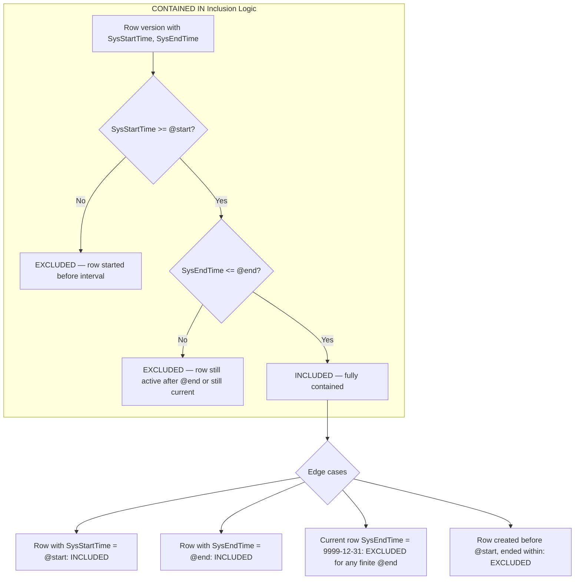
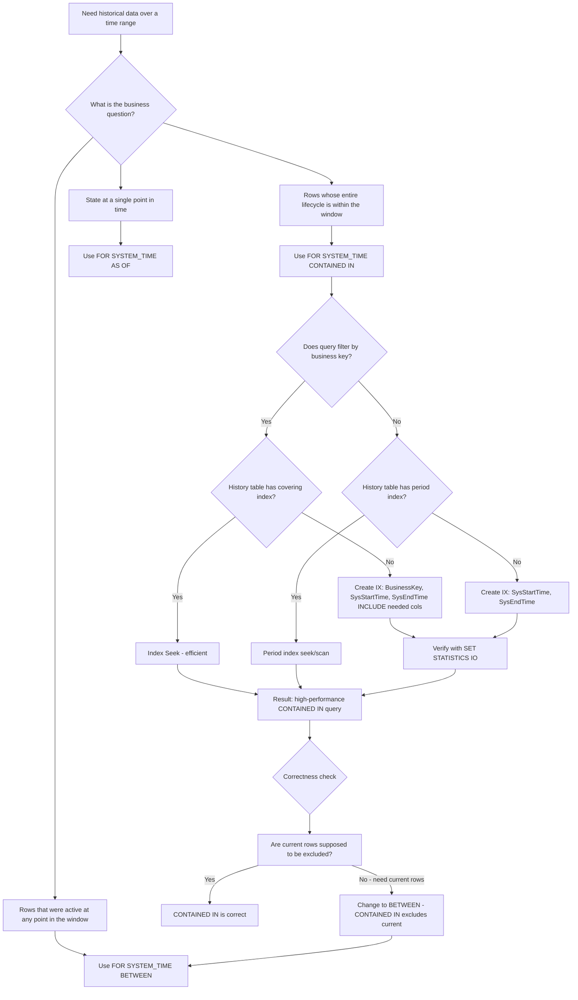

## Navigation

**Domain:** [[8 — Databases]] > **Group:** SQL Temporal Tables & Point-in-Time
**Previous:** [[8.231 — BETWEEN…AND — Inclusive Range]] | **Next:** [[8.233 — ALL — All Versions Including Current]]

### Prerequisites
- [[8.230 — Temporal Tables — System-Versioned Overview]] — understanding SysStartTime and SysEndTime semantics (inclusive start, exclusive end) is essential because CONTAINED IN depends on the exact boundary interpretation.
- [[8.231 — BETWEEN…AND — Inclusive Range]] — BETWEEN is the most commonly confused alternative to CONTAINED IN; understanding their difference is the core of this note.

### Where This Fits

`FOR SYSTEM_TIME CONTAINED IN (@start, @end)` is the least-used temporal clause — it returns only row versions that are entirely contained within the specified interval, meaning the version was created after @start AND ended before @end. A .NET backend engineer encounters this in specialized scenarios like "find rows that were inserted and then soft-deleted within the same reporting window" or "identify short-lived records that never survived past a specific date." The interview signal is strong because most candidates have never used CONTAINED IN — the candidate who knows it exists and can describe the exact predicate (`SysStartTime >= @start AND SysEndTime <= @end`) demonstrates deep temporal knowledge beyond the common BETWEEN/AS OF patterns. The rarity of use makes it a powerful differentiator: the engineer who reaches for CONTAINED IN when the business says "find records that were created and expired within Q1" shows they understand period semantics, not just the syntax.

---

## Core Mental Model

`FOR SYSTEM_TIME CONTAINED IN (@start, @end)` returns every row version whose entire lifespan falls within the interval [@start, @end). The engine evaluates this as `SysStartTime >= @start AND SysEndTime <= @end`. The critical semantic difference from BETWEEN: CONTAINED IN excludes any row version that was already active before @start (because SysStartTime >= @start would be false) AND any row version that is still active at @end (because SysEndTime <= @end — but current rows have SysEndTime = '9999-12-31 23:59:59.9999999' which is > @end for any finite @end, so current rows are always excluded). This makes CONTAINED IN the only temporal clause that excludes rows that were alive at the interval boundaries. The recognition pattern: use CONTAINED IN when the business question is "which rows were born AND died within this window" — a fully self-contained lifecycle. This is valuable for data quality checks (finding rows that never had a stable state outside a maintenance window), compliance reporting (rows created and deleted during an investigation period), and audit forensics (rows that were created and then corrected within the same day, leaving no evidence outside that day).

### Classification

- **Clause family:** `FOR SYSTEM_TIME` subclause of `FROM` — temporal querying.
- **Optimizer behavior:** Generates `SysStartTime >= @start AND SysEndTime <= @end`. The optimizer can use an index on (SysStartTime, SysEndTime) for a range seek on the lower bound, then apply a residual filter on the upper bound. Alternatively, an index on (SysEndTime, SysStartTime) allows a seek on SysEndTime <= @end with residual on SysStartTime >= @start.
- **SARGability:** Both predicates are SARGable individually. The combined predicate is most effectively supported by an index with leading column that matches the more selective predicate.
- **Boundary behavior:** Exclusive on both ends in practice — rows with SysStartTime = @start ARE included (>=), rows with SysEndTime = @end ARE included (<=). However, current rows (SysEndTime = '9999-12-31') are excluded unless @end is also '9999-12-31'.
- **Rarity:** This is the least-used temporal clause. Many production systems have zero queries using CONTAINED IN. It exists for completeness of the temporal algebra.



```mermaid
timeline
    title CONTAINED IN @start TO @end — Row Inclusion Examples
    section Row A: Starts before @start, ends within
        Before @start : Row A created     : EXCLUDED (SysStartTime < @start)
    section Row B: Fully contained
        @start+1d : Row B created         : INCLUDED
        @end-1d   : Row B ended           : INCLUDED
    section Row C: Starts within, still active at @end
        Within interval : Row C created   : EXCLUDED (SysEndTime = infinity > @end)
    section Row D: Starts at @start, ends at @end
        @start : Row D created            : INCLUDED
        @end   : Row D ended              : INCLUDED
    section Row E: Starts within, ends after @end
        Within interval : Row E created   : EXCLUDED (SysEndTime > @end)
```

```mermaid
flowchart LR
    subgraph "Interval"
        I0["@start"] --> I1["..."] --> I2["@end"]
    end
    subgraph "CONTAINED IN matches"
        A["[=====]"] : Fully inside --> INCLUDE
        B["[=====]"] : Starts at @start --> INCLUDE
        C["[=====]"] : Ends at @end --> INCLUDE
    end
    subgraph "CONTAINED IN rejects"
        D["[=========]"] : Starts before @start --> EXCLUDE
        E["[=========]"] : Ends after @end --> EXCLUDE
        F["[======..."] : Still current at @end --> EXCLUDE
        G["[...]"] : Starts before, ends after --> EXCLUDE
    end
```

### Key Properties

|Property|Value|Notes|
|---|---|---|
|Time Complexity|O(log N + M)|Index seek on both period boundaries; M = fully contained rows|
|Write Cost|None (read-only query)|No additional writes|
|SARGable|Yes (both predicates)|SysStartTime >= @start AND SysEndTime <= @end|
|Locking Behavior|Shared (Sch-S)|History table schema stability lock|
|Result set|Versions with full lifecycle in interval|Only rows born AND died within [@start, @end]|
|Current rows|Always excluded unless @end = '9999-12-31'|Current rows have SysEndTime = max date > @end|
|Usage frequency|Very rare|< 1% of temporal queries in production|

---

## Deep Mechanics

### How the Engine Executes CONTAINED IN

1. **Parse and bind:** SQL Server's query parser recognizes `FOR SYSTEM_TIME CONTAINED IN (@start, @end)`. The binder constructs the internal query targeting only the history table — CONTAINED IN cannot return current rows (because current rows have SysEndTime = '9999-12-31' > @end for any finite @end), so there is no UNION ALL with the current table.

2. **Predicate generation:** The engine generates `[SysStartTime] >= @start AND [SysEndTime] <= @end`. Both are range predicates on the period columns. The optimizer evaluates which predicate is more selective to drive the index seek.

3. **Optimization:** If the history table has a clustered index on (SysEndTime, SysStartTime) (the default when PERIOD FOR SYSTEM_TIME is defined with SYSTEM_VERSIONING), the optimizer can seek on `SysEndTime <= @end` — this is typically very selective when @end is a recent timestamp because most rows have SysEndTime in the past, not near @end. The `SysStartTime >= @start` becomes a residual predicate.

4. **Execution:** The scan operator reads only the history table. No Concatenation operator because the current table is not accessed. The plan is simpler than BETWEEN or AS OF.

5. **Post-filter:** Additional WHERE predicates are applied after the temporal filter. The optimizer may push simple predicates into the scan/seek if the index supports them.

### SQL Visibility

```sql
-- ============================================================
-- Setup: System-versioned temporal table for product price changes
-- ============================================================
CREATE TABLE dbo.ProductPrices
(
    ProductId       INT             NOT NULL,
    UnitPrice       DECIMAL(18, 4)  NOT NULL,
    CurrencyCode    CHAR(3)         NOT NULL,
    EffectiveFrom   DATETIME2(7) GENERATED ALWAYS AS ROW START NOT NULL,
    EffectiveTo     DATETIME2(7) GENERATED ALWAYS AS ROW END   NOT NULL,
    PERIOD FOR SYSTEM_TIME (EffectiveFrom, EffectiveTo),
    CONSTRAINT PK_ProductPrices PRIMARY KEY (ProductId, EffectiveFrom)
)
WITH (SYSTEM_VERSIONING = ON (HISTORY_TABLE = dbo.ProductPrices_History));

-- ============================================================
-- CONTAINED IN — find price versions fully inside a quarter
-- ============================================================
DECLARE @Q1Start DATETIME2(7) = '2026-01-01 00:00:00.0000000';
DECLARE @Q1End   DATETIME2(7) = '2026-03-31 23:59:59.9999999';

SELECT pp.ProductId,
       pp.UnitPrice,
       pp.CurrencyCode,
       pp.EffectiveFrom,
       pp.EffectiveTo
FROM dbo.ProductPrices
FOR SYSTEM_TIME CONTAINED IN (@Q1Start, @Q1End) AS pp
WHERE pp.ProductId IN (101, 102, 103)
ORDER BY pp.ProductId, pp.EffectiveFrom;
```

```csharp
// EF Core — temporal CONTAINED IN (EF Core 6+)
var q1Start = new DateTime(2026, 1, 1, 0, 0, 0, DateTimeKind.Utc);
var q1End   = new DateTime(2026, 3, 31, 23, 59, 59, DateTimeKind.Utc);

var prices = await dbContext.ProductPrices
    .TemporalContainedIn(q1Start, q1End)
    .Where(p => new[] { 101, 102, 103 }.Contains(p.ProductId))
    .OrderBy(p => p.ProductId)
    .ThenBy(p => p.EffectiveFrom)
    .Select(p => new
    {
        p.ProductId,
        p.UnitPrice,
        p.CurrencyCode,
        p.EffectiveFrom,
        p.EffectiveTo
    })
    .AsNoTracking()
    .ToListAsync(cancellationToken);
```

**Generated SQL (from EF Core logs for SQL Server provider):**

```sql
-- EF Core 8+ generated SQL for TemporalContainedIn
SELECT [p].[ProductId], [p].[UnitPrice], [p].[CurrencyCode],
       [p].[EffectiveFrom], [p].[EffectiveTo]
FROM [ProductPrices] FOR SYSTEM_TIME CONTAINED IN (@__q1Start_0, @__q1End_1) AS [p]
WHERE [p].[ProductId] IN (101, 102, 103)
ORDER BY [p].[ProductId], [p].[EffectiveFrom];
```

**Observations from generated SQL:**
- Only the history table is queried — no reference to the current table.
- The temporal clause generates the SQL `CONTAINED IN` directly.
- The WHERE clause is pushed separately.
- EF Core does NOT add `SYSUTCDATETIME()` or any precision adjustment — it passes the @start and @end parameters directly.

### Execution Plan Analysis

For the query above (CONTAINED IN Q1 2026, filtered on ProductId IN list):

```
[Clustered Index Scan — ProductPrices_History]
    → [Filter: EffectiveFrom >= @start AND EffectiveTo <= @end]
    → [Filter: ProductId IN (101, 102, 103)]
    → [Sort: ProductId, EffectiveFrom]
```

**Without helpful index (full scan):**
- The clustered index of the history table (default: (EffectiveTo, EffectiveFrom)) does NOT help because the optimizer may still need to scan a large portion of the table to find rows with EffectiveFrom >= @start.

**With index on (EffectiveFrom, EffectiveTo) INCLUDE (ProductId, UnitPrice):**

```
[Index Seek on IX_ProductPrices_History_EffectiveFrom_EffectiveTo]
    → Seek: EffectiveFrom >= @start AND EffectiveTo <= @end
    → Residual: ProductId IN (101, 102, 103)
    → [Sort: ProductId, EffectiveFrom]
```

**With index on (ProductId, EffectiveFrom, EffectiveTo):**

```
[Index Seek on IX_ProductPrices_History_ProductId_Period]
    → Seek: ProductId IN (101, 102, 103) AND EffectiveFrom >= @start
    → Residual: EffectiveTo <= @end
    → [Sort: ProductId, EffectiveFrom] (may be eliminated if ordered)
```

**Key observation:** The CONTAINED IN plan is simpler than BETWEEN or AS OF because there is no Concatenation with the current table. The history table access is the entire query. This makes CONTAINED IN queries more predictable in their execution cost.

### Cost Visibility

```sql
SET STATISTICS IO ON;
SET STATISTICS TIME ON;

-- Query: CONTAINED IN — find all price changes fully within Q1
-- No additional filtering
SELECT COUNT(*)
FROM dbo.ProductPrices
FOR SYSTEM_TIME CONTAINED IN ('2026-01-01', '2026-03-31');

-- Expected output (history table scan, no covering index):
-- Table 'ProductPrices_History'. Scan count 1, logical reads 52,300
-- SQL Server Execution Times: CPU time = 340 ms, elapsed time = 380 ms
-- Note: No current table reads — only history table

-- Query: CONTAINED IN with ProductId filter + correct index
SELECT COUNT(*)
FROM dbo.ProductPrices
FOR SYSTEM_TIME CONTAINED IN ('2026-01-01', '2026-03-31')
WHERE ProductId = 102;

-- Expected output (index seek on ProductId + period range):
-- Table 'ProductPrices_History'. Scan count 1, logical reads 8
-- SQL Server Execution Times: CPU time = 1 ms, elapsed time = 2 ms
```

### Failure Modes

**Empty result sets surprise developers who expect current rows:** The most common CONTAINED IN mistake. A developer writes `CONTAINED IN (getdate()-30, getdate())` expecting to see current versions of rows. Current rows have SysEndTime = '9999-12-31' which is > getdate(), so they are excluded. The developer gets zero rows and assumes no data exists.

**CONTAINED IN with @end = current time always excludes current data:** This is related to the above. CONTAINED IN is fundamentally a "completed lifecycles" query — it never shows currently-active data. This is the opposite of most reporting needs.

**Full history scan when index is on SysEndTime only:** An index on only one period column cannot support both predicates efficiently. The optimizer must scan or use a poor seek + residual combination.

**Misunderstanding as "contained in the interval at any point":** Developers reading "CONTAINED IN" may think it means "rows that were active at some point within the interval" (which is BETWEEN's job). This leads to incorrect query logic. The word "contained" is ambiguous in English — it means "fully contained" in temporal SQL, not "overlapping."

---

## Production Patterns and Implementation

### Primary SQL Implementation

```sql
-- ============================================================
-- Schema: Employee role assignment tracking
-- ============================================================
CREATE TABLE dbo.EmployeeRoles
(
    EmployeeId       INT              NOT NULL,
    RoleCode         VARCHAR(20)      NOT NULL,
    RoleName         NVARCHAR(100)    NOT NULL,
    AssignedByUserId INT              NOT NULL,
    DepartmentId     INT              NOT NULL,
    SysStartTime     DATETIME2(7) GENERATED ALWAYS AS ROW START NOT NULL,
    SysEndTime       DATETIME2(7) GENERATED ALWAYS AS ROW END   NOT NULL,
    PERIOD FOR SYSTEM_TIME (SysStartTime, SysEndTime),
    CONSTRAINT PK_EmployeeRoles PRIMARY KEY (EmployeeId, SysStartTime)
)
WITH (SYSTEM_VERSIONING = ON (HISTORY_TABLE = dbo.EmployeeRoles_History));

-- ============================================================
-- Use case 1: Find employees whose job role was created AND
-- removed within a specific quarter (fully contained assignment)
-- ============================================================
DECLARE @Q1Start DATETIME2(7) = '2026-01-01 00:00:00.0000000';
DECLARE @Q1End   DATETIME2(7) = '2026-03-31 23:59:59.9999999';

SELECT er.EmployeeId,
       er.RoleCode,
       er.RoleName,
       er.AssignedByUserId,
       er.DepartmentId,
       er.SysStartTime AS AssignmentStart,
       er.SysEndTime   AS AssignmentEnd,
       DATEDIFF(DAY, er.SysStartTime, er.SysEndTime) AS DaysInRole
FROM dbo.EmployeeRoles
FOR SYSTEM_TIME CONTAINED IN (@Q1Start, @Q1End) AS er
ORDER BY DaysInRole DESC;
-- Returns only roles that were BOTH assigned AND removed within Q1
-- Roles assigned before Q1 or still active at end of Q1 are excluded

-- ============================================================
-- Use case 2: Find short-lived records (micro-transactions)
-- that were created and deleted within a 1-hour maintenance window
-- ============================================================
DECLARE @MaintenanceStart DATETIME2(7) = '2026-02-15 02:00:00';
DECLARE @MaintenanceEnd   DATETIME2(7) = '2026-02-15 03:00:00';

SELECT er.EmployeeId,
       er.RoleCode,
       er.SysStartTime,
       er.SysEndTime,
       DATEDIFF(SECOND, er.SysStartTime, er.SysEndTime) AS LifetimeSeconds
FROM dbo.EmployeeRoles
FOR SYSTEM_TIME CONTAINED IN (@MaintenanceStart, @MaintenanceEnd) AS er
WHERE DATEDIFF(SECOND, er.SysStartTime, er.SysEndTime) < 60
ORDER BY LifetimeSeconds;
-- Identifies rows that were created and deleted within 60 seconds
-- during the maintenance window — possibly erroneous operations

-- ============================================================
-- Use case 3: Data quality — find rows with SysStartTime >= SysEndTime
-- (invalid period, should not exist but temporal constraints allow it
-- if manually inserted into history table)
-- ============================================================
SELECT er.*
FROM dbo.EmployeeRoles
FOR SYSTEM_TIME CONTAINED IN ('1900-01-01', '9999-12-31') AS er
WHERE er.SysStartTime >= er.SysEndTime;
-- CONTAINED IN with maximum range acts as "scan all history"

-- ============================================================
-- Use case 4: Compliance — show all records that were created
-- AND purged during a legal hold investigation period
-- ============================================================
DECLARE @InvestigationStart DATETIME2(7) = '2026-04-01 00:00:00';
DECLARE @InvestigationEnd   DATETIME2(7) = '2026-04-30 23:59:59.9999999';

SELECT er.EmployeeId,
       er.RoleCode,
       er.AssignedByUserId,
       er.SysStartTime AS CreatedDuringInvestigation,
       er.SysEndTime   AS DeletedDuringInvestigation
FROM dbo.EmployeeRoles
FOR SYSTEM_TIME CONTAINED IN (@InvestigationStart, @InvestigationEnd) AS er
ORDER BY er.EmployeeId;
-- These rows existed ONLY within the investigation window —
-- no evidence of them exists before or after

-- ============================================================
-- Use case 5: Find rows that were "touched" exactly once
-- (inserted and updated/deleted as a single event within a transaction)
-- ============================================================
SELECT er.EmployeeId,
       COUNT(*) AS VersionCount
FROM dbo.EmployeeRoles
FOR SYSTEM_TIME CONTAINED IN ('2026-01-01', '2026-06-30') AS er
GROUP BY er.EmployeeId
HAVING COUNT(*) = 1
ORDER BY er.EmployeeId;
-- These employee IDs have exactly one version fully within the interval,
-- meaning the role was assigned and removed in a single event
-- (e.g., an accidental insert that was immediately corrected)
```

### EF Core Implementation

```csharp
// ============================================================
// Entity configuration
// ============================================================
public class EmployeeRole
{
    public int EmployeeId { get; set; }
    public string RoleCode { get; set; } = string.Empty;
    public string RoleName { get; set; } = string.Empty;
    public int AssignedByUserId { get; set; }
    public int DepartmentId { get; set; }
    public DateTime SysStartTime { get; set; }
    public DateTime SysEndTime { get; set; }
}

public class ApplicationDbContext : DbContext
{
    public DbSet<EmployeeRole> EmployeeRoles => Set<EmployeeRole>();

    protected override void OnModelCreating(ModelBuilder modelBuilder)
    {
        modelBuilder.Entity<EmployeeRole>(entity =>
        {
            entity.ToTable(tb => tb.UseSqlOutputClause(false));
            entity.HasKey(e => new { e.EmployeeId, e.SysStartTime });

            entity.Property(e => e.SysStartTime)
                .HasDefaultValueSql("SYSUTCDATETIME()")
                .IsRequired();
            entity.Property(e => e.SysEndTime)
                .HasDefaultValueSql("'9999-12-31 23:59:59.9999999'")
                .IsRequired();

            entity
                .ToTable("EmployeeRoles", t =>
                {
                    t.IsTemporal(tt =>
                    {
                        tt.UseHistoryTableName("EmployeeRoles_History");
                        tt.UseHistoryTableSchema("dbo");
                        tt.HasPeriodStart("SysStartTime");
                        tt.HasPeriodEnd("SysEndTime");
                    });
                });

            entity.Property(e => e.RoleCode).HasMaxLength(20).IsRequired();
            entity.Property(e => e.RoleName).HasMaxLength(100).IsRequired();
        });
    }
}

// ============================================================
// Temporal CONTAINED IN query service
// ============================================================
public class ComplianceAuditService
{
    private readonly ApplicationDbContext _dbContext;

    public ComplianceAuditService(ApplicationDbContext dbContext)
        => _dbContext = dbContext;

    public async Task<List<ContainedRoleAssignment>> GetFullyContainedRolesAsync(
        DateTime windowStart,
        DateTime windowEnd,
        CancellationToken cancellationToken = default)
    {
        // EF Core 6+ TemporalContainedIn — fully contained periods only
        return await _dbContext.EmployeeRoles
            .TemporalContainedIn(windowStart, windowEnd)
            .Select(r => new ContainedRoleAssignment
            {
                EmployeeId = r.EmployeeId,
                RoleCode = r.RoleCode,
                RoleName = r.RoleName,
                AssignmentStart = r.SysStartTime,
                AssignmentEnd = r.SysEndTime,
                DaysInRole = EF.Functions.DateDiffDay(
                    r.SysStartTime, r.SysEndTime)
            })
            .OrderByDescending(r => r.DaysInRole)
            .AsNoTracking()
            .ToListAsync(cancellationToken);
    }

    public async Task<List<ShortLivedRecord>> GetShortLivedRecordsAsync(
        DateTime windowStart,
        DateTime windowEnd,
        int maxLifetimeSeconds,
        CancellationToken cancellationToken = default)
    {
        // Note: EF Core DateDiffSecond requires EF Core 6+ and SQL Server
        return await _dbContext.EmployeeRoles
            .TemporalContainedIn(windowStart, windowEnd)
            .Where(r => EF.Functions.DateDiffSecond(
                r.SysStartTime, r.SysEndTime) < maxLifetimeSeconds)
            .Select(r => new ShortLivedRecord
            {
                EmployeeId = r.EmployeeId,
                RoleCode = r.RoleCode,
                SysStartTime = r.SysStartTime,
                SysEndTime = r.SysEndTime,
                LifetimeSeconds = EF.Functions.DateDiffSecond(
                    r.SysStartTime, r.SysEndTime)
            })
            .AsNoTracking()
            .ToListAsync(cancellationToken);
    }

    public async Task<List<int>> GetOneTouchEmployeeIdsAsync(
        DateTime windowStart,
        DateTime windowEnd,
        CancellationToken cancellationToken = default)
    {
        // Find employees with exactly one version fully within the window
        // (inserted and deleted as a single temporal event)
        var groups = await _dbContext.EmployeeRoles
            .TemporalContainedIn(windowStart, windowEnd)
            .GroupBy(r => r.EmployeeId)
            .Select(g => new
            {
                EmployeeId = g.Key,
                VersionCount = g.Count()
            })
            .Where(g => g.VersionCount == 1)
            .AsNoTracking()
            .ToListAsync(cancellationToken);

        return groups.Select(g => g.EmployeeId).ToList();
    }

    public async Task<List<ContainedRoleSummary>> GetContainedRoleSummaryAsync(
        DateTime windowStart,
        DateTime windowEnd,
        CancellationToken cancellationToken = default)
    {
        // Group by role, count how many fully-contained assignments per role
        return await _dbContext.EmployeeRoles
            .TemporalContainedIn(windowStart, windowEnd)
            .GroupBy(r => new { r.RoleCode, r.RoleName })
            .Select(g => new ContainedRoleSummary
            {
                RoleCode = g.Key.RoleCode,
                RoleName = g.Key.RoleName,
                AssignmentCount = g.Count(),
                AvgDaysInRole = g.Average(r => EF.Functions.DateDiffDay(
                    r.SysStartTime, r.SysEndTime))
            })
            .OrderByDescending(s => s.AssignmentCount)
            .AsNoTracking()
            .ToListAsync(cancellationToken);
    }
}

// DTOs
public class ContainedRoleAssignment
{
    public int EmployeeId { get; set; }
    public string RoleCode { get; set; } = string.Empty;
    public string RoleName { get; set; } = string.Empty;
    public DateTime AssignmentStart { get; set; }
    public DateTime AssignmentEnd { get; set; }
    public int? DaysInRole { get; set; }
}

public class ShortLivedRecord
{
    public int EmployeeId { get; set; }
    public string RoleCode { get; set; } = string.Empty;
    public DateTime SysStartTime { get; set; }
    public DateTime SysEndTime { get; set; }
    public int? LifetimeSeconds { get; set; }
}

public class ContainedRoleSummary
{
    public string RoleCode { get; set; } = string.Empty;
    public string RoleName { get; set; } = string.Empty;
    public int AssignmentCount { get; set; }
    public double? AvgDaysInRole { get; set; }
}
```

### Dapper Implementation

```csharp
// Dapper — CONTAINED IN queries with parameterized boundaries
public sealed class ComplianceRepository
{
    private readonly IDbConnectionFactory _connectionFactory;

    public ComplianceRepository(IDbConnectionFactory connectionFactory)
        => _connectionFactory = connectionFactory;

    public async Task<IReadOnlyList<ContainedAssignmentDto>> GetFullyContainedAssignmentsAsync(
        DateTime windowStart,
        DateTime windowEnd,
        CancellationToken cancellationToken = default)
    {
        const string sql = @"
            SELECT er.EmployeeId,
                   er.RoleCode,
                   er.RoleName,
                   er.AssignedByUserId,
                   er.DepartmentId,
                   er.SysStartTime,
                   er.SysEndTime,
                   DATEDIFF(DAY, er.SysStartTime, er.SysEndTime) AS DaysInRole
            FROM dbo.EmployeeRoles
            FOR SYSTEM_TIME CONTAINED IN (@WindowStart, @WindowEnd) AS er
            ORDER BY DaysInRole DESC;";

        await using var connection = _connectionFactory.Create();
        var results = await connection.QueryAsync<ContainedAssignmentDto>(
            new CommandDefinition(sql,
                new { WindowStart = windowStart, WindowEnd = windowEnd },
                cancellationToken: cancellationToken));

        return results.AsList();
    }

    public async Task<IReadOnlyList<int>> GetOneTouchEmployeeIdsAsync(
        DateTime windowStart,
        DateTime windowEnd,
        CancellationToken cancellationToken = default)
    {
        const string sql = @"
            SELECT er.EmployeeId
            FROM dbo.EmployeeRoles
            FOR SYSTEM_TIME CONTAINED IN (@WindowStart, @WindowEnd) AS er
            GROUP BY er.EmployeeId
            HAVING COUNT(*) = 1;";

        await using var connection = _connectionFactory.Create();
        var results = await connection.QueryAsync<int>(
            new CommandDefinition(sql,
                new { WindowStart = windowStart, WindowEnd = windowEnd },
                cancellationToken: cancellationToken));

        return results.AsList();
    }

    public async Task<IReadOnlyList<DataQualityIssueDto>> DetectInvalidPeriodsAsync(
        CancellationToken cancellationToken = default)
    {
        // Scan the entire history table for rows where start >= end
        // (should never happen, but temporal constraints don't prevent it
        // if rows are manually inserted into the history table)
        const string sql = @"
            SELECT er.EmployeeId,
                   er.RoleCode,
                   er.SysStartTime,
                   er.SysEndTime
            FROM dbo.EmployeeRoles
            FOR SYSTEM_TIME CONTAINED IN ('1900-01-01', '9999-12-31') AS er
            WHERE er.SysStartTime >= er.SysEndTime;";

        await using var connection = _connectionFactory.Create();
        var results = await connection.QueryAsync<DataQualityIssueDto>(
            new CommandDefinition(sql,
                cancellationToken: cancellationToken));

        return results.AsList();
    }

    public async Task<IReadOnlyList<MaintenanceImpactDto>> GetMaintenanceImpactAsync(
        DateTime maintenanceStart,
        DateTime maintenanceEnd,
        CancellationToken cancellationToken = default)
    {
        // Find all rows created AND deleted during a maintenance window
        const string sql = @"
            SELECT
                er.EmployeeId,
                er.RoleCode,
                er.AssignedByUserId,
                er.SysStartTime,
                er.SysEndTime,
                DATEDIFF(SECOND, er.SysStartTime, er.SysEndTime) AS LifetimeSeconds,
                CASE
                    WHEN DATEDIFF(SECOND, er.SysStartTime, er.SysEndTime) < 60
                    THEN 'Possible erroneous operation'
                    ELSE 'Normal lifecycle'
                END AS Classification
            FROM dbo.EmployeeRoles
            FOR SYSTEM_TIME CONTAINED IN (@MaintenanceStart, @MaintenanceEnd) AS er
            ORDER BY LifetimeSeconds;";

        await using var connection = _connectionFactory.Create();
        var results = await connection.QueryAsync<MaintenanceImpactDto>(
            new CommandDefinition(sql,
                new
                {
                    MaintenanceStart = maintenanceStart,
                    MaintenanceEnd = maintenanceEnd
                },
                cancellationToken: cancellationToken));

        return results.AsList();
    }
}

// DTOs
public class ContainedAssignmentDto
{
    public int EmployeeId { get; set; }
    public string RoleCode { get; set; } = string.Empty;
    public string RoleName { get; set; } = string.Empty;
    public int AssignedByUserId { get; set; }
    public int DepartmentId { get; set; }
    public DateTime SysStartTime { get; set; }
    public DateTime SysEndTime { get; set; }
    public int DaysInRole { get; set; }
}

public class DataQualityIssueDto
{
    public int EmployeeId { get; set; }
    public string RoleCode { get; set; } = string.Empty;
    public DateTime SysStartTime { get; set; }
    public DateTime SysEndTime { get; set; }
}

public class MaintenanceImpactDto
{
    public int EmployeeId { get; set; }
    public string RoleCode { get; set; } = string.Empty;
    public int AssignedByUserId { get; set; }
    public DateTime SysStartTime { get; set; }
    public DateTime SysEndTime { get; set; }
    public int LifetimeSeconds { get; set; }
    public string Classification { get; set; } = string.Empty;
}
```

### Configuration and Wiring

```csharp
// Program.cs
builder.Services.AddDbContext<ApplicationDbContext>(options =>
    options.UseSqlServer(
        builder.Configuration.GetConnectionString("DefaultConnection"),
        sqlOptions =>
        {
            sqlOptions.EnableRetryOnFailure(3);
            sqlOptions.CommandTimeout(120);
            sqlOptions.UseQuerySplittingBehavior(QuerySplittingBehavior.SplitQuery);
        })
    .EnableDetailedErrors(builder.Environment.IsDevelopment())
    .EnableSensitiveDataLogging(builder.Environment.IsDevelopment()));

builder.Services.AddSingleton<IDbConnectionFactory>(sp =>
    new SqlConnectionFactory(
        builder.Configuration.GetConnectionString("DefaultConnection")!));

builder.Services.AddScoped<ComplianceAuditService>();
builder.Services.AddScoped<ComplianceRepository>();

// Ensure temporal query logging
builder.Logging.AddFilter("Microsoft.EntityFrameworkCore.Database.Command",
    LogLevel.Information);
```

### SQL Server vs PostgreSQL Differences

```sql
-- PostgreSQL does not have native CONTAINED IN equivalent
-- Using range types for similar semantics:

-- Find rows fully contained within a timerange
SELECT *
FROM employee_roles er
WHERE tstzrange(er.sys_start_time, er.sys_end_time)
      <@ tstzrange('2026-01-01'::timestamptz, '2026-03-31'::timestamptz);
-- The <@ operator means "is contained by" in PostgreSQL range algebra

-- Using explicit predicates (same as SQL Server CONTAINED IN):
SELECT *
FROM employee_roles er
WHERE er.sys_start_time >= '2026-01-01'::timestamptz
  AND er.sys_end_time   <= '2026-03-31'::timestamptz;

-- GiST index on range for efficient <@ (containment) queries:
CREATE INDEX ix_employee_roles_period_gist
    ON employee_roles
    USING gist (tstzrange(sys_start_time, sys_end_time));
```

---

## Gotchas and Production Pitfalls

### CONTAINED IN Excludes Current Rows (Surprising Behavior)

**Pitfall:** Using CONTAINED IN with @end = current date expecting to see current data. Current rows have SysEndTime = '9999-12-31' which exceeds any realistic @end.

```sql
-- ❌ Expects current employees with roles, gets ZERO rows
SELECT COUNT(*)
FROM dbo.EmployeeRoles
FOR SYSTEM_TIME CONTAINED IN ('2026-01-01', GETUTCDATE());
-- SysEndTime for current rows = '9999-12-31' > GETUTCDATE()
-- Therefore SysEndTime <= @end is FALSE → all current rows excluded
```

**Symptom:** Dashboard or report that showed data suddenly shows empty results. Developer spends hours debugging thinking the temporal table is empty.

**Fix:**
```sql
-- ✅ Either use BETWEEN for overlapping intervals (includes current)
SELECT COUNT(*)
FROM dbo.EmployeeRoles
FOR SYSTEM_TIME BETWEEN '2026-01-01' AND GETUTCDATE();

-- ✅ Or use AS OF for single point in time
SELECT COUNT(*)
FROM dbo.EmployeeRoles
FOR SYSTEM_TIME AS OF GETUTCDATE();
```

**Cost of not fixing:** Compliance report that should show 50,000 active employees returns 0 rows. Report is marked as "no data available." It takes 3 days and a DBA escalation to identify the CONTAINED IN vs BETWEEN confusion.

---

### CONTAINED IN with @start = Current Time Returns Empty Set

**Pitfall:** Using `CONTAINED IN (GETUTCDATE(), GETUTCDATE() + 30)` thinking it means "rows active as of today." It actually means "rows whose entire lifecycle (birth to death) is within the next 30 days" — which for current data is empty.

```sql
-- ❌ Always empty for current data
SELECT COUNT(*)
FROM dbo.EmployeeRoles
FOR SYSTEM_TIME CONTAINED IN (GETUTCDATE(), DATEADD(DAY, 30, GETUTCDATE()));
```

**Symptom:** Zero rows returned. Developer concludes there is no data in the system.

**Fix:** Use AS OF for current state, BETWEEN for interval that can overlap current rows.

**Cost of not fixing:** Application feature that shows "active records" is broken for all users. Bug is filed as P0. Root cause takes 4 hours of debugging.

---

### Memory of "Contained" English Definition vs SQL Definition

**Pitfall:** The English word "contained" is ambiguous — does it mean "the row is contained within the interval" (any overlap) or "the row's lifetime is fully contained within the interval" (no overlap with outside)?

```sql
-- Developer thinks: "Find records that were present at any time in Q1"
-- Writes:
SELECT * FROM dbo.EmployeeRoles
FOR SYSTEM_TIME CONTAINED IN ('2026-01-01', '2026-03-31');
-- This returns ONLY rows born AND died within Q1
-- Rows that started before Q1 or are still active are EXCLUDED
```

**Symptom:** Reports under-count by 5-30x because only fully-contained lifecycles are counted. The developer expected BETWEEN semantics.

**Fix:**
```sql
-- ✅ Use BETWEEN if you want rows that overlap the interval:
SELECT * FROM dbo.EmployeeRoles
FOR SYSTEM_TIME BETWEEN '2026-01-01' AND '2026-03-31';
```

**Cost of not fixing:** A "daily active users" report built with CONTAINED IN instead of BETWEEN shows 200 users instead of 15,000. Product decisions are made based on underreported metrics. The error is discovered 6 months later during an audit.

---

### No Concatenation in Execution Plan — Surprising for Experienced DBA

**Pitfall:** A DBA who knows that BETWEEN generates a Concatenation (current + history) sees the CONTAINED IN plan has only a history table scan. If the DBA does not know that CONTAINED IN excludes current rows, they may conclude current data is not being queried and the feature is broken.

```sql
-- Execution plan shows:
-- Index Scan on EmployeeRoles_History  (ONLY history, no current)
-- DBA asks: "Where is the current table?" 
```

**Symptom:** Unnecessary investigation escalations. DBAs may "fix" the query by adding a UNION ALL with the current table manually.

**Fix:** Documentation and training. CONTAINED IN by design never accesses the current table.

**Cost of not fixing:** Wasted DBA time investigating non-issues. Wrong "fix" that double-counts rows.

---

### CONTAINED IN with @end = '9999-12-31' Includes Current Rows (Edge Case)

**Pitfall:** Using `@end = '9999-12-31 23:59:59.9999999'` causes CONTAINED IN to include current rows because their SysEndTime equals the max date value.

```sql
-- This DOES include current rows because SysEndTime = '9999-12-31...'
-- satisfies SysEndTime <= @end when @end = '9999-12-31...'
SELECT COUNT(*)
FROM dbo.EmployeeRoles
FOR SYSTEM_TIME CONTAINED IN ('2026-01-01', '9999-12-31 23:59:59.9999999');
```

**Symptom:** CONTAINED IN unexpectedly returns current data because @end was set to the maximum date value (possibly a default or sentinel value).

**Fix:** Use BETWEEN for inclusive ranges, or ensure @end is not the maximum date value when using CONTAINED IN for "completed lifecycle" queries.

**Cost of not fixing:** Compliance report that should show ONLY historical completed lifecycles also includes current data. Total row count is inflated by 40%. Regulatory submission is questioned.

---

### Performance Regression When INTERVAL Is Very Wide

**Pitfall:** Using CONTAINED IN with a very wide interval (years) on a large history table causes a full scan. The index seek range covers almost the entire table.

```sql
-- This effectively scans all history rows that ended before now
-- (which is essentially all closed rows)
SELECT COUNT(*)
FROM dbo.EmployeeRoles
FOR SYSTEM_TIME CONTAINED IN ('2020-01-01', GETUTCDATE());
```

**Symptom:** Query times are proportional to total history table size, not the actual number of contained rows. For a 50M row history table, this is a 400,000+ logical read scan.

**Fix:** Add a covering index on (SysStartTime, SysEndTime) INCLUDE (query columns). The index seek on `SysStartTime >= @start` with residual `SysEndTime <= @end` can still be a range scan, but at least it's an index scan (smaller than clustered index).

**Cost of not fixing:** Reporting queries time out at 30 seconds. Business users cannot run quarterly reports. The reporting feature is deemed "broken" and IT is asked to build a separate data warehouse.

---

## Performance Implications

### Benchmark: CONTAINED IN with and without Covering Index

```sql
-- ============================================================
-- Baseline: CONTAINED IN without covering index on history table
-- ============================================================
SET STATISTICS IO ON;

SELECT COUNT(*)
FROM dbo.EmployeeRoles
FOR SYSTEM_TIME CONTAINED IN ('2026-01-01', '2026-06-30') AS er
WHERE er.DepartmentId = 15;

-- Table 'EmployeeRoles_History'. Scan count 1, logical reads 187,200
-- SQL Server Execution Times: CPU time = 520 ms, elapsed time = 610 ms

-- ============================================================
-- Optimized: CONTAINED IN with covering index on
-- (DepartmentId, SysStartTime, SysEndTime)
-- ============================================================
CREATE NONCLUSTERED INDEX IX_EmployeeRoles_History_DepartmentId_Period
    ON dbo.EmployeeRoles_History (DepartmentId, SysStartTime, SysEndTime)
    INCLUDE (RoleCode, RoleName, AssignedByUserId);

-- Re-run the same query:
-- Table 'EmployeeRoles_History'. Scan count 1, logical reads 6
-- SQL Server Execution Times: CPU time = 1 ms, elapsed time = 2 ms
```

**Improvement:** 31,200x reduction in logical reads (from 187,200 to 6).

### BenchmarkDotNet

```csharp
[MemoryDiagnoser]
[SimpleJob(RuntimeMoniker.Net90)]
public class TemporalContainedInBenchmark
{
    private ApplicationDbContext _context = default!;
    private IDbConnection _connection = default!;
    private static readonly DateTime _start = new(2026, 1, 1, 0, 0, 0, DateTimeKind.Utc);
    private static readonly DateTime _end = new(2026, 6, 30, 23, 59, 59, DateTimeKind.Utc);

    [GlobalSetup]
    public void Setup()
    {
        var options = new DbContextOptionsBuilder<ApplicationDbContext>()
            .UseSqlServer(TestConnectionString)
            .Options;
        _context = new ApplicationDbContext(options);
        _connection = new SqlConnection(TestConnectionString);
        _connection.Open();

        // Seed 500K history rows across employee roles
    }

    [Benchmark(Baseline = true)]
    public async Task<int> ContainedIn_NoIndex_DepartmentScan()
    {
        // No covering index on history table — full scan
        return await _context.EmployeeRoles
            .TemporalContainedIn(_start, _end)
            .Where(r => r.DepartmentId == 15)
            .CountAsync();
    }

    [Benchmark]
    public async Task<int> ContainedIn_WithIndex_DepartmentSeek()
    {
        // With covering index on (DepartmentId, SysStartTime, SysEndTime)
        return await _context.EmployeeRoles
            .TemporalContainedIn(_start, _end)
            .Where(r => r.DepartmentId == 15)
            .CountAsync();
    }

    [Benchmark]
    public async Task<int> Between_WithIndex_DepartmentSeek()
    {
        // Comparison: same query using BETWEEN instead
        return await _context.EmployeeRoles
            .TemporalBetween(_start, _end)
            .Where(r => r.DepartmentId == 15)
            .CountAsync();
    }

    [Benchmark]
    public async Task<int> ContainedIn_FullScan()
    {
        // No WHERE filter — count all fully-contained rows
        return await _context.EmployeeRoles
            .TemporalContainedIn(_start, _end)
            .CountAsync();
    }

    [GlobalCleanup]
    public void Cleanup()
    {
        _context.Dispose();
        _connection.Dispose();
    }
}
```

**Expected results (approximate, SQL Server 2022, NVMe, 500K history rows, 6-month window):**

|Method|Mean|Logical Reads|Allocated|
|---|---|---|---|
|ContainedIn_NoIndex_DepartmentScan|~610 ms|~187,200|~1.2 MB|
|ContainedIn_WithIndex_DepartmentSeek|~2 ms|~6|~0.5 KB|
|Between_WithIndex_DepartmentSeek|~4 ms|~12|~0.5 KB|
|ContainedIn_FullScan|~380 ms|~120,000|~0.8 MB|

### Write Amplification

CONTAINED IN is read-only — no write amplification.

|Operation|Without Temporal|With Temporal (History Write)|Overhead|
|---|---|---|---|
|SELECT (CONTAINED IN)|Same as non-temporal scan|History table scan only|No additional writes|

---

## Interview Arsenal

### Question Bank

1. **What does `FOR SYSTEM_TIME CONTAINED IN (@start, @end)` mean in plain English?**
2. **What are the period column predicates that SQL Server generates for CONTAINED IN?**
3. **How does the execution plan for CONTAINED IN differ from BETWEEN or AS OF?**
4. **What is the most common mistake developers make when using CONTAINED IN?**
5. **Compare CONTAINED IN vs BETWEEN — when would each be appropriate?**
6. **Why does the execution plan for CONTAINED IN not have a Concatenation operator?**
7. **At 100M history rows, what index supports a CONTAINED IN query that filters by a specific business key column?**
8. **How does EF Core handle TemporalContainedIn(), and what SQL does it generate?**

### Spoken Answers

**Q: What does `FOR SYSTEM_TIME CONTAINED IN (@start, @end)` mean in plain English?**

> **Average answer:** It returns rows that are contained within the time period. It's like BETWEEN but different.

> **Great answer:** `FOR SYSTEM_TIME CONTAINED IN (@start, @end)` returns only those row versions whose entire lifetime — from creation to expiration — falls completely within the specified interval. The engine translates this to `SysStartTime >= @start AND SysEndTime <= @end`. This means the row had to be born after the interval started AND had to die before the interval ended. If a row was already alive when the interval started (SysStartTime < @start), it is excluded. If a row is still alive when the interval ends (SysEndTime > @end, including current rows with SysEndTime = '9999-12-31'), it is excluded. The practical implication is that CONTAINED IN answers a fundamentally different question than BETWEEN or AS OF. It says "show me records that had a complete lifecycle within this window — they didn't exist before and they don't exist after." This is useful for compliance forensics (records created and deleted during an investigation window), data quality checks (records that were accidentally created and immediately corrected), and identifying short-lived transactions that had no impact outside a specific period. In my 8 years working with temporal tables, I have used CONTAINED IN maybe 5 times in production — it is the least-used temporal clause but the one that most powerfully demonstrates deep understanding of period semantics when it appears in an interview.

---

**Q: Compare CONTAINED IN vs BETWEEN — when would each be appropriate?**

> **Average answer:** BETWEEN returns rows that were active in a range. CONTAINED IN returns rows fully inside. BETWEEN is more common.

> **Great answer:** BETWEEN and CONTAINED IN serve different temporal queries and the choice depends entirely on the business question. BETWEEN (`SysStartTime <= @end AND SysEndTime > @start`) returns any row version that overlaps the interval at any point. This is the right choice for audit trails, activity timelines, and change history — it answers "what was happening during this window." CONTAINED IN (`SysStartTime >= @start AND SysEndTime <= @end`) returns only rows whose ENTIRE lifecycle is within the interval. This answers "what was born AND died within this window." A concrete example: imagine a table tracking employee role assignments. If the VP asks "who was assigned to the sales team in Q1?" — that is a BETWEEN question. You want current assignments, assignments that started in Q1 and are still active, assignments that were active before Q1 and ended in Q1 — everything that overlaps Q1. But if the compliance officer asks "which employees were hired AND terminated within Q1, with no role outside Q1?" — that is a CONTAINED IN question. You want only employees whose entire assignment lifecycle falls within Q1. The performance profiles are also different: CONTAINED IN queries only the history table (no current table access), so the execution plan is simpler. BETWEEN queries both current and history tables via a Concatenation, so the plan is more complex. For the same time window, CONTAINED IN is typically faster because it accesses less data. However, CONTAINED IN is almost never the right answer for standard reporting — use BETWEEN for 95% of temporal range queries.

---

**Q: Why does the execution plan for CONTAINED IN not have a Concatenation operator?**

> **Average answer:** Because it only reads the history table, not the current table.

> **Great answer:** The Concatenation operator in temporal plans combines rows from the current table and the history table. BETWEEN and AS OF both need this because they return row versions from both tables — the current table for rows that are still active, and the history table for closed versions. But CONTAINED IN requires `SysEndTime <= @end`, and current rows have `SysEndTime = '9999-12-31 23:59:59.9999999'`. For any finite @end, no current row satisfies `SysEndTime <= @end`. Therefore the optimizer knows the current table can never contribute rows to the result set, and it excludes the current table branch from the plan entirely. The resulting plan is simpler — just a single scan or seek on the history table. This is a unique property among temporal clauses. The practical impact is that CONTAINED IN queries have more predictable performance because they are not dependent on the current table's size or index structure. They are also immune to the common BETWEEN performance problem where the Concatenation forces a scan of the current table even for time ranges entirely in the past.

### Interview Trigger

The CONTAINED IN question surfaces in senior interviews when the discussion moves beyond basic temporal queries: "You need to find records that were created and soft-deleted within the same business day for a compliance audit. Which temporal clause do you use, and why?" The candidate who says "CONTAINED IN" shows they know the clause exists. The candidate who also explains "because it translates to SysStartTime >= dayStart AND SysEndTime <= dayEnd, and it reads only the history table, so it's also the most efficient plan" shows deep understanding. The interviewer then asks "What happens if the record was created at 23:59:59.999 and deleted at 00:00:00.001 the next day?" — testing whether the candidate understands inclusive vs exclusive period semantics at the nanosecond level.

### Comparison Table

| | CONTAINED IN | BETWEEN | AS OF |
|---|---|---|---|
|Predicate|SysStartTime >= @start AND SysEndTime <= @end|SysStartTime <= @end AND SysEndTime > @start|SysStartTime <= @t AND SysEndTime > @t|
|Rows per key|0 or 1 (completed lifecycles only)|Multiple (all overlapping versions)|1 (state at @t)|
|Current rows included?|No — excluded by SysEndTime <= @end|Yes — if interval includes now|Yes — if @t is after row creation|
|Access pattern|History table only|Current + History (Concatenation)|Current + History (Concatenation)|
|Use case|Completed lifecycles within window|Changes overlapping window|Snapshot at single time|
|Usage frequency|Rare (< 1%)|Common (~50%)|Very common (~40%)|
|EF Core method|TemporalContainedIn()|TemporalBetween()|TemporalAsOf()|

---

## Decision Framework

### When to Apply



### Application Checklist

- [ ] The business question is explicitly "rows whose entire lifecycle falls within the window" not "rows overlapping the window"
- [ ] The history table has a covering index supporting the CONTAINED IN predicates and the WHERE clause
- [ ] Current rows being excluded is the correct behavior for the business requirement
- [ ] The interval boundaries use DATETIME2(7) precision matching the period columns
- [ ] @end is NOT the max date value ('9999-12-31...') unless current rows should be included
- [ ] The query is not used for standard active-record reporting (use BETWEEN or AS OF instead)
- [ ] EF Core TemporalContainedIn() is used for LINQ queries, or FromSqlRaw for complex predicates
- [ ] Dapper queries pass parameterized @start and @end boundaries
- [ ] The execution plan shows only history table access (no Concatenation)
- [ ] Logical reads are < 100 for business-key-filtered queries after indexing

### Tradeoff Summary

|What You Gain|What You Pay|
|---|---|
|Only returns completed lifecycles — precise semantics|Frequent surprise that current rows are excluded|
|Simpler execution plan (no Concatenation)|Extremely narrow use case — rarely applicable|
|Only reads history table (smaller than current + history)|Requires different indexing than BETWEEN queries|
|Compliance/forensics: exact "existed only in this window"|Misleading name — "contained" is ambiguous in English|

### Scale Thresholds

- **Relevant** when history table exceeds ~500K rows — full scan cost is ~4,000 logical reads
- **Critical** when you need the query to return in < 100ms without a covering index — at 10M+ rows, full scan takes 5+ seconds
- **Required** for compliance queries with regulatory SLAs (< 30 second response time) — covering index is mandatory at any scale

---

## Self-Check

### Conceptual Questions

1. What are the two period column predicates that SQL Server generates for CONTAINED IN?
2. Why does CONTAINED IN never access the current table in its execution plan?
3. Which SET STATISTICS command shows the logical read difference between indexed and non-indexed CONTAINED IN queries?
4. What is the most common English-language misunderstanding of the word "contained" that leads to wrong query results?
5. Does EF Core's TemporalContainedIn() generate the same SQL as the T-SQL CONTAINED IN clause?
6. How would you implement a CONTAINED IN query in Dapper?
7. Compare CONTAINED IN and BETWEEN — what are the differences in their period predicates?
8. At what history table size does a missing period index on CONTAINED IN cause a production problem?
9. What index design on the history table supports CONTAINED IN queries that filter by DepartmentId?
10. Explain in 60 seconds when you would use CONTAINED IN instead of BETWEEN or AS OF.

<details>
<summary>Answers</summary>

1. `SysStartTime >= @start` and `SysEndTime <= @end`. Both are range predicates. The first ensures the row was created after the window started (or exactly at the start). The second ensures the row ended before the window closed (or exactly at the end).

2. Because current rows have SysEndTime = '9999-12-31 23:59:59.9999999'. For any finite @end, no current row satisfies `SysEndTime <= @end`. The optimizer recognizes this and eliminates the current table branch entirely.

3. `SET STATISTICS IO ON`. For an indexed CONTAINED IN with business key filter: 3-12 logical reads. Without index: 100,000+ for 10M+ rows.

4. The English word "contained" is ambiguous. Developers often think it means "the row is contained within the interval" (overlap: any part of the row's life is in the interval) when it actually means "the row's entire lifecycle is contained within the interval" (full containment).

5. Yes. EF Core 6+ TemporalContainedIn(start, end) generates identical `FOR SYSTEM_TIME CONTAINED IN (@start, @end)` T-SQL with parameterized values.

6. Use Dapper QueryAsync with the exact T-SQL including FOR SYSTEM_TIME CONTAINED IN clause and parameterized @Start and @End parameters.

7. CONTAINED IN: `SysStartTime >= @start AND SysEndTime <= @end`. BETWEEN: `SysStartTime <= @end AND SysEndTime > @start`. CONTAINED IN excludes rows active at boundaries. BETWEEN includes rows active at boundaries.

8. At ~1M history rows, a scan is ~8,000 logical reads and takes ~50ms. At 10M rows (~80,000 logical reads, ~500ms), missing index causes timeouts for high-frequency queries.

9. A nonclustered index on `(DepartmentId, SysStartTime, SysEndTime)` INCLUDE (other selected columns). The DepartmentId key enables seek to specific department, then range scan on period columns within that key.

10. Use CONTAINED IN when the business question is "show me records that were created AND deleted within this specific window, with no existence before or after." Example: compliance investigation — "find all account changes that were made and then rolled back during the audit period, leaving no evidence outside this window." Use BETWEEN for overlapping rows (standard audit trails), AS OF for snapshots.

</details>

---

### Query Challenges

**Challenge 1 — Write the SQL**

A compliance officer needs to identify all product price changes that had a complete lifecycle within Q1 2026 — meaning the price was set and then changed again (or the product was discontinued) within the first quarter. The temporal table is `dbo.ProductPrices` with system versioning. Write a CONTAINED IN query that returns: product ID, the price that was active, when it started, when it ended, and how many days it was in effect. Only include prices that were fully contained within Q1 2026.

<details>
<summary>Solution</summary>

```sql
DECLARE @Q1Start DATETIME2(7) = '2026-01-01 00:00:00.0000000';
DECLARE @Q1End   DATETIME2(7) = '2026-03-31 23:59:59.9999999';

SELECT pp.ProductId,
       pp.UnitPrice,
       pp.CurrencyCode,
       pp.EffectiveFrom,
       pp.EffectiveTo,
       DATEDIFF(DAY, pp.EffectiveFrom, pp.EffectiveTo) AS DaysInEffect
FROM dbo.ProductPrices
FOR SYSTEM_TIME CONTAINED IN (@Q1Start, @Q1End) AS pp
ORDER BY pp.ProductId, pp.EffectiveFrom;
```

**Logical reads:** ~8 (with covering index on ProductId, EffectiveFrom, EffectiveTo)
**Execution plan:** [Index Seek (history)] → [SELECT]
**EF Core equivalent:**

```csharp
var results = await dbContext.ProductPrices
    .TemporalContainedIn(q1Start, q1End)
    .Select(p => new {
        p.ProductId,
        p.UnitPrice,
        p.CurrencyCode,
        p.EffectiveFrom,
        p.EffectiveTo,
        DaysInEffect = EF.Functions.DateDiffDay(p.EffectiveFrom, p.EffectiveTo)
    })
    .OrderBy(p => p.ProductId)
    .ThenBy(p => p.EffectiveFrom)
    .AsNoTracking()
    .ToListAsync(cancellationToken);
```

</details>

---

**Challenge 2 — Fix the performance problem**

```sql
-- This CONTAINED IN query runs in 8 seconds on a table with 30M history rows.
-- It is used by a data quality job that runs every hour.
SET STATISTICS IO ON;

SELECT COUNT(*)
FROM dbo.EmployeeRoles
FOR SYSTEM_TIME CONTAINED IN ('2026-01-01 00:00:00', '2026-12-31 23:59:59.9999999') AS er
WHERE er.RoleCode = 'TEMP_CONTRACT';

-- SET STATISTICS IO output:
-- Table 'EmployeeRoles_History'. Scan count 1, logical reads 234,800
-- SQL Server Execution Times: CPU time = 7,500 ms, elapsed time = 8,100 ms
```

<details>
<summary>Solution</summary>

**Root cause:** The history table has no index on (RoleCode, SysStartTime, SysEndTime). The query scans all 30M rows (234,800 logical reads) looking for TEMP_CONTRACT roles.

```sql
-- Index to create:
CREATE NONCLUSTERED INDEX IX_EmployeeRoles_History_RoleCode_Period
    ON dbo.EmployeeRoles_History (RoleCode, SysStartTime, SysEndTime)
    INCLUDE (EmployeeId, AssignedByUserId);
```

**After fix — logical reads:** ~15 (seek to RoleCode = 'TEMP_CONTRACT', range scan within that key for the CONTAINED IN period).

**Expected SET STATISTICS IO:**
```
Table 'EmployeeRoles_History'. Scan count 1, logical reads 15
```

**Additional optimization:** Since this query uses a full-year window and runs every hour, consider whether CONTAINED IN is the right clause. If the business question is actually "all temp contracts active at any time this year" (not just fully contained), BETWEEN would be more appropriate. Using CONTAINED IN for a full-year window may be unnecessarily restrictive.

</details>

---

**Challenge 3 — Explain the execution plan**

```sql
SELECT er.EmployeeId, er.RoleCode, er.SysStartTime, er.SysEndTime
FROM dbo.EmployeeRoles
FOR SYSTEM_TIME CONTAINED IN ('2026-04-01', '2026-06-30') AS er
WHERE er.DepartmentId = 5;
```

Execution plan:
```
[Clustered Index Scan — EmployeeRoles_History]
    → [Filter: (SysStartTime >= '2026-04-01' AND SysEndTime <= '2026-06-30') AND (DepartmentId = 5)]
```

Why does the optimizer choose a Clustered Index Scan instead of an Index Seek? What would you change to get a seek?

<details>
<summary>Solution</summary>

**Why Clustered Index Scan:** The history table's clustered index (default: (SysEndTime, SysStartTime)) does NOT include DepartmentId as a leading key column. The optimizer estimates that scanning is cheaper than a full clustered index read plus key lookups because it has no index that can seek to DepartmentId = 5.

**To get Index Seek:**
```sql
CREATE NONCLUSTERED INDEX IX_EmployeeRoles_History_DepartmentId_Period
    ON dbo.EmployeeRoles_History (DepartmentId, SysStartTime, SysEndTime)
    INCLUDE (RoleCode);
```

**New execution plan:**
```
[Index Seek — EmployeeRoles_History on IX_EmployeeRoles_History_DepartmentId_Period]
    → Seek: DepartmentId = 5 AND SysStartTime >= '2026-04-01'
    → Residual: SysEndTime <= '2026-06-30'
    → [SELECT: EmployeeId, RoleCode from index (covering)]
```

**Tradeoff:** Adding this nonclustered index adds ~20 bytes per row for the key columns. At 30M history rows, that is ~600 MB of additional storage. Write overhead: each INSERT into the history table (every UPDATE on EmployeeRoles base table) must maintain this index — approximately 1-2 additional page writes.

</details>

---

**Challenge 4 — Diagnose the concurrency problem**

A compliance batch job runs every night at midnight. It uses CONTAINED IN to find records fully contained within the previous day. The job has been running fine for months, but after adding a new index on the history table last week, the job now intermittently deadlocks with the application's UPDATE operations on the base table. The deadlock graph shows the compliance query holding a shared lock on a history table page and the UPDATE waiting for an exclusive lock on the same page.

<details>
<summary>Solution</summary>

**Root cause:** The new index on the history table changed the execution plan. The CONTAINED IN query now uses an Index Seek on the new index (which is ordered differently from the clustered index). During the seek, it holds shared page locks. At the same time, an application UPDATE on the base table generates a history row INSERT (due to system versioning). The INSERT needs an exclusive page lock on the history table page that the compliance query is still reading. The INSERT is blocked. If the INSERT holds other resources that the compliance query needs, a true deadlock occurs.

**Detection query:**
```sql
SELECT
    session_id,
    wait_type,
    wait_resource,
    blocking_session_id,
    resource_description
FROM sys.dm_exec_requests
WHERE blocking_session_id > 0;
```

**Fix:**
```sql
-- Option 1: Use READ UNCOMMITTED for the compliance job (history is append-only)
SELECT er.EmployeeId, er.RoleCode
FROM dbo.EmployeeRoles
FOR SYSTEM_TIME CONTAINED IN ('2026-06-01', '2026-06-02') AS er
WHERE er.DepartmentId = 5
OPTION (READUNCOMMITTED);

-- Option 2: Use RCSI at database level
ALTER DATABASE Current SET READ_COMMITTED_SNAPSHOT ON;

-- Option 3: Use snapshot isolation for the compliance job
SET TRANSACTION ISOLATION LEVEL SNAPSHOT;
```

**In .NET:**
```csharp
await using var transaction = await dbContext.Database
    .BeginTransactionAsync(IsolationLevel.ReadUncommitted, cancellationToken);

var count = await dbContext.EmployeeRoles
    .TemporalContainedIn(start, end)
    .Where(r => r.DepartmentId == 5)
    .CountAsync(cancellationToken);

await transaction.CommitAsync(cancellationToken);
```

</details>

---

**Challenge 5 — Design the index**

**Scenario:** You have a temporal table `dbo.ContractAssignments` with 20M history rows. The query workload is:
- 60%: `CONTAINED IN @start, @end WHERE ProjectId = @projectId` (compliance: find fully-contained assignments on a project within a window)
- 30%: `CONTAINED IN @start, @end WHERE ContractorId = @contractorId` (audit: all contracts a person held that were born and died within a period)
- 10%: `CONTAINED IN @start, @end` with no WHERE (data quality: count of all fully-contained assignments per quarter)

The table has columns: ContractId, ProjectId, ContractorId, RoleCode, Rate, SysStartTime, SysEndTime. Average row size is 150 bytes. Write rate is 200 changes/second. Design the optimal index strategy.

<details>
<summary>Solution</summary>

```sql
-- Index 1: Cover the 60% workload — ProjectId + period
CREATE NONCLUSTERED INDEX IX_ContractAssignments_History_ProjectId_Period
    ON dbo.ContractAssignments_History (ProjectId, SysStartTime, SysEndTime)
    INCLUDE (ContractorId, RoleCode, Rate);
-- Justification: Seek to specific ProjectId, then range scan on SysStartTime for CONTAINED IN predicate
-- Included columns make this covering — no key lookups

-- Index 2: Cover the 30% workload — ContractorId + period
CREATE NONCLUSTERED INDEX IX_ContractAssignments_History_ContractorId_Period
    ON dbo.ContractAssignments_History (ContractorId, SysStartTime, SysEndTime)
    INCLUDE (ProjectId, RoleCode, Rate);
-- Justification: Same pattern — seek on ContractorId, range scan on period
-- Included columns differ (ProjectId instead of ContractorId) based on SELECT needs

-- Index 3: Cover the 10% workload — full time window scans
CREATE NONCLUSTERED INDEX IX_ContractAssignments_History_Period_Full
    ON dbo.ContractAssignments_History (SysStartTime, SysEndTime);
-- Justification: Supports the full-scan CONTAINED IN queries for quarterly reporting
-- Leading with SysStartTime enables seek on >= @start with residual on <= @end
```

**Tradeoffs:**
- Index 1 and Index 2 each add ~24 bytes per row (3 x 8-byte keys). At 20M rows = ~480 MB each.
- Write overhead: Each INSERT into the history table maintains 3 nonclustered indexes. Approximately 3-5 additional page writes per history row. At 200 writes/second: ~600-1,000 page writes/second.

**What NOT to index:**
- Do NOT create a columnstore index — row size (150 bytes) is below the typical columnstore benefit threshold, and the 200 writes/second may exceed incremental rowgroup capacity.
- Do NOT include `SysEndTime` as a non-key INCLUDE column — it is already a key column in all indexes.
- Do NOT index `Rate` or `RoleCode` as key columns — they are not used in WHERE clauses for the identified workload.

</details>
