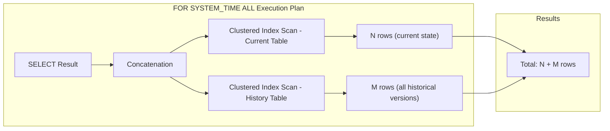
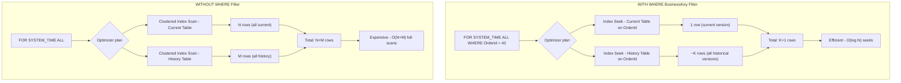
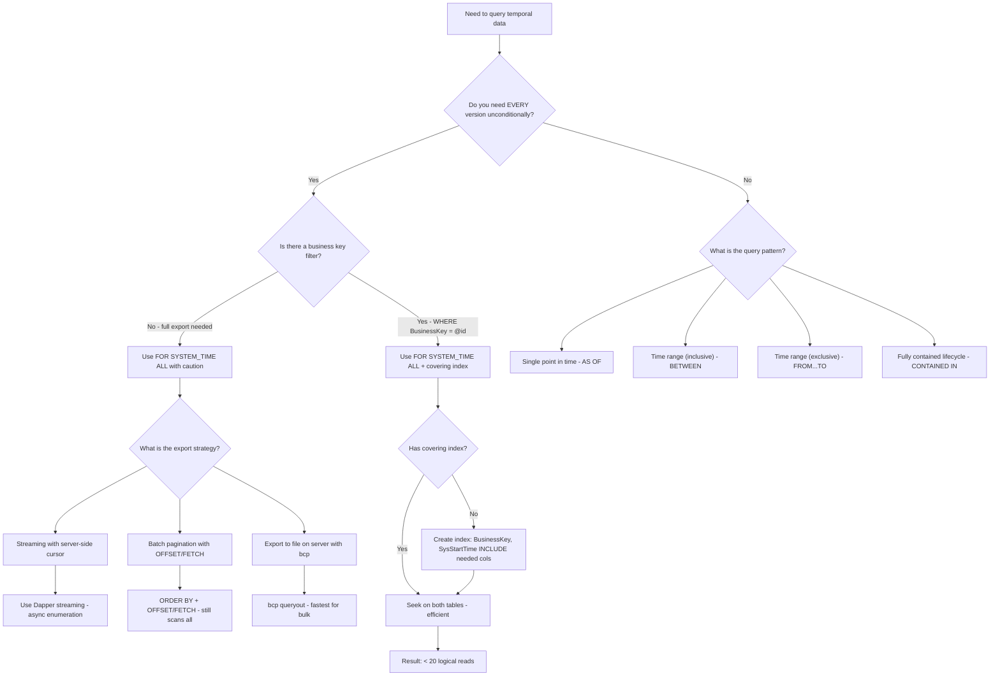

## Navigation

**Domain:** [[8 — Databases]] > **Group:** SQL Temporal Tables & Point-in-Time
**Previous:** [[8.232 — CONTAINED IN — Fully Contained Periods]] | **Next:** [[8.234 — Temporal Table Indexes — History Table Optimization]]

### Prerequisites
- [[8.230 — Temporal Tables — System-Versioned Overview]] — understanding the dual-table architecture (current + history) is required because FOR SYSTEM_TIME ALL is the UNION of both.
- [[8.234 — Temporal Table Indexes — History Table Optimization]] — ALL queries without indexes on the history table cause full scans of both tables; indexing strategy is critical for ALL performance.

### Where This Fits

`FOR SYSTEM_TIME ALL` returns the complete version history for every row — a UNION ALL of the current table (1 row per row) and the history table (all historical versions). A .NET backend engineer reaches for this when building full audit trail views, data export jobs, or compliance reports that need every version of every record. The raw performance of ALL is expensive — it concatenates a full scan of the current table with a full scan of the history table — and the interview signal is whether the candidate knows when to use ALL versus a targeted time-subclause query, and what the execution plan looks like. The engineer who says "I would not use ALL in production without a WHERE filter that limits the history scan to a specific business key and a covering index" demonstrates production experience. The candidate who mentions that ALL includes the current row (which duplicates the current table's data if the history also contains the previous version) shows they understand the concatenation semantics.

---

## Core Mental Model

`FOR SYSTEM_TIME ALL` is the most complete and the most expensive temporal clause. It returns every row version from both the current table and the history table, concatenated without deduplication. The engine generates a plan with a Concatenation operator that unions the full clustered index scan of the current table (1 row per current record — the latest version) with the full clustered index scan of the history table (all previous versions). The result includes the current row for each business key plus every historical snapshot. The invariant: the current table contributes exactly N rows (one per row that exists today), and the history table contributes M rows (one per historical change). The total is N + M. For a table with 100K current rows and 2M history rows, ALL returns 2.1M rows. The recognition pattern: use ALL only when you need the complete audit trail unconditionally — typically for full data export, data warehouse ETL, or compliance bulk data requests. In all other cases, a filtered temporal subclause (AS OF, BETWEEN, FROM...TO) with a WHERE clause on the business key is more efficient. The mental model for cost: ALL without a WHERE clause forces a sequential scan of every page in both tables. With a WHERE clause on the business key (e.g., `WHERE OrderId = 42`), the optimizer can seek on the current table and seek on the history table — reducing the cost from millions of logical reads to tens.

### Classification

- **Clause family:** `FOR SYSTEM_TIME` subclause of `FROM` — temporal querying.
- **Optimizer behavior:** The plan uses a Concatenation operator. Left input: full scan of the current table (Clustered Index Scan). Right input: full scan of the history table (Clustered Index Scan). If a WHERE clause filters on a key column, the optimizer may convert to Index Seeks on both tables.
- **SARGability:** The temporal clause itself has no parameters (it is ALL, not a range). SARGability depends entirely on the WHERE clause. A WHERE clause on a key column (e.g., `OrderId = @id`) IS SARGable and allows seeks on both tables.
- **Result set:** Every version of every row — current + all historical.
- **Performance profile:** Potentially the most expensive temporal clause. Without filters, the cost is the sum of both table sizes.





### Key Properties

|Property|Value|Notes|
|---|---|---|
|Time Complexity|O(N + M) without filter; O(log N + log M) with key filter|N = current rows, M = history rows|
|Write Cost|None (read-only query)|No additional writes|
|Result set|UNION ALL of current + history|Includes current row AND all history — duplicates not removed|
|Current table access|Always scanned (or seeked if filtered)|Every query accesses both tables|
|History table access|Always scanned (or seeked if filtered)|No temporal filtering on period columns|
|Locking Behavior|Shared (Sch-S)|Both tables get schema stability locks|
|Performance risk|High — full scan of both tables|Critical to use WHERE + index in production|

---

## Deep Mechanics

### How the Engine Executes FOR SYSTEM_TIME ALL

1. **Parse and bind:** SQL Server recognizes `FOR SYSTEM_TIME ALL` as a request for all versions. The binder constructs an internal UNION ALL of two subqueries — one querying the current table, one querying the history table. Unlike BETWEEN (which adds period predicates), ALL has NO period predicates. It is a raw UNION ALL of both tables.

2. **Query expansion:** Internally, the query is expanded to something like:
   ```sql
   SELECT [columns] FROM CurrentTable
   WHERE [temporal period is in effect — always true for ALL]
   UNION ALL
   SELECT [columns] FROM HistoryTable
   WHERE [temporal period is in effect — always true for ALL]
   ```

3. **Optimization:** Without a WHERE clause, the optimizer selects a full scan of both tables. With a WHERE clause on a key column (e.g., `WHERE OrderId = 42`), the optimizer looks for an index on both tables that supports a seek. If the current table has a clustered primary key on OrderId and the history table has a nonclustered index on OrderId, both can be seeked.

4. **Execution:** The Concatenation operator reads from the current table branch first, then the history table branch. Rows are returned in whatever order the operators produce them unless an ORDER BY is specified. If ORDER BY is specified, a Sort operator follows the Concatenation.

5. **Post-filter:** Additional WHERE predicates that could not be pushed into the scans are applied after the Concatenation as a Filter operator.

### SQL Visibility

```sql
-- ============================================================
-- Setup: System-versioned table for invoice tracking
-- ============================================================
CREATE TABLE dbo.Invoices
(
    InvoiceId       INT             NOT NULL,
    CustomerId      INT             NOT NULL,
    InvoiceDate     DATE            NOT NULL,
    TotalAmount     DECIMAL(18, 2)  NOT NULL,
    StatusCode      VARCHAR(20)     NOT NULL,
    PaidDate        DATE            NULL,
    SysStartTime    DATETIME2(7) GENERATED ALWAYS AS ROW START NOT NULL,
    SysEndTime      DATETIME2(7) GENERATED ALWAYS AS ROW END   NOT NULL,
    PERIOD FOR SYSTEM_TIME (SysStartTime, SysEndTime),
    CONSTRAINT PK_Invoices PRIMARY KEY (InvoiceId, SysStartTime)
)
WITH (SYSTEM_VERSIONING = ON (HISTORY_TABLE = dbo.Invoices_History));

-- ============================================================
-- FOR SYSTEM_TIME ALL — full audit trail
-- ============================================================
-- Get ALL versions of all invoices (expensive without filter)
SELECT i.InvoiceId,
       i.CustomerId,
       i.StatusCode,
       i.TotalAmount,
       i.SysStartTime,
       i.SysEndTime
FROM dbo.Invoices
FOR SYSTEM_TIME ALL AS i
ORDER BY i.InvoiceId, i.SysStartTime DESC;

-- ============================================================
-- FOR SYSTEM_TIME ALL with WHERE filter — targeted audit
-- ============================================================
-- Get all versions of a specific invoice
DECLARE @TargetInvoiceId INT = 10042;

SELECT i.InvoiceId,
       i.CustomerId,
       i.StatusCode,
       i.TotalAmount,
       i.SysStartTime,
       i.SysEndTime
FROM dbo.Invoices
FOR SYSTEM_TIME ALL AS i
WHERE i.InvoiceId = @TargetInvoiceId
ORDER BY i.SysStartTime DESC;

-- ============================================================
-- FOR SYSTEM_TIME ALL with aggregate — change count per invoice
-- ============================================================
SELECT i.InvoiceId,
       COUNT(*) AS VersionCount,
       MIN(i.SysStartTime) AS FirstChange,
       MAX(i.SysStartTime) AS LastChange
FROM dbo.Invoices
FOR SYSTEM_TIME ALL AS i
GROUP BY i.InvoiceId
ORDER BY VersionCount DESC;

-- ============================================================
-- DISTINCT rows only — deduplicate current row if needed
-- (current row is in both current table and history concept,
-- but in temporal, the current table has the live row and
-- history has closed versions — they are distinct rows)
-- ============================================================
SELECT DISTINCT i.InvoiceId, i.StatusCode, i.TotalAmount
FROM dbo.Invoices
FOR SYSTEM_TIME ALL AS i
WHERE i.InvoiceId = 10042;
```

```csharp
// EF Core — temporal ALL (EF Core 6+)
// Full audit trail for all invoices (expensive)
var allVersions = await dbContext.Invoices
    .TemporalAll()
    .OrderBy(i => i.InvoiceId)
    .ThenByDescending(i => i.SysStartTime)
    .Select(i => new
    {
        i.InvoiceId,
        i.CustomerId,
        i.StatusCode,
        i.TotalAmount,
        i.SysStartTime,
        i.SysEndTime
    })
    .AsNoTracking()
    .ToListAsync(cancellationToken);

// Targeted audit trail for a specific invoice
var targetInvoiceId = 10042;
var invoiceVersions = await dbContext.Invoices
    .TemporalAll()
    .Where(i => i.InvoiceId == targetInvoiceId)
    .OrderByDescending(i => i.SysStartTime)
    .AsNoTracking()
    .ToListAsync(cancellationToken);

// Change count per invoice
var changeCounts = await dbContext.Invoices
    .TemporalAll()
    .GroupBy(i => i.InvoiceId)
    .Select(g => new
    {
        InvoiceId = g.Key,
        VersionCount = g.Count(),
        FirstChange = g.Min(i => i.SysStartTime),
        LastChange = g.Max(i => i.SysStartTime)
    })
    .OrderByDescending(g => g.VersionCount)
    .AsNoTracking()
    .ToListAsync(cancellationToken);
```

**Generated SQL (from EF Core logs for SQL Server provider):**

```sql
-- EF Core 8+ generated SQL for TemporalAll (no filter)
SELECT [i].[InvoiceId], [i].[CustomerId], [i].[StatusCode],
       [i].[TotalAmount], [i].[SysStartTime], [i].[SysEndTime]
FROM [Invoices] FOR SYSTEM_TIME ALL AS [i]
ORDER BY [i].[InvoiceId], [i].[SysStartTime] DESC;

-- EF Core 8+ generated SQL for TemporalAll with WHERE
SELECT [i].[InvoiceId], [i].[CustomerId], [i].[StatusCode],
       [i].[TotalAmount], [i].[SysStartTime], [i].[SysEndTime]
FROM [Invoices] FOR SYSTEM_TIME ALL AS [i]
WHERE [i].[InvoiceId] = @__targetInvoiceId_0
ORDER BY [i].[SysStartTime] DESC;
```

### Execution Plan Analysis

**ALL without WHERE filter (full scan of both tables):**

```
[Concatenation]
├── [Clustered Index Scan — Invoices (current)]
│   Estimated rows: N (e.g., 100,000)
│   Cost: 40%
└── [Clustered Index Scan — Invoices_History]
    Estimated rows: M (e.g., 2,000,000)
    Cost: 60%
    └── [Sort: InvoiceId, SysStartTime DESC]
        Cost: 80% (dominant — sorting 2.1M rows)
```

- Logical reads: sum of both table sizes. For 100K current rows (~800 pages) + 2M history rows (~16,000 pages) = ~16,800 logical reads.
- The Sort operator is the dominant cost — sorting millions of rows in tempdb.

**ALL with WHERE InvoiceId = @id (seek on both tables):**

```
[Concatenation]
├── [Clustered Index Seek — Invoices (current on PK)]
│   Seek: InvoiceId = @id
│   Estimated rows: 1
│   Cost: 1%
└── [Index Seek — Invoices_History on IX_Invoices_History_InvoiceId_Period]
    Seek: InvoiceId = @id
    Estimated rows: K (e.g., 12 historical versions)
    Cost: 2%
    └── [Sort: SysStartTime DESC]
        Cost: 3%
```

- Logical reads: ~3 (current) + ~4-10 (history depending on depth) = ~7-13.
- Sort is trivial — sorting 13 rows.
- Dramatic improvement: 16,800 logical reads → ~13 logical reads (1,292x reduction).

### Cost Visibility

```sql
SET STATISTICS IO ON;
SET STATISTICS TIME ON;

-- ALL without WHERE — full scan of both tables
SELECT COUNT(*)
FROM dbo.Invoices
FOR SYSTEM_TIME ALL;

-- Expected output:
-- Table 'Invoices'. Scan count 1, logical reads 1,200 (current: ~100K rows)
-- Table 'Invoices_History'. Scan count 1, logical reads 16,500 (history: ~2M rows)
-- SQL Server Execution Times: CPU time = 1,800 ms, elapsed time = 2,100 ms

-- ALL with WHERE InvoiceId filter + proper index
SELECT COUNT(*)
FROM dbo.Invoices
FOR SYSTEM_TIME ALL
WHERE InvoiceId = 10042;

-- Expected output:
-- Table 'Invoices'. Scan count 1, logical reads 3 (current seek)
-- Table 'Invoices_History'. Scan count 1, logical reads 6 (history seek)
-- SQL Server Execution Times: CPU time = 0 ms, elapsed time = 1 ms

-- ALL with GROUP BY (change count analysis)
SELECT InvoiceId, COUNT(*) AS VersionCount
FROM dbo.Invoices
FOR SYSTEM_TIME ALL
GROUP BY InvoiceId
ORDER BY VersionCount DESC;

-- Expected output:
-- Table 'Invoices'. Scan count 1, logical reads 1,200
-- Table 'Invoices_History'. Scan count 1, logical reads 16,500
-- SQL Server Execution Times: CPU time = 4,200 ms, elapsed time = 5,100 ms
-- (Sort + Hash Aggregate adds significant CPU)
```

### Failure Modes

**ALL without WHERE causes production outage:** The most common ALL failure. Developer deploys a query with `FOR SYSTEM_TIME ALL` to a production API endpoint that expects a single invoice, but there's no WHERE filter. The query returns 2.1M rows instead of 13. The application OOMs. The database server CPU spikes to 100% as it scans and sorts both tables.

**ALL with ORDER BY on non-indexed column causes massive Sort:** Sorting the UNION ALL output of both tables requires tempdb spill. Without a covering index, the Sort spills to disk, killing performance.

**ALL in EF Core without AsNoTracking causes memory leak:** EF Core's change tracker by default tracks all returned entities. ALL can return millions of rows. Without `AsNoTracking()`, each row is tracked in the change tracker, consuming memory proportional to total row count.

**ALL confusion with "all versions since time X":** Developers sometimes think ALL means "all versions since a certain time." It does not — ALL means "literally every version since the beginning of time (or since temporal was enabled)." Use BETWEEN or AS OF with a specific time range for targeted history.

**ALL returns duplicate-like rows if current table has been updated in the same transaction as the query:** Since ALL is a UNION ALL of current + history, and the current table has the latest version, the history table has the previous version — these are distinct rows (different SysStartTime). But if the latest update has not yet been versioned to history (timing edge case), the row could appear in both. This is rare but possible in high-concurrency scenarios.

---

## Production Patterns and Implementation

### Primary SQL Implementation

```sql
-- ============================================================
-- Schema: Customer account status changes
-- ============================================================
CREATE TABLE dbo.CustomerAccounts
(
    AccountId       INT             NOT NULL,
    CustomerId      INT             NOT NULL,
    AccountType     VARCHAR(20)     NOT NULL,
    AccountStatus   VARCHAR(20)     NOT NULL,
    Balance         DECIMAL(18, 2)  NOT NULL,
    CreditLimit     DECIMAL(18, 2)  NOT NULL,
    ModifiedByUserId INT            NOT NULL,
    SysStartTime    DATETIME2(7) GENERATED ALWAYS AS ROW START NOT NULL,
    SysEndTime      DATETIME2(7) GENERATED ALWAYS AS ROW END   NOT NULL,
    PERIOD FOR SYSTEM_TIME (SysStartTime, SysEndTime),
    CONSTRAINT PK_CustomerAccounts PRIMARY KEY (AccountId, SysStartTime)
)
WITH (SYSTEM_VERSIONING = ON (HISTORY_TABLE = dbo.CustomerAccounts_History));

-- ============================================================
-- Use case 1: Full audit export for compliance (bulk data)
-- ============================================================
-- Export all versions of all accounts for compliance review
SELECT ca.AccountId,
       ca.CustomerId,
       ca.AccountType,
       ca.AccountStatus,
       ca.Balance,
       ca.CreditLimit,
       ca.ModifiedByUserId,
       ca.SysStartTime,
       ca.SysEndTime
FROM dbo.CustomerAccounts
FOR SYSTEM_TIME ALL AS ca
ORDER BY ca.AccountId, ca.SysStartTime;

-- ============================================================
-- Use case 2: Targeted audit trail for a single account
-- ============================================================
CREATE OR ALTER PROCEDURE dbo.GetAccountAuditTrail
    @AccountId INT
AS
BEGIN
    SET NOCOUNT ON;

    SELECT ca.AccountId,
           ca.CustomerId,
           ca.AccountType,
           ca.AccountStatus,
           ca.Balance,
           ca.CreditLimit,
           ca.ModifiedByUserId,
           ca.SysStartTime,
           ca.SysEndTime,
           LAG(ca.AccountStatus) OVER (
               PARTITION BY ca.AccountId
               ORDER BY ca.SysStartTime
           ) AS PreviousStatus,
           LAG(ca.Balance) OVER (
               PARTITION BY ca.AccountId
               ORDER BY ca.SysStartTime
           ) AS PreviousBalance
    FROM dbo.CustomerAccounts
    FOR SYSTEM_TIME ALL AS ca
    WHERE ca.AccountId = @AccountId
    ORDER BY ca.SysStartTime DESC;
END;

-- ============================================================
-- Use case 3: Detect accounts that have changed most frequently
-- ============================================================
SELECT TOP 100
    ca.AccountId,
    ca.CustomerId,
    COUNT(*) AS VersionCount,
    MIN(ca.SysStartTime) AS FirstChange,
    MAX(ca.SysStartTime) AS MostRecentChange,
    DATEDIFF(DAY, MIN(ca.SysStartTime), MAX(ca.SysStartTime)) AS ChangeSpanDays,
    COUNT(*) * 1.0 / NULLIF(DATEDIFF(DAY, MIN(ca.SysStartTime), MAX(ca.SysStartTime)), 0) AS ChangesPerDay
FROM dbo.CustomerAccounts
FOR SYSTEM_TIME ALL AS ca
GROUP BY ca.AccountId, ca.CustomerId
HAVING COUNT(*) > 1
ORDER BY VersionCount DESC;

-- ============================================================
-- Use case 4: ALL with pagination (only with ORDER BY + OFFSET/FETCH)
-- ============================================================
DECLARE @PageSize INT = 1000;
DECLARE @PageNum  INT = 5;

SELECT ca.AccountId,
       ca.AccountStatus,
       ca.Balance,
       ca.SysStartTime
FROM dbo.CustomerAccounts
FOR SYSTEM_TIME ALL AS ca
ORDER BY ca.AccountId, ca.SysStartTime DESC
OFFSET (@PageNum - 1) * @PageSize ROWS
FETCH NEXT @PageSize ROWS ONLY;
-- Note: This is still expensive — the OFFSET/FETCH happens AFTER
-- the Concatenation + Sort. All rows must be read and sorted.

-- ============================================================
-- Use case 5: ALL with time-based filter + covering index
-- (more efficient than bare ALL for recent history only)
-- ============================================================
SELECT ca.AccountId,
       ca.AccountStatus,
       ca.Balance,
       ca.SysStartTime
FROM dbo.CustomerAccounts
FOR SYSTEM_TIME ALL AS ca
WHERE ca.SysStartTime >= '2026-01-01'
  AND ca.AccountId = 10042
ORDER BY ca.SysStartTime DESC;
-- The WHERE on SysStartTime is NOT a temporal predicate —
-- ALL has no period predicate. But it acts as a filter on both
-- current and history rows, reducing the result set.
```

### EF Core Implementation

```csharp
// ============================================================
// Entity configuration
// ============================================================
public class CustomerAccount
{
    public int AccountId { get; set; }
    public int CustomerId { get; set; }
    public string AccountType { get; set; } = string.Empty;
    public string AccountStatus { get; set; } = string.Empty;
    public decimal Balance { get; set; }
    public decimal CreditLimit { get; set; }
    public int ModifiedByUserId { get; set; }
    public DateTime SysStartTime { get; set; }
    public DateTime SysEndTime { get; set; }
}

public class ApplicationDbContext : DbContext
{
    public DbSet<CustomerAccount> CustomerAccounts => Set<CustomerAccount>();

    protected override void OnModelCreating(ModelBuilder modelBuilder)
    {
        modelBuilder.Entity<CustomerAccount>(entity =>
        {
            entity.ToTable(tb => tb.UseSqlOutputClause(false));
            entity.HasKey(e => new { e.AccountId, e.SysStartTime });

            entity.Property(e => e.SysStartTime)
                .HasDefaultValueSql("SYSUTCDATETIME()");
            entity.Property(e => e.SysEndTime)
                .HasDefaultValueSql("'9999-12-31 23:59:59.9999999'");

            entity.ToTable("CustomerAccounts", t =>
            {
                t.IsTemporal(tt =>
                {
                    tt.UseHistoryTableName("CustomerAccounts_History");
                    tt.UseHistoryTableSchema("dbo");
                    tt.HasPeriodStart("SysStartTime");
                    tt.HasPeriodEnd("SysEndTime");
                });
            });
        });
    }
}

// ============================================================
// Temporal ALL query service
// ============================================================
public class AccountAuditService
{
    private readonly ApplicationDbContext _dbContext;

    public AccountAuditService(ApplicationDbContext dbContext)
        => _dbContext = dbContext;

    public async Task<List<AccountVersionDto>> GetFullAuditTrailAsync(
        int accountId,
        CancellationToken cancellationToken = default)
    {
        // Targeted ALL with WHERE — efficient with covering index
        return await _dbContext.CustomerAccounts
            .TemporalAll()
            .Where(a => a.AccountId == accountId)
            .OrderByDescending(a => a.SysStartTime)
            .Select(a => new AccountVersionDto
            {
                AccountId = a.AccountId,
                CustomerId = a.CustomerId,
                AccountType = a.AccountType,
                AccountStatus = a.AccountStatus,
                Balance = a.Balance,
                CreditLimit = a.CreditLimit,
                ModifiedByUserId = a.ModifiedByUserId,
                EffectiveFrom = a.SysStartTime,
                EffectiveTo = a.SysEndTime
            })
            .AsNoTracking()
            .ToListAsync(cancellationToken);
    }

    public async Task<List<AccountChangeFrequencyDto>> GetMostChangedAccountsAsync(
        int topN,
        CancellationToken cancellationToken = default)
    {
        // Group by across ALL versions — requires full scan
        // Use Dapper for this if performance is critical
        var results = await _dbContext.CustomerAccounts
            .TemporalAll()
            .GroupBy(a => new { a.AccountId, a.CustomerId })
            .Select(g => new AccountChangeFrequencyDto
            {
                AccountId = g.Key.AccountId,
                CustomerId = g.Key.CustomerId,
                VersionCount = g.Count(),
                FirstChange = g.Min(a => a.SysStartTime),
                MostRecentChange = g.Max(a => a.SysStartTime)
            })
            .Where(g => g.VersionCount > 1)
            .OrderByDescending(g => g.VersionCount)
            .Take(topN)
            .AsNoTracking()
            .ToListAsync(cancellationToken);

        return results;
    }

    public async Task<byte[]> ExportFullAuditForComplianceAsync(
        DateTime? startFrom,
        CancellationToken cancellationToken = default)
    {
        // Full system_time ALL export — use streaming with Dapper
        // to avoid loading everything into memory
        // This method uses raw SQL with server-side cursor
        const string sql = @"
            SELECT ca.AccountId, ca.CustomerId, ca.AccountType,
                   ca.AccountStatus, ca.Balance, ca.CreditLimit,
                   ca.ModifiedByUserId, ca.SysStartTime, ca.SysEndTime
            FROM dbo.CustomerAccounts
            FOR SYSTEM_TIME ALL AS ca
            WHERE ca.SysStartTime >= @StartFrom
            ORDER BY ca.AccountId, ca.SysStartTime;";

        // Use Dapper's QueryAsync with buffered: false for streaming
        await using var connection = new SqlConnection(_connectionString);
        await connection.OpenAsync(cancellationToken);
        var reader = await connection.ExecuteReaderAsync(
            new CommandDefinition(sql,
                new { StartFrom = startFrom ?? DateTime.MinValue },
                cancellationToken: cancellationToken));

        // Stream to file or memory stream
        using var memoryStream = new MemoryStream();
        await using var writer = new StreamWriter(memoryStream);

        while (await reader.ReadAsync(cancellationToken))
        {
            var line = $"{reader.GetInt32(0)},{reader.GetInt32(1)}," +
                       $"{reader.GetString(2)},{reader.GetString(3)}," +
                       $"{reader.GetDecimal(4)},{reader.GetDecimal(5)}," +
                       $"{reader.GetInt32(6)},{reader.GetDateTime(7):O}," +
                       $"{reader.GetDateTime(8):O}";
            await writer.WriteLineAsync(line);
        }

        await writer.FlushAsync();
        return memoryStream.ToArray();
    }

    // Comparison: ALL vs BETWEEN for same logical query
    public async Task<List<AccountVersionDto>> GetVersionsSinceDateAsync(
        int accountId,
        DateTime sinceDate,
        CancellationToken cancellationToken = default)
    {
        // BETWEEN is more efficient than ALL + WHERE filter on time
        // because BETWEEN uses period column index seek
        return await _dbContext.CustomerAccounts
            .TemporalBetween(sinceDate, DateTime.UtcNow)
            .Where(a => a.AccountId == accountId)
            .OrderByDescending(a => a.SysStartTime)
            .Select(a => new AccountVersionDto
            {
                AccountId = a.AccountId,
                CustomerId = a.CustomerId,
                AccountType = a.AccountType,
                AccountStatus = a.AccountStatus,
                Balance = a.Balance,
                CreditLimit = a.CreditLimit,
                ModifiedByUserId = a.ModifiedByUserId,
                EffectiveFrom = a.SysStartTime,
                EffectiveTo = a.SysEndTime
            })
            .AsNoTracking()
            .ToListAsync(cancellationToken);
    }
}

// DTOs
public class AccountVersionDto
{
    public int AccountId { get; set; }
    public int CustomerId { get; set; }
    public string AccountType { get; set; } = string.Empty;
    public string AccountStatus { get; set; } = string.Empty;
    public decimal Balance { get; set; }
    public decimal CreditLimit { get; set; }
    public int ModifiedByUserId { get; set; }
    public DateTime EffectiveFrom { get; set; }
    public DateTime EffectiveTo { get; set; }
}

public class AccountChangeFrequencyDto
{
    public int AccountId { get; set; }
    public int CustomerId { get; set; }
    public int VersionCount { get; set; }
    public DateTime FirstChange { get; set; }
    public DateTime MostRecentChange { get; set; }
}
```

### Dapper Implementation

```csharp
// Dapper — ALL queries with streaming and pagination support
public sealed class AuditExportRepository
{
    private readonly IDbConnectionFactory _connectionFactory;

    public AuditExportRepository(IDbConnectionFactory connectionFactory)
        => _connectionFactory = connectionFactory;

    public async Task<IReadOnlyList<AccountAuditDto>> GetAccountAuditTrailAsync(
        int accountId,
        CancellationToken cancellationToken = default)
    {
        const string sql = @"
            SELECT ca.AccountId,
                   ca.CustomerId,
                   ca.AccountType,
                   ca.AccountStatus,
                   ca.Balance,
                   ca.CreditLimit,
                   ca.ModifiedByUserId,
                   ca.SysStartTime,
                   ca.SysEndTime,
                   LAG(ca.AccountStatus) OVER (
                       PARTITION BY ca.AccountId
                       ORDER BY ca.SysStartTime
                   ) AS PreviousStatus,
                   LAG(ca.Balance) OVER (
                       PARTITION BY ca.AccountId
                       ORDER BY ca.SysStartTime
                   ) AS PreviousBalance
            FROM dbo.CustomerAccounts
            FOR SYSTEM_TIME ALL AS ca
            WHERE ca.AccountId = @AccountId
            ORDER BY ca.SysStartTime DESC;";

        await using var connection = _connectionFactory.Create();
        var results = await connection.QueryAsync<AccountAuditDto>(
            new CommandDefinition(sql,
                new { AccountId = accountId },
                cancellationToken: cancellationToken));

        return results.AsList();
    }

    public async IAsyncEnumerable<AccountAuditDto> StreamFullAuditExportAsync(
        DateTime? startFrom,
        [EnumeratorCancellation] CancellationToken cancellationToken = default)
    {
        const string sql = @"
            SELECT ca.AccountId, ca.CustomerId, ca.AccountType,
                   ca.AccountStatus, ca.Balance, ca.CreditLimit,
                   ca.ModifiedByUserId, ca.SysStartTime, ca.SysEndTime
            FROM dbo.CustomerAccounts
            FOR SYSTEM_TIME ALL AS ca
            WHERE ca.SysStartTime >= @StartFrom
            ORDER BY ca.AccountId, ca.SysStartTime;";

        await using var connection = _connectionFactory.Create();
        await connection.OpenAsync(cancellationToken);

        var reader = await connection.ExecuteReaderAsync(
            new CommandDefinition(sql,
                new { StartFrom = startFrom ?? DateTime.MinValue },
                cancellationToken: cancellationToken));

        while (await reader.ReadAsync(cancellationToken))
        {
            yield return new AccountAuditDto
            {
                AccountId = reader.GetInt32(0),
                CustomerId = reader.GetInt32(1),
                AccountType = reader.GetString(2),
                AccountStatus = reader.GetString(3),
                Balance = reader.GetDecimal(4),
                CreditLimit = reader.GetDecimal(5),
                ModifiedByUserId = reader.GetInt32(6),
                SysStartTime = reader.GetDateTime(7),
                SysEndTime = reader.GetDateTime(8)
            };
        }
    }

    public async Task<List<AccountChangeFrequencyDto>> GetTopChangedAccountsAsync(
        int topN,
        CancellationToken cancellationToken = default)
    {
        const string sql = @"
            SELECT TOP (@TopN)
                ca.AccountId,
                ca.CustomerId,
                COUNT(*) AS VersionCount,
                MIN(ca.SysStartTime) AS FirstChange,
                MAX(ca.SysStartTime) AS MostRecentChange
            FROM dbo.CustomerAccounts
            FOR SYSTEM_TIME ALL AS ca
            GROUP BY ca.AccountId, ca.CustomerId
            HAVING COUNT(*) > 1
            ORDER BY VersionCount DESC;";

        await using var connection = _connectionFactory.Create();
        var results = await connection.QueryAsync<AccountChangeFrequencyDto>(
            new CommandDefinition(sql,
                new { TopN = topN },
                cancellationToken: cancellationToken));

        return results.AsList();
    }

    public async Task<long> GetTotalVersionCountAsync(
        CancellationToken cancellationToken = default)
    {
        const string sql = @"
            SELECT COUNT(*) AS TotalVersions
            FROM dbo.CustomerAccounts
            FOR SYSTEM_TIME ALL;";

        await using var connection = _connectionFactory.Create();
        return await connection.QuerySingleAsync<long>(
            new CommandDefinition(sql,
                cancellationToken: cancellationToken));
    }
}

// DTOs
public class AccountAuditDto
{
    public int AccountId { get; set; }
    public int CustomerId { get; set; }
    public string AccountType { get; set; } = string.Empty;
    public string AccountStatus { get; set; } = string.Empty;
    public decimal Balance { get; set; }
    public decimal CreditLimit { get; set; }
    public int ModifiedByUserId { get; set; }
    public DateTime SysStartTime { get; set; }
    public DateTime SysEndTime { get; set; }
    public string? PreviousStatus { get; set; }
    public decimal? PreviousBalance { get; set; }
}
```

### Configuration and Wiring

```csharp
// Program.cs
builder.Services.AddDbContext<ApplicationDbContext>(options =>
    options.UseSqlServer(
        builder.Configuration.GetConnectionString("DefaultConnection"),
        sqlOptions =>
        {
            sqlOptions.EnableRetryOnFailure(3);
            sqlOptions.CommandTimeout(300); // Longer timeout for ALL queries
            sqlOptions.UseQuerySplittingBehavior(QuerySplittingBehavior.SplitQuery);
        })
    .EnableDetailedErrors(builder.Environment.IsDevelopment())
    .EnableSensitiveDataLogging(builder.Environment.IsDevelopment()));

builder.Services.AddSingleton<IDbConnectionFactory>(sp =>
    new SqlConnectionFactory(
        builder.Configuration.GetConnectionString("DefaultConnection")!));

builder.Services.AddScoped<AccountAuditService>();
builder.Services.AddScoped<AuditExportRepository>();

// Configure logging to see temporal ALL queries
builder.Logging.AddFilter("Microsoft.EntityFrameworkCore.Database.Command",
    LogLevel.Information);
```

### SQL Server vs PostgreSQL Differences

```sql
-- PostgreSQL does NOT have native ALL equivalent for temporal tables.
-- Manual UNION ALL of current + history:
SELECT ca.account_id, ca.account_status, ca.balance,
       ca.sys_start_time, ca.sys_end_time
FROM customer_accounts ca
WHERE ca.sys_end_time = 'infinity'  -- current rows
UNION ALL
SELECT ca_h.account_id, ca_h.account_status, ca_h.balance,
       ca_h.sys_start_time, ca_h.sys_end_time
FROM customer_accounts_history ca_h;  -- all history rows

-- Or with the temporal_tables extension if using pg_period:
-- SELECT * FROM customer_accounts FOR SYSTEM_TIME ALL;
-- (requires extension support — not standard PostgreSQL)
```

---

## Gotchas and Production Pitfalls

### ALL Without WHERE Causes Full Scan of Both Tables

**Pitfall:** Using `FOR SYSTEM_TIME ALL` in a query without a WHERE clause filter in a production API endpoint.

```sql
-- ❌ Returns ALL versions of ALL rows — 2.1M rows
CREATE PROCEDURE dbo.GetAllAccountVersions
AS
BEGIN
    SELECT ca.AccountId, ca.AccountStatus, ca.SysStartTime
    FROM dbo.CustomerAccounts
    FOR SYSTEM_TIME ALL AS ca
    ORDER BY ca.SysStartTime DESC;
END;
```

**Symptom:** The API endpoint returns 2.1M rows. The client times out. SQL Server CPU spikes to 100% as it scans both tables. The query takes 15+ seconds. Other queries are starved of CPU.

**Fix:**
```sql
-- ✅ Add WHERE filter or use targeted temporal clause
CREATE PROCEDURE dbo.GetAccountAuditTrail
    @AccountId INT
AS
BEGIN
    SELECT ca.AccountId, ca.AccountStatus, ca.SysStartTime
    FROM dbo.CustomerAccounts
    FOR SYSTEM_TIME ALL AS ca
    WHERE ca.AccountId = @AccountId
    ORDER BY ca.SysStartTime DESC;
END;
```

**Cost of not fixing:** Production incident — API endpoint returns 2.1M rows. Client memory exhausted. Service restarts. 15-minute outage during peak hours. Root cause: developer used ALL without understanding the execution plan.

---

### ALL in EF Core Without AsNoTracking Causes Memory Explosion

**Pitfall:** Using TemporalAll() in EF Core without AsNoTracking(). The change tracker tracks every returned entity.

```csharp
// ❌ Change tracker stores 2.1M entities — OOM
var allVersions = await dbContext.CustomerAccounts
    .TemporalAll()
    .ToListAsync();
```

**Symptom:** Application memory grows from 200 MB to 4 GB. Garbage collection overhead spikes to 40% CPU. The application becomes unresponsive and eventually OOMs.

**Fix:**
```csharp
// ✅ Always use AsNoTracking() for temporal ALL queries
var allVersions = await dbContext.CustomerAccounts
    .TemporalAll()
    .AsNoTracking()
    .ToListAsync();

// ✅ Or use streaming with Dapper for very large exports
```

**Cost of not fixing:** Application runs out of memory on the first compliance export request. Emergency restart required. Data export job fails every time until the bug is fixed.

---

### ALL with SELECT * Transfers Unnecessary Large Columns

**Pitfall:** Using `SELECT *` with ALL, transferring large columns (NVARCHAR(MAX), VARBINARY(MAX)) that are not needed.

```sql
-- ❌ Transfers all columns including any large data columns
SELECT *
FROM dbo.CustomerAccounts
FOR SYSTEM_TIME ALL AS ca
WHERE ca.AccountId = 10042;
```

**Symptom:** Network transfer is 50x larger than needed. Query duration is dominated by data transfer time, not actual database work.

**Fix:**
```sql
-- ✅ Only select columns that are needed
SELECT ca.AccountId, ca.AccountStatus, ca.SysStartTime
FROM dbo.CustomerAccounts
FOR SYSTEM_TIME ALL AS ca
WHERE ca.AccountId = 10042;
```

**Cost of not fixing:** Compliance export job that should take 5 minutes takes 2 hours because it transfers 50 GB of unnecessary column data over the network.

---

### ALL Returns Rows with SysEndTime = '9999-12-31' (Current Row Appears)

**Pitfall:** Expecting ALL to return only historical rows. ALL includes the current table row — the active version for each business key.

```sql
-- Returns: 1 current row (SysEndTime = max date) + N historical rows
SELECT ca.SysEndTime, COUNT(*)
FROM dbo.CustomerAccounts
FOR SYSTEM_TIME ALL AS ca
WHERE ca.AccountId = 10042
GROUP BY ca.SysEndTime;
-- SysEndTime = '9999-12-31' : current version
-- SysEndTime = other dates    : historical versions
```

**Symptom:** Application logic that assumes ALL returns only historical versions gets a current version and processes it incorrectly. Application shows "X historical changes" but count includes the current row.

**Fix:**
```sql
-- ✅ Filter out current row if only historical versions needed
SELECT ca.AccountId, ca.AccountStatus, ca.SysStartTime
FROM dbo.CustomerAccounts
FOR SYSTEM_TIME ALL AS ca
WHERE ca.AccountId = 10042
  AND ca.SysEndTime != '9999-12-31 23:59:59.9999999'  -- excludes current
ORDER BY ca.SysStartTime DESC;
```

**Cost of not fixing:** A "history count" display shows 14 versions instead of 13 historical versions. Customer service agents misinform customers about how many times their account was modified.

---

### ALL with Large History Table Causes TempDB Spill from Sort

**Pitfall:** Using ORDER BY with ALL on a large history table without an appropriate index. The Sort operator spills to tempdb.

```sql
-- ❌ Sort spills to tempdb on 5M+ rows
SELECT ca.AccountId, ca.AccountStatus, ca.SysStartTime
FROM dbo.CustomerAccounts
FOR SYSTEM_TIME ALL AS ca
WHERE ca.AccountId = 10042
ORDER BY ca.SysStartTime DESC;
```

**Symptom:** The query shows high waits for tempdb (PAGELATCH_UP, PAGELATCH_EX). Tempdb data files grow rapidly. Other queries using tempdb (sorting, hashing) slow down.

**Fix:**
```sql
-- ✅ Create covering index that provides ordered data
CREATE NONCLUSTERED INDEX IX_CustomerAccounts_History_AccountId_Period
    ON dbo.CustomerAccounts_History (AccountId, SysStartTime DESC)
    INCLUDE (AccountStatus, Balance, CreditLimit, ModifiedByUserId);
-- The index on AccountId, SysStartTime DESC provides ordered data
-- for the ORDER BY, eliminating the Sort operator

-- ✅ Or accept the sort if it fits in memory (watch for spill warning)
```

**Cost of not fixing:** Tempdb grows to fill available disk space. All queries using tempdb (spills, index rebuilds, etc.) degrade. Production outage due to full tempdb.

---

### ALL vs BETWEEN with Max Range — Performance Difference Is Meaningful

**Pitfall:** Using ALL when BETWEEN with a very wide range would give the same logical result with a more efficient plan.

```sql
-- ❌ ALL scans both tables fully
SELECT COUNT(*)
FROM dbo.CustomerAccounts
FOR SYSTEM_TIME ALL AS ca
WHERE ca.AccountId = 10042;

-- ✅ BETWEEN with wide range can use period column index seek
SELECT COUNT(*)
FROM dbo.CustomerAccounts
FOR SYSTEM_TIME BETWEEN '1900-01-01' AND '9999-12-31' AS ca
WHERE ca.AccountId = 10042;
```

**Symptom:** No functional difference (both return same rows), but ALL has a different execution plan structure. ALL uses a Concatenation of two independent scans/seeks. BETWEEN also uses Concatenation but adds period column filters on both sides.

**Fix:** Use ALL when the intent is "give me everything unconditionally." Use BETWEEN with min/max dates when you want the optimizer to have more information about period constraints.

**Cost of not fixing:** None functionally, but ALL is a code smell that may trigger unnecessary DBA review. Prefer BETWEEN with explicit date range for clarity and optimizer hints.

---

## Performance Implications

### Benchmark: ALL Without Filter vs ALL With Filter vs BETWEEN Equivalent

```sql
-- ============================================================
-- Baseline: ALL without WHERE — full scan of both tables
-- ============================================================
SET STATISTICS IO ON;
SELECT COUNT(*) FROM dbo.CustomerAccounts
FOR SYSTEM_TIME ALL;
-- Table 'CustomerAccounts'. Scan count 1, logical reads 1,200
-- Table 'CustomerAccounts_History'. Scan count 1, logical reads 16,500
-- Total: 17,700 logical reads
-- Duration: ~2,100 ms

-- ============================================================
-- Optimized: ALL with WHERE AccountId filter + covering index
-- ============================================================
SELECT COUNT(*) FROM dbo.CustomerAccounts
FOR SYSTEM_TIME ALL
WHERE AccountId = 10042;
-- Table 'CustomerAccounts'. Scan count 1, logical reads 3
-- Table 'CustomerAccounts_History'. Scan count 1, logical reads 6
-- Total: 9 logical reads
-- Duration: ~1 ms

-- ============================================================
-- Alternative: BETWEEN with max range (functionally equivalent)
-- ============================================================
SELECT COUNT(*) FROM dbo.CustomerAccounts
FOR SYSTEM_TIME BETWEEN '1900-01-01' AND '9999-12-31'
WHERE AccountId = 10042;
-- Table 'CustomerAccounts'. Scan count 1, logical reads 3
-- Table 'CustomerAccounts_History'. Scan count 1, logical reads 6
-- Total: 9 logical reads
-- Duration: ~1 ms
```

**Improvement:** 1,967x reduction in logical reads (17,700 → 9) by adding WHERE filter.

### BenchmarkDotNet

```csharp
[MemoryDiagnoser]
[SimpleJob(RuntimeMoniker.Net90)]
public class TemporalAllBenchmark
{
    private ApplicationDbContext _context = default!;
    private IDbConnection _connection = default!;

    [GlobalSetup]
    public void Setup()
    {
        var options = new DbContextOptionsBuilder<ApplicationDbContext>()
            .UseSqlServer(TestConnectionString)
            .Options;
        _context = new ApplicationDbContext(options);
        _connection = new SqlConnection(TestConnectionString);
        _connection.Open();

        // Seed 100K current rows + 2M history rows
    }

    [Benchmark(Baseline = true)]
    public async Task<int> All_NoFilter_FullScan()
    {
        // Full scan of both tables — no WHERE clause
        return await _context.CustomerAccounts
            .TemporalAll()
            .AsNoTracking()
            .CountAsync();
    }

    [Benchmark]
    public async Task<int> All_WithFilter_IndexSeek()
    {
        // Targeted seek with WHERE AccountId filter
        return await _context.CustomerAccounts
            .TemporalAll()
            .Where(a => a.AccountId == 10042)
            .AsNoTracking()
            .CountAsync();
    }

    [Benchmark]
    public async Task<List<AccountVersionDto>> All_WithFilter_ToList()
    {
        // Materialize all versions for a single account with LAG
        const string sql = @"
            SELECT ca.AccountId, ca.CustomerId, ca.AccountType,
                   ca.AccountStatus, ca.Balance, ca.CreditLimit,
                   ca.ModifiedByUserId, ca.SysStartTime, ca.SysEndTime,
                   LAG(ca.AccountStatus) OVER (
                       PARTITION BY ca.AccountId ORDER BY ca.SysStartTime
                   ) AS PreviousStatus
            FROM dbo.CustomerAccounts
            FOR SYSTEM_TIME ALL AS ca
            WHERE ca.AccountId = @AccountId
            ORDER BY ca.SysStartTime DESC;";

        var results = new List<AccountVersionDto>();
        await using var cmd = new SqlCommand(sql, _connection);
        cmd.Parameters.AddWithValue("@AccountId", 10042);
        await using var reader = await cmd.ExecuteReaderAsync();
        while (await reader.ReadAsync())
        {
            results.Add(new AccountVersionDto
            {
                AccountId = reader.GetInt32(0),
                CustomerId = reader.GetInt32(1),
                AccountType = reader.GetString(2),
                AccountStatus = reader.GetString(3),
                Balance = reader.GetDecimal(4),
                CreditLimit = reader.GetDecimal(5),
                ModifiedByUserId = reader.GetInt32(6),
                EffectiveFrom = reader.GetDateTime(7),
                EffectiveTo = reader.GetDateTime(8),
                // PreviousStatus mapped from reader[9]
            });
        }
        return results;
    }

    [Benchmark]
    public async Task<int> Between_MaxRange_IndexSeek()
    {
        // Alternative: BETWEEN with max date range
        return await _context.CustomerAccounts
            .TemporalBetween(
                new DateTime(1900, 1, 1, 0, 0, 0, DateTimeKind.Utc),
                new DateTime(9999, 12, 31, 23, 59, 59, DateTimeKind.Utc))
            .Where(a => a.AccountId == 10042)
            .AsNoTracking()
            .CountAsync();
    }

    [GlobalCleanup]
    public void Cleanup()
    {
        _context.Dispose();
        _connection.Dispose();
    }
}
```

**Expected results (approximate, SQL Server 2022, NVMe, 100K current + 2M history):**

|Method|Mean|Logical Reads|Allocated|
|---|---|---|---|
|All_NoFilter_FullScan|~2,100 ms|~17,700|~12 MB|
|All_WithFilter_IndexSeek|~1 ms|~9|~2 KB|
|All_WithFilter_ToList|~3 ms|~9|~5 KB|
|Between_MaxRange_IndexSeek|~1 ms|~9|~2 KB|

### Write Amplification

ALL is read-only — no write amplification.

|Operation|Without Temporal|With Temporal (History Write)|Overhead|
|---|---|---|---|
|SELECT (ALL — full scan)|Full scan of 1 table|Full scan of 2 tables|2x logical reads + Concatenation|
|SELECT (ALL — key seek)|Seek in 1 table|Seek in 2 tables|~2x reads + Concatenation overhead|

---

## Interview Arsenal

### Question Bank

1. **What does `FOR SYSTEM_TIME ALL` return that other temporal clauses do not?**
2. **What is the execution plan structure for a bare `FOR SYSTEM_TIME ALL` query without a WHERE clause?**
3. **Why is ALL more expensive than BETWEEN with a max date range, even when both return the same logical result?**
4. **What is the most dangerous production mistake with ALL, and how do you prevent it?**
5. **Compare ALL vs BETWEEN with a large date range — when would you choose one over the other?**
6. **Read this execution plan: `[Concatenation] → [Clustered Index Scan (current)] + [Clustered Index Scan (history)] → [Sort] → [SELECT]`. What query generated this and what is the bottleneck?**
7. **At 10M history rows with 500 ALL queries/second and no WHERE filter, what happens to the server?**
8. **How does EF Core handle TemporalAll(), and what precautions must the developer take?**

### Spoken Answers

**Q: What does `FOR SYSTEM_TIME ALL` return that other temporal clauses do not?**

> **Average answer:** It returns all versions — current and historical.

> **Great answer:** `FOR SYSTEM_TIME ALL` returns the complete UNION ALL of the current table and the history table. The critical insight is that ALL is the only temporal clause that has zero period filtering — it does not add any `SysStartTime` or `SysEndTime` predicates to either table. In contrast, AS OF adds `SysStartTime <= @t AND SysEndTime > @t` to both tables, BETWEEN adds `SysStartTime <= @end AND SysEndTime > @start`, and CONTAINED IN adds `SysStartTime >= @start AND SysEndTime <= @end`. ALL says "give me everything unconditionally." This means the current table contributes exactly 1 row per active record, and the history table contributes all historical versions. The result is N + M rows with no deduplication. However, there is a nuance: the current row for each business key is NOT included in the history table — it exists only in the current table. The history table contains only closed versions (those with finite SysEndTime). So the concatenation does not produce true duplicates, but the current row has a SysEndTime of '9999-12-31' while history rows have finite end times. If you filter by `SysEndTime = '9999-12-31'`, you get only current rows. If you filter by `SysEndTime != '9999-12-31'`, you get only historical rows. This makes ALL versatile for full data exports but dangerous for unfiltered production queries.

---

**Q: Why is ALL more expensive than BETWEEN with a max date range, even when both return the same logical result?**

> **Average answer:** ALL scans more data.

> **Great answer:** When both queries use a WHERE clause on a business key (e.g., `AccountId = 42`), the execution plan structures are:
> - ALL: Concatenation of two Index Seeks (current + history), no period predicates
> - BETWEEN with max range: Concatenation of two Index Seeks with period predicates `SysStartTime <= maxDate AND SysEndTime > minDate`
> The logical reads are identical because both seek to the same rows. However, BETWEEN gives the optimizer more information about the expected row count (the period predicates provide cardinality estimates). ALL has zero period predicates, so the optimizer's cardinality estimation is based purely on the table row counts — it may over-estimate and choose a different join strategy or memory grant. In practice, for a targeted query on a single business key, the difference is negligible. But for queries that scan ranges of the history table, ALL forces a full scan while BETWEEN with a date range can use the period index to seek. The key difference is that ALL cannot use period column indexes to limit scan range — it has no period predicates to support seek. So for any query that should be limited to a time window, BETWEEN is always more efficient than ALL.

---

**Q: What is the most dangerous production mistake with ALL, and how do you prevent it?**

> **Average answer:** Using ALL without a WHERE clause returns too many rows.

> **Great answer:** The single most dangerous mistake is deploying `FOR SYSTEM_TIME ALL` in a production API endpoint without a WHERE clause filter. This causes a full scan of both tables — the current table AND the entire history table. On a system with 100K current rows and 2M history rows, that is 17,700+ logical reads per query. If the endpoint is called 500 times/minute during peak hours, that is 8.85M logical reads per minute — completely saturating the buffer pool and evicting all cached data. The application response times for ALL queries degrade to 15+ seconds, AND all other queries slow down because their cached pages have been evicted. Prevention requires multiple layers: code review checklist items for ALL queries, mandatory WHERE clause enforcement via query hints or plan guides, and monitoring via `sys.dm_exec_query_stats` for queries hitting the history table with scan counts > 1000. In EF Core, every TemporalAll() call should be wrapped in a method that requires a predicate expression. In Dapper, stored procedures with ALL should use `SET ROWCOUNT` or have mandatory parameters. I also recommend using BETWEEN with max date range instead of ALL in all production code — it communicates intent more clearly and gives the optimizer better cardinality estimates.

### Interview Trigger

The ALL question surfaces in interviews when discussing audit logging: "How would you retrieve the complete change history for a specific record?" The candidate who says "FOR SYSTEM_TIME ALL" passes the basic test. The follow-up: "Your compliance team needs a full export of all changes to all accounts. The query takes 30 minutes and the history table has 50M rows. The export job keeps getting killed by blocking. How do you fix it?" — this tests whether the candidate understands batch pagination, READ UNCOMMITTED, and streaming approaches for ALL queries at scale.

### Comparison Table

| | ALL | BETWEEN (max range) | AS OF |
|---|---|---|---|
|Period predicates|None — unconditional|SysStartTime <= @end AND SysEndTime > @start|SysStartTime <= @t AND SysEndTime > @t|
|Rows returned|N current + M history|Versions overlapping range|1 per business key|
|Current table access|Always|When range includes "now"|Always|
|History table access|Always|When range includes past|Always|
|Period index usage|Only for WHERE clause|For both period + WHERE|For point seek + WHERE|
|EF Core method|TemporalAll()|TemporalBetween()|TemporalAsOf()|
|Typical logical reads|Sum of both tables|Filtered by range + index|Targeted seek — lowest|

---

## Decision Framework

### When to Apply



### Application Checklist

- [ ] ALL is genuinely needed — no temporal subclause can produce the same result more efficiently
- [ ] A WHERE clause on a business key column is present (unless full export is intentional)
- [ ] The history table has a covering nonclustered index on the business key + period columns
- [ ] The current table has a supporting index for the business key filter
- [ ] EF Core queries use AsNoTracking() to prevent change tracker memory growth
- [ ] Dapper exports use streaming (buffered: false) or pagination for large result sets
- [ ] ORDER BY uses an index-aligned sort order to prevent tempdb spills
- [ ] SELECT list is minimal — no unnecessary large columns
- [ ] The query timeout is configured appropriately (longer for full exports, shorter for targeted)
- [ ] Monitoring is in place to detect unfiltered ALL queries via `sys.dm_exec_query_stats`

### Tradeoff Summary

|What You Gain|What You Pay|
|---|---|
|Complete version history — every row, every change|Full scan of both tables without filter — expensive|
|Simple syntax — no predicates needed|No period index seek possible — ignores period columns|
|Works for any business key or full export|Ordering requires Sort — tempdb spill risk|
|Flexible with WHERE clause for filtering|Dangerous without WHERE — production outage risk|

### Scale Thresholds

- **Relevant** when history table exceeds ~500K rows — unfiltered ALL scan takes > 1,000 logical reads
- **Critical** when concurrent ALL queries exceed ~10/second without WHERE — buffer pool churn slows all queries
- **Required** to have covering indexes when ALL is used with WHERE at any scale — the alternative is two full table scans

---

## Self-Check

### Conceptual Questions

1. What two tables does FOR SYSTEM_TIME ALL concatenate, and how many rows does each contribute?
2. What execution plan operator combines the results from the current table and history table in an ALL query?
3. Which SET STATISTICS command shows the combined logical reads from both tables in an ALL query?
4. What is the single most dangerous production mistake when using FOR SYSTEM_TIME ALL?
5. Does EF Core's TemporalAll() include the current row in the result, or only historical versions?
6. How would you implement a streaming export of ALL versions using Dapper?
7. Compare ALL vs BETWEEN with a range spanning the entire data lifespan.
8. At what history table size does an unfiltered ALL query become a production incident risk?
9. What index on the history table supports an ALL query with WHERE AccountId = @id?
10. Explain in 60 seconds when you should use ALL vs BETWEEN vs AS OF for an audit trail query.

<details>
<summary>Answers</summary>

1. The current table contributes N rows (one per active row — the latest version of each). The history table contributes M rows (all historical versions — one per change). Total: N + M rows.

2. The Concatenation operator. It has two inputs: the current table scan/seek (left) and the history table scan/seek (right). The results are concatenated as a UNION ALL — no deduplication.

3. `SET STATISTICS IO ON` shows logical reads for each table separately: `Table 'CustomerAccounts'... logical reads X` and `Table 'CustomerAccounts_History'... logical reads Y`. The total is X + Y.

4. Using ALL without a WHERE clause in a production API endpoint. This scans both tables fully, returning millions of rows, causing application OOM and server CPU spike.

5. TemporalAll() returns BOTH the current row (active version with SysEndTime = '9999-12-31') AND all historical versions. The current row is always included.

6. Use Dapper's `QueryAsync` with `buffered: false` or `ExecuteReaderAsync` with `ReadAsync` in a loop, yielding rows via `IAsyncEnumerable<T>`.

7. Both return the same rows when the BETWEEN range covers '1900-01-01' to '9999-12-31'. However, BETWEEN gives the optimizer period predicates for cardinality estimation, while ALL has no period predicates. The plans are structurally similar for targeted key queries.

8. At ~1M history rows, an unfiltered ALL scan takes ~8,000 logical reads and ~500ms. At 10M rows (~80,000 reads, ~5 seconds), the query likely times out in an API context. At 100M rows (~800,000 reads, ~50 seconds), it causes a full production incident.

9. A nonclustered index on `(AccountId, SysStartTime)` INCLUDE (all query columns) on the history table, and the clustered primary key (which includes AccountId) on the current table.

10. Use ALL only for bulk data exports where you need every version unconditionally, and always add a WHERE filter on the business key unless it is a one-time full export. Use BETWEEN for audit trail queries within a time window (most common case). Use AS OF for point-in-time snapshots (second most common). ALL is the nuclear option — maximum data, maximum cost. In 90% of audit trail queries, BETWEEN with a date range and a business key filter is the right choice.

</details>

---

### Query Challenges

**Challenge 1 — Write the SQL**

A compliance officer needs a complete audit trail for account 5001 showing every status change, the user who made the change, the previous status, and the duration the account was in each status. The temporal table is `dbo.CustomerAccounts` with system versioning. Write a stored procedure using FOR SYSTEM_TIME ALL with LAG to show the previous status alongside each change.

<details>
<summary>Solution</summary>

```sql
CREATE OR ALTER PROCEDURE dbo.GetAccountFullAuditTrail
    @AccountId INT
AS
BEGIN
    SET NOCOUNT ON;

    SELECT
        ca.AccountId,
        ca.CustomerId,
        ca.AccountType,
        ca.AccountStatus AS CurrentStatus,
        LAG(ca.AccountStatus) OVER (
            PARTITION BY ca.AccountId
            ORDER BY ca.SysStartTime
        ) AS PreviousStatus,
        ca.Balance,
        ca.CreditLimit,
        ca.ModifiedByUserId,
        ca.SysStartTime AS ChangeTime,
        ca.SysEndTime,
        DATEDIFF(MINUTE,
            ca.SysStartTime,
            LEAD(ca.SysStartTime) OVER (
                PARTITION BY ca.AccountId
                ORDER BY ca.SysStartTime
            )
        ) AS MinutesInStatus
    FROM dbo.CustomerAccounts
    FOR SYSTEM_TIME ALL AS ca
    WHERE ca.AccountId = @AccountId
    ORDER BY ca.SysStartTime DESC;
END;
```

**Logical reads:** ~9 (with covering index on AccountId, SysStartTime — current seek: 3, history seek: 6)
**Execution plan:** [Index Seek (current)] → [Index Seek (history)] → [Concatenation] → [Segment + Sequence Project (LAG/LEAD)] → [Sort] → [SELECT]
**EF Core equivalent:**

```csharp
// EF Core cannot generate LAG/LEAD in temporal queries
// Use FromSqlRaw:
var results = await dbContext.CustomerAccounts
    .FromSqlRaw(@"
        EXEC dbo.GetAccountFullAuditTrail @AccountId",
        new SqlParameter("@AccountId", 5001))
    .AsNoTracking()
    .ToListAsync(cancellationToken);
```

</details>

---

**Challenge 2 — Fix the performance problem**

```sql
-- This query is used by a dashboard that shows "total versions in system."
-- It runs in 15 seconds and executes every 30 seconds.
SET STATISTICS IO ON;

SELECT COUNT(*) AS TotalVersionCount
FROM dbo.CustomerAccounts
FOR SYSTEM_TIME ALL;

-- SET STATISTICS IO output:
-- Table 'CustomerAccounts'. Scan count 1, logical reads 1,200
-- Table 'CustomerAccounts_History'. Scan count 1, logical reads 84,500
-- Table '#Worktable'. Scan count 0, logical reads 0
-- SQL Server Execution Times: CPU time = 12,500 ms, elapsed time = 14,800 ms
```

<details>
<summary>Solution</summary>

**Root cause:** The dashboard query runs every 30 seconds and performs a full scan of the current table (1,200 reads) PLUS the history table (84,500 reads). With a 30-second frequency, this represents 2,817 logical reads/second just for this dashboard — churning the buffer pool.

**Fix options:**

```sql
-- Option 1: Use a cached count with a scheduled refresh (recommended)
CREATE TABLE dbo.VersionCountCache
(
    TotalVersions BIGINT NOT NULL,
    LastUpdated   DATETIME2(7) NOT NULL
);

-- Refresh every 5 minutes via SQL Agent job
INSERT INTO dbo.VersionCountCache (TotalVersions, LastUpdated)
SELECT COUNT(*), SYSUTCDATETIME()
FROM dbo.CustomerAccounts
FOR SYSTEM_TIME ALL;

-- Dashboard reads from cache:
SELECT TotalVersions FROM dbo.VersionCountCache;

-- Option 2: Use snapshot isolation for the dashboard query to reduce blocking
SELECT COUNT(*) AS TotalVersionCount
FROM dbo.CustomerAccounts
FOR SYSTEM_TIME ALL
OPTION (ISOLATION LEVEL SNAPSHOT);

-- Option 3: Reduce frequency to every 5 minutes
```

**After fix — logical reads:** 2 (cache table read) instead of 85,700 per query.

</details>

---

**Challenge 3 — Explain the execution plan**

```sql
SELECT ca.AccountId, ca.AccountStatus, ca.SysStartTime
FROM dbo.CustomerAccounts
FOR SYSTEM_TIME ALL AS ca
ORDER BY ca.SysStartTime DESC;
```

Execution plan:
```
[Concatenation]
├── [Clustered Index Scan — CustomerAccounts (current)]
│   Estimated rows: 100,000
├── [Clustered Index Scan — CustomerAccounts_History]
│   Estimated rows: 2,000,000
└── [Sort]
    │   Estimated rows: 2,100,000
    │   Memory grant: 800 MB
    │   Warnings: Sort spilled to tempdb (level 3)
    └── [SELECT]
```

Why does the Sort operator spill to tempdb? What would you change to eliminate the Sort?

<details>
<summary>Solution</summary>

**Why Sort spills:** The Sort operator needs to order 2.1M rows by SysStartTime DESC. The memory grant of 800 MB is insufficient for sorting 2.1M rows (each row ~50 bytes + sort overhead = ~210 MB + sort workspace). SQL Server estimates 800 MB but the actual sort needs more, causing a spill to tempdb (level 3 = multiple passes).

**To eliminate the Sort:**

```sql
-- Create an index that provides ordered data
-- For the current table, the PK already orders by (AccountId, SysStartTime)
-- but not by SysStartTime alone. We need:

CREATE NONCLUSTERED INDEX IX_CustomerAccounts_SysStartTime
    ON dbo.CustomerAccounts (SysStartTime DESC)
    INCLUDE (AccountId, AccountStatus);

CREATE NONCLUSTERED INDEX IX_CustomerAccounts_History_SysStartTime
    ON dbo.CustomerAccounts_History (SysStartTime DESC)
    INCLUDE (AccountId, AccountStatus);
```

**New execution plan:**
```
[Concatenation]
├── [Index Scan — CustomerAccounts on IX_CustomerAccounts_SysStartTime]
│   Ordered: SysStartTime DESC (guaranteed by index order)
├── [Index Scan — CustomerAccounts_History on IX_CustomerAccounts_History_SysStartTime]
│   Ordered: SysStartTime DESC (guaranteed by index order)
└── [Merge Join (Concatenation)]
    └── [SELECT]
```

**Tradeoff:** The indexes add storage (~200 MB each for 100K/2M rows) and write overhead (each INSERT/UPDATE maintains the index). The Merge Join replaces the Sort — no tempdb spill. However, the Merge Join requires both inputs to be sorted, which the indexes provide.

</details>

---

**Challenge 4 — Diagnose the concurrency problem**

A full audit export job runs every night at 2 AM, using `FOR SYSTEM_TIME ALL` with no WHERE clause to export all versions of all accounts. Since going live with temporal tables, this job has been causing blocking: the export holds Sch-S locks on both the current and history tables, while the application's UPDATE operations (which write to the history table) cannot get past the lock. The export takes 45 minutes on a 50M-row history table.

<details>
<summary>Solution</summary>

**Root cause:** The export job holds Sch-S (schema stability) locks on both tables for the duration of its 45-minute scan. While the scan is in progress, any UPDATE on the base table that needs to insert history rows requires Sch-M (schema modification) on the history table to register the new version. The Sch-M request is blocked by the existing Sch-S lock from the export.

**Detection query:**
```sql
SELECT
    session_id,
    blocking_session_id,
    wait_type,
    wait_time,
    command,
    text
FROM sys.dm_exec_requests
WHERE blocking_session_id > 0;
```

**Fix:**
```sql
-- Option 1: Use READ UNCOMMITTED for the export
SELECT COUNT(*)
FROM dbo.CustomerAccounts
FOR SYSTEM_TIME ALL
OPTION (READUNCOMMITTED);

-- Option 2: Use batch pagination — export in chunks
DECLARE @BatchSize INT = 10000;
DECLARE @Offset INT = 0;

WHILE @Offset < (SELECT COUNT(*) FROM dbo.CustomerAccounts FOR SYSTEM_TIME ALL)
BEGIN
    SELECT ca.AccountId, ca.AccountStatus, ca.SysStartTime
    FROM dbo.CustomerAccounts
    FOR SYSTEM_TIME ALL AS ca
    ORDER BY ca.AccountId, ca.SysStartTime
    OFFSET @Offset ROWS
    FETCH NEXT @BatchSize ROWS ONLY;

    SET @Offset = @Offset + @BatchSize;
END;
-- Batches reduce lock duration to per-batch instead of full scan

-- Option 3: Schedule export during maintenance window when writes are paused
```

**In .NET:**
```csharp
// Use Dapper streaming with READ UNCOMMITTED
await using var connection = _connectionFactory.Create();
await connection.OpenAsync(cancellationToken);

using var transaction = connection.BeginTransaction(IsolationLevel.ReadUncommitted);
var reader = await connection.ExecuteReaderAsync(sql, transaction);
// Stream rows...
```

</details>

---

**Challenge 5 — Design the index**

**Scenario:** You have a temporal table `dbo.PolicyDocuments` with 50K current rows and 2.5M history rows. The query workload is:
- 50%: `FOR SYSTEM_TIME ALL WHERE PolicyId = @policyId ORDER BY SysStartTime DESC` (audit: full history of a single policy)
- 25%: `FOR SYSTEM_TIME ALL WHERE DocumentType = @type AND SysStartTime >= @date` (compliance: find all documents of a type changed since a date)
- 25%: `FOR SYSTEM_TIME ALL WHERE ModifiedByUserId = @userId AND SysStartTime BETWEEN @start AND @end` (investigation: all changes made by a user in a window)

The table has columns: PolicyId (INT), DocumentType (VARCHAR(20)), DocumentName (NVARCHAR(200)), ContentHash (BINARY(32)), FileSize (INT), ModifiedByUserId (INT), SysStartTime, SysEndTime. Average row size is 300 bytes. Write rate is 50 changes/second. Design the optimal index strategy.

<details>
<summary>Solution</summary>

```sql
-- Index 1: Cover the 50% workload — single policy audit trail
CREATE NONCLUSTERED INDEX IX_PolicyDocuments_History_PolicyId_Period
    ON dbo.PolicyDocuments_History (PolicyId, SysStartTime DESC)
    INCLUDE (DocumentType, DocumentName, ContentHash, FileSize, ModifiedByUserId);
-- Justification: PolicyId seek → ordered SysStartTime DESC scan (no Sort needed)
-- Included columns make this covering for the audit trail query
-- On current table: PK (PolicyId, SysStartTime) already covers

-- Index 2: Cover the 25% workload — document type + date filter
CREATE NONCLUSTERED INDEX IX_PolicyDocuments_History_DocType_Period
    ON dbo.PolicyDocuments_History (DocumentType, SysStartTime DESC)
    INCLUDE (PolicyId, DocumentName, ContentHash, FileSize);
-- Justification: DocumentType seek → range scan on SysStartTime >= @date
-- SysStartTime DESC supports the ORDER BY without explicit sort

-- Index 3: Cover the 25% workload — user investigation
CREATE NONCLUSTERED INDEX IX_PolicyDocuments_History_UserId_Period
    ON dbo.PolicyDocuments_History (ModifiedByUserId, SysStartTime DESC)
    INCLUDE (PolicyId, DocumentType, DocumentName, ContentHash);
-- Justification: ModifiedByUserId seek → range scan on SysStartTime
-- BETWEEN in WHERE is converted to range by the temporal clause
```

**Tradeoffs:**
- Index 1: ~28 bytes key + variable include. At 2.5M rows = ~100 MB storage. Write overhead: ~1-2 pages per history insert.
- Index 2: ~24 bytes key + variable include. Similar storage. May be redundant if DocumentType cardinality is low (< 100 distinct values) — a scan of a small segment is acceptable without this index.
- Index 3: ~24 bytes key + variable include. Useful for fraud/security investigations that are ad hoc but must complete quickly.

**Write overhead:** 3 nonclustered indexes × ~1.5 pages per insert = ~4.5 additional page writes per history row. At 50 writes/second: ~225 page writes/second. Acceptable for the query coverage.

**What NOT to index:**
- Do NOT include `ContentHash` as a key column — it is 32 bytes and not used in WHERE clauses.
- Do NOT create a full-text index on `DocumentName` — the workload does not include text search.
- Do NOT create a columnstore index — the row size is small (300 bytes) and write rate (50/sec) is manageable for rowstore.

</details>
