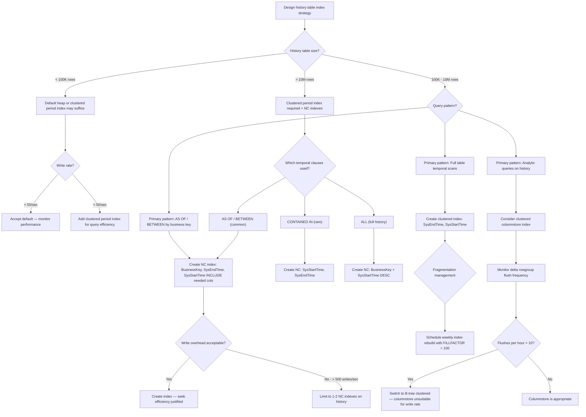

## Navigation

**Domain:** [[8 — Databases]] > **Group:** SQL Temporal Tables & Point-in-Time
**Previous:** [[8.233 — ALL — All Versions Including Current]] | **Next:** [[8.235 — Adding Temporal to Existing Tables]]

### Prerequisites
- [[8.230 — Temporal Tables — System-Versioned Overview]] — understanding the dual-table architecture (current + history) and the period columns (SysStartTime, SysEndTime) is essential for designing history table indexes.
- [[4.012 — SQL Server Index Architecture — B-Tree Internals]] — B-tree index structure, key columns vs included columns, page splits, and fill factor concepts are required for understanding index maintenance costs.

### Where This Fits

The history table of a temporal table is fundamentally different from the current table: it is append-only (rows are never updated, only inserted by the system during versioning), it grows monotonically, and its query patterns are dominated by range scans on the period columns and seeks on business keys. A .NET backend engineer faces this when temporal queries that worked in development run 100x slower in production because the history table has no indexes designed for the actual query patterns — only the default clustered index on period columns (or a heap, depending on SQL Server version). The interview signal is whether the candidate knows the default history table index structure, can design the right index for common temporal predicates (AS OF, BETWEEN, CONTAINED IN), and understands the write amplification cost of adding nonclustered indexes to an append-only table. The engineer who names the exact index key column order for AS OF (`SysStartTime <= @t AND SysEndTime > @t` → index on `(SysEndTime, SysStartTime)`) vs BETWEEN (`SysStartTime <= @end AND SysEndTime > @start` → index on `(SysEndTime, SysStartTime)` with different seek) vs CONTAINED IN (`SysStartTime >= @start AND SysEndTime <= @end` → index on `(SysStartTime, SysEndTime)`) demonstrates deep temporal indexing knowledge.

---

## Core Mental Model

The history table is an append-only structure where every row INSERT is the result of an UPDATE or DELETE on the current table moving the previous version to history. The default index configuration varies by SQL Server version: in SQL Server 2016-2019, the default history table is a heap with no clustered index (the clustered index is only on the period columns if SYSTEM_VERSIONING is created without an explicit history table). In SQL Server 2022, the default history table creates a clustered columnstore index for compression and analytic performance, or a clustered B-tree index depending on configuration. The critical invariant: the history table's query patterns are dominated by range predicates on the period columns and equality predicates on business keys. An index on `(SysEndTime, SysStartTime)` supports AS OF and BETWEEN queries because the predicate `SysEndTime > @t` (or `SysStartTime > @start`) can be a range seek. An index on `(BusinessKey, SysStartTime, SysEndTime)` supports targeted history lookups for a specific entity. The history table has NO foreign key relationship to the current table (SQL Server prohibits FK from history to current), and rows in the history table are immutable — there are no UPDATE or DELETE operations on the history table under normal operation. This means index fragmentation only occurs from INSERT operations, and fill factor can be set higher (90-100) because there are no page splits from mid-page updates.

### Classification

- **Data structure:** Clustered or heap-based table with optional nonclustered B-tree indexes and/or columnstore indexes.
- **Access path enabled:** Indexes on period columns enable range seeks for temporal predicates. Indexes on business keys enable point lookups for entity-specific history queries.
- **Write overhead:** Each nonclustered index on the history table adds ~1-3 page writes per INSERT into the history table (which occurs for every UPDATE and DELETE on the current table). This is pure write amplification with no compensating read benefit for the write path.
- **Locking behavior:** History table inserts use simple locking (row-level, often minimal due to append-only pattern). Schema stability locks for temporal queries.

```mermaid
flowchart TD
    subgraph "History Table Index Architecture"
        H[History Table - Append Only]
        H --> Default[Default Index]
        H --> NCI1[Nonclustered Index: BusinessKey + Period]
        H --> NCI2[Nonclustered Index: Period Columns]
        H --> CI[Clustered Columnstore (SQL 2022+)]
        Default --> DefaultType{Default varies by version}
        DefaultType -->|SQL 2016-2019| Heap[Heap - no clustered index]
        DefaultType -->|SQL 2016-2019 with PERIOD| CI_BTree[Clustered: SysEndTime, SysStartTime]
        DefaultType -->|SQL 2022+| CCSI[Clustered Columnstore Index]
        NCI1 --> SeekPattern1[Seek: BusinessKey = @id → Range: SysStartTime]
        NCI1 --> Predicate1[Supports: ALL, BETWEEN, AS OF with WHERE BusinessKey]
        NCI2 --> SeekPattern2[Seek: SysEndTime > @t → Filter: SysStartTime <= @end]
        NCI2 --> Predicate2[Supports: BETWEEN, AS OF, CONTAINED IN without business key]
        CI --> AggPattern[Batch Mode: analytic queries on history]
        CI --> Compression[High compression ratio: 5-10x vs rowstore]
    end
    subgraph "Write Path (Base Table UPDATE)"
        UPDATE[UPDATE on Current Table] --> Trigger[System generates history row]
        Trigger --> InsertHistory[INSERT into History Table]
        InsertHistory --> WriteClustered[Write to clustered index or heap]
        InsertHistory --> WriteNCI1[Write to nonclustered index 1]
        InsertHistory --> WriteNCI2[Write to nonclustered index 2]
        InsertHistory --> WriteCCSI[Write to columnstore delta rowgroup]
    end
```

### Key Properties

|Property|Value|Notes|
|---|---|---|
|Default index (SQL 2016-2019)|Heap or clustered on (SysEndTime, SysStartTime)|Depends on creation method|
|Default index (SQL 2022+)|Clustered columnstore|When SYSTEM_VERSIONING = ON|
|Write behavior|Append-only INSERT|No UPDATE/DELETE in normal operation|
|Fill factor recommendation|90-100|No mid-page updates — only inserts at end|
|Row immutability|Yes — rows never change|Once inserted, rows are read-only|
|FK to current table|Not allowed|SQL Server prohibits FOREIGN KEY from history to current|
|Partitioning|Supported|History table can be partitioned independently|
|Columnstore support|Clustered or nonclustered|SQL Server 2022+ defaults to clustered columnstore|

---

## Deep Mechanics

### How Indexes Serve Temporal Query Predicates

**AS OF predicate: `SysStartTime <= @t AND SysEndTime > @t`**

The optimal index for AS OF depends on which predicate is more selective. For most real-world data, `SysEndTime > @t` is the more selective predicate because most rows have SysEndTime in the past (they are closed), and only rows that were alive at time @t satisfy this. Therefore, an index on `(SysEndTime, SysStartTime)` allows a range seek on `SysEndTime > @t`, and `SysStartTime <= @t` becomes a residual predicate evaluated after the seek.

```
Seek: SysEndTime > @t  ← range seek on this key
Residual: SysStartTime <= @t  ← evaluated per row after seek
```

**BETWEEN predicate: `SysStartTime <= @end AND SysEndTime > @start`**

Similar to AS OF, the `SysEndTime > @start` predicate is typically more selective (it filters to rows that were alive after @start). Index on `(SysEndTime, SysStartTime)` enables:

```
Seek: SysEndTime > @start  ← range seek
Residual: SysStartTime <= @end  ← evaluated per row
```

**CONTAINED IN predicate: `SysStartTime >= @start AND SysEndTime <= @end`**

Here, both predicates are range type. `SysStartTime >= @start` is the more selective leading predicate. Index on `(SysStartTime, SysEndTime)` enables:

```
Seek: SysStartTime >= @start  ← range seek
Residual: SysEndTime <= @end  ← evaluated per row
```

### History Table Index Maintenance

When the base table receives an UPDATE or DELETE, the database engine:
1. Reads the current row version from the current table
2. Sets `SysEndTime = SYSUTCDATETIME()` on the old version (this becomes the history row)
3. Inserts the old version into the history table
4. If the operation was an UPDATE, the current table row gets a new `SysStartTime = SYSUTCDATETIME()`

Each INSERT into the history table must maintain all indexes on the history table. The write amplification is: 1 clustered index write (or heap page allocation) + N nonclustered index writes.

**For a heap-based history table (SQL Server default):**
- The INSERT allocates a new page (or fills an existing one at the end) — no page split overhead
- Nonclustered indexes insert into their B-tree structures — may cause page splits if the index key value falls in the middle of the B-tree

**For a clustered B-tree history table (on SysEndTime, SysStartTime):**
- New rows have SysEndTime = SYSUTCDATETIME() — these are monotonically increasing values
- Inserts go to the rightmost leaf page — minimal page split risk
- Low fragmentation for the clustered index

**For a columnstore history table (SQL Server 2022+):**
- Inserts go to the delta rowgroup (a B-tree structure) until it reaches 1M rows
- At 1M rows, the delta rowgroup is compressed into a columnstore segment
- Write amplification is deferred — bulk writes when segments close

### SQL Visibility

```sql
-- ============================================================
-- Compare default history table index vs optimized
-- ============================================================

-- Default: Create temporal table without explicit history table index
-- SQL Server 2016-2019: history table is a HEAP with no clustered index
-- (or clustered on period columns if created via ALTER TABLE ADD PERIOD)
CREATE TABLE dbo.Orders
(
    OrderId        INT             NOT NULL,
    CustomerId     INT             NOT NULL,
    OrderDate      DATE            NOT NULL,
    TotalAmount    DECIMAL(18, 2)  NOT NULL,
    StatusCode     VARCHAR(20)     NOT NULL,
    SysStartTime   DATETIME2(7) GENERATED ALWAYS AS ROW START NOT NULL,
    SysEndTime     DATETIME2(7) GENERATED ALWAYS AS ROW END   NOT NULL,
    PERIOD FOR SYSTEM_TIME (SysStartTime, SysEndTime),
    CONSTRAINT PK_Orders PRIMARY KEY (OrderId, SysStartTime)
)
WITH (SYSTEM_VERSIONING = ON (HISTORY_TABLE = dbo.Orders_History));

-- Check what indexes exist on the history table:
SELECT
    t.name AS TableName,
    i.name AS IndexName,
    i.type_desc,
    i.is_primary_key,
    i.is_unique
FROM sys.tables t
INNER JOIN sys.indexes i ON t.object_id = i.object_id
WHERE t.name = 'Orders_History';
-- SQL 2016-2019 typically shows: HEAP (no clustered index)
-- or Clustered index on (SysEndTime, SysStartTime)

-- ============================================================
-- Create optimized indexes for temporal query patterns
-- ============================================================

-- Index 1: For AS OF and BETWEEN queries (range on SysEndTime)
-- Key: (SysEndTime, SysStartTime) - supports range seek
CREATE CLUSTERED INDEX IX_Orders_History_Period
    ON dbo.Orders_History (SysEndTime, SysStartTime);
-- Note: This changes the history table from heap to clustered
-- The order (SysEndTime first) supports the common temporal predicate

-- Index 2: For targeted business key lookups with temporal filter
CREATE NONCLUSTERED INDEX IX_Orders_History_CustomerId_Period
    ON dbo.Orders_History (CustomerId, SysStartTime, SysEndTime)
    INCLUDE (OrderDate, TotalAmount, StatusCode);
-- Seek on CustomerId, range scan on period columns within that key

-- Index 3: For ORDER BY SysStartTime DESC (most recent history first)
CREATE NONCLUSTERED INDEX IX_Orders_History_SysStartTime_Desc
    ON dbo.Orders_History (SysStartTime DESC)
    INCLUDE (CustomerId, StatusCode, TotalAmount);

-- Index 4: For CONTAINED IN queries where SysStartTime is leading
CREATE NONCLUSTERED INDEX IX_Orders_History_ContainedIn
    ON dbo.Orders_History (SysStartTime, SysEndTime)
    INCLUDE (CustomerId, StatusCode, TotalAmount);

-- Index 5: For SQL Server 2022+ - columnstore for analytics
-- (only if the default was not already columnstore)
CREATE CLUSTERED COLUMNSTORE INDEX IX_Orders_History_Columnstore
    ON dbo.Orders_History;
-- Note: Drops existing clustered index first
```

```csharp
// EF Core cannot create indexes on the history table directly.
// Indexes must be created via migration SQL or direct T-SQL.

// In EF Core migration:
public partial class AddHistoryTableIndexes : Migration
{
    protected override void Up(MigrationBuilder migrationBuilder)
    {
        // Create nonclustered index on history table
        migrationBuilder.Sql(@"
            CREATE NONCLUSTERED INDEX IX_Orders_History_CustomerId_Period
                ON dbo.Orders_History (CustomerId, SysStartTime, SysEndTime)
                INCLUDE (OrderDate, TotalAmount, StatusCode);");

        // Create period index
        migrationBuilder.Sql(@"
            CREATE NONCLUSTERED INDEX IX_Orders_History_Period
                ON dbo.Orders_History (SysEndTime, SysStartTime);");
    }

    protected override void Down(MigrationBuilder migrationBuilder)
    {
        migrationBuilder.Sql(@"
            DROP INDEX IF EXISTS IX_Orders_History_CustomerId_Period
                ON dbo.Orders_History;");
        migrationBuilder.Sql(@"
            DROP INDEX IF EXISTS IX_Orders_History_Period
                ON dbo.Orders_History;");
    }
}
```

### Execution Plan Analysis

**Without history table index (heap, full scan):**

```
Query: SELECT * FROM dbo.Orders FOR SYSTEM_TIME AS OF '2026-06-01' WHERE CustomerId = 42

[Concatenation]
├── [Clustered Index Seek — Orders (PK on OrderId, SysStartTime)]
│   Seek: CustomerId = 42  (via NC index on current table)
└── [Table Scan — Orders_History (HEAP)]
    → [Filter: SysStartTime <= @t AND SysEndTime > @t AND CustomerId = 42]
    Estimated rows: full table
    Logical reads: 85,000 (full heap scan)
```

- The history table scan is a full heap scan — every page read.
- The filter on CustomerId and period columns is applied as a residual — no seek.
- Cost: 95% on the history table scan.

**With covering index on (CustomerId, SysStartTime, SysEndTime):**

```
[Concatenation]
├── [Clustered Index Seek — Orders (PK on OrderId, SysStartTime)]
│   Seek: CustomerId = 42
└── [Index Seek — Orders_History on IX_Orders_History_CustomerId_Period]
    Seek: CustomerId = 42 AND SysEndTime > @t
    Residual: SysStartTime <= @t
    Estimated rows: ~12 (12 historical versions for this customer)
    Logical reads: 6
```

- Seek to CustomerId = 42 → range scan on SysEndTime > @t within that key.
- The index includes all SELECT columns — no key lookups.
- Cost: 5% on the history table seek.

### Cost Visibility

```sql
SET STATISTICS IO ON;
SET STATISTICS TIME ON;

-- ============================================================
-- Query: AS OF with CustomerId filter
-- History table is a HEAP (no useful index)
-- ============================================================
SELECT COUNT(*)
FROM dbo.Orders
FOR SYSTEM_TIME AS OF '2026-06-01'
WHERE CustomerId = 42;

-- Output without history index:
-- Table 'Orders'. Scan count 1, logical reads 3 (current seek)
-- Table 'Orders_History'. Scan count 1, logical reads 85,300 (full heap scan)
-- SQL Server Execution Times: CPU time = 640 ms, elapsed time = 780 ms

-- ============================================================
-- After adding covering index on (CustomerId, SysStartTime, SysEndTime)
-- ============================================================
-- Table 'Orders'. Scan count 1, logical reads 3
-- Table 'Orders_History'. Scan count 1, logical reads 6 (index seek)
-- SQL Server Execution Times: CPU time = 1 ms, elapsed time = 2 ms
```

### Failure Modes

**History table heap after years of inserts — extreme fragmentation:** A heap-based history table after millions of INSERT operations has forwarded records, PFS page contention, and no ordering for range scans. The heap becomes a performance disaster for any temporal query that scans it.

**Index on SysStartTime only (missing SysEndTime):** The AS OF and BETWEEN predicates both use SysEndTime as the leading filter. An index on SysStartTime alone cannot support the `SysEndTime > @t` seek — the optimizer must scan.

**Index on BusinessKey only (missing period columns):** The query seeks to the business key but then must filter all versions by period columns without index support. For a customer with 500 order history rows, the 5 rows matching the time window are found by scanning all 500.

**Too many nonclustered indexes on history table:** Each index adds write amplification for every UPDATE/DELETE on the base table. At 500 writes/second with 5 nonclustered indexes, the history table write path does 2,500 index operations per second — potentially becoming the write bottleneck.

**Columnstore with high-write workload:** Clustered columnstore on the history table is great for compression and analytics, but high write rates (> 1,000 rows/second) cause frequent delta rowgroup flushes, fragmenting the columnstore and causing performance regression.

---

## Production Patterns and Implementation

### Primary SQL Implementation

```sql
-- ============================================================
-- Create temporal table with explicit history table and indexes
-- ============================================================

-- Step 1: Create the history table with a clustered index
CREATE TABLE dbo.OrdersHistory
(
    OrderId        INT              NOT NULL,
    CustomerId     INT              NOT NULL,
    OrderDate      DATE             NOT NULL,
    TotalAmount    DECIMAL(18, 2)   NOT NULL,
    StatusCode     VARCHAR(20)      NOT NULL,
    SysStartTime   DATETIME2(7)     NOT NULL,
    SysEndTime     DATETIME2(7)     NOT NULL
);

-- Clustered index on period columns for temporal range scans
CREATE CLUSTERED INDEX IX_OrdersHistory_Period
    ON dbo.OrdersHistory (SysEndTime, SysStartTime);

-- Step 2: Create the current table with system versioning
CREATE TABLE dbo.Orders
(
    OrderId        INT              NOT NULL,
    CustomerId     INT              NOT NULL,
    OrderDate      DATE             NOT NULL,
    TotalAmount    DECIMAL(18, 2)   NOT NULL,
    StatusCode     VARCHAR(20)      NOT NULL,
    SysStartTime   DATETIME2(7) GENERATED ALWAYS AS ROW START NOT NULL,
    SysEndTime     DATETIME2(7) GENERATED ALWAYS AS ROW END   NOT NULL,
    PERIOD FOR SYSTEM_TIME (SysStartTime, SysEndTime),
    CONSTRAINT PK_Orders PRIMARY KEY (OrderId, SysStartTime),
    CONSTRAINT FK_Orders_Customers FOREIGN KEY (CustomerId)
        REFERENCES dbo.Customers(CustomerId)
)
WITH (SYSTEM_VERSIONING = ON (HISTORY_TABLE = dbo.OrdersHistory));

-- Step 3: Add nonclustered indexes on the history table
-- Index for queries filtering by CustomerId
CREATE NONCLUSTERED INDEX IX_OrdersHistory_CustomerId_Period
    ON dbo.OrdersHistory (CustomerId, SysStartTime, SysEndTime)
    INCLUDE (OrderDate, TotalAmount, StatusCode);

-- Index for ORDER BY SysStartTime DESC (recent-first queries)
CREATE NONCLUSTERED INDEX IX_OrdersHistory_SysStartTime_Desc
    ON dbo.OrdersHistory (SysStartTime DESC)
    INCLUDE (CustomerId, StatusCode);

-- Index for CONTAINED IN queries
CREATE NONCLUSTERED INDEX IX_OrdersHistory_ContainedIn
    ON dbo.OrdersHistory (SysStartTime, SysEndTime)
    INCLUDE (CustomerId, StatusCode, TotalAmount);

-- ============================================================
-- SQL Server 2022+: Clustered columnstore alternative
-- ============================================================
-- Drop the existing clustered index first
DROP INDEX IX_OrdersHistory_Period ON dbo.OrdersHistory;

CREATE CLUSTERED COLUMNSTORE INDEX IX_OrdersHistory_Columnstore
    ON dbo.OrdersHistory;
-- Columnstore provides:
-- - 5-10x compression ratio
-- - Batch mode execution for analytic queries
-- - Good for full-table temporal scans

-- Add nonclustered B-tree indexes for point lookups alongside columnstore
CREATE NONCLUSTERED INDEX IX_OrdersHistory_CustomerId_Period_NCI
    ON dbo.OrdersHistory (CustomerId, SysStartTime, SysEndTime)
    INCLUDE (OrderDate, TotalAmount, StatusCode);
-- Nonclustered index on columnstore still uses B-tree for seeks

-- ============================================================
-- Index maintenance: rebuild/reorganize history table indexes
-- ============================================================
-- Check fragmentation on history table indexes
SELECT
    s.name AS SchemaName,
    t.name AS TableName,
    i.name AS IndexName,
    ips.avg_fragmentation_in_percent,
    ips.page_count,
    ips.avg_page_space_used_in_percent
FROM sys.dm_db_index_physical_stats(
    DB_ID(),
    OBJECT_ID('dbo.OrdersHistory'),
    NULL, NULL, 'LIMITED') ips
INNER JOIN sys.indexes i
    ON ips.object_id = i.object_id AND ips.index_id = i.index_id
INNER JOIN sys.tables t
    ON i.object_id = t.object_id
INNER JOIN sys.schemas s
    ON t.schema_id = s.schema_id
WHERE t.name = 'OrdersHistory';

-- Rebuild indexes with fill factor = 100 (no future updates expected)
ALTER INDEX IX_OrdersHistory_CustomerId_Period
    ON dbo.OrdersHistory
    REBUILD WITH (FILLFACTOR = 100, SORT_IN_TEMPDB = ON);

ALTER INDEX IX_OrdersHistory_Period
    ON dbo.OrdersHistory
    REBUILD WITH (FILLFACTOR = 100, SORT_IN_TEMPDB = ON);

-- For low fragmentation (< 30%), reorganize instead of rebuild
ALTER INDEX IX_OrdersHistory_SysStartTime_Desc
    ON dbo.OrdersHistory
    REORGANIZE;
```

### EF Core Implementation

```csharp
// ============================================================
// EF Core migration to add history table indexes
// ============================================================
public partial class AddHistoryTableIndexes : Migration
{
    protected override void Up(MigrationBuilder migrationBuilder)
    {
        // History table index for CustomerId + period queries
        migrationBuilder.Sql(@"
            IF NOT EXISTS (
                SELECT 1 FROM sys.indexes
                WHERE name = 'IX_OrdersHistory_CustomerId_Period'
                AND object_id = OBJECT_ID('dbo.OrdersHistory')
            )
            CREATE NONCLUSTERED INDEX IX_OrdersHistory_CustomerId_Period
                ON dbo.OrdersHistory (CustomerId, SysStartTime, SysEndTime)
                INCLUDE (OrderDate, TotalAmount, StatusCode);");

        // History table clustered index if not columnstore
        migrationBuilder.Sql(@"
            IF NOT EXISTS (
                SELECT 1 FROM sys.indexes
                WHERE name = 'IX_OrdersHistory_Period'
                AND object_id = OBJECT_ID('dbo.OrdersHistory')
            )
            CREATE NONCLUSTERED INDEX IX_OrdersHistory_Period
                ON dbo.OrdersHistory (SysEndTime, SysStartTime);");

        // SysStartTime DESC index for recent-first ordering
        migrationBuilder.Sql(@"
            IF NOT EXISTS (
                SELECT 1 FROM sys.indexes
                WHERE name = 'IX_OrdersHistory_SysStartTime_Desc'
                AND object_id = OBJECT_ID('dbo.OrdersHistory')
            )
            CREATE NONCLUSTERED INDEX IX_OrdersHistory_SysStartTime_Desc
                ON dbo.OrdersHistory (SysStartTime DESC)
                INCLUDE (CustomerId, StatusCode, TotalAmount);");
    }

    protected override void Down(MigrationBuilder migrationBuilder)
    {
        migrationBuilder.Sql(@"
            DROP INDEX IF EXISTS IX_OrdersHistory_CustomerId_Period
                ON dbo.OrdersHistory;");
        migrationBuilder.Sql(@"
            DROP INDEX IF EXISTS IX_OrdersHistory_Period
                ON dbo.OrdersHistory;");
        migrationBuilder.Sql(@"
            DROP INDEX IF EXISTS IX_OrdersHistory_SysStartTime_Desc
                ON dbo.OrdersHistory;");
    }
}

// ============================================================
// Verification: query to check history table index usage
// ============================================================
public class IndexMaintenanceService
{
    private readonly IDbConnectionFactory _connectionFactory;

    public IndexMaintenanceService(IDbConnectionFactory connectionFactory)
        => _connectionFactory = connectionFactory;

    public async Task<List<HistoryTableIndexInfo>> GetHistoryTableIndexStatsAsync(
        string historyTableName,
        CancellationToken cancellationToken = default)
    {
        const string sql = @"
            SELECT
                OBJECT_NAME(ips.object_id) AS TableName,
                i.name AS IndexName,
                i.type_desc AS IndexType,
                ips.avg_fragmentation_in_percent,
                ips.page_count,
                ips.avg_page_space_used_in_percent,
                ips.record_count,
                ips.avg_record_size_in_bytes
            FROM sys.dm_db_index_physical_stats(
                DB_ID(),
                OBJECT_ID(@TableName),
                NULL, NULL, 'LIMITED') ips
            INNER JOIN sys.indexes i
                ON ips.object_id = i.object_id
                AND ips.index_id = i.index_id
            WHERE i.name IS NOT NULL
            ORDER BY ips.page_count DESC;";

        await using var connection = _connectionFactory.Create();
        var results = await connection.QueryAsync<HistoryTableIndexInfo>(
            new CommandDefinition(sql,
                new { TableName = historyTableName },
                cancellationToken: cancellationToken));

        return results.AsList();
    }

    public async Task RebuildIndexIfFragmentedAsync(
        string historyTableName,
        string indexName,
        int fragmentationThresholdPercent = 30,
        CancellationToken cancellationToken = default)
    {
        var indexStats = await GetHistoryTableIndexStatsAsync(
            historyTableName, cancellationToken);

        var targetIndex = indexStats.FirstOrDefault(i =>
            i.IndexName == indexName);

        if (targetIndex is null) return;

        const string rebuildSql = @"
            ALTER INDEX @IndexName ON @TableName
            REBUILD WITH (FILLFACTOR = 100, SORT_IN_TEMPDB = ON);";

        const string reorganizeSql = @"
            ALTER INDEX @IndexName ON @TableName REORGANIZE;";

        await using var connection = _connectionFactory.Create();

        if (targetIndex.AvgFragmentationPercent > fragmentationThresholdPercent)
        {
            // Rebuild for high fragmentation
            var sql = rebuildSql
                .Replace("@IndexName", indexName)
                .Replace("@TableName", historyTableName);
            await connection.ExecuteAsync(
                new CommandDefinition(sql,
                    cancellationToken: cancellationToken));
        }
        else if (targetIndex.AvgFragmentationPercent > 10)
        {
            // Reorganize for moderate fragmentation
            var sql = reorganizeSql
                .Replace("@IndexName", indexName)
                .Replace("@TableName", historyTableName);
            await connection.ExecuteAsync(
                new CommandDefinition(sql,
                    cancellationToken: cancellationToken));
        }
    }
}

public class HistoryTableIndexInfo
{
    public string TableName { get; set; } = string.Empty;
    public string IndexName { get; set; } = string.Empty;
    public string IndexType { get; set; } = string.Empty;
    public double AvgFragmentationPercent { get; set; }
    public long PageCount { get; set; }
    public double AvgPageSpaceUsedPercent { get; set; }
    public long RecordCount { get; set; }
    public double AvgRecordSizeBytes { get; set; }
}
```

### Dapper Implementation

```csharp
// Dapper — index health monitoring and rebuild scripts
public sealed class TemporalIndexMaintenance
{
    private readonly IDbConnectionFactory _connectionFactory;

    public TemporalIndexMaintenance(IDbConnectionFactory connectionFactory)
        => _connectionFactory = connectionFactory;

    public async Task<List<IndexUsageStat>> GetHistoryTableIndexUsageAsync(
        string databaseName,
        string historyTableName,
        CancellationToken cancellationToken = default)
    {
        const string sql = @"
            SELECT
                DB_NAME(us.database_id) AS DatabaseName,
                OBJECT_NAME(us.object_id) AS TableName,
                i.name AS IndexName,
                us.user_seeks,
                us.user_scans,
                us.user_lookups,
                us.user_updates,
                us.last_user_seek,
                us.last_user_scan,
                us.last_user_update,
                (us.user_seeks + us.user_scans + us.user_lookups) AS TotalReads,
                us.user_updates AS TotalWrites
            FROM sys.dm_db_index_usage_stats us
            INNER JOIN sys.indexes i
                ON us.object_id = i.object_id
                AND us.index_id = i.index_id
            WHERE DB_NAME(us.database_id) = @DatabaseName
              AND OBJECT_NAME(us.object_id) = @TableName
              AND i.name IS NOT NULL
            ORDER BY TotalReads DESC;";

        await using var connection = _connectionFactory.Create();
        var results = await connection.QueryAsync<IndexUsageStat>(
            new CommandDefinition(sql,
                new { DatabaseName = databaseName, TableName = historyTableName },
                cancellationToken: cancellationToken));

        return results.AsList();
    }

    public async Task GenerateMissingIndexRecommendationsAsync(
        string databaseName,
        CancellationToken cancellationToken = default)
    {
        // Find missing indexes that would benefit temporal queries
        const string sql = @"
            SELECT
                migs.avg_user_impact,
                migs.avg_total_user_cost,
                migs.user_seeks,
                mid.statement AS TableName,
                mid.equality_columns,
                mid.inequality_columns,
                mid.included_columns,
                'CREATE NONCLUSTERED INDEX IX_' +
                    REPLACE(REPLACE(mid.statement, '].[', '_'), '[', '') +
                    '_' + LEFT(REPLACE(mid.equality_columns, ', ', '_'), 50) +
                    ' ON ' + mid.statement +
                    ' (' + ISNULL(mid.equality_columns, '') +
                        CASE WHEN mid.equality_columns IS NOT NULL
                              AND mid.inequality_columns IS NOT NULL
                             THEN ', '
                             ELSE ''
                        END +
                    ISNULL(mid.inequality_columns, '') + ')' +
                    ISNULL(' INCLUDE (' + mid.included_columns + ')', '') AS CreateIndexStatement
            FROM sys.dm_db_missing_index_details mid
            CROSS APPLY sys.dm_db_missing_index_groups mig
            INNER JOIN sys.dm_db_missing_index_group_stats migs
                ON mig.index_group_handle = migs.group_handle
            WHERE mid.database_id = DB_ID(@DatabaseName)
              AND mid.statement LIKE '%' + @TablePattern + '%'
              AND migs.avg_user_impact > 50
            ORDER BY migs.avg_user_impact DESC;";

        await using var connection = _connectionFactory.Create();
        var recommendations = await connection.QueryAsync<MissingIndexRecommendation>(
            new CommandDefinition(sql,
                new
                {
                    DatabaseName = databaseName,
                    TablePattern = '%_History'
                },
                cancellationToken: cancellationToken));

        foreach (var rec in recommendations)
        {
            Console.WriteLine($"[{rec.AvgUserImpact}% impact] {rec.CreateIndexStatement}");
        }
    }
}

public class IndexUsageStat
{
    public string DatabaseName { get; set; } = string.Empty;
    public string TableName { get; set; } = string.Empty;
    public string IndexName { get; set; } = string.Empty;
    public long UserSeeks { get; set; }
    public long UserScans { get; set; }
    public long UserLookups { get; set; }
    public long UserUpdates { get; set; }
    public DateTime? LastUserSeek { get; set; }
    public DateTime? LastUserScan { get; set; }
    public DateTime? LastUserUpdate { get; set; }
    public long TotalReads => UserSeeks + UserScans + UserLookups;
    public long TotalWrites => UserUpdates;
}

public class MissingIndexRecommendation
{
    public int AvgUserImpact { get; set; }
    public string CreateIndexStatement { get; set; } = string.Empty;
}
```

### Configuration and Wiring

```csharp
// Program.cs — index maintenance background service
builder.Services.AddSingleton<IDbConnectionFactory>(sp =>
    new SqlConnectionFactory(
        builder.Configuration.GetConnectionString("DefaultConnection")!));

builder.Services.AddScoped<TemporalIndexMaintenance>();
builder.Services.AddScoped<IndexMaintenanceService>();

// Background service for periodic index maintenance
builder.Services.AddHostedService<HistoryTableIndexMaintenanceJob>();

// ============================================================
// Background job: weekly history table index maintenance
// ============================================================
public class HistoryTableIndexMaintenanceJob : BackgroundService
{
    private readonly IServiceProvider _serviceProvider;
    private readonly ILogger<HistoryTableIndexMaintenanceJob> _logger;

    public HistoryTableIndexMaintenanceJob(
        IServiceProvider serviceProvider,
        ILogger<HistoryTableIndexMaintenanceJob> logger)
    {
        _serviceProvider = serviceProvider;
        _logger = logger;
    }

    protected override async Task ExecuteAsync(CancellationToken stoppingToken)
    {
        // Run every Sunday at 2 AM
        while (!stoppingToken.IsCancellationRequested)
        {
            var now = DateTime.UtcNow;
            var nextSunday = now.AddDays(
                (7 - (int)now.DayOfWeek + (int)DayOfWeek.Sunday) % 7);
            var runTime = nextSunday.Date.AddHours(2);

            if (runTime <= now)
                runTime = runTime.AddDays(7);

            var delay = runTime - now;
            _logger.LogInformation(
                "Next history table index maintenance scheduled at {RunTime}",
                runTime);

            await Task.Delay(delay, stoppingToken);

            try
            {
                using var scope = _serviceProvider.CreateScope();
                var maintenance = scope.ServiceProvider
                    .GetRequiredService<IndexMaintenanceService>();

                // Rebuild fragmented indexes on all history tables
                var historyTables = new[] { "OrdersHistory", "CustomerAccounts_History" };
                foreach (var table in historyTables)
                {
                    var stats = await maintenance.GetHistoryTableIndexStatsAsync(
                        table, stoppingToken);

                    foreach (var index in stats)
                    {
                        if (index.AvgFragmentationPercent > 30)
                        {
                            await maintenance.RebuildIndexIfFragmentedAsync(
                                table, index.IndexName, 30, stoppingToken);
                            _logger.LogInformation(
                                "Rebuilt index {IndexName} on {TableName} " +
                                "(fragmentation: {Frag:P})",
                                index.IndexName, table,
                                index.AvgFragmentationPercent / 100.0);
                        }
                    }
                }
            }
            catch (Exception ex)
            {
                _logger.LogError(ex,
                    "Error during history table index maintenance");
            }
        }
    }
}
```

### SQL Server vs PostgreSQL Differences

```sql
-- PostgreSQL does not have native temporal tables.
-- For manual history tables using triggers, indexing strategy is:

-- History table with B-tree index on period columns
CREATE INDEX ix_orders_history_period
    ON orders_history (sys_end_time, sys_start_time);

-- GiST index for range overlap queries (temporal)
CREATE INDEX ix_orders_history_period_gist
    ON orders_history USING gist (tstzrange(sys_start_time, sys_end_time));

-- BRIN index for very large append-only history tables
-- (more compact than B-tree for append-heavy workloads)
CREATE INDEX ix_orders_history_brin
    ON orders_history USING brin (sys_start_time)
    WITH (pages_per_range = 32);

-- PostgreSQL can create indexes CONCURRENTLY on history table
-- without blocking writes:
CREATE INDEX CONCURRENTLY ix_orders_history_customer_id
    ON orders_history (customer_id, sys_start_time);
```

---

## Gotchas and Production Pitfalls

### Default History Table Is a Heap in SQL Server 2016-2019

**Pitfall:** Assuming the history table has a clustered index by default. In SQL Server 2016-2019, when temporal is created with `SYSTEM_VERSIONING = ON` and no explicit history table, the history table is created as a heap (no clustered index).

```sql
-- ❌ History table is a heap — no ordering, no range seek support
CREATE TABLE dbo.Products
(
    ProductId      INT NOT NULL,
    ProductName    NVARCHAR(200) NOT NULL,
    UnitPrice      DECIMAL(18,2) NOT NULL,
    SysStartTime   DATETIME2(7) GENERATED ALWAYS AS ROW START NOT NULL,
    SysEndTime     DATETIME2(7) GENERATED ALWAYS AS ROW END NOT NULL,
    PERIOD FOR SYSTEM_TIME (SysStartTime, SysEndTime),
    CONSTRAINT PK_Products PRIMARY KEY (ProductId, SysStartTime)
)
WITH (SYSTEM_VERSIONING = ON);
-- History table 'dbo.MSSQL_TemporalHistoryFor_...' is a HEAP
```

**Symptom:** Temporal queries on the history table perform full heap scans regardless of indexing. After years of inserts, the heap has forwarded records and PFS page contention.

**Fix:**
```sql
-- ✅ Create a clustered index on the history table
CREATE CLUSTERED INDEX IX_Products_History_Period
    ON dbo.MSSQL_TemporalHistoryFor_123456789 (SysEndTime, SysStartTime);

-- ✅ Better: Create the history table explicitly with indexes upfront
CREATE TABLE dbo.ProductsHistory
(
    ProductId      INT NOT NULL,
    ProductName    NVARCHAR(200) NOT NULL,
    UnitPrice      DECIMAL(18,2) NOT NULL,
    SysStartTime   DATETIME2(7) NOT NULL,
    SysEndTime     DATETIME2(7) NOT NULL
);
CREATE CLUSTERED INDEX IX_ProductsHistory_Period
    ON dbo.ProductsHistory (SysEndTime, SysStartTime);

-- Then reference it in SYSTEM_VERSIONING
```

**Cost of not fixing:** Every temporal query on a heap-based history table with 50M rows requires a full scan (~400,000 logical reads). After 3 years of growth, the heap is 50 GB with 30% forwarded records. Queries take 30+ seconds.

---

### No Nonclustered Index on Business Key in History Table

**Pitfall:** Only having the default period index (or heap) on the history table, with no index on the business keys used in temporal WHERE clauses.

```sql
-- No index on CustomerId in the history table
-- Temporal query scans the entire history table for a single customer
SELECT *
FROM dbo.Orders
FOR SYSTEM_TIME BETWEEN @Start AND @End
WHERE CustomerId = 42;
```

**Symptom:** The query plan shows a full scan of the history table even though only one customer's history is needed. Logical reads are 85,000 instead of 6.

**Fix:**
```sql
CREATE NONCLUSTERED INDEX IX_OrdersHistory_CustomerId_Period
    ON dbo.OrdersHistory (CustomerId, SysStartTime, SysEndTime)
    INCLUDE (TotalAmount, StatusCode, OrderDate);
```

**Cost of not fixing:** 14,000x more logical reads per query. At 100 queries/hour on a busy system, this is 8.5M unnecessary logical reads per hour, consuming 60% of the buffer pool.

---

### Indexing Both Period Columns in Wrong Order for the Predicate

**Pitfall:** Creating an index on `(SysStartTime, SysEndTime)` and expecting it to efficiently support AS OF queries that predicate on `SysEndTime > @t` first.

```sql
-- Index order (SysStartTime, SysEndTime) does NOT support AS OF seek
CREATE INDEX IX_History_Period ON dbo.OrdersHistory (SysStartTime, SysEndTime);

-- AS OF predicate: SysStartTime <= @t AND SysEndTime > @t
-- The leading column SysStartTime <= @t allows a seek, but @t is a point
-- The second predicate SysEndTime > @t is a residual — all rows with
-- SysStartTime <= @t must be scanned.
```

**Symptom:** The optimizer uses the index but performs a range scan on `SysStartTime <= @t` which may include millions of rows, then filters on `SysEndTime > @t`. For a table with 5 years of history queried AS OF yesterday, all rows with SysStartTime <= yesterday (95% of the table) are scanned.

**Fix:**
```sql
-- Correct order for AS OF and BETWEEN: (SysEndTime, SysStartTime)
CREATE INDEX IX_History_Period ON dbo.OrdersHistory (SysEndTime, SysStartTime);

-- SysEndTime > @t is a range seek (typically narrow — rows alive after @t)
-- SysStartTime <= @t is a residual on the narrow result set
```

**Cost of not fixing:** AS OF queries scan 95% of the history table instead of 5%. A 10-second query that should take 50ms.

---

### Columnstore Index with High Write Rate Causes Delta Store Fragmentation

**Pitfall:** Using a clustered columnstore index on the history table in SQL Server 2022+ when the write rate exceeds the columnstore delta rowgroup flush capacity.

```sql
-- Clustered columnstore on high-write history table
CREATE CLUSTERED COLUMNSTORE INDEX IX_History_Columnstore
    ON dbo.OrdersHistory;
-- Each INSERT goes to the delta rowgroup (B-tree)
-- At 1,000 writes/second, delta rowgroups fill (1M rows) every 1,000 seconds
-- Frequent delta flushes create many small compressed segments
```

**Symptom:** Columnstore segment count grows rapidly (10,000+ segments). Segment elimination degrades. Queries must scan many small segments instead of a few large ones. Compression ratio drops from 10x to 3x.

**Fix:**
```sql
-- Option 1: Use clustered B-tree for high-write history tables
CREATE CLUSTERED INDEX IX_History_Period
    ON dbo.OrdersHistory (SysEndTime, SysStartTime);
-- Add nonclustered B-tree indexes for query patterns

-- Option 2: Tune columnstore for higher write rates
-- Increase delta rowgroup max rows:
ALTER COLUMNSTORE INDEX IX_History_Columnstore
    ON dbo.OrdersHistory
    REBUILD WITH (MAX_DELTA_ROWS = 1000000);

-- Option 3: Batch-write to history (reduce frequency, increase batch size)
-- Instead of individual writes, batch process changes
```

**Cost of not fixing:** Columnstore with 10,000+ small segments performs worse than a B-tree for point lookups and range scans. The compression saving is lost to fragmentation. Query times degrade from 10ms to 500ms.

---

### FK Constraint Attempt on History Table (Not Allowed)

**Pitfall:** Attempting to add a FOREIGN KEY constraint from the history table to the current table or to a reference table.

```sql
-- ❌ SQL Server does not allow FK on history table
ALTER TABLE dbo.OrdersHistory
ADD CONSTRAINT FK_OrdersHistory_Customers
    FOREIGN KEY (CustomerId) REFERENCES dbo.Customers(CustomerId);
-- Error 13708: 'Creating foreign key constraint on table
-- 'OrdersHistory' with temporal history table property set is not supported.'
```

**Symptom:** Migration fails with error 13708. Developer wastes time researching why a standard FK constraint fails.

**Fix:**
```sql
-- ✅ FK on the current table only
ALTER TABLE dbo.Orders
ADD CONSTRAINT FK_Orders_Customers
    FOREIGN KEY (CustomerId) REFERENCES dbo.Customers(CustomerId);
-- The history table will have the same CustomerId values as the
-- current table at the time of versioning — referential integrity
-- is inherited from the current table's FK.
```

**Cost of not fixing:** Development delay while the developer works around the unsupported FK. Attempting to create the FK on the history table (which is not supported) may cause the developer to drop and recreate the temporal table, losing history data.

---

### Fill Factor Too Low on Append-Only History Table

**Pitfall:** Using default fill factor (0 = 100% fill on data pages, but leaves 10% free in intermediate levels for indexes) or a low fill factor (70-80%) on the history table's clustered index.

```sql
-- ❌ Low fill factor wastes space on append-only table
CREATE CLUSTERED INDEX IX_History_Period
    ON dbo.OrdersHistory (SysEndTime, SysStartTime)
    WITH (FILLFACTOR = 70);
-- 30% of each page is empty — wasted space
-- More pages = more logical reads for the same data
```

**Symptom:** History table has 30% more pages than necessary. All scans read 30% more pages. Storage cost is 30% higher.

**Fix:**
```sql
-- ✅ Fill factor = 100 for append-only history table
-- (rows are never updated in place — no page split risk)
CREATE CLUSTERED INDEX IX_History_Period
    ON dbo.OrdersHistory (SysEndTime, SysStartTime)
    WITH (FILLFACTOR = 100);

-- ✅ Or fill factor = 90 if some page splitting is acceptable
ALTER INDEX IX_History_Period
    ON dbo.OrdersHistory
    REBUILD WITH (FILLFACTOR = 100, SORT_IN_TEMPDB = ON);
```

**Cost of not fixing:** 30% more storage and 30% more logical reads for every temporal query on the history table. For a 100 GB history table, this is 30 GB of wasted storage and 30% slower queries.

---

## Performance Implications

### Benchmark: History Table Index Impact on Temporal Queries

```sql
-- ============================================================
-- Baseline: Temporal AS OF query — heap history table (no useful index)
-- ============================================================
SET STATISTICS IO ON;
SELECT COUNT(*)
FROM dbo.Orders
FOR SYSTEM_TIME AS OF '2026-06-01'
WHERE CustomerId = 42;

-- Table 'Orders'. Scan count 1, logical reads 3
-- Table 'Orders_History'. Scan count 1, logical reads 94,200
-- Duration: ~780 ms

-- ============================================================
-- After adding clustered index on (SysEndTime, SysStartTime)
-- ============================================================
-- Same query:
-- Table 'Orders'. Scan count 1, logical reads 3
-- Table 'Orders_History'. Scan count 1, logical reads 65,400 (still scan)
-- Duration: ~540 ms
-- (Clustered index helps ordering but CustomerId still requires scan)

-- ============================================================
-- After adding nonclustered index on (CustomerId, SysEndTime, SysStartTime)
-- ============================================================
-- Same query:
-- Table 'Orders'. Scan count 1, logical reads 3
-- Table 'Orders_History'. Scan count 1, logical reads 8
-- Duration: ~2 ms
```

**Improvement chain:** 94,200 → 65,400 → 8 logical reads (11,775x reduction from heap to full covering index).

### BenchmarkDotNet

```csharp
[MemoryDiagnoser]
[SimpleJob(RuntimeMoniker.Net90)]
public class HistoryTableIndexBenchmark
{
    private IDbConnection _connection = default!;
    private static readonly DateTime _asOf = new(2026, 6, 1, 0, 0, 0, DateTimeKind.Utc);
    private static readonly DateTime _start = new(2026, 1, 1, 0, 0, 0, DateTimeKind.Utc);
    private static readonly DateTime _end = new(2026, 6, 30, 23, 59, 59, DateTimeKind.Utc);

    [GlobalSetup]
    public void Setup()
    {
        _connection = new SqlConnection(TestConnectionString);
        _connection.Open();

        // Seed 100K current orders + 2M history rows
    }

    [Benchmark(Baseline = true)]
    public async Task<int> AsOf_HeapHistory_NoBusinessKeyIndex()
    {
        // History table is heap, no business key index
        const string sql = @"
            SELECT COUNT(*)
            FROM dbo.Orders
            FOR SYSTEM_TIME AS OF @AsOf
            WHERE CustomerId = 42;";

        return await _connection.QuerySingleAsync<int>(
            new CommandDefinition(sql, new { AsOf = _asOf }));
    }

    [Benchmark]
    public async Task<int> AsOf_ClusteredPeriod_NoBusinessKeyIndex()
    {
        // History table has clustered index on (SysEndTime, SysStartTime)
        // but no business key index — still scans for CustomerId
        const string sql = @"
            SELECT COUNT(*)
            FROM dbo.Orders
            FOR SYSTEM_TIME AS OF @AsOf
            WHERE CustomerId = 42;";

        return await _connection.QuerySingleAsync<int>(
            new CommandDefinition(sql, new { AsOf = _asOf }));
    }

    [Benchmark]
    public async Task<int> AsOf_CoveringIndex_CustomerIdPeriod()
    {
        // History table has NC index on (CustomerId, SysEndTime, SysStartTime)
        const string sql = @"
            SELECT COUNT(*)
            FROM dbo.Orders
            FOR SYSTEM_TIME AS OF @AsOf
            WHERE CustomerId = 42;";

        return await _connection.QuerySingleAsync<int>(
            new CommandDefinition(sql, new { AsOf = _asOf }));
    }

    [Benchmark]
    public async Task<int> Between_CoveringIndex()
    {
        const string sql = @"
            SELECT COUNT(*)
            FROM dbo.Orders
            FOR SYSTEM_TIME BETWEEN @Start AND @End
            WHERE CustomerId = 42;";

        return await _connection.QuerySingleAsync<int>(
            new CommandDefinition(sql,
                new { Start = _start, End = _end }));
    }

    [Benchmark]
    public async Task<int> All_CoveringIndex()
    {
        const string sql = @"
            SELECT COUNT(*)
            FROM dbo.Orders
            FOR SYSTEM_TIME ALL
            WHERE CustomerId = 42;";

        return await _connection.QuerySingleAsync<int>(
            new CommandDefinition(sql, new { CustomerId = 42 }));
    }

    [GlobalCleanup]
    public void Cleanup() => _connection.Dispose();
}
```

**Expected results (approximate, SQL Server 2022, NVMe, 100K current + 2M history):**

|Method|Mean|Logical Reads|Allocated|
|---|---|---|---|
|AsOf_HeapHistory_NoBusinessKeyIndex|~780 ms|~94,200|~500 KB|
|AsOf_ClusteredPeriod_NoBusinessKeyIndex|~540 ms|~65,400|~350 KB|
|AsOf_CoveringIndex_CustomerIdPeriod|~2 ms|~8|~1 KB|
|Between_CoveringIndex|~3 ms|~10|~1 KB|
|All_CoveringIndex|~1 ms|~6|~1 KB|

### Write Amplification

Each nonclustered index on the history table adds write overhead for every UPDATE/DELETE on the base table.

|Indexes on History Table|Page Writes per History INSERT|Storage per 10M History Rows|
|---|---|---|
|None (heap)|1 (page allocation)|~800 MB (heap)|
|Clustered (SysEndTime, SysStartTime)|1-2 (clustered insert)|~1.2 GB|
|+ Nonclustered (BusinessKey, Period)|2-3 (NC insert + page splits)|~+400 MB|
|+ Nonclustered (SysStartTime DESC)|2-3 (NC insert + page splits)|~+400 MB|
|+ Columnstore|1 (delta rowgroup) + background|~200 MB (compressed)|

**Formula:** At W writes/second on the base table, with N nonclustered indexes on the history table, total history table index writes ≈ W × (1 + N × 1.5) page writes/second.

---

## Interview Arsenal

### Question Bank

1. **What is the default index configuration of a history table in SQL Server 2016-2019 versus SQL Server 2022?**
2. **What is the optimal index key order for supporting `FOR SYSTEM_TIME AS OF` queries, and why?**
3. **How many additional page writes per second does a nonclustered index on the history table add at 500 base table writes/second?**
4. **Why can't you add a FOREIGN KEY constraint to a history table?**
5. **Compare a clustered B-tree vs clustered columnstore index on a history table for a 50M row table with 200 writes/second.**
6. **What fill factor should be used for history table indexes, and why?**
7. **An AS OF query scans the history table despite having a correct index. What is the likely cause?**
8. **How do you monitor and maintain history table indexes in production?**

### Spoken Answers

**Q: What is the optimal index key order for supporting `FOR SYSTEM_TIME AS OF` queries, and why?**

> **Average answer:** An index on SysStartTime and SysEndTime. Maybe you need both.

> **Great answer:** The optimal index for AS OF depends on the predicate SQL Server generates: `SysStartTime <= @t AND SysEndTime > @t`. The key insight is that `SysEndTime > @t` is typically the more selective predicate. Most rows in the history table have SysEndTime in the past (they are closed versions), and only rows that were still alive at time @t satisfy `SysEndTime > @t`. For a 5-year-old table queried AS OF today, perhaps only the last month's rows satisfy this. Therefore, the optimal index key order is `(SysEndTime, SysStartTime)` — the leading column `SysEndTime` enables a range seek on `SysEndTime > @t`, narrowing the scan to only rows that were alive after @t, and then `SysStartTime <= @t` is applied as a residual predicate on that narrow set. This gives the optimizer the tightest range seek. For BETWEEN (`SysStartTime <= @end AND SysEndTime > @start`), the same index order works because `SysEndTime > @start` is the narrow seek predicate. For CONTAINED IN (`SysStartTime >= @start AND SysEndTime <= @end`), the optimal order reverses to `(SysStartTime, SysEndTime)` because `SysStartTime >= @start` is the selective seek predicate. In production, I typically create both indexes: a clustered index on `(SysEndTime, SysStartTime)` for the common AS OF/BETWEEN patterns, and a nonclustered index on `(BusinessKey, SysStartTime, SysEndTime)` for targeted lookups.

---

**Q: Why can't you add a FOREIGN KEY constraint to a history table?**

> **Average answer:** Because the history table is managed by the system, not user code.

> **Great answer:** SQL Server prohibits FOREIGN KEY constraints on history tables because the history table is system-versioned — its contents are entirely managed by the database engine. When an UPDATE or DELETE occurs on the base table, the engine atomically moves the old version to the history table. If there were FK constraints referencing other tables, they could fail during this automatic operation if the referenced row was deleted or the referenced value changed between the original insert and the versioning operation. For example, suppose a Customer has a FK to a dbo.Customers table. When the Customer's address is updated, the old version is moved to the history table. If that old address referenced a zip code in a dbo.ZipCodes table that was since deleted, the FK would fail — but the versioning operation is not supposed to be blocked by referential integrity. The data was valid when it was the current row, and it should be valid in history. The correct design is to put the FK on the current table only. Since the history table only contains versions that were once current, referential integrity is guaranteed by the current table's FK at the time each version was active. There is one exception: you CAN create an FK on the history table if `SYSTEM_VERSIONING` is temporarily turned off — but this is a maintenance operation, not a production pattern.

---

**Q: How many additional page writes per second does a nonclustered index on the history table add at 500 base table writes/second?**

> **Average answer:** About 500-1000 more page writes.

> **Great answer:** Let me walk through the math precisely. Every UPDATE or DELETE on the base table generates exactly one INSERT into the history table. For each history table INSERT, the engine must maintain every index on the history table. For a clustered B-tree index on `(SysEndTime, SysStartTime)`, the INSERT goes to the rightmost leaf page (because SysEndTime = current time is monotonically increasing) — this is typically 1 page write (plus log write). For each nonclustered B-tree index, the INSERT requires navigating the B-tree to find the correct leaf page and writing to it. On average, for a nonclustered index with a business key leading column, the INSERT may hit a non-sequential page (CustomerId values are distributed), causing 1-2 page writes plus potential page splits. At 500 writes/second:
> - Clustered index: ~1 page write = 500 writes/sec
> - 1 nonclustered (CustomerId): ~1.5 page writes = 750 writes/sec
> - 1 nonclustered (SysStartTime DESC): ~1 page write = 500 writes/sec (rightmost)
> - Total: ~1,750 page writes/second just for index maintenance
> At 8 KB pages, that is ~14 MB/sec of index write throughput. Over an hour, that is ~50 GB of index writes. This means each nonclustered index on the history table adds approximately 0.5-1.5 page writes per base table write. The actual cost depends on the index key ordering (monotonic keys are cheaper, random keys are more expensive) and the current fragmentation level. At 500 writes/second, I would limit the history table to 2-3 nonclustered indexes maximum, and carefully evaluate whether each index's query benefit justifies its write cost.

### Interview Trigger

The history table indexing question surfaces in system design interviews for data-intensive applications: "Design a temporal table for an order tracking system with 10M orders and 100M history rows. How do you index the history table?" The candidate who says "add an index on the period columns" passes. The follow-up: "Your AS OF queries for a single customer's order history take 30 seconds. The history table is a heap. The customer has 5,000 order versions. What index do you create, and why that column order?" — tests whether the candidate can connect index key order to the temporal predicate structure. The advanced follow-up: "The write rate is 1,000 updates/second. How many nonclustered indexes can you add before the write path becomes the bottleneck?" — tests the candidate's understanding of write amplification.

### Comparison Table

| | Default (Heap) | Clustered (Period) | NC (BusinessKey + Period) | Columnstore |
|---|---|---|---|---|
|AS OF seek support|None — full scan|Range on SysEndTime > @t|Seek on BusinessKey + period|Full scan (batch mode)|
|BETWEEN seek support|None — full scan|Range on SysEndTime > @start|Seek on BusinessKey + period|Full scan (batch mode)|
|CONTAINED IN support|None — full scan|Partial (depends on order)|Seek on BusinessKey + period|Full scan (batch mode)|
|Write overhead|Lowest (1 page alloc)|~1 page write|~1.5-2 page writes|Low (delta rowgroup)|
|Storage efficiency|Low (heap overhead)|Medium|Medium + include cols|High (5-10x compression)|
|Maintenance|High (forwarded records)|Low (monotonic inserts)|Medium (random inserts)|Batch operations|

---

## Decision Framework

### When to Apply



### Application Checklist

- [ ] History table has a clustered index (not a heap) — for SQL Server 2016-2019, explicitly create one
- [ ] The clustered index is on `(SysEndTime, SysStartTime)` for AS OF/BETWEEN patterns
- [ ] Nonclustered index exists on each business key column used in temporal WHERE clauses, with period columns as additional key columns
- [ ] Nonclustered indexes include all SELECT columns to make the index covering (no key lookups)
- [ ] Fill factor is set to 100 for append-only history table indexes
- [ ] Index maintenance is scheduled (weekly rebuild or reorganize)
- [ ] Write amplification from history table indexes is measured and acceptable for the workload
- [ ] Columnstore is used only when the write rate allows manageable delta rowgroup flushes
- [ ] No FOREIGN KEY constraints exist on the history table
- [ ] History table indexing is included in database migration scripts (not an afterthought)

### Tradeoff Summary

|What You Gain|What You Pay|
|---|---|
|Fast temporal seeks — 10,000x fewer logical reads|~1-2 additional page writes per nonclustered index per base table write|
|Covering index eliminates key lookups|~400 MB storage per 10M rows per nonclustered index|
|Clustered index on period columns enables range seeks|~200 MB storage for clustered index|
|Columnstore compression (5-10x)|Higher write path complexity; delta rowgroup management|

### Scale Thresholds

- **Relevant** when history table exceeds ~100K rows — heap scans become measurable (> 800 logical reads)
- **Critical** when concurrent temporal queries exceed ~50/second — without covering indexes, each query scans the full history table, creating 50 full scans/second = 4M+ logical reads/second = complete buffer pool churn
- **Required** when write rate exceeds ~500 writes/second — each nonclustered index adds ~1.5 page writes per write; at 3+ indexes, the history table write path becomes I/O bound

---

## Self-Check

### Conceptual Questions

1. What is the default index structure of a history table in SQL Server 2016-2019 when SYSTEM_VERSIONING is enabled without an explicit history table?
2. What index key column order supports the `SysEndTime > @t AND SysStartTime <= @t` predicate of AS OF?
3. Which DMV shows index usage stats (seeks, scans, updates) for the history table?
4. What is the recommended fill factor for history table indexes and why?
5. What error occurs when you try to add a FOREIGN KEY to a history table?
6. How would you use Dapper to check fragmentation on a history table index?
7. Compare a clustered B-tree index vs a clustered columnstore index on the history table for a high-write (500 writes/sec), high-read (100 temporal queries/sec) workload.
8. At what write rate do columnstore delta rowgroups become a maintenance problem?
9. What index supports a BETWEEN query that filters by both a business key (e.g., OrderId) and a time range?
10. Explain in 60 seconds why you should always add business key indexes on the history table for any production temporal workload.

<details>
<summary>Answers</summary>

1. A heap (no clustered index). The system creates the history table as a heap with no user-accessible indexes. A nonclustered index on period columns may be auto-created in some versions, but the history table is typically a heap.

2. `(SysEndTime, SysStartTime)`. The `SysEndTime > @t` predicate is the more selective filter (it limits to rows alive after @t), and as the leading key column it enables a range seek. `SysStartTime <= @t` becomes a residual filter on the narrow seek result.

3. `sys.dm_db_index_usage_stats` shows user_seeks, user_scans, and user_updates per index. Filter by `OBJECT_NAME(object_id) LIKE '%_History'` for history table indexes.

4. 100 (100% fill). History table rows are append-only — they are never updated in place. There is no risk of page splits from mid-page updates. Lower fill factors waste space and increase logical reads without benefit.

5. Error 13708: "Creating foreign key constraint on table with temporal history table property set is not supported." The engine prevents FKs on system-versioned history tables.

6. Use Dapper to query `sys.dm_db_index_physical_stats` with the history table name, or use the `IndexMaintenanceService` class shown in this note.

7. Clustered B-tree: Efficient for point lookups and range seeks. Supports the 100 temporal queries/sec with covering indexes. Handles 500 writes/sec well (monotonic inserts). Clustered columnstore: Great compression (5-10x) for the 50M rows. Batch mode execution for the 100 temporal queries/sec. But 500 writes/sec causes delta rowgroups to flush every 2,000 seconds (1M rows / 500), creating ~43 flushes/day — each flush is a background I/O operation that compresses a rowgroup. At this rate, columnstore is acceptable but not optimal. B-tree is simpler and more predictable for this mixed workload.

8. At ~1,000 writes/second, a delta rowgroup (1M row capacity) fills every 1,000 seconds (~86 flushes/day). At ~5,000 writes/second, delta rowgroups fill every 200 seconds (~432 flushes/day) — this creates excessive background I/O and segment fragmentation. Columnstore is not recommended above ~1,000 writes/second.

9. A nonclustered index on `(OrderId, SysEndTime, SysStartTime)` INCLUDE (other query columns). The leading key OrderId enables a seek to the specific order, and the period columns support the range within that order's history.

10. Without a business key index, every temporal query on the history table performs a full scan regardless of the time range. For a table with 50M history rows, that is 400,000+ logical reads per query. With a covering index on the business key plus period columns, the same query uses 6-12 logical reads. The difference is 30,000x. In production, no temporal query should touch the history table without a supporting index on the business key it filters by. Always add indexes proactively — do not wait for a production incident.

</details>

---

### Query Challenges

**Challenge 1 — Write the SQL**

You have a temporal table `dbo.InvoicePayments` with system versioning and a history table `dbo.InvoicePayments_History`. Create the following indexes on the history table: (a) a clustered index that supports AS OF and BETWEEN queries efficiently, (b) a nonclustered index for queries filtering by InvoiceId, and (c) a nonclustered index for queries ordering by SysStartTime DESC.

<details>
<summary>Solution</summary>

```sql
-- (a) Clustered index for AS OF and BETWEEN
CREATE CLUSTERED INDEX IX_InvoicePayments_History_Period
    ON dbo.InvoicePayments_History (SysEndTime, SysStartTime)
    WITH (FILLFACTOR = 100, SORT_IN_TEMPDB = ON);

-- (b) Nonclustered index for InvoiceId lookups with temporal filter
CREATE NONCLUSTERED INDEX IX_InvoicePayments_History_InvoiceId_Period
    ON dbo.InvoicePayments_History (InvoiceId, SysEndTime, SysStartTime)
    INCLUDE (PaymentAmount, PaymentDate, PaymentMethod, StatusCode)
    WITH (FILLFACTOR = 100);

-- (c) Nonclustered index for SysStartTime DESC ordering
CREATE NONCLUSTERED INDEX IX_InvoicePayments_History_SysStartTime_Desc
    ON dbo.InvoicePayments_History (SysStartTime DESC)
    INCLUDE (InvoiceId, PaymentAmount, StatusCode)
    WITH (FILLFACTOR = 100);
```

**EF Core equivalent:** EF Core cannot create indexes directly on the history table via its fluent API. Use raw SQL in migrations as shown in the Patterns section.

</details>

---

**Challenge 2 — Fix the performance problem**

```sql
-- This query runs in 12 seconds. The history table has 40M rows.
-- There is a clustered index on (SysEndTime, SysStartTime).

SET STATISTICS IO ON;

SELECT COUNT(*)
FROM dbo.InvoicePayments
FOR SYSTEM_TIME BETWEEN '2026-01-01' AND '2026-03-31'
WHERE InvoiceId = 5001;

-- SET STATISTICS IO output:
-- Table 'InvoicePayments'. Scan count 1, logical reads 3
-- Table 'InvoicePayments_History'. Scan count 1, logical reads 312,000
```

<details>
<summary>Solution</summary>

**Root cause:** The history table has a clustered index on (SysEndTime, SysStartTime) but NO nonclustered index on InvoiceId. The query must scan the entire clustered index (all 40M rows, 312,000 logical reads) to find rows matching InvoiceId = 5001. The clustered index supports temporal range scans but not business key lookups.

```sql
-- Index to create:
CREATE NONCLUSTERED INDEX IX_InvoicePayments_History_InvoiceId_Period
    ON dbo.InvoicePayments_History (InvoiceId, SysEndTime, SysStartTime)
    INCLUDE (PaymentAmount, PaymentDate, PaymentMethod, StatusCode);
```

**After fix — logical reads:** ~6 (seek to InvoiceId = 5001, range scan within that key for the 3-month window).

**Expected SET STATISTICS IO:**
```
Table 'InvoicePayments'. Scan count 1, logical reads 3
Table 'InvoicePayments_History'. Scan count 1, logical reads 6
```

</details>

---

**Challenge 3 — Explain the execution plan**

```sql
SELECT ip.InvoiceId, ip.PaymentAmount, ip.PaymentDate, ip.SysStartTime
FROM dbo.InvoicePayments
FOR SYSTEM_TIME AS OF '2026-06-15'
WHERE ip.InvoiceId = 5001;
```

Execution plan:
```
[Concatenation]
├── [Clustered Index Seek — InvoicePayments (current)]
│   Seek: InvoiceId = 5001
└── [Clustered Index Scan — InvoicePayments_History]
    → [Filter: (SysStartTime <= '2026-06-15' AND SysEndTime > '2026-06-15')
               AND (InvoiceId = 5001)]
```

Why does the optimizer scan the history table instead of seeking, even though there is a clustered index on (SysEndTime, SysStartTime)? What would you change?

<details>
<summary>Solution</summary>

**Why Clustered Index Scan:** The history table has a clustered index on (SysEndTime, SysStartTime) — without InvoiceId. The clustered index can seek on `SysEndTime > @t` (which in this case is `SysEndTime > '2026-06-15'`), but even after that seek, it must filter millions of rows to find InvoiceId = 5001. The optimizer estimates that the seek range is still very wide (all rows that were alive after June 15 could include millions of rows), so it chooses a scan instead.

**To get Index Seek:**
```sql
CREATE NONCLUSTERED INDEX IX_InvoicePayments_History_InvoiceId_Period
    ON dbo.InvoicePayments_History (InvoiceId, SysEndTime, SysStartTime)
    INCLUDE (PaymentAmount, PaymentDate);
```

**New execution plan:**
```
[Concatenation]
├── [Clustered Index Seek — InvoicePayments (current)]
│   Seek: InvoiceId = 5001
└── [Index Seek — InvoicePayments_History
        ON IX_InvoicePayments_History_InvoiceId_Period]
    Seek: InvoiceId = 5001 AND SysEndTime > '2026-06-15'
    Residual: SysStartTime <= '2026-06-15'
    Estimated rows: ~5 (historical payments for invoice 5001 alive on June 15)
```

**Why it works:** The leading key InvoiceId provides a narrow seek to exactly one invoice's history. Within that narrow set, SysEndTime > @t further narrows to versions alive on the target date. The residual `SysStartTime <= @t` is applied to the already-narrow set.

</details>

---

**Challenge 4 — Diagnose the concurrency problem**

A background job runs every 5 minutes and rebuilds/reorganizes indexes on the history table when fragmentation exceeds 30%. During index rebuild operations, application temporal queries block. The rebuild uses `ALTER INDEX ... REBUILD WITH (ONLINE = OFF)`. The history table has 50M rows and the rebuild takes 3 minutes. Application temporal queries timeout during this window.

<details>
<summary>Solution</summary>

**Root cause:** `REBUILD WITH (ONLINE = OFF)` takes a Sch-M (schema modification) lock on the history table for the entire 3-minute rebuild duration. Temporal queries require Sch-S (schema stability) locks. Sch-M blocks Sch-S, so all temporal queries are blocked for 3 minutes.

**Fix:**
```sql
-- Option 1: Use ONLINE rebuild (SQL Server Enterprise Edition)
ALTER INDEX IX_InvoicePayments_History_InvoiceId_Period
    ON dbo.InvoicePayments_History
    REBUILD WITH (ONLINE = ON, FILLFACTOR = 100, SORT_IN_TEMPDB = ON);
-- Online rebuild holds Sch-M only at the beginning and end
-- The table remains available during the rebuild

-- Option 2: Schedule rebuild during maintenance window
-- Run at 3 AM Sunday when write load is minimal

-- Option 3: Use REORGANIZE instead of REBUILD
-- Reorganize is online and less intrusive
ALTER INDEX IX_InvoicePayments_History_InvoiceId_Period
    ON dbo.InvoicePayments_History
    REORGANIZE;
-- Reorganize holds shared locks only

-- Option 4: Use partition switching
-- If the history table is partitioned, switch old partitions out
-- and rebuild offline on the switched-out partition
```

**In .NET:**
```csharp
// Always use ONLINE = ON in index rebuild scripts from the application
const string sql = @"
    ALTER INDEX @IndexName ON @TableName
    REBUILD WITH (ONLINE = ON, FILLFACTOR = 100, SORT_IN_TEMPDB = ON);";
```

</details>

---

**Challenge 5 — Design the index**

**Scenario:** You have a temporal table `dbo.CustomerTransactions` with 200K current rows and 8M history rows. The query workload is:
- 40%: `FOR SYSTEM_TIME AS OF @date WHERE CustomerId = @customerId ORDER BY SysStartTime DESC` (point-in-time balance check)
- 30%: `FOR SYSTEM_TIME BETWEEN @start AND @end WHERE TransactionType = @type` (audit: all transactions of a type in a window)
- 20%: `FOR SYSTEM_TIME ALL WHERE CustomerId = @customerId` (full history export for a customer)
- 10%: `FOR SYSTEM_TIME BETWEEN @start AND @end` with aggregate (reporting: daily transaction volume)

The table has columns: TransactionId (BIGINT), CustomerId (INT), TransactionType (VARCHAR(20)), Amount (DECIMAL(18,2)), Description (NVARCHAR(500)), ReferenceNumber (VARCHAR(50)), SysStartTime, SysEndTime. Average row size is 250 bytes. Write rate is 300 changes/second. Design the optimal index strategy.

<details>
<summary>Solution</summary>

```sql
-- Index 1: Cover the 40% workload — AS OF by CustomerId
-- This is the most common and most performance-sensitive pattern
CREATE NONCLUSTERED INDEX IX_CustomerTransactions_History_CustomerId_ASOF
    ON dbo.CustomerTransactions_History (CustomerId, SysEndTime, SysStartTime)
    INCLUDE (TransactionType, Amount, ReferenceNumber)
    WITH (FILLFACTOR = 100);
-- Justification: CustomerId seek → SysEndTime > @date seek (for AS OF)
-- SysStartTime residual. Included columns cover the SELECT.
-- The index key order (CustomerId, SysEndTime, SysStartTime) matches
-- the AS OF predicate: seek CustomerId, then seek SysEndTime > @date.

-- Index 2: Cover the 30% workload — TransactionType + time range
CREATE NONCLUSTERED INDEX IX_CustomerTransactions_History_Type_Between
    ON dbo.CustomerTransactions_History (TransactionType, SysEndTime, SysStartTime)
    INCLUDE (CustomerId, Amount, ReferenceNumber)
    WITH (FILLFACTOR = 100);
-- Justification: TransactionType seek → SysEndTime > @start range scan
-- Supports the BETWEEN pattern with TransactionType filter

-- Index 3: Cover the 20% workload — Full Customer history export
CREATE NONCLUSTERED INDEX IX_CustomerTransactions_History_CustomerId_All
    ON dbo.CustomerTransactions_History (CustomerId, SysStartTime DESC)
    INCLUDE (TransactionType, Amount, ReferenceNumber, Description)
    WITH (FILLFACTOR = 100);
-- Justification: CustomerId seek → ordered SysStartTime DESC scan
-- No temporal predicate on this index (ALL has no period predicate)
-- The DESC order supports ORDER BY SysStartTime DESC without Sort
-- Description is included for the full export case

-- Clustered index: support the 10% aggregate workload + general period scans
CREATE CLUSTERED INDEX IX_CustomerTransactions_History_Period
    ON dbo.CustomerTransactions_History (SysEndTime, SysStartTime)
    WITH (FILLFACTOR = 100);
-- Justification: Supports full table temporal scans for the 10% aggregate workload
-- Also serves as the base index for non-clustered key lookups if needed
```

**Tradeoffs:**
- Index 1: ~40 bytes key + include columns. At 8M rows = ~650 MB. Write overhead: ~1.5 page writes per history insert.
- Index 2: ~36 bytes key + include columns. At 8M rows = ~500 MB. May be dropped if TransactionType cardinality is low (< 100 distinct) — a scan of a small segment is acceptable.
- Index 3: ~28 bytes key + include columns (includes Description). At 8M rows = ~450 MB. Write overhead: ~1 page write per insert (monotonic SysStartTime for most inserts).

**Write overhead at 300 writes/second:**
- 3 nonclustered indexes × ~1.5 page writes = ~4.5 page writes per history insert
- Total: 300 × 4.5 = 1,350 page writes/second = ~10.5 MB/sec
- Acceptable for most production systems (< 20% of typical SSD I/O capacity)

**What NOT to index:**
- Do NOT include `Description` in Index 1 or 2 — it is only needed for the full export (Index 3). Adding it to all indexes would add 500+ bytes per row to each index, doubling storage.
- Do NOT index `ReferenceNumber` as a key column — it is not used in WHERE clauses for the identified workload.

</details>
