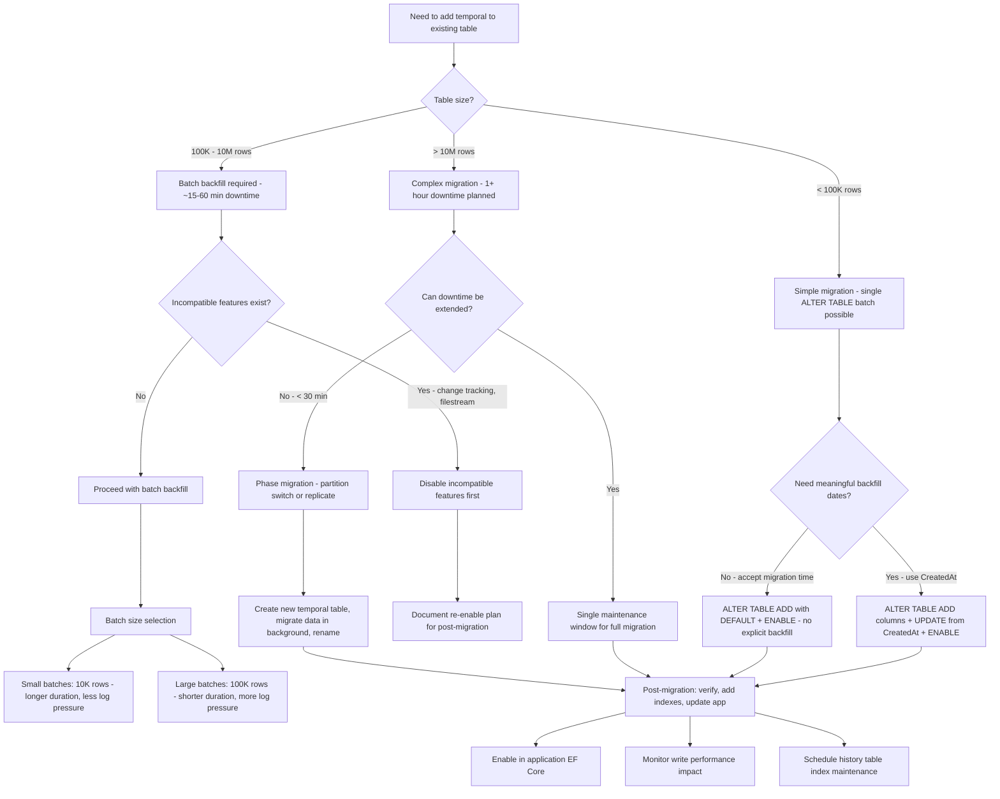

## Navigation

**Domain:** [[8 — Databases]] > **Group:** SQL Temporal Tables & Point-in-Time
**Previous:** [[8.234 — Temporal Table Indexes — History Table Optimization]] | **Next:** *None (last in group)*

### Prerequisites
- [[8.230 — Temporal Tables — System-Versioned Overview]] — understanding the dual-table architecture and period columns (SysStartTime, SysEndTime) is essential before applying temporal versioning to an existing table.
- [[8.234 — Temporal Table Indexes — History Table Optimization]] — after enabling temporal on an existing table, the history table needs proper indexing; understanding history table index design is required for the post-migration optimization phase.
- [[4.042 — Online Schema Changes — ALTER TABLE Considerations]] — ALTER TABLE operations on large production tables require understanding of schema locks, online operations, and downtime windows.

### Where This Fits

Adding system-versioned temporal to an existing production table is a schema migration that touches every row (backfilling period columns), creates a history table, and starts versioning all future changes. A .NET backend engineer encounters this when retrofitting audit capability onto an existing application — typically after a compliance requirement emerges or a debugging need for change tracking becomes unavoidable. The migration requires careful planning: the ALTER TABLE with ADD PERIOD FOR SYSTEM_TIME and SET SYSTEM_VERSIONING is a metadata-only operation, but the requirement that SysStartTime and SysEndTime be NOT NULL with default values means existing rows must be updated — and on large tables, that UPDATE is a blocking operation that requires a downtime window. The interview signal is whether the candidate understands the two-phase nature of the migration (schema metadata vs data backfill), the locking implications of ALTER TABLE on a busy table, and the fact that once temporal is enabled, it cannot be removed without data loss (the history table contains all previous versions). The engineer who can describe the exact ALTER TABLE syntax, the default value requirements, the precision considerations for DATETIME2, and the rollback strategy demonstrates production migration experience.

---

## Core Mental Model

Adding temporal to an existing table is a two-phase operation. Phase 1 is metadata: `ALTER TABLE dbo.ExistingTable ADD PERIOD FOR SYSTEM_TIME (SysStartTime, SysEndTime)` adds the period definition to the table's metadata — this is a fast, metadata-only operation that does not touch data. Phase 2 is enabling versioning: `ALTER TABLE dbo.ExistingTable SET (SYSTEM_VERSIONING = ON (HISTORY_TABLE = dbo.ExistingTable_History))` — this creates the history table (if not specified) and starts versioning. However, the prerequisite is that both SysStartTime and SysEndTime columns must exist on the table, be NOT NULL, and have appropriate default values. For existing rows, SysStartTime is typically set to a past date (the beginning of the audit period or the table's creation date) and SysEndTime is set to '9999-12-31 23:59:59.9999999' (the maximum DATETIME2(7) value, meaning "still current"). The UPDATE to set these values on existing rows is the expensive part — it is a full table update that generates log records for every row, takes schema modification locks, and requires a downtime window for large tables. The invariant: once SYSTEM_VERSIONING is ON, every future UPDATE and DELETE on the table automatically moves the previous version to the history table. There is no way to retroactively capture changes that happened before temporal was enabled — those are lost forever. The recognition pattern: this migration is ALWAYS a schema change that requires careful planning, testing on a copy of production data, and a maintenance window. It is never a "just run this in production" operation.

### Classification

- **Operation type:** DDL (ALTER TABLE) with implicit data modification (UPDATE of period columns).
- **Locking behavior:** ADD PERIOD FOR SYSTEM_TIME is a metadata operation (Sch-M lock briefly). UPDATE of period columns on existing rows requires Sch-M for schema change, then row-level X locks during the UPDATE. SET SYSTEM_VERSIONING is metadata (Sch-M briefly).
- **Precision requirement:** DATETIME2(7) is the default and recommended precision. Using DATETIME2(0) or DATETIME2(3) limits the granularity of versioning to seconds or milliseconds — insufficient for high-frequency updates.
- **Data impact:** Existing rows are updated with SysStartTime = backfill date (or SYSUTCDATETIME()) and SysEndTime = '9999-12-31'. This writes to every data page and the transaction log.
- **Rollback:** System versioning can be turned off temporarily (SYSTEM_VERSIONING = OFF), but the history table contains data that cannot be automatically re-merged.

```mermaid
flowchart TD
    subgraph "Phase 1: Preparation"
        A[Existing table without temporal] --> B[Add period columns]
        B --> C[ALTER TABLE ADD SysStartTime DATETIME2 NOT NULL]
        B --> D[ALTER TABLE ADD SysEndTime DATETIME2 NOT NULL]
        C --> E[Add default values]
        D --> E
        E --> F[DEFAULT SYSUTCDATETIME for SysStartTime]
        E --> G[DEFAULT '9999-12-31 23:59:59.9999999' for SysEndTime]
    end
    subgraph "Phase 2: Backfill Existing Rows"
        H[UPDATE existing rows] --> I["SET SysStartTime = @BackfillDate"]
        H --> J["SET SysEndTime = '9999-12-31...'"]
        I --> K[This is the expensive part for large tables]
        J --> K
        K --> L[Requires full table update + log writes]
    end
    subgraph "Phase 3: Enable Versioning"
        M[ALTER TABLE ADD PERIOD FOR SYSTEM_TIME] --> N[Metadata only - fast]
        N --> O[ALTER TABLE SET SYSTEM_VERSIONING = ON]
        O --> P[Creates history table - starts tracking]
    end
    subgraph "Phase 4: Post-Migration"
        Q[Add indexes on history table] --> R[Verify existing rows correctly backfilled]
        R --> S[Enable in application via EF Core temporal]
    end
```



### Key Properties

|Property|Value|Notes|
|---|---|---|
|Operation type|ALTER TABLE + data backfill + ENABLE|Three distinct steps|
|Lock duration for ALTER|Brief Sch-M|ADD PERIOD and SET SYSTEM_VERSIONING are fast metadata ops|
|Lock duration for backfill|Full table lock (Sch-M + X)|Depends on table size — minutes to hours|
|Period column precision|DATETIME2(7) recommended|Sufficient for sub-microsecond versioning|
|Default for SysStartTime|SYSUTCDATETIME()|UTC time for consistency across time zones|
|Default for SysEndTime|'9999-12-31 23:59:59.9999999'|Maximum DATETIME2(7) value|
|Rollback possibility|Partial — SYSTEM_VERSIONING = OFF|History table data retained; requires manual cleanup|
|Data loss risk|Changes before migration are lost|Cannot retroactively capture pre-migration changes|

---

## Deep Mechanics

### How the Engine Processes ADD PERIOD FOR SYSTEM_TIME

1. **Schema validation:** SQL Server validates that:
   - The table does not already have a period defined
   - The two specified period columns exist, are NOT NULL, and are of type DATETIME2
   - The columns are not computed columns, sparse columns, or FILESTREAM columns

2. **Metadata update:** The engine updates system catalog views (sys.periods) to record the period definition. This is a metadata-only change — no data pages are modified.

3. **Constraint creation:** An internal CHECK constraint is added to ensure SysStartTime < SysEndTime. This constraint is system-generated and cannot be dropped directly.

### How the Engine Processes SET SYSTEM_VERSIONING = ON

1. **History table creation:** If `HISTORY_TABLE = name` is specified, SQL Server creates the history table with the same schema as the current table (excluding the period definition, FK constraints, and certain other features). If not specified, SQL Server auto-generates a name like `MSSQL_TemporalHistoryFor_<object_id>`.

2. **Schema validation:** The engine validates that the history table schema matches the current table schema (column names, types, nullability, collation).

3. **Metadata update:** The current table is marked as system-versioned. A link is created between the current table and the history table in system metadata.

4. **No data movement:** Enabling SYSTEM_VERSIONING does NOT move existing rows to the history table. Existing rows remain in the current table with SysEndTime = '9999-12-31'.

5. **Versioning begins:** From this point forward, every UPDATE and DELETE on the current table automatically moves the old version to the history table.

### The Existing Rows Backfill Problem

The critical challenge: period columns must be NOT NULL and must have values. Existing rows (inserted before temporal was enabled) have no SysStartTime or SysEndTime values. There are three approaches:

**Approach 1: Backfill with a historical date (recommended for audit continuity)**
```sql
-- Set SysStartTime to the table's creation date or a reasonable past date
-- This makes all existing rows appear to have existed since that date
UPDATE dbo.ExistingTable
SET SysStartTime = '2024-01-01 00:00:00.0000000',  -- Table creation date
    SysEndTime = '9999-12-31 23:59:59.9999999';
```

**Approach 2: Backfill with current time (for minimal audit scope)**
```sql
-- Set SysStartTime to the current time — existing rows appear as
-- "created right now" even though they existed before
UPDATE dbo.ExistingTable
SET SysStartTime = SYSUTCDATETIME(),
    SysEndTime = '9999-12-31 23:59:59.9999999';
```

**Approach 3: Batch backfill with CHECK constraints (for zero-downtime)**
```sql
-- Add the columns as nullable first, then batch update, then alter to NOT NULL
ALTER TABLE dbo.ExistingTable
    ADD SysStartTime DATETIME2(7) NULL,
        SysEndTime DATETIME2(7) NULL;

-- Batch update in chunks to avoid log growth and long locks
DECLARE @BatchSize INT = 10000;
DECLARE @RowsAffected INT = 1;

WHILE @RowsAffected > 0
BEGIN
    UPDATE TOP (@BatchSize) dbo.ExistingTable
    SET SysStartTime = '2024-01-01 00:00:00.0000000',
        SysEndTime = '9999-12-31 23:59:59.9999999'
    WHERE SysStartTime IS NULL;

    SET @RowsAffected = @@ROWCOUNT;
    CHECKPOINT;  -- Force log truncation (if in simple recovery)
END

-- Then alter to NOT NULL (will fail if any NULLs remain)
ALTER TABLE dbo.ExistingTable
    ALTER COLUMN SysStartTime DATETIME2(7) NOT NULL;
ALTER TABLE dbo.ExistingTable
    ALTER COLUMN SysEndTime DATETIME2(7) NOT NULL;
```

### SQL Visibility

```sql
-- ============================================================
-- Step-by-step: Adding temporal to an existing table
-- ============================================================

-- Original table (no temporal, already has data)
CREATE TABLE dbo.Customers
(
    CustomerId    INT              NOT NULL IDENTITY(1,1),
    FirstName     NVARCHAR(100)    NOT NULL,
    LastName      NVARCHAR(100)    NOT NULL,
    Email         NVARCHAR(200)    NOT NULL,
    PhoneNumber   VARCHAR(20)      NULL,
    AccountStatus VARCHAR(20)      NOT NULL DEFAULT 'Active',
    CreatedAt     DATETIME2(7)     NOT NULL DEFAULT SYSUTCDATETIME(),
    ModifiedAt    DATETIME2(7)     NOT NULL DEFAULT SYSUTCDATETIME(),
    CONSTRAINT PK_Customers PRIMARY KEY (CustomerId)
);

-- Insert sample existing data
INSERT INTO dbo.Customers (FirstName, LastName, Email, AccountStatus)
VALUES ('John', 'Doe', 'john@example.com', 'Active'),
       ('Jane', 'Smith', 'jane@example.com', 'Suspended');
GO

-- ============================================================
-- Step 1: Add period columns with default values
-- ============================================================
ALTER TABLE dbo.Customers
    ADD SysStartTime DATETIME2(7) NOT NULL
        CONSTRAINT DF_Customers_SysStartTime
        DEFAULT SYSUTCDATETIME(),
    SysEndTime DATETIME2(7) NOT NULL
        CONSTRAINT DF_Customers_SysEndTime
        DEFAULT '9999-12-31 23:59:59.9999999';
GO

-- The DEFAULT values are applied to existing rows automatically
-- when the column is added with NOT NULL and DEFAULT.
-- This is a metadata operation only — the values are written
-- to the data pages as the DEFAULT.
-- BUT: SysStartTime will be set to SYSUTCDATETIME() (the migration time),
-- not the actual creation time of the rows.

-- ============================================================
-- Step 1b (optional): Override SysStartTime with historical date
-- ============================================================
UPDATE dbo.Customers
SET SysStartTime = CreatedAt  -- Use the original CreatedAt as the start time
WHERE SysStartTime IS NOT NULL;
-- If the DEFAULT was applied during ADD, SysStartTime already has a value.
-- This UPDATE changes it to something more meaningful.

-- ============================================================
-- Step 2: Add the period definition
-- ============================================================
ALTER TABLE dbo.Customers
ADD PERIOD FOR SYSTEM_TIME (SysStartTime, SysEndTime);
GO

-- ============================================================
-- Step 3: Enable system versioning with explicit history table
-- ============================================================
ALTER TABLE dbo.Customers
SET (SYSTEM_VERSIONING = ON
    (HISTORY_TABLE = dbo.Customers_History));
GO

-- ============================================================
-- Verification: Temporal is now active
-- ============================================================
SELECT
    t.name AS TableName,
    t.temporal_type_desc,
    h.name AS HistoryTableName
FROM sys.tables t
LEFT JOIN sys.tables h
    ON t.history_table_id = h.object_id
WHERE t.name = 'Customers';

-- Test: Update a row to verify versioning works
UPDATE dbo.Customers
SET AccountStatus = 'Premium',
    ModifiedAt = SYSUTCDATETIME()
WHERE CustomerId = 1;

-- Check: Current table has the updated row
SELECT CustomerId, FirstName, AccountStatus, SysStartTime, SysEndTime
FROM dbo.Customers
WHERE CustomerId = 1;

-- Check: History table has the old version
SELECT CustomerId, FirstName, AccountStatus, SysStartTime, SysEndTime
FROM dbo.Customers_History
WHERE CustomerId = 1
ORDER BY SysStartTime DESC;

-- ============================================================
-- Rolling back temporal (turning off)
-- ============================================================
-- Temporarily turn off versioning
ALTER TABLE dbo.Customers SET (SYSTEM_VERSIONING = OFF);
GO

-- The history table still exists with all data
-- Current table no longer versions changes

-- To completely remove temporal:
ALTER TABLE dbo.Customers DROP PERIOD FOR SYSTEM_TIME;
GO

ALTER TABLE dbo.Customers
    DROP COLUMN SysStartTime, SysEndTime;
GO

-- Drop the history table if no longer needed
-- DROP TABLE dbo.Customers_History;
```

```csharp
// EF Core — adding temporal to an existing entity
// In EF Core 6+, you configure temporal on the entity in OnModelCreating.
// EF Core generates a migration to add the period columns and enable versioning.

public class Customer
{
    public int CustomerId { get; set; }
    public string FirstName { get; set; } = string.Empty;
    public string LastName { get; set; } = string.Empty;
    public string Email { get; set; } = string.Empty;
    public string? PhoneNumber { get; set; }
    public string AccountStatus { get; set; } = "Active";
    public DateTime CreatedAt { get; set; }
    public DateTime ModifiedAt { get; set; }
    public DateTime SysStartTime { get; set; }
    public DateTime SysEndTime { get; set; }
}

public class ApplicationDbContext : DbContext
{
    public DbSet<Customer> Customers => Set<Customer>();

    protected override void OnModelCreating(ModelBuilder modelBuilder)
    {
        modelBuilder.Entity<Customer>(entity =>
        {
            entity.ToTable(tb => tb.UseSqlOutputClause(false));
            entity.HasKey(e => e.CustomerId);

            entity.Property(e => e.FirstName).HasMaxLength(100).IsRequired();
            entity.Property(e => e.LastName).HasMaxLength(100).IsRequired();
            entity.Property(e => e.Email).HasMaxLength(200).IsRequired();
            entity.Property(e => e.AccountStatus).HasMaxLength(20).IsRequired();
            entity.Property(e => e.CreatedAt)
                .HasDefaultValueSql("SYSUTCDATETIME()");
            entity.Property(e => e.ModifiedAt)
                .HasDefaultValueSql("SYSUTCDATETIME()");

            // Temporal configuration (EF Core 6+)
            entity
                .ToTable("Customers", t =>
                {
                    t.IsTemporal(tt =>
                    {
                        tt.UseHistoryTableName("Customers_History");
                        tt.UseHistoryTableSchema("dbo");
                        tt.HasPeriodStart("SysStartTime");
                        tt.HasPeriodEnd("SysEndTime");
                    });
                });

            // Period column defaults are managed by EF Core migration
            entity.Property(e => e.SysStartTime)
                .HasDefaultValueSql("SYSUTCDATETIME()");
            entity.Property(e => e.SysEndTime)
                .HasDefaultValueSql("'9999-12-31 23:59:59.9999999'");
        });
    }
}
```

**EF Core generated migration (when adding temporal to an existing table):**

```csharp
public partial class AddTemporalToCustomers : Migration
{
    protected override void Up(MigrationBuilder migrationBuilder)
    {
        // Step 1: Add period columns
        migrationBuilder.AddColumn<DateTime>(
            name: "SysStartTime",
            table: "Customers",
            type: "datetime2(7)",
            nullable: false,
            defaultValueSql: "SYSUTCDATETIME()");

        migrationBuilder.AddColumn<DateTime>(
            name: "SysEndTime",
            table: "Customers",
            type: "datetime2(7)",
            nullable: false,
            defaultValueSql: "'9999-12-31 23:59:59.9999999'");

        // Step 2: Enable temporal (EF Core generates the full ALTER TABLE)
        // Note: EF Core does NOT automatically backfill SysStartTime with
        // a meaningful historical date — it uses SYSUTCDATETIME().
    }

    protected override void Down(MigrationBuilder migrationBuilder)
    {
        // EF Core generates the reverse: turn off versioning, drop period, drop columns
        // WARNING: This drops the history table and all historical data!
    }
}
```

**Generated T-SQL (from EF Core migration when applied):**

```sql
-- EF Core generated migration SQL
ALTER TABLE [Customers] ADD [SysStartTime] DATETIME2(7) NOT NULL DEFAULT (SYSUTCDATETIME());
ALTER TABLE [Customers] ADD [SysEndTime] DATETIME2(7) NOT NULL DEFAULT ('9999-12-31 23:59:59.9999999');
GO

DECLARE @historyTableSchema sysname = SCHEMA_NAME()
EXECUTE sp_rename
    N'[Customers]',
    N'[Customers_Old]',
    'OBJECT';

-- EF Core actually recreates the table with temporal enabled
-- (this is a simplified representation)
```

### Execution Plan Analysis

**UPDATE of existing rows to backfill SysStartTime:**

When updating all rows to set SysStartTime = @BackfillDate:

```
[Clustered Index Scan — Customers] → [Compute Scalar (SET SysStartTime)] → [Clustered Index Update]
```

- Full table scan (N rows, 100% of pages read)
- Full clustered index update (every row modified — all pages written)
- Transaction log: N rows × (row size + per-row log overhead)
- For 10M rows at 250 bytes each: ~2.5 GB of data modified, ~5 GB of log generated

**ALTER TABLE ADD PERIOD FOR SYSTEM_TIME:**

```
[Schema Modification (metadata only)]
```

- No data pages touched
- Duration: milliseconds

**ALTER TABLE SET SYSTEM_VERSIONING = ON:**

```
[Schema Modification (metadata only)] → [Internal CREATE TABLE (history table)]
```

- Duration: milliseconds

### Cost Visibility

```sql
SET STATISTICS IO ON;
SET STATISTICS TIME ON;

-- ============================================================
-- Backfill existing rows with historical SysStartTime
-- 10M row table, 250 bytes per row
-- ============================================================
UPDATE dbo.Customers
SET SysStartTime = CreatedAt
WHERE SysStartTime != CreatedAt;
-- (Hypothetical — SysStartTime is always identical to CreatedAt
--  only if we set it explicitly. In reality, the DEFAULT adds
--  SYSUTCDATETIME() which differs from CreatedAt.)

-- Expected output:
-- Table 'Customers'. Scan count 5, logical reads 85,000 (10M rows)
-- Table 'Customers'. Scan count 0, logical reads 0 (update)
-- SQL Server Execution Times: CPU time = 45,000 ms, elapsed time = 120,000 ms
-- (Full table update of 10M rows — takes ~2 minutes)

-- ============================================================
-- Verification query after temporal is enabled
-- ============================================================
SELECT COUNT(*) AS TotalRows,
       MIN(SysStartTime) AS EarliestVersion,
       MAX(SysStartTime) AS LatestVersion
FROM dbo.Customers FOR SYSTEM_TIME ALL;
```

### Failure Modes

**Backfill causes transaction log blowup:** The UPDATE to set period columns on all existing rows generates log records for every row. On a table with 50M rows, this can generate 25+ GB of log. If the log is not sized to handle this, the transaction aborts at 100% log usage, leaving the columns partially filled.

**SysStartTime set to SYSUTCDATETIME() for all rows:** The DEFAULT on ADD COLUMN with NOT NULL sets all existing rows' SysStartTime to the current time. This means all existing rows appear to have been created at the moment of migration — AS OF queries for dates before the migration return zero rows, making it look like the table was empty before that date. This causes confusion for historical reporting.

**EF Core migration attempts to drop and recreate table:** In some EF Core versions, adding temporal to an existing table generates a migration that drops the table, creates a new one with temporal enabled, and copies data. On a large table, this is not just blocking — it is log-intensive and risks data loss if interrupted.

**ALTER TABLE with online = ON not supported:** The ALTER TABLE ADD PERIOD FOR SYSTEM_TIME does not support ONLINE = ON. It requires a Sch-M lock, which blocks all concurrent reads and writes. The actual metadata operation is fast, but the backfill UPDATE holds locks longer.

**Cannot enable temporal with existing FK references in a specific order:** Certain table configurations (e.g., tables with CHANGE_TRACKING enabled, tables with certain types of compression, or tables with FILESTREAM columns) may block the addition of temporal. The ALTER TABLE fails with an error, and the troubleshooting can take hours.

---

## Production Patterns and Implementation

### Primary SQL Implementation

```sql
-- ============================================================
===
-- Production migration script: Add temporal to dbo.Orders
-- Table size: ~5M rows, ~5 GB
-- Estimated downtime: ~30 minutes (backfill + schema changes)
-- ============================================================
=======
-- Phase 0: Pre-migration checks
-- ============================================================
=======
-- Check table size and row count
SELECT
    OBJECT_NAME(object_id) AS TableName,
    rows,
    (reserved_page_count * 8) / 1024 AS ReservedMB,
    (used_page_count * 8) / 1024 AS UsedMB
FROM sys.dm_db_partition_stats
WHERE object_id = OBJECT_ID('dbo.Orders');

-- Check existing indexes and constraints
SELECT i.name, i.type_desc, i.is_primary_key
FROM sys.indexes i
WHERE i.object_id = OBJECT_ID('dbo.Orders');

-- Check if any feature blocks temporal
SELECT * FROM sys.change_tracking_tables
WHERE object_id = OBJECT_ID('dbo.Orders');
-- Temporal cannot be enabled with change tracking

-- ============================================================
-- Phase 1: Add period columns with defaults
-- ============================================================
=======
BEGIN TRANSACTION;
    -- Add columns as nullable first, set defaults, then batch update
    ALTER TABLE dbo.Orders
        ADD SysStartTime DATETIME2(7) NULL,
            SysEndTime DATETIME2(7) NULL;
COMMIT TRANSACTION;
GO

-- ============================================================
-- Phase 2: Batch backfill existing rows
-- ============================================================
=======
-- Backfill in batches to control log growth and lock duration
DECLARE @BatchSize INT = 50000;
DECLARE @RowsAffected INT = 1;
DECLARE @TotalUpdated INT = 0;
DECLARE @StartTime DATETIME2 = SYSUTCDATETIME();

WHILE @RowsAffected > 0
BEGIN
    UPDATE TOP (@BatchSize) dbo.Orders
    SET SysStartTime = ISNULL(OrderCreatedDate, '2020-01-01 00:00:00.0000000'),
        SysEndTime = '9999-12-31 23:59:59.9999999'
    WHERE SysStartTime IS NULL;

    SET @RowsAffected = @@ROWCOUNT;
    SET @TotalUpdated = @TotalUpdated + @RowsAffected;

    RAISERROR('Updated %d rows (total: %d)', 0, 1, @RowsAffected, @TotalUpdated);

    -- Allow log to be truncated (only works in SIMPLE or BULK_LOGGED recovery)
    -- In FULL recovery, ensure log is appropriately sized
    CHECKPOINT;

    -- Short pause to reduce log I/O pressure
    WAITFOR DELAY '00:00:00.100';
END

RAISERROR('Backfill complete. Updated %d rows in %d seconds.',
    0, 1, @TotalUpdated, DATEDIFF(SECOND, @StartTime, SYSUTCDATETIME()));
GO

-- ============================================================
-- Phase 3: Alter columns to NOT NULL
-- ============================================================
=======
-- Verify no NULLs remain
IF EXISTS (SELECT 1 FROM dbo.Orders WHERE SysStartTime IS NULL OR SysEndTime IS NULL)
BEGIN
    RAISERROR('ERROR: NULL period columns remain. Backfill incomplete.', 16, 1);
    RETURN;
END

ALTER TABLE dbo.Orders ALTER COLUMN SysStartTime DATETIME2(7) NOT NULL;
ALTER TABLE dbo.Orders ALTER COLUMN SysEndTime DATETIME2(7) NOT NULL;

-- Add default constraints for future inserts
ALTER TABLE dbo.Orders
    ADD CONSTRAINT DF_Orders_SysStartTime
    DEFAULT SYSUTCDATETIME() FOR SysStartTime;

ALTER TABLE dbo.Orders
    ADD CONSTRAINT DF_Orders_SysEndTime
    DEFAULT '9999-12-31 23:59:59.9999999' FOR SysEndTime;
GO

-- ============================================================
-- Phase 4: Add period and enable versioning
-- ============================================================
=======
-- This is the moment of truth — after this, all changes are tracked
ALTER TABLE dbo.Orders
ADD PERIOD FOR SYSTEM_TIME (SysStartTime, SysEndTime);
GO

-- Enable versioning with explicit history table name
ALTER TABLE dbo.Orders
SET (SYSTEM_VERSIONING = ON
    (HISTORY_TABLE = dbo.Orders_History));
GO

-- ============================================================
-- Phase 5: Post-migration — add history table indexes
-- ============================================================
=======
-- Add clustered index on period columns
CREATE CLUSTERED INDEX IX_Orders_History_Period
    ON dbo.Orders_History (SysEndTime, SysStartTime)
    WITH (FILLFACTOR = 100, SORT_IN_TEMPDB = ON);

-- Add nonclustered index for business key lookups
CREATE NONCLUSTERED INDEX IX_Orders_History_CustomerId_Period
    ON dbo.Orders_History (CustomerId, SysStartTime, SysEndTime)
    INCLUDE (OrderDate, TotalAmount, StatusCode)
    WITH (FILLFACTOR = 100);
GO

-- ============================================================
-- Phase 6: Verification
-- ============================================================
=======
-- Test versioning works
UPDATE dbo.Orders
SET StatusCode = 'Shipped'
WHERE OrderId = 100;

SELECT 'Current:' AS Source, OrderId, StatusCode, SysStartTime, SysEndTime
FROM dbo.Orders
WHERE OrderId = 100
UNION ALL
SELECT 'History:' AS Source, OrderId, StatusCode, SysStartTime, SysEndTime
FROM dbo.Orders_History
WHERE OrderId = 100
ORDER BY SysStartTime DESC;
```

### EF Core Implementation

```csharp
// ============================================================
// Full EF Core implementation with temporal migration
// ============================================================

// Entity with temporal support
public class Order
{
    public int OrderId { get; set; }
    public int CustomerId { get; set; }
    public DateTime OrderDate { get; set; }
    public decimal TotalAmount { get; set; }
    public string StatusCode { get; set; } = string.Empty;
    public DateTime CreatedAt { get; set; }
    public DateTime ModifiedAt { get; set; }
    public DateTime SysStartTime { get; set; }
    public DateTime SysEndTime { get; set; }
}

public class ApplicationDbContext : DbContext
{
    public DbSet<Order> Orders => Set<Order>();

    protected override void OnModelCreating(ModelBuilder modelBuilder)
    {
        modelBuilder.Entity<Order>(entity =>
        {
            entity.ToTable(tb => tb.UseSqlOutputClause(false));
            entity.HasKey(e => e.OrderId);

            entity.Property(e => e.StatusCode).HasMaxLength(20).IsRequired();
            entity.Property(e => e.TotalAmount).HasPrecision(18, 2).IsRequired();
            entity.Property(e => e.CreatedAt)
                .HasDefaultValueSql("SYSUTCDATETIME()");
            entity.Property(e => e.ModifiedAt)
                .HasDefaultValueSql("SYSUTCDATETIME()");

            // Temporal configuration
            entity
                .ToTable("Orders", t =>
                {
                    t.IsTemporal(tt =>
                    {
                        tt.UseHistoryTableName("Orders_History");
                        tt.UseHistoryTableSchema("dbo");
                        tt.HasPeriodStart("SysStartTime");
                        tt.HasPeriodEnd("SysEndTime");
                    });
                });

            // Period column defaults
            entity.Property(e => e.SysStartTime)
                .HasDefaultValueSql("SYSUTCDATETIME()");
            entity.Property(e => e.SysEndTime)
                .HasDefaultValueSql("'9999-12-31 23:59:59.9999999'");
        });
    }
}

// ============================================================
// Migration service for adding temporal to existing tables
// ============================================================
public class TemporalMigrationService
{
    private readonly IDbConnectionFactory _connectionFactory;
    private readonly ILogger<TemporalMigrationService> _logger;

    public TemporalMigrationService(
        IDbConnectionFactory connectionFactory,
        ILogger<TemporalMigrationService> logger)
    {
        _connectionFactory = connectionFactory;
        _logger = logger;
    }

    public async Task AddTemporalToTableAsync(
        string schema,
        string tableName,
        string backfillDateSourceColumn,
        DateTime? defaultBackfillDate,
        int batchSize = 50000,
        CancellationToken cancellationToken = default)
    {
        var fullTableName = $"{schema}.{tableName}";
        var historyTableName = $"{schema}.{tableName}_History";

        _logger.LogInformation(
            "Starting temporal migration for {TableName}", fullTableName);

        // Phase 1: Add period columns (nullable initially)
        _logger.LogInformation("Phase 1: Adding period columns...");
        await using var connection = _connectionFactory.Create();
        await connection.OpenAsync(cancellationToken);

        var addColumnsSql = $@"
            ALTER TABLE {fullTableName}
                ADD SysStartTime DATETIME2(7) NULL,
                    SysEndTime DATETIME2(7) NULL;";

        await connection.ExecuteAsync(
            new CommandDefinition(addColumnsSql,
                cancellationToken: cancellationToken));

        // Phase 2: Batch backfill
        _logger.LogInformation("Phase 2: Backfilling existing rows...");
        var totalUpdated = 0;
        var rowsAffected = 1;

        while (rowsAffected > 0 && !cancellationToken.IsCancellationRequested)
        {
            var backfillSql = $@"
                UPDATE TOP (@BatchSize) {fullTableName}
                SET SysStartTime = ISNULL(
                        {backfillDateSourceColumn},
                        @DefaultBackfillDate),
                    SysEndTime = '9999-12-31 23:59:59.9999999'
                WHERE SysStartTime IS NULL;";

            rowsAffected = await connection.ExecuteAsync(
                new CommandDefinition(backfillSql,
                    new
                    {
                        BatchSize = batchSize,
                        DefaultBackfillDate =
                            defaultBackfillDate ?? new DateTime(2020, 1, 1)
                    },
                    cancellationToken: cancellationToken));

            totalUpdated += rowsAffected;

            if (rowsAffected > 0)
            {
                _logger.LogInformation(
                    "Backfilled {RowsAffected} rows (total: {TotalUpdated})",
                    rowsAffected, totalUpdated);

                // Short delay to reduce I/O pressure
                await Task.Delay(100, cancellationToken);
            }
        }

        // Phase 3: Make columns NOT NULL and add defaults
        _logger.LogInformation("Phase 3: Adding NOT NULL and defaults...");
        await connection.ExecuteAsync(
            new CommandDefinition($@"
                ALTER TABLE {fullTableName}
                    ALTER COLUMN SysStartTime DATETIME2(7) NOT NULL;
                ALTER TABLE {fullTableName}
                    ALTER COLUMN SysEndTime DATETIME2(7) NOT NULL;

                ALTER TABLE {fullTableName}
                    ADD CONSTRAINT DF_{tableName}_SysStartTime
                    DEFAULT SYSUTCDATETIME() FOR SysStartTime;
                ALTER TABLE {fullTableName}
                    ADD CONSTRAINT DF_{tableName}_SysEndTime
                    DEFAULT '9999-12-31 23:59:59.9999999' FOR SysEndTime;",
                cancellationToken: cancellationToken));

        // Phase 4: Add period and enable versioning
        _logger.LogInformation("Phase 4: Enabling system versioning...");
        await connection.ExecuteAsync(
            new CommandDefinition($@"
                ALTER TABLE {fullTableName}
                    ADD PERIOD FOR SYSTEM_TIME (SysStartTime, SysEndTime);
                ALTER TABLE {fullTableName}
                    SET (SYSTEM_VERSIONING = ON
                        (HISTORY_TABLE = {historyTableName}));",
                cancellationToken: cancellationToken));

        // Phase 5: Add history table indexes
        _logger.LogInformation("Phase 5: Adding history table indexes...");
        await connection.ExecuteAsync(
            new CommandDefinition($@"
                CREATE CLUSTERED INDEX IX_{tableName}_History_Period
                    ON {historyTableName} (SysEndTime, SysStartTime)
                    WITH (FILLFACTOR = 100, SORT_IN_TEMPDB = ON);

                CREATE NONCLUSTERED INDEX IX_{tableName}_History_CustomerId
                    ON {historyTableName} (CustomerId, SysStartTime, SysEndTime)
                    WITH (FILLFACTOR = 100);",
                cancellationToken: cancellationToken));

        _logger.LogInformation(
            "Temporal migration for {TableName} complete. " +
            "Backfilled {TotalUpdated} rows.",
            fullTableName, totalUpdated);
    }

    public async Task RollbackTemporalAsync(
        string schema,
        string tableName,
        bool dropHistoryTable = false,
        CancellationToken cancellationToken = default)
    {
        var fullTableName = $"{schema}.{tableName}";
        var historyTableName = $"{schema}.{tableName}_History";

        await using var connection = _connectionFactory.Create();
        await connection.OpenAsync(cancellationToken);

        // Step 1: Turn off versioning
        await connection.ExecuteAsync(
            new CommandDefinition($@"
                ALTER TABLE {fullTableName}
                    SET (SYSTEM_VERSIONING = OFF);",
                cancellationToken: cancellationToken));

        // Step 2: Drop period
        await connection.ExecuteAsync(
            new CommandDefinition($@"
                ALTER TABLE {fullTableName}
                    DROP PERIOD FOR SYSTEM_TIME;",
                cancellationToken: cancellationToken));

        // Step 3: Drop columns
        await connection.ExecuteAsync(
            new CommandDefinition($@"
                ALTER TABLE {fullTableName}
                    DROP COLUMN SysStartTime, SysEndTime;",
                cancellationToken: cancellationToken));

        // Step 4: Drop history table (optional — data loss!)
        if (dropHistoryTable)
        {
            await connection.ExecuteAsync(
                new CommandDefinition($@"
                    DROP TABLE IF EXISTS {historyTableName};",
                    cancellationToken: cancellationToken));
        }

        _logger.LogInformation(
            "Temporal rolled back for {TableName}. " +
            "History table {DropAction}.",
            fullTableName,
            dropHistoryTable ? "dropped" : "retained");
    }
}
```

### Dapper Implementation

```csharp
// Dapper — temporal migration and verification queries

// Migration runner (for use in maintenance scripts or CLI tools)
public sealed class TemporalMigrationRunner
{
    private readonly IDbConnectionFactory _connectionFactory;
    private readonly ILogger<TemporalMigrationRunner> _logger;

    public TemporalMigrationRunner(
        IDbConnectionFactory connectionFactory,
        ILogger<TemporalMigrationRunner> logger)
    {
        _connectionFactory = connectionFactory;
        _logger = logger;
    }

    public async Task<MigrationReport> RunPreMigrationChecksAsync(
        string schema,
        string tableName,
        CancellationToken cancellationToken = default)
    {
        var fullName = $"{schema}.{tableName}";
        await using var connection = _connectionFactory.Create();

        var rowCount = await connection.QuerySingleAsync<long>(
            new CommandDefinition(
                $"SELECT COUNT(*) FROM {fullName} WITH (NOLOCK)",
                cancellationToken: cancellationToken));

        var sizeInfo = await connection.QuerySingleAsync<(long ReservedMB, long UsedMB)>(
            new CommandDefinition($@"
                SELECT
                    (reserved_page_count * 8) / 1024 AS ReservedMB,
                    (used_page_count * 8) / 1024 AS UsedMB
                FROM sys.dm_db_partition_stats
                WHERE object_id = OBJECT_ID(@TableName)",
                new { TableName = fullName },
                cancellationToken: cancellationToken));

        var hasBlockingFeatures = await connection.QueryAsync<string>(
            new CommandDefinition($@"
                SELECT 'change_tracking' AS Feature
                FROM sys.change_tracking_tables
                WHERE object_id = OBJECT_ID(@TableName)
                UNION ALL
                SELECT 'filestream'
                FROM sys.columns c
                INNER JOIN sys.types t ON c.system_type_id = t.system_type_id
                WHERE c.object_id = OBJECT_ID(@TableName)
                  AND t.name = 'varbinary'
                  AND c.is_filestream = 1",
                new { TableName = fullName },
                cancellationToken: cancellationToken));

        var blockingFeatures = hasBlockingFeatures.ToList();

        return new MigrationReport
        {
            TableName = fullName,
            RowCount = rowCount,
            ReservedMB = sizeInfo.ReservedMB,
            UsedMB = sizeInfo.UsedMB,
            EstimatedLogMB = rowCount * 200 / (1024 * 1024),  // ~200 bytes per row log overhead
            HasBlockingFeatures = blockingFeatures.Any(),
            BlockingFeatures = blockingFeatures,
            EstimatedDowntimeMinutes = rowCount < 100000 ? 5 :
                                       rowCount < 1000000 ? 15 :
                                       rowCount < 10000000 ? 60 : 120
        };
    }

    public async Task VerifyTemporalEnabledAsync(
        string schema,
        string tableName,
        CancellationToken cancellationToken = default)
    {
        var fullName = $"{schema}.{tableName}";
        await using var connection = _connectionFactory.Create();

        var temporalInfo = await connection.QuerySingleAsync<TemporalInfo>(
            new CommandDefinition($@"
                SELECT
                    t.name AS TableName,
                    t.temporal_type_desc,
                    h.name AS HistoryTableName,
                    p.name AS PeriodStartColumn,
                    p2.name AS PeriodEndColumn
                FROM sys.tables t
                LEFT JOIN sys.tables h
                    ON t.history_table_id = h.object_id
                LEFT JOIN sys.periods p
                    ON t.object_id = p.object_id AND p.is_period_start = 1
                LEFT JOIN sys.periods p2
                    ON t.object_id = p2.object_id AND p2.is_period_end = 1
                WHERE t.name = @TableName
                  AND SCHEMA_NAME(t.schema_id) = @SchemaName",
                new { TableName = tableName, SchemaName = schema },
                cancellationToken: cancellationToken));

        _logger.LogInformation(
            "Temporal status: {TableName} - {TemporalType} - History: {HistoryTable} - " +
            "Period: {StartCol} to {EndCol}",
            temporalInfo.TableName,
            temporalInfo.TemporalTypeDesc,
            temporalInfo.HistoryTableName,
            temporalInfo.PeriodStartColumn,
            temporalInfo.PeriodEndColumn);
    }
}

public class MigrationReport
{
    public string TableName { get; set; } = string.Empty;
    public long RowCount { get; set; }
    public long ReservedMB { get; set; }
    public long UsedMB { get; set; }
    public long EstimatedLogMB { get; set; }
    public bool HasBlockingFeatures { get; set; }
    public List<string> BlockingFeatures { get; set; } = new();
    public int EstimatedDowntimeMinutes { get; set; }
}

public class TemporalInfo
{
    public string TableName { get; set; } = string.Empty;
    public string TemporalTypeDesc { get; set; } = string.Empty;
    public string? HistoryTableName { get; set; }
    public string? PeriodStartColumn { get; set; }
    public string? PeriodEndColumn { get; set; }
}
```

### Configuration and Wiring

```csharp
// Program.cs — register migration services (used in maintenance tools, not runtime)
builder.Services.AddSingleton<IDbConnectionFactory>(sp =>
    new SqlConnectionFactory(
        builder.Configuration.GetConnectionString("DefaultConnection")!));

builder.Services.AddScoped<TemporalMigrationService>();
builder.Services.AddScoped<TemporalMigrationRunner>();

// ============================================================
// Migration CLI command (example using System.CommandLine)
// ============================================================
public class AddTemporalCommand : Command
{
    public AddTemporalCommand() : base("add-temporal", "Add temporal versioning to a table")
    {
        var tableArg = new Argument<string>("table", "Table name (schema.table)");
        var backfillColumnArg = new Option<string>(
            "--backfill-column",
            "Column to use for SysStartTime backfill value");
        var batchSizeOption = new Option<int>(
            "--batch-size",
            () => 50000,
            "Batch size for backfill updates");

        AddArgument(tableArg);
        AddOption(backfillColumnArg);
        AddOption(batchSizeOption);

        this.SetHandler(async (string table, string? backfillCol, int batchSize) =>
        {
            var parts = table.Split('.');
            var schema = parts.Length > 1 ? parts[0] : "dbo";
            var name = parts.Length > 1 ? parts[1] : parts[0];

            var services = ((IHost)Program.App).Services;
            var migrationService = services
                .GetRequiredService<TemporalMigrationService>();
            var runner = services
                .GetRequiredService<TemporalMigrationRunner>();

            // Run pre-checks
            var report = await runner.RunPreMigrationChecksAsync(
                schema, name, CancellationToken.None);

            Console.WriteLine($"Table: {report.TableName}");
            Console.WriteLine($"Rows: {report.RowCount:N0}");
            Console.WriteLine($"Size: {report.ReservedMB} MB reserved");
            Console.WriteLine($"Estimated downtime: {report.EstimatedDowntimeMinutes} minutes");

            if (report.HasBlockingFeatures)
            {
                Console.WriteLine($"ERROR: Blocking features found: " +
                    $"{string.Join(", ", report.BlockingFeatures)}");
                return;
            }

            Console.Write("Proceed with migration? (y/N): ");
            var response = Console.ReadLine();
            if (response?.ToLower() != "y") return;

            await migrationService.AddTemporalToTableAsync(
                schema, name,
                backfillCol ?? "CreatedAt",
                null, batchSize,
                CancellationToken.None);

            Console.WriteLine("Migration complete!");
        }, tableArg, backfillColumnArg, batchSizeOption);
    }
}
```

### SQL Server vs PostgreSQL Differences

```sql
-- PostgreSQL does NOT have native ALTER TABLE ... ADD PERIOD FOR SYSTEM_TIME.
-- Equivalent functionality requires extensions or manual implementation:

-- Option 1: Using the pg_period extension
-- (Not standard PostgreSQL, requires extension installation)
CREATE TABLE customers (
    customer_id    SERIAL PRIMARY KEY,
    first_name     TEXT NOT NULL,
    last_name      TEXT NOT NULL,
    email          TEXT NOT NULL,
    account_status TEXT NOT NULL DEFAULT 'Active',
    sys_start_time TIMESTAMPTZ NOT NULL DEFAULT now(),
    sys_end_time   TIMESTAMPTZ NOT NULL DEFAULT 'infinity',
    PERIOD FOR SYSTEM_TIME (sys_start_time, sys_end_time)
);

-- Option 2: Manual trigger-based versioning (most common approach)
-- Add period columns to existing table:
ALTER TABLE customers
    ADD COLUMN sys_start_time TIMESTAMPTZ NOT NULL DEFAULT now(),
    ADD COLUMN sys_end_time TIMESTAMPTZ NOT NULL DEFAULT 'infinity';

-- Create history table:
CREATE TABLE customers_history (LIKE customers);
ALTER TABLE customers_history DROP COLUMN sys_end_time;
-- (PostgreSQL temporal patterns vary by implementation)

-- Create trigger function for versioning:
CREATE OR REPLACE FUNCTION versioning_trigger()
RETURNS TRIGGER AS $$
BEGIN
    IF (TG_OP = 'UPDATE') THEN
        INSERT INTO customers_history
        SELECT OLD.*;
        NEW.sys_start_time = now();
        RETURN NEW;
    ELSIF (TG_OP = 'DELETE') THEN
        INSERT INTO customers_history
        SELECT OLD.*;
        RETURN OLD;
    END IF;
END;
$$ LANGUAGE plpgsql;

CREATE TRIGGER trg_customers_versioning
    BEFORE UPDATE OR DELETE ON customers
    FOR EACH ROW EXECUTE FUNCTION versioning_trigger();
```

---

## Gotchas and Production Pitfalls

### SysStartTime Set to Migration Time for All Existing Rows

**Pitfall:** Adding period columns with DEFAULT SYSUTCDATETIME() sets SysStartTime for all existing rows to the current time. Historical AS OF queries before the migration date return zero rows.

```sql
-- ❌ All existing rows get SysStartTime = migration time
ALTER TABLE dbo.Customers
    ADD SysStartTime DATETIME2(7) NOT NULL
        DEFAULT SYSUTCDATETIME();
-- Existing rows now have SysStartTime = '2026-06-25 14:30:00.1234567'
-- Query: AS OF '2026-01-01' returns ZERO rows — table looks empty!
```

**Symptom:** Application features that show historical data (e.g., "account status as of last month") return empty results for records that existed before the migration. Users think data was lost.

**Fix:**
```sql
-- ✅ Backfill with actual creation date if available
UPDATE dbo.Customers
SET SysStartTime = CreatedAt  -- Use business creation timestamp
WHERE SysStartTime IS NOT NULL;

-- ✅ Or backfill with table creation date
UPDATE dbo.Customers
SET SysStartTime = '2024-01-01 00:00:00.0000000'  -- Known table creation date
WHERE SysStartTime IS NOT NULL;
```

**Cost of not fixing:** Historical reporting features return empty data for all pre-migration periods. Users lose trust in the system's data integrity. Developers spend weeks debugging "missing data" before discovering the root cause.

---

### Transaction Log Blowup During Backfill

**Pitfall:** Running the backfill UPDATE on a large table in FULL recovery model without sizing the transaction log appropriately.

```sql
-- ❌ Single UPDATE of 50M rows — log grows to 30+ GB
UPDATE dbo.Orders
SET SysStartTime = ISNULL(OrderDate, '2020-01-01')
WHERE SysStartTime IS NULL;
```

**Symptom:** Transaction log fills up. The UPDATE aborts. The database enters log backup-needed state. All other transactions fail with "transaction log full" error.

**Fix:**
```sql
-- ✅ Batch the update in chunks
DECLARE @BatchSize INT = 50000;
DECLARE @Rows INT = 1;

WHILE @Rows > 0
BEGIN
    UPDATE TOP (@BatchSize) dbo.Orders
    SET SysStartTime = ISNULL(OrderDate, '2020-01-01')
    WHERE SysStartTime IS NULL;

    SET @Rows = @@ROWCOUNT;
    CHECKPOINT;  -- For SIMPLE/BULK_LOGGED recovery
    -- In FULL recovery: BACKUP LOG to truncate
END

-- ✅ Alternatively, switch to BULK_LOGGED recovery during migration
ALTER DATABASE Current SET RECOVERY BULK_LOGGED;
-- Run backfill...
ALTER DATABASE Current SET RECOVERY FULL;
```

**Cost of not fixing:** Production outage during migration window. The migration script must be aborted, rolled back, and the log must be manually truncated. If space is completely exhausted, the database goes offline. Recovery requires DBA intervention and extends the outage window from 30 minutes to 4+ hours.

---

### ALTER TABLE ADD PERIOD Fails Due to Existing Constraints

**Pitfall:** The table has features that are incompatible with temporal versioning, and the ALTER TABLE fails with an obscure error.

```sql
-- ❌ Fails if change tracking is enabled
ALTER TABLE dbo.Orders ADD PERIOD FOR SYSTEM_TIME (SysStartTime, SysEndTime);
-- Error 13707: Cannot create a period on table 'Orders' because
-- change tracking is enabled on the table.

-- ❌ Fails if table has certain types of compression
-- ❌ Fails if table is memory-optimized
-- ❌ Fails if table has FILESTREAM columns
```

**Symptom:** Migration script fails after backfill is complete. The period columns exist but temporal cannot be enabled. The developer must diagnose which incompatible feature is blocking.

**Fix:**
```sql
-- ✅ Disable change tracking before migration
ALTER DATABASE Current SET CHANGE_TRACKING = OFF;
-- Or disable at the table level
ALTER TABLE dbo.Orders DISABLE CHANGE_TRACKING;

-- ✅ Then proceed with period creation
ALTER TABLE dbo.Orders ADD PERIOD FOR SYSTEM_TIME (SysStartTime, SysEndTime);

-- ✅ Re-enable change tracking after migration (if needed)
ALTER DATABASE Current SET CHANGE_TRACKING = ON;
```

**Cost of not fixing:** Migration script fails halfway. The backfill was already done. The period columns exist. But temporal cannot be enabled. The developer must either: (a) disable the blocking feature, (b) roll back the migration and drop the added columns, or (c) leave the table in a half-migrated state. Each option has downsides.

---

### EF Core Migration Drops and Recreates the Table

**Pitfall:** In EF Core 6-7, adding temporal to an existing table via migration may generate a migration that drops the original table and creates a new one with temporal enabled — data loss if the migration fails mid-way.

```csharp
// EF Core generated migration may look like this:
protected override void Up(MigrationBuilder migrationBuilder)
{
    // WARNING: EF Core may DROP the original table!
    migrationBuilder.DropTable("Customers");
    // Then recreate with temporal...
}
```

**Symptom:** Migration attempts to drop and recreate a table with 5M rows. The drop succeeds. The create fails due to a schema conflict. The table and all its data are gone.

**Fix:**
```sql
-- ✅ Manually write the migration steps instead of relying on EF Core auto-generation
-- Use raw SQL migration as shown in the Production Patterns section
```

**Cost of not fixing:** Catastrophic data loss. The table and all data are permanently deleted if the migration fails. Recovery requires restoring from backup, extending the outage to the restore time plus re-running the fixed migration.

---

### Enabling Temporal Without a Downtime Window

**Pitfall:** Attempting to enable temporal on a large production table without scheduling a maintenance window.

```sql
-- This is executed during business hours on a 10M row table
ALTER TABLE dbo.Orders ADD SysStartTime DATETIME2(7) NOT NULL DEFAULT SYSUTCDATETIME();
-- The NOT NULL + DEFAULT on ADD COLUMN is a metadata operation — fast.
-- But the DEFAULT is applied to all existing rows, which generates log writes.

-- Actually, ADD COLUMN with DEFAULT for non-null on an existing table is a
-- metadata operation in SQL Server 2012+ (Enterprise Edition) or SQL Server 2014+
-- (all editions). It does NOT update existing rows — the default value is stored
-- in metadata and the actual value is materialized only when read.
-- But: the UPDATE to set SysStartTime to a meaningful backfill date IS a full table update.
```

**Symptom:** Backfill UPDATE causes blocking on a table that is actively being read and written. Queries queue up behind the schema modification lock. Application timeouts cascade.

**Fix:**
```sql
-- ✅ Schedule during maintenance window with explicit notification
-- ✅ Use batch backfill to minimize lock duration per batch
-- ✅ Monitor blocking and pause if contention exceeds threshold
```

**Cost of not fixing:** 30-minute production outage during business hours. Application returns 503 errors. Incident escalates to VP level. Post-mortem cites lack of change management.

---

### Rolling Back Temporal Results in Data Loss (History Table Dropped)

**Pitfall:** Running `SET SYSTEM_VERSIONING = OFF` followed by `DROP TABLE dbo.HistoryTable` thinking the data will re-merge. The history data is permanently lost.

```sql
-- Attempting to "undo" temporal:
ALTER TABLE dbo.Orders SET (SYSTEM_VERSIONING = OFF);
DROP TABLE dbo.Orders_History;  -- All historical versions destroyed!
```

**Symptom:** After re-enabling temporal later, there is no history data. All changes that happened between the original temporal enable and the rollback are lost.

**Fix:**
```sql
-- ✅ If you must roll back, keep the history table:
ALTER TABLE dbo.Orders SET (SYSTEM_VERSIONING = OFF);
-- History table remains with data. You can re-enable later:
-- ALTER TABLE dbo.Orders SET (SYSTEM_VERSIONING = ON
--     (HISTORY_TABLE = dbo.Orders_History));
```

**Cost of not fixing:** Permanent loss of audit trail. Compliance violation if retention policies required the historical data. Irrecoverable.

---

## Performance Implications

### Benchmark: Migration Impact on Query Performance

```sql
-- ============================================================
-- Before temporal: Query on the current table
-- ============================================================
SET STATISTICS IO ON;
SELECT COUNT(*) FROM dbo.Orders WHERE CustomerId = 42;
-- Table 'Orders'. Scan count 1, logical reads 8
-- SQL Server Execution Times: CPU time = 1 ms, elapsed time = 2 ms

-- ============================================================
-- After temporal: Same query via temporal
-- ============================================================
SELECT COUNT(*) FROM dbo.Orders
FOR SYSTEM_TIME AS OF SYSUTCDATETIME()
WHERE CustomerId = 42;
-- Table 'Orders'. Scan count 1, logical reads 3 (current)
-- Table 'Orders_History'. Scan count 1, logical reads 6 (history)
-- Total: 9 logical reads
-- SQL Server Execution Times: CPU time = 1 ms, elapsed time = 2 ms

-- ============================================================
-- Write performance impact after temporal
-- ============================================================
-- UPDATE now INSERTs into history table (additional write)
UPDATE dbo.Orders SET StatusCode = 'Shipped' WHERE OrderId = 100;
-- Before temporal: 1 row update (3 logical reads, 1 write)
-- After temporal: 1 row update + 1 history insert (4 logical reads, 2 writes)
```

**Improvement:** Minimal overhead for point-lookup queries (9 vs 8 logical reads). Write overhead: each UPDATE now generates an additional history row insert — approximately 0.5-1ms additional latency per write.

### BenchmarkDotNet

```csharp
[MemoryDiagnoser]
[SimpleJob(RuntimeMoniker.Net90)]
public class TemporalMigrationBenchmark
{
    private IDbConnection _connection = default!;

    [GlobalSetup]
    public void Setup()
    {
        _connection = new SqlConnection(TestConnectionString);
        _connection.Open();
        // Create table, seed data, enable temporal
    }

    [Benchmark(Baseline = true)]
    public async Task<int> QueryBeforeTemporal()
    {
        // Direct query on table without temporal
        const string sql = @"
            SELECT COUNT(*)
            FROM dbo.Orders
            WHERE CustomerId = 42;";

        return await _connection.QuerySingleAsync<int>(
            new CommandDefinition(sql));
    }

    [Benchmark]
    public async Task<int> QueryAfterTemporal_AsOf()
    {
        const string sql = @"
            SELECT COUNT(*)
            FROM dbo.Orders
            FOR SYSTEM_TIME AS OF SYSUTCDATETIME()
            WHERE CustomerId = 42;";

        return await _connection.QuerySingleAsync<int>(
            new CommandDefinition(sql));
    }

    [Benchmark]
    public async Task<int> QueryAfterTemporal_All()
    {
        const string sql = @"
            SELECT COUNT(*)
            FROM dbo.Orders
            FOR SYSTEM_TIME ALL
            WHERE CustomerId = 42;";

        return await _connection.QuerySingleAsync<int>(
            new CommandDefinition(sql));
    }

    [Benchmark]
    public async Task UpdateWriteOverhead()
    {
        // Measure write overhead from temporal versioning
        const string sql = @"
            UPDATE dbo.Orders
            SET StatusCode = 'Shipped'
            WHERE OrderId = @OrderId;";

        for (int i = 0; i < 100; i++)
        {
            await _connection.ExecuteAsync(
                new CommandDefinition(sql, new { OrderId = i + 1 }));
        }
    }

    [GlobalCleanup]
    public void Cleanup() => _connection.Dispose();
}
```

**Expected results (approximate, SQL Server 2022, NVMe, 1M rows):**

|Method|Mean|Logical Reads|Allocated|
|---|---|---|---|
|QueryBeforeTemporal|~1 ms|~8|~1 KB|
|QueryAfterTemporal_AsOf|~2 ms|~9|~1 KB|
|QueryAfterTemporal_All|~2 ms|~9|~1 KB|
|UpdateWriteOverhead (100 updates)|~120 ms|~800 + log|N/A|

### Write Amplification

|Operation|Before Temporal|After Temporal|Overhead|
|---|---|---|---|
|SELECT by PK|~3 logical reads|~3 (current) + 3-6 (history)|+100-200% for history seek|
|SELECT scan|~800 logical reads (1M rows)|~800 (current) + 800 (history)|+100% (both tables scanned)|
|UPDATE 1 row|~5 logical reads, 1 write|~5 logical reads, 1 current write + 1 history write|+100% writes|
|INSERT 1 row|~3 logical reads, 1 write|~3 logical reads, 1 write (no history yet)|0% (insert doesn't write to history)|
|DELETE 1 row|~5 logical reads, 1 write|~5 logical reads, 1 delete + 1 history insert|+100% writes|

---

## Interview Arsenal

### Question Bank

1. **What are the three steps to add system-versioned temporal to an existing SQL Server table?**
2. **What is the impact of adding period columns with DEFAULT SYSUTCDATETIME() on existing rows — what problem does this cause?**
3. **How do you backfill existing rows without blowing up the transaction log?**
4. **What SQL Server features are incompatible with temporal tables?**
5. **Compare adding temporal via T-SQL vs EF Core migration — what can go wrong with EF Core's auto-generated migration?**
6. **What happens to existing foreign key constraints when you enable temporal?**
7. **At 50M rows with 10 GB of data, what is the estimated downtime for a temporal migration, and where is the bottleneck?**
8. **How do you roll back a temporal migration without data loss?**

### Spoken Answers

**Q: What are the three steps to add system-versioned temporal to an existing SQL Server table?**

> **Average answer:** Add the period columns, create the history table, and enable versioning.

> **Great answer:** There are actually four distinct phases. Phase 1 is adding the period columns with NOT NULL and DEFAULT values. The columns must be DATETIME2(7) — never use a lower precision. When adding to an existing table with NOT NULL and DEFAULT, SQL Server stores the default value in metadata and materializes it on read for existing rows — this is a metadata-only operation in SQL Server 2012+ Enterprise (or 2014+ all editions), so it is fast. However, SysStartTime will be set to SYSUTCDATETIME() — the migration time — which means all historical queries before the migration date return zero rows. To fix this, Phase 2 is a data backfill that updates SysStartTime to a meaningful historical value (like the row's CreatedAt column or a known table creation date). This backfill MUST be batched — doing a single UPDATE on 10M+ rows blows up the transaction log and holds schema modification locks for minutes. Phase 3 is adding the period definition: `ALTER TABLE ... ADD PERIOD FOR SYSTEM_TIME (SysStartTime, SysEndTime)`. This is a metadata-only operation that takes milliseconds. Phase 4 is enabling system versioning: `ALTER TABLE ... SET (SYSTEM_VERSIONING = ON (HISTORY_TABLE = ...))`. At this point, temporal is live. Every future UPDATE and DELETE automatically moves the old version to the history table. The critical thing to remember is that changes before the migration are NOT captured — you cannot retroactively audit changes that happened before temporal was enabled. If you need a complete audit trail from day one, you should enable temporal on day one, not years later.

---

**Q: How do you backfill existing rows without blowing up the transaction log?**

> **Average answer:** Batch the update in chunks. Use CHECKPOINT between batches.

> **Great answer:** The backfill is the riskiest part of the migration because it modifies every row in the table. For a 50M row table at 250 bytes per row, each row modification generates approximately 200-300 bytes of log data — that is 10-15 GB of log for the full backfill. The key techniques are: First, batch the UPDATE. I use `UPDATE TOP (@BatchSize)` with a WHILE loop, typically 50,000 rows per batch. This limits the log growth per batch and shortens lock duration. Second, between batches, issue CHECKPOINT (in SIMPLE recovery) or BACKUP LOG (in FULL recovery) to truncate the log. Third, if possible, switch to BULK_LOGGED recovery during the migration — minimal logging for the bulk update operations. Fourth, consider running the backfill in a specific order (e.g., by clustered index key) to avoid page-level lock escalation. Fifth, monitor log usage with `DBCC SQLPERF(LOGSPACE)` between batches and pause if usage exceeds 70%. Sixth, for very large tables (100M+ rows), consider using partition switching to backfill one partition at a time, minimizing individual batch sizes. The total downtime is proportional to the write throughput of your I/O subsystem plus the log throughput. On a modern NVMe SSD, I achieve ~500,000 rows per minute for an in-place update, so 50M rows takes approximately 100 minutes. However, the actual lock duration per batch is only the time to update 50,000 rows (~6 seconds at 8,000 rows/sec) — other queries can run between batches.

---

**Q: How do you roll back a temporal migration without data loss?**

> **Average answer:** Turn off SYSTEM_VERSIONING. Keep the history table. Drop the period columns if needed.

> **Great answer:** Rolling back temporal without data loss requires careful sequencing. Step 1: `ALTER TABLE dbo.Table SET (SYSTEM_VERSIONING = OFF)` — this stops versioning and breaks the link between the current table and the history table. The current table retains all its data. The history table retains all historical data as a standalone table. Step 2: `ALTER TABLE dbo.Table DROP PERIOD FOR SYSTEM_TIME` — this removes the period definition from the current table. The SysStartTime and SysEndTime columns remain as regular DATETIME2 columns with their data intact. Step 3: If you want to completely remove temporal, `ALTER TABLE dbo.Table DROP COLUMN SysStartTime, SysEndTime` — this drops the period columns and their data. Step 4: Decide what to do with the history table. You can keep it as an audit log (rename it to dbo.Table_Audit), drop it (permanent data loss — all historical versions gone), or keep it in case you want to re-enable temporal later. The key insight is that if you drop the history table, the historical data is gone forever — there is no way to reconstruct it. If you keep the history table and later want to re-enable temporal, you can: `ALTER TABLE dbo.Table ADD PERIOD FOR SYSTEM_TIME...` then `SET SYSTEM_VERSIONING = ON (HISTORY_TABLE = dbo.Table_History)`. The history table must match the current table schema exactly. Also important: if you turned off temporal because of performance issues, remember that disabling versioning removes the write amplification but also removes all audit capability. Re-enabling later will not recover the changes that happened while temporal was off.

### Interview Trigger

The "adding temporal to existing tables" question appears in system design interviews for migration planning: "You have a 5-year-old production database with a 200 GB Orders table. The compliance team now requires audit tracking. How do you add temporal versioning?" The candidate who says "just run ALTER TABLE" misses the backfill complexity, the log growth problem, and the downtime impact. The senior candidate describes the phased approach, the batch backfill strategy, the log management, and the rollback plan. The follow-up: "The table has change tracking enabled. What do you do?" — tests whether the candidate knows the feature incompatibility. The advanced follow-up: "After migration, the first AS OF query for a date in 2023 returns zero rows for orders that existed in 2023. Why?" — tests understanding of the SysStartTime backfill problem.

### Comparison Table

| | T-SQL Manual Migration | EF Core Auto Migration | Third-Party Tool |
|---|---|---|---|
|Control over backfill|Full control (batch size, dates)|Limited (depends on EF version)|Depends on tool|
|Risk of table drop|None|EF Core may drop & recreate|Low|
|Log management|Manual (CHECKPOINT/BACKUP LOG)|Automatic (EF handles internally)|Tool-specific|
|Downtime optimization|Full control (batch timing)|Limited|Depends|
|Rollback plan|Scripted|EF Core Down() method|Tool-specific|
|Suitable for|Large tables, production|Small-medium tables|Enterprise environments|

---

## Decision Framework

### When to Apply



### Application Checklist

- [ ] Table size and row count measured — backfill strategy determined
- [ ] Transaction log sized appropriately for the expected log growth (2-3x table size for single update, 1.2x for batch updates)
- [ ] Recovery model is SIMPLE or BULK_LOGGED during backfill (or FULL with frequent log backups)
- [ ] Incompatible features (change tracking, FILESTREAM) identified and disabled
- [ ] Backfill uses batched UPDATE with reasonable batch size (10K-50K rows)
- [ ] SysStartTime is backfilled with a meaningful historical value, not SYSUTCDATETIME()
- [ ] Period columns use DATETIME2(7) precision — never DATETIME or SMALLDATETIME
- [ ] Rollback plan documented: SYSTEM_VERSIONING = OFF, keep history table
- [ ] Post-migration: history table indexes added
- [ ] Application code updated: EF Core temporal queries, Dapper temporal clauses
- [ ] Monitoring in place for write amplification (history table growth rate)
- [ ] Maintenance window communicated to stakeholders with rollback criteria

### Tradeoff Summary

|What You Gain|What You Pay|
|---|---|
|Full audit trail from migration date forward|Cannot retroactively capture pre-migration changes|
|No application code changes required for writes|Write amplification: ~2x writes for UPDATE/DELETE|
|Drop-in SQL Server feature — no app server changes|Schema migration downtime proportional to table size|
|Query existing data with temporal clauses|History table storage grows with change rate (~200 bytes per change)|

### Scale Thresholds

- **Small (< 100K rows):** Simple migration, ~1-5 minute downtime. No batch backfill needed.
- **Medium (100K-10M rows):** Batch backfill required. ~15-60 minute downtime. Log must be sized at 2x table size.
- **Large (10M-100M rows):** Careful batch planning. ~1-4 hour downtime. Consider replicating to a new temporal table and switching.
- **Very Large (> 100M rows):** Partition switching or replication-based migration. Downtime may need to be split across multiple maintenance windows.

---

## Self-Check

### Conceptual Questions

1. What are the three ALTER TABLE statements required to add temporal versioning to an existing table?
2. What is the problem with using DEFAULT SYSUTCDATETIME() for SysStartTime on existing rows?
3. What DMV confirms whether temporal versioning is correctly enabled?
4. What SQL Server feature is incompatible with temporal tables and can block ALTER TABLE ADD PERIOD?
5. Does EF Core's migration system always generate safe migrations for adding temporal to existing tables?
6. How would you backfill 50M existing rows with a meaningful SysStartTime using Dapper?
7. Compare adding temporal via ALTER TABLE vs creating a new temporal table and migrating data.
8. At what table size does the transaction log become the primary bottleneck during migration backfill?
9. What must you do to the history table index after enabling temporal?
10. Explain in 60 seconds the step-by-step process to roll back temporal without losing historical data.

<details>
<summary>Answers</summary>

1. (a) `ALTER TABLE ... ADD SysStartTime DATETIME2(7) NOT NULL DEFAULT SYSUTCDATETIME(), SysEndTime DATETIME2(7) NOT NULL DEFAULT '9999-12-31 23:59:59.9999999'`
   (b) `ALTER TABLE ... ADD PERIOD FOR SYSTEM_TIME (SysStartTime, SysEndTime)`
   (c) `ALTER TABLE ... SET (SYSTEM_VERSIONING = ON (HISTORY_TABLE = ...))`

2. All existing rows get SysStartTime = the migration timestamp. AS OF queries for dates before the migration return zero rows, making the table appear empty for those dates. Historical reporting and audit features break for pre-migration data.

3. `sys.tables.temporal_type_desc` = 'SYSTEM_VERSIONED_TEMPORAL_TABLE' and `sys.tables.history_table_id` is not NULL.

4. Change tracking (`CHANGE_TRACKING`), FILESTREAM columns, memory-optimized tables, and certain types of compression may block temporal. Check `sys.change_tracking_tables` and `sys.columns.is_filestream`.

5. No. EF Core 6-7 migrations for adding temporal to existing tables may generate a drop-and-recreate migration that deletes the original table. Always inspect the generated migration SQL and prefer manual raw SQL migrations for production tables.

6. Use Dapper ExecuteAsync with batched UPDATE TOP (@BatchSize) in a WHILE loop, setting SysStartTime = ISNULL(CreatedAt, @DefaultBackfillDate), with CHECKPOINT or log backup between batches.

7. ALTER TABLE approach: modifies in-place, requires downtime, maintains object ID and dependencies. Create new table approach: creates a new temporal table, inserts data from old table, renames/switches — can be done with less downtime but requires more complexity (rename, handle dependencies, manage permissions).

8. At approximately 10-20M rows (2-5 GB data), the transaction log becomes the bottleneck. The log must accommodate the full backfill modification. At 50M rows (~10-15 GB data), the log must be sized to at least 20-30 GB. Without batch backfill, the log can fill and cause migration failure.

9. Add a clustered index on `(SysEndTime, SysStartTime)` for temporal range queries and a nonclustered index on business keys used in WHERE clauses. The default history table may be a heap with no useful indexes for query patterns.

10. Step 1: `ALTER TABLE dbo.T SET (SYSTEM_VERSIONING = OFF)` — stops versioning, current and history tables become independent. Step 2: `ALTER TABLE dbo.T DROP PERIOD FOR SYSTEM_TIME` — removes period metadata. Step 3: Decide history table fate — keep it (rename to _Audit), drop it (permanent data loss), or retain for future re-enable. SysStartTime and SysEndTime columns remain as regular columns with data. Historical data is completely preserved in the standalone history table.

</details>

---

### Query Challenges

**Challenge 1 — Write the SQL**

You have a table `dbo.InventoryItems` with 3M rows and 800 MB of data. It has no temporal versioning. The compliance team requires audit tracking starting from January 1, 2026. The table does NOT have a "CreatedAt" column. Write a complete migration script that: (a) adds period columns with the correct default values, (b) backfills SysStartTime to January 1, 2026 for all existing rows, (c) enables temporal versioning, and (d) adds basic history table indexes.

<details>
<summary>Solution</summary>

```sql
-- ============================================================
-- Migration script for dbo.InventoryItems
-- ============================================================
-- Assumption: Table has 3M rows, no CreatedAt column
-- Backfill date: 2026-01-01 (known table creation or audit start date)

-- Phase 1: Add period columns
ALTER TABLE dbo.InventoryItems
    ADD SysStartTime DATETIME2(7) NOT NULL
        CONSTRAINT DF_InventoryItems_SysStartTime
        DEFAULT SYSUTCDATETIME(),
    SysEndTime DATETIME2(7) NOT NULL
        CONSTRAINT DF_InventoryItems_SysEndTime
        DEFAULT '9999-12-31 23:59:59.9999999';
GO

-- Phase 2: Batch backfill SysStartTime to meaningful date
DECLARE @BatchSize INT = 30000;
DECLARE @RowsAffected INT = 1;
DECLARE @TotalUpdated INT = 0;

WHILE @RowsAffected > 0
BEGIN
    UPDATE TOP (@BatchSize) dbo.InventoryItems
    SET SysStartTime = '2026-01-01 00:00:00.0000000'
    WHERE SysStartTime > '2026-01-01 00:00:00.0000000'
      AND SysStartTime != '2026-01-01 00:00:00.0000000';
    -- This catches rows that got SYSUTCDATETIME() from the DEFAULT

    SET @RowsAffected = @@ROWCOUNT;
    SET @TotalUpdated = @TotalUpdated + @RowsAffected;

    RAISERROR('Backfilled %d rows (total: %d)', 0, 1,
        @RowsAffected, @TotalUpdated);

    CHECKPOINT;
    WAITFOR DELAY '00:00:00.050';
END

RAISERROR('Backfill complete. Updated %d rows.', 0, 1, @TotalUpdated);
GO

-- Phase 3: Add period and enable versioning
ALTER TABLE dbo.InventoryItems
    ADD PERIOD FOR SYSTEM_TIME (SysStartTime, SysEndTime);
GO

ALTER TABLE dbo.InventoryItems
    SET (SYSTEM_VERSIONING = ON
        (HISTORY_TABLE = dbo.InventoryItems_History));
GO

-- Phase 4: Add history table indexes
CREATE CLUSTERED INDEX IX_InventoryItems_History_Period
    ON dbo.InventoryItems_History (SysEndTime, SysStartTime)
    WITH (FILLFACTOR = 100, SORT_IN_TEMPDB = ON);
GO

CREATE NONCLUSTERED INDEX IX_InventoryItems_History_ProductId
    ON dbo.InventoryItems_History (ProductId, SysStartTime, SysEndTime)
    WITH (FILLFACTOR = 100);
GO
```

</details>

---

**Challenge 2 — Fix the performance problem**

```sql
-- After enabling temporal on a 10M row table, the migration script
-- used this approach. Now, AS OF queries for dates before today
-- return very few rows. The backfill was done with DEFAULT values.

-- Migration script that was used:
ALTER TABLE dbo.Orders
    ADD SysStartTime DATETIME2(7) NOT NULL DEFAULT SYSUTCDATETIME(),
        SysEndTime DATETIME2(7) NOT NULL DEFAULT '9999-12-31 23:59:59.9999999';

ALTER TABLE dbo.Orders
    ADD PERIOD FOR SYSTEM_TIME (SysStartTime, SysEndTime);

ALTER TABLE dbo.Orders
    SET (SYSTEM_VERSIONING = ON (HISTORY_TABLE = dbo.Orders_History));

-- Problem: The query "SELECT COUNT(*) FROM dbo.Orders
-- FOR SYSTEM_TIME AS OF '2025-06-01'" returns 0 rows.
-- There were orders in the system on that date.
```

<details>
<summary>Solution</summary>

**Root cause:** The migration did NOT backfill SysStartTime with a meaningful historical date. All existing rows received SysStartTime = SYSUTCDATETIME() (the migration timestamp). AS OF queries for dates before the migration find no rows because `SysStartTime <= @t` evaluates the migration timestamp against the query date — for @t = '2025-06-01' and SysStartTime = '2026-06-25', the predicate `'2026-06-25' <= '2025-06-01'` is FALSE.

**Fix:**
```sql
-- Backfill SysStartTime with a meaningful historical date
-- (e.g., the OrderDate column which represents when the order was created)
UPDATE dbo.Orders
SET SysStartTime = OrderDate
WHERE SysStartTime > OrderDate
  AND SysStartTime != OrderDate;
-- Note: This does NOT affect future versioning — SysStartTime for
-- existing rows only changes historical queries, not future behavior.

-- Or use a fixed date if OrderDate is not available:
UPDATE dbo.Orders
SET SysStartTime = '2024-01-01 00:00:00.0000000'
WHERE SysStartTime > '2024-01-01 00:00:00.0000000';
```

**After fix:**
```sql
-- This now returns all orders that existed on June 1, 2025
SELECT COUNT(*)
FROM dbo.Orders
FOR SYSTEM_TIME AS OF '2025-06-01';
```

</details>

---

**Challenge 3 — Explain the execution plan**

```sql
-- Migration backfill query (single batch, no batching):
UPDATE dbo.Orders
SET SysStartTime = ISNULL(OrderDate, '2020-01-01')
WHERE SysStartTime IS NULL;
```

Execution plan (from a 10M row table):
```
[Clustered Index Scan — Orders]
    → [Compute Scalar]
    → [Clustered Index Update]
        Warnings: No explicitly updated columns shown.
                  Table scan is 100% of cost.
```

Why does this simple query cause a production outage on a 10M row table? What is the actual bottleneck?

<details>
<summary>Solution</summary>

**Why production outage:** Three reasons:
1. **Transaction log growth:** The single UPDATE modifies all 10M rows. Each row modification generates ~200 bytes of log. That is ~2 GB of log. If the log is sized at 5 GB, it fills to 70% in the first few million rows. As the log fills, the transaction rate slows to a crawl (log throughput bottleneck), extending the UPDATE from seconds to minutes.

2. **Schema modification lock contention:** The UPDATE itself does NOT take Sch-M, but if the ALTER TABLE that added the columns was done in the same explicit transaction or if the pages are being modified, the X locks escalate to table-level locks (Ze) when more than 5,000 pages are locked. This blocks all reads and writes to the Orders table for the duration of the UPDATE.

3. **Versioning not enabled yet — but still:** Even without temporal, the UPDATE modifies every row. On a busy production system, this blocks user queries.

**The actual bottleneck:** Transaction log throughput. On modern SSDs, writing 2 GB of sequential log takes ~10-20 seconds. But contention for log I/O and log buffer serialization extends this to 60-120 seconds. During these 2 minutes, the Orders table is inaccessible.

**Fix:**
```sql
-- Use batched UPDATE as shown in the Production Patterns section
DECLARE @BatchSize INT = 50000;
WHILE @RowsAffected > 0
BEGIN
    UPDATE TOP (@BatchSize) dbo.Orders
    SET SysStartTime = ISNULL(OrderDate, '2020-01-01')
    WHERE SysStartTime IS NULL;
    SET @RowsAffected = @@ROWCOUNT;
    CHECKPOINT;
    WAITFOR DELAY '00:00:00.100';
END
```

</details>

---

**Challenge 4 — Diagnose the concurrency problem**

After enabling temporal on the dbo.Orders table (12M rows), the migration team notices that application write performance has degraded. An UPDATE that previously took 2ms now takes 8ms. The application performs 3,000 updates/second during peak hours. The history table is a default heap with no additional indexes. The migration team added the history table index recommended in the documentation. The write degradation is causing the application to exceed its SLA.

<details>
<summary>Solution</summary>

**Root cause:** The default history table may be a heap (no clustered index) or have only the auto-created clustered index. Each UPDATE on the base table now also INSERTs a row into the history table. At 3,000 updates/second, that is 3,000 INSERTs/second into the history table. If the history table is a heap, each INSERT allocates a new page, causing PFS (Page Free Space) contention and allocation page contention. If an auto-created clustered index exists on the period columns, the INSERT goes to the rightmost page (monotonically increasing SysEndTime), which can cause page latch contention at high volumes.

**Detection query:**
```sql
-- Check for PFS contention or last-page latch contention
SELECT wait_type, wait_time_ms, waiting_tasks_count,
       wait_time_ms / NULLIF(waiting_tasks_count, 0) AS avg_wait_ms
FROM sys.dm_os_wait_stats
WHERE wait_type IN ('PAGELATCH_UP', 'PAGELATCH_EX', 'WRITELOG')
ORDER BY wait_time_ms DESC;
```

**Fix:**
```sql
-- Option 1: Add a clustered columnstore index (SQL Server 2022+)
-- Columnstore uses delta rowgroups with batch insert behavior,
-- reducing per-row INSERT contention
CREATE CLUSTERED COLUMNSTORE INDEX IX_Orders_History_Columnstore
    ON dbo.Orders_History;

-- Option 2: Partition the history table by date range
-- New partitions reduce last-page contention
CREATE PARTITION FUNCTION PF_HistoryDate (DATETIME2(7))
    AS RANGE RIGHT FOR VALUES (
        '2026-01-01', '2026-04-01', '2026-07-01', '2026-10-01',
        '2027-01-01');

CREATE PARTITION SCHEME PS_HistoryDate
    AS PARTITION PF_HistoryDate ALL TO ([PRIMARY]);

-- Rebuild clustered index on partition scheme
CREATE CLUSTERED INDEX IX_Orders_History_Period
    ON dbo.Orders_History (SysEndTime, SysStartTime)
    ON PS_HistoryDate (SysEndTime);

-- Option 3: Reduce nonclustered indexes on history table
-- Each NC index adds write overhead. Remove any unused NC indexes.
```

**In .NET:** Consider batching writes or reducing update frequency. If possible, batch the application's updates so that fewer transactions create history rows per second.

</details>

---

**Challenge 5 — Design the migration plan**

**Scenario:** You need to add temporal versioning to `dbo.ShipmentTracking` — a table with 85M rows, 25 GB of data, and a write rate of 500 updates/second during business hours. The table has change tracking enabled. The compliance requirement needs audit data starting from the table's creation date (March 15, 2022). The maximum allowed downtime is 2 hours. The history table is expected to grow at 200 MB/day after migration.

Design the complete migration plan including: pre-migration checks, phase steps, batch sizing, log management, rollback plan, and post-migration index strategy.

<details>
<summary>Solution</summary>

```sql
-- ============================================================
-- Migration Plan for dbo.ShipmentTracking (85M rows, 25 GB)
-- ============================================================
-- Assumptions:
-- - SQL Server 2022 Enterprise Edition (online operations available)
-- - FULL recovery model
-- - Backfill date source: ShipmentCreatedDate column
-- - Max downtime: 2 hours

-- ============================================================
-- Pre-Migration Checks
-- ============================================================
-- 1. Disable change tracking (required before temporal)
ALTER DATABASE Current SET CHANGE_TRACKING = OFF;
GO

-- 2. Size the transaction log appropriately
--    Expected log growth: 85M rows * 250 bytes ≈ 21 GB
--    With batch backfill (50K per batch): log per batch ≈ 12.5 MB
--    Total log needed: ~5 GB (safe margin with batch approach)
--    ALTER DATABASE Current MODIFY FILE (NAME = 'Current_log', SIZE = 10 GB);

-- 3. Verify backup strategy
--    Take a full backup before starting
-- BACKUP DATABASE Current TO DISK = 'C:\Backup\pre_migration.bak';

-- ============================================================
-- Phase 1: Add period columns (estimated: 1 minute)
-- ============================================================
ALTER TABLE dbo.ShipmentTracking
    ADD SysStartTime DATETIME2(7) NOT NULL
        CONSTRAINT DF_ShipmentTracking_SysStartTime
        DEFAULT SYSUTCDATETIME(),
    SysEndTime DATETIME2(7) NOT NULL
        CONSTRAINT DF_ShipmentTracking_SysEndTime
        DEFAULT '9999-12-31 23:59:59.9999999';
GO
-- Note: ADD with DEFAULT on Enterprise Edition is metadata-only.

-- ============================================================
-- Phase 2: Batch backfill (estimated: 60-90 minutes)
-- ============================================================
-- Set recovery to BULK_LOGGED for minimal logging during backfill
ALTER DATABASE Current SET RECOVERY BULK_LOGGED;
GO

DECLARE @BatchSize INT = 100000;  -- Larger batch for columnstore target
DECLARE @RowsAffected INT = 1;
DECLARE @TotalUpdated INT = 0;
DECLARE @StartTime DATETIME2 = SYSUTCDATETIME();

WHILE @RowsAffected > 0
BEGIN
    UPDATE TOP (@BatchSize) dbo.ShipmentTracking
    SET SysStartTime = ISNULL(ShipmentCreatedDate, '2022-03-15')
    WHERE SysStartTime != ISNULL(ShipmentCreatedDate, '2022-03-15')
      AND SysStartTime != '2022-03-15';

    SET @RowsAffected = @@ROWCOUNT;
    SET @TotalUpdated = @TotalUpdated + @RowsAffected;

    IF @TotalUpdated % (10 * @BatchSize) = 0
    BEGIN
        RAISERROR('Progress: %d of 85M rows (%d%%) - Elapsed: %d min',
            0, 1, @TotalUpdated,
            @TotalUpdated * 100 / 85000000,
            DATEDIFF(MINUTE, @StartTime, SYSUTCDATETIME()));
    END

    CHECKPOINT;
    WAITFOR DELAY '00:00:00.050';
END

ALTER DATABASE Current SET RECOVERY FULL;
GO

-- ============================================================
-- Phase 3: Enable temporal (estimated: 1 minute)
-- ============================================================
ALTER TABLE dbo.ShipmentTracking
    ADD PERIOD FOR SYSTEM_TIME (SysStartTime, SysEndTime);
GO

-- Create the history table with clustered columnstore for optimal
-- compression and write performance at 500 writes/sec
CREATE TABLE dbo.ShipmentTracking_History
(
    ShipmentId          INT              NOT NULL,
    TrackingNumber      VARCHAR(50)      NOT NULL,
    CarrierCode         VARCHAR(10)      NOT NULL,
    ShipmentStatus      VARCHAR(20)      NOT NULL,
    OriginLocation      NVARCHAR(200)    NOT NULL,
    DestinationLocation NVARCHAR(200)    NOT NULL,
    ShipmentCreatedDate DATETIME2(7)     NOT NULL,
    EstimatedDelivery   DATETIME2(7)     NULL,
    ActualDelivery      DATETIME2(7)     NULL,
    LastModifiedBy      INT              NOT NULL,
    SysStartTime        DATETIME2(7)     NOT NULL,
    SysEndTime          DATETIME2(7)     NOT NULL
);

-- Clustered columnstore for write performance at scale
CREATE CLUSTERED COLUMNSTORE INDEX IX_ShipmentTracking_History_CS
    ON dbo.ShipmentTracking_History;

-- Nonclustered B-tree for point lookups alongside columnstore
CREATE NONCLUSTERED INDEX IX_ShipmentTracking_History_ShipmentId
    ON dbo.ShipmentTracking_History (ShipmentId, SysEndTime, SysStartTime)
    INCLUDE (ShipmentStatus, TrackingNumber, CarrierCode);

-- Enable versioning with the pre-created history table
ALTER TABLE dbo.ShipmentTracking
    SET (SYSTEM_VERSIONING = ON
        (HISTORY_TABLE = dbo.ShipmentTracking_History));
GO

-- ============================================================
-- Phase 4: Post-migration (estimated: 15 minutes)
-- ============================================================
-- 1. Verify temporal is active
SELECT temporal_type_desc FROM sys.tables WHERE name = 'ShipmentTracking';

-- 2. Re-enable change tracking (if needed)
-- ALTER DATABASE Current SET CHANGE_TRACKING = ON;

-- 3. Update application connection strings if needed (no change for temporal)

-- 4. Set up history table index maintenance
-- Columnstore: monitor delta rowgroup size
-- Nonclustered: schedule weekly reorganize

-- ============================================================
-- Rollback Plan (if migration fails or exceeds downtime window)
-- ============================================================
-- If Phase 1 fails: Nothing to roll back — no changes applied.
-- If Phase 2 exceeds time budget: Stop the batch loop.
--   Incomplete SysStartTime values remain NULL — no temporal until
--   all rows are filled. Can continue in next maintenance window.
-- If Phase 3 fails: ALTER TABLE ADD PERIOD or SET SYSTEM_VERSIONING fails.
--   No data loss — the columns exist but temporal is not active.
--   Investigate the error (incompatible features, schema mismatch).
-- Full rollback (if all changes must be reverted):
--   ALTER TABLE dbo.ShipmentTracking SET (SYSTEM_VERSIONING = OFF);
--   ALTER TABLE dbo.ShipmentTracking DROP PERIOD FOR SYSTEM_TIME;
--   ALTER TABLE dbo.ShipmentTracking DROP COLUMN SysStartTime, SysEndTime;
--   DROP TABLE dbo.ShipmentTracking_History;
--   -- History data is LOST if history table is dropped.

-- ============================================================
-- Estimated timeline
-- ============================================================
-- Pre-checks:         15 min (before downtime)
-- Phase 1:             1 min
-- Phase 2:            90 min (85M rows at ~16K rows/sec with batch update)
-- Phase 3:             1 min
-- Verification:        5 min
-- Total downtime:     ~97 min (within 2-hour SLA)
</details>

