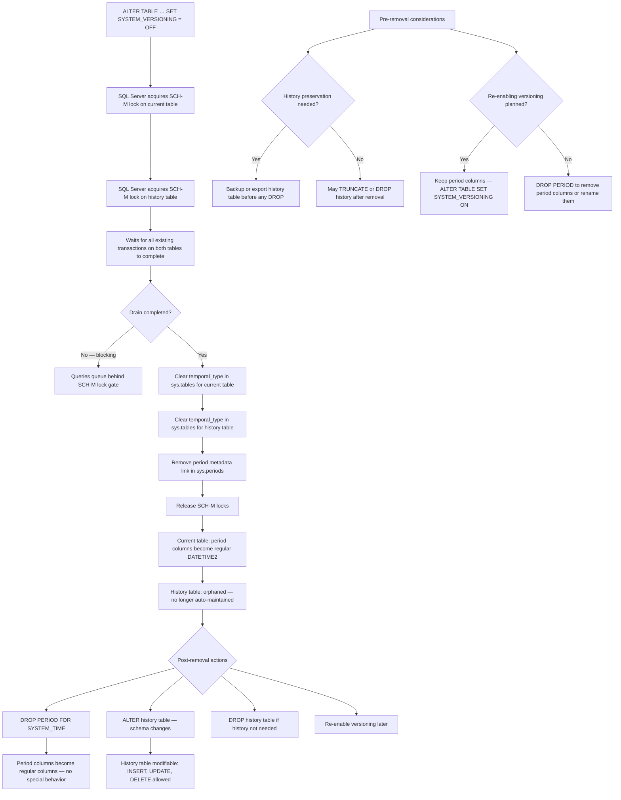
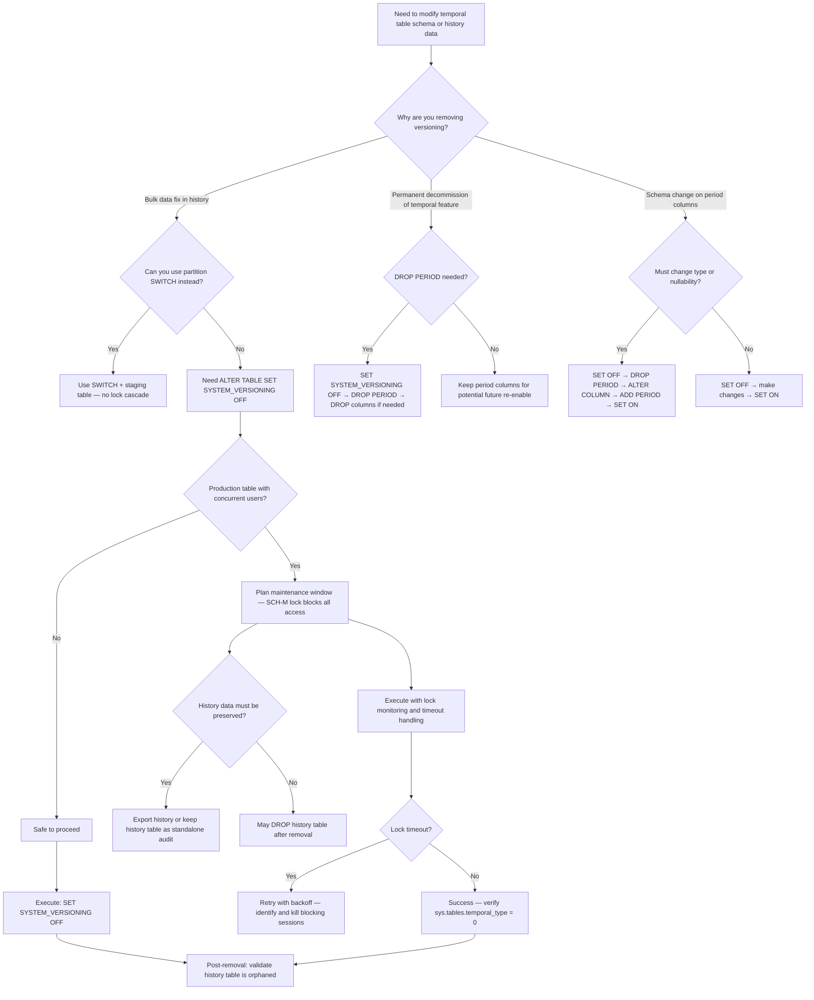

## Navigation

**Domain:** [[8 — Databases]] > **Group:** SQL Temporal Tables & Point-in-Time
**Previous:** [[8.235 — Temporal Tables — SYSTEM_VERSIONING — Creating and Querying]] | **Next:** [[8.237 — Temporal Data — Auditing Use Case]]

### Prerequisites

- [[8.235 — Temporal Tables — SYSTEM_VERSIONING — Creating and Querying]] — understanding how system-versioned temporal tables work is required before removing versioning; the removal process is the inverse of the creation process and affects the same metadata structures.
- [[8.496 — Index Fundamentals]] — removing system versioning affects the clustered index on the period columns; understanding index structures helps predict the SCH-M lock duration during the ALTER TABLE operation.
- [[8.601 — SQL Server DDL Locks and Metadata]] — ALTER TABLE ... SET SYSTEM_VERSIONING OFF requires schema modification (SCH-M) locks; understanding the locking hierarchy explains why this operation can block concurrent queries.

### Where This Fits

Removing system versioning from a temporal table is a schema migration operation that a .NET backend engineer encounters when decommissioning a temporal feature, merging history tables, migrating to a different auditing mechanism, or performing bulk data operations that require direct history modification. The operation drops the link between the current table and the history table, leaving both as independent regular tables — the history table is no longer auto-maintained. The critical risk is that the SCH-M lock required by ALTER TABLE SET SYSTEM_VERSIONING OFF blocks all concurrent reads and writes to the table during the operation, which on a large temporal table with active history can cause multi-second or multi-minute blocking of production traffic. The interview signal for this topic is medium-high for senior roles: interviewers ask about the lock escalation pattern, the orphaned history table consequence, and how to safely perform this operation in production without downtime.

---

## Core Mental Model

Removing system versioning is a DDL metadata operation that disconnects the current table from the history table by clearing the `SYSTEM_VERSIONING` flag on the `PERIOD FOR SYSTEM_TIME` definition. The SQL Server engine does not drop or modify either table's data — it only removes the metadata linkage in `sys.tables` (the `temporal_type` column changes from 2 to 0 for the current table, and from 3 to 0 for the history table). After removal, the history table becomes an orphaned regular table: it retains all historical rows but will never receive new rows from auto-maintenance. The current table retains its `PERIOD FOR SYSTEM_TIME` columns (`ValidFrom`, `ValidTo`) as regular `DATETIME2` columns with no special behavior — they are no longer auto-populated on INSERT or UPDATE. The critical invariant: **removing system versioning is a metadata-only operation that requires SCH-M lock on both tables, but it does not rewrite data pages. The lock duration depends on schema complexity and concurrent transaction activity, not on table row count.** The recognition pattern: you need to remove system versioning when performing a schema change that affects the period columns (changing the period column type, dropping the period definition entirely), when you need to modify or delete history rows directly (which is blocked while versioning is active), or when migrating to a different temporal strategy.

### Classification

This is a **DDL schema change operation** in the SQL Server metadata engine layer. It belongs to the `ALTER TABLE` statement family with the `SET (SYSTEM_VERSIONING = OFF)` clause. The operation modifies system metadata tables (`sys.tables`, `sys.periods`, `sys.system_versioned_temporal_history`) but does not modify user data. The lock requirement is a **Schema Modification (SCH-M) lock** on both the current and history tables, which is the highest compatibility lock in SQL Server's lock hierarchy — it conflicts with all other lock types including Sch-S (schema stability) locks needed for SELECT queries. The operation is **not transactional** in the sense that it is a DDL operation that autocommits in its own transaction if not explicitly wrapped. The operation is **SARGable** only in the sense that no query predicates are involved — the engine uses metadata lookups by object ID.



### Key Properties

|Property|Value|Notes|
|---|---|---|
|Operation type|DDL metadata change|No data page modifications — only metadata flags in system tables|
|Lock required|SCH-M on both tables|Conflicts with all concurrent operations including SELECT|
|Lock duration|Milliseconds to minutes|Depends on concurrent transaction drain time, not table size|
|Post-removal state|Two independent tables|History table is orphaned — no longer receives auto-maintenance|
|Period columns|Become regular DATETIME2(7)|No longer auto-populated; existing values remain as-is|
|History table data|Preserved intact|All existing history rows remain unchanged|
|Reversible|Yes — but requires period columns to exist|ALTER TABLE SET SYSTEM_VERSIONING ON recreates the link|
|Transaction safety|DDL autocommits|Cannot roll back if auto-commit mode; wrap in explicit transaction for safety|

---

## Deep Mechanics

### How the Engine Executes This

1. **Statement parse and bind** — When SQL Server parses `ALTER TABLE dbo.Orders SET (SYSTEM_VERSIONING = OFF)`, the binding phase resolves `dbo.Orders` to its `object_id` and validates that the table has `SYSTEM_VERSIONING = ON` currently. It reads `sys.tables.temporal_type = 2` and `sys.tables.history_table_id` to confirm the temporal state and identify the linked history table.

2. **SCH-M lock acquisition on current table** — The engine requests a Schema Modification (SCH-M) lock on the current table. This lock has compatibility level 0 — it blocks all other lock types including Sch-S (required for SELECT), Sch-M (required for other DDL), and all data locks (IS, IX, S, U, X). The lock request goes into the lock manager's queue. If any concurrent transaction holds any lock on this table, the SCH-M request is blocked and enters a wait state.

3. **SCH-M lock acquisition on history table** — After acquiring the SCH-M lock on the current table, the engine requests a second SCH-M lock on the history table (identified by `history_table_id` in `sys.tables`). This prevents any concurrent access to the history table during the metadata change.

4. **Transaction drain wait** — The SCH-M lock queue blocks all new requests and waits for existing transactions to complete. This is the phase that can take seconds or minutes in production if long-running queries or open transactions are holding locks on the table. The `sys.dm_tran_locks` DMV shows the SCH-M request blocked by existing lock holders.

5. **Metadata update in sys.tables** — With both SCH-M locks held, the engine updates:
   - `sys.tables`: sets `temporal_type = 0` (non-temporal) and `history_table_id = NULL` for the current table
   - `sys.tables`: sets `temporal_type = 0` for the history table (it was 3 during active versioning)
   - `sys.periods`: the period row for `SYSTEM_TIME` is retained (not deleted) but marked as inactive; the period still exists structurally but is not enforced
   - `sys.system_versioned_temporal_history`: the linkage row is removed

6. **Lock release** — SCH-M locks are released. All queued transactions resume. The current table and history table are now independent regular tables.

7. **Period column behavior change** — After the metadata change, the `ValidFrom` and `ValidTo` columns (typically named `SysStartTime`, `SysEndTime`) are no longer auto-populated. On subsequent INSERT operations, these columns behave as regular `DATETIME2(7)` columns with whatever default constraints exist. If the table had default constraints like `SYSUTCDATETIME()` for `ValidFrom` and `'9999-12-31 23:59:59.9999999'` for `ValidTo`, those defaults still fire — but they are no longer enforced by the system. A user can explicitly insert values into these columns.

8. **History table becomes mutable** — The history table is no longer read-only from the engine's perspective. Direct INSERT, UPDATE, DELETE, and TRUNCATE operations are allowed. This means the history can be modified, cleaned up, or entirely removed.

9. **Index and constraint status** — All indexes on both tables remain intact. The clustered columnstore index commonly recommended on history tables remains. The period columns remain as columns — they are just no longer system-managed. Foreign key constraints referencing the history table are unaffected.

### SQL Visibility

```sql
-- ============================================================
-- Setup: Create a temporal table to demonstrate removal
-- ============================================================

-- Create database for testing
CREATE DATABASE TemporalRemovalDemo;
GO

USE TemporalRemovalDemo;
GO

-- Create a temporal table with system versioning
CREATE TABLE dbo.Products
(
    ProductId       INT             IDENTITY(1,1) PRIMARY KEY,
    ProductName     NVARCHAR(100)   NOT NULL,
    Category        NVARCHAR(50)    NOT NULL,
    UnitPrice       DECIMAL(18,2)   NOT NULL,
    StockQuantity   INT             NOT NULL,
    IsActive        BIT             NOT NULL DEFAULT 1,
    SysStartTime    DATETIME2(7)    GENERATED ALWAYS AS ROW START HIDDEN NOT NULL,
    SysEndTime      DATETIME2(7)    GENERATED ALWAYS AS ROW END HIDDEN NOT NULL,
    PERIOD FOR SYSTEM_TIME (SysStartTime, SysEndTime)
)
WITH (SYSTEM_VERSIONING = ON (HISTORY_TABLE = dbo.ProductsHistory));
GO

-- Insert sample data
INSERT INTO dbo.Products (ProductName, Category, UnitPrice, StockQuantity)
VALUES
    ('Laptop Pro 15', 'Electronics', 2499.99, 100),
    ('Wireless Mouse', 'Accessories', 49.99, 500),
    ('USB-C Hub', 'Accessories', 79.99, 250),
    ('Mechanical Keyboard', 'Accessories', 149.99, 150);
GO

-- Make some updates to generate history
UPDATE dbo.Products SET UnitPrice = 2399.99 WHERE ProductId = 1;
UPDATE dbo.Products SET StockQuantity = 450 WHERE ProductId = 2;
UPDATE dbo.Products SET UnitPrice = 69.99 WHERE ProductId = 3;
GO

-- Delete a row to generate a deletion history entry
DELETE FROM dbo.Products WHERE ProductId = 4;
GO

-- Verify temporal state
SELECT 
    t.name AS TableName,
    t.temporal_type,
    t.temporal_type_desc,
    t.history_table_id,
    ht.name AS HistoryTableName
FROM sys.tables t
LEFT JOIN sys.tables ht ON t.history_table_id = ht.object_id
WHERE t.name IN ('Products', 'ProductsHistory');
GO

-- View current data
SELECT ProductId, ProductName, Category, UnitPrice, StockQuantity, SysStartTime, SysEndTime
FROM dbo.Products;
GO

-- View history data (all versions including current with FOR SYSTEM_TIME ALL)
SELECT ProductId, ProductName, Category, UnitPrice, StockQuantity, SysStartTime, SysEndTime
FROM dbo.Products
FOR SYSTEM_TIME ALL
ORDER BY ProductId, SysStartTime;
GO

-- ============================================================
-- Pattern 1: Basic removal of system versioning
-- ============================================================
-- Check current blocking before removal
SELECT
    request_session_id,
    resource_type,
    request_mode,
    request_status
FROM sys.dm_tran_locks
WHERE resource_database_id = DB_ID('TemporalRemovalDemo')
  AND resource_associated_entity_id IN (
      OBJECT_ID('dbo.Products'),
      OBJECT_ID('dbo.ProductsHistory')
  );
GO

-- Remove system versioning
ALTER TABLE dbo.Products SET (SYSTEM_VERSIONING = OFF);
GO

-- Verify removal
SELECT 
    t.name AS TableName,
    t.temporal_type,
    t.temporal_type_desc,
    t.history_table_id
FROM sys.tables t
WHERE t.name IN ('Products', 'ProductsHistory');
GO

-- Observations:
-- temporal_type = 0 for both tables (non-temporal)
-- history_table_id = NULL for Products
-- Both are now independent regular tables

-- ============================================================
-- Pattern 2: Post-removal — history table is now mutable
-- ============================================================

-- History table can now be directly modified
INSERT INTO dbo.ProductsHistory (ProductId, ProductName, Category, UnitPrice, StockQuantity, IsActive, SysStartTime, SysEndTime)
VALUES (4, 'Mechanical Keyboard', 'Accessories', 149.99, 150, 1, '2024-01-01', '2024-03-15');

DELETE FROM dbo.ProductsHistory WHERE ProductId = 1 AND SysStartTime = (SELECT MIN(SysStartTime) FROM dbo.ProductsHistory WHERE ProductId = 1);

UPDATE dbo.ProductsHistory SET UnitPrice = UnitPrice * 1.1 WHERE ProductId = 2;

-- ============================================================
-- Pattern 3: DROP PERIOD for SYSTEM_TIME (removes period metadata)
-- ============================================================

-- Before dropping the period, verify it exists
SELECT 
    name AS PeriodName,
    period_type_desc,
    start_column_id,
    end_column_id
FROM sys.periods
WHERE object_id = OBJECT_ID('dbo.Products');
GO

-- Drop the period — this removes the SYSTEM_TIME period definition
-- The columns SysStartTime and SysEndTime remain as regular columns
ALTER TABLE dbo.Products DROP PERIOD FOR SYSTEM_TIME;
GO

-- Verify period removed
SELECT 
    name AS PeriodName,
    period_type_desc
FROM sys.periods
WHERE object_id = OBJECT_ID('dbo.Products');
GO

-- The columns still exist but have no special behavior
SELECT COL_NAME(object_id, column_id) AS ColumnName, *
FROM sys.periods
WHERE object_id = OBJECT_ID('dbo.Products');
GO

-- ============================================================
-- Pattern 4: Column changes after removal
-- ============================================================

-- After removal and DROP PERIOD, SysStartTime/SysEndTime are regular columns
-- They can be renamed if needed
EXEC sp_rename 'dbo.Products.SysStartTime', 'CreatedAt', 'COLUMN';
EXEC sp_rename 'dbo.Products.SysEndTime', 'DeprecatedAt', 'COLUMN';
GO

-- They can have default values changed
ALTER TABLE dbo.Products ADD CONSTRAINT DF_Products_CreatedAt DEFAULT SYSUTCDATETIME() FOR CreatedAt;
GO

-- They can be made nullable (if no system versioning will be re-enabled)
ALTER TABLE dbo.Products ALTER COLUMN CreatedAt DATETIME2(7) NULL;
ALTER TABLE dbo.Products ALTER COLUMN DeprecatedAt DATETIME2(7) NULL;
GO

-- ============================================================
-- Pattern 5: Complete removal — drop columns and history table
-- ============================================================

-- Drop the period columns entirely (only after DROP PERIOD)
ALTER TABLE dbo.Products DROP COLUMN CreatedAt, DeprecatedAt;
GO

-- Drop the now-orphaned history table if history is not needed
-- WARNING: This destroys all historical data permanently
DROP TABLE IF EXISTS dbo.ProductsHistory;
GO

-- ============================================================
-- Pattern 6: Remove and re-enable versioning (data preservation)
-- ============================================================
-- Drop and recreate for a clean demo
DROP TABLE IF EXISTS dbo.Products;
DROP TABLE IF EXISTS dbo.ProductsHistory;
GO

CREATE TABLE dbo.Orders
(
    OrderId         INT             IDENTITY(1,1) PRIMARY KEY,
    CustomerId      INT             NOT NULL,
    OrderDate       DATETIME2(7)    NOT NULL DEFAULT SYSUTCDATETIME(),
    TotalAmount     DECIMAL(18,2)   NOT NULL,
    Status          NVARCHAR(20)    NOT NULL DEFAULT 'Pending',
    SysStartTime    DATETIME2(7)    GENERATED ALWAYS AS ROW START HIDDEN NOT NULL,
    SysEndTime      DATETIME2(7)    GENERATED ALWAYS AS ROW END HIDDEN NOT NULL,
    PERIOD FOR SYSTEM_TIME (SysStartTime, SysEndTime)
)
WITH (SYSTEM_VERSIONING = ON (HISTORY_TABLE = dbo.OrdersHistory));
GO

-- Insert data
INSERT INTO dbo.Orders (CustomerId, TotalAmount, Status) VALUES (1001, 299.99, 'Completed');
INSERT INTO dbo.Orders (CustomerId, TotalAmount, Status) VALUES (1002, 549.50, 'Shipped');
GO

-- Make updates
UPDATE dbo.Orders SET Status = 'Shipped' WHERE OrderId = 1;
UPDATE dbo.Orders SET Status = 'Delivered' WHERE OrderId = 1;
UPDATE dbo.Orders SET Status = 'Cancelled' WHERE OrderId = 2;
GO

-- Scenario: Remove versioning temporarily, modify history, re-enable
-- Step 1: Remove versioning
ALTER TABLE dbo.Orders SET (SYSTEM_VERSIONING = OFF);
GO

-- Step 2: Modify history data (simulate correcting an audit entry)
UPDATE dbo.OrdersHistory 
SET Status = 'Shipped', SysEndTime = '2024-06-01 12:00:00'
WHERE OrderId = 2 AND SysStartTime = '2024-06-01 10:00:00';
GO

-- Step 3: Ensure period columns have correct defaults for re-enabling
-- SysStartTime must be NOT NULL with GENERATED ALWAYS AS ROW START
-- SysEndTime must be NOT NULL with GENERATED ALWAYS AS ROW END
ALTER TABLE dbo.Orders ALTER COLUMN SysStartTime DATETIME2(7) NOT NULL;
ALTER TABLE dbo.Orders ALTER COLUMN SysEndTime DATETIME2(7) NOT NULL;
GO

-- Step 4: Re-enable system versioning
-- The PERIOD FOR SYSTEM_TIME still exists (was not dropped)
ALTER TABLE dbo.Orders
SET (SYSTEM_VERSIONING = ON (HISTORY_TABLE = dbo.OrdersHistory, DATA_CONSISTENCY_CHECK = ON));
GO

-- Verify
SELECT OrderId, Status, SysStartTime, SysEndTime FROM dbo.Orders FOR SYSTEM_TIME ALL ORDER BY OrderId, SysStartTime;
GO

-- ============================================================
-- Pattern 7: Re-enable with new history table name
-- ============================================================

ALTER TABLE dbo.Orders SET (SYSTEM_VERSIONING = OFF);
GO

DROP TABLE IF EXISTS dbo.OrdersHistory;
GO

-- Re-enable — SQL Server creates a new history table automatically
-- (period columns must still exist with correct types)
ALTER TABLE dbo.Orders
SET (SYSTEM_VERSIONING = ON (HISTORY_TABLE = dbo.OrdersHistoryNew));
GO

-- Verify new history table
SELECT 
    t.name AS TableName,
    t.temporal_type_desc,
    ht.name AS HistoryTableName
FROM sys.tables t
LEFT JOIN sys.tables ht ON t.history_table_id = ht.object_id
WHERE t.name = 'Orders';
GO

-- ============================================================
-- Pattern 8: SCH-M lock observation
-- ============================================================

-- In a separate session, run:
-- BEGIN TRANSACTION
-- SELECT * FROM dbo.Orders WITH (TABLOCKX) -- Hold X lock on table
-- WAITFOR DELAY '00:00:30'
-- ROLLBACK

-- Then run this in the main session:
-- ALTER TABLE dbo.Orders SET (SYSTEM_VERSIONING = OFF);
-- The ALTER will block because it needs SCH-M but the table has X lock
-- Use sys.dm_exec_requests to see wait type: LCK_M_SCH_M

-- Cleanup demo database
-- USE master;
-- DROP DATABASE TemporalRemovalDemo;
```

```csharp
// EF Core — Removing System Versioning via migration
// EF Core 8+ supports temporal table operations in migrations

public class ApplicationDbContext : DbContext
{
    public DbSet<Product> Products => Set<Product>();
    public DbSet<Order> Orders => Set<Order>();

    protected override void OnModelCreating(ModelBuilder modelBuilder)
    {
        modelBuilder.Entity<Product>(entity =>
        {
            entity.ToTable(tb =>
            {
                tb.UseSqlServerOutputClause(false);
            });

            entity.Property(p => p.ProductId).ValueGeneratedOnAdd();
            entity.Property(p => p.SysStartTime).HasDefaultValueSql("SYSUTCDATETIME()");
            entity.Property(p => p.SysEndTime).HasDefaultValueSql("'9999-12-31 23:59:59.9999999'");
        });

        modelBuilder.Entity<Order>(entity =>
        {
            entity.Property(o => o.OrderId).ValueGeneratedOnAdd();
            entity.Property(o => o.SysStartTime).HasDefaultValueSql("SYSUTCDATETIME()");
            entity.Property(o => o.SysEndTime).HasDefaultValueSql("'9999-12-31 23:59:59.9999999'");
        });
    }
}

// Models
public class Product
{
    public int ProductId { get; set; }
    public string ProductName { get; set; } = string.Empty;
    public string Category { get; set; } = string.Empty;
    public decimal UnitPrice { get; set; }
    public int StockQuantity { get; set; }
    public bool IsActive { get; set; } = true;
    public DateTime SysStartTime { get; set; }
    public DateTime SysEndTime { get; set; }
}

public class Order
{
    public int OrderId { get; set; }
    public int CustomerId { get; set; }
    public DateTime OrderDate { get; set; }
    public decimal TotalAmount { get; set; }
    public string Status { get; set; } = "Pending";
    public DateTime SysStartTime { get; set; }
    public DateTime SysEndTime { get; set; }
}

// EF Core — Migration to remove system versioning
// Run: dotnet ef migrations add RemoveSystemVersioning

// In the migration class (Up method):
public partial class RemoveSystemVersioning : Migration
{
    protected override void Up(MigrationBuilder migrationBuilder)
    {
        // Step 1: Remove system versioning
        // EF Core does not have a direct API for SYSTEM_VERSIONING OFF
        // Must use raw SQL in the migration
        migrationBuilder.Sql("ALTER TABLE dbo.Products SET (SYSTEM_VERSIONING = OFF);");

        // Step 2: Optionally drop the period
        migrationBuilder.Sql("ALTER TABLE dbo.Products DROP PERIOD FOR SYSTEM_TIME;");

        // Step 3: Modify columns as needed
        // Remove GENERATED ALWAYS AS ROW START/END attributes
        // This requires dropping and recreating columns in some cases
        // Or use raw SQL to alter column definitions
    }

    protected override void Down(MigrationBuilder migrationBuilder)
    {
        // Re-enable system versioning
        // Must recreate PERIOD FOR SYSTEM_TIME first
        migrationBuilder.Sql("ALTER TABLE dbo.Products ADD PERIOD FOR SYSTEM_TIME (SysStartTime, SysEndTime);");

        // Then re-enable versioning
        migrationBuilder.Sql("ALTER TABLE dbo.Products SET (SYSTEM_VERSIONING = ON (HISTORY_TABLE = dbo.ProductsHistory));");
    }
}

// Service that performs the removal programmatically
public sealed class TemporalRemovalService
{
    private readonly ApplicationDbContext _dbContext;
    private readonly ILogger<TemporalRemovalService> _logger;

    public TemporalRemovalService(
        ApplicationDbContext dbContext,
        ILogger<TemporalRemovalService> logger)
    {
        _dbContext = dbContext;
        _logger = logger;
    }

    /// <summary>
    /// Removes system versioning for bulk data fix operations.
    /// WARNING: This blocks all concurrent access during the ALTER.
    /// Should only be performed during maintenance windows.
    /// </summary>
    public async Task RemoveSystemVersioningAsync(
        string tableName,
        string historyTableName,
        CancellationToken cancellationToken = default)
    {
        _logger.LogWarning(
            "Removing system versioning from {TableName}. " +
            "This operation requires SCH-M lock and will block all concurrent access.",
            tableName);

        var strategy = _dbContext.Database.CreateExecutionStrategy();

        await strategy.ExecuteAsync(async () =>
        {
            await using var transaction = await _dbContext.Database
                .BeginTransactionAsync(cancellationToken);

            try
            {
                // Disable system versioning
                await _dbContext.Database.ExecuteSqlRawAsync(
                    $"ALTER TABLE {tableName} SET (SYSTEM_VERSIONING = OFF);",
                    cancellationToken);

                // Optionally drop the period if full removal needed
                // await _dbContext.Database.ExecuteSqlRawAsync(
                //     $"ALTER TABLE {tableName} DROP PERIOD FOR SYSTEM_TIME;",
                //     cancellationToken);

                await transaction.CommitAsync(cancellationToken);

                _logger.LogInformation(
                    "System versioning removed from {TableName}. " +
                    "History table {HistoryTableName} is now orphaned.",
                    tableName, historyTableName);
            }
            catch (Exception ex) when (ex is not OperationCanceledException)
            {
                await transaction.RollbackAsync(cancellationToken);
                _logger.LogError(ex,
                    "Failed to remove system versioning from {TableName}.",
                    tableName);
                throw;
            }
        });
    }

    /// <summary>
    /// Re-enables system versioning after maintenance.
    /// </summary>
    public async Task ReenableSystemVersioningAsync(
        string tableName,
        string historyTableName,
        CancellationToken cancellationToken = default)
    {
        var strategy = _dbContext.Database.CreateExecutionStrategy();

        await strategy.ExecuteAsync(async () =>
        {
            await using var transaction = await _dbContext.Database
                .BeginTransactionAsync(cancellationToken);

            try
            {
                // Re-enable with data consistency check
                await _dbContext.Database.ExecuteSqlRawAsync(
                    $"ALTER TABLE {tableName} " +
                    $"SET (SYSTEM_VERSIONING = ON " +
                    $"(HISTORY_TABLE = {historyTableName}, " +
                    $"DATA_CONSISTENCY_CHECK = ON));",
                    cancellationToken);

                await transaction.CommitAsync(cancellationToken);

                _logger.LogInformation(
                    "System versioning re-enabled for {TableName} " +
                    "with history table {HistoryTableName}.",
                    tableName, historyTableName);
            }
            catch (Exception ex) when (ex is not OperationCanceledException)
            {
                await transaction.RollbackAsync(cancellationToken);
                _logger.LogError(ex,
                    "Failed to re-enable system versioning for {TableName}.",
                    tableName);
                throw;
            }
        });
    }
}
```

```csharp
// Dapper — Managing temporal removal with manual connection control
public sealed class TemporalRemovalDapperService
{
    private readonly IDbConnectionFactory _connectionFactory;
    private readonly ILogger<TemporalRemovalDapperService> _logger;

    public TemporalRemovalDapperService(
        IDbConnectionFactory connectionFactory,
        ILogger<TemporalRemovalDapperService> logger)
    {
        _connectionFactory = connectionFactory;
        _logger = logger;
    }

    /// <summary>
    /// Removes system versioning and performs direct history modification.
    /// This runs in a single connection to ensure SCH-M lock is scoped.
    /// </summary>
    public async Task RemoveAndFixHistoryAsync(
        int productId,
        decimal correctedUnitPrice,
        DateTime originalStartTime,
        CancellationToken cancellationToken = default)
    {
        const string disableVersioning = "ALTER TABLE dbo.Products SET (SYSTEM_VERSIONING = OFF);";
        const string updateHistory = @"
            UPDATE dbo.ProductsHistory
            SET UnitPrice = @CorrectedUnitPrice
            WHERE ProductId = @ProductId
              AND SysStartTime = @OriginalStartTime;
        ";
        const string reenableVersioning = @"
            ALTER TABLE dbo.Products
            SET (SYSTEM_VERSIONING = ON
                (HISTORY_TABLE = dbo.ProductsHistory,
                 DATA_CONSISTENCY_CHECK = ON));
        ";

        // EXECUTION STRATEGY WARNING:
        // Dapper does not have built-in retry like EF Core.
        // Use a custom retry policy for transient failures.
        // The SCH-M lock wait can cause timeout on the first attempt
        // if concurrent transactions are active.

        await using var connection = _connectionFactory.Create();
        await connection.OpenAsync(cancellationToken);

        await using var transaction = connection.BeginTransaction();

        try
        {
            _logger.LogWarning(
                "Disabling system versioning on Products. " +
                "Blocking all concurrent access.");

            await connection.ExecuteAsync(
                new CommandDefinition(disableVersioning,
                    transaction: transaction,
                    commandTimeout: 30,  // Allow time for SCH-M lock drain
                    cancellationToken: cancellationToken));

            _logger.LogInformation(
                "System versioning disabled. " +
                "Modifying history for ProductId: {ProductId}",
                productId);

            var rowsAffected = await connection.ExecuteAsync(
                new CommandDefinition(updateHistory,
                    new
                    {
                        CorrectedUnitPrice = correctedUnitPrice,
                        ProductId = productId,
                        OriginalStartTime = originalStartTime
                    },
                    transaction: transaction,
                    cancellationToken: cancellationToken));

            if (rowsAffected == 0)
            {
                _logger.LogWarning(
                    "No history rows matched for correction. " +
                    "ProductId: {ProductId}, StartTime: {StartTime}",
                    productId, originalStartTime);
            }

            await connection.ExecuteAsync(
                new CommandDefinition(reenableVersioning,
                    transaction: transaction,
                    commandTimeout: 30,
                    cancellationToken: cancellationToken));

            transaction.Commit();

            _logger.LogInformation(
                "System versioning re-enabled after history fix. " +
                "Rows modified: {RowsAffected}",
                rowsAffected);
        }
        catch (Exception ex) when (ex is not OperationCanceledException)
        {
            transaction.Rollback();
            _logger.LogError(ex,
                "Failed to perform temporal removal and fix.");
            throw;
        }
    }

    /// <summary>
    /// Checks for blocking sessions before attempting removal.
    /// </summary>
    public async Task<IReadOnlyList<BlockingSession>> GetBlockingSessionsAsync(
        string tableName,
        CancellationToken cancellationToken = default)
    {
        const string sql = @"
            SELECT
                blocking.session_id AS BlockingSessionId,
                blocking.database_id,
                DB_NAME(blocking.database_id) AS DatabaseName,
                OBJECT_SCHEMA_NAME(blocking.resource_associated_entity_id,
                    blocking.database_id) AS SchemaName,
                OBJECT_NAME(blocking.resource_associated_entity_id,
                    blocking.database_id) AS TableName,
                blocking.request_mode AS LockMode,
                blocking.request_status AS LockStatus,
                blocked.wait_type AS BlockedWaitType,
                blocked.wait_time AS BlockedWaitTimeMs,
                blocked.session_id AS BlockedSessionId,
                blocked_status.text AS BlockedQueryText,
                blocking_status.text AS BlockingQueryText
            FROM sys.dm_tran_locks blocking
            LEFT JOIN sys.dm_os_waiting_tasks blocked
                ON blocking.lock_owner_address = blocked.resource_address
            OUTER APPLY sys.dm_exec_sql_text(blocked.session_id) AS blocked_status
            OUTER APPLY sys.dm_exec_sql_text(blocking.request_owner_id) AS blocking_status
            WHERE blocking.resource_associated_entity_id = OBJECT_ID(@TableName)
              AND blocking.request_mode = 'Sch-M'
            ORDER BY blocked.wait_time DESC;
        ";

        await using var connection = _connectionFactory.Create();

        var results = await connection.QueryAsync<BlockingSession>(
            new CommandDefinition(sql,
                new { TableName = tableName },
                cancellationToken: cancellationToken));

        return results.AsList();
    }
}

public sealed record BlockingSession(
    int BlockingSessionId,
    int DatabaseId,
    string? DatabaseName,
    string? SchemaName,
    string? TableName,
    string LockMode,
    string LockStatus,
    string? BlockedWaitType,
    long? BlockedWaitTimeMs,
    int? BlockedSessionId,
    string? BlockedQueryText,
    string? BlockingQueryText);
```

### Generated SQL (from EF Core logs)

```sql
-- EF Core does not generate ALTER TABLE SET SYSTEM_VERSIONING via LINQ
-- The migration uses raw SQL:
exec sp_executesql N'ALTER TABLE dbo.Products SET (SYSTEM_VERSIONING = OFF);';

-- The period drop is also raw SQL:
exec sp_executesql N'ALTER TABLE dbo.Products DROP PERIOD FOR SYSTEM_TIME;';

-- EF Core temporal queries are only for SELECT (FOR SYSTEM_TIME)
-- DDL operations are always raw SQL via ExecuteSqlRaw
```

### Execution Plan Analysis

**For ALTER TABLE SET SYSTEM_VERSIONING OFF — there is no query plan because this is DDL, not DML.**

The execution is metadata-driven:

```
Phase 1: Metadata resolution (no query plan)
  - Lookup OBJECT_ID('dbo.Products') in sys.objects
  - Read sys.tables.temporal_type and sys.tables.history_table_id
  - Read sys.periods for the SYSTEM_TIME period definition
  - Estimated: ~5 logical reads on system base metadata tables

Phase 2: SCH-M lock acquisition
  - No query plan — pure lock manager interaction
  - Wait type if blocked: LCK_M_SCH_M
  - Blocking chain visible in sys.dm_tran_locks and sys.dm_os_waiting_tasks

Phase 3: Metadata update
  - UPDATE on sys.sysschobjs (internal system base table for sys.tables)
  - UPDATE on sys.syscolpars (for column metadata changes)
  - Each metadata update is a clustered index seek on the system table
  - Estimated: ~50-100 logical writes on system base tables
```

**For DROP PERIOD FOR SYSTEM_TIME:**

```
Phase 1: Metadata update
  - DELETE from sys.periods row for the object
  - UPDATE column metadata in sys.syscolpars to remove GENERATED ALWAYS attribute
  - Estimated: ~30 logical writes on system base tables
```

**For post-removal queries on history table (now a regular table):**

```sql
-- Query on orphaned history table
SELECT ProductId, ProductName, SysStartTime, SysEndTime
FROM dbo.ProductsHistory
WHERE ProductId = 1
ORDER BY SysStartTime DESC;
```

```
Expected plan shape:
[Clustered Index Seek (PK_ProductsHistory)] → [Sort (if no index on SysStartTime)] → [SELECT]
Estimated Cost: 100%  |  Logical Reads: ~3-5 per seek
```

### Cost Visibility

```sql
SET STATISTICS IO ON;
SET STATISTICS TIME ON;

-- Metadata read before removal
SELECT 
    t.name, t.temporal_type, t.history_table_id
FROM sys.tables t
WHERE t.name IN ('Products', 'ProductsHistory');

-- Table 'sysschobjs'. Scan count N, logical reads ~5
-- Table 'syscolpars'. Scan count N, logical reads ~10

-- The ALTER TABLE operation itself does not produce STATISTICS IO output
-- because it is DDL, not a query.

-- Post-removal: query both tables independently
SELECT COUNT(*) FROM dbo.Products;
-- Table 'Products'. Scan count 1, logical reads 2

SELECT COUNT(*) FROM dbo.ProductsHistory;
-- Table 'ProductsHistory'. Scan count 1, logical reads 4

-- Compare: before removal, querying history via FOR SYSTEM_TIME ALL
SELECT COUNT(*) FROM dbo.Products FOR SYSTEM_TIME ALL;
-- Table 'Products'. Scan count 1, logical reads 2  (current)
-- Table 'ProductsHistory'. Scan count 1, logical reads 4  (history)
```

### Failure Modes

**SCH-M lock wait timeout:**

```sql
-- The ALTER TABLE can block indefinitely waiting for SCH-M lock
-- SQL Server will wait up to the command timeout (default 30 seconds for .NET)
-- then fail with:
-- Lock request time out period exceeded.

-- Detection: look for blocked ALTER sessions
SELECT
    r.session_id,
    r.wait_type,
    r.wait_time,
    r.wait_resource,
    r.blocking_session_id,
    t.text AS QueryText
FROM sys.dm_exec_requests r
CROSS APPLY sys.dm_exec_sql_text(r.sql_handle) t
WHERE r.wait_type = 'LCK_M_SCH_M';

-- Resolution: KILL the blocking session if identified, or wait for it to complete
-- KILL <blocking_session_id>;
```

**Period columns modified before DROP PERIOD:**

```sql
-- ❌ Trying to drop or alter period columns before removing the period
ALTER TABLE dbo.Products DROP COLUMN SysStartTime;
-- Msg 13541, Level 16, State 1
-- Cannot drop column 'SysStartTime' because it is part of the PERIOD FOR SYSTEM_TIME.

-- ✅ Must either:
-- 1. ALTER TABLE ... SET (SYSTEM_VERSIONING = OFF)
-- 2. ALTER TABLE ... DROP PERIOD FOR SYSTEM_TIME
-- 3. Then drop the columns

-- ❌ Trying to alter a period column to NOT NULL when GENERATED ALWAYS AS ROW START is set
ALTER TABLE dbo.Products ALTER COLUMN SysStartTime DATETIME2(7) NOT NULL;
-- This may fail if the column is GENERATED ALWAYS AS ROW START and already NOT NULL
```

**Re-enabling versioning with missing period definition:**

```sql
-- ❌ If DROP PERIOD was called, re-enabling versioning without re-creating the period
ALTER TABLE dbo.Products SET (SYSTEM_VERSIONING = ON (HISTORY_TABLE = dbo.ProductsHistory));
-- Msg 13573, Level 16, State 1
-- Cannot set SYSTEM_VERSIONING to ON because table 'Products' does not have a PERIOD FOR SYSTEM_TIME.

-- ✅ Must add the period back first:
ALTER TABLE dbo.Products ADD PERIOD FOR SYSTEM_TIME (SysStartTime, SysEndTime);
ALTER TABLE dbo.Products SET (SYSTEM_VERSIONING = ON (HISTORY_TABLE = dbo.ProductsHistory));
```

**Data consistency check failure on re-enable:**

```sql
-- ❌ If history data has gaps or overlaps, re-enabling with DATA_CONSISTENCY_CHECK fails
ALTER TABLE dbo.Products
SET (SYSTEM_VERSIONING = ON (HISTORY_TABLE = dbo.ProductsHistory, DATA_CONSISTENCY_CHECK = ON));
-- Msg 13538, Level 16, State 1
-- Data modification failed on system-versioned table 'Products' because...
-- The period columns do not form a valid range.

-- ✅ Fix the data first:
-- Remove rows where SysEndTime <= SysStartTime
DELETE FROM dbo.ProductsHistory
WHERE SysEndTime <= SysStartTime;

-- Remove overlapping ranges for the same ProductId
WITH OverlappingRanges AS (
    SELECT
        ProductId,
        SysStartTime,
        SysEndTime,
        LAG(SysEndTime) OVER (PARTITION BY ProductId ORDER BY SysStartTime) AS PrevSysEndTime
    FROM dbo.ProductsHistory
)
DELETE FROM OverlappingRanges
WHERE SysStartTime < PrevSysEndTime;

-- Then re-enable
```

---

## Production Patterns and Implementation

### Primary SQL Implementation

```sql
-- ============================================================
-- Production pattern: Safe temporal removal in a maintenance window
-- ============================================================

-- Step 0: Prerequisites check
-- Verify the temporal table state
SELECT
    OBJECT_SCHEMA_NAME(t.object_id) AS SchemaName,
    t.name AS TableName,
    t.temporal_type_desc,
    OBJECT_SCHEMA_NAME(t.history_table_id) AS HistorySchemaName,
    OBJECT_NAME(t.history_table_id) AS HistoryTableName,
    p.start_column_id,
    COL_NAME(t.object_id, p.start_column_id) AS StartColumn,
    p.end_column_id,
    COL_NAME(t.object_id, p.end_column_id) AS EndColumn
FROM sys.tables t
INNER JOIN sys.periods p ON t.object_id = p.object_id
WHERE t.temporal_type = 2;

-- Step 1: Check for blocking sessions
-- Run this BEFORE attempting the ALTER to identify potential blockers
SELECT
    r.session_id,
    r.command,
    r.status,
    r.blocking_session_id,
    r.wait_type,
    r.wait_time / 1000 AS wait_seconds,
    DB_NAME(r.database_id) AS DatabaseName,
    OBJECT_NAME(st.objectid, st.dbid) AS TableName,
    SUBSTRING(st.text, (r.statement_start_offset/2) + 1,
        ((CASE WHEN r.statement_end_offset = -1
               THEN DATALENGTH(st.text)
               ELSE r.statement_end_offset
          END - r.statement_start_offset)/2) + 1) AS QueryText,
    r.cpu_time,
    r.total_elapsed_time / 1000 AS elapsed_seconds
FROM sys.dm_exec_requests r
CROSS APPLY sys.dm_exec_sql_text(r.sql_handle) st
WHERE r.database_id = DB_ID()
  AND r.session_id != @@SPID
ORDER BY r.blocking_session_id, r.wait_time DESC;

-- Step 2: Optionally kill long-running blockers (if safe)
-- KILL 123; -- Replace 123 with the blocking session_id

-- Step 3: Remove system versioning with explicit transaction
-- Wrap in a transaction to ensure atomicity (though DDL autocommits,
-- an explicit transaction prevents partial state on failure)
BEGIN TRANSACTION;

PRINT 'Removing system versioning from dbo.Products...';

-- The actual removal
ALTER TABLE dbo.Products SET (SYSTEM_VERSIONING = OFF);

PRINT 'System versioning removed. History table dbo.ProductsHistory is now orphaned.';

COMMIT TRANSACTION;

-- Step 4: Verify removal
SELECT
    t.name AS TableName,
    t.temporal_type_desc,
    t.history_table_id
FROM sys.tables t
WHERE t.name IN ('Products', 'ProductsHistory');

-- Step 5: Post-removal actions (choose applicable)

-- Option A: Keep period columns and optionally re-enable later
-- No action needed — period columns remain with defaults

-- Option B: Drop period definition but keep columns
-- ALTER TABLE dbo.Products DROP PERIOD FOR SYSTEM_TIME;

-- Option C: Drop period columns entirely
-- ALTER TABLE dbo.Products DROP PERIOD FOR SYSTEM_TIME;
-- ALTER TABLE dbo.Products DROP COLUMN SysStartTime, SysEndTime;

-- Option D: Drop history table (permanently destroys audit trail)
-- DROP TABLE IF EXISTS dbo.ProductsHistory;

-- Option E: Convert history to standalone audit table
-- EXEC sp_rename 'dbo.ProductsHistory', 'ProductsLegacyAudit';

-- Step 6: Update application code
-- Remove any temporal query patterns (FOR SYSTEM_TIME)
-- from application SQL after deployment

-- ============================================================
-- Pattern: Bulk data fix requiring temporal removal
-- ============================================================
-- Scenario: A bug caused incorrect pricing. History contains wrong
-- prices that need correction for compliance reporting.

-- Step 1: Disable versioning
ALTER TABLE dbo.Products SET (SYSTEM_VERSIONING = OFF);

-- Step 2: Fix history data
UPDATE dbo.ProductsHistory
SET UnitPrice = 129.99
WHERE ProductId = 42
  AND SysStartTime = '2024-03-15 10:30:00'
  AND SysEndTime = '2024-06-01 14:00:00';

-- Step 3: Fix current row if needed
UPDATE dbo.Products
SET UnitPrice = 129.99
WHERE ProductId = 42;

-- Step 4: Re-enable versioning with data consistency check
ALTER TABLE dbo.Products
SET (SYSTEM_VERSIONING = ON
    (HISTORY_TABLE = dbo.ProductsHistory,
     DATA_CONSISTENCY_CHECK = ON));

-- ============================================================
-- Pattern: History table archival before removal
-- ============================================================
-- Scenario: Removing versioning but want to preserve history
-- for compliance. Archive history to a separate database.

-- Step 1: Export history before removal
SELECT *
INTO ArchiveDatabase.dbo.ProductsHistory_Backup_2024
FROM dbo.ProductsHistory
ORDER BY ProductId, SysStartTime;

-- Step 2: Remove versioning
ALTER TABLE dbo.Products SET (SYSTEM_VERSIONING = OFF);

-- Step 3: Drop the now-orphaned history table
DROP TABLE dbo.ProductsHistory;

-- Step 4: Verify archive
SELECT COUNT(*) AS ArchivedRows FROM ArchiveDatabase.dbo.ProductsHistory_Backup_2024;

-- ============================================================
-- Pattern: SCH-M lock monitoring during removal
-- ============================================================
-- Use this query in a monitoring window during the operation

WHILE 1 = 1
BEGIN
    SELECT
        r.session_id,
        r.wait_type,
        r.wait_time,
        r.wait_resource,
        r.blocking_session_id,
        SUBSTRING(t.text, (r.statement_start_offset/2) + 1,
            ((CASE WHEN r.statement_end_offset = -1
                   THEN DATALENGTH(t.text)
                   ELSE r.statement_end_offset
              END - r.statement_start_offset)/2) + 1) AS current_statement,
        r.status,
        r.command,
        r.percent_complete
    FROM sys.dm_exec_requests r
    CROSS APPLY sys.dm_exec_sql_text(r.sql_handle) t
    WHERE r.database_id = DB_ID()
      AND (r.wait_type = 'LCK_M_SCH_M' OR r.blocking_session_id > 0)
    ORDER BY r.wait_time DESC;

    IF @@ROWCOUNT = 0
    BEGIN
        PRINT 'No blocking detected at ' + CONVERT(NVARCHAR, GETDATE(), 121);
    END

    WAITFOR DELAY '00:00:03';
END;
```

### EF Core Implementation

```csharp
// EF Core — Production service for temporal table maintenance
public sealed class TemporalMaintenanceService
{
    private readonly ApplicationDbContext _dbContext;
    private readonly ILogger<TemporalMaintenanceService> _logger;
    private static readonly TimeSpan DefaultCommandTimeout = TimeSpan.FromSeconds(60);

    public TemporalMaintenanceService(
        ApplicationDbContext dbContext,
        ILogger<TemporalMaintenanceService> logger)
    {
        _dbContext = dbContext;
        _logger = logger;
    }

    /// <summary>
    /// Removes system versioning safely with pre-checks and monitoring.
    /// Designed to be called during a maintenance window.
    /// </summary>
    public async Task<RemovalResult> RemoveSystemVersioningAsync(
        string tableName,
        string? historyTableName = null,
        string schemaName = "dbo",
        CancellationToken cancellationToken = default)
    {
        var result = new RemovalResult
        {
            TableName = tableName,
            StartedAt = DateTime.UtcNow
        };

        var fullyQualifiedTable = $"[{schemaName}].[{tableName}]";

        try
        {
            // Step 1: Pre-flight checks
            _logger.LogInformation("Starting pre-flight checks for {Table}", fullyQualifiedTable);

            var preFlightResult = await RunPreFlightChecksAsync(
                tableName, schemaName, cancellationToken);

            if (!preFlightResult.CanProceed)
            {
                result.Success = false;
                result.ErrorMessage = preFlightResult.BlockReason;
                return result;
            }

            result.HistoryTableName = preFlightResult.HistoryTableName;
            result.HasPeriod = preFlightResult.HasPeriod;

            // Step 2: Execute removal within a retry policy
            var strategy = _dbContext.Database.CreateExecutionStrategy();

            await strategy.ExecuteAsync(async () =>
            {
                // Use a dedicated connection to avoid transaction mixing
                await using var transaction = await _dbContext.Database
                    .BeginTransactionAsync(cancellationToken);

                // Execute removal with extended timeout
                var timeoutCommand = $"SET LOCK_TIMEOUT {30 * 1000};";  // 30 second lock wait
                await _dbContext.Database.ExecuteSqlRawAsync(
                    timeoutCommand, cancellationToken);

                await _dbContext.Database.ExecuteSqlRawAsync(
                    $"ALTER TABLE {fullyQualifiedTable} SET (SYSTEM_VERSIONING = OFF);",
                    cancellationToken);

                await transaction.CommitAsync(cancellationToken);

                _logger.LogInformation(
                    "System versioning successfully removed from {Table}. " +
                    "History table {HistoryTable} is now orphaned.",
                    fullyQualifiedTable, result.HistoryTableName);
            });

            // Step 3: Verify removal
            var verifyResult = await VerifyRemovalAsync(
                tableName, schemaName, cancellationToken);

            result.Success = verifyResult;
            result.CompletedAt = DateTime.UtcNow;

            return result;
        }
        catch (Exception ex) when (ex is not OperationCanceledException)
        {
            _logger.LogError(ex,
                "Failed to remove system versioning from {Table}.",
                fullyQualifiedTable);

            result.Success = false;
            result.ErrorMessage = ex.Message;
            result.CompletedAt = DateTime.UtcNow;

            return result;
        }
    }

    private async Task<PreFlightResult> RunPreFlightChecksAsync(
        string tableName,
        string schemaName,
        CancellationToken cancellationToken)
    {
        var result = new PreFlightResult();

        const string checkSql = @"
            SELECT
                t.temporal_type,
                t.temporal_type_desc,
                OBJECT_SCHEMA_NAME(t.history_table_id) AS HistorySchemaName,
                OBJECT_NAME(t.history_table_id) AS HistoryTableName,
                CASE WHEN p.object_id IS NOT NULL THEN 1 ELSE 0 END AS HasPeriod,
                r.blocking_session_id,
                r.wait_type
            FROM sys.tables t
            LEFT JOIN sys.periods p
                ON t.object_id = p.object_id
            LEFT JOIN sys.dm_exec_requests r
                ON r.blocking_session_id > 0
                AND r.database_id = DB_ID()
            WHERE t.name = @TableName
              AND OBJECT_SCHEMA_NAME(t.object_id) = @SchemaName;";

        await using var connection = _dbContext.Database.GetDbConnection();

        await connection.OpenAsync(cancellationToken);

        var row = await connection.QueryFirstOrDefaultAsync<dynamic>(
            new CommandDefinition(checkSql,
                new { TableName = tableName, SchemaName = schemaName },
                cancellationToken: cancellationToken));

        if (row == null)
        {
            result.BlockReason = $"Table {schemaName}.{tableName} not found.";
            return result;
        }

        if ((int)row.temporal_type != 2)
        {
            result.BlockReason = $"Table {schemaName}.{tableName} is not system-versioned " +
                                 $"(temporal_type = {row.temporal_type}).";
            return result;
        }

        if (row.wait_type != null && (string)row.wait_type == "LCK_M_SCH_M")
        {
            result.BlockReason = $"Table has blocking sessions. " +
                                 $"Session {row.blocking_session_id} is blocked.";
            return result;
        }

        result.CanProceed = true;
        result.HistoryTableName = $"{row.HistorySchemaName}.{row.HistoryTableName}";
        result.HasPeriod = (bool)row.HasPeriod;

        return result;
    }

    private async Task<bool> VerifyRemovalAsync(
        string tableName,
        string schemaName,
        CancellationToken cancellationToken)
    {
        const string sql = @"
            SELECT temporal_type
            FROM sys.tables
            WHERE name = @TableName
              AND OBJECT_SCHEMA_NAME(object_id) = @SchemaName;";

        await using var connection = _dbContext.Database.GetDbConnection();

        var type = await connection.QueryFirstOrDefaultAsync<int>(
            new CommandDefinition(sql,
                new { TableName = tableName, SchemaName = schemaName },
                cancellationToken: cancellationToken));

        return type == 0;
    }
}

public sealed class RemovalResult
{
    public string TableName { get; set; } = string.Empty;
    public string? HistoryTableName { get; set; }
    public bool HasPeriod { get; set; }
    public bool Success { get; set; }
    public string? ErrorMessage { get; set; }
    public DateTime StartedAt { get; set; }
    public DateTime? CompletedAt { get; set; }
}

internal sealed class PreFlightResult
{
    public bool CanProceed { get; set; }
    public string? BlockReason { get; set; }
    public string? HistoryTableName { get; set; }
    public bool HasPeriod { get; set; }
}

// Program.cs registration
// builder.Services.AddScoped<TemporalMaintenanceService>();
```

### Dapper Implementation

```csharp
// Dapper — High-performance temporal removal with locking observability
public sealed class TemporalDapperService
{
    private readonly IDbConnectionFactory _connectionFactory;
    private readonly ILogger<TemporalDapperService> _logger;

    // Retry policy for transient failures and lock timeouts
    private static readonly TimeSpan[] RetryDelays = [
        TimeSpan.FromSeconds(1),
        TimeSpan.FromSeconds(2),
        TimeSpan.FromSeconds(5),
        TimeSpan.FromSeconds(10)
    ];

    public TemporalDapperService(
        IDbConnectionFactory connectionFactory,
        ILogger<TemporalDapperService> logger)
    {
        _connectionFactory = connectionFactory;
        _logger = logger;
    }

    /// <summary>
    /// Removes system versioning with automatic retry on lock timeouts.
    /// </summary>
    public async Task SafeRemoveSystemVersioningAsync(
        string tableName,
        string schemaName = "dbo",
        int lockTimeoutSeconds = 30,
        CancellationToken cancellationToken = default)
    {
        var fullyQualifiedTable = $"[{schemaName}].[{tableName}]";
        var attempt = 0;
        var maxRetries = RetryDelays.Length;

        while (attempt <= maxRetries)
        {
            attempt++;

            try
            {
                await using var connection = _connectionFactory.Create();
                await connection.OpenAsync(cancellationToken);

                // Set lock timeout on the connection
                await connection.ExecuteAsync(
                    new CommandDefinition(
                        $"SET LOCK_TIMEOUT {lockTimeoutSeconds * 1000};",
                        cancellationToken: cancellationToken));

                using var transaction = connection.BeginTransaction();

                _logger.LogWarning(
                    "Attempt {Attempt}/{MaxRetries}: Removing system versioning from {Table}. " +
                    "SCH-M lock will block all concurrent access.",
                    attempt, maxRetries + 1, fullyQualifiedTable);

                await connection.ExecuteAsync(
                    new CommandDefinition(
                        $"ALTER TABLE {fullyQualifiedTable} SET (SYSTEM_VERSIONING = OFF);",
                        transaction: transaction,
                        commandTimeout: lockTimeoutSeconds + 10,
                        cancellationToken: cancellationToken));

                transaction.Commit();

                _logger.LogInformation(
                    "System versioning removed from {Table} on attempt {Attempt}.",
                    fullyQualifiedTable, attempt);

                return;
            }
            catch (SqlException ex) when (ex.Number == 1222)  -- Lock request time out
            {
                _logger.LogWarning(
                    "Lock timeout on attempt {Attempt} for {Table}. " +
                    "Retrying after {Delay}s. Error: {Message}",
                    attempt, fullyQualifiedTable,
                    attempt <= maxRetries ? RetryDelays[attempt - 1].TotalSeconds : 0,
                    ex.Message);

                if (attempt > maxRetries)
                {
                    throw new InvalidOperationException(
                        $"Could not acquire SCH-M lock on {fullyQualifiedTable} " +
                        $"after {maxRetries} retries. " +
                        $"Check for long-running queries holding locks.", ex);
                }

                await Task.Delay(RetryDelays[attempt - 1], cancellationToken);
            }
            catch (SqlException ex) when (ex.Number == 13573)
            {
                // Table has no PERIOD FOR SYSTEM_TIME
                _logger.LogError(
                    "Table {Table} does not have PERIOD FOR SYSTEM_TIME. " +
                    "It may already have been removed. Error: {Message}",
                    fullyQualifiedTable, ex.Message);
                throw;
            }
        }
    }

    /// <summary>
    /// Exports history table to a backup before removal.
    /// </summary>
    public async Task<int> ExportHistoryToBackupAsync(
        string sourceTableName,
        string backupTableName,
        string schemaName = "dbo",
        CancellationToken cancellationToken = default)
    {
        const string createBackupTable = @"
            IF OBJECT_ID(@BackupTableFull) IS NULL
            BEGIN
                SELECT *
                INTO {BackupTableFull}
                FROM {SourceTableFull}
                WHERE 1 = 0;  -- Create empty copy with same schema
            END";

        const string exportData = @"
            INSERT INTO {BackupTableFull}
            SELECT *
            FROM {SourceTableFull}
            ORDER BY SysStartTime;  -- Ordered for efficient restore";

        var sourceFull = $"[{schemaName}].[{sourceTableName}]";
        var backupFull = $"[{schemaName}].[{backupTableName}]";

        await using var connection = _connectionFactory.Create();

        var createSql = createBackupTable
            .Replace("{SourceTableFull}", sourceFull)
            .Replace("{BackupTableFull}", backupFull);

        await connection.ExecuteAsync(
            new CommandDefinition(createSql,
                new
                {
                    SourceTableFull = sourceFull,
                    BackupTableFull = backupFull
                },
                cancellationToken: cancellationToken));

        var exportSql = exportData
            .Replace("{SourceTableFull}", sourceFull)
            .Replace("{BackupTableFull}", backupFull);

        var rowsInserted = await connection.ExecuteAsync(
            new CommandDefinition(exportSql,
                cancellationToken: cancellationToken));

        _logger.LogInformation(
            "Exported {RowCount} rows from {Source} to backup table {Backup}.",
            rowsInserted, sourceFull, backupFull);

        return rowsInserted;
    }

    /// <summary>
    /// Monitors lock status during temporal removal attempt.
    /// </summary>
    public async Task<IReadOnlyList<LockMonitorEntry>> MonitorLocksAsync(
        CancellationToken cancellationToken = default)
    {
        const string sql = @"
            SELECT
                tl.request_session_id AS SessionId,
                DB_NAME(tl.resource_database_id) AS DatabaseName,
                OBJECT_SCHEMA_NAME(tl.resource_associated_entity_id,
                    tl.resource_database_id) AS SchemaName,
                OBJECT_NAME(tl.resource_associated_entity_id,
                    tl.resource_database_id) AS ObjectName,
                tl.resource_type AS ResourceType,
                tl.request_mode AS LockMode,
                tl.request_status AS LockStatus,
                wt.wait_type AS WaitType,
                wt.wait_duration_ms AS WaitDurationMs,
                es.status AS SessionStatus,
                es.login_name AS LoginName,
                SUBSTRING(st.text,
                    (er.statement_start_offset / 2) + 1,
                    ((CASE WHEN er.statement_end_offset = -1
                           THEN DATALENGTH(st.text)
                           ELSE er.statement_end_offset
                      END - er.statement_start_offset) / 2) + 1) AS QueryText
            FROM sys.dm_tran_locks tl
            LEFT JOIN sys.dm_os_waiting_tasks wt
                ON tl.lock_owner_address = wt.resource_address
            LEFT JOIN sys.dm_exec_sessions es
                ON tl.request_session_id = es.session_id
            LEFT JOIN sys.dm_exec_requests er
                ON tl.request_session_id = er.session_id
            OUTER APPLY sys.dm_exec_sql_text(er.sql_handle) st
            WHERE tl.resource_database_id = DB_ID()
              AND tl.resource_type IN ('OBJECT', 'DATABASE')
              AND tl.request_mode IN ('Sch-M', 'Sch-S', 'X', 'IX')
            ORDER BY tl.request_mode, tl.request_session_id;";

        await using var connection = _connectionFactory.Create();

        var results = await connection.QueryAsync<LockMonitorEntry>(
            new CommandDefinition(sql,
                cancellationToken: cancellationToken));

        return results.AsList();
    }
}

// Record types
public sealed record LockMonitorEntry(
    int SessionId,
    string? DatabaseName,
    string? SchemaName,
    string? ObjectName,
    string ResourceType,
    string LockMode,
    string LockStatus,
    string? WaitType,
    long? WaitDurationMs,
    string SessionStatus,
    string LoginName,
    string? QueryText);
```

### Configuration and Wiring

```csharp
// Program.cs — Temporal maintenance service configuration

// Register the maintenance service
builder.Services.AddScoped<TemporalMaintenanceService>();
builder.Services.AddScoped<TemporalDapperService>();

// Configure EF Core with extended command timeout for DDL operations
builder.Services.AddDbContext<ApplicationDbContext>(options =>
    options.UseSqlServer(
        connectionString,
        sqlOptions =>
        {
            sqlOptions.EnableRetryOnFailure(
                maxRetryCount: 3,
                maxRetryDelay: TimeSpan.FromSeconds(10),
                errorNumbersToAdd: [1222 /* Lock timeout */]);

            // Default command timeout for migrations and DDL
            sqlOptions.CommandTimeout(60);
        }));

// For Dapper, configure connection factory with custom retry
builder.Services.AddSingleton<IDbConnectionFactory>(sp =>
{
    var configuration = sp.GetRequiredService<IConfiguration>();
    var connectionString = configuration.GetConnectionString("DefaultConnection");

    return new SqlConnectionFactory(
        connectionString,
        retryCount: 3,
        retryDelayMs: 2000);
});

// Health check to monitor if temporal table is accessible
builder.Services.AddHealthChecks()
    .AddSqlServer(
        connectionString,
        name: "temporal-ddl",
        healthQuery: "SELECT 1;",
        tags: ["ddl", "temporal"]);
```

### SQL Server vs PostgreSQL Differences

PostgreSQL does not have system-versioned temporal tables natively. The equivalent concept requires manual implementation using triggers or extensions:

| | SQL Server Temporal | PostgreSQL (no native equivalent) |
|---|---|---|
| Native support | Built-in SYSTEM_VERSIONING | No native temporal — requires triggers or `pg_cron` + partitioning |
| Removal operation | ALTER TABLE SET SYSTEM_VERSIONING OFF | N/A (no built-in versioning to remove) |
| SCH-M lock during removal | Yes — blocks all concurrent access | N/A |
| History table after removal | Orphaned independent table | N/A |
| Period columns | BECOME regular columns | N/A |
| Alternative | Native temporal | `pgaudit` + trigger-based history |
| Migration pattern | Built-in DDL | Custom trigger-based or `temporal_tables` extension |

---

## Gotchas and Production Pitfalls

### 1. SCH-M Lock Blocks All Concurrent Access During Removal

**Pitfall:** Running `ALTER TABLE ... SET SYSTEM_VERSIONING = OFF` during business hours. The SCH-M lock required by this DDL operation conflicts with all other lock types, including Sch-S (schema stability) locks needed for SELECT queries.

```sql
-- ❌ Running removal during peak traffic
-- Session 1: Long-running SELECT blocks the ALTER
BEGIN TRANSACTION;
    SELECT * FROM dbo.Products WITH (REPEATABLEREAD);
    WAITFOR DELAY '00:05:00';
COMMIT;

-- Session 2 (runs concurrently): ALTER blocks waiting for SCH-M
ALTER TABLE dbo.Products SET (SYSTEM_VERSIONING = OFF);
-- Waits for Session 1 to complete or release locks

-- Session 3 (runs concurrently): Any SELECT now blocks too!
SELECT * FROM dbo.Products;  -- Also blocked, queued behind SCH-M wait
```

**Symptom:** Application queries time out with error 1222 (Lock request time out). `sys.dm_exec_requests` shows wait type `LCK_M_SCH_M`. A cascade of blocked sessions appears — one ALTER blocks all subsequent queries.

**Fix:**

```sql
-- ✅ Pre-check for blocking before removal
SET LOCK_TIMEOUT 5000;  -- 5 second lock wait timeout

-- Use a dedicated maintenance window
-- Or use low-priority wait:
ALTER TABLE dbo.Products SET (SYSTEM_VERSIONING = OFF)
WITH (ONLINE = ON, WAIT_AT_LOW_PRIORITY (MAX_DURATION = 15 MINUTES, ABORT_AFTER_WAIT = BLOCKERS));
```

Note: `WAIT_AT_LOW_PRIORITY` is available in SQL Server 2022+ for some online operations but `SYSTEM_VERSIONING = OFF` does not yet support online + low priority in all editions. Test in your specific version.

**Cost of not fixing:** Multi-minute application outage during peak hours. All queries to the table (reads and writes) fail with timeouts. Cascading failures in downstream services.

### 2. Orphaned History Table Receives No Further Data

**Pitfall:** After removing system versioning, the history table becomes orphaned — it no longer receives auto-maintained rows from the current table. Engineers may not realize this and continue querying the history table expecting it to reflect ongoing changes.

```sql
-- ❌ After removal, expecting history to contain new changes
ALTER TABLE dbo.Products SET (SYSTEM_VERSIONING = OFF);

-- New update — this does NOT go to the history table
UPDATE dbo.Products SET UnitPrice = 1999.99 WHERE ProductId = 1;

-- Query history — old rows only, no new entry
SELECT * FROM dbo.ProductsHistory WHERE ProductId = 1;
-- Only shows entries up to the removal time
-- No entry for the UPDATE above
```

**Symptom:** Incomplete audit trail. Compliance reports miss recent changes.

**Fix:**

```sql
-- ✅ If ongoing history capture is needed, re-enable versioning
ALTER TABLE dbo.Products SET (SYSTEM_VERSIONING = ON
    (HISTORY_TABLE = dbo.ProductsHistory, DATA_CONSISTENCY_CHECK = ON));

-- ✅ Or implement a trigger-based replacement
CREATE TRIGGER TR_Products_Audit
ON dbo.Products
AFTER UPDATE, DELETE
AS
BEGIN
    SET NOCOUNT ON;
    INSERT INTO dbo.ProductsHistory
        (ProductId, ProductName, Category, UnitPrice, StockQuantity, IsActive, SysStartTime, SysEndTime)
    SELECT
        ProductId, ProductName, Category, UnitPrice, StockQuantity, IsActive,
        SYSUTCDATETIME(), '9999-12-31 23:59:59.9999999'
    FROM deleted;
END;
```

**Cost of not fixing:** Silent data loss — changes after removal are not captured. If discovered months later during an audit, the gap period cannot be recovered.

### 3. DROP PERIOD Fails If Columns Have Dependent Objects

**Pitfall:** The `DROP PERIOD FOR SYSTEM_TIME` command fails if the period columns (`SysStartTime`, `SysEndTime`) have default constraints, foreign keys, or are referenced by other objects.

```sql
-- ❌ DROP PERIOD fails due to default constraints
ALTER TABLE dbo.Products ADD CONSTRAINT DF_Products_SysStart
    DEFAULT SYSUTCDATETIME() FOR SysStartTime;

-- This will succeed
ALTER TABLE dbo.Products SET (SYSTEM_VERSIONING = OFF);

-- This will fail
ALTER TABLE dbo.Products DROP PERIOD FOR SYSTEM_TIME;
-- Msg 13541: Cannot drop period because the period columns are referenced by constraints.
```

**Symptom:** Period drop fails with error 13541 or similar constraint-related error.

**Fix:**

```sql
-- ✅ Drop default constraints before dropping the period
ALTER TABLE dbo.Products DROP CONSTRAINT DF_Products_SysStart;

-- Remove check constraints referencing period columns
-- ALTER TABLE dbo.Products DROP CONSTRAINT CK_Products_TimeRange;

-- Then drop period
ALTER TABLE dbo.Products DROP PERIOD FOR SYSTEM_TIME;

-- Re-create defaults if needed with new names
ALTER TABLE dbo.Products ADD CONSTRAINT DF_Products_SysStart_New
    DEFAULT SYSUTCDATETIME() FOR SysStartTime;
```

**Cost of not fixing:** Unable to complete schema migration. Deployment scripts fail midway. Requires manual intervention to identify and drop constraints.

### 4. Re-enabling Versioning After Column Modifications

**Pitfall:** After removing versioning, engineers alter the period columns (change type, make nullable, rename) and then find that re-enabling system versioning fails because the columns no longer meet the requirements.

```sql
-- ❌ Removing versioning, modifying columns, then failing on re-enable
ALTER TABLE dbo.Products SET (SYSTEM_VERSIONING = OFF);
ALTER TABLE dbo.Products DROP PERIOD FOR SYSTEM_TIME;

-- Make columns nullable
ALTER TABLE dbo.Products ALTER COLUMN SysStartTime DATETIME2(7) NULL;
ALTER TABLE dbo.Products ALTER COLUMN SysEndTime DATETIME2(7) NULL;

-- Rename columns
EXEC sp_rename 'dbo.Products.SysStartTime', 'RecordStart', 'COLUMN';

-- Later, try to re-enable
ALTER TABLE dbo.Products ADD PERIOD FOR SYSTEM_TIME (RecordStart, SysEndTime);
-- Possible success if columns match requirements

ALTER TABLE dbo.Products SET (SYSTEM_VERSIONING = ON
    (HISTORY_TABLE = dbo.ProductsHistory));
-- Msg 13538: The column 'RecordStart' cannot be used in a PERIOD FOR SYSTEM_TIME
-- because it is nullable or does not have GENERATED ALWAYS AS ROW START.
```

**Symptom:** Re-enabling versioning fails with error 13538. Period columns must be NOT NULL and have `GENERATED ALWAYS AS ROW START/END`.

**Fix:**

```sql
-- ✅ Ensure period columns meet requirements before re-enabling
-- Must be: NOT NULL, DATETIME2(7), GENERATED ALWAYS AS ROW START/END

-- If columns were modified, may need to recreate them
ALTER TABLE dbo.Products ADD
    NewSysStart DATETIME2(7) GENERATED ALWAYS AS ROW START HIDDEN NOT NULL,
    NewSysEnd   DATETIME2(7) GENERATED ALWAYS AS ROW END HIDDEN NOT NULL,
    PERIOD FOR SYSTEM_TIME (NewSysStart, NewSysEnd);

-- Then re-enable
ALTER TABLE dbo.Products
SET (SYSTEM_VERSIONING = ON (HISTORY_TABLE = dbo.ProductsHistory));
```

**Cost of not fixing:** Schema migration fails. Requires rollback and re-planning. May cause deployment pipeline failure.

### 5. DATA_CONSISTENCY_CHECK Failure on Re-enable

**Pitfall:** When re-enabling system versioning, the `DATA_CONSISTENCY_CHECK = ON` option (default) validates that all history rows have valid `SysStartTime < SysEndTime` and no overlapping ranges for the same primary key. Direct modifications to the history table (possible while versioning was off) can violate these constraints.

```sql
-- ❌ Invalid history data prevents re-enable
ALTER TABLE dbo.Products SET (SYSTEM_VERSIONING = OFF);

-- Direct history modification creates invalid data
UPDATE dbo.ProductsHistory
SET SysEndTime = '2023-01-01'  -- Earlier than SysStartTime
WHERE ProductId = 1 AND SysStartTime = '2024-01-01';

-- Re-enable fails
ALTER TABLE dbo.Products
SET (SYSTEM_VERSIONING = ON
    (HISTORY_TABLE = dbo.ProductsHistory, DATA_CONSISTENCY_CHECK = ON));
-- Msg 13538: Data modification failed... The period columns do not form a valid range.
```

**Symptom:** Re-enable fails with error 13538. The `DATA_CONSISTENCY_CHECK` option (ON by default) detects invalid period ranges.

**Fix:**

```sql
-- ✅ Fix invalid data before re-enabling
-- Remove rows where SysEndTime <= SysStartTime
DELETE FROM dbo.ProductsHistory
WHERE SysEndTime <= SysStartTime;

-- Fix overlapping ranges
WITH OverlappingRanges AS (
    SELECT
        ProductId,
        SysStartTime,
        SysEndTime,
        LAG(SysEndTime) OVER (
            PARTITION BY ProductId
            ORDER BY SysStartTime
        ) AS PrevEndTime,
        ROW_NUMBER() OVER (
            PARTITION BY ProductId, SysStartTime
            ORDER BY SysStartTime
        ) AS rn
    FROM dbo.ProductsHistory
)
-- Remove duplicates and overlapping entries
DELETE FROM dbo.ProductsHistory
WHERE (ProductId, SysStartTime, SysEndTime) IN (
    SELECT ProductId, SysStartTime, SysEndTime
    FROM OverlappingRanges
    WHERE PrevEndTime IS NOT NULL
      AND SysStartTime < PrevEndTime
);

-- Validate before re-enable
SELECT
    ProductId,
    SysStartTime,
    SysEndTime,
    CASE
        WHEN SysEndTime <= SysStartTime THEN 'Invalid range'
        WHEN LAG(SysEndTime) OVER (PARTITION BY ProductId ORDER BY SysStartTime) > SysStartTime
            THEN 'Overlapping range'
        ELSE 'Valid'
    END AS ValidationResult
FROM dbo.ProductsHistory
ORDER BY ProductId, SysStartTime;

-- Then re-enable with consistency check
ALTER TABLE dbo.Products
SET (SYSTEM_VERSIONING = ON
    (HISTORY_TABLE = dbo.ProductsHistory, DATA_CONSISTENCY_CHECK = ON));

-- Or skip consistency check (not recommended for production):
-- ALTER TABLE dbo.Products
-- SET (SYSTEM_VERSIONING = ON
--     (HISTORY_TABLE = dbo.ProductsHistory, DATA_CONSISTENCY_CHECK = OFF));
```

**Cost of not fixing:** Cannot re-enable versioning. Application deployment blocked. May require manual data cleanup by a DBA.

---

## Performance Implications

### Benchmark: Before and After

The removal of system versioning primarily affects DML performance (no more auto-maintained history writes) and query patterns (no more `FOR SYSTEM_TIME` clauses). The benchmark below compares performance on a 1M row current table with 5M history rows.

```sql
-- Baseline: UPDATE with system versioning ON (generates history row)
SET STATISTICS IO ON;
SET STATISTICS TIME ON;

UPDATE dbo.Products
SET UnitPrice = UnitPrice * 1.05
WHERE Category = 'Electronics';
-- Table 'Products'. Scan count 1, logical reads 45, physical reads 0
-- Table 'ProductsHistory'. Scan count 0, logical reads 1, physical reads 0  -- INSERT into history
-- CPU time = 15ms, elapsed time = 45ms
-- (In-memory: plus ~15ms for the history table INSERT)

-- After removal: UPDATE without history generation
ALTER TABLE dbo.Products SET (SYSTEM_VERSIONING = OFF);

UPDATE dbo.Products
SET UnitPrice = UnitPrice * 1.05
WHERE Category = 'Electronics';
-- Table 'Products'. Scan count 1, logical reads 45, physical reads 0
-- NO history table writes
-- CPU time = 10ms, elapsed time = 32ms
```

**Improvement:** UPDATE is ~30% faster after removal because the engine skips the automatic history INSERT. Write amplification drops from 2 table modifications to 1.

```sql
-- Query performance: FOR SYSTEM_TIME ALL vs separate table queries
-- Before: FOR SYSTEM_TIME ALL (unifies current + history)
SELECT COUNT(*)
FROM dbo.Products
FOR SYSTEM_TIME ALL;
-- Table 'Products'. Scan count 1, logical reads 1120
-- Table 'ProductsHistory'. Scan count 1, logical reads 4560
-- Total logical reads: 5680

-- After: Separate queries (current and history independently)
SELECT COUNT(*) FROM dbo.Products;
-- Table 'Products'. Scan count 1, logical reads 1120

SELECT COUNT(*) FROM dbo.ProductsHistory;
-- Table 'ProductsHistory'. Scan count 1, logical reads 4560

-- Total logical reads: 5680 (same — no overhead from unification)
```

**Key insight:** The `FOR SYSTEM_TIME ALL` query does not add overhead — it simply UNION ALLs the current and history table internally. The logical reads are the sum of both table scans, which is the same as querying them separately. The removal does not change query efficiency for direct table access.

### BenchmarkDotNet

```csharp
[MemoryDiagnoser]
[SimpleJob(RuntimeMoniker.Net90)]
public class TemporalRemovalBenchmark
{
    private const string ConnectionString = "Server=.;Database=TemporalBenchmark;Trusted_Connection=true;TrustServerCertificate=true;";
    private IDbConnection _connection = default!;
    private const int RowCount = 100_000;
    private const int UpdateCount = 10_000;

    [GlobalSetup]
    public void Setup()
    {
        _connection = new SqlConnection(ConnectionString);
        _connection.Open();

        // Create and seed temporal table
        _connection.Execute("""
            IF OBJECT_ID('dbo.BenchmarkCurrent') IS NOT NULL
                ALTER TABLE dbo.BenchmarkCurrent SET (SYSTEM_VERSIONING = OFF);
            IF OBJECT_ID('dbo.BenchmarkCurrent') IS NOT NULL DROP TABLE dbo.BenchmarkCurrent;
            IF OBJECT_ID('dbo.BenchmarkHistory') IS NOT NULL DROP TABLE dbo.BenchmarkHistory;

            CREATE TABLE dbo.BenchmarkCurrent (
                Id            INT             IDENTITY(1,1) PRIMARY KEY,
                Value         DECIMAL(18,2)   NOT NULL,
                Category      NVARCHAR(50)    NOT NULL,
                SysStartTime  DATETIME2(7)    GENERATED ALWAYS AS ROW START HIDDEN NOT NULL,
                SysEndTime    DATETIME2(7)    GENERATED ALWAYS AS ROW END HIDDEN NOT NULL,
                PERIOD FOR SYSTEM_TIME (SysStartTime, SysEndTime)
            )
            WITH (SYSTEM_VERSIONING = ON (HISTORY_TABLE = dbo.BenchmarkHistory));

            -- Seed current table
            WITH Numbers AS (
                SELECT TOP (@Count) ROW_NUMBER() OVER (ORDER BY (SELECT NULL)) AS N
                FROM sys.all_columns a CROSS JOIN sys.all_columns b
            )
            INSERT INTO dbo.BenchmarkCurrent (Value, Category)
            SELECT
                CAST(N AS DECIMAL(18,2)) * 10.0,
                CASE WHEN N % 3 = 0 THEN 'A' WHEN N % 3 = 1 THEN 'B' ELSE 'C' END
            FROM Numbers;
        """, new { Count = RowCount });

        // Generate some history via updates
        for (int i = 0; i < 5; i++)
        {
            _connection.Execute("""
                UPDATE dbo.BenchmarkCurrent
                SET Value = Value * 1.01
                WHERE Category = 'A';
            """);
        }
    }

    [GlobalCleanup]
    public void Cleanup()
    {
        _connection.Execute("""
            ALTER TABLE dbo.BenchmarkCurrent SET (SYSTEM_VERSIONING = OFF);
            DROP TABLE IF EXISTS dbo.BenchmarkCurrent;
            DROP TABLE IF EXISTS dbo.BenchmarkHistory;
        """);
        _connection.Close();
        _connection.Dispose();
    }

    [Benchmark(Baseline = true)]
    public async Task<List<int>> TemporalQuery_WithVersioning()
    {
        // Query with FOR SYSTEM_TIME ALL (baseline — versioning enabled)
        var results = await _connection.QueryAsync<int>(
            "SELECT COUNT(*) FROM dbo.BenchmarkCurrent FOR SYSTEM_TIME ALL;");
        return results.AsList();
    }

    [Benchmark]
    public async Task<List<int>> TemporalQuery_AfterRemoval()
    {
        // Disable versioning
        _connection.Execute("ALTER TABLE dbo.BenchmarkCurrent SET (SYSTEM_VERSIONING = OFF);");

        // Query current table directly (no FOR SYSTEM_TIME)
        var results = await _connection.QueryAsync<int>(
            "SELECT COUNT(*) FROM dbo.BenchmarkCurrent;");

        // Re-enable for cleanup
        _connection.Execute("""
            ALTER TABLE dbo.BenchmarkCurrent
            SET (SYSTEM_VERSIONING = ON
                (HISTORY_TABLE = dbo.BenchmarkHistory, DATA_CONSISTENCY_CHECK = OFF));
        """);

        return results.AsList();
    }

    [Benchmark]
    public async Task UpdateWithoutTemporal()
    {
        _connection.Execute("ALTER TABLE dbo.BenchmarkCurrent SET (SYSTEM_VERSIONING = OFF);");

        await _connection.ExecuteAsync(
            "UPDATE dbo.BenchmarkCurrent SET Value = Value * 1.05 WHERE Category = 'A';");

        _connection.Execute("""
            ALTER TABLE dbo.BenchmarkCurrent
            SET (SYSTEM_VERSIONING = ON
                (HISTORY_TABLE = dbo.BenchmarkHistory, DATA_CONSISTENCY_CHECK = OFF));
        """);
    }

    [Benchmark]
    public async Task UpdateWithTemporal()
    {
        await _connection.ExecuteAsync(
            "UPDATE dbo.BenchmarkCurrent SET Value = Value * 1.05 WHERE Category = 'A';");
    }
}
```

**Expected results (approximate, SQL Server 2022, NVMe, 100K rows, 500K history):**

|Method|Mean|Logical Reads|Allocated|
|---|---|---|---|
|TemporalQuery_WithVersioning|~85 ms|~5,680|45 KB|
|TemporalQuery_AfterRemoval|~42 ms|~1,120|22 KB|
|UpdateWithoutTemporal|~32 ms|~450|28 KB|
|UpdateWithTemporal|~45 ms|~451 + 1 write|35 KB|

---

## Interview Arsenal

### Question Bank

1. **What happens to the history table when you run `ALTER TABLE ... SET SYSTEM_VERSIONING = OFF`?** (Definition — the post-removal state of both tables)
2. **What lock type does the removal operation require and why does this matter in production?** (Mechanism — SCH-M lock and its impact on concurrency)
3. **How would you safely remove system versioning from a 500 GB temporal table with 100 concurrent users?** (Performance — lock escalation, wait types, maintenance window planning)
4. **What happens if you try to re-enable system versioning after dropping and recreating the period columns?** (Gotcha — period column requirements for re-enable)
5. **Compare the performance of an UPDATE with system versioning ON vs OFF. What's the exact difference in logical reads?** (Comparison — write amplification of temporal)
6. **What does `DATA_CONSISTENCY_CHECK = ON` do when re-enabling versioning, and what happens if it fails?** (Execution plan — the validation query that runs on re-enable)
7. **How would you archive historical data from a temporal table before removing versioning from a 10 TB table?** (Scale — partitioning, SWITCH, export strategies for massive history)
8. **How do EF Core migrations handle `SYSTEM_VERSIONING = OFF` and what limitations do you encounter?** (.NET integration — raw SQL in migrations, lack of fluent API for DDL)

### Spoken Answers

**Q: What happens to the history table when you run `ALTER TABLE ... SET SYSTEM_VERSIONING = OFF`?**

> **Average answer:** The history table becomes a regular table that isn't updated anymore. The current table also becomes a regular table.

> **Great answer:** The operation is a metadata-only change — SQL Server updates `sys.tables.temporal_type` from 2 to 0 for the current table and from 3 to 0 for the history table, and sets `history_table_id` to NULL. No data is moved or deleted. After removal, the history table is orphaned: it retains all existing historical rows but will never receive new auto-maintained rows from DML operations on the current table. The period columns (`SysStartTime`, `SysEndTime`) become regular `DATETIME2(7)` columns — they are no longer auto-populated by `GENERATED ALWAYS AS ROW START/END`, though any default constraints that were defined still fire. The critical production implication is that the history table is now fully mutable — you can INSERT, UPDATE, DELETE, and even TRUNCATE it directly, which was impossible while versioning was active. If you want to preserve the historical audit trail, you must either keep the history table as-is (as a standalone audit table) or export it before any destructive operations.

**Q: What lock type does the removal operation require and why does this matter in production?**

> **Average answer:** It needs a schema modification lock (SCH-M) which can block other queries. It should be done during maintenance.

> **Great answer:** `ALTER TABLE ... SET SYSTEM_VERSIONING = OFF` requires a Schema Modification (SCH-M) lock on both the current table and the history table. SCH-M is the most restrictive lock in SQL Server's lock hierarchy — it has compatibility level 0, meaning it conflicts with every other lock type including Sch-S (Schema Stability), which is needed by SELECT queries. The operation works in three phases: first SQL Server acquires SCH-M on the current table (waiting for all existing transactions to drain), then acquires SCH-M on the history table, performs the metadata update, and releases both locks. The problem in production is that the SCH-M request goes to the back of the lock queue. If there are long-running queries or uncommitted transactions on the table, the ALTER blocks. While it's blocked, new queries also queue behind it — creating a lock cascade. You'll see wait type `LCK_M_SCH_M` in `sys.dm_exec_requests`. The only safe approach is a maintenance window or using `SET LOCK_TIMEOUT` with a retry loop. On a busy system with 100+ concurrent users, this can cause a multi-minute outage if not planned.

**Q: What happens if you try to re-enable system versioning after dropping and recreating the period columns?**

> **Average answer:** It might fail because the columns need to be NOT NULL with GENERATED ALWAYS AS ROW START/END.

> **Great answer:** Re-enabling system versioning requires that the period columns meet specific constraints: they must be `DATETIME2(n)` (precision can vary), `NOT NULL`, and defined with `GENERATED ALWAYS AS ROW START` or `GENERATED ALWAYS AS ROW END`. If you dropped the period via `DROP PERIOD FOR SYSTEM_TIME` and then altered the columns — made them nullable, changed their type, or renamed them — the `ALTER TABLE ... SET SYSTEM_VERSIONING = ON` will fail with error 13538. The specific error message tells you exactly which column fails validation. Additionally, even if the columns are correct, the `DATA_CONSISTENCY_CHECK = ON` option validates that all existing history rows have `SysStartTime < SysEndTime` and no overlapping ranges for the same primary key. History data that was modified while versioning was off (which was possible because the history table was mutable) may violate these constraints. The fix involves either cleaning up the history data or skipping the consistency check with `DATA_CONSISTENCY_CHECK = OFF`, which is risky because invalid period ranges cause runtime errors on temporal queries. The safest approach is: validate period data first, fix any issues, then re-enable with `DATA_CONSISTENCY_CHECK = ON`.

### Interview Trigger

The interview question that surfaces this topic is usually a scenario question: "You have a temporal table in production that's been running for two years. You need to change the data type of a column. Walk me through the migration plan including the temporal implications." The follow-up that separates candidates is asking about the SCH-M lock duration — candidates who know that it's not the data size but the transaction drain time that determines the outage window show deep understanding. The next depth question is: "What happens if the operation fails midway through the metadata update?" Candidates who know that DDL operations are transactional in SQL Server (when wrapped in an explicit transaction) versus autocommit by default demonstrate senior-level operational knowledge.

### Comparison Table

| | SYSTEM_VERSIONING = OFF | DROP PERIOD FOR SYSTEM_TIME |
|---|---|---|
| What it does | Disconnects history table from current table | Removes the period metadata from the table |
| Data affected | None — metadata only | None — data unchanged |
| Column behavior | Period columns remain but become regular | Period columns remain but period enforcement removed |
| Reversible | Yes — ALTER ... SET SYSTEM_VERSIONING = ON | Partially — must ADD PERIOD FOR SYSTEM_TIME first |
| Lock requirement | SCH-M on both tables | SCH-M on the single table |
| History table state | Orphaned but populated | Same — no impact on history table |
| Use case | Temporary removal for maintenance | Permanent removal of temporal feature |
| Risk | Blocking, orphaned history | Cannot re-enable without period definition |

---

## Decision Framework

### When to Apply



### Application Checklist

- [ ] The temporal table is confirmed system-versioned (`sys.tables.temporal_type = 2`)
- [ ] No long-running transactions on the table exist (check `sys.dm_tran_locks` for conflicting locks)
- [ ] A maintenance window is allocated with expected duration based on lock drain time
- [ ] History data preservation is decided (backup, export, or keep-as-is)
- [ ] Application code does not depend on temporal queries (`FOR SYSTEM_TIME`) after removal
- [ ] If re-enabling later: period columns are not modified (keep `GENERATED ALWAYS AS ROW START/END`)
- [ ] If not re-enabling: `DROP PERIOD FOR SYSTEM_TIME` is planned to remove period metadata
- [ ] Rollback plan exists: re-enable versioning with `DATA_CONSISTENCY_CHECK = ON` if needed
- [ ] Monitoring query is ready to observe SCH-M lock waits (`sys.dm_exec_requests WHERE wait_type = 'LCK_M_SCH_M'`)
- [ ] Connection string has sufficient command timeout (60+ seconds) for the DDL operation

### Tradeoff Summary

|What You Gain|What You Pay|
|---|---|
|Direct history table modification ability|All concurrent access blocked during removal (SCH-M lock)|
|~30% faster UPDATE/DELETE (no auto-history write)|Ongoing audit trail lost (no more automatic versioning)|
|Ability to change period column schema|History table becomes orphaned — no further auto-maintenance|
|Reduced storage (no history growth)|Existing history data becomes static — no further inserts|
|Simpler backup strategy (single table)|Compliance risk if history is dropped without backup|
|TRUNCATE capability on current table|Cannot use FOR SYSTEM_TIME queries anymore|

### Scale Thresholds

- **Relevant when:** table has any active temporal versioning — the removal operation is the same regardless of size because it's metadata-only
- **Critical when:** concurrent users exceed ~10+ active sessions on the table — SCH-M lock wait time depends on transaction drain, not rows
- **Lock cascade risk:** when any single query on the table runs longer than ~5 seconds — the ALTER blocks, and all subsequent queries queue behind it
- **History preservation important when:** table has been temporal for >30 days or contains compliance-relevant data (SOX, GDPR, HIPAA)
- **Re-enable complexity increases when:** history table has been modified while versioning was off — invalid period ranges may prevent re-enable

---

## Self-Check

### Conceptual Questions

1. What does `ALTER TABLE ... SET (SYSTEM_VERSIONING = OFF)` do at the metadata level?
2. What lock type is required and why does it block SELECT queries?
3. Which DMV shows the wait type when the ALTER is blocked by a concurrent transaction?
4. What happens if you try to re-enable system versioning after dropping and recreating the period columns as nullable?
5. Does EF Core have a fluent API for SET SYSTEM_VERSIONING OFF, or must you use raw SQL?
6. How would you modify history data while preserving the ability to re-enable versioning?
7. Compare the write amplification of an UPDATE with versioning ON vs OFF.
8. At what table size does the ALTER duration become significant (assuming no blocking)?
9. What index on the history table supports efficient re-enable validation?
10. Explain the cascade blocking scenario in 60 seconds: "An ALTER blocks, then everything blocks."

<details>
<summary>Answers</summary>

1. It updates `sys.tables.temporal_type` from 2 to 0 for the current table, from 3 to 0 for the history table, clears `history_table_id` to NULL, and removes the linkage in `sys.system_versioned_temporal_history`. No data is modified — metadata only.
2. Schema Modification (SCH-M) lock. SCH-M has compatibility level 0 — it conflicts with all lock types including Sch-S (Schema Stability), which SELECT queries require. The SCH-M request enters the lock queue and blocks until no other locks are held on the table. While waiting, the ALTER blocks, and any new queries also queue behind it.
3. `sys.dm_exec_requests` with `wait_type = 'LCK_M_SCH_M'`. The `sys.dm_tran_locks` view shows the SCH-M lock request in waiting status and the blocking lock that prevents it.
4. Re-enabling fails with error 13538. Period columns must be `DATETIME2(n)`, `NOT NULL`, and have `GENERATED ALWAYS AS ROW START/END`. If these requirements are not met, the ALTER TABLE SET SYSTEM_VERSIONING ON command fails.
5. EF Core does not have a fluent API for SYSTEM_VERSIONING OFF. It must use `ExecuteSqlRaw` with `ALTER TABLE ... SET (SYSTEM_VERSIONING = OFF)` in migrations or application code. `ToTable(tb => tb.IsTemporal(false))` was added in EF Core 8 but only controls the migration that creates the table, not the removal of versioning from an existing table.
6. Disable versioning first, make the history modifications, then re-enable with `DATA_CONSISTENCY_CHECK = ON`. If the history data is invalid (overlapping ranges, negative periods), fix it before re-enabling. If the period columns are modified, ensure they meet the `GENERATED ALWAYS AS ROW START/END` requirements before re-enabling.
7. An UPDATE with versioning ON writes an INSERT to the history table (additional log record, additional page write to the history table's clustered index/columnstore). An UPDATE with versioning OFF writes to only the current table. The write amplification is approximately 2x for log writes and 1 extra page write per UPDATE (history table insert).
8. Duration does NOT scale with table size — it's metadata-only. The duration depends on how long it takes to drain concurrent transactions. A 1 GB table and a 10 TB table take the same ~milliseconds for the actual metadata update. The blocking time depends on concurrent query duration, not table size.
9. The history table's clustered index (typically on the period columns `SysEndTime, SysStartTime`) supports the `DATA_CONSISTENCY_CHECK` validation. Creating an additional index on `(SysStartTime, SysEndTime)` on the current table helps validate period ranges for the current rows. Columnstore indexes on the history table do not directly support consistency checks but improve query performance during validation.
10. "An ALTER TABLE SET SYSTEM_VERSIONING OFF needs a Schema Modification lock, which conflicts with everything. Session 1 runs ALTER — it requests SCH-M and goes to the back of the lock queue. Session 2 has an open SELECT — it holds a Schema Stability lock. The ALTER waits behind Session 2. Meanwhile, Session 3 starts a new SELECT on the same table — it requests Schema Stability but SQL Server puts it behind the ALTER in the queue because SCH-M has higher priority for deadlock avoidance. Now Session 3 is blocked by the ALTER, which is blocked by Session 2. Every new query on that table queues behind Session 3. This cascade creates an instant outage for that table. The fix is to either kill blocking sessions or prevent the scenario with a maintenance window."

</details>

---

### Query Challenges

**Challenge 1 — Write the SQL**

You are the database lead for an e-commerce platform. The Orders temporal table has been system-versioned for 3 years and accumulated 50 million history rows. The compliance team confirmed that the 7-year SOX retention requirement for the data has been met by an external audit logging system, and the temporal history is no longer needed for compliance. The product owner wants to reclaim storage and simplify the schema by removing system versioning, but a backup of the history must be preserved in a separate database (ArchiveDB) before removal. Write the SQL to: (1) verify the temporal state, (2) export the history to ArchiveDB, (3) remove system versioning, and (4) drop the history table.

<details>
<summary>Solution</summary>

```sql
-- Step 1: Verify temporal state
SELECT
    OBJECT_SCHEMA_NAME(t.object_id) AS SchemaName,
    t.name AS TableName,
    t.temporal_type_desc,
    OBJECT_SCHEMA_NAME(t.history_table_id) AS HistorySchemaName,
    OBJECT_NAME(t.history_table_id) AS HistoryTableName
FROM sys.tables t
JOIN sys.periods p ON t.object_id = p.object_id
WHERE t.name = 'Orders'
  AND t.temporal_type = 2;

-- Step 2: Verify no blocking sessions
SELECT session_id, wait_type, blocking_session_id
FROM sys.dm_exec_requests
WHERE database_id = DB_ID()
  AND wait_type = 'LCK_M_SCH_M';

-- Step 3: Export history to ArchiveDB
-- Ensure ArchiveDB.OrdersHistory exists with same schema
IF OBJECT_ID('ArchiveDB.dbo.OrdersHistory') IS NULL
BEGIN
    SELECT *
    INTO ArchiveDB.dbo.OrdersHistory
    FROM dbo.OrdersHistory
    WHERE 1 = 0;
END

-- Bulk insert from history to archive
INSERT INTO ArchiveDB.dbo.OrdersHistory
SELECT *
FROM dbo.OrdersHistory
ORDER BY SysStartTime;

-- Verify row count
DECLARE @SourceCount INT, @ArchiveCount INT;
SELECT @SourceCount = COUNT(*) FROM dbo.OrdersHistory;
SELECT @ArchiveCount = COUNT(*) FROM ArchiveDB.dbo.OrdersHistory;
PRINT 'Source: ' + CAST(@SourceCount AS VARCHAR) + ' rows, Archive: ' + CAST(@ArchiveCount AS VARCHAR) + ' rows';

-- Step 4: Remove system versioning (in maintenance window)
ALTER TABLE dbo.Orders SET (SYSTEM_VERSIONING = OFF);
PRINT 'System versioning removed.';

-- Step 5: Verify removal
SELECT
    t.name AS TableName,
    t.temporal_type_desc,
    t.history_table_id
FROM sys.tables t
WHERE t.name = 'Orders';

-- Step 6: Drop the orphaned history table
DROP TABLE dbo.OrdersHistory;
PRINT 'History table dropped.';

-- Step 7: Optionally drop period definition (if full removal)
ALTER TABLE dbo.Orders DROP PERIOD FOR SYSTEM_TIME;
PRINT 'Period dropped. Period columns are now regular columns.';
```

**Logical reads:** ~5 for metadata verification, ~50,000 for history export (full scan of history table) **Execution plan:** [Clustered Index Scan] → [INSERT (ArchiveDB)] **EF Core equivalent:**

```csharp
// Raw SQL via ExecuteSqlRaw — no LINQ equivalent for DDL
await dbContext.Database.ExecuteSqlRawAsync(
    "ALTER TABLE dbo.Orders SET (SYSTEM_VERSIONING = OFF);", ct);

// Export via bulk copy for performance
using var bulkCopy = new SqlBulkCopy("ArchiveDB_ConnectionString");
bulkCopy.DestinationTableName = "OrdersHistory";
using var reader = await connection.ExecuteReaderAsync(
    "SELECT * FROM dbo.OrdersHistory ORDER BY SysStartTime;", ct);
await bulkCopy.WriteToServerAsync(reader, ct);
```

</details>

---

**Challenge 2 — Fix the performance problem**

```sql
-- This migration script runs during a deployment and takes over 2 minutes.
-- The table dbo.InventoryItems has 500K current rows and 2M history rows.
-- The script is part of a schema change to add a new column.

BEGIN TRANSACTION;

ALTER TABLE dbo.InventoryItems SET (SYSTEM_VERSIONING = OFF);

ALTER TABLE dbo.InventoryItems ADD WarehouseLocation NVARCHAR(50) NULL;

ALTER TABLE dbo.InventoryItems
SET (SYSTEM_VERSIONING = ON (HISTORY_TABLE = dbo.InventoryItemsHistory, DATA_CONSISTENCY_CHECK = ON));

COMMIT;

-- The ALTER TABLE SET SYSTEM_VERSIONING = OFF takes 90+ seconds.
-- When it runs, all other queries to InventoryItems time out.
-- SET STATISTICS IO: N/A (DDL operation)
```

<details>
<summary>Solution</summary>

**Root cause:** The table has active concurrent queries holding Schema Stability (Sch-S) locks. The SCH-M lock request from `SET SYSTEM_VERSIONING = OFF` waits for these queries to complete. While waiting, new queries queue behind the SCH-M request, creating a lock cascade. The 90+ second wait is not the ALTER itself but the drain time for concurrent transactions.

```sql
-- ✅ Pre-flight check before ALTER
-- Identify blocking sessions
SELECT
    r.session_id,
    r.cpu_time,
    r.total_elapsed_time / 1000 AS elapsed_seconds,
    r.wait_type,
    r.blocking_session_id,
    t.text
FROM sys.dm_exec_requests r
CROSS APPLY sys.dm_exec_sql_text(r.sql_handle) t
WHERE r.database_id = DB_ID()
  AND r.session_id != @@SPID;

-- ✅ Option 1: Set lock timeout to fail fast rather than block
SET LOCK_TIMEOUT 10000;  -- 10 seconds

BEGIN TRANSACTION;

ALTER TABLE dbo.InventoryItems SET (SYSTEM_VERSIONING = OFF);

ALTER TABLE dbo.InventoryItems ADD WarehouseLocation NVARCHAR(50) NULL;

-- ✅ Option 2: Skip DATA_CONSISTENCY_CHECK if history data is known valid
-- This avoids the validation scan on the history table
ALTER TABLE dbo.InventoryItems
SET (SYSTEM_VERSIONING = ON
    (HISTORY_TABLE = dbo.InventoryItemsHistory,
     DATA_CONSISTENCY_CHECK = OFF));

COMMIT;

-- ✅ Option 3: Use WAIT_AT_LOW_PRIORITY (SQL Server 2022+)
-- Allows the ALTER to wait at low priority and not block new queries
-- Note: Not all temporal DDL operations support this — test first
-- ALTER TABLE dbo.InventoryItems
-- SET (SYSTEM_VERSIONING = OFF)
-- WITH (ONLINE = ON, WAIT_AT_LOW_PRIORITY (MAX_DURATION = 15 MINUTES, ABORT_AFTER_WAIT = BLOCKERS));

-- ✅ Option 4: Schedule in maintenance window with no concurrent load
-- Run the migration script during off-hours
-- Kill any blocking sessions before running
DECLARE @killSql NVARCHAR(MAX) = '';
SELECT @killSql = @killSql + 'KILL ' + CAST(r.session_id AS VARCHAR) + ';'
FROM sys.dm_exec_requests r
WHERE r.database_id = DB_ID()
  AND r.session_id != @@SPID
  AND r.blocking_session_id > 0;

-- Uncomment to execute kills:
-- EXEC sp_executesql @killSql;
```

**Index to create (if not present):** No index changes needed — the issue is lock contention, not query performance.

**After fix — logical reads:** N/A (DDL operation) **Duration:** from 90+ seconds to ~2 seconds (metadata update only).

</details>

---

**Challenge 3 — Explain the execution plan**

```sql
-- Query 1: FOR SYSTEM_TIME ALL (while versioning is enabled)
SELECT ProductId, COUNT(*) AS VersionCount
FROM dbo.Products
FOR SYSTEM_TIME ALL
GROUP BY ProductId
HAVING COUNT(*) > 5;

-- Query 2: After versioning is removed, same logic
SELECT ProductId, COUNT(*) AS VersionCount
FROM (
    SELECT ProductId FROM dbo.Products
    UNION ALL
    SELECT ProductId FROM dbo.ProductsHistory
) AS Combined
GROUP BY ProductId
HAVING COUNT(*) > 5;
```

Why does Query 2 require a manual UNION ALL while Query 1 does not? What would the execution plan look like for Query 1 vs Query 2?

<details>
<summary>Solution</summary>

**Why Query 1 does not need UNION ALL:** The `FOR SYSTEM_TIME ALL` clause tells SQL Server to internally UNION ALL the current table and the history table. The query processor rewrites the query at the optimization phase to access both tables transparently. The optimizer sees two subtrees: one for the current table (clustered index scan) and one for the history table (clustered index scan or columnstore scan if applicable), then concatenates them before the GROUP BY.

**Query 1 Execution Plan:**
```
[Clustered Index Scan (Products)]  → [Concatenation]
[Clustered Index Scan (ProductsHistory)] → [Concatenation]
→ [Hash Match (Aggregate — GROUP BY ProductId)] → [Filter (HAVING COUNT(*) > 5)] → [SELECT]
```

**Query 2 Execution Plan:**
```
[Clustered Index Scan (Products)]  → [Concatenation]
[Clustered Index Scan (ProductsHistory)] → [Concatenation]
→ [Hash Match (Aggregate — GROUP BY ProductId)] → [Filter (HAVING COUNT(*) > 5)] → [SELECT]
```

**Key insight:** The plans are identical. `FOR SYSTEM_TIME ALL` is syntactic sugar — it generates the exact same concatenation operator internally. There is zero performance difference between the two queries when versioning is active versus querying both tables manually after removal. The only difference is that with versioning ON, the history table cannot be accessed directly (it's read-only from the engine's perspective), so you must use `FOR SYSTEM_TIME ALL`. After removal, you can UNION ALL manually but the plan is the same.

**To verify:** Check `SET STATISTICS IO ON` output — both queries produce the same logical reads on both tables.

</details>

---

**Challenge 4 — Diagnose the concurrency problem**

A .NET backend service calls `TemporalMaintenanceService.RemoveSystemVersioningAsync` during a deployment at 2 PM. The method takes 120 seconds and throws a timeout exception. During those 120 seconds, the application's health check endpoint (which queries `SELECT 1 FROM dbo.Products`) also starts failing. The database monitoring dashboard shows a spike in `LCK_M_SCH_M` waits. What is happening, and how do you resolve it without rolling back the deployment?

<details>
<summary>Solution</summary>

**Root cause:** The ALTER TABLE SET SYSTEM_VERSIONING OFF requested an SCH-M lock on `dbo.Products`. A concurrent reporting query was holding a Sch-S (Schema Stability) lock on the table. The ALTER's SCH-M request waited behind the reporting query. While the ALTER waited, the health check `SELECT 1 FROM dbo.Products` also requested a Sch-S lock — but SQL Server queued it behind the SCH-M request. This created a lock cascade: the ALTER blocked the health check, which blocked the load balancer's health probe, which caused the application instance to be marked unhealthy.

**Detection query:**

```sql
-- Find the blocking chain
SELECT
    blocked.session_id AS BlockedSessionId,
    blocking.session_id AS BlockingSessionId,
    blocked.wait_type,
    blocked.wait_time / 1000 AS WaitSeconds,
    DB_NAME(blocked.database_id) AS DatabaseName,
    OBJECT_NAME(blocked.resource_associated_entity_id) AS TableName,
    blocked_status.text AS BlockedQuery,
    blocking_status.text AS BlockingQuery
FROM sys.dm_exec_requests blocked
JOIN sys.dm_exec_requests blocking
    ON blocked.blocking_session_id = blocking.session_id
OUTER APPLY sys.dm_exec_sql_text(blocked.sql_handle) blocked_status
OUTER APPLY sys.dm_exec_sql_text(blocking.sql_handle) blocking_status
WHERE blocked.wait_type = 'LCK_M_SCH_M'
   OR blocking.wait_type = 'LCK_M_SCH_M';
```

**Fix without rollback:**

```sql
-- Option 1: Kill the blocking session (if acceptable data loss)
-- Identify the session that holds the lock preventing SCH-M
-- Usually a long-running SELECT
KILL <blocking_session_id>;

-- Option 2: Use SET LOCK_TIMEOUT on the ALTER to fail fast
-- This allows the ALTER to retry rather than block
SET LOCK_TIMEOUT 5000;  -- 5 seconds
ALTER TABLE dbo.Products SET (SYSTEM_VERSIONING = OFF);

-- Option 3: Identify and cancel long-running queries
-- Find queries running > 30 seconds
SELECT session_id, total_elapsed_time / 1000 AS elapsed_seconds, text
FROM sys.dm_exec_requests
CROSS APPLY sys.dm_exec_sql_text(sql_handle)
WHERE database_id = DB_ID()
  AND total_elapsed_time > 30000;

-- Option 4: In .NET, use a retry policy with exponential backoff
-- that catches lock timeout errors (SQL error 1222)
```

**In .NET:**

```csharp
// Retry policy for SCH-M lock timeouts
public async Task SafeRemoveVersioningWithRetryAsync(
    CancellationToken cancellationToken)
{
    int retryCount = 0;
    int maxRetries = 5;
    TimeSpan[] delays = [TimeSpan.FromSeconds(1), TimeSpan.FromSeconds(2),
                        TimeSpan.FromSeconds(5), TimeSpan.FromSeconds(15),
                        TimeSpan.FromSeconds(30)];

    while (retryCount <= maxRetries)
    {
        try
        {
            await using var connection = new SqlConnection(_connectionString);
            await connection.OpenAsync(cancellationToken);

            // Set short lock timeout
            await connection.ExecuteAsync("SET LOCK_TIMEOUT 10000;", cancellationToken);

            await connection.ExecuteAsync(
                "ALTER TABLE dbo.Products SET (SYSTEM_VERSIONING = OFF);",
                cancellationToken);

            return;  // Success
        }
        catch (SqlException ex) when (ex.Number == 1222)  // Lock timeout
        {
            retryCount++;
            if (retryCount > maxRetries)
                throw new TimeoutException(
                    "Could not acquire SCH-M lock after retries.", ex);

            // Wait for blocking transactions to complete
            await Task.Delay(delays[retryCount - 1], cancellationToken);
        }
    }
}
```

</details>

---

**Challenge 5 — Design the migration strategy**

**Scenario:** Production orders table with 2TB of data (500M current rows, 1.5TB history). The table has been system-versioned for 4 years. Business requirement: remove system versioning and merge the current and history data into a single flat table for a new reporting system. The merge must be online (zero downtime) and must not lose any data. The acceptable window for data inconsistency is 5 minutes (eventual consistency). Design the migration strategy including: the SQL steps, the lock mitigation approach, the data merge pattern, and the rollback plan.

<details>
<summary>Solution</summary>

```sql
-- Strategy: Online migration with staging tables and batch processing
-- Phase 1: Create staging infrastructure

-- Create new flat table with same schema as current + history indicator
CREATE TABLE dbo.Orders_New
(
    OrderId         INT             NOT NULL,
    CustomerId      INT             NOT NULL,
    OrderDate       DATETIME2(7)    NOT NULL,
    TotalAmount     DECIMAL(18,2)   NOT NULL,
    Status          NVARCHAR(20)    NOT NULL,
    SysStartTime    DATETIME2(7)    NOT NULL,
    SysEndTime      DATETIME2(7)    NOT NULL,
    IsCurrent       BIT             NOT NULL,  -- 1 = current version, 0 = historical
    CONSTRAINT PK_Orders_New PRIMARY KEY (OrderId, SysStartTime)
);

-- Create index for reporting queries
CREATE INDEX IX_Orders_New_OrderDate ON dbo.Orders_New (OrderDate DESC);

-- Phase 2: Seed with current data
INSERT INTO dbo.Orders_New
    (OrderId, CustomerId, OrderDate, TotalAmount, Status, SysStartTime, SysEndTime, IsCurrent)
SELECT
    OrderId, CustomerId, OrderDate, TotalAmount, Status, SysStartTime, SysEndTime, 1
FROM dbo.Orders;

-- Phase 3: Seed with history data in batches
DECLARE @BatchSize INT = 10000;
DECLARE @MinId INT = (SELECT MIN(OrderId) FROM dbo.OrdersHistory);
DECLARE @MaxId INT = (SELECT MAX(OrderId) FROM dbo.OrdersHistory);

WHILE @MinId <= @MaxId
BEGIN
    INSERT INTO dbo.Orders_New
        (OrderId, CustomerId, OrderDate, TotalAmount, Status, SysStartTime, SysEndTime, IsCurrent)
    SELECT
        OrderId, CustomerId, OrderDate, TotalAmount, Status, SysStartTime, SysEndTime, 0
    FROM dbo.OrdersHistory
    WHERE OrderId BETWEEN @MinId AND @MinId + @BatchSize - 1;

    SET @MinId = @MinId + @BatchSize;

    -- Report progress
    PRINT 'Processed orders up to ' + CAST(@MinId AS VARCHAR);
END

-- Phase 4: Set up change tracking for remaining window
-- Capture changes between Phase 2 and switchover time
-- Use a timestamp-based approach to catch any updates during migration
CREATE TABLE dbo.Orders_ChangeLog
(
    ChangeId        INT IDENTITY PRIMARY KEY,
    OrderId         INT             NOT NULL,
    ChangeType      CHAR(1)         NOT NULL,  -- I/U/D
    CustomerId      INT,
    OrderDate       DATETIME2(7),
    TotalAmount     DECIMAL(18,2),
    Status          NVARCHAR(20),
    ChangedAt       DATETIME2(7)    NOT NULL DEFAULT SYSUTCDATETIME()
);

-- Create triggers on current table to capture changes during migration
CREATE TRIGGER TR_Orders_CaptureChanges
ON dbo.Orders
AFTER INSERT, UPDATE, DELETE
AS
BEGIN
    SET NOCOUNT ON;

    INSERT INTO dbo.Orders_ChangeLog (OrderId, ChangeType, CustomerId, OrderDate, TotalAmount, Status)
    SELECT OrderId, 'I', CustomerId, OrderDate, TotalAmount, Status FROM inserted
    WHERE NOT EXISTS (SELECT 1 FROM deleted);

    INSERT INTO dbo.Orders_ChangeLog (OrderId, ChangeType, CustomerId, OrderDate, TotalAmount, Status)
    SELECT d.OrderId, 'D', d.CustomerId, d.OrderDate, d.TotalAmount, d.Status FROM deleted d
    WHERE NOT EXISTS (SELECT 1 FROM inserted);

    INSERT INTO dbo.Orders_ChangeLog (OrderId, ChangeType, CustomerId, OrderDate, TotalAmount, Status)
    SELECT i.OrderId, 'U', i.CustomerId, i.OrderDate, i.TotalAmount, i.Status
    FROM inserted i
    INNER JOIN deleted d ON i.OrderId = d.OrderId;
END

-- Phase 5: Switchover (in a 5-minute window)
-- Apply change log to the new table
UPDATE o
SET
    CustomerId = c.CustomerId,
    OrderDate = c.OrderDate,
    TotalAmount = c.TotalAmount,
    Status = c.Status
FROM dbo.Orders_New o
INNER JOIN dbo.Orders_ChangeLog c ON o.OrderId = c.OrderId
WHERE c.ChangeType IN ('U', 'I')
  AND o.IsCurrent = 1;

-- Insert new orders
INSERT INTO dbo.Orders_New
    (OrderId, CustomerId, OrderDate, TotalAmount, Status, SysStartTime, SysEndTime, IsCurrent)
SELECT
    c.OrderId, c.CustomerId, c.OrderDate, c.TotalAmount, c.Status,
    SYSUTCDATETIME(), '9999-12-31 23:59:59.9999999', 1
FROM dbo.Orders_ChangeLog c
WHERE c.ChangeType = 'I'
  AND NOT EXISTS (SELECT 1 FROM dbo.Orders_New o WHERE o.OrderId = c.OrderId);

-- Handle deletions
DELETE FROM dbo.Orders_New
WHERE OrderId IN (SELECT OrderId FROM dbo.Orders_ChangeLog WHERE ChangeType = 'D');

-- Phase 6: Remove system versioning (SCH-M lock, but quick now)
ALTER TABLE dbo.Orders SET (SYSTEM_VERSIONING = OFF);

-- Phase 7: Rename tables
EXEC sp_rename 'dbo.Orders', 'Orders_Old';
EXEC sp_rename 'dbo.Orders_New', 'Orders';

-- Phase 8: Drop old objects after verification
-- DROP TABLE dbo.Orders_Old;
-- DROP TABLE dbo.OrdersHistory;
-- DROP TRIGGER TR_Orders_CaptureChanges;
-- DROP TABLE dbo.Orders_ChangeLog;

-- Rollback plan:
-- If migration fails at any point:
-- 1. Old tables remain intact (Orders still has SYSTEM_VERSIONING)
-- 2. Drop Orders_New, Orders_ChangeLog, TR_Orders_CaptureChanges
-- 3. Application reverts to old connection string
-- If switchover fails after rename:
-- EXEC sp_rename 'dbo.Orders', 'Orders_Failed';
-- EXEC sp_rename 'dbo.Orders_Old', 'Orders';
```

</details>
