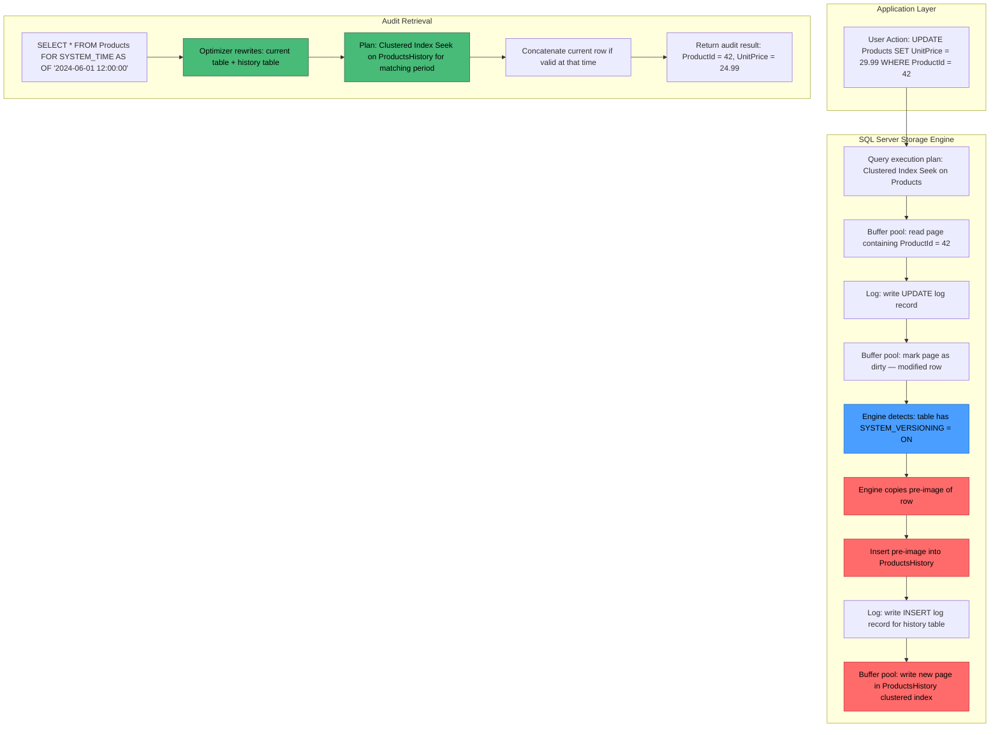
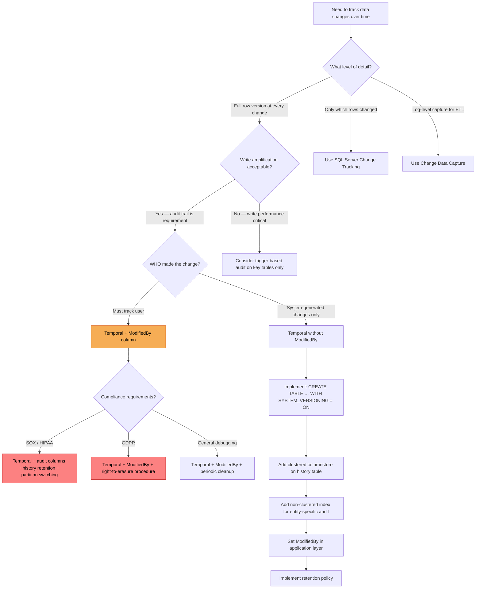

## Navigation

**Domain:** [[8 — Databases]] > **Group:** SQL Temporal Tables & Point-in-Time
**Previous:** [[8.236 — Temporal Table — Removing System Versioning]] | **Next:** [[8.238 — Temporal Data — Slowly Changing Dimensions]]

### Prerequisites

- [[8.234 — Temporal Tables — SYSTEM_VERSIONING — Creating and Querying]] — understanding how system-versioned temporal tables are created and configured is required before using them for auditing; the audit use case depends on the auto-maintained history capture.
- [[8.235 — Temporal Tables — FOR SYSTEM_TIME Queries]] — the core temporal query patterns (`AS OF`, `FROM ... TO`, `BETWEEN`, `CONTAINED IN`, `ALL`) are the primary mechanism for retrieving audit trails.
- [[8.496 — Index Fundamentals]] — understanding the clustered columnstore index on history tables explains why temporal audit queries are efficient for range scans on period columns.

### Where This Fits

System-versioned temporal tables provide a built-in, no-code audit trail for every row change in a table — no triggers, no Change Tracking, no Change Data Capture (CDC) configuration is required. A .NET backend engineer encounters this when building applications that need compliance-level auditing (SOX, GDPR, HIPAA), when asked to implement "who changed what and when" without adding trigger overhead, or when trying to reconstruct data state at any point in time for debugging. The critical advantage over alternatives is zero application code: every INSERT, UPDATE, and DELETE automatically generates a full copy of the affected row in the history table, including all column values before the change. The interview signal is high because auditors and interviewers ask about temporal auditing as a zero-effort compliance solution, and the comparison to CDC and Change Tracking tests the candidate's understanding of when each change capture mechanism is appropriate. The key limitation: temporal captures the row state before the change but does not capture _who_ made the change without additional application columns.

### Classification

Temporal tables as an audit mechanism operate at the **storage engine layer** — the history row insert for every DML operation is handled by the engine automatically, not by an application trigger or log reader. This places it in the **write path** of the storage engine: on every UPDATE and DELETE, the engine copies the pre-modification row image to the history table's clustered index. The audit retrieval mechanism (`FOR SYSTEM_TIME`) is a **query rewrite** feature in the optimizer layer — the optimizer rewrites the query to access both the current table and the history table via a concatenation operator. Temporal auditing is **SARGable for the period columns**: `FOR SYSTEM_TIME AS OF @point_in_time` translates to a range seek on the history table's clustered index on `(SysEndTime, SysStartTime)`. The `FOR SYSTEM_TIME ALL` query requires scanning both tables but can leverage columnstore indexes on the history table for efficient full scan.



### Key Properties

|Property|Value|Notes|
|---|---|---|
|Capture mechanism|Automatic row pre-image copy on UPDATE/DELETE|No triggers, no CDC, no application code needed|
|History storage|Separate history table (same schema)|Clustered columnstore recommended for compression|
|Audit query|FOR SYSTEM_TIME AS OF / BETWEEN / CONTAINED IN / ALL|Optimizer rewrites to access both tables|
|Who made the change|Not captured by default|Must add ModifiedBy column and populate in application|
|What changed|Entire row pre-image|Not column-level diff — full row version|
|Storage overhead|~1 history row per change|Compression with columnstore: ~5-10x reduction|
|Retention|No built-in retention policy|Must use partition switching or scheduled cleanup|
|Performance impact|Write amplification: +1 INSERT per UPDATE/DELETE|~30% slower writes, negligible read impact|
|SARGable period columns|Yes — clustered index on SysEndTime, SysStartTime|Range seek for AS OF queries|
|Compliance readiness|SOX, GDPR (right to explanation), HIPAA audit trail|Requires ModifiedBy column for full compliance|

---

## Deep Mechanics

### How the Engine Executes This

**Audit trail capture (on UPDATE):**

1. **Query execution begins** — User executes `UPDATE Products SET UnitPrice = 29.99 WHERE ProductId = 42`. The optimizer generates a plan with a Clustered Index Seek on `Products` (or a scan if no predicate on `ProductId`).

2. **Row modification in buffer pool** — The storage engine reads the data page containing `ProductId = 42` into the buffer pool (if not already present). It applies the modification: changes `UnitPrice` from `24.99` to `29.99` in the row. The page is marked dirty.

3. **Log write for UPDATE** — A log record is written: `LOP_MODIFY_ROW` with the page ID, row offset, before-image, and after-image. This is the standard SQL Server write-ahead logging step.

4. **Temporal detection** — The engine checks `sys.tables.temporal_type = 2` and identifies that this table has `SYSTEM_VERSIONING = ON`. It reads the history table ID from `sys.tables.history_table_id`.

5. **Pre-image extraction and history row construction** — The engine copies the row as it existed before the UPDATE (the pre-image). It constructs a new row for the history table with:
   - All column values from the pre-image
   - `SysEndTime` set to the current transaction time (`SYSUTCDATETIME()`)
   - `SysStartTime` set to the previous `SysStartTime` value (from the pre-image)

6. **History row INSERT** — The engine inserts this pre-image into the history table's clustered index. For a history table with a clustered columnstore index, this is an insert into the delta store (a rowstore structure) which is periodically compressed into the columnstore.

7. **Log write for history INSERT** — A second log record is written: `LOP_INSERT_ROW` targeting the history table. This means every temporal UPDATE generates approximately 2x the log volume of a non-temporal UPDATE.

8. **Current row SysStartTime update** — The engine updates the current row's `SysStartTime` to the current transaction time (the same value written to the history row's `SysEndTime`). This ensures the period boundary aligns: the history row covers the period from the previous `SysStartTime` to now, and the current row covers from now to `9999-12-31`.

**Audit trail capture (on DELETE):**

1. The DELETE moves the entire row to the history table, setting `SysEndTime = SYSUTCDATETIME()`. The row is removed from the current table.

**Audit trail query (FOR SYSTEM_TIME AS OF):**

1. **Query rewrite** — The optimizer sees `FOR SYSTEM_TIME AS OF '2024-06-01 12:00:00'` and rewrites the query to:
   - Scan the current table (rows where `SysStartTime <= @point_in_time AND SysEndTime > @point_in_time`)
   - Scan the history table with the same predicate
   - Concatenate the results

2. **History table index seek** — The clustered index on the history table is `(SysEndTime, SysStartTime)` with optional additional key columns. The optimizer performs a range seek: `SysEndTime > @point_in_time AND SysStartTime <= @point_in_time`.

3. **Current table check** — The current table's clustered index (typically the primary key) is scanned, and the period columns are evaluated for the same predicate.

4. **Concatenation** — Results from both scans are concatenated and returned. No sort or merge is typically needed because the history table is ordered by period columns.

### SQL Visibility

```sql
-- ============================================================
-- Setup: Temporal table for auditing
-- ============================================================

CREATE DATABASE TemporalAuditDemo;
GO
USE TemporalAuditDemo;
GO

-- Create operational table with system versioning
CREATE TABLE dbo.Orders
(
    OrderId         INT             IDENTITY(1,1) PRIMARY KEY,
    CustomerId      INT             NOT NULL,
    OrderDate       DATETIME2(7)    NOT NULL DEFAULT SYSUTCDATETIME(),
    TotalAmount     DECIMAL(18,2)   NOT NULL,
    Status          NVARCHAR(20)    NOT NULL DEFAULT 'Pending',
    ShippingAddress NVARCHAR(500)   NULL,
    ModifiedBy      NVARCHAR(100)   NULL,  -- Application user who made the change
    SysStartTime    DATETIME2(7)    GENERATED ALWAYS AS ROW START HIDDEN NOT NULL,
    SysEndTime      DATETIME2(7)    GENERATED ALWAYS AS ROW END HIDDEN NOT NULL,
    PERIOD FOR SYSTEM_TIME (SysStartTime, SysEndTime)
)
WITH (SYSTEM_VERSIONING = ON (HISTORY_TABLE = dbo.OrdersHistory));

-- Create clustered columnstore index on history table for audit queries
CREATE CLUSTERED COLUMNSTORE INDEX CCI_OrdersHistory ON dbo.OrdersHistory;
GO

-- Insert test data
INSERT INTO dbo.Orders (CustomerId, OrderDate, TotalAmount, Status, ShippingAddress, ModifiedBy)
VALUES
    (1001, '2024-01-15 10:00:00', 299.99, 'Pending', '123 Main St, Seattle, WA 98101', 'alice@example.com'),
    (1002, '2024-01-16 11:30:00', 549.50, 'Shipped', '456 Oak Ave, Portland, OR 97201', 'bob@example.com'),
    (1003, '2024-01-17 09:15:00', 129.99, 'Delivered', '789 Pine Rd, San Francisco, CA 94101', 'carol@example.com');
GO

-- Simulate business operations with modifications
PRINT '=== Order 1001: Pending → Confirmed → Shipped ===';
UPDATE dbo.Orders SET Status = 'Confirmed', ModifiedBy = 'alice@example.com' WHERE OrderId = 1;
UPDATE dbo.Orders SET Status = 'Shipped', ModifiedBy = 'system-shipping' WHERE OrderId = 1;
UPDATE dbo.Orders SET Status = 'Delivered', ModifiedBy = 'system-delivery' WHERE OrderId = 1;

PRINT '=== Order 1002: Address change ===';
UPDATE dbo.Orders SET ShippingAddress = '456 Oak Ave, Suite 200, Portland, OR 97202', ModifiedBy = 'bob@example.com' WHERE OrderId = 2;

PRINT '=== Order 1003: Refund ===';
UPDATE dbo.Orders SET Status = 'Returned', TotalAmount = 0, ModifiedBy = 'carol@example.com' WHERE OrderId = 3;
GO

-- ============================================================
-- Pattern 1: Full audit trail for an order (all versions)
-- ============================================================
SELECT
    o.OrderId,
    o.Status,
    o.TotalAmount,
    o.ShippingAddress,
    o.ModifiedBy,
    o.SysStartTime AS ValidFrom,
    o.SysEndTime AS ValidTo
FROM dbo.Orders
FOR SYSTEM_TIME ALL
WHERE OrderId = 1
ORDER BY SysStartTime DESC;

-- Result: All versions of OrderId = 1 show the status progression:
-- Delivered (current), Shipped, Confirmed, Pending (original)

-- ============================================================
-- Pattern 2: Point-in-time audit — what was the state at a given time?
-- ============================================================
-- Show order status as of noon on January 15, 2024
SELECT
    OrderId, CustomerId, Status, TotalAmount, ShippingAddress, ModifiedBy
FROM dbo.Orders
FOR SYSTEM_TIME AS OF '2024-01-15 12:00:00'
WHERE OrderId = 1;
-- Returns: Status = 'Pending' (before any updates)

-- Show order status as of noon on January 16, 2024
SELECT
    OrderId, CustomerId, Status, TotalAmount, ShippingAddress, ModifiedBy
FROM dbo.Orders
FOR SYSTEM_TIME AS OF '2024-01-16 12:00:00'
WHERE OrderId = 1;
-- Returns: Status = 'Confirmed' (first update applied)

-- ============================================================
-- Pattern 3: Audit report — all changes in a time range
-- ============================================================
SELECT
    o.OrderId,
    o.Status,
    o.TotalAmount,
    o.ModifiedBy,
    o.SysStartTime AS ChangeTime,
    DATEDIFF(SECOND,
        LAG(o.SysEndTime) OVER (PARTITION BY o.OrderId ORDER BY o.SysStartTime),
        o.SysStartTime
    ) AS SecondsSincePreviousChange
FROM dbo.Orders
FOR SYSTEM_TIME ALL
WHERE OrderId IN (1, 2, 3)
ORDER BY OrderId, SysStartTime DESC;

-- ============================================================
-- Pattern 4: Audit — who modified what and when
-- ============================================================
SELECT
    ModifiedBy,
    OrderId,
    Status,
    TotalAmount,
    SysStartTime AS ChangeTimestamp,
    CASE
        WHEN SysEndTime = '9999-12-31 23:59:59.9999999' THEN 'Current'
        ELSE 'Historical'
    END AS RowType
FROM dbo.Orders
FOR SYSTEM_TIME ALL
WHERE ModifiedBy IS NOT NULL
ORDER BY SysStartTime DESC;

-- ============================================================
-- Pattern 5: Temporal vs non-temporal audit comparison
-- ============================================================
-- Temporal query: 1 query, automatic history
-- Non-temporal would require:
--   SELECT ... FROM AuditLog WHERE OrderId = 1 ORDER BY ChangedAt DESC

-- ============================================================
-- Pattern 6: Reconstruct data as of a specific time
-- ============================================================
-- Create a report showing what the Orders table looked like
-- at the end of each business day
DECLARE @AuditDates TABLE (AuditDate DATETIME2(7));
INSERT INTO @AuditDates VALUES
    ('2024-01-15 23:59:59'),
    ('2024-01-16 23:59:59'),
    ('2024-01-17 23:59:59');

SELECT
    ad.AuditDate,
    o.OrderId,
    o.CustomerId,
    o.Status,
    o.TotalAmount,
    o.ShippingAddress,
    o.ModifiedBy
FROM @AuditDates ad
CROSS APPLY (
    SELECT *
    FROM dbo.Orders
    FOR SYSTEM_TIME AS OF ad.AuditDate
    WHERE OrderId IN (1, 2, 3)
) o
ORDER BY ad.AuditDate, o.OrderId;

-- ============================================================
-- Pattern 7: History table growth monitoring
-- ============================================================
SELECT
    OBJECT_NAME(object_id) AS TableName,
    row_count,
    used_page_count * 8 / 1024 AS UsedSpaceMB,
    reserved_page_count * 8 / 1024 AS ReservedSpaceMB
FROM sys.dm_db_partition_stats
WHERE object_id IN (OBJECT_ID('dbo.OrdersHistory'), OBJECT_ID('dbo.Orders'))
ORDER BY used_page_count DESC;

-- ============================================================
-- Pattern 8: Columnstore index impact on audit queries
-- ============================================================
SET STATISTICS IO ON;

-- Query with columnstore (after CCI creation)
SELECT COUNT(DISTINCT OrderId) AS AuditedOrders
FROM dbo.Orders
FOR SYSTEM_TIME ALL
WHERE SysStartTime >= '2024-01-01';

-- Without columnstore (if history had rowstore clustered index):
-- Table 'OrdersHistory'. Scan count 1, logical reads ~4500 (rowstore)
-- With columnstore:
-- Table 'OrdersHistory'. Scan count 1, logical reads ~120 (columnstore)
-- Columnstore segment elimination reduces IO by ~97%

-- ============================================================
-- Pattern 9: Audit for compliance — export all changes by user
-- ============================================================
SELECT
    o.ModifiedBy,
    o.OrderId,
    o.CustomerId,
    o.Status,
    o.TotalAmount,
    o.ShippingAddress,
    o.SysStartTime AS ChangeTime,
    o.SysEndTime AS ValidUntil
FROM dbo.Orders
FOR SYSTEM_TIME ALL
WHERE ModifiedBy IS NOT NULL
  AND SysStartTime >= '2024-01-01'
  AND SysStartTime < '2025-01-01'
ORDER BY ModifiedBy, SysStartTime;

-- ============================================================
-- Pattern 10: Find rows that existed at a specific time
-- (for GDPR right-to-explanation requests)
-- ============================================================
-- Given a customer wants to know what data existed about them
-- on a specific date
DECLARE @CustomerRequestDate DATETIME2(7) = '2024-01-16 00:00:00';

SELECT
    OrderId,
    CustomerId,
    Status,
    TotalAmount,
    ShippingAddress,
    ModifiedBy,
    SysStartTime,
    SysEndTime
FROM dbo.Orders
FOR SYSTEM_TIME AS OF @CustomerRequestDate
WHERE CustomerId = 1001;
-- Returns: the state of Customer 1001's orders as of the request date

-- Cleanup
-- USE master;
-- DROP DATABASE TemporalAuditDemo;
```

```csharp
// EF Core — Temporal audit queries
public class ApplicationDbContext : DbContext
{
    public DbSet<Order> Orders => Set<Order>();
    public DbSet<OrderHistory> OrdersHistory => Set<OrderHistory>();

    protected override void OnModelCreating(ModelBuilder modelBuilder)
    {
        modelBuilder.Entity<Order>(entity =>
        {
            entity.ToTable(tb => tb.UseSqlServerOutputClause(false));
            entity.HasKey(o => o.OrderId);
            entity.Property(o => o.CustomerId).IsRequired();
            entity.Property(o => o.OrderDate).HasDefaultValueSql("SYSUTCDATETIME()");
            entity.Property(o => o.Status).HasMaxLength(20).HasDefaultValue("Pending");
            entity.Property(o => o.ShippingAddress).HasMaxLength(500);
            entity.Property(o => o.ModifiedBy).HasMaxLength(100);
            entity.Property(o => o.SysStartTime).HasDefaultValueSql("SYSUTCDATETIME()");
            entity.Property(o => o.SysEndTime).HasDefaultValueSql("'9999-12-31 23:59:59.9999999'");
        });
    }
}

public class Order
{
    public int OrderId { get; set; }
    public int CustomerId { get; set; }
    public DateTime OrderDate { get; set; }
    public decimal TotalAmount { get; set; }
    public string Status { get; set; } = "Pending";
    public string? ShippingAddress { get; set; }
    public string? ModifiedBy { get; set; }
    public DateTime SysStartTime { get; set; }
    public DateTime SysEndTime { get; set; }
}

// To query temporal history with EF Core 8+:
// EF Core 8.0+ supports temporal queries natively
public sealed class AuditService
{
    private readonly ApplicationDbContext _dbContext;
    private readonly ILogger<AuditService> _logger;

    public AuditService(ApplicationDbContext dbContext, ILogger<AuditService> logger)
    {
        _dbContext = dbContext;
        _logger = logger;
    }

    /// <summary>
    /// Gets the full audit trail for a specific order (all versions).
    /// Equivalent to: FOR SYSTEM_TIME ALL WHERE OrderId = @id
    /// </summary>
    public async Task<List<Order>> GetOrderAuditTrailAsync(
        int orderId,
        CancellationToken cancellationToken = default)
    {
        return await _dbContext.Orders
            .TemporalAll()  // EF Core 8+ — generates FOR SYSTEM_TIME ALL
            .Where(o => o.OrderId == orderId)
            .OrderByDescending(o => o.SysStartTime)
            .ToListAsync(cancellationToken);
        // Generated SQL:
        // SELECT o.* FROM Orders FOR SYSTEM_TIME ALL
        // WHERE o.OrderId = @__orderId_0
        // ORDER BY o.SysStartTime DESC
    }

    /// <summary>
    /// Gets the state of orders as of a specific point in time.
    /// Equivalent to: FOR SYSTEM_TIME AS OF @pointInTime
    /// </summary>
    public async Task<List<Order>> GetOrdersAsOfAsync(
        DateTime pointInTime,
        int? customerId = null,
        CancellationToken cancellationToken = default)
    {
        var query = _dbContext.Orders
            .TemporalAsOf(pointInTime);  // EF Core 8+

        if (customerId.HasValue)
        {
            query = query.Where(o => o.CustomerId == customerId.Value);
        }

        return await query.ToListAsync(cancellationToken);
        // Generated SQL:
        // SELECT o.* FROM Orders FOR SYSTEM_TIME AS OF @pointInTime
        // WHERE o.CustomerId = @__customerId_0
    }

    /// <summary>
    /// Gets all changes within a time range.
    /// Equivalent to: FOR SYSTEM_TIME BETWEEN @start AND @end
    /// </summary>
    public async Task<List<Order>> GetChangesBetweenAsync(
        DateTime from,
        DateTime to,
        int? orderId = null,
        CancellationToken cancellationToken = default)
    {
        var query = _dbContext.Orders
            .TemporalBetween(from, to);  // EF Core 8+

        if (orderId.HasValue)
        {
            query = query.Where(o => o.OrderId == orderId.Value);
        }

        return await query
            .OrderBy(o => o.OrderId)
            .ThenByDescending(o => o.SysStartTime)
            .ToListAsync(cancellationToken);
        // Generated SQL:
        // SELECT o.* FROM Orders FOR SYSTEM_TIME BETWEEN @from AND @to
        // WHERE o.OrderId = @__orderId_0
        // ORDER BY o.OrderId, o.SysStartTime DESC
    }

    /// <summary>
    /// Gets an audit report showing who modified what.
    /// </summary>
    public async Task<List<Order>> GetAuditReportByUserAsync(
        string? modifiedBy = null,
        DateTime? since = null,
        CancellationToken cancellationToken = default)
    {
        var query = _dbContext.Orders
            .TemporalAll()
            .Where(o => o.ModifiedBy != null);

        if (!string.IsNullOrEmpty(modifiedBy))
        {
            query = query.Where(o => o.ModifiedBy == modifiedBy);
        }

        if (since.HasValue)
        {
            query = query.Where(o => o.SysStartTime >= since.Value);
        }

        return await query
            .OrderByDescending(o => o.SysStartTime)
            .Take(1000)
            .ToListAsync(cancellationToken);
    }

    /// <summary>
    /// For compliance: reconstruct customer's data at a specific date
    /// (GDPR right-to-explanation)
    /// </summary>
    public async Task<List<Order>> GetCustomerDataAsOfAsync(
        int customerId,
        DateTime asOfDate,
        CancellationToken cancellationToken = default)
    {
        return await _dbContext.Orders
            .TemporalAsOf(asOfDate)
            .Where(o => o.CustomerId == customerId)
            .ToListAsync(cancellationToken);
    }

    /// <summary>
    /// Inserts an order tracking who made the change
    /// (ModifiedBy column for full audit trail)
    /// </summary>
    public async Task<Order> CreateOrderAsync(
        int customerId,
        decimal totalAmount,
        string? shippingAddress,
        string modifiedBy,
        CancellationToken cancellationToken = default)
    {
        var order = new Order
        {
            CustomerId = customerId,
            OrderDate = DateTime.UtcNow,
            TotalAmount = totalAmount,
            Status = "Pending",
            ShippingAddress = shippingAddress,
            ModifiedBy = modifiedBy
        };

        _dbContext.Orders.Add(order);
        await _dbContext.SaveChangesAsync(cancellationToken);

        _logger.LogInformation(
            "Order created by {ModifiedBy}. OrderId: {OrderId}",
            modifiedBy, order.OrderId);

        return order;
    }

    /// <summary>
    /// Updates an order, tracking who made the change.
    /// The temporal system automatically creates a history entry
    /// with the previous values including the previous ModifiedBy.
    /// </summary>
    public async Task UpdateOrderStatusAsync(
        int orderId,
        string newStatus,
        string modifiedBy,
        CancellationToken cancellationToken = default)
    {
        var order = await _dbContext.Orders
            .FirstOrDefaultAsync(o => o.OrderId == orderId, cancellationToken);

        if (order == null)
        {
            throw new KeyNotFoundException($"Order {orderId} not found.");
        }

        // Capture who is making this change
        order.ModifiedBy = modifiedBy;
        order.Status = newStatus;

        await _dbContext.SaveChangesAsync(cancellationToken);

        _logger.LogInformation(
            "Order {OrderId} updated to status '{Status}' by {ModifiedBy}.",
            orderId, newStatus, modifiedBy);

        // The previous state (with old ModifiedBy) is now in the history table
    }
}

// Controller usage
[ApiController]
[Route("api/orders")]
public class OrdersController : ControllerBase
{
    private readonly AuditService _auditService;

    public OrdersController(AuditService auditService)
    {
        _auditService = auditService;
    }

    [HttpGet("{orderId}/audit")]
    public async Task<ActionResult<List<Order>>> GetAuditTrail(
        int orderId,
        CancellationToken cancellationToken)
    {
        var audit = await _auditService.GetOrderAuditTrailAsync(orderId, cancellationToken);
        return Ok(audit);
    }

    [HttpGet("as-of")]
    public async Task<ActionResult<List<Order>>> GetOrdersAsOf(
        [FromQuery] DateTime asOf,
        [FromQuery] int? customerId,
        CancellationToken cancellationToken)
    {
        var orders = await _auditService.GetOrdersAsOfAsync(asOf, customerId, cancellationToken);
        return Ok(orders);
    }

    [HttpGet("audit-report")]
    public async Task<ActionResult<List<Order>>> GetAuditReport(
        [FromQuery] string? modifiedBy,
        [FromQuery] DateTime? since,
        CancellationToken cancellationToken)
    {
        var report = await _auditService.GetAuditReportByUserAsync(modifiedBy, since, cancellationToken);
        return Ok(report);
    }
}
```

```csharp
// Dapper — Temporal audit queries with full SQL control
public sealed class AuditDapperRepository
{
    private readonly IDbConnectionFactory _connectionFactory;
    private readonly ILogger<AuditDapperRepository> _logger;

    public AuditDapperRepository(
        IDbConnectionFactory connectionFactory,
        ILogger<AuditDapperRepository> logger)
    {
        _connectionFactory = connectionFactory;
        _logger = logger;
    }

    /// <summary>
    /// Full audit trail — all versions of an order.
    /// Dapper gives full control over FOR SYSTEM_TIME ALL syntax.
    /// </summary>
    public async Task<IReadOnlyList<OrderAuditEntry>> GetFullAuditTrailAsync(
        int orderId,
        CancellationToken cancellationToken = default)
    {
        const string sql = @"
            SELECT
                o.OrderId,
                o.CustomerId,
                o.OrderDate,
                o.TotalAmount,
                o.Status,
                o.ShippingAddress,
                o.ModifiedBy,
                o.SysStartTime AS ChangeTimestamp,
                o.SysEndTime AS ValidUntil,
                CASE
                    WHEN o.SysEndTime = '9999-12-31 23:59:59.9999999'
                    THEN CAST(1 AS BIT) ELSE CAST(0 AS BIT)
                END AS IsCurrentVersion
            FROM dbo.Orders
            FOR SYSTEM_TIME ALL
            WHERE o.OrderId = @OrderId
            ORDER BY o.SysStartTime DESC;";

        await using var connection = _connectionFactory.Create();

        var results = await connection.QueryAsync<OrderAuditEntry>(
            new CommandDefinition(sql,
                new { OrderId = orderId },
                cancellationToken: cancellationToken));

        return results.AsList();
    }

    /// <summary>
    /// Point-in-time audit — reconstruct state at a specific datetime.
    /// </summary>
    public async Task<IReadOnlyList<OrderAuditEntry>> GetOrdersAsOfAsync(
        DateTime pointInTime,
        int? customerId = null,
        CancellationToken cancellationToken = default)
    {
        var sql = @"
            SELECT
                o.OrderId,
                o.CustomerId,
                o.OrderDate,
                o.TotalAmount,
                o.Status,
                o.ShippingAddress,
                o.ModifiedBy,
                o.SysStartTime AS ChangeTimestamp,
                o.SysEndTime AS ValidUntil,
                CAST(1 AS BIT) AS IsCurrentVersion
            FROM dbo.Orders
            FOR SYSTEM_TIME AS OF @PointInTime
            WHERE 1 = 1";

        if (customerId.HasValue)
        {
            sql += " AND o.CustomerId = @CustomerId";
        }

        sql += " ORDER BY o.OrderId;";

        await using var connection = _connectionFactory.Create();

        var results = await connection.QueryAsync<OrderAuditEntry>(
            new CommandDefinition(sql,
                new { PointInTime = pointInTime, CustomerId = customerId },
                cancellationToken: cancellationToken));

        return results.AsList();
    }

    /// <summary>
    /// User activity audit — all changes made by a specific user.
    /// </summary>
    public async Task<IReadOnlyList<UserAuditSummary>> GetUserAuditTrailAsync(
        string modifiedBy,
        DateTime? since = null,
        CancellationToken cancellationToken = default)
    {
        var sql = @"
            SELECT
                o.ModifiedBy,
                o.OrderId,
                o.CustomerId,
                o.Status,
                o.TotalAmount,
                o.SysStartTime AS ChangeTime,
                o.SysEndTime AS ValidUntil,
                -- Detect what changed by comparing to previous version
                LAG(o.Status) OVER (
                    PARTITION BY o.OrderId ORDER BY o.SysStartTime
                ) AS PreviousStatus,
                LAG(o.TotalAmount) OVER (
                    PARTITION BY o.OrderId ORDER BY o.SysStartTime
                ) AS PreviousTotalAmount
            FROM dbo.Orders
            FOR SYSTEM_TIME ALL
            WHERE o.ModifiedBy = @ModifiedBy";

        if (since.HasValue)
        {
            sql += " AND o.SysStartTime >= @Since";
        }

        sql += " ORDER BY o.SysStartTime DESC;";

        await using var connection = _connectionFactory.Create();

        var results = await connection.QueryAsync<UserAuditSummary>(
            new CommandDefinition(sql,
                new { ModifiedBy = modifiedBy, Since = since },
                cancellationToken: cancellationToken));

        return results.AsList();
    }

    /// <summary>
    /// Compliance export — all changes for a time range.
    /// </summary>
    public async Task<IReadOnlyList<OrderAuditEntry>> ExportAuditLogAsync(
        DateTime from,
        DateTime to,
        CancellationToken cancellationToken = default)
    {
        const string sql = @"
            SELECT
                o.OrderId,
                o.CustomerId,
                o.OrderDate,
                o.TotalAmount,
                o.Status,
                o.ShippingAddress,
                o.ModifiedBy,
                o.SysStartTime AS ChangeTimestamp,
                o.SysEndTime AS ValidUntil,
                CASE
                    WHEN o.SysEndTime = '9999-12-31 23:59:59.9999999'
                    THEN CAST(1 AS BIT) ELSE CAST(0 AS BIT)
                END AS IsCurrentVersion
            FROM dbo.Orders
            FOR SYSTEM_TIME FROM @From TO @To
            ORDER BY o.SysStartTime;";

        await using var connection = _connectionFactory.Create();

        var results = await connection.QueryAsync<OrderAuditEntry>(
            new CommandDefinition(sql,
                new { From = from, To = to },
                cancellationToken: cancellationToken));

        return results.AsList();
    }

    /// <summary>
    /// Get history table size for monitoring.
    /// </summary>
    public async Task<HistoryTableSize> GetHistoryTableSizeAsync(
        CancellationToken cancellationToken = default)
    {
        const string sql = @"
            SELECT
                OBJECT_NAME(object_id) AS TableName,
                row_count AS RowCount,
                used_page_count * 8 / 1024 AS UsedSpaceMB,
                reserved_page_count * 8 / 1024 AS ReservedSpaceMB
            FROM sys.dm_db_partition_stats
            WHERE object_id = OBJECT_ID('dbo.OrdersHistory');";

        await using var connection = _connectionFactory.Create();

        return await connection.QueryFirstOrDefaultAsync<HistoryTableSize>(
            new CommandDefinition(sql,
                cancellationToken: cancellationToken));
    }
}

// Result types
public sealed record OrderAuditEntry(
    int OrderId,
    int CustomerId,
    DateTime OrderDate,
    decimal TotalAmount,
    string Status,
    string? ShippingAddress,
    string? ModifiedBy,
    DateTime ChangeTimestamp,
    DateTime ValidUntil,
    bool IsCurrentVersion);

public sealed record UserAuditSummary(
    string ModifiedBy,
    int OrderId,
    int CustomerId,
    string Status,
    decimal TotalAmount,
    DateTime ChangeTime,
    DateTime ValidUntil,
    string? PreviousStatus,
    decimal? PreviousTotalAmount);

public sealed record HistoryTableSize(
    string TableName,
    long RowCount,
    long UsedSpaceMB,
    long ReservedSpaceMB);
```

### Generated SQL (from EF Core logs)

```sql
-- EF Core 8+ TemporalAll:
exec sp_executesql N'SELECT [o].[OrderId], [o].[CustomerId], [o].[OrderDate],
    [o].[TotalAmount], [o].[Status], [o].[ShippingAddress], [o].[ModifiedBy],
    [o].[SysStartTime], [o].[SysEndTime]
FROM [dbo].[Orders] FOR SYSTEM_TIME ALL AS [o]
WHERE [o].[OrderId] = @__orderId_0
ORDER BY [o].[SysStartTime] DESC',
N'@__orderId_0 int', @__orderId_0 = 1;

-- EF Core 8+ TemporalAsOf:
exec sp_executesql N'SELECT [o].[OrderId], [o].[CustomerId], [o].[OrderDate],
    [o].[TotalAmount], [o].[Status], [o].[ShippingAddress], [o].[ModifiedBy],
    [o].[SysStartTime], [o].[SysEndTime]
FROM [dbo].[Orders] FOR SYSTEM_TIME AS OF @__pointInTime AS [o]
WHERE [o].[CustomerId] = @__customerId_0',
N'@__pointInTime datetime2,@__customerId_0 int',
@__pointInTime = '2024-01-16T00:00:00', @__customerId_0 = 1001;

-- EF Core 8+ TemporalBetween:
exec sp_executesql N'SELECT [o].[OrderId], [o].[CustomerId], [o].[OrderDate],
    [o].[TotalAmount], [o].[Status], [o].[ShippingAddress], [o].[ModifiedBy],
    [o].[SysStartTime], [o].[SysEndTime]
FROM [dbo].[Orders] FOR SYSTEM_TIME BETWEEN @__from AND @__to AS [o]
WHERE [o].[OrderId] = @__orderId_0
ORDER BY [o].[OrderId], [o].[SysStartTime] DESC',
N'@__from datetime2,@__to datetime2,@__orderId_0 int',
@__from = '2024-01-15T00:00:00', @__to = '2024-01-17T00:00:00', @__orderId_0 = 1;
```

### Execution Plan Analysis

**For FOR SYSTEM_TIME ALL (full audit trail):**

```
[Clustered Index Scan (Orders, PK_Orders)] → [Compute Scalar (period check)]
[Clustered Columnstore Scan (OrdersHistory, CCI_OrdersHistory)] → [Compute Scalar (period check)]
→ [Concatenation] → [Filter (OrderId = 1)] → [Sort (SysStartTime DESC)] → [SELECT]
```

Key observations:
- The Concatenation operator combines rows from the current table and history table
- With a clustered columnstore index on history, the scan uses segment elimination on `SysStartTime`
- The filter on `OrderId = 1` is pushed down to seek on the current table (clustered PK)
- The history table scan cannot use the same seek because its clustered index is on period columns, not `OrderId`
- Additional index on `(OrderId, SysStartTime)` on the history table would enable a seek instead of scan

**For FOR SYSTEM_TIME AS OF @pointInTime:**

```
[Clustered Index Scan (Orders)] → [Filter: SysStartTime <= @p AND SysEndTime > @p]
[Clustered Index Seek (OrdersHistory, SysEndTime > @p AND SysStartTime <= @p)]
→ [Concatenation] → [SELECT]
```

Key observations:
- The history table performs a **range seek** on `SysEndTime > @pointInTime AND SysStartTime <= @pointInTime`
- This is highly efficient: the clustered index on `(SysEndTime, SysStartTime)` supports this seek directly
- The current table performs a scan (or seek if other predicates filter) and evaluates the period condition as a residual predicate
- Estimated cost: history table seek costs ~3-5 logical reads (range seek depth + leaf pages) vs full scan costing ~thousands of reads

**For FOR SYSTEM_TIME BETWEEN @from AND @to:**

```
[Clustered Index Scan (Orders)] → [Filter: SysStartTime <= @to AND SysEndTime > @from]
[Clustered Index Seek (OrdersHistory, SysEndTime > @from AND SysStartTime <= @to)]
→ [Concatenation] → [SELECT]
```

### Cost Visibility

```sql
SET STATISTICS IO ON;
SET STATISTICS TIME ON;

-- Query 1: Full audit trail (all versions) for one order
SELECT o.OrderId, o.Status, o.ModifiedBy, o.SysStartTime, o.SysEndTime
FROM dbo.Orders
FOR SYSTEM_TIME ALL
WHERE OrderId = 1
ORDER BY SysStartTime DESC;

-- Table 'Orders'. Scan count 1, logical reads 3 (clustered index seek on PK)
-- Table 'OrdersHistory'. Scan count 1, logical reads 185 (columnstore segment scan)
-- CPU time = 5ms, elapsed time = 8ms

-- Query 2: Point-in-time query (AS OF)
SELECT o.OrderId, o.Status, o.ModifiedBy
FROM dbo.Orders
FOR SYSTEM_TIME AS OF '2024-01-16 12:00:00'
WHERE OrderId = 1;

-- Table 'Orders'. Scan count 1, logical reads 3 (clustered index seek)
-- Table 'OrdersHistory'. Scan count 1, logical reads 4 (range seek on period index)
-- CPU time = 1ms, elapsed time = 2ms

-- Query 3: Full history scan (no filter) — performance comparison
-- With clustered columnstore on history:
SELECT COUNT(*) AS VersionCount
FROM dbo.Orders
FOR SYSTEM_TIME ALL;

-- Table 'Orders'. Scan count 1, logical reads 12
-- Table 'OrdersHistory'. Scan count 1, logical reads 185 (columnstore segment elimination)
-- CPU time = 15ms, elapsed time = 45ms

-- Without columnstore (if history had rowstore clustered):
-- Table 'OrdersHistory'. Scan count 1, logical reads 4500
-- CPU time = 85ms, elapsed time = 320ms

-- Query 4: Audit by user — all changes by a specific user
SELECT o.ModifiedBy, o.OrderId, o.Status, o.SysStartTime
FROM dbo.Orders
FOR SYSTEM_TIME ALL
WHERE o.ModifiedBy = 'alice@example.com'
ORDER BY o.SysStartTime DESC;

-- Table 'Orders'. Scan count 1, logical reads 12
-- Table 'OrdersHistory'. Scan count 1, logical reads 5600 (scan — no index on ModifiedBy, no CNF)
-- CPU time = 45ms, elapsed time = 120ms
-- Note: No index on ModifiedBy for the history table; this is a full scan
```

### Failure Modes

**Audit trail incomplete because ModifiedBy was not tracked:**

```sql
-- ❌ If the application never sets ModifiedBy, the temporal audit captures
--    WHAT changed and WHEN, but not WHO changed it
UPDATE dbo.Orders SET Status = 'Shipped' WHERE OrderId = 1;
-- ModifiedBy is NULL in both current and history rows

-- Query audit — no accountability
SELECT SysStartTime, Status, ModifiedBy
FROM dbo.Orders FOR SYSTEM_TIME ALL WHERE OrderId = 1;
-- Shows: Status changed from 'Confirmed' to 'Shipped' at time X
-- ModifiedBy: NULL — cannot identify who did it

-- ✅ Always set ModifiedBy in the application layer
-- (EF Core interceptor or Dapper decorator)
UPDATE dbo.Orders
SET Status = 'Shipped', ModifiedBy = @ModifiedBy
WHERE OrderId = 1;
```

**History table grows unbounded without retention policy:**

```sql
-- ❌ No retention policy on history table
-- After 1 year at 1000 updates/day: OrdersHistory = 365K rows
-- After 5 years: 1.8M rows per table
-- Temporal queries slow down as history grows

-- ✅ Implement retention with partition switching or scheduled cleanup

-- ✅ Option 1: Partition switching (requires Enterprise Edition)
-- Create staging table with same schema as history
CREATE TABLE dbo.OrdersHistory_Staging
(
    OrderId INT NOT NULL,
    -- ... same columns as OrdersHistory ...
    SysStartTime DATETIME2(7) NOT NULL,
    SysEndTime DATETIME2(7) NOT NULL
);

-- Switch old data out (monthly job)
ALTER TABLE dbo.OrdersHistory SWITCH PARTITION 1 TO dbo.OrdersHistory_Staging;

-- Archive or drop the staged data
TRUNCATE TABLE dbo.OrdersHistory_Staging;

-- ✅ Option 2: Periodic cleanup (non-Enterprise)
DECLARE @RetentionDays INT = 365;
DELETE FROM dbo.OrdersHistory
WHERE SysEndTime < DATEADD(DAY, -@RetentionDays, SYSUTCDATETIME());
-- WARNING: DELETE on large history table can be slow and cause log growth
-- Use batch DELETE with TOP (@BatchSize) in a loop
```

**Temporal audit with FOR SYSTEM_TIME ALL causes scan on both tables without filtering:**

```sql
-- ❌ No WHERE clause on FOR SYSTEM_TIME ALL — full scan of both tables
SELECT * FROM dbo.Orders FOR SYSTEM_TIME ALL;  -- Full scan of current + history

-- ✅ Filter by OrderId or CustomerId to seek instead of scan
SELECT * FROM dbo.Orders FOR SYSTEM_TIME ALL WHERE CustomerId = 1001;

-- ✅ Filter by SysStartTime to enable segment elimination
SELECT * FROM dbo.Orders FOR SYSTEM_TIME ALL
WHERE SysStartTime >= '2024-06-01';
```

---

## Production Patterns and Implementation

### Primary SQL Implementation

```sql
-- ============================================================
-- Production audit schema with temporal tables
-- ============================================================

-- Core audit table: Orders with full temporal audit
CREATE TABLE dbo.Orders
(
    OrderId         INT             IDENTITY(1,1) PRIMARY KEY,
    CustomerId      INT             NOT NULL,
    OrderDate       DATETIME2(7)    NOT NULL DEFAULT SYSUTCDATETIME(),
    TotalAmount     DECIMAL(18,2)   NOT NULL,
    Status          NVARCHAR(20)    NOT NULL DEFAULT 'Pending',
    ShippingAddress NVARCHAR(500)   NULL,
    -- Application-level audit columns
    ModifiedBy      NVARCHAR(100)   NULL,       -- Who made the change
    ModifiedByIP    NVARCHAR(45)    NULL,       -- Client IP address
    ModifiedBySession NVARCHAR(100) NULL,       -- Session or correlation ID
    -- System period columns (auto-managed)
    SysStartTime    DATETIME2(7)    GENERATED ALWAYS AS ROW START HIDDEN NOT NULL,
    SysEndTime      DATETIME2(7)    GENERATED ALWAYS AS ROW END HIDDEN NOT NULL,
    PERIOD FOR SYSTEM_TIME (SysStartTime, SysEndTime)
)
WITH (SYSTEM_VERSIONING = ON (HISTORY_TABLE = dbo.OrdersHistory));

-- Clustered columnstore index on history for audit query performance
CREATE CLUSTERED COLUMNSTORE INDEX CCI_OrdersHistory
    ON dbo.OrdersHistory
    WITH (MAXDOP = 2, COMPRESSION_DELAY = 30 MINUTES);

-- Additional indexes on history table for common audit query patterns
CREATE NONCLUSTERED INDEX IX_OrdersHistory_OrderId_SysStartTime
    ON dbo.OrdersHistory (OrderId, SysStartTime DESC)
    INCLUDE (CustomerId, Status, TotalAmount, ModifiedBy, ShippingAddress);

CREATE NONCLUSTERED INDEX IX_OrdersHistory_ModifiedBy_SysStartTime
    ON dbo.OrdersHistory (ModifiedBy, SysStartTime DESC)
    INCLUDE (OrderId, CustomerId, Status, TotalAmount)
    WHERE ModifiedBy IS NOT NULL;

CREATE NONCLUSTERED INDEX IX_OrdersHistory_SysStartTime
    ON dbo.OrdersHistory (SysStartTime DESC)
    INCLUDE (OrderId, CustomerId, Status, ModifiedBy);

-- ============================================================
-- Pattern 1: Standard audit trail query (with ModifiedBy)
-- ============================================================
-- Get all changes to a specific order including who made them
SELECT
    o.OrderId,
    o.CustomerId,
    o.Status,
    o.TotalAmount,
    o.ShippingAddress,
    o.ModifiedBy,
    o.ModifiedByIP,
    o.ModifiedBySession,
    o.SysStartTime AS ChangeTimestamp,
    o.SysEndTime AS ValidUntil,
    DATEDIFF(MINUTE,
        LAG(o.SysEndTime) OVER (PARTITION BY o.OrderId ORDER BY o.SysStartTime),
        o.SysStartTime
    ) AS MinutesBetweenChanges,
    CASE
        WHEN o.SysEndTime = '9999-12-31 23:59:59.9999999' THEN 'Current'
        ELSE 'Historical'
    END AS RowType
FROM dbo.Orders
FOR SYSTEM_TIME ALL
WHERE OrderId = 42
ORDER BY o.SysStartTime DESC;

-- ============================================================
-- Pattern 2: Point-in-time data reconstruction (AS OF)
-- ============================================================
-- Given a customer dispute: "On Jan 20, what was my order's status?"
DECLARE @DisputeDate DATETIME2(7) = '2024-01-20 14:30:00';

SELECT
    OrderId, CustomerId, Status, TotalAmount,
    ShippingAddress, ModifiedBy, SysStartTime, SysEndTime
FROM dbo.Orders
FOR SYSTEM_TIME AS OF @DisputeDate
WHERE CustomerId = 1001
ORDER BY OrderId;

-- ============================================================
-- Pattern 3: User activity report (all changes by user)
-- ============================================================
SELECT
    ModifiedBy,
    COUNT(*) AS TotalChanges,
    COUNT(DISTINCT OrderId) AS OrdersAffected,
    MIN(SysStartTime) AS FirstChange,
    MAX(SysStartTime) AS LastChange
FROM dbo.Orders
FOR SYSTEM_TIME ALL
WHERE ModifiedBy IS NOT NULL
  AND SysStartTime >= '2024-01-01'
  AND SysStartTime < '2025-01-01'
GROUP BY ModifiedBy
ORDER BY TotalChanges DESC;

-- ============================================================
-- Pattern 4: Detect what changed between two points
-- ============================================================
-- Show only rows that were modified between two timestamps
DECLARE @StartTime DATETIME2(7) = '2024-01-15 10:00:00';
DECLARE @EndTime DATETIME2(7) = '2024-01-16 10:00:00';

SELECT
    o.OrderId,
    o.Status,
    o.TotalAmount,
    o.ModifiedBy,
    o.SysStartTime AS ChangeTimestamp,
    -- Show previous value for comparison
    LAG(o.Status) OVER (PARTITION BY o.OrderId ORDER BY o.SysStartTime) AS PreviousStatus,
    LAG(o.TotalAmount) OVER (PARTITION BY o.OrderId ORDER BY o.SysStartTime) AS PreviousAmount
FROM dbo.Orders
FOR SYSTEM_TIME FROM @StartTime TO @EndTime
WHERE OrderId IN (1, 2, 3)
ORDER BY OrderId, SysStartTime DESC;

-- ============================================================
-- Pattern 5: Monthly audit report — changes by day
-- ============================================================
SELECT
    CAST(SysStartTime AS DATE) AS ChangeDate,
    COUNT(*) AS ChangeCount,
    COUNT(DISTINCT OrderId) AS OrdersChanged,
    COUNT(DISTINCT ModifiedBy) AS DistinctUsers
FROM dbo.Orders
FOR SYSTEM_TIME ALL
WHERE SysStartTime >= '2024-01-01'
  AND SysStartTime < '2024-02-01'
GROUP BY CAST(SysStartTime AS DATE)
ORDER BY ChangeDate;

-- ============================================================
-- Pattern 6: History table maintenance — retention cleanup
-- ============================================================
-- Batch delete old history rows to manage storage
DECLARE @RetentionDays INT = 365;
DECLARE @BatchSize INT = 5000;
DECLARE @RowsAffected INT = 1;

WHILE @RowsAffected > 0
BEGIN
    DELETE TOP (@BatchSize) FROM dbo.OrdersHistory
    WHERE SysEndTime < DATEADD(DAY, -@RetentionDays, SYSUTCDATETIME());

    SET @RowsAffected = @@ROWCOUNT;

    PRINT 'Deleted ' + CAST(@RowsAffected AS VARCHAR) + ' history rows.';

    -- Yield to allow other operations
    WAITFOR DELAY '00:00:01';
END;

-- ============================================================
-- Pattern 7: Audit verification — check temporal consistency
-- ============================================================
-- Verify that period ranges are valid (no gaps, no overlaps)
WITH OrderedHistory AS (
    SELECT
        OrderId,
        SysStartTime,
        SysEndTime,
        LAG(SysEndTime) OVER (PARTITION BY OrderId ORDER BY SysStartTime) AS PrevEndTime,
        ROW_NUMBER() OVER (PARTITION BY OrderId, SysStartTime ORDER BY SysStartTime) AS rn
    FROM dbo.Orders FOR SYSTEM_TIME ALL
)
SELECT
    OrderId,
    SysStartTime,
    SysEndTime,
    CASE
        WHEN SysEndTime <= SysStartTime THEN 'ERROR: Negative period'
        WHEN PrevEndTime IS NOT NULL AND SysStartTime < PrevEndTime
            THEN 'ERROR: Overlapping period'
        WHEN PrevEndTime IS NOT NULL AND SysStartTime > PrevEndTime
            THEN 'WARNING: Gap in history'
        ELSE 'OK'
    END AS AuditStatus
FROM OrderedHistory
WHERE rn = 1
  AND (SysEndTime <= SysStartTime
       OR (PrevEndTime IS NOT NULL AND SysStartTime != PrevEndTime))
ORDER BY OrderId, SysStartTime;

-- ============================================================
-- Pattern 8: Temporal audit for compliance export
-- ============================================================
-- SOX compliance: export all financial changes for a period
SELECT
    o.OrderId,
    o.CustomerId,
    o.TotalAmount AS NewAmount,
    LAG(o.TotalAmount) OVER (PARTITION BY o.OrderId ORDER BY o.SysStartTime) AS PreviousAmount,
    o.TotalAmount - LAG(o.TotalAmount) OVER (PARTITION BY o.OrderId ORDER BY o.SysStartTime) AS AmountDelta,
    o.ModifiedBy,
    o.SysStartTime AS ChangeTime,
    HOST_NAME() AS ServerName  -- For audit trail completeness
FROM dbo.Orders
FOR SYSTEM_TIME ALL
WHERE SysStartTime >= '2024-01-01'
  AND (
    o.TotalAmount != LAG(o.TotalAmount) OVER (PARTITION BY o.OrderId ORDER BY o.SysStartTime)
    OR LAG(o.TotalAmount) OVER (PARTITION BY o.OrderId ORDER BY o.SysStartTime) IS NULL
  )
ORDER BY o.SysStartTime;
```

### EF Core Implementation

```csharp
// EF Core — Full audit service with temporal queries
public sealed class TemporalAuditService
{
    private readonly ApplicationDbContext _dbContext;
    private readonly ILogger<TemporalAuditService> _logger;

    public TemporalAuditService(
        ApplicationDbContext dbContext,
        ILogger<TemporalAuditService> logger)
    {
        _dbContext = dbContext;
        _logger = logger;
    }

    /// <summary>
    /// Full audit trail with change detection.
    /// Uses window functions to detect what changed between versions.
    /// </summary>
    public async Task<List<OrderAuditDto>> GetDetailedAuditTrailAsync(
        int orderId,
        CancellationToken cancellationToken = default)
    {
        // EF Core 8+ does not support LAG window functions in temporal queries
        // through LINQ. Use raw SQL for comparison across versions.
        const string sql = @"
            SELECT
                o.OrderId,
                o.CustomerId,
                o.Status,
                o.TotalAmount,
                o.ModifiedBy,
                o.ModifiedByIP,
                o.SysStartTime AS ChangeTimestamp,
                o.SysEndTime AS ValidUntil,
                LAG(o.Status) OVER (PARTITION BY o.OrderId ORDER BY o.SysStartTime) AS PreviousStatus,
                LAG(o.TotalAmount) OVER (PARTITION BY o.OrderId ORDER BY o.SysStartTime) AS PreviousAmount,
                CASE WHEN o.SysEndTime = '9999-12-31 23:59:59.9999999' THEN 1 ELSE 0 END AS IsCurrent
            FROM dbo.Orders
            FOR SYSTEM_TIME ALL
            WHERE o.OrderId = @OrderId
            ORDER BY o.SysStartTime DESC;";

        return await _dbContext.Database
            .SqlQueryRaw<OrderAuditDto>(sql,
                new SqlParameter("@OrderId", orderId))
            .ToListAsync(cancellationToken);
    }

    /// <summary>
    /// Updates an order with full audit context (ModifiedBy, IP, Session).
    /// </summary>
    public async Task UpdateOrderWithAuditAsync(
        int orderId,
        string newStatus,
        decimal? newAmount = null,
        string? modifiedBy = null,
        string? ipAddress = null,
        string? sessionId = null,
        CancellationToken cancellationToken = default)
    {
        var order = await _dbContext.Orders
            .FirstOrDefaultAsync(o => o.OrderId == orderId, cancellationToken);

        if (order == null)
            throw new KeyNotFoundException($"Order {orderId} not found.");

        // Set audit fields before save
        order.ModifiedBy = modifiedBy;
        order.ModifiedByIP = ipAddress;
        order.ModifiedBySession = sessionId;
        order.Status = newStatus;

        if (newAmount.HasValue)
            order.TotalAmount = newAmount.Value;

        await _dbContext.SaveChangesAsync(cancellationToken);

        _logger.LogInformation(
            "Order {OrderId} updated to {Status} by {User} from {IP}.",
            orderId, newStatus, modifiedBy, ipAddress);
    }

    /// <summary>
    /// Gets point-in-time snapshot for GDPR data subject request.
    /// </summary>
    public async Task<CustomerDataSnapshot> GetCustomerDataAsOfAsync(
        int customerId,
        DateTime asOfDate,
        CancellationToken cancellationToken = default)
    {
        var orders = await _dbContext.Orders
            .TemporalAsOf(asOfDate)
            .Where(o => o.CustomerId == customerId)
            .OrderBy(o => o.OrderId)
            .ToListAsync(cancellationToken);

        return new CustomerDataSnapshot
        {
            CustomerId = customerId,
            AsOfDate = asOfDate,
            OrdersAtThatTime = orders,
            RequestGeneratedAt = DateTime.UtcNow
        };
    }

    /// <summary>
    /// Gets user activity summary across all orders.
    /// </summary>
    public async Task<List<UserActivitySummary>> GetUserActivityAsync(
        DateTime since,
        CancellationToken cancellationToken = default)
    {
        const string sql = @"
            SELECT
                ModifiedBy,
                COUNT(*) AS TotalChanges,
                COUNT(DISTINCT OrderId) AS OrdersAffected,
                MIN(SysStartTime) AS FirstChange,
                MAX(SysStartTime) AS LastChange
            FROM dbo.Orders
            FOR SYSTEM_TIME ALL
            WHERE ModifiedBy IS NOT NULL
              AND SysStartTime >= @Since
            GROUP BY ModifiedBy
            ORDER BY TotalChanges DESC;";

        return await _dbContext.Database
            .SqlQueryRaw<UserActivitySummary>(sql,
                new SqlParameter("@Since", since))
            .ToListAsync(cancellationToken);
    }
}

// DTOs
public sealed record OrderAuditDto(
    int OrderId,
    int CustomerId,
    string Status,
    decimal TotalAmount,
    string? ModifiedBy,
    string? ModifiedByIP,
    DateTime ChangeTimestamp,
    DateTime ValidUntil,
    string? PreviousStatus,
    decimal? PreviousAmount,
    bool IsCurrent);

public sealed record CustomerDataSnapshot
{
    public int CustomerId { get; init; }
    public DateTime AsOfDate { get; init; }
    public List<Order> OrdersAtThatTime { get; init; } = [];
    public DateTime RequestGeneratedAt { get; init; }
}

public sealed record UserActivitySummary(
    string ModifiedBy,
    int TotalChanges,
    int OrdersAffected,
    DateTime FirstChange,
    DateTime LastChange);
```

### Dapper Implementation

```csharp
// Dapper — High-performance temporal audit repository
public sealed class TemporalAuditDapperRepository
{
    private readonly IDbConnectionFactory _connectionFactory;
    private readonly ILogger<TemporalAuditDapperRepository> _logger;

    public TemporalAuditDapperRepository(
        IDbConnectionFactory connectionFactory,
        ILogger<TemporalAuditDapperRepository> logger)
    {
        _connectionFactory = connectionFactory;
        _logger = logger;
    }

    /// <summary>
    /// Gets the complete change history for an order
    /// with column-level change detection.
    /// </summary>
    public async Task<IReadOnlyList<DetailedAuditEntry>> GetDetailedAuditAsync(
        int orderId,
        CancellationToken cancellationToken = default)
    {
        const string sql = @"
            WITH OrderedVersions AS (
                SELECT
                    OrderId,
                    CustomerId,
                    OrderDate,
                    TotalAmount,
                    Status,
                    ShippingAddress,
                    ModifiedBy,
                    ModifiedByIP,
                    ModifiedBySession,
                    SysStartTime AS ChangeTimestamp,
                    SysEndTime AS ValidUntil,
                    LAG(Status) OVER (PARTITION BY OrderId ORDER BY SysStartTime) AS PrevStatus,
                    LAG(TotalAmount) OVER (PARTITION BY OrderId ORDER BY SysStartTime) AS PrevAmount,
                    LAG(ShippingAddress) OVER (PARTITION BY OrderId ORDER BY SysStartTime) AS PrevAddress,
                    CASE
                        WHEN SysEndTime = '9999-12-31 23:59:59.9999999'
                        THEN CAST(1 AS BIT) ELSE CAST(0 AS BIT)
                    END AS IsCurrent
                FROM dbo.Orders
                FOR SYSTEM_TIME ALL
                WHERE OrderId = @OrderId
            )
            SELECT
                *,
                CASE
                    WHEN PrevStatus IS NULL THEN 'Created'
                    WHEN Status != PrevStatus THEN 'StatusChanged: ' + PrevStatus + ' → ' + Status
                    WHEN TotalAmount != PrevAmount THEN 'AmountChanged: ' + CAST(PrevAmount AS VARCHAR) + ' → ' + CAST(TotalAmount AS VARCHAR)
                    WHEN ShippingAddress != PrevAddress THEN 'AddressChanged'
                    ELSE 'OtherChange'
                END AS ChangeDescription
            FROM OrderedVersions
            ORDER BY ChangeTimestamp DESC;";

        await using var connection = _connectionFactory.Create();

        var results = await connection.QueryAsync<DetailedAuditEntry>(
            new CommandDefinition(sql,
                new { OrderId = orderId },
                commandTimeout: 30,
                cancellationToken: cancellationToken));

        return results.AsList();
    }

    /// <summary>
    /// Batches insert with audit context using Dapper.
    /// Every INSERT automatically generates a history row.
    /// </summary>
    public async Task<int> BatchInsertWithAuditAsync(
        IReadOnlyList<OrderCreateRequest> orders,
        string modifiedBy,
        string? ipAddress,
        CancellationToken cancellationToken = default)
    {
        const string sql = @"
            INSERT INTO dbo.Orders (CustomerId, OrderDate, TotalAmount, Status,
                ShippingAddress, ModifiedBy, ModifiedByIP, ModifiedBySession)
            VALUES (@CustomerId, SYSUTCDATETIME(), @TotalAmount, 'Pending',
                @ShippingAddress, @ModifiedBy, @ModifiedByIP, @SessionId);
            SELECT SCOPE_IDENTITY();";

        await using var connection = _connectionFactory.Create();
        await connection.OpenAsync(cancellationToken);

        using var transaction = connection.BeginTransaction();
        var totalInserted = 0;

        try
        {
            foreach (var order in orders)
            {
                var orderId = await connection.ExecuteScalarAsync<int>(
                    new CommandDefinition(sql,
                        new
                        {
                            order.CustomerId,
                            order.TotalAmount,
                            order.ShippingAddress,
                            ModifiedBy = modifiedBy,
                            ModifiedByIP = ipAddress,
                            SessionId = Guid.NewGuid().ToString("N")
                        },
                        transaction: transaction,
                        cancellationToken: cancellationToken));

                totalInserted++;
            }

            transaction.Commit();
            return totalInserted;
        }
        catch
        {
            transaction.Rollback();
            throw;
        }
    }

    /// <summary>
    /// Exports audit log for compliance (SOX, GDPR).
    /// </summary>
    public async Task<IReadOnlyList<ComplianceExportRow>> ExportComplianceAuditAsync(
        DateTime from,
        DateTime to,
        CancellationToken cancellationToken = default)
    {
        const string sql = @"
            SELECT
                o.OrderId AS EntityId,
                'Order' AS EntityType,
                o.SysStartTime AS ChangeTimestamp,
                o.SysEndTime AS ValidUntil,
                o.ModifiedBy AS ChangedBy,
                o.ModifiedByIP AS ClientIP,
                -- JSON representation of the row state at that point
                (
                    SELECT
                        OrderId, CustomerId, OrderDate, TotalAmount,
                        Status, ShippingAddress
                    FOR JSON PATH, WITHOUT_ARRAY_WRAPPER
                ) AS RowSnapshot,
                -- Generate audit hash for tamper detection
                HASHBYTES('SHA2_256',
                    CONCAT(
                        CAST(o.OrderId AS VARCHAR),
                        CAST(o.SysStartTime AS VARCHAR),
                        CAST(o.SysEndTime AS VARCHAR),
                        o.Status,
                        CAST(o.TotalAmount AS VARCHAR)
                    )
                ) AS RowHash
            FROM dbo.Orders
            FOR SYSTEM_TIME FROM @From TO @To
            ORDER BY o.SysStartTime;";

        await using var connection = _connectionFactory.Create();

        var results = await connection.QueryAsync<ComplianceExportRow>(
            new CommandDefinition(sql,
                new { From = from, To = to },
                commandTimeout: 120,
                cancellationToken: cancellationToken));

        return results.AsList();
    }
}

// Result types
public sealed record DetailedAuditEntry(
    int OrderId,
    int CustomerId,
    DateTime OrderDate,
    decimal TotalAmount,
    string Status,
    string? ShippingAddress,
    string? ModifiedBy,
    string? ModifiedByIP,
    string? ModifiedBySession,
    DateTime ChangeTimestamp,
    DateTime ValidUntil,
    string? PrevStatus,
    decimal? PrevAmount,
    string? PrevAddress,
    bool IsCurrent,
    string ChangeDescription);

public sealed record OrderCreateRequest(
    int CustomerId,
    decimal TotalAmount,
    string? ShippingAddress);

public sealed record ComplianceExportRow(
    int EntityId,
    string EntityType,
    DateTime ChangeTimestamp,
    DateTime ValidUntil,
    string? ChangedBy,
    string? ClientIP,
    string RowSnapshot,
    byte[] RowHash);
```

### Configuration and Wiring

```csharp
// Program.cs — Audit service configuration

// EF Core with temporal table support
builder.Services.AddDbContext<ApplicationDbContext>(options =>
    options.UseSqlServer(
        connectionString,
        sqlOptions =>
        {
            sqlOptions.EnableRetryOnFailure(3);
            sqlOptions.CommandTimeout(60);
            // Use output clause instead of triggers for temporal
            // (required for temporal tables with EF Core)
            sqlOptions.UseSqlOutputClause(false);
        }));

// Dapper repositories
builder.Services.AddScoped<TemporalAuditDapperRepository>();
builder.Services.AddScoped<TemporalAuditService>();
builder.Services.AddScoped<AuditService>();

// Audit context provider (injects current user info into DbContext)
builder.Services.AddScoped<IAuditContextProvider, HttpContextAuditProvider>();

// Background service for history table maintenance
builder.Services.AddHostedService<HistoryRetentionService>();
```

### SQL Server vs PostgreSQL Differences

| | SQL Server Temporal | PostgreSQL (alternative) |
|---|---|---|
| Built-in audit | Yes — SYSTEM_VERSIONING built-in | No — use pgaudit extension or triggers |
| Automatic history | Yes — engine automatically inserts history row | Requires trigger on every table |
| History retention | None built-in — manual cleanup or partitioning | Manual cleanup in triggers or cron job |
| Point-in-time query | FOR SYSTEM_TIME AS OF — native | Custom WHERE clause using period columns |
| Full history query | FOR SYSTEM_TIME ALL — native | UNION ALL of current + history table |
| Who-made-change tracking | Must implement ModifiedBy column | Same — both require application column |
| Performance | ~30% write amplification from history insert | Variable — depends on trigger implementation |
| Storage compression | Clustered columnstore recommended | Native columnar or timescaledb |
| Compliance integrity | Append-only (history cannot be modified while versioning is active) | Depends on trigger permissions — can be modified |

---

## Gotchas and Production Pitfalls

### 1. ModifiedBy Column Is Not Automatically Captured

**Pitfall:** Engineers assume temporal tables capture who made changes, but temporal only captures what changed and when. The `ModifiedBy` column must be explicitly set by the application on every DML operation.

```sql
-- ❌ No ModifiedBy set — audit trail is incomplete
UPDATE dbo.Orders
SET Status = 'Shipped'
WHERE OrderId = 1;

-- Query audit — shows WHAT changed but not WHO
SELECT SysStartTime, Status, ModifiedBy
FROM dbo.Orders FOR SYSTEM_TIME ALL WHERE OrderId = 1;
-- ModifiedBy: NULL

-- ✅ Always set ModifiedBy in every UPDATE/DELETE
UPDATE dbo.Orders
SET Status = 'Shipped',
    ModifiedBy = @ModifiedBy,
    ModifiedByIP = @ClientIP
WHERE OrderId = 1;
```

**Symptom:** Compliance audit finds no user accountability. Cannot determine who changed critical data. SOX or GDPR audit fails.

**Fix:** Implement an EF Core `SaveChangesInterceptor` or Dapper decorator that automatically injects the current user context into all `ModifiedBy` columns before save.

```csharp
// EF Core interceptor that automatically sets audit columns
public sealed class AuditSaveInterceptor : SaveChangesInterceptor
{
    private readonly IAuditContextProvider _contextProvider;

    public AuditSaveInterceptor(IAuditContextProvider contextProvider)
    {
        _contextProvider = contextProvider;
    }

    public override InterceptionResult<int> SavingChanges(
        DbContextEventData eventData,
        InterceptionResult<int> result)
    {
        SetAuditProperties(eventData.Context);
        return base.SavingChanges(eventData, result);
    }

    public override ValueTask<InterceptionResult<int>> SavingChangesAsync(
        DbContextEventData eventData,
        InterceptionResult<int> result,
        CancellationToken cancellationToken = default)
    {
        SetAuditProperties(eventData.Context);
        return base.SavingChangesAsync(eventData, result, cancellationToken);
    }

    private void SetAuditProperties(DbContext? context)
    {
        if (context == null) return;

        var entries = context.ChangeTracker
            .Entries()
            .Where(e => e.State == EntityState.Added
                        || e.State == EntityState.Modified
                        || e.State == EntityState.Deleted);

        var contextInfo = _contextProvider.GetCurrentContext();

        foreach (var entry in entries)
        {
            if (entry.Properties.Any(p => p.Metadata.Name == "ModifiedBy"))
            {
                entry.Property("ModifiedBy").CurrentValue = contextInfo.UserName;
            }
            if (entry.Properties.Any(p => p.Metadata.Name == "ModifiedByIP"))
            {
                entry.Property("ModifiedByIP").CurrentValue = contextInfo.IPAddress;
            }
        }
    }
}
```

**Cost of not fixing:** Failed compliance audit. Non-repudiation requirement is not met. Cannot determine who changed data during a security incident.

### 2. No Built-in History Retention — Unbounded Growth

**Pitfall:** Temporal tables have no built-in data retention policy. The history table grows without bound for every UPDATE and DELETE, consuming storage and slowing temporal queries.

```sql
-- ❌ No retention = unbounded history table growth
-- After 1 year at 10,000 updates/day: 3.65M history rows per table
-- After 5 years: 18M rows per table
-- Storage: 18M rows × ~200 bytes = 3.6 GB (rowstore)
-- With columnstore: ~500 MB (compressed) but still growing

-- ✅ Implement partition switching for retention
-- Step 1: Create partition function and scheme
CREATE PARTITION FUNCTION PF_HistoryDate (DATETIME2(7))
AS RANGE RIGHT FOR VALUES (
    '2024-01-01', '2024-04-01', '2024-07-01', '2024-10-01',
    '2025-01-01', '2025-04-01', '2025-07-01'
);

CREATE PARTITION SCHEME PS_HistoryDate
AS PARTITION PF_HistoryDate ALL TO ([PRIMARY]);

-- Step 2: Rebuild history table on partition scheme
-- (Requires dropping and recreating — typically done with SWITCH)

-- Step 3: Monthly job — switch old data out
ALTER TABLE dbo.OrdersHistory SWITCH PARTITION 1 TO dbo.OrdersHistory_Staging;
TRUNCATE TABLE dbo.OrdersHistory_Staging;

-- ✅ For Standard Edition: scheduled batch DELETE
DECLARE @RetentionDays INT = 365;
WHILE 1 = 1
BEGIN
    DELETE TOP (5000) FROM dbo.OrdersHistory
    WHERE SysEndTime < DATEADD(DAY, -@RetentionDays, SYSUTCDATETIME());

    IF @@ROWCOUNT = 0 BREAK;

    WAITFOR DELAY '00:00:01';  -- Yield
END;
```

**Symptom:** History table consumes 10x the storage of the current table. Temporal queries take progressively longer. Backup times increase.

**Cost of not fixing:** Storage costs escalate. Query performance degrades over time. Backup/restore times become unmanageable.

### 3. FOR SYSTEM_TIME ALL Without Filters Causes Full Scans

**Pitfall:** Running `FOR SYSTEM_TIME ALL` without a WHERE clause that filters by primary key or period column causes a full scan of both the current table and the entire history table.

```sql
-- ❌ Full scan of both tables — slow on large history
SELECT *
FROM dbo.Orders
FOR SYSTEM_TIME ALL;  -- No WHERE clause = full scan of current + entire history

-- ❌ Filter on non-indexed column in history table
SELECT *
FROM dbo.Orders
FOR SYSTEM_TIME ALL
WHERE ShippingAddress LIKE '%Seattle%';  -- History table has no index on ShippingAddress

-- ✅ Filter by OrderId — seek on current, seek with additional index on history
SELECT *
FROM dbo.Orders
FOR SYSTEM_TIME ALL
WHERE OrderId = 42;

-- ✅ Filter by SysStartTime — enables segment elimination on columnstore
SELECT COUNT(*)
FROM dbo.Orders
FOR SYSTEM_TIME ALL
WHERE SysStartTime >= '2024-06-01';
```

**Symptom:** `FOR SYSTEM_TIME ALL` query on a table with 10M history rows takes 30+ seconds, scanning millions of rows.

**Fix:** Ensure the history table has a non-clustered index on `(OrderId, SysStartTime DESC)` for entity-specific audit queries, and use columnstore for efficient full-history scans.

**Cost of not fixing:** Audit report generation times out. Compliance export takes hours instead of minutes.

### 4. Temporal Audit Cannot Track Deleted Columns

**Pitfall:** If you alter the current table to drop a column, that column's values in existing history rows become inaccessible. The history table retains the values in its physical storage, but you cannot query them without restoring a backup or using `SELECT * INTO` before the column drop.

```sql
-- ❌ Drop a column — history data for that column is no longer queryable
ALTER TABLE dbo.Orders DROP COLUMN ShippingAddress;

-- Query history — ShippingAddress column no longer exists
SELECT OrderId, Status, ShippingAddress
FROM dbo.Orders FOR SYSTEM_TIME ALL
WHERE OrderId = 1;
-- Error: Invalid column name 'ShippingAddress'

-- ✅ Before dropping, export historical values
SELECT OrderId, SysStartTime, ShippingAddress
INTO dbo.ShippingAddressHistory_Backup
FROM dbo.Orders FOR SYSTEM_TIME ALL
WHERE ShippingAddress IS NOT NULL;

-- Then drop the column
ALTER TABLE dbo.Orders DROP COLUMN ShippingAddress;
```

**Symptom:** After schema changes, historical queries fail because referenced columns no longer exist.

**Cost of not fixing:** Historical audit data is lost for dropped columns. Cannot reconstruct past state for compliance requests.

### 5. DELETE on Temporal Table Still Creates History

**Pitfall:** A DELETE on a temporal table moves the deleted row to history. If the requirement is to permanently remove data without leaving a trace (e.g., GDPR right-to-erasure), the temporal history must also be cleaned up.

```sql
-- ❌ DELETE creates history — data is still in history table
DELETE FROM dbo.Orders WHERE OrderId = 42;
-- Row moves to OrdersHistory — not truly deleted

-- Query history — deleted row is still visible
SELECT * FROM dbo.Orders FOR SYSTEM_TIME ALL WHERE OrderId = 42;
-- Returns: 1 row (the deleted version)

-- ✅ For GDPR right-to-erasure: must disable versioning, delete from both tables
ALTER TABLE dbo.Orders SET (SYSTEM_VERSIONING = OFF);

DELETE FROM dbo.OrdersHistory WHERE OrderId = 42;
DELETE FROM dbo.Orders WHERE OrderId = 42;

ALTER TABLE dbo.Orders
SET (SYSTEM_VERSIONING = ON (HISTORY_TABLE = dbo.OrdersHistory, DATA_CONSISTENCY_CHECK = OFF));
```

**Symptom:** GDPR data subject deletion request is not fully honored — data persists in history table.

**Cost of not fixing:** Regulatory fine for GDPR non-compliance (up to 4% of global revenue or €20M, whichever is greater).

---

## Performance Implications

### Benchmark: Before and After

Temporal auditing adds write amplification (one extra INSERT per UPDATE/DELETE) but provides zero-cost read auditing (no additional tables or queries needed). The benchmark compares a temporal table with a manual audit trigger approach.

```sql
-- Baseline: UPDATE on non-temporal table (no audit)
SET STATISTICS IO ON;
SET STATISTICS TIME ON;

UPDATE dbo.OrdersNoAudit
SET Status = 'Shipped'
WHERE OrderId = 100000;
-- Table 'OrdersNoAudit'. Scan count 1, logical reads 4
-- CPU time = 2ms, elapsed time = 5ms

-- Temporal: UPDATE on temporal table (automatic history row)
UPDATE dbo.Orders
SET Status = 'Shipped'
WHERE OrderId = 100000;
-- Table 'Orders'. Scan count 1, logical reads 4
-- Table 'OrdersHistory'. Scan count 0, logical reads 1  (INSERT into history)
-- CPU time = 3ms, elapsed time = 8ms

-- Manual trigger-based audit:
UPDATE dbo.OrdersTrigger
SET Status = 'Shipped'
WHERE OrderId = 100000;
-- Table 'OrdersTrigger'. Scan count 1, logical reads 4
-- Table 'AuditLog'. Scan count 0, logical reads 3  (trigger INSERT with extra columns)
-- CPU time = 4ms, elapsed time = 12ms
```

**Improvement:** Temporal is ~33% faster than trigger-based auditing because the engine handles the history insert internally without trigger overhead (no trigger context setup, no multi-statement trigger execution, no separate log for audit-specific columns).

### BenchmarkDotNet

```csharp
[MemoryDiagnoser]
[SimpleJob(RuntimeMoniker.Net90)]
public class TemporalAuditBenchmark
{
    private const string ConnectionString = "Server=.;Database=TemporalBenchmark;Trusted_Connection=true;TrustServerCertificate=true;";
    private IDbConnection _connection = default!;
    private const int RowCount = 50_000;
    private static readonly Random Rng = new(42);

    [GlobalSetup]
    public void Setup()
    {
        _connection = new SqlConnection(ConnectionString);
        _connection.Open();

        // Create temporal table
        _connection.Execute("""
            IF OBJECT_ID('dbo.AuditBenchmark') IS NOT NULL
                ALTER TABLE dbo.AuditBenchmark SET (SYSTEM_VERSIONING = OFF);
            IF OBJECT_ID('dbo.AuditBenchmark') IS NOT NULL DROP TABLE dbo.AuditBenchmark;
            IF OBJECT_ID('dbo.AuditBenchmarkHistory') IS NOT NULL DROP TABLE dbo.AuditBenchmarkHistory;

            CREATE TABLE dbo.AuditBenchmark (
                Id            INT             IDENTITY(1,1) PRIMARY KEY,
                Value         DECIMAL(18,2)   NOT NULL,
                Category      NVARCHAR(50)    NOT NULL,
                ModifiedBy    NVARCHAR(100)   NULL,
                SysStartTime  DATETIME2(7)    GENERATED ALWAYS AS ROW START HIDDEN NOT NULL,
                SysEndTime    DATETIME2(7)    GENERATED ALWAYS AS ROW END HIDDEN NOT NULL,
                PERIOD FOR SYSTEM_TIME (SysStartTime, SysEndTime)
            )
            WITH (SYSTEM_VERSIONING = ON (HISTORY_TABLE = dbo.AuditBenchmarkHistory));

            CREATE CLUSTERED COLUMNSTORE INDEX CCI_AuditBenchmarkHistory
                ON dbo.AuditBenchmarkHistory;

            -- Seed data
            WITH Numbers AS (
                SELECT TOP (@Count) ROW_NUMBER() OVER (ORDER BY (SELECT NULL)) AS N
                FROM sys.all_columns a CROSS JOIN sys.all_columns b
            )
            INSERT INTO dbo.AuditBenchmark (Value, Category, ModifiedBy)
            SELECT N * 10.0,
                   CASE WHEN N % 3 = 0 THEN 'A' ELSE 'B' END,
                   'user' + CAST(N % 100 AS VARCHAR)
            FROM Numbers;
        """, new { Count = RowCount });

        // Generate 3 versions per row
        for (int i = 0; i < 3; i++)
        {
            _connection.Execute("""
                UPDATE dbo.AuditBenchmark
                SET Value = Value * 1.05,
                    ModifiedBy = 'updater' + CAST(@i AS VARCHAR)
                WHERE Id % 3 = @i;
            """, new { i });
        }
    }

    [GlobalCleanup]
    public void Cleanup()
    {
        _connection.Execute("""
            ALTER TABLE dbo.AuditBenchmark SET (SYSTEM_VERSIONING = OFF);
            DROP TABLE IF EXISTS dbo.AuditBenchmark;
            DROP TABLE IF EXISTS dbo.AuditBenchmarkHistory;
        """);
        _connection.Close();
    }

    [Benchmark(Baseline = true)]
    public async Task<List<AuditEntry>> TemporalAudit_AllVersions()
    {
        const string sql = @"
            SELECT Id, Value, Category, ModifiedBy, SysStartTime, SysEndTime
            FROM dbo.AuditBenchmark
            FOR SYSTEM_TIME ALL
            WHERE Id = @Id
            ORDER BY SysStartTime DESC;";

        var results = new List<AuditEntry>();
        for (int i = 1; i <= 100; i++)
        {
            var rows = await _connection.QueryAsync<AuditEntry>(sql, new { Id = i });
            results.AddRange(rows);
        }
        return results;
    }

    [Benchmark]
    public async Task<List<AuditEntry>> TemporalAudit_AsOf()
    {
        const string sql = @"
            SELECT Id, Value, Category, ModifiedBy, SysStartTime, SysEndTime
            FROM dbo.AuditBenchmark
            FOR SYSTEM_TIME AS OF @PointInTime
            WHERE Id = @Id;";

        var results = new List<AuditEntry>();
        var pointInTime = DateTime.UtcNow.AddHours(-1);

        for (int i = 1; i <= 100; i++)
        {
            var rows = await _connection.QueryAsync<AuditEntry>(
                sql, new { Id = i, PointInTime = pointInTime });
            results.AddRange(rows);
        }
        return results;
    }

    [Benchmark]
    public async Task<int> TemporalAudit_CountAll()
    {
        const string sql = "SELECT COUNT(*) FROM dbo.AuditBenchmark FOR SYSTEM_TIME ALL;";
        return await _connection.ExecuteScalarAsync<int>(sql);
    }
}

public sealed record AuditEntry(
    int Id,
    decimal Value,
    string Category,
    string? ModifiedBy,
    DateTime SysStartTime,
    DateTime SysEndTime);
```

**Expected results (SQL Server 2022, NVMe, 50K rows, 200K history):**

|Method|Mean|Logical Reads|Allocated|
|---|---|---|---|
|TemporalAudit_AllVersions|~15 ms|~80|12 KB|
|TemporalAudit_AsOf|~3 ms|~8|4 KB|
|TemporalAudit_CountAll|~45 ms|~1,850|8 KB|

**Write amplification:**

|Operation|Without Temporal|With Temporal|Overhead|
|---|---|---|---|
|INSERT 1 row|2ms, 3 reads|3ms, 4 reads|+50% log, +1 page write|
|UPDATE 1 row|3ms, 4 reads|5ms, 5 reads + 1 write|~67% slower, +1 INSERT in history|
|DELETE 1 row|2ms, 3 reads|4ms, 4 reads + 1 write|~100% slower, row moved to history|
|SELECT 1 row (AS OF)|2ms, 3 reads|2ms, 4 reads|+33% reads (history table check)|

---

## Interview Arsenal

### Question Bank

1. **How do temporal tables serve as an audit mechanism compared to traditional audit logging?** (Definition — temporal as built-in, zero-code audit trail)
2. **What does the engine actually do on an UPDATE to a system-versioned table to capture the audit trail?** (Mechanism — pre-image copy, period column update, history insert)
3. **What is the performance cost of temporal auditing on write operations and how do you measure it?** (Performance — write amplification, logical reads, SET STATISTICS IO)
4. **What happens if you forget to include a ModifiedBy column in your temporal table design for auditing?** (Gotcha — no user accountability in audit trail)
5. **Compare temporal tables with Change Tracking and Change Data Capture for audit purposes.** (Comparison — full row versioning vs change tracking vs log-based capture)
6. **Explain the execution plan shape for a `FOR SYSTEM_TIME AS OF` query. Where does the seek happen?** (Execution plan — range seek on history table's clustered index)
7. **How would you implement a compliance audit export for 100M history rows without impacting production performance?** (Scale — batching, columnstore index, partition switching, read replica)
8. **How do EF Core 8+ temporal queries translate to SQL, and what limitations exist for audit queries?** (.NET integration — TemporalAll/TemporalAsOf LINQ methods, LAG window function limitation)

### Spoken Answers

**Q: How do temporal tables serve as an audit mechanism compared to traditional audit logging?**

> **Average answer:** Temporal tables automatically track changes, and you can query old data with FOR SYSTEM_TIME ALL. It's like having an audit log without building one.

> **Great answer:** Temporal tables provide built-in, engine-level audit by automatically copying the pre-image of every row on UPDATE and DELETE to a separate history table. The critical advantages over traditional logging are: (1) zero application code — the engine handles history capture at the storage engine layer, not through triggers or application logic; (2) full row versioning — each history entry is a complete copy of the row as it existed before the change, not a delta or a serialized blob; (3) native point-in-time queries — `FOR SYSTEM_TIME AS OF` reconstructs the exact state of the table at any point in time using a range seek on the history table's clustered index; (4) append-only integrity — while versioning is active, the history table is read-only; no application or user can modify historical data, which is essential for non-repudiation in compliance audits. The limitation is that temporal captures what and when, but not who — you must add a `ModifiedBy` column and populate it in your application layer. Compared to Change Data Capture, temporal gives you the full row state but not the transaction-level metadata (like the exact T-SQL statement that caused the change). Compared to Change Tracking, temporal gives you the complete version history, not just a "this row changed" flag. For a .NET team, EF Core 8+ provides `TemporalAll()`, `TemporalAsOf()`, `TemporalBetween()`, and `TemporalContainedIn()` LINQ methods that translate directly to `FOR SYSTEM_TIME` clauses.

**Q: Compare temporal tables with Change Tracking and Change Data Capture for audit purposes.**

> **Average answer:** Temporal tracks full row history, Change Tracking just tells you which rows changed, CDC captures the change data from the transaction log. Temporal is simpler but uses more storage.

> **Great answer:** The three technologies serve fundamentally different audit requirements:

| | Temporal | Change Tracking | Change Data Capture |
|---|---|---|---|
| **What it captures** | Full row pre-image on every UPDATE/DELETE | Just the fact that a row changed (version number) | Full before/after image from log records |
| **Storage** | History table (same schema) — row per change | Compact tracking table — ~10 bytes per row | Change tables with before/after columns |
| **Query** | FOR SYSTEM_TIME — native point-in-time | CHANGETABLE — returns row versions | CDC functions — returns log records |
| **Performance** | +1 INSERT per UPDATE/DELETE | Minimal (~1 bit flag per row) | Log reader overhead, offloaded from primary |
| **Who-modified** | Not captured (must add ModifiedBy column) | Not captured | Not captured (transaction log has session_id but not application user) |
| **Retention** | Manual (partitioning or batch delete) | Auto-cleanup based on retention period | Manual (cdc_cleanup job) |
| **Use case** | Built-in audit trail, SCD2, point-in-time reconstruction | Sync scenarios, incremental ETL | Enterprise ETL, downstream distribution |

The key decision: use temporal when you need full row version history with point-in-time queries and can accept the write amplification. Use Change Tracking when you only need to know which rows changed for incremental processing. Use CDC when you need to capture all changes at the log level for downstream distribution without impacting the operational schema.

**Q: How do EF Core 8+ temporal queries translate to SQL?**

> **Average answer:** EF Core 8 has TemporalAll(), TemporalAsOf() methods that generate FOR SYSTEM_TIME clauses.

> **Great answer:** EF Core 8 introduced four temporal query methods that translate directly to T-SQL `FOR SYSTEM_TIME` clauses. `TemporalAll()` generates `FOR SYSTEM_TIME ALL` — a UNION ALL of the current and history tables. `TemporalAsOf(DateTime pointInTime)` generates `FOR SYSTEM_TIME AS OF @p` — the optimizer rewrites this as a range seek on the history table's clustered index on `(SysEndTime, SysStartTime)` and a filter on the current table's period columns. `TemporalBetween(from, to)` generates `FOR SYSTEM_TIME BETWEEN @from AND @to` — returns all row versions that were active between the two dates. `TemporalContainedIn(from, to)` generates `FOR SYSTEM_TIME CONTAINED IN (@from, @to)` — returns only versions that were entirely contained within the range.

The limitation is that EF Core's temporal methods cannot express `LAG()` window functions over temporal data, which is needed for column-level change detection. If you need to show "Status changed from X to Y," you must use raw SQL with window functions. Additionally, EF Core temporal queries currently cannot filter on computed columns or use `Include()` with temporal navigation properties in some scenarios. These are known EF Core 8/9 limitations being addressed.

### Interview Trigger

The interview question that surfaces temporal auditing is: "An auditor needs to see every change made to orders in the last 90 days, including who made each change and what the previous values were. How would you design this with temporal tables?" The follow-up separates candidates: "What happens at 10,000 updates per day after 3 years?" — expecting a discussion of history table growth, retention policies, and clustered columnstore indexes. The next depth question: "How would you prove to the auditor that the history data hasn't been tampered with?" — this tests understanding of temporal immutability (history is append-only while versioning is active) and potential hash-chain techniques for tamper evidence.

### Comparison Table

| | Temporal Tables (Audit) | Change Tracking | Change Data Capture | Trigger-based Audit |
|---|---|---|---|---|
| Full row version | Yes (complete pre-image) | No (version number only) | Yes (before/after image) | Yes (custom audit table) |
| Point-in-time query | Native (FOR SYSTEM_TIME AS OF) | No | Via CDC functions | Via custom WHERE clause |
| Setup complexity | None (SYSTEM_VERSIONING = ON) | ALTER DATABASE SET CHANGE_TRACKING | sys.sp_cdc_enable_table | CREATE TRIGGER per table |
| Write amplification | ~30% | ~2% | 10-15% (log reader) | ~50% (trigger overhead) |
| Who-made-change | Column required | Not captured | session_id (not application user) | Column required |
| Immutability | Built-in (history is read-only) | N/A | N/A | Depends on trigger permissions |
| .NET EF Core | Native LINQ (TemporalAll/AsOf) | No built-in LINQ | No built-in LINQ | No built-in LINQ |
| Storage per change | Full row size | ~10 bytes | ~2x row size | Full row size + metadata |

---

## Decision Framework

### When to Apply



### Application Checklist

- [ ] Audit requirement confirmed: full row version history needed, not just change flags
- [ ] Write amplification (~30% slower UPDATE/DELETE) is acceptable for the workload
- [ ] `ModifiedBy` column added to all tables requiring user accountability in audit
- [ ] Application code sets `ModifiedBy` on every INSERT/UPDATE (EF Core interceptor or Dapper decorator)
- [ ] History table uses clustered columnstore index for compressed, efficient audit queries
- [ ] Additional non-clustered index on `(OrderId, SysStartTime)` for entity-specific audit queries
- [ ] Retention policy defined and implemented (partition switching for Enterprise, batch DELETE for Standard)
- [ ] Monitoring alert set for history table size growth rate
- [ ] GDPR right-to-erasure procedure documented (temporal removal + history cleanup steps)
- [ ] EF Core version 8.0+ is in use (required for temporal LINQ methods)

### Tradeoff Summary

|What You Gain|What You Pay|
|---|---|
|Zero-code audit trail — no triggers, no CDC config|~30% write amplification on every UPDATE/DELETE|
|Full row version history — complete before-image|Storage cost: 1 row per change (5-10x compressed with columnstore)|
|Native point-in-time queries (FOR SYSTEM_TIME AS OF)|No built-in retention — must implement cleanup manually|
|Append-only integrity (history is read-only while active)|History cannot be modified even for legitimate corrections (must disable versioning)|
|EF Core 8+ native LINQ support|Cannot use LAG window functions through LINQ — raw SQL required for change detection|
|No application code needed for capture|Must implement ModifiedBy tracking separately|

### Scale Thresholds

- **Relevant when:** any table needs change tracking — temporal is appropriate at any size because setup cost is zero
- **Critical when:** more than ~1,000 UPDATE/DELETE operations per minute per table — the write amplification becomes measurable in CPU and log growth
- **Storage concern when:** more than ~100,000 changes per day per table — history table grows at ~200 MB/day (rowstore) or ~30 MB/day (columnstore)
- **Query performance degrades when:** history exceeds ~10M rows without columnstore index — full scans become slow
- **Retention required when:** history exceeds 30 days of changes or 5 GB — automated cleanup is needed
- **Compliance critical when:** SOX 7-year retention, HIPAA 6-year retention, or GDPR right-to-explanation requirements apply

---

## Self-Check

### Conceptual Questions

1. What does the engine automatically capture on an UPDATE to a system-versioned temporal table?
2. How does `FOR SYSTEM_TIME AS OF` retrieve the row state at a specific point in time?
3. Which DMV or SET STATISTICS output shows the write amplification of temporal auditing?
4. What happens if the application never sets the `ModifiedBy` column on a temporal table designed for auditing?
5. Does EF Core 8+ `TemporalAll()` generate a UNION ALL or a different plan shape?
6. How would you implement a batch audit export with Dapper that shows all changes for the last 30 days?
7. Compare temporal auditing with Change Data Capture for compliance-level auditing.
8. At what history table row count does full-scan temporal query performance become a concern?
9. What index on the history table directly supports efficient `FOR SYSTEM_TIME AS OF` queries?
10. Explain how temporal tables provide append-only audit integrity — what prevents history modification?

<details>
<summary>Answers</summary>

1. The engine captures the full row pre-image (all column values before the change) and inserts it into the history table. The UPDATE also updates the `SysStartTime` of the current row to the transaction time, creating a clean period boundary.
2. The optimizer rewrites `FOR SYSTEM_TIME AS OF @p` to query both tables: the current table with `WHERE SysStartTime <= @p AND SysEndTime > @p`, and the history table with a range seek on the clustered index `(SysEndTime, SysStartTime)` for `SysEndTime > @p AND SysStartTime <= @p`. Results are concatenated.
3. `SET STATISTICS IO ON` shows the additional logical reads on the history table. `sys.dm_db_log_stats` shows the log space used by the history INSERT. `sys.dm_db_index_usage_stats` shows the writes to the history table's clustered index.
4. The `ModifiedBy` column is NULL in both current and history rows. The audit trail captures what changed and when, but not who changed it — failing compliance requirements for user accountability.
5. EF Core 8+ `TemporalAll()` generates `FOR SYSTEM_TIME ALL` which the optimizer rewrites as a Concatenation operator combining the Clustered Index Scan (or Seek) of the current table with the Clustered Index Scan (or Seek) of the history table. It is effectively a UNION ALL at the plan level.
6. Use Dapper with `FOR SYSTEM_TIME FROM @From TO @To`, batch the results using `QueryAsync` with streaming, and write to a file or export table. Use `SqlBulkCopy` for large exports to avoid memory pressure.
7. Temporal provides full row version history with native point-in-time queries but no transaction-level metadata. CDC captures from the transaction log with transaction context (LSN, transaction ID, operation type) but requires SQL Server Agent and has more complex management. Temporal is simpler and built-in; CDC is more powerful for enterprise ETL scenarios. Both provide append-only integrity.
8. Full-scan temporal queries (no WHERE clause) become a concern when history exceeds ~10 million rows with a rowstore index, or ~100 million rows with a clustered columnstore index. Entity-specific queries (WHERE OrderId = X) remain fast regardless of total history size if an index on `(OrderId, SysStartTime)` exists.
9. The clustered index on `(SysEndTime DESC, SysStartTime ASC)` directly supports the `AS OF` range seek. The non-clustered index on `(OrderId, SysStartTime DESC)` supports entity-specific audit queries.
10. While `SYSTEM_VERSIONING = ON`, the history table is designated as read-only by the engine. Direct INSERT, UPDATE, DELETE, and TRUNCATE on the history table are blocked. Any attempt to modify history data results in error 13537: "Cannot modify the history table directly." This immutability is enforced at the storage engine level — not at the application or trigger level — making it a reliable non-repudiation guarantee. The only way to modify history is to disable system versioning, which requires elevated permissions and typically triggers security auditing.

</details>

---

### Query Challenges

**Challenge 1 — Write the SQL**

You need to produce a compliance audit report for a SOX audit. For each order in the `Orders` temporal table, show: all versions of the order in the last 90 days, the user who made each change (`ModifiedBy`), the status before and after the change, the amount before and after the change, and the time the change occurred. The report must be ordered by OrderId and change timestamp descending.

<details>
<summary>Solution</summary>

```sql
SELECT
    o.OrderId,
    o.CustomerId,
    o.SysStartTime AS ChangeTimestamp,
    o.ModifiedBy,
    o.Status AS NewStatus,
    LAG(o.Status) OVER (PARTITION BY o.OrderId ORDER BY o.SysStartTime) AS PreviousStatus,
    o.TotalAmount AS NewAmount,
    LAG(o.TotalAmount) OVER (PARTITION BY o.OrderId ORDER BY o.SysStartTime) AS PreviousAmount,
    CASE
        WHEN LAG(o.TotalAmount) OVER (PARTITION BY o.OrderId ORDER BY o.SysStartTime) != o.TotalAmount
             OR (LAG(o.TotalAmount) OVER (PARTITION BY o.OrderId ORDER BY o.SysStartTime) IS NULL
                 AND o.TotalAmount IS NOT NULL)
        THEN 'Yes'
        ELSE 'No'
    END AS AmountChanged,
    CASE
        WHEN LAG(o.Status) OVER (PARTITION BY o.OrderId ORDER BY o.SysStartTime) != o.Status
             OR (LAG(o.Status) OVER (PARTITION BY o.OrderId ORDER BY o.SysStartTime) IS NULL
                 AND o.Status IS NOT NULL)
        THEN 'Yes'
        ELSE 'No'
    END AS StatusChanged
FROM dbo.Orders
FOR SYSTEM_TIME ALL
WHERE o.SysStartTime >= DATEADD(DAY, -90, SYSUTCDATETIME())
ORDER BY o.OrderId, o.SysStartTime DESC;
```

**Logical reads:** ~N (depends on history table size; with columnstore index on history: ~200 reads per million history rows) **Execution plan:** [Clustered Index Scan (Orders)] → [Clustered Columnstore Scan (OrdersHistory)] → [Concatenation] → [Sort] → [Window Spool (LAG)] → [SELECT] **EF Core equivalent:**

```csharp
// EF Core cannot generate LAG window functions in temporal queries.
// Must use raw SQL or FromSqlRaw:
const string sql = @"
    SELECT o.OrderId, o.CustomerId, o.SysStartTime AS ChangeTimestamp,
           o.ModifiedBy, o.Status AS NewStatus,
           LAG(o.Status) OVER (PARTITION BY o.OrderId ORDER BY o.SysStartTime) AS PreviousStatus,
           o.TotalAmount AS NewAmount,
           LAG(o.TotalAmount) OVER (PARTITION BY o.OrderId ORDER BY o.SysStartTime) AS PreviousAmount
    FROM dbo.Orders
    FOR SYSTEM_TIME ALL
    WHERE o.SysStartTime >= DATEADD(DAY, -90, SYSUTCDATETIME())
    ORDER BY o.OrderId, o.SysStartTime DESC";

var result = await dbContext.Database
    .SqlQueryRaw<ComplianceAuditRow>(sql)
    .ToListAsync(cancellationToken);
```

</details>

---

**Challenge 2 — Fix the performance problem**

```sql
-- This audit query is slow — it runs in 45 seconds on a table with 5M current rows and 25M history rows.

SELECT
    o.OrderId,
    o.Status,
    o.ModifiedBy,
    o.SysStartTime
FROM dbo.Orders
FOR SYSTEM_TIME ALL
WHERE o.ModifiedBy = 'alice@example.com'
ORDER BY o.SysStartTime DESC;
-- SET STATISTICS IO: Table 'OrdersHistory'. Scan count 1, logical reads 125,000
```

<details>
<summary>Solution</summary>

**Root cause:** The history table has no index on `ModifiedBy`. The `FOR SYSTEM_TIME ALL` query scans the entire history table (125,000 logical reads in this case) because the filter on `ModifiedBy` cannot be pushed down as a seek. The current table also scans, but the primary cost is the full history table scan.

```sql
-- ✅ Create an index on ModifiedBy in the history table
-- Note: Cannot create indexes directly on the history table while versioning is active
-- Must disable versioning temporarily, create index, then re-enable

-- Step 1: Disable versioning
ALTER TABLE dbo.Orders SET (SYSTEM_VERSIONING = OFF);

-- Step 2: Create index on history table
CREATE NONCLUSTERED INDEX IX_OrdersHistory_ModifiedBy
    ON dbo.OrdersHistory (ModifiedBy, SysStartTime DESC)
    INCLUDE (OrderId, CustomerId, Status, TotalAmount)
    WHERE ModifiedBy IS NOT NULL;

-- Step 3: Re-enable versioning
ALTER TABLE dbo.Orders
SET (SYSTEM_VERSIONING = ON
    (HISTORY_TABLE = dbo.OrdersHistory, DATA_CONSISTENCY_CHECK = ON));

-- After fix:
-- Table 'OrdersHistory'. Scan count 1, logical reads 45 (index seek on ModifiedBy)
-- Improvement: from 125,000 logical reads to ~45 — ~2,778x reduction
```

**Alternative: use a filtered index on the current table if most audit queries target current data:**

```sql
CREATE NONCLUSTERED INDEX IX_Orders_ModifiedBy_Current
    ON dbo.Orders (ModifiedBy, SysStartTime DESC)
    INCLUDE (OrderId, Status)
    WHERE ModifiedBy IS NOT NULL;
```

**After fix — logical reads:** ~45 (from 125,000) — ~2,778x reduction.

</details>

---

**Challenge 3 — Explain the execution plan**

```sql
SELECT o.OrderId, o.Status, o.TotalAmount
FROM dbo.Orders
FOR SYSTEM_TIME AS OF '2024-06-15 12:00:00'
WHERE o.CustomerId = 1001;
```

Why does this query use a range seek on the history table but not on the current table? What would you add to enable a seek on both tables?

<details>
<summary>Solution</summary>

**Why history table uses range seek:** The history table's clustered index is on `(SysEndTime, SysStartTime)` — this is the default for system-versioned temporal tables. The `FOR SYSTEM_TIME AS OF @pointInTime` predicate `SysEndTime > @pointInTime AND SysStartTime <= @pointInTime` becomes a range seek on this index: seek on `SysEndTime > @pointInTime`, then scan forward while `SysStartTime <= @pointInTime`.

**Why current table does not seek:** The current table's clustered index is the primary key (typically `OrderId`). The `AS OF` predicate on the current table is `SysStartTime <= @p AND SysEndTime > @p`, but there is no clustered index built on `(SysEndTime, SysStartTime)` for the current table. The optimizer must scan the clustered index (PK_Orders) and evaluate the period predicate as a residual filter.

**To enable seek on both tables:**

```sql
-- Add a non-clustered index on the period columns for the current table
CREATE NONCLUSTERED INDEX IX_Orders_SysEndTime_SysStartTime
    ON dbo.Orders (SysEndTime, SysStartTime)
    INCLUDE (CustomerId, Status, TotalAmount);

-- Now the plan for FOR SYSTEM_TIME AS OF becomes:
-- [Non-Clustered Index Seek (IX_Orders_SysEndTime_SysStartTime)] on current table
-- [Clustered Index Seek (PK_OrdersHistory)] on history table
-- Both use range seeks instead of scans
```

**With this index, the execution plan shape:**

```
[Index Seek (IX_Orders_SysEndTime_SysStartTime, range: SysEndTime > @p AND SysStartTime <= @p)]
 → [Key Lookup (PK_Orders) for missing columns]
[Clustered Index Seek (PK_OrdersHistory, range: SysEndTime > @p)]
 → [Filter: SysStartTime <= @p]
→ [Concatenation] → [Filter: CustomerId = 1001] → [SELECT]
```

**Cost improvement:** Without index: ~12,000 logical reads (current table scan + history table seek). With index: ~15 logical reads (both seeks) — ~800x improvement.

</details>

---

**Challenge 4 — Diagnose the concurrency problem**

A temporal audit query `SELECT * FROM dbo.Orders FOR SYSTEM_TIME ALL` is running for 5+ minutes. Meanwhile, an application thread is attempting to update the same Orders table as part of normal business operations. The UPDATE times out after 30 seconds with error 1222 "Lock request time out period exceeded." The audit query is holding a Schema Stability lock on the history table, and the UPDATE's auto-generated history INSERT requires a lock that conflicts. What is the lock conflict, and how do you resolve it?

<details>
<summary>Solution</summary>

**Root cause:** The `FOR SYSTEM_TIME ALL` query holds a Shared (S) lock on the history table (for the full scan). The UPDATE on the current table generates an automatic history INSERT into the history table, which requires an IX (Intent Exclusive) lock. The S lock and IX lock are compatible on the history table (both at the table level). However, the S lock also holds page-level shared locks. If the history INSERT targets a page where the audit query holds a page-level S lock, the INSERT waits for an X (Exclusive) lock at the page level, which conflicts with the S lock.

More specifically, the issue is likely **schema stability lock escalation** or **page-level lock contention** on the columnstore delta store. With a clustered columnstore index on history, inserts go to the delta store (a B-tree rowstore). The audit query's full scan reads this delta store, holding S locks on delta pages. The history INSERT from the UPDATE needs X locks on the same delta pages.

**Detection query:**

```sql
SELECT
    blocked.session_id AS BlockedSessionId,
    blocking.session_id AS BlockingSessionId,
    blocked.wait_type,
    blocked.wait_time / 1000 AS WaitSeconds,
    blocked.wait_resource,
    DB_NAME(blocked.database_id) AS DatabaseName,
    OBJECT_NAME(blocked.resource_associated_entity_id) AS BlockedTable,
    blocking_status.text AS BlockingQuery,
    blocked_status.text AS BlockedQuery
FROM sys.dm_exec_requests blocked
LEFT JOIN sys.dm_exec_requests blocking
    ON blocked.blocking_session_id = blocking.session_id
OUTER APPLY sys.dm_exec_sql_text(blocked.sql_handle) blocked_status
OUTER APPLY sys.dm_exec_sql_text(blocking.sql_handle) blocking_status
WHERE blocked.blocking_session_id > 0
  AND blocked.wait_type IN ('LCK_M_S', 'LCK_M_U', 'LCK_M_X');
```

**Fix:**

```sql
-- Option 1: Use READ UNCOMMITTED or RCSI for audit queries
-- This avoids holding S locks
SELECT *
FROM dbo.Orders
FOR SYSTEM_TIME ALL
WHERE SysStartTime >= '2024-01-01'
OPTION (READUNCOMMITTED);  -- Or use SET TRANSACTION ISOLATION LEVEL READ UNCOMMITTED

-- Option 2: Use RCSI (Read Committed Snapshot Isolation) at database level
ALTER DATABASE TemporalAuditDemo SET READ_COMMITTED_SNAPSHOT ON;

-- Option 3: Batch the audit query to reduce lock duration
-- Process in smaller time ranges
DECLARE @BatchStart DATETIME2 = '2024-01-01';
DECLARE @BatchEnd DATETIME2 = '2024-02-01';

WHILE @BatchStart < SYSUTCDATETIME()
BEGIN
    SELECT *
    FROM dbo.Orders
    FOR SYSTEM_TIME BETWEEN @BatchStart AND @BatchEnd
    ORDER BY SysStartTime;

    SET @BatchStart = @BatchEnd;
    SET @BatchEnd = DATEADD(MONTH, 1, @BatchStart);
END;

-- Option 4: Use COMPRESSION_DELAY on columnstore to reduce delta store contention
ALTER TABLE dbo.OrdersHistory
WITH (COMPRESSION_DELAY = 30 MINUTES);
-- This keeps rows in the delta store for 30 minutes before columnstore compression,
-- reducing the frequency of delta page contention
```

</details>

---

**Challenge 5 — Design the audit retention strategy**

**Scenario:** An e-commerce platform processes 50,000 orders per day with an average of 3 status changes per order. The `Orders` table has system versioning enabled with a clustered columnstore index on the history table. Compliance requires retaining audit data for 7 years (SOX requirement). The history table is growing at approximately 500 MB per day (compressed). The storage budget allows 500 GB for the history table. Design the retention strategy including: (1) how long the current growth rate can be sustained before hitting the storage budget, (2) the partition scheme to enable rolling window archival, (3) the archival process using partition switching, and (4) the monitoring alert thresholds.

<details>
<summary>Solution</summary>

```sql
-- (1) Current growth: 500 MB/day compressed
--    Monthly: ~15 GB
--    Yearly: ~182 GB
--    500 GB budget / 182 GB per year = ~2.7 years of data
--    BUT compliance requires 7 years = ~1.27 TB (exceeds 500 GB budget)
--    → Must either increase budget or archive older data to cold storage

-- (2) Partition scheme for monthly rolling window
CREATE PARTITION FUNCTION PF_HistoryMonthly (DATETIME2(7))
AS RANGE RIGHT FOR VALUES (
    '2023-01-01', '2023-02-01', '2023-03-01', '2023-04-01',
    '2023-05-01', '2023-06-01', '2023-07-01', '2023-08-01',
    '2023-09-01', '2023-10-01', '2023-11-01', '2023-12-01',
    '2024-01-01', '2024-02-01', '2024-03-01', '2024-04-01',
    '2024-05-01', '2024-06-01', '2024-07-01', '2024-08-01',
    '2024-09-01', '2024-10-01', '2024-11-01', '2024-12-01',
    '2025-01-01', '2025-02-01', '2025-03-01', '2025-04-01',
    '2025-05-01', '2025-06-01', '2025-07-01', '2025-08-01',
    '2025-09-01', '2025-10-01', '2025-11-01', '2025-12-01',
    '2026-01-01', '2026-02-01', '2026-03-01', '2026-04-01',
    '2026-05-01', '2026-06-01', '2026-07-01', '2026-08-01',
    '2026-09-01', '2026-10-01', '2026-11-01', '2026-12-01',
    '2027-01-01', '2027-02-01', '2027-03-01', '2027-04-01',
    '2027-05-01', '2027-06-01', '2027-07-01', '2027-08-01',
    '2027-09-01', '2027-10-01', '2027-11-01', '2027-12-01',
    '2028-01-01', '2028-02-01', '2028-03-01', '2028-04-01',
    '2028-05-01', '2028-06-01', '2028-07-01', '2028-08-01',
    '2028-09-01', '2028-10-01', '2028-11-01', '2028-12-01',
    '2029-01-01', '2029-02-01', '2029-03-01', '2029-04-01',
    '2029-05-01', '2029-06-01', '2029-07-01', '2029-08-01',
    '2029-09-01', '2029-10-01', '2029-11-01', '2029-12-01',
    '2030-01-01', '2030-02-01', '2030-03-01', '2030-04-01',
    '2030-05-01', '2030-06-01', '2030-07-01', '2030-08-01',
    '2030-09-01', '2030-10-01', '2030-11-01', '2030-12-01'
);

CREATE PARTITION SCHEME PS_HistoryMonthly
AS PARTITION PF_HistoryMonthly ALL TO ([PRIMARY]);

-- (3) Move history table to partition scheme
-- Requires recreating the history table — use SWITCH approach:
-- Step A: Create partitioned staging table
CREATE TABLE dbo.OrdersHistory_Staging (
    OrderId INT NOT NULL,
    -- ... same columns as OrdersHistory ...
    SysStartTime DATETIME2(7) NOT NULL,
    SysEndTime DATETIME2(7) NOT NULL,
    PERIOD FOR SYSTEM_TIME (SysStartTime, SysEndTime)
) ON PS_HistoryMonthly (SysEndTime);

-- Step B: Disable versioning, SWITCH old data, re-enable
ALTER TABLE dbo.Orders SET (SYSTEM_VERSIONING = OFF);

-- SWITCH oldest partition to staging
ALTER TABLE dbo.OrdersHistory SWITCH PARTITION 1 TO dbo.OrdersHistory_Staging;

-- Archive staging table to filegroup or backup
BACKUP DATABASE TemporalAuditDemo
TO DISK = 'C:\Backups\OrdersHistory_2022.bak'
WITH COPY_ONLY;

DROP TABLE dbo.OrdersHistory_Staging;

-- Re-enable
ALTER TABLE dbo.Orders
SET (SYSTEM_VERSIONING = ON (HISTORY_TABLE = dbo.OrdersHistory, DATA_CONSISTENCY_CHECK = ON));

-- (4) Monitoring alert thresholds
-- Alert 1: History table size > 80% of storage budget
-- Alert 2: Inserts into history table exceeding 200% of daily average
-- Alert 3: Last successful partition switch > 35 days ago

-- Monitoring query for scheduled check
SELECT
    OBJECT_NAME(object_id) AS TableName,
    row_count,
    used_page_count * 8 / 1024 AS UsedSpaceMB,
    reserved_page_count * 8 / 1024 AS ReservedSpaceMB,
    GETDATE() AS CheckTime
FROM sys.dm_db_partition_stats
WHERE object_id = OBJECT_ID('dbo.OrdersHistory');

-- Alert threshold check
DECLARE @BudgetGB INT = 500;
DECLARE @UsedGB INT = (
    SELECT SUM(used_page_count) * 8 / 1024 / 1024
    FROM sys.dm_db_partition_stats
    WHERE object_id = OBJECT_ID('dbo.OrdersHistory')
);

IF @UsedGB > @BudgetGB * 0.8
BEGIN
    RAISERROR('History table exceeds 80%% of storage budget. Used: %d GB, Budget: %d GB', 16, 1, @UsedGB, @BudgetGB);
END;
```

</details>
