## Navigation

**Domain:** [[8 — Databases]] > **Group:** SQL Temporal Tables & Point-in-Time
**Previous:** [[8.237 — Temporal Data — Auditing Use Case]] | **Next:** [[8.239 — Temporal Data — Regulatory Compliance]]

### Prerequisites

- [[8.234 — Temporal Tables — SYSTEM_VERSIONING — Creating and Querying]] — understanding how system-versioned temporal tables handle automatic row versioning is the foundation for implementing SCD Type 2 without manual period column management.
- [[8.235 — Temporal Tables — FOR SYSTEM_TIME Queries]] — the AS OF and BETWEEN query patterns are the mechanism for point-in-time dimensional analysis, the core benefit of SCD2 with temporal tables.
- [[8.496 — Index Fundamentals]] — understanding the clustered columnstore index on the history table explains how temporal SCD2 queries handle large dimension history efficiently.
- [[8.237 — Temporal Data — Auditing Use Case]] — SCD2 with temporal shares the same engine mechanics as auditing; understanding the audit capture helps frame the SCD2 use case.

### Where This Fits

Slowly Changing Dimensions Type 2 (SCD2) is a dimensional modeling pattern that preserves the full history of dimension attribute changes by creating a new version of the dimension row whenever an attribute changes — each version has a validity period (start date, end date) so that fact table rows can be joined to the correct dimension version at any point in time. SQL Server temporal tables implement SCD2 automatically: the system-managed `SysStartTime` and `SysEndTime` columns serve as the SCD2 validity period, and the history table stores all previous dimension versions. A .NET backend engineer encounters this when building analytical applications that need point-in-time dimensional analysis (e.g., "what product category was this order assigned to at the time of sale, even if the category was later renamed"), when migrating from manual SCD2 implementations (with triggers or stored procedures) to a managed approach, or when integrating a Kimball-style dimensional model with a temporal-backed operational store for real-time reporting. The critical advantage of temporal SCD2 is that the versioning is automatic at the engine level — there is no ETL job, no trigger, and no application code that needs to manage the `ValidFrom`/`ValidTo` columns or detect attribute changes. The interview signal is high because SCD2 is a core dimensional modeling concept, and temporal tables provide a path to simplify it significantly.

### Classification

Temporal SCD2 operates at the intersection of the **storage engine** (auto-maintained versioning) and the **query optimizer** (FOR SYSTEM_TIME rewrite for point-in-time dimension lookups). The dimension table is the temporal table. The fact table remains non-temporal — it stores a foreign key to the dimension and, optionally, a timestamp (the fact date) that drives the temporal join. The SCD2 join pattern `ON fact.DimensionId = dim.DimensionId AND fact.FactDate BETWEEN dim.SysStartTime AND dim.SysEndTime` is expressed as `FOR SYSTEM_TIME AS OF fact.FactDate` at the query level, which the optimizer rewrites into a range seek on the dimension's clustered period index. The classification is **Type 2** in the Kimball SCD taxonomy — full history tracking with new row versions on attribute changes. Temporal does not support SCD Type 1 (overwrite — no history) or Type 3 (limited history with alternate attributes) natively; those require manual implementation. The `AS OF` query pattern is **SARGable** for the dimension table's clustered period index — the optimizer pushes the point-in-time predicate as a range seek on `(SysEndTime, SysStartTime)`.

```mermaid
flowchart TD
    subgraph "Operational: Temporal Product Dimension"
        A[Product dimension with SYSTEM_VERSIONING = ON]
        A --> B[Attribute change: UPDATE Product SET Category = 'Electronics']
        B --> C[Temporal engine: copy pre-image to ProductHistory]
        B --> D[Current row: SysStartTime = NOW, SysEndTime = 9999-12-31]
        C --> E[History row: SysStartTime = previous, SysEndTime = NOW]
    end

    subgraph "Analytical: Point-in-Time Fact Join"
        F[Sales Fact: ProductId, SaleDate, Amount]
        G[Query: total sales by product category as of sale date]
        H[FOR SYSTEM_TIME AS OF SaleDate]
        I[Engine: range seek on ProductHistory for matching period]
        J[Join fact row to correct dimension version]
    end

    subgraph "SCD2 Version Timeline"
        K[Product A version 1: Category = 'Home']
        L[Product A version 2: Category = 'Electronics']
        M[Product A version 3: Category = 'Computers']
        N[Timeline]
        K -->|SysStartTime: 2024-01-01, SysEndTime: 2024-06-01| L
        L -->|SysStartTime: 2024-06-01, SysEndTime: 2024-11-01| M
        M -->|SysStartTime: 2024-11-01, SysEndTime: 9999-12-31| O[Current]
        P[Sale on 2024-03-15 → joins to version 1]
        Q[Sale on 2024-08-15 → joins to version 2]
        R[Sale on 2024-12-15 → joins to version 3]
    end

    F --> H --> I --> J
    P -.-> Q -.-> R

    style B fill:#4a9eff,stroke:#2b6cb0,color:#000
    style C fill:#ff6b6b,stroke:#c53030,color:#000
    style H fill:#48bb78,stroke:#276749,color:#000
    style I fill:#48bb78,stroke:#276749,color:#000
```



### Key Properties

|Property|Value|Notes|
|---|---|---|
|SCD type|Type 2 (full history with version rows)|Temporal tables implement SCD2 natively|
|Version detection|Automatic — any column change creates new version|Engine handles attribute comparison implicitly|
|Period management|Auto-maintained (SysStartTime, SysEndTime)|No ETL code needed for version boundaries|
|Fact join pattern|FOR SYSTEM_TIME AS OF @FactTimestamp|Optimizer rewrites to range seek on period index|
|Storage per change|Full row version in history table|Compressed with columnstore: ~15x reduction|
|Surrogate keys|Not affected by temporal — natural/business key tracked|Temporal versions are separate from surrogate key identity|
|SCD Type 1 support|Not native — manual overwrite|Cannot use temporal for overwrite-only dimensions|
|SCD Type 3 support|Not native — alternate attribute tracking|Manual implementation via separate columns|
|Rapid change handling|May generate excessive versions|Use SCD Type 1 or degenerate dimension for rapidly changing attributes|
|Historical corrections|Requires versioning disable + direct history update|Same limitation as audit correction pattern|

---

## Deep Mechanics

### How the Engine Executes This

**SCD2 version creation (on dimension attribute change):**

1. **Dimension row UPDATE fired** — Application or ETL process executes `UPDATE dbo.Products SET Category = 'Electronics' WHERE ProductId = 42`. The temporal engine intercepts this at the storage engine level.

2. **Pre-image extraction** — The engine copies the full current row (all dimension attributes including the old Category value) before applying the change. This pre-image becomes the new history entry representing the dimension's state during the now-closed validity period.

3. **History row period closure** — The pre-image's `SysEndTime` is set to the current transaction timestamp (`SYSUTCDATETIME()`). The `SysStartTime` remains the original value from when this version was first created. The historical row now represents the validity period `[original_active_start, now)`.

4. **Current row period start** — The current row's `SysStartTime` is updated to the current transaction timestamp. The `SysEndTime` remains `9999-12-31 23:59:59.9999999` (open-ended — still current). The current row now represents the validity period `[now, infinity)`.

5. **History table insert** — The pre-image is inserted into the `ProductsHistory` table. For a clustered columnstore history table, this INSERT goes to the delta store — a rowstore B-tree structure within the columnstore that holds recent rows before they are compressed into column segments.

6. **Result:** Two versions of the product dimension exist after the UPDATE: the historical version (valid from original activation to the update time) and the current version (valid from update time onward).

**Point-in-time dimension join (FOR SYSTEM_TIME AS OF):**

1. **Fact query arrives** — User runs `SELECT f.SaleAmount, p.Category FROM SalesFacts f JOIN dbo.Products p FOR SYSTEM_TIME AS OF f.SaleDate ON f.ProductId = p.ProductId`.

2. **Query rewrite by optimizer** — The optimizer replaces the `FOR SYSTEM_TIME AS OF f.SaleDate` with two access paths: (a) the current table with filter `SysStartTime <= SaleDate AND SysEndTime > SaleDate`; (b) the history table with range seek on `SysEndTime > SaleDate AND SysStartTime <= SaleDate`.

3. **Concatenation** — The optimizer concatenates the results from both access paths. Since only one version of a given ProductId is valid at any point in time, this produces exactly one row per ProductId matching the SaleDate.

4. **Hash or Nested Loops join** — The concatenated dimension rows are joined to the SalesFacts fact table. For large fact tables, the optimizer typically chooses a Hash Match join. For small fact sets, Nested Loops is selected with a seek on the dimension's historical range.

5. **Result:** Each sale row is attributed to the product category that was active at the time of the sale, even if the category was later reclassified.

### SQL Visibility

```sql
-- ============================================================
-- Setup: Temporal Product Dimension + Sales Fact
-- ============================================================

CREATE DATABASE TemporalSCD2Demo;
GO
USE TemporalSCD2Demo;
GO

-- Product dimension with temporal (SCD Type 2)
CREATE TABLE dbo.Products
(
    ProductId       INT             IDENTITY(1,1) PRIMARY KEY,
    ProductName     NVARCHAR(100)   NOT NULL,
    Category        NVARCHAR(50)    NOT NULL,
    Subcategory     NVARCHAR(50)    NOT NULL,
    Brand           NVARCHAR(50)    NOT NULL,
    UnitPrice       DECIMAL(18,2)   NOT NULL,
    IsActive        BIT             NOT NULL DEFAULT 1,
    SysStartTime    DATETIME2(7)    GENERATED ALWAYS AS ROW START HIDDEN NOT NULL,
    SysEndTime      DATETIME2(7)    GENERATED ALWAYS AS ROW END HIDDEN NOT NULL,
    PERIOD FOR SYSTEM_TIME (SysStartTime, SysEndTime)
)
WITH (SYSTEM_VERSIONING = ON (HISTORY_TABLE = dbo.ProductsHistory));

-- Clustered columnstore on history table for dimension version queries
CREATE CLUSTERED COLUMNSTORE INDEX CCI_ProductsHistory ON dbo.ProductsHistory;

-- Sales fact table (non-temporal — records business events)
CREATE TABLE dbo.SalesFacts
(
    SaleId          INT             IDENTITY(1,1) PRIMARY KEY,
    ProductId       INT             NOT NULL,
    CustomerId      INT             NOT NULL,
    SaleDate        DATETIME2(7)    NOT NULL,
    Quantity        INT             NOT NULL,
    UnitPrice       DECIMAL(18,2)   NOT NULL,
    TotalAmount     AS (Quantity * UnitPrice) PERSISTED,
    CONSTRAINT FK_SalesFacts_Products FOREIGN KEY (ProductId) REFERENCES dbo.Products(ProductId)
);

CREATE INDEX IX_SalesFacts_SaleDate ON dbo.SalesFacts (SaleDate DESC);
CREATE INDEX IX_SalesFacts_ProductId ON dbo.SalesFacts (ProductId);
GO

-- ============================================================
-- Seed data: Products with multiple version changes
-- ============================================================

-- Insert initial product versions
INSERT INTO dbo.Products (ProductName, Category, Subcategory, Brand, UnitPrice)
VALUES
    ('Laptop Pro 15', 'Computers', 'Laptops', 'TechBrand', 2499.99),
    ('Office Desk', 'Furniture', 'Desks', 'HomeOffice', 599.99),
    ('Coffee Maker', 'Appliances', 'Kitchen', 'BrewMaster', 89.99);
GO

-- Simulate time passing and attribute changes
-- SCD2 Event 1: Category reclassification
WAITFOR DELAY '00:00:01';
UPDATE dbo.Products SET Category = 'Electronics', Subcategory = 'Laptops' WHERE ProductId = 1;

-- SCD2 Event 2: Price change
WAITFOR DELAY '00:00:01';
UPDATE dbo.Products SET UnitPrice = 2199.99 WHERE ProductId = 1;

-- SCD2 Event 3: Brand acquisition — brand changes
WAITFOR DELAY '00:00:01';
UPDATE dbo.Products SET Brand = 'TechGroup' WHERE ProductId = 1;

-- SCD2 Event 4: Furniture discontinued — new product replaces
WAITFOR DELAY '00:00:01';
UPDATE dbo.Products SET IsActive = 0 WHERE ProductId = 2;

-- SCD2 Event 5: Coffee Maker category change
WAITFOR DELAY '00:00:01';
UPDATE dbo.Products SET Category = 'Home & Kitchen', Subcategory = 'Coffee Machines' WHERE ProductId = 3;
GO

-- ============================================================
-- View dimension version history
-- ============================================================
SELECT
    p.ProductId,
    p.ProductName,
    p.Category,
    p.Subcategory,
    p.Brand,
    p.UnitPrice,
    p.IsActive,
    p.SysStartTime AS ValidFrom,
    p.SysEndTime AS ValidTo,
    CASE WHEN p.SysEndTime = '9999-12-31 23:59:59.9999999' THEN 'Current' ELSE 'Historical' END AS VersionStatus
FROM dbo.Products
FOR SYSTEM_TIME ALL
ORDER BY p.ProductId, p.SysStartTime DESC;

-- ============================================================
-- Insert sales facts at different points in time
-- ============================================================
-- Sale 1: Before any product changes
INSERT INTO dbo.SalesFacts (ProductId, CustomerId, SaleDate, Quantity, UnitPrice)
VALUES (1, 1001, '2024-06-01 10:00:00', 2, 2499.99);

-- Sale 2: After category change to Electronics, before brand change
INSERT INTO dbo.SalesFacts (ProductId, CustomerId, SaleDate, Quantity, UnitPrice)
VALUES (1, 1002, '2024-07-15 14:30:00', 1, 2499.99);

-- Sale 3: After price change
INSERT INTO dbo.SalesFacts (ProductId, CustomerId, SaleDate, Quantity, UnitPrice)
VALUES (1, 1003, '2024-08-20 11:00:00', 3, 2199.99);

-- Sale 4: After brand change (TechGroup)
INSERT INTO dbo.SalesFacts (ProductId, CustomerId, SaleDate, Quantity, UnitPrice)
VALUES (1, 1004, '2024-10-05 09:00:00', 1, 2199.99);

-- Sale 5: Furniture was active
INSERT INTO dbo.SalesFacts (ProductId, CustomerId, SaleDate, Quantity, UnitPrice)
VALUES (2, 1005, '2024-06-15 16:00:00', 1, 599.99);

-- Sale 6: After furniture discontinued
INSERT INTO dbo.SalesFacts (ProductId, CustomerId, SaleDate, Quantity, UnitPrice)
VALUES (2, 1006, '2024-12-01 12:00:00', 1, 350.00);  -- Clearance price, not in current
GO

-- ============================================================
-- Pattern 1: Point-in-time dimension join (AS OF)
-- Core SCD2 query pattern
-- ============================================================
SELECT
    f.SaleId,
    f.SaleDate,
    f.Quantity,
    f.UnitPrice AS SaleUnitPrice,
    f.TotalAmount,
    p.ProductName,
    p.Category,
    p.Subcategory,
    p.Brand,
    p.UnitPrice AS ProductUnitPriceAtSaleTime,
    p.SysStartTime AS ProductVersionValidFrom,
    p.SysEndTime AS ProductVersionValidTo
FROM dbo.SalesFacts f
INNER JOIN dbo.Products FOR SYSTEM_TIME AS OF f.SaleDate p
    ON f.ProductId = p.ProductId
ORDER BY f.SaleDate;
-- Each sale is joined to the product version that was active at the sale date

-- ============================================================
-- Pattern 2: SCD2 analysis — sales by category as of sale date
-- ============================================================
SELECT
    p.Category,
    p.Subcategory,
    YEAR(f.SaleDate) AS SaleYear,
    SUM(f.Quantity) AS TotalQuantity,
    SUM(f.TotalAmount) AS TotalRevenue
FROM dbo.SalesFacts f
INNER JOIN dbo.Products FOR SYSTEM_TIME AS OF f.SaleDate p
    ON f.ProductId = p.ProductId
GROUP BY p.Category, p.Subcategory, YEAR(f.SaleDate)
ORDER BY SaleYear, TotalRevenue DESC;

-- ============================================================
-- Pattern 3: SCD2 — what was the product attribute at each sale?
-- (Compare to current attributes to detect drift)
-- ============================================================
WITH FactWithProductVersion AS (
    SELECT
        f.SaleId,
        f.SaleDate,
        f.ProductId,
        f.Quantity,
        f.TotalAmount,
        p.Category AS CategoryAtSaleTime,
        p.Subcategory AS SubcategoryAtSaleTime,
        p.Brand AS BrandAtSaleTime
    FROM dbo.SalesFacts f
    INNER JOIN dbo.Products FOR SYSTEM_TIME AS OF f.SaleDate p
        ON f.ProductId = p.ProductId
)
SELECT
    fpv.*,
    p.Category AS CurrentCategory,
    p.Subcategory AS CurrentSubcategory,
    p.Brand AS CurrentBrand,
    CASE WHEN fpv.CategoryAtSaleTime != p.Category THEN 'Yes' ELSE 'No' END AS CategoryChanged,
    CASE WHEN fpv.BrandAtSaleTime != p.Brand THEN 'Yes' ELSE 'No' END AS BrandChanged
FROM FactWithProductVersion fpv
INNER JOIN dbo.Products p ON fpv.ProductId = p.ProductId  -- Current version only (no AS OF)
ORDER BY fpv.SaleDate;

-- ============================================================
-- Pattern 4: SCD2 — find dimension state transitions
-- ============================================================
SELECT
    p.ProductId,
    p.ProductName,
    p.Category,
    p.Subcategory,
    p.Brand,
    p.UnitPrice,
    p.SysStartTime AS ValidFrom,
    p.SysEndTime AS ValidTo,
    CASE
        WHEN p.SysEndTime = '9999-12-31 23:59:59.9999999' THEN 'Current'
        ELSE 'Historical'
    END AS Status,
    LAG(p.Category) OVER (PARTITION BY p.ProductId ORDER BY p.SysStartTime) AS PreviousCategory,
    LAG(p.Brand) OVER (PARTITION BY p.ProductId ORDER BY p.SysStartTime) AS PreviousBrand
FROM dbo.Products
FOR SYSTEM_TIME ALL
ORDER BY p.ProductId, p.SysStartTime;

-- ============================================================
-- Pattern 5: SCD2 — merge new dimension attributes from source
-- (Manual MERGE pattern — temporal does automatic SCD2,
--  but this shows the traditional SCD2 MERGE vs temporal approach)
-- ============================================================
-- Temporal SCD2 approach: just UPDATE the dimension row
-- Temporal engine automatically creates the history version
UPDATE dbo.Products
SET
    Category = 'Mobile Devices',
    Subcategory = 'Tablets',
    Brand = 'TechGroup'
WHERE ProductId = 1;

-- Traditional SCD2 MERGE would require:
-- 1. Check if attributes changed
-- 2. If yes, expire current row (set EndDate = NOW)
-- 3. Insert new version row (start date = NOW, end date = 9999-12-31)
-- With temporal, steps 2 and 3 are automatic

-- ============================================================
-- Pattern 6: SCD2 surrogate key + natural key tracking
-- ============================================================
-- Products table uses ProductId as surrogate key
-- A natural/business key (ProductCode) identifies the real-world entity
ALTER TABLE dbo.Products ADD ProductCode NVARCHAR(20) NOT NULL CONSTRAINT DF_Products_Code DEFAULT '';

UPDATE dbo.Products SET ProductCode = 'LAP-PRO-15' WHERE ProductId = 1;
UPDATE dbo.Products SET ProductCode = 'OFF-DSK-01' WHERE ProductId = 2;
UPDATE dbo.Products SET ProductCode = 'COF-MKR-01' WHERE ProductId = 3;
GO

-- Query: track a natural key across all its versions
SELECT
    p.ProductCode,
    p.ProductId,
    p.ProductName,
    p.Category,
    p.SysStartTime AS ValidFrom,
    p.SysEndTime AS ValidTo
FROM dbo.Products
FOR SYSTEM_TIME ALL
WHERE ProductCode = 'LAP-PRO-15'
ORDER BY p.SysStartTime DESC;

-- ============================================================
-- Pattern 7: SCD2 with slowly vs rapidly changing attributes
-- ============================================================
-- Rapidly changing attribute (e.g., StockLevel) should NOT be in temporal dimension
-- Instead, move to fact table or use a separate rapidly changing dimension

-- ✅ Good SCD2 columns: Category, Brand, ProductName (change rarely)
-- ❌ Poor SCD2 columns: StockLevel, CurrentPrice (change frequently)

-- Separate rapidly changing attribute into fact table:
ALTER TABLE dbo.SalesFacts ADD InventoryStockLevelAtSale INT NULL;

-- ============================================================
-- Pattern 8: SCD2 — dimension as of a specific date for reporting
-- ============================================================
-- Generate an SCD2 snapshot report: what did the product dimension look like
-- at the end of each month?
DECLARE @ReportDates TABLE (ReportDate DATE);
INSERT INTO @ReportDates VALUES
    ('2024-06-30'), ('2024-07-31'), ('2024-08-31'),
    ('2024-09-30'), ('2024-10-31'), ('2024-11-30'), ('2024-12-31');

SELECT
    rd.ReportDate,
    p.ProductId,
    p.ProductName,
    p.Category,
    p.Subcategory,
    p.Brand,
    p.UnitPrice,
    p.IsActive
FROM @ReportDates rd
CROSS APPLY (
    SELECT *
    FROM dbo.Products
    FOR SYSTEM_TIME AS OF rd.ReportDate
    WHERE ProductId IN (1, 2, 3)
) p
ORDER BY rd.ReportDate, p.ProductId;

-- Cleanup
-- USE master;
-- DROP DATABASE TemporalSCD2Demo;
```

```csharp
// EF Core — SCD2 point-in-time dimension queries
public class ApplicationDbContext : DbContext
{
    public DbSet<Product> Products => Set<Product>();
    public DbSet<SaleFact> SalesFacts => Set<SaleFact>();

    protected override void OnModelCreating(ModelBuilder modelBuilder)
    {
        modelBuilder.Entity<Product>(entity =>
        {
            entity.ToTable(tb => tb.UseSqlServerOutputClause(false));
            entity.HasKey(p => p.ProductId);
            entity.Property(p => p.ProductName).HasMaxLength(100).IsRequired();
            entity.Property(p => p.Category).HasMaxLength(50).IsRequired();
            entity.Property(p => p.Subcategory).HasMaxLength(50).IsRequired();
            entity.Property(p => p.Brand).HasMaxLength(50).IsRequired();
            entity.Property(p => p.ProductCode).HasMaxLength(20);
            entity.Property(p => p.SysStartTime).HasDefaultValueSql("SYSUTCDATETIME()");
            entity.Property(p => p.SysEndTime).HasDefaultValueSql("'9999-12-31 23:59:59.9999999'");
        });

        modelBuilder.Entity<SaleFact>(entity =>
        {
            entity.HasKey(s => s.SaleId);
            entity.Property(s => s.SaleDate).IsRequired();
            entity.Property(s => s.UnitPrice).HasColumnType("decimal(18,2)");
            entity.Property(s => s.TotalAmount).HasComputedColumnSql("Quantity * UnitPrice", stored: true);
            entity.HasOne(s => s.Product)
                  .WithMany()
                  .HasForeignKey(s => s.ProductId);
        });
    }
}

public class Product
{
    public int ProductId { get; set; }
    public string ProductName { get; set; } = string.Empty;
    public string Category { get; set; } = string.Empty;
    public string Subcategory { get; set; } = string.Empty;
    public string Brand { get; set; } = string.Empty;
    public decimal UnitPrice { get; set; }
    public bool IsActive { get; set; } = true;
    public string ProductCode { get; set; } = string.Empty;
    public DateTime SysStartTime { get; set; }
    public DateTime SysEndTime { get; set; }
}

public class SaleFact
{
    public int SaleId { get; set; }
    public int ProductId { get; set; }
    public int CustomerId { get; set; }
    public DateTime SaleDate { get; set; }
    public int Quantity { get; set; }
    public decimal UnitPrice { get; set; }
    public decimal TotalAmount { get; set; }
    public Product? Product { get; set; }
}

// Service performing SCD2 queries
public sealed class SCD2QueryService
{
    private readonly ApplicationDbContext _dbContext;

    public SCD2QueryService(ApplicationDbContext dbContext)
    {
        _dbContext = dbContext;
    }

    /// <summary>
    /// SCD2 join: sales facts with product attributes as of sale date.
    /// Each sale is attributed to the product category/brand that was
    /// active at the time of the sale, not the current values.
    /// </summary>
    public async Task<List<SaleWithProductSnapshot>> GetSalesWithProductSnapshotAsync(
        DateTime? fromDate = null,
        DateTime? toDate = null,
        CancellationToken cancellationToken = default)
    {
        var query = from f in _dbContext.SalesFacts
                    from p in _dbContext.Products
                        .TemporalAsOf(f.SaleDate)  // SCD2: product version at sale time
                    where f.ProductId == p.ProductId
                    select new SaleWithProductSnapshot
                    {
                        SaleId = f.SaleId,
                        SaleDate = f.SaleDate,
                        Quantity = f.Quantity,
                        TotalAmount = f.TotalAmount,
                        ProductName = p.ProductName,
                        CategoryAtSaleTime = p.Category,
                        SubcategoryAtSaleTime = p.Subcategory,
                        BrandAtSaleTime = p.Brand,
                        UnitPriceAtSaleTime = p.UnitPrice,
                        ProductVersionFrom = p.SysStartTime,
                        ProductVersionTo = p.SysEndTime
                    };

        if (fromDate.HasValue)
            query = query.Where(r => r.SaleDate >= fromDate.Value);

        if (toDate.HasValue)
            query = query.Where(r => r.SaleDate <= toDate.Value);

        return await query
            .OrderBy(r => r.SaleDate)
            .ToListAsync(cancellationToken);

        // Generated SQL (for EF Core 8+):
        // SELECT [f].[SaleId], [f].[SaleDate], [f].[Quantity], [f].[TotalAmount],
        //        [p].[ProductName], [p].[Category], [p].[Subcategory], [p].[Brand],
        //        [p].[UnitPrice], [p].[SysStartTime], [p].[SysEndTime]
        // FROM [SalesFacts] AS [f]
        // INNER JOIN [Products] FOR SYSTEM_TIME AS OF [f].[SaleDate] AS [p]
        //     ON [f].[ProductId] = [p].[ProductId]
        // WHERE [f].[SaleDate] >= @fromDate AND [f].[SaleDate] <= @toDate
        // ORDER BY [f].[SaleDate]
    }

    /// <summary>
    /// SCD2 reporting: revenue by product category as of sale date.
    /// If categories were reclassified, sales are attributed to the
    /// category that was active when the sale occurred.
    /// </summary>
    public async Task<List<CategoryRevenueReport>> GetCategoryRevenueReportAsync(
        int? year = null,
        CancellationToken cancellationToken = default)
    {
        var query = from f in _dbContext.SalesFacts
                    from p in _dbContext.Products
                        .TemporalAsOf(f.SaleDate)
                    where f.ProductId == p.ProductId
                    select new
                    {
                        Category = p.Category,
                        SaleYear = f.SaleDate.Year,
                        f.Quantity,
                        f.TotalAmount
                    };

        if (year.HasValue)
            query = query.Where(r => r.SaleYear == year.Value);

        var grouped = await query
            .GroupBy(r => new { r.Category, r.SaleYear })
            .Select(g => new CategoryRevenueReport
            {
                Category = g.Key.Category,
                SaleYear = g.Key.SaleYear,
                TotalQuantity = g.Sum(r => r.Quantity),
                TotalRevenue = g.Sum(r => r.TotalAmount),
                SaleCount = g.Count()
            })
            .OrderByDescending(r => r.TotalRevenue)
            .ToListAsync(cancellationToken);

        return grouped;
    }

    /// <summary>
    /// SCD2 version history for a specific product — shows all attribute transitions.
    /// </summary>
    public async Task<List<ProductVersion>> GetProductVersionHistoryAsync(
        int productId,
        CancellationToken cancellationToken = default)
    {
        return await _dbContext.Products
            .TemporalAll()
            .Where(p => p.ProductId == productId)
            .OrderByDescending(p => p.SysStartTime)
            .Select(p => new ProductVersion
            {
                ProductId = p.ProductId,
                ProductName = p.ProductName,
                Category = p.Category,
                Subcategory = p.Subcategory,
                Brand = p.Brand,
                UnitPrice = p.UnitPrice,
                IsActive = p.IsActive,
                ValidFrom = p.SysStartTime,
                ValidTo = p.SysEndTime,
                IsCurrent = p.SysEndTime == DateTime.MaxValue
            })
            .ToListAsync(cancellationToken);
    }

    /// <summary>
    /// SCD2 — detect what changed between current and historical values.
    /// </summary>
    public async Task<List<ProductChangeSummary>> GetProductChangeSummaryAsync(
        CancellationToken cancellationToken = default)
    {
        const string sql = @"
            SELECT
                p.ProductId,
                p.ProductName,
                p.SysStartTime AS ChangeTime,
                p.Category AS NewCategory,
                LAG(p.Category) OVER (PARTITION BY p.ProductId ORDER BY p.SysStartTime) AS PreviousCategory,
                p.Brand AS NewBrand,
                LAG(p.Brand) OVER (PARTITION BY p.ProductId ORDER BY p.SysStartTime) AS PreviousBrand,
                p.UnitPrice AS NewPrice,
                LAG(p.UnitPrice) OVER (PARTITION BY p.ProductId ORDER BY p.SysStartTime) AS PreviousPrice
            FROM dbo.Products
            FOR SYSTEM_TIME ALL
            ORDER BY p.ProductId, p.SysStartTime DESC";

        return await _dbContext.Database
            .SqlQueryRaw<ProductChangeSummary>(sql)
            .ToListAsync(cancellationToken);
    }
}

// DTOs
public sealed record SaleWithProductSnapshot
{
    public int SaleId { get; init; }
    public DateTime SaleDate { get; init; }
    public int Quantity { get; init; }
    public decimal TotalAmount { get; init; }
    public string? ProductName { get; init; }
    public string? CategoryAtSaleTime { get; init; }
    public string? SubcategoryAtSaleTime { get; init; }
    public string? BrandAtSaleTime { get; init; }
    public decimal UnitPriceAtSaleTime { get; init; }
    public DateTime ProductVersionFrom { get; init; }
    public DateTime ProductVersionTo { get; init; }
}

public sealed record CategoryRevenueReport
{
    public string? Category { get; init; }
    public int SaleYear { get; init; }
    public int TotalQuantity { get; init; }
    public decimal TotalRevenue { get; init; }
    public int SaleCount { get; init; }
}

public sealed record ProductVersion
{
    public int ProductId { get; init; }
    public string? ProductName { get; init; }
    public string? Category { get; init; }
    public string? Subcategory { get; init; }
    public string? Brand { get; init; }
    public decimal UnitPrice { get; init; }
    public bool IsActive { get; init; }
    public DateTime ValidFrom { get; init; }
    public DateTime ValidTo { get; init; }
    public bool IsCurrent { get; init; }
}

public sealed record ProductChangeSummary(
    int ProductId,
    string ProductName,
    DateTime ChangeTime,
    string NewCategory,
    string? PreviousCategory,
    string NewBrand,
    string? PreviousBrand,
    decimal NewPrice,
    decimal? PreviousPrice);
```

```csharp
// Dapper — SCD2 queries with full temporal control
public sealed class SCD2DapperRepository
{
    private readonly IDbConnectionFactory _connectionFactory;

    public SCD2DapperRepository(IDbConnectionFactory connectionFactory)
    {
        _connectionFactory = connectionFactory;
    }

    /// <summary>
    /// Point-in-time dimension join: join sales facts to the product
    /// dimension version that was active at the time of each sale.
    /// </summary>
    public async Task<IReadOnlyList<SaleWithDimension>> GetSalesWithDimensionAsync(
        DateTime? fromDate = null,
        DateTime? toDate = null,
        CancellationToken cancellationToken = default)
    {
        var sql = @"
            SELECT
                f.SaleId,
                f.SaleDate,
                f.Quantity,
                f.UnitPrice AS SaleUnitPrice,
                f.TotalAmount,
                p.ProductId,
                p.ProductName,
                p.Category AS CategoryAtSaleTime,
                p.Subcategory AS SubcategoryAtSaleTime,
                p.Brand AS BrandAtSaleTime,
                p.UnitPrice AS ProductUnitPriceAtSaleTime,
                p.SysStartTime AS VersionValidFrom,
                p.SysEndTime AS VersionValidTo
            FROM dbo.SalesFacts f
            INNER JOIN dbo.Products FOR SYSTEM_TIME AS OF f.SaleDate p
                ON f.ProductId = p.ProductId
            WHERE 1 = 1";

        if (fromDate.HasValue)
            sql += " AND f.SaleDate >= @FromDate";

        if (toDate.HasValue)
            sql += " AND f.SaleDate <= @ToDate";

        sql += " ORDER BY f.SaleDate;";

        await using var connection = _connectionFactory.Create();

        var results = await connection.QueryAsync<SaleWithDimension>(
            new CommandDefinition(sql,
                new { FromDate = fromDate, ToDate = toDate },
                cancellationToken: cancellationToken));

        return results.AsList();
    }

    /// <summary>
    /// SCD2 — get all dimension versions active during a date range.
    /// Useful for slowly changing dimension snapshots.
    /// </summary>
    public async Task<IReadOnlyList<DimensionSnapshot>> GetDimensionSnapshotAsync(
        DateTime snapshotDate,
        int[]? productIds = null,
        CancellationToken cancellationToken = default)
    {
        var sql = @"
            SELECT
                p.ProductId,
                p.ProductName,
                p.Category,
                p.Subcategory,
                p.Brand,
                p.UnitPrice,
                p.IsActive,
                p.SysStartTime AS ValidFrom,
                p.SysEndTime AS ValidTo
            FROM dbo.Products
            FOR SYSTEM_TIME AS OF @SnapshotDate
            WHERE 1 = 1";

        if (productIds is { Length: > 0 })
        {
            sql += " AND p.ProductId IN @ProductIds";
        }

        sql += " ORDER BY p.ProductId;";

        await using var connection = _connectionFactory.Create();

        var results = await connection.QueryAsync<DimensionSnapshot>(
            new CommandDefinition(sql,
                new { SnapshotDate = snapshotDate, ProductIds = productIds },
                cancellationToken: cancellationToken));

        return results.AsList();
    }

    /// <summary>
    /// SCD2 MERGE pattern using temporal — batch update of dimension
    /// attributes. The temporal engine creates version history automatically.
    /// </summary>
    public async Task<int> BatchUpdateCategoryAsync(
        string oldCategory,
        string newCategory,
        CancellationToken cancellationToken = default)
    {
        const string sql = @"
            UPDATE dbo.Products
            SET Category = @NewCategory
            WHERE Category = @OldCategory;";

        await using var connection = _connectionFactory.Create();

        var affected = await connection.ExecuteAsync(
            new CommandDefinition(sql,
                new { OldCategory = oldCategory, NewCategory = newCategory },
                cancellationToken: cancellationToken));

        return affected;
    }

    /// <summary>
    /// SCD2 — compare current dimension values with values at the time
    /// of each sale (detect dimension drift).
    /// </summary>
    public async Task<IReadOnlyList<DimensionDriftReport>> GetDimensionDriftReportAsync(
        CancellationToken cancellationToken = default)
    {
        const string sql = @"
            SELECT
                f.SaleId,
                f.SaleDate,
                f.ProductId,
                pAtTime.Category AS CategoryAtSaleTime,
                pCurrent.Category AS CurrentCategory,
                pAtTime.Brand AS BrandAtSaleTime,
                pCurrent.Brand AS CurrentBrand,
                pAtTime.Subcategory AS SubcategoryAtSaleTime,
                pCurrent.Subcategory AS CurrentSubcategory
            FROM dbo.SalesFacts f
            INNER JOIN dbo.Products FOR SYSTEM_TIME AS OF f.SaleDate pAtTime
                ON f.ProductId = pAtTime.ProductId
            INNER JOIN dbo.Products pCurrent  -- Current version only
                ON f.ProductId = pCurrent.ProductId
            WHERE pAtTime.Category != pCurrent.Category
               OR pAtTime.Brand != pCurrent.Brand
            ORDER BY f.SaleDate;";

        await using var connection = _connectionFactory.Create();

        var results = await connection.QueryAsync<DimensionDriftReport>(
            new CommandDefinition(sql,
                cancellationToken: cancellationToken));

        return results.AsList();
    }

    /// <summary>
    /// SCD2 — aggregate sales by dimension attribute at sale time,
    /// grouped by current vs historical attribute values.
    /// </summary>
    public async Task<IReadOnlyList<AttributionReport>> GetAttributionReportAsync(
        CancellationToken cancellationToken = default)
    {
        const string sql = @"
            SELECT
                pAtTime.Category AS TimeOfSaleCategory,
                pCurrent.Category AS CurrentCategory,
                COUNT(*) AS SaleCount,
                SUM(f.TotalAmount) AS TotalRevenue
            FROM dbo.SalesFacts f
            INNER JOIN dbo.Products FOR SYSTEM_TIME AS OF f.SaleDate pAtTime
                ON f.ProductId = pAtTime.ProductId
            INNER JOIN dbo.Products pCurrent
                ON f.ProductId = pCurrent.ProductId
            GROUP BY pAtTime.Category, pCurrent.Category
            ORDER BY TotalRevenue DESC;";

        await using var connection = _connectionFactory.Create();

        var results = await connection.QueryAsync<AttributionReport>(
            new CommandDefinition(sql,
                cancellationToken: cancellationToken));

        return results.AsList();
    }
}

// Result types
public sealed record SaleWithDimension(
    int SaleId,
    DateTime SaleDate,
    int Quantity,
    decimal SaleUnitPrice,
    decimal TotalAmount,
    int ProductId,
    string ProductName,
    string CategoryAtSaleTime,
    string SubcategoryAtSaleTime,
    string BrandAtSaleTime,
    decimal ProductUnitPriceAtSaleTime,
    DateTime VersionValidFrom,
    DateTime VersionValidTo);

public sealed record DimensionSnapshot(
    int ProductId,
    string ProductName,
    string Category,
    string Subcategory,
    string Brand,
    decimal UnitPrice,
    bool IsActive,
    DateTime ValidFrom,
    DateTime ValidTo);

public sealed record DimensionDriftReport(
    int SaleId,
    DateTime SaleDate,
    int ProductId,
    string CategoryAtSaleTime,
    string CurrentCategory,
    string BrandAtSaleTime,
    string CurrentBrand,
    string SubcategoryAtSaleTime,
    string CurrentSubcategory);

public sealed record AttributionReport(
    string TimeOfSaleCategory,
    string CurrentCategory,
    int SaleCount,
    decimal TotalRevenue);
```

### Generated SQL (from EF Core logs)

```sql
-- EF Core 8+ TemporalAsOf in SCD2 join:
exec sp_executesql N'SELECT [f].[SaleId], [f].[SaleDate], [f].[Quantity],
    [f].[TotalAmount], [p].[ProductName], [p].[Category], [p].[Subcategory],
    [p].[Brand], [p].[UnitPrice], [p].[SysStartTime], [p].[SysEndTime]
FROM [SalesFacts] AS [f]
INNER JOIN [Products] FOR SYSTEM_TIME AS OF [f].[SaleDate] AS [p]
    ON [f].[ProductId] = [p].[ProductId]
WHERE [f].[SaleDate] >= @fromDate AND [f].[SaleDate] <= @toDate
ORDER BY [f].[SaleDate]',
N'@fromDate datetime2,@toDate datetime2',
@fromDate = '2024-01-01', @toDate = '2024-12-31';

-- EF Core TemporalAll for version history:
exec sp_executesql N'SELECT [p].[ProductId], [p].[ProductName], [p].[Category],
    [p].[Subcategory], [p].[Brand], [p].[UnitPrice], [p].[IsActive],
    [p].[SysStartTime], [p].[SysEndTime]
FROM [Products] FOR SYSTEM_TIME ALL AS [p]
WHERE [p].[ProductId] = @productId
ORDER BY [p].[SysStartTime] DESC',
N'@productId int', @productId = 1;
```

### Execution Plan Analysis

**For SCD2 join: SalesFacts INNER JOIN Products FOR SYSTEM_TIME AS OF f.SaleDate:**

```
[Clustered Index Scan (SalesFacts)] → [Compute Scalar (SaleDate)]
→ [Nested Loops (Inner Join)]
   Outer: [Clustered Index Seek (SalesFacts PK — if filtered by SaleId)]
         or [Index Scan (SalesFacts — large fact table)]
   Inner: [Concatenation]
       Left: [Clustered Index Scan (Products current table)]
               Filter: SysStartTime <= SaleDate AND SysEndTime > SaleDate
       Right: [Clustered Index Seek (ProductsHistory CCI)]
               Seek: SysEndTime > SaleDate AND SysStartTime <= SaleDate
```

Key observations:
- For each fact row, the optimizer executes a range seek on the history table's clustered index + a scan of the current table with a period filter
- This is potentially expensive for large fact tables because the Nested Loops join executes the dimension seek for each fact row
- With 10M fact rows and 100K dimension versions, this becomes a **row-by-row seek** pattern — the inner side (dimension join) is executed per outer row
- The optimizer may choose a Hash Match join if it estimates many fact rows per dimension version, avoiding the nested loops overhead

**Optimization for large fact tables — batch the dimension join:**

```sql
-- Better plan for large fact sets: join on a pre-materialized dimension snapshot
-- Extract dimension as of each distinct sale date first, then join
WITH SaleDates AS (
    SELECT DISTINCT CAST(SaleDate AS DATE) AS SaleDay
    FROM dbo.SalesFacts
    WHERE SaleDate >= '2024-01-01'
),
DimensionSnapshots AS (
    SELECT sd.SaleDay, p.*
    FROM SaleDates sd
    CROSS APPLY (
        SELECT ProductId, ProductName, Category, Brand, Subcategory
        FROM dbo.Products
        FOR SYSTEM_TIME AS OF sd.SaleDay
    ) p
)
SELECT f.SaleId, f.SaleDate, f.TotalAmount, ds.Category, ds.Brand
FROM dbo.SalesFacts f
INNER JOIN DimensionSnapshots ds
    ON f.ProductId = ds.ProductId
    AND CAST(f.SaleDate AS DATE) = ds.SaleDay;
```

**Plan for `TemporalAll()` version history query:**

```
[Clustered Index Seek (Products PK — ProductId = 1)]
 → [Filter: SysStartTime <= ... AND SysEndTime > ...] (current rows)
[Clustered Columnstore Seek (ProductsHistory CCI)]
 → [Filter: ProductId = 1 AND SysStartTime <= ...] (history rows)
[Concatenation] → [Sort (SysStartTime DESC)] → [SELECT]
```

### Cost Visibility

```sql
SET STATISTICS IO ON;
SET STATISTICS TIME ON;

-- SCD2 join: 1000 fact rows × 50 dimension versions
SELECT f.SaleId, p.Category, p.Brand
FROM dbo.SalesFacts f
INNER JOIN dbo.Products FOR SYSTEM_TIME AS OF f.SaleDate p
    ON f.ProductId = p.ProductId
WHERE f.SaleDate >= '2024-06-01' AND f.SaleDate < '2025-01-01';

-- Table 'SalesFacts'. Scan count 1, logical reads 45
-- Table 'Products'. Scan count 1000, logical reads 1000  (1000 seeks by Nested Loops)
-- Table 'ProductsHistory'. Scan count 1000, logical reads 2000 (range seeks per row)
-- CPU time = 45ms, elapsed time = 120ms

-- Optimized: batch dimension snapshot first
WITH SaleDays AS (
    SELECT DISTINCT CAST(SaleDate AS DATE) AS SaleDay
    FROM dbo.SalesFacts
    WHERE SaleDate >= '2024-06-01' AND SaleDate < '2025-01-01'
)
SELECT f.SaleId, ds.Category, ds.Brand
FROM dbo.SalesFacts f
INNER JOIN SaleDays sd ON CAST(f.SaleDate AS DATE) = sd.SaleDay
INNER JOIN (
    SELECT sd.SaleDay, p.ProductId, p.Category, p.Brand
    FROM SaleDays sd
    CROSS APPLY (
        SELECT ProductId, Category, Brand
        FROM dbo.Products
        FOR SYSTEM_TIME AS OF sd.SaleDay
    ) p
) ds ON f.ProductId = ds.ProductId AND CAST(f.SaleDate AS DATE) = ds.SaleDay;

-- Table 'SalesFacts'. Scan count 1, logical reads 45
-- Table 'Products'. Scan count 214 (distinct days), logical reads 214
-- Table 'ProductsHistory'. Scan count 214, logical reads 428
-- CPU time = 25ms, elapsed time = 45ms
-- Improvement: from 3000 reads to 687 — ~4.4x reduction
```

```sql
-- Dimension version history query
SELECT ProductId, Category, Brand, SysStartTime, SysEndTime
FROM dbo.Products
FOR SYSTEM_TIME ALL
WHERE ProductId = 1
ORDER BY SysStartTime DESC;

-- Table 'Products'. Scan count 1, logical reads 3 (seek)
-- Table 'ProductsHistory'. Scan count 1, logical reads 12 (columnstore segment read)
-- CPU time = 2ms, elapsed time = 3ms

-- With rowstore (no columnstore):
-- Table 'ProductsHistory'. Scan count 1, logical reads 450
-- CPU time = 8ms, elapsed time = 15ms
```

### Failure Modes

**Excessive version generation from rapidly changing attributes:**

```sql
-- ❌ Including rapidly changing attributes in SCD2 dimension
-- Every stock level update creates a new dimension version
UPDATE dbo.Products SET StockLevel = 95 WHERE ProductId = 1;  -- Version 6
UPDATE dbo.Products SET StockLevel = 94 WHERE ProductId = 1;  -- Version 7
UPDATE dbo.Products SET StockLevel = 93 WHERE ProductId = 1;  -- Version 8
-- After 1 day of inventory changes: 100+ versions

-- ✅ Separate rapidly changing attributes into fact table or degenerate dimension
-- Remove StockLevel from Products dimension
ALTER TABLE dbo.Products DROP COLUMN StockLevel;
-- Add to fact table if needed at transaction level
ALTER TABLE dbo.SalesFacts ADD StockLevelAtSale INT NULL;
```

**Dimension join across different time granularities:**

```sql
-- ❌ Joining dimension AS OF fact time without considering time zone
SELECT f.SaleId, p.Category
FROM dbo.SalesFacts f
INNER JOIN dbo.Products FOR SYSTEM_TIME AS OF f.SaleDate p
    ON f.ProductId = p.ProductId;
-- If f.SaleDate is a date (without time), AS OF uses midnight
-- If dimension changed at 10:00 AM on that day, the sale may or may not
-- include the change depending on the exact time

-- ✅ Use DATETIME2 consistently — store SaleDate with time component
-- Or use DATE type and accept midnight boundary behavior
```

**SCD2 version explosion from bulk operations:**

```sql
-- ❌ Bulk UPDATE of product attributes creates N history versions
UPDATE dbo.Products
SET Brand = 'MegaCorp'
WHERE Brand = 'TechBrand';
-- 10,000 products updated = 10,000 history rows created
-- This is expected and correct for SCD2, but the operation
-- generates significant log and I/O

-- ✅ Schedule bulk SCD2 updates during maintenance windows
-- ✅ Batch into smaller transactions if log growth is a concern
DECLARE @BatchSize INT = 1000;
WHILE 1 = 1
BEGIN
    UPDATE TOP (@BatchSize) dbo.Products
    SET Brand = 'MegaCorp'
    WHERE Brand = 'TechBrand'
      AND ProductId IN (SELECT TOP (@BatchSize) ProductId
                         FROM dbo.Products
                         WHERE Brand = 'TechBrand');

    IF @@ROWCOUNT = 0 BREAK;

    CHECKPOINT;  -- Force log flush (development only)
END;
```

---

## Production Patterns and Implementation

### Primary SQL Implementation

```sql
-- ============================================================
-- Production SCD2 dimension with temporal tables
-- ============================================================

-- Product dimension (SCD2 via temporal)
CREATE TABLE dbo.Products
(
    -- Surrogate key
    ProductId       INT             IDENTITY(1,1) PRIMARY KEY,
    -- Natural/business key
    ProductCode     NVARCHAR(20)    NOT NULL,
    -- Slowly changing attributes (SCD2 tracked)
    ProductName     NVARCHAR(100)   NOT NULL,
    Category        NVARCHAR(50)    NOT NULL,
    Subcategory     NVARCHAR(50)    NOT NULL,
    Brand           NVARCHAR(50)    NOT NULL,
    SupplierName    NVARCHAR(100)   NOT NULL,
    UnitCost        DECIMAL(18,2)   NOT NULL,
    UnitPrice       DECIMAL(18,2)   NOT NULL,
    IsActive        BIT             NOT NULL DEFAULT 1,
    -- Rapidly changing attributes (not SCD2 tracked)
    -- StockLevel is in fact table, not here
    -- CurrentPromotion is handled separately
    -- Temporal period columns
    SysStartTime    DATETIME2(7)    GENERATED ALWAYS AS ROW START HIDDEN NOT NULL,
    SysEndTime      DATETIME2(7)    GENERATED ALWAYS AS ROW END HIDDEN NOT NULL,
    PERIOD FOR SYSTEM_TIME (SysStartTime, SysEndTime),
    -- Unique constraint on natural key (for ETL merge)
    CONSTRAINT UK_Products_ProductCode UNIQUE (ProductCode)
)
WITH (SYSTEM_VERSIONING = ON (HISTORY_TABLE = dbo.ProductsHistory));

-- Clustered columnstore on history (dimension version history queries)
CREATE CLUSTERED COLUMNSTORE INDEX CCI_ProductsHistory
    ON dbo.ProductsHistory
    WITH (MAXDOP = 2, COMPRESSION_DELAY = 30 MINUTES);

-- Non-clustered index for natural key temporal queries
CREATE NONCLUSTERED INDEX IX_ProductsHistory_ProductCode_SysStartTime
    ON dbo.ProductsHistory (ProductCode, SysStartTime DESC)
    INCLUDE (ProductName, Category, Brand, Subcategory);

-- Sales fact table (business events)
CREATE TABLE dbo.SalesFacts
(
    SaleId          INT             IDENTITY(1,1) PRIMARY KEY,
    ProductId       INT             NOT NULL,
    CustomerId      INT             NOT NULL,
    SaleDate        DATETIME2(7)    NOT NULL,
    Quantity        INT             NOT NULL,
    UnitPrice       DECIMAL(18,2)   NOT NULL,
    DiscountAmount  DECIMAL(18,2)   NOT NULL DEFAULT 0,
    TotalAmount     AS ((Quantity * UnitPrice) - DiscountAmount) PERSISTED,
    CONSTRAINT FK_SalesFacts_Products FOREIGN KEY (ProductId) REFERENCES dbo.Products(ProductId)
);

-- ============================================================
-- Pattern 1: Standard SCD2 analysis — sales by category at sale time
-- ============================================================
SELECT
    p.Category,
    p.Subcategory,
    DATEPART(YEAR, f.SaleDate) AS SaleYear,
    DATEPART(MONTH, f.SaleDate) AS SaleMonth,
    SUM(f.Quantity) AS TotalUnitsSold,
    SUM(f.TotalAmount) AS TotalRevenue,
    COUNT(DISTINCT f.CustomerId) AS UniqueCustomers
FROM dbo.SalesFacts f
INNER JOIN dbo.Products FOR SYSTEM_TIME AS OF f.SaleDate p
    ON f.ProductId = p.ProductId
WHERE f.SaleDate >= '2024-01-01'
GROUP BY p.Category, p.Subcategory,
    DATEPART(YEAR, f.SaleDate),
    DATEPART(MONTH, f.SaleDate)
ORDER BY SaleYear, SaleMonth, TotalRevenue DESC;

-- ============================================================
-- Pattern 2: SCD2 — dimension snapshot at specific date for reporting
-- ============================================================
CREATE PROCEDURE dbo.Report_ProductDimensionSnapshot
    @SnapshotDate DATETIME2(7)
AS
BEGIN
    SET NOCOUNT ON;

    SELECT
        ProductId,
        ProductCode,
        ProductName,
        Category,
        Subcategory,
        Brand,
        SupplierName,
        UnitCost,
        UnitPrice,
        IsActive
    FROM dbo.Products
    FOR SYSTEM_TIME AS OF @SnapshotDate
    ORDER BY ProductCode;
END;

-- ============================================================
-- Pattern 3: SCD2 — ETL merge pattern (source → dimension)
-- ============================================================
-- Temporal handles versioning automatically.
-- Standard UPSERT pattern for dimension loading:
MERGE INTO dbo.Products AS target
USING (
    SELECT
        src.ProductCode,
        src.ProductName,
        src.Category,
        src.Subcategory,
        src.Brand,
        src.SupplierName,
        src.UnitCost,
        src.UnitPrice
    FROM Staging.ProductsSource src
) AS source
ON target.ProductCode = source.ProductCode
WHEN MATCHED AND (
    target.ProductName != source.ProductName
    OR target.Category != source.Category
    OR target.Subcategory != source.Subcategory
    OR target.Brand != source.Brand
    OR target.SupplierName != source.SupplierName
    OR target.UnitCost != source.UnitCost
    OR target.UnitPrice != source.UnitPrice
) THEN
    UPDATE SET
        ProductName = source.ProductName,
        Category = source.Category,
        Subcategory = source.Subcategory,
        Brand = source.Brand,
        SupplierName = source.SupplierName,
        UnitCost = source.UnitCost,
        UnitPrice = source.UnitPrice
WHEN NOT MATCHED THEN
    INSERT (ProductCode, ProductName, Category, Subcategory, Brand,
            SupplierName, UnitCost, UnitPrice)
    VALUES (source.ProductCode, source.ProductName, source.Category,
            source.Subcategory, source.Brand, source.SupplierName,
            source.UnitCost, source.UnitPrice);

-- After the MERGE, temporal automatically:
-- 1. Expired previous version (set SysEndTime = NOW in history)
-- 2. Created new current version (set SysStartTime = NOW)

-- ============================================================
-- Pattern 4: SCD2 — slowly vs rapidly changing attribute separation
-- ============================================================
-- Create a separate "Rapidly Changing Dimension" or fact attribute
-- for attributes that change frequently (price, stock, promotion)
ALTER TABLE dbo.SalesFacts ADD
    ProductUnitPriceAtSale DECIMAL(18,2) NULL,
    ProductCostAtSale DECIMAL(18,2) NULL,
    PromotionId INT NULL;

-- Update fact with point-in-time product values at insert time
CREATE TRIGGER TR_SalesFacts_CaptureProductState
ON dbo.SalesFacts
INSTEAD OF INSERT
AS
BEGIN
    SET NOCOUNT ON;

    INSERT INTO dbo.SalesFacts
        (ProductId, CustomerId, SaleDate, Quantity, UnitPrice,
         DiscountAmount, ProductUnitPriceAtSale, ProductCostAtSale)
    SELECT
        i.ProductId, i.CustomerId, i.SaleDate, i.Quantity, i.UnitPrice,
        i.DiscountAmount,
        p.UnitPrice, p.UnitCost
    FROM inserted i
    CROSS APPLY (
        SELECT UnitPrice, UnitCost
        FROM dbo.Products
        FOR SYSTEM_TIME AS OF i.SaleDate
        WHERE ProductId = i.ProductId
    ) p;
END;

-- ============================================================
-- Pattern 5: SCD2 — reconstruction of dimension state for audit
-- ============================================================
-- Show the product dimension state for each sale, with drift detection
SELECT
    f.SaleId,
    f.SaleDate,
    f.ProductId,
    pAtSale.Category AS CategoryAtSale,
    pCurrent.Category AS CurrentCategory,
    pAtSale.Brand AS BrandAtSale,
    pCurrent.Brand AS CurrentBrand,
    CASE
        WHEN pAtSale.Category != pCurrent.Category
             OR pAtSale.Subcategory != pCurrent.Subcategory
             OR pAtSale.Brand != pCurrent.Brand
        THEN 'Dimension Drifted'
        ELSE 'No Drift'
    END AS DimensionStatus
FROM dbo.SalesFacts f
CROSS APPLY (
    SELECT Category, Subcategory, Brand
    FROM dbo.Products
    FOR SYSTEM_TIME AS OF f.SaleDate
    WHERE ProductId = f.ProductId
) pAtSale
CROSS APPLY (
    SELECT Category, Subcategory, Brand
    FROM dbo.Products
    WHERE ProductId = f.ProductId
) pCurrent
ORDER BY f.SaleDate;
```

### EF Core Implementation

```csharp
// EF Core — SCD2 dimension service
public sealed class SCD2DimensionService
{
    private readonly ApplicationDbContext _dbContext;
    private readonly ILogger<SCD2DimensionService> _logger;

    public SCD2DimensionService(
        ApplicationDbContext dbContext,
        ILogger<SCD2DimensionService> logger)
    {
        _dbContext = dbContext;
        _logger = logger;
    }

    /// <summary>
    /// SCD2 MERGE: updates product attributes from source.
    /// Temporal engine automatically handles versioning — no manual
    /// ValidFrom/ValidTo management needed.
    /// </summary>
    public async Task<Product> UpdateProductAttributesAsync(
        string productCode,
        string newCategory,
        string newBrand,
        decimal newUnitPrice,
        string modifiedBy,
        CancellationToken cancellationToken = default)
    {
        var product = await _dbContext.Products
            .FirstOrDefaultAsync(p => p.ProductCode == productCode, cancellationToken);

        if (product == null)
            throw new KeyNotFoundException($"Product with code {productCode} not found.");

        // Track only the attributes that changed
        var changes = new List<string>();

        if (product.Category != newCategory)
        {
            changes.Add($"Category: {product.Category} → {newCategory}");
            product.Category = newCategory;
        }

        if (product.Brand != newBrand)
        {
            changes.Add($"Brand: {product.Brand} → {newBrand}");
            product.Brand = newBrand;
        }

        if (product.UnitPrice != newUnitPrice)
        {
            changes.Add($"UnitPrice: {product.UnitPrice} → {newUnitPrice}");
            product.UnitPrice = newUnitPrice;
        }

        if (changes.Count > 0)
        {
            await _dbContext.SaveChangesAsync(cancellationToken);

            _logger.LogInformation(
                "SCD2: Product {ProductCode} ({ProductId}) updated. Changes: {Changes}",
                productCode, product.ProductId, string.Join("; ", changes));
        }

        return product;
    }

    /// <summary>
    /// SCD2 point-in-time report: sales aggregated by product category
    /// as it was defined at the time of each sale.
    /// </summary>
    public async Task<List<CategoryTimeSeries>> GetCategoryRevenueTimeSeriesAsync(
        DateTime fromDate,
        DateTime toDate,
        CancellationToken cancellationToken = default)
    {
        var query = from f in _dbContext.SalesFacts
                    from p in _dbContext.Products
                        .TemporalAsOf(f.SaleDate)
                    where f.ProductId == p.ProductId
                       && f.SaleDate >= fromDate
                       && f.SaleDate <= toDate
                    group new { f, p } by new
                    {
                        Category = p.Category,
                        Year = f.SaleDate.Year,
                        Month = f.SaleDate.Month
                    } into g
                    select new CategoryTimeSeries
                    {
                        Category = g.Key.Category,
                        Year = g.Key.Year,
                        Month = g.Key.Month,
                        TotalRevenue = g.Sum(x => x.f.TotalAmount),
                        TotalQuantity = g.Sum(x => x.f.Quantity),
                        TransactionCount = g.Count()
                    };

        return await query
            .OrderBy(r => r.Year)
            .ThenBy(r => r.Month)
            .ThenByDescending(r => r.TotalRevenue)
            .ToListAsync(cancellationToken);
    }

    /// <summary>
    /// SCD2 — detect dimension drift between historical and current attributes.
    /// </summary>
    public async Task<List<DimensionDriftItem>> DetectDimensionDriftAsync(
        CancellationToken cancellationToken = default)
    {
        const string sql = @"
            SELECT
                p.ProductId,
                p.ProductCode,
                p.ProductName,
                pAtSale.Category AS OriginalCategory,
                pCurrent.Category AS CurrentCategory,
                pAtSale.Brand AS OriginalBrand,
                pCurrent.Brand AS CurrentBrand,
                pAtSale.UnitPrice AS OriginalPrice,
                pCurrent.UnitPrice AS CurrentPrice
            FROM dbo.Products p
            CROSS APPLY (
                SELECT TOP 1 Category, Brand, UnitPrice
                FROM dbo.Products
                FOR SYSTEM_TIME ALL
                WHERE ProductId = p.ProductId
                ORDER BY SysStartTime ASC
            ) pAtSale
            CROSS APPLY (
                SELECT Category, Brand, UnitPrice
                FROM dbo.Products
                WHERE ProductId = p.ProductId
            ) pCurrent
            WHERE pAtSale.Category != pCurrent.Category
               OR pAtSale.Brand != pCurrent.Brand;";

        return await _dbContext.Database
            .SqlQueryRaw<DimensionDriftItem>(sql)
            .ToListAsync(cancellationToken);
    }

    /// <summary>
    /// SCD2 — bulk ETL load with temporal versioning.
    /// </summary>
    public async Task<int> BulkLoadFromStagingAsync(
        IReadOnlyList<ProductStagingRow> stagingRows,
        CancellationToken cancellationToken = default)
    {
        var updatedCount = 0;

        foreach (var row in stagingRows)
        {
            var product = await _dbContext.Products
                .FirstOrDefaultAsync(p => p.ProductCode == row.ProductCode, cancellationToken);

            if (product != null)
            {
                product.ProductName = row.ProductName;
                product.Category = row.Category;
                product.Subcategory = row.Subcategory;
                product.Brand = row.Brand;
                product.SupplierName = row.SupplierName;
                product.UnitCost = row.UnitCost;
                product.UnitPrice = row.UnitPrice;
                updatedCount++;
            }
            else
            {
                _dbContext.Products.Add(new Product
                {
                    ProductCode = row.ProductCode,
                    ProductName = row.ProductName,
                    Category = row.Category,
                    Subcategory = row.Subcategory,
                    Brand = row.Brand,
                    SupplierName = row.SupplierName,
                    UnitCost = row.UnitCost,
                    UnitPrice = row.UnitPrice,
                    IsActive = true
                });
            }
        }

        await _dbContext.SaveChangesAsync(cancellationToken);

        _logger.LogInformation(
            "SCD2 bulk load completed. {Updated} updated, {Inserted} inserted.",
            updatedCount, stagingRows.Count - updatedCount);

        return stagingRows.Count;
    }
}

// DTOs
public sealed record CategoryTimeSeries
{
    public string Category { get; init; } = string.Empty;
    public int Year { get; init; }
    public int Month { get; init; }
    public decimal TotalRevenue { get; init; }
    public int TotalQuantity { get; init; }
    public int TransactionCount { get; init; }
}

public sealed record DimensionDriftItem(
    int ProductId,
    string ProductCode,
    string ProductName,
    string OriginalCategory,
    string CurrentCategory,
    string OriginalBrand,
    string CurrentBrand,
    decimal OriginalPrice,
    decimal CurrentPrice);

public sealed record ProductStagingRow(
    string ProductCode,
    string ProductName,
    string Category,
    string Subcategory,
    string Brand,
    string SupplierName,
    decimal UnitCost,
    decimal UnitPrice);
```

### Dapper Implementation

```csharp
// Dapper — SCD2 dimension operations
public sealed class SCD2DapperDimensionRepository
{
    private readonly IDbConnectionFactory _connectionFactory;

    public SCD2DapperDimensionRepository(IDbConnectionFactory connectionFactory)
    {
        _connectionFactory = connectionFactory;
    }

    /// <summary>
    /// SCD2 batch dimension load from staging with temporal versioning.
    /// Uses MERGE for upsert + temporal auto-versioning.
    /// </summary>
    public async Task<int> MergeDimensionFromStagingAsync(
        string stagingTableName,
        CancellationToken cancellationToken = default)
    {
        var sql = $@"
            MERGE INTO dbo.Products AS target
            USING {stagingTableName} AS source
                ON target.ProductCode = source.ProductCode
            WHEN MATCHED AND (
                target.ProductName != source.ProductName
                OR target.Category != source.Category
                OR target.Brand != source.Brand
                OR target.UnitPrice != source.UnitPrice
            ) THEN
                UPDATE SET
                    ProductName = source.ProductName,
                    Category = source.Category,
                    Subcategory = source.Subcategory,
                    Brand = source.Brand,
                    SupplierName = source.SupplierName,
                    UnitCost = source.UnitCost,
                    UnitPrice = source.UnitPrice
            WHEN NOT MATCHED THEN
                INSERT (ProductCode, ProductName, Category, Subcategory,
                        Brand, SupplierName, UnitCost, UnitPrice)
                VALUES (source.ProductCode, source.ProductName,
                        source.Category, source.Subcategory, source.Brand,
                        source.SupplierName, source.UnitCost, source.UnitPrice)
            OUTPUT $action AS MergeAction,
                   INSERTED.ProductId,
                   INSERTED.ProductCode;";

        await using var connection = _connectionFactory.Create();

        var results = await connection.QueryAsync<MergeResult>(
            new CommandDefinition(sql,
                commandTimeout: 120,
                cancellationToken: cancellationToken));

        return results.Count();
    }

    /// <summary>
    /// SCD2 — get dimension as of a specific date with all attributes.
    /// Used for daily dimension snapshot reporting.
    /// </summary>
    public async Task<IReadOnlyList<ProductSnapshot>> GetDimensionSnapshotAsync(
        DateTime snapshotDate,
        CancellationToken cancellationToken = default)
    {
        const string sql = @"
            SELECT
                ProductId,
                ProductCode,
                ProductName,
                Category,
                Subcategory,
                Brand,
                SupplierName,
                UnitCost,
                UnitPrice,
                IsActive
            FROM dbo.Products
            FOR SYSTEM_TIME AS OF @SnapshotDate
            ORDER BY ProductCode;";

        await using var connection = _connectionFactory.Create();

        var results = await connection.QueryAsync<ProductSnapshot>(
            new CommandDefinition(sql,
                new { SnapshotDate = snapshotDate },
                cancellationToken: cancellationToken));

        return results.AsList();
    }

    /// <summary>
    /// SCD2 — count dimension versions per product (identify frequently changing attributes).
    /// </summary>
    public async Task<IReadOnlyList<ProductVersionCount>> GetVersionCountsAsync(
        int minVersions = 10,
        CancellationToken cancellationToken = default)
    {
        const string sql = @"
            SELECT
                p.ProductId,
                p.ProductCode,
                p.ProductName,
                COUNT(*) AS TotalVersions,
                MIN(p.SysStartTime) AS FirstVersion,
                MAX(p.SysStartTime) AS LastVersion,
                DATEDIFF(DAY, MIN(p.SysStartTime), MAX(p.SysStartTime)) AS TrackingDays,
                COUNT(*) * 1.0 / NULLIF(DATEDIFF(DAY, MIN(p.SysStartTime),
                    MAX(p.SysStartTime)), 0) AS VersionsPerDay
            FROM dbo.Products
            FOR SYSTEM_TIME ALL
            GROUP BY p.ProductId, p.ProductCode, p.ProductName
            HAVING COUNT(*) >= @MinVersions
            ORDER BY TotalVersions DESC;";

        await using var connection = _connectionFactory.Create();

        var results = await connection.QueryAsync<ProductVersionCount>(
            new CommandDefinition(sql,
                new { MinVersions = minVersions },
                cancellationToken: cancellationToken));

        return results.AsList();
    }

    /// <summary>
    /// SCD2 — aggregate sales by dimension attribute at time of sale,
    /// comparing current vs historical attribution.
    /// </summary>
    public async Task<IReadOnlyList<AttributionComparison>> GetAttributionComparisonAsync(
        CancellationToken cancellationToken = default)
    {
        const string sql = @"
            SELECT
                pCurrent.Category AS CurrentCategory,
                pAtTime.Category AS HistoricalCategory,
                COUNT(*) AS SaleCount,
                SUM(f.TotalAmount) AS RevenueAtHistoricalCategory,
                CASE
                    WHEN pCurrent.Category = pAtTime.Category
                    THEN CAST(1 AS BIT)
                    ELSE CAST(0 AS BIT)
                END AS AttributionMatches
            FROM dbo.SalesFacts f
            INNER JOIN dbo.Products FOR SYSTEM_TIME AS OF f.SaleDate pAtTime
                ON f.ProductId = pAtTime.ProductId
            INNER JOIN dbo.Products pCurrent
                ON f.ProductId = pCurrent.ProductId
            GROUP BY pCurrent.Category, pAtTime.Category
            ORDER BY RevenueAtHistoricalCategory DESC;";

        await using var connection = _connectionFactory.Create();

        var results = await connection.QueryAsync<AttributionComparison>(
            new CommandDefinition(sql,
                cancellationToken: cancellationToken));

        return results.AsList();
    }
}

// Result types
public sealed record MergeResult(string MergeAction, int ProductId, string ProductCode);

public sealed record ProductSnapshot(
    int ProductId,
    string ProductCode,
    string ProductName,
    string Category,
    string Subcategory,
    string Brand,
    string SupplierName,
    decimal UnitCost,
    decimal UnitPrice,
    bool IsActive);

public sealed record ProductVersionCount(
    int ProductId,
    string ProductCode,
    string ProductName,
    int TotalVersions,
    DateTime FirstVersion,
    DateTime LastVersion,
    int TrackingDays,
    double? VersionsPerDay);

public sealed record AttributionComparison(
    string CurrentCategory,
    string HistoricalCategory,
    int SaleCount,
    decimal RevenueAtHistoricalCategory,
    bool AttributionMatches);
```

### Configuration and Wiring

```csharp
// Program.cs — SCD2 dimension service configuration

builder.Services.AddDbContext<ApplicationDbContext>(options =>
    options.UseSqlServer(
        connectionString,
        sqlOptions =>
        {
            sqlOptions.EnableRetryOnFailure(3);
            sqlOptions.CommandTimeout(60);
            sqlOptions.UseSqlOutputClause(false);
        }));

builder.Services.AddScoped<SCD2QueryService>();
builder.Services.AddScoped<SCD2DimensionService>();
builder.Services.AddScoped<SCD2DapperDimensionRepository>();
builder.Services.AddScoped<SCD2DapperRepository>();

// Background service for daily dimension snapshot
builder.Services.AddHostedService<DailyDimensionSnapshotService>();
```

### SQL Server vs PostgreSQL Differences

| | SQL Server Temporal | PostgreSQL (alternative) |
|---|---|---|
| SCD2 implementation | Built-in — SYSTEM_VERSIONING auto-creates versions | Manual — triggers + tsrange type + exclusion constraints |
| Version detection | Automatic on any column change | Manual — trigger compares OLD vs NEW values |
| Period columns | Auto-managed SysStartTime/SysEndTime | Manual — typically ValidFrom/ValidTo with defaults |
| Point-in-time dimension join | FOR SYSTEM_TIME AS OF — native optimizer support | Custom WHERE clause with range operators |
| Surrogate key handling | Temporal versions are orthogonal to PK | Same — surrogate key is independent of versioning |
| Rapidly changing attributes | No built-in filtering | Same — must separate manually |
| Columnstore for history | Yes — CCI on history table | No native temporal — use TimescaleDB or partitioning |
| Kimball SCD2 alignment | Type 2 only (no Type 1 or 3 built-in) | Same — Type 2 via triggers |

---

## Gotchas and Production Pitfalls

### 1. Rapidly Changing Attributes Cause Version Explosion

**Pitfall:** Including attributes that change frequently (stock level, current promotion, inventory status) in the temporal dimension table. Every update creates a new version, generating thousands of dimension versions per day.

```sql
-- ❌ StockLevel changes every hour → 24 versions/day/product
UPDATE dbo.Products SET StockLevel = 95 WHERE ProductId = 1;
UPDATE dbo.Products SET StockLevel = 94 WHERE ProductId = 1;
-- ... 20 more updates today → 22 versions for ProductId 1

-- Query performance degrades as version count grows
SELECT ProductId, COUNT(*) AS Versions
FROM dbo.Products FOR SYSTEM_TIME ALL
GROUP BY ProductId
ORDER BY Versions DESC;
-- ProductId 1: 1500 versions after 2 months
```

**Symptom:** Dimension version count explodes. Point-in-time dimension queries slow down because the history table scans more versions per business key. Storage consumption increases.

**Fix:**

```sql
-- ✅ Separate rapidly changing attributes
-- Move StockLevel to fact table (captured at transaction time)
ALTER TABLE dbo.SalesFacts ADD InventoryStockLevel INT NULL;

-- ✅ Or create a separate "Rapidly Changing Dimension" (RCD)
CREATE TABLE dbo.ProductInventoryStatus
(
    ProductId       INT         NOT NULL,
    StockLevel      INT         NOT NULL,
    LastUpdated     DATETIME2   NOT NULL DEFAULT SYSUTCDATETIME(),
    CONSTRAINT PK_ProductInventoryStatus PRIMARY KEY (ProductId),
    CONSTRAINT FK_ProductInventoryStatus_Products FOREIGN KEY (ProductId)
        REFERENCES dbo.Products(ProductId)
);
```

**Cost of not fixing:** 10 products × 50 updates/day × 365 days = 182,500 versions per year. Query performance degrades by ~50% per year. Storage grows 10x faster than necessary.

### 2. SCD2 Join Performance Degradation on Large Fact Tables

**Pitfall:** Using `FOR SYSTEM_TIME AS OF fact.SaleDate` in a Nested Loops join with 10M+ fact rows. Each fact row triggers a range seek on the dimension history table, resulting in 10M+ seeks.

```sql
-- ❌ SCD2 join on 10M fact rows — row-by-row dimension seek
SELECT f.SaleId, p.Category, p.Brand
FROM dbo.SalesFacts f
INNER JOIN dbo.Products FOR SYSTEM_TIME AS OF f.SaleDate p
    ON f.ProductId = p.ProductId;
-- 10M Nested Loops iterations × 2 seeks per iteration
-- Logical reads: 10M+ on dimension + history
-- Duration: 5+ minutes
```

**Symptom:** SCD2 join query takes 5-30 minutes for large fact tables. The Nested Loops join executes the dimension seek per fact row.

**Fix:**

```sql
-- ✅ Option 1: Pre-materialize dimension snapshot per distinct date
WITH DistinctDates AS (
    SELECT DISTINCT CAST(SaleDate AS DATE) AS SaleDay
    FROM dbo.SalesFacts
    WHERE SaleDate >= '2024-01-01'
),
DailySnapshots AS (
    SELECT sd.SaleDay, p.ProductId, p.Category, p.Brand
    FROM DistinctDates sd
    CROSS APPLY (
        SELECT ProductId, Category, Brand
        FROM dbo.Products
        FOR SYSTEM_TIME AS OF sd.SaleDay
    ) p
)
SELECT f.SaleId, ds.Category, ds.Brand
FROM dbo.SalesFacts f
INNER JOIN DailySnapshots ds
    ON f.ProductId = ds.ProductId
    AND CAST(f.SaleDate AS DATE) = ds.SaleDay;

-- ✅ Option 2: Use Hash join hint
SELECT f.SaleId, p.Category, p.Brand
FROM dbo.SalesFacts f
INNER HASH JOIN dbo.Products FOR SYSTEM_TIME AS OF f.SaleDate p
    ON f.ProductId = p.ProductId;

-- ✅ Option 3: Batch process by month
-- (run as separate queries, one per month)
```

**Cost of not fixing:** SCD2 analytical queries timeout. Business users cannot run point-in-time reports.

### 3. Temporal SCD2 Does Not Support Type 1 Overwrite

**Pitfall:** Temporal tables always create a new version on UPDATE — there is no built-in mechanism to silently overwrite an attribute without creating history (SCD Type 1 behavior).

```sql
-- ❌ Attempting SCD Type 1 (overwrite without history)
-- Temporal always creates history, even for corrections
UPDATE dbo.Products
SET Category = 'Electronics'
WHERE ProductId = 1;
-- History still created — cannot suppress it

-- ✅ For SCD Type 1 attributes: disable versioning, update, re-enable
-- OR: don't include Type 1 attributes in the temporal dimension
-- OR: use a separate non-temporal table for Type 1 attributes
CREATE TABLE dbo.ProductOverrides
(
    ProductId INT NOT NULL PRIMARY KEY,
    OverrideCategory NVARCHAR(50) NULL,  -- Type 1 — overwrites without history
    CONSTRAINT FK_ProductOverrides_Products FOREIGN KEY (ProductId)
        REFERENCES dbo.Products(ProductId)
);
```

**Symptom:** Correcting a dimension attribute (e.g., fixing a misspelled category name) creates an unnecessary version in history, polluting the SCD2 timeline.

**Cost of not fixing:** History contains "correction" versions that are not real business changes. SCD2 reports show churn that doesn't reflect genuine business evolution.

### 4. Dimension Join Across Time Zones Causes Boundary Errors

**Pitfall:** The fact table stores `SaleDate` in local time (e.g., Pacific Time) but the temporal period columns (`SysStartTime`, `SysEndTime`) are in UTC. Joining `FOR SYSTEM_TIME AS OF f.SaleDate` may select the wrong dimension version at time zone boundaries.

```sql
-- ❌ SaleDate is in Pacific Time, SysStartTime is in UTC
-- Sale at 2024-03-10 02:00:00 PT (2024-03-10 10:00:00 UTC)
-- Dimension change occurred at 2024-03-10 08:00:00 UTC (2024-03-10 00:00:00 PT)
-- The sale at 2 AM PT should include the dimension change,
-- but if SaleDate is stored as PT and compared with UTC period columns,
-- the comparison may exclude the change

-- ✅ Store all timestamps in UTC consistently
ALTER TABLE dbo.SalesFacts ALTER COLUMN SaleDate DATETIME2(7) NOT NULL;
-- Ensure application converts to UTC before inserting
-- Then AS OF comparison is consistent

-- ✅ Or convert at query time:
SELECT f.SaleId, p.Category
FROM dbo.SalesFacts f
INNER JOIN dbo.Products FOR SYSTEM_TIME AS OF
    (CAST(f.SaleDate AT TIME ZONE 'Pacific Standard Time' AT TIME ZONE 'UTC' AS DATETIME2)) p
    ON f.ProductId = p.ProductId;
```

**Symptom:** Intermittent misattribution of sales to dimension versions around time zone boundaries (e.g., sales between midnight and 8 AM appear attributed to the wrong category).

**Cost of not fixing:** Incorrect reporting — revenue attributed to the wrong product category for ~8 hours per day. Hard to detect because it only occurs at time zone conversion boundaries.

### 5. Index Maintenance on History Table for SCD2 Queries

**Pitfall:** The default temporal configuration creates a rowstore clustered index on `(SysEndTime, SysStartTime)` on the history table. This index does not efficiently support SCD2 queries that filter by natural key (ProductCode) and sort by version time.

```sql
-- ❌ Default clustered index on (SysEndTime, SysStartTime)
-- Does NOT support seek on ProductCode
SELECT *
FROM dbo.Products FOR SYSTEM_TIME ALL
WHERE ProductCode = 'LAP-PRO-15'
ORDER BY SysStartTime DESC;
-- Clustered index scan + sort on ProductCode

-- ✅ Add non-clustered index on history table for natural key queries
-- Must disable versioning first
ALTER TABLE dbo.Products SET (SYSTEM_VERSIONING = OFF);

CREATE NONCLUSTERED INDEX IX_ProductsHistory_ProductCode_SysStartTime
    ON dbo.ProductsHistory (ProductCode, SysStartTime DESC)
    INCLUDE (ProductName, Category, Brand, Subcategory, UnitPrice);

ALTER TABLE dbo.Products
SET (SYSTEM_VERSIONING = ON (HISTORY_TABLE = dbo.ProductsHistory, DATA_CONSISTENCY_CHECK = ON));
```

**Symptom:** SCD2 queries that filter by natural key (ProductCode) perform full scans of the history table instead of seeks.

**Cost of not fixing:** Dimension version history queries on natural key are slow (full scan instead of seek). Analytical dashboards time out.

---

## Performance Implications

### Benchmark: Before and After

SCD2 with temporal tables has specific performance characteristics compared to traditional manual SCD2 implementation.

```sql
-- Baseline: Traditional SCD2 (manual trigger-based versioning)
SET STATISTICS IO ON;

-- Update dimension attribute (manual SCD2 trigger)
UPDATE dbo.ProductsManualSCD2
SET Category = 'Electronics'
WHERE ProductId = 42;
-- Table 'ProductsManualSCD2'. Scan count 1, logical reads 4
-- Table 'ProductsManualSCD2History'. Scan count 0, logical reads 3 (trigger INSERT)
-- CPU time = 5ms, elapsed time = 12ms

-- Temporal SCD2 dimension update
UPDATE dbo.Products
SET Category = 'Electronics'
WHERE ProductId = 42;
-- Table 'Products'. Scan count 1, logical reads 4
-- Table 'ProductsHistory'. Scan count 0, logical reads 2 (engine INSERT)
-- CPU time = 3ms, elapsed time = 8ms
```

**Improvement:** Temporal SCD2 is ~33% faster than trigger-based SCD2 for dimension updates because the engine handles the history insert inline (same transaction, same log buffer) without trigger context setup.

```sql
-- SCD2 join: temporal vs manual
-- Manual SCD2 join
SELECT f.SaleId, p.Category
FROM dbo.SalesFacts f
INNER JOIN dbo.ProductsManualSCD2 p
    ON f.ProductId = p.ProductId
    AND f.SaleDate BETWEEN p.ValidFrom AND p.ValidTo;
-- Table 'SalesFacts'. Scan count 1, logical reads 45
-- Table 'ProductsManualSCD2'. Scan count 1, logical reads 120 (scan + filter)

-- Temporal SCD2 join (AS OF)
SELECT f.SaleId, p.Category
FROM dbo.SalesFacts f
INNER JOIN dbo.Products FOR SYSTEM_TIME AS OF f.SaleDate p
    ON f.ProductId = p.ProductId;
-- Table 'SalesFacts'. Scan count 1, logical reads 45
-- Table 'Products'. Scan count 1, logical reads 4 (range seek on current)
-- Table 'ProductsHistory'. Scan count 1, logical reads 8 (range seek on history)
```

**Improvement:** Temporal SCD2 join uses ~90% fewer logical reads on the dimension because it seeks on the period-clustered index rather than scanning the entire dimension table with a range filter.

### BenchmarkDotNet

```csharp
[MemoryDiagnoser]
[SimpleJob(RuntimeMoniker.Net90)]
public class SCD2Benchmark
{
    private const string ConnectionString = "Server=.;Database=TemporalSCD2Benchmark;Trusted_Connection=true;TrustServerCertificate=true;";
    private IDbConnection _connection = default!;
    private const int ProductCount = 10_000;
    private const int VersionCount = 5;  // 5 versions per product
    private const int FactCount = 100_000;

    [GlobalSetup]
    public void Setup()
    {
        _connection = new SqlConnection(ConnectionString);
        _connection.Open();

        // Create temporal dimension
        _connection.Execute("""
            IF OBJECT_ID('dbo.SCD2Dim') IS NOT NULL
                ALTER TABLE dbo.SCD2Dim SET (SYSTEM_VERSIONING = OFF);
            IF OBJECT_ID('dbo.SCD2Dim') IS NOT NULL DROP TABLE dbo.SCD2Dim;
            IF OBJECT_ID('dbo.SCD2DimHistory') IS NOT NULL DROP TABLE dbo.SCD2DimHistory;

            CREATE TABLE dbo.SCD2Dim (
                DimId       INT             IDENTITY(1,1) PRIMARY KEY,
                DimCode     NVARCHAR(20)    NOT NULL,
                Category    NVARCHAR(50)    NOT NULL,
                Brand       NVARCHAR(50)    NOT NULL,
                Value       DECIMAL(18,2)   NOT NULL,
                SysStartTime DATETIME2(7)   GENERATED ALWAYS AS ROW START HIDDEN NOT NULL,
                SysEndTime   DATETIME2(7)   GENERATED ALWAYS AS ROW END HIDDEN NOT NULL,
                PERIOD FOR SYSTEM_TIME (SysStartTime, SysEndTime),
                CONSTRAINT UK_SCD2Dim_DimCode UNIQUE (DimCode)
            )
            WITH (SYSTEM_VERSIONING = ON (HISTORY_TABLE = dbo.SCD2DimHistory));

            CREATE CLUSTERED COLUMNSTORE INDEX CCI_SCD2DimHistory ON dbo.SCD2DimHistory;

            -- Seed dimension
            WITH Numbers AS (
                SELECT TOP (@Count) ROW_NUMBER() OVER (ORDER BY (SELECT NULL)) AS N
                FROM sys.all_columns a CROSS JOIN sys.all_columns b
            )
            INSERT INTO dbo.SCD2Dim (DimCode, Category, Brand, Value)
            SELECT
                'DIM' + RIGHT('00000' + CAST(N AS VARCHAR), 5),
                CASE WHEN N % 5 = 0 THEN 'A' WHEN N % 5 = 1 THEN 'B'
                     WHEN N % 5 = 2 THEN 'C' WHEN N % 5 = 3 THEN 'D' ELSE 'E' END,
                'Brand' + CAST(N % 20 AS VARCHAR),
                CAST(N * 10.0 AS DECIMAL(18,2))
            FROM Numbers;
        """, new { Count = ProductCount });

        // Generate versions
        for (int v = 1; v <= VersionCount; v++)
        {
            _connection.Execute("""
                UPDATE dbo.SCD2Dim
                SET Value = Value * 1.05,
                    Category = CASE WHEN DimId % 3 = 0 THEN 'X' ELSE Category END
                WHERE DimId % @Batch = @Remainder;
            """, new { Batch = 3, Remainder = v % 3 });
        }

        // Create fact table
        _connection.Execute("""
            CREATE TABLE dbo.Facts (
                FactId   INT             IDENTITY(1,1) PRIMARY KEY,
                DimId    INT             NOT NULL,
                FactDate DATETIME2(7)    NOT NULL,
                Amount   DECIMAL(18,2)   NOT NULL
            );

            WITH Numbers AS (
                SELECT TOP (@Count) ROW_NUMBER() OVER (ORDER BY (SELECT NULL)) AS N
                FROM sys.all_columns a CROSS JOIN sys.all_columns b
            )
            INSERT INTO dbo.Facts (DimId, FactDate, Amount)
            SELECT
                (N % @ProductCount) + 1,
                DATEADD(DAY, N % 365, '2024-01-01'),
                CAST(N * 1.5 AS DECIMAL(18,2))
            FROM Numbers;
        """, new { Count = FactCount, ProductCount });
    }

    [GlobalCleanup]
    public void Cleanup()
    {
        _connection.Execute("""
            DROP TABLE IF EXISTS dbo.Facts;
            ALTER TABLE dbo.SCD2Dim SET (SYSTEM_VERSIONING = OFF);
            DROP TABLE IF EXISTS dbo.SCD2Dim;
            DROP TABLE IF EXISTS dbo.SCD2DimHistory;
        """);
        _connection.Close();
    }

    [Benchmark(Baseline = true)]
    public async Task<List<FactRow>> SCD2Join_Temporal()
    {
        const string sql = @"
            SELECT f.FactId, p.Category, p.Brand, p.Value
            FROM dbo.Facts f
            INNER JOIN dbo.SCD2Dim FOR SYSTEM_TIME AS OF f.FactDate p
                ON f.DimId = p.DimId;";

        var results = await _connection.QueryAsync<FactRow>(sql);
        return results.AsList();
    }

    [Benchmark]
    public async Task<List<FactRow>> SCD2Join_Manual()
    {
        const string sql = @"
            SELECT f.FactId, p.Category, p.Brand, p.Value
            FROM dbo.Facts f
            INNER JOIN dbo.SCD2Dim p
                ON f.DimId = p.DimId
                AND f.FactDate BETWEEN p.SysStartTime AND p.SysEndTime;";

        var results = await _connection.QueryAsync<FactRow>(sql);
        return results.AsList();
    }

    [Benchmark]
    public async Task<int> SCD2Update_Temporal()
    {
        var count = await _connection.ExecuteAsync(
            "UPDATE dbo.SCD2Dim SET Value = Value * 1.01 WHERE DimId % 100 = 0;");
        return count;
    }
}

public sealed record FactRow(int FactId, string Category, string Brand, decimal Value);
```

**Expected results (SQL Server 2022, NVMe, 10K dimension rows, 50K history, 100K facts):**

|Method|Mean|Logical Reads|Allocated|
|---|---|---|---|
|SCD2Join_Temporal|~480 ms|~8,500|850 KB|
|SCD2Join_Manual|~620 ms|~12,000|850 KB|
|SCD2Update_Temporal|~45 ms|~500 + 250 writes|35 KB|

---

## Interview Arsenal

### Question Bank

1. **How do temporal tables implement SCD Type 2, and what makes them different from a traditional trigger-based SCD2 approach?** (Definition — auto-versioning vs manual trigger-based implementation)
2. **What happens at the storage engine level when a dimension attribute changes on a temporal SCD2 table?** (Mechanism — pre-image copy, period boundary update, history table insert)
3. **What is the SCD2 join pattern with temporal tables, and how does the optimizer handle it?** (Performance — FOR SYSTEM_TIME AS OF join, range seek, concatenation)
4. **What happens if you include rapidly changing attributes in a temporal SCD2 dimension table?** (Gotcha — version explosion, query degradation)
5. **Compare temporal SCD2 with Kimball's SCD Type 2 implementation.** (Comparison — automatic versioning vs manual version management, natural key handling)
6. **Explain the execution plan for `SELECT ... FROM Fact INNER JOIN Dim FOR SYSTEM_TIME AS OF Fact.Date ON Fact.DimId = Dim.DimId`.** (Execution plan — Nested Loops, Concatenation, range seek on history table)
7. **How would you optimize a temporal SCD2 join on 100M fact rows and 500K dimension versions?** (Scale — batch dimension snapshot, columnstore, partition switching)
8. **How does EF Core 8+ handle temporal SCD2 joins, and what limitations does it have?** (.NET integration — TemporalAsOf, cross-apply limitations, window function gap)

### Spoken Answers

**Q: How do temporal tables implement SCD Type 2, and what makes them different from a traditional trigger-based SCD2 approach?**

> **Average answer:** Temporal tables automatically track changes, and you can query past states with FOR SYSTEM_TIME. It's like having SCD2 built in.

> **Great answer:** Temporal tables implement SCD Type 2 by using the system-managed period columns `SysStartTime` and `SysEndTime` as the SCD2 validity period. On every dimension attribute UPDATE, the engine: (1) copies the full current row pre-image to the history table with `SysEndTime` set to the transaction timestamp; (2) updates the current row's `SysStartTime` to the same timestamp, maintaining the period boundary. The critical difference from traditional trigger-based SCD2 is that the version detection is automatic at the storage engine level — not at the application or trigger level. Traditional SCD2 requires a trigger that compares OLD and NEW values, conditionally expires the current row, and inserts a new version. Temporal eliminates this code entirely, which means: (a) no trigger overhead (temporal is ~33% faster than trigger-based on dimension updates); (b) no risk of bugs in the versioning logic (missing WHERE clauses, incorrect date handling); (c) no trigger recompilation or nested trigger issues. Additionally, the `FOR SYSTEM_TIME AS OF` query clause is optimized at the query processor level — it performs a range seek on the history table's clustered period index rather than scanning the dimension table and filtering on a range condition. In a traditional SCD2, the join predicate `Fact.Date BETWEEN Dim.ValidFrom AND Dim.ValidTo` typically causes a scan on the dimension table because the filter is not SARGable on the leading column of a standard B-tree index. Temporal solves this by clustering the history table on `(SysEndTime, SysStartTime)`, making the `AS OF` predicate a range seek instead of a scan.

**Q: Compare temporal SCD2 with Kimball's SCD Type 2 implementation.**

> **Average answer:** They're similar — both create new rows when attributes change. Temporal does it automatically, Kimball does it manually.

> **Great answer:** Both temporal SCD2 and Kimball SCD Type 2 share the same fundamental pattern — when a dimension attribute changes, the current row is expired and a new version is created with a new validity period. The differences are in implementation and flexibility:

| Aspect | Temporal SCD2 | Kimball SCD2 |
|---|---|---|
| Version creation | Automatic on UPDATE — engine handles all period logic | Manual — ETL process compares attributes, expires current, inserts new |
| Period columns | SysStartTime, SysEndTime (auto-managed, DATETIME2, UTC) | ValidFrom, ValidTo (manually managed, any datetime type) |
| Current row marker | SysEndTime = 9999-12-31 (open-ended) | Typically ActiveFlag = 'Y' or EndDate = NULL |
| Surrogate key | Independent of temporal versions | Same — surrogate key per dimension row |
| Natural key | Must maintain separately (ProductCode) | Same — natural/business key identifies entity across versions |
| Type 1 (overwrite) | Not supported without disabling versioning | Supported — simply UPDATE without versioning |
| Type 3 (alternate attributes) | Not natively supported | Supported — add Previous_Attribute columns |
| History query | FOR SYSTEM_TIME AS OF — optimizer-aware range seek | BETWEEN ValidFrom AND ValidTo — may scan |
| Storage | History table (same schema) | Same table (self-join for history) or separate history table |

The key engineering decision: use temporal SCD2 when you want zero-code versioning and can accept that all attributes are Type 2 (no Type 1 overwrites). Use Kimball SCD2 when you need mixed SCD types (some Type 1, some Type 2, some Type 3 within the same dimension) or when you need to control the exact versioning logic (e.g., only version on specific attribute changes, not all changes).

**Q: How does EF Core 8+ handle temporal SCD2 joins, and what limitations does it have?**

> **Average answer:** EF Core 8+ has TemporalAsOf() and can do point-in-time joins. It generates the correct SQL.

> **Great answer:** EF Core 8+ introduced `TemporalAsOf(DateTime pointInTime)` which generates `FOR SYSTEM_TIME AS OF @p`. In the SCD2 join pattern, you use a cross-apply style: `from f in SalesFacts from p in Products.TemporalAsOf(f.SaleDate) where f.ProductId == p.ProductId`. This generates the correct SQL with `INNER JOIN ... FOR SYSTEM_TIME AS OF [f].[SaleDate] AS [p]` and the join condition. The limitation is that EF Core does not support using `TemporalAsOf` with a column from another table in all query shapes — some more complex cross-table temporal joins may generate `CROSS APPLY` instead of `INNER JOIN`, which produces the correct results but may have different performance characteristics. Additionally, EF Core cannot generate window functions (LAG, LEAD) over temporal data through LINQ — if you need "previous category value before this version," you must use raw SQL. The `TemporalAsOf` method also requires the argument to be a constant or a parameter — you cannot use it with a computed column. Finally, EF Core 8.0.x had a bug where temporal queries with multiple includes could generate incorrect SQL; this was fixed in 8.0.3+. For large-scale SCD2 analytical queries, Dapper is often preferred because it gives full control over the temporal join pattern and can optimize using `CROSS APPLY` with batched dimension snapshots.

### Interview Trigger

The interview question that surfaces temporal SCD2 is a dimensional modeling scenario: "Your company reorganized product categories in July. Sales from January still need to be attributed to the old categories. How do you design the data model?" The follow-up that separates candidates is asking about the join performance at scale: "What happens when this query runs on 50 million fact rows?" — expecting a discussion of Nested Loops vs Hash Match, batch dimension snapshot materialization, and clustered columnstore indexes. The next depth question: "How do you handle attributes that change daily versus attributes that change yearly?" — testing the understanding of SCD1 vs SCD2 separation and rapidly changing dimension patterns.

### Comparison Table

| | Temporal SCD2 | Traditional SCD2 (Trigger) | Traditional SCD2 (ETL) |
|---|---|---|---|
| Versioning mechanism | Engine-level (auto on UPDATE) | Trigger-level (AFTER UPDATE) | Batch ETL process |
| Performance overhead | ~30% write amplification | ~50% write amplification | Varies by batch size |
| Period column type | DATETIME2(7), UTC only | Any datetime type | Any datetime type |
| Type 1 support | No (must disable versioning) | Yes (conditional in trigger) | Yes (MERGE without versioning) |
| Type 3 support | No | Yes (custom trigger logic) | Yes (custom ETL logic) |
| Natural key tracking | Manual (additional column) | Manual (same) | Manual (same) |
| Query optimization | Range seek on period index | Scan + range filter | Depends on index design |
| .NET EF Core | TemporalAsOf() — native LINQ | Raw SQL required | Raw SQL required |
| .NET Dapper | Full control with native T-SQL | Full control | Full control |
| Storage model | Current + separate history table | Self-join or separate history | Self-join or separate history |

---

## Decision Framework

### When to Apply

```mermaid
flowchart TD
    A[Need to track dimension attribute history] --> B{What Type of SCD?}
    B -->|Type 2 — Full history| C{Are attribute changes frequent?}
    B -->|Type 1 — Overwrite only| D[Use regular table — temporal not suitable]
    B -->|Type 3 — Limited history| E[Use manual implementation]
    
    C -->|Attributes change slowly &#40;daily or less&#41;| F{Write amplification acceptable?}
    C -->|Attributes change rapidly &#40;hourly&#41;| G[Separate rapidly changing dimensions]
    
    F -->|Yes| H[Implement temporal SCD2]
    F -->|No — write-heavy| I[Consider trigger-based SCD2 or separate history]
    
    H --> J{Which columns are SCD2?}
    J -->|All columns| K[Entire dimension is temporal]
    J -->|Some columns| L[Split: temporal for SCD2 + non-temporal for Type 1]
    
    K --> M[CREATE TABLE WITH SYSTEM_VERSIONING = ON]
    M --> N[Add CCI on history table]
    N --> O[Add non-clustered index on natural key + SysStartTime]
    O --> P[Add index on history table for natural key queries]
    
    L --> Q[Create temporal dimension for SCD2 columns]
    Q --> R[Create separate table for Type 1 attributes]
    R --> S[Join both in queries as needed]

    style F fill:#f6ad55,stroke:#dd6b20,color:#000
    style G fill:#fc8181,stroke:#c53030,color:#000
    style K fill:#48bb78,stroke:#276749,color:#000
```



### Application Checklist

- [ ] Dimension attributes change slowly (not more than once per hour per entity)
- [ ] Write amplification from history inserts is acceptable for the workload
- [ ] All dimension attributes need SCD2 tracking (no Type 1/3 mixed requirements)
- [ ] Natural/business key column exists for tracking entity across versions
- [ ] History table uses clustered columnstore index for compressed version storage
- [ ] Non-clustered index on history table for natural key + SysStartTime DESC
- [ ] Fact table timestamps are in UTC (consistent with temporal period columns)
- [ ] No rapidly changing attributes in the dimension (stock level, price, etc.)
- [ ] ETL process uses simple UPDATE (temporal handles versioning automatically)
- [ ] Query pattern uses `FOR SYSTEM_TIME AS OF` for point-in-time joins

### Tradeoff Summary

|What You Gain|What You Pay|
|---|---|
|Zero-code SCD2 versioning — no triggers, no ETL|~30% write amplification on dimension updates|
|Optimized join seek on period index|Cannot mix SCD Type 1/2/3 within same dimension|
|Native EF Core 8+ support (TemporalAsOf)|No LAG/LEAD support for change detection in LINQ|
|Automatic period boundary management|Rapidly changing attributes cause version explosion|
|Immutable history (append-only while versioning active)|Must disable versioning for history corrections|
|Clustered columnstore compression for history|Columnstore write overhead on history inserts|

### Scale Thresholds

- **Relevant when:** dimension has any attributes that change over time and need historical tracking — no minimum size threshold
- **Critical when:** dimension has more than ~10,000 rows with more than ~5 versions each — history table size becomes noticeable
- **Query performance concern when:** fact table exceeds ~1M rows and SCD2 join uses row-by-row Nested Loops — batch dimension snapshot optimization is needed
- **Version explosion concern when:** dimension attribute changes exceed ~100 per hour per entity — separate rapidly changing attributes
- **Storage concern when:** dimension version count exceeds ~10M rows — columnstore index is essential for compression and query performance
- **ETL batch concern when:** more than ~50K dimension rows updated in a single transaction — consider batching to manage log growth and lock escalation

---

## Self-Check

### Conceptual Questions

1. How does a temporal table implement SCD Type 2 automatically on an attribute UPDATE?
2. What is the SCD2 join pattern for point-in-time dimensional analysis?
3. Which DMV or SET STATISTICS output shows the write amplification of an SCD2 dimension update?
4. What happens to the SCD2 timeline if you update a dimension attribute that hasn't changed?
5. Does EF Core 8+ support SCD2 joins using TemporalAsOf with a column from another table?
6. How would you implement a batch dimension snapshot (daily) using Dapper and temporal?
7. Compare temporal SCD2 with traditional trigger-based SCD2 for a dimension with 500K rows and 10 versions each.
8. At what number of dimension versions does full-scan SCD2 query performance become a concern?
9. What index on the history table directly supports efficient SCD2 natural key queries?
10. Explain how temporal SCD2 handles the "current row" marker and how it differs from traditional ActiveFlag approaches.

<details>
<summary>Answers</summary>

1. On every UPDATE to a dimension attribute, the temporal engine: (a) copies the full current row pre-image to the history table with `SysEndTime = transaction_timestamp`; (b) updates the current row's `SysStartTime = transaction_timestamp`. This creates a clean version boundary: the old version in history covers `[original_start, transaction_time)`, and the current version covers `[transaction_time, infinity)`. No trigger or application code manages the period columns.
2. The SCD2 join pattern is `SELECT ... FROM Fact f INNER JOIN Dimension d FOR SYSTEM_TIME AS OF f.FactDate ON f.DimId = d.DimId`. The optimizer rewrites this as a Concatenation of: (a) a range seek on the history table's clustered index `(SysEndTime > FactDate AND SysStartTime <= FactDate)`; (b) a scan of the current table with period filter. This returns exactly one dimension version per DimId that was valid at FactDate.
3. `SET STATISTICS IO ON` shows the logical reads on both the current table and history table for the dimension update. `sys.dm_db_index_usage_stats` shows the insert count on the history table's clustered index. `sys.dm_db_log_stats` shows the log space consumed by the history row insert.
4. If the UPDATE sets an attribute to the same value (no actual change), the temporal engine still creates a history entry because it operates at the row level — it does not compare old and new values. This creates an unnecessary SCD2 version. To prevent this, the application or ETL should check if attributes actually changed before executing the UPDATE.
5. Yes, EF Core 8+ supports `TemporalAsOf(f.SaleDate)` with a column reference from another table. The generated SQL is `INNER JOIN [Products] FOR SYSTEM_TIME AS OF [f].[SaleDate] AS [p]`. However, complex query shapes may generate `CROSS APPLY` instead, which has different performance characteristics.
6. Use Dapper with `FOR SYSTEM_TIME AS OF @SnapshotDate`. For a daily batch snapshot: (a) truncate a snapshot table; (b) insert results from `SELECT * FROM Dim FOR SYSTEM_TIME AS OF @Today` into the snapshot table. Run this as a SQL Agent job or hosted service daily. Create a non-clustered index on the snapshot table for efficient fact joins.
7. Temporal SCD2: ~33% faster dimension updates (no trigger overhead), ~90% fewer logical reads on AS OF joins (range seek, not scan), lower storage with columnstore compression. Traditional SCD2: more flexible (can mix SCD types), supports conditional versioning (only version on specific columns), easier to modify versioning logic. For 500K rows × 10 versions = 5M total rows, temporal with columnstore uses ~200 MB vs ~2 GB for rowstore trigger-based.
8. Full-scan SCD2 queries (no WHERE clause) become slow when history exceeds ~10M rows with rowstore or ~50M rows with columnstore. Entity-specific queries (WHERE ProductId = X) remain fast regardless of total history size if an index on `(ProductId, SysStartTime DESC)` exists.
9. The non-clustered index on `(DimCode, SysStartTime DESC)` on the history table supports efficient natural key queries. This allows `WHERE DimCode = 'LAP-001' ORDER BY SysStartTime DESC` to perform an index seek instead of a full scan. The `INCLUDE` clause should add frequently queried columns (ProductName, Category, Brand).
10. Temporal SCD2 marks the current version with `SysEndTime = '9999-12-31 23:59:59.9999999'` — an open-ended sentinel value. Traditional SCD2 typically uses an `ActiveFlag = 'Y'` column or `EndDate IS NULL`. The temporal approach has two advantages: (a) the sentinel value is sorted consistently at the end of index ranges (important for range seek performance); (b) there is no NULL ambiguity in comparisons. The tradeoff is that the sentinel value must be explicitly excluded in queries that need only current values using `WHERE SysEndTime = '9999-12-31 23:59:59.9999999'` rather than `WHERE ActiveFlag = 'Y'`.

</details>

---

### Query Challenges

**Challenge 1 — Write the SQL**

Your company reorganized product categories on July 1, 2024. All products in the "Electronics" category were moved to "Computers" or "Mobile Devices". The sales team needs a report showing: for each month in 2024, the total revenue broken down by the product category that was assigned at the time of each sale (not the current category). The report must also show what the current category is for comparison. Write the query using temporal SCD2 patterns.

<details>
<summary>Solution</summary>

```sql
SELECT
    YEAR(f.SaleDate) AS SaleYear,
    MONTH(f.SaleDate) AS SaleMonth,
    pAtSale.Category AS CategoryAtSaleTime,
    pCurrent.Category AS CurrentCategory,
    SUM(f.TotalAmount) AS RevenueAtSaleTime,
    COUNT(*) AS TransactionCount,
    COUNT(DISTINCT f.CustomerId) AS UniqueCustomers
FROM dbo.SalesFacts f
INNER JOIN dbo.Products FOR SYSTEM_TIME AS OF f.SaleDate pAtSale
    ON f.ProductId = pAtSale.ProductId
INNER JOIN dbo.Products pCurrent  -- Current version
    ON f.ProductId = pCurrent.ProductId
WHERE f.SaleDate >= '2024-01-01' AND f.SaleDate < '2025-01-01'
GROUP BY
    YEAR(f.SaleDate),
    MONTH(f.SaleDate),
    pAtSale.Category,
    pCurrent.Category
ORDER BY
    SaleYear, SaleMonth, RevenueAtSaleTime DESC;
```

**Logical reads:** ~N (depends on fact and dimension sizes; with indexes: ~50-200 reads per month group) **Execution plan:** [Index Scan (SalesFacts)] → [Nested Loops (2 dimensions)] → [Group by Hash Match] → [SELECT] **EF Core equivalent:**

```csharp
var report = await (from f in _dbContext.SalesFacts
                    join pAtSale in _dbContext.Products.TemporalAsOf(f.SaleDate)
                        on f.ProductId equals pAtSale.ProductId
                    join pCurrent in _dbContext.Products
                        on f.ProductId equals pCurrent.ProductId
                    where f.SaleDate >= new DateTime(2024, 1, 1)
                       && f.SaleDate < new DateTime(2025, 1, 1)
                    group new { f, pAtSale, pCurrent } by new
                    {
                        Year = f.SaleDate.Year,
                        Month = f.SaleDate.Month,
                        HistoricalCategory = pAtSale.Category,
                        CurrentCategory = pCurrent.Category
                    } into g
                    select new
                    {
                        g.Key.Year,
                        g.Key.Month,
                        g.Key.HistoricalCategory,
                        g.Key.CurrentCategory,
                        Revenue = g.Sum(x => x.f.TotalAmount),
                        Count = g.Count()
                    })
    .OrderBy(r => r.Year).ThenBy(r => r.Month)
    .ToListAsync(cancellationToken);
```

</details>

---

**Challenge 2 — Fix the performance problem**

```sql
-- This SCD2 query runs in 8 minutes on 50M fact rows and 500K dimension versions:

SELECT
    f.SaleId,
    p.Category,
    p.Brand,
    f.TotalAmount
FROM dbo.SalesFacts f
INNER JOIN dbo.Products FOR SYSTEM_TIME AS OF f.SaleDate p
    ON f.ProductId = p.ProductId
WHERE f.SaleDate >= '2024-01-01' AND f.SaleDate < '2025-01-01';

-- SET STATISTICS IO:
-- Table 'SalesFacts'. Scan count 1, logical reads 45,000
-- Table 'Products'. Scan count 50,000,000, logical reads 50,000,000 (Nested Loops)
-- Table 'ProductsHistory'. Scan count 50,000,000, logical reads 100,000,000
```

<details>
<summary>Solution</summary>

**Root cause:** The Nested Loops join executes the dimension seek (on both current table and history table) for each of 50M fact rows. The inner side is executed row-by-row, resulting in 150M logical reads on the dimension tables.

```sql
-- ✅ Fix: Pre-materialize dimension snapshot per distinct date
WITH DistinctSaleDates AS (
    SELECT DISTINCT CAST(SaleDate AS DATE) AS SaleDay
    FROM dbo.SalesFacts
    WHERE SaleDate >= '2024-01-01' AND SaleDate < '2025-01-01'
),
DailyDimensionSnapshot AS (
    SELECT
        sd.SaleDay,
        p.ProductId,
        p.Category,
        p.Brand
    FROM DistinctSaleDates sd
    CROSS APPLY (
        SELECT ProductId, Category, Brand
        FROM dbo.Products
        FOR SYSTEM_TIME AS OF sd.SaleDay
    ) p
)
SELECT
    f.SaleId,
    ds.Category,
    ds.Brand,
    f.TotalAmount
FROM dbo.SalesFacts f
INNER JOIN DailyDimensionSnapshot ds
    ON f.ProductId = ds.ProductId
    AND CAST(f.SaleDate AS DATE) = ds.SaleDay
WHERE f.SaleDate >= '2024-01-01' AND f.SaleDate < '2025-01-01'
OPTION (HASH JOIN);  -- Force Hash Match join

-- After fix:
-- Table 'SalesFacts'. Scan count 1, logical reads 45,000
-- Table 'Products'. Scan count 365, logical reads 1,460 (365 distinct days)
-- Table 'ProductsHistory'. Scan count 365, logical reads 730
-- Logical reads: 150,000,000 → ~47,190 (~3,180x reduction)
```

**Alternative approach — create a permanent daily dimension snapshot table:**

```sql
CREATE TABLE dbo.DailyProductSnapshot (
    SaleDay     DATE        NOT NULL,
    ProductId   INT         NOT NULL,
    Category    NVARCHAR(50) NOT NULL,
    Brand       NVARCHAR(50) NOT NULL,
    CONSTRAINT PK_DailyProductSnapshot PRIMARY KEY (SaleDay, ProductId)
);

-- Populate daily (scheduled job)
INSERT INTO dbo.DailyProductSnapshot (SaleDay, ProductId, Category, Brand)
SELECT
    CAST(sd.SaleDay AS DATE),
    p.ProductId,
    p.Category,
    p.Brand
FROM (SELECT DISTINCT CAST(SaleDate AS DATE) AS SaleDay FROM dbo.SalesFacts) sd
CROSS APPLY (
    SELECT ProductId, Category, Brand
    FROM dbo.Products
    FOR SYSTEM_TIME AS OF sd.SaleDay
) p;
```

**After fix — logical reads:** ~47,190 (from 150,000,000) — ~3,180x reduction.

</details>

---

**Challenge 3 — Explain the execution plan**

```sql
SELECT p.ProductId, p.Category, p.SysStartTime
FROM dbo.Products
FOR SYSTEM_TIME AS OF '2024-06-15 12:00:00'
WHERE p.ProductCode = 'LAP-PRO-15';
```

Why does this query perform a seek on the history table's clustered index but a scan on the current table? What would you add to enable a seek on the current table as well?

<details>
<summary>Solution</summary>

**Why history table seeks:** The history table's default clustered index is on `(SysEndTime DESC, SysStartTime ASC)`. The `FOR SYSTEM_TIME AS OF @pointInTime` predicate `SysEndTime > @pointInTime AND SysStartTime <= @pointInTime` is a range condition on the leading column `SysEndTime`. The optimizer performs: `Index Seek: SysEndTime > @pointInTime`, then within that range scans forward checking `SysStartTime <= @pointInTime`.

**Why current table scans:** The current table's clustered index is `ProductId` (the primary key). The `AS OF` predicate on the current table is `SysStartTime <= @p AND SysEndTime > @p`. Since the clustered index does not have `SysEndTime` or `SysStartTime` as leading columns, the optimizer must scan the entire clustered index and evaluate the period predicate as a residual filter. The additional filter on `ProductCode` may use the unique constraint index, but the period filter is still evaluated as a residual.

**To enable seek on both tables:**

```sql
-- Add a covering index on the period columns for the current table
CREATE NONCLUSTERED INDEX IX_Products_SCD2_Period
    ON dbo.Products (SysEndTime, SysStartTime)
    INCLUDE (ProductCode, Category, Brand)
    WHERE SysEndTime = '9999-12-31 23:59:59.9999999';  -- Only current rows

-- With this index, the optimizer can:
-- 1. Seek on IX_Products_SCD2_Period for SysEndTime > @p
-- 2. Filter on ProductCode (from included columns)
-- Result: index seek instead of clustered index scan
```

**Execution plan after index:**

```
[Index Seek (IX_Products_SCD2_Period)] — seek: SysEndTime > @pointInTime
 → [Filter: SysStartTime <= @pointInTime AND ProductCode = 'LAP-PRO-15']
[Clustered Index Seek (ProductsHistory PK)] — seek: SysEndTime > @pointInTime
 → [Filter: SysStartTime <= @pointInTime AND ProductCode = 'LAP-PRO-15']
[Concatenation] → [SELECT]
```

Both tables now use seeks instead of scans. For a current table with 500K rows, this reduces logical reads from ~12,000 (clustered index scan) to ~5 (index seek).

</details>

---

**Challenge 4 — Diagnose the data integrity problem**

The sales report shows that 3% of sales are attributed to the wrong product category. Investigation reveals that the issue occurs only for sales made between midnight and 8 AM Pacific Time. The Product dimension uses temporal SCD2, and the SalesFacts table stores `SaleDate` as Pacific Time (offset -08:00). The temporal period columns `SysStartTime`/`SysEndTime` are in UTC. Diagnose the root cause and provide the fix.

<details>
<summary>Solution</summary>

**Root cause:** Time zone mismatch. The SCD2 dimension version boundaries (SysStartTime/SysEndTime) are in UTC, but the fact join uses `FOR SYSTEM_TIME AS OF f.SaleDate` where `f.SaleDate` is in Pacific Time. For sales between midnight and 8 AM Pacific (08:00-16:00 UTC), the SaleDate in PT is a different calendar day than the UTC time. A dimension change that occurred at 03:00 PT (11:00 UTC) would have a SysStartTime of 11:00 UTC. A sale at 02:00 PT (10:00 UTC) should use the dimension version before that change, but if SaleDate is stored as 02:00 PT (without timezone conversion), the AS OF comparison may use the wrong value.

**Detection query:**

```sql
-- Check for sales that fall in the time zone mismatch window
SELECT
    f.SaleId,
    f.SaleDate AS SaleDate_Local,
    CAST(f.SaleDate AT TIME ZONE 'Pacific Standard Time' AT TIME ZONE 'UTC' AS DATETIME2) AS SaleDate_Utc,
    p.Category AS CategoryFromLocalJoin,
    pUtc.Category AS CategoryFromUtcJoin,
    CASE WHEN p.Category != pUtc.Category THEN 'MISMATCH' ELSE 'OK' END AS Status
FROM dbo.SalesFacts f
CROSS APPLY (
    SELECT Category
    FROM dbo.Products
    FOR SYSTEM_TIME AS OF f.SaleDate
    WHERE ProductId = f.ProductId
) p
CROSS APPLY (
    SELECT Category
    FROM dbo.Products
    FOR SYSTEM_TIME AS OF CAST(f.SaleDate AT TIME ZONE 'Pacific Standard Time' AT TIME ZONE 'UTC' AS DATETIME2)
    WHERE ProductId = f.ProductId
) pUtc
WHERE CAST(f.SaleDate AS TIME) BETWEEN '00:00:00' AND '08:00:00'
  AND p.Category != pUtc.Category;
```

**Fix:**

```sql
-- ✅ Option 1: Store SaleDate in UTC consistently
-- Alter fact table to store UTC
ALTER TABLE dbo.SalesFacts ADD SaleDateUtc DATETIME2(7) NOT NULL DEFAULT SYSUTCDATETIME();

-- Update existing rows from local to UTC
UPDATE dbo.SalesFacts
SET SaleDateUtc = CAST(SaleDate AT TIME ZONE 'Pacific Standard Time' AT TIME ZONE 'UTC' AS DATETIME2);

-- Change the join to use UTC
SELECT f.SaleId, p.Category
FROM dbo.SalesFacts f
INNER JOIN dbo.Products FOR SYSTEM_TIME AS OF f.SaleDateUtc p
    ON f.ProductId = p.ProductId;

-- ✅ Option 2: Convert at query time
SELECT f.SaleId, p.Category
FROM dbo.SalesFacts f
INNER JOIN dbo.Products
    FOR SYSTEM_TIME AS OF CAST(f.SaleDate AT TIME ZONE 'Pacific Standard Time' AT TIME ZONE 'UTC' AS DATETIME2) p
    ON f.ProductId = p.ProductId;
```

**Prevention:** Enforce UTC for all timestamp columns in the database. Configure the application to convert to UTC at the boundary (API layer) before inserting into the database.

</details>

---

**Challenge 5 — Design the SCD2 dimension strategy**

**Scenario:** You are designing a Customer dimension for a retail analytics platform. The dimension has 5M customers with the following attributes:
- **Name, Email, Phone:** Change occasionally (months/years) — SCD2 required for audit
- **LoyaltyTier, PreferredStore:** Change frequently (weeks/months) — needs history but not per-change
- **LastLoginDate, SessionCount:** Change daily — no history needed, just current value

The fact table records 500K transactions per day (180M/year). The business needs: (1) point-in-time customer analysis (what loyalty tier was this customer on when they made a purchase); (2) current customer attributes for operational queries; (3) audit trail of email/phone changes for compliance. Design the dimensional model using temporal SCD2.

<details>
<summary>Solution</summary>

```sql
-- Strategy: Split into 3 structures based on change frequency

-- 1. Temporal SCD2 table for slowly changing attributes (audit-required)
CREATE TABLE dbo.Customers_SCD2
(
    CustomerId      INT             IDENTITY(1,1) PRIMARY KEY,
    CustomerCode    NVARCHAR(50)    NOT NULL,  -- Natural key
    FullName        NVARCHAR(200)   NOT NULL,
    Email           NVARCHAR(200)   NOT NULL,
    Phone           NVARCHAR(20)    NOT NULL,
    SysStartTime    DATETIME2(7)    GENERATED ALWAYS AS ROW START HIDDEN NOT NULL,
    SysEndTime      DATETIME2(7)    GENERATED ALWAYS AS ROW END HIDDEN NOT NULL,
    PERIOD FOR SYSTEM_TIME (SysStartTime, SysEndTime),
    CONSTRAINT UK_Customers_SCD2_Code UNIQUE (CustomerCode)
)
WITH (SYSTEM_VERSIONING = ON (HISTORY_TABLE = dbo.Customers_SCD2History));

CREATE CLUSTERED COLUMNSTORE INDEX CCI_Customers_SCD2History ON dbo.Customers_SCD2History;

-- 2. Slowly changing attributes (not per-change tracked — mini SCD2 or snapshot)
-- Use a separate table that captures daily/weekly snapshots
CREATE TABLE dbo.CustomerLoyaltyStatus
(
    CustomerId      INT             NOT NULL PRIMARY KEY,
    LoyaltyTier     NVARCHAR(20)    NOT NULL,
    PreferredStoreId INT            NULL,
    ValidFrom       DATE            NOT NULL DEFAULT CAST(SYSUTCDATETIME() AS DATE),
    ValidTo         DATE            NULL,  -- NULL = current
    CONSTRAINT FK_CustomerLoyalty_Customer FOREIGN KEY (CustomerId)
        REFERENCES dbo.Customers_SCD2(CustomerId)
);

-- Index for point-in-time queries
CREATE INDEX IX_CustomerLoyalty_Effective
    ON dbo.CustomerLoyaltyStatus (CustomerId, ValidFrom, ValidTo);

-- 3. Rapidly changing attributes (current value only — no history)
CREATE TABLE dbo.CustomerCurrentState
(
    CustomerId      INT             NOT NULL PRIMARY KEY,
    LastLoginDate   DATETIME2(7)    NULL,
    SessionCount    INT             NOT NULL DEFAULT 0,
    LastActivityDate DATETIME2(7)   NULL,
    CONSTRAINT FK_CustomerCurrent_Customer FOREIGN KEY (CustomerId)
        REFERENCES dbo.Customers_SCD2(CustomerId)
);

-- Point-in-time query: customer attribute at time of sale
-- (joins SCD2 + loyalty status)
SELECT
    f.SaleId, f.SaleDate, f.TotalAmount,
    c.FullName, c.Email,
    COALESCE(ls.LoyaltyTier, 'Standard') AS LoyaltyTierAtSale
FROM dbo.SalesFacts f
INNER JOIN dbo.Customers_SCD2 FOR SYSTEM_TIME AS OF f.SaleDate c
    ON f.CustomerId = c.CustomerId
LEFT JOIN dbo.CustomerLoyaltyStatus ls
    ON f.CustomerId = ls.CustomerId
    AND (ls.ValidFrom IS NULL OR ls.ValidFrom <= CAST(f.SaleDate AS DATE))
    AND (ls.ValidTo IS NULL OR ls.ValidTo > CAST(f.SaleDate AS DATE))
ORDER BY f.SaleDate;

-- Current customer query (operational)
SELECT
    c.FullName, c.Email, c.Phone,
    cs.LastLoginDate, cs.SessionCount,
    ls.LoyaltyTier
FROM dbo.Customers_SCD2 c
LEFT JOIN dbo.CustomerCurrentState cs ON c.CustomerId = cs.CustomerId
LEFT JOIN dbo.CustomerLoyaltyStatus ls
    ON c.CustomerId = ls.CustomerId AND ls.ValidTo IS NULL;
```

**Tradeoffs:**
- SCD2 for name/email/phone: automatic audit trail, ~30% write amplification on changes
- LoyaltyStatus: snapshot-based (weekly update), not per-change — accepts some granularity loss for reduced versions
- CustomerCurrentState: no history, minimal overhead, updated daily
- Query complexity: requires joining 3 structures for full customer picture at sale time

</details>
