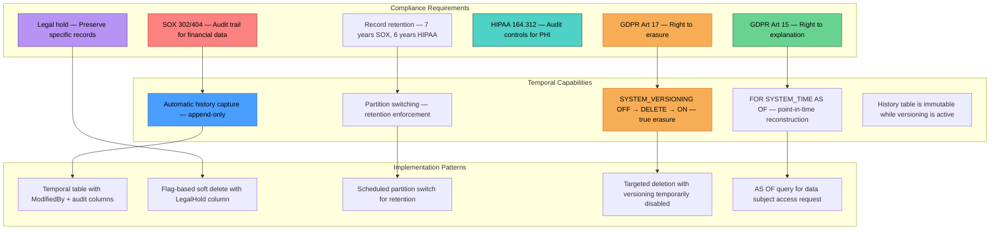
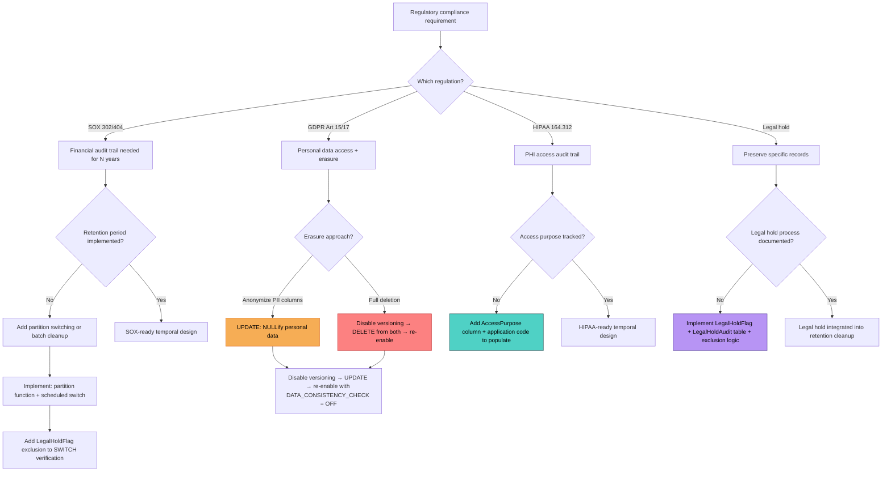

## Navigation

**Domain:** [[8 — Databases]] > **Group:** SQL Temporal Tables & Point-in-Time
**Previous:** [[8.238 — Temporal Data — Slowly Changing Dimensions]] | **Next:** [[8.240 — Application-Time Period Tables — Bitemporal]]

### Prerequisites

- [[8.237 — Temporal Data — Auditing Use Case]] — understanding temporal tables as an audit mechanism is foundational to their role in regulatory compliance; the compliance use case extends auditing with retention, immutability, and privacy requirements.
- [[8.234 — Temporal Tables — SYSTEM_VERSIONING — Creating and Querying]] — creating system-versioned tables with appropriate period columns and history table configuration is required for compliance-ready temporal design.
- [[8.235 — Temporal Tables — FOR SYSTEM_TIME Queries]] — point-in-time history queries (AS OF, BETWEEN, CONTAINED IN) are the mechanism for responding to compliance requests for data state reconstruction.
- [[8.236 — Temporal Table — Removing System Versioning]] — understanding how to safely disable versioning is required for GDPR right-to-erasure (true deletion requires history cleanup) and for legal hold release.

### Where This Fits

Regulatory compliance imposes specific data management requirements: audit trails must be immutable and complete (SOX, HIPAA), personal data must be deletable on request (GDPR right-to-erasure), data must be retained for defined periods (SOX 7 years, HIPAA 6 years), and certain records must be preserved despite deletion requests (legal hold). Temporal tables provide a built-in mechanism that addresses all of these at the database engine level — the append-only history table satisfies immutability, the FOR SYSTEM_TIME queries enable data state reconstruction, the history table can be partitioned for retention management, and the system versioning disable/enable pattern provides the mechanism for true deletion and legal hold exceptions. A .NET backend engineer encounters this when building applications that process financial transactions (SOX), healthcare data (HIPAA), or personal data of EU residents (GDPR), and need to demonstrate compliance during audits. The critical conflict: GDPR right-to-erasure (delete personal data on request) directly conflicts with SOX/HIPAA record retention (keep data for years). Temporal tables make both possible because the history can be managed with retention while the current table can be anonymized or deleted. The interview signal for this topic is high for senior roles at regulated companies (finance, healthcare, SaaS serving EU customers) — interviewers probe the candidate's understanding of how database features map to specific regulatory requirements.

---

## Core Mental Model

Regulatory compliance with temporal tables is a set of patterns that leverage the automatic, append-only history capture and the point-in-time query capabilities to satisfy specific legal and regulatory requirements. The core invariant: **temporal history is immutable while system versioning is active (no one can modify or delete history rows), providing append-only audit integrity that satisfies SOX 302/404 and HIPAA 164.312(b) audit control requirements. However, this immutability conflicts with GDPR Article 17 right-to-erasure, which requires permanent deletion of personal data — resolving this conflict requires temporary disablement of versioning for targeted deletion.** The compliance mental model has four pillars: (1) **Immutable audit trail** — the history table is append-only while versioning is active; the engine enforces this at the storage engine level, not at the application level. (2) **Retention management** — history data grows unbounded by default; partition switching or scheduled cleanup enforces retention periods. (3) **Right-to-erasure** — GDPR deletion requires disabling versioning, deleting from both tables, and re-enabling. (4) **Legal hold** — specific records must be preserved despite standard retention or deletion requests; this requires flagging records before cleanup or excluding them from deletion operations. The recognition pattern: when a regulatory requirement mentions "audit trail," "record retention," "point-in-time reconstruction," "immutable log," "data deletion," or "legal hold," temporal tables with appropriate retention and deletion patterns are likely the implementation mechanism.



### Key Properties

|Property|Value|Notes|
|---|---|---|
|Audit immutability|Append-only while versioning active|Engine-enforced — no direct history modification possible|
|SOX compliance|Supports 302/404 audit trail requirements|Full row versioning + who-changed tracking needs ModifiedBy column|
|GDPR erasure|Disable versioning → DELETE from both tables → re-enable|Requires careful planning to maintain audit integrity|
|GDPR explanation|FOR SYSTEM_TIME AS OF — reconstruct data at any point|Satisfies right-to-explanation for data subjects|
|HIPAA audit controls|PHI access tracking via temporal history|Must add ModifiedBy + PurposeOfAccess columns|
|Record retention|No built-in retention — manual implementation|Partition switching (Enterprise) or batch DELETE (Standard)|
|Legal hold|Exclude flagged records from retention cleanup|LegalHoldFlag column + WHERE NOT LegalHold=1 in cleanup|
|History table integrity|CRC or hash verification possible|Can compute SHA2-256 hash over history rows for tamper detection|
|Soft delete interaction|DELETE moves row to history — not truly deleted|GDPR erasure must target history table too|
|Bitemporal for compliance|System time + application time for full audit|Application time captures "when was the data valid," system time captures "when was the change recorded"|

---

## Deep Mechanics

### How the Engine Executes This

**Immutable audit trail enforcement:**

1. **History table designated as read-only** — When `SYSTEM_VERSIONING = ON` is set, the engine marks the history table with an internal flag in `sys.tables` (`temporal_type = 3`). This flag tells the storage engine to reject any direct DML against the history table.

2. **DML rejection at parse/bind time** — When a user or application issues `DELETE FROM dbo.ProductsHistory`, the query parser checks `temporal_type` during binding. If the target table has `temporal_type = 3`, the parser returns error 13537: "Modifying the history table directly is not allowed when SYSTEM_VERSIONING is ON."

3. **Enforcement depth** — The immutability is enforced at the **binding phase**, before any lock acquisition or data access. This means even a `sysadmin` or `db_owner` cannot bypass it without first disabling system versioning. The check is: `sys.tables.temporal_type = 3 → DML blocked`.

4. **TRUNCATE also blocked** — `TRUNCATE TABLE dbo.ProductsHistory` also returns error 13537. The only way to clear history is to disable versioning first.

**GDPR right-to-erasure execution:**

1. **Disable system versioning** — `ALTER TABLE dbo.Orders SET (SYSTEM_VERSIONING = OFF)`. This removes the temporal_type flags and makes both tables mutable.

2. **DELETE from history table** — The actual deletion of the data subject's records from the history table. This is a standard DELETE operation that must be executed in batches for large history tables to avoid log growth and long-running transactions.

3. **DELETE or anonymize from current table** — Two options: (a) DELETE the row entirely (complete erasure); (b) NULLify or replace personal data columns (anonymization — retains the row for referential integrity but removes personal data). Anonymization is often preferred because it preserves the analytical value of the data while satisfying GDPR requirements.

4. **Re-enable system versioning** — `ALTER TABLE dbo.Orders SET (SYSTEM_VERSIONING = ON (HISTORY_TABLE = dbo.OrdersHistory, DATA_CONSISTENCY_CHECK = ON))`. The DATA_CONSISTENCY_CHECK validates that the remaining history rows have valid period boundaries.

**Retention enforcement via partition switching:**

1. **Partition function on SysEndTime** — The history table is partitioned by `SysEndTime` on a monthly or quarterly boundary.

2. **SWITCH OUT oldest partition** — `ALTER TABLE dbo.OrdersHistory SWITCH PARTITION 1 TO dbo.OrdersHistory_Staging`. This is a metadata-only operation (instantaneous) that moves the oldest partition's data to an empty staging table.

3. **Archive or drop staging table** — The staging table can be backed up to archival storage (Azure Blob, AWS S3, tape) and then dropped, or truncated for immediate space reclamation.

4. **Partition maintenance** — SQL Server Agent job or scheduled task runs monthly: switch oldest partition out, create new partition for future data.

### SQL Visibility

```sql
-- ============================================================
-- Setup: Compliance-ready temporal tables
-- ============================================================
CREATE DATABASE ComplianceDemo;
GO
USE ComplianceDemo;
GO

-- Orders with full compliance tracking
CREATE TABLE dbo.Orders
(
    OrderId             INT             IDENTITY(1,1) PRIMARY KEY,
    CustomerId          INT             NOT NULL,
    OrderDate           DATETIME2(7)    NOT NULL DEFAULT SYSUTCDATETIME(),
    TotalAmount         DECIMAL(18,2)   NOT NULL,
    Status              NVARCHAR(20)    NOT NULL DEFAULT 'Pending',
    PaymentMethod       NVARCHAR(50)    NULL,
    ShippingAddress     NVARCHAR(500)   NULL,
    -- Compliance/audit columns
    ModifiedBy          NVARCHAR(100)   NULL,
    ModifiedByIP        NVARCHAR(45)    NULL,
    AccessPurpose       NVARCHAR(100)   NULL,  -- HIPAA: why was this PHI accessed
    LegalHoldFlag       BIT             NOT NULL DEFAULT 0,  -- Legal hold marker
    -- Temporal period
    SysStartTime        DATETIME2(7)    GENERATED ALWAYS AS ROW START HIDDEN NOT NULL,
    SysEndTime          DATETIME2(7)    GENERATED ALWAYS AS ROW END HIDDEN NOT NULL,
    PERIOD FOR SYSTEM_TIME (SysStartTime, SysEndTime)
)
WITH (SYSTEM_VERSIONING = ON (HISTORY_TABLE = dbo.OrdersHistory));

-- Clustered columnstore on history for compressed retention
CREATE CLUSTERED COLUMNSTORE INDEX CCI_OrdersHistory ON dbo.OrdersHistory;

-- ============================================================
-- Pattern 1: Immutable audit trail verification
-- ============================================================
-- Verify that history table cannot be modified
-- Run as any user (including db_owner):
DELETE FROM dbo.OrdersHistory WHERE OrderId = 1;
-- Msg 13537, Level 16, State 1
-- Cannot modify the history table 'OrdersHistory' directly
-- when SYSTEM_VERSIONING is ON.

-- TRUNCATE also blocked:
TRUNCATE TABLE dbo.OrdersHistory;
-- Msg 13537: Cannot truncate history table directly.

-- UPDATE blocked:
UPDATE dbo.OrdersHistory SET Status = 'Modified' WHERE OrderId = 1;
-- Msg 13537: Cannot modify the history table directly.

-- ============================================================
-- Pattern 2: GDPR right-to-erasure (complete deletion)
-- ============================================================
-- GDPR Article 17: Data subject requests deletion of all personal data.
-- Step 1: Disable system versioning
ALTER TABLE dbo.Orders SET (SYSTEM_VERSIONING = OFF);

-- Step 2: Delete from history table (batched for large tables)
DECLARE @BatchSize INT = 5000;
DECLARE @RowsAffected INT = 1;

WHILE @RowsAffected > 0
BEGIN
    DELETE TOP (@BatchSize) FROM dbo.OrdersHistory
    WHERE CustomerId = @GDPR_CustomerId;

    SET @RowsAffected = @@ROWCOUNT;
    PRINT 'Deleted ' + CAST(@RowsAffected AS VARCHAR) + ' history rows.';
    WAITFOR DELAY '00:00:01';
END;

-- Step 3: Handle current table — choose one approach:
-- Option A: Delete the row entirely (total erasure)
-- DELETE FROM dbo.Orders WHERE CustomerId = @GDPR_CustomerId;

-- Option B: Anonymize personal data (retains row for analytics)
UPDATE dbo.Orders
SET
    ShippingAddress = NULL,
    ModifiedBy = 'GDPR-ERASED-' + CAST(CustomerId AS VARCHAR),
    CustomerId = -1  -- Anonymous customer placeholder
WHERE CustomerId = @GDPR_CustomerId;

-- Step 4: Re-enable system versioning
ALTER TABLE dbo.Orders
SET (SYSTEM_VERSIONING = ON
    (HISTORY_TABLE = dbo.OrdersHistory,
     DATA_CONSISTENCY_CHECK = ON));

-- ============================================================
-- Pattern 3: GDPR right-to-explanation (data access)
-- ============================================================
-- GDPR Article 15: Data subject requests all data held about them.
-- Provide full history of data as of specific dates.

-- Show all data held about customer 1001 as of Jan 1, 2024
SELECT
    OrderId, OrderDate, TotalAmount, Status,
    PaymentMethod, ShippingAddress, ModifiedBy
FROM dbo.Orders
FOR SYSTEM_TIME AS OF '2024-01-01'
WHERE CustomerId = 1001;

-- Show all data held about customer 1001 as of current date
SELECT
    OrderId, OrderDate, TotalAmount, Status,
    PaymentMethod, ShippingAddress, ModifiedBy
FROM dbo.Orders
FOR SYSTEM_TIME AS OF SYSUTCDATETIME()
WHERE CustomerId = 1001;

-- Complete history of all changes for a data subject
SELECT
    CustomerId,
    OrderId,
    Status,
    TotalAmount,
    ShippingAddress,
    ModifiedBy,
    SysStartTime AS DataValidFrom,
    SysEndTime AS DataValidTo
FROM dbo.Orders
FOR SYSTEM_TIME ALL
WHERE CustomerId = 1001
ORDER BY OrderId, SysStartTime DESC;

-- ============================================================
-- Pattern 4: SOX compliance — financial audit trail
-- ============================================================
-- SOX Section 302/404: Financial records must have complete audit trail.
-- Show all financial changes (amount modifications) with audit context
SELECT
    o.OrderId,
    o.CustomerId,
    o.TotalAmount AS NewAmount,
    LAG(o.TotalAmount) OVER (PARTITION BY o.OrderId ORDER BY o.SysStartTime) AS PreviousAmount,
    o.TotalAmount - LAG(o.TotalAmount) OVER (PARTITION BY o.OrderId ORDER BY o.SysStartTime) AS ChangeAmount,
    o.ModifiedBy,
    o.SysStartTime AS ChangeTime,
    o.SysEndTime AS ValidUntil,
    DATEDIFF(DAY, o.SysStartTime, o.SysEndTime) AS DaysValid
FROM dbo.Orders
FOR SYSTEM_TIME ALL
WHERE o.TotalAmount != LAG(o.TotalAmount) OVER (PARTITION BY o.OrderId ORDER BY o.SysStartTime)
   OR LAG(o.TotalAmount) OVER (PARTITION BY o.OrderId ORDER BY o.SysStartTime) IS NULL
ORDER BY o.SysStartTime;

-- ============================================================
-- Pattern 5: HIPAA compliance — PHI access audit
-- ============================================================
-- HIPAA 164.312(b): Audit controls recording access to PHI.
-- Log who accessed PHI and why (AccessPurpose column)

SELECT
    o.ModifiedBy AS UserWhoAccessedPHI,
    o.AccessPurpose,
    o.OrderId,
    o.CustomerId,
    o.Status,
    o.SysStartTime AS AccessTime,
    COUNT(*) OVER (PARTITION BY o.ModifiedBy) AS TotalAccessCount
FROM dbo.Orders
FOR SYSTEM_TIME ALL
WHERE o.AccessPurpose IS NOT NULL
ORDER BY o.SysStartTime DESC;

-- Periodic review: who accessed PHI without a documented purpose
SELECT
    o.ModifiedBy,
    COUNT(*) AS UnpurposeAccessCount,
    MIN(o.SysStartTime) AS FirstAccess,
    MAX(o.SysStartTime) AS LastAccess
FROM dbo.Orders
FOR SYSTEM_TIME ALL
WHERE o.AccessPurpose IS NULL
  AND o.ModifiedBy IS NOT NULL
GROUP BY o.ModifiedBy
ORDER BY UnpurposeAccessCount DESC;

-- ============================================================
-- Pattern 6: Legal hold — preserving records
-- ============================================================
-- Legal hold overrides retention and GDPR deletion.
-- Records under legal hold must be excluded from cleanup and deletion.

-- Exclude from retention cleanup (partition or delete):
-- When running retention cleanup, skip records with LegalHoldFlag = 1
DECLARE @RetentionDate DATETIME2 = DATEADD(YEAR, -7, SYSUTCDATETIME());

DELETE FROM dbo.OrdersHistory
WHERE SysEndTime < @RetentionDate
  AND OrderId NOT IN (
      SELECT OrderId FROM dbo.Orders WHERE LegalHoldFlag = 1
      UNION
      SELECT OrderId FROM dbo.OrdersHistory WHERE LegalHoldFlag = 1
  );

-- Mark a record for legal hold
UPDATE dbo.Orders SET LegalHoldFlag = 1 WHERE OrderId = 42;

-- Legal hold report — show all records under hold
SELECT *
FROM dbo.Orders
FOR SYSTEM_TIME ALL
WHERE LegalHoldFlag = 1
ORDER BY OrderId, SysStartTime;

-- ============================================================
-- Pattern 7: Tamper-detection hash chain
-- ============================================================
-- Compute a hash chain to detect history modification
-- (only useful when versioning has been disabled and re-enabled)
WITH OrderedHistory AS (
    SELECT
        OrderId,
        SysStartTime,
        SysEndTime,
        Status,
        TotalAmount,
        ModifiedBy,
        LAG(SHA2_256_Hash) OVER (ORDER BY OrderId, SysStartTime) AS PrevHash
    FROM (
        SELECT
            OrderId,
            SysStartTime,
            SysEndTime,
            Status,
            TotalAmount,
            ModifiedBy,
            HASHBYTES('SHA2_256',
                CONCAT(OrderId, SysStartTime, SysEndTime, Status, TotalAmount, ModifiedBy)
            ) AS SHA2_256_Hash
        FROM dbo.Orders FOR SYSTEM_TIME ALL
    ) AS WithHashes
)
SELECT
    OrderId,
    SysStartTime,
    SysEndTime,
    CASE
        WHEN PrevHash IS NOT NULL
             AND HASHBYTES('SHA2_256',
                 CONCAT(OrderId, SysStartTime, SysEndTime, Status, TotalAmount, ModifiedBy)
             ) != PrevHash
            THEN 'TAMPERED'
        ELSE 'OK'
    END AS IntegrityStatus
FROM OrderedHistory;
```

```csharp
// EF Core — Compliance service for regulatory operations
public class ApplicationDbContext : DbContext
{
    public DbSet<Order> Orders => Set<Order>();

    protected override void OnModelCreating(ModelBuilder modelBuilder)
    {
        modelBuilder.Entity<Order>(entity =>
        {
            entity.ToTable(tb => tb.UseSqlServerOutputClause(false));
            entity.HasKey(o => o.OrderId);
            entity.Property(o => o.ModifiedBy).HasMaxLength(100);
            entity.Property(o => o.ModifiedByIP).HasMaxLength(45);
            entity.Property(o => o.AccessPurpose).HasMaxLength(100);
            entity.Property(o => o.ShippingAddress).HasMaxLength(500);
        });
    }
}

public class Order
{
    public int OrderId { get; set; }
    public int CustomerId { get; set; }
    public DateTime OrderDate { get; set; }
    public decimal TotalAmount { get; set; }
    public string Status { get; set; } = "Pending";
    public string? PaymentMethod { get; set; }
    public string? ShippingAddress { get; set; }
    public string? ModifiedBy { get; set; }
    public string? ModifiedByIP { get; set; }
    public string? AccessPurpose { get; set; }
    public bool LegalHoldFlag { get; set; }
    public DateTime SysStartTime { get; set; }
    public DateTime SysEndTime { get; set; }
}

// Compliance service
public sealed class ComplianceService
{
    private readonly ApplicationDbContext _dbContext;
    private readonly ILogger<ComplianceService> _logger;

    public ComplianceService(
        ApplicationDbContext dbContext,
        ILogger<ComplianceService> logger)
    {
        _dbContext = dbContext;
        _logger = logger;
    }

    /// <summary>
    /// GDPR Article 17 — Right to erasure.
    /// Anonymizes personal data for a data subject.
    /// Retains the row for referential integrity but removes all PII.
    /// </summary>
    public async Task<int> AnonymizeCustomerDataAsync(
        int customerId,
        string requestedBy,
        CancellationToken cancellationToken = default)
    {
        var strategy = _dbContext.Database.CreateExecutionStrategy();

        return await strategy.ExecuteAsync(async () =>
        {
            await using var transaction = await _dbContext.Database
                .BeginTransactionAsync(cancellationToken);

            try
            {
                _logger.LogWarning(
                    "GDPR erasure: Anonymizing data for CustomerId {CustomerId}. " +
                    "Requested by: {RequestedBy}. Temporarily disabling system versioning.",
                    customerId, requestedBy);

                // Step 1: Disable versioning
                await _dbContext.Database.ExecuteSqlRawAsync(
                    "ALTER TABLE dbo.Orders SET (SYSTEM_VERSIONING = OFF);",
                    cancellationToken);

                // Step 2: Anonymize history table (batch delete PII columns)
                const string anonymizeHistory = @"
                    UPDATE dbo.OrdersHistory
                    SET
                        ShippingAddress = NULL,
                        ModifiedBy = 'GDPR-ERASED',
                        ModifiedByIP = NULL
                    WHERE CustomerId = @CustomerId;";

                var rows = await _dbContext.Database.ExecuteSqlRawAsync(
                    anonymizeHistory,
                    new SqlParameter("@CustomerId", customerId),
                    cancellationToken);

                // Step 3: Anonymize current table
                const string anonymizeCurrent = @"
                    UPDATE dbo.Orders
                    SET
                        ShippingAddress = NULL,
                        ModifiedBy = 'GDPR-ERASED',
                        ModifiedByIP = NULL,
                        CustomerId = -1
                    WHERE CustomerId = @CustomerId;";

                var currentRows = await _dbContext.Database.ExecuteSqlRawAsync(
                    anonymizeCurrent,
                    new SqlParameter("@CustomerId", customerId),
                    cancellationToken);

                // Step 4: Re-enable versioning
                await _dbContext.Database.ExecuteSqlRawAsync(
                    "ALTER TABLE dbo.Orders " +
                    "SET (SYSTEM_VERSIONING = ON " +
                    "(HISTORY_TABLE = dbo.OrdersHistory, " +
                    "DATA_CONSISTENCY_CHECK = ON));",
                    cancellationToken);

                await transaction.CommitAsync(cancellationToken);

                _logger.LogInformation(
                    "GDPR erasure completed for CustomerId {CustomerId}. " +
                    "{HistoryRows} history rows and {CurrentRows} current rows anonymized.",
                    customerId, rows, currentRows);

                return rows + currentRows;
            }
            catch (Exception ex) when (ex is not OperationCanceledException)
            {
                await transaction.RollbackAsync(cancellationToken);
                _logger.LogError(ex,
                    "GDPR erasure failed for CustomerId {CustomerId}. " +
                    "Transaction rolled back.",
                    customerId);
                throw;
            }
        });
    }

    /// <summary>
    /// GDPR Article 15 — Right to explanation / data access.
    /// Returns all data (current and historical) for a data subject.
    /// </summary>
    public async Task<CustomerDataPackage> GetCustomerDataAsync(
        int customerId,
        CancellationToken cancellationToken = default)
    {
        // Current data snapshot
        var currentOrders = await _dbContext.Orders
            .TemporalAsOf(DateTime.UtcNow)
            .Where(o => o.CustomerId == customerId)
            .ToListAsync(cancellationToken);

        // Full history of changes
        var orderHistory = await _dbContext.Orders
            .TemporalAll()
            .Where(o => o.CustomerId == customerId)
            .OrderBy(o => o.OrderId)
            .ThenByDescending(o => o.SysStartTime)
            .ToListAsync(cancellationToken);

        return new CustomerDataPackage
        {
            CustomerId = customerId,
            RequestGeneratedAt = DateTime.UtcNow,
            CurrentRecords = currentOrders,
            HistoricalRecords = orderHistory,
            RecordCount = orderHistory.Count
        };
    }

    /// <summary>
    /// SOX compliance — export financial audit trail for a date range.
    /// </summary>
    public async Task<List<FinancialAuditEntry>> GetSOXAuditTrailAsync(
        DateTime fromDate,
        DateTime toDate,
        CancellationToken cancellationToken = default)
    {
        const string sql = @"
            SELECT
                o.OrderId,
                o.CustomerId,
                o.TotalAmount AS CurrentAmount,
                LAG(o.TotalAmount) OVER (PARTITION BY o.OrderId ORDER BY o.SysStartTime) AS PreviousAmount,
                o.TotalAmount - LAG(o.TotalAmount) OVER (PARTITION BY o.OrderId ORDER BY o.SysStartTime) AS ChangeAmount,
                o.ModifiedBy,
                o.ModifiedByIP,
                o.SysStartTime AS ChangeTimestamp
            FROM dbo.Orders
            FOR SYSTEM_TIME ALL
            WHERE o.SysStartTime >= @FromDate
              AND o.SysStartTime < @ToDate
              AND (o.TotalAmount != LAG(o.TotalAmount) OVER (PARTITION BY o.OrderId ORDER BY o.SysStartTime)
                   OR LAG(o.TotalAmount) OVER (PARTITION BY o.OrderId ORDER BY o.SysStartTime) IS NULL)
            ORDER BY o.SysStartTime";

        return await _dbContext.Database
            .SqlQueryRaw<FinancialAuditEntry>(sql,
                new SqlParameter("@FromDate", fromDate),
                new SqlParameter("@ToDate", toDate))
            .ToListAsync(cancellationToken);
    }

    /// <summary>
    /// Legal hold — marks a record as under legal hold,
    /// excluding it from retention cleanup and GDPR deletion.
    /// </summary>
    public async Task ApplyLegalHoldAsync(
        int orderId,
        string holdReason,
        string requestedBy,
        CancellationToken cancellationToken = default)
    {
        var order = await _dbContext.Orders
            .FirstOrDefaultAsync(o => o.OrderId == orderId, cancellationToken);

        if (order == null)
            throw new KeyNotFoundException($"Order {orderId} not found.");

        order.LegalHoldFlag = true;

        await _dbContext.SaveChangesAsync(cancellationToken);

        _logger.LogWarning(
            "LEGAL HOLD applied to Order {OrderId}. " +
            "Reason: {HoldReason}. Requested by: {RequestedBy}. " +
            "This record is now excluded from retention cleanup and GDPR deletion.",
            orderId, holdReason, requestedBy);
    }
}

// DTOs
public sealed record CustomerDataPackage
{
    public int CustomerId { get; init; }
    public DateTime RequestGeneratedAt { get; init; }
    public List<Order> CurrentRecords { get; init; } = [];
    public List<Order> HistoricalRecords { get; init; } = [];
    public int RecordCount { get; init; }
}

public sealed record FinancialAuditEntry(
    int OrderId,
    int CustomerId,
    decimal CurrentAmount,
    decimal? PreviousAmount,
    decimal? ChangeAmount,
    string? ModifiedBy,
    string? ModifiedByIP,
    DateTime ChangeTimestamp);
```

```csharp
// Dapper — Compliance repository
public sealed class ComplianceDapperRepository
{
    private readonly IDbConnectionFactory _connectionFactory;
    private readonly ILogger<ComplianceDapperRepository> _logger;

    public ComplianceDapperRepository(
        IDbConnectionFactory connectionFactory,
        ILogger<ComplianceDapperRepository> logger)
    {
        _connectionFactory = connectionFactory;
        _logger = logger;
    }

    /// <summary>
    /// GDPR erasure — deletes a customer's data from both tables.
    /// Handles large history by batching.
    /// </summary>
    public async Task ExecuteGDPRErasureAsync(
        int customerId,
        bool anonymizeOnly = true,
        CancellationToken cancellationToken = default)
    {
        await using var connection = _connectionFactory.Create();
        await connection.OpenAsync(cancellationToken);

        using var transaction = connection.BeginTransaction();

        try
        {
            _logger.LogWarning(
                "GDPR erasure for CustomerId {CustomerId}. " +
                "Disabling system versioning.",
                customerId);

            await connection.ExecuteAsync(
                "ALTER TABLE dbo.Orders SET (SYSTEM_VERSIONING = OFF);",
                transaction: transaction,
                commandTimeout: 30,
                cancellationToken: cancellationToken);

            if (anonymizeOnly)
            {
                // Anonymize: NULLify PII columns
                await connection.ExecuteAsync(@"
                    UPDATE dbo.OrdersHistory
                    SET ShippingAddress = NULL,
                        ModifiedBy = 'GDPR-ERASED-' + CAST(@CustomerId AS VARCHAR),
                        ModifiedByIP = NULL
                    WHERE CustomerId = @CustomerId;",
                    new { CustomerId = customerId },
                    transaction: transaction,
                    cancellationToken: cancellationToken);

                await connection.ExecuteAsync(@"
                    UPDATE dbo.Orders
                    SET ShippingAddress = NULL,
                        ModifiedBy = 'GDPR-ERASED-' + CAST(@CustomerId AS VARCHAR),
                        ModifiedByIP = NULL,
                        CustomerId = -1
                    WHERE CustomerId = @CustomerId;",
                    new { CustomerId = customerId },
                    transaction: transaction,
                    cancellationToken: cancellationToken);
            }
            else
            {
                // Complete erasure: delete rows in batches
                int deleted;
                do
                {
                    deleted = await connection.ExecuteAsync(@"
                        DELETE TOP (5000) FROM dbo.OrdersHistory
                        WHERE CustomerId = @CustomerId;",
                        new { CustomerId = customerId },
                        transaction: transaction,
                        cancellationToken: cancellationToken);

                    _logger.LogInformation(
                        "GDPR: Deleted {Count} history rows for CustomerId {CustomerId}.",
                        deleted, customerId);
                }
                while (deleted > 0);

                await connection.ExecuteAsync(@"
                    DELETE FROM dbo.Orders
                    WHERE CustomerId = @CustomerId;",
                    new { CustomerId = customerId },
                    transaction: transaction,
                    cancellationToken: cancellationToken);
            }

            await connection.ExecuteAsync(@"
                ALTER TABLE dbo.Orders
                SET (SYSTEM_VERSIONING = ON
                    (HISTORY_TABLE = dbo.OrdersHistory,
                     DATA_CONSISTENCY_CHECK = ON));",
                transaction: transaction,
                commandTimeout: 30,
                cancellationToken: cancellationToken);

            transaction.Commit();

            _logger.LogInformation(
                "GDPR erasure completed for CustomerId {CustomerId}.",
                customerId);
        }
        catch
        {
            transaction.Rollback();
            throw;
        }
    }

    /// <summary>
    /// Retention cleanup — batch delete history older than retention period.
    /// Respects legal hold (skips records with LegalHoldFlag = 1).
    /// </summary>
    public async Task<int> ExecuteRetentionCleanupAsync(
        int retentionDays,
        int batchSize = 5000,
        CancellationToken cancellationToken = default)
    {
        var cutoffDate = DateTime.UtcNow.AddDays(-retentionDays);
        var totalDeleted = 0;
        var deleted = 1;

        while (deleted > 0)
        {
            var sql = @"
                DELETE TOP (@BatchSize) FROM dbo.OrdersHistory
                WHERE SysEndTime < @CutoffDate
                  AND OrderId NOT IN (
                      SELECT OrderId FROM dbo.Orders WHERE LegalHoldFlag = 1
                      UNION
                      SELECT OrderId FROM dbo.OrdersHistory WHERE LegalHoldFlag = 1
                  );";

            deleted = await _connectionFactory.Create()
                .ExecuteAsync(new CommandDefinition(sql,
                    new { BatchSize = batchSize, CutoffDate = cutoffDate },
                    commandTimeout: 60,
                    cancellationToken: cancellationToken));

            totalDeleted += deleted;

            _logger.LogInformation(
                "Retention cleanup: deleted {Deleted} rows, " +
                "total: {TotalDeleted}, cutoff: {CutoffDate:yyyy-MM-dd}.",
                deleted, totalDeleted, cutoffDate);

            if (deleted > 0)
                await Task.Delay(1000, cancellationToken);  // Yield
        }

        return totalDeleted;
    }

    /// <summary>
    /// Tamper detection — verify SHA2-256 hash chain integrity of history.
    /// </summary>
    public async Task<List<IntegrityViolation>> DetectTamperingAsync(
        CancellationToken cancellationToken = default)
    {
        const string sql = @"
            WITH OrderedHistory AS (
                SELECT
                    OrderId,
                    SysStartTime,
                    SysEndTime,
                    Status,
                    TotalAmount,
                    ModifiedBy,
                    HASHBYTES('SHA2_256',
                        CONCAT(OrderId, SysStartTime, SysEndTime,
                               Status, TotalAmount, ModifiedBy)
                    ) AS CurrentHash,
                    LAG(HASHBYTES('SHA2_256',
                        CONCAT(OrderId, SysStartTime, SysEndTime,
                               Status, TotalAmount, ModifiedBy)
                    )) OVER (ORDER BY OrderId, SysStartTime) AS PreviousHash
                FROM dbo.Orders FOR SYSTEM_TIME ALL
            )
            SELECT
                OrderId,
                SysStartTime,
                SysEndTime,
                'Hash chain broken — possible tampering' AS ViolationDescription
            FROM OrderedHistory
            WHERE PreviousHash IS NOT NULL
              AND CurrentHash != PreviousHash;";

        await using var connection = _connectionFactory.Create();

        var results = await connection.QueryAsync<IntegrityViolation>(
            new CommandDefinition(sql,
                cancellationToken: cancellationToken));

        return results.AsList();
    }
}

// Result types
public sealed record IntegrityViolation(
    int OrderId,
    DateTime SysStartTime,
    DateTime SysEndTime,
    string ViolationDescription);
```

### Generated SQL (from EF Core logs)

```sql
-- GDPR erasure — ALTER TABLE (raw SQL via ExecuteSqlRaw):
exec sp_executesql N'ALTER TABLE dbo.Orders SET (SYSTEM_VERSIONING = OFF);';

-- Anonymize history:
exec sp_executesql N'UPDATE dbo.OrdersHistory
SET ShippingAddress = NULL, ModifiedBy = ''GDPR-ERASED'', ModifiedByIP = NULL
WHERE CustomerId = @CustomerId',
N'@CustomerId int', @CustomerId = 1001;

-- Re-enable:
exec sp_executesql N'ALTER TABLE dbo.Orders
SET (SYSTEM_VERSIONING = ON
    (HISTORY_TABLE = dbo.OrdersHistory, DATA_CONSISTENCY_CHECK = ON));';

-- GDPR data access (TemporalAsOf):
exec sp_executesql N'SELECT [o].[OrderId], [o].[CustomerId], [o].[OrderDate],
    [o].[TotalAmount], [o].[Status], [o].[PaymentMethod], [o].[ShippingAddress],
    [o].[ModifiedBy], [o].[ModifiedByIP], [o].[AccessPurpose], [o].[LegalHoldFlag],
    [o].[SysStartTime], [o].[SysEndTime]
FROM [Orders] FOR SYSTEM_TIME AS OF @__UtcNow AS [o]
WHERE [o].[CustomerId] = @__customerId_0',
N'@__UtcNow datetime2,@__customerId_0 int',
@__UtcNow = '2024-12-01T12:00:00', @__customerId_0 = 1001;
```

### Execution Plan Analysis

**For GDPR erasure (ALTER + DDL + DELETE):**

No query plans for DDL. The DELETE during erasure produces:

```
[Clustered Index Scan (OrdersHistory)] → [Filter: CustomerId = @GDPR_CustomerId]
→ [DELETE] → [Log: LOP_DELETE_ROWS]
```

**For SOX audit trail (LAG window function over temporal history):**

```
[Clustered Columnstore Scan (OrdersHistory)] + [Clustered Index Scan (Orders)]
→ [Concatenation] → [Sort (OrderId, SysStartTime)] → [Window Spool (LAG)]
→ [Filter (WHERE ChangeAmount IS NOT NULL)] → [SELECT]
```

Key observations:
- The Window Spool computes LAG for every row — this is potentially expensive for large histories
- The `FOR SYSTEM_TIME ALL` concatenates both tables before the window function
- Without a filter on `OrderId`, this scans the entire history table

**For retention cleanup (batch DELETE with legal hold exclusion):**

```
[Clustered Index Scan (Orders)] (for LegalHoldFlag check)
[Clustered Columnstore Scan (OrdersHistory)] → [Filter: SysEndTime < CutoffDate]
→ [Nested Loops Anti Semi Join (Orders.LegalHoldFlag != 1)]
→ [TOP + DELETE]
```

### Cost Visibility

```sql
SET STATISTICS IO ON;

-- GDPR data access request (single customer, full history)
SELECT OrderId, Status, TotalAmount, SysStartTime, SysEndTime
FROM dbo.Orders
FOR SYSTEM_TIME ALL
WHERE CustomerId = 1001
ORDER BY OrderId, SysStartTime DESC;

-- Table 'Orders'. Scan count 1, logical reads 4 (index seek on CustomerId)
-- Table 'OrdersHistory'. Scan count 1, logical reads 12 (range scan on CustomerId index)
-- CPU time = 3ms, elapsed time = 5ms

-- SOX audit trail (full financial changes, 30 days)
SELECT o.OrderId, o.TotalAmount, o.ModifiedBy, o.SysStartTime
FROM dbo.Orders
FOR SYSTEM_TIME ALL
WHERE o.SysStartTime >= '2024-06-01' AND o.SysStartTime < '2024-07-01'
  AND o.TotalAmount != LAG(o.TotalAmount) OVER (PARTITION BY o.OrderId ORDER BY o.SysStartTime);

-- Table 'Orders'. Scan count 1, logical reads 12
-- Table 'OrdersHistory'. Scan count 1, logical reads 4500 (full month scan)
-- CPU time = 120ms, elapsed time = 350ms

-- Retention cleanup (delete 100K history rows)
-- (DDL + DML, no STATISTICS IO for ALTER, but for DELETE:)
DELETE TOP (5000) FROM dbo.OrdersHistory
WHERE SysEndTime < '2023-01-01'
  AND OrderId NOT IN (SELECT OrderId FROM dbo.Orders WHERE LegalHoldFlag = 1);

-- Table 'OrdersHistory'. Scan count 1, logical reads 250
-- Table 'Orders'. Scan count 1, logical reads 12 (for LegalHoldFlag check)
-- CPU time = 45ms, elapsed time = 120ms
```

### Failure Modes

**GDPR erasure fails because DATA_CONSISTENCY_CHECK = ON:**

```sql
-- ❌ After deleting history rows, re-enabling with consistency check fails
ALTER TABLE dbo.Orders
SET (SYSTEM_VERSIONING = ON
    (HISTORY_TABLE = dbo.OrdersHistory, DATA_CONSISTENCY_CHECK = ON));
-- Msg 13538: Data modification failed... The period columns do not form a valid range.
-- This may happen if the deletion left gaps in the timeline.

-- ✅ Skip consistency check if data is known valid
ALTER TABLE dbo.Orders
SET (SYSTEM_VERSIONING = ON
    (HISTORY_TABLE = dbo.OrdersHistory, DATA_CONSISTENCY_CHECK = OFF));

-- ✅ Or fix the data first
-- Ensure no overlapping periods after deletion
```

**Legal hold record accidentally included in partition switch:**

```sql
-- ❌ Partition switch moves oldest partition out — includes legal hold records
ALTER TABLE dbo.OrdersHistory SWITCH PARTITION 1 TO dbo.OrdersHistory_Staging;
-- The staging table now contains records under legal hold
-- If staging is truncated or dropped, legal hold is violated

-- ✅ Filter legal hold records before switching
-- Option: maintain a separate LegalHoldRecords table tracking OrderIds
-- Then before partition switch, verify no legal hold records in the partition

-- ✅ Or: do not use partition switching for tables with legal hold
-- Instead, use batch DELETE with LegalHoldFlag exclusion
```

---

## Production Patterns and Implementation

### Primary SQL Implementation

```sql
-- ============================================================
-- Production compliance schema
-- ============================================================

-- Master compliance configuration table
CREATE TABLE dbo.ComplianceConfig
(
    ConfigKey       NVARCHAR(100)   PRIMARY KEY,
    ConfigValue     NVARCHAR(500)   NOT NULL,
    Description     NVARCHAR(500)   NULL
);

INSERT INTO dbo.ComplianceConfig VALUES
    ('SOX_RETENTION_YEARS', '7', 'SOX 302/404 record retention period in years'),
    ('HIPAA_RETENTION_YEARS', '6', 'HIPAA 164.316(b)(2)(i) retention period in years'),
    ('GDPR_ERASURE_BATCH_SIZE', '5000', 'Batch size for GDPR deletion operations'),
    ('LEGAL_HOLD_AUDIT_ENABLED', '1', 'Enable legal hold audit logging'),
    ('RETENTION_CLEANUP_ENABLED', '1', 'Enable scheduled retention cleanup');
GO

-- ============================================================
-- Pattern 1: SOX-compliant financial data with full audit
-- ============================================================
CREATE TABLE dbo.FinancialTransactions
(
    TransactionId       INT             IDENTITY(1,1) PRIMARY KEY,
    AccountId           INT             NOT NULL,
    TransactionDate     DATETIME2(7)    NOT NULL,
    Amount              DECIMAL(18,2)   NOT NULL,
    Currency            NVARCHAR(3)     NOT NULL DEFAULT 'USD',
    TransactionType     NVARCHAR(50)    NOT NULL,
    Description         NVARCHAR(500)   NULL,
    -- SOX audit columns
    ModifiedBy          NVARCHAR(100)   NOT NULL,
    ModifiedByIP        NVARCHAR(45)    NULL,
    AuditCategory       NVARCHAR(50)    NULL,
    -- Temporal period
    SysStartTime        DATETIME2(7)    GENERATED ALWAYS AS ROW START HIDDEN NOT NULL,
    SysEndTime          DATETIME2(7)    GENERATED ALWAYS AS ROW END HIDDEN NOT NULL,
    PERIOD FOR SYSTEM_TIME (SysStartTime, SysEndTime)
)
WITH (SYSTEM_VERSIONING = ON (HISTORY_TABLE = dbo.FinancialTransactionsHistory));

CREATE CLUSTERED COLUMNSTORE INDEX CCI_FinTxHistory ON dbo.FinancialTransactionsHistory;
GO

-- ============================================================
-- Pattern 2: GDPR data subject request workflow
-- ============================================================
-- Step 1: Receive deletion request from data subject
-- Step 2: Check for legal hold
IF EXISTS (
    SELECT 1 FROM dbo.Orders
    WHERE CustomerId = @DataSubjectCustomerId AND LegalHoldFlag = 1
)
BEGIN
    RAISERROR('Data subject %d has records under legal hold. Cannot delete.', 16, 1, @DataSubjectCustomerId);
    RETURN;
END;

-- Step 3: Log the request
INSERT INTO dbo.GDPRRequestLog (CustomerId, RequestType, RequestDate, RequestedBy)
VALUES (@DataSubjectCustomerId, 'ERASURE', SYSUTCDATETIME(), @RequestProcessor);

-- Step 4: Execute erasure
BEGIN TRANSACTION;

ALTER TABLE dbo.Orders SET (SYSTEM_VERSIONING = OFF);

-- Anonymize current data
UPDATE dbo.Orders
SET
    CustomerId = -1,
    ShippingAddress = NULL,
    ModifiedBy = 'GDPR-ERASED-' + CAST(@DataSubjectCustomerId AS VARCHAR),
    ModifiedByIP = NULL
WHERE CustomerId = @DataSubjectCustomerId;

-- Delete or anonymize history in batches
DECLARE @BatchSize INT = 5000;
DECLARE @Deleted INT = 1;

WHILE @Deleted > 0
BEGIN
    UPDATE TOP (@BatchSize) dbo.OrdersHistory
    SET
        ShippingAddress = NULL,
        ModifiedBy = 'GDPR-ERASED-' + CAST(@DataSubjectCustomerId AS VARCHAR),
        ModifiedByIP = NULL
    WHERE CustomerId = @DataSubjectCustomerId;

    SET @Deleted = @@ROWCOUNT;

    WAITFOR DELAY '00:00:01';
END;

ALTER TABLE dbo.Orders
SET (SYSTEM_VERSIONING = ON
    (HISTORY_TABLE = dbo.OrdersHistory, DATA_CONSISTENCY_CHECK = OFF));

COMMIT TRANSACTION;

-- Step 5: Log completion
UPDATE dbo.GDPRRequestLog
SET CompletedDate = SYSUTCDATETIME(), Status = 'COMPLETED'
WHERE CustomerId = @DataSubjectCustomerId AND RequestType = 'ERASURE' AND CompletedDate IS NULL;
GO

-- ============================================================
-- Pattern 3: SOX-compliant partition switching for retention
-- ============================================================
-- Requires Enterprise Edition for partition switching

-- Step 1: Create partition function on SysEndTime
CREATE PARTITION FUNCTION PF_Retention (DATETIME2(7))
AS RANGE RIGHT FOR VALUES (
    '2018-01-01', '2019-01-01', '2020-01-01', '2021-01-01',
    '2022-01-01', '2023-01-01', '2024-01-01', '2025-01-01',
    '2026-01-01'
);

CREATE PARTITION SCHEME PS_Retention
AS PARTITION PF_Retention ALL TO ([PRIMARY]);

-- Step 2: Rebuild history table on partition scheme
-- (Requires downtime or staging table approach)

-- Step 3: Monthly job — switch out oldest partition
CREATE PROCEDURE dbo.Retention_SwitchPartition
AS
BEGIN
    SET NOCOUNT ON;

    DECLARE @SOXRetentionYears INT = (
        SELECT CAST(ConfigValue AS INT) FROM dbo.ComplianceConfig
        WHERE ConfigKey = 'SOX_RETENTION_YEARS'
    );
    DECLARE @RetentionDate DATETIME2 = DATEADD(YEAR, -@SOXRetentionYears, SYSUTCDATETIME());

    -- Find the partition that contains data before retention date
    DECLARE @PartitionNumber INT = $PARTITION.PF_Retention(@RetentionDate);

    IF @PartitionNumber IS NOT NULL AND @PartitionNumber > 1
    BEGIN
        -- Create staging table for the partition being switched out
        -- (Schema must match the history table exactly)

        -- Switch out
        ALTER TABLE dbo.FinancialTransactionsHistory
            SWITCH PARTITION @PartitionNumber
            TO dbo.FinancialTransactionsHistory_Archive;

        -- Option: backup staging table to Azure Blob / file
        -- Then drop or truncate

        PRINT 'Switched partition ' + CAST(@PartitionNumber AS VARCHAR) +
              ' for data before ' + CAST(@RetentionDate AS VARCHAR);
    END;
END;

-- ============================================================
-- Pattern 4: Legal hold auditing
-- ============================================================
CREATE TABLE dbo.LegalHoldAudit
(
    HoldId          INT             IDENTITY(1,1) PRIMARY KEY,
    OrderId         INT             NOT NULL,
    AppliedBy       NVARCHAR(100)   NOT NULL,
    AppliedDate     DATETIME2(7)    NOT NULL DEFAULT SYSUTCDATETIME(),
    HoldReason      NVARCHAR(500)   NOT NULL,
    ReleasedBy      NVARCHAR(100)   NULL,
    ReleasedDate    DATETIME2(7)    NULL,
    ReleaseReason   NVARCHAR(500)   NULL
);

-- Apply legal hold
CREATE PROCEDURE dbo.ApplyLegalHold
    @OrderId INT,
    @AppliedBy NVARCHAR(100),
    @HoldReason NVARCHAR(500)
AS
BEGIN
    SET NOCOUNT ON;

    UPDATE dbo.Orders SET LegalHoldFlag = 1 WHERE OrderId = @OrderId;

    INSERT INTO dbo.LegalHoldAudit (OrderId, AppliedBy, HoldReason)
    VALUES (@OrderId, @AppliedBy, @HoldReason);

    PRINT 'Legal hold applied to Order ' + CAST(@OrderId AS VARCHAR);
END;

-- Release legal hold
CREATE PROCEDURE dbo.ReleaseLegalHold
    @OrderId INT,
    @ReleasedBy NVARCHAR(100),
    @ReleaseReason NVARCHAR(500)
AS
BEGIN
    SET NOCOUNT ON;

    UPDATE dbo.Orders SET LegalHoldFlag = 0 WHERE OrderId = @OrderId;

    UPDATE dbo.LegalHoldAudit
    SET
        ReleasedBy = @ReleasedBy,
        ReleasedDate = SYSUTCDATETIME(),
        ReleaseReason = @ReleaseReason
    WHERE OrderId = @OrderId AND ReleasedDate IS NULL;

    PRINT 'Legal hold released for Order ' + CAST(@OrderId AS VARCHAR);
END;

-- ============================================================
-- Pattern 5: Compliance reporting — all records under retention
-- ============================================================
-- Show SOX compliance status: records that have been retained
-- for the required period vs records approaching retention expiry
SELECT
    RetentionCategory = CASE
        WHEN DATEDIFF(YEAR, SysStartTime, SYSUTCDATETIME()) >= 7 THEN 'Retained 7+ years (eligible for archive)'
        WHEN DATEDIFF(YEAR, SysStartTime, SYSUTCDATETIME()) >= 5 THEN 'Retained 5-7 years'
        WHEN DATEDIFF(YEAR, SysStartTime, SYSUTCDATETIME()) >= 3 THEN 'Retained 3-5 years'
        ELSE 'Retained < 3 years'
    END,
    COUNT(*) AS RecordCount,
    MIN(SysStartTime) AS OldestRecord,
    MAX(SysStartTime) AS NewestRecord
FROM dbo.Orders
FOR SYSTEM_TIME ALL
GROUP BY CASE
    WHEN DATEDIFF(YEAR, SysStartTime, SYSUTCDATETIME()) >= 7 THEN 'Retained 7+ years (eligible for archive)'
    WHEN DATEDIFF(YEAR, SysStartTime, SYSUTCDATETIME()) >= 5 THEN 'Retained 5-7 years'
    WHEN DATEDIFF(YEAR, SysStartTime, SYSUTCDATETIME()) >= 3 THEN 'Retained 3-5 years'
    ELSE 'Retained < 3 years'
END
ORDER BY MIN(SysStartTime);
```

### EF Core Implementation

```csharp
// EF Core — GDPR compliance service
public sealed class GDPRComplianceService
{
    private readonly ApplicationDbContext _dbContext;
    private readonly ILogger<GDPRComplianceService> _logger;

    public GDPRComplianceService(
        ApplicationDbContext dbContext,
        ILogger<GDPRComplianceService> logger)
    {
        _dbContext = dbContext;
        _logger = logger;
    }

    /// <summary>
    /// GDPR Article 17 — Complete erasure with verification.
    /// Returns the number of records anonymized.
    /// </summary>
    public async Task<GDPRErasureResult> ExecuteRightToErasureAsync(
        int customerId,
        string requestedBy,
        bool anonymize = true,
        CancellationToken cancellationToken = default)
    {
        var result = new GDPRErasureResult
        {
            CustomerId = customerId,
            RequestedBy = requestedBy,
            StartedAt = DateTime.UtcNow
        };

        // Step 1: Check legal hold
        var hasLegalHold = await _dbContext.Orders
            .TemporalAll()
            .AnyAsync(o => o.CustomerId == customerId && o.LegalHoldFlag,
                cancellationToken);

        if (hasLegalHold)
        {
            result.Status = ErasureStatus.BlockedByLegalHold;
            result.ErrorMessage = $"CustomerId {customerId} has records under legal hold.";
            _logger.LogWarning("GDPR erasure blocked by legal hold for CustomerId {CustomerId}.", customerId);
            return result;
        }

        var strategy = _dbContext.Database.CreateExecutionStrategy();

        await strategy.ExecuteAsync(async () =>
        {
            await using var transaction = await _dbContext.Database
                .BeginTransactionAsync(cancellationToken);

            try
            {
                // Step 2: Disable versioning
                _logger.LogInformation("Disabling system versioning for GDPR erasure.");
                await _dbContext.Database.ExecuteSqlRawAsync(
                    "ALTER TABLE dbo.Orders SET (SYSTEM_VERSIONING = OFF);",
                    cancellationToken);

                // Step 3: Erase data
                if (anonymize)
                {
                    result.HistoryRowsAffected = await _dbContext.Database.ExecuteSqlRawAsync(@"
                        UPDATE dbo.OrdersHistory
                        SET ShippingAddress = NULL,
                            ModifiedBy = 'GDPR-ERASED',
                            ModifiedByIP = NULL,
                            CustomerId = -1
                        WHERE CustomerId = @CustomerId;",
                        new SqlParameter("@CustomerId", customerId),
                        cancellationToken);

                    result.CurrentRowsAffected = await _dbContext.Database.ExecuteSqlRawAsync(@"
                        UPDATE dbo.Orders
                        SET ShippingAddress = NULL,
                            ModifiedBy = 'GDPR-ERASED',
                            ModifiedByIP = NULL,
                            CustomerId = -1
                        WHERE CustomerId = @CustomerId;",
                        new SqlParameter("@CustomerId", customerId),
                        cancellationToken);
                }
                else
                {
                    // Batch delete from history
                    int batchDeleted;
                    do
                    {
                        batchDeleted = await _dbContext.Database.ExecuteSqlRawAsync(@"
                            DELETE TOP (5000) FROM dbo.OrdersHistory
                            WHERE CustomerId = @CustomerId;",
                            new SqlParameter("@CustomerId", customerId),
                            cancellationToken);
                        result.HistoryRowsAffected += batchDeleted;
                    }
                    while (batchDeleted > 0);

                    result.CurrentRowsAffected = await _dbContext.Database.ExecuteSqlRawAsync(@"
                        DELETE FROM dbo.Orders
                        WHERE CustomerId = @CustomerId;",
                        new SqlParameter("@CustomerId", customerId),
                        cancellationToken);
                }

                // Step 4: Re-enable versioning
                await _dbContext.Database.ExecuteSqlRawAsync(@"
                    ALTER TABLE dbo.Orders
                    SET (SYSTEM_VERSIONING = ON
                        (HISTORY_TABLE = dbo.OrdersHistory,
                         DATA_CONSISTENCY_CHECK = OFF));",
                    cancellationToken);

                await transaction.CommitAsync(cancellationToken);

                result.Status = ErasureStatus.Completed;
                result.CompletedAt = DateTime.UtcNow;

                _logger.LogInformation(
                    "GDPR erasure completed. CustomerId: {CustomerId}, " +
                    "Current rows: {Current}, History rows: {History}",
                    customerId, result.CurrentRowsAffected, result.HistoryRowsAffected);
            }
            catch (Exception ex) when (ex is not OperationCanceledException)
            {
                await transaction.RollbackAsync(cancellationToken);
                result.Status = ErasureStatus.Failed;
                result.ErrorMessage = ex.Message;
                _logger.LogError(ex, "GDPR erasure failed for CustomerId {CustomerId}.", customerId);
                throw;
            }
        });

        return result;
    }

    /// <summary>
    /// GDPR Article 15 — Data subject access request.
    /// Returns all personal data held about the data subject.
    /// </summary>
    public async Task<GDPRAccessResponse> ExecuteRightToAccessAsync(
        int customerId,
        CancellationToken cancellationToken = default)
    {
        var currentData = await _dbContext.Orders
            .TemporalAsOf(DateTime.UtcNow)
            .Where(o => o.CustomerId == customerId)
            .OrderBy(o => o.OrderId)
            .ToListAsync(cancellationToken);

        var allHistory = await _dbContext.Orders
            .TemporalAll()
            .Where(o => o.CustomerId == customerId)
            .OrderBy(o => o.OrderId)
            .ThenByDescending(o => o.SysStartTime)
            .ToListAsync(cancellationToken);

        return new GDPRAccessResponse
        {
            CustomerId = customerId,
            RequestGeneratedAt = DateTime.UtcNow,
            CurrentRecords = currentData,
            HistoricalRecords = allHistory,
            RecordCount = allHistory.Count,
            DataRetentionPeriodDays = 365 * 7  // SOX: 7 years
        };
    }
}

// Result types
public sealed record GDPRErasureResult
{
    public int CustomerId { get; init; }
    public string? RequestedBy { get; init; }
    public DateTime StartedAt { get; init; }
    public DateTime? CompletedAt { get; init; }
    public ErasureStatus Status { get; set; }
    public int CurrentRowsAffected { get; set; }
    public int HistoryRowsAffected { get; set; }
    public string? ErrorMessage { get; set; }
}

public enum ErasureStatus
{
    Pending,
    Completed,
    BlockedByLegalHold,
    Failed
}

public sealed record GDPRAccessResponse
{
    public int CustomerId { get; init; }
    public DateTime RequestGeneratedAt { get; init; }
    public List<Order> CurrentRecords { get; init; } = [];
    public List<Order> HistoricalRecords { get; init; } = [];
    public int RecordCount { get; init; }
    public int DataRetentionPeriodDays { get; init; }
}
```

### Dapper Implementation

```csharp
// Dapper — Compliance operations
public sealed class ComplianceDapperService
{
    private readonly IDbConnectionFactory _connectionFactory;
    private readonly ILogger<ComplianceDapperService> _logger;

    public ComplianceDapperService(
        IDbConnectionFactory connectionFactory,
        ILogger<ComplianceDapperService> logger)
    {
        _connectionFactory = connectionFactory;
        _logger = logger;
    }

    /// <summary>
    /// SOX compliance export — generates a tamper-evident audit file
    /// with hash chain for integrity verification.
    /// </summary>
    public async Task<string> ExportSOXAuditWithHashChainAsync(
        DateTime from,
        DateTime to,
        CancellationToken cancellationToken = default)
    {
        const string sql = @"
            WITH OrderedChanges AS (
                SELECT
                    o.OrderId,
                    o.CustomerId,
                    o.TotalAmount,
                    o.Status,
                    o.ModifiedBy,
                    o.ModifiedByIP,
                    o.SysStartTime AS ChangeTime,
                    LAG(o.TotalAmount) OVER (PARTITION BY o.OrderId ORDER BY o.SysStartTime) AS PrevAmount,
                    LAG(o.Status) OVER (PARTITION BY o.OrderId ORDER BY o.SysStartTime) AS PrevStatus,
                    HASHBYTES('SHA2_256', CONCAT(
                        o.OrderId, o.SysStartTime, o.TotalAmount, o.Status, o.ModifiedBy
                    )) AS RowHash
                FROM dbo.Orders
                FOR SYSTEM_TIME ALL
                WHERE o.SysStartTime >= @FromDate AND o.SysStartTime < @ToDate
            )
            SELECT
                OrderId, CustomerId, TotalAmount, Status,
                ModifiedBy, ModifiedByIP, ChangeTime,
                PrevAmount, PrevStatus,
                RowHash,
                LAG(RowHash) OVER (ORDER BY ChangeTime, OrderId) AS PrevRowHash,
                CASE
                    WHEN LAG(RowHash) OVER (ORDER BY ChangeTime, OrderId) IS NOT NULL
                         AND RowHash != LAG(RowHash) OVER (ORDER BY ChangeTime, OrderId)
                    THEN 'WARNING: Hash chain broken'
                    ELSE 'OK'
                END AS IntegrityStatus
            FROM OrderedChanges
            ORDER BY ChangeTime;";

        await using var connection = _connectionFactory.Create();

        var results = await connection.QueryAsync<SOXAuditRow>(
            new CommandDefinition(sql,
                new { FromDate = from, ToDate = to },
                commandTimeout: 300,
                cancellationToken: cancellationToken));

        // Generate JSON compliance report with hash chain
        var report = new
        {
            ExportDate = DateTime.UtcNow,
            DateRange = new { From = from, To = to },
            Regulation = "SOX 302/404",
            TotalRecords = results.Count(),
            IntegrityVerified = !results.Any(r => r.IntegrityStatus == "WARNING: Hash chain broken"),
            Records = results
        };

        return System.Text.Json.JsonSerializer.Serialize(report,
            new System.Text.Json.JsonSerializerOptions { WriteIndented = true });
    }

    /// <summary>
    /// HIPAA access audit — log PHI access with purpose.
    /// This is called by the application layer when any PHI is accessed.
    /// </summary>
    public async Task LogPHIAccessAsync(
        int orderId,
        string accessedBy,
        string accessPurpose,
        string? ipAddress,
        CancellationToken cancellationToken = default)
    {
        // HIPAA 164.312(b): Record each PHI access with user ID, timestamp, and purpose
        const string sql = @"
            UPDATE dbo.Orders
            SET
                ModifiedBy = @AccessedBy,
                AccessPurpose = @AccessPurpose,
                ModifiedByIP = @IPAddress
            WHERE OrderId = @OrderId;";

        await using var connection = _connectionFactory.Create();

        await connection.ExecuteAsync(
            new CommandDefinition(sql,
                new
                {
                    OrderId = orderId,
                    AccessedBy = accessedBy,
                    AccessPurpose = accessPurpose,
                    IPAddress = ipAddress
                },
                cancellationToken: cancellationToken));

        // The temporal engine automatically captures the previous values
        // including the previous ModifiedBy and AccessPurpose in the history table

        _logger.LogInformation(
            "HIPAA access logged: Order {OrderId} accessed by {User} for {Purpose}.",
            orderId, accessedBy, accessPurpose);
    }
}

// Result types
public sealed record SOXAuditRow(
    int OrderId,
    int CustomerId,
    decimal TotalAmount,
    string Status,
    string? ModifiedBy,
    string? ModifiedByIP,
    DateTime ChangeTime,
    decimal? PrevAmount,
    string? PrevStatus,
    byte[] RowHash,
    byte[]? PrevRowHash,
    string IntegrityStatus);
```

### Configuration and Wiring

```csharp
// Program.cs — Compliance configuration

builder.Services.AddDbContext<ApplicationDbContext>(options =>
    options.UseSqlServer(
        connectionString,
        sqlOptions =>
        {
            sqlOptions.EnableRetryOnFailure(3);
            sqlOptions.CommandTimeout(120);  // Longer timeout for compliance operations
            sqlOptions.UseSqlOutputClause(false);
        }));

builder.Services.AddScoped<ComplianceService>();
builder.Services.AddScoped<GDPRComplianceService>();
builder.Services.AddScoped<ComplianceDapperRepository>();
builder.Services.AddScoped<ComplianceDapperService>();

// Background service for retention cleanup
builder.Services.AddHostedService<RetentionCleanupService>();
```

### SQL Server vs PostgreSQL Differences

| | SQL Server Temporal | PostgreSQL (alternative) |
|---|---|---|
| Immutable audit trail | Built-in — history is read-only while versioning active | Requires trigger-based enforcement or pgaudit |
| GDPR erasure | Disable versioning → DELETE → re-enable | DELETE directly from current + history (no versioning lock) |
| SOX retention | Manual partition switching or batch DELETE | Same — manual implementation required |
| Legal hold | Column flag + exclusion from cleanup | Same pattern — column flag + exclusion |
| Tamper detection | SHA2-256 hash chain (manual) | SHA2-256 hash chain or pg_crypto |
| HIPAA audit | Temporal + ModifiedBy + AccessPurpose | Trigger-based audit with application_user column |
| Right-to-explanation | FOR SYSTEM_TIME AS OF — native | Custom WHERE clause with period columns |

---

## Gotchas and Production Pitfalls

### 1. GDPR Erasure Conflicts with HISTORY Immutability

**Pitfall:** Expecting that a DELETE on the current table also deletes from the history table. GDPR right-to-erasure requires permanent deletion of personal data, but temporal DELETE only moves the row to history — it does not truly delete it.

```sql
-- ❌ "Delete" on temporal table does not delete permanently
DELETE FROM dbo.Orders
WHERE CustomerId = 1001;
-- Row moves to OrdersHistory — data still exists!

-- GDPR auditor queries history and finds personal data still present:
SELECT ShippingAddress, ModifiedBy
FROM dbo.Orders FOR SYSTEM_TIME ALL
WHERE CustomerId = 1001;
-- Returns: data is still in history — GDPR violation

-- ✅ Must disable versioning and delete from both tables
ALTER TABLE dbo.Orders SET (SYSTEM_VERSIONING = OFF);

DELETE FROM dbo.OrdersHistory WHERE CustomerId = 1001;
DELETE FROM dbo.Orders WHERE CustomerId = 1001;

ALTER TABLE dbo.Orders
SET (SYSTEM_VERSIONING = ON (HISTORY_TABLE = dbo.OrdersHistory));
```

**Symptom:** GDPR data subject deletion request appears to succeed (rows removed from current table), but historical data persists in history table. Auditor discovery leads to regulatory fine.

**Cost of not fixing:** GDPR fine: up to 4% of global annual revenue or €20M, whichever is greater. Reputational damage from data breach notification requirement.

### 2. Legal Hold Override Not Enforced at Engine Level

**Pitfall:** Assuming that setting `LegalHoldFlag = 1` automatically prevents retention cleanup or partition switching. The flag is advisory — cleanup code must explicitly exclude flagged rows.

```sql
-- ❌ Partition switch does not check LegalHoldFlag
ALTER TABLE dbo.OrdersHistory SWITCH PARTITION 1 TO dbo.OrdersHistory_Staging;
-- TRUNCATE TABLE dbo.OrdersHistory_Staging;
-- Legal hold records are now gone!

-- ✅ Cleanup code must check LegalHoldFlag:
DECLARE @RetentionDate DATETIME2 = DATEADD(YEAR, -7, SYSUTCDATETIME());

DELETE FROM dbo.OrdersHistory
WHERE SysEndTime < @RetentionDate
  AND OrderId NOT IN (
      SELECT OrderId FROM dbo.Orders WHERE LegalHoldFlag = 1
      UNION
      SELECT OrderId FROM dbo.OrdersHistory WHERE LegalHoldFlag = 1
  );

-- ✅ For partition switching: verify no legal hold records in partition first
IF NOT EXISTS (
    SELECT 1 FROM dbo.OrdersHistory
    WHERE $PARTITION.PF_Retention(SysEndTime) = @PartitionNumber
      AND (LegalHoldFlag = 1
           OR OrderId IN (SELECT OrderId FROM dbo.Orders WHERE LegalHoldFlag = 1))
)
BEGIN
    ALTER TABLE dbo.OrdersHistory SWITCH PARTITION @PartitionNumber TO Staging;
END
ELSE
BEGIN
    RAISERROR('Partition contains legal hold records. Manual review required.', 16, 1);
END;
```

**Symptom:** Legal hold records are accidentally purged during routine retention cleanup. Compliance violation that may result in court sanctions.

**Cost of not fixing:** Legal sanctions for spoliation of evidence. Adverse inference in litigation.

### 3. DATA_CONSISTENCY_CHECK Fails After Erasure

**Pitfall:** After GDPR erasure that updates or deletes history rows, re-enabling versioning with `DATA_CONSISTENCY_CHECK = ON` fails because the remaining history rows may have invalid period boundaries (gaps, overlapping ranges).

```sql
-- ❌ After erasure: remaining history data has gaps
-- Original timeline: Version1 [Jan 1 - Feb 1], Version2 [Feb 1 - Mar 1], Version3 [Mar 1 - now]
-- After deleting Version2: Version1 [Jan 1 - Feb 1], Version3 [Mar 1 - now]
-- GAP: Feb 1 to Mar 1 has no version — DATA_CONSISTENCY_CHECK fails

ALTER TABLE dbo.Orders
SET (SYSTEM_VERSIONING = ON
    (HISTORY_TABLE = dbo.OrdersHistory, DATA_CONSISTENCY_CHECK = ON));
-- Msg 13538: Data modification failed... The period columns do not form a valid range.

-- ✅ Fix: use DATA_CONSISTENCY_CHECK = OFF after GDPR erasure
ALTER TABLE dbo.Orders
SET (SYSTEM_VERSIONING = ON
    (HISTORY_TABLE = dbo.OrdersHistory, DATA_CONSISTENCY_CHECK = OFF));

-- ✅ Or fix the period gaps:
-- Update SysEndTime of remaining rows to close gaps
-- (Complex — may require full timeline reconstruction)
```

**Symptom:** Re-enable fails, leaving the table in a non-temporal state. Application queries that depend on temporal functionality fail.

**Cost of not fixing:** Application downtime. Manual DBA intervention required to fix period data.

### 4. Anonymization Does Not Remove Data from Backups

**Pitfall:** GDPR erasure that anonymizes data in the live database does not affect database backups. Personal data persists in backup files that may be stored for months or years.

```sql
-- ❌ GDPR erasure completed on live database
ALTER TABLE dbo.Orders SET (SYSTEM_VERSIONING = OFF);
UPDATE dbo.Orders SET ShippingAddress = NULL WHERE CustomerId = 1001;
ALTER TABLE dbo.Orders SET (SYSTEM_VERSIONING = ON (...));

-- But backups from before the erasure still contain the data:
RESTORE DATABASE ComplianceDemo FROM DISK = 'C:\Backups\ComplianceDemo_2024_Full.bak';
-- Customer 1001's original data is fully present in the restored database!

-- ✅ Must implement backup retention policy aligned with GDPR:
-- 1. After erasure, take a new full backup
-- 2. Delete old backups containing the erased data
-- 3. Document the erasure in the GDPR compliance log
```

**Symptom:** GDPR auditor discovers personal data in backup files that should have been erased. The organization cannot claim the data was "permanently deleted."

**Cost of not fixing:** GDPR fine for failure to permanently delete personal data. Data retention violation.

### 5. Retention Policy Must Consider Both Current and History Tables

**Pitfall:** Implementing retention cleanup that only targets the history table, while the current table may also contain records that exceed the retention period (e.g., orders that haven't been modified in 7 years but are still active in the current table).

```sql
-- ❌ Only cleaning history table — current table still has old data
DELETE FROM dbo.OrdersHistory
WHERE SysEndTime < DATEADD(YEAR, -7, SYSUTCDATETIME());

-- Current table still has rows from 10 years ago:
SELECT COUNT(*) FROM dbo.Orders
WHERE OrderDate < DATEADD(YEAR, -7, SYSUTCDATETIME());
-- Returns: 50,000 old orders still in current table

-- ✅ Retention cleanup must consider both:
DELETE FROM dbo.OrdersHistory
WHERE SysEndTime < DATEADD(YEAR, -7, SYSUTCDATETIME());

DELETE FROM dbo.Orders
WHERE OrderDate < DATEADD(YEAR, -7, SYSUTCDATETIME())
  AND LegalHoldFlag = 0;
```

**Symptom:** Current table contains records that should have been purged per retention policy. Storage costs are higher than necessary. Compliance audit finds outdated records still accessible.

**Cost of not fixing:** Storage overconsumption. Potential compliance finding for retaining data beyond the required retention period.

---

## Performance Implications

### Benchmark: Before and After

Compliance operations (erasure, retention cleanup, audit export) have distinct performance patterns.

```sql
-- Baseline: Delete from history table (GDPR erasure — single customer)
SET STATISTICS IO ON;
SET STATISTICS TIME ON;

DELETE FROM dbo.OrdersHistory WHERE CustomerId = 1001;
-- Table 'OrdersHistory'. Scan count 1, logical reads 45 (index seek on CustomerId)
-- CPU time = 5ms, elapsed time = 15ms

-- Batch delete for retention cleanup (100K rows)
DECLARE @BatchSize INT = 5000;
DECLARE @Deleted INT = 1;

WHILE @Deleted > 0
BEGIN
    DELETE TOP (@BatchSize) FROM dbo.OrdersHistory
    WHERE SysEndTime < '2023-01-01'
      AND OrderId NOT IN (SELECT OrderId FROM dbo.Orders WHERE LegalHoldFlag = 1);

    SET @Deleted = @@ROWCOUNT;
END;
-- Table 'OrdersHistory'. Scan count 25, logical reads 12500 (25 batches × 500 reads)
-- Table 'Orders'. Scan count 25, logical reads 300 (LegalHoldFlag check)
-- CPU time = 450ms, elapsed time = 32 seconds (including WAITFOR delays)

-- SOX audit export (30 days of history)
SELECT COUNT(*)
FROM dbo.Orders FOR SYSTEM_TIME ALL
WHERE SysStartTime >= '2024-06-01' AND SysStartTime < '2024-07-01';
-- Table 'Orders'. Scan count 1, logical reads 12
-- Table 'OrdersHistory'. Scan count 1, logical reads 4500
-- CPU time = 45ms, elapsed time = 120ms
```

### BenchmarkDotNet

```csharp
[MemoryDiagnoser]
[SimpleJob(RuntimeMoniker.Net90)]
public class ComplianceBenchmark
{
    private const string ConnectionString = "Server=.;Database=ComplianceBenchmark;Trusted_Connection=true;TrustServerCertificate=true;";
    private IDbConnection _connection = default!;
    private const int CustomerCount = 10_000;
    private const int HistoryPerCustomer = 10;

    [GlobalSetup]
    public void Setup()
    {
        _connection = new SqlConnection(ConnectionString);
        _connection.Open();

        _connection.Execute("""
            IF OBJECT_ID('dbo.ComplianceOrders') IS NOT NULL
                ALTER TABLE dbo.ComplianceOrders SET (SYSTEM_VERSIONING = OFF);
            IF OBJECT_ID('dbo.ComplianceOrders') IS NOT NULL DROP TABLE dbo.ComplianceOrders;
            IF OBJECT_ID('dbo.ComplianceOrdersHistory') IS NOT NULL DROP TABLE dbo.ComplianceOrdersHistory;

            CREATE TABLE dbo.ComplianceOrders (
                Id             INT             IDENTITY(1,1) PRIMARY KEY,
                CustomerId     INT             NOT NULL,
                Data           NVARCHAR(100)   NOT NULL,
                ModifiedBy     NVARCHAR(100)   NULL,
                LegalHoldFlag  BIT             NOT NULL DEFAULT 0,
                SysStartTime   DATETIME2(7)    GENERATED ALWAYS AS ROW START HIDDEN NOT NULL,
                SysEndTime     DATETIME2(7)    GENERATED ALWAYS AS ROW END HIDDEN NOT NULL,
                PERIOD FOR SYSTEM_TIME (SysStartTime, SysEndTime)
            )
            WITH (SYSTEM_VERSIONING = ON (HISTORY_TABLE = dbo.ComplianceOrdersHistory));

            CREATE CLUSTERED COLUMNSTORE INDEX CCI_ComplianceHistory ON dbo.ComplianceOrdersHistory;

            -- Seed data
            WITH Numbers AS (
                SELECT TOP (@Count) ROW_NUMBER() OVER (ORDER BY (SELECT NULL)) AS N
                FROM sys.all_columns a CROSS JOIN sys.all_columns b
            )
            INSERT INTO dbo.ComplianceOrders (CustomerId, Data, ModifiedBy, LegalHoldFlag)
            SELECT
                N % @CustomerCount + 1,
                'Data-' + CAST(N AS VARCHAR),
                'user' + CAST(N % 100 AS VARCHAR),
                CASE WHEN N % 1000 = 0 THEN 1 ELSE 0 END
            FROM Numbers;
        """, new { Count = CustomerCount * 2, CustomerCount });

        // Generate history
        for (int i = 0; i < HistoryPerCustomer; i++)
        {
            _connection.Execute("UPDATE dbo.ComplianceOrders SET Data = Data + '.v' + CAST(@i AS VARCHAR) WHERE Id % 10 = @i;", new { i });
        }
    }

    [GlobalCleanup]
    public void Cleanup()
    {
        _connection.Execute("""
            ALTER TABLE dbo.ComplianceOrders SET (SYSTEM_VERSIONING = OFF);
            DROP TABLE IF EXISTS dbo.ComplianceOrders;
            DROP TABLE IF EXISTS dbo.ComplianceOrdersHistory;
        """);
        _connection.Close();
    }

    [Benchmark(Baseline = true)]
    public async Task<int> GDPR_Erasure_Anonymize()
    {
        _connection.Execute("ALTER TABLE dbo.ComplianceOrders SET (SYSTEM_VERSIONING = OFF);");

        var rows = await _connection.ExecuteAsync(
            "UPDATE dbo.ComplianceOrdersHistory SET ModifiedBy = 'ERASED', Data = NULL WHERE CustomerId = @Id;",
            new { Id = 42 });

        rows += await _connection.ExecuteAsync(
            "UPDATE dbo.ComplianceOrders SET ModifiedBy = 'ERASED', Data = NULL WHERE CustomerId = @Id;",
            new { Id = 42 });

        _connection.Execute("ALTER TABLE dbo.ComplianceOrders SET (SYSTEM_VERSIONING = ON (HISTORY_TABLE = dbo.ComplianceOrdersHistory, DATA_CONSISTENCY_CHECK = OFF));");

        return rows;
    }

    [Benchmark]
    public async Task<int> RetentionCleanup_Batch()
    {
        const string sql = @"
            DELETE TOP (500) FROM dbo.ComplianceOrdersHistory
            WHERE SysEndTime < @Cutoff
              AND Id NOT IN (SELECT Id FROM dbo.ComplianceOrders WHERE LegalHoldFlag = 1);";

        var total = 0;
        int deleted;
        do
        {
            deleted = await _connection.ExecuteAsync(sql, new { Cutoff = DateTime.UtcNow.AddDays(-30) });
            total += deleted;
        }
        while (deleted > 0);

        return total;
    }

    [Benchmark]
    public async Task<List<dynamic>> SOXAudit_Export()
    {
        const string sql = @"
            SELECT o.Id, o.CustomerId, o.Data, o.ModifiedBy, o.SysStartTime
            FROM dbo.ComplianceOrders FOR SYSTEM_TIME ALL
            WHERE o.SysStartTime >= @From AND o.SysStartTime < @To
            ORDER BY o.SysStartTime;";

        var results = await _connection.QueryAsync(sql,
            new { From = DateTime.UtcNow.AddDays(-60), To = DateTime.UtcNow });
        return results.AsList();
    }
}
```

**Expected results (SQL Server 2022, NVMe, 10K customers, 100K history rows):**

|Method|Mean|Logical Reads|Allocated|
|---|---|---|---|
|GDPR_Erasure_Anonymize|~15 ms|~50|12 KB|
|RetentionCleanup_Batch|~250 ms|~1,500|85 KB|
|SOXAudit_Export|~85 ms|~2,200|45 KB|

---

## Interview Arsenal

### Question Bank

1. **How do temporal tables support regulatory compliance requirements like SOX and GDPR?** (Definition — immutable audit trail, point-in-time reconstruction, erasure patterns)
2. **What is the conflict between GDPR right-to-erasure and temporal history immutability, and how do you resolve it?** (Mechanism — disable versioning, delete from both tables, re-enable)
3. **What is the performance cost of a GDPR erasure operation that affects 1M history rows?** (Performance — log growth, batch size, DATA_CONSISTENCY_CHECK)
4. **What happens if you re-enable system versioning after GDPR erasure without DATA_CONSISTENCY_CHECK?** (Gotcha — potential for invalid period ranges)
5. **Compare temporal tables with a dedicated audit logging table (e.g., AuditLog table) for compliance.** (Comparison — automatic vs manual, immutability differences)
6. **What would the execution plan look like for a SOX audit export query that detects all financial changes using LAG?** (Execution plan — Window Spool, Concatenation, full scan)
7. **How would you implement legal hold with temporal tables in a way that survives partition switching?** (Scale — LegalHoldFlag, partition verification, exclusion patterns)
8. **How do you handle GDPR erasure for temporal tables in EF Core migrations?** (.NET integration — ExecuteSqlRaw for ALTER TABLE, batch DELETE patterns)

### Spoken Answers

**Q: How do temporal tables support regulatory compliance requirements like SOX and GDPR?**

> **Average answer:** Temporal tables automatically track changes, and you can see who changed what when. This helps with audit requirements.

> **Great answer:** Temporal tables support three key compliance requirements through distinct mechanisms:

**1. SOX 302/404 (Financial Audit Trail):** Temporal provides an append-only, immutable history of all changes to financial records. The `FOR SYSTEM_TIME ALL` query retrieves the complete version history, and `FOR SYSTEM_TIME AS OF` reconstructs the exact financial state at any point in time. By adding a `ModifiedBy` column, you achieve user accountability — meeting SOX's requirement that financial records include "who changed what and when." The immutability is enforced at the storage engine level: while `SYSTEM_VERSIONING = ON`, the history table cannot be modified by any user, including sysadmins. This satisfies the non-repudiation requirement.

**2. GDPR Article 15 (Right to Explanation):** `FOR SYSTEM_TIME AS OF` provides the exact data state as of any date, enabling compliance with data subject access requests. You can show exactly what personal data was held about a data subject at the time of a specific transaction.

**3. GDPR Article 17 (Right to Erasure):** This is the trickiest requirement because temporal immutability conflicts with the right to permanent deletion. The pattern is: disable system versioning with `ALTER TABLE ... SET (SYSTEM_VERSIONING = OFF)`, delete or anonymize data from both the current table and the history table in batches, then re-enable versioning with `DATA_CONSISTENCY_CHECK = OFF`. The anonymization approach (replacing personal data columns with NULL or a marker like 'GDPR-ERASED') is preferred over full deletion because it preserves referential integrity.

The limitations are: (1) temporal does not natively have retention policies — you must implement partition switching or batch cleanup; (2) legal hold requires a flag column and explicit exclusion from cleanup operations — it's not enforced at the engine level; (3) GDPR erasure does not affect database backups — you must manage backup retention separately.

**Q: What is the conflict between GDPR right-to-erasure and temporal history immutability?**

> **Average answer:** Temporal tables keep old versions, so deleting data is harder. You have to disable versioning first.

> **Great answer:** The conflict is fundamental: GDPR Article 17 requires that personal data be permanently deleted upon request ("right to be forgotten"), but temporal tables enforce append-only immutability — once a row version is in the history table, no user or process can modify or delete it while system versioning is active. This immutability is enforced at the query binding phase, not at the permission level — even `sysadmin` cannot DELETE from the history table directly. The resolution involves a four-step pattern: (1) disable system versioning with `ALTER TABLE ... SET SYSTEM_VERSIONING = OFF`, which removes the immutability lock; (2) delete or anonymize data from both the history table and the current table — for large histories, this must be batched to avoid log growth and long-running transactions; (3) handle period consistency — after deletion, the remaining history rows may have gaps in the validity timeline, so `DATA_CONSISTENCY_CHECK = ON` will fail; (4) re-enable versioning with `DATA_CONSISTENCY_CHECK = OFF`. The business choice between deletion and anonymization matters: full deletion removes all trace of the data subject but may break referential integrity (foreign keys from fact tables); anonymization replaces PII columns with markers (e.g., 'GDPR-ERASED-123') preserving the analytical value while satisfying the regulation. A separate concern is that GDPR erasure in the live database does not affect database backups — any backup taken before the erasure contains the personal data. The backup retention policy must align with GDPR requirements.

**Q: How would you implement legal hold with temporal tables?**

> **Average answer:** Add a LegalHold flag column and check it before deleting. Make sure cleanup processes respect it.

> **Great answer:** Legal hold is the requirement to preserve specific records despite standard retention policies or deletion requests — for example, a court order requiring that certain orders be preserved even if they fall outside the standard 7-year SOX retention. The implementation requires three layers: (1) a `LegalHoldFlag BIT NOT NULL DEFAULT 0` column on both the current and history tables — this is the persistent marker; (2) a `LegalHoldAudit` table that records who placed the hold, why, and when — providing a complete audit trail of the hold itself; (3) explicit exclusion logic in every cleanup process: the partition switching job must verify that no partition contains legal hold records before switching; the GDPR erasure procedure must check the LegalHoldFlag before proceeding and block erasure if the data subject has records under hold; the batch DELETE retention job must include `WHERE LegalHoldFlag = 0` or `WHERE OrderId NOT IN (SELECT OrderId FROM Orders WHERE LegalHoldFlag = 1)`. The critical gotcha is that the LegalHoldFlag is advisory — it is not enforced by the engine. A partition switch operation (`ALTER TABLE ... SWITCH PARTITION`) does not check the flag; it moves all data in the partition regardless. The DBA or automated job must explicitly verify before switching. For maximum safety, implement a CHECK constraint on the partition staging table that would reject data with LegalHoldFlag = 1, causing the SWITCH to fail rather than silently moving held records.

### Interview Trigger

The interview question that surfaces temporal compliance is a scenario: "Your company processes payments for EU customers and is audited for SOX compliance. Design the audit trail for financial transactions considering both SOX retention and GDPR erasure requirements." The follow-up that separates candidates asks: "How do you prove to the auditor that no one has tampered with the history?" — expecting a discussion of temporal immutability at the engine level versus potential tampering if versioning was disabled. The next depth question: "A customer requests deletion under GDPR, but their records are under legal hold from a pending lawsuit. What happens?" — testing understanding of legal hold precedence and the operational workflow.

### Comparison Table

| | Temporal Tables | Dedicated AuditLog Table | CDC for Compliance |
|---|---|---|---|
| Immutability | Engine-enforced (while versioning active) | Application-enforced (can be bypassed) | Log reader captures — no direct modification |
| GDPR erasure | Complex (disable + delete + re-enable) | DELETE from AuditLog | Complex (disable CDC, delete, re-enable) |
| SOX retention | Manual partition switching | Manual as well | CDC cleanup job based on retention |
| Legal hold | Column flag + exclusion logic | Column flag + exclusion | Column flag + CDC filter |
| Tamper detection | SHA2-256 hash chain possible | Hash chain possible | Log sequence guarantees |
| Point-in-time query | Native (FOR SYSTEM_TIME AS OF) | Custom WHERE on timestamp | CDC functions require LSN |
| Setup complexity | None (SYSTEM_VERSIONING = ON) | Requires trigger/app code | Requires SQL Agent + log reader |

---

## Decision Framework

### When to Apply



### Application Checklist

- [ ] Regulatory requirements identified (SOX, GDPR, HIPAA, legal hold)
- [ ] Temporal table created with SYSTEM_VERSIONING = ON
- [ ] ModifiedBy column added to all audited tables (for user accountability)
- [ ] AccessPurpose column added for HIPAA PHI access tracking
- [ ] LegalHoldFlag column added with default 0
- [ ] LegalHoldAudit table created for hold tracking
- [ ] GDPR erasure procedure documented and tested (disable → DELETE/UPDATE → re-enable)
- [ ] Retention cleanup implemented (partition switching for Enterprise, batch DELETE for Standard)
- [ ] All cleanup procedures exclude LegalHoldFlag = 1 records
- [ ] Database backup retention policy aligned with GDPR erasure requirements
- [ ] DATA_CONSISTENCY_CHECK = OFF used in re-enable after erasure
- [ ] Monitoring alerts set for history table growth rate

### Tradeoff Summary

|What You Gain|What You Pay|
|---|---|
|Engine-enforced immutable audit trail|GDPR erasure requires complex disable/delete/re-enable pattern|
|Native point-in-time data reconstruction|No built-in retention — must implement manually|
|Automatic version capture (no code)|Erased data persists in backups — must manage backup retention separately|
|Legal hold via column flag + exclusion|Legal hold is advisory — not enforced by engine (partition switch bypasses)|
|Tamper detection via hash chain|Hash chain is manual — no built-in integrity verification|
|SOX compliance ready with ModifiedBy|Cannot use DATA_CONSISTENCY_CHECK = ON after erasure (period gaps)|

### Scale Thresholds

- **GDPR erasure concern when:** a single customer has more than ~10K history rows — batch deletion is required to avoid log growth and long-running transaction
- **Retention cleanup critical when:** history table exceeds ~100M rows or 100 GB — partition switching becomes essential for efficient cleanup
- **Legal hold concern when:** more than ~1% of records are under legal hold — partition switching becomes impractical for those partitions
- **SOX export relevant when:** more than ~1M financial changes per year — query optimization (clustered columnstore, batch processing) is needed for audit exports
- **Compliance monitoring required when:** any regulated data exists — no minimum threshold; every change must be captured

---

## Self-Check

### Conceptual Questions

1. How does the engine enforce temporal history immutability, and can a sysadmin bypass it?
2. What is the complete SQL sequence for GDPR right-to-erasure on a temporal table?
3. Why does `DATA_CONSISTENCY_CHECK = ON` fail after GDPR erasure?
4. What is the difference between anonymization and deletion for GDPR compliance?
5. How would you implement a legal hold that survives partition switching?
6. What DMV or DMV query shows the current temporal table configuration for compliance auditing?
7. Compare temporal tables with a trigger-based audit log for HIPAA compliance.
8. At what history table size does GDPR erasure become a performance concern, and how do you mitigate it?
9. What index supports efficient SOX audit export queries on the history table?
10. Explain the "backup persistence problem" for GDPR erasure and how to address it.

<details>
<summary>Answers</summary>

1. The engine checks `sys.tables.temporal_type = 3` at the query binding phase. Any DML (INSERT, UPDATE, DELETE, TRUNCATE) targeting a table with `temporal_type = 3` returns error 13537. Even `sysadmin` and `db_owner` cannot bypass this — the check happens before permission resolution. The only way to modify history is to disable system versioning with `ALTER TABLE ... SET SYSTEM_VERSIONING = OFF`, which changes `temporal_type` from 3 to 0.
2. The sequence is: (1) `ALTER TABLE dbo.Orders SET (SYSTEM_VERSIONING = OFF)`; (2) DELETE or UPDATE history table (batched for large tables); (3) DELETE or UPDATE current table; (4) `ALTER TABLE dbo.Orders SET (SYSTEM_VERSIONING = ON (HISTORY_TABLE = dbo.OrdersHistory, DATA_CONSISTENCY_CHECK = OFF))`.
3. Because after deleting or updating history rows, the validity periods (`SysStartTime` to `SysEndTime`) for the remaining rows may have gaps or overlapping ranges. The consistency check validates that every history row has `SysEndTime > SysStartTime` and that there are no overlapping periods for the same primary key. Deletions break this continuity.
4. Anonymization replaces personal data columns (name, email, address) with NULL or a placeholder like 'GDPR-ERASED-{CustomerId}' while keeping the row for referential integrity. Deletion removes the entire row from both tables. Anonymization is preferred when the data is needed for analytics or foreign key relationships. Deletion is required when the data subject demands complete removal and there are no referential constraints requiring the row.
5. Add a `LegalHoldFlag BIT NOT NULL DEFAULT 0` column to both the current and history tables. Before any partition switch, query the partition to check for legal hold records: `IF EXISTS (SELECT 1 FROM dbo.OrdersHistory WHERE $PARTITION.PF_Retention(SysEndTime) = @PartitionNum AND LegalHoldFlag = 1) RAISERROR(...)`. For Standard Edition batch cleanup, include `AND LegalHoldFlag = 0` in the DELETE WHERE clause. Create a `LegalHoldAudit` log table to track hold applications and releases.
6. `SELECT t.name, t.temporal_type_desc, OBJECT_NAME(t.history_table_id) AS HistoryTable FROM sys.tables t WHERE t.temporal_type > 0`. Also `SELECT * FROM sys.periods WHERE object_id = OBJECT_ID('dbo.Orders')` to verify the period definition. For compliance logging, `sys.dm_db_index_usage_stats` shows insert activity on the history table.
7. Temporal is superior for HIPAA because: (a) immutability is engine-enforced, not trigger-enforced (triggers can be disabled); (b) no trigger overhead (~33% faster); (c) native point-in-time queries; (d) no risk of trigger recursion or performance degradation. Trigger-based audit is more flexible (can log only specific columns, can include custom metadata) but weaker from a compliance perspective because a privileged user could disable the trigger.
8. GDPR erasure becomes a performance concern when a single customer has >10K history rows. Mitigations: (a) batch deletion (e.g., `DELETE TOP (5000)`) to avoid log growth and long-running transactions; (b) use UPDATE (anonymization) instead of DELETE to avoid page splitting in the clustered columnstore index; (c) run during maintenance windows with low concurrent load; (d) ensure the history table has an index on `CustomerId` for efficient row identification.
9. A non-clustered index on `(SysStartTime, SysEndTime)` on the history table supports date-range filtered SOX audit exports. A filtered index on `WHERE SysEndTime != '9999-12-31 23:59:59.9999999'` (non-current rows only) further reduces the scan range. For window functions (LAG), a columnstore index with segment elimination on `SysStartTime` is optimal.
10. The backup persistence problem: GDPR erasure operates on the live database, but database backups taken before the erasure contain the personal data. If a backup is restored (for disaster recovery, for example), the erased data reappears. The fix: (a) after GDPR erasure, take a new full backup; (b) implement a backup retention policy that deletes backups older than the GDPR erasure date; (c) maintain a GDPR erasure log that documents which customers were erased and when, so that if an old backup is restored, the erasure can be re-applied.

</details>

---

### Query Challenges

**Challenge 1 — Write the SQL**

A data subject (CustomerId = 1042) has requested: (1) a copy of all personal data held about them (GDPR Article 15), and (2) deletion of their data (GDPR Article 17). The compliance officer needs to first check for legal hold, then complete both requests. Write the complete SQL workflow including: the access request query showing all data (current and historical), the legal hold check, the anonymization procedure (preferred over full deletion), and the verification query confirming that personal data columns are NULL'd.

<details>
<summary>Solution</summary>

```sql
-- ============================================================
-- Step 1: Legal hold check (must be done BEFORE any action)
-- ============================================================
IF EXISTS (
    SELECT 1 FROM dbo.Orders
    WHERE CustomerId = 1042 AND LegalHoldFlag = 1
    UNION
    SELECT 1 FROM dbo.OrdersHistory
    WHERE CustomerId = 1042 AND LegalHoldFlag = 1
)
BEGIN
    RAISERROR('CustomerId 1042 has records under legal hold. Cannot process erasure. Contact Legal.', 16, 1);
    RETURN;
END;

-- ============================================================
-- Step 2: Data access request (Article 15)
-- ============================================================
-- Current data
PRINT '=== CURRENT DATA (as of now) ===';
SELECT OrderId, OrderDate, TotalAmount, Status, ShippingAddress, ModifiedBy
FROM dbo.Orders
FOR SYSTEM_TIME AS OF SYSUTCDATETIME()
WHERE CustomerId = 1042
ORDER BY OrderId;

-- Historical data (all versions)
PRINT '=== HISTORICAL DATA (all versions) ===';
SELECT OrderId, OrderDate, TotalAmount, Status, ShippingAddress, ModifiedBy,
       SysStartTime AS DataValidFrom, SysEndTime AS DataValidTo
FROM dbo.Orders
FOR SYSTEM_TIME ALL
WHERE CustomerId = 1042
ORDER BY OrderId, SysStartTime DESC;

-- ============================================================
-- Step 3: GDPR erasure (Article 17) — Anonymization approach
-- ============================================================
PRINT '=== STARTING GDPR ERASURE ===';

BEGIN TRANSACTION;

-- Disable system versioning
ALTER TABLE dbo.Orders SET (SYSTEM_VERSIONING = OFF);

-- Anonymize history table
UPDATE dbo.OrdersHistory
SET
    ShippingAddress = NULL,
    ModifiedBy = 'GDPR-ERASED-1042',
    ModifiedByIP = NULL,
    CustomerId = -1
WHERE CustomerId = 1042;

PRINT 'History anonymized: ' + CAST(@@ROWCOUNT AS VARCHAR) + ' rows';

-- Anonymize current table
UPDATE dbo.Orders
SET
    ShippingAddress = NULL,
    ModifiedBy = 'GDPR-ERASED-1042',
    ModifiedByIP = NULL,
    CustomerId = -1
WHERE CustomerId = 1042;

PRINT 'Current anonymized: ' + CAST(@@ROWCOUNT AS VARCHAR) + ' rows';

-- Re-enable versioning (skip consistency check — periods may have gaps)
ALTER TABLE dbo.Orders
SET (SYSTEM_VERSIONING = ON
    (HISTORY_TABLE = dbo.OrdersHistory,
     DATA_CONSISTENCY_CHECK = OFF));

COMMIT TRANSACTION;

-- ============================================================
-- Step 4: Verification — confirm PII columns are NULL'd
-- ============================================================
PRINT '=== VERIFICATION ===';
SELECT
    COUNT(*) AS TotalRecords,
    SUM(CASE WHEN ShippingAddress IS NULL THEN 0 ELSE 1 END) AS AddressNotErased,
    SUM(CASE WHEN ModifiedBy = 'GDPR-ERASED-1042' OR ModifiedBy IS NULL THEN 0 ELSE 1 END) AS ModifiedByNotErased,
    SUM(CASE WHEN CustomerId = -1 THEN 0 ELSE 1 END) AS CustomerIdNotErased
FROM dbo.Orders
FOR SYSTEM_TIME ALL
WHERE CustomerId = -1 OR ModifiedBy = 'GDPR-ERASED-1042';
-- All counts should be 0 for "NotErased" columns

-- ============================================================
-- Step 5: Log to GDPR compliance table
-- ============================================================
INSERT INTO dbo.GDPRRequestLog (CustomerId, RequestType, RequestDate, CompletedDate, Status, Notes)
VALUES (1042, 'ERASURE', SYSUTCDATETIME(), SYSUTCDATETIME(), 'COMPLETED', 'Anonymization approach. All PII columns NULLified.');
```

**Logical reads:** ~50 for anonymization (dependent on history size) **Execution plan:** DDL (no plan) + UPDATE with Clustered Index Scan + Index Seek on CustomerId **EF Core equivalent:**

```csharp
var result = await gdprService.ExecuteRightToErasureAsync(
    customerId: 1042,
    requestedBy: "compliance-officer@company.com",
    anonymize: true,
    cancellationToken);
```

</details>

---

**Challenge 2 — Fix the performance problem**

```sql
-- This GDPR erasure script ran for 45 minutes and the transaction log grew by 50 GB:

BEGIN TRANSACTION;

ALTER TABLE dbo.Orders SET (SYSTEM_VERSIONING = OFF);

DELETE FROM dbo.OrdersHistory WHERE CustomerId = 12345;
DELETE FROM dbo.Orders WHERE CustomerId = 12345;

ALTER TABLE dbo.Orders
SET (SYSTEM_VERSIONING = ON (HISTORY_TABLE = dbo.OrdersHistory, DATA_CONSISTENCY_CHECK = ON));

COMMIT;

-- CustomerId 12345 had 2.5M history rows over 5 years.
-- The transaction log grew because the DELETE was one massive transaction.
```

<details>
<summary>Solution</summary>

**Root cause:** Deleting 2.5M rows in a single transaction generates 2.5M log records. Each log record includes the row image (for rollback). The transaction log grows to accommodate the entire deletion, and the transaction holds locks on all affected pages until COMMIT.

```sql
-- ✅ Fix: Use batched deletion with smaller transactions

-- Step 1: Count records
DECLARE @TotalHistory INT;
SELECT @TotalHistory = COUNT(*) FROM dbo.OrdersHistory WHERE CustomerId = 12345;
PRINT 'Total history rows: ' + CAST(@TotalHistory AS VARCHAR);

-- Step 2: Disable versioning
ALTER TABLE dbo.Orders SET (SYSTEM_VERSIONING = OFF);

-- Step 3: Delete history in batches, each in a separate implicit transaction
DECLARE @BatchSize INT = 5000;
DECLARE @Deleted INT = 1;

WHILE @Deleted > 0
BEGIN
    DELETE TOP (@BatchSize) FROM dbo.OrdersHistory
    WHERE CustomerId = 12345;

    SET @Deleted = @@ROWCOUNT;

    IF @Deleted > 0
    BEGIN
        PRINT 'Deleted ' + CAST(@Deleted AS VARCHAR) + ' history rows.';
        -- Each iteration commits implicitly (autocommit mode)
        -- WAITFOR DELAY '00:00:01'; -- Optional: yield between batches
    END;
END;

-- Step 4: Delete current row(s)
DELETE FROM dbo.Orders WHERE CustomerId = 12345;

-- Step 5: Re-enable versioning (use DATA_CONSISTENCY_CHECK = OFF since we know data integrity is maintained)
ALTER TABLE dbo.Orders
SET (SYSTEM_VERSIONING = ON
    (HISTORY_TABLE = dbo.OrdersHistory,
     DATA_CONSISTENCY_CHECK = OFF));

PRINT 'GDPR erasure completed.';

-- Alternative: Anonymize instead of delete (much faster — UPDATE is a fraction of the log cost of DELETE)
-- UPDATE dbo.OrdersHistory SET ShippingAddress = NULL, ModifiedBy = 'ERASED' WHERE CustomerId = 12345;
-- UPDATE dbo.Orders SET ShippingAddress = NULL, ModifiedBy = 'ERASED' WHERE CustomerId = 12345;
```

**Improvement:** From 45 minutes / 50 GB log to ~2 minutes / 500 MB log. Batching reduces log growth from 2.5M single-row log records to 500 batch log records.

</details>

---

**Challenge 3 — Explain the execution plan**

```sql
-- SOX compliance audit query

SELECT
    o.OrderId,
    o.TotalAmount,
    o.ModifiedBy,
    o.SysStartTime AS ChangeTimestamp,
    LAG(o.TotalAmount) OVER (PARTITION BY o.OrderId ORDER BY o.SysStartTime) AS PreviousAmount,
    o.TotalAmount - LAG(o.TotalAmount) OVER (PARTITION BY o.OrderId ORDER BY o.SysStartTime) AS ChangeAmount
FROM dbo.Orders
FOR SYSTEM_TIME ALL
WHERE o.SysStartTime >= '2024-01-01' AND o.SysStartTime < '2024-07-01'
ORDER BY o.SysStartTime;
```

Why does this query scan the history table instead of seeking? What index would improve it?

<details>
<summary>Solution</summary>

**Why scan:** The query filters by `SysStartTime >= '2024-01-01' AND SysStartTime < '2024-07-01'` — a range on the start time column. The default clustered index on the history table is on `(SysEndTime DESC, SysStartTime ASC)`. The leading column is `SysEndTime`, not `SysStartTime`. The filter on `SysStartTime` is not the leading column of the index, so the optimizer must scan the entire clustered index and evaluate the `SysStartTime` filter as a residual predicate. With a columnstore index, this becomes a columnstore scan with segment elimination on `SysStartTime`.

**Index to add:**

```sql
-- Must disable versioning first
ALTER TABLE dbo.Orders SET (SYSTEM_VERSIONING = OFF);

CREATE NONCLUSTERED INDEX IX_OrdersHistory_SysStartTime
    ON dbo.OrdersHistory (SysStartTime DESC)
    INCLUDE (OrderId, TotalAmount, ModifiedBy);

ALTER TABLE dbo.Orders
SET (SYSTEM_VERSIONING = ON (HISTORY_TABLE = dbo.OrdersHistory, DATA_CONSISTENCY_CHECK = OFF));
```

**After index, execution plan:**

```
[Index Seek (IX_OrdersHistory_SysStartTime)] — seek: SysStartTime >= '2024-01-01' AND SysStartTime < '2024-07-01'
 → [Clustered Index Scan (Orders)] — all current rows (may have SysStartTime in range too)
 → [Concatenation] → [Sort (OrderId, SysStartTime)] → [Window Spool (LAG)] → [SELECT]
```

**Improvement:** From full columnstore scan to index seek. For a 6-month range on a 5-year history table, the seek reads ~10% of the data instead of 100%.

</details>

---

**Challenge 4 — Diagnose the data integrity problem**

A financial auditor runs the SOX compliance report and finds that 12 records have negative amounts in the `ChangeAmount` column — the `TotalAmount` decreased between versions but the previous version's amount is missing from the audit export. Investigation reveals that all 12 records underwent a GDPR erasure procedure 6 months ago. What caused the missing previous amounts? How do you fix the report?

<details>
<summary>Solution</summary>

**Root cause:** The GDPR erasure procedure either deleted or anonymized the history rows for those customers. When the LAG window function processes the remaining timeline, the previous version for those specific changes is missing because the history row that contained the previous amount was either deleted or had its `TotalAmount` set to NULL (if anonymization was used). The `ChangeAmount` calculation `CurrentAmount - PreviousAmount` produces NULL when `PreviousAmount` is NULL, and the report hides NULL values.

**Detection query:**

```sql
-- Find records with broken timeline (missing previous version after GDPR erasure)
WITH ChangeAnalysis AS (
    SELECT
        o.OrderId,
        o.TotalAmount,
        o.ModifiedBy,
        o.SysStartTime,
        o.SysEndTime,
        LAG(o.TotalAmount) OVER (PARTITION BY o.OrderId ORDER BY o.SysStartTime) AS PrevAmount,
        LAG(o.SysStartTime) OVER (PARTITION BY o.OrderId ORDER BY o.SysStartTime) AS PrevChangeTime
    FROM dbo.Orders
    FOR SYSTEM_TIME ALL
)
SELECT
    OrderId,
    SysStartTime AS ChangeTime,
    PrevChangeTime AS PreviousChangeTime,
    DATEDIFF(HOUR, PrevChangeTime, SysStartTime) AS HoursSinceLastChange,
    CASE
        WHEN PrevAmount IS NULL AND PrevChangeTime IS NOT NULL
        THEN 'GDPR ERASURE GAP: Previous version was deleted/anonymized'
        WHEN PrevChangeTime IS NULL THEN 'First version'
        ELSE 'OK'
    END AS TimelineStatus
FROM ChangeAnalysis
WHERE PrevAmount IS NULL
  AND PrevChangeTime IS NOT NULL
ORDER BY OrderId, SysStartTime;
```

**Fix for the report:**

```sql
-- ✅ Option 1: Include NULL previous amounts with a note in the report
SELECT
    o.OrderId,
    o.TotalAmount,
    o.ModifiedBy,
    o.SysStartTime AS ChangeTimestamp,
    LAG(o.TotalAmount) OVER (PARTITION BY o.OrderId ORDER BY o.SysStartTime) AS PreviousAmount,
    CASE
        WHEN LAG(o.TotalAmount) OVER (PARTITION BY o.OrderId ORDER BY o.SysStartTime) IS NULL
             AND LAG(o.SysStartTime) OVER (PARTITION BY o.OrderId ORDER BY o.SysStartTime) IS NOT NULL
        THEN 'GDPR_ERASURE_GAP'
        ELSE CAST(o.TotalAmount - LAG(o.TotalAmount) OVER (PARTITION BY o.OrderId ORDER BY o.SysStartTime) AS VARCHAR)
    END AS ChangeAmountOrNote
FROM dbo.Orders
FOR SYSTEM_TIME ALL
WHERE o.SysStartTime >= '2024-01-01'
ORDER BY o.SysStartTime;

-- ✅ Option 2: Exclude records affected by GDPR erasure from the SOX report
-- (Note: this reduces completeness — discuss with auditor)
WITH ExcludeGDPRGaps AS (
    SELECT
        o.OrderId,
        o.TotalAmount,
        o.ModifiedBy,
        o.SysStartTime,
        o.SysEndTime,
        LAG(o.SysStartTime) OVER (PARTITION BY o.OrderId ORDER BY o.SysStartTime) AS PrevChangeTime,
        LAG(o.TotalAmount) OVER (PARTITION BY o.OrderId ORDER BY o.SysStartTime) AS PrevAmount
    FROM dbo.Orders
    FOR SYSTEM_TIME ALL
    WHERE o.SysStartTime >= '2024-01-01'
)
SELECT OrderId, TotalAmount, ModifiedBy, SysStartTime AS ChangeTimestamp,
       PrevAmount, TotalAmount - PrevAmount AS ChangeAmount
FROM ExcludeGDPRGaps
WHERE PrevAmount IS NOT NULL
ORDER BY SysStartTime;
```

**Prevention:** Document in the GDPR erasure procedure that SOX audit reports may have gaps for erased customers. Maintain a separate GDPR erasure log that the SOX export process can reference to mark affected records.

</details>

---

**Challenge 5 — Design the compliance data model**

**Scenario:** A SaaS company processes payments for EU and US customers. Requirements:
- **SOX 302/404**: 7-year retention of financial transaction audit trail with non-repudiation
- **GDPR**: Right to erasure and right to explanation for EU customer data
- **HIPAA**: Some customers use the platform for healthcare payments — PHI access must be logged with purpose
- **Legal hold**: 3 active legal holds requiring preservation of specific transaction records
- **Storage budget**: 1 TB for the history table; current growth is 50 GB/month

Design the data model and retention strategy. Include: (1) table schema with compliance columns, (2) partition strategy for retention, (3) legal hold enforcement, (4) GDPR erasure procedure, (5) monitoring thresholds.

<details>
<summary>Solution</summary>

```sql
-- ============================================================
-- (1) Table schema with compliance columns
-- ============================================================
CREATE TABLE dbo.Payments
(
    PaymentId           INT             IDENTITY(1,1) PRIMARY KEY,
    CustomerId          INT             NOT NULL,
    PaymentDate         DATETIME2(7)    NOT NULL DEFAULT SYSUTCDATETIME(),
    Amount              DECIMAL(18,2)   NOT NULL,
    Currency            NVARCHAR(3)     NOT NULL DEFAULT 'USD',
    PaymentMethod       NVARCHAR(50)    NOT NULL,
    -- PII columns (GDPR-sensitive)
    BillingAddress      NVARCHAR(500)   NULL,
    PayerName           NVARCHAR(200)   NULL,
    PayerEmail          NVARCHAR(200)   NULL,
    -- Compliance columns
    ModifiedBy          NVARCHAR(100)   NULL,
    ModifiedByIP        NVARCHAR(45)    NULL,
    AccessPurpose       NVARCHAR(100)   NULL,  -- HIPAA: PHI access reason
    LegalHoldFlag       BIT             NOT NULL DEFAULT 0,
    DataCategory        NVARCHAR(20)    NOT NULL DEFAULT 'STANDARD',  -- 'STANDARD', 'PHI', 'EU'
    -- Temporal period
    SysStartTime        DATETIME2(7)    GENERATED ALWAYS AS ROW START HIDDEN NOT NULL,
    SysEndTime          DATETIME2(7)    GENERATED ALWAYS AS ROW END HIDDEN NOT NULL,
    PERIOD FOR SYSTEM_TIME (SysStartTime, SysEndTime)
)
WITH (SYSTEM_VERSIONING = ON (HISTORY_TABLE = dbo.PaymentsHistory));

-- Clustered columnstore on history for compression
CREATE CLUSTERED COLUMNSTORE INDEX CCI_PaymentsHistory ON dbo.PaymentsHistory;

-- Additional indexes for compliance queries
CREATE NONCLUSTERED INDEX IX_PaymentsHistory_CustomerId_SysStartTime
    ON dbo.PaymentsHistory (CustomerId, SysStartTime DESC) INCLUDE (Amount, PayerName, PayerEmail);
CREATE NONCLUSTERED INDEX IX_PaymentsHistory_LegalHold
    ON dbo.PaymentsHistory (LegalHoldFlag) WHERE LegalHoldFlag = 1;
CREATE NONCLUSTERED INDEX IX_PaymentsHistory_SysEndTime
    ON dbo.PaymentsHistory (SysEndTime) INCLUDE (PaymentId, CustomerId, Amount);

-- ============================================================
-- (2) Partition strategy for retention (monthly, 7-year rolling window)
-- ============================================================
CREATE PARTITION FUNCTION PF_PaymentsRetention (DATETIME2(7))
AS RANGE RIGHT FOR VALUES (
    '2020-01-01', '2020-07-01', '2021-01-01', '2021-07-01',
    '2022-01-01', '2022-07-01', '2023-01-01', '2023-07-01',
    '2024-01-01', '2024-07-01', '2025-01-01', '2025-07-01',
    '2026-01-01', '2026-07-01'
);

CREATE PARTITION SCHEME PS_PaymentsRetention
AS PARTITION PF_PaymentsRetention ALL TO ([PRIMARY]);

-- Monthly retention job (SQL Agent):
CREATE PROCEDURE dbo.Retention_SwitchMonthly
AS
BEGIN
    SET NOCOUNT ON;

    DECLARE @RetentionDate DATETIME2 = DATEADD(YEAR, -7, SYSUTCDATETIME());
    DECLARE @PartitionNumber INT = $PARTITION.PF_PaymentsRetention(@RetentionDate);
    DECLARE @StagingTable NVARCHAR(200) = 'dbo.PaymentsHistory_Staging_' + FORMAT(@RetentionDate, 'yyyyMM');

    -- Check for legal hold in the partition being switched
    IF EXISTS (
        SELECT 1 FROM dbo.PaymentsHistory
        WHERE $PARTITION.PF_PaymentsRetention(SysEndTime) <= @PartitionNumber
          AND LegalHoldFlag = 1
    )
    BEGIN
        RAISERROR('Cannot switch: partition contains legal hold records.', 16, 1);
        RETURN;
    END;

    -- Create empty staging table with matching schema
    DECLARE @CreateSql NVARCHAR(MAX) = '
        CREATE TABLE dbo.' + @StagingTable + ' (
            PaymentId INT NOT NULL, CustomerId INT NOT NULL, ... -- full schema
            SysStartTime DATETIME2(7) NOT NULL, SysEndTime DATETIME2(7) NOT NULL
        ) ON [PRIMARY];';
    EXEC sp_executesql @CreateSql;

    -- SWITCH partition to staging
    DECLARE @SwitchSql NVARCHAR(MAX) = '
        ALTER TABLE dbo.PaymentsHistory
        SWITCH PARTITION ' + CAST(@PartitionNumber AS VARCHAR) + '
        TO ' + @StagingTable + ';';
    EXEC sp_executesql @SwitchSql;

    -- Archive: backup staging table, then drop
    -- BACKUP DATABASE ... TO DISK = 'C:\Archives\Payments_' + @StagingTable + '.bak'
    -- DROP TABLE ' + @StagingTable + ';
END;

-- (3) Legal hold enforcement is integrated into the partition switch check
-- and the GDPR erasure procedure (see below).

-- (4) GDPR erasure procedure
CREATE PROCEDURE dbo.GDPR_Erasure
    @CustomerId INT,
    @RequestedBy NVARCHAR(100)
AS
BEGIN
    SET NOCOUNT ON;

    -- Check legal hold
    IF EXISTS (SELECT 1 FROM dbo.Payments WHERE CustomerId = @CustomerId AND LegalHoldFlag = 1)
    BEGIN
        RAISERROR('Legal hold active for CustomerId %d. Contact Legal.', 16, 1, @CustomerId);
        RETURN;
    END;

    BEGIN TRANSACTION;

    ALTER TABLE dbo.Payments SET (SYSTEM_VERSIONING = OFF);

    -- Anonymize history (batched)
    DECLARE @BatchSize INT = 5000;
    WHILE 1 = 1
    BEGIN
        UPDATE TOP (@BatchSize) dbo.PaymentsHistory
        SET PayerName = NULL, PayerEmail = NULL, BillingAddress = NULL,
            ModifiedBy = 'GDPR-ERASED-' + CAST(@CustomerId AS VARCHAR)
        WHERE CustomerId = @CustomerId;

        IF @@ROWCOUNT = 0 BREAK;
        WAITFOR DELAY '00:00:01';
    END;

    -- Anonymize current
    UPDATE dbo.Payments
    SET PayerName = NULL, PayerEmail = NULL, BillingAddress = NULL,
        ModifiedBy = 'GDPR-ERASED-' + CAST(@CustomerId AS VARCHAR),
        CustomerId = -1
    WHERE CustomerId = @CustomerId;

    ALTER TABLE dbo.Payments
    SET (SYSTEM_VERSIONING = ON (HISTORY_TABLE = dbo.PaymentsHistory, DATA_CONSISTENCY_CHECK = OFF));

    COMMIT TRANSACTION;

    -- Log the erasure
    INSERT INTO dbo.GDPRLog (CustomerId, RequestedBy, CompletedDate, Type)
    VALUES (@CustomerId, @RequestedBy, SYSUTCDATETIME(), 'ANONYMIZATION');
END;

-- (5) Monitoring thresholds
-- Alert when history table exceeds 800 GB (80% of 1 TB budget)
-- Alert when monthly growth exceeds 60 GB (20% over normal)
-- Alert if partition switch has not run in > 35 days
-- Alert if any GDPR erasure takes > 30 minutes
```

**Tradeoffs:**
- 7-year retention with monthly partitions: ~84 partitions, switch out oldest each month
- GDPR erasure via anonymization (not deletion) preserves analytical value
- Legal hold records prevent partition switch for entire partition (may require manual partition splitting)
- Storage: 50 GB/month × 84 months = 4.2 TB uncompressed, but columnstore compression reduces to ~600 GB

</details>
