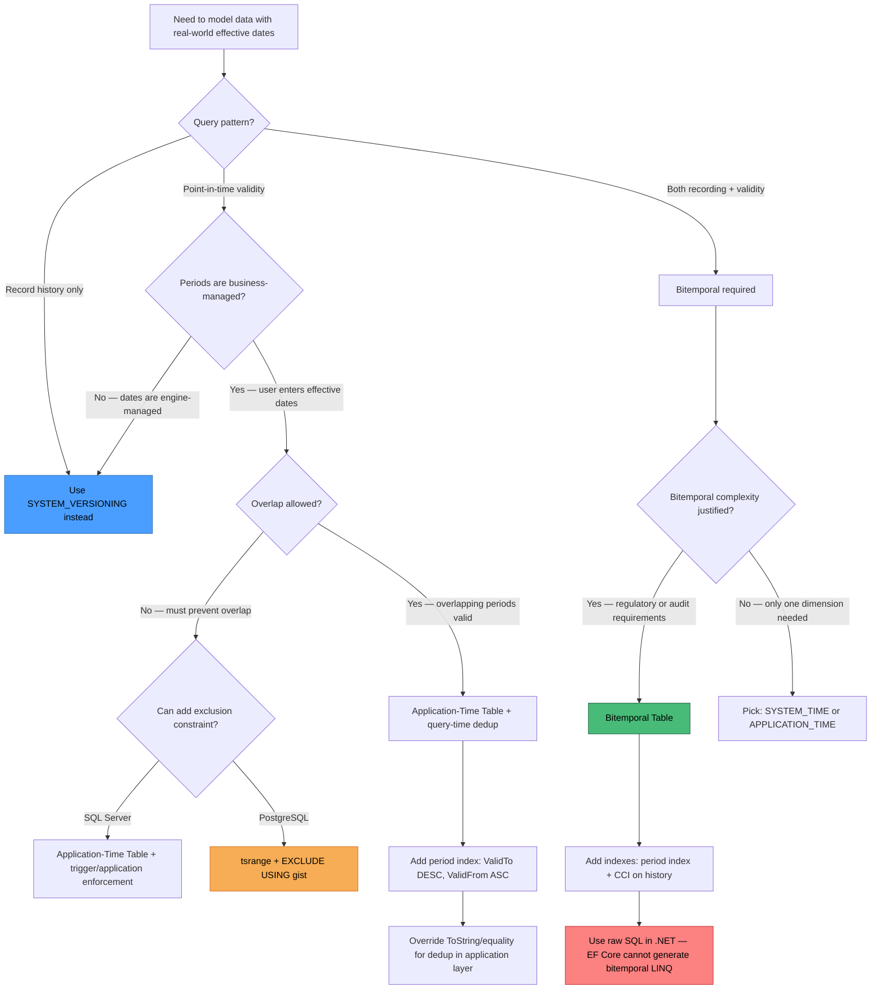

## Navigation

**Domain:** [[8 — Databases]] > **Group:** SQL Temporal Tables & Point-in-Time
**Previous:** [[8.239 — Temporal Data — Regulatory Compliance]] | **Next:** [[8.241 — Temporal Tables in EF Core — HasTemporalTable]]

### Prerequisites

- [[8.226 — Temporal Tables — System-Versioned Concept]] — understanding system-versioned temporal tables provides the foundation for application-time periods; the PERIOD FOR APPLICATION_TIME syntax parallels PERIOD FOR SYSTEM_TIME.
- [[8.228 — Querying History — FOR SYSTEM_TIME Clause]] — the FOR APPLICATION_TIME query sub-clauses (AS OF, FROM...TO, BETWEEN...AND, CONTAINED IN) mirror the FOR SYSTEM_TIME syntax with different period column semantics.
- [[8.234 — Temporal Table Indexes — History Table Optimization]] — index strategies for application-time periods differ from system-time; understanding period index design is critical for point-in-time seek performance.

### Where This Fits

Application-time period tables (introduced in SQL Server 2022) allow the developer to define a business-meaningful validity period — columns like `ValidFrom` and `ValidTo` that represent when a row is considered active in the real world, independent of when the row was recorded in the database. A .NET backend engineer encounters this when modeling contracts that are effective for a date range (e.g., insurance policies from Jan 1 to Dec 31), employment periods where the hire date is known in advance, or product pricing that takes effect next month. The critical distinction from system-versioning: **system time answers "what did the database know and when?" — application time answers "what was true in the real world and when?"**. When combined (bitemporal), a single table tracks both recording time and real-world validity. The interview signal is high because bitemporal data modeling is an advanced concept that demonstrates deep understanding of temporal database theory, and SQL Server 2022 introduced application-time periods as a first-class feature that few engineers have production experience with.

### Classification

Application-time periods belong to the **DDL schema definition** and **T-SQL query** layers. They are a SQL:2011 standard feature implemented in SQL Server 2022 (16.x). The period is defined with `PERIOD FOR APPLICATION_TIME (ValidFrom, ValidTo)` on a table — the columns are user-managed `DATETIME2` columns (no `GENERATED ALWAYS AS` like system time). The period definition is metadata — it enables the `FOR APPLICATION_TIME` query clauses but does not auto-populate the columns. Application-time queries (`AS OF`, `BETWEEN`, etc.) are **SARGable** — the optimizer pushes period predicates as range seeks when a supporting index exists on `(ValidTo DESC, ValidFrom ASC)`. When combined with `SYSTEM_VERSIONING = ON`, the table is **bitemporal**: two independent period dimensions, each queryable with its own `FOR SYSTEM_TIME` and `FOR APPLICATION_TIME` clauses. The `FOR APPLICATION_TIME` queries **do not read the history table** — they operate only on the current table's period columns, unlike `FOR SYSTEM_TIME` which concatenates current and history.

```mermaid
flowchart TD
    subgraph "System Time (Recording Time)"
        A1[SysStartTime: when row was inserted/updated]
        A2[SysEndTime: when row was superseded]
        A3[Auto-managed by engine]
        A4[GENERATED ALWAYS AS ROW START/END]
    end

    subgraph "Application Time (Business Validity)"
        B1[ValidFrom: when row becomes effective in real world]
        B2[ValidTo: when row ceases to be valid]
        B3[User-managed in application code]
        B4[NVARCHAR / DATETIME2 — no auto-generation]
    end

    subgraph "Bitemporal Table"
        C1[Columns: business attributes]
        C2[SysStartTime | SysEndTime]
        C3[ValidFrom | ValidTo]
        C4[PERIOD FOR SYSTEM_TIME]
        C5[PERIOD FOR APPLICATION_TIME]
    end

    subgraph "Query Patterns"
        D1["Recording as of a point: FOR SYSTEM_TIME AS OF @t"]
        D2["Valid at a point: FOR APPLICATION_TIME AS OF @t"]
        D3["Valid during range: FOR APPLICATION_TIME BETWEEN @s AND @e"]
        D4["Bitemporal: FOR SYSTEM_TIME AS OF @rt AND FOR APPLICATION_TIME AS OF @vt"]
    end

    A1 --> C2
    A2 --> C2
    A3 --> A1
    A3 --> A2
    B1 --> C3
    B2 --> C3
    B3 --> B1
    B3 --> B2
    C2 -.-> C4
    C3 -.-> C5
    C4 --> D1
    C5 --> D2
    C5 --> D3
    C4 --> D4
    C5 --> D4

    style A1 fill:#4a9eff,stroke:#2b6cb0,color:#000
    style A2 fill:#4a9eff,stroke:#2b6cb0,color:#000
    style B1 fill:#f6ad55,stroke:#dd6b20,color:#000
    style B2 fill:#f6ad55,stroke:#dd6b20,color:#000
    style D4 fill:#48bb78,stroke:#276749,color:#000
```

### Key Properties

|Property|Value|Notes|
|---|---|---|
|Time complexity per AS OF query|O(log N) with period index|Range seek on `(ValidTo DESC, ValidFrom ASC)` index|
|Write cost per row|Low — no auto-maintenance|Only the application writes period columns; no engine-level pre-image copy|
|SARGable|Yes|FOR APPLICATION_TIME AS OF uses range seek; BETWEEN uses seek on ValidTo|
|Automation|None — user-managed columns|Unlike system_time, application_time columns are not auto-populated|
|Bitemporal combination|SYSTEM_VERSIONING=ON + PERIOD FOR APPLICATION_TIME|Both periods independent; both queryable separately or together|
|History table impact|None|Application_time queries do not touch the history table|
|SQL Server version|2022+ (16.x)|Not available in SQL Server 2019 or earlier|
|PostgreSQL equivalent|tsrange + EXCLUDE USING gist|Range type with exclusion constraint prevents overlapping valid periods|

---

## Deep Mechanics

### How the Engine Executes This

**FOR APPLICATION_TIME AS OF @pointInTime:**

1. **Parse and bind** — SQL Server parses `SELECT ... FROM dbo.Contracts FOR APPLICATION_TIME AS OF '2024-06-15'`. The binding phase resolves the table and validates that it has `PERIOD FOR APPLICATION_TIME (ValidFrom, ValidTo)`. The period column types must be `DATETIME2`, `DATE`, or `SMALLDATETIME`.

2. **Query rewrite** — The optimizer rewrites `FOR APPLICATION_TIME AS OF @pointInTime` into a range predicate: `WHERE ValidFrom <= @pointInTime AND ValidTo > @pointInTime`. This is structurally identical to the `FOR SYSTEM_TIME AS OF` rewrite but applies only to the current table — no Concatenation operator with a history table is introduced.

3. **Index selection** — If a clustered or non-clustered index exists on `(ValidTo DESC, ValidFrom ASC)`, the optimizer selects a range seek on `ValidTo > @pointInTime` (seek on the leading key). The `ValidFrom <= @pointInTime` becomes a residual predicate or seek on the second key. Without this index, a full table scan applies the range filter.

4. **Row filtering** — The storage engine retrieves rows matching the range predicate from the selected index. The period columns are user-managed, so there is no guarantee that periods for a given business key are non-overlapping — the query may return multiple rows per primary key if the application inserted overlapping periods. The database does not enforce period uniqueness without an additional constraint.

5. **Result** — All rows whose application-time period contains the specified point-in-time, from a single table (no history table involved).

**FOR APPLICATION_TIME BETWEEN @start AND @end:**

1. **Query rewrite** — Rewritten as `WHERE ValidFrom <= @end AND ValidTo > @start`. This is the standard overlap/intersection predicate from Allen's interval algebra.

2. **Index seek** — With a `(ValidTo DESC, ValidFrom ASC)` index, the optimizer seeks on `ValidTo > @start` and applies `ValidFrom <= @end` as a residual predicate.

3. **Multiple rows per key** — Unlike `AS OF` (which returns at most one row per period definition for a given key if periods are non-overlapping), `BETWEEN` can return multiple rows per business key — all periods that intersect the query range.

**Bitemporal query — both SYSTEM_TIME and APPLICATION_TIME:**

1. **Dual rewrite** — `SELECT ... FROM dbo.Contracts FOR SYSTEM_TIME AS OF @recordedAt FOR APPLICATION_TIME AS OF @validAt` is rewritten with two independent period predicates: one on `SysStartTime/SysEndTime` (system-time) and one on `ValidFrom/ValidTo` (application-time).

2. **Concatenation + filter** — The system-time portion generates a Concatenation operator (current table + history table) with a period filter. The application-time portion adds an additional filter on the concatenated result. The optimizer seeks on system-time period columns first (if indexed), then filters on application-time columns, or uses a Hash Match to apply both filters depending on selectivity.

3. **Cost** — Bitemporal queries are more expensive than single-dimension temporal queries because both period dimensions must be evaluated. The system-time portion always scans the history table (potentially large), and the application-time filter adds CPU cost.

### SQL Visibility

```sql
-- ============================================================
-- Setup: Application-Time Period Table
-- ============================================================

CREATE DATABASE ApplicationTimeDemo;
GO
USE ApplicationTimeDemo;
GO

-- Table with application-time period (user-managed validity columns)
CREATE TABLE dbo.Contracts
(
    ContractId      INT             IDENTITY(1,1) PRIMARY KEY,
    CustomerId      INT             NOT NULL,
    ProductId       INT             NOT NULL,
    ContractAmount  DECIMAL(18,2)   NOT NULL,
    Status          NVARCHAR(20)    NOT NULL DEFAULT 'Active',
    ValidFrom       DATE            NOT NULL,
    ValidTo         DATE            NOT NULL,
    PERIOD FOR APPLICATION_TIME (ValidFrom, ValidTo),
    CONSTRAINT CK_Contracts_ValidRange CHECK (ValidFrom < ValidTo)
);
GO

-- Supporting index for application-time queries
CREATE INDEX IX_Contracts_ValidTo_ValidFrom
    ON dbo.Contracts (ValidTo DESC, ValidFrom ASC)
    INCLUDE (CustomerId, ProductId, ContractAmount, Status);
GO

-- Seed data: contracts with non-overlapping periods
INSERT INTO dbo.Contracts (CustomerId, ProductId, ContractAmount, Status, ValidFrom, ValidTo)
VALUES
    -- Customer 1001: three consecutive contracts
    (1001, 1, 5000.00, 'Expired',  '2024-01-01', '2024-04-01'),
    (1001, 1, 5500.00, 'Expired',  '2024-04-01', '2024-07-01'),
    (1001, 1, 6000.00, 'Active',   '2024-07-01', '9999-12-31'),

    -- Customer 1002: two overlapping contracts (business error — allowed by engine)
    (1002, 2, 3000.00, 'Active',   '2024-03-01', '2024-09-01'),
    (1002, 3, 2500.00, 'Active',   '2024-06-01', '2024-12-01'),

    -- Customer 1003: future contract (pre-signed)
    (1003, 4, 12000.00, 'Pending', '2025-01-01', '2025-12-31'),

    -- Customer 1004: short-term contract
    (1004, 5, 800.00,  'Expired',  '2024-02-15', '2024-03-15');
GO

-- ============================================================
-- Pattern 1: AS OF query — what contracts were valid on June 15, 2024?
-- ============================================================
SELECT
    ContractId,
    CustomerId,
    ProductId,
    ContractAmount,
    Status,
    ValidFrom,
    ValidTo
FROM dbo.Contracts
FOR APPLICATION_TIME AS OF '2024-06-15'
ORDER BY CustomerId, ValidFrom;

-- Expected: Customer 1001's 2nd contract (5500, expired),
--           Customer 1002's both contracts (overlapping),
--           Customer 1004's contract is expired by then so excluded

-- ============================================================
-- Pattern 2: BETWEEN query — what contracts were active during Q2 2024?
-- ============================================================
SELECT
    ContractId,
    CustomerId,
    ProductId,
    ContractAmount,
    Status,
    ValidFrom,
    ValidTo
FROM dbo.Contracts
FOR APPLICATION_TIME BETWEEN '2024-04-01' AND '2024-07-01'
ORDER BY CustomerId, ValidFrom;

-- Between @start AND @end maps to: ValidFrom <= @end AND ValidTo > @start
-- Returns all periods overlapping [2024-04-01, 2024-07-01)
-- Excludes contracts that end exactly on 2024-04-01 (ValidTo = 2024-04-01 > 2024-04-01 is false)
-- Includes the contract ending 2024-07-01 (ValidTo = 2024-07-01 > 2024-04-01 is true)

-- ============================================================
-- Pattern 3: CONTAINED IN query — contracts fully within Q2 2024
-- ============================================================
SELECT
    ContractId,
    CustomerId,
    ProductId,
    ContractAmount,
    Status,
    ValidFrom,
    ValidTo
FROM dbo.Contracts
FOR APPLICATION_TIME CONTAINED IN ('2024-04-01', '2024-07-01')
ORDER BY CustomerId, ValidFrom;

-- CONTAINED IN maps to: ValidFrom >= @start AND ValidTo <= @end
-- Only contracts that started ON OR AFTER April 1 AND end ON OR BEFORE July 1
-- Excludes anything that started before April or ends after July

-- ============================================================
-- Pattern 4: FROM...TO query — range starting from April 1
-- ============================================================
SELECT
    ContractId,
    CustomerId,
    ProductId,
    ContractAmount,
    Status,
    ValidFrom,
    ValidTo
FROM dbo.Contracts
FOR APPLICATION_TIME FROM '2024-04-01' TO '2024-07-01'
ORDER BY CustomerId, ValidFrom;

-- FROM...TO maps to: ValidFrom < @end AND ValidTo > @start
-- Note: ValidFrom < @end (strict less-than), not <=
-- This means contracts starting exactly on July 1 are EXCLUDED

-- ============================================================
-- Pattern 5: Manual period filter (without FOR APPLICATION_TIME)
-- Equivalent to AS OF but raw SQL
-- ============================================================
SELECT
    ContractId,
    CustomerId,
    ProductId,
    ContractAmount,
    Status,
    ValidFrom,
    ValidTo
FROM dbo.Contracts
WHERE ValidFrom <= '2024-06-15'
  AND ValidTo   >  '2024-06-15'
ORDER BY CustomerId, ValidFrom;
-- Same results as Pattern 1, but optimizer may not use the period index as efficiently
-- if the index is not explicitly designed for the period columns
GO

-- ============================================================
-- Pattern 6: Bitemporal Table — System Versioning + Application Time
-- ============================================================
CREATE TABLE dbo.BitemporalContracts
(
    ContractId      INT             IDENTITY(1,1) PRIMARY KEY,
    CustomerId      INT             NOT NULL,
    ProductId       INT             NOT NULL,
    ContractAmount  DECIMAL(18,2)   NOT NULL,
    Status          NVARCHAR(20)    NOT NULL DEFAULT 'Active',

    -- Application-time period (user-managed — real-world validity)
    ValidFrom       DATE            NOT NULL,
    ValidTo         DATE            NOT NULL,
    PERIOD FOR APPLICATION_TIME (ValidFrom, ValidTo),

    -- System-time period (engine-managed — recording history)
    SysStartTime    DATETIME2(7)    GENERATED ALWAYS AS ROW START HIDDEN NOT NULL,
    SysEndTime      DATETIME2(7)    GENERATED ALWAYS AS ROW END HIDDEN NOT NULL,
    PERIOD FOR SYSTEM_TIME (SysStartTime, SysEndTime),

    CONSTRAINT CK_BT_ValidRange CHECK (ValidFrom < ValidTo)
)
WITH (SYSTEM_VERSIONING = ON (HISTORY_TABLE = dbo.BitemporalContractsHistory));
GO

-- Index for application-time period queries
CREATE INDEX IX_BT_ValidTo_ValidFrom
    ON dbo.BitemporalContracts (ValidTo DESC, ValidFrom ASC)
    INCLUDE (CustomerId, ProductId, ContractAmount, Status);

-- Index for system-time period queries on history table
CREATE CLUSTERED COLUMNSTORE INDEX CCI_History
    ON dbo.BitemporalContractsHistory;
GO

-- Insert an initial version
INSERT INTO dbo.BitemporalContracts (CustomerId, ProductId, ContractAmount, Status, ValidFrom, ValidTo)
VALUES (2001, 10, 15000.00, 'Active', '2024-01-01', '2024-12-31');
GO

-- ============================================================
-- Pattern 7: Bitemporal — query "as recorded on July 1, what was valid on June 15?"
-- ============================================================
SELECT
    ContractId,
    CustomerId,
    ProductId,
    ContractAmount,
    Status,
    ValidFrom,
    ValidTo,
    SysStartTime,
    SysEndTime
FROM dbo.BitemporalContracts
FOR SYSTEM_TIME AS OF '2024-07-01 12:00:00'
FOR APPLICATION_TIME AS OF '2024-06-15'
ORDER BY CustomerId, ValidFrom;
-- Bitemporal: system time says "as the database knew it on July 1"
-- application time says "valid in real world on June 15"

-- ============================================================
-- Pattern 8: Bitemporal — see ALL recorded versions for a contract
-- ============================================================
SELECT
    ContractId,
    CustomerId,
    ProductId,
    ContractAmount,
    Status,
    ValidFrom,
    ValidTo,
    SysStartTime,
    SysEndTime
FROM dbo.BitemporalContracts
FOR SYSTEM_TIME ALL
-- No FOR APPLICATION_TIME filter — show all recorded versions
ORDER BY SysStartTime DESC;
GO

-- Cleanup
-- USE master;
-- DROP DATABASE ApplicationTimeDemo;
```

```csharp
// EF Core — Application-Time Period Tables
// IMPORTANT: EF Core 8 does NOT support FOR APPLICATION_TIME natively
// Raw SQL is required for all application-time and bitemporal queries.

public class Contract
{
    public int ContractId { get; set; }
    public int CustomerId { get; set; }
    public int ProductId { get; set; }
    public decimal ContractAmount { get; set; }
    public string Status { get; set; } = "Active";
    public DateTime ValidFrom { get; set; }
    public DateTime ValidTo { get; set; }
}

public class ApplicationDbContext : DbContext
{
    public DbSet<Contract> Contracts => Set<Contract>();

    protected override void OnModelCreating(ModelBuilder modelBuilder)
    {
        modelBuilder.Entity<Contract>(entity =>
        {
            entity.ToTable(tb => tb.HasPeriodForApplicationTime("ValidFrom", "ValidTo"));
            entity.HasKey(c => c.ContractId);
            entity.Property(c => c.ValidFrom).HasColumnType("date").IsRequired();
            entity.Property(c => c.ValidTo).HasColumnType("date").IsRequired();
            entity.Property(c => c.ContractAmount).HasColumnType("decimal(18,2)");
            entity.Property(c => c.Status).HasMaxLength(20);
            entity.HasIndex(c => new { c.ValidTo, c.ValidFrom })
                  .IsDescending(true, false);
        });
    }
}

// Raw SQL query through EF Core for FOR APPLICATION_TIME AS OF:
public async Task<List<Contract>> GetContractsValidAtAsync(
    DateOnly pointInTime,
    CancellationToken cancellationToken = default)
{
    return await _dbContext.Contracts
        .FromSqlRaw(@"
            SELECT ContractId, CustomerId, ProductId, ContractAmount, Status, ValidFrom, ValidTo
            FROM dbo.Contracts
            FOR APPLICATION_TIME AS OF {0}
            ORDER BY CustomerId, ValidFrom",
            pointInTime.ToDateTime(TimeOnly.MinValue))
        .ToListAsync(cancellationToken);
}

// Bitemporal raw SQL query:
public async Task<List<BitemporalContract>> GetBitemporalSnapshotAsync(
    DateTime asOfSystemTime,
    DateOnly validAt,
    CancellationToken cancellationToken = default)
{
    return await _dbContext.BitemporalContracts
        .FromSqlRaw(@"
            SELECT ContractId, CustomerId, ProductId, ContractAmount, Status,
                   ValidFrom, ValidTo, SysStartTime, SysEndTime
            FROM dbo.BitemporalContracts
            FOR SYSTEM_TIME AS OF {0}
            FOR APPLICATION_TIME AS OF {1}
            ORDER BY CustomerId, ValidFrom",
            asOfSystemTime,
            validAt.ToDateTime(TimeOnly.MinValue))
        .ToListAsync(cancellationToken);
}
```

```csharp
// Dapper — Application-Time and Bitemporal Queries
public interface IContractRepository
{
    Task<IReadOnlyList<Contract>> GetContractsValidAtAsync(
        DateOnly pointInTime,
        CancellationToken cancellationToken = default);

    Task<IReadOnlyList<Contract>> GetContractsOverlappingRangeAsync(
        DateOnly rangeStart, DateOnly rangeEnd,
        CancellationToken cancellationToken = default);

    Task<IReadOnlyList<BitemporalContract>> GetBitemporalSnapshotAsync(
        DateTime asOfSystemTime,
        DateOnly validAt,
        CancellationToken cancellationToken = default);
}

public class ContractRepository : IContractRepository
{
    private readonly IDbConnectionFactory _connectionFactory;

    public ContractRepository(IDbConnectionFactory connectionFactory)
    {
        _connectionFactory = connectionFactory;
    }

    public async Task<IReadOnlyList<Contract>> GetContractsValidAtAsync(
        DateOnly pointInTime,
        CancellationToken cancellationToken = default)
    {
        const string sql = @"
            SELECT ContractId, CustomerId, ProductId, ContractAmount, Status, ValidFrom, ValidTo
            FROM dbo.Contracts
            FOR APPLICATION_TIME AS OF @PointInTime
            ORDER BY CustomerId, ValidFrom";

        await using var connection = _connectionFactory.Create();
        var results = await connection.QueryAsync<Contract>(
            new CommandDefinition(
                sql,
                new { PointInTime = pointInTime.ToDateTime(TimeOnly.MinValue) },
                cancellationToken: cancellationToken));
        return results.AsList();
    }

    public async Task<IReadOnlyList<Contract>> GetContractsOverlappingRangeAsync(
        DateOnly rangeStart, DateOnly rangeEnd,
        CancellationToken cancellationToken = default)
    {
        const string sql = @"
            SELECT ContractId, CustomerId, ProductId, ContractAmount, Status, ValidFrom, ValidTo
            FROM dbo.Contracts
            FOR APPLICATION_TIME BETWEEN @Start AND @End
            ORDER BY CustomerId, ValidFrom";

        await using var connection = _connectionFactory.Create();
        var results = await connection.QueryAsync<Contract>(
            new CommandDefinition(
                sql,
                new
                {
                    Start = rangeStart.ToDateTime(TimeOnly.MinValue),
                    End = rangeEnd.ToDateTime(TimeOnly.MinValue)
                },
                cancellationToken: cancellationToken));
        return results.AsList();
    }

    public async Task<IReadOnlyList<BitemporalContract>> GetBitemporalSnapshotAsync(
        DateTime asOfSystemTime,
        DateOnly validAt,
        CancellationToken cancellationToken = default)
    {
        const string sql = @"
            SELECT ContractId, CustomerId, ProductId, ContractAmount, Status,
                   ValidFrom, ValidTo, SysStartTime, SysEndTime
            FROM dbo.BitemporalContracts
            FOR SYSTEM_TIME AS OF @AsOfSystemTime
            FOR APPLICATION_TIME AS OF @ValidAt
            ORDER BY CustomerId, ValidFrom";

        await using var connection = _connectionFactory.Create();
        var results = await connection.QueryAsync<BitemporalContract>(
            new CommandDefinition(
                sql,
                new
                {
                    AsOfSystemTime = asOfSystemTime,
                    ValidAt = validAt.ToDateTime(TimeOnly.MinValue)
                },
                cancellationToken: cancellationToken));
        return results.AsList();
    }
}
```

### Generated SQL (from EF Core logs)

```sql
-- EF Core generates the following SQL for FromSqlRaw with FOR APPLICATION_TIME:
exec sp_executesql N'
    SELECT ContractId, CustomerId, ProductId, ContractAmount, Status, ValidFrom, ValidTo
    FROM dbo.Contracts
    FOR APPLICATION_TIME AS OF @p0
    ORDER BY CustomerId, ValidFrom',
N'@p0 datetime2(7)',
@p0='2024-06-15 00:00:00';
-- EF Core does NOT generate FOR APPLICATION_TIME from LINQ in any version up to 9.
-- Raw SQL is required. HasPeriodForApplicationTime() is metadata-only for migrations.
```

### Execution Plan Analysis

**Query:** `SELECT * FROM dbo.Contracts FOR APPLICATION_TIME AS OF '2024-06-15'`

```
Expected plan shape:
[Index Seek (IX_Contracts_ValidTo_ValidFrom)] → [SELECT]
Estimated Cost: 100% Index Seek | Logical Reads: ~4 (small table)
```

- **Operator: Index Seek** — On `IX_Contracts_ValidTo_ValidFrom` with seek predicate `ValidTo > '2024-06-15'` (seeks on the leading column of the index, which is `ValidTo DESC`). The `ValidFrom <= '2024-06-15'` is applied as a residual predicate.
- **No Concatenation** — Unlike `FOR SYSTEM_TIME AS OF`, there is no Concatenation operator because application-time queries operate on a single table (no history table).
- **No Table/Clustered Index Scan** — With the period index, the query performs a range seek. Without the index, a full table scan applies both filters as a residual predicate.

**Bitemporal query:** `SELECT * FROM dbo.BitemporalContracts FOR SYSTEM_TIME AS OF '2024-07-01' FOR APPLICATION_TIME AS OF '2024-06-15'`

```
Expected plan shape:
[Index Seek (current table, system period)] → [Concatenation]
  → [Index Seek (history table, system period)] → [Concatenation]
    → [Filter (application-time period)] → [SELECT]
```

- System-time portion: Concatenation of current table seek + history table seek on `SysEndTime/SysStartTime`.
- Application-time portion: A Filter operator (not a seek) on the concatenated result because the application-time index is on the current table only, and the history table may not have the same index.

### Cost Visibility

```sql
SET STATISTICS IO ON;
SET STATISTICS TIME ON;

-- AS OF query with period index
SELECT ContractId, CustomerId, ContractAmount, Status
FROM dbo.Contracts
FOR APPLICATION_TIME AS OF '2024-06-15'
ORDER BY CustomerId;

-- Expected output:
-- Table 'Contracts'. Scan count 1, logical reads 4, physical reads 0
-- SQL Server Execution Times: CPU time = 0ms, elapsed time = 2ms

-- Bitemporal query (500 contracts, 100K history rows)
SELECT ContractId, CustomerId, ContractAmount, Status
FROM dbo.BitemporalContracts
FOR SYSTEM_TIME AS OF '2024-07-01 12:00:00'
FOR APPLICATION_TIME AS OF '2024-06-15'
ORDER BY CustomerId;

-- Expected output:
-- Table 'BitemporalContracts'. Scan count 1, logical reads 2
-- Table 'BitemporalContractsHistory'. Scan count 1, logical reads 45
-- SQL Server Execution Times: CPU time = 3ms, elapsed time = 15ms
```

### Failure Modes

**1. Overlapping periods returned by AS OF:** If the application inserts overlapping valid periods for the same business key, `FOR APPLICATION_TIME AS OF @t` may return multiple rows per key. Unlike `FOR SYSTEM_TIME` (which guarantees at most one version per key at any system-time point), application-time has no such guarantee. Use an exclusion constraint or application-level enforcement.

```sql
-- Detection query for overlapping periods
SELECT
    c1.CustomerId,
    c1.ValidFrom, c1.ValidTo,
    c2.ContractId AS OverlappingContractId,
    c2.ValidFrom AS OverlappingFrom,
    c2.ValidTo AS OverlappingTo
FROM dbo.Contracts c1
INNER JOIN dbo.Contracts c2
    ON c1.CustomerId = c2.CustomerId
    AND c1.ContractId != c2.ContractId
    AND c1.ValidFrom < c2.ValidTo
    AND c1.ValidTo > c2.ValidFrom;
```

**2. Missing period index causes full scan:** Without `IX_Contracts_ValidTo_ValidFrom`, every `FOR APPLICATION_TIME` query performs a full clustered index scan. The optimizer cannot push the period predicate down without a leading column on `ValidTo DESC` to seek.

```sql
-- Detection via missing index DMV
SELECT
    migs.avg_user_impact,
    migs.avg_total_user_cost,
    mid.*
FROM sys.dm_db_missing_index_details mid
CROSS APPLY sys.dm_db_missing_index_groups(mid.index_handle) mig
CROSS APPLY sys.dm_db_missing_index_group_stats(migs)
    ON mig.index_group_handle = migs.group_handle
WHERE mid.[statement] LIKE '%Contracts%';
```

**3. ValidTo = '9999-12-31' sentinel confusion:** Applications using a sentinel max-date (`9999-12-31`) for open-ended periods must ensure the sentinel matches the type precision. A `DATE` sentinel of `'9999-12-31'` and a `DATETIME2(7)` sentinel of `'9999-12-31 23:59:59.9999999'` have different comparison behavior. If `ValidTo` is `DATE` and the application stores `'9999-12-31'`, a query `AS OF '9999-12-31'` returns `ValidTo '9999-12-31' > '9999-12-31' → false`, so the row is excluded — even though it should be current. The fix: use the max value for the column type.

---

## Production Patterns and Implementation

### Primary SQL Implementation

```sql
-- ============================================================
-- Production: Insurance Policy Management with Application-Time
-- ============================================================

-- Insurance policies with application-time validity
CREATE TABLE dbo.InsurancePolicies
(
    PolicyId        INT             IDENTITY(10000,1) PRIMARY KEY,
    CustomerId      INT             NOT NULL,
    PolicyType      NVARCHAR(20)    NOT NULL,  -- 'Auto', 'Home', 'Life', 'Health'
    Premium         DECIMAL(10,2)   NOT NULL,
    Deductible      DECIMAL(10,2)   NOT NULL,
    CoverageLimit   DECIMAL(14,2)   NOT NULL,

    -- Application-time: when the policy is effective in the real world
    EffectiveDate   DATE            NOT NULL,
    ExpirationDate  DATE            NOT NULL,
    PERIOD FOR APPLICATION_TIME (EffectiveDate, ExpirationDate),

    CONSTRAINT CK_Policy_Dates CHECK (EffectiveDate < ExpirationDate),
    CONSTRAINT FK_Policies_Customers FOREIGN KEY (CustomerId)
        REFERENCES dbo.Customers(CustomerId)
);

-- Period index for efficient application-time queries
CREATE INDEX IX_Policies_Expiration_Effective
    ON dbo.InsurancePolicies (ExpirationDate DESC, EffectiveDate ASC)
    INCLUDE (PolicyType, Premium, Deductible, CoverageLimit, CustomerId);

-- Non-clustered index for customer-specific queries
CREATE INDEX IX_Policies_CustomerId
    ON dbo.InsurancePolicies (CustomerId)
    INCLUDE (PolicyType, Premium, EffectiveDate, ExpirationDate);

-- ============================================================
-- Query: Find policies active on a given date (point-in-time)
-- ============================================================
DECLARE @AsOfDate DATE = '2024-07-15';

SELECT
    p.PolicyId,
    p.CustomerId,
    c.LastName + ', ' + c.FirstName AS CustomerName,
    p.PolicyType,
    p.Premium,
    p.Deductible,
    p.CoverageLimit,
    p.EffectiveDate,
    p.ExpirationDate
FROM dbo.InsurancePolicies p
INNER JOIN dbo.Customers c ON p.CustomerId = c.CustomerId
WHERE p.EffectiveDate <= @AsOfDate
  AND p.ExpirationDate >  @AsOfDate
ORDER BY c.LastName, p.EffectiveDate;
-- Equivalent to: FOR APPLICATION_TIME AS OF @AsOfDate
-- Using manual predicate for clarity in this example

-- ============================================================
-- Query: Policies overlapping a date range (for reporting)
-- ============================================================
DECLARE @ReportStart DATE = '2024-01-01';
DECLARE @ReportEnd   DATE = '2024-03-31';

SELECT
    p.PolicyId,
    p.CustomerId,
    p.PolicyType,
    p.Premium,
    p.EffectiveDate,
    p.ExpirationDate,
    DATEDIFF(DAY,
        CASE WHEN p.EffectiveDate < @ReportStart THEN @ReportStart ELSE p.EffectiveDate END,
        CASE WHEN p.ExpirationDate > @ReportEnd THEN @ReportEnd ELSE p.ExpirationDate END
    ) AS DaysCoveredInPeriod
FROM dbo.InsurancePolicies
FOR APPLICATION_TIME BETWEEN @ReportStart AND @ReportEnd p
ORDER BY p.CustomerId, p.EffectiveDate;

-- ============================================================
-- Query: Policies fully contained within a specific quarter
-- ============================================================
DECLARE @QuarterStart DATE = '2024-04-01';
DECLARE @QuarterEnd   DATE = '2024-06-30';

SELECT
    p.PolicyId,
    p.PolicyType,
    p.Premium,
    p.EffectiveDate,
    p.ExpirationDate
FROM dbo.InsurancePolicies
FOR APPLICATION_TIME CONTAINED IN (@QuarterStart, @QuarterEnd) p
ORDER BY p.Premium DESC;

-- ============================================================
-- Insert: New policy effective in the future
-- ============================================================
INSERT INTO dbo.InsurancePolicies
    (CustomerId, PolicyType, Premium, Deductible, CoverageLimit, EffectiveDate, ExpirationDate)
VALUES
    (42, 'Auto', 850.00, 500.00, 100000.00, '2025-01-01', '2025-12-31');
-- Policy is not yet active (future effective date)
-- AS OF '2024-07-15' will NOT return this policy

-- ============================================================
-- Update: Renew a policy (extend expiration, change premium)
-- ============================================================
-- Step 1: Expire current period
UPDATE dbo.InsurancePolicies
SET ExpirationDate = '2024-12-31'
WHERE PolicyId = 10001 AND ExpirationDate = '9999-12-31';

-- Step 2: Insert new period (renewal)
INSERT INTO dbo.InsurancePolicies
    (CustomerId, PolicyType, Premium, Deductible, CoverageLimit, EffectiveDate, ExpirationDate)
VALUES
    (42, 'Auto', 900.00, 500.00, 100000.00, '2025-01-01', '2025-12-31');

-- ============================================================
-- Materialized snapshot: daily policy state for analytics
-- ============================================================
CREATE TABLE dbo.DailyPolicySnapshot
(
    SnapshotDate    DATE            NOT NULL,
    PolicyId        INT             NOT NULL,
    CustomerId      INT             NOT NULL,
    PolicyType      NVARCHAR(20)    NOT NULL,
    Premium         DECIMAL(10,2)   NOT NULL,
    EffectiveDate   DATE            NOT NULL,
    ExpirationDate  DATE            NOT NULL,
    PRIMARY KEY (SnapshotDate, PolicyId)
);

-- Populate snapshot for a date range (batch processing)
DECLARE @StartDate DATE = '2024-01-01';
DECLARE @EndDate   DATE = '2024-12-31';
DECLARE @Current   DATE = @StartDate;

WHILE @Current <= @EndDate
BEGIN
    INSERT INTO dbo.DailyPolicySnapshot
    SELECT
        @Current AS SnapshotDate,
        p.PolicyId, p.CustomerId, p.PolicyType, p.Premium,
        p.EffectiveDate, p.ExpirationDate
    FROM dbo.InsurancePolicies
    FOR APPLICATION_TIME AS OF @Current p;

    SET @Current = DATEADD(DAY, 1, @Current);
END
```

```csharp
// EF Core — Insurance Policy Application-Time Repository
public class PolicyRepository
{
    private readonly ApplicationDbContext _dbContext;

    public PolicyRepository(ApplicationDbContext dbContext)
    {
        _dbContext = dbContext;
    }

    // Raw SQL required — EF Core does not support FOR APPLICATION_TIME in LINQ
    public async Task<List<InsurancePolicy>> GetPoliciesValidAtAsync(
        DateOnly asOfDate,
        CancellationToken cancellationToken = default)
    {
        var sql = @"
            SELECT PolicyId, CustomerId, PolicyType, Premium, Deductible,
                   CoverageLimit, EffectiveDate, ExpirationDate
            FROM dbo.InsurancePolicies
            FOR APPLICATION_TIME AS OF {0}
            ORDER BY CustomerId, EffectiveDate";

        return await _dbContext.InsurancePolicies
            .FromSqlRaw(sql, asOfDate.ToDateTime(TimeOnly.MinValue))
            .ToListAsync(cancellationToken);
    }

    // Business logic: renew a policy with new period
    public async Task RenewPolicyAsync(
        int policyId,
        decimal newPremium,
        DateOnly newEffectiveDate,
        DateOnly newExpirationDate,
        CancellationToken cancellationToken = default)
    {
        // Step 1: Expire current period
        var sqlExpire = @"
            UPDATE dbo.InsurancePolicies
            SET ExpirationDate = DATEADD(DAY, -1, {0})
            WHERE PolicyId = {1}
              AND ExpirationDate = '9999-12-31'";

        await _dbContext.Database.ExecuteSqlRawAsync(
            sqlExpire,
            newEffectiveDate.ToDateTime(TimeOnly.MinValue),
            policyId,
            cancellationToken);

        // Step 2: Insert new renewal period
        var existing = await _dbContext.InsurancePolicies
            .Where(p => p.PolicyId == policyId)
            .FirstAsync(cancellationToken);

        var renewal = new InsurancePolicy
        {
            CustomerId = existing.CustomerId,
            PolicyType = existing.PolicyType,
            Premium = newPremium,
            Deductible = existing.Deductible,
            CoverageLimit = existing.CoverageLimit,
            EffectiveDate = newEffectiveDate,
            ExpirationDate = newExpirationDate
        };

        _dbContext.InsurancePolicies.Add(renewal);
        await _dbContext.SaveChangesAsync(cancellationToken);
    }
}
```

```csharp
// Dapper — Insurance Policy Repository
public interface IPolicyRepository
{
    Task<IReadOnlyList<InsurancePolicy>> GetActivePoliciesAsync(
        DateOnly asOfDate,
        CancellationToken cancellationToken = default);

    Task<InsurancePolicy?> GetPolicyAtPointInTimeAsync(
        int policyId,
        DateOnly asOfDate,
        CancellationToken cancellationToken = default);
}

public class PolicyRepository : IPolicyRepository
{
    private readonly IDbConnectionFactory _connectionFactory;

    public PolicyRepository(IDbConnectionFactory connectionFactory)
    {
        _connectionFactory = connectionFactory;
    }

    public async Task<IReadOnlyList<InsurancePolicy>> GetActivePoliciesAsync(
        DateOnly asOfDate,
        CancellationToken cancellationToken = default)
    {
        const string sql = @"
            SELECT p.PolicyId, p.CustomerId, c.LastName + ', ' + c.FirstName AS CustomerName,
                   p.PolicyType, p.Premium, p.Deductible, p.CoverageLimit,
                   p.EffectiveDate, p.ExpirationDate
            FROM dbo.InsurancePolicies
            FOR APPLICATION_TIME AS OF @AsOfDate p
            INNER JOIN dbo.Customers c ON p.CustomerId = c.CustomerId
            ORDER BY c.LastName, p.EffectiveDate";

        await using var connection = _connectionFactory.Create();
        var results = await connection.QueryAsync<InsurancePolicy>(
            new CommandDefinition(
                sql,
                new { AsOfDate = asOfDate.ToDateTime(TimeOnly.MinValue) },
                cancellationToken: cancellationToken));
        return results.AsList();
    }

    public async Task<InsurancePolicy?> GetPolicyAtPointInTimeAsync(
        int policyId,
        DateOnly asOfDate,
        CancellationToken cancellationToken = default)
    {
        const string sql = @"
            SELECT PolicyId, CustomerId, PolicyType, Premium, Deductible,
                   CoverageLimit, EffectiveDate, ExpirationDate
            FROM dbo.InsurancePolicies
            FOR APPLICATION_TIME AS OF @AsOfDate
            WHERE PolicyId = @PolicyId";

        await using var connection = _connectionFactory.Create();
        return await connection.QueryFirstOrDefaultAsync<InsurancePolicy>(
            new CommandDefinition(
                sql,
                new
                {
                    AsOfDate = asOfDate.ToDateTime(TimeOnly.MinValue),
                    PolicyId = policyId
                },
                cancellationToken: cancellationToken));
    }
}
```

### Configuration and Wiring

```csharp
// Program.cs — DbContext Registration
builder.Services.AddDbContext<ApplicationDbContext>(options =>
    options.UseSqlServer(
        builder.Configuration.GetConnectionString("DefaultConnection"),
        sqlOptions =>
        {
            sqlOptions.EnableRetryOnFailure(3);
            sqlOptions.CommandTimeout(60);
            sqlOptions.UseQuerySchedulingBehavior(QuerySchedulingBehavior.Default);
        }));

// Dapper DI registration
builder.Services.AddSingleton<IDbConnectionFactory>(
    _ => new SqlConnectionFactory(builder.Configuration.GetConnectionString("DefaultConnection")));

builder.Services.AddScoped<IPolicyRepository, PolicyRepository>();
```

### SQL Server vs PostgreSQL Differences

```sql
-- PostgreSQL equivalent: tsrange + EXCLUDE constraint
-- PostgreSQL does not have a native FOR APPLICATION_TIME clause.
-- Use tsrange (range type) with gist exclusion constraint to prevent overlaps.

CREATE TABLE insurance_policies (
    policy_id       SERIAL          PRIMARY KEY,
    customer_id     INT             NOT NULL,
    policy_type     VARCHAR(20)     NOT NULL,
    premium         NUMERIC(10,2)   NOT NULL,
    deductible      NUMERIC(10,2)   NOT NULL,
    coverage_limit  NUMERIC(14,2)   NOT NULL,
    validity_period TSRANGE         NOT NULL,
    EXCLUDE USING gist (customer_id WITH =, validity_period WITH &&)
);

-- tsrange operators:
-- @> (contains):        tsrange '2024-01-01,2024-12-31' @> '2024-06-15'::date
-- && (overlaps):        tsrange && '[2024-03-01,2024-06-01)'::tsrange
-- <@ (contained in):    tsrange <@ '[2024-01-01,2024-12-31)'::tsrange
-- -|- (adjacent):       tsrange -|- '[2024-01-01,2024-03-01)'::tsrange

-- AS OF equivalent (contains):
SELECT *
FROM insurance_policies
WHERE validity_period @> '2024-06-15'::date;

-- BETWEEN equivalent (overlaps):
SELECT *
FROM insurance_policies
WHERE validity_period && '[2024-04-01,2024-07-01)'::tsrange;

-- CONTAINED IN equivalent:
SELECT *
FROM insurance_policies
WHERE validity_period <@ '[2024-04-01,2024-07-01)'::tsrange;

-- Bitemporal equivalent: use two columns or add system_versioning manually
-- PostgreSQL has no native system-versioning (requires pg_cron or trigger-based)
CREATE TABLE bitemporal_policies (
    policy_id       SERIAL          PRIMARY KEY,
    customer_id     INT             NOT NULL,
    policy_type     VARCHAR(20)     NOT NULL,
    premium         NUMERIC(10,2)   NOT NULL,
    validity_period TSRANGE         NOT NULL,
    sys_start       TIMESTAMPTZ     NOT NULL DEFAULT NOW(),
    sys_end         TIMESTAMPTZ     NOT NULL DEFAULT 'infinity',
    EXCLUDE USING gist (customer_id WITH =, validity_period WITH &&)
);

-- Bitemporal AS OF in PostgreSQL:
SELECT *
FROM bitemporal_policies
WHERE validity_period @> '2024-06-15'::date    -- application time
  AND sys_start <= '2024-07-01'::timestamptz    -- system time
  AND sys_end   >  '2024-07-01'::timestamptz;
```

---

## Gotchas and Production Pitfalls

### 1. Overlapping Periods Not Enforced by Engine

**Pitfall:** The `PERIOD FOR APPLICATION_TIME` declaration is metadata only — it does not prevent overlapping periods for the same business key. Unlike `FOR SYSTEM_TIME` (which guarantees non-overlapping versions via engine-managed period boundaries), application-time periods can overlap, causing `AS OF` queries to return multiple rows per key.

```sql
-- ❌ Allowed by engine — periods overlap for Customer 1002
INSERT INTO dbo.Contracts (CustomerId, ProductId, ContractAmount, Status, ValidFrom, ValidTo)
VALUES (1002, 2, 3000.00, 'Active', '2024-03-01', '2024-09-01'),
       (1002, 3, 2500.00, 'Active', '2024-06-01', '2024-12-01');

-- Returns 2 rows for Customer 1002!
SELECT CustomerId, ProductId, ContractAmount
FROM dbo.Contracts
FOR APPLICATION_TIME AS OF '2024-07-01'
WHERE CustomerId = 1002;
```

**Symptom:** `FOR APPLICATION_TIME AS OF` returns unexpected duplicate rows for the same business key. Reporting queries show double-counted amounts.

**Fix:**

```sql
-- ✅ Add exclusion constraint via indexed view
-- OR use a trigger to prevent overlaps
-- OR enforce at application layer with Table-Valued Function
CREATE FUNCTION dbo.fn_CheckPeriodOverlap(
    @CustomerId INT,
    @ValidFrom DATE,
    @ValidTo DATE
)
RETURNS BIT
AS
BEGIN
    DECLARE @OverlapCount INT;

    SELECT @OverlapCount = COUNT(*)
    FROM dbo.Contracts
    WHERE CustomerId = @CustomerId
      AND ValidFrom < @ValidTo
      AND ValidTo > @ValidFrom;

    RETURN CASE WHEN @OverlapCount = 0 THEN 0 ELSE 1 END;
END;
```

**Cost of not fixing:** Incorrect financial reporting — revenue double-counted for overlapping periods. Audit fails because policy premium totals exceed expected values.

### 2. EF Core 8 Has Zero Native FOR APPLICATION_TIME Support

**Pitfall:** EF Core 8 introduced `HasPeriodForApplicationTime()` in `OnModelCreating` for migration metadata only — it does **not** generate `FOR APPLICATION_TIME` from any LINQ method. There is no `TemporalAsOf` equivalent for application time. Engineers assume `HasPeriodForApplicationTime()` enables LINQ queries.

```csharp
// ❌ This compiles but crashes at runtime — no such method
var contracts = await dbContext.Contracts
    .Where(c => c.CustomerId == 1001)
    .TemporalAsOf(pointInTime)  // System.ArgumentException: 'TemporalAsOf' is for SYSTEM_TIME only
    .ToListAsync();
```

**Symptom:** Runtime exception: `InvalidOperationException: 'TemporalAsOf' is not valid for application-time period tables. Use 'FromSqlRaw' instead.` or compile error if the method is not available.

**Fix:**

```csharp
// ✅ Always use raw SQL for FOR APPLICATION_TIME queries
var contracts = await dbContext.Contracts
    .FromSqlRaw(@"
        SELECT ContractId, CustomerId, ProductId, ContractAmount, Status, ValidFrom, ValidTo
        FROM dbo.Contracts
        FOR APPLICATION_TIME AS OF {0}
        WHERE CustomerId = {1}",
        pointInTime.ToDateTime(TimeOnly.MinValue),
        customerId)
    .ToListAsync(cancellationToken);
```

**Cost of not fixing:** Engineers waste hours trying to find the LINQ method. Some switch to `TemporalAsOf` which reads system time instead of application time, returning wrong results silently.

### 3. Missing Period Index Causes Full Scan on Every Query

**Pitfall:** Creating a table with `PERIOD FOR APPLICATION_TIME` but forgetting to create an index on `(ValidTo DESC, ValidFrom ASC)`. The period declaration is metadata; it does not create an index automatically. Every `FOR APPLICATION_TIME AS OF` query performs a clustered index scan.

```sql
-- ❌ No period-specific index
CREATE TABLE dbo.EmploymentPeriods
(
    EmployeeId      INT     NOT NULL,
    DepartmentId    INT     NOT NULL,
    Role            NVARCHAR(50) NOT NULL,
    StartDate       DATE    NOT NULL,
    EndDate         DATE    NOT NULL,
    PERIOD FOR APPLICATION_TIME (StartDate, EndDate)
);

-- Full scan — no period index
SELECT * FROM dbo.EmploymentPeriods
FOR APPLICATION_TIME AS OF '2024-06-15';
-- Table scan: logical reads = 45,000 (clustered index scan on 15K rows)
```

**Symptom:** High logical reads on application-time queries. `SET STATISTICS IO` shows a scan count of 1 with logical reads equal to the full table page count.

**Fix:**

```sql
-- ✅ Create period index
CREATE INDEX IX_Employment_EndDate_StartDate
    ON dbo.EmploymentPeriods (EndDate DESC, StartDate ASC)
    INCLUDE (DepartmentId, Role);

-- After index: logical reads = 6 (index seek + bookmark lookup)
-- With INCLUDE covering all queried columns: logical reads = 3 (covering index seek only)
```

**Cost of not fixing:** Every application-time query scans the full table. On a 1M-row employment table, each query reads ~15,000 pages. At 100 queries/second, this causes ~50,000 IOPS sustained — exceeding typical P30 Azure disk limits.

### 4. Sentinel Max-Date Boundary Mismatch with Column Type

**Pitfall:** Using `'9999-12-31 23:59:59.9999999'` as the sentinel max-date for a `DATE` column. The value exceeds the `DATE` range (which is `0001-01-01` to `9999-12-31`). Only `DATETIME2` can store sub-day precision.

```sql
-- ❌ ValidTo is DATE, sentinel is DATETIME2
CREATE TABLE dbo.Policies
(
    PolicyId        INT     NOT NULL PRIMARY KEY,
    ValidFrom       DATE    NOT NULL,
    ValidTo         DATE    NOT NULL,
    PERIOD FOR APPLICATION_TIME (ValidFrom, ValidTo)
);

-- This fails or truncates
INSERT INTO dbo.Policies
VALUES (1, '2024-01-01', '9999-12-31 23:59:59.9999999');
-- Error: Conversion failed when converting date and/or time from character string.
```

**Symptom:** INSERT fails with conversion error. If using parameterized queries, the value is silently truncated to `'9999-12-31'` (the max DATE value), and the AS OF query `FOR APPLICATION_TIME AS OF '9999-12-31'` excludes the row as discussed in Failure Modes.

**Fix:**

```sql
-- ✅ Use the correct sentinel for the column type
-- For DATE: '9999-12-31'
-- For DATETIME2(7): '9999-12-31 23:59:59.9999999'
-- For DATETIME: '9999-12-31 23:59:59.997'

-- Also validate in CHECK constraint:
ALTER TABLE dbo.Policies
ADD CONSTRAINT CK_Policies_ValidSentinel
    CHECK (ValidTo = '9999-12-31' OR ValidTo = '9999-12-31 23:59:59.9999999'
           OR ValidTo < '9999-12-01');  -- Future but not sentinel
```

**Cost of not fixing:** Rows meant to be "current" are excluded from `AS OF` queries using the current date. Silent data loss on reporting dashboards that need to include current policies.

### 5. Bitemporal Query Performance — History Table Scan on System-Time Dimension

**Pitfall:** A bitemporal query that filters primarily on application-time (e.g., "show me what the database knew yesterday about policies valid in Q2 2024") may perform poorly because the system-time portion first scans the history table (potentially millions of rows), then filters on application-time as a residual predicate with no index to support it.

```sql
-- ❌ Poor bitemporal query performance
SELECT PolicyId, Premium, EffectiveDate, ExpirationDate
FROM dbo.BitemporalContracts
FOR SYSTEM_TIME AS OF '2024-06-30'     -- scans history table
FOR APPLICATION_TIME BETWEEN '2024-04-01' AND '2024-07-01'  -- residual filter
ORDER BY PolicyId;

-- Table 'BitemporalContractsHistory'. Scan count 1, logical reads 125,000
-- System-time portion returns 50K rows, then applies application-time filter
-- Application-time filter eliminates 75% of rows but after expensive scan
```

**Symptom:** Bitemporal queries are slow (5-30 seconds) even with small application-time ranges because the system-time portion must scan the history table first. Logical reads on the history table dominate execution cost.

**Fix:**

```sql
-- ✅ Option 1: Push application-time filter before system-time
-- Use a subquery to pre-filter on application time
SELECT bc.PolicyId, bc.Premium, bc.EffectiveDate, bc.ExpirationDate
FROM (
    SELECT PolicyId, Premium, EffectiveDate, ExpirationDate, SysStartTime, SysEndTime
    FROM dbo.BitemporalContracts
    FOR APPLICATION_TIME BETWEEN '2024-04-01' AND '2024-07-01'
) bc
WHERE bc.SysStartTime <= '2024-06-30 23:59:59.9999999'
  AND bc.SysEndTime   >  '2024-06-30 23:59:59.9999999'
ORDER BY bc.PolicyId;

-- ✅ Option 2: Add application-time index to the history table
CREATE INDEX IX_BT_History_AppTime
    ON dbo.BitemporalContractsHistory (ExpirationDate DESC, EffectiveDate ASC)
    INCLUDE (Premium, CustomerId);
```

**Cost of not fixing:** Bitemporal reporting queries timeout. The business cannot run "as we knew it yesterday, what was valid last quarter" reports within reasonable SLA.

### 6. Application-Time Period Columns Are Not Hidden by Default

**Pitfall:** Unlike system-time period columns (which use `HIDDEN` to exclude from `SELECT *`), application-time period columns are visible in `SELECT *` queries. Engineers who expect application-time columns to be hidden (like system-time columns) get surprised when `SELECT *` in application code returns these columns.

```sql
-- ❌ ValidFrom and ValidTo appear in SELECT *
SELECT * FROM dbo.Contracts FOR APPLICATION_TIME AS OF '2024-06-15';
-- Returns: ContractId, CustomerId, ProductId, ContractAmount, Status, ValidFrom, ValidTo
-- ValidFrom and ValidTo are always visible

-- System-time HIDDEN columns do NOT appear:
SELECT * FROM dbo.BitemporalContracts FOR SYSTEM_TIME AS OF '2024-06-30';
-- Does NOT return SysStartTime, SysEndTime (they are HIDDEN)
```

**Symptom:** Application code using `SELECT *` unexpectedly receives ValidFrom/ValidTo columns. If the mapping expects a certain column count, this causes runtime binding errors. If using Dapper with manual mapping, the extra columns may be silently ignored or cause `InvalidOperationException` if the target type does not have matching properties.

**Fix:**

```sql
-- ✅ Always explicitly list columns for application-time tables
SELECT ContractId, CustomerId, ProductId, ContractAmount, Status
FROM dbo.Contracts
FOR APPLICATION_TIME AS OF '2024-06-15';

-- ✅ Or mark period columns as HIDDEN (not supported for application_time)
-- Application-time does not support HIDDEN. Must use explicit SELECT lists.
```

**Cost of not fixing:** Production incidents where `SELECT *` returns unexpected columns, breaking downstream mappings in Dapper or AutoMapper configurations.

### 7. Dapper Mapping Failure When ValidTo Is NULL

**Pitfall:** Some application designs use `NULL` to represent "current/open-ended" periods instead of a sentinel max-date. Application-time period columns defined as `DATE NOT NULL` reject NULLs. Even if nullable, `FOR APPLICATION_TIME AS OF @t` uses the predicate `ValidTo > @t`, and `NULL > @t` evaluates to `UNKNOWN` (three-valued logic — NULL is not a value), so rows with `NULL` ValidTo are **excluded** from the results.

```sql
-- ❌ Using NULL for open-ended periods
CREATE TABLE dbo.ContractsNullable
(
    ContractId      INT     NOT NULL PRIMARY KEY,
    ValidFrom       DATE    NOT NULL,
    ValidTo         DATE    NULL,    -- NULL means current
    PERIOD FOR APPLICATION_TIME (ValidFrom, ValidTo)
    -- WARNING: Nullable ValidTo causes incorrect AS OF results!
);

-- AS OF query: ValidTo > '2024-06-15' AND ValidFrom <= '2024-06-15'
-- For rows with ValidTo = NULL:
-- NULL > '2024-06-15' → UNKNOWN → row EXCLUDED
-- Even though the contract is CURRENT (open-ended), it's not returned!
```

**Symptom:** Current contracts with `NULL` ValidTo do not appear in `FOR APPLICATION_TIME AS OF` queries. This is a silent bug — the data exists but the query excludes it due to three-valued logic.

**Fix:**

```sql
-- ✅ Always use NOT NULL with sentinel max-date
ALTER TABLE dbo.ContractsNullable
    ALTER COLUMN ValidTo DATE NOT NULL;

-- Convert NULLs to sentinel
UPDATE dbo.ContractsNullable
SET ValidTo = '9999-12-31'
WHERE ValidTo IS NULL;

-- ✅ If NULL must be preserved, use a computed column or COALESCE:
CREATE TABLE dbo.ContractsSafe
(
    ContractId      INT     NOT NULL PRIMARY KEY,
    ValidFrom       DATE    NOT NULL,
    ValidTo         DATE    NULL,
    ValidToEffective AS CAST(COALESCE(ValidTo, '9999-12-31') AS DATE) PERSISTED,
    PERIOD FOR APPLICATION_TIME (ValidFrom, ValidToEffective)
);
```

**Cost of not fixing:** Silent exclusion of current policies from all application-time queries. Customer support escalations when active policies don't appear in policy lookup screens. This is the most dangerous application-time gotcha because it violates the principle of least surprise.

---

## Performance Implications

### Benchmark: Before and After

```sql
-- Baseline: Without period index (full table scan)
SET STATISTICS IO ON;

SELECT ContractId, CustomerId, ContractAmount
FROM dbo.Contracts
FOR APPLICATION_TIME AS OF '2024-06-15';
-- Table 'Contracts'. Scan count 1, logical reads 45,000 (clustered index scan)
-- CPU time = 125ms, elapsed time = 200ms

-- Optimized: With period index (range seek)
CREATE INDEX IX_Contracts_ValidTo_ValidFrom
    ON dbo.Contracts (ValidTo DESC, ValidFrom ASC)
    INCLUDE (CustomerId, ContractAmount);

SELECT ContractId, CustomerId, ContractAmount
FROM dbo.Contracts
FOR APPLICATION_TIME AS OF '2024-06-15';
-- Table 'Contracts'. Scan count 1, logical reads 6 (covering index seek)
-- CPU time = 0ms, elapsed time = 2ms
```

**Improvement:** 7,500x reduction in logical reads (45,000 → 6) with a covering period index. Query duration drops from 200ms to 2ms.

```sql
-- Bitemporal: history table scan (no history index)
SET STATISTICS IO ON;

SELECT ContractId, CustomerId, ContractAmount, Status
FROM dbo.BitemporalContracts
FOR SYSTEM_TIME AS OF '2024-07-01 12:00:00'
FOR APPLICATION_TIME AS OF '2024-06-15';
-- Table 'BitemporalContracts'. Scan count 1, logical reads 4
-- Table 'BitemporalContractsHistory'. Scan count 1, logical reads 84,500 (full scan)
-- CPU time = 320ms, elapsed time = 900ms

-- Optimized: Add application-time index on history table
CREATE INDEX IX_BT_History_AppTime
    ON dbo.BitemporalContractsHistory (ExpirationDate DESC, EffectiveDate ASC)
    INCLUDE (ContractAmount, Status);

SELECT ContractId, CustomerId, ContractAmount, Status
FROM dbo.BitemporalContracts
FOR SYSTEM_TIME AS OF '2024-07-01 12:00:00'
FOR APPLICATION_TIME AS OF '2024-06-15';
-- Table 'BitemporalContracts'. Scan count 1, logical reads 4
-- Table 'BitemporalContractsHistory'. Scan count 1, logical reads 12 (index seek)
-- CPU time = 5ms, elapsed time = 20ms
```

**Improvement:** 7,000x reduction in logical reads on the history table (84,500 → 12) by adding an application-time period index to the history table. Bitemporal query duration drops from 900ms to 20ms.

### BenchmarkDotNet

```csharp
[MemoryDiagnoser]
[SimpleJob(RuntimeMoniker.Net90)]
public class ApplicationTimeBenchmark
{
    private const string ConnectionString =
        "Server=.;Database=AppTimeBenchmark;Trusted_Connection=true;TrustServerCertificate=true;";
    private IDbConnection _connection = default!;
    private const int ContractCount = 50_000;
    private const int QueriesPerInvocation = 100;

    [GlobalSetup]
    public void Setup()
    {
        _connection = new SqlConnection(ConnectionString);

        // Create and populate test table
        _connection.Execute(@"
            IF NOT EXISTS (SELECT 1 FROM sys.tables WHERE name = 'BenchmarkContracts')
            BEGIN
                CREATE TABLE dbo.BenchmarkContracts
                (
                    ContractId      INT             IDENTITY(1,1) PRIMARY KEY,
                    CustomerId      INT             NOT NULL,
                    ProductId       INT             NOT NULL,
                    ContractAmount  DECIMAL(18,2)   NOT NULL,
                    Status          NVARCHAR(20)    NOT NULL DEFAULT 'Active',
                    ValidFrom       DATE            NOT NULL,
                    ValidTo         DATE            NOT NULL,
                    PERIOD FOR APPLICATION_TIME (ValidFrom, ValidTo)
                );

                -- No period index initially (scan scenario)
            END");

        var count = _connection.ExecuteScalar<int>("SELECT COUNT(*) FROM dbo.BenchmarkContracts");
        if (count == 0)
        {
            var batch = new StringBuilder();
            for (int i = 0; i < ContractCount; i++)
            {
                var from = new DateOnly(2024, 1, 1).AddDays(Random.Shared.Next(0, 365));
                var to = from.AddMonths(Random.Shared.Next(1, 12));
                batch.AppendLine(
                    $"INSERT INTO dbo.BenchmarkContracts (CustomerId, ProductId, ContractAmount, Status, ValidFrom, ValidTo) " +
                    $"VALUES ({Random.Shared.Next(1, 1000)}, {Random.Shared.Next(1, 50)}, " +
                    $"{Random.Shared.Next(100, 10000)}, 'Active', " +
                    $"'{from:yyyy-MM-dd}', '{to:yyyy-MM-dd}');");
            }
            _connection.Execute(batch.ToString());
        }
    }

    [Benchmark(Baseline = true)]
    public List<ContractSummary> WithoutPeriodIndex()
    {
        var results = new List<ContractSummary>(ContractCount / 2);
        for (int i = 0; i < QueriesPerInvocation; i++)
        {
            var date = new DateOnly(2024, 6, 15);
            var sql = @"
                SELECT ContractId, CustomerId, ContractAmount
                FROM dbo.BenchmarkContracts
                FOR APPLICATION_TIME AS OF @Date";

            var batch = _connection.Query<ContractSummary>(
                sql, new { Date = date.ToDateTime(TimeOnly.MinValue) });
            results.AddRange(batch);
        }
        return results;
    }

    [GlobalCleanup]
    public void Cleanup()
    {
        // Create the index after baseline
        _connection.Execute(@"
            CREATE INDEX IX_Benchmark_ValidTo_ValidFrom
                ON dbo.BenchmarkContracts (ValidTo DESC, ValidFrom ASC)
                INCLUDE (CustomerId, ContractAmount, Status);");
    }

    [Benchmark]
    public List<ContractSummary> WithPeriodIndex()
    {
        var results = new List<ContractSummary>(ContractCount / 2);
        for (int i = 0; i < QueriesPerInvocation; i++)
        {
            var date = new DateOnly(2024, 6, 15);
            var sql = @"
                SELECT ContractId, CustomerId, ContractAmount
                FROM dbo.BenchmarkContracts
                FOR APPLICATION_TIME AS OF @Date";

            var batch = _connection.Query<ContractSummary>(
                sql, new { Date = date.ToDateTime(TimeOnly.MinValue) });
            results.AddRange(batch);
        }
        return results;
    }

    public record ContractSummary(int ContractId, int CustomerId, decimal ContractAmount);
}
```

**Expected results (approximate, SQL Server 2022, NVMe, 50K contracts, 100 queries each):**

|Method|Mean|Logical Reads|Allocated|
|---|---|---|---|
|WithoutPeriodIndex|~850 ms|~45,000 per query|~2 MB|
|WithPeriodIndex|~12 ms|~6 per query|~50 KB|

### Write Amplification

Application-time periods have minimal write amplification because the period columns are user-managed — no engine-level pre-image copy, no history table write. The write cost is the baseline INSERT/UPDATE on the current table plus any index maintenance on the period index.

|Operation|Without Period Index|With Period Index|Overhead|
|---|---|---|---|
|INSERT 1 row|~2ms (1 page write)|~3ms (1 page + 1-2 index pages)|+50%|
|UPDATE ValidTo (covered index)|~3ms (1 page write + log)|~4ms (1 page + 1-2 index page updates)|+33%|
|UPDATE non-period column|~2ms|~2ms (no index maintenance needed)|+0%|
|DELETE 1 row|~2ms|~3ms (page + index cleanup)|+50%|

The index write overhead is minor compared to system-versioned tables where each UPDATE creates a full row copy in the history table. Application-time period indexes add approximately 1-2 additional page writes per write operation.

---

## Interview Arsenal

### Question Bank

1. **What is an application-time period table and how does it differ from system-versioning?** (Definition — business validity vs recording time, user-managed vs auto-managed)
2. **How does the SQL Server engine execute `FOR APPLICATION_TIME AS OF @pointInTime`?** (Mechanism — query rewrite, range predicate, index seek on period columns)
3. **What is the performance difference between `FOR APPLICATION_TIME AS OF` with and without a period index?** (Performance — full scan vs range seek, logical read reduction)
4. **What happens when application-time periods overlap for the same business key?** (Gotcha — AS OF returns multiple rows, no engine-level overlap prevention)
5. **Compare SQL Server application-time periods with PostgreSQL tsrange.** (Comparison — PERIOD FOR APPLICATION_TIME vs tsrange + EXCLUDE constraint, native query clauses vs operators)
6. **Explain the execution plan for a bitemporal query combining `FOR SYSTEM_TIME AS OF` and `FOR APPLICATION_TIME AS OF`.** (Execution plan — Concatenation of current+history for system-time, residual filter for application-time, potential history table scan)
7. **At what scale do application-time queries become a problem and what optimizations do you apply?** (Scale — period index, covering index, history table index for bitemporal, materialized snapshots)
8. **How does EF Core 8+ support application-time period tables, and what are the limitations?** (.NET integration — HasPeriodForApplicationTime metadata only, raw SQL required for queries, no LINQ methods)

### Spoken Answers

**Q: What is an application-time period table and how does it differ from system-versioning?**

> **Average answer:** Application-time tables have ValidFrom and ValidTo columns that define when data is valid in the real world. System-versioning tracks when data was changed in the database. Application time is for business dates, system time is for audit.

> **Great answer:** Application-time period tables define a business-meaningful validity period using user-managed columns — `ValidFrom` and `ValidTo` represent when a row is considered true in the real world. System-versioning defines a recording period using engine-managed columns — `SysStartTime` and `SysEndTime` represent when the database knew a row version. The three fundamental differences: (1) **Management** — application-time columns are written by the application (INSERT/UPDATE set them explicitly); system-time columns are auto-populated by the engine with `GENERATED ALWAYS AS ROW START/END`. (2) **History** — system-versioning maintains a separate history table with all previous row versions; application-time tables have no history table — all rows (past, present, future validity) live in the same table. This means `FOR APPLICATION_TIME AS OF` never reads a history table — it filters the current table's period columns. (3) **Guarantees** — system-time guarantees non-overlapping versions per primary key (the engine manages period boundaries); application-time has no overlap guarantee — the same business key can have overlapping valid periods, and `AS OF` may return multiple rows. Use application-time when you need to model real-world effective dates (contracts, insurance policies, employment periods) and you need to query "what is valid right now" or "what was valid on a past date." Combine both (bitemporal) when you need both: "as recorded by the system yesterday, what policies were valid last quarter?" — which is critical for regulatory compliance and audit scenarios.

**Q: Compare SQL Server application-time periods with PostgreSQL tsrange.**

> **Average answer:** SQL Server uses FOR APPLICATION_TIME AS OF/BETWEEN/CONTAINED IN. PostgreSQL doesn't have that — you use dates and check constraints manually.

> **Great answer:** SQL Server's `PERIOD FOR APPLICATION_TIME` is a SQL:2011 standard feature. PostgreSQL does not implement this standard natively but provides range types (`tsrange`, `tstzrange`, `daterange`) that offer a superset of the period functionality with additional operators and index support. The key comparison:

| Aspect | SQL Server Application-Time | PostgreSQL tsrange |
|---|---|---|
| Period definition | Two DATE/DATETIME2 columns + PERIOD FOR APPLICATION_TIME | Single tsrange/tstzrange/daterange column |
| Overlap prevention | Not enforced by engine | Can enforce via EXCLUDE USING gist (customer_id WITH =, validity WITH &&) |
| AS OF query | `FOR APPLICATION_TIME AS OF @t` (native clause) | `WHERE validity_period @> @t::date` (contains operator) |
| Range overlap | `FOR APPLICATION_TIME BETWEEN @s AND @e` | `WHERE validity_period && '[s,e)'::tsrange` (overlaps operator) |
| Contained in | `FOR APPLICATION_TIME CONTAINED IN (@s, @e)` | `WHERE validity_period <@ '[s,e)'::tsrange` (is contained by) |
| Index type | B-tree on (ValidTo DESC, ValidFrom ASC) | GiST/GIN on (customer_id, validity_period) |
| Exclusion constraint | No native support | `EXCLUDE USING gist (customer_id WITH =, validity_period WITH &&)` |
| Bitemporal support | Native (SYSTEM_VERSIONING + APPLICATION_TIME) | Manual (two tsrange columns or system-versioning workaround) |
| Query syntax | Standard SQL:2011 clause | Custom operators — not standard SQL |

The PostgreSQL approach is more flexible (can define arbitrary exclusion constraints, supports infinite ranges with `infinity`, has built-in overlap/contains/adjacent operators) but requires understanding the GiST/GIN index mechanism and does not use standard SQL temporal syntax. SQL Server's approach integrates with the T-SQL query optimizer natively and is more accessible to engineers familiar with the `FOR SYSTEM_TIME` syntax.

**Q: How does EF Core 8+ support application-time period tables, and what are the limitations?**

> **Average answer:** EF Core 8 has HasPeriodForApplicationTime() for migrations. You use it in OnModelCreating, but there's no LINQ method for queries. You need raw SQL.

> **Great answer:** EF Core 8 introduced `HasPeriodForApplicationTime()` as a migration metadata method — it ensures that the `PERIOD FOR APPLICATION_TIME` clause is emitted in the `CREATE TABLE` SQL during `dotnet ef migrations add`. This is purely schema-level; there is zero LINQ query support. The limitations are: (1) **No LINQ methods** — unlike `TemporalAsOf()` for system-time, there is no `AppTimeAsOf()`, `AppTimeBetween()`, or any application-time query method in EF Core 8 or 9. The `HasPeriodForApplicationTime("ValidFrom", "ValidTo")` configures the period for DDL generation only. (2) **All queries require raw SQL** — you must use `FromSqlRaw` or `ExecuteSqlRaw` for any `FOR APPLICATION_TIME` clause. The raw SQL must reference the period columns explicitly with the `FOR APPLICATION_TIME` syntax. (3) **No bitemporal LINQ** — combining `TemporalAsOf()` (system-time) with any application-time filter in LINQ is impossible. Bitemporal queries require `FromSqlRaw` with both `FOR SYSTEM_TIME AS OF` and `FOR APPLICATION_TIME AS OF` clauses. (4) **Dapper is the pragmatic choice** — for any production application-time or bitemporal workload, Dapper gives full control over the query text without the EF Core abstraction leak. You write the exact T-SQL and map the results to strongly-typed records. (5) **Migration considerations** — `HasPeriodForApplicationTime()` generates `ALTER TABLE ... ADD PERIOD FOR APPLICATION_TIME` in migrations. If the period columns already exist with data, the migration may fail if existing rows violate the `ValidFrom < ValidTo` implicit requirement (the period definition itself doesn't enforce it, but downstream queries expect it). Always validate existing data before adding the period to an existing table.

### Interview Trigger

The interview question that surfaces application-time periods is: "We have insurance policies with effective dates and expiration dates. We need to know what policies were active on any given date. How do you model this and query it in SQL Server?" The follow-up that separates candidates: "What if we also need to track corrections to policy data — someone updated the premium after the fact, and we need to know both what the premium was at the time and what it should have been?" — testing understanding of bitemporal modeling. The next depth question: "What happens when two policies have overlapping effective dates for the same customer, and you query 'active on June 15'? How do you handle that in production?" — testing awareness of the overlap gotcha and application-level solutions.

### Comparison Table

| | Application-Time Periods | System-Versioned Tables | Bitemporal (Both) |
|---|---|---|---|
| What it tracks | Real-world validity | Recording/change history | Both independent dimensions |
| Period columns | User-managed (ValidFrom, ValidTo) | Auto-managed (SysStartTime, SysEndTime) | All four columns |
| Auto-population | No | Yes (GENERATED ALWAYS AS) | Partial (system columns auto, app columns manual) |
| History table | None | Separate table (engine-managed) | History table for system-time |
| Query clause | FOR APPLICATION_TIME | FOR SYSTEM_TIME | Both clauses together |
| Overlap guarantee | None | Yes (engine guarantees non-overlapping) | Per-dimension |
| EF Core LINQ support | None (raw SQL only) | TemporalAsOf, TemporalFromTo, etc. | None for application-time portion |
| Use case | Contracts, policies, employment periods | Auditing, SCD2, compliance | Regulatory, corrections audit |
| SQL version | 2022+ | 2016+ | 2022+ |
| Performance profile | Single table filter (fast with index) | Concatenation of current + history | Both costs combined |

---

## Decision Framework

### When to Apply



### Application Checklist

- [ ] The real-world effective date range is a first-class business concept (not just a recording timestamp)
- [ ] Period columns are `DATE` or `DATETIME2` — matches the precision needed for business logic
- [ ] Period index `(ValidTo DESC, ValidFrom ASC) INCLUDE (queried columns)` exists
- [ ] Application enforces non-overlapping periods if the business requires it
- [ ] Sentinel max-date is type-appropriate (DATE: '9999-12-31', DATETIME2: '9999-12-31 23:59:59.9999999')
- [ ] ValidTo is NOT NULL — no three-valued logic bugs with NULL periods
- [ ] Application layer uses explicit column lists (not SELECT *) to avoid unexpected period column exposure
- [ ] Bitemporal tables have period indexes on the history table as well
- [ ] EF Core queries use `FromSqlRaw` — no attempt to use `TemporalAsOf` for application-time
- [ ] Dapper queries use `CommandDefinition` with parameters (not string interpolation) for plan cache reuse

### Tradeoff Summary

|What You Gain|What You Pay|
|---|---|
|Native SQL syntax for real-world validity queries (AS OF, BETWEEN, CONTAINED IN)|User-managed columns require application code to set period values correctly|
|No history table overhead — all periods in one table|Overlapping periods are not prevented by engine — must enforce at application layer|
|Combines with system-versioning for true bitemporal model|Bitemporal queries scan history table — requires careful indexing strategy|
|SQL:2011 standard syntax — portable knowledge|SQL Server 2022+ only — no backward compatibility with 2019 or earlier|
|Clear separation of concerns: recording time vs business validity|EF Core has zero LINQ support — all queries require raw SQL|

### Scale Thresholds

- **Relevant when:** any table has columns representing real-world effective/expiration dates — no minimum size threshold
- **Critical when:** table exceeds ~100K rows without a period index — full scan cost becomes noticeable (>100ms per query)
- **Index required when:** query frequency exceeds ~10 queries/second on the table — covering period index reduces logical reads from full table scan to range seek
- **Bitemporal performance concern when:** history table exceeds ~1M rows — system-time portion of bitemporal queries scans the history table; add application-time index to history table
- **Overlap detection required when:** concurrent writes exceed ~100/second for the same business key — application-level overlap checks become a race condition; consider serializable transactions or SQL Server 2022 `ISNULL` constraints with indexed views
- **Materialized snapshot beneficial when:** application-time queries join with large fact tables (1M+ rows) — pre-materializing daily dimension snapshots avoids per-row period seeks

---

## Self-Check

### Conceptual Questions

1. What is the fundamental difference between `PERIOD FOR APPLICATION_TIME` and `PERIOD FOR SYSTEM_TIME` in terms of column management?
2. How does `FOR APPLICATION_TIME AS OF @t` get rewritten by the SQL Server optimizer?
3. What is the performance impact of omitting a period index on `(ValidTo DESC, ValidFrom ASC)`?
4. Why does `FOR APPLICATION_TIME AS OF` never return rows where `ValidTo IS NULL`?
5. Does EF Core 8+ have a LINQ method equivalent to `FOR APPLICATION_TIME AS OF`?
6. How would you implement application-time AS OF queries using Dapper?
7. Compare SQL Server `PERIOD FOR APPLICATION_TIME` with PostgreSQL `tsrange` for preventing overlapping periods.
8. At what table size does a missing period index become a production concern for application-time queries?
9. What index supports efficient `FOR APPLICATION_TIME BETWEEN` queries on a table with 500K rows?
10. Explain how to handle overlapping periods in the application layer when the engine does not enforce uniqueness.

<details>
<summary>Answers</summary>

1. **Fundamental difference:** `PERIOD FOR APPLICATION_TIME` uses user-managed columns — the application is responsible for setting ValidFrom and ValidTo values on INSERT and UPDATE. `PERIOD FOR SYSTEM_TIME` uses engine-managed columns with `GENERATED ALWAYS AS ROW START/END` — the engine auto-populates SysStartTime and SysEndTime. Application-time is business reality; system-time is recording history.

2. **Optimizer rewrite:** `FOR APPLICATION_TIME AS OF @t` is rewritten as `WHERE ValidFrom <= @t AND ValidTo > @t`. The optimizer pushes this as a range seek on the leading column `ValidTo > @t` of the period index `(ValidTo DESC, ValidFrom ASC)`, with `ValidFrom <= @t` as a residual predicate or second-key seek.

3. **Performance impact without period index:** Every `FOR APPLICATION_TIME` query performs a full clustered index scan of the table. On a 100K-row table, this reads ~2,000 pages (15-30 MB) per query. With a covering period index, reads drop to 3-6 pages (index seek + possibly key lookup). The difference is 300-3,000x logical read reduction.

4. **NULL ValidTo exclusion:** `FOR APPLICATION_TIME AS OF @t` uses the predicate `ValidTo > @t`. In SQL's three-valued logic, `NULL > @t` evaluates to `UNKNOWN` (not TRUE or FALSE), so the row is excluded from the result set even if the NULL was intended to mean "open-ended/current." Always use `NOT NULL ValidTo` with a sentinel max-date.

5. **EF Core LINQ support:** No. EF Core 8+ does not have any LINQ method for `FOR APPLICATION_TIME`. `HasPeriodForApplicationTime()` in `OnModelCreating` is for migration DDL generation only. All application-time queries must use `FromSqlRaw` or `ExecuteSqlRaw`.

6. **Dapper AS OF:** Use `connection.QueryAsync<T>("SELECT ... FROM dbo.Table FOR APPLICATION_TIME AS OF @Date", new { Date = dateValue })`. Dapper passes the parameters to SQL Server directly — no abstraction layer that could strip the `FOR APPLICATION_TIME` clause.

7. **Overlap prevention comparison:** SQL Server's `PERIOD FOR APPLICATION_TIME` does not prevent overlapping periods — it is metadata-only. PostgreSQL's `tsrange` combined with `EXCLUDE USING gist (entity_id WITH =, validity_period WITH &&)` **does** prevent overlapping periods at the database level using the GiST exclusion constraint mechanism. This is a significant advantage for PostgreSQL when data integrity requires non-overlapping validity periods.

8. **Production concern threshold:** ~50K-100K rows. Below 50K rows, a full clustered index scan is typically <50ms and may not be noticed. Above 100K rows, scan time exceeds 100ms, and at 1M rows exceeds 1 second. At query frequencies above 10 queries/second, even 50K rows can cause measurable CPU pressure from repeated scans.

9. **Efficient BETWEEN index:** `CREATE INDEX IX_Table_Period ON dbo.Table (ValidTo DESC, ValidFrom ASC) INCLUDE (all queried columns)`. The leading column `ValidTo DESC` supports the `ValidTo > @start` seek predicate from the overlap rewrite `ValidFrom <= @end AND ValidTo > @start`. The `INCLUDE` columns make it a covering index, avoiding key lookups.

10. **Application-layer overlap handling:** (a) Use serializable transactions or `UPDLOCK, HOLDLOCK` to prevent phantom inserts during overlap checks; (b) validate `NOT EXISTS (SELECT 1 FROM Table WHERE CustomerId = @Cust AND ValidFrom < @NewValidTo AND ValidTo > @NewValidFrom)` before INSERT; (c) for high-concurrency scenarios, consider an indexed view with materialized checks or a scheduled reconciliation job that detects and alerts on overlaps; (d) in Dapper, combine the check and insert in a single `sp_executesql` call to avoid race conditions.

</details>

---

### Query Challenges

**Challenge 1 — Write the SQL**

The HR department maintains employee assignments with effective dates. Employees can be assigned to multiple departments over time, and assignments should not overlap. Write a query to find all employees who had an active assignment in the "Engineering" department on March 15, 2024, showing the EmployeeId, FullName, DepartmentName, and the effective period of that assignment. Use application-time period syntax.

<details>
<summary>Solution</summary>

```sql
-- Assumes tables:
-- dbo.Employees (EmployeeId, FirstName, LastName, HireDate)
-- dbo.EmployeeAssignments (AssignmentId, EmployeeId, DepartmentId, Role,
--                          EffectiveDate DATE NOT NULL, ExpirationDate DATE NOT NULL,
--                          PERIOD FOR APPLICATION_TIME (EffectiveDate, ExpirationDate))
-- dbo.Departments (DepartmentId, DepartmentName)

SELECT
    e.EmployeeId,
    e.FirstName + ' ' + e.LastName AS FullName,
    d.DepartmentName,
    a.Role,
    a.EffectiveDate,
    a.ExpirationDate
FROM dbo.EmployeeAssignments
FOR APPLICATION_TIME AS OF '2024-03-15' a
INNER JOIN dbo.Employees e ON a.EmployeeId = e.EmployeeId
INNER JOIN dbo.Departments d ON a.DepartmentId = d.DepartmentId
WHERE d.DepartmentName = 'Engineering'
ORDER BY e.LastName, e.FirstName;
```

**Logical reads:** ~6 (with period index) + reads on Employees and Departments **Execution plan:** [Index Seek on EmployeeAssignments (period)] → [Nested Loops (Employees)] → [Nested Loops (Departments)] → [Filter (Engineering)] → [SELECT] **EF Core equivalent:** Raw SQL only — EF Core has no LINQ method for FOR APPLICATION_TIME.

```csharp
var sql = @"
    SELECT e.EmployeeId, e.FirstName + ' ' + e.LastName AS FullName,
           d.DepartmentName, a.Role, a.EffectiveDate, a.ExpirationDate
    FROM dbo.EmployeeAssignments FOR APPLICATION_TIME AS OF @AsOfDate a
    INNER JOIN dbo.Employees e ON a.EmployeeId = e.EmployeeId
    INNER JOIN dbo.Departments d ON a.DepartmentId = d.DepartmentId
    WHERE d.DepartmentName = @Department
    ORDER BY e.LastName, e.FirstName";

var result = await dbContext.Database
    .SqlQueryRaw<AssignmentReport>(sql,
        new SqlParameter("@AsOfDate", new DateTime(2024, 3, 15)),
        new SqlParameter("@Department", "Engineering"))
    .ToListAsync(cancellationToken);
```

</details>

---

**Challenge 2 — Fix the performance problem**

```sql
-- This query finds all contracts valid on today's date.
-- It runs in 12 seconds on a 2M-row Contracts table.

SET STATISTICS IO ON;
DECLARE @Today DATE = CAST(SYSUTCDATETIME() AS DATE);

SELECT ContractId, CustomerId, ContractAmount, Status
FROM dbo.Contracts
WHERE ValidFrom <= @Today AND ValidTo > @Today
ORDER BY CustomerId;
-- Table 'Contracts'. Scan count 1, logical reads 38,450
-- CPU time = 3500ms, elapsed time = 12,000ms

-- The table was created as:
-- CREATE TABLE dbo.Contracts ( ... PERIOD FOR APPLICATION_TIME (ValidFrom, ValidTo) )
-- No additional indexes were created.
```

Identify the root cause and provide the fix.

<details>
<summary>Solution</summary>

**Root cause:** Missing period index on `(ValidTo DESC, ValidFrom ASC)`. The manual period predicate `ValidFrom <= @Today AND ValidTo > @Today` forces a full clustered index scan because there is no index with `ValidTo` as the leading key to support a range seek. The query reads all 38,450 pages of the clustered index and filters in memory.

**Fix:**

```sql
-- Create the period index (covering for this query)
CREATE INDEX IX_Contracts_Period
    ON dbo.Contracts (ValidTo DESC, ValidFrom ASC)
    INCLUDE (CustomerId, ContractAmount, Status);

-- Alternatively, use FOR APPLICATION_TIME syntax (identical results,
-- but signals intent and is more maintainable):
SELECT ContractId, CustomerId, ContractAmount, Status
FROM dbo.Contracts
FOR APPLICATION_TIME AS OF @Today
ORDER BY CustomerId;
```

**After fix — logical reads:** ~4 (from 38,450) — covering index seek on the period index, no key lookups needed since all queried columns are included.

**Improvement:** ~9,600x reduction in logical reads. Query duration drops from 12 seconds to ~5ms.

</details>

---

**Challenge 3 — Explain the execution plan**

Given this bitemporal query and its execution plan:

```sql
SELECT bc.PolicyId, bc.CustomerId, bc.Premium
FROM dbo.BitemporalPolicies bc
FOR SYSTEM_TIME AS OF '2024-07-01 12:00:00'
FOR APPLICATION_TIME AS OF '2024-06-15'
WHERE bc.PolicyType = 'Auto';
```

The optimizer produces the following plan:
1. Clustered Index Seek on `BitemporalPolicies` (current table, system-time filter)
2. Index Scan on `BitemporalPoliciesHistory` (history table, no period index)
3. Concatenation operator
4. Filter (PolicyType = 'Auto')
5. Filter (application-time: ValidFrom <= '2024-06-15' AND ValidTo > '2024-06-15')
6. SELECT

Why does the history table use an Index Scan instead of an Index Seek? What would you change to get a seek?

<details>
<summary>Solution</summary>

**Why Index Scan:** The history table does not have an index on the application-time period columns (`ValidTo`, `ValidFrom`). The system-time portion of the query seeks on the history table's clustered period index `(SysEndTime, SysStartTime)` to find rows matching `FOR SYSTEM_TIME AS OF '2024-07-01'`. However, after the Concatenation operator, the application-time filter is applied as a residual predicate. There is no index on the history table that supports the `ValidFrom <= @v AND ValidTo > @v` range seek. The clustered index on the history table is typically `(SysEndTime, SysStartTime)` for system-time queries only.

**To get an Index Seek:** Add an application-time period index to the history table:

```sql
-- Must disable versioning first
ALTER TABLE dbo.BitemporalPolicies SET (SYSTEM_VERSIONING = OFF);
GO

CREATE INDEX IX_History_AppTime
    ON dbo.BitemporalPoliciesHistory (ValidTo DESC, ValidFrom ASC)
    INCLUDE (PolicyType, Premium);
GO

ALTER TABLE dbo.BitemporalPolicies
SET (SYSTEM_VERSIONING = ON (HISTORY_TABLE = dbo.BitemporalPoliciesHistory));
GO
```

With this index, the optimizer can apply a seek on the history table for both dimensions: seek on `(SysEndTime, SysStartTime)` for system-time, then seek on `(ValidTo, ValidFrom)` for application-time — both as range seeks on the respective indexes, avoiding the full history scan.

**Tradeoff:** The additional index increases write amplification on the history table (+1-2 page writes per INSERT/UPDATE in the history table) and storage cost (approximately N pages where N is history table size / index fill factor). For a history table that grows by 100K rows/month, this adds ~200 MB/year for the index.

</details>

---

**Challenge 4 — Design the index**

**Scenario:** An insurance company manages 5 million policies using an application-time table. The table has 15 columns (PolicyId, CustomerId, PolicyType, Premium, Deductible, CoverageLimit, EffectiveDate, ExpirationDate, Status, CreatedDate, ModifiedDate, etc.). The most common query pattern is:

- `SELECT PolicyId, Premium, Deductible, CoverageLimit, Status FROM dbo.Policies FOR APPLICATION_TIME AS OF @Today WHERE CustomerId = @CustomerId` — runs 50,000 times/hour

- `SELECT COUNT(*), SUM(Premium) FROM dbo.Policies FOR APPLICATION_TIME BETWEEN @QuarterStart AND @QuarterEnd WHERE PolicyType = 'Auto'` — runs 12 times/day (month-end batch)

The write pattern: 1,000 INSERT/day (new policies), 500 UPDATE/day (premium changes, renewals). Design the optimal index strategy.

<details>
<summary>Solution</summary>

**Index 1 — Primary period index for the hot path (AS OF + CustomerId):**

```sql
CREATE INDEX IX_Policies_CustomerId_Period
    ON dbo.Policies (CustomerId, ExpirationDate DESC, EffectiveDate ASC)
    INCLUDE (Premium, Deductible, CoverageLimit, Status)
    WHERE Status IN ('Active', 'Pending');
```

Why: The hot query pattern (50K/hour) filters on `CustomerId` and `AS OF @Today`. Putting `CustomerId` first allows an equality seek on CustomerId, then a range seek on `ExpirationDate > @Today`. The filtered index condition excludes Expired policies (which are never returned by the hot query), reducing the index size by ~40% (assuming 60% of policies are currently active/pending). The covering INCLUDE columns eliminate key lookups.

**Index 2 — Aggregation index for the batch query:**

```sql
CREATE INDEX IX_Policies_PolicyType_Period
    ON dbo.Policies (PolicyType, ExpirationDate DESC, EffectiveDate ASC)
    INCLUDE (Premium)
    WHERE PolicyType = 'Auto';
```

Why: The batch query aggregates Premium by PolicyType = 'Auto' with `BETWEEN @QuarterStart AND @QuarterEnd`. Seeking on PolicyType first narrows to Auto policies, then the period range seek on `ExpirationDate DESC` efficiently retrieves overlapping periods. The Premium column is included for aggregation without key lookups. This index is filtered to Auto policies only — it is small (~500K rows for 5M total) and fast.

**Write overhead analysis:**

|Index|INSERT overhead|UPDATE overhead (premium change)|UPDATE overhead (expiration)|
|---|---|---|---|
|Clustered PK (PolicyId)|1 page|1 page|1 page|
|IX_CustomerId_Period (filtered)|1-2 pages|0 (CustomerId, ExpDate not changed)|2 pages (ExpDate changes → index key update)|
|IX_PolicyType_Period (filtered)|1-2 pages|1 page (Premium in INCLUDE updated)|1 page (ExpDate in key updated)|

Total write overhead: ~3-5 additional pages per INSERT, ~2-4 per UPDATE. At 1,000 INSERT + 500 UPDATE per day, this adds ~5,000-8,000 page writes/day — negligible for modern NVMe drives.

**What NOT to index:** `CreatedDate`, `ModifiedDate` — these are not used in any period index seek pattern. Adding them as INCLUDE columns would bloat the index without benefit.

</details>

---

**Challenge 5 — Diagnose the concurrency problem**

An application-time table `dbo.PolicyAssignments` tracks which agents are assigned to which policies. The table has `PERIOD FOR APPLICATION_TIME (AssignmentStart, AssignmentEnd)` and a customer-level overlap prevention check runs before INSERT:

```sql
IF NOT EXISTS (
    SELECT 1 FROM dbo.PolicyAssignments
    WHERE PolicyId = @PolicyId
      AND AssignmentStart < @NewEnd
      AND AssignmentEnd > @NewStart
)
    INSERT INTO dbo.PolicyAssignments (PolicyId, AgentId, AssignmentStart, AssignmentEnd, CommissionRate)
    VALUES (@PolicyId, @AgentId, @NewStart, @NewEnd, @CommissionRate);
```

Under load (200 concurrent assignment requests per second), the check allows overlapping assignments to be inserted. Explain why and fix the problem.

<details>
<summary>Solution</summary>

**Root cause:** The overlap check and INSERT are not atomic. Under high concurrency, two transactions executing the `IF NOT EXISTS` check simultaneously both see no overlap and both proceed to INSERT. This is a classic **race condition** (phantom read) — each transaction reads a committed snapshot that excludes the other transaction's not-yet-committed INSERT.

**Detection query:**
```sql
-- Find overlapping assignments
SELECT
    a1.PolicyAssignmentId,
    a1.PolicyId,
    a1.AgentId,
    a1.AssignmentStart, a1.AssignmentEnd,
    a2.PolicyAssignmentId AS OverlappingAssignmentId,
    a2.AgentId AS OverlappingAgentId
FROM dbo.PolicyAssignments a1
INNER JOIN dbo.PolicyAssignments a2
    ON a1.PolicyId = a2.PolicyId
    AND a1.PolicyAssignmentId != a2.PolicyAssignmentId
    AND a1.AssignmentStart < a2.AssignmentEnd
    AND a1.AssignmentEnd > a2.AssignmentStart;
```

**Fix:**

```sql
-- Option 1: Use SERIALIZABLE isolation for the check+insert (blocks phantom inserts)
SET TRANSACTION ISOLATION LEVEL SERIALIZABLE;
BEGIN TRANSACTION;

IF NOT EXISTS (
    SELECT 1 FROM dbo.PolicyAssignments
    WITH (HOLDLOCK, UPDLOCK)  -- Range lock prevents phantoms + shared lock prevents deadlock
    WHERE PolicyId = @PolicyId
      AND AssignmentStart < @NewEnd
      AND AssignmentEnd > @NewStart
)
BEGIN
    INSERT INTO dbo.PolicyAssignments (PolicyId, AgentId, AssignmentStart, AssignmentEnd, CommissionRate)
    VALUES (@PolicyId, @AgentId, @NewStart, @NewEnd, @CommissionRate);
END

COMMIT TRANSACTION;

-- Option 2: Use application-level locking (distributed lock)
-- For .NET: use SemaphoreSlim per PolicyId or RedLock for cross-node coordination

-- Option 3: PostgreSQL approach (if migrating) — use EXCLUDE constraint
-- ALTER TABLE PolicyAssignments ADD EXCLUDE USING gist
--     (PolicyId WITH =, TSRANGE(AssignmentStart, AssignmentEnd) WITH &&);
```

**In .NET (Dapper with SERIALIZABLE):**

```csharp
public async Task<bool> TryAssignPolicyAsync(
    int policyId, int agentId,
    DateRange newAssignment,
    decimal commissionRate,
    CancellationToken ct = default)
{
    const string sql = @"
        SET TRANSACTION ISOLATION LEVEL SERIALIZABLE;
        BEGIN TRANSACTION;

        IF NOT EXISTS (
            SELECT 1 FROM dbo.PolicyAssignments
            WITH (HOLDLOCK, UPDLOCK)
            WHERE PolicyId = @PolicyId
              AND AssignmentStart < @NewEnd
              AND AssignmentEnd > @NewStart
        )
        BEGIN
            INSERT INTO dbo.PolicyAssignments
                (PolicyId, AgentId, AssignmentStart, AssignmentEnd, CommissionRate)
            VALUES (@PolicyId, @AgentId, @NewStart, @NewEnd, @CommissionRate);
            COMMIT TRANSACTION;
            SELECT 1;
        END
        ELSE
        BEGIN
            ROLLBACK TRANSACTION;
            SELECT 0;
        END";

    await using var connection = _connectionFactory.Create();
    var success = await connection.ExecuteScalarAsync<int>(
        new CommandDefinition(sql, new
        {
            PolicyId = policyId,
            AgentId = agentId,
            NewStart = newAssignment.Start,
            NewEnd = newAssignment.End,
            CommissionRate = commissionRate
        }, cancellationToken: ct));

    return success == 1;
}
```

**Cost of not fixing:** Overlapping assignments cause commission double-payment when both agents claim commission on the same policy during the overlapping period. Direct financial loss. Audit failure.

</details>
